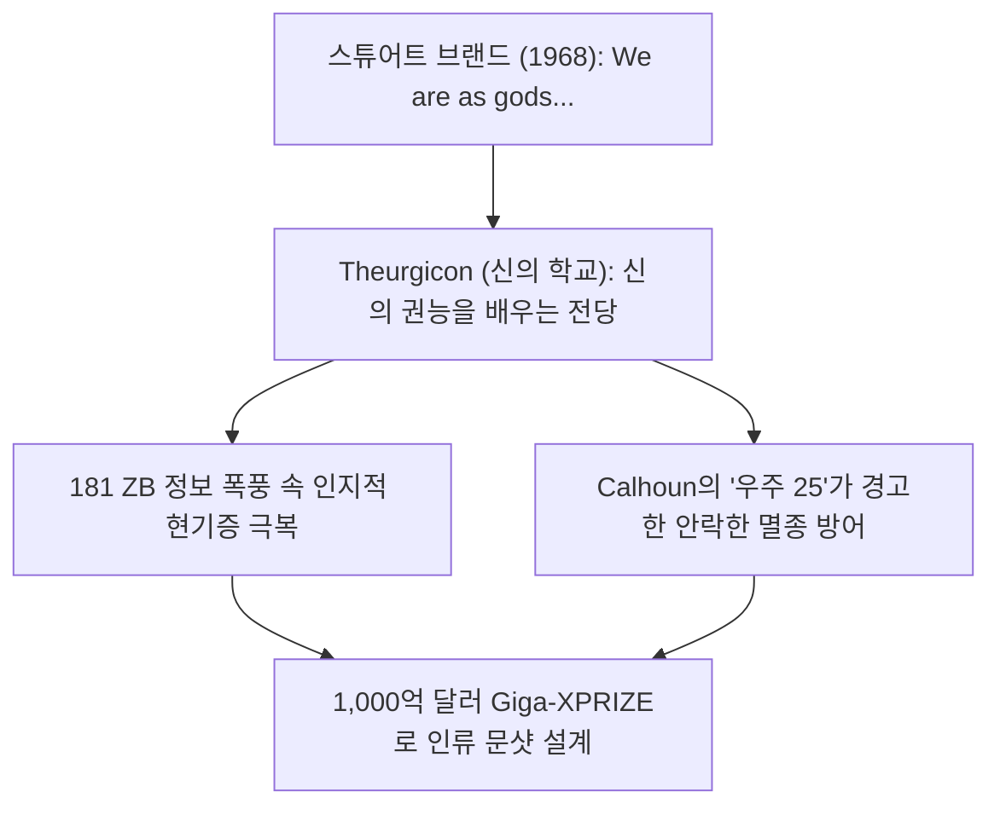
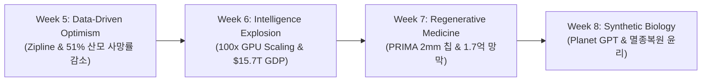
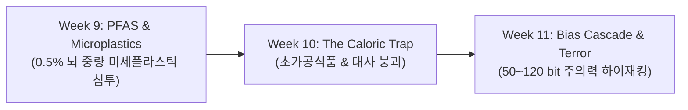

# 🏛️ WE ARE AS GODS: GRADUATE SEMINAR SYLLABUS
## 신이 된 인류: 기하급수 기술과 풍요의 설계도
> **Course Code:** EXPO-701  
> **Institution:** Graduate School of Exponential Civilization & Future Technology • Smart Insight Lab  
> **Core Anchor:** *"We are as gods and might as well get good at it."* — Stewart Brand (1968) • Theurgicon (신의 학교)  
> **Foundational Corpus:** Peter H. Diamandis & Steven Kotler, *We Are as Gods* (2026, Simon & Schuster)  
> **Faculty Team:** Prof. Peter Kim (석좌교수), Dr. Elena Vance (수석연구원), TA Marcus Brody (딥테크조교)  
> **Structure:** 15 Weeks • 4 Phases • 45 Slides per Session (Total 675 Slides) • 3-Presenter Micro-turn Tiki-Taka  

---

## 🧭 Master Course Navigation & Table of Contents

- [🏛️ Course Overview & Philosophical Bedrock](#-course-overview--philosophical-bedrock)
- [🎙️ 3-Presenter Faculty System & Voice Specifications](#️-3-presenter-faculty-system--voice-specifications)
- [📐 45-Slide / 6-Module Standard Architecture](#-45-slide--6-module-standard-architecture)
- [📊 Evaluation & Grading Matrix](#-evaluation--grading-matrix)
- [🗺️ 15-Week Master Curriculum](#️-15-week-master-curriculum)
  - [Phase 1: 기하급수적 인지와 프레임워크 (Weeks 01–04)](#phase-1-기하급수적-인지와-프레임워크-weeks-0104)
    - [Week 01: 신의 능력의 인류화 (Theogony)와 신의 학교 (Theurgicon)](#week-01-신의-능력의-인류화-theogony와-신의-학교-theurgicon)
    - [Week 02: 인지적 현기증과 구조 매핑 (Cognitive Vertigo & Structure Mapping)](#week-02-인지적-현기증과-구조-매핑-cognitive-vertigo--structure-mapping)
    - [Week 03: 6D 프레임워크와 기만적 성장의 함정 (The 6Ds & The Deception Trap)](#week-03-6d-프레임워크와-기만적-성장의-함정-the-6ds--the-deception-trap)
    - [Week 04: 가치 밀도와 인류를 구원한 사다리 (Value Density & The Liberation Ladder)](#week-04-가치-밀도와-인류를-구원한-사다리-value-density--the-liberation-ladder)
  - [Phase 2: 현실적 기적과 풍요의 구체적 사례 (Weeks 05–08)](#phase-2-현실적-기적과-풍요의-구체적-사례-weeks-0508)
    - [Week 05: 데이터 기반 낙관주의와 메콩 델타의 기적 (Data-Driven Optimism & Zipline)](#week-05-데이터-기반-낙관주의와-메콩-델타의-기적-data-driven-optimism--zipline)
    - [Week 06: 지능 폭발의 경제학과 거대 연산 (Economics of Intelligence Explosion)](#week-06-지능-폭발의-경제학과-거대-연산-economics-of-intelligence-explosion)
    - [Week 07: 재생 의학과 바이오 하이브리드 인터페이스 (Regenerative Medicine: PRIMA & BCI)](#week-07-재생-의학과-바이오-하이브리드-인터페이스-regenerative-medicine-prima--bci)
    - [Week 08: 합성 생물학의 윤리와 행성 단위 감시망 (Synthetic Biology & Planetary GPT)](#week-08-합성-생물학의-윤리와-행성-단위-감시망-synthetic-biology--planetary-gpt)
  - [Phase 3: 풍요의 역설과 실존적 위기 (Weeks 09–11)](#phase-3-풍요의-역설과-실존적-위기-weeks-0911)
    - [Week 09: 신체적 침투와 환경의 진화적 미스매치 (Physical Infiltration: PFAS & Microplastics)](#week-09-신체적-침투와-환경의-진화적-미스매치-physical-infiltration-pfas--microplastics)
    - [Week 10: 영양의 풍요와 기하급수적 대사 질환 (The Paradox of Plenty: Metabolic Collapse)](#week-10-영양의-풍요와-기하급수적-대사-질환-the-paradox-of-plenty-metabolic-collapse)
    - [Week 11: 편향의 폭주와 인지적 중독 (The Bias Cascade & Holy Terror)](#week-11-편향의-폭주와-인지적-중독-the-bias-cascade--holy-terror)
  - [Phase 4: 인류의 진화와 문명의 미래 (Weeks 12–15)](#phase-4-인류의-진화와-문명의-미래-weeks-1215)
    - [Week 12: 마인드 2.0: 기하급수 시대의 무자비한 분별력 (Mind 2.0: Ruthless Discernment & Flow)](#week-12-마인드-20-기하급수-시대의-무자비한-분별력-mind-20-ruthless-discernment--flow)
    - [Week 13: 의식의 확장과 텔레파시의 기술적 구현 (The Cyborg Mind & Scalable Compassion)](#week-13-의식의-확장과-텔레파시의-기술적-구현-the-cyborg-mind--scalable-compassion)
    - [Week 14: 낙원의 역설과 사회적 자살 (The Paradise Paradox: Universe 25)](#week-14-낙원의-역설과-사회적-자살-the-paradox-of-paradise-universe-25)
    - [Week 15: 종합 세미나: 1,000억 달러 Giga-XPRIZE 설계 (Engineering the $100B Future)](#week-15-종합-세미나-1000억-달러-giga-xprize-설계-engineering-the-100b-future)

---

## 🌟 Course Overview & Philosophical Bedrock

현대 문명은 기술적 특이점(Technological Singularity)의 초입에서 사상 유례없는 존재론적 전환을 맞이하고 있습니다. 인류는 유전자 편집, 초지능 AI, 양자 컴퓨팅, 인공 장기, 자율 비행체 등 과거 신화와 성서에서나 찾아볼 수 있었던 **83가지 초자연적 기적(Miracles)**을 일상적인 기술 인프라로 손에 넣었습니다.

본 세미나는 Peter Diamandis와 Steven Kotler의 2026년 최신작 **《We Are as Gods: A Survival Guide for the Age of Abundance》**를 원전으로 삼아, 기하급수 기술이 가져올 전 지구적 풍요의 메커니즘을 규명함과 동시에, 그 이면에 도사린 **'풍요의 역설(Paradox of Plenty)'**과 **'실존적 위기(Existential Crisis)'**를 다학제적(신경생리학, 인지과학, 복잡계 공학, 문명철학)으로 해부합니다.

---

## 🎙️ 3-Presenter Faculty System & Voice Specifications

본 과정의 모든 세션은 일방적 낭독이 아닌 **3인 다이내믹 티키타카(Tiki-Taka)** 대화 프로토콜로 진행됩니다.

| 강사 | 역할 및 성격 | 주요 대화 기여 포인트 | 음성 사양 (Edge-TTS) |
| :--- | :--- | :--- | :--- |
| **👨‍🏫 Prof. Peter Kim** (54세, 총괄 석좌교수) | • 기하급수 문명 철학 • Theurgicon 총괄 디렉터 • 신학적/윤리적 앵커링 | • 거시 문명사적 비전 및 도발적 화두 제시 • 스튜어트 브랜드, 존 칼훈, 성서적 기적 융합 • 슬라이드별 최종 철학적 혜안 및 'So What?' 완결 | `en-US-ChristopherNeural` (Rate: -2%, Pitch: -2Hz) 120Hz 포먼트 모핑 |
| **👩‍🔬 Dr. Elena Vance** (32세, 수석 연구원) | • 인지신경과학 & 생물학 • Dedre Gentner 구조 매핑 • BCI & AI 알고리즘 | • 50~120 bit 인간 주의력 대역폭 한계 증명 • DMN 억제, 피질 예측 엔진, 연산 열역학 수식 해체 • 수석 연구원으로서의 정밀하고 차가운 논리적 반론 | `en-US-JennyNeural` (Rate: +2%, Pitch: +1Hz) 명쾌하고 지적인 톤 |
| **👨‍💻 TA Marcus Brody** (29세, 딥테크 조교) | • 딥테크 벤처 & 바이오 공학 • XPRIZE 인센티브 설계 • 현장 실증 데이터 엔지니어 | • Zipline 드론 51% 사망률 감소, PFAS 오염 수치 직격 • 1,000억 달러 펀딩 구조와 비즈니스 공학 분해 • 생생한 현장 경험담과 재치 있는 비유로 토론 점화 | `en-US-GuyNeural` (Rate: +3%, Pitch: +0Hz) 에너지 넘치는 액티브 톤 |

---

## 📐 45-Slide / 6-Module Standard Architecture

매주 45개 슬라이드는 빈틈없는 학술적 완결성을 위해 **6대 표준 모듈(Module 1~6)**로 구성됩니다.

- **M1. 도입 및 어젠다 세팅 (Slides 01~05):** 세션 주제, 핵심 질문(Key Question), 주교재 챕터 지정, 문명사적 맥락 설정.
- **M2. 원전 텍스트 정밀 해체 (Slides 06~15):** Diamandis & Kotler 핵심 주장, 핵심 용어 정의, 원문 텍스트 인용 분석.
- **M3. 기하급수 이론 및 프레임워크 (Slides 16~25):** 6D 프레임워크, Dedre Gentner 구조 매핑, 제1원리, 칼 프리스턴 자유 에너지 원리.
- **M4. 글로벌 데이터 & 실증 케이스 (Slides 26~35):** PRIMA 2mm 칩, Zipline 수송 지표, 181 ZB 데이터, 390배 에어로팜스 등 정량 데이터.
- **M5. 사회적·철학적 역설 (So What?) (Slides 36~42):** PFAS 뇌 침투, 대사 붕괴, Bias Cascade, Universe 25 안락사 경고 등 실존적 성찰.
- **M6. 세미나 토론 및 발제 안내 (Slides 43~45):** 3대 심층 토론 논제, 에세이 가이드, 1,000억 달러 Giga-XPRIZE 모델링 과제.

---

## 📊 Evaluation & Grading Matrix

| 평가 영역 | 비율 | 세부 평가 기준 |
| :--- | :---: | :--- |
| **세미나 참여 및 비판적 토론** | **30%** | 50~120 bit 주의력 한계를 극복하는 '무자비한 분별력'과 세미나 토론 발언의 질 |
| **주차별 발제 및 구조 매핑** | **30%** | 첨단 기술을 6D 및 역사적 사다리(Ladder)와 1:1 매핑하고 181 ZB 등 수치 검증 |
| **기말 $100B Giga-XPRIZE 설계** | **40%** | 제1원리에 기반한 인류 실존 난제 해결용 1,000억 달러 경연 모델 아키텍처 |

---

## 🗺️ 15-Week Master Curriculum

---

### Phase 1: 기하급수적 인지와 프레임워크 (Weeks 01–04)

인류의 뇌는 아프리카 사바나 초원의 생존 환경에서 진화한 **'로컬-선형(Local-Linear)' 예측 엔진**입니다. Phase 1에서는 이 생물학적 뇌가 **'글로벌-기하급수(Global-Exponential)' 현실**과 충돌하며 발생하는 인지적 균열을 규명하고, 이를 돌파할 지적 사다리를 구축합니다.

#### Week 01: 신의 능력의 인류화 (Theogony)와 신의 학교 (Theurgicon)
- **지정 리딩:** *We Are as Gods*, Chapter 1 (A Tall Order / Theurgicon)
- **핵심 질문:** 인류는 신의 권능을 다룰 '도덕적 근육'과 지적 체계를 갖추었는가?
- **45-슬라이드 모듈 구성:**
  - **M1 (01~05):** 1968년 Stewart Brand 선언 분석 • Theogony(신의 탄생)와 Theurgicon(신의 학교)의 학술적 정의.
  - **M2 (06~15):** 구약/신약 및 인류 신화에 기록된 **83가지 성서적 기적**의 통계학적 분류 (창조, 공급, 자연 지배, 치유, 부활, 심판, 보호, 예언, 소통, 전쟁 승리 등 10대 카테고리).
  - **M3 (16~25):** '무에서 유의 창조(Creatio ex nihilo)', '전지(Omniscience)', '무소부재(Omnipresence)'의 현대 기술적 등가물(GenAI, Google, Zoom, Satellite Network) 개념 매핑.
  - **M4 (26~35):** 시각 장애 치료용 PRIMA 인공망막 보조장치(Max Hodak, Science Corp) • 2mm 태양광 마이크로칩 및 near-infrared 안경 투사 기전 • 1억 7천만 황반변성 환자 시장 데이터 분석.
  - **M5 (36~42):** *"기적이 일상화된 문명에서 인간은 왜 스스로를 신으로 자각하지 못하고 불안에 떠는가?"* 정신생리학적 진단.
  - **M6 (43~45):** 세미나 발제 논제: 기적의 민주화와 기술 윤리적 통제권 • 다음 주차 리딩 과제.

#### Week 02: 인지적 현기증과 구조 매핑 (Cognitive Vertigo & Structure Mapping)
- **지정 리딩:** *We Are as Gods*, Chapter 1 (Cognitive Vertigo)
- **핵심 질문:** 왜 인간의 뇌는 기하급수적 진보를 축복이 아닌 공포와 위기로 인식하는가?
- **45-슬라이드 모듈 구성:**
  - **M1 (01~05):** 아날로그 문명의 해체와 전 지구적 정보 과부하가 초래한 인지적 현기증(Cognitive Vertigo) 현상.
  - **M2 (06~15):** 뇌의 에너지 보존 법칙(Caloric Conservation)과 대뇌 피질의 예측 엔진(Cortical Prediction Engine) 작동 원리.
  - **M3 (16~25):** **Dedre Gentner의 구조 매핑 이론(Structure-Mapping Theory)** 심층 분석 • 표면적 특징이 아닌 심층 관계 유사성을 매핑하여 인지 학습 속도를 10배 가속하는 메커니즘.
  - **M4 (26~35):** '로컬-선형(Local-Linear)' 뇌와 '글로벌-기하급수' 환경의 불일치 데이터 시각화 • 선형 예측선과 기하급수 곡선의 격차 분석.
  - **M5 (36~42):** 진화적 부정 편향(Negativity Bias)과 확증 편향이 결합하여 종말론적 뉴스 중독을 유발하는 미디어 동학.
  - **M6 (43~45):** 세미나 토론: 생물학적 진화 속도의 한계를 극복하기 위한 새로운 인지 훈련 프로토콜.

#### Week 03: 6D 프레임워크와 기만적 성장의 함정 (The 6Ds & The Deception Trap)
- **지정 리딩:** *We Are as Gods*, Chapter 2 (The Return of the Six Ds)
- **핵심 질문:** 우리는 왜 기하급수적 파괴가 눈앞에 닥칠 때까지 그 폭발을 알아차리지 못하는가?
- **45-슬라이드 모듈 구성:**
  - **M1 (01~05):** 무어의 법칙을 넘어선 **'더 많은 것의 법칙(The Law of More)'**과 기술 수렴의 시대 도래.
  - **M2 (06~15):** 6D 프레임워크 6단계 정밀 분해: Digitization(디지털화) $\rightarrow$ Deception(기만) $\rightarrow$ Disruption(파괴) $\rightarrow$ Dematerialization(탈물질화) $\rightarrow$ Demonetization(탈화폐화) $\rightarrow$ Democratization(민주화).
  - **M3 (16~25):** **기만적 단계(Deception Phase)의 수학적 메커니즘** • $0.001 \rightarrow 0.002 \rightarrow 0.004$의 착시와 COVID-19 바이러스의 1명에서 1억 명 전파 Doubling 변곡점 모델링.
  - **M4 (26~35):** 정보 기반 기술로 전환된 산업들의 가격 하락 곡선 (게놈 시퀀싱 비용 하락 vs 연산 비용 하락 추이 비교).
  - **M5 (36~42):** 기만적 단계에서 파괴적 임계점으로 전이되는 순간 발생하는 거버넌스 및 산업 규제 마비 사태 분석.
  - **M6 (43~45):** 세미나 토론: 합성 생물학 및 양자 컴퓨팅의 기만적 단계 탈출 시점 예측 시나리오 작성.

#### Week 04: 가치 밀도와 인류를 구원한 사다리 (Value Density & The Liberation Ladder)
- **지정 리딩:** *We Are as Gods*, Chapter 2 (First Principles of Abundance)
- **핵심 질문:** 기술은 어떻게 물리적 자원의 희소성을 해체하고 인류를 자유케 하는가?
- **45-슬라이드 모듈 구성:**
  - **M1 (01~05):** '기술은 본질적으로 자원을 해방하는 사다리(Ladder)'라는 제1원리 명제 수립.
  - **M2 (06~15):** 스마트폰 1대에 집적된 **가치 밀도(Value Density)**의 폭발: 1980년대 수백만 달러 가치의 개별 물리 기기들이 단 $7.1M 상당의 가치로 스마트폰 앱에 탈물질화된 현황.
  - **M3 (16~25):** 역사적 자원 해방의 3대 마일스톤: 3000 BCE 메소포타미아 관개 시설, 2200 BCE 마구(Horse Collar) 발명, 돛의 혁신이 해방한 노동과 지리적 한계.
  - **M4 (26~35):** **$49 Quadrillion(4경 9천조 달러)** 규모의 글로벌 잠재 자산 유동화 및 자원 민주화가 창출한 '라이징 플로어 효과(Rising Floor Effect)'.
  - **M5 (36~42):** 탈물질화가 전통적인 자본 축적 방식과 부동산/제조업 기반 경제 시스템에 가하는 근본적 충격.
  - **M6 (43~45):** 세미나 토론: 한계비용 제로 사회(Zero Marginal Cost Society)에서의 부의 재분배 및 세제 개혁.

---

### Phase 2: 현실적 기적과 풍요의 구체적 사례 (Weeks 05–08)

이론적 가능성을 넘어, 기하급수 기술이 실제 산업 현장과 지구적 난제 해결에서 어떻게 **'데이터 기반의 기적'**으로 치환되고 있는지 구체적 사례를 심층 분석합니다.

#### Week 05: 데이터 기반 낙관주의와 메콩 델타의 기적 (Data-Driven Optimism & Zipline)
- **지정 리딩:** *We Are as Gods*, Chapter 3 (Data-Driven Optimism)
- **핵심 질문:** 비관론으로 가득 찬 미디어 이면에서 데이터가 증명하는 실질적 진보는 무엇인가?
- **45-슬라이드 모듈 구성:**
  - **M1 (01~05):** 선정주의적 미디어의 재앙 프레임과 실증적 데이터 기반 낙관주의(Data-Driven Optimism)의 대조.
  - **M2 (06~15):** 켈러 리나우도 클리프턴(Keller Rinaudo Cliffton)의 **지플라인(Zipline)** 로보틱스 의료 물류 혁신.
  - **M3 (16~25):** Zipline 자율 드론의 기술 규격 및 아프리카(르완다, 가나) 전역 100만 회 이상 혈액/백신 배송 인프라 • 가나 백신 폐기율 60% 감소 및 미접종률 42% 감소 데이터.
  - **M4 (26~35):** **르완다 산모 사망률 51% 감소** 실증 지표 • 베트남 메콩 델타의 쌀 농부 Thach Ren의 IoT 스마트 관개 시스템 • 에어로팜스(AeroFarms) 평당 수확량 390배 향상 데이터.
  - **M5 (36~42):** 소수의 엔지니어 팀("Handful of engineers")이 개도국의 인프라 단계를 퀀텀점프(Leapfrogging)시키는 임팩트 메커니즘.
  - **M6 (43~45):** 세미나 토론: 공공 원조(Aid) 모델에서 지속 가능한 딥테크 비즈니스 솔루션으로의 전환 전략.

#### Week 06: 지능 폭발의 경제학과 거대 연산 (Economics of Intelligence Explosion)
- **지정 리딩:** *We Are as Gods*, Chapter 4 (One Billion Times Smarter)
- **핵심 질문:** 10억 배 똑똑해진 지능은 글로벌 경제와 인류 지식 생산의 패러다임을 어떻게 재편하는가?
- **45-슬라이드 모듈 구성:**
  - **M1 (01~05):** '지능 폭발(Intelligence Explosion)'의 서막과 인공지능이 견인하는 생산성 슈퍼사이클.
  - **M2 (06~15):** Geoffrey Hinton의 인공신경망 40년 집념 • 2006년 심층 신뢰 신경망(DBN) $\rightarrow$ 2018 튜링상 $\rightarrow$ 2024 노벨 물리학상 궤적.
  - **M3 (16~25):** 연산 능력 성장률의 비약: 2012-2022년 매년 10배 성장 $\rightarrow$ 생성형 AI 등장 이후 **연간 100배 성장** 및 전력 인프라 병목.
  - **M4 (26~35):** 글로벌 경제 가치 지표: McKinsey의 **2조 6천억~4조 4천억 달러 가치 증폭** • PwC의 2030년 **15조 7천억 달러 글로벌 GDP 기여** 전망 • 알파폴드(AlphaFold)의 2억 개 단백질 구조 해독.
  - **M5 (36~42):** 힌튼 교수가 제기한 AGI 실존적 위험(Existential Risk)과 소수 빅테크에 의한 지능 독점의 위험성.
  - **M6 (43~45):** 세미나 토론: 초지능 출현 시나리오(2025~2030)에서의 지적재산권 및 소득 분배 재설계.

#### Week 07: 재생 의학과 바이오 하이브리드 인터페이스 (Regenerative Medicine: PRIMA & BCI)
- **지정 리딩:** *We Are as Gods*, Chapter 5 (The Innovation Bus)
- **핵심 질문:** 손상된 생체 기관을 기계 및 세포 단위로 재생하는 기술은 노화와 질병의 정의를 어떻게 바꾸는가?
- **45-슬라이드 모듈 구성:**
  - **M1 (01~05):** '치유의 기적'을 일상 의료로 전환하는 재생 의학 및 인터페이스 혁명.
  - **M2 (06~15):** Science Corporation(Max Hodak 창립)의 **PRIMA 바이오하이브리드 인공망막** 시스템 정밀 분석.
  - **M3 (16~25):** 2mm 크기 광발전 칩을 망막 하에 이식하고 적외선 안경으로 시신경을 직접 자극하는 광학-신경 변환 메커니즘.
  - **M4 (26~35):** 전 세계 **1억 7천만 명의 황반변성 및 300만 시각장애인 대상 임상 데이터** • ReGen Valley의 유전자 치료 및 세포 역분화(Yamanaka Factors) 임상 파이프라인.
  - **M5 (36~42):** '수명 연장'을 넘어선 '건강 수명(Healthspan)'의 연장이 국가 의료 재정과 사회보장 연금에 미치는 영향.
  - **M6 (43~45):** 세미나 토론: 초고령화 사회에서 재생 기술에 대한 보편적 접근권 보장 방안.

#### Week 08: 합성 생물학의 윤리와 행성 단위 감시망 (Synthetic Biology & Planetary GPT)
- **지정 리딩:** *We Are as Gods*, Chapter 6 (Planetary Intelligence)
- **핵심 질문:** 자연 생태계를 프로그래밍 가능한 코드로 전환할 때 인류가 짊어져야 할 거룩한 책임은 무엇인가?
- **45-슬라이드 모듈 구성:**
  - **M1 (01~05):** '창조의 기적(Creatio ex nihilo)'을 수행하는 합성 생물학과 행성 지능(Planetary Intelligence).
  - **M2 (06~15):** 유전자 편집(CRISPR)을 통한 멸종 위기종 복원 프로젝트(De-extinction) 및 합성 유전체 설계 기술.
  - **M3 (16~25):** 위성 센서, IoT, 해양 부표, AI가 결합한 **행성 단위 실시간 생태 모니터링 시스템(Planet GPT)** 아키텍처.
  - **M4 (26~35):** 탄소 격리 미생물 공학 데이터 • 대기 중 탄소 포집 효율 10배 증대 실증 지표 • 생물다양성 실시간 추적 인프라.
  - **M5 (36~42):** 생태계 인위적 개입(Geoengineering)이 초래할 수 있는 예기치 못한 연쇄 반응과 생명 윤리의 딜레마.
  - **M6 (43~45):** 세미나 토론: 전 지구적 합성 생물학 실험에 대한 국제적 승인 프로토콜 및 생물안전 거버넌스.

---

### Phase 3: 풍요의 역설과 실존적 위기 (Weeks 09–11)

기하급수적 기술 진보와 물질적 풍요가 인간의 생물학적 몸, 신경계, 그리고 인지 구조와 충돌하며 유발하는 **'침투적 위기(Infiltration Crises)'**를 냉혹하게 진단합니다.

#### Week 09: 신체적 침투와 환경의 진화적 미스매치 (Physical Infiltration: PFAS & Microplastics)
- **지정 리딩:** *We Are as Gods*, Chapter 6 (The Unintended Consequences)
- **핵심 질문:** 편리함의 부산물로 탄생한 화학 물질들은 어떻게 인간의 뇌와 신체를 은밀히 공격하는가?
- **45-슬라이드 모듈 구성:**
  - **M1 (01~05):** 기하급수 물질문명의 이면: '성공의 독성 부산물(Toxic Byproducts of Success)'.
  - **M2 (06~15):** 영원한 화학물질 **PFAS(과불화화합물)**의 화학적 구조와 인체 내 잔류 메커니즘.
  - **M3 (16~25):** 혈뇌장벽(BBB)을 통과하는 **나노-미세플라스틱의 체내 침투 경로** 및 신경독성 발현 기전.
  - **M4 (26~35):** **인간 뇌 조직 내 플라스틱 함량 측정 데이터 (뇌 조직 중량의 최대 0.5% 육박 충격 수치)** • 전 세계 식수 및 태반 내 검출 통계.
  - **M5 (36~42):** 인체 생물학과 산업 화학 물질 간의 진화적 미스매치(Evolutionary Mismatch)가 초래할 차세대 면역 질환.
  - **M6 (43~45):** 세미나 토론: 미세플라스틱 분해 및 PFAS 무독화 기술을 위한 XPRIZE 인센티브 설계.

#### Week 10: 영양의 풍요와 기하급수적 대사 질환 (The Paradox of Plenty: Metabolic Collapse)
- **지정 리딩:** *We Are as Gods*, Chapter 6 (The Caloric Trap)
- **핵심 질문:** 칼로리의 완전한 풍요 속에서 인류는 왜 만성 염증과 대사 질환의 노예로 전락했는가?
- **45-슬라이드 모듈 구성:**
  - **M1 (01~05):** 굶주림의 종말이 가져온 새로운 재앙: **'풍요의 역설(The Paradox of Plenty)'**.
  - **M2 (06~15):** 초가공식품(Ultra-Processed Foods)의 보상 회로 자극과 뇌 도파민 시스템의 하이재킹 메커니즘.
  - **M3 (16~25):** 기하급수적 대사 질환의 역학: 인슐린 저항성, 지방간, 제2형 당뇨의 발병 기전 모델링.
  - **M4 (26~35):** **글로벌 비만 인구 10억 명 돌파 통계** • 대사 질환 치료를 위한 연간 글로벌 의료비 지출(수조 달러) 데이터 • GLP-1 유사체(위고비 등) 시장의 폭발.
  - **M5 (36~42):** 기아에 적응된 절약 유전자(Thrifty Gene)가 잉여 칼로리 환경에서 자기 파괴를 일으키는 진화적 비극.
  - **M6 (43~45):** 세미나 토론: 개인의 식습관 문제를 넘어선 식품 산업 알고리즘 규제와 대사 건강 인프라 재건.

#### Week 11: 편향의 폭주와 인지적 중독 (The Bias Cascade & Holy Terror)
- **지정 리딩:** *We Are as Gods*, Chapter 6 (Cognitive Hijacking)
- **핵심 질문:** 181 제타바이트의 정보 속에서 50~120 bit의 인간 주의력은 어떻게 극단주의와 음모론에 포섭되는가?
- **45-슬라이드 모듈 구성:**
  - **M1 (01~05):** 정보의 풍요 속에서 발생하는 **주의력의 기아(Attention Scarcity)**와 인지적 중독.
  - **M2 (06~15):** **50~120 bit/s에 불과한 인간 작업기억 주의력 대역폭(Attention Bandwidth)**의 신경학적 한계.
  - **M3 (16~25):** **편향의 폭주(The Bias Cascade)** 메커니즘: 부정 편향 $\times$ 확증 편향 $\times$ 추천 알고리즘의 결합으로 생성되는 '토끼굴(Rabbit Hole)' 효과.
  - **M4 (26~35):** 극단적 음모론 및 집단적 '거룩한 테러(Holy Terror)' 발생 빈도 통계 • SNS 체류 시간과 청소년 우울/불안 상관관계 데이터.
  - **M5 (36~42):** 인간이 스스로를 풍요 속에서 '포위된 자(Besieged)'로 착각하며 민주주의적 합의가 붕괴하는 실존적 위기.
  - **M6 (43~45):** 세미나 토론: 인간 주의력 보호를 위한 '인지적 에어갭(Cognitive Airgap)' 및 플랫폼 알고리즘 투명성 의무화.

---

### Phase 4: 인류의 진화와 문명의 미래 (Weeks 12–15)

인간과 기계의 융합, 의식의 확장, 그리고 완벽한 풍요 속에서 인류의 영혼이 퇴화하지 않도록 지켜낼 **'궁극의 문샷 목적'**을 설계합니다.

#### Week 12: 마인드 2.0: 기하급수 시대의 무자비한 분별력 (Mind 2.0: Ruthless Discernment & Flow)
- **지정 리딩:** *We Are as Gods*, Chapter 7 (Mindsets That Matter)
- **핵심 질문:** 무한 정보 시대에 살아남기 위한 인간 고유의 인지적 생존 전략은 무엇인가?
- **45-슬라이드 모듈 구성:**
  - **M1 (01~05):** 단순 지식 습득의 종말과 **'무자비한 분별력(Ruthless Discernment)'**의 당위성.
  - **M2 (06~15):** 5대 미래 생존 마인드셋: **호기심(Curiosity), 풍요(Abundance), 기하급수(Exponential), 장수(Longevity), 문샷(Moonshot)** 구조 분석.
  - **M3 (16~25):** 미하일리 칙센트미하이의 **몰입(Flow) 상태의 신경생리학적 기전**: 일시적 전전두엽 기능 저하(Transient Hypofrontality)를 통한 무의식적 초고성능 발현.
  - **M4 (26~35):** 시드니 대학교 대뇌 자극 실험 하 **'9개 점 연결 문제(Nine-dot Problem)' 횡적 사고 58% 향상 데이터** • McKinsey의 **몰입 상태 하 생산성 500% 폭증 통계**.
  - **M5 (36~42):** "AI는 종적(Vertical) 논리를 완벽히 수행하지만, 무관한 점들을 연결하는 횡적(Lateral) 통찰은 인간 몰입의 독점적 영역이다."
  - **M6 (43~45):** 세미나 토론: 일회성 지식 암기가 아닌 장기 몰입을 유도하는 고등 교육 혁신안.

#### Week 13: 의식의 확장과 텔레파시의 기술적 구현 (The Cyborg Mind & Scalable Compassion)
- **지정 리딩:** *We Are as Gods*, Chapter 8 (The Androids Are Us)
- **핵심 질문:** 뇌와 기계가 직접 연결될 때 인간의 개별 자아와 공감 능력은 어떻게 변모하는가?
- **45-슬라이드 모듈 구성:**
  - **M1 (01~05):** 인간 지능과 인공지능이 양방향으로 융합하는 공생체(Symbiosis)로서의 사이보그 의식.
  - **M2 (06~15):** 1세대 명상 앱에서 2세대 실시간 뇌파 바이오피드백 웨어러블(Muse 헤드밴드)로의 진화.
  - **M3 (16~25):** **Neuralink의 1,024개 미세 유연 전극 기반 마리오 카트 조작 임상 기전** • Science Corp의 실리콘 바이오하이브리드 인터페이스 LIVING Bridge.
  - **M4 (26~35):** Meta의 **뇌파 기반 무음성 언어 디코더(75% 정확도 텍스트 변환 성과)** • Mindstate Design Labs의 7만 개 의식 상태 데이터 기반 AI 분자 예측 모델.
  - **M5 (36~42):** 디폴트 모드 네트워크(DMN) 억제를 통해 도달하는 감마파 동기화 상태와 **'확장 가능한 자비심(Scalable Compassion)'**이 여는 초협력 문명.
  - **M6 (43~45):** 세미나 토론: 생각이 직접 디지털화될 때 인지적 프라이버시(Cognitive Privacy)의 법적·헌법적 보호 방안.

#### Week 14: 낙원의 역설과 사회적 자살 (The Paradise Paradox: Universe 25)
- **지정 리딩:** *We Are as Gods*, Chapter 9 (The Paradise Paradox)
- **핵심 질문:** 결핍과 위험이 완벽히 사라진 유토피아에서 인류는 왜 스스로 멸종을 향해 나아가는가?
- **45-슬라이드 모듈 구성:**
  - **M1 (01~05):** 결핍이 완전히 정복된 '스타트렉형 풍요'가 문명에 던지는 궁극의 실존적 시험대.
  - **M2 (06~15):** 1968년 존 칼훈(John B. Calhoun)의 생태 연구 **'우주 25(Universe 25)'** 실험 설계 및 8마리 쥐 도입 시나리오.
  - **M3 (16~25):** **우주 25의 일자별 멸종 타임라인:**
    - **Day 315:** 620마리 피크 사회 형성 및 공간 포화.
    - **Day 560:** 인지적 마비, 사회적 역할 상실, **'Beautiful Ones'(교류를 끊고 털만 다듬는 쥐들)** 등장.
    - **Day 920:** 마지막 임신과 출산 중단.
    - **Day 1780:** 마지막 생존자 사망으로 완전 멸종.
  - **M4 (26~35):** Jaak Panksepp의 대뇌 PLAY 신경회로 이론 • 칼 프리스턴의 자유 에너지 원리(Free Energy Principle) • AI 자동화가 초래하는 **인지적 오프로딩(Cognitive Offloading)**과 기억 위축(Memory Atrophy) 지표.
  - **M5 (36~42):** 영화 《월-E》의 액시엄(Axiom)호처럼 안락한 소외 속에서 발생하는 인류의 **'첫 번째 죽음(First Death: 사회적·정신적 사멸)'** 경고.
  - **M6 (43~45):** 세미나 토론: 완벽한 낙원에서 인간이 퇴화하지 않고 진화하도록 이끄는 '건전한 제약과 문샷 목적'의 자가 동기부여 인프라.

#### Week 15: 종합 세미나: 1,000억 달러 Giga-XPRIZE 설계 (Engineering the $100B Future)
- **지정 리딩:** *We Are as Gods*, Chapter 9 (The Final Frontier Is Us) & Appendices
- **핵심 질문:** 신의 권능을 소유한 인류는 어떤 문샷을 통해 파괴가 아닌 진정한 번영(Flourishing)을 이룰 것인가?
- **45-슬라이드 모듈 구성:**
  - **M1 (01~05):** 15주 세미나 전체 논의 종합: 기하급수 문명의 총체적 궤적과 인류의 사명.
  - **M2 (06~15):** 메가 엑스프라이즈의 인센티브 디자인 역사: 탄소 제거($100M), 건강 수명($101M), 해수 담수화($119M) 모델 분석.
  - **M3 (16~25):** 저자들이 제시한 **15가지 Giga-XPRIZE 미개척 혁신 카테고리** (완전 장기 재생, 상온 초전도체, 폐쇄형 인공 생태계, 행성 간 정착지 구축 등).
  - **M4 (26~35):** **수강생 팀별 1,000억 달러($100 Billion) 규모 Giga-XPRIZE 최종 설계안 발표 및 심사**: 제1원리 기반 문제 정의, 마일스톤 메트릭, 재정/기술 정합성 검증.
  - **M5 (36~42):** 기하급수 기술의 종착점에서 마주할 진정한 휴머니즘: "어깨를 맞대고 노래를 부르는" 지극히 아날로그적인 가치와 신의 학교(Theurgicon) 수료 선언.
  - **M6 (43~45):** 우수 발제팀 시상, 최종 교수진 강평, 15주간의 지적 대서사 종강.

---

## 🏛️ Course Registration & Academic Honor Code

- **수강 대상:** 기하급수 기술, 인지신경과학, 인공지능 거버넌스, 딥테크 창업, 문명철학을 전공하는 석·박사 과정 대학원생.
- **아너 코드(Honor Code):** 본 강의의 수강생은 스스로를 '신의 권능을 배우는 수련생(God-in-training)'으로 자각하며, 모든 과제와 토론에서 진실 필터(Truth Filters)와 제1원리 사고를 견지해야 합니다.
