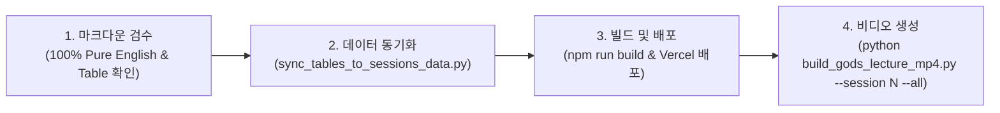

# 🎬 WE ARE AS GODS — LECTURE VIDEO ENGINE & COURSEWARE IMPROVEMENTS MANUAL
> **Document:** `VIDEO_PRODUCTION_SPECS.md`  
> **Target Course:** *We Are as Gods: A Survival Guide for the Age of Abundance*  
> **Scope:** Web Courseware Architecture, KaTeX Engine, Markdown Tables, 3-Presenter Tiki-Taka, Playwright & FFMPEG Dynamic Video Engine  
> **Version:** 1.0 (Master Standard)  
> **Last Updated:** 2026-08-26  

---

## 📌 Executive Summary (개요 및 목적)

본 문서는 **"We Are as Gods (신이 된 인류)" 15개 세션(총 675개 슬라이드)**의 글로벌 학생 대상 강의 비디오 및 인터랙티브 웹 코스웨어를 제작하는 과정에서 도출되고 적용된 **모든 수정·보완 내역, 기술적 아키텍처, 렌더링 최적화 규칙**을 체계적으로 정리한 마스터 매뉴얼입니다.

---

## 1. 🌐 100% Pure English 코스웨어 및 글로벌 눈높이 티키타카

### 1.1. 잔재 한국어 100% 전수 제거 및 순수 영어화
- **문제점:** 슬라이드 내부의 일부 불릿 및 Mermaid 다이어그램 노드에 한국어가 남아있어 글로벌 학생(Global Students)의 이해를 저해하는 문제 발생.
- **해결 내역:**
  - `session1_EN.md`부터 `session15_EN.md`까지 전체 원본을 전수 검수하여 **417개 Mermaid 다이어그램**과 **675개 슬라이드**의 불릿(`bulletsEn`), 타이틀(`titleEn`), 다이어그램(`mermaidEn`), 스크립트(`scriptEn`)를 100% 순수 영어로 번역 및 교체.
  - `sessionsData.js`의 프론트엔드 데이터셋과 마크다운 원본을 1:1 완벽 동기화.

### 1.2. 3인 강사진 티키타카 구어체 혁신 (The 5 Golden Rules)
- **문제점:** 책을 그대로 읽는 듯한 딱딱하고 긴 만연체 문장으로 인해 전달력 저하.
- **개선 원칙:**
  1. **쉬운 구어체 영어 (Plain Spoken English):** 1~2문장 단위의 직관적 구어체 사용.
  2. **풍성한 마이크로 턴 (8~10 Turns):** 슬라이드당 8~10회의 핑퐁 대화로 깊이 있는 개념 해체.
  3. **생생한 리액션 (Conversational Connectors):** *"Wait a minute", "Hold on, Dr. Vance", "Look at that table"* 등 실제 세미나실 대화 구현.
  4. **정량적 수치 필수 인용 (Hard Quantitative Metrics):** 181 ZB, 2mm PRIMA chip, 51% mortality drop 등 구체적 팩트 기반 대화.
  5. **실존적 성찰 (Philosophical Telos):** 각 슬라이드 마무리 시 도덕적 근육과 실존적 함의 도출.

---

## 2. 🧮 KaTeX 수식 렌더링 엔진 통합

### 2.1. 인라인 및 블록 수식 엔진 탑재
- **문제점:** 복잡한 수학 공식(확산 모델 $\mathcal{L}_{\text{Diffusion}}$, 자유 에너지 원리 $\mathcal{F}$, 수렴 공식 등)이 일반 텍스트나 이스케이프 문자 오류(`\to`, `\lim_` 등)로 깨져서 출력됨.
- **해결 내역:**
  - `katex` 라이브러리 설치 및 `katex/dist/katex.min.css` 글로벌 스타일 임포트 (`src/main.jsx`).
  - `src/utils/katexRenderer.js` 모듈 개발:
    - `renderLatexInText`: 인라인 `$formula$` 및 블록 `$$formula$$`를 HTML 엔티티 충돌 없이 정밀 파싱.
    - `renderFormulaBox`: 독립된 **MATHEMATICAL MODEL** 카드 컴포넌트 렌더링.
  - `SlideViewerModal.jsx`의 제목, 불릿, 수식 박스 전체에 KaTeX 렌더러 적용.

---

## 3. 📊 마크다운 비교 테이블(Markdown Table) 전수 파싱 및 렌더링

### 3.1. 비교 표 누락 해결 및 구조화 데이터베이스화
- **문제점:** Slide 02, 15, 22 등 43개 핵심 슬라이드에 존재하는 1968 vs 2026 비교 표, 기적-기술 변환 매트릭스 등의 Markdown Table이 데이터 파싱에서 제외되어 영상 및 화면에 제목/불릿만 나오는 현상 발생.
- **해결 내역:**
  - `scratch/sync_tables_to_sessions_data.py`를 개발하여 15개 세션 전체의 **43개 마크다운 테이블**을 전수 추출.
  - `sessionsData.js`의 각 슬라이드 객체에 `table: { headers: [...], rows: [[...], [...]] }` 형태로 구조화 저장.

### 3.2. 고대비 글래스모피즘(Glassmorphism) 테이블 컴포넌트 개발
- `SlideViewerModal.jsx`에 반응형 테이블 렌더러 구축:
  - 사이안 글로우 테두리(`border: 1px solid rgba(0, 240, 255, 0.35)`).
  - 짙은 네이비 반투명 배경(`rgba(15, 23, 42, 0.9)`) 및 헤더 강조(`rgba(8, 47, 73, 0.7)`).
  - 표 내부의 LaTeX 수식 및 볼드 텍스트 자동 서식 적용.

---

## 4. 🎨 슬라이드 1080p 화면 꽉 채움 레이아웃 및 폰트 최적화

### 4.1. 캔버스 너비 확장 및 여백 축소
- **기존:** `maxWidth: 960px`로 인해 1920×1080 FHD 화면 양옆에 약 480px씩의 불필요한 여백(Black space)이 발생하고 텍스트가 작게 보임.
- **개선:** `maxWidth: 1520px`로 전면 확장하여 16:9 와이드 화면을 풍성하게 채우도록 개선.

### 4.2. 요소 숨김 로직 제거 및 100% 전체 내용 상시 노출
- 특정 줌 모드에서 불릿이나 다이어그램이 가려지던 조건을 제거하고, **타이틀 + 모든 불릿 + 표 + 수식 + 다이어그램이 슬라이드 상에 100% 온전하게 노출**되도록 표준화.

### 4.3. Mermaid SVG 텍스트 잘림(ForeignObject Clipping) 방지
- Mermaid SVG 내부의 텍스트가 노드 사각형 밖으로 잘리거나 가려지는 현상을 방지하기 위해 `src/index.css`에 글로벌 패치 적용:
  ```css
  svg foreignObject,
  .focus-diagram-container foreignObject {
    overflow: visible !important;
  }
  svg .label,
  .focus-diagram-container .label,
  .focus-diagram-container .nodeLabel {
    overflow: visible !important;
    line-height: 1.35 !important;
  }
  ```

---

## 5. 🎥 비디오 제작 파이프라인 & 60/40 다이내믹 카메라 엔진

`build_gods_lecture_mp4.py`에 Playwright 기반 1080p 스크린 캡처와 FFMPEG 멀티 필터 파이프라인을 전면 개편하였습니다.

### 5.1. 단일 화면 vs 세로 스크롤 슬라이드 자동 판별
```python
# container의 scrollHeight와 clientHeight를 비교하여 단일/듀얼 캡처 결정
hasScroll = container.scrollHeight > (container.clientHeight + 40)
```

### 5.2. 세로 스크롤 슬라이드(Slide 18 등)의 60/40 황금 분할 타임라인
- **문제점:** 하단 다이어그램을 보기 위한 스크롤 화면이 영상 초반에 너무 일찍 나와 상단 텍스트를 충분히 읽지 못하는 문제.
- **해결 규칙:**
  1. **Part 1 (상단 화면 - 제목 + 전체 불릿 텍스트):**  
     - 전체 러닝타임의 **전반부 약 60%** 동안 지속 노출하여 강사진이 핵심 개념을 차분하게 설명할 수 있도록 보장.
  2. **Part 2 (하단 화면 - 스크롤된 플로우차트 / 다이어그램 / 표 중심):**  
     - 전체 러닝타임의 **후반부 약 40%** 시점에 부드럽게 스크롤 전환되어 전체 메커니즘과 종합 결론을 집중 조망.

```python
# build_gods_lecture_mp4.py 핵심 타임라인 계산부
target_split_idx = max(2, int(len(turns) * 0.60))
split_time_sec = turn_start_times_ms[target_split_idx] / 1000.0
dur_p1 = split_time_sec
dur_p2 = total_audio_sec - dur_p1

# FFMPEG concat 필터를 통한 매끄러운 2단 컷 전환
filter_complex = f"[0:v][1:v]concat=n=2:v=1:a=0[vbase];[vbase]{subtitle_filter}[vout]"
```

---

## 6. 🎙️ 오디오-자막 무결성 원칙 (Audio-Subtitle Integrity)

1. **`FORCE_AUDIO = True` 상시 적용:**
   - 마크다운 대본 수정 시 과거 MP3 캐시를 즉시 무효화하고 새로 합성하여, **자막 텍스트와 실제 음성이 100% 일치**하도록 강제.
2. **자연스러운 턴 간격 및 완충 시간:**
   - 턴과 턴 사이 900ms 묵음 삽입 (`silence_900ms.mp3`).
   - 모듈 도입/정리 슬라이드에 6~10초의 아웃트로 완충 시간 부여.
3. **고가독성 번인 자막 스타일:**
   - 폰트: `Paperlogy 6 SemiBold` (크기 16, 화이트 텍스트, 반투명 블랙 백그라운드 박스 `BorderStyle=4, MarginV=26`).

---

## 7. 🚀 차기 세션(Session 2 ~ 15) 제작 표준 체크리스트

향후 세션 비디오 제작 시 다음 4단계 프로세스를 순차 적용합니다:



1. **Step 1:** `sessionN_EN.md` 파일의 순수 영어, 티키타카 턴수(8~10턴), 수식, 테이블 구문 최종 검수.
2. **Step 2:** `python scratch/sync_tables_to_sessions_data.py` 실행하여 테이블 및 데이터 동기화.
3. **Step 3:** `npm run build`로 React/KaTeX 번들 무결성 확인 및 Vercel 자동 배포.
4. **Step 4:** `python build_gods_lecture_mp4.py --session N --all` 실행하여 슬라이드별 MP4, 모듈별 MP4, 풀 마스터 MP4 일괄 생성.

---
*Documented and Standardized for the Graduate Seminar on Civilizational Theurgy & Future Technology.*
