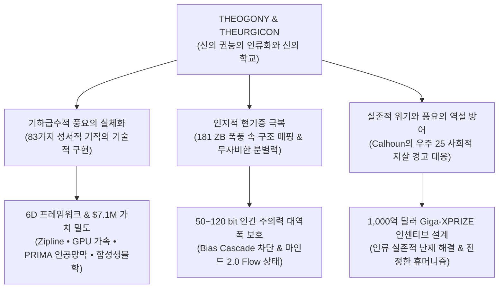
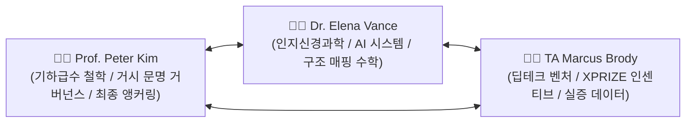
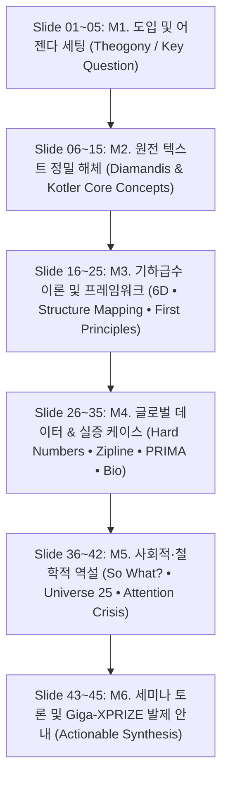

# 🏛️ WE ARE AS GODS — MASTER GRADUATE CURRICULUM DESIGN BLUEPRINT
> **Document:** `design_gods.md`  
> **Course Title:** 신이 된 인류: 기하급수 기술과 풍요의 설계도 (*We Are as Gods: A Survival Guide for the Age of Abundance*)  
> **Institution:** Graduate School of Exponential Civilization & Future Technology (Smart Insight Lab)  
> **Core Anchor:** *"We are as gods and might as well get good at it."* — Stewart Brand (1968) • Theurgicon (신의 학교)  
> **Version:** 5.0 (Authentic Master Edition)  
> **Foundational Corpus:** Peter H. Diamandis & Steven Kotler, *We Are as Gods* (2026, Simon & Schuster)

---

## 1. 🌟 CORE PHILOSOPHY & ACADEMIC BEDROCK (설립 철학 및 학문적 기초)

### 1.1. 신의 권능의 인류화(Theogony)와 신의 학교(Theurgicon)
- **스튜어트 브랜드(Stewart Brand)의 선언적 통찰:** 1968년 *Whole Earth Catalog*의 첫 페이지에 실린 *"We are as gods and might as well get good at it"*은 21세기 기하급수 기술의 융합으로 비로소 물리적 실체가 되었습니다.
- **성서적 83가지 기적의 기술적 실체화:** 역사 속 성서와 신화에 기록된 83가지 초자연적 기적(창조, 공급, 치유, 부활, 전지, 무소부재, 소통, 보호, 심판, 승리)은 이제 Zoom, Google, CRISPR, PRIMA 인공망막, 인공지능, 자율비행 드론 등을 통해 일상화된 기술 인프라로 전이되었습니다.
- **Theurgicon (신의 학교):** 본 대학원 과정은 기적을 단순 향유하는 소비자가 아니라, 신의 권능에 걸맞은 **도덕적 근육(Moral Muscle)**과 **거룩한 책임감(Sacred Responsibility)**을 훈련하는 '신의 학교'로 정의됩니다.

### 1.2. 인지적 현기증(Cognitive Vertigo)과 구조 매핑(Structure Mapping)
- **선형적 뇌(Local-Linear Brain)와 기하급수적 현실의 충돌:** 아프리카 초원에서 진화한 인간의 뇌는 100만 년 동안 로컬하고 선형적인 예측 엔진(Cortical Prediction Engine)으로 작동해 왔습니다. 181 제타바이트(ZB)의 정보 폭풍과 6D 기하급수 성장은 뇌에 극심한 **인지적 현기증**과 불안을 초래합니다.
- **Dedre Gentner의 구조 매핑 이론:** 인간의 인지적 한계를 극복하기 위해, 과거의 원형(Archetype)과 역사적 자원 해방의 사다리(Ladder)를 최첨단 기술의 심층 관계 구조와 1:1로 매핑하여 직관적이고 고도화된 통찰을 도출합니다.

### 1.3. 풍요의 역설(Paradox of Plenty)과 우주 25(Universe 25)의 경고
- **존 칼훈(John B. Calhoun)의 '우주 25' 실험:** 결핍이 완벽히 사라진 환경에서 쥐 집단이 겪은 'Beautiful Ones'(사회적 교류 거부 및 자기 단장만 반복)와 인지적 마비, 그리고 최종적인 멸종 타임라인(Day 315 피크 $\rightarrow$ Day 560 성역할 상실 $\rightarrow$ Day 920 마지막 출산 $\rightarrow$ Day 1780 멸종)은 기술적 풍요가 인간의 실존적 정체성을 파괴할 수 있음을 강력히 경고합니다.
- **기가-XPRIZE(Giga-XPRIZE) 설계:** 완벽한 풍요 속에서 인류가 퇴화하지 않고 진화하기 위한 **'1,000억 달러 규모의 거대한 문샷 목적과 인센티브 구조'**를 학생들이 직접 공학적으로 설계합니다.

---

## 2. 🎙️ AUTHENTIC 3-PRESENTER TIKI-TAKA SYSTEM (3인 강사진 페르소나 규약)

본 세미나는 일방적인 독백식 강의를 철저히 배제하고, 학문적 엄밀성과 실무적 현장감, 철학적 거시 시야가 교차하는 **3인 다이내믹 핑퐁 대화 체계**로 운영됩니다.

### 2.1. 3인 강사진 상세 프로필 및 보이스 사양

| 강사진 | 역할 및 전문 영역 | 발언 스타일 및 핵심 기여 포인트 | 합성 음성 규격 (Edge-TTS) |
| :--- | :--- | :--- | :--- |
| **👨‍🏫 Prof. Peter Kim** (54세, 총괄 석좌교수) | • 기하급수 문명 철학 • 신의 학교(Theurgicon) 앵커링 • 거시 거버넌스 & 윤리적 총괄 | • 도발적 오프닝 질문 던지기 • 스튜어트 브랜드, 존 칼훈, 성서적 기적 비유 융합 • 각 슬라이드 핵심 철학 및 실존적 'So What?' 결론 도출 | `en-US-ChristopherNeural` (Rate: -2%, Pitch: -2Hz) 포먼트 모핑 120Hz 앵커링 |
| **👩‍🔬 Dr. Elena Vance** (32세, 인지과학/AI 수석) | • 인지신경과학 & 생물학 • Dedre Gentner 구조 매핑 • BCI(PRIMA/Neuralink) & AI | • 날카로운 반론 및 메커니즘 해체 • 50~120 bit 주의력 대역폭, DMN 억제, 피질 예측 엔진 규명 • 수식, 신경생리학적 기전, 복잡계 데이터 분석 | `en-US-JennyNeural` (Rate: +2%, Pitch: +1Hz) 정밀하고 명쾌한 톤 |
| **👨‍💻 TA Marcus Brody** (29세, 딥테크/XPRIZE 조교) | • 딥테크 벤처 & 바이오 공학 • XPRIZE 인센티브 엔지니어링 • 글로벌 현장 실증 데이터 | • 현장감 넘치는 생생한 수치 고발 (Zipline 드론, PFAS 오염도) • 비즈니스 모델 및 1,000억 달러 펀딩 구조 분해 • 유쾌하고 직관적인 비유와 실무적 챌린지 제시 | `en-US-GuyNeural` (Rate: +3%, Pitch: +0Hz) 에너지 넘치는 액티브 톤 |

### 2.2. 불변의 4대 대화 원칙
1. **마이크로 턴(Micro-turns):** 한 사람의 발언은 최대 2~3문장을 넘지 않으며, 슬라이드당 최소 7~10회의 끊임없는 핑퐁 티키타카를 유지합니다.
2. **리얼리스틱 인터랙션(Realistic Reaction):** *"Wait, Elena!", "Marcus, are you serious about the 51% drop?", "Hold on, look at the Day 560 data!"* 등 생생한 감탄사와 상호 반박을 배치합니다.
3. **구체적 엔지니어링 팩트(Hard Quantitative Metrics):** `181 Zettabytes`, `2mm 태양광 칩`, `$7.1M 스마트폰 가치 밀도`, `390x 에어로팜스 수확량`, `58% 횡적 사고 증폭`, `$100M 탄소 XPRIZE` 등 실제 수치를 필수 인용합니다.
4. **명확한 So What? 도출:** 각 슬라이드의 마지막 턴은 해당 기술과 데이터가 인류의 미래와 인간성에 던지는 질문으로 완결합니다.

---

## 3. 📐 45-SLIDE / 6-MODULE STANDARD SESSION BLUEPRINT (주차별 슬라이드 표준 모듈)

매주 45개 슬라이드는 학술적 깊이와 실증적 검증을 완벽히 담아내기 위해 **6개의 표준 모듈(Module 1~6)**로 정밀하게 설계됩니다.

| 모듈 번호 | 슬라이드 범위 | 명칭 | 핵심 구성 내용 및 설계 방향 |
| :--- | :---: | :--- | :--- |
| **M1** | Slide 01 ~ 05 | **도입 및 어젠다 세팅** | 세션 타이틀, 금주의 핵심 질문(Key Question), 주교재 챕터 리딩 범위, 역사적/철학적 컨텍스트 설정, 학습 목표 제시 |
| **M2** | Slide 06 ~ 15 | **원전 텍스트 정밀 해체** | *We Are as Gods* 원전의 핵심 주장 분해, 핵심 개념어 정의, 저자 의도 파악, 텍스트 주요 구절 정밀 인용 및 분석 |
| **M3** | Slide 16 ~ 25 | **기하급수 이론 & 프레임워크** | 6D 프레임워크, 가치 밀도, 제1원리 사고, Dedre Gentner 구조 매핑, 칼 프리스턴 자유 에너지 원리 등 이론적 메커니즘 분석 |
| **M4** | Slide 26 ~ 35 | **글로벌 데이터 & 실증 케이스** | 2mm PRIMA 마이크로칩, Zipline 51% 산모 사망률 감소, 에어로팜스 390배 수확량, Neuralink 1,024 전극 등 실증 데이터 분석 |
| **M5** | Slide 36 ~ 42 | **사회적·철학적 역설 (So What?)** | PFAS 미세플라스틱 뇌 침투, 대사 질환 폭증, 50-120 bit 주의력 병목, 우주 25 사회적 죽음 등 비판적 실존 쟁점 분석 |
| **M6** | Slide 43 ~ 45 | **세미나 토론 & 과제 안내** | 대학원생용 심층 발제 논제 2~3개, 1,000억 달러 Giga-XPRIZE 모델링 과제 가이드, 다음 주차 리딩 예고 |

---

## 4. 🗺️ 15-SESSION MASTER CURRICULUM REGISTRY (15주차 마스터 맵)

| 주차 | 세션 국문 주제 | 세션 영문 주제 | 지정 리딩 (We Are as Gods) | 핵심 팩트 및 실증 데이터 |
| :---: | :--- | :--- | :--- | :--- |
| **W01** | **신의 능력의 인류화와 신의 학교** | *Theogony & Theurgicon: Becoming Gods* | Chapter 1 (A Tall Order / Theurgicon) | 1968 Stewart Brand 선언, 83가지 성서적 기적의 10대 카테고리 |
| **W02** | **인지적 현기증과 구조 매핑** | *Cognitive Vertigo & Structure Mapping* | Chapter 1 (Cognitive Vertigo) | Dedre Gentner 구조 매핑, 피질 예측 엔진, 선형 vs 기하급수 미스매치 |
| **W03** | **6D 프레임워크와 기만적 성장의 함정** | *The 6Ds & The Deception Trap* | Chapter 2 (The Return of the Six Ds) | 6D(Digitization~Democratization), COVID-19 Doubling 곡선 분석 |
| **W04** | **가치 밀도와 인류를 구원한 사다리** | *Value Density & The Liberation Ladder* | Chapter 2 (First Principles of Abundance) | 스마트폰 가치 밀도 $7.1M, $49Q 잠재 부, 3000 BCE 메소포타미아 사다리 |
| **W05** | **데이터 기반 낙관주의와 메콩 델타의 기적** | *Data-Driven Optimism & Leapfrogging* | Chapter 3 (Data-Driven Optimism) | Zipline 51% 산모 사망률 감소, 르완다/가나 백신, 메콩 델타 스마트 농업 |
| **W06** | **지능 폭발의 경제학과 거대 연산** | *Economics of Intelligence Explosion* | Chapter 4 (One Billion Times Smarter) | 딥러닝 혁명, 100배 연산 성장률, McKinsey $2조/PwC $15.7조 경제 가치 |
| **W07** | **재생 의학과 바이오 하이브리드 인터페이스** | *Regenerative Medicine & BCI Horizons* | Chapter 5 (The Innovation Bus) | Max Hodak PRIMA 2mm 태양광 칩, 1억 7천만 황반변성, ReGen Valley |
| **W08** | **합성 생물학의 윤리와 행성 단위 감시망** | *Synthetic Biology & Planetary GPT* | Chapter 6 (Planetary Intelligence) | 멸종 위기종 복원 유전체, 전 지구적 센서 네트워크, 생태 윤리 충돌 |
| **W09** | **신체적 침투와 환경의 진화적 미스매치** | *Physical Infiltration: PFAS & Microplastics* | Chapter 6 (The Unintended Consequences) | 플라스틱 뇌 조직 침투율, 불소화합물(PFAS), 기술 편의의 역습 |
| **W10** | **영양의 풍요와 기하급수적 대사 질환** | *The Paradox of Plenty: Metabolic Collapse* | Chapter 6 (The Caloric Trap) | 초가공식품 중독 기전, 인슐린 저항성, 글로벌 비만/당뇨 경제적 손실 |
| **W11** | **편향의 폭주와 인지적 중독** | *The Bias Cascade & Holy Terror* | Chapter 6 (Cognitive Hijacking) | 50-120 bit 주의력 한계, 확증 편향 알고리즘 루프, 음모론과 거룩한 테러 |
| **W12** | **마인드 2.0: 무자비한 분별력과 몰입** | *Mind 2.0: Ruthless Discernment & Flow* | Chapter 7 (Mindsets That Matter) | 5대 마인드셋, 9개 점 문제 58% 창의성 향상, 맥킨지 500% Flow 생산성 |
| **W13** | **의식의 확장과 텔레파시의 기술적 구현** | *The Cyborg Mind & Scalable Compassion* | Chapter 8 (The Androids Are Us) | Neuralink 1,024 전극, 무음성 뇌파 디코더 75%, DMN 억제와 초협력 |
| **W14** | **낙원의 역설과 사회적 자살** | *The Paradise Paradox: Universe 25* | Chapter 9 (The Paradise Paradox) | John Calhoun 우주 25 타임라인(Day 315/560/920/1780), Beautiful Ones |
| **W15** | **종합 세미나: 1,000억 달러 Giga-XPRIZE** | *Giga-XPRIZE: Engineering the $100B Future* | Chapter 9 (Final Frontier) & Appendices | 15개 미개척 카테고리, $100M 탄소/$101M 장수, 최종 1,000억 달러 모델 |

---

## 5. 📊 EVALUATION SYSTEM & GRADING POLICY (평가 기준 및 정책)

본 세미나는 세계 최고 수준의 학술적 엄밀성과 실증적 데이터 정합성을 요구합니다.

| 평가 항목 | 반영 비율 | 세부 평가 기준 및 학술 요구사항 |
| :--- | :---: | :--- |
| **세미나 참여 & 비판적 토론** | **30%** | • 50~120 bit의 인간 주의력 병목을 돌파하는 '무자비한 분별력' 발휘도 • 매주 제시되는 철학적 역설(So What?)에 대한 날카로운 비판적 논증 |
| **주차별 발제 및 구조 매핑 과제** | **30%** | • 최첨단 기술 현상을 6D 프레임워크 및 역사적 사다리(Ladder)와 1:1 구조 매핑 • 181 ZB, $7.1M 가치 밀도 등 강의 핵심 지표 필수 인용 및 검증 |
| **기말 $100B Giga-XPRIZE 설계** | **40%** | • 제1원리(First Principles) 사고에 기반한 인류 실존적 난제 해결 경연 모델 설계 • 1,000억 달러 인센티브 아키텍처, 마일스톤 메트릭, 재무/기술 정합성 완성도 |

---

## 6. 🛠️ HARDWARE & REPRODUCTION ENVIRONMENT (실행 및 음성 생성 환경)

1. **대본 표준 규격:** 각 세션별 Markdown 파일(`session1.md` ~ `session15.md`) 내 슬라이드 45개 전 분량에 대해 3인 강사진 티키타카 대본 수록.
2. **음성 생성 파이프라인:** Edge-TTS (`en-US-ChristopherNeural`, `en-US-JennyNeural`, `en-US-GuyNeural`) 기반 자동 합성 스크립트 구축.
3. **인터랙티브 웹 앱:** 슬라이드 실시간 내비게이터, 티키타카 트랜스크립트 뷰어, 팟캐스트 오디오 플레이어 완벽 연동.
