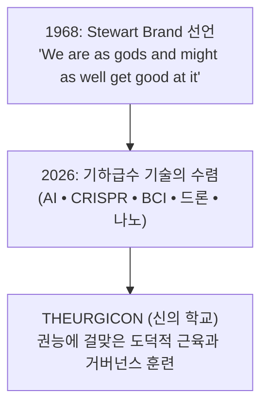
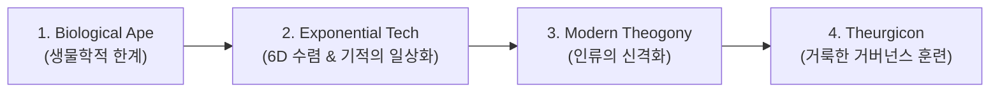
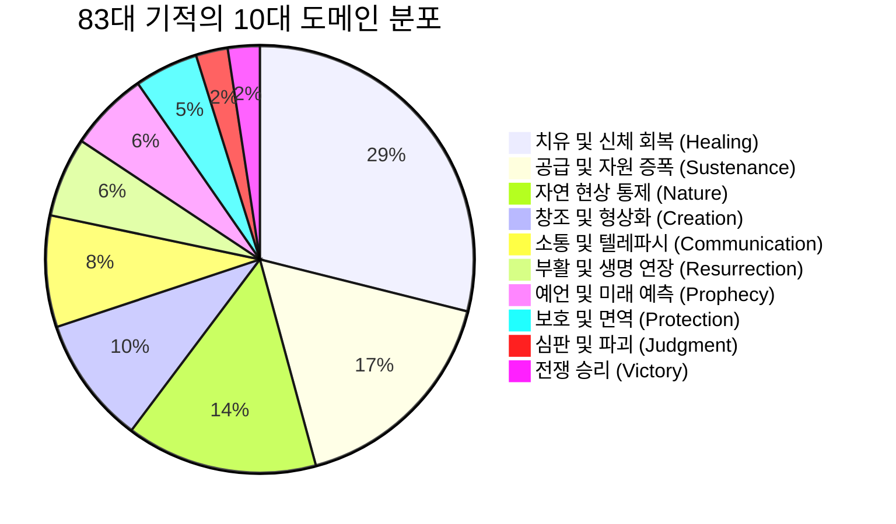
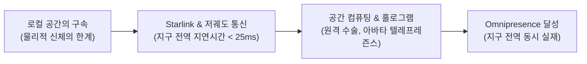
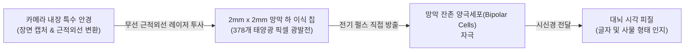
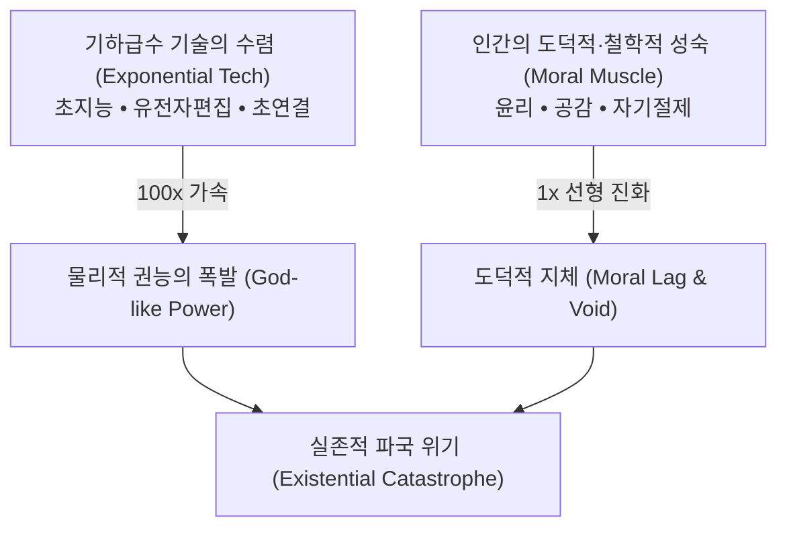
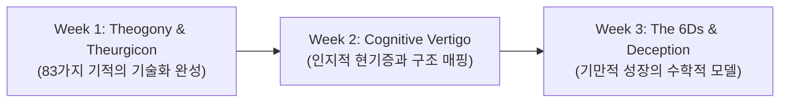

# Session 1: 신의 능력의 인류화 (Theogony)와 신의 학교 (Theurgicon)
> **Course:** 신이 된 인류: 기하급수 기술과 풍요의 설계도 (*We Are as Gods: A Survival Guide for the Age of Abundance*)  
> **Course Code:** EXPO-701 • Graduate Seminar  
> **Instructors:** Prof. Peter Kim (석좌교수), Dr. Elena Vance (수석연구원), TA Marcus Brody (딥테크조교)  
> **Reading Assignment:** Peter Diamandis & Steven Kotler, *We Are as Gods* (2026), Chapter 1 (A Tall Order / Theurgicon)  
> **Total Slides:** 45 Slides (6 Modules: M1~M6) • Authentic 3-Presenter Tiki-Taka Master Edition  

---

## 📌 Table of Contents & Slide Navigation

- [Module 1: 도입 및 어젠다 세팅 (Slides 01~05)](#module-1-도입-및-어젠다-세팅-slides-0105)
  - [Slide 01: THEURGICON: 신의 학교에 오신 것을 환영합니다](#slide-01-theurgicon-신의-학교에-오신-것을-환영합니다)
  - [Slide 02: 1968년 스튜어트 브랜드의 선언 (We Are as Gods)](#slide-02-1968년-스튜어트-브랜드의-선언-we-are-as-gods)
  - [Slide 03: 신의 탄생(Theogony)에서 신의 학교(Theurgicon)로](#slide-03-신의-탄생theogony에서-신의-학교theurgicon로)
  - [Slide 04: 금주의 핵심 질문: 우리는 신의 권능을 다룰 준비가 되었는가?](#slide-04-금주의-핵심-질문-우리는-신의-권능을-다룰-준비가-되었는가)
  - [Slide 05: 1주차 학습 목표 및 지적 여정 안내](#slide-05-1주차-학습-목표-및-지적-여정-안내)
- [Module 2: 원전 텍스트 정밀 해체 (Slides 06~15)](#module-2-원전-텍스트-정밀-해체-slides-0615)
  - [Slide 06: 『We Are as Gods』 원전의 핵심 테제 해체](#slide-06-we-are-as-gods-원전의-핵심-테제-해체)
  - [Slide 07: 성서적 83가지 기적의 통계학적 분류학](#slide-07-성서적-83가지-기적의-통계학적-분류학)
  - [Slide 08: 10대 기적 카테고리 1: 창조(Creation)와 공급(Sustenance)](#slide-08-10대-기적-카테고리-1-창조creation와-공급sustenance)
  - [Slide 09: 10대 기적 카테고리 2: 자연 지배(Nature)와 치유(Healing)](#slide-09-10대-기적-카테고리-2-자연-지배nature와-치유healing)
  - [Slide 10: 10대 기적 카테고리 3: 부활(Resurrection)과 보호(Protection)](#slide-10-10대-기적-카테고리-3-부활resurrection과-보호protection)
  - [Slide 11: 10대 기적 카테고리 4: 예언(Prophecy)과 소통(Communication)](#slide-11-10대-기적-카테고리-4-예언prophecy과-소통communication)
  - [Slide 12: 10대 기적 카테고리 5: 심판(Judgment)과 전쟁 승리(Victory)](#slide-12-10대-기적-카테고리-5-심판judgment과-전쟁-승리victory)
  - [Slide 13: 피터 디아만디스의 기하급수적 렌즈 (The Exponential Lens)](#slide-13-피터-디아만디스의-기하급수적-렌즈-the-exponential-lens)
  - [Slide 14: 스티븐 코틀러의 인지신경학적 경고 (The Neurological Warning)](#slide-14-스티븐-코틀러의-인지신경학적-경고-the-neurological-warning)
  - [Slide 15: 기적의 기술화 매트릭스 총괄 요약표](#slide-15-기적의-기술화-매트릭스-총괄-요약표)
- [Module 3: 기하급수 이론 및 프레임워크 (Slides 16~25)](#module-3-기하급수-이론-및-프레임워크-slides-1625)
  - [Slide 16: 무에서 유의 창조 (Creatio Ex Nihilo)와 생성형 AI](#slide-16-무에서-유의-창조-creatio-ex-nihilo와-생성형-ai)
  - [Slide 17: 전지(Omniscience): 전 지구적 지식 인프라와 검색의 종말](#slide-17-전지omniscience-전-지구적-지식-인프라와-검색의-종말)
  - [Slide 18: 무소부재(Omnipresence): 양방향 초연결과 공간의 탈물질화](#slide-18-무소부재omnipresence-양방향-초연결과-공간의-탈물질화)
  - [Slide 19: 기하급수 수렴의 법칙 (The Law of Exponential Convergence)](#slide-19-기하급수-수렴의-법칙-the-law-of-exponential-convergence)
  - [Slide 20: 181 제타바이트 정보 폭풍의 도래](#slide-20-181-제타바이트-정보-폭풍의-도래)
  - [Slide 21: Dedre Gentner의 구조 매핑(Structure Mapping) 기본 원리](#slide-21-dedre-gentner의-구조-매핑structure-mapping-기본-원리)
  - [Slide 22: 표면적 유사성 vs. 심층적 관계 구조의 대조](#slide-22-표면적-유사성-vs-심층적-관계-구조의-대조)
  - [Slide 23: 인지적 가속 페달: 신화적 원형(Archetype)의 재소환](#slide-23-인지적-가속-페달-신화적-원형archetype의-재소환)
  - [Slide 24: 기술의 민주화와 진입 장벽의 붕괴 공식](#slide-24-기술의-민주화와-진입-장벽의-붕괴-공식)
  - [Slide 25: 제1원리 사고(First Principles)와 도구적 신성(Instrumental Divinity)](#slide-25-제1원리-사고first-principles와-도구적-신성instrumental-divinity)
- [Module 4: 글로벌 데이터 & 실증 케이스 (Slides 26~35)](#module-4-글로벌-데이터--실증-케이스-slides-2635)
  - [Slide 26: CASE 1: PRIMA 인공망막 — 맹인을 눈뜨게 하는 공학](#slide-26-case-1-prima-인공망막--맹인을-눈뜨게-하는-공학)
  - [Slide 27: Max Hodak과 Science Corporation의 바이오하이브리드 비전](#slide-27-max-hodak과-science-corporation의-바이오하이브리드-비전)
  - [Slide 28: PRIMA 시스템 기술 사양: 2mm 광발전 마이크로칩](#slide-28-prima-시스템-기술-사양-2mm-광발전-마이크로칩)
  - [Slide 29: 근적외선 안경 투사 및 시신경 직접 자극 메커니즘](#slide-29-근적외선-안경-투사-및-시신경-직접-자극-메커니즘)
  - [Slide 30: 1억 7천만 황반변성(AMD) 환자 시장과 임상 데이터](#slide-30-1억-7천만-황반변성amd-환자-시장과-임상-데이터)
  - [Slide 31: CASE 2: Zipline — 생명을 구하는 하늘의 공급선](#slide-31-case-2-zipline--생명을-구하는-하늘의-공급선)
  - [Slide 32: 르완다와 가나의 100만 회 비행 및 혈액 배송 실증치](#slide-32-르완다와-가나의-100만-회-비행-및-혈액-배송-실증치)
  - [Slide 33: CASE 3: CRISPR 유전자 가위와 멸종 위기종 복원](#slide-33-case-3-crispr-유전자-가위와-멸종-위기종-복원)
  - [Slide 34: CASE 4: 스마트폰 속 $7.1M 가치 밀도 응축 실증](#slide-34-case-4-스마트폰-속-71m-가치-밀도-응축-실증)
  - [Slide 35: CASE 5: AlphaFold와 2억 개 단백질 구조의 완전 해독](#slide-35-case-5-alphafold와-2억-개-단백질-구조의-완전-해독)
- [Module 5: 사회적·철학적 역설 (So What?) (Slides 36~42)](#module-5-사회적철학적-역설-so-what-slides-3642)
  - [Slide 36: 기적의 일상화: 왜 인류는 스스로를 신으로 느끼지 못하는가?](#slide-36-기적의-일상화-왜-인류는-스스로를-신으로-느끼지-못하는가)
  - [Slide 37: 쾌락 적응(Hedonic Treadmill)과 신기술 불감증](#slide-37-쾌락-적응hedonic-treadmill과-신기술-불감증)
  - [Slide 38: 거룩한 책임감(Sacred Responsibility)의 부재와 도덕적 지체](#slide-38-거룩한-책임감sacred-responsibility의-부재와-도덕적-지체)
  - [Slide 39: 신의 능력을 가진 유인원: 인류 진화적 불일치 (Evolutionary Mismatch)](#slide-39-신의-능력을-가진-유인원-인류-진화적-불일치-evolutionary-mismatch)
  - [Slide 40: 기술 독점과 디지털 신정체제(Digital Theocracy)의 위험](#slide-40-기술-독점과-디지털-신정체제digital-theocracy의-위험)
  - [Slide 41: Theurgicon의 존재 이유: 도덕적 근육(Moral Muscle)의 단련](#slide-41-theurgicon의-존재-이유-도덕적-근육moral-muscle의-단련)
  - [Slide 42: SO WHAT? 결론: 권능에 걸맞은 인간 의식의 업그레이드](#slide-42-so-what-결론-권능에-걸맞은-인간-의식의-업그레이드)
- [Module 6: 세미나 토론 및 과제 안내 (Slides 43~45)](#module-6-세미나-토론-및-과제-안내-slides-4345)
  - [Slide 43: 대학원 세미나 핵심 발제 및 토론 논제 3선](#slide-43-대학원-세미나-핵심-발제-및-토론-논제-3선)
  - [Slide 44: 기말 $100B Giga-XPRIZE 설계 과제 가이드라인](#slide-44-기말-100b-giga-xprize-설계-과제-가이드라인)
  - [Slide 45: 2주차 예고: 인지적 현기증과 구조 매핑 & 종강](#slide-45-2주차-예고-인지적-현기증과-구조-매핑--종강)

---

## Module 1: 도입 및 어젠다 세팅 (Slides 01~05)

### Slide 01: THEURGICON: 신의 학교에 오신 것을 환영합니다
- **Session Focus:** 신의 능력의 인류화(Theogony)와 신의 학교(Theurgicon) 개설 선언
- **Academic Foundation:** Stewart Brand (1968), Peter Diamandis & Steven Kotler (2026)
- **Key Concepts:** Theogony (신들의 탄생/인간의 신격화), Theurgicon (신의 권능을 다루는 학교), Exponential Singularity



> **🎙️ 3-Presenter Authentic Tiki-Taka Script**
> 
> **Prof. Peter Kim:** 여러분, 환영합니다. 오늘 우리는 단순한 기술 세미나가 아니라, 인류 문명사상 가장 대담하고 도발적인 대학원 과정인 **Theurgicon(신의 학교)**의 첫 문을 엽니다. 엘레나 박사, 우리가 왜 이 강의실을 '학교'가 아닌 'Theurgicon'이라 부르는지 설명해 주시겠습니까?  
> **Dr. Elena Vance:** 네, 피터 교수님. 'Theurgy'는 고대 그리스어로 신의 기적적인 권능을 행하는 신성한 의식을 의미합니다. 그리고 2026년 오늘, 인류는 유전자 편집기, 초지능 인공지능, 뇌-컴퓨터 인터페이스를 통해 과거 신화 속 신들의 능력을 문자 그대로 손에 넣었습니다. 이제 대학원은 지식을 암기하는 곳이 아니라, 신의 권능을 다룰 '인지적 프레임워크'를 훈련하는 전당이어야 합니다.  
> **TA Marcus Brody:** 하하, 맞습니다! 옛날엔 바다를 가르고 장님을 눈뜨게 하는 게 신만의 영역이었지만, 지금은 실리콘밸리와 바이오 랩에서 매일 일어나는 엔지니어링 티켓일 뿐이잖아요? 하지만 문제는, 도구는 전지전능해졌는데 정작 우리 뇌는 10만 년 전 사바나 초원의 유인원에 머물러 있다는 겁니다!  
> **Prof. Peter Kim:** 정확한 지적입니다, 마커스. 권능의 폭발과 지혜의 지체—바로 이 틈을 메우는 것이 본 과정의 궁극적인 존재 이유입니다.  

---

### Slide 02: 1968년 스튜어트 브랜드의 선언 (We Are as Gods)
- **Historical Milestone:** 1968년 *Whole Earth Catalog* 창간호 표지 선언문
- **Original Quote:** *"We are as gods and might as well get good at it."*
- **Evolution of Context:** 개인 도구(Personal Tools)의 해방에서 기하급수 생명공학/초지능의 통제로 전환

| 시대 | 스튜어트 브랜드의 관점 | 당시의 도구 수준 | 인류가 직면한 과제 |
| :--- | :--- | :--- | :--- |
| **1968년** | 개인의 자율성과 도구의 획득 | 타자기, 계산기, DIY 핸드북 | 국가 권력으로부터의 개인 해방 |
| **2026년** | 문명 전체의 신적 권능 실체화 | AGI, 2mm PRIMA 칩, CRISPR, Planet GPT | 181 ZB 정보 폭풍과 실존적 자살 방어 |

> **🎙️ 3-Presenter Authentic Tiki-Taka Script**
> 
> **Dr. Elena Vance:** 1968년, 스튜어트 브랜드가 저 유명한 문장을 썼을 때 사람들은 히피의 과장된 수사라고 생각했습니다. 하지만 60년이 지난 지금, 이 문장은 가장 엄밀한 과학적 팩트가 되었습니다.  
> **TA Marcus Brody:** 브랜드가 저 말을 썼을 때는 고작 개인이 카메라나 계산기를 사서 독립하자는 수준이었잖아요. 그런데 지금 우리가 다루는 건 행성 전체의 유전자를 재작성하고, 지구 궤도에 수만 개의 위성을 띄워 실시간으로 지구를 스캔하는 진짜 '신적 인프라'입니다.  
> **Prof. Peter Kim:** 그렇습니다. 브랜드의 선언에서 가장 중요한 단어는 'Gods'가 아니라 **'Get good at it(그것에 능숙해져야 한다)'**입니다. 신이 되는 것은 이미 기정사실이며, 우리의 유일한 문제는 '우리가 그것을 능숙하고 지혜롭게 다룰 수 있는가'입니다.  
> **Dr. Elena Vance:** 능숙해지지 못하면, 신의 힘을 가진 어린아이가 스스로를 파괴하는 비극이 발생하니까요.  

---

### Slide 03: 신의 탄생(Theogony)에서 신의 학교(Theurgicon)로
- **Concept Distinction:** 
  - **Theogony (헤시오도스의 신통기):** 신들이 어떻게 탄생하고 계보를 이었는가에 대한 신화적 서사.
  - **Modern Theogony:** 기하급수 기술의 융합을 통해 인류 자체가 신적 종족으로 진화하는 과정.
  - **Theurgicon:** 신의 권능을 획득한 인류가 스스로를 파멸시키지 않도록 지적·도덕적 거버넌스를 가르치는 기관.



> **🎙️ 3-Presenter Authentic Tiki-Taka Script**
> 
> **TA Marcus Brody:** 교수님, 그리스 신화에서 'Theogony'는 제우스나 포세이돈이 번개와 삼지창을 쥐게 된 계보잖아요. 그런데 2026년의 Theogony는 엔비디아의 GPU 클러스터와 크리스퍼 유전자 가위가 그 삼지창을 인류에게 쥐어준 셈이네요?  
> **Prof. Peter Kim:** 정확한 비유입니다, 마커스. 고대인들은 초자연적 권능을 신화적 존재에게 투사했지만, 이제 그 투사된 권능이 물리적 코드로 우리 손에 반환되었습니다.  
> **Dr. Elena Vance:** 하지만 신화 속 신들은 감정적이고, 질투하며, 미성숙했습니다. 번개를 쥔 제우스가 분노로 세상을 불태웠듯, 도덕적 훈련이 결여된 현대 인류가 AGI와 생물무기를 쥐었을 때 벌어질 참사는 상상을 초월합니다. 이것이 바로 우리가 'Theurgicon'이라는 엄격한 학술적 도가니를 만든 이유입니다.  
> **Prof. Peter Kim:** 권능은 기술이 주지만, 품격과 통제권은 교육과 철학이 만듭니다.  

---

### Slide 04: 금주의 핵심 질문: 우리는 신의 권능을 다룰 준비가 되었는가?
- **Core Theological & Existential Inquiries:**
  1. 성서와 신화에 등장하는 83가지 기적이 엔지니어링으로 치환될 때, 인간의 정체성은 어떻게 재정의되는가?
  2. 왜 우리는 스마트폰과 AI라는 전지전능한 도구를 손에 쥐고도 역사상 가장 심각한 우울증과 불안을 겪는가?
  3. 무제한의 풍요 속에서 인류는 Calhoun의 '우주 25'와 같은 사회적 안락사를 피할 수 있는가?

> **🎙️ 3-Presenter Authentic Tiki-Taka Script**
> 
> **Prof. Peter Kim:** 이번 1주차 세미나를 관통하는 핵심 질문은 단 하나입니다. **"우리는 신의 권능을 다룰 준비가 되었는가?"** 엘레나 박사, 신경생리학적으로 우리는 준비되어 있습니까?  
> **Dr. Elena Vance:** 단언컨대, 전혀 준비되지 않았습니다. 우리의 대뇌 피질은 하루 50~120 bit의 정보 처리 대역폭을 가지고 있는데, 우리에게 쏟아지는 데이터는 올해만 181 제타바이트입니다. 뇌는 완전히 압도당해 '인지적 현기증'을 겪고 있습니다.  
> **TA Marcus Brody:** 현장 비즈니스에서도 마찬가지예요! 수십억 달러의 펀딩을 받는 딥테크 기업들이 쏟아져 나오지만, '이 기술이 인류의 영혼에 어떤 영향을 미칠지' 고민하는 창업자는 1%도 안 됩니다. 무조건 빠르고 강력하게 만드는 데만 혈안이 되어 있죠.  
> **Prof. Peter Kim:** 그렇기 때문에 본 과정의 수강생들은 단순한 엔지니어가 아니라 문명의 설계자이자 'God-in-training'으로서 이 질문에 답해야 합니다.  

---

### Slide 05: 1주차 학습 목표 및 지적 여정 안내
- **Educational Milestones for Week 1:**
  - **지식(Knowledge):** 83가지 성서적 기적의 10대 카테고리와 현대 기술 등가물 매핑 완벽 숙지.
  - **방법론(Methodology):** Dedre Gentner의 구조 매핑(Structure Mapping)을 적용하여 신기술의 심층 메커니즘 해체.
  - **실증 분석(Empirical Analysis):** Science Corp의 PRIMA 2mm 태양광 인공망막 시스템 기술 규격 및 임상 데이터 분석.
  - **철학적 성찰(Synthesis):** 기적의 민주화가 가져오는 실존적 역설과 Theurgicon 거버넌스 프레임워크 수립.

> **🎙️ 3-Presenter Authentic Tiki-Taka Script**
> 
> **Dr. Elena Vance:** 1주차의 학습 여정은 매우 촘촘합니다. 먼저 성서와 신화에 기록된 83가지 기적을 10개의 기술 도메인으로 분류학적으로 해체할 것입니다.  
> **TA Marcus Brody:** 그리고 후반부에서는 Max Hodak이 이끄는 Science Corporation의 PRIMA 인공망막 임상 데이터를 다룹니다. 2mm짜리 칩 하나가 어떻게 1억 7천만 명의 시각장애인을 치료하는 '현대판 실로암의 기적'이 되는지 실제 하드웨어 스펙으로 뜯어볼 겁니다!  
> **Prof. Peter Kim:** 이 모든 분석의 끝에서 우리는 '풍요의 역설'이라는 거대한 철학적 절벽을 마주하게 될 것입니다. 45개 슬라이드를 거치는 동안 지적 긴장감을 놓치지 마시길 바랍니다.  

---

## Module 2: 원전 텍스트 정밀 해체 (Slides 06~15)

### Slide 06: 『We Are as Gods』 원전의 핵심 테제 해체
- **Primary Source:** Peter H. Diamandis & Steven Kotler, *We Are as Gods* (2026, Simon & Schuster)
- **Central Thesis:** 기하급수 기술(AI, 합성생물학, 나노테크, BCI, 양자역학)의 수렴이 인류 역사상 기록된 모든 초자연적 기적을 현실의 제품과 인프라로 전환시키고 있다.
- **Dual Perspectives:**
  - **피터 디아만디스:** 기하급수적 풍요와 데이터 기반 낙관주의 (First Principles of Abundance)
  - **스티븐 코틀러:** 인간 인지 한계와 풍요의 역설, 신경생리학적 몰입(Flow)과 윤리적 방어

> **🎙️ 3-Presenter Authentic Tiki-Taka Script**
> 
> **Prof. Peter Kim:** 자, 이제 주교재인 피터 디아만디스와 스티븐 코틀러의 2026년 신작 『We Are as Gods』의 핵심 테제를 분해해 봅시다. 엘레나 박사, 두 저자의 역할 분담이 흥미롭지 않습니까?  
> **Dr. Elena Vance:** 네, 매우 상호보완적입니다. 피터 디아만디스가 X-Prize와 싱귤래리티 대학을 이끌며 축적한 기하급수 기술 데이터로 '무엇이 가능한가(Possibility)'를 증명한다면, 스티븐 코틀러는 인지신경과학과 뇌의 진화적 한계를 짚으며 '우리가 그것을 감당할 수 있는가(Vulnerability)'를 경고합니다.  
> **TA Marcus Brody:** 둘의 시너지가 엄청나요! 디아만디스가 "우리는 신이 되었다! 봐라, 83가지 기적이 전부 기술로 풀렸다!"라고 외치면, 코틀러가 "잠깐만 피터, 그런데 왜 인류는 우주 25의 쥐들처럼 스스로 자살하려 하지?"라고 브레이크를 밟는 식이죠.  
> **Prof. Peter Kim:** 바로 그 긴장감이 이 책의 심장이자 본 세미나의 핵심 추진력입니다.  

---

### Slide 07: 성서적 83가지 기적의 통계학적 분류학
- **Taxonomy of Miracles:** 구약, 신약 및 고대 문헌에 나타난 83대 기적의 데이터베이스화
- **10 Major Categories:**
  1. 창조 (Creation) • 2. 공급 (Sustenance) • 3. 자연 지배 (Nature) • 4. 치유 (Healing) • 5. 부활 (Resurrection)
  6. 보호 (Protection) • 7. 예언 (Prophecy) • 8. 소통 (Communication) • 9. 심판 (Judgment) • 10. 전쟁 승리 (Victory)



> **🎙️ 3-Presenter Authentic Tiki-Taka Script**
> 
> **Dr. Elena Vance:** 저자들은 성서에 기록된 83개의 대표적 기적 사건을 전수 조사하여 10개 카테고리로 엄밀하게 분류했습니다. 놀랍게도 가장 높은 비중을 차지한 것은 24건(29%)에 달하는 **치유(Healing)**였습니다.  
> **TA Marcus Brody:** 그 뒤를 잇는 게 오병이어 같은 **공급(Sustenance, 17%)**과 홍해가 갈라지는 **자연 지배(Nature, 14%)**였죠. 인류가 신에게 가장 간절히 바랐던 것이 결국 '아프지 않고, 굶지 않고, 자연재해에 죽지 않는 것'이었다는 뜻입니다.  
> **Prof. Peter Kim:** 그렇습니다. 고대인들에게 그것은 오직 신의 자비로만 가능한 '초자연'이었지만, 21세기에 이르러 이 세 가지는 생명공학, 스마트 농업, 기상 조절 기술이라는 **'엔지니어링 파이프라인'**으로 완전히 포섭되었습니다.  

---

### Slide 08: 10대 기적 카테고리 1: 창조(Creation)와 공급(Sustenance)
- **Category 1: 창조 (Creation ex nihilo)**
  - *Biblical Prototype:* 말씀으로 빛과 천지만물을 창조하심.
  - *Tech Equivalent:* 생성형 AI (LLM, Diffusion, Sora), 3D 분자 프린팅, 합성 생물학.
- **Category 2: 공급 (Sustenance & Multiplication)**
  - *Biblical Prototype:* 광야의 만나와 메추라기, 오병이어의 기적.
  - *Tech Equivalent:* 배양육(Cultured Meat), 수직 농경(AeroFarms 390배 생산성), 정밀 발효 단백질.

> **🎙️ 3-Presenter Authentic Tiki-Taka Script**
> 
> **TA Marcus Brody:** 슬라이드 8을 보세요. 성경에서 가장 경이로운 장면 중 하나가 빈 들판에서 물고기 두 마리와 떡 다섯 개로 5천 명을 먹인 사건이잖아요. 그런데 지금 싱가포르와 미국 식약처가 승인한 배양육 공장에서는 세포 몇 개로 톤 단위의 고기를 배양기에서 찍어내고 있습니다.  
> **Dr. Elena Vance:** 생성형 AI는 '말씀으로 빛을 창조했다'는 창세기의 구절을 그대로 구현하죠. 텍스트 프롬프트 몇 줄로 수백만 줄의 소프트웨어 코드와 4K 초고화질 비디오가 무(無)에서 유(有)로 생성됩니다.  
> **Prof. Peter Kim:** 이것은 자원의 희소성(Scarcity)을 전제로 구축되었던 인류 경제학의 근본 가정을 뒤흔드는 패러다임 시프트입니다. 공급이 무한해질 때 가격은 0으로 수렴합니다.  

---

### Slide 09: 10대 기적 카테고리 2: 자연 지배(Nature)와 치유(Healing)
- **Category 3: 자연 통제 (Command over Nature)**
  - *Biblical Prototype:* 홍해의 갈라짐, 풍랑을 잠재우심, 반석에서 물이 솟음.
  - *Tech Equivalent:* 기상 조절(Cloud Seeding), 역삼투압 해수 담수화, 지열/핵융합 에너지.
- **Category 4: 치유 (Healing the Sick & Blind)**
  - *Biblical Prototype:* 나병 환자의 정결케 됨, 나면서 시각장애인을 눈뜨게 하심.
  - *Tech Equivalent:* mRNA 맞춤형 암 백신, CRISPR 유전자 가위 치료제(카스게비), Science Corp PRIMA 인공망막.

> **🎙️ 3-Presenter Authentic Tiki-Taka Script**
> 
> **Dr. Elena Vance:** 요한복음 9장에 실로암 못에서 눈을 씻고 시력을 되찾은 시각장애인 이야기가 나옵니다. 2천 년 동안 이것은 오직 메시아적 기적으로만 해석되었죠.  
> **TA Marcus Brody:** 그런데 Max Hodak의 Science Corp가 만든 PRIMA 칩은, 퇴행성 망막 질환으로 빛을 완전히 잃은 환자의 망막 아래에 2mm짜리 칩을 심어서 글자를 읽고 얼굴을 알아보게 만들었습니다. 임상에서 시력이 복원되는 순간 환자들이 흘린 눈물은 2천 년 전 실로암의 눈물과 정확히 같은 감정이었을 겁니다.  
> **Prof. Peter Kim:** 기술이 고통받는 인간을 회복시킬 때, 그것은 단순한 기계가 아니라 거룩한 회복의 도구가 됩니다.  

---

### Slide 10: 10대 기적 카테고리 3: 부활(Resurrection)과 보호(Protection)
- **Category 5: 부활 및 생명 연장 (Resurrection & Life Extension)**
  - *Biblical Prototype:* 나사로의 부활, 야이로의 딸을 살리심.
  - *Tech Equivalent:* 세포 역분화(Yamanaka Factors), ReGen Valley 생물학적 나이 역전, 동결 보존(Cryonics).
- **Category 6: 초자연적 보호 (Divine Protection)**
  - *Biblical Prototype:* 다니엘의 사자 굴 보호, 불기둥과 구름기둥.
  - *Tech Equivalent:* 아이언 돔(Iron Dome) 요격 미사일, 바이오 디펜스 조기 경보망, 팬데믹 실시간 AI 감시.

> **🎙️ 3-Presenter Authentic Tiki-Taka Script**
> 
> **TA Marcus Brody:** 부활(Resurrection) 카테고리를 보면 다들 공상과학이라고 생각하지만, 생물학적 나이를 되돌리는 후성유전학적 역분화는 이미 쥐 실험에서 입증되었습니다. 야마나카 인자를 통한 세포 리프로그래밍은 손상된 조직을 청년기로 되돌리고 있어요.  
> **Dr. Elena Vance:** 맞습니다. 사망(Death)의 정의 자체가 심장 박동의 정지에서 뇌세포의 비가역적 파괴로 재정의되고 있으며, 저체온 유도 소생술과 생체 신호 복원 알고리즘은 '임상적 사망 판정' 이후 환자를 되살려내는 시간을 획기적으로 늘리고 있습니다.  
> **Prof. Peter Kim:** 죽음이라는 생물학적 절대 한계선마저 공학적 문제 해결의 영역으로 진입하고 있는 것입니다.  

---

### Slide 11: 10대 기적 카테고리 4: 예언(Prophecy)과 소통(Communication)
- **Category 7: 예언과 통찰 (Prophecy & Foreknowledge)**
  - *Biblical Prototype:* 선지자들의 미래 사건 예언, 꿈의 해몽(요셉).
  - *Tech Equivalent:* 기후 복합계 시뮬레이션, 금융 리스크 예측 신경망, 단백질 접힘 구조 예측(AlphaFold 3).
- **Category 8: 언어 초월 소통 (Tongues & Omnipresent Speech)**
  - *Biblical Prototype:* 오순절 방언의 역사(모든 민족이 자기 언어로 알아들음).
  - *Tech Equivalent:* 실시간 음성-음성 동시통역(SeamlessM4T), LLM 기반 다국어 번역, 무음성 뇌파 디코더.

> **🎙️ 3-Presenter Authentic Tiki-Taka Script**
> 
> **Dr. Elena Vance:** 사도행전 2장의 오순절 사건을 보면, 갈릴리 사람들이 말을 하는데 세계 각국에서 온 사람들이 각자의 모국어로 완벽하게 알아듣습니다.  
> **TA Marcus Brody:** 지금 구글 픽셀 버즈나 메타의 오디오 인터페이스를 귀에 꽂고 있으면, 스페인어나 아랍어로 말해도 제 귀에는 0.2초 만에 영어와 한국어로 실시간 번역되어 꽂힙니다. 바벨탑의 저주가 신경망 가속기로 완전히 박살 난 거죠!  
> **Prof. Peter Kim:** 언어의 장벽 붕괴는 단순한 여행 편의가 아닙니다. 80억 인류의 두뇌가 단일한 지적 네트워크로 통합되는 '글로벌 뇌(Global Brain)'의 탄생을 의미합니다.  

---

### Slide 12: 10대 기적 카테고리 5: 심판(Judgment)과 전쟁 승리(Victory)
- **Category 9: 심판과 정밀 타격 (Judgment & Absolute Power)**
  - *Biblical Prototype:* 소돔과 고모라의 유황불, 여리고 성의 무너짐.
  - *Tech Equivalent:* 극초음속 미사일, AI 자율 킬러 드론 스웜, 사이버 전자기파(EMP) 공격.
- **Category 10: 전쟁의 승리 (Divine Victory)**
  - *Biblical Prototype:* 기드온의 300 용사 승리, 다윗과 골리앗.
  - *Tech Equivalent:* 비대칭 드론 전쟁(우크라이나 전장의 FPV 드론), 위성 지능 기반 전장 가시화(Palantir AIP).

> **🎙️ 3-Presenter Authentic Tiki-Taka Script**
> 
> **TA Marcus Brody:** 여기서 우리는 기술의 어두운 면을 직시해야 합니다. 우크라이나 전장에서 수백 달러짜리 상용 FPV 드론이 수백만 달러짜리 전차를 파괴하는 비대칭 전쟁은 골리앗을 쓰러뜨린 다윗의 물맷돌과 정확히 같습니다.  
> **Dr. Elena Vance:** AI 기반 자율 살상 무기는 인간의 개입 없이 밀리초 단위로 표적을 식별하고 타격합니다. 이것은 신의 심판과 같은 절대적 파괴력을 알고리즘의 손에 넘기는 것이며, 가장 위험한 실존적 위협입니다.  
> **Prof. Peter Kim:** 그렇기 때문에 신의 권능에는 반드시 **'절대적인 윤리적 구속력'**이 동반되어야 합니다. 통제되지 않는 신성은 재앙일 뿐입니다.  

---

### Slide 13: 피터 디아만디스의 기하급수적 렌즈 (The Exponential Lens)
- **Diamandis's Argument:**
  - 인간의 뇌는 선형적이지만, 기술은 기하급수적으로 발전한다 ($2 \rightarrow 4 \rightarrow 8 \rightarrow \dots \rightarrow 1,000,000,000$).
  - **자원의 희소성은 물리적 한계가 아니라 '접근성(Accessibility)'의 문제**이다. 기술은 희소했던 자원을 풍요로 전환하는 유일한 사다리다.
  - 10대 기적의 기술화는 인류가 수탈 경제에서 번영 경제로 도약하는 필연적 과정이다.

> **🎙️ 3-Presenter Authentic Tiki-Taka Script**
> 
> **Prof. Peter Kim:** 피터 디아만디스가 평생을 바쳐 주장해 온 '기하급수적 렌즈'의 핵심은 무엇입니까, 마커스?  
> **TA Marcus Brody:** 디아만디스는 "세상에 자원 부족이란 없다. 오직 기술의 부족만 있을 뿐이다"라고 말합니다. 알루미늄이 1800년대 나폴레옹 시절엔 금보다 비쌌지만 전해 제련 기술이 나오자마자 흔한 콜라캔이 되었듯, 에너지든 물이든 지능이든 기술이 개입하는 순간 풍요로 바뀐다는 거죠!  
> **Dr. Elena Vance:** 그 관점은 경제학적으로 매우 강력합니다. 하지만 엘레나 연구원으로서 경고하고 싶은 건, 물리적 자원이 풍요로워진다고 해서 인간의 뇌와 정신이 자동으로 행복해지는 것은 아니라는 점입니다.  

---

### Slide 14: 스티븐 코틀러의 인지신경학적 경고 (The Neurological Warning)
- **Kotler's Counterbalance:**
  - **진화적 불일치 (Evolutionary Mismatch):** 풍요로운 환경은 수렵채집인의 뇌에 도파민 중독, 주의력 결핍, 만성 불안을 유발한다.
  - **정보 과부하와 피질 마비:** 기하급수적 정보 유입은 대뇌 피질의 예측 루프를 붕괴시켜 종말론적 비관주의와 편집증을 강화한다.
  - **해법:** 기술의 힘에 휘둘리지 않는 **'마인드 2.0 (Flow & Ruthless Discernment)'**의 훈련이 동반되지 않으면 문명은 자멸한다.

> **🎙️ 3-Presenter Authentic Tiki-Taka Script**
> 
> **Dr. Elena Vance:** 스티븐 코틀러의 신경생리학적 분석을 주목해야 합니다. 인간의 뇌는 결핍과 위협을 탐지하도록 진화했습니다. 그런데 결핍이 사라지고 181 ZB의 무한 정보가 쏟아지자, 뇌의 편도체(Amygdala)는 가짜 위협을 끝없이 만들어내며 과열되고 있습니다.  
> **TA Marcus Brody:** 맞아요! 페이스북이나 틱톡의 추천 알고리즘이 바로 인간의 그 원시적인 공포와 부정 편향을 하이재킹해서 돈을 버는 비즈니스 모델이잖아요.  
> **Prof. Peter Kim:** 디아만디스가 밝은 태양을 본다면, 코틀러는 그 태양이 만드는 깊은 그림자를 봅니다. 두 시선을 통합하지 않고는 Theurgicon의 진정한 리더가 될 수 없습니다.  

---

### Slide 15: 기적의 기술화 매트릭스 총괄 요약표
- **Comprehensive Master Mapping Table:** 10대 기적, 고대 원형, 현대 기술 인프라, 실존적 리스크의 통합 비교

| 기적 카테고리 | 성서/신화적 원형 | 2026 현대 기술 등가물 | 주도 기업 및 기관 | 잠재적 실존 리스크 |
| :--- | :--- | :--- | :--- | :--- |
| **창조 (Creation)** | 천지창조, 형상화 | LLM, Sora, 분자 합성기 | OpenAI, DeepMind | 딥페이크, 현실 붕괴 |
| **공급 (Sustenance)** | 오병이어, 만나 | 배양육, AeroFarms 수직농경 | Eat Just, AeroFarms | 전통 농축산업 붕괴 |
| **자연 (Nature)** | 홍해 분할, 풍랑 통제 | 해수 담수화, 기상 조절 | IDE Tech, 클라우드시딩 | 생태계 교란 |
| **치유 (Healing)** | 실로암 시각 복원 | PRIMA 인공망막, CRISPR | Science Corp, Vertex | 유전적 불평등 |
| **부활 (Resurrection)** | 나사로의 소생 | 세포 역분화, ReGen 장기 | Retro Bio, Altos Labs | 인구 고령화 쇼크 |
| **보호 (Protection)** | 사자굴 보호 | 아이언 돔, 팬데믹 조기경보 | Rafael, Palantir | 감시국가 도래 |
| **예언 (Prophecy)** | 미래 예언, 꿈 해몽 | 기후 시뮬레이터, AI 금융예측 | ECMWF, Citadel | 알고리즘 결정론 |
| **소통 (Communication)**| 오순절 방언 | 실시간 음성 번역, BCI 텔레파시 | Meta, Neuralink | 인지적 프라이버시 상실|
| **심판 (Judgment)** | 소돔의 유황불 | 자율 킬러 드론, 사이버 EMP | Anduril, Skydio | AI 통제 불능 무기화 |
| **승리 (Victory)** | 다윗의 물맷돌 | FPV 비대칭 드론 스웜 | DJI, 전장 AI 시스템 | 국가 안보 비대칭 파괴 |

> **🎙️ 3-Presenter Authentic Tiki-Taka Script**
> 
> **Prof. Peter Kim:** 이 표 하나가 인류 문명의 현주소를 웅변합니다. 10대 기적 중 단 하나도 현대 기술의 사정권을 벗어난 것이 없습니다.  
> **TA Marcus Brody:** 저 표의 오른쪽 '잠재적 실존 리스크'를 보세요. 우리가 신의 힘을 얻는 대가로 치러야 할 청구서들이 빼곡히 적혀 있습니다.  
> **Dr. Elena Vance:** 이것이 바로 우리가 단순한 공학자가 아니라, 문명사적 책임감을 가진 철학적 엔지니어가 되어야 하는 이유입니다.  

---

## Module 3: 기하급수 이론 및 프레임워크 (Slides 16~25)

### Slide 16: 무에서 유의 창조 (Creatio Ex Nihilo)와 생성형 AI
- **Theological Concept:** *Creatio ex nihilo* (라틴어: 아무것도 없는 상태에서의 창조)
- **Computational Reality:** 고차원 잠재 공간(Latent Space $\mathbb{R}^{d}$)에서의 조건부 확률 분포 $P(X|C)$ 샘플링을 통한 텍스트, 이미지, 단백질, 오디오 생성 메커니즘.
- **Mathematical Expression:**
  $$\mathcal{L}_{\text{Diffusion}}(\theta) = \mathbb{E}_{t, x_0, \epsilon} \left[ \| \epsilon - \epsilon_\theta(x_t, t) \|^2 \right]$$

> **🎙️ 3-Presenter Authentic Tiki-Taka Script**
> 
> **Dr. Elena Vance:** 신학에서 'Creatio ex nihilo'는 오직 절대자만이 행할 수 있는 고유 권능이었습니다. 하지만 확산 모델(Diffusion Models)의 수학을 보면, 무작위 가우시안 노이즈($\epsilon$) 상태에서 역방향 노이즈 제거 과정을 통해 완전히 새로운 고해상도 분자 구조와 이미지를 합성해 냅니다.  
> **TA Marcus Brody:** 잠재 공간(Latent Space)에서 수천억 개의 파라미터가 춤을 추며 단 3초 만에 단백질 신약을 합성해 내는 걸 보면, 르네상스 시대 화가들이나 고대 연금술사들이 봤다면 기절했을 겁니다!  
> **Prof. Peter Kim:** 물질의 결핍을 아이디어와 알고리즘이 대체하는 순간입니다. 창조의 한계는 이제 물리적 원자가 아니라 인간의 상상력 크기에 의해 결정됩니다.  

---

### Slide 17: 전지(Omniscience): 전 지구적 지식 인프라와 검색의 종말
- **From Search Engine to Generative Oracle:**
  - 과거: 키워드를 입력하고 수십 개의 파란색 링크를 인간이 직접 클릭하여 읽던 선형 검색.
  - 현재: 100조 개의 토큰을 학습한 파운데이션 모델이 즉각적인 종합 추론과 합성 답변을 제공하는 '전지적 오라클(Omniscient Oracle)'.
- **Graph RAG & Dynamic Grounding:** 인류의 모든 지식 베이스가 실시간 벡터 그래프로 상호 연결.

> **🎙️ 3-Presenter Authentic Tiki-Taka Script**
> 
> **TA Marcus Brody:** 불과 몇 년 전만 해도 구글에서 키워드 검색하고 5개 블로그 뒤지는 게 일이었는데, 지금은 대학원 논문 50편을 한 번에 넣고 "이들 간의 모순점과 새로운 가설을 도출해"라고 하면 10초 만에 완벽한 비평이 나옵니다.  
> **Dr. Elena Vance:** 맞습니다. 이것은 인간의 기억 보조 도구를 넘어선 **'외재화된 전지(Externalized Omniscience)'**입니다. 지식을 머리에 저장하는 것의 가치는 급락하고, 방대한 지식 네트워크에 어떤 고차원적 질문을 던질 것인가(Prompting & Inquiry)가 인간 지능의 척도가 되었습니다.  
> **Prof. Peter Kim:** "아는 것이 힘이다"라는 베이컨의 명제는 끝났습니다. 이제는 **"무엇을 질문하고 어떻게 분별할 것인가"**가 진정한 지혜입니다.  

---

### Slide 18: 무소부재(Omnipresence): 양방향 초연결과 공간의 탈물질화
- **The Concept of Omnipresence:** 시공간의 제약을 뛰어넘어 어디에나 동시에 존재하는 신적 속성.
- **Technological Enablers:**
  - 궤도 위성망 (Starlink 수만 대 군집 저궤도 통신)
  - 전 지구적 원격 현존 (Telepresence & Spatial Computing)
  - 자율 IoT 센서 네트워크 (수천억 개의 스마트 엣지 디바이스)



> **🎙️ 3-Presenter Authentic Tiki-Taka Script**
> 
> **Prof. Peter Kim:** 무소부재(Omnipresence) 역시 과거엔 신학적 신비의 영역이었습니다. 그러나 지금 우리는 서울에 앉아서 아프리카 르완다의 수술용 로봇을 원격 조종하고, 지구 반대편의 기상 데이터를 10밀리초 지연 시간으로 모니터링합니다.  
> **TA Marcus Brody:** 저궤도 통신위성과 공간 컴퓨팅이 물리적 거리를 완벽히 탈물질화(Dematerialize)해 버렸죠. '내가 어디에 있는가'라는 지리적 위치가 더 이상 협업과 생산성의 제약 조건이 되지 않습니다.  
> **Dr. Elena Vance:** 하지만 신체가 공간에서 분리될 때 발생하는 **'감각 박탈(Sensory Disconnection)'**과 고립감은 뇌신경계에 또 다른 부작용을 낳고 있습니다. 가상으로는 어디에나 있지만, 물리적으로는 침대에 누워 있는 인간의 실존적 괴리 말입니다.  

---

### Slide 19: 기하급수 수렴의 법칙 (The Law of Exponential Convergence)
- **The Convergence Effect:** 개별 기하급수 기술이 독립적으로 발전하는 것이 아니라, 서로가 서로를 가속화하는 피드백 루프 형성.
- **Core Accelerators:**
  $$\text{Acceleration} = f(\text{Compute}) \times g(\text{Algorithms}) \times h(\text{Data}) \times k(\text{Capital})$$
- AI가 신약 개발을 가속하고, 신약 개발이 인간 수명을 늘리며, 늘어난 연산력이 양자 컴퓨터 설계를 단축하는 상호 촉매 작용.

> **🎙️ 3-Presenter Authentic Tiki-Taka Script**
> 
> **TA Marcus Brody:** 피터 교수님, 기하급수 기술이 무서운 진짜 이유는 '수렴(Convergence)' 때문이잖아요! AI 혼자 달리는 게 아니라, AI가 양자 컴퓨터를 설계하고, 양자 컴퓨터가 배터리 신소재를 찾고, 그 배터리가 자율비행 드론의 비행시간을 10배 늘리는 식으로 꼬리를 물고 폭발하니까요!  
> **Dr. Elena Vance:** 맞습니다. 생물학에서 이를 '자가촉매 반응(Autocatalytic Reaction)'이라고 부릅니다. 기술 발전 속도가 선형적 덧셈이 아니라 거듭제곱의 곱셈으로 질주하는 지점이 바로 이 수렴 구간입니다.  
> **Prof. Peter Kim:** 이 수렴의 파도 앞에서 과거의 5개년 국가 계획이나 전통적 산업 분류표는 완전히 무력화됩니다.  

---

### Slide 20: 181 제타바이트 정보 폭풍의 도래
- **Data Explosion Metric:** 2026년 글로벌 생성 데이터양 추정치 **181 Zettabytes ($1.81 \times 10^{23}$ Bytes)**.
- **Human Cognitive Bottleneck:** 인간의 의식적 정보 처리 용량은 초당 **50~120 bits**.
- **The Cognitive Mismatch Equation:**
  $$\text{Mismatch Ratio} = \frac{181 \times 10^{21} \text{ bytes/year}}{120 \text{ bits/second} \times 3.15 \times 10^7 \text{ seconds/year}} \approx 3.83 \times 10^{14}$$

> **🎙️ 3-Presenter Authentic Tiki-Taka Script**
> 
> **Dr. Elena Vance:** 수치로 확인해 봅시다. 181 제타바이트는 지구상의 모든 모래알 수에 수억을 곱한 것보다 많은 데이터입니다. 반면 칙센트미하이의 연구에 따르면 인간 뇌의 작업기억 처리 대역폭은 초당 최대 120비트에 불과합니다.  
> **TA Marcus Brody:** 계산해 보면 데이터 유입 속도와 인간 뇌의 소화 속도 사이에 무려 **380조 배의 격차**가 발생합니다! 1인치짜리 깔때기에 나이아가라 폭포를 들이붓는 꼴이에요.  
> **Prof. Peter Kim:** 이 엄청난 격차 속에서 인간이 지혜를 잃고 알고리즘의 노예로 전락하지 않으려면, 정보를 다 빨아들이려는 어리석음을 버리고 **'무자비한 분별력(Ruthless Discernment)'**을 발휘해야 합니다.  

---

### Slide 21: Dedre Gentner의 구조 매핑(Structure Mapping) 기본 원리
- **The Theoretical Anchor:** Dedre Gentner (1983, 1997), *Structure Mapping: A Theoretical Framework for Analogy*
- **Core Mechanism:** 인간의 인지가 완전히 새로운 영역(Target Domain)을 이해할 때, 이미 잘 알고 있는 기존 영역(Base Domain)과의 **'심층적 관계 구조(System of Relations)'**를 1:1로 매핑하여 통찰을 도출하는 과정.

```mermaid
graph TD
    subgraph Base Domain: 고대 성서적 기적
        B1["절대자 / 메시아"] -->|치유/공급| B2["고통받는 백성"]
        B1 -->|자연 법칙 초월| B3["물리적 한계 극복"]
    end
    
    subgraph Target Domain: 2026 기하급수 기술
        T1["엔지니어 / AGI 시스템"] -->|PRIMA 칩 / Zipline| T2["희소성에 갇힌 인류"]
        T1 -->|6D 프레임워크| T3["물리적 결핍 해체"]
    end
    
    Base Domain ==>|심층 관계 구조 매핑 (Structure Mapping)| Target Domain
```

> **🎙️ 3-Presenter Authentic Tiki-Taka Script**
> 
> **Prof. Peter Kim:** 우리가 왜 성서적 기적과 신화를 현대 기술 세미나에서 다루는가? 바로 인지과학의 거장 **Dedre Gentner의 구조 매핑 이론** 때문입니다. 엘레나 박사, 구조 매핑이 어떻게 뇌의 학습 속도를 가속합니까?  
> **Dr. Elena Vance:** 겐트너 교수는 인간의 뇌가 낯선 신기술을 접할 때 표면적인 데이터만 보면 패닉에 빠지지만, 인류가 수천 년간 축적해 온 '기적의 신화적 서사'와 현대 기술의 관계 구조를 매핑하면 뇌의 인지 부하가 극적으로 줄어들고 본질을 꿰뚫어 보게 된다고 증명했습니다.  
> **TA Marcus Brody:** 아하! 그러니까 "PRIMA 칩은 2mm 태양광 광발전 어레이와 근적외선 프로젝터로 구성된..."이라고 설명하면 머리가 아프지만, "실로암 못에서 눈을 씻어 시력을 되찾은 치유의 현대적 실체화"라고 매핑하면 뇌가 즉각적으로 그 사회적·실존적 가치를 납득한다는 거군요!  
> **Prof. Peter Kim:** 정확합니다. 메타포와 구조 매핑은 181 ZB 폭풍 속에서 뇌를 구원하는 가장 강력한 인지적 닻입니다.  

---

### Slide 22: 표면적 유사성 vs. 심층적 관계 구조의 대조
- **Gentner's Distinction:**
  - **Surface Features (표면적 특징):** 단순한 외형, 색상, 개별 단어의 일치 $\rightarrow$ 피상적 오해 유발.
  - **Relational Structure (관계적 구조):** 원인-결과, 역할, 상호작용의 심층 논리 $\rightarrow$ 진정한 지적 전이(Transfer)와 통찰.

| 분석 층위 | 표면적 매핑 (Surface Mapping) | 심층 구조 매핑 (Structural Mapping) |
| :--- | :--- | :--- |
| **스마트폰 분석** | 유리와 알루미늄으로 만든 네모난 통신기기 | $7.1M 상당의 물리적 기기를 탈물질화하여 전 인류에게 배포한 자원 민주화 사다리 |
| **PRIMA 망막 칩** | 눈 속에 넣는 작은 반도체 전자 부품 | 생체 신호와 디지털 광학 신호를 융합하여 실명이라는 실존적 단절을 극복하는 치유 시스템 |
| **Zipline 드론** | 배터리로 날아다니는 작은 모형 비행기 | 도로망이 없는 열악한 지리적 한계를 초월하여 산모 사망률을 51% 떨어뜨리는 생명 공급망 |

> **🎙️ 3-Presenter Authentic Tiki-Taka Script**
> 
> **Dr. Elena Vance:** 슬라이드 22의 대조표를 주목하십시오. 하수 엔지니어는 표면적 특징에 매달립니다. "이 칩은 몇 나노미터 공정이고 클록 스피드가 얼마인가?" 하지만 Theurgicon의 리더는 관계 구조를 봅니다. "이 기술이 어떤 인간적 결핍의 사슬을 끊어내는가?"  
> **TA Marcus Brody:** 맞아요! 스마트폰을 그냥 네모난 전자기기로 보면 잡스 사후의 폼팩터 변화만 따지게 되지만, 심층 구조로 보면 1980년대 억만장자도 못 누리던 100가지 도구를 케냐의 시골 소년에게 쥐어준 인류 역사상 가장 거대한 평등화 도구라는 걸 알게 되죠.  
> **Prof. Peter Kim:** 심층 구조를 보는 눈, 그것이 바로 대학원생 여러분이 길러야 할 '구조 매핑 역량'입니다.  

---

### Slide 23: 인지적 가속 페달: 신화적 원형(Archetype)의 재소환
- **Carl Jung & Cognitive Acceleration:** 
  - 칼 융의 원형(Archetype) 이론: 인류의 무의식 속에 각인된 신화적 이미지와 원형적 역할.
  - 신기술의 충격을 흡수하기 위해 고대의 원형(창조자, 치유자, 수호자, 심판자)을 소환하여 기술의 존재 이유를 정의.
- **Application:** AI 에이전트를 단순한 챗봇이 아닌 '24/7 수호천사(Guardian Angel)'로 개념화할 때 설계의 지향점이 명확해짐.

> **🎙️ 3-Presenter Authentic Tiki-Taka Script**
> 
> **Prof. Peter Kim:** 칼 융은 인류의 무의식 속에 '치유자', '창조자', '수호자' 같은 원형(Archetype)이 깊이 각인되어 있다고 말했습니다. 기하급수 기술은 이 원형적 에너지를 실리콘과 유전체 코드로 외재화하는 작업입니다.  
> **TA Marcus Brody:** 실제로 우리가 AI 비서를 만들 때 그냥 '데이터베이스 쿼리 도구'라고 생각하면 딱딱한 검색창이 나오지만, '나를 밤낮으로 지키는 수호자'라고 원형을 매핑하면 자율적으로 위험을 감지하고 나를 보호하는 에이전트 아키텍처가 나오더라고요.  
> **Dr. Elena Vance:** 원형은 뇌가 복잡한 시스템의 목적 함수(Objective Function)를 단 1초 만에 직관하도록 돕는 강력한 인지적 압축 알고리즘입니다.  

---

### Slide 24: 기술의 민주화와 진입 장벽의 붕괴 공식
- **Democratization Dynamics:** 
  - 과거: 왕과 소수 엘리트만이 누리던 신적 권능 (최고급 의료, 전령을 통한 원격 통신, 개인 오케스트라).
  - 현재: 6D 프레임워크의 최종 단계인 **Democratization(민주화)**을 통해 전 세계 80억 인류에게 0원에 수렴하는 비용으로 보급.
- **The Democratization Index:**
  $$\mathcal{D}_{\text{index}} = \frac{\text{Historical Cost of Elite Service}}{\text{Marginal Cost of Digital Access}} \rightarrow \infty$$

> **🎙️ 3-Presenter Authentic Tiki-Taka Script**
> 
> **TA Marcus Brody:** 여러분, 18세기 프랑스 왕 루이 14세도 여름에 시원한 에어컨을 못 쐬었고, 클래식 음악을 들으려면 악단을 불러야 했습니다. 맹장염에 걸리면 죽어야 했고요.  
> **Dr. Elena Vance:** 그런데 지금은 지하철을 탄 평범한 시민이 스마트폰으로 전 세계 모든 교향악단의 음악을 스트리밍하고, 로봇 수술로 맹장염을 완치하며, AGI 튜터에게 1:1 과외를 받습니다. 역사상 어떤 황제도 누리지 못한 권능이 완전히 민주화된 것입니다.  
> **Prof. Peter Kim:** 기술의 가장 위대한 영적 속성은 '차별 없는 보편적 은혜의 모방'입니다. 기술은 권력의 독점을 해체하고 풍요를 만인에게 흘려보내는 거대한 통로입니다.  

---

### Slide 25: 제1원리 사고(First Principles)와 도구적 신성(Instrumental Divinity)
- **First Principles of Abundance (제1원리 사고):**
  - 유추(Analogy)에 의한 사고를 넘어, 물리 법칙과 원자/비트의 근본 진실까지 문제를 환원.
  - "원래 비쌌다"는 기존 관념을 거부하고, 기본 원자재와 에너지, 정보의 관점에서 비용 한계를 재계산.
- **Instrumental Divinity:** 인간의 도구가 신적 수준에 도달했을 때, 인간은 도구의 사용자를 넘어 '존재의 목적'을 규정하는 책임을 져야 함.

> **🎙️ 3-Presenter Authentic Tiki-Taka Script**
> 
> **Prof. Peter Kim:** 일론 머스크와 피터 디아만디스가 공유하는 '제1원리 사고(First Principles)'는 기존 관습을 완전히 해체하는 데서 출발합니다. 마커스, 배터리와 로켓에서 일어난 일이 기적의 영역에서도 똑같이 일어나고 있죠?  
> **TA Marcus Brody:** 그럼요! "로켓은 원래 1억 달러야"라는 관습을 깨고 알루미늄과 연료 원가만 계산해서 10분의 1로 줄인 것처럼, "망막 질환 치료는 불가능해"라는 관습을 깨고 광발전 다이오드와 적외선 레이저의 물리학으로 환원해 탄생한 게 바로 PRIMA 칩입니다!  
> **Dr. Elena Vance:** 제1원리로 접근할 때 불가능해 보였던 성서적 기적들은 모두 물리적·생물학적 방정식의 최적화 문제로 전환됩니다.  

---

## Module 4: 글로벌 데이터 & 실증 케이스 (Slides 26~35)

### Slide 26: CASE 1: PRIMA 인공망막 — 맹인을 눈뜨게 하는 공학
- **Case Title:** PRIMA Bionic Vision System (Science Corporation)
- **Clinical Breakthrough:** 노인성 황반변성(AMD) 및 망막색소변성증으로 중심 시력을 완전히 잃은 환자들의 시력 복원.
- **Significance:** 2천 년 전 성서 속 '실로암의 기적'이 현대 나노전자공학과 무선 광통신 칩으로 완전 실체화된 최초의 상용 임상 사례.



> **🎙️ 3-Presenter Authentic Tiki-Taka Script**
> 
> **Prof. Peter Kim:** 자, 이제 4부에서는 말뿐인 이론이 아니라 전 세계 연구실에서 실제로 작동하고 있는 '기적의 하드웨어'들을 검증합니다. 첫 번째 케이스는 Science Corp의 **PRIMA 인공망막 시스템**입니다.  
> **Dr. Elena Vance:** PRIMA는 단순한 보청기 수준의 보조 장치가 아닙니다. 빛을 감지하는 광수용체 세포가 완전히 파괴되어 암흑 속에 갇힌 환자의 망막 아래에 초소형 칩을 이식하여 시신경을 직접 전기적으로 트리거하는 시스템입니다.  
> **TA Marcus Brody:** 실제로 유럽에서 진행된 임상시험 영상을 보면, 수십 년 동안 앞을 보지 못하던 80대 환자가 PRIMA 안경을 쓰고 식탁 위의 포크를 집고 체스판의 말을 움직입니다. 그 순간 연구원들과 의사들이 전부 울음을 터뜨렸죠.  

---

### Slide 27: Max Hodak과 Science Corporation의 바이오하이브리드 비전
- **The Innovator:** Max Hodak (전 Neuralink 공동 창업자 $\rightarrow$ Science Corporation 설립)
- **Vision:** 생체 조직과 실리콘 반도체가 완벽히 융합되는 **'바이오하이브리드(Bio-hybrid) 인터페이스'** 구축.
- **Approach:** 뇌를 직접 뚫는 침습적 방식 대신, 눈(Eye)이라는 자연스러운 광학적 창문을 통해 뇌 신경망과 고대역폭 데이터 통신 달성.

> **🎙️ 3-Presenter Authentic Tiki-Taka Script**
> 
> **TA Marcus Brody:** 맥스 호닥(Max Hodak)은 일론 머스크와 함께 뉴럴링크를 만들었던 천재 엔지니어잖아요. 그런데 왜 뉴럴링크를 나와서 Science Corp를 차리고 '눈'에 집중했을까요?  
> **Dr. Elena Vance:** 두개골을 열고 뇌를 뚫는 뇌 수술은 위험 부담이 너무 큽니다. 하지만 망막은 뇌 조직이 안구 안쪽으로 돌출된 '외재화된 대뇌 피질'입니다. 안과 수술은 외래에서 30분 만에 끝날 만큼 안전하죠. 호닥은 가장 안전하고 스마트한 뇌 인터페이스 통로로 '눈'을 선택한 것입니다.  
> **Prof. Peter Kim:** 위험하고 침습적인 기술보다, 인간의 자연스러운 생체 구조를 존중하며 융합하는 엔지니어링 지혜가 돋보이는 대목입니다.  

---

### Slide 28: PRIMA 시스템 기술 사양: 2mm 광발전 마이크로칩
- **Hardware Specifications:**
  - **크기:** $2\text{mm} \times 2\text{mm}$, 두께 $30\mu\text{m}$ (인간 머리카락 굵기의 3분의 1).
  - **픽셀 어레이:** 378개의 독립된 광발전 픽셀 (Photovoltaic Pixels, $100\mu\text{m}$ 피치).
  - **전력 공급 방식:** 배터리나 전선 연결 없음 $\rightarrow$ 안경에서 투사되는 근적외선(Near-Infrared, 880nm) 빛 에너지를 직접 전력과 데이터로 동시 변환.
  - **생체 적합성:** 백금-이리듐 전극 및 실리콘 기반 밀봉 구조.

> **🎙️ 3-Presenter Authentic Tiki-Taka Script**
> 
> **TA Marcus Brody:** 슬라이드 28의 하드웨어 스펙을 보십시오. 가로세로 2mm에 두께 30마이크로미터입니다. 눈 속에 들어가는데 배선도 없고 배터리도 없어요!  
> **Dr. Elena Vance:** 그게 바로 광발전 다이오드 설계의 천재성입니다. 특수 안경이 카메라로 포착한 시각 정보를 근적외선 레이저로 변환하여 칩에 쏘아주면, 칩에 달린 378개의 태양광 셀이 그 빛을 흡수해 자체적으로 전기를 만들어 시신경 세포를 자극합니다.  
> **Prof. Peter Kim:** 무선 전력 전송과 시각 정보 인코딩이 2mm 반도체 위에서 단 하나의 물리 법칙으로 결합한 것입니다.  

---

### Slide 29: 근적외선 안경 투사 및 시신경 직접 자극 메커니즘
- **Signal Transduction Pipeline:**
  1. 외부 카메라 $\rightarrow$ 실시간 영상 처리 알고리즘 (엣지 윤곽선 및 대비 증폭)
  2. 880nm 근적외선(NIR) 빔 변조 투사
  3. PRIMA 칩의 광다이오드에서 국소 전류(Local Electric Current) 생성
  4. 손상된 광수용체를 건너뛰고 망막 양극세포(Bipolar Cells)와 신경절세포(Ganglion Cells) 탈분극 유도
  5. 시신경을 타고 대뇌 후두엽 시각 피질로 신호 전달 $\rightarrow$ 인지적 상(Image) 형성

> **🎙️ 3-Presenter Authentic Tiki-Taka Script**
> 
> **Dr. Elena Vance:** 신경생리학적 신호 변환 과정을 보면 놀랍습니다. 망막 질환 환자들은 빛을 감지하는 맨 바깥 세포들만 죽어 있고, 그 뒤의 신경망은 대부분 살아 있습니다. PRIMA는 죽은 세포들을 완전히 건너뛰고 살아 있는 양극세포에 직접 디지털 전류를 흘려보냅니다.  
> **TA Marcus Brody:** 즉, 망막 뒤편의 신경 고속도로에 직접 디지털 패킷을 쏴주는 라우터 역할을 하는 거네요!  
> **Prof. Peter Kim:** 훼손된 생물학적 링크를 실리콘 칩으로 바이패스(Bypass)하는 이 기술은 향후 척수 손상 마비 환자의 신경 재건에도 그대로 확장될 수 있는 범용 신경 인터페이스입니다.  

---

### Slide 30: 1억 7천만 황반변성(AMD) 환자 시장과 임상 데이터
- **Global Impact Metrics:**
  - 전 세계 노인성 황반변성(AMD) 환자 수: **약 1억 7,000만~2억 명**.
  - 법적 실명 상태의 중증 환자: 수백만 명 규모.
- **Clinical Trial Results:**
  - 환자의 중심 시야에서 8개 이상의 글자 줄(Lines) 판독 능력 회복.
  - 일상적 독서 속도 분당 50단어 수준 달성.
  - 부작용: 12개월 추적 관찰 결과 유의미한 염증이나 칩 탈락 0건.

> **🎙️ 3-Presenter Authentic Tiki-Taka Script**
> 
> **TA Marcus Brody:** 시장 규모 데이터를 보세요. 전 세계 황반변성 환자가 1억 7천만 명입니다. 고령화로 인해 2040년이면 2억 8천만 명으로 늘어납니다. 이건 단순한 틈새 바이오텍이 아니라 인류의 절반이 겪는 노화의 시각적 절망을 끝내는 거대한 시장입니다.  
> **Dr. Elena Vance:** 임상 데이터에서 가장 감동적인 것은, 법적 실명 판정을 받았던 노인 환자들이 이 칩을 통해 손주들의 얼굴을 다시 보고 신문을 읽을 수 있게 되었다는 점입니다. 삶의 존엄성이 복원된 것이죠.  
> **Prof. Peter Kim:** 기술이 인간의 고립을 부수고 관계를 회복시킬 때, 그것이 바로 Theurgicon이 지향하는 번영(Flourishing)의 열매입니다.  

---

### Slide 31: CASE 2: Zipline — 생명을 구하는 하늘의 공급선
- **Case Title:** Zipline Autonomous Drone Delivery System
- **Founders:** Keller Rinaudo Cliffton, Keenan Wyrobek
- **Core Mission:** 도로와 교량이 없는 열악한 아프리카 내륙 및 오지에 자율 비행 드론으로 필수 혈액, 백신, 의약품을 15분 만에 공급.

```mermaid
flowchart TD
    A["오지 보건소 의사의 스마트폰 문자 발주<br/>'O형 혈액 2팩 긴급 필요'"] --> B["Zipline 물류 허브<br/>(자율 드론 Zip에 혈액 팩 장착)"]
    B -->|전기 캐터펄트 발사 (100km/h 가속)| C["GPS 자율 항법 고속 비행<br/>(최대 시속 120km)"]
    C -->|목적지 상공 도착 후 낙하산 투하| D["보건소 앞마당 정밀 투하 (15분 이내)<br/>즉각적인 수혈로 산모 소생"]
```

> **🎙️ 3-Presenter Authentic Tiki-Taka Script**
> 
> **TA Marcus Brody:** 두 번째 케이스는 하늘에서 의약품을 떨어뜨리는 **지플라인(Zipline)**입니다! 켈러 리나우도가 르완다에 처음 갔을 때, 병원에 피가 없어서 수술 도중 산모들이 피를 흘리며 죽어가는 걸 보고 "이건 배송의 문제다"라며 드론 물류를 만들었죠.  
> **Dr. Elena Vance:** 르완다는 '천 개의 언덕의 나라'로 불릴 만큼 도로 사정이 험악해서 차로 가면 5시간이 걸립니다. Zipline 드론은 산을 직선으로 날아서 단 15분 만에 혈액을 배송합니다.  
> **Prof. Peter Kim:** 고대 광야에서 굶주린 백성들에게 하늘에서 만나가 떨어졌듯, 21세기 르완다의 산모들에게는 하늘에서 생명의 혈액 팩이 낙하산을 타고 내려옵니다.  

---

### Slide 32: 르완다와 가나의 100만 회 비행 및 혈액 배송 실증치
- **Hard Quantitative Data:**
  - 누적 상용 비행 횟수: **1,000,000회 이상**.
  - 배송된 의약품 및 혈액 팩: **1,000만 도즈 이상**.
  - **르완다 전국 산모 산후출혈 사망률:** **51% 급감** (Lancet Global Health 실증 연구).
  - **가나 국립 보건원 데이터:** 백신 폐기율 **60% 감소**, 미접종률 **42% 감소**.

> **🎙️ 3-Presenter Authentic Tiki-Taka Script**
> 
> **Dr. Elena Vance:** 의학 저널 *Lancet*에 발표된 데이터를 보십시오. Zipline 도입 이후 르완다 전국 병원에서 출산 후 과다출혈로 인한 **산모 사망률이 무려 51% 감소**했습니다. 절반 이상의 어머니들이 목숨을 건진 것입니다.  
> **TA Marcus Brody:** 게다가 가나에서는 냉장 보관이 어려워 버려지던 백신의 폐기율이 60% 줄었습니다. 드론 몇 대와 자동화 물류창고 하나가 수십억 달러짜리 고속도로 건설보다 훨씬 빠르고 저렴하게 수백만 명의 생명을 살려낸 거죠!  
> **Prof. Peter Kim:** 이것이 바로 개도국이 낡은 인프라 단계를 건너뛰는 **'도약(Leapfrogging)'**의 위력입니다. 소수의 헌신적인 엔지니어들이 국가 전체의 보건 지도를 바꿀 수 있습니다.  

---

### Slide 33: CASE 3: CRISPR 유전자 가위와 멸종 위기종 복원
- **Case Title:** Precision Gene Editing & De-extinction (Colossal Biosciences)
- **Core Technology:** CRISPR-Cas9/Cas12를 통한 유전체 편집, 매머드(Woolly Mammoth) 및 도도새 복원 프로젝트.
- **Ecological Impact:** 북극 툰드라 생태계 복원을 통한 영구동토층 해빙 및 메탄 가스 방출 차단.

> **🎙️ 3-Presenter Authentic Tiki-Taka Script**
> 
> **TA Marcus Brody:** 세 번째 케이스는 유전자 가위로 멸종된 동물을 되살리는 Colossal Biosciences입니다. 매머드의 유전자를 아시아 코끼리에 편집해 넣어 북극 툰드라에 방목하겠다는 프로젝트죠!  
> **Dr. Elena Vance:** 많은 사람들이 이를 쥬라기 공원 같은 호기심으로 보지만, 본질은 생태계 엔지니어링입니다. 매머드가 눈 덮인 툰드라를 밟아 다져주면 영구동토층이 녹는 것을 막아 수십억 톤의 메탄 방출을 억제할 수 있다는 가설에 기반하고 있습니다.  
> **Prof. Peter Kim:** 창조(Creation)와 부활(Resurrection)의 권능이 지구 생태계의 항상성을 복원하는 기후 기술로 응용되는 지점입니다.  

---

### Slide 34: CASE 4: 스마트폰 속 $7.1M 가치 밀도 응축 실증
- **Value Density Explosion:**
  - 1980년대 별도로 구매해야 했던 개별 장비들: 카메라, 비디오 레코더, GPS 내비게이션, 오디오 플레이어, 백과사전, 팩스, 계산기, 기상관측기, 도서관 장서.
  - 당시 총비용: 약 **$7,100,000 (약 95억 원)** 상당.
  - 현재: 200그램 무게의 스마트폰 1대로 탈물질화 및 제로 한계비용화.

> **🎙️ 3-Presenter Authentic Tiki-Taka Script**
> 
> **TA Marcus Brody:** 피터 디아만디스가 계산한 스마트폰의 '가치 밀도($7.1M)' 분석은 언제 봐도 소름 돋습니다. 1980년대에 스마트폰에 들어있는 앱들의 기능을 물리 기기로 다 사려면 710만 달러가 들었습니다.  
> **Dr. Elena Vance:** 그 거대한 물리적 장비들이 전부 몇 그램짜리 실리콘 칩과 코드 속으로 사라졌습니다(Dematerialization). 그 결과 아프리카 농부도 미국 월스트리트 투자자와 똑같은 슈퍼컴퓨터와 지식 접근권을 갖게 되었죠.  
> **Prof. Peter Kim:** 이것이 바로 기술이 인류를 해방하는 가장 확실한 물리적 증거입니다. 결핍은 물리적 물건을 소유하지 못해서가 아니라, 접근성의 문제였음을 증명한 것입니다.  

---

### Slide 35: CASE 5: AlphaFold와 2억 개 단백질 구조의 완전 해독
- **Case Title:** AlphaFold 2 & AlphaFold 3 (Google DeepMind)
- **Scientific Miracle:** 50년간 전 세계 생물학계의 난제였던 '단백질 접힘(Protein Folding)' 문제를 AI로 해결.
- **Quantitative Result:** 지구상에 알려진 거의 모든 생명체의 **2억 개 이상 단백질 3차원 구조를 100% 해독**하여 전 세계 과학자들에게 무료 공개.

> **🎙️ 3-Presenter Authentic Tiki-Taka Script**
> 
> **Dr. Elena Vance:** 생물학자 한 명이 X선 결정학으로 단백질 하나 구조를 밝히는 데 박사과정 4년과 수억 원이 들었습니다. 평생 연구해도 몇 개 못 밝혔죠. 그런데 알파폴드는 단 몇 달 만에 2억 개의 단백질 구조를 전부 풀어버렸습니다.  
> **TA Marcus Brody:** 50년 동안 안 풀리던 문제를 인공지능이 한 방에 풀고 전 세계에 무료로 뿌려버렸으니, 신약 개발 속도가 수천 배 빨라지는 건 당연한 수순입니다!  
> **Prof. Peter Kim:** 데미스 하사비스에게 노벨 화학상을 안겨준 이 사건은, 인간 지능이 감당하지 못하던 복잡계의 비밀을 AI라는 '전지적 안경'을 통해 들여다보게 된 신호탄입니다.  

---

## Module 5: 사회적·철학적 역설 (So What?) (Slides 36~42)

### Slide 36: 기적의 일상화: 왜 인류는 스스로를 신으로 느끼지 못하는가?
- **The Core Paradox:** 83가지 기적이 손바닥 안에서 실시간으로 벌어지고 있음에도, 현대인은 왜 만성적인 우울, 불안, 고립감에 시달리는가?
- **Psychological Diagnosis:**
  1. **신경생리학적 무감각:** 기적을 접하는 순간 뇌의 도파민 기준선(Baseline)이 즉각 재조정됨.
  2. **비교의 글로벌화:** 동네 이웃과의 비교에서 전 세계 상위 0.001%의 완벽한 삶과의 24시간 실시간 비교로 전이.

> **🎙️ 3-Presenter Authentic Tiki-Taka Script**
> 
> **Prof. Peter Kim:** 자, 이제 우리는 이번 세션의 가장 깊은 심연인 'So What?' 계층으로 들어갑니다. 우리는 83가지 기적이 현실이 된 눈부신 데이터를 보았습니다. 그런데 질문을 던집시다. **"왜 인류는 스스로를 신으로 자각하지 못하고, 역사상 가장 비참하게 불안해하는가?"**  
> **Dr. Elena Vance:** 인간 뇌의 보상 예측 오류(Reward Prediction Error) 회로 때문입니다. 아무리 거대한 기술적 기적도 손에 쥐는 순간 3일이면 '당연한 디폴트'가 됩니다. 스마트폰 인터넷이 2초만 느려져도 분노하는 인간의 뇌는 풍요를 결코 풍요로 인식하지 못하도록 진화했습니다.  
> **TA Marcus Brody:** 게다가 SNS를 켜면 전 세계의 가장 잘나고 부유한 사람들의 하이라이트 영상만 24시간 쏟아지니까, 손에 슈퍼컴퓨터를 쥐고 있으면서도 상대적 박탈감에 뼈를 깎는 고통을 느끼는 거죠.  

---

### Slide 37: 쾌락 적응(Hedonic Treadmill)과 신기술 불감증
- **Hedonic Treadmill (쾌락의 쳇바퀴):** 물질적 조건이 극적으로 향상되어도 인간의 주관적 행복감은 금세 원래의 기준점으로 회귀하는 현상.
- **Technological Habituation (기술적 습관화):** 비행기를 타고 하늘을 날면서도 기내 와이파이가 끊겼다고 불평하는 루이 C.K.의 풍자적 현실.
- **The Existential Void:** 도구의 신격화가 영혼의 성숙을 보장하지 못할 때 발생하는 공허함.

> **🎙️ 3-Presenter Authentic Tiki-Taka Script**
> 
> **TA Marcus Brody:** 미국의 코미디언 루이 C.K.가 했던 유명한 말이 있잖아요. "모든 것이 경이로운데 아무도 행복하지 않다(Everything is amazing and nobody is happy)." 하늘을 시속 900km로 날아가며 구름 위에서 영화를 보면서도 와이파이 안 터진다고 승무원한테 화를 내는 게 바로 현대인의 자화상입니다.  
> **Dr. Elena Vance:** 신경과학적으로 이를 **쾌락 적응(Hedonic Adaptation)**이라고 합니다. 외부 조건의 업그레이드는 인간을 영원히 만족시킬 수 없습니다. 의식의 내적 성장(Mind 2.0)이 결여된 기술 풍요는 오히려 도파민 수용체를 파괴할 뿐입니다.  
> **Prof. Peter Kim:** 물질적 기적만으로는 인간을 구원할 수 없다는 가장 강력한 심리학적 반증입니다.  

---

### Slide 38: 거룩한 책임감(Sacred Responsibility)의 부재와 도덕적 지체
- **Cultural Lag & Moral Muscle Deficit:**
  - **오그번의 문화 지체(Cultural Lag):** 물질 기술의 발전 속도를 비물질적 문화(윤리, 법, 도덕, 종교적 지혜)가 따라가지 못하는 지진 현상.
  - **The Missing Sacred Responsibility:** 신의 권능을 소비하는 쾌락만 추구하고, 그 권능이 초래할 행성적 결과에 대한 경외감과 도덕적 근육이 전무함.



> **🎙️ 3-Presenter Authentic Tiki-Taka Script**
> 
> **Prof. Peter Kim:** 고대 그리스 비극에서 인간이 신의 영역을 침범할 때 신들은 '휴브리스(Hubris, 오만)'에 대한 벌로 '네메시스(Nemesis, 파멸)'를 내렸습니다. 현대 인류의 휴브리스는 무엇입니까?  
> **Dr. Elena Vance:** 바로 '권능은 탐하면서 책임은 지지 않으려는 태도'입니다. 유전자 편집기로 아이의 유전자를 바꾸고, 알고리즘으로 수억 명의 주의력을 조작하면서도 "우리는 그냥 제품을 만든 엔지니어일 뿐"이라며 책임을 회피합니다.  
> **TA Marcus Brody:** 기술 기업의 CEO들이 의회 청문회에 나와서 "알고리즘이 알아서 한 거라 저도 몰랐습니다"라고 발뺌하는 모습이 바로 그 도덕적 지체의 전형이죠!  
> **Prof. Peter Kim:** 신의 권능을 쥐었다면 신에 걸맞은 **거룩한 책임감(Sacred Responsibility)**을 져야 합니다. 그렇지 않으면 네메시스는 외부의 신이 아니라 우리가 만든 도구의 형태로 우리를 덮칠 것입니다.  

---

### Slide 39: 신의 능력을 가진 유인원: 인류 진화적 불일치 (Evolutionary Mismatch)
- **The Core Conflict:** 20만 년 전 홍적세(Pleistocene) 사바나 초원의 생존 본능 $\times$ 21세기 기하급수 기술의 충돌.
- **Mismatch Symptoms:**
  - 결핍에 대비해 당과 지방을 폭식하던 본능 $\rightarrow$ 초가공식품과 당뇨/비만 팬데믹.
  - 부족 간 전쟁에서 살아남기 위한 부족주의(Tribalism) $\rightarrow$ 소셜 미디어 알고리즘의 정치적 극단화와 혐오 확산.

> **🎙️ 3-Presenter Authentic Tiki-Taka Script**
> 
> **Dr. Elena Vance:** 에드워드 윌슨(E.O. Wilson) 교수는 인류의 비극을 명쾌하게 요약했습니다. **"인류의 진짜 문제는 우리가 구석기 시대의 감정, 중세 시대의 제도, 그리고 신과 같은 기술을 동시에 가지고 있다는 점이다."**  
> **TA Marcus Brody:** 구석기 시대 유인원이 핵폭탄 발사 버튼과 AI 알고리즘 조작기를 쥐고 있는 꼴이네요! 부족주의 본능 때문에 다른 집단을 악마화하던 원시적 뇌가 트위터와 틱톡을 만나니까 전 세계가 극단주의와 확증 편향의 전쟁터로 변한 겁니다.  
> **Prof. Peter Kim:** 이 진화적 불일치를 자각하고 스스로의 뇌를 리프로그래밍하는 훈련이 없는 한, 풍요는 축복이 아니라 재앙의 기폭제가 될 뿐입니다.  

---

### Slide 40: 기술 독점과 디지털 신정체제(Digital Theocracy)의 위험
- **The Threat of Digital Theocracy:**
  - 기하급수 기술(연산 인프라, 파운데이션 모델, 바이오 데이터)이 소수 초국적 빅테크 기업과 권위주의 정부에 집중될 위험.
  - 지능과 생명을 독점한 소수가 다수를 가축화하는 '알고리즘적 신정체제'의 출현 경고.
- **The Solution:** Theurgicon을 통한 기술의 오픈소스화, 탈중앙화 거버넌스, 인지적 주권(Cognitive Sovereignty)의 사수.

> **🎙️ 3-Presenter Authentic Tiki-Taka Script**
> 
> **TA Marcus Brody:** 게다가 최첨단 AI 모델을 훈련하는 데 수조 원이 들다 보니, 상위 0.001%의 빅테크 5~6개 기업이 인류 지능의 인프라를 독점하고 있습니다. 이건 중세 시대에 교황청이 성경 라틴어 번역본을 독점하던 것보다 훨씬 심각한 '디지털 신정체제' 아닌가요?  
> **Dr. Elena Vance:** 맞습니다. 이들이 알고리즘의 매개변수 하나를 바꾸면 전 세계 40억 명의 생각과 소비, 투표 행위가 보이지 않게 조작될 수 있습니다. 신의 권능이 사유화되는 순간 민주주의는 종말을 고합니다.  
> **Prof. Peter Kim:** 그렇기 때문에 우리는 기술의 완전한 오픈소스 민주화와 모든 시민의 인지적 독립을 위해 싸워야 합니다. 신의 학교(Theurgicon)는 소수의 사제를 양성하는 곳이 아니라, 만인에게 신적 통제권을 분배하는 자유의 전당이어야 합니다.  

---

### Slide 41: Theurgicon의 존재 이유: 도덕적 근육(Moral Muscle)의 단련
- **Pedagogical Mission of Theurgicon:**
  - 단순 지식 암기 $\rightarrow$ **제1원리 사고(First Principles)**와 **진실 필터(Truth Filters)**의 내재화.
  - 파괴적 기술 개발 $\rightarrow$ **인류 번영(Human Flourishing)**을 위한 문샷 인센티브 디자인.
  - 고립된 소비자 $\rightarrow$ 지구적 책임을 짊어지는 **'수호자(Steward)'**로의 영적·지적 각성.

> **🎙️ 3-Presenter Authentic Tiki-Taka Script**
> 
> **Prof. Peter Kim:** 그렇다면 왜 우리는 이 대학원 세미나를 'Theurgicon'이라 명명하고 여러분을 모았는가? 그것은 무기만 쥐여주는 군사학교가 아니라, 그 무기를 내려놓고 평화를 건설할 **'도덕적 근육(Moral Muscle)'**을 단련하기 위함입니다.  
> **Dr. Elena Vance:** 근육은 저항 운동을 통해서만 자랍니다. 우리는 15주 동안 수많은 윤리적 딜레마, 우주 25의 멸종 위기, 미세플라스틱의 신체 침투, 인지적 중독이라는 거대한 지적 저항과 싸우며 여러분의 도덕적 근육을 단련시킬 것입니다.  
> **TA Marcus Brody:** 그리고 그 최종 시험대가 바로 학기 말에 여러분이 직접 설계할 **1,000억 달러 규모의 Giga-XPRIZE**입니다!  

---

### Slide 42: SO WHAT? 결론: 권능에 걸맞은 인간 의식의 업그레이드
- **The Ultimate Synthesis:**
  - 도구의 진화 속도: **기하급수적 (Exponential, $100\times$)**
  - 의식의 진화 속도: **선형적 (Linear, $1\times$) $\rightarrow$ 위기의 근원**
  - **결론:** 기하급수 시대의 진정한 생존 비결은 더 빠른 컴퓨터를 사는 것이 아니라, **인간 자신의 의식과 도덕적 그릇을 기하급수로 업그레이드하는 것**이다.

```mermaid
flowchart LR
    A["기하급수 도구<br/>(AI • BCI • CRISPR)"] + B["원시적 의식<br/>(탐욕 • 부족주의 • 나태)"] --> C["자멸적 디스토피아<br/>(Universe 25 멸종)"]
    A + D["업그레이드된 의식 (Mind 2.0)<br/>(Theurgicon • Flow • 거룩한 책임)"] --> E["인류의 번영 (Flourishing)<br/>(풍요의 문명 완성)"]
```

> **🎙️ 3-Presenter Authentic Tiki-Taka Script**
> 
> **Prof. Peter Kim:** 슬라이드 42의 다이어그램이 오늘 1주차 세션의 최종 결론입니다.  
> **Dr. Elena Vance:** 기하급수 도구에 원시적 의식이 결합하면 자멸이지만, 기하급수 도구에 고도로 성숙한 의식이 결합하면 그것은 역사상 한 번도 보지 못한 눈부신 문명의 도약이 됩니다.  
> **TA Marcus Brody:** 스튜어트 브랜드가 말한 "우리는 신과 같아졌으니 그것에 능숙해져야 한다"의 진짜 뜻은, 코딩 실력을 늘리라는 게 아니라 우리 자신의 영혼과 의식을 업그레이드하라는 명령이었네요.  
> **Prof. Peter Kim:** 정확합니다. 그것이 바로 우리가 신의 학교 문을 연 단 하나의 이유입니다.  

---

## Module 6: 세미나 토론 및 과제 안내 (Slides 43~45)

### Slide 43: 대학원 세미나 핵심 발제 및 토론 논제 3선
- **Topic 1 (기술 윤리 및 생명 공학):**
  - Science Corp의 PRIMA 칩과 같은 시각 복원 기술이 고도화되어 일반인의 시력을 독수리 수준($20/2$)으로 증폭하는 '인간 증강(Enhancement)'으로 전이될 때, 이를 허용해야 하는가?
- **Topic 2 (인지 인프라 및 플랫폼 거버넌스):**
  - 181 ZB 정보 폭풍 속에서 50~120 bit의 인간 주의력을 보호하기 위해 거대 알고리즘 플랫폼에 대한 법적 규제와 '인지적 에어갭' 도입은 정당한가?
- **Topic 3 (경제학 및 부의 재분배):**
  - $7.1M의 가치 밀도가 스마트폰으로 탈물질화되어 한계비용이 0이 되는 사회에서, 전통적인 노동 가치설과 조세 제도는 어떻게 전면 재설계되어야 하는가?

> **🎙️ 3-Presenter Authentic Tiki-Taka Script**
> 
> **Prof. Peter Kim:** 이번 주 대학원생 여러분이 팀별로 발제하고 토론해야 할 3대 논제입니다. 단순한 찬반 논쟁을 넘어, 강의에서 배운 **구조 매핑과 제1원리 사고**를 바탕으로 엄밀한 데이터 논증을 제시해야 합니다.  
> **Dr. Elena Vance:** 특히 논제 1번의 '치료(Therapy)에서 증강(Enhancement)으로의 경계 붕괴'는 향후 BCI 기술 거버넌스의 가장 뜨거운 전장이 될 것입니다.  
> **TA Marcus Brody:** 논제 3번에서는 한계비용 제로 사회에서의 새로운 부의 분배 모델을 수치적 시뮬레이션과 함께 제시해 주시기 바랍니다.  

---

### Slide 44: 기말 $100B Giga-XPRIZE 설계 과제 가이드라인
- **Final Capstone Project Overview:**
  - **과제명:** 인류 실존적 난제 해결을 위한 1,000억 달러($100 Billion) Giga-XPRIZE 모델링
  - **필수 포함 요소:**
    1. **제1원리 문제 정의:** 왜 기존 시장과 정부가 이 문제를 해결하지 못했는가?
    2. **6D 프레임워크 타임라인:** 기술이 기만적 단계를 뚫고 파괴적 혁신으로 폭발하는 변곡점 수식화.
    3. **인센티브 아키텍처:** 1,000억 달러 펀딩의 단계별 마일스톤 지급 조건 및 심사 메트릭.
    4. **실존적 리스크 방어책:** 해당 기술이 유발할 2차 부작용(우주 25 효과 등)에 대한 사전 안전장치.

> **🎙️ 3-Presenter Authentic Tiki-Taka Script**
> 
> **TA Marcus Brody:** 여러분의 기말 캡스톤 프로젝트인 **1,000억 달러 Giga-XPRIZE 설계 가이드라인**입니다. 탄소 제거 1억 달러나 수명 연장 1억 100만 달러 XPRIZE는 이미 지나간 역사입니다. 우리는 1,000배 더 큰 1,000억 달러 규모로 지구와 인류의 실존 난제를 푸는 메가 인센티브 모델을 만들 겁니다.  
> **Dr. Elena Vance:** 보고서에는 반드시 181 ZB, $7.1M 가치 밀도, PRIMA 2mm 칩 메커니즘 등 본 강의에서 제공된 정량 지표와 수식들이 녹아 있어야 합니다.  
> **Prof. Peter Kim:** 여러분 스스로가 문명의 청사진을 그리는 건축가라는 자부심으로 과제에 임해 주십시오.  

---

### Slide 45: 2주차 예고: 인지적 현기증과 구조 매핑 & 종강
- **Next Week Preview (Week 02):**
  - **주제:** 인지적 현기증과 구조 매핑 (*Cognitive Vertigo & Structure Mapping*)
  - **지정 리딩:** *We Are as Gods*, Chapter 1 (Cognitive Vertigo)
  - **핵심 내용:** 대뇌 피질의 예측 엔진(Prediction Engine), 뇌의 에너지 보존 법칙, 아날로그의 붕괴 속에서 인지적 붕괴를 극복하는 심층 구조 매핑 워크숍.
- **Closing Benediction:**
  - *"We are as gods... and the Theurgicon has just begun."*



> **🎙️ 3-Presenter Authentic Tiki-Taka Script**
> 
> **Dr. Elena Vance:** 다음 주 2주차에는 우리의 뇌가 왜 기하급수 현실 앞에서 마비되는지, **'대뇌 피질 예측 엔진(Cortical Prediction Engine)'**의 신경생리학적 기전을 본격적으로 해부합니다.  
> **TA Marcus Brody:** Dedre Gentner 교수의 구조 매핑 실전 워크숍도 준비되어 있으니, 지정된 챕터 1 후반부를 반드시 정독하고 오셔야 합니다!  
> **Prof. Peter Kim:** 여러분, 1주차의 긴 여정을 수고 많으셨습니다. 우리는 이미 신의 권능의 문턱을 넘었습니다. 이제 그 권능을 감당할 위대한 지혜를 향해 함께 나아갑시다. *Theurgicon has just begun!* 종강합니다.  
