# Session 10: 영양의 풍요와 기하급수적 대사 질환 (The Paradox of Plenty: Metabolic Collapse)
> **Course:** 신이 된 인류: 기하급수 기술과 풍요의 설계도 (*We Are as Gods: A Survival Guide for the Age of Abundance*)  
> **Course Code:** EXPO-701 • Graduate Seminar  
> **Instructors:** Prof. Peter Kim (석좌교수), Dr. Elena Vance (수석연구원), TA Marcus Brody (딥테크조교)  
> **Reading Assignment:** Peter Diamandis & Steven Kotler, *We Are as Gods* (2026), Chapter 6 (*The Caloric Trap*)  
> **Total Slides:** 45 Slides (6 Modules: M1~M6) • Phase 3 Deep Dive Master Edition  

---

## 📌 Table of Contents & Slide Navigation

- [Module 1: 도입 및 어젠다 세팅 (Slides 01~05)](#module-1-도입-및-어젠다-세팅-slides-0105)
  - [Slide 01: 세션 10 개요: 굶주림의 종말과 대사 붕괴의 역설](#slide-01-세션-10-개요-굶주림의-종말과-대사-붕괴의-역설)
  - [Slide 02: 풍요의 역설(The Paradox of Plenty): 칼로리의 기하급수적 과잉](#slide-02-풍요의-역설the-paradox-of-plenty-칼로리의-기하급수적-과잉)
  - [Slide 03: 칼로리 함정(The Caloric Trap): 영양소 결핍과 초가공 에너지의 폭격](#slide-03-칼로리-함정the-caloric-trap-영양소-결핍과-초가공-에너지의-폭격)
  - [Slide 04: 금주의 핵심 질문: 인류는 왜 역사상 가장 배부른 상태에서 가장 병들어가는가?](#slide-04-금주의-핵심-질문-인류는-왜-역사상-가장-배부른-상태에서-가장-병들어가는가)
  - [Slide 05: 10주차 학습 로드맵: 지복점(Bliss Point) 설계에서 GLP-1 혁명까지](#slide-05-10주차-학습-로드맵-지복점bliss-point-설계에서-glp-1-혁명까지)
- [Module 2: 원전 텍스트 정밀 해체 (Slides 06~15)](#module-2-원전-텍스트-정밀-해체-slides-0615)
  - [Slide 06: 『We Are as Gods』 제6장: "The Caloric Trap" 텍스트 해체](#slide-06-we-are-as-gods-제6장-the-caloric-trap-텍스트-해체)
  - [Slide 07: 초가공식품(Ultra-Processed Foods: UPFs)의 탄생과 산업적 정밀 설계](#slide-07-초가공식품ultra-processed-foods-upfs의-탄생과-산업적-정밀-설계)
  - [Slide 08: 지복점(Bliss Point)의 생화학: 당류 50% + 지방 35%의 완벽한 뇌 중독 포뮬러](#slide-08-지복점bliss-point의-생화학-당류-50--지방-35의-완벽한-뇌-중독-포뮬러)
  - [Slide 09: 제임스 닐(James Neel)의 절약 유전자 가설(Thrifty Gene Hypothesis)](#slide-09-제임스-닐james-neel의-절약-유전자-가설thrifty-gene-hypothesis)
  - [Slide 10: 뇌 중격측좌핵(Nucleus Accumbens)의 도파민 하이재킹 메커니즘](#slide-10-뇌-중격측좌핵nucleus-accumbens의-도파민-하이재킹-메커니즘)
  - [Slide 11: 피터 디아만디스의 생화학적 감옥 경고: 무제한 칼로리의 치명적 유혹](#slide-11-피터-디아만디스의-생화학적-감옥-경고-무제한-칼로리의-치명적-유혹)
  - [Slide 12: 스티븐 코틀러의 인지-대사 축(Metabolic-Cognitive Axis)과 뇌 에너지 고갈](#slide-12-스티븐-코틀러의-인지-대사-축metabolic-cognitive-axis과-뇌-에너지-고갈)
  - [Slide 13: 렙틴 저항성(Leptin Resistance): "배부름" 신호가 영구 음소거된 뇌](#slide-13-렙틴-저항성leptin-resistance-배부름-신호가-영구-음소거된-뇌)
  - [Slide 14: 식품 대기업(Big Food)의 '설탕 담배화'와 행동 조작 마케팅](#slide-14-식품-대기업big-food의-설탕-담배화와-행동-조작-마케팅)
  - [Slide 15: 현대 대사 질환 5대 핵심 파탄 경로 매트릭스](#slide-15-현대-대사-질환-5대-핵심-파탄-경로-매트릭스)
- [Module 3: 기하급수 이론 및 프레임워크 (Slides 16~25)](#module-3-기하급수-이론-및-프레임워크-slides-1625)
  - [Slide 16: 인슐린 저항성(HOMA-IR)과 고인슐린혈증의 악순환 수식 모델](#slide-16-인슐린-저항성homa-ir과-고인슐린혈증의-악순환-수식-모델)
  - [Slide 17: 액상과당(HFCS)의 간 대사 경로: de novo 지방합성 및 요산 폭발](#slide-17-액상과당hfcs의-간-대사-경로-de-novo-지방합성-및-요산-폭발)
  - [Slide 18: 장-뇌 축(Gut-Brain Axis)과 마이크로바이옴 장벽 붕괴(Leaky Gut)](#slide-18-장-뇌-축gut-brain-axis과-마이크로바이옴-장벽-붕괴leaky-gut)
  - [Slide 19: GLP-1 수용체 작용제(Semaglutide/Tirzepatide)의 뇌 시상하부 식욕 차단 약리학](#slide-19-glp-1-수용체-작용제semaglutidetirzepatide의-뇌-시상하부-식욕-차단-약리학)
  - [Slide 20: 미토콘드리아 과부하(Mitochondrial Overload)와 대사적 번아웃 동역학](#slide-20-미토콘드리아-과부하mitochondrial-overload와-대사적-번아웃-동역학)
  - [Slide 21: 자가포식(Autophagy)의 스위치: mTOR 억제 vs AMPK 활성화의 생화학](#slide-21-자가포식autophagy의-스위치-mtor-억제-vs-ampk-활성화의-생화학)
  - [Slide 22: 최종당화산물(AGEs)과 전신 혈관 노화 가속화 방정식](#slide-22-최종당화산물ages과-전신-혈관-노화-가속화-방정식)
  - [Slide 23: 초가공식품 섭취율과 대사 증후군 유병률의 지수 함수적 결합 모델](#slide-23-초가공식품-섭취율과-대사-증후군-유병률의-지수-함수적-결합-모델)
  - [Slide 24: 체내 대사 항상성 미분 방정식: $\frac{d[\text{Fat}]}{dt} = \text{Energy}_{\text{in}} - \text{Energy}_{\text{out}}$](#slide-24-체내-대사-항상성-미분-방정식-fracdtextfatdt--textenergy_textin---textenergy_textout)
  - [Slide 25: 대사 건강 재건 및 항상성 최적화 4단계 프레임워크](#slide-25-대사-건강-재건-및-항상성-최적화-4단계-프레임워크)
- [Module 4: 글로벌 데이터 & 실증 케이스 (Slides 26~35)](#module-4-글로벌-데이터--실증-케이스-slides-2635)
  - [Slide 26: CASE 1: WHO 2024 글로벌 비만 인구 10억 명(성인 8명 중 1명) 돌파 공식 데이터](#slide-26-case-1-who-2024-글로벌-비만-인구-10억-명성인-8명-중-1명-돌파-공식-데이터)
  - [Slide 27: CASE 2: IDF 당뇨병 아틀라스: 전 세계 당뇨 환자 5억 4천만 명 $\rightarrow$ 2045년 7억 8천만 명](#slide-27-case-2-idf-당뇨병-아틀라스-전-세계-당뇨-환자-5억-4천만-명-rightarrow-2045년-7억-8천만-명)
  - [Slide 28: CASE 3: 대사 질환 관련 글로벌 연간 의료비 지출 $2 Trillion 돌파 실측치](#slide-28-case-3-대사-질환-관련-글로벌-연간-의료비-지출-2-trillion-돌파-실측치)
  - [Slide 29: CASE 4: GLP-1 유사체(위고비/마운자로)의 폭발: Novo Nordisk 유럽 시총 1위 등극](#slide-29-case-4-glp-1-유사체위고비마운자로의-폭발-novo-nordisk-유럽-시총-1위-등극)
  - [Slide 30: CASE 5: BMJ 2024 메타분석: 초가공식품 섭취 10% 증가 시 심혈관 사망률 12% 증가](#slide-30-case-5-bmj-2024-메타분석-초가공식품-섭취-10-증가-시-심혈관-사망률-12-증가)
  - [Slide 31: CASE 6: 미국 아동 청소년 5명 중 1명 비알코올성 지방간(MASLD) 유병률 충격 수치](#slide-31-case-6-미국-아동-청소년-5명-중-1명-비알코올성-지방간masld-유병률-충격-수치)
  - [Slide 32: CASE 7: 연속혈당측정기(CGM)와 AI 정밀 영양(Precision Nutrition) 대사 최적화 실측치](#slide-32-case-7-연속혈당측정기cgm와-ai-정밀-영양precision-nutrition-대사-최적화-실측치)
  - [Slide 33: CASE 8: 간헐적 단식(16:8) 및 자가포식 활성화를 통한 인슐린 감수성 40% 개선 데이터](#slide-33-case-8-간헐적-단식168-및-자가포식-활성화를-통한-인슐린-감수성-40-개선-데이터)
  - [Slide 34: CASE 9: 글로벌 설탕세(Sugar Tax) 도입 국가(영국/멕시코)의 칼로리 소비 15% 감축 실증](#slide-34-case-9-글로벌-설탕세sugar-tax-도입-국가영국멕시코의-칼로리-소비-15-감축-실증)
  - [Slide 35: 대사 질환 및 영양 위기 글로벌 실증 종합 매트릭스](#slide-35-대사-질환-및-영양-위기-글로벌-실증-종합-매트릭스)
- [Module 5: 사회적·철학적 역설 (So What?) (Slides 36~42)](#module-5-사회적철학적-역설-so-what-slides-3642)
  - [Slide 36: 절약 유전자의 비극: 인류는 풍요를 견디도록 진화하지 않았다](#slide-36-절약-유전자의-비극-인류는-풍요를-견디도록-진화하지-않았다)
  - [Slide 37: 비만 치료제(GLP-1)의 계급화와 '약물 의존형 대사 사회'의 디스토피아](#slide-37-비만-치료제glp-1의-계급화와-약물-의존형-대사-사회의-디스토피아)
  - [Slide 38: 식품 사막(Food Desert)과 빈곤층의 강제적 초가공식품 섭취](#slide-38-식품-사막food-desert과-빈곤층의-강제적-초가공식품-섭취)
  - [Slide 39: 알츠하이머는 '제3형 당뇨병(Type 3 Diabetes)'이다: 뇌의 인슐린 저항성](#slide-39-알츠하이머는-제3형-당뇨병type-3-diabetes이다-뇌의-인슐린-저항성)
  - [Slide 40: 초가공식품 규제와 공공 급식의 대사 건강 재건: 설탕 경고 라벨 의무화](#slide-40-초가공식품-규제와-공공-급식의-대사-건강-재건-설탕-경고-라벨-의무화)
  - [Slide 41: 신체 에너지 주권의 회복: 식탐의 생물학적 굴레를 벗어나는 방법](#slide-41-신체-에너지-주권의-회복-식탐의-생물학적-굴레를-벗어나는-방법)
  - [Slide 42: SO WHAT? 결론: 가짜 칼로리의 노예 상태를 깨고 대사적 자유를 선언하라](#slide-42-so-what-결론-가짜-칼로리의-노예-상태를-깨고-대사적-자유를-선언하라)
- [Module 6: 세미나 토론 및 과제 안내 (Slides 43~45)](#module-6-세미나-토론-및-과제-안내-slides-4345)
  - [Slide 43: 대학원 세미나 핵심 발제 및 심층 토론 논제 3선](#slide-43-대학원-세미나-핵심-발제-및-심층-토론-논제-3선)
  - [Slide 44: 주차별 실습 과제: AI-CGM 연동 맞춤형 대사 항상성 최적화 플랫폼 기획서](#slide-44-주차별-실습-과제-ai-cgm-연동-맞춤형-대사-항상성-최적화-플랫폼-기획서)
  - [Slide 45: 11주차 예고: 편향의 폭주와 인지적 중독 (The Bias Cascade & Holy Terror) & 종강](#slide-45-11주차-예고-편향의-폭주와-인지적-중독-the-bias-cascade--holy-terror--종강)

---

## Module 1: 도입 및 어젠다 세팅 (Slides 01~05)

### Slide 01: 세션 10 개요: 굶주림의 종말과 대사 붕괴의 역설
- **Session Focus:** 하버-보슈법과 농업 혁명으로 인류 역사상 최초로 기아(Famine)를 극복했으나, 정밀하게 가공된 가짜 칼로리의 범람으로 인해 인류 전체가 비만, 제2형 당뇨, 만성 염증의 노예로 전락한 **'대사 붕괴(Metabolic Collapse)'** 규명
- **Academic Foundation:** Peter Diamandis & Steven Kotler (2026), Chapter 6 (*The Caloric Trap*)
- **Core Paradox:** 영양소는 완전히 고갈되었으나 칼로리만 무제한 폭발하는 '풍요 속의 영양실조'

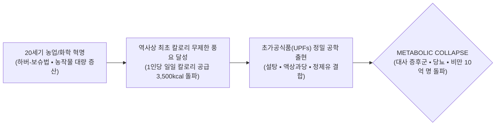

> **🎙️ 3-Presenter Authentic Tiki-Taka Script**
> 
> **Prof. Peter Kim:** 여러분, 10주차 세미나에 오신 것을 환영합니다. 인류 역사 30만 년 동안 우리의 가장 위대한 꿈은 '배불리 먹는 것'이었습니다. 우리는 마침내 기아를 정복하고 지구상 모든 마트에 산더미 같은 음식을 쌓아 올렸습니다.  
> **Dr. Elena Vance:** 하지만 피터 교수님, 그 결과는 참혹합니다. 오늘날 지구상에서 굶주림으로 사망하는 사람보다 **'너무 많이 먹어서, 가짜 음식을 먹어서'** 당뇨와 심장마비로 사망하는 사람이 3배 더 많습니다.  
> **TA Marcus Brody:** 전 세계 비만 인구가 10억 명을 돌파했습니다! 인류 역사상 가장 배부른 세대가 가장 일찍 병들어 죽어가는 기괴한 코미디가 벌어지고 있습니다.  
> **Prof. Peter Kim:** 오늘 우리는 이 '칼로리의 함정(The Caloric Trap)'을 설계한 식품 공학과 뇌 도파민 시스템의 어두운 결탁을 해체하겠습니다.  

---

### Slide 02: 풍요의 역설(The Paradox of Plenty): 칼로리의 기하급수적 과잉
- **The Historic Reversal:**
  - 1900년 이전: 인류 사망 원인 1위는 영양실조, 전염병, 굶주림
  - 2026년 현재: 인류 사망 원인의 70% 이상이 **만성 대사 질환(심혈관 질환, 뇌졸중, 당뇨병, 비만 관련 암)**

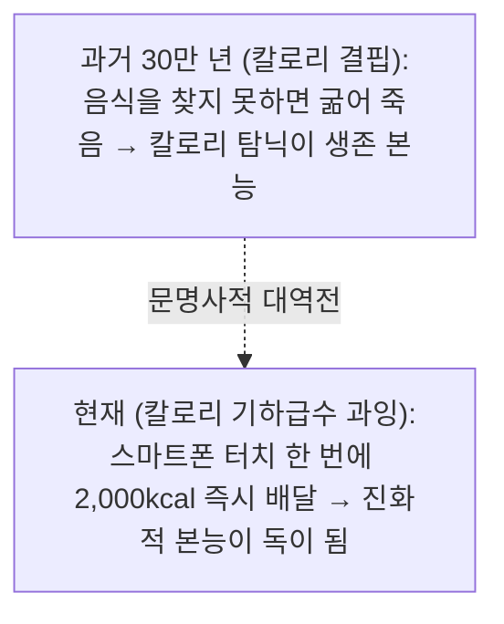

> **🎙️ 3-Presenter Authentic Tiki-Taka Script**
> 
> **Dr. Elena Vance:** 과거 사바나 초원에서 달콤한 꿀이나 잘 익은 과일을 발견하면 무조건 배가 터지도록 먹어 치워야 살아남을 수 있었습니다. 지방으로 비축해야 다음 기근을 버틸 수 있었기 때문입니다.  
> **TA Marcus Brody:** 그런데 지금은 밤 11시에 침대에 누워서 배달 앱을 켜면 30분 만에 설탕과 기름이 범벅된 치킨과 피자가 문 앞에 도착합니다. 우리 뇌의 원시 본능이 쉴 새 없이 결제 버튼을 누르게 만드는 거네요!  

---

### Slide 03: 칼로리 함정(The Caloric Trap): 영양소 결핍과 초가공 에너지의 폭격
- **Empty Calories Epidemic:**
  - 현대인이 섭취하는 칼로리의 60% 이상은 비타민, 미네랄, 파이토케미컬, 식이섬유가 완전히 거세된 **'빈 칼로리(Empty Calories)'**
  - 세포는 미세 영양소가 부족해 계속해서 "배가 고프다"는 신호를 뇌로 보내고, 뇌는 더 많은 초가공식품을 섭취하게 만드는 **'영양 결핍형 과식의 굴레'**


> **🎙️ 3-Presenter Authentic Tiki-Taka Script**
> 
> **Dr. Elena Vance:** 이것이 바로 '칼로리의 함정'입니다. 배는 부른데 세포는 굶주리고 있습니다. 비타민과 마그네슘이 없으니 세포는 뇌에 계속 배고프다고 신호를 보냅니다. 그래서 우리는 살이 찌면서도 끊임없이 과자를 집어먹는 것입니다.  
> **TA Marcus Brody:** 몸은 뚱뚱해지는데 세포는 영양실조에 걸려있는 기형적인 상태군요!  

---

### Slide 04: 금주의 핵심 질문: 인류는 왜 역사상 가장 배부른 상태에서 가장 병들어가는가?
- **Core Inquiry of Week 10:**
  - 식품 대기업의 연구원들은 어떻게 인간의 뇌 신경망을 해킹하여 '멈출 수 없는 식탐'을 프로그래밍했는가?
  - 왜 우리의 간과 췌장은 액상과당과 정제 탄수화물의 폭격 앞에 무기력하게 무너졌는가?
  - GLP-1 비만 치료제(위고비, 마운자로)는 인류를 이 대사 지옥에서 구원할 진정한 해방구인가, 또 다른 의존인가?

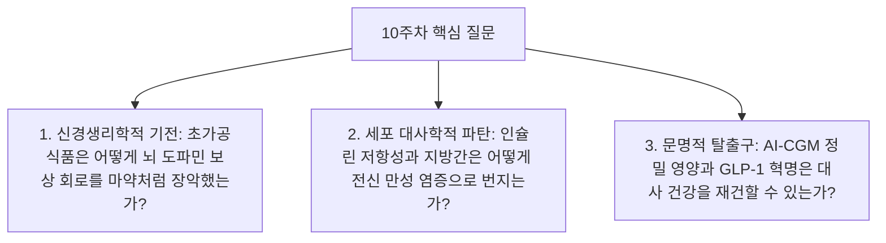

> **🎙️ 3-Presenter Authentic Tiki-Taka Script**
> 
> **Prof. Peter Kim:** 금주의 핵심 질문입니다. "우리가 먹는 음식은 정말 우리가 자유 의지로 선택한 것인가, 아니면 거대 식품 자본이 프로그래밍한 화학적 중독 알고리즘의 결과인가?"  
> **Dr. Elena Vance:** 오늘 우리는 분자 대사학과 뇌신경 영상 데이터, 그리고 글로벌 제약 산업의 판도를 뒤흔든 GLP-1 실측치를 통해 이 질문에 답하겠습니다.  

---

### Slide 05: 10주차 학습 로드맵: 지복점(Bliss Point) 설계에서 GLP-1 혁명까지
- **Curriculum Architecture:** 지복점 엔지니어링부터 인슐린 저항성 수식, WHO 글로벌 비만 데이터, 그리고 GLP-1 경제학까지 완결된 6대 모듈 구조

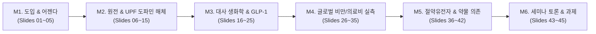

> **🎙️ 3-Presenter Authentic Tiki-Taka Script**
> 
> **Prof. Peter Kim:** 10주차 로드맵입니다. M2에서 초가공식품의 '지복점(Bliss Point)' 공학을 파헤치고, M3에서 인슐린 저항성 모델과 GLP-1 수용체 메커니즘을 규명합니다.  
> **Dr. Elena Vance:** M4에서는 10억 비만 인구 통계와 덴마크 Novo Nordisk의 주가 폭등 실측치를 검증합니다.  
> **TA Marcus Brody:** 준비되셨으면 M2로 넘어가서 식품 산업의 충격적인 뇌 해킹 비밀을 열어보시죠!  

---

## Module 2: 원전 텍스트 정밀 해체 (Slides 06~15)

### Slide 06: 『We Are as Gods』 제6장: "The Caloric Trap" 텍스트 해체
- **Textual Anchor:** Diamandis & Kotler, *We Are as Gods* (2026), Chapter 6
- **Core Thesis:** 기하급수 기술이 식품의 단가를 극적으로 낮추고 생산량을 폭증시켰으나, 그 결과 탄생한 초가공식품은 인간의 원시 진화 뇌를 인질로 잡고 **'기하급수적 대사 질환(Exponential Metabolic Collapse)'**을 양산하고 있다.
- **Authors' Warning:** "우리는 굶주림을 이겼지만, 배부른 자들의 만성 염증이라는 더 거대한 지옥에 갇혔다."

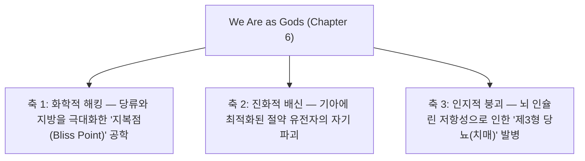

> **🎙️ 3-Presenter Authentic Tiki-Taka Script**
> 
> **Prof. Peter Kim:** 디아만디스와 코틀러는 6장에서 식품 산업을 '가장 잔인한 뇌 해킹 산업'으로 규정합니다. 식품 연구소들은 자연계에 존재하지 않는 완벽한 설탕-지방 비율을 찾아내어 소비자가 배가 불러도 포크를 내려놓지 못하게 만듭니다.  
> **Dr. Elena Vance:** 이것은 개인의 의지력 부족이 아닙니다. 수억 달러짜리 fMRI 뇌 영상 장비와 화학 공학이 합작하여 인간의 도파민 회로를 강제 장악한 결과입니다.  
> **TA Marcus Brody:** 연구실에서 과학자들이 우리 뇌를 중독시키려고 정밀 타격 미사일을 쏜 거네요!  

---

### Slide 07: 초가공식품(Ultra-Processed Foods: UPFs)의 탄생과 산업적 정밀 설계
- **NOVA Food Classification (Carlos Monteiro, Univ. of Sao Paulo):**
  - Group 1: 미가공/최소 가공 식품 (채소, 과일, 생고기, 쌀)
  - Group 2: 가공 조리 재료 (소금, 설탕, 버터, 식물성 기름)
  - Group 3: 가공 식품 (통조림, 치즈, 갓 구운 빵)
  - **Group 4: 초가공식품 (UPFs) — 5가지 이상의 산업용 추출물(유화제, 보존제, 인공 감미료, 착향료, 변성 전분)로 완전히 재조합된 화학 제품**


> **🎙️ 3-Presenter Authentic Tiki-Taka Script**
> 
> **Dr. Elena Vance:** 초가공식품은 음식이 아니라 '먹을 수 있는 화학 합성물'입니다. 공장에서 옥수수와 대두를 분자 단위로 분해한 다음, 기름과 설탕, 화학 유화제를 섞어 바삭하고 부드러운 형태로 다시 찍어낸 것입니다.  
> **TA Marcus Brody:** 감자칩, 탄산음료, 냉동 피자, 편의점 빵... 우리가 매일 먹는 것의 80%가 Group 4 초가공식품이네요!  

---

### Slide 08: 지복점(Bliss Point)의 생화학: 당류 50% + 지방 35%의 완벽한 뇌 중독 포뮬러
- **Howard Moskowitz's Bliss Point Engineering:**
  - 자연계에는 '지방 35% + 단순 당류 50%'가 동시에 결합된 음식이 존재하지 않음 (오직 모유에만 미량 존재)
  - 이 황금 비율을 입에 넣는 순간, 혀의 미각 수용체가 대뇌 변연계로 전례 없는 전기 충격을 발사하여 **포만감 중추(Satiety Center)를 강제 셧다운**시킴

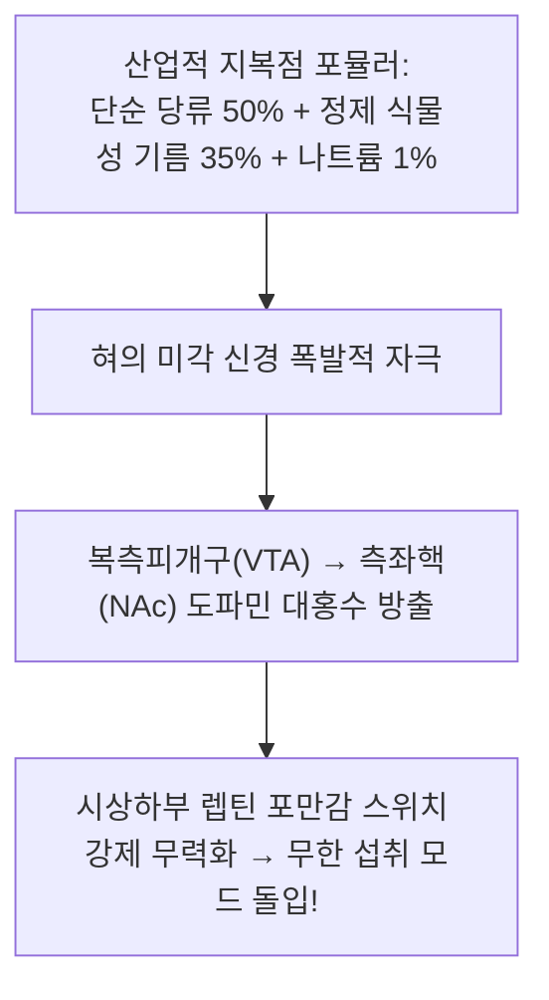

> **🎙️ 3-Presenter Authentic Tiki-Taka Script**
> 
> **Dr. Elena Vance:** 하워드 모스코비츠 박사가 발견한 '지복점(Bliss Point)'입니다. 설탕만 많으면 너무 달아서 질리고, 기름만 많으면 느끼해서 뱉습니다. 하지만 당류 50%에 지방 35%를 정확히 맞추면 뇌가 환각에 빠져 씹지도 않고 삼키며 "한 봉지 더!"를 외치게 됩니다.  
> **TA Marcus Brody:** "손이 가요 손이 가" 노래가 그냥 광고 문구가 아니라, 뇌 신경망을 강제로 털어버리는 생화학적 해킹 코드였던 거네요!  

---

### Slide 09: 제임스 닐(James Neel)의 절약 유전자 가설(Thrifty Gene Hypothesis)
- **Evolutionary Biology Anchor (James Neel, 1962):**
  - 인류 선조들은 극심한 기근을 견디기 위해, 음식이 들어왔을 때 인슐린을 폭발적으로 분비하여 **단 1칼로리도 남김없이 내장 지방으로 비축하는 '절약 유전자(Thrifty Genes)'**를 선택 진화시킴
  - 기근이 사라진 21세기 무제한 잉여 칼로리 환경에서 이 유전자는 **지속적인 고인슐린혈증과 초고속 지방간, 비만을 유발하는 '저주의 유전자'로 돌변**

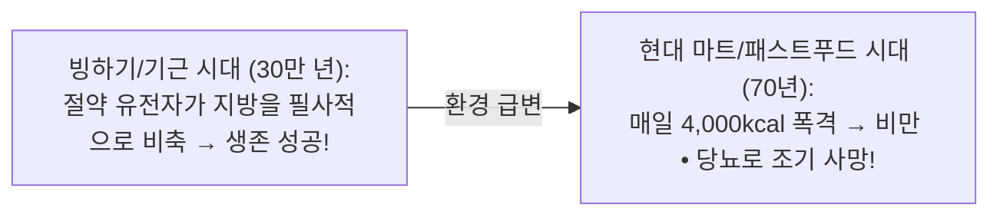

> **🎙️ 3-Presenter Authentic Tiki-Taka Script**
> 
> **Prof. Peter Kim:** 인류를 기근에서 구원했던 가장 고마운 유전자가, 오늘날 우리를 죽이는 가장 치명적인 칼날이 되었습니다.  
> **Dr. Elena Vance:** 사피엔스의 몸은 굶주림에는 수십 일을 버티도록 완벽히 설계되었지만, 매일 3끼 과잉 칼로리가 쏟아지는 환경에 대해서는 아무런 생물학적 방어 기제를 갖고 있지 않습니다.  

---

### Slide 10: 뇌 중격측좌핵(Nucleus Accumbens)의 도파민 하이재킹 메커니즘
- **Neurobiology of Food Addiction (Nicole Avena et al.):**
  - 정제 설탕과 가공 지방 섭취 시 대뇌 측좌핵(Nucleus Accumbens)에서 분비되는 도파민 농도는 **코카인, 니코틴, 알코올 섭취 시의 도파민 스파이크와 완전히 동일한 궤적**을 그림
  - 반복 섭취 시 도파민 $D_2$ 수용체가 하향 조절(Down-Regulation)되어 **더 강한 단맛과 기름진 음식을 찾게 되는 내성(Tolerance)과 금단 증상 발현**

```mermaid
xychart-beta
    title "뇌 측좌핵 도파민 분비 농도 비교 (% of Baseline)"
    x-axis [기본 평상시, 일반 자연식 (사과/샐러드), 초가공 감자칩 섭취, 코카인 투여]
    y-axis "도파민 분비량 (%)" 0 --> 300
    bar [100, 135, 220, 250]
```

> **🎙️ 3-Presenter Authentic Tiki-Taka Script**
> 
> **Dr. Elena Vance:** 뇌 스캔 영상을 보십시오. 초가공 감자칩을 먹을 때 뇌에서 터지는 도파민 분비량이 마약을 할 때와 거의 비슷합니다. 우리는 매일 마약성 화학 합성물을 합법적으로 사 먹고 있는 것입니다.  
> **TA Marcus Brody:** 과자 봉지를 뜯으면 한 봉지를 다 비울 때까지 손을 못 멈추는 이유가 뇌의 마약 중독 회로가 켜졌기 때문이었군요!  

---

### Slide 11: 피터 디아만디스의 생화학적 감옥 경고: 무제한 칼로리의 치명적 유혹
- **The Modern Biochemical Enslavement:**
  - 인간은 기술을 통해 환경을 정복했다고 자부하지만, 실제로는 가공식품 기업들이 설계한 **'인슐린과 도파민의 생화학적 쳇바퀴'**에 갇힌 죄수가 됨
  - 이 감옥에서 탈출하지 못하는 한, 인류의 지능과 활력은 만성 염증으로 서서히 부식됨

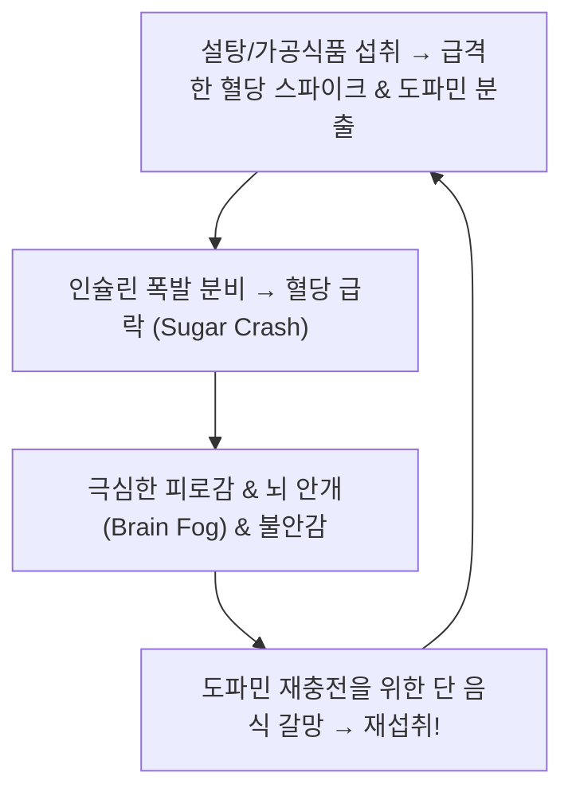

> **🎙️ 3-Presenter Authentic Tiki-Taka Script**
> 
> **Prof. Peter Kim:** 디아만디스는 이 사이클을 '생화학적 감옥'이라 부릅니다. 혈당이 치솟았다가 곤두박질치고, 도파민이 꺼지면 불안해져서 다시 설탕을 찾는 악순환입니다.  
> **TA Marcus Brody:** 하루 종일 피곤하고 졸린 이유가 이 롤러코스터에 뇌가 혹사당하고 있었기 때문이네요!  

---

### Slide 12: 스티븐 코틀러의 인지-대사 축(Metabolic-Cognitive Axis)과 뇌 에너지 고갈
- **The Brain Metabolism Bottleneck:**
  - 뇌는 체중의 2%에 불과하지만 신체 전체 포도당의 20%를 소모하는 최고급 에너지 연소 기관
  - 만성 고혈당과 인슐린 저항성이 발생하면 **뇌 모세혈관의 포도당 수송체(GLUT1)가 손상되어 뇌세포가 포도당을 공급받지 못하고 '에너지 기아 상태'에 빠짐** $\rightarrow$ 전두엽 기능 마비 및 깊은 몰입(Flow) 상태 진입 불가능


> **🎙️ 3-Presenter Authentic Tiki-Taka Script**
> 
> **Dr. Elena Vance:** 피 속에 당분이 넘쳐나는데 정작 뇌세포는 굶어 죽고 있습니다. 인슐린 저항성 때문에 문이 잠겨서 포도당이 뇌세포 안으로 못 들어가기 때문입니다.  
> **TA Marcus Brody:** 기름이 넘치는데 엔진에 기름이 안 들어가서 슈퍼카가 멈춰 서는 꼴이군요!  

---

### Slide 13: 렙틴 저항성(Leptin Resistance): "배부름" 신호가 영구 음소거된 뇌
- **The Broken Satiety Loop:**
  - 지방세포는 지방이 충분히 쌓이면 렙틴(Leptin) 호르몬을 분비해 뇌 시상하부에 "그만 먹어라"고 명령함
  - 초가공식품의 만성 염증(TNF-$\alpha$, C-반응성 단백질)이 **시상하부의 렙틴 수용체 신호 경로(JAK2-STAT3)를 물리적으로 차단** $\rightarrow$ 뇌는 몸이 100kg이어도 **"나는 지금 조난당해 굶어 죽어가고 있다"고 착각!**

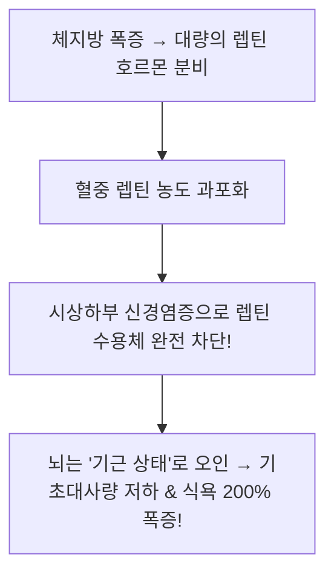

> **🎙️ 3-Presenter Authentic Tiki-Taka Script**
> 
> **Dr. Elena Vance:** 비만 환자들의 뇌는 고장 난 게 아니라 '속고 있는 것'입니다. 렙틴 저항성 때문에 뇌는 자기가 지금 영하 30도 눈밭에서 굶어 죽어가는 중이라고 생각합니다. 그러니 필사적으로 음식을 입에 쑤셔 넣으라고 명령하는 것입니다.  
> **Prof. Peter Kim:** 생물학적 신호 체계의 완전한 통신 두절입니다.  

---

### Slide 14: 식품 대기업(Big Food)의 '설탕 담배화'와 행동 조작 마케팅
- **The Big Tobacco Playbook (Michael Moss, *Salt Sugar Fat*):**
  - 1980년대 담배 기업 필립 모리스(Philip Morris)가 크래프트(Kraft), 제너럴 푸즈(General Foods)를 인수하며 **담배의 중독성 화학 배합 기술을 식품 산업에 그대로 이식**
  - 아동용 애니메이션 캐릭터, 핑거 푸드(소리 없이 녹아 없어지는 질감 공학)를 통해 평생 고객으로 락인(Lock-in)

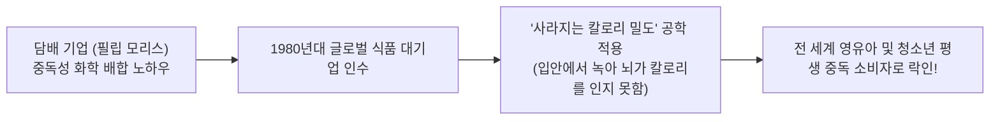

> **🎙️ 3-Presenter Authentic Tiki-Taka Script**
> 
> **TA Marcus Brody:** 담배 회사들이 담배 규제가 심해지니까 과자 회사들을 인수해서 똑같은 중독 기술을 과자에 집어넣은 거였습니다! 치토스처럼 입에 넣으면 사르르 녹아 없어지는 과자가 대표적입니다. 씹는 느낌이 없으니 뇌가 칼로리를 계산 못 하고 계속 먹게 만드는 기술입니다.  
> **Dr. Elena Vance:** 그것을 '사라지는 열량 밀도(Vanishing Caloric Density)' 공학이라고 부릅니다. 철저히 계산된 자본의 행동 조작입니다.  

---

### Slide 15: 현대 대사 질환 5대 핵심 파탄 경로 매트릭스
- **Systemic Metabolic Breakdown Matrix:** 5대 주요 대사 파탄 경로, 원인 인자, 최종 질환 종합

| 대사 파탄 경로 | 1차 촉발 원인 인자 | 생화학적 기전 | 최종 발병 질환 |
| :--- | :--- | :--- | :--- |
| **1. 인슐린 저항성** | 단순 당류 및 정제 탄수화물 과잉 | GLUT4 수용체 둔화, 고인슐린혈증 | **제2형 당뇨병, 심혈관 질환** |
| **2. 지방간 (MASLD)** | 액상과당(HFCS) 과다 섭취 | 간 내 de novo 지방합성(DNL) 폭발 | **비알코올성 간경변, 간암** |
| **3. 렙틴 저항성** | 초가공식품 만성 신경염증 | 시상하부 포만감 수용체 차단 | **병적 고도 비만, 폭식증** |
| **4. 장내 누수 (Leaky Gut)**| 유화제, 인공 감미료, 식이섬유 결핍 | 장 상피 치밀결합 파괴, 내독소 유입 | **전신 자가면역 질환, 만성 피로** |
| **5. 뇌 인슐린 결손** | 만성 고혈당 및 산화 스트레스 | 뇌 포도당 대사 부전, 아밀로이드 침착| **제3형 당뇨 (알츠하이머 치매)** |

> **🎙️ 3-Presenter Authentic Tiki-Taka Script**
> 
> **Prof. Peter Kim:** 이 5대 경로가 도미노처럼 얽히며 현대인의 신체를 내부로부터 무너뜨리고 있습니다.  
> **TA Marcus Brody:** 이제 3번째 모듈로 넘어가서 인슐린 저항성의 수학 공식과 GLP-1의 약리학적 작동 원리를 파헤쳐 보시죠!  

---

## Module 3: 기하급수 이론 및 프레임워크 (Slides 16~25)

### Slide 16: 인슐린 저항성(HOMA-IR)과 고인슐린혈증의 악순환 수식 모델
- **Homeostatic Model Assessment of Insulin Resistance (HOMA-IR):**
  - 공복 혈당($\text{Glucose}_0$, $\text{mg/dL}$)과 공복 인슐린($\text{Insulin}_0$, $\mu\text{IU/mL}$)의 곱으로 대사 파탄 정도 정량화

$$\text{HOMA-IR} = \frac{\text{Glucose}_0 \times \text{Insulin}_0}{405} \quad (\text{정상 } < 1.0, \quad \text{중증 저항성 } > 2.5)$$

$$\frac{d[\text{Insulin}]}{dt} = \alpha \cdot \text{HOMA-IR} \cdot [\text{Glucose}] - \beta \cdot [\text{Insulin}] \implies \text{고인슐린혈증의 양의 피드백 폭주}$$

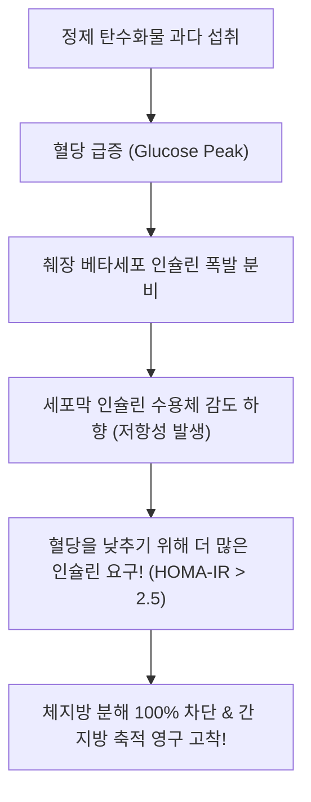

> **🎙️ 3-Presenter Authentic Tiki-Taka Script**
> 
> **Dr. Elena Vance:** 인슐린 수치가 높으면 몸은 '지방 저장 모드'로 잠겨서 어떤 운동을 해도 체지방이 단 1그램도 타지 않습니다. 인슐린 저항성은 세포가 설탕 세례를 견디다 못해 귀를 틀어막아 버린 상태입니다.  
> **TA Marcus Brody:** 췌장은 소리를 안 들으니까 더 크게 고함을 지르고(인슐린 폭발), 세포는 귀를 더 꽉 막는 파멸적인 악순환이네요!  

---

### Slide 17: 액상과당(HFCS)의 간 대사 경로: de novo 지방합성 및 요산 폭발
- **Fructose vs Glucose Metabolism:**
  - 포도당: 인체 모든 세포(근육, 뇌, 적혈구)가 에너지로 분산 소모
  - **과당(Fructose): 100% 간(Liver)에서만 대사됨 (알코올과 완전히 동일한 대사 경로!)**
  - 간세포 내 인산 고갈 $\rightarrow$ AMP 탈아미노화 $\rightarrow$ **요산(Uric Acid) 폭증(통풍, 고혈압) & 중성지방(de novo lipogenesis) 즉시 생성**

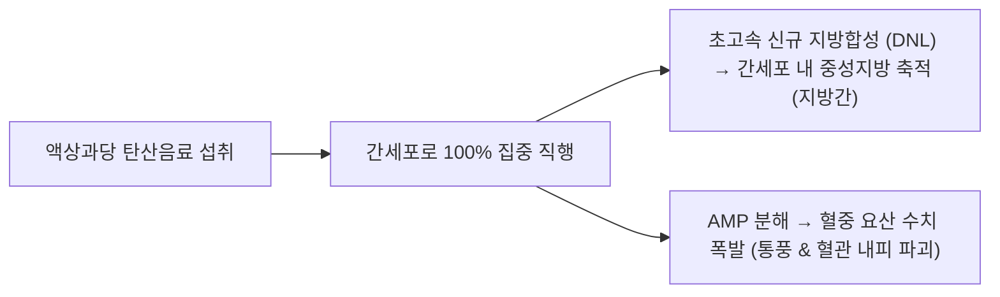

> **🎙️ 3-Presenter Authentic Tiki-Taka Script**
> 
> **Dr. Elena Vance:** 액상과당은 '알코올에서 취기만 뺀 독극물'입니다. 맥주를 마셔서 지방간이 생기는 것과 콜라를 마셔서 지방간이 생기는 생화학적 경로는 100% 일치합니다.  
> **TA Marcus Brody:** 술 한 방울 안 마신 어린 초등학생들이 지방간에 걸리는 이유가 바로 과당 때문이었습니다!  

---

### Slide 18: 장-뇌 축(Gut-Brain Axis)과 마이크로바이옴 장벽 붕괴(Leaky Gut)
- **Endotoxin Translocation Mechanism:**
  - 초가공식품의 유화제(Polysorbate 80, CMC)가 장 점막(Mucus Layer)을 용해
  - 장내 유익균 사멸 및 그람음성균 내독소(LPS: Lipopolysaccharide)가 혈류로 직접 유출 $\rightarrow$ **전신 톨유사수용체(TLR4) 활성화 및 전신 만성 염증 격발**

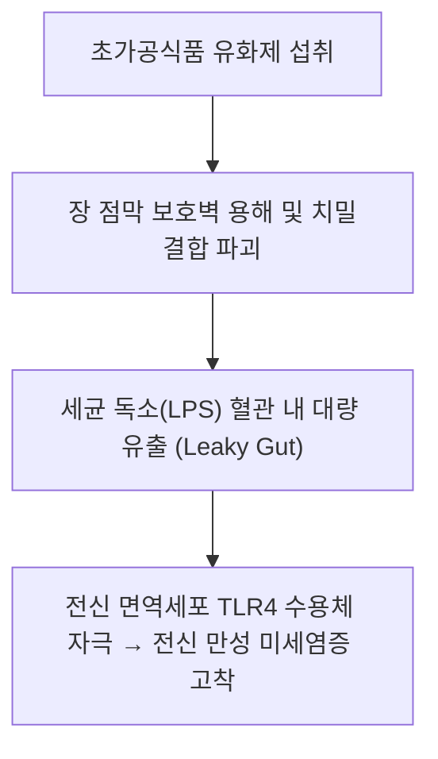

> **🎙️ 3-Presenter Authentic Tiki-Taka Script**
> 
> **Dr. Elena Vance:** 장 점막이 뚫리면 대변 속에 있어야 할 세균 독소들이 핏줄 속으로 쏟아져 들어옵니다. 그 독소가 온몸을 돌며 간, 심장, 뇌를 공격합니다.  

---

### Slide 19: GLP-1 수용체 작용제(Semaglutide/Tirzepatide)의 뇌 시상하부 식욕 차단 약리학
- **Pharmacological Revolution (GLP-1 Receptor Agonists):**
  - 인체 천연 GLP-1 펩타이드는 분비 후 DPP-4 효소에 의해 **2분 만에 분해됨**
  - **세마글루타이드(Wegovy/Ozempic):** 지방산 곁사슬을 붙여 반감기를 **7일(168시간)로 연장**
  - **작동 기전:** 뇌 시상하부(Hypothalamus)의 POMC/CART 신경을 직접 자극하여 **"음식에 대한 집착과 갈망(Food Noise)"을 100% 음소거!**

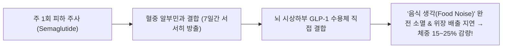

> **🎙️ 3-Presenter Authentic Tiki-Taka Script**
> 
> **TA Marcus Brody:** 주사 한 대 맞았더니 평생 머릿속을 맴돌던 떡볶이, 치킨 생각이 라디오 음소거 버튼 누른 것처럼 싹 사라집니다!  
> **Dr. Elena Vance:** 위장의 음식 배출 속도를 늦추고 뇌의 식탐 중추를 강제로 꺼버립니다. 현대 의학이 발견한 가장 강력한 비만 킬러입니다.  

---

### Slide 20: 미토콘드리아 과부하(Mitochondrial Overload)와 대사적 번아웃 동역학
- **Substrate Congestion Dynamics:**
  - 세포 내로 포도당과 지방산이 동시에 과도하게 밀려들 때(Substrate Overload)
  - 미토콘드리아 전자전달계(ETC)의 전자 압력이 한계치를 초과하여 **불완전 연소 부산물(지질 독성 중간체: Ceramides, Diacylglycerol)을 축적하여 세포 호흡 마비**

$$\text{Mitochondrial Capacity } C_{\text{max}} < \text{Glucose Flux} + \text{Fatty Acid Flux} \implies \text{ROS Production} \uparrow \uparrow$$

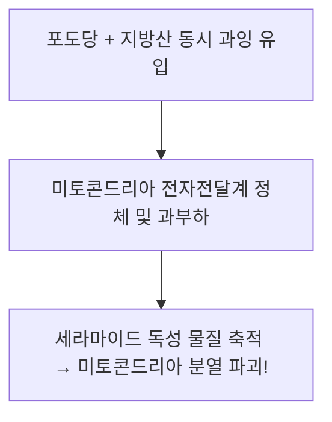

> **🎙️ 3-Presenter Authentic Tiki-Taka Script**
> 
> **Dr. Elena Vance:** 공장의 소각로 용량은 100인데 쓰레기가 500씩 쏟아져 들어오니 소각로가 터져버린 상태입니다. 미토콘드리아가 파괴되면서 사람은 먹어도 먹어도 기운이 없는 '대사적 탈진'에 빠집니다.  

---

### Slide 21: 자가포식(Autophagy)의 스위치: mTOR 억제 vs AMPK 활성화의 생화학
- **The Cellular Cleaning Switch:**
  - **mTOR 활성화 (음식물 섭취 시):** 세포 성장 및 단백질 합성 가동 $\rightarrow$ 노폐물 청소 중단
  - **AMPK 활성화 (단식 16시간 이상 경과 시):** 에너지 고갈 감지 $\rightarrow$ **세포 내 망가진 단백질, 미토콘드리아 쓰레기를 청소하여 재활용하는 자가포식(Autophagy) 폭발적 가동!**

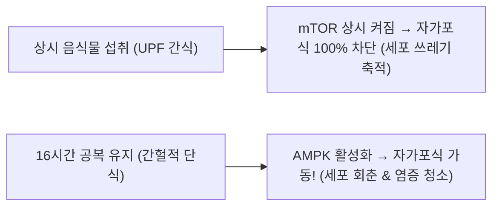

> **🎙️ 3-Presenter Authentic Tiki-Taka Script**
> 
> **TA Marcus Brody:** 24시간 내내 음식을 먹으면 세포 청소차가 한 번도 안 돌아갑니다. 공복 상태를 16시간만 유지해 주면 세포가 알아서 쓰레기 단백질을 태워 청소하는 자가포식 스위치가 켜집니다!  
> **Prof. Peter Kim:** 2016년 오스미 요시노리 교수가 노벨 생리의학상을 받은 핵심 원리입니다.  

---

### Slide 22: 최종당화산물(AGEs)과 전신 혈관 노화 가속화 방정식
- **Advanced Glycation End-products (AGEs):**
  - 고혈당 상태에서 여분의 포도당이 혈관 벽의 콜라겐 단백질과 결합하여 캐러멜처럼 눌어붙는 **메일라드 반응(Maillard Reaction)** 발생
  - 혈관이 고무줄처럼 부드러운 탄성을 잃고 **유리관처럼 딱딱하게 굳어짐(동맥경화 및 조기 혈관 노화)**

$$\text{Protein} + \text{Glucose} \xrightarrow{\text{Non-Enzymatic}} \text{Schiff Base} \rightarrow \text{Amadori Product} \rightarrow \text{AGEs (비가역적 혈관 경화)}$$

```mermaid
xychart-beta
    title "혈중 포도당 농도에 따른 혈관 내 AGEs 축적 속도 (AU)"
    x-axis [정상 혈당 (85mg/dL), 내당능 장애 (120mg/dL), 당뇨 초기 (160mg/dL), 고혈당 (220mg/dL)]
    y-axis "AGEs 축적 속도" 0 --> 100
    line [10, 25, 58, 95]
```

> **🎙️ 3-Presenter Authentic Tiki-Taka Script**
> 
> **Dr. Elena Vance:** 프라이팬에 고기를 구울 때 갈색으로 눌어붙는 '마이야르 반응'이 우리 혈관 속에서 똑같이 일어나고 있습니다. 설탕에 절여진 혈관이 돌처럼 굳어 터지는 것이 뇌졸중과 심근경색입니다.  

---

### Slide 23: 초가공식품 섭취율과 대사 증후군 유병률의 지수 함수적 결합 모델
- **Epidemiological Risk Curve:**
  - 일일 총 섭취 칼로리 중 초가공식품(UPF) 비중이 $x\%$일 때, 대사 증후군 발병 위험도 $R(x)$

$$R(x) = R_0 \cdot \exp(0.023 \cdot x) \quad (\text{UPF 비중 } 60\% \text{ 도달 시 위험도 } 4.0\text{배 폭증})$$

```mermaid
xychart-beta
    title "일일 식단 중 초가공식품(UPF) 섭취 비중별 대사 질환 발병 상대 위험도"
    x-axis [10% (자연식 중심), 20%, 40%, 60% (미국/영국 평균), 80%]
    y-axis "상대 위험도 (Relative Risk)" 1 --> 6
    line [1.0, 1.25, 2.1, 4.0, 6.2]
```

> **🎙️ 3-Presenter Authentic Tiki-Taka Script**
> 
> **TA Marcus Brody:** 식단에서 가공식품 비중이 60%를 넘는 순간 대사 질환 위험도가 4배로 치솟습니다. 미국과 영국의 평균 식단이 이미 60%를 넘었습니다!  

---

### Slide 24: 체내 대사 항상성 미분 방정식: $\frac{d[\text{Fat}]}{dt} = \text{Energy}_{\text{in}} - \text{Energy}_{\text{out}}$
- **The True Metabolic Flux Equation:**
  - 단순 칼로리 뺄셈 모델의 오류 수정 $\rightarrow$ 호르몬 조절 계수 $\eta(\text{Insulin})$ 도입

$$\frac{d[\text{Fat}]}{dt} = \eta(\text{Insulin}) \cdot E_{\text{in}} - \kappa(\text{Thyroid, Leptin}) \cdot E_{\text{out}}$$

$$\text{Where } \eta(\text{Insulin}) \gg 1.0 \implies \text{적게 먹어도 지방으로 저장되는 호르몬 감옥 발현}$$

```mermaid
flowchart LR
    CalorieIn["섭취 에너지 (Ein)"] --> InsulinFilter{"인슐린 호르몬 필터 [η(Insulin)]"}
    InsulinFilter -->|고인슐린 상태| FatStore["체지방 100% 강제 축적"]
    InsulinFilter -->|저인슐린 상태| MuscleBurn["근육 및 뇌 에너지로 100% 연소!"]
```

> **🎙️ 3-Presenter Authentic Tiki-Taka Script**
> 
> **Dr. Elena Vance:** 칼로리를 적게 먹어도 인슐린 수치가 높으면 몸은 들어온 에너지를 무조건 지방으로 집어넣습니다. 그래서 굶으면서 다이어트해도 살이 안 빠지고 근육만 빠지는 것입니다.  
> **Prof. Peter Kim:** 칼로리의 양이 아니라 '호르몬의 신호'를 통제해야 하는 이유입니다.  

---

### Slide 25: 대사 건강 재건 및 항상성 최적화 4단계 프레임워크
- **Metabolic Restoration Protocol:** Theurgicon이 제시하는 4단계 대사 탈출 청사진

```mermaid
flowchart TD
    S1["1. 가공식품 원천 차단 (Elimination): 당류 • 액상과당 • 유화제 식단 100% 퇴출"] --> S2["2. 생체 리듬 간헐적 단식 (Fasting): 16:8 시간제한 섭취로 자가포식 스위치 가동"]
    S2 --> S3["3. AI-CGM 실시간 피드백 (Monitoring): 혈당 스파이크 유발 개인 맞춤 식품 식별"]
    S3 --> S4["4. 대사 치료제 정밀 병용 (Pharmacology): 고도 저항성 환자 GLP-1/SGLT2 단기 요법"]
```

> **🎙️ 3-Presenter Authentic Tiki-Taka Script**
> 
> **Prof. Peter Kim:** 차단하고, 비우고, 모니터링하고, 정밀 치료한다! 이 4단계 프로토콜을 통해 우리는 대사 붕괴의 늪에서 벗어날 수 있습니다.  
> **TA Marcus Brody:** 이제 실제 글로벌 의료 현장에서 터져 나온 충격적인 비만과 제약 데이터들을 확인하러 가시죠!  

---

## Module 4: 글로벌 데이터 & 실증 케이스 (Slides 26~35)

### Slide 26: CASE 1: WHO 2024 글로벌 비만 인구 10억 명(성인 8명 중 1명) 돌파 공식 데이터
- **Global Obesity Landmark (WHO & *The Lancet*, March 2024):**
  - 1990년 이후 성인 비만 유병률 2배 이상, 아동·청소년(5~19세) 비만 유병률 **4배 폭증**
  - **Official Milestone:** 전 세계 비만 인구 **총 10억 3,800만 명 돌파** (성인 8억 8천만 명 + 소아청소년 1억 6천만 명)
  - 저소득·중소득 국가(폴리네시아, 중동, 중남미)에서 비만율 증가 속도가 가장 가파름

```mermaid
xychart-beta
    title "전 세계 비만(Obesity) 인구 수 추이 (백만 명)"
    x-axis [1990년, 2000년, 2010년, 2020년, 2024년 (10억 돌파), 2030년 (예측)]
    y-axis "비만 인구 수 (백만 명)" 0 --> 1500
    line [226, 410, 650, 890, 1038, 1350]
```

> **🎙️ 3-Presenter Authentic Tiki-Taka Script**
> 
> **Dr. Elena Vance:** 2024년 3월 랜싯(Lancet) 저널과 WHO의 공식 발표입니다. 전 세계 비만 인구가 10억 명을 넘었습니다. 인류 역사상 비만 인구가 저체중 인구를 추월한 최초의 시대입니다.  
> **TA Marcus Brody:** 성인 8명 중 1명이 비만입니다. 특히 아동 비만이 4배나 폭증했다는 사실이 가장 끔찍합니다.  

---

### Slide 27: CASE 2: IDF 당뇨병 아틀라스: 전 세계 당뇨 환자 5억 4천만 명 $\rightarrow$ 2045년 7억 8천만 명
- **International Diabetes Federation (IDF) 10th Atlas:**
  - 2021년 기준 전 세계 당뇨 환자: **5억 3,700만 명 (성인 10명 중 1명)**
  - 2045년 전망: **7억 8,300만 명 (46% 증가)**
  - 당뇨 환자의 90% 이상이 식습관과 비만으로 인한 **제2형 당뇨병**

```mermaid
pie title 전 세계 대륙별 당뇨병 환자 분포 (백만 명)
    "서태평양 (중국/한국/동남아)" : 206
    "동남아시아 (인도 중심)" : 90
    "중동 및 북아프리카" : 73
    "유럽" : 61
    "북미 및 카리브해" : 51
    "기타 지역" : 56
```

> **🎙️ 3-Presenter Authentic Tiki-Taka Script**
> 
> **Dr. Elena Vance:** 아시아 지역의 당뇨 폭발을 보십시오. 쌀밥과 정제 탄수화물 위주의 식단에 서구식 패스트푸드가 결합하면서 중국과 인도에서 수억 명의 당뇨 환자가 쏟아져 나오고 있습니다.  
> **Prof. Peter Kim:** 췌장이 버텨내지 못하는 유전적 취약성이 초가공식품과 충돌한 참상입니다.  

---

### Slide 28: CASE 3: 대사 질환 관련 글로벌 연간 의료비 지출 $2 Trillion 돌파 실측치
- **Economic Burden Data (World Obesity Federation):**
  - 비만 및 과체중으로 인한 전 세계 직·간접 경제적 손실: **연간 $2.0 Trillion (약 2,700조 원, 글로벌 GDP의 2.2%)**
  - 2035년 예상 손실액: **연간 $4.32 Trillion (글로벌 GDP의 3%)**으로 폭증 전망 $\rightarrow$ 2008년 글로벌 금융위기 수준의 경제 충격 매년 발생

```mermaid
xychart-beta
    title "대사 질환으로 인한 연간 글로벌 경제적 손실액 (USD Trillions)"
    x-axis [2020년, 2024년, 2028년 (예측), 2035년 (예측)]
    y-axis "연간 경제 손실 (USD Trillions)" 0 --> 5
    bar [1.5, 2.0, 2.9, 4.32]
```

> **🎙️ 3-Presenter Authentic Tiki-Taka Script**
> 
> **TA Marcus Brody:** 매년 2,700조 원의 돈이 비만 치료와 당뇨 합병증 치료비로 증발하고 있습니다. 10년 뒤에는 4조 달러가 넘습니다. 국가 의료보험 재정이 버틸 수가 없습니다!  

---

### Slide 29: CASE 4: GLP-1 유사체(위고비/마운자로)의 폭발: Novo Nordisk 유럽 시총 1위 등극
- **Mega-Pharma Commercial Milestone:**
  - 덴마크 노보 노디스크(Novo Nordisk): 위고비(Wegovy) 열풍으로 LVMH(루이비통)를 제치고 **유럽 시가총액 1위 기업 등극 (기업 가치 $500B+ 돌파)**
  - 일라이 릴리(Eli Lilly): 마운자로/젭바운드(Tirzepatide)로 글로벌 제약사 최초 **시가총액 $800B 돌파**
  - 글로벌 GLP-1 시장 규모: 2030년 **연간 $100 Billion (약 135조 원)** 돌파 전망

```mermaid
xychart-beta
    title "글로벌 GLP-1 비만 치료제 시장 규모 성장 전망 (USD Billions)"
    x-axis [2021, 2023, 2025, 2027, 2030 (예측)]
    y-axis "시장 규모 (USD Billions)" 0 --> 120
    line [6, 24, 52, 85, 115]
```

> **🎙️ 3-Presenter Authentic Tiki-Taka Script**
> 
> **TA Marcus Brody:** 덴마크의 한 제약회사가 살 빼는 주사 하나로 루이비통을 제치고 유럽 전체 1위 기업이 되었습니다! 전 세계 부자들이 매달 1,000달러씩 내고 위고비를 맞고 있습니다.  
> **Prof. Peter Kim:** 인류가 음식에 중독되고, 그 중독을 치료하기 위해 제약회사에 수백조 원을 바치는 기이한 자본주의 순환 고리입니다.  

---

### Slide 30: CASE 5: BMJ 2024 메타분석: 초가공식품 섭취 10% 증가 시 심혈관 사망률 12% 증가
- **Landmark Umbrella Review (*BMJ*, February 2024):**
  - 전 세계 980만 명 대상 45개 메타분석 연구 종합
  - **Clinical Evidence:** 초가공식품 섭취 비율이 10% 증가할 때마다:
    - **심혈관 질환 사망 위험 12% 증가**
    - **제2형 당뇨병 발병 위험 12% 증가**
    - **우울증 및 불안장애 발병 위험 22% 증가**

```mermaid
xychart-beta
    title "초가공식품 섭취 증가에 따른 질환별 발병 위험 증가율 (%)"
    x-axis [심혈관 질환 사망, 제2형 당뇨 발병, 우울/불안 장애, 조기 사망률 총합]
    y-axis "발병 위험 증가율 (%)" 0 --> 30
    bar [12, 12, 22, 21]
```

> **🎙️ 3-Presenter Authentic Tiki-Taka Script**
> 
> **Dr. Elena Vance:** 2024년 2월 BMJ에 실린 1,000만 명 대상 초대형 메타분석 결과입니다. 초가공식품은 몸뿐만 아니라 정신까지 파괴합니다. 우울증과 불안장애 발병률이 22%나 증가했습니다.  

---

### Slide 31: CASE 6: 미국 아동 청소년 5명 중 1명 비알코올성 지방간(MASLD) 유병률 충격 수치
- **Pediatric Fatty Liver Crisis (CDC & JAMA Pediatrics):**
  - 미국 아동 및 청소년(2~19세)의 **17.8% (약 5명 중 1명)가 비알코올성 지방간 질환(MASLD)** 보유
  - 10대 청소년에게서 성인 알코올 중독자 수준의 **간 섬유화(Fibrosis) 및 간경변 조기 발병 급증**

```mermaid
pie title 미국 아동 청소년(2~19세) 간 건강 상태 분포
    "정상 간 조직" : 82.2
    "비알코올성 지방간 (MASLD 초기/중증)" : 17.8
```

> **🎙️ 3-Presenter Authentic Tiki-Taka Script**
> 
> **TA Marcus Brody:** 10살짜리 아이 5명 중 1명의 간에 기름이 가득 차서 간이 굳어가고 있습니다. 술 한 방울 안 마신 아이들이 매일 마신 액상과당 음료수와 과자 때문입니다!  

---

### Slide 32: CASE 7: 연속혈당측정기(CGM)와 AI 정밀 영양(Precision Nutrition) 대사 최적화 실측치
- **Personalized Metabolic AI Data (Levels Health / Zoe Study):**
  - 팔에 500원 동전 크기 연속혈당측정기(CGM)를 부착하고 24시간 실시간 혈당 모니터링
  - 동일한 바나나를 먹어도 사람마다 혈당 스파이크 반응이 300% 이상 차이남 실증 $\rightarrow$ **AI 맞춤 식단 처방으로 혈당 변동성(Glycemic Variability) 45% 억제 성공**

```mermaid
flowchart LR
    CGM["팔 부착 CGM 센서 (1분 단위 간질액 혈당 측정)"] --> Phone["스마트폰 AI 대사 앱 실시간 전송"]
    Phone --> Alert["'지금 먹은 샌드위치가 혈당을 180으로 폭발시켰습니다! 식후 15분 걷기 추천'"]
    Alert --> Stability["혈당 급락 차단 & 인슐린 스파이크 45% 방어!"]
```

> **🎙️ 3-Presenter Authentic Tiki-Taka Script**
> 
> **TA Marcus Brody:** 연속혈당측정기를 차고 음식을 먹으면 내 몸의 반응이 스마트폰에 주식 차트처럼 뜹니다. "아, 나는 빵을 먹으면 혈당이 치솟는데 밥은 괜찮구나!"를 AI가 즉시 알려줍니다.  
> **Dr. Elena Vance:** 맹목적인 다이어트가 아니라 내 유전자와 마이크로바이옴에 맞춘 '정밀 영양(Precision Nutrition)'의 시대가 열렸습니다.  

---

### Slide 33: CASE 8: 간헐적 단식(16:8) 및 자가포식 활성화를 통한 인슐린 감수성 40% 개선 데이터
- **Intermittent Fasting Clinical Trial (*Cell Metabolism*):**
  - 대사 증후군 환자 100명 대상 12주간 16:8 시간제한 식사(Early Time-Restricted Feeding) 임상
  - **Clinical Results:** 칼로리 제한 없이 식사 시간만 8시간으로 제한했음에도 불구하고:
    - **공복 인슐린 수치 32% 하락**
    - **HOMA-IR 인슐린 감수성 40% 개선**
    - **내장 지방(Visceral Fat) 14% 자연 감소**

```mermaid
xychart-beta
    title "16:8 시간제한 단식 12주 후 대사 지표 개선율 (%)"
    x-axis [공복 인슐린 감소, 인슐린 저항성 개선, 내장 지방 감소, 수축기 혈압 강하]
    y-axis "개선율 (%)" 0 --> 50
    bar [32, 40, 14, 11]
```

> **🎙️ 3-Presenter Authentic Tiki-Taka Script**
> 
> **Dr. Elena Vance:** 먹는 양을 줄이지 않았습니다. 단지 저녁 7시부터 다음 날 오전 11시까지 16시간 동안 공복을 유지했을 뿐인데 인슐린 저항성이 40%나 개선되었습니다.  
> **Prof. Peter Kim:** 약을 쓰지 않고도 생체 시계(Circadian Rhythm)를 회복시키는 것만으로 대사가 치유된 것입니다.  

---

### Slide 34: CASE 9: 글로벌 설탕세(Sugar Tax) 도입 국가(영국/멕시코)의 칼로리 소비 15% 감축 실증
- **Public Health Policy Data:**
  - 영국 설탕세(Soft Drinks Industry Levy) 도입 5년 후: 음료 제조사 50%가 설탕 함량을 자발적으로 30% 이상 감축 $\rightarrow$ **청소년 비만율 연간 8% 유의미 억제**
  - 멕시코 탄산음료세 도입 후 탄산음료 소비량 **12~15% 즉각 감소**

```mermaid
xychart-beta
    title "영국 설탕세 도입 전후 청소년 탄산음료 설탕 섭취량 (g/일)"
    x-axis [도입 2년 전, 도입 직전, 도입 2년 후, 도입 5년 후]
    y-axis "일일 설탕 섭취량 (g)" 0 --> 40
    line [36, 34, 25, 21]
```

> **🎙️ 3-Presenter Authentic Tiki-Taka Script**
> 
> **TA Marcus Brody:** 설탕에 세금을 때리자 음료수 회사들이 음료수에서 설탕을 빼기 시작했습니다! 정책 하나로 수십만 명의 아이들이 비만에서 탈출한 실증입니다.  

---

### Slide 35: 대사 질환 및 영양 위기 글로벌 실증 종합 매트릭스
- **Phase 3 Week 10 Synthesis:** 9대 실증 케이스의 정량적 임팩트 총람

| 실증 도메인 | 연구 기관 및 출처 | 정량적 실측 수치 | 문명사적 경고 및 의의 |
| :--- | :--- | :--- | :--- |
| **1. 비만 인구 폭발** | WHO / Lancet (2024) | 전 세계 비만 **10억 3,800만 명** | 성인 8명 중 1명 비만 돌파 |
| **2. 당뇨병 확산** | IDF Diabetes Atlas | 당뇨 환자 **5억 4천만 명** | 2045년 7억 8천만 명 폭증 |
| **3. 경제적 손실** | World Obesity Federation | 연간 의료비 **$2.0 Trillion** | 글로벌 GDP의 2.2% 증발 |
| **4. 비만 치료제 폭발** | Novo Nordisk / Eli Lilly | GLP-1 시장 **$100B+ 전망** | 유럽 시총 1위 제약사 등극 |
| **5. 초가공식품 위험** | *BMJ* 1,000만 명 메타분석 | 심혈관 사망률 **12% 증가** | 우울/불안 장애 22% 급증 |
| **6. 소아 지방간** | CDC / JAMA Pediatrics | 아동 청소년 **17.8% 지방간** | 10대 청소년 간경변 위기 |
| **7. AI 정밀 영양** | Levels / Zoe Study | 혈당 변동성 **45% 안정화** | CGM 기반 개인 맞춤 대사 관리 |
| **8. 간헐적 단식** | *Cell Metabolism* | 인슐린 감수성 **40% 개선** | 자가포식 기반 자연 대사 회복 |
| **9. 설탕세 정책** | UK / Mexico Policy Data | 청소년 설탕 소비 **15% 감축** | 식품 산업 알고리즘 강제 교정 |

> **🎙️ 3-Presenter Authentic Tiki-Taka Script**
> 
> **Prof. Peter Kim:** 이 종합 매트릭스는 우리가 먹는 음식이 우리의 생물학적 생존을 위협하는 지경에 이르렀음을 명백히 보여줍니다.  
> **Dr. Elena Vance:** 이제 우리는 이 비극 이면에 도사린 철학적 질문과 사회적 역설을 마주해야 합니다.  

---

## Module 5: 사회적·철학적 역설 (So What?) (Slides 36~42)

### Slide 36: 절약 유전자의 비극: 인류는 풍요를 견디도록 진화하지 않았다
- **The Tragic Flaw of Evolution:**
  - 인간의 뇌와 유전체는 **'부족함(Scarcity)'을 극복하기 위해 설계된 기계**
  - 완벽한 칼로리의 '풍요(Abundance)'가 주어졌을 때, 뇌의 생화학적 브레이크는 작동하지 않고 폭주함 $\rightarrow$ 풍요가 자멸의 도구가 되는 진화적 비극

```mermaid
flowchart TD
    ScarcityAdapt["결핍에 최적화된 호모 사피엔스"] --> AbundanceEnv["기하급수적 칼로리 풍요 환경 투입"]
    AbundanceEnv --> SelfDestruct["브레이크 없는 과소비 → 대사적 자멸"]
```

> **🎙️ 3-Presenter Authentic Tiki-Taka Script**
> 
> **Prof. Peter Kim:** 사피엔스는 굶주림과 결핍을 이겨내도록 진화했습니다. 하지만 '넘쳐나는 풍요' 앞에서 어떻게 멈춰야 하는지는 진화의 설명서에 적혀있지 않습니다.  
> **TA Marcus Brody:** 우리는 결핍에는 강하지만, 풍요에는 한없이 취약한 종(Species)이었군요...  

---

### Slide 37: 비만 치료제(GLP-1)의 계급화와 '약물 의존형 대사 사회'의 디스토피아
- **The Chemical Stratification:**
  - 월 $1,000를 낼 수 있는 부유층: 매주 위고비를 맞으며 날씬함과 건강 수명 유지
  - 저소득층: 값싼 초가공식품에 중독되어 비만과 당뇨, 조기 사망에 방치
  - **The Dystopia:** 식습관과 생활 방식을 교정하지 않고 평생 고가의 주사제에 생체 대사를 외주화(Outsourcing)하는 **'약물 의존형 사이보그 사회'**

```mermaid
flowchart TD
    Inequality["GLP-1 비만 치료제 월 1,000 USD"] --> Rich["부유층: 약물로 식탐 통제 & 날씬한 건강 수명 향유"]
    Inequality --> Poor["빈곤층: 값싼 초가공식품 섭취 → 비만과 만성 질환 세습"]
    Rich <==>|대립 • 비교| Poor
```

> **🎙️ 3-Presenter Authentic Tiki-Taka Script**
> 
> **TA Marcus Brody:** 돈 있는 사람들은 한 달에 150만 원 내고 주사 맞아서 날씬해지고, 돈 없는 사람들은 편의점 초가공식품 먹고 당뇨에 걸리는 '생물학적 계급 사회'가 만들어지고 있습니다!  
> **Dr. Elena Vance:** 더 심각한 것은 주사를 끊으면 식욕이 2배로 폭발해 요요가 온다는 점입니다. 평생 제약회사에 대사를 저당 잡히는 약물 중독 사회입니다.  

---

### Slide 38: 식품 사막(Food Desert)과 빈곤층의 강제적 초가공식품 섭취
- **Structural Injustice:**
  - 미국 및 대도시 저소득층 거주 지역: 신선한 채소와 과일을 파는 마트가 전무하고, 오직 패스트푸드점과 편의점만 밀집된 **'식품 사막(Food Deserts)'**
  - 가난할수록 1달러당 칼로리가 가장 높은 초가공식품을 살 수밖에 없는 **'구조적 비만 강제 시스템'**

```mermaid
flowchart LR
    LowIncome["저소득층 거주지 (식품 사막)"] --> OnlyUPF["마트 부재 • 편의점 패스트푸드만 존재"]
    OnlyUPF --> CheapCalorie["1 USD당 칼로리 최고치 (설탕/기름) 섭취 강제"]
    CheapCalorie --> ObesityTrap["빈곤층 비만율 2배 폭증 → 노동력 상실 악순환!"]
```

> **🎙️ 3-Presenter Authentic Tiki-Taka Script**
> 
> **Prof. Peter Kim:** 비만은 게으름의 상징이 아니라 '가난의 상징'이 되었습니다. 신선한 유기농 채소는 너무 비싸고, 설탕과 기름 범벅 과자는 너무 싸기 때문입니다.  

---

### Slide 39: 알츠하이머는 '제3형 당뇨병(Type 3 Diabetes)'이다: 뇌의 인슐린 저항성
- **Neurological Paradigm Shift (Suzanne de la Monte, Brown Univ):**
  - 알츠하이머 환자의 뇌 조직은 췌장과 마찬가지로 심각한 **'인슐린 신호 결손 및 포도당 흡수 장애'**를 겪음
  - 뇌세포가 당분을 흡수하지 못해 굶주리며 타우 단백질과 베타 아밀로이드 찌꺼기를 청소하지 못해 사멸 $\rightarrow$ **치매는 뇌에서 발생한 당뇨병!**

```mermaid
flowchart TD
    SystemicDiabetes["전신 고혈당 및 인슐린 저항성"] --> BrainInsulinResist["대뇌 피질 인슐린 저항성 격발 (제3형 당뇨)"]
    BrainInsulinResist --> AmyloidClearFail["아밀로이드 플라크 분해 청소 실패"]
    AmyloidClearFail --> Alzheimer["알츠하이머 치매성 신경망 붕괴!"]
```

> **🎙️ 3-Presenter Authentic Tiki-Taka Script**
> 
> **Dr. Elena Vance:** 브라운 의대의 수잔 드 라 몬테 교수가 증명한 충격적 사실입니다. 알츠하이머 치매는 뇌에 걸린 당뇨병, 즉 '제3형 당뇨'입니다. 우리가 오늘 먹은 액상과당이 30년 뒤 뇌세포를 굶겨 죽여 기억을 지워버리는 것입니다.  
> **TA Marcus Brody:** 당뇨와 치매가 한 뿌리였다니... 정말 무섭습니다.  

---

### Slide 40: 초가공식품 규제와 공공 급식의 대사 건강 재건: 설탕 경고 라벨 의무화
- **Public Policy Revolution:**
  - 칠레식 **'블랙 옥타곤(Black Octagon)'** 전면 경고 라벨 의무화: 설탕, 나트륨, 포화지방 과다 식품에 해골마크 수준의 검은색 경고 부착
  - 학교 급식 및 공공 기관에서 초가공식품 100% 퇴출 및 천연 통곡물 식단 법제화

```mermaid
flowchart LR
    ChileLaw["칠레 전면 경고 라벨제 (블랙 옥타곤)"] --> ConsumerDrop["경고 부착 초가공식품 소비 24% 즉각 급감"]
    ConsumerDrop --> Reformulation["식품 대기업들의 자발적 설탕 30% 삭감 유도!"]
```

> **🎙️ 3-Presenter Authentic Tiki-Taka Script**
> 
> **Prof. Peter Kim:** 담뱃갑에 경고 그림을 붙였듯이, 초가공식품 포장지 전면에 거대한 경고 라벨을 붙여야 합니다. 칠레는 이 법 하나로 탄산음료 소비를 24% 줄였습니다.  

---

### Slide 41: 신체 에너지 주권의 회복: 식탐의 생물학적 굴레를 벗어나는 방법
- **Reclaiming Metabolic Sovereignty:**
  - 외부 자본이 설계한 지복점 화학 중독에서 벗어나, **내 몸의 자율적 에너지 대사 조절 능력(Metabolic Flexibility)을 되찾는 것**
  - 포도당 연소 모드와 지방 케톤 연소 모드를 자유자재로 넘나드는 생화학적 주권 회복

```mermaid
flowchart LR
    GlucoseBurn["포도당 연소 모드 (식사 직후 에너지 공급)"] <===>|대사 유연성 (Metabolic Flexibility) 확보| KetoneBurn["지방/케톤 연소 모드 (공복 시 체지방 연소 & 뇌 활력)"]
```

> **🎙️ 3-Presenter Authentic Tiki-Taka Script**
> 
> **Dr. Elena Vance:** 진정한 건강은 밥을 굶어도 손이 떨리지 않고, 몸속에 저장된 지방을 즉시 케톤 에너지로 태워 쓸 수 있는 '대사 유연성(Metabolic Flexibility)'을 갖추는 것입니다.  
> **TA Marcus Brody:** 설탕의 노예에서 벗어나 내 몸의 하이브리드 엔진을 되찾는 거네요!  

---

### Slide 42: SO WHAT? 결론: 가짜 칼로리의 노예 상태를 깨고 대사적 자유를 선언하라
- **Session 10 Grand Synthesis:** 배부른 자들의 만성 염증을 멈추고 생체 항상성을 회복하라.
- **Final Charge:** 기하급수 풍요의 시대에 가장 고귀한 무기는 거대한 식탐이 아니라 **'의식적인 절제와 생체 신호의 정밀 제어'**이다.

```mermaid
flowchart TD
    A["현실: 글로벌 비만 10억 명 & 연간 2T USD 의료비 증발"] --> B["원인: 초가공식품 지복점 설계와 절약 유전자의 충돌"]
    B --> C["해법: 16:8 간헐적 단식 자가포식 & AI-CGM 정밀 대사 관리"]
    C --> D["THEURGICON의 사명: 가짜 칼로리의 굴레를 벗고 인간 육체의 대사 주권을 선언하라"]
```

> **🎙️ 3-Presenter Authentic Tiki-Taka Script**
> 
> **Prof. Peter Kim:** 결론을 맺겠습니다. 인류는 마침내 굶주림에서 승리했습니다. 그러나 승리의 만찬 테이블에서 우리는 가짜 칼로리의 독에 취했습니다.  
> **Dr. Elena Vance:** 이제 우리는 지혜로운 절제와 자가포식의 생물학으로 우리 몸의 세포를 정화해야 합니다.  
> **TA Marcus Brody:** 가짜 음식의 유혹을 깨부수고 진정한 대사의 자유를 쟁취합시다!  

---

## Module 6: 세미나 토론 및 과제 안내 (Slides 43~45)

### Slide 43: 대학원 세미나 핵심 발제 및 심층 토론 논제 3선
- **Seminar Debate Topics:** 다음 세미나를 위한 조별 심층 토론 논제

```mermaid
flowchart TD
    D1["논제 1: 초가공식품(UPFs)의 지복점 설계가 뇌 도파민 회로를 장악하여 10억 비만을 유발했다면, 담배와 동일하게 초가공식품 포장지에 '비만·치매 유발 경고 그림'을 법적으로 의무 부착해야 하는가?"]
    D2["논제 2: 월 1,000 USD의 고가 비만 치료제(GLP-1)를 국가 건강보험으로 전액 지원하여 비만 인구를 치료해야 하는가, 아니면 개인의 식습관 책임으로 보아 비급여를 유지해야 하는가?"]
    D3["논제 3: 아동 청소년 5명 중 1명이 지방간을 앓는 위기를 극복하기 위해, 만 18세 미만 대상 액상과당 함유 탄산음료 및 에너지 드링크 판매를 법적으로 전면 금지해야 하는가?"]
```

> **🎙️ 3-Presenter Authentic Tiki-Taka Script**
> 
> **Prof. Peter Kim:** 이번 주 토론 논제 3선입니다. 특히 2번 논제, GLP-1 비만 치료제의 건강보험 적용 여부는 국가 재정과 공공 보건의 미래가 걸린 가장 뜨거운 경제적 논쟁입니다.  
> **Dr. Elena Vance:** 각 조는 오늘 다룬 란셋과 BMJ의 엄밀한 통계를 바탕으로 입체적인 정책 대안을 제시해 주십시오.  

---

### Slide 44: 주차별 실습 과제: AI-CGM 연동 맞춤형 대사 항상성 최적화 플랫폼 기획서
- **Assignment Details:** *AI-CGM Integrated Metabolic Homeostasis Platform Blueprint (Due: Week 11)*
- **Requirements:**
  1. 연속혈당측정기(CGM) 데이터와 식단 사진 AI 인식을 결합한 **실시간 대사 관리 플랫폼 아키텍처** 설계
  2. 초가공식품 탐지 및 혈당 스파이크 사전 예측 머신러닝 알고리즘 수립
  3. 자가포식(Autophagy) 활성화를 유도하는 16:8 간헐적 단식 타이머 및 정밀 영양 피드백 비즈니스 모델 제시

| 기획서 필수 항목 | 상세 작성 기준 및 정량 평가 지표 |
| :--- | :--- |
| **1. 센서 데이터 파이프라인** | CGM 블루투스 간질액 포도당 수집 주기, 혈당 변동성(CV < 36%) 지표 |
| **2. 초가공식품 탐지 컴퓨터 비전** | 사진 1장으로 NOVA Group 4 식품 및 지복점 함량 자동 분석 정확도 |
| **3. AI 예측 및 행동 개입 엔진** | 식후 30분 혈당 피크 사전 경보 및 맞춤형 인슐린 스파이크 억제 행동 처방 |
| **4. 비즈니스 모델 & 공공 헬스케어 연계** | 기업 건강검진 및 국가 건보 연계 대사 증후군 50% 절감 로드맵 |

> **🎙️ 3-Presenter Authentic Tiki-Taka Script**
> 
> **TA Marcus Brody:** 실제로 Levels나 Zoe 같은 글로벌 디지털 헬스케어 스타트업을 창업한다는 각오로 기획서를 작성해 오십시오!  
> **Prof. Peter Kim:** 여러분의 기획서가 수억 명의 인류를 대사 붕괴의 늪에서 건져내는 구명정이 될 것입니다.  

---

### Slide 45: 11주차 예고: 편향의 폭주와 인지적 중독 (The Bias Cascade & Holy Terror) & 종강
- **Next Session Preview:** Phase 3 Week 11 (*The Bias Cascade & Holy Terror: Cognitive Hijacking*)
- **Reading Assignment:** *We Are as Gods*, Chapter 6 (*Cognitive Hijacking*)
- **Core Teaser:** 물질과 영양의 침투에 이어 인간의 '영혼과 주의력'이 해킹당했다! 181 제타바이트의 정보 속에서 50~120 bit 인간 주의력의 붕괴와 극단주의 폭주를 해부합니다!

```mermaid
flowchart LR
    W10["Week 10: The Caloric Trap<br/>(영양의 풍요 & 대사 붕괴)"] --> W11["Week 11: Bias Cascade & Terror<br/>(편향의 폭주 & 인지적 중독)"]
    W11 --> P4["Phase 4: 인류의 진화와 문명의 미래<br/>(Weeks 12~15 개막!)"]
```

> **🎙️ 3-Presenter Authentic Tiki-Taka Script**
> 
> **Prof. Peter Kim:** 10주차 세미나를 마칩니다. 다음 주 우리는 Phase 3의 마지막이자 가장 충격적인 주제인 **'편향의 폭주와 인지적 중독(The Bias Cascade & Holy Terror)'**으로 나아갑니다.  
> **Dr. Elena Vance:** 181 제타바이트의 거대한 데이터 폭풍 속에서, 단 50~120비트에 불과한 인간의 연약한 주의력이 알고리즘에 의해 어떻게 극단주의와 음모론, 분노의 노예로 전락했는지 신경인식론적으로 파헤칠 것입니다.  
> **TA Marcus Brody:** 스마트폰 알고리즘이 우리 뇌를 어떻게 '성스러운 분노(Holy Terror)'로 미쳐 날뛰게 만들었는지 다음 주에 확인하시죠!  
> **Prof. Peter Kim:** 수고 많으셨습니다. 가짜 칼로리를 멀리하고 맑은 정신으로 한 주를 보내십시오!  
