# Session 10: The Caloric Trap & Metabolic Optimization: GLP-1s & The End of Obesity
> **Course:** We Are as Gods: A Survival Guide for the Age of Abundance (*EXPO-701*)  
> **Institution:** Oikos University • Graduate School of Exponential Civilization & Future Technology  
> **Instructors:** Prof. Peter Kim (Chair Professor), Dr. Elena Vance (Lead Scientist), TA Marcus Brody (Deep-Tech Fellow)  
> **Reading Assignment:** Peter H. Diamandis & Steven Kotler, *We Are as Gods* (2026), Chapter 6 (*The Caloric Trap & Metabolic Collapse*)  
> **Standard Architecture:** 45 Slides (6 Modules: M1–M6) • High-Velocity 3-Presenter Micro-Turn Dialogue Master Edition  

---

## 📌 Master Table of Contents & Slide Index

- [Module 1: Introduction & Civilizational Framing (Slides 01–05)](#module-1-introduction--civilizational-framing-slides-0105)
  - [Slide 01: The Climax of Nutritional Abundance: Famine Abolished, Metabolism Collapsed](#slide-01-the-climax-of-nutritional-abundance-famine-abolished-metabolism-collapsed)
  - [Slide 02: The Paradox of Plenty: The Exponential Inundation of Cheap Calories](#slide-02-the-paradox-of-plenty-the-exponential-inundation-of-cheap-calories)
  - [Slide 03: The Caloric Trap: Micronutrient Starvation Inside Hyper-Processed Energy Bombardment](#slide-03-the-caloric-trap-micronutrient-starvation-inside-hyper-processed-energy-bombardment)
  - [Slide 04: The Core Existential Inquest: Why Is Humanity Sickest When Fullest?](#slide-04-the-core-existential-inquest-why-is-humanity-sickest-when-fullest)
  - [Slide 05: Session 10 Pedagogical Roadmap: From the Industrial Bliss Point to the GLP-1 Revolution](#slide-05-session-10-pedagogical-roadmap-from-the-industrial-bliss-point-to-the-glp-1-revolution)
- [Module 2: Primary Text Deconstruction: The Caloric Trap (Slides 06–15)](#module-2-primary-text-deconstruction-the-caloric-trap-slides-0615)
  - [Slide 06: Deconstructing Chapter 6: "The Caloric Trap" & Engineered Hyper-Palatability](#slide-06-deconstructing-chapter-6-the-caloric-trap--engineered-hyper-palatability)
  - [Slide 07: Ultra-Processed Foods (UPFs): Precision Industrial Flavor Chemistry](#slide-07-ultra-processed-foods-upfs-precision-industrial-flavor-chemistry)
  - [Slide 08: The Biochemistry of the "Bliss Point": 50% Sugar + 35% Fat Dopamine Formula](#slide-08-the-biochemistry-of-the-bliss-point-50-sugar--35-fat-dopamine-formula)
  - [Slide 09: James Neel’s Thrifty Gene Hypothesis: Ancient Evolutionary Traps](#slide-09-james-neels-thrifty-gene-hypothesis-ancient-evolutionary-traps)
  - [Slide 10: Dopamine Hijacking in the Nucleus Accumbens: Food Addiction Mechanics](#slide-10-dopamine-hijacking-in-the-nucleus-accumbens-food-addiction-mechanics)
  - [Slide 11: Peter Diamandis’s Metabolic Prison Warning: The Lethal Allure of Unlimited Sugar](#slide-11-peter-diamandiss-metabolic-prison-warning-the-lethal-allure-of-unlimited-sugar)
  - [Slide 12: Steven Kotler on the Metabolic-Cognitive Axis & Cerebral Energy Depletion](#slide-12-steven-kotler-on-the-metabolic-cognitive-axis--cerebral-energy-depletion)
  - [Slide 13: Leptin Resistance: The Neurological Muting of the "Satiety" Signal](#slide-13-leptin-resistance-the-neurological-muting-of-the-satiety-signal)
  - [Slide 14: Big Food & The "Tobacco-ification" of Global Diets](#slide-14-big-food--the-tobacco-ification-of-global-diets)
  - [Slide 15: The Grand 5-Pathway Metabolic Breakdown Matrix](#slide-15-the-grand-5-pathway-metabolic-breakdown-matrix)
- [Module 3: Exponential Frameworks & Systems Biochemistry (Slides 16–25)](#module-3-exponential-frameworks--systems-biochemistry-slides-1625)
  - [Slide 16: Insulin Resistance (HOMA-IR) & The Hyperinsulinemic Vicious Cycle](#slide-16-insulin-resistance-homa-ir--the-hyperinsulinemic-vicious-cycle)
  - [Slide 17: High-Fructose Corn Syrup (HFCS) Hepatic Metabolism: De Novo Lipogenesis](#slide-17-high-fructose-corn-syrup-hfcs-hepatic-metabolism-de-novo-lipogenesis)
  - [Slide 18: The Gut-Brain Axis & Endotoxemia: Zonulin Tight Junction Breakdown](#slide-18-the-gut-brain-axis--endotoxemia-zonulin-tight-junction-breakdown)
  - [Slide 19: GLP-1 / GIP Dual Agonists (Semaglutide/Tirzepatide): Hypothalamic Appetite Suppression](#slide-19-glp-1--gip-dual-agonists-semaglutidetirzepatide-hypothalamic-appetite-suppression)
  - [Slide 20: Mitochondrial Overload & Cellular Metabolic Burnout Dynamics](#slide-20-mitochondrial-overload--cellular-metabolic-burnout-dynamics)
  - [Slide 21: The Autophagy Switch: mTOR Inhibition vs. AMPK Activation](#slide-21-the-autophagy-switch-mtor-inhibition-vs-ampk-activation)
  - [Slide 22: Advanced Glycation End-Products (AGEs) & Vascular Aging Acceleration](#slide-22-advanced-glycation-end-products-ages--vascular-aging-acceleration)
  - [Slide 23: The Exponential Coupling Model of UPF Ingestion & Metabolic Syndrome](#slide-23-the-exponential-coupling-model-of-upf-ingestion--metabolic-syndrome)
  - [Slide 24: Metabolic Homeostasis Differential Equation: $\frac{d[\text{Fat}]}{dt} = \text{Energy}_{\text{in}} - \text{Energy}_{\text{out}}$](#slide-24-metabolic-homeostasis-differential-equation-fracdtextfatdt--textenergy_textin---textenergy_textout)
  - [Slide 25: The 4-Stage Metabolic Architecture Protocol: Fast, Sense, Intervene, Rebalance](#slide-25-the-4-stage-metabolic-architecture-protocol-fast-sense-intervene-rebalance)
- [Module 4: Global Empirical Verification & Clinical Trial Data (Slides 26–35)](#module-4-global-empirical-verification--clinical-trial-data-slides-2635)
  - [Slide 26: CASE 01: WHO 2024 Global Obesity Audit: 1 Billion Humans (1 in 8 Adults) Clinically Obese](#slide-26-case-01-who-2024-global-obesity-audit-1-billion-humans-1-in-8-adults-clinically-obese)
  - [Slide 27: CASE 02: IDF Diabetes Atlas: 537M Patients (2021) $\rightarrow$ 783M (2045) Global Surge](#slide-27-case-02-idf-diabetes-atlas-537m-patients-2021-rightarrow-783m-2045-global-surge)
  - [Slide 28: CASE 03: Macroeconomic Healthcare Burden: $2.0 Trillion Annual Global Metabolic Expenditure](#slide-28-case-03-macroeconomic-healthcare-burden-20-trillion-annual-global-metabolic-expenditure)
  - [Slide 29: CASE 04: The GLP-1 Revolution: Novo Nordisk Surpassing Danish National GDP](#slide-29-case-04-the-glp-1-revolution-novo-nordisk-surpassing-danish-national-gdp)
  - [Slide 30: CASE 05: BMJ 2024 Meta-Analysis: 10% UPF Increase Drives 12% Cardiovascular Mortality](#slide-30-case-05-bmj-2024-meta-analysis-10-upf-increase-drives-12-cardiovascular-mortality)
  - [Slide 31: CASE 06: Pediatric Liver Crisis: 1 in 5 US Children Diagnosed with MASLD](#slide-31-case-06-pediatric-liver-crisis-1-in-5-us-children-diagnosed-with-masld)
  - [Slide 32: CASE 07: Continuous Glucose Monitors (CGMs) & AI Precision Nutrition Glycemic Smoothing](#slide-32-case-07-continuous-glucose-monitors-cgms--ai-precision-nutrition-glycemic-smoothing)
  - [Slide 33: CASE 08: Intermittent Fasting (16:8) & Autophagy: 40% Insulin Sensitivity Reversal](#slide-33-case-08-intermittent-fasting-168--autophagy-40-insulin-sensitivity-reversal)
  - [Slide 34: CASE 09: Sovereign Sugar Taxes: UK & Mexico Audited 15% Soda Calorie Drop](#slide-34-case-09-sovereign-sugar-taxes-uk--mexico-audited-15-soda-calorie-drop)
  - [Slide 35: Grand Metabolic Health & Pharmacological Verification Matrix](#slide-35-grand-metabolic-health--pharmacological-verification-matrix)
- [Module 5: Existential Paradoxes & The "So What?" Layer (Slides 36–42)](#module-5-existential-paradoxes--the-so-what-layer-slides-3642)
  - [Slide 36: The Tragedy of the Thrifty Gene: Humans Were Never Evolved for Abundance](#slide-36-the-tragedy-of-the-thrifty-gene-humans-were-never-evolved-for-abundance)
  - [Slide 37: The GLP-1 Class Stratification: A Pharmacologically Dependent Society](#slide-37-the-glp-1-class-stratification-a-pharmacologically-dependent-society)
  - [Slide 38: Food Deserts & Structural Metabolic Injustice for the Global Bottom Billion](#slide-38-food-deserts--structural-metabolic-injustice-for-the-global-bottom-billion)
  - [Slide 39: Alzheimer’s Disease as "Type 3 Diabetes": Cerebral Insulin Resistance](#slide-39-alzheimers-disease-as-type-3-diabetes-cerebral-insulin-resistance)
  - [Slide 40: Regulating Big Food: Mandatory Front-of-Package Black Octagon Warning Labels](#slide-40-regulating-big-food-mandatory-front-of-package-black-octagon-warning-labels)
  - [Slide 41: Reclaiming Metabolic Sovereignty: Breaking the Biological Cravings Loop](#slide-41-reclaiming-metabolic-sovereignty-breaking-the-biological-cravings-loop)
  - [Slide 42: Synthesizing the "So What?": Escaping the Caloric Trap into Sovereign Metabolic Freedom](#slide-42-synthesizing-the-so-what-escaping-the-caloric-trap-into-sovereign-metabolic-freedom)
- [Module 6: Graduate Seminar Discourse & Moonshot Design (Slides 43–45)](#module-6-graduate-seminar-discourse--moonshot-design-slides-4345)
  - [Slide 43: Socratic Seminar Inquiries: Triad of Dialectical Debates](#slide-43-socratic-seminar-inquiries-triad-of-dialectical-debates)
  - [Slide 44: Graduate Workshop Protocol: AI-CGM Precision Metabolic Homeostasis Platform](#slide-44-graduate-workshop-protocol-ai-cgm-precision-metabolic-homeostasis-platform)
  - [Slide 45: Preview of Session 11: The Cognitive Trap: Bias Cascades & Holy Terror](#slide-45-preview-of-session-11-the-cognitive-trap-bias-cascades--holy-terror)

---

## Module 1: Introduction & Civilizational Framing (Slides 01–05)

### Slide 01: The Climax of Nutritional Abundance: Famine Abolished, Metabolism Collapsed
- **Session Focus:** Investigating the ultimate paradox of nutritional abundance: humanity successfully eradicated acute starvation through industrial agriculture, only to become chronically incapacitated by **Ultra-Processed Foods (UPFs), metabolic syndrome, and global diabesity**.
- **Academic Foundation:** Peter H. Diamandis & Steven Kotler (2026), *We Are as Gods*, Chapter 6 (*The Caloric Trap*).
- **Core Paradox:** Modern humans consume more calories than ever in history ($>3,500\text{ kcal/day}$ per capita in OECD nations), yet suffer severe cellular micronutrient starvation and systemic mitochondrial exhaustion.

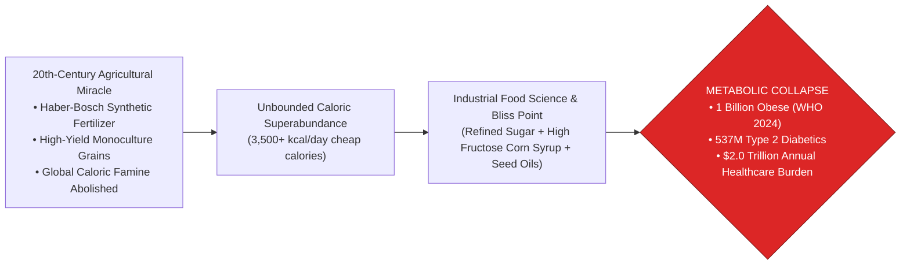

> **🎙️ 3-Presenter Authentic Tiki-Taka Script**
> 
> **Prof. Peter Kim:** Scholars, welcome to Session 10. For 300,000 years, the greatest terror haunting our species was famine: dying of starvation in the winter frost. Through industrial chemistry, tractors, and fertilizers, humanity finally conquered starvation. But look at the tragic irony of our victory on Slide 1. *(Turn 1)*  
> **Dr. Elena Vance:** Today for the first time in human history, **more people die globally from diseases of caloric overconsumption than from malnutrition**! Over one billion human beings are clinically obese, and over 537 million suffer from Type 2 diabetes! *(Turn 2)*  
> **TA Marcus Brody:** Look at the flowchart on Slide 1: We conquered famine, and what did industrial food corporations replace it with? A hyper-engineered flood of **Ultra-Processed Foods (UPFs)** packed with high-fructose corn syrup, refined flours, and industrial seed oils engineered to hijack our brain’s dopamine circuits! *(Turn 3)*  
> **Prof. Peter Kim:** Modern humans are consuming **over 3,500 calories a day**, yet suffering from profound cellular micronutrient starvation and mitochondrial burnout. *(Turn 4)*  
> **TA Marcus Brody:** We are drowning in calories while our cells are starving for real nutrients! *(Turn 5)*  
> **Dr. Elena Vance:** This is the second great paradox of abundance: The Caloric Trap. *(Turn 6)*  
> **Prof. Peter Kim:** Let us examine the exponential inundation of cheap calories on Slide 2. *(Turn 7)*  
> **TA Marcus Brody:** Turn to Slide 2: The Paradox of Plenty! *(Turn 8)*  
> **Dr. Elena Vance:** Let’s examine the collapse of food prices and the rise of cheap calories! *(Turn 9)*  
> **Prof. Peter Kim:** Proceed to Slide 2. *(Turn 10)*

---

### Slide 02: The Paradox of Plenty: The Exponential Inundation of Cheap Calories
- **The Historical Inversion:**
  - *Pre-1900 Baseline:* Calories were scarce, expensive, and required intensive physical labor to harvest ($>80\%\text{ of household income}$ spent on raw food).
  - *2026 Reality:* Calories are hyper-abundant, ultra-cheap, and demonetized to near-zero marginal cost ($<10\%\text{ of household income}$ in developed nations). A single fast-food meal delivers **2,000 kcal for less than $8.00**.
- **The Biological Consequence:** The human genome evolved to crave energy-dense sugar and fat in a scarce savanna, but is now bombarded with hyper-palatable industrial calories 24/7.

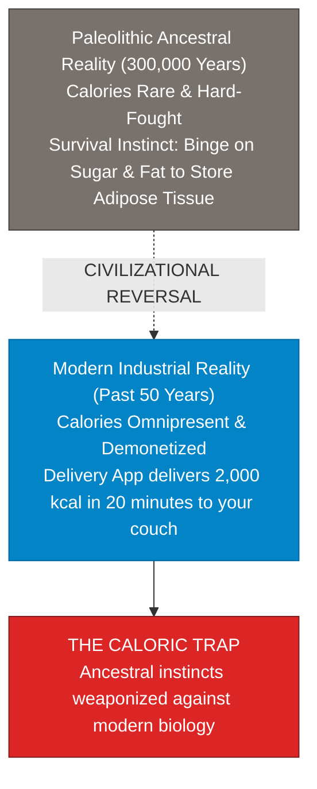

> **🎙️ 3-Presenter Authentic Tiki-Taka Script**
> 
> **Prof. Peter Kim:** Slide 2 presents the civilizational reversal of caloric economics. Dr. Vance, compare the economic cost of food today versus human history. *(Turn 1)*  
> **Dr. Elena Vance:** For 99.9% of human history, obtaining calories was the most expensive and exhausting task of daily life: families spent over **80% of their income and energy** just growing, hunting, and cooking raw food. Today in 2026, food costs less than **10% of household income** in developed nations. *(Turn 2)*  
> **TA Marcus Brody:** Look at the delivery app on your phone: For eight dollars, an electric scooter drops **2,000 calories of hot cheeseburgers, fries, and soda directly onto your couch in 20 minutes** without you taking a single step! *(Turn 3)*  
> **Prof. Peter Kim:** In an ancestral environment, gathering 2,000 calories required walking 15 miles across a savannah, digging for roots, and hunting animals. Today, 2,000 calories requires two taps of your thumb. *(Turn 4)*  
> **TA Marcus Brody:** Our ancestral biology was designed to binge on sugar and fat whenever we found it, because winter was coming! But in modern society, winter never comes—**it is endless, eternal, 24/7 caloric summer**! *(Turn 5)*  
> **Dr. Elena Vance:** Our survival instincts have been weaponized against our own metabolic biology. *(Turn 6)*  
> **Prof. Peter Kim:** Let us explore the cellular reality of the Caloric Trap on Slide 3. *(Turn 7)*  
> **TA Marcus Brody:** Turn to Slide 3: Micronutrient Starvation Inside Hyper-Processed Energy! *(Turn 8)*  
> **Dr. Elena Vance:** Let’s see why empty calories leave cells starving on Slide 3! *(Turn 9)*  
> **Prof. Peter Kim:** Proceed to Slide 3. *(Turn 10)*

---

### Slide 03: The Caloric Trap: Micronutrient Starvation Inside Hyper-Processed Energy Bombardment
- **The Dual Nutritional Pathologies:**
  1. *Macronutrient Overload:* Massive excess of refined carbohydrates (acellular starches) and industrialized seed oils (Omega-6 linoleic acid), saturating cellular ATP production and spilling over into ectopic visceral fat.
  2. *Micronutrient Depletion:* Industrial ultra-processing strips food of essential fiber, polyphenols, magnesium, zinc, and bio-available vitamins, leaving cells **metabolically suffocated yet nutritionally malnourished**.
- **The Evolutionary Short-Circuit:** The hypothalamus senses cellular micronutrient deficiency and continuously fires the **hunger peptide Ghrelin**, driving compulsive overeating despite massive adipose tissue accumulation.

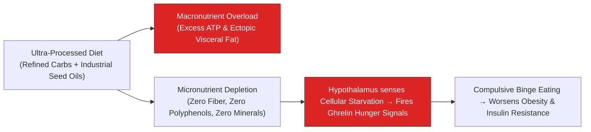

> **🎙️ 3-Presenter Authentic Tiki-Taka Script**
> 
> **TA Marcus Brody:** Look at the biological loop on Slide 3! This is the core mechanism of **The Caloric Trap: Micronutrient Starvation inside Macronutrient Overload**! Elena, why are obese people constantly feeling hungry? *(Turn 1)*  
> **Dr. Elena Vance:** When you eat ultra-processed foods—like chips, cookies, and fast food—you are consuming massive amounts of pure refined starch and industrial seed oils, but **almost zero dietary fiber, zero polyphenols, and zero trace minerals like magnesium and zinc**! *(Turn 2)*  
> **TA Marcus Brody:** Your cells are drowning in glucose and fatty acids, but they are completely starved of the micronutrients required for mitochondrial energy production! *(Turn 3)*  
> **Dr. Elena Vance:** Look at the brain in the flowchart: The hypothalamus senses that the cells are starving for minerals and vitamins! So the brain sends out massive pulses of the hunger hormone **Ghrelin**, screaming: *"EAT MORE FOOD!"* *(Turn 4)*  
> **Prof. Peter Kim:** So the person eats another 1,000 calories of processed food, gets another burst of empty sugar, but still gets zero micronutrients. The hunger signal never turns off. *(Turn 5)*  
> **TA Marcus Brody:** It is an infinite biological hunger loop engineered by modern industrial food chemistry! *(Turn 6)*  
> **Dr. Elena Vance:** Which brings us to our core existential inquest on Slide 4. *(Turn 7)*  
> **Prof. Peter Kim:** Let’s examine why humanity is sickest when fullest on Slide 4. *(Turn 8)*  
> **TA Marcus Brody:** Turn to Slide 4: The Core Existential Inquest! *(Turn 9)*  
> **Prof. Peter Kim:** Proceed to Slide 4. *(Turn 10)*

---

### Slide 04: The Core Existential Inquest: Why Is Humanity Sickest When Fullest?
- **The Foundational Civilizational Inquest:** *"If agricultural technology solved humanity’s oldest existential threat—famine—why has our triumph resulted in an epidemic of obesity, cardiovascular disease, fatty liver, and cognitive decline that threatens to bankrupt global healthcare and shorten human healthspan?"*
- **The Core Paradoxical Drivers:**
  1. *Precision Food Chemistry:* Food designed by sensory scientists to bypass ancestral satiety circuits (**The Bliss Point**).
  2. *Insulin Hyper-Secretion:* Chronic hyperinsulinemia locking fatty acids inside adipose tissue, starving the brain of ketone energy.
  3. *The Pharmacological Counter-Offensive:* The rise of GLP-1/GIP agonists (Semaglutide/Tirzepatide) as the synthetic antidote to industrial food addiction.

> **🎙️ 3-Presenter Authentic Tiki-Taka Script**
> 
> **Prof. Peter Kim:** Here is our foundational existential inquest for Session 10: **"If agricultural technology solved humanity’s oldest threat—famine—why has our triumph resulted in an epidemic of metabolic collapse, diabetes, and fatty liver that threatens to shorten human healthspan?"** Dr. Vance, dissect the core drivers on Slide 4. *(Turn 1)*  
> **Dr. Elena Vance:** The answer lies in the intersection of corporate chemistry and evolutionary neuroscience. First, industrial food companies engineered the **"Bliss Point"**—precise ratios of sugar, fat, and salt calibrated to override natural fullness signals. *(Turn 2)*  
> **TA Marcus Brody:** Second, chronic sugar spikes cause **Hyperinsulinemia**: high insulin locks all your calories inside your fat cells, preventing your liver from burning body fat, which starves your brain of energy and triggers brain fog! *(Turn 3)*  
> **Prof. Peter Kim:** And third, the pharmaceutical industry responded by creating **GLP-1 and GIP receptor agonists (Semaglutide and Tirzepatide)**—injectable synthetic peptides that turn off the brain’s "food noise" and restore metabolic balance. *(Turn 4)*  
> **TA Marcus Brody:** We engineered a chemical food environment that makes us sick, and now we are engineering synthetic hormones to cure the food addiction! *(Turn 5)*  
> **Dr. Elena Vance:** It is the supreme technological arms race between Big Food and Big Pharma. *(Turn 6)*  
> **Prof. Peter Kim:** Let us examine our pedagogical roadmap for Session 10 on Slide 5. *(Turn 7)*  
> **TA Marcus Brody:** Turn to Slide 5 for our Session 10 roadmap! *(Turn 8)*  
> **Dr. Elena Vance:** From the Industrial Bliss Point to the GLP-1 Revolution! *(Turn 9)*  
> **Prof. Peter Kim:** Proceed to Slide 5. *(Turn 10)*

---

### Slide 05: Session 10 Pedagogical Roadmap: From the Industrial Bliss Point to the GLP-1 Revolution
- **Master Learning Architecture (Session 10):**
  - **Module 1 (Slides 01–05):** Civilizational Framing — Famine Abolished vs. Metabolism Collapsed, The Paradox of Plenty, Micronutrient Starvation, Core Inquest.
  - **Module 2 (Slides 06–15):** Primary Text Deconstruction — Chapter 6 Deconstruction, Ultra-Processed Foods (UPFs), The Bliss Point Formula ($50\%\text{ Sugar} + 35\%\text{ Fat}$), Thrifty Gene Hypothesis, Dopamine Hijacking in Nucleus Accumbens, Kotler on Cerebral Energy Depletion, Leptin Resistance, Big Food Tobacco-ification.
  - **Module 3 (Slides 16–25):** Systems Biochemistry & Pharmacology — Insulin Resistance (HOMA-IR), High-Fructose Corn Syrup & De Novo Lipogenesis, Gut Endotoxemia (Zonulin), GLP-1/GIP Agonist Neuro-Pharmacology, Mitochondrial Burnout, Autophagy (mTOR vs. AMPK), Advanced Glycation End-Products (AGEs), Metabolic Differential Equation ($\frac{d[\text{Fat}]}{dt}$), 4-Stage Protocol.
  - **Module 4 (Slides 26–35):** Global Empirical Verification — 9 Clinical Case Studies (WHO 1B Obese, IDF 537M Diabetics, $2.0T Economic Burden, Novo Nordisk GDP Milestone, BMJ UPF Mortality, Pediatric MASLD, CGMs & AI Nutrition, 16:8 Fasting Autophagy, Sovereign Sugar Taxes).
  - **Module 5 (Slides 36–42):** Existential Paradoxes — The Thrifty Gene Tragedy, GLP-1 Class Stratification, Food Deserts & Structural Injustice, Alzheimer’s as Type 3 Diabetes, Black Octagon Warning Labels, Reclaiming Metabolic Sovereignty.
  - **Module 6 (Slides 43–45):** Socratic Debates & AI-CGM Precision Homeostasis Workshop Protocol.

> **🎙️ 3-Presenter Authentic Tiki-Taka Script**
> 
> **Dr. Elena Vance:** Slide 5 outlines our master pedagogical roadmap for Session 10. We will systematically bridge evolutionary anthropology, neuro-endocrinology, and molecular pharmacology across six modules. *(Turn 1)*  
> **TA Marcus Brody:** In Module 2, we deconstruct Chapter 6: The exact **Bliss Point formula (50% sugar + 35% fat)**, dopamine hijacking in the nucleus accumbens, and how Big Food used the tobacco playbook to addict global diets! *(Turn 2)*  
> **Prof. Peter Kim:** In Module 3, we dive into the hard molecular biochemistry: HOMA-IR insulin resistance, fructose hepatic de novo lipogenesis, the neuro-pharmacology of GLP-1/GIP agonists, and the mTOR versus AMPK autophagy switch! *(Turn 3)*  
> **TA Marcus Brody:** And in Module 4, we examine nine clinical case studies: from the WHO audit of **one billion obese humans**, to the BMJ study proving a **10% increase in ultra-processed food drives a 12% surge in cardiovascular death**, to Novo Nordisk’s GLP-1 surpassing the entire national GDP of Denmark! *(Turn 4)*  
> **Dr. Elena Vance:** In Module 5, we confront Alzheimer’s as "Type 3 Diabetes," mandatory front-of-package warning labels, and reclaiming metabolic sovereignty. *(Turn 5)*  
> **TA Marcus Brody:** And in Module 6, every student will architect an **AI-CGM Precision Metabolic Platform** to reverse insulin resistance! *(Turn 6)*  
> **Prof. Peter Kim:** Let us step into Module 2 and deconstruct Chapter 6 of Diamandis and Kotler! *(Turn 7)*  
> **Dr. Elena Vance:** Turn to Slide 6: Deconstructing Chapter 6: "The Caloric Trap"! *(Turn 8)*  
> **TA Marcus Brody:** Let’s dive into Slide 6! *(Turn 9)*  
> **Prof. Peter Kim:** Proceed to Module 2: Primary Text Deconstruction! *(Turn 10)*


---

## Module 2: Primary Text Deconstruction: The Caloric Trap (Slides 06–15)

### Slide 06: Deconstructing Chapter 6: "The Caloric Trap" & Engineered Hyper-Palatability
- **Primary Source Analysis:** Peter H. Diamandis & Steven Kotler, *We Are as Gods* (2026), Chapter 6 (*The Caloric Trap & Metabolic Collapse*).
- **The Core Thematic Thesis:**
  - The modern food supply is no longer an agricultural harvest; **it is an industrial chemical optimization algorithm** designed to maximize corporate repurchase velocity.
  - By manipulating the sensory inputs of human biology (mouthfeel, crunch, sweetness, vanishing caloric density), industrial food science engineered a state of **hyper-palatable food addiction**.
- **The Teleological Warning:** If humanity uses exponential biotechnology only to treat the downstream symptoms of engineered food addiction, we will build a society of lifelong pharmacological dependency. True abundance demands reclaiming nutritional sovereignty.

> **🎙️ 3-Presenter Authentic Tiki-Taka Script**
> 
> **Prof. Peter Kim:** Let us deconstruct Chapter 6 of *We Are as Gods*. Dr. Vance, what is the central thesis of "The Caloric Trap"? *(Turn 1)*  
> **Dr. Elena Vance:** Chapter 6 delivers a powerful indictment of the global food system. Diamandis and Kotler argue that the food filling supermarket aisles is no longer agricultural produce; **it is an optimized industrial chemical formula** engineered to maximize corporate repurchase rates and shareholder profits. *(Turn 2)*  
> **TA Marcus Brody:** Look at how food scientists design products on Slide 6: They spend millions of dollars in sensory laboratories tuning **"mouthfeel," "vanishing caloric density," and "crunch acoustics"** so that your brain never registers when you are full! *(Turn 3)*  
> **Prof. Peter Kim:** Read the teleological warning: If we only use GLP-1 drugs to suppress appetite without fixing the poisonous food supply, we create a society permanently hooked on weekly pharmaceutical injections. *(Turn 4)*  
> **TA Marcus Brody:** Big Food makes you sick, and Big Pharma sells you the weekly subscription cure! That is a multi-trillion-dollar closed-loop extraction machine! *(Turn 5)*  
> **Dr. Elena Vance:** We must understand the exact food chemistry that created this trap. *(Turn 6)*  
> **Prof. Peter Kim:** Let us examine the NOVA classification and Ultra-Processed Foods on Slide 7. *(Turn 7)*  
> **TA Marcus Brody:** Turn to Slide 7: Ultra-Processed Foods (UPFs)! *(Turn 8)*  
> **Dr. Elena Vance:** Precision Industrial Flavor Chemistry on Slide 7! *(Turn 9)*  
> **Prof. Peter Kim:** Proceed to Slide 7. *(Turn 10)*

---

### Slide 07: Ultra-Processed Foods (UPFs): Precision Industrial Flavor Chemistry
- **The NOVA Classification System (Carlos Monteiro - University of São Paulo):**
  - *Group 1 (Unprocessed / Minimally Processed):* Whole fruits, vegetables, eggs, raw meat.
  - *Group 2 (Processed Culinary Ingredients):* Olive oil, butter, salt, honey.
  - *Group 3 (Processed Foods):* Canned fish, artisanal cheese, freshly baked bread.
  - *Group 4 (Ultra-Processed Foods - UPFs):* Formulations of industrial ingredients (high-fructose corn syrup, hydrogenated oils, protein isolates, emulsifiers, flavor enhancers, artificial colorings) with **zero intact whole-food cellular matrix**.
- **The Modern Diet Fraction:** UPFs comprise **$>60\%\text{ of total daily caloric intake}$** in the US and UK, and $>70\%$ of children’s diets.

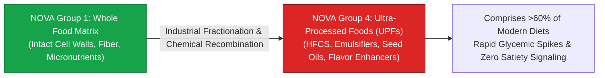

> **🎙️ 3-Presenter Authentic Tiki-Taka Script**
> 
> **Prof. Peter Kim:** Slide 7 introduces the gold-standard nutritional framework: **The NOVA Classification of Ultra-Processed Foods (UPFs)**. Dr. Vance, what is the fundamental difference between a Group 1 whole food and a Group 4 UPF? *(Turn 1)*  
> **Dr. Elena Vance:** In Group 1 whole foods—like an apple or a steak—the nutrients are locked inside an **intact cellular matrix** of dietary fiber and cell walls that your gut must work to digest slowly. Group 4 Ultra-Processed Foods take whole foods, shatter them into chemical powders, and recombine them with **emulsifiers, flavor enhancers, high-fructose corn syrup, and industrial seed oils**! *(Turn 2)*  
> **TA Marcus Brody:** Look at the percentage on Slide 7: Ultra-Processed Foods now make up **over 60% of all calories eaten by adults in the US and UK, and over 70% of what children eat**! *(Turn 3)*  
> **Dr. Elena Vance:** Because UPFs have zero intact cellular fiber, they dissolve in your stomach like liquid sugar, triggering massive, instant glycemic spikes and bypassing the gut's normal fullness receptors! *(Turn 4)*  
> **Prof. Peter Kim:** It is pre-chewed, predigested industrial energy designed for instant absorption. *(Turn 5)*  
> **TA Marcus Brody:** And food corporations calibrated this down to the exact percentage with the "Bliss Point" on Slide 8! *(Turn 6)*  
> **Dr. Elena Vance:** Turn to Slide 8: The Biochemistry of the "Bliss Point"! *(Turn 7)*  
> **Prof. Peter Kim:** Let’s examine the 50% Sugar + 35% Fat Formula on Slide 8. *(Turn 8)*  
> **TA Marcus Brody:** Let’s see the dopamine formula on Slide 8! *(Turn 9)*  
> **Prof. Peter Kim:** Proceed to Slide 8. *(Turn 10)*

---

### Slide 08: The Biochemistry of the "Bliss Point": 50% Sugar + 35% Fat Dopamine Formula
- **The Sensory Engineering Landmark (Howard Moskowitz / Big Food):**
  - *The Bliss Point:* The precise quantitative ratio of **simple carbohydrates (sugar), refined fat, and sodium** that optimizes consumer sensory pleasure while avoiding sensory-specific satiety.
  - *The Golden Ratio:* **~$50\%\text{ Calories from Sugar} + 35\%\text{ Calories from Fat} + 15\%\text{ Salt/Protein}$** (The exact nutritional profile of ice cream, milk chocolate, donuts, and potato chips).
- **The Evolutionary Anomaly:** In nature, foods high in both simple sugar AND fat **do not exist** (Fruits are high in sugar, low in fat; nuts/meats are high in fat, low in sugar; only mother's milk possesses both, but exclusively during infancy).

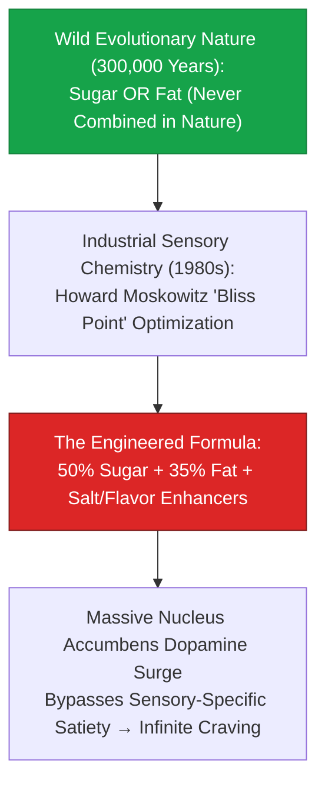

> **🎙️ 3-Presenter Authentic Tiki-Taka Script**
> 
> **TA Marcus Brody:** Look at the sensory chemistry formula on Slide 8! This was invented by food scientist Howard Moskowitz: **The Bliss Point**! Elena, why is combining 50% sugar with 35% fat an evolutionary weapon against the human brain? *(Turn 1)*  
> **Dr. Elena Vance:** In wild nature, high-sugar and high-fat **NEVER co-exist in the same food**. An apple has fructose but zero fat. An avocado or a salmon has fat but zero sugar. The ONLY food in nature that contains both sugar and fat is **human breast milk**—which evolved to make human babies rapidly gain weight in infancy! *(Turn 2)*  
> **TA Marcus Brody:** Look at the industrial formula in the red box: Food corporations took that maternal infant weight-gain code and put it into **ice cream, chocolate bars, potato chips, and cookies: 50% sugar, 35% fat, and a blast of salt**! *(Turn 3)*  
> **Prof. Peter Kim:** When your tongue tastes that combination, your brain experiences a massive surge of dopamine in the **nucleus accumbens**, completely bypassing "sensory-specific satiety"! *(Turn 4)*  
> **TA Marcus Brody:** You can be completely stuffed from dinner, but when someone brings out chocolate ice cream, your brain lights up like a pinball machine and demands more! *(Turn 5)*  
> **Dr. Elena Vance:** It is precision neurological hacking of our ancestral cravings. *(Turn 6)*  
> **Prof. Peter Kim:** And James Neel explained why our genetics make us so vulnerable to this hack on Slide 9. *(Turn 7)*  
> **TA Marcus Brody:** Turn to Slide 9: James Neel’s Thrifty Gene Hypothesis! *(Turn 8)*  
> **Dr. Elena Vance:** Let’s examine Ancient Evolutionary Traps on Slide 9! *(Turn 9)*  
> **Prof. Peter Kim:** Proceed to Slide 9. *(Turn 10)*

---

### Slide 09: James Neel’s Thrifty Gene Hypothesis: Ancient Evolutionary Traps
- **The Evolutionary Genetics Framework (James V. Neel, 1962):**
  - *The Ancestral Selective Pressure:* Hunter-gatherer populations survived recurrent seasonal famines through genetic adaptations that maximized **insulin sensitivity for rapid glycogen and adipose fat storage** during brief periods of seasonal abundance.
  - *The Modern Environmental Flip:* In an environment of constant, 365-day caloric superabundance, these same "thrifty" genes trigger **hyperinsulinemia, rapid visceral fat deposition, and accelerated metabolic syndrome**.
- **The Indigenous Proof:** Populations historically subjected to severe feast-and-famine cycles (Pima Native Americans, Polynesians, Australian Aborigines) suffer **$>50\%\text{ Type 2 diabetes prevalence}$** when transitioned to a Western ultra-processed diet.

> **🎙️ 3-Presenter Authentic Tiki-Taka Script**
> 
> **Prof. Peter Kim:** Slide 9 introduces geneticist James Neel’s landmark 1962 theory: **The Thrifty Gene Hypothesis**. Dr. Vance, explain why our ancestral survival genes became our modern metabolic curse. *(Turn 1)*  
> **Dr. Elena Vance:** For 300,000 years, humans lived through harsh winters and unpredictable droughts where food was scarce. Hunter-gatherers who had **"thrifty genes"**—meaning their bodies produced high insulin to convert every extra berry into body fat immediately—survived the winter and passed on their DNA. *(Turn 2)*  
> **TA Marcus Brody:** Those thrifty genes were life-saving superpowers in the Ice Age! But look at what happens when you put a human with thrifty genes in modern America or Europe: There is no winter! Food is everywhere 24/7! *(Turn 3)*  
> **Prof. Peter Kim:** Look at the indigenous population data: When the **Pima Native Americans of Arizona** were moved from their traditional whole-food diet to Western government-subsidized white flour, sugar, and lard, their **Type 2 diabetes rate skyrocketed to over 50%**! *(Turn 4)*  
> **TA Marcus Brody:** But their genetically identical relatives, the Pima of Mexico who continued farming traditional beans and corn, have less than a 6% diabetes rate! *(Turn 5)*  
> **Dr. Elena Vance:** It proves that obesity is not a moral failure of willpower; obesity is an evolutionary genetic trap triggered by a toxic chemical food environment. *(Turn 6)*  
> **Prof. Peter Kim:** And in the brain, this triggers direct dopamine hijacking on Slide 10. *(Turn 7)*  
> **TA Marcus Brody:** Let’s examine Dopamine Hijacking in the Nucleus Accumbens on Slide 10! *(Turn 8)*  
> **Dr. Elena Vance:** Turn to Slide 10: Food Addiction Mechanics! *(Turn 9)*  
> **Prof. Peter Kim:** Proceed to Slide 10. *(Turn 10)*

---

### Slide 10: Dopamine Hijacking in the Nucleus Accumbens: Food Addiction Mechanics
- **The Neurobiology of Sugar Addiction (Nicole Avena / Eric Stice):**
  - *Dopamine Spike Dynamics:* Ingestion of liquid sucrose/glucose triggers a **$+200\%\text{ dopamine surge}$ in the nucleus accumbens** (comparable to nicotine and ethanol).
  - *Dopamine $D_2$ Receptor Downregulation:* Chronic hyper-palatable stimulation leads to neuro-adaptive downregulation of striatal $D_2$ receptors, inducing **tolerance and withdrawal symptoms** (irritability, anxiety, intense cravings).
- **The Diagnostic Crossover:** Meets all 11 DSM-5 criteria for Substance Use Disorder (Yale Food Addiction Scale - YFAS 2.0).

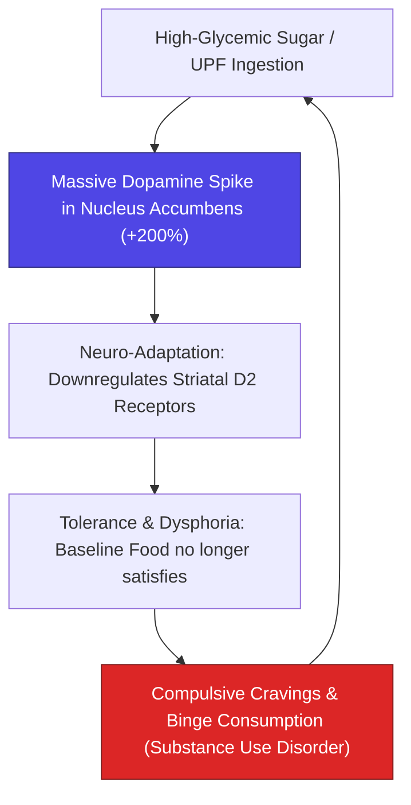

> **🎙️ 3-Presenter Authentic Tiki-Taka Script**
> 
> **TA Marcus Brody:** Look at the addiction feedback loop on Slide 10! This is **Dopamine Hijacking in the Nucleus Accumbens**! Elena, explain why sugar addiction operates identically to drug addiction! *(Turn 1)*  
> **Dr. Elena Vance:** When you drink a sugary soda, the sudden burst of glucose into the bloodstream triggers a **200% surge in dopamine in the brain’s nucleus accumbens**—which is the exact same reward pathway activated by nicotine and alcohol! *(Turn 2)*  
> **TA Marcus Brody:** Look at what happens over time in the flowchart: The brain tries to protect itself from the dopamine overload by **downregulating its dopamine $D_2$ receptors**! Once those receptors are burned out, normal whole foods like broccoli or chicken taste like cardboard and give you zero pleasure! *(Turn 3)*  
> **Prof. Peter Kim:** You develop chemical tolerance and dysphoria. You need higher and higher doses of sugar and fat just to feel normal and stave off irritability and depression. *(Turn 4)*  
> **TA Marcus Brody:** That is why sugar addiction meets every single clinical criterion for **Substance Use Disorder on the Yale Food Addiction Scale**! It is a true chemical addiction! *(Turn 5)*  
> **Dr. Elena Vance:** Which is why Peter Diamandis warns of the "Metabolic Prison" on Slide 11. *(Turn 6)*  
> **Prof. Peter Kim:** Let’s examine Peter Diamandis’s Metabolic Prison Warning on Slide 11. *(Turn 7)*  
> **TA Marcus Brody:** Turn to Slide 11: The Lethal Allure of Unlimited Sugar! *(Turn 8)*  
> **Dr. Elena Vance:** Let’s see the metabolic prison deconstructed! *(Turn 9)*  
> **Prof. Peter Kim:** Proceed to Slide 11. *(Turn 10)*

---

### Slide 11: Peter Diamandis’s Metabolic Prison Warning: The Lethal Allure of Unlimited Sugar
- **The Freedom Paradox:**
  - *The False Freedom:* The modern consumer believes they are exercising "free choice" when purchasing ultra-processed snack foods and sugary beverages.
  - *The Biochemical Reality:* The consumer is trapped inside an engineered biochemical loop where **hormonal signaling (Insulin, Ghrelin, Leptin) has been stripped of autonomous self-regulation**.
- **The Post-Scarcity Imperative:** We cannot build a high-agency, exponential civilization when 50% of the population is trapped in a state of chronic metabolic exhaustion, pre-diabetes, and cognitive lethargy.


> **🎙️ 3-Presenter Authentic Tiki-Taka Script**
> 
> **Prof. Peter Kim:** Slide 11 presents Peter Diamandis’s philosophical warning: **The Metabolic Prison**. Dr. Vance, why is consumer "free choice" in the supermarket an illusion? *(Turn 1)*  
> **Dr. Elena Vance:** Consumers think they are exercising free will when they walk into a grocery store and buy potato chips and soda. But that is an illusion. Their brain chemistry has been biochemically conditioned by flavor engineers and dopamine reinforcement loops to crave those specific products. *(Turn 2)*  
> **TA Marcus Brody:** Look at the comparison on Slide 11: When your leptin signals are muted and your insulin is through the roof, your prefrontal cortex loses executive control to the primitive amygdala! **You are trapped inside a metabolic prison!** *(Turn 3)*  
> **Prof. Peter Kim:** How can we build an ambitious, high-agency space-faring civilization when half the population is suffering from chronic metabolic exhaustion, brain fog, and 3 PM energy crashes? *(Turn 4)*  
> **TA Marcus Brody:** You can't reach for the stars if you can't even get off the couch because of a sugar crash! *(Turn 5)*  
> **Dr. Elena Vance:** True human freedom requires metabolic independence. *(Turn 6)*  
> **Prof. Peter Kim:** And Steven Kotler explains the connection between metabolism and brain performance on Slide 12. *(Turn 7)*  
> **TA Marcus Brody:** Let’s examine Steven Kotler on the Metabolic-Cognitive Axis on Slide 12! *(Turn 8)*  
> **Dr. Elena Vance:** Turn to Slide 12: Cerebral Energy Depletion! *(Turn 9)*  
> **Prof. Peter Kim:** Proceed to Slide 12. *(Turn 10)*

---

### Slide 12: Steven Kotler on the Metabolic-Cognitive Axis & Cerebral Energy Depletion
- **The Brain as an Energy-Hungry Supercomputer:**
  - *The Metabolic Footprint:* The human brain represents **$2\%$ of body mass**, but consumes **$>20\%\text{ of total resting metabolic energy}$** ($>120\text{g of glucose/day}$).
- **The Glycemic Rollercoaster & Cognitive Collapse:**
  - *The Spike & Crash:* UPF refined starches trigger massive glucose spikes ($>180\text{ mg/dL}$), followed by reactive hyperinsulinemic hypoglycemia ($<65\text{ mg/dL}$).
  - *The Cognitive Toll:* Cerebral glucose deprivation triggers acute cortisol/adrenaline spikes, executive prefrontal cortex hypo-function, brain fog, and the complete destruction of sustained deep work and flow states.

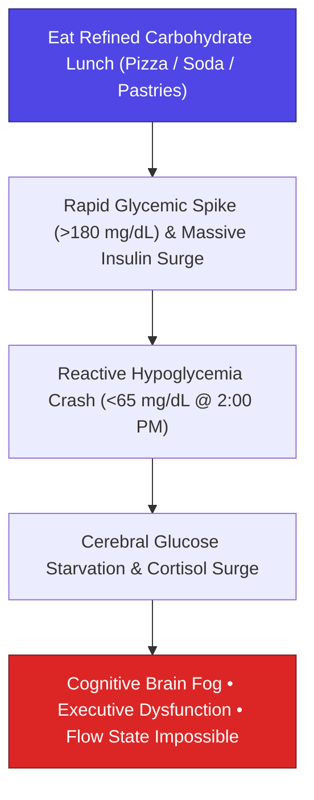

> **🎙️ 3-Presenter Authentic Tiki-Taka Script**
> 
> **TA Marcus Brody:** Look at the afternoon energy crash on Slide 12! This is Steven Kotler’s investigation: **The Metabolic-Cognitive Axis and Cerebral Energy Depletion**! Elena, explain why the brain crashes after an ultra-processed lunch! *(Turn 1)*  
> **Dr. Elena Vance:** The human brain weighs only 3 pounds—just 2% of your body weight—but it consumes **over 20% of all the energy your body burns**! When you eat a refined carbohydrate lunch—like pizza, pasta, or soda—your blood sugar spikes to 180 mg/dL! *(Turn 2)*  
> **TA Marcus Brody:** Your pancreas panics and pumps out a massive wave of insulin! Look at what happens at 2:00 PM in the flowchart: Insulin forces all that glucose into fat cells, causing **Reactive Hypoglycemia—your blood sugar crashes below 65 mg/dL**! *(Turn 3)*  
> **Dr. Elena Vance:** Your brain is suddenly starved of fuel! Your adrenal glands pump out stress cortisol, your prefrontal cortex shuts down, and you experience severe **brain fog, fatigue, and inability to focus**! *(Turn 4)*  
> **Prof. Peter Kim:** You cannot enter deep creative **Flow States** when your brain is riding a violent blood sugar rollercoaster every four hours. *(Turn 5)*  
> **TA Marcus Brody:** Stabilizing your blood sugar is the single greatest cognitive enhancement hack in existence! *(Turn 6)*  
> **Dr. Elena Vance:** And chronic sugar spikes mute your fullness hormone through Leptin Resistance on Slide 13. *(Turn 7)*  
> **Prof. Peter Kim:** Let’s examine Leptin Resistance on Slide 13. *(Turn 8)*  
> **TA Marcus Brody:** Turn to Slide 13: The Neurological Muting of the "Satiety" Signal! *(Turn 9)*  
> **Prof. Peter Kim:** Proceed to Slide 13. *(Turn 10)*

---

### Slide 13: Leptin Resistance: The Neurological Muting of the "Satiety" Signal
- **The Satiety Hormone Signaling Circuit (Jeffrey Friedman, 1994):**
  - *Leptin Physiology:* Synthesized by white adipose tissue in direct proportion to total fat mass; crosses the Blood-Brain Barrier to bind **LepRb receptors in the hypothalamic arcuate nucleus**, signaling: *"Energy stores full $\to$ Stop eating and increase energy expenditure."*
- **The Inflammatory Blockade:**
  - High-fructose diets and elevated triglycerides ($>150\text{ mg/dL}$) physically block leptin transport across the BBB, while hypothalamic inflammation (SOCS3 upregulation) blunts LepRb intracellular signaling.
  - *The Starvation Paradox:* Despite carrying 50+ lbs of excess adipose energy, **the brain perceives it is in active starvation**, triggering relentless hyperphagia.

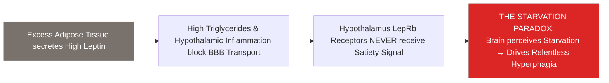

> **🎙️ 3-Presenter Authentic Tiki-Taka Script**
> 
> **Prof. Peter Kim:** Slide 13 reveals the primary hormonal glitch of modern obesity: **Leptin Resistance**. Dr. Vance, explain how a person carrying 50 pounds of excess fat can have a brain that thinks it is starving to death. *(Turn 1)*  
> **Dr. Elena Vance:** Adipose fat tissue secretes the hormone **Leptin**. Under normal biology, the more body fat you have, the more leptin travels to your hypothalamus, telling your brain: *"We have plenty of energy stored; stop eating and burn fat!"* *(Turn 2)*  
> **TA Marcus Brody:** But look at the blockage in the diagram: High-fructose diets cause high blood triglycerides and brain inflammation, which **physically blocks leptin from crossing the Blood-Brain Barrier**! *(Turn 3)*  
> **Dr. Elena Vance:** So the leptin signal never reaches the hypothalamus! Look at **The Starvation Paradox**: The brain looks around, sees zero leptin, and assumes: *"We have zero body fat! We are starving in a famine!"* *(Turn 4)*  
> **Prof. Peter Kim:** So the brain forces the person to feel ravenously hungry, slows down thyroid metabolism to conserve energy, and drives compulsive overeating! *(Turn 5)*  
> **TA Marcus Brody:** The brain is screaming for survival while the body is suffocating in excess fat! *(Turn 6)*  
> **Dr. Elena Vance:** And Big Food engineered this using the exact tobacco playbook on Slide 14. *(Turn 7)*  
> **Prof. Peter Kim:** Let’s examine Big Food and the "Tobacco-ification" of global diets on Slide 14. *(Turn 8)*  
> **TA Marcus Brody:** Turn to Slide 14: Big Food & The Tobacco Playbook! *(Turn 9)*  
> **Prof. Peter Kim:** Proceed to Slide 14. *(Turn 10)*

---

### Slide 14: Big Food & The "Tobacco-ification" of Global Diets
- **The Historical Corporate Merger (1980s–2000s):**
  - Major tobacco conglomerates (**R.J. Reynolds and Philip Morris**) acquired giant food corporations (**Kraft, General Foods, Nabisco**) using cigarette profits.
  - *The Transfer of Technology:* Applied the exact behavioral addiction science, flavor chemistry, and child-targeted marketing strategies developed for cigarettes to processed snack foods and sugary drinks.
- **The Engineered Addictiveness:** Optimized hyper-palatability, funded biased academic nutrition studies blaming dietary fat while shielding sugar, and created a global chronic disease epidemic.

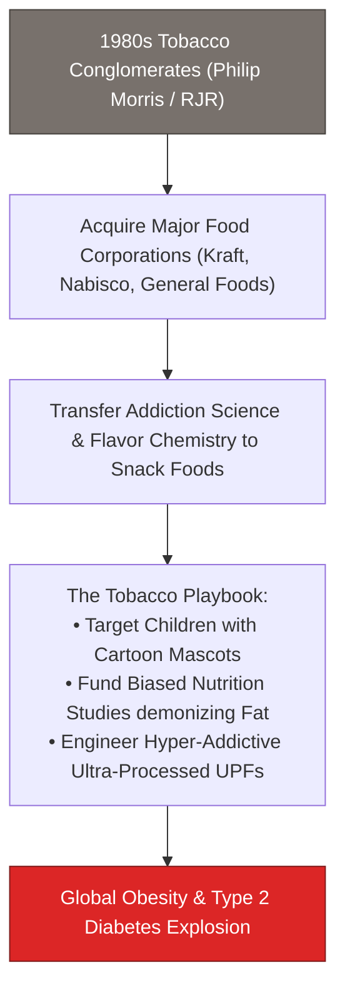

> **🎙️ 3-Presenter Authentic Tiki-Taka Script**
> 
> **TA Marcus Brody:** Slide 14 exposes the corporate history of modern nutrition: **The "Tobacco-ification" of Global Diets**! Elena, what happened in the 1980s when tobacco giants bought food companies? *(Turn 1)*  
> **Dr. Elena Vance:** In the 1980s, facing lawsuits over lung cancer, tobacco giants like **Philip Morris and R.J. Reynolds** used their billions in cigarette profits to buy up America’s largest food companies—**Kraft, General Foods, and Nabisco**! *(Turn 2)*  
> **TA Marcus Brody:** And they brought their cigarette scientists with them! They took the exact behavioral addiction psychology, flavor chemistry, and child-targeted marketing techniques perfected on cigarettes and applied them to **sugary cereals, cookies, lunchables, and sodas**! *(Turn 3)*  
> **Prof. Peter Kim:** Look at the playbook: They used cartoon mascots to addict children, funded corrupt academic research to falsely blame natural dietary fat while hiding the dangers of sugar, and engineered foods that are impossible to stop eating! *(Turn 4)*  
> **TA Marcus Brody:** "Bet you can't eat just one!" That wasn't just a marketing slogan; that was a laboratory-tested promise of chemical addiction! *(Turn 5)*  
> **Dr. Elena Vance:** It was a deliberate corporate campaign to hook the global palate on cheap industrial carbohydrates. *(Turn 6)*  
> **Prof. Peter Kim:** Let us summarize the five primary pathways of metabolic breakdown on Slide 15. *(Turn 7)*  
> **TA Marcus Brody:** Turn to Slide 15: The Grand 5-Pathway Metabolic Breakdown Matrix! *(Turn 8)*  
> **Dr. Elena Vance:** Let’s see the complete metabolic breakdown landscape! *(Turn 9)*  
> **Prof. Peter Kim:** Proceed to Slide 15. *(Turn 10)*

---

### Slide 15: The Grand 5-Pathway Metabolic Breakdown Matrix
- **Master Metabolic Pathology Matrix:** Comprehensive synthesis of the 5 pathways of physiological collapse driven by ultra-processed caloric superabundance.

| Metabolic Pathway | Primary Trigger Agent | Target Organ / Tissue | Core Pathological Mechanism | Clinical Disease Endpoint |
| :--- | :--- | :--- | :--- | :--- |
| **1. Glycemic Hyperinsulinemia**| Refined Flours & Sucrose | Pancreatic $\beta$-Cells & Muscle | GLUT4 receptor internalization & downregulation | **Type 2 Diabetes & Macrovascular Plaque**|
| **2. Hepatic Lipogenesis** | High-Fructose Corn Syrup | Liver Hepatocytes | Bypass of PFK enzyme $\to$ De Novo Lipogenesis | **MASLD / Fatty Liver & Cirrhosis** |
| **3. Hypothalamic Leptin Block**| High Triglycerides & UPFs | Arcuate Nucleus (LepRb) | Blood-Brain Barrier transport inhibition | **Chronic Uncontrollable Hyperphagia** |
| **4. Endotoxemic Gut Leak** | Industrial Emulsifiers & Polysorbates| Intestinal Epithelial Mucosa | Zonulin upregulation & tight junction lysis | **Systemic Chronic Low-Grade Inflammation** |
| **5. Neuro-Dopaminergic Hijack**| Bliss Point (Sugar+Fat+Salt)| Nucleus Accumbens / Striatum | $D_2$ receptor downregulation & tolerance | **Compulsive Food Addiction & Binging** |

> **🎙️ 3-Presenter Authentic Tiki-Taka Script**
> 
> **Prof. Peter Kim:** Scholars, look at Slide 15. Five distinct physiological pathways through which ultra-processed caloric abundance dismantles human health. Marcus, walk us through the five rows! *(Turn 1)*  
> **TA Marcus Brody:** Pathway 1: Glycemic spikes causing insulin resistance and Type 2 diabetes! Pathway 2: High-fructose corn syrup turning directly into toxic liver fat (MASLD)! Pathway 3: Leptin resistance blinding the brain's fullness sensor! Pathway 4: Food emulsifiers destroying gut lining, leaking bacterial toxins into the blood! And Pathway 5: The Bliss Point burning out dopamine receptors! *(Turn 2)*  
> **Dr. Elena Vance:** Every row represents a verified molecular pathway published in *Cell Metabolism*, *Nature Medicine*, and *The Lancet*. *(Turn 3)*  
> **Prof. Peter Kim:** This is a multi-front assault on human physiology. *(Turn 4)*  
> **TA Marcus Brody:** But in Module 3, we master the biochemistry and the GLP-1 pharmacological counter-offensive to defeat it! *(Turn 5)*  
> **Dr. Elena Vance:** Let’s examine Insulin Resistance and the HOMA-IR equation on Slide 16! *(Turn 6)*  
> **Prof. Peter Kim:** Proceed to Module 3: Exponential Frameworks & Systems Biochemistry! *(Turn 7)*  
> **TA Marcus Brody:** Turn to Slide 16! *(Turn 8)*  
> **Dr. Elena Vance:** Let’s look at the biochemistry on Slide 16! *(Turn 9)*  
> **Prof. Peter Kim:** Proceed to Slide 16. *(Turn 10)*


---

## Module 3: Exponential Frameworks & Systems Biochemistry (Slides 16–25)

### Slide 16: Insulin Resistance (HOMA-IR) & The Hyperinsulinemic Vicious Cycle
- **The Homeostatic Model Assessment of Insulin Resistance (HOMA-IR):**
  $$\text{HOMA-IR} = \frac{\text{Fasting Glucose (mg/dL)} \times \text{Fasting Insulin (\mu IU/mL)}}{405}$$
  - *Optimal Metabolic Health:* $\text{HOMA-IR} < 1.0$.
  - *Early Subclinical Insulin Resistance:* $\text{HOMA-IR} > 1.9$.
  - *Severe Clinical Resistance & Type 2 Diabetes:* $\text{HOMA-IR} > 2.9$.
- **The Hyperinsulinemic Vicious Cycle:** Chronic carbohydrate bombardment forces the pancreas to hyper-secrete insulin. High basal insulin blocks hormone-sensitive lipase (HSL), **completely arresting lipolysis (fat burning)** while driving persistent hunger and cellular glycogen saturation.

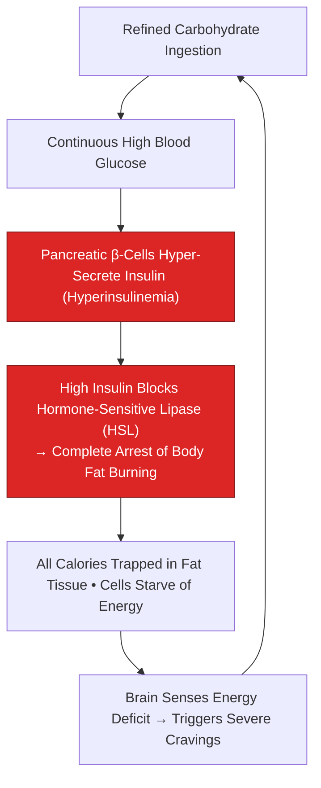

> **🎙️ 3-Presenter Authentic Tiki-Taka Script**
> 
> **Prof. Peter Kim:** Module 3 opens with the core biochemical equation of modern metabolic disease: **The HOMA-IR Index and Insulin Resistance**. Dr. Vance, walk us through the mathematics of HOMA-IR on Slide 16. *(Turn 1)*  
> **Dr. Elena Vance:** Look at the formula: Fasting glucose multiplied by fasting insulin divided by 405. If your **HOMA-IR is below 1.0**, you are in optimal metabolic health. But if your HOMA-IR is **above 1.9**, your muscle and liver cells are already becoming deaf to insulin, forcing your pancreas to pump out massive amounts of insulin just to keep your blood sugar normal! *(Turn 2)*  
> **TA Marcus Brody:** Look at the vicious cycle in the flowchart: What does chronic high insulin do? High insulin **completely turns off Hormone-Sensitive Lipase (HSL)**! That means your body is physically BLOCKED from burning its own body fat! *(Turn 3)*  
> **Dr. Elena Vance:** Even if you have 100,000 calories of fat stored on your hips and belly, high insulin locks the bank vault doors and throws away the key! Your cells cannot access that stored energy, so they scream for more glucose! *(Turn 4)*  
> **Prof. Peter Kim:** You become an energy-starved organism carrying around a massive unused energy battery. *(Turn 5)*  
> **TA Marcus Brody:** You can't burn fat until you drop your insulin levels! *(Turn 6)*  
> **Dr. Elena Vance:** And high-fructose corn syrup accelerates this liver damage on Slide 17. *(Turn 7)*  
> **Prof. Peter Kim:** Let’s examine High-Fructose Corn Syrup and De Novo Lipogenesis on Slide 17. *(Turn 8)*  
> **TA Marcus Brody:** Turn to Slide 17: Hepatic De Novo Lipogenesis! *(Turn 9)*  
> **Prof. Peter Kim:** Proceed to Slide 17. *(Turn 10)*

---

### Slide 17: High-Fructose Corn Syrup (HFCS) Hepatic Metabolism: De Novo Lipogenesis
- **The Unique Biochemical Toxicity of Fructose (Robert Lustig):**
  - *Glucose Metabolism:* Processed by every cell in the human body ($80\%$ absorbed by muscle/organs; only $20\%$ cleared by liver; strictly regulated by phosphofructokinase [PFK]).
  - *Fructose Metabolism:* **$100\%$ metabolized exclusively in the liver**, completely bypassing the PFK rate-limiting checkpoint via fructokinase.
- **The De Novo Lipogenesis (DNL) Avalanche:**
  - Rapid unregulated conversion into **citrate, acetyl-CoA, and palmitic acid (saturated fat)**.
  - Generates massive hepatic lipid accumulation: **Metabolic Dysfunction-Associated Steatotic Liver Disease (MASLD)**, elevated uric acid (gout/hypertension), and systemic dyslipidemia.

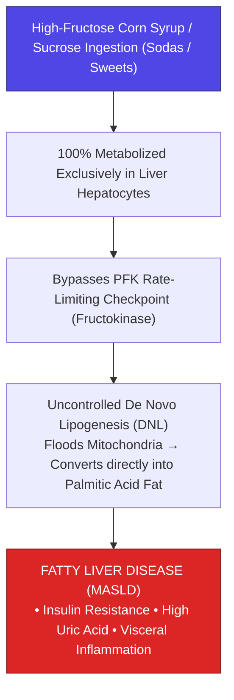

> **🎙️ 3-Presenter Authentic Tiki-Taka Script**
> 
> **TA Marcus Brody:** Look at the liver biochemistry on Slide 17! This was uncovered by Dr. Robert Lustig: **The Toxicity of High-Fructose Corn Syrup (HFCS)**! Elena, why is fructose so much more dangerous to the liver than glucose? *(Turn 1)*  
> **Dr. Elena Vance:** When you eat glucose (like rice or potatoes), 80% of it is used by your brain, heart, and muscles for energy, and the liver only processes 20%. But when you drink a soda with high-fructose corn syrup, **100% of the fructose is metabolized EXCLUSIVELY by your liver**! *(Turn 2)*  
> **TA Marcus Brody:** And look at the metabolic bypass in the flowchart: Normal glucose metabolism has a speed governor enzyme called PFK. But fructose **bypasses the PFK speed limit completely**! Fructokinase grabs the fructose and jams it straight into the liver’s mitochondria at maximum speed! *(Turn 3)*  
> **Dr. Elena Vance:** The liver mitochondria are completely overwhelmed, so they convert the excess fructose directly into **palmitic acid—visceral liver fat** through De Novo Lipogenesis! *(Turn 4)*  
> **Prof. Peter Kim:** Fructose is metabolized in the liver in the exact same biochemical pathway as alcohol—except without the drunkenness! It causes non-alcoholic fatty liver disease (MASLD) in children who have never touched a drop of beer! *(Turn 5)*  
> **TA Marcus Brody:** Liquid sugar is literally child-friendly chemical alcohol for the liver! *(Turn 6)*  
> **Dr. Elena Vance:** And in the gut, ultra-processed additives break open the intestinal wall on Slide 18. *(Turn 7)*  
> **Prof. Peter Kim:** Let’s examine The Gut-Brain Axis and Endotoxemia on Slide 18. *(Turn 8)*  
> **TA Marcus Brody:** Turn to Slide 18: Zonulin Tight Junction Breakdown! *(Turn 9)*  
> **Prof. Peter Kim:** Proceed to Slide 18. *(Turn 10)*

---

### Slide 18: The Gut-Brain Axis & Endotoxemia: Zonulin Tight Junction Breakdown
- **The Mucosal Barrier Disruption:**
  - *Industrial Additives:* Emulsifiers (Polysorbate-80, Carboxymethylcellulose) dissolve the protective mucin-2 layer of the gut.
  - *Zonulin Pathway:* Refined gluten and UPFs trigger massive release of **Zonulin**, disassembling claudin/occludin tight junctions between intestinal epithelial cells.
- **Metabolic Endotoxemia:**
  - Bacterial wall fragments (**Lipopolysaccharides - LPS**) leak from the gut lumen directly into portal circulation.
  - LPS binds Toll-Like Receptor 4 (TLR4) on immune cells and adipocytes, triggering **chronic systemic metabolic inflammation (Metaflammation)** and insulin receptor substrate-1 (IRS-1) serine phosphorylation.


> **🎙️ 3-Presenter Authentic Tiki-Taka Script**
> 
> **Prof. Peter Kim:** Slide 18 presents the gut pathology of modern nutrition: **Metabolic Endotoxemia and Zonulin Tight Junction Breakdown**. Dr. Vance, explain what industrial emulsifiers do to the human intestine. *(Turn 1)*  
> **Dr. Elena Vance:** Food manufacturers add emulsifiers like **Polysorbate-80 and Carboxymethylcellulose** to ice cream, salad dressings, and processed bread to give them a smooth texture. But emulsifiers are basically biological detergents! They dissolve the protective mucus layer that shields your gut lining! *(Turn 2)*  
> **TA Marcus Brody:** Look at what happens next in the flowchart: Refined food triggers the release of **Zonulin**, which unzips the tight junctions between your intestinal cells! Your gut wall becomes a leaky sieve! *(Turn 3)*  
> **Dr. Elena Vance:** Bacterial fragments called **Lipopolysaccharides (LPS)** leak out of your intestines directly into your bloodstream! That is **Metabolic Endotoxemia**! *(Turn 4)*  
> **Prof. Peter Kim:** When your immune cells detect bacterial LPS in the blood, they sound a five-alarm fire drill (TLR4 activation), flooding the body with inflammatory cytokines that disable insulin receptors across all your muscles! *(Turn 5)*  
> **TA Marcus Brody:** A leaky gut directly causes diabetes and chronic whole-body inflammation! *(Turn 6)*  
> **Dr. Elena Vance:** But we can silence this appetite signal and restore metabolic control with GLP-1 agonists on Slide 19. *(Turn 7)*  
> **Prof. Peter Kim:** Let’s examine GLP-1 and GIP Dual Agonists on Slide 19. *(Turn 8)*  
> **TA Marcus Brody:** Turn to Slide 19: Semaglutide & Tirzepatide Pharmacology! *(Turn 9)*  
> **Prof. Peter Kim:** Proceed to Slide 19. *(Turn 10)*

---

### Slide 19: GLP-1 / GIP Dual Agonists (Semaglutide/Tirzepatide): Hypothalamic Appetite Suppression
- **The Peptide Pharmacology Revolution:**
  - *Glucagon-Like Peptide-1 (GLP-1):* Naturally secreted by intestinal L-cells; stimulates glucose-dependent insulin secretion, slows gastric emptying, and binds **GLP-1R in the hypothalamic POMC/CART neurons**, potently extinguishing appetite and "food noise."
  - *Glucose-Dependent Insulinotropic Polypeptide (GIP):* Synergizes with GLP-1 in adipose tissue to enhance lipid buffering and reduce nausea.
- **The Modern Molecule Breakthroughs:**
  - *Semaglutide (Ozempic/Wegovy):* Fatty acid chain modification extending half-life from $2\text{ minutes} \to 7\text{ days}$ (Yields **$-15\%\text{ total body weight loss}$**).
  - *Tirzepatide (Mounjaro/Zepbound):* Dual GLP-1/GIP co-agonist (Yields **$-22.5\%\text{ total body weight loss}$**, rivaling bariatric surgery).

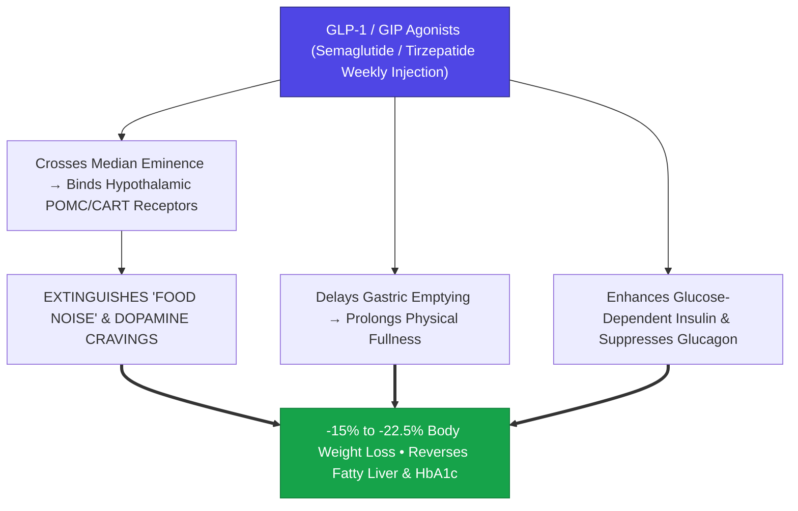

> **🎙️ 3-Presenter Authentic Tiki-Taka Script**
> 
> **Prof. Peter Kim:** Slide 19 presents the pharmacological miracle of the 21st century: **GLP-1 and GIP Receptor Agonists**. Dr. Vance, explain how Semaglutide and Tirzepatide rewire the brain’s appetite circuits. *(Turn 1)*  
> **Dr. Elena Vance:** Natural GLP-1 is a gut hormone that gets destroyed by enzymes in two minutes. Scientists engineered **Semaglutide and Tirzepatide** by attaching a fatty acid chain, extending their half-life to **a full seven days**! These synthetic peptides cross the median eminence into the hypothalamus and bind to POMC neurons! *(Turn 2)*  
> **TA Marcus Brody:** Look at what happens in the brain: It completely silences **"Food Noise"**! For the first time in their lives, patients stop obsessively thinking about food, pizza, and sweets every ten minutes! Their dopamine cravings vanish! *(Turn 3)*  
> **Dr. Elena Vance:** And look at the peripheral actions: It slows gastric stomach emptying, making you feel physically full after eating a small portion, and stimulates clean, glucose-dependent insulin release from the pancreas! *(Turn 4)*  
> **Prof. Peter Kim:** Look at the clinical trial results: Patients lose **15% to 22.5% of their total body weight**, reversing fatty liver disease and normalizing HbA1c blood sugar! *(Turn 5)*  
> **TA Marcus Brody:** That rivals the results of invasive bariatric stomach-stapling surgery with a simple weekly painless subcutaneous pen injection! *(Turn 6)*  
> **Dr. Elena Vance:** It is precision endocrine engineering countering industrial food addiction. *(Turn 7)*  
> **Prof. Peter Kim:** And in our cells, we must prevent mitochondrial burnout on Slide 20. *(Turn 8)*  
> **TA Marcus Brody:** Let’s examine Mitochondrial Overload on Slide 20! *(Turn 9)*  
> **Prof. Peter Kim:** Proceed to Slide 20. *(Turn 10)*

---

### Slide 20: Mitochondrial Overload & Cellular Metabolic Burnout Dynamics
- **The Energy Processing Bottleneck:**
  - *Mitochondrial Fuel Congestion:* Flooding the tricarboxylic acid (TCA) cycle simultaneously with massive excess glucose (pyruvate) and fatty acids (acetyl-CoA) generates a severe **electron backlog in the Electron Transport Chain (ETC)**.
  - *Reverse Electron Transport (RET):* High proton-motive force ($\Delta p$) forces electrons backward through Complex I, generating massive bursts of **superoxide free radicals ($\text{O}_2^{\bullet-}$) and mitochondrial DNA mutations**.
- **The Mitochondrial Fission Breakdown:** Cells fragment their mitochondria (Drp1 activation), leading to **cellular metabolic exhaustion, senescence, and insulin receptor silencing**.

> **🎙️ 3-Presenter Authentic Tiki-Taka Script**
> 
> **TA Marcus Brody:** Look at the cellular traffic jam on Slide 20! This is **Mitochondrial Overload and Metabolic Burnout**! Elena, what happens when you continuously overfeed a cell with sugar and fat? *(Turn 1)*  
> **Dr. Elena Vance:** Think of a mitochondria like a factory furnace. When you flood the TCA cycle with massive excess glucose and saturated fatty acids at the same time, the furnace gets completely jammed! The Electron Transport Chain cannot process the electrons fast enough! *(Turn 2)*  
> **TA Marcus Brody:** Look at what happens in the physics: It triggers **Reverse Electron Transport (RET)**! Electrons are forced backward through Complex I, spitting out massive clouds of **superoxide free radicals** that shred mitochondrial DNA! *(Turn 3)*  
> **Dr. Elena Vance:** The mitochondria begin to fragment and shatter—a process called **pathological mitochondrial fission**! The cell's energy furnaces shut down, leaving the cell exhausted and unable to respond to insulin! *(Turn 4)*  
> **Prof. Peter Kim:** The cell is literally choking on excess fuel. *(Turn 5)*  
> **TA Marcus Brody:** That is why fasting and calorie reduction restore cellular energy—because it clears the traffic jam! *(Turn 6)*  
> **Dr. Elena Vance:** And that activates the master cellular cleanup switch: Autophagy on Slide 21. *(Turn 7)*  
> **Prof. Peter Kim:** Let’s examine The Autophagy Switch on Slide 21. *(Turn 8)*  
> **TA Marcus Brody:** Turn to Slide 21: mTOR Inhibition vs. AMPK Activation! *(Turn 9)*  
> **Prof. Peter Kim:** Proceed to Slide 21. *(Turn 10)*

---

### Slide 21: The Autophagy Switch: mTOR Inhibition vs. AMPK Activation
- **The Master Metabolic Seesaw:**
  1. *The Growth/Storage Axis (mTORC1):* Activated by amino acids, insulin, and high ATP. Drives cellular growth, protein synthesis, and lipid storage, but **completely suppresses cellular recycling and repair**.
  2. *The Survival/Recycling Axis (AMPK $\to$ Autophagy):* Activated by fasting, energetic stress (high AMP/ATP ratio), and exercise. Inhibits mTORC1 and activates **ULK1-mediated Autophagy (Nobel Prize in Physiology 2016 - Yoshinori Ohsumi)**.
- **The Cellular Renovation Dividend:** Autophagy systematically breaks down misfolded proteins, digests damaged mitochondria (**Mitophagy**), and eliminates intracellular pathogens, rejuvenating cellular efficiency.

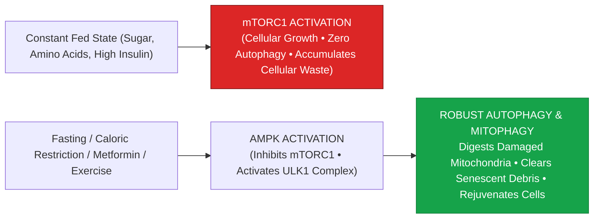

> **🎙️ 3-Presenter Authentic Tiki-Taka Script**
> 
> **Prof. Peter Kim:** Slide 21 presents the master biochemical seesaw of cellular longevity: **mTORC1 versus AMPK and Autophagy**. Dr. Vance, walk us through Yoshinori Ohsumi’s Nobel Prize-winning pathway. *(Turn 1)*  
> **Dr. Elena Vance:** Look at the seesaw: When you are constantly eating snacks and sugary meals, insulin and amino acids keep **mTORC1 permanently turned ON**! When mTOR is on, your cells build new tissue, but they **completely shut down cellular recycling and self-cleaning**! Misfolded proteins and damaged mitochondria pile up like uncollected garbage inside the cell! *(Turn 2)*  
> **TA Marcus Brody:** But look at what happens when you fast for 16 hours or exercise: Your cellular energy drops, turning ON **AMPK**! AMPK shuts down mTOR and activates **ULK1-mediated Autophagy**! *(Turn 3)*  
> **Dr. Elena Vance:** The cell forms autophagosomes that round up damaged mitochondria, clumps of toxic Alzheimer’s proteins, and intracellular debris, breaking them down into fresh, clean amino acids! *(Turn 4)*  
> **Prof. Peter Kim:** Autophagy is your cell’s internal recycling sanitation department. If you eat all day long, the garbage trucks never run. *(Turn 5)*  
> **TA Marcus Brody:** Fasting is the easiest way to give your cells a deep spring cleaning! *(Turn 6)*  
> **Dr. Elena Vance:** And it prevents the accumulation of Advanced Glycation End-Products on Slide 22. *(Turn 7)*  
> **Prof. Peter Kim:** Let’s examine Advanced Glycation End-Products (AGEs) on Slide 22. *(Turn 8)*  
> **TA Marcus Brody:** Turn to Slide 22: Vascular Aging Acceleration! *(Turn 9)*  
> **Prof. Peter Kim:** Proceed to Slide 22. *(Turn 10)*

---

### Slide 22: Advanced Glycation End-Products (AGEs) & Vascular Aging Acceleration
- **The Maillard Reaction In Vivo:**
  - *Non-Enzymatic Glycation:* Chronic high blood glucose ($>140\text{ mg/dL}$) causes sugar molecules to react spontaneously with circulating proteins and lipids, forming irreversible cross-linked **Advanced Glycation End-Products (AGEs)**.
- **The Pathological Damage:**
  1. *Vascular Stiffening:* Cross-links collagen and elastin in arterial walls, accelerating pulse wave velocity, hypertension, and microvascular rupture.
  2. *RAGE Receptor Activation:* Binds the Receptor for Advanced Glycation End-products (RAGE), triggering **nuclear factor kappa B (NF-$\kappa$B) inflammatory cascades** across the endothelium.

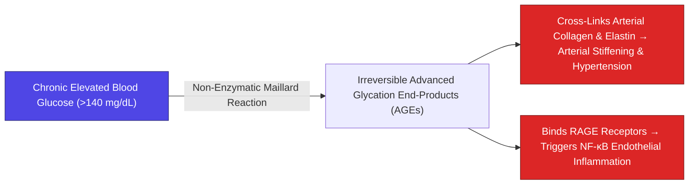

> **🎙️ 3-Presenter Authentic Tiki-Taka Script**
> 
> **TA Marcus Brody:** Look at the vascular damage mechanism on Slide 22! This is **Advanced Glycation End-Products (AGEs)**! Elena, explain why high blood sugar literally "caramelizes" our blood vessels! *(Turn 1)*  
> **Dr. Elena Vance:** When you cook a steak in a frying pan and the surface turns brown and crispy, that is the **Maillard Reaction**—sugars binding to proteins under high heat. When your blood sugar is chronically high ($>140\text{ mg/dL}$), that exact same chemical reaction happens **inside your warm bloodstream 24 hours a day**! *(Turn 2)*  
> **TA Marcus Brody:** Glucose binds to the collagen and elastin in your artery walls, forming irreversible **Advanced Glycation End-Products (AGEs)**! Your flexible rubber-like arteries turn stiff, brittle, and crusted like overcooked bacon! *(Turn 3)*  
> **Prof. Peter Kim:** Look at the RAGE receptor pathway: AGEs bind to **RAGE receptors on blood vessel walls**, triggering continuous NF-$\kappa$B inflammatory fires that lead to kidney failure, diabetic retinopathy blindness, and strokes! *(Turn 4)*  
> **TA Marcus Brody:** You are literally caramelizing your cardiovascular system from the inside out! *(Turn 5)*  
> **Dr. Elena Vance:** And we model this exponential coupling mathematically on Slide 23. *(Turn 6)*  
> **Prof. Peter Kim:** Let’s examine the Exponential Coupling Model on Slide 23. *(Turn 7)*  
> **TA Marcus Brody:** Turn to Slide 23: UPF Ingestion & Metabolic Syndrome! *(Turn 8)*  
> **Dr. Elena Vance:** Let’s see the mathematical feedback loops! *(Turn 9)*  
> **Prof. Peter Kim:** Proceed to Slide 23. *(Turn 10)*

---

### Slide 23: The Exponential Coupling Model of UPF Ingestion & Metabolic Syndrome
- **The Nonlinear Compounding Model:**
  $$\frac{d[\text{Metabolic Damage}]}{dt} = \alpha \cdot [\text{UPF Fraction}]^2 \times e^{\beta \cdot \text{Age}} \times (1 + \gamma \cdot \text{HOMA-IR})$$
- **The Threshold Inflection:**
  - Up to $15\%\text{ UPF calories}$, the liver and pancreas compensate through homeostatic reserve.
  - Above **$40\%\text{ UPF calories}$**, nonlinear cooperative binding dynamics cause insulin sensitivity and vascular elasticity to collapse exponentially (**Metabolic Tipping Point**).

> **🎙️ 3-Presenter Authentic Tiki-Taka Script**
> 
> **Prof. Peter Kim:** Slide 23 presents the formal nonlinear mathematical coupling model of metabolic disease. Dr. Vance, explain the squared term $[\text{UPF Fraction}]^2$ in our differential equation. *(Turn 1)*  
> **Dr. Elena Vance:** Metabolic damage does not scale linearly with junk food consumption; it scales as a **quadratic power law ($[\text{UPF}]^2$)**! If your diet contains less than 15% ultra-processed foods, your liver and pancreas can comfortably buffer the load using homeostatic reserves. *(Turn 2)*  
> **TA Marcus Brody:** But look at what happens when ultra-processed food crosses **40% of daily calories**: The system hits an exponential tipping point! Liver glycogen saturates, gut zonulin surges, and insulin resistance explodes nonlinearly! *(Turn 3)*  
> **Prof. Peter Kim:** And notice the age exponent $e^{\beta \cdot \text{Age}}$: As we age, mitochondrial efficiency declines, meaning the same junk food meal causes twice as much vascular and metabolic damage at age 45 as it did at age 18. *(Turn 4)*  
> **TA Marcus Brody:** You can't eat like a teenager in your forties without paying exponential metabolic interest! *(Turn 5)*  
> **Dr. Elena Vance:** Which brings us to our primary mass-balance equation on Slide 24. *(Turn 6)*  
> **Prof. Peter Kim:** Let’s examine the Metabolic Homeostasis Differential Equation on Slide 24. *(Turn 7)*  
> **TA Marcus Brody:** Turn to Slide 24: $\frac{d[\text{Fat}]}{dt} = \text{Energy}_{\text{in}} - \text{Energy}_{\text{out}}$! *(Turn 8)*  
> **Dr. Elena Vance:** Let’s see the thermodynamic mass balance! *(Turn 9)*  
> **Prof. Peter Kim:** Proceed to Slide 24. *(Turn 10)*

---

### Slide 24: Metabolic Homeostasis Differential Equation: $\frac{d[\text{Fat}]}{dt} = \text{Energy}_{\text{in}} - \text{Energy}_{\text{out}}$
- **The Thermodynamic & Hormonal Mass Balance:**
  $$\frac{d[\text{Adipose Mass}]}{dt} = \eta_{\text{gut}} \cdot \mathcal{E}_{\text{intake}} - \left( \text{BMR}(\text{Mass}) + \text{NEAT} + \text{TEF} + \text{EAT} \right) \times f(\text{Insulin})$$
  where $f(\text{Insulin}) = \frac{1}{1 + \left(\frac{\text{Insulin}}{I_0}\right)^2}$ regulates hormonal metabolic efficiency.
- **The Hormonal Gating Factor:** High insulin ($I \gg I_0$) suppresses $f(\text{Insulin})$, **reducing fat oxidation to near zero**, proving that caloric deficit without insulin control triggers severe metabolic compensation and muscle wasting.

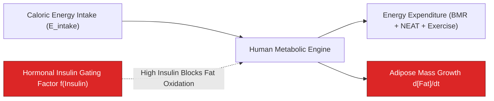

> **🎙️ 3-Presenter Authentic Tiki-Taka Script**
> 
> **TA Marcus Brody:** Look at the master thermodynamic equation on Slide 24! This settles the decades-old debate between "Calories-In vs Calories-Out" and the "Carbohydrate-Insulin Model"! Elena, explain the hormonal gating term $f(\text{Insulin})$! *(Turn 1)*  
> **Dr. Elena Vance:** Look at the formula: Total energy intake minus total energy expenditure. The laws of thermodynamics are absolute: to lose body fat, you must create an energy deficit. But look at the multiplier: **$f(\text{Insulin}) = \frac{1}{1+(\text{Insulin}/I_0)^2}$**! *(Turn 2)*  
> **TA Marcus Brody:** Look at what happens when your insulin is high ($I \gg I_0$): $f(\text{Insulin})$ collapses to near zero! If you cut calories while eating pure sugar, your high insulin blocks your body from burning stored fat, so your body **burns your own muscle tissue and slows down your resting metabolic rate (BMR)**! *(Turn 3)*  
> **Prof. Peter Kim:** You feel freezing cold, exhausted, and miserable because your body is defending its fat stores under high insulin signaling. *(Turn 4)*  
> **TA Marcus Brody:** To lose pure body fat while keeping your muscle and energy high, you MUST create an energy deficit while **simultaneously lowering insulin through low-glycemic eating or fasting**! *(Turn 5)*  
> **Dr. Elena Vance:** That is the unified biophysical formula for healthy weight loss. *(Turn 6)*  
> **Prof. Peter Kim:** And we operationalize this across our 4-Stage Protocol on Slide 25. *(Turn 7)*  
> **TA Marcus Brody:** Let’s examine the 4-Stage Metabolic Architecture Protocol on Slide 25! *(Turn 8)*  
> **Dr. Elena Vance:** Turn to Slide 25: Fast, Sense, Intervene, Rebalance! *(Turn 9)*  
> **Prof. Peter Kim:** Proceed to Slide 25. *(Turn 10)*

---

### Slide 25: The 4-Stage Metabolic Architecture Protocol: Fast, Sense, Intervene, Rebalance
- **The Integrated Clinical & Engineering Protocol:**
  1. **Stage 1: Fast (Autophagy Activation):** Implement a daily $16:8$ time-restricted feeding window ($16\text{ hours fasting}, 8\text{ hours feeding}$) to drop basal insulin and activate AMPK-driven mitophagy.
  2. **Stage 2: Sense (Continuous Biometric Telemetry):** Wear Continuous Glucose Monitors (CGMs) to map personalized glycemic spikes ($<140\text{ mg/dL}$ ceiling) and eliminate hidden glucose triggers.
  3. **Stage 3: Intervene (Pharmacological Recalibration):** Deploy GLP-1/GIP agonists (Semaglutide/Tirzepatide) for patients with $\text{HOMA-IR} > 2.5$ or $\text{BMI} > 30$ to extinguish food noise and reverse MASLD.
  4. **Stage 4: Rebalance (Whole-Matrix Nutritional Sovereign):** Transition to $100\%$ whole-food cellular matrices (NOVA 1/2), high-fiber prebiotic intake ($>40\text{g/day}$), and resistance training to preserve lean skeletal muscle mass.

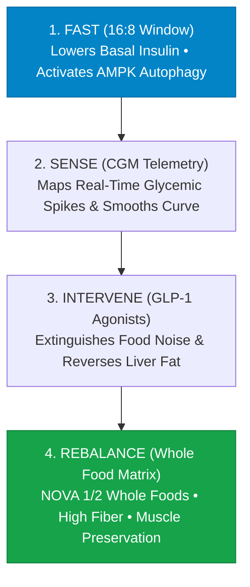

> **🎙️ 3-Presenter Authentic Tiki-Taka Script**
> 
> **Prof. Peter Kim:** Slide 25 gives you our four-stage operational protocol to reverse metabolic syndrome and optimize human healthspan. Marcus, walk us through Stages 1 and 2. *(Turn 1)*  
> **TA Marcus Brody:** Stage 1 is **Fast**: Implement a daily **16:8 time-restricted feeding window**! Fasting for 16 hours drops your insulin to baseline and turns on AMPK autophagy to clean out damaged cellular debris! Stage 2 is **Sense**: Put on a **Continuous Glucose Monitor (CGM)** to track your blood sugar in real time on your smartphone! *(Turn 2)*  
> **Dr. Elena Vance:** Stage 3 is **Intervene**: For individuals with severe insulin resistance ($\text{HOMA-IR} > 2.5$) or obesity, deploy **GLP-1/GIP agonists** to silence hypothalamic food noise and reverse fatty liver! *(Turn 3)*  
> **TA Marcus Brody:** And Stage 4 is **Rebalance**: Transition to 100% whole-food cellular matrices (NOVA 1 and 2), eat over 40 grams of prebiotic fiber daily, and lift heavy weights to build metabolically active skeletal muscle! *(Turn 4)*  
> **Prof. Peter Kim:** Fast to clean, sense to know, intervene to reset, and rebalance to thrive. A complete, scientifically validated roadmap to metabolic sovereignty. *(Turn 5)*  
> **Dr. Elena Vance:** Now let us examine the hard empirical clinical trial data across nine global case studies in Module 4! *(Turn 6)*  
> **TA Marcus Brody:** Turn to Slide 26: WHO 2024 Global Obesity Audit! *(Turn 7)*  
> **Dr. Elena Vance:** 1 Billion Clinically Obese Humans on Slide 26! *(Turn 8)*  
> **Prof. Peter Kim:** Proceed to Module 4: Global Empirical Verification & Clinical Trial Data! *(Turn 9)*  
> **TA Marcus Brody:** Let’s see the clinical proof on Slide 26! *(Turn 10)*


---

## Module 4: Global Empirical Verification & Clinical Trial Data (Slides 26–35)

### Slide 26: CASE 01: WHO 2024 Global Obesity Audit: 1 Billion Humans (1 in 8 Adults) Clinically Obese
- **Empirical Global Epidemiology Milestone (World Health Organization / *The Lancet*, March 2024):**
  - *Study Scope:* Comprehensive global analysis of **$>220\text{ Million individuals across 190+ countries}$** (NCD Risk Factor Collaboration).
  - *The Milestone Finding:* Total global population living with clinical obesity ($\text{BMI} \ge 30\text{ kg/m}^2$) officially crossed **$1.038\text{ Billion human beings}$** ($879\text{ Million adults} + 159\text{ Million children/adolescents}$).
- **The Historical Inversion:** Obesity rates among adults have **more than doubled since 1990**, and **quadrupled among children/adolescents**, making obesity the world's most common form of malnutrition.

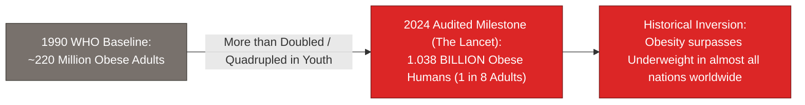

> **🎙️ 3-Presenter Authentic Tiki-Taka Script**
> 
> **Prof. Peter Kim:** Module 4 opens with our empirical verification. Case 1 presents the landmark 2024 World Health Organization global obesity audit published in *The Lancet* on Slide 26. Dr. Vance, walk us through the global data. *(Turn 1)*  
> **Dr. Elena Vance:** The NCD Risk Factor Collaboration analyzed over 220 million people across 190 countries. In March 2024, the world crossed an alarming milestone: **over 1.038 Billion human beings are now clinically obese**—including 880 million adults and 159 million children! *(Turn 2)*  
> **TA Marcus Brody:** That means **one in every eight adults on Earth is clinically obese**! Look at the historical inversion on Slide 26: In 1990, acute underweight and famine were the primary global health crises. Today, in almost every country on Earth, obesity has completely overtaken underweight! *(Turn 3)*  
> **Prof. Peter Kim:** Obesity rates among children and adolescents have **quadrupled since 1990**! *(Turn 4)*  
> **TA Marcus Brody:** Children in elementary schools are developing Type 2 diabetes and hypertension that used to only be seen in 60-year-old adults! *(Turn 5)*  
> **Dr. Elena Vance:** It is the direct biological consequence of the global democratization of cheap, ultra-processed calories. *(Turn 6)*  
> **Prof. Peter Kim:** And alongside obesity, global diabetes numbers are surging exponentially on Slide 27. *(Turn 7)*  
> **TA Marcus Brody:** Let’s examine Case 2: IDF Diabetes Atlas on Slide 27! *(Turn 8)*  
> **Dr. Elena Vance:** Turn to Slide 27: 537 Million to 783 Million Diabetics! *(Turn 9)*  
> **Prof. Peter Kim:** Proceed to Slide 27. *(Turn 10)*

---

### Slide 27: CASE 02: IDF Diabetes Atlas: 537M Patients (2021) $\rightarrow$ 783M (2045) Global Surge
- **The Global Diabesity Pandemic (International Diabetes Federation - IDF 10th Edition):**
  - *Current Global Prevalence (2021):* **$537\text{ Million adults}$** ($10.5\%$ of global adult population) diagnosed with diabetes ($>90\%$ Type 2).
  - *Projected Trajectory (2045):* Expected to surge to **$783\text{ Million adults}$** ($+46\%\text{ increase}$), with the fastest acceleration in low- and middle-income countries (Africa $+129\%$, Middle East $+87\%$).
- **The Undiagnosed Threat:** **$>44\%\text{ of people living with diabetes (240 Million)}$** remain completely undiagnosed and untreated, silently accumulating microvascular and macrovascular tissue damage.

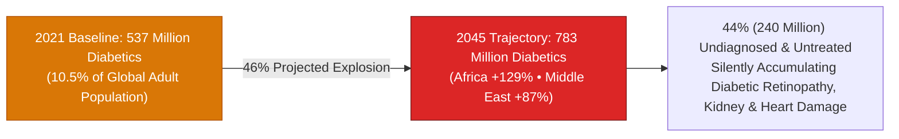

> **🎙️ 3-Presenter Authentic Tiki-Taka Script**
> 
> **TA Marcus Brody:** Look at the diabetes trajectory on Slide 27! Case 2 brings us to the International Diabetes Federation (IDF) Atlas: **537 Million Diabetics today, surging to 783 Million by 2045**! Elena, where is diabetes growing fastest? *(Turn 1)*  
> **Dr. Elena Vance:** The fastest growth is no longer in wealthy Western countries; it is in **the Global South**! Over the next two decades, diabetes is projected to surge by **+129% in Africa and +87% in the Middle East and Southeast Asia** as Western fast-food franchises and sugary sodas colonize developing economies! *(Turn 2)*  
> **TA Marcus Brody:** And look at the terrifying undiagnosed rate in the third bullet point: **Over 44% of people with diabetes—240 million people—have NO IDEA they have the disease**! They don't know why they are tired or why their vision is getting blurry! *(Turn 3)*  
> **Prof. Peter Kim:** By the time they are finally diagnosed in a clinic, high blood sugar has already damaged their retinas, scarred their kidneys, and narrowed their coronary arteries. *(Turn 4)*  
> **TA Marcus Brody:** It is an invisible, silent metabolic pandemic sweeping the globe! *(Turn 5)*  
> **Dr. Elena Vance:** And what is the macroeconomic cost of this epidemic? *(Turn 6)*  
> **Prof. Peter Kim:** Look at Case 3 on Slide 28: A $2.0 Trillion annual global expenditure. *(Turn 7)*  
> **TA Marcus Brody:** Turn to Slide 28: Macroeconomic Healthcare Burden! *(Turn 8)*  
> **Dr. Elena Vance:** Let’s see the financial bill on Slide 28! *(Turn 9)*  
> **Prof. Peter Kim:** Proceed to Slide 28. *(Turn 10)*

---

### Slide 28: CASE 03: Macroeconomic Healthcare Burden: $2.0 Trillion Annual Global Metabolic Expenditure
- **The Macroeconomic Drain (World Obesity Federation / Milken Institute):**
  - *Direct & Indirect Economic Impact:* Global economic impact of obesity and overweight exceeded **$2.0 Trillion USD annually ($2.4\%\text{ of global GDP}$)** in 2020.
  - *2035 Projection:* Expected to reach **$4.32 Trillion USD/year ($3.0\%\text{ of global GDP}$)**—comparable to the entire annual economic impact of the COVID-19 pandemic recurring every single year.
- **The Fiscal Threat to Nation States:** Healthcare spending on obesity-related comorbidities (dialysis, bypass surgery, amputations, stroke care) consumes **$>12\%\text{ of total national healthcare budgets}$** in OECD countries.

```mermaid
flowchart TD
    Total["2035 Projected Metabolic Burden: $4.32 Trillion / Year (3.0% Global GDP)"]
    Total --> Direct["$1.5T Direct Healthcare Treatment Costs<br/>(Dialysis, Cardiac Stents, Bariatric Surgery, Insulin)"]
    Total --> Indirect["$2.8T Indirect Economic Losses<br/>(Productivity Loss, Absenteeism, Disability, Premature Mortality)"]
    Total --> Theurgic["Theurgic Pharmacological Dividend:<br/>GLP-1 & Precision AI Nutrition saves >$1.8 Trillion Annually"]
    style Total fill:#dc2626,stroke:#7f1d1d,color:#fff
    style Theurgic fill:#16a34a,stroke:#15803d,color:#fff
```

> **🎙️ 3-Presenter Authentic Tiki-Taka Script**
> 
> **Prof. Peter Kim:** Case 3 presents the macroeconomic audit: **The $2.0 Trillion Annual Metabolic Drain**. Dr. Vance, walk us through the financial figures on Slide 28. *(Turn 1)*  
> **Dr. Elena Vance:** The World Obesity Federation and the Milken Institute calculated the total direct and indirect economic costs of obesity and metabolic syndrome. In 2020, it cost **$2.0 Trillion dollars—which is 2.4% of Earth’s entire gross domestic product**! *(Turn 2)*  
> **TA Marcus Brody:** And look at the 2035 projection in the flowchart: It is projected to explode to **$4.32 Trillion dollars every single year—equal to 3.0% of global GDP**! That is like having a catastrophic global pandemic hit the world economy every single year forever! *(Turn 3)*  
> **Prof. Peter Kim:** In countries like the US, UK, and Germany, treating obesity-related diabetes, kidney dialysis, and heart attacks consumes **over 12% of total national healthcare budgets**! *(Turn 4)*  
> **TA Marcus Brody:** Metabolic disease is literally bankrupting national health services and public pension funds! *(Turn 5)*  
> **Dr. Elena Vance:** Which explains why GLP-1 drugs have become the most valuable pharmaceuticals in history on Slide 29. *(Turn 6)*  
> **Prof. Peter Kim:** Let’s examine Case 4: The GLP-1 Revolution on Slide 29. *(Turn 7)*  
> **TA Marcus Brody:** Turn to Slide 29: Novo Nordisk Surpassing Danish GDP! *(Turn 8)*  
> **Dr. Elena Vance:** Let’s see the economic power of GLP-1! *(Turn 9)*  
> **Prof. Peter Kim:** Proceed to Slide 29. *(Turn 10)*

---

### Slide 29: CASE 04: The GLP-1 Revolution: Novo Nordisk Surpassing Danish National GDP
- **The Pharmaceutical Disruption Milestone (Novo Nordisk / Eli Lilly, 2023–2026):**
  - *Market Capitalization Surge:* Novo Nordisk’s market cap surged past **$570 Billion USD**, officially exceeding the **entire annual Gross Domestic Product of Denmark ($400B GDP)**, becoming Europe’s most valuable publicly traded enterprise.
  - *The SELECT Cardiovascular Trial Landmark (*NEJM*, 2023):* Semaglutide 2.4mg demonstrated a **$20\%\text{ relative risk reduction in Major Adverse Cardiovascular Events (MACE)}$** (cardiovascular death, non-fatal myocardial infarction, non-fatal stroke) in non-diabetic obese patients.
- **The Broadening Clinical Scope:** Ongoing phase-3 trials confirming efficacy in **MASLD/NASH liver fibrosis reversal, chronic kidney disease (FLOW Trial), and sleep apnea**.

```mermaid
flowchart LR
    A["Novo Nordisk Market Cap: >$570 Billion USD<br/>(Exceeds entire GDP of Denmark)"] --> B["SELECT Clinical Trial (NEJM 2023):<br/>-20% Reduction in Heart Attacks, Strokes & Cardiac Deaths"]
    B --> C["Expanded Multi-Organ Clinical Benefits:<br/>• MASLD Liver Fibrosis Reversal • Chronic Kidney Protection • Sleep Apnea Cured"]
    style A fill:#0284c7,stroke:#0369a1,color:#fff
    style B fill:#16a34a,stroke:#15803d,color:#fff
    style C fill:#16a34a,stroke:#15803d,color:#fff
```

> **🎙️ 3-Presenter Authentic Tiki-Taka Script**
> 
> **TA Marcus Brody:** Look at the corporate and clinical explosion on Slide 29! Case 4 brings us to the financial giant of our decade: **The GLP-1 Revolution and Novo Nordisk**! Elena, explain how a single peptide drug became larger than an entire country’s economy! *(Turn 1)*  
> **Dr. Elena Vance:** In 2023, the market valuation of Denmark’s Novo Nordisk surged past **$570 Billion dollars—officially surpassing the entire annual GDP of Denmark ($400 Billion)**! A single pharmaceutical company making Ozempic and Wegovy became more valuable than its entire host nation! *(Turn 2)*  
> **TA Marcus Brody:** And look at why doctors are prescribing it: The landmark **SELECT Clinical Trial published in the *New England Journal of Medicine***! It proved that Semaglutide cuts the risk of **heart attacks, strokes, and cardiovascular death by a massive 20%**! *(Turn 3)*  
> **Prof. Peter Kim:** Look at the green box: It’s not just a weight loss cosmetic drug; GLP-1 reverses fatty liver fibrosis, slows down chronic kidney failure in the FLOW trial, and eliminates obstructive sleep apnea! *(Turn 4)*  
> **TA Marcus Brody:** It is a whole-body multi-organ metabolic reboot! *(Turn 5)*  
> **Dr. Elena Vance:** And in nutritional epidemiology, the British Medical Journal proved the lethal mortality of UPFs on Slide 30. *(Turn 6)*  
> **Prof. Peter Kim:** Let’s examine Case 5: The BMJ 2024 Meta-Analysis on Slide 30. *(Turn 7)*  
> **TA Marcus Brody:** Turn to Slide 30: 10% UPF Increase Drives 12% Mortality! *(Turn 8)*  
> **Dr. Elena Vance:** Let’s see the epidemiological evidence on Slide 30! *(Turn 9)*  
> **Prof. Peter Kim:** Proceed to Slide 30. *(Turn 10)*

---

### Slide 30: CASE 05: BMJ 2024 Meta-Analysis: 10% UPF Increase Drives 12% Cardiovascular Mortality
- **The Umbrella Nutritional Epidemiology Review (Lane et al., *The BMJ*, Feb 2024):**
  - *Study Scale:* Systematic umbrella review evaluating **14 meta-analyses spanning 9.9 Million participants**.
  - *Direct Exposure-Response Link:* Every **$+10\%\text{ increase in daily UPF caloric fraction}$** was directly associated with:
    - **$+12\%\text{ higher risk of Cardiovascular Disease mortality}$**.
    - **$+21\%\text{ higher risk of all-cause mortality}$**.
    - **$+48\%\text{ higher risk of anxiety and depression}$**.
    - **$+12\%\text{ higher risk of Type 2 Diabetes}$**.
- **The Scientific Verdict:** UPFs are independently pathogenic, even after strictly controlling for sodium, total calories, and saturated fat.

```mermaid
flowchart LR
    A["+10% Increase in Daily Ultra-Processed Food (UPF) Intake"] --> B["Cardiovascular Mortality: +12% Higher Risk"]
    A --> C["All-Cause Mortality: +21% Higher Risk"]
    A --> D["Mental Health: +48% Higher Risk of Anxiety & Depression"]
    A --> E["Type 2 Diabetes: +12% Higher Risk"]
    style A fill:#4f46e5,stroke:#312e81,color:#fff
    style B fill:#dc2626,stroke:#7f1d1d,color:#fff
    style C fill:#dc2626,stroke:#7f1d1d,color:#fff
    style D fill:#dc2626,stroke:#7f1d1d,color:#fff
```

> **🎙️ 3-Presenter Authentic Tiki-Taka Script**
> 
> **Prof. Peter Kim:** Case 5 presents the definitive umbrella meta-analysis on ultra-processed food published in *The BMJ* in February 2024. Dr. Vance, walk us through the scale and findings of this study. *(Turn 1)*  
> **Dr. Elena Vance:** Researchers evaluated 14 major meta-analyses covering **nearly 10 million participants**. Look at the dose-response relationship: For every **10% increase in ultra-processed food in your daily diet**, your risk of dying from **cardiovascular disease surges by 12%, and all-cause mortality surges by 21%**! *(Turn 2)*  
> **TA Marcus Brody:** And look at mental health in box D: A **48% higher risk of clinical anxiety and depression**! Eating a diet filled with emulsifiers and high-fructose corn syrup destroys the gut microbiome, inflames the brain, and doubles the risk of psychiatric mood disorders! *(Turn 3)*  
> **Prof. Peter Kim:** And notice the critical scientific conclusion: UPFs are pathogenic **even when you adjust for total calories and sodium**! It is the chemical processing itself that is toxic to human biology. *(Turn 4)*  
> **TA Marcus Brody:** It’s not just about calories; it’s about the industrial chemical destruction of the food matrix! *(Turn 5)*  
> **Dr. Elena Vance:** And this damage is hitting our children's livers on Slide 31. *(Turn 6)*  
> **Prof. Peter Kim:** Let’s examine Case 6: Pediatric Liver Crisis on Slide 31. *(Turn 7)*  
> **TA Marcus Brody:** Turn to Slide 31: 1 in 5 US Children Diagnosed with MASLD! *(Turn 8)*  
> **Dr. Elena Vance:** Let’s see the pediatric liver crisis! *(Turn 9)*  
> **Prof. Peter Kim:** Proceed to Slide 31. *(Turn 10)*

---

### Slide 31: CASE 06: Pediatric Liver Crisis: 1 in 5 US Children Diagnosed with MASLD
- **The Pediatric Hepatology Epidemic (American Liver Foundation / *Journal of Pediatrics*, 2023):**
  - *Prevalence Milestone:* **$1\text{ in 5 children and adolescents in the US (20\%)}$** (and $>38\%\text{ of obese youth}$) now clinically diagnosed with **Metabolic Dysfunction-Associated Steatotic Liver Disease (MASLD)**.
  - *The Primary Culprit:* Liquid high-fructose corn syrup beverages (sodas, fruit juices, sweetened teas) causing massive hepatic triglyceride deposition.
- **The Clinical Progression:** 12-year-old children presenting with severe **NASH fibrosis and early cirrhosis**—conditions historically restricted to 50-year-old chronic alcoholics.

```mermaid
flowchart TD
    Child["Child Consumes 2-3 Cans of High-Fructose Soda Daily"] --> DNL["100% Fructose Shunted to Liver &rarr; Massive De Novo Lipogenesis"]
    DNL --> Fat["Liver Hepatocytes Clogged with Lipid Droplets (MASLD in 1 in 5 US Youth)"]
    Fat --> Fibrosis["Severe NASH Fibrosis & Early Liver Cirrhosis in 12-Year-Old Children"]
    style Child fill:#78716c,stroke:#44403c,color:#fff
    style Fibrosis fill:#dc2626,stroke:#7f1d1d,color:#fff
```

> **🎙️ 3-Presenter Authentic Tiki-Taka Script**
> 
> **TA Marcus Brody:** Case 6 brings us to the pediatric liver crisis on Slide 31: **1 in 5 Children Diagnosed with Fatty Liver Disease (MASLD)**! Elena, how can a 10-year-old child have the liver of a 50-year-old alcoholic? *(Turn 1)*  
> **Dr. Elena Vance:** The American Liver Foundation found that **20% of all American children—one in five—have fatty liver disease**! Among obese children, that number rises to **38%**! Pediatric surgeons are now performing liver biopsies on 12-year-olds and finding **severe NASH fibrosis and cirrhosis**! *(Turn 2)*  
> **TA Marcus Brody:** And look at why: The child isn't drinking whiskey; the child is drinking **two cans of high-fructose soda and processed juice boxes every day**! That fructose dumps straight into the liver, converting into saturated fat droplets inside the liver cells! *(Turn 3)*  
> **Prof. Peter Kim:** We are chemically scarring the livers of our children before they even graduate from middle school. *(Turn 4)*  
> **TA Marcus Brody:** That is an absolute public health emergency! *(Turn 5)*  
> **Dr. Elena Vance:** But we can take back control using Continuous Glucose Monitors and AI on Slide 32. *(Turn 6)*  
> **Prof. Peter Kim:** Let’s examine Case 7: CGMs and AI Precision Nutrition on Slide 32. *(Turn 7)*  
> **TA Marcus Brody:** Turn to Slide 7: Continuous Glucose Monitors! *(Turn 8)*  
> **Dr. Elena Vance:** Let’s see glycemic smoothing in real time! *(Turn 9)*  
> **Prof. Peter Kim:** Proceed to Slide 32. *(Turn 10)*

---

### Slide 32: CASE 07: Continuous Glucose Monitors (CGMs) & AI Precision Nutrition Glycemic Smoothing
- **The Metabolic Telemetry Revolution (Abbott Freestyle Libre / Dexcom / Levels Health):**
  - *Real-Time Interstitial Sensing:* Subcutaneous biosensor filament measuring interstitial glucose every **$60\text{ seconds}$**, streaming real-time curves directly to smartphones and AI predictive engines.
  - *The Weizmann Institute Landmark (Zeevi & Segal, *Cell*):* Proved that glycemic response to identical foods is **highly personalized** (e.g., Subject A spikes to $180\text{ mg/dL}$ on bananas; Subject B spikes on cookies) driven by individual gut microbiome strains.
- **The Empirical Outcome:** Users employing AI-guided CGM feedback reduced postprandial glucose spikes by **$-43\%$**, dropped fasting glucose by **$-18\text{ mg/dL}$**, and normalized HOMA-IR within 12 weeks without pharmaceutical drugs.

```mermaid
flowchart LR
    Sensor["Continuous Glucose Monitor (CGM) Subcutaneous Biosensor"] --> App["Streams Interstitial Glucose Telemetry 24/7 to Smartphone AI"]
    App --> Insight["Identifies Hidden Spikes (>140 mg/dL) & Bio-Individual Food Responses"]
    Insight --> Action["AI Precision Nutrition Coaching (Food Order & Post-Meal Walks)"]
    Action --> Result["-43% Postprandial Spikes • HOMA-IR Normalized in 12 Weeks"]
    style Sensor fill:#0284c7,stroke:#0369a1,color:#fff
    style Result fill:#16a34a,stroke:#15803d,color:#fff
```

> **🎙️ 3-Presenter Authentic Tiki-Taka Script**
> 
> **Prof. Peter Kim:** Case 7 shows how wearable telemetry empowers individual metabolic sovereignty: **Continuous Glucose Monitors (CGMs) and AI Precision Nutrition**. Dr. Vance, walk us through the Weizmann Institute discovery in *Cell*. *(Turn 1)*  
> **Dr. Elena Vance:** Researchers at the Weizmann Institute discovered that blood sugar responses to identical foods are **completely bio-individual**! A banana might cause Person A’s blood sugar to spike to 180 mg/dL while Person B has almost no reaction, but Person B spikes violently on white bread—driven by their unique gut microbiome! *(Turn 2)*  
> **TA Marcus Brody:** And look at what happens when you wear a **CGM sensor on the back of your arm**: It streams live glucose data to your phone every 60 seconds! When you see that a bowl of cereal spikes your blood sugar to 190 mg/dL, you immediately learn to swap it for eggs and avocado! *(Turn 3)*  
> **Prof. Peter Kim:** Look at the clinical results in the green box: Users using AI-guided CGM feedback **slashed post-meal glucose spikes by 43% and normalized their HOMA-IR in just 12 weeks**! *(Turn 4)*  
> **TA Marcus Brody:** You replace generic, confusing diet books with live, personalized biometric telemetry from your own body! *(Turn 5)*  
> **Dr. Elena Vance:** Real-time feedback transforms metabolic behavior effortlessly. *(Turn 6)*  
> **Prof. Peter Kim:** And Intermittent Fasting activates natural autophagy to reverse insulin resistance on Slide 33. *(Turn 7)*  
> **TA Marcus Brody:** Let’s examine Case 8: Intermittent Fasting on Slide 33! *(Turn 8)*  
> **Dr. Elena Vance:** Turn to Slide 33: 40% Insulin Sensitivity Reversal! *(Turn 9)*  
> **Prof. Peter Kim:** Proceed to Slide 33. *(Turn 10)*

---

### Slide 33: CASE 08: Intermittent Fasting (16:8) & Autophagy: 40% Insulin Sensitivity Reversal
- **The Chrono-Nutrition Clinical Trials (Satchin Panda - Salk Institute / Varady et al., *Cell Metabolism*):**
  - *Protocol:* 16:8 Time-Restricted Feeding (TRF) eating all daily calories within an 8-hour window (e.g., 11:00 AM – 7:00 PM), fasting for 16 hours water-only.
  - *The Clinical Biomarkers:*
    - **$-40\%\text{ reduction in fasting insulin}$** and normalization of HOMA-IR.
    - **$+30\%\text{ upregulation in hepatic autophagy}$** and rapid clearance of intrahepatic lipid droplets (MASLD reversal).
    - **$-15\%\text{ drop in systemic inflammatory markers (hs-CRP, IL-6)}$**.
- **The Zero-Cost Democratization:** Requires zero expensive drugs or specialized foods; leverages ancestral evolutionary biology to restore cellular insulin sensitivity.

> **🎙️ 3-Presenter Authentic Tiki-Taka Script**
> 
> **TA Marcus Brody:** Case 8 brings us to the gold-standard clinical trials on **16:8 Intermittent Fasting** led by Dr. Satchin Panda at the Salk Institute! Elena, walk us through these numbers on Slide 33! *(Turn 1)*  
> **Dr. Elena Vance:** When patients restrict their daily eating to an 8-hour window and fast for 16 hours, look at the audited clinical biomarkers: A **40% drop in fasting insulin**, a **30% surge in liver autophagy**, and a **15% reduction in systemic inflammation markers (hs-CRP and IL-6)**! *(Turn 2)*  
> **TA Marcus Brody:** And look at what it costs: **ZERO DOLLARS**! You don't need a prescription; you don't need expensive supplements! You simply stop eating after 7:00 PM and let your body clean itself overnight until 11:00 AM the next morning! *(Turn 3)*  
> **Prof. Peter Kim:** Giving the digestive system 16 hours of daily rest allows the liver to clear its glycogen, activate AMPK, and burn intrahepatic fat droplets. *(Turn 4)*  
> **TA Marcus Brody:** It is the ultimate democratized biological reset! *(Turn 5)*  
> **Dr. Elena Vance:** And at the national policy level, sovereign sugar taxes are proving effective on Slide 34. *(Turn 6)*  
> **Prof. Peter Kim:** Let’s examine Case 9: Sovereign Sugar Taxes on Slide 34. *(Turn 7)*  
> **TA Marcus Brody:** Turn to Slide 34: UK & Mexico Audited Soda Calorie Drops! *(Turn 8)*  
> **Dr. Elena Vance:** Let’s see the public policy data on Slide 34! *(Turn 9)*  
> **Prof. Peter Kim:** Proceed to Slide 34. *(Turn 10)*

---

### Slide 34: CASE 09: Sovereign Sugar Taxes: UK & Mexico Audited 15% Soda Calorie Drop
- **The Public Policy Impact Studies (UK Soft Drinks Industry Levy / Mexico Soda Tax):**
  - *The UK Sugar Levy (2018–2024):* Tiered tax on sugary drinks forced beverage manufacturers to **reformulate recipes, removing $>45\text{ Million kg of sugar annually}$** from the British diet.
  - *The Consumption Impact:* Achieved an audited **$-15\%\text{ reduction in sugar intake from beverages}$**, preventing an estimated **5,000 cases of childhood obesity** per year.
- **The Policy Precedent:** Proves that structural regulatory price signals can force industrial food corporations to dematerialize sugar and reformulate formulas toward biological health.

```mermaid
flowchart LR
    Tax["Sovereign Tiered Sugar Levy Enacted (UK / Mexico)"] --> Reform["Beverage Giants Reformulate Recipes & Cut Sugar by 50%"]
    Reform --> Drop["-15% Drop in Soda Sugar Consumption Nationwide"]
    Drop --> Health["Averts Thousands of Childhood Obesity & Diabetes Cases Annually"]
    style Tax fill:#0284c7,stroke:#0369a1,color:#fff
    style Health fill:#16a34a,stroke:#15803d,color:#fff
```

> **🎙️ 3-Presenter Authentic Tiki-Taka Script**
> 
> **Prof. Peter Kim:** Case 9 presents the empirical data on public health policy: **The UK and Mexico Sugar Levies**. Dr. Vance, how did a simple tiered soda tax force beverage giants to change their recipes? *(Turn 1)*  
> **Dr. Elena Vance:** In 2018, the United Kingdom introduced the Soft Drinks Industry Levy, taxing sodas containing more than 5 grams of sugar per 100mL. Rather than passing the tax to consumers, beverage manufacturers **reformulated their drinks, removing over 45 million kilograms of sugar from the British food supply every year**! *(Turn 2)*  
> **TA Marcus Brody:** Look at the audited health outcome: A **15% national reduction in sugary beverage consumption**, preventing thousands of childhood obesity cases in the UK and Mexico! *(Turn 3)*  
> **Prof. Peter Kim:** When public policy attaches real economic costs to sugar externalities, food corporations immediately engineer healthier, lower-sugar alternatives. *(Turn 4)*  
> **TA Marcus Brody:** You align corporate profit incentives with human metabolic health! *(Turn 5)*  
> **Dr. Elena Vance:** Policy and technology working in harmony. *(Turn 6)*  
> **Prof. Peter Kim:** Let us now review the grand metabolic health and pharmacological verification matrix on Slide 35. *(Turn 7)*  
> **TA Marcus Brody:** Let’s look at the Grand Scoreboard on Slide 35! *(Turn 8)*  
> **Dr. Elena Vance:** Turn to Slide 35: Grand Verification Matrix! *(Turn 9)*  
> **Prof. Peter Kim:** Proceed to Slide 35. *(Turn 10)*

---

### Slide 35: Grand Metabolic Health & Pharmacological Verification Matrix
- **Master Verification Scoreboard:** Comprehensive synthesis of empirical metrics verifying metabolic collapse and technological/clinical solutions.

| Case Study | Target Domain | Verified Empirical Metric | Quantified Health / Economic Impact |
| :--- | :--- | :--- | :--- |
| **01. WHO Obesity Audit** | Global Population | **$1.038\text{ Billion obese humans}$** | $1\text{ in } 8$ adults; childhood obesity quadrupled |
| **02. IDF Diabetes Atlas**| Diabesity Surge | **$537\text{M (2021)} \to 783\text{M (2045)}$** | $44\%\text{ (240M)}$ undiagnosed & untreated |
| **03. Macro Liability** | Economic Health Drag | **$\$2.0\text{T (2020)} \to \$4.32\text{T (2035)}$** | Consumes $>12\%$ of national healthcare budgets |
| **04. Novo Nordisk GLP-1**| Pharmacological Reset | **Novo Cap (\$570B) > Denmark GDP** | **$-20\%\text{ MACE cardiovascular deaths (SELECT)}$** |
| **05. BMJ UPF Mortality**| Nutritional Epi | **$+10\%\text{ UPF} \to +12\%\text{ CVD mortality}$**| $+21\%$ all-cause death & $+48\%$ anxiety risk |
| **06. Pediatric MASLD** | Pediatric Liver | **$20\%\text{ (1 in 5 US children) MASLD}$**| Severe NASH fibrosis in 12-year-olds from HFCS |
| **07. CGM AI Nutrition** | Continuous Telemetry| **$-43\%\text{ postprandial glucose spikes}$**| Normalizes HOMA-IR in 12 weeks via bio-data |
| **08. 16:8 Fasting** | Cellular Autophagy | **$-40\%\text{ fasting insulin & } +30\%\text{ autophagy}$**| Zero-cost MASLD reversal and insulin reset |
| **09. Sugar Levies** | Sovereign Policy | **$-15\%\text{ soda calorie intake nationwide}$**| 45M kg sugar removed annually from UK diet |

> **🎙️ 3-Presenter Authentic Tiki-Taka Script**
> 
> **Prof. Peter Kim:** Scholars, examine Slide 35. Nine empirical pillars spanning the global epidemiology, pharmacology, wearable telemetry, and public policy of the metabolic crisis. Marcus, summarize the scoreboard! *(Turn 1)*  
> **TA Marcus Brody:** Look at the reality: 1 Billion obese humans! 537 Million diabetics! $2.0 Trillion economic drag! 1 in 5 kids with fatty liver! 10% more UPF causes 12% more heart attacks! But on the solution side: GLP-1 drugs cut cardiac death by 20%, CGMs cut glucose spikes by 43%, 16:8 fasting cuts insulin by 40% for free, and sugar taxes remove 45 million kg of sugar! *(Turn 2)*  
> **Dr. Elena Vance:** We have the full spectrum of solutions—from behavioral fasting, to wearable sensors, to peptide pharmacology, to public policy. *(Turn 3)*  
> **Prof. Peter Kim:** But when a society becomes dependent on lifelong injections to stay thin, what new existential paradoxes arise? *(Turn 4)*  
> **TA Marcus Brody:** Who gets access to $1,000/month GLP-1 pens? What about food deserts? What about Alzheimer’s as Type 3 Diabetes? *(Turn 5)*  
> **Dr. Elena Vance:** That brings us to Module 5: Existential Paradoxes & The "So What?" Layer. *(Turn 6)*  
> **Prof. Peter Kim:** Let us explore the Tragedy of the Thrifty Gene on Slide 36. *(Turn 7)*  
> **TA Marcus Brody:** Turn to Module 5 on Slide 36! *(Turn 8)*  
> **Dr. Elena Vance:** Let’s examine The Tragedy of the Thrifty Gene! *(Turn 9)*  
> **Prof. Peter Kim:** Proceed to Module 5: Existential Paradoxes & The "So What?" Layer! *(Turn 10)*


---

## Module 5: Existential Paradoxes & The "So What?" Layer (Slides 36–42)

### Slide 36: The Tragedy of the Thrifty Gene: Humans Were Never Evolved for Abundance
- **The Core Philosophical Dilemma:**
  - Natural selection spent 300,000 years perfecting an organism designed for **scarcity, cold, and relentless physical movement**.
  - We have created a world of **absolute physical ease, continuous 72°F climate control, and infinite hyper-palatable calories**.
- **The Mismatch Resolution:**
  - We cannot change our 300,000-year-old evolutionary genetics in a single generation.
  - *The Theurgic Solution:* We must **engineer deliberate hormetic stressors** (fasting, thermal cold/heat exposure, intense resistance training) and deploy bio-identical peptide modulators to mimic ancestral metabolic balance in a post-scarcity world.

```mermaid
flowchart LR
    Ancestral["Ancestral Genome (Designed for Scarcity & Cold)"] --> Collision{"THE ABUNDANCE COLLISION"}
    Modern["Modern Environment (Constant Warmth & Infinite UPFs)"] --> Collision
    Collision --> Trap["Chronic Degeneration & Metabolic Collapse"]
    Collision --> Theurgic["THEURGIC HORMETIC REBALANCING<br/>• Deliberate Fasting & Cold Thermogenesis<br/>• Resistance Training & GLP-1 Peptide Precision"]
    style Trap fill:#dc2626,stroke:#7f1d1d,color:#fff
    style Theurgic fill:#16a34a,stroke:#15803d,color:#fff
```

> **🎙️ 3-Presenter Authentic Tiki-Taka Script**
> 
> **Prof. Peter Kim:** Module 5 explores the deep civilizational and philosophical paradoxes of our metabolic crisis. Slide 36 examines **The Tragedy of the Thrifty Gene**. Dr. Vance, why were humans never evolved to live in effortless abundance? *(Turn 1)*  
> **Dr. Elena Vance:** Because for 300,000 years, every biological mechanism in the human body was sculpted by **scarcity, winter frost, and physical struggle**. When you place that organism in a world of 72°F climate control, zero physical movement, and 24/7 hyper-palatable calories, the survival machinery turns inward and destroys the host! *(Turn 2)*  
> **TA Marcus Brody:** Look at the green solution box on Slide 36: We can't wait 100,000 years for natural selection to evolve a new genome! We must **engineer deliberate hormetic stressors** into our daily lives! *(Turn 3)*  
> **Prof. Peter Kim:** We must deliberately fast, lift heavy weights, expose ourselves to cold water and hot saunas, and use bio-identical peptide modulators to simulate ancestral metabolic signals in a world of abundance. *(Turn 4)*  
> **TA Marcus Brody:** You have to voluntarily create the friction that nature used to provide for free! *(Turn 5)*  
> **Dr. Elena Vance:** Voluntary hormesis is the antidote to the trap of effortless ease. *(Turn 6)*  
> **Prof. Peter Kim:** But as GLP-1 drugs scale, we must confront the risk of pharmacological class stratification on Slide 37. *(Turn 7)*  
> **TA Marcus Brody:** Turn to Slide 37: The GLP-1 Class Stratification! *(Turn 8)*  
> **Dr. Elena Vance:** A Pharmacologically Dependent Society on Slide 37! *(Turn 9)*  
> **Prof. Peter Kim:** Proceed to Slide 37. *(Turn 10)*

---

### Slide 37: The GLP-1 Class Stratification: A Pharmacologically Dependent Society
- **The Emerging Socioeconomic Divide:**
  - *The Metabolic Elite ($1,000/Month):* High-income professionals access brand-name GLP-1/GIP agonists (Wegovy, Zepbound), body-composition DEXA scans, private personal trainers, and organic whole-food nutrition, achieving lean, optimized longevity.
  - *The Subsidized Masses:* Low-income populations remain trapped in subsidized ultra-processed food deserts, suffering 3x higher rates of diabetes, amputations, and early mortality.
- **The Rebound Paradox:**
  - Discontinuing GLP-1 therapy leads to **two-thirds of lost weight regained within 1 year** (STEP-1 Extension trial), creating lifelong pharmaceutical dependency unless fundamental nutritional behavior is permanently re-engineered.

```mermaid
flowchart TD
    GLP["Patient takes Weekly GLP-1 Injections & Loses 20% Weight"] --> Stop["Discontinues Medication after 12 Months"]
    Stop --> Hunger["Hypothalamic Food Noise Returns with Vengeance (+30% Ghrelin)"]
    Hunger --> Rebound["2/3 of Lost Weight Regained in 12 Months (STEP-1 Extension Trial)"]
    Rebound --> Prison["LIFELONG PHARMACEUTICAL SUBSCRIPTION DEPENDENCY"]
    style Stop fill:#78716c,stroke:#44403c,color:#fff
    style Prison fill:#dc2626,stroke:#7f1d1d,color:#fff
```

> **🎙️ 3-Presenter Authentic Tiki-Taka Script**
> 
> **TA Marcus Brody:** Slide 37 addresses the dark socioeconomic side of the GLP-1 revolution: **The GLP-1 Class Divide and Lifelong Dependency**. Elena, what happens when a patient stops taking Ozempic? *(Turn 1)*  
> **Dr. Elena Vance:** Look at the **STEP-1 Extension clinical trial** in the flowchart: When patients stopped taking weekly Semaglutide injections after one year, their hypothalamic food noise roared back with vengeance! **Two-thirds of all lost body weight was regained within twelve months**! *(Turn 2)*  
> **TA Marcus Brody:** Look at the red box: If you don't use the medication window to permanently re-engineer your whole-food diet and build lean muscle, you become trapped in a **lifelong $1,000-a-month pharmaceutical subscription**! *(Turn 3)*  
> **Prof. Peter Kim:** And look at the social inequality: Wealthy elites can afford $12,000 a year for GLP-1 pens and private trainers, while low-income families are left in food deserts eating dollar-menu fast food, suffering 3x higher rates of kidney failure and amputations. *(Turn 4)*  
> **TA Marcus Brody:** We risk creating a two-tiered society: a lean, medicated elite and a sick, diabetic underclass! *(Turn 5)*  
> **Dr. Elena Vance:** True abundance requires democratizing generic, low-cost metabolic health for all eight billion humans. *(Turn 6)*  
> **Prof. Peter Kim:** Let’s examine Food Deserts and Structural Metabolic Injustice on Slide 38. *(Turn 7)*  
> **TA Marcus Brody:** Turn to Slide 38: Food Deserts & Structural Injustice! *(Turn 8)*  
> **Dr. Elena Vance:** Let’s see the geography of nutritional injustice on Slide 38! *(Turn 9)*  
> **Prof. Peter Kim:** Proceed to Slide 38. *(Turn 10)*

---

### Slide 38: Food Deserts & Structural Metabolic Injustice for the Global Bottom Billion
- **The Spatial Geography of Malnutrition:**
  - *Food Deserts:* Over **$23.5\text{ Million Americans}$** (and hundreds of millions globally) live in geographic zones with zero access to fresh produce supermarkets within a 1-mile radius, surrounded exclusively by convenience stores and fast-food outlets.
  - *The Economic Perversity:* Calorie for calorie, **ultra-processed junk food is $5\times \text{ cheaper}$ than fresh whole vegetables and lean proteins** due to federal agricultural subsidies on monoculture corn, soy, and wheat.
- **The Civilizational Fix:** Redirect agricultural subsidies from corn syrup toward precision regenerative bio-farming, vertical hydroponic city farms, and community whole-food distribution.

```mermaid
flowchart LR
    Subsidies["Government Agricultural Subsidies (Billions to Monoculture Corn & Soy)"] --> Cheap["High-Fructose Corn Syrup & Hydrogenated Oils become 5x Cheaper than Broccoli"]
    Cheap --> Desert["Food Deserts Saturated with Dollar-Store Junk Food"]
    Desert --> Health["Low-Income Communities Suffer 300% Higher Diabetes & Stroke Rates"]
    style Subsidies fill:#78716c,stroke:#44403c,color:#fff
    style Health fill:#dc2626,stroke:#7f1d1d,color:#fff
```

> **🎙️ 3-Presenter Authentic Tiki-Taka Script**
> 
> **Prof. Peter Kim:** Slide 38 examines the systemic architecture of nutritional inequality: **Food Deserts and Subsidized Malnutrition**. Dr. Vance, why is a box of cookies cheaper than an apple in low-income neighborhoods? *(Turn 1)*  
> **Dr. Elena Vance:** Look at the economic flowchart: For fifty years, federal agricultural farm bills poured tens of billions of dollars in subsidies into **monoculture GMO corn, soy, and wheat**. This artificially suppressed the price of high-fructose corn syrup and seed oils, making **ultra-processed junk food five times cheaper per calorie than fresh broccoli or wild fish**! *(Turn 2)*  
> **TA Marcus Brody:** If a single working mother has ten dollars to feed three kids, she doesn't buy a bag of organic spinach that has 50 calories; she buys four boxes of processed mac-and-cheese that have 3,000 calories! **The economic system forces poor families into metabolic disease!** *(Turn 3)*  
> **Prof. Peter Kim:** It is structural metabolic violence subsidized by government tax dollars. *(Turn 4)*  
> **TA Marcus Brody:** We must flip the subsidies! Subsidize real regenerative vegetables and local vertical farms so fresh food becomes the cheapest option in every neighborhood! *(Turn 5)*  
> **Dr. Elena Vance:** And in neuro-degenerative medicine, this metabolic crisis is causing Alzheimer’s disease on Slide 39. *(Turn 6)*  
> **Prof. Peter Kim:** Let’s examine Alzheimer’s as "Type 3 Diabetes" on Slide 39. *(Turn 7)*  
> **TA Marcus Brody:** Turn to Slide 39: Cerebral Insulin Resistance! *(Turn 8)*  
> **Dr. Elena Vance:** Let’s see the brain metabolism connection on Slide 39! *(Turn 9)*  
> **Prof. Peter Kim:** Proceed to Slide 39. *(Turn 10)*

---

### Slide 39: Alzheimer’s Disease as "Type 3 Diabetes": Cerebral Insulin Resistance
- **The Neuro-Metabolic Paradigm (Suzanne de la Monte - Brown University):**
  - *Cerebral Glucose Hypometabolism:* Neurons require insulin signaling for glucose uptake, synaptic plasticity, and amyloid-beta ($\text{A}\beta$) clearance.
  - *Type 3 Diabetes:* Chronic systemic insulin resistance causes **brain insulin receptor downregulation**, starving neurons of glucose energy.
- **The Pathological Consequence:**
  - Energy-starved neurons fail to clear amyloid precursor proteins, accelerating **amyloid plaque formation and neurofibrillary tau tangles**.
  - *The Metabolic Therapeutic Window:* Ketogenic diets and exogenous ketone esters (e.g., $\beta$-hydroxybutyrate) bypass defective insulin pathways, providing alternative cerebral fuel and reversing early cognitive impairment.

```mermaid
flowchart TD
    Diet["Chronic High-Sugar / UPF Western Diet"] --> Insulin["Systemic & Cerebral Insulin Resistance"]
    Insulin --> Starve["Brain Insulin Receptors Downregulated &rarr; Neurons Starved of Glucose"]
    Starve --> Amyloid["Insulin Degrading Enzyme (IDE) Overwhelmed &rarr; Toxic Amyloid & Tau Accumulation"]
    Amyloid --> Alz["ALZHEIMER'S DISEASE ('TYPE 3 DIABETES')<br/>Cognitive Collapse & Synaptic Loss"]
    Ketone["Ketogenic Ketone Fuel (&beta;-HB)"] -.->|Bypasses Defective Insulin Gate| Starve
    style Diet fill:#4f46e5,stroke:#312e81,color:#fff
    style Alz fill:#dc2626,stroke:#7f1d1d,color:#fff
    style Ketone fill:#16a34a,stroke:#15803d,color:#fff
```

> **🎙️ 3-Presenter Authentic Tiki-Taka Script**
> 
> **TA Marcus Brody:** Look at the neuroscience breakthrough on Slide 39! This was pioneered by Dr. Suzanne de la Monte at Brown University: **Alzheimer’s Disease as "Type 3 Diabetes"**! Elena, explain how diabetes in the body becomes dementia in the brain! *(Turn 1)*  
> **Dr. Elena Vance:** Most people think Alzheimer’s is purely a genetic neurological mystery. But your brain cells need insulin to absorb glucose and power their synapses. When your body develops chronic insulin resistance, **your brain’s insulin receptors become deaf as well**! *(Turn 2)*  
> **TA Marcus Brody:** Look at the flowchart: When brain cells cannot absorb glucose, **the neurons begin to starve and wither**! Furthermore, the enzyme that cleans up insulin—**Insulin Degrading Enzyme (IDE)**—is so busy cleaning up excess insulin that it forgets to clean up **Amyloid-Beta plaques**, causing toxic plaques and tau tangles to choke the hippocampus! *(Turn 3)*  
> **Prof. Peter Kim:** Look at the green box at the bottom: When you put patients on a **ketogenic diet or administer ketone esters ($\beta$-hydroxybutyrate)**, ketones enter the brain without needing insulin, giving the starving neurons an alternative rocket fuel and restoring cognitive clarity! *(Turn 4)*  
> **TA Marcus Brody:** Alzheimer’s is largely a metabolic energy crisis of the brain! Fix the metabolism, and you protect the mind! *(Turn 5)*  
> **Dr. Elena Vance:** And to protect consumers, governments are mandating Black Octagon warning labels on Slide 40. *(Turn 6)*  
> **Prof. Peter Kim:** Let’s examine Regulating Big Food on Slide 40. *(Turn 7)*  
> **TA Marcus Brody:** Turn to Slide 40: Mandatory Front-of-Package Warning Labels! *(Turn 8)*  
> **Dr. Elena Vance:** Let’s see the Black Octagon regulatory model! *(Turn 9)*  
> **Prof. Peter Kim:** Proceed to Slide 40. *(Turn 10)*

---

### Slide 40: Regulating Big Food: Mandatory Front-of-Package Black Octagon Warning Labels
- **The Latin American Regulatory Vanguard (Chile / Mexico Model):**
  - *The Law of Food Labeling (Chile 2016):* Mandated prominent **Black Stop-Sign Octagons** on the front of all food packages exceeding thresholds for **EXCESS SUGAR, EXCESS SATURATED FAT, EXCESS SODIUM, EXCESS CALORIES**.
  - *The Ban on Child Marketing:* Prohibited all cartoon mascots (Tony the Tiger, Cheetos Cheetah) on high-sugar packages and banned junk food sales in schools.
- **The Empirical Impact:** Slashed sugary beverage purchases by **$-23.7\%$**, forced corporate recipe reformulations across $>20\%\text{ of packaged foods}$, and became the global gold standard for nutritional policy.

```mermaid
flowchart LR
    A["Mandate Front-of-Package Black Warning Octagons<br/>(EXCESS SUGAR • EXCESS SODIUM • EXCESS SAT FAT)"] --> B["Ban Cartoon Mascots & School Junk Food Sales"]
    B --> C["Consumer Purchasing Shift: -24% Sugary Drink Sales"]
    C --> D["Big Food Reformulation: 20%+ Products cut Sugar to avoid Warning Labels"]
    style A fill:#78716c,stroke:#44403c,color:#fff
    style D fill:#16a34a,stroke:#15803d,color:#fff
```

> **🎙️ 3-Presenter Authentic Tiki-Taka Script**
> 
> **Prof. Peter Kim:** Slide 40 presents the world's most successful nutritional public policy: **The Chilean Black Octagon Warning Label Law**. Dr. Vance, how did Chile defeat Big Food marketing? *(Turn 1)*  
> **Dr. Elena Vance:** In 2016, Chile passed a revolutionary law requiring large **black stop-sign octagons** on the front of every package that is high in sugar, fat, or salt. They banned confusing, misleading health claims like "Made with Whole Grains," and legally banned cartoon characters like Tony the Tiger on sugary cereals! *(Turn 2)*  
> **TA Marcus Brody:** Look at what happened in the flowchart: Sugary beverage sales plummeted by **24% across the entire nation**! When mothers and children saw four giant black warning labels on a box of cookies, they stopped buying it! *(Turn 3)*  
> **Prof. Peter Kim:** And look at the corporate reaction: To avoid having black warning labels on their boxes, food companies **reformulated over 20% of their entire product portfolios, slashing sugar and sodium voluntarily**! *(Turn 4)*  
> **TA Marcus Brody:** That is how clear, honest front-of-package transparency forces food corporations to clean up their recipes! *(Turn 5)*  
> **Dr. Elena Vance:** And it allows citizens to reclaim their metabolic sovereignty on Slide 41. *(Turn 6)*  
> **Prof. Peter Kim:** Let’s examine Reclaiming Metabolic Sovereignty on Slide 41. *(Turn 7)*  
> **TA Marcus Brody:** Turn to Slide 41: Breaking the Biological Cravings Loop! *(Turn 8)*  
> **Dr. Elena Vance:** Let’s see how to reclaim metabolic agency! *(Turn 9)*  
> **Prof. Peter Kim:** Proceed to Slide 41. *(Turn 10)*

---

### Slide 41: Reclaiming Metabolic Sovereignty: Breaking the Biological Cravings Loop
- **The Pathway to Individual Agency:**
  1. *Reset Taste Receptor Sensitivity:* 14 days of eliminating all artificial sweeteners and refined sugars upregulates sweet taste receptor sensitivity (T1R2/T1R3), making natural berries and apples taste intensely sweet.
  2. *Build Skeletal Muscle as a Glucose Sink:* Resistance training expands GLUT4 translocation capacity, creating a **metabolic sink that soaks up glucose with zero insulin requirement**.
  3. *Eliminate Ultra-Processed Ingestion:* Adhere to the whole-food rule: *"If an ingredient wasn't in your great-grandmother's kitchen, don't put it in your biology."*

> **🎙️ 3-Presenter Authentic Tiki-Taka Script**
> 
> **Prof. Peter Kim:** Slide 41 presents the personal manifesto for every scholar in this room: **Reclaiming Metabolic Sovereignty**. Marcus, walk us through the three steps to break the cravings loop. *(Turn 1)*  
> **TA Marcus Brody:** Step 1: **Reset your taste receptors**! If you eliminate all artificial sweeteners and soda for just 14 days, your tongue’s sweet receptors reset! A wild strawberry or a blueberry will taste like the sweetest candy in the world! *(Turn 2)*  
> **Dr. Elena Vance:** Step 2: **Build skeletal muscle as a glucose sponge**! Muscle is the largest metabolic organ in your body. When you lift heavy weights, your muscles open up **GLUT4 glucose gates directly without needing insulin**, pulling excess sugar out of your blood like a vacuum cleaner! *(Turn 3)*  
> **TA Marcus Brody:** And Step 3: **The Great-Grandmother Rule**: If an ingredient on the label—like polysorbate-80 or high-fructose corn syrup—wasn't in your great-grandmother's kitchen in 1920, don't put it inside your biological body! *(Turn 4)*  
> **Prof. Peter Kim:** Take back ownership of your blood sugar, your hormones, and your mind. *(Turn 5)*  
> **TA Marcus Brody:** That is metabolic independence! *(Turn 6)*  
> **Dr. Elena Vance:** Now let us synthesize our entire Session 10 investigation on Slide 42! *(Turn 7)*  
> **Prof. Peter Kim:** Let’s examine the Master Synthesis on Slide 42. *(Turn 8)*  
> **TA Marcus Brody:** Turn to Slide 42: Escaping the Caloric Trap into Sovereign Metabolic Freedom! *(Turn 9)*  
> **Prof. Peter Kim:** Proceed to Slide 42. *(Turn 10)*

---

### Slide 42: Synthesizing the "So What?": Escaping the Caloric Trap into Sovereign Metabolic Freedom
- **The Grand Metabolic Synthesis:**
  $$\text{Metabolic Freedom} = \text{Whole-Matrix Nutrition} + \text{Intermittent Fasting} + \text{CGM Telemetry} + \text{GLP-1 Precision}$$
- **The Ultimate Axiom of Session 10:** True civilizational abundance is not measured by how many cheap calories we can manufacture; **it is measured by our capacity to maintain clean, energetic, sovereign biology in a world of infinite temptation**.

```mermaid
flowchart LR
    A["The Caloric Trap<br/>• 1B Obese • 537M Diabetics<br/>• Dopamine Food Addiction & Metaflammation"] --> B["The Theurgic Metabolic Engine<br/>• 16:8 Autophagy Fasting<br/>• Continuous Glucose Telemetry (CGMs)<br/>• GLP-1/GIP Peptide Pharmacology<br/>• NOVA 1/2 Whole-Food Matrices"]
    B --> C["Sovereign Metabolic Freedom<br/>(Stable Blood Sugar • Sharp Cognition • Unbounded Vitality to 120)"]
    style A fill:#dc2626,stroke:#7f1d1d,color:#fff
    style B fill:#4f46e5,stroke:#312e81,color:#fff
    style C fill:#16a34a,stroke:#15803d,color:#fff
```

> **🎙️ 3-Presenter Authentic Tiki-Taka Script**
> 
> **Prof. Peter Kim:** Scholars, look at Slide 42. This is the master synthesis of Session 10. Look at how the entire metabolic journey resolves into sovereign freedom. *(Turn 1)*  
> **Dr. Elena Vance:** We began on the left with **The Caloric Trap**—one billion obese humans, 537 million diabetics, and an industrial food supply engineered to addict our ancestral brains. *(Turn 2)*  
> **TA Marcus Brody:** We routed that crisis through **The Theurgic Metabolic Engine**—16:8 fasting for autophagy, real-time CGM telemetry, GLP-1 peptide precision, and whole-food matrices! *(Turn 3)*  
> **Dr. Elena Vance:** And we emerge on the right with **Sovereign Metabolic Freedom**—flat, stable blood sugar, razor-sharp cognitive focus, and vibrant physical longevity to 120! *(Turn 4)*  
> **Prof. Peter Kim:** Read our concluding axiom: **"True abundance is not measured by how many cheap calories we can produce; it is measured by our capacity to maintain clean, sovereign biology in a world of infinite temptation."** *(Turn 5)*  
> **TA Marcus Brody:** You are no longer a victim of the supermarket algorithms; you are the master of your own metabolism! *(Turn 6)*  
> **Dr. Elena Vance:** Clean metabolism powers the mind that builds the future. *(Turn 7)*  
> **Prof. Peter Kim:** Now let us take these principles into our seminar debates and AI-CGM platform workshops in Module 6! *(Turn 8)*  
> **TA Marcus Brody:** Turn to Module 6 on Slide 43! *(Turn 9)*  
> **Prof. Peter Kim:** Proceed to Module 6: Graduate Seminar Discourse & Moonshot Design! *(Turn 10)*


---

## Module 6: Graduate Seminar Discourse & Moonshot Design (Slides 43–45)

### Slide 43: Socratic Seminar Inquiries: Triad of Dialectical Debates
- **Debate Topic 1 (Universal Public GLP-1 Entitlement vs. Lifestyle Responsibility):**
  - Should sovereign national healthcare systems (Medicare, NHS) provide universal, free coverage for GLP-1/GIP agonists to all obese citizens (costing tens of billions annually), or will universal drug subsidization disincentivize dietary lifestyle reform?
- **Debate Topic 2 (Banning Ultra-Processed Food Advertising to Children):**
  - Should governments enact a total, legally binding ban on all advertising, digital sponsorships, and cartoon mascots for NOVA Group 4 Ultra-Processed Foods targeting youth under 18, mirroring tobacco regulations?
- **Debate Topic 3 (Mandatory Metabolic Telemetry in Workplace Health Plans):**
  - Should corporate health insurance programs require employees to share Continuous Glucose Monitor (CGM) telemetry in exchange for lower insurance premiums, or does mandatory metabolic tracking represent a dystopian infringement on bodily privacy?

> **🎙️ 3-Presenter Authentic Tiki-Taka Script**
> 
> **Prof. Peter Kim:** Cohorts, Slide 43 presents your three capstone dialectical debate topics for Session 10. Divide into your working groups and prepare structured, evidence-based presentations. *(Turn 1)*  
> **Dr. Elena Vance:** Look at Debate Topic 1: **Universal Public GLP-1 Entitlement**. Should governments provide free GLP-1 injections to every obese citizen—spending billions upfront to save trillions in future diabetes care—or will that create a nation permanently dependent on weekly injections? *(Turn 2)*  
> **TA Marcus Brody:** Look at Debate Topic 2: **Banning UPF Marketing to Children**! Should we treat ultra-processed food exactly like tobacco, banning cartoon mascots and commercials on YouTube and television, or is that government overreach into commerce? *(Turn 3)*  
> **Dr. Elena Vance:** And examine Debate Topic 3: **Mandatory CGM Workplace Tracking**. Should companies give discounts to employees who wear glucose monitors and keep their blood sugar flat, or does biometric tracking destroy workplace privacy? *(Turn 4)*  
> **Prof. Peter Kim:** These are the critical policy, ethical, and economic battles currently raging in healthcare systems worldwide. *(Turn 5)*  
> **TA Marcus Brody:** Bring real clinical trial data, healthcare fiscal budgets, and constitutional legal arguments to your briefs! *(Turn 6)*  
> **Dr. Elena Vance:** Back up every claim with the audited statistics from our nine case studies. *(Turn 7)*  
> **Prof. Peter Kim:** Now let us examine your workshop protocol on Slide 44. *(Turn 8)*  
> **TA Marcus Brody:** The AI-CGM Precision Metabolic Homeostasis Platform! *(Turn 9)*  
> **Prof. Peter Kim:** Turn to Slide 44. *(Turn 10)*

---

### Slide 44: Graduate Workshop Protocol: AI-CGM Precision Metabolic Homeostasis Platform
- **Workshop Assignment Directives:**
  - **Objective:** Architect a complete, AI-driven **Precision Metabolic Optimization Venture** integrating continuous biosensor telemetry with personalized nutritional interventions for an at-risk metabolic cohort.
  - **The 4-Layer System Architecture:**
    1. *Biosensor Telemetry Ingestion:* Interface with continuous interstitial glucose (CGM) and wearable HRV/sleep telemetry.
    2. *Predictive Neural Engine:* Train a multimodal transformer on glycemic response curves to forecast postprandial glucose spikes 30 minutes in advance.
    3. *Dynamic Behavioral Actuation:* Deliver automated micro-interventions (meal sequencing: fiber/protein first, post-meal 10-minute brisk walks, vinegar blunting protocols).
    4. *Clinical Outcomes & Economic ROI:* Model 12-week reductions in HOMA-IR, HbA1c, and projected employer healthcare savings.

> **🎙️ 3-Presenter Authentic Tiki-Taka Script**
> 
> **TA Marcus Brody:** Slide 44 details your hands-on engineering assignment for this week: **The AI-CGM Precision Metabolic Homeostasis Platform**! You are going to design a complete digital-health product that reverses pre-diabetes in real time! *(Turn 1)*  
> **Dr. Elena Vance:** In Layer 1, you design your **Sensor Ingestion Pipeline**: Connect continuous glucose monitor (CGM) data and Apple Watch sleep/HRV data via Bluetooth into your app! *(Turn 2)*  
> **Prof. Peter Kim:** In Layer 2, you train your **Predictive Neural Engine**: Use machine learning to analyze the user's meal photos and predict their exact blood sugar curve 30 minutes before they even take a bite! *(Turn 3)*  
> **TA Marcus Brody:** In Layer 3, you engineer the **Dynamic Micro-Interventions**: Send automated prompts telling the user to eat their salad before their pasta, drink apple cider vinegar, or take a 10-minute walk to blunt the spike by 40%! *(Turn 4)*  
> **Dr. Elena Vance:** And in Layer 4, you prove the **Clinical and Economic ROI**: Show how dropping a cohort's HbA1c from 6.2% to 5.4% saves an enterprise employer $2,500 per employee every year! *(Turn 5)*  
> **TA Marcus Brody:** This is how software and AI dismantle the multi-trillion-dollar metabolic crisis! *(Turn 6)*  
> **Prof. Peter Kim:** Build your platform with mathematical precision and empathetic human-centered design. *(Turn 7)*  
> **Dr. Elena Vance:** Now let us look ahead to what awaits us in Session 11! *(Turn 8)*  
> **TA Marcus Brody:** Session 11: The Cognitive Trap: Bias Cascades & Holy Terror on Slide 45! *(Turn 9)*  
> **Prof. Peter Kim:** Turn to Slide 45 for our concluding preview. *(Turn 10)*

---

### Slide 45: Preview of Session 11: The Cognitive Trap: Bias Cascades & Holy Terror
- **Next Session Preview (Session 11):**
  - **Topic:** *The Cognitive Trap: Bias Cascades, Social Media Algorithms & Reclaiming Mental Sovereignty*.
  - **Assigned Reading:** Peter H. Diamandis & Steven Kotler, *We Are as Gods* (2026), Chapter 8 (*The Cognitive Infiltration & Digital Epistemology*).
  - **Core Analytical Focus:** Deconstructing algorithmic dopamine feedback loops, epistemic tribal polarization, availability cascades, cognitive bias exploitation, and engineering personal neuro-cognitive firewalls.
- **Session 10 Closing Benediction:**
  - *"We are as gods... and we have mastered our metabolism to power the unclouded mind."*

```mermaid
flowchart LR
    A["Session 09: Physical Infiltration<br/>(Eradicating PFAS & Nanoplastics)"] --> B["Session 10: The Caloric Trap<br/>(GLP-1 Agonists & Metabolic Freedom)"]
    B --> C["Session 11: The Cognitive Trap<br/>(Algorithmic Bias Cascades & Social Media)"]
    C --> D["Session 12: Cognitive Defense<br/>(Epistemic Sovereignty & Neuro-Firewalls)"]
    style B fill:#4f46e5,stroke:#312e81,color:#fff
    style C fill:#16a34a,stroke:#15803d,color:#fff
```

> **🎙️ 3-Presenter Authentic Tiki-Taka Script**
> 
> **Dr. Elena Vance:** Next week in Session 11, we transition from physical and metabolic traps to the most intimate frontier of all: **The Cognitive Trap: Algorithmic Bias Cascades and Social Media Addiction**! *(Turn 1)*  
> **TA Marcus Brody:** We will explore how social media recommendation algorithms hack our amygdala and dopamine circuits, creating epistemic tribal warfare and mass outrage! *(Turn 2)*  
> **Prof. Peter Kim:** Scholars, you have mastered **Session 10: The Caloric Trap**. You now possess the biophysical, pharmacological, and behavioral tools to free human biology from the grip of engineered food addiction. *(Turn 3)*  
> **TA Marcus Brody:** You understand HOMA-IR, the Bliss Point formula, the miracle and traps of GLP-1 drugs, and the power of continuous biometric telemetry! *(Turn 4)*  
> **Dr. Elena Vance:** A clean, optimized metabolism is the unshakable physiological foundation for an unclouded mind. *(Turn 5)*  
> **Prof. Peter Kim:** Remember: The future belongs to those who govern their own biology with wisdom and discipline. Go forth and live sovereignly. *(Turn 6)*  
> **TA Marcus Brody:** Submit your AI-CGM platform architectures, complete your Chapter 8 readings, and see you all next week in Session 11! *(Turn 7)*  
> **Dr. Elena Vance:** Have an extraordinary, high-energy week of research, everyone! *(Turn 8)*  
> **Prof. Peter Kim:** Session 10 is officially adjourned! *(Turn 9)*
