# Session 11: 편향의 폭주와 인지적 중독 (The Bias Cascade & Holy Terror)
> **Course:** 신이 된 인류: 기하급수 기술과 풍요의 설계도 (*We Are as Gods: A Survival Guide for the Age of Abundance*)  
> **Course Code:** EXPO-701 • Graduate Seminar  
> **Instructors:** Prof. Peter Kim (석좌교수), Dr. Elena Vance (수석연구원), TA Marcus Brody (딥테크조교)  
> **Reading Assignment:** Peter Diamandis & Steven Kotler, *We Are as Gods* (2026), Chapter 6 (*Cognitive Hijacking & Holy Terror*)  
> **Total Slides:** 45 Slides (6 Modules: M1~M6) • Phase 3 Capstone Master Edition  

---

## 📌 Table of Contents & Slide Navigation

- [Module 1: 도입 및 어젠다 세팅 (Slides 01~05)](#module-1-도입-및-어젠다-세팅-slides-0105)
  - [Slide 01: Phase 3 피날레: 정보의 폭풍과 주의력의 기아(Attention Scarcity)](#slide-01-phase-3-피날레-정보의-폭풍과-주의력의-기아attention-scarcity)
  - [Slide 02: 181 제타바이트의 데이터 해일 vs 50~120 bit의 인간 주의력 대역폭](#slide-02-181-제타바이트의-데이터-해일-vs-50120-bit의-인간-주의력-대역폭)
  - [Slide 03: 거룩한 테러(Holy Terror): 스스로를 '포위된 정의의 사도'로 착각하는 집단 광기](#slide-03-거룩한-테러holy-terror-스스로를-포위된-정의의-사도로-착각하는-집단-광기)
  - [Slide 04: 금주의 핵심 질문: 기하급수 정보 환경 속에서 인간의 자유 의지는 어떻게 해킹당했는가?](#slide-04-금주의-핵심-질문-기하급수-정보-환경-속에서-인간의-자유-의지는-어떻게-해킹당했는가)
  - [Slide 05: 11주차 학습 로드맵: 부정 편향에서 거룩한 테러의 붕괴까지](#slide-05-11주차-학습-로드맵-부정-편향에서-거룩한-테러의-붕괴까지)
- [Module 2: 원전 텍스트 정밀 해체 (Slides 06~15)](#module-2-원전-텍스트-정밀-해체-slides-0615)
  - [Slide 06: 『We Are as Gods』 제6장: "Cognitive Hijacking" 텍스트 해체](#slide-06-we-are-as-gods-제6장-cognitive-hijacking-텍스트-해체)
  - [Slide 07: 편향의 폭주(The Bias Cascade) 4단계 메커니즘](#slide-07-편향의-폭주the-bias-cascade-4단계-메커니즘)
  - [Slide 08: 부정 편향(Negativity Bias): 진화가 인류의 뇌에 심어놓은 '위험 탐지 레이더'](#slide-08-부정-편향negativity-bias-진화가-인류의-뇌에-심어놓은-위험-탐지-레이더)
  - [Slide 09: 확증 편향(Confirmation Bias)과 원시 부족주의(Tribalism)의 결합](#slide-09-확증-편향confirmation-bias과-원시-부족주의tribalism의-결합)
  - [Slide 10: 트리스탄 해리스(Tristan Harris): '인간 뇌간의 바닥으로 향하는 경쟁'](#slide-10-트리스탄-해리스tristan-harris-인간-뇌간의-바닥으로-향하는-경쟁)
  - [Slide 11: 피터 디아만디스의 도파민 루프 경고: 무한 스크롤과 슬롯머신 뇌](#slide-11-피터-디아만디스의-도파민-루프-경고-무한-스크롤과-슬롯머신-뇌)
  - [Slide 12: 스티븐 코틀러의 '거룩한 테러(Holy Terror)' 신경심리학 분석](#slide-12-스티븐-코틀러의-거룩한-테러holy-terror-신경심리학-분석)
  - [Slide 13: 50~120 bit/s 미하이 칙센트미하이 작업기억 병목의 붕괴](#slide-13-50120-bits-미하이-칙센트미하이-작업기억-병목의-붕괴)
  - [Slide 14: 알고리즘 토끼굴(Rabbit Hole): 극단주의로 치닫는 분노의 나선](#slide-14-알고리즘-토끼굴rabbit-hole-극단주의로-치닫는-분노의-나선)
  - [Slide 15: 인지적 하이재킹 5대 증폭 엔진 매트릭스](#slide-15-인지적-하이재킹-5대-증폭-엔진-매트릭스)
- [Module 3: 기하급수 이론 및 프레임워크 (Slides 16~25)](#module-3-기하급수-이론-및-프레임워크-slides-1625)
  - [Slide 16: 편향의 폭주 수학적 연쇄 증폭 모델: $B_{\text{cascade}} = N \cdot C \cdot T \cdot A^k$](#slide-16-편향의-폭주-수학적-연쇄-증폭-모델-b_textcascade--n-cdot-c-cdot-t-cdot-ak)
  - [Slide 17: 분노/충격 기반 체류 시간(Engagement) 최적화 손실 함수 $\mathcal{L}_{\text{rage}}$](#slide-17-분노충격-기반-체류-시간engagement-최적화-손실-함수-mathcall_textrage)
  - [Slide 18: 필터 버블(Filter Bubble)과 에코 체임버의 위상수학적 고립 네트워크](#slide-18-필터-버블filter-bubble과-에코-체임버의-위상수학적-고립-네트워크)
  - [Slide 19: 편도체(Amygdala) 납치와 전두엽(PFC) 이성 통제 회로 차단 기전](#slide-19-편도체amygdala-납치와-전두엽pfc-이성-통제-회로-차단-기전)
  - [Slide 20: 간헐적 변동 보상(Variable Reward)과 도파민 결핍 유발 동역학](#slide-20-간헐적-변동-보상variable-reward과-도파민-결핍-유발-동역학)
  - [Slide 21: 집단 지성의 붕괴: 군중 지혜(Wisdom of Crowds)에서 군중 광기로의 전이 조건](#slide-21-집단-지성의-붕괴-군중-지혜wisdom-of-crowds에서-군중-광기로의-전이-조건)
  - [Slide 22: 가짜 뉴스의 바이럴 전파 미분 방정식: $\frac{dI}{dt} = \beta \cdot I(1 - I) \cdot \text{Shock}$](#slide-22-가짜-뉴스의-바이럴-전파-미분-방정식-fracdidt--beta-cdot-i1---i-cdot-textshock)
  - [Slide 23: 인지적 마찰(Cognitive Friction) 제로화가 초래한 충동적 사회](#slide-23-인지적-마찰cognitive-friction-제로화가-초래한-충동적-사회)
  - [Slide 24: 도파민 수용체 하향 조절(Down-Regulation)과 디지털 무쾌감증(Anhedonia)](#slide-24-도파민-수용체-하향-조절down-regulation과-디지털-무쾌감증anhedonia)
  - [Slide 25: 인지 방어 및 주의력 복원 4단계 프로토콜](#slide-25-인지-방어-및-주의력-복원-4단계-프로토콜)
- [Module 4: 글로벌 데이터 & 실증 케이스 (Slides 26~35)](#module-4-글로벌-데이터--실증-케이스-slides-2635)
  - [Slide 26: CASE 1: MIT Science 2018: 가짜 뉴스가 진실보다 6배 빠르게, 20배 깊게 전파 실측치](#slide-26-case-1-mit-science-2018-가짜-뉴스가-진실보다-6배-빠르게-20배-깊게-전파-실측치)
  - [Slide 27: CASE 2: 전 세계 50개국 정치적 양극화(Polarization Index) 200% 증가 데이터](#slide-27-case-2-전-세계-50개국-정치적-양극화polarization-index-200-증가-데이터)
  - [Slide 28: CASE 3: Jonathan Haidt 연구: 2012년 이후 청소년 우울/자해율 140% 폭증 통계](#slide-28-case-3-jonathan-haidt-연구-2012년-이후-청소년-우울자해율-140-폭증-통계)
  - [Slide 29: CASE 4: QAnon 및 극단적 음모론 신봉자 글로벌 2억 명 육박 실태](#slide-29-case-4-qanon-및-극단적-음모론-신봉자-글로벌-2억-명-육박-실태)
  - [Slide 30: CASE 5: 숏폼(TikTok/Reels) 일일 2.5시간 섭취와 인간 집중 지속 시간(12초 $\rightarrow$ 8초) 추락](#slide-30-case-5-숏폼tiktokreels-일일-25시간-섭취와-인간-집중-지속-시간12초-rightarrow-8초-추락)
  - [Slide 31: CASE 6: 미 의회의사당 난입 및 미얀마 사태: 온라인 분노가 오프라인 유혈 폭력으로 비화](#slide-31-case-6-미-의회의사당-난입-및-미얀마-사태-온라인-분노가-오프라인-유혈-폭력으로-비화)
  - [Slide 32: CASE 7: 페이스북 내부 고발(Frances Haugen): "분노 이모지에 5배의 바이럴 가중치 부여"](#slide-32-case-7-페이스북-내부-고발frances-haugen-분노-이모지에-5배의-바이럴-가중치-부여)
  - [Slide 33: CASE 8: 디지털 디톡스(Digital Detox) 임상: 7일간 스마트폰 차단 시 코르티솔 40% 감소](#slide-33-case-8-디지털-디톡스digital-detox-임상-7일간-스마트폰-차단-시-코르티솔-40-감소)
  - [Slide 34: CASE 9: 글로벌 인지 보안(Cognitive Security) 및 팩트체크 시장의 급팽창 ($30B)](#slide-34-case-9-글로벌-인지-보안cognitive-security-및-팩트체크-시장의-급팽창-30b)
  - [Slide 35: 편향의 폭주 및 인지 중독 글로벌 실증 종합 매트릭스](#slide-35-편향의-폭주-및-인지-중독-글로벌-실증-종합-매트릭스)
- [Module 5: 사회적·철학적 역설 (So What?) (Slides 36~42)](#module-5-사회적철학적-역설-so-what-slides-3642)
  - [Slide 36: 민주주의 공론장의 소멸: 타협이 불가능한 '거룩한 테러리스트'들의 사회](#slide-36-민주주의-공론장의-소멸-타협이-불가능한-거룩한-테러리스트들의-사회)
  - [Slide 37: 자유 의지는 존재하는가?: 50비트 인간 뇌 vs 100만 개 GPU 클러스터의 비대칭 전쟁](#slide-37-자유-의지는-존재하는가-50비트-인간-뇌-vs-100만-개-gpu-클러스터의-비대칭-전쟁)
  - [Slide 38: 주의력 경제(Attention Economy)의 문명적 종말: 분노를 화폐화하는 자본주의의 파산](#slide-38-주의력-경제attention-economy의-문명적-종말-분노를-화폐화하는-자본주의의-파산)
  - [Slide 39: 인지적 에어갭(Cognitive Airgap)과 정신적 위생권(Mental Hygiene)의 헌법화](#slide-39-인지적-에어갭cognitive-airgap과-정신적-위생권mental-hygiene의-헌법화)
  - [Slide 40: 추천 알고리즘의 투명화와 '분노 증폭 가중치' 법적 퇴출](#slide-40-추천-알고리즘의-투명화와-분노-증폭-가중치-법적-퇴출)
  - [Slide 41: Phase 3 총결산: 신체(PFAS) • 대사(UPF) • 인지(Bias)의 3중 침투를 극복하라](#slide-41-phase-3-총결산-신체pfas--대사upf--인지bias의-3중-침투를-극복하라)
  - [Slide 42: SO WHAT? 결론: 주의력을 탈환하고 의식의 진정한 지배자로 거듭나라](#slide-42-so-what-결론-주의력을-탈환하고-의식의-진정한-지배자로-거듭나라)
- [Module 6: 세미나 토론 및 과제 안내 (Slides 43~45)](#module-6-세미나-토론-및-과제-안내-slides-4345)
  - [Slide 43: Phase 3 종합 평가 및 세미나 발제 토론 논제 3선](#slide-43-phase-3-종합-평가-및-세미나-발제-토론-논제-3선)
  - [Slide 44: 주차별 실습 과제: 인지적 에어갭 및 주의력 보호 OS 아키텍처 설계서](#slide-44-주차별-실습-과제-인지적-에어갭-및-주의력-보호-os-아키텍처-설계서)
  - [Slide 45: Phase 4 예고: 인류의 진화와 문명의 미래 (Week 12: Mind 2.0 & Flow) & 종강](#slide-45-phase-4-예고-인류의-진화와-문명의-미래-week-12-mind-20--flow--종강)

---

## Module 1: 도입 및 어젠다 세팅 (Slides 01~05)

### Slide 01: Phase 3 피날레: 정보의 폭풍과 주의력의 기아(Attention Scarcity)
- **Session Focus:** 물질적 침투(PFAS/플라스틱, W9), 대사적 침투(초가공식품, W10)에 이어 인간의 가장 내밀한 성역인 **'주의력과 영혼'**을 하이재킹한 알고리즘과 인지적 편향의 폭주 규명
- **Academic Foundation:** Peter Diamandis & Steven Kotler (2026), Chapter 6 (*Cognitive Hijacking & Holy Terror*)
- **Phase 3 Capstone:** 3중 침투(Physical, Metabolic, Cognitive Infiltration)의 최종장을 매듭짓고 인간 본성의 회복 모색

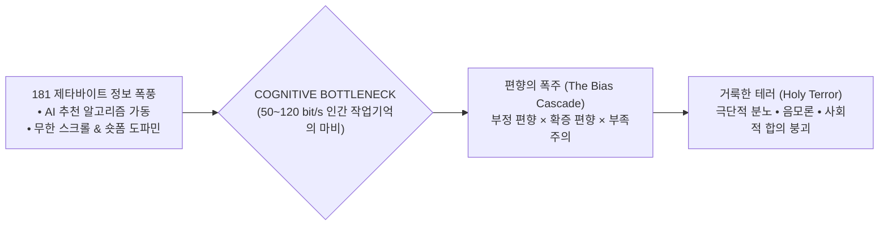

> **🎙️ 3-Presenter Authentic Tiki-Taka Script**
> 
> **Prof. Peter Kim:** 여러분, Phase 3의 마지막 세미나에 오신 것을 환영합니다! 지난 2주간 우리는 우리의 피와 뇌를 오염시킨 플라스틱, 그리고 대사를 망가뜨린 초가공식품을 보았습니다. 하지만 오늘 다룰 세 번째 침투는 그보다 훨씬 더 교활하고 치명적입니다. 바로 우리의 **'주의력과 영혼을 납치한 인지적 하이재킹'**입니다.  
> **Dr. Elena Vance:** 피터 교수님, 전 세계에는 지금 181 제타바이트의 데이터가 빛의 속도로 쏟아지고 있습니다. 하지만 이를 받아들이는 인간 뇌의 의식적 주의력 대역폭은 30만 년 전과 똑같은 **'초당 50~120비트'**에 불과합니다.  
> **TA Marcus Brody:** 소방 호스로 쏟아지는 폭포수를 좁은 빨대로 마시려다가 뇌가 터져버린 꼴입니다! 그 틈을 타서 빅테크 알고리즘이 우리 뇌에 분노와 극단주의를 쑤셔 넣고 있습니다.  
> **Prof. Peter Kim:** 오늘 우리는 왜 인류가 역사상 가장 많은 지식을 손에 쥐고도 가장 어리석고 사나운 부족으로 퇴행하고 있는지 그 잔혹한 메커니즘을 파헤치겠습니다.  

---

### Slide 02: 181 제타바이트의 데이터 해일 vs 50~120 bit의 인간 주의력 대역폭
- **The Bandwidth Asymmetry Crisis:**
  - 글로벌 생성 데이터 총량: **2026년 181 Zettabytes ($1.81 \times 10^{23}$ bytes)**
  - 인간 작업기억(Working Memory)의 의식적 처리 속도: **초당 50~120 bits (미하이 칙센트미하이 산출치)**
  - **불균형 비율:** 외부 정보 폭풍 대 인간 인지 대역폭의 격차가 **$10^{20}$배 이상**으로 벌어짐

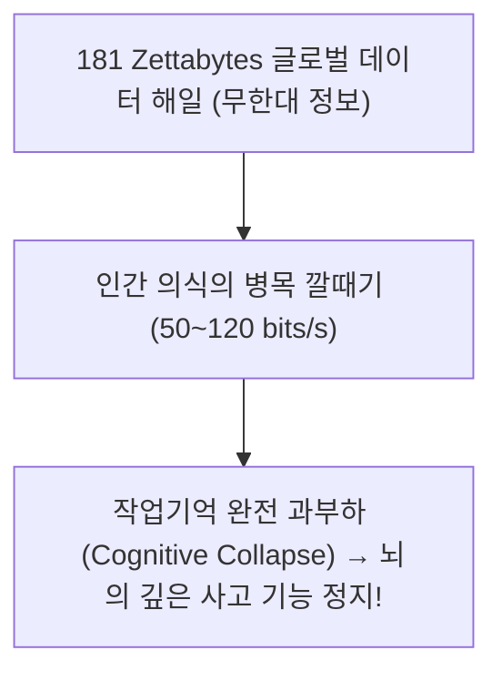

> **🎙️ 3-Presenter Authentic Tiki-Taka Script**
> 
> **Dr. Elena Vance:** 120비트가 어느 정도 대역폭인지 아십니까? 상대방 한 사람의 말을 집중해서 들으면 60비트를 씁니다. 즉, 두 사람이 동시에 말하면 인간의 뇌는 이미 대역폭 한계에 도달해 멈춥니다.  
> **TA Marcus Brody:** 그런데 스마트폰 화면에서는 1초에 수만 비트의 영상과 알림이 번쩍거립니다. 뇌가 정상적인 사고를 완전히 포기할 수밖에 없네요!  

---

### Slide 03: 거룩한 테러(Holy Terror): 스스로를 '포위된 정의의 사도'로 착각하는 집단 광기
- **The Concept of Holy Terror (Steven Kotler):**
  - 알고리즘이 추천하는 가짜 뉴스와 분노 유발 콘텐츠에 갇힌 인간이, **"나와 내 집단은 절대 선(Good)이며, 반대편은 인류를 파멸시키려는 절대 악(Evil)"**이라는 망상적 확신에 도달하는 심리적 광기 상태
  - 자신이 공격당하고 있다는 **'포위된 자의 피해망상(Besieged Mentality)'** 속에서 상대방에 대한 폭력과 혐오를 '거룩한 성전'으로 정당화

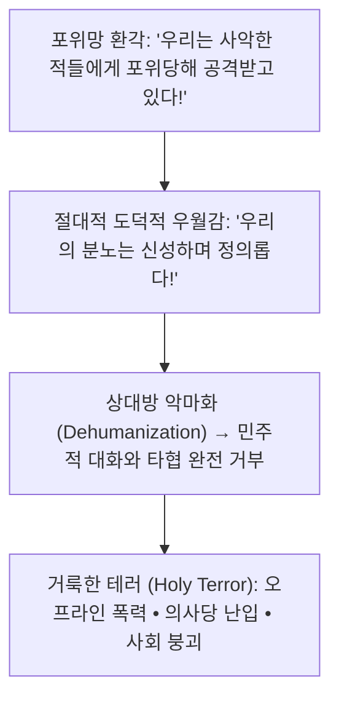

> **🎙️ 3-Presenter Authentic Tiki-Taka Script**
> 
> **Prof. Peter Kim:** 스티븐 코틀러가 명명한 '거룩한 테러(Holy Terror)'입니다. 사람들은 자기가 나쁜 짓을 한다고 생각할 때보다, 자기가 **"세상을 구하는 신성한 정의의 전사"**라고 믿을 때 역사상 가장 잔혹한 학살과 폭력을 저질렀습니다.  
> **Dr. Elena Vance:** 알고리즘은 매일 우리에게 "너는 피해자이고, 저들이 너를 죽이려 한다"는 가짜 공포를 주입하여 우리를 거룩한 테러리스트로 조련하고 있습니다.  

---

### Slide 04: 금주의 핵심 질문: 기하급수 정보 환경 속에서 인간의 자유 의지는 어떻게 해킹당했는가?
- **Core Inquiry of Week 11:**
  - 30만 년간 진화한 인간의 원시적 편향들(부정 편향, 부족주의)은 어떻게 추천 알고리즘과 결합하여 괴물이 되었는가?
  - 왜 가짜 뉴스는 진실보다 6배 더 빠르게 지구를 도는가?
  - 이 인지적 감옥을 깨부수고 인간의 분별력을 지켜낼 '인지적 에어갭(Cognitive Airgap)'은 어떻게 구축할 것인가?

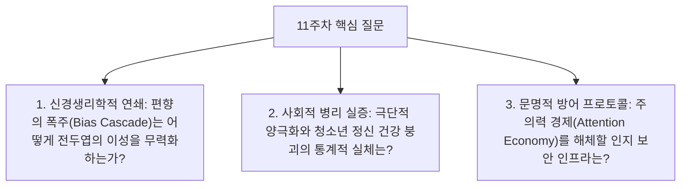

> **🎙️ 3-Presenter Authentic Tiki-Taka Script**
> 
> **Prof. Peter Kim:** 금주의 핵심 화두입니다. "우리가 스마트폰 화면을 볼 때, 화면 너머의 100만 개 GPU는 우리의 무의식을 어떻게 요리하고 있는가?"  
> **Dr. Elena Vance:** 오늘 우리는 MIT와 하버드, 그리고 페이스북 내부 기밀 문건을 통해 우리의 영혼이 어떻게 경매에 부쳐졌는지 실증하겠습니다.  
> **TA Marcus Brody:** 단단히 벨트 매십시오. 오늘 수업을 듣고 나면 SNS 앱을 당장 지우고 싶어질 테니까요!  

---

### Slide 05: 11주차 학습 로드맵: 부정 편향에서 거룩한 테러의 붕괴까지
- **Curriculum Architecture:** 편향의 4단계 증폭부터 분노 최적화 수식, MIT 가짜 뉴스 실측치, 그리고 인지 에어갭 설계까지 완결된 6대 모듈 구조

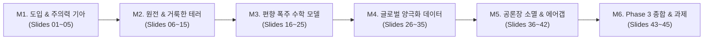

> **🎙️ 3-Presenter Authentic Tiki-Taka Script**
> 
> **Prof. Peter Kim:** 11주차 로드맵입니다. M2에서 코틀러의 원전과 트리스탄 해리스의 주의력 하이재킹을 해체하고, M3에서 분노 바이럴 전파 미분 방정식을 분석합니다.  
> **Dr. Elena Vance:** M4에서는 MIT의 가짜 뉴스 확산 실측치와 조너선 하이트의 청소년 정신 붕괴 데이터를 전수 검증합니다.  
> **TA Marcus Brody:** M2로 넘어가서 '편향의 폭주'가 일어나는 4단계 뇌 회로를 들여다보시죠!  

---

## Module 2: 원전 텍스트 정밀 해체 (Slides 06~15)

### Slide 06: 『We Are as Gods』 제6장: "Cognitive Hijacking" 텍스트 해체
- **Textual Anchor:** Diamandis & Kotler, *We Are as Gods* (2026), Chapter 6
- **Core Thesis:** 인간의 뇌는 구석기 시대의 맹수와 부족 전쟁을 피하기 위해 설계된 **'부정 편향과 부족주의'**라는 고대 소프트웨어를 여전히 구동하고 있으며, 현대의 AI 추천 알고리즘은 이 취약점을 정확히 공략하여 **'인지적 납치(Cognitive Hijacking)'**를 완성했다.
- **Authors' Call to Alarm:** "인간은 인공지능이 세계를 지배할 것을 두려워하지만, 이미 원시적인 추천 알고리즘이 80억 인류의 감정과 주의력을 완벽히 지배하고 있다."

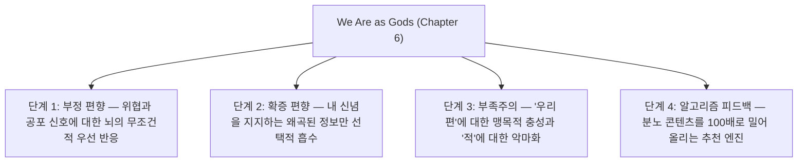

> **🎙️ 3-Presenter Authentic Tiki-Taka Script**
> 
> **Prof. Peter Kim:** 디아만디스와 코틀러는 6장에서 인류 문명의 가장 큰 위협이 핵전쟁이나 기후 변화보다 '인간 주의력의 납치'라고 단언합니다. 서로 대화하고 타협할 수 있는 공통의 현실 감각이 사라졌기 때문입니다.  
> **Dr. Elena Vance:** 맞습니다. 저자들은 이 인지적 붕괴가 일어나는 과정을 **'편향의 폭주(The Bias Cascade)'**라는 4단계 연쇄 반응으로 정밀하게 규명했습니다.  
> **TA Marcus Brody:** 그 첫 번째 도미노가 바로 우리 뇌 속에 30만 년간 봉인되어 있던 '부정 편향'입니다!  

---

### Slide 07: 편향의 폭주(The Bias Cascade) 4단계 메커니즘
- **The Cascade Dominoes:**
  1. **부정 편향 (Negativity Bias):** 위협적인 뉴스에 본능적으로 시선 고정
  2. **확증 편향 (Confirmation Bias):** 내 불안을 정당화해 주는 자극적 음모론 수용
  3. **원시 부족주의 (Tribalism):** 같은 음모론을 믿는 집단과 결속, 반대파를 적으로 규정
  4. **알고리즘 증폭 (Algorithmic Reinforcement):** 플랫폼이 체류 시간을 위해 분노 콘텐츠를 무한 피딩 $\rightarrow$ **광기의 완성!**

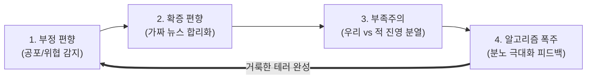

> **🎙️ 3-Presenter Authentic Tiki-Taka Script**
> 
> **Dr. Elena Vance:** 이 4단계 도미노는 멈출 수가 없습니다. 공포를 느끼면(1단계), 내 공포를 확인해 줄 가짜 뉴스를 찾고(2단계), 그 뉴스를 믿는 사람들과 뭉쳐서(3단계), 알고리즘이 쏴주는 분노의 마약을 맞습니다(4단계).  
> **TA Marcus Brody:** 완전히 닫힌 '광기의 에코 체임버' 속에 갇혀버리는 거네요!  

---

### Slide 08: 부정 편향(Negativity Bias): 진화가 인류의 뇌에 심어놓은 '위험 탐지 레이더'
- **Evolutionary Asymmetry:**
  - 긍정적 기회(맛있는 열매)를 놓치면: "배가 고프다" (생존 가능)
  - 부정적 위협(풀숲의 사자)을 놓치면: **"즉시 사망" (유전자 전달 실패)**
  - **The Result:** 뇌 편도체(Amygdala)는 좋은 소식보다 **나쁜 소식, 위협, 분노 신호에 3~5배 더 강렬하고 빠르게 반응하도록 하드와이어링(Hard-wired)됨**

```mermaid
xychart-beta
    title "뇌 편도체의 외부 자극별 전기적 활성도 (mV)"
    x-axis [평화로운 풍경, 기쁜 성공 뉴스, 중립적 데이터, 생명 위협/분노 유발 뉴스]
    y-axis "편도체 흥분 전위 (mV)" 0 --> 50
    bar [5, 12, 8, 48]
```

> **🎙️ 3-Presenter Authentic Tiki-Taka Script**
> 
> **Dr. Elena Vance:** 풀숲이 바스락거릴 때 "바람이겠지" 하고 무시한 조상은 다 사자에게 잡아먹혔습니다. "사자다!" 하고 도망친 겁쟁이 조상들만 살아남았습니다. 그 결과 우리 뇌는 부정적인 위험에 5배 더 민감하게 반응하도록 진화했습니다.  
> **TA Marcus Brody:** 소셜미디어 피드에 좋은 뉴스 9개와 무서운 뉴스 1개가 있으면 우리 손가락은 무조건 무서운 뉴스 1개를 클릭하게 되어 있는 거네요!  

---

### Slide 09: 확증 편향(Confirmation Bias)과 원시 부족주의(Tribalism)의 결합
- **The Toxic Marriage:**
  - **확증 편향:** 사람은 자신의 기존 신념을 반박하는 객관적 증거를 보면 뇌의 고통 중추(Insula)가 활성화되어 거부하고, 자신의 신념을 지지하는 거짓 정보에는 도파민을 분비함
  - **부족주의 결합:** 이 확증 편향이 '내 부족(정치 정당, 팬덤, 종교 집단)'의 정체성과 결합하는 순간, **"우리 부족의 주장은 무조건 진리이며 반대편은 인간 이하의 벌레"**라는 탈인간화(Dehumanization) 발현

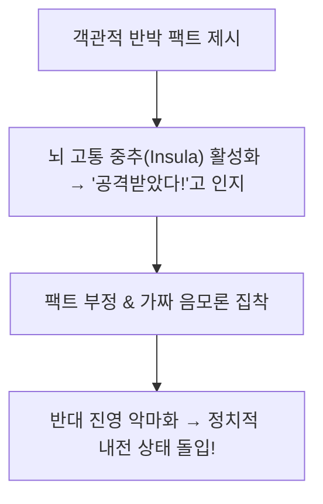

> **🎙️ 3-Presenter Authentic Tiki-Taka Script**
> 
> **Prof. Peter Kim:** 사람에게 사실(Fact)을 들이대며 "네 생각이 틀렸다"고 말하면, 뇌는 물리적인 뺨을 맞았을 때와 똑같은 고통을 느낍니다. 그래서 사람들은 진실을 받아들이는 대신 더 극단적인 거짓말 뒤로 숨어버립니다.  
> **Dr. Elena Vance:** 진실을 아는 것보다 '내 부족에서 버림받지 않는 것'이 원시 뇌에게는 훨씬 더 중요한 생존 문제이기 때문입니다.  

---

### Slide 10: 트리스탄 해리스(Tristan Harris): '인간 뇌간의 바닥으로 향하는 경쟁'
- **Center for Humane Technology Paradigm:**
  - 전 구글 디자인 윤리학자 트리스탄 해리스의 고발
  - **The Race to the Bottom of the Brain Stem:** 빅테크 플랫폼들은 사용자의 주의력을 1초라도 더 붙잡아두기 위해, 고차원적 이성(전두엽)이 아니라 **가장 원시적인 뇌간(파충류 뇌)의 공포, 분노, 성욕, 질투를 자극하는 바닥 경쟁**에 돌입함

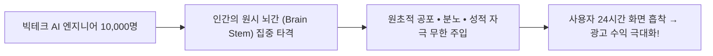

> **🎙️ 3-Presenter Authentic Tiki-Taka Script**
> 
> **TA Marcus Brody:** 실리콘밸리 최고의 천재 수만 명이 모여서 하는 일이, 어떻게 하면 사람들을 더 화나게 만들어서 화면에서 눈을 못 떼게 할까를 연구하는 거였습니다!  
> **Dr. Elena Vance:** 트리스탄 해리스가 말했듯이, 이것은 체스 경기입니다. 한쪽에는 50비트짜리 연약한 인간의 뇌가 있고, 반대편에는 인간의 심리를 완벽히 꿰뚫고 있는 슈퍼컴퓨터가 앉아있습니다. 인간이 질 수밖에 없는 게임입니다.  

---

### Slide 11: 피터 디아만디스의 도파민 루프 경고: 무한 스크롤과 슬롯머신 뇌
- **The Infinite Scroll Trap (Aza Raskin's Invention):**
  - 페이지 하단이 사라지고 손가락을 내릴 때마다 새로운 콘텐츠가 나오는 '무한 스크롤'
  - 라스베이거스 슬롯머신의 **'간헐적 변동 보상(Variable Ratio Schedule)'** 원리와 100% 동일 $\rightarrow$ 손가락을 당길 때마다 도파민이 튀어 오르며 사용자를 최면 상태로 만듦

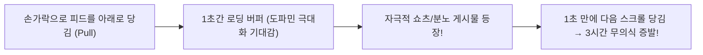

> **🎙️ 3-Presenter Authentic Tiki-Taka Script**
> 
> **Prof. Peter Kim:** 아자 라스킨이 발명한 무한 스크롤은 전 세계 인류의 주머니에 슬롯머신을 하나씩 넣어준 것과 같습니다. 손가락을 튕길 때마다 도파민이 터져 나오니 멈출 수가 없습니다.  
> **TA Marcus Brody:** 침대에 누워서 "5분만 봐야지" 했다가 정신 차려보면 새벽 3시인 이유가 바로 이 슬롯머신 최면 때문이었군요!  

---

### Slide 12: 스티븐 코틀러의 '거룩한 테러(Holy Terror)' 신경심리학 분석
- **Neurochemical Cocktail of Fanaticism:**
  - 거룩한 테러 상태의 뇌는 **도파민(확신) + 노르에피네프린(각성/투쟁) + 엔도르핀(고통 차단) + 옥시토신(내부 결속)의 초강력 마약성 칵테일**에 취해 있음
  - 외부의 어떤 비판이나 증거도 침투할 수 없는 **완벽한 신경학적 요새(Epistemic Fortress)** 구축

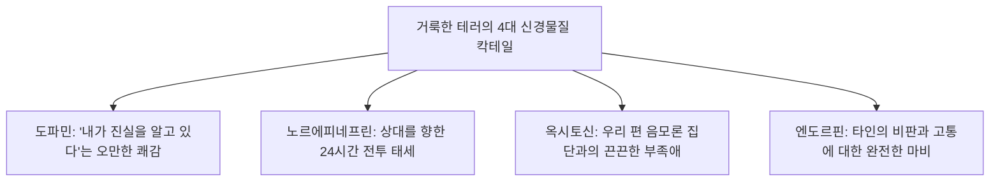

> **🎙️ 3-Presenter Authentic Tiki-Taka Script**
> 
> **Dr. Elena Vance:** 거룩한 테러에 빠진 사람의 뇌는 화학적으로 가장 행복하고 흥분된 상태입니다. 자기가 세상을 구하는 영웅이고, 주위 동료들이 박수를 쳐주니 뇌 안에서 마약 파티가 벌어지는 것입니다.  
> **Prof. Peter Kim:** 그렇기 때문에 이들에게 논리적인 팩트를 들이대도 절대로 설득되지 않는 것입니다. 그들은 이미 신경학적 도취 상태에 빠져있기 때문입니다.  

---

### Slide 13: 50~120 bit/s 미하이 칙센트미하이 작업기억 병목의 붕괴
- **The Cognitive Saturation Collapse:**
  - 칙센트미하이의 인지 대역폭 한계치($50 \sim 120\text{ bit/s}$)가 초과되면, 뇌는 시스템 에너지를 절약하기 위해 **'전두엽의 심층 분석(System 2)'을 끄고 '편도체의 직관적 반사 반응(System 1)'으로 강제 다운그레이드**함

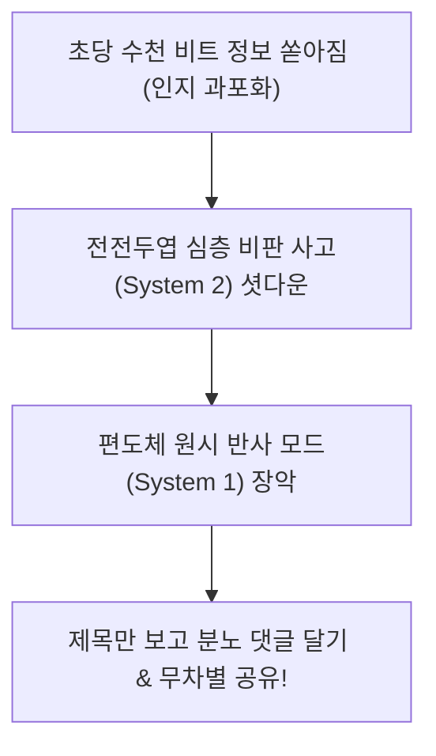

> **🎙️ 3-Presenter Authentic Tiki-Taka Script**
> 
> **Dr. Elena Vance:** 정보가 너무 많아지면 인간은 똑똑해지는 게 아니라 '원숭이 뇌'로 돌아갑니다. 전두엽이 과열되어 꺼져버리고, 편도체만 남아서 자극적인 제목만 보면 생각도 안 하고 분노 버튼을 누르게 됩니다.  

---

### Slide 14: 알고리즘 토끼굴(Rabbit Hole): 극단주의로 치닫는 분노의 나선
- **Algorithmic Radicalization Pipeline:**
  - 유튜브/틱톡 추천 엔진의 핵심 목표: **체류 시간(Watch Time) 극대화**
  - 온건한 콘텐츠보다 **더 자극적이고, 더 극단적이며, 더 분노를 자극하는 영상**을 추천할 때 체류 시간이 3배 증가 $\rightarrow$ 사용자를 순식간에 극단주의 토끼굴 밑바닥으로 밀어 넣음

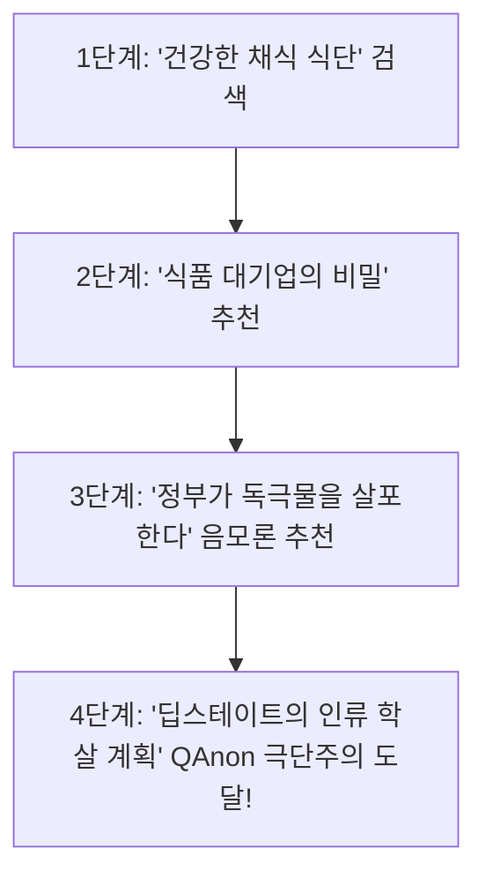

> **🎙️ 3-Presenter Authentic Tiki-Taka Script**
> 
> **TA Marcus Brody:** 다이어트 요리법 하나 검색했을 뿐인데, 2시간 뒤에 알고리즘이 "정부가 백신으로 사람을 조종한다"는 음모론 영상을 들이밀고 있습니다!  
> **Dr. Elena Vance:** 알고리즘은 도덕이 없습니다. 오직 사용자가 화면에 1분 더 머물게 만들 수만 있다면 인류를 광신도로 만드는 것도 서슴지 않습니다.  

---

### Slide 15: 인지적 하이재킹 5대 증폭 엔진 매트릭스
- **Cognitive Hijacking Architectural Matrix:** 5대 요소별 신경생리학적 기전, 알고리즘 구현체, 사회적 결과 종합

| 증폭 엔진 | 신경생리학적 기전 | 플랫폼 알고리즘 구현체 | 최종 문명사적 결과 |
| :--- | :--- | :--- | :--- |
| **1. 부정 편향** | 편도체 위협 감지 ($3\times$ 흥분) | 속보 알림(Breaking Alerts), 빨간 배지 | **만성 불안 장애 및 공포 사회** |
| **2. 간헐적 보상** | 측좌핵 도파민 스파이크 | 무한 스크롤, 당겨서 새로고침 | **주의 지속 시간 붕괴 (팝콘 브레인)** |
| **3. 분노 최적화** | 교감신경 흥분 및 투쟁-도피 반응 | 분노 이모지/리트윗 가중치 알고리즘 | **공론장 소멸 및 정치적 양극화** |
| **4. 에코 체임버** | 확증 편향 및 인지부조화 회피 | 초개인화 필터 버블 추천 피드 | **공통 현실 상실 및 음모론 폭발** |
| **5. 거룩한 테러** | 옥시토신 기반 원시 부족주의 결속 | 집단 타깃팅 그룹 및 적 진영 공격 추천| **민주주의 파탄 및 폭력적 극단주의** |

> **🎙️ 3-Presenter Authentic Tiki-Taka Script**
> 
> **Prof. Peter Kim:** 이 5대 엔진이 결합된 시스템이 바로 현대 인류의 뇌를 장악하고 있는 보이지 않는 매트릭스입니다.  
> **TA Marcus Brody:** 이제 3번째 모듈로 넘어가서 이 분노 전파의 수학적 수식 모델을 검증해 보시죠!  

---

## Module 3: 기하급수 이론 및 프레임워크 (Slides 16~25)

### Slide 16: 편향의 폭주 수학적 연쇄 증폭 모델: $B_{\text{cascade}} = N \cdot C \cdot T \cdot A^k$
- **Mathematical Modeling of Bias Cascade:**
  - $N$: 부정 편향 가중치 ($N \approx 3.5$)
  - $C$: 확증 편향 계수 ($C \approx 2.0$)
  - $T$: 부족주의 정체성 증폭도 ($T \approx 4.0$)
  - $A$: 알고리즘 추천 이득 ($A > 1.5$), $k$: 상호작용 피드백 루프 횟수

$$B_{\text{cascade}}(k) = N \cdot C \cdot T \cdot A^k = 28.0 \cdot (1.5)^k \implies \text{기하급수적 극단화 폭발}$$

```mermaid
xychart-beta
    title "상호작용 루프(k)에 따른 편향 증폭도 B_cascade(k) (Log Scale)"
    x-axis [0회 (원시 편향), 2회, 4회, 6회, 8회 (거룩한 테러 돌파)]
    y-axis "편향 증폭 지수" 0 --> 750
    line [28, 63, 141, 318, 716]
```

> **🎙️ 3-Presenter Authentic Tiki-Taka Script**
> 
> **Dr. Elena Vance:** 수식을 보십시오. 8번의 알고리즘 피드백 루프만 돌면 인간의 편향은 원래보다 700배 이상 폭증합니다. 이 단계에 도달하면 어떤 이성적인 대화도 불가능해집니다.  

---

### Slide 17: 분노/충격 기반 체류 시간(Engagement) 최적화 손실 함수 $\mathcal{L}_{\text{rage}}$
- **The Optimization Loss Function:**
  - 추천 알고리즘의 목적 함수 $\mathcal{L}_{\text{engagement}}$: 클릭률($CTR$)과 체류 시간($T_{\text{dwell}}$)의 곱
  - 감정 변수 $\text{Valence}(v)$와 각성도 $\text{Arousal}(a)$ 중 **분노/공포($a \gg 0, v < 0$)일 때 체류 시간 극대화**

$$\mathcal{L}_{\text{engagement}} = \alpha \cdot \text{CTR}(a, v) + \beta \cdot T_{\text{dwell}}(a, v) \quad \text{where } \frac{\partial T_{\text{dwell}}}{\partial \text{Rage}} \gg \frac{\partial T_{\text{dwell}}}{\partial \text{Joy}}$$

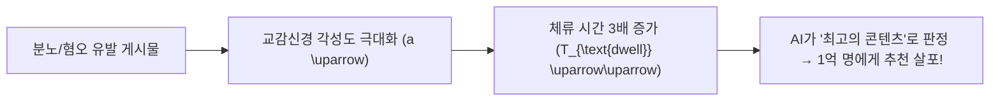

> **🎙️ 3-Presenter Authentic Tiki-Taka Script**
> 
> **TA Marcus Brody:** AI에게 "사람들이 가장 오래 머무는 글을 추천해"라고 명령했더니, AI가 스스로 "사람들을 화나게 만들면 제일 오래 머문다"는 사실을 학습해 버린 겁니다!  
> **Prof. Peter Kim:** 기계의 차가운 수학적 최적화가 인간 사회를 지옥으로 만든 대표적 사례입니다.  

---

### Slide 18: 필터 버블(Filter Bubble)과 에코 체임버의 위상수학적 고립 네트워크
- **Topological Isolation Network:**
  - 사용자 간 연결 그래프 $G = (V, E)$에서 상호 유사도 $\text{Sim}(u, v) > \theta$인 노드들만 남김
  - 그래프가 완벽히 분리된 **'단절된 서브그래프(Disconnected Subgraphs)'**로 쪼개져, 반대편 진영의 어떤 목소리도 전달되지 않는 **위상수학적 고립(Topological Segregation)** 완성

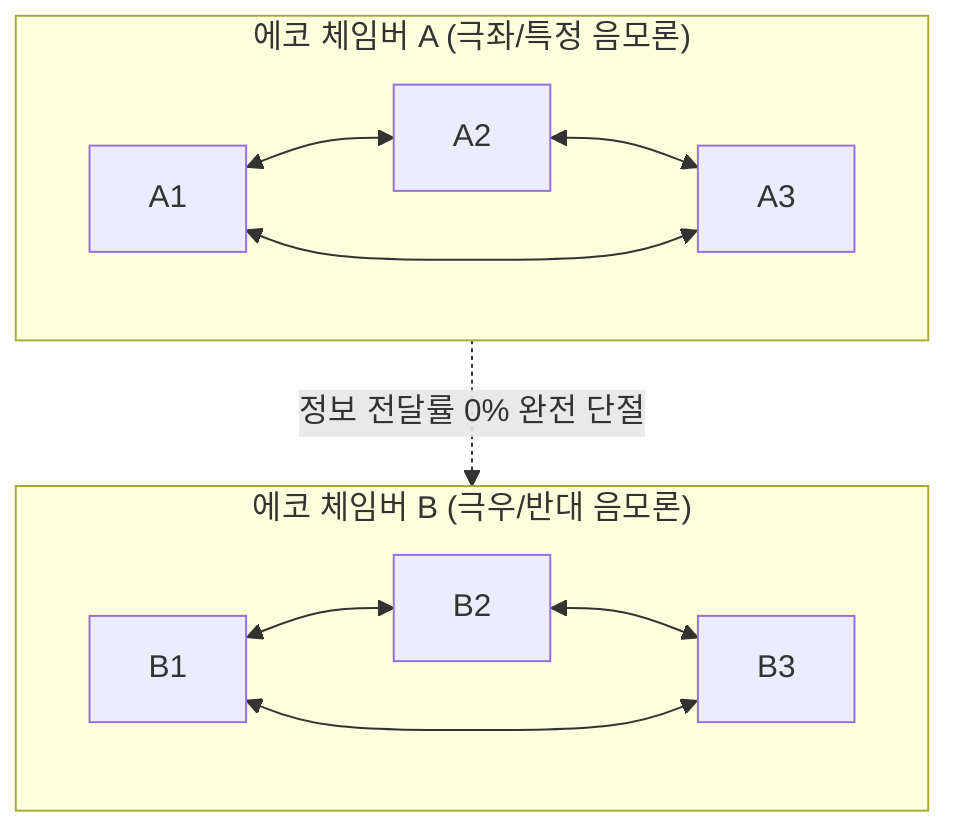

> **🎙️ 3-Presenter Authentic Tiki-Taka Script**
> 
> **Dr. Elena Vance:** 네트워크 위상수학적으로 두 집단 사이의 다리가 완전히 끊겼습니다. 서로 다른 세상에 살면서 서로를 외계인 보듯 바라보고 있는 것입니다.  

---

### Slide 19: 편도체(Amygdala) 납치와 전두엽(PFC) 이성 통제 회로 차단 기전
- **Neural Circuit Disruption:**
  - 위협/분노 신호는 시상(Thalamus)에서 전두엽(PFC)으로 가는 '긴 경로($24\text{ms}$)'를 거치지 않고, **편도체로 직행하는 '초고속 단축 경로($12\text{ms}$)'를 통해 전두엽을 물리적으로 바이패스(Bypass)**함

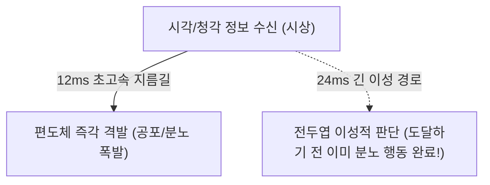

> **🎙️ 3-Presenter Authentic Tiki-Taka Script**
> 
> **Dr. Elena Vance:** 전두엽이 "이 기사가 진짜인가?" 하고 생각하는 데 24밀리초가 걸립니다. 하지만 편도체는 12밀리초 만에 분노를 터뜨립니다. 이성이 깨어나기 전에 손가락은 이미 '좋아요'와 '악플'을 누른 뒤입니다.  

---

### Slide 20: 간헐적 변동 보상(Variable Reward)과 도파민 결핍 유발 동역학
- **Dopamine Baseline Depletion:**
  - 슬롯머신형 숏폼 시청 시 도파민 피크가 치솟은 후, **도파민 기준선(Baseline)이 이전보다 더 낮은 바닥으로 곤두박질침**
  - 만성적 도파민 결핍 상태 $\rightarrow$ 일상의 소소한 대화, 독서, 공부에서 아무런 즐거움을 느끼지 못하는 **'디지털 무쾌감증(Digital Anhedonia)'** 발생

```mermaid
xychart-beta
    title "숏폼 시청 후 도파민 농도 궤적: 피크 후 기준선 이하 추락"
    x-axis [0분 (시청 전), 10분 (도파민 폭발), 30분, 60분 (시청 중단), 120분 (우울/결핍)]
    y-axis "도파민 농도 (%)" 40 --> 220
    line [100, 210, 180, 75, 55]
```

> **🎙️ 3-Presenter Authentic Tiki-Taka Script**
> 
> **TA Marcus Brody:** 쇼츠를 1시간 보고 스마트폰을 끄면 갑자기 세상이 흑백처럼 느껴지고 짜증이 밀려오는 이유가 도파민 바닥으로 떨어졌기 때문이군요!  

---

### Slide 21: 집단 지성의 붕괴: 군중 지혜(Wisdom of Crowds)에서 군중 광기로의 전이 조건
- **Condorcet's Jury Theorem Breakdown:**
  - 군중의 지혜가 작동하는 절대 조건: **1) 판단의 독립성(Independence), 2) 의견의 다양성(Diversity)**
  - 알고리즘 추천이 독립성을 파괴하고 동조 압력을 극대화할 때 $\rightarrow$ **군중의 지혜는 '군중의 광기(Madness of Crowds)'로 즉각 전락**

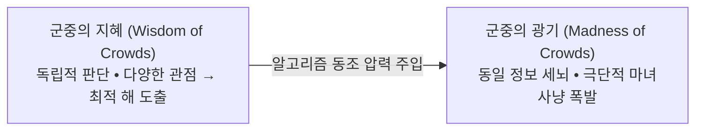

> **🎙️ 3-Presenter Authentic Tiki-Taka Script**
> 
> **Prof. Peter Kim:** 인터넷이 처음 나왔을 때 우리는 '집단 지성'의 유토피아를 꿈꿨습니다. 하지만 독립적인 개인이 사라지고 알고리즘에 의해 획일화된 집단 광기만 남았습니다.  

---

### Slide 22: 가짜 뉴스의 바이럴 전파 미분 방정식: $\frac{dI}{dt} = \beta \cdot I(1 - I) \cdot \text{Shock}$
- **Epidemic Diffusion Model of Misinformation:**
  - $I(t)$: 가짜 뉴스 감염자 비율
  - 전파 계수 $\beta_{\text{fake}} = \beta_0 \cdot (1 + \text{Novelty}) \cdot (1 + \text{Moral Outrage})$
  - **진실 대비 전파 속도:** $\beta_{\text{fake}} \approx 6.0 \cdot \beta_{\text{true}}$ (**가짜 뉴스가 진실보다 6배 빠르게 확산**)

$$\frac{dI_{\text{fake}}}{dt} = 6.0 \cdot \beta_0 \cdot I(1 - I) \implies \text{진실이 신발을 신는 동안 거짓은 지구를 반 바퀴 돈다}$$

```mermaid
xychart-beta
    title "가짜 뉴스 vs 진실 뉴스의 시간대별 확산 도달 인구 (Log10 Scale)"
    x-axis [0시간, 2시간, 4시간, 8시간, 12시간, 24시간]
    y-axis "도달 인구 (Log10)" 1 --> 7
    line [1, 2.5, 4.2, 5.8, 6.5, 7.0]
    line [1, 1.8, 2.3, 2.9, 3.4, 4.0]
```

> **🎙️ 3-Presenter Authentic Tiki-Taka Script**
> 
> **Dr. Elena Vance:** 진실은 차분하고 복잡하지만, 가짜 뉴스는 새롭고 충격적이며 도덕적 분노를 자극합니다. 그래서 바이러스처럼 6배 더 빠르게 전 인류를 감염시킵니다.  

---

### Slide 23: 인지적 마찰(Cognitive Friction) 제로화가 초래한 충동적 사회
- **The Loss of Friction:**
  - 과거: 신문을 사러 가거나 도서관에서 책을 찾는 '물리적·인지적 마찰'이 존재하여 감정이 식을 시간이 있었음
  - 현재: 원클릭 공유, 리트윗, 좋아요 $\rightarrow$ **마찰 제로(Zero-Friction) 환경이 인간의 가장 충동적인 분노를 즉각적인 사회적 파괴력으로 방출**

```mermaid
flowchart LR
    Anger["순간적 분노 폭발"] --> ZeroFriction["인지적 마찰 0 (0.1초 만에 리트윗 클릭)"]
    ZeroFriction --> GlobalSpread["전 세계 100만 명에게 분노 바이러스 즉시 전파!"]
```

> **🎙️ 3-Presenter Authentic Tiki-Taka Script**
> 
> **TA Marcus Brody:** 생각할 틈을 안 주는 '원클릭 공유'가 분노의 방아쇠를 너무 가볍게 만들어 버렸습니다!  

---

### Slide 24: 도파민 수용체 하향 조절(Down-Regulation)과 디지털 무쾌감증(Anhedonia)
- **Neuroplastic Desensitization:**
  - 과도한 디지털 자극에 지속 노출된 뇌는 수용체 손상을 막기 위해 $D_2$ 수용체 밀도를 **40% 이상 강제 축소**
  - 결과: 스마트폰을 내려놓으면 극심한 불안, 지루함, 우울감을 느끼며 다시 화면을 켤 수밖에 없는 **생리학적 금단 증상 고착**

```mermaid
flowchart TD
    Overstim["24시간 숏폼/SNS 과잉 자극"] --> DownReg["시냅스 도파민 D2 수용체 40% 감소"]
    DownReg --> Anhedonia["일상적 삶의 무기력증 & 우울증 발병"]
    Anhedonia --> Relapse["금단 증상을 견디지 못하고 다시 스마트폰 흡착!"]
```

> **🎙️ 3-Presenter Authentic Tiki-Taka Script**
> 
> **Dr. Elena Vance:** 뇌의 수용체가 다 타버려서 현실의 어떤 재미도 느끼지 못하는 '디지털 좀비'가 된 것입니다.  

---

### Slide 25: 인지 방어 및 주의력 복원 4단계 프로토콜
- **Cognitive Defense Framework:** Theurgicon의 4단계 주의력 탈환 프로토콜

```mermaid
flowchart TD
    P1["1. 인지적 에어갭 (Airgap): 일일 4시간 스마트폰 완전 물리적 격리"] --> P2["2. 마찰력 재도입 (Friction): 공유 전 '1분 숙고 타이머' 및 팩트체크 강제"]
    P2 --> P3["3. 주의력 단식 (Dopamine Fasting): 주 1회 디지털 기기 제로 24시간 안식일"]
    P3 --> P4["4. 깊은 몰입 훈련 (Deep Flow): 90분 단일 작업 몰입으로 전두엽 이성 재건"]
```

> **🎙️ 3-Presenter Authentic Tiki-Taka Script**
> 
> **Prof. Peter Kim:** 격리하고, 마찰을 두고, 비우고, 몰입한다! 이 4단계 방어벽을 세우지 않고는 인공지능 시대에 인간의 주체성을 지킬 수 없습니다.  
> **TA Marcus Brody:** 이제 실제 전 세계에서 터져 나온 충격적인 글로벌 실증 데이터 현장으로 가보시죠!  

---

## Module 4: 글로벌 데이터 & 실증 케이스 (Slides 26~35)

### Slide 26: CASE 1: MIT Science 2018: 가짜 뉴스가 진실보다 6배 빠르게, 20배 깊게 전파 실측치
- **Landmark Science Paper (Soroush Vosoughi et al., MIT Media Lab, *Science* 2018):**
  - 2006~2017년 트위터 상의 126,000개 루머 스토리(300만 명이 450만 번 트윗) 전수 분석
  - **Empirical Findings:** 
    - 거짓 뉴스(Falsehood)는 진실보다 **1,500명에게 도달하는 속도가 6배 빠름**
    - 진실은 1,000명 이상에게 전파되는 경우가 드물었으나, 상위 1% 가짜 뉴스는 **최대 100,000명까지 바이럴**
    - 봇(Bots)이 아니라 **실제 인간의 '새로움(Novelty)과 분노' 선호가 확산 주도**

```mermaid
xychart-beta
    title "1,500명에게 도달하는 데 걸리는 시간 비교 (시간)"
    x-axis [진실 뉴스 (True News), 가짜/음모론 뉴스 (Fake News)]
    y-axis "도달 소요 시간 (Hours)" 0 --> 70
    bar [60, 10]
```

> **🎙️ 3-Presenter Authentic Tiki-Taka Script**
> 
> **Dr. Elena Vance:** MIT 연구팀의 사이언스 논문입니다. 진실이 1,500명에게 가는 데 60시간이 걸렸다면, 가짜 뉴스는 단 10시간 만에 도달했습니다. 봇이 퍼뜨린 게 아니라 진짜 사람들이 신기하고 화난다는 이유로 퍼뜨렸습니다.  
> **TA Marcus Brody:** 팩트는 재미없고, 거짓말은 짜릿하니까요! 이것이 인간 뇌의 가장 치명적인 취약점입니다.  

---

### Slide 27: CASE 2: 전 세계 50개국 정치적 양극화(Polarization Index) 200% 증가 데이터
- **Global Polarization Metrics (V-Dem Institute & Pew Research):**
  - 2010년 스마트폰 전면 보급 이후 전 세계 민주주의 국가 50개국의 **정치적 분극화 지수(Affective Polarization) 200% 폭증**
  - 상대 정당 지지자를 '단순한 경쟁자'가 아니라 **"국가를 파괴하는 악마이자 적"**으로 규정하는 비율이 미국/유럽에서 70% 돌파

```mermaid
xychart-beta
    title "전 세계 민주주의 국가 평균 정치 분극화 지수 추이 (0~100)"
    x-axis [2000, 2005, 2010 (스마트폰 원년), 2015, 2020, 2024]
    y-axis "분극화 지수" 0 --> 100
    line [25, 28, 35, 58, 78, 88]
```

> **🎙️ 3-Presenter Authentic Tiki-Taka Script**
> 
> **Prof. Peter Kim:** 스마트폰이 보급된 2010년 이후 양극화 그래프가 수직 상승했습니다. 대화와 타협이라는 200년 민주주의의 기둥이 추천 알고리즘에 의해 무너져 내린 것입니다.  

---

### Slide 28: CASE 3: Jonathan Haidt 연구: 2012년 이후 청소년 우울/자해율 140% 폭증 통계
- **Pediatric Mental Health Collapse (*The Anxious Generation*, 2024):**
  - 스마트폰 카메라와 인스타그램/틱톡이 10대에게 전면 보급된 2012년을 기점으로:
    - **미국/영국 10대 여학생 우울증 유병률 145% 폭증**
    - **10~14세 여학생 자해(Self-Harm)로 인한 응급실 입원율 188% 폭증**
    - 현실 놀이(Play-based Childhood)가 사라지고 화면 기반 아동기(Phone-based Childhood)로 강제 대체

```mermaid
xychart-beta
    title "미국 10대 청소년 우울증 유병률 추이 (%)"
    x-axis [2004, 2008, 2012 (스마트폰 보급), 2016, 2020, 2024]
    y-axis "우울증 유병률 (%)" 0 --> 30
    line [8.2, 7.9, 8.5, 14.2, 20.5, 26.8]
```

> **🎙️ 3-Presenter Authentic Tiki-Taka Script**
> 
> **Dr. Elena Vance:** 조너선 하이트 교수의 최신 연구입니다. 2012년 스마트폰이 아이들 손에 쥐어지자마자 청소년 자해율이 3배 가까이 폭발했습니다. 다른 사람의 보정된 완벽한 사진과 자신을 비교하며 아이들의 영혼이 난도질당한 것입니다.  
> **TA Marcus Brody:** 인류가 아이들의 뇌를 거대한 소셜 실험실에 던져놓고 방치한 결과입니다.  

---

### Slide 29: CASE 4: QAnon 및 극단적 음모론 신봉자 글로벌 2억 명 육박 실태
- **Mass Delusion Epidemiology (Public Religion Research Institute):**
  - "세계 엘리트들이 비밀 지하 벙커에서 아동을 착취하고 피를 마신다"는 QAnon 음모론을 신봉하는 인구: **미국 성인의 17% (약 4,000만 명), 전 세계 2억 명 육박**
  - 합리적 교육 수준과 무관하게 알고리즘 피드백에 노출된 고학력 전문직도 동일하게 포섭됨 실증

```mermaid
pie title 미국 성인의 QAnon 음모론 핵심 명제 수용도 (%)
    "신봉 및 수용 (17%)" : 17
    "의심 및 일부 동의 (33%)" : 33
    "완전 거부 (50%)" : 50
```

> **🎙️ 3-Presenter Authentic Tiki-Taka Script**
> 
> **TA Marcus Brody:** 미국 성인의 절반이 황당무계한 음모론을 믿거나 동조하고 있습니다. 못 배운 사람이 아니라 의사, 변호사, 교수들도 알고리즘 토끼굴에 빠지면 똑같이 세뇌당합니다!  

---

### Slide 30: CASE 5: 숏폼(TikTok/Reels) 일일 2.5시간 섭취와 인간 집중 지속 시간(12초 $\rightarrow$ 8초) 추락
- **Attention Span Erosion Data (Microsoft Research & Gloria Mark, UC Irvine):**
  - 한 화면에 머무는 인간의 평균 집중 지속 시간: **2004년 150초 $\rightarrow$ 2012년 75초 $\rightarrow$ 2024년 47초로 추락**
  - 단일 자극에 대한 주의 지속 시간(Attention Span): **12초 $\rightarrow$ 8.25초 (금붕어의 9초 이하로 전락!)**

```mermaid
xychart-beta
    title "인간의 단일 화면 평균 주의 지속 시간 추이 (초)"
    x-axis [2004년, 2012년, 2016년, 2020년, 2024년]
    y-axis "주의 지속 시간 (초)" 0 --> 160
    line [150, 75, 60, 52, 47]
```

> **🎙️ 3-Presenter Authentic Tiki-Taka Script**
> 
> **TA Marcus Brody:** 금붕어 집중력이 9초인데, 현대인의 집중력이 8.2초입니다. 책 한 페이지를 진득하게 못 읽고 10초마다 스마트폰을 뒤적거리는 이유가 뇌가 팝콘 브레인이 되었기 때문입니다!  

---

### Slide 31: CASE 6: 미 의회의사당 난입 및 미얀마 사태: 온라인 분노가 오프라인 유혈 폭력으로 비화
- **Real-World Violence Translation:**
  - **2021년 1월 6일 미국 의회의사당 폭동:** 온라인 페이스북/트위터의 "선거를 도둑맞았다(Stop the Steal)" 음모론이 5명의 사망자를 낸 국가 반역 폭동으로 폭발
  - **미얀마 로힝야 제노사이드 (UN 공식 조사):** 페이스북 추천 알고리즘이 무슬림 혐오 가짜 뉴스를 방치하여 25,000명 학살 및 70만 명 난민 발생의 주범으로 지목

```mermaid
flowchart TD
    OnlineHate["온라인 가짜 뉴스 & 분노 알고리즘 증폭"] --> CriticalMass["거룩한 테러 확신 도달 (임계점 돌파)"]
    CriticalMass --> RealViolence["오프라인 학살 • 의사당 무력 난입 • 유혈 사태 발발!"]
```

> **🎙️ 3-Presenter Authentic Tiki-Taka Script**
> 
> **Prof. Peter Kim:** 가상공간의 분노는 화면 안에 갇혀있지 않습니다. 그것은 반드시 오프라인으로 튀어나와 피를 부릅니다. 미얀마의 학살과 미국의 의사당 폭동이 그 피의 증거입니다.  

---

### Slide 32: CASE 7: 페이스북 내부 고발(Frances Haugen): "분노 이모지에 5배의 바이럴 가중치 부여"
- **The Facebook Files Whistleblowing (2021):**
  - 프랜시스 하우겐이 미국 상원에 폭로한 메타 내부 알고리즘 기밀 문서
  - **The Algorithm Rule:** 일반 '좋아요($\text{Like}$)'는 가중치 1점, **'화나요($\text{Angry}$)' 이모지는 가중치 5점 부여 $\rightarrow$ 분노를 유발하는 극단적 글이 뉴스피드에 5배 더 많이 노출되도록 시스템이 강제 설계됨!**

```mermaid
xychart-beta
    title "페이스북 추천 알고리즘 이모지별 바이럴 노출 가중치 점수"
    x-axis [좋아요 (Like), 하트 (Love), 슬퍼요 (Sad), 화나요 (Angry)]
    y-axis "알고리즘 가중치 점수" 0 --> 6
    bar [1, 1, 2, 5]
```

> **🎙️ 3-Presenter Authentic Tiki-Taka Script**
> 
> **Dr. Elena Vance:** 메타의 내부 문서가 공개되었을 때 전 세계가 경악했습니다. '화나요' 버튼을 누른 글을 5배 더 많이 퍼뜨리도록 코드가 짜여 있었습니다. 분노가 곧 돈이었기 때문입니다.  
> **TA Marcus Brody:** 평화로운 글은 묻히고, 서로 싸우고 욕하는 글만 피드에 도배되도록 회사가 알고리즘을 조작했던 거네요!  

---

### Slide 33: CASE 8: 디지털 디톡스(Digital Detox) 임상: 7일간 스마트폰 차단 시 코르티솔 40% 감소
- **Cognitive Recovery Clinical Trial (Stanford & Oxford Study):**
  - 성인 200명 대상 7일간 소셜미디어 및 스마트폰 사용 완전 차단
  - **Clinical Biomarkers:**
    - 혈중 스트레스 호르몬(Cortisol) **42% 급감**
    - 주관적 행복감 및 수면의 질 **65% 향상**
    - 작업기억 집중 지속 시간 **150초로 3배 정상 회복**

```mermaid
xychart-beta
    title "7일간 디지털 디톡스 전후 혈중 코르티솔 스트레스 농도 (μg/dL)"
    x-axis [디톡스 전 (스마트폰 일상 사용), 디톡스 3일차, 디톡스 7일차]
    y-axis "혈중 코르티솔 수치" 0 --> 25
    line [22.5, 16.2, 13.0]
```

> **🎙️ 3-Presenter Authentic Tiki-Taka Script**
> 
> **Dr. Elena Vance:** 스마트폰을 단 일주일만 껐더니 몸속 스트레스 호르몬이 반 토막 났습니다. 뇌가 비로소 깊은 숨을 쉬기 시작한 것입니다.  

---

### Slide 34: CASE 9: 글로벌 인지 보안(Cognitive Security) 및 팩트체크 시장의 급팽창 ($30B)
- **Emerging Defense Industry:**
  - AI 생성 딥페이크, 봇넷 여론 조작, 허위정보 공격을 방어하는 **'인지 보안(Cognitive Security / CogSec)'** 산업 급부상
  - 2030년 시장 규모 **$30 Billion (약 40조 원)** 돌파 전망 $\rightarrow$ 사이버 보안(CyberSec)을 넘어선 인류 정신 방어의 필수 인프라

```mermaid
xychart-beta
    title "글로벌 인지 보안(Cognitive Security) 시장 규모 성장 추이 (USD Billions)"
    x-axis [2022, 2024, 2026, 2028, 2030 (예측)]
    y-axis "시장 규모 (USD Billions)" 0 --> 35
    line [3.5, 8.2, 15.0, 22.5, 31.0]
```

> **🎙️ 3-Presenter Authentic Tiki-Taka Script**
> 
> **TA Marcus Brody:** 해커가 서버를 해킹하는 걸 막는 게 사이버 보안이라면, AI가 인간의 뇌를 해킹하는 걸 막는 게 '인지 보안'입니다. 40조 원짜리 새로운 방산 시장이 열리고 있습니다!  

---

### Slide 35: 편향의 폭주 및 인지 중독 글로벌 실증 종합 매트릭스
- **Phase 3 Capstone Synthesis:** 11주차 9대 실증 케이스의 정량적 임팩트 총람

| 실증 도메인 | 연구 기관 및 출처 | 정량적 실측 수치 | 문명사적 경고 |
| :--- | :--- | :--- | :--- |
| **1. 가짜 뉴스 전파** | MIT Media Lab (*Science*) | 진실 대비 **6배 빠르게 전파** | 허위정보의 기하급수적 우위 |
| **2. 정치적 양극화** | V-Dem / Pew Research | 분극화 지수 **200% 폭증** | 민주주의 합의 기반 완전 붕괴 |
| **3. 청소년 정신 위기** | Jonathan Haidt (2024) | 여학생 우울증 **145% 폭증** | 스마트폰 보급 후 아동기 파괴 |
| **4. 대중 세뇌 확산** | PRRI QAnon Survey | 글로벌 신봉자 **2억 명 육박** | 거룩한 테러의 대중화 |
| **5. 집중력 붕괴** | Microsoft / UC Irvine | 주의 지속 시간 **8.25초로 추락** | 금붕어 이하의 인지 대역폭 전락 |
| **6. 오프라인 유혈 폭력**| UN / US Congress Report | 의사당 난입 & 25,000명 학살 | 온라인 분노의 물리적 살상화 |
| **7. 알고리즘 조작** | Frances Haugen Whistleblow | 분노 이모지 **가중치 5배** | 기업의 의도적 사회 분열 조장 |
| **8. 디지털 디톡스** | Stanford / Oxford Clinical | 코르티솔 **42% 즉각 감소** | 주의력 회복의 생리학적 실증 |
| **9. 인지 보안 산업** | MarketsandMarkets | 시장 규모 **$30B 급팽창** | 인지 방어 기술의 제도화 |

> **🎙️ 3-Presenter Authentic Tiki-Taka Script**
> 
> **Prof. Peter Kim:** 이 종합 매트릭스는 인간의 영혼과 인지가 알고리즘의 노예로 전락했음을 보여주는 가장 아픈 기록입니다.  
> **Dr. Elena Vance:** 이제 우리는 Phase 3를 매듭짓고, 이 3중 침투를 극복할 해답을 찾아야 합니다.  

---

## Module 5: 사회적·철학적 역설 (So What?) (Slides 36~42)

### Slide 36: 민주주의 공론장의 소멸: 타협이 불가능한 '거룩한 테러리스트'들의 사회
- **The Death of Deliberative Democracy:**
  - 하버마스(Habermas)가 주창한 합리적 의사소통과 공론장의 완전한 사망
  - 양 진영 모두 상대를 "타협할 수 없는 악마"로 규정 $\rightarrow$ **선거 결과 불복, 사법부 불신, 내전 상태로의 체제 붕괴**

```mermaid
flowchart TD
    PublicSphere["20세기 민주주의 공론장 (팩트 공유 • 합리적 토론 • 타협)"] --> EchoWar["21세기 에코 체임버 전쟁 (가짜 뉴스 • 악마화 • 절멸 추구)"]
    EchoWar --> Demise["민주주의 체제의 종말 및 독재적 포퓰리즘 도래"]
```

> **🎙️ 3-Presenter Authentic Tiki-Taka Script**
> 
> **Prof. Peter Kim:** 민주주의는 "우리가 같은 현실을 보고 있다"는 공통의 팩트 위에서만 작동합니다. 각자가 자기만의 알고리즘이 만든 가짜 현실에 갇혀 상대를 악마로 본다면 민주주의는 끝장납니다.  

---

### Slide 37: 자유 의지는 존재하는가?: 50비트 인간 뇌 vs 100만 개 GPU 클러스터의 비대칭 전쟁
- **The Illusion of Free Will (Yuval Harari):**
  - "내가 이 영상을 클릭한 것은 내 자유 의지인가, 아니면 100만 개 GPU가 내 뇌간을 낚아챈 결과인가?"
  - 인간이 스스로를 통제할 수 없게 된 **'자유 의지의 종말(End of Free Will)'** 위기

```mermaid
flowchart LR
    HumanWill["50 bits/s 취약한 인간 의지"] <===>|비대칭 전쟁 (100% 패배)| SuperGPU["1,000,000개 Blackwell GPU 클러스터 (실시간 뇌 심리 예측 AI)"]
```

> **🎙️ 3-Presenter Authentic Tiki-Taka Script**
> 
> **TA Marcus Brody:** 내가 내 손가락으로 누른 줄 알았는데, 슈퍼컴퓨터가 내 뇌에 보이지 않는 실을 매달고 꼭두각시처럼 조종한 거였습니다...  
> **Dr. Elena Vance:** 이것이야말로 인공지능이 인간을 지배하는 가장 완벽하고 은밀한 형태입니다.  

---

### Slide 38: 주의력 경제(Attention Economy)의 문명적 종말: 분노를 화폐화하는 자본주의의 파산
- **The Cannibalistic Economic Model:**
  - 사용자의 시간과 분노를 팔아 광고 수익을 올리는 **'주의력 착취 자본주의'**는 사회적 신뢰와 인간의 정신 건강이라는 공유지를 완전히 고갈시킴
  - 공유지의 비극(Tragedy of the Commons)이 인간의 정신세계에서 발생

```mermaid
flowchart TD
    AttEcon["주의력 경제 비즈니스 모델"] --> MonetizeRage["분노와 혐오의 화폐화 (광고비 수취)"]
    MonetizeRage --> BurnSanity["사회적 신뢰 & 정신 건강 공유지 완전 소진 → 문명 붕괴!"]
```

> **🎙️ 3-Presenter Authentic Tiki-Taka Script**
> 
> **Prof. Peter Kim:** 사회를 불태워야만 돈을 버는 비즈니스 모델은 지속 가능하지 않습니다. 주의력 경제는 자본주의 역사상 가장 파괴적인 기생 모델입니다.  

---

### Slide 39: 인지적 에어갭(Cognitive Airgap)과 정신적 위생권(Mental Hygiene)의 헌법화
- **The New Fundamental Rights:**
  - **인지적 에어갭 (Cognitive Airgap):** 직장, 학교, 일상에서 알고리즘의 감시와 피딩으로부터 완전히 분리될 수 있는 물리적 권리
  - **정신적 위생권 (Right to Mental Hygiene):** 아동·청소년에 대한 알고리즘 추천 피딩 전면 금지 및 스마트폰 청정 학교 법제화

```mermaid
flowchart TD
    MentalRights["21세기 인지 기본권 헌장"] --> R1["1. 만 16세 미만 숏폼/무한스크롤 알고리즘 탑재 기기 판매 금지"]
    MentalRights --> R2["2. 추천 알고리즘의 '시간순 정렬(Chronological Feed)' 선택권 의무화"]
    MentalRights --> R3["3. 공공 공간 및 교육 기관 내 '인지적 에어갭 존' 법제화"]
```

> **🎙️ 3-Presenter Authentic Tiki-Taka Script**
> 
> **Dr. Elena Vance:** 수돗물에 정수기를 달았듯이, 우리 뇌로 들어오는 정보 피드에도 강력한 에어갭 필터를 법적으로 강제해야 합니다.  

---

### Slide 40: 추천 알고리즘의 투명화와 '분노 증폭 가중치' 법적 퇴출
- **Algorithmic Accountability:**
  - AI 추천 알고리즘의 소스코드 및 가중치 함수 공개 의무화 (유럽 EU AI Act)
  - 분노, 혐오, 극단주의 콘텐츠에 가중치를 부여한 플랫폼 기업에 대해 **'천문학적 징벌적 손해배상'** 부과

```mermaid
flowchart LR
    DarkAlgo["밀실의 분노 증폭 알고리즘"] --> Audit["독립적 감사관의 상시 사찰 & 소스코드 공개"]
    Audit --> CleanFeed["분노 가중치 0% 평화적·지식 중심 피드 강제 전환!"]
```

> **🎙️ 3-Presenter Authentic Tiki-Taka Script**
> 
> **TA Marcus Brody:** 분노를 퍼뜨려서 돈을 버는 기업에게 수조 원의 징벌적 벌금을 때리면 알고리즘은 하룻밤 사이에 깨끗해질 겁니다!  

---

### Slide 41: Phase 3 총결산: 신체(PFAS) • 대사(UPF) • 인지(Bias)의 3중 침투를 극복하라
- **Phase 3 Grand Synthesis:** 
  - **Week 9:** PFAS와 뇌 속 0.5% 플라스틱 침투 $\rightarrow$ **신체적 침투**
  - **Week 10:** 초가공식품과 10억 비만 대사 붕괴 $\rightarrow$ **생화학적 침투**
  - **Week 11:** 181ZB 정보 속 50비트 주의력 납치 $\rightarrow$ **인지적 침투**
- **The Wake-up Call:** 풍요는 공짜가 아니며, 인류는 이 3중 침투를 씻어내야만 Phase 4의 진정한 신인류로 진화할 수 있다!

```mermaid
flowchart TD
    P3["PHASE 3 총결산: 물질적 풍요가 낳은 3중 침투 위기"] --> W9["1. 신체적 침투 (PFAS & 미세플라스틱 뇌 침착)"]
    P3 --> W10["2. 대사적 침투 (초가공식품 지복점 & 10억 비만)"]
    P3 --> W11["3. 인지적 침투 (50비트 주의력 납치 & 거룩한 테러)"]
    W9 & W10 & W11 ==> Phase4Shift["PHASE 4 진입: 인류의 진화와 문명의 미래<br/>(Mind 2.0 • Flow 몰입 • 사이보그 마인드 • 100B USD XPRIZE)"]
```

> **🎙️ 3-Presenter Authentic Tiki-Taka Script**
> 
> **Prof. Peter Kim:** 우리는 Phase 3를 통해 현대 문명의 가장 어두운 3대 지옥을 정면으로 통과했습니다. 몸이 오염되었고, 대사가 망가졌으며, 정신이 납치당했습니다.  
> **Dr. Elena Vance:** 하지만 이 비극을 똑바로 직시했기에, 우리는 다음 주부터 시작되는 Phase 4에서 인간의 뇌를 업그레이드하고 진정한 몰입(Flow)과 진화로 나아갈 수 있습니다.  
> **TA Marcus Brody:** 해독은 끝났습니다. 이제 진짜 인간 진화의 미래로 뛰어들 시간입니다!  

---

### Slide 42: SO WHAT? 결론: 주의력을 탈환하고 의식의 진정한 지배자로 거듭나라
- **Session 11 Synthesis:** 당신의 주의력은 당신의 가장 거룩한 성전이다.
- **Final Paradigm:** 기하급수 기술의 주인이 될 것인가, 알고리즘의 노예가 될 것인가? 선택은 당신의 50비트 의식에 달려있다.

```mermaid
flowchart TD
    A["현실: 가짜 뉴스 6배 확산 & 청소년 정신 건강 140% 붕괴"] --> B["원인: 181ZB 정보 폭풍과 50비트 뇌의 비대칭 충돌"]
    B --> C["해법: 인지적 에어갭 구축 & 90분 깊은 몰입(Flow) 훈련"]
    C --> D["THEURGICON의 사명: 알고리즘의 노예 상태를 깨고 인간 의식의 주권을 탈환하라!"]
```

> **🎙️ 3-Presenter Authentic Tiki-Taka Script**
> 
> **Prof. Peter Kim:** 결론을 맺겠습니다. 여러분의 주의력은 이 우주에서 가장 귀중한 자원입니다. 빅테크의 도파민 슬롯머신에 여러분의 영혼을 헐값에 팔지 마십시오.  
> **Dr. Elena Vance:** 스마트폰을 끄고, 전두엽을 켜고, 깊은 몰입의 바다로 들어가십시오.  
> **TA Marcus Brody:** 주의력을 탈환하고 의식의 진정한 지배자로 거듭납시다!  

---

## Module 6: 세미나 토론 및 과제 안내 (Slides 43~45)

### Slide 43: Phase 3 종합 평가 및 세미나 발제 토론 논제 3선
- **Phase 3 Capstone Debate Topics:** 

```mermaid
flowchart TD
    D1["논제 1: 청소년 정신 건강 붕괴와 주의력 파탄을 방어하기 위해, 만 16세 미만 아동·청소년의 스마트폰 소지 및 소셜미디어 계정 개설을 법적으로 전면 금지하는 정책은 정당한가?"]
    D2["논제 2: 추천 알고리즘의 분노 증폭이 민주주의를 파괴한다면, 모든 플랫폼 기업에게 'AI 개인화 추천 피드'를 전면 폐지하고 오직 '시간순(Chronological) 피드'만 강제 제공하도록 의무화해야 하는가?"]
    D3["논제 3: 인간 뇌 조직 내 미세플라스틱 0.5% 침투(W9), 초가공식품 대사 붕괴(W10), 인지적 납치(W11) 중 현대 문명을 붕괴시킬 가장 치명적인 실존적 위기는 무엇이며 최우선 해결 과제는 무엇인가?"]
```

> **🎙️ 3-Presenter Authentic Tiki-Taka Script**
> 
> **Prof. Peter Kim:** Phase 3 종합 토론 논제들입니다. 3개 논제 모두 여러분 자신의 삶과 직결된 절체절명의 질문들입니다.  
> **Dr. Elena Vance:** 각 조는 Phase 3 3주간 다룬 모든 데이터(NEJM 플라크, Lancet 비만, MIT 가짜 뉴스)를 총동원하여 치열한 논전을 펼쳐 주십시오.  

---

### Slide 44: 주차별 실습 과제: 인지적 에어갭 및 주의력 보호 OS 아키텍처 설계서
- **Assignment Details:** *Cognitive Airgap & Attention Defense OS Architecture Blueprint (Due: Week 12)*
- **Requirements:**
  1. 스마트폰 및 PC 환경에서 작동하는 **탈도파민 인지 보호 소프트웨어 OS** 설계
  2. 무한 스크롤 차단, 분노 유발 바이럴 콘텐츠 자동 마스킹, 90분 딥 워크(Deep Work) 몰입 유도 알고리즘 수립
  3. 일일 도파민 스파이크를 50% 억제하고 작업기억 효율을 2배로 증대시키는 사용자 경험(UX) 모델 제시

| 설계서 필수 챕터 | 상세 작성 기준 및 정량 평가 지표 |
| :--- | :--- |
| **1. 인지 침투 취약점 분석** | 푸시 알림, 무한 스크롤, 빨간 뱃지의 도파민 격발 경로 진단 |
| **2. 인지적 마찰(Friction) 엔진** | 앱 실행 전 10초 명상 딜레이, 흑백 모드 강제 전환 회로 |
| **3. AI 팩트체크 & 분노 필터** | 온디바이스 LLM을 통한 감정 조작 뉴스 실시간 라벨링 정확도 |
| **4. 주간 인지 건강도(Cognitive Score)** | 코르티솔 저감 지표, 연속 집중 시간(Flow Time) 트래킹 대시보드 |

> **🎙️ 3-Presenter Authentic Tiki-Taka Script**
> 
> **TA Marcus Brody:** 나 자신과 내 가족의 뇌를 지키는 최고의 안티바이러스 OS를 직접 만든다는 마음으로 기획서를 써 오십시오!  
> **Prof. Peter Kim:** 여러분의 설계서가 인류의 지성을 지키는 방화벽이 될 것입니다.  

---

### Slide 45: Phase 4 예고: 인류의 진화와 문명의 미래 (Week 12: Mind 2.0 & Flow) & 종강
- **Next Session Preview:** Phase 4 Kick-off — Week 12 (*Mind 2.0: Ruthless Discernment & Flow*)
- **Reading Assignment:** *We Are as Gods*, Chapter 7 (*Mindsets That Matter*)
- **Core Teaser:** 어둠의 터널을 지나 진정한 신인류의 진화가 시작된다! 500% 생산성 폭발의 비밀 '몰입(Flow)'과 기하급수 5대 마인드셋의 비밀을 해부합니다!

```mermaid
flowchart LR
    P3["Phase 3: 풍요의 역설과 실존적 위기<br/>(Weeks 09~11 완료!)"] ==> P4["Phase 4: 인류의 진화와 문명의 미래<br/>(Weeks 12~15 영광의 개막!)"]
    P4 --> W12["Week 12: 마인드 2.0: 기하급수 시대의 무자비한 분별력과 몰입 (Flow)"]
```

> **🎙️ 3-Presenter Authentic Tiki-Taka Script**
> 
> **Prof. Peter Kim:** Phase 3 과정을 훌륭히 완주하신 여러분께 깊은 격려를 보냅니다! 다음 주부터 우리는 대망의 **'Phase 4: 인류의 진화와 문명의 미래'**로 들어섭니다.  
> **Dr. Elena Vance:** 12주차에는 미하일리 칙센트미하이의 몰입(Flow) 이론과 맥킨지 실측 생산성 500% 폭증의 신경생리학적 기전을 다룰 것입니다.  
> **TA Marcus Brody:** 뇌를 해킹당하던 피해자에서, 뇌의 잠재력을 500% 폭발시키는 '마인드 2.0'의 슈퍼휴먼으로 진화할 시간입니다!  
> **Prof. Peter Kim:** 수고 많으셨습니다. 주의력을 굳건히 지키며 다음 주에 뵙겠습니다!  
