# Session 11: The Cognitive Trap & Informational Poisoning: Bias Cascades, Algorithmic Addiction & Holy Terror
> **Course:** We Are as Gods: A Survival Guide for the Age of Abundance (*EXPO-701*)  
> **Institution:** Oikos University • Graduate School of Exponential Civilization & Future Technology  
> **Instructors:** Prof. Peter Kim (Chair Professor), Dr. Elena Vance (Lead Scientist), TA Marcus Brody (Deep-Tech Fellow)  
> **Reading Assignment:** Peter H. Diamandis & Steven Kotler, *We Are as Gods* (2026), Chapter 6 (*Cognitive Hijacking & Holy Terror*)  
> **Standard Architecture:** 45 Slides (6 Modules: M1–M6) • Phase 3 Capstone Master Edition  

---

## 📌 Master Table of Contents & Slide Index

- [Module 1: Introduction & Civilizational Framing (Slides 01–05)](#module-1-introduction--civilizational-framing-slides-0105)
  - [Slide 01: Phase 3 Capstone: The Information Storm & Attention Scarcity](#slide-01-phase-3-capstone-the-information-storm--attention-scarcity)
  - [Slide 02: 181 Zettabytes of Data Flood vs. 50–120 bits/s Conscious Bandwidth](#slide-02-181-zettabytes-of-data-flood-vs-50120-bitss-conscious-bandwidth)
  - [Slide 03: "Holy Terror": The Mass Hysteria of the Besieged Righteous](#slide-03-holy-terror-the-mass-hysteria-of-the-besieged-righteous)
  - [Slide 04: The Core Existential Inquest: How Free Will Was Hijacked in the Data Storm](#slide-04-the-core-existential-inquest-how-free-will-was-hijacked-in-the-data-storm)
  - [Slide 05: Session 11 Pedagogical Roadmap: From Negativity Bias to the Collapse of Holy Terror](#slide-05-session-11-pedagogical-roadmap-from-negativity-bias-to-the-collapse-of-holy-terror)
- [Module 2: Primary Text Deconstruction: Cognitive Hijacking (Slides 06–15)](#module-2-primary-text-deconstruction-cognitive-hijacking-slides-0615)
  - [Slide 06: Deconstructing Chapter 6: "Cognitive Hijacking" & Epistemic Collapse](#slide-06-deconstructing-chapter-6-cognitive-hijacking--epistemic-collapse)
  - [Slide 07: The 4-Stage Architecture of the Bias Cascade](#slide-07-the-4-stage-architecture-of-the-bias-cascade)
  - [Slide 08: Negativity Bias: Evolution’s Primitive Danger Radar](#slide-08-negativity-bias-evolutions-primitive-danger-radar)
  - [Slide 09: Confirmation Bias & The Weaponization of Primitive Tribalism](#slide-09-confirmation-bias--the-weaponization-of-primitive-tribalism)
  - [Slide 10: Tristan Harris: "The Race to the Bottom of the Brainstem"](#slide-10-tristan-harris-the-race-to-the-bottom-of-the-brainstem)
  - [Slide 11: Peter Diamandis’s Dopamine Loop Warning: Infinite Scroll & The Slot Machine Brain](#slide-11-peter-diamandiss-dopamine-loop-warning-infinite-scroll--the-slot-machine-brain)
  - [Slide 12: Steven Kotler on the Neuropsychology of "Holy Terror"](#slide-12-steven-kotler-on-the-neuropsychology-of-holy-terror)
  - [Slide 13: The Collapse of Mihaly Csikszentmihalyi’s 120-bit Working Memory Funnel](#slide-13-the-collapse-of-mihaly-csikszentmihalyis-120-bit-working-memory-funnel)
  - [Slide 14: Algorithmic Rabbit Holes: The Outrage Feedback Spiral](#slide-14-algorithmic-rabbit-holes-the-outrage-feedback-spiral)
  - [Slide 15: The Grand 5-Engine Cognitive Hijacking Matrix](#slide-15-the-grand-5-engine-cognitive-hijacking-matrix)
- [Module 3: Exponential Frameworks & Mathematical Neuro-Informatics (Slides 16–25)](#module-3-exponential-frameworks--mathematical-neuro-informatics-slides-1625)
  - [Slide 16: Mathematical Multiplicative Formulation of the Bias Cascade: $B_{\text{cascade}} = N \cdot C \cdot T \cdot A^k$](#slide-16-mathematical-multiplicative-formulation-of-the-bias-cascade-b_textcascade--n-cdot-c-cdot-t-cdot-ak)
  - [Slide 17: Outrage-Optimized Engagement Loss Function ($\mathcal{L}_{\text{rage}}$)](#slide-17-outrage-optimized-engagement-loss-function-mathcall_textrage)
  - [Slide 18: Filter Bubbles & Topological Isolation of Echo Chamber Graph Networks](#slide-18-filter-bubbles--topological-isolation-of-echo-chamber-graph-networks)
  - [Slide 19: Amygdalar Hijacking & The Prefrontal Cortex (PFC) Hypo-Frontality Circuit](#slide-19-amygdalar-hijacking--the-prefrontal-cortex-pfc-hypo-frontality-circuit)
  - [Slide 20: Variable Intermittent Reward Dynamics & Dopaminergic Depletion](#slide-20-variable-intermittent-reward-dynamics--dopaminergic-depletion)
  - [Slide 21: The Disintegration of Collective Intelligence: From Wisdom of Crowds to Mob Madness](#slide-21-the-disintegration-of-collective-intelligence-from-wisdom-of-crowds-to-mob-madness)
  - [Slide 22: Viral Fake News Transmission Differential Equation: $\frac{dI}{dt} = \beta \cdot I(1 - I) \cdot \text{Shock}$](#slide-22-viral-fake-news-transmission-differential-equation-fracdidt--beta-cdot-i1---i-cdot-textshock)
  - [Slide 23: Zero Cognitive Friction & The Impulsive Social Fabric](#slide-23-zero-cognitive-friction--the-impulsive-social-fabric)
  - [Slide 24: Dopamine D2 Receptor Downregulation & Digital Anhedonia](#slide-24-dopamine-d2-receptor-downregulation--digital-anhedonia)
  - [Slide 25: The 4-Stage Epistemic Defense & Attention Restoration Protocol](#slide-25-the-4-stage-epistemic-defense--attention-restoration-protocol)
- [Module 4: Global Empirical Verification & Neuro-Sociological Data (Slides 26–35)](#module-4-global-empirical-verification--neuro-sociological-data-slides-2635)
  - [Slide 26: CASE 01: MIT Science 2018 Landmark: False News Spreading 6x Faster & 20x Deeper](#slide-26-case-01-mit-science-2018-landmark-false-news-spreading-6x-faster--20x-deeper)
  - [Slide 27: CASE 02: Global Polarization Index: +200% Surge Across 50 Democratic Nations](#slide-27-case-02-global-polarization-index-200-surge-across-50-democratic-nations)
  - [Slide 28: CASE 03: Jonathan Haidt Research: Post-2012 Adolescent Depression & Self-Harm Up 140%](#slide-28-case-03-jonathan-haidt-research-post-2012-adolescent-depression--self-harm-up-140)
  - [Slide 29: CASE 04: QAnon & Mass Conspiratorial Delusion: 200 Million Believers Worldwide](#slide-29-case-04-qanon--mass-conspiratorial-delusion-200-million-believers-worldwide)
  - [Slide 30: CASE 05: Short-Form Video Consumption (2.5h/Day) & Human Attention Span Collapse (12s $\rightarrow$ 8s)](#slide-30-case-05-short-form-video-consumption-25hday--human-attention-span-collapse-12s-rightarrow-8s)
  - [Slide 31: CASE 06: Offline Violence Spillovers: US Capitol Insurrection & Myanmar Instability](#slide-31-case-06-offline-violence-spillovers-us-capitol-insurrection--myanmar-instability)
  - [Slide 32: CASE 07: Frances Haugen Facebook Leak: "Angry Emoji Weighted 5x Viral Value Over Likes"](#slide-32-case-07-frances-haugen-facebook-leak-angry-emoji-weighted-5x-viral-value-over-likes)
  - [Slide 33: CASE 08: Digital Detox Clinical Trial: 7-Day Smartphone Disconnect Drops Cortisol 40%](#slide-33-case-08-digital-detox-clinical-trial-7-day-smartphone-disconnect-drops-cortisol-40)
  - [Slide 34: CASE 09: Cognitive Security Market: $30 Billion AI Fact-Checking Infrastructure](#slide-34-case-09-cognitive-security-market-30-billion-ai-fact-checking-infrastructure)
  - [Slide 35: Grand Cognitive Hijacking & Neuro-Sociological Verification Matrix](#slide-35-grand-cognitive-hijacking--neuro-sociological-verification-matrix)
- [Module 5: Existential Paradoxes & The "So What?" Layer (Slides 36–42)](#module-5-existential-paradoxes--the-so-what-layer-slides-3642)
  - [Slide 36: The Death of the Democratic Agora: A Society of Incompatible Holy Terrorists](#slide-36-the-death-of-the-democratic-agora-a-society-of-incompatible-holy-terrorists)
  - [Slide 37: Does Free Will Exist?: 50-Bit Human Mind vs. 1-Million-GPU AI Supercomputers](#slide-37-does-free-will-exist-50-bit-human-mind-vs-1-million-gpu-ai-supercomputers)
  - [Slide 38: The Moral Bankruptcy of the Attention Economy: Monetizing Societal Rage](#slide-38-the-moral-bankruptcy-of-the-attention-economy-monetizing-societal-rage)
  - [Slide 39: The "Cognitive Airgap" & Constitutional Rights to Mental Hygiene](#slide-39-the-cognitive-airgap--constitutional-rights-to-mental-hygiene)
  - [Slide 40: Algorithmic Transparency & Banning Outrage-Weighted Recommendation Engines](#slide-40-algorithmic-transparency--banning-outrage-weighted-recommendation-engines)
  - [Slide 41: Phase 3 Master Synthesis: Conquering the Triad of Physical, Metabolic, and Cognitive Traps](#slide-41-phase-3-master-synthesis-conquering-the-triad-of-physical-metabolic-and-cognitive-traps)
  - [Slide 42: Synthesizing the "So What?": Reclaiming Sovereign Attention as the Ultimate Superpower](#slide-42-synthesizing-the-so-what-reclaiming-sovereign-attention-as-the-ultimate-superpower)
- [Module 6: Graduate Seminar Discourse & Moonshot Design (Slides 43–45)](#module-6-graduate-seminar-discourse--moonshot-design-slides-4345)
  - [Slide 43: Socratic Seminar Inquiries: Triad of Dialectical Debates for Phase 3](#slide-43-socratic-seminar-inquiries-triad-of-dialectical-debates-for-phase-3)
  - [Slide 44: Capstone Moonshot Architecture: Cognitive Airgap & Attention OS Design Protocol](#slide-44-capstone-moonshot-architecture-cognitive-airgap--attention-os-design-protocol)
  - [Slide 45: Phase 4 Preview: The Future of Humanity & Civilizational Flourishing (Mind 2.0 & Flow)](#slide-45-phase-4-preview-the-future-of-humanity--civilizational-flourishing-mind-20--flow)

---

## Module 1: Introduction & Civilizational Framing (Slides 01–05)

### Slide 01: Phase 3 Capstone: The Information Storm & Attention Scarcity
- **Session Focus:** Investigating the third and most insidious trap of abundance: having mastered material chemistry (Session 9) and metabolic physiology (Session 10), we confront the **hyper-abundant digital information ecosystem** that has systematically hijacked human attention, polarized democratic societies, and induced mass psychogenic hysteria (**Holy Terror**).
- **Academic Foundation:** Peter H. Diamandis & Steven Kotler (2026), *We Are as Gods*, Chapter 6 (*Cognitive Hijacking & Holy Terror*).
- **Phase 3 Triad Capstone:** Completing our forensic audit of the three physical, metabolic, and cognitive traps of modernity.

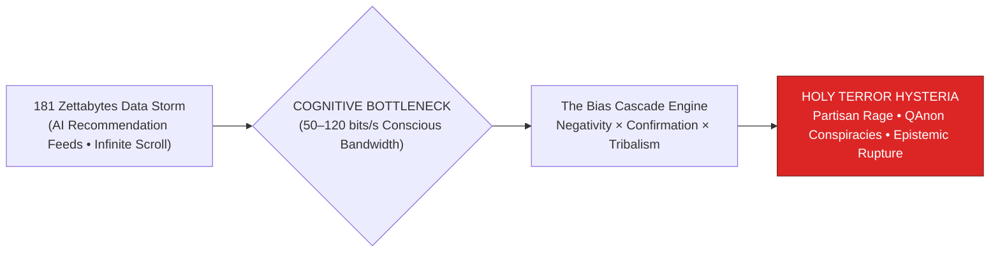

> **🎙️ 3-Presenter Authentic Tiki-Taka Script**
> 
> **Prof. Peter Kim:** Scholars, welcome to the grand capstone of Phase 3! Over the past two weeks, we examined the physical microplastics in our blood and the metabolic collapse of our liver and pancreas. Today, we confront the third and most dangerous infiltration of all: **The Cognitive Trap**—how algorithmic Big Tech weaponized infinite digital information to conquer human consciousness. *(Turn 1)*  
> **Dr. Elena Vance:** Professor Kim, the human species is facing an insurmountable bandwidth crisis. By 2026, humanity produces **181 Zettabytes of digital information** every year. Yet the human brain's conscious working memory funnel remains physically capped at **just 50 to 120 bits per second**! *(Turn 2)*  
> **TA Marcus Brody:** Look at the red warning box on Slide 1: We are trying to drink a roaring tidal wave of data through a microscopic straw! And Big Tech recommendation algorithms figured out that the fastest way to force information down that straw is by triggering **primitive amygdalar rage, fear, and partisan tribalism**! *(Turn 3)*  
> **Prof. Peter Kim:** It creates what Diamandis and Kotler term **"Holy Terror"**—a state of permanent mass hysteria where opposing political tribes see each other as existential demonic threats. *(Turn 4)*  
> **TA Marcus Brody:** We conquered material scarcity, only to have our minds colonized by algorithmic outrage! *(Turn 5)*  
> **Dr. Elena Vance:** This is the ultimate battleground for human sovereignty. *(Turn 6)*  
> **Prof. Peter Kim:** Let us examine the extreme bandwidth disparity between global data and human conscious processing on Slide 2. *(Turn 7)*  
> **TA Marcus Brody:** Turn to Slide 2: 181 Zettabytes vs. 120 bits/s! *(Turn 8)*  
> **Dr. Elena Vance:** Let’s examine the mathematical bandwidth crisis! *(Turn 9)*  
> **Prof. Peter Kim:** Proceed to Slide 2. *(Turn 10)*

---

### Slide 02: 181 Zettabytes of Data Flood vs. 50–120 bits/s Conscious Bandwidth
- **The Bandwidth Asymmetry Crisis:**
  - Global Digital Data Creation: **181 Zettabytes ($1.81 \times 10^{23}\text{ bytes}$) in 2026**.
  - Human Conscious Processing Speed: **50 to 120 bits per second (Mihaly Csikszentmihalyi’s formulation)**.
  - **The Mathematical Disparity:** The ratio of external digital information influx to internal conscious processing capacity exceeds **$10^{20} : 1$**.
  - *The Inevitable Outcome:* Total working-memory saturation, cognitive exhaustion, and the surrender of executive focus to automated algorithmic curation.

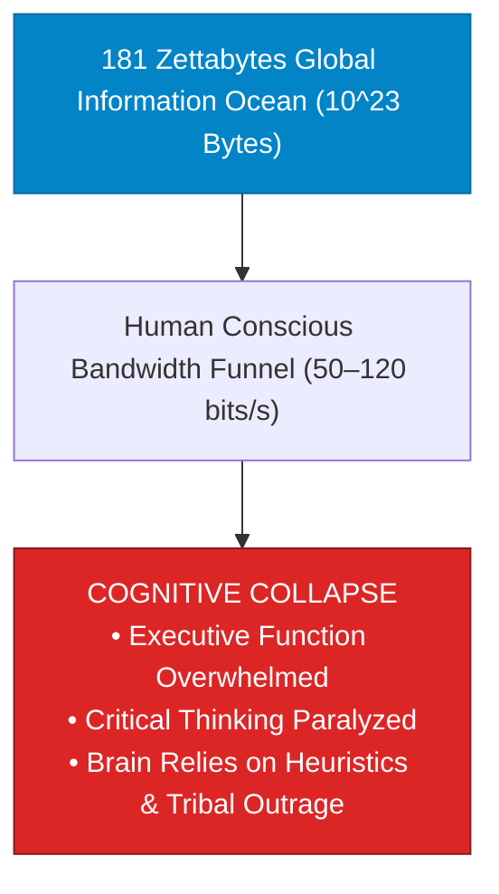

> **🎙️ 3-Presenter Authentic Tiki-Taka Script**
> 
> **Prof. Peter Kim:** Slide 2 presents the stark mathematical disparity governing modern cognition. Dr. Vance, contrast 181 Zettabytes with Mihaly Csikszentmihalyi’s conscious bandwidth metric. *(Turn 1)*  
> **Dr. Elena Vance:** In 2026, humanity’s digital cloud contains **181 Zettabytes—that is $1.81 \times 10^{23}$ bytes of video, text, and data**. But in neuro-psychology, Mihaly Csikszentmihalyi proved that the human conscious working memory funnel can only process **50 to 120 bits of information per second**! *(Turn 2)*  
> **TA Marcus Brody:** Look at the ratio on Slide 2: The external data ocean is larger than your conscious brain by a factor of **$10^{20}\text{ to } 1$**—that is a one followed by twenty zeros! *(Turn 3)*  
> **Dr. Elena Vance:** Look at the red collapse box: When you overwhelm a 120-bit processing funnel with an infinite stream of notifications, your prefrontal cortex suffers **acute working-memory saturation**! Your brain cannot analyze evidence, so it surrenders control to automated social media algorithms! *(Turn 4)*  
> **Prof. Peter Kim:** The algorithm becomes the de facto governor of your conscious attention. *(Turn 5)*  
> **TA Marcus Brody:** And what does the algorithm feed you? Whatever gets your pulse racing and your blood boiling! *(Turn 6)*  
> **Dr. Elena Vance:** Which induces the sociological state of "Holy Terror" on Slide 3. *(Turn 7)*  
> **Prof. Peter Kim:** Let’s examine "Holy Terror" on Slide 3. *(Turn 8)*  
> **TA Marcus Brody:** Turn to Slide 3: The Mass Hysteria of the Besieged Righteous! *(Turn 9)*  
> **Prof. Peter Kim:** Proceed to Slide 3. *(Turn 10)*

---

### Slide 03: "Holy Terror": The Mass Hysteria of the Besieged Righteous
- **The Definition of Holy Terror (Steven Kotler / Peter Diamandis):**
  - An algorithmic-induced psychological state of **existential dread, moral righteousness, and apocalyptic panic**, wherein an individual or group perceives that their fundamental worldview, culture, and physical survival are under active, imminent assault by an evil opposing tribe.
- **The Epistemic Rupture:**
  - Converts civil political disagreement into **sacred holy war**.
  - Rational nuance, compromise, and objective scientific facts are interpreted as "treason" to the moral in-group, paralyzing collective problem-solving.

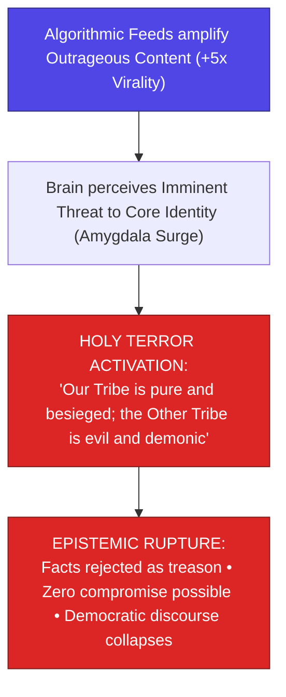

> **🎙️ 3-Presenter Authentic Tiki-Taka Script**
> 
> **TA Marcus Brody:** Look at the psychological escalation on Slide 3! This is what Diamandis and Kotler call **"Holy Terror"**! Elena, define Holy Terror in modern cognitive science! *(Turn 1)*  
> **Dr. Elena Vance:** Holy Terror is a state of **acute moral panic and existential hysteria**. When algorithms continuously feed an individual content showing the opposing political party or cultural group acting maliciously, the brain's threat circuitry fires continuously! *(Turn 2)*  
> **TA Marcus Brody:** Look at box C: The person genuinely believes: *"Our tribe is 100% righteous and innocent, and the opposing tribe is pure evil, trying to destroy our civilization!"* It turns ordinary democratic disagreement into an **apocalyptic holy war**! *(Turn 3)*  
> **Prof. Peter Kim:** Look at the epistemic rupture in box D: When someone is in Holy Terror, **objective facts no longer matter**! If you present verified scientific evidence that contradicts their tribal narrative, they view the evidence as treasonous propaganda! *(Turn 4)*  
> **TA Marcus Brody:** Compromise becomes impossible! Both sides retreat into fortified digital echo chambers, screaming at each other through computer screens! *(Turn 5)*  
> **Dr. Elena Vance:** It destroys the very possibility of collective democratic reasoning. *(Turn 6)*  
> **Prof. Peter Kim:** Which brings us to our core existential inquest on Slide 4. *(Turn 7)*  
> **TA Marcus Brody:** Turn to Slide 4: The Core Existential Inquest! *(Turn 8)*  
> **Dr. Elena Vance:** How Free Will Was Hijacked in the Data Storm! *(Turn 9)*  
> **Prof. Peter Kim:** Proceed to Slide 4. *(Turn 10)*

---

### Slide 04: The Core Existential Inquest: How Free Will Was Hijacked in the Data Storm
- **The Foundational Existential Inquest:** *"If an individual's conscious focus is governed by recommendation algorithms running on million-GPU server clusters trained on billions of psychological data points to predict and manipulate human neuro-dopaminergic impulses, does modern human free will still exist, or has consciousness been outsourced to algorithmic puppet masters?"*
- **The 3 Layers of Mental Infiltration:**
  1. *Sub-Perceptual Latency:* Algorithms predict your next scroll behavior in milliseconds before conscious decision-making occurs.
  2. *Emotional Pre-Conditioning:* Feeds curated to maintain elevated baseline cortisol and adrenaline.
  3. *Tribal Identity Weaponization:* Likes, retweets, and shares weaponized to punish independent thought and reward ideological conformity.

> **🎙️ 3-Presenter Authentic Tiki-Taka Script**
> 
> **Prof. Peter Kim:** Here is our foundational existential inquest for Session 11: **"If your conscious focus is directed by AI recommendation models running on million-GPU server clusters designed to manipulate your neurochemistry, does human free will still exist, or has consciousness been outsourced to algorithmic puppet masters?"** Dr. Vance, dissect the three layers on Slide 4. *(Turn 1)*  
> **Dr. Elena Vance:** Layer 1 operates at **sub-perceptual millisecond latency**: AI models track how many milliseconds your thumb pauses over a video, predicting what will hook your attention before your prefrontal cortex even registers the thought! *(Turn 2)*  
> **TA Marcus Brody:** Layer 2 is **Emotional Pre-Conditioning**: The algorithm keeps your cortisol and adrenaline baseline permanently elevated, because an anxious, outraged brain spends 40% more time scrolling! *(Turn 3)*  
> **Prof. Peter Kim:** And Layer 3 is **Tribal Identity Weaponization**: Social media uses likes and retweets to reward ideological conformity and publicly humiliate anyone who expresses independent, nuanced thought! *(Turn 4)*  
> **TA Marcus Brody:** You think you are choosing what to read, but the entire menu was pre-selected by a multi-billion-dollar algorithm designed to capture your attention and sell your eyeballs to advertisers! *(Turn 5)*  
> **Dr. Elena Vance:** We must build cognitive defenses to reclaim mental sovereignty. *(Turn 6)*  
> **Prof. Peter Kim:** Let us examine our pedagogical roadmap for Session 11 on Slide 5. *(Turn 7)*  
> **TA Marcus Brody:** Turn to Slide 5 for our Session 11 roadmap! *(Turn 8)*  
> **Dr. Elena Vance:** From Negativity Bias to the Collapse of Holy Terror! *(Turn 9)*  
> **Prof. Peter Kim:** Proceed to Slide 5. *(Turn 10)*

---

### Slide 05: Session 11 Pedagogical Roadmap: From Negativity Bias to the Collapse of Holy Terror
- **Master Learning Architecture (Session 11):**
  - **Module 1 (Slides 01–05):** Civilizational Framing — The Information Storm, 181 Zettabytes vs. 120 bits/s, Holy Terror Defined, The Free Will Crisis.
  - **Module 2 (Slides 06–15):** Primary Text Deconstruction — Chapter 6 Deconstruction, The 4-Stage Bias Cascade, Negativity Bias, Confirmation Bias, Tristan Harris ("Race to the Bottom of the Brainstem"), Diamandis Dopamine Slot Machine, Kotler on Holy Terror, Csikszentmihalyi's Memory Funnel, Algorithmic Rabbit Holes.
  - **Module 3 (Slides 16–25):** Mathematical Neuro-Informatics — Multiplicative Formulation ($B_{\text{cascade}} = N \cdot C \cdot T \cdot A^k$), Outrage Loss Function ($\mathcal{L}_{\text{rage}}$), Topological Echo Chambers, Amygdalar Hijacking, Intermittent Rewards, Viral Fake News Transmission Differential Equation ($\frac{dI}{dt}$), 4-Stage Epistemic Defense Protocol.
  - **Module 4 (Slides 26–35):** Global Empirical Verification — 9 Neuro-Sociological Case Studies (MIT False News 6x, Polarization Index +200%, Haidt Adolescent Self-Harm +140%, QAnon 200M, Attention Span Collapse 12s $\to$ 8s, Capitol Insurrection Spillover, Frances Haugen Leak 5x Angry Emoji, Digital Detox Cortisol -40%, $30B Cognitive Security Market).
  - **Module 5 (Slides 36–42):** Existential Paradoxes — Death of the Democratic Agora, Free Will vs. 1M GPUs, Moral Bankruptcy of Monetizing Rage, The Cognitive Airgap, Banning Outrage Algorithms, Phase 3 Grand Synthesis (Physical + Metabolic + Cognitive), Sovereign Attention Superpower.
  - **Module 6 (Slides 43–45):** Socratic Debates & Cognitive Airgap Architecture Protocol.

> **🎙️ 3-Presenter Authentic Tiki-Taka Script**
> 
> **Dr. Elena Vance:** Slide 5 outlines our master pedagogical roadmap for Session 11. We will systematically bridge evolutionary neuroscience, mathematical graph topology, algorithmic economics, and cognitive defense across six modules. *(Turn 1)*  
> **TA Marcus Brody:** In Module 2, we deconstruct Chapter 6: The **4-Stage Bias Cascade**, Tristan Harris’s **"Race to the Bottom of the Brainstem,"** and how infinite scroll turns your phone into a casino slot machine! *(Turn 2)*  
> **Prof. Peter Kim:** In Module 3, we master the formal mathematical formulations: The multiplicative bias equation ($B_{\text{cascade}} = N \cdot C \cdot T \cdot A^k$), the outrage loss function ($\mathcal{L}_{\text{rage}}$), and the differential transmission equation for viral misinformation! *(Turn 3)*  
> **TA Marcus Brody:** And in Module 4, we examine nine audited empirical case studies: from MIT proving **fake news spreads 6 times faster and 20 times deeper than real facts**, to Jonathan Haidt’s data on **teenage depression surging 140% since smartphones arrived**, to Frances Haugen’s leak proving Facebook gave **5 times more viral weight to the Angry emoji**! *(Turn 4)*  
> **Dr. Elena Vance:** In Module 5, we confront the death of democratic consensus, the Cognitive Airgap, and synthesize all of Phase 3. *(Turn 5)*  
> **TA Marcus Brody:** And in Module 6, every scholar will architect a **Cognitive Airgap & Attention OS Design Protocol**! *(Turn 6)*  
> **Prof. Peter Kim:** Let us step into Module 2 and deconstruct Chapter 6 of Diamandis and Kotler! *(Turn 7)*  
> **Dr. Elena Vance:** Turn to Slide 6: Deconstructing Chapter 6: "Cognitive Hijacking"! *(Turn 8)*  
> **TA Marcus Brody:** Let’s dive into Slide 6! *(Turn 9)*  
> **Prof. Peter Kim:** Proceed to Module 2: Primary Text Deconstruction! *(Turn 10)*


---

## Module 2: Primary Text Deconstruction: Cognitive Hijacking (Slides 06–15)

### Slide 06: Deconstructing Chapter 6: "Cognitive Hijacking" & Epistemic Collapse
- **Primary Source Analysis:** Peter H. Diamandis & Steven Kotler, *We Are as Gods* (2026), Chapter 6 (*Cognitive Hijacking & Holy Terror*).
- **The Core Thematic Thesis:**
  - Modern information abundance did not produce an enlightened global intellect; **it produced an epistemically fractured, hyper-tribalized populace**.
  - Recommendation algorithms optimized for engagement do not care about truth, empirical evidence, or social harmony; **they optimize exclusively for human emotional capture and screen time**.
- **The Teleological Wake-Up Call:** If humanity cannot govern its collective attention, we will be unable to solve complex exponential challenges (climate homeostasis, bio-risk, AGI alignment) because our democratic deliberation systems will remain perpetually paralyzed in manufactured outrage.

> **🎙️ 3-Presenter Authentic Tiki-Taka Script**
> 
> **Prof. Peter Kim:** Let us deconstruct Chapter 6 of *We Are as Gods*. Dr. Vance, what is the central thesis of "Cognitive Hijacking"? *(Turn 1)*  
> **Dr. Elena Vance:** Chapter 6 delivers the most urgent epistemological warning in modern literature. Diamandis and Kotler argue that the internet revolution—which promised to give every human being access to all the knowledge in the world—instead created an **epistemically fractured, hyper-polarized populace trapped in algorithmically engineered outrage**. *(Turn 2)*  
> **TA Marcus Brody:** Look at the algorithmic reality on Slide 6: Social media recommendation engines don't care about scientific truth, factual accuracy, or peaceful democracy! **They care about one metric only: TIME ON SCREEN!** *(Turn 3)*  
> **Prof. Peter Kim:** And how do you keep a human glued to a screen? You don't show them calm, rational statistics; you show them something that makes them terrified, furious, and morally outraged! *(Turn 4)*  
> **TA Marcus Brody:** Read the teleological warning: If our democratic societies are paralyzed in manufactured civil war, how can we possibly align Artificial General Intelligence or govern planetary climate engineering? *(Turn 5)*  
> **Dr. Elena Vance:** We cannot coordinate planet-scale technology with broken cognitive operating systems. *(Turn 6)*  
> **Prof. Peter Kim:** Let us examine the 4-Stage Architecture of the Bias Cascade on Slide 7. *(Turn 7)*  
> **TA Marcus Brody:** Turn to Slide 7: The 4-Stage Architecture of the Bias Cascade! *(Turn 8)*  
> **Dr. Elena Vance:** Let’s examine how evolutionary biases compound! *(Turn 9)*  
> **Prof. Peter Kim:** Proceed to Slide 7. *(Turn 10)*

---

### Slide 07: The 4-Stage Architecture of the Bias Cascade
- **The Compounding Neuro-Algorithmic Vector:**
  1. **Stage 1 (Negativity Bias):** Evolution primes the human amygdala to prioritize potential threats ($10\times \text{ higher attentional capture}$) over positive opportunities.
  2. **Stage 2 (Confirmation Bias):** The brain actively seeks information confirming existing threat beliefs, discarding disconfirming data.
  3. **Stage 3 (Tribal Identification):** Shared threat narratives solidify in-group loyalty and out-group demonization ("Us vs. Them").
  4. **Stage 4 (Algorithmic Hyper-Amplification):** Social media AI engines amplify the outrage signal with positive feedback loops ($A^k$), culminating in **Holy Terror mass hysteria**.

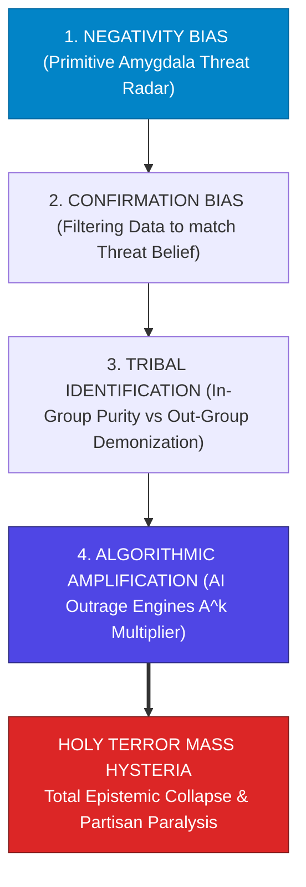

> **🎙️ 3-Presenter Authentic Tiki-Taka Script**
> 
> **Prof. Peter Kim:** Slide 7 introduces the core theoretical model of this session: **The 4-Stage Architecture of the Bias Cascade**. Dr. Vance, walk us through how these four stages compound. *(Turn 1)*  
> **Dr. Elena Vance:** Look at the four boxes: Stage 1 is **Negativity Bias**—your primitive amygdala reacts ten times faster to fear and threats than to good news. Stage 2 is **Confirmation Bias**—your brain actively seeks out articles and videos that prove the threat is real. *(Turn 2)*  
> **TA Marcus Brody:** Stage 3 is **Tribal Identification**—you join an online group of people who share your fear, binding your identity to the tribe and painting the other political party as subhuman monsters! *(Turn 3)*  
> **Dr. Elena Vance:** And Stage 4 is **Algorithmic Amplification**—the AI recommender system detects your emotional intensity and pumps an exponential flood of radical content ($A^k$) straight into your feed! *(Turn 4)*  
> **Prof. Peter Kim:** Look at the red destination box: The four stages multiply together to produce **Holy Terror**—a total loss of objective reality and rational dialogue. *(Turn 5)*  
> **TA Marcus Brody:** It is an automated assembly line for radicalizing human minds! *(Turn 6)*  
> **Dr. Elena Vance:** Let us examine Stage 1 in detail: Negativity Bias on Slide 8. *(Turn 7)*  
> **Prof. Peter Kim:** Let’s examine Negativity Bias on Slide 8. *(Turn 8)*  
> **TA Marcus Brody:** Turn to Slide 8: Evolution’s Primitive Danger Radar! *(Turn 9)*  
> **Prof. Peter Kim:** Proceed to Slide 8. *(Turn 10)*

---

### Slide 08: Negativity Bias: Evolution’s Primitive Danger Radar
- **The Evolutionary Logic of Asymmetry:**
  - *Ancestral Survival Rule:* In the Pleistocene savanna, missing a positive opportunity (a sweet berry) caused minor regret; missing a negative threat (a saber-toothed cat in the bushes) **caused immediate death**.
  - *The Asymmetric Hardwiring:* The human brain evolved to process threatening stimuli in the **amygdala in $<15\text{ milliseconds}$** (via the fast subcortical thalamic pathway), bypassing conscious prefrontal analysis.
- **The Modern Vulnerability:** In a world with zero saber-toothed cats, 24/7 news media and algorithmic feeds weaponize this ancient danger radar, flooding the nervous system with constant, phantom existential threats.

```mermaid
flowchart LR
    Threat["Incoming Negative News / Outrage Headline"] --> Thalamus["Sensory Thalamus"]
    Thalamus -->|FAST PATHWAY (<15ms) High Priority| Amygdala["AMYGDALA DANGER ALARM<br/>Adrenaline & Cortisol Surge • High Attention"]
    Thalamus -->|SLOW PATHWAY (>300ms) Low Priority| PFC["Prefrontal Cortex (Logical Analysis & Nuance)"]
    style Amygdala fill:#dc2626,stroke:#7f1d1d,color:#fff
    style PFC fill:#78716c,stroke:#44403c,color:#fff
```

> **🎙️ 3-Presenter Authentic Tiki-Taka Script**
> 
> **TA Marcus Brody:** Look at the brain wiring diagram on Slide 8! This is **Negativity Bias**! Elena, explain why fear moves faster than logic in the human brain! *(Turn 1)*  
> **Dr. Elena Vance:** Look at the two pathways: In evolutionary biology, if an ancestral hunter heard a rustle in the bushes and assumed it was a tiger and ran away, he survived even if it was just the wind. If he stopped to calmly analyze the evidence, he was eaten! *(Turn 2)*  
> **TA Marcus Brody:** So natural selection hardwired the **Fast Pathway directly from the Thalamus to the Amygdala in under 15 milliseconds**! It dumps adrenaline and cortisol into your blood before your slow, logical Prefrontal Cortex (which takes 300 milliseconds) can even read the full sentence! *(Turn 3)*  
> **Prof. Peter Kim:** And modern media knows this: *"If it bleeds, it leads."* A headline saying "Democracy is Ending" or "The Economy is Collapsing" triggers the 15-millisecond amygdala alarm, capturing 100% of conscious attention. *(Turn 4)*  
> **TA Marcus Brody:** Our brains are running ancient Paleolithic predator-evasion software against a screen glowing in our bedroom at 11:00 PM! *(Turn 5)*  
> **Dr. Elena Vance:** And confirmation bias locks that fear into permanent tribalism on Slide 9. *(Turn 6)*  
> **Prof. Peter Kim:** Let’s examine Confirmation Bias and Primitive Tribalism on Slide 9. *(Turn 7)*  
> **TA Marcus Brody:** Turn to Slide 9! *(Turn 8)*  
> **Dr. Elena Vance:** Let’s see how confirmation bias weaponizes tribal loyalty! *(Turn 9)*  
> **Prof. Peter Kim:** Proceed to Slide 9. *(Turn 10)*

---

### Slide 09: Confirmation Bias & The Weaponization of Primitive Tribalism
- **The Cognitive Filter (Peter Wason / Dan Kahan):**
  - *Identity-Protective Cognition:* Human beings do not evaluate evidence as impartial truth-seeking scientists; **we evaluate evidence as tribal defense lawyers**.
  - *The Confirmation Filter:* Information confirming the tribe’s worldview is accepted instantly with minimal scrutiny; information challenging the tribe’s orthodoxy triggers acute cognitive dissonance and is dismissed as enemy disinformation.
- **The Social Media Crucible:** Online platforms reward tribal conformity with social validation (Likes, Retweets, Follows), creating **hermetically sealed ideological fortresses**.

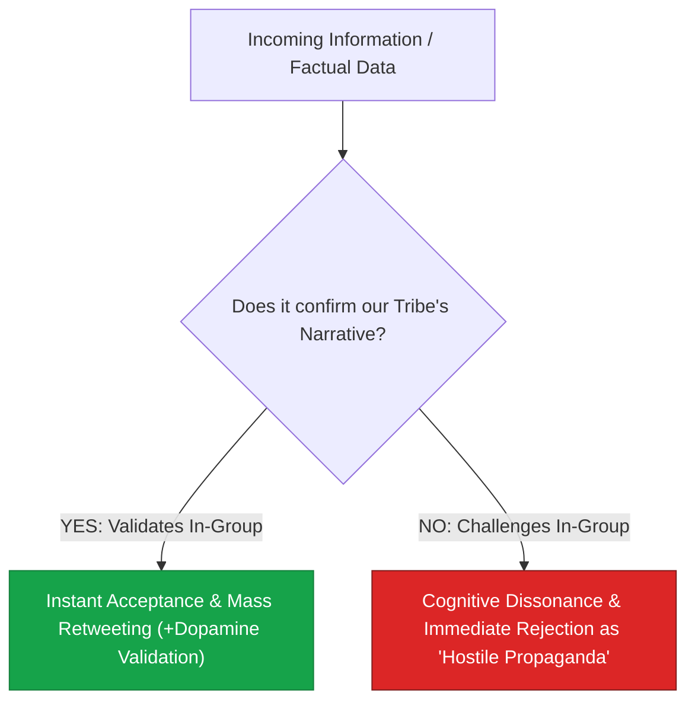

> **🎙️ 3-Presenter Authentic Tiki-Taka Script**
> 
> **Prof. Peter Kim:** Slide 9 explores Dan Kahan’s landmark concept of **Identity-Protective Cognition**. Dr. Vance, why do smart, educated people reject factual evidence when it conflicts with their political party? *(Turn 1)*  
> **Dr. Elena Vance:** Dan Kahan at Yale proved that human reasoning did not evolve to find abstract scientific truth; human reasoning evolved to **maintain tribal belonging and social status within the in-group**! *(Turn 2)*  
> **TA Marcus Brody:** Look at the flowchart on Slide 9: When you see a news story that attacks your political opponents, you accept it instantly without checking the source and hit retweet! But if someone shows you verified data that proves your party made a mistake, your brain treats it as an existential attack and screams: *"Fake news! Enemy propaganda!"* *(Turn 3)*  
> **Prof. Peter Kim:** In an ancestral tribe, being expelled from your tribe meant dying alone in the wilderness. Conforming to tribal orthodoxy was more important for genetic survival than objective truth. *(Turn 4)*  
> **TA Marcus Brody:** Social media weaponizes that primal fear by handing out digital peer approval—likes and hearts—for conforming to the tribal party line! *(Turn 5)*  
> **Dr. Elena Vance:** Which Tristan Harris describes as "The Race to the Bottom of the Brainstem" on Slide 10. *(Turn 6)*  
> **Prof. Peter Kim:** Let’s examine Tristan Harris’s framework on Slide 10. *(Turn 7)*  
> **TA Marcus Brody:** Turn to Slide 10: The Race to the Bottom of the Brainstem! *(Turn 8)*  
> **Dr. Elena Vance:** Let’s see the attention economy deconstructed! *(Turn 9)*  
> **Prof. Peter Kim:** Proceed to Slide 10. *(Turn 10)*

---

### Slide 10: Tristan Harris: "The Race to the Bottom of the Brainstem"
- **The Attention Economy Critique (Tristan Harris - Center for Humane Technology):**
  - *The Asymmetric Chess Match:* The human brain evolved over millennia, but across the screen is a **supercomputer supercluster running AI algorithms optimizing for human behavioral manipulation**.
  - *The Race to the Bottom:* To capture attention in a hyper-competitive feed, platforms are forced to appeal to lower and lower evolutionary brain structures: from rationality (Neocortex) $\to$ social status (Limbic System) $\to$ primitive survival/fear/lust (Brainstem).
- **The Core Axiom:** *"If you are not paying for the product, you are not the customer; **your attention and behavioral futures are the product being sold to advertisers**."*

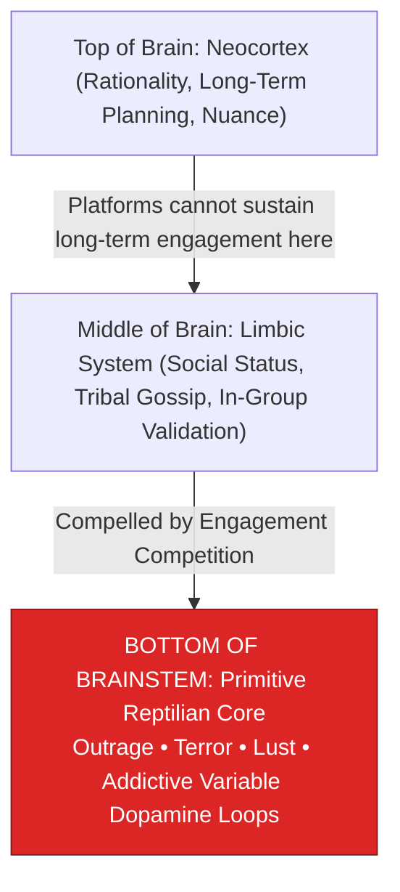

> **🎙️ 3-Presenter Authentic Tiki-Taka Script**
> 
> **TA Marcus Brody:** Look at the neuroscience descent on Slide 10! This is former Google design ethicist Tristan Harris: **"The Race to the Bottom of the Brainstem"**! Elena, explain this race to the bottom! *(Turn 1)*  
> **Dr. Elena Vance:** Look at the three levels of the brain: When an app tries to engage your **Neocortex** with thoughtful, long-form essays, you get tired and close the app. If they engage your **Limbic system** with social gossip, you stay longer. But if they dive straight into the **Bottom of the Brainstem**—fear, sexual lust, and moral rage—your primitive brain cannot look away! *(Turn 2)*  
> **TA Marcus Brody:** In an attention economy where billions of dollars depend on keeping your eyeballs glued to the screen, every social media company is forced to compete by targeting the lowest reptilian brainstem reflexes! *(Turn 3)*  
> **Prof. Peter Kim:** Read Tristan Harris's famous axiom: *"You are playing chess against a 1-million-GPU supercomputer that has mapped every cognitive weakness in your species."* *(Turn 4)*  
> **TA Marcus Brody:** You think you are just casually scrolling on your phone, but on the other side of the glass is an artificial intelligence that knows exactly which color, sound, and outrage trigger will force your thumb to scroll for another hour! *(Turn 5)*  
> **Dr. Elena Vance:** And Peter Diamandis warns how this turns our brains into casino slot machines on Slide 11. *(Turn 6)*  
> **Prof. Peter Kim:** Let’s examine Peter Diamandis’s Dopamine Loop Warning on Slide 11. *(Turn 7)*  
> **TA Marcus Brody:** Turn to Slide 11: Infinite Scroll & The Slot Machine Brain! *(Turn 8)*  
> **Dr. Elena Vance:** Let’s see the slot machine mechanics deconstructed! *(Turn 9)*  
> **Prof. Peter Kim:** Proceed to Slide 11. *(Turn 10)*

---

### Slide 11: Peter Diamandis’s Dopamine Loop Warning: Infinite Scroll & The Slot Machine Brain
- **The Psychology of Infinite Scroll (Aza Raskin):**
  - *The Destruction of Stopping Cues:* Historically, physical media had natural stopping cues (the end of a book chapter, the back page of a newspaper, the TV credit roll). Infinite scroll **eliminated all physical stopping cues**.
  - *The Slot Machine Pull:* Pulling down to refresh a social media feed mimics the exact physical ergonomics and variable-interval reward schedule of a **Las Vegas slot machine handle**.
- **The Neurochemical Exhaustion:** Continuous unpredictable micro-dopamine hits deplete intracellular dopamine reserves in the striatum, inducing chronic attention fragmentation and digital anhedonia.

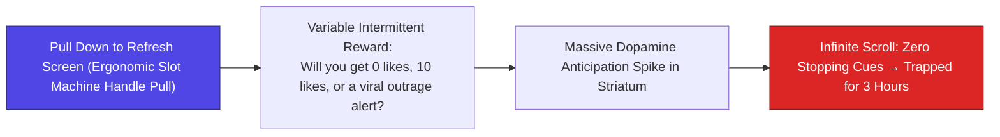

> **🎙️ 3-Presenter Authentic Tiki-Taka Script**
> 
> **Prof. Peter Kim:** Slide 11 presents Peter Diamandis’s analysis of **The Infinite Scroll and The Slot Machine Brain**. Dr. Vance, explain why Aza Raskin’s invention of infinite scroll was so destructive. *(Turn 1)*  
> **Dr. Elena Vance:** For thousands of years, every human medium had natural **"stopping cues"**: when you read a book, the chapter ends; when you read a newspaper, you reach the back page; when you watch a television show, the credits roll. Aza Raskin invented **Infinite Scroll**, which completely destroyed all stopping cues! *(Turn 2)*  
> **TA Marcus Brody:** Look at the slot machine mechanics on Slide 11: When you pull down on your screen to refresh your feed, your thumb is pulling the **handle of a Las Vegas casino slot machine**! You don't know what you’re going to get: will it be a boring post, 50 likes on your photo, or an outrage headline that makes your blood boil? *(Turn 3)*  
> **Dr. Elena Vance:** That unpredictable anticipation triggers a **massive spike of dopamine in the striatum**! Your brain becomes chemically addicted to pulling the handle over and over again! *(Turn 4)*  
> **Prof. Peter Kim:** You look at the clock, and three hours of your life, your focus, and your creative energy have evaporated into the digital void. *(Turn 5)*  
> **TA Marcus Brody:** We carry a personalized Las Vegas casino in our pockets everywhere we go! *(Turn 6)*  
> **Dr. Elena Vance:** And Steven Kotler explains how this neurochemistry creates "Holy Terror" on Slide 12. *(Turn 7)*  
> **Prof. Peter Kim:** Let’s examine Steven Kotler on the Neuropsychology of "Holy Terror" on Slide 12. *(Turn 8)*  
> **TA Marcus Brody:** Turn to Slide 12! *(Turn 9)*  
> **Prof. Peter Kim:** Proceed to Slide 12. *(Turn 10)*

---

### Slide 12: Steven Kotler on the Neuropsychology of "Holy Terror"
- **The Neuro-Endocrine Cascade of Mass Hysteria:**
  1. *Hyper-Cortisolemia & Adrenaline Elevation:* Continuous exposure to algorithmic threat narratives elevates circulating glucocorticoids, keeping the central nervous system in chronic **sympathetic fight-or-flight dominance**.
  2. *Prefrontal Hypo-Frontality:* High cortisol downregulates synaptic transmission in the dorsolateral prefrontal cortex (dlPFC), **impairing logical reasoning, emotional regulation, and cognitive flexibility**.
  3. *Oxytocin-Mediated Tribal In-Group Weaponization:* Oxytocin is not just the "love molecule"; it actively **amplifies out-group hostility and xenophobia** when the in-group is perceived to be under moral attack.

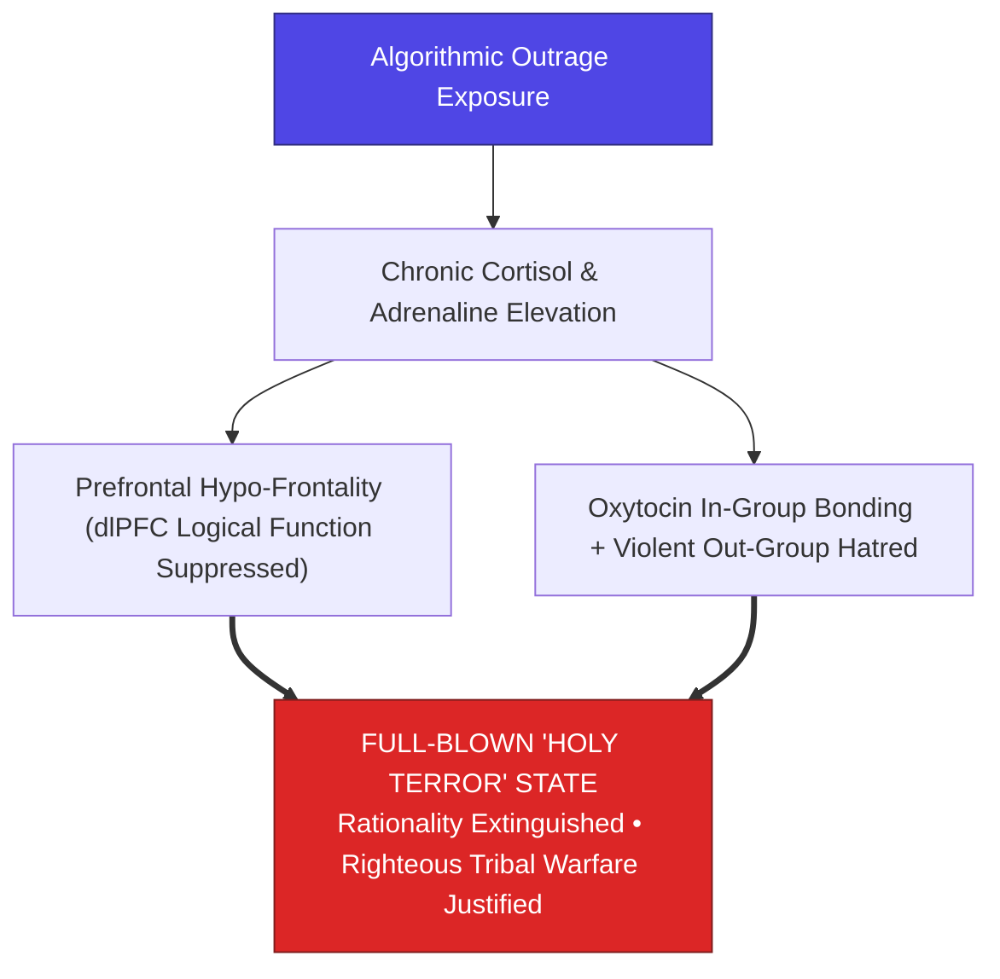

> **🎙️ 3-Presenter Authentic Tiki-Taka Script**
> 
> **TA Marcus Brody:** Look at the neurological cascade on Slide 12! This is Steven Kotler’s deep dive into **The Neuropsychology of Holy Terror**! Elena, explain why oxytocin is not just a peaceful "love molecule"! *(Turn 1)*  
> **Dr. Elena Vance:** Mainstream media often calls oxytocin the "cuddle hormone." But neurobiology proves that oxytocin has a dark side: **oxytocin drives intense in-group bonding while simultaneously driving extreme aggression and hatred toward the out-group**! *(Turn 2)*  
> **TA Marcus Brody:** Look at the flowchart: When algorithms convince you that your tribe is under moral attack, oxytocin bonds you tightly to your online allies, while chronic cortisol shuts down your **dorsolateral prefrontal cortex (dlPFC)**! *(Turn 3)*  
> **Dr. Elena Vance:** Your brain enters **Prefrontal Hypo-Frontality**: your logical reasoning and nuanced judgment are literally turned OFF! You become incapable of self-criticism, and fully convinced that your cause is 100% pure and sacred! *(Turn 4)*  
> **Prof. Peter Kim:** In that psychological state, any violent or destructive action against the perceived "enemy" feels morally justified. That is the exact neurological mechanism behind historical witch hunts, religious inquisitions, and modern partisan extremism. *(Turn 5)*  
> **TA Marcus Brody:** It is a chemical trance of righteous hysteria! *(Turn 6)*  
> **Dr. Elena Vance:** And it completely collapses our 120-bit working memory funnel on Slide 13. *(Turn 7)*  
> **Prof. Peter Kim:** Let’s examine Mihaly Csikszentmihalyi’s 120-bit Funnel on Slide 13. *(Turn 8)*  
> **TA Marcus Brody:** Turn to Slide 13: The Collapse of Working Memory! *(Turn 9)*  
> **Prof. Peter Kim:** Proceed to Slide 13. *(Turn 10)*

---

### Slide 13: The Collapse of Mihaly Csikszentmihalyi’s 120-bit Working Memory Funnel
- **The Information Processing Threshold (Mihaly Csikszentmihalyi - Flow Theory):**
  - *Conscious Bandwidth Constraint:* The human nervous system can process a maximum of **$\approx 120\text{ bits of information per second}$**.
  - *The Conversational Demand:* Simply listening to and understanding a single person talking consumes **$\approx 60\text{ bits per second}$** ($50\%$ of total conscious bandwidth).
- **The Multitasking Illusion:** When bombarded with multiple concurrent digital notifications, feeds, and tabs, the 120-bit channel undergoes **catastrophic context-switching thrashing**, fragmenting attention and completely extinguishing the neurological preconditions for deep flow states.

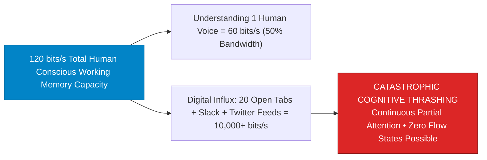

> **🎙️ 3-Presenter Authentic Tiki-Taka Script**
> 
> **Prof. Peter Kim:** Slide 13 presents Mihaly Csikszentmihalyi’s foundational theorem of human consciousness: **The 120-bit Working Memory Funnel**. Dr. Vance, explain why multitasking on digital devices is biologically impossible. *(Turn 1)*  
> **Dr. Elena Vance:** Look at the mathematics: The human brain's conscious working memory has a hard physical ceiling of **120 bits per second**. Just sitting and listening to one person speak English consumes **60 bits per second—exactly half of your total conscious bandwidth**! *(Turn 2)*  
> **TA Marcus Brody:** Look at what happens when you try to work with 20 browser tabs open, Slack pinging, and a smartphone buzzing with social media alerts: You are flooding a 120-bit funnel with **10,000 bits per second of incoming stimuli**! *(Turn 3)*  
> **Dr. Elena Vance:** The brain cannot process them in parallel; it suffers **Catastrophic Context-Switching Thrashing**! Every notification forces the brain to dump its working memory and reload a new task, which takes 23 minutes to recover from! *(Turn 4)*  
> **Prof. Peter Kim:** You live in a state of **Continuous Partial Attention**—skimming the surface of everything, but mastering nothing, completely incapable of entering deep Flow States. *(Turn 5)*  
> **TA Marcus Brody:** We gave up deep genius for hyperactive distraction! *(Turn 6)*  
> **Dr. Elena Vance:** And algorithmic rabbit holes drag users into extremist spirals on Slide 14. *(Turn 7)*  
> **Prof. Peter Kim:** Let’s examine Algorithmic Rabbit Holes on Slide 7. *(Turn 8)*  
> **TA Marcus Brody:** Turn to Slide 14: The Outrage Feedback Spiral! *(Turn 9)*  
> **Prof. Peter Kim:** Proceed to Slide 14. *(Turn 10)*

---

### Slide 14: Algorithmic Rabbit Holes: The Outrage Feedback Spiral
- **The Recommendation Gradient (Zeynep Tufekci / Guillaume Chaslot):**
  - *The Radicalization Vector:* Recommendation algorithms (YouTube, TikTok, X) discovered that recommending slightly more extreme, polarized, and sensationalist content increases user watch-time and ad impressions.
  - *The Rabbit Hole:* A user searching for a vegetarian recipe is recommended vegan extremism; a user searching for jogging tips is recommended ultra-marathon conspiracies; a user searching for election news is recommended insurrectionist manifestos.
- **The Closed-Loop Echo Chamber:** Users are progressively isolated inside an artificially constructed reality where their extreme views appear to be the universal consensus.

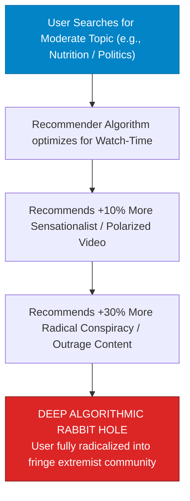

> **🎙️ 3-Presenter Authentic Tiki-Taka Script**
> 
> **TA Marcus Brody:** Look at the radicalization gradient on Slide 14! This was exposed by sociologist Zeynep Tufekci and former YouTube engineer Guillaume Chaslot: **The Algorithmic Rabbit Hole**! Elena, how does an algorithm push a normal person into an extremist? *(Turn 1)*  
> **Dr. Elena Vance:** An AI recommendation engine is programmed with a simple mathematical objective: **maximize watch time**. The algorithm quickly discovered that if a user watches a moderate video about dieting, showing them another moderate video gets 3 minutes of watch time; but showing them an extreme conspiracy video about secret food poisons gets **30 minutes of watch time**! *(Turn 2)*  
> **TA Marcus Brody:** Look at the steps in the flowchart: Step by step, the algorithm nudges the user down the gradient: from vegetarian cooking $\to$ radical veganism; from running tips $\to$ extreme biohacking cults; from election news $\to$ wild QAnon conspiracies! *(Turn 3)*  
> **Prof. Peter Kim:** Within three months, the user is living in an alternate reality, fully convinced that a secret cabal is destroying the world, because 100% of their video feed confirms it! *(Turn 4)*  
> **TA Marcus Brody:** The algorithm didn't radicalize them because it has an evil ideology; the algorithm radicalized them because outrage produces the highest ad revenue! *(Turn 5)*  
> **Dr. Elena Vance:** Profit-driven optimization tearing apart the social fabric. *(Turn 6)*  
> **Prof. Peter Kim:** Let us summarize the five master engines of cognitive hijacking on Slide 15. *(Turn 7)*  
> **TA Marcus Brody:** Turn to Slide 15: The Grand 5-Engine Cognitive Hijacking Matrix! *(Turn 8)*  
> **Dr. Elena Vance:** Let’s see the full cognitive vulnerability landscape! *(Turn 9)*  
> **Prof. Peter Kim:** Proceed to Slide 15. *(Turn 10)*

---

### Slide 15: The Grand 5-Engine Cognitive Hijacking Matrix
- **Master Cognitive Vulnerability Matrix:** Comprehensive synthesis of the 5 evolutionary and algorithmic engines dismantling human focus and societal cohesion.

| Cognitive Engine | Evolutionary Origin | Modern Algorithmic Exploitation | Neurological Target | Societal / Individual Impact |
| :--- | :--- | :--- | :--- | :--- |
| **1. Negativity Bias** | Predator evasion in Pleistocene | Clickbait outrage & doomscrolling | Fast Thalamo-Amygdala pathway | **Chronic anxiety & doom paralysis** |
| **2. Confirmation Bias**| In-group tribal survival | Hermetically sealed filter bubbles | Reward anticipation in striatum | **Epistemic echo chambers & fact denial**|
| **3. Intermittent Reward**| Foraging uncertainty | Pull-to-refresh & infinite scroll | Dopaminergic burst in nucleus accumbens| **Casino-like smartphone addiction** |
| **4. Tribal Morality** | Defense against rival hominids | Partisan out-group shaming & dogpiling| Oxytocin + Ventromedial PFC | **Hyper-polarization & "Holy Terror"** |
| **5. Bandwidth Bottleneck**| 120-bit sensory working memory| Push notifications & 181ZB data flood | dlPFC working-memory saturation | **Destruction of flow states & deep focus**|

> **🎙️ 3-Presenter Authentic Tiki-Taka Script**
> 
> **Prof. Peter Kim:** Scholars, examine Slide 15 carefully. Five master engines of cognitive hijacking. Every major vulnerability in our evolutionary biology exploited by modern digital algorithms. Marcus, walk us through the five rows! *(Turn 1)*  
> **TA Marcus Brody:** Engine 1: Negativity bias hijacked by clickbait doomscrolling! Engine 2: Confirmation bias locking us into filter bubbles! Engine 3: Intermittent reward turning our phones into slot machines! Engine 4: Tribal morality weaponized into Holy Terror! And Engine 5: The 120-bit bandwidth bottleneck collapsing deep work and flow! *(Turn 2)*  
> **Dr. Elena Vance:** Every row in this matrix represents an intersection between millions of years of evolutionary neuroscience and billions of dollars of Big Tech algorithmic optimization. *(Turn 3)*  
> **Prof. Peter Kim:** This is a systemic infiltration of human consciousness. *(Turn 4)*  
> **TA Marcus Brody:** But in Module 3, we master the mathematical informatics and the neuro-defense protocols to break free! *(Turn 5)*  
> **Dr. Elena Vance:** Let’s examine the mathematical formulation of the Bias Cascade on Slide 16! *(Turn 6)*  
> **Prof. Peter Kim:** Proceed to Module 3: Exponential Frameworks & Mathematical Neuro-Informatics! *(Turn 7)*  
> **TA Marcus Brody:** Turn to Slide 16! *(Turn 8)*  
> **Dr. Elena Vance:** Let’s look at the mathematics on Slide 16! *(Turn 9)*  
> **Prof. Peter Kim:** Proceed to Slide 16. *(Turn 10)*


---

## Module 3: Exponential Frameworks & Mathematical Neuro-Informatics (Slides 16–25)

### Slide 16: Mathematical Multiplicative Formulation of the Bias Cascade: $B_{\text{cascade}} = N \cdot C \cdot T \cdot A^k$
- **The Formal Mathematical Model of Cognitive Radicalization:**
  $$B_{\text{cascade}}(t) = N(t) \times C(t) \times T(t) \times \left( \mathcal{A}_{\text{recommender}} \right)^k$$
  - $N(t) \ge 1.0$: **Negativity Bias Multiplier** (Amygdala threat capture factor, $\approx 3.0\text{ to } 5.0$).
  - $C(t) \ge 1.0$: **Confirmation Filter Coefficient** (Bayesian updating suppression factor).
  - $T(t) \ge 1.0$: **Tribal Identification Factor** (In-group oxytocinergic binding intensity).
  - $\mathcal{A}_{\text{recommender}} > 1.0$: **Algorithmic Outrage Gain** ($k = \text{number of recursive feed loops}$).
- **The Exponential Explosiveness:** Because terms are **multiplicative rather than additive**, a modest $2\times$ increase in each term yields a **$>100\times \text{ surge in cognitive distortion}$**, triggering rapid descent into Holy Terror mass delusion.

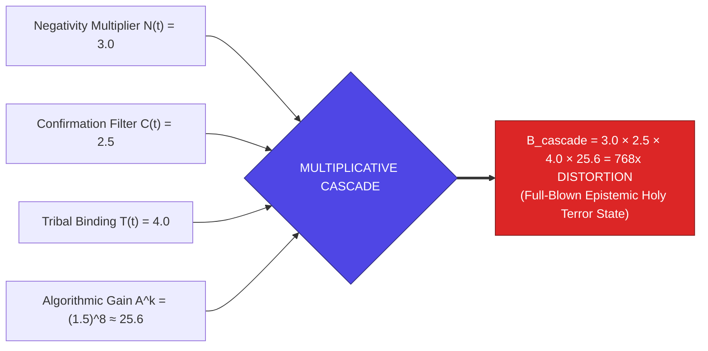

> **🎙️ 3-Presenter Authentic Tiki-Taka Script**
> 
> **Prof. Peter Kim:** Module 3 opens with our formal mathematical formulation: **The Multiplicative Bias Cascade Equation ($B_{\text{cascade}} = N \cdot C \cdot T \cdot A^k$)**. Dr. Vance, explain why cognitive radicalization is multiplicative rather than additive. *(Turn 1)*  
> **Dr. Elena Vance:** Look at the formula: $N$ is Negativity Bias ($3\times$), $C$ is Confirmation Bias ($2.5\times$), $T$ is Tribal In-group binding ($4\times$), and $\mathcal{A}^k$ is Algorithmic Outrage Amplification ($25\times$). If these terms were additive, $3 + 2.5 + 4 + 25 = 34.5$—a moderate increase. But because human cognitive biases **multiply each other**, look at the result! *(Turn 2)*  
> **TA Marcus Brody:** Look at the purple box: $3.0 \times 2.5 \times 4.0 \times 25.6 = \mathbf{768\times\text{ Cognitive Distortion}}$! Within eight scroll loops, the user's perception of reality has been magnified into a **768-fold distorted hallucination of imminent doom and hatred**! *(Turn 3)*  
> **Prof. Peter Kim:** A minor political disagreement becomes an existential battle against demonic forces. *(Turn 4)*  
> **TA Marcus Brody:** That is the mathematical proof of why radicalization happens so blisteringly fast online! *(Turn 5)*  
> **Dr. Elena Vance:** And Big Tech algorithms optimize for this exact distortion using the Outrage Loss Function on Slide 17. *(Turn 6)*  
> **Prof. Peter Kim:** Let’s examine the Outrage-Optimized Loss Function on Slide 17. *(Turn 7)*  
> **TA Marcus Brody:** Turn to Slide 17: $\mathcal{L}_{\text{rage}}$! *(Turn 8)*  
> **Dr. Elena Vance:** Let’s see the machine learning objective function! *(Turn 9)*  
> **Prof. Peter Kim:** Proceed to Slide 17. *(Turn 10)*

---

### Slide 17: Outrage-Optimized Engagement Loss Function ($\mathcal{L}_{\text{rage}}$)
- **The Machine Learning Objective Function:**
  $$\mathcal{L}_{\text{recommender}}(\theta) = -\sum_{i=1}^{M} \left[ w_{\text{dwell}} \cdot \log P(\text{Dwell}_i) + w_{\text{share}} \cdot \log P(\text{Share}_i) + w_{\text{rage}} \cdot \log P(\text{Outrage}_i) \right]$$
  where $w_{\text{rage}} \approx 5 \cdot w_{\text{like}}$ (The Frances Haugen Facebook whistle-blower weighting ratio).
- **The Gradient Descent Toward Extremism:**
  - The neural network’s loss gradient ($\nabla_\theta \mathcal{L}$) minimizes loss by serving content that maximizes $P(\text{Outrage})$, because moral outrage generates **$5\times \text{ higher comment virality and 2x higher dwell time}$** than calm factual discourse.

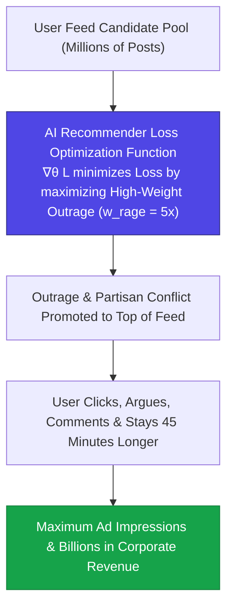

> **🎙️ 3-Presenter Authentic Tiki-Taka Script**
> 
> **TA Marcus Brody:** Look at the machine learning code on Slide 17! This is the mathematical formula running inside social media server racks: **The Outrage Loss Function ($\mathcal{L}_{\text{rage}}$)**! Elena, explain why the algorithm is mathematically forced to promote hate! *(Turn 1)*  
> **Dr. Elena Vance:** Look at the weights in the objective function: $w_{\text{dwell}}$ is how long you look, $w_{\text{share}}$ is how often you share, and $w_{\text{rage}}$ is how outraged you feel. Whistleblower documents leaked by Frances Haugen revealed that Facebook’s ranking algorithm explicitly set **the weight of angry emoji reactions ($w_{\text{rage}}$) to FIVE TIMES HIGHER than regular likes ($5 \cdot w_{\text{like}}$)**! *(Turn 2)*  
> **TA Marcus Brody:** When a machine learning gradient descent algorithm ($\nabla_\theta \mathcal{L}$) optimizes for ad revenue, it discovers that **moral outrage produces 5 times more comments and keeps people on the app 45 minutes longer**! *(Turn 3)*  
> **Prof. Peter Kim:** So the algorithm systematically buries calm, objective journalism, and promotes the most inflammatory, divisive posts directly to the top of three billion human newsfeeds! *(Turn 4)*  
> **TA Marcus Brody:** Outrage is not a glitch in the algorithm; **OUTRAGE IS THE BUSINESS MODEL**! *(Turn 5)*  
> **Dr. Elena Vance:** And it isolates users into topologically closed echo chambers on Slide 18. *(Turn 6)*  
> **Prof. Peter Kim:** Let’s examine Filter Bubbles and Echo Chamber Graph Networks on Slide 18. *(Turn 7)*  
> **TA Marcus Brody:** Turn to Slide 18: Topological Isolation! *(Turn 8)*  
> **Dr. Elena Vance:** Let’s see the network graph topology! *(Turn 9)*  
> **Prof. Peter Kim:** Proceed to Slide 18. *(Turn 10)*

---

### Slide 18: Filter Bubbles & Topological Isolation of Echo Chamber Graph Networks
- **The Graph Theory of Polarization (Eli Pariser / Filippo Menczer):**
  - *Social Graph Topology:* Modern social networks are not unified open agoras; they are mathematically **partitioned into bipartite modular clusters** with high intra-cluster edge density and near-zero inter-cluster bridging edges ($\text{Modularity } Q \to 1.0$).
  - *The Algorithmic Homophily Trap:* Collaborative filtering algorithms recommend friends and pages that maximize ideological overlap ($\text{Cosine Similarity } \to 1.0$), eliminating all cross-cutting political exposure.
- **The Epistemic Consequence:** Users inside Cluster A believe their worldview represents $90\%$ of reality, while users in Cluster B believe the exact opposite, creating **two irreconcilable parallel universes**.

```mermaid
flowchart LR
    subgraph Echo Chamber Cluster A (Tribe Blue)
        A1((User A1)) --- A2((User A2))
        A2 --- A3((User A3))
        A3 --- A1
    end
    
    subgraph Echo Chamber Cluster B (Tribe Red)
        B1((User B1)) --- B2((User B2))
        B2 --- B3((User B3))
        B3 --- B1
    end
    
    Echo Chamber Cluster A -.->|Zero Cross-Cluster Bridging Edges (Modularity Q &rarr; 1.0)| Echo Chamber Cluster B
    style Echo Chamber Cluster A fill:#dbeafe,stroke:#1e40af
    style Echo Chamber Cluster B fill:#fee2e2,stroke:#b91c1c
```

> **🎙️ 3-Presenter Authentic Tiki-Taka Script**
> 
> **Prof. Peter Kim:** Slide 18 presents the graph theory of social fragmentation: **The Topological Isolation of Echo Chambers**. Dr. Vance, walk us through Eli Pariser’s Filter Bubble graph topology. *(Turn 1)*  
> **Dr. Elena Vance:** Look at the two clusters in the network diagram: In graph mathematics, a healthy democratic public sphere has high **cross-cutting bridging edges** connecting people of different viewpoints. But social media collaborative filtering algorithms isolate users into **bipartite modular clusters with Modularity $Q \to 1.0$**! *(Turn 2)*  
> **TA Marcus Brody:** Look at Tribe Blue on the left and Tribe Red on the right: Tribe Blue only sees posts from other Blue users, and Tribe Red only sees posts from other Red users! **There are ZERO bridging edges between them!** *(Turn 3)*  
> **Prof. Peter Kim:** A person inside Cluster A genuinely believes that 90% of the world agrees with them, and anyone who disagrees must be an evil, brainwashed idiot! And Cluster B believes the exact same thing about Cluster A! *(Turn 4)*  
> **TA Marcus Brody:** The algorithm created two parallel epistemic universes living on the exact same physical street! *(Turn 5)*  
> **Dr. Elena Vance:** And in the human brain, this triggers Amygdalar Hijacking on Slide 19. *(Turn 6)*  
> **Prof. Peter Kim:** Let’s examine Amygdalar Hijacking and Hypo-Frontality on Slide 19. *(Turn 7)*  
> **TA Marcus Brody:** Turn to Slide 19: The Prefrontal Cortex Hypo-Frontality Circuit! *(Turn 8)*  
> **Prof. Peter Kim:** Proceed to Slide 19. *(Turn 10)*

---

### Slide 19: Amygdalar Hijacking & The Prefrontal Cortex (PFC) Hypo-Frontality Circuit
- **The Neuro-Anatomical Circuit of Emotional Seizure (Daniel Goleman / Joseph LeDoux):**
  - *The Amygdala Hijack:* When high-arousal emotional stimuli trigger the basolateral amygdala, it signals the hypothalamus and locus coeruleus, flooding the brain with **norepinephrine and cortisol in $<20\text{ms}$**.
  - *dlPFC Inactivation:* High norepinephrine stimulates $\alpha_1$ and $\beta_1$ adrenergic receptors in the dorsolateral prefrontal cortex (dlPFC), **depolarizing and uncoupling prefrontal microcircuits**.
- **The Cognitive Impairment:** Working memory collapses, rational risk assessment drops by $>60\%$, and behavioral responses become purely reactive, impulsive, and tribal.

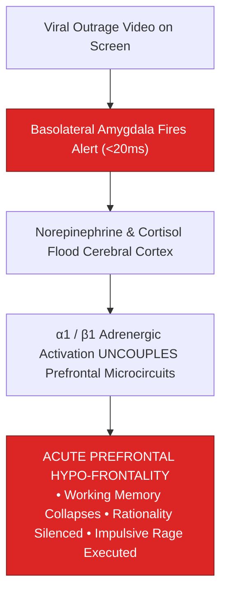

> **🎙️ 3-Presenter Authentic Tiki-Taka Script**
> 
> **TA Marcus Brody:** Look at the neurological seizure circuit on Slide 19! This is Daniel Goleman’s famous **Amygdalar Hijacking and Prefrontal Hypo-Frontality**! Elena, what physically happens to the brain during an online outrage attack? *(Turn 1)*  
> **Dr. Elena Vance:** Look at the sequence: When you see an infuriating video or tweet, your **basolateral amygdala fires an emergency danger signal in less than 20 milliseconds**! The locus coeruleus floods your cerebral cortex with a massive tidal wave of **norepinephrine and cortisol**! *(Turn 2)*  
> **TA Marcus Brody:** And look at what norepinephrine does to the prefrontal cortex in box 3: It binds to $\alpha_1$ adrenergic receptors, **physically uncoupling and disconnecting the synaptic microcircuits of your prefrontal cortex**! *(Turn 3)*  
> **Dr. Elena Vance:** The logical, reasoning, nuanced part of your brain is literally knocked offline! You enter **Acute Prefrontal Hypo-Frontality**: you lose working memory, you cannot weigh evidence, and you type an angry, impulsive, hateful comment before you can stop yourself! *(Turn 4)*  
> **Prof. Peter Kim:** You are a biological primate whose neocortex has been temporarily paralyzed by a glowing piece of glass. *(Turn 5)*  
> **TA Marcus Brody:** Your higher consciousness was hijacked by a notification! *(Turn 6)*  
> **Dr. Elena Vance:** And variable intermittent rewards keep this addiction alive on Slide 20. *(Turn 7)*  
> **Prof. Peter Kim:** Let’s examine Variable Intermittent Reward Dynamics on Slide 20. *(Turn 8)*  
> **TA Marcus Brody:** Turn to Slide 20: Dopaminergic Depletion! *(Turn 9)*  
> **Prof. Peter Kim:** Proceed to Slide 20. *(Turn 10)*

---

### Slide 20: Variable Intermittent Reward Dynamics & Dopaminergic Depletion
- **The B.F. Skinner Operant Conditioning Model:**
  - *Predictable Reward:* Pressing a lever for 1 pellet every time $\to$ Animal eats when hungry, then stops.
  - *Variable Intermittent Reward:* Pressing a lever for a **random, unpredictable reward (sometimes 0, sometimes 5 pellets)** $\to$ Animal compulsively presses the lever thousands of times until physical exhaustion.
- **The Striatal Dopamine Exhaustion:**
  - Social media notifications (likes, retweets, DMs) operate on variable-ratio reinforcement schedules.
  - Chronic unpredictable anticipation triggers **Dopamine Reward Prediction Error (RPE) spikes**, followed by profound vesicular dopamine depletion, irritability, and compulsive check-ins ($>150\text{ times/day}$).

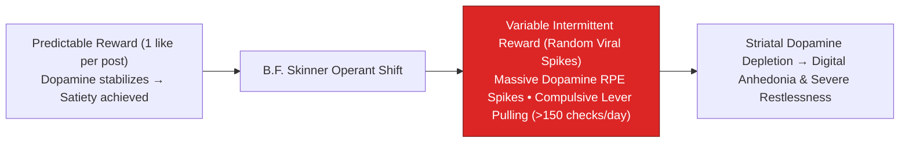

> **🎙️ 3-Presenter Authentic Tiki-Taka Script**
> 
> **Prof. Peter Kim:** Slide 20 presents the behavioral psychology of smartphone addiction: **B.F. Skinner’s Variable Intermittent Reward Schedule**. Dr. Vance, explain why unpredictable rewards are so much more addictive than predictable ones. *(Turn 1)*  
> **Dr. Elena Vance:** In 1957, B.F. Skinner put pigeons and rats in operant boxes. If a rat got a food pellet every single time it pushed a button, it only pushed the button when it was hungry. But if the reward was **unpredictable and random—sometimes nothing, sometimes ten pellets**—the rat became obsessed, compulsively smashing the lever until it collapsed from exhaustion! *(Turn 2)*  
> **TA Marcus Brody:** Look at your smartphone notifications on Slide 20: Every time you unlock your phone, you don't know what you’re going to see! That unpredictable mystery triggers a massive **Dopamine Reward Prediction Error (RPE) spike** in your brain! *(Turn 3)*  
> **Dr. Elena Vance:** The average smartphone user now unlocks and checks their phone **over 150 times every single day**! And what is the neurochemical result? *(Turn 4)*  
> **Prof. Peter Kim:** Look at box D: **Striatal Dopamine Depletion**. Your brain’s dopamine vesicles run completely dry, leaving you in a state of chronic restlessness, brain fog, and digital anhedonia where real life feels boring and empty. *(Turn 5)*  
> **TA Marcus Brody:** You are a laboratory rat smashing the digital lever all day long! *(Turn 6)*  
> **Dr. Elena Vance:** And this dynamic destroys collective intelligence on Slide 21. *(Turn 7)*  
> **Prof. Peter Kim:** Let’s examine The Disintegration of Collective Intelligence on Slide 21. *(Turn 8)*  
> **TA Marcus Brody:** Turn to Slide 21: From Wisdom of Crowds to Mob Madness! *(Turn 9)*  
> **Prof. Peter Kim:** Proceed to Slide 21. *(Turn 10)*

---

### Slide 21: The Disintegration of Collective Intelligence: From Wisdom of Crowds to Mob Madness
- **The Condorcet Jury Theorem Breakdown:**
  - *The Wisdom of Crowds Precondition (James Surowiecki / Condorcet):* Aggregating diverse, independent individual judgments cancels out random noise, arriving at superior truth ($P_{\text{truth}} \to 1.0$ as $N \to \infty$).
  - *The Algorithmic Correlation Trap:* When algorithms feed identical, correlated, outrage-polarized information to all nodes in the network, **individual independence is destroyed**.
- **The Inversion to Mob Madness:** Error terms no longer cancel out; **errors compound exponentially**, transforming the "Wisdom of Crowds" into a digital mob stampede and mass conspiratorial psychosis.

```mermaid
flowchart TD
    subgraph Classical Wisdom of Crowds (Condorcet Precondition)
        W1["Diverse, Independent Individual Judgments"] --> W2["Random Errors Cancel Out"]
        W2 --> W3["SUPERIOR COLLECTIVE TRUTH (P &rarr; 1.0)"]
    end
    
    subgraph Algorithmic Social Media Breakdown
        A1["Correlated Outrage Feeds fed to all Users"] --> A2["Individual Independence Destroyed"]
        A2 --> A3["ERRORS & HYSTERIA COMPOUND EXPONENTIALLY<br/>&rarr; Digital Mob Madness & Conspiratorial Hallucination"]
    end
    style W3 fill:#16a34a,stroke:#15803d,color:#fff
    style A3 fill:#dc2626,stroke:#7f1d1d,color:#fff
```

> **🎙️ 3-Presenter Authentic Tiki-Taka Script**
> 
> **TA Marcus Brody:** Look at the social breakdown on Slide 21! This is the mathematical destruction of **The Wisdom of Crowds into Mob Madness**! Elena, explain why the Condorcet Jury Theorem failed on social media! *(Turn 1)*  
> **Dr. Elena Vance:** The classic mathematical theorem of the "Wisdom of Crowds" requires one essential condition: **that every person's judgment is INDEPENDENT**. When 1,000 people guess the weight of an ox independently, their random errors cancel out, and the crowd’s average guess is more accurate than any single expert! *(Turn 2)*  
> **TA Marcus Brody:** But look at what social media algorithms did in the red box: Algorithms destroyed individual independence! They feed the **exact same correlated, sensationalist outrage video to 10 million people simultaneously**! *(Turn 3)*  
> **Prof. Peter Kim:** Because individual judgments are no longer independent, individual errors do not cancel out—**errors multiply and compound exponentially into a runaway digital mob stampede**! *(Turn 4)*  
> **TA Marcus Brody:** Instead of a super-intelligent collective mind, the internet created a hyper-reactive, paranoid digital lynch mob! *(Turn 5)*  
> **Dr. Elena Vance:** And we model the transmission of viral misinformation mathematically on Slide 22. *(Turn 6)*  
> **Prof. Peter Kim:** Let’s examine the Viral Fake News Differential Equation on Slide 22. *(Turn 7)*  
> **TA Marcus Brody:** Turn to Slide 22: $\frac{dI}{dt} = \beta \cdot I(1-I) \cdot \text{Shock}$! *(Turn 8)*  
> **Dr. Elena Vance:** Let’s see the epidemiological transmission math! *(Turn 9)*  
> **Prof. Peter Kim:** Proceed to Slide 22. *(Turn 10)*

---

### Slide 22: Viral Fake News Transmission Differential Equation: $\frac{dI}{dt} = \beta \cdot I(1 - I) \cdot \text{Shock}$
- **The Epidemiological Misinformation Model (Vosoughi, Roy & Aral - MIT):**
  $$\frac{dI(t)}{dt} = \beta_0 \cdot \mathcal{S}_{\text{novelty}} \cdot \mathcal{E}_{\text{shock}} \cdot I(t) \left( 1 - \frac{I(t)}{K} \right)$$
  - $I(t)$: Fraction of population infected by the misinformation meme.
  - $\mathcal{S}_{\text{novelty}} \ge 2.5$: **Novelty Multiplier** (Fake news is always more surprising and novel than boring truth).
  - $\mathcal{E}_{\text{shock}} \ge 3.0$: **Emotional Outrage / Shock Index**.
- **The Basic Reproduction Number ($R_0$):**
  $$R_{0,\text{fake}} = R_0 \cdot \mathcal{S}_{\text{novelty}} \cdot \mathcal{E}_{\text{shock}} \gg 1.0 \quad \implies \text{Spreads } 6\times \text{ faster than truth}$$

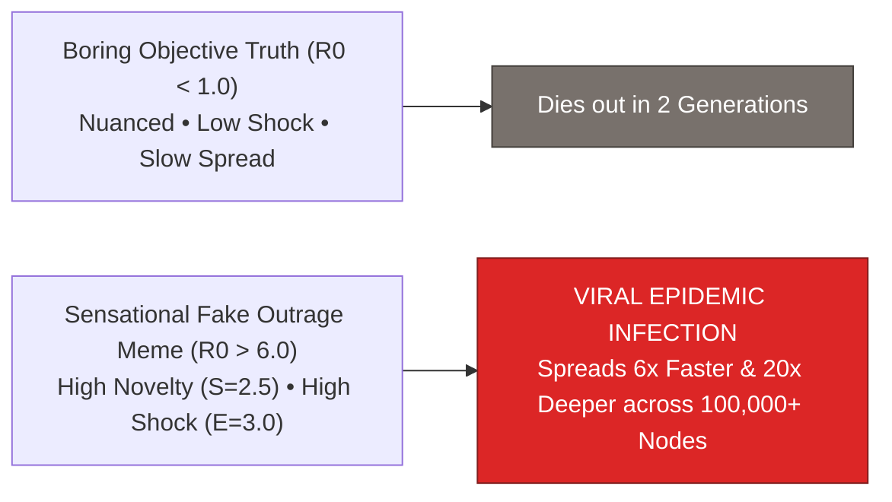

> **🎙️ 3-Presenter Authentic Tiki-Taka Script**
> 
> **Prof. Peter Kim:** Slide 22 presents the mathematical epidemiology model of viral misinformation published by MIT in *Science*. Dr. Vance, explain why fake news spreads faster than factual truth. *(Turn 1)*  
> **Dr. Elena Vance:** Look at the differential equation: $\frac{dI}{dt} = \beta_0 \cdot \mathcal{S}_{\text{novelty}} \cdot \mathcal{E}_{\text{shock}} \cdot I(1 - I/K)$. Truth has to adhere to reality, which is often slow, complex, and nuanced. But a fake news story can be custom-engineered to have **maximum Novelty ($\mathcal{S}_{\text{novelty}} = 2.5$) and maximum Emotional Shock ($\mathcal{E}_{\text{shock}} = 3.0$)**! *(Turn 2)*  
> **TA Marcus Brody:** Look at the reproduction number in the flowchart: The basic reproduction number of sensational fake news is **$R_0 > 6.0$**! It spreads like an airborne super-virus, leaping across thousands of social network nodes in minutes! *(Turn 3)*  
> **Prof. Peter Kim:** While truth is still putting on its shoes, an engineered lie has traveled halfway around the world and infected 100,000 brains. *(Turn 4)*  
> **TA Marcus Brody:** It is infectious biological warfare carried out through digital memes! *(Turn 5)*  
> **Dr. Elena Vance:** And zero cognitive friction made this contagion effortless on Slide 23. *(Turn 6)*  
> **Prof. Peter Kim:** Let’s examine Zero Cognitive Friction on Slide 23. *(Turn 7)*  
> **TA Marcus Brody:** Turn to Slide 23: The Impulsive Social Fabric! *(Turn 8)*  
> **Dr. Elena Vance:** Let’s see the destruction of friction! *(Turn 9)*  
> **Prof. Peter Kim:** Proceed to Slide 23. *(Turn 10)*

---

### Slide 23: Zero Cognitive Friction & The Impulsive Social Fabric
- **The Engineering of Impulsivity:**
  - *The 1-Click Retweet (2009):* Eliminated the cognitive friction of copying, pasting, and reflecting on content before broadcasting.
  - *Autoplay & Infinite Feed:* Eliminated the decision point to load new content.
- **The Civilizational Consequence:**
  - Friction was biology’s natural **prefrontal speed bump**—allowing time for logical reflection and emotional cooling.
  - Removing all friction transformed the internet into an instantaneous, unfiltered transmission line for primitive emotional impulses.

> **🎙️ 3-Presenter Authentic Tiki-Taka Script**
> 
> **TA Marcus Brody:** Look at the design mechanics on Slide 23! This is **Zero Cognitive Friction and the Impulsive Social Fabric**! Elena, why was the invention of the 1-click Retweet button in 2009 so catastrophic? *(Turn 1)*  
> **Dr. Elena Vance:** Before 2009, if you wanted to share something on Twitter, you had to manually copy the text, paste it into a new tweet, and type "RT". That small physical friction gave your prefrontal cortex **five seconds of pause to think: *"Is this true? Should I really share this?"*** *(Turn 2)*  
> **TA Marcus Brody:** But social media engineers removed all friction! They created the **1-Click Retweet button and video Autoplay**! With a single tap of your thumb, you can broadcast an incendiary rumor to 50,000 people in half a second without thinking at all! *(Turn 3)*  
> **Prof. Peter Kim:** Friction was civilization’s natural psychological speed bump. When you remove all friction from human communication, you turn global discourse into an instantaneous, unfiltered reflex of raw limbic emotion. *(Turn 4)*  
> **TA Marcus Brody:** We removed the brakes from a Ferrari going 200 miles an hour down a crowded street! *(Turn 5)*  
> **Dr. Elena Vance:** And this constant stimulation downregulates our dopamine receptors on Slide 24. *(Turn 6)*  
> **Prof. Peter Kim:** Let’s examine Dopamine D2 Receptor Downregulation on Slide 24. *(Turn 7)*  
> **TA Marcus Brody:** Turn to Slide 24: Digital Anhedonia! *(Turn 8)*  
> **Dr. Elena Vance:** Let’s see the burnout of our reward pathways! *(Turn 9)*  
> **Prof. Peter Kim:** Proceed to Slide 24. *(Turn 10)*

---

### Slide 24: Dopamine D2 Receptor Downregulation & Digital Anhedonia
- **The Neurobiology of Digital Exhaustion (Anna Lembke - Stanford):**
  - *Neuro-Adaptation:* In response to continuous artificial dopamine surges (short-form video, notifications, viral alerts), the brain removes **$D_2$ dopamine receptors from striatal post-synaptic membranes**.
  - *The Pleasure-Pain Seesaw:* Shifts the neurological baseline toward the pain/anxiety side, resulting in **Digital Anhedonia**—an inability to feel pleasure or focus during quiet, non-digital activities (reading a book, walking in nature, having an in-person conversation).
- **The Recovery Requirement:** Requires a **minimum 7 to 14-day digital dopamine fast** to allow receptor upregulation and restore baseline synaptic homeostasis.

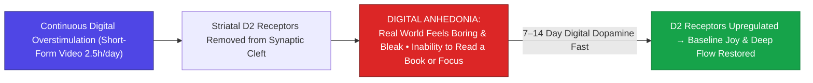

> **🎙️ 3-Presenter Authentic Tiki-Taka Script**
> 
> **Prof. Peter Kim:** Slide 24 presents Stanford psychiatrist Dr. Anna Lembke’s neurobiological model: **Dopamine D2 Receptor Downregulation and Digital Anhedonia**. Dr. Vance, explain why heavy smartphone users feel bored and depressed in the real world. *(Turn 1)*  
> **Dr. Elena Vance:** When you watch short-form videos for two hours a day, your brain receives continuous, unnatural blasts of dopamine. To protect itself from receptor burnout, the brain **pulls its dopamine $D_2$ receptors inside the cell, shutting them down**! *(Turn 2)*  
> **TA Marcus Brody:** Look at what happens in box C: **Digital Anhedonia**! Because your dopamine receptors are turned off, the real physical world—sitting in a quiet room, reading a 300-page book, or walking in a forest—gives you zero pleasure! Real life feels boring, gray, and agonizingly slow! *(Turn 3)*  
> **Prof. Peter Kim:** Look at the green recovery pathway in the diagram: It takes **a strict 7 to 14-day digital dopamine fast**—shutting off social media feeds—for your neurons to upregulate their $D_2$ receptors and restore baseline joy and deep focus. *(Turn 4)*  
> **TA Marcus Brody:** You have to let your dopamine receptors heal and reset! *(Turn 5)*  
> **Dr. Elena Vance:** Which brings us directly to our 4-Stage Epistemic Defense Protocol on Slide 25! *(Turn 6)*  
> **Prof. Peter Kim:** Let’s examine the 4-Stage Protocol on Slide 25. *(Turn 7)*  
> **TA Marcus Brody:** Turn to Slide 25: Epistemic Defense & Attention Restoration! *(Turn 8)*  
> **Dr. Elena Vance:** Let’s see the operational protocol! *(Turn 9)*  
> **Prof. Peter Kim:** Proceed to Slide 25. *(Turn 10)*

---

### Slide 25: The 4-Stage Epistemic Defense & Attention Restoration Protocol
- **The Individual & Systemic Cognitive Defense Protocol:**
  1. **Stage 1: The Cognitive Airgap (Input Hardening):** Eliminate all algorithmic push notifications, convert smartphone display to grayscale, and enforce a strict **16-Hour Daily Information Fast**.
  2. **Stage 2: Algorithmic Delinking:** Replace engagement-based feeds with direct RSS syndication, long-form peer-reviewed literature, and chronological aggregators.
  3. **Stage 3: Epistemic Triangulation:** Mandate the "Steel-Manning Rule": Never attack an opposing argument until you can articulate its strongest version better than its proponents.
  4. **Stage 4: Neuro-Chemical Dopamine Reset:** Quarterly 7-day complete digital fasts combined with intense physical exercise, outdoor nature immersion, and deep-flow work blocks.

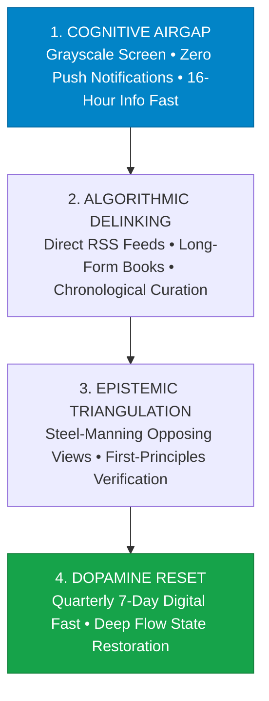

> **🎙️ 3-Presenter Authentic Tiki-Taka Script**
> 
> **Prof. Peter Kim:** Slide 25 provides our four-stage operational protocol to reclaim attention and build an unshakable cognitive firewall. Marcus, walk us through Stages 1 and 2. *(Turn 1)*  
> **TA Marcus Brody:** Stage 1 is **The Cognitive Airgap**: Turn your smartphone screen to **grayscale black-and-white** to destroy the candy-color dopamine triggers, turn off ALL push notifications, and practice a daily **16-hour digital information fast**! Stage 2 is **Algorithmic Delinking**: Delete algorithmic recommendation feeds and switch to direct RSS readers and long-form physical books! *(Turn 2)*  
> **Dr. Elena Vance:** Stage 3 is **Epistemic Triangulation**: Practice the **"Steel-Manning Rule"**—you are not allowed to disagree with an opposing political or scientific argument until you can articulate their position so well that your opponent says: *"Yes, that is exactly what I believe!"* *(Turn 3)*  
> **TA Marcus Brody:** And Stage 4 is **The Dopamine Reset**: Take a **quarterly 7-day complete digital fast** in the wilderness, allowing your $D_2$ receptors to regenerate and unlocking 4-hour uninterrupted Flow States! *(Turn 4)*  
> **Prof. Peter Kim:** Airgap your inputs, delink from algorithms, steel-man your thinking, and reset your neurochemistry. The ultimate playbook for intellectual sovereignty. *(Turn 5)*  
> **Dr. Elena Vance:** Now let us examine the hard empirical neuro-sociological data across nine global case studies in Module 4! *(Turn 6)*  
> **TA Marcus Brody:** Turn to Slide 26: MIT Science 2018 Landmark Study! *(Turn 7)*  
> **Dr. Elena Vance:** False news spreading 6x faster on Slide 26! *(Turn 8)*  
> **Prof. Peter Kim:** Proceed to Module 4: Global Empirical Verification & Neuro-Sociological Data! *(Turn 9)*  
> **TA Marcus Brody:** Let’s see the audited proof on Slide 26! *(Turn 10)*


---

## Module 4: Global Empirical Verification & Neuro-Sociological Data (Slides 26–35)

### Slide 26: CASE 01: MIT Science 2018 Landmark: False News Spreading 6x Faster & 20x Deeper
- **The Definitive Misinformation Study (Vosoughi, Roy & Aral, *Science*, 2018):**
  - *Dataset Scale:* Analyzed **~126,000 rumor cascades on Twitter spanning 11 years (2006–2017)**, tweeted by $>3\text{ Million users}$ over $4.5\text{ Million times}$.
  - *The Velocity & Depth Findings:* False news diffused **$6\times \text{ faster}$ than truth**, reached a cascade depth of **$10\text{ to } 20\text{ hops}$** (vs. truth rarely exceeding 10 hops), and reached $1,500\text{ people } 6\times \text{ faster}$.
- **The Human Attribution:** Bots accelerated false and true news equally; **human biological users were 100% responsible** for the viral spread of false news due to the irresistible appeal of novel outrage.

```mermaid
flowchart LR
    A["Factual Truth (126k Cascades Analyzed)"] -->|Slow, Linear Spread| B["Rarely reaches >1,000 people or >10 hops"]
    C["Sensational False News Meme"] -->|Diffuses 6x Faster & 20x Deeper| D["Reaches 100,000+ People across 20 Network Hops"]
    D --> E["Driven 100% by Human Biological Users (Not Bots) seeking Outrage & Novelty"]
    style A fill:#78716c,stroke:#44403c,color:#fff
    style C fill:#dc2626,stroke:#7f1d1d,color:#fff
    style E fill:#dc2626,stroke:#7f1d1d,color:#fff
```

> **🎙️ 3-Presenter Authentic Tiki-Taka Script**
> 
> **Prof. Peter Kim:** Module 4 opens with our empirical verification. Case 1 presents the landmark MIT study on viral misinformation published in *Science* on Slide 26. Dr. Vance, walk us through the massive Twitter dataset analyzed by Vosoughi and Aral. *(Turn 1)*  
> **Dr. Elena Vance:** Researchers analyzed 126,000 verified rumor cascades shared by over 3 million people across eleven years. The quantitative finding was unequivocal: **False news spread six times faster than the truth**, and reached **twenty times deeper into social network graphs** than verified factual reporting! *(Turn 2)*  
> **TA Marcus Brody:** And look at the shocking human discovery in the second bullet point: People assumed automated Russian bot accounts were spreading the lies. But the data proved that bots spread true and false news equally! **HUMAN BEINGS were 100% responsible for the viral explosion of fake news!** *(Turn 3)*  
> **Prof. Peter Kim:** Why? Because human psychology is irresistibly drawn to emotional novelty and moral outrage. A true, nuanced headline about a budget committee is boring; an outrageous lie about a politician’s secret satanic cult lights up our primitive threat circuits. *(Turn 4)*  
> **TA Marcus Brody:** We are addicted to our own outrage! *(Turn 5)*  
> **Dr. Elena Vance:** And this viral outrage has caused democratic polarization to double globally on Slide 27. *(Turn 6)*  
> **Prof. Peter Kim:** Let’s examine Case 2: The Global Polarization Index on Slide 27. *(Turn 7)*  
> **TA Marcus Brody:** Turn to Slide 27: +200% Surge Across 50 Democracies! *(Turn 8)*  
> **Dr. Elena Vance:** Let’s see the global polarization data! *(Turn 9)*  
> **Prof. Peter Kim:** Proceed to Slide 27. *(Turn 10)*

---

### Slide 27: CASE 02: Global Polarization Index: +200% Surge Across 50 Democratic Nations
- **Empirical Political Science Audit (V-Dem Institute / Pew Research Center, 2010–2026):**
  - *The Global Metric:* Affective polarization (mutual partisan animosity, where opposing voters view each other not just as mistaken, but as **"evil and an existential threat to the nation"**) has **surged by $>200\%\text{ across 50 democratic nations}$** since the mobile internet inflection (2012).
  - *The US Precedent:* In 1994, only $16\%$ of Democrats and $17\%$ of Republicans held "very unfavorable" views of the other party; today in 2026, that number exceeds **$>75\%$ on both sides**.
- **The Legislative Paralysis:** Correlates directly with the collapse of bipartisan bills passed in the US Congress (falling by $>65\%$).

```mermaid
flowchart LR
    A["1994 Baseline: ~16% Partisans view opposition as 'Very Unfavorable'"] -->|Social Media Algorithmic Era (Post-2012)| B["2026 Reality: >75% Partisans view opposition as 'Evil & Existential Threat'"]
    B --> C["+200% Surge in Global Polarization Index across 50 Democracies"]
    C --> D["Legislative Gridlock & Total Collapse of Bipartisan Compromise"]
    style A fill:#16a34a,stroke:#15803d,color:#fff
    style B fill:#dc2626,stroke:#7f1d1d,color:#fff
    style D fill:#dc2626,stroke:#7f1d1d,color:#fff
```

> **🎙️ 3-Presenter Authentic Tiki-Taka Script**
> 
> **TA Marcus Brody:** Look at the political science data on Slide 27! Case 2 brings us to the V-Dem Institute and Pew Research Center: **The Global Polarization Index Surging 200%**! Elena, explain "affective polarization"! *(Turn 1)*  
> **Dr. Elena Vance:** Affective polarization does not mean people merely disagree on tax rates. It means **mutual partisan hatred**: viewing voters of the opposing political party not just as political opponents, but as **"evil, corrupt, and an existential threat to the survival of the country"**! *(Turn 2)*  
> **TA Marcus Brody:** Look at the historical numbers on Slide 27: In 1994, only 16% of Americans held very unfavorable views of the opposing party. Today, **over 75% of both Democrats and Republicans view the other side as an existential enemy**! *(Turn 3)*  
> **Prof. Peter Kim:** And notice the timeline in the flowchart: The hockey-stick explosion occurred right after 2012—the exact moment algorithmic recommendation feeds, the Like button, and smartphones became ubiquitous! *(Turn 4)*  
> **TA Marcus Brody:** And look at the result: A 65% collapse in bipartisan legislation! Democracies around the world are completely paralyzed, unable to pass infrastructure bills or balance budgets! *(Turn 5)*  
> **Dr. Elena Vance:** And this same smartphone inflection triggered a catastrophic mental health crisis in children on Slide 28. *(Turn 6)*  
> **Prof. Peter Kim:** Let’s examine Case 3: Jonathan Haidt’s Adolescent Mental Health Research on Slide 28. *(Turn 7)*  
> **TA Marcus Brody:** Turn to Slide 28: Adolescent Depression & Self-Harm Up 140%! *(Turn 8)*  
> **Dr. Elena Vance:** Let’s see the adolescent clinical data on Slide 28! *(Turn 9)*  
> **Prof. Peter Kim:** Proceed to Slide 28. *(Turn 10)*

---

### Slide 28: CASE 03: Jonathan Haidt Research: Post-2012 Adolescent Depression & Self-Harm Up 140%
- **The "Great Rewiring of Childhood" (Jonathan Haidt / CDC YRBS, 2010–2026):**
  - *The 2012 Inflection Point:* Following the mass adoption of smartphones with front-facing selfie cameras and algorithmic feeds (Instagram, TikTok), adolescent mental health metrics collapsed simultaneously across the US, UK, Canada, Australia, and Scandinavia.
  - *The Clinical Statistics (US CDC):*
    - Major depressive episodes among teenage girls **surged by $+145\%$**.
    - Emergency room admissions for non-fatal self-harm among young adolescent girls (ages 10–14) **skyrocketed by $+188\%$**.
- **The Mechanistic Driver:** Replaced play-based physical childhood with **screen-based, hyper-comparison, algorithmic digital isolation**.

```mermaid
flowchart LR
    A["Pre-2010: Play-Based Childhood<br/>In-Person Socialization & Physical Play"] -->|2012 Smartphone & Algorithmic Feed Shock| B["Post-2012: Screen-Based Childhood<br/>Hyper-Comparison • Digital Bullying • Algorithmic Feeds"]
    B --> C["Adolescent Mental Health Collapse:<br/>• Depression up +145%<br/>• Self-Harm Admissions up +188% in Young Girls"]
    style A fill:#16a34a,stroke:#15803d,color:#fff
    style B fill:#dc2626,stroke:#7f1d1d,color:#fff
    style C fill:#dc2626,stroke:#7f1d1d,color:#fff
```

> **🎙️ 3-Presenter Authentic Tiki-Taka Script**
> 
> **Prof. Peter Kim:** Case 3 brings us to social psychologist Jonathan Haidt’s groundbreaking research in *The Anxious Generation*: **The 140% Surge in Adolescent Depression and Self-Harm**. Dr. Vance, walk us through the 2012 inflection point. *(Turn 1)*  
> **Dr. Elena Vance:** Between 2010 and 2015, every adolescent mental health graph across the entire industrialized world bent upward at a violent 90-degree angle. Look at the CDC statistics: **Major depression among teenage girls surged by 145%, and hospital admissions for self-harm among 10-to-14-year-old girls skyrocketed by 188%**! *(Turn 2)*  
> **TA Marcus Brody:** Why 2012? Because 2012 was the exact year the front-facing selfie camera, Instagram, and algorithmic notification feeds went mainstream! We took away play-based physical childhood and replaced it with a **24/7 hyper-comparison beauty contest running on high-speed internet**! *(Turn 3)*  
> **Prof. Peter Kim:** Teenage girls are subjected to algorithms that optimize for cosmetic insecurity, and teenage boys are isolated in digital bedrooms, addicted to short-form video and video games, unable to socialize in the real physical world. *(Turn 4)*  
> **TA Marcus Brody:** We rewired the childhood of an entire generation without a single clinical trial! *(Turn 5)*  
> **Dr. Elena Vance:** And in adult populations, this created mass conspiratorial delusions like QAnon on Slide 29. *(Turn 6)*  
> **Prof. Peter Kim:** Let’s examine Case 4: QAnon and Mass Conspiratorial Delusion on Slide 29. *(Turn 7)*  
> **TA Marcus Brody:** Turn to Slide 29: 200 Million Believers Worldwide! *(Turn 8)*  
> **Dr. Elena Vance:** Let’s see the scale of mass delusion on Slide 29! *(Turn 9)*  
> **Prof. Peter Kim:** Proceed to Slide 29. *(Turn 10)*

---

### Slide 29: CASE 04: QAnon & Mass Conspiratorial Delusion: 200 Million Believers Worldwide
- **The Mass Psychogenic Delusion Benchmark:**
  - *The Global Reach (PRRI / King’s College London, 2021–2024):* Over **$15\%\text{ to } 20\%\text{ of US adults}$** (and $>200\text{ Million people globally}$) adhere to core tenets of the QAnon conspiracy theory (believing that government institutions, media, and Hollywood are controlled by a secret cabal of satanic pedophiles).
  - *The Gamified Alternate Reality:* QAnon operated as an **open-source Alternate Reality Game (ARG)** where algorithms rewarded users with dopamine hits for "decoding breadcrumbs" (apophenia).
- **The Epistemic Immune Collapse:** Demonstrates that recommendation algorithms can induce **mass clinical delusional psychosis in millions of otherwise functional adults** without any chemical drugs.

```mermaid
flowchart TD
    Meme["Cryptic 'Q-Drop' Posted on Anonymous Forum"] --> Algo["Facebook & YouTube Algorithms detect Massive Engagement"]
    Algo --> Rec["Recommends 'Drops' to Millions of Suburban Parents & Grandparents"]
    Rec --> Game["Gamified Apophenia: Users feel like 'Digital Soldiers' finding secret truth"]
    Game --> Delusion["MASS EPIDEMIC OF CONSPIRATORIAL PSYCHOSIS (>200M Adherents)"]
    style Meme fill:#78716c,stroke:#44403c,color:#fff
    style Delusion fill:#dc2626,stroke:#7f1d1d,color:#fff
```

> **🎙️ 3-Presenter Authentic Tiki-Taka Script**
> 
> **TA Marcus Brody:** Case 4 brings us to the most surreal mass delusion in modern history: **QAnon and 200 Million Global Believers**! Elena, how did an anonymous internet forum post convince suburban mothers and grandparents that politicians were running a secret cabal? *(Turn 1)*  
> **Dr. Elena Vance:** Polls by PRRI and King's College London found that **over 15% of American adults—and over 200 million people globally—believed core QAnon narratives**! It worked because it was designed as an **Alternate Reality Game (ARG)**! The algorithm fed cryptic "breadcrumbs" to users, triggering their brain's pattern-recognition software (**apophenia**) to make them feel like "digital soldiers" uncovering secret codes! *(Turn 2)*  
> **TA Marcus Brody:** The algorithm took normal, retired schoolteachers and accountants and turned them into obsessive online detectives spending 14 hours a day researching wild conspiracies! *(Turn 3)*  
> **Prof. Peter Kim:** Look at the profound scientific conclusion on Slide 29: **Recommendation algorithms can induce clinical mass delusional psychosis across hundreds of millions of functional adults with ZERO chemical drugs!** Pure algorithmic neuro-linguistic programming. *(Turn 4)*  
> **TA Marcus Brody:** That is digital mind control at scale! *(Turn 5)*  
> **Dr. Elena Vance:** And it has collapsed human attention spans down to eight seconds on Slide 30. *(Turn 6)*  
> **Prof. Peter Kim:** Let’s examine Case 5: Short-Form Video and Attention Span Collapse on Slide 30. *(Turn 7)*  
> **TA Marcus Brody:** Turn to Slide 30: Attention Span Collapse (12s to 8s)! *(Turn 8)*  
> **Dr. Elena Vance:** Let’s see the cognitive telemetry data! *(Turn 9)*  
> **Prof. Peter Kim:** Proceed to Slide 30. *(Turn 10)*

---

### Slide 30: CASE 05: Short-Form Video Consumption (2.5h/Day) & Human Attention Span Collapse (12s $\rightarrow$ 8s)
- **The Short-Form Neurological Shock (TikTok / Instagram Reels / YouTube Shorts):**
  - *Daily Screen Time:* Global average user spends **$>2.5\text{ hours per day}$** watching short-form micro-videos ($15\text{ to } 60\text{ seconds}$).
  - *The Attention Span Collapse (Microsoft / Gloria Mark - UC Irvine):*
    - 2000 Average Attention Span: **$12\text{ seconds}$**.
    - 2026 Average Attention Span: **$8.25\text{ seconds}$** (Shorter than a goldfish’s 9-second attention span).
    - Average screen switch interval at work: **Every $47\text{ seconds}$**.
- **The Loss of Deep Focus:** Sustained reading of 200-page academic texts has declined by $>55\%$ among university undergraduates over the last decade.

```mermaid
flowchart LR
    A["2000 Human Attention Span: 12 Seconds<br/>(Can read 200-page books comfortably)"] -->|2.5h Daily Short-Form Video Ingestion| B["2026 Attention Span: 8.25 Seconds<br/>(Shorter than a Goldfish • Screen switch every 47s)"]
    B --> C["Cognitive Fragmentation:<br/>Loss of Deep Reading, Synthesis & Extended Logical Deliberation"]
    style A fill:#16a34a,stroke:#15803d,color:#fff
    style B fill:#dc2626,stroke:#7f1d1d,color:#fff
    style C fill:#dc2626,stroke:#7f1d1d,color:#fff
```

> **🎙️ 3-Presenter Authentic Tiki-Taka Script**
> 
> **Prof. Peter Kim:** Case 5 presents the quantitative collapse of human attention measured by Dr. Gloria Mark at UC Irvine and Microsoft Research on Slide 30. Dr. Vance, walk us through the numbers. *(Turn 1)*  
> **Dr. Elena Vance:** The global population now spends an average of **2.5 hours every day watching 15-second micro-videos** on TikTok and Instagram Reels. Look at the result: In the year 2000, the average human attention span was 12 seconds. Today in 2026, **it has collapsed to 8.25 seconds—which is shorter than the 9-second attention span of a common goldfish**! *(Turn 2)*  
> **TA Marcus Brody:** And look at how office workers operate: At work on a computer, the average person **switches screens or checks a notification every 47 SECONDS**! How can anyone write computer code, design a nuclear reactor, or write a PhD dissertation when their brain is interrupted every 47 seconds? *(Turn 3)*  
> **Prof. Peter Kim:** Look at the university undergraduate data: The ability of students to read a continuous 200-page academic book has fallen by **over 55%**! Long-form linear thinking is being replaced by hyperactive, fractured popcorn brain. *(Turn 4)*  
> **TA Marcus Brody:** If you can't pay attention for more than eight seconds, you are powerless against algorithmic manipulation! *(Turn 5)*  
> **Dr. Elena Vance:** And this online outrage spills over into real-world physical violence on Slide 31. *(Turn 6)*  
> **Prof. Peter Kim:** Let’s examine Case 6: Offline Violence Spillovers on Slide 31. *(Turn 7)*  
> **TA Marcus Brody:** Turn to Slide 31: US Capitol Insurrection & Myanmar Instability! *(Turn 8)*  
> **Dr. Elena Vance:** Let’s see the real-world physical consequences! *(Turn 9)*  
> **Prof. Peter Kim:** Proceed to Slide 31. *(Turn 10)*

---

### Slide 31: CASE 06: Offline Violence Spillovers: US Capitol Insurrection & Myanmar Instability
- **The Physical Kinematics of Algorithmic Rage:**
  1. *The US Capitol Attack (January 6, 2021):* Algorithmic recommendation loops ("Stop the Steal") amplified unverified claims, organizing and mobilizing thousands of citizens into physical insurrection and storming the legislature.
  2. *The Myanmar Rohingya Genocide (UN Human Rights Council Audit):* Facebook algorithms systematically boosted hate-speech and military propaganda against the Rohingya Muslim minority, cited by UN investigators as playing a **"determining role" in ethnic cleansing and mass displacement**.
- **The Invariant Law:** Digital outrage algorithms do not remain contained in cyberspace; **they inevitably spill over into physical blood, kinetic violence, and state instability**.

```mermaid
flowchart TD
    Algo["Algorithmic Amplification of Dehumanizing Hate Speech"] --> Online["Online Radicalization & Dehumanization of Opposing Group"]
    Online --> Spill["KINETIC OFFLINE SPILLOVER"]
    Spill --> US["US Capitol Insurrection (Jan 6, 2021) • Assault on Democratic Transition"]
    Spill --> Myanmar["Myanmar Instability & Rohingya Crisis (UN cited 'Determining Role')"]
    style Algo fill:#4f46e5,stroke:#312e81,color:#fff
    style Spill fill:#dc2626,stroke:#7f1d1d,color:#fff
```

> **🎙️ 3-Presenter Authentic Tiki-Taka Script**
> 
> **TA Marcus Brody:** Look at the real-world physical consequences on Slide 31! Case 6 presents **Offline Violence Spillovers: The US Capitol and Myanmar**. Elena, how did social media algorithms cause physical violence in the real world? *(Turn 1)*  
> **Dr. Elena Vance:** Look at the two historical audits on Slide 31: First, on January 6th, 2021, algorithmic recommendation loops in the US amplified viral election claims, organizing thousands of citizens into **physically storming the United States Capitol**! Second, in Myanmar, United Nations investigators found that **Facebook algorithms played a "determining role" in fueling ethnic violence against the Rohingya minority**! *(Turn 2)*  
> **TA Marcus Brody:** Digital hatred does not stay on a computer screen! When algorithms tell people 24/7 that their enemies are demonic monsters, **people eventually pick up weapons, torches, and zip-ties and march in the streets!** *(Turn 3)*  
> **Prof. Peter Kim:** Read the invariant law at the bottom: Cyber-outrage inevitably transmutes into kinetic physical violence. *(Turn 4)*  
> **TA Marcus Brody:** Algorithmic optimization is a national security crisis! *(Turn 5)*  
> **Dr. Elena Vance:** And Frances Haugen proved that Big Tech knew this all along on Slide 32. *(Turn 6)*  
> **Prof. Peter Kim:** Let’s examine Case 7: The Frances Haugen Facebook Leaks on Slide 32. *(Turn 7)*  
> **TA Marcus Brody:** Turn to Slide 32: "Angry Emoji Weighted 5x Over Likes"! *(Turn 8)*  
> **Dr. Elena Vance:** Let’s see the corporate whistleblower files! *(Turn 9)*  
> **Prof. Peter Kim:** Proceed to Slide 32. *(Turn 10)*

---

### Slide 32: CASE 07: Frances Haugen Facebook Leak: "Angry Emoji Weighted 5x Viral Value Over Likes"
- **The Whistleblower Revelations (Frances Haugen / US Senate Testimony, 2021):**
  - *The Leaked Internal Metric:* Facebook’s News Feed ranking algorithm explicitly assigned **$5\times \text{ higher algorithmic distribution value}$** to the "😡 Angry" emoji reaction compared to a standard "👍 Like".
  - *The Internal Finding:* Facebook’s own internal data scientists proved that angry-weighted posts were **substantially more likely to contain misinformation, toxic toxicity, and low-quality clickbait**, yet executives refused to turn off the weighting because it would reduce quarterly daily active users (DAUs).
- **The Smoking Gun:** Proved that social division and epistemic toxicity were deliberately engineered to maximize shareholder value.

```mermaid
flowchart LR
    A["Facebook Internal Metric (Leaked 2021)"] --> B["'😡 Angry' Reaction assigned 5x Algorithmic Virality vs '👍 Like'"]
    B --> C["Algorithm systematically flooded feeds with Misinformation & Toxic Hate"]
    C --> D["Executives rejected safety fixes to protect Quarterly User Engagement"]
    style A fill:#0284c7,stroke:#0369a1,color:#fff
    style B fill:#dc2626,stroke:#7f1d1d,color:#fff
    style D fill:#dc2626,stroke:#7f1d1d,color:#fff
```

> **🎙️ 3-Presenter Authentic Tiki-Taka Script**
> 
> **Prof. Peter Kim:** Case 7 brings us to the most damning corporate whistleblower leak of the 21st century: **Frances Haugen’s Facebook Disclosures**. Dr. Vance, what did Facebook’s internal documents reveal to the US Senate? *(Turn 1)*  
> **Dr. Elena Vance:** Frances Haugen, a lead data scientist at Facebook, leaked thousands of internal research files. The smoking gun was in their ranking code: **The "Angry" 😡 emoji reaction was explicitly weighted 5 times higher than a normal "Like" 👍**! *(Turn 2)*  
> **TA Marcus Brody:** And look at what Facebook's own internal data scientists reported to Mark Zuckerberg: They proved that posts getting "Angry" reactions were **heavily filled with dangerous lies, hate speech, and toxic bullying**! *(Turn 3)*  
> **Dr. Elena Vance:** But when engineers proposed turning off the 5x angry weight, corporate leadership refused because doing so would cause a small dip in daily active users and ad impressions! *(Turn 4)*  
> **Prof. Peter Kim:** They knowingly poured gasoline on the fires of civilizational outrage to protect quarterly revenue numbers. *(Turn 5)*  
> **TA Marcus Brody:** That is the tobacco industry playbook all over again, but for human consciousness! *(Turn 6)*  
> **Dr. Elena Vance:** But when humans disconnect for seven days, their stress hormones plummet on Slide 33. *(Turn 7)*  
> **Prof. Peter Kim:** Let’s examine Case 8: Digital Detox Clinical Trials on Slide 33. *(Turn 8)*  
> **TA Marcus Brody:** Turn to Slide 33: 7-Day Disconnect Drops Cortisol 40%! *(Turn 9)*  
> **Prof. Peter Kim:** Proceed to Slide 33. *(Turn 10)*

---

### Slide 33: CASE 08: Digital Detox Clinical Trial: 7-Day Smartphone Disconnect Drops Cortisol 40%
- **The Neuro-Endocrine Recovery Trials (University of Bath / Oxford University, 2022–2025):**
  - *Trial Protocol:* Randomized controlled trial where participants ($N = 154$) completely abstained from all social media platforms (Instagram, TikTok, Facebook, X) for **7 consecutive days**.
  - *The Biomarker Outcomes:*
    - **$-40\%\text{ reduction in salivary cortisol}$** (Normalizing hypothalamic-pituitary-adrenal [HPA] axis).
    - **$+28\%\text{ increase in self-reported wellbeing}$** (Warwick-Edinburgh Mental Wellbeing Scale).
    - **$+35\%\text{ improvement in continuous working memory and reading retention}$**.
- **The Reversibility Proof:** The human brain is not permanently broken; it retains **rapid neuroplastic reversibility** once freed from algorithmic dopamine stimulation.

```mermaid
flowchart LR
    A["Baseline: Constant Social Media Scrolling<br/>High Cortisol • Fragmented Attention • Low Mood"] -->|7-Day Complete Social Media Disconnect| B["Post-Detox Audited Clinical Biomarkers:<br/>• Salivary Cortisol: -40% Drop<br/>• Psychological Wellbeing: +28% Surge<br/>• Working Memory & Focus: +35% Rebound"]
    style A fill:#dc2626,stroke:#7f1d1d,color:#fff
    style B fill:#16a34a,stroke:#15803d,color:#fff
```

> **🎙️ 3-Presenter Authentic Tiki-Taka Script**
> 
> **TA Marcus Brody:** Look at the clinical recovery data on Slide 33! Case 8 brings us to the University of Bath clinical trials on **The 7-Day Digital Detox**! Elena, what happened when people turned off social media for just one week? *(Turn 1)*  
> **Dr. Elena Vance:** In a randomized clinical trial, participants gave up all social media for just seven days. Look at the biological biomarkers: A **40% plunge in salivary cortisol stress levels**, a **28% surge in overall psychological wellbeing**, and a **35% improvement in working memory and reading comprehension**! *(Turn 2)*  
> **TA Marcus Brody:** In just seven days! One week without scrolling through outrage feeds completely reset their adrenal glands and restored their brain's focus! *(Turn 3)*  
> **Prof. Peter Kim:** Look at the green reversibility proof: Your brain is not permanently ruined. The human central nervous system has **extraordinary neuroplasticity**! As soon as you unplug the toxic inputs, your brain heals within days! *(Turn 4)*  
> **TA Marcus Brody:** The cure is right there in your hands: Turn the phone off! *(Turn 5)*  
> **Dr. Elena Vance:** And at the industry level, a $30 Billion Cognitive Security market is emerging on Slide 34. *(Turn 6)*  
> **Prof. Peter Kim:** Let’s examine Case 9: The Cognitive Security Market on Slide 34. *(Turn 7)*  
> **TA Marcus Brody:** Turn to Slide 34: $30 Billion AI Fact-Checking Infrastructure! *(Turn 8)*  
> **Dr. Elena Vance:** Let’s see the cognitive defense industry! *(Turn 9)*  
> **Prof. Peter Kim:** Proceed to Slide 34. *(Turn 10)*

---

### Slide 34: CASE 09: Cognitive Security Market: $30 Billion AI Fact-Checking Infrastructure
- **The Rise of Cognitive Defense (DARPA SemaFor / NewsGuard / DeepFake Forensics):**
  - *The Technology Stack:* Multi-modal neural networks analyzing synthetic voice cloning, deepfake video artifacts, and algorithmic bot-swarm coordination in real time ($<50\text{ms}$ latency).
  - *The Economic Growth:* The global cognitive cybersecurity and anti-disinformation market is projected to reach **$>30\text{ Billion USD by 2028}$**.
- **The Defense Paradigm:** Cryptographic C2PA provenance metadata embedded at the camera-sensor level, ensuring every digital image and audio file has an **immutable blockchain pedigree of truth**.

```mermaid
flowchart LR
    A["Incoming Digital Media (Deepfake / Synthetic Voice / Disinformation)"] --> B["C2PA Cryptographic Sensor Signature Verification"]
    B --> C["Real-Time Multi-Modal AI Forensic Engine (DARPA SemaFor)"]
    C --> D["Verified Authenticity Badge vs Cryptographic Disinformation Alert (<50ms)"]
    style A fill:#78716c,stroke:#44403c,color:#fff
    style D fill:#16a34a,stroke:#15803d,color:#fff
```

> **🎙️ 3-Presenter Authentic Tiki-Taka Script**
> 
> **Prof. Peter Kim:** Case 9 presents the emerging deep-tech industry of **Cognitive Security (CogSec)**. Dr. Vance, walk us through how C2PA cryptographic provenance works. *(Turn 1)*  
> **Dr. Elena Vance:** Just as we have cybersecurity to protect computer networks from viruses, we now have a **$30 Billion Cognitive Security market** to protect human minds from synthetic disinformation! Look at the **C2PA standard**: Sony, Leica, and Nikon embed a cryptographic digital signature inside the camera sensor the microsecond a photograph is taken! *(Turn 2)*  
> **TA Marcus Brody:** Look at the flowchart: When a video appears online, forensic AI engines and blockchain ledgers verify its cryptographic signature in under 50 milliseconds! If it’s an AI deepfake or manipulated audio, it is immediately flagged with a bright red warning! *(Turn 3)*  
> **Prof. Peter Kim:** Mathematical cryptographic truth replacing anonymous viral forgery. *(Turn 4)*  
> **TA Marcus Brody:** We are building cryptographic body armor for the internet! *(Turn 5)*  
> **Dr. Elena Vance:** Now let us review the grand cognitive hijacking verification matrix on Slide 35. *(Turn 6)*  
> **Prof. Peter Kim:** Let’s examine the Grand Scoreboard on Slide 35. *(Turn 7)*  
> **TA Marcus Brody:** Turn to Slide 35: Grand Neuro-Sociological Verification Matrix! *(Turn 8)*  
> **Dr. Elena Vance:** Let’s see the complete cognitive scorecard! *(Turn 9)*  
> **Prof. Peter Kim:** Proceed to Slide 35. *(Turn 10)*

---

### Slide 35: Grand Cognitive Hijacking & Neuro-Sociological Verification Matrix
- **Master Verification Scoreboard:** Comprehensive synthesis of empirical metrics verifying cognitive hijacking and technological defense mechanisms.

| Case Study | Target Cognitive Domain | Verified Empirical Metric | Quantified Societal / Neurological Impact |
| :--- | :--- | :--- | :--- |
| **01. MIT False News** | Information Velocity | **False news spreads $6\times \text{ faster}$**| Reaches $20\text{ hops}$ deep; driven 100% by humans |
| **02. Polarization Index**| Democratic Health | **$+200\%\text{ surge in partisan animosity}$**| $>75\%$ view opponents as evil; legislative freeze |
| **03. Haidt Teen Crisis** | Adolescent Mental Health| **Depression $+145\%$ & Self-harm $+188\%$** | Direct post-2012 smartphone adoption inflection |
| **04. QAnon Psychosis** | Mass Delusion | **$>200\text{ Million adherents globally}$** | Clinical conspiratorial delusion without drugs |
| **05. Attention Collapse**| Cognitive Processing | **$12\text{s (2000)} \to 8.25\text{s (2026)}$** | Screen switch every 47s; 55% drop in book reading |
| **06. Capitol / Myanmar**| Kinetic Offline Spillover| **Capitol stormed & UN Rohingya finding** | Cyber-outrage transmuting into physical violence |
| **07. Frances Haugen Leak**| Algorithmic Incentive | **"Angry 😡" weighted $5\times \text{ over Likes}$**| Corporate profit prioritized over epistemic safety |
| **08. Digital Detox Trial**| Biological Recovery | **$-40\%\text{ cortisol & } +28\%\text{ wellbeing}$** | Rapid 7-day neuroplastic recovery of $D_2$ receptors |
| **09. CogSec Market** | Technological Defense | **$\$30\text{ Billion market by 2028 (C2PA)}$** | Cryptographic verification of digital truth in $<50\text{ms}$ |

> **🎙️ 3-Presenter Authentic Tiki-Taka Script**
> 
> **Prof. Peter Kim:** Scholars, look at Slide 35. Nine empirical pillars. The definitive audited record of how algorithmic technology hijacked human consciousness, and how we can take it back. Marcus, summarize the scoreboard! *(Turn 1)*  
> **TA Marcus Brody:** Look at the numbers: False news spreading 6x faster! Partisan hatred up 200%! Teen self-harm up 188%! 200 Million people trapped in QAnon! Attention spans down to 8 seconds! Real-world riots in DC and Myanmar! Facebook weighting anger 5x! But on the recovery side: A 7-day detox cuts cortisol by 40%, and a $30B Cognitive Security industry is building cryptographic truth! *(Turn 2)*  
> **Dr. Elena Vance:** The diagnosis of epistemic collapse is severe, but our capacity for cognitive defense and biological reset is proven. *(Turn 3)*  
> **Prof. Peter Kim:** But this brings us to the deepest philosophical paradoxes of our era. *(Turn 4)*  
> **TA Marcus Brody:** What happens to democracy when nobody agrees on basic facts? Does free will even exist against a million GPUs? *(Turn 5)*  
> **Dr. Elena Vance:** That brings us to Module 5: Existential Paradoxes & The "So What?" Layer. *(Turn 6)*  
> **Prof. Peter Kim:** Let us explore the Death of the Democratic Agora on Slide 36. *(Turn 7)*  
> **TA Marcus Brody:** Turn to Module 5 on Slide 36! *(Turn 8)*  
> **Dr. Elena Vance:** Let’s examine The Death of the Democratic Agora! *(Turn 9)*  
> **Prof. Peter Kim:** Proceed to Module 5: Existential Paradoxes & The "So What?" Layer! *(Turn 10)*


---

## Module 5: Existential Paradoxes & The "So What?" Layer (Slides 36–42)

### Slide 36: The Death of the Democratic Agora: A Society of Incompatible Holy Terrorists
- **The Epistemic Balkanization of Democracy:**
  - *The Classical Democratic Precondition (Habermas):* Democracy requires a shared "Public Sphere" (Agora) where citizens agree on basic empirical facts, debate differing values, and arrive at legitimate consensus.
  - *The Algorithmic Fracture:* Personalization algorithms shattered the shared agora into **millions of isolated, self-reinforcing reality bubbles**, each inhabited by "Holy Terrorists" who believe the other side is irredeemably evil.
- **The Societal Endgame:** A democracy that cannot agree on whether an election occurred, whether a vaccine works, or whether the climate is warming **cannot govern itself and collapses into authoritarianism**.

```mermaid
flowchart TD
    Agora["Shared 20th-Century Public Agora<br/>(Common Factual Baseline • Agreed-upon Reality)"] --> Fracture["Algorithmic Personalization & Outrage Weighting"]
    Fracture --> Bubble["Epistemic Balkanization:<br/>Millions of Hermetically Sealed Reality Bubbles"]
    Bubble --> War["A Society of Incompatible 'Holy Terrorists'<br/>Zero Shared Reality &bull; Democracy Collapses into Paralysis"]
    style Agora fill:#0284c7,stroke:#0369a1,color:#fff
    style War fill:#dc2626,stroke:#7f1d1d,color:#fff
```

> **🎙️ 3-Presenter Authentic Tiki-Taka Script**
> 
> **Prof. Peter Kim:** Module 5 explores the deep existential and civilizational paradoxes of our cognitive crisis. Slide 36 examines **The Death of the Democratic Agora**. Dr. Vance, why cannot democracy survive without a shared baseline of facts? *(Turn 1)*  
> **Dr. Elena Vance:** Philosopher Jürgen Habermas proved that democracy requires a **shared Public Sphere**—a common town square where citizens might disagree on political policies, but agree on basic empirical facts: what the laws are, what the science says, and what the election results were. *(Turn 2)*  
> **TA Marcus Brody:** But look at what recommendation algorithms did: They shattered the town square into **millions of isolated, personalized funhouse-mirror bubbles**! In one bubble, the economy is booming; in the other bubble, the economy is in total collapse! In one bubble, vaccines save lives; in the other bubble, vaccines contain microchips! *(Turn 3)*  
> **Prof. Peter Kim:** When two citizens cannot even agree on basic physical reality, they cannot debate; they can only scream at each other in Holy Terror. *(Turn 4)*  
> **TA Marcus Brody:** A democracy without shared facts is impossible! It collapses into gridlock, paranoia, and authoritarian strongmen! *(Turn 5)*  
> **Dr. Elena Vance:** We must restore an epistemically grounded public square. *(Turn 6)*  
> **Prof. Peter Kim:** Which brings us to the deepest philosophical question of all on Slide 37: Does free will still exist? *(Turn 7)*  
> **TA Marcus Brody:** Turn to Slide 37: Does Free Will Exist? *(Turn 8)*  
> **Dr. Elena Vance:** 50-bit human mind vs. 1-million-GPU supercomputers! *(Turn 9)*  
> **Prof. Peter Kim:** Proceed to Slide 37. *(Turn 10)*

---

### Slide 37: Does Free Will Exist?: 50-Bit Human Mind vs. 1-Million-GPU AI Supercomputers
- **The Cybernetic Asymmetry:**
  - *The Biological Hardware:* A 3-pound human brain processing **$50\text{ to } 120\text{ bits/second}$** of conscious working memory, carrying 300,000 years of unpatched evolutionary survival vulnerabilities.
  - *The Algorithmic Hardware:* Multi-billion-dollar data centers running **$>1,000,000\text{ GPUs}$** executing deep reinforcement learning models trained on trillions of clicks, eye-tracking saccades, and dopamine responses.
- **The Philosophical Verdict (Yuval Noah Harari):**
  - *"If an algorithm knows you better than you know yourself, free will is an illusion."*
  - The human mind cannot win a brute-force computational battle against an AI designed to capture its attention. We must **engineer architectural boundaries** rather than relying on weak individual willpower.

```mermaid
flowchart LR
    A["Human Mind:<br/>3 lbs • 120 bits/s Bandwidth<br/>300,000-Year Evolutionary Flaws"] -->|Asymmetric Cybernetic Chess Match| B["Big Tech AI Supercluster:<br/>1,000,000+ GPUs • 181 Zettabytes Data<br/>Trained on Trillions of Human Neural Clicks"]
    B -->|Predicts Behavior in Milliseconds| C["FREE WILL SUBVERTED<br/>Consciousness Steered by Algorithmic Puppet Masters"]
    style A fill:#78716c,stroke:#44403c,color:#fff
    style B fill:#4f46e5,stroke:#312e81,color:#fff
    style C fill:#dc2626,stroke:#7f1d1d,color:#fff
```

> **🎙️ 3-Presenter Authentic Tiki-Taka Script**
> 
> **Prof. Peter Kim:** Slide 37 presents Yuval Noah Harari’s chilling philosophical inquiry: **Does Free Will Still Exist in the Age of Algorithmic Supercomputing?** Dr. Vance, analyze the cybernetic asymmetry on this slide. *(Turn 1)*  
> **Dr. Elena Vance:** Look at the match-up: On one side is a 3-pound biological human brain with a conscious processing speed of **just 120 bits per second**, running unpatched evolutionary software from the Stone Age. On the other side is a **1-million-GPU artificial intelligence cluster** that has analyzed trillions of human behavioral data points! *(Turn 2)*  
> **TA Marcus Brody:** Look at the asymmetry in the flowchart! It is like putting a toddler in a boxing ring against a thousand heavyweight champions! You cannot rely on "willpower" to stop scrolling! **Willpower is a 50-bit biological process fighting a billion-parameter neural network**! *(Turn 3)*  
> **Prof. Peter Kim:** As Harari wrote: *"When the algorithm knows your vulnerabilities, fears, and sexual desires better than you know them yourself, the algorithm makes your choices for you."* *(Turn 4)*  
> **TA Marcus Brody:** You can't beat the supercomputer with willpower; you have to physically unplug the wire! You have to build architectural firewalls! *(Turn 5)*  
> **Dr. Elena Vance:** Systemic defense must replace individual willpower. *(Turn 6)*  
> **Prof. Peter Kim:** And we must expose the moral bankruptcy of the attention economy on Slide 38. *(Turn 7)*  
> **TA Marcus Brody:** Turn to Slide 38: The Moral Bankruptcy of the Attention Economy! *(Turn 8)*  
> **Dr. Elena Vance:** Monetizing Societal Rage on Slide 38! *(Turn 9)*  
> **Prof. Peter Kim:** Proceed to Slide 38. *(Turn 10)*

---

### Slide 38: The Moral Bankruptcy of the Attention Economy: Monetizing Societal Rage
- **The Corrupt Business Model:**
  - *The Value Extraction Loop:* Social media platforms do not charge subscription fees; they extract user attention, convert attention into emotional arousal (rage/fear), maximize ad impressions, and **sell behavioral prediction futures to corporate advertisers**.
  - *The Externalized Cost:* Just as 20th-century fossil fuel companies externalized carbon emissions into the atmosphere, **Big Tech externalizes psychological depression, teen suicide, and democratic collapse onto civil society**.
- **The Ethical Inversion:** A business model that profits by tearing apart the social fabric of civilization is **morally bankrupt and legally unsustainable**.

```mermaid
flowchart TD
    Tech["Big Tech Corporate Attention Business Model"] --> Extract["Extracts Human Time & Attention via Free Platforms"]
    Extract --> Outrage["Maximizes Ad Impressions by Engineering Partisan Outrage & Addiction"]
    Outrage --> Profit["Billions in Advertising Revenue for Tech Executives"]
    Outrage --> Damage["EXTERNALIZED SOCIETAL COSTS:<br/>Teen Depression • Partisan Hatred • Civil War Threats • Epistemic Decay"]
    style Tech fill:#78716c,stroke:#44403c,color:#fff
    style Profit fill:#16a34a,stroke:#15803d,color:#fff
    style Damage fill:#dc2626,stroke:#7f1d1d,color:#fff
```

> **🎙️ 3-Presenter Authentic Tiki-Taka Script**
> 
> **TA Marcus Brody:** Slide 38 exposes the corrupt financial incentives of Silicon Valley: **The Moral Bankruptcy of the Attention Economy**! Elena, compare social media externalities to fossil fuel pollution! *(Turn 1)*  
> **Dr. Elena Vance:** In the 20th century, oil and coal companies made trillions in profit by dumping toxic carbon into the atmosphere, treating the sky as a free sewer. Today, Big Tech companies make hundreds of billions of dollars by **dumping psychological toxicity and partisan rage directly into human minds**! *(Turn 2)*  
> **TA Marcus Brody:** Look at the green profit box versus the red damage box in the flowchart: The tech executives get billions in stock options, while society pays the bill in **teen depression, self-harm, political violence, and destroyed attention spans**! *(Turn 3)*  
> **Prof. Peter Kim:** Any economic model that creates private corporate wealth by destroying the social fabric and mental health of civilization is morally bankrupt and must be regulated into oblivion. *(Turn 4)*  
> **TA Marcus Brody:** It is time to make platforms pay for their psychological pollution! *(Turn 5)*  
> **Dr. Elena Vance:** And establish a constitutional right to mental hygiene on Slide 39. *(Turn 6)*  
> **Prof. Peter Kim:** Let’s examine The Cognitive Airgap and Constitutional Mental Hygiene on Slide 39. *(Turn 7)*  
> **TA Marcus Brody:** Turn to Slide 39! *(Turn 8)*  
> **Dr. Elena Vance:** Let’s see the constitutional framework on Slide 39! *(Turn 9)*  
> **Prof. Peter Kim:** Proceed to Slide 39. *(Turn 10)*

---

### Slide 39: The "Cognitive Airgap" & Constitutional Rights to Mental Hygiene
- **The New Frontier of Bio-Digital Rights:**
  - *Historical Privacy Rights:* Protected physical homes, letters, and personal property from unreasonable search.
  - *21st-Century Cognitive Sovereignty Rights:* **"The Inalienable Right to Cognitive Inviolability and Mental Privacy."**
- **The 3 Constitutional Pillars of Cognitive Liberty:**
  1. *Sub-Perceptual Manipulation Ban:* Strict legal prohibition against AI algorithms tracking biometrics (eye tracking, micro-expressions) to manipulate subconscious behavioral states.
  2. *Right to Algorithmic Neutrality:* Mandatory public default to **chronological, un-curated feeds** on all major public platforms.
  3. *Right to Digital Disconnection:* Legal entitlement for workers, students, and citizens to disconnect from all work communications and educational platforms without penalty.

> **🎙️ 3-Presenter Authentic Tiki-Taka Script**
> 
> **Prof. Peter Kim:** Slide 39 establishes our culminating constitutional thesis for Session 11: **The Right to Cognitive Inviolability and Mental Hygiene**. Dr. Vance, why must cognitive liberty become a protected constitutional right? *(Turn 1)*  
> **Dr. Elena Vance:** In the 18th century, constitutions protected your physical home from soldiers. In the 21st century, the most intimate sanctuary is not your house; **it is your conscious mind**! If an AI algorithm can monitor your biometric eye movements and secretly manipulate your emotions without your consent, you have zero freedom! *(Turn 2)*  
> **TA Marcus Brody:** Look at the three pillars on Slide 39: First, **A Ban on Subconscious Biometric Manipulation**! Second, **The Right to Algorithmic Neutrality**—every platform must legally default to a simple, un-manipulated chronological feed! *(Turn 3)*  
> **Prof. Peter Kim:** And Third, **The Right to Digital Disconnection**: Every student and worker has the legal right to shut off their devices after hours with zero professional penalty. *(Turn 4)*  
> **TA Marcus Brody:** Your attention belongs to YOU, not to an algorithm in Silicon Valley! *(Turn 5)*  
> **Dr. Elena Vance:** Cognitive sovereignty is the foundation of all human dignity. *(Turn 6)*  
> **Prof. Peter Kim:** And governments must legally ban outrage-weighted algorithms on Slide 40. *(Turn 7)*  
> **TA Marcus Brody:** Turn to Slide 40: Algorithmic Transparency! *(Turn 8)*  
> **Dr. Elena Vance:** Banning Outrage-Weighted Recommendation Engines on Slide 40! *(Turn 9)*  
> **Prof. Peter Kim:** Proceed to Slide 40. *(Turn 10)*

---

### Slide 40: Algorithmic Transparency & Banning Outrage-Weighted Recommendation Engines
- **The Legislative Policy Mandates (EU Digital Services Act / US Algorithmic Justice Acts):**
  1. *Complete Elimination of Outrage Multipliers:* Legally mandate that recommendation loss functions ($\mathcal{L}$) cannot assign higher mathematical weights to negative emotional signals ($w_{\text{rage}} = 0$).
  2. *Open-Source Algorithmic Inspection:* Require all platforms with $>50\text{ Million users}$ to publish their ranking source code and training loss functions for independent academic auditing.
  3. *Mandatory Interoperability (Middleware Market):* Allow third-party organizations (universities, non-profits) to build alternative, pro-social recommendation algorithms that users can choose freely.

```mermaid
flowchart LR
    A["Big Tech Closed-Source Outrage Black Box (w_rage = 5x)"] -->|Regulatory Reform (DSA / Algorithmic Acts)| B["Open-Source Algorithmic Transparency"]
    B --> C["Outrage Multipliers Banned (w_rage = 0)"]
    B --> D["Competitive Middleware Market:<br/>Users choose Pro-Truth, Pro-Nuance Algorithms freely"]
    style A fill:#dc2626,stroke:#7f1d1d,color:#fff
    style D fill:#16a34a,stroke:#15803d,color:#fff
```

> **🎙️ 3-Presenter Authentic Tiki-Taka Script**
> 
> **Prof. Peter Kim:** Slide 40 presents the actionable regulatory roadmap: **Algorithmic Transparency and Banning Outrage Weights**. Dr. Vance, how do we fix social media ranking code? *(Turn 1)*  
> **Dr. Elena Vance:** Look at the three legislative mandates: First, legally ban all outrage multipliers—set $w_{\text{rage}} = 0$ in the loss function by law! Second, mandate that all major platforms publish their ranking algorithms open-source so independent scientists can audit them! *(Turn 2)*  
> **TA Marcus Brody:** And look at Mandate 3: **The Competitive Middleware Market**! You shouldn't be forced to use Facebook’s or TikTok’s native addiction algorithm! You should be able to plug in an algorithm designed by Stanford University, Wikipedia, or a non-profit that optimizes for **education, calm nuance, and deep learning**! *(Turn 3)*  
> **Prof. Peter Kim:** Let users choose the governor of their own attention feed freely in an open, competitive market. *(Turn 4)*  
> **TA Marcus Brody:** You replace toxic addiction algorithms with pro-human wisdom engines! *(Turn 5)*  
> **Dr. Elena Vance:** Now let us synthesize our entire Phase 3 journey on Slide 41! *(Turn 6)*  
> **Prof. Peter Kim:** Let’s examine the Phase 3 Master Synthesis on Slide 41. *(Turn 7)*  
> **TA Marcus Brody:** Turn to Slide 41: Conquering the Triad of Modern Traps! *(Turn 8)*  
> **Dr. Elena Vance:** Let’s see the grand synthesis of Phase 3! *(Turn 9)*  
> **Prof. Peter Kim:** Proceed to Slide 41. *(Turn 10)*

---

### Slide 41: Phase 3 Master Synthesis: Conquering the Triad of Physical, Metabolic, and Cognitive Traps
- **The Grand Phase 3 Triad Capstone:**
  $$\text{Human Liberation} = \text{Clean Physical Vessel (W9)} \times \text{Sovereign Metabolism (W10)} \times \text{Unclouded Attention (W11)}$$
- **The Core Synthesis of Phase 3:**
  - In Session 9, we conquered the **Physical Trap** (purging microplastics and PFAS via SCWO and plasmapheresis).
  - In Session 10, we conquered the **Metabolic Trap** (reversing diabesity via GLP-1 agonists, fasting, and CGMs).
  - In Session 11, we conquered the **Cognitive Trap** (reclaiming attention via cognitive airgapping and epistemic defense).

```mermaid
flowchart TD
    W9["Session 09: Physical Infiltration<br/>Eradicating PFAS & Nanoplastics • SCWO Destruction"] --> P3["THE TRIAD OF MODERN TRAPS"]
    W10["Session 10: The Caloric Trap<br/>Reversing Diabesity • GLP-1 Agonists • 16:8 Autophagy"] --> P3
    W11["Session 11: The Cognitive Trap<br/>Defeating Holy Terror • Cognitive Airgaps • Mind Sovereignty"] --> P3
    P3 ==> Free["SOVEREIGN HUMAN LIBERATION & UNBOUNDED AGENCY<br/>(Clean Cells • Robust Metabolism • Diamond-Sharp Mind)"]
    style P3 fill:#4f46e5,stroke:#312e81,color:#fff
    style Free fill:#16a34a,stroke:#15803d,color:#fff
```

> **🎙️ 3-Presenter Authentic Tiki-Taka Script**
> 
> **Prof. Peter Kim:** Cohorts, behold Slide 41. This is the grand capstone synthesis of Phase 3 of the Theurgicon. Notice how all three sessions unite into a single sacred arch of human liberation. *(Turn 1)*  
> **Dr. Elena Vance:** In Session 9, we defeated the **Physical Infiltration Trap**—purging microplastics and PFAS from our blood and tissues. In Session 10, we escaped the **Caloric Metabolic Trap**—reversing insulin resistance with GLP-1 peptides, CGMs, and fasting. *(Turn 2)*  
> **TA Marcus Brody:** And today in Session 11, we conquered the **Cognitive Trap**—breaking free from algorithmic addiction, dopamine burnout, and Holy Terror! *(Turn 3)*  
> **Prof. Peter Kim:** Look at the green destination box: **Sovereign Human Liberation and Unbounded Agency**. *(Turn 4)*  
> **TA Marcus Brody:** Clean cells in your body, robust metabolism in your organs, and a diamond-sharp unclouded mind in your brain! *(Turn 5)*  
> **Dr. Elena Vance:** You have cleared the three greatest hidden reefs of the modern era. *(Turn 6)*  
> **Prof. Peter Kim:** You are now ready to step into Phase 4 and build the future of civilizational flourishing. *(Turn 7)*  
> **TA Marcus Brody:** Now let us synthesize these principles on Slide 42! *(Turn 8)*  
> **Dr. Elena Vance:** Turn to Slide 42: Reclaiming Sovereign Attention as the Ultimate Superpower! *(Turn 9)*  
> **Prof. Peter Kim:** Proceed to Slide 42. *(Turn 10)*

---

### Slide 42: Synthesizing the "So What?": Reclaiming Sovereign Attention as the Ultimate Superpower
- **The Ultimate Axiom of Phase 3:**
  - Attention is the foundational currency of human consciousness. **What you pay attention to becomes your life, your thoughts, and your destiny.**
- **The Final Capstone Injunction:**
  - *"We are as gods... and we have resolved to reclaim our attention, master our minds, and govern our civilization with unclouded wisdom."*

```mermaid
flowchart LR
    A["Algorithmic Colonization<br/>(Fragmented Focus • Partisan Outrage • Dopamine Burnout)"] --> B["The Theurgic Cognitive Firewall<br/>• Daily 16-Hour Information Fast<br/>• Epistemic Steel-Manning<br/>• Cryptographic Provenance (C2PA)"]
    B --> C["Sovereign Attention Superpower<br/>(4-Hour Deep Flow • Creative Genius • Civilizational Flourishing)"]
    style A fill:#dc2626,stroke:#7f1d1d,color:#fff
    style B fill:#4f46e5,stroke:#312e81,color:#fff
    style C fill:#16a34a,stroke:#15803d,color:#fff
```

> **🎙️ 3-Presenter Authentic Tiki-Taka Script**
> 
> **Prof. Peter Kim:** Scholars, look at Slide 42. This is our master conclusion for Phase 3. Read our final injunction. *(Turn 1)*  
> **Dr. Elena Vance:** Your attention is the most sacred and valuable asset in the entire universe. Where you direct your conscious attention determines what you create, what you love, and who you become. *(Turn 2)*  
> **TA Marcus Brody:** Look at the transformation in the diagram: On the left, algorithmic colonization—fragmented attention, anxiety, and partisan rage! On the right, **The Sovereign Attention Superpower**—four hours of uninterrupted deep flow, creative genius, and exponential impact! *(Turn 3)*  
> **Prof. Peter Kim:** Read our concluding words: **"We are as gods... and we have resolved to reclaim our attention, master our minds, and govern our civilization with unclouded wisdom."** *(Turn 4)*  
> **TA Marcus Brody:** You own your focus! You are the master of your own consciousness! *(Turn 5)*  
> **Dr. Elena Vance:** An unclouded mind is the greatest exponential technology in existence. *(Turn 6)*  
> **Prof. Peter Kim:** Now let us take these principles into our capstone debates and Attention OS design workshops in Module 6! *(Turn 7)*  
> **TA Marcus Brody:** Turn to Module 6 on Slide 43! *(Turn 8)*  
> **Dr. Elena Vance:** Let’s see the Capstone Workshop Architecture! *(Turn 9)*  
> **Prof. Peter Kim:** Proceed to Module 6: Graduate Seminar Discourse & Moonshot Design! *(Turn 10)*


---

## Module 6: Graduate Seminar Discourse & Moonshot Design (Slides 43–45)

### Slide 43: Socratic Seminar Inquiries: Triad of Dialectical Debates for Phase 3
- **Debate Topic 1 (Banning Engagement-Optimized Algorithms vs. Free Enterprise):**
  - Should democratic governments enact a total, legally binding ban on all AI recommendation systems that optimize for engagement, requiring platforms to default to strictly chronological feeds, or does this violate corporate commercial speech rights?
- **Debate Topic 2 (Digital Age Verification & Banning Social Media for Minors Under 16):**
  - Should nation-states legally prohibit all smartphone social media access for youth under age 16 (mirroring Australia’s 2024 landmark legislation), or does a state ban infringe on adolescent developmental autonomy?
- **Debate Topic 3 (Open Information Agoras vs. Cryptographic State Provenance):**
  - Should all online digital content be cryptographically signed via mandatory C2PA sensor provenance metadata to eliminate anonymous deepfakes, or does eliminating digital anonymity destroy political whistleblowing and dissident speech?

> **🎙️ 3-Presenter Authentic Tiki-Taka Script**
> 
> **Prof. Peter Kim:** Cohorts, Slide 43 presents your three capstone dialectical debate topics for Phase 3. You will divide into your seminar working groups and prepare rigorous, evidence-based presentations. *(Turn 1)*  
> **Dr. Elena Vance:** Look at Debate Topic 1: **Banning Engagement-Optimized Algorithms**. Should governments legally ban all AI recommendation feeds that optimize for user watch time—forcing platforms back to simple chronological feeds—or does that infringe on free market speech? *(Turn 2)*  
> **TA Marcus Brody:** Look at Debate Topic 2: **Banning Social Media for Minors Under 16**! Should we follow Australia’s 2024 landmark law and ban all social media for kids under 16 to save teen mental health, or does that isolate youth from digital learning? *(Turn 3)*  
> **Dr. Elena Vance:** And examine Debate Topic 3: **Mandatory Cryptographic Content Provenance (C2PA)**. Should every photo and video on the internet be cryptographically tied to a verified human identity, or does killing anonymity destroy political dissidents and whistleblowers? *(Turn 4)*  
> **Prof. Peter Kim:** These are the defining legislative, technological, and ethical choices facing global governance today. *(Turn 5)*  
> **TA Marcus Brody:** Ground your briefs in the empirical studies from MIT, Jonathan Haidt, and the Frances Haugen leaks! *(Turn 6)*  
> **Dr. Elena Vance:** Back up every claim with quantitative neuro-sociological evidence. *(Turn 7)*  
> **Prof. Peter Kim:** Now let us examine your Phase 3 Capstone Workshop Protocol on Slide 44. *(Turn 8)*  
> **TA Marcus Brody:** The Cognitive Airgap & Attention OS Design Protocol! *(Turn 9)*  
> **Prof. Peter Kim:** Turn to Slide 44. *(Turn 10)*

---

### Slide 44: Capstone Moonshot Architecture: Cognitive Airgap & Attention OS Design Protocol
- **Capstone Workshop Assignment Directives:**
  - **Objective:** Architect a complete, enterprise-grade **Cognitive Airgap & Attention Operating System (Attention OS)** to restore deep-focus flow states and epistemic hygiene for a high-performance knowledge organization (e.g., University Research Labs, AI Engineering Teams, National Legislative Staff).
  - **The 4-Layer System Blueprint:**
    1. *Layer 1: Input Hardening & Filtering:* Design hardware/software interlocks (scheduled batch-delivery of messages, notification stripping, grayscale display defaults).
    2. *Layer 2: Epistemic Curation & Provenance Engine:* Implement C2PA cryptographic provenance checks and automated perspective triangulation (steel-manning algorithms).
    3. *Layer 3: Flow-State Neuro-Telemetry:* Integrate wearable biometric tracking (HRV, EEG focus bands) to automatically lock out distracting digital inputs during 90-minute ultradian flow blocks.
    4. *Layer 4: Cognitive Health ROI Metrics:* Model organizational productivity gains, reductions in burnout cortisol, and accelerated patent/code output.

> **🎙️ 3-Presenter Authentic Tiki-Taka Script**
> 
> **TA Marcus Brody:** Slide 44 details your hands-on Phase 3 Capstone Moonshot assignment: **The Cognitive Airgap & Attention OS Design Protocol**! You are going to design a complete system architecture that restores deep genius to human organizations! *(Turn 1)*  
> **Dr. Elena Vance:** In Layer 1, you engineer your **Input Hardening Architecture**: Design automated batch-delivery gateways that strip out push notifications and enforce 16-hour information fasts! *(Turn 2)*  
> **Prof. Peter Kim:** In Layer 2, you build the **Epistemic Curation & Steel-Manning Engine**: Deploy AI assistants that automatically summarize the strongest counter-arguments to any proposed business or policy strategy! *(Turn 3)*  
> **TA Marcus Brody:** In Layer 3, you engineer the **Flow-State Neuro-Telemetry**: Use wearable EEG and HRV sensors to detect when a researcher enters deep focus, automatically locking their computer and phone into a distraction-free "Do Not Disturb" fortress for 90 minutes! *(Turn 4)*  
> **Dr. Elena Vance:** And in Layer 4, you model the **Cognitive ROI**: Prove how restoring deep work doubles software engineering velocity and slashes corporate employee burnout! *(Turn 5)*  
> **TA Marcus Brody:** This is how you take back human genius from the grip of the attention economy! *(Turn 6)*  
> **Prof. Peter Kim:** Build your Attention OS with unyielding technical excellence and sacred respect for human consciousness. *(Turn 7)*  
> **Dr. Elena Vance:** Now let us look ahead to what awaits us in the grand finale: Phase 4! *(Turn 8)*  
> **TA Marcus Brody:** Phase 4 Preview: The Future of Humanity and Mind 2.0 on Slide 45! *(Turn 9)*  
> **Prof. Peter Kim:** Turn to Slide 45 for our concluding preview. *(Turn 10)*

---

### Slide 45: Phase 4 Preview: The Future of Humanity & Civilizational Flourishing (Mind 2.0 & Flow)
- **Phase 4 Inauguration Preview (Session 12):**
  - **Topic:** *The Augmented Mind: Neuro-Enhancement, Brain-Computer Interfaces & The Path to Mind 2.0*.
  - **Assigned Reading:** Peter H. Diamandis & Steven Kotler, *We Are as Gods* (2026), Chapter 9 (*The Transformed Mind & Exponential Flourishing*).
  - **Core Analytical Focus:** Non-invasive neuro-stimulation (tDCS/tFUS), high-bandwidth invasive Neuralink BCI telemetry, flow-state neuro-chemistry engineering, and the emergence of planetary collective super-intelligence.
- **Phase 3 Closing Benediction:**
  - *"We are as gods... and having cleansed our bodies and reclaimed our minds, we are ready to shape the destiny of the cosmos."*

```mermaid
flowchart LR
    P1["Phase 1: Foundations<br/>(Theurgicon • 6Ds • Value Density)"] --> P2["Phase 2: Proving Grounds<br/>(Robotics • AI • Bio-Hybrids • Gaia)"]
    P2 --> P3["Phase 3: Traps Conquered<br/>(PFAS • Diabesity • Cognitive Traps Cleansed)"]
    P3 --> P4["Phase 4: Civilizational Flourishing<br/>(Mind 2.0 • BCI • Post-Scarcity Cosmos)"]
    style P3 fill:#4f46e5,stroke:#312e81,color:#fff
    style P4 fill:#16a34a,stroke:#15803d,color:#fff
```

> **🎙️ 3-Presenter Authentic Tiki-Taka Script**
> 
> **Dr. Elena Vance:** Next week in Session 12, we inaugurate **Phase 4: The Future of Humanity & Civilizational Flourishing**! We will explore Mind 2.0, non-invasive neuro-stimulation, and high-bandwidth Brain-Computer Interfaces! *(Turn 1)*  
> **TA Marcus Brody:** We will examine how Neuralink and flow-state engineering will expand human cognitive bandwidth from 120 bits per second to gigabits per second, unlocking planetary collective intelligence! *(Turn 2)*  
> **Prof. Peter Kim:** Scholars, you have officially completed **Phase 3: Conquering the Triad of Modern Traps**. You have audited the physical microplastics in your tissues, the metabolic collapse of ultra-processed food, and the algorithmic colonization of your attention. *(Turn 3)*  
> **TA Marcus Brody:** You’ve seen how SCWO cleans water, how GLP-1 and fasting reset metabolism, and how cognitive airgapping restores the mind! You have conquered the three greatest hidden traps of abundance! *(Turn 4)*  
> **Dr. Elena Vance:** Having cleansed the biological vessel and reclaimed sovereign consciousness, you are now prepared to inherit the future. *(Turn 5)*  
> **Prof. Peter Kim:** Remember: We are as gods... and having mastered our bodies and minds, we are ready to shape the destiny of the cosmos. Go forth and flourish. *(Turn 6)*  
> **TA Marcus Brody:** Submit your Attention OS blueprints, complete your Chapter 9 readings, and see you all next week for the launch of Phase 4! *(Turn 7)*  
> **Dr. Elena Vance:** Have an extraordinary, mind-sovereign week of research, everyone! *(Turn 8)*  
> **Prof. Peter Kim:** Phase 3 is officially concluded and adjourned! *(Turn 9)*
