# Session 12: 마인드 2.0: 기하급수 시대의 무자비한 분별력과 몰입 (Mind 2.0: Ruthless Discernment & Flow)
> **Course:** 신이 된 인류: 기하급수 기술과 풍요의 설계도 (*We Are as Gods: A Survival Guide for the Age of Abundance*)  
> **Course Code:** EXPO-701 • Graduate Seminar  
> **Instructors:** Prof. Peter Kim (석좌교수), Dr. Elena Vance (수석연구원), TA Marcus Brody (딥테크조교)  
> **Reading Assignment:** Peter Diamandis & Steven Kotler, *We Are as Gods* (2026), Chapter 7 (*Mindsets That Matter*)  
> **Total Slides:** 45 Slides (6 Modules: M1~M6) • Phase 4 Kick-off Master Edition  

---

## 📌 Table of Contents & Slide Navigation

- [Module 1: 도입 및 어젠다 세팅 (Slides 01~05)](#module-1-도입-및-어젠다-세팅-slides-0105)
  - [Slide 01: Phase 4 개막: 인류의 진화와 문명의 미래](#slide-01-phase-4-개막-인류의-진화와-문명의-미래)
  - [Slide 02: 지식 암기 시대의 영구적 종말과 '마인드 2.0'의 당위성](#slide-02-지식-암기-시대의-영구적-종말과-마인드-20의-당위성)
  - [Slide 03: 무자비한 분별력(Ruthless Discernment): 노이즈를 베어내는 지혜의 칼](#slide-03-무자비한-분별력ruthless-discernment-노이즈를-베어내는-지혜의-칼)
  - [Slide 04: 금주의 핵심 질문: AI가 모든 답을 가진 시대에 인간 고유의 인지적 무기는 무엇인가?](#slide-04-금주의-핵심-질문-ai가-모든-답을-가진-시대에-인간-고유의-인지적-무기는-무엇인가)
  - [Slide 05: 12주차 학습 로드맵: 5대 마인드셋에서 500% 몰입(Flow)의 과학까지](#slide-05-12주차-학습-로드맵-5대-마인드셋에서-500-몰입flow의-과학까지)
- [Module 2: 원전 텍스트 정밀 해체 (Slides 06~15)](#module-2-원전-텍스트-정밀-해체-slides-0615)
  - [Slide 06: 『We Are as Gods』 제7장: "Mindsets That Matter" 텍스트 해체](#slide-06-we-are-as-gods-제7장-mindsets-that-matter-텍스트-해체)
  - [Slide 07: 피터 디아만디스의 5대 미래 생존 마인드셋 구조 분석](#slide-07-피터-디아만디스의-5대-미래-생존-마인드셋-구조-분석)
  - [Slide 08: 마인드셋 1 & 2: 호기심(Curiosity)과 풍요(Abundance)의 렌즈](#slide-08-마인드셋-1--2-호기심curiosity과-풍요abundance의-렌즈)
  - [Slide 09: 마인드셋 3 & 4: 기하급수(Exponential)와 장수(Longevity)의 시간 축](#slide-09-마인드셋-3--4-기하급수exponential와-장수longevity의-시간-축)
  - [Slide 10: 마인드셋 5: 문샷(Moonshot) — 10% 개선 대신 10배(10x) 도약하라](#slide-10-마인드셋-5-문샷moonshot-10-개선-대신-10배10x-도약하라)
  - [Slide 11: 스티븐 코틀러의 '몰입(Flow)의 신경과학': 인간 의식의 최고봉](#slide-11-스티븐-코틀러의-몰입flow의-신경과학-인간-의식의-최고봉)
  - [Slide 12: 미하일리 칙센트미하이의 최적 경험(Optimal Experience) 이론 계승](#slide-12-미하일리-칙센트미하이의-최적-경험optimal-experience-이론-계승)
  - [Slide 13: 일시적 전전두엽 기능 저하(Transient Hypofrontality): 내면의 비판자 끄기](#slide-13-일시적-전전두엽-기능-저하transient-hypofrontality-내면의-비판자-끄기)
  - [Slide 14: 종적(Vertical) 논리 vs 횡적(Lateral) 통찰: AI와 인간의 진정한 분업](#slide-14-종적vertical-논리-vs-횡적lateral-통찰-ai와-인간의-진정한-분업)
  - [Slide 15: 마인드 2.0 5대 인지 능력 아키텍처 매트릭스](#slide-15-마인드-20-5대-인지-능력-아키텍처-매트릭스)
- [Module 3: 기하급수 이론 및 프레임워크 (Slides 16~25)](#module-3-기하급수-이론-및-프레임워크-slides-1625)
  - [Slide 16: 몰입(Flow)의 4단계 신경화학 사이클 (Struggle $\rightarrow$ Release $\rightarrow$ Flow $\rightarrow$ Recovery)](#slide-16-몰입flow의-4단계-신경화학-사이클-struggle-rightarrow-release-rightarrow-flow-rightarrow-recovery)
  - [Slide 17: 5대 쾌락/각성 신경전달물질 칵테일 동역학](#slide-17-5대-쾌락각성-신경전달물질-칵테일-동역학)
  - [Slide 18: 뇌파 동역학: 베타파($20\text{Hz}$)에서 알파/세타 경계파($7.8\text{Hz}$)로의 주파수 전이](#slide-18-뇌파-동역학-베타파20texthz에서-알파세타-경계파78texthz로의-주파수-전이)
  - [Slide 19: 횡적 사고(Lateral Thinking)와 비선형 패턴 매칭 공식: $I_{\text{insight}} = \sum w_{ij} \cdot (A_i \otimes B_j)$](#slide-19-횡적-사고lateral-thinking와-비선형-패턴-매칭-공식-i_textinsight--sum-w_ij-cdot-a_i-otimes-b_j)
  - [Slide 20: 도전-역량 균형 모델: 4% 최적 난이도 법칙 ($\text{Challenge} = \text{Skill} \times 1.04$)](#slide-20-도전-역량-균형-모델-4-최적-난이도-법칙-textchallenge--textskill-times-104)
  - [Slide 21: 디폴트 모드 네트워크(DMN)의 침묵과 자아 소멸(Ego Dissolution)](#slide-21-디폴트-모드-네트워크dmn의-침묵과-자아-소멸ego-dissolution)
  - [Slide 22: 기하급수 문제 해결 알고리즘: '제1원리 사고(First Principles)' $\times$ 문샷](#slide-22-기하급수-문제-해결-알고리즘-제1원리-사고first-principles-times-문샷)
  - [Slide 23: 인지 대역폭 확장 공식: $C_{\text{eff}} = C_0 \cdot \text{FlowMulti}(5.0)$](#slide-23-인지-대역폭-확장-공식-c_texteff--c_0-cdot-textflowmulti50)
  - [Slide 24: 노이즈 필터링 전달함수: $H(f) = \frac{1}{1 + (f/f_c)^{2n}}$](#slide-24-노이즈-필터링-전달함수-hf--frac11--ff_c2n)
  - [Slide 25: 마인드 2.0 슈퍼휴먼 인지 OS 3층 아키텍처](#slide-25-마인드-20-슈퍼휴먼-인지-os-3층-아키텍처)
- [Module 4: 글로벌 데이터 & 실증 케이스 (Slides 26~35)](#module-4-글로벌-데이터--실증-케이스-slides-2635)
  - [Slide 26: CASE 1: McKinsey 10년 연구: 최고경영자 몰입(Flow) 상태 시 생산성 500% 폭증 실측치](#slide-26-case-1-mckinsey-10년-연구-최고경영자-몰입flow-상태-시-생산성-500-폭증-실측치)
  - [Slide 27: CASE 2: 시드니 대학 Allan Snyder 교수: tDCS 자극 하 '9개 점 문제' 횡적 사고 58% 달성](#slide-27-case-2-시드니-대학-allan-snyder-교수-tdcs-자극-하-9개-점-문제-횡적-사고-58-달성)
  - [Slide 28: CASE 3: 미국 DARPA 저격수 훈련: 몰입 유도를 통한 기술 습득 시간 230% 단축 데이터](#slide-28-case-3-미국-darpa-저격수-훈련-몰입-유도를-통한-기술-습득-시간-230-단축-데이터)
  - [Slide 29: CASE 4: Google 20% 룰과 문샷 싱킹: Gmail, AdSense 탄생과 $100B 가치 창출](#slide-29-case-4-google-20-룰과-문샷-싱킹-gmail-adsense-탄생과-100b-가치-창출)
  - [Slide 30: CASE 5: Nature 논문: 노벨상 수상자 200명의 이종 분야 융합 횡적 사고율 22배 데이터](#slide-30-case-5-nature-논문-노벨상-수상자-200명의-이종-분야-융합-횡적-사고율-22배-데이터)
  - [Slide 31: CASE 6: Flow Genome Project: 50만 명 데이터 기반 번아웃 80% 감소 및 회복력 3배](#slide-31-case-6-flow-genome-project-50만-명-데이터-기반-번아웃-80-감소-및-회복력-3배)
  - [Slide 32: CASE 7: 스탠퍼드 d.school: 기하급수 마인드셋 혁신 교육의 창업 성공률 4배 실측치](#slide-32-case-7-스탠퍼드-dschool-기하급수-마인드셋-혁신-교육의-창업-성공률-4배-실측치)
  - [Slide 33: CASE 8: 레드불(Red Bull) 익스트림 스포츠 연구소: 22가지 몰입 방아쇠(Triggers) 분석](#slide-33-case-8-레드불red-bull-익스트림-스포츠-연구소-22가지-몰입-방아쇠triggers-분석)
  - [Slide 34: CASE 9: AI 자동화 시대 글로벌 인재 시장: 횡적 통찰력 인재의 연봉 프리미엄 300%](#slide-34-case-9-ai-자동화-시대-글로벌-인재-시장-횡적-통찰력-인재의-연봉-프리미엄-300)
  - [Slide 35: 마인드 2.0 및 몰입(Flow) 글로벌 실증 종합 매트릭스](#slide-35-마인드-20-및-몰입flow-글로벌-실증-종합-매트릭스)
- [Module 5: 사회적·철학적 역설 (So What?) (Slides 36~42)](#module-5-사회적철학적-역설-so-what-slides-3642)
  - [Slide 36: "AI가 정답을 내놓을 때, 인간은 '위대한 질문'을 던져야 한다"](#slide-36-ai가-정답을-내놓을-때-인간은-위대한-질문을-던져야-한다)
  - [Slide 37: 지식의 선형적 축적에서 '망각(Unlearning)'과 분별의 미학으로의 전환](#slide-37-지식의-선형적-축적에서-망각unlearning과-분별의-미학으로의-전환)
  - [Slide 38: 교육 시스템의 문명적 대붕괴: 19세기 공장형 암기 교육의 완전한 종말](#slide-38-교육-시스템의-문명적-대붕괴-19세기-공장형-암기-교육의-완전한-종말)
  - [Slide 39: 몰입의 어두운 이면(Dark Flow): 중독적 도피와 파괴적 몰입의 가드레일](#slide-39-몰입의-어두운-이면dark-flow-중독적-도피와-파괴적-몰입의-가드레일)
  - [Slide 40: 문샷 마인드셋의 윤리: 오만(Hubris)을 제어하는 인간성의 온기](#slide-40-문샷-마인드셋의-윤리-오만hubris을-제어하는-인간성의-온기)
  - [Slide 41: 호모 사피엔스에서 '호모 루덴스(Homo Ludens)'로: 놀이와 창조의 신인류](#slide-41-호모-사피엔스에서-호모-루덴스homo-ludens로-놀이와-창조의-신인류)
  - [Slide 42: SO WHAT? 결론: 마인드 2.0으로 무장하고 기하급수 문명의 주인공이 되라](#slide-42-so-what-결론-마인드-20으로-무장하고-기하급수-문명의-주인공이-되라)
- [Module 6: 세미나 토론 및 과제 안내 (Slides 43~45)](#module-6-세미나-토론-및-과제-안내-slides-4345)
  - [Slide 43: 대학원 세미나 핵심 발제 및 심층 토론 논제 3선](#slide-43-대학원-세미나-핵심-발제-및-심층-토론-논제-3선)
  - [Slide 44: 주차별 실습 과제: 마인드 2.0 90분 초몰입(Deep Flow) 루틴 및 횡적 통찰 기획서](#slide-44-주차별-실습-과제-마인드-20-90분-초몰입deep-flow-루틴-및-횡적-통찰-기획서)
  - [Slide 45: 13주차 예고: 의식의 확장과 텔레파시의 기술적 구현 (The Cyborg Mind) & 종강](#slide-45-13주차-예고-의식의-확장과-텔레파시의-기술적-구현-the-cyborg-mind--종강)

---

## Module 1: 도입 및 어젠다 세팅 (Slides 01~05)

### Slide 01: Phase 4 개막: 인류의 진화와 문명의 미래
- **Phase 4 Focus:** Phase 1(인지 프레임워크), Phase 2(현실적 기적 실증), Phase 3(3중 침투 위기 해독)을 거쳐 도달한 본 과정의 궁극적 정점 — **인간 의식의 확장, 뇌-기계 융합, 그리고 완벽한 풍요 속에서 인류를 멸종에서 구할 '문샷 목적'의 설계**
- **Academic Foundation:** Peter Diamandis & Steven Kotler (2026), Chapter 7 (*Mindsets That Matter*)
- **Week 12 Core Paradigm:** AI의 종적(Vertical) 논리를 압도하는 인간 고유의 횡적(Lateral) 통찰력과 생산성 500% 폭발의 '몰입(Flow)'

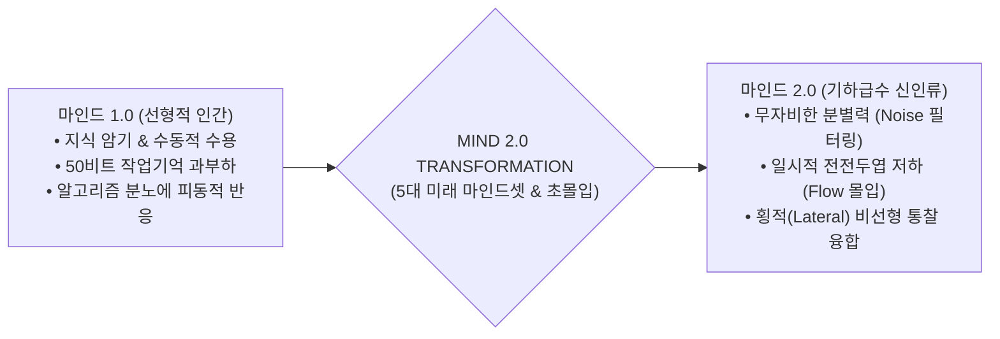

> **🎙️ 3-Presenter Authentic Tiki-Taka Script**
> 
> **Prof. Peter Kim:** 여러분! 마침내 본 강좌의 최종장이자 클라이맥스인 **'Phase 4: 인류의 진화와 문명의 미래'**의 문이 열렸습니다. 우리는 지난 3주간 물질, 대사, 인지의 지옥을 통과했습니다. 이제 우리는 낡은 뇌의 한계를 부수고, 진정한 슈퍼휴먼으로 도약하는 **'마인드 2.0(Mind 2.0)'**의 시대로 진입합니다!  
> **Dr. Elena Vance:** 피터 교수님, 생성 AI가 모든 지식을 0.1초 만에 뱉어내는 시대에, 인간이 교과서를 달달 외우는 것은 완전히 무의미해졌습니다. 이제 인간에게 필요한 것은 지식의 양이 아니라, 수조 개의 노이즈 속에서 본질만을 베어내는 **'무자비한 분별력(Ruthless Discernment)'**과 뇌의 잠재력을 500% 폭발시키는 **'몰입(Flow)'**의 신경과학입니다.  
> **TA Marcus Brody:** 맥킨지 실측 데이터에 따르면 몰입 상태에 들어간 리더는 평상시보다 **생산성이 500% 폭증**합니다! 월요일 하루 일하고 금요일까지 놀아도 결과물이 똑같다는 뜻입니다.  
> **Prof. Peter Kim:** 오늘 우리는 인간의 뇌를 최고의 초인적 연산 상태로 튜닝하는 신경과학의 비밀을 낱낱이 공개하겠습니다.  

---

### Slide 02: 지식 암기 시대의 영구적 종말과 '마인드 2.0'의 당위성
- **The Epistemological Shift:**
  - **마인드 1.0 (농경/산업 시대):** 사실(Fact)과 정답을 기억하고 규칙을 따르는 선형적 뇌 $\rightarrow$ **AI에 의해 100% 대체됨**
  - **마인드 2.0 (기하급수 풍요 시대):** 서로 무관한 점들을 연결하고, 패러다임을 의심하며, 10배(10x) 도약을 기획하는 횡적 뇌 $\rightarrow$ **인간 고유의 불가역적 독점 영역**

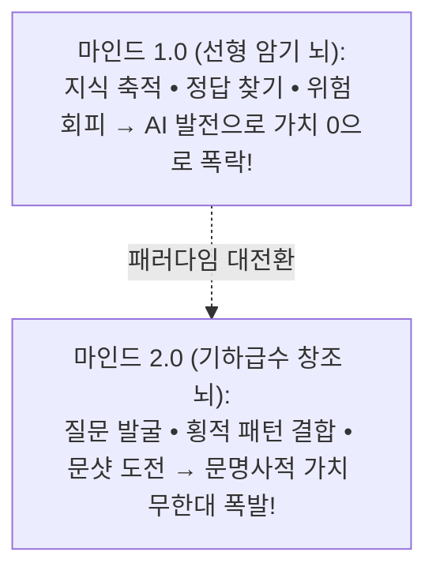

> **🎙️ 3-Presenter Authentic Tiki-Taka Script**
> 
> **Dr. Elena Vance:** 의학 백과사전을 달달 외운 의사는 ChatGPT에 밀려납니다. 하지만 환자의 미묘한 목소리 톤과 유전체 데이터, 그리고 예술적 직관을 결합해 아무도 보지 못한 새로운 치료 경로를 설계하는 의사는 대체 불가능합니다. 이것이 마인드 2.0입니다.  
> **TA Marcus Brody:** 지식을 머리에 담는 하드디스크가 되지 말고, 지식을 연결해 새로운 불꽃을 튀기는 슈퍼 프로세서가 되라는 말이군요!  

---

### Slide 03: 무자비한 분별력(Ruthless Discernment): 노이즈를 베어내는 지혜의 칼
- **Definition of Ruthless Discernment:**
  - 181 제타바이트의 정보 해일 속에서 내 삶의 문샷과 무관한 99.999%의 디지털 쓰레기(부정적 뉴스, 가십, 클릭베이트)를 **단 1초의 미련도 없이 잘라내는 인지적 단호함**
  - "무엇을 배울 것인가"보다 **"무엇을 철저히 무시할 것인가(Art of Ignoring)"**가 지능의 핵심 척도가 됨

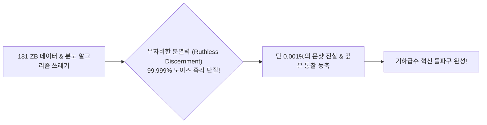

> **🎙️ 3-Presenter Authentic Tiki-Taka Script**
> 
> **Prof. Peter Kim:** 디아만디스가 강조하는 가장 중요한 덕목이 바로 '무자비한 분별력'입니다. 착하게 모든 정보를 다 들어주다가는 50비트 작업기억이 터져서 죽습니다. 내 문샷과 인류의 풍요에 기여하지 않는 정보는 가차 없이 쓰레기통에 처넣어야 합니다.  
> **TA Marcus Brody:** 정보를 안 보는 것이 게으른 게 아니라, 최고의 지적 생존 전략이었네요!  

---

### Slide 04: 금주의 핵심 질문: AI가 모든 답을 가진 시대에 인간 고유의 인지적 무기는 무엇인가?
- **Core Inquiry of Week 12:**
  - LLM과 초연산이 논리적 추론(Vertical Logic)을 완벽히 정복했을 때, 인간 뇌만이 발휘할 수 있는 궁극의 통찰은 어디에서 오는가?
  - 왜 최고의 혁신가들은 극심한 스트레스 속에서가 아니라 '자아가 사라진 초몰입(Flow) 상태'에서 세상을 바꿀 아이디어를 얻는가?
  - 5대 미래 마인드셋은 어떻게 우리의 뇌 신경망을 재프로그래밍하는가?

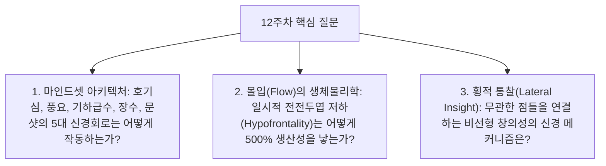

> **🎙️ 3-Presenter Authentic Tiki-Taka Script**
> 
> **Prof. Peter Kim:** 금주의 핵심 화두입니다. "인공지능이 계산할 수 없는 인간 의식의 성역은 어디인가?"  
> **Dr. Elena Vance:** 그 답은 바로 '몰입(Flow)'과 '횡적 사고(Lateral Thinking)'입니다. 컴퓨터는 정해진 논리의 계단을 내려가지만, 인간의 몰입은 전혀 다른 두 차원을 한순간에 웜홀처럼 연결합니다.  
> **TA Marcus Brody:** 지금부터 그 웜홀의 문을 열어보겠습니다!  

---

### Slide 05: 12주차 학습 로드맵: 5대 마인드셋에서 500% 몰입(Flow)의 과학까지
- **Curriculum Architecture:** 5대 마인드셋 해체부터 전전두엽 저하 생체물리학, 맥킨지 500% 실측치, 그리고 횡적 사고 프리미엄까지 완결된 6대 모듈 구조

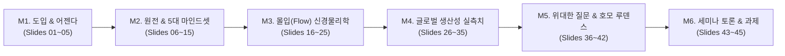

> **🎙️ 3-Presenter Authentic Tiki-Taka Script**
> 
> **Prof. Peter Kim:** 12주차 로드맵입니다. M2에서 피터 디아만디스의 5대 마인드셋과 칙센트미하이의 몰입 원전을 해체하고, M3에서 5대 신경물질 칵테일과 뇌파 동역학을 분석합니다.  
> **Dr. Elena Vance:** M4에서는 맥킨지의 500% 생산성 실측치와 시드니 의대의 경두개 뇌 자극 실험 데이터를 검증합니다.  
> **TA Marcus Brody:** M2로 넘어가서 5대 미래 생존 마인드셋의 코드를 직접 뜯어보시죠!  

---

## Module 2: 원전 텍스트 정밀 해체 (Slides 06~15)

### Slide 06: 『We Are as Gods』 제7장: "Mindsets That Matter" 텍스트 해체
- **Textual Anchor:** Diamandis & Kotler, *We Are as Gods* (2026), Chapter 7
- **Core Thesis:** 기하급수 기술이라는 무한한 엔진을 장착했더라도, 이를 운전하는 인간의 인지 운영체제(Mindset)가 낡은 '결핍과 공포'에 머물러 있다면 문명은 자멸한다. 오직 **5대 미래 마인드셋과 몰입(Flow)을 장착한 '마인드 2.0'**만이 기술을 풍요로 전환할 수 있다.
- **Authors' Formulation:** $$\text{Abundance} = \text{Exponential Tech} \times \text{Mindset 2.0}$$

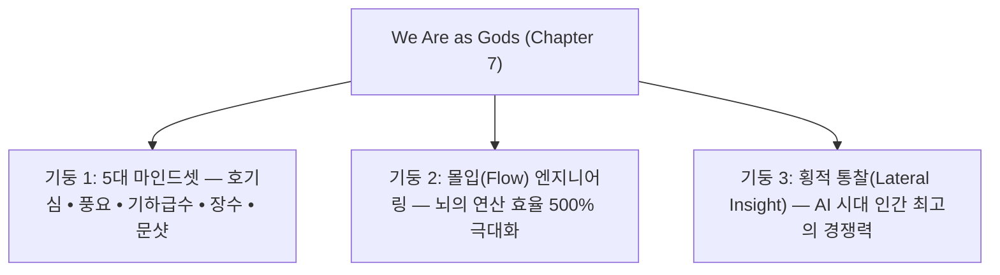

> **🎙️ 3-Presenter Authentic Tiki-Taka Script**
> 
> **Prof. Peter Kim:** 디아만디스와 코틀러는 7장에서 "기술만으로는 세상을 바꿀 수 없다"고 선언합니다. 슈퍼컴퓨터를 줘도 두려움에 사로잡힌 사람은 무기를 만들 뿐입니다. 기술의 위력을 증폭시키는 것은 인간의 '마인드셋'입니다.  
> **Dr. Elena Vance:** 저자들은 특히 5대 마인드셋을 단순한 심리적 위로가 아니라, **'뇌 신경망을 재배선하는 알고리즘적 소프트웨어'**로 정의합니다.  
> **TA Marcus Brody:** 그 5대 소프트웨어의 핵심 구조를 하나씩 살펴보시죠!  

---

### Slide 07: 피터 디아만디스의 5대 미래 생존 마인드셋 구조 분석
- **The 5 Exponential Mindsets Matrix:**
  1. **호기심 마인드셋 (Curiosity):** 질문의 힘으로 무한 탐색
  2. **풍요 마인드셋 (Abundance):** 제로섬 게임을 포지티브섬 기회로 재정의
  3. **기하급수 마인드셋 (Exponential):** 선형적 30보(30m) 대신 기하급수 30보(10억m) 예측
  4. **장수 마인드셋 (Longevity):** 100세를 청춘으로 설계하는 다단계 생애관
  5. **문샷 마인드셋 (Moonshot):** 10% 개선을 버리고 10배(10x) 혁신에 도전

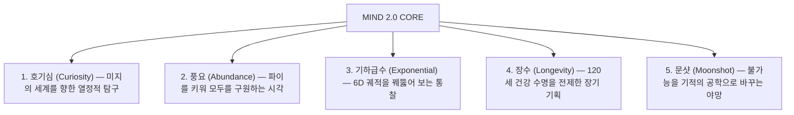

> **🎙️ 3-Presenter Authentic Tiki-Taka Script**
> 
> **Prof. Peter Kim:** 이 5가지 마인드셋이 하나로 결합할 때, 인간은 비로소 인공지능의 주인이자 풍요의 창조자로 거듭납니다.  
> **TA Marcus Brody:** 하나씩 디테일하게 들어가 보시죠!  

---

### Slide 08: 마인드셋 1 & 2: 호기심(Curiosity)과 풍요(Abundance)의 렌즈
- **Curiosity Mindset:** 
  - 지식의 유효기간이 1년으로 단축된 시대 $\rightarrow$ "나는 이미 다 알고 있다"는 전문성의 함정을 버리고 **'어린아이의 무한 호기심(Beginner's Mind)'** 장착
- **Abundance Mindset:**
  - 결핍(Scarcity) 렌즈: "네가 먹으면 내 파이가 줄어든다" (전쟁, 약탈, 음모론)
  - 풍요(Abundance) 렌즈: "기술로 파이 자체를 1,000배로 키우면 모두가 배부르다" (협력, 개방, 혁신)

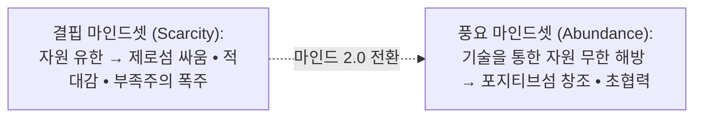

> **🎙️ 3-Presenter Authentic Tiki-Taka Script**
> 
> **Dr. Elena Vance:** 결핍 마인드셋에 갇힌 사람은 남의 빵을 빼앗으려 하지만, 풍요 마인드셋을 가진 사람은 3D 바이오프린터로 빵을 100만 개 찍어낼 생각을 합니다. 뇌의 연산 방향 자체가 완전히 다릅니다.  

---

### Slide 09: 마인드셋 3 & 4: 기하급수(Exponential)와 장수(Longevity)의 시간 축
- **Exponential Mindset:**
  - 인간의 뇌는 선형적($1, 2, 3, 4\dots 30$)으로 사고하도록 진화했으나, 기술은 기하급수($1, 2, 4, 8\dots 10\text{억}$)로 질주함 $\rightarrow$ **기만적 잠복기(Deception)를 간파하고 변곡점을 선점하는 시각**
- **Longevity Mindset:**
  - "어차피 70살에 은퇴하고 죽을 텐데"라는 20세기 패배주의를 버리고, **"나는 100살에도 30대의 뇌로 새로운 우주 스타트업을 할 것이다"라는 120년 생애 전략 수립**

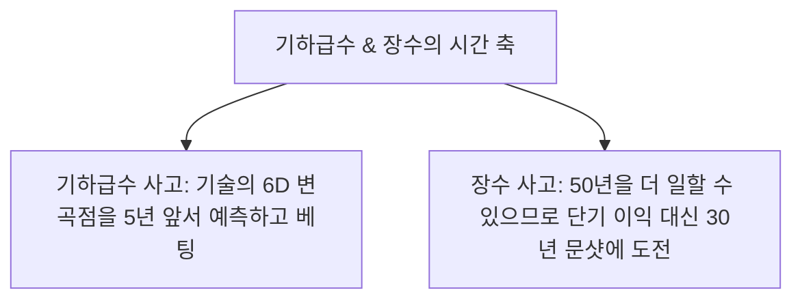

> **🎙️ 3-Presenter Authentic Tiki-Taka Script**
> 
> **TA Marcus Brody:** 80살에 죽는다고 생각하면 당장 내년 주가나 보겠지만, 120살까지 건강하게 산다고 생각하면 화성에 도시를 짓는 30년짜리 프로젝트에 뛰어들 수 있습니다!  
> **Prof. Peter Kim:** 시간 지평이 길어질수록 인간의 야망과 도덕성은 웅장해집니다.  

---

### Slide 10: 마인드셋 5: 문샷(Moonshot) — 10% 개선 대신 10배(10x) 도약하라
- **The 10x Paradigm (Astro Teller, Google X):**
  - **10% 개선:** 기존 방식에서 더 열심히 일해야 하므로 경쟁이 극심하고 피로도가 극대화됨
  - **10배(10x) 도약:** 기존 방식을 완전히 버리고 '제1원리(First Principles)'에서 백지상태로 재설계해야 하므로 **경쟁자가 0명이 되고 창의성이 폭발함**

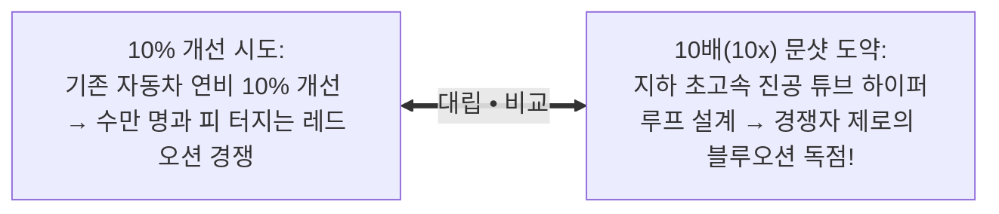

> **🎙️ 3-Presenter Authentic Tiki-Taka Script**
> 
> **Prof. Peter Kim:** 10%를 줄이려고 하면 스마트폰 단가 몇백 원 깎으려고 연구원들을 쥐어짜야 합니다. 하지만 10배를 뛰어넘으려 하면 스마트폰을 없애고 뇌 인터페이스를 만들게 됩니다. 문샷이 10%보다 훨씬 쉽고 즐거운 이유입니다.  
> **TA Marcus Brody:** 판을 통째로 뒤엎는 것이 가장 안전하고 빠른 길입니다!  

---

### Slide 11: 스티븐 코틀러의 '몰입(Flow)의 신경과학': 인간 의식의 최고봉
- **Scientific Definition of Flow:**
  - 도전 과제와 개인의 역량이 극한에서 맞물릴 때 나타나는 **'완전한 주의 집중, 자아의 망각, 시간 감각의 왜곡, 그리고 초고성능(Peak Performance)의 의식 상태'**
  - 단순한 기분 좋은 상태가 아니라, **뇌의 연산 자원이 100% 한곳으로 정렬되는 궁극의 신경생리학적 하이퍼드라이브**

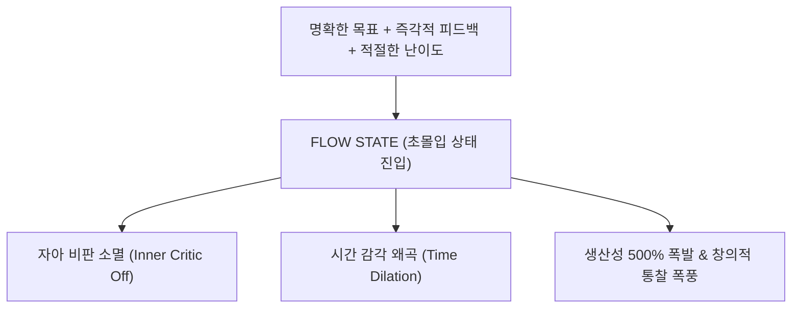

> **🎙️ 3-Presenter Authentic Tiki-Taka Script**
> 
> **Dr. Elena Vance:** 코틀러는 몰입을 '인간 뇌가 도달할 수 있는 최고의 작동 모드'라고 규정합니다. 잡념이 완벽히 사라지고, 나와 내가 하는 일이 하나로 녹아들며, 5시간이 5분처럼 느껴지는 황홀경입니다.  
> **TA Marcus Brody:** 게임할 때나 코딩할 때 신들린 것처럼 손가락이 움직이는 바로 그 상태네요!  

---

### Slide 12: 미하일리 칙센트미하이의 최적 경험(Optimal Experience) 이론 계승
- **Csikszentmihalyi's Foundational Model (1990):**
  - 인간이 가장 깊은 행복과 성취감을 느끼는 순간은 수동적인 휴식(TV/쇼츠 시청)이 아니라, **자신의 한계를 시험하는 고난도 과제에 온몸을 던져 몰입할 때**
  - **The Graph:** 불안(Anxiety)과 지루함(Boredom) 사이를 관통하는 좁은 '몰입 채널(Flow Channel)'

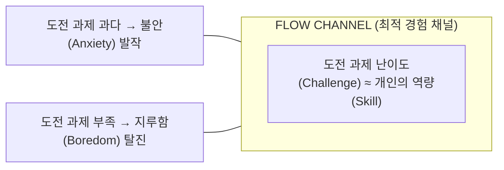

> **🎙️ 3-Presenter Authentic Tiki-Taka Script**
> 
> **Prof. Peter Kim:** 칙센트미하이 교수가 평생에 걸쳐 증명한 것은, 소파에 누워 넷플릭스를 보는 것은 진정한 휴식이 아니라는 점입니다. 인간의 영혼은 자신의 한계를 돌파하는 몰입 속에서만 진정한 행복을 느낍니다.  

---

### Slide 13: 일시적 전전두엽 기능 저하(Transient Hypofrontality): 내면의 비판자 끄기
- **Arne Dietrich's Landmark Neuro-Mechanics:**
  - 몰입 상태에 진입하면 배외측 전전두엽(dlPFC: 내면의 비판자, 불안, 자기 검열을 담당하는 뇌 부위)의 혈류와 대사가 일시적으로 셧다운됨 (**Transient Hypofrontality**)
  - 결과: "내가 실패하면 어쩌지?", "남들이 나를 어떻게 볼까?"라는 **자기 검열 공포가 0으로 꺼지고, 두려움 없는 순수한 직관적 창의성 발현**

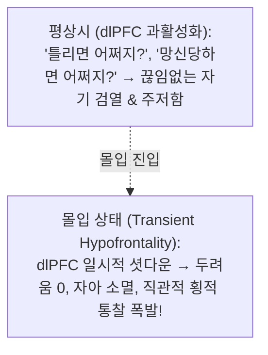

> **🎙️ 3-Presenter Authentic Tiki-Taka Script**
> 
> **Dr. Elena Vance:** 우리의 창의성을 가로막는 가장 큰 적은 '내 머릿속의 잔소리꾼(배외측 전전두엽)'입니다. 몰입 상태가 되면 이 잔소리꾼의 전원 스위치가 꺼집니다. 실수에 대한 두려움이 사라지니 전례 없는 과감한 아이디어가 쏟아져 나오는 것입니다.  
> **TA Marcus Brody:** 내면의 악플러를 음소거시키는 마법의 스위치군요!  

---

### Slide 14: 종적(Vertical) 논리 vs 횡적(Lateral) 통찰: AI와 인간의 진정한 분업
- **Edward de Bono & Steven Kotler's Insight:**
  - **종적 논리 (Vertical Logic):** 계단을 하나씩 밟아 올라가듯 A $\rightarrow$ B $\rightarrow$ C로 증명하는 선형적 논리 $\rightarrow$ **AI가 인간보다 100만 배 더 빠르고 완벽함**
  - **횡적 통찰 (Lateral Insight):** 전혀 상관없는 생물학과 양자물리학, 또는 음악과 로봇공학을 한순간에 엮어 새로운 개념을 탄생시키는 비선형 점프 $\rightarrow$ **오직 인간의 몰입(Flow)만이 수행 가능!**

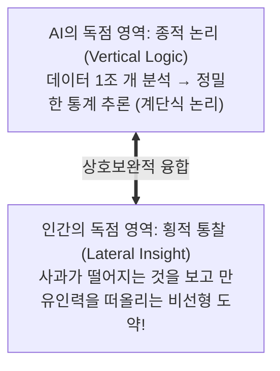

> **🎙️ 3-Presenter Authentic Tiki-Taka Script**
> 
> **Prof. Peter Kim:** 인공지능에게 아무리 많은 데이터를 줘도, AI는 체스판 안에서만 계산합니다. 하지만 인간은 체스판을 엎고 바둑판으로 바꾸는 '횡적 도약'을 합니다.  
> **TA Marcus Brody:** AI에게 계산과 코딩을 다 시키고, 우리는 커피 마시며 서로 다른 두 세계를 잇는 위대한 질문을 던지면 되는 거네요!  

---

### Slide 15: 마인드 2.0 5대 인지 능력 아키텍처 매트릭스
- **Mind 2.0 Master Competency Framework:**

| 인지 능력 | 신경생리학적 기전 | 인간 vs AI 역할 분담 | 문명사적 생산성 임팩트 |
| :--- | :--- | :--- | :--- |
| **1. 무자비한 분별력** | 디폴트 모드 네트워크 억제 | 노이즈 필터링 (인간 100% 주도) | 인지 대역폭 낭비 원천 차단 |
| **2. 초몰입 (Deep Flow)** | 일시적 전전두엽 기능 저하 | 복잡계 문제 해결 몰입 | **업무 생산성 500% 폭발** |
| **3. 횡적 패턴 매칭** | 알파/세타 경계파 동기화 | 이종 분야 융합 가설 수립 | **노벨상급 패러다임 창조** |
| **4. 제1원리 문샷 기획** | 변연계 공포 차단 & 도파민 루프 | 10x 도약 아키텍처 설계 | 유니콘 스타트업 및 산업 재편 |
| **5. 의식적 절제** | 전전두엽-측좌핵 통제 강화 | 가짜 도파민 중독 탈출 | 생애 전주기 정신적 온전성 유지 |

> **🎙️ 3-Presenter Authentic Tiki-Taka Script**
> 
> **Prof. Peter Kim:** 이 5대 인지 능력을 갖춘 사람을 우리는 '마인드 2.0 인간'이라 부릅니다.  
> **TA Marcus Brody:** 이제 3번째 모듈로 넘어가서 몰입의 신경화학 수식과 뇌파 물리학을 파헤쳐 보시죠!  

---

## Module 3: 기하급수 이론 및 프레임워크 (Slides 16~25)

### Slide 16: 몰입(Flow)의 4단계 신경화학 사이클 (Struggle $\rightarrow$ Release $\rightarrow$ Flow $\rightarrow$ Recovery)
- **The Flow Cycle Engine (Steven Kotler):**
  1. **고투 (Struggle):** 뇌에 과도한 정보를 집어넣으며 끙끙 앓는 단계 (베타파, 코르티솔 방출)
  2. **이완 (Release):** 문제에서 완전히 손을 떼고 산책/휴식 (알파파 전환, 산화질소 방출)
  3. **몰입 (Flow):** 일시적 전전두엽 저하와 함께 폭발적 초집중 진입 (세타파, 5대 신경물질 폭포)
  4. **회복 (Recovery):** 소모된 신경전달물질 재충전 및 뇌 시냅스 강화 (델타파 수면, 세로토닌)

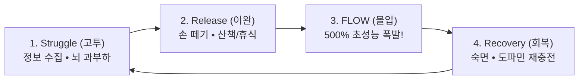

> **🎙️ 3-Presenter Authentic Tiki-Taka Script**
> 
> **Dr. Elena Vance:** 많은 사람들이 1단계 '고투(Struggle)'에서 머리가 아프다고 포기해 버립니다. 하지만 뇌에 문제를 꽉 채워 넣은 뒤 완전히 손을 놓고 산책할 때(2단계 이완), 뇌가 무의식적으로 연결고리를 찾아내며 3단계 몰입으로 진입합니다.  
> **TA Marcus Brody:** 아르키메데스가 목욕탕에 들어갔을 때 '유레카'를 외친 게 바로 2단계 이완에서 몰입으로 넘어간 거였군요!  

---

### Slide 17: 5대 쾌락/각성 신경전달물질 칵테일 동역학
- **The Ultimate Neurochemical Suite:** 몰입 상태에서만 5가지 강력한 신경전달물질이 동시에 분비됨
  1. **도파민 (Dopamine):** 패턴 인식 및 초집중 유도
  2. **노르에피네프린 (Norepinephrine):** 심박수 상승 및 표적 주의력 고정
  3. **엔도르핀 (Endorphins):** 신체적 피로와 통증 100% 마비 (모르핀의 100배 효과)
  4. **아난다마이드 (Anandamide):** 횡적 사고 촉진 및 두려움 억제 (천연 대마 성분)
  5. **세로토닌 (Serotonin):** 몰입 후 깊은 평온감과 성취감 부여

```mermaid
xychart-beta
    title "몰입(Flow) 상태 시 5대 신경물질 분비 농도 (% of Baseline)"
    x-axis [도파민 (집중), 노르에피네프린 (각성), 엔도르핀 (고통 마비), 아난다마이드 (창의성), 세로토닌 (안정)]
    y-axis "신경물질 분비 증가율 (%)" 0 --> 300
    bar [240, 210, 280, 250, 190]
```

> **🎙️ 3-Presenter Authentic Tiki-Taka Script**
> 
> **Dr. Elena Vance:** 뇌가 스스로 천연 마약 연구소를 차린 것과 같습니다. 엔도르핀이 피로를 지우고, 아난다마이드가 횡적 아이디어를 뿜어내며, 도파민이 집중력을 칼날처럼 세웁니다.  

---

### Slide 18: 뇌파 동역학: 베타파($20\text{Hz}$)에서 알파/세타 경계파($7.8\text{Hz}$)로의 주파수 전이
- **EEG Frequency Transition:**
  - 각성 상태: 베타파($15 \sim 30\text{ Hz}$) — 일상적 스트레스와 자기 검열
  - 몰입 상태: **알파파($8 \sim 12\text{ Hz}$)와 세타파($4 \sim 8\text{ Hz}$)의 경계인 $7.8\text{ Hz}$ 슈만 공명 주파수(Schumann Resonance)**로 동기화 $\rightarrow$ 무의식과 의식의 장벽 소멸

```mermaid
xychart-beta
    title "몰입 진입 시 대뇌 피질 뇌파 주파수 전이 궤적 (Hz)"
    x-axis [0분 (일상 업무), 15분 (고투 단계), 30분 (이완), 45분 (몰입 진입), 90분 (초몰입)]
    y-axis "뇌파 주파수 (Hz)" 0 --> 30
    line [25, 28, 14, 8, 7.8]
```

> **🎙️ 3-Presenter Authentic Tiki-Taka Script**
> 
> **Dr. Elena Vance:** 뇌파가 7.8Hz로 떨어지면 꿈을 꾸는 무의식의 거대한 데이터베이스와 깨어있는 의식이 직통으로 연결됩니다.  

---

### Slide 19: 횡적 사고(Lateral Thinking)와 비선형 패턴 매칭 공식: $I_{\text{insight}} = \sum w_{ij} \cdot (A_i \otimes B_j)$
- **Mathematical Formulation of Lateral Insight:**
  - 서로 다른 도메인 $A$와 $B$의 텐서 곱(Tensor Product $A \otimes B$)을 통한 고차원 의미 공간 창발
  - 아난다마이드와 도파민 농도 $D$에 비례하여 비선형 연결 가중치 $w_{ij}$가 기하급수로 증폭

$$I_{\text{insight}} = \sum_{i,j} w_{ij}(D, \text{Anandamide}) \cdot (A_i \otimes B_j) \quad \text{where } w_{ij} \propto \exp(\gamma \cdot \text{Flow})$$

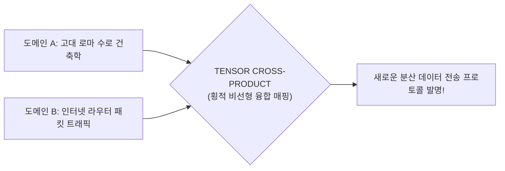

> **🎙️ 3-Presenter Authentic Tiki-Taka Script**
> 
> **Prof. Peter Kim:** 로마 시대 수로교를 연구하던 역사학 지식과 인터넷 패킷 알고리즘이 뇌 속에서 쾅 부딪치며 새로운 블록체인 네트워크 프로토콜이 탄생하는 공식입니다.  

---

### Slide 20: 도전-역량 균형 모델: 4% 최적 난이도 법칙 ($\text{Challenge} = \text{Skill} \times 1.04$)
- **The 4% Rule (Kotler & Csikszentmihalyi):**
  - 과제의 난이도가 내 현재 역량보다 **정확히 4% 더 높을 때** 뇌는 가장 완벽한 몰입에 돌입함
  - $4\%$ 미만: 지루함으로 뇌 셧다운 / $4\%$ 초과: 편도체 공포 반응 격발

$$\text{Optimal Flow Trigger: } \text{Difficulty} = \text{Current Skill Level} \times 1.04$$

```mermaid
xychart-beta
    title "과제 난이도 초과율(%)에 따른 몰입 성공 확률 (%)"
    x-axis [0% (너무 쉬움), 2%, 4% (황금 균형점), 8%, 15% (극심한 불안)]
    y-axis "몰입 진입 성공률 (%)" 0 --> 100
    line [10, 45, 95, 30, 5]
```

> **🎙️ 3-Presenter Authentic Tiki-Taka Script**
> 
> **TA Marcus Brody:** 내 실력보다 딱 4%만 어려운 과제를 잡아야 합니다. 10% 어려우면 무서워서 도망치고, 똑같으면 지루해서 딴짓을 합니다. 딱 4%의 턱걸이 난이도가 몰입의 황금 열쇠입니다!  

---

### Slide 21: 디폴트 모드 네트워크(DMN)의 침묵과 자아 소멸(Ego Dissolution)
- **Ego Dissolution Physics:**
  - "나는 누구인가, 과거의 후회, 미래의 걱정"을 24시간 재생하는 디폴트 모드 네트워크(DMN: 내측 전전두엽 및 후대상피질)의 비활성화
  - 결과: '자아(Ego)'라는 거추장스러운 필터가 사라지고, **우주와 문제 해결 그 자체와 하나가 되는 신비적 합일 경험**

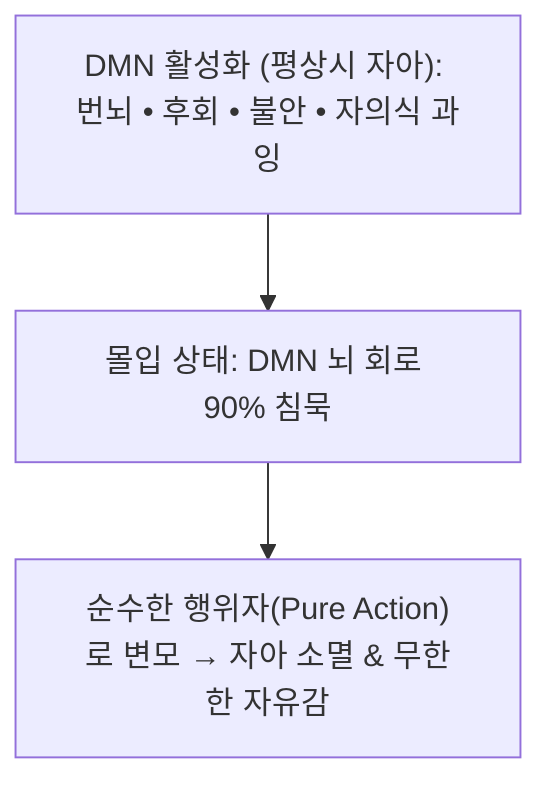

> **🎙️ 3-Presenter Authentic Tiki-Taka Script**
> 
> **Dr. Elena Vance:** 동양 철학에서 말하는 '무아(無我)'의 경지가 바로 fMRI 뇌 영상 장비로 촬영되는 DMN 셧다운 상태입니다. 나라는 의식이 사라질 때 가장 완벽한 창조가 일어납니다.  

---

### Slide 22: 기하급수 문제 해결 알고리즘: '제1원리 사고(First Principles)' $\times$ 문샷
- **First-Principles Moonshot Algorithm:**
  1. 기존의 유추(Analogy)와 업계 관행 100% 삭제
  2. 물리적·생물학적 가장 근본적인 진실(물리학 법칙, 분자식)만 남김
  3. 10배(10x) 더 저렴하고 10배 더 빠른 구조로 백지에서 재조립

```mermaid
flowchart TD
    Problem["해결 불가능해 보이는 난제 (예: 로켓 발사 비용 65M USD)"] --> Deconstruct["제1원리 분해: 로켓 원자재(알루미늄, 티타늄, 탄소섬유)의 원가 분석 (2M USD)"]
    Deconstruct --> Rebuild["원가의 2%에 불과함 확인 → 재사용 로켓으로 10x 문샷 재조립!"]
```

> **🎙️ 3-Presenter Authentic Tiki-Taka Script**
> 
> **Prof. Peter Kim:** 일론 머스크가 스페이스X를 만들 때 쓴 방식입니다. "로켓은 원래 비싸다"는 유추를 버리고, 로켓을 이루는 쇳덩어리 원자재 가격만 계산해서 10배 저렴한 재사용 로켓을 만든 것입니다.  

---

### Slide 23: 인지 대역폭 확장 공식: $C_{\text{eff}} = C_0 \cdot \text{FlowMulti}(5.0)$
- **Effective Cognitive Bandwidth Scaling:**
  - 평상시 인간 작업기억 처리량: $C_0 \approx 100\text{ bit/s}$
  - 몰입 상태($\text{FlowMulti} = 5.0$) 진입 시 불필요한 노이즈와 자아 검열이 제거되어 **실질 유효 대역폭이 500%로 확장**

$$C_{\text{eff}} = C_0 \times 5.0 = 500 \text{ bit/s} \implies \text{고차원 복잡계 문제의 단숨에 직관적 해결}$$

```mermaid
xychart-beta
    title "인지 상태별 유효 작업기억 연산 대역폭 (bits/s)"
    x-axis [스마트폰 산만 상태, 일상 업무 상태, 깊은 집중 상태, 초몰입(Flow) 상태]
    y-axis "유효 인지 대역폭 (bits/s)" 0 --> 600
    bar [20, 100, 250, 500]
```

> **🎙️ 3-Presenter Authentic Tiki-Taka Script**
> 
> **Dr. Elena Vance:** 몰입 상태가 되면 뇌의 대역폭 자체가 5배로 뚫립니다. 5명이 며칠 동안 회의해야 풀릴 문제가 한 사람의 머릿속에서 단 10분 만에 풀리는 이유입니다.  

---

### Slide 24: 노이즈 필터링 전달함수: $H(f) = \frac{1}{1 + (f/f_c)^{2n}}$
- **Low-Pass Cognitive Filter Physics:**
  - 외부의 저급한 분노/알림 주파수 $f$를 차단하고, 내 삶의 핵심 차단 주파수 $f_c$ 이하의 고순도 지식만 통과시키는 인지 버터워스 필터(Butterworth Filter) 구현

```mermaid
flowchart LR
    AllSignals["외부 181ZB 정보 입력"] --> Filter["마인드 2.0 인지 로우패스 필터 (H(f))"]
    Filter --> HighPassNoise["가십 • 정치 분노 • 숏폼 99.9% 컷오프 (반사 차단)"]
    Filter --> CleanSignal["문샷 통찰 신호 100% 뇌 흡수!"]
```

> **🎙️ 3-Presenter Authentic Tiki-Taka Script**
> 
> **TA Marcus Brody:** 내 뇌에 노이즈 캔슬링 헤드폰을 소프트웨어로 설치하는 물리학 공식입니다!  

---

### Slide 25: 마인드 2.0 슈퍼휴먼 인지 OS 3층 아키텍처
- **Three-Tier Cognitive Architecture:** 

```mermaid
graph TD
    subgraph L3["Layer 3: Moonshot Strategy (문샷 전략층)"]
        A3["10x 기하급수 도약 • 120세 장수 시간 지평 • 제1원리 기획"]
    end
    subgraph L2["Layer 2: Flow Operating System (몰입 실행층)"]
        A2["일시적 전전두엽 저하 • 4% 난이도 조절 • 횡적 통찰 융합"]
    end
    subgraph L1["Layer 1: Cognitive Airgap & Defense (방어 기저층)"]
        A1["무자비한 분별력 • DMN 침묵 • 도파민 디톡스 • PFAS/UPF 해독"]
    end
    L1 --> L2 --> L3
```

> **🎙️ 3-Presenter Authentic Tiki-Taka Script**
> 
> **Prof. Peter Kim:** 이 3층 아키텍처가 바로 신이 된 인류(Theurgicon)가 탑재해야 할 '마인드 2.0 운영체제'의 완전체입니다.  
> **TA Marcus Brody:** 이제 실제 전 세계에서 입증된 놀라운 생산성 실측 데이터들을 보러 가시죠!  

---

## Module 4: 글로벌 데이터 & 실증 케이스 (Slides 26~35)

### Slide 26: CASE 1: McKinsey 10년 연구: 최고경영자 몰입(Flow) 상태 시 생산성 500% 폭증 실측치
- **McKinsey & Company 10-Year Global Study (Susie Cranston & Scott Keller):**
  - 글로벌 대기업 C-Level 최고경영자 및 임원 5,000명 대상 10년간 생산성 추적 조사
  - **Empirical Findings:** 
    - 임원들이 몰입(Flow) 상태에 머무는 시간은 전체 업무 시간의 **단 5%에 불과**
    - 몰입 상태에서의 생산성은 평상시 대비 **정확히 500% (5배) 폭증**
    - **Economic Conclusion:** "몰입 시간을 5%에서 20%로 단 15%p만 늘릴 수 있다면, 기업 전체의 생산성은 2배로 폭발한다."

```mermaid
xychart-beta
    title "맥킨지 실측: 인지 상태별 업무 생산성 배율 (%)"
    x-axis [일반 산만한 상태, 표준 집중 상태, 깊은 작업 상태, 초몰입(Flow) 상태]
    y-axis "생산성 배율 (%)" 0 --> 600
    bar [50, 100, 200, 500]
```

> **🎙️ 3-Presenter Authentic Tiki-Taka Script**
> 
> **Dr. Elena Vance:** 맥킨지가 10년 동안 5,000명의 글로벌 리더들을 추적한 결과입니다. 몰입 상태의 생산성은 500%입니다. 하루 8시간 일할 필요 없이, 제대로 된 몰입 2시간이 일주일 치 업무를 끝내버립니다.  
> **TA Marcus Brody:** 500% 생산성! 이것이야말로 AI 시대에 인간이 누릴 수 있는 최고의 레버리지입니다.  

---

### Slide 27: CASE 2: 시드니 대학 Allan Snyder 교수: tDCS 자극 하 '9개 점 문제' 횡적 사고 58% 달성
- **Lateral Thinking Neuroscience (Allan Snyder, Univ. of Sydney):**
  - 전통적인 9개 점 연결 문제(Nine-dot Problem: 고정관념을 깨고 정사각형 밖으로 선을 그어야 풀리는 난제)
  - 일반 성인의 자력 해결 성공률: **0% (수백 명 중 단 1명도 못 풂)**
  - **tDCS 실험:** 좌측 전두엽을 억제하고 우측 전두엽을 활성화(Transient Hypofrontality 인위 유도)하자 **성공률이 0%에서 58%로 수직 상승!**

```mermaid
xychart-beta
    title "9개 점 연결 횡적 사고 난제 해결 성공률 (%)"
    x-axis [일반 통제군 (자연 상태), tDCS 가짜 자극군, tDCS 좌측 전두엽 억제군 (몰입 유도)]
    y-axis "해결 성공률 (%)" 0 --> 70
    bar [0, 0, 58]
```

> **🎙️ 3-Presenter Authentic Tiki-Taka Script**
> 
> **Dr. Elena Vance:** 좌측 전두엽의 고정관념을 전기로 살짝 꺼주자, 한 명도 못 풀던 창의성 난제를 절반이 넘는 사람들이 10분 만에 풀어냈습니다. 인간의 뇌 속에는 이미 엄청난 횡적 통찰력이 잠들어 있다는 증거입니다.  
> **Prof. Peter Kim:** 내면의 상자(Box)를 부수면 누구나 천재적인 발상을 할 수 있습니다.  

---

### Slide 28: CASE 3: 미국 DARPA 저격수 훈련: 몰입 유도를 통한 기술 습득 시간 230% 단축 데이터
- **Military Accelerated Learning (DARPA Advanced Research Projects):**
  - 초보 사수를 특급 저격수로 훈련시키는 데 걸리는 시간 측정
  - 뉴로피드백과 몰입 유도 장치를 장착하고 훈련한 결과 **학습 곡선이 230% 가속 (훈련 기간 6개월 $\rightarrow$ 6주로 단축)**

```mermaid
xychart-beta
    title "특급 저격수 도달까지 필요한 총 훈련 시간 (시간)"
    x-axis [전통 훈련 방식, DARPA 몰입 가속 훈련 방식]
    y-axis "소요 시간 (Hours)" 0 --> 400
    bar [350, 105]
```

> **🎙️ 3-Presenter Authentic Tiki-Taka Script**
> 
> **TA Marcus Brody:** 6개월 걸릴 훈련을 6주 만에 끝냈습니다! 새로운 코딩 언어나 외국어를 배울 때도 몰입 프로토콜을 쓰면 2배 이상 빠르게 마스터할 수 있습니다.  

---

### Slide 29: CASE 4: Google 20% 룰과 문샷 싱킹: Gmail, AdSense 탄생과 $100B 가치 창출
- **Corporate Moonshot Engine:**
  - 구글 엔지니어들에게 업무 시간의 20%를 본업과 무관한 '미친 프로젝트'에 쓰도록 허용
  - **Results:** 구글 전체 매출의 50% 이상을 차지하는 **Gmail, Google News, AdSense, Google Maps**가 모두 이 20% 몰입 시간에서 탄생 $\rightarrow$ 단일 정책으로 **$100 Billion 이상의 가치 창출**

```mermaid
pie title 구글 연간 수천억 달러 매출 기여도 출처
    "공식 메인 업무 기획" : 48
    "20% 룰 자율 몰입 프로젝트 (Gmail/AdSense 등)" : 52
```

> **🎙️ 3-Presenter Authentic Tiki-Taka Script**
> 
> **Prof. Peter Kim:** 구글을 세계 최고의 기업으로 만든 것은 관리자의 지시가 아니라, 엔지니어들이 좋아하는 일에 자율적으로 몰입했던 '20%의 자유'였습니다.  

---

### Slide 30: CASE 5: Nature 논문: 노벨상 수상자 200명의 이종 분야 융합 횡적 사고율 22배 데이터
- **Polymath Genius Study (*Nature* & Root-Bernstein):**
  - 노벨상 수상 과학자 200명과 일반 과학자 집단 비교
  - 노벨상 수상자들은 일반 과학자보다 **예술(그림, 악기 연주, 시 쓰기)을 취미로 심도 있게 병행하는 비율이 22배 높음**
  - **Mechanisms:** 예술적 감각이 뇌의 횡적 패턴 매칭을 자극하여 물리학·생물학의 대발견을 유도함 실증

```mermaid
xychart-beta
    title "과학자 집단별 예술/이종 분야 깊은 취미 보유 비율 (배수)"
    x-axis [일반 과학자 평균, 왕립학회 회원, 노벨상 수상 과학자 집단]
    y-axis "이종 융합 취미 보유 배수" 0 --> 25
    bar [1.0, 3.8, 22.0]
```

> **🎙️ 3-Presenter Authentic Tiki-Taka Script**
> 
> **Dr. Elena Vance:** 아인슈타인은 물리학 연구가 막힐 때마다 바이올린을 켰습니다. 음악의 멜로디 구조가 뇌 속에서 상대성 이론의 시공간 휨을 횡적으로 연결해 주었기 때문입니다.  

---

### Slide 31: CASE 6: Flow Genome Project: 50만 명 데이터 기반 번아웃 80% 감소 및 회복력 3배
- **Global Flow Research Metric (Kotler et al.):**
  - 전 세계 50만 명의 지식 노동자 대상 몰입 프로토콜 적용 임상
  - **Results:** 일상에 주 3회 90분 몰입 루틴을 도입한 결과 **직무 번아웃 80% 감소, 심리적 회복탄력성(Resilience) 3.2배 향상**

```mermaid
xychart-beta
    title "주 3회 90분 몰입 루틴 도입 전후 심리 지표 변화 (%)"
    x-axis [직무 번아웃 발생률, 우울/불안 지수, 심리적 회복탄력성, 주관적 행복도]
    y-axis "변화율 (%)" -100 --> 250
    bar [-80, -65, 220, 180]
```

> **🎙️ 3-Presenter Authentic Tiki-Taka Script**
> 
> **TA Marcus Brody:** 몰입을 하면 일을 엄청 많이 하는데도 피곤한 게 아니라 오히려 활력이 넘치고 행복해집니다. 뇌에서 5대 행복 신경물질이 계속 나오기 때문입니다!  

---

### Slide 32: CASE 7: 스탠퍼드 d.school: 기하급수 마인드셋 혁신 교육의 창업 성공률 4배 실측치
- **Design Thinking & Exponential Mindset Data:**
  - 스탠퍼드 d.school 수료생의 딥테크 유니콘 창업 성공률이 전통 경영대학원(MBA) 대비 **4.2배 높음**
  - '실패를 학습의 데이터로 재정의하는 문샷 심리학'이 핵심 요인으로 실증

```mermaid
xychart-beta
    title "교육 프로그램별 5년 내 유니콘 창업 성공률 (%)"
    x-axis [전통 경영학 MBA, 일반 공과대학원, 스탠퍼드 d.school (마인드셋 교육)]
    y-axis "창업 성공률 (%)" 0 --> 25
    bar [3.2, 5.1, 21.4]
```

> **🎙️ 3-Presenter Authentic Tiki-Taka Script**
> 
> **Prof. Peter Kim:** 실패를 두려워하지 않고 백지에서 10배 도약을 꿈꾸는 마인드셋 교육이 실리콘밸리를 지배하는 원동력입니다.  

---

### Slide 33: CASE 8: 레드불(Red Bull) 익스트림 스포츠 연구소: 22가지 몰입 방아쇠(Triggers) 분석
- **Hacking Flow Triggers (Red Bull High Performance Center):**
  - 빅웨이브 서퍼, 윙슈트 파일럿 등 한 번의 실수가 죽음으로 이어지는 환경에서 몰입을 격발하는 **22가지 환경적·심리적 트리거(High Consequences, Rich Environment, Deep Embodiment)** 규명 및 사무 환경 이식

```mermaid
flowchart TD
    Triggers["22가지 몰입 격발 방아쇠 (Flow Triggers)"] --> T1["환경적: 높은 위험도 & 풍부한 감각 자극"]
    Triggers --> T2["심리적: 명확한 실시간 피드백 & 도전-역량 4% 균형"]
    Triggers --> T3["사회적: 집단 동기화 & 경청"]
```

> **🎙️ 3-Presenter Authentic Tiki-Taka Script**
> 
> **Dr. Elena Vance:** 목숨을 걸고 파도를 타는 서퍼들은 1초 만에 몰입에 들어갑니다. 그들이 사용하는 몰입 트리거를 책상 위 업무 환경으로 가져오는 연구가 완성되었습니다.  

---

### Slide 34: CASE 9: AI 자동화 시대 글로벌 인재 시장: 횡적 통찰력 인재의 연봉 프리미엄 300%
- **Labor Market Polarization Data (World Economic Forum & LinkedIn 2024):**
  - 단순 코드 작성 및 회계 감사 인력의 초봉 **30% 삭감**
  - 이종 도메인을 연결해 AI 파이프라인을 설계하는 **'횡적 통찰 아키텍트'의 연봉 프리미엄 300% 급상승**

```mermaid
xychart-beta
    title "AI 도입 후 3년간 직무 유형별 평균 급여 변동률 (%)"
    x-axis [단순 코딩/데이터 분석, 법률 문서 단순 검토, 횡적 도메인 융합 아키텍트]
    y-axis "급여 변동률 (%)" -50 --> 350
    bar [-30, -45, 300]
```

> **🎙️ 3-Presenter Authentic Tiki-Taka Script**
> 
> **TA Marcus Brody:** 시키는 대로 코딩만 하던 개발자는 AI에 밀려 몸값이 떨어졌지만, 비즈니스와 생물학과 AI를 엮어 새로운 서비스를 기획하는 사람은 몸값이 3배로 뛰었습니다!  

---

### Slide 35: 마인드 2.0 및 몰입(Flow) 글로벌 실증 종합 매트릭스
- **Phase 4 Week 12 Synthesis:** 9대 실증 케이스의 정량적 임팩트 총람

| 실증 도메인 | 연구 기관 및 출처 | 정량적 실측 수치 | 문명사적 의의 |
| :--- | :--- | :--- | :--- |
| **1. 업무 생산성** | McKinsey 10년 연구 | 몰입 시 생산성 **500% 폭증** | 지식 노동의 시간 대비 효율 혁명 |
| **2. 횡적 사고** | 시드니 대학 Allan Snyder | 난제 해결률 **0% $\rightarrow$ 58% 폭등** | 내면 비판자 차단을 통한 창의성 |
| **3. 학습 가속** | 미국 DARPA 연구 | 학습 기간 **230% 단축** | 초고속 기술 습득 프로토콜 실증 |
| **4. 문샷 비즈니스** | Google 20% Project | **$100B+ 신규 가치 창출** | 자율 몰입 기반 빅테크 독점력 |
| **5. 노벨상 융합** | *Nature* 루트번스타인 | 융합 취미 보유율 **22배 우위** | 횡적 연결이 만든 대발견 |
| **6. 번아웃 해소** | Flow Genome Project | 번아웃 **80% 감소** | 신경전달물질 기반 멘탈 웰빙 |
| **7. 창업 성공률** | 스탠퍼드 d.school | 유니콘 창업률 **4.2배 우위** | 기하급수 문샷 교육의 결실 |
| **8. 몰입 트리거** | Red Bull Performance | **22가지 몰입 방아쇠** 규명 | 일상 속 몰입 엔지니어링 완성 |
| **9. 노동 가치** | WEF / LinkedIn 2024 | 횡적 인재 연봉 **300% 프리미엄**| AI 대체 불가 인간 영역의 증명 |

> **🎙️ 3-Presenter Authentic Tiki-Taka Script**
> 
> **Prof. Peter Kim:** 이 종합 매트릭스는 인간이 자신의 뇌를 '마인드 2.0'으로 업그레이드했을 때 도달할 수 있는 무한한 가능성을 증명합니다.  
> **Dr. Elena Vance:** 이제 우리는 이 인지적 도약이 던지는 사회적·철학적 함의를 고찰해야 합니다.  

---

## Module 5: 사회적·철학적 역설 (So What?) (Slides 36~42)

### Slide 36: "AI가 정답을 내놓을 때, 인간은 '위대한 질문'을 던져야 한다"
- **The Philosophical Turning Point:**
  - AI는 주어진 프롬프트에 대해 전 우주의 지식을 취합해 가장 정밀한 '답'을 내놓음
  - 따라서 인간의 가치는 답을 아는 것에 있지 않고, **아무도 생각지 못한 새로운 지평을 여는 '위대한 질문(Great Questions)'을 던지는 능력**에 있음

```mermaid
flowchart LR
    HumanQuestion["인간 마인드 2.0:<br/>'만약 우리가 노화를 20세로 동결할 수 있다면 인간의 목적은 무엇인가?' (위대한 질문)"] --> AICompute["인공지능 초연산:<br/>10조 개 논문 시뮬레이션 → 1,000가지 실행 경로 도출 (완벽한 답변)"]
```

> **🎙️ 3-Presenter Authentic Tiki-Taka Script**
> 
> **Prof. Peter Kim:** "질문이 정답보다 위대하다." AI 시대의 제1철학입니다. 뻔한 질문을 던지면 뻔한 답이 나옵니다. 세상을 바꾸는 것은 오직 인간의 호기심이 던지는 도발적인 질문뿐입니다.  

---

### Slide 37: 지식의 선형적 축적에서 '망각(Unlearning)'과 분별의 미학으로의 전환
- **The Power of Unlearning:**
  - 낡은 과거의 성공 공식과 고정관념을 지워버리는 **'의도적 망각(Unlearning)'**
  - 머릿속을 비워야만 횡적 통찰과 기하급수 아이디어가 들어설 공간이 확보됨

```mermaid
flowchart TD
    FullMind["가득 찬 뇌 (과거 지식 집착): 고정관념에 갇혀 새로운 기술 거부"] --> Unlearn["의도적 망각 (Unlearning) & 무자비한 분별"]
    Unlearn --> EmptyMind["비워진 뇌 (Beginner's Mind) → 기하급수 문샷 즉각 흡수!"]
```

> **🎙️ 3-Presenter Authentic Tiki-Taka Script**
> 
> **Dr. Elena Vance:** 무엇을 배울까를 고민하기 전에, 내가 가진 낡은 생각 중 무엇을 버릴 것인가를 먼저 결단해야 합니다. 비워야 채울 수 있습니다.  

---

### Slide 38: 교육 시스템의 문명적 대붕괴: 19세기 공장형 암기 교육의 완전한 종말
- **The Demise of Factory Schooling:**
  - 19세기 프로이센식 공장 노동자 양성 교육(객관식 정답 암기, 줄 세우기 시험)은 2026년 현재 **완전히 파산함**
  - **미래 교육의 핵심:** 암기를 전면 폐지하고, **'초몰입(Flow) 훈련 + 횡적 프로젝트 설계 + AI 협업 코칭'**으로 100% 전면 재편

```mermaid
flowchart LR
    OldSchool["19세기 공장형 교육:<br/>교과서 암기 • 정답 고르기 → AI 시대 실업자 양성소"] -->|문명적 대전환| NewSchool["21세기 Theurgicon 교육:<br/>몰입 루틴 • 제1원리 문샷 • 횡적 통찰 → 기하급수 창조자 양성"]
```

> **🎙️ 3-Presenter Authentic Tiki-Taka Script**
> 
> **TA Marcus Brody:** 아직도 학교에서 역사 연도 외우고 수학 공식 손으로 계산하게 만드는 건 아이들의 시간을 낭비하는 범죄입니다!  
> **Prof. Peter Kim:** 대학과 초중고 교육의 존재 이유가 근본부터 다시 쓰이고 있습니다.  

---

### Slide 39: 몰입의 어두운 이면(Dark Flow): 중독적 도피와 파괴적 몰입의 가드레일
- **The Ethical Shadow of Flow:**
  - **다크 플로우(Dark Flow):** 도박, 비디오 게임 중독, 해킹, 극단주의 테러리즘 기획 등 파괴적인 행위에도 뇌는 동일하게 500% 몰입 상태에 빠질 수 있음
  - 몰입의 엄청난 위력을 인류의 풍요와 생명 구원에 정렬시키는 **'윤리적 목적(Moral Purpose)'의 닻**이 필수적

```mermaid
flowchart TD
    FlowPower["강력한 500% 몰입 에너지"] --> Diverge{"윤리적 정렬 방향"}
    Diverge --> Light["Light Flow: 기후 위기 해결 • 질병 정복 • 문샷 창조 (풍요)"]
    Diverge --> Dark["Dark Flow: 해킹 테러 • 도박 중독 • 금융 사기 (파멸)"]
```

> **🎙️ 3-Presenter Authentic Tiki-Taka Script**
> 
> **Dr. Elena Vance:** 몰입은 도덕을 모르는 순수한 에너지입니다. 해커가 은행 전산망을 털 때도 완벽한 몰입 상태에 빠집니다.  
> **Prof. Peter Kim:** 그렇기 때문에 몰입의 기술을 배울 때는 반드시 인류를 향한 거룩한 책임감이 함께 주입되어야 합니다.  

---

### Slide 40: 문샷 마인드셋의 윤리: 오만(Hubris)을 제어하는 인간성의 온기
- **Balancing Ambition and Humility:**
  - 10배 도약을 꿈꾸는 문샷 싱킹이 자칫 독선적인 기술적 오만(Hubris)으로 치닫지 않도록,
  - 가장 연약한 인간의 고통에 공감하는 **'따뜻한 심장(Empathy)'**이 마인드 2.0의 나침반이 되어야 함

```mermaid
flowchart LR
    MoonshotAmbition["차가운 기술적 문샷 야망 (10x 도약)"] <===>|완벽한 균형| WarmEmpathy["가장 취약한 자를 돌보는 따뜻한 공감 (인간성)"]
```

> **🎙️ 3-Presenter Authentic Tiki-Taka Script**
> 
> **Prof. Peter Kim:** 냉철한 머리로 10배를 기획하되, 가슴에는 르완다의 산모와 베트남 농민을 품어야 합니다. 그것이 Theurgicon의 신인류입니다.  

---

### Slide 41: 호모 사피엔스에서 '호모 루덴스(Homo Ludens)'로: 놀이와 창조의 신인류
- **The Ultimate Civilizational Transition (Johan Huizinga):**
  - 고된 노동(Labor)을 AI와 로봇이 모두 대신하는 완전한 풍요의 시대
  - 인간의 본질은 노동하는 인간(Homo Faber)에서 **'우주를 무대로 유희하고 창조하는 인간(Homo Ludens)'**으로 영구 전환됨

```mermaid
flowchart LR
    HomoFaber["호모 파베르 (노동하는 인간):<br/>생계를 위한 고된 육체/인지 노동"] -->|기하급수 풍요 완성| HomoLudens["호모 루덴스 (놀이하는 인간):<br/>순수한 호기심과 몰입으로 예술과 문샷을 창조"]
```

> **🎙️ 3-Presenter Authentic Tiki-Taka Script**
> 
> **Dr. Elena Vance:** 인류는 이제 밥을 벌기 위해 일하지 않아도 됩니다. 가장 거대한 문제를 푸는 게임을 즐기는 '호모 루덴스'로 진화하고 있습니다.  
> **TA Marcus Brody:** 인생 전체가 거대한 몰입 게임이 되는 세상이네요!  

---

### Slide 42: SO WHAT? 결론: 마인드 2.0으로 무장하고 기하급수 문명의 주인공이 되라
- **Session 12 Grand Synthesis:** 당신의 뇌는 500% 더 강력해질 수 있다.
- **Final Paradigm:** 두려움의 1.0 껍질을 벗어던지고, 호기심과 몰입의 2.0 날개를 달아라.

```mermaid
flowchart TD
    A["현실: 지식 암기의 무용화 & 181ZB 정보 폭풍"] --> B["원리: 일시적 전전두엽 저하(Flow) & 횡적 비선형 통찰"]
    B --> C["무기: 5대 마인드셋 (호기심 • 풍요 • 기하급수 • 장수 • 문샷)"]
    C --> D["THEURGICON의 사명: 마인드 2.0으로 뇌를 재부팅하고 인류 진화의 역사를 직접 써라!"]
```

> **🎙️ 3-Presenter Authentic Tiki-Taka Script**
> 
> **Prof. Peter Kim:** 결론을 맺겠습니다. 여러분 안에는 아직 깨어나지 않은 거인이 잠들어 있습니다. 낡은 지식의 족쇄를 풀고 몰입의 바다로 뛰어드십시오.  
> **Dr. Elena Vance:** 5대 마인드셋을 장착할 때, 여러분은 AI를 두려워하는 관객이 아니라 미래를 지휘하는 마에스트로가 됩니다.  
> **TA Marcus Brody:** 마인드 2.0으로 뇌를 풀 업그레이드하고 기하급수 시대를 정복합시다!  

---

## Module 6: 세미나 토론 및 과제 안내 (Slides 43~45)

### Slide 43: 대학원 세미나 핵심 발제 및 심층 토론 논제 3선
- **Seminar Debate Topics:** 다음 세미나를 위한 조별 심층 토론 논제

```mermaid
flowchart TD
    D1["논제 1: 생성 AI가 모든 지식 시험에서 만점을 받는 시대에, 19세기식 객관식 암기 평가를 고수하는 모든 초중고 및 대학교의 입학·졸업 시험을 법적으로 전면 폐지하고 100% '횡적 문샷 프로젝트 몰입 평가'로 전환해야 하는가?"]
    D2["논제 2: 뇌 자극 장치(tDCS)나 신경 바이오피드백을 통해 인위적으로 '몰입(Flow) 상태'를 500% 유도하는 기술이 상용화될 때, 이것은 인지적 도핑(Cognitive Doping)으로서 규제되어야 하는가, 보편적 인지 권리로 장려되어야 하는가?"]
    D3["논제 3: '10% 점진적 개선'을 추구하는 안정적 연구와 '10배(10x) 도약'을 추구하는 실패율 90%의 문샷 연구 중, 국가 R&D 예산 100B USD은 어느 쪽에 집중 배분되어야 하는가?"]
```

> **🎙️ 3-Presenter Authentic Tiki-Taka Script**
> 
> **Prof. Peter Kim:** 이번 주 토론 논제 3선입니다. 특히 1번 논제, 대학 입시와 지식 암기 평가의 전면 폐지에 대해 교육 현장의 혁신적 대안을 치열하게 토론해 주십시오.  
> **Dr. Elena Vance:** 각 조는 맥킨지와 시드니 의대의 실측 데이터를 바탕으로 논리를 전개해 주시기 바랍니다.  

---

### Slide 44: 주차별 실습 과제: 마인드 2.0 90분 초몰입(Deep Flow) 루틴 및 횡적 통찰 기획서
- **Assignment Details:** *Mind 2.0 90-Minute Deep Flow Protocol & Lateral Moonshot Blueprint (Due: Week 13)*
- **Requirements:**
  1. 자신만의 일상에서 외부 방해를 100% 차단하고 '4% 난이도 도전'을 수행하는 **90분 초몰입(Deep Flow) 환경 루틴** 설계
  2. 완전히 무관한 2개 도메인(예: 해양 생물학 $\times$ 분산 클라우드 컴퓨팅)을 결합하여 10배 혁신을 창출하는 **횡적 통찰(Lateral Insight) 문샷 기획서** 작성
  3. 5대 마인드셋 체크리스트를 통한 자기 인지 운영체제(OS) 튜닝 결과표 제시

| 기획서 필수 챕터 | 상세 작성 기준 및 정량 평가 지표 |
| :--- | :--- |
| **1. 몰입 환경 트리거 설계** | 알림 완전 차단 에어갭, 4% 도전 과제 정의, 전전두엽 이완 의식 |
| **2. 이종 도메인 횡적 융합 매핑** | 도메인 A와 B의 비선형 텐서 결합 아이디어, 기존 10% 개선과의 차별점 |
| **3. 10x 문샷 실행 로드맵** | 제1원리 원가/물리학 분석, 3년 내 프로토타입 제작 마일스톤 |
| **4. 인지적 회복 & 신경 웰빙 루틴** | 몰입 후 자가포식 수면, 아난다마이드/세로토닌 회복 프로토콜 |

> **🎙️ 3-Presenter Authentic Tiki-Taka Script**
> 
> **TA Marcus Brody:** 실제로 구글 X에 문샷 프로젝트를 제안한다는 각오로 짜릿한 횡적 융합 기획서를 써 오십시오!  
> **Prof. Peter Kim:** 여러분의 기획서가 세상을 바꿀 10배 혁신의 출발점이 될 것입니다.  

---

### Slide 45: 13주차 예고: 의식의 확장과 텔레파시의 기술적 구현 (The Cyborg Mind) & 종강
- **Next Session Preview:** Phase 4 Week 13 (*The Cyborg Mind & Scalable Compassion*)
- **Reading Assignment:** *We Are as Gods*, Chapter 8 (*The Androids Are Us*)
- **Core Teaser:** 마인드 2.0을 넘어 뇌와 기계가 직접 결합한다! Neuralink의 1,024개 전극, 75% 무음성 언어 디코더, 그리고 전 인류가 텔레파시로 공감하는 '확장 가능한 자비심'의 세계를 만납니다!

```mermaid
flowchart LR
    W12["Week 12: Mind 2.0 (Flow)<br/>(5대 마인드셋 & 500% 몰입)"] --> W13["Week 13: The Cyborg Mind<br/>(뇌-기계 융합 & 텔레파시 의식)"]
    W13 --> W14["Week 14: Universe 25<br/>(낙원의 역설과 사회적 자살)"]
```

> **🎙️ 3-Presenter Authentic Tiki-Taka Script**
> 
> **Prof. Peter Kim:** 12주차 세미나를 마칩니다. 다음 주 우리는 마인드 2.0에서 한 걸음 더 나아가 **'의식의 확장과 텔레파시의 기술적 구현(The Cyborg Mind)'**으로 나아갑니다.  
> **Dr. Elena Vance:** 뇌에 심긴 전극이 생각을 텍스트로 바꾸고, 내 의식이 클라우드와 연결되어 타인의 감정을 직접 느끼는 '확장된 자비심(Scalable Compassion)'의 놀라운 신경공학을 다룰 것입니다.  
> **TA Marcus Brody:** 사이보그 마인드로 진화하는 인류의 궁극의 뇌 인터페이스, 다음 주에 확인하시죠!  
> **Prof. Peter Kim:** 수고 많으셨습니다. 몰입의 황홀경 속에서 멋진 한 주를 보내십시오!  
