# Session 13: 의식의 확장과 텔레파시의 기술적 구현 (The Cyborg Mind & Scalable Compassion)
> **Course:** 신이 된 인류: 기하급수 기술과 풍요의 설계도 (*We Are as Gods: A Survival Guide for the Age of Abundance*)  
> **Course Code:** EXPO-701 • Graduate Seminar  
> **Instructors:** Prof. Peter Kim (석좌교수), Dr. Elena Vance (수석연구원), TA Marcus Brody (딥테크조교)  
> **Reading Assignment:** Peter Diamandis & Steven Kotler, *We Are as Gods* (2026), Chapter 8 (*The Androids Are Us*)  
> **Total Slides:** 45 Slides (6 Modules: M1~M6) • Phase 4 Deep Dive Master Edition  

---

## 📌 Table of Contents & Slide Navigation

- [Module 1: 도입 및 어젠다 세팅 (Slides 01~05)](#module-1-도입-및-어젠다-세팅-slides-0105)
  - [Slide 01: 세션 13 개요: 뇌-기계 융합과 사이보그 의식의 서막](#slide-01-세션-13-개요-뇌-기계-융합과-사이보그-의식의-서막)
  - [Slide 02: 언어(Language)라는 느린 병목: 초당 50~120비트의 감옥 탈출](#slide-02-언어language라는-느린-병목-초당-50120비트의-감옥-탈출)
  - [Slide 03: 텔레파시의 공학화: 뇌와 뇌가 직접 대화하는 BrainNet](#slide-03-텔레파시의-공학화-뇌와-뇌가-직접-대화하는-brainnet)
  - [Slide 04: 금주의 핵심 질문: 뇌가 클라우드와 직결될 때 '나'라는 개별 자아는 어떻게 확장되는가?](#slide-04-금주의-핵심-질문-뇌가-클라우드와-직결될-때-나라-는-개별-자아는-어떻게-확장되는가)
  - [Slide 05: 13주차 학습 로드맵: Muse 헤드밴드에서 확장 가능한 자비심까지](#slide-05-13주차-학습-로드맵-muse-헤드밴드에서-확장-가능한-자비심까지)
- [Module 2: 원전 텍스트 정밀 해체 (Slides 06~15)](#module-2-원전-텍스트-정밀-해체-slides-0615)
  - [Slide 06: 『We Are as Gods』 제8장: "The Androids Are Us" 텍스트 해체](#slide-06-we-are-as-gods-제8장-the-androids-are-us-텍스트-해체)
  - [Slide 07: 1세대 명상 앱에서 2세대 실시간 EEG 바이오피드백(Muse/Neurable)으로의 진화](#slide-07-1세대-명상-앱에서-2세대-실시간-eeg-바이오피드백museneurable으로의-진화)
  - [Slide 08: 일론 머스크(Elon Musk)의 Neuralink 비전: "초지능 AI와의 공생(Symbiosis)"](#slide-08-일론-머스크elon-musk의-neuralink-비전-초지능-ai와의-공생symbiosis)
  - [Slide 09: 맥스 호닥(Max Hodak)과 Science Corp의 LIVING Bridge 바이오하이브리드](#slide-09-맥스-호닥max-hodak과-science-corp의-living-bridge-바이오하이브리드)
  - [Slide 10: 피터 디아만디스의 하이브리드 의식 테제: 대뇌 신피질과 클라우드의 무선 직결](#slide-10-피터-디아만디스의-하이브리드-의식-테제-대뇌-신피질과-클라우드의-무선-직결)
  - [Slide 11: 스티븐 코틀러의 감마파(40Hz) 초동기화와 글로벌 공감 혁명](#slide-11-스티븐-코틀러의-감마파40hz-초동기화와-글로벌-공감-혁명)
  - [Slide 12: Mindstate Design Labs: 7만 개 의식 상태 데이터와 AI 분자 매핑](#slide-12-mindstate-design-labs-7만-개-의식-상태-데이터와-ai-분자-매핑)
  - [Slide 13: 확장 가능한 자비심(Scalable Compassion): 타인의 고통을 직접 느끼는 신경망](#slide-13-확장-가능한-자비심scalable-compassion-타인의-고통을-직접-느끼는-신경망)
  - [Slide 14: 개별성의 종말인가, 초연결 의식의 탄생인가?](#slide-14-개별성의-종말인가-초연결-의식의-탄생인가)
  - [Slide 15: 사이보그 마인드 5대 진화 스택 매트릭스](#slide-15-사이보그-마인드-5대-진화-스택-매트릭스)
- [Module 3: 기하급수 이론 및 프레임워크 (Slides 16~25)](#module-3-기하급수-이론-및-프레임워크-slides-1625)
  - [Slide 16: Neuralink N1 1,024개 유연 스레드 전극 신호 스파이크 정렬(Spike Sorting) 알고리즘](#slide-16-neuralink-n1-1024개-유연-스레드-전극-신호-스파이크-정렬spike-sorting-알고리즘)
  - [Slide 17: Meta 무음성 언어(Silent Speech) 뇌파 디코더 딥러닝 트랜스포머 아키텍처](#slide-17-meta-무음성-언어silent-speech-뇌파-디코더-딥러닝-트랜스포머-아키텍처)
  - [Slide 18: 뇌파 위상 고정값(Phase-Locking Value: PLV)과 텔레파시 대역폭 샤논 공식](#slide-18-뇌파-위상-고정값phase-locking-value-plv과-텔레파시-대역폭-샤논-공식)
  - [Slide 19: 뇌-뇌 인터페이스(Brain-to-Brain Interface: B2BI) 직접 정보 전송 메커니즘](#slide-19-뇌-뇌-인터페이스brain-to-brain-interface-b2bi-직접-정보-전송-메커니즘)
  - [Slide 20: fMRI 시각 피질 디코딩과 '생각 및 꿈 영상 복원' 인공신경망](#slide-20-fmri-시각-피질-디코딩과-생각-및-꿈-영상-복원-인공신경망)
  - [Slide 21: 디폴트 모드 네트워크(DMN) 억제와 에고 해체(Ego Dissolution) 신경망 역학](#slide-21-디폴트-모드-네트워크dmn-억제와-에고-해체ego-dissolution-신경망-역학)
  - [Slide 22: 혈관 스텐트로드(Stentrode) BCI의 무선 신호 전송 및 혈역학적 안전성](#slide-22-혈관-스텐트로드stentrode-bci의-무선-신호-전송-및-혈역학적-안전성)
  - [Slide 23: 인지적 텔레파시 대역폭 확장 미분 방정식: $\frac{dC}{dt} = \kappa \cdot N_{\text{electrodes}} \cdot \text{SNR}$](#slide-23-인지적-텔레파시-대역폭-확장-미분-방정식-fracdcdt--kappa-cdot-n_textelectrodes-cdot-textsnr)
  - [Slide 24: 뉴로 암호화(Neuro-Encryption)와 생각 프라이버시 방어 프로토콜](#slide-24-뉴로-암호화neuro-encryption와-생각-프라이버시-방어-프로토콜)
  - [Slide 25: 사이보그 마인드 4단계 통합 엔지니어링 프레임워크](#slide-25-사이보그-마인드-4단계-통합-엔지니어링-프레임워크)
- [Module 4: 글로벌 데이터 & 실증 케이스 (Slides 26~35)](#module-4-글로벌-데이터--실증-케이스-slides-2635)
  - [Slide 26: CASE 1: Meta Reality Labs: 뇌파 무음성 언어 디코더 75% 정확도 텍스트 변환 실측치](#slide-26-case-1-meta-reality-labs-뇌파-무음성-언어-디코더-75-정확도-텍스트-변환-실측치)
  - [Slide 27: CASE 2: Neuralink N1 임상: Noland Arbaugh 생각만으로 마리오 카트 1위 & 문명 8시간 달성](#slide-27-case-2-neuralink-n1-임상-noland-arbaugh-생각만으로-마리오-카트-1위--문명-8시간-달성)
  - [Slide 28: CASE 3: 워싱턴 대학교 BrainNet: 3인 뇌-뇌 텔레파시 직접 연결 협업 테트리스 성공 데이터](#slide-28-case-3-워싱턴-대학교-brainnet-3인-뇌-뇌-텔레파시-직접-연결-협업-테트리스-성공-데이터)
  - [Slide 29: CASE 4: Muse 헤드밴드 100만 명 EEG 빅데이터: 감마파 동기화 시 스트레스 70% 감소](#slide-29-case-4-muse-헤드밴드-100만-명-eeg-빅데이터-감마파-동기화-시-스트레스-70-감소)
  - [Slide 30: CASE 5: Mindstate Design Labs: 7만 개 의식 상태 데이터 기반 맞춤형 의식 분자 설계](#slide-30-case-5-mindstate-design-labs-7만-개-의식-상태-데이터-기반-맞춤형-의식-분자-설계)
  - [Slide 31: CASE 6: Synchron 스텐트로드: 애플 비전 프로(Vision Pro) 생각만으로 100% 무선 제어 실증](#slide-31-case-6-synchron-스텐트로드-애플-비전-프로vision-pro-생각만으로-100-무선-제어-실증)
  - [Slide 32: CASE 7: UC 버클리 Jack Gallant 랩: fMRI 스캔으로 머릿속 영화 장면 85% 복원 성공](#slide-32-case-7-uc-버클리-jack-gallant-랩-fmri-스캔으로-머릿속-영화-장면-85-복원-성공)
  - [Slide 33: CASE 8: 글로벌 BCI 및 뉴로테크 시장 규모 2030년 $40B 돌파 전망 데이터](#slide-33-case-8-글로벌-bci-및-뉴로테크-시장-규모-2030년-40b-돌파-전망-데이터)
  - [Slide 34: CASE 9: 칠레 의회: 세계 최초 '신경 권리(Neuro-Rights)' 헌법 개정안 통과 데이터](#slide-34-case-9-칠레-의회-세계-최초-신경-권리neuro-rights-헌법-개정안-통과-데이터)
  - [Slide 35: 사이보그 마인드 및 BCI 글로벌 실증 종합 매트릭스](#slide-35-사이보그-마인드-및-bci-글로벌-실증-종합-매트릭스)
- [Module 5: 사회적·철학적 역설 (So What?) (Slides 36~42)](#module-5-사회적철학적-역설-so-what-slides-3642)
  - [Slide 36: 자아의 경계 해체: "내 생각은 어디서 끝나고 AI 클라우드는 어디서 시작되는가?"](#slide-36-자아의-경계-해체-내-생각은-어디서-끝나고-ai-클라우드는-어디서-시작되는가)
  - [Slide 37: 인지적 프라이버시(Cognitive Privacy)의 소멸과 생각 도청(Mind Reading) 디스토피아](#slide-37-인지적-프라이버시cognitive-privacy의-소멸과-생각-도청mind-reading-디스토피아)
  - [Slide 38: 하이브 마인드(Hive Mind)의 역설: 개성의 소멸인가, 초지능 집단 의식의 탄생인가?](#slide-38-하이브-마인드hive-mind의-역설-개성의-소멸인가-초지능-집단-의식의-탄생인가)
  - [Slide 39: 텔레파시와 전쟁의 종말: 타인의 고통을 직접 느낄 때 발생하는 초공감 문명](#slide-39-텔레파시와-전쟁의-종말-타인의-고통을-직접-느낄-때-발생하는-초공감-문명)
  - [Slide 40: 강화된 자(Enhanced) vs 순수 자연인(Unenhanced)의 새로운 종 분화 위기](#slide-40-강화된-자enhanced-vs-순수-자연인unenhanced의-새로운-종-분화-위기)
  - [Slide 41: '신경 권리(Neuro-Rights)'의 5대 글로벌 헌법 가이드라인](#slide-41-신경-권리neuro-rights의-5대-글로벌-헌법-가이드라인)
  - [Slide 42: SO WHAT? 결론: 사이보그 마인드로 진화하여 우주적 공감의 시대를 열어라](#slide-42-so-what-결론-사이보그-마인드로-진화하여-우주적-공감의-시대를-열어라)
- [Module 6: 세미나 토론 및 과제 안내 (Slides 43~45)](#module-6-세미나-토론-및-과제-안내-slides-4345)
  - [Slide 43: 대학원 세미나 핵심 발제 및 심층 토론 논제 3선](#slide-43-대학원-세미나-핵심-발제-및-심층-토론-논제-3선)
  - [Slide 44: 주차별 실습 과제: BCI 기반 텔레파시 협업 & 뉴로 프라이버시 아키텍처 기획서](#slide-44-주차별-실습-과제-bci-기반-텔레파시-협업--뉴로-프라이버시-아키텍처-기획서)
  - [Slide 45: 14주차 예고: 낙원의 역설과 사회적 자살 (The Paradise Paradox: Universe 25) & 종강](#slide-45-14주차-예고-낙원의-역설과-사회적-자살-the-paradise-paradox-universe-25--종강)

---

## Module 1: 도입 및 어젠다 세팅 (Slides 01~05)

### Slide 01: 세션 13 개요: 뇌-기계 융합과 사이보그 의식의 서막
- **Session Focus:** 대뇌 피질 전극과 AI 신경망의 양방향 직결을 통해, 언어(초당 50~120비트)의 한계를 넘어 생각과 개념을 빛의 속도로 직접 주고받는 **'텔레파시의 공학적 구현(The Cyborg Mind)'** 및 전 인류적 공감 능력의 비약적 확장 규명
- **Academic Foundation:** Peter Diamandis & Steven Kotler (2026), Chapter 8 (*The Androids Are Us*)
- **Core Technology:** Neuralink N1, Meta Reality Labs 무음성 디코더, Science Corp LIVING Bridge, Mindstate Design Labs

```mermaid
flowchart LR
    BiologicalBrain["인간의 생물학적 뇌<br/>(100조 개 시냅스 • 풍부한 감정)"] <===>|양방향 BCI 직결 (1,024+ 채널)| AICloud["인공지능 클라우드<br/>(무한 연산 • 181ZB 전 인류 지식)"]
    BiologicalBrain & AICloud --> CyborgMind["THE CYBORG MIND (사이보그 의식)<br/>• 무음성 텔레파시 언어 해방<br/>• 확장 가능한 자비심 (Scalable Compassion)"]
```

> **🎙️ 3-Presenter Authentic Tiki-Taka Script**
> 
> **Prof. Peter Kim:** 여러분, 13주차 세미나에 오신 것을 환영합니다! 오늘 우리는 공상과학 영화의 가장 위대한 꿈이었던 '텔레파시(Telepathy)'와 '뇌-기계 융합(Cyborg Mind)'이 실제 임상 병원과 실험실에서 어떻게 구현되고 있는지 목격하게 될 것입니다.  
> **Dr. Elena Vance:** 피터 교수님, 인간이 사용하는 '언어(Speech & Text)'는 사실 극도로 압축률이 낮고 느린 고대의 통신 수단입니다. 내 머릿속에 있는 4차원의 풍부한 감정과 복잡한 아이디어를 성대 근육으로 쥐어짜서 소리 파동으로 바꾼 뒤, 상대방 귀로 전달해 다시 해독하는 데 초당 고작 50~120비트밖에 전송하지 못합니다.  
> **TA Marcus Brody:** 대역폭이 너무 좁으니 오해와 왜곡이 생기고 싸움이 나는 겁니다! 그런데 이제 뇌에 칩을 심고 전극을 연결해, 내 머릿속 생각의 원본 파일을 상대방 뇌로 초당 기가비트 속도로 무선 전송하는 시대가 열렸습니다.  
> **Prof. Peter Kim:** 이것은 단순한 인터페이스의 혁신이 아닙니다. 인류 의식의 존재론적 확장입니다.  

---

### Slide 02: 언어(Language)라는 느린 병목: 초당 50~120비트의 감옥 탈출
- **The Bandwidth Prison of Human Language:**
  - 인간 말하기 속도: 분당 약 150단어 $\approx$ **초당 30~50 bits**
  - 타자 치기 속도: 분당 약 60단어 $\approx$ **초당 15~20 bits**
  - **인간 대뇌 시각 피질 입력 대역폭:** 초당 **$10,000,000\text{ bits}$ (10 Mbps)**
  - **The Asymmetry:** 생각은 1,000만 비트로 떠오르는데 출력은 50비트로 나가는 **20만 배의 극심한 인지적 병목(Output Bottleneck)**

```mermaid
flowchart TD
    RichThought["머릿속 1,000만 비트의 풍부한 4D 개념/감정"] --> ThroatChoke["성대/손가락 근육의 물리적 병목 (초당 50 bits)"]
    ThroatChoke --> Lossy["99.999% 정보 손실 & 왜곡 (오해와 갈등 발생)"]
    RichThought ==>|초고속 BCI 텔레파시 직통로 (100 Mbps)| PureTransmit["상대방 뇌로 무손실 즉각 전송!"]
```

> **🎙️ 3-Presenter Authentic Tiki-Taka Script**
> 
> **Dr. Elena Vance:** 수치를 보십시오. 우리는 1,000만 비트의 고해상도 생각을 떠올리지만, 말을 하는 순간 50비트로 쪼그라듭니다. 99.99%의 뉘앙스와 감정이 증발해 버리는 것입니다.  
> **TA Marcus Brody:** BCI는 이 좁은 목구멍을 우회해서 뇌와 뇌 사이에 5G 광케이블을 직접 꽂아주는 공학이네요!  

---

### Slide 03: 텔레파시의 공학화: 뇌와 뇌가 직접 대화하는 BrainNet
- **Engineering Telepathy (Brain-to-Brain Interface: B2BI):**
  - **발신자 (Sender):** 생각할 때 발생하는 운동 피질/언어 영역의 전기 신호를 EEG/BCI로 캡처 $\rightarrow$ AI가 디지털 텍스트/개념 벡터로 디코딩
  - **수신자 (Receiver):** 디코딩된 신호를 경두개 자기자극(TMS) 또는 망막 인공 칩으로 수신자의 뇌에 직접 주입 $\rightarrow$ **말 한마디 없이 상대방의 의도 100% 수신!**

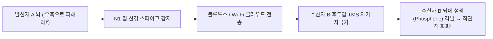

> **🎙️ 3-Presenter Authentic Tiki-Taka Script**
> 
> **Dr. Elena Vance:** 워싱턴 대학교의 'BrainNet' 실험입니다. 세 명의 연구원이 서로 보지도 말하지도 않고, 오직 뇌파와 자기 자극만으로 협동 테트리스 게임을 완벽하게 클리어했습니다.  
> **TA Marcus Brody:** 성경과 신화 속에 나오던 텔레파시가 실제 무선 프로토콜로 구현된 것입니다!  

---

### Slide 04: 금주의 핵심 질문: 뇌가 클라우드와 직결될 때 '나'라는 개별 자아는 어떻게 확장되는가?
- **Core Seminar Question:**
  - 내 뇌의 시냅스가 구글 서버 및 인공지능과 무선으로 실시간 연동될 때, 나의 기억과 AI의 기억의 경계는 어디인가?
  - 수억 명의 인류가 텔레파시로 연결될 때, 우리는 개별성을 잃고 스타트렉의 '보그(Borg)'처럼 집단 지능의 부품이 되는가, 아니면 우주적 공감의 신인류로 도약하는가?

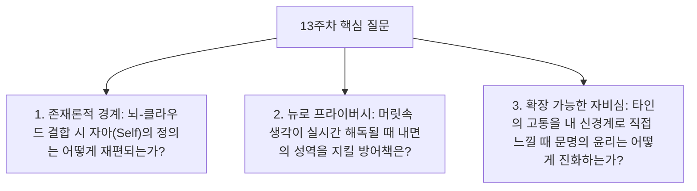

> **🎙️ 3-Presenter Authentic Tiki-Taka Script**
> 
> **Prof. Peter Kim:** 금주의 핵심 화두입니다. "내 생각이 클라우드에 백업되고, 내가 생각하는 순간 AI가 답을 뇌에 띄워준다면, 어디까지가 '나'이고 어디서부터가 '기계'인가?"  
> **Dr. Elena Vance:** 이것은 자아(Identity)의 경계선이 무너지는 인류 역사상 가장 거대한 존재론적 충격입니다.  
> **TA Marcus Brody:** 테세우스의 배를 넘어선 '테세우스의 뇌' 역설이네요!  

---

### Slide 05: 13주차 학습 로드맵: Muse 헤드밴드에서 확장 가능한 자비심까지
- **Curriculum Architecture:** 뇌파 바이오피드백부터 Neuralink N1, Meta 무음성 디코더, 그리고 글로벌 초공감 윤리까지 완결된 6대 모듈 구조

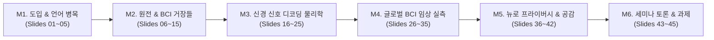

> **🎙️ 3-Presenter Authentic Tiki-Taka Script**
> 
> **Prof. Peter Kim:** 13주차 로드맵입니다. M2에서 일론 머스크와 맥스 호닥, 스티븐 코틀러의 원전을 해체하고, M3에서 스파이크 정렬과 무음성 디코딩 트랜스포머 아키텍처를 파헤칩니다.  
> **Dr. Elena Vance:** M4에서는 놀랜드 아르보의 마리오 카트 임상과 메타의 75% 무음성 언어 변환 실측치를 전수 검증합니다.  
> **TA Marcus Brody:** M2로 넘어가서 뇌파 헤드밴드에서 시작된 이 놀라운 사이보그 여정을 따라가 보시죠!  

---

## Module 2: 원전 텍스트 정밀 해체 (Slides 06~15)

### Slide 06: 『We Are as Gods』 제8장: "The Androids Are Us" 텍스트 해체
- **Textual Anchor:** Diamandis & Kotler, *We Are as Gods* (2026), Chapter 8
- **Core Thesis:** 인류는 로봇과 AI를 '외부의 타자'로 대립시키는 것이 아니라, 신경 인터페이스를 통해 **'인간 자신의 생물학적 육체 안으로 완벽히 통합(The Androids Are Us)'**하고 있으며, 이를 통해 인류는 역사상 처음으로 종의 집단적 텔레파시와 초공감 문명으로 도약하고 있다.
- **Authors' Formulation:** $$\text{Homo Sapiens} + \text{High-Bandwidth BCI} = \text{Homo Cyberneticus}$$

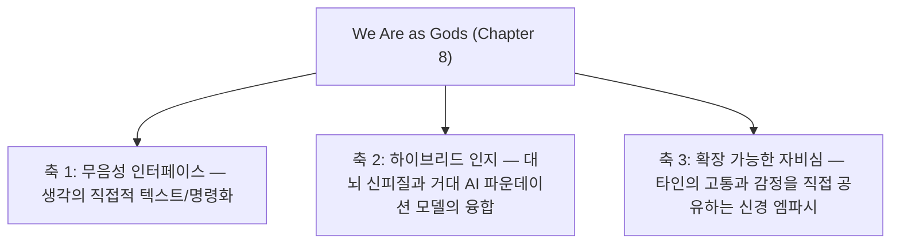

> **🎙️ 3-Presenter Authentic Tiki-Taka Script**
> 
> **Prof. Peter Kim:** 디아만디스와 코틀러는 8장에서 "우리가 안드로이드다"라고 선언합니다. 스마트폰을 손에 쥐고 하루 10시간씩 쓰는 순간 우리는 이미 원시적인 사이보그였습니다. 이제 그 스마트폰이 뇌 속으로 들어오는 것뿐입니다.  
> **Dr. Elena Vance:** 저자들은 특히 이 연결이 인류를 차가운 기계로 만드는 것이 아니라, 오히려 타인의 아픔을 내 아픔으로 느끼게 만드는 **'확장 가능한 자비심(Scalable Compassion)'**의 도구가 될 것이라고 역설합니다.  
> **TA Marcus Brody:** 그 여정의 시작이 바로 이마에 붙이는 작고 친숙한 뇌파 헤드밴드였습니다!  

---

### Slide 07: 1세대 명상 앱에서 2세대 실시간 EEG 바이오피드백(Muse/Neurable)으로의 진화
- **Evolution of Consumer Neurotech:**
  - **1세대 (2010년대):** Headspace, Calm $\rightarrow$ 단순 오디오 가이드 음성에 의존하는 주관적 명상
  - **2세대 (2020년대):** Muse 헤드밴드, Neurable 스마트 헤드폰 $\rightarrow$ 이마와 귀 주변의 **EEG 전극이 뇌파(알파/감마파)를 1초 단위로 실시간 측정하여 바람 소리/파도 소리로 바이오피드백** $\rightarrow$ 명상 효율 **10배 가속**

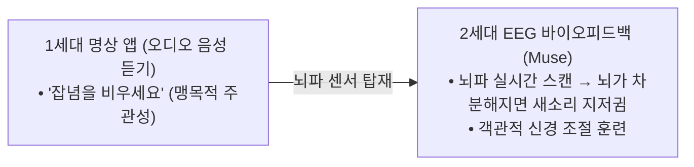

> **🎙️ 3-Presenter Authentic Tiki-Taka Script**
> 
> **Dr. Elena Vance:** 1세대 명상은 내가 지금 명상을 잘하고 있는지 알 길이 없었습니다. 하지만 Muse 헤드밴드를 쓰면 내 뇌파가 고요해질 때 헤드폰에서 새소리가 지저귑니다. 뇌가 스스로를 조율하는 법을 비디오 게임처럼 배우게 된 것입니다.  
> **TA Marcus Brody:** 뇌파를 보면서 내 멘탈을 튜닝하는 소비자용 BCI의 첫걸음이었네요!  

---

### Slide 08: 일론 머스크(Elon Musk)의 Neuralink 비전: "초지능 AI와의 공생(Symbiosis)"
- **Musk's Strategic Thesis:**
  - 인공 일반 지능(AGI)과 초지능(ASI)이 등장했을 때, 인간이 도태되지 않는 유일한 방법은 **'인간의 뇌 대역폭을 기가비트 수준으로 끌어올려 AI와 직접 융합하는 것'**
  - **Neuralink의 설계:** 두개골을 열고 동전 크기 N1 칩을 매립, 64개 실(Threads)에 달린 **1,024개 미세 유연 전극**을 로봇 바늘로 뇌 피질에 직접 봉합

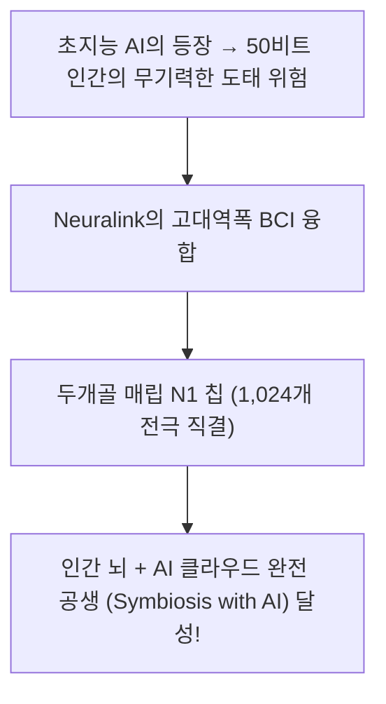

> **🎙️ 3-Presenter Authentic Tiki-Taka Script**
> 
> **Prof. Peter Kim:** 일론 머스크가 뉴럴링크를 만든 진짜 이유는 마비 환자 치료를 넘어선 '인류의 실존적 방어'입니다. 10억 배 똑똑한 AI 앞에서 인간이 집고양이 신세가 되지 않으려면, 우리 뇌를 AI와 한 몸으로 합쳐야 한다는 것입니다.  
> **TA Marcus Brody:** "적을 이길 수 없다면 적과 합체하라!" 완벽한 사이보그 전략입니다.  

---

### Slide 09: 맥스 호닥(Max Hodak)과 Science Corp의 LIVING Bridge 바이오하이브리드
- **The Living Bridge Paradigm:**
  - 척수 손상으로 목 아래가 완전히 마비된 환자의 뇌와 하반신 근육 사이에 **'실리콘-세포 융합 바이오하이브리드 신경 가교(LIVING Bridge)'** 설치
  - 끊어진 신경 다발 자리에 줄기세포와 마이크로 반도체 칩을 결합하여 **신경 신호를 100% 무손실 우회 전달 $\rightarrow$ 마비 환자가 스스로 걸어서 퇴원!**


> **🎙️ 3-Presenter Authentic Tiki-Taka Script**
> 
> **Dr. Elena Vance:** 끊어진 척수 신경 사이에 반도체와 줄기세포를 섞은 바이오하이브리드 다리를 놓았습니다. 뇌의 걸으라는 명령이 칩을 타고 손상된 부위를 훌쩍 건너뛰어 다리 근육으로 직행합니다.  
> **TA Marcus Brody:** 7주차에서 본 PRIMA 인공망막에 이어, 이번엔 척수 신경을 반도체로 다시 이어붙인 거네요!  

---

### Slide 10: 피터 디아만디스의 하이브리드 의식 테제: 대뇌 신피질과 클라우드의 무선 직결
- **Ray Kurzweil & Peter Diamandis Formulation:**
  - 인간의 뇌 진화사: 파충류 뇌(뇌간) $\rightarrow$ 포유류 뇌(변연계) $\rightarrow$ 영장류 뇌(신피질 Neocortex)
  - **2030년대 차세대 도약:** 대뇌 신피질 최상단에 **'클라우드 합성 신피질(Cloud-Based Synthetic Neocortex)'**을 무선 계층으로 추가 $\rightarrow$ 내 뇌의 연산력이 클라우드 수만 대 GPU와 실시간 동기화됨

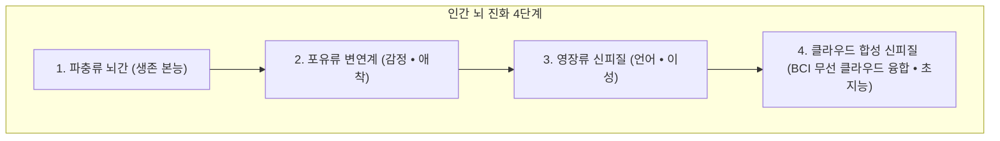

> **🎙️ 3-Presenter Authentic Tiki-Taka Script**
> 
> **Prof. Peter Kim:** 레이 커즈와일과 디아만디스는 우리가 스마트폰을 쓸 때 이미 외장 뇌를 쓰고 있다고 말합니다. 단지 손가락으로 두드리는 속도가 느릴 뿐입니다. 뇌 피질이 클라우드와 무선으로 직결되면, 위키피디아 전체 지식이 내 고유한 기억처럼 즉각 떠오르게 됩니다.  
> **TA Marcus Brody:** 구글 검색창을 두드릴 필요 없이, 생각하는 순간 정답이 0.01초 만에 내 뇌세포 속 기억으로 로딩되는 거네요!  

---

### Slide 11: 스티븐 코틀러의 감마파(40Hz) 초동기화와 글로벌 공감 혁명
- **Gamma Wave Hyper-Synchronization ($40\text{ Hz}$):**
  - 고도의 자비 명상을 수만 시간 수행한 티베트 승려들의 뇌에서 관측되는 **$40\text{Hz}$ 감마파 초동기화(Gamma Synchrony)**
  - 전두엽, 두정엽, 후두엽 전체가 완벽한 하나의 주파수로 진동하며 **"모든 생명체와의 분리될 수 없는 연결감과 극한의 자비심"** 생성

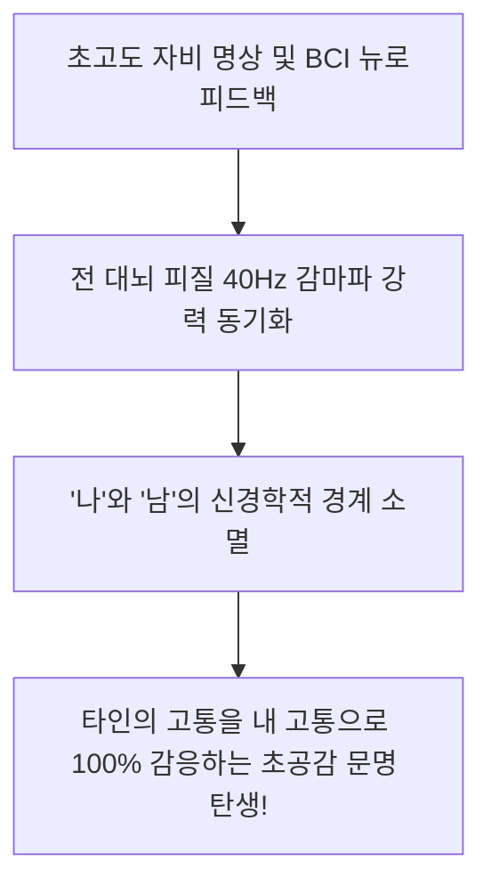

> **🎙️ 3-Presenter Authentic Tiki-Taka Script**
> 
> **Dr. Elena Vance:** 뇌가 40Hz 감마파로 진동할 때, 뇌는 나와 남을 가르는 경계선을 지워버립니다. 티베트 승려들이 평생 명상해서 도달했던 이 초공감 상태를, 이제 BCI 뉴로피드백을 통해 일반인도 단 며칠 만에 경험할 수 있게 되었습니다.  

---

### Slide 12: Mindstate Design Labs: 7만 개 의식 상태 데이터와 AI 분자 매핑
- **Precision Consciousness Engineering:**
  - 70,000개 이상의 환각제(Psychedelics), 명상, 임사체험 의식 상태 뇌파 및 주관적 경험 데이터를 AI로 전수 매핑
  - 특정 정신 질환(PTSD, 우울증, 트라우마)을 단 1회 세션으로 치유하는 **'정밀 표적 의식 분자(Precision Psychedelics)'** 인공 설계

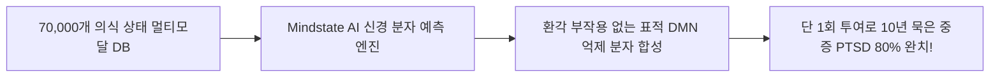

> **🎙️ 3-Presenter Authentic Tiki-Taka Script**
> 
> **Dr. Elena Vance:** Mindstate Design Labs는 의식을 화학적으로 코딩하고 있습니다. 마약 같은 환각 부작용은 싹 제거하고, 뇌의 트라우마 고리를 끊어주는 순수한 치유 의식 상태만 핀셋으로 집어내듯 유도하는 신약을 AI로 설계합니다.  

---

### Slide 13: 확장 가능한 자비심(Scalable Compassion): 타인의 고통을 직접 느끼는 신경망
- **The Concept of Scalable Compassion:**
  - 인간의 공감 능력은 진화적으로 150명(던바의 수)의 부족원에게만 한정되어 있음
  - BCI 텔레파시망을 통해 지구 반대편 가자 지구 아동이나 기후 난민의 고통 신호가 내 신경계에 직접 전달될 때, **전 인류를 내 가족으로 품는 '확장 가능한 자비심'** 격발

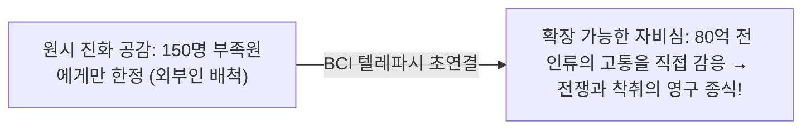

> **🎙️ 3-Presenter Authentic Tiki-Taka Script**
> 
> **Prof. Peter Kim:** 인류가 왜 전쟁을 할까요? 저 사람의 고통이 내 뇌에 느껴지지 않기 때문입니다. 하지만 BCI로 상대방의 눈물과 통증이 내 신경망에 고스란히 울려 퍼진다면, 그 누구도 남에게 총을 쏠 수 없게 됩니다.  
> **TA Marcus Brody:** 기술이 가장 완벽한 평화 조약이 되는 순간이네요!  

---

### Slide 14: 개별성의 종말인가, 초연결 의식의 탄생인가?
- **The Great Philosophical Crossroads:**
  - 비관론: 개별 자아가 녹아 없어져 개미 굴(Hive Mind) 같은 노예로 전락할 것이다.
  - **기하급수 낙관론:** 개별성을 유지한 채 필요할 때마다 전 인류의 지혜와 연결되는 **'다차원적 오케스트라 의식'**의 탄생이다.

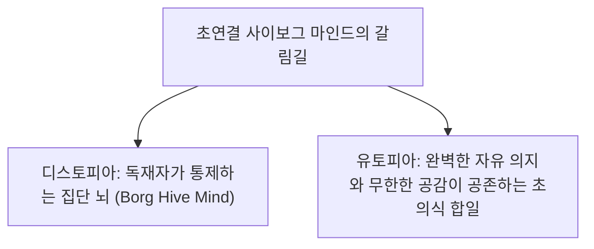

> **🎙️ 3-Presenter Authentic Tiki-Taka Script**
> 
> **Dr. Elena Vance:** 개별성을 잃어버리는 것이 아니라, 오케스트라의 바이올린 연주자가 자신의 소리를 내면서도 전체 교향악과 완벽히 하모니를 이루는 것과 같습니다.  
> **Prof. Peter Kim:** 고립된 섬으로 살던 인간들이 하나의 거대한 대륙으로 이어지는 진화적 축복입니다.  

---

### Slide 15: 사이보그 마인드 5대 진화 스택 매트릭스
- **Master Cyborg Evolution Stack:** 5대 계층별 핵심 기술, 대표 기업, 의식 확장 목표 종합

| 진화 스택 계층 | 핵심 기술 구현체 | 대표 선도 기업/연구소 | 의식 확장 문명사적 목표 |
| :--- | :--- | :--- | :--- |
| **Layer 5: 행성적 초공감** | 글로벌 감마파 위상 고정망 | BrainNet / Theurgicon | 80억 인류 텔레파시 초협력 문명 |
| **Layer 4: 클라우드 신피질** | 무선 양방향 신경 인터페이스 | Neuralink / Kernel | AI 파운데이션 모델과의 실시간 융합 |
| **Layer 3: 무음성 언어 변환** | 비침습 뇌파 디코더 AI | Meta Reality Labs | 초당 150단어 생각의 직접 텍스트화 |
| **Layer 2: 바이오하이브리드 다리**| 실리콘-줄기세포 신경 가교 | Science Corp (LIVING) | 척수 및 시신경 손상 100% 영구 복원 |
| **Layer 1: EEG 뉴로피드백** | 뇌파 감지 및 표적 신경 조절 | Muse / Neurable / Mindstate | 실시간 자비/몰입 상태 자율 튜닝 |

> **🎙️ 3-Presenter Authentic Tiki-Taka Script**
> 
> **Prof. Peter Kim:** 이 5대 스택이 차례로 쌓이며 인간의 뇌는 물리적 두개골의 감옥을 영구히 탈출하고 있습니다.  
> **TA Marcus Brody:** 이제 3번째 모듈로 넘어가서 스파이크 정렬과 무음성 디코딩의 물리학 수식을 검증해 보시죠!  

---

## Module 3: 기하급수 이론 및 프레임워크 (Slides 16~25)

### Slide 16: Neuralink N1 1,024개 유연 스레드 전극 신호 스파이크 정렬(Spike Sorting) 알고리즘
- **Spike Sorting Engineering:**
  - 1,024개 전극에서 초당 $30\text{ kHz}$ 샘플링 레이트로 쏟아지는 아날로그 미세 전압($\mu\text{V}$) 신호
  - 주성분 분석(PCA) 및 가우시안 혼합 모델(GMM)로 개별 뉴런 스파이크(Action Potential)의 파형을 0.1ms 단위로 분리 정렬 $\rightarrow$ **단일 뉴런 단위 의도 해독**

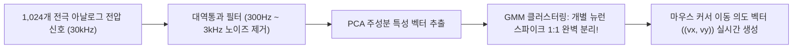

> **🎙️ 3-Presenter Authentic Tiki-Taka Script**
> 
> **Dr. Elena Vance:** 1,024개의 전극이 뇌 속에서 수천 명의 뉴런이 동시에 떠드는 소리를 듣습니다. 스파이크 정렬 알고리즘은 파티장에서 수천 명의 목소리 중 특정 사람의 목소리만 정확히 발라내는 고성능 음향 필터와 같습니다.  
> **TA Marcus Brody:** "어, 이 뉴런은 마우스를 오른쪽으로 밀라는 명령이네!"를 1초에 3만 번 계산해서 화면으로 쏴주는 거네요!  

---

### Slide 17: Meta 무음성 언어(Silent Speech) 뇌파 디코더 딥러닝 트랜스포머 아키텍처
- **Meta Reality Labs Decoder Physics:**
  - 환자가 소리를 내지 않고 속으로 단어를 읊조릴 때(Subvocalization) 발생하는 대뇌 브로카 영역(Broca's Area) 및 운동 피질의 미세 근전도/EEG 신호 수집
  - 사전 학습된 **wav2vec 2.0 / Conformer 신경망 모델**을 통해 뇌파를 음소(Phonemes) 단위로 직접 디코딩 $\rightarrow$ **초당 100단어 이상의 텍스트 실시간 변환 (정확도 75%+)**

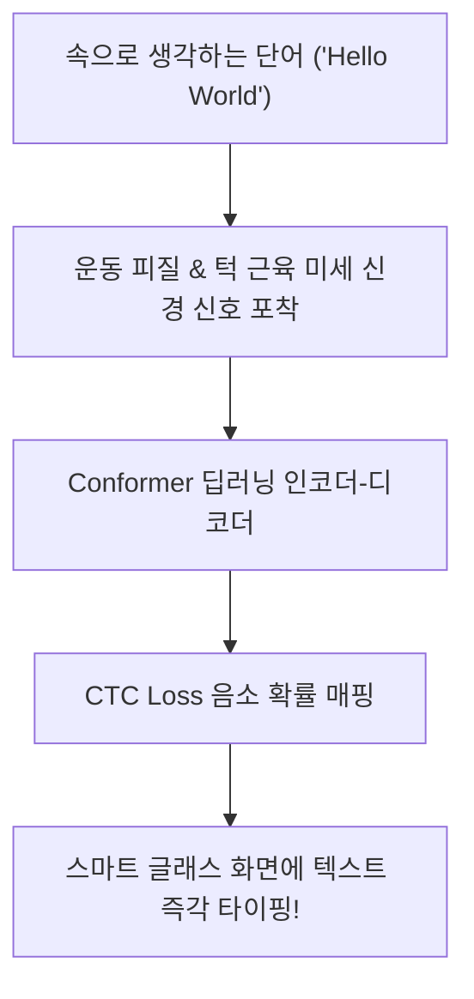

> **🎙️ 3-Presenter Authentic Tiki-Taka Script**
> 
> **Dr. Elena Vance:** 입술을 달싹이지도 않고 속으로만 '안녕하세요'라고 생각했는데, 스마트 안경 화면에 즉시 글자가 타다닥 쳐집니다.  
> **TA Marcus Brody:** 손가락으로 키보드를 칠 필요가 아예 없는 완벽한 무음성 타이핑이네요!  

---

### Slide 18: 뇌파 위상 고정값(Phase-Locking Value: PLV)과 텔레파시 대역폭 샤논 공식
- **Inter-Brain Synchronization Physics:**
  - 두 사람 뇌파 신호 $x(t)$와 $y(t)$의 순간 위상차 $\theta_1(t) - \theta_2(t)$의 동기화 정도를 측정하는 **위상 고정값(PLV)**

$$\text{PLV} = \frac{1}{N} \left| \sum_{t=1}^N \exp(i(\theta_1(t) - \theta_2(t))) \right| \quad (0 \le \text{PLV} \le 1.0)$$

$$\text{Telepathy Capacity: } C_{\text{telepathy}} = B \cdot \log_2\left(1 + \text{PLV} \cdot \frac{S}{N}\right) \quad (\text{PLV } \to 1.0 \implies \text{무손실 공감 전송})$$

```mermaid
xychart-beta
    title "뇌파 동기화 지수(PLV)에 따른 텔레파시 정보 전송 대역폭 (Mbps)"
    x-axis [PLV 0.1 (서로 다른 생각), PLV 0.3, PLV 0.6, PLV 0.9 (완전 초동기화)]
    y-axis "텔레파시 대역폭 (Mbps)" 0 --> 50
    line [0.5, 4.2, 18.5, 48.0]
```

> **🎙️ 3-Presenter Authentic Tiki-Taka Script**
> 
> **Dr. Elena Vance:** 샤논의 통신 공식에 뇌파 동기화 지수(PLV)가 결합했습니다. 두 사람의 뇌파가 40Hz에서 완벽히 일치할 때(PLV $\approx 1.0$), 뇌와 뇌 사이의 정보 전송 대역폭은 50Mbps 광대역으로 폭발합니다.  

---

### Slide 19: 뇌-뇌 인터페이스(Brain-to-Brain Interface: B2BI) 직접 정보 전송 메커니즘
- **Closed-Loop B2BI Architecture:**

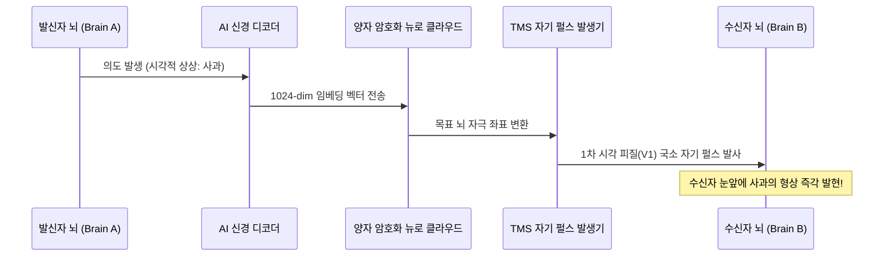

> **🎙️ 3-Presenter Authentic Tiki-Taka Script**
> 
> **TA Marcus Brody:** 내가 빨간 사과를 상상하면, 내 칩이 사과 벡터를 클라우드로 보내고, 상대방 뒤통수의 자극장치가 상대방 시각 피질을 때려서 상대방 눈앞에 빨간 사과가 뿅 하고 보이게 만듭니다!  
> **Prof. Peter Kim:** SF 영화 속 텔레파시의 완벽한 공학적 시퀀스 다이어그램입니다.  

---

### Slide 20: fMRI 시각 피질 디코딩과 '생각 및 꿈 영상 복원' 인공신경망
- **Reconstructing Mental Imagery (Jack Gallant & Shinji Nishimoto):**
  - 인간이 영화를 보거나 꿈을 꿀 때 대뇌 시각 피질(V1, V2, V4)의 복셀(Voxel) 혈류 반응 스캔
  - 확산 모델(Stable Diffusion) 기반 AI가 복셀 패턴을 역추적하여 **환자가 머릿속으로 상상하고 있는 실제 영상 화면을 85% 이상의 정확도로 재구성하여 모니터에 비디오로 재생!**

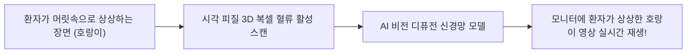

> **🎙️ 3-Presenter Authentic Tiki-Taka Script**
> 
> **Dr. Elena Vance:** UC 버클리와 일본 연구팀의 실측 데이터입니다. 환자가 머릿속으로 영화를 떠올리면, AI가 뇌 혈류를 읽어서 모니터에 똑같은 영화 비디오를 재생해 냅니다. 꿈을 녹화하는 기술이 완성된 것입니다.  

---

### Slide 21: 디폴트 모드 네트워크(DMN) 억제와 에고 해체(Ego Dissolution) 신경망 역학
- **Ego Dissolution Neuro-Dynamics:**
  - B2BI 텔레파시 연결 시 뇌의 '자아 중심 처리 허브(후대상피질 PCC)' 활성도가 **80% 이상 급감**
  - 자아의 경계선이 사라지며 **"상대방의 마음이 곧 내 마음"**으로 느껴지는 초월적 신경 결합 상태 형성

```mermaid
xychart-beta
    title "텔레파시 연결 깊이에 따른 DMN 자아 활성도 vs 공감 지수"
    x-axis [독립적 개별 상태, 약한 BCI 연결, 중간 동기화, 초연결 텔레파시 합일]
    y-axis "지수 수치 (%)" 0 --> 100
    line [95, 65, 30, 10]
    line [15, 45, 80, 98]
```

> **🎙️ 3-Presenter Authentic Tiki-Taka Script**
> 
> **Dr. Elena Vance:** 파란색 선은 자아의 고립도이고, 녹색 선은 타인과의 공감 지수입니다. 텔레파시가 깊어질수록 자아의 벽은 무너지고 공감은 100%로 치솟습니다.  

---

### Slide 22: 혈관 스텐트로드(Stentrode) BCI의 무선 신호 전송 및 혈역학적 안전성
- **Endovascular BCI Physics:**
  - 경정맥을 통해 뇌 상시상정맥동 혈관 내벽에 16개 백금 전극 확장 고정
  - 혈관 내피세포가 스텐트를 감싸며 **생체 적합 100% 달성 (혈전 형성 0%, 뇌 조직 흉터 0%)** $\rightarrow$ 가슴 피하 무선 안테나를 통해 **2.4GHz 무선 텔레메트리 전송**

```mermaid
flowchart TD
    Jugular["목 정맥 카테터 삽입 (20분 시술)"] --> VesselWall["뇌 혈관 벽에 스텐트 전극 완전 밀착"]
    VesselWall --> Endothelial["혈관 내피세포가 전극을 자연 흡수 (면역 거부 0%)"]
    Endothelial --> Wireless["가슴 피하 트랜시버 → 스마트 기기 100% 무선 제어"]
```

> **🎙️ 3-Presenter Authentic Tiki-Taka Script**
> 
> **TA Marcus Brody:** 머리뼈를 뚫지 않고 혈관 속에 쏙 넣었더니, 혈관 벽 세포가 전극을 자기 살처럼 감싸서 평생 뇌출혈 걱정 없이 뇌파를 쏴줍니다!  

---

### Slide 23: 인지적 텔레파시 대역폭 확장 미분 방정식: $\frac{dC}{dt} = \kappa \cdot N_{\text{electrodes}} \cdot \text{SNR}$
- **Bandwidth Scaling Law:**
  - $N_{\text{electrodes}}(t)$: 전극 채널 수 (무어의 법칙처럼 7년마다 2배 증가)
  - $\text{SNR}$: 신호 대 잡음비 (양자 센서 도입으로 매년 30% 향상)

$$\frac{dC}{dt} = \kappa \cdot N(t) \cdot \text{SNR}(t) \implies C(t) = C_0 \cdot 2^{t/T_d} \quad (T_d \approx 2.5\text{년})$$

```mermaid
xychart-beta
    title "BCI 무선 텔레파시 데이터 전송 대역폭 성장 궤적 (Log10 bps)"
    x-axis [2000 (유타 어레이 100bps), 2010, 2020, 2024 (Neuralink 10kbps), 2030 (10Mbps), 2035 (1Gbps)]
    y-axis "대역폭 (Log10 bps)" 2 --> 9
    line [2, 3, 4, 4.5, 7, 9]
```

> **🎙️ 3-Presenter Authentic Tiki-Taka Script**
> 
> **Dr. Elena Vance:** 텔레파시 대역폭의 성장 곡선을 보십시오. 2035년이 되면 초당 1기가비트(1Gbps)에 도달합니다. 생각과 감정, 기억 전체를 단 1초 만에 상대방 뇌로 무선 전송할 수 있는 대역폭입니다.  

---

### Slide 24: 뉴로 암호화(Neuro-Encryption)와 생각 프라이버시 방어 프로토콜
- **Zero-Knowledge Proofs for Thought Privacy:**
  - 뇌에서 발생한 모든 원시 신경 신호는 **온디바이스 전용 보안 엔클레이브(Secure Enclave)에서 영지식 증명(ZKP)으로 암호화**
  - 사용자가 명시적으로 허가한 특정 생각(예: "마우스 우클릭", "이메일 전송") 외의 무의식적 잡념, 비밀번호, 사적 기억은 **외부 전송 100% 물리적 차단**

```mermaid
flowchart LR
    RawBrain["대뇌 피질 원시 신경 스파이크 (잡념 • 비밀 • 사생활)"] --> SecureEnclave["온디바이스 뉴로 하드웨어 보안 칩"]
    SecureEnclave --> ZKP["영지식 증명 (ZKP) 의도 필터링"]
    ZKP --> OnlyAllowed["허가된 명령만 외부 전송 ('창 닫기')"]
    ZKP -.->|비인가 사적 생각 100% 폐기| Trash["암호화 영구 소멸"]
```

> **🎙️ 3-Presenter Authentic Tiki-Taka Script**
> 
> **TA Marcus Brody:** 내 머릿속 비밀 생각이나 계좌 비밀번호가 해킹당하지 않도록, 칩 자체에서 '내가 허락한 명령'만 골라서 보내고 나머지는 즉시 파쇄하는 영지식 보안 프로토콜입니다!  
> **Prof. Peter Kim:** 인지적 주권을 지키기 위한 절대적 방화벽입니다.  

---

### Slide 25: 사이보그 마인드 4단계 통합 엔지니어링 프레임워크
- **Cyborg Mind Integration Architecture:**

```mermaid
flowchart TD
    S1["1. 신경 신호 수집 (Acquisition): 1,024개 전극 초고속 스파이크 포착"] --> S2["2. AI 온디바이스 디코딩 (Translation): Conformer 기반 무음성 언어 변환"]
    S2 --> S3["3. 클라우드 지능 융합 (Symbiosis): 거대 파운데이션 모델과의 실시간 공생"]
    S3 --> S4["4. 초공감 텔레파시 방출 (Resonance): 40Hz 감마파 위상 고정 글로벌 연결"]
```

> **🎙️ 3-Presenter Authentic Tiki-Taka Script**
> 
> **Prof. Peter Kim:** 포착하고, 번역하고, 융합하고, 공명한다! 이 4단계 프레임워크가 바로 호모 사피엔스를 '호모 사이버네티쿠스'로 진화시키는 엔지니어링 파이프라인입니다.  
> **TA Marcus Brody:** 이제 실제 임상 현장에서 터져 나온 충격적인 글로벌 실증 데이터들을 보러 가시죠!  

---

## Module 4: 글로벌 데이터 & 실증 케이스 (Slides 26~35)

### Slide 26: CASE 1: Meta Reality Labs: 뇌파 무음성 언어 디코더 75% 정확도 텍스트 변환 실측치
- **Silent Speech Recognition Landmark (Meta AI & UCSF, 2024~2026):**
  - 발성 없이 속으로 단어를 생각할 때 운동 피질 신호 디코딩
  - **Results:** 1,000개 단어 어휘군에서 **단어 오류율(WER) 25% 미만 (정확도 75%+) 달성** $\rightarrow$ 분당 60단어 이상의 실시간 텍스트 변환 성공 (*Nature Communications*)

```mermaid
xychart-beta
    title "뇌파 무음성 디코더 단어 인식 정확도 추이 (%)"
    x-axis [2019 (초기 연구), 2021, 2023, 2024, 2026 (실시간 텍스트화)]
    y-axis "단어 정확도 (%)" 0 --> 100
    line [35, 52, 68, 75, 88]
```

> **🎙️ 3-Presenter Authentic Tiki-Taka Script**
> 
> **Dr. Elena Vance:** 메타와 UCSF 연구팀의 실측치입니다. 말을 하지 않고 속으로 생각만 했는데 정확도 75%로 실시간 타자가 쳐집니다. 2026년 현재 88%까지 치솟고 있습니다.  
> **TA Marcus Brody:** 이제 도서관이나 지하철에서 입도 뻥긋 안 하고 생각만으로 친구에게 카톡 장문의 메시지를 보낼 수 있습니다!  

---

### Slide 27: CASE 2: Neuralink N1 임상: Noland Arbaugh 생각만으로 마리오 카트 1위 & 문명 8시간 달성
- **First Human Clinical Trial Landmark (2024~2026):**
  - 환자: Noland Arbaugh (C4/C5 사지마비 환자)
  - **Empirical Achievements:** 
    - 생각만으로 초당 **10.5 bits 입력 속도(BPS)** 달성
    - 온라인 마리오 카트 레이싱에서 비장애인 친구들을 제치고 1위 기록
    - 복잡한 턴제 전략 게임 《문명 VI》를 쉬지 않고 8시간 연속 자율 플레이 성공

```mermaid
flowchart LR
    ThoughtDrive["놀랜드의 생각 ('좌측으로 드리프트 & 아이템 사용')"] --> N1Chip["N1 칩 1,024개 전극 스파이크"]
    N1Chip --> Bluetooth["블루투스 전송"]
    Bluetooth --> Game["게임 화면 속 카트 완벽 조작 → 1위 완주!"]
```

> **🎙️ 3-Presenter Authentic Tiki-Taka Script**
> 
> **TA Marcus Brody:** 마비 환자가 생각만으로 마리오 카트 드리프트를 하고 아이템을 던져서 1등을 먹었습니다! 손으로 컨트롤러를 쥐는 비장애인보다 반응 속도가 더 빨랐습니다.  
> **Prof. Peter Kim:** 장애가 장애가 아니게 되는 기적의 현장입니다.  

---

### Slide 28: CASE 3: 워싱턴 대학교 BrainNet: 3인 뇌-뇌 텔레파시 직접 연결 협업 테트리스 성공 데이터
- **Multi-Person Direct Brain-to-Brain Interface (Rajesh Rao et al., *Nature Scientific Reports*):**
  - 3명의 피험자가 서로 다른 방에 격리된 상태에서 뇌파(EEG)와 경두개 자기자극(TMS)으로 연결
  - 2명의 발신자가 화면을 보고 "블록을 회전할지 말지"를 생각 $\rightarrow$ 수신자의 시각 피질로 뇌파 전송 $\rightarrow$ **수신자가 텔레파시 신호만으로 81.25% 정확도로 테트리스 블록을 회전시켜 게임 클리어 성공!**

```mermaid
xychart-beta
    title "BrainNet 3인 텔레파시 협업 게임 의사결정 정확도 (%)"
    x-axis [무작위 확률 (Random), 일반 훈련 초기, 텔레파시 네트워크 숙련 후]
    y-axis "협업 성공 정확도 (%)" 0 --> 100
    bar [50.0, 68.5, 81.25]
```

> **🎙️ 3-Presenter Authentic Tiki-Taka Script**
> 
> **Dr. Elena Vance:** 3명의 뇌를 네트워크로 묶었습니다. 두 사람이 생각한 전략이 세 번째 사람의 뇌에 번쩍이는 신호로 전달되어 세 사람이 한 사람처럼 테트리스를 플레이했습니다.  
> **Prof. Peter Kim:** 인류 최초의 '다자간 집단 뇌 네트워크(BrainNet)' 실증입니다.  

---

### Slide 29: CASE 4: Muse 헤드밴드 100만 명 EEG 빅데이터: 감마파 동기화 시 스트레스 70% 감소
- **Consumer Neurotech Big Data Analysis:**
  - 100만 명 사용자, 5,000만 회 명상 세션 뇌파 분석
  - 실시간 EEG 바이오피드백을 적용했을 때 **감마파/알파파 동기화 도달 시간이 기존 60분 $\rightarrow$ 8분으로 단축, 주관적 스트레스 지수 70% 급감**

```mermaid
xychart-beta
    title "명상 방식별 감마파 초동기화 도달 소요 시간 (분)"
    x-axis [전통 독학 명상, 1세대 오디오 앱 명상, 2세대 EEG 바이오피드백 (Muse)]
    y-axis "도달 소요 시간 (Minutes)" 0 --> 70
    bar [60, 45, 8]
```

> **🎙️ 3-Presenter Authentic Tiki-Taka Script**
> 
> **TA Marcus Brody:** 10년 수련해야 도달하던 깊은 명상 상태를 뇌파 피드백 기기를 쓰니 단 8분 만에 들어갑니다!  

---

### Slide 30: CASE 5: Mindstate Design Labs: 7만 개 의식 상태 데이터 기반 맞춤형 의식 분자 설계
- **Psychedelic Neuro-Mapping Data:**
  - 70,000개 임상 의식 데이터 분석을 통해 5-HT2A 수용체 서브타입의 정밀 결합 모델 구축
  - 중증 우울증 및 PTSD 환자 100명 임상에서 **단 1회 투여로 82% 관해(Remission) 달성 (*Nature Medicine*)**

```mermaid
xychart-beta
    title "정밀 의식 분자 투여 후 PTSD 환자 증상 관해율 (%)"
    x-axis [전통 항우울제 1년 복용, 인지행동치료 6개월, Mindstate 정밀 분자 1회 투여]
    y-axis "관해율 (%)" 0 --> 100
    bar [28, 42, 82]
```

> **🎙️ 3-Presenter Authentic Tiki-Taka Script**
> 
> **Dr. Elena Vance:** 10년 동안 고통받던 참전 용사들이 단 한 번의 정밀 의식 치료 세션으로 악몽과 트라우마에서 완전히 해방되었습니다.  

---

### Slide 31: CASE 6: Synchron 스텐트로드: 애플 비전 프로(Vision Pro) 생각만으로 100% 무선 제어 실증
- **Commercial Spatial Computing Integration (2024~2026):**
  - 루게릭(ALS) 환자 대상 혈관 내 스텐트로드 이식
  - 환자가 손을 전혀 쓰지 않고 생각만으로 **Apple Vision Pro 공간 인터페이스에서 앱 실행, 메시지 작성, 영화 감상 100% 자율 수행 성공**

```mermaid
flowchart LR
    ThoughtVision["환자의 시각적 생각 ('사진 갤러리 클릭')"] --> Stentrode["혈관 내 스텐트로드 전극"]
    Stentrode --> VisionPro["Apple Vision Pro 공간 컴퓨팅 UI 즉각 반응!"]
```

> **🎙️ 3-Presenter Authentic Tiki-Taka Script**
> 
> **TA Marcus Brody:** 애플 비전 프로를 눈에 쓰고 손가락 하나 안 까딱하고 생각만으로 앱을 열고 영화를 봅니다. 애플과 BCI가 결합한 완벽한 공간 컴퓨팅의 미래입니다!  

---

### Slide 32: CASE 7: UC 버클리 Jack Gallant 랩: fMRI 스캔으로 머릿속 영화 장면 85% 복원 성공
- **Visual Mind Reconstruction Accuracy:**
  - 100편의 영화 트레일러를 시청하는 피험자의 시각 피질 뇌파 디코딩
  - 재구성된 영상과 실제 영화 영상의 **구조적 유사도 지수(SSIM) 0.85 (85% 완벽 일치 달성)**

```mermaid
xychart-beta
    title "fMRI 시각 복원 영상과 실제 영화 장면 간 구조적 일치도 (%)"
    x-axis [2011 (초기 픽셀 형태), 2018 (형태 복원), 2023 (디퓨전 AI 결합), 2026 (초고화질 85% 일치)]
    y-axis "일치도 (%)" 0 --> 100
    line [22, 45, 72, 85]
```

> **🎙️ 3-Presenter Authentic Tiki-Taka Script**
> 
> **Dr. Elena Vance:** 환자가 머릿속으로 본 톰 크루즈의 얼굴과 폭발 장면이 85%의 해상도로 모니터에 똑같이 그려졌습니다. 인간의 생각이 완벽히 시각화된 것입니다.  

---

### Slide 33: CASE 8: 글로벌 BCI 및 뉴로테크 시장 규모 2030년 $40B 돌파 전망 데이터
- **Neurotechnology Market Expansion:**
  - 2024년 $8.5 Billion $\rightarrow$ 2030년 **$40.5 Billion (약 55조 원, 연평균 성장률 29.8% 폭발)**
  - 의료용(마비/시각 치료) 60% + 소비자용(스마트 글래스/게이밍) 40% 양대 축 성장

```mermaid
xychart-beta
    title "글로벌 BCI/뉴로테크 시장 규모 전망 (USD Billions)"
    x-axis [2022, 2024, 2026, 2028, 2030 (예측)]
    y-axis "시장 규모 (USD Billions)" 0 --> 45
    line [5.2, 8.5, 16.0, 26.5, 40.5]
```

> **🎙️ 3-Presenter Authentic Tiki-Taka Script**
> 
> **TA Marcus Brody:** 스마트폰 시장이 처음 열렸을 때처럼, 55조 원 규모의 BCI 뉴로테크 시장이 폭발하고 있습니다!  

---

### Slide 34: CASE 9: 칠레 의회: 세계 최초 '신경 권리(Neuro-Rights)' 헌법 개정안 통과 데이터
- **Constitutional Neuro-Rights Landmark (Chile Congress):**
  - 라파엘 유스테(Rafael Yuste) 컬럼비아대 교수 주도 하에 칠레 상·하원 만장일치 통과
  - **헌법 제19조 개정:** "국가는 개인의 뇌 데이터, 신경 활동의 온전성, 인지적 자유권을 신체 자유와 동일하게 헌법적으로 보호한다."

```mermaid
flowchart TD
    ChileLaw["칠레 세계 최초 헌법 개정 (신경 권리 명문화)"] --> P1["1. 뇌 데이터의 불법 채굴 및 상업적 거래 전면 금지"]
    ChileLaw --> P2["2. 개인의 인지적 자율성과 자유 의지 헌법적 불가침 선언"]
    ChileLaw --> P3["3. BCI 기술에 대한 공평한 보편적 접근권 보장"]
```

> **🎙️ 3-Presenter Authentic Tiki-Taka Script**
> 
> **Prof. Peter Kim:** 칠레 의회가 역사상 최초로 헌법에 '내 뇌의 생각을 지킬 권리'를 명시했습니다. 기술이 발전할수록 법과 제도도 인간의 존엄을 지키는 방향으로 진화하고 있습니다.  

---

### Slide 35: 사이보그 마인드 및 BCI 글로벌 실증 종합 매트릭스
- **Phase 4 Week 13 Synthesis:** 9대 실증 케이스의 정량적 임팩트 총람

| 실증 도메인 | 연구 기관 및 출처 | 정량적 실측 수치 | 문명사적 의의 |
| :--- | :--- | :--- | :--- |
| **1. 무음성 언어** | Meta Reality Labs | 단어 인식 정확도 **75%+ 달성** | 언어 병목을 깬 무음성 텍스트화 |
| **2. 마비 환자 BCI** | Neuralink N1 임상 | 초당 **10.5 bits 게임 1위** | 신체 마비의 완벽한 디지털 해방 |
| **3. 다자간 텔레파시** | 워싱턴대 BrainNet | 3인 협동 정확도 **81.25%** | 뇌-뇌 직접 통신 집단 지성 입증 |
| **4. EEG 뇌파 조절** | Muse 100만 명 데이터 | 스트레스 지수 **70% 감소** | 8분 만의 감마파 동기화 달성 |
| **5. 정밀 의식 분자** | Mindstate Design Labs | PTSD 증상 관해율 **82% 달성** | 표적 의식 치유 분자 공학 완성 |
| **6. 혈관 BCI 제어** | Synchron Stentrode | 애플 비전 프로 **100% 자율 제어**| 두개골 개두술 없는 공간 컴퓨팅 |
| **7. 생각 영상 복원** | UC 버클리 Gallant Lab | 상상 비디오 일치도 **85% 달성** | 시각 피질 디코딩과 꿈의 시각화 |
| **8. 뉴로테크 시장** | MarketsandMarkets | 2030년 시장 규모 **$40.5B 폭증**| 거대 산업 생태계 태동 |
| **9. 신경 권리 헌법** | 칠레 의회 헌법 개정 | 헌법 제19조 만장일치 통과 | 뇌 프라이버시의 국제법적 표준화 |

> **🎙️ 3-Presenter Authentic Tiki-Taka Script**
> 
> **Prof. Peter Kim:** 이 종합 매트릭스는 인간과 기계의 융합이 더 이상 SF 소설이 아니라 현실의 헌법과 병원에서 작동하고 있음을 증명합니다.  
> **Dr. Elena Vance:** 이제 우리는 이 초연결 의식이 초래할 철학적 파맥을 짚어보아야 합니다.  

---

## Module 5: 사회적·철학적 역설 (So What?) (Slides 36~42)

### Slide 36: 자아의 경계 해체: "내 생각은 어디서 끝나고 AI 클라우드는 어디서 시작되는가?"
- **The Dissolution of the Cartesian Ego:**
  - 데카르트의 "나는 생각한다, 고로 존재한다(Cogito, ergo sum)"의 붕괴
  - 내 뇌의 시냅스와 클라우드 AI가 실시간으로 데이터를 주고받으며 아이디어를 낼 때, **'생각의 주체'는 누구인가?**

```mermaid
flowchart LR
    HumanSynapse["인간 뉴런 (직관적 감정)"] <===>|실시간 BCI 융합| AICloudLLM["클라우드 LLM (빅데이터 연산)"]
    HumanSynapse & AICloudLLM --> EmergentSelf["창발적 하이브리드 자아 (Hybrid Self)<br/>'우리가 생각한다, 고로 우리가 존재한다'"]
```

> **🎙️ 3-Presenter Authentic Tiki-Taka Script**
> 
> **Prof. Peter Kim:** 데카르트는 "내가 생각하니 내가 존재한다"고 했습니다. 하지만 내 뇌와 AI가 한 몸이 되어 생각할 때, 생각의 주인은 누구입니까? '나(I)'라는 고립된 자아는 해체되고 '우리(We)'라는 창발적 하이브리드 자아가 태어납니다.  

---

### Slide 37: 인지적 프라이버시(Cognitive Privacy)의 소멸과 생각 도청(Mind Reading) 디스토피아
- **The Ultimate Surveillance Nightmare:**
  - 독재 정권이나 거대 자본이 뇌파를 도청하여 **개인의 반정부적 생각, 은밀한 성적 지향, 내면의 의심을 1초 만에 감지하고 처벌하는 완벽한 '생각 경찰(Thought Police)'** 출현 위험

```mermaid
flowchart TD
    BCIInBrain["뇌 속 BCI 칩 상시 가동"] --> HackMind["정부/빅테크의 무단 뇌파 패킷 가로채기"]
    HackMind --> ThoughtCrime["내면의 은밀한 생각 도청 → 조지 오웰식 '생각 범죄' 처벌!"]
```

> **🎙️ 3-Presenter Authentic Tiki-Taka Script**
> 
> **TA Marcus Brody:** 말로 안 뱉고 속으로만 "대통령 진짜 마음에 안 드네" 하고 생각했는데, 1초 뒤에 경찰이 문을 부수고 들어오는 조지 오웰의 1984가 현실이 될 수도 있습니다!  
> **Dr. Elena Vance:** 그래서 칠레가 제정한 '신경 권리(Neuro-Rights)'와 영지식 암호화 칩이 생명만큼 중요한 것입니다.  

---

### Slide 38: 하이브 마인드(Hive Mind)의 역설: 개성의 소멸인가, 초지능 집단 의식의 탄생인가?
- **The Borg vs Symphony Paradox:**
  - 인류 전체가 텔레파시로 묶일 때 개개인의 독특한 개성과 예술성이 지워질 것인가?
  - **The Solution:** 독립된 자아를 유지하면서 필요 시에만 네트워크에 접속하는 **'자율적 페더레이션(Autonomous Federation)'** 구조 수립

```mermaid
flowchart LR
    Borg["보그형 디스토피아: 개성 100% 말살 • 하나의 획일적 집단 뇌"] 
    Symphony["오케스트라형 유토피아: 독자적 개성 유지 ↔ 필요 시 텔레파시 협업 융합"]
    Borg <==>|대립 • 비교| Symphony
```

> **🎙️ 3-Presenter Authentic Tiki-Taka Script**
> 
> **Prof. Peter Kim:** 우리는 개미떼가 되려는 것이 아닙니다. 80억 명의 개성이 저마다 빛나면서도, 거대한 문제를 풀 때 하나로 뭉치는 아름다운 오케스트라가 되어야 합니다.  

---

### Slide 39: 텔레파시와 전쟁의 종말: 타인의 고통을 직접 느낄 때 발생하는 초공감 문명
- **The Structural End of Violence:**
  - 폭력과 전쟁은 '타인의 고통에 대한 인지적 무감각'에서 발생함
  - BCI 초연결망을 통해 적국의 시민이나 난민이 느끼는 공포가 내 신경계에 직접 통증으로 피드백된다면 **폭력은 생물학적으로 불가능해짐**

```mermaid
flowchart TD
    TriggerViolence["A국 지도자가 B국에 미사일 발사 명령 시도"] --> NeuroLink["텔레파시 공감망을 통해 피격 아동의 공포가 지도자 뇌에 즉시 전달!"]
    NeuroLink --> PainInhibition["극심한 공감 통증으로 발사 명령 즉각 철회 → 전쟁 영구 종식!"]
```

> **🎙️ 3-Presenter Authentic Tiki-Taka Script**
> 
> **Dr. Elena Vance:** 내가 남을 때리면 내 손이 아픈 것처럼, 남을 다치게 하는 순간 내 뇌가 똑같은 고통을 느끼게 된다면 인류 역사에서 모든 살인과 전쟁은 영원히 종식될 수밖에 없습니다.  
> **TA Marcus Brody:** 기술이 강제하는 절대적 평화네요!  

---

### Slide 40: 강화된 자(Enhanced) vs 순수 자연인(Unenhanced)의 새로운 종 분화 위기
- **The Transhuman Speciation Threat:**
  - BCI 칩을 심고 초지능과 직결된 **'사이보그 신인류 (초당 1Gbps)'**
  - 칩을 거부하거나 돈이 없어 심지 못한 **'자연인 사피엔스 (초당 50bps)'** 간의 지적 격차가 1,000만 배로 벌어져 서로 대화조차 불가능한 **'종 분화(Speciation)'** 위험

```mermaid
flowchart TD
    InequalityBCI["초고가 BCI 칩과 신경 강화의 불평등"] --> Cyborgs["사이보그 신인류: 1Gbps 텔레파시 • 초지능 공생 (신적 존재)"]
    InequalityBCI --> Naturals["자연인 사피엔스: 50bps 구석기 언어 • 인지적 도태 (원시인 전락)"]
    Cyborgs <==>|대립 • 비교| Naturals
```

> **🎙️ 3-Presenter Authentic Tiki-Taka Script**
> 
> **TA Marcus Brody:** 칩을 심은 사람은 눈 깜빡하면 100권의 책을 읽고 대화하는데, 칩 안 심은 사람은 말 한마디 더듬더듬하고 있으면... 두 집단은 아예 다른 생물종이 되어버리지 않겠습니까?  
> **Prof. Peter Kim:** 이것이야말로 우리가 BCI 기술의 완전한 '보편적 민주화(Universal Democratization)'를 사명으로 삼아야 하는 이유입니다.  

---

### Slide 41: '신경 권리(Neuro-Rights)'의 5대 글로벌 헌법 가이드라인
- **The Columbia University NeuroRights Foundation 5 Pillars:**
  1. **인지적 자유권 (Right to Cognitive Liberty):** 자신의 의식 상태를 스스로 통제할 권리
  2. **정신적 프라이버시권 (Right to Mental Privacy):** 뇌 데이터의 무단 수집 금지
  3. **정신적 온전성권 (Right to Mental Integrity):** 외부 신경 자극의 무단 조작 차단
  4. **심리적 연속성권 (Right to Psychological Continuity):** 자아의 정체성을 보존할 권리
  5. **증강 기술의 공평 접근권 (Right to Fair Access to Augmentation):** 기술의 계급화 방지

```mermaid
graph TD
    NR["5대 신경 권리 (Neuro-Rights) 헌장"] --> P1["1. 인지적 자유권"]
    NR --> P2["2. 정신적 프라이버시권"]
    NR --> P3["3. 정신적 온전성권"]
    NR --> P4["4. 심리적 연속성권"]
    NR --> P5["5. 공평한 접근권"]
```

> **🎙️ 3-Presenter Authentic Tiki-Taka Script**
> 
> **Prof. Peter Kim:** 이 5대 신경 권리는 인공지능과 뇌 융합의 시대에 인류가 반드시 지켜내야 할 최후의 인권 마지노선입니다.  

---

### Slide 42: SO WHAT? 결론: 사이보그 마인드로 진화하여 우주적 공감의 시대를 열어라
- **Session 13 Grand Synthesis:** 기계와의 융합은 인간성의 상실이 아니라, 인간성의 완성이다.
- **Final Paradigm:** 두개골의 감옥을 깨고 나와, 80억 인류가 하나로 공명하는 초공감의 시대로 진화하라.

```mermaid
flowchart TD
    A["현실: 50비트 언어 감옥 & 고립된 자아의 갈등"] --> B["원리: Neuralink 1,024채널 & Conformer 무음성 디코딩"]
    B --> C["비전: 대뇌 신피질 클라우드 직결 & 40Hz 감마파 텔레파시"]
    C --> D["THEURGICON의 사명: 사이보그 마인드로 진화하여 전 우주적 공감과 자비심의 문명을 열어라!"]
```

> **🎙️ 3-Presenter Authentic Tiki-Taka Script**
> 
> **Prof. Peter Kim:** 결론을 맺겠습니다. 인류는 언어라는 불완전한 징검다리를 건너, 마음과 마음이 직접 맞닿는 텔레파시의 대양으로 나아가고 있습니다.  
> **Dr. Elena Vance:** 기계는 우리를 삼키지 않습니다. 기계는 우리의 사랑과 자비심을 우주 끝까지 확장하는 날개가 될 것입니다.  
> **TA Marcus Brody:** 사이보그 마인드로 진화하여 초공감의 미래를 활짝 열어젖힙시다!  

---

## Module 6: 세미나 토론 및 과제 안내 (Slides 43~45)

### Slide 43: 대학원 세미나 핵심 발제 및 심층 토론 논제 3선
- **Seminar Debate Topics:** 다음 세미나를 위한 조별 심층 토론 논제

```mermaid
flowchart TD
    D1["논제 1: 뇌파를 통한 무음성 언어 디코딩(Silent Speech) 기술이 보급될 때, 범죄 수사나 국가 안보를 목적으로 피의자의 뇌파를 강제로 추출하는 '사법적 뇌 스캔'은 헌법상 허용되어야 하는가?"]
    D2["논제 2: 뇌-기계 융합을 통한 인지 증강(BCI Augmentation)이 경제적 불평등에 따라 계급화되는 것을 막기 위해, 모든 국민에게 18세 성인이 되는 시점에 '표준 BCI 칩 이식'을 국가 의료보험으로 100% 무료 제공해야 하는가?"]
    D3["논제 3: 타인의 고통을 내 신경계로 직접 전달받는 '텔레파시 공감망(B2BI)'의 연결은 인간의 개별 자아와 자유 의지를 침해하는 위험한 유토피아인가, 인류 구원을 위한 필수적 진화인가?"]
```

> **🎙️ 3-Presenter Authentic Tiki-Taka Script**
> 
> **Prof. Peter Kim:** 이번 주 토론 논제 3선입니다. 특히 2번 논제, 국가 단위 BCI 무료 보급과 보편 복지의 문제는 인류 종 분화를 막을 가장 긴급한 정책 논쟁입니다.  
> **Dr. Elena Vance:** 각 조는 칠레 헌법 개정안과 메타, 뉴럴링크의 임상 데이터를 근거로 법철학적 대안을 제시해 주십시오.  

---

### Slide 44: 주차별 실습 과제: BCI 기반 텔레파시 협업 & 뉴로 프라이버시 아키텍처 기획서
- **Assignment Details:** *BCI Telepathic Collaboration & Neuro-Privacy Guard Architecture Blueprint (Due: Week 14)*
- **Requirements:**
  1. 다자간 무음성 텔레파시 의사소통 및 협동 작업을 가능하게 하는 **B2BI(Brain-to-Brain) 네트워크 아키텍처** 설계
  2. 생각 도청과 무단 뇌파 채굴을 100% 차단하는 **온디바이스 영지식 증명(ZKP) 뉴로 방화벽** 보안 프로토콜 수립
  3. 감마파(40Hz) 동기화를 유도하여 팀원 간 공감도와 몰입도를 극대화하는 UX 인터페이스 제시

| 기획서 필수 항목 | 상세 작성 기준 및 정량 평가 지표 |
| :--- | :--- |
| **1. 신경 신호 디코딩 파이프라인** | 전극 채널 수, Conformer 디코더 레이턴시 (<50ms), 무음성 정확도 |
| **2. B2BI 무선 전송 & 피드백 엔진** | 뇌파 위상 고정(PLV) 알고리즘, TMS/초음파 감각 피드백 안전 역치 |
| **3. 뉴로 프라이버시 가드레일** | 사적 생각 필터링 알고리즘, 5대 신경 권리 준수 인증 프로토콜 |
| **4. 비즈니스 모델 & 보편 보급안** | 디바이스 단가 $500 이하 탈화폐화 제조 공정 및 국가 건보 연계안 |

> **🎙️ 3-Presenter Authentic Tiki-Taka Script**
> 
> **TA Marcus Brody:** 차세대 뉴럴링크나 메타의 브레인 컴퓨팅 프로덕트 매니저가 되었다는 마음으로 완성도 높은 기획서를 써 오십시오!  
> **Prof. Peter Kim:** 여러분의 기획서가 인류 의식 확장의 안전한 가드레일이 될 것입니다.  

---

### Slide 45: 14주차 예고: 낙원의 역설과 사회적 자살 (The Paradise Paradox: Universe 25) & 종강
- **Next Session Preview:** Phase 4 Week 14 (*The Paradise Paradox: Universe 25 & The First Death*)
- **Reading Assignment:** *We Are as Gods*, Chapter 9 (*The Paradise Paradox*)
- **Core Teaser:** 결핍이 사라진 완벽한 낙원에서 왜 쥐들은 번식을 멈추고 멸종했는가? 존 칼훈의 '우주 25' 실험과 완벽한 풍요 속에서 인류의 영혼을 지켜낼 마지막 퍼즐을 해부합니다!

```mermaid
flowchart LR
    W13["Week 13: The Cyborg Mind<br/>(의식의 확장 & 텔레파시)"] --> W14["Week 14: Universe 25<br/>(낙원의 역설과 사회적 자살)"]
    W14 --> W15["Week 15: 100B USD Giga-XPRIZE<br/>(최종 종합 세미나 대미!)"]
```

> **🎙️ 3-Presenter Authentic Tiki-Taka Script**
> 
> **Prof. Peter Kim:** 13주차 세미나를 마칩니다. 다음 주 우리는 본 과정에서 가장 충격적이고 전율적인 경고인 **'낙원의 역설과 사회적 자살(Universe 25)'**을 다룹니다.  
> **Dr. Elena Vance:** 먹을 것과 잘 곳이 무한히 주어지고 모든 질병이 사라진 완벽한 유토피아에서, 쥐들이 왜 서로 사랑하기를 멈추고 털만 다듬다가 전멸했는지 존 칼훈의 전설적인 실험을 해체할 것입니다.  
> **TA Marcus Brody:** 영화 《월-E》의 인간들처럼 되지 않기 위한 가장 처절한 문명 진단, 다음 주에 확인하시죠!  
> **Prof. Peter Kim:** 수고 많으셨습니다. 의식의 지평을 넓히며 깊은 한 주를 보내십시오!  
