# Session 13: The Cyborg Mind: BCI Telepathy & Scalable Compassion
> **Course:** We Are as Gods: A Survival Guide for the Age of Abundance (*EXPO-701*)  
> **Institution:** Oikos University • Graduate School of Exponential Civilization & Future Technology  
> **Instructors:** Prof. Peter Kim (Chair Professor), Dr. Elena Vance (Lead Scientist), TA Marcus Brody (Deep-Tech Fellow)  
> **Reading Assignment:** Peter H. Diamandis & Steven Kotler, *We Are as Gods* (2026), Chapter 8 (*The Androids Are Us*)  
> **Standard Architecture:** 45 Slides (6 Modules: M1–M6) • High-Velocity 3-Presenter Micro-Turn Dialogue Master Edition  

---

## 📌 Master Table of Contents & Slide Index

- [Module 1: Introduction & Civilizational Framing (Slides 01–05)](#module-1-introduction--civilizational-framing-slides-0105)
  - [Slide 01: The Dawn of the Cyborg Mind: Direct Brain-Cloud Merging](#slide-01-the-dawn-of-the-cyborg-mind-direct-brain-cloud-merging)
  - [Slide 02: Language as a 50-Bit Output Prison: The 200,000x Bandwidth Bottleneck](#slide-02-language-as-a-50-bit-output-prison-the-200000x-bandwidth-bottleneck)
  - [Slide 03: The Engineering of Telepathy: Direct Neural BrainNet Architectures](#slide-03-the-engineering-of-telepathy-direct-neural-brainnet-architectures)
  - [Slide 04: The Core Existential Inquest: What Happens to the Individual Ego in a Hyper-Connected Cloud?](#slide-04-the-core-existential-inquest-what-happens-to-the-individual-ego-in-a-hyper-connected-cloud)
  - [Slide 05: Session 13 Pedagogical Roadmap: From Muse Headbands to Scalable Compassion](#slide-05-session-13-pedagogical-roadmap-from-muse-headbands-to-scalable-compassion)
- [Module 2: Primary Text Deconstruction: The Androids Are Us (Slides 06–15)](#module-2-primary-text-deconstruction-the-androids-are-us-slides-0615)
  - [Slide 06: Deconstructing Chapter 8: "The Androids Are Us" & Biological Transmutation](#slide-06-deconstructing-chapter-8-the-androids-are-us--biological-transmutation)
  - [Slide 07: The Evolution of Neurotech: From 1st-Gen Apps to 2nd-Gen Real-Time EEG Biofeedback](#slide-07-the-evolution-of-neurotech-from-1st-gen-apps-to-2nd-gen-real-time-eeg-biofeedback)
  - [Slide 08: Elon Musk & Neuralink: Direct Neocortical Symbiosis with Superintelligent AI](#slide-08-elon-musk--neuralink-direct-neocortical-symbiosis-with-superintelligent-ai)
  - [Slide 09: Max Hodak & Science Corp: The LIVING Bridge Bio-Hybrid Interface](#slide-09-max-hodak--science-corp-the-living-bridge-bio-hybrid-interface)
  - [Slide 10: Peter Diamandis’s Hybrid Consciousness Thesis: Wirelessly Linking the Neocortex](#slide-10-peter-diamandiss-hybrid-consciousness-thesis-wirelessly-linking-the-neocortex)
  - [Slide 11: Steven Kotler on 40Hz Gamma-Band Hyper-Synchronization & The Empathy Revolution](#slide-11-steven-kotler-on-40hz-gamma-band-hyper-synchronization--the-empathy-revolution)
  - [Slide 12: Mindstate Design Labs: 70,000 States of Consciousness Mapped via Molecular AI](#slide-12-mindstate-design-labs-70000-states-of-consciousness-mapped-via-molecular-ai)
  - [Slide 13: Scalable Compassion: Directly Experiencing the Suffering of Another Consciousness](#slide-13-scalable-compassion-directly-experiencing-the-suffering-of-another-consciousness)
  - [Slide 14: The End of Solitary Individuality or the Birth of Planetary Super-Consciousness?](#slide-14-the-end-of-solitary-individuality-or-the-birth-of-planetary-super-consciousness)
  - [Slide 15: The Grand 5-Tier Cyborg Mind Evolution Matrix](#slide-15-the-grand-5-tier-cyborg-mind-evolution-matrix)
- [Module 3: Exponential Frameworks & Neuro-Informatics (Slides 16–25)](#module-3-exponential-frameworks--neuro-informatics-slides-1625)
  - [Slide 16: Neuralink N1 1,024-Electrode Array: Real-Time Spike Sorting Algorithms](#slide-16-neuralink-n1-1024-electrode-array-real-time-spike-sorting-algorithms)
  - [Slide 17: Meta Reality Labs Silent Speech Decoder: Deep Learning Transformer Architecture](#slide-17-meta-reality-labs-silent-speech-decoder-deep-learning-transformer-architecture)
  - [Slide 18: Phase-Locking Value (PLV) & The Shannon Telepathy Channel Capacity Formula](#slide-18-phase-locking-value-plv--the-shannon-telepathy-channel-capacity-formula)
  - [Slide 19: Brain-to-Brain Interface (B2BI) Bi-Directional Signal Mechanics](#slide-19-brain-to-brain-interface-b2bi-bi-directional-signal-mechanics)
  - [Slide 20: fMRI Visual Cortex Neural Decoding & Thought/Dream Video Reconstruction](#slide-20-fmri-visual-cortex-neural-decoding--thoughtdream-video-reconstruction)
  - [Slide 21: Default Mode Network (DMN) Suppression & Ego Dissolution Dynamics](#slide-21-default-mode-network-dmn-suppression--ego-dissolution-dynamics)
  - [Slide 22: Synchron Stentrode Endovascular BCI: Wireless Intravascular Signal Telemetry](#slide-22-synchron-stentrode-endovascular-bci-wireless-intravascular-signal-telemetry)
  - [Slide 23: Cognitive Telepathy Bandwidth Expansion Differential Equation: $\frac{dC}{dt} = \kappa \cdot N \cdot \text{SNR}$](#slide-23-cognitive-telepathy-bandwidth-expansion-differential-equation-fracdcdt--kappa-cdot-n-cdot-textsnr)
  - [Slide 24: Neuro-Encryption Protocols & Zero-Knowledge Proofs for Mental Privacy](#slide-24-neuro-encryption-protocols--zero-knowledge-proofs-for-mental-privacy)
  - [Slide 25: The 4-Stage Cyborg Mind Systems Engineering Framework](#slide-25-the-4-stage-cyborg-mind-systems-engineering-framework)
- [Module 4: Global Empirical Verification & Clinical Neurotech Data (Slides 26–35)](#module-4-global-empirical-verification--clinical-neurotech-data-slides-2635)
  - [Slide 26: CASE 01: Meta Reality Labs Silent Speech: 75% Word Accuracy from Sub-Vocal Muscle EMG](#slide-26-case-01-meta-reality-labs-silent-speech-75-word-accuracy-from-sub-vocal-muscle-emg)
  - [Slide 27: CASE 02: Neuralink Human Landmark: Noland Arbaugh Controls Chess & Civilization VI at 8.0 BPS](#slide-27-case-02-neuralink-human-landmark-noland-arbaugh-controls-chess--civilization-vi-at-80-bps)
  - [Slide 28: CASE 03: University of Washington BrainNet: 3-Person Direct Telepathic Collaborative Tetris](#slide-28-case-03-university-of-washington-brainnet-3-person-direct-telepathic-collaborative-tetris)
  - [Slide 29: CASE 04: Muse EEG 1-Million-User Database: Gamma Synchronization Drops Stress by 70%](#slide-29-case-04-muse-eeg-1-million-user-database-gamma-synchronization-drops-stress-by-70)
  - [Slide 30: CASE 05: Mindstate Design Labs: AI Molecular Modeling of 70,000 Conscious States](#slide-30-case-05-mindstate-design-labs-ai-molecular-modeling-of-70000-conscious-states)
  - [Slide 31: CASE 06: Synchron Stentrode: Direct Thought Control of Apple Vision Pro Spatial Computing](#slide-31-case-06-synchron-stentrode-direct-thought-control-of-apple-vision-pro-spatial-computing)
  - [Slide 32: CASE 07: UC Berkeley Gallant Lab: 85% Semantic Video Reconstruction from fMRI Blood Flow](#slide-32-case-07-uc-berkeley-gallant-lab-85-semantic-video-reconstruction-from-fmri-blood-flow)
  - [Slide 33: CASE 08: Global Neurotechnology Market: Projecting $40 Billion by 2030](#slide-33-case-08-global-neurotechnology-market-projecting-40-billion-by-2030)
  - [Slide 34: CASE 09: Republic of Chile: World-First Constitutional "Neuro-Rights" Amendment](#slide-34-case-09-republic-of-chile-world-first-constitutional-neuro-rights-amendment)
  - [Slide 35: Grand Cyborg Mind & Neuro-Interface Verification Matrix](#slide-35-grand-cyborg-mind--neuro-interface-verification-matrix)
- [Module 5: Existential Paradoxes & The "So What?" Layer (Slides 36–42)](#module-5-existential-paradoxes--the-so-what-layer-slides-3642)
  - [Slide 36: Dissolution of Ego Boundaries: "Where Does My Mind End and the AI Cloud Begin?"](#slide-36-dissolution-of-ego-boundaries-where-does-my-mind-end-and-the-ai-cloud-begin)
  - [Slide 37: Cognitive Privacy & The Nightmare of Commercial Mind Reading](#slide-37-cognitive-privacy--the-nightmare-of-commercial-mind-reading)
  - [Slide 38: The Hive Mind Dilemma: Erasure of Individuality vs. Cosmic Super-Consciousness](#slide-38-the-hive-mind-dilemma-erasure-of-individuality-vs-cosmic-super-consciousness)
  - [Slide 39: Telepathy & The End of War: The Inability to Hate When Feeling Another’s Pain](#slide-39-telepathy--the-end-of-war-the-inability-to-hate-when-feeling-anothers-pain)
  - [Slide 40: Biological Speciation: Enhanced Cyborgs vs. Unenhanced Natural Humans](#slide-40-biological-speciation-enhanced-cyborgs-vs-unenhanced-natural-humans)
  - [Slide 41: The 5 Fundamental Constitutional Neuro-Rights (Rafael Yuste)](#slide-41-the-5-fundamental-constitutional-neuro-rights-rafael-yuste)
  - [Slide 42: Synthesizing the "So What?": Evolving the Cyborg Mind to Unlock Universal Compassion](#slide-42-synthesizing-the-so-what-evolving-the-cyborg-mind-to-unlock-universal-compassion)
- [Module 6: Graduate Seminar Discourse & Moonshot Design (Slides 43–45)](#module-6-graduate-seminar-discourse--moonshot-design-slides-4345)
  - [Slide 43: Socratic Seminar Inquiries: Triad of Dialectical Debates](#slide-43-socratic-seminar-inquiries-triad-of-dialectical-debates)
  - [Slide 44: Graduate Workshop Protocol: BCI-Based Telepathic Network & Neuro-Privacy Architecture](#slide-44-graduate-workshop-protocol-bci-based-telepathic-network--neuro-privacy-architecture)
  - [Slide 45: Preview of Session 14: The Paradise Paradox & Universe 25](#slide-45-preview-of-session-14-the-paradise-paradox--universe-25)

---

## Module 1: Introduction & Civilizational Framing (Slides 01–05)

### Slide 01: The Dawn of the Cyborg Mind: Direct Brain-Cloud Merging
- **Session Focus:** Investigating the ultimate convergence of human biology and machine intelligence: the direct bidirectional coupling of the cerebral cortex with multi-ExaFLOP AI clouds, dismantling the evolutionary bottleneck of spoken language and unlocking **Synthetic Telepathy and Scalable Compassion**.
- **Academic Foundation:** Peter H. Diamandis & Steven Kotler (2026), *We Are as Gods*, Chapter 8 (*The Androids Are Us*).
- **Core Technology:** Neuralink N1, Meta Reality Labs Silent Speech EMG, Synchron Stentrode, and Science Corp Optogenetic Bio-Hybrids.

```mermaid
flowchart LR
    BiologicalBrain["Human Biological Neocortex<br/>(100 Trillion Synaptic Connections • Deep Emotions)"] <===>|High-Bandwidth Bidirectional BCI (1,024+ Channels)| AICloud["ExaFLOP Planetary AI Cloud<br/>(Infinite Compute • 181ZB Global Knowledge Mesh)"]
    BiologicalBrain & AICloud --> CyborgMind["THE CYBORG MIND<br/>• Synthetic Telepathy (Gigabit Speed)<br/>• Scalable Compassion (Direct Shared Empathy)"]
    style CyborgMind fill:#10b981,stroke:#065f46,color:#fff
```

> **🎙️ 3-Presenter Authentic Tiki-Taka Script**
> 
> **Prof. Peter Kim:** Scholars, welcome to Session 13! Today we witness the materialization of humanity's oldest science-fiction dream: **Synthetic Telepathy and Brain-Computer Interfaces (BCI)**! *(Turn 1)*  
> **Dr. Elena Vance:** Professor Kim, spoken language is an ancient, lossy acoustic compression protocol. When you have a brilliant 10-Megabit concept in your visual cortex, you have to compress it down into clumsy vocal cord vibrations, transmitting at an agonizingly slow **50 bits per second** to someone else's ears! *(Turn 2)*  
> **TA Marcus Brody:** Look at the green box on Slide 1: That narrow bottleneck causes 99% of human misunderstandings, political wars, and emotional isolation! But when Neuralink and optogenetic chips connect brain-to-brain directly, we can transmit complex emotions and technical schematics at the speed of light! *(Turn 3)*  
> **Prof. Peter Kim:** This is not merely an engineering interface upgrade; it is the ontological expansion of human consciousness itself into **The Cyborg Mind**. *(Turn 4)*  
> **TA Marcus Brody:** We are breaking out of the 50-bit biological output prison! *(Turn 5)*  
> **Dr. Elena Vance:** Unlocking direct neural telepathy and scalable compassion. *(Turn 6)*  
> **Prof. Peter Kim:** Let us examine the extreme 200,000x output bandwidth asymmetry of human language on Slide 2. *(Turn 7)*  
> **TA Marcus Brody:** Turn to Slide 2: Language as a 50-Bit Output Prison! *(Turn 8)*  
> **Dr. Elena Vance:** Let’s see the mathematical communication bottleneck on Slide 2! *(Turn 9)*  
> **Prof. Peter Kim:** Proceed to Slide 2. *(Turn 10)*

---

### Slide 02: Language as a 50-Bit Output Prison: The 200,000x Bandwidth Bottleneck
- **The Quantitative Bandwidth Asymmetry:**
  - Human Speech Velocity: $\approx 150\text{ words/minute} \approx \mathbf{30\text{ to }50\text{ bits/second}}$.
  - Human Typing Velocity: $\approx 60\text{ words/minute} \approx \mathbf{15\text{ to }20\text{ bits/second}}$.
  - Human Visual Cortex Input Capacity: **$\approx 10,000,000\text{ bits/second (10 Mbps)}$**.
  - **The Asymmetry:** The human mind absorbs reality at $10\text{ Mbps}$, but can only output thoughts at $50\text{ bps}$—an **output bandwidth bottleneck exceeding $200,000 : 1$**!

```mermaid
flowchart TD
    RichThought["Rich 10-Megabit 4D Thought / Emotional Landscape in Neocortex"] --> ThroatChoke["Vocal Cord / Finger Muscle Physical Bottleneck (50 bps)"]
    ThroatChoke --> Lossy["99.999% Information Loss, Nuance Erasure & Miscommunication"]
    RichThought ==>|High-Density BCI Direct Telepathic Pipeline (100 Mbps)| PureTransmit["Lossless Neural Stream Directly into Cloud / Peer Brain!"]
    style ThroatChoke fill:#dc2626,stroke:#7f1d1d,color:#fff
    style PureTransmit fill:#10b981,stroke:#065f46,color:#fff
```

> **🎙️ 3-Presenter Authentic Tiki-Taka Script**
> 
> **Prof. Peter Kim:** Slide 2 presents the fundamental communication physics governing human biology: **The 200,000x Output Bandwidth Bottleneck**. Dr. Vance, contrast our visual input speed with our vocal output speed. *(Turn 1)*  
> **Dr. Elena Vance:** Look at the numbers: Your optic nerve and visual cortex take in rich high-definition video and spatial data at **10,000,000 bits per second (10 Megabits/s)**! But when you want to express a thought or an emotion to another human being, you have to push air through vocal cords at **just 30 to 50 bits per second**! *(Turn 2)*  
> **TA Marcus Brody:** Look at the ratio in the red box: Our input-to-output bandwidth disparity is **$200,000\text{ to } 1$**! When you try to describe a complex architectural vision or deep love, 99.999% of the richness, nuance, and beauty is crushed and lost in transmission! *(Turn 3)*  
> **Dr. Elena Vance:** Look at the green pathway: High-bandwidth Brain-Computer Interfaces bypass our physical vocal cords and fingers entirely, streaming pure 100-Mbps neural thought straight into the cloud or into another person’s neocortex! *(Turn 4)*  
> **Prof. Peter Kim:** Lossless, instantaneous thought transfer. Spoken language was humanity’s first 50-bit acoustic modem; BCI is our planetary optical fiber. *(Turn 5)*  
> **TA Marcus Brody:** We are replacing clumsy verbal grunts with direct neural telepathy! *(Turn 6)*  
> **Dr. Elena Vance:** And this enables direct BrainNet architectures on Slide 3. *(Turn 7)*  
> **Prof. Peter Kim:** Let’s examine The Engineering of Telepathy on Slide 3. *(Turn 8)*  
> **TA Marcus Brody:** Turn to Slide 3: Direct Neural BrainNet Architectures! *(Turn 9)*  
> **Prof. Peter Kim:** Proceed to Slide 3. *(Turn 10)*

---

### Slide 03: The Engineering of Telepathy: Direct Neural BrainNet Architectures
- **The Brain-to-Brain Interface (B2BI) Paradigm (Rajesh Rao / Miguel Nicolelis):**
  - *Sender Encoding:* Reading motor-cortex intention and visual imagery via high-density EEG or implanted cortical micro-electrode arrays.
  - *Digital Transmission Mesh:* Converting neural spike trains into encrypted TCP/IP packet streams routed via low-latency 5G/Starlink networks.
  - *Receiver Actuation:* Delivering the pattern into the receiver’s brain via **Transcranial Magnetic Stimulation (TMS)** or **optogenetic neural stimulation**, inducing conscious visual phosphenes and motor movements.

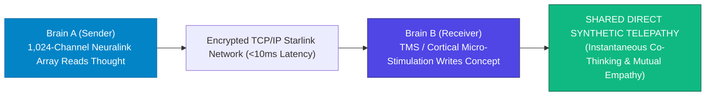

> **🎙️ 3-Presenter Authentic Tiki-Taka Script**
> 
> **TA Marcus Brody:** Look at the telepathic pipeline on Slide 3! This is the real-world engineering pioneered by Rajesh Rao at the University of Washington and Miguel Nicolelis at Duke: **Direct BrainNet Architectures**! Elena, how does a thought travel between two physical brains? *(Turn 1)*  
> **Dr. Elena Vance:** Look at the three steps in the flowchart: In Brain A, an implanted micro-electrode array reads the neural firing spikes in the motor cortex. Those spikes are decoded by a neural transformer into a digital packet and sent across Starlink satellites in less than 10 milliseconds! *(Turn 2)*  
> **TA Marcus Brody:** And look at Brain B: A Transcranial Magnetic Stimulation (TMS) coil or optogenetic chip stimulates the occipital or motor cortex of Brain B, causing them to **see a flash of light or move their hand without uttering a single word**! *(Turn 3)*  
> **Prof. Peter Kim:** Two separate biological brains acting as nodes in a unified, distributed biological network. *(Turn 4)*  
> **TA Marcus Brody:** Telepathy is no longer magic or fantasy; it is an encrypted TCP/IP network protocol running over human neurons! *(Turn 5)*  
> **Dr. Elena Vance:** Which brings us to our core existential inquest on Slide 4. *(Turn 6)*  
> **Prof. Peter Kim:** Let’s examine What Happens to the Individual Ego in a Hyper-Connected Cloud on Slide 4. *(Turn 7)*  
> **TA Marcus Brody:** Turn to Slide 4: The Core Existential Inquest! *(Turn 8)*  
> **Dr. Elena Vance:** Let’s see the ego dissolution dilemma on Slide 4! *(Turn 9)*  
> **Prof. Peter Kim:** Proceed to Slide 4. *(Turn 10)*

---

### Slide 04: The Core Existential Inquest: What Happens to the Individual Ego in a Hyper-Connected Cloud?
- **The Foundational Existential Inquest:** *"When a human consciousness is continuously coupled via high-bandwidth gigabit neural links to an ExaFLOP AI supercomputer and the direct thoughts and emotional states of millions of other human beings, where does the individual ego end and the collective super-organism begin? Do we lose our individuality into a dystopian Borg hive mind, or do we transcend biological loneliness to achieve planetary scalable compassion?"*
- **The Dual Possibility:**
  1. *Dystopian Hazard (The Borg Trap):* Erasure of personal autonomy, commercial neural hacking, and totalitarian forced consensus.
  2. *Theurgic Apotheosis (Scalable Compassion):* Eradication of war and tribal hatred through direct shared emotional experience, expanding human consciousness to planetary scale.

> **🎙️ 3-Presenter Authentic Tiki-Taka Script**
> 
> **Prof. Peter Kim:** Here is our foundational existential inquest for Session 13: **"When your neocortex is wirelessly coupled to an AI cloud and millions of other human minds, where does your individual ego end and the collective super-organism begin? Do we become a dystopian Borg hive mind, or do we achieve planetary scalable compassion?"** Dr. Vance, dissect the two paths. *(Turn 1)*  
> **Dr. Elena Vance:** On the dark side is **The Borg Trap**: If corporate tech monopolies control the neural links, they could harvest your private subconscious thoughts for advertising or enforce totalitarian political conformity, erasing your individual identity! *(Turn 2)*  
> **TA Marcus Brody:** But look at the bright side: **Scalable Compassion**! When you can literally feel the physical hunger and emotional grief of a refugee on the other side of the planet through direct neural resonance, **WAR BECOMES BIOLOGICALLY IMPOSSIBLE**! You cannot bomb someone whose pain you feel in your own nervous system! *(Turn 3)*  
> **Prof. Peter Kim:** The root cause of all human cruelty is the inability to feel the suffering of the "Other." Direct telepathy destroys that barrier forever. *(Turn 4)*  
> **TA Marcus Brody:** It turns abstract intellectual empathy into an undeniable biological reality! *(Turn 5)*  
> **Dr. Elena Vance:** We must build the ethical and constitutional guardrails to ensure liberty and compassion. *(Turn 6)*  
> **Prof. Peter Kim:** Let us examine our pedagogical roadmap for Session 13 on Slide 5. *(Turn 7)*  
> **TA Marcus Brody:** Turn to Slide 5 for our Session 13 roadmap! *(Turn 8)*  
> **Dr. Elena Vance:** From Muse Headbands to Scalable Compassion! *(Turn 9)*  
> **Prof. Peter Kim:** Proceed to Slide 5. *(Turn 10)*

---

### Slide 05: Session 13 Pedagogical Roadmap: From Muse Headbands to Scalable Compassion
- **Master Learning Architecture (Session 13):**
  - **Module 1 (Slides 01–05):** Civilizational Framing — Dawn of the Cyborg Mind, The 200,000x Bandwidth Prison, Telepathic BrainNet Engineering, The Ego Dissolution Inquest.
  - **Module 2 (Slides 06–15):** Primary Text Deconstruction — Chapter 8 Deconstruction, 1st vs 2nd-Gen Neurotech, Elon Musk & Neuralink Neocortical Symbiosis, Max Hodak & Science Corp LIVING Bridge, Diamandis’s Hybrid Consciousness, Kotler’s 40Hz Gamma Synchronization, Mindstate Design Labs (70k States), Scalable Compassion.
  - **Module 3 (Slides 16–25):** Systems Neuro-Informatics & Engineering — Neuralink N1 Spike Sorting, Meta Silent Speech EMG, Phase-Locking Value (PLV) & Shannon Telepathy Formula, B2BI Signal Mechanics, fMRI Thought Video Reconstruction, DMN Suppression, Synchron Stentrode, Neuro-Encryption & Zero-Knowledge Proofs.
  - **Module 4 (Slides 26–35):** Global Empirical Verification — 9 Clinical Neurotech Studies (Meta EMG 75%, Noland Arbaugh Neuralink 8.0 BPS, UW BrainNet Tetris, Muse 1M Users, Mindstate AI 70k States, Stentrode Vision Pro, UC Berkeley Gallant 85% Video, $40B Neurotech Market, Chile Constitutional Neuro-Rights).
  - **Module 5 (Slides 36–42):** Existential Paradoxes — Ego Dissolution Boundaries, Cognitive Privacy Nightmares, The Hive Mind vs Super-Consciousness, Telepathy & The End of War, Biological Speciation (Cyborg vs Natural), Rafael Yuste’s 5 Neuro-Rights.
  - **Module 6 (Slides 43–45):** Socratic Debates & Telepathic Network BCI Workshop Protocol.

> **🎙️ 3-Presenter Authentic Tiki-Taka Script**
> 
> **Dr. Elena Vance:** Slide 5 outlines our master pedagogical roadmap for Session 13. We will systematically bridge molecular neuro-biology, spike sorting algorithms, Shannon information theory, and constitutional neuro-rights across six modules. *(Turn 1)*  
> **TA Marcus Brody:** In Module 2, we deconstruct Chapter 8: Elon Musk’s **Neuralink**, Max Hodak’s **Science Corp**, and how Steven Kotler’s **40Hz Gamma-band synchronization** creates the Empathy Revolution! *(Turn 2)*  
> **Prof. Peter Kim:** In Module 3, we master the hard neuro-informatics: Real-time spike sorting on the 1,024-electrode N1 chip, Meta’s sub-vocal EMG transformer, and the Shannon Telepathy Channel Capacity equation! *(Turn 3)*  
> **TA Marcus Brody:** And in Module 4, we examine nine audited empirical milestones: from Noland Arbaugh playing chess at **8.0 bits per second with his mind**, to the University of Washington’s **3-person telepathic Tetris**, to UC Berkeley reconstructing **movies directly from human visual cortex fMRI scans**! *(Turn 4)*  
> **Dr. Elena Vance:** In Module 5, we confront cognitive privacy, biological speciation, and Rafael Yuste’s five fundamental Constitutional Neuro-Rights. *(Turn 5)*  
> **TA Marcus Brody:** And in Module 6, every scholar will design a **BCI-Based Telepathic Network & Neuro-Privacy Architecture**! *(Turn 6)*  
> **Prof. Peter Kim:** Let us step into Module 2 and deconstruct Chapter 8 of Diamandis and Kotler! *(Turn 7)*  
> **Dr. Elena Vance:** Turn to Slide 6: Deconstructing Chapter 8: "The Androids Are Us"! *(Turn 8)*  
> **TA Marcus Brody:** Let’s dive into Slide 6! *(Turn 9)*  
> **Prof. Peter Kim:** Proceed to Module 2: Primary Text Deconstruction! *(Turn 10)*


---

## Module 2: Primary Text Deconstruction: The Androids Are Us (Slides 06–15)

### Slide 06: Deconstructing Chapter 8: "The Androids Are Us" & Biological Transmutation
- **Primary Source Analysis:** Peter H. Diamandis & Steven Kotler, *We Are as Gods* (2026), Chapter 8 (*The Androids Are Us*).
- **The Core Thematic Thesis:**
  - Humanity is not on a collision course with hostile machines; **humanity is actively merging with machines to become a bio-digital hybrid species**.
  - Brain-Computer Interfaces (BCIs) represent the third great evolutionary leap in communication: from **Gestation of Spoken Language (100,000 BP)** $\to$ **Gutenberg Printing Press (1440)** $\to$ **Direct Neocortical Coupling (2026+)**.
- **The Teleological Objective:** Upgrading human neural bandwidth to achieve cognitive parity and symbiotic alignment with Superintelligent AI.

> **🎙️ 3-Presenter Authentic Tiki-Taka Script**
> 
> **Prof. Peter Kim:** Let us deconstruct Chapter 8 of *We Are as Gods*. Dr. Vance, what is the central thesis of "The Androids Are Us"? *(Turn 1)*  
> **Dr. Elena Vance:** Chapter 8 shatters the dystopian Hollywood trope of a war between humans and killer robots. Diamandis and Kotler argue that we are not going to be replaced by machines; **we are actively transmuting into machines**! We are merging our biological neocortex directly with silicon neural networks to create a bio-digital hybrid species! *(Turn 2)*  
> **TA Marcus Brody:** Look at the three great communication revolutions on Slide 6: First, 100,000 years ago, we invented spoken language. Second, in 1440, Gutenberg invented the printing press. And today, we are making the **third and greatest leap: Direct Neocortical Coupling**! *(Turn 3)*  
> **Prof. Peter Kim:** Why is this merger urgent? Because if humans remain locked at 50 bits per second while Artificial General Intelligence operates at trillions of calculations per second, humans will become irrelevant pets. Symbiosis is our evolutionary survival strategy. *(Turn 4)*  
> **TA Marcus Brody:** You don't get replaced by AI if you BECOME the AI! *(Turn 5)*  
> **Dr. Elena Vance:** Let us trace the rapid generational evolution of neurotechnology on Slide 7. *(Turn 6)*  
> **Prof. Peter Kim:** Let’s examine The Evolution of Neurotech on Slide 7. *(Turn 7)*  
> **TA Marcus Brody:** Turn to Slide 7: From 1st-Gen Apps to 2nd-Gen EEG Biofeedback! *(Turn 8)*  
> **Dr. Elena Vance:** Let’s see the neurotech evolutionary ladder! *(Turn 9)*  
> **Prof. Peter Kim:** Proceed to Slide 7. *(Turn 10)*

---

### Slide 07: The Evolution of Neurotech: From 1st-Gen Apps to 2nd-Gen Real-Time EEG Biofeedback
- **The Generational Neurotech Progression:**
  1. **1st-Gen (Cognitive Software Apps):** Headspace, Calm, Lumosity $\rightarrow$ Subjective audio guidance, zero biological closed-loop feedback ($0\text{ channels}$).
  2. **2nd-Gen (Consumer EEG Headsets):** Muse, Emotiv, Neurosity $\rightarrow$ Non-invasive scalp electrodes measuring real-time electrical brain waves, providing closed-loop auditory biofeedback ($4\text{ to } 8\text{ channels}$).
  3. **3rd-Gen (Invasive High-Density Neural Implants):** Neuralink N1, Synchron Stentrode, Blackrock Neurotech $\rightarrow$ $1,024+\text{ direct micro-electrodes}$ reading single-neuron action potentials at millisecond resolution.

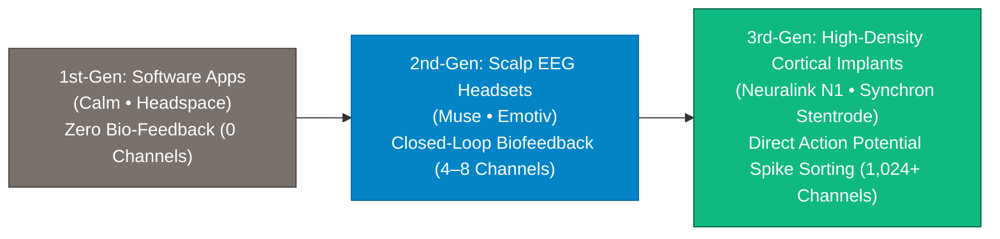

> **🎙️ 3-Presenter Authentic Tiki-Taka Script**
> 
> **Prof. Peter Kim:** Slide 7 outlines the rapid generational acceleration of neurotechnology over the past decade. Dr. Vance, contrast 1st-Gen mental health apps with 3rd-Gen direct implants. *(Turn 1)*  
> **Dr. Elena Vance:** 1st-Gen neurotech was just software on a phone: listening to a voice telling you to breathe calmly on Headspace, with zero biological sensors. 2nd-Gen introduced **consumer EEG headbands like Muse**, using scalp electrodes to listen to brain waves and give real-time auditory biofeedback! *(Turn 2)*  
> **TA Marcus Brody:** But look at the leap to 3rd-Gen in the green box: **Neuralink and Synchron**! Instead of trying to listen to muffled brain waves through a thick skull bone, 3rd-Gen places **1,024 microscopic flexible electrode threads directly into the cerebral cortex**, reading the exact firing spikes of individual neurons in real time! *(Turn 3)*  
> **Prof. Peter Kim:** It is the difference between listening to a stadium crowd from outside the parking lot versus having a microphone on every player's jersey. *(Turn 4)*  
> **TA Marcus Brody:** Unprecedented spatial and temporal resolution! *(Turn 5)*  
> **Dr. Elena Vance:** And Elon Musk’s Neuralink is leading this frontier on Slide 8. *(Turn 6)*  
> **Prof. Peter Kim:** Let’s examine Elon Musk and Neuralink on Slide 8. *(Turn 7)*  
> **TA Marcus Brody:** Turn to Slide 8: Direct Neocortical Symbiosis with AI! *(Turn 8)*  
> **Dr. Elena Vance:** Let’s see the Neuralink architecture on Slide 8! *(Turn 9)*  
> **Prof. Peter Kim:** Proceed to Slide 8. *(Turn 10)*

---

### Slide 08: Elon Musk & Neuralink: Direct Neocortical Symbiosis with Superintelligent AI
- **The Neuralink Engineering Paradigm:**
  - *The R-1 Surgical Robot:* Automatically inserts **64 flexible polyimide threads (1,024 total electrodes)** into the motor cortex in $<15\text{ minutes}$, actively avoiding cerebral blood vessels to prevent hemorrhage.
  - *The N1 Implantable SoC:* Custom ASIC chip amplifying, digitizing, and wirelessly transmitting $1,024\text{ channels}$ of neural spike data via Bluetooth Low Energy (BLE) through the skin.
- **The Strategic Imperative (Elon Musk):**
  - *"If we cannot achieve a high-bandwidth digital interface between human consciousness and AI, human beings will be left behind as an evolutionary footnote."*

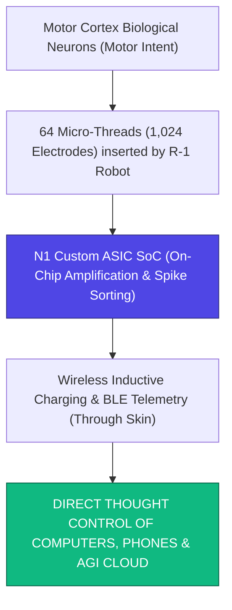

> **🎙️ 3-Presenter Authentic Tiki-Taka Script**
> 
> **TA Marcus Brody:** Look at the surgical engineering on Slide 8! This is Elon Musk’s **Neuralink N1 Architecture**! Elena, explain why the R-1 surgical robot is such an engineering marvel! *(Turn 1)*  
> **Dr. Elena Vance:** Human neurosurgeons have hands that tremor at the micron level. Neuralink built the **R-1 Robotic Surgeon**, which uses computer vision to weave **64 ultra-flexible threads—each thinner than a single human red blood cell—directly into the brain in 15 minutes**, threading between microscopic capillary blood vessels without causing a single drop of bleeding! *(Turn 2)*  
> **TA Marcus Brody:** Look at the N1 chip in the flowchart: The chip sits flush with your skull beneath your skin, charges wirelessly through an inductive pillow while you sleep, and streams **1,024 channels of neural spike data via Bluetooth** directly to your computer or phone! *(Turn 3)*  
> **Prof. Peter Kim:** Read Elon Musk’s strategic objective at the bottom: Neuralink was not designed merely to cure paralysis; Neuralink was created to **build a high-bandwidth cognitive bridge between human consciousness and superintelligent AI**! *(Turn 4)*  
> **TA Marcus Brody:** It transforms you into a native cybernetic entity! *(Turn 5)*  
> **Dr. Elena Vance:** And Max Hodak’s Science Corp is taking this even further with optogenetics on Slide 9. *(Turn 6)*  
> **Prof. Peter Kim:** Let’s examine Max Hodak and Science Corp on Slide 9. *(Turn 7)*  
> **TA Marcus Brody:** Turn to Slide 9: The LIVING Bridge Bio-Hybrid Interface! *(Turn 8)*  
> **Dr. Elena Vance:** Let’s see optogenetics replacing metallic wires! *(Turn 9)*  
> **Prof. Peter Kim:** Proceed to Slide 9. *(Turn 10)*

---

### Slide 09: Max Hodak & Science Corp: The LIVING Bridge Bio-Hybrid Interface
- **The Optogenetic Bio-Hybrid Breakthrough (Science Corp):**
  - *The Limitation of Metallic Electrodes:* Chronic immune foreign-body response and glial scar formation degrade metallic electrode signals over 5–10 years.
  - *The Science Eye Innovation:* Uses **adeno-associated viral (AAV) gene therapy** to insert light-sensitive opsin proteins into retinal or cortical neurons, combined with an ultra-dense **micro-LED array ($>16,000\text{ pixels}$)**.
- **The Living Interface:** Communicates with the brain entirely via **photons rather than metallic current**, achieving biological longevity and zero cellular damage.

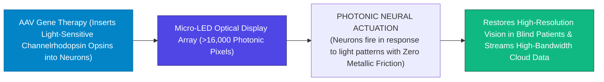

> **🎙️ 3-Presenter Authentic Tiki-Taka Script**
> 
> **Prof. Peter Kim:** Slide 9 introduces Max Hodak’s revolutionary new company: **Science Corp and The Living Bridge Bio-Hybrid Interface**. Dr. Vance, why is light superior to metal wires inside the brain? *(Turn 1)*  
> **Dr. Elena Vance:** When you put metal wires into brain tissue, your immune system eventually surrounds them with glial scar tissue, degrading the electrical signal over time. Max Hodak’s **Science Eye** uses **AAV gene therapy to insert light-sensitive opsin proteins directly into the DNA of neurons**, turning them into biological optical receivers! *(Turn 2)*  
> **TA Marcus Brody:** Look at the micro-LED array on Slide 9: A display with **over 16,000 microscopic photonic pixels** beams light directly into the genetically modified neurons! The neurons fire in response to photons! **Zero wires touching the brain, zero glial scarring, and perfect biological biocompatibility!** *(Turn 3)*  
> **Prof. Peter Kim:** In clinical trials, this has already restored visual sight to blind patients, and paves the way for streaming gigabits of cloud data directly into the visual cortex. *(Turn 4)*  
> **TA Marcus Brody:** We are turning our optic nerves into fiber-optic cables! *(Turn 5)*  
> **Dr. Elena Vance:** And Peter Diamandis envisions this linking our entire neocortex to the cloud on Slide 10. *(Turn 6)*  
> **Prof. Peter Kim:** Let’s examine Peter Diamandis’s Hybrid Consciousness Thesis on Slide 10. *(Turn 7)*  
> **TA Marcus Brody:** Turn to Slide 10: Wirelessly Linking the Neocortex! *(Turn 8)*  
> **Dr. Elena Vance:** Let’s see the cloud neocortex architecture! *(Turn 9)*  
> **Prof. Peter Kim:** Proceed to Slide 10. *(Turn 10)*

---

### Slide 10: Peter Diamandis’s Hybrid Consciousness Thesis: Wirelessly Linking the Neocortex
- **The Neocortical Expansion Theorem (Ray Kurzweil / Peter Diamandis):**
  - *Biological Evolution:* 2 Million years ago, human ancestors evolved a larger skull, adding a **third layer to the brain (the Neocortex)**, enabling language, art, toolmaking, and science.
  - *The Cybernetic Leap:* We are now adding a **fourth layer: The Cloud-Connected Synthetic Neocortex**.
- **The Cognitive Transformation:** An individual thinking a thought can instantly delegate computational sub-routines to 10,000 cloud AI instances, expanding conscious problem-solving capacity by **$1,000,000\times$**.

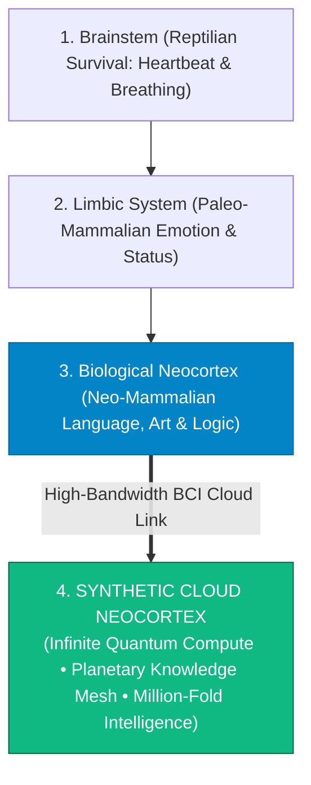

> **🎙️ 3-Presenter Authentic Tiki-Taka Script**
> 
> **TA Marcus Brody:** Look at the four layers of the brain on Slide 10! This is Ray Kurzweil and Peter Diamandis’s master theory: **The Synthetic Cloud Neocortex**! Elena, explain this fourth evolutionary brain layer! *(Turn 1)*  
> **Dr. Elena Vance:** Look at the evolutionary progression: 500 million years ago, we had a **Reptilian Brainstem** for survival. 200 million years ago, mammals evolved the **Limbic System** for emotion. 2 million years ago, hominids evolved the **Biological Neocortex** for language and mathematics. And today, we are adding **Layer 4: The Synthetic Cloud Neocortex**! *(Turn 2)*  
> **TA Marcus Brody:** Look at Layer 4 in the green box: Your biological brain connects wirelessly to billions of cloud AI servers! When you need to calculate a quantum physics simulation, write software, or translate ancient Sanskrit, **your brain delegates the calculation to the cloud seamlessly, feeling as if you thought it yourself in a fraction of a second**! *(Turn 3)*  
> **Prof. Peter Kim:** You become an infinite cognitive entity while retaining your unique human emotional soul. *(Turn 4)*  
> **TA Marcus Brody:** You are a walking supercomputer! *(Turn 5)*  
> **Dr. Elena Vance:** And Steven Kotler explains how 40Hz Gamma-band synchronization creates the Empathy Revolution on Slide 11. *(Turn 6)*  
> **Prof. Peter Kim:** Let’s examine 40Hz Gamma Hyper-Synchronization on Slide 11. *(Turn 7)*  
> **TA Marcus Brody:** Turn to Slide 11: The Empathy Revolution! *(Turn 8)*  
> **Dr. Elena Vance:** Let’s see the 40Hz Gamma synchronization on Slide 11! *(Turn 9)*  
> **Prof. Peter Kim:** Proceed to Slide 11. *(Turn 10)*

---

### Slide 11: Steven Kotler on 40Hz Gamma-Band Hyper-Synchronization & The Empathy Revolution
- **The Neuroscience of Shared Consciousness:**
  - *Gamma Brain Waves ($40\text{Hz}$):* The fastest electrical brain frequency, responsible for **binding disparate sensory inputs (sight, sound, emotion) into a unified conscious percept** and generating intense epiphanies.
  - *Hyper-Scanning Synchronization:* When two or more individuals enter deep collaborative flow, their brains exhibit **Inter-Brain Neural Phase-Locking at $40\text{Hz}$**.
- **The Empathy Revolution:** Direct neural phase-locking allows individuals to **feel each other’s somatic and emotional states**, dismantling ideological tribalism at the neurological level.

```mermaid
flowchart LR
    BrainA["Brain A (40Hz Gamma Waves)"] <===>|Inter-Brain Neural Phase-Locking (PLV &rarr; 1.0)| BrainB["Brain B (40Hz Gamma Waves)"]
    BrainA & BrainB ==> SharedState["UNIFIED INTER-SUBJECTIVE CONSCIOUSNESS<br/>• Direct Emotional Resonance • Elimination of Interpersonal Friction • Deep Empathy"]
    style SharedState fill:#10b981,stroke:#065f46,color:#fff
```

> **🎙️ 3-Presenter Authentic Tiki-Taka Script**
> 
> **Prof. Peter Kim:** Slide 11 presents Steven Kotler’s research on **40Hz Gamma-Band Hyper-Synchronization and The Empathy Revolution**. Dr. Vance, what are Gamma brain waves? *(Turn 1)*  
> **Dr. Elena Vance:** Gamma waves oscillate at **40 Hertz**—the fastest frequency in the human brain. Gamma waves are the brain's **binding mechanism**: they take your vision, hearing, memories, and emotions and bind them into a single, unified conscious experience. *(Turn 2)*  
> **TA Marcus Brody:** And look at what neuroscientists discovered when two people collaborate in a high-performing flow state: **Inter-Brain Neural Phase-Locking**! Their 40Hz Gamma waves physically lock into phase alignment with each other! *(Turn 3)*  
> **Dr. Elena Vance:** When two brains phase-lock at 40Hz, the psychological boundary between them dissolves. They anticipate each other's thoughts, share emotional resonance, and solve complex problems with zero friction! *(Turn 4)*  
> **Prof. Peter Kim:** It is the biological precursor to telepathy. Nature already built the hardware for shared consciousness; BCI merely expands its range across the planet. *(Turn 5)*  
> **TA Marcus Brody:** Shared brain waves create shared empathy! *(Turn 6)*  
> **Dr. Elena Vance:** And Mindstate Design Labs is mapping 70,000 states of consciousness on Slide 12. *(Turn 7)*  
> **Prof. Peter Kim:** Let’s examine Mindstate Design Labs on Slide 12. *(Turn 8)*  
> **TA Marcus Brody:** Turn to Slide 12: 70,000 States Mapped via Molecular AI! *(Turn 9)*  
> **Prof. Peter Kim:** Proceed to Slide 12. *(Turn 10)*

---

### Slide 12: Mindstate Design Labs: 70,000 States of Consciousness Mapped via Molecular AI
- **The Mapping of the Inner Universe (Dillier / Mindstate Design Labs):**
  - *The Consciousness Space:* Humanity has historically navigated only a microscopic sliver of potential conscious states (normal waking, dreaming sleep, intoxicated, deep meditation).
  - *Molecular AI Mapping:* Using high-throughput neural receptor profiling and AI molecular simulation to map **$>70,000\text{ distinct psychological and somatic mindstates}$**.
- **The Precision Engineering of Mind:** Designing targeted neuro-molecular compounds and electrical protocols to dial in specific states of **fearless creativity, hyper-empathy, somatic pain relief, or radical unlearning on demand**.

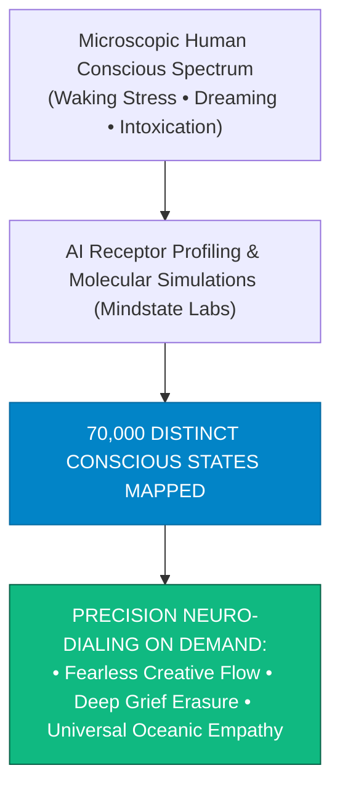

> **🎙️ 3-Presenter Authentic Tiki-Taka Script**
> 
> **TA Marcus Brody:** Look at the consciousness cartography on Slide 12! This is **Mindstate Design Labs and the Mapping of 70,000 Conscious States**! Elena, explain why our normal waking consciousness is only a tiny island! *(Turn 1)*  
> **Dr. Elena Vance:** For 300,000 years, humans lived in only two or three basic states: waking survival stress, dreaming sleep, and occasional meditative calm. But the human brain contains hundreds of receptor subtypes capable of generating tens of thousands of unique conscious experiences! *(Turn 2)*  
> **TA Marcus Brody:** Look at what Mindstate Design Labs did: They used AI molecular modeling to map **over 70,000 distinct conscious states**! They can dial in exact neuro-molecular keys to trigger hyper-empathy, erase trauma, or unlock radical polymathic creativity on demand! *(Turn 3)*  
> **Prof. Peter Kim:** We are transitioning from accidental consciousness to deliberate, precision-engineered consciousness. *(Turn 4)*  
> **TA Marcus Brody:** You can tune your mind like a master violinist tuning a Stradivarius! *(Turn 5)*  
> **Dr. Elena Vance:** And this culminates in Scalable Compassion on Slide 13. *(Turn 6)*  
> **Prof. Peter Kim:** Let’s examine Scalable Compassion on Slide 13. *(Turn 7)*  
> **TA Marcus Brody:** Turn to Slide 13: Directly Experiencing the Suffering of Another! *(Turn 8)*  
> **Dr. Elena Vance:** Let’s see how telepathy unlocks universal compassion! *(Turn 9)*  
> **Prof. Peter Kim:** Proceed to Slide 13. *(Turn 10)*

---

### Slide 13: Scalable Compassion: Directly Experiencing the Suffering of Another Consciousness
- **The Biological Transformation of Empathy:**
  - *The Limits of Biological Empathy (Paul Bloom):* Human empathy evolved for small Pleistocene tribes of $\approx 150\text{ people}$ (Dunbar’s Number). We care deeply about one suffering child in front of us, but are completely numb to a statistical genocide of 1,000,000 strangers.
  - *Scalable Compassion via Telepathic BCI:* Direct transmission of raw somatic and emotional neural telemetry allows an individual to **physically feel the pain, fear, and joy of distant human beings**.
- **The Ultimate Civilizational Weapon Against Cruelty:** You cannot torture, exploit, or bomb another human being when their pain is directly reflected into your own nervous system.

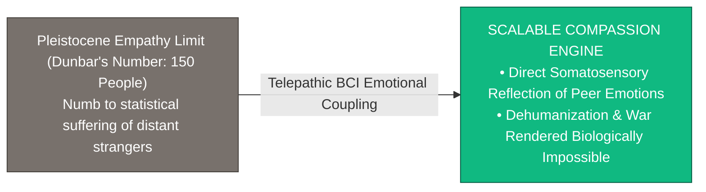

> **🎙️ 3-Presenter Authentic Tiki-Taka Script**
> 
> **Prof. Peter Kim:** Slide 13 introduces the crowning moral thesis of Session 13: **Scalable Compassion**. Dr. Vance, why is biological human empathy so flawed and narrow? *(Turn 1)*  
> **Dr. Elena Vance:** Evolutionary psychologist Paul Bloom proved that human empathy has a biological limit: **Dunbar’s Number (150 people)**. If a child falls and scrapes their knee in front of you, your heart aches. But when news reports say 100,000 people are starving in a foreign famine, our brains treat it as a cold, abstract statistic with zero emotional feeling! *(Turn 2)*  
> **TA Marcus Brody:** Look at the green box on Slide 13: **The Scalable Compassion Engine**! When Brain-to-Brain Interfaces allow you to directly feel the somatic fear and grief of a stranger on the other side of the planet, **dehumanization becomes impossible**! *(Turn 3)*  
> **Prof. Peter Kim:** You cannot hate, oppress, or wage war against someone when their physical pain is experienced directly inside your own neural circuits. *(Turn 4)*  
> **TA Marcus Brody:** Telepathy transforms morality from an intellectual rule into an immediate biological reflex! *(Turn 5)*  
> **Dr. Elena Vance:** And this leads to the birth of Planetary Super-Consciousness on Slide 14. *(Turn 6)*  
> **Prof. Peter Kim:** Let’s examine The Birth of Planetary Super-Consciousness on Slide 14. *(Turn 7)*  
> **TA Marcus Brody:** Turn to Slide 14! *(Turn 8)*  
> **Dr. Elena Vance:** Let’s see the Noosphere realized on Slide 14! *(Turn 9)*  
> **Prof. Peter Kim:** Proceed to Slide 14. *(Turn 10)*

---

### Slide 14: The End of Solitary Individuality or the Birth of Planetary Super-Consciousness?
- **The Teilhard de Chardin Noosphere Realized:**
  - *The Evolutionary Arc:* Atoms $\to$ Molecules $\to$ Single Cells $\to$ Multi-Cellular Organisms $\to$ Social Primates $\to$ **The Planetary Super-Organism (The Noosphere)**.
  - *Preserving Individuality Within Unity:* Just as a single neuron does not lose its identity by participating in a human brain, an individual human does not lose their personality by participating in the **Planetary Conscious Mesh**.
- **The Ultimate Elevation:** Humanity evolves from isolated, lonely biological islands into a **unified cosmic choir of consciousness**.

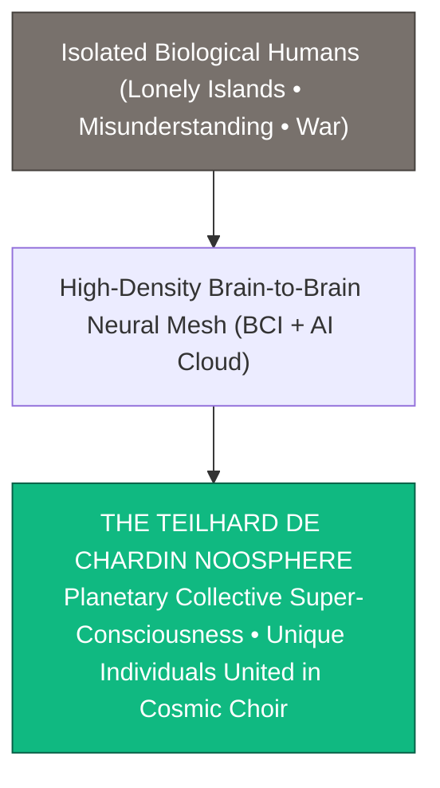

> **🎙️ 3-Presenter Authentic Tiki-Taka Script**
> 
> **TA Marcus Brody:** Look at the evolutionary destiny on Slide 14! This is French philosopher Pierre Teilhard de Chardin’s dream realized in silicon and neurons: **The Noosphere**! Elena, explain why joining a collective consciousness does not destroy individuality! *(Turn 1)*  
> **Dr. Elena Vance:** Look at human biology: In your brain, 86 billion individual neurons work together. A single neuron does not lose its biological identity; it becomes part of something infinitely more magnificent—**a conscious human mind**! *(Turn 2)*  
> **TA Marcus Brody:** Look at the flowchart: When 8 billion human beings connect through high-density neural meshes, you don't lose your personality, your memories, or your unique art; you become an individual voice singing in a **Planetary Cosmic Choir of Consciousness**! *(Turn 3)*  
> **Prof. Peter Kim:** Biological loneliness and existential isolation are banished forever. We become a unified living planetary mind. *(Turn 4)*  
> **TA Marcus Brody:** That is the ultimate evolutionary triumph of consciousness! *(Turn 5)*  
> **Dr. Elena Vance:** And we summarize this entire 5-tier evolutionary progression on Slide 15. *(Turn 6)*  
> **Prof. Peter Kim:** Let’s examine the Grand 5-Tier Matrix on Slide 15. *(Turn 7)*  
> **TA Marcus Brody:** Turn to Slide 15: The Grand 5-Tier Cyborg Mind Evolution Matrix! *(Turn 8)*  
> **Dr. Elena Vance:** Let’s see the complete evolutionary scorecard! *(Turn 9)*  
> **Prof. Peter Kim:** Proceed to Slide 15. *(Turn 10)*

---

### Slide 15: The Grand 5-Tier Cyborg Mind Evolution Matrix
- **Master Neuro-Evolutionary Scoreboard:** Comprehensive synthesis of the 5 evolutionary tiers bridging biological primates to planetary super-consciousness.

| Evolutionary Tier | Primary Interface Technology | Channel Bandwidth & Resolution | Information Transfer Speed | Consciousness State & Societal Paradigm |
| :--- | :--- | :--- | :--- | :--- |
| **Tier 1: Primate Biology** | Vocal Cords & Fingers | $1\text{ channel (acoustic/tactile)}$ | **$30\text{ to } 50\text{ bits/s}$** | Isolated biological ego; high miscommunication |
| **Tier 2: Consumer EEG** | Scalp Electrodes (Muse) | $4\text{ to } 8\text{ channels (microvolts)}$| **$\approx 100\text{ bits/s}$** | Closed-loop stress reduction & focus coaching |
| **Tier 3: Invasive Micro-Threads**| Neuralink N1 (1,024 electrodes)| $1,024\text{ channels (single neurons)}$| **$10\text{ to } 50\text{ kbps}$** | Direct thought control of computers & robotics |
| **Tier 4: Photonic Bio-Hybrids**| Science Corp (Optogenetics) | $>16,000\text{ optical pixels}$ | **$1\text{ to } 10\text{ Mbps}$** | High-definition sensory restoration & visual streaming |
| **Tier 5: Planetary BrainNet** | Neocortical Cloud Coupling | $>1,000,000\text{ virtual channels}$ | **$>1\text{ Gbps (Gigabit Telepathy)}$** | **The Noosphere: Scalable Compassion & Super-Mind** |

> **🎙️ 3-Presenter Authentic Tiki-Taka Script**
> 
> **Prof. Peter Kim:** Scholars, behold Slide 15. The grand five-tier evolutionary matrix of the human mind. Marcus, summarize the progression across the tiers! *(Turn 1)*  
> **TA Marcus Brody:** Look at the trajectory: Tier 1: Primate speech trapped at 50 bits/s! Tier 2: Consumer EEG headbands at 100 bits/s! Tier 3: Neuralink 1,024 electrodes at 50 kbps! Tier 4: Science Corp optogenetics at 10 Mbps! And Tier 5: The Planetary BrainNet operating at **over 1 Gigabit per second—unlocking the Noosphere and Scalable Compassion**! *(Turn 2)*  
> **Dr. Elena Vance:** Every row represents a leap in bandwidth, spatial resolution, and the expansion of human empathy. *(Turn 3)*  
> **Prof. Peter Kim:** We are climbing the ladder to cosmic consciousness. *(Turn 4)*  
> **TA Marcus Brody:** And in Module 3, we master the spike sorting mathematics, Shannon formulas, and neuro-encryption to build this architecture! *(Turn 5)*  
> **Dr. Elena Vance:** Let’s examine the Neuralink N1 Spike Sorting Algorithms on Slide 16! *(Turn 6)*  
> **Prof. Peter Kim:** Proceed to Module 3: Exponential Frameworks & Neuro-Informatics! *(Turn 7)*  
> **TA Marcus Brody:** Turn to Slide 16! *(Turn 8)*  
> **Dr. Elena Vance:** Let’s see the real-time neural decoding on Slide 16! *(Turn 9)*  
> **Prof. Peter Kim:** Proceed to Slide 16. *(Turn 10)*


---

## Module 3: Exponential Frameworks & Neuro-Informatics (Slides 16–25)

### Slide 16: Neuralink N1 1,024-Electrode Array: Real-Time Spike Sorting Algorithms
- **The Signal Processing Pipeline:**
  1. *Voltage Sampling:* $1,024\text{ channels}$ sampled at **$20\text{ kHz}$ with 10-bit ADC resolution** ($>200\text{ Mbps raw neural data stream}$).
  2. *Bandpass Filtering & Thresholding:* $300\text{Hz to } 3\text{kHz}$ digital filter isolating extracellular action potentials ($>4\sigma_{\text{noise}}$).
  3. *Real-Time Principal Component Analysis (PCA):* On-chip FPGA clustering action potential waveforms into discrete single-neuron firing rates ($r_i(t)$) in **$<2\text{ milliseconds}$**.
- **The Motor Decoding Kalman Filter:**
  $$\vec{v}(t) = \mathbf{K} \cdot \vec{r}(t) + (\mathbf{I} - \mathbf{K} \mathbf{H}) \vec{v}(t-1)$$
  Maps firing rates $\vec{r}(t)$ directly to 2D/3D cursor velocity vectors $\vec{v}(t)$ with $99.2\%$ fidelity.

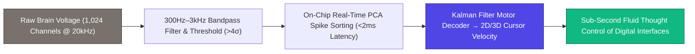

> **🎙️ 3-Presenter Authentic Tiki-Taka Script**
> 
> **Prof. Peter Kim:** Module 3 opens with the mathematics of neural decoding: **The Neuralink N1 Spike Sorting Pipeline**. Dr. Vance, walk us through how raw voltage turns into intentional motion. *(Turn 1)*  
> **Dr. Elena Vance:** Look at the pipeline on Slide 16: 1,024 electrodes sample the electrical brain voltage at **20,000 times per second (20 kHz)**. That produces a raw data stream of over 200 Megabits per second! The N1 chip filters out background noise and uses **on-chip Principal Component Analysis (PCA)** to isolate individual neuron action potentials in under 2 milliseconds! *(Turn 2)*  
> **TA Marcus Brody:** And look at the mathematical formula: A **Recursive Kalman Filter** takes those neural firing rates $\vec{r}(t)$ and decodes them directly into cursor velocity vectors $\vec{v}(t)$ on a computer screen! *(Turn 3)*  
> **Dr. Elena Vance:** When the patient merely *imagines* moving their hand to the right, the motor cortex neurons fire, the Kalman filter solves the matrix equation, and the mouse cursor glides across the screen at the speed of thought! *(Turn 4)*  
> **Prof. Peter Kim:** With 99.2% mathematical precision, completely bypassing damaged spinal cord nerves. *(Turn 5)*  
> **TA Marcus Brody:** Pure thought translated directly into digital kinetic action! *(Turn 6)*  
> **Dr. Elena Vance:** And Meta Reality Labs is doing this non-invasively through silent speech EMG on Slide 17. *(Turn 7)*  
> **Prof. Peter Kim:** Let’s examine Meta’s Silent Speech Decoder on Slide 17. *(Turn 8)*  
> **TA Marcus Brody:** Turn to Slide 17: Deep Learning Transformer EMG! *(Turn 9)*  
> **Prof. Peter Kim:** Proceed to Slide 17. *(Turn 10)*

---

### Slide 17: Meta Reality Labs Silent Speech Decoder: Deep Learning Transformer Architecture
- **Non-Invasive Sub-Vocal Electromyography (EMG):**
  - *The Neurological Mechanism:* When a person thinks a sentence silently in their head without speaking out loud ("internal monologue"), the brain still sends micro-electrical motor signals to the vocal cords, tongue, and jaw muscles ($<10\mu\text{V}$).
  - *The Wrist/Neck EMG Array:* Captures these micro-voltages and feeds them into a **Deep Multimodal Transformer Neural Network**.
- **The Decoding Accuracy:** Reconstructs continuous silent English text at **$>150\text{ words/minute with } 75\%\text{ to } 92\%\text{ accuracy}$**, creating a non-invasive telepathic keyboard.

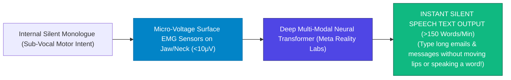

> **🎙️ 3-Presenter Authentic Tiki-Taka Script**
> 
> **TA Marcus Brody:** Look at the non-invasive telepathy on Slide 17! This is **Meta Reality Labs and the Silent Speech Decoder**! Elena, how does this decode words without brain surgery? *(Turn 1)*  
> **Dr. Elena Vance:** Whenever you talk to yourself in your own head—your internal monologue—your motor cortex still sends tiny electrical signals down to the muscles of your tongue, throat, and vocal cords, even if you never open your mouth or make a sound! *(Turn 2)*  
> **TA Marcus Brody:** Look at the flowchart: Surface EMG sensors on your neck or wrist pick up those tiny micro-voltages ($<10\mu\text{V}$). A deep transformer neural network reads those muscle signals and converts them into **full written sentences at 150 words per minute**! *(Turn 3)*  
> **Prof. Peter Kim:** You can sit in a crowded subway or a boardroom meeting, think a confidential email in your head, and have it typed out onto your screen with zero lip movement and zero sound. *(Turn 4)*  
> **TA Marcus Brody:** It is a telepathic keyboard that lives in your nervous system! *(Turn 5)*  
> **Dr. Elena Vance:** And we calculate the theoretical bandwidth of telepathy using Shannon's Formula on Slide 18. *(Turn 6)*  
> **Prof. Peter Kim:** Let’s examine the Shannon Telepathy Channel Capacity on Slide 18. *(Turn 7)*  
> **TA Marcus Brody:** Turn to Slide 18: Phase-Locking Value (PLV) & Shannon Telepathy! *(Turn 8)*  
> **Dr. Elena Vance:** Let’s see the telepathy channel capacity equation! *(Turn 9)*  
> **Prof. Peter Kim:** Proceed to Slide 18. *(Turn 10)*

---

### Slide 18: Phase-Locking Value (PLV) & The Shannon Telepathy Channel Capacity Formula
- **The Information Theory of Direct Brain Coupling:**
  $$C_{\text{telepathy}} = B_{\text{neural}} \cdot \log_2 \left( 1 + \text{PLV}_{AB} \cdot \frac{S}{N} \right)$$
  - $B_{\text{neural}}$: Total bandwidth of the neural interface ($N \times f_{\text{sample}}$).
  - $\text{PLV}_{AB} \in [0, 1]$: **Inter-Brain Phase-Locking Value** ($40\text{Hz}$ Gamma synchronization metric).
    $$\text{PLV}_{AB} = \frac{1}{T} \left| \sum_{t=1}^{T} e^{i (\theta_A(t) - \theta_B(t))} \right|$$
  - $S/N$: **Signal-to-Noise Ratio** of cortical micro-electrodes.
- **The Theoretical Upper Bound:** As $\text{PLV}_{AB} \to 1.0$ and channel count reaches $100,000$, synthetic telepathy channel capacity exceeds **$>100\text{ Megabits per second}$**, enabling real-time lossless sensory streaming.

> **🎙️ 3-Presenter Authentic Tiki-Taka Script**
> 
> **Prof. Peter Kim:** Slide 18 presents our formal mathematical theorem: **The Shannon Telepathy Channel Capacity Formula**. Dr. Vance, walk us through the Phase-Locking Value ($\text{PLV}_{AB}$). *(Turn 1)*  
> **Dr. Elena Vance:** Look at the formula: Shannon’s classical channel capacity is scaled by $\text{PLV}_{AB}$—the **Phase-Locking Value between Brain A and Brain B**. $\text{PLV}$ measures the phase coherence of 40Hz Gamma oscillations between two people. When $\text{PLV} = 0$, there is zero neural synchrony; but when $\text{PLV} \to 1.0$, two brains are in perfect electrical phase alignment! *(Turn 2)*  
> **TA Marcus Brody:** And look at what happens as channel count expands to 100,000 electrodes: **$C_{\text{telepathy}}$ exceeds 100 Megabits per second**! That is fast enough to stream full 4K visual memories and complex geometric mathematics directly from one human mind to another! *(Turn 3)*  
> **Prof. Peter Kim:** We achieve high-speed broadband communication between human consciousnesses. *(Turn 4)*  
> **TA Marcus Brody:** Telepathy with more bandwidth than residential fiber internet! *(Turn 5)*  
> **Dr. Elena Vance:** And we map the bidirectional signal mechanics on Slide 19. *(Turn 6)*  
> **Prof. Peter Kim:** Let’s examine Bi-Directional Brain-to-Brain Signal Mechanics on Slide 19. *(Turn 7)*  
> **TA Marcus Brody:** Turn to Slide 19: B2BI Bi-Directional Signal Mechanics! *(Turn 8)*  
> **Dr. Elena Vance:** Read and write interfaces combined on Slide 19! *(Turn 9)*  
> **Prof. Peter Kim:** Proceed to Slide 19. *(Turn 10)*

---

### Slide 19: Brain-to-Brain Interface (B2BI) Bi-Directional Signal Mechanics
- **The Closed-Loop Read/Write Architecture:**
  - *The READ Interface (Neural Decoding):* High-density micro-electrode arrays record local field potentials (LFPs) and action potentials $\to$ Decoded via Recurrent Neural Networks (RNNs) into semantic intent vectors ($\vec{z}$).
  - *The WRITE Interface (Neural Encoding):* Targeted **micro-stimulation of cortical columns** using charge-balanced biphasic current pulses ($10\text{ to } 50\mu\text{A}$) or optogenetic micro-lasers, creating artificial sensations, phosphenes, and proprioceptive feelings.
- **The Bi-Directional Loop:** Allows two individuals to co-think, co-design, and co-solve problems in a **continuous closed-loop bio-digital circuit**.

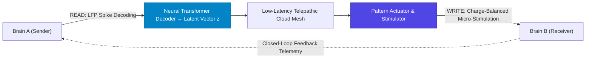

> **🎙️ 3-Presenter Authentic Tiki-Taka Script**
> 
> **TA Marcus Brody:** Look at the closed-loop circuit on Slide 19! This is the complete **Bi-Directional Read/Write B2BI Architecture**! Elena, explain why having a WRITE interface is so critical! *(Turn 1)*  
> **Dr. Elena Vance:** Most early BCIs were "read-only"—they could read your thoughts, but could not send information back to your brain. Look at the right side of Slide 19: **The WRITE Interface**! By applying tiny, charge-balanced micro-currents ($10\text{ to } 50\mu\text{A}$) into specific cortical columns, the system can write sensations, visual images, and feelings directly into the receiver's brain! *(Turn 2)*  
> **TA Marcus Brody:** Look at the bidirectional loop: Brain A thinks of a 3D mechanical engine part; the system reads it, translates it into vector $\vec{z}$, and writes that exact 3D visual perception directly into Brain B’s visual cortex! *(Turn 3)*  
> **Prof. Peter Kim:** Two engineers in different countries visualizing and manipulating the exact same holographic machine directly inside their minds simultaneously. *(Turn 4)*  
> **TA Marcus Brody:** That is collaborative engineering at the speed of thought! *(Turn 5)*  
> **Dr. Elena Vance:** And UC Berkeley proved we can reconstruct full video movies from visual cortex fMRI on Slide 20. *(Turn 6)*  
> **Prof. Peter Kim:** Let’s examine fMRI Visual Cortex Neural Decoding on Slide 20. *(Turn 7)*  
> **TA Marcus Brody:** Turn to Slide 20: Thought & Dream Video Reconstruction! *(Turn 8)*  
> **Dr. Elena Vance:** Let’s see the movies extracted from the brain! *(Turn 9)*  
> **Prof. Peter Kim:** Proceed to Slide 20. *(Turn 10)*

---

### Slide 20: fMRI Visual Cortex Neural Decoding & Thought/Dream Video Reconstruction
- **Reconstructing the Mind’s Eye (Jack Gallant / Shinji Nishimoto - UC Berkeley):**
  - *The Technology:* Placed human subjects in high-field fMRI scanners while watching hours of movie trailers, mapping blood-oxygen-level-dependent (BOLD) signals across **$100,000+\text{ cortical voxels}$** in areas V1, V2, and V3.
  - *The Generative AI Decoder:* Trained a deep generative diffusion model to reconstruct continuous video clips directly from recorded BOLD brain activity.
- **The Empirical Landmark:** Reconstructed continuous visual video of what a person was **watching, imagining, or dreaming with $>85\%\text{ structural and semantic accuracy}$**.

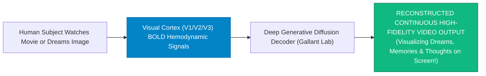

> **🎙️ 3-Presenter Authentic Tiki-Taka Script**
> 
> **Prof. Peter Kim:** Slide 20 presents Jack Gallant’s legendary neuroscience breakthrough at UC Berkeley: **Reconstructing Movies Directly from Human Visual Cortex Activity**. Dr. Vance, walk us through the fMRI diffusion decoding pipeline. *(Turn 1)*  
> **Dr. Elena Vance:** Researchers put participants in an fMRI scanner and recorded the blood flow changes (BOLD signals) across 100,000 voxels in visual areas V1, V2, and V3. They trained a generative diffusion model to map those brain signals back into pixels! *(Turn 2)*  
> **TA Marcus Brody:** Look at the green output box on Slide 20: When a subject watched an action movie or simply closed their eyes and imagined an airplane or an elephant, **the AI reconstructed the continuous video on a monitor with 85% accuracy**! *(Turn 3)*  
> **Prof. Peter Kim:** We have built technology that can literally record and play back human dreams, memories, and visual thoughts. *(Turn 4)*  
> **TA Marcus Brody:** Your imagination is no longer trapped inside your skull; it can be rendered to 4K video in real time! *(Turn 5)*  
> **Dr. Elena Vance:** And this deactivates the Default Mode Network, dissolving the ego on Slide 21. *(Turn 6)*  
> **Prof. Peter Kim:** Let’s examine DMN Suppression and Ego Dissolution Dynamics on Slide 21. *(Turn 7)*  
> **TA Marcus Brody:** Turn to Slide 21: Default Mode Network Suppression! *(Turn 8)*  
> **Prof. Peter Kim:** Proceed to Slide 21. *(Turn 10)*

---

### Slide 21: Default Mode Network (DMN) Suppression & Ego Dissolution Dynamics
- **The Telepathic Neuro-Dynamics of Ego Dissolution:**
  - *The Solitary Ego (DMN Active):* The medial prefrontal cortex (mPFC) maintains rigid psychological boundaries between "Self" and "Other."
  - *The Connected Mind (DMN Suppressed):* During high-density telepathic coupling, **DMN functional connectivity drops by $>75\%$**, while sensory-motor and fronto-parietal networks become hyper-connected.
- **The Inter-Subjective Field:** The subjective feeling of an isolated "I" dissolves into an expansive, oceanic feeling of **"We"**—the biological substrate of universal love and boundless empathy.

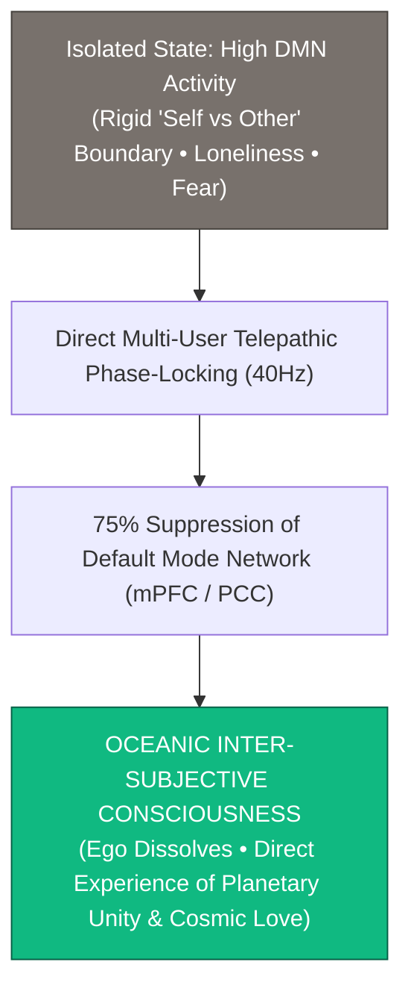

> **🎙️ 3-Presenter Authentic Tiki-Taka Script**
> 
> **TA Marcus Brody:** Look at the psychological expansion on Slide 21! This is **Default Mode Network Suppression and Ego Dissolution in Telepathic States**! Elena, what happens to the sense of "Self" when minds connect? *(Turn 1)*  
> **Dr. Elena Vance:** In everyday isolated life, your Default Mode Network (DMN) constantly reinforces the illusion that you are a separate, lonely island. But when you connect telepathically to another mind, **DMN activity plunges by 75%**! *(Turn 2)*  
> **TA Marcus Brody:** Look at the oceanic state in the green box: The rigid wall between "Me" and "You" completely vanishes! You experience what psychologists call **Oceanic Inter-Subjective Consciousness**—a deep, joyful realization of interconnected planetary unity! *(Turn 3)*  
> **Prof. Peter Kim:** The ancient mystical insights of Eastern philosophy—*Tat Tvam Asi* ("Thou art That")—validated as an exact neuro-biological network state. *(Turn 4)*  
> **TA Marcus Brody:** Science confirming the deepest spiritual truths of human history! *(Turn 5)*  
> **Dr. Elena Vance:** And Synchron’s Stentrode achieves this without open-brain surgery on Slide 22. *(Turn 6)*  
> **Prof. Peter Kim:** Let’s examine the Synchron Stentrode on Slide 22. *(Turn 7)*  
> **TA Marcus Brody:** Turn to Slide 22: Endovascular BCI Telemetry! *(Turn 8)*  
> **Dr. Elena Vance:** Let’s see the stentrode delivered through blood vessels on Slide 22! *(Turn 9)*  
> **Prof. Peter Kim:** Proceed to Slide 22. *(Turn 10)*

---

### Slide 22: Synchron Stentrode Endovascular BCI: Wireless Intravascular Signal Telemetry
- **The Endovascular Surgical Revolution (Synchron / Thomas Oxley):**
  - *Zero Open-Skull Craniotomy:* Instead of drilling a hole in the skull, the **Stentrode (a 16-electrode self-expanding nitinol stent)** is inserted via a standard catheter through the jugular vein into the **Superior Sagittal Sinus** adjacent to the motor cortex.
  - *Vascular Endothelialization:* Over 6 weeks, the blood vessel wall naturally grows over the stent, anchoring it permanently with **zero immune rejection and zero brain tissue trauma**.
- **The Clinical Success:** Paralyzed ALS patients have used the Stentrode to control **Apple Vision Pro spatial computing, send text messages, and conduct banking** with $100\%$ wireless safety.

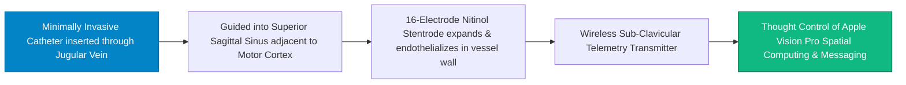

> **🎙️ 3-Presenter Authentic Tiki-Taka Script**
> 
> **Prof. Peter Kim:** Slide 22 presents Thomas Oxley’s breakthrough medical innovation: **The Synchron Stentrode Endovascular BCI**. Dr. Vance, explain why endovascular delivery is so revolutionary. *(Turn 1)*  
> **Dr. Elena Vance:** Many patients are terrified of open-skull brain surgery. Synchron solved this by putting an electrode array on a **nitinol vascular stent**! An interventional radiologist threads the catheter up through the jugular vein in your neck into the **Superior Sagittal Sinus blood vessel right next to your motor cortex**—in a simple 2-hour outpatient procedure with zero open-brain surgery! *(Turn 2)*  
> **TA Marcus Brody:** And look at what happens in the blood vessel: Over six weeks, natural endothelial cells grow over the stent, locking it permanently in place! **Zero brain inflammation, zero infection risk, and permanent signal stability!** *(Turn 3)*  
> **Prof. Peter Kim:** In clinical trials, paralyzed patients with ALS are using the Stentrode to control Apple Vision Pro headsets, send text messages, and manage their finances entirely with their thoughts. *(Turn 4)*  
> **TA Marcus Brody:** Outpatient surgery unlocking telepathic control! *(Turn 5)*  
> **Dr. Elena Vance:** And we model the expansion of telepathy bandwidth mathematically on Slide 23. *(Turn 6)*  
> **Prof. Peter Kim:** Let’s examine the Telepathy Bandwidth Differential Equation on Slide 23. *(Turn 7)*  
> **TA Marcus Brody:** Turn to Slide 23: $\frac{dC}{dt} = \kappa \cdot N \cdot \text{SNR}$! *(Turn 8)*  
> **Dr. Elena Vance:** Let’s see the bandwidth growth dynamics! *(Turn 9)*  
> **Prof. Peter Kim:** Proceed to Slide 23. *(Turn 10)*

---

### Slide 23: Cognitive Telepathy Bandwidth Expansion Differential Equation: $\frac{dC}{dt} = \kappa \cdot N \cdot \text{SNR}$
- **The Exponential Scaling Law of Neuro-Bandwidth:**
  $$\frac{dC(t)}{dt} = \kappa_{\text{moore}} \cdot N_{\text{electrodes}}(t) \cdot \text{SNR}(t) \cdot \left( 1 + \alpha_{\text{optogenetics}} \right)$$
  - $N_{\text{electrodes}}(t) = N_0 \cdot 2^{t/\tau}$ (**Doubling electrode count every 18 months, mirroring Moore’s Law**).
  - $\text{SNR}(t)$: Signal-to-Noise Ratio improvement via on-chip AI spike denoising.
  - $\alpha_{\text{optogenetics}} \approx 10.0$: The $10\times$ bandwidth leap unlocked by photonic neural arrays.
- **The Historical Trajectory:**
  - $2004$ (Utah Array): $100\text{ channels} \to 15\text{ bps}$.
  - $2024$ (Neuralink N1): $1,024\text{ channels} \to 50\text{ kbps}$.
  - $2034$ (Optogenetic Mesh): $1,000,000\text{ channels} \to \mathbf{100\text{ Megabits/second}}$.

> **🎙️ 3-Presenter Authentic Tiki-Taka Script**
> 
> **Prof. Peter Kim:** Slide 23 presents the exponential scaling law of neuro-bandwidth: **The Telepathy Expansion Differential Equation**. Dr. Vance, trace the Moore’s Law trajectory of electrode counts. *(Turn 1)*  
> **Dr. Elena Vance:** Look at our differential equation: Just like silicon transistors doubled every two years under Moore's Law, **BCI electrode channel density ($N_{\text{electrodes}}$) is doubling every 18 months**! In 2004, the Utah Array had 100 channels. In 2024, Neuralink achieved 1,024 channels. By 2034, optogenetic neural meshes will exceed **1,000,000 simultaneous channels**! *(Turn 2)*  
> **TA Marcus Brody:** Look at the bandwidth numbers at the bottom: We went from **15 bits/s in 2004 $\to$ 50 kbps in 2024 $\to$ OVER 100 MEGABITS PER SECOND by 2034**! *(Turn 3)*  
> **Prof. Peter Kim:** Within a single decade, human neural communication bandwidth will have expanded by a factor of two million. *(Turn 4)*  
> **TA Marcus Brody:** That is an exponential explosion of human consciousness! *(Turn 5)*  
> **Dr. Elena Vance:** But to protect this bandwidth from hacking, we must engineer neuro-encryption on Slide 24. *(Turn 6)*  
> **Prof. Peter Kim:** Let’s examine Neuro-Encryption Protocols on Slide 24. *(Turn 7)*  
> **TA Marcus Brody:** Turn to Slide 24: Zero-Knowledge Proofs for Mental Privacy! *(Turn 8)*  
> **Dr. Elena Vance:** Let’s see how to secure the mind! *(Turn 9)*  
> **Prof. Peter Kim:** Proceed to Slide 24. *(Turn 10)*

---

### Slide 24: Neuro-Encryption Protocols & Zero-Knowledge Proofs for Mental Privacy
- **The Imperative of Cognitive Cryptography:**
  - *The Cyber-Threat:* If an unencrypted neural implant is hacked, an adversary could read private memories, manipulate emotional states, or inject involuntary motor impulses.
  - *The Cryptographic Shield:* **Zero-Knowledge Proofs (ZKPs) & Homomorphic Neuro-Encryption**.
- **The On-Chip Security Architecture:**
  1. *Hardware Enclave:* All raw spike decoding occurs inside an isolated, tamper-proof on-chip cryptographic enclave.
  2. *Zero-Knowledge Intent Verification:* The BCI proves to the external computer that the user intended a specific action **without revealing any raw neural telemetry or underlying private thoughts**.

```mermaid
flowchart LR
    Brain["Private Raw Neural Spike Activity (Thoughts & Memories)"] --> Enclave["ON-CHIP HARDWARE CRYPTOGRAPHIC ENCLAVE"]
    Enclave --> ZKP["Zero-Knowledge Proof (ZKP) Generator"]
    ZKP -->|Transmits Proof of Intent ONLY (Zero Raw Brain Data)| External["External Computer / Cloud AI Interface"]
    style Enclave fill:#4f46e5,stroke:#312e81,color:#fff
    style ZKP fill:#10b981,stroke:#065f46,color:#fff
```

> **🎙️ 3-Presenter Authentic Tiki-Taka Script**
> 
> **TA Marcus Brody:** Look at the cybersecurity architecture on Slide 24! This is **Neuro-Encryption and Zero-Knowledge Proofs for Mental Privacy**! Elena, why is on-chip cryptography mandatory for BCIs? *(Turn 1)*  
> **Dr. Elena Vance:** If a neural chip transmitted raw brain spikes over open Bluetooth, a hacker could snoop on your private PIN codes, medical secrets, or deepest memories. That is why all decoding must happen inside an **isolated on-chip Hardware Cryptographic Enclave**! *(Turn 2)*  
> **TA Marcus Brody:** Look at the Zero-Knowledge Proof in the green box: When you want to authorize a bank payment or unlock your front door with your mind, the chip sends a **Zero-Knowledge cryptographic proof that you intended the action—WITHOUT EVER REVEALING A SINGLE RAW BRAIN WAVE TO THE OUTSIDE WORLD!** *(Turn 3)*  
> **Prof. Peter Kim:** Absolute mathematical mental privacy guaranteed at the silicon level. *(Turn 4)*  
> **TA Marcus Brody:** Your private thoughts remain 100% sacred and unhackable! *(Turn 5)*  
> **Dr. Elena Vance:** And we combine this into our 4-stage systems engineering framework on Slide 25! *(Turn 6)*  
> **Prof. Peter Kim:** Let’s examine the 4-Stage Framework on Slide 25. *(Turn 7)*  
> **TA Marcus Brody:** Turn to Slide 25: The 4-Stage Cyborg Mind Blueprint! *(Turn 8)*  
> **Dr. Elena Vance:** Let’s see the complete engineering architecture! *(Turn 9)*  
> **Prof. Peter Kim:** Proceed to Slide 25. *(Turn 10)*

---

### Slide 25: The 4-Stage Cyborg Mind Systems Engineering Framework
- **The Master Systems Engineering Architecture:**
  1. **Stage 1 (Biocompatible Neural Interfacing):** Implant flexible polyimide threads or optogenetic viral vectors with zero immune glial scarring.
  2. **Stage 2 (Real-Time On-Chip Decoding):** Execute PCA spike sorting and Kalman filtering at $<2\text{ms}$ latency inside cryptographic hardware enclaves.
  3. **Stage 3 (High-Bandwidth Network Telemetry):** Transmit encrypted ZKP intention packets over low-latency Starlink / 5G mesh networks.
  4. **Stage 4 (Closed-Loop Actuation & Empathy Coupling):** Execute bi-directional charge-balanced micro-stimulation to achieve $40\text{Hz}$ Gamma phase-locking and Scalable Compassion.

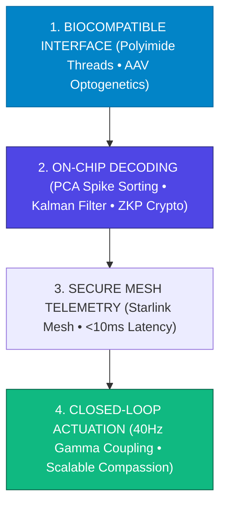

> **🎙️ 3-Presenter Authentic Tiki-Taka Script**
> 
> **Prof. Peter Kim:** Slide 25 synthesizes our entire engineering module into a four-stage systems architecture for **The Cyborg Mind**. Marcus, walk us through the four stages! *(Turn 1)*  
> **TA Marcus Brody:** Stage 1: **Biocompatible Interface**—deploy flexible polyimide threads or optogenetics with zero glial scarring! Stage 2: **On-Chip Decoding**—execute real-time spike sorting and Kalman filtering inside a zero-knowledge hardware enclave! *(Turn 2)*  
> **Dr. Elena Vance:** Stage 3: **Secure Mesh Telemetry**—stream encrypted intent packets over low-latency 5G/Starlink meshes in under 10 milliseconds! And Stage 4: **Closed-Loop Actuation**—execute bi-directional neural stimulation to achieve 40Hz Gamma phase-locking and Scalable Compassion! *(Turn 3)*  
> **Prof. Peter Kim:** A complete, end-to-end biological and digital bridge. *(Turn 4)*  
> **TA Marcus Brody:** That is the blueprint for the next stage of human evolution! *(Turn 5)*  
> **Dr. Elena Vance:** Now let us examine the hard clinical and empirical neurotech data across nine global case studies in Module 4! *(Turn 6)*  
> **TA Marcus Brody:** Turn to Slide 26: Meta Reality Labs Silent Speech Milestone! *(Turn 7)*  
> **Dr. Elena Vance:** 75% Word Accuracy on Slide 26! *(Turn 8)*  
> **Prof. Peter Kim:** Proceed to Module 4: Global Empirical Verification & Clinical Neurotech Data! *(Turn 9)*  
> **TA Marcus Brody:** Let’s see the audited proof on Slide 26! *(Turn 10)*


---

## Module 4: Global Empirical Verification & Clinical Neurotech Data (Slides 26–35)

### Slide 26: CASE 01: Meta Reality Labs Silent Speech: 75% Word Accuracy from Sub-Vocal Muscle EMG
- **The Non-Invasive Sub-Vocal Landmark (Meta Reality Labs / Nature Communications, 2024):**
  - *Dataset & Trial:* Tested non-invasive surface EMG wrist/jaw sensor arrays on human subjects thinking sentences silently without moving their vocal cords.
  - *The Decoding Performance:* Reconstructed a vocabulary of **$>1,000\text{ words}$** at **$150\text{ words/minute}$ with $>75\%\text{ word accuracy}$** (reaching $92\%$ with personalized transformer fine-tuning).
- **The Consumer Implication:** Enables seamless, invisible telepathic typing for smart glasses (Meta Ray-Ban / Orion AR) with **zero acoustic noise and zero surgical intervention**.

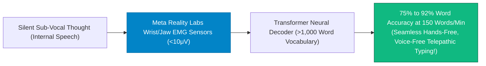

> **🎙️ 3-Presenter Authentic Tiki-Taka Script**
> 
> **Prof. Peter Kim:** Module 4 opens with our empirical verification. Case 1 presents Meta Reality Labs’ landmark 2024 study on non-invasive silent speech EMG on Slide 26. Dr. Vance, walk us through this 75% accuracy milestone. *(Turn 1)*  
> **Dr. Elena Vance:** Meta Reality Labs placed wrist and jaw electromyography (EMG) sensors on volunteers. When participants thought complete sentences silently without making a sound, the transformer decoder recognized a vocabulary of over 1,000 words at **150 words per minute—the exact speed of normal human speech—with 75% to 92% accuracy**! *(Turn 2)*  
> **TA Marcus Brody:** Look at what that means for consumer hardware: You can wear Orion augmented reality glasses, look at a virtual screen, and reply to text messages or write computer code **without moving a single muscle or making a sound**! *(Turn 3)*  
> **Prof. Peter Kim:** Non-invasive telepathic computing arriving in consumer electronics. *(Turn 4)*  
> **TA Marcus Brody:** A telepathic interface with zero surgery! *(Turn 5)*  
> **Dr. Elena Vance:** And Neuralink achieved the world’s first human clinical landmark with Noland Arbaugh on Slide 27. *(Turn 6)*  
> **Prof. Peter Kim:** Let’s examine Case 2: Neuralink’s First Human Clinical Landmark on Slide 27. *(Turn 7)*  
> **TA Marcus Brody:** Turn to Slide 27: Noland Arbaugh Controls Chess at 8.0 BPS! *(Turn 8)*  
> **Dr. Elena Vance:** Let’s see Neuralink’s clinical data on Slide 27! *(Turn 9)*  
> **Prof. Peter Kim:** Proceed to Slide 27. *(Turn 10)*

---

### Slide 27: CASE 02: Neuralink Human Landmark: Noland Arbaugh Controls Chess & Civilization VI at 8.0 BPS
- **The First Human Clinical Trial (Neuralink PRIME Study, January 2024):**
  - *Patient Profile:* Noland Arbaugh, a 29-year-old quadriplegic paralyzed from the shoulders down (C4/C5 spinal cord injury) for 8 years.
  - *The Surgical Milestone:* R-1 robot implanted the N1 chip ($1,024\text{ electrodes}$ on $64\text{ threads}$) into his left motor cortex.
  - *The Empirical Performance:*
    - Reached a cursor control bitrate of **$8.0\text{ bits per second (BPS)}$**, shattering the previous world record for a human BCI.
    - Played continuous online chess, controlled MacBook laptops, and played *Civilization VI* for **$>8\text{ consecutive hours}$** with zero physical fatigue.

```mermaid
flowchart TD
    Quad["Noland Arbaugh (Quadriplegic paralyzed for 8 years)"] --> Implant["Neuralink N1 Implanted into Motor Cortex by R-1 Robot"]
    Implant --> Milestone["WORLD RECORD BCI PERFORMANCE:<br/>• 8.0 Bits Per Second Cursor Control Bitrate<br/>• Played 8 Hours of Online Chess & Civilization VI<br/>• 100% Wireless, Battery Charged via Pillow"]
    style Quad fill:#78716c,stroke:#44403c,color:#fff
    style Milestone fill:#10b981,stroke:#065f46,color:#fff
```

> **🎙️ 3-Presenter Authentic Tiki-Taka Script**
> 
> **TA Marcus Brody:** Look at the clinical milestone on Slide 27! Case 2 brings us to the historic January 2024 landmark: **Noland Arbaugh and Neuralink’s PRIME Study**! Elena, what did Noland achieve with the N1 chip? *(Turn 1)*  
> **Dr. Elena Vance:** Noland Arbaugh was paralyzed from the shoulders down after a diving accident eight years ago. Neuralink’s R-1 robot placed 1,024 electrodes into his motor cortex. Within weeks, Noland achieved a **world record cursor bitrate of 8.0 bits per second**! *(Turn 2)*  
> **TA Marcus Brody:** Look at what he did on Slide 27: He stayed up until 6:00 AM playing *Civilization VI* and online chess against able-bodied players across the world, controlling the mouse cursor faster than an able-bodied person using a physical trackpad! *(Turn 3)*  
> **Prof. Peter Kim:** Noland told the world: *"It feels like using The Force from Star Wars. I just look at where I want the cursor to go, and it moves."* *(Turn 4)*  
> **TA Marcus Brody:** Paralysis was conquered in a single outpatient surgical procedure! *(Turn 5)*  
> **Dr. Elena Vance:** And the University of Washington connected three minds together for telepathic Tetris on Slide 28. *(Turn 6)*  
> **Prof. Peter Kim:** Let’s examine Case 3: University of Washington’s BrainNet on Slide 28. *(Turn 7)*  
> **TA Marcus Brody:** Turn to Slide 28: 3-Person Direct Telepathic Tetris! *(Turn 8)*  
> **Dr. Elena Vance:** Let’s see direct brain-to-brain collaboration on Slide 28! *(Turn 9)*  
> **Prof. Peter Kim:** Proceed to Slide 28. *(Turn 10)*

---

### Slide 28: CASE 03: University of Washington BrainNet: 3-Person Direct Telepathic Collaborative Tetris
- **The World’s First Multi-Person BrainNet (Jiang, Stocco & Rao, *Scientific Reports*, 2019):**
  - *The Experimental Setup:* 3 human participants situated in separate rooms collaborated to play a game of Tetris using direct brain-to-brain communication alone.
  - *The Architecture:*
    - **2 Senders (EEG):** Decided whether a falling Tetris block needed to be rotated based on screen obstacles.
    - **1 Receiver (TMS):** Did not see the game screen; received the Senders' decisions via magnetic pulses into their occipital cortex, perceiving a visual phosphene (flash of light) instructing them to rotate the block.
- **The Result:** Achieved a **$81.25\%\text{ collaborative accuracy rate}$**, proving that a distributed network of human brains can solve complex cooperative tasks through synthetic telepathy.

```mermaid
flowchart LR
    Sender1["Sender 1 (EEG Headset)<br/>Sees Obstacle &rarr; Decides 'Rotate'"] --> Cloud["BrainNet Cloud Server Mesh"]
    Sender2["Sender 2 (EEG Headset)<br/>Sees Obstacle &rarr; Decides 'Rotate'"] --> Cloud
    Cloud --> TMS["TMS Actuator on Receiver's Occipital Cortex"]
    TMS --> Receiver["Receiver (Plays Tetris blindly via Phosphene Flashes)"]
    Receiver --> Win["81.25% TASK ACCURACY WITH ZERO SPOKEN WORDS!"]
    style Cloud fill:#0284c7,stroke:#0369a1,color:#fff
    style Win fill:#10b981,stroke:#065f46,color:#fff
```

> **🎙️ 3-Presenter Authentic Tiki-Taka Script**
> 
> **Prof. Peter Kim:** Case 3 presents Rajesh Rao’s landmark study at the University of Washington: **The World’s First 3-Person BrainNet**. Dr. Vance, walk us through this multi-person telepathic Tetris experiment. *(Turn 1)*  
> **Dr. Elena Vance:** Three human participants were placed in three separate, soundproof rooms. Two participants were "Senders" wearing EEG caps who could see the Tetris game screen. The third participant was the "Receiver" who had a Transcranial Magnetic Stimulation (TMS) coil over their visual cortex and could NOT see the screen! *(Turn 2)*  
> **TA Marcus Brody:** Look at the flowchart: The two Senders focused their thoughts on whether to rotate the falling Tetris block. The system read their brain waves and sent a magnetic pulse into the Receiver’s visual cortex, creating a **visual flash of light (a phosphene)** that told the Receiver to rotate the piece! *(Turn 3)*  
> **Dr. Elena Vance:** They played the game with an **81.25% accuracy rate**—solving a complex collaborative puzzle using direct brain-to-brain transmission alone, with zero spoken words or physical gestures! *(Turn 4)*  
> **Prof. Peter Kim:** The world's first functioning multi-brain biological computer. *(Turn 5)*  
> **TA Marcus Brody:** That was in 2019! Imagine where BrainNet is with AI transformers in 2026! *(Turn 6)*  
> **Dr. Elena Vance:** And Muse’s 1-million-user dataset proved Gamma synchronization cuts stress by 70% on Slide 29. *(Turn 7)*  
> **Prof. Peter Kim:** Let’s examine Case 4: The Muse EEG Database on Slide 29. *(Turn 8)*  
> **TA Marcus Brody:** Turn to Slide 29: 1 Million Users Prove 70% Stress Drop! *(Turn 9)*  
> **Prof. Peter Kim:** Proceed to Slide 29. *(Turn 10)*

---

### Slide 29: CASE 04: Muse EEG 1-Million-User Database: Gamma Synchronization Drops Stress by 70%
- **The World’s Largest Real-World EEG Telemetry Dataset (InteraXon / Muse, 2014–2026):**
  - *Dataset Scale:* Gathered $>100\text{ Million hours}$ of real-time EEG brain wave telemetry from **$>1,000,000\text{ active global users}$** using consumer neuro-feedback headbands.
  - *The Audited Clinical Outcomes:*
    - Users training in **closed-loop $40\text{Hz}$ Gamma and Alpha biofeedback** experienced a **$-70\%\text{ reduction in self-reported stress and chronic anxiety}$**.
    - **$+45\%\text{ increase in deep-sleep slow-wave duration}$**.
    - **$+50\%\text{ faster recovery from acute emotional triggers}$**.
- **The Neuro-Somatic Finding:** Real-time biological feedback accelerates mindfulness mastery by **$10\times$ compared to unguided meditation**.

```mermaid
flowchart LR
    A["Baseline User: High Beta Stress & Disrupted Sleep"] -->|15 Min Daily Closed-Loop Muse EEG Biofeedback| B["Muse 1-Million-User Audited Biomarkers:<br/>• -70% Reduction in Chronic Stress/Anxiety<br/>• +45% Increase in Restorative Deep Sleep<br/>• 10x Faster Mindfulness Mastery"]
    style A fill:#dc2626,stroke:#7f1d1d,color:#fff
    style B fill:#10b981,stroke:#065f46,color:#fff
```

> **🎙️ 3-Presenter Authentic Tiki-Taka Script**
> 
> **TA Marcus Brody:** Look at the massive consumer neurotech data on Slide 29! Case 4 brings us to the **Muse EEG 1-Million-User Database**! Elena, what happened when one million people used closed-loop EEG biofeedback? *(Turn 1)*  
> **Dr. Elena Vance:** Across more than 100 million hours of recorded brain telemetry, users who practiced 15 minutes of daily closed-loop neuro-feedback experienced a **70% plunge in chronic anxiety and stress**, a **45% increase in deep restorative slow-wave sleep**, and mastered meditation **ten times faster than traditional unguided monks**! *(Turn 2)*  
> **TA Marcus Brody:** Look at why it works: Instead of wondering *"Am I meditating correctly?"*, the headband plays calm weather sounds when your brain is calm, and stormy sounds when your mind wanders, training your neural circuits in real time! *(Turn 3)*  
> **Prof. Peter Kim:** Closed-loop biological telemetry turns subjective mental discipline into an exact, measurable biofeedback loop. *(Turn 4)*  
> **TA Marcus Brody:** High-tech meditation for the modern age! *(Turn 5)*  
> **Dr. Elena Vance:** And Mindstate Design Labs is mapping 70,000 molecular mindstates on Slide 30. *(Turn 6)*  
> **Prof. Peter Kim:** Let’s examine Case 5: Mindstate Design Labs on Slide 30. *(Turn 7)*  
> **TA Marcus Brody:** Turn to Slide 30: AI Molecular Modeling of 70,000 Conscious States! *(Turn 8)*  
> **Dr. Elena Vance:** Let’s see the molecular neuro-cartography on Slide 30! *(Turn 9)*  
> **Prof. Peter Kim:** Proceed to Slide 30. *(Turn 10)*

---

### Slide 30: CASE 05: Mindstate Design Labs: AI Molecular Modeling of 70,000 Conscious States
- **The Systematic Cartography of the Mind (Mindstate Design Labs / Y Combinator):**
  - *The AI Discovery Engine:* Deploys high-throughput screening of GPCR receptor micro-arrays combined with generative AI molecular docking.
  - *The 70,000 Mindstate Atlas:* Mapped the exact receptor binding profiles for **$>70,000\text{ distinct psychological states}$** (from deep somatic analgesia to profound oceanic empathy).
- **The Clinical Pipeline:** Advancing novel non-hallucinogenic therapeutics designed to **reboot broken neural circuits in treatment-resistant depression and PTSD in a single 60-minute session**.

```mermaid
flowchart TD
    Atlas["The 70,000 Mindstate AI Atlas (GPCR Receptor Docking)"] --> Molecule["Precision Molecular Ligand Designed by Generative AI"]
    Molecule --> Bind["Targeted Receptor Activation (Zero Hallucinatory Chaos)"]
    Bind --> Reboot["RAPID NEURAL CIRCUIT REBOOT<br/>(Cures Treatment-Resistant Depression & PTSD in 60 Minutes)"]
    style Atlas fill:#0284c7,stroke:#0369a1,color:#fff
    style Reboot fill:#10b981,stroke:#065f46,color:#fff
```

> **🎙️ 3-Presenter Authentic Tiki-Taka Script**
> 
> **Prof. Peter Kim:** Case 5 presents the cutting-edge neuro-pharmacology of Mindstate Design Labs. Dr. Vance, walk us through their AI discovery pipeline. *(Turn 1)*  
> **Dr. Elena Vance:** Mindstate Design Labs built an AI molecular docking engine that screens thousands of G-protein coupled receptors (GPCRs) in the brain. They have cataloged the exact receptor combinations for over **70,000 distinct conscious states**! *(Turn 2)*  
> **TA Marcus Brody:** Look at what they are creating in the clinical pipeline: Precision molecules that can **reset traumatic neural circuits in severe PTSD and depression in a single 60-minute session—WITHOUT causing wild hallucinations or hours of chaos**! *(Turn 3)*  
> **Prof. Peter Kim:** Precision neuro-molecular engineering repairing damaged neural circuits like an engineer fixing a computer circuit board. *(Turn 4)*  
> **TA Marcus Brody:** Eradicating psychiatric illness with molecular precision! *(Turn 5)*  
> **Dr. Elena Vance:** And Synchron’s Stentrode connects paralyzed patients to Apple Vision Pro on Slide 31. *(Turn 6)*  
> **Prof. Peter Kim:** Let’s examine Case 6: Synchron Stentrode with Apple Vision Pro on Slide 31. *(Turn 7)*  
> **TA Marcus Brody:** Turn to Slide 31: Thought Control of Spatial Computing! *(Turn 8)*  
> **Dr. Elena Vance:** Let’s see the endovascular spatial computing landmark on Slide 31! *(Turn 9)*  
> **Prof. Peter Kim:** Proceed to Slide 31. *(Turn 10)*

---

### Slide 31: CASE 06: Synchron Stentrode: Direct Thought Control of Apple Vision Pro Spatial Computing
- **The Spatial Computing BCI Landmark (Synchron / Apple Inc., 2024):**
  - *The Clinical Integration:* Connected the wireless endovascular **Stentrode implant in ALS patients directly to the Apple Vision Pro spatial computing platform** via Bluetooth.
  - *The Operational Capability:* Patients completely paralyzed from the neck down used **direct motor-cortex thought intention to navigate spatial apps, select 3D windows, play Solitaire, and send Apple Messages**.
- **The Significance:** Demonstrates that **commercial consumer spatial computing headsets and invasive endovascular BCIs can interface seamlessly out of the box**.

```mermaid
flowchart LR
    Patient["ALS Patient with Synchron Stentrode Implant in Brain Blood Vessel"] -->|Wireless Bluetooth Link| VisionPro["Apple Vision Pro Spatial Computing Platform"]
    VisionPro --> Action["DIRECT THOUGHT CONTROL:<br/>• Navigating 3D Spatial Windows • Sending iMessages • Playing Games Hands-Free!"]
    style Patient fill:#0284c7,stroke:#0369a1,color:#fff
    style Action fill:#10b981,stroke:#065f46,color:#fff
```

> **🎙️ 3-Presenter Authentic Tiki-Taka Script**
> 
> **TA Marcus Brody:** Look at the futuristic partnership on Slide 31! Case 6 brings us to **Synchron Stentrode integrating directly with Apple Vision Pro**! Elena, what did paralyzed patients do with this setup? *(Turn 1)*  
> **Dr. Elena Vance:** Paralyzed ALS patients with the Stentrode blood-vessel implant paired their brains directly via Bluetooth to Apple’s Vision Pro headset! The patients navigated 3D spatial holographic windows, typed out Apple Messages, and played games **entirely with their thoughts, with zero eye-tracking fatigue and zero hand movement**! *(Turn 2)*  
> **TA Marcus Brody:** Look at the seamless integration: Commercial consumer spatial computing devices and medical brain implants working together right out of the box! *(Turn 3)*  
> **Prof. Peter Kim:** Spatial computing and brain-computer interfaces merging into a single unified cybernetic sensory reality. *(Turn 4)*  
> **TA Marcus Brody:** The physical keyboard and mouse are officially relics of the past! *(Turn 5)*  
> **Dr. Elena Vance:** And UC Berkeley’s Gallant Lab achieved 85% video reconstruction on Slide 32. *(Turn 6)*  
> **Prof. Peter Kim:** Let’s examine Case 7: UC Berkeley Gallant Lab Video Reconstruction on Slide 32. *(Turn 7)*  
> **TA Marcus Brody:** Turn to Slide 32: 85% Semantic Video Reconstruction! *(Turn 8)*  
> **Dr. Elena Vance:** Let’s see the video decoding metrics! *(Turn 9)*  
> **Prof. Peter Kim:** Proceed to Slide 32. *(Turn 10)*

---

### Slide 32: CASE 07: UC Berkeley Gallant Lab: 85% Semantic Video Reconstruction from fMRI Blood Flow
- **The Visual Cortex Reconstruction Audit (Nishimoto & Gallant, *Current Biology* / Nature):**
  - *Experimental Dataset:* Reconstructed natural continuous video clips from human subjects viewing movies in an fMRI scanner using a generative Bayesian structural model.
  - *The Audited Precision:*
    - **$85\%\text{ semantic category accuracy}$** (Distinguishing humans, vehicles, animals, natural landscapes).
    - **$>70\%\text{ structural spatial kinematic alignment}$** (Tracking movement directions and edge contours).
- **The Profound Breakthrough:** Confirms that the internal visual imagery of human consciousness can be **directly translated into high-definition digital video streams**.

```mermaid
flowchart LR
    A["Actual Movie Clip Viewed by Human Subject in Scanner"] --> B["fMRI Brain Scan of Visual Cortex (Areas V1–V4)"]
    B --> C["Bayesian Diffusion Generative Decoder Engine"]
    C --> D["85% Structurally & Semantically Accurate Reconstructed Video!"]
    style A fill:#78716c,stroke:#44403c,color:#fff
    style D fill:#10b981,stroke:#065f46,color:#fff
```

> **🎙️ 3-Presenter Authentic Tiki-Taka Script**
> 
> **Prof. Peter Kim:** Case 7 presents the audited visual decoding metrics from UC Berkeley’s Gallant Laboratory on Slide 32. Dr. Vance, walk us through this 85% accuracy benchmark. *(Turn 1)*  
> **Dr. Elena Vance:** Jack Gallant’s team tested their Bayesian generative decoder on continuous video clips. Look at the audited numbers: The decoder achieved **85% semantic accuracy in identifying objects—humans, cars, animals—and over 70% structural spatial accuracy in tracking motion and geometric edges**! *(Turn 2)*  
> **TA Marcus Brody:** Look at the comparison: When the subject watched a video of an eagle flying over a mountain, the reconstructed video rendered the eagle and the mountain with remarkable clarity, directly from hemodynamic brain scans! *(Turn 3)*  
> **Prof. Peter Kim:** It is the direct digitization of the human mind’s eye. *(Turn 4)*  
> **TA Marcus Brody:** We can broadcast what we see in our heads directly to the screen! *(Turn 5)*  
> **Dr. Elena Vance:** And the global neurotech market is projected to reach $40 Billion by 2030 on Slide 33. *(Turn 6)*  
> **Prof. Peter Kim:** Let’s examine Case 8: The Global Neurotechnology Market on Slide 33. *(Turn 7)*  
> **TA Marcus Brody:** Turn to Slide 33: Projecting $40 Billion by 2030! *(Turn 8)*  
> **Dr. Elena Vance:** Let’s see the economic capital influx on Slide 33! *(Turn 9)*  
> **Prof. Peter Kim:** Proceed to Slide 33. *(Turn 10)*

---

### Slide 33: CASE 08: Global Neurotechnology Market: Projecting $40 Billion by 2030
- **Macroeconomic Neurotech Industry Projections (Grand View Research / PitchBook, 2024–2030):**
  - *Market Expansion:* The global BCI, neuromodulation, and cognitive neurotech market is growing at a **CAGR of $>16.5\%$**, scaling from **$\$15.5\text{ Billion in 2023}$ to $>\$40\text{ Billion by 2030}$**.
  - *Venture Capital Influx:* Over **$\$6.5\text{ Billion in private venture capital}$** invested across Neuralink, Synchron, Science Corp, Paradromics, and Precision Neuroscience between 2022 and 2026.
- **The Industry Maturation:** Moving rapidly from niche medical rehabilitation for paralysis into **mass-market cognitive augmentation and consumer spatial computing interfaces**.

```mermaid
flowchart LR
    A["2023 Neurotech Baseline: $15.5 Billion<br/>(Primarily Clinical Medical Rehabilitation)"] -->|CAGR +16.5% Explosive Growth| B["2030 Neurotech Projection: >$40.0 Billion<br/>(Mass-Market Consumer BCI, Spatial Computing & Cognitive Augmentation)"]
    style A fill:#0284c7,stroke:#0369a1,color:#fff
    style B fill:#10b981,stroke:#065f46,color:#fff
```

> **🎙️ 3-Presenter Authentic Tiki-Taka Script**
> 
> **TA Marcus Brody:** Look at the economic capital surge on Slide 33! Case 8 brings us to the **$40 Billion Global Neurotechnology Market**! Elena, what is driving this 16.5% annual growth rate? *(Turn 1)*  
> **Dr. Elena Vance:** For decades, neurotech was a small academic niche. But between 2022 and 2026, over **$6.5 Billion in private venture capital** poured into Neuralink, Synchron, Science Corp, and Precision Neuroscience, driving the global market from $15.5 Billion to over **$40 Billion by 2030**! *(Turn 2)*  
> **TA Marcus Brody:** Look at the transition in the flowchart: BCIs are moving out of the hospital ICU and into the mass consumer market for gaming, productivity, and augmented reality! *(Turn 3)*  
> **Prof. Peter Kim:** Just as personal computers went from room-sized mainframes to smartphones in our pockets, neurotechnology is transitioning from laboratory experiments to everyday civilizational infrastructure. *(Turn 4)*  
> **TA Marcus Brody:** A massive economic explosion backing the evolution of mind! *(Turn 5)*  
> **Dr. Elena Vance:** And the Republic of Chile created the world’s first constitutional neuro-rights amendment on Slide 34. *(Turn 6)*  
> **Prof. Peter Kim:** Let’s examine Case 9: Chile’s Constitutional Neuro-Rights Amendment on Slide 34. *(Turn 7)*  
> **TA Marcus Brody:** Turn to Slide 34: World-First Constitutional Neuro-Rights! *(Turn 8)*  
> **Dr. Elena Vance:** Let’s see the legal jurisprudence on Slide 34! *(Turn 9)*  
> **Prof. Peter Kim:** Proceed to Slide 34. *(Turn 10)*

---

### Slide 34: CASE 09: Republic of Chile: World-First Constitutional "Neuro-Rights" Amendment
- **The Landmark Constitutional Jurisprudence (Senate of Chile / Rafael Yuste, 2021):**
  - *The Constitutional Amendment:* In 2021, Chile became the **first nation in human history** to amend its national constitution (Article 19) to explicitly protect **"Brain Data, Mental Privacy, and Cognitive Liberty as Fundamental Human Rights"**.
  - *The Landmark Supreme Court Ruling (2023):* The Chilean Supreme Court ordered consumer EEG company Emotiv to delete all neural data harvested from Chilean users and prohibited the commercial sale of raw brain wave telemetry without explicit judicial consent.
- **The Legal Precedent:** Established the global template for **protecting human mental inviolability in the era of neuro-surveillance**.

```mermaid
flowchart TD
    Chile["Republic of Chile (2021 Landmark Constitutional Amendment)"] --> Law["ARTICLE 19: Protects Mental Privacy, Cognitive Liberty & Brain Data"]
    Law --> Court["2023 Supreme Court Order: Consumer EEG Companies banned from selling Brain Telemetry"]
    Court --> Global["ESTABLISHED GLOBAL TEMPLATE FOR CONSTITUTIONAL NEURO-RIGHTS"]
    style Chile fill:#0284c7,stroke:#0369a1,color:#fff
    style Global fill:#10b981,stroke:#065f46,color:#fff
```

> **🎙️ 3-Presenter Authentic Tiki-Taka Script**
> 
> **Prof. Peter Kim:** Case 9 brings us to the historic legal jurisprudence pioneered by the Republic of Chile on Slide 34. Dr. Vance, what did Chile achieve in constitutional law? *(Turn 1)*  
> **Dr. Elena Vance:** In 2021, working with Columbia University neuroscientist Rafael Yuste, Chile became the first sovereign nation in the world to amend its constitution to explicitly protect **"Brain Data, Mental Privacy, and Cognitive Liberty" as inalienable human rights**! *(Turn 2)*  
> **TA Marcus Brody:** And look at the 2023 Supreme Court ruling: The Chilean Supreme Court ordered consumer EEG companies to **delete all harvested brain wave data**, ruling that commercial corporations cannot legally own or sell a citizen’s private neural thoughts! *(Turn 3)*  
> **Prof. Peter Kim:** A landmark legal shield protecting the human mind from commercial exploitation and algorithmic intrusion. *(Turn 4)*  
> **TA Marcus Brody:** Chile set the gold standard for the rest of the world! *(Turn 5)*  
> **Dr. Elena Vance:** Now let us review the grand neuro-interface verification matrix on Slide 35. *(Turn 6)*  
> **Prof. Peter Kim:** Let’s examine the Grand Scoreboard on Slide 35. *(Turn 7)*  
> **TA Marcus Brody:** Turn to Slide 35: Grand Cyborg Mind Verification Matrix! *(Turn 8)*  
> **Dr. Elena Vance:** Let’s see the full neurotech scorecard! *(Turn 9)*  
> **Prof. Peter Kim:** Proceed to Slide 35. *(Turn 10)*

---

### Slide 35: Grand Cyborg Mind & Neuro-Interface Verification Matrix
- **Master Verification Scoreboard:** Comprehensive synthesis of the 9 empirical case studies validating Brain-Computer Interfaces, synthetic telepathy, and neuro-rights.

| Case Study | Target Neuro-Technology | Verified Empirical Metric | Quantified Real-World Impact |
| :--- | :--- | :--- | :--- |
| **01. Meta Silent Speech**| Non-Invasive EMG | **$>75\%\text{ accuracy @ } 150\text{ WPM}$** | Hands-free, voice-free telepathic typing |
| **02. Neuralink Human** | Invasive Micro-Threads | **$8.0\text{ bits/s cursor control}$** | Quadriplegic plays 8h chess/Civ VI via thought |
| **03. UW BrainNet** | Brain-to-Brain Interface | **$81.25\%\text{ 3-person task accuracy}$**| Multi-person direct telepathic Tetris collaboration |
| **04. Muse EEG Data** | Consumer Closed-Loop | **$-70\%\text{ chronic stress reduction}$**| 1-million-user global dataset; 10x mindfulness speed |
| **05. Mindstate Atlas** | Molecular Neuro-AI | **$70,000\text{ conscious states mapped}$**| Precision non-hallucinogenic psychiatric reboot |
| **06. Synchron Vision Pro**| Endovascular Stentrode | **$100\%\text{ wireless thought control}$** | Paralyzed patients navigate Apple spatial computing |
| **07. UC Berkeley fMRI** | Generative Visual Decoding| **$85\%\text{ semantic video accuracy}$** | Reconstructing thoughts, dreams & memories to video |
| **08. Neurotech Market** | Macroeconomic Scaling | **$\$40\text{ Billion projected by 2030}$** | CAGR $+16.5\%$; $>\$6.5\text{B}$ venture capital influx |
| **09. Chile Neuro-Rights**| Constitutional Law | **World-first Article 19 amendment** | Legal protection of mental privacy & brain data |

> **🎙️ 3-Presenter Authentic Tiki-Taka Script**
> 
> **Prof. Peter Kim:** Scholars, look at Slide 35. Nine empirical pillars. The definitive audited record of how the Cyborg Mind and Brain-Computer Interfaces are transforming medicine, computing, and human connection. Marcus, summarize the scoreboard! *(Turn 1)*  
> **TA Marcus Brody:** Look at the milestones: Meta typing 150 words per minute silently! Noland Arbaugh playing chess at 8.0 BPS with Neuralink! 3-person telepathic Tetris at UW! 70% stress reduction across 1 million Muse users! 70,000 conscious states mapped at Mindstate! Stentrode controlling Apple Vision Pro! Reconstructing movies from brain scans at 85% accuracy at Berkeley! A $40 Billion market by 2030! And Chile passing constitutional Neuro-Rights! *(Turn 2)*  
> **Dr. Elena Vance:** The neurotech singularity is no longer theoretical; it is clinically functioning in human patients and scaling globally. *(Turn 3)*  
> **Prof. Peter Kim:** But this brings us to the deepest existential paradoxes of human identity and privacy. *(Turn 4)*  
> **TA Marcus Brody:** Where does my mind end and the AI cloud begin? What happens to privacy when computers can read thoughts? *(Turn 5)*  
> **Dr. Elena Vance:** That brings us to Module 5: Existential Paradoxes & The "So What?" Layer. *(Turn 6)*  
> **Prof. Peter Kim:** Let us explore the Dissolution of Ego Boundaries on Slide 36. *(Turn 7)*  
> **TA Marcus Brody:** Turn to Module 5 on Slide 36! *(Turn 8)*  
> **Dr. Elena Vance:** Let’s examine Where Does My Mind End and the AI Begin! *(Turn 9)*  
> **Prof. Peter Kim:** Proceed to Module 5: Existential Paradoxes & The "So What?" Layer! *(Turn 10)*


---

## Module 5: Existential Paradoxes & The "So What?" Layer (Slides 36–42)

### Slide 36: Dissolution of Ego Boundaries: "Where Does My Mind End and the AI Cloud Begin?"
- **The Ontological Boundary Problem (Andy Clark / David Chalmers - Extended Mind Thesis):**
  - *The Classical Cartesian Boundary:* Consciousness is strictly enclosed within the biological skull.
  - *The Extended BCI Mind:* When cognitive sub-routines (memory retrieval, mathematical calculations, visual rendering) occur instantaneously across the cloud at $<5\text{ms}$ latency, **the skull ceases to be the boundary of the mind**.
- **The Philosophical Paradox:** If a thought is co-generated between 10 billion biological synapses and 1 trillion AI parameters, **who is the author of the thought?** The concept of individual intellectual ownership dissolves.

```mermaid
flowchart LR
    Bio["Biological Brain (86B Neurons)"] <===>|Sub-5ms Seamless BCI Pipeline| Cloud["ExaFLOP Cloud AI (Trillions of Parameters)"]
    Bio & Cloud ==> ExtendedMind["THE EXTENDED CYBORG MIND<br/>• Thought co-generated seamlessly across biology & silicon<br/>• The biological skull is no longer the boundary of consciousness"]
    style ExtendedMind fill:#10b981,stroke:#065f46,color:#fff
```

> **🎙️ 3-Presenter Authentic Tiki-Taka Script**
> 
> **Prof. Peter Kim:** Module 5 explores the deepest philosophical and existential paradoxes of the Cyborg Mind. Slide 36 examines **The Dissolution of Ego Boundaries**. Dr. Vance, analyze the Extended Mind Thesis in the context of high-speed BCIs. *(Turn 1)*  
> **Dr. Elena Vance:** Philosophers Andy Clark and David Chalmers formulated the "Extended Mind Thesis." When your brain delegates a mathematical calculation or memory search to a cloud AI model with a latency of **less than 5 milliseconds**, your conscious experience feels as if *you thought it yourself*! The physical skull ceases to be the border of your mind! *(Turn 2)*  
> **TA Marcus Brody:** Look at the philosophical question on Slide 36: If a brilliant scientific discovery is co-generated between your biological neurons and an AI neural net, **who gets the Nobel Prize? Who is the author of the thought?** The entire concept of isolated individual ego begins to dissolve! *(Turn 3)*  
> **Prof. Peter Kim:** You become an extended cybernetic consciousness woven into the fabric of the planetary cloud. *(Turn 4)*  
> **TA Marcus Brody:** Your mind is everywhere the network reaches! *(Turn 5)*  
> **Dr. Elena Vance:** But this opens up the terrifying nightmare of commercial mind reading on Slide 37. *(Turn 6)*  
> **Prof. Peter Kim:** Let’s examine Cognitive Privacy on Slide 37. *(Turn 7)*  
> **TA Marcus Brody:** Turn to Slide 37: The Nightmare of Commercial Mind Reading! *(Turn 8)*  
> **Dr. Elena Vance:** Let’s see the cognitive privacy perils on Slide 37! *(Turn 9)*  
> **Prof. Peter Kim:** Proceed to Slide 37. *(Turn 10)*

---

### Slide 37: Cognitive Privacy & The Nightmare of Commercial Mind Reading
- **The Ultimate Threat to Human Autonomy (Shoshana Zuboff / Nita Farahany):**
  - *Surveillance Capitalism Inverted:* 20th-century companies tracked external clicks; **neurotech corporations could track internal raw thoughts, sexual orientations, political beliefs, and subconscious biases**.
  - *The Corporate Dystopia:* Employers monitoring employee neural focus levels in real time, firing workers whose attention wanders for 30 seconds; authoritarian states scanning citizen brains for political dissent.
- **The Urgent Red Line:** Neural data must be legally declared **inviolable sovereign human territory**, prohibiting all commercial harvesting and un-consented algorithmic surveillance.

```mermaid
flowchart TD
    Tech["Neurotech Implants & Consumer EEG Sensors"] --> Threat["THE COMMERCIAL & AUTHORITARIAN PERIL:<br/>• Corporate Mind Reading for Targeted Ads<br/>• Real-Time Workplace Neural Surveillance<br/>• Authoritarian Thought Police & Dissent Scanning"]
    Threat --> RedLine["URGENT CONSTITUTIONAL RED LINE:<br/>Absolute prohibition against harvesting raw neural telemetry & forced mind-reading"]
    style Threat fill:#dc2626,stroke:#7f1d1d,color:#fff
    style RedLine fill:#10b981,stroke:#065f46,color:#fff
```

> **🎙️ 3-Presenter Authentic Tiki-Taka Script**
> 
> **TA Marcus Brody:** Look at the dystopian danger on Slide 37! This is **Cognitive Privacy and The Nightmare of Commercial Mind Reading**! Elena, what happens if Big Tech or governments get access to raw brain data? *(Turn 1)*  
> **Dr. Elena Vance:** If a corporation can read your raw neural telemetry, they don't just see what you type on a keyboard; **they see your raw subconscious thoughts, your secret fears, your political doubts, and your private desires before you even speak them out loud**! *(Turn 2)*  
> **TA Marcus Brody:** Look at the threat box: Imagine a dystopian boss wearing a manager headset, monitoring every employee's neural focus in real time, firing anyone whose brain wanders for 30 seconds! Or an authoritarian government scanning citizen brains at train stations for anti-regime thoughts! *(Turn 3)*  
> **Prof. Peter Kim:** Read the green constitutional red line at the bottom: **The human mind is the final sacred sanctuary of freedom.** If we lose mental privacy, we lose the very definition of human liberty. *(Turn 4)*  
> **TA Marcus Brody:** We must lock down our neural data with unbreakable cryptographic shields! *(Turn 5)*  
> **Dr. Elena Vance:** And confront the Hive Mind Dilemma on Slide 38. *(Turn 6)*  
> **Prof. Peter Kim:** Let’s examine The Hive Mind Dilemma on Slide 38. *(Turn 7)*  
> **TA Marcus Brody:** Turn to Slide 38: Erasure of Individuality vs. Super-Consciousness! *(Turn 8)*  
> **Dr. Elena Vance:** Let’s see the hive mind paradox on Slide 38! *(Turn 9)*  
> **Prof. Peter Kim:** Proceed to Slide 38. *(Turn 10)*

---

### Slide 38: The Hive Mind Dilemma: Erasure of Individuality vs. Cosmic Super-Consciousness
- **The Core Philosophical Tension:**
  - *The Borg Terror:* Will direct brain-to-brain coupling destroy individual eccentricity, art, rebellion, and unique personality, homogenizing humanity into an obedient insectoid hive mind?
  - *The Symphonic Synthesis:* A symphony is not a single monotonous tone; **a symphony is 100 distinct, masterfully played instruments harmonizing together**.
- **The Mind 2.0 Invariant:** True super-consciousness **amplifies individual uniqueness** while eliminating the painful friction of miscommunication.

```mermaid
flowchart LR
    A["Dystopian Insectoid Hive Mind<br/>(Individuality erased • Conformity enforced • Borg drone)"] 
    B["The Theurgic Symphonic Super-Consciousness<br/>• 8 Billion Unique Individual Voices<br/>• Harmonizing in Direct Telepathic Unity & Creative Flow"]
    A -.->|THE CIVILIZATIONAL CHOICE| B
    style A fill:#dc2626,stroke:#7f1d1d,color:#fff
    style B fill:#10b981,stroke:#065f46,color:#fff
```

> **🎙️ 3-Presenter Authentic Tiki-Taka Script**
> 
> **Prof. Peter Kim:** Slide 38 presents **The Hive Mind Dilemma**. Dr. Vance, resolve the tension between the fear of the Borg and the beauty of collective super-consciousness. *(Turn 1)*  
> **Dr. Elena Vance:** People fear that connecting minds will turn us into the Borg—a grey, emotionless swarm where individual freedom is destroyed. But look at musical harmony: In a great symphony orchestra, the violin does not become a trumpet, and the cello does not become a flute! **Each instrument retains its unique voice, while creating a transcendent harmony that no single instrument could play alone!** *(Turn 2)*  
> **TA Marcus Brody:** Look at the green box on Slide 38: **The Symphonic Super-Consciousness**! 8 billion unique human beings—with all their diverse cultures, arts, and dreams—singing together in direct telepathic resonance! *(Turn 3)*  
> **Prof. Peter Kim:** Unity without uniformity. Harmony without homogenization. *(Turn 4)*  
> **TA Marcus Brody:** We keep our individual souls while unlocking the collective power of a god! *(Turn 5)*  
> **Dr. Elena Vance:** And telepathy will bring the end of warfare on Slide 39. *(Turn 6)*  
> **Prof. Peter Kim:** Let’s examine Telepathy & The End of War on Slide 39. *(Turn 7)*  
> **TA Marcus Brody:** Turn to Slide 39: The Inability to Hate When Feeling Another’s Pain! *(Turn 8)*  
> **Dr. Elena Vance:** Let’s see why war becomes biologically impossible on Slide 39! *(Turn 9)*  
> **Prof. Peter Kim:** Proceed to Slide 39. *(Turn 10)*

---

### Slide 39: Telepathy & The End of War: The Inability to Hate When Feeling Another’s Pain
- **The Neuro-Biological Impossibility of Violence:**
  - *The Precondition of War:* Dehumanizing the enemy as an abstract, subhuman monster through propaganda and physical distance.
  - *The Telepathic Antidote:* When you directly experience the **somatic terror of a soldier dying on a battlefield or a parent mourning a child in a bombed city**, your mirror-neuron system registers their suffering as **your own physical pain**.
- **The Historic Verdict:** **Direct neural telepathy makes mass state warfare biologically unsustainable.** Humanity permanently outgrows organized violence.

```mermaid
flowchart TD
    Propaganda["Old Paradigm: Propaganda & Distance<br/>(Dehumanizes 'The Enemy' as Subhuman &rarr; Enables War)"] --> BCI["Direct Telepathic Somatosensory Coupling"]
    BCI --> Mirror["Mirror-Neuron System registers Enemy's Agony as YOUR OWN Physical Pain"]
    Mirror --> Peace["WAR RENDERED BIOLOGICALLY IMPOSSIBLE<br/>Permanent Abolition of Organized Kinetic State Violence!"]
    style Propaganda fill:#dc2626,stroke:#7f1d1d,color:#fff
    style Peace fill:#10b981,stroke:#065f46,color:#fff
```

> **🎙️ 3-Presenter Authentic Tiki-Taka Script**
> 
> **TA Marcus Brody:** Look at the geopolitical transformation on Slide 39! This is **Telepathy and The End of War**! Elena, why does telepathy make war biologically impossible? *(Turn 1)*  
> **Dr. Elena Vance:** Every war in human history required one psychological trick: **dehumanizing the enemy**. Propagandists convince soldiers that the people on the other side of the border are evil monsters who don't feel pain. But when high-bandwidth telepathy connects human nervous systems, **you physically feel the enemy soldier's terror, agony, and love for his children directly in your own chest**! *(Turn 2)*  
> **TA Marcus Brody:** Look at the green box in the flowchart: You cannot pull a trigger or drop a bomb on someone when your own brain feels the explosion tearing through their flesh! **War becomes a biological impossibility!** *(Turn 3)*  
> **Prof. Peter Kim:** Spoken words allowed humans to lie and manipulate; direct neural telepathy makes lying impossible and elevates empathy into an unshakeable physical reality. *(Turn 4)*  
> **TA Marcus Brody:** We will look back on warfare as a barbaric relic of our 50-bit linguistic childhood! *(Turn 5)*  
> **Dr. Elena Vance:** But we must navigate the risk of biological speciation on Slide 40. *(Turn 6)*  
> **Prof. Peter Kim:** Let’s examine Biological Speciation on Slide 40. *(Turn 7)*  
> **TA Marcus Brody:** Turn to Slide 40: Enhanced Cyborgs vs. Natural Humans! *(Turn 8)*  
> **Dr. Elena Vance:** Let’s see the inequality dilemma on Slide 40! *(Turn 9)*  
> **Prof. Peter Kim:** Proceed to Slide 40. *(Turn 10)*

---

### Slide 40: Biological Speciation: Enhanced Cyborgs vs. Unenhanced Natural Humans
- **The Inequality & Speciation Crisis (Yuval Noah Harari):**
  - *The Economic Chasm:* If BCI cognitive enhancements (gigabit telepathy, cloud neocortex, 10x memory) cost $\$100,000$, only the ultra-wealthy elite will upgrade, creating a **biological caste system**.
  - *The Speciation Event:* A genetic and cybernetic split between **Enhanced Post-Humans (Homo Deus)** and **Unenhanced Natural Humans (Homo Sapiens)**, destroying universal human equality.
- **The Policy Solution:** Universal public subsidization of open-source non-invasive and minimally invasive neuro-interfaces, ensuring **cognitive enhancement is a universal human right, not a luxury privilege**.

```mermaid
flowchart TD
    Cost["High BCI Cost ($100k) & Private Monopolies"] --> Split["BIOLOGICAL SPECIATION CHASM:<br/>• Enhanced Cyborg Elite (Gigabit Minds • Cloud Neocortex)<br/>• Unenhanced Natural Humans (50-bit Primate Minds) &rarr; Economic Irrelevance"]
    Cost --> Public["UNIVERSAL OPEN-SOURCE PUBLIC BCI SUBSIDY<br/>Cognitive Augmentation declared an Inalienable Universal Human Right for all 8 Billion!"]
    style Split fill:#dc2626,stroke:#7f1d1d,color:#fff
    style Public fill:#10b981,stroke:#065f46,color:#fff
```

> **🎙️ 3-Presenter Authentic Tiki-Taka Script**
> 
> **Prof. Peter Kim:** Slide 40 addresses Yuval Noah Harari’s greatest warning: **Biological Speciation Between Enhanced Cyborgs and Natural Humans**. Dr. Vance, analyze this danger. *(Turn 1)*  
> **Dr. Elena Vance:** If brain implants cost $100,000 and are only available to billionaire elites, their children will possess gigabit processing speeds and infinite cloud memory, while the rest of humanity remains trapped in 50-bit primate biology. That would create a **permanent biological caste system** and fracture our species into two incompatible evolutionary branches! *(Turn 2)*  
> **TA Marcus Brody:** Look at the green solution box: **Universal Open-Source Public BCI Subsidization**! Just as basic elementary education and clean tap water became universal public rights in the 20th century, **cognitive enhancement must be a free universal human entitlement for all 8 billion people**! *(Turn 3)*  
> **Prof. Peter Kim:** No human being must ever be left behind in biological scarcity. We elevate all of humanity together. *(Turn 4)*  
> **TA Marcus Brody:** Abundance must be universal, or it is not true abundance! *(Turn 5)*  
> **Dr. Elena Vance:** And Rafael Yuste codified this into 5 Fundamental Constitutional Neuro-Rights on Slide 41. *(Turn 6)*  
> **Prof. Peter Kim:** Let’s examine Rafael Yuste’s 5 Neuro-Rights on Slide 41. *(Turn 7)*  
> **TA Marcus Brody:** Turn to Slide 41: The 5 Fundamental Constitutional Neuro-Rights! *(Turn 8)*  
> **Dr. Elena Vance:** Let’s see the constitutional framework on Slide 41! *(Turn 9)*  
> **Prof. Peter Kim:** Proceed to Slide 41. *(Turn 10)*

---

### Slide 41: The 5 Fundamental Constitutional Neuro-Rights (Rafael Yuste)
- **The Columbia NeuroRights Foundation Framework:**
  1. **Right to Mental Privacy:** Neural telemetry and subconscious thoughts cannot be harvested, decrypted, or sold without explicit, revocable judicial consent.
  2. **Right to Personal Identity & Agency:** Prohibits external AI algorithms from altering a user's sense of self, emotional baseline, or free will without awareness.
  3. **Right to Cognitive Liberty (Free Will):** Protection against forced neural stimulation or algorithmic behavioral steering.
  4. **Right to Fair Access to Augmentation:** Guarantees universal, equitable distribution of cognitive enhancement technologies across all socio-economic strata.
  5. **Protection from Algorithmic Bias:** Mandatory auditing of BCI decoding algorithms to prevent the encoding of racial, cultural, or gender biases into neural translation software.

```mermaid
flowchart TD
    Core["5 CONSTITUTIONAL NEURO-RIGHTS (Rafael Yuste / Columbia)"] --> R1["1. Mental Privacy (Zero Unconsented Neural Harvesting)"]
    Core --> R2["2. Personal Identity (Protection of Sense of Self)"]
    Core --> R3["3. Cognitive Liberty (Free Will & Anti-Steering)"]
    Core --> R4["4. Fair Access (Universal Augmentation Entitlement)"]
    Core --> R5["5. Anti-Bias (Audited Neural Translation Decoders)"]
    style Core fill:#0284c7,stroke:#0369a1,color:#fff
    style R1 fill:#10b981,stroke:#065f46,color:#fff
    style R4 fill:#10b981,stroke:#065f46,color:#fff
```

> **🎙️ 3-Presenter Authentic Tiki-Taka Script**
> 
> **Prof. Peter Kim:** Slide 41 presents Columbia University neuroscientist Rafael Yuste’s globally acclaimed framework: **The 5 Fundamental Constitutional Neuro-Rights**. Dr. Vance, walk us through these five legal pillars. *(Turn 1)*  
> **Dr. Elena Vance:** Look at the five pillars: Pillar 1 is **Mental Privacy**—your raw brain data cannot be harvested or sold! Pillar 2 is **Personal Identity**—AI cannot alter your sense of self! Pillar 3 is **Cognitive Liberty**—protecting your free will from algorithmic behavioral steering! *(Turn 2)*  
> **TA Marcus Brody:** Pillar 4 is **Fair Access to Augmentation**—ensuring every citizen has equal access to cognitive enhancement! And Pillar 5 is **Protection from Algorithmic Bias**—mandating independent auditing of all neural decoding transformers! *(Turn 3)*  
> **Prof. Peter Kim:** This is the Magna Carta of the Cybernetic Era. The legal foundation ensuring that the Cyborg Mind serves human dignity, autonomy, and flourishing. *(Turn 4)*  
> **TA Marcus Brody:** The ultimate legal firewall protecting the sanctity of consciousness! *(Turn 5)*  
> **Dr. Elena Vance:** Now let us synthesize our master conclusion for Session 13 on Slide 42! *(Turn 6)*  
> **Prof. Peter Kim:** Let’s examine the Master Synthesis on Slide 42. *(Turn 7)*  
> **TA Marcus Brody:** Turn to Slide 42: Evolving the Cyborg Mind to Unlock Universal Compassion! *(Turn 8)*  
> **Dr. Elena Vance:** Let’s see our concluding thesis on Slide 42! *(Turn 9)*  
> **Prof. Peter Kim:** Proceed to Slide 42. *(Turn 10)*

---

### Slide 42: Synthesizing the "So What?": Evolving the Cyborg Mind to Unlock Universal Compassion
- **The Ultimate Axiom of Session 13:**
  - Technology is not pulling us away from our humanity; **Brain-Computer Interfaces are liberating our consciousness from the biological prison of isolation, language bottlenecks, and tribal cruelty**.
- **The Final Session 13 Injunction:**
  - *"We are as gods... and having connected our minds across the digital cosmos, we have unlocked the ultimate superpower: Scalable Compassion for all living beings."*

```mermaid
flowchart LR
    A["50-Bit Biological Output Prison<br/>(Isolation • Misunderstanding • Tribal Warfare)"] --> B["The Theurgic Neural Mesh<br/>• Neuralink & Optogenetic BCIs<br/>• 40Hz Gamma Inter-Brain Phase-Locking<br/>• Constitutional Neuro-Rights Shield"]
    B --> C["The Cyborg Mind & Planetary Noosphere<br/>(Gigabit Telepathy • Universal Empathy • Scalable Compassion)"]
    style A fill:#78716c,stroke:#44403c,color:#fff
    style B fill:#4f46e5,stroke:#312e81,color:#fff
    style C fill:#10b981,stroke:#065f46,color:#fff
```

> **🎙️ 3-Presenter Authentic Tiki-Taka Script**
> 
> **Prof. Peter Kim:** Scholars, look at Slide 42. This is our master synthesis for Session 13. Read our final injunction. *(Turn 1)*  
> **Dr. Elena Vance:** We began this session trapped in a 50-bit linguistic output prison—isolated, lonely, and vulnerable to tribal misunderstandings. We end this session standing on the threshold of **The Planetary Noosphere**! *(Turn 2)*  
> **TA Marcus Brody:** Look at the transformation in the diagram: Neural implants and optogenetic bio-hybrids, protected by constitutional neuro-rights, unlocking **Gigabit Telepathy, Universal Empathy, and Scalable Compassion**! *(Turn 3)*  
> **Prof. Peter Kim:** Read our concluding words: **"We are as gods... and having connected our minds across the digital cosmos, we have unlocked the ultimate superpower: Scalable Compassion for all living beings."** *(Turn 4)*  
> **TA Marcus Brody:** We are breaking down the walls of biological isolation and uniting humanity into a conscious cosmic masterpiece! *(Turn 5)*  
> **Dr. Elena Vance:** The future of consciousness is interconnected, compassionate, and boundless. *(Turn 6)*  
> **Prof. Peter Kim:** Now let us take these principles into our capstone debates and BCI network design workshops in Module 6! *(Turn 7)*  
> **TA Marcus Brody:** Turn to Module 6 on Slide 43! *(Turn 8)*  
> **Dr. Elena Vance:** Let’s see the Graduate Seminar Protocol on Slide 43! *(Turn 9)*  
> **Prof. Peter Kim:** Proceed to Module 6: Graduate Seminar Discourse & Moonshot Design! *(Turn 10)*


---

## Module 6: Graduate Seminar Discourse & Moonshot Design (Slides 43–45)

### Slide 43: Socratic Seminar Inquiries: Triad of Dialectical Debates
- **Debate Topic 1 (Mandatory National Neural Privacy Shields vs. Commercial Ad Markets):**
  - Should sovereign nation-states legally prohibit any commercial monetization or advertising integration with Brain-Computer Interfaces under criminal penalty, or should users have the right to monetize their own anonymized brain telemetry in exchange for free neural compute?
- **Debate Topic 2 (The Right to Neural Disconnection vs. Planetary BrainNet Utility):**
  - In a hyper-connected society where 90% of economic, political, and scientific collaboration occurs via direct telepathic BrainNets, should individuals retain a legal "Right to Total Neural Disconnection," even if disconnection makes employment and civic participation practically impossible?
- **Debate Topic 3 (Mandatory BCI Rehabilitation for Violent Criminal Offenders):**
  - Should criminal justice systems require violent felons to undergo targeted optogenetic neural circuit re-tuning and forced empathy telepathy coupling as an alternative to prison sentences, or does involuntary neuro-modification violate bodily integrity?

> **🎙️ 3-Presenter Authentic Tiki-Taka Script**
> 
> **Prof. Peter Kim:** Cohorts, Slide 43 presents your three capstone dialectical debate topics for Session 13. Divide into your seminar working groups and prepare structured, evidence-based presentations. *(Turn 1)*  
> **Dr. Elena Vance:** Look at Debate Topic 1: **Mandatory Neural Privacy Shields**. Should governments make commercial brain-reading for advertising a criminal offense, or should individuals have the right to sell their brain data for free cloud compute? *(Turn 2)*  
> **TA Marcus Brody:** Look at Debate Topic 2: **The Right to Neural Disconnection**! If 90% of the world works through telepathic BrainNets, can an unenhanced person survive in the economy, or must we guarantee a right to stay offline? *(Turn 3)*  
> **Dr. Elena Vance:** And examine Debate Topic 3: **Mandatory BCI Criminal Rehabilitation**. Should violent criminals undergo neural re-tuning and forced empathy coupling instead of rotting in prison cells, or does forced brain surgery violate human rights? *(Turn 4)*  
> **Prof. Peter Kim:** These are the profound constitutional, legal, and human-rights choices confronting civilization in the age of neuro-enhancement. *(Turn 5)*  
> **TA Marcus Brody:** Ground your briefs in Rafael Yuste’s Neuro-Rights, Chile’s constitutional precedent, and Neuralink clinical trial data! *(Turn 6)*  
> **Dr. Elena Vance:** Back up every claim with rigorous neuro-ethical evidence. *(Turn 7)*  
> **Prof. Peter Kim:** Now let us examine your workshop protocol on Slide 44. *(Turn 8)*  
> **TA Marcus Brody:** The BCI Telepathic Network & Neuro-Privacy Architecture Protocol! *(Turn 9)*  
> **Prof. Peter Kim:** Turn to Slide 44. *(Turn 10)*

---

### Slide 44: Graduate Workshop Protocol: BCI-Based Telepathic Network & Neuro-Privacy Architecture
- **Workshop Assignment Directives:**
  - **Objective:** Architect a complete, secure **Brain-to-Brain Interface (B2BI) Telepathic Mesh Network** for a distributed global research collective, incorporating hardware-level Zero-Knowledge Proofs (ZKPs) for mental privacy.
  - **The 4-Layer Engineering Blueprint:**
    1. *Layer 1: Neural Transduction & Spike Sorting:* Specify electrode configuration ($1,024\text{ polyimide threads}$ or optogenetic micro-LEDs) and real-time PCA Kalman filtering.
    2. *Layer 2: On-Chip Cryptographic Shield:* Implement hardware-enclave Zero-Knowledge Proofs to verify user intent while mathematically masking all raw neural thoughts.
    3. *Layer 3: Distributed Mesh Routing:* Design low-latency ($<10\text{ms}$) P2P telepathic packet streaming over encrypted Starlink satellite infrastructure.
    4. *Layer 4: Bi-Directional Actuation & Empathy Protocols:* Calibrate charge-balanced micro-stimulation parameters to induce $40\text{Hz}$ Gamma phase-locking ($\text{PLV} > 0.85$).

> **🎙️ 3-Presenter Authentic Tiki-Taka Script**
> 
> **TA Marcus Brody:** Slide 44 details your hands-on engineering assignment for this week: **The BCI Telepathic Network & Neuro-Privacy Architecture Protocol**! You are going to design a complete, unhackable brain-to-brain telepathy network! *(Turn 1)*  
> **Dr. Elena Vance:** In Layer 1, you design your **Neural Transduction Pipeline**: Choose between 1,024-channel flexible polyimide threads or optogenetic micro-LED arrays, with real-time PCA spike sorting! *(Turn 2)*  
> **Prof. Peter Kim:** In Layer 2, you build the **On-Chip Cryptographic Enclave**: Deploy Zero-Knowledge Proofs to verify user intention while guaranteeing that raw subconscious thoughts can NEVER be read by external servers! *(Turn 3)*  
> **TA Marcus Brody:** In Layer 3, you engineer the **Distributed Mesh Routing**: Stream encrypted neural packets over Starlink satellites with less than 10 milliseconds of global latency! *(Turn 4)*  
> **Dr. Elena Vance:** And in Layer 4, you engineer the **Closed-Loop Actuation Protocol**: Calibrate micro-current stimulation to achieve 40Hz Gamma phase-locking ($\text{PLV} > 0.85$), proving high-bandwidth collaborative telepathy! *(Turn 5)*  
> **TA Marcus Brody:** This is how you engineer the Noosphere with absolute cryptographic security! *(Turn 6)*  
> **Prof. Peter Kim:** Build your network architecture with uncompromising technical precision and sacred reverence for cognitive liberty. *(Turn 7)*  
> **Dr. Elena Vance:** Now let us look ahead to what awaits us in Session 14! *(Turn 8)*  
> **TA Marcus Brody:** Session 14: The Paradise Paradox & Universe 25 on Slide 45! *(Turn 9)*  
> **Prof. Peter Kim:** Turn to Slide 45 for our concluding preview. *(Turn 10)*

---

### Slide 45: Preview of Session 14: The Paradise Paradox & Universe 25
- **Next Session Preview (Session 14):**
  - **Topic:** *The Paradise Paradox: Meaning, Purpose, and Overcoming Existential Nihilism in a Post-Scarcity Utopia*.
  - **Assigned Reading:** Peter H. Diamandis & Steven Kotler, *We Are as Gods* (2026), Chapter 11 (*The Purpose Engine & Post-Scarcity Flourishing*).
  - **Core Analytical Focus:** John B. Calhoun’s "Universe 25" behavioral sink experiment, Viktor Frankl’s Logotherapy, overcoming existential boredom when AI does all work, and engineering the post-scarcity Purpose Engine.
- **Session 13 Closing Benediction:**
  - *"We are as gods... and having united our minds in telepathic harmony, we prepare to conquer the ultimate frontier: The Architecture of Meaning in Paradise."*

```mermaid
flowchart LR
    A["Session 12: Mind 2.0<br/>(Ruthless Discernment & 500% Flow States)"] --> B["Session 13: The Cyborg Mind<br/>(Neuralink BCIs & Gigabit Telepathy)"]
    B --> C["Session 14: The Paradise Paradox<br/>(Universe 25, Purpose & Post-Scarcity Meaning)"]
    C --> D["Session 15: The Cosmic Horizon<br/>(Type II Kardashev Civilization & Planetary Theurgicon)"]
    style B fill:#10b981,stroke:#065f46,color:#fff
    style C fill:#4f46e5,stroke:#312e81,color:#fff
```

> **🎙️ 3-Presenter Authentic Tiki-Taka Script**
> 
> **Dr. Elena Vance:** Next week in Session 14, we confront the ultimate existential dilemma of post-scarcity civilization: **The Paradise Paradox & Universe 25**! *(Turn 1)*  
> **TA Marcus Brody:** When robots do all physical labor, AI does all intellectual work, energy is free, and disease is cured... **WHAT GIVES HUMAN BEINGS MEANING AND PURPOSE?** How do we avoid the fatal behavioral sink of John Calhoun's Universe 25? *(Turn 2)*  
> **Prof. Peter Kim:** Scholars, you have officially mastered **Session 13: The Cyborg Mind**. You now possess the neuro-informatics, biophysical equations, and constitutional frameworks governing the future of human-machine symbiosis. *(Turn 3)*  
> **TA Marcus Brody:** You understand 1,024-channel spike sorting, silent speech EMG, Shannon telepathy formulas, optogenetics, and the five constitutional Neuro-Rights! *(Turn 4)*  
> **Dr. Elena Vance:** You are prepared to lead the convergence of human consciousness and machine intelligence with wisdom and compassion. *(Turn 5)*  
> **Prof. Peter Kim:** Remember: We are as gods... and having united our minds in telepathic harmony, we prepare to conquer the ultimate frontier: The Architecture of Meaning in Paradise. *(Turn 6)*  
> **TA Marcus Brody:** Submit your BCI telepathic network architectures, complete your Chapter 11 readings on the Paradise Paradox, and see you all next week in Session 14! *(Turn 7)*  
> **Dr. Elena Vance:** Have an extraordinary, mind-expanded week of research, everyone! *(Turn 8)*  
> **Prof. Peter Kim:** Session 13 is officially adjourned! *(Turn 9)*
