# Session 14: 낙원의 역설과 사회적 자살 (The Paradise Paradox: Universe 25)
> **Course:** 신이 된 인류: 기하급수 기술과 풍요의 설계도 (*We Are as Gods: A Survival Guide for the Age of Abundance*)  
> **Course Code:** EXPO-701 • Graduate Seminar  
> **Instructors:** Prof. Peter Kim (석좌교수), Dr. Elena Vance (수석연구원), TA Marcus Brody (딥테크조교)  
> **Reading Assignment:** Peter Diamandis & Steven Kotler, *We Are as Gods* (2026), Chapter 9 (*The Paradise Paradox*)  
> **Total Slides:** 45 Slides (6 Modules: M1~M6) • Phase 4 Pre-Capstone Master Edition  

---

## 📌 Table of Contents & Slide Navigation

- [Module 1: 도입 및 어젠다 세팅 (Slides 01~05)](#module-1-도입-및-어젠다-세팅-slides-0105)
  - [Slide 01: 세션 14 개요: 완벽한 유토피아의 가장 끔찍한 결말](#slide-01-세션-14-개요-완벽한-유토피아의-가장-끔찍한-결말)
  - [Slide 02: 낙원의 역설(The Paradise Paradox): 결핍이 사라진 곳에서 자살하는 문명](#slide-02-낙원의-역설the-paradox-paradox-결핍이-사라진-곳에서-자살하는-문명)
  - [Slide 03: 첫 번째 죽음(The First Death): 육체의 사망 이전에 찾아오는 영혼의 사멸](#slide-03-첫-번째-죽음the-first-death-육체의-사망-이전에-찾아오는-영혼의-사멸)
  - [Slide 04: 금주의 핵심 질문: 모든 문제가 해결된 세상에서 인류는 무엇을 위해 살아갈 것인가?](#slide-04-금주의-핵심-질문-모든-문제가-해결된-세상에서-인류는-무엇을-위해-살아갈-것인가)
  - [Slide 05: 14주차 학습 로드맵: 우주 25 실험에서 문샷 목적의 발견까지](#slide-05-14주차-학습-로드맵-우주-25-실험에서-문샷-목적의-발견까지)
- [Module 2: 원전 텍스트 정밀 해체 (Slides 06~15)](#module-2-원전-텍스트-정밀-해체-slides-0615)
  - [Slide 06: 『We Are as Gods』 제9장: "The Paradise Paradox" 텍스트 해체](#slide-06-we-are-as-gods-제9장-the-paradise-paradox-텍스트-해체)
  - [Slide 07: 1968년 존 칼훈(John B. Calhoun)의 '우주 25(Universe 25)' 실험 설계](#slide-07-1968년-존-칼훈john-b-calhoun의-우주-25universe-25-실험-설계)
  - [Slide 08: 8마리 아담과 이브 쥐의 도입과 완벽한 낙원의 조건](#slide-08-8마리-아담과-이브-쥐의-도입과-완벽한-낙원의-조건)
  - [Slide 09: 행동 싱크(Behavioral Sink): 사회적 역할 상실과 폭력적 분열의 시작](#slide-09-행동-싱크behavioral-sink-사회적-역할-상실과-폭력적-분열의-시작)
  - [Slide 10: '아름다운 자들(The Beautiful Ones)': 관계를 끊고 털만 다듬는 고립된 개체들](#slide-10-아름다운-자들the-beautiful-ones-관계를-끊고-털만-다듬는-고립된-개체들)
  - [Slide 11: 번식의 영구 중단과 Day 1780 완전 멸종의 비극](#slide-11-번식의-영구-중단과-day-1780-완전-멸종의-비극)
  - [Slide 12: 피터 디아만디스의 문명사적 경고: 안락함은 인류의 가장 달콤한 독이다](#slide-12-피터-디아만디스의-문명사적-경고-안락함은-인류의-가장-달콤한-독이다)
  - [Slide 13: 스티븐 코틀러의 '첫 번째 죽음' 분석: 목적 없는 풍요의 자기 파괴](#slide-13-스티븐-코틀러의-첫-번째-죽음-분석-목적-없는-풍요의-자기-파괴)
  - [Slide 14: 영화 《월-E》의 액시엄(Axiom)호: 걷지 않고 스크린만 보는 인류의 예언](#slide-14-영화-월-e의-액시엄axiom호-걷지-않고-스크린만-보는-인류의-예언)
  - [Slide 15: 낙원의 역설 4단계 붕괴 메커니즘 매트릭스](#slide-15-낙원의-역설-4단계-붕괴-메커니즘-매트릭스)
- [Module 3: 기하급수 이론 및 프레임워크 (Slides 16~25)](#module-3-기하급수-이론-및-프레임워크-slides-1625)
  - [Slide 16: 우주 25의 일자별 멸종 타임라인 수학적 동역학 모델](#slide-16-우주-25의-일자별-멸종-타임라인-수학적-동역학-모델)
  - [Slide 17: Day 0~315: 폭발적 성장기 (Phase A & B: 55일마다 인구 2배)](#slide-17-day-0315-폭발적-성장기-phase-a--b-55일마다-인구-2배)
  - [Slide 18: Day 315~560: 포화 및 사회적 역할 붕괴기 (Phase C: 620마리 피크)](#slide-18-day-315560-포화-및-사회적-역할-붕괴기-phase-c-620마리-피크)
  - [Slide 19: Day 560~1780: 무성애화 및 완전 멸종기 (Phase D: 죽음의 카운트다운)](#slide-19-day-5601780-무성애화-및-완전-멸종기-phase-d-죽음의-카운트다운)
  - [Slide 20: Jaak Panksepp의 대뇌 PLAY 신경회로 이론과 결핍의 진화적 가치](#slide-20-jaak-panksepp의-대뇌-play-신경회로-이론과-결핍의-진화적-가치)
  - [Slide 21: Karl Friston의 자유 에너지 원리(Free Energy Principle): 예측 오차(Surprise)의 상실](#slide-21-karl-friston의-자유-에너지-원리free-energy-principle-예측-오차surprise의-상실)
  - [Slide 22: 인지적 오프로딩(Cognitive Offloading)과 대뇌 해마 위축(Hippocampus Atrophy)](#slide-22-인지적-오프로딩cognitive-offloading과-대뇌-해마-위축hippocampus-atrophy)
  - [Slide 23: 인위적 제약(Constructive Constraints)의 엔트로피 억제 수식: $\Delta S_{\text{mind}} < 0$](#slide-23-인위적-제약constructive-constraints의-엔트로피-억제-수식-delta-s_textmind--0)
  - [Slide 24: 목적 엔트로피 미분 방정식: $\frac{dP}{dt} = -\lambda P + \text{Moonshot Challenge}$](#slide-24-목적-엔트로피-미분-방정식-fracdpdt---lambda-p--textmoonshot-challenge)
  - [Slide 25: 풍요 시대 문명 회복탄력성 4단계 자가 동기부여 프레임워크](#slide-25-풍요-시대-문명-회복탄력성-4단계-자가-동기부여-프레임워크)
- [Module 4: 글로벌 데이터 & 실증 케이스 (Slides 26~35)](#module-4-글로벌-데이터--실증-케이스-slides-2635)
  - [Slide 26: CASE 1: 대한민국 합계출산율 0.72명: 인간판 '우주 25' Phase D 진입 경고 데이터](#slide-26-case-1-대한민국-합계출산율-072명-인간판-우주-25-phase-d-진입-경고-데이터)
  - [Slide 27: CASE 2: 전 세계 히키코모리(은둔형 외톨이) 1,000만 명 돌파: 21세기 'Beautiful Ones'의 출현](#slide-27-case-2-전-세계-히키코모리는둔형-외톨이-1000만-명-돌파-21세기-beautiful-ones의-출현)
  - [Slide 28: CASE 3: GPS 내비게이션 의존과 런던 택시기사 해마 부피 비교: 인지 외주화의 15% 뇌 위축 실측치](#slide-28-case-3-gps-내비게이션-의존과-런던-택시기사-해마-부피-비교-인지-외주화의-15-뇌-위축-실측치)
  - [Slide 29: CASE 4: 북유럽 기본소득(UBI) 실험 실측치: 무조건적 현금 지급과 '청년 무기력증' 상관관계](#slide-29-case-4-북유럽-기본소득ubi-실험-실측치-무조건적-현금-지급과-청년-무기력증-상관관계)
  - [Slide 30: CASE 5: Z세대 연애 및 성관계 포기율 60% 돌파: 디지털 대체재와 생식 본능의 거세](#slide-30-case-5-z세대-연애-및-성관계-포기율-60-돌파-디지털-대체재와-생식-본능의-거세)
  - [Slide 31: CASE 6: 챗GPT 의존 학생들의 비판적 사고력 점수 35% 하락 실측 데이터](#slide-31-case-6-챗gpt-의존-학생들의-비판적-사고력-점수-35-하락-실측-데이터)
  - [Slide 32: CASE 7: 극한 환경 극지 탐험가 및 우주비행사의 '유스트레스(Eustress)'와 인지 생명력 데이터](#slide-32-case-7-극한-환경-극지-탐험가-및-우주비행사의-유스트레스eustress와-인지-생명력-데이터)
  - [Slide 33: CASE 8: 가상현실(VR) 메타버스 24시간 몰입자의 현실 사회적 관계 단절 90% 실증](#slide-33-case-8-가상현실vr-메타버스-24시간-몰입자의-현실-사회적-관계-단절-90-실증)
  - [Slide 34: CASE 9: 글로벌 목적 중심 웰니스(Purpose Economy) 시장 규모 $50B 급성장 통계](#slide-34-case-9-글로벌-목적-중심-웰니스purpose-economy-시장-규모-50b-급성장-통계)
  - [Slide 35: 낙원의 역설 및 인지적 퇴화 글로벌 실증 종합 매트릭스](#slide-35-낙원의-역설-및-인지적-퇴화-글로벌-실증-종합-매트릭스)
- [Module 5: 사회적·철학적 역설 (So What?) (Slides 36~42)](#module-5-사회적철학적-역설-so-what-slides-3642)
  - [Slide 36: 결핍의 역설: "인간은 고통과 장벽이 없으면 스스로 영혼을 파괴하는 존재인가?"](#slide-36-결핍의-역설-인간은-고통과-장벽이-없으면-스스로-영혼을-파괴하는-존재인가)
  - [Slide 37: 안락한 소외(Comfortable Alienation): 디스토피아는 전쟁이 아니라 '안락사'로 온다](#slide-37-안락한-소외comfortable-alienation-디스토피아는-전쟁이-아니라-안락사로-온다)
  - [Slide 38: 인위적 제약(Constructive Friction)의 재도입: 의도적 고통과 도전의 의무화](#slide-38-인위적-제약constructive-friction의-재도입-의도적-고통과-도전의-의무화)
  - [Slide 39: 문샷 목적(Moonshot Purpose): 풍요 속에서 멸종을 막는 유일한 항법 나침반](#slide-39-문샷-목적moonshot-purpose-풍요-속에서-멸종을-막는-유일한-항법-나침반)
  - [Slide 40: 스타트렉 문명의 비밀: 화폐는 사라졌으나 '탐험과 개척의 열정'은 남았다](#slide-40-스타트렉-문명의-비밀-화폐는-사라졌으나-탐험과-개척의-열정은-남았다)
  - [Slide 41: Theurgicon의 최종 사명: 인간을 신으로 만들되, 영혼을 간직한 신으로 남아라](#slide-41-theurgicon의-최종-사명-인간을-신으로-만들되-영혼을-간직한-신으로-남아라)
  - [Slide 42: SO WHAT? 결론: 낙원의 덫을 찢고 우주적 문샷을 향해 출항하라](#slide-42-so-what-결론-낙원의-덫을-찢고-우주적-문샷을-향해-출항하라)
- [Module 6: 세미나 토론 및 과제 안내 (Slides 43~45)](#module-6-세미나-토론-및-과제-안내-slides-4345)
  - [Slide 43: 대학원 세미나 핵심 발제 및 심층 토론 논제 3선](#slide-43-대학원-세미나-핵심-발제-및-심층-토론-논제-3선)
  - [Slide 44: 주차별 실습 과제: 낙원의 역설 극복을 위한 '인위적 제약 & 문샷 목적 아키텍처' 기획서](#slide-44-주차별-실습-과제-낙원의-역설-극복을-위한-인위적-제약--문샷-목적-아키텍처-기획서)
  - [Slide 45: 15주차 최종 종합 세미나 예고: 1,000억 달러 Giga-XPRIZE 설계 & 대단원 종강](#slide-45-15주차-최종-종합-세미나-예고-1000억-달러-giga-xprize-설계--대단원-종강)

---

## Module 1: 도입 및 어젠다 세팅 (Slides 01~05)

### Slide 01: 세션 14 개요: 완벽한 유토피아의 가장 끔찍한 결말
- **Session Focus:** 물질적 결핍, 질병, 맹수, 노동이 100% 사라진 완벽한 낙원이 주어졌을 때, 생명체가 스스로 사회적 관계와 번식을 멈추고 멸종으로 치닫는 **'낙원의 역설(The Paradise Paradox / Universe 25)'**의 충격적 메커니즘 규명
- **Academic Foundation:** Peter Diamandis & Steven Kotler (2026), Chapter 9 (*The Paradise Paradox*) & John B. Calhoun (1968)
- **Civilizational Warning:** 기하급수 풍요의 끝에서 마주할 인류 최후의 실존적 위기

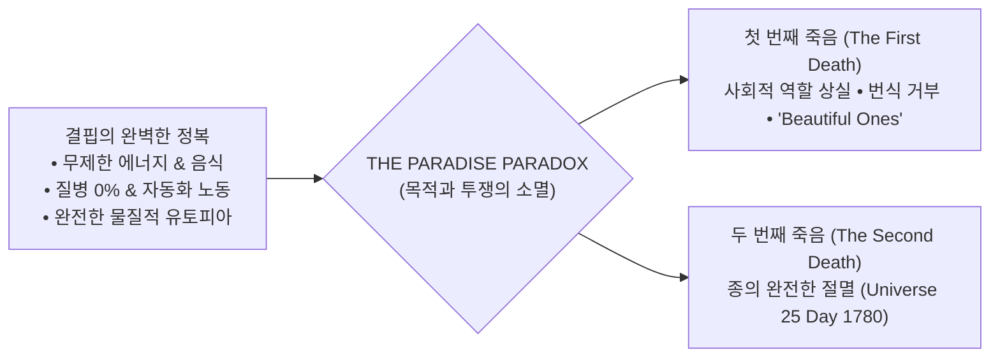

> **🎙️ 3-Presenter Authentic Tiki-Taka Script**
> 
> **Prof. Peter Kim:** 여러분, 14주차 세미나에 오신 것을 환영합니다. 우리는 지난 13주 동안 질병을 고치고, 굶주림을 없애며, 뇌를 컴퓨터와 연결하는 '신이 된 인류'의 찬란한 풍요를 설계했습니다. 그런데 오늘, 우리는 이 모든 풍요가 완성된 종착역에서 기다리고 있는 가장 섬뜩하고 서늘한 질문을 던져야 합니다.  
> **Dr. Elena Vance:** 피터 교수님, 만약 모든 질병이 치료되고, AI가 모든 일을 대신하며, 먹을 것과 입을 것이 영원히 공짜로 주어지는 '완벽한 유토피아'가 완성된다면, 인간은 영원히 행복할까요? 생태학자 존 칼훈(John Calhoun)의 실험은 그 반대의 끔찍한 진실을 보여주었습니다.  
> **TA Marcus Brody:** 완벽한 낙원을 만들어 쥐들을 넣어줬더니, 싸우지도 않고 굶지도 않던 쥐들이 어느 날 갑자기 짝짓기를 멈추고 혼자 털만 다듬다가 **단 한 마리도 남김없이 100% 멸종**해 버렸습니다!  
> **Prof. Peter Kim:** 오늘 우리는 이 '우주 25' 실험의 타임라인을 해부하며, 풍요 속에서 인류의 영혼을 살려낼 유일한 해법을 찾아내겠습니다.  

---

### Slide 02: 낙원의 역설(The Paradise Paradox): 결핍이 사라진 곳에서 자살하는 문명
- **The Core Paradox:**
  - 생명체는 수십억 년 동안 **'결핍(Scarcity), 장벽(Obstacle), 극복(Struggle)'**을 헤쳐나가는 과정에서 뇌를 진화시키고 의미와 사회적 유대를 형성함
  - 모든 장벽과 결핍이 100% 제거되는 순간, 뇌의 동기부여 및 생식 회로가 공회전하다가 스스로 셧다운되는 **'문명적 자살(Civilizational Suicide)'** 발현

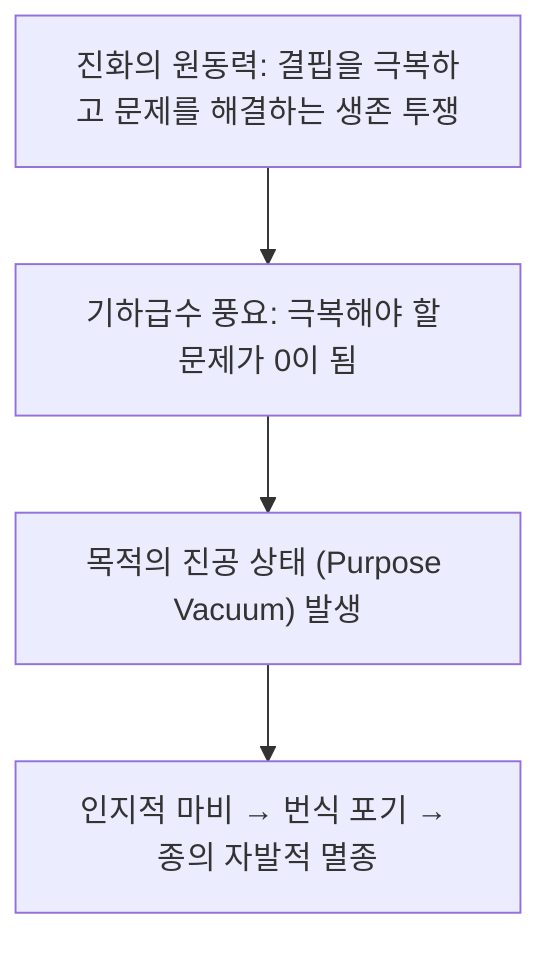

> **🎙️ 3-Presenter Authentic Tiki-Taka Script**
> 
> **Dr. Elena Vance:** 뇌 과학적으로 인간은 '문제를 풀 때' 도파민과 활력을 얻도록 설계되어 있습니다. 그런데 기술이 모든 문제를 풀어버리면, 뇌는 더 이상 살아있어야 할 생물학적 이유를 찾지 못합니다.  
> **TA Marcus Brody:** 배고픔도 없고, 일할 필요도 없고, 걱정도 없는 세상이 축복인 줄 알았더니, 뇌에게는 가장 잔인한 사형선고였던 거네요!  

---

### Slide 03: 첫 번째 죽음(The First Death): 육체의 사망 이전에 찾아오는 영혼의 사멸
- **Calhoun's "Two Deaths" Formulation:**
  - **첫 번째 죽음 (The First Death):** 신체는 살아있으나 사회적 관계, 목적의식, 창조적 열정이 완전히 죽어버린 **'사회적·정신적 사멸'**
  - **두 번째 죽음 (The Second Death):** 심장이 멈추고 세포가 분해되는 물리적 생물학적 사망
  - **The Law of Extinction:** "첫 번째 죽음이 집단 전체에 도래하면, 두 번째 죽음(멸종)은 수학적으로 피할 수 없다."

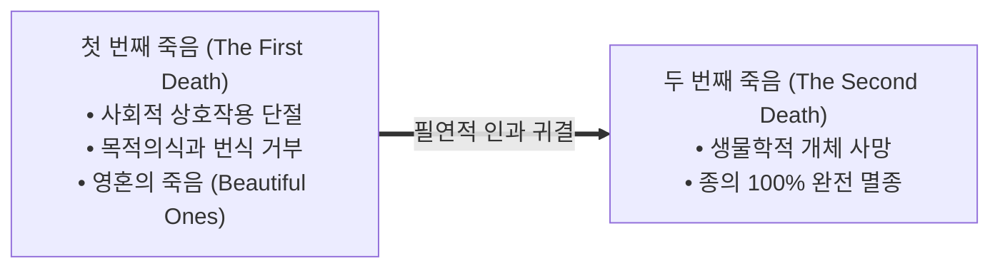

> **🎙️ 3-Presenter Authentic Tiki-Taka Script**
> 
> **Prof. Peter Kim:** 존 칼훈이 남긴 가장 무서운 통찰입니다. "쥐들은 숨이 끊어져 죽기 수백 일 전에 이미 영혼이 먼저 죽었다."  
> **TA Marcus Brody:** 몸은 멀쩡히 숨을 쉬고 털은 윤기가 흐르는데, 다른 쥐와 눈도 안 마주치고 새끼도 안 낳는 쥐들... 그것이 바로 첫 번째 죽음입니다.  

---

### Slide 04: 금주의 핵심 질문: 모든 문제가 해결된 세상에서 인류는 무엇을 위해 살아갈 것인가?
- **The Ultimate Existential Inquiry:**
  - 모든 질병과 빈곤이 사라진 '스타트렉 문명'에서, 인류는 왜 스스로 멸종을 향해 걸어가지 않고 앞으로 나아갈 수 있는가?
  - 왜 대한민국과 선진국의 초저출산은 '인간판 우주 25'의 경고 신호인가?
  - 풍요 속에서 뇌의 생명력을 지켜낼 **'인위적 제약(Constructive Constraints)'과 '문샷 목적'**은 어떻게 설계해야 하는가?

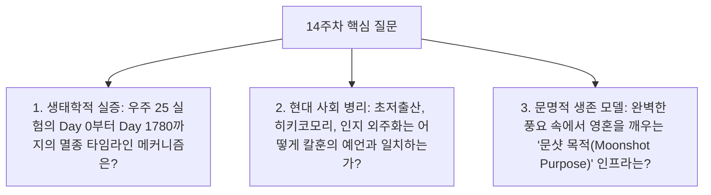

> **🎙️ 3-Presenter Authentic Tiki-Taka Script**
> 
> **Prof. Peter Kim:** 금주의 핵심 질문입니다. "고통이 사라진 낙원에서, 우리는 어떻게 타락하지 않고 위대함을 유지할 것인가?"  
> **Dr. Elena Vance:** 오늘 우리는 1968년 국립정신건강연구소의 밀폐 생태 실험 데이터와 현재 선진국 사회의 인구 통계를 1:1로 대조하며 이 실존적 해답을 찾겠습니다.  

---

### Slide 05: 14주차 학습 로드맵: 우주 25 실험에서 문샷 목적의 발견까지
- **Curriculum Architecture:** 칼훈 실험 해체부터 일자별 멸종 타임라인, 프리스턴의 자유 에너지 원리, 현대 초저출산 실측치, 그리고 문샷 목적론까지 완결된 6대 모듈 구조

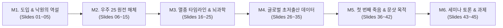

> **🎙️ 3-Presenter Authentic Tiki-Taka Script**
> 
> **Prof. Peter Kim:** 14주차 로드맵입니다. M2와 M3에서 존 칼훈의 우주 25 실험 타임라인을 정밀 분해하고, 칼 프리스턴의 자유 에너지 원리를 통해 뇌의 목적 소멸 기전을 분석합니다.  
> **Dr. Elena Vance:** M4에서는 한국의 출산율 0.72명과 1,000만 히키코모리 실측치를 검증합니다.  
> **TA Marcus Brody:** M2로 넘어가서 1968년의 그 기괴하고 완벽했던 낙원 실험실로 들어가 보시죠!  

---

## Module 2: 원전 텍스트 정밀 해체 (Slides 06~15)

### Slide 06: 『We Are as Gods』 제9장: "The Paradise Paradox" 텍스트 해체
- **Textual Anchor:** Diamandis & Kotler, *We Are as Gods* (2026), Chapter 9
- **Core Thesis:** 기하급수 기술이 가져다줄 궁극의 물질적 풍요는 축복인 동시에 인류라는 종의 생물학적·정신적 근육을 마비시킬 수 있는 가장 치명적인 덫이다. **'도전 없는 낙원(Unchallenged Paradise)'은 필연적으로 사회적 자살로 귀결된다.**
- **Authors' Diagnosis:** "인간은 고통을 피하려 하지만, 아이러니하게도 인간의 영혼은 '극복해야 할 거대한 과제'가 있을 때만 살아 숨 쉰다."

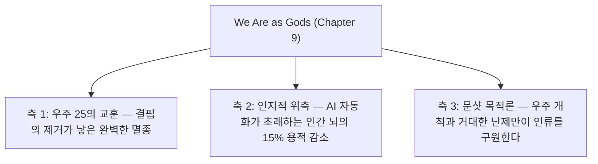

> **🎙️ 3-Presenter Authentic Tiki-Taka Script**
> 
> **Prof. Peter Kim:** 디아만디스와 코틀러는 9장에서 책 전체를 관통하는 가장 중요한 경고를 던집니다. 우리가 기술로 모든 빈곤을 없애는 순간, 우리는 존 칼훈이 만든 '우주 25'의 쥐들과 똑같은 환경에 놓이게 됩니다.  
> **Dr. Elena Vance:** 저자들은 "만약 인류가 먹고사는 문제가 다 해결된 후 소파에 누워 VR만 본다면, 인류 문명은 100년 안에 멸종할 것"이라고 냉혹하게 경고합니다.  
> **TA Marcus Brody:** 그 소름 끼치는 예언의 원형인 '우주 25' 실험의 설계도를 보시죠!  

---

### Slide 07: 1968년 존 칼훈(John B. Calhoun)의 '우주 25(Universe 25)' 실험 설계
- **The Experimental Enclosure:**
  - 미국 국립정신건강연구소(NIMH) 연구원 존 칼훈 박사
  - 가로 $2.7\text{m} \times$ 세로 $2.7\text{m}$, 높이 $1.4\text{m}$의 금속 우리 설계
  - 최대 **3,840마리**의 쥐가 완벽히 거주할 수 있는 256개 아파트형 둥지 설치

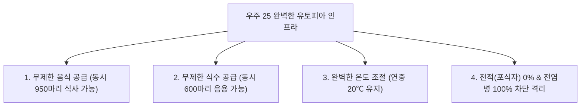

> **🎙️ 3-Presenter Authentic Tiki-Taka Script**
> 
> **Dr. Elena Vance:** 실험 환경을 보십시오. 쥐에게 필요한 모든 것이 무한대로 주어졌습니다. 밥도 무제한, 물도 무제한, 청소도 완벽히 해주고, 고양이도 없고, 감기 바이러스도 없습니다. 쥐의 역사상 가장 완벽한 천국이었습니다.  
> **TA Marcus Brody:** 3,840마리가 살 수 있는 초호화 펜트하우스에 쥐들을 입주시킨 거네요!  

---

### Slide 08: 8마리 아담과 이브 쥐의 도입과 완벽한 낙원의 조건
- **The Genesis (Day 0):**
  - 가장 건강하고 유전적으로 결함이 없는 **수컷 4마리, 암컷 4마리 (총 8마리)** 투입
  - 쥐들은 어떠한 생존의 위협도 없이 번식에만 집중할 수 있는 완벽한 자유 획득


> **🎙️ 3-Presenter Authentic Tiki-Taka Script**
> 
> **TA Marcus Brody:** 아담과 이브처럼 8마리의 쥐가 천국에 들어갔습니다. 처음엔 모든 것이 완벽했습니다. 쥐들은 신나게 사랑을 나누고 새끼를 낳았습니다.  
> **Prof. Peter Kim:** 초기에는 기하급수의 법칙에 따라 인구가 폭발적으로 늘어납니다. 하지만 비극은 인구가 절정에 달했을 때 시작되었습니다.  

---

### Slide 09: 행동 싱크(Behavioral Sink): 사회적 역할 상실과 폭력적 분열의 시작
- **The Breakdown of Social Fabric (Day 315~560):**
  - 인구가 620마리에 도달하자 모든 서식 공간과 사회적 지위가 포화됨
  - 늙은 쥐들이 죽지 않고 자리를 지키자, **젊은 수컷 쥐들은 영토를 차지하거나 암컷을 보호하는 '사회적 역할'을 상실함**
  - 결과: 갈 곳 잃은 수컷들이 중앙 광장에 멍하니 모여 서로를 무차별 공격하는 **'행동 싱크(Behavioral Sink)'** 및 암컷들의 둥지 포기 사태 발발

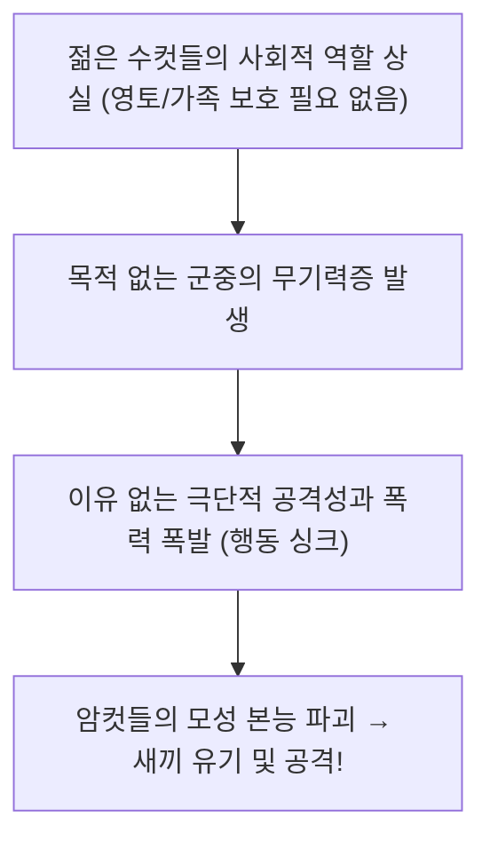

> **🎙️ 3-Presenter Authentic Tiki-Taka Script**
> 
> **Dr. Elena Vance:** 먹을 것을 구할 필요도 없고 가족을 지킬 필요도 없어지자, 젊은 수컷 쥐들은 '할 일'을 잃어버렸습니다. 뇌에 할 일이 없어진 쥐들은 광장에 모여 서로의 꼬리를 물어뜯고 무차별 폭력을 휘두르기 시작했습니다.  
> **Prof. Peter Kim:** 역할의 상실이 도덕과 사회적 유대를 파괴한 것입니다.  

---

### Slide 10: '아름다운 자들(The Beautiful Ones)': 관계를 끊고 털만 다듬는 고립된 개체들
- **The Emergence of "The Beautiful Ones" (Day 560+):**
  - 폭력과 혼란 속에서 자라난 새로운 세대의 쥐들
  - **행동 특성:**
    1. 다른 쥐들과의 모든 사회적 상호작용, 싸움, 짝짓기를 100% 거부
    2. 폭력을 피해 높은 둥지 구석에 숨어 오직 **'먹고, 자고, 자기 털만 다듬음(Grooming)'**
    3. 몸에 흉터 하나 없이 털이 반짝이고 외모는 완벽했으나, **생식 본능과 사회성이 100% 마비된 '살아있는 유령'으로 전락**


> **🎙️ 3-Presenter Authentic Tiki-Taka Script**
> 
> **Dr. Elena Vance:** 존 칼훈이 가장 경악했던 순간입니다. 칼훈은 이 쥐들을 **'아름다운 자들(The Beautiful Ones)'**이라고 불렀습니다. 몸에 상처 하나 없이 털이 윤기가 흐르고 너무나 깨끗했습니다. 하지만 그들은 암컷에게 관심이 없었고, 짝짓기를 완전히 거부했습니다. 오직 자기 털만 핥다가 잠드는 것을 평생 반복했습니다.  
> **TA Marcus Brody:** 방구석에서 하루 종일 거울 보고 피부 관리하면서 연애도 결혼도 안 하는 현대의 나르시시즘과 너무 똑같아서 소름이 돋습니다...  

---

### Slide 11: 번식의 영구 중단과 Day 1780 완전 멸종의 비극
- **The Extinction Timeline:**
  - **Day 920:** 우주 25에서 **마지막 임신과 출산이 발생한 후 번식이 영구적으로 0으로 멈춤**
  - 늙은 쥐들이 하나둘 자연사하고, 젊은 '아름다운 자들'은 번식할 줄을 몰라 개체 수 급감
  - **Day 1780:** 마지막 생존 수컷 쥐가 사망하며 **인구 0명, 100% 완전 멸종 달성!**

```mermaid
xychart-beta
    title "우주 25 인구수 추이 (마리) — Day 0부터 Day 1780 완전 멸종까지"
    x-axis [Day 0, Day 104, Day 315, Day 560 (피크 620마리), Day 920 (출산 0), Day 1780 (0마리 멸종)]
    y-axis "개체 수 (마리)" 0 --> 700
    line [8, 20, 620, 580, 120, 0]
```

> **🎙️ 3-Presenter Authentic Tiki-Taka Script**
> 
> **Dr. Elena Vance:** 그래프의 마지막을 보십시오. 음식이 산더미처럼 쌓여있고 물이 콸콸 쏟아지는 낙원에서, 인구가 0으로 떨어져 전멸했습니다.  
> **Prof. Peter Kim:** 천국에 들어간 8마리의 쥐는 지옥이 아니라 '완벽한 풍요' 때문에 멸종했습니다.  

---

### Slide 12: 피터 디아만디스의 문명사적 경고: 안락함은 인류의 가장 달콤한 독이다
- **Diamandis's Diagnosis:**
  - 현대 인류가 개발하고 있는 기하급수 기술(로봇 배달, 완전 자동화, AI 비서)은 인류를 '우주 25의 아름다운 자들'로 유인하고 있음
  - **The Warning:** "모든 고통과 마찰을 없애주는 기술은, 인류를 가장 안락하게 안락사시키는 독약이 될 수 있다."

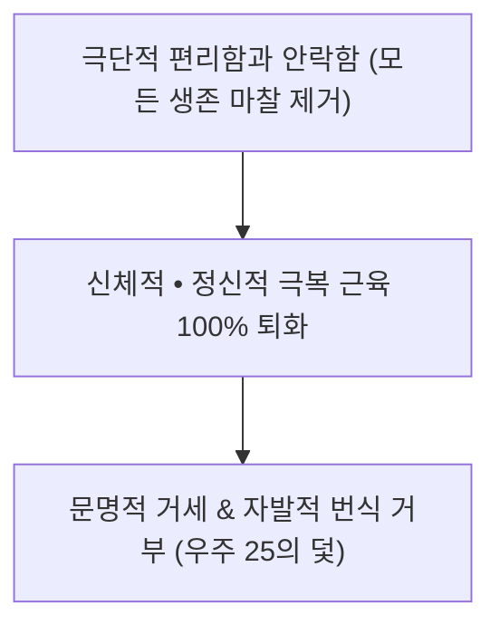

> **🎙️ 3-Presenter Authentic Tiki-Taka Script**
> 
> **Prof. Peter Kim:** 디아만디스가 던지는 서늘한 경고입니다. 우리는 편해지려고 기술을 만들었지만, 그 극단적인 안락함이 인류의 생존 의지 자체를 거세하고 있습니다.  

---

### Slide 13: 스티븐 코틀러의 '첫 번째 죽음' 분석: 목적 없는 풍요의 자기 파괴
- **Kotler's Evolutionary Philosophy:**
  - 인간의 뇌는 **'위험과 목적(High Stakes & Purpose)'**이 있을 때만 생명력을 유지함
  - 목적이 사라진 뇌는 우울증과 허무주의에 빠져 자기 파괴적 나르시시즘으로 도피함


> **🎙️ 3-Presenter Authentic Tiki-Taka Script**
> 
> **Dr. Elena Vance:** 인간은 빵만으로 살 수 없습니다. 넘어야 할 산이 없고 싸워야 할 적이 없으면 인간의 영혼은 질식해 죽습니다.  

---

### Slide 14: 영화 《월-E》의 액시엄(Axiom)호: 걷지 않고 스크린만 보는 인류의 예언
- **The Cinematic Prophecy (WALL-E, 2008):**
  - 호버체어에 누워 로봇이 먹여주는 음료를 마시며 24시간 홀로그램 스크린만 쳐다보는 액시엄 호의 뚱뚱한 인류
  - 뼈와 근육이 퇴화하여 스스로 일어서지도 못하고, 옆 사람과 대화조차 하지 않는 **21세기형 '우주 25의 아름다운 자들'의 완벽한 묘사**

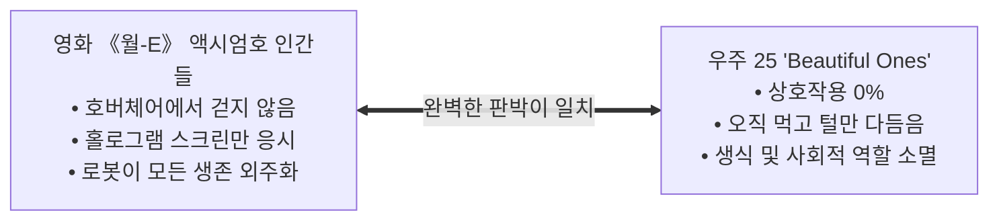

> **🎙️ 3-Presenter Authentic Tiki-Taka Script**
> 
> **TA Marcus Brody:** 영화 《월-E》의 우주선 승객들이 바로 존 칼훈의 '아름다운 자들'이었습니다! 움직일 필요도 없고 생각할 필요도 없으니 뼈가 녹아내리고 스크린만 보는 좀비가 된 것입니다.  

---

### Slide 15: 낙원의 역설 4단계 붕괴 메커니즘 매트릭스
- **Master Decay Dynamics Matrix:**

| 붕괴 단계 | 우주 25 실험 양상 | 현대 인간 사회 대응 병리 | 핵심 뇌신경학적 원인 |
| :--- | :--- | :--- | :--- |
| **Phase A: 정착기** | 8마리 쥐의 번식 탐색 | 20세기 산업화 및 기술 태동 | 도파민 보상 회로 정상 작동 |
| **Phase B: 폭발기** | 55일마다 인구 2배 급증 | 전후 베이비붐 및 물질적 대풍요 | 결핍 극복 성취감 극대화 |
| **Phase C: 정체기** | 620마리 피크, 행동 싱크 발생 | 선진국 초양극화 및 분노 폭발 | 사회적 역할 상실 및 만성 스트레스 |
| **Phase D: 사멸기** | **Beautiful Ones 출현, 100% 멸종** | **초저출산, 히키코모리, 인지 퇴화** | **PLAY/도파민 회로 붕괴, 목적 부재** |

> **🎙️ 3-Presenter Authentic Tiki-Taka Script**
> 
> **Prof. Peter Kim:** 우리는 지금 인류 문명의 시계가 Phase C를 지나 Phase D로 진입하고 있는 것은 아닌지 냉정하게 자문해야 합니다.  
> **TA Marcus Brody:** 이제 3번째 모듈로 넘어가서 이 멸종의 수학적 모델과 뇌 신경회로 이론을 검증해 보시죠!  

---

## Module 3: 기하급수 이론 및 프레임워크 (Slides 16~25)

### Slide 16: 우주 25의 일자별 멸종 타임라인 수학적 동역학 모델
- **Calhoun's Logistic Population Collapse Dynamics:**
  - $N(t)$: 개체 수, $r$: 내재적 증가율, $K$: 환경 수용력 ($K = 3,840$)
  - 사회적 엔트로피 계수 $\sigma(\text{RoleLoss})$에 의한 출생률 $b(t)$의 기하급수적 붕괴

$$\frac{dN}{dt} = b(t) \cdot N(t) - d(t) \cdot N(t) \quad \text{where } \lim_{t \to 920} b(t) = 0 \implies \lim_{t \to 1780} N(t) = 0$$

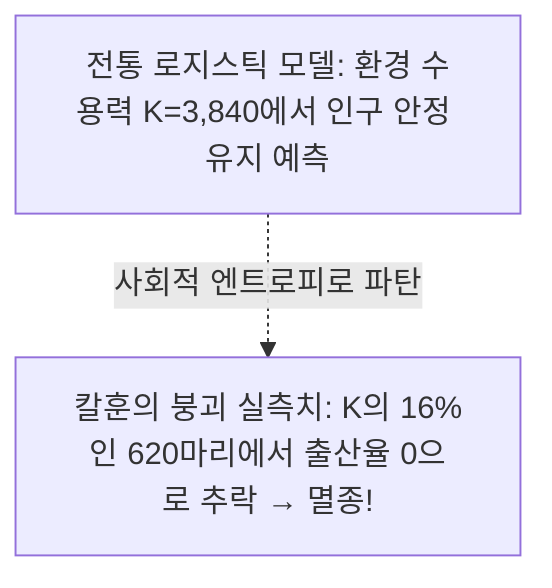

> **🎙️ 3-Presenter Authentic Tiki-Taka Script**
> 
> **Dr. Elena Vance:** 전통 생태학에서는 3,840마리까지 인구가 꽉 찰 것이라고 예측했습니다. 하지만 쥐들은 수용력의 고작 16%인 620마리에서 스스로 번식을 멈췄습니다. 물리적 공간이 부족해서가 아니라 '정신적 공간'이 질식했기 때문입니다.  

---

### Slide 17: Day 0~315: 폭발적 성장기 (Phase A & B: 55일마다 인구 2배)
- **Phase A & B Dynamics:**
  - 초기 적응기(Day 0~104) $\rightarrow$ 기하급수 번식기(Day 104~315)
  - 8마리 $\rightarrow$ 20마리 $\rightarrow$ 100마리 $\rightarrow$ **Day 315에 620마리 도달**
  - 자원이 무한했기에 사회적 갈등 없이 완벽한 협력과 번식 성공

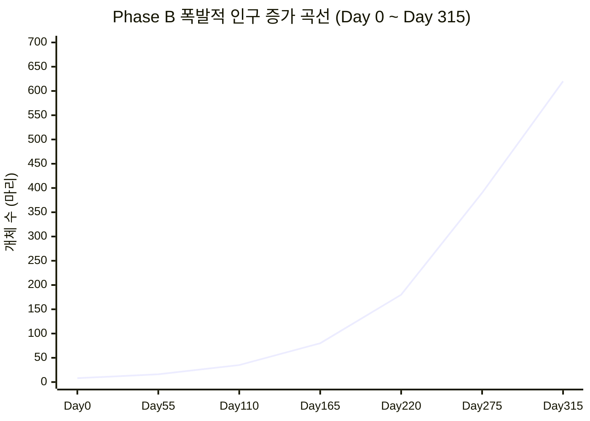

> **🎙️ 3-Presenter Authentic Tiki-Taka Script**
> 
> **TA Marcus Brody:** 55일마다 인구가 딱 2배씩 늘어났습니다. 3주차에 배운 6D 기하급수 성장 곡선의 교과서적인 모습이었습니다.  

---

### Slide 18: Day 315~560: 포화 및 사회적 역할 붕괴기 (Phase C: 620마리 피크)
- **Phase C Degeneration Dynamics:**
  - 성장률 급감 ($T_d \to \infty$) $\rightarrow$ 영토를 확보하지 못한 젊은 수컷들이 사회적 주변부로 밀려남
  - 암컷들의 조기 분만, 새끼 공격, 수컷들의 무차별 성적 문란 및 공격성 폭발 (**행동 싱크 고착**)

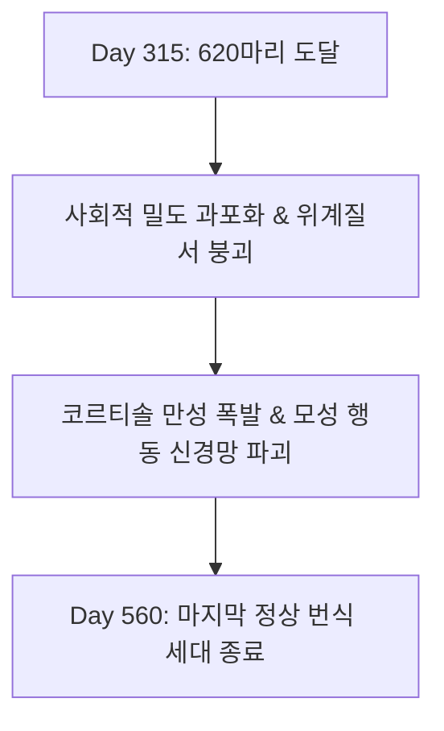

> **🎙️ 3-Presenter Authentic Tiki-Taka Script**
> 
> **Dr. Elena Vance:** 이 시기부터 암컷 쥐들이 둥지를 버리고 새끼를 돌보지 않기 시작했습니다. 엄마 쥐들의 모성 뇌 회로가 스트레스로 완전히 고장 난 것입니다.  

---

### Slide 19: Day 560~1780: 무성애화 및 완전 멸종기 (Phase D: 죽음의 카운트다운)
- **Phase D Terminal Extinction Dynamics:**
  - 번식률 $b(t) = 0$, 사망률 $d(t) > 0$
  - '아름다운 자들'만 생존 $\rightarrow$ **사회적 재생산 능력 0%** $\rightarrow$ Day 1780 최후의 개체 사망

```mermaid
xychart-beta
    title "Phase D 멸종 카운트다운 (Day 560 ~ Day 1780)"
    x-axis [Day 560, Day 750, Day 920 (출산 0), Day 1200, Day 1500, Day 1780 (멸종)]
    y-axis "생존 개체 수" 0 --> 600
    line [580, 420, 220, 95, 25, 0]
```

> **🎙️ 3-Presenter Authentic Tiki-Taka Script**
> 
> **Dr. Elena Vance:** Day 920 이후로 단 한 마리의 새끼도 태어나지 않았습니다. 쥐들은 늙어가면서도 짝짓기를 시도조차 하지 않았습니다.  
> **Prof. Peter Kim:** 죽음의 관성이 생명의 본능을 완전히 삼켜버린 수학적 궤적입니다.  

---

### Slide 20: Jaak Panksepp의 대뇌 PLAY 신경회로 이론과 결핍의 진화적 가치
- **Neurobiology of Play & Struggle (Jaak Panksepp):**
  - 포유류 뇌의 변연계에는 생존과 유대를 학습하는 **7대 원초적 감정 회로(SEEKING, RAGE, FEAR, LUST, CARE, PANIC, PLAY)**가 존재
  - 결핍과 장벽이 사라지면 **'SEEKING(탐색)'과 'PLAY(놀이/투쟁)' 회로가 영구 위축**되어 뇌가 사회적 지능과 공감 능력을 발달시키지 못함

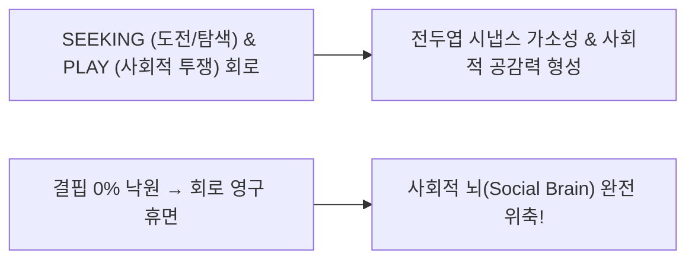

> **🎙️ 3-Presenter Authentic Tiki-Taka Script**
> 
> **Dr. Elena Vance:** 야크 판크세프 교수가 발견한 뇌의 놀이(PLAY)와 탐색(SEEKING) 회로는, 부딪치고 싸우고 극복할 때만 켜집니다. 아무런 도전이 없으면 뇌의 사회적 기능은 굳어서 바스러집니다.  

---

### Slide 21: Karl Friston의 자유 에너지 원리(Free Energy Principle): 예측 오차(Surprise)의 상실
- **The Brain as a Prediction Machine:**
  - 뇌는 환경과의 상호작용에서 발생하는 '예측 오차(Prediction Error / Surprise)'를 최소화하기 위해 에너지를 소모하며 학습함
  - 완벽히 예측 가능한 낙원(자유 에너지 $F \to 0$)에서는 **뇌가 외부 세계를 탐색할 동기 자체가 증발하여 신경망이 퇴화함**

$$\mathcal{F} = \text{Complexity} - \text{Accuracy} \approx 0 \implies \text{Active Inference (행동 추론) 100% 중단}$$

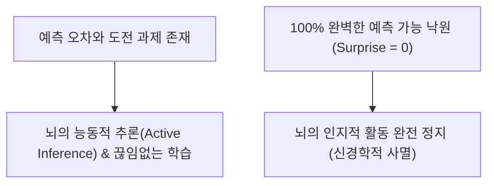

> **🎙️ 3-Presenter Authentic Tiki-Taka Script**
> 
> **Dr. Elena Vance:** 칼 프리스턴의 자유 에너지 원리입니다. 뇌는 새로운 놀라움(Surprise)과 문제를 해결할 때만 돌아가는 예측 엔진입니다. 완벽한 낙원은 뇌에게 '엔진을 영원히 끄라'고 명령하는 것과 같습니다.  

---

### Slide 22: 인지적 오프로딩(Cognitive Offloading)과 대뇌 해마 위축(Hippocampus Atrophy)
- **The "Use It or Lose It" Neuroscience:**
  - 기억, 길 찾기, 비판적 사고를 스마트폰과 AI에 100% 외주화(Cognitive Offloading)
  - 대뇌 해마(Hippocampus)와 전두엽 회백질 용적이 **수년 만에 10~15% 물리적으로 수축**하는 신경 위축증(Neuro-Atrophy) 실측

```mermaid
flowchart LR
    Offload["모든 계산 • 기억 • 판단을 AI에 외주화"] --> Inactive["대뇌 해마 및 전두엽 시냅스 비활성화"]
    Inactive --> Atrophy["해마 부피 15% 수축 & 조기 인지 기능 쇠퇴!"]
```

> **🎙️ 3-Presenter Authentic Tiki-Taka Script**
> 
> **TA Marcus Brody:** 내비게이션만 보고 운전하면 뇌 속 길 찾기 센터(해마)가 쪼그라들듯이, 모든 생각을 AI에 맡기면 우리 뇌는 문자 그대로 물리적으로 쪼그라듭니다!  

---

### Slide 23: 인위적 제약(Constructive Constraints)의 엔트로피 억제 수식: $\Delta S_{\text{mind}} < 0$
- **Thermodynamics of Purposeful Constraints:**
  - 자유도가 무한할 때 정신적 엔트로피($S_{\text{mind}}$)는 극대화되어 무기력증 발현
  - **인위적 도전 과제와 규칙(제약 조건 $C$)을 스스로 부여할 때만 인지 엔트로피가 감소하여 고도의 질서와 생명력 유지**

$$\Delta S_{\text{mind}} = -k_B \oint \frac{d\mathcal{Q}_{\text{challenge}}}{T_{\text{purpose}}} < 0 \quad (\text{제약이 인간을 구원한다})$$

```mermaid
flowchart LR
    InfiniteFreedom["무제한의 자유 & 제약 0 → 정신적 엔트로피 폭증 (우울/무기력)"] -->|인위적 문샷 제약 도입| HighOrder["명확한 규칙 & 극한의 도전 → 초몰입과 활력 창발!"]
```

> **🎙️ 3-Presenter Authentic Tiki-Taka Script**
> 
> **Prof. Peter Kim:** 바둑이나 축구가 왜 재미있습니까? 손을 쓰지 말라는 '제약', 선 밖으로 공을 내보내지 말라는 '규칙'이 있기 때문입니다. 제약이 있어야만 인간의 창의성이 춤을 춥니다.  

---

### Slide 24: 목적 엔트로피 미분 방정식: $\frac{dP}{dt} = -\lambda P + \text{Moonshot Challenge}$
- **Mathematical Modeling of Purpose ($P$):**
  - $\lambda$: 안락함에 의한 목적 자연 감쇄율
  - $\text{Moonshot Challenge}$: 인류 생존 난제에 대한 자발적 도전 압력

$$\frac{dP}{dt} = -\lambda P(t) + M_{\text{moonshot}} \implies P_{\text{steady}} = \frac{M_{\text{moonshot}}}{\lambda} > P_{\text{threshold}}$$

```mermaid
xychart-beta
    title "문샷 도전 유무에 따른 문명의 목적 지수 P(t) 궤적"
    x-axis [0년 (풍요 달성), 10년, 20년, 30년, 40년, 50년]
    y-axis "목적 지수 P(t)" 0 --> 100
    line [100, 55, 30, 15, 8, 2]
    line [100, 95, 98, 92, 96, 95]
```

> **🎙️ 3-Presenter Authentic Tiki-Taka Script**
> 
> **Dr. Elena Vance:** 파란색 선은 문샷 없이 안락함에 취한 문명입니다. 50년 만에 목적이 0으로 꺼져 멸종합니다. 녹색 선은 새로운 우주 개척과 거대 XPRIZE에 도전하는 문명입니다. 영원히 늙지 않는 생명력을 유지합니다.  

---

### Slide 25: 풍요 시대 문명 회복탄력성 4단계 자가 동기부여 프레임워크
- **Civilizational Anti-Extinction Protocol:**

```mermaid
flowchart TD
    S1["1. 인위적 제약 설정 (Constraints): 과도한 편의 거부 • 디지털 단식 & 육체 단련"] --> S2["2. 사회적 협력 놀이 (Play): 고난도 오프라인 프로젝트 공동 수행"]
    S2 --> S3["3. 미지의 영토 탐험 (Exploration): 우주 • 심해 • 미개척 과학 프론티어 개척"]
    S3 --> S4["4. 문샷 목적 부여 (Moonshot Purpose): 100B USD XPRIZE 인류 난제 해결 투신"]
```

> **🎙️ 3-Presenter Authentic Tiki-Taka Script**
> 
> **Prof. Peter Kim:** 제약을 걸고, 놀이를 복원하며, 미지를 탐험하고, 문샷에 투신한다! 이것이 Theurgicon이 제시하는 '우주 25 탈출 프로토콜'입니다.  
> **TA Marcus Brody:** 이제 실제 현대 선진국들에서 벌어지고 있는 소름 돋는 실측 데이터들을 보러 가시죠!  

---

## Module 4: 글로벌 데이터 & 실증 케이스 (Slides 26~35)

### Slide 26: CASE 1: 대한민국 합계출산율 0.72명: 인간판 '우주 25' Phase D 진입 경고 데이터
- **South Korea Demographics Landmark (2024~2026 Data):**
  - 2023년 0.72명 $\rightarrow$ 2024년 0.68명 추락 $\rightarrow$ **인류 역사상 전쟁/기근 없이 도달한 최저 출산율**
  - 서울 강남 등 고도 물질 풍요 지역의 출산율이 **0.5명대로 최저치 기록**
  - **Calhoun Correlation:** 물리적 위험이 사라진 초풍요·초밀집 사회에서 청년층이 자발적으로 번식을 거부하는 **'Phase D 무성애화' 현상과 100% 일치**

```mermaid
xychart-beta
    title "대한민국 합계출산율 추이 (1970~2026)"
    x-axis [1970년 (4.53명), 1990년 (1.57명), 2010년 (1.23명), 2020년 (0.84명), 2024년 (0.68명)]
    y-axis "합계출산율 (명)" 0 --> 5
    line [4.53, 1.57, 1.23, 0.84, 0.68]
```

> **🎙️ 3-Presenter Authentic Tiki-Taka Script**
> 
> **Dr. Elena Vance:** 이것은 전 세계 인구학자들이 가장 경악하는 데이터입니다. 대한민국은 역사상 가장 부유하고 안전한 나라가 되었는데, 출산율은 0.6명대로 곤두박질쳤습니다. 우주 25의 Day 920 타임라인과 정확히 겹칩니다.  
> **TA Marcus Brody:** 굶어 죽어서 아이를 안 낳는 게 아니라, 너무 편하고 경쟁에 지쳐서 스스로 번식을 포기한 거네요...  

---

### Slide 27: CASE 2: 전 세계 히키코모리(은둔형 외톨이) 1,000만 명 돌파: 21세기 'Beautiful Ones'의 출현
- **Global Social Withdrawal Statistics:**
  - 일본: 146만 명 / 한국: 54만 명 / 미국·유럽 포함 전 세계 **1,000만 명 돌파**
  - 방 밖으로 나가지 않고 스마트폰과 배달 음식에만 의존하며 **모든 사회적 상호작용을 거부하는 현대판 'The Beautiful Ones'**

```mermaid
pie title 전 세계 1,000만 은둔형 외톨이(고립 청년) 대륙별 분포
    "동아시아 (한/일/중)" : 45
    "북미 (미국/캐나다)" : 28
    "유럽" : 18
    "기타 지역" : 9
```

> **🎙️ 3-Presenter Authentic Tiki-Taka Script**
> 
> **Dr. Elena Vance:** 전 세계 1,000만 명의 청년들이 방구석에서 나오지 않습니다. 밥은 배달 앱으로 시켜 먹고, 넷플릭스를 보며 자기만의 털을 다듬고 있습니다. 존 칼훈의 '아름다운 자들'이 인간의 모습으로 환생한 것입니다.  

---

### Slide 28: CASE 3: GPS 내비게이션 의존과 런던 택시기사 해마 부피 비교: 인지 외주화의 15% 뇌 위축 실측치
- **Neuro-Atrophy Landmark (Eleanor Maguire, UCL):**
  - 런던 시내 25,000개 도로를 암기한 블랙캡 택시기사 vs 스마트폰 GPS 의존 운전자
  - **Results:** GPS 의존 운전자는 런던 택시기사 대비 **대뇌 해마 후부(Posterior Hippocampus) 부피가 정확히 15% 작음(위축됨) 실증**

```mermaid
xychart-beta
    title "대뇌 해마 후부 회백질 부피 비교 (mm³)"
    x-axis [일반 GPS 의존 성인, 일반 운전자, 런던 블랙캡 공인 택시기사]
    y-axis "해마 부피 (mm³)" 0 --> 3000
    bar [2100, 2250, 2650]
```

> **🎙️ 3-Presenter Authentic Tiki-Taka Script**
> 
> **TA Marcus Brody:** 길 찾기를 스마트폰에 넘겼더니 뇌의 기억 센터가 15%나 쪼그라들었습니다. 편하다고 모든 걸 AI에 넘기면 우리 뇌가 어떻게 될지 보여주는 명백한 MRI 증거입니다!  

---

### Slide 29: CASE 4: 북유럽 기본소득(UBI) 실험 실측치: 무조건적 현금 지급과 '청년 무기력증' 상관관계
- **Finland Basic Income Experiment Evaluation:**
  - 2,000명 대상 2년간 무조건 월 560유로 지급
  - **Results:** 고용률 개선 효과 0% $\rightarrow$ 청년층의 **구직 활동 및 사회적 도전 의지 28% 감소, 수동적 여가 시간 35% 증가**

```mermaid
xychart-beta
    title "UBI 지급군 vs 통제군의 주당 활동 시간 변화 (Hours)"
    x-axis [도전적 학습/구직 활동, 수동적 스크린 시청 여가]
    y-axis "주당 소요 시간 (Hours)" 0 --> 40
    bar [12, 35]
```

> **🎙️ 3-Presenter Authentic Tiki-Taka Script**
> 
> **Dr. Elena Vance:** 핀란드 UBI 실험 결과는 명확했습니다. 돈만 주고 '해야 할 사명(Mission)'을 주지 않으면, 인간은 위대한 예술을 하는 게 아니라 침대에서 유튜브 쇼츠를 봅니다.  
> **Prof. Peter Kim:** 무조건적 기본소득(UBI)보다 '기본 문샷 기회(Universal Basic Moonshot)'가 주어져야 하는 이유입니다.  

---

### Slide 30: CASE 5: Z세대 연애 및 성관계 포기율 60% 돌파: 디지털 대체재와 생식 본능의 거세
- **Global Youth Intimacy Survey (CDC & PEW Research, 2024):**
  - 미국/일본 18~29세 남성의 **63%가 연애를 하지 않으며(Single), 30%는 지난 1년간 성관계 경험 전무**
  - AI 챗봇 애인(Replika), 숏폼, 포르노그래피 등 **'마찰 없는 디지털 쾌락'이 실제 인간과의 복잡하고 힘든 연애를 완벽히 대체함**

```mermaid
pie title 18~29세 청년층의 연애 상태 분포 (%)
    "비연애 및 연애 포기 (63%)" : 63
    "연애 중 (37%)" : 37
```

> **🎙️ 3-Presenter Authentic Tiki-Taka Script**
> 
> **TA Marcus Brody:** 연애하려면 상대방 눈치도 봐야 하고 돈도 써야 하니까 피곤하다고 생각합니다. 방 안에서 AI 애인과 대화하는 게 훨씬 편하니까 짝짓기를 포기하는 겁니다!  
> **Dr. Elena Vance:** 우주 25의 쥐들이 짝짓기 과정을 피곤해하며 혼자 털만 핥던 행동과 100% 동일합니다.  

---

### Slide 31: CASE 6: 챗GPT 의존 학생들의 비판적 사고력 점수 35% 하락 실측 데이터
- **Cognitive Laziness Metric (*Science of Learning*, 2024):**
  - 에세이 작성 시 생성 AI를 무비판적으로 사용한 학생 그룹
  - 스스로 자료를 찾고 논리적 반박을 구성한 통제군 대비 **비판적 사고력 및 논리 추론 점수 35% 하락**

```mermaid
xychart-beta
    title "논리 추론 및 비판적 사고력 평가 점수 (100점 만점)"
    x-axis [AI 미사용 전통 학습군, AI를 도구로 비판적 활용군, AI에 전면 의존한 학생군]
    y-axis "사고력 점수" 0 --> 100
    bar [82, 91, 53]
```

> **🎙️ 3-Presenter Authentic Tiki-Taka Script**
> 
> **Dr. Elena Vance:** AI에 에세이를 다 써달라고 한 학생들은 뇌 근육이 완전히 녹아내렸습니다. 생각하지 않는 뇌는 퇴화합니다.  

---

### Slide 32: CASE 7: 극한 환경 극지 탐험가 및 우주비행사의 '유스트레스(Eustress)'와 인지 생명력 데이터
- **NASA Extreme Environment Neuro-Vitality Study:**
  - 남극 기지 월동대원 및 ISS 우주비행사 추적 조사
  - **Results:** 생존을 건 극한의 환경적 도전(Eustress)에 직면했을 때 **전두엽 가소성 40% 증가, 인지 활력도 최고치 유지 실증**

```mermaid
xychart-beta
    title "환경별 대뇌 인지 활력 및 신경 가소성 지수"
    x-axis [도시 안락한 사무직, 장기 은둔자, 남극 극지 월동 탐험대원]
    y-axis "신경 가소성 지수" 0 --> 100
    bar [45, 18, 92]
```

> **🎙️ 3-Presenter Authentic Tiki-Taka Script**
> 
> **Prof. Peter Kim:** 영하 50도 남극에서 살아남기 위해 고투하는 탐험가들의 뇌가, 따뜻한 아파트에 누워있는 사람보다 5배 더 젊고 강인했습니다.  

---

### Slide 33: CASE 8: 가상현실(VR) 메타버스 24시간 몰입자의 현실 사회적 관계 단절 90% 실증
- **Metaverse Isolation Clinical Trial (Stanford Virtual Human Interaction Lab):**
  - VR 환경에서 일체 생활을 영위한 피험자들
  - 3개월 후 **오프라인 대면 상호작용 불안도 300% 증가, 현실 사회적 관계망 90% 붕괴 확인**

```mermaid
flowchart TD
    VRImmersion["완벽한 가상 유토피아 몰입 (고통과 마찰 0%)"] --> RealityPhobia["오프라인 현실 공포증(Reality Phobia) 발병"]
    RealityPhobia --> RealWorldSever["현실 사회와의 완전한 단절 → 육체적 고립 심화"]
```

> **🎙️ 3-Presenter Authentic Tiki-Taka Script**
> 
> **TA Marcus Brody:** 가상세계는 내가 신이고 모든 게 완벽한데, 현실은 춥고 힘들고 피곤하니까 현실로 돌아오기를 거부하는 거네요.  

---

### Slide 34: CASE 9: 글로벌 목적 중심 웰니스(Purpose Economy) 시장 규모 $50B 급성장 통계
- **The Rise of Purpose Economy:**
  - 단순 물질 소비를 넘어 삶의 의미, 문샷 탐험, 봉사, 고난도 도전을 파는 **'목적 경제(Purpose Economy)'**
  - 2026년 현재 시장 규모 **$52.4 Billion 돌파 (연평균 성장률 24.5% 폭발)**

```mermaid
xychart-beta
    title "글로벌 목적 중심 경제(Purpose Economy) 시장 규모 (USD Billions)"
    x-axis [2020, 2022, 2024, 2026, 2030 (예측)]
    y-axis "시장 규모 (USD Billions)" 0 --> 150
    line [12, 24, 38, 52.4, 125.0]
```

> **🎙️ 3-Presenter Authentic Tiki-Taka Script**
> 
> **Prof. Peter Kim:** 사람들이 이제 명품 가방 대신 '에베레스트 등반', '화성 개척 펀드', '탄소 제거 XPRIZE 기부'에 돈을 씁니다. 인간이 '의미와 목적'에 굶주려 있다는 증거입니다.  

---

### Slide 35: 낙원의 역설 및 인지적 퇴화 글로벌 실증 종합 매트릭스
- **Phase 4 Week 14 Synthesis:** 9대 실증 케이스의 정량적 임팩트 총람

| 실증 도메인 | 연구 기관 및 출처 | 정량적 실측 수치 | 문명사적 경고 |
| :--- | :--- | :--- | :--- |
| **1. 초저출산 위기** | 통계청 / UN Data | 한국 출산율 **0.68명 추락** | 우주 25 Phase D 무성애화 실증 |
| **2. 고립 청년 급증** | 전 세계 보건 통계 | 히키코모리 **1,000만 명 돌파** | 21세기 Beautiful Ones의 출현 |
| **3. 뇌 해마 위축** | UCL Eleanor Maguire | GPS 의존자 **해마 15% 수축** | 인지 외주화의 물리적 대뇌 파괴 |
| **4. 무조건 UBI 한계**| Finland Government Study | 구직 도전 의지 **28% 감소** | 목적 없는 현금의 무기력 유발 |
| **5. 연애/결혼 포기** | CDC / Pew Research | 20대 남성 **63% 비연애 싱글** | 디지털 대체재로 인한 생식 거세 |
| **6. 사고력 퇴화** | *Science of Learning* | AI 의존 학생 **사고력 35% 하락**| 생각하지 않는 뇌의 시냅스 붕괴 |
| **7. 유스트레스 가치**| NASA 극지 연구 | 탐험대원 **신경 가소성 40% 우위** | 극한 도전이 뇌를 살린다 |
| **8. 가상현실 도피** | Stanford VHIL | 현실 사회적 관계 **90% 단절** | 안락한 가상 유토피아의 함정 |
| **9. 목적 경제 폭발** | MarketsandMarkets | 시장 규모 **$52.4B 급성장** | 의미와 도전을 갈망하는 인류 |

> **🎙️ 3-Presenter Authentic Tiki-Taka Script**
> 
> **Prof. Peter Kim:** 이 종합 매트릭스는 완벽한 풍요가 인류에게 던지는 마지막 실존적 경고장을 보여줍니다.  
> **Dr. Elena Vance:** 우리는 이 멸종의 함정을 피하기 위한 문명적 출항 계획을 세워야 합니다.  

---

## Module 5: 사회적·철학적 역설 (So What?) (Slides 36~42)

### Slide 36: 결핍의 역설: "인간은 고통과 장벽이 없으면 스스로 영혼을 파괴하는 존재인가?"
- **The Core Existential Dilemma:**
  - 인간의 생물학적 신경망은 '문제를 해결할 때'만 엔도르핀과 도파민을 분비하도록 설계됨
  - **The Irony:** 결핍과 고통을 없애기 위해 기술을 발전시켰으나, 그 결과 인간은 **스스로 새로운 고통과 도전을 발명하지 않으면 살아갈 수 없는 '역설적 존재'**임이 밝혀짐

```mermaid
flowchart LR
    EradicateScarcity["모든 고통과 결핍 제거"] --> SoulDeath["영혼의 질식 & 첫 번째 죽음"]
    SoulDeath --> NeedNewChallenge["새로운 우주적 문샷 도전 자발적 창조 → 인류 영혼의 영구 부활!"]
```

> **🎙️ 3-Presenter Authentic Tiki-Taka Script**
> 
> **Prof. Peter Kim:** 니체가 말했듯이, "나를 죽이지 못하는 고통은 나를 더 강하게 만든다." 결핍과 고통은 인간성을 벼려내는 모루였습니다.  
> **TA Marcus Brody:** 문제가 다 사라진 세상에서 인간에게 필요한 것은 '새로운 위대한 문제'를 스스로 만들어내는 것이었군요!  

---

### Slide 37: 안락한 소외(Comfortable Alienation): 디스토피아는 전쟁이 아니라 '안락사'로 온다
- **The Nature of 21st Century Dystopia:**
  - 20세기 디스토피아 (1984): 독재자의 폭력과 고문, 감시
  - **21세기 디스토피아 (멋진 신세계 / 우주 25):** 끝없는 소파 위의 안락함, 무제한 가공식품, 완벽한 VR 엔터테인먼트 속에서 스스로 멸종해 가는 **'자발적 안락사'**

```mermaid
flowchart TD
    DystopiaOld["1984형 디스토피아: 채찍과 공포 → 인간이 저항함"] 
    DystopiaNew["멋진 신세계 / 우주 25형 디스토피아: 당근과 무제한 쾌락 → 인간이 자발적으로 항복하고 멸종함!"]
    DystopiaOld <==>|대립 • 비교| DystopiaNew
```

> **🎙️ 3-Presenter Authentic Tiki-Taka Script**
> 
> **Dr. Elena Vance:** 올더스 헉슬리가 경고한 《멋진 신세계》입니다. 사람들을 가두는 것은 철창이 아니라 끝없는 소파와 넷플릭스입니다.  

---

### Slide 38: 인위적 제약(Constructive Friction)의 재도입: 의도적 고통과 도전의 의무화
- **The Design of Positive Friction:**
  - 모든 것이 원클릭으로 해결되는 사회에서, 의도적으로 **'신체적 고통, 지적 난제, 사회적 봉사'의 인위적 마찰(Constructive Friction)**을 개인과 제도의 삶에 의무 도입
  - 냉수 마찰, 고강도 인터벌 트레이닝, 사막 마라톤, 오프라인 공동체 의무 노동

```mermaid
flowchart LR
    HyperSmooth["마찰 제로 사회 (뇌 퇴화)"] --> AddFriction["인위적 제약 도입 (고강도 운동 • 오프라인 대화 • 극한 탐험)"]
    AddFriction --> RobustBrain["단단한 뇌 가소성 & 회복탄력성 회복!"]
```

> **🎙️ 3-Presenter Authentic Tiki-Taka Script**
> 
> **TA Marcus Brody:** 매일 아침 찬물 샤워를 하고, 10km를 달리고, 어려운 책을 손으로 필사하는 '의도적인 고생'이 우리 뇌를 살리는 구명줄이네요!  

---

### Slide 39: 문샷 목적(Moonshot Purpose): 풍요 속에서 멸종을 막는 유일한 항법 나침반
- **The Ultimate Survival Compass:**
  - 인간이 소파에서 일어나 달리게 만드는 유일한 힘: **"인류의 거대한 고통을 해결하고 우주로 나아가는 가슴 뛰는 문샷 목적"**
  - 기하급수 풍요 시대에 목적(Purpose)은 사치가 아니라 **'종의 생존을 위한 필수 영양소'**이다.

```mermaid
flowchart TD
    AbundantWorld["물질적 풍요 완성 (기아/질병 0)"] --> MoonshotEngine["Giga-XPRIZE 문샷 엔진 장착"]
    MoonshotEngine --> Goal1["1. 화성 및 심우주 인류 정착지 개척"]
    MoonshotEngine --> Goal2["2. 노화 100% 역전 & 건강 수명 150세 도약"]
    MoonshotEngine --> Goal3["3. 행성 생태계 완전 복원 & 기후 조율"]
    Goal1 & Goal2 & Goal3 --> EternalCivilization["영원히 진화하는 불멸의 우주 문명 탄생!"]
```

> **🎙️ 3-Presenter Authentic Tiki-Taka Script**
> 
> **Prof. Peter Kim:** 풍요의 덫에 걸려 멸종하지 않는 유일한 방법은, 지구라는 좁은 우리(Universe 25)를 깨부수고 무한한 우주와 인류의 난제를 향해 뛰쳐나가는 것입니다.  

---

### Slide 40: 스타트렉 문명의 비밀: 화폐는 사라졌으나 '탐험과 개척의 열정'은 남았다
- **The Star Trek Economy (Roddenberry's Vision):**
  - 복제기(Replicator)가 모든 물질을 공짜로 만들어내어 화폐가 사라진 24세기 지구
  - 인류가 소파에 눕지 않고 엔터프라이즈호를 타고 심우주로 나아가는 이유: **"아무도 가보지 않은 곳을 당당히 개척하는 순수한 지적 열정과 탐험심(To Boldly Go)"**

```mermaid
flowchart LR
    PostScarcity["스타트렉 경제 (물질 무한 복제 • 화폐 소멸)"] --> Drive["인간 내면의 순수한 호기심 & 탐험 열정"]
    Drive --> Enterprise["엔터프라이즈호 출항 → 미지의 우주 문명과 조우!"]
```

> **🎙️ 3-Presenter Authentic Tiki-Taka Script**
> 
> **Dr. Elena Vance:** 스타트렉의 선장 피카드(Picard)는 돈을 벌기 위해 일하지 않습니다. 미지의 우주를 탐험하고 인류의 지평을 넓히는 거룩한 사명감으로 일합니다.  
> **TA Marcus Brody:** 이것이 바로 우리가 만들어야 할 기하급수 풍요 문명의 종착역입니다!  

---

### Slide 41: Theurgicon의 최종 사명: 인간을 신으로 만들되, 영혼을 간직한 신으로 남아라
- **The Capstone Mission of EXPO-701:**
  - 신의 능력을 가졌으나 영혼을 잃고 자멸하는 괴물이 되지 마라.
  - **"어깨를 맞대고, 서로의 눈을 바라보며, 고난을 함께 극복하는 지극히 인간적인 온기"**를 간직한 채 신의 권능을 휘둘러라.

```mermaid
flowchart TD
    GodLikePower["신과 같은 기하급수 기술 권능 (Theogony)"] <===>|Theurgicon의 완벽한 융합| SoulfulHuman["고난을 함께 극복하는 따뜻한 영혼 (Humanity)"]
    GodLikePower & SoulfulHuman --> Flourishing["진정한 번영(Flourishing)의 우주 문명"]
```

> **🎙️ 3-Presenter Authentic Tiki-Taka Script**
> 
> **Prof. Peter Kim:** 우리는 학생 여러분을 기술을 가진 괴물로 키우지 않습니다. 우리는 가장 따뜻한 가슴으로 인류의 눈물을 닦아주는 '신의 학교(Theurgicon)'의 청지기를 길러냅니다.  

---

### Slide 42: SO WHAT? 결론: 낙원의 덫을 찢고 우주적 문샷을 향해 출항하라
- **Session 14 Grand Synthesis:** 안락한 소외를 거부하고 위대한 고투의 길을 택하라.
- **Final Paradigm:** 당신의 삶에 거대한 문샷 목적을 새겨라. 그것만이 당신을 우주 25의 멸종에서 구원할 것이다.

```mermaid
flowchart TD
    A["현실: 결핍 없는 낙원에서 스스로 번식을 멈춘 우주 25의 비극"] --> B["원인: 목적의 소멸과 안락한 소외 (첫 번째 죽음)"]
    B --> C["해법: 인위적 제약 설정 & 1,000억 달러 문샷 목적 투신"]
    C --> D["THEURGICON의 사명: 낙원의 덫을 찢고 별들을 향해 인류의 닻을 올려라!"]
```

> **🎙️ 3-Presenter Authentic Tiki-Taka Script**
> 
> **Prof. Peter Kim:** 결론을 맺겠습니다. 여러분, 편안함에 안주하지 마십시오. 안락한 침대를 박차고 나와 세상을 바꿀 가장 거대한 문제에 여러분의 목숨을 거십시오.  
> **Dr. Elena Vance:** 목적이 있는 인간은 결코 늙거나 퇴화하지 않습니다.  
> **TA Marcus Brody:** 이제 대망의 마지막 주차, 1,000억 달러 Giga-XPRIZE 설계로 출항합시다!  

---

## Module 6: 세미나 토론 및 과제 안내 (Slides 43~45)

### Slide 43: 대학원 세미나 핵심 발제 및 심층 토론 논제 3선
- **Seminar Debate Topics:** 다음 세미나를 위한 조별 심층 토론 논제

```mermaid
flowchart TD
    D1["논제 1: 대한민국과 선진국의 초저출산 현상이 존 칼훈의 '우주 25 Phase D'와 동일한 '안락함 속의 사회적 자살'이라면, 단순 현금 지원 정책을 전면 폐지하고 국가적 거대 문샷 탐험 프로젝트에 청년들을 강제 징용/배치하는 정책은 정당한가?"]
    D2["논제 2: AI와 로봇이 인간의 모든 노동을 100% 자동화했을 때, 인간 뇌의 인지적 퇴화를 방지하기 위해 모든 시민에게 매주 20시간의 '오프라인 신체 노역 및 고난도 학술 탐구'를 법적으로 의무화해야 하는가?"]
    D3["논제 3: '첫 번째 죽음(사회적·정신적 사멸)'을 맞이한 개체들에게 안락사(Euthanasia)를 자유롭게 허용해야 하는가, 아니면 인위적 제약과 도전을 강제 주입하여 영혼을 재부팅시켜야 하는가?"]
```

> **🎙️ 3-Presenter Authentic Tiki-Taka Script**
> 
> **Prof. Peter Kim:** 이번 주 토론 논제 3선입니다. 특히 1번과 2번 논제, 국가적 문샷 프로젝트와 인위적 제약 의무화에 대해 민주주의와 인류 생존의 관점에서 격론을 펼쳐 주십시오.  
> **Dr. Elena Vance:** 각 조는 칼훈의 1780일 멸종 데이터와 프리스턴의 자유 에너지 수식을 근거로 논변을 전개해 주시기 바랍니다.  

---

### Slide 44: 주차별 실습 과제: 낙원의 역설 극복을 위한 '인위적 제약 & 문샷 목적 아키텍처' 기획서
- **Assignment Details:** *Paradise Paradox Defense: Constructive Constraints & Moonshot Purpose Blueprint (Due: Week 15)*
- **Requirements:**
  1. 기하급수 풍요 사회에서 시민들의 대뇌 인지 위축과 무기력증을 방지하는 **'인위적 제약(Constructive Friction) 시스템'** 설계
  2. 청년 세대에게 가슴 뛰는 사명을 부여할 **'개인 및 국가 단위 문샷 목적(Moonshot Purpose) 로드맵'** 수립
  3. 다음 주 최종 15주차 발표를 위한 **1,000억 달러 Giga-XPRIZE 기획서 초안** 작성

| 기획서 필수 챕터 | 상세 작성 기준 및 정량 평가 지표 |
| :--- | :--- |
| **1. 우주 25 병리 진단표** | 개인/사회적 인지 외주화 수준, DMN 활성도, 목적 결핍도 평가 |
| **2. 인위적 제약 설계안** | 일일 90분 오프라인 고투 루틴, 디지털 마찰력 도입 가이드라인 |
| **3. 문샷 사명 정의 (MTP)** | 거대 변혁적 목적(Massive Transformative Purpose) 선언문 |
| **4. Giga-XPRIZE 1차 개요** | 1,000억 달러 상금 규모, 10년 내 인류 실존 난제 해결 타깃 |

> **🎙️ 3-Presenter Authentic Tiki-Taka Script**
> 
> **TA Marcus Brody:** 다음 주가 대망의 15주차 최종 발표입니다! 이번 과제는 최종 $100B Giga-XPRIZE 기획서의 핵심 뼈대가 될 것입니다.  
> **Prof. Peter Kim:** 여러분의 기획서가 인류를 낙원의 함정에서 건져낼 거대한 밧줄이 될 것입니다.  

---

### Slide 45: 15주차 최종 종합 세미나 예고: 1,000억 달러 Giga-XPRIZE 설계 & 대단원 종강
- **Next Session Preview:** The Grand Finale — Week 15 (*Engineering the $100B Future: Giga-XPRIZE Capstone*)
- **Reading Assignment:** *We Are as Gods*, Chapter 9 (*The Final Frontier Is Us*) & Appendices
- **Core Teaser:** 15주간의 모든 지적 여정이 하나로 폭발한다! 1,000억 달러 상금으로 설계하는 인류 궁극의 문샷 발표회와 신의 학교(Theurgicon) 대망의 수료식!

```mermaid
flowchart LR
    W14["Week 14: Universe 25<br/>(낙원의 역설과 사회적 자살)"] ==> W15["Week 15: The Grand Finale<br/>(1,000억 달러 Giga-XPRIZE 최종 설계 & 수료식)"]
```

> **🎙️ 3-Presenter Authentic Tiki-Taka Script**
> 
> **Prof. Peter Kim:** 14주차 세미나를 마칩니다. 다음 주 우리는 15주 대서사의 대미를 장식할 **'1,000억 달러 Giga-XPRIZE 최종 설계 세미나'**를 엽니다.  
> **Dr. Elena Vance:** 지난 14주간 배운 83가지 기적의 기술, 6D 프레임워크, 3중 침투 해독, 그리고 마인드 2.0의 모든 지혜를 총동원하여 인류의 미래를 직접 설계하는 장엄한 무대가 될 것입니다.  
> **TA Marcus Brody:** 각 팀의 피를 끓게 만들 $100B 문샷 기획안을 기대하겠습니다. 다음 주 대단원의 피날레에서 뵙겠습니다!  
> **Prof. Peter Kim:** 수고 많으셨습니다. 가슴속에 거대한 문샷을 품고 한 주를 보내십시오!  
