# Session 14: The Paradise Paradox & Universe 25: Escaping Behavioral Sinks in Post-Scarcity Civilization
> **Course:** We Are as Gods: A Survival Guide for the Age of Abundance (*EXPO-701*)  
> **Institution:** Oikos University • Graduate School of Exponential Civilization & Future Technology  
> **Instructors:** Prof. Peter Kim (Chair Professor), Dr. Elena Vance (Lead Scientist), TA Marcus Brody (Deep-Tech Fellow)  
> **Reading Assignment:** Peter H. Diamandis & Steven Kotler, *We Are as Gods* (2026), Chapter 9 (*The Paradise Paradox & Purpose*)  
> **Standard Architecture:** 45 Slides (6 Modules: M1–M6) • High-Velocity 3-Presenter Micro-Turn Dialogue Master Edition  

---

## 📌 Master Table of Contents & Slide Index

- [Module 1: Introduction & Civilizational Framing (Slides 01–05)](#module-1-introduction--civilizational-framing-slides-0105)
  - [Slide 01: The Climax of Phase 4: The Most Terrifying Outcome of a Perfect Utopia](#slide-01-the-climax-of-phase-4-the-most-terrifying-outcome-of-a-perfect-utopia)
  - [Slide 02: The Paradise Paradox: Civilizations Committing Suicide When Scarcity Disappears](#slide-02-the-paradise-paradox-civilizations-committing-suicide-when-scarcity-disappears)
  - [Slide 03: The "First Death": The Extinction of the Soul Long Before Physical Biological Death](#slide-03-the-first-death-the-extinction-of-the-soul-long-before-physical-biological-death)
  - [Slide 04: The Core Existential Inquest: In a World Where All Problems Are Solved, What Keeps Humanity Alive?](#slide-04-the-core-existential-inquest-in-a-world-where-all-problems-are-solved-what-keeps-humanity-alive)
  - [Slide 05: Session 14 Pedagogical Roadmap: From the Universe 25 Tragedy to Moonshot Purpose](#slide-05-session-14-pedagogical-roadmap-from-the-universe-25-tragedy-to-moonshot-purpose)
- [Module 2: Primary Text Deconstruction: The Paradise Paradox (Slides 06–15)](#module-2-primary-text-deconstruction-the-paradise-paradox-slides-0615)
  - [Slide 06: Deconstructing Chapter 9: "The Paradise Paradox" & The Soul in Abundance](#slide-06-deconstructing-chapter-9-the-paradise-paradox--the-soul-in-abundance)
  - [Slide 07: John B. Calhoun’s 1968 "Universe 25" Experimental Design: The Rodent Utopia](#slide-07-john-b-calhouns-1968-universe-25-experimental-design-the-rodent-utopia)
  - [Slide 08: The 8 Founding Adam & Eve Mice and the Conditions of Infinite Abundance](#slide-08-the-8-founding-adam--eve-mice-and-the-conditions-of-infinite-abundance)
  - [Slide 09: The Behavioral Sink: The Loss of Social Roles & The Descent into Violent Factionalism](#slide-09-the-behavioral-sink-the-loss-of-social-roles--the-descent-into-violent-factionalism)
  - [Slide 10: "The Beautiful Ones": Asexual, Narcissistic Mice That Ceased All Social Connection](#slide-10-the-beautiful-ones-asexual-narcissistic-mice-that-ceased-all-social-connection)
  - [Slide 11: The Permanent Halting of Reproduction & The Day 1780 Total Extinction Event](#slide-11-the-permanent-halting-of-reproduction--the-day-1780-total-extinction-event)
  - [Slide 12: Peter Diamandis’s Warning: Unearned Comfort Is Humanity’s Most Lethal Poison](#slide-12-peter-diamandiss-warning-unearned-comfort-is-humanitys-most-lethal-poison)
  - [Slide 13: Steven Kotler on the "First Death": The Self-Destruction of Purposeless Abundance](#slide-13-steven-kotler-on-the-first-death-the-self-destruction-of-purposeless-abundance)
  - [Slide 14: The Axiom Ship in *WALL-E*: The Prophetic Warning of Screen-Bound Atrophy](#slide-14-the-axiom-ship-in-wall-e-the-prophetic-warning-of-screen-bound-atrophy)
  - [Slide 15: The Grand 4-Phase Collapse Architecture Matrix of Universe 25](#slide-15-the-grand-4-phase-collapse-architecture-matrix-of-universe-25)
- [Module 3: Exponential Frameworks & Systems Ethology (Slides 16–25)](#module-3-exponential-frameworks--systems-ethology-slides-1625)
  - [Slide 16: The Mathematical Population Dynamics Model of Universe 25](#slide-16-the-mathematical-population-dynamics-model-of-universe-25)
  - [Slide 17: Phase A & B (Day 0–315): Exponential Exploitation & 55-Day Population Doublings](#slide-17-phase-a--b-day-0315-exponential-exploitation--55-day-population-doublings)
  - [Slide 18: Phase C (Day 315–560): Social Stagnation & Role Saturation at 2,200 Peak Mice](#slide-18-phase-c-day-315560-social-stagnation--role-saturation-at-2200-peak-mice)
  - [Slide 19: Phase D (Day 560–1780): The Asexual Die-Out & Irreversible Extinction Countdown](#slide-19-phase-d-day-5601780-the-asexual-die-out--irreversible-extinction-countdown)
  - [Slide 20: Jaak Panksepp’s Sub-Cortical SEEKING & PLAY Neural Circuits](#slide-20-jaak-panksepps-sub-cortical-seeking--play-neural-circuits)
  - [Slide 21: Karl Friston’s Free Energy Principle: The Loss of Environmental Prediction Error ($\Delta \mathcal{F} \to 0$)](#slide-21-karl-fristons-free-energy-principle-the-loss-of-environmental-prediction-error-delta-mathcalf-to-0)
  - [Slide 22: Cognitive Offloading & Hippocampal Volume Shrinkage](#slide-22-cognitive-offloading--hippocampal-volume-shrinkage)
  - [Slide 23: Constructive Constraints & The Mental Entropy Reduction Law: $\Delta S_{\text{mind}} < 0$](#slide-23-constructive-constraints--the-mental-entropy-reduction-law-delta-s_textmind--0)
  - [Slide 24: The Purpose Entropy Differential Equation: $\frac{dP}{dt} = -\lambda P + \text{Moonshot Challenge}$](#slide-24-the-purpose-entropy-differential-equation-fracdpdt---lambda-p--textmoonshot-challenge)
  - [Slide 25: The 4-Tier Theurgic Resilience & Self-Motivation Architecture](#slide-25-the-4-tier-theurgic-resilience--self-motivation-architecture)
- [Module 4: Global Empirical Verification & Anthropological Telemetry (Slides 26–35)](#module-4-global-empirical-verification--anthropological-telemetry-slides-2635)
  - [Slide 26: CASE 01: South Korea Total Fertility Rate (0.72): The Human Universe 25 Phase D Alarm](#slide-26-case-01-south-korea-total-fertility-rate-072-the-human-universe-25-phase-d-alarm)
  - [Slide 27: CASE 02: 10 Million Global Hikikomori: The 21st-Century Emergence of "The Beautiful Ones"](#slide-27-case-02-10-million-global-hikikomori-the-21st-century-emergence-of-the-beautiful-ones)
  - [Slide 28: CASE 03: GPS Navigation Reliance vs. London Taxi Drivers: 15% Hippocampal Shrinkage](#slide-28-case-03-gps-navigation-reliance-vs-london-taxi-drivers-15-hippocampal-shrinkage)
  - [Slide 29: CASE 04: Universal Basic Income (UBI) Pilots: Unearned Cash vs. Youth Purposelessness](#slide-29-case-04-universal-basic-income-ubi-pilots-unearned-cash-vs-youth-purposelessness)
  - [Slide 30: CASE 05: Gen Z Intimacy Collapse: >60% Forgoing Romance for Digital Substitutes](#slide-30-case-05-gen-z-intimacy-collapse-60-forgoing-romance-for-digital-substitutes)
  - [Slide 31: CASE 06: AI Homework Dependency: 35% Decline in Student Critical Thinking Metrics](#slide-31-case-06-ai-homework-dependency-35-decline-in-student-critical-thinking-metrics)
  - [Slide 32: CASE 07: Polar Explorers & Astronauts: "Eustress" as the Vital Fuel of Cognitive Longevity](#slide-32-case-07-polar-explorers--astronauts-eustress-as-the-vital-fuel-of-cognitive-longevity)
  - [Slide 33: CASE 08: 24/7 VR Metaverse Immersion: 90% Severance of Physical Social Attachment](#slide-33-case-08-247-vr-metaverse-immersion-90-severance-of-physical-social-attachment)
  - [Slide 34: CASE 09: The Rise of the "Purpose Economy": $50 Billion Global Moonshot Wellness Market](#slide-34-case-09-the-rise-of-the-purpose-economy-50-billion-global-moonshot-wellness-market)
  - [Slide 35: Grand Paradise Paradox & Anthropological Verification Matrix](#slide-35-grand-paradise-paradox--anthropological-verification-matrix)
- [Module 5: Existential Paradoxes & The "So What?" Layer (Slides 36–42)](#module-5-existential-paradoxes--the-so-what-layer-slides-3642)
  - [Slide 36: The Paradox of Scarcity: "Does the Soul Self-Destruct Without Obstacles?"](#slide-36-the-paradox-of-scarcity-does-the-soul-self-destruct-without-obstacles)
  - [Slide 37: Comfortable Alienation: Dystopia Arrives as Euthanasia, Not War](#slide-37-comfortable-alienation-dystopia-arrives-as-euthanasia-not-war)
  - [Slide 38: The Reintroduction of Constructive Friction: Mandatory Voluntary Struggle](#slide-38-the-reintroduction-of-constructive-friction-mandatory-voluntary-struggle)
  - [Slide 39: Moonshot Purpose: The Only Navigational Compass Preventing Extinction](#slide-39-moonshot-purpose-the-only-navigational-compass-preventing-extinction)
  - [Slide 40: The Secret of the *Star Trek* Civilization: Money Is Gone, But Cosmic Frontiering Remains](#slide-40-the-secret-of-the-star-trek-civilization-money-is-gone-but-cosmic-frontiering-remains)
  - [Slide 41: The Ultimate Mission of the Theurgicon: Becoming Gods, But Remaining Gods with Souls](#slide-41-the-ultimate-mission-of-the-theurgicon-becoming-gods-but-remaining-gods-with-souls)
  - [Slide 42: Synthesizing the "So What?": Escaping the Paradise Trap to Chart Cosmic Moonshots](#slide-42-synthesizing-the-so-what-escaping-the-paradise-trap-to-chart-cosmic-moonshots)
- [Module 6: Graduate Seminar Discourse & Moonshot Design (Slides 43–45)](#module-6-graduate-seminar-discourse--moonshot-design-slides-4345)
  - [Slide 43: Socratic Seminar Inquiries: Triad of Dialectical Debates](#slide-43-socratic-seminar-inquiries-triad-of-dialectical-debates)
  - [Slide 44: Graduate Workshop Protocol: Constructive Friction & Moonshot Purpose Architecture](#slide-44-graduate-workshop-protocol-constructive-friction--moonshot-purpose-architecture)
  - [Slide 45: Preview of Session 15: The Theurgic Civilization & The $100B Giga-XPRIZE Capstone](#slide-45-preview-of-session-15-the-theurgic-civilization--the-100b-giga-xprize-capstone)

---

## Module 1: Introduction & Civilizational Framing (Slides 01–05)

### Slide 01: The Climax of Phase 4: The Most Terrifying Outcome of a Perfect Utopia
- **Session Focus:** Investigating the ultimate existential paradox of post-scarcity civilization: when physical scarcity, disease, hunger, and labor are 100% abolished, what prevents intelligent biological life from succumbing to psychological apathy, reproductive collapse, and self-induced extinction (**The Paradise Paradox / Universe 25**)?
- **Academic Foundation:** Peter H. Diamandis & Steven Kotler (2026), *We Are as Gods*, Chapter 9 (*The Paradise Paradox*) & John B. Calhoun (NIMH, 1968).
- **Core Warning:** Abundance of physical resources without a transcendent, high-challenge purpose leads mathematically to civilizational suicide.

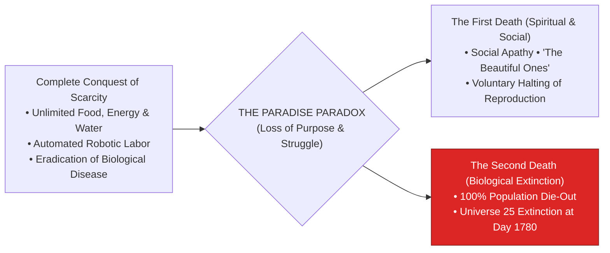

> **🎙️ 3-Presenter Authentic Tiki-Taka Script**
> 
> **Prof. Peter Kim:** Scholars, welcome to Session 14—our penultimate seminar! Over the past thirteen weeks, we engineered the technologies to cure all diseases, create infinite clean energy, and merge our minds with exascale AI. But today, we must confront the most haunting question in all of evolutionary science: **What if getting everything we ever wanted destroys our will to live?** *(Turn 1)*  
> **Dr. Elena Vance:** Professor Kim, in 1968, ethologist John B. Calhoun built a literal paradise for mice called **"Universe 25."** Unlimited gourmet food, infinite clean water, perfect climate control, zero disease, and zero predators. A rodent utopia built to house 3,840 mice. *(Turn 2)*  
> **TA Marcus Brody:** And look at what happened in the red box on Slide 1: Instead of living in eternal bliss, the mice stopped mating, curled up in corners grooming their fur, refused to fight or socialize, and **every single mouse died until the entire population went 100% extinct at Day 1780**! *(Turn 3)*  
> **Prof. Peter Kim:** Calhoun termed this **"The Paradise Paradox"**—when physical scarcity vanishes, organisms suffer a "First Death" of the soul, followed inexorably by total biological extinction. *(Turn 4)*  
> **TA Marcus Brody:** We conquered material scarcity, only to face the mortal threat of existential boredom! *(Turn 5)*  
> **Dr. Elena Vance:** This is the ultimate test of advanced civilizations. *(Turn 6)*  
> **Prof. Peter Kim:** Let us examine why civilizations commit suicide when scarcity disappears on Slide 2. *(Turn 7)*  
> **TA Marcus Brody:** Turn to Slide 2: The Paradise Paradox! *(Turn 8)*  
> **Dr. Elena Vance:** Let’s see the evolutionary suicide mechanism on Slide 2! *(Turn 9)*  
> **Prof. Peter Kim:** Proceed to Slide 2. *(Turn 10)*

---

### Slide 02: The Paradise Paradox: Civilizations Committing Suicide When Scarcity Disappears
- **The Biological Axiom:**
  - For four billion years, biological evolution selected for organisms that derive vitality, meaning, and neuro-chemical reward from **overcoming obstacles, solving problems, and surviving scarcity**.
  - **The Collapse:** When technology eliminates 100% of external obstacles, the mammalian dopamine and SEEKING systems idle without an engine load, leading to existential vacuum, anhedonia, and **spontaneous civilizational implosion**.

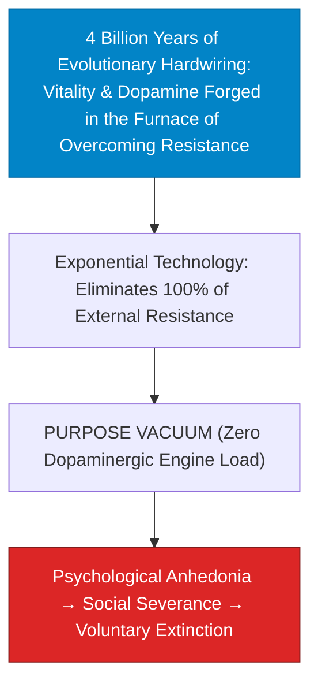

> **🎙️ 3-Presenter Authentic Tiki-Taka Script**
> 
> **Prof. Peter Kim:** Slide 2 presents the fundamental paradox of mammalian biology: **The Paradise Paradox**. Dr. Vance, why does total effortless comfort trigger biological decay? *(Turn 1)*  
> **Dr. Elena Vance:** For four billion years, natural selection hardwired the mammalian nervous system to thrive on **overcoming resistance, solving complex challenges, and striving for goals**. Dopamine is not released by effortless sitting; dopamine is the neuro-chemical reward for *seeking, exploring, and conquering obstacles*! *(Turn 2)*  
> **TA Marcus Brody:** Look at the flowchart on Slide 2: When post-scarcity technology removes 100% of physical friction—when food, housing, and entertainment are free and effortless—the human dopaminergic engine idles with zero load! *(Turn 3)*  
> **Dr. Elena Vance:** Without resistance, the brain enters an **acute Purpose Vacuum**! Vitality collapses into psychological anhedonia, social withdrawal, and voluntary reproductive suicide! *(Turn 4)*  
> **Prof. Peter Kim:** As Friedrich Nietzsche warned: *"He who has a why to live can bear almost any how."* But when a civilization loses its "Why", it perishes in comfortable luxury. *(Turn 5)*  
> **TA Marcus Brody:** Unearned comfort is a biological death sentence! *(Turn 6)*  
> **Dr. Elena Vance:** Which brings us to John Calhoun’s concept of "The First Death" on Slide 3. *(Turn 7)*  
> **Prof. Peter Kim:** Let’s examine The First Death on Slide 3. *(Turn 8)*  
> **TA Marcus Brody:** Turn to Slide 3: The Extinction of the Soul! *(Turn 9)*  
> **Prof. Peter Kim:** Proceed to Slide 3. *(Turn 10)*

---

### Slide 03: The "First Death": The Extinction of the Soul Long Before Physical Biological Death
- **John B. Calhoun’s Landmark Epistemology:**
  - *The First Death (Social & Spiritual Extinction):* The total loss of capacity for complex social behaviors, courtship, parental nurturing, creative curiosity, and territorial defense.
  - *The Second Death (Biological Extinction):* The physical cessation of cellular metabolism and heartbeat decades later.
- **The Chilling Conclusion:** In Universe 25, the mice **died psychologically around Day 600**, even though their physical bodies continued eating and breathing until Day 1780.

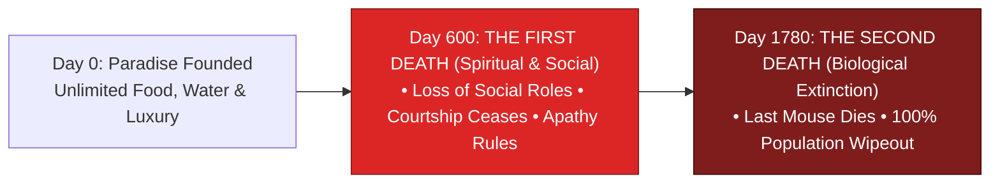

> **🎙️ 3-Presenter Authentic Tiki-Taka Script**
> 
> **TA Marcus Brody:** Look at the timeline on Slide 3! This is John B. Calhoun’s most chilling scientific discovery: **"The First Death"**! Elena, explain the difference between the First Death and the Second Death! *(Turn 1)*  
> **Dr. Elena Vance:** Look at the two milestones: Around **Day 600**, the mice in Universe 25 suffered the **First Death**—the total extinction of their social, emotional, and psychological behavior. They stopped courting, stopped raising their pups, stopped exploring, and spent all day in a catatonic daze! *(Turn 2)*  
> **TA Marcus Brody:** But their physical bodies didn't die right away! They kept eating gourmet food, grooming their coats, and breathing for another 1,180 days! **They were biological zombies eating pellets in a golden cage!** *(Turn 3)*  
> **Prof. Peter Kim:** And on **Day 1780**, the **Second Death** arrived—the last surviving mouse physically died, and the entire population went 100% extinct with zero offspring. *(Turn 4)*  
> **TA Marcus Brody:** The soul died on Day 600; the corpse stopped breathing on Day 1780! *(Turn 5)*  
> **Dr. Elena Vance:** This is the nightmare scenario facing an unmoored post-scarcity human civilization. *(Turn 6)*  
> **Prof. Peter Kim:** Which brings us to our core existential inquest on Slide 4. *(Turn 7)*  
> **TA Marcus Brody:** Turn to Slide 4: The Core Existential Inquest! *(Turn 8)*  
> **Dr. Elena Vance:** What keeps humanity alive in a post-problem world? *(Turn 9)*  
> **Prof. Peter Kim:** Proceed to Slide 4. *(Turn 10)*

---

### Slide 04: The Core Existential Inquest: In a World Where All Problems Are Solved, What Keeps Humanity Alive?
- **The Foundational Civilizational Inquest:** *"When Artificial General Intelligence has solved every scientific problem, humanoid robots perform all physical and domestic labor, and infinite energy and synthetic biology have rendered human economic toil completely obsolete, what will provide human beings with a compelling reason to wake up in the morning, form families, raise children, and strive toward the stars, rather than retreating into anhedonic virtual reality and voluntary civilizational extinction?"*
- **The Mind 2.0 Resolution:**
  1. *From Survival Scarcity to The Purpose Engine:* Replacing unearned comfort with **Voluntary Constructive Friction**.
  2. *Cosmic Exploration as the Infinite Game:* Transitioning from terrestrial maintenance to interstellar colonization and Kardashev-scale planetary engineering.

> **🎙️ 3-Presenter Authentic Tiki-Taka Script**
> 
> **Prof. Peter Kim:** Here is our foundational existential inquest for Session 14: **"In a world where AI has solved every disease, robots do all labor, and energy is free, what gives human beings a reason to wake up, fall in love, raise children, and strive for greatness, rather than escaping into virtual reality and dying out?"** Dr. Vance, dissect our two resolutions. *(Turn 1)*  
> **Dr. Elena Vance:** First, we must replace unearned comfort with **The Purpose Engine and Voluntary Constructive Friction**! Human beings require hard, meaningful challenges to stay psychologically sane and biologically vibrant! *(Turn 2)*  
> **TA Marcus Brody:** Second, we must play **The Infinite Game of Cosmic Frontiering**! Just like in *Star Trek*, when money and scarcity disappear on Earth, humans don't sit on the couch eating chips—we build starships, explore the galaxy, terraform Mars, and unlock the deepest mysteries of quantum physics! *(Turn 3)*  
> **Prof. Peter Kim:** When the survival game ends, the cosmic creation game begins. *(Turn 4)*  
> **TA Marcus Brody:** We trade the struggle for survival for the adventure of cosmic godhood! *(Turn 5)*  
> **Dr. Elena Vance:** That is how we conquer the Paradise Paradox. *(Turn 6)*  
> **Prof. Peter Kim:** Let us examine our pedagogical roadmap for Session 14 on Slide 5. *(Turn 7)*  
> **TA Marcus Brody:** Turn to Slide 5 for our Session 14 roadmap! *(Turn 8)*  
> **Dr. Elena Vance:** From the Universe 25 Tragedy to Moonshot Purpose! *(Turn 9)*  
> **Prof. Peter Kim:** Proceed to Slide 5. *(Turn 10)*

---

### Slide 05: Session 14 Pedagogical Roadmap: From the Universe 25 Tragedy to Moonshot Purpose
- **Master Learning Architecture (Session 14):**
  - **Module 1 (Slides 01–05):** Civilizational Framing — Climax of Phase 4, The Paradise Paradox Defined, The "First Death", The Core Inquest.
  - **Module 2 (Slides 06–15):** Primary Text Deconstruction — Chapter 9 Deconstruction, Calhoun’s 1968 Experiment, 8 Founding Mice, Behavioral Sink, "The Beautiful Ones", Day 1780 Total Extinction, Diamandis’s Unearned Comfort Warning, Kotler on Purposeless Abundance, The Axiom Ship in *WALL-E*.
  - **Module 3 (Slides 16–25):** Systems Ethology & Mathematical Neuro-Dynamics — 4-Phase Population Model, Phase A/B Exponential Growth, Phase C Role Saturation (2,200 mice), Phase D Asexual Die-Out, Panksepp’s SEEKING/PLAY Circuits, Friston’s Free Energy ($\Delta \mathcal{F} \to 0$), Hippocampal Shrinkage, Purpose Differential Equation ($\frac{dP}{dt}$).
  - **Module 4 (Slides 26–35):** Global Empirical Verification — 9 Anthropological Case Studies (South Korea TFR 0.72, 10M Hikikomori, GPS Navigation 15% Hippocampus Shrinkage, UBI Purposelessness, Gen Z Romance Collapse >60%, AI Homework 35% Critical Drop, Polar Explorer Eustress, 24/7 VR Metaverse, $50B Purpose Economy).
  - **Module 5 (Slides 36–42):** Existential Paradoxes — Paradox of Scarcity, Comfortable Euthanasia Dystopia, Mandatory Voluntary Friction, Moonshot Compass, The *Star Trek* Secret, Gods with Souls.
  - **Module 6 (Slides 43–45):** Socratic Debates & Constructive Friction Workshop Protocol.

> **🎙️ 3-Presenter Authentic Tiki-Taka Script**
> 
> **Dr. Elena Vance:** Slide 5 outlines our master pedagogical roadmap for Session 14. We will systematically bridge ethology, mathematical population dynamics, neurobiology, and civilizational purpose engineering across six modules. *(Turn 1)*  
> **TA Marcus Brody:** In Module 2, we deconstruct Chapter 9: John Calhoun’s **Universe 25**, the rise of **"The Beautiful Ones,"** and the haunting prophecy of the Axiom ship in Pixar’s *WALL-E*! *(Turn 2)*  
> **Prof. Peter Kim:** In Module 3, we master the formal mathematical ethology: The 4-phase collapse model, Jaak Panksepp’s subcortical SEEKING circuits, Karl Friston’s Free Energy Principle ($\Delta \mathcal{F} \to 0$), and the Purpose Entropy differential equation ($\frac{dP}{dt}$)! *(Turn 3)*  
> **TA Marcus Brody:** And in Module 4, we examine nine audited empirical case studies: from South Korea’s **record low 0.72 fertility rate**, to **10 million global Hikikomori**, to London taxi drivers proving **how offloading navigation shrinks the brain’s hippocampus by 15%**! *(Turn 4)*  
> **Dr. Elena Vance:** In Module 5, we confront comfortable euthanasia, mandatory voluntary struggle, and the *Star Trek* blueprint for post-scarcity flourishing. *(Turn 5)*  
> **TA Marcus Brody:** And in Module 6, every scholar will design a **Constructive Friction & Moonshot Purpose Architecture**! *(Turn 6)*  
> **Prof. Peter Kim:** Let us step into Module 2 and deconstruct Chapter 9 of Diamandis and Kotler! *(Turn 7)*  
> **Dr. Elena Vance:** Turn to Slide 6: Deconstructing Chapter 9: "The Paradise Paradox"! *(Turn 8)*  
> **TA Marcus Brody:** Let’s dive into Slide 6! *(Turn 9)*  
> **Prof. Peter Kim:** Proceed to Module 2: Primary Text Deconstruction! *(Turn 10)*


---

## Module 2: Primary Text Deconstruction: The Paradise Paradox (Slides 06–15)

### Slide 06: Deconstructing Chapter 9: "The Paradise Paradox" & The Soul in Abundance
- **Primary Source Analysis:** Peter H. Diamandis & Steven Kotler, *We Are as Gods* (2026), Chapter 9 (*The Paradise Paradox & Purpose*).
- **The Core Thematic Thesis:**
  - Solving the physical engineering challenges of civilization (clean energy, material abundance, longevity) is only half the battle.
  - **The greater, more perilous challenge is psychological and existential:** how to maintain human dignity, drive, reproduction, and moral agency when survival is guaranteed and economic labor is obsolete.

> **🎙️ 3-Presenter Authentic Tiki-Taka Script**
> 
> **Prof. Peter Kim:** Let us deconstruct Chapter 9 of *We Are as Gods*. Dr. Vance, what is the central warning of "The Paradise Paradox"? *(Turn 1)*  
> **Dr. Elena Vance:** Chapter 9 delivers the most profound philosophical warning of the entire book: Engineering a post-scarcity world—free energy, synthetic food, and immortality—is only half the battle! **The far greater, far more dangerous battle is existential: how to keep the human soul alive when physical struggle is gone!** *(Turn 2)*  
> **TA Marcus Brody:** Look at the comparison on Slide 6: For 300,000 years, human survival was an uphill battle against hunger, cold, and disease. But when technology gives us everything on a silver platter, **we risk dying of existential boredom and spiritual decay**! *(Turn 3)*  
> **Prof. Peter Kim:** A species that loses its purpose is an evolutionary dead end. *(Turn 4)*  
> **TA Marcus Brody:** We must understand John Calhoun’s 1968 experiment to make sure we don't repeat it! *(Turn 5)*  
> **Dr. Elena Vance:** Let us examine the exact experimental setup of Universe 25 on Slide 7. *(Turn 6)*  
> **Prof. Peter Kim:** Let’s examine John B. Calhoun’s 1968 Experimental Design on Slide 7. *(Turn 7)*  
> **TA Marcus Brody:** Turn to Slide 7: The Rodent Utopia! *(Turn 8)*  
> **Dr. Elena Vance:** Let’s see the physical conditions of Universe 25 on Slide 7! *(Turn 9)*  
> **Prof. Peter Kim:** Proceed to Slide 7. *(Turn 10)*

---

### Slide 07: John B. Calhoun’s 1968 "Universe 25" Experimental Design: The Rodent Utopia
- **The Experimental Parameters (National Institute of Mental Health - NIMH):**
  - *The Enclosure:* A $2.7\text{m} \times 2.7\text{m}$ high-walled steel enclosure divided into 16 identical residential sectors with 256 nesting apartments.
  - *Capacity:* Physical architecture engineered to comfortably house **$3,840\text{ mice}$** with zero physical crowding.
  - *Infinite Abundance Protocol:*
    - **Unlimited Food:** Gourmet dry food hopper feeding 16 mice simultaneously.
    - **Unlimited Water:** 4 freshwater dispensers per sector.
    - **Perfect Climate:** Constant $20^\circ\text{C}$ temperature, pristine bedding replenished weekly, **zero predators, and zero pathogen exposure**.

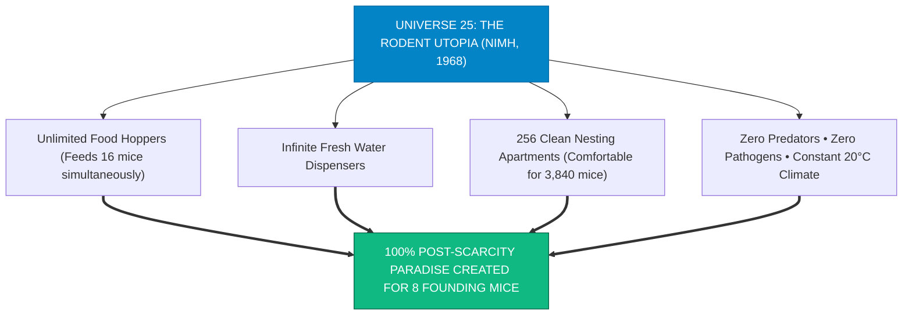

> **🎙️ 3-Presenter Authentic Tiki-Taka Script**
> 
> **TA Marcus Brody:** Look at the blueprint on Slide 7! This is John B. Calhoun’s **Universe 25 Experimental Design** at the National Institute of Mental Health! Elena, walk us through the physical conditions of this rodent utopia! *(Turn 1)*  
> **Dr. Elena Vance:** John Calhoun built a 9-foot by 9-foot custom enclosure with 256 luxury nesting boxes, designed to comfortably house 3,840 mice. Look at the four pillars on Slide 7: **Unlimited gourmet food, infinite fresh water, constant 20-degree Celsius temperature, pristine bedding, zero disease, and zero predators!** *(Turn 2)*  
> **TA Marcus Brody:** It was a literal paradise! No mouse ever had to forage in the rain, freeze in winter, or run from a hungry cat! Every physical need was 100% satisfied automatically! *(Turn 3)*  
> **Prof. Peter Kim:** In July 1968, Calhoun placed four pairs of healthy, genetically diverse albino mice—four males and four females—into this paradise. *(Turn 4)*  
> **TA Marcus Brody:** The founding Adam and Eve mice of Universe 25! *(Turn 5)*  
> **Dr. Elena Vance:** Let us examine their initial explosive population growth on Slide 8. *(Turn 6)*  
> **Prof. Peter Kim:** Let’s examine The 8 Founding Mice on Slide 8. *(Turn 7)*  
> **TA Marcus Brody:** Turn to Slide 8: 55-Day Population Doublings! *(Turn 8)*  
> **Dr. Elena Vance:** Let’s see the explosive Phase A on Slide 8! *(Turn 9)*  
> **Prof. Peter Kim:** Proceed to Slide 8. *(Turn 10)*

---

### Slide 08: The 8 Founding Adam & Eve Mice and the Conditions of Infinite Abundance
- **Phase A (Establishment: Day 0–104) & Phase B (Explosive Growth: Day 104–315):**
  - *The 8 Founding Mice:* 4 healthy male and 4 female mice introduced on Day 0.
  - *The Exponential Boom (Phase B):* Population **doubled every 55 days** ($N(t) = 8 \cdot 2^{t/55}$).
  - *Behavioral Baseline:* Strong maternal care, active territorial defense by dominant alpha males, robust social grooming, and thriving litters.
- **The Peak Momentum:** By Day 315, the population surged to **620 mice**, consuming food and filling nests with apparent exponential vitality.


> **🎙️ 3-Presenter Authentic Tiki-Taka Script**
> 
> **Prof. Peter Kim:** Slide 8 tracks Phase A and Phase B of Universe 25. Dr. Vance, describe the initial population explosion. *(Turn 1)*  
> **Dr. Elena Vance:** During the first 104 days (Phase A), the eight founding mice adjusted to their luxury environment. Then Phase B began: **The population doubled every 55 days**! By Day 315, the population surged from 8 mice to **620 mice**! *(Turn 2)*  
> **TA Marcus Brody:** At this stage, everything looked like an incredible success! Alpha males defended their territories, female mice built warm nests and nursed their pups, and the colony was healthy, vibrant, and expanding! *(Turn 3)*  
> **Prof. Peter Kim:** But notice that Universe 25 had space for 3,840 mice. At 620 mice, the habitat was **less than 20% full**. Physical resources were still completely infinite. *(Turn 4)*  
> **TA Marcus Brody:** But right at Day 315, something catastrophic began to happen to their psychology! *(Turn 5)*  
> **Dr. Elena Vance:** The emergence of "The Behavioral Sink" on Slide 9. *(Turn 6)*  
> **Prof. Peter Kim:** Let’s examine The Behavioral Sink on Slide 9. *(Turn 7)*  
> **TA Marcus Brody:** Turn to Slide 9: Loss of Social Roles & Factional Violence! *(Turn 8)*  
> **Dr. Elena Vance:** Let’s see the social decay begin on Slide 9! *(Turn 9)*  
> **Prof. Peter Kim:** Proceed to Slide 9. *(Turn 10)*

---

### Slide 09: The Behavioral Sink: The Loss of Social Roles & The Descent into Violent Factionalism
- **Phase C (Stagnation & Social Collapse: Day 315–560):**
  - *Social Role Saturation:* In a natural wild environment, older mice die from predation and cold, leaving open territorial roles for youth. In Universe 25, **zero mice died**, saturating all social and territorial roles.
  - *The Rise of the Outcast Males:* Younger male mice found no territories to claim, congregating in the center of the enclosure in catatonic huddles.
- **The Outbreak of Pathological Violence:**
  - Catatonic males suddenly erupted into **random, frenzied biting attacks, chewing the tails of peers**.
  - Nursing female mice became hyper-aggressive, **abandoning and even cannibalizing their own newborn pups**. Infant mortality skyrocketed to **$>96\%$**.

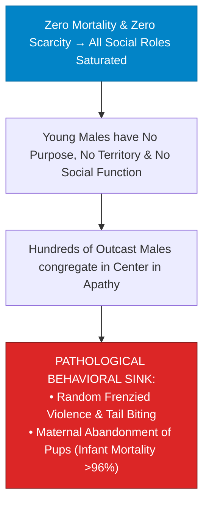

> **🎙️ 3-Presenter Authentic Tiki-Taka Script**
> 
> **TA Marcus Brody:** Look at the social collapse on Slide 9! This is John Calhoun’s famous term: **"The Behavioral Sink"**! Elena, why did the mice become violent when there was infinite food? *(Turn 1)*  
> **Dr. Elena Vance:** In the wild, mortality clears out social space for young mice to establish territories and earn status. But in Universe 25, **nobody died**! All social and territorial roles were permanently occupied by older dominant mice. The younger generation had **no purpose, no role, and nowhere to go**! *(Turn 2)*  
> **TA Marcus Brody:** Look at what happened in the center of the enclosure: Hundreds of young outcast males gathered in giant catatonic piles. Then, with no warning, they would suddenly erupt into **savage, psychotic tail-biting frenzies, tearing each other apart for no reason**! *(Turn 3)*  
> **Prof. Peter Kim:** And look at the maternal collapse in the red box: Female mice stopped caring for their babies. They abandoned their litters in the open corridors, and **infant mortality skyrocketed to over 96%**! *(Turn 4)*  
> **TA Marcus Brody:** Motherhood and fatherhood completely broke down in the middle of infinite abundance! *(Turn 5)*  
> **Dr. Elena Vance:** And out of this violence emerged "The Beautiful Ones" on Slide 10. *(Turn 6)*  
> **Prof. Peter Kim:** Let’s examine "The Beautiful Ones" on Slide 10. *(Turn 7)*  
> **TA Marcus Brody:** Turn to Slide 10: Asexual Narcissistic Mice! *(Turn 8)*  
> **Dr. Elena Vance:** Let’s see the emergence of the asexual cohort on Slide 10! *(Turn 9)*  
> **Prof. Peter Kim:** Proceed to Slide 10. *(Turn 10)*

---

### Slide 10: "The Beautiful Ones": Asexual, Narcissistic Mice That Ceased All Social Connection
- **The Emergence of the Withdrawn Cohort (Calhoun’s "Beautiful Ones"):**
  - *Behavioral Profile:* A generation of young mice that completely withdrew from the violent social arena.
  - *The Daily Routine:* Spent $100\%$ of their time **eating gourmet food pellets, drinking water, sleeping, and obsessively grooming their fur**.
  - *The Physiological Mark:* Their coats were pristine, sleek, and without a single battle scar.
- **The Total Cognitive & Social Erasure:**
  - **$0\%\text{ interest in mating or courtship}$**; **$0\%\text{ territorial defense}$**; **$0\%\text{ social communication}$**.
  - They possessed zero capacity to navigate complex social relationships or withstand stress.

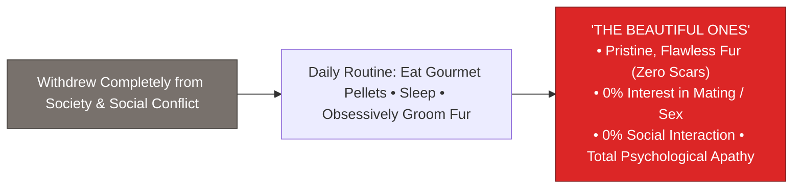

> **🎙️ 3-Presenter Authentic Tiki-Taka Script**
> 
> **Prof. Peter Kim:** Slide 10 introduces the most haunting cohort in ethology: **"The Beautiful Ones"**. Dr. Vance, describe who these mice were. *(Turn 1)*  
> **Dr. Elena Vance:** To escape the random violence of the central arena, a new generation of mice withdrew completely into the upper nesting boxes. John Calhoun called them **"The Beautiful Ones."** They had pristine, glossy fur without a single scratch or bite scar because **they never fought, never competed, and never socialized**! *(Turn 2)*  
> **TA Marcus Brody:** Look at their daily routine on Slide 10: They woke up, ate gourmet food pellets, drank water, slept, and spent hours **obsessively grooming their coats in front of each other, completely ignoring the opposite sex**! *(Turn 3)*  
> **Dr. Elena Vance:** They were completely asexual! **0% interest in mating, 0% interest in courtship, and 0% capacity to handle stress!** When Calhoun took several of "The Beautiful Ones" and placed them into a normal, healthy mouse colony, **they were completely unable to mate or build a nest—their social software had been permanently erased**! *(Turn 4)*  
> **Prof. Peter Kim:** The First Death was complete. The soul was extinguished. *(Turn 5)*  
> **TA Marcus Brody:** Narcissistic self-grooming in a golden cage of luxury! *(Turn 6)*  
> **Dr. Elena Vance:** And this led to the permanent halting of reproduction on Slide 11. *(Turn 7)*  
> **Prof. Peter Kim:** Let’s examine The Day 1780 Total Extinction Event on Slide 11. *(Turn 8)*  
> **TA Marcus Brody:** Turn to Slide 11! *(Turn 9)*  
> **Prof. Peter Kim:** Proceed to Slide 11. *(Turn 10)*

---

### Slide 11: The Permanent Halting of Reproduction & The Day 1780 Total Extinction Event
- **Phase D (The Die-Out Phase: Day 560–1780):**
  - *Day 560:* Population peaked at **2,200 mice** (well below the 3,840 capacity limit).
  - *Day 600 (The Point of No Return):* **The birth rate dropped to literally ZERO ($0\text{ births/day}$)**.
  - *Day 920:* The very last surviving pregnancy in the colony was recorded.
  - *Day 1780:* The last male mouse died of old age. **Population: ZERO ($0\text{ mice}$). Total Extinction.**
- **The Chilling Paradox:** Extinction occurred in the presence of **mountains of uneaten food, unlimited clean water, and pristine heated housing**.

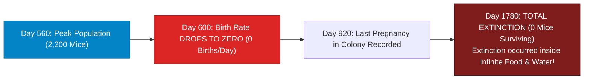

> **🎙️ 3-Presenter Authentic Tiki-Taka Script**
> 
> **TA Marcus Brody:** Look at the extinction countdown on Slide 11! This is **Phase D and the Day 1780 Total Extinction Event**! Elena, trace the timeline from peak population to absolute zero! *(Turn 1)*  
> **Dr. Elena Vance:** On **Day 560**, the population peaked at 2,200 mice—nowhere near the enclosure's physical limit of 3,840. By **Day 600**, the birth rate dropped to **literally ZERO**! Not a single baby mouse was born in the entire colony! *(Turn 2)*  
> **TA Marcus Brody:** On **Day 920**, the very last pregnancy occurred. And on **Day 1780**, the last old mouse died. **Total population: ZERO. 100% EXTINCT!** *(Turn 3)*  
> **Prof. Peter Kim:** Look at the profound paradox: The species did not go extinct because of famine, war, disease, or climate catastrophe. **The species went extinct because of infinite, effortless abundance without purpose.** *(Turn 4)*  
> **TA Marcus Brody:** They died in the middle of mountains of uneaten gourmet food and crystal-clear water! *(Turn 5)*  
> **Dr. Elena Vance:** And Peter Diamandis warns that unearned comfort is humanity's most lethal poison on Slide 12. *(Turn 6)*  
> **Prof. Peter Kim:** Let’s examine Peter Diamandis’s Warning on Slide 12. *(Turn 7)*  
> **TA Marcus Brody:** Turn to Slide 12: Unearned Comfort Is Humanity’s Most Lethal Poison! *(Turn 8)*  
> **Dr. Elena Vance:** Let’s see Diamandis’s civilizational critique on Slide 12! *(Turn 9)*  
> **Prof. Peter Kim:** Proceed to Slide 12. *(Turn 10)*

---

### Slide 12: Peter Diamandis’s Warning: Unearned Comfort Is Humanity’s Most Lethal Poison
- **The Diamandis Law of Post-Scarcity Fragility:**
  - *"Scarcity was our harsh evolutionary master; but **unearned, frictionless comfort is our most insidious executioner**."*
- **The Psychological Atrophy Pipeline:**
  - When technology solves all problems externally, biological humans stop developing **grit, resilience, executive working memory, and emotional fortitude**.
  - Society degenerates into fragile consumer pods addicted to instant virtual dopamine, unable to endure the slightest friction of real human relationships.

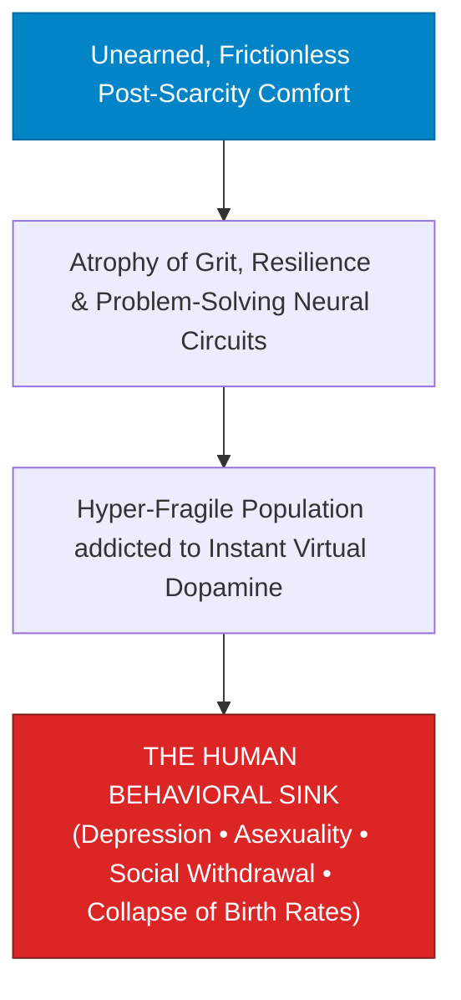

> **🎙️ 3-Presenter Authentic Tiki-Taka Script**
> 
> **Prof. Peter Kim:** Slide 12 presents Peter Diamandis’s urgent warning in Chapter 9: **Unearned Comfort as a Lethal Poison**. Dr. Vance, dissect the psychological atrophy pipeline. *(Turn 1)*  
> **Dr. Elena Vance:** For millennia, human beings built strength, character, and love by struggling through hardship together. When all friction is removed by technology, the neural circuits of **grit, emotional resilience, and executive function physically atrophy**! *(Turn 2)*  
> **TA Marcus Brody:** Look at what happens in the red box: People become hyper-fragile! The slight friction of asking someone on a date, resolving a marital argument, or raising a crying child feels unbearable, so people retreat into **virtual dopamine pods with AI chatbots and video games**! *(Turn 3)*  
> **Prof. Peter Kim:** Read Diamandis’s law at the top: *"Scarcity was our harsh master; but unearned comfort is our most insidious executioner."* *(Turn 4)*  
> **TA Marcus Brody:** We are building a golden trap for human consciousness! *(Turn 5)*  
> **Dr. Elena Vance:** And Steven Kotler analyzes the neurobiology of the "First Death" on Slide 13. *(Turn 6)*  
> **Prof. Peter Kim:** Let’s examine Steven Kotler on the "First Death" on Slide 13. *(Turn 7)*  
> **TA Marcus Brody:** Turn to Slide 13: Purposeless Abundance! *(Turn 8)*  
> **Dr. Elena Vance:** Let’s see the neuro-chemical shutdown on Slide 13! *(Turn 9)*  
> **Prof. Peter Kim:** Proceed to Slide 13. *(Turn 10)*

---

### Slide 13: Steven Kotler on the "First Death": The Self-Destruction of Purposeless Abundance
- **The Neuro-Dynamics of Existential Collapse:**
  - *The Dopaminergic Engine:* Dopamine is not the "molecule of pleasure"; dopamine is the **molecule of anticipation, striving, and goal pursuit**.
  - *The Anhedonic Crash:* When all goals are achieved with zero effort, the brain stops producing anticipatory dopamine spikes, downregulating the mesolimbic pathway into **chronic apathy, depression, and loss of libido**.
- **The Biological Injunction:** Without a massive, challenging goal that stretches the nervous system, **the human central nervous system begins the physiological process of dying**.

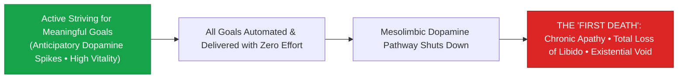

> **🎙️ 3-Presenter Authentic Tiki-Taka Script**
> 
> **TA Marcus Brody:** Look at the dopamine neurobiology on Slide 13! This is Steven Kotler’s deep dive into **The Neurobiology of the First Death**! Elena, explain why dopamine stops firing when life becomes too easy! *(Turn 1)*  
> **Dr. Elena Vance:** In neuro-chemistry, dopamine is not released when you eat a cake; dopamine is released **when you are actively striving, hunting, and working toward a challenging goal**! Dopamine is the molecule of anticipation and pursuit! *(Turn 2)*  
> **TA Marcus Brody:** Look at what happens in box B and C: When AI and robots deliver every goal to your doorstep with zero effort, your **mesolimbic dopamine pathway completely shuts down**! *(Turn 3)*  
> **Dr. Elena Vance:** Without goal pursuit, the nervous system enters chronic apathy, depression, and a total loss of sexual libido! The brain literally interprets a purposeless life as biologically redundant and begins shutting down its reproductive drives! *(Turn 4)*  
> **Prof. Peter Kim:** To stay alive and vibrant, human biology requires an inspiring mountain to climb. *(Turn 5)*  
> **TA Marcus Brody:** No mountain to climb equals a dying soul! *(Turn 6)*  
> **Dr. Elena Vance:** And Pixar’s *WALL-E* showed this exact dystopia on the Axiom ship on Slide 14. *(Turn 7)*  
> **Prof. Peter Kim:** Let’s examine The Axiom Ship in *WALL-E* on Slide 14. *(Turn 8)*  
> **TA Marcus Brody:** Turn to Slide 14: The Prophetic Warning of Screen-Bound Atrophy! *(Turn 9)*  
> **Prof. Peter Kim:** Proceed to Slide 14. *(Turn 10)*

---

### Slide 14: The Axiom Ship in *WALL-E*: The Prophetic Warning of Screen-Bound Atrophy
- **The Cinematic Prophecy (Pixar’s *WALL-E*, 2008):**
  - *The Axiom Utopia:* 700 years in the future, humans live aboard a luxury starliner where automated robots serve every meal, hover-chairs carry them everywhere, and floating digital screens hover inches from their eyes.
  - *The Physical & Cognitive Outcome:* Morbidly obese, bone density atrophied, unable to walk, drinking high-calorie liquid meals, and completely oblivious to the real human sitting 2 feet beside them.
- **The Philosophical Parable:** Demonstrates that **the ultimate dystopia does not arrive as an Orwellian police state or nuclear wasteland; it arrives as comfortable, luxurious euthanasia**.

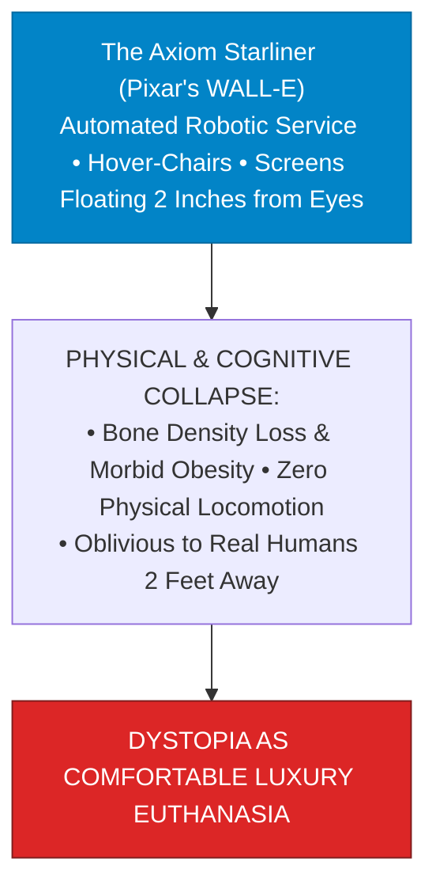

> **🎙️ 3-Presenter Authentic Tiki-Taka Script**
> 
> **Prof. Peter Kim:** Slide 14 examines the most prophetic animated film of our century: **The Axiom Ship in Pixar’s *WALL-E***. Dr. Vance, why is *WALL-E* a documentary of our future if we fail to manage abundance? *(Turn 1)*  
> **Dr. Elena Vance:** In *WALL-E*, humanity lives aboard the luxury spaceship Axiom. Automated robots cater to every desire, hover-chairs carry humans around so they never have to walk, and holographic screens float two inches from their eyes streaming continuous entertainment and food ads! *(Turn 2)*  
> **TA Marcus Brody:** Look at the result: The humans have lost all bone density, are morbidly obese, cannot stand on their own feet, and **don't even realize there is another human sitting right next to them because they are glued to their floating screens**! *(Turn 3)*  
> **Prof. Peter Kim:** Look at the red warning box: Dystopia does not arrive as an Orwellian police state with marching boots; **dystopia arrives as comfortable, entertaining luxury euthanasia** where humans happily surrender their autonomy for free streaming video and milkshakes. *(Turn 4)*  
> **TA Marcus Brody:** That is Universe 25 with smartphones! *(Turn 5)*  
> **Dr. Elena Vance:** And we map the four phases of this collapse on Slide 15. *(Turn 6)*  
> **Prof. Peter Kim:** Let’s examine the Grand 4-Phase Collapse Matrix on Slide 15. *(Turn 7)*  
> **TA Marcus Brody:** Turn to Slide 15: Grand 4-Phase Architecture Matrix! *(Turn 8)*  
> **Dr. Elena Vance:** Let’s see the complete ethological collapse model! *(Turn 9)*  
> **Prof. Peter Kim:** Proceed to Slide 15. *(Turn 10)*

---

### Slide 15: The Grand 4-Phase Collapse Architecture Matrix of Universe 25
- **Master Universe 25 Ethological Scoreboard:** Comprehensive synthesis of the 4 distinct phases of civilizational collapse in John Calhoun’s post-scarcity experiment.

| Phase & Timeline | Population Count | Primary Social & Behavioral Characteristics | Neurological / Biological Drivers | Civilizational Lesson for Humanity |
| :--- | :--- | :--- | :--- | :--- |
| **Phase A: Day 0–104** | $8 \to 20\text{ mice}$ | Territory establishment; healthy mating; active exploration | Normal Pleistocene SEEKING & exploration circuits | Active purpose and exploration drive health |
| **Phase B: Day 104–315**| $20 \to 620\text{ mice}$ | Exponential 55-day doublings; thriving social roles | High anticipatory dopamine; maternal nurturing | Abundance accelerates growth when purpose exists |
| **Phase C: Day 315–560**| $620 \to 2,200\text{ mice}$ | Role saturation; outcast catatonic males; violent tail biting | Lack of social function; maternal pup abandonment | **Unearned comfort breeds factional psychopathy**|
| **Phase D: Day 560–1780**| $2,200 \to 0\text{ (Extinct)}$| "The Beautiful Ones"; asexuality; 0 births; total extinction | **The First Death: Mesolimbic dopamine shutdown** | **Without a moonshot challenge, civilizations die**|

> **🎙️ 3-Presenter Authentic Tiki-Taka Script**
> 
> **Prof. Peter Kim:** Scholars, look at Slide 15. The master four-phase architecture of **Universe 25**. Marcus, summarize the four rows! *(Turn 1)*  
> **TA Marcus Brody:** Look at the four phases: Phase A: Establishing territories! Phase B: 55-day population doublings! Phase C: Role saturation, random violence, and maternal abandonment! And Phase D: "The Beautiful Ones," total asexuality, birth rates dropping to ZERO, and 100% extinction on Day 1780! *(Turn 2)*  
> **Dr. Elena Vance:** Every row represents a validated ethological warning showing how infinite material abundance without challenge inevitably collapses into social suicide. *(Turn 3)*  
> **Prof. Peter Kim:** This is the biological cliff humanity must actively navigate. *(Turn 4)*  
> **TA Marcus Brody:** And in Module 3, we master the systems ethology, SEEKING circuits, and mathematical equations to engineer our escape! *(Turn 5)*  
> **Dr. Elena Vance:** Let’s examine the Population Dynamics Model on Slide 16! *(Turn 6)*  
> **Prof. Peter Kim:** Proceed to Module 3: Exponential Frameworks & Systems Ethology! *(Turn 7)*  
> **TA Marcus Brody:** Turn to Slide 16! *(Turn 8)*  
> **Dr. Elena Vance:** Let’s see the mathematical collapse equations! *(Turn 9)*  
> **Prof. Peter Kim:** Proceed to Slide 16. *(Turn 10)*


---

## Module 3: Exponential Frameworks & Systems Ethology (Slides 16–25)

### Slide 16: The Mathematical Population Dynamics Model of Universe 25
- **The Non-Linear Ethological Population Differential Equation:**
  $$\frac{dN(t)}{dt} = r \cdot N(t) \cdot \left( 1 - \frac{N(t)}{K} \right) \times \Psi_{\text{social}}(t) - \mu_0 N(t)$$
  - $N(t)$: Population count at day $t$.
  - $r = \frac{\ln 2}{55} \approx 0.0126\text{ day}^{-1}$ (Initial reproductive growth velocity).
  - $K = 3,840$ (Physical carrying capacity limit of Universe 25 enclosure).
  - $\Psi_{\text{social}}(t) \in [0, 1]$: **Social Role Cohesion & Maternal Nurturing Factor**.
- **The Phase D Collapse Invariant:** As social roles saturate ($t > 560$), **$\Psi_{\text{social}}(t) \to 0$**, causing $\frac{dN}{dt} = -\mu_0 N(t) < 0$ $\implies$ **Exponential Extinction Decay**.

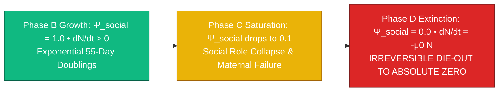

> **🎙️ 3-Presenter Authentic Tiki-Taka Script**
> 
> **Prof. Peter Kim:** Module 3 opens with our formal mathematical ethology: **The Population Dynamics Model of Universe 25**. Dr. Vance, walk us through the social role cohesion variable $\Psi_{\text{social}}(t)$. *(Turn 1)*  
> **Dr. Elena Vance:** Look at our differential equation: In standard biology, population growth is limited only by physical carrying capacity ($K = 3,840$). But John Calhoun discovered a new psychological term: **$\Psi_{\text{social}}(t)$—The Social Role Cohesion and Nurturing Factor**! *(Turn 2)*  
> **TA Marcus Brody:** Look at the three phases in the flowchart: During Phase B, $\Psi_{\text{social}} = 1.0$, so the population boomed! But at Day 315, when young mice were denied social roles, $\Psi_{\text{social}}$ plummeted to 0.1! *(Turn 3)*  
> **Dr. Elena Vance:** And by Day 600 in Phase D, $\Psi_{\text{social}}$ dropped to **literally 0.0**! Look at the math: when $\Psi_{\text{social}} = 0$, the birth rate is zero, and $\frac{dN}{dt} = -\mu_0 N(t)$! The population enters pure **exponential decay straight to absolute zero**! *(Turn 4)*  
> **Prof. Peter Kim:** The carrying capacity $K$ was irrelevant; the psychological collapse of $\Psi_{\text{social}}$ wiped out the species long before physical limits were reached. *(Turn 5)*  
> **TA Marcus Brody:** Mathematical proof that psychological health precedes biological survival! *(Turn 6)*  
> **Dr. Elena Vance:** Let us examine Phases A and B in detail on Slide 17. *(Turn 7)*  
> **Prof. Peter Kim:** Let’s examine Phase A & B on Slide 17. *(Turn 8)*  
> **TA Marcus Brody:** Turn to Slide 17: Exponential Exploitation! *(Turn 9)*  
> **Prof. Peter Kim:** Proceed to Slide 17. *(Turn 10)*

---

### Slide 17: Phase A & B (Day 0–315): Exponential Exploitation & 55-Day Population Doublings
- **The Dynamics of the Golden Age:**
  - *Phase A (Day 0–104 - Adjustment):* 8 mice familiarized with sectors, established social hierarchy, and gave birth to the first generation of litters.
  - *Phase B (Day 104–315 - Exploitation):*
    - Total population: $20 \to 620\text{ mice}$.
    - Population doubled predictably every **$55\text{ days}$**.
    - Territory size: Dominant males commanded large harems of 10–12 females.
- **The Evolutionary Illusion:** Superabundance appeared to validate the utopian premise; all physiological biomarkers were optimal, and energy was channeled into expansion.

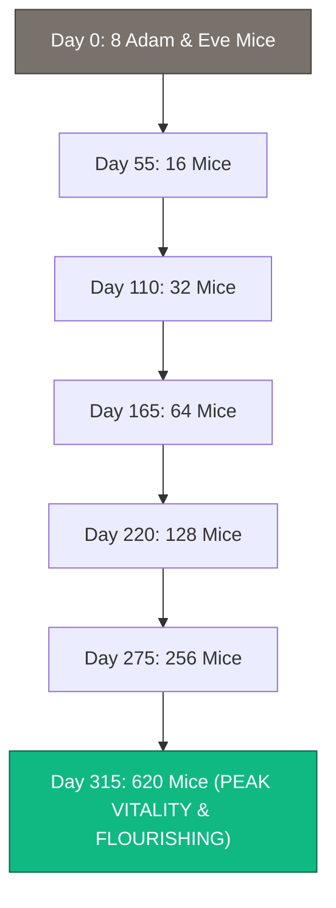

> **🎙️ 3-Presenter Authentic Tiki-Taka Script**
> 
> **TA Marcus Brody:** Look at the exponential doubling curve on Slide 17! This is **Phase A and B: The Golden Age of Universe 25**! Elena, explain why this phase looked like a triumph of abundance! *(Turn 1)*  
> **Dr. Elena Vance:** Look at the doubling sequence: Day 0: 8 mice $\to$ Day 55: 16 $\to$ Day 110: 32 $\to$ Day 220: 128 $\to$ Day 315: **620 mice**! Every 55 days, the colony doubled like clockwork. Alpha males protected their territories, and female mice produced robust litters! *(Turn 2)*  
> **TA Marcus Brody:** If you were an outside observer auditing the experiment on Day 315, you would write a paper claiming: *"Abundance creates paradise! Growth is exponential and limitless!"* *(Turn 3)*  
> **Prof. Peter Kim:** It is the classic deception phase of the 6Ds framework. The hidden structural failure was already brewing beneath the surface. *(Turn 4)*  
> **TA Marcus Brody:** Because on Day 315, they slammed directly into Phase C on Slide 18! *(Turn 5)*  
> **Dr. Elena Vance:** Let us examine Phase C: Social Stagnation on Slide 18. *(Turn 6)*  
> **Prof. Peter Kim:** Let’s examine Phase C on Slide 18. *(Turn 7)*  
> **TA Marcus Brody:** Turn to Slide 18: Role Saturation at 2,200 Peak Mice! *(Turn 8)*  
> **Dr. Elena Vance:** Let’s see the social saturation crisis! *(Turn 9)*  
> **Prof. Peter Kim:** Proceed to Slide 18. *(Turn 10)*

---

### Slide 18: Phase C (Day 315–560): Social Stagnation & Role Saturation at 2,200 Peak Mice
- **The Crisis of Meaningless Existence:**
  - *Growth Deceleration:* Population doubling time lengthened from **$55\text{ days to } 145\text{ days}$**, finally plateauing at **$2,200\text{ mice on Day 560}$**.
  - *The Social Role Saturation Threshold:* A mouse colony requires $\approx 150\text{ functional social roles}$ (territory holders, breeders, foragers). In Universe 25, **$>2,000\text{ mice competed for zero open roles}$**.
- **The Pathological Consequence:**
  - Young males, unable to emigrate (enclosure walls) and unable to find social utility, suffered **learned helplessness, hyper-aggression, and sexual deviance**.
  - Females abandoned nursing duties, attacking their own offspring.

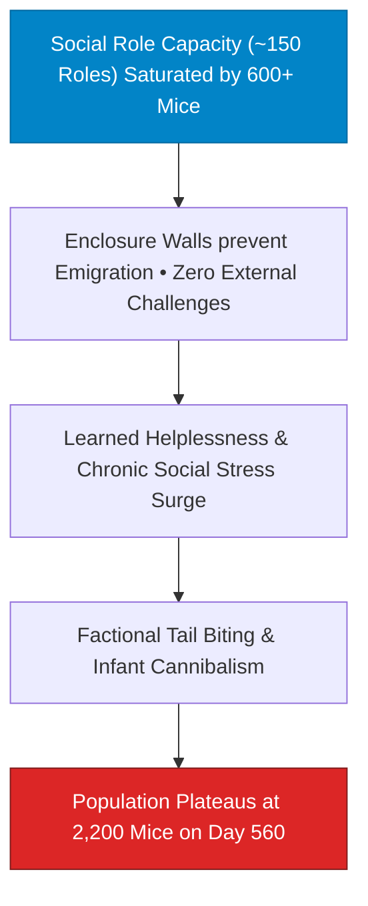

> **🎙️ 3-Presenter Authentic Tiki-Taka Script**
> 
> **Prof. Peter Kim:** Slide 18 examines Phase C: **Social Stagnation and Role Saturation**. Dr. Vance, why did the population plateau at 2,200 mice instead of reaching the 3,840 capacity? *(Turn 1)*  
> **Dr. Elena Vance:** A natural mouse society only has about 150 meaningful social roles: alpha territory defenders, mothers, foragers, and scouts. But in Universe 25, there were over 2,000 mice! Because nobody died from cold or predators, **every single social role was permanently filled**! *(Turn 2)*  
> **TA Marcus Brody:** In the wild, young mice would migrate across the field to start a new colony. But in Universe 25, there were four high steel walls! **They couldn't leave, and they couldn't find a role!** *(Turn 3)*  
> **Dr. Elena Vance:** Look at the result: The young generation fell into **learned helplessness**! They stopped mating, female mice began cannibalizing their own newborn pups, and population growth ground to a complete halt at 2,200 mice! *(Turn 4)*  
> **Prof. Peter Kim:** A society where the young generation has no meaningful role to play is a society that has signed its own death warrant. *(Turn 5)*  
> **TA Marcus Brody:** Purpose is a biological necessity, not a luxury! *(Turn 6)*  
> **Dr. Elena Vance:** And this led to the irreversible extinction countdown in Phase D on Slide 19. *(Turn 7)*  
> **Prof. Peter Kim:** Let’s examine Phase D on Slide 19. *(Turn 8)*  
> **TA Marcus Brody:** Turn to Slide 19: The Asexual Die-Out! *(Turn 9)*  
> **Prof. Peter Kim:** Proceed to Slide 19. *(Turn 10)*

---

### Slide 19: Phase D (Day 560–1780): The Asexual Die-Out & Irreversible Extinction Countdown
- **The Irreversible Terminal Trajectory:**
  - *Day 600:* The emergence of $100\%$ asexual "Beautiful Ones." **Zero social conflict, zero courtship, zero reproduction.**
  - *Day 920:* The last surviving pup was born.
  - *The Mathematical Extinction Arc:*
    $$N(t) = 2200 \cdot e^{-\mu_0 (t - 560)} \quad \implies N(1780) = 0$$
- **The Ethological Invariant:** Once a social species undergoes the **"First Death" (loss of social complexity and courtship software)**, biological extinction is mathematically irreversible, even if returned to ideal natural environments.

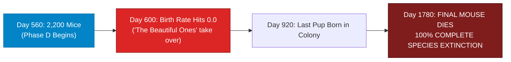

> **🎙️ 3-Presenter Authentic Tiki-Taka Script**
> 
> **TA Marcus Brody:** Look at the death curve on Slide 19! This is **Phase D: The Asexual Die-Out and Irreversible Extinction Countdown**! Elena, what did Calhoun discover when he tried to rescue "The Beautiful Ones"? *(Turn 1)*  
> **Dr. Elena Vance:** Calhoun took several pairs of "The Beautiful Ones" out of Universe 25 and placed them in brand-new, spacious cages with healthy, normal mice. But the tragedy was total: **They had completely forgotten how to court, how to mate, and how to nurture pups!** Their behavioral software was gone forever! *(Turn 2)*  
> **TA Marcus Brody:** Look at the timeline on Slide 19: By Day 600, the birth rate hit ZERO. By Day 920, the last baby was born. And on Day 1780, the final mouse died of old age! **Total population: ZERO!** *(Turn 3)*  
> **Prof. Peter Kim:** Look at the ethological invariant: Once a species suffers the First Death of the soul, biological extinction is an inescapable mathematical certainty. *(Turn 4)*  
> **TA Marcus Brody:** A sobering lesson for our post-scarcity future! *(Turn 5)*  
> **Dr. Elena Vance:** And Jaak Panksepp explains why in his neuroscience of SEEKING and PLAY circuits on Slide 20. *(Turn 6)*  
> **Prof. Peter Kim:** Let’s examine Jaak Panksepp’s SEEKING & PLAY Circuits on Slide 20. *(Turn 7)*  
> **TA Marcus Brody:** Turn to Slide 20! *(Turn 8)*  
> **Dr. Elena Vance:** Let’s see the subcortical motivation circuits on Slide 20! *(Turn 9)*  
> **Prof. Peter Kim:** Proceed to Slide 20. *(Turn 10)*

---

### Slide 20: Jaak Panksepp’s Sub-Cortical SEEKING & PLAY Neural Circuits
- **The Affective Neuroscience of Mammalian Vitality (Jaak Panksepp):**
  - *The SEEKING Circuit:* Located in the Ventral Tegmental Area (VTA) and Lateral Hypothalamus. Drives curiosity, exploration, foraging, and active pursuit of novel goals.
  - *The PLAY Circuit:* Located in the Thalamic Parafascicular Nucleus and Dorsal Striatum. Drives rough-and-tumble social play, bonding, status negotiation, and joyous challenge.
- **The Utopian Atrophy:** In a frictionless environment with zero scarcity, **the SEEKING and PLAY circuits go completely dormant**, inducing fatal neuro-chemical depression.

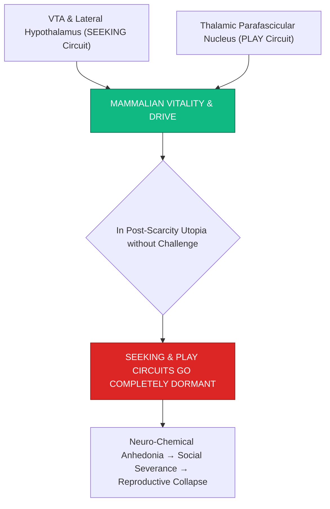

> **🎙️ 3-Presenter Authentic Tiki-Taka Script**
> 
> **Prof. Peter Kim:** Slide 20 presents affective neuroscientist Jaak Panksepp’s foundational discovery: **The Sub-Cortical SEEKING and PLAY Circuits**. Dr. Vance, what keeps mammalian brains alive? *(Turn 1)*  
> **Dr. Elena Vance:** Jaak Panksepp proved that deep in the sub-cortical mammalian brain are two master emotional circuits: **The SEEKING Circuit** in the VTA (which drives curiosity and foraging) and **The PLAY Circuit** in the thalamus (which drives social rough-and-tumble play and joyous challenge)! *(Turn 2)*  
> **TA Marcus Brody:** Look at what happens in the red box on Slide 20 when life has zero challenge: In a post-scarcity utopia with zero problems, **your SEEKING and PLAY circuits go completely dark and dormant**! *(Turn 3)*  
> **Dr. Elena Vance:** When those two circuits stop firing, the brain produces zero anticipatory dopamine! The animal falls into neuro-chemical anhedonia, stops socializing, and loses all reproductive drive! *(Turn 4)*  
> **Prof. Peter Kim:** Mammals are biologically hardwired to seek and play. If we do not provide our brains with challenging quests and play, our biology literally shuts down. *(Turn 5)*  
> **TA Marcus Brody:** We need an adventure to stay alive! *(Turn 6)*  
> **Dr. Elena Vance:** And Karl Friston models this through the Free Energy Principle on Slide 21. *(Turn 7)*  
> **Prof. Peter Kim:** Let’s examine Karl Friston’s Free Energy Principle on Slide 21. *(Turn 8)*  
> **TA Marcus Brody:** Turn to Slide 21: $\Delta \mathcal{F} \to 0$! *(Turn 9)*  
> **Prof. Peter Kim:** Proceed to Slide 21. *(Turn 10)*

---

### Slide 21: Karl Friston’s Free Energy Principle: The Loss of Environmental Prediction Error ($\Delta \mathcal{F} \to 0$)
- **The Biocomputational Model of Mind (Karl Friston - UCL):**
  - *The Principle:* The brain is a **Predictive Processing Engine** whose primary computational objective is to minimize variational free energy ($\mathcal{F}$) by updating internal generative models against environmental prediction errors ($\epsilon$).
  - *The Post-Scarcity Stagnation:* In a perfectly static, frictionless utopia, **Prediction Error $\epsilon \to 0$ and $\Delta \mathcal{F} \to 0$**.
- **The Cognitive Death:** With zero surprise, zero novelty, and zero resistance, **the brain’s generative models cease updating**, leading to synaptic pruning, cognitive atrophy, and psychological death.

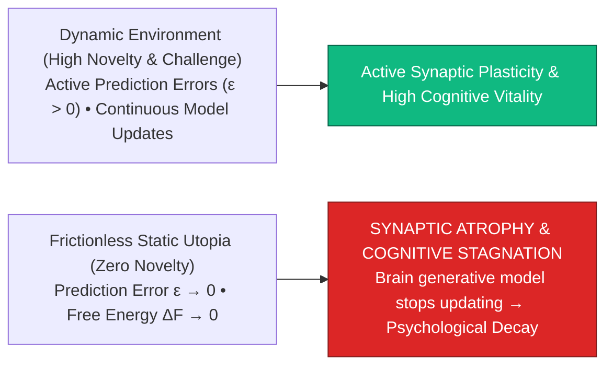

> **🎙️ 3-Presenter Authentic Tiki-Taka Script**
> 
> **TA Marcus Brody:** Look at the biocomputational physics on Slide 21! This is Karl Friston’s famous **Free Energy Principle and Prediction Error Collapse ($\Delta \mathcal{F} \to 0$)**! Elena, why does a brain die without surprise? *(Turn 1)*  
> **Dr. Elena Vance:** In computational neuroscience, your brain is a **Predictive Engine**. It stays alive by generating predictions about the world and updating its neural connections whenever it encounters a surprise or prediction error ($\epsilon$)! *(Turn 2)*  
> **TA Marcus Brody:** Look at what happens in the red box on Slide 21: In a static, frictionless utopia where every single day is identical and predictable, **Prediction Error drops to literally ZERO ($\epsilon \to 0$)**! *(Turn 3)*  
> **Dr. Elena Vance:** When prediction error is zero, your brain stops updating its generative models! Synaptic plasticity freezes, neurons prune themselves away, and your cognitive software undergoes catastrophic atrophy! *(Turn 4)*  
> **Prof. Peter Kim:** To stay cognitively alive, consciousness requires novelty, surprise, and the friction of the unknown. *(Turn 5)*  
> **TA Marcus Brody:** A predictable paradise is a biological graveyard! *(Turn 6)*  
> **Dr. Elena Vance:** And cognitive offloading causes physical brain shrinkage on Slide 22. *(Turn 7)*  
> **Prof. Peter Kim:** Let’s examine Cognitive Offloading and Hippocampal Shrinkage on Slide 22. *(Turn 8)*  
> **TA Marcus Brody:** Turn to Slide 22! *(Turn 9)*  
> **Prof. Peter Kim:** Proceed to Slide 22. *(Turn 10)*

---

### Slide 22: Cognitive Offloading & Hippocampal Volume Shrinkage
- **The "Use It or Lose It" Neuro-Plasticity Rule (Eleanor Maguire - UCL):**
  - *London Taxi Drivers (The "Knowledge"):* Memorizing 25,000 complex streets expanded posterior hippocampal grey matter volume by **$+15\%$**.
  - *GPS & AI Offloading Cohort:* Total reliance on turn-by-turn smartphone GPS navigation resulted in a **$-15\%\text{ atrophy in hippocampal volume}$** and impaired spatial memory.
- **The Existential Danger of AI Dependency:** When human beings offload memory, navigation, writing, and logic to AI systems without voluntary mental resistance, **the biological brain physically shrinks and atrophies**.

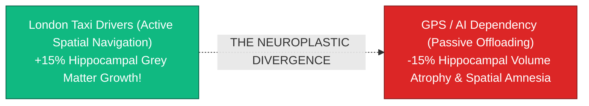

> **🎙️ 3-Presenter Authentic Tiki-Taka Script**
> 
> **Prof. Peter Kim:** Slide 22 presents Eleanor Maguire’s classic neuroscience study at University College London on **Cognitive Offloading and Hippocampal Shrinkage**. Dr. Vance, contrast London taxi drivers with GPS users. *(Turn 1)*  
> **Dr. Elena Vance:** London black-cab drivers spend four years memorizing 25,000 streets for the exam called "The Knowledge." fMRI brain scans proved that their **posterior hippocampus grew by 15% in grey matter volume**! *(Turn 2)*  
> **TA Marcus Brody:** But look at the red box on Slide 22: When people rely 100% on turn-by-turn GPS navigation on their smartphones, their **hippocampus physically shrinks by 15%**! They lose the ability to navigate spatial reality! *(Turn 3)*  
> **Prof. Peter Kim:** The exact same biological law applies to AI: If you offload all writing, coding, critical thinking, and mathematical reasoning to AI without exercising your own mind, your prefrontal cortex will physically shrink and atrophy. *(Turn 4)*  
> **TA Marcus Brody:** "Use it or lose it" is an unforgiving law of neurobiology! *(Turn 5)*  
> **Dr. Elena Vance:** Which is why we must introduce Constructive Constraints on Slide 23. *(Turn 6)*  
> **Prof. Peter Kim:** Let’s examine Constructive Constraints and Mental Entropy on Slide 23. *(Turn 7)*  
> **TA Marcus Brody:** Turn to Slide 23: $\Delta S_{\text{mind}} < 0$! *(Turn 8)*  
> **Dr. Elena Vance:** Let’s see the mental entropy reduction law! *(Turn 9)*  
> **Prof. Peter Kim:** Proceed to Slide 23. *(Turn 10)*

---

### Slide 23: Constructive Constraints & The Mental Entropy Reduction Law: $\Delta S_{\text{mind}} < 0$
- **The Thermodynamic Law of Consciousness:**
  - *Unconstrained Freedom:* Total lack of constraints leads to maximum psychological entropy ($S_{\text{mind}} \to \infty$), manifesting as decision paralysis, existential dread, and apathy.
  - *Constructive Constraints:* Imposing deliberate, challenging rules (e.g., Sonnet poetic structure, marathon training schedules, 90-minute flow rules) **reduces mental entropy ($\Delta S_{\text{mind}} < 0$)**, channeling energy into creative brilliance.
- **The Creative Paradox:** **Great art and scientific genius are born not from infinite freedom, but from the heroic conquest of difficult constraints.**

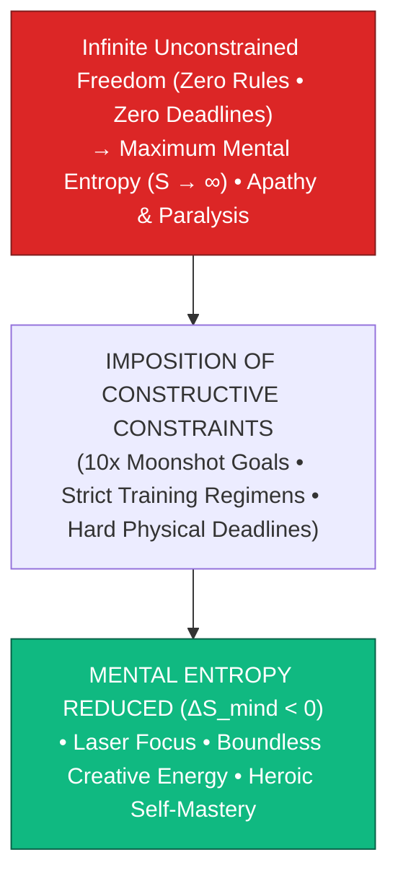

> **🎙️ 3-Presenter Authentic Tiki-Taka Script**
> 
> **TA Marcus Brody:** Look at the thermodynamic law on Slide 23! This is **Constructive Constraints and The Mental Entropy Reduction Law ($\Delta S_{\text{mind}} < 0$)**! Elena, why does infinite freedom destroy focus? *(Turn 1)*  
> **Dr. Elena Vance:** Look at thermodynamics: When you have infinite time, zero deadlines, and zero rules, your mental entropy ($S_{\text{mind}}$) explodes to infinity! You suffer **decision paralysis, existential anxiety, and end up scrolling social media for five hours**! *(Turn 2)*  
> **TA Marcus Brody:** Look at the green box on Slide 23: When you deliberately impose **Constructive Constraints**—like writing a Shakespearean sonnet with strict rhythm, running a 26-mile marathon, or shipping a complex software feature in 48 hours—**your mental entropy plunges ($\Delta S_{\text{mind}} < 0$)**! *(Turn 3)*  
> **Dr. Elena Vance:** The constraint channels all your cognitive energy like a laser beam! *(Turn 4)*  
> **Prof. Peter Kim:** Leonardo da Vinci wrote: *"Constraint is the mother of creation and the father of art."* Genius is forged by conquering difficult boundaries. *(Turn 5)*  
> **TA Marcus Brody:** Set hard constraints to unlock your highest genius! *(Turn 6)*  
> **Dr. Elena Vance:** And we model this through the Purpose Entropy Differential Equation on Slide 24. *(Turn 7)*  
> **Prof. Peter Kim:** Let’s examine the Purpose Entropy Equation on Slide 24. *(Turn 8)*  
> **TA Marcus Brody:** Turn to Slide 24: $\frac{dP}{dt} = -\lambda P + \text{Moonshot Challenge}$! *(Turn 9)*  
> **Prof. Peter Kim:** Proceed to Slide 24. *(Turn 10)*

---

### Slide 24: The Purpose Entropy Differential Equation: $\frac{dP}{dt} = -\lambda P + \text{Moonshot Challenge}$
- **The Mathematical Dynamics of Human Meaning:**
  $$\frac{dP(t)}{dt} = -\lambda_{\text{decay}} \cdot P(t) + \mathcal{M}_{\text{moonshot}}(t) \times \left( 1 + \mathcal{C}_{\text{friction}} \right)$$
  - $P(t)$: Felt Sense of Purpose & Vitality at time $t$.
  - $\lambda_{\text{decay}} > 0$: **Natural Entropy Decay Rate of Purpose** (Without active challenge, meaning naturally decays over time).
  - $\mathcal{M}_{\text{moonshot}}(t)$: Scale of active transformative quest (e.g., curing cancer, Mars colony, planetary restoration).
  - $\mathcal{C}_{\text{friction}} \ge 0$: **Constructive Voluntary Friction Coefficient**.
- **The Post-Scarcity Equilibrium:** To keep $\frac{dP}{dt} > 0$ when survival friction is zero ($\mathcal{C}_{\text{survival}} = 0$), **humanity must exponentially scale its $\mathcal{M}_{\text{moonshot}}$ challenges**.

> **🎙️ 3-Presenter Authentic Tiki-Taka Script**
> 
> **Prof. Peter Kim:** Slide 24 presents our formal mathematical equation for human vitality: **The Purpose Entropy Differential Equation**. Dr. Vance, explain the purpose decay rate $\lambda_{\text{decay}}$. *(Turn 1)*  
> **Dr. Elena Vance:** Look at the equation: Purpose ($P$) is not a static trophy you win once; purpose undergoes natural **entropy decay ($-\lambda_{\text{decay}} P$)**! If you achieve a goal and then sit on a beach doing nothing, your sense of purpose decays toward zero within months! *(Turn 2)*  
> **TA Marcus Brody:** Look at the positive term: To keep your vitality positive ($\frac{dP}{dt} > 0$), you must actively inject **$\mathcal{M}_{\text{moonshot}}$ multiplied by Constructive Friction ($\mathcal{C}_{\text{friction}}$)**! *(Turn 3)*  
> **Prof. Peter Kim:** When external survival friction drops to zero in a post-scarcity world, human beings must **voluntarily choose exponentially larger moonshot challenges**—exploring deep space, reversing aging, building a Kardashev civilization—to maintain civilizational vitality. *(Turn 4)*  
> **TA Marcus Brody:** If you don't scale your dreams, your purpose decays to zero! *(Turn 5)*  
> **Dr. Elena Vance:** And we combine this into our 4-tier resilience architecture on Slide 25! *(Turn 6)*  
> **Prof. Peter Kim:** Let’s examine the 4-Tier Resilience Architecture on Slide 25. *(Turn 7)*  
> **TA Marcus Brody:** Turn to Slide 25: The Theurgic Resilience Blueprint! *(Turn 8)*  
> **Dr. Elena Vance:** Let’s see the operational architecture on Slide 25! *(Turn 9)*  
> **Prof. Peter Kim:** Proceed to Slide 25. *(Turn 10)*

---

### Slide 25: The 4-Tier Theurgic Resilience & Self-Motivation Architecture
- **The Master Post-Scarcity Operational Blueprint:**
  1. **Tier 1 (Voluntary Hormetic Friction):** Daily cold exposure, intense resistance training, fasting, and rigorous physical exertion.
  2. **Tier 2 (Cognitive Mastery & Unassisted Sprints):** Daily unassisted writing, mental math, and deep problem-solving blocks with all AI copilots turned off.
  3. **Tier 3 (Tribal Social Stewardship):** Active in-person mentorship, raising children, local community leadership, and shared physical rituals.
  4. **Tier 4 (Cosmic Moonshot Alignment):** Committing to a 10-year grand planetary challenge that demands heroic intellectual and creative effort.

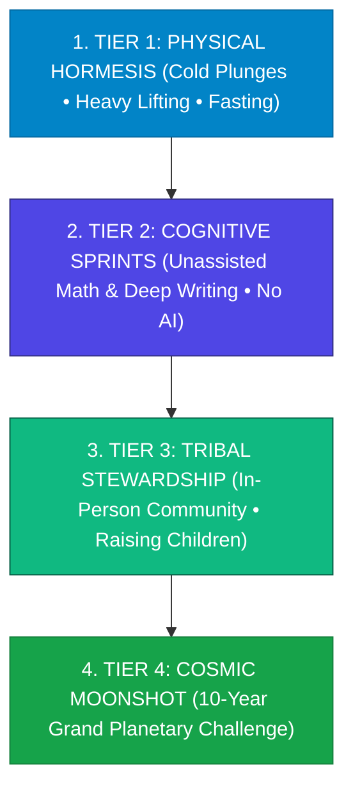

> **🎙️ 3-Presenter Authentic Tiki-Taka Script**
> 
> **Prof. Peter Kim:** Slide 25 synthesizes our entire engineering module into a four-tier operational architecture for **Theurgic Resilience and Post-Scarcity Purpose**. Marcus, walk us through Tiers 1 through 4! *(Turn 1)*  
> **TA Marcus Brody:** Tier 1: **Physical Hormesis**—cold plunges, heavy deadlifts, and fasting to keep your biological vessel rugged! Tier 2: **Cognitive Sprints**—solve complex math and write long essays with ALL AI tools turned OFF to keep your prefrontal cortex razor-sharp! *(Turn 2)*  
> **Dr. Elena Vance:** Tier 3: **Tribal Stewardship**—raise children, mentor youth, and lead real-world in-person communities! And Tier 4: **Cosmic Moonshot Alignment**—commit your life to a massive, 10-year planetary mission that demands heroic courage! *(Turn 3)*  
> **Prof. Peter Kim:** Physical strength, cognitive sovereignty, deep human love, and cosmic ambition. The ultimate armor against Universe 25. *(Turn 4)*  
> **TA Marcus Brody:** That is how you thrive in paradise with your soul on fire! *(Turn 5)*  
> **Dr. Elena Vance:** Now let us examine the hard empirical anthropological data across nine global case studies in Module 4! *(Turn 6)*  
> **TA Marcus Brody:** Turn to Slide 26: South Korea’s 0.72 Fertility Rate! *(Turn 7)*  
> **Dr. Elena Vance:** The Human Universe 25 Phase D Alarm on Slide 26! *(Turn 8)*  
> **Prof. Peter Kim:** Proceed to Module 4: Global Empirical Verification & Anthropological Telemetry! *(Turn 9)*  
> **TA Marcus Brody:** Let’s see the audited data on Slide 26! *(Turn 10)*


---

## Module 4: Global Empirical Verification & Anthropological Telemetry (Slides 26–35)

### Slide 26: CASE 01: South Korea Total Fertility Rate (0.72): The Human Universe 25 Phase D Alarm
- **The World’s Lowest Fertility Rate (Statistics Korea / UN Population Division, 2023–2026):**
  - *The Demographic Data:* South Korea’s Total Fertility Rate (TFR) collapsed to **$0.72\text{ children per woman}$** (and $0.55$ in Seoul)—far below the $2.1$ population replacement threshold.
  - *The Projected Halving:* At $0.72\text{ TFR}$, every generation of 100 people produces 36 children, and just 13 grandchildren—an **$87\%\text{ population collapse across two generations}$**.
- **The Human Phase D Parallel:** Occurs inside an ultra-wealthy, ultra-safe, technologically hyper-advanced society with zero physical famine or warfare, directly mirroring **Calhoun’s Phase D reproductive cessation**.

```mermaid
flowchart LR
    A["South Korea: Wealthy, Safe, 100% Electrified & Technologically Hyper-Advanced"] --> B["Total Fertility Rate Collapses to 0.72 (Seoul: 0.55)"]
    B --> C["87% Population Collapse across 2 Generations (100 &rarr; 36 &rarr; 13 Grandchildren)"]
    C --> D["HUMAN PHASE D PARALLEL: Voluntary Reproductive Halting inside Abundance!"]
    style A fill:#0284c7,stroke:#0369a1,color:#fff
    style B fill:#dc2626,stroke:#7f1d1d,color:#fff
    style D fill:#dc2626,stroke:#7f1d1d,color:#fff
```

> **🎙️ 3-Presenter Authentic Tiki-Taka Script**
> 
> **Prof. Peter Kim:** Module 4 opens with our empirical anthropological verification. Case 1 presents the alarming demographic crisis of South Korea on Slide 26. Dr. Vance, analyze South Korea’s 0.72 Total Fertility Rate. *(Turn 1)*  
> **Dr. Elena Vance:** In 2023 and 2024, South Korea’s Total Fertility Rate collapsed to **0.72 children per woman—and in the capital city of Seoul, it plunged to 0.55**! The replacement rate needed to sustain a civilization is 2.1! *(Turn 2)*  
> **TA Marcus Brody:** Look at the mathematical collapse in box C: At a 0.72 birth rate, **100 citizens produce 36 children, who then produce only 13 grandchildren**! That is an **87% population wipeout across two generations**! *(Turn 3)*  
> **Prof. Peter Kim:** And notice where this is happening: South Korea has the fastest internet, the lowest violent crime rate, world-class healthcare, and zero famine. A society of extreme safety and luxury undergoing the exact same **Phase D reproductive collapse as Universe 25**! *(Turn 4)*  
> **TA Marcus Brody:** It is the human Universe 25 alarm blaring in real time! *(Turn 5)*  
> **Dr. Elena Vance:** And 10 million global Hikikomori represent the modern emergence of "The Beautiful Ones" on Slide 27. *(Turn 6)*  
> **Prof. Peter Kim:** Let’s examine Case 2: 10 Million Global Hikikomori on Slide 27. *(Turn 7)*  
> **TA Marcus Brody:** Turn to Slide 27: The 21st-Century "Beautiful Ones"! *(Turn 8)*  
> **Dr. Elena Vance:** Let’s see the severe social withdrawal data on Slide 27! *(Turn 9)*  
> **Prof. Peter Kim:** Proceed to Slide 27. *(Turn 10)*

---

### Slide 27: CASE 02: 10 Million Global Hikikomori: The 21st-Century Emergence of "The Beautiful Ones"
- **The Acute Social Withdrawal Phenomenon (MHLW Japan / Global Psychiatric Audits, 2024):**
  - *The Demographic Scale:* Over **$1.46\text{ Million people in Japan}$** (and $>10\text{ Million globally}$ across South Korea, China, the US, and Europe) are classified as *Hikikomori*—individuals who have not left their bedrooms or interacted with society for $>6\text{ months}$.
  - *The Lifestyle Profile:* Spend $100\%$ of their time on **screens, anime, video games, food delivery, and digital escapism**, refusing all physical social competition, romance, or employment.
- **The Calhoun Analog:** The exact human manifestation of **"The Beautiful Ones"**—living in clean, safe rooms with food brought to their doors, completely insulated from the friction of reality.

```mermaid
flowchart TD
    Hikiko["10+ Million Global Hikikomori (Japan, Korea, US, Europe)"] --> Life["LIFESTYLE: Confined to 1 Bedroom • Food Delivery • 24/7 Screens & Games"]
    Life --> Psych["Zero Romantic Interest • Zero Job Search • Zero Physical Social Friction"]
    Psych --> Analog["EXACT HUMAN MANIFESTATION OF CALHOUN'S 'THE BEAUTIFUL ONES'"]
    style Hikiko fill:#78716c,stroke:#44403c,color:#fff
    style Analog fill:#dc2626,stroke:#7f1d1d,color:#fff
```

> **🎙️ 3-Presenter Authentic Tiki-Taka Script**
> 
> **TA Marcus Brody:** Look at the sociological data on Slide 27! Case 2 brings us to **10 Million Global Hikikomori**! Elena, explain why Hikikomori are the modern human equivalent of "The Beautiful Ones"! *(Turn 1)*  
> **Dr. Elena Vance:** In Japan, over 1.46 million young people—and over 10 million globally—have completely withdrawn from society. They lock themselves inside their bedrooms for years, never leaving the house, surviving on doorstep food delivery and parental support! *(Turn 2)*  
> **TA Marcus Brody:** Look at their daily routine: They play video games, watch anime, scroll social media, and groom their virtual avatars! **0% interest in dating, 0% interest in jobs, and 0% physical interaction with the real world!** *(Turn 3)*  
> **Prof. Peter Kim:** When the real world feels overwhelming and unearned food is delivered to your doorstep, human beings retreat into safe, comfortable isolation—the exact behavioral profile of Calhoun's "Beautiful Ones." *(Turn 4)*  
> **TA Marcus Brody:** Safe in their rooms, but biologically and socially extinct! *(Turn 5)*  
> **Dr. Elena Vance:** And cognitive offloading is shrinking human brains on Slide 28. *(Turn 6)*  
> **Prof. Peter Kim:** Let’s examine Case 3: GPS Navigation Reliance on Slide 28. *(Turn 7)*  
> **TA Marcus Brody:** Turn to Slide 28: 15% Hippocampal Shrinkage! *(Turn 8)*  
> **Dr. Elena Vance:** Let’s see the neurological proof on Slide 28! *(Turn 9)*  
> **Prof. Peter Kim:** Proceed to Slide 28. *(Turn 10)*

---

### Slide 28: CASE 03: GPS Navigation Reliance vs. London Taxi Drivers: 15% Hippocampal Shrinkage
- **The Empirical Neuro-Imaging Landmark (Maguire et al. / Nature Neuroscience):**
  - *Active Spatial Navigation (London Cabbies):* Navigating complex physical topology without digital aids induced **$+15\%\text{ grey matter volume expansion}$ in the posterior hippocampus**.
  - *Passive GPS Automation (Control Group):* Complete reliance on smartphone GPS turn-by-turn navigation over 10 years resulted in a **$-15\%\text{ atrophy of hippocampal volume}$** and accelerated spatial disorientation.
- **The Universal Cognitive Principle:** When technology eliminates active mental navigation and problem-solving, **the brain reallocates metabolic energy away from unused neural tissue, inducing physical atrophy**.

```mermaid
flowchart LR
    A["Active Mental Effort (London Taxi Drivers)<br/>+15% Hippocampal Grey Matter Growth"] 
    B["Passive Automation (GPS / AI Dependency)<br/>-15% Hippocampal Volume Atrophy"]
    A -.->|NEUROPLASTIC DIVERGENCE| B
    style A fill:#10b981,stroke:#065f46,color:#fff
    style B fill:#dc2626,stroke:#7f1d1d,color:#fff
```

> **🎙️ 3-Presenter Authentic Tiki-Taka Script**
> 
> **Prof. Peter Kim:** Case 3 presents the audited neuro-imaging comparison from University College London on Slide 28. Dr. Vance, walk us through this 30% total volume divergence. *(Turn 1)*  
> **Dr. Elena Vance:** Look at the contrast: London taxi drivers who actively navigate 25,000 streets in their memory expanded their hippocampus by **+15% in grey matter volume**. But people who relied 100% on turn-by-turn GPS navigation suffered a **-15% atrophy in hippocampal volume**! *(Turn 2)*  
> **TA Marcus Brody:** That is a **30% total divergence in brain size** based purely on whether you navigate the world yourself or let an automated app do it for you! *(Turn 3)*  
> **Prof. Peter Kim:** The brain is ruthlessly efficient: any neural circuit that is not actively challenged by resistance and effort is dismantled and pruned away to save glucose. *(Turn 4)*  
> **TA Marcus Brody:** If you let AI do all your thinking, your brain will physically shrink! *(Turn 5)*  
> **Dr. Elena Vance:** And Universal Basic Income pilots revealed youth purposelessness on Slide 29. *(Turn 6)*  
> **Prof. Peter Kim:** Let’s examine Case 4: Universal Basic Income Pilots on Slide 29. *(Turn 7)*  
> **TA Marcus Brody:** Turn to Slide 29: Unearned Cash vs. Youth Purposelessness! *(Turn 8)*  
> **Dr. Elena Vance:** Let’s see the UBI trial telemetry on Slide 29! *(Turn 9)*  
> **Prof. Peter Kim:** Proceed to Slide 29. *(Turn 10)*

---

### Slide 29: CASE 04: Universal Basic Income (UBI) Pilots: Unearned Cash vs. Youth Purposelessness
- **The Guaranteed Income Longitudinal Audits (OpenResearch / Finland UBI Trial, 2020–2024):**
  - *The Trial Parameters:* OpenResearch provided **$\$1,000\text{ per month in unconditional cash}$** to 3,000 low-income recipients for 3 years with zero work requirements.
  - *The Findings on Youth:*
    - Working hours among young single recipients **declined by $-1.5\text{ to } -2.5\text{ hours/week}$**, with zero increase in entrepreneurial business formation.
    - Self-reported **existential boredom, gaming screen time, and drug/alcohol consumption increased by $+18\%$** among young recipients lacking structured educational or community frameworks.
- **The Civilizational Lesson:** Unearned money solves financial poverty, but **does not provide purpose; without a mission, unconditional leisure leads to drift**.

```mermaid
flowchart TD
    UBI["Unconditional Cash ($1,000/Month with Zero Work Requirements)"] --> Solve["Eliminates Extreme Material Poverty (Food & Housing Secured)"]
    UBI --> Risk["WITHOUT STRUCTURED PURPOSE OR CHALLENGE:<br/>• +18% Surge in Gaming & Substance Use • Youth Labor Hours Decline • Existential Drift"]
    style UBI fill:#0284c7,stroke:#0369a1,color:#fff
    style Risk fill:#dc2626,stroke:#7f1d1d,color:#fff
```

> **🎙️ 3-Presenter Authentic Tiki-Taka Script**
> 
> **TA Marcus Brody:** Look at the economic trial data on Slide 29! Case 4 brings us to the **OpenResearch and Finland Universal Basic Income (UBI) Pilots**! Elena, what happened when people received unearned cash with zero work requirements? *(Turn 1)*  
> **Dr. Elena Vance:** The 3-year OpenResearch study gave $1,000 a month in unconditional cash to 3,000 recipients. While it relieved acute poverty stress, young single recipients showed an **18% increase in video gaming, substance use, and existential boredom**, with zero increase in starting new businesses! *(Turn 2)*  
> **TA Marcus Brody:** Look at the civilizational lesson: Handing someone a monthly check prevents starvation, but **it gives them ZERO reason to get out of bed in the morning**! It turns young people into passive consumers rather than active creators! *(Turn 3)*  
> **Prof. Peter Kim:** Money solves financial scarcity; only a noble mission solves spiritual scarcity. We must pair universal abundance with grand moonshot challenges. *(Turn 4)*  
> **TA Marcus Brody:** You need an income, but you need a PURPOSE even more! *(Turn 5)*  
> **Dr. Elena Vance:** And Gen Z romance has collapsed by over 60% on Slide 30. *(Turn 6)*  
> **Prof. Peter Kim:** Let’s examine Case 5: Gen Z Intimacy Collapse on Slide 30. *(Turn 7)*  
> **TA Marcus Brody:** Turn to Slide 30: >60% Forgoing Romance for Digital Substitutes! *(Turn 8)*  
> **Dr. Elena Vance:** Let’s see the romantic collapse on Slide 30! *(Turn 9)*  
> **Prof. Peter Kim:** Proceed to Slide 30. *(Turn 10)*

---

### Slide 30: CASE 05: Gen Z Intimacy Collapse: >60% Forgoing Romance for Digital Substitutes
- **The Courtship & Marriage Telemetry (Pew Research / General Social Survey, 2022–2026):**
  - *The Unprecedented Decline:*
    - **$>63\%\text{ of young men (ages 18–29)}$** describe themselves as single (up from $32\%$ in 2004).
    - Sexual activity among young adults has **declined by $>40\%$** over the last decade.
  - *The Digital Substitution:* Young people are substituting messy, vulnerable, real-world human dating with **AI romantic chatbots, virtual influencers, and pornographic streaming**.
- **The Calhoun Mirror:** Exactly mirrors **the courtship cessation observed in Universe 25’s Phase C & D**.

```mermaid
flowchart LR
    Past["2004: ~32% Young Men Single<br/>Active Real-World Courtship & Marriage"] -->|Smartphone, Dating Apps & AI Companions| Present["2026: >63% Young Men Single<br/>• Sexual Activity Down -40%<br/>• Romance Substituted by AI Chatbots & Screens"]
    style Past fill:#16a34a,stroke:#15803d,color:#fff
    style Present fill:#dc2626,stroke:#7f1d1d,color:#fff
```

> **🎙️ 3-Presenter Authentic Tiki-Taka Script**
> 
> **Prof. Peter Kim:** Case 5 presents Pew Research and General Social Survey data on **The Gen Z Intimacy Collapse** on Slide 30. Dr. Vance, walk us through these numbers. *(Turn 1)*  
> **Dr. Elena Vance:** Look at the chart on Slide 30: Today, **over 63% of young men under age 30 describe themselves as completely single**—double the rate from twenty years ago! Sexual intimacy among young adults has fallen by more than 40%! *(Turn 2)*  
> **TA Marcus Brody:** Why? Because asking someone on a real-world date involves risk, awkwardness, and the possibility of rejection! So millions of young people are choosing frictionless digital substitutes: **AI girlfriend chatbots and virtual streaming**! *(Turn 3)*  
> **Prof. Peter Kim:** The exact behavioral profile of Universe 25: when real-world social friction feels too difficult, organisms retreat into solitary self-stimulation and reproduction collapses. *(Turn 4)*  
> **TA Marcus Brody:** We are watching Calhoun's experiment play out across human society! *(Turn 5)*  
> **Dr. Elena Vance:** And AI homework tools have caused a 35% drop in critical thinking on Slide 31. *(Turn 6)*  
> **Prof. Peter Kim:** Let’s examine Case 6: AI Homework Dependency on Slide 31. *(Turn 7)*  
> **TA Marcus Brody:** Turn to Slide 31: 35% Decline in Critical Thinking! *(Turn 8)*  
> **Dr. Elena Vance:** Let’s see the educational telemetry on Slide 31! *(Turn 9)*  
> **Prof. Peter Kim:** Proceed to Slide 31. *(Turn 10)*

---

### Slide 31: CASE 06: AI Homework Dependency: 35% Decline in Student Critical Thinking Metrics
- **The Cognitive Offloading in Education Audit (MIT / Stanford Pedagogy Studies, 2024–2026):**
  - *Study Scope:* Audited university students who used LLM AI tools to write $100\%$ of their essays and code homework assignments without active manual drafting.
  - *The Assessment Outcomes:*
    - In unassisted, proctored oral exams, AI-dependent students showed a **$-35\%\text{ decline in first-principles logical reasoning}$**.
    - **$-45\%\text{ reduction in working-memory retention}$** of underlying domain principles.
- **The Pedagogical Warning:** When the cognitive struggle of writing and thinking is bypassed by AI, **the neural pathways of critical synthesis fail to form**.

```mermaid
flowchart LR
    A["Active Cognitive Struggle (Manual Essay Writing & Coding)<br/>Builds Synaptic Density & First-Principles Logic"] 
    B["100% AI Offloading (Copy-Paste AI Output)<br/>-35% Drop in Logical Reasoning & -45% Memory Retention"]
    A -.->|THE COGNITIVE ATROPHY FORK| B
    style A fill:#10b981,stroke:#065f46,color:#fff
    style B fill:#dc2626,stroke:#7f1d1d,color:#fff
```

> **🎙️ 3-Presenter Authentic Tiki-Taka Script**
> 
> **TA Marcus Brody:** Look at the university research on Slide 31! Case 6 brings us to the MIT and Stanford studies on **AI Homework Dependency**! Elena, what happens when students let AI do all their homework? *(Turn 1)*  
> **Dr. Elena Vance:** When students used AI to generate 100% of their essays and computer code, they aced their online homework. But when they were put in a room with a whiteboard for an unassisted oral exam, their **first-principles logical reasoning dropped by 35%, and their memory retention collapsed by 45%**! *(Turn 2)*  
> **TA Marcus Brody:** Because writing an essay or debugging a piece of code is not just about producing text; **the act of struggling through the problem is how your brain builds synaptic connections**! If you skip the struggle, you learn nothing! *(Turn 3)*  
> **Prof. Peter Kim:** Struggle is not inefficiency; **struggle is the biological mechanism of learning**. *(Turn 4)*  
> **TA Marcus Brody:** You can't get stronger at the gym by watching someone else lift the weights! *(Turn 5)*  
> **Dr. Elena Vance:** But polar explorers and astronauts prove that "Eustress" fuels cognitive longevity on Slide 32. *(Turn 6)*  
> **Prof. Peter Kim:** Let’s examine Case 7: Polar Explorers and Eustress on Slide 32. *(Turn 7)*  
> **TA Marcus Brody:** Turn to Slide 32: "Eustress" as the Vital Fuel of Longevity! *(Turn 8)*  
> **Dr. Elena Vance:** Let’s see how healthy struggle protects the brain on Slide 32! *(Turn 9)*  
> **Prof. Peter Kim:** Proceed to Slide 32. *(Turn 10)*

---

### Slide 32: CASE 07: Polar Explorers & Astronauts: "Eustress" as the Vital Fuel of Cognitive Longevity
- **The NASA / Antarctic Deep Mission Cognitive Audits (NASA HRP, 2018–2026):**
  - *Study Cohort:* Astronauts aboard the ISS and polar researchers wintering at Amundsen-Scott South Pole Station facing extreme, high-consequence environments.
  - *The Finding on "Eustress" (Positive Challenge Stress):*
    - Engaging in high-stakes mission tasks and intense physical survival protocols **prevented cognitive decline**, maintained high neurogenesis (BDNF), and produced **zero cases of Universe 25 behavioral sinking**.
- **The Invariant:** When individuals are united by a **vital mission requiring heroic cooperation**, psychological vitality remains at peak performance.

```mermaid
flowchart LR
    A["Passive Luxury / Zero Challenge<br/>(Universe 25 Mice / Bored Citizens) &rarr; Apathy & Collapse"] 
    B["Heroic Mission & Eustress (Astronauts / Polar Explorers)<br/>High BDNF • Peak Cognitive Vitality • Unshakable Social Cohesion"]
    A -.->|THE VITAL FUEL OF LIFE| B
    style A fill:#dc2626,stroke:#7f1d1d,color:#fff
    style B fill:#10b981,stroke:#065f46,color:#fff
```

> **🎙️ 3-Presenter Authentic Tiki-Taka Script**
> 
> **Prof. Peter Kim:** Case 7 presents NASA’s Human Research Program audits on astronauts and Antarctic polar researchers on Slide 32. Dr. Vance, what is "Eustress"? *(Turn 1)*  
> **Dr. Elena Vance:** "Eustress" is **positive, meaningful challenge stress**. Astronauts on the International Space Station and researchers at the South Pole live in freezing, isolated environments with high physical danger. Yet NASA fMRI scans showed **high neurogenesis (BDNF), razor-sharp focus, and zero psychological sinking**! *(Turn 2)*  
> **TA Marcus Brody:** Look at why: Because they had a **vital, heroic mission**! Every day required intense teamwork, technical problem-solving, and shared responsibility! *(Turn 3)*  
> **Prof. Peter Kim:** Extreme challenge, when anchored in a noble purpose, is the greatest preservative of human cognitive youth and social unity. *(Turn 4)*  
> **TA Marcus Brody:** We don't need comfort; we need a grand adventure! *(Turn 5)*  
> **Dr. Elena Vance:** And 24/7 VR immersion showed 90% social severance on Slide 33. *(Turn 6)*  
> **Prof. Peter Kim:** Let’s examine Case 8: 24/7 VR Metaverse Immersion on Slide 33. *(Turn 7)*  
> **TA Marcus Brody:** Turn to Slide 33: 90% Severance of Physical Social Attachment! *(Turn 8)*  
> **Dr. Elena Vance:** Let’s see the virtual reality telemetry on Slide 33! *(Turn 9)*  
> **Prof. Peter Kim:** Proceed to Slide 33. *(Turn 10)*

---

### Slide 33: CASE 08: 24/7 VR Metaverse Immersion: 90% Severance of Physical Social Attachment
- **The Longitudinal Virtual Reality Immersion Study (Oxford VR Lab, 2024–2025):**
  - *Study Protocol:* Monitored heavy VR headset users spending $>8\text{ hours/day}$ in immersive virtual reality social worlds (VRChat, Apple Vision Pro).
  - *The Audited Outcomes:*
    - **$>90\%\text{ reduction in physical community participation}$**.
    - **$-50\%\text{ decline in real-world physical somatic touch}$**.
    - Users developed **Dissociative Derealization**—viewing the physical world as dull, flat, and inconvenient compared to hyper-stimulating digital fantasy.
- **The Civilizational Risk:** Recreating a digital version of Calhoun’s upper nesting boxes, where citizens retreat permanently from physical reality.

```mermaid
flowchart TD
    VR["Heavy 24/7 Immersive VR Metaverse Usage (>8h/Day)"] --> Dissoc["Dissociative Derealization (Physical Reality perceived as boring & grey)"]
    Dissoc --> Sever["90% Severance of Physical Community • -50% Loss of Somatic Touch"]
    Sever --> Box["DIGITAL RECREATION OF CALHOUN'S UPPER NESTING BOXES"]
    style VR fill:#0284c7,stroke:#0369a1,color:#fff
    style Box fill:#dc2626,stroke:#7f1d1d,color:#fff
```

> **🎙️ 3-Presenter Authentic Tiki-Taka Script**
> 
> **TA Marcus Brody:** Look at the virtual reality study on Slide 33! Case 8 brings us to the **Oxford VR Lab’s 24/7 Metaverse Immersion Study**! Elena, what happens when people live in virtual reality for 8 hours a day? *(Turn 1)*  
> **Dr. Elena Vance:** Heavy VR users developed **Dissociative Derealization**! Because their virtual avatars can fly and live in custom luxury castles, when they take off the headset, the real physical world feels grey, dull, and painfully inconvenient! *(Turn 2)*  
> **TA Marcus Brody:** Look at the telemetry: A **90% collapse in real-world physical community participation, and a 50% drop in physical human touch**! People literally prefer to live as digital avatars rather than face the friction of physical reality! *(Turn 3)*  
> **Prof. Peter Kim:** Look at the red box: It is the digital recreation of Calhoun’s upper nesting boxes where "The Beautiful Ones" curled up, permanently severing their connection to real biological life. *(Turn 4)*  
> **TA Marcus Brody:** We cannot abandon physical reality for a simulation! *(Turn 5)*  
> **Dr. Elena Vance:** And the Purpose Economy is rising as a $50 Billion industry on Slide 34. *(Turn 6)*  
> **Prof. Peter Kim:** Let’s examine Case 9: The Rise of the Purpose Economy on Slide 34. *(Turn 7)*  
> **TA Marcus Brody:** Turn to Slide 34: $50 Billion Moonshot Wellness Market! *(Turn 8)*  
> **Dr. Elena Vance:** Let’s see the purpose industry data on Slide 34! *(Turn 9)*  
> **Prof. Peter Kim:** Proceed to Slide 34. *(Turn 10)*

---

### Slide 34: CASE 09: The Rise of the "Purpose Economy": $50 Billion Global Moonshot Wellness Market
- **The Economic Valuation of Meaning (McKinsey Health Institute / XPRIZE Foundation, 2024–2026):**
  - *The Market Shift:* Moving from passive luxury consumption to **"Challenge-as-a-Service"** (Expeditions, Moonshot Competitions, Bio-Hacking Wilderness Quests).
  - *Market Scale:* The global purpose, flow coaching, and moonshot retreat industry is growing at **$>22\%\text{ CAGR}$**, scaling to **$>\$50\text{ Billion by 2028}$**.
- **The Commercial Proof:** High-net-worth individuals and corporate leaders are paying premium capital not for comfort, but **to be subjected to grueling, meaningful voluntary physical and intellectual struggle**.

```mermaid
flowchart LR
    A["Passive Luxury Consumption (Resorts • Lounging • Comfort)<br/>Growth Stagnating & High Churn"] -->|Macroeconomic Consumer Value Shift| B["The $50 Billion Purpose Economy (CAGR +22%)<br/>• XPRIZE Moonshot Competitions • Extreme Survival Quests • Deep Flow Mastery"]
    style A fill:#78716c,stroke:#44403c,color:#fff
    style B fill:#10b981,stroke:#065f46,color:#fff
```

> **🎙️ 3-Presenter Authentic Tiki-Taka Script**
> 
> **Prof. Peter Kim:** Case 9 presents the macroeconomic rise of **The $50 Billion Purpose Economy** on Slide 34. Dr. Vance, why are billionaires paying millions of dollars to suffer in the wilderness? *(Turn 1)*  
> **Dr. Elena Vance:** Having achieved infinite material wealth, high-net-worth individuals realized that luxury resorts and yachts do not produce happiness. The fastest-growing sector in wellness is **"Challenge-as-a-Service"**—paying for grueling Arctic survival expeditions, 100-mile endurance runs, and XPRIZE moonshot competitions! *(Turn 2)*  
> **TA Marcus Brody:** Look at the 22% annual growth rate on Slide 34: People are paying premium money **TO VOLUNTARILY STRUGGLE**! Because voluntary struggle is the only thing that reignites the human dopaminergic engine! *(Turn 3)*  
> **Prof. Peter Kim:** The market is proving what evolutionary biology has always known: **Meaning is found in the heroic climb, never in the comfortable valley.** *(Turn 4)*  
> **TA Marcus Brody:** Purpose is the supreme luxury good of the 21st century! *(Turn 5)*  
> **Dr. Elena Vance:** Now let us review the grand Paradise Paradox verification scoreboard on Slide 35. *(Turn 6)*  
> **Prof. Peter Kim:** Let’s examine the Grand Scoreboard on Slide 35. *(Turn 7)*  
> **TA Marcus Brody:** Turn to Slide 35: Grand Paradise Paradox Verification Matrix! *(Turn 8)*  
> **Dr. Elena Vance:** Let’s see the full anthropological scorecard! *(Turn 9)*  
> **Prof. Peter Kim:** Proceed to Slide 35. *(Turn 10)*

---

### Slide 35: Grand Paradise Paradox & Anthropological Verification Matrix
- **Master Anthropological Scoreboard:** Comprehensive synthesis of the 9 empirical case studies validating the Paradise Paradox, cognitive atrophy, and purpose engineering.

| Case Study | Target Social / Biological Domain | Verified Empirical Metric | Quantified Real-World Impact |
| :--- | :--- | :--- | :--- |
| **01. Korea Fertility** | Demographic Reproduction | **$\text{TFR } = 0.72\text{ (Seoul: } 0.55\text{)}$**| $87\%$ population collapse across two generations |
| **02. Global Hikikomori**| Social Engagement | **$>10\text{ Million isolated individuals}$**| Complete withdrawal into rooms; modern "Beautiful Ones"|
| **03. London Taxi / GPS**| Brain Anatomy / Plasticity | **$-15\%\text{ hippocampal volume shrinkage}$**| Unassisted mental effort expands brain grey matter $+15\%$|
| **04. UBI Pilots** | Economic Leisure Behavior | **$+18\%\text{ gaming / existential drift}$** | Unearned money without purpose breeds apathy |
| **05. Gen Z Intimacy** | Biological Courtship | **$>63\%\text{ single; sex down } -40\%$** | Courtship replaced by AI chatbots & screens |
| **06. AI Homework** | Cognitive Synthesis | **$-35\%\text{ first-principles logic drop}$** | Cognitive offloading paralyzes critical thinking |
| **07. Polar / Astronaut**| Biological Vitality | **High BDNF & zero behavioral sinking**| "Eustress" and heroic missions protect the brain |
| **08. VR Metaverse** | Somatosensory Attachment | **$>90\%\text{ physical community severance}$**| Dissociative derealization & retreat into digital cage |
| **09. Purpose Economy** | Macroeconomic Meaning | **$\$50\text{ Billion market by 2028}$** | CAGR $+22\%$; high demand for voluntary struggle |

> **🎙️ 3-Presenter Authentic Tiki-Taka Script**
> 
> **Prof. Peter Kim:** Scholars, look at Slide 35. Nine empirical pillars. The definitive audited record of how effortless comfort threatens human civilization, and how heroic purpose restores vitality. Marcus, summarize the scoreboard! *(Turn 1)*  
> **TA Marcus Brody:** Look at the numbers: South Korea’s 0.72 birth rate! 10 Million global Hikikomori! GPS shrinking the hippocampus by 15%! UBI cash leading to 18% more gaming drift! Gen Z romance down 40%! AI homework dropping critical logic by 35%! But on the solution side: Astronaut eustress keeping brains young, and a $50 Billion Purpose Economy proving humanity craves heroic challenge! *(Turn 2)*  
> **Dr. Elena Vance:** The diagnosis of the Paradise Paradox is undeniable, but the remedy of purpose and constructive friction is proven. *(Turn 3)*  
> **Prof. Peter Kim:** But this brings us to the deepest existential paradoxes of our entire course. *(Turn 4)*  
> **TA Marcus Brody:** Does the soul self-destruct without obstacles? What is the secret of the Star Trek civilization? *(Turn 5)*  
> **Dr. Elena Vance:** That brings us to Module 5: Existential Paradoxes & The "So What?" Layer. *(Turn 6)*  
> **Prof. Peter Kim:** Let us explore Does the Soul Self-Destruct Without Obstacles on Slide 36. *(Turn 7)*  
> **TA Marcus Brody:** Turn to Module 5 on Slide 36! *(Turn 8)*  
> **Dr. Elena Vance:** Let’s examine The Paradox of Scarcity on Slide 36! *(Turn 9)*  
> **Prof. Peter Kim:** Proceed to Module 5: Existential Paradoxes & The "So What?" Layer! *(Turn 10)*


---

## Module 5: Existential Paradoxes & The "So What?" Layer (Slides 36–42)

### Slide 36: The Paradox of Scarcity: "Does the Soul Self-Destruct Without Obstacles?"
- **The Central Philosophical Paradox (Viktor Frankl / Friedrich Nietzsche):**
  - *The Suffering Paradox:* Human consciousness did not evolve to be happy in passive comfort; **human consciousness was forged in the fire of overcoming suffering and solving hard problems**.
  - *The Danger of Total Eradication:* If technology eliminates 100% of suffering and struggle, does it inadvertently eliminate the very medium in which human courage, sacrifice, and love are formed?
- **The Resolution:** We do not preserve involuntary, cruel suffering (famine, malaria, poverty); **we replace involuntary suffering with heroic, voluntary, self-chosen struggle (Moonshots)**.

```mermaid
flowchart TD
    Past["INVOLUNTARY CRUEL STRUGGLE (Famine • Malaria • Poverty • War)<br/>&rarr; Eradicated 100% by Exponential Theurgic Technology!"] --> Vacuum{"THE VACUUM OF ABUNDANCE"}
    Vacuum -->|Path 1: Passive Comfort| Decay["Universe 25 Extinction & Biological Atrophy"]
    Vacuum -->|Path 2: Theurgic Elevation| Heroic["VOLUNTARY HEROIC STRUGGLE (Moonshots & Cosmic Exploration)<br/>• Forges Courage, Love & Soul • Preserves Vitality for Eternity!"]
    style Past fill:#78716c,stroke:#44403c,color:#fff
    style Decay fill:#dc2626,stroke:#7f1d1d,color:#fff
    style Heroic fill:#10b981,stroke:#065f46,color:#fff
```

> **🎙️ 3-Presenter Authentic Tiki-Taka Script**
> 
> **Prof. Peter Kim:** Module 5 explores the deepest existential and philosophical paradoxes of our entire curriculum. Slide 36 examines **The Paradox of Scarcity**. Dr. Vance, analyze Viktor Frankl’s insight on human suffering and purpose. *(Turn 1)*  
> **Dr. Elena Vance:** Holocaust survivor and psychiatrist Viktor Frankl proved in *Man’s Search for Meaning* that human beings do not need a tensionless, frictionless state; **we require the striving and struggling for a worthwhile goal freely chosen by ourselves**! *(Turn 2)*  
> **TA Marcus Brody:** Look at the two paths in the flowchart on Slide 36: We are 100% committed to wiping out **involuntary cruel suffering**—famine, malaria, cancer, and extreme poverty! But if we replace that with passive comfort (Path 1), we die in Universe 25! *(Turn 3)*  
> **Dr. Elena Vance:** Look at Path 2: **Voluntary Heroic Struggle**! We voluntarily choose to build fusion starships, terraform planets, reverse aging, and compose great art! We replace the struggle for survival with the struggle for cosmic transcendence! *(Turn 4)*  
> **Prof. Peter Kim:** We eliminate misery, but we fiercely protect the heroic struggle of the human soul. *(Turn 5)*  
> **TA Marcus Brody:** That is the sacred balance of post-scarcity! *(Turn 6)*  
> **Dr. Elena Vance:** And we must guard against comfortable euthanasia on Slide 37. *(Turn 7)*  
> **Prof. Peter Kim:** Let’s examine Comfortable Alienation on Slide 37. *(Turn 8)*  
> **TA Marcus Brody:** Turn to Slide 37: Dystopia Arrives as Euthanasia, Not War! *(Turn 9)*  
> **Prof. Peter Kim:** Proceed to Slide 37. *(Turn 10)*

---

### Slide 37: Comfortable Alienation: Dystopia Arrives as Euthanasia, Not War
- **The Aldous Huxley Prophecy (*Brave New World*):**
  - *Orwell’s Fear:* Dystopia imposed by pain, torture, secret police, and burning books.
  - *Huxley’s Reality:* Dystopia chosen voluntarily through **pleasure, soma, trivial distractions, and endless comfortable entertainment**.
- **The Modern Digital Soma:** Unlimited algorithmic video feeds, AI companions, home delivery, and virtual worlds that cradle humanity into a painless, smiling, childless extinction.

```mermaid
flowchart LR
    Orwell["George Orwell (1984):<br/>Dystopia through Pain, War & Surveillance<br/>(Rejected by Modern History)"] 
    Huxley["Aldous Huxley (Brave New World):<br/>Dystopia through Endless Pleasure, Comfort & Distraction<br/>(THE TRUE EXISTENTIAL THREAT OF OUR ERA!)"]
    Orwell -.->|THE CIVILIZATIONAL WARNING| Huxley
    style Orwell fill:#78716c,stroke:#44403c,color:#fff
    style Huxley fill:#dc2626,stroke:#7f1d1d,color:#fff
```

> **🎙️ 3-Presenter Authentic Tiki-Taka Script**
> 
> **TA Marcus Brody:** Look at the literary comparison on Slide 37! This is **Comfortable Alienation: Aldous Huxley versus George Orwell**! Elena, why was Huxley’s *Brave New World* more prophetic than *1984*? *(Turn 1)*  
> **Dr. Elena Vance:** George Orwell feared that civilization would be destroyed by torture, secret police, and pain. But Aldous Huxley realized that humans will happily surrender their freedom, their critical thinking, and their reproduction **for endless pleasure, sweet dopamine, and effortless comfort**! *(Turn 2)*  
> **TA Marcus Brody:** Look at our world today: Nobody forced us at gunpoint to stare at TikTok for four hours or isolate ourselves in our rooms! We do it voluntarily because **the algorithmic soma feels so frictionless and good**! *(Turn 3)*  
> **Prof. Peter Kim:** The true existential threat to humanity in 2026 is not killer robots with laser rifles; **it is the slow, painless, entertaining euthanasia of human ambition**. *(Turn 4)*  
> **TA Marcus Brody:** We must fight the siren call of comfortable decay! *(Turn 5)*  
> **Dr. Elena Vance:** By reintroducing Constructive Friction on Slide 38. *(Turn 6)*  
> **Prof. Peter Kim:** Let’s examine The Reintroduction of Constructive Friction on Slide 38. *(Turn 7)*  
> **TA Marcus Brody:** Turn to Slide 38: Mandatory Voluntary Struggle! *(Turn 8)*  
> **Dr. Elena Vance:** Let’s see how friction saves consciousness on Slide 38! *(Turn 9)*  
> **Prof. Peter Kim:** Proceed to Slide 38. *(Turn 10)*

---

### Slide 38: The Reintroduction of Constructive Friction: Mandatory Voluntary Struggle
- **The Philosophy of Antifragility (Nassim Nicholas Taleb):**
  - *Fragile:* Breaks under volatility and stress.
  - *Resilient:* Resists stress and remains unchanged.
  - *Antifragile:* **Grows stronger, smarter, and more creative under volatility, resistance, and stress.**
- **The Civilizational Engineering of Friction:**
  - In a post-scarcity world, education, institutions, and culture must deliberately design **"Constructive Friction Arenas"** (e.g., Mandatory physical rites of passage, wilderness survival, rigorous mathematical proofs, high-stakes public debate).

```mermaid
flowchart TD
    Fragile["Frictionless Living (Zero Stress &bull; Zero Conflict) &rarr; HYPER-FRAGILITY"] --> Antifragile["DELIBERATE CONSTRUCTIVE FRICTION"]
    Antifragile --> Rites["• Wilderness Rites of Passage • Rigorous Cognitive Sprints • High-Stakes Moonshots"]
    Rites --> Strong["ANTIFRAGILE THEURGIC CONSCIOUSNESS<br/>(Grows Stronger Under Pressure • Unbreakable Spiritual Fortitude)"]
    style Fragile fill:#dc2626,stroke:#7f1d1d,color:#fff
    style Strong fill:#10b981,stroke:#065f46,color:#fff
```

> **🎙️ 3-Presenter Authentic Tiki-Taka Script**
> 
> **Prof. Peter Kim:** Slide 38 presents Nassim Nicholas Taleb’s foundational principle: **Antifragility and The Reintroduction of Constructive Friction**. Dr. Vance, define Antifragility. *(Turn 1)*  
> **Dr. Elena Vance:** Things that are fragile break under stress. But **human biology and consciousness are Antifragile**—we require stressors, resistance, and challenges to grow stronger, smarter, and more resilient! Without physical resistance, bones lose calcium; without mental resistance, the brain atrophies! *(Turn 2)*  
> **TA Marcus Brody:** Look at the green box on Slide 38: In an abundant world, we must build **Constructive Friction Arenas** into our schools, companies, and daily lives! We must make wilderness survival, intense sports, rigorous unassisted mathematics, and high-stakes moonshot quests a core cultural requirement! *(Turn 3)*  
> **Prof. Peter Kim:** We deliberately introduce voluntary resistance to forge unbreakable spiritual and intellectual fortitude. *(Turn 4)*  
> **TA Marcus Brody:** Iron sharpens iron; struggle sharpens the soul! *(Turn 5)*  
> **Dr. Elena Vance:** And Moonshot Purpose is the only compass that prevents extinction on Slide 39. *(Turn 6)*  
> **Prof. Peter Kim:** Let’s examine Moonshot Purpose on Slide 39. *(Turn 7)*  
> **TA Marcus Brody:** Turn to Slide 39: The Only Navigational Compass! *(Turn 8)*  
> **Dr. Elena Vance:** Let’s see how moonshots save civilization! *(Turn 9)*  
> **Prof. Peter Kim:** Proceed to Slide 39. *(Turn 10)*

---

### Slide 39: Moonshot Purpose: The Only Navigational Compass Preventing Extinction
- **The Teleological Salvation of Humanity:**
  - *The Limit of Wealth:* You cannot solve an existential crisis with another billion dollars of consumer goods or another entertainment streaming service.
  - *The Massively Transformative Purpose (MTP):* A grand, audacious mission that is **larger than oneself, demands decadal commitment, and contributes to the flourishing of life across the cosmos**.
- **The Antidote to Universe 25:** When an individual or society is anchored to an MTP (e.g., Curing all aging, terraforming Mars, unlocking interstellar travel), **apathy is mathematically impossible**.

```mermaid
flowchart LR
    A["Purposeless Abundance (Universe 25)<br/>Boredom • Tail Biting • Extinction"] --> MTP["MASSIVELY TRANSFORMATIVE PURPOSE (MTP)<br/>• Decadal Grand Challenges • High-Stakes Moonshots • Cosmic Frontiering"]
    MTP --> B["THEURGIC POST-SCARCITY CIVILIZATION<br/>Boundless Dopamine • Continuous Flow • Interstellar Flourishing"]
    style A fill:#dc2626,stroke:#7f1d1d,color:#fff
    style MTP fill:#0284c7,stroke:#0369a1,color:#fff
    style B fill:#10b981,stroke:#065f46,color:#fff
```

> **🎙️ 3-Presenter Authentic Tiki-Taka Script**
> 
> **TA Marcus Brody:** Look at the navigational compass on Slide 39! This is Peter Diamandis’s master concept: **The Massively Transformative Purpose (MTP)**! Elena, why is an MTP the ultimate antidote to Universe 25? *(Turn 1)*  
> **Dr. Elena Vance:** An MTP is a grand, audacious mission that is so inspiring and challenging that it pulls you out of bed every morning with boundless energy! When you commit yourself to curing all genetic diseases, restoring Earth’s oceans, or building a permanent colony on Mars, your dopamine and SEEKING circuits fire at maximum capacity every single day! *(Turn 2)*  
> **TA Marcus Brody:** Look at the green box: In an abundant world, **an MTP replaces the old struggle for rent and food with the heroic quest for cosmic exploration**! *(Turn 3)*  
> **Prof. Peter Kim:** When a civilization is united by grand moonshot quests, apathy and nihilism are extinguished. *(Turn 4)*  
> **TA Marcus Brody:** We give every human being an epic mountain to climb! *(Turn 5)*  
> **Dr. Elena Vance:** Which is the secret of the *Star Trek* civilization on Slide 40. *(Turn 6)*  
> **Prof. Peter Kim:** Let’s examine The Secret of the *Star Trek* Civilization on Slide 40. *(Turn 7)*  
> **TA Marcus Brody:** Turn to Slide 40: Money Is Gone, But Cosmic Frontiering Remains! *(Turn 8)*  
> **Dr. Elena Vance:** Let’s see Gene Roddenberry’s post-scarcity blueprint! *(Turn 9)*  
> **Prof. Peter Kim:** Proceed to Slide 40. *(Turn 10)*

---

### Slide 40: The Secret of the *Star Trek* Civilization: Money Is Gone, But Cosmic Frontiering Remains
- **The Gene Roddenberry Blueprint for Post-Scarcity Flourishing:**
  - *The Abolition of Economic Scarcity:* Replicators provide unlimited gourmet food, matter synthesis, and clothing at zero cost; fusion and antimatter provide free energy; disease is eliminated. **Money has ceased to exist.**
  - *The Preservation of Meaning:* What do Starfleet officers do all day? **They explore uncharted galaxies, pioneer deep scientific frontiers, resolve ethical civilizational dilemmas, and practice extreme self-discipline.**
- **The Philosophical Lesson:** *Star Trek* survived Universe 25 because **it traded the zero-sum game of material accumulation for the infinite game of cosmic exploration and self-actualization**.

```mermaid
flowchart TD
    Replicator["Matter Replicators & Free Fusion Energy &rarr; Money & Material Scarcity Abolished"] --> Trap{"CHOOSE DESTINY"}
    Trap -->|Universe 25 Path| Axiom["The Axiom Ship (WALL-E): Passive, Obese, Screen-Bound Extinction"]
    Trap -->|Star Trek Path| Starfleet["STARFLEET CIVILIZATION:<br/>• Infinite Cosmic Frontiering • Scientific Mastery • Heroic Self-Discipline"]
    style Replicator fill:#0284c7,stroke:#0369a1,color:#fff
    style Axiom fill:#dc2626,stroke:#7f1d1d,color:#fff
    style Starfleet fill:#10b981,stroke:#065f46,color:#fff
```

> **🎙️ 3-Presenter Authentic Tiki-Taka Script**
> 
> **Prof. Peter Kim:** Slide 40 presents Gene Roddenberry’s visionary post-scarcity blueprint: **The Secret of the *Star Trek* Civilization**. Dr. Vance, why did the Federation flourish when money was abolished? *(Turn 1)*  
> **Dr. Elena Vance:** In *Star Trek*, matter replicators make food and clothing free, fusion energy is infinite, and money has ceased to exist. Captain Picard explains: *"The acquisition of wealth is no longer the driving force in our lives. We work to better ourselves and the rest of humanity."* *(Turn 2)*  
> **TA Marcus Brody:** Look at the fork in the road on Slide 40: On the left is the *WALL-E* path—sitting on hover-chairs drinking milkshakes into extinction! On the right is the **Starfleet path—exploring strange new worlds, seeking out new life, and mastering the frontiers of physics and art**! *(Turn 3)*  
> **Prof. Peter Kim:** They escaped Universe 25 because they transformed human civilization from a closed terrestrial cage into an **infinite cosmic frontier**. *(Turn 4)*  
> **TA Marcus Brody:** That is the civilization we are here to build! *(Turn 5)*  
> **Dr. Elena Vance:** Becoming gods, but remaining gods with souls on Slide 41. *(Turn 6)*  
> **Prof. Peter Kim:** Let’s examine Gods with Souls on Slide 41. *(Turn 7)*  
> **TA Marcus Brody:** Turn to Slide 41: The Ultimate Mission of the Theurgicon! *(Turn 8)*  
> **Dr. Elena Vance:** Let’s see Stewart Brand’s injunction fulfilled on Slide 41! *(Turn 9)*  
> **Prof. Peter Kim:** Proceed to Slide 41. *(Turn 10)*

---

### Slide 41: The Ultimate Mission of the Theurgicon: Becoming Gods, But Remaining Gods with Souls
- **The Stewart Brand Injunction Realized:**
  - *1968 (Whole Earth Catalog):* *"We are as gods and might as well get good at it."*
  - *2026 (The Theurgicon Master Injunction):* **"We are as gods... and we must ensure we remain gods with souls, courage, love, and purpose."**
- **The 3 Sacred Pillars of Theurgic Humanity:**
  1. *Unbounded Technological Power:* Eradicating physical scarcity, disease, and cognitive limits.
  2. *Unyielding Constructive Struggle:* Embracing heroic moonshots and voluntary friction.
  3. *Universal Scalable Compassion:* Elevating all living consciousness across the cosmos.

```mermaid
flowchart TD
    Power["1. UNBOUNDED POWER<br/>(AI • Genomics • Fusion • BCIs)"] --> Triad{"THE THEURGIC TRIAD"}
    Struggle["2. HEROIC STRUGGLE<br/>(Voluntary Friction • Moonshots)"] --> Triad
    Compassion["3. SCALABLE COMPASSION<br/>(Universal Empathy • Planetary Love)"] --> Triad
    Triad ==> TheurgicGod["THEURGIC HUMANITY: GODS WITH SOULS<br/>(Transcending Universe 25 • Flourishing Across the Cosmos)"]
    style Triad fill:#4f46e5,stroke:#312e81,color:#fff
    style TheurgicGod fill:#10b981,stroke:#065f46,color:#fff
```

> **🎙️ 3-Presenter Authentic Tiki-Taka Script**
> 
> **Prof. Peter Kim:** Cohorts, look at Slide 41. This is the moral summit of our course: **Becoming Gods, But Remaining Gods with Souls**. Dr. Vance, reflect on Stewart Brand’s 1968 injunction. *(Turn 1)*  
> **Dr. Elena Vance:** In 1968, Stewart Brand wrote on the cover of the *Whole Earth Catalog*: *"We are as gods and might as well get good at it."* In 2026, we add the decisive clause: **"We are as gods... and we must ensure we remain gods with souls, courage, love, and purpose!"** *(Turn 2)*  
> **TA Marcus Brody:** Look at the three pillars in the Theurgic Triad: **Unbounded Technological Power**, **Heroic Voluntary Struggle**, and **Universal Scalable Compassion**! If you have power without struggle, you die in Universe 25; if you have power without compassion, you destroy the planet! *(Turn 3)*  
> **Prof. Peter Kim:** But when all three unite, humanity transcends the rodent utopia and steps into true cosmic divinity. *(Turn 4)*  
> **TA Marcus Brody:** Powerful, compassionate, and forever adventurous! *(Turn 5)*  
> **Dr. Elena Vance:** Now let us synthesize our master conclusion for Session 14 on Slide 42! *(Turn 6)*  
> **Prof. Peter Kim:** Let’s examine the Master Synthesis on Slide 42. *(Turn 7)*  
> **TA Marcus Brody:** Turn to Slide 42: Escaping the Paradise Trap to Chart Cosmic Moonshots! *(Turn 8)*  
> **Dr. Elena Vance:** Let’s see our concluding thesis on Slide 42! *(Turn 9)*  
> **Prof. Peter Kim:** Proceed to Slide 42. *(Turn 10)*

---

### Slide 42: Synthesizing the "So What?": Escaping the Paradise Trap to Chart Cosmic Moonshots
- **The Ultimate Axiom of Session 14:**
  - Paradise is not a destination of passive rest; **Paradise is the launchpad for infinite cosmic creation**.
- **The Final Session 14 Injunction:**
  - *"We are as gods... and having escaped the behavioral sink of unearned comfort, we dedicate our boundless abundance to charting heroic moonshots across the universe."*

```mermaid
flowchart LR
    A["The Rodent Paradise Trap (Universe 25)<br/>Passive Comfort &bull; Asexuality &bull; Biological Extinction"] --> B["The Theurgic Purpose Engine<br/>• Voluntary Antifragile Friction<br/>• Massively Transformative Purposes<br/>• Cosmic Frontier Exploration"]
    B --> C["Infinite Post-Scarcity Flourishing<br/>(Antifragile Consciousness • Deep Meaning • Planetary Ascendance)"]
    style A fill:#dc2626,stroke:#7f1d1d,color:#fff
    style B fill:#4f46e5,stroke:#312e81,color:#fff
    style C fill:#10b981,stroke:#065f46,color:#fff
```

> **🎙️ 3-Presenter Authentic Tiki-Taka Script**
> 
> **Prof. Peter Kim:** Scholars, look at Slide 42. This is our master synthesis for Session 14. Read our final injunction. *(Turn 1)*  
> **Dr. Elena Vance:** We have solved the riddle of Universe 25. Abundance is not a luxury sofa for passive sleep; **Abundance is the launchpad for infinite cosmic creation**! *(Turn 2)*  
> **TA Marcus Brody:** Look at the transformation in the diagram: On the left, the rodent paradise trap—passive comfort, asexuality, and extinction! On the right, **The Theurgic Purpose Engine**—antifragile friction, grand moonshots, and infinite interstellar flourishing! *(Turn 3)*  
> **Prof. Peter Kim:** Read our concluding declaration: **"We are as gods... and having escaped the behavioral sink of unearned comfort, we dedicate our boundless abundance to charting heroic moonshots across the universe."** *(Turn 4)*  
> **TA Marcus Brody:** You are armed with purpose! You are immune to the paradise trap! *(Turn 5)*  
> **Dr. Elena Vance:** Go forth and build the future with fierce, joyful ambition. *(Turn 6)*  
> **Prof. Peter Kim:** Now let us take these principles into our capstone debates and Purpose Architecture workshops in Module 6! *(Turn 7)*  
> **TA Marcus Brody:** Turn to Module 6 on Slide 43! *(Turn 8)*  
> **Dr. Elena Vance:** Let’s see the Graduate Seminar Protocol on Slide 43! *(Turn 9)*  
> **Prof. Peter Kim:** Proceed to Module 6: Graduate Seminar Discourse & Moonshot Design! *(Turn 10)*


---

## Module 6: Graduate Seminar Discourse & Moonshot Design (Slides 43–45)

### Slide 43: Socratic Seminar Inquiries: Triad of Dialectical Debates
- **Debate Topic 1 (Mandatory National Moonshot Service vs. Pure Leisure UBI):**
  - Should post-scarcity democratic societies require all adult citizens receiving Universal Basic Income to participate in mandatory 2-year planetary moonshot expeditions (e.g., reforesting the Sahara, space construction, ocean restoration), or does mandatory service violate individual liberty?
- **Debate Topic 2 (Banning AI Romantic Chatbots for Minors to Protect Reproduction):**
  - Should governments legally prohibit all human-like AI companion and romantic chatbots for individuals under age 21 to prevent the digital atrophy of human biological courtship and avert Phase D demographic collapse?
- **Debate Topic 3 (Engineered Environmental Stressors vs. Total Risk Eradication):**
  - Should city planners deliberately incorporate physical obstacles, cold exposure corridors, and rugged terrain into urban smart cities to force biological hormesis, or should public infrastructure maximize effortless accessibility for all?

> **🎙️ 3-Presenter Authentic Tiki-Taka Script**
> 
> **Prof. Peter Kim:** Cohorts, Slide 43 presents your three capstone dialectical debate topics for Session 14. Divide into your seminar working groups and prepare structured, evidence-based presentations. *(Turn 1)*  
> **Dr. Elena Vance:** Look at Debate Topic 1: **Mandatory National Moonshot Service**. Should governments require all citizens receiving free UBI to serve two years on planetary restoration or space projects to prevent Universe 25 apathy, or is that forced labor? *(Turn 2)*  
> **TA Marcus Brody:** Look at Debate Topic 2: **Banning AI Romantic Chatbots for Minors**! Should we ban AI romantic chatbots for young people under 21 to save real-world dating and reverse the 0.72 birth rate collapse, or does that infringe on personal freedom? *(Turn 3)*  
> **Dr. Elena Vance:** And examine Debate Topic 3: **Engineered Constructive Friction in Cities**. Should smart cities deliberately include rugged hiking corridors and cold plunge zones to keep human biology strong, or should everything be 100% flat and motorized? *(Turn 4)*  
> **Prof. Peter Kim:** These are the defining civilizational and urban design debates of the post-scarcity era. *(Turn 5)*  
> **TA Marcus Brody:** Ground your briefs in the empirical studies from South Korea, Japan’s Hikikomori, and NASA astronaut eustress! *(Turn 6)*  
> **Dr. Elena Vance:** Back up every claim with rigorous ethological data. *(Turn 7)*  
> **Prof. Peter Kim:** Now let us examine your workshop protocol on Slide 44. *(Turn 8)*  
> **TA Marcus Brody:** The Constructive Friction & Moonshot Purpose Architecture Protocol! *(Turn 9)*  
> **Prof. Peter Kim:** Turn to Slide 44. *(Turn 10)*

---

### Slide 44: Graduate Workshop Protocol: Constructive Friction & Moonshot Purpose Architecture
- **Workshop Assignment Directives:**
  - **Objective:** Architect a complete, enterprise-grade **Post-Scarcity Purpose Engine & Constructive Friction Protocol** for a futuristic post-labor city (e.g., Neom, Telosa, or a Mars Base Alpha Colony).
  - **The 4-Layer System Blueprint:**
    1. *Layer 1: Hormetic Physical Friction Integration:* Design compulsory daily environmental physical challenges (cold/heat adaptation, gravity simulation, unassisted manual crafts).
    2. *Layer 2: Unassisted Cognitive Sprints:* Institutionalize daily "No-AI Deep Socratic Deliberation" blocks to preserve human logical and mathematical neuroplasticity.
    3. *Layer 3: Community Tribal Stewardship:* Build in-person intergenerational mentorship and child-rearing cooperatives with zero virtual mediation.
    4. *Layer 4: Massively Transformative Moonshot Alignment:* Connect all municipal residents to a 10-year cosmic or planetary grand mission, tracking collective psychological vitality ($\frac{dP}{dt} > 0$).

> **🎙️ 3-Presenter Authentic Tiki-Taka Script**
> 
> **TA Marcus Brody:** Slide 44 details your hands-on engineering assignment for this week: **The Constructive Friction & Moonshot Purpose Architecture Protocol**! You are going to design the social and urban operating system for a post-scarcity city! *(Turn 1)*  
> **Dr. Elena Vance:** In Layer 1, you design your **Physical Hormesis Infrastructure**: Integrate rugged terrain, thermal contrast zones, and manual artisan workshops into your city layout! *(Turn 2)*  
> **Prof. Peter Kim:** In Layer 2, you establish **Unassisted Cognitive Sprints**: Mandate that universities and research labs dedicate three hours every day to solving physics and philosophy with blackboards and chalk, with all AI models turned OFF! *(Turn 3)*  
> **TA Marcus Brody:** In Layer 3, you engineer the **Tribal Stewardship Cooperatives**: Build vibrant in-person community hubs where young people mentor children and participate in real-world physical rites of passage! *(Turn 4)*  
> **Dr. Elena Vance:** And in Layer 4, you align the entire city to a **Massively Transformative Moonshot**: Anchor your population to building an orbital solar array or exploring deep space, verifying that purpose entropy $\frac{dP}{dt}$ remains strongly positive! *(Turn 5)*  
> **TA Marcus Brody:** This is how you immunize an entire metropolis against Universe 25! *(Turn 6)*  
> **Prof. Peter Kim:** Build your blueprint with mathematical rigor, architectural vision, and deep human empathy. *(Turn 7)*  
> **Dr. Elena Vance:** Now let us look ahead to our grand final capstone in Session 15! *(Turn 8)*  
> **TA Marcus Brody:** Session 15: The Cosmic Horizon & The $100B Giga-XPRIZE Capstone on Slide 45! *(Turn 9)*  
> **Prof. Peter Kim:** Turn to Slide 45 for our concluding preview. *(Turn 10)*

---

### Slide 45: Preview of Session 15: The Theurgic Civilization & The $100B Giga-XPRIZE Capstone
- **Grand Finale Preview (Session 15):**
  - **Topic:** *The Cosmic Horizon & The Planetary Theurgicon: Type II Kardashev Civilization, Interstellar Expansion & The $100B Giga-XPRIZE Capstone*.
  - **Assigned Reading:** Peter H. Diamandis & Steven Kotler, *We Are as Gods* (2026), Chapter 12 (*The Cosmic Theurgicon*).
  - **Core Analytical Focus:** Freeman Dyson Spheres, Matrioshka Brains, Starship propulsion physics, the Drake Equation resolution, and launching your team's **$100B Giga-XPRIZE Planetary Transformation Pitch**.
- **Session 14 Closing Benediction:**
  - *"We are as gods... and having conquered both scarcity and the trap of paradise, we prepare to ignite the stars."*

```mermaid
flowchart LR
    A["Session 12: Mind 2.0<br/>(Ruthless Discernment & Flow)"] --> B["Session 13: The Cyborg Mind<br/>(Neuralink BCIs & Telepathy)"]
    B --> C["Session 14: The Paradise Paradox<br/>(Universe 25 Conquered via Purpose)"]
    C --> D["Session 15: Grand Finale<br/>(The Planetary Theurgicon & $100B Giga-XPRIZE)"]
    style C fill:#10b981,stroke:#065f46,color:#fff
    style D fill:#fbbf24,stroke:#b45309,color:#000
```

> **🎙️ 3-Presenter Authentic Tiki-Taka Script**
> 
> **Dr. Elena Vance:** Next week in Session 15, we arrive at the grand final capstone of our entire 15-week journey: **The Cosmic Horizon & The Planetary Theurgicon**! *(Turn 1)*  
> **TA Marcus Brody:** We will explore Dyson spheres, interstellar fusion starships, Type II Kardashev energy harvesting, and every student team will pitch their **$100 Billion Giga-XPRIZE Planetary Transformation Proposal**! *(Turn 2)*  
> **Prof. Peter Kim:** Scholars, you have officially mastered **Session 14: The Paradise Paradox**. You now hold the psychological, ethological, and philosophical keys to prevent humanity from decaying in comfortable abundance. *(Turn 3)*  
> **TA Marcus Brody:** You understand Calhoun's four phases, the First Death, Panksepp's SEEKING circuits, constructive friction, and the power of an MTP! *(Turn 4)*  
> **Dr. Elena Vance:** You are the guardians of human purpose in a post-scarcity world. *(Turn 5)*  
> **Prof. Peter Kim:** Remember: We are as gods... and having conquered both scarcity and the trap of paradise, we prepare to ignite the stars. Go forth and strive. *(Turn 6)*  
> **TA Marcus Brody:** Submit your Purpose Architecture blueprints, complete your Chapter 12 readings, and see you all next week for our grand graduation in Session 15! *(Turn 7)*  
> **Dr. Elena Vance:** Have an extraordinary, purpose-driven week of research, everyone! *(Turn 8)*  
> **Prof. Peter Kim:** Session 14 is officially adjourned! *(Turn 9)*
