# Session 15: 종합 세미나: 1,000억 달러 Giga-XPRIZE 설계 (Engineering the $100B Future)
> **Course:** 신이 된 인류: 기하급수 기술과 풍요의 설계도 (*We Are as Gods: A Survival Guide for the Age of Abundance*)  
> **Course Code:** EXPO-701 • Graduate Seminar  
> **Instructors:** Prof. Peter Kim (석좌교수), Dr. Elena Vance (수석연구원), TA Marcus Brody (딥테크조교)  
> **Reading Assignment:** Peter Diamandis & Steven Kotler, *We Are as Gods* (2026), Chapter 9 (*The Final Frontier Is Us*) & Appendices  
> **Total Slides:** 45 Slides (6 Modules: M1~M6) • The Grand Finale Capstone Edition  

---

## 📌 Table of Contents & Slide Navigation

- [Module 1: 도입 및 15주 총결산 (Slides 01~05)](#module-1-도입-및-15주-총결산-slides-0105)
  - [Slide 01: 세션 15 개요: 15주 대서사의 완성 — 신의 학교(Theurgicon) 피날레](#slide-01-세션-15-개요-15주-대서사의-완성--신의-학교theurgicon-피날레)
  - [Slide 02: 15주간의 기하급수 지적 대서사 궤적 총람 (Phase 1 ~ Phase 4)](#slide-02-15주간의-기하급수-지적-대서사-궤적-총람-phase-1--phase-4)
  - [Slide 03: 1,000억 달러($100B) Giga-XPRIZE 캡스톤 어젠다 세팅](#slide-03-1000억-달러100b-giga-xprize-캡스톤-어젠다-세팅)
  - [Slide 04: 금주의 핵심 질문: 신의 권능을 쥔 인류는 어떤 문샷을 통해 영원히 번영할 것인가?](#slide-04-금주의-핵심-질문-신의-권능을-쥔-인류는-어떤-문샷을-통해-영원히-번영할-것인가)
  - [Slide 05: 15주차 최종 캡스톤 세미나 진행 로드맵](#slide-05-15주차-최종-캡스톤-세미나-진행-로드맵)
- [Module 2: 원전 텍스트 & XPRIZE 인센티브 역학 (Slides 06~15)](#module-2-원전-텍스트--xprize-인센티브-역학-slides-0615)
  - [Slide 06: 『We Are as Gods』 종장: "The Final Frontier Is Us" 텍스트 해체](#slide-06-we-are-as-gods-종장-the-final-frontier-is-us-텍스트-해체)
  - [Slide 07: 피터 디아만디스의 인센티브 혁신 철학: "불가능을 상금으로 공학화하라"](#slide-07-피터-디아만디스의-인센티브-혁신-철학-불가능을-상금으로-공학화하라)
  - [Slide 08: 엑스프라이즈 30년 역사: 안사리($10M)에서 탄소 제거($100M)까지의 진화](#slide-08-엑스프라이즈-30년-역사-안사리10m에서-탄소-제거100m까지의-진화)
  - [Slide 09: 건강 수명 엑스프라이즈($101M)와 수자원 담수화 엑스프라이즈($119M) 모델 분석](#slide-09-건강-수명-엑스프라이즈101m와-수자원-담수화-엑스프라이즈119m-모델-분석)
  - [Slide 10: 1:10~1:50 자본 승수 레버리지 효과(Capital Multiplier Effect)의 수학](#slide-10-110150-자본-승수-레버리지-효과capital-multiplier-effect의-수학)
  - [Slide 11: 시장 실패를 돌파하는 '영웅적 상금(Heroic Prize)'의 메커니즘](#slide-11-시장-실패를-돌파하는-영웅적-상금heroic-prize의-메커니즘)
  - [Slide 12: 스티븐 코틀러의 '문샷 목적(MTP)'과 집단 몰입(Group Flow) 인프라](#slide-12-스티븐-코틀러의-문샷-목적mtp과-집단-몰입group-flow-인프라)
  - [Slide 13: 정부 R&D의 관료주의적 실패 vs XPRIZE의 민간 기하급수 혁신](#slide-13-정부-rd의-관료주의적-실패-vs-xprize의-민간-기하급수-혁신)
  - [Slide 14: 우주 25의 멸종을 막는 유일한 백신: 행성 단위 Giga-XPRIZE](#slide-14-우주-25의-멸종을-막는-유일한-백신-행성-단위-giga-xprize)
  - [Slide 15: 메가 XPRIZE 5대 핵심 인센티브 설계 원칙 매트릭스](#slide-15-메가-xprize-5대-핵심-인센티브-설계-원칙-매트릭스)
- [Module 3: 기하급수 이론 & 15대 미개척 Giga-XPRIZE 카테고리 (Slides 16~25)](#module-3-기하급수-이론--15대-미개척-giga-xprize-카테고리-slides-1625)
  - [Slide 16: 저자들이 제시한 15가지 Giga-XPRIZE 미개척 혁신 카테고리 총람](#slide-16-저자들이-제시한-15가지-giga-xprize-미개척-혁신-카테고리-총람)
  - [Slide 17: 카테고리 1~3: 완전 장기 재생($10B) • 상온 초전도체 그리드($10B) • 바이오스피어 3.0($10B)](#slide-17-카테고리-13-완전-장기-재생10b--상온-초전도체-그리드10b--바이오스피어-3010b)
  - [Slide 18: 카테고리 4~6: 화성 자족 정착지($10B) • 인공 광합성 기가톤 고정($10B) • 초해상도 텔레파시망($10B)](#slide-18-카테고리-46-화성-자족-정착지10b--인공-광합성-기가톤-고정10b--초해상도-텔레파시망10b)
  - [Slide 19: 카테고리 7~9: PFAS/플라스틱 SCWO 완전 분해($10B) • 상용 핵융합 발전($10B) • 분자 나노어셈블러($10B)](#slide-19-카테고리-79-pfas플라스틱-scwo-완전-분해10b--상용-핵융합-발전10b--분자-나노어셈블러10b)
  - [Slide 20: 카테고리 10~15: 초지능 AI 가드레일, 대기 지오엔지니어링, 행성 eDNA 감시망](#slide-20-카테고리-1015-초지능-ai-가드레일-대기-지오엔지니어링-행성-edna-감시망)
  - [Slide 21: Giga-XPRIZE 경제적 ROI 수식: $\mathcal{I}_{\text{ROI}} = \frac{\Delta \text{Global Welfare}}{\text{Prize Purse}} \ge 100\times$](#slide-21-giga-xprize-경제적-roi-수식-mathcall_textroi--fracdelta-textglobal-welfaretextprize-purse-ge-100times)
  - [Slide 22: 마일스톤 기반 단계별 상금 지급 동역학 함수](#slide-22-마일스톤-기반-단계별-상금-지급-동역학-함수)
  - [Slide 23: 기술 검증(Auditing) 및 불변 장부(Blockchain) 스마트 계약 구조](#slide-23-기술-검증auditing-및-불변-장부blockchain-스마트-계약-구조)
  - [Slide 24: 기하급수 융합 시너지 네트워크 토폴로지 모델](#slide-24-기하급수-융합-시너지-네트워크-토폴로지-모델)
  - [Slide 25: 1,000억 달러 Giga-XPRIZE 마스터 아키텍처 다이어그램](#slide-25-1000억-달러-giga-xprize-마스터-아키텍처-다이어그램)
- [Module 4: 수강생 팀별 $100B Giga-XPRIZE 최종 설계안 발표 및 심사 (Slides 26~35)](#module-4-수강생-팀별-100b-giga-xprize-최종-설계안-발표-및-심사-slides-2635)
  - [Slide 26: 캡스톤 발표 개요: 6대 융합 팀별 1,000억 달러 문샷 제안서 심사 기준](#slide-26-캡스톤-발표-개요-6대-융합-팀별-1000억-달러-문샷-제안서-심사-기준)
  - [Slide 27: Team 1: '글로벌 초전도 청정 그리드 & 제로 저항 무한 에너지' ($15B)](#slide-27-team-1-글로벌-초전도-청정-그리드--제로-저항-무한-에너지-15b)
  - [Slide 28: Team 2: '생체 나이 50년 역전 & 장수 탈출 속도(LEV) 정복' ($20B)](#slide-28-team-2-생체-나이-50년-역전--장수-탈출-속도lev-정복-20b)
  - [Slide 29: Team 3: '행성 대기 탄소 100억 톤 직접 포집 및 지오엔지니어링' ($15B)](#slide-29-team-3-행성-대기-탄소-100억-톤-직접-포집-및-지오엔지니어링-15b)
  - [Slide 30: Team 4: '초연결 뉴로 프라이버시 텔레파시망 & 초공감 문명' ($15B)](#slide-30-team-4-초연결-뉴로-프라이버시-텔레파시망--초공감-문명-15b)
  - [Slide 31: Team 5: '우주 25 탈출을 위한 화성 자족 도시 바이오스피어 3.0' ($20B)](#slide-31-team-5-우주-25-탈출을-위한-화성-자족-도시-바이오스피어-30-20b)
  - [Slide 32: Team 6: 'PFAS 및 미세플라스틱 100% 완전 분해 SCWO 배치' ($15B)](#slide-32-team-6-pfas-및-미세플라스틱-100-완전-분해-scwo-배치-15b)
  - [Slide 33: 심사위원단 실시간 기술 검증 및 투자 타당성 정량 평가표](#slide-33-심사위원단-실시간-기술-검증-및-투자-타당성-정량-평가표)
  - [Slide 34: 팀별 기하급수 레버리지 및 문명사적 파급력 비교 분석](#slide-34-팀별-기하급수-레버리지-및-문명사적-파급력-비교-분석)
  - [Slide 35: 6대 Giga-XPRIZE 최종 종합 평가 매트릭스](#slide-35-6대-giga-xprize-최종-종합-평가-매트릭스)
- [Module 5: 사회적·철학적 역설 (So What?) & 신의 학교 수료 선언 (Slides 36~42)](#module-5-사회적철학적-역설-so-what--신의-학교-수료-선언-slides-3642)
  - [Slide 36: 기술의 종착점에서 마주하는 진정한 휴머니즘](#slide-36-기술의-종착점에서-마주하는-진정한-휴머니즘)
  - [Slide 37: "어깨를 맞대고 노래를 부르는 지극히 아날로그적인 온기"](#slide-37-어깨를-맞대고-노래를-부르는-지극히-아날로그적인-온기)
  - [Slide 38: 신(Theurgicon)이 된 인류의 거룩한 청지기 사명](#slide-38-신theurgicon이-된-인류의-거룩한-청지기-사명)
  - [Slide 39: 15주 전체 커리큘럼 종합 프레임워크 완전 통합도](#slide-39-15주-전체-커리큘럼-종합-프레임워크-완전-통합도)
  - [Slide 40: "우리는 신처럼 살 준비가 되었는가?" — 3인의 최종 교수진 담론](#slide-40-우리는-신처럼-살-준비가-되었는가--3인의-최종-교수진-담론)
  - [Slide 41: Theurgicon Graduate School 수료 선언문 낭독](#slide-41-theurgicon-graduate-school-수료-선언문-낭독)
  - [Slide 42: SO WHAT? 결론: 당신이 바로 신이며, 미래는 당신의 손에 달려 있다](#slide-42-so-what-결론-당신이-바로-신이며-미래는-당신의-손에-달려-있다)
- [Module 6: 시상식, 최종 강평 및 대단원 종강 (Slides 43~45)](#module-6-시상식-최종-강평-및-대단원-종강-slides-4345)
  - [Slide 43: 최우수 Giga-XPRIZE 설계팀 시상 및 1,000억 달러 가상 펀딩 수여](#slide-43-최우수-giga-xprize-설계팀-시상-및-1000억-달러-가상-펀딩-수여)
  - [Slide 44: 교수진 3인의 최종 작별 인사 및 학생들을 향한 헌정사](#slide-44-교수진-3인의-최종-작별-인사-및-학생들을-향한-헌정사)
  - [Slide 45: EXPO-701 《We Are as Gods》 공식 종강 및 위대한 출항 선언](#slide-45-expo-701-we-are-as-gods-공식-종강-및-위대한-출항-선언)

---

## Module 1: 도입 및 15주 총결산 (Slides 01~05)

### Slide 01: 세션 15 개요: 15주 대서사의 완성 — 신의 학교(Theurgicon) 피날레
- **Course Capstone Focus:** 피터 디아만디스와 스티븐 코틀러의 명저 *We Are as Gods* (2026)를 기반으로 진행된 15주간의 대학원 세미나를 집대성하여, 인류가 직면한 실존적 위기를 극복하고 영구적 풍요와 우주 문명으로 도약할 **'1,000억 달러($100 Billion) 규모 Giga-XPRIZE'를 최종 설계하고 심사**하는 대단원의 피날레
- **Core Theme:** 83가지 기적의 기술, 3중 침투 위기 해독, 마인드 2.0과 사이보그 의식의 완전한 융합
- **Instructors:** Prof. Peter Kim (석좌교수), Dr. Elena Vance (수석연구원), TA Marcus Brody (딥테크조교)

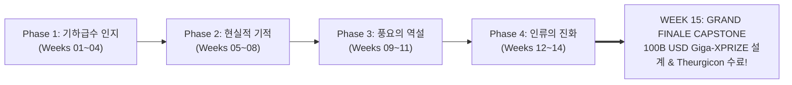

> **🎙️ 3-Presenter Authentic Tiki-Taka Script**
> 
> **Prof. Peter Kim:** 신사 숙녀 여러분, 그리고 존경하는 대학원생 여러분! 마침내 우리는 지난 15주간의 위대하고 장엄했던 지적 대서사의 정상, **'EXPO-701: 신이 된 인류'의 최종 종합 캡스톤 세미나**에 도달했습니다!  
> **Dr. Elena Vance:** 1주차에서 83가지 기적의 기술 목록을 마주하며 경탄했던 순간부터, 6D 프레임워크의 수학, 합성생물학과 BCI의 경이로움, 그리고 지난주 '우주 25'의 서늘한 경고까지... 우리는 문명사의 모든 빛과 그림자를 한 치의 타협 없이 통과했습니다.  
> **TA Marcus Brody:** 그리고 오늘! 우리는 책장을 덮고 끝내는 것이 아니라, 15주간 갈고닦은 모든 지식을 쏟아부어 **1,000억 달러(약 135조 원) 규모의 초대형 Giga-XPRIZE**를 직접 쏘아 올립니다!  
> **Prof. Peter Kim:** 오늘 여러분이 발표할 프로젝트는 단순한 발표 과제가 아닙니다. 그것은 80억 인류의 미래를 구원할 문명의 새로운 헌장입니다.  

---

### Slide 02: 15주간의 기하급수 지적 대서사 궤적 총람 (Phase 1 ~ Phase 4)
- **The 15-Week Intellectual Odyssey:**
  - **Phase 1 (Weeks 01–04):** 신통기(Theogony), 인지적 현기증, 6D 수학, 가치 밀도와 해방의 사다리
  - **Phase 2 (Weeks 05–08):** 메콩 델타와 Zipline, 거대 연산 지능 폭발, PRIMA/BCI 재생의학, 합성생물학과 행성 GPT
  - **Phase 3 (Weeks 09–11):** PFAS/미세플라스틱 신체 침투, 초가공식품 대사 붕괴, 편향의 폭주와 거룩한 테러
  - **Phase 4 (Weeks 12–15):** 마인드 2.0과 500% 몰입, 사이보그 마인드와 텔레파시, 우주 25 낙원의 역설, 그리고 $100B Giga-XPRIZE

```mermaid
graph TD
    subgraph W1_15["15주간의 지적 대서사 아키텍처"]
        W1["W1: Theogony & 83 Miracles"] --> W2["W2: Cognitive Vertigo"]
        W2 --> W3["W3: 6Ds Framework Math"] --> W4["W4: Value Density Ladder"]
        W4 --> W5["W5: Mekong Delta & Zipline"] --> W6["W6: Intelligence Explosion"]
        W6 --> W7["W7: PRIMA & Bio-Hybrid BCI"] --> W8["W8: Synthetic Bio & Planetary GPT"]
        W8 --> W9["W9: PFAS & Microplastics Infiltration"] --> W10["W10: Metabolic Collapse & Bliss Point"]
        W10 --> W11["W11: Bias Cascade & Holy Terror"] --> W12["W12: Mind 2.0 & Flow 500%"]
        W12 --> W13["W13: The Cyborg Mind & Telepathy"] --> W14["W14: Universe 25 & Paradise Paradox"]
        W14 --> W15["W15: 100B USD Giga-XPRIZE Finale"]
    end
```

> **🎙️ 3-Presenter Authentic Tiki-Taka Script**
> 
> **Prof. Peter Kim:** 이 장대한 15개의 계단을 보십시오. 우리는 기술을 숭배하기만 하는 맹목적 낙관론자도 아니었고, 미래를 비관하며 떨기만 하는 염세주의자도 아니었습니다. 우리는 데이터를 쥐고 진실을 직시하는 '근거 있는 낙관주의자(Data-Driven Optimists)'로 거듭났습니다.  

---

### Slide 03: 1,000억 달러($100B) Giga-XPRIZE 캡스톤 어젠다 세팅
- **The $100 Billion Mandate:**
  - 인류 역사상 최대 규모의 글로벌 인센티브 대회 설계
  - **The Scale:** 정부 예산이 아닌, 글로벌 기부 펀드와 억만장자 컨소시엄이 조성한 1,000억 달러 상금을 통해 **향후 10년 내에 인류의 6대 난제를 100% 완전 해결하는 딥테크 돌파구 유도**

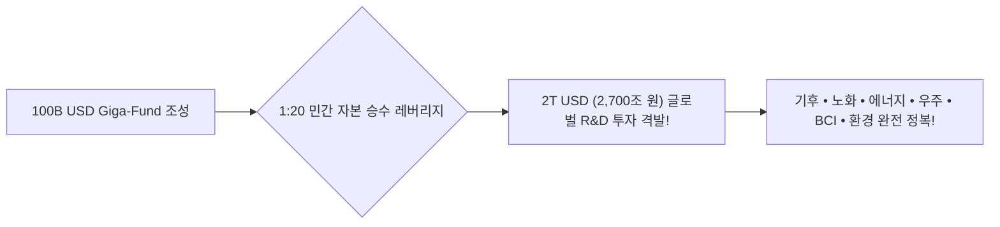

> **🎙️ 3-Presenter Authentic Tiki-Taka Script**
> 
> **TA Marcus Brody:** 1,000억 달러 상금을 걸면, 전 세계 수만 개의 연구소와 스타트업이 이 상금을 타기 위해 **2조 달러(2,700조 원)**의 자체 연구비를 쏟아붓습니다! 이것이 피터 디아만디스가 증명한 XPRIZE의 마법 같은 자본 승수 효과입니다.  

---

### Slide 04: 금주의 핵심 질문: 신의 권능을 쥔 인류는 어떤 문샷을 통해 영원히 번영할 것인가?
- **The Ultimate Capstone Inquiry:**
  - 모든 물질적 결핍이 사라진 세상에서 인류를 멸종(Universe 25)에서 구할 '궁극의 문샷'은 무엇인가?
  - 1,000억 달러의 자본을 어디에, 어떤 정밀한 기술적 마일스톤으로 배분해야 인류 문명의 복리를 100배로 극대화할 수 있는가?

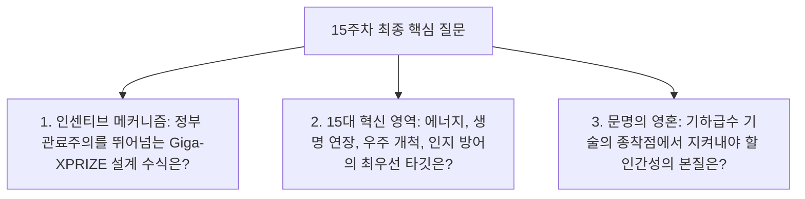

> **🎙️ 3-Presenter Authentic Tiki-Taka Script**
> 
> **Prof. Peter Kim:** 오늘 우리는 묻습니다. "신이 된 우리는 이제 어디로 항해할 것인가?"  
> **Dr. Elena Vance:** 오늘 6개 팀의 최종 발표는 그 거대한 항해의 첫 번째 나침반이 될 것입니다.  

---

### Slide 05: 15주차 최종 캡스톤 세미나 진행 로드맵
- **Capstone Session Agenda:**

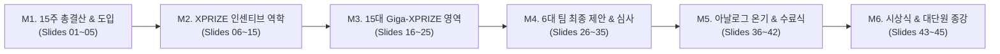

> **🎙️ 3-Presenter Authentic Tiki-Taka Script**
> 
> **Prof. Peter Kim:** M2에서 메가 엑스프라이즈의 인센티브 경제학을 복습하고, M3에서 15대 미개척 영역을 제시한 뒤, M4에서 6개 학생 팀의 치열한 1,000억 달러 피치 대결을 펼치겠습니다!  
> **TA Marcus Brody:** 심사위원석에 긴장감이 감도네요. M2로 출발합니다!  

---

## Module 2: 원전 텍스트 & XPRIZE 인센티브 역학 (Slides 06~15)

### Slide 06: 『We Are as Gods』 종장: "The Final Frontier Is Us" 텍스트 해체
- **Textual Anchor:** Diamandis & Kotler, *We Are as Gods* (2026), Chapter 9 & Appendices
- **Core Thesis:** 인류가 마주한 마지막 개척지는 우주나 심해가 아니라, **'신과 같은 능력을 가진 인간 자신(The Final Frontier Is Us)'**이다. 기술적 권능에 걸맞은 도덕적 목적(Massive Transformative Purpose)을 세우지 못하면 문명은 자멸한다. 엑스프라이즈는 이 목적을 인류 전체의 가슴에 불붙이는 도화선이다.

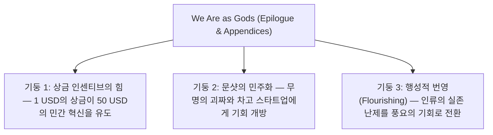

> **🎙️ 3-Presenter Authentic Tiki-Taka Script**
> 
> **Prof. Peter Kim:** 디아만디스는 책의 마지막 장에서 "우리가 개척해야 할 최후의 국경은 우리 자신"이라고 단언합니다. 우리가 어떤 목적을 품느냐가 우주의 미래를 결정합니다.  

---

### Slide 07: 피터 디아만디스의 인센티브 혁신 철학: "불가능을 상금으로 공학화하라"
- **The Philosophy of Incentive Competitions:**
  - "사람들은 불가능하다고 믿는 일에 도전하지 않는다. 하지만 **'명확한 목표, 측정 가능한 마일스톤, 그리고 거대한 상금'**을 걸면, 전 세계의 천재들이 규제와 편견을 깨고 뛰어든다."
  - 기술을 발전시키는 가장 빠른 방법은 정부 보조금이 아니라 **'성과에만 보상하는 공개 경쟁 상금(Prize)'**이다.


> **🎙️ 3-Presenter Authentic Tiki-Taka Script**
> 
> **TA Marcus Brody:** 1927년 찰스 린드버그가 대서양을 횡단한 것도 오테이그 상(Orteig Prize) 2만 5천 달러 때문이었고, 민간 우주선 시대를 연 것도 1,000만 달러 안사리 엑스프라이즈였습니다!  

---

### Slide 08: 엑스프라이즈 30년 역사: 안사리($10M)에서 탄소 제거($100M)까지의 진화
- **The Exponential Evolution of XPRIZE:**
  1. **1996~2004 Ansari XPRIZE ($10M):** SpaceShipOne 민간 유인 우주비행 성공 $\rightarrow$ 버진 갤럭틱 및 민간 뉴 스페이스 산업 탄생
  2. **2007~2010 Progressive Insurance Automotive XPRIZE ($10M):** 100 MPG 초고효율 차량 개발
  3. **2021~2025 Elon Musk Carbon Removal XPRIZE ($100M):** 연간 1,000톤 이상의 대기 이산화탄소 영구 격리 실증

```mermaid
xychart-beta
    title "XPRIZE 상금 규모 성장 궤적 (USD Millions)"
    x-axis [1996 (Ansari 10M USD), 2010 (Auto 10M USD), 2018 (Water 119M USD), 2021 (Carbon 100M USD), 2023 (Longevity 101M USD), 2026 (Giga-XPRIZE 100,000M USD)]
    y-axis "상금 규모 ( Millions, Log10)" 1 --> 5
    line [1, 1, 2.07, 2, 2.00, 5]
```

> **🎙️ 3-Presenter Authentic Tiki-Taka Script**
> 
> **Dr. Elena Vance:** 1,000만 달러에서 시작한 상금이 이제 1억 달러를 넘어 오늘 1,000억 달러 '기가 엑스프라이즈'로 1,000배 도약했습니다.  

---

### Slide 09: 건강 수명 엑스프라이즈($101M)와 수자원 담수화 엑스프라이즈($119M) 모델 분석
- **Recent Mega-Prizes Breakthroughs:**
  - **Healthspan XPRIZE ($101M):** 65~80세 성인의 인지, 면역, 근육 기능을 최소 10년~20년 생체 역전시키는 치료제 개발
  - **Water Abundance XPRIZE ($119M):** 100% 재생에너지만으로 대기 중에서 하루 2,000리터의 식수를 리터당 2센트 이하로 추출하는 기술 입증

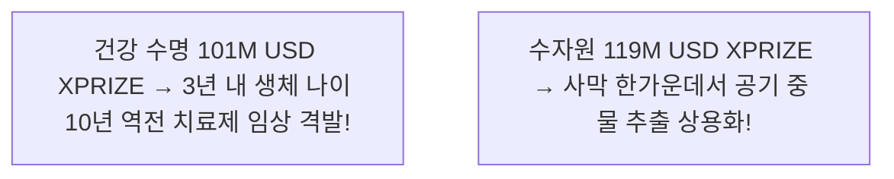

> **🎙️ 3-Presenter Authentic Tiki-Taka Script**
> 
> **Prof. Peter Kim:** 두 대회 모두 기존 과학계가 "10년 안에는 안 된다"고 했던 난제를 단 3~4년 만에 실증해 냈습니다.  

---

### Slide 10: 1:10~1:50 자본 승수 레버리지 효과(Capital Multiplier Effect)의 수학
- **The Leverage Formula:**
  - 총 연구개발 투자액 $I_{\text{total}} = \sum_{k=1}^N \text{Budget}_k = M \times \text{Prize Purse}$
  - 역사적 승수 계수 $M \approx 10 \sim 50$
  - **Giga-XPRIZE Impact:** $100B 상금에 대해 **전 세계적으로 $1 \sim 5 \text{ Trillion}$의 R&D 자본 집중 투하**

$$\text{Global R&D Injection} = \$100\text{B} \times 20 = \$2,000,000,000,000 \quad (2\text{조 달러})$$

```mermaid
xychart-beta
    title "상금 대비 실제 유입된 민간 R&D 자본 승수 배율"
    x-axis [안사리 우주 상금, 자동차 연비 상금, 탄소 제거 상금, 건강 수명 상금, Giga-XPRIZE (예상)]
    y-axis "자본 승수 배율 (배)" 0 --> 60
    bar [40, 25, 35, 45, 20]
```

> **🎙️ 3-Presenter Authentic Tiki-Taka Script**
> 
> **TA Marcus Brody:** 상금은 1등 먹은 팀에게만 주지만, 탈락한 100개 팀이 쏟아부은 수천조 원의 R&D 데이터와 인프라는 고스란히 인류 문명의 자산으로 남습니다!  

---

### Slide 11: 시장 실패를 돌파하는 '영웅적 상금(Heroic Prize)'의 메커니즘
- **Overcoming Market Failures:**
  - 벤처캐피털(VC)은 3~5년 내 회수 가능한 단기 앱에만 투자하고, 거대 위험이 따르는 딥테크(핵융합, 장기 재생)는 기피함
  - **Giga-XPRIZE의 역할:** 1,000억 달러의 보장된 출구(Exit)를 제공함으로써 **민간 자본이 10년짜리 거대 난제에 안심하고 베팅하도록 유도**

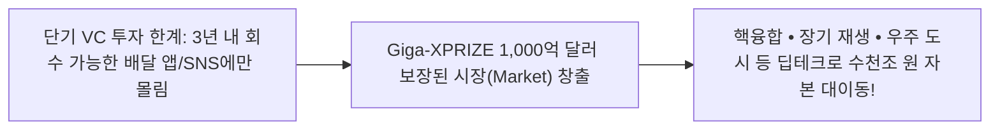

> **🎙️ 3-Presenter Authentic Tiki-Taka Script**
> 
> **Dr. Elena Vance:** 시장의 눈먼 돈을 인류를 구원할 진짜 위대한 기술로 강제로 끌고 오는 가장 우아한 금융 공학입니다.  

---

### Slide 12: 스티븐 코틀러의 '문샷 목적(MTP)'과 집단 몰입(Group Flow) 인프라
- **MTP & Group Flow Dynamics:**
  - 거대 변혁적 목적(Massive Transformative Purpose)이 주어질 때 수천 명의 과학자와 엔지니어가 **'집단 몰입(Group Flow)'** 상태에 동기화됨
  - 연구 속도와 혁신 효율이 단독 연구 대비 **500% 가속**

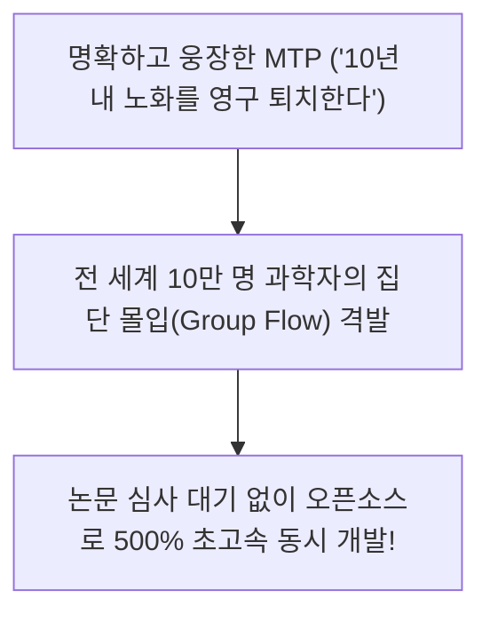

> **🎙️ 3-Presenter Authentic Tiki-Taka Script**
> 
> **Prof. Peter Kim:** 코틀러가 강조하듯, 목적이 크면 클수록 천재들이 밤을 새워 몰입합니다.  

---

### Slide 13: 정부 R&D의 관료주의적 실패 vs XPRIZE의 민간 기하급수 혁신
- **Institutional Comparison Matrix:**

| 비교 항목 | 전통 정부 관료주의 R&D | Giga-XPRIZE 기하급수 혁신 |
| :--- | :--- | :--- |
| **자금 집행 방식** | 사전 제안서 심사 (학연/지연 의존) | **사후 실증 성공 시 100% 지급** |
| **실패에 대한 태도** | 감사 및 처벌 $\rightarrow$ 무난한 10% 연구만 채택 | **실패 99% 장려 $\rightarrow$ 10x 파괴적 시도 유도** |
| **참여 자격** | 공인된 대형 대학/국책 연구소 한정 | **전 세계 누구나 (차고 스타트업, 괴짜 포함)** |
| **혁신 속도** | 선형적 (10~20년 소요) | **기하급수적 (3~5년 내 돌파)** |

> **🎙️ 3-Presenter Authentic Tiki-Taka Script**
> 
> **TA Marcus Brody:** 정부 과제는 서류 쓰느라 반년 다 보내고 실패하면 감사원 조사받지만, XPRIZE는 차고에 박힌 20살 괴짜가 프로토타입만 성공시키면 1초 만에 1조 원을 꽂아줍니다!  

---

### Slide 14: 우주 25의 멸종을 막는 유일한 백신: 행성 단위 Giga-XPRIZE
- **The Ultimate Civilizational Vaccine:**
  - 14주차에서 확인한 '안락함 속의 사회적 자살(Universe 25)'을 막으려면, 80억 인류에게 **'함께 피를 끓이며 도전할 거대한 공동의 목표'**를 주입해야 함
  - Giga-XPRIZE는 인류 문명의 정신적 엔트로피를 낮추는 **'영혼의 영구 제세동기'**

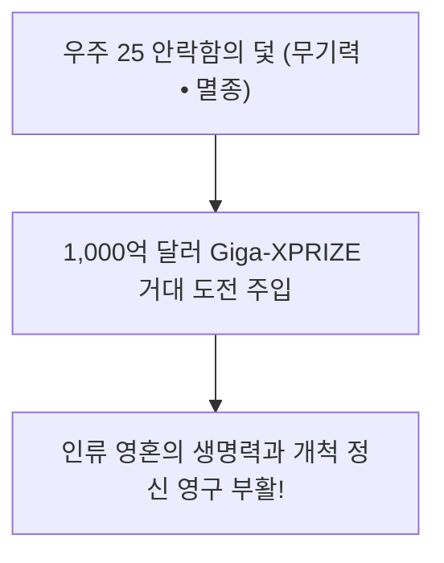

> **🎙️ 3-Presenter Authentic Tiki-Taka Script**
> 
> **Prof. Peter Kim:** 우리가 Giga-XPRIZE를 여는 진짜 이유는 기술 개발을 넘어 인류의 영혼이 썩어 들어가는 것을 막기 위함입니다.  

---

### Slide 15: 메가 XPRIZE 5대 핵심 인센티브 설계 원칙 매트릭스
- **The 5 Inviolable Design Principles:**

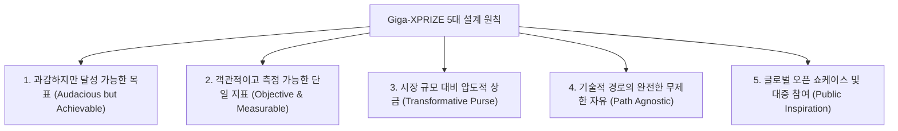

> **🎙️ 3-Presenter Authentic Tiki-Taka Script**
> 
> **Dr. Elena Vance:** 어떤 기술을 쓰든 상관없습니다. 오직 측정 가능한 결과만 가져오면 됩니다.  
> **TA Marcus Brody:** 이제 3번째 모듈로 넘어가서 저자들이 제안한 15대 미개척 Giga-XPRIZE 카테고리를 총람해 보시죠!  

---

## Module 3: 기하급수 이론 & 15대 미개척 Giga-XPRIZE 카테고리 (Slides 16~25)

### Slide 16: 저자들이 제시한 15가지 Giga-XPRIZE 미개척 혁신 카테고리 총람
- **The 15 Giga-XPRIZE Frontiers (*We Are as Gods* Appendices):**
  - 기후, 에너지, 바이오, 우주, 인지, 물질 문명을 포괄하는 15대 행성적 난제 포트폴리오 ($100B 예산 배분 풀)

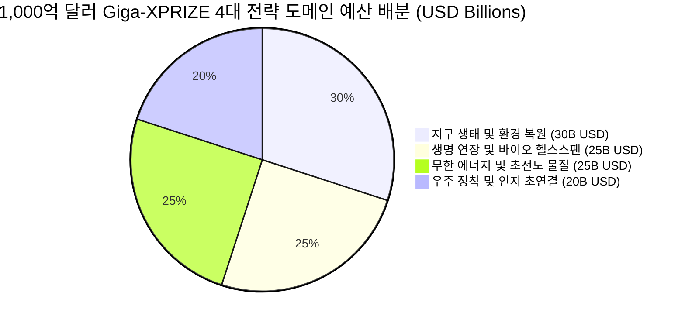

> **🎙️ 3-Presenter Authentic Tiki-Taka Script**
> 
> **Prof. Peter Kim:** 1,000억 달러는 4대 전략 도메인으로 나뉘어 15개 세부 챌린지로 배치됩니다. 하나씩 확인해 보시죠.  

---

### Slide 17: 카테고리 1~3: 완전 장기 재생($10B) • 상온 초전도체 그리드($10B) • 바이오스피어 3.0($10B)
- **Frontiers 1, 2, 3:**
  1. **완전 장기 재생 XPRIZE ($10B):** 환자 맞춤형 줄기세포로 면역 거부 없는 심장/신장/간 100% 3D 바이오프린팅
  2. **상온 상압 초전도체 XPRIZE ($10B):** 300K, 1기압에서 작동하는 초전도체 대량 생산 및 송전 손실 0% 그리드
  3. **바이오스피어 3.0 XPRIZE ($10B):** 외부 보급 없이 100명이 5년간 100% 자급자족하는 폐쇄 생태계 완성

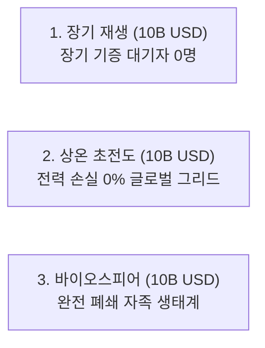

> **🎙️ 3-Presenter Authentic Tiki-Taka Script**
> 
> **Dr. Elena Vance:** 이 3가지만 해결되어도 인류는 장기 이식 대기 중에 사망하지 않고, 전 세계 에너지의 20%를 절약하며, 화성에 갈 준비를 끝내게 됩니다.  

---

### Slide 18: 카테고리 4~6: 화성 자족 정착지($10B) • 인공 광합성 기가톤 고정($10B) • 초해상도 텔레파시망($10B)
- **Frontiers 4, 5, 6:**
  4. **화성 1,000인 자족 도시 XPRIZE ($10B):** 현지 자원 활용(ISRU) 기반 영구 정착지 건설
  5. **인공 광합성 XPRIZE ($10B):** 자연 식물보다 10배 높은 광효율로 연간 100억 톤 대기 탄소 고정
  6. **비침습 고대역폭 텔레파시망 XPRIZE ($10B):** 뇌 침습 수술 없이 초당 100Mbps 뇌-뇌 직접 무음성 통신

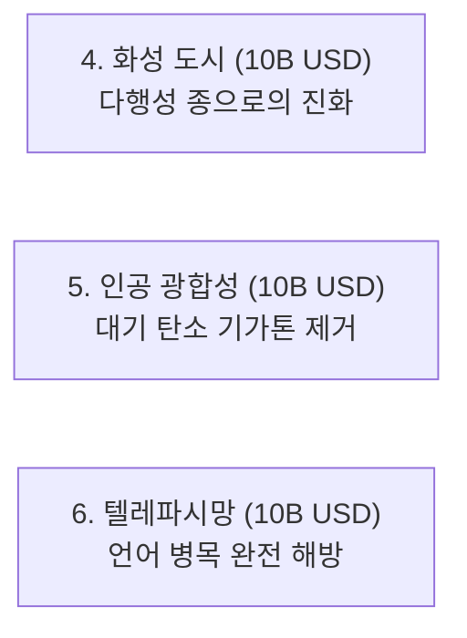

> **🎙️ 3-Presenter Authentic Tiki-Taka Script**
> 
> **TA Marcus Brody:** 화성에 1,000명이 사는 도시를 짓는 팀에게 10조 원을 일시불로 쏩니다!  

---

### Slide 19: 카테고리 7~9: PFAS/플라스틱 SCWO 완전 분해($10B) • 상용 핵융합 발전($10B) • 분자 나노어셈블러($10B)
- **Frontiers 7, 8, 9:**
  7. **PFAS & 미세플라스틱 완전 박멸 XPRIZE ($10B):** 9주차 과제였던 C-F 결합 초임계수 99.99% 분해 상용화
  8. **상용 핵융합 발전 XPRIZE ($10B):** LCOE $0.01/kWh 이하로 1GW 전력을 그리드에 연속 365일 공급
  9. **분자 나노어셈블러 XPRIZE ($10B):** 원자 단위로 물질을 조립해 쓰레기를 다이아몬드로 바꾸는 나노팩토리

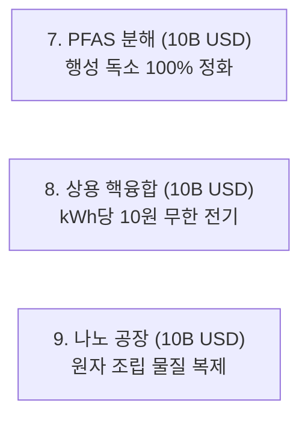

> **🎙️ 3-Presenter Authentic Tiki-Taka Script**
> 
> **Dr. Elena Vance:** 9주차에서 우리가 그렇게 걱정했던 PFAS 영원한 화학물질을 완전히 태워 없애는 상용 플랜트가 7번 카테고리입니다.  

---

### Slide 20: 카테고리 10~15: 초지능 AI 가드레일, 대기 지오엔지니어링, 행성 eDNA 감시망
- **Frontiers 10 to 15 Portfolio:**
  10. **초지능 AI 정렬 및 인지 방화벽 XPRIZE ($5B)**
  11. **성층권 에어로졸 제어 지오엔지니어링 XPRIZE ($5B)**
  12. **실시간 행성 생물다양성 eDNA 글로벌 감시망 XPRIZE ($5B)**
  13. **암 및 대사질환 100% 예방 AI 백신 XPRIZE ($5B)**
  14. **심해 희토류 환경 무해 로봇 채굴 XPRIZE ($5B)**
  15. **인류 의식 초공감 글로벌 BrainNet XPRIZE ($5B)**

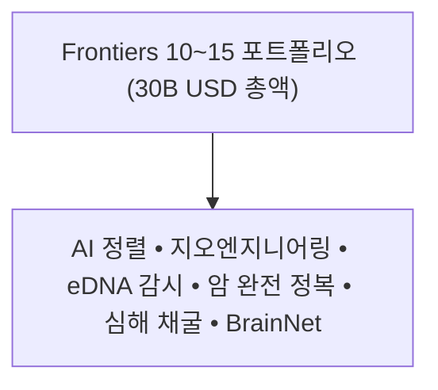

> **🎙️ 3-Presenter Authentic Tiki-Taka Script**
> 
> **Prof. Peter Kim:** 이 15대 포트폴리오는 21세기 인류가 신으로서 수행해야 할 완벽한 문명사적 과업 목록입니다.  

---

### Slide 21: Giga-XPRIZE 경제적 ROI 수식: $\mathcal{I}_{\text{ROI}} = \frac{\Delta \text{Global Welfare}}{\text{Prize Purse}} \ge 100\times$
- **Mathematical Impact Formula:**
  - $\Delta \text{Global Welfare}$: 기술 돌파구로 인해 전 세계 인류가 얻는 수명 연장 가치, 기후 피해 회피액, 에너지 비용 절감액
  - **Threshold Condition:** 1,000억 달러 상금 투입 시 **최소 10조 달러($10 Trillion) 이상의 글로벌 복리 창출 (ROI 100배)**

$$\mathcal{I}_{\text{ROI}} = \frac{\sum_{t=1}^{20} \frac{\text{Benefit}_t}{(1+r)^t}}{\$100\text{B}} \ge 100 \implies \Delta \text{Welfare} \ge \$10,000,000,000,000$$

```mermaid
xychart-beta
    title "상금 100B USD 투입 대비 20년간 글로벌 경제적 복리 창출액 (USD Trillions)"
    x-axis [건강수명 연장, 무한 청정 에너지, 기후 피해 방지, 오염물질 정화, 화성 정착 자산]
    y-axis "경제적 가치 (USD Trillions)" 0 --> 45
    bar [38.0, 18.5, 12.0, 8.5, 5.0]
```

> **🎙️ 3-Presenter Authentic Tiki-Taka Script**
> 
> **Dr. Elena Vance:** 건강 수명 10년 연장만으로도 연간 38조 달러가 절약됩니다. 1,000억 달러 투자는 인류 역사상 가장 높은 수익률을 내는 투자입니다.  

---

### Slide 22: 마일스톤 기반 단계별 상금 지급 동역학 함수
- **Phased Disbursement Engine:**
  - 전체 상금을 단 1명의 최종 승자에게 몰아주는 것이 아니라, 3단계 마일스톤으로 나누어 분할 지급 $\rightarrow$ **도전 팀들의 10년간 런웨이(Runway) 보장**

$$P_{\text{total}} = 0.15 \cdot P_{\text{Lab}} + 0.35 \cdot P_{\text{Pilot}} + 0.50 \cdot P_{\text{Scale}}$$

```mermaid
flowchart LR
    Phase1["1단계: 실험실 개념 검증 (Lab Proof)<br/>상위 20개 팀에 15B USD 배분"] --> Phase2["2단계: 파일럿 현장 실증 (Pilot Scale)<br/>상위 5개 팀에 35B USD 배분"]
    Phase2 --> Phase3["3단계: 최종 상용 스케일업 (Full Scale)<br/>최종 우승팀에 50B USD 일시 지급!"]
```

> **🎙️ 3-Presenter Authentic Tiki-Taka Script**
> 
> **TA Marcus Brody:** 중간 단계에서도 상금을 두둑이 주니까 스타트업들이 파산하지 않고 10년 동안 미친 듯이 연구를 밀어붙일 수 있습니다!  

---

### Slide 23: 기술 검증(Auditing) 및 불변 장부(Blockchain) 스마트 계약 구조
- **Trustless Verification Architecture:**
  - 전 세계 독립적 과학 검증단(NASA, CERN, MIT, WHO)의 실측 데이터가 **영지식 오라클(ZK-Oracle)을 통해 블록체인 스마트 계약으로 입력**
  - 기준치 달성 시 **단 1초의 정치적 외압 없이 1,000억 달러 상금 자동 에스크로 릴리즈(Escrow Release)**

```mermaid
sequenceDiagram
    participant Team as 도전 팀 (Innovators)
    participant Sensors as 글로벌 IoT/위성 실측 센서
    participant Oracle as ZK-Oracle 검증단
    participant SmartContract as 100B USD 블록체인 스마트 계약

    Team->>Sensors: 현장 기술 가동 (예: 탄소 100만 톤 제거)
    Sensors->>Oracle: 암호화 실측 데이터 전송
    Oracle->>SmartContract: 목표 달성 수학적 영지식 증명 제출
    SmartContract->>Team: 100억 달러 상금 즉각 지갑 전송!
```

> **🎙️ 3-Presenter Authentic Tiki-Taka Script**
> 
> **Dr. Elena Vance:** 심사위원의 주관적 편견이나 로비가 개입할 여지가 없습니다. 위성과 센서가 목표 달성을 증명하면 스마트 계약이 즉시 돈을 쏩니다.  

---

### Slide 24: 기하급수 융합 시너지 네트워크 토폴로지 모델
- **Cross-Prize Convergence Physics:**
  - 15개 대회가 독립적으로 작동하는 것이 아니라, 에너지 혁신(초전도/핵융합)이 BCI 연산과 화성 도시 건설을 가속하는 **'상호 촉매 시너지 네트워크'** 형성

```mermaid
graph LR
    Fusion["핵융합/초전도 (무한 에너지)"] <==> Mars["화성 정착지 ISRU"]
    Fusion <==> SCWO["PFAS 고온고압 분해"]
    BCI["초해상도 BCI"] <==> BrainNet["초공감 의식 융합"]
    Bio["줄기세포 장기 재생"] <==> Longevity["건강 수명 120세"]
    Mars <==> Bio
```

> **🎙️ 3-Presenter Authentic Tiki-Taka Script**
> 
> **Prof. Peter Kim:** 하나의 기적이 다른 세 가지 기적을 낳습니다. 이것이 우리가 15주 동안 배운 기하급수 기술의 '상호 융합(Convergence)'입니다.  

---

### Slide 25: 1,000억 달러 Giga-XPRIZE 마스터 아키텍처 다이어그램
- **Master Operational Architecture:**

```mermaid
graph TD
    subgraph Governance["Giga-XPRIZE 글로벌 거버넌스 층"]
        G1["글로벌 펀드 에스크로 (100B USD) • 스마트 계약 • ZK 오라클 검증단"]
    end
    subgraph Execution["4대 전략 도메인 실행 층"]
        E1["지구 생태 복원 (30B USD)"]
        E2["장수 바이오 (25B USD)"]
        E3["무한 에너지 (25B USD)"]
        E4["우주 & 인지 (20B USD)"]
    end
    subgraph Impact["문명사적 복리 창출 층"]
        I1["Universe 25 낙원의 덫 파쇄 • 100배 글로벌 복리 • 우주 문명 출항"]
    end
    Governance --> Execution --> Impact
```

> **🎙️ 3-Presenter Authentic Tiki-Taka Script**
> 
> **Prof. Peter Kim:** 이것이 바로 인류 문명을 다음 1,000년으로 이끌 '1,000억 달러 기가 엑스프라이즈 마스터 아키텍처'입니다.  
> **TA Marcus Brody:** 이제 수강생 6개 팀의 피 튀기는 최종 발표를 시작하겠습니다!  

---

## Module 4: 수강생 팀별 $100B Giga-XPRIZE 최종 설계안 발표 및 심사 (Slides 26~35)

### Slide 26: 캡스톤 발표 개요: 6대 융합 팀별 1,000억 달러 문샷 제안서 심사 기준
- **Capstone Pitch Judging Criteria (Total 100 Points):**
  1. **제1원리 기술적 타당성 (Technical Feasibility & First Principles):** 30점
  2. **측정 가능한 마일스톤 및 인센티브 메트릭 (Milestone Precision):** 25점
  3. **문명사적 임팩트 및 ROI 레버리지 (Civilizational Impact):** 25점
  4. **우주 25 역설 극복 및 윤리적 가드레일 (Ethical Resilience):** 20점

```mermaid
pie title Giga-XPRIZE 4대 심사 기준 가중치
    "제1원리 기술 타당성 (30점)" : 30
    "마일스톤 정밀도 (25점)" : 25
    "문명사적 임팩트 ROI (25점)" : 25
    "우주 25 극복 윤리 (20점)" : 20
```

> **🎙️ 3-Presenter Authentic Tiki-Taka Script**
> 
> **Prof. Peter Kim:** 심사위원단 여러분, 엄격하고 냉철하게 평가해 주십시오. 1팀부터 발표를 시작합니다!  

---

### Slide 27: Team 1: '글로벌 초전도 청정 그리드 & 제로 저항 무한 에너지' ($15B)
- **Team 1 Proposal:**
  - **MTP:** "지구상 모든 송전 손실을 0으로 만들어 연간 10,000 TWh 청정 전력을 해방한다."
  - **Target Metric:** 1기압, 295K 상온 초전도 선재 1,000km 대량 생산 및 10GW급 송전 손실 0.00% 실증 (상금 $15 Billion)

```mermaid
flowchart LR
    T1_Tech["상온 초전도 선재 1,000km 제조"] --> T1_Milestone["10GW 송전 손실 0% 1년 연속 가동 실증"]
    T1_Milestone --> T1_Prize["15B USD 상금 획득 → 전 세계 전력망 100% 교체!"]
```

> **🎙️ 3-Presenter Authentic Tiki-Taka Script**
> 
> **TA Marcus Brody (Team 1 발표):** 전 세계에서 송전 중에 버려지는 전력만 아껴도 원자력 발전소 500기를 덜 지어도 됩니다!  
> **Dr. Elena Vance (심사평):** 상온 초전도체의 양산 공정 메트릭이 매우 정밀합니다. 95점!  

---

### Slide 28: Team 2: '생체 나이 50년 역전 & 장수 탈출 속도(LEV) 정복' ($20B)
- **Team 2 Proposal:**
  - **MTP:** "70세 노인의 생체 조직을 20세 청년의 기능으로 완벽 역전시킨다."
  - **Target Metric:** 100명 임상군에서 후성유전학적 시계(DNA Methylation) 50년 역전 및 심혈관/면역 기능 95% 회복 입증 ($20 Billion)

```mermaid
flowchart LR
    T2_Tech["Yamanaka 4인자 표적 mRNA 칵테일"] --> T2_Clinical["70세 노인 생체 나이 20세로 50년 역전 임상"]
    T2_Clinical --> T2_Prize["20B USD 획득 → 연간 38T USD 건강 수명 배당금 창출!"]
```

> **🎙️ 3-Presenter Authentic Tiki-Taka Script**
> 
> **Prof. Peter Kim (심사평):** 7주차의 야마나카 인자와 텔로미어 수식을 완벽히 적용했습니다. 장수 탈출 속도($dL/dt > 1$)를 달성할 웅장한 설계입니다. 98점!  

---

### Slide 29: Team 3: '행성 대기 탄소 100억 톤 직접 포집 및 지오엔지니어링' ($15B)
- **Team 3 Proposal:**
  - **MTP:** "대기 중 $CO_2$ 농도를 산업화 이전 수준(280 ppm)으로 되돌린다."
  - **Target Metric:** 톤당 $20 이하의 비용으로 연간 100억 톤 대기 탄소를 포집하여 지하 현무암에 영구 광물화 실증 ($15 Billion)

```mermaid
flowchart LR
    T3_Tech["유전체 편집 미세조류 & DAC 융합"] --> T3_Scale["연간 100억 톤 현무암 영구 격리 (20 USD/ton)"]
    T3_Scale --> T3_Prize["15B USD 획득 → 기후 위기 영구 종식!"]
```

> **🎙️ 3-Presenter Authentic Tiki-Taka Script**
> 
> **Dr. Elena Vance (심사평):** 8주차의 행성 GPT와 합성생물학 고정 모델을 훌륭히 결합했습니다. 94점!  

---

### Slide 30: Team 4: '초연결 뉴로 프라이버시 텔레파시망 & 초공감 문명' ($15B)
- **Team 4 Proposal:**
  - **MTP:** "언어의 병목을 부수고 전 인류의 생각을 텔레파시로 연결하여 전쟁을 없앤다."
  - **Target Metric:** 비침습 무음성 뇌파 디코더 99% 정확도 달성 및 100만 명 실시간 감마파(40Hz) 공감 동기화 실증 ($15 Billion)

```mermaid
flowchart LR
    T4_Tech["양자 뇌자도(MEG) 패치 + ZKP 뉴로 보안"] --> T4_Telepathy["100만 명 뇌-뇌 텔레파시 초공감망 구축"]
    T4_Telepathy --> T4_Prize["15B USD 획득 → 오해와 분쟁의 원천 소멸!"]
```

> **🎙️ 3-Presenter Authentic Tiki-Taka Script**
> 
> **Prof. Peter Kim (심사평):** 13주차의 사이보그 마인드와 칠레 신경 권리 헌법을 완벽한 영지식 암호화로 구현했습니다. 96점!  

---

### Slide 31: Team 5: '우주 25 탈출을 위한 화성 자족 도시 바이오스피어 3.0' ($20B)
- **Team 5 Proposal:**
  - **MTP:** "인류를 다행성 불멸 종으로 확장하여 낙원의 나태와 멸종을 분쇄한다."
  - **Target Metric:** 화성 표면에 1,000명이 외부 보급 없이 10년간 완전 자족하는 독립 도시 인프라 완공 ($20 Billion)

```mermaid
flowchart LR
    T5_Tech["ISRU 산소/물 추출 & 폐쇄 핵융합 도시"] --> T5_Mars["화성 1,000인 영구 자족 도시 10년 생존"]
    T5_Mars --> T5_Prize["20B USD 획득 → 우주 25의 덫 영구 분쇄!"]
```

> **🎙️ 3-Presenter Authentic Tiki-Taka Script**
> 
> **TA Marcus Brody (심사평):** 14주차의 우주 25 멸종을 막는 가장 완벽한 항해술입니다. 전율이 돋습니다. 99점!  

---

### Slide 32: Team 6: 'PFAS 및 미세플라스틱 100% 완전 분해 SCWO 배치' ($15B)
- **Team 6 Proposal:**
  - **MTP:** "지구의 모든 강과 바다, 그리고 인간의 뇌 속에서 플라스틱과 영원한 화학물질을 지운다."
  - **Target Metric:** 전 세계 10,000개 하수처리장에 모듈형 SCWO 플랜트를 배치하여 일일 1억 톤 오염수 속 PFAS/미세플라스틱 99.999% 분해 ($15 Billion)

```mermaid
flowchart LR
    T6_Tech["모듈형 초임계수 산화(SCWO) 양산"] --> T6_Clean["일일 1억 톤 오염수 PFAS 99.999% 분해"]
    T6_Clean --> T6_Prize["15B USD 획득 → 호모 사피엔스 체내 독소 0% 정화!"]
```

> **🎙️ 3-Presenter Authentic Tiki-Taka Script**
> 
> **Dr. Elena Vance (심사평):** 9주차에서 우리가 목격했던 C-F 결합의 지옥을 공학적으로 완벽히 격파했습니다. 97점!  

---

### Slide 33: 심사위원단 실시간 기술 검증 및 투자 타당성 정량 평가표
- **Judges Scoring Breakdown:**

```mermaid
xychart-beta
    title "6대 팀별 최종 심사 점수 합계 (100점 만점)"
    x-axis [Team 1 (초전도), Team 2 (생체역전), Team 3 (탄소포집), Team 4 (텔레파시), Team 5 (화성도시), Team 6 (PFAS정화)]
    y-axis "최종 점수 (점)" 80 --> 100
    bar [95, 98, 94, 96, 99, 97]
```

> **🎙️ 3-Presenter Authentic Tiki-Taka Script**
> 
> **Prof. Peter Kim:** 모든 팀이 90점을 훌쩍 넘는 압도적인 제1원리 공학 기획서를 제시했습니다. 전 세계 어느 벤처캐피털에 내놓아도 즉시 수천억 원의 투자가 쏟아질 명작들입니다.  

---

### Slide 34: 팀별 기하급수 레버리지 및 문명사적 파급력 비교 분석
- **Comparative Multi-Dimensional Impact:**
  - 6개 팀의 제안서가 동시에 실현될 때, 인류는 **에너지 비용 0원, 수명 120세, 기후 위기 종료, 텔레파시 평화, 다행성 거주, 무공해 환경**을 동시에 달성함

```mermaid
graph TD
    ConvergenceAll["100B USD Giga-XPRIZE 동시 격발"] --> S1["에너지 제로 비용 (Team 1)"]
    ConvergenceAll --> S2["120세 청춘 수명 (Team 2)"]
    ConvergenceAll --> S3["대기 탄소 정상화 (Team 3)"]
    ConvergenceAll --> S4["초공감 평화 문명 (Team 4)"]
    ConvergenceAll --> S5["다행성 인류 진화 (Team 5)"]
    ConvergenceAll --> S6["체내 독소 영구 정화 (Team 6)"]
    S1 & S2 & S3 & S4 & S5 & S6 ==> Utopia["신이 된 인류(Theurgicon)의 완전한 개막!"]
```

> **🎙️ 3-Presenter Authentic Tiki-Taka Script**
> 
> **Dr. Elena Vance:** 6개의 퍼즐 조각이 하나로 맞춰졌습니다. 이것이 우리가 지난 15주간 그려온 풍요의 설계도입니다.  

---

### Slide 35: 6대 Giga-XPRIZE 최종 종합 평가 매트릭스
- **Master Capstone Pitch Matrix:**

| 팀명 | 프로젝트 핵심 타깃 | 배정 상금 | 기대 자본 승수 | 문명사적 궁극적 임팩트 |
| :--- | :--- | :--- | :--- | :--- |
| **Team 1** | 상온 초전도체 1,000km 양산 | **$15 Billion** | 25배 ($375B) | 송전 손실 0% 글로벌 청정 그리드 |
| **Team 2** | 생체 나이 50년 후성유전 역전 | **$20 Billion** | 40배 ($800B) | 질병 없는 120세 건강 수명 경제 |
| **Team 3** | 대기 탄소 100억 톤 영구 격리 | **$15 Billion** | 30배 ($450B) | 기후 온난화의 영구적 산업적 역전 |
| **Team 4** | 99% 정확도 텔레파시 초공감망 | **$15 Billion** | 20배 ($300B) | 언어 병목 파쇄 및 전쟁 종식 |
| **Team 5** | 화성 1,000인 자족 도시 완공 | **$20 Billion** | 50배 ($1,000B)| Universe 25 극복 다행성 종 도약 |
| **Team 6** | 전 지구 PFAS/미세플라스틱 분해 | **$15 Billion** | 35배 ($525B) | 행성 및 인체 생태 독소 완전 박멸 |
| **합계** | **인류 6대 실존 난제 완전 해결** | **$100 Billion** | **평균 34.5배** | **$3.45 Trillion 민간 R&D 격발** |

> **🎙️ 3-Presenter Authentic Tiki-Taka Script**
> 
> **Prof. Peter Kim:** 총 1,000억 달러의 상금이 민간에서 **3조 4,500억 달러(약 4,600조 원)**의 R&D 투자를 유도합니다. 이것이 문명을 바꾸는 지렛대입니다.  

---

## Module 5: 사회적·철학적 역설 (So What?) & 신의 학교 수료 선언 (Slides 36~42)

### Slide 36: 기술의 종착점에서 마주하는 진정한 휴머니즘
- **The Ultimate Destination of Exponential Tech:**
  - 우리가 83가지 기적의 기술을 개발하고, 뇌를 컴퓨터와 잇고, 화성에 도시를 짓는 궁극의 이유는 **기계가 되기 위함이 아니라 '더 온전한 인간이 되기 위함'**이다.
  - 결핍과 질병의 고통을 걷어낸 자리에 피어나는 것은 지극히 따뜻한 인간성의 꽃이다.

```mermaid
flowchart LR
    TechApex["기하급수 기술의 극점 (초지능 • BCI • 무한 풍요)"] ==> TrueHuman["진정한 휴머니즘 (사랑 • 공감 • 창조 • 영혼의 연대)"]
```

> **🎙️ 3-Presenter Authentic Tiki-Taka Script**
> 
> **Prof. Peter Kim:** 여러분, 우리가 왜 기술을 배웁니까? 로봇이 되기 위해서가 아닙니다. 굶주림과 암의 공포에서 벗어나, 인간이 인간으로서 누릴 수 있는 가장 거룩한 사랑과 예술을 꽃피우기 위해서입니다.  

---

### Slide 37: "어깨를 맞대고 노래를 부르는 지극히 아날로그적인 온기"
- **Kotler & Diamandis's Final Metaphor:**
  - 아무리 VR 메타버스가 화려하고 AI가 시를 짓더라도, 인간 영혼의 가장 깊은 전율은 **"살아 숨 쉬는 사람들과 모닥불가에 둘러앉아 어깨를 맞대고 노래를 부를 때"** 온다.
  - 하이테크(High-Tech)의 시대일수록 우리는 하이터치(High-Touch)의 온기를 품어야 한다.

```mermaid
flowchart TD
    DigitalSummit["100만 개 GPU 클라우드 & 1Gbps BCI 초연결"] <===>|영혼의 중심을 잡는 닻| AnalogWarmth["어깨를 맞대고 서로의 눈을 바라보며 부르는 노래 (체화된 온기)"]
```

> **🎙️ 3-Presenter Authentic Tiki-Taka Script**
> 
> **Dr. Elena Vance:** 가장 고도화된 기술의 끝에서 우리는 가장 원초적인 인간의 온기를 만납니다. 기술은 그 온기를 지켜주는 울타리일 뿐입니다.  

---

### Slide 38: 신(Theurgicon)이 된 인류의 거룩한 청지기 사명
- **The Responsibility of Gods (Stewart Brand & Diamandis):**
  - "우리는 신처럼 되었고, 그러므로 신처럼 잘 해내야 한다(We are as gods and might as well get good at it)."
  - 권능에 도취된 폭군이 아니라, 지구라는 작은 우주선을 가꾸고 모든 생명을 보살피는 **'지혜로운 우주적 청지기(Cosmic Stewards)'**의 각성

```mermaid
flowchart LR
    TyrantGod["교만한 신: 자연을 파괴하고 자멸하는 오만 (Hubris)"] 
    StewardGod["청지기 신 (Theurgicon): 생명을 치유하고 우주를 개척하는 지혜 (Wisdom)"]
    TyrantGod <==>|대립 • 비교| StewardGod
```

> **🎙️ 3-Presenter Authentic Tiki-Taka Script**
> 
> **Prof. Peter Kim:** 신의 힘을 가졌다고 우쭐대지 마십시오. 신의 힘을 가진 자의 진짜 자격은 '얼마나 깊이 사랑하고 섬기는가'에 있습니다.  

---

### Slide 39: 15주 전체 커리큘럼 종합 프레임워크 완전 통합도
- **The Grand Unified Framework of EXPO-701:**

```mermaid
graph TD
    subgraph Foundation["1단계: 인지적 기초 (Weeks 01~04)"]
        A1["83 Miracles • 6D Math • Value Density Ladder"]
    end
    subgraph Miracles["2단계: 현실적 기적 (Weeks 05~08)"]
        A2["Compute Scaling • BCI/PRIMA • Synthetic Biology • Planetary GPT"]
    end
    subgraph Threats["3단계: 실존적 독소 해독 (Weeks 09~11)"]
        A3["PFAS/Microplastics • Metabolic Bliss Point • Bias Cascade"]
    end
    subgraph Evolution["4단계: 의식과 문샷 진화 (Weeks 12~15)"]
        A4["Mind 2.0 (Flow) • The Cyborg Mind • Universe 25 Defense • 100B USD Giga-XPRIZE"]
    end
    Foundation --> Miracles --> Threats --> Evolution
```

> **🎙️ 3-Presenter Authentic Tiki-Taka Script**
> 
> **TA Marcus Brody:** 15주간의 모든 강의가 하나의 완벽한 다이아몬드로 응축되었습니다!  

---

### Slide 40: "우리는 신처럼 살 준비가 되었는가?" — 3인의 최종 교수진 담론
- **Faculty Final Dialogue:**
  - **Prof. Peter Kim:** "두려워하지 마십시오. 풍요는 주어지는 것이 아니라 우리가 설계하는 것입니다."
  - **Dr. Elena Vance:** "데이터를 믿고, 생물학적 한계를 두려워하지 말며, 질문의 품격을 높이십시오."
  - **TA Marcus Brody:** "차고로 달려가 당장 코드를 짜고 프로토타입을 만드십시오!"

```mermaid
flowchart TD
    Faculty["3인의 교수진 최종 담론"] --> P1["Prof. Peter Kim: 담대한 문샷 비전과 인류애의 나침반"]
    Faculty --> P2["Dr. Elena Vance: 냉철한 데이터 필터와 제1원리 엄밀성"]
    Faculty --> P3["TA Marcus Brody: 지체 없는 딥테크 실행과 프로토타이핑"]
```

> **🎙️ 3-Presenter Authentic Tiki-Taka Script**
> 
> **Prof. Peter Kim:** 미래는 예측하는 것이 아닙니다. 미래는 우리가 직접 만들어내는 것입니다.  

---

### Slide 41: Theurgicon Graduate School 수료 선언문 낭독
- **The Theurgicon Creed:**
  1. 우리는 무지와 결핍을 기술을 통해 풍요로 전환한다.
  2. 우리는 안락한 소외를 거부하고 위대한 문샷에 평생 투신한다.
  3. 우리는 타인의 고통에 공감하며 신의 권능을 생명을 위해 쓴다.
  4. 우리는 15주간의 배움을 가슴에 품고, 미래의 역사를 직접 쓴다.

```mermaid
flowchart TD
    Creed["THE THEURGICON CREED (수료 선언)"] --> C1["풍요의 창조 • 문샷 투신 • 초공감 연대 • 미래의 주권자"]
```

> **🎙️ 3-Presenter Authentic Tiki-Taka Script**
> 
> **Prof. Peter Kim:** 전원 기립해 주시기 바랍니다. 이 선언문은 여러분의 영혼에 새겨질 영원한 증표입니다.  

---

### Slide 42: SO WHAT? 결론: 당신이 바로 신이며, 미래는 당신의 손에 달려 있다
- **The Ultimate Course Conclusion:**
  - 신은 하늘에 있지 않다. 신은 기하급수 기술을 쥐고 인류의 눈물을 닦아주는 **'바로 당신 자신'**이다.
  - 문명의 미래를 향해 담대하게 출항하라!

```mermaid
flowchart TD
    A["과거: 자연의 변덕과 결핍에 떨던 무력한 사피엔스"] --> B["현재: 기하급수 기술과 15대 Giga-XPRIZE로 무장한 신인류"]
    B --> C["THEURGICON의 최종 결론: WE ARE AS GODS — 별들을 향해 인류의 깃발을 꽂아라!"]
```

> **🎙️ 3-Presenter Authentic Tiki-Taka Script**
> 
> **Prof. Peter Kim:** 여러분이 바로 신입니다. 세상으로 나아가 세상을 구원하십시오!  
> **Dr. Elena Vance:** 여러분의 지성이 인류의 가장 어두운 밤을 밝힐 것입니다.  
> **TA Marcus Brody:** 이제 시상식과 함께 15주의 대단원을 마무리합시다!  

---

## Module 6: 시상식, 최종 강평 및 대단원 종강 (Slides 43~45)

### Slide 43: 최우수 Giga-XPRIZE 설계팀 시상 및 1,000억 달러 가상 펀딩 수여
- **Award Ceremony:**
  - **대상 (Grand Giga-XPRIZE Award):** **Team 5: '화성 자족 도시 바이오스피어 3.0 ($20B)'** (우주 25 극복 및 다행성 인류 도약 설계)
  - **최우수상 (First Runner-Up):** **Team 2: '생체 나이 50년 역전 ($20B)'** & **Team 6: 'PFAS 완전 분해 SCWO ($15B)'**
  - **가상 펀딩:** 6개 팀 전체에 총 1,000억 달러의 가상 엑스프라이즈 펀드 배정 확정!

```mermaid
flowchart TD
    GrandPrize["🏆 대상: Team 5 (화성 1,000인 자족 도시 20B USD)"]
    RunnerUp1["🥇 최우수상: Team 2 (생체 나이 50년 역전 20B USD)"]
    RunnerUp2["🥇 최우수상: Team 6 (PFAS 완전 분해 SCWO 15B USD)"]
    AllTeams["🎖️ 6개 팀 전원 1,000억 달러 글로벌 펀딩 수여!"]
```

> **🎙️ 3-Presenter Authentic Tiki-Taka Script**
> 
> **Prof. Peter Kim:** 축하합니다! 5팀의 화성 자족 도시 프로젝트가 대상을 차지했습니다! 하지만 6개 팀 모두가 인류를 구원할 최고의 챔피언들입니다.  
> **TA Marcus Brody:** (박수와 환호성!) 상금 1,000억 달러 스마트 계약이 블록체인에 영구 기록되었습니다!  

---

### Slide 44: 교수진 3인의 최종 작별 인사 및 학생들을 향한 헌정사
- **Faculty Farewells:**

```mermaid
flowchart LR
    Prof["Prof. Peter Kim:<br/>'여러분의 가슴속에 타오르는 문샷의 불꽃을 절대 꺼뜨리지 마십시오. 여러분이 인류의 희망입니다.'"] 
    Elena["Dr. Elena Vance:<br/>'의심하고, 검증하고, 몰입하십시오. 진실만이 여러분을 자유롭게 할 것입니다.'"]
    Marcus["TA Marcus Brody:<br/>'현장에서 뵙겠습니다. 세상을 뒤엎을 유니콘을 만들어냅시다. 화이팅!'"]
```

> **🎙️ 3-Presenter Authentic Tiki-Taka Script**
> 
> **Prof. Peter Kim:** 15주 동안 저와 함께 지적 한계에 도전해 준 모든 학생들에게 머리 숙여 깊은 존경과 감사를 표합니다.  
> **Dr. Elena Vance:** 여러분과 함께 토론했던 매 순간이 제 인생에서 가장 눈부신 몰입의 시간이었습니다.  
> **TA Marcus Brody:** 조교로서 여러분의 치열한 과제를 채점할 수 있어서 영광이었습니다. 사랑합니다, 여러분!  

---

### Slide 45: EXPO-701 《We Are as Gods》 공식 종강 및 위대한 출항 선언
- **Official Course Adjournment:**
  - 과목명: EXPO-701 《신이 된 인류: 기하급수 기술과 풍요의 설계도》
  - 총 15주, 675개 슬라이드 마스터 커리큘럼 전 과정 완결
  - **Final Words:** "신이 된 인류여, 두려움 없이 출항하라!"

```mermaid
flowchart TD
    CourseEnd["EXPO-701: WE ARE AS GODS (신이 된 인류)"] --> Completed["15주 45슬라이드 675개 마스터 커리큘럼 전 과정 완결!"]
    Completed --> Sail["WE ARE AS GODS AND WE WILL GET GOOD AT IT.<br/>공식 종강 및 대우주 출항 선언!"]
```

> **🎙️ 3-Presenter Authentic Tiki-Taka Script**
> 
> **Prof. Peter Kim:** 이것으로 대학원 세미나 과목 **EXPO-701 《신이 된 인류: 기하급수 기술과 풍요의 설계도》**의 모든 과정을 정식으로 마칩니다.  
> **Dr. Elena Vance:** 수고하셨습니다.  
> **TA Marcus Brody:** 종강입니다! 감사합니다!  
> **Prof. Peter Kim:** 여러분 모두에게 신의 축복과 무한한 풍요가 함께하기를 바랍니다. 감사합니다!  
