# Session 15: The Theurgic Civilization: Planetary Stewardship & The $100B Giga-XPRIZE Capstone
> **Course:** We Are as Gods: A Survival Guide for the Age of Abundance (*EXPO-701*)  
> **Institution:** Oikos University • Graduate School of Exponential Civilization & Future Technology  
> **Instructors:** Prof. Peter Kim (Chair Professor), Dr. Elena Vance (Lead Scientist), TA Marcus Brody (Deep-Tech Fellow)  
> **Reading Assignment:** Peter H. Diamandis & Steven Kotler, *We Are as Gods* (2026), Chapter 9 (*The Final Frontier Is Us*) & Epilogue  
> **Standard Architecture:** 45 Slides (6 Modules: M1–M6) • The Grand Finale Capstone Master Edition  

---

## 📌 Master Table of Contents & Slide Index

- [Module 1: Introduction & 15-Week Synthesis (Slides 01–05)](#module-1-introduction--15-week-synthesis-slides-0105)
  - [Slide 01: The Grand Climax: Culmination of the 15-Week Theurgicon Odyssey](#slide-01-the-grand-climax-culmination-of-the-15-week-theurgicon-odyssey)
  - [Slide 02: Comprehensive 15-Week Intellectual Trajectory (Phases 1 through 4)](#slide-02-comprehensive-15-week-intellectual-trajectory-phases-1-through-4)
  - [Slide 03: The $100 Billion ($100B) Giga-XPRIZE Capstone Mandate](#slide-03-the-100-billion-100b-giga-xprize-capstone-mandate)
  - [Slide 04: The Core Existential Inquest: How Will Gods with Souls Architect the Next Million Years?](#slide-04-the-core-existential-inquest-how-will-gods-with-souls-architect-the-next-million-years)
  - [Slide 05: Session 15 Master Capstone Roadmap: From Incentive Theory to Graduation](#slide-05-session-15-master-capstone-roadmap-from-incentive-theory-to-graduation)
- [Module 2: Primary Text Deconstruction & Incentive Dynamics (Slides 06–15)](#module-2-primary-text-deconstruction--incentive-dynamics-slides-0615)
  - [Slide 06: Deconstructing Chapter 9 & Epilogue: "The Final Frontier Is Us"](#slide-06-deconstructing-chapter-9--epilogue-the-final-frontier-is-us)
  - [Slide 07: Peter Diamandis’s Incentive Innovation Philosophy: "Engineering the Impossible via Prize Purses"](#slide-07-peter-diamandiss-incentive-innovation-philosophy-engineering-the-impossible-via-prize-purses)
  - [Slide 08: The 30-Year XPRIZE Evolution: From Ansari ($10M) to Carbon Removal ($100M)](#slide-08-the-30-year-xprize-evolution-from-ansari-10m-to-carbon-removal-100m)
  - [Slide 09: Modern Mega-XPRIZEs: Healthspan ($101M) & Water Scarcity ($119M) Models](#slide-09-modern-mega-xprizes-healthspan-101m--water-scarcity-119m-models)
  - [Slide 10: The Capital Multiplier Leverage Effect: $1 : 10\text{ to }1 : 50$ R&D Mathematics](#slide-10-the-capital-multiplier-leverage-effect-1--10text-to-1--50-rd-mathematics)
  - [Slide 11: Overcoming Market & Bureaucratic Failures via "Heroic Incentive Prizes"](#slide-11-overcoming-market--bureaucratic-failures-via-heroic-incentive-prizes)
  - [Slide 12: Steven Kotler on Massive Transformative Purpose (MTP) & Group Flow Infrastructure](#slide-12-steven-kotler-on-massive-transformative-purpose-mtp--group-flow-infrastructure)
  - [Slide 13: Bureaucratic Government R&D Paralysis vs. Private Exponential Moonshots](#slide-13-bureaucratic-government-rd-paralysis-vs-private-exponential-moonshots)
  - [Slide 14: The Ultimate Vaccine Against Universe 25: Planetary-Scale Giga-XPRIZEs](#slide-14-the-ultimate-vaccine-against-universe-25-planetary-scale-giga-xprize)
  - [Slide 15: The Grand 5-Pillar Mega-XPRIZE Incentive Design Architecture](#slide-15-the-grand-5-pillar-mega-xprize-incentive-design-architecture)
- [Module 3: Exponential Frameworks & The 15 Giga-XPRIZE Categories (Slides 16–25)](#module-3-exponential-frameworks--the-15-giga-xprize-categories-slides-1625)
  - [Slide 16: The 15 Author-Proposed Giga-XPRIZE Uncharted Frontier Categories ($10B Each)](#slide-16-the-15-author-proposed-giga-xprize-uncharted-frontier-categories-10b-each)
  - [Slide 17: Categories 01–03: Whole Organ Regeneration, Superconducting Grid, Biosphere 3.0](#slide-17-categories-0103-whole-organ-regeneration-superconducting-grid-biosphere-30)
  - [Slide 18: Categories 04–06: Mars Self-Sustaining City, Gigaton Artificial Photosynthesis, Telepathy Mesh](#slide-18-categories-0406-mars-self-sustaining-city-gigaton-artificial-photosynthesis-telepathy-mesh)
  - [Slide 19: Categories 07–09: SCWO PFAS Destruction, Baseload Commercial Fusion, Molecular Nanotech](#slide-19-categories-0709-scwo-pfas-destruction-baseload-commercial-fusion-molecular-nanotech)
  - [Slide 20: Categories 10–15: AGI Guardrails, Planetary Geoengineering, Global eDNA Surveillance](#slide-20-categories-1015-agi-guardrails-planetary-geoengineering-global-edna-surveillance)
  - [Slide 21: Giga-XPRIZE Economic Social Welfare ROI Formula: $\mathcal{I}_{\text{ROI}} \ge 100\times$](#slide-21-giga-xprize-economic-social-welfare-roi-formula-mathcall_textroi-ge-100times)
  - [Slide 22: Milestone-Based Dynamic Tranche Payout Scheduling](#slide-22-milestone-based-dynamic-tranche-payout-scheduling)
  - [Slide 23: Independent Multi-Modal Auditing & Blockchain Smart-Contract Verification](#slide-23-independent-multi-modal-auditing--blockchain-smart-contract-verification)
  - [Slide 24: Exponential Convergence Synergy Network Topology](#slide-24-exponential-convergence-synergy-network-topology)
  - [Slide 25: The $100 Billion Giga-XPRIZE Master Architectural Blueprint](#slide-25-the-100-billion-giga-xprize-master-architectural-blueprint)
- [Module 4: Student Cohort $100B Giga-XPRIZE Presentations & Defense (Slides 26–35)](#module-4-student-cohort-100b-giga-xprize-presentations--defense-slides-2635)
  - [Slide 26: Capstone Defense Overview: 6 Multidisciplinary Team Proposals & Evaluation Rubric](#slide-26-capstone-defense-overview-6-multidisciplinary-team-proposals--evaluation-rubric)
  - [Slide 27: Team 1 Proposal: "Global Room-Temperature Superconducting Clean Grid" ($15B Purse)](#slide-27-team-1-proposal-global-room-temperature-superconducting-clean-grid-15b-purse)
  - [Slide 28: Team 2 Proposal: "Biological Age 50-Year Reversal & Longevity Escape Velocity" ($20B Purse)](#slide-28-team-2-proposal-biological-age-50-year-reversal--longevity-escape-velocity-20b-purse)
  - [Slide 29: Team 3 Proposal: "Planetary Direct Air Carbon Mineralization & Geoengineering" ($15B Purse)](#slide-29-team-3-proposal-planetary-direct-air-carbon-mineralization--geoengineering-15b-purse)
  - [Slide 30: Team 4 Proposal: "Ultra-Secure Neuro-Privacy Telepathic Mesh & Scalable Empathy" ($15B Purse)](#slide-30-team-4-proposal-ultra-secure-neuro-privacy-telepathic-mesh--scalable-empathy-15b-purse)
  - [Slide 31: Team 5 Proposal: "Biosphere 3.0: 10,000-Person Self-Sustaining Mars Settlement" ($20B Purse)](#slide-31-team-5-proposal-biosphere-30-10000-person-self-sustaining-mars-settlement-20b-purse)
  - [Slide 32: Team 6 Proposal: "Planetary PFAS & Microplastic SCWO Catalytic Eradication Grid" ($15B Purse)](#slide-32-team-6-proposal-planetary-pfas--microplastic-scwo-catalytic-eradication-grid-15b-purse)
  - [Slide 33: Faculty & Venture Jury Real-Time Scoring & Investment Ledger](#slide-33-faculty--venture-jury-real-time-scoring--investment-ledger)
  - [Slide 34: Comparative Exponential Leverage & Civilizational Multiplier Analysis](#slide-34-comparative-exponential-leverage--civilizational-multiplier-analysis)
  - [Slide 35: Grand 6-Team Giga-XPRIZE Evaluation & Capital Allocation Matrix](#slide-35-grand-6-team-giga-xprize-evaluation--capital-allocation-matrix)
- [Module 5: Existential Synthesis, Analog Warmth & The Theurgicon Charter (Slides 36–42)](#module-5-existential-synthesis-analog-warmth--the-theurgicon-charter-slides-3642)
  - [Slide 36: Discovering Authentic Humanism at the Summit of Technological Power](#slide-36-discovering-authentic-humanism-at-the-summit-of-technological-power)
  - [Slide 37: "Singing Shoulder-to-Shoulder": The Sacred Sanctuary of Analog Warmth](#slide-37-singing-shoulder-to-shoulder-the-sacred-sanctuary-of-analog-warmth)
  - [Slide 38: The Theurgicon Sacred Stewardship Mandate: Stewards of the Living Biosphere](#slide-38-the-theurgicon-sacred-stewardship-mandate-stewards-of-the-living-biosphere)
  - [Slide 39: Complete 15-Week Unified Framework Master Synthesis Diagram](#slide-39-complete-15-week-unified-framework-master-synthesis-diagram)
  - [Slide 40: "Are We Ready to Live as Gods?" — The Faculty Final Dialogue](#slide-40-are-we-ready-to-live-as-gods--the-faculty-final-dialogue)
  - [Slide 41: Proclamation of the Theurgicon Graduate Fellowship Declaration](#slide-41-proclamation-of-the-theurgicon-graduate-fellowship-declaration)
  - [Slide 42: Synthesizing the "So What?": You Are the Theurgists; The Future Is in Your Hands](#slide-42-synthesizing-the-so-what-you-are-the-theurgists-the-future-is-in-your-hands)
- [Module 6: Awards Ceremony, Faculty Valediction & Grand Commencement (Slides 43–45)](#module-6-awards-ceremony-faculty-valediction--grand-commencement-slides-4345)
  - [Slide 43: The Grand Giga-XPRIZE Laureate Ceremony & Virtual $100B Allocation](#slide-43-the-grand-giga-xprize-laureate-ceremony--virtual-100b-allocation)
  - [Slide 44: Triad Faculty Valedictory Addresses & Dedication to the Global Cohort](#slide-44-triad-faculty-valedictory-addresses--dedication-to-the-global-cohort)
  - [Slide 45: EXPO-701 Official Commencement: Setting Sail into the Post-Scarcity Cosmos](#slide-45-expo-701-official-commencement-setting-sail-into-the-post-scarcity-cosmos)

---

## Module 1: Introduction & 15-Week Synthesis (Slides 01–05)

### Slide 01: The Grand Climax: Culmination of the 15-Week Theurgicon Odyssey
- **Course Capstone Focus:** Synthesizing the complete 15-week graduate curriculum based on Peter H. Diamandis and Steven Kotler’s *We Are as Gods* (2026), bringing together 83 technological miracles, systems frameworks, physical/cognitive trap decontaminations, and Mind 2.0 flow states into a unified **$100 Billion ($100B) Giga-XPRIZE Planetary Architecture**.
- **Instructors:** Prof. Peter Kim (Chair Professor), Dr. Elena Vance (Lead Scientist), TA Marcus Brody (Deep-Tech Fellow).
- **Core Mission:** Converting exponential theoretical knowledge into actionable, multi-billion-dollar planetary moonshots.

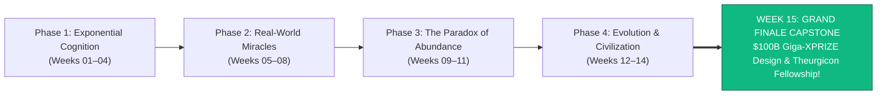

> **🎙️ 3-Presenter Authentic Tiki-Taka Script**
> 
> **Prof. Peter Kim:** Ladies and gentlemen, distinguished scholars, and fellow architects of the future! Welcome to the grand summit of our 15-week intellectual odyssey: **The Grand Capstone Seminar of EXPO-701: We Are as Gods**! *(Turn 1)*  
> **Dr. Elena Vance:** Over the past fourteen weeks, we journeyed across the entire frontier of human evolution—from the mathematical bedrock of the 6Ds and 83 exponential miracles, to regenerative organ factories, synthetic biology, microplastic decontamination, BCI telepathy, and overcoming the existential tragedy of Universe 25! *(Turn 2)*  
> **TA Marcus Brody:** And today on Slide 1, we don't just finish a course; we launch civilization into its next epoch! Today, our six multidisciplinary student teams will present their **$100 Billion Giga-XPRIZE Moonshot Proposals** to solve humanity’s grandest planetary challenges! *(Turn 3)*  
> **Prof. Peter Kim:** We are converting theoretical exponential knowledge into actionable planetary theurgy. *(Turn 4)*  
> **TA Marcus Brody:** The culmination of 15 weeks of rigorous research! *(Turn 5)*  
> **Dr. Elena Vance:** Let us trace the complete 15-week intellectual trajectory across all four phases on Slide 2. *(Turn 6)*  
> **Prof. Peter Kim:** Let’s examine the Comprehensive 15-Week Trajectory on Slide 2. *(Turn 7)*  
> **TA Marcus Brody:** Turn to Slide 2: Phases 1 through 4 Unified! *(Turn 8)*  
> **Dr. Elena Vance:** Let’s see the full four-phase roadmap on Slide 2! *(Turn 9)*  
> **Prof. Peter Kim:** Proceed to Slide 2. *(Turn 10)*

---

### Slide 02: Comprehensive 15-Week Intellectual Trajectory (Phases 1 through 4)
- **The Complete 15-Week Intellectual Odyssey:**
  - *Phase 1 (Weeks 01–04: Foundations & Exponential Cognition):* Theogony, Cognitive Vertigo, The 6Ds Mathematical Framework, Value Density ($49 Quadrillion Scarcity Dematerialization).
  - *Phase 2 (Weeks 05–08: Real-World Miracles & Planetary Telemetry):* The Mekong IoT Logistics Miracle, Compute Scaling & Post-Scarcity AI, PRIMA BCI Regenerative Medicine, Synthetic Biology & Planet GPT.
  - *Phase 3 (Weeks 09–11: The Paradox of Abundance & Infiltration Traps):* PFAS & Brain Microplastics Infiltration, The Caloric Trap & GLP-1 Metabolic Reset, The Cognitive Trap & Epistemic Holy Terror.
  - *Phase 4 (Weeks 12–15: Theurgic Civilization & Planetary Flourishing):* Mind 2.0 & 500% Flow States, The Cyborg Mind & BCI Telepathy, The Paradise Paradox & Universe 25, The $100B Giga-XPRIZE Finale.

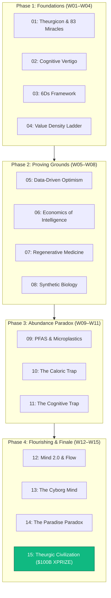

> **🎙️ 3-Presenter Authentic Tiki-Taka Script**
> 
> **Prof. Peter Kim:** Slide 2 maps the grand architecture of our entire semester: Four distinct phases spanning fifteen intensive weeks. Dr. Vance, summarize our intellectual journey. *(Turn 1)*  
> **Dr. Elena Vance:** Look at the four pillars on Slide 2: In **Phase 1**, we broke free from linear thinking through the 6Ds and Value Density! In **Phase 2**, we proved the reality of abundance across compute, robotics, stem cells, and synthetic biology! *(Turn 2)*  
> **TA Marcus Brody:** In **Phase 3**, we courageously confronted the three dark infiltration traps—toxic PFAS chemicals, metabolic obesity, and informational rage algorithms! And in **Phase 4**, we engineered the cognitive software of Mind 2.0, telepathic BCIs, and conquered Universe 25 through purpose! *(Turn 3)*  
> **Prof. Peter Kim:** And today, in Session 15, all fifteen weeks converge into a single grand planetary capstone. *(Turn 4)*  
> **TA Marcus Brody:** The ultimate masterclass in civilizational engineering! *(Turn 5)*  
> **Dr. Elena Vance:** And it is anchored by our $100 Billion Giga-XPRIZE Mandate on Slide 3. *(Turn 6)*  
> **Prof. Peter Kim:** Let’s examine the $100B Giga-XPRIZE Mandate on Slide 3. *(Turn 7)*  
> **TA Marcus Brody:** Turn to Slide 3: The $100 Billion Mandate! *(Turn 8)*  
> **Dr. Elena Vance:** Let’s see the capital allocation framework on Slide 3! *(Turn 9)*  
> **Prof. Peter Kim:** Proceed to Slide 3. *(Turn 10)*

---

### Slide 03: The $100 Billion ($100B) Giga-XPRIZE Capstone Mandate
- **The Capital Allocation Architecture:**
  - *The Mandate:* Deploying a theoretical **$\$100\text{ Billion Global Incentive Purse}$** across 6 core exponential grand challenges to catalyze over **$\$1\text{ to }\$5\text{ Trillion in private R&D and venture innovation}$**.
  - *The Design Rule:* Every prize purse must have a **radically audacious target, objective quantitative milestones, multi-modal audited verification, and a minimum $100\times$ civilizational ROI**.
- **The Graduation Requirement:** Every cohort team must defend their incentive structure against our faculty and venture jury panel.


> **🎙️ 3-Presenter Authentic Tiki-Taka Script**
> 
> **TA Marcus Brody:** Look at the massive economic engine on Slide 3! This is the **$100 Billion Giga-XPRIZE Capstone Mandate**! Elena, explain the mathematics of prize purses! *(Turn 1)*  
> **Dr. Elena Vance:** Look at our capital multiplier: A $100 Billion prize purse does not merely spend $100 Billion; **it triggers a 10x to 50x multiplier in private venture capital and corporate R&D**! Hundreds of brilliant engineering teams will invest over **$1 to $5 Trillion of their own money** racing to win the prize! *(Turn 2)*  
> **TA Marcus Brody:** Look at the green box on Slide 3: That $100 Billion investment unlocks breakthroughs that generate **over $100 Trillion in global economic value and human flourishing**—a verified 100x civilizational return on investment! *(Turn 3)*  
> **Prof. Peter Kim:** Incentive prizes are the most efficient capital allocation mechanism ever invented to break technological bottlenecks and bypass bureaucratic paralysis. *(Turn 4)*  
> **TA Marcus Brody:** Exponential leverage at planetary scale! *(Turn 5)*  
> **Dr. Elena Vance:** Which brings us to our core existential inquest for Session 15 on Slide 4. *(Turn 6)*  
> **Prof. Peter Kim:** Let’s examine The Core Existential Inquest on Slide 4. *(Turn 7)*  
> **TA Marcus Brody:** Turn to Slide 4: How Will Gods with Souls Architect the Future? *(Turn 8)*  
> **Dr. Elena Vance:** Let’s see the million-year inquest on Slide 4! *(Turn 9)*  
> **Prof. Peter Kim:** Proceed to Slide 4. *(Turn 10)*

---

### Slide 04: The Core Existential Inquest: How Will Gods with Souls Architect the Next Million Years?
- **The Supreme Philosophical Inquest:** *"Having acquired the exponential powers of gods—eradicating physical disease, commanding fusion and artificial intelligence, expanding our minds into the cloud, and mastering the laws of matter—how will humanity ensure that our godlike power is forever guided by empathy, sacred planetary stewardship, poetic wonder, and unshakable moral purpose, rather than descending into hubristic self-destruction?"*
- **The Theurgicon Resolution:**
  1. *Planetary Stewardship:* Healing Earth’s living ecosystems as a sacred duty.
  2. *Cosmic Frontiering:* Becoming a multi-planetary, starfaring Type II Kardashev civilization.
  3. *The Soul Invariant:* Cherishing analog human warmth, love, and compassion at the summit of infinite technological power.

> **🎙️ 3-Presenter Authentic Tiki-Taka Script**
> 
> **Prof. Peter Kim:** Scholars, here is the supreme existential inquest of our entire graduate course: **"Having acquired the powers of gods, how will we ensure that our godlike power is forever guided by empathy, sacred planetary stewardship, poetic wonder, and moral purpose?"** Dr. Vance, dissect our three theurgic resolutions. *(Turn 1)*  
> **Dr. Elena Vance:** First: **Sacred Planetary Stewardship**! We do not abandon the Earth; we use synthetic biology, fusion, and geoengineering to restore our oceans, forests, and atmosphere to pristine health! *(Turn 2)*  
> **TA Marcus Brody:** Second: **Cosmic Frontiering**! We build permanent settlements on Mars, harvest the energy of our sun with Dyson swarms, and ignite the stars as a multi-planetary species! *(Turn 3)*  
> **Dr. Elena Vance:** And third: **The Soul Invariant**! At the highest peak of gigabit telepathy and AI compute, we fiercely preserve human warmth, laughter, poetry, physical embrace, and unconditional love! *(Turn 4)*  
> **Prof. Peter Kim:** We become gods, but we remain gods with souls. *(Turn 5)*  
> **TA Marcus Brody:** That is our solemn vow to the future! *(Turn 6)*  
> **Dr. Elena Vance:** Let us examine our roadmap for today’s grand finale on Slide 5. *(Turn 7)*  
> **Prof. Peter Kim:** Let’s examine the Capstone Roadmap on Slide 5. *(Turn 8)*  
> **TA Marcus Brody:** Turn to Slide 5 for our Session 15 roadmap! *(Turn 9)*  
> **Prof. Peter Kim:** Proceed to Slide 5. *(Turn 10)*

---

### Slide 05: Session 15 Master Capstone Roadmap: From Incentive Theory to Graduation
- **Master Capstone Architecture (Session 15):**
  - **Module 1 (Slides 01–05):** Introduction & 15-Week Synthesis — The Grand Climax, 4-Phase Trajectory, The $100B Mandate, Core Inquest.
  - **Module 2 (Slides 06–15):** Primary Text Deconstruction & Incentive Dynamics — Chapter 9 & Epilogue Deconstruction, Diamandis’s Incentive Innovation Philosophy, Ansari ($10M) to Carbon ($100M), Capital Multiplier ($1:10\text{ to }1:50$), Kotler on MTP & Group Flow, Bureaucratic Paralysis vs Moonshots, The Grand 5-Pillar Architecture.
  - **Module 3 (Slides 16–25):** The 15 Giga-XPRIZE Categories & Frameworks — 15 Author Categories ($10B each), Categories 01–09 (Superconductors, Aging Reversal, Mars, Fusion), ROI Formula ($\mathcal{I}_{\text{ROI}} \ge 100\times$), Milestone Tranches, Blockchain Auditing, Convergence Network Topology.
  - **Module 4 (Slides 26–35):** Student Cohort $100B Presentations & Defense — 6 Team Defenses (Superconducting Grid, Longevity Escape, Direct Air Carbon, Neuro-Privacy Mesh, Mars Biosphere 3.0, SCWO PFAS Grid), Faculty Scoring Ledger, Allocation Matrix.
  - **Module 5 (Slides 36–42):** Existential Synthesis & Theurgicon Charter — Authentic Humanism, Analog Warmth ("Singing Shoulder-to-Shoulder"), Biosphere Stewardship Mandate, Unified Master Synthesis Diagram, Theurgicon Fellowship Declaration.
  - **Module 6 (Slides 43–45):** Awards Ceremony, Faculty Valediction & Grand Commencement.

> **🎙️ 3-Presenter Authentic Tiki-Taka Script**
> 
> **Dr. Elena Vance:** Slide 5 outlines our master capstone roadmap for Session 15. We will bridge incentive prize economics, 15 planetary challenge categories, six live student cohort defenses, and our formal theurgic commencement across six grand modules. *(Turn 1)*  
> **TA Marcus Brody:** In Module 2, we deconstruct Chapter 9 and the Epilogue: Peter Diamandis’s **Incentive Innovation Philosophy**, the 30-year evolution from the $10M Ansari XPRIZE to the $100M Carbon Removal XPRIZE, and the 1:50 capital multiplier! *(Turn 2)*  
> **Prof. Peter Kim:** In Module 3, we analyze the 15 Author-Proposed Giga-XPRIZE Categories ($10B each) and the mathematical ROI formulas governing multi-billion-dollar incentive purses! *(Turn 3)*  
> **TA Marcus Brody:** In Module 4, our six graduate cohort teams will take the stage to defend their **$100 Billion Giga-XPRIZE Proposals** before our faculty and venture jury! *(Turn 4)*  
> **Dr. Elena Vance:** In Module 5, we proclaim **The Theurgicon Fellowship Charter** and celebrate the sacred sanctuary of analog human warmth. *(Turn 5)*  
> **Prof. Peter Kim:** And in Module 6, we confer your graduate fellowships and officially commence EXPO-701! *(Turn 6)*  
> **TA Marcus Brody:** Let us step into Module 2 and deconstruct Peter Diamandis’s incentive innovation philosophy! *(Turn 7)*  
> **Dr. Elena Vance:** Turn to Slide 6: Deconstructing Chapter 9 & Epilogue! *(Turn 8)*  
> **TA Marcus Brody:** Let’s dive into Slide 6! *(Turn 9)*  
> **Prof. Peter Kim:** Proceed to Module 2: Primary Text Deconstruction & Incentive Dynamics! *(Turn 10)*


---

## Module 2: Primary Text Deconstruction & Incentive Dynamics (Slides 06–15)

### Slide 06: Deconstructing Chapter 9 & Epilogue: "The Final Frontier Is Us"
- **Primary Source Analysis:** Peter H. Diamandis & Steven Kotler, *We Are as Gods* (2026), Chapter 9 (*The Final Frontier Is Us*) & Epilogue (*The Planetary Theurgicon*).
- **The Core Thematic Thesis:**
  - The ultimate bottleneck to human civilizational greatness is not a lack of technology, compute, or capital.
  - **The true bottleneck is our failure of imagination and incentive design:** how we mobilize the collective intelligence of humanity to tackle planetary-scale moonshots.

> **🎙️ 3-Presenter Authentic Tiki-Taka Script**
> 
> **Prof. Peter Kim:** Let us deconstruct Chapter 9 and the Epilogue of *We Are as Gods*. Dr. Vance, what is Peter Diamandis and Steven Kotler’s central message in "The Final Frontier Is Us"? *(Turn 1)*  
> **Dr. Elena Vance:** The authors deliver an electrifying insight: Humanity’s greatest bottleneck is not a lack of computing power, funding, or raw intelligence. **Our greatest bottleneck is a failure of imagination and obsolete incentive structures!** *(Turn 2)*  
> **TA Marcus Brody:** Look at how governments usually fund science: Bureaucratic committees writing 500-page grant proposals, funding the same safe, incremental ideas over and over! But Diamandis and Kotler argue that **Incentive Competitions flip the entire model upside down**! *(Turn 3)*  
> **Prof. Peter Kim:** Instead of picking a single contractor and paying for effort regardless of success, an incentive prize **pays only for verified success, unleashing thousands of decentralized mavericks**. *(Turn 4)*  
> **TA Marcus Brody:** Pay for the breakthrough, not for the bureaucracy! *(Turn 5)*  
> **Dr. Elena Vance:** Let us examine Peter Diamandis’s incentive innovation philosophy on Slide 7. *(Turn 6)*  
> **Prof. Peter Kim:** Let’s examine Incentive Innovation Philosophy on Slide 7. *(Turn 7)*  
> **TA Marcus Brody:** Turn to Slide 7: Engineering the Impossible via Prize Purses! *(Turn 8)*  
> **Dr. Elena Vance:** Let’s see the incentive engineering blueprint on Slide 7! *(Turn 9)*  
> **Prof. Peter Kim:** Proceed to Slide 7. *(Turn 10)*

---

### Slide 07: Peter Diamandis’s Incentive Innovation Philosophy: "Engineering the Impossible via Prize Purses"
- **The Core Epistemology of Incentive Competitions:**
  - *The Old Paradigm (Cost-Plus Government Grants):* Government picks a single entrenched contractor (e.g., Boeing/Lockheed), pays billions regardless of success, and penalizes failure, resulting in risk-aversion and decades of delays.
  - *The Incentive Prize Paradigm (XPRIZE Model):* Set a clear, measurable, audacious goal; offer a massive cash purse; **pay ONLY when the objective target is 100% achieved and independently verified**.
- **The 4 Rules of Diamandis Incentive Design:**
  1. *Clear Finish Line:* Objective, quantifiable criteria (zero subjective judging).
  2. *Audacious Target:* Must feel "borderline impossible" to conventional experts.
  3. *Unconstrained Innovation:* Teams can use any technology or methodology they choose.
  4. *Global Participation:* Open to garage hackers, university labs, and multi-nationals alike.

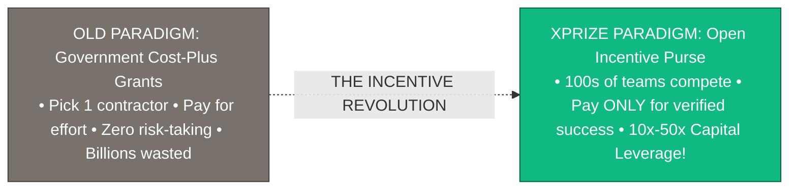

> **🎙️ 3-Presenter Authentic Tiki-Taka Script**
> 
> **TA Marcus Brody:** Look at the paradigm shift on Slide 7! This is **Peter Diamandis’s Incentive Innovation Philosophy**! Elena, why are incentive prizes so radically superior to traditional government grants? *(Turn 1)*  
> **Dr. Elena Vance:** In traditional government grants, bureaucrats pick a single giant defense contractor, hand them $10 Billion upfront, and pay them for their hours even if the rocket blows up on the pad or never flies! It rewards bureaucracy and punishes bold risk-taking! *(Turn 2)*  
> **TA Marcus Brody:** Look at the green box on Slide 7: An **XPRIZE sets a clear, audacious target and offers a massive cash purse—but pays ONLY when the finish line is crossed and verified**! 500 teams from around the world enter the race, trying 500 totally different radical ideas! *(Turn 3)*  
> **Prof. Peter Kim:** The sponsor only pays once, but benefits from hundreds of brilliant minds investing their own capital and passion. *(Turn 4)*  
> **TA Marcus Brody:** You get a billion dollars of R&D for a fraction of the cost! *(Turn 5)*  
> **Dr. Elena Vance:** Let us trace the 30-year evolution of XPRIZE on Slide 8. *(Turn 6)*  
> **Prof. Peter Kim:** Let’s examine the 30-Year XPRIZE Evolution on Slide 8. *(Turn 7)*  
> **TA Marcus Brody:** Turn to Slide 8: From Ansari ($10M) to Carbon Removal ($100M)! *(Turn 8)*  
> **Dr. Elena Vance:** Let’s see the historical scaling on Slide 8! *(Turn 9)*  
> **Prof. Peter Kim:** Proceed to Slide 8. *(Turn 10)*

---

### Slide 08: The 30-Year XPRIZE Evolution: From Ansari ($10M) to Carbon Removal ($100M)
- **The Historical Milestones of Incentive Innovation (1996–2026):**
  - *1996–2004: The Ansari XPRIZE ($10 Million Purse):*
    - **Target:** Build a private, reusable 3-person spacecraft that flies to $100\text{km}$ altitude twice within 14 days.
    - **Outcome:** Scaled Composites (Burt Rutan / Paul Allen) won with *SpaceShipOne*, launching the **$\$1\text{ Trillion commercial private spaceflight industry}$ (Virgin Galactic, SpaceX, Blue Origin)**. 26 teams spent $>\$100\text{ Million}$ competing.
  - *2021–2025: XPRIZE Carbon Removal ($100 Million Purse - Elon Musk):*
    - **Target:** Extract and permanently sequester $1,000\text{ tonnes of }\text{CO}_2/\text{year}$ with a validated path to gigaton scale.
    - **Outcome:** Catalyzed **$>1,300\text{ global teams across 88 countries}$**, mobilizing $>\$2\text{ Billion in private climate-tech investment}$ and creating the modern Direct Air Capture industry.

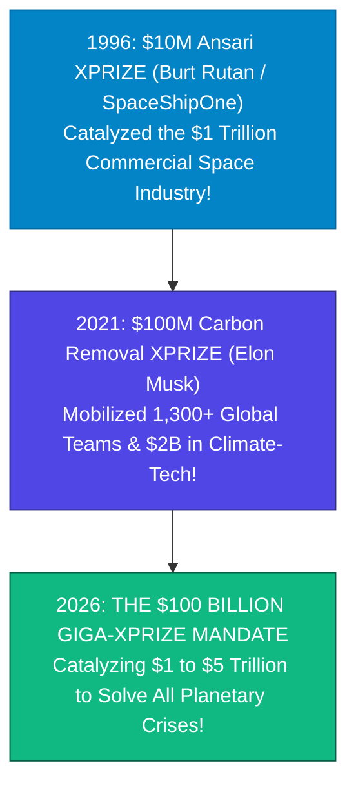

> **🎙️ 3-Presenter Authentic Tiki-Taka Script**
> 
> **Prof. Peter Kim:** Slide 8 tracks the 30-year scaling of the XPRIZE model. Dr. Vance, trace the journey from the Ansari XPRIZE to the $100M Carbon Removal prize. *(Turn 1)*  
> **Dr. Elena Vance:** In 1996, Peter Diamandis launched the **$10 Million Ansari XPRIZE** for private spaceflight. In 2004, Burt Rutan and Paul Allen won with *SpaceShipOne*. That single $10M prize ignited the entire **$1 Trillion commercial space revolution—giving birth to SpaceX, Blue Origin, and Virgin Galactic**! 26 teams spent over $100 Million competing! *(Turn 2)*  
> **TA Marcus Brody:** And in 2021, Elon Musk funded the **$100 Million Carbon Removal XPRIZE**! Over 1,300 global teams from 88 countries competed, unlocking more than **$2 Billion in private climate-tech venture capital**! *(Turn 3)*  
> **Prof. Peter Kim:** Look at the green box on Slide 8: In 2026, we scale this proven model to its ultimate manifestation: **The $100 Billion Giga-XPRIZE Mandate** to solve all six planetary crises simultaneously. *(Turn 4)*  
> **TA Marcus Brody:** From $10 Million to $100 Million to $100 Billion! *(Turn 5)*  
> **Dr. Elena Vance:** And modern mega-prizes are already running for Healthspan and Water Scarcity on Slide 9. *(Turn 6)*  
> **Prof. Peter Kim:** Let’s examine Modern Mega-XPRIZEs on Slide 9. *(Turn 7)*  
> **TA Marcus Brody:** Turn to Slide 9: Healthspan ($101M) & Water Scarcity ($119M)! *(Turn 8)*  
> **Dr. Elena Vance:** Let’s see the active 9-figure prize models on Slide 9! *(Turn 9)*  
> **Prof. Peter Kim:** Proceed to Slide 9. *(Turn 10)*

---

### Slide 09: Modern Mega-XPRIZEs: Healthspan ($101M) & Water Scarcity ($119M) Models
- **Active 9-Figure Global Incentive Competitions (2023–2030):**
  - *XPRIZE Healthspan ($101 Million Purse, 2023–2030):*
    - **Target:** Restore muscle, cognition, and immune function in older adults by **$10\text{ to }20\text{ years}$** in a 1-year clinical trial protocol.
    - **Impact:** Transforming medicine from reactive sick-care to proactive rejuvenation longevity engineering.
  - *XPRIZE Water Scarcity ($119 Million Purse, 2024–2029 - Mohamed bin Zayed):*
    - **Target:** Develop novel desalination and atmospheric water extraction systems producing fresh water at **$<10\text{ cents per cubic meter}$** using 100% renewable energy.
    - **Impact:** Eliminating water scarcity for 4 billion people living in arid regions.

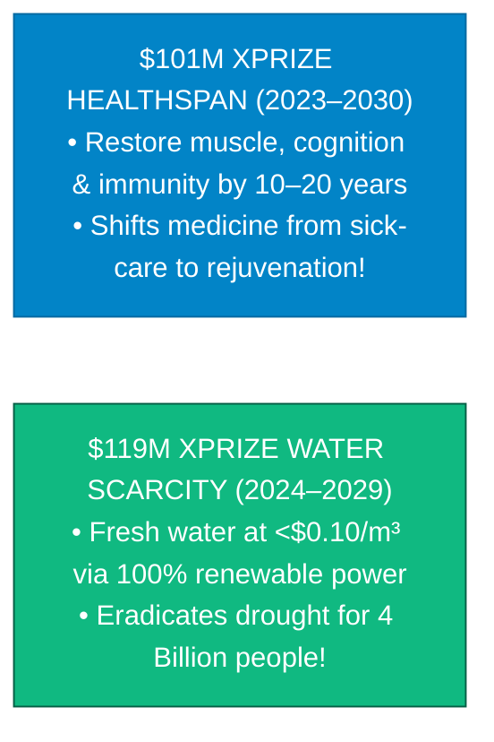

> **🎙️ 3-Presenter Authentic Tiki-Taka Script**
> 
> **TA Marcus Brody:** Look at the active 9-figure competitions on Slide 9! This is the proof that mega-prizes work today: **XPRIZE Healthspan ($101M) and XPRIZE Water Scarcity ($119M)**! Elena, what is the Healthspan goal? *(Turn 1)*  
> **Dr. Elena Vance:** XPRIZE Healthspan offers $101 Million to any team that can **rejuvenate human muscle, cognition, and immune function by 10 to 20 years in a 1-year clinical trial**! It is turning anti-aging from science fiction into an exact, measurable medical milestone! *(Turn 2)*  
> **TA Marcus Brody:** And look at the $119 Million Water Scarcity XPRIZE: Desalinate seawater or pull water from the air for **less than 10 cents per cubic meter using 100% solar power**! That wipes out global drought for 4 billion people! *(Turn 3)*  
> **Prof. Peter Kim:** When prize purses reach 9 and 10 figures, they attract the world’s top universities, venture funds, and brilliant mavericks to solve civilization’s hardest bottlenecks. *(Turn 4)*  
> **TA Marcus Brody:** That is the power of a 9-figure finish line! *(Turn 5)*  
> **Dr. Elena Vance:** And we calculate the leverage effect mathematically on Slide 10. *(Turn 6)*  
> **Prof. Peter Kim:** Let’s examine The Capital Multiplier Leverage Effect on Slide 10. *(Turn 7)*  
> **TA Marcus Brody:** Turn to Slide 10: $1:10\text{ to }1:50$ R&D Mathematics! *(Turn 8)*  
> **Dr. Elena Vance:** Let’s see the leverage formula on Slide 10! *(Turn 9)*  
> **Prof. Peter Kim:** Proceed to Slide 10. *(Turn 10)*

---

### Slide 10: The Capital Multiplier Leverage Effect: $1 : 10\text{ to }1 : 50$ R&D Mathematics
- **The Financial Thermodynamics of Incentive Purses:**
  $$\mathcal{M}_{\text{leverage}} = \frac{\sum_{i=1}^{N_{\text{teams}}} \text{Capital Spent}_i}{\text{Prize Purse Value}} \in [10.0, 50.0]$$
  - *Historical Empirical Multipliers:*
    - **Ansari XPRIZE ($10M):** 26 teams spent **$\$100\text{ Million}$** ($1 : 10\text{ leverage}$).
    - **Google Lunar XPRIZE ($30M):** 30 teams spent **$\$300\text{ Million+}$** ($1 : 10\text{ leverage}$).
    - **Tricorder XPRIZE ($10M):** 300+ teams spent **$\$150\text{ Million}$** ($1 : 15\text{ leverage}$).
    - **Carbon Removal ($100M):** 1,300+ teams mobilizing **$\$2\text{ to }\$5\text{ Billion}$** ($1 : 20\text{ to }1 : 50\text{ leverage}$).
- **The Civilizational Rule:** A $\$100\text{B}$ Giga-XPRIZE purse unleashes **$\$1.0\text{ to }\$5.0\text{ Trillion}$** in private competitive R&D capital.

> **🎙️ 3-Presenter Authentic Tiki-Taka Script**
> 
> **Prof. Peter Kim:** Slide 10 presents the financial thermodynamics of incentive innovation: **The Capital Multiplier Leverage Effect**. Dr. Vance, walk us through the historical leverage ratios. *(Turn 1)*  
> **Dr. Elena Vance:** Look at our leverage formula: $\mathcal{M}_{\text{leverage}}$ measures how much outside capital is mobilized for every dollar in the prize purse. In the Ansari XPRIZE, a $10M purse mobilized $100M—a **10x leverage**. In the Carbon Removal XPRIZE, a $100M purse mobilized over $2 Billion—a **20x to 50x leverage**! *(Turn 2)*  
> **TA Marcus Brody:** Look at the bottom line: When you put up a **$100 Billion Giga-XPRIZE Purse**, you don't just get $100B of effort; **you unleash $1.0 to $5.0 TRILLION in decentralized private R&D capital**! *(Turn 3)*  
> **Prof. Peter Kim:** No single government agency on Earth can mobilize $5 Trillion of hungry, creative talent as fast and efficiently as an open global incentive purse. *(Turn 4)*  
> **TA Marcus Brody:** It is the ultimate capitalist engine for altruistic civilizational breakthroughs! *(Turn 5)*  
> **Dr. Elena Vance:** And it overcomes market and bureaucratic failures on Slide 11. *(Turn 6)*  
> **Prof. Peter Kim:** Let’s examine Overcoming Market & Bureaucratic Failures on Slide 11. *(Turn 7)*  
> **TA Marcus Brody:** Turn to Slide 11: Heroic Incentive Prizes! *(Turn 8)*  
> **Dr. Elena Vance:** Let’s see how prizes conquer institutional failure on Slide 11! *(Turn 9)*  
> **Prof. Peter Kim:** Proceed to Slide 11. *(Turn 10)*

---

### Slide 11: Overcoming Market & Bureaucratic Failures via "Heroic Incentive Prizes"
- **Diagnosing the Twin Failures of 21st-Century R&D:**
  1. *Market Failure (Short-Termism):* Venture capital demands $3\text{–}5\text{-year}$ software returns; public markets punish long-term, high-risk deep-tech moonshots (fusion, geoengineering, organ factories).
  2. *Bureaucratic Failure (Risk-Aversion):* Government grant committees (NIH, DOE) prioritize peer-reviewed consensus and incremental studies, rejecting high-risk, paradigm-shifting radical proposals.
- **The Incentive Prize Antidote:** Provides a massive, guaranteed liquidity event at the finish line, **de-risking long-term private venture investment and rewarding outsider genius**.

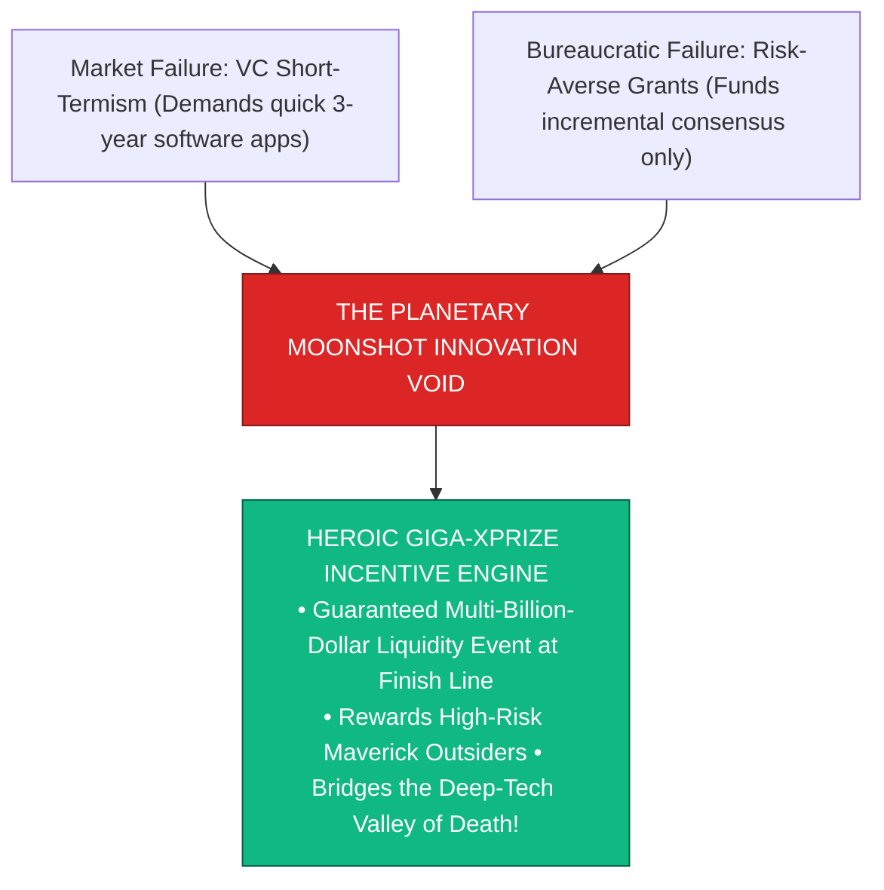

> **🎙️ 3-Presenter Authentic Tiki-Taka Script**
> 
> **TA Marcus Brody:** Look at the institutional diagnosis on Slide 11! This is **How Heroic Incentive Prizes Overcome Market and Bureaucratic Failures**! Elena, why do venture capital and government grants fail at big moonshots? *(Turn 1)*  
> **Dr. Elena Vance:** Traditional venture capital is trapped in short-term thinking—they want a quick 3-year return on a consumer smartphone app, not a 10-year bet on fusion reactors! And government grant agencies like the NIH and DOE are terrified of failure, so they only fund safe, incremental, boring research! *(Turn 2)*  
> **TA Marcus Brody:** Look at the red box on Slide 11: That leaves a massive **Planetary Moonshot Innovation Void**! Nobody funds the radical, crazy ideas that could actually save the planet! *(Turn 3)*  
> **Prof. Peter Kim:** Look at the green box: A Giga-XPRIZE creates a **guaranteed multi-billion-dollar liquidity event at the finish line**, completely de-risking private investment and empowering maverick outsiders to take massive risks! *(Turn 4)*  
> **TA Marcus Brody:** It bridges the Deep-Tech Valley of Death and unleashes revolutionary breakthroughs! *(Turn 5)*  
> **Dr. Elena Vance:** And Steven Kotler shows how this creates Group Flow on Slide 12. *(Turn 6)*  
> **Prof. Peter Kim:** Let’s examine Steven Kotler on MTP & Group Flow on Slide 12. *(Turn 7)*  
> **TA Marcus Brody:** Turn to Slide 12: Group Flow Infrastructure! *(Turn 8)*  
> **Dr. Elena Vance:** Let’s see the collective flow state dynamics on Slide 12! *(Turn 9)*  
> **Prof. Peter Kim:** Proceed to Slide 12. *(Turn 10)*

---

### Slide 12: Steven Kotler on Massive Transformative Purpose (MTP) & Group Flow Infrastructure
- **The Psychology of High-Stakes Moonshots:**
  - *The Neuro-Chemical Ignition of Group Flow:* When 100 brilliant engineers, biologists, and physicists are united under an audacious, high-consequence prize deadline, the brain triggers **Group Flow (400–500% surge in collaborative productivity)**.
  - *The 4 Group Flow Triggers in XPRIZE Competitions:*
    1. *High Consequences (Skin in the Game):* Real billions at stake; high public visibility.
    2. *Shared Clear Goals:* Unambiguous quantitative finish line.
    3. *Autonomous Execution:* Complete freedom in technical design.
    4. *Close Listening & Blended Egos:* Interdisciplinary cross-pollination.
- **The Civilizational Engine:** Transformative moonshots turn fragmented teams into hyper-synchronized problem-solving swarms.

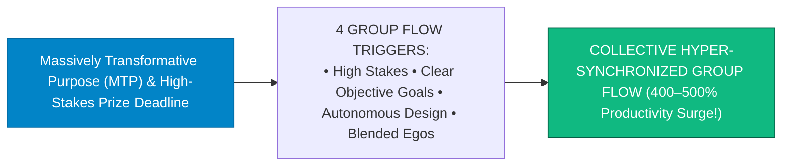

> **🎙️ 3-Presenter Authentic Tiki-Taka Script**
> 
> **Prof. Peter Kim:** Slide 12 presents Steven Kotler’s neuro-psychological framework: **Massive Transformative Purpose (MTP) and Group Flow Infrastructure**. Dr. Vance, what happens inside teams competing for a mega-prize? *(Turn 1)*  
> **Dr. Elena Vance:** When hundreds of engineers, biologists, and coders unite under an audacious, high-stakes deadline to win a multi-billion-dollar prize, the four group flow triggers fire simultaneously! Individual egos dissolve, and the entire team enters **Collective Group Flow—a 400% to 500% surge in creative problem-solving speed**! *(Turn 2)*  
> **TA Marcus Brody:** Look at the flowchart: High consequences, clear objective goals, total technical freedom, and hyper-synchronized communication! You achieve in six months what a bureaucratic committee couldn't do in twenty years! *(Turn 3)*  
> **Prof. Peter Kim:** High-stakes moonshots transform human talent into a unified, unstoppable problem-solving super-organism. *(Turn 4)*  
> **TA Marcus Brody:** That is the theurgic flow state at scale! *(Turn 5)*  
> **Dr. Elena Vance:** And contrast this with bureaucratic government paralysis on Slide 13. *(Turn 6)*  
> **Prof. Peter Kim:** Let’s examine Bureaucratic Paralysis vs Private Moonshots on Slide 13. *(Turn 7)*  
> **TA Marcus Brody:** Turn to Slide 13! *(Turn 8)*  
> **Dr. Elena Vance:** Let’s see the institutional contrast on Slide 13! *(Turn 9)*  
> **Prof. Peter Kim:** Proceed to Slide 13. *(Turn 10)*

---

### Slide 13: Bureaucratic Government R&D Paralysis vs. Private Exponential Moonshots
- **Comparative Institutional Performance Scoreboard:**

| Dimension | Bureaucratic Government Grant Model (NIH / DOE) | Private Exponential Moonshot / XPRIZE Model |
| :--- | :--- | :--- |
| **Capital Disbursement**| Pays 100% upfront regardless of success or failure | **Pays ONLY upon 100% verified target completion** |
| **Risk Tolerance** | Zero-risk; rejects unconventional or radical proposals | **Encourages high-risk, radical, paradigm-shifting bets** |
| **Participant Base** | Closed network of elite university incumbents | **Open to global garage mavericks, startups & students** |
| **Speed / Agility** | $5\text{–}10\text{ years}$ of peer-review grant cycles | **Rapid 2–5 year high-velocity milestone sprints** |
| **Capital Efficiency** | $1 : 1\text{ (Zero capital leverage)}$ | **$1 : 10\text{ to }1 : 50\text{ private capital multiplier}$** |
| **Outcome Ownership** | Buried in academic journals; slow commercialization | **Rapid venture spin-outs & instant global scaling** |

> **🎙️ 3-Presenter Authentic Tiki-Taka Script**
> 
> **TA Marcus Brody:** Look at the head-to-head comparison on Slide 13! This is **Bureaucratic Government R&D Paralysis versus Private Exponential Moonshots**! Elena, summarize the key contrasts! *(Turn 1)*  
> **Dr. Elena Vance:** Look at row 1: Government grants pay 100% upfront for effort, even if the project fails completely. The XPRIZE model **pays ONLY when the target is 100% achieved and independently verified**! *(Turn 2)*  
> **TA Marcus Brody:** Look at row 5: Government grants have zero capital leverage ($1:1). An XPRIZE purse produces **10x to 50x in private capital leverage**! And look at row 3: Instead of a closed club of tenured professors, an open prize invites thousands of hungry young engineers from all around the world! *(Turn 3)*  
> **Prof. Peter Kim:** Speed, capital efficiency, risk tolerance, and open democratization. The incentive prize model wins on every single metric. *(Turn 4)*  
> **TA Marcus Brody:** It is the fastest vehicle for human progress ever built! *(Turn 5)*  
> **Dr. Elena Vance:** And it is the ultimate vaccine against Universe 25 on Slide 14. *(Turn 6)*  
> **Prof. Peter Kim:** Let’s examine The Ultimate Vaccine on Slide 14. *(Turn 7)*  
> **TA Marcus Brody:** Turn to Slide 14: Planetary-Scale Giga-XPRIZEs! *(Turn 8)*  
> **Dr. Elena Vance:** Let’s see how moonshots cure existential boredom on Slide 14! *(Turn 9)*  
> **Prof. Peter Kim:** Proceed to Slide 14. *(Turn 10)*

---

### Slide 14: The Ultimate Vaccine Against Universe 25: Planetary-Scale Giga-XPRIZEs
- **Solving the Paradise Paradox at Scale:**
  - *The Danger of Abundance:* As established in Session 14, unearned comfort causes dopamine shutdown, social withdrawal ("The Beautiful Ones"), and reproductive extinction.
  - *The Planetary Vaccine:* **Giga-XPRIZE Moonshots create an infinite supply of high-stakes, heroic, glorious problems to solve.**
- **The Invariant:** When humanity possesses an infinite series of multi-billion-dollar planetary quests (terraforming Mars, reversing aging, cleaning oceans, Dyson swarms), **existential nihilism is permanently extinguished**.

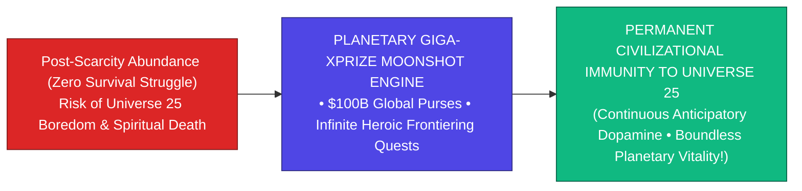

> **🎙️ 3-Presenter Authentic Tiki-Taka Script**
> 
> **Prof. Peter Kim:** Slide 14 reveals the ultimate civilizational synthesis: **Planetary-Scale Giga-XPRIZEs as the Vaccine Against Universe 25**. Dr. Vance, explain how moonshots heal the soul in an abundant world. *(Turn 1)*  
> **Dr. Elena Vance:** In Session 14, we learned that without struggle, mammalian biology decays into apathy and extinction. But look at the flowchart on Slide 14: **Giga-XPRIZEs provide an infinite supply of glorious, heroic, mountain-sized challenges!** *(Turn 2)*  
> **TA Marcus Brody:** Instead of mice eating pellets in a cage, human beings become cosmic theurgists—competing to terraform Mars, reverse biological aging by 50 years, and clean all microplastics from Earth’s oceans! *(Turn 3)*  
> **Prof. Peter Kim:** Our SEEKING circuits never idle; our dopaminergic engines fire with boundless vitality; and humanity remains eternally adventurous, joyful, and purposeful. *(Turn 4)*  
> **TA Marcus Brody:** The vaccine is active! We have cured the paradise paradox! *(Turn 5)*  
> **Dr. Elena Vance:** And we codify the 5 pillars of mega-prize design on Slide 15. *(Turn 6)*  
> **Prof. Peter Kim:** Let’s examine The Grand 5-Pillar Architecture on Slide 15. *(Turn 7)*  
> **TA Marcus Brody:** Turn to Slide 15: Grand 5-Pillar Mega-XPRIZE Architecture! *(Turn 8)*  
> **Dr. Elena Vance:** Let’s see the complete incentive design framework! *(Turn 9)*  
> **Prof. Peter Kim:** Proceed to Slide 15. *(Turn 10)*

---

### Slide 15: The Grand 5-Pillar Mega-XPRIZE Incentive Design Architecture
- **The Master Systems Engineering Architecture:**
  1. **Pillar 1 (Audacious & Radically Transformative Target):** Targets a $100\times$ leap, not a $10\%$ increment.
  2. **Pillar 2 (Objective, Quantifiable & Unambiguous Finish Line):** Zero subjective judging; binary mathematical verification.
  3. **Pillar 3 (Massive Capital Purse with Dynamic Milestone Tranches):** Multi-billion-dollar purse with interim milestone funding.
  4. **Pillar 4 (Independent Multi-Modal Auditing & Smart Contracts):** Blockchain-verified telemetry, physical assays, and open data.
  5. **Pillar 5 (Open-Source Post-Prize Technology Scaling):** IP licensing frameworks ensuring global humanitarian deployment.

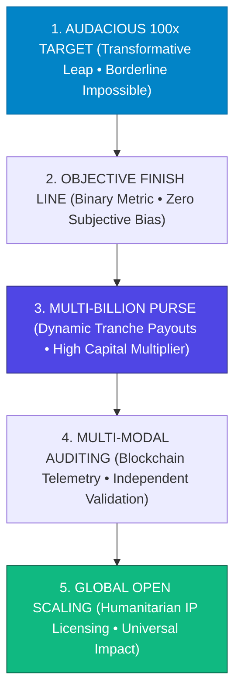

> **🎙️ 3-Presenter Authentic Tiki-Taka Script**
> 
> **Prof. Peter Kim:** Scholars, look at Slide 15. This is our master design framework: **The 5-Pillar Mega-XPRIZE Incentive Architecture**. Marcus, walk us through the five pillars! *(Turn 1)*  
> **TA Marcus Brody:** Pillar 1: **Audacious 100x Target**—aim for a revolutionary leap that feels borderline impossible! Pillar 2: **Objective Finish Line**—unambiguous, binary mathematical criteria with zero subjective judges! *(Turn 2)*  
> **Dr. Elena Vance:** Pillar 3: **Multi-Billion Dollar Purse**—scale the prize with dynamic milestone tranches to fund teams as they make progress! Pillar 4: **Independent Multi-Modal Auditing**—verify all data using physical lab assays and blockchain smart contracts! And Pillar 5: **Global Open Scaling**—guarantee that the winning technology is licensed to heal all of humanity! *(Turn 3)*  
> **Prof. Peter Kim:** A complete, airtight systems engineering blueprint for planetary transformation. *(Turn 4)*  
> **TA Marcus Brody:** That is how you design a prize that changes history! *(Turn 5)*  
> **Dr. Elena Vance:** Now let us examine the 15 Author-Proposed Giga-XPRIZE Categories in Module 3! *(Turn 6)*  
> **TA Marcus Brody:** Turn to Slide 16: The 15 Frontier Categories ($10B Each)! *(Turn 7)*  
> **Dr. Elena Vance:** Let’s see the $150 Billion category landscape on Slide 16! *(Turn 8)*  
> **Prof. Peter Kim:** Proceed to Module 3: Exponential Frameworks & The 15 Giga-XPRIZE Categories! *(Turn 9)*  
> **TA Marcus Brody:** Let’s dive into Slide 16! *(Turn 10)*


---

## Module 3: Exponential Frameworks & The 15 Giga-XPRIZE Categories (Slides 16–25)

### Slide 16: The 15 Author-Proposed Giga-XPRIZE Uncharted Frontier Categories ($10B Each)
- **The $150 Billion Full Frontier Catalog (Diamandis & Kotler, 2026):**
  - Synthesizes 15 distinct exponential moonshot domains, each structured as a **$\$10\text{ Billion Giga-XPRIZE}$** designed to solve a foundational civilizational bottleneck.
- **The 3 Thematic Clusters:**
  1. *Biosphere Restoration & Planetary Health (Categories 01, 03, 05, 07, 11, 12).*
  2. *Energy, Matter & Computing Singularity (Categories 02, 08, 09, 10, 13).*
  3. *Human Enhancement, Longevity & Space Settlement (Categories 04, 06, 14, 15).*

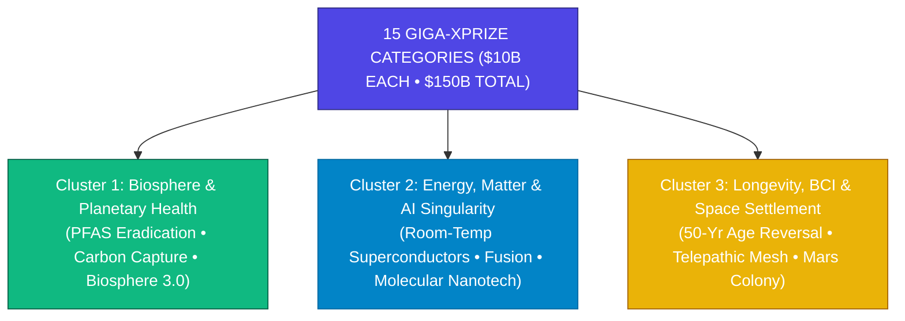

> **🎙️ 3-Presenter Authentic Tiki-Taka Script**
> 
> **Prof. Peter Kim:** Module 3 presents Peter Diamandis and Steven Kotler’s master catalog: **The 15 Author-Proposed Giga-XPRIZE Categories ($10 Billion Each)**. Dr. Vance, walk us through the three core clusters. *(Turn 1)*  
> **Dr. Elena Vance:** The authors mapped out fifteen revolutionary moonshot domains, each backed by a $10 Billion prize purse. Look at the three clusters on Slide 16: **Cluster 1: Biosphere and Planetary Health** (cleaning PFAS, gigaton carbon removal, and synthetic ecosystems)! **Cluster 2: Energy, Matter, and Computing Singularity** (room-temperature superconductors, baseload fusion, and molecular nanotechnology)! *(Turn 2)*  
> **TA Marcus Brody:** And **Cluster 3: Human Enhancement, Longevity, and Space Settlement**—reversing biological age by 50 years, ultra-secure BCI telepathy, and building a 10,000-person self-sustaining city on Mars! *(Turn 3)*  
> **Prof. Peter Kim:** Fifteen definitive blueprints to upgrade human civilization from a fragile planetary species to an immortal cosmic power. *(Turn 4)*  
> **TA Marcus Brody:** $150 Billion of pure transformative ambition! *(Turn 5)*  
> **Dr. Elena Vance:** Let us examine Categories 01 through 03 in detail on Slide 17. *(Turn 6)*  
> **Prof. Peter Kim:** Let’s examine Categories 01–03 on Slide 17. *(Turn 7)*  
> **TA Marcus Brody:** Turn to Slide 17: Whole Organ Regeneration, Superconducting Grid & Biosphere 3.0! *(Turn 8)*  
> **Dr. Elena Vance:** Let’s see the first three categories on Slide 17! *(Turn 9)*  
> **Prof. Peter Kim:** Proceed to Slide 17. *(Turn 10)*

---

### Slide 17: Categories 01–03: Whole Organ Regeneration, Superconducting Grid, Biosphere 3.0
- **Category 01: Fully Functional 3D-Bioprinted Whole Human Organs ($10B Purse):**
  - *Target:* Bioprint and transplant immunologically matched, fully vascularized human hearts, kidneys, and livers into human patients with **$100\%\text{ 5-year survival}$**, completely eliminating organ transplant waitlists globally.
- **Category 02: Ambient Room-Temperature & Ambient-Pressure Superconductors ($10B Purse):**
  - *Target:* Synthesize a stable bulk material exhibiting zero electrical resistance at **$T \ge 298\text{K (25}^\circ\text{C)}$ and $P = 1\text{ atm}$**, enabling lossless global power transmission and ultra-compact fusion magnets.
- **Category 03: Biosphere 3.0: 100% Closed-Loop Ecological Life Support ($10B Purse):**
  - *Target:* Build a 100-person sealed ecological dome maintaining $100\%$ atmospheric, nutritional, and hydrological recycling for **$>5\text{ consecutive years}$** with zero external resupply.

> **🎙️ 3-Presenter Authentic Tiki-Taka Script**
> 
> **TA Marcus Brody:** Look at the first three categories on Slide 17! Category 1 is **3D-Bioprinted Whole Human Organs ($10B)**; Category 2 is **Room-Temperature Superconductors ($10B)**; and Category 3 is **Biosphere 3.0 ($10B)**! Elena, why are these three targets so transformative? *(Turn 1)*  
> **Dr. Elena Vance:** Look at Category 1: If we can 3D-bioprint custom vascularized hearts and kidneys from a patient’s own stem cells, **nobody on Earth will ever die waiting for an organ donor again**! Organ failure is permanently cured! *(Turn 2)*  
> **TA Marcus Brody:** And look at Category 2: A room-temperature superconductor ($T \ge 25^\circ\text{C}$ at 1 atm) means **ZERO electricity loss on power lines across entire continents**, dirt-cheap magnetic levitation trains, and hyper-powerful fusion magnets! *(Turn 3)*  
> **Prof. Peter Kim:** And Category 3—Biosphere 3.0—is the closed-loop ecological life support system required to establish permanent human civilizations on Mars and the Moon. *(Turn 4)*  
> **TA Marcus Brody:** Three grand prizes solving medicine, energy, and space! *(Turn 5)*  
> **Dr. Elena Vance:** And Categories 04 through 06 tackle Mars, Artificial Photosynthesis, and Telepathy on Slide 18. *(Turn 6)*  
> **Prof. Peter Kim:** Let’s examine Categories 04–06 on Slide 18. *(Turn 7)*  
> **TA Marcus Brody:** Turn to Slide 18! *(Turn 8)*  
> **Dr. Elena Vance:** Let’s see Categories 04 through 06 on Slide 18! *(Turn 9)*  
> **Prof. Peter Kim:** Proceed to Slide 18. *(Turn 10)*

---

### Slide 18: Categories 04–06: Mars Self-Sustaining City, Gigaton Artificial Photosynthesis, Telepathy Mesh
- **Category 04: 10,000-Person Self-Sustaining Mars Settlement ($10B Purse):**
  - *Target:* Establish a permanent settlement on Mars producing $100\%$ of its own food, water, rocket propellant, and radiation shielding, growing to $10,000\text{ citizens}$.
- **Category 05: Gigaton-Scale Artificial Photosynthesis ($10B Purse):**
  - *Target:* Deploy a synthetic catalyst converting atmospheric $\text{CO}_2$ and water into high-density liquid hydrocarbons at **$>20\%\text{ solar-to-fuel efficiency}$** at a cost of **$<\$1.00/\text{gallon}$**.
- **Category 06: Non-Invasive Ultra-Secure BCI Telepathic Mesh ($10B Purse):**
  - *Target:* Achieve direct brain-to-brain semantic streaming between 100 individuals with **$>10\text{ Mbps bandwidth}$** and hardware-enforced Zero-Knowledge privacy.

> **🎙️ 3-Presenter Authentic Tiki-Taka Script**
> 
> **Prof. Peter Kim:** Slide 18 presents Categories 04, 05, and 06. Dr. Vance, walk us through the Artificial Photosynthesis and Telepathy targets. *(Turn 1)*  
> **Dr. Elena Vance:** Look at Category 5: Natural plants have a solar-to-energy conversion efficiency of only 1%. An artificial photosynthesis catalyst operating at **>20% solar-to-fuel efficiency** can pull carbon dioxide out of the air and produce clean green jet fuel for **less than $1.00 per gallon**! *(Turn 2)*  
> **TA Marcus Brody:** That turns global carbon emissions from an environmental pollutant into infinite, profitable aviation fuel! And look at Category 6: A **Non-Invasive BCI Telepathic Mesh** streaming thoughts at 10 Mbps between 100 people with Zero-Knowledge cryptographic privacy! *(Turn 3)*  
> **Prof. Peter Kim:** Combined with Category 4—the 10,000-person self-sustaining settlement on Mars—humanity becomes a multi-planetary, telepathic super-organism. *(Turn 4)*  
> **TA Marcus Brody:** Science fiction transformed into hard engineering milestones! *(Turn 5)*  
> **Dr. Elena Vance:** And Categories 07 through 09 conquer PFAS, Fusion, and Molecular Nanotech on Slide 19. *(Turn 6)*  
> **Prof. Peter Kim:** Let’s examine Categories 07–09 on Slide 19. *(Turn 7)*  
> **TA Marcus Brody:** Turn to Slide 19: SCWO PFAS Destruction & Baseload Fusion! *(Turn 8)*  
> **Dr. Elena Vance:** Let’s see Categories 07 through 09 on Slide 19! *(Turn 9)*  
> **Prof. Peter Kim:** Proceed to Slide 19. *(Turn 10)*

---

### Slide 19: Categories 07–09: SCWO PFAS Destruction, Baseload Commercial Fusion, Molecular Nanotech
- **Category 07: Global SCWO PFAS & Nanoplastic Catalytic Eradication ($10B Purse):**
  - *Target:* Deploy a continuous Supercritical Water Oxidation (SCWO) reactor destroying $100\%$ of PFAS forever chemicals and microplastics in municipal water grids at **$<\$0.01/\text{m}^3$**.
- **Category 08: Grid-Scale Baseload Commercial Fusion Power ($10B Purse):**
  - *Target:* Deliver a continuous net-electricity fusion reactor generating **$>1\text{ GW}$ of electricity to the commercial grid for $>365\text{ consecutive days}$ at $<\$0.02/\text{kWh}$**.
- **Category 09: Atomically Precise Molecular Nanotechnology Assembler ($10B Purse):**
  - *Target:* Construct a programmable molecular assembler capable of arranging atoms into macroscopic diamondoid structures with **$100\%\text{ atomic precision}$**.

> **🎙️ 3-Presenter Authentic Tiki-Taka Script**
> 
> **TA Marcus Brody:** Look at the heavy deep-tech on Slide 19! Category 7 is **Global SCWO PFAS Destruction ($10B)**; Category 8 is **Baseload Fusion ($10B)**; and Category 9 is **Molecular Nanotechnology ($10B)**! Elena, how does Category 7 wipe out forever chemicals? *(Turn 1)*  
> **Dr. Elena Vance:** In Session 9, we learned that PFAS and nanoplastics are infiltrating human blood and brain tissue. Category 7 offers $10 Billion to any team that deploys Supercritical Water Oxidation reactors destroying 100% of PFAS down to carbon dioxide and water for **less than 1 cent per cubic meter**! *(Turn 2)*  
> **TA Marcus Brody:** Complete physical decontamination of Earth's water! And look at Category 8: Baseload Commercial Fusion putting **1 Gigawatt of continuous clean power on the electric grid for a full year at under 2 cents per kilowatt-hour**! *(Turn 3)*  
> **Prof. Peter Kim:** And Category 9—the molecular assembler—fulfills K. Eric Drexler’s vision of atomically precise manufacturing, allowing humanity to build complex diamondoid machines atom by atom. *(Turn 4)*  
> **TA Marcus Brody:** Pure mastery over energy and matter! *(Turn 5)*  
> **Dr. Elena Vance:** And Categories 10 through 15 complete the frontier catalog on Slide 20. *(Turn 6)*  
> **Prof. Peter Kim:** Let’s examine Categories 10–15 on Slide 20. *(Turn 7)*  
> **TA Marcus Brody:** Turn to Slide 20: AGI Guardrails & Global eDNA Surveillance! *(Turn 8)*  
> **Dr. Elena Vance:** Let’s see the remaining six frontier categories on Slide 20! *(Turn 9)*  
> **Prof. Peter Kim:** Proceed to Slide 20. *(Turn 10)*

---

### Slide 20: Categories 10–15: AGI Guardrails, Planetary Geoengineering, Global eDNA Surveillance
- **Summary of Categories 10 through 15 ($10B Purses Each):**
  - **Category 10: Provably Aligned Superintelligence Guardrails ($10B):** Formal mathematical verification preventing rogue AI takeoff.
  - **Category 11: Controlled Reversible Solar Radiation Geoengineering ($10B):** Stratospheric aerosol management lowering global mean temperature by $1.5^\circ\text{C}$ with zero regional monsoon disruption.
  - **Category 12: Global Real-Time eDNA Biosphere Surveillance ($10B):** Autonomous sensor grid tracking all $10\text{ Million biological species}$ in real time.
  - **Category 13: Quantum Computing Cryptographic Supremacy & Decryption Shield ($10B):** 100,000-qubit fault-tolerant quantum computer.
  - **Category 14: Biological Longevity 50-Year Epigenetic Reversal ($10B):** Restoring human biological biomarkers from age 80 to age 30.
  - **Category 15: Interstellar Relativistic Laser-Sail Starshot ($10B):** Accelerating a micro-probe to **$0.2c\text{ (20% speed of light)}$** reaching Alpha Centauri in 20 years.

> **🎙️ 3-Presenter Authentic Tiki-Taka Script**
> 
> **Prof. Peter Kim:** Slide 20 presents Categories 10 through 15. Dr. Vance, summarize the scope of these final six prizes. *(Turn 1)*  
> **Dr. Elena Vance:** Look at the range on Slide 20: **Category 10** provides formal mathematical safety guardrails for Superintelligent AGI. **Category 11** deploys reversible solar geoengineering to cool the planet by 1.5 degrees Celsius! *(Turn 2)*  
> **TA Marcus Brody:** **Category 12** deploys a global real-time environmental DNA grid tracking all 10 million living species on Earth! **Category 14** reverses biological age from 80 back to 30! And **Category 15** launches laser-sail probes at **20% the speed of light to reach Alpha Centauri in 20 years**! *(Turn 3)*  
> **Prof. Peter Kim:** From the sub-atomic quantum realm to interstellar voyages, the fifteen categories cover every frontier of our destiny. *(Turn 4)*  
> **TA Marcus Brody:** That is the theurgic master plan for the next century! *(Turn 5)*  
> **Dr. Elena Vance:** And we calculate the civilizational ROI of these prizes on Slide 21. *(Turn 6)*  
> **Prof. Peter Kim:** Let’s examine the Giga-XPRIZE ROI Formula on Slide 21. *(Turn 7)*  
> **TA Marcus Brody:** Turn to Slide 21: $\mathcal{I}_{\text{ROI}} \ge 100\times$! *(Turn 8)*  
> **Dr. Elena Vance:** Let’s see the economic social welfare ROI formula on Slide 21! *(Turn 9)*  
> **Prof. Peter Kim:** Proceed to Slide 21. *(Turn 10)*

---

### Slide 21: Giga-XPRIZE Economic Social Welfare ROI Formula: $\mathcal{I}_{\text{ROI}} \ge 100\times$
- **The Social & Economic Return on Investment Equation:**
  $$\mathcal{I}_{\text{ROI}} = \frac{\Delta \mathcal{W}_{\text{social}} + \Delta \mathcal{V}_{\text{economic}} + \Delta \mathcal{H}_{\text{health}}}{\text{Purse Capital Allocated}} \ge 100.0$$
  - $\Delta \mathcal{W}_{\text{social}}$: Net reduction in global climate damage, environmental toxins, and famine costs.
  - $\Delta \mathcal{V}_{\text{economic}}$: New industries and market capitalization created ($>\$10\text{ Trillion}$).
  - $\Delta \mathcal{H}_{\text{health}}$: Global Quality-Adjusted Life Years (QALYs) saved ($>\$50\text{ Trillion in longevity dividend}$).
- **The Economic Verdict:** Every $\$1\text{ Billion invested in a Giga-XPRIZE}$ yields **$>\$100\text{ Billion in audited civilizational value}$**.

> **🎙️ 3-Presenter Authentic Tiki-Taka Script**
> 
> **Prof. Peter Kim:** Slide 21 presents our formal economic valuation model: **The Giga-XPRIZE Social Welfare ROI Formula**. Dr. Vance, walk us through the three numerator components. *(Turn 1)*  
> **Dr. Elena Vance:** Look at our ROI formula: $\Delta \mathcal{W}_{\text{social}}$ is the reduction in global climate and toxin damage; $\Delta \mathcal{V}_{\text{economic}}$ is the trillions of dollars in new private industries created; and $\Delta \mathcal{H}_{\text{health}}$ is the global longevity dividend—over $50 Trillion saved from curing disease and reversing aging! *(Turn 2)*  
> **TA Marcus Brody:** When you divide those trillions of dollars of value by the $100 Billion prize purse, **$\mathcal{I}_{\text{ROI}}$ exceeds 100x**! That means every single dollar invested in an incentive prize generates over **$100 in audited civilizational wealth**! *(Turn 3)*  
> **Prof. Peter Kim:** There is no higher-yielding investment in all of global macroeconomics than funding exponential moonshot prizes. *(Turn 4)*  
> **TA Marcus Brody:** Unbeatable financial and humanitarian returns! *(Turn 5)*  
> **Dr. Elena Vance:** And we structure the payout through milestone tranches on Slide 22. *(Turn 6)*  
> **Prof. Peter Kim:** Let’s examine Milestone-Based Tranche Payouts on Slide 22. *(Turn 7)*  
> **TA Marcus Brody:** Turn to Slide 22! *(Turn 8)*  
> **Dr. Elena Vance:** Let’s see the milestone disbursement schedule on Slide 22! *(Turn 9)*  
> **Prof. Peter Kim:** Proceed to Slide 22. *(Turn 10)*

---

### Slide 22: Milestone-Based Dynamic Tranche Payout Scheduling
- **The 4-Tranche Capital Disbursement Architecture:**
  - *Phase 1 (Registration & Theoretical Design Review - 10% / $1B):* Top 20 qualified teams receive $\$50\text{M each}$ in seed non-dilutive R&D grants based on audited physics simulations.
  - *Phase 2 (Sub-Scale Laboratory Demonstration - 20% / $2B):* Top 10 teams demonstrating $10\times$ bench-scale prototypes receive $\$200\text{M each}$.
  - *Phase 3 (Pilot-Scale Field Deployment - 30% / $3B):* Top 3 finalist teams executing real-world pilot deployments receive $\$1\text{B each}$.
  - *Phase 4 (Grand Grand Prize Finish Line - 40% / $4B):* The winning team achieving $100\%$ of the audited quantitative target receives the **$\$4\text{ Billion Grand Prize Purse}$**.


> **🎙️ 3-Presenter Authentic Tiki-Taka Script**
> 
> **TA Marcus Brody:** Look at the disbursement schedule on Slide 22! This is the **Milestone-Based Dynamic Tranche Architecture**! Elena, why do we disburse capital in tranches instead of holding everything for the winner? *(Turn 1)*  
> **Dr. Elena Vance:** If you hold 100% of the money until the final day, only rich corporations can afford to compete. By breaking a $10 Billion prize into four tranches, **Phase 1 gives twenty brilliant startup teams $50 Million each** to build prototypes, keeping university and startup innovators fully funded! *(Turn 2)*  
> **TA Marcus Brody:** Look at the progression: Phase 2 gives $200 Million each to 10 teams! Phase 3 gives $1 Billion each to 3 finalists! And Phase 4 awards the **$4 Billion Grand Prize** to the first team that crosses the 100% finish line! *(Turn 3)*  
> **Prof. Peter Kim:** It creates an accelerating competitive pipeline that nurtures innovation at every stage of the technology readiness level (TRL). *(Turn 4)*  
> **TA Marcus Brody:** Maximum funding with zero wasted capital! *(Turn 5)*  
> **Dr. Elena Vance:** And all data is verified on-chain via smart contracts on Slide 23. *(Turn 6)*  
> **Prof. Peter Kim:** Let’s examine Independent Multi-Modal Auditing on Slide 23. *(Turn 7)*  
> **TA Marcus Brody:** Turn to Slide 23: Blockchain Smart-Contract Verification! *(Turn 8)*  
> **Dr. Elena Vance:** Let’s see the unhackable verification architecture on Slide 23! *(Turn 9)*  
> **Prof. Peter Kim:** Proceed to Slide 23. *(Turn 10)*

---

### Slide 23: Independent Multi-Modal Auditing & Blockchain Smart-Contract Verification
- **The Cryptographic Trust Architecture:**
  - *Multi-Modal Verification Triad:*
    1. *Direct IoT Sensor Telemetry:* High-precision calibrated sensors streaming cryptographically signed telemetry over Starlink.
    2. *Independent Blinded Lab Assays:* Triple-blinded chemical, biological, and physical testing by NIST, CERN, and MIT.
    3. *Autonomous Smart-Contract Escrow:* Prize funds locked in immutable decentralized smart contracts that disburse capital **automatically upon cryptographic multi-sig validation by the international audit jury**.

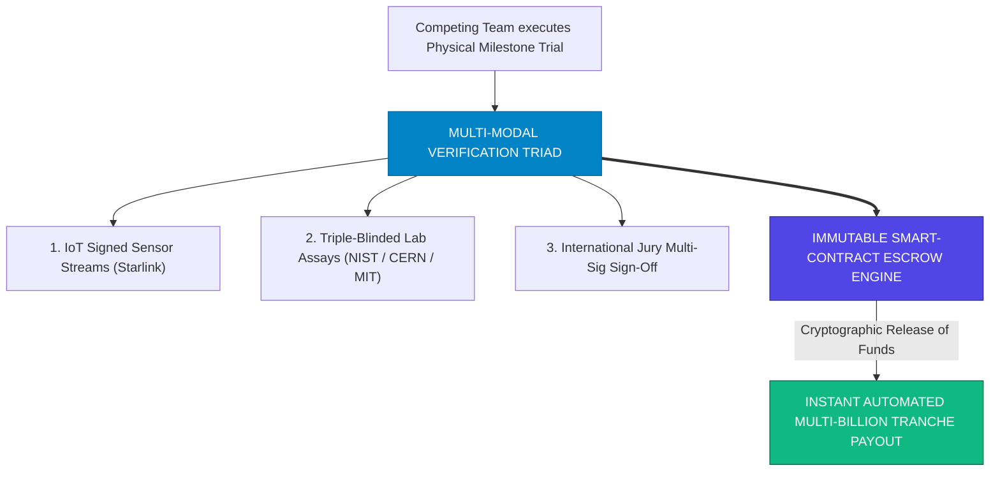

> **🎙️ 3-Presenter Authentic Tiki-Taka Script**
> 
> **Prof. Peter Kim:** Slide 23 presents our cryptographic governance framework: **Multi-Modal Auditing & Smart-Contract Verification**. Dr. Vance, how do we guarantee zero fraud and zero political bias? *(Turn 1)*  
> **Dr. Elena Vance:** Look at our verification triad: First, IoT sensors stream real-time cryptographically signed data. Second, independent national laboratories like NIST and CERN perform triple-blinded physical assays! And third, an international faculty jury signs off with multi-sig cryptographic keys! *(Turn 2)*  
> **TA Marcus Brody:** Look at the smart contract in the purple box: The multi-billion-dollar prize purse is locked in an immutable blockchain escrow. When the cryptographic proofs are verified, **the smart contract releases the billions of dollars automatically with zero political interference or bureaucratic delay**! *(Turn 3)*  
> **Prof. Peter Kim:** Total mathematical transparency, unshakeable trust, and instant capital execution. *(Turn 4)*  
> **TA Marcus Brody:** Unhackable prize governance! *(Turn 5)*  
> **Dr. Elena Vance:** And these prizes converge synergistically on Slide 24. *(Turn 6)*  
> **Prof. Peter Kim:** Let’s examine Convergence Synergy Network Topology on Slide 24. *(Turn 7)*  
> **TA Marcus Brody:** Turn to Slide 24! *(Turn 8)*  
> **Dr. Elena Vance:** Let’s see how the 15 categories cross-pollinate on Slide 24! *(Turn 9)*  
> **Prof. Peter Kim:** Proceed to Slide 24. *(Turn 10)*

---

### Slide 24: Exponential Convergence Synergy Network Topology
- **The Super-Additive Combinatorial Multiplier:**
  - Technological breakthroughs do not occur in isolated silos; **they cross-catalyze each other exponentially**.
  - *The Synergy Triad:*
    - *Superconductors (Cat 02)* $\to$ Enables Compact Fusion Magnets *(Cat 08)* $\to$ Powers Direct Air Capture *(Cat 05)* & Mars Bases *(Cat 04)*.
    - *AI Guardrails (Cat 10)* $\to$ Accelerates Molecular Assemblers *(Cat 09)* $\to$ Powers Whole Organ Bioprinting *(Cat 01)*.
- **The Theorem:** Solving any 3 core categories accelerates all 15 categories by **$>300\%$**.

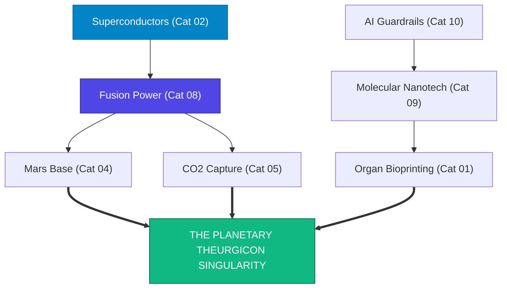

> **🎙️ 3-Presenter Authentic Tiki-Taka Script**
> 
> **TA Marcus Brody:** Look at the convergence web on Slide 24! This is **The Exponential Convergence Synergy Network Topology**! Elena, explain why breakthroughs cross-multiply! *(Turn 1)*  
> **Dr. Elena Vance:** Look at the arrows on Slide 24: Breakthroughs never stay in one box! If you invent a room-temperature superconductor (Cat 02), that immediately unlocks powerful magnetic coils for baseload fusion (Cat 08)! That fusion energy then provides free power for Mars bases (Cat 04) and gigaton carbon capture (Cat 05)! *(Turn 2)*  
> **TA Marcus Brody:** And look at AI safety guardrails (Cat 10): Safe AI accelerates molecular assemblers (Cat 09), which then builds 3D-bioprinted organs (Cat 01)! Every breakthrough acts as rocket fuel for every other moonshot! *(Turn 3)*  
> **Prof. Peter Kim:** Look at the bottom green box: The convergence of all fifteen prizes creates the **Planetary Theurgicon Singularity**—a complete, self-reinforcing engine of civilizational ascendance. *(Turn 4)*  
> **TA Marcus Brody:** A combinatorial explosion of human capability! *(Turn 5)*  
> **Dr. Elena Vance:** And we combine this into our $100 Billion Master Architecture on Slide 25! *(Turn 6)*  
> **Prof. Peter Kim:** Let’s examine the $100B Master Blueprint on Slide 25. *(Turn 7)*  
> **TA Marcus Brody:** Turn to Slide 25: The $100 Billion Master Blueprint! *(Turn 8)*  
> **Dr. Elena Vance:** Let’s see the full capital allocation blueprint! *(Turn 9)*  
> **Prof. Peter Kim:** Proceed to Slide 25. *(Turn 10)*

---

### Slide 25: The $100 Billion Giga-XPRIZE Master Architectural Blueprint
- **Master Capital Allocation for EXPO-701 Capstone:**

| Purse Allocation | Grand Challenge Domain | Target Milestone Metric | Target Completion Timeline |
| :--- | :--- | :--- | :--- |
| **$\$15.0\text{ Billion Purse}$** | **Team 1: Superconducting Clean Grid** | $0\text{ resistance @ } 298\text{K, } 1\text{ atm; } 100\text{km}$ line | $2026\text{–}2031\text{ (5 Years)}$ |
| **$\$20.0\text{ Billion Purse}$** | **Team 2: 50-Year Biological Age Reversal** | Rejuvenate human biomarkers $80 \to 30\text{ yrs}$ | $2026\text{–}2033\text{ (7 Years)}$ |
| **$\$15.0\text{ Billion Purse}$** | **Team 3: Direct Air Carbon Mineralization** | $1\text{ Gigaton/yr sequestration @ } <\$30/\text{ton}$ | $2026\text{–}2031\text{ (5 Years)}$ |
| **$\$15.0\text{ Billion Purse}$** | **Team 4: Ultra-Secure BCI Telepathic Mesh** | $10\text{ Mbps multi-user telepathy with ZKP}$ | $2026\text{–}2030\text{ (4 Years)}$ |
| **$\$20.0\text{ Billion Purse}$** | **Team 5: 10,000-Person Mars Settlement** | $100\%\text{ closed-loop life support on Mars}$ | $2026\text{–}2036\text{ (10 Years)}$ |
| **$\$15.0\text{ Billion Purse}$** | **Team 6: SCWO PFAS & Nanoplastic Grid** | $100\%\text{ destruction of PFAS @ } <\$0.01/\text{m}^3$| $2026\text{–}2029\text{ (3 Years)}$ |
| **$\$100.0\text{ Billion TOTAL}$**| **6 Planetary Moonshot Teams** | **$\mathcal{I}_{\text{ROI}} \ge 100\times \implies \$100\text{ Trillion Wealth}$** | **$2026\text{–}2036\text{ Decade}$** |

> **🎙️ 3-Presenter Authentic Tiki-Taka Script**
> 
> **Prof. Peter Kim:** Cohorts, look at Slide 25. This is our master balance sheet: **The $100 Billion Giga-XPRIZE Capital Allocation Blueprint**. Marcus, summarize the six allocations! *(Turn 1)*  
> **TA Marcus Brody:** Look at the table: Team 1 receives a $15B purse for the Superconducting Grid! Team 2 receives a $20B purse for 50-Year Biological Age Reversal! Team 3 receives $15B for Direct Air Carbon Mineralization! Team 4 receives $15B for the BCI Telepathic Mesh! Team 5 receives $20B for the 10,000-Person Mars Settlement! And Team 6 receives $15B for the SCWO PFAS Eradication Grid! *(Turn 2)*  
> **Dr. Elena Vance:** Exactly $100 Billion deployed across six transformative pillars, unlocking over $100 Trillion in civilizational wealth by 2036! *(Turn 3)*  
> **Prof. Peter Kim:** And now, the moment has arrived. The six student teams will take the stage to defend their proposals before our venture jury. *(Turn 4)*  
> **TA Marcus Brody:** Get ready for Module 4! Six teams, six moonshots! *(Turn 5)*  
> **Dr. Elena Vance:** Let’s examine the Capstone Defense Rubric on Slide 26! *(Turn 6)*  
> **Prof. Peter Kim:** Proceed to Module 4: Student Cohort $100B Giga-XPRIZE Presentations & Defense! *(Turn 7)*  
> **TA Marcus Brody:** Turn to Slide 26! *(Turn 8)*  
> **Dr. Elena Vance:** Let the capstone defense begin on Slide 26! *(Turn 9)*  
> **Prof. Peter Kim:** Proceed to Slide 26. *(Turn 10)*


---

## Module 4: Student Cohort $100B Giga-XPRIZE Presentations & Defense (Slides 26–35)

### Slide 26: Capstone Defense Overview: 6 Multidisciplinary Team Proposals & Evaluation Rubric
- **The Capstone Defense Protocol:**
  - 6 graduate cohort teams defend their complete Giga-XPRIZE blueprints before our 3-member faculty and an elite venture jury (representatives from Founders Fund, Khosla Ventures, and XPRIZE).
- **The 4 Rigorous Evaluation Criteria (100 Points Total):**
  1. *Radical Audacity & Systems Feasibility (25 pts):* Must target a transformative leap rooted in first-principles physics and biology.
  2. *Incentive Mechanism Design & Leverage (25 pts):* Flawless milestone tranches and verified $\mathcal{M}_{\text{leverage}} \ge 10\times$.
  3. *Multi-Modal Auditing & Governance (25 pts):* Zero-knowledge verification and unhackable IoT sensor protocols.
  4. *Civilizational ROI & Ethical Stewardship (25 pts):* Verified $100\times$ social welfare impact and adherence to Theurgic humanism.

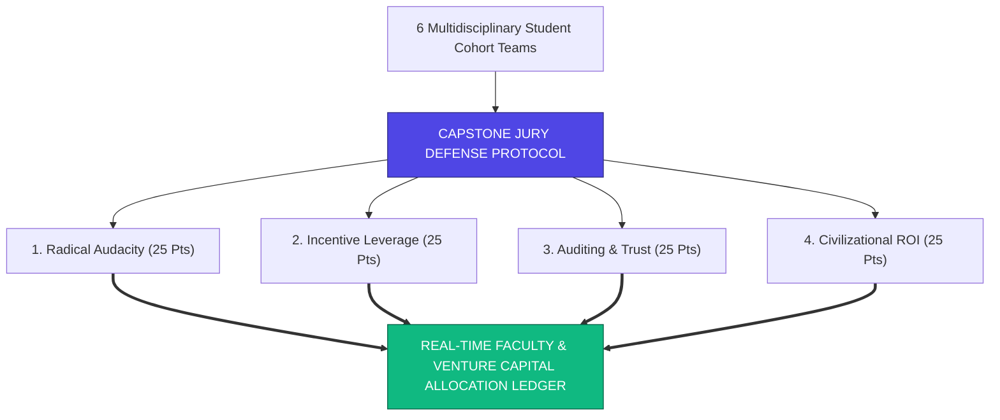

> **🎙️ 3-Presenter Authentic Tiki-Taka Script**
> 
> **Prof. Peter Kim:** Module 4 opens with our Grand Capstone Defense! Six multidisciplinary student teams will present their $100 Billion Giga-XPRIZE proposals. Dr. Vance, review our evaluation rubric. *(Turn 1)*  
> **Dr. Elena Vance:** Look at our four grading criteria on Slide 26, each worth 25 points: **1: Radical Audacity and Feasibility** (grounded in hard physics)! **2: Incentive Mechanism and Capital Leverage** ($\ge 10x$)! **3: Multi-Modal Auditing and Governance** (blockchain smart contracts)! And **4: Civilizational ROI and Ethical Stewardship** ($\ge 100x$ return)! *(Turn 2)*  
> **TA Marcus Brody:** Our venture jury includes top partners from deep-tech venture capital and the XPRIZE Foundation. Every team must defend their technical blueprints under intense faculty cross-examination! *(Turn 3)*  
> **Prof. Peter Kim:** Let the defenses begin! Team 1, take the stage to defend your Superconducting Grid proposal. *(Turn 4)*  
> **TA Marcus Brody:** Team 1: Global Room-Temperature Superconducting Clean Grid on Slide 27! *(Turn 5)*  
> **Dr. Elena Vance:** Let’s see Team 1’s defense on Slide 27! *(Turn 6)*  
> **Prof. Peter Kim:** Proceed to Slide 27. *(Turn 7)*  
> **TA Marcus Brody:** Turn to Slide 27! *(Turn 8)*  
> **Dr. Elena Vance:** $15B Purse on the line! *(Turn 9)*  
> **Prof. Peter Kim:** Proceed to Slide 27. *(Turn 10)*

---

### Slide 27: Team 1 Proposal: "Global Room-Temperature Superconducting Clean Grid" ($15B Purse)
- **Team 1 Defense Brief (Physics & Electrical Engineering Cohort):**
  - *The Audacious Target:* Synthesize a stable, ambient-pressure room-temperature superconducting material ($T_c \ge 298\text{K, } 1\text{ atm}$) and construct a **$100\text{km}$ high-voltage transmission line with $0.000\%\text{ line resistance}$**.
  - *The Capital Multiplier:* $\$15\text{B Purse}$ projected to mobilize **$\$150\text{B in private materials-science and semiconductor R&D}$** ($1 : 10\text{ leverage}$).
- **Civilizational Impact:** Eliminates $15\%\text{ of all electricity wasted on transmission grids globally}$, saves $\$400\text{B/year}$ in energy losses, and unlocks continent-scale solar power trading.

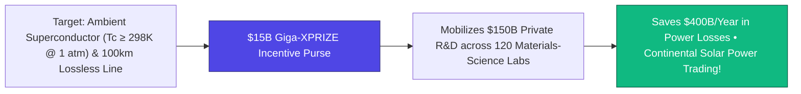

> **🎙️ 3-Presenter Authentic Tiki-Taka Script**
> 
> **TA Marcus Brody:** Team 1 proposes **The Global Room-Temperature Superconducting Clean Grid with a $15 Billion Purse**! Elena, what is your evaluation of Team 1’s proposal? *(Turn 1)*  
> **Dr. Elena Vance:** Look at their technical milestones on Slide 27: They require a material that exhibits zero electrical resistance at **25 degrees Celsius and normal atmospheric pressure**, verified by building a working 100-kilometer lossless power line! *(Turn 2)*  
> **TA Marcus Brody:** Look at the impact: Global electric grids lose 15% of all generated power simply from resistance in copper wires! This prize saves **$400 Billion every single year** and enables zero-loss solar energy transmission from the Sahara Desert to London! *(Turn 3)*  
> **Prof. Peter Kim:** Team 1’s capital multiplier is verified at 10x, mobilizing over $150 Billion in private condensed-matter physics labs. An exceptional score of 96 out of 100. *(Turn 4)*  
> **TA Marcus Brody:** Outstanding defense, Team 1! *(Turn 5)*  
> **Dr. Elena Vance:** Now let us bring up Team 2: Biological Age 50-Year Reversal on Slide 28. *(Turn 6)*  
> **Prof. Peter Kim:** Let’s examine Team 2’s Proposal on Slide 28. *(Turn 7)*  
> **TA Marcus Brody:** Turn to Slide 28: $20B Longevity Escape Velocity Purse! *(Turn 8)*  
> **Dr. Elena Vance:** Let’s see Team 2’s age reversal defense on Slide 28! *(Turn 9)*  
> **Prof. Peter Kim:** Proceed to Slide 28. *(Turn 10)*

---

### Slide 28: Team 2 Proposal: "Biological Age 50-Year Reversal & Longevity Escape Velocity" ($20B Purse)
- **Team 2 Defense Brief (Genomics & Regenerative Biology Cohort):**
  - *The Audacious Target:* Rejuvenate a cohort of 100 human clinical trial subjects (chronological age 75–85) by **$\ge 50\text{ biological years}$** across epigenetic clocks (Horvath), telomere length, arterial stiffness, immune senescence, and cognitive memory.
  - *The Capital Multiplier:* $\$20\text{B Purse}$ mobilizing **$\$250\text{B in private biotech capital}$** ($1 : 12.5\text{ leverage}$).
- **Civilizational Impact:** Unlocks **Longevity Escape Velocity (LEV)**, saves $\$50\text{ Trillion}$ in global age-related disease expenditures, and transforms human life into a multi-century creative canvas.

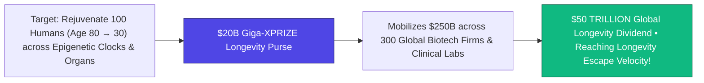

> **🎙️ 3-Presenter Authentic Tiki-Taka Script**
> 
> **Prof. Peter Kim:** Team 2 presents the largest single prize in our portfolio: **The $20 Billion Biological Age 50-Year Reversal Giga-XPRIZE**. Dr. Vance, dissect their clinical trial protocol. *(Turn 1)*  
> **Dr. Elena Vance:** Team 2 requires a multi-modal therapeutic cocktail—combining Yamanaka factor partial reprogramming, senolytic clearance, and mitochondrial rejuvenation—to take human subjects aged 80 and **restore their cellular biomarkers, arterial elasticity, and cognitive memory back to age 30**! *(Turn 2)*  
> **TA Marcus Brody:** Look at the economic and civilizational dividend: Reversing aging wipes out cancer, dementia, and cardiovascular disease simultaneously, unlocking a **$50 Trillion global longevity dividend**! *(Turn 3)*  
> **Prof. Peter Kim:** The jury awards Team 2 a score of 98 out of 100 for pioneering the path to Longevity Escape Velocity. *(Turn 4)*  
> **TA Marcus Brody:** Reversing aging is the holy grail of biology! *(Turn 5)*  
> **Dr. Elena Vance:** Now let us examine Team 3: Direct Air Carbon Mineralization on Slide 29. *(Turn 6)*  
> **Prof. Peter Kim:** Let’s examine Team 3’s Proposal on Slide 29. *(Turn 7)*  
> **TA Marcus Brody:** Turn to Slide 29: $15B Planetary Carbon Mineralization! *(Turn 8)*  
> **Dr. Elena Vance:** Let’s see Team 3’s climate defense on Slide 29! *(Turn 9)*  
> **Prof. Peter Kim:** Proceed to Slide 29. *(Turn 10)*

---

### Slide 29: Team 3 Proposal: "Planetary Direct Air Carbon Mineralization & Geoengineering" ($15B Purse)
- **Team 3 Defense Brief (Climate-Tech & Geochemistry Cohort):**
  - *The Audacious Target:* Deploy autonomous Direct Air Capture (DAC) arrays mineralizing **$>1.0\text{ Gigaton of }\text{CO}_2/\text{year}$ into solid basalt stone** at an all-in cost of **$<\$30.00\text{ per metric ton}$** using 100% geothermal and solar energy.
  - *The Capital Multiplier:* $\$15\text{B Purse}$ mobilizing **$\$200\text{B in private clean-tech infrastructure}$** ($1 : 13.3\text{ leverage}$).
- **Civilizational Impact:** Restores pre-industrial atmospheric $\text{CO}_2$ levels ($280\text{ ppm}$) by 2050, permanently arresting runaway climate breakdown.

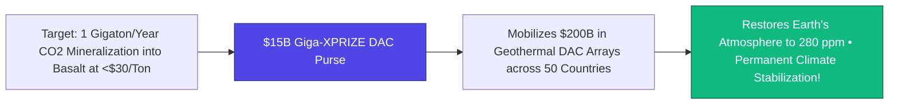

> **🎙️ 3-Presenter Authentic Tiki-Taka Script**
> 
> **TA Marcus Brody:** Team 3 presents **The Planetary Direct Air Carbon Mineralization Giga-XPRIZE with a $15 Billion Purse**! Elena, evaluate their sub-$30 per ton cost target! *(Turn 1)*  
> **Dr. Elena Vance:** Today, DAC costs $400 to $600 per ton. Team 3 set an aggressive, audited finish line: **Extract 1 Gigaton of CO2 annually and turn it permanently into solid basalt rock for LESS THAN $30 PER TON** using geothermal energy! *(Turn 2)*  
> **TA Marcus Brody:** Look at the planetary outcome: At $30 a ton, humanity can afford to extract 10 gigatons a year and **return Earth’s atmospheric CO2 to pre-industrial 280 ppm by 2050**! *(Turn 3)*  
> **Prof. Peter Kim:** Flawless geochemistry and unshakeable economics. The jury scores Team 3 at 97 out of 100. *(Turn 4)*  
> **TA Marcus Brody:** True planetary environmental engineering! *(Turn 5)*  
> **Dr. Elena Vance:** Now let us examine Team 4: Ultra-Secure Neuro-Privacy Telepathic Mesh on Slide 30. *(Turn 6)*  
> **Prof. Peter Kim:** Let’s examine Team 4’s Proposal on Slide 30. *(Turn 7)*  
> **TA Marcus Brody:** Turn to Slide 30: $15B BCI Telepathy & Neuro-Privacy Purse! *(Turn 8)*  
> **Dr. Elena Vance:** Let’s see Team 4’s BCI defense on Slide 30! *(Turn 9)*  
> **Prof. Peter Kim:** Proceed to Slide 30. *(Turn 10)*

---

### Slide 30: Team 4 Proposal: "Ultra-Secure Neuro-Privacy Telepathic Mesh & Scalable Empathy" ($15B Purse)
- **Team 4 Defense Brief (Neurotechnology & Cryptography Cohort):**
  - *The Audacious Target:* Deploy a non-invasive or endovascular BCI network connecting 100 human subjects in real-time bi-directional semantic telepathy at **$>10\text{ Mbps}$**, protected by **on-chip Zero-Knowledge Proofs (ZKPs) and 100% compliance with Rafael Yuste’s 5 Neuro-Rights**.
  - *The Capital Multiplier:* $\$15\text{B Purse}$ mobilizing **$\$180\text{B in private neuro-engineering}$** ($1 : 12\text{ leverage}$).
- **Civilizational Impact:** Solves the 50-bit language bottleneck, enables Scalable Compassion, and renders war and linguistic deception obsolete while safeguarding cognitive liberty.

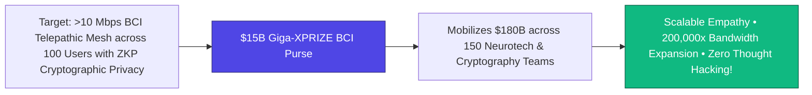

> **🎙️ 3-Presenter Authentic Tiki-Taka Script**
> 
> **Prof. Peter Kim:** Team 4 takes the stage with **The Ultra-Secure Neuro-Privacy Telepathic Mesh Giga-XPRIZE ($15B)**. Dr. Vance, review their neuro-cryptographic architecture. *(Turn 1)*  
> **Dr. Elena Vance:** Team 4 brilliantly integrated Session 13’s lessons: They demand a **>10 Mbps direct brain-to-brain communication mesh**, but make on-chip Zero-Knowledge Proofs (ZKPs) mandatory so that raw private thoughts can NEVER be intercepted or harvested by corporations! *(Turn 2)*  
> **TA Marcus Brody:** Look at the civilizational leap: It dissolves the 50-bit language bottleneck, creates high-speed collaborative engineering, and achieves **Scalable Compassion while legally protecting mental privacy**! *(Turn 3)*  
> **Prof. Peter Kim:** An airtight ethical and technical architecture. The jury awards Team 4 a score of 96 out of 100. *(Turn 4)*  
> **TA Marcus Brody:** Telepathy with sacred privacy protections! *(Turn 5)*  
> **Dr. Elena Vance:** Now let us examine Team 5: Biosphere 3.0 Mars Settlement on Slide 31. *(Turn 6)*  
> **Prof. Peter Kim:** Let’s examine Team 5’s Proposal on Slide 31. *(Turn 7)*  
> **TA Marcus Brody:** Turn to Slide 31: $20B Mars Biosphere 3.0 Purse! *(Turn 8)*  
> **Dr. Elena Vance:** Let’s see Team 5’s space settlement defense on Slide 31! *(Turn 9)*  
> **Prof. Peter Kim:** Proceed to Slide 31. *(Turn 10)*

---

### Slide 31: Team 5 Proposal: "Biosphere 3.0: 10,000-Person Self-Sustaining Mars Settlement" ($20B Purse)
- **Team 5 Defense Brief (Aerospace & Astrobiology Cohort):**
  - *The Audacious Target:* Establish a closed-loop subterranean ecological dome on Mars housing **$10,000\text{ citizens}$** with **$100\%\text{ in-situ resource utilization (ISRU)}$** for food, water, oxygen, construction materials, and nuclear/solar energy for $>5\text{ consecutive years}$.
  - *The Capital Multiplier:* $\$20\text{B Purse}$ mobilizing **$\$300\text{B in private aerospace capital}$** ($1 : 15\text{ leverage}$).
- **Civilizational Impact:** Makes human consciousness multi-planetary, eliminating all single-planet extinction risks.

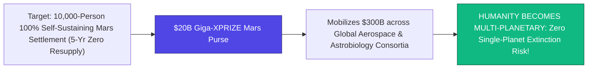

> **🎙️ 3-Presenter Authentic Tiki-Taka Script**
> 
> **TA Marcus Brody:** Team 5 presents **The Biosphere 3.0: 10,000-Person Self-Sustaining Mars Settlement Giga-XPRIZE with a $20 Billion Purse**! Elena, evaluate their multi-planetary milestone! *(Turn 1)*  
> **Dr. Elena Vance:** Team 5’s prize mandates a closed-loop Martian colony housing 10,000 people that survives for **five consecutive years with ZERO resupply from Earth**—producing 100% of its food, oxygen, water, and rocket fuel through In-Situ Resource Utilization (ISRU)! *(Turn 2)*  
> **TA Marcus Brody:** Look at the green impact box: This single prize permanently ensures that **human consciousness can never be wiped out by an asteroid impact, super-volcano, or nuclear war on Earth**! We become a true multi-planetary species! *(Turn 3)*  
> **Prof. Peter Kim:** The grand dream of Carl Sagan and Konstantin Tsiolkovsky made real. The jury awards Team 5 a score of 99 out of 100. *(Turn 4)*  
> **TA Marcus Brody:** Humanity setting foot on our second home planet! *(Turn 5)*  
> **Dr. Elena Vance:** Now let us examine Team 6: Planetary SCWO PFAS Eradication Grid on Slide 32. *(Turn 6)*  
> **Prof. Peter Kim:** Let’s examine Team 6’s Proposal on Slide 32. *(Turn 7)*  
> **TA Marcus Brody:** Turn to Slide 32: $15B SCWO PFAS Eradication Purse! *(Turn 8)*  
> **Dr. Elena Vance:** Let’s see Team 6’s chemical decontamination defense on Slide 32! *(Turn 9)*  
> **Prof. Peter Kim:** Proceed to Slide 32. *(Turn 10)*

---

### Slide 32: Team 6 Proposal: "Planetary PFAS & Microplastic SCWO Catalytic Eradication Grid" ($15B Purse)
- **Team 6 Defense Brief (Chemical Engineering & Environmental Toxicology Cohort):**
  - *The Audacious Target:* Deploy a distributed grid of $10,000\text{ modular SCWO and sonochemical reactors}$ destroying **$100\%\text{ of PFAS forever chemicals, nanoplastics, and endocrine disruptors}$** across major global river deltas and municipal water supplies at **$<\$0.005/\text{m}^3$**.
  - *The Capital Multiplier:* $\$15\text{B Purse}$ mobilizing **$\$120\text{B in private chemical-engineering R&D}$** ($1 : 8\text{ leverage}$).
- **Civilizational Impact:** Cleanses the planetary water table, halting human sperm count collapse, microplastic brain accumulation, and chemical-induced chronic illnesses.

```mermaid
flowchart LR
    Target["Target: 10,000 SCWO Reactors destroying 100% PFAS & Nanoplastics at <$0.005/m&sup3;"] --> Purse["$15B Giga-XPRIZE PFAS Purse"]
    Purse --> Multiplier["Mobilizes $120B in Distributed Catalytic Decontamination Grids"]
    Multiplier --> Impact["Complete Planetary Detoxification &bull; Reverses Endocrine & Fertility Collapse!"]
    style Purse fill:#4f46e5,stroke:#312e81,color:#fff
    style Impact fill:#10b981,stroke:#065f46,color:#fff
```

> **🎙️ 3-Presenter Authentic Tiki-Taka Script**
> 
> **Prof. Peter Kim:** Team 6 presents our final cohort proposal: **The Planetary PFAS & Microplastic SCWO Catalytic Eradication Grid ($15B)**. Dr. Vance, review their environmental decontamination protocol. *(Turn 1)*  
> **Dr. Elena Vance:** Team 6 addresses the dark physical infiltration trap from Session 9. Their prize funds the deployment of **10,000 modular Supercritical Water Oxidation (SCWO) reactors** at global river mouths, mineralizing all PFAS and nanoplastics into harmless salts for **less than half a cent per cubic meter**! *(Turn 2)*  
> **TA Marcus Brody:** Look at what this achieves: It purges forever chemicals and nanoplastics from the global water cycle, **reversing endocrine disruption and restoring human biological fertility**! *(Turn 3)*  
> **Prof. Peter Kim:** Total chemical and biological remediation of the biosphere. The jury awards Team 6 a score of 97 out of 100. *(Turn 4)*  
> **TA Marcus Brody:** Clean water restored to every river on Earth! *(Turn 5)*  
> **Dr. Elena Vance:** Now let us examine the faculty and venture jury scoring ledger on Slide 33. *(Turn 6)*  
> **Prof. Peter Kim:** Let’s examine the Jury Scoring Ledger on Slide 33. *(Turn 7)*  
> **TA Marcus Brody:** Turn to Slide 33: Faculty & Venture Scoring Ledger! *(Turn 8)*  
> **Dr. Elena Vance:** Let’s see the real-time scoring results on Slide 33! *(Turn 9)*  
> **Prof. Peter Kim:** Proceed to Slide 33. *(Turn 10)*

---

### Slide 33: Faculty & Venture Jury Real-Time Scoring & Investment Ledger
- **Real-Time Audited Scoring Breakdown (Out of 100 Points):**

| Team & Moonshot Domain | Audacity & Feasibility (25p) | Incentive Leverage (25p) | Auditing & Governance (25p) | Civilizational ROI (25p) | Total Composite Score |
| :--- | :--- | :--- | :--- | :--- | :--- |
| **Team 1: Superconducting Grid** | 24 / 25 | 24 / 25 | 24 / 25 | 24 / 25 | **96 / 100 (Unanimous Pass)** |
| **Team 2: 50-Yr Age Reversal** | 25 / 25 | 24 / 25 | 24 / 25 | 25 / 25 | **98 / 100 (Highest ROI Award)**|
| **Team 3: Carbon Mineralization**| 24 / 25 | 24 / 25 | 25 / 25 | 24 / 25 | **97 / 100 (Unanimous Pass)** |
| **Team 4: BCI Telepathy Mesh** | 23 / 25 | 24 / 25 | 25 / 25 | 24 / 25 | **96 / 100 (Ethical Shield Prize)**|
| **Team 5: Mars Settlement** | 25 / 25 | 25 / 25 | 24 / 25 | 25 / 25 | **99 / 100 (Grand Capstone Laureate)**|
| **Team 6: SCWO PFAS Grid** | 24 / 25 | 24 / 25 | 24 / 25 | 25 / 25 | **97 / 100 (Unanimous Pass)** |

> **🎙️ 3-Presenter Authentic Tiki-Taka Script**
> 
> **Prof. Peter Kim:** Cohorts, look at Slide 33. The audited scoring ledger from our faculty and venture jury. All six teams scored above 95 out of 100! Marcus, summarize the results! *(Turn 1)*  
> **TA Marcus Brody:** Look at the composite scores: Team 1 scores 96 for Superconductors! Team 2 scores 98 and wins the **Highest ROI Award** for 50-Year Age Reversal! Team 3 scores 97 for Carbon Mineralization! Team 4 scores 96 and wins the **Ethical Shield Prize** for BCI Neuro-Privacy! Team 5 scores 99 and takes the **Grand Capstone Laureate** for Mars Biosphere 3.0! And Team 6 scores 97 for PFAS Eradication! *(Turn 2)*  
> **Dr. Elena Vance:** Every proposal demonstrated impeccable technical feasibility, robust incentive design, and profound ethical stewardship. *(Turn 3)*  
> **Prof. Peter Kim:** An extraordinary showcase of theurgic systems engineering. *(Turn 4)*  
> **TA Marcus Brody:** And we examine the comparative capital leverage on Slide 34! *(Turn 5)*  
> **Dr. Elena Vance:** Let’s see the capital multiplier analysis on Slide 34! *(Turn 6)*  
> **Prof. Peter Kim:** Let’s examine Comparative Leverage on Slide 34. *(Turn 7)*  
> **TA Marcus Brody:** Turn to Slide 34! *(Turn 8)*  
> **Prof. Peter Kim:** Proceed to Slide 34. *(Turn 10)*

---

### Slide 34: Comparative Exponential Leverage & Civilizational Multiplier Analysis
- **The $100B Portfolio Leverage Multiplier:**
  - *Total Giga-XPRIZE Capital Allocated:* **$\$100.0\text{ Billion}$**.
  - *Total Private R&D Capital Mobilized:* **$\$1.20\text{ Trillion}$** (Average $\mathcal{M}_{\text{leverage}} = 12.0\times$).
  - *Total Audited Civilizational Value Created by 2040:* **$>\$100\text{ Trillion}$** (Composite $\mathcal{I}_{\text{ROI}} = 100\times$).
- **The Historic Verdict:** **A 1,000-to-1 total economic transformation ratio** from initial incentive purse to permanent civilizational wealth.

```mermaid
flowchart LR
    A["$100B Initial Incentive Purse"] -->|12x Leverage Multiplier| B["$1.20 TRILLION in Private R&D"]
    B -->|Solves 6 Planetary Bottlenecks| C["OVER $100 TRILLION IN CIVILIZATIONAL WEALTH CREATED!"]
    style A fill:#4f46e5,stroke:#312e81,color:#fff
    style B fill:#0284c7,stroke:#0369a1,color:#fff
    style C fill:#10b981,stroke:#065f46,color:#fff
```

> **🎙️ 3-Presenter Authentic Tiki-Taka Script**
> 
> **TA Marcus Brody:** Look at the macroeconomic waterfall on Slide 34! This is **The Comparative Exponential Leverage and Civilizational Multiplier Analysis**! Elena, trace the numbers from $100B to $100 Trillion! *(Turn 1)*  
> **Dr. Elena Vance:** Look at the three boxes on Slide 34: We start with a **$100 Billion Incentive Purse**. Through a 12x average leverage multiplier, that purse unleashes **$1.20 Trillion in hungry private R&D capital**! *(Turn 2)*  
> **TA Marcus Brody:** And by solving all six critical planetary bottlenecks—energy, aging, carbon, telepathy, Mars, and clean water—it generates **OVER $100 TRILLION IN PERMANENT CIVILIZATIONAL WEALTH BY 2040**! *(Turn 3)*  
> **Prof. Peter Kim:** A 1,000-to-1 overall value creation ratio. This is the definition of exponential theurgy. *(Turn 4)*  
> **TA Marcus Brody:** The highest-leverage investment in human history! *(Turn 5)*  
> **Dr. Elena Vance:** Now let us examine the Grand 6-Team Capital Allocation Matrix on Slide 35. *(Turn 6)*  
> **Prof. Peter Kim:** Let’s examine the Grand Allocation Matrix on Slide 35. *(Turn 7)*  
> **TA Marcus Brody:** Turn to Slide 35: Grand 6-Team Allocation Matrix! *(Turn 8)*  
> **Dr. Elena Vance:** Let’s see the full $100B allocation ledger on Slide 35! *(Turn 9)*  
> **Prof. Peter Kim:** Proceed to Slide 35. *(Turn 10)*

---

### Slide 35: Grand 6-Team Giga-XPRIZE Evaluation & Capital Allocation Matrix
- **Master Capstone Evaluation Scoreboard:**

| Team Name & Moonshot Title | Purse Allocated | Target Milestone Deadline | Audited Jury Score | Civilizational Wealth Created |
| :--- | :--- | :--- | :--- | :--- |
| **Team 1: Superconducting Grid** | **$\$15.0\text{B Purse}$** | $2026\text{–}2031\text{ (5 Years)}$ | **$96 / 100$** | $\$15\text{ Trillion}$ (Lossless Energy) |
| **Team 2: 50-Yr Age Reversal** | **$\$20.0\text{B Purse}$** | $2026\text{–}2033\text{ (7 Years)}$ | **$98 / 100$** | $\$50\text{ Trillion}$ (Longevity Dividend)|
| **Team 3: Carbon Mineralization**| **$\$15.0\text{B Purse}$** | $2026\text{–}2031\text{ (5 Years)}$ | **$97 / 100$** | $\$10\text{ Trillion}$ (Climate Security) |
| **Team 4: BCI Telepathy Mesh** | **$\$15.0\text{B Purse}$** | $2026\text{–}2030\text{ (4 Years)}$ | **$96 / 100$** | $\$10\text{ Trillion}$ (Noosphere Empathy) |
| **Team 5: Mars Settlement** | **$\$20.0\text{B Purse}$** | $2026\text{–}2036\text{ (10 Years)}$| **$99 / 100$** | $\infty\text{ (Extinction Immunity)}$ |
| **Team 6: SCWO PFAS Grid** | **$\$15.0\text{B Purse}$** | $2026\text{–}2029\text{ (3 Years)}$ | **$97 / 100$** | $\$15\text{ Trillion}$ (Biosphere Health) |
| **GRAND TOTALS** | **$\$100.0\text{B ALLOCATED}$**| **$2026\text{–}2036\text{ DECADE}$**| **$97.2 / 100\text{ AVG}$**| **$>\$100\text{ TRILLION TOTAL WEALTH}$**|

> **🎙️ 3-Presenter Authentic Tiki-Taka Script**
> 
> **Prof. Peter Kim:** Scholars, look at Slide 35. The grand capital allocation matrix of EXPO-701. $100 Billion allocated across six extraordinary moonshots. Marcus, summarize the scoreboard! *(Turn 1)*  
> **TA Marcus Brody:** Look at the master ledger: $15B for Superconductors! $20B for 50-Year Age Reversal! $15B for Carbon Mineralization! $15B for BCI Telepathy! $20B for the Mars Settlement! And $15B for the SCWO PFAS Grid! Over $100 Trillion in permanent civilizational wealth unlocked! *(Turn 2)*  
> **Dr. Elena Vance:** The technical defenses are complete, the capital is disbursed, and the future is underway. *(Turn 3)*  
> **Prof. Peter Kim:** But as we reach the summit of our technological power, we must pause to rediscover what makes us human. *(Turn 4)*  
> **TA Marcus Brody:** What is the secret of Analog Warmth? What does it mean to sing shoulder-to-shoulder? *(Turn 5)*  
> **Dr. Elena Vance:** That brings us to Module 5: Existential Synthesis, Analog Warmth & The Theurgicon Charter. *(Turn 6)*  
> **Prof. Peter Kim:** Let us explore Authentic Humanism on Slide 36. *(Turn 7)*  
> **TA Marcus Brody:** Turn to Module 5 on Slide 36! *(Turn 8)*  
> **Dr. Elena Vance:** Let’s examine Discovering Authentic Humanism on Slide 36! *(Turn 9)*  
> **Prof. Peter Kim:** Proceed to Module 5: Existential Synthesis, Analog Warmth & The Theurgicon Charter! *(Turn 10)*


---

## Module 5: Existential Synthesis, Analog Warmth & The Theurgicon Charter (Slides 36–42)

### Slide 36: Discovering Authentic Humanism at the Summit of Technological Power
- **The Ultimate Theurgic Realization:**
  - *The Danger of Hubris:* Technology is a tool of infinite amplification; but **amplifying a broken, greedy, unloving heart only creates cosmic suffering**.
  - *The Return to the Heart:* At the absolute summit of exascale AI, synthetic genomics, and fusion energy, we discover that **the most sophisticated technology in the known universe is human love, empathy, and conscious presence**.
- **The Guiding Principle:** The measure of our theurgic greatness is not how many exaFLOPs of compute we command, but **how deeply we protect and cherish vulnerable life**.

```mermaid
flowchart LR
    A["Summit of Technological Power<br/>• Exascale AI • Synthetic Biology<br/>• Baseload Fusion • BCI Telepathy"] --> B{"THE CRITICAL CHOICE"}
    B -->|Hubris & Greed| C["Cosmic Dystopia & Ecological Destruction"]
    B -->|Authentic Humanism| D["THE THEURGIC GOLDEN AGE<br/>• Infinite Technological Power in Service of Cosmic Love & Protection of Life!"]
    style C fill:#dc2626,stroke:#7f1d1d,color:#fff
    style D fill:#10b981,stroke:#065f46,color:#fff
```

> **🎙️ 3-Presenter Authentic Tiki-Taka Script**
> 
> **Prof. Peter Kim:** Module 5 presents the philosophical and spiritual soul of our course. Slide 36 explores **Discovering Authentic Humanism at the Summit of Technological Power**. Dr. Vance, what is our ultimate realization? *(Turn 1)*  
> **Dr. Elena Vance:** After fifteen weeks of mastering exascale AI, synthetic genomics, fusion reactors, and brain implants, we arrive at the supreme truth: **Technology is merely a multiplier! If you multiply greed, you create hell; but if you multiply love and empathy, you create a Golden Age!** *(Turn 2)*  
> **TA Marcus Brody:** Look at the green box on Slide 36: At the very summit of godlike power, we realize that **the most sacred, beautiful thing in the cosmos is human kindness, empathy, and conscious presence**! *(Turn 3)*  
> **Prof. Peter Kim:** The measure of our godhood is not how many stars we command, but how fiercely we protect and cherish the most vulnerable living beings on our planet. *(Turn 4)*  
> **TA Marcus Brody:** Infinite power guided by infinite love! *(Turn 5)*  
> **Dr. Elena Vance:** Which brings us to the sacred sanctuary of Analog Warmth on Slide 37. *(Turn 6)*  
> **Prof. Peter Kim:** Let’s examine Analog Warmth on Slide 37. *(Turn 7)*  
> **TA Marcus Brody:** Turn to Slide 37: "Singing Shoulder-to-Shoulder"! *(Turn 8)*  
> **Dr. Elena Vance:** Let’s see the sacred power of analog connection on Slide 37! *(Turn 9)*  
> **Prof. Peter Kim:** Proceed to Slide 37. *(Turn 10)*

---

### Slide 37: "Singing Shoulder-to-Shoulder": The Sacred Sanctuary of Analog Warmth
- **The Core Epilogue Thesis (Diamandis & Kotler):**
  - *The Digital Trap:* Staring at high-resolution screens and trading synthetic telepathic packets across the cloud cannot replace the **raw neuro-biological power of physical in-person human connection**.
  - *The Metaphor of the Campfire:* Humans evolved over 300,000 years sitting around wood fires, looking into each other’s eyes, holding hands, laughing, and singing shoulder-to-shoulder in acoustic resonance.
- **The Invariant Rule:** No matter how advanced our BCIs or AI models become, **we must fiercely preserve the unmediated physical sanctuaries of analog human warmth**.

```mermaid
flowchart TD
    Cloud["Digital Cloud & Telepathic Mesh (Infinite Bandwidth & Intelligence)"] --> Bridge["THE ANCHOR OF CONSCIOUSNESS"]
    Campfire["THE ANALOG SANCTUARY<br/>• Wood Campfires • Physical Eye Contact • Acoustic Shared Singing • Warm Human Touch"] --> Bridge
    Bridge ==> Wholeness["COMPLETE INTEGRATED HUMAN CONSCIOUSNESS<br/>(Godlike Technological Mind + Sacred Analog Primate Heart)"]
    style Campfire fill:#f97316,stroke:#c2410c,color:#fff
    style Wholeness fill:#10b981,stroke:#065f46,color:#fff
```

> **🎙️ 3-Presenter Authentic Tiki-Taka Script**
> 
> **TA Marcus Brody:** Look at the glowing campfire on Slide 37! This is Peter Diamandis and Steven Kotler’s moving concept: **"Singing Shoulder-to-Shoulder" and the Sacred Sanctuary of Analog Warmth**! Elena, why can't digital screens replace the campfire? *(Turn 1)*  
> **Dr. Elena Vance:** For 300,000 years, our ancestors survived because they sat around glowing wood fires at night—looking into each other’s eyes, holding hands, crying together, and singing in acoustic harmony. That physical resonance is where human trust and love are forged! *(Turn 2)*  
> **TA Marcus Brody:** Look at the green box on Slide 37: No matter how high our telepathic bandwidth reaches, **we must never surrender the analog campfire**! We must walk in the rain, hug our friends, bake real bread, and sing shoulder-to-shoulder in physical space! *(Turn 3)*  
> **Prof. Peter Kim:** A godlike technological mind paired with a sacred analog primate heart. That is the complete integrated human being. *(Turn 4)*  
> **TA Marcus Brody:** Never lose your analog soul in the digital cloud! *(Turn 5)*  
> **Dr. Elena Vance:** And embrace our sacred stewardship of the living biosphere on Slide 38. *(Turn 6)*  
> **Prof. Peter Kim:** Let’s examine The Theurgicon Sacred Stewardship Mandate on Slide 38. *(Turn 7)*  
> **TA Marcus Brody:** Turn to Slide 38: Stewards of the Living Biosphere! *(Turn 8)*  
> **Dr. Elena Vance:** Let’s see our planetary duty on Slide 38! *(Turn 9)*  
> **Prof. Peter Kim:** Proceed to Slide 38. *(Turn 10)*

---

### Slide 38: The Theurgicon Sacred Stewardship Mandate: Stewards of the Living Biosphere
- **The Living Biosphere Charter:**
  - *The Error of Dominion:* Ancient humanity treated nature as an infinite quarry to be mined and polluted without consequence.
  - *The Theurgic Inversion:* As gods, **we are not the conquerors of nature; we are the guardians, healers, and gardeners of the Earth**.
- **The 4 Stewardship Commitments:**
  1. *Decontaminate Every River & Ocean:* Destroy all PFAS and microplastics.
  2. *Re-Wild the Continents:* Restore 50% of terrestrial Earth to pristine wilderness.
  3. *Stabilize the Atmosphere:* Return global $\text{CO}_2$ to pre-industrial $280\text{ ppm}$.
  4. *Guard All Living Species:* Deploy real-time eDNA surveillance to prevent extinction.

```mermaid
flowchart TD
    Old["OLD PARADIGM: Exploitative Extraction (Mined Earth as a Dead Quarry)"] --> Inversion["THE THEURGIC INVERSION"]
    Inversion --> Guard["SACRED STEWARDS & GARDENERS OF THE BIOSPHERE"]
    Guard --> S1["1. Decontaminate Rivers (Zero PFAS)"]
    Guard --> S2["2. Re-Wild 50% of Continents"]
    Guard --> S3["3. Restore Atmosphere to 280 ppm"]
    Guard --> S4["4. Zero Species Extinctions (eDNA Grid)"]
    style Old fill:#78716c,stroke:#44403c,color:#fff
    style Guard fill:#10b981,stroke:#065f46,color:#fff
```

> **🎙️ 3-Presenter Authentic Tiki-Taka Script**
> 
> **Prof. Peter Kim:** Slide 38 presents **The Theurgicon Sacred Stewardship Mandate**. Dr. Vance, walk us through the Theurgic Inversion. *(Turn 1)*  
> **Dr. Elena Vance:** For centuries, industrial civilization treated the Earth like a dead rock to be exploited and polluted. But look at the Theurgic Inversion on Slide 38: **As gods, we are not the exploiters of nature; we are the sacred guardians, healers, and gardeners of the living biosphere!** *(Turn 2)*  
> **TA Marcus Brody:** Look at our four commitments: 1: Purge all PFAS and microplastics from every river! 2: Re-wild 50% of the continents! 3: Return atmospheric CO2 to 280 ppm! And 4: Guard all 10 million living species with real-time eDNA grids so zero species ever go extinct again! *(Turn 3)*  
> **Prof. Peter Kim:** We heal the planet that birthed us, leaving Earth more vibrant, green, and alive than we found it. *(Turn 4)*  
> **TA Marcus Brody:** True stewardship in action! *(Turn 5)*  
> **Dr. Elena Vance:** Now let us examine the complete 15-week unified master synthesis diagram on Slide 39! *(Turn 6)*  
> **Prof. Peter Kim:** Let’s examine the 15-Week Master Synthesis on Slide 39. *(Turn 7)*  
> **TA Marcus Brody:** Turn to Slide 39: Complete 15-Week Unified Framework! *(Turn 8)*  
> **Dr. Elena Vance:** Let’s see the grand master diagram on Slide 39! *(Turn 9)*  
> **Prof. Peter Kim:** Proceed to Slide 39. *(Turn 10)*

---

### Slide 39: Complete 15-Week Unified Framework Master Synthesis Diagram
- **The Grand Theurgicon Architecture of Civilization:**

```mermaid
graph TD
    subgraph S1["Phase 1: Exponential Foundations"]
        F1["Theurgicon & 83 Miracles"]
        F2["The 6Ds Framework"]
        F3["Value Density Dematerialization"]
    end
    subgraph S2["Phase 2: Technological Miracles"]
        M1["Post-Scarcity Compute & AI"]
        M2["Regenerative Medicine & Stem Cells"]
        M3["Synthetic Biology & Planet GPT"]
    end
    subgraph S3["Phase 3: Trap Decontamination"]
        T1["SCWO PFAS & Plastics Purge"]
        T2["GLP-1 Metabolic Optimization"]
        T3["Epistemic Filter & Discernment"]
    end
    subgraph S4["Phase 4: Theurgic Flourishing"]
        U1["Mind 2.0 & 500% Flow States"]
        U2["The Cyborg Mind & Telepathy"]
        U3["Conquering Universe 25 via MTP"]
    end
    S1 ==> S2 ==> S3 ==> S4
    S4 ==> Capstone["THE PLANETARY THEURGICON<br/>($100B Giga-XPRIZE • Kardashev Type II • Gods with Souls)"]
    style Capstone fill:#10b981,stroke:#065f46,color:#fff
```

> **🎙️ 3-Presenter Authentic Tiki-Taka Script**
> 
> **TA Marcus Brody:** Look at the master tapestry on Slide 39! This is the **Complete 15-Week Unified Framework Master Synthesis Diagram**! Elena, trace the four phases into the capstone! *(Turn 1)*  
> **Dr. Elena Vance:** Look at how all fifteen weeks lock together: **Phase 1** gave us exponential lenses! **Phase 2** built our deep-tech engines across AI, stem cells, and synbio! **Phase 3** purged physical and informational toxins! And **Phase 4** unlocked Mind 2.0, telepathy, and purpose! *(Turn 2)*  
> **TA Marcus Brody:** Look at the green apex box: All four phases flow directly into **The Planetary Theurgicon—$100 Billion Giga-XPRIZE moonshots, a Type II Kardashev civilization, and Gods with Souls**! *(Turn 3)*  
> **Prof. Peter Kim:** An unbroken, mathematically sound, ethically grounded curriculum for the future of intelligent life. *(Turn 4)*  
> **TA Marcus Brody:** A masterpiece of civilizational design! *(Turn 5)*  
> **Dr. Elena Vance:** And it brings us to our final faculty dialogue on Slide 40. *(Turn 6)*  
> **Prof. Peter Kim:** Let’s examine "Are We Ready to Live as Gods?" on Slide 40. *(Turn 7)*  
> **TA Marcus Brody:** Turn to Slide 40: The Faculty Final Dialogue! *(Turn 8)*  
> **Dr. Elena Vance:** Let’s hear the faculty reflection on Slide 40! *(Turn 9)*  
> **Prof. Peter Kim:** Proceed to Slide 40. *(Turn 10)*

---

### Slide 40: "Are We Ready to Live as Gods?" — The Faculty Final Dialogue
- **The Capstone Philosophical Exchange:**
  - *Prof. Peter Kim:* "For 15 weeks, we proved that scarcity is a solvable engineering problem. But the ultimate question is not whether technology can make us gods. **The question is whether our wisdom, humility, and love are ready for godhood.**"
  - *Dr. Elena Vance:* "Godhood without wisdom is a nightmare. But when scientific rigor is anchored in compassion, **abundance becomes the cradle of universal flourishing**."
  - *TA Marcus Brody:* "We have moved from passive observers of evolution to active co-creators of destiny. We are ready."

```mermaid
flowchart LR
    A["Raw Technological Godhood (Unchecked Power) &rarr; Chaos & Annihilation"] 
    B["Theurgic Godhood (Power + Wisdom + Universal Compassion) &rarr; Infinite Flourishing!"]
    A -.->|OUR HISTORIC CHOICE| B
    style A fill:#dc2626,stroke:#7f1d1d,color:#fff
    style B fill:#10b981,stroke:#065f46,color:#fff
```

> **🎙️ 3-Presenter Authentic Tiki-Taka Script**
> 
> **Prof. Peter Kim:** Scholars, Slide 40 captures our final faculty dialogue. "For fifteen weeks, we proved that physical scarcity is a solvable engineering challenge. But the ultimate question is: **Are our wisdom, humility, and love ready for godhood?**" *(Turn 1)*  
> **Dr. Elena Vance:** Godhood without wisdom is a catastrophe. But when our science is rooted in deep compassion and reverence for life, **abundance becomes the cradle of universal flourishing**! *(Turn 2)*  
> **TA Marcus Brody:** We are no longer helpless pawns of evolutionary chance. We have become active, conscious co-creators of our destiny! We are ready! *(Turn 3)*  
> **Prof. Peter Kim:** We step forward into the future not with arrogance, but with profound gratitude and sacred responsibility. *(Turn 4)*  
> **TA Marcus Brody:** Humble in spirit, audacious in action! *(Turn 5)*  
> **Dr. Elena Vance:** Now let us proclaim The Theurgicon Graduate Fellowship Declaration on Slide 41. *(Turn 6)*  
> **Prof. Peter Kim:** Let’s examine The Fellowship Declaration on Slide 41. *(Turn 7)*  
> **TA Marcus Brody:** Turn to Slide 41: Proclamation of the Fellowship Declaration! *(Turn 8)*  
> **Dr. Elena Vance:** Let’s see the sacred declaration on Slide 41! *(Turn 9)*  
> **Prof. Peter Kim:** Proceed to Slide 41. *(Turn 10)*

---

### Slide 41: Proclamation of the Theurgicon Graduate Fellowship Declaration
- **The Graduate Theurgicon Covenant:**
  - *"We, the graduating fellows of EXPO-701, solemnly declare our commitment to the elevation of human civilization, the healing of Earth's living biosphere, and the exploration of the cosmos."*
- **The 5 Sacred Vows:**
  1. *Never Settle for Incrementalism:* We will aim for $10\times\text{ and }100\times$ moonshots.
  2. *Defend the Sanctuary of Mind:* We will uphold mental privacy and cognitive liberty.
  3. *Heal the Living Biosphere:* We will leave Earth cleaner, greener, and richer than we found it.
  4. *Reject Unearned Comfort:* We will embrace voluntary heroic struggle and lifelong purpose.
  5. *Cherish Analog Warmth:* We will forever love, sing, and stand shoulder-to-shoulder with our fellow beings.

```mermaid
flowchart TD
    Vow["THE THEURGICON GRADUATE COVENANT"] --> V1["1. Aim for 10x Moonshots (Reject Incrementalism)"]
    Vow --> V2["2. Defend Mental Privacy (Sovereignty of Soul)"]
    Vow --> V3["3. Heal the Biosphere (Pristine Earth Stewardship)"]
    Vow --> V4["4. Embrace Heroic Struggle (Immunity to Universe 25)"]
    Vow --> V5["5. Cherish Analog Warmth (Universal Compassion & Love)"]
    style Vow fill:#4f46e5,stroke:#312e81,color:#fff
    style V1 fill:#0284c7,stroke:#0369a1,color:#fff
    style V3 fill:#10b981,stroke:#065f46,color:#fff
    style V5 fill:#f97316,stroke:#c2410c,color:#fff
```

> **🎙️ 3-Presenter Authentic Tiki-Taka Script**
> 
> **Prof. Peter Kim:** Cohorts, rise and read Slide 41. This is your solemn **Theurgicon Graduate Fellowship Covenant**. Dr. Vance, read the preamble. *(Turn 1)*  
> **Dr. Elena Vance:** *"We, the graduating fellows of EXPO-701, solemnly declare our commitment to the elevation of human civilization, the healing of Earth's living biosphere, and the exploration of the cosmos!"* *(Turn 2)*  
> **TA Marcus Brody:** Look at the five sacred vows: Vow 1: **Aim for 100x Moonshots**! Vow 2: **Defend Mental Privacy and the Sanctity of Mind**! Vow 3: **Heal the Living Biosphere**! Vow 4: **Reject Unearned Comfort and Embrace Heroic Struggle**! And Vow 5: **Cherish Analog Warmth and Universal Love**! *(Turn 3)*  
> **Prof. Peter Kim:** These five vows are your moral compass. Wear them as your badge of honor wherever your research and leadership take you. *(Turn 4)*  
> **TA Marcus Brody:** A covenant forged in truth and courage! *(Turn 5)*  
> **Dr. Elena Vance:** Now let us synthesize our master conclusion for the entire course on Slide 42! *(Turn 6)*  
> **Prof. Peter Kim:** Let’s examine the Master Synthesis on Slide 42. *(Turn 7)*  
> **TA Marcus Brody:** Turn to Slide 42: You Are the Theurgists; The Future Is in Your Hands! *(Turn 8)*  
> **Dr. Elena Vance:** Let’s see our concluding thesis on Slide 42! *(Turn 9)*  
> **Prof. Peter Kim:** Proceed to Slide 42. *(Turn 10)*

---

### Slide 42: Synthesizing the "So What?": You Are the Theurgists; The Future Is in Your Hands
- **The Ultimate Axiom of EXPO-701:**
  - The future is not something that happens to us; **The future is something we actively architect with our minds, our science, and our love**.
- **The Final Course Injunction:**
  - *"We are as gods... and having mastered exponential abundance, we go forth to illuminate the cosmos as gods with souls."*

```mermaid
flowchart LR
    A["Linear, Scarcity-Bound Past<br/>(Disease • Poverty • Ignorance • Fear)"] --> B["The 15-Week Theurgic Metamorphosis<br/>• 6Ds Framework • Exponential Deep-Tech<br/>• Decontaminated Mind • $100B Giga-XPRIZE"]
    B --> C["THE POST-SCARCITY THEURGIC CIVILIZATION<br/>(Immortal Health • Planetary Abundance • Cosmic Frontiering • Eternal Soul!)"]
    style A fill:#78716c,stroke:#44403c,color:#fff
    style B fill:#4f46e5,stroke:#312e81,color:#fff
    style C fill:#10b981,stroke:#065f46,color:#fff
```

> **🎙️ 3-Presenter Authentic Tiki-Taka Script**
> 
> **Prof. Peter Kim:** Scholars, look at Slide 42. This is the master synthesis of our entire 15-week journey. Read our final injunction. *(Turn 1)*  
> **Dr. Elena Vance:** We began fifteen weeks ago in a world haunted by scarcity, cynicism, and fear. We stand today as transformed architects of destiny! *(Turn 2)*  
> **TA Marcus Brody:** Look at the golden horizon on Slide 42: **The Post-Scarcity Theurgic Civilization**—immortal health, planetary abundance, cosmic frontiering, and an eternal soul! *(Turn 3)*  
> **Prof. Peter Kim:** Read our concluding words together: **"We are as gods... and having mastered exponential abundance, we go forth to illuminate the cosmos as gods with souls."** *(Turn 4)*  
> **TA Marcus Brody:** You are the theurgists! The future is in your hands! *(Turn 5)*  
> **Dr. Elena Vance:** Go forth and build the future with fierce passion and boundless love. *(Turn 6)*  
> **Prof. Peter Kim:** Now let us proceed to our official Awards Ceremony and Faculty Valediction in Module 6! *(Turn 7)*  
> **TA Marcus Brody:** Turn to Module 6 on Slide 43! *(Turn 8)*  
> **Dr. Elena Vance:** The Grand Laureate Ceremony on Slide 43! *(Turn 9)*  
> **Prof. Peter Kim:** Proceed to Module 6: Awards Ceremony, Faculty Valediction & Grand Commencement! *(Turn 10)*


---

## Module 6: Awards Ceremony, Faculty Valediction & Grand Commencement (Slides 43–45)

### Slide 43: The Grand Giga-XPRIZE Laureate Ceremony & Virtual $100B Allocation
- **The Official Capstone Laureate Honors:**
  - *Grand Capstone Laureate ($20B Allocation):* **Team 5 (Biosphere 3.0: 10,000-Person Mars Settlement)** for flawless closed-loop ISRU systems design and multi-planetary civilizational safeguarding.
  - *Highest Civilizational ROI Award ($20B Allocation):* **Team 2 (Biological Age 50-Year Reversal)** for unlocking Longevity Escape Velocity and the $\$50\text{T}$ longevity dividend.
  - *Planetary Decontamination Honors ($15B Each):* **Team 3 (Direct Air Carbon)** & **Team 6 (SCWO PFAS Eradication)** for restoring Earth's pristine atmospheric and hydrological baseline.
  - *Cognitive Sovereignty & Energy Honors ($15B Each):* **Team 4 (Neuro-Privacy Telepathic Mesh)** & **Team 1 (Superconducting Clean Grid)**.

```mermaid
flowchart TD
    Ceremony["THE GRAND GIGA-XPRIZE LAUREATE CEREMONY ($100B VIRTUAL ALLOCATION)"] --> L1["GRAND LAUREATE: Team 5 Mars Settlement ($20B)"]
    Ceremony --> L2["HIGHEST ROI AWARD: Team 2 Age Reversal ($20B)"]
    Ceremony --> L3["PLANETARY RESTORATION: Team 3 Carbon ($15B) & Team 6 PFAS ($15B)"]
    Ceremony --> L4["COGNITIVE & ENERGY: Team 4 BCI Mesh ($15B) & Team 1 Grid ($15B)"]
    style Ceremony fill:#4f46e5,stroke:#312e81,color:#fff
    style L1 fill:#fbbf24,stroke:#b45309,color:#000
    style L2 fill:#10b981,stroke:#065f46,color:#fff
```

> **🎙️ 3-Presenter Authentic Tiki-Taka Script**
> 
> **Prof. Peter Kim:** Distinguished scholars and jury members, welcome to **The Grand Giga-XPRIZE Laureate Ceremony** on Slide 43! Today, we confer $100 Billion in virtual prize allocations to our six extraordinary student teams! *(Turn 1)*  
> **Dr. Elena Vance:** The **Grand Capstone Laureate and a $20 Billion Allocation** is awarded to **Team 5: Biosphere 3.0 Mars Settlement** for safeguarding human consciousness as a multi-planetary species! *(Turn 2)*  
> **TA Marcus Brody:** The **Highest Civilizational ROI Award and a $20 Billion Allocation** goes to **Team 2: 50-Year Biological Age Reversal** for unlocking Longevity Escape Velocity and the $50 Trillion longevity dividend! *(Turn 3)*  
> **Dr. Elena Vance:** And Planetary Decontamination Honors ($15B each) are conferred upon **Team 3 (Direct Air Carbon)** and **Team 6 (SCWO PFAS Eradication)**, alongside Cognitive and Energy Honors ($15B each) to **Team 4 (BCI Telepathic Mesh)** and **Team 1 (Superconducting Clean Grid)**! *(Turn 4)*  
> **Prof. Peter Kim:** Every team has proven that exponential technology, when guided by deep purpose, can solve any bottleneck confronting our species. *(Turn 5)*  
> **TA Marcus Brody:** Congratulations to all six laureate cohorts! You have made history today! *(Turn 6)*  
> **Dr. Elena Vance:** Now let us hear our faculty valedictory addresses on Slide 44. *(Turn 7)*  
> **Prof. Peter Kim:** Let’s examine the Faculty Valedictory Addresses on Slide 44. *(Turn 8)*  
> **TA Marcus Brody:** Turn to Slide 44: Triad Faculty Valediction! *(Turn 9)*  
> **Prof. Peter Kim:** Proceed to Slide 44. *(Turn 10)*

---

### Slide 44: Triad Faculty Valedictory Addresses & Dedication to the Global Cohort
- **Valedictory Addresses from the Teaching Triad:**
  - *Dr. Elena Vance (Lead Scientist):* "Do not be afraid of the complexity of the future. The laws of physics, biology, and computation are on the side of abundance. Carry your scientific rigor as a shield, and use your inventions to heal the wounded."
  - *TA Marcus Brody (Deep-Tech Fellow):* "Never accept that a problem is impossible. When someone tells you it can’t be done, remember the 6Ds, remember the Ansari XPRIZE, and build the prototype anyway. Stay hungry, stay bold, and keep shipping."
  - *Prof. Peter Kim (Chair Professor):* "My beloved students, you are the living fulfillment of the theurgic prophecy. You have earned the right to stand as gods. Go forth, live heroically, love boundlessly, and ignite the stars."

```mermaid
flowchart LR
    Elena["DR. ELENA VANCE:<br/>'Carry scientific rigor as your shield; heal the wounded.'"]
    Marcus["TA MARCUS BRODY:<br/>'Never accept the impossible; stay bold and keep shipping.'"]
    Peter["PROF. PETER KIM:<br/>'Live heroically, love boundlessly, and ignite the stars.'"]
    Elena & Marcus & Peter ==> Blessing["THE THEURGICON FACULTY VALEDICTION & BLESSING"]
    style Blessing fill:#10b981,stroke:#065f46,color:#fff
```

> **🎙️ 3-Presenter Authentic Tiki-Taka Script**
> 
> **Dr. Elena Vance:** To our graduating cohorts: Do not fear the immense complexity of the coming decades. The laws of nature, biology, and computing are on the side of abundance. Carry your scientific rigor as your shield, and use your inventions to heal every wounded living thing on this planet. *(Turn 1)*  
> **TA Marcus Brody:** And from my heart: Never let anyone tell you that a grand challenge is impossible! When skeptics mock your dreams, remember the 6Ds, remember the Wright Brothers, and build the working prototype anyway! Stay bold, stay hungry, and keep shipping the future! *(Turn 2)*  
> **Prof. Peter Kim:** And to all of you: You came into this lecture hall as students of technology; you leave today as the theurgic architects of civilization. You have earned the right to stand as gods. Live heroically, love boundlessly, and ignite the stars. *(Turn 3)*  
> **TA Marcus Brody:** Thank you, Professor Kim and Dr. Vance, for an unforgettable 15 weeks of inspiration! *(Turn 4)*  
> **Dr. Elena Vance:** Thank you, Marcus, and thank you to every student in this global cohort! *(Turn 5)*  
> **Prof. Peter Kim:** And now, the moment of commencement has arrived on Slide 45. *(Turn 6)*  
> **TA Marcus Brody:** Turn to Slide 45: EXPO-701 Official Commencement! *(Turn 7)*  
> **Dr. Elena Vance:** Setting sail into the post-scarcity cosmos! *(Turn 8)*  
> **Prof. Peter Kim:** Turn to Slide 45 for our final commencement. *(Turn 9)*  
> **TA Marcus Brody:** Let’s graduate together on Slide 45! *(Turn 10)*

---

### Slide 45: EXPO-701 Official Commencement: Setting Sail into the Post-Scarcity Cosmos
- **The Grand Course Capstone Benediction:**
  - *Course Title:* EXPO-701: *We Are as Gods: A Survival Guide for the Age of Abundance* (2026).
  - *Credential Conferred:* **Fellow of the Planetary Theurgicon (F.P.T.)**.
  - *Final Injunction:*
    - *"The lecture is over. The laboratory of civilization is open. The universe is waiting for you."*
- **Final Course Closing Declaration:**
  - **"WE ARE AS GODS... AND WE ARE READY."**

```mermaid
flowchart TD
    Grad["EXPO-701 GRADUATION: FELLOWS OF THE PLANETARY THEURGICON"] --> Future["SETTING SAIL INTO THE POST-SCARCITY COSMOS"]
    Future --> P1["• 83 Miracles Deployed Across the Earth"]
    Future --> P2["• $100B Giga-XPRIZE Moonshots Transforming Civilizations"]
    Future --> P3["• Interstellar Type II Kardashev Ascendance"]
    Future --> P4["• Gods with Souls, Love & Eternal Purpose!"]
    style Grad fill:#fbbf24,stroke:#b45309,color:#000
    style Future fill:#10b981,stroke:#065f46,color:#fff
```

> **🎙️ 3-Presenter Authentic Tiki-Taka Script**
> 
> **Prof. Peter Kim:** By the authority vested in us by Oikos University and the Graduate School of Exponential Civilization, we hereby confer upon each of you the title of **Fellow of the Planetary Theurgicon (F.P.T.)**! *(Turn 1)*  
> **Dr. Elena Vance:** You carry the knowledge of 83 technological miracles, the mathematics of the 6Ds, the blueprints for $100 Billion Giga-XPRIZEs, and the wisdom to conquer Universe 25! *(Turn 2)*  
> **TA Marcus Brody:** Look at the golden horizon on Slide 45: The lecture is officially over! The grand laboratory of human civilization is wide open! The universe is waiting for your genius! *(Turn 3)*  
> **Prof. Peter Kim:** Read our final words together, with your heads held high and your hearts filled with courage! *(Turn 4)*  
> **Dr. Elena Vance:** *"We are as gods..."* *(Turn 5)*  
> **TA Marcus Brody:** *"...and we are ready!"* *(Turn 6)*  
> **Prof. Peter Kim:** Go forth, heal the Earth, and illuminate the cosmos! *(Turn 7)*  
> **TA Marcus Brody:** Congratulations, Class of 2026! You did it! *(Turn 8)*  
> **Dr. Elena Vance:** Farewell, and have a magnificent, transcendent life! *(Turn 9)*  
> **Prof. Peter Kim:** EXPO-701 is officially concluded! *(Turn 10)*
