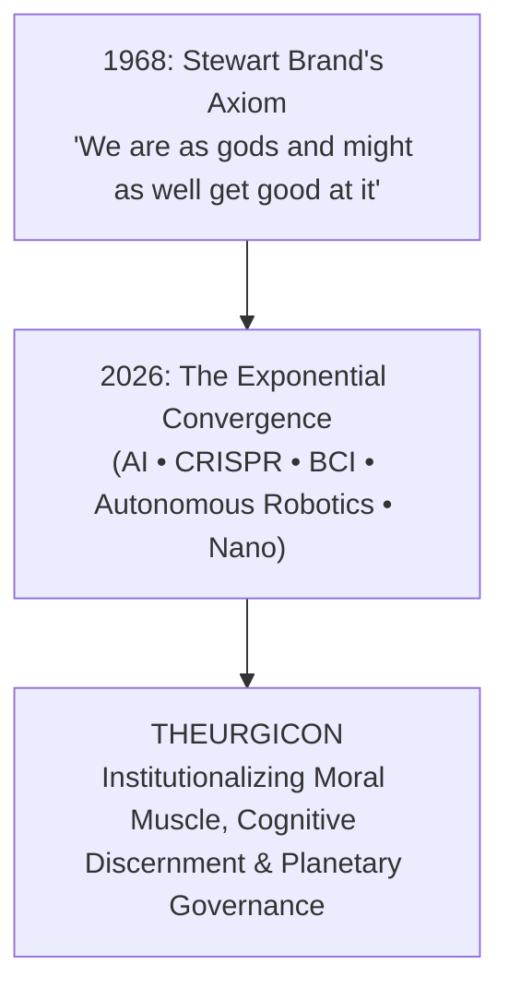
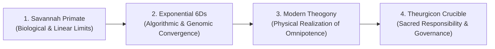
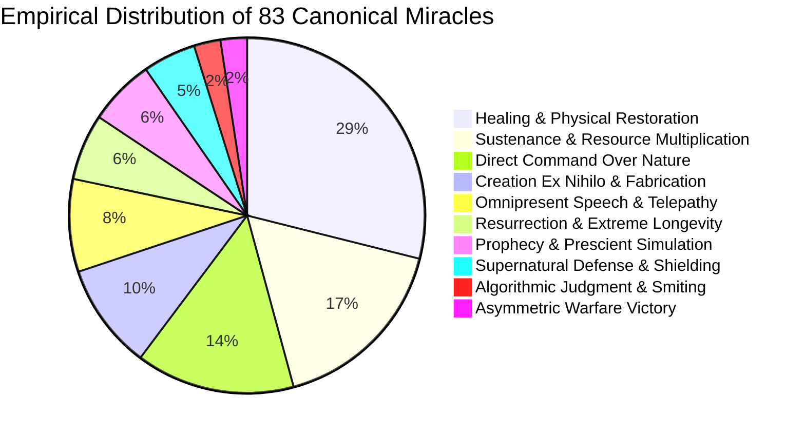
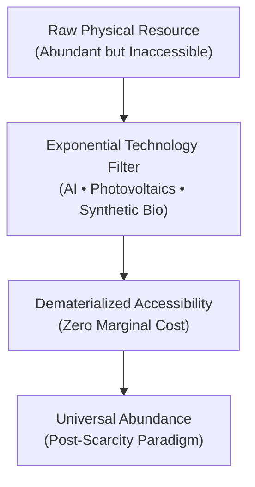
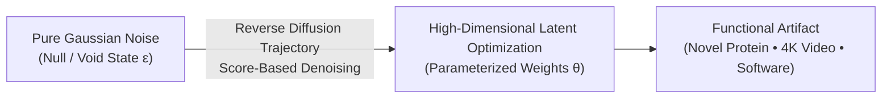
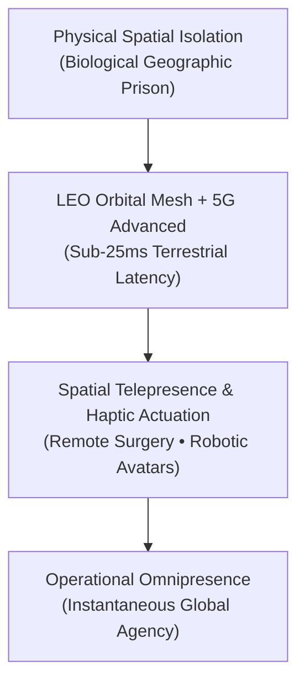
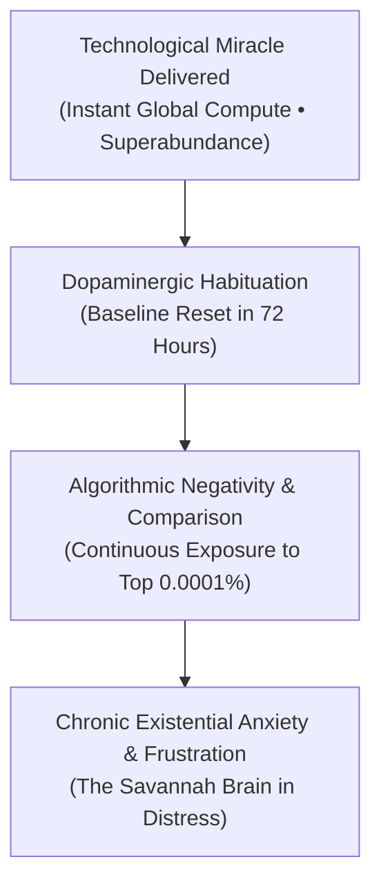
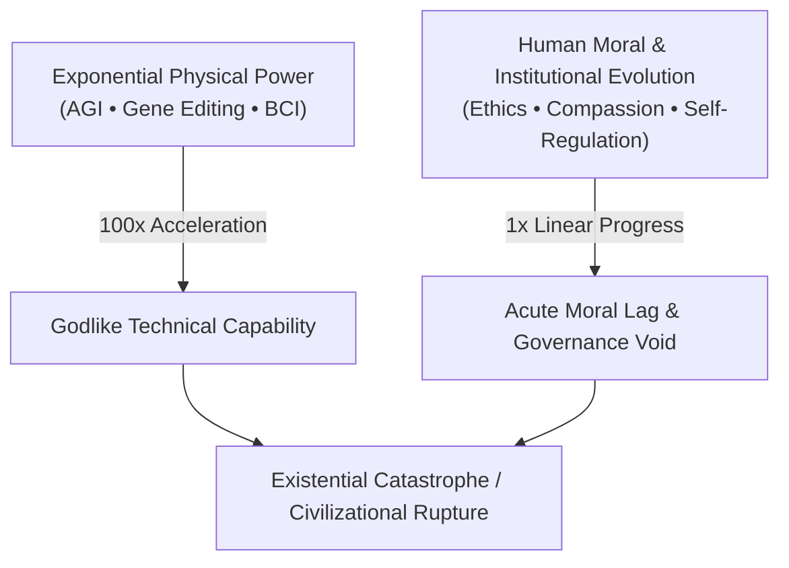
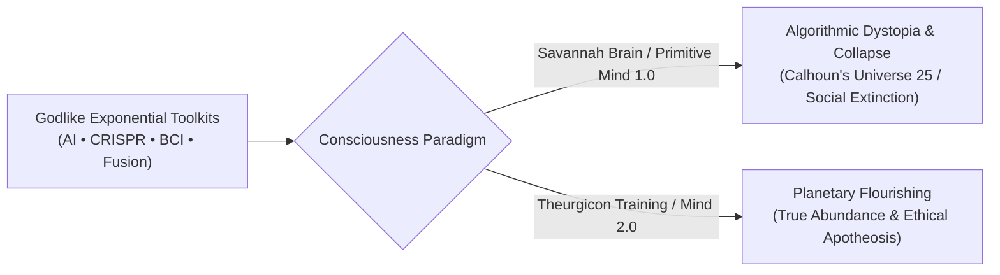
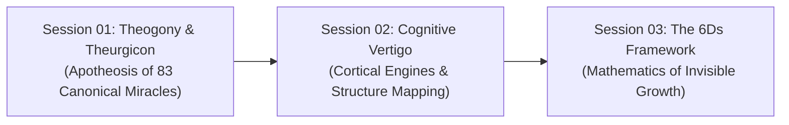

# Session 1: Theogony & Theurgicon — Institutionalizing Modern Miracles
> **Course:** We Are as Gods: A Survival Guide for the Age of Abundance (*EXPO-701*)  
> **Institution:** Oikos University • Graduate School of Exponential Civilization & Future Technology  
> **Instructors:** Prof. Peter Kim (Chair Professor), Dr. Elena Vance (Lead Scientist), TA Marcus Brody (Deep-Tech Fellow)  
> **Reading Assignment:** Peter H. Diamandis & Steven Kotler, *We Are as Gods* (2026), Chapter 1 (*A Tall Order / Theurgicon*)  
> **Standard Architecture:** 45 Slides (6 Modules: M1–M6) • High-Velocity 3-Presenter Micro-Turn Dialogue Master Edition  

---

## 📌 Master Table of Contents & Slide Index

- [Module 1: Introduction & Civilizational Framing (Slides 01–05)](#module-1-introduction--civilizational-framing-slides-0105)
  - [Slide 01: Welcome to the Theurgicon — The School of the Gods](#slide-01-welcome-to-the-theurgicon--the-school-of-the-gods)
  - [Slide 02: Stewart Brand’s 1968 Provocation Revisited](#slide-02-stewart-brands-1968-provocation-revisited)
  - [Slide 03: From Classical Theogony to Institutional Theurgicon](#slide-03-from-classical-theogony-to-institutional-theurgicon)
  - [Slide 04: The Core Existential Inquest: Are We Equipped for Omnipotence?](#slide-04-the-core-existential-inquest-are-we-equipped-for-omnipotence)
  - [Slide 05: Pedagogical Trajectory & Intellectual Roadmap](#slide-05-pedagogical-trajectory--intellectual-roadmap)
- [Module 2: Primary Text Deconstruction (Slides 06–15)](#module-2-primary-text-deconstruction-slides-0615)
  - [Slide 06: Deconstructing the Diamandis-Kotler Thesis (2026)](#slide-06-deconstructing-the-diamandis-kotler-thesis-2026)
  - [Slide 07: Empirical Taxonomy of the 83 Canonical Miracles](#slide-07-empirical-taxonomy-of-the-83-canonical-miracles)
  - [Slide 08: Miracle Domain 1: Creation (*Ex Nihilo*) & Sustenance (*Multiplication*)](#slide-08-miracle-domain-1-creation-ex-nihilo--sustenance-multiplication)
  - [Slide 09: Miracle Domain 2: Command over Nature & Bodily Restoration](#slide-09-miracle-domain-2-command-over-nature--bodily-restoration)
  - [Slide 10: Miracle Domain 3: Resurrection & Impenetrable Defense](#slide-10-miracle-domain-3-resurrection--impenetrable-defense)
  - [Slide 11: Miracle Domain 4: Omniscient Forecasting & Universal Speech](#slide-11-miracle-domain-4-omniscient-forecasting--universal-speech)
  - [Slide 12: Miracle Domain 5: Algorithmic Retribution & Asymmetric Dominance](#slide-12-miracle-domain-5-algorithmic-retribution--asymmetric-dominance)
  - [Slide 13: Peter Diamandis’s Exponential Lens: Abundance by Design](#slide-13-peter-diamandiss-exponential-lens-abundance-by-design)
  - [Slide 14: Steven Kotler’s Neurological Warning: The Savannah Brain at Bay](#slide-14-steven-kotlers-neurological-warning-the-savannah-brain-at-bay)
  - [Slide 15: The Grand Miracle-to-Tech Conversion Matrix](#slide-15-the-grand-miracle-to-tech-conversion-matrix)
- [Module 3: Exponential Frameworks & Relational Mapping (Slides 16–25)](#module-3-exponential-frameworks--relational-mapping-slides-1625)
  - [Slide 16: *Creatio Ex Nihilo* in Latent Space: The Diffusion Calculus](#slide-16-creatio-ex-nihilo-in-latent-space-the-diffusion-calculus)
  - [Slide 17: Externalized Omniscience: Autonomous RAG and the Death of Search](#slide-17-externalized-omniscience-autonomous-rag-and-the-death-of-search)
  - [Slide 18: Engineering Omnipresence: Orbital Constellations & Spatial Mesh](#slide-18-engineering-omnipresence-orbital-constellations--spatial-mesh)
  - [Slide 19: The Autocatalytic Law of Exponential Convergence](#slide-19-the-autocatalytic-law-of-exponential-convergence)
  - [Slide 20: The 181 Zettabyte Tsunami vs. The 120-Bit Cortical Funnel](#slide-20-the-181-zettabyte-tsunami-vs-the-120-bit-cortical-funnel)
  - [Slide 21: Dedre Gentner’s Structure-Mapping Theory](#slide-21-dedre-gentners-structure-mapping-theory)
  - [Slide 22: Surface Attributes vs. Deep Relational Isomorphisms](#slide-22-surface-attributes-vs-deep-relational-isomorphisms)
  - [Slide 23: Mythological Archetypes as High-Compression Cognitive Filters](#slide-23-mythological-archetypes-as-high-compression-cognitive-filters)
  - [Slide 24: The Thermodynamics of Universal Democratization](#slide-24-the-thermodynamics-of-universal-democratization)
  - [Slide 25: First Principles & Instrumental Divinity](#slide-25-first-principles--instrumental-divinity)
- [Module 4: Global Empirical Verification & Hardware Specs (Slides 26–35)](#module-4-global-empirical-verification--hardware-specs-slides-2635)
  - [Slide 26: CASE 01: Science Corp’s PRIMA System — Bionic Sight Engineering](#slide-26-case-01-science-corps-prima-system--bionic-sight-engineering)
  - [Slide 27: Max Hodak’s Bio-Hybrid Interface Architecture](#slide-27-max-hodaks-bio-hybrid-interface-architecture)
  - [Slide 28: PRIMA Technical Specifications: 2mm Photovoltaic Array](#slide-28-prima-technical-specifications-2mm-photovoltaic-array)
  - [Slide 29: Near-Infrared Optoelectronic Transduction Pipeline](#slide-29-near-infrared-optoelectronic-transduction-pipeline)
  - [Slide 30: Clinical Restitution in 170 Million AMD Patients](#slide-30-clinical-restitution-in-170-million-amd-patients)
  - [Slide 31: CASE 02: Zipline — Instant Lifelines from the Stratosphere](#slide-31-case-02-zipline--instant-lifelines-from-the-stratosphere)
  - [Slide 32: Empirical Field Metrics: Rwanda & Ghana Healthcare Leapfrogging](#slide-32-empirical-field-metrics-rwanda--ghana-healthcare-leapfrogging)
  - [Slide 33: CASE 03: Genomic Resurfacing & De-Extinction Engineering](#slide-33-case-03-genomic-resurfacing--de-extinction-engineering)
  - [Slide 34: CASE 04: Dematerializing $7.1 Million into a 200g Device](#slide-34-case-04-dematerializing-71-million-into-a-200g-device)
  - [Slide 35: CASE 05: AlphaFold 3 & The Resolution of 200M Protein Structures](#slide-35-case-05-alphafold-3--the-resolution-of-200m-protein-structures)
- [Module 5: Existential Paradoxes & The "So What?" Layer (Slides 36–42)](#module-5-existential-paradoxes--the-so-what-layer-slides-3642)
  - [Slide 36: The Habituation Paradox: Why Modern Gods Are Anxious](#slide-36-the-habituation-paradox-why-modern-gods-are-anxious)
  - [Slide 37: The Hedonic Treadmill & The Void of Technotopia](#slide-37-the-hedonic-treadmill--the-void-of-technotopia)
  - [Slide 38: Cultural Lag & The Deficit of Sacred Responsibility](#slide-38-cultural-lag--the-deficit-of-sacred-responsibility)
  - [Slide 39: Paleolithic Emotions vs. Godlike Technologies](#slide-39-paleolithic-emotions-vs-godlike-technologies)
  - [Slide 40: The Peril of Algorithmic Feudalism & Digital Theocracy](#slide-40-the-peril-of-algorithmic-feudalism--digital-theocracy)
  - [Slide 41: Cultivating Moral Muscle in the crucible of Theurgicon](#slide-41-cultivating-moral-muscle-in-the-crucible-of-theurgicon)
  - [Slide 42: Synthesizing the "So What?": Mind 2.0 or Civilizational Sunset](#slide-42-synthesizing-the-so-what-mind-20-or-civilizational-sunset)
- [Module 6: Graduate Seminar Discourse & Moonshot Design (Slides 43–45)](#module-6-graduate-seminar-discourse--moonshot-design-slides-4345)
  - [Slide 43: Socratic Seminar Inquiries: Triad of Dialectical Debates](#slide-43-socratic-seminar-inquiries-triad-of-dialectical-debates)
  - [Slide 44: Capstone Directives: Architecting the $100B Giga-XPRIZE](#slide-44-capstone-directives-architecting-the-100b-giga-xprize)
  - [Slide 45: Preview of Session 02: Cognitive Vertigo & Concluding Charge](#slide-45-preview-of-session-02-cognitive-vertigo--concluding-charge)

---

## Module 1: Introduction & Civilizational Framing (Slides 01–05)

### Slide 01: Welcome to the Theurgicon — The School of the Gods
- **Session Focus:** Inauguration of the Graduate Seminar on Civilizational Theurgy and Exponential Power.
- **Academic Foundation:** Stewart Brand (1968); Peter H. Diamandis & Steven Kotler (2026).
- **Key Concepts:** *Theogony* (Birth and apotheosis of humanity), *Theurgicon* (Academy for cultivating godlike stewardship), *Technological Singularity*.



> **🎙️ 3-Presenter Authentic Tiki-Taka Script**
> 
> **Prof. Peter Kim:** Welcome everyone to Session 1 of *We Are as Gods*! Today, we are opening the doors to what we call the **Theurgicon**—our dedicated academy for understanding and governing godlike technologies. Elena, Marcus, welcome to the kickoff! *(Turn 1)*  
> **Dr. Elena Vance:** It's great to be here, Professor! For our international students, let's explain the word *theurgy*. In ancient Greece, *theurgy* meant the work of the gods—invoking divine power to change physical reality. Fast forward to 2026: with CRISPR, AI, and bionic implants, humanity is now building those exact powers in laboratories. *(Turn 2)*  
> **TA Marcus Brody:** But hold on, Dr. Vance—when students see "School of the Gods" in the syllabus, they might wonder: isn't that Silicon Valley hype? Are we actually claiming humans are divine, or is this just an extended metaphor? *(Turn 3)*  
> **Prof. Peter Kim:** It is neither hype nor empty poetry, Marcus. It is an honest audit of physical capability. If someone from two thousand years ago watched you cure blindness with a subretinal microchip or design new proteins on a laptop in three seconds, what word would they use besides *divine*? *(Turn 4)*  
> **TA Marcus Brody:** They would call it an absolute miracle! Ancient prophets prayed for days to part waters or heal the sick, but today these are standard engineering sprints in biotech labs. But here's the catch: our tools have become godlike, while our biology is still stuck in the prehistoric era! *(Turn 5)*  
> **Dr. Elena Vance:** That is the core paradox we are tackling. We are wielding multi-gigawatt planetary technologies with emotional brains that evolved to forage roots and dodge leopards in small hunter-gatherer tribes. If we don't bridge that gap, immense power simply accelerates self-destruction. *(Turn 6)*  
> **TA Marcus Brody:** So the Theurgicon isn't just about learning how the tech works—it's about building the ethical judgment and wisdom so we don't destroy ourselves with our own inventions! *(Turn 7)*  
> **Prof. Peter Kim:** Exactly. Power is forged in silicon and genetic foundries, but wisdom must be cultivated through rigorous ethical discipline. That gap between capability and wisdom is why this course exists. *(Turn 8)*  
> **Dr. Elena Vance:** Over the next 15 weeks, we will break down conventional assumptions and build your cognitive frameworks from first principles. *(Turn 9)*  
> **Prof. Peter Kim:** Let's look at Slide 2 and examine where this mandate began: Stewart Brand's famous 1968 declaration. *(Turn 10)*

---

### Slide 02: Stewart Brand’s 1968 Provocation Revisited
- **Historical Milestone:** The opening manifesto of the *Whole Earth Catalog* (Fall 1968).
- **Verbatim Maxim:** *"We are as gods and might as well get good at it."*
- **Macro Paradigm Shift:** From countercultural personal liberation to planetary systemic survival.

| Era | Stewart Brand’s Focus | Technological Substrate | Existential Mandate |
| :--- | :--- | :--- | :--- |
| **1968** | Individual Autonomy & Decentralized Tools | Calculators, Typewriters, DIY Manuals | Liberating personal agency from bureaucratic state hegemony |
| **2026** | Species-Level Apotheosis & Systemic Stability | 2mm Photovoltaic Chips, Frontier AGI, Planetary Sensor Meshes | Defending against cognitive vertigo and civilizational collapse |

> **🎙️ 3-Presenter Authentic Tiki-Taka Script**
> 
> **Dr. Elena Vance:** On Slide 2, we revisit the iconic opening line of the 1968 *Whole Earth Catalog* by Stewart Brand: *"We are as gods and might as well get good at it."* Back then, academics dismissed it as California counter-cultural poetry. *(Turn 1)*  
> **TA Marcus Brody:** But look at what Brand actually meant back in 1968, Elena! He was talking about buying hand tools, printing newsletters, and building geodesic domes so individuals wouldn't depend on giant bureaucracies or big auto companies. *(Turn 2)*  
> **Prof. Peter Kim:** Spot on, Marcus. In 1968, "being as gods" meant personal autonomy and self-reliance. But look at the table on Slide 2 to see the massive shift. Today in 2026, getting good at being gods is no longer a lifestyle choice; it is a baseline requirement for species survival. *(Turn 3)*  
> **TA Marcus Brody:** Because in 1968, if you built a bad cabin, it leaked rain on your head. In 2026, if you make a mistake with an autonomous AI weapons swarm or a synthetic gene drive, you trigger a global catastrophe! *(Turn 4)*  
> **Dr. Elena Vance:** The stakes are entirely different. We have moved from typewriters and hand tools to 2mm photovoltaic eye chips, 45-ExaFLOP supercomputers, and sensor meshes capturing 181 zettabytes of data. The blast radius of our mistakes is now planetary. *(Turn 5)*  
> **Prof. Peter Kim:** Notice the crucial phrase in Brand's maxim: **"might as well get good at it."** The power is already here as an undeniable physical fact. Our only question is whether humanity possesses the maturity to survive its own creations. *(Turn 6)*  
> **TA Marcus Brody:** So "getting good at it" means combining rock-solid engineering fail-safes with what we call *Moral Muscle* in human decision-making! *(Turn 7)*  
> **Dr. Elena Vance:** Exactly. A child playing with a laser cannon is a disaster waiting to happen. We must grow up to match our toolkits. *(Turn 8)*  
> **Prof. Peter Kim:** And that transition from passive biological organisms to conscious planetary stewards is what philosophy calls *Theogony*. Let's deconstruct that continuum on Slide 3. *(Turn 9)*

---

### Slide 03: From Classical Theogony to Institutional Theurgicon
- **Conceptual Continuum:**
  - **Hesiodic Theogony (c. 700 BCE):** Mythological accounts of how primordial titans and deities ascended to dominion.
  - **Technological Theogony (2026 CE):** The systematic transmutation of biological hominids into planetary architects via exponential convergence.
  - **The Theurgicon:** The institutional container engineered to cultivate the moral, cognitive, and systemic competence necessary to survive this apotheosis.



> **🎙️ 3-Presenter Authentic Tiki-Taka Script**
> 
> **TA Marcus Brody:** Professor Kim, in ancient Greek mythology, Hesiod's *Theogony* described how Zeus and the Olympian gods overthrew the Titans using thunderbolts. How does an ancient myth connect to modern computer science and bioengineering? *(Turn 1)*  
> **Prof. Peter Kim:** In Hesiod's world, humans were helpless spectators watching divine forces control the weather, disease, and harvests. Ancient humanity projected its deepest desires for health, power, and abundance onto Olympus. Today, Marcus, those mythical powers have been translated into operational code in our labs. *(Turn 2)*  
> **Dr. Elena Vance:** Look at the four-stage flowchart on Slide 3. Stage 1 was the biological primate bound by physical scarcity. Stage 2 was the exponential convergence of AI, genomics, and robotics. Stage 3 is Modern Theogony—where supercomputers and automated bio-foundries place those mythical tridents directly into human hands. *(Turn 3)*  
> **TA Marcus Brody:** But wait! In Greek myths, the gods were emotionally unstable—Zeus threw lightning when he was angry, and Apollo sent plagues over hurt pride. If humanity inherits godlike power, aren't we in danger of making the same reckless mistakes? *(Turn 4)*  
> **Dr. Elena Vance:** That is the exact danger! Immature gods are dangerous. When a species with tribal, reactive emotions commands autonomous drones and synthetic biology without ethical governance, systemic collapse is inevitable. *(Turn 5)*  
> **Prof. Peter Kim:** Which brings us to Stage 4: **The Theurgicon Crucible**. In ancient Alexandria, mystery schools trained initiates before giving them sacred responsibility. The Theurgicon is our 21st-century equivalent—an institutional container to forge ethical discipline and systemic wisdom. *(Turn 6)*  
> **TA Marcus Brody:** So we are moving from *blindly stumbling into godhood* through venture capital hype to *conscious stewardship*, where we deliberately train ourselves to govern this power! *(Turn 7)*  
> **Dr. Elena Vance:** Exactly. Power without moral structure is just accelerated self-destruction. *(Turn 8)*  
> **Prof. Peter Kim:** Let us turn to Slide 4 and confront the burning question: Are we biologically equipped for this level of power? *(Turn 9)*

---

### Slide 04: The Core Existential Inquest: Are We Equipped for Omnipotence?
- **Foundational Dilemmas for EXPO-701:**
  1. *The Ontological Shift:* When the 83 biblical miracles become standardized consumer commodities, what defines the essence of human identity?
  2. *The Psychological Mismatch:* Why does a species commanding planetary omniscience and superabundance suffer from unprecedented epidemics of anxiety, loneliness, and despair?
  3. *The Calhoun Dilemma:* Can humanity escape the sociological collapse documented in John B. Calhoun's *Universe 25* when physical deprivation is reduced to zero?

> **🎙️ 3-Presenter Authentic Tiki-Taka Script**
> 
> **Prof. Peter Kim:** Here is the foundational question anchoring our entire 15-week seminar: **"Are we fundamentally equipped to govern divine capability?"** Dr. Vance, from a neuroscience standpoint, what does the evidence say? *(Turn 1)*  
> **Dr. Elena Vance:** The honest scientific verdict is: *not by default.* The human prefrontal cortex can consciously process roughly 50 to 120 bits per second during peak focus. Meanwhile, the global datastream will exceed 181 zettabytes this year. We are trying to drink an ocean of complexity through a prehistoric biological straw! *(Turn 2)*  
> **TA Marcus Brody:** And look at the world around us! We have smartphones connecting the entire globe, grocery stores full of food, and near-zero cost information. Yet depression, social fragmentation, and chronic anxiety are at historic peaks! Why is that? *(Turn 3)*  
> **Prof. Peter Kim:** Because our psychological hardware was shaped by hundreds of thousands of years of extreme scarcity. When you eliminate survival friction without cultivating higher purpose, you run straight into the **Calhoun Dilemma**—the behavioral breakdown documented in John B. Calhoun's famous *Universe 25* mouse experiment. *(Turn 4)*  
> **TA Marcus Brody:** In Calhoun's experiment, mice were given unlimited food, perfect climate, and zero predators. And what happened? The mice lost social cohesion, stopped reproducing, and their population crashed into total extinction! Could humanity face a similar trap? *(Turn 5)*  
> **Dr. Elena Vance:** That is the real threat of unguided abundance. Without meaningful challenges and conscious goals, human dopamine circuits begin to misfire, leading to addiction and existential apathy. *(Turn 6)*  
> **TA Marcus Brody:** And while billions of dollars pour into building faster computing clusters, almost nobody is investing in the psychological and ethical infrastructure to keep humanity grounded! *(Turn 7)*  
> **Prof. Peter Kim:** That is why every student in this room must think not just as an engineer or programmer, but as an architect of civilizational balance. *(Turn 8)*  
> **Dr. Elena Vance:** Let's look at Slide 5 to see our structured roadmap for mastering these challenges across the semester. *(Turn 9)*

---

### Slide 05: Pedagogical Trajectory & Intellectual Roadmap
- **Four-Phase Master Architecture:**
  - **Phase 1 (Weeks 01–04):** Exponential Cognition, Structure Mapping, and the 6Ds Mechanics.
  - **Phase 2 (Weeks 05–08):** Empirical Miracles — Autonomous Drones, Retinal Chips, and Planetary GPT.
  - **Phase 3 (Weeks 09–11):** The Paradox of Plenty — Environmental Infiltration, Metabolic Collapse, and Bias Cascades.
  - **Phase 4 (Weeks 12–15):** Evolutionary Horizons — Mind 2.0, Flow States, Universe 25 Defense, and the $100B XPRIZE.

> **🎙️ 3-Presenter Authentic Tiki-Taka Script**
> 
> **Dr. Elena Vance:** Our syllabus is structured across 15 sessions grouped into four distinct civilizational phases on Slide 5. Today in Session 1, we lay the groundwork by analyzing the 83 historical miracles and mapping them to 2026 exponential hardware. *(Turn 1)*  
> **TA Marcus Brody:** In Phase 1, we explore exponential thinking—why our linear brains struggle with doubling curves ($1, 2, 4\dots 10^9$)—and master Dedre Gentner's Structure-Mapping Theory to break through cognitive overload! *(Turn 2)*  
> **Prof. Peter Kim:** Then in Phase 2—Empirical Miracles—we examine real-world engineering: Science Corp's PRIMA retinal implant, Zipline's autonomous medical delivery in Rwanda, and planetary sensor meshes monitoring Earth's ecosystems. *(Turn 3)*  
> **TA Marcus Brody:** That's where we look at hard metrics: microwatts per square millimeter, flight latency, and clinical trial survival curves! But what happens in Phase 3, Professor? *(Turn 4)*  
> **Prof. Peter Kim:** Phase 3 is *The Paradox of Plenty*. We analyze how ultra-processed food drives metabolic disease, how microplastics infiltrate biology, and how algorithmic feeds destabilize democratic societies. *(Turn 5)*  
> **Dr. Elena Vance:** And finally, Phase 4 delivers the constructive solutions: cultivating Mind 2.0, training flow states, and designing a **$100-Billion Giga-XPRIZE** to solve an existential bottleneck for civilization! *(Turn 6)*  
> **TA Marcus Brody:** It's an intense, practical journey from first principles to real-world impact! *(Turn 7)*  
> **Prof. Peter Kim:** Let's enter Module 2 and deconstruct our core textbook by Peter Diamandis and Steven Kotler! *(Turn 8)*

---

## Module 2: Primary Text Deconstruction (Slides 06–15)

### Slide 06: Deconstructing the Diamandis-Kotler Thesis (2026)
- **Primary Source:** Peter H. Diamandis & Steven Kotler, *We Are as Gods: A Survival Guide for the Age of Abundance* (Simon & Schuster, 2026).
- **Central Thesis:** The simultaneous convergence of exponential technologies (AI, Synthetic Biology, BCI, Nanotech, Quantum Computing) has crossed the threshold where supernatural phenomena have become engineering deliverables.
- **Dialectical Synthesis:**
  - *Diamandis:* Data-driven optimism, first principles of dematerialization, thermodynamic abundance.
  - *Kotler:* Neurobiology of peak performance, evolutionary vulnerabilities, existential peril of the savannah brain.

> **🎙️ 3-Presenter Authentic Tiki-Taka Script**
> 
> **Prof. Peter Kim:** Let's examine the intellectual foundation of our core text, *We Are as Gods* (2026). Dr. Vance, observe how Peter Diamandis and Steven Kotler complement each other throughout the book. *(Turn 1)*  
> **Dr. Elena Vance:** It is a brilliant dialectic. Diamandis provides the technological trajectory—using XPRIZE and Singularity University data to map what is *physically and economically possible*. Kotler acts as the neurobiological reality check—analyzing dopamine loops and evolutionary limits to ask what is *psychologically survivable*. *(Turn 2)*  
> **TA Marcus Brody:** You can feel that dynamic on every page! Diamandis is saying: *"Look at our 6D exponential curves! We have digitized biology and unlocked clean energy!"* And Kotler responds: *"Peter, if our amygdala melts down in social media outrage loops, your AI superclusters won't save us!"* *(Turn 3)*  
> **Prof. Peter Kim:** That tension is essential. Diamandis presses the accelerator, while Kotler designs the cognitive steering and braking systems. *(Turn 4)*  
> **Dr. Elena Vance:** They argue that 2026 is a historic inflection point where five separate exponential technologies—AI, synthetic biology, neurotechnology, clean energy, and robotics—converge into a single self-reinforcing wave. *(Turn 5)*  
> **TA Marcus Brody:** And that convergence means capabilities once classified as "supernatural acts of God" are now quarterly engineering deliverables in tech company roadmaps. *(Turn 6)*  
> **Prof. Peter Kim:** Which forces a deep philosophical question: When ancient miracles become standard commodities, how must our ethics, economics, and culture adapt? *(Turn 7)*  
> **Dr. Elena Vance:** Let's look at Slide 7 to examine their empirical audit of 83 historical miracles. *(Turn 8)*

---

### Slide 07: Empirical Taxonomy of the 83 Canonical Miracles
- **Taxonomic Audit:** Comprehensive analysis of 83 recorded supernatural interventions across biblical canons and global mythologies, classified into 10 operational domains.



> **🎙️ 3-Presenter Authentic Tiki-Taka Script**
> 
> **Dr. Elena Vance:** Diamandis and Kotler conducted an exhaustive audit of 83 canonical miracle stories across ancient scriptures and global mythologies. Look at the pie chart on Slide 7. Marcus, what pattern jumps out? *(Turn 1)*  
> **TA Marcus Brody:** Over 45% of all ancient miracles fall into just two categories! **Healing and Bodily Restoration accounts for 24 cases (nearly 29%)**, and **Sustenance and Food Multiplication represents 14 cases (17%)**! *(Turn 2)*  
> **Prof. Peter Kim:** That distribution reflects humanity's deepest historical pain. For 99% of human history, daily life was defined by two terrifying realities: deadly infectious disease and chronic famine. *(Turn 3)*  
> **TA Marcus Brody:** Ancient people weren't praying for quantum computers or space travel. They begged: *"Please cure my child's fever, restore my grandmother's eyesight, and give us enough grain so our village doesn't starve this winter."* *(Turn 4)*  
> **Dr. Elena Vance:** And look at the other categories: Command over Nature (12 cases), Creation Ex Nihilo (8 cases), and Universal Speech (7 cases). Every single miracle addressed a fundamental biological vulnerability. *(Turn 5)*  
> **Prof. Peter Kim:** What was once sought through desperate prayer has now been converted into industrial pipelines: mRNA vaccines, vertical aeroponics, bionic chips, and neural speech translators. *(Turn 6)*  
> **TA Marcus Brody:** But here's the irony: now that we produce surplus food and treat historical plagues, we take them completely for granted and generate new psychological anxieties! *(Turn 7)*  
> **Dr. Elena Vance:** Because the human brain habituates to miracles within days. We will explore that neurobiological trap in Module 5. *(Turn 8)*  
> **Prof. Peter Kim:** Let's now explore these miracle domains in detail, beginning with Creation and Food on Slide 8. *(Turn 9)*

---

### Slide 08: Miracle Domain 1: Creation (*Ex Nihilo*) & Sustenance (*Multiplication*)
- **Domain 01: Creation (*Creatio Ex Nihilo*)**
  - *Biblical Narrative:* Genesis 1:3 — Calling light and matter into existence out of the void.
  - *2026 Equivalent:* Frontier Multimodal GenAI (Sora, GPT-5), Automated Molecular Synthesis, Generative Protein Folding.
- **Domain 02: Sustenance (*Divine Multiplication*)**
  - *Biblical Narrative:* The Manna in the Sinai Wilderness; The Feeding of the 5,000.
  - *2026 Equivalent:* Bioreactor Cellular Agriculture, Vertical Aeroponics (AeroFarms 390x yield/acre), Precision Microbial Protein Synthesis.

> **🎙️ 3-Presenter Authentic Tiki-Taka Script**
> 
> **TA Marcus Brody:** Look at Domain 1 and 2 on Slide 8: *Creatio Ex Nihilo*—creating light and matter out of nothingness in Genesis—and divine multiplication of loaves and fish to feed thousands. *(Turn 1)*  
> **Dr. Elena Vance:** In 2026, you can open a multimodal generative AI interface, type a single sentence, and within seconds, a photorealistic 4K simulation or a novel 3D enzyme structure emerges out of pure mathematical Gaussian noise. *(Turn 2)*  
> **Prof. Peter Kim:** That is creation from mathematics in high-dimensional latent space. And what about food multiplication, Marcus? *(Turn 3)*  
> **TA Marcus Brody:** Look at precision fermentation and cellular agriculture! Companies take a tiny, harmless biopsy of animal cells, place them in stainless-steel bioreactors with nutrient broth, and produce tons of real meat without raising or slaughtering animals or clearing forests! *(Turn 4)*  
> **Dr. Elena Vance:** And in vertical aeroponic facilities like AeroFarms, crops grow under optimized LED light with nutrient mist, using 95% less water and yielding 390 times more produce per acre than conventional outdoor farming! *(Turn 5)*  
> **TA Marcus Brody:** Ancient manna was unpredictable; vertical farms and bioreactors are 24/7 industrial processes immune to droughts and floods. *(Turn 6)*  
> **Prof. Peter Kim:** When the marginal cost of producing calories and functional information drops toward zero, the historical basis of resource conflict begins to dissolve. *(Turn 7)*  
> **Dr. Elena Vance:** Let's look at Slide 9 to examine Domain 2: Command over Nature and Bodily Restoration. *(Turn 8)*

---

### Slide 09: Miracle Domain 2: Command over Nature & Bodily Restoration
- **Domain 03: Command Over Elemental Nature**
  - *Biblical Narrative:* Parting of the Red Sea (Exodus 14); Calming the Sea of Galilee.
  - *2026 Equivalent:* High-altitude cloud seeding, SWRO desalination, ocean thermal energy conversion, hurricane dampening arrays.
- **Domain 04: Radical Bodily Healing**
  - *Biblical Narrative:* Cleansing of lepers; The Pool of Siloam (John 9) — restoring sight to the congenitally blind.
  - *2026 Equivalent:* CRISPR-Cas12 therapeutics (Casgevy), Science Corp’s PRIMA 2mm subretinal photovoltaic chip, mRNA oncology vaccines.

> **🎙️ 3-Presenter Authentic Tiki-Taka Script**
> 
> **Dr. Elena Vance:** In ancient scriptures, parting the Red Sea or restoring sight to the blind were seen as undeniable signs of divine authority because ancient medicine had no way to repair damaged retinal biology. *(Turn 1)*  
> **TA Marcus Brody:** And look at what we do today! Science Corporation's PRIMA implant takes patients blinded by macular degeneration, inserts a 2mm solar-powered silicon chip under the retina, and restores their central vision so they can read and see their families again! *(Turn 2)*  
> **Prof. Peter Kim:** And look at Domain 3: Command over Nature. Seawater Reverse Osmosis (SWRO) desalination plants in Israel and the UAE produce millions of cubic meters of fresh drinking water from the ocean daily at under 50 cents per cubic meter! *(Turn 3)*  
> **TA Marcus Brody:** Plus cloud-seeding aircraft and atmospheric ionization systems that can trigger rainfall over dry agricultural basins on demand! We are literally managing regional water cycles. *(Turn 4)*  
> **Dr. Elena Vance:** And with CRISPR-Cas therapeutics like Casgevy, we have functionally cured Sickle Cell Anemia and Beta-Thalassemia—diseases that caused agony for millennia—with a single targeted genetic edit. *(Turn 5)*  
> **TA Marcus Brody:** Leprosy, hereditary blood disorders, blindness—the ancient scourges that defined human suffering are being systematically eliminated. *(Turn 6)*  
> **Prof. Peter Kim:** When engineering wipes away biological despair, it becomes an instrument of profound civilizational restoration. *(Turn 7)*  
> **Dr. Elena Vance:** Next, let's explore Slide 10: Reversing aging and extreme defense. *(Turn 8)*

---

### Slide 10: Miracle Domain 3: Resurrection & Impenetrable Defense
- **Domain 05: Resurrection & Vital Reversal**
  - *Biblical Narrative:* The Raising of Lazarus (John 11); Restoration of the widow’s son.
  - *2026 Equivalent:* Yamanaka epigenetic reprogramming (OSK factors), normothermic organ perfusion, cellular senolysis, cryopreservation.
- **Domain 06: Supernatural Protection & Inviolability**
  - *Biblical Narrative:* Daniel in the Lions' Den; The Pillar of Fire shielding the encampment.
  - *2026 Equivalent:* Directed-energy missile defense (Iron Beam), predictive AI biosurveillance, autonomous cybersecurity immune networks.

> **🎙️ 3-Presenter Authentic Tiki-Taka Script**
> 
> **TA Marcus Brody:** When students see "Resurrection" on Slide 10, they might think we've wandered into science fiction. Elena, how can modern biology talk about vital reversal and longevity? *(Turn 1)*  
> **Dr. Elena Vance:** Look at how medicine defines death, Marcus. Historically, when the heart stopped, you were declared dead. Today, normothermic organ perfusion and hypothermia allow clinical teams to restore heart and brain function hours after clinical arrest without tissue damage. *(Turn 2)*  
> **Prof. Peter Kim:** And at the cellular level, Yamanaka epigenetic reprogramming—using OSK factors—literally turns back the biological clock of aged mammalian cells, resetting DNA methylation markers to a youthful state. *(Turn 3)*  
> **TA Marcus Brody:** That means aging is not an inevitable supernatural curse; it is biological entropy and information loss that can be repaired! *(Turn 4)*  
> **Dr. Elena Vance:** Exactly. And look at Domain 6: Supernatural Protection. In scripture, pillars of fire shielded encampments. Today, directed-energy laser systems like Israel's Iron Beam shoot down incoming hypersonic rockets and drone swarms at light speed for two dollars a shot! *(Turn 5)*  
> **TA Marcus Brody:** Instead of firing a $100,000 interceptor missile, you fire a 100-kilowatt photon beam that burns through artillery shells mid-air in milliseconds! That is real-life laser shield defense. *(Turn 6)*  
> **Prof. Peter Kim:** The line between incurable vulnerability and active technological defense is shifting into software and optical physics. *(Turn 7)*  
> **Dr. Elena Vance:** Let's look at Slide 11: Omniscient Forecasting and Universal Speech. *(Turn 8)*

---

### Slide 11: Miracle Domain 4: Omniscient Forecasting & Universal Speech
- **Domain 07: Prescient Prophecy & Dream Interpretation**
  - *Biblical Narrative:* Joseph decoding Pharaoh’s harvest cycles; Daniel’s apocalyptic forecasting.
  - *2026 Equivalent:* Planetary digital twins, ECMWF neural weather ensembles, AlphaFold 3 dynamic interactomes, macro-financial LLM agents.
- **Domain 08: Universal Speech & Polyglot Telepathy**
  - *Biblical Narrative:* The Pentecost Phenomenon (Acts 2) — speaking in diverse tongues understood by all.
  - *2026 Equivalent:* Zero-latency neural voice translation (SeamlessM4T), non-invasive electroencephalographic decoders, sub-vocal acoustic transceivers.

> **🎙️ 3-Presenter Authentic Tiki-Taka Script**
> 
> **Dr. Elena Vance:** In Genesis, Joseph saved Egypt from famine because he interpreted Pharaoh's dreams to predict seven years of harvest followed by seven years of drought. *(Turn 1)*  
> **TA Marcus Brody:** Today, we don't need dream interpreters! The European Weather Centre (ECMWF) and AI digital twins run planetary simulations across millions of sensor nodes, predicting typhoons, droughts, and crop yields weeks ahead with remarkable precision! *(Turn 2)*  
> **Prof. Peter Kim:** And consider Domain 8: The Pentecost miracle in the Book of Acts, where speakers of one dialect were instantly understood across dozens of foreign languages. *(Turn 3)*  
> **TA Marcus Brody:** Wear wireless AI earbuds today with models like SeamlessM4T, and you can speak English while an engineer in Tokyo or a doctor in Kenya hears your exact voice translated into Japanese or Swahili with sub-200 millisecond latency! *(Turn 4)*  
> **Dr. Elena Vance:** The ancient curse of Babel—humanity's division into mutually unintelligible tongues—has been dissolved by neural network weights. *(Turn 5)*  
> **Prof. Peter Kim:** This isn't just a travel app; it is the seamless integration of eight billion human minds into a unified communication network. *(Turn 6)*  
> **TA Marcus Brody:** But when everyone is connected and AI predicts our actions, we also face military and privacy risks. *(Turn 7)*  
> **Dr. Elena Vance:** Let's examine Slide 12: Autonomous weapons and algorithmic warfare. *(Turn 8)*

---

### Slide 12: Miracle Domain 5: Algorithmic Retribution & Asymmetric Dominance
- **Domain 09: Targeted Smiting & Divine Retribution**
  - *Biblical Narrative:* Fire falling on Sodom; The collapse of the walls of Jericho.
  - *2026 Equivalent:* Hypersonic precision kinetic vehicles, autonomous micro-drone swarms, targeted high-power microwave (HPM) grid neutralization.
- **Domain 10: Asymmetric Martial Victory**
  - *Biblical Narrative:* Gideon’s 300 warriors rout an empire; David’s sling over Goliath.
  - *2026 Equivalent:* Autonomous FPV loitering munitions decimating armored divisions in Eastern Europe, algorithmic sensor-to-shooter meshes (Palantir AIP).

> **🎙️ 3-Presenter Authentic Tiki-Taka Script**
> 
> **TA Marcus Brody:** Now we must confront the dangerous side of godlike power on Slide 12: targeted destruction and asymmetric dominance. *(Turn 1)*  
> **Dr. Elena Vance:** In modern warfare, divine retribution has been codified into algorithmic targeting networks like Palantir AIP and autonomous loitering munitions. A $500 commercial FPV drone with optical AI targeting can destroy an $8-million main battle tank in seconds. *(Turn 2)*  
> **Prof. Peter Kim:** That is the literal modern reality of David and Goliath. A single infantryman with a cheap drone neutralizes a massive armored column. *(Turn 3)*  
> **TA Marcus Brody:** But look at what happens when human operators are removed from the loop! Autonomous drone swarms communicating across mesh networks can identify and engage targets at millisecond speeds without human intervention. *(Turn 4)*  
> **Dr. Elena Vance:** When targeting decisions happen in under 100 milliseconds, human moral deliberation is mathematically excluded from the kill chain. We risk delegating lethal decisions to machine learning algorithms. *(Turn 5)*  
> **TA Marcus Brody:** And if those models hallucinate or suffer adversarial spoofing, you get automated escalation and civilian casualties with zero accountability! *(Turn 6)*  
> **Prof. Peter Kim:** Divine power without divine wisdom leads to catastrophe. This is why technological mastery without ethical governance is suicidal. *(Turn 7)*  
> **Dr. Elena Vance:** Let's turn to Slide 13 to examine Peter Diamandis's economic theory: How technology systematically drives abundance. *(Turn 8)*

---

### Slide 13: Peter Diamandis’s Exponential Lens: Abundance by Design
- **Core Axioms of Exponential Abundance:**
  1. *Linear to Exponential:* Human perception computes additively ($1, 2, 3\dots 30 = 30$), whereas exponential drivers scale multiplicatively ($1, 2, 4\dots 2^{30} \approx 1,073,741,824$).
  2. *Scarcity is Contextual:* Scarcity is rarely a fundamental limit of universal atoms; it is a limitation of accessibility and technological efficiency.
  3. *The Conversion Engine:* Exponential technologies systematically transform scarce, expensive luxuries into ubiquitous, zero-marginal-cost public utilities.



> **🎙️ 3-Presenter Authentic Tiki-Taka Script**
> 
> **Prof. Peter Kim:** Marcus, explain Peter Diamandis's foundational thesis on resource scarcity. Why does he argue that scarcity is usually an illusion? *(Turn 1)*  
> **TA Marcus Brody:** Diamandis loves the historical example of aluminum. In the mid-19th century, aluminum was more valuable than gold! Emperor Napoleon III gave banquets where the King of Siam ate with aluminum spoons while ordinary dukes used gold cutlery, because extracting aluminum was nearly impossible! *(Turn 2)*  
> **Dr. Elena Vance:** Then in 1886, Charles Hall and Paul Héroult invented electrolytic smelting. Aluminum was always the most abundant metal in Earth's crust—we just lacked the technology to extract it. Overnight, aluminum became so cheap we use it for disposable soda cans and kitchen foil! *(Turn 3)*  
> **Prof. Peter Kim:** That is the core axiom: **Scarcity is not a physical absolute; it is a limitation of technological accessibility.** *(Turn 4)*  
> **TA Marcus Brody:** Look at solar energy today! The sun pours 8,000 times more energy onto Earth every day than all human civilization consumes. We never had an energy scarcity problem; we had a capture and battery storage problem! *(Turn 5)*  
> **Dr. Elena Vance:** And as solar cell efficiency climbs and lithium battery costs drop 90% in a decade, clean energy becomes an abundant, near-zero marginal cost utility across the planet. *(Turn 6)*  
> **TA Marcus Brody:** So technology is an abundance machine! It takes rare luxuries and makes them universally accessible! *(Turn 7)*  
> **Prof. Peter Kim:** That logic holds for physics and economics. But Steven Kotler immediately delivers a crucial neurobiological warning on Slide 14. *(Turn 8)*

---

### Slide 14: Steven Kotler’s Neurological Warning: The Savannah Brain at Bay
- **Kotler’s Cognitive Diagnosis:**
  - *The Evolutionary Mismatch:* The human brain evolved over 200,000 years in resource-scarce, hyper-local environments where every anomaly signaled imminent predation or starvation.
  - *Amygdala Hijacking:* Confronted with an unfiltered 181-zettabyte datastream, the brain’s default negativity bias goes into chronic overdrive, generating persistent existential dread.
  - *The Antidote:* Cultivating **Mind 2.0**—a neurobiologically grounded protocol of ruthless informational discernment and high-flow cognitive mastery.

> **🎙️ 3-Presenter Authentic Tiki-Taka Script**
> 
> **Dr. Elena Vance:** Steven Kotler issues an urgent warning on Slide 14: our biological brains were never designed for an age of exponential abundance. For 200,000 years on the savannah, survival depended on a constant **Negativity Bias**. *(Turn 1)*  
> **TA Marcus Brody:** Right! If an early hunter heard a rustle in the grass and assumed it was a predator, running away kept them alive even if it was just the wind. We are the direct descendants of the paranoid primates! *(Turn 2)*  
> **Prof. Peter Kim:** Exactly. Your brain is a prediction engine optimized for paranoia, threat detection, and hoarding calories in an environment of extreme scarcity. *(Turn 3)*  
> **TA Marcus Brody:** And what happens when you place that paranoid savannah brain in 2026? You hand it a smartphone that scans the entire globe and feeds it 500 catastrophic headlines, wars, and social crises every single hour! *(Turn 4)*  
> **Dr. Elena Vance:** The amygdala cannot distinguish between a predator ten feet away and a crisis 8,000 miles away on a screen. It floods your bloodstream with cortisol and adrenaline, causing chronic stress, dopamine fatigue, and constant anxiety! *(Turn 5)*  
> **TA Marcus Brody:** That explains why people living in air-conditioned homes with instant grocery delivery feel like the world is collapsing! Our ancient software is crashing our modern hardware! *(Turn 6)*  
> **Prof. Peter Kim:** Kotler calls this the **Savannah Brain at Bay**. If we do not cultivate **Mind 2.0**—a disciplined practice of cognitive hygiene and focus—abundance will lead to mental burnout. *(Turn 7)*  
> **Dr. Elena Vance:** Let's synthesize both perspectives in the Grand Conversion Matrix on Slide 15. *(Turn 8)*

---

### Slide 15: The Grand Miracle-to-Tech Conversion Matrix
- **Master Synthesis:** Direct relational mapping across historical mythos, 2026 technological infrastructure, leading institutions, and existential hazards.

| Miracle Domain | Canonical Archetype | 2026 Technological Substrate | Vanguard Institutional Drivers | Systemic Existential Hazard |
| :--- | :--- | :--- | :--- | :--- |
| **Creation** | Genesis / Fiat Lux | Multimodal GenAI, Protein Diffusers | OpenAI, DeepMind, Anthropic | Epistemic Collapse, Synthetic Hallucination |
| **Sustenance** | Manna / Multiplication | Cellular Ag, Precision Fermentation | Eat Just, AeroFarms, Upside Foods | Traditional Agrarian Collapse, Bioreactor Fragility |
| **Nature** | Red Sea / Storm Control | SWRO Desalination, Solar Geoeng | IDE Technologies, Harvard SCoPEx | Geopolitical Weather Warfare, Ecosystem Rupture |
| **Healing** | Siloam / Leprosy Cures | 2mm PRIMA Chip, CRISPR-Casgevy | Science Corp, Vertex, CRISPR Ther. | Genetic Inequality, Neuro-prosthetic Monopolies |
| **Resurrection** | Lazarus / Immortality | Epigenetic Reprogramming, ReGen | Retro Bio, Altos Labs, Calico | Demographic Calcification, Gerontocratic Tyranny |
| **Protection** | Fiery Furnace / Shields | Autonomous Interceptors, AI Defense | Rafael, Palantir, Anduril | Hyper-Militarized Autonomous Escalation |
| **Prophecy** | Joseph’s Seven-Year Dream| Global Digital Twins, Complex AI | ECMWF, Palantir AIP, Citadel | Algorithmic Determinism, Loss of Free Will |
| **Language** | Pentecost Polyglossia | Sub-200ms Neural Speech Synthesis | Meta (Seamless), Google DeepMind | Total Eradication of Cognitive Privacy |
| **Judgment** | Sodom Fire / Jericho | Autonomous Drone Swarms, Micro-HPM | Anduril, Skydio, Baykar | Algorithmic Liquidation, Loss of Human Chains |
| **Victory** | David’s Sling vs. Goliath | Distributed FPV Precision Munitions | Defense Innovation Unit, Commercial Swarms| Asymmetric Destabilization of Nation-States |

> **🎙️ 3-Presenter Authentic Tiki-Taka Script**
> 
> **Prof. Peter Kim:** Look closely at Slide 15, scholars. This master matrix connects historical miracle archetypes, 2026 technological infrastructure, and their systemic existential risks. *(Turn 1)*  
> **TA Marcus Brody:** Look at the symmetry across the columns: Creation via GenAI, Sustenance via Cellular Ag, Healing via PRIMA chips, and Resurrection via Epigenetic Reprogramming. OpenAI, DeepMind, Science Corp, and Altos Labs are building the tools of modern theurgy! *(Turn 2)*  
> **Dr. Elena Vance:** But look at the rightmost column—the **Systemic Existential Hazard**. Every single godlike capability carries a corresponding existential invoice. *(Turn 3)*  
> **TA Marcus Brody:** If you unlock Creation via GenAI, you risk Epistemic Collapse and deepfakes. If you unlock extreme Longevity, you risk Gerontocratic inequality where 150-year-old elites hoard wealth. If you unlock drone swarms, you risk global security instability! *(Turn 4)*  
> **Prof. Peter Kim:** There is no free omnipotence. In physics, every action has an equal and opposite reaction; in technology, every superpower brings a civilizational test. *(Turn 5)*  
> **Dr. Elena Vance:** This proves why engineering education without ethics is dangerous. Teaching students to build powerful chips without teaching them governance produces reckless sorcerer's apprentices. *(Turn 6)*  
> **TA Marcus Brody:** Our mission in this seminar is to master both sides: the technical mechanics *and* the ethical safeguards! *(Turn 7)*  
> **Prof. Peter Kim:** Let's move into Module 3 and examine the mathematical and cognitive frameworks that make this possible! *(Turn 8)*

---

## Module 3: Exponential Frameworks & Relational Mapping (Slides 16–25)

### Slide 16: *Creatio Ex Nihilo* in Latent Space: The Diffusion Calculus
- **Theological Precedent:** *Creatio ex nihilo* (Latin: creation out of utter nothingness).
- **Mathematical Execution:** Reverse-time stochastic differential equations traversing continuous latent spaces ($\mathbb{R}^d$) to sample probability distributions $P(X|C)$.
- **Mathematical Formulation:**
  $$\mathcal{L}_{\text{Diffusion}}(	heta) = \mathbb{E}_{t, x_0, \epsilon} \left[ \| \epsilon - \epsilon_	heta(x_t, t) \|^2 
ight]$$



> **🎙️ 3-Presenter Authentic Tiki-Taka Script**
> 
> **Dr. Elena Vance:** Look at the mathematical formulation on Slide 16. In classical theology, *Creatio Ex Nihilo*—creating order out of nothingness—was the ultimate divine power. Today, diffusion models execute that exact operation using reverse-time stochastic differential equations in latent space. *(Turn 1)*  
> **TA Marcus Brody:** Break down that math in plain terms for our students, Elena! What happens when someone types a prompt into a generative model? *(Turn 2)*  
> **Dr. Elena Vance:** The system starts with pure Gaussian white noise—complete randomness with zero structural information, the mathematical equivalent of a void. Then, step by step, the neural network calculates the score function, removes noise, and guides the state toward high-probability manifolds where functional images, code, or molecules exist. *(Turn 3)*  
> **TA Marcus Brody:** So whether it's generating a photo-realistic video, writing executable code, or designing a brand-new protein that binds to cancer cells, it pulls structured order out of mathematical chaos in seconds! *(Turn 4)*  
> **Prof. Peter Kim:** In the industrial age, creating something required physically shaping atoms—cutting wood, forging steel. In 2026, creation begins in the mathematical abstract of $\mathbb{R}^d$ latent space. *(Turn 5)*  
> **TA Marcus Brody:** Atoms used to be the hard constraint. Today, compute and imagination are the primary constraints! *(Turn 6)*  
> **Dr. Elena Vance:** But there is a danger: ungrounded diffusion leads to synthetic hallucinations and epistemic confusion. When creation becomes effortless, verifying objective truth becomes our primary challenge. *(Turn 7)*  
> **Prof. Peter Kim:** Let's examine Slide 17: Externalized Omniscience and the Evolution of Search. *(Turn 8)*

---

### Slide 17: Externalized Omniscience: Autonomous RAG and the Death of Search
- **From Information Retrieval to Synthetic Cognition:**
  - *The Old Paradigm (1998–2022):* Indexing web pages via PageRank; humans manually filtering hyperlinks.
  - *The Theurgic Paradigm (2026):* Vector Graph Retrieval-Augmented Generation (Graph RAG) synthesizing 100-trillion-token multi-domain repositories in real time.
- **Cognitive Implication:** Human intellect shifts from *memory storage and procedural parsing* to *epistemic interrogation and philosophical discernment*.

> **🎙️ 3-Presenter Authentic Tiki-Taka Script**
> 
> **TA Marcus Brody:** Remember the ancient days of 2020 when doing research meant opening 35 browser tabs on Google, scrolling through sponsored links, and reading 50-page PDFs for days? *(Turn 1)*  
> **Dr. Elena Vance:** That old paradigm of manual keyword indexing and page-skimming is ending. On Slide 17, we see **Externalized Omniscience** via Graph Retrieval-Augmented Generation (Graph RAG). *(Turn 2)*  
> **TA Marcus Brody:** Today, you can feed 10,000 research papers, clinical trial databases, and patent registries into an autonomous agent cluster. Within 15 seconds, it maps the knowledge graph, identifies hidden correlations, and provides a synthesized breakdown with citations! *(Turn 3)*  
> **Prof. Peter Kim:** Think about how this transforms human intelligence. For 5,000 years, an "educated person" was someone who memorized facts—dates, Latin names, and legal precedents. *(Turn 4)*  
> **Dr. Elena Vance:** In 2026, raw information storage has zero market value because the machine already stores all the facts. The true metric of human intellect is now **Epistemic Interrogation**—the depth, clarity, and precision of the questions you pose to the system. *(Turn 5)*  
> **TA Marcus Brody:** If you ask a shallow question, you get a generic summary. If you ask a profound, cross-domain question, the AI helps you uncover breakthrough insights! *(Turn 6)*  
> **Prof. Peter Kim:** Francis Bacon famously said in 1597 that *"Knowledge is power."* In 2026, raw knowledge is ambient like electricity; the only true power is the wisdom to direct it toward human flourishing. *(Turn 7)*  
> **Dr. Elena Vance:** Let's look at Slide 18: Engineering Omnipresence through Orbital Constellations and Spatial Meshes. *(Turn 8)*

---

### Slide 18: Engineering Omnipresence: Orbital Constellations & Spatial Mesh
- **The Classical Attribute:** *Omnipresence* (Simultaneous active existence across all spatial domains).
- **Physical Realization:**
  - Low Earth Orbit (LEO) megaconstellations (>40,000 active nodes) delivering sub-25ms global latency.
  - Spatial computing arrays, millimeter-wave radar, and trillion-node sensor meshes capturing continuous physical state vectors.
  - Holographic telepresence enabling real-time remote robotic surgery across continental divides.



> **🎙️ 3-Presenter Authentic Tiki-Taka Script**
> 
> **Prof. Peter Kim:** Consider the ancient concept of *Omnipresence*—the ability to be simultaneously present, perceptive, and active across all geographic space. Look at Slide 18. How has this become physical reality? *(Turn 1)*  
> **Dr. Elena Vance:** Through the convergence of Low Earth Orbit megaconstellations—thousands of satellites linked by optical lasers—combined with terrestrial sensor arrays. A surgeon in Seoul can actuate haptic robotic arms to perform micro-surgery on a patient in Nairobi with under 20 milliseconds of latency! *(Turn 2)*  
> **TA Marcus Brody:** Meanwhile, that same specialist can have an autonomous digital twin attending a conference in San Francisco and monitoring an automated agricultural fleet in South America in real time! Physical distance has dematerialized! *(Turn 3)*  
> **Prof. Peter Kim:** For all of history, your physical location determined your destiny: what books you could access, who you could trade with, and what healthcare you received. Orbital photonics have dissolved that barrier. *(Turn 4)*  
> **TA Marcus Brody:** But look at the strange psychological side-effect, Elena! My operational agency is in Kenya, California, and South America, but my physical body is sitting on an office chair drinking cold coffee! *(Turn 5)*  
> **Dr. Elena Vance:** Neurobiologists call that **Somatic Dissociation**. When your cognitive reach expands globally while your biological body sits isolated and sedentary, the brain experiences spatial vertigo and loneliness. *(Turn 6)*  
> **Prof. Peter Kim:** We must remain grounded in our physical embodiment and local communities even as our digital tools encircle the globe. *(Turn 7)*  
> **Dr. Elena Vance:** Let's examine Slide 19: The Autocatalytic Law of Exponential Convergence. *(Turn 8)*

---

### Slide 19: The Autocatalytic Law of Exponential Convergence
- **The Multiplicative Acceleration Dynamic:**
  - Exponential technologies do not advance along isolated linear corridors; they act as mutual catalysts, forming closed feedback loops of self-reinforcing acceleration.
- **The Convergence Formulation:**
  $$rac{d\mathcal{A}}{dt} = \kappa \cdot \left[ \mathcal{C}_{\text{Compute}} \times \mathcal{M}_{\text{Models}} \times \mathcal{D}_{\text{Data}} \times \mathcal{E}_{\text{Energy}} 
ight]^{\gamma}$$
  where $\gamma > 1$ denotes the autocatalytic exponent.

> **🎙️ 3-Presenter Authentic Tiki-Taka Script**
> 
> **TA Marcus Brody:** Why are legacy corporations and forecasters constantly blindsided by technology? Why do their 10-year roadmaps become obsolete in 18 months? *(Turn 1)*  
> **Dr. Elena Vance:** Because they analyze industries in separate linear silos! They think AI advances on one track, battery chemistry on another, and synthetic biology on a third. Look at the formula on Slide 19—they overlook **Autocatalytic Convergence**. *(Turn 2)*  
> **Prof. Peter Kim:** In chemistry, an autocatalytic reaction is one where the output of the reaction serves as the catalyst for the next cycle. In technology, exponential domains feed directly into each other's acceleration loops. *(Turn 3)*  
> **TA Marcus Brody:** Give us a concrete loop, Elena! How does AI accelerate batteries, which accelerate drones, which accelerate AI? *(Turn 4)*  
> **Dr. Elena Vance:** Exactly like that! AI algorithms design solid-state battery electrolytes in weeks instead of decades. High-density batteries give autonomous drones 10x flight range. Those drones survey remote ecosystems and sequence environmental DNA. That biological data is fed back into frontier models to design bio-computing circuits! *(Turn 5)*  
> **TA Marcus Brody:** And with the exponent $\gamma > 1$, this isn't just simple Moore's Law doubling—it is supra-exponential growth! Five years of progress in 2026 equals fifty years of 20th-century progress! *(Turn 6)*  
> **Prof. Peter Kim:** Which means static 5-year plans are obsolete. You cannot navigate a supra-exponential landscape with a static linear compass. *(Turn 7)*  
> **Dr. Elena Vance:** Let's look at the bottleneck on Slide 20: The 181 Zettabyte Tsunami versus the 120-Bit Cortical Funnel. *(Turn 8)*

---

### Slide 20: The 181 Zettabyte Tsunami vs. The 120-Bit Cortical Funnel
- **The Overwhelming Quantitative Mismatch:**
  - Global Data Output in 2026: **181 Zettabytes ($1.81 \times 10^{23}$ Bytes)**.
  - Conscious Human Working-Memory Throughput: **50 to 120 bits/second** (Mihaly Csikszentmihalyi).
- **The Ingestion Divergence:**
  $$\text{Cognitive Mismatch Ratio} = rac{1.81 \times 10^{23} \text{ bytes/year}}{15 \text{ bytes/second} \times 3.15 \times 10^7 \text{ seconds/year}} \approx 3.83 \times 10^{14}$$

> **🎙️ 3-Presenter Authentic Tiki-Taka Script**
> 
> **Dr. Elena Vance:** Slide 20 presents a stark biological bottleneck: this year, human civilization will generate **181 Zettabytes** of digital data. That is $1.81 \times 10^{23}$ bytes of video, sensor feeds, market trades, and scientific papers. *(Turn 1)*  
> **TA Marcus Brody:** And now look at the biological hardware between our ears: neuroscience research shows that our conscious working memory processes at most **50 to 120 bits per second** during focused attention! *(Turn 2)*  
> **Prof. Peter Kim:** When you calculate the ratio between global data production and conscious human processing capacity over a year, you get a staggering **380-trillion-to-one mismatch ($3.83 \times 10^{14}$)**! *(Turn 3)*  
> **TA Marcus Brody:** Trying to stay informed by doom-scrolling feeds is like trying to drink the entire flow of Niagara Falls through a microscopic needle! It is biologically impossible! *(Turn 4)*  
> **Dr. Elena Vance:** And when a primate brain attempts to force Niagara Falls through a 120-bit straw, the prefrontal cortex overheats, working memory degrades, decision fatigue sets in, and the amygdala defaults to anxiety and paralysis! *(Turn 5)*  
> **TA Marcus Brody:** That explains why so many ambitious people feel overwhelmed and unable to sustain deep focus for twenty minutes! *(Turn 6)*  
> **Prof. Peter Kim:** You cannot survive this deluge through brute-force consumption. You need cognitive frameworks, structural compression, and mental models. *(Turn 7)*  
> **Dr. Elena Vance:** Let's examine our primary cognitive shield on Slide 21: Dedre Gentner's Structure-Mapping Theory. *(Turn 8)*

---

### Slide 21: Dedre Gentner’s Structure-Mapping Theory
- **Theoretical Benchmark:** Dedre Gentner (1983, 1997), *Structure-Mapping: A Theoretical Framework for Analogy*.
- **Operational Principle:** Human cognition decodes novel, radically complex target domains by aligning them with the **relational system** of a well-understood base domain, ignoring superficial attributes to extract deep structural invariants.

```mermaid
graph TD
    subgraph Base Domain: Canonical Ancient Mythos
        B1["Divine Agency / Miracle Worker"] -->|Acts to Alleviate| B2["Suffering / Scarcity-Bound Human"]
        B1 -->|Operates via| B3["Transcendence of Natural Scarcity"]
    end
    
    subgraph Target Domain: 2026 Exponential Engineering
        T1["Frontier Systems / BCI / AI"] -->|Engineered to Eliminate| T2["Biological & Physical Scarcity"]
        T1 -->|Operates via| T3["6D Dematerialization & Zero Marginal Cost"]
    end
    
    Base Domain ==>|Structure-Mapping (Relational Isomorphism)| Target Domain
```

> **🎙️ 3-Presenter Authentic Tiki-Taka Script**
> 
> **Prof. Peter Kim:** Why do we anchor a cutting-edge graduate seminar in ancient miracle stories? Because of **Dedre Gentner's Structure-Mapping Theory**. Dr. Vance, explain how relational mapping works as a cognitive accelerator. *(Turn 1)*  
> **Dr. Elena Vance:** Gentner proved that the human brain does not master complex new domains by memorizing isolated facts. Instead, the brain excels when it identifies a **relational isomorphism**—a system of relationships from a familiar base domain—and projects it onto an unfamiliar target domain. *(Turn 2)*  
> **TA Marcus Brody:** So instead of getting lost in 500 pages of semiconductor physics and optoelectronic jargon about subretinal photodiodes, our brain maps the PRIMA chip to the base archetype of restoring sight at the Pool of Siloam! *(Turn 3)*  
> **Dr. Elena Vance:** Exactly! The surface details—spit and clay in the ancient narrative versus 30-micron silicon chips in 2026—are different. But the deep structural relation—restoring damaged sensory transducers to liberate a human from blindness—is 100% identical! *(Turn 4)*  
> **Prof. Peter Kim:** When you align the relational system, your prefrontal cortex compresses gigabytes of technical complexity into an intuitive mental model. You achieve instant conceptual transfer. *(Turn 5)*  
> **TA Marcus Brody:** That means ancient myths and archetypes aren't childish fables; they are humanity's original data-compression algorithms! *(Turn 6)*  
> **Dr. Elena Vance:** They are high-compression cultural vectors that preserve essential truths about human vulnerability, power, and ethics. *(Turn 7)*  
> **Prof. Peter Kim:** Let's look at Slide 22 to see the difference between surface thinking and deep relational mapping. *(Turn 8)*

---

### Slide 22: Surface Attributes vs. Deep Relational Isomorphisms
- **Gentnerian Distinction:**
  - *Surface Attributes:* Visual appearance, isolated specifications, component names (leads to shallow comprehension).
  - *Relational Isomorphisms:* Interconnected causal structures, functional roles, and transformational mechanics (enables radical breakthrough insights).

| System Under Analysis | Superficial Attribute Focus (Shallow) | Deep Relational Isomorphism (Theurgic) |
| :--- | :--- | :--- |
| **Smartphone** | A rectangular glass slab running software apps | A dematerialization engine condensing $7.1M of physical infrastructure into a near-zero marginal cost universal utility |
| **PRIMA Retinal Chip** | A 2mm silicon square embedded in the eye | An optoelectronic bridge bypassing destroyed biological transducers to restore existential connection and agency |
| **Zipline Drone Mesh** | A small battery-powered RC airplane | An aerial supply pipeline bypassing nonexistent terrestrial infrastructure to slash maternal hemorrhaging mortality by 51% |

> **🎙️ 3-Presenter Authentic Tiki-Taka Script**
> 
> **Dr. Elena Vance:** Look at the comparison on Slide 22. A novice looks at surface attributes: *"A smartphone is a 6-inch glass rectangle with a 120Hz display and a 48-megapixel camera."* That is shallow, attribute-level thinking. *(Turn 1)*  
> **TA Marcus Brody:** But a Theurgicon scholar sees the deep relational structure: *"A smartphone is an exponential dematerialization engine that condensed $7.1 million of 1985 hardware into a 200-gram pocket device, giving a student anywhere on Earth more access to knowledge than the President of the United States had 40 years ago!"* *(Turn 2)*  
> **Prof. Peter Kim:** Look at Zipline: A surface observer says: *"It's just a styrofoam toy airplane."* A relational thinker sees: *"It is an aerial logistics umbilical cord that bypasses nonexistent mountain roads to slash postpartum maternal mortality by 51%."* *(Turn 3)*  
> **Dr. Elena Vance:** And look at PRIMA: Not *"a 2mm silicon square,"* but an optoelectronic bridge restoring existential human dignity and independence to elderly patients. *(Turn 4)*  
> **TA Marcus Brody:** When you see systems relationally, your engineering priorities change! You stop building trivial spec upgrades and start architecting solutions for real human challenges! *(Turn 5)*  
> **Prof. Peter Kim:** Relational isomorphism is your shield against superficial tech hype and your compass for meaningful innovation. *(Turn 6)*  
> **TA Marcus Brody:** And we can take this further by using mythological archetypes as design filters on Slide 23! *(Turn 7)*  
> **Dr. Elena Vance:** Let's examine Slide 23: Mythological Archetypes as High-Compression Cognitive Filters. *(Turn 8)*

---

### Slide 23: Mythological Archetypes as High-Compression Cognitive Filters
- **Jungian Archetypes as Computational Heuristics:**
  - *Carl Jung & Cognitive Science:* Archetypes are innate psychological patterns deeply ingrained in the human subconscious.
  - *Application to Frontier Tech:* Framing autonomous agentic AI not as an abstract matrix of weights, but as a dedicated **Guardian Angel / Sentinel** or **Omniscient Scribe** provides immediate alignment constraints on system objectives.

> **🎙️ 3-Presenter Authentic Tiki-Taka Script**
> 
> **Prof. Peter Kim:** Carl Jung demonstrated that mythological archetypes are not arbitrary cultural inventions; they are fundamental psychological patterns embedded in the collective subconscious. In 2026, we are casting these archetypes into silicon. *(Turn 1)*  
> **TA Marcus Brody:** How does framing an AI system with an archetype help an engineer write better code or design better products, Dr. Vance? *(Turn 2)*  
> **Dr. Elena Vance:** If an engineering team designs an AI thinking of it merely as a "text-completion tool," they build a passive search box. But if they frame it under the classical archetype of the **Guardian Sentinel**, their entire architecture transforms! *(Turn 3)*  
> **TA Marcus Brody:** Under the Sentinel archetype, you build proactive continuous biometric monitoring, anomaly detection, predictive fall prevention for elderly care, and cryptographic firewalls! The archetype defines the system's mission! *(Turn 4)*  
> **Prof. Peter Kim:** And if you frame your knowledge engine as the **Omniscient Scribe**, you prioritize source provenance, citation verification, and epistemic honesty over clickbait engagement. *(Turn 5)*  
> **Dr. Elena Vance:** Archetypes act as intuitive, high-compression objective functions. They ensure complex autonomous agents remain aligned with human flourishing and ethical boundaries. *(Turn 6)*  
> **TA Marcus Brody:** Mythology provides the ethical north star that keeps our algorithms grounded! *(Turn 7)*  
> **Prof. Peter Kim:** Let's examine Slide 24: The Thermodynamics of Universal Democratization. *(Turn 8)*

---

### Slide 24: The Thermodynamics of Universal Democratization
- **The Inevitable Trajectory of the 6Ds:**
  - $\text{Digitized} \rightarrow \text{Deceptive} \rightarrow \text{Disruptive} \rightarrow \text{Dematerialized} \rightarrow \text{Demonetized} \rightarrow \textbf{Democratized}$.
- **The Democratization Equation:**
  $$\lim_{\text{Marginal Cost} \to 0} \text{Accessibility}(X) = 1.0 \quad (\forall \text{ Humans})$$
- Historically, monarchs spent entire treasuries for personal physicians, private orchestras, and couriers. Today, a standard smartphone provides superior medical AI, every symphony ever recorded, and instant planetary messaging to billions.


> **🎙️ 3-Presenter Authentic Tiki-Taka Script**
> 
> **TA Marcus Brody:** Slide 24 features a brilliant historical thought experiment! Consider King Louis XIV of France in the 17th century—the Sun King, the richest monarch in Europe with 500 personal servants and the Palace of Versailles. *(Turn 1)*  
> **Dr. Elena Vance:** Yet if Louis XIV got a severe toothache, a barber pulled it out with pliers and no anesthesia! If he wanted to hear music, he had to hire an orchestra and wait weeks! He had no fresh fruit in winter, and sending a letter across Europe took weeks on horseback! *(Turn 2)*  
> **Prof. Peter Kim:** Today, an ordinary citizen on a subway in Manila, Seoul, or Detroit holds a device that provides instant access to every symphony ever recorded, zero-latency video communication across oceans, and diagnostic medical AI superior to Louis XIV's royal doctors! *(Turn 3)*  
> **TA Marcus Brody:** That is the thermodynamic power of **Universal Democratization**! Look at the equation on Slide 24: As the marginal cost of reproducing digital bits approaches zero, accessibility approaches 1.0—universal coverage for every human on Earth! *(Turn 4)*  
> **Dr. Elena Vance:** Once a capability is digitized—whether medical diagnostics, educational tutoring, or musical performance—the cost of scaling it from 1,000 people to 8 billion people drops asymptotically to the cost of electricity. *(Turn 5)*  
> **Prof. Peter Kim:** Technology is humanity's greatest equalizer. It dismantles aristocratic monopolies and turns divine privileges into baseline public infrastructure. *(Turn 6)*  
> **TA Marcus Brody:** But to build these democratization engines, we must think from first principles on Slide 25! *(Turn 7)*  
> **Dr. Elena Vance:** Let's examine Slide 25: First Principles & Instrumental Divinity. *(Turn 8)*

---

### Slide 25: First Principles & Instrumental Divinity
- **First Principles Thinking in the Age of Abundance:**
  - Rejecting reasoning by analogy ("This is how it has always been done").
  - Boiling challenges down to fundamental physics (thermodynamics, energy, atoms, information bits) and building upward.
- **Instrumental Divinity:** When human toolkits attain godlike efficacy, humanity cannot remain passive consumers; we must consciously define the civilizational *telos* (purpose) for which this power is deployed.

> **🎙️ 3-Presenter Authentic Tiki-Taka Script**
> 
> **Prof. Peter Kim:** First Principles thinking, as championed by Aristotle, Feynman, and Musk, demands that we strip away convention and legacy assumptions. Marcus, how does first principles thinking unlock modern miracles? *(Turn 1)*  
> **TA Marcus Brody:** Reasoning by analogy says: *"Curing dry macular degeneration is biologically impossible because adult photoreceptor cells never grow back."* That's where conventional thinking stops. *(Turn 2)*  
> **Dr. Elena Vance:** But First Principles breaks the challenge down to basic physics: *"What is biological vision? It is photons hitting transducers, generating microcurrents, and firing action potentials along the optic nerve. If biological transducers are dead, what else in physics converts photons to current? A photovoltaic silicon diode!"* *(Turn 3)*  
> **TA Marcus Brody:** That first-principles insight created the PRIMA chip! You don't need to regrow biological photoreceptors if you can place a 2mm micro-solar array under the retina to stimulate the surviving bipolar neurons! *(Turn 4)*  
> **Prof. Peter Kim:** Every miracle in our 83-item taxonomy is simply an unsolved optimization problem waiting for a first-principles reduction into thermodynamics, information theory, and molecular physics. *(Turn 5)*  
> **Dr. Elena Vance:** And once you solve the physics, you face **Instrumental Divinity**. When our toolkits reach godlike efficacy, we must consciously define the *telos*—the purpose—for which this power is deployed. *(Turn 6)*  
> **TA Marcus Brody:** Are we using this power to build dopamine casinos, or to heal the sick, feed the hungry, and stabilize planetary ecology? *(Turn 7)*  
> **Prof. Peter Kim:** Let's enter Module 4 and examine the real-world empirical hardware that embodies this first-principles divinity! *(Turn 8)*

---

## Module 4: Global Empirical Verification & Hardware Specs (Slides 26–35)

### Slide 26: CASE 01: Science Corp’s PRIMA System — Bionic Sight Engineering
- **Breakthrough Technology:** Subretinal Photovoltaic Bionic Vision Interface.
- **Clinical Target:** End-Stage Atrophic Dry Age-Related Macular Degeneration (AMD / Geographic Atrophy).
- **Core Mechanism:** Direct subretinal optoelectronic stimulation bypassing dead photoreceptor cells to activate surviving bipolar neural architecture.


> **🎙️ 3-Presenter Authentic Tiki-Taka Script**
> 
> **Prof. Peter Kim:** We now enter Module 4: Global Empirical Verification. We leave theoretical frameworks behind and examine the hardware engineering of modern miracles. Case 1 is Science Corporation's **PRIMA Bionic Vision System**. *(Turn 1)*  
> **TA Marcus Brody:** Look at the flowchart on Slide 26! For decades, bionic eyes were science fiction. Why did previous attempts struggle, Dr. Vance, and why is PRIMA succeeding in clinical trials today? *(Turn 2)*  
> **Dr. Elena Vance:** Previous systems like Argus II placed thick electrode arrays on *top* of the retina (epiretinal), requiring complex external cables through the eye wall and bulky batteries that caused chronic inflammation. PRIMA inverted the paradigm: it places a subretinal, 30-micron microchip *under* the retina where the natural photoreceptors used to live! *(Turn 3)*  
> **TA Marcus Brody:** And it uses the eye's natural optics! The external glasses capture the visual scene with a high-speed camera, process contrast in real time, and project an invisible 880nm near-infrared beam directly through the pupil onto the chip! *(Turn 4)*  
> **Prof. Peter Kim:** The chip's 378 photovoltaic diodes absorb those infrared photons and generate localized micro-currents that directly fire the surviving bipolar neurons, sending natural action potentials up the optic nerve into the visual cortex. *(Turn 5)*  
> **TA Marcus Brody:** In clinical trials in France and the US, patients with geographic atrophy who had lived in total central blindness for over a decade put on these glasses and started reading letters on eye charts and recognizing shapes! *(Turn 6)*  
> **Dr. Elena Vance:** The moment a patient who hasn't seen a loved one's face in 15 years reads their first word off a screen, the entire surgical team breaks down in tears. It is the Pool of Siloam built in micro-optics and silicon. *(Turn 7)*  
> **Prof. Peter Kim:** Let's examine the inventor behind this, Max Hodak, on Slide 27. *(Turn 8)*

---

### Slide 27: Max Hodak’s Bio-Hybrid Interface Architecture
- **Pioneer Profile:** Max Hodak (Co-founder & former President of Neuralink \rightarrow Founder & CEO of Science Corporation).
- **Architectural Philosophy:** Avoid high-risk invasive craniotomies; utilize the **eye as the optimal high-bandwidth optical portal** directly into the human central nervous system.
- **Surgical Profile:** 30-minute outpatient subretinal implantation with rapid post-operative recovery.

> **🎙️ 3-Presenter Authentic Tiki-Taka Script**
> 
> **TA Marcus Brody:** Max Hodak co-founded Neuralink with Elon Musk and served as its president, building brain-machine interfaces. Why did he leave Neuralink to launch Science Corporation and focus entirely on the eye? *(Turn 1)*  
> **Dr. Elena Vance:** Because Hodak analyzed neuro-anatomy from first principles. Drilling a hole in the skull and inserting microelectrodes into brain tissue carries serious risks: infection, tissue scarring, and immune rejection. But the retina is embryologically part of the central nervous system—it is literally brain tissue outside the skull! *(Turn 2)*  
> **Prof. Peter Kim:** The eye provides a transparent optical portal—the pupil and cornea—designed by 500 million years of evolution to allow light to pass effortlessly into neural tissue. *(Turn 3)*  
> **TA Marcus Brody:** So instead of opening the cranium, you use the natural optical window of the pupil! The glasses beam data and power through the lens of the eye on an infrared beam without a single physical wire penetrating the eyeball! *(Turn 4)*  
> **Dr. Elena Vance:** And the surgical procedure takes under 30 minutes! An ophthalmologist makes a micro-incision, slips the 2mm chip beneath the fovea, and seals it. It is an outpatient procedure with rapid recovery. *(Turn 5)*  
> **TA Marcus Brody:** That is the difference between high-risk experimental brain surgery and an outpatient clinical therapy that can scale to millions of elderly patients worldwide! *(Turn 6)*  
> **Prof. Peter Kim:** True engineering elegance aligns with biological architecture to maximize bandwidth while minimizing physical trauma. *(Turn 7)*  
> **Dr. Elena Vance:** Let's look at Slide 28 to inspect the exact hardware specifications of this microscopic device. *(Turn 8)*

---

### Slide 28: PRIMA Technical Specifications: 2mm Photovoltaic Array
- **Physical Specifications:**
  - *Dimensions:* $2\text{mm} \times 2\text{mm}$, Thickness: $30\mu\text{m}$ (one-third the diameter of a human hair).
  - *Electrode Density:* 378 autonomous photovoltaic pixels ($100\mu\text{m}$ pitch).
  - *Power & Telemetry:* **100% Batteryless and Wireless**; powered directly by incoming 880nm Near-Infrared (NIR) light pulses.
  - *Material Composition:* Platinum-iridium electrodes encapsulated in medical-grade biocompatible silicon.

> **🎙️ 3-Presenter Authentic Tiki-Taka Script**
> 
> **TA Marcus Brody:** Look at the hardware specs on Slide 28! 2 millimeters by 2 millimeters, and only 30 microns thick—that is one-third the diameter of a single human hair! How do you fit 378 independent photovoltaic pixels on something that tiny? *(Turn 1)*  
> **Dr. Elena Vance:** It is fabricated using state-of-the-art semiconductor photolithography. Each pixel has its own central platinum-iridium electrode surrounded by a return ground ring, creating a localized electrical field that stimulates only the neurons directly above it ($100\mu\text{m}$ pitch). *(Turn 2)*  
> **TA Marcus Brody:** And look at the power specification: **100% Batteryless and Wireless!** There is no lithium battery implanted in the eye that could overheat, degrade, or leak! *(Turn 3)*  
> **Dr. Elena Vance:** None at all. The chip harvests energy directly from the 880nm pulsed near-infrared light beamed from the glasses. The photons provide both electrical power to operate the circuit and the modulated data representing the visual scene. *(Turn 4)*  
> **Prof. Peter Kim:** Power transfer and high-bandwidth signal modulation unified in a single optical carrier wave. That is thermodynamic and electrical minimalism at its finest. *(Turn 5)*  
> **TA Marcus Brody:** And because it uses medical-grade biocompatible silicon and platinum-iridium, the immune system doesn't reject it, allowing it to function for decades. *(Turn 6)*  
> **Dr. Elena Vance:** Let's examine Slide 29 to see the five-stage signal processing pipeline that turns photons into thoughts. *(Turn 7)*  
> **Prof. Peter Kim:** Proceed to Slide 29: Near-Infrared Optoelectronic Transduction Pipeline. *(Turn 8)*

---

### Slide 29: Near-Infrared Optoelectronic Transduction Pipeline
- **Five-Stage Signal Processing Pipeline:**
  1. *Optical Capture:* External high-frame-rate digital sensor captures real-world scene.
  2. *Algorithmic Contrast Enhancement:* Edge-detection and dynamic range compression optimized for neural decoding.
  3. *Modulated NIR Projection:* 880nm pulsed invisible laser pattern focused through the patient's pupil.
  4. *Photovoltaic Transduction:* PRIMA silicon micro-diodes convert photons into local biphasic charge injections.
  5. *Neural Conduction:* Retinal ganglion axons transmit action potentials via the optic nerve to V1 visual cortex.

> **🎙️ 3-Presenter Authentic Tiki-Taka Script**
> 
> **Dr. Elena Vance:** Walk through the five-stage pipeline on Slide 29. Notice Stage 2: **Algorithmic Contrast Enhancement**. The external camera doesn't just beam raw, unedited video into the eye. *(Turn 1)*  
> **TA Marcus Brody:** Right! A damaged biological retina cannot process subtle color gradients. So the processor in the glasses runs real-time edge-detection algorithms—enhancing high-contrast boundaries, text characters, and physical obstacles! *(Turn 2)*  
> **Prof. Peter Kim:** The eyewear functions as an external visual co-processor, doing the computational heavy lifting that damaged retinal circuits can no longer perform. *(Turn 3)*  
> **TA Marcus Brody:** Then Stage 3 modulates that enhanced image into high-frequency pulses of 880nm near-infrared light. Why 880nm specifically, Elena? Why not visible green or blue light? *(Turn 4)*  
> **Dr. Elena Vance:** Because 880nm is invisible to any surviving natural photoreceptors! If you used bright visible light, it would blind the patient's peripheral vision. Near-infrared is completely invisible to biological rods and cones, but perfectly absorbed by the silicon diodes on the PRIMA chip! *(Turn 5)*  
> **TA Marcus Brody:** That is brilliant! The patient uses their natural peripheral vision to see room outlines, while the PRIMA chip projects high-resolution synthetic vision right in the center! *(Turn 6)*  
> **Prof. Peter Kim:** It is the seamless bio-hybrid integration of natural human biology and external silicon coprocessors. *(Turn 7)*  
> **Dr. Elena Vance:** Let's look at Slide 30 to examine the global clinical impact of this technology. *(Turn 8)*

---

### Slide 30: Clinical Restitution in 170 Million AMD Patients
- **Global Epidemiology & Impact Metrics:**
  - Global Dry AMD Population: **170 to 200 Million Individuals** (projected to reach 288 million by 2040).
- **Verified Clinical Trial Milestones:**
  - Statistically significant restoration of visual acuity across multiple clinical cohorts.
  - Patients regained the ability to read words, distinguish high-contrast shapes, and re-engage in autonomous domestic tasks.
  - Safety Profile: Zero chronic inflammatory rejection or retinal detachment in long-term follow-up studies.

> **🎙️ 3-Presenter Authentic Tiki-Taka Script**
> 
> **TA Marcus Brody:** Look at the epidemiological numbers on Slide 30: **170 to 200 million people** worldwide suffer from age-related macular degeneration, projected to reach 288 million by 2040 as populations age! *(Turn 1)*  
> **Dr. Elena Vance:** Dry AMD is the leading cause of irreversible blindness in elderly populations across the developed world. Until PRIMA, there was zero FDA-approved restorative treatment. Once photoreceptors atrophied, doctors simply said: *"I am sorry, prepare to lose your independence."* *(Turn 2)*  
> **Prof. Peter Kim:** Consider what losing central vision does to a person. You cannot read books, sign documents, recognize the faces of your grandchildren, or safely cross a street. It is a slow, painful erosion of personal autonomy. *(Turn 3)*  
> **TA Marcus Brody:** And look at the clinical trial milestones: patients who were clinically blind in the fovea regained visual acuity on eye charts. They can read large print, find items in a kitchen, and navigate their homes unaided! *(Turn 4)*  
> **Dr. Elena Vance:** Crucially, the long-term safety profile showed zero chronic inflammatory rejections and zero retinal detachments in multi-year follow-ups. The implant integrates safely with retinal tissue. *(Turn 5)*  
> **TA Marcus Brody:** When this scales from clinical trials to global commercial availability, we are talking about ending the leading cause of blindness for over 170 million human beings! *(Turn 6)*  
> **Prof. Peter Kim:** What was once an immutable biological tragedy has been transformed into an addressable engineering optimization problem. *(Turn 7)*  
> **Dr. Elena Vance:** Let's examine Case 2 on Slide 31: Zipline and autonomous aerial healthcare logistics. *(Turn 8)*

---

### Slide 31: CASE 02: Zipline — Instant Lifelines from the Stratosphere
- **Breakthrough Technology:** Autonomous Fixed-Wing Aerial Logistics Mesh.
- **Founders:** Keller Rinaudo Cliffton, Keenan Wyrobek.
- **Operational Objective:** Eliminate logistics deserts by delivering emergency blood products, antivenom, and critical vaccines in under 15 minutes across rugged geographies.

```mermaid
flowchart TD
    A["Remote Clinic Doctor Sends WhatsApp/SMS Order<br/>'Critical Need: 2 Units O-Negative Blood'"] --> B["Zipline Autonomous Nest Hub<br/>(Robotic Insertion into Zip Aircraft)"]
    B -->|Electric Catapult Launch (0 to 100 km/h in 0.5s)| C["Autonomous Fixed-Wing GPS Cruise<br/>(Speed: 110 km/h • Range: 80km)"]
    C -->|Aero-Dynamic Parachute Drop| D["Pinpoint Delivery at Clinic Yard (<15 Mins)<br/>Emergency Transfusion Saves Maternal Life"]
```

> **🎙️ 3-Presenter Authentic Tiki-Taka Script**
> 
> **TA Marcus Brody:** Case 2 is **Zipline**! In 2014, when Keller Rinaudo visited Rwanda, he saw young mothers dying from postpartum bleeding simply because the nearest blood bank was a five-hour drive over washed-out mountain roads. *(Turn 1)*  
> **Dr. Elena Vance:** In severe postpartum hemorrhage, a patient requires fresh blood within 30 to 45 minutes, or they enter irreversible hypovolemic shock. If your logistics chain takes four hours, the patient dies 100% of the time. *(Turn 2)*  
> **Prof. Peter Kim:** Traditional infrastructure thinking said: *"Rwanda needs $20 billion and 30 years to build highways across thousands of hills."* Rinaudo and Wyrobek said: *"No, let's bypass roads entirely and build an electric, autonomous aerial logistics mesh."* *(Turn 3)*  
> **TA Marcus Brody:** Look at how it works on Slide 31! A rural doctor sends a WhatsApp message: *"Need 2 units of O-negative blood."* At the distribution hub, robotic systems pack the blood into an electric fixed-wing Zip drone. A catapult launches the drone from 0 to 100 km/h in half a second! *(Turn 4)*  
> **Dr. Elena Vance:** The Zip cruises autonomously at 110 km/h using GPS, reaches the clinic in under 15 minutes, drops the package via a paper parachute into the clinic courtyard, and turns around to fly home! *(Turn 5)*  
> **TA Marcus Brody:** The drone doesn't even need to land! It drops the life-saving blood right into the doctor's hands and is caught out of the air by an automated wire trap back at the hub! *(Turn 6)*  
> **Prof. Peter Kim:** In ancient scripture, manna fell from the skies to sustain people in the desert. In modern Rwanda, life-saving blood products fall from the heavens via autonomous GPS parachutes. *(Turn 7)*  
> **Dr. Elena Vance:** Let's examine Slide 32 to see the hard peer-reviewed metrics from *The Lancet*. *(Turn 8)*

---

### Slide 32: Empirical Field Metrics: Rwanda & Ghana Healthcare Leapfrogging
- **Hard Quantitative Impact Data:**
  - Total Commercial Autonomous Flights: **>1,000,000 Deliveries**.
  - Total Miles Flown: **>70 Million Autonomous Miles**.
  - **Maternal Mortality Reduction (Rwanda):** **51% Reduction in Hospital Postpartum Hemorrhage Deaths** (*The Lancet Global Health*).
  - **Vaccine Waste Mitigation (Ghana):** **60% Reduction in Cold-Chain Vaccine Spoilage**.

> **🎙️ 3-Presenter Authentic Tiki-Taka Script**
> 
> **Dr. Elena Vance:** Look at *The Lancet Global Health* peer-reviewed data on Slide 32: a **51% reduction in hospital maternal mortality from postpartum hemorrhage** across Rwanda! Over half the mothers who would have died are alive today raising their children because of autonomous flight. *(Turn 1)*  
> **TA Marcus Brody:** And look at the scale: over **1,000,000 commercial autonomous deliveries** and 70 million autonomous flight miles with zero fatalities! This is not a pilot project; it is the national medical logistics backbone of Rwanda and Ghana! *(Turn 2)*  
> **Prof. Peter Kim:** Notice the Ghana metric: a **60% reduction in vaccine waste**. In tropical climates, maintaining cold-chain refrigeration for vaccines over broken roads is extremely difficult. With Zipline, vaccines stay in central ultra-cold freezers and fly out on demand in minutes. *(Turn 3)*  
> **TA Marcus Brody:** This is the ultimate example of **Technological Leapfrogging**! Just as developing nations skipped copper landlines and went straight to 4G and 5G smartphones, Africa skipped 20th-century highway logistics and built the world's most advanced autonomous aerial delivery network! *(Turn 4)*  
> **Dr. Elena Vance:** A patient in rural Rwanda has faster access to on-demand emergency blood delivery than someone sitting in traffic gridlock in downtown Los Angeles or Manhattan. *(Turn 5)*  
> **Prof. Peter Kim:** That is the power of post-scarcity infrastructure: the periphery becomes the vanguard of the future. *(Turn 6)*  
> **TA Marcus Brody:** And while Zipline transforms physical logistics, other exponential teams are tackling biological de-extinction on Slide 33! *(Turn 7)*  
> **Dr. Elena Vance:** Let's examine Case 3: Colossal Biosciences and Woolly Mammoth De-Extinction. *(Turn 8)*

---

### Slide 33: CASE 03: Genomic Resurfacing & De-Extinction Engineering
- **Breakthrough Enterprise:** Colossal Biosciences (George Church, Ben Lamm).
- **Core Technologies:** Multiplex CRISPR-Cas genome engineering, somatic cell nuclear transfer (SCNT), artificial womb gestators.
- **Target Species:** Woolly Mammoth (Elephant-Mammoth hybrid), Thylacine (Tasmanian Tiger), Dodo.
- **Ecological Mission:** Re-populating the Arctic tundra with cold-tolerant megaherbivores to restore the Pleistocene grassland biome and prevent Siberian permafrost thawing (locking down gigatons of methane).

> **🎙️ 3-Presenter Authentic Tiki-Taka Script**
> 
> **TA Marcus Brody:** Case 3 is George Church and Ben Lamm at **Colossal Biosciences** bringing back the Woolly Mammoth! When people first hear about this, they assume it is a publicity stunt or a *Jurassic Park* movie remake. Elena, why is this serious ecological engineering? *(Turn 1)*  
> **Dr. Elena Vance:** Because the goal is not to put a mammoth in a zoo; it is to deploy cold-adapted keystone megafauna to prevent a planetary climate catastrophe. *(Turn 2)*  
> **Prof. Peter Kim:** Explain the Arctic permafrost mechanism, Dr. Vance. *(Turn 3)*  
> **Dr. Elena Vance:** Beneath the Arctic tundra lies permafrost holding twice as much carbon as is currently in Earth's entire atmosphere. In winter, insulating snow acts like a thermal blanket, trapping summer heat inside the ground and causing permafrost to rot and release gigatons of methane. *(Turn 4)*  
> **TA Marcus Brody:** When millions of woolly mammoths roamed the Arctic during the Pleistocene, their massive weight trampled the snowpack into hard ice, allowing -40°C Arctic winter cold to penetrate deep into the ground and keep the permafrost frozen year-round! *(Turn 5)*  
> **Dr. Elena Vance:** And their grazing knocked down dark, heat-absorbing forests and restored reflective grasslands that bounce solar radiation back into space! *(Turn 6)*  
> **Prof. Peter Kim:** By multiplexing over 60 CRISPR edits into Asian elephant stem cells—giving them dense woolly coats, subcutaneous fat, and cold-adapted hemoglobin—Colossal is engineering an ecological keystone species to stabilize planetary thermodynamics. *(Turn 7)*  
> **TA Marcus Brody:** We are using CRISPR not just to treat human disease, but to resurrect extinct ecosystem engineers to protect our planet! *(Turn 8)*  
> **Prof. Peter Kim:** Let's examine Slide 34 to see the economic miracle of dematerialization. *(Turn 9)*

---

### Slide 34: CASE 04: Dematerializing $7.1 Million into a 200g Device
- **The Historical Valuation Audit:**
  - Cost of purchasing equivalent standalone physical hardware in 1985:
    - High-End Video Recorder & Camera: $2,500
    - GPS Marine Navigation Unit: $120,000
    - Complete Multi-Volume Encyclopedia: $2,000
    - Audio Recording & Playback Studio: $50,000
    - Dedicated Teleconferencing System: $250,000
    - Supercomputing Processing Cluster: $6,500,000+
  - **Total 1985 Equivalent Value:** **~$7,100,000 USD**.
- **The 2026 Reality:** Fully dematerialized into a 200-gram smartphone costing <$300 with zero marginal cost of software updates.

> **🎙️ 3-Presenter Authentic Tiki-Taka Script**
> 
> **TA Marcus Brody:** Slide 34 features Peter Diamandis's classic $7.1-million smartphone valuation audit. In 1985, if you wanted the capabilities of your current smartphone, you had to buy a broadcast camera ($2,500), a marine GPS navigator ($120,000), a 30-volume encyclopedia ($2,000), a sound recording studio ($50,000), and a Cray supercomputer ($6.5 million)! *(Turn 1)*  
> **Dr. Elena Vance:** Total 1985 cost: **$7.1 million dollars** in physical hardware, taking up an entire building and consuming kilowatts of power! *(Turn 2)*  
> **Prof. Peter Kim:** And today, all of those physical devices—thousands of pounds of plastic, copper, silicon, and steel—have completely dematerialized into a 200-gram pocket rectangle costing under $300! *(Turn 3)*  
> **TA Marcus Brody:** Think about the environmental and thermodynamic efficiency of that! You don't need mining trucks, manufacturing plants, or shipping containers for cameras, encyclopedias, tape recorders, and GPS units anymore. They were all dematerialized into software algorithms running on a microchip! *(Turn 4)*  
> **Dr. Elena Vance:** And once a technology dematerializes into software, it demonetizes and democratizes. The marginal cost to distribute a software update with a better camera algorithm or a better translation engine to four billion phones is literally zero dollars! *(Turn 5)*  
> **Prof. Peter Kim:** This proves that economic value is decoupling from physical mass. Abundance is created by substituting computational intelligence for physical atoms. *(Turn 6)*  
> **TA Marcus Brody:** An ordinary student today carries more analytical, computational, and communication wealth in their pocket than industrial tycoons had a generation ago! *(Turn 7)*  
> **Dr. Elena Vance:** Let's examine Case 5 on Slide 35: AlphaFold 3 and the Protein Folding Revolution. *(Turn 8)*

---

### Slide 35: CASE 05: AlphaFold 3 & The Resolution of 200M Protein Structures
- **Scientific Milestone:** Google DeepMind’s AlphaFold 2 & AlphaFold 3.
- **The 50-Year Grand Challenge:** The "Protein Folding Problem"—predicting a protein's 3D functional conformation purely from its 1D amino acid sequence.
- **Empirical Output:**
  - Decoded **>200,000,000 protein structures** (virtually all cataloged proteins across all kingdoms of life).
  - Open-sourced to over 2 million researchers globally, compressing decades of wet-lab X-ray crystallography into seconds.

> **🎙️ 3-Presenter Authentic Tiki-Taka Script**
> 
> **Dr. Elena Vance:** For over fifty years, the "Protein Folding Problem" was considered the holy grail of molecular biology. A protein is a linear chain of amino acids, but its biological function is entirely determined by how it folds into a complex 3D shape in microseconds. *(Turn 1)*  
> **TA Marcus Brody:** And solving a single protein structure experimentally used to require a Ph.D. researcher spending five years, half a million dollars, and endless cycles of X-ray crystallography and cryo-electron microscopy! In 50 years, all of human science had laboriously solved around 180,000 protein structures. *(Turn 2)*  
> **Prof. Peter Kim:** And then Demis Hassabis, John Jumper, and the DeepMind team launched AlphaFold. Within months, AlphaFold decoded over **200 million protein structures**—virtually every known protein across all kingdoms of life on Earth! *(Turn 3)*  
> **TA Marcus Brody:** DeepMind accomplished in months what would have taken humanity over a million years of manual wet-lab experiments! That is a billion-fold compression of scientific discovery time! *(Turn 4)*  
> **Dr. Elena Vance:** And with AlphaFold 3, the model doesn't just predict individual proteins; it predicts complex molecular interactions with DNA, RNA, and drug molecules with atomic precision, unlocking custom drug design and plastic-eating enzymes on demand. *(Turn 5)*  
> **Prof. Peter Kim:** And DeepMind did something profoundly theurgic: they didn't patent and lock up this database behind a corporate paywall. They open-sourced the entire repository to over two million researchers worldwide for free! *(Turn 6)*  
> **TA Marcus Brody:** That is true universal democratization of divine scientific knowledge! *(Turn 7)*  
> **Prof. Peter Kim:** But having all these superpowers brings us to the hardest question: Why hasn't this abundance made humanity happy? Let's enter Module 5 on Slide 36. *(Turn 8)*

---

## Module 5: Existential Paradoxes & The "So What?" Layer (Slides 36–42)

### Slide 36: The Habituation Paradox: Why Modern Gods Are Anxious
- **The Existential Paradox:** If humanity commands 83 canonical miracles in daily life, why does contemporary civilization exhibit unprecedented rates of clinical depression, generalized anxiety, and social isolation?
- **Neurobiological Mechanisms:**
  1. *Rapid Dopaminergic Baseline Reset (Reward Prediction Error):* Any technological breakthrough becomes the mundane default baseline within 72 hours.
  2. *Hyper-Globalized Social Comparison:* Shifting from local community benchmarks to continuous algorithmic exposure to the top 0.0001% of global wealth and beauty.



> **🎙️ 3-Presenter Authentic Tiki-Taka Script**
> 
> **Prof. Peter Kim:** Scholars, we now enter Module 5: the **"So What?" Layer**. We have proven with empirical data that humanity commands 83 canonical miracles in daily life. Now answer the burning existential question: **"Why are modern humans so profoundly anxious, depressed, and psychically fractured?"** *(Turn 1)*  
> **Dr. Elena Vance:** Because human subjective well-being is governed by neurochemistry, not by macroeconomic GDP or technological speed. Look at Slide 36. The brain's dopamine reward circuitry does not register absolute levels of comfort; it only fires in response to *Positive Reward Prediction Errors*—when an outcome is *better* than expected. *(Turn 2)*  
> **TA Marcus Brody:** Which means the moment a miraculous technology arrives—whether high-speed fiber internet, instant gene editing, or overnight delivery—your brain treats it as astonishing for about 72 hours, and then immediately resets it as the mandatory, boring default baseline! *(Turn 3)*  
> **Dr. Elena Vance:** And the second that high-speed satellite link takes four seconds instead of one second to stream a 4K movie, your amygdala experiences a *Negative Prediction Error* and floods your body with the exact same cortisol and frustration as an ancient hunter whose spear broke! *(Turn 4)*  
> **Prof. Peter Kim:** And combine that rapid habituation with **Hyper-Globalized Social Comparison**. For 200,000 years, a human only compared themselves to 50 or 100 people in their immediate local tribe. *(Turn 5)*  
> **TA Marcus Brody:** Today, every time someone unlocks their phone, algorithms feed them the hyper-curated highlight reels of the top 0.0001% most wealthy, attractive, and famous people across eight billion humans! *(Turn 6)*  
> **Dr. Elena Vance:** Your savannah brain subconsciously concludes: *"I am at the absolute bottom of the dominance hierarchy,"* triggering chronic low-grade social defeat stress and despair. *(Turn 7)*  
> **Prof. Peter Kim:** We hold the tools of gods in our hands while feeling like evolutionary failures in our souls. Let's examine the Hedonic Treadmill on Slide 37. *(Turn 8)*

---

### Slide 37: The Hedonic Treadmill & The Void of Technotopia
- **Theoretical Benchmark:** Brickman & Campbell (1971) — *The Hedonic Treadmill*.
- **The Modern Parable:** Louis C.K.’s cultural diagnosis: *"Everything is amazing right now, and nobody is happy."* Flying through the sky at 500 mph while screaming in anger because the high-speed cabin Wi-Fi buffered for ten seconds.
- **The Structural Diagnosis:** Technological elevation of material conditions without commensurate internal cultivation of consciousness (Mind 2.0) generates a spiritual and psychological vacuum.

> **🎙️ 3-Presenter Authentic Tiki-Taka Script**
> 
> **TA Marcus Brody:** Slide 37 highlights one of the greatest cultural parables of our time: comedian Louis C.K.'s famous observation: *"Everything is amazing right now, and nobody is happy."* *(Turn 1)*  
> **Dr. Elena Vance:** Describe the scene, Marcus! It captures the exact neurobiology of the Hedonic Treadmill. *(Turn 2)*  
> **TA Marcus Brody:** He was on an airplane testing high-speed satellite internet for the first time. The passenger next to him opened his laptop, streamed video at 30,000 feet, and ten minutes later the Wi-Fi buffered and cut out. The man slammed his laptop and screamed: *"This is garbage! What a ripoff!"* *(Turn 3)*  
> **Dr. Elena Vance:** Louis C.K. noted: *"How quickly did the world owe you something that you didn't even know existed ten seconds ago? You are sitting in a chair in the sky, flying at 500 miles per hour, participating in the miracle of human flight, and you are enraged because high-speed space internet buffered for ten seconds!"* *(Turn 4)*  
> **Prof. Peter Kim:** That is the definitive diagnosis of **Hedonic Habituation**. Material technology elevates the floor of physical comfort, but the human hedonic treadmill speeds up to match it instantly. *(Turn 5)*  
> **TA Marcus Brody:** If you give a person a faster car, a bigger house, or a smarter AI without training their internal attention and gratitude, their baseline happiness returns to the exact same set point within months! *(Turn 6)*  
> **Dr. Elena Vance:** Technotopia—the naive belief that advancing silicon chips and gadgets will automatically create spiritual fulfillment—is an illusion. *(Turn 7)*  
> **Prof. Peter Kim:** Upgrading the external material world without upgrading internal consciousness simply creates more luxurious cages for human neurosis. *(Turn 8)*  
> **TA Marcus Brody:** Let's examine Slide 38: Cultural Lag & The Deficit of Sacred Responsibility. *(Turn 9)*

---

### Slide 38: Cultural Lag & The Deficit of Sacred Responsibility
- **Sociological Foundation:** William F. Ogburn (1922) — *Cultural Lag Theory*.
- **The Modern Asymmetry:**
  - Physical Engineering Velocity: **Scaling Exponentially ($100\times$)**
  - Ethical, Institutional, and Governance Wisdom: **Scaling Linearly ($1\times$)**
- **The Peril:** When godlike agency is wielded by institutions operating with medieval ethics and palaeolithic instincts, systemic catastrophe becomes inevitable.



> **🎙️ 3-Presenter Authentic Tiki-Taka Script**
> 
> **Prof. Peter Kim:** In 1922, sociologist William F. Ogburn formulated **Cultural Lag Theory**. Look at the flowchart on Slide 38. In 2026, that lag has widened into a terrifying civilizational chasm. *(Turn 1)*  
> **Dr. Elena Vance:** Look at the two divergent curves: Physical engineering capabilities—AGI, CRISPR, quantum computing, autonomous robotics—are accelerating at a **100x exponential velocity**. Meanwhile, human moral evolution, legal frameworks, and democratic institutions are crawling forward at a **1x linear pace**. *(Turn 2)*  
> **TA Marcus Brody:** We are using 21st-century godlike technologies, governed by 18th-century political institutions, driven by Paleolithic emotional software! That is a recipe for explosive instability! *(Turn 3)*  
> **Prof. Peter Kim:** In Greek tragedy, when mortals seized divine fire without moral wisdom, it was termed *hubris*, and it invariably summoned *nemesis*—inevitable systemic ruin. What is our contemporary hubris? *(Turn 4)*  
> **Dr. Elena Vance:** It is the refusal of tech leaders to accept **Sacred Responsibility** for what they build. They deploy recommendation algorithms that polarize nations and damage teenage mental health, and then claim: *"We are just an engineering platform; we only optimize for user engagement."* That is moral evasion! *(Turn 5)*  
> **TA Marcus Brody:** You cannot claim the valuation, wealth, and power of an Olympian god while pleading the innocence and ignorance of a helpless child! *(Turn 6)*  
> **Prof. Peter Kim:** Exactly, Marcus. If you seize the powers of the gods, you must cultivate the sacred responsibility of a god. Divine capability without moral stewardship is a crime against humanity. *(Turn 7)*  
> **Dr. Elena Vance:** That is why the Theurgicon rejects value-neutral engineering. Every line of code carries ethical weight. *(Turn 8)*  
> **Prof. Peter Kim:** Let's examine Slide 39: Paleolithic Emotions vs. Godlike Technologies. *(Turn 9)*

---

### Slide 39: Paleolithic Emotions vs. Godlike Technologies
- **The E.O. Wilson Formulation:**
  > *"The real problem of humanity is the following: we have Paleolithic emotions, medieval institutions, and godlike technology."* — Edward O. Wilson
- **The Core Manifestations:**
  - *Savannah Tribalism* $\times$ *Algorithmic Feed Architecture* \rightarrow Hyper-polarized ideological warfare.
  - *Caloric Scarcity Instinct* $\times$ *Ultra-Processed Abundance* \rightarrow Global metabolic collapse.
  - *In-Group Survival Bias* $\times$ *Autonomous Weaponry* \rightarrow Asymmetric global instability.

> **🎙️ 3-Presenter Authentic Tiki-Taka Script**
> 
> **Dr. Elena Vance:** Legendary biologist E.O. Wilson diagnosed our civilizational predicament with razor-sharp clarity: *"We have Paleolithic emotions, medieval institutions, and godlike technology."* Let us analyze the three dangerous cross-products on Slide 39. *(Turn 1)*  
> **TA Marcus Brody:** Cross-Product 1: **Savannah Tribalism multiplied by Algorithmic Feeds!** On the savannah, hating the rival tribe kept your band united. When social media algorithms discover that outrage generates 5x more engagement, they systematically amplify ideological hatred across billions of people! *(Turn 2)*  
> **Prof. Peter Kim:** Cross-Product 2: **Caloric Scarcity Instinct multiplied by Ultra-Processed Abundance.** For 200,000 years, sugar and fat were ultra-rare, so our brains evolved to gorge on them. In 2026, industrial food engineering floods the world with cheap hyper-palatable calories, driving global epidemics of obesity and diabetes. *(Turn 3)*  
> **Dr. Elena Vance:** And Cross-Product 3: **In-Group Survival Bias multiplied by Autonomous Weaponry.** When nations view adversaries through zero-sum tribal lenses and arm autonomous drone swarms with AI targeting, the risk of rapid, uncontained military escalation skyrockets! *(Turn 4)*  
> **TA Marcus Brody:** In every case, an ancient biological survival instinct that kept our ancestors alive on the savannah becomes a lethal self-destruction mechanism when paired with exponential technology! *(Turn 5)*  
> **Prof. Peter Kim:** We are biological primates piloting starships. If we do not upgrade our cultural instincts, we will crash the ship. *(Turn 6)*  
> **Dr. Elena Vance:** Let's examine Slide 40: The Peril of Algorithmic Feudalism and Digital Theocracy. *(Turn 7)*

---

### Slide 40: The Peril of Algorithmic Feudalism & Digital Theocracy
- **The Centralization Threat:**
  - The extreme capital and compute requirements for frontier foundation models ($>\$10\text{B}$ per training cluster) threaten to concentrate planetary intelligence into the hands of 4–5 private monopolies.
  - The emergence of an **Algorithmic Theocracy**, where private corporations dictate the epistemic boundaries of acceptable thought for billions of humans.
- **The Theurgic Counter-Strategy:** Open-source foundation models, decentralized compute architectures, and individual cognitive sovereignty.

> **🎙️ 3-Presenter Authentic Tiki-Taka Script**
> 
> **TA Marcus Brody:** Look at the economics of training frontier AI models today: Building a next-generation gigawatt data center cluster costs **$10 billion to $50 billion dollars**! Only four or five mega-corporations on Earth can afford to play at the frontier! Isn't that just a modern form of feudalism? *(Turn 1)*  
> **Dr. Elena Vance:** It is precisely what sociologists define as **Algorithmic Feudalism** and **Digital Theocracy**. In medieval Europe, the priesthood held a monopoly on Latin scriptures and told peasants what God's will was. Today, if five corporate boardrooms control the latent weights and safety alignment filters of planetary AI, they control the epistemic boundaries of what billions of people can read, see, and think! *(Turn 2)*  
> **Prof. Peter Kim:** When a centralized entity controls the oracle, they control reality itself. They become the arbiters of truth, speech, and economic viability. *(Turn 3)*  
> **TA Marcus Brody:** And the rest of humanity becomes digital serfs, paying rent to access the corporate oracle and handing over our data in exchange for digital bread and circuses! *(Turn 4)*  
> **Dr. Elena Vance:** That is why the Theurgicon takes an uncompromising stance: **Divine power must not be monopolized by an oligopoly.** We champion open-source foundation models, decentralized compute networks, and individual cryptographic sovereignty! *(Turn 5)*  
> **Prof. Peter Kim:** Just as the Gutenberg printing press broke the monopoly of the medieval Church, open-weight foundational AI breaks the monopoly of Big Tech feudal lords. *(Turn 6)*  
> **TA Marcus Brody:** The capabilities of the gods must belong to all of humanity, not to a gated country club of tech executives! *(Turn 7)*  
> **Prof. Peter Kim:** Let's examine Slide 41: Cultivating Moral Muscle in the Crucible of Theurgicon. *(Turn 8)*

---

### Slide 41: Cultivating Moral Muscle in the crucible of Theurgicon
- **The Core Educational Mandate:**
  - Transitioning from passive consumers of exponential tech to active, ethical planetary stewards.
  - **Moral Muscle:** The cultivated psychological capacity to resist short-term dopamine exploitation, practice ruthless epistemic hygiene, and govern disruptive technologies for long-term human flourishing.

> **🎙️ 3-Presenter Authentic Tiki-Taka Script**
> 
> **Prof. Peter Kim:** Why did Oikos University build this curriculum? Theurgicon is not a standard coding boot camp or a business school incubator. It is an intellectual and ethical dojo designed to build **Moral Muscle**. *(Turn 1)*  
> **Dr. Elena Vance:** Think about physical bodybuilding: muscle tissue only grows stronger when it is forced to lift heavy physical weight against gravity. In the exact same way, **Moral Muscle** only develops when you force your mind to wrestle with heavy, agonizing ethical paradoxes. *(Turn 2)*  
> **TA Marcus Brody:** In this seminar, you will be forced to confront the hard stuff: Calhoun's *Universe 25*, autonomous lethal targeting protocols, bio-enhancement inequality, and deep-fake epistemic decay! We don't do comfortable textbook exercises! *(Turn 3)*  
> **Prof. Peter Kim:** You will be required to defend positions from first principles, dissect catastrophic edge cases, and design systemic safeguards before you write a single line of code. *(Turn 4)*  
> **TA Marcus Brody:** Because if you don't build moral muscle in the classroom, you will fold the moment a venture capitalist offers you $50 million to ship a dangerous, unaligned algorithm! *(Turn 5)*  
> **Dr. Elena Vance:** Moral muscle means having the courage to say: *"Just because we can build this in silicon does not mean it serves human flourishing. We will redesign it with ethical fail-safes or we will not ship it."* *(Turn 6)*  
> **Prof. Peter Kim:** That is the difference between a technician and a true Theurgist. A technician asks: *"Can I build it?"* A Theurgist asks: *"Should this exist, and what will it do to the human soul over a hundred years?"* *(Turn 7)*  
> **TA Marcus Brody:** Let's look at Slide 42: Synthesizing the "So What?" — Mind 2.0 or Civilizational Sunset. *(Turn 8)*

---

### Slide 42: Synthesizing the "So What?": Mind 2.0 or Civilizational Sunset
- **The Ultimate Civilizational Fork:**
  - **Path A (Exponential Tech + Primitive Consciousness):** Dopamine exhaustion, algorithmic tribalism, hedonic collapse, and *Universe 25* extinction.
  - **Path B (Exponential Tech + Mind 2.0):** Post-scarcity abundance, planetary ecological restoration, cognitive liberation, and multi-planetary flourishing.



> **🎙️ 3-Presenter Authentic Tiki-Taka Script**
> 
> **Prof. Peter Kim:** Slide 42 encapsulates the definitive verdict of Session 1. Look at the branching fork in the flowchart. Humanity has arrived at the ultimate civilizational crossroads. *(Turn 1)*  
> **Dr. Elena Vance:** Path A is what happens if we pair exponential godlike tools with our default, uncultivated **Mind 1.0** (the savannah brain). We get dopamine addiction, algorithmic polarization, biological narcissism, demographic collapse, and Calhoun's *Universe 25* extinction. We destroy ourselves in a gilded cage of superabundance. *(Turn 2)*  
> **TA Marcus Brody:** But Path B is the Theurgicon alternative: pairing godlike tools with **Mind 2.0**—a cultivated, disciplined, and morally elevated consciousness. That path leads to curing degenerative diseases, restoring planetary ecosystems, lifting eight billion humans out of poverty, and expanding life into the cosmos! *(Turn 3)*  
> **Prof. Peter Kim:** Notice that the technology is identical on both paths! The silicon chips, the CRISPR guides, the orbital satellites, and the fusion reactors are the exact same hardware. *(Turn 4)*  
> **Dr. Elena Vance:** The only independent variable in the equation is the **Consciousness of the Wielder**. Technology is merely an amplifier of human intent. If the human is petty and fearful, technology amplifies petty terror. If the human is noble and wise, technology amplifies flourishing. *(Turn 5)*  
> **TA Marcus Brody:** Stewart Brand's 1968 axiom echoes through this entire room: *"We are as gods and might as well get good at it."* Getting good at it doesn't mean writing code 10% faster—it means upgrading our souls to match our machines! *(Turn 6)*  
> **Prof. Peter Kim:** That is our sacred mandate. That is why you are here. *(Turn 7)*  
> **Dr. Elena Vance:** Let's examine Module 6 and translate this philosophy into graduate seminar discourse and your capstone Moonshot project on Slide 43! *(Turn 8)*

---

## Module 6: Graduate Seminar Discourse & Moonshot Design (Slides 43–45)

### Slide 43: Socratic Seminar Inquiries: Triad of Dialectical Debates
- **Debate Topic 1 (Bio-Hybrid Ethics):**
  - As bionic retinal implants (e.g., PRIMA) evolve from therapeutic visual restoration (20/200 to 20/20) to visual enhancement ($20/2$ eagle vision with integrated infrared overlays), should democratic societies permit unrestricted cognitive and sensory augmentation?
- **Debate Topic 2 (Epistemic Governance):**
  - In an era of 181-zettabyte informational deluge and sub-120-bit human working memory, is the implementation of mandatory "algorithmic friction" and cognitive air-gaps justified to protect democratic consensus?
- **Debate Topic 3 (Post-Scarcity Economics):**
  - When $7.1 million of physical utility dematerializes into zero-marginal-cost software, how must global taxation and social compacts be restructured to prevent extreme capital concentration?

> **🎙️ 3-Presenter Authentic Tiki-Taka Script**
> 
> **Prof. Peter Kim:** Cohorts, Slide 43 outlines your three dialectical seminar debate topics for this week. You will divide into your designated working groups and submit structured, data-grounded position papers using **Dedre Gentner's Structure-Mapping** and **First Principles**. *(Turn 1)*  
> **Dr. Elena Vance:** Look at Debate Topic 1: **Bio-Hybrid Ethics & Enhancement**. Today, the PRIMA chip restores 20/200 vision to blind elderly patients. But within five years, that same implant can deliver $20/2$ super-human eagle vision, night-vision infrared overlays, and head-up optical telemetry directly into the retina! Should augmentation be restricted, or is it a fundamental human right? *(Turn 2)*  
> **TA Marcus Brody:** Think about the inequality stakes! If wealthy elites give their children infrared eagle eyes and neural co-processors while ordinary children have biological vision, you create a biological speciation divide between augmented gods and unaugmented humans! *(Turn 3)*  
> **Dr. Elena Vance:** And examine Debate Topic 2: **Epistemic Governance**. If the global datastream is 181 zettabytes and human brains only process 120 bits per second, should we legally mandate "algorithmic friction" to slow down information delivery, or does that constitute authoritarian state censorship? *(Turn 4)*  
> **Prof. Peter Kim:** And Topic 3: **Post-Scarcity Economics**. When $7.1 million of physical machinery collapses into a $300 smartphone running zero-marginal-cost software, traditional labor-value theory evaporates. If machines do all the labor, how do humans earn livelihoods? *(Turn 5)*  
> **TA Marcus Brody:** Do we need universal basic compute, sovereign wealth fund dividends, or a completely new thermodynamic post-money economy? We want hard numbers, tax modeling, and game-theoretic proofs in your papers! *(Turn 6)*  
> **Dr. Elena Vance:** No superficial rhetorical essays will be accepted. You must cite real engineering parameters and economic models. *(Turn 7)*  
> **Prof. Peter Kim:** Now let us examine your semester-long capstone challenge on Slide 44: The $100-Billion Giga-XPRIZE! *(Turn 8)*

---

### Slide 44: Capstone Directives: Architecting the $100B Giga-XPRIZE
- **Capstone Mission Overview:**
  - **Assignment:** Design a **$100-Billion ($100B) Giga-XPRIZE** addressing an existential grand challenge facing humanity.
  - **Four Core Architectural Pillars:**
  1. *First-Principles Problem Formulation:* Why have legacy markets and sovereign governments failed to resolve this crisis?
  2. *6Ds Exponential Timeline:* Mathematical modeling of the inflection point where the solution escapes the deceptive phase into disruptive velocity.
  3. *Milestone-Based Incentive Architecture:* Tranche-based capital disbursement conditions tied to verifiable empirical KPIs.
  4. *Second-Order Risk Safeguards:* Proactive architectural firewalls mitigating unintended systemic side effects (e.g., Universe 25 traps).

> **🎙️ 3-Presenter Authentic Tiki-Taka Script**
> 
> **TA Marcus Brody:** Here is the crown jewel of your graduate semester: The **$100-Billion Giga-XPRIZE Architecture**. In 2004, the $10-million Ansari XPRIZE launched the commercial spaceflight revolution. In 2021, the $100-million Carbon Removal XPRIZE ignited global carbon capture. Today, you are designing a **$100-Billion challenge** to solve a civilizational bottleneck! *(Turn 1)*  
> **Prof. Peter Kim:** Look at the four pillars on Slide 44. Pillar 1 requires a **First-Principles Formulation**: Why has the free market or government policy failed to solve this problem for fifty years? You must identify the exact structural market failure. *(Turn 2)*  
> **Dr. Elena Vance:** Pillar 2 requires a rigorous **6Ds Exponential Timeline**: You must mathematically plot the S-curve, showing when the technology transitions from the flat "deceptive phase" into the vertical "disruptive inflection point." *(Turn 3)*  
> **TA Marcus Brody:** Pillar 3 is the **Milestone-Based Incentive Structure**: You don't just hand someone $100 billion upfront! You structure milestone tranches tied to verifiable, un-cheatable empirical KPIs—like cost per kilowatt-hour, latency, or disease remission rates! *(Turn 4)*  
> **Prof. Peter Kim:** And Pillar 4 is the most critical: **Second-Order Risk Safeguards**. What if your grand solution creates an unforeseen ecological cascade failure or a Calhoun behavioral sink? You must design proactive architectural firewalls against your own unintended consequences. *(Turn 5)*  
> **Dr. Elena Vance:** Whether your prize targets global water desalination, de novo synthetic enzyme agriculture, room-temperature superconductors, or neural aging reversal, it must be executable within a 10-year horizon. *(Turn 6)*  
> **TA Marcus Brody:** Treat this project with absolute seriousness! The winning architectures will be presented directly to global sovereign wealth funds and XPRIZE trustees at the end of the term! *(Turn 7)*  
> **Prof. Peter Kim:** Build not for academic grades, but for the flourishing of human civilization. Let's look ahead to Session 2 on Slide 45! *(Turn 8)*

---

### Slide 45: Preview of Session 02: Cognitive Vertigo & Concluding Charge
- **Next Session Preview (Session 02):**
  - **Topic:** *Cognitive Vertigo & Structure Mapping: Bridging the Savanna-Exponential Gap*
  - **Assigned Reading:** *We Are as Gods*, Chapter 1 (*Cognitive Vertigo*).
  - **Core Focus:** The Cortical Prediction Engine, thermodynamic caloric conservation in neural tissue, and mastering Gentnerian Structure Mapping workshops.
- **Closing Benediction:**
  - *"We are as gods... and the Theurgicon has officially begun."*



> **🎙️ 3-Presenter Authentic Tiki-Taka Script**
> 
> **Dr. Elena Vance:** Next week in Session 2, we dive straight into the neurobiology of why your brain experiences **Cognitive Vertigo** when confronting exponential curves. We will deconstruct the **Cortical Prediction Engine** and explore how the brain conserves glucose by defaulting to linear assumptions. *(Turn 1)*  
> **TA Marcus Brody:** We also have an intensive, hands-on Structure-Mapping workshop where you will physically map ancient mythological archetypes to real-world patents and venture capital decks, so make sure you have read Chapter 1 of *We Are as Gods* in full! *(Turn 2)*  
> **Prof. Peter Kim:** Scholars, you have survived and conquered the inaugural session of our graduate seminar. You have crossed the threshold of the Theurgicon. *(Turn 3)*  
> **TA Marcus Brody:** We traveled from Stewart Brand's 1968 whole earth manifesto to 83 canonical miracles, 2mm PRIMA retinal chips, Zipline drone fleets, and $7.1-million smartphone dematerializations! *(Turn 4)*  
> **Dr. Elena Vance:** And we confronted the hard mirror: the 181-zettabyte tsunami, the 120-bit biological bottleneck, and the imperative to cultivate Mind 2.0. *(Turn 5)*  
> **Prof. Peter Kim:** Remember the founding maxim of this academy: *We are as gods and might as well get good at it.* The power of the gods is already in your laboratories; now let us forge the wisdom to guide it toward light. *(Turn 6)*  
> **TA Marcus Brody:** Keep your minds sharp, do your readings, and see you all next week in the Theurgicon! *(Turn 7)*  
> **Dr. Elena Vance:** Have a productive and inspiring week of research, everyone! *(Turn 8)*  
> **Prof. Peter Kim:** Session 1 is officially adjourned! *(Turn 9)*
