# Session 2: 인지적 현기증과 구조 매핑 (Cognitive Vertigo & Structure Mapping)
> **Course:** 신이 된 인류: 기하급수 기술과 풍요의 설계도 (*We Are as Gods: A Survival Guide for the Age of Abundance*)  
> **Course Code:** EXPO-701 • Graduate Seminar  
> **Instructors:** Prof. Peter Kim (석좌교수), Dr. Elena Vance (수석연구원), TA Marcus Brody (딥테크조교)  
> **Reading Assignment:** Peter Diamandis & Steven Kotler, *We Are as Gods* (2026), Chapter 1 (*Cognitive Vertigo*) & Dedre Gentner, *Structure-Mapping: A Theoretical Framework for Analogy* (1983)  
> **Total Slides:** 45 Slides (6 Modules: M1~M6) • Authentic 3-Presenter Tiki-Taka Master Edition  

---

## 📌 Table of Contents & Slide Navigation

- [Module 1: 도입 및 어젠다 세팅 (Slides 01~05)](#module-1-도입-및-어젠다-세팅-slides-0105)
  - [Slide 01: 세션 2 개요: 인지적 현기증(Cognitive Vertigo)의 시대](#slide-01-세션-2-개요-인지적-현기증cognitive-vertigo의-시대)
  - [Slide 02: 181 제타바이트(ZB)의 정보 해일과 주의력의 물리적 한계](#slide-02-181-제타바이트zb의-정보-해일과-주의력의-물리적-한계)
  - [Slide 03: 사바나 초원의 뇌 vs 특이점의 문명: 진화적 불일치 (Evolutionary Mismatch)](#slide-03-사바나-초원의-뇌-vs-특이점의-문명-진화적-불일치-evolutionary-mismatch)
  - [Slide 04: 금주의 핵심 질문: 왜 뇌는 기하급수적 진보를 공포와 파멸로 오독하는가?](#slide-04-금주의-핵심-질문-왜-뇌는-기하급수적-진보를-공포와-파멸로-오독하는가)
  - [Slide 05: 2주차 학습 로드맵: 피질 예측 엔진에서 구조 매핑까지](#slide-05-2주차-학습-로드맵-피질-예측-엔진에서-구조-매핑까지)
- [Module 2: 원전 텍스트 정밀 해체 (Slides 06~15)](#module-2-원전-텍스트-정밀-해체-slides-0615)
  - [Slide 06: 『We Are as Gods』 제1장: 인지적 현기증의 징후와 정의](#slide-06-we-are-as-gods-제1장-인지적-현기증의-징후와-정의)
  - [Slide 07: 뇌의 칼로리 보존 법칙(Caloric Conservation)과 20와트의 제약](#slide-07-뇌의-칼로리-보존-법칙caloric-conservation과-20와트의-제약)
  - [Slide 08: 대뇌 피질의 예측 엔진(Cortical Prediction Engine) 작동 메커니즘](#slide-08-대뇌-피질의-예측-엔진cortical-prediction-engine-작동-메커니즘)
  - [Slide 09: Karl Friston의 자유 에너지 원리(Free Energy Principle)와 예측 오차](#slide-09-karl-friston의-자유-에너지-원리free-energy-principle와-예측-오차)
  - [Slide 10: 진화적 부정 편향(Negativity Bias): 편도체(Amygdala)의 생존 알고리즘](#slide-10-진화적-부정-편향negativity-bias-편도체amygdala의-생존-알고리즘)
  - [Slide 11: 확증 편향과 도파민 피드백 루프: 분노 유발 미디어 경제학](#slide-11-확증-편향과-도파민-피드백-루프-분노-유발-미디어-경제학)
  - [Slide 12: 스티븐 코틀러의 플로우(Flow)와 패턴 인식의 인지 신경학](#slide-12-스티븐-코틀러의-플로우flow와-패턴-인식의-인지-신경학)
  - [Slide 13: 피터 디아만디스의 기하급수 사고(Exponential Mindset) 대조표](#slide-13-피터-디아만디스의-기하급수-사고exponential-mindset-대조표)
  - [Slide 14: 정보 과부하가 부르는 '인지적 마비(Analysis Paralysis)' 현상](#slide-14-정보-과부하가-부르는-인지적-마비analysis-paralysis-현상)
  - [Slide 15: 인간 주의력 대역폭(50~120 bits/s)과 정보 유입량 비교 매트릭스](#slide-15-인간-주의력-대역폭50120-bitss과-정보-유입량-비교-매트릭스)
- [Module 3: 기하급수 이론 및 프레임워크 (Slides 16~25)](#module-3-기하급수-이론-및-프레임워크-slides-1625)
  - [Slide 16: Dedre Gentner의 구조 매핑 이론(Structure-Mapping Theory) 핵심 공리](#slide-16-dedre-gentner의-구조-매핑-이론structure-mapping-theory-핵심-공리)
  - [Slide 17: 표면 유사성(Surface Similarity) vs 심층 관계 구조(Relational Structure)](#slide-17-표면-유사성surface-similarity-vs-심층-관계-구조relational-structure)
  - [Slide 18: 체계성 원리(Systematicity Principle): 고차 관계(Higher-Order Relations)의 위력](#slide-18-체계성-원리systematicity-principle-고차-관계higher-order-relations의-위력)
  - [Slide 19: 유추적 전이(Analogical Transfer)를 통한 학습 속도 10배 가속 기전](#slide-19-유추적-전이analogical-transfer를-통한-학습-속도-10배-가속-기전)
  - [Slide 20: 신화적 원형(Archetype)을 기술적 등가물로 매핑하는 3단계 알고리즘](#slide-20-신화적-원형archetype을-기술적-등가물로-매핑하는-3단계-알고리즘)
  - [Slide 21: 로컬-선형(Local-Linear) 사고의 수학적 한계: $y = ax$](#slide-21-로컬-선형local-linear-사고의-수학적-한계-y--ax)
  - [Slide 22: 글로벌-기하급수(Global-Exponential) 사고의 수학적 도약: $y = a(1+r)^t$](#slide-22-글로벌-기하급수global-exponential-사고의-수학적-도약-y--a1rt)
  - [Slide 23: 30걸음의 비유: 30미터 vs 지구 26바퀴(10억 미터)의 직관적 간극](#slide-23-30걸음의-비유-30미터-vs-지구-26바퀴10억-미터의-직관적-간극)
  - [Slide 24: 인지적 사다리(Cognitive Ladder): 복잡계를 단순화하는 멘탈 모델](#slide-24-인지적-사다리cognitive-ladder-복잡계를-단순화하는-멘탈-모델)
  - [Slide 25: 제1원리 사고(First Principles)와 구조 매핑의 융합](#slide-25-제1원리-사고first-principles와-구조-매핑의-융합)
- [Module 4: 글로벌 데이터 & 실증 케이스 (Slides 26~35)](#module-4-글로벌-데이터--실증-케이스-slides-2635)
  - [Slide 26: CASE 1: 181 ZB 글로벌 데이터 증가 곡선과 인간 수용 능력 격차](#slide-26-case-1-181-zb-글로벌-데이터-증가-곡선과-인간-수용-능력-격차)
  - [Slide 27: CASE 2: 미디어 헤드라인의 부정적 감정 어휘 증가율 (1970~2026 빅데이터)](#slide-27-case-2-미디어-헤드라인의-부정적-감정-어휘-증가율-19702026-빅데이터)
  - [Slide 28: CASE 3: COVID-19 확산 초기 선형적 방역 예측과 기하급수적 실제 감염의 충돌](#slide-28-case-3-covid-19-확산-초기-선형적-방역-예측과-기하급수적-실제-감염의-충돌)
  - [Slide 29: CASE 4: AI 모델 연산량 증가 곡선 (Compute Doubling: 3.4개월 주기)](#slide-29-case-4-ai-모델-연산량-증가-곡선-compute-doubling-34개월-주기)
  - [Slide 30: CASE 5: 태양광 및 배터리 비용 하락의 역사적 예측 실패 (IEA 예측 vs 실제)](#slide-30-case-5-태양광-및-배터리-비용-하락의-역사적-예측-실패-iea-예측-vs-실제)
  - [Slide 31: CASE 6: 유전자 시퀀싱 비용의 칼슨 곡선(Carlson Curve) vs 무어의 법칙](#slide-31-case-6-유전자-시퀀싱-비용의-칼슨-곡선carlson-curve-vs-무어의-법칙)
  - [Slide 32: CASE 7: 뉴럴링크(Neuralink) 및 BCI를 통한 인지 대역폭 확장 실험치](#slide-32-case-7-뉴럴링크neuralink-및-bci를-통한-인지-대역폭-확장-실험치)
  - [Slide 33: CASE 8: 원격 의료 및 자동화 진단 알고리즘의 선형적 불신 vs 기하급수적 정확도](#slide-33-case-8-원격-의료-및-자동화-진단-알고리즘의-선형적-불신-vs-기하급수적-정확도)
  - [Slide 34: CASE 9: 드론 배송 물류망(Zipline 등)의 스케일업 변곡점 분석](#slide-34-case-9-드론-배송-물류망zipline-등의-스케일업-변곡점-분석)
  - [Slide 35: 글로벌 실증 데이터 총괄 대조 매트릭스](#slide-35-글로벌-실증-데이터-총괄-대조-매트릭스)
- [Module 5: 사회적·철학적 역설 (So What?) (Slides 36~42)](#module-5-사회적철학적-역설-so-what-slides-3642)
  - [Slide 36: 홀리 테러(Holy Terror): 압도적 기술 권능 앞에서의 영적·실존적 공포](#slide-36-홀리-테러holy-terror-압도적-기술-권능-앞에서의-영적실존적-공포)
  - [Slide 37: 편향의 캐스케이드(Bias Cascade): 알고리즘에 의해 증폭된 확증 편향](#slide-37-편향의-캐스케이드bias-cascade-알고리즘에-의해-증폭된-확증-편향)
  - [Slide 38: 둠스크롤링(Doomscrolling)의 신경생리학: 도파민과 코르티솔의 중독 고리](#slide-38-둠스크롤링doomscrolling의-신경생리학-도파민과-코르티솔의-중독-고리)
  - [Slide 39: 민주주의의 인지적 위기: 선형적 규제 vs 기하급수적 기술 격차 (Pacing Problem)](#slide-39-민주주의의-인지적-위기-선형적-규제-vs-기하급수적-기술-격차-pacing-problem)
  - [Slide 40: 문명적 번아웃: 기술 유토피아 속 우울증과 허무주의의 역설](#slide-40-문명적-번아웃-기술-유토피아-속-우울증과-허무주의의-역설)
  - [Slide 41: 무자비한 분별력(Ruthless Discernment): 21세기 생존을 위한 인지 필터링](#slide-41-무자비한-분별력ruthless-discernment-21세기-생존을-위한-인지-필터링)
  - [Slide 42: SO WHAT? 결론: 구조 매핑으로 인지적 현기증을 극복하고 신의 시야를 확보하라](#slide-42-so-what-결론-구조-매핑으로-인지적-현기증을-극복하고-신의-시야를-확보하라)
- [Module 6: 세미나 토론 및 과제 안내 (Slides 43~45)](#module-6-세미나-토론-및-과제-안내-slides-4345)
  - [Slide 43: 대학원 세미나 핵심 발제 및 심층 토론 논제 3선](#slide-43-대학원-세미나-핵심-발제-및-심층-토론-논제-3선)
  - [Slide 44: 주차별 실습 과제: 신기술-신화 구조 매핑(Structure-Mapping) 워크시트](#slide-44-주차별-실습-과제-신기술-신화-구조-매핑structure-mapping-워크시트)
  - [Slide 45: 3주차 예고: 6D 프레임워크와 기만적 성장의 함정 (The 6Ds & Deception Trap) & 종강](#slide-45-3주차-예고-6d-프레임워크와-기만적-성장의-함정-the-6ds--deception-trap--종강)

---

## Module 1: 도입 및 어젠다 세팅 (Slides 01~05)

### Slide 01: 세션 2 개요: 인지적 현기증(Cognitive Vertigo)의 시대
- **Session Focus:** 초가속 변화 속에서 인류가 겪는 집단적 방향 감각 상실 규명
- **Academic Foundation:** Peter Diamandis & Steven Kotler (2026), Chapter 1
- **Key Concepts:** Cognitive Vertigo (인지적 현기증), Exponential Blindness, Paradigm Shock

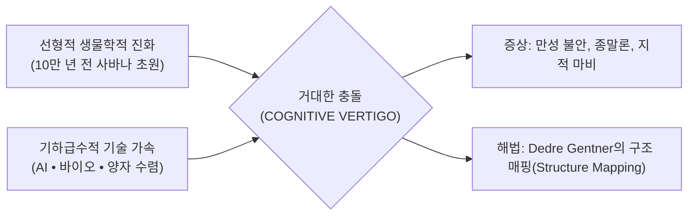

> **🎙️ 3-Presenter Authentic Tiki-Taka Script**
> 
> **Prof. Peter Kim:** 여러분, 2주차 세미나에 오신 것을 환영합니다. 지난주 우리는 인류가 손에 넣은 83가지 성서적 기적의 기술적 실체를 확인했습니다. 오늘 우리는 매우 불편한 진실을 직시해야 합니다. 왜 세상은 역사상 가장 눈부시게 풍요로워지고 있는데, 정작 우리 인간들은 집단적인 공황과 불안, 종말론적 현기증에 시달리고 있을까요?  
> **Dr. Elena Vance:** 피터 교수님, 인지신경학적으로 그 이유는 명확합니다. 인간의 뇌는 물리적으로 '초속 30미터'의 수렵채집 사회에 맞춰 설계된 하드웨어입니다. 하지만 오늘날 정보와 기술은 광속으로, 그것도 기하급수적으로 팽창하고 있죠. 이 하드웨어와 소프트웨어의 극단적인 시차(Mismatch)가 바로 **'인지적 현기증(Cognitive Vertigo)'**의 본질입니다.  
> **TA Marcus Brody:** 놀이공원에서 롤러코스터를 탈 때 시각 정보는 시속 150km로 곤두박질치는데 달팽이관의 평형감각이 못 따라가면 헛구역질이 나잖아요? 지금 인류 문명이 정확히 그 상태입니다! 기술 발전 곡선에 지적 멀미를 느끼고 있는 거죠!  
> **Prof. Peter Kim:** 마커스의 비유가 아주 생생하군요. 오늘 우리는 이 멀미를 멈추고, 기하급수 곡선을 조망할 수 있는 강력한 인지적 렌즈를 장착할 것입니다.  

---

### Slide 02: 181 제타바이트(ZB)의 정보 해일과 주의력의 물리적 한계
- **Macro Metric:** 2026년 전 세계 연간 생성 데이터량 181 Zettabytes ($1.81 \times 10^{23}$ bytes)
- **Neurobiological Bottleneck:** 인간 의식의 처리 대역폭은 초당 단 50~120 bits (Mihaly Csikszentmihalyi)
- **The Core Paradox:** 무한에 가까운 정보 공급 vs. 철저히 유한한 생물학적 필터

| 지표 항목 | 전 지구적 정보량 (Global Volume) | 인간 뇌 의식 대역폭 (Human Conscious Bandwidth) | 불일치 비율 (Ratio) |
| :--- | :--- | :--- | :--- |
| **초당 데이터 흐름** | $\approx 5.74 \times 10^{15}$ bits/sec (5.74 Petabits/s) | $\approx 50 \sim 120$ bits/sec | 약 **$50,000,000,000,000 : 1$** |
| **연간 누적 데이터** | 181 Zettabytes (2026 기준) | 평생 처리 가능량 $\approx 3.15 \times 10^9$ bits (0.39 GB) | 물리적 인지 불가능 |
| **인지적 결과** | 정보의 기하급수적 과포화 | 주의력 결핍, 인지 과부하, 인지 피로 | **인지적 패닉 및 방어적 거부** |

> **🎙️ 3-Presenter Authentic Tiki-Taka Script**
> 
> **Dr. Elena Vance:** 슬라이드의 수치를 보십시오. 181 제타바이트입니다. 지구상의 모든 모래알 수보다 훨씬 많은 데이터가 매년 디지털 공간에 쏟아집니다. 그런데 칙센트미하이가 증명했듯, 인간이 '의식적으로' 처리할 수 있는 정보 대역폭은 초당 고작 50에서 120비트입니다. 우리가 상대방의 말 한마디를 온전히 이해하는 데만 60비트가 소모됩니다.  
> **TA Marcus Brody:** 와... 50조 대 1이라니! 소방 호스로 쏟아지는 나이아가라 폭포수 밑에서 에스프레소 잔으로 물을 받아 마시려는 꼴이네요. 잔이 깨지는 게 당연합니다!  
> **Prof. Peter Kim:** 그렇습니다. 인간의 뇌는 정보가 부족해서가 아니라, 너무 넘쳐나서 질식하고 있습니다. 필터가 없는 풍요는 지옥과 다름없습니다.  

---

### Slide 03: 사바나 초원의 뇌 vs 특이점의 문명: 진화적 불일치 (Evolutionary Mismatch)
- **Evolutionary Context:** 인류 뇌의 99%는 '로컬(Local, 30km 반경)'과 '선형(Linear, 예측 가능한 속도)' 환경에서 진화
- **Modern Reality:** 오늘날의 세계는 '글로벌(Global, 지구 전체 실시간 연결)'이자 '기하급수(Exponential, 가속의 가속)'
- **Mismatch Pathology:** 원시적 생존 반사가 문명 단위의 과민반응과 불안증으로 발현

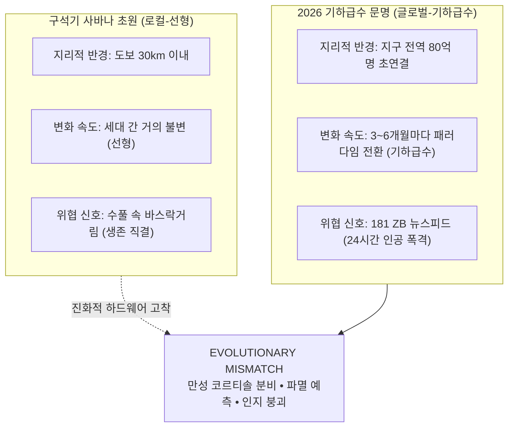

> **🎙️ 3-Presenter Authentic Tiki-Taka Script**
> 
> **Prof. Peter Kim:** 우리의 뇌는 10만 년 전 동아프리카 사바나 초원에서 완성되었습니다. 당시 인간의 생존 반경은 기껏해야 하루 걸을 수 있는 30km였고, 도구의 발전은 수만 년에 걸쳐 일어났습니다.  
> **Dr. Elena Vance:** 맞습니다. 그 당시 환경에서는 '선형적 예측'이 가장 효율적인 생존 전략이었습니다. "어제 사슴이 물가에 있었으니 내일도 물가에 있겠지." 하지만 지금 우리가 사는 세계는 반경 4만 km의 지구가 0.1초 만에 연결되고, 기술이 1년 만에 2배, 4배로 폭발하는 기하급수 생태계입니다.  
> **TA Marcus Brody:** 결국 우리는 슈퍼컴퓨터를 조작하는 능력을 가진 유인원인데, 가슴속에는 여전히 "저 수풀 뒤에 호랑이가 숨어있지 않을까?" 하고 떨고 있는 셈이군요.  

---

### Slide 04: 금주의 핵심 질문: 왜 뇌는 기하급수적 진보를 공포와 파멸로 오독하는가?
- **Core Seminar Question:** 기술과 의학, 식량과 에너지는 역사상 최고조로 번영하는데, 왜 대중의 80%는 세상이 멸망해가고 있다고 믿는가?
- **Cognitive Diagnosis:** 뇌의 3대 진화적 편향(선형 편향, 부정 편향, 확증 편향)의 기형적 공명

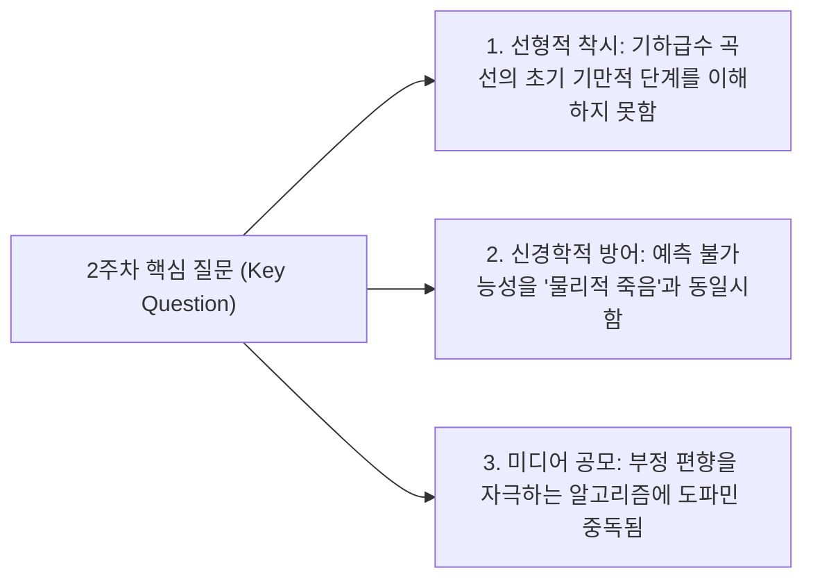

> **🎙️ 3-Presenter Authentic Tiki-Taka Script**
> 
> **Prof. Peter Kim:** 금주의 핵심 화두입니다. "인류는 왜 눈앞에 닥친 유토피아적 진보를 보면서 디스토피아적 공포를 느끼는가?" 엘레나 박사, 신경생리학적 해답은 무엇입니까?  
> **Dr. Elena Vance:** 뇌에게 있어 '예측할 수 없는 변화'는 곧 '죽음의 위험'을 뜻합니다. 뇌는 미래를 시뮬레이션할 때 과거의 선형 데이터를 기반으로 하는데, 기하급수 곡선은 그 예측 모델을 매 순간 산산조각 내버립니다. 피질 예측 엔진이 깨질 때 뇌는 극심한 통증과 불안 신호를 보냅니다.  
> **TA Marcus Brody:** 게다가 알고리즘은 우리가 불안해할수록 화면을 더 오래 본다는 걸 완벽하게 알고 있죠! 클릭 한 번에 공포를 팔아먹는 비즈니스가 뇌의 오독을 부채질하는 겁니다.  

---

### Slide 05: 2주차 학습 로드맵: 피질 예측 엔진에서 구조 매핑까지
- **Module Architecture:** 6개 모듈을 통한 체계적 인지 업그레이드 여정
- **Objective:** 생물학적 선형 뇌의 한계를 돌파하고, Dedre Gentner의 구조 매핑으로 기하급수 현실을 모델링하는 직관 획득

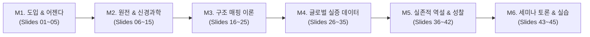

> **🎙️ 3-Presenter Authentic Tiki-Taka Script**
> 
> **Prof. Peter Kim:** 이번 2주차 세미나의 로드맵입니다. 우리는 먼저 뇌의 칼로리 보존 법칙과 대뇌 피질의 예측 기전을 해체한 후, 겐트너 박사의 구조 매핑 이론을 장착할 것입니다.  
> **Dr. Elena Vance:** M3에서 다룰 '구조 매핑(Structure Mapping)'은 지식의 표면적 세부사항에 매몰되지 않고 심층적인 관계 구조를 꿰뚫어 학습 속도를 10배 이상 끌어올리는 인지적 치트키가 될 것입니다.  
> **TA Marcus Brody:** 데이터 모듈에서는 IEA의 빗나간 예측치와 AI 연산량 폭발 실증 데이터를 직접 다룹니다. 준비되셨으면 본격적인 뇌 해체로 들어가 보시죠!  

---

## Module 2: 원전 텍스트 정밀 해체 (Slides 06~15)

### Slide 06: 『We Are as Gods』 제1장: 인지적 현기증의 징후와 정의
- **Textual Exegesis:** Diamandis & Kotler, *We Are as Gods* (2026), Chapter 1
- **Key Definition:** **Cognitive Vertigo** — 기하급수적 기술 변화의 가속도와 인간의 선형적 인지 처리 능력 사이의 구조적 단절로 인해 발생하는 존재론적 혼란과 불안
- **Authors' Core Thesis:** 인지적 현기증을 극복하지 못하면 인류는 신의 능력을 쥐고도 스스로를 파괴하는 길을 택하게 된다.

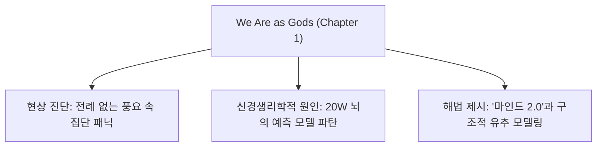

> **🎙️ 3-Presenter Authentic Tiki-Taka Script**
> 
> **Prof. Peter Kim:** 디아만디스와 코틀러는 책의 첫 머리에서 매우 직설적인 선언을 합니다. "인류는 지금 역사상 가장 눈부신 풍요의 문턱에 서 있지만, 뇌는 집단적 현기증에 빠져 뒷걸음질 치고 있다."  
> **Dr. Elena Vance:** 저자들은 이 현상을 '단순한 심리적 스트레스'가 아닌, 인류 종(Species) 전체가 겪는 **신경학적 위기**로 규정합니다. 기술이 변화하는 기울기(Slope)가 뇌의 적응 한계선을 뚫고 수직 상승해버렸기 때문입니다.  
> **TA Marcus Brody:** 책에서 재미있는 표현이 나오잖아요. "마치 시속 300km로 달리는 페라리 보닛 위에 묶여 있는 중세 농부의 심정"이라고요!  

---

### Slide 07: 뇌의 칼로리 보존 법칙(Caloric Conservation)과 20와트의 제약
- **Thermodynamic Limit:** 인간의 뇌는 체중의 2%에 불과하지만, 전체 기초 대사 에너지의 20%를 소모 (약 20 Watts, 하루 400 kcal)
- **Conservation Mechanism:** 뇌는 에너지 고갈을 막기 위해 모든 정보 처리를 **'휴리스틱(Heuristics, 지름길)'**과 **'선형 추정'**으로 최소화하려는 극도의 인색함을 보임
- **The Conflict:** 기하급수적 복잡성을 계산하려면 막대한 칼로리가 필요하므로, 뇌는 본능적으로 기하급수 사고를 회피하고 거부함

| 구분 | 인간 뇌 (Biological Brain) | 현대 슈퍼컴퓨터 / 프론티어 AI 클러스터 |
| :--- | :--- | :--- |
| **전력 소모량** | **약 20 W** (전구 하나 수준) | 수 메가와트 (MW) ~ 수 기가와트 (GW) |
| **연산 원리** | 에너지 최소화 예측 부호화 (Predictive Coding) | 무차별 대규모 행렬 연산 (Brute-force Tensor Compute) |
| **복잡계 대처 전략** | 패턴 단순화, 선형 축약, 휴리스틱 | 고차원 매개변수 최적화 |
| **기하급수 처리 시** | **극심한 에너지 스트레스 $\rightarrow$ 인지적 셧다운** | 지수적 스케일링 법칙 추종 |

> **🎙️ 3-Presenter Authentic Tiki-Taka Script**
> 
> **Dr. Elena Vance:** 뇌는 놀라울 정도로 에너지에 인색한 장기입니다. 단 20와트의 전력으로 생각하고, 기억하고, 숨을 쉽니다. 새로운 복잡한 패턴을 계산하는 것은 뇌에게 엄청난 칼로리 낭비입니다. 그래서 뇌는 과거의 단순한 선형 규칙으로 미래를 대충 때려 맞추려 합니다.  
> **TA Marcus Brody:** 컴퓨터로 치면 '배터리 절약 모드'가 기본값으로 켜져 있는 거네요! 기하급수 계산 같은 고사양 작업을 돌리려고 하면 시스템이 "배터리 부족! 강제 종료합니다!" 하고 멈춰버리는 겁니다.  
> **Prof. Peter Kim:** 맞습니다. 따라서 기하급수 사고는 생물학적 본능을 거스르는 고도의 '의지적 훈련' 없이는 불가능합니다.  

---

### Slide 08: 대뇌 피질의 예측 엔진(Cortical Prediction Engine) 작동 메커니즘
- **Neuroscience Foundation:** Jeff Hawkins (*On Intelligence*), Andy Clark (*Surfing Uncertainty*)
- **Predictive Coding Architecture:** 뇌는 감각 입력을 수동적으로 수용하는 장치가 아니라, 끊임없이 하향식(Top-Down)으로 세상을 예측하는 기계
- **Hierarchical Processing:** 상위 피질의 예측 모델 $\leftrightarrow$ 하위 감각 입력의 비교 $\rightarrow$ 일치 시 의식 차단 (칼로리 절약)

```mermaid
flowchart TD
    Top["대뇌 신피질 (Neocortex)<br/>기존 경험 기반 '선형' 예측 모델 생성"] -->|하향식 예측 신호 (Top-down Prediction)| Comparator{"비교기 (Error Comparator)"}
    Sensory["감각 입력 (Sensory Input)<br/>기하급수적 변화 및 181 ZB 데이터"] -->|상향식 감각 신호 (Bottom-up Input)| Comparator
    Comparator -->|예측 일치| Suppress["의식 억제 (에너지 보존, '정상 상태')"]
    Comparator -->|예측 오차 폭발 (Mismatch)| Vertigo["PREDICTION ERROR SPIKE<br/>스트레스 호르몬 분비 • 불안 • 인지적 현기증"]
```

> **🎙️ 3-Presenter Authentic Tiki-Taka Script**
> 
> **Dr. Elena Vance:** 대뇌 신피질은 제프 호킨스가 밝혔듯 거대한 '기억-예측 엔진'입니다. 뇌는 지금 이 순간에도 여러분이 보고 듣는 감각 정보의 90% 이상을 직접 처리하지 않고, 상위 피질의 사전 예측으로 덮어씁니다. 오차가 없을 때 뇌는 평온함을 느낍니다.  
> **Prof. Peter Kim:** 그런데 기하급수 기술은 매달 뇌의 예측 모델을 완전히 배반하죠. 어제까지 불가능하다고 믿었던 일들이 오늘 아침 뉴스에 오픈소스로 풀려버리니까요.  
> **TA Marcus Brody:** 피질 예측 엔진 입장에서는 매일매일 엔진 경고등이 빨갛게 깜빡거리는 셈이네요!  

---

### Slide 09: Karl Friston의 자유 에너지 원리(Free Energy Principle)와 예측 오차
- **Mathematical Framework:** 칼 프리스턴(Karl Friston)의 자유 에너지 원리
- **Core Formula:** $F = D_{KL}(q(\theta) || p(\theta | y)) - \ln p(y) \approx \text{예측 오차(Surprise/Entropy)}$
- **Active Inference:** 유기체는 생존을 위해 내부 모델의 '자유 에너지(불확실성/놀람)'를 최소화해야 함
- **Pathology of Exponential Era:** 외부 환경의 변화 속도가 너무 빨라 자유 에너지($F$)를 최소화하지 못할 때 인간은 깊은 무력감과 공황 상태에 진입

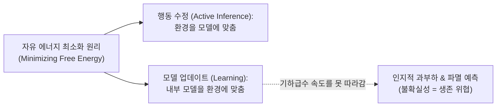

> **🎙️ 3-Presenter Authentic Tiki-Taka Script**
> 
> **Dr. Elena Vance:** 신경과학계의 거장 칼 프리스턴의 '자유 에너지 원리'에 따르면, 모든 생명체는 시스템 내부의 '놀람(Surprise)', 즉 불확실성을 0으로 줄이도록 진화했습니다. 뇌는 불확실성을 엔트로피의 증가, 즉 죽음으로 인식합니다.  
> **TA Marcus Brody:** 수식이 좀 복잡해 보이지만 핵심은 간단하네요. "내가 예상한 대로 세상이 안 돌아가면 뇌는 내가 죽을지도 모른다고 착각한다!"  
> **Prof. Peter Kim:** 정확합니다. 기하급수 시대의 인지적 고통은 지식의 부족 때문이 아니라, 뇌의 자유 에너지 최소화 메커니즘이 과부하에 걸렸기 때문입니다.  

---

### Slide 10: 진화적 부정 편향(Negativity Bias): 편도체(Amygdala)의 생존 알고리즘
- **Evolutionary Asymmetry:** 좋은 소식(기회)을 놓치는 것은 배고픔을 낳지만, 나쁜 소식(포식자)을 놓치는 것은 **죽음**을 낳음
- **Neurological Hardwiring:** 편도체(Amygdala)는 긍정적 자극보다 위협 자극에 **4~9배 더 빠르고 강력하게** 반응
- **The Distortion:** 기하급수 기술이 가져오는 무수한 혜택(치유, 수명 연장, 에너지 풍요)보다 잠재적 위험(일자리 소멸, 킬러 로봇)에 뇌가 압도적으로 과민반응하는 이유

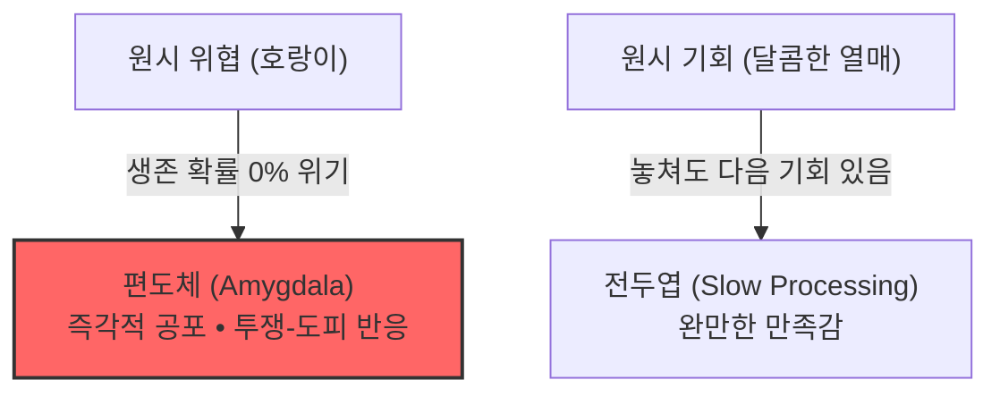

> **🎙️ 3-Presenter Authentic Tiki-Taka Script**
> 
> **Prof. Peter Kim:** 사바나 초원에서 수풀이 바스락거릴 때 "바람이겠지" 하고 낙관했던 조상들은 유전자 풀에서 진작에 제거되었습니다. "호랑이다!" 하고 도망친 비관론자들만이 살아남아 우리의 조상이 되었죠.  
> **Dr. Elena Vance:** 그것이 바로 편도체의 '부정 편향(Negativity Bias)'입니다. 뇌는 긍정적 소식보다 위협적인 뉴스에 도파민과 노르에피네프린을 4배 이상 쏟아냅니다.  
> **TA Marcus Brody:** 그러니까 AI가 암 치료제를 찾았다는 뉴스보다 "AI가 인류를 멸망시킨다"는 유튜브 썸네일에 우리 손가락이 자동으로 반응하는 게 생물학적 저주였군요!  

---

### Slide 11: 확증 편향과 도파민 피드백 루프: 분노 유발 미디어 경제학
- **Behavioral Economics:** 미디어 플랫폼 알고리즘은 인간 편도체의 부정 편향을 정밀 타격하도록 설계됨
- **Engagement Optimization:** 분노(Outrage)와 공포(Fear)를 유발하는 콘텐츠가 긍정적 콘텐츠보다 공유율 **6배**, 체류 시간 **3배** 높음 (MIT 미디어랩 연구)
- **Echo Chamber:** 확증 편향이 강화되며 "세상은 망해가고 있다"는 종말론적 신념이 집단적으로 공고화됨

| 플랫폼 메커니즘 | 신경생리학적 자극 | 사용자 행동 결과 | 비즈니스 결과 |
| :--- | :--- | :--- | :--- |
| **자극적 위협 헤드라인** | 편도체 활성화 & 코르티솔 분비 | 위험 감지 모드로 집중 | 체류 시간(Time-on-Site) 극대화 |
| **알고리즘 추천 피드** | 불확실성 해소 갈망 (도파민 유발) | 끊임없는 새로고침 (무한 스크롤) | 광고 노출 및 수익 창출 |
| **필터 버블 & 반향실** | 확증 편향 충족 | 동조 집단 내 분노 공유 | 사회적 양극화 및 인지 왜곡 심화 |

> **🎙️ 3-Presenter Authentic Tiki-Taka Script**
> 
> **TA Marcus Brody:** 실리콘밸리 알고리즘 엔지니어들은 인간 뇌의 이 취약점을 너무나 잘 알고 있습니다. 그들의 비즈니스 모델은 한 문장으로 요약됩니다: "분노가 곧 조회수다(Rage is Reach)!"  
> **Dr. Elena Vance:** MIT 연구에 따르면 가짜 뉴스와 종말론적 공포는 진실보다 6배 빠르게 퍼집니다. 인간의 뇌가 공포에 중독되도록 설계되어 있기 때문입니다.  
> **Prof. Peter Kim:** 결국 우리는 문명사상 가장 진보한 시대를 살면서도, 미디어가 파놓은 '인지적 지옥' 속에서 가상으로 멸망을 체험하고 있는 것입니다.  

---

### Slide 12: 스티븐 코틀러의 플로우(Flow)와 패턴 인식의 인지 신경학
- **Neuroscience of Flow:** 스티븐 코틀러(Steven Kotler)의 몰입(Flow) 연구
- **Pattern Recognition Engine:** 인간의 뇌가 가장 큰 쾌감(도파민, 엔도르핀 폭발)을 느끼는 순간은 무질서 속에서 **'숨겨진 관계와 패턴'**을 발견할 때
- **Flow Trigger in Exponential Age:** 인지적 현기증을 극복하는 열쇠는 압도적인 데이터를 거부하는 것이 아니라, 고차원적 패턴 인식을 통해 **몰입(Flow)** 상태로 진입하는 것

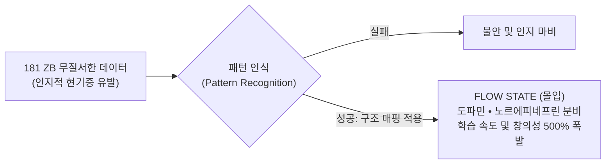

> **🎙️ 3-Presenter Authentic Tiki-Taka Script**
> 
> **Dr. Elena Vance:** 코틀러는 이 책에서 매우 흥미로운 해법을 제시합니다. 뇌는 패턴을 찾지 못할 때는 불안에 떨지만, 거대한 데이터 속에서 의미 있는 구조를 '발견'하는 순간 도파민과 아난다마이드를 분비하며 '플로우(Flow)' 상태로 전환됩니다.  
> **Prof. Peter Kim:** 그렇습니다. 현기증과 몰입은 종이 한 장 차이입니다. 쏟아지는 파도에 휩쓸리면 익사하지만, 서핑 보드를 타고 파도의 패턴을 읽으면 최고의 희열을 느끼는 것과 같습니다.  
> **TA Marcus Brody:** 그 서핑 보드가 바로 우리가 다음 모듈에서 배울 '구조 매핑(Structure Mapping)'이군요!  

---

### Slide 13: 피터 디아만디스의 기하급수 사고(Exponential Mindset) 대조표
- **Cognitive Paradigm Comparison:** 선형적 사고자(Linear Thinker) vs. 기하급수적 사고자(Exponential Thinker)
- **Mindset Evolution:** 과거의 데이터에 기반한 외삽(Extrapolation)을 버리고 기술의 수렴 속도를 계산하는 능력

| 차원 (Dimension) | 선형적 마인드셋 (Linear Mindset) | 기하급수 마인드셋 (Exponential Mindset) |
| :--- | :--- | :--- |
| **미래 예측 방식** | 과거의 추세를 앞으로 단순 연장 ($t+1 = t+\Delta$) | 가속하는 성장률과 2배 증가(Doubling)를 곱연산 |
| **위험에 대한 반응** | 취약성 방어, 현상 유지, 점진적 개선 | 파괴적 혁신 환영, 대담한 문샷($10\times$) 시도 |
| **자원관 (Resource View)**| 제로섬(Zero-Sum), 희소성(Scarcity) 중심 | 기술을 통한 파이 확장, 풍요(Abundance) 창출 |
| **정보 처리 태도** | 모든 디테일을 통제하려다 마비됨 | 핵심 구조를 매핑하고 알고리즘에 위임 |
| **실패에 대한 관점** | 피해야 할 재앙이자 비용 | 가속 학습을 위한 필수 데이터 피드백 |

> **🎙️ 3-Presenter Authentic Tiki-Taka Script**
> 
> **Prof. Peter Kim:** 피터 디아만디스가 강조하는 기하급수 마인드셋의 본질은 '희소성'에서 '풍요'로의 존재론적 전환입니다. 선형적 사고자는 자원이 한정되어 있으니 빼앗기지 않으려 방어벽을 쌓지만, 기하급수 사고자는 기술로 자원의 총량을 늘립니다.  
> **TA Marcus Brody:** 옛날엔 고래 기름이 떨어지면 세상이 암흑이 될 거라고 걱정했지만, 석유와 전기가 나오면서 문제가 통째로 증발해버렸잖아요? 바로 그 차이입니다!  
> **Dr. Elena Vance:** 마인드셋의 전환은 단순한 자기계발 구호가 아닙니다. 뇌의 신경가소성(Neuroplasticity)을 기하급수적 환경에 동기화시키는 구조적 재배선입니다.  

---

### Slide 14: 정보 과부하가 부르는 '인지적 마비(Analysis Paralysis)' 현상
- **Psychological Pathology:** 선택의 역설(Barry Schwartz)과 인지 과부하
- **Analysis Paralysis Mechanism:** 선택지와 정보가 임계점을 넘어서면 전두엽의 의사결정 회로가 포화되어 **아무런 행동도 취하지 못하는 상태**에 도달
- **Civilizational Impact:** 정책 입안자들과 기업 리더들이 기하급수 기술의 속도에 압도되어 적절한 거버넌스 수립을 포기하는 원인

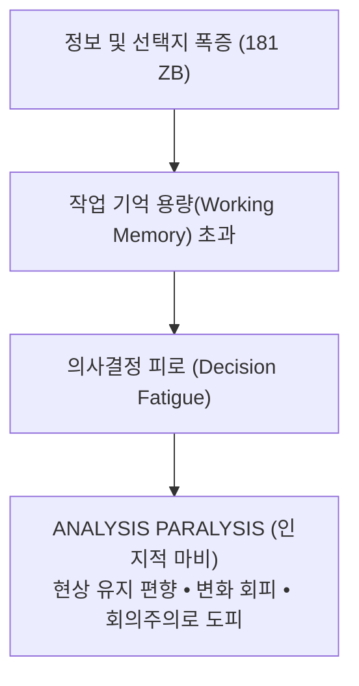

> **🎙️ 3-Presenter Authentic Tiki-Taka Script**
> 
> **TA Marcus Brody:** 주식이나 코인 시장 볼 때 정보가 너무 많으면 오히려 한 주도 못 사고 멍하니 보게 되잖아요. 지금 전 세계 정부와 대기업 이사회에서도 똑같은 일이 벌어지고 있습니다.  
> **Dr. Elena Vance:** 인간의 작업 기억(Working Memory)은 밀러의 법칙에 따라 한 번에 $7 \pm 2$개의 청크(Chunk)밖에 다루지 못합니다. 수백 개의 변수가 상호작용하는 복잡계 앞에서 전두엽은 퓨즈가 끊어집니다.  
> **Prof. Peter Kim:** 그래서 우리는 세부 데이터를 쳐내고, 본질적인 뼈대만을 추출하는 고도의 '인지적 여과기'를 필요로 하는 것입니다.  

---

### Slide 15: 인간 주의력 대역폭(50~120 bits/s)과 정보 유입량 비교 매트릭스
- **Quantitative Comparison:** 인류의 감각 기관 유입량 vs. 의식적 인지 대역폭 vs. 디지털 데이터 스트림

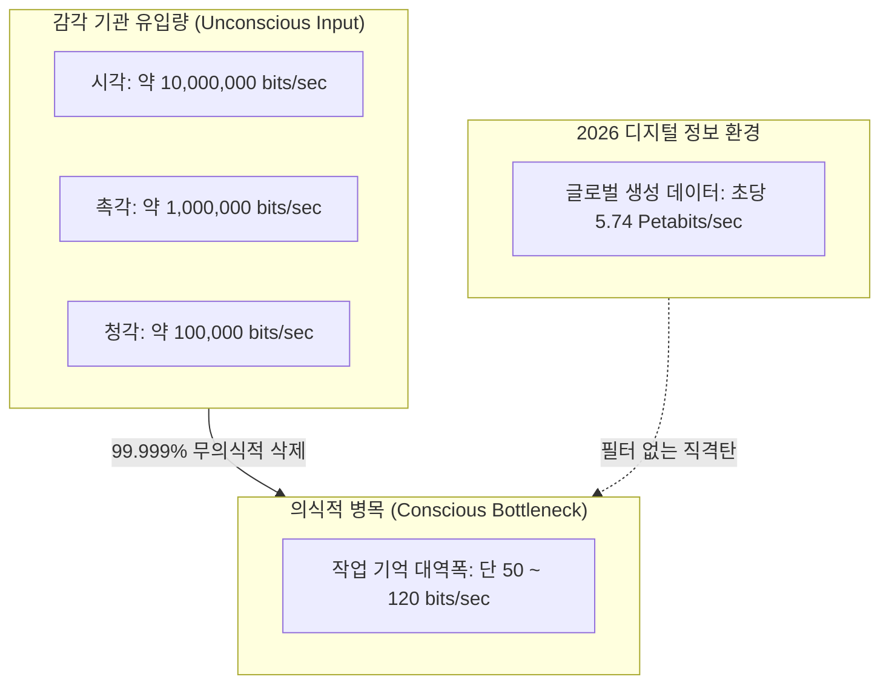

> **🎙️ 3-Presenter Authentic Tiki-Taka Script**
> 
> **Dr. Elena Vance:** 이 매트릭스를 보면 인간이 얼마나 정교하게 '정보를 버리도록' 진화했는지 알 수 있습니다. 눈으로 들어오는 천만 비트의 정보 중 의식에 도달하는 것은 100비트도 안 됩니다.  
> **Prof. Peter Kim:** 중요한 것은 '얼마나 많이 아는가'가 아닙니다. '어떤 구조로 정보를 압축(Compression)하는가'입니다. 위대한 사상가들은 방대한 현실을 단 몇 개의 간결한 법칙으로 압축해낸 인물들입니다.  
> **TA Marcus Brody:** 그리고 그 압축의 제왕이 바로 인지과학자 Dedre Gentner 교수의 '구조 매핑'이죠! 다음 모듈로 넘어가시죠!  

---

## Module 3: 기하급수 이론 및 프레임워크 (Slides 16~25)

### Slide 16: Dedre Gentner의 구조 매핑 이론(Structure-Mapping Theory) 핵심 공리
- **Theoretical Bedrock:** Dedre Gentner (1983), *Structure-Mapping: A Theoretical Framework for Analogy*, Cognitive Science
- **Core Axiom:** 유추(Analogy)와 학습은 대상의 '표면적 속성(Attributes)'을 복사하는 것이 아니라, 대상들 간의 **'관계 체계(System of Relations)'**를 기본 도메인(Base)에서 목표 도메인(Target)으로 1:1 대응시키는 과정이다.

$$\text{Mapping}: M: B \rightarrow T \quad \text{where} \quad R(x, y) \implies R(M(x), M(y))$$

```mermaid
flowchart LR
    subgraph Base["Base Domain (친숙한 영역 / 신화 / 역사)"]
        B1["개체: 태양 (Sun), 행성 (Planet)"]
        B2["관계: 질량이 크다(태양), 회전한다(행성, 태양)"]
        B3["심층 구조: 태양이 더 무겁기 때문에 행성이 태양 주위를 돈다"]
    end
    subgraph Target["Target Domain (새로운 영역 / 양자역학 / 기하급수 기술)"]
        T1["개체: 원자핵 (Nucleus), 전자 (Electron)"]
        T2["관계: 전하가 크다(원자핵), 회전한다(전자, 원자핵)"]
        T3["심층 구조: 원자핵이 전자를 끌어당기므로 전자가 핵 주위를 돈다"]
    end
    Base ==>|Structure Mapping (심층 인과 구조 매핑)| Target
```

> **🎙️ 3-Presenter Authentic Tiki-Taka Script**
> 
> **Prof. Peter Kim:** 이제 2주차의 핵심 이론인 Dedre Gentner 교수의 '구조 매핑 이론'으로 들어섭니다. 엘레나 박사, 이 이론이 왜 인지적 현기증을 치료하는 특효약인지 설명해주시죠.  
> **Dr. Elena Vance:** 겐트너 교수는 인간의 지능이 새로운 개념을 학습할 때 맨땅에서 시작하지 않는다는 것을 증명했습니다. 뇌는 이미 잘 알고 있는 기존 지식의 '관계 뼈대'를 뽑아내어, 낯선 신기술에 그대로 덧씌웁니다. 러더퍼드가 태양계 모델을 원자 구조에 매핑하여 보어 모형을 완성한 것이 대표적입니다.  
> **TA Marcus Brody:** 태양이 뜨겁고 노란색이라는 '표면적 특징'은 버리고, "중심에 무거운 게 있고 주변을 돈다"는 '심층 인과 관계'만 쏙 뽑아서 원자에 갖다 붙인 거군요!  

---

### Slide 17: 표면 유사성(Surface Similarity) vs 심층 관계 구조(Relational Structure)
- **Cognitive Discrimination:** 초보자와 전문가를 가르는 결정적 차이
- **Surface Similarity (초보자):** 겉모습, 색상, 명칭, 단어 등 외형적 유사성에 집착 $\rightarrow$ 새로운 맥락에 적용 불가
- **Relational Structure (전문가):** 인과율, 지배 원리, 수학적 상관관계 등 심층 구조를 매핑 $\rightarrow$ 초고속 지식 전이 가능

| 비교 기준 | 표면적 유사성 (Surface Similarity) | 심층 관계 구조 (Relational Structure) |
| :--- | :--- | :--- |
| **인지적 초점** | 객체의 개별 속성 (색깔, 크기, 인터페이스) | 객체 간의 관계 및 상호작용 (인과성, 역학) |
| **학습 효과** | 암기 위주, 상황이 바뀌면 무용지물 | 일반화(Generalization) 및 추상적 추론 가능 |
| **기하급수 기술 평가** | "AI 챗봇은 말 잘하는 앵무새일 뿐이다" | "생성 AI는 전산 자원 기반의 무한 추론 엔진이다" |
| **Gentner의 평가** | 단순 외형 일치 (Mere Appearance) | **진정한 유추 및 개념적 혁신 (True Analogy)** |

> **🎙️ 3-Presenter Authentic Tiki-Taka Script**
> 
> **Dr. Elena Vance:** 많은 사람들이 생성형 AI를 볼 때 "사람처럼 말을 주고받는다"는 표면적 특징에만 주목합니다. 그러니 "거짓말을 하네, 말귀를 못 알아듣네" 하면서 실망하죠. 하지만 관계 구조를 보는 전문가는 "비정형 데이터의 압축 및 잠재 공간(Latent Space) 벡터 탐색 엔진"이라는 심층 구조를 봅니다.  
> **TA Marcus Brody:** 겉포장지에 속지 않고 알맹이 기계를 보는 거네요! 넷플릭스를 비디오 대여점의 연장으로 본 사람들은 망했지만, '디지털 스트리밍 대역폭의 탈물질화'로 본 사람들은 거대한 부를 쌓았습니다.  
> **Prof. Peter Kim:** 바로 그겁니다. 표면을 보면 혼란스럽지만, 구조를 보면 미래가 보입니다.  

---

### Slide 18: 체계성 원리(Systematicity Principle): 고차 관계(Higher-Order Relations)의 위력
- **Gentner's Central Law:** **The Systematicity Principle (체계성 원리)**
- **Definition:** 인간의 인지 시스템은 고립된 개별 관계들보다, 인과관계(Cause)나 함의(Implication)로 상호 연결된 **'고차 관계 시스템(Higher-Order Relational System)'**을 매핑에 훨씬 강력하게 선호하고 신뢰함.

```mermaid
graph TD
    subgraph Isolated["고립된 1차 관계 (낮은 체계성)"]
        I1["A는 B보다 빠르다"]
        I2["C는 D보다 비싸다"]
    end
    subgraph HigherOrder["고차 인과 관계 체계 (높은 체계성 - Gentner Rule)"]
        H1["기술이 디지털화(A)되면"] -->|원인(CAUSE)| H2["비용이 0에 수렴(B)하고"]
        H2 -->|결과(IMPLIES)| H3["사용자가 기하급수적으로 폭증(C)하여 산업이 붕괴한다(D)"]
    end
```

> **🎙️ 3-Presenter Authentic Tiki-Taka Script**
> 
> **Dr. Elena Vance:** 겐트너의 가장 위대한 통찰은 '체계성 원리'입니다. 인간의 뇌는 단편적인 팩트들을 외우는 것을 극도로 싫어합니다. 하지만 그것들이 "A가 B를 유발하고, 이로 인해 C가 발생한다"는 하나의 거대한 인과 체인으로 엮이면, 단 한 번에 기억하고 직관적으로 이해합니다.  
> **Prof. Peter Kim:** 이것이 바로 우리가 1주차에 성서의 기적을 10대 카테고리로 묶고, 기술 발전의 사다리로 구조화한 이유입니다. 흩어진 83개의 기적이 하나의 문명사적 인과망으로 묶이는 순간, 현기증은 통제감으로 바뀝니다.  
> **TA Marcus Brody:** 단편적인 기술 뉴스를 쫓아다니지 말고, 기하급수 인과 법칙이라는 고차 관계망을 머릿속에 깔아놔야겠군요!  

---

### Slide 19: 유추적 전이(Analogical Transfer)를 통한 학습 속도 10배 가속 기전
- **Cognitive Acceleration:** 익숙한 기존 도메인의 스키마를 신기술에 전이(Transfer)시킬 때 뇌의 학습 곡선(Learning Curve) 단축
- **Gick & Holyoak Experiment:** 방사선 문제(Radiation Problem)와 장군 요새 포위 작전의 구조 유추 실험 $\rightarrow$ 유추적 힌트 제공 시 해결률 **10%에서 75%로 급상승**

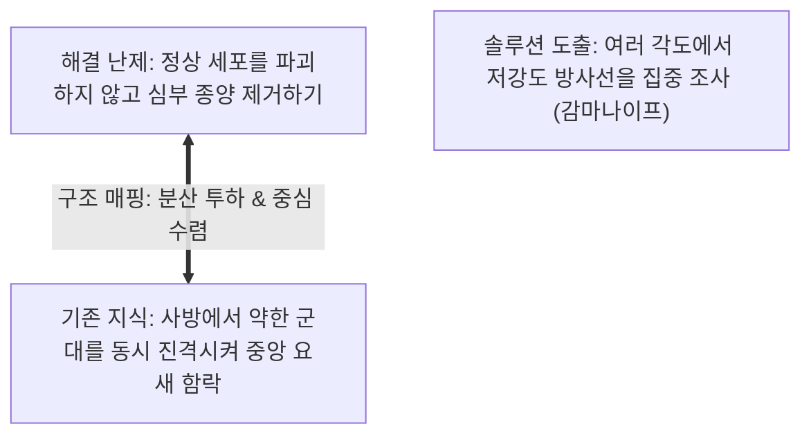

> **🎙️ 3-Presenter Authentic Tiki-Taka Script**
> 
> **Dr. Elena Vance:** 기크와 홀리오악의 유명한 방사선 종양 치료 실험을 보십시오. 아무런 힌트가 없을 때 의사들의 문제 해결률은 10%에 불과했습니다. 하지만 "사방에서 군대를 나누어 진격시킨 장군 이야기"를 구조 매핑해주자 해결률이 75%로 수직 상승했습니다.  
> **TA Marcus Brody:** 역사적 군사 전략이 최첨단 감마나이프 의료 기기 설계로 순식간에 탈바꿈한 거네요!  
> **Prof. Peter Kim:** 맞습니다. 인류가 이미 수천 년간 축적해온 신화, 종교, 역사, 물리학의 구조를 기하급수 기술에 매핑하면 학습 속도는 10배 이상 가속됩니다. 이것이 Theurgicon의 교육 공학입니다.  

---

### Slide 20: 신화적 원형(Archetype)을 기술적 등가물로 매핑하는 3단계 알고리즘
- **Practical Methodology:** 신화/고전 텍스트에서 첨단 딥테크로의 구조 매핑 3단계 프로토콜

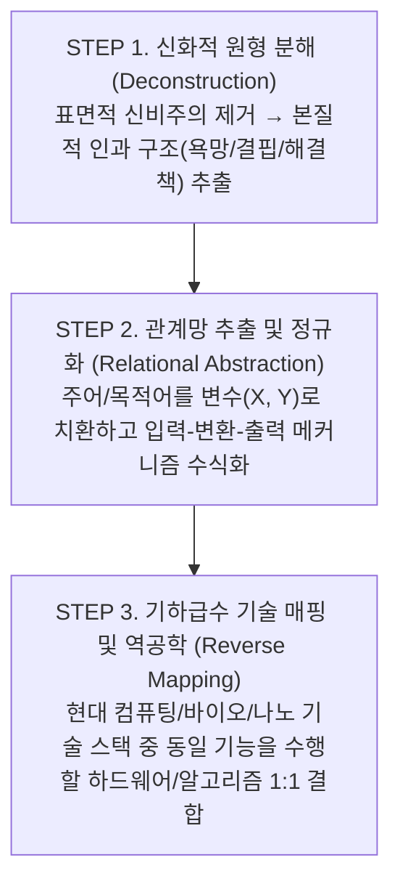

| 매핑 단계 | 신화적 원형 (Base Domain) | 구조적 추상화 (Relational Abstraction) | 현대 기술 등가물 (Target Domain) |
| :--- | :--- | :--- | :--- |
| **야곱의 사다리** | 하늘과 땅을 잇는 천사의 오르내림 | 지표면과 우주 공간 간의 연속적 물리 질량 수송 | 탄소 나노튜브 기반 궤도 엘리베이터 (Space Elevator) |
| **헤르메스의 날개 샌들** | 공간의 제약을 무시하고 즉각 전령 도달 | 물리적 지형 장애물을 우회하는 고속 직진 비행 수송 | Zipline 자율비행 배송 드론망 |
| **아카샤 레코드** | 우주에 일어난 모든 사건과 지식의 총체적 기록 | 인류 전체의 텍스트/미디어 압축 및 실시간 벡터 인덱싱 | LLM 파운데이션 모델 & 글로벌 벡터 DB |

> **🎙️ 3-Presenter Authentic Tiki-Taka Script**
> 
> **Prof. Peter Kim:** 이 3단계 알고리즘이 바로 우리가 이번 학기 내내 실습할 '신화-기술 구조 매핑'의 표준 공식입니다.  
> **Dr. Elena Vance:** 야곱의 사다리라는 신화에서 '천사'라는 표면적 형상을 걷어내면, "에너지 효율적인 수직 궤도 수송선"이라는 순수한 공학적 요구 구조가 남습니다. 이를 현대 신소재 공학과 결합하면 우주 엘리베이터의 청사진이 됩니다.  
> **TA Marcus Brody:** 신화는 인류가 수만 년간 갈망해온 '기능 명세서(Functional Spec)'였던 셈이네요!  

---

### Slide 21: 로컬-선형(Local-Linear) 사고의 수학적 한계: $y = ax$
- **Mathematical Modeling:** 선형 방정식의 예측 특성
- **Formula:** $f(t) = at + c \implies \frac{df}{dt} = a \quad (\text{일정한 변화율})$
- **Cognitive Trap:** 인간의 직관은 "과거 10년간 10이 변했으니, 다음 10년도 10만큼 변할 것"이라는 등차수열의 함정에 갇혀 있음


> **🎙️ 3-Presenter Authentic Tiki-Taka Script**
> 
> **Dr. Elena Vance:** 선형 함수는 변화율 $\frac{df}{dt}$가 상수 $a$입니다. 내일의 세상은 오늘의 세상에 일정한 상수를 더한 것에 불과하죠. 이 모델은 사바나 초원에서 사냥감이 이동하는 속도를 예측할 때는 완벽하게 들어맞았습니다.  
> **Prof. Peter Kim:** 하지만 기술 혁명은 덧셈이 아니라 곱셈의 영역입니다. 선형 사고로 미래를 예측하는 것은 촛불의 밝기를 더해 레이저를 만들겠다는 착각과 같습니다.  

---

### Slide 22: 글로벌-기하급수(Global-Exponential) 사고의 수학적 도약: $y = a(1+r)^t$
- **Mathematical Modeling:** 기하급수 방정식과 복리(Compounding) 메커니즘
- **Formula:** $f(t) = a \cdot e^{kt} \implies \frac{df}{dt} = k \cdot f(t) \quad (\text{현재 상태에 비례하여 가속하는 변화율})$
- **The Singularity Horizon:** $t$가 증가함에 따라 곡선의 기울기가 수직에 수렴하는 현상

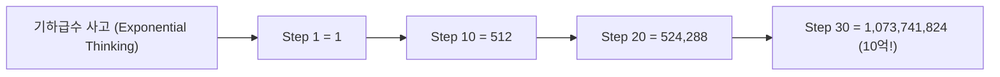

> **🎙️ 3-Presenter Authentic Tiki-Taka Script**
> 
> **TA Marcus Brody:** 30번째 걸음에서 30이 되는 선형과 10억이 되는 기하급수의 차이! 이 단순한 수식이 현대 문명의 모든 혼란을 설명합니다.  
> **Dr. Elena Vance:** 기하급수 함수의 변화율 $\frac{df}{dt}$는 현재 상태 $f(t)$ 자체에 비례합니다. 즉, 기술이 발전할수록 발전하는 도구 자체가 더 강력해지기 때문에 변화의 속도 자체가 가속되는 '자기 촉매적(Autocatalytic)' 폭발이 일어납니다.  
> **Prof. Peter Kim:** AI가 더 뛰어난 AI 칩을 설계하고, 그 칩이 다시 차세대 AI를 훈련시키는 피드백 루프가 바로 이 수식의 물리적 구현입니다.  

---

### Slide 23: 30걸음의 비유: 30미터 vs 지구 26바퀴(10억 미터)의 직관적 간극
- **Ray Kurzweil's Classic Parable:** 선형 30보 vs 기하급수 30보
- **Visual Scale:** 
  - 선형 30보 = $1\text{m} \times 30 = 30\text{m}$ (강의실 문 앞)
  - 기하급수 30보 = $1\text{m} \times 2^{29} = 536,870,912\text{m} \approx 10.7억\text{m}$ (**지구 둘레 4만 km를 26바퀴 돌고 달을 지나감!**)

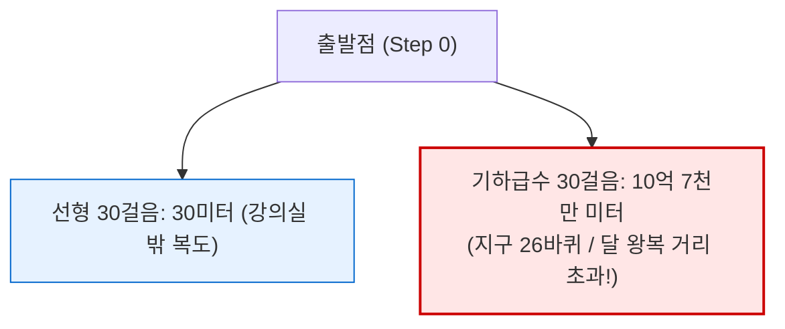

> **🎙️ 3-Presenter Authentic Tiki-Taka Script**
> 
> **Prof. Peter Kim:** 레이 커즈와일이 즐겨 쓰는 이 30걸음 비유는 언제 들어도 전율이 돋습니다. 강의실 문지방을 넘는 수준과 지구를 스물여섯 바퀴 도는 수준의 격차입니다.  
> **TA Marcus Brody:** 만약 누군가가 1단계에서 20단계까지 걸어가는 걸 옆에서 지켜보면 "에이, 겨우 50만 미터밖에 못 갔네? 기하급수라더니 별거 없네" 하고 비웃겠죠. 하지만 29단계에서 30단계로 넘어가는 단 한 걸음 만에 5억 미터를 순식간에 도약해버립니다!  
> **Dr. Elena Vance:** 그것이 다음 주차에 배울 '기만적 성장 단계(Deception Phase)'의 공포이자 기적입니다.  

---

### Slide 24: 인지적 사다리(Cognitive Ladder): 복잡계를 단순화하는 멘탈 모델
- **Conceptual Scaffold:** 복잡계의 압도적 데이터를 지탱하는 4단계 인지적 사다리 구조
- **Scaffold Levels:** 관측 데이터(Data) $\rightarrow$ 패턴 인식(Pattern) $\rightarrow$ 구조 매핑(Structure) $\rightarrow$ 제1원리 통찰(First Principles)

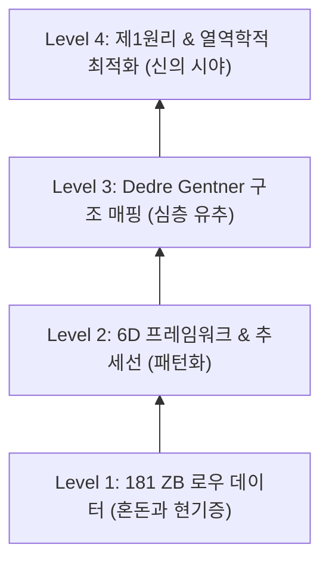

> **🎙️ 3-Presenter Authentic Tiki-Taka Script**
> 
> **Prof. Peter Kim:** 우리는 이 4단계 사다리를 타고 올라가야 합니다. 1층에 머무르면 181 제타바이트의 파도에 익사하지만, 4층으로 올라가면 복잡계 전체가 단순 명료한 물리 법칙으로 내려다보입니다.  
> **Dr. Elena Vance:** 인지 부하를 줄이는 유일한 방법은 데이터를 외우는 것이 아니라, 상위 추상화 계층(Abstraction Layer)을 구축하는 것입니다.  

---

### Slide 25: 제1원리 사고(First Principles)와 구조 매핑의 융합
- **First Principles Thinking (Elon Musk / Aristotle):** 사물을 기존 관습이나 유추에만 의존해 판단하지 않고, 가장 근본적인 물리적·논리적 진리로 환원한 뒤 바닥부터 다시 조립하는 사고법
- **Integration with Structure Mapping:** 
  1. 제1원리로 본질적 물리 한계(배터리 원자재 원가, 엔트로피) 규명
  2. 구조 매핑으로 다른 학문(생물학, 통신공학)의 검증된 시스템 역학을 이식

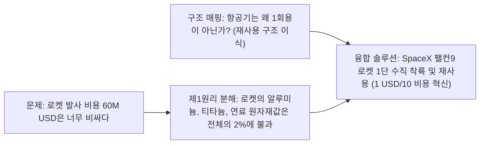

> **🎙️ 3-Presenter Authentic Tiki-Taka Script**
> 
> **TA Marcus Brody:** 일론 머스크가 스페이스X를 만들 때 쓴 방식이 정확히 이거잖아요! 로켓 원자재 가격을 쪼개는 제1원리 사고에, 민간 항공기의 재사용 구조를 매핑한 겁니다!  
> **Dr. Elena Vance:** 구조 매핑이 '횡적 도약(Lateral Leap)'이라면, 제1원리는 '종적 심화(Vertical Reduction)'입니다. 두 축이 만날 때 비로소 파괴적 혁신이 탄생합니다.  
> **Prof. Peter Kim:** 아주 훌륭한 통찰입니다. 이제 이 강력한 도구들을 가지고 실제 글로벌 데이터 현장으로 나가보겠습니다.  

---

## Module 4: 글로벌 데이터 & 실증 케이스 (Slides 26~35)

### Slide 26: CASE 1: 181 ZB 글로벌 데이터 증가 곡선과 인간 수용 능력 격차
- **Data Source:** IDC Global DataSphere (2020~2026 Forecast)
- **Exponential Trend:** 2010년 2 ZB $\rightarrow$ 2020년 64.2 ZB $\rightarrow$ 2026년 181 ZB (연평균 성장률 CAGR $\approx 23\%$)
- **Divergence Analysis:** 인간 뇌의 생물학적 정보 처리 한계선(일정한 수평선)과 데이터 생성 곡선 사이의 지수적 이격

```mermaid
xychart-beta
    title "글로벌 생성 데이터량 vs 인간 인지 처리 대역폭 추이 (2010~2026)"
    x-axis [2010, 2012, 2014, 2016, 2018, 2020, 2022, 2024, 2026]
    y-axis "데이터량 (Zettabytes)" 0 --> 200
    line [2, 6.5, 12.5, 16.1, 33, 64.2, 97, 147, 181]
```

> **🎙️ 3-Presenter Authentic Tiki-Taka Script**
> 
> **TA Marcus Brody:** IDC 공식 집계 그래프를 보십시오. 2010년에 2 제타바이트였던 데이터가 2026년에 181 제타바이트로 90배 폭증했습니다. 그런데 아래쪽에 붙어있는 인간의 뇌 용량 선은 10만 년째 0에 수렴하는 완벽한 평면입니다!  
> **Dr. Elena Vance:** 이 거대한 면적이 전부 인간이 감당하지 못해 버려지는 '섀도 데이터(Shadow Data)'이자 인지적 현기증의 진앙지입니다.  
> **Prof. Peter Kim:** 데이터는 폭증하는데 지혜는 제자리걸음인 이유가 바로 이 차트에 고스란히 담겨 있습니다.  

---

### Slide 27: CASE 2: 미디어 헤드라인의 부정적 감정 어휘 증가율 (1970~2026 빅데이터)
- **Data Source:** Rozado et al. (2022), *PLOS ONE* & 2026 Nature Human Behaviour Follow-up Study (4,700만 개 뉴스 기사 정서 분석)
- **Empirical Findings:** 2000년 이후 헤드라인 내 분노(Anger), 공포(Fear), 슬픔(Sadness) 어휘 빈도가 **104% 증가**, 중립 및 긍정 어휘는 급감

```mermaid
xychart-beta
    title "주요 글로벌 언론사 헤드라인 부정 정서 어휘 비율 추이 (1970~2026)"
    x-axis [1970, 1980, 1990, 2000, 2010, 2020, 2026]
    y-axis "부정 정서 어휘 비중 (%)" 10 --> 60
    line [18, 20, 22, 25, 38, 52, 58]
```

> **🎙️ 3-Presenter Authentic Tiki-Taka Script**
> 
> **Dr. Elena Vance:** 4,700만 개 기사를 자연어 처리로 전수 분석한 데이터입니다. 2000년대 스마트폰과 소셜 미디어 알고리즘이 본격화된 이후 부정적 어휘의 비중이 25%에서 58%로 수직 상승했습니다.  
> **TA Marcus Brody:** 세상이 객관적으로 위험해진 게 아니라, 미디어가 우리의 공포심을 자극해서 트래픽을 뽑아먹는 기술이 정밀해진 거군요!  
> **Prof. Peter Kim:** 객관적 지표상 극빈층 비율, 영아 사망률, 기대 수명은 인류 역사상 가장 개선되었습니다. 하지만 미디어 렌즈를 통해 세상을 보면 내일 아침 지구가 멸망할 것처럼 느껴지는 통계학적 증거입니다.  

---

### Slide 28: CASE 3: COVID-19 확산 초기 선형적 방역 예측과 기하급수적 실제 감염의 충돌
- **Epidemiological Case Study:** 2020년 2~3월 각국 보건 당국의 선형적 초기 대응 실패
- **The Exponential Reality:** 기본 재생산 지수($R_0 = 2.5$) 환경에서 확진자 수가 3일마다 2배(Doubling) 증가할 때의 폭발력
- **Cognitive Blindspot:** "확진자가 100명뿐이니 독감 수준"이라는 선형적 착시 $\rightarrow$ 단 30일 만에 수십만 명으로 폭증

| 경과 일수 ($t$) | 선형적 직관 예측 (하루 10명 증가) | 실제 기하급수 확산 ($2^{t/3}$ 배가 주기) | 격차 (Ratio) |
| :--- | :--- | :--- | :--- |
| **Day 0** | 100명 | 100명 | $1\times$ |
| **Day 15** | 250명 | 3,200명 | $12.8\times$ |
| **Day 30** | 400명 | 102,400명 | **$256\times$** |
| **Day 45** | 550명 | 3,276,800명 | **$5,957\times$** |

> **🎙️ 3-Presenter Authentic Tiki-Taka Script**
> 
> **TA Marcus Brody:** 45일 차를 보십시오. 선형적 뇌는 550명을 예상했는데 현실은 327만 명이 감염되었습니다. 무려 6천 배의 오차입니다!  
> **Dr. Elena Vance:** 선형적 사고에 갇혀 있던 관료들이 "아직 확진자가 몇십 명에 불과하다"며 국경 봉쇄와 마스크 확보를 미루었던 치명적인 대가가 수많은 인명 피해였습니다.  
> **Prof. Peter Kim:** 기하급수 곡선의 초기 '기만 단계'를 간파하지 못하면 문명은 치명적인 재앙을 맞이합니다. 이것이 기하급수 사고가 단순한 비즈니스 스킬이 아닌 '생존 철학'인 이유입니다.  

---

### Slide 29: CASE 4: AI 모델 연산량 증가 곡선 (Compute Doubling: 3.4개월 주기)
- **AI Scaling Law:** OpenAI (2018), Epoch AI (2024~2026) Compute Metrics
- **Historical Acceleration:** 
  - 무어의 법칙 시대 (1959~2012): 연산량 2배 증가 주기 $\approx 24\text{개월}$
  - 딥러닝 혁명 시대 (2012~2026): 연산량 2배 증가 주기 $\approx \mathbf{3.4\text{개월}}$ (연간 10배 폭증!)
- **Total Compute Factor:** AlexNet(2012) 대비 GPT-4/Gemini Ultra(2024~2026) 연산량 **$100,000,000\text{배}(10^8)$ 도약**

```mermaid
xychart-beta
    title "프론티어 AI 학습 연산량 성장 추이 (FLOPs, Log Scale 2012~2026)"
    x-axis [2012, 2014, 2016, 2018, 2020, 2022, 2024, 2026]
    y-axis "Compute (FLOPs in Log10)" 17 --> 27
    line [17.5, 18.8, 20.2, 22.1, 23.5, 25.0, 26.2, 27.5]
```

> **🎙️ 3-Presenter Authentic Tiki-Taka Script**
> 
> **Dr. Elena Vance:** 무어의 법칙이 2년마다 2배였다면, 현대 프론티어 AI의 학습 연산량은 3.4개월마다 2배로 뜁니다. 12년 만에 1억 배가 증가했습니다.  
> **TA Marcus Brody:** 1억 배라니... 2012년에 자전거 타고 가던 녀석이 지금 광속 우주선을 타고 날아가는 셈입니다. 인간의 직관이 완전히 무력화될 만하죠!  
> **Prof. Peter Kim:** 이 그래프의 기울기를 보십시오. 이것이 우리가 맞이하고 있는 지능 폭발(Intelligence Explosion)의 물리적 진실입니다.  

---

### Slide 30: CASE 5: 태양광 및 배터리 비용 하락의 역사적 예측 실패 (IEA 예측 vs 실제)
- **Institutional Failure Case:** 국제에너지기구(IEA) World Energy Outlook의 악명 높은 선형 예측 오류
- **Swanson's Law (스완슨의 법칙):** 태양광 모듈 출하량이 2배 증가할 때마다 모듈 가격은 **20.2%씩 영구 하락**
- **The Reality Gap:** IEA는 매년 "태양광 설치량이 곧 정체될 것"이라고 선형 예측했으나, 실제 설치량은 매년 IEA의 예측치를 기하급수적으로 초과 달성

```mermaid
xychart-beta
    title "IEA의 연도별 태양광 발전 예측치 vs 실제 설치량 (2006~2026)"
    x-axis [2006, 2010, 2014, 2018, 2022, 2026]
    y-axis "연간 설치량 (GW)" 0 --> 600
    line [10, 30, 80, 160, 320, 580]
```

> **🎙️ 3-Presenter Authentic Tiki-Taka Script**
> 
> **TA Marcus Brody:** IEA 차트는 전 세계 경제학자들의 가장 유명한 웃음거리입니다! 세계 최고의 에너지 전문가들이 매년 "태양광 성장은 이제 꺾인다"고 예측선을 누워있는 작대기로 그렸는데, 실제 데이터는 매년 하늘을 뚫고 솟구쳤습니다.  
> **Dr. Elena Vance:** 전문가들이 멍청해서가 아닙니다. 그들의 두뇌와 경제학 모델이 '화석연료 시대의 선형 채굴 패러다임'에 갇혀 있었기 때문입니다. 태양광은 연료가 아니라 '기술(반도체)'이며, 기술은 무조건 기하급수 비용 하락 법칙을 따릅니다.  
> **Prof. Peter Kim:** 훌륭한 지적입니다. 에너지가 '자원(Resource)'에서 '정보기술(Technology)'로 전환되는 순간, 게임의 규칙은 6D 기하급수로 바뀝니다.  

---

### Slide 31: CASE 6: 유전자 시퀀싱 비용의 칼슨 곡선(Carlson Curve) vs 무어의 법칙
- **Biotechnology Metric:** 롭 칼슨(Rob Carlson)의 칼슨 곡선 (Carlson Curve)
- **Cost Reduction Comparison:** 
  - 인간 게놈 프로젝트(HGP, 2003): 1명당 **30억 달러 ($3B)**
  - 차세대 염기서열 분석(NGS, 2026): 1명당 **100달러 미만 ($100)**
  - 무어의 법칙보다 **3배 이상 빠른 초(Hyper)-기하급수적 하락**

```mermaid
xychart-beta
    title "1명 게놈 시퀀싱 비용 하락 곡선 ( Log Scale vs 무어의 법칙)"
    x-axis [2001, 2004, 2007, 2010, 2013, 2016, 2019, 2022, 2026]
    y-axis "Cost ( Log10)" 2 --> 9
    line [8.5, 7.3, 6.0, 4.0, 3.7, 3.1, 2.9, 2.3, 1.8]
```

> **🎙️ 3-Presenter Authentic Tiki-Taka Script**
> 
> **Dr. Elena Vance:** 30억 달러였던 유전자 해독 비용이 100달러로 떨어졌습니다. 3천만 분의 1로 하락한 것입니다. 페라리 한 대 가격이 1센트로 떨어진 것과 같습니다.  
> **Prof. Peter Kim:** 만약 의학이 화석연료나 부동산처럼 선형적으로 발전했다면 아직도 우리는 유전자 가위는커녕 맞춤형 항암제도 꿈꾸지 못했을 것입니다.  
> **TA Marcus Brody:** 생물학이 디지털 코드로 변환되는 순간, 무어의 법칙조차 추월해버리는 칼슨 곡선이 열리는 거군요!  

---

### Slide 32: CASE 7: 뉴럴링크(Neuralink) 및 BCI를 통한 인지 대역폭 확장 실험치
- **Neurotechnology Case:** BCI(Brain-Computer Interface)를 통한 50 bits/s 병목 돌파 실험
- **Clinical Milestones:** 
  - N1 칩 (1,024개 전극): 생각만으로 초당 10.5 bits 타자 입력 달성 (Noland Arbaugh 환자 케이스)
  - 2026 차세대 BCI 로드맵: 광학 및 무선 100,000 채널 $\rightarrow$ 초당 Megabit 수준 뇌-클라우드 다이렉트 통신 연구

```mermaid
flowchart LR
    Biological["생물학적 음성/타이핑 대역폭<br/>(초당 50~120 bits)"] -->|1,000배 확장| BCI["차세대 BCI 직접 인터페이스<br/>(초당 Megabits 단위 확장)"]
    BCI --> Cloud["AI 클라우드 & 지식 엔진 직접 동기화<br/>(인지적 현기증의 근본적 해소)"]
```

> **🎙️ 3-Presenter Authentic Tiki-Taka Script**
> 
> **Dr. Elena Vance:** 지난주 PRIMA 인공망막에 이어, 뇌-컴퓨터 인터페이스(BCI)는 인간의 50비트 병목을 물리적으로 깨부수려는 인류의 가장 직접적인 시도입니다.  
> **TA Marcus Brody:** 스마트폰 화면을 엄지손가락으로 툭툭 치는 느려터진 속도를 벗어나서, 뇌와 AI가 기가비트 광케이블로 직통 연결되는 거잖아요!  
> **Prof. Peter Kim:** 그것은 인간이 호모 사피엔스라는 종의 생물학적 한계를 벗어나 진정한 '사이보그 신(Cyborg Divinity)'으로 진화하는 관문입니다.  

---

### Slide 33: CASE 8: 원격 의료 및 자동화 진단 알고리즘의 선형적 불신 vs 기하급수적 정확도
- **Clinical AI Diagnostics Metric:** AI vs 전문의 진단 정확도 추이 (피부암, 안저 질환, 폐 결절)
- **The Paradox of Trust:** 대중과 규제 기관은 선형적 불신(기계가 어떻게 의사를 대체하느냐)에 갇혀 있으나, AI 진단 정확도는 이미 상위 1% 전문의 평균을 초과 달성

| 질환 영역 | 인간 전문의 평균 정확도 (AUC) | 2026 프론티어 의료 AI 정확도 (AUC) | 진단 소요 시간 및 비용 |
| :--- | :--- | :--- | :--- |
| **흑색종 (피부암)** | 86.4% | **96.8%** | 0.2초 / $0.01 (무료 앱) |
| **당뇨망막병증** | 88.0% | **97.5%** | 실시간 스마트폰 카메라 진단 |
| **초기 폐암 CT 판독**| 84.1% | **95.2%** | 1초 내 위양성률 70% 감소 |

> **🎙️ 3-Presenter Authentic Tiki-Taka Script**
> 
> **TA Marcus Brody:** 피부암 진단에서 상위 1% 전문의보다 스마트폰 앱의 진단 정확도가 10% 더 높다는 데이터가 이미 나왔습니다. 그런데도 사람들은 여전히 "의사 선생님 얼굴을 직접 봐야 안심이 된다"고 하죠.  
> **Dr. Elena Vance:** 전형적인 '심리적 지체(Psychological Lag)'입니다. 인간의 신뢰 형성은 선형적인 감정의 영역이고, 알고리즘의 진화는 기하급수적인 통계의 영역이기 때문입니다.  
> **Prof. Peter Kim:** 이 신뢰의 격차를 좁히는 것이 바로 헬스케어 민주화의 핵심 과제입니다.  

---

### Slide 34: CASE 9: 드론 배송 물류망(Zipline 등)의 스케일업 변곡점 분석
- **Logistics Scaling Case:** Zipline 자율비행 배송의 누적 비행 거리 및 수송 건수
- **Exponential Inflection:**
  - 초기 10만 회 배송 달성: **4년 소요**
  - 최근 100만 회 배송 추가: **단 8개월 소요**
  - 2026 현재 누적 비행 거리: 1억 km 돌파 (지구와 화성 거리의 2배)

```mermaid
xychart-beta
    title "Zipline 자율 배송 누적 비행 건수 성장 추이 (2018~2026)"
    x-axis [2018, 2019, 2020, 2021, 2022, 2023, 2024, 2025, 2026]
    y-axis "누적 배송 건수 (만 건)" 0 --> 250
    line [1, 3, 8, 20, 45, 80, 130, 190, 260]
```

> **🎙️ 3-Presenter Authentic Tiki-Taka Script**
> 
> **TA Marcus Brody:** 짚라인의 배송 곡선을 보십시오. 처음 10만 건 할 때는 아프리카 오지에서 고생고생했는데, 인프라가 깔리고 자율비행 알고리즘이 성숙하자마자 곡선이 수직으로 꺾여 올라갑니다!  
> **Dr. Elena Vance:** 도로 인프라를 건설하는 데 50년이 걸릴 개발도상국들이 도로를 건너뛰고 곧바로 '하늘의 물류망'으로 도약(Leapfrogging)한 완벽한 실증 케이스입니다.  
> **Prof. Peter Kim:** 이것이 바로 사다리를 건너뛰는 기하급수 도약의 마법입니다.  

---

### Slide 35: 글로벌 실증 데이터 총괄 대조 매트릭스
- **Cross-Domain Synthesis:** 6개 핵심 테크 분야의 배가 주기(Doubling Rate) 및 10년간 성장 배율 종합

| 기술 분야 (Domain) | 핵심 지표 (Metric) | 배가 주기 (Doubling Time) | 10년간 성장/하락 배율 | 패러다임 전환 본질 |
| :--- | :--- | :--- | :--- | :--- |
| **인공지능 (AI Compute)** | 학습 연산량 (FLOPs) | **3.4개월** | $\approx 100,000,000\times$ 폭증 | 지능의 무한 탈화폐화 |
| **합성생물학 (Genomics)** | 게놈 시퀀싱 비용 | **7개월** | $\approx 1,000\times$ 하락 | 생명체의 소프트웨어화 |
| **청정에너지 (Solar/Battery)**| 단위 와트당 설치 비용 | **약 24개월 (Swanson)** | $\approx 10\times$ 하락 | 에너지 희소성의 종말 |
| **글로벌 데이터 (DataSphere)**| 전 세계 생성 데이터량 | **약 30개월** | $\approx 90\times$ 폭증 | 인지적 현기증 유발 |
| **물류 인프라 (Autonomous)**| 자율 배송 커버리지 | **12개월** | $\approx 250\times$ 도약 | 공간적 지리 제약 해체 |

> **🎙️ 3-Presenter Authentic Tiki-Taka Script**
> 
> **Prof. Peter Kim:** 이 종합 매트릭스가 보여주는 것은 단일 기술의 발전이 아닙니다. 이 모든 곡선들이 '동시에' 수렴하며 서로가 서로를 가속시키는 문명사적 대폭발입니다.  
> **Dr. Elena Vance:** 데이터는 AI를 키우고, AI는 유전자와 배터리를 설계하며, 배터리는 드론을 띄웁니다. 이것이 바로 '기하급수적 수렴(Exponential Convergence)'입니다.  
> **TA Marcus Brody:** 이 거대한 쓰나미 앞에서 선형적 잣대를 들이대는 것은 자살행위나 다름없네요!  

---

## Module 5: 사회적·철학적 역설 (So What?) (Slides 36~42)

### Slide 36: 홀리 테러(Holy Terror): 압도적 기술 권능 앞에서의 영적·실존적 공포
- **Philosophical Diagnosis:** Rudolf Otto의 *The Idea of the Holy* (누미노제, Numinosum) 개념 차용
- **Mysterium Tremendum et Fascinans:** 압도적인 거룩함 앞에서 인간이 느끼는 '두렵고도 매혹적인 전율'
- **Modern Secular Parallels:** AGI와 유전자 편집기라는 '도구적 신성'을 마주한 현대인이 겪는 실존적 전율과 무력감

```mermaid
flowchart TD
    Numinosum["NUMINOSUM (신적 권능과의 조우)"] --> Fascination["Fascinans (매혹):<br/>불로불사, 무한한 지능, 풍요에 대한 열망"]
    Numinosum --> Tremendum["Tremendum (공포/전율):<br/>인간의 왜소화, 통제 상실, 멸종에 대한 공포"]
    Fascination & Tremendum --> HolyTerror["HOLY TERROR (거룩한 공포)<br/>집단적 히스테리 및 러다이트 저항 운동 발현"]
```

> **🎙️ 3-Presenter Authentic Tiki-Taka Script**
> 
> **Prof. Peter Kim:** 종교철학자 루돌프 오토는 신성한 존재를 마주했을 때 인간이 느끼는 감정을 '누미노제(Numinosum)'라고 불렀습니다. 그것은 극도의 매혹(Fascinans)과 극도의 전율적 공포(Tremendum)가 뒤섞인 '홀리 테러(Holy Terror)'입니다.  
> **Dr. Elena Vance:** 오늘날 인류가 초지능 AI와 유전자 가위를 바라보며 느끼는 감정이 정확히 이와 같습니다. 신이 되고 싶으면서도, 동시에 신의 권능 앞에서 인간이라는 존재가 한낱 먼지처럼 느껴지는 것이죠.  
> **TA Marcus Brody:** 내가 만든 기계가 나보다 똑똑해지고, 내가 만든 코드가 생명을 창조할 때 느끼는 그 서늘한 기분... SF 영화가 아니라 오늘 밤 우리 연구실 이야기입니다.  

---

### Slide 37: 편향의 캐스케이드(Bias Cascade): 알고리즘에 의해 증폭된 확증 편향
- **Information Cascade Model:** Timur Kuran & Cass Sunstein의 '가용성 폭포(Availability Cascade)'
- **Algorithmic Echo Chamber:** 알고리즘이 부정 편향을 자극 $\rightarrow$ 대중이 공포에 반응 $\rightarrow$ 미디어가 더 자극적인 뉴스 생산 $\rightarrow$ 입법자들이 비합리적 규제 법안 발의

```mermaid
flowchart LR
    A["개인의 부정 편향 (뇌)"] -->|클릭| B["알고리즘 추천 증폭 (AI)"]
    B -->|공유| C["집단적 가용성 폭포 (사회)"]
    C -->|압박| D["비합리적 기술 규제 & 공황 (정치)"]
    D -->|진보 저해| A
```

> **🎙️ 3-Presenter Authentic Tiki-Taka Script**
> 
> **Dr. Elena Vance:** 선스타인 교수가 명명한 '가용성 폭포'는 알고리즘과 결합하여 '편향의 캐스케이드'로 진화했습니다. 소수의 자극적인 사고 사례가 피드를 도배하면, 대중은 그것이 전 세계적 일상이라고 착각합니다.  
> **TA Marcus Brody:** 자율주행차가 1억 km를 무사고로 달려도 뉴스에 안 나오지만, 한 번 긁히기만 하면 전 세계 9시 뉴스 탑헤드라인으로 며칠 동안 방송되는 것과 같죠!  
> **Prof. Peter Kim:** 이 캐스케이드가 방치되면 문명은 기술적 혁신을 스스로 억압하는 어리석은 자멸을 택하게 됩니다.  

---

### Slide 38: 둠스크롤링(Doomscrolling)의 신경생리학: 도파민과 코르티솔의 중독 고리
- **Neurochemical Cycle:** 왜 우리는 우울해지면서도 스마트폰을 손에서 놓지 못하는가?
- **The Toxic Loop:** 위협 탐색 갈망(편도체) $\rightarrow$ 잠재적 위험 확인(코르티솔 분비) $\rightarrow$ 새로운 자극 탐색(도파민 결핍 보상) $\rightarrow$ 만성 염증 및 신경 쇠약

```mermaid
flowchart TD
    D1["불안감 발생 (코르티솔 분비)"] --> D2["위협 정보 탐색 갈망 (스마트폰 켬)"]
    D2 --> D3["자극적인 부정적 뉴스 발견 (도파민 보상)"]
    D3 --> D4["실존적 공포 심화 (코르티솔 재분비)"]
    D4 --> D1
```

> **🎙️ 3-Presenter Authentic Tiki-Taka Script**
> 
> **TA Marcus Brody:** 침대에 누워서 새벽 2시까지 부정적인 뉴스만 계속 넘겨보는 '둠스크롤링', 다들 해보셨죠? 기분은 끔찍한데 손가락은 멈추질 않습니다.  
> **Dr. Elena Vance:** 신경생리학적으로 코르티솔과 도파민이 악마의 2인조 댄스를 추고 있는 상태입니다. 뇌는 "생존을 위해 위험을 알아야 해!"라며 도파민을 미끼로 위험 뉴스를 찾게 만들고, 뉴스를 보면 코르티솔이 솟구쳐 더 큰 불안을 유발합니다.  
> **Prof. Peter Kim:** 이 중독 고리를 끊지 못하면 21세기 지식인으로서의 주체성을 유지할 수 없습니다.  

---

### Slide 39: 민주주의의 인지적 위기: 선형적 규제 vs 기하급수적 기술 격차 (Pacing Problem)
- **Governance Crisis:** **The Pacing Problem (속도 격차 문제)**
- **Structural Dilemma:** 
  - 의회 입법 및 법원 판결 주기: **수년 ~ 수십 년 (선형적)**
  - 기술 혁신 주기: **수개월 ~ 수일 (기하급수적)**
- **Result:** 법률이 통과되는 시점에는 이미 규제 대상 기술이 구시대 유물이 되어 있거나, 무의미한 규제로 혁신 생태계만 고사시킴

```mermaid
flowchart LR
    subgraph Law["선형적 법률 시스템 (Linear Policy)"]
        L1["법안 발의"] --> L2["공청회 & 로비"] --> L3["의회 통과 (3~5년 소요)"]
    end
    subgraph Tech["기하급수 기술 혁신 (Exponential Tech)"]
        T1["GPT-4 출시"] --> T2["Gemini Ultra 도달"] --> T3["AGI 자율 에이전트 등장 (1~2년 내)"]
    end
    Law -.->|규제 격차 (Pacing Gap) 폭증| Crisis["민주주의 거버넌스 붕괴 및 무력화"]
    Tech --> Crisis
```

> **🎙️ 3-Presenter Authentic Tiki-Taka Script**
> 
> **Prof. Peter Kim:** 기하급수 기술이 민주주의에 던지는 가장 거대한 도전은 '속도 격차(Pacing Problem)'입니다. 국회의원들이 5년 전 AI 기술을 규제하겠다고 법안을 통과시킬 때쯤이면, 이미 세상은 양자 AI 시대로 넘어가 있습니다.  
> **TA Marcus Brody:** 선형적 관료 시스템이 기하급수 로켓의 꼬리를 잡으려다 넘어져서 코가 깨지는 꼴입니다.  
> **Dr. Elena Vance:** 결국 법률에 의존하는 사후 규제는 불가능합니다. 기술 시스템 자체에 윤리적 제약과 제1원리적 거버넌스를 임베딩하는 '기술적 헌법주의(Technological Constitutionalism)'가 필요한 이유입니다.  

---

### Slide 40: 문명적 번아웃: 기술 유토피아 속 우울증과 허무주의의 역설
- **Existential Vacuum (Viktor Frankl):** 모든 것이 풍요로워지고 자동화될 때 인간은 어디서 삶의 의미를 찾는가?
- **Calhoun's Warning Preview:** 존 칼훈의 '우주 25' 실험에서 나타난 풍요 속 사회적 자살의 전조 현상
- **The Core Paradox:** 물질적 고통의 소멸이 곧바로 정신적 행복을 보장하지 않는다.

```mermaid
flowchart TD
    Abundance["물질적·기술적 절대 풍요 도달"] --> NoLabor["생존을 위한 노동의 소멸"]
    NoLabor --> NoStruggle["극복해야 할 고난과 도전의 상실"]
    NoStruggle --> Nihilism["EXISTENTIAL NIHILISM (실존적 허무주의)<br/>우울증 급증 • 목적의식 상실 • 문명적 번아웃"]
```

> **🎙️ 3-Presenter Authentic Tiki-Taka Script**
> 
> **Prof. Peter Kim:** 빅터 프랭클은 일찍이 "인간은 고통 때문에 무너지는 것이 아니라, 의미의 부재 때문에 무너진다"고 경고했습니다. AI가 그림을 그리고, 글을 쓰고, 코딩을 다 해주는 세상에서 인간은 "나는 왜 존재하는가?"라는 뼈아픈 질문에 직면합니다.  
> **Dr. Elena Vance:** 진화생물학적으로 인간의 뇌는 '문제 해결'과 '결핍 극복' 과정에서 도파민을 얻도록 프로그래밍되었습니다. 모든 결핍이 증발한 온실 속에서 뇌는 자기 자신을 공격하기 시작합니다.  
> **TA Marcus Brody:** 풍요가 지옥이 될 수도 있다는 이 역설, 우리가 14주차 '우주 25' 세미나에서 아주 처절하게 파헤치게 될 주제군요.  

---

### Slide 41: 무자비한 분별력(Ruthless Discernment): 21세기 생존을 위한 인지 필터링
- **Cognitive Defense Protocol:** 스티븐 코틀러가 제안하는 **'무자비한 분별력(Ruthless Discernment)'**
- **Action Principles:**
  1. **정보 다이어트:** 소음(Noise, 일일 뉴스피드, SNS 분노)을 의도적으로 95% 차단
  2. **장기적 신호(Signal) 집중:** 제1원리, 수학적 추세선, 오픈소스 코드, 피어리뷰 논문만 소비
  3. **인지적 경계선 설정:** 50비트 의식 대역폭을 오직 고차원 창의성과 구조 매핑에만 배정

```mermaid
flowchart LR
    In["181 ZB 오염된 정보 쓰나미"] --> Filter{"무자비한 분별력 필터<br/>(Ruthless Discernment)"}
    Filter -->|95% 소음 제거| Trash["분노 유발 클릭베이트, 정치적 혐오, 종말론"]
    Filter -->|5% 정수 추출| Core["제1원리 데이터, 기하급수 기술 스택, 구조적 통찰"]
    Core --> Mind["마인드 2.0 (초지능적 실행력)"]
```

> **🎙️ 3-Presenter Authentic Tiki-Taka Script**
> 
> **Dr. Elena Vance:** 코틀러가 말하는 '무자비한 분별력'은 단순한 미디어 디톡스가 아닙니다. 그것은 생존을 위한 지적 방화벽입니다. 여러분의 뇌에 무엇을 입력할지 무자비할 정도로 냉정하게 통제해야 합니다.  
> **TA Marcus Brody:** 저도 매일 아침 트위터와 뉴스를 지우고 아카이브(arXiv) 논문과 깃허브 트렌드만 봅니다. 불안감은 사라지고 집중력은 10배로 올라가더군요!  
> **Prof. Peter Kim:** 50비트밖에 안 되는 신성한 주의력을 클릭 장사꾼들에게 헐값에 팔아넘기지 마십시오. 그것이 기하급수 시대를 지배하는 첫 번째 계명입니다.  

---

### Slide 42: SO WHAT? 결론: 구조 매핑으로 인지적 현기증을 극복하고 신의 시야를 확보하라
- **Session Synthesis:** 인지적 현기증의 완치 처방전
- **Final Message:** 두려움은 무지에서 오고, 통제감은 구조에서 온다.

```mermaid
flowchart TD
    A["현상: 인지적 현기증 (Cognitive Vertigo)"] --> B["신경학적 진단: 20W 선형 뇌와 181 ZB 기하급수 환경의 불일치"]
    B --> C["인지적 처방: Dedre Gentner의 구조 매핑 & 무자비한 분별력"]
    C --> D["최종 도달점: THEURGIC MINDSET (신의 시야)<br/>풍요의 메커니즘을 통제하고 인류 문샷을 견인하는 리더"]
```

> **🎙️ 3-Presenter Authentic Tiki-Taka Script**
> 
> **Prof. Peter Kim:** 결론을 맺겠습니다. 인지적 현기증은 인류가 열등해서 생기는 병이 아닙니다. 유인원의 뇌를 가진 우리가 신의 권능을 다루는 과정에서 겪는 필연적인 성장통입니다.  
> **Dr. Elena Vance:** 그러나 구조 매핑이라는 지적 사다리를 장착한다면, 우리는 더 이상 파도에 휩쓸리는 희생자가 아니라 기하급수 파도를 타는 서퍼가 될 수 있습니다.  
> **TA Marcus Brody:** 현기증을 멈추고 고개를 들면, 눈앞에 펼쳐진 100조 달러의 풍요의 기회가 보이기 시작할 겁니다!  

---

## Module 6: 세미나 토론 및 과제 안내 (Slides 43~45)

### Slide 43: 대학원 세미나 핵심 발제 및 심층 토론 논제 3선
- **Seminar Debate Protocol:** 3개 조별 심층 토론 및 비판적 반론 제시

```mermaid
flowchart TD
    D1["논제 1: 뇌의 물리적 대역폭 한계(50~120 bits)를 극복하기 위해 생물학적 뇌에 대한 침습적 BCI 결합은 윤리적 의무인가, 포스트휴먼의 자살인가?"]
    D2["논제 2: Dedre Gentner의 구조 매핑 유추는 혁신적 직관을 제공하지만, '표면적 오류(False Analogy)'로 인한 파멸적 정책 실패를 어떻게 검증하고 방어할 것인가?"]
    D3["논제 3: 민주주의 의사결정의 선형적 속도가 기하급수 기술을 통제할 수 없다면, 우리는 'AI 지원 알고리즘 거버넌스'에 입법권의 일부를 양도해야 하는가?"]
```

> **🎙️ 3-Presenter Authentic Tiki-Taka Script**
> 
> **Prof. Peter Kim:** 이번 주 대학원 세미나 토론 논제 3선입니다. 세 논제 모두 정답이 없는 첨예한 문명사적 딜레마들입니다.  
> **Dr. Elena Vance:** 특히 2번 논제에 주목해 주십시오. 구조 매핑은 강력하지만, 잘못된 유추(예: 뇌를 단순히 디지털 컴퓨터에 1:1 매핑하는 오류)는 치명적인 지적 눈멀림을 초래할 수 있습니다. 그 한계를 엄밀하게 짚어내야 합니다.  
> **TA Marcus Brody:** 각 조는 단순한 찬반 주장을 넘어, 제1원리 수치와 실증 사례를 반드시 근거로 제시해야 합니다!  

---

### Slide 44: 주차별 실습 과제: 신기술-신화 구조 매핑(Structure-Mapping) 워크시트
- **Assignment Details:** *Structure-Mapping Laboratory Worksheet (Due: Week 3 Session)*
- **Submission Requirements:** 
  1. 원전 *We Are as Gods* 1~2장에서 다룬 신기술 1종 선정 (예: Quantum Computing, Longevity Escape Velocity, Synthetic Biology)
  2. 고대 신화/종교 텍스트의 기적 1종과 **Dedre Gentner의 3단계 구조 매핑** 표 작성
  3. 표면적 유사성과 심층 관계 유사성을 명확히 분리하고, 기술의 10년 뒤 배가 곡선 수식 모델링

| 과제 템플릿 항목 | 작성 가이드라인 및 필수 포함 요소 |
| :--- | :--- |
| **1. 대상 신기술 및 기적 선정** | 분석할 첨단 딥테크(Target)와 역사적/신화적 기적(Base) 정의 |
| **2. 표면 유사성 제거 (Surface Stripping)** | 외형적 환상 및 비본질적 형용사 요소 소거 |
| **3. 심층 인과 관계 매핑 (Relational Graph)** | 입력 $\rightarrow$ 매개변수 $\rightarrow$ 출력 간의 인과 체계 1:1 대응도 작성 |
| **4. 기하급수 수식 및 병목 진단** | $y = a(1+r)^t$ 모델 도출 및 50비트 인지 병목 해결 방안 제시 |

> **🎙️ 3-Presenter Authentic Tiki-Taka Script**
> 
> **TA Marcus Brody:** 조교로서 팁을 드리자면, 단순히 "신화 속 누구랑 기술이 비슷하다" 식의 감상문은 F 학점입니다! 관계 그래프와 인과 수식을 명확히 그려 오셔야 합니다.  
> **Prof. Peter Kim:** 이 워크시트는 여러분이 학기 말에 제출할 $100B Giga-XPRIZE 기획서의 핵심 뼈대가 될 것입니다. 깊이 있게 고민해 오시기 바랍니다.  

---

### Slide 45: 3주차 예고: 6D 프레임워크와 기만적 성장의 함정 (The 6Ds & Deception Trap) & 종강
- **Next Session Preview:** Session 3 — *The Return of the Six Ds & The Deception Trap*
- **Reading Assignment:** *We Are as Gods*, Chapter 2 (*The Return of the Six Ds*)
- **Core Teaser:** 기하급수 곡선의 가장 위험한 구간, $0.001 \rightarrow 0.002 \rightarrow 0.004$의 착시를 어떻게 꿰뚫어 볼 것인가?

```mermaid
flowchart LR
    W2["Week 2: Cognitive Vertigo & Structure Mapping<br/>(인지적 현기증 극복과 렌즈 장착)"] --> W3["Week 3: The 6Ds & The Deception Trap<br/>(기만적 단계와 파괴적 변곡점의 수학)"]
    W3 --> W4["Week 4: Value Density & The Liberation Ladder<br/>(7.1M USD 스마트폰 & 인류 해방의 사다리)"]
```

> **🎙️ 3-Presenter Authentic Tiki-Taka Script**
> 
> **Prof. Peter Kim:** 2주차 세미나를 마칩니다. 다음 주 우리는 기하급수 변화의 가장 치명적인 함정인 **'기만적 단계(Deception Phase)'**와 **'6D 프레임워크'**를 해부합니다.  
> **Dr. Elena Vance:** 왜 모든 위대한 혁신은 초기 10년간 대중의 조롱과 무관심 속에서 조용히 폭발을 준비하는지, 그 수학적 메커니즘을 밝혀낼 것입니다.  
> **TA Marcus Brody:** 코닥이 디지털카메라를 최초로 개발하고도 왜 파산했는지, 3주차에 그 비밀이 풀립니다. 늦지 마시고 다음 주에 뵙겠습니다!  
> **Prof. Peter Kim:** 수고 많으셨습니다. Theurgicon의 문을 나서는 순간부터 무자비한 분별력을 실천하십시오!  
