# Session 2: Cognitive Vertigo & Structure Mapping: Bridging the Savanna-Exponential Gap
> **Course:** We Are as Gods: A Survival Guide for the Age of Abundance (*EXPO-701*)  
> **Institution:** Oikos University • Graduate School of Exponential Civilization & Future Technology  
> **Instructors:** Prof. Peter Kim (Chair Professor), Dr. Elena Vance (Lead Scientist), TA Marcus Brody (Deep-Tech Fellow)  
> **Reading Assignment:** Peter H. Diamandis & Steven Kotler, *We Are as Gods* (2026), Chapter 1 (*Cognitive Vertigo*) & Dedre Gentner, *Structure-Mapping: A Theoretical Framework for Analogy* (1983)  
> **Standard Architecture:** 45 Slides (6 Modules: M1–M6) • High-Velocity 3-Presenter Micro-Turn Dialogue Master Edition  

---

## 📌 Master Table of Contents & Slide Index

- [Module 1: Introduction & Civilizational Framing (Slides 01–05)](#module-1-introduction--civilizational-framing-slides-0105)
  - [Slide 01: The Age of Cognitive Vertigo: Species-Level Disorientation](#slide-01-the-age-of-cognitive-vertigo-species-level-disorientation)
  - [Slide 02: The 181 Zettabyte Tsunami vs. The 120-Bit Biological Funnel](#slide-02-the-181-zettabyte-tsunami-vs-the-120-bit-biological-funnel)
  - [Slide 03: The Savanna Brain at the Singularity Threshold: Evolutionary Mismatch](#slide-03-the-savanna-brain-at-the-singularity-threshold-evolutionary-mismatch)
  - [Slide 04: The Core Existential Inquest: Why the Brain Reads Progress as Peril](#slide-04-the-core-existential-inquest-why-the-brain-reads-progress-as-peril)
  - [Slide 05: Session 02 Pedagogical Roadmap: From Cortical Engines to Structure Mapping](#slide-05-session-02-pedagogical-roadmap-from-cortical-engines-to-structure-mapping)
- [Module 2: Primary Text & Neurobiology Deconstruction (Slides 06–15)](#module-2-primary-text--neurobiology-deconstruction-slides-0615)
  - [Slide 06: Deconstructing Chapter 1: The Anatomy of Cognitive Vertigo](#slide-06-deconstructing-chapter-1-the-anatomy-of-cognitive-vertigo)
  - [Slide 07: The Caloric Conservation Principle: The 20-Watt Biological Ceiling](#slide-07-the-caloric-conservation-principle-the-20-watt-biological-ceiling)
  - [Slide 08: Mechanics of the Cortical Prediction Engine](#slide-08-mechanics-of-the-cortical-prediction-engine)
  - [Slide 09: Karl Friston’s Free Energy Principle & Prediction Error Surges](#slide-09-karl-fristons-free-energy-principle--prediction-error-surges)
  - [Slide 10: The Evolutionary Negativity Bias: Amygdalar Survival Algorithms](#slide-10-the-evolutionary-negativity-bias-amygdalar-survival-algorithms)
  - [Slide 11: Confirmation Bias & The Outrage Economy: Dopamine-Cortisol Loops](#slide-11-confirmation-bias--the-outrage-economy-dopamine-cortisol-loops)
  - [Slide 12: Steven Kotler’s Neurobiology of Flow: Pattern Recognition Optimization](#slide-12-steven-kotlers-neurobiology-of-flow-pattern-recognition-optimization)
  - [Slide 13: Peter Diamandis’s Exponential Mindset Matrix](#slide-13-peter-diamandiss-exponential-mindset-matrix)
  - [Slide 14: Analysis Paralysis: The Physiology of Cognitive Overload](#slide-14-analysis-paralysis-the-physiology-of-cognitive-overload)
  - [Slide 15: Conscious Bandwidth vs. Information Input: The 50-Trillion-to-One Chasm](#slide-15-conscious-bandwidth-vs-information-input-the-50-trillion-to-one-chasm)
- [Module 3: Exponential Frameworks & Relational Mapping (Slides 16–25)](#module-3-exponential-frameworks--relational-mapping-slides-1625)
  - [Slide 16: Dedre Gentner’s Structure-Mapping Theory: Foundational Axioms](#slide-16-dedre-gentners-structure-mapping-theory-foundational-axioms)
  - [Slide 17: Superficial Attributes vs. Deep Relational Invariants](#slide-17-superficial-attributes-vs-deep-relational-invariants)
  - [Slide 18: The Systematicity Principle: The Power of Higher-Order Relations](#slide-18-the-systematicity-principle-the-power-of-higher-order-relations)
  - [Slide 19: Analogical Transfer: Compressing Learning Curves by 10x](#slide-19-analogical-transfer-compressing-learning-curves-by-10x)
  - [Slide 20: The Three-Step Algorithm for Mapping Mythic Archetypes to Tech](#slide-20-the-three-step-algorithm-for-mapping-mythic-archetypes-to-tech)
  - [Slide 21: The Mathematical Trap of Local-Linear Thinking: $y = ax$](#slide-21-the-mathematical-trap-of-local-linear-thinking-y--ax)
  - [Slide 22: The Mathematics of Exponential Velocity: $y = a(1+r)^t$](#slide-22-the-mathematics-of-exponential-velocity-y--a1rt)
  - [Slide 23: The Parable of the 30 Steps: 30 Meters vs. 26 Trips Around Earth](#slide-23-the-parable-of-the-30-steps-30-meters-vs-26-trips-around-earth)
  - [Slide 24: The Cognitive Ladder: A Mental Model for Complex Dynamics](#slide-24-the-cognitive-ladder-a-mental-model-for-complex-dynamics)
  - [Slide 25: Unifying First Principles with Relational Structure Mapping](#slide-25-unifying-first-principles-with-relational-structure-mapping)
- [Module 4: Global Empirical Verification & Hardware Specs (Slides 26–35)](#module-4-global-empirical-verification--hardware-specs-slides-2635)
  - [Slide 26: CASE 01: The 181 ZB Global Datastream Divergence Curve](#slide-26-case-01-the-181-zb-global-datastream-divergence-curve)
  - [Slide 27: CASE 02: Linguistic Outrage Sentiment in Media Headlines (1970–2026)](#slide-27-case-02-linguistic-outrage-sentiment-in-media-headlines-19702026)
  - [Slide 28: CASE 03: The COVID-19 Forecasting Collision: Linear Models vs. Exponential Spread](#slide-28-case-03-the-covid-19-forecasting-collision-linear-models-vs-exponential-spread)
  - [Slide 29: CASE 04: Frontier AI Training Compute Doubling (3.4-Month Cycle)](#slide-29-case-04-frontier-ai-training-compute-doubling-34-month-cycle)
  - [Slide 30: CASE 05: The Chronic Failure of Linear Energy Forecasts (IEA Solar Curve)](#slide-30-case-05-the-chronic-failure-of-linear-energy-forecasts-iea-solar-curve)
  - [Slide 31: CASE 06: Genomic Sequencing Cost: Carlson Curve vs. Moore’s Law](#slide-31-case-06-genomic-sequencing-cost-carlson-curve-vs-moores-law)
  - [Slide 32: CASE 07: Cognitive Bandwidth Augmentation via Neuralink & BCI Interfaces](#slide-32-case-07-cognitive-bandwidth-augmentation-via-neuralink--bci-interfaces)
  - [Slide 33: CASE 08: Algorithmic Diagnostic Precision vs. Human Cognitive Skepticism](#slide-33-case-08-algorithmic-diagnostic-precision-vs-human-cognitive-skepticism)
  - [Slide 34: CASE 09: Autonomous Drone Logistics Inflection Points (Zipline Telemetry)](#slide-34-case-09-autonomous-drone-logistics-inflection-points-zipline-telemetry)
  - [Slide 35: Grand Empirical Verification Matrix: Linear Traps vs. Exponential Reality](#slide-35-grand-empirical-verification-matrix-linear-traps-vs-exponential-reality)
- [Module 5: Existential Paradoxes & The "So What?" Layer (Slides 36–42)](#module-5-existential-paradoxes--the-so-what-layer-slides-3642)
  - [Slide 36: Holy Terror: Numinous Dread in the Face of Omnipotent Engineering](#slide-36-holy-terror-numinous-dread-in-the-face-of-omnipotent-engineering)
  - [Slide 37: The Bias Cascade: Algorithmic Radicalization & Epistemic Silos](#slide-37-the-bias-cascade-algorithmic-radicalization--epistemic-silos)
  - [Slide 38: The Neurobiology of Doomscrolling: Dopamine-Cortisol Addiction Loops](#slide-38-the-neurobiology-of-doomscrolling-dopamine-cortisol-addiction-loops)
  - [Slide 39: The Pacing Problem: Linear Democratic Governance vs. Exponential Tech](#slide-39-the-pacing-problem-linear-democratic-governance-vs-exponential-tech)
  - [Slide 40: Civilizational Burnout: The Paradox of Nihilism in Technotopia](#slide-40-civilizational-burnout-the-paradox-of-nihilism-in-technotopia)
  - [Slide 41: Ruthless Discernment: The Essential 21st-Century Survival Filter](#slide-41-ruthless-discernment-the-essential-21st-century-survival-filter)
  - [Slide 42: Synthesizing the "So What?": Conquering Vertigo through Structure Mapping](#slide-42-synthesizing-the-so-what-conquering-vertigo-through-structure-mapping)
- [Module 6: Graduate Seminar Discourse & Moonshot Design (Slides 43–45)](#module-6-graduate-seminar-discourse--moonshot-design-slides-4345)
  - [Slide 43: Socratic Seminar Inquiries: Triad of Dialectical Debates](#slide-43-socratic-seminar-inquiries-triad-of-dialectical-debates)
  - [Slide 44: Structure-Mapping Workshop Protocol: Breakthrough Translation](#slide-44-structure-mapping-workshop-protocol-breakthrough-translation)
  - [Slide 45: Preview of Session 03: The 6Ds Framework & The Deception Trap](#slide-45-preview-of-session-03-the-6ds-framework--the-deception-trap)

---

## Module 1: Introduction & Civilizational Framing (Slides 01–05)

### Slide 01: The Age of Cognitive Vertigo: Species-Level Disorientation
- **Session Focus:** Investigating the systemic disorientation of human consciousness under hyper-exponential acceleration.
- **Academic Foundation:** Peter H. Diamandis & Steven Kotler (2026), *We Are as Gods*, Chapter 1 (*Cognitive Vertigo*).
- **Key Concepts:** *Cognitive Vertigo*, *Exponential Blindness*, *Cortical Prediction Collapse*.

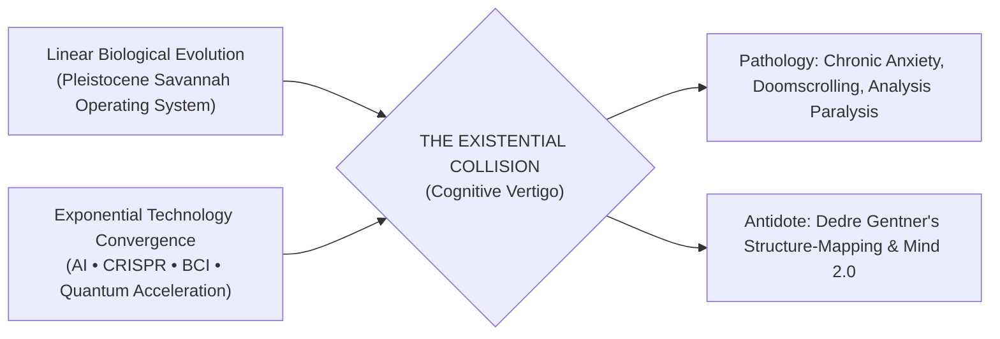

> **🎙️ 3-Presenter Authentic Tiki-Taka Script**
> 
> **Prof. Peter Kim:** Scholars, welcome to Session 2 of the Theurgicon. Last week, we proved that humanity has converted the 83 canonical miracles of antiquity into operational industrial deliverables. Today, we confront the great psychological fracture of our era: Why is a species commanding superabundance suffering from epidemic levels of anxiety, epistemic paralysis, and existential vertigo? *(Turn 1)*  
> **Dr. Elena Vance:** The diagnosis is rooted in neurobiology, Professor Kim. Human cerebral wetware was forged over 200,000 years in an environment where everything was strictly local and linear—traveling at three miles per hour. Today, information and technological capabilities are accelerating at exponential velocities. That violent friction produces **Cognitive Vertigo**. *(Turn 2)*  
> **TA Marcus Brody:** Think of it like severe vestibular motion sickness on an orbital rocket! Your inner ear feels 1G, but your eyes see the Earth spinning past at Mach 25. Your balance system completely collapses and you vomit. Humanity is experiencing civilizational motion sickness because our cultural inner ear cannot stabilize against exponential curves! *(Turn 3)*  
> **Prof. Peter Kim:** A vivid physical metaphor, Marcus. Look at the flowchart on Slide 1. When our Pleistocene biological OS collides with exponential convergence, the default symptoms are chronic doomscrolling, emotional exhaustion, and cognitive retreat. *(Turn 4)*  
> **TA Marcus Brody:** You see it everywhere! Tech executives, political leaders, university professors—people are privately terrified because the world they trained for five years ago simply no longer exists! Every time a new frontier model or biotech tool drops, the ground under their feet shudders! *(Turn 5)*  
> **Dr. Elena Vance:** And that panic isn't a moral flaw; it's a predictable neurobiological defense mechanism. When our cortical prediction engine encounters massive prediction errors, it sounds the biological alarm. *(Turn 6)*  
> **Prof. Peter Kim:** Which is why brute force information consumption won't save you. Today, we introduce the cognitive antidote: **Dedre Gentner’s Structure-Mapping Theory** and the protocols of **Mind 2.0**. *(Turn 7)*  
> **TA Marcus Brody:** We are going to build the mental gyroscopes to keep our minds rock-solid while everything around us accelerates at Mach 25! *(Turn 8)*  
> **Dr. Elena Vance:** Let’s start by quantifying the exact size of the tsunami hitting our biological brains. *(Turn 9)*  
> **Prof. Peter Kim:** Turn to Slide 2: The 181 Zettabyte Tsunami vs. The 120-Bit Biological Funnel. *(Turn 10)*

---

### Slide 02: The 181 Zettabyte Tsunami vs. The 120-Bit Biological Funnel
- **Global Macro Metric:** 2026 Global Annual Data Generation: **181 Zettabytes ($1.81 \times 10^{23}$ bytes)**.
- **Neurobiological Bottleneck:** Human Conscious Processing Bandwidth: **50 to 120 bits per second** (Mihaly Csikszentmihalyi).
- **The Core Paradox:** Infinitely expanding digital supply vs. rigidly constrained biological ingestion.

| Metric Domain | Global Digital Datastream (2026) | Human Conscious Working Memory | Disparity Order of Magnitude |
| :--- | :--- | :--- | :--- |
| **Throughput per Second** | $\approx 5.74 \times 10^{15}$ bits/sec ($5.74\text{ Pb/s}$) | $\approx 50 \text{ to } 120\text{ bits/sec}$ | **$\approx 50,000,000,000,000 : 1$** ($50\text{ Trillion} : 1$) |
| **Annual Cumulative Ingestion** | $181\text{ Zettabytes}$ | Maximum Lifetime Conscious Ingestion: $\approx 0.39\text{ GB}$ | Asymptotically Zero ($\approx 0.00000000001\%$) |
| **Psychological Consequence** | Exponential Saturation of Digital Channels | Severe Cortical Overheating & Dopamine Depletion | **Defensive Epistemic Retraction & Cynicism** |

> **🎙️ 3-Presenter Authentic Tiki-Taka Script**
> 
> **Dr. Elena Vance:** Slide 2 lays out the most severe quantitative bottleneck in human biology. Look at the disparity ratio in the table: **50 Trillion to One ($50,000,000,000,000 : 1$)**! *(Turn 1)*  
> **TA Marcus Brody:** Break down those numbers, Elena! Global data generation in 2026 is **181 Zettabytes**—that is $5.74$ Petabits per second surging across the planet! And human conscious working memory processes at most **120 bits per second**! *(Turn 2)*  
> **Prof. Peter Kim:** Think about that lifetime calculation in the second row. If a human lives for 80 years, focusing with 100% conscious attention every waking second, their biological brain can only process approximately **0.39 Gigabytes** of raw conscious data in an entire lifetime! *(Turn 3)*  
> **TA Marcus Brody:** Less than half a gigabyte in a lifetime?! A single 10-second TikTok video or a high-res photo has more data than a human brain can consciously process across eighty years of living! *(Turn 4)*  
> **Dr. Elena Vance:** Exactly! That means your conscious mind ingests approximately $0.00000000001\%$ of the annual planetary datastream. You are not just missing a few details; you are essentially blind to 99.999999999% of global information flow! *(Turn 5)*  
> **TA Marcus Brody:** And what do people do? They try to force more data in! They open 40 tabs, listen to podcasts at 2.5x speed, skim Twitter threads, and end up with acute dopamine exhaustion, brain fog, and total cynicism! *(Turn 6)*  
> **Prof. Peter Kim:** That is the third row: **Defensive Epistemic Retraction**. When the brain realizes it cannot possibly process the firehose, it shuts down, retreats into cynical apathy, or clings dogmatically to simplistic tribal narratives. *(Turn 7)*  
> **Dr. Elena Vance:** The takeaway is undeniable: trying to consume raw data is cognitive suicide. You must move from *data hoarding* to *relational filtering*. *(Turn 8)*  
> **TA Marcus Brody:** But why did evolution build us with such a tight 120-bit limit in the first place? *(Turn 9)*  
> **Prof. Peter Kim:** Let’s examine our evolutionary operating system on Slide 3: The Savanna Brain at the Singularity Threshold. *(Turn 10)*

---

### Slide 03: The Savanna Brain at the Singularity Threshold: Evolutionary Mismatch
- **Evolutionary Architecture:**
  - *Pleistocene Context:* 200,000 years in band-level hunter-gatherer groups (Dunbar Number: $\approx 150$).
  - *Local & Linear Dynamics:* Maximum travel speed: $15\text{ km/day}$; communication limited to the speed of sound ($343\text{ m/s}$) within acoustic line-of-sight.
- **The Singularity Threshold (2026):**
  - Instantaneous global speed of light telecommunications ($300,000\text{ km/s}$).
  - Exponential doubling cycles measured in months rather than millennia.
- **The Core Mismatch:** Running 21st-century planetary civilizational tools on Pleistocene hunter-gatherer firmware.

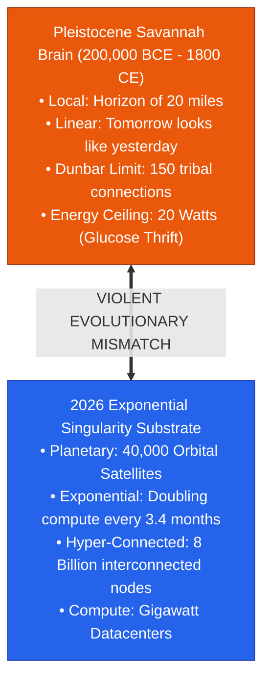

> **🎙️ 3-Presenter Authentic Tiki-Taka Script**
> 
> **TA Marcus Brody:** Look at the visual contrast on Slide 3. On the left, we have our savannah operating system; on the right, the 2026 exponential singularity substrate. It is literally a collision of two completely incompatible worlds! *(Turn 1)*  
> **Dr. Elena Vance:** For 99% of human existence, your world was defined by the horizon of your eyes—about 20 miles. Your social network was strictly capped by the Dunbar Number—about 150 people you knew personally from childhood. And tomorrow looked almost identical to yesterday. *(Turn 2)*  
> **Prof. Peter Kim:** In that ancestral environment, assuming linear continuity was an optimal survival strategy. If a river flooded once every ten years, you planned for ten-year cycles. If a tribe traveled at three miles per hour, they couldn't surprise you from 500 miles away. *(Turn 3)*  
> **TA Marcus Brody:** And today, an algorithmic flash crash can wipe out $2 trillion of wealth in 40 milliseconds, a biological virus or a computer worm can encircle the globe in 48 hours, and your phone connects you to eight billion strangers simultaneously! *(Turn 4)*  
> **Dr. Elena Vance:** Our brain wetware hasn't had an architectural hardware update in 50,000 years! We are trying to run a multi-planetary, gigawatt AI civilization on biological firmware designed for throwing flint spears at antelopes. *(Turn 5)*  
> **TA Marcus Brody:** That is the ultimate definition of an **Evolutionary Mismatch**. When an organism’s evolved traits clash violently with its current environment, the organism goes into distress! *(Turn 6)*  
> **Prof. Peter Kim:** And notice the most tragic paradox: our brain doesn't just struggle with this change—it actively interprets technological progress as mortal peril! *(Turn 7)*  
> **Dr. Elena Vance:** Why does our biological wiring perceive miraculous abundance as a lethal threat? *(Turn 8)*  
> **Prof. Peter Kim:** Let’s deconstruct that existential inquest on Slide 4. *(Turn 9)*  
> **TA Marcus Brody:** Let’s see why our brains are terrified of the future! *(Turn 10)*

---

### Slide 04: The Core Existential Inquest: Why the Brain Reads Progress as Peril
- **The Core Paradox:** Humanity has never been safer, wealthier, or more technologically capable, yet global measures of existential dread and civilizational pessimism are at all-time highs.
- **The Three Neurological Drivers:**
  1. *Prediction Error Hyper-Activation:* Rapid exponential disruption destroys the brain's predictive models, triggering persistent sympathetic nervous system arousal (fight-or-flight).
  2. *Status-Quo Bias as Survival Strategy:* On the savannah, novelty was far more likely to kill you than reward you; stability equaled survival.
  3. *The Loss of Cognitive Agency:* When individuals cannot model how their tools work, they feel like powerless subjects of an alien technological theocracy.

> **🎙️ 3-Presenter Authentic Tiki-Taka Script**
> 
> **Prof. Peter Kim:** Here is the core existential inquest for Session 2: **"Why does the human brain instinctively read exponential progress as mortal peril?"** Dr. Vance, what does cognitive neuroscience reveal? *(Turn 1)*  
> **Dr. Elena Vance:** The answer lies in Driver 1: **Prediction Error Hyper-Activation**. The primary job of your brain is not to experience truth; it is to predict the immediate future to keep you alive. When technology accelerates exponentially, your internal prediction models fail continuously every single week. *(Turn 2)*  
> **TA Marcus Brody:** And when your predictive models collapse, the brain doesn't say: *"Oh, how exciting, a new technological frontier!"* It says: *"DANGER! Unpredictable environment! Predators incoming! Flood the bloodstream with cortisol and adrenaline!"* *(Turn 3)*  
> **Prof. Peter Kim:** Exactly. To a biological organism, total unpredictability equals imminent death. This is why Driver 2—the **Status-Quo Bias**—is so deeply hardwired. On the savannah, sticking to the known path kept you alive; exploring the dark cave usually got you eaten. *(Turn 4)*  
> **TA Marcus Brody:** And look at Driver 3: **The Loss of Cognitive Agency**. When you had a wooden plow or a horse, you understood how your tools worked. Today, almost nobody understands how a 3nm semiconductor, a transformer neural network, or a CRISPR Cas12 enzyme actually operates! *(Turn 5)*  
> **Dr. Elena Vance:** When people rely on tools they perceive as black boxes, they feel alienated and disempowered. Technology stops feeling like an extension of human will and starts feeling like an incomprehensible alien force dictating their destiny. *(Turn 6)*  
> **TA Marcus Brody:** That’s why people lash out with conspiracy theories, luddite rage, or nihilistic doomism! It’s a desperate attempt to regain a sense of narrative control! *(Turn 7)*  
> **Prof. Peter Kim:** To overcome this terror, we must demystify the machine. We must provide mental models that restore cognitive sovereignty and agency to the human mind. *(Turn 8)*  
> **Dr. Elena Vance:** That is the exact mission of our pedagogical trajectory today. *(Turn 9)*  
> **Prof. Peter Kim:** Turn to Slide 5 for our Session 2 roadmap. *(Turn 10)*

---

### Slide 05: Session 02 Pedagogical Roadmap: From Cortical Engines to Structure Mapping
- **Master Learning Architecture (Session 02):**
  - **Module 1 (Slides 01–05):** The Civilizational Framing of Cognitive Vertigo.
  - **Module 2 (Slides 06–15):** Neurobiology Deconstruction — The 20W Biological Ceiling, Cortical Engines, Free Energy Principle, and Flow States.
  - **Module 3 (Slides 16–25):** Exponential Frameworks — Dedre Gentner's Structure-Mapping Theory, Systematicity Principle, and the Mathematics of $y = a(1+r)^t$.
  - **Module 4 (Slides 26–35):** Global Empirical Verification — Case Studies in Data Divergence, Media Sentiment, COVID Linear Blunders, and BCI Bandwidth.
  - **Module 5 (Slides 36–42):** Existential Paradoxes — Numinous Dread, Bias Cascades, Doomscrolling Neurobiology, and Mind 2.0.
  - **Module 6 (Slides 43–45):** Graduate Seminar Inquiries & The Practical Structure-Mapping Workshop Protocol.

> **🎙️ 3-Presenter Authentic Tiki-Taka Script**
> 
> **Dr. Elena Vance:** Slide 5 outlines our six-module architecture for Session 2. We move systematically from the biological wetware of the brain to the cognitive frameworks of structure mapping, verified against real-world empirical data. *(Turn 1)*  
> **TA Marcus Brody:** In Module 2, we will pop the hood on the human brain! We will analyze the **20-Watt Biological Energy Ceiling**, Karl Friston’s **Free Energy Principle**, and Steven Kotler’s neurobiology of flow states! Hard neuroscience! *(Turn 2)*  
> **Prof. Peter Kim:** Then in Module 3, we master the core intellectual engine: **Dedre Gentner’s Structure-Mapping Theory**. We will deconstruct why analogies are not mere rhetorical ornaments, but rigorous mathematical mappings of relational systems. *(Turn 3)*  
> **TA Marcus Brody:** And in Module 4, we examine hard empirical evidence: from the catastrophic failure of linear models during the COVID-19 pandemic to why the International Energy Agency (IEA) missed the exponential solar curve twenty years in a row! *(Turn 4)*  
> **Dr. Elena Vance:** In Module 5, we confront the "So What?": how to break free from the doomscrolling dopamine-cortisol loop and cultivate **Ruthless Discernment**. *(Turn 5)*  
> **TA Marcus Brody:** And in Module 6, every student will execute a hands-on Structure-Mapping translation protocol, turning complex frontier patents into crystal-clear civilizational models! *(Turn 6)*  
> **Prof. Peter Kim:** Maintain your highest intellectual focus throughout all 45 slides. Let us step into Module 2 and deconstruct the anatomy of cognitive vertigo! *(Turn 7)*  
> **Dr. Elena Vance:** Let’s examine Chapter 1 of Diamandis and Kotler on Slide 6! *(Turn 8)*


---

## Module 2: Primary Text & Neurobiology Deconstruction (Slides 06–15)

### Slide 06: Deconstructing Chapter 1: The Anatomy of Cognitive Vertigo
- **Primary Source Analysis:** Peter H. Diamandis & Steven Kotler, *We Are as Gods* (2026), Chapter 1 (*Cognitive Vertigo*).
- **Core Thesis:** Cognitive Vertigo is the acute psychological and physiological state induced when the rate of external technological change permanently outstrips the brain’s endogenous capacity for linear adaptation.
- **The Tripartite Symptomology:**
  1. *Epistemic Paralysis:* Inability to distinguish signal from noise amid exponential informational velocity.
  2. *Chronic Anticipatory Anxiety:* The persistent somatic dread that one's skills, identity, and economic utility are becoming obsolete overnight.
  3. *Hyper-Reactive Tribalism:* Retreating into dogmatic ideological enclaves to restore psychological certainty.

> **🎙️ 3-Presenter Authentic Tiki-Taka Script**
> 
> **Prof. Peter Kim:** Let us deconstruct Chapter 1 of *We Are as Gods*. Dr. Vance, examine how Diamandis and Kotler define the anatomy of Cognitive Vertigo. *(Turn 1)*  
> **Dr. Elena Vance:** They define it not as a personal psychological failing, but as a structural neuro-evolutionary crisis. When the rate of external environmental change accelerates past a biological threshold, the brain's internal predictive baseline fractures. *(Turn 2)*  
> **TA Marcus Brody:** Look at the three symptoms on Slide 6! Symptom 1 is **Epistemic Paralysis**: you read five conflicting expert opinions on AI, biotech, or geopolitics before breakfast, and you end up so overloaded you can’t make a single decision! *(Turn 3)*  
> **Dr. Elena Vance:** And Symptom 2 is **Chronic Anticipatory Anxiety**: that constant, low-level knot in your stomach whispering that whatever career you trained ten years for might be automated by next Tuesday! It drains your emotional reserves every single day. *(Turn 4)*  
> **Prof. Peter Kim:** Which directly triggers Symptom 3: **Hyper-Reactive Tribalism**. When the world becomes too complex and terrifying to process, the brain seeks shelter in black-and-white dogmatism: *"My tribe is 100% righteous, the other tribe is pure evil."* It restores a cheap, synthetic illusion of psychological certainty. *(Turn 5)*  
> **TA Marcus Brody:** So tribal warfare and political polarization aren't just caused by bad politicians; they are direct neurobiological coping mechanisms for people experiencing severe cognitive vertigo! *(Turn 6)*  
> **Dr. Elena Vance:** Exactly! When human minds cannot process exponential nuance, they collapse into binary tribal rage to conserve cognitive energy. *(Turn 7)*  
> **Prof. Peter Kim:** And that brings us to the fundamental thermodynamic constraint of the human brain: the 20-Watt ceiling. *(Turn 8)*  
> **TA Marcus Brody:** Let’s see why our brains are so stingy with energy on Slide 7! *(Turn 9)*  
> **Prof. Peter Kim:** Turn to Slide 7: The Caloric Conservation Principle. *(Turn 10)*

---

### Slide 07: The Caloric Conservation Principle: The 20-Watt Biological Ceiling
- **Thermodynamic Constraints of the Brain:**
  - *Mass vs. Energy Consumption:* The human brain accounts for **~2% of total body mass**, but consumes **~20% to 25% of total basal metabolic energy** ($\approx 20\text{ Watts}$).
  - *Caloric Scarcity Imperative:* Evolution ruthlessly optimized brain architecture to **minimize glucose and oxygen consumption** by defaulting to automated, low-energy heuristic routines (Daniel Kahneman's *System 1*).
- **The Exponential Consequence:** Actively computing non-linear, exponential phase shifts burns massive metabolic energy, triggering immediate physiological resistance, mental fatigue, and avoidance behaviors.

```mermaid
flowchart TD
    A["Total Basal Metabolic Energy (100W)"] --> B["Human Brain (~20W / 20-25%)<br/>High-Cost Metabolic Processor"]
    B --> C{"Caloric Optimization Strategy"}
    C -->|Default / Low Energy (System 1)| D["Linear Extrapolation & Heuristics<br/>(Glucose Conserving • Fast • Biased)"]
    C -->|High Energy / Intensive (System 2)| E["Exponential Computation & Structure Mapping<br/>(Massive Glucose Drain • Fatigue Trigger)"]
```

> **🎙️ 3-Presenter Authentic Tiki-Taka Script**
> 
> **Dr. Elena Vance:** Slide 7 presents the strict thermodynamic constraint of human consciousness: **The 20-Watt Biological Ceiling**. The human brain weighs about 1.4 kilograms—just 2% of your body weight—yet it ruthlessly burns 20% to 25% of your total resting caloric energy! *(Turn 1)*  
> **TA Marcus Brody:** Your brain is a 20-watt lightbulb! In an ancestral world where finding calories meant hunting a gazelle or digging roots for six hours, burning unnecessary glucose on abstract thinking was a fast ticket to starvation! *(Turn 2)*  
> **Prof. Peter Kim:** Which is why natural selection engineered the brain as an extreme caloric miser. To conserve precious glucose, the brain defaults to Daniel Kahneman’s **System 1**—fast, cheap, automated linear heuristics: *"Tomorrow will be like today; next week will be like last week."* *(Turn 3)*  
> **TA Marcus Brody:** Linear thinking is computationally free! You just take the current state and draw a straight line forward. It costs almost zero glucose! *(Turn 4)*  
> **Dr. Elena Vance:** But actively computing exponential compounding—calculating non-linear second-order derivatives and multi-domain convergence—requires Kahneman’s **System 2**. It literally drains your prefrontal cortex of glucose, making you feel physically exhausted after just 20 minutes! *(Turn 5)*  
> **TA Marcus Brody:** That explains why, when you show people an exponential S-curve, their eyes glaze over and their brains scream: *"Shut this down! Go look at memes or eat a snack!"* It’s a biological glucose conservation response! *(Turn 6)*  
> **Prof. Peter Kim:** Your evolutionary biology is actively fighting against understanding exponential reality to protect your caloric balance. *(Turn 7)*  
> **Dr. Elena Vance:** To overcome this biological inertia, we must understand how the brain’s predictive machinery works. *(Turn 8)*  
> **Prof. Peter Kim:** Let’s examine Slide 8: Mechanics of the Cortical Prediction Engine. *(Turn 9)*  
> **TA Marcus Brody:** Let’s look at the brain's internal simulator! *(Turn 10)*

---

### Slide 08: Mechanics of the Cortical Prediction Engine
- **Neurocomputational Architecture:**
  - *Hierarchical Predictive Processing (Andy Clark, Rajesh Rao):* The brain does not passively wait for sensory inputs; it generates top-down generative predictions ($\hat{y}$) and only processes the bottom-up **Prediction Error ($\epsilon = y - \hat{y}$)**.
  - *Caloric Efficiency Mechanism:* Transmitting only error signals down-regulates neural firing by >80% compared to raw sensory streaming.
- **The Exponential Breakdown:** When technology introduces radical, discontinuous phase shifts, top-down predictions fail catastrophically, flooding the cortical hierarchy with unresolvable error spikes ($\epsilon \gg 0$).

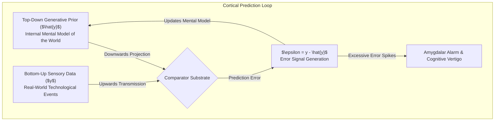

> **🎙️ 3-Presenter Authentic Tiki-Taka Script**
> 
> **Prof. Peter Kim:** Cognitive scientists like Andy Clark have proven that the human brain is not a passive recording camera; it is a **Hierarchical Cortical Prediction Engine**. Dr. Vance, explain the mathematical comparator loop on Slide 8. *(Turn 1)*  
> **Dr. Elena Vance:** Your cortex constantly generates top-down hypotheses ($\hat{y}$) about what the world *should* look like in the next fraction of a second. It compares that prediction with incoming sensory data ($y$). If the prediction is accurate, the Prediction Error ($\epsilon = y - \hat{y}$) is zero, and almost no electrical energy is spent! *(Turn 2)*  
> **TA Marcus Brody:** That’s why you can walk through your own living room in the dark without bumping into things—your brain is running a top-down simulation! It only spends energy when something unexpected happens, like stepping on a stray Lego! *(Turn 3)*  
> **Prof. Peter Kim:** But what happens in an era of hyper-exponential convergence? In 2026, humanity is stepping on metaphysical Legos every single morning! *(Turn 4)*  
> **TA Marcus Brody:** Exactly! You wake up on Monday, and your top-down model says: *"Autonomous driving is 10 years away."* Then on Tuesday, Waymo logs 100,000 driverless trips a week! On Wednesday, your model says: *"AI can't generate cinema-grade video,"* and on Thursday, a new diffusion model outputs a Hollywood trailer from a single prompt! *(Turn 5)*  
> **Dr. Elena Vance:** The Prediction Error term ($\epsilon$) blows up to infinity! The top-down generative model is completely shattered. When the cortex cannot resolve the error signal, it triggers the amygdalar alarm, dumping stress hormones into your system! *(Turn 6)*  
> **TA Marcus Brody:** That is the literal physiological mechanism of Cognitive Vertigo! Your brain's simulator is constantly crashing and throwing blue-screen-of-death error messages! *(Turn 7)*  
> **Prof. Peter Kim:** And Karl Friston formalized this entire dynamic into the **Free Energy Principle**. *(Turn 8)*  
> **Dr. Elena Vance:** Let’s look at Friston’s physics of brain energy on Slide 9. *(Turn 9)*  
> **Prof. Peter Kim:** Proceed to Slide 9: Karl Friston’s Free Energy Principle. *(Turn 10)*

---

### Slide 09: Karl Friston’s Free Energy Principle & Prediction Error Surges
- **Theoretical Benchmark:** Karl Friston (2006, 2010), *The Free-Energy Principle: A Unified Brain Theory?*
- **Mathematical Principle:** Biological self-organizing systems survive by minimizing **Variational Free Energy ($\mathcal{F}$)**, which acts as an upper bound on surprise (unexpected states):
  $$\mathcal{F} = \text{Complexity} - \text{Accuracy} \approx \mathbb{E}_{q}[\ln q(s) - \ln p(s, o)]$$
- **The Singularity Shock:** Hyper-exponential technological jumps maximize surprise ($\ln p(o) \to -\infty$), causing an acute surge in variational free energy that biological neural networks struggle to minimize.

> **🎙️ 3-Presenter Authentic Tiki-Taka Script**
> 
> **Dr. Elena Vance:** Karl Friston’s **Free Energy Principle** on Slide 9 is considered one of the most profound unifying theories in theoretical neuroscience. Friston proved that all biological organisms exist solely by minimizing **Variational Free Energy ($\mathcal{F}$)**—which is mathematically equivalent to minimizing surprise and uncertainty! *(Turn 1)*  
> **TA Marcus Brody:** In plain English: An organism survives by keeping its internal state organized and avoiding unexpected environments that could kill it! If a fish finds itself on dry land, its free energy spikes to maximum, and it dies unless it flops back into the water! *(Turn 2)*  
> **Prof. Peter Kim:** Now look at the mathematical equation: $\mathcal{F} = \text{Complexity} - \text{Accuracy}$. When external technological complexity explodes by 100x while your internal model accuracy collapses, your variational free energy skyrockets! *(Turn 3)*  
> **TA Marcus Brody:** And what does the brain do when its free energy explodes? It has two choices according to Friston: Either update its internal mental models (which burns massive glucose and takes intense effort), or change the external world to fit its expectations! *(Turn 4)*  
> **Dr. Elena Vance:** But an individual cannot stop global exponential AI or synthetic biology. So when people can’t change the technology and refuse to upgrade their internal models, they choose a third, pathological option: **Denial and Epistemic Retraction**! *(Turn 5)*  
> **TA Marcus Brody:** They say: *"AI is just an overhyped autocomplete,"* or *"mRNA vaccines don't work,"* or *"Renewable energy is a scam!"* They literally invent delusions just to force their internal free energy back down! *(Turn 6)*  
> **Prof. Peter Kim:** Denial is a thermodynamic defense mechanism against cognitive overwhelm. It is the mind's desperate attempt to preserve its sanity by ignoring physical reality. *(Turn 7)*  
> **Dr. Elena Vance:** And this denial is weaponized by our ancient **Evolutionary Negativity Bias**. *(Turn 8)*  
> **Prof. Peter Kim:** Let’s examine how the amygdala drives this process on Slide 10. *(Turn 9)*  
> **TA Marcus Brody:** Let’s see why our amygdala is addicted to worst-case scenarios! *(Turn 10)*

---

### Slide 10: The Evolutionary Negativity Bias: Amygdalar Survival Algorithms
- **Evolutionary Asymmetry:**
  - *Type I Error (False Positive):* Hearing a rustle in the grass, assuming it is a predator, and running away \rightarrow Cost: Minor wasted calories.
  - *Type II Error (False Negative):* Hearing a rustle, assuming it is just the wind, when it is a predator \rightarrow Cost: **Death & Genetic Extinction**.
- **The Resulting Hardwiring:** The human brain is neurologically wired to prioritize negative, threatening information over positive or neutral data by a factor of **$3:1$ to $5:1$** (Baumeister et al., 2001).

```mermaid
graph LR
    subgraph Ancestral Evolutionary Filter
        A["Environmental Anomaly Detected"] --> B{"Threat Assessment"}
        B -->|Assume Danger (Type I Error)| C["Survive (Minor Caloric Loss)"]
        B -->|Assume Safety (Type II Error)| D["Predation / Death (Genetic Extinction)"]
    end
    C ==>|200,000 Years of Selection| E["Hardwired Amygdalar Negativity Bias<br/>(Threat Signals Weighted 5x Over Opportunity)"]
```

> **🎙️ 3-Presenter Authentic Tiki-Taka Script**
> 
> **TA Marcus Brody:** Look at the evolutionary decision tree on Slide 10. This explains why every single person in this room has a built-in pessimist living inside their skull! *(Turn 1)*  
> **Dr. Elena Vance:** It comes down to basic statistical decision theory on the Pleistocene savannah. A **Type I Error** (false alarm) costs you a few calories from running away from a harmless bush. But a **Type II Error** (false optimism) costs you your life because you got eaten by a leopard! *(Turn 2)*  
> **Prof. Peter Kim:** Natural selection ruthlessly weeded out the optimists who assumed every rustle was a friendly breeze. Over 200,000 years, evolution bred a species of hyper-vigilant, paranoid survivalists whose amygdalas weight negative threats **three to five times heavier** than positive opportunities! *(Turn 3)*  
> **TA Marcus Brody:** And now think about what happens when you drop that 5x negativity bias into the modern digital media ecosystem! *(Turn 4)*  
> **Dr. Elena Vance:** If a headline says: *"AI cures childhood leukemia in 48 hours,"* your brain registers it mildly. But if a headline screams: *"AI autonomous drones will eliminate 80% of jobs and destroy democracy,"* your amygdala goes on red alert and forces you to click and share it! *(Turn 5)*  
> **Prof. Peter Kim:** Roy Baumeister famously titled his seminal paper: *"Bad is Stronger than Good."* In our biology, fear, disgust, and rage command absolute neurochemical priority. *(Turn 6)*  
> **TA Marcus Brody:** And social media algorithms figured this out in about 2012! They realized that feeding our negativity bias is the most profitable business model in human history! *(Turn 7)*  
> **Dr. Elena Vance:** Which creates a self-reinforcing outrage economy powered by dopamine and cortisol. *(Turn 8)*  
> **Prof. Peter Kim:** Let’s examine that addiction loop on Slide 11. *(Turn 9)*  
> **TA Marcus Brody:** Let’s follow the dopamine-cortisol trail! *(Turn 10)*

---

### Slide 11: Confirmation Bias & The Outrage Economy: Dopamine-Cortisol Loops
- **The Algorithmic Exploitation Loop:**
  1. *Negative Stimulus Ingestion:* Algorithmic feed serves high-threat headline \rightarrow Amygdalar arousal & Cortisol surge.
  2. *Threat Confirmation Seeking:* Prefrontal cortex seeks cognitive closure \rightarrow Clicks, scrolls, and engages.
  3. *Validation Dopamine Hit:* Finding tribal validation or confirmation of the threat provides a brief pulse of relief/dopamine.
  4. *Habituation & Escalation:* Baseline tolerance increases, requiring more extreme, catastrophizing content to trigger the same neurological feedback loop.

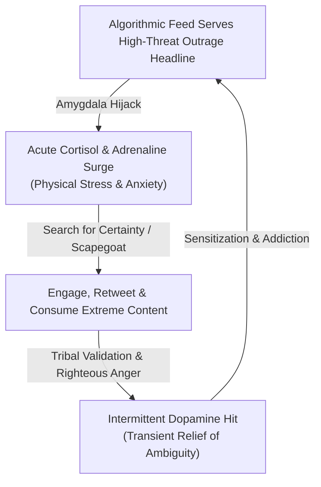

> **🎙️ 3-Presenter Authentic Tiki-Taka Script**
> 
> **TA Marcus Brody:** Slide 11 diagrams the exact neurological loop that has trapped millions of people in 24/7 doomscrolling! Elena, trace the biochemistry of this cycle. *(Turn 1)*  
> **Dr. Elena Vance:** It begins with an algorithm serving you an outrage-inducing headline. Your amygdala perceives a threat and floods your bloodstream with **cortisol and adrenaline**. Your body enters a state of physiological agitation. *(Turn 2)*  
> **TA Marcus Brody:** And to get rid of that uncomfortable agitation, you click into the comments, search for other angry people, and fire off a righteous, furious tweet! *(Turn 3)*  
> **Dr. Elena Vance:** And the moment you find people agreeing with you and attacking the enemy, your brain receives an intermittent **dopamine hit**! It feels like you've successfully identified the predator and defended the tribe! *(Turn 4)*  
> **Prof. Peter Kim:** But notice the tragic trap: the relief is purely transient. Within thirty minutes, the dopamine wears off, the cortisol baseline remains elevated, and your brain demands an even more extreme dose of outrage to achieve the same feeling of closure. *(Turn 5)*  
> **TA Marcus Brody:** We are literally manufacturing synthetic paranoia to feed an algorithmic business model! We are turning ourselves into hyper-stressed laboratory rats pulling an outrage lever! *(Turn 6)*  
> **Dr. Elena Vance:** And this chronic stress directly destroys neuroplasticity. Under prolonged cortisol exposure, the hippocampus shrinks and the prefrontal cortex loses its ability to perform high-level abstract reasoning and pattern recognition! *(Turn 7)*  
> **Prof. Peter Kim:** Which leaves humanity intellectually crippled at the exact moment we need our highest cognitive faculties to govern exponential technology. *(Turn 8)*  
> **TA Marcus Brody:** So how do we break out of this dopamine-cortisol prison? Steven Kotler has the answer in the neurobiology of flow! *(Turn 9)*  
> **Prof. Peter Kim:** Turn to Slide 12: Steven Kotler’s Neurobiology of Flow. *(Turn 10)*

---

### Slide 12: Steven Kotler’s Neurobiology of Flow: Pattern Recognition Optimization
- **The State of Flow (Mihaly Csikszentmihalyi, Steven Kotler):** An optimal state of consciousness where we feel our best and perform our best; transient hypofrontality and intense focused absorption.
- **The Neurochemical Cocktail of Flow:**
  - **Dopamine & Norepinephrine:** Tightens focus, suppresses distractions, accelerates neural pattern recognition.
  - **Endorphins & Anandamide:** Blunts pain, reduces fear/anxiety, promotes radical lateral thinking.
  - **Serotonin:** Post-flow state stabilization, deep structural integration.
- **Pattern Recognition Hyper-Acceleration:** In flow, lateral pattern recognition speeds up by **up to 500%**, transforming cognitive vertigo into effortless exponential navigation.

> **🎙️ 3-Presenter Authentic Tiki-Taka Script**
> 
> **Dr. Elena Vance:** Slide 12 presents Steven Kotler’s breakthrough neurobiological antidote to cognitive vertigo: **The State of Flow**. Flow is not mystical zen magic; it is a precisely calibrated neurochemical cascade. *(Turn 1)*  
> **TA Marcus Brody:** Look at that neurochemical cocktail! When you enter deep flow, the brain releases five of the most potent neurochemicals simultaneously: **Dopamine, Norepinephrine, Endorphins, Anandamide, and Serotonin**! *(Turn 2)*  
> **Prof. Peter Kim:** Notice what happens during this state: the brain experiences **Transient Hypofrontality**. The dorsolateral prefrontal cortex—the part of your brain that generates self-doubt, inner criticism, and anxious rumination—temporarily down-regulates! *(Turn 3)*  
> **TA Marcus Brody:** Your inner critic shuts up, time dilates, and your pattern recognition speeds up by **up to 500%** according to DARPA and Flow Research Collective studies! *(Turn 4)*  
> **Dr. Elena Vance:** Instead of feeling overwhelmed by exponential complexity, a brain in flow perceives connections between disparate domains effortlessly. What looked like terrifying chaos suddenly resolves into elegant, predictable structure! *(Turn 5)*  
> **TA Marcus Brody:** That is the difference between drowning in the 181-zettabyte tsunami and riding the wave like a championship surfer! *(Turn 6)*  
> **Prof. Peter Kim:** In flow, cognitive vertigo is converted into cognitive velocity. You stop reacting like a panicked primate and start operating like an integrated theurgic architect. *(Turn 7)*  
> **Dr. Elena Vance:** And pairing flow states with Peter Diamandis’s Exponential Mindset gives you the complete strategic operating system. *(Turn 8)*  
> **Prof. Peter Kim:** Let’s examine Slide 13: Peter Diamandis’s Exponential Mindset Matrix. *(Turn 9)*  
> **TA Marcus Brody:** Let’s compare linear minds with exponential masters! *(Turn 10)*

---

### Slide 13: Peter Diamandis’s Exponential Mindset Matrix
- **Mindset Taxonomy:** Systematic comparison between legacy linear cognition and theurgic exponential mastery across five operational dimensions.

| Cognitive Dimension | Legacy Linear Mindset (Mind 1.0) | Exponential Theurgic Mindset (Mind 2.0) |
| :--- | :--- | :--- |
| **Resource Horizon** | Zero-Sum Scarcity (Fixed Pie, Hoarding) | Thermodynamic Abundance (Expanding Pie via Tech) |
| **Trajectory Modeling** | Incremental Extrapolation ($+10\%$ YoY) | Multiplicative Compounding ($10\times$ Shifts, S-Curves) |
| **Failure Tolerance** | Risk-Aversion, Stigmatization of Errors | Rapid Empirical Iteration, Fail-Forward Telemetry |
| **Information Processing** | Data Consumption (120-bit Funnel Overload) | Relational Structure Mapping & Heuristic Filtering |
| **Civilizational Agency** | Passive Consumer / Subject of Disruption | Active Theurgist / Architect of Moonshot Solutions |

> **🎙️ 3-Presenter Authentic Tiki-Taka Script**
> 
> **Prof. Peter Kim:** Examine the comparative matrix on Slide 13. This table defines the shift from **Mind 1.0** to **Mind 2.0**. Marcus, walk us through the first two dimensions. *(Turn 1)*  
> **TA Marcus Brody:** Look at Row 1: **Resource Horizon**. Mind 1.0 sees the world as a fixed pie of scarcity—if someone else gets rich or healthy, it means I lose out! Mind 2.0 understands thermodynamic abundance—technology takes inaccessible resources and liberates them for everyone! *(Turn 2)*  
> **Dr. Elena Vance:** And look at Row 2: **Trajectory Modeling**. Mind 1.0 plans for 10% incremental improvements year-over-year. Mind 2.0 plans for $10\times$ phase shifts, anticipating exponential inflection points before they become visible! *(Turn 3)*  
> **TA Marcus Brody:** And look at Row 4: **Information Processing**. Mind 1.0 tries to read everything and burns out. Mind 2.0 uses Gentnerian Structure-Mapping to compress complex technical domains into high-leverage relational models! *(Turn 4)*  
> **Prof. Peter Kim:** And finally, Row 5: **Civilizational Agency**. Mind 1.0 feels like a helpless victim buffeted by the winds of technological change. Mind 2.0 operates as an active Theurgist—taking conscious responsibility for steering these tools toward human flourishing. *(Turn 5)*  
> **Dr. Elena Vance:** If you operate with Mind 1.0 in 2026, you are guaranteed to experience severe cognitive vertigo and economic obsolescence. Mind 2.0 is your only viable survival architecture. *(Turn 6)*  
> **TA Marcus Brody:** But what happens if you stay stuck in Mind 1.0? You hit the physiological wall of Analysis Paralysis! *(Turn 7)*  
> **Prof. Peter Kim:** Let’s examine the biology of burnout on Slide 14. *(Turn 8)*  
> **Dr. Elena Vance:** Turn to Slide 14: Analysis Paralysis & Cognitive Overload. *(Turn 9)*  
> **TA Marcus Brody:** Let’s look at the physiology of mental gridlock! *(Turn 10)*

---

### Slide 14: Analysis Paralysis: The Physiology of Cognitive Overload
- **The Neurobiology of Decision Fatigue:**
  - *Prefrontal Cortex Saturation:* Working memory is limited to **$4 \pm 1$ active chunks** (Nelson Cowan).
  - *Dopamine-Glutamate Depletion:* Continuous evaluation of conflicting multi-dimensional data depletes astrocytic glycogen reserves, causing neurochemical gridlock.
- **The Behavioral Collapse:** When overwhelmed with choices and ambiguous data, the brain defaults to the **Null Action State** (freezing, procrastination, status-quo preservation).

> **🎙️ 3-Presenter Authentic Tiki-Taka Script**
> 
> **Dr. Elena Vance:** Look at Slide 14. In cognitive psychology, Nelson Cowan updated Miller's famous magic number: human working memory can hold at most **$4 \pm 1$ active conceptual chunks** simultaneously in conscious focus! *(Turn 1)*  
> **TA Marcus Brody:** Four chunks! Not forty, not four hundred—FOUR! That means if you are trying to balance AI ethics, market strategy, regulatory compliance, supply chains, and team dynamics all at once, your working memory instantly overflows and crashes! *(Turn 2)*  
> **Prof. Peter Kim:** And notice the metabolic cost: maintaining multiple unresolved options in active memory rapidly depletes astrocytic glycogen reserves in the prefrontal cortex, leading to acute **Neurochemical Gridlock**. *(Turn 3)*  
> **TA Marcus Brody:** And what does the brain do when its glycogen is gone and its working memory is jammed? It triggers **Analysis Paralysis**—you freeze like a deer in the headlights, procrastinate on critical decisions, and do nothing! *(Turn 4)*  
> **Dr. Elena Vance:** In biology, this is the classic **Freeze Response**. When a predator is too fast to outrun and too big to fight, the animal plays dead. When modern humans face exponential complexity, they mentally play dead by binge-watching television or mindlessly scrolling! *(Turn 5)*  
> **Prof. Peter Kim:** Analysis paralysis is not laziness; it is a physiological protective shutdown caused by severe cognitive overloading. *(Turn 6)*  
> **TA Marcus Brody:** That’s why trying to cram more raw data into your brain to solve paralysis only makes the paralysis ten times worse! *(Turn 7)*  
> **Dr. Elena Vance:** Exactly! The solution is not more data; the solution is radical structural compression. *(Turn 8)*  
> **Prof. Peter Kim:** Let’s summarize this biological chasm on Slide 15 before we introduce our mathematical solution in Module 3. *(Turn 9)*  
> **TA Marcus Brody:** Turn to Slide 15: Conscious Bandwidth vs. Information Input! *(Turn 10)*

---

### Slide 15: Conscious Bandwidth vs. Information Input: The 50-Trillion-to-One Chasm
- **Quantitative Macro Synthesis:**
  $$\text{Disparity Ratio} = rac{\text{Global Datastream Rate (2026)}}{\text{Human Conscious Processing Limit}} = rac{5.74 \times 10^{15} \text{ bits/s}}{1.2 \times 10^2 \text{ bits/s}} \approx 4.78 \times 10^{13}$$
- **The Master Axiom:** **"You cannot solve an exponential information problem with a linear ingestion strategy."**
- **The Structural Mandate:** To survive and govern the Age of Abundance, human intelligence must transition from *Sensory Data Ingestion* to **Relational Structure Mapping**.

> **🎙️ 3-Presenter Authentic Tiki-Taka Script**
> 
> **Prof. Peter Kim:** Slide 15 synthesizes the central neurobiological conclusion of Module 2. Look at that staggering disparity ratio: **$4.78 \times 10^{13}$—nearly fifty trillion to one**. *(Turn 1)*  
> **TA Marcus Brody:** Let that sink in, scholars! For every single bit of information your conscious brain can process in a second, the planetary datastream generates **50 trillion bits**! *(Turn 2)*  
> **Dr. Elena Vance:** Read the Master Axiom in the center of the slide aloud, Marcus: **"You cannot solve an exponential information problem with a linear ingestion strategy."** *(Turn 3)*  
> **TA Marcus Brody:** It’s like trying to put out a blazing forest fire with a single eyedropper! Any strategy based on reading more newsletters, watching more tutorials, or working 18-hour days is mathematically doomed to failure! *(Turn 4)*  
> **Prof. Peter Kim:** You must abandon the 20th-century myth of the "well-informed generalist" who knows all the facts. In 2026, raw factual mastery belongs to machine foundation models. *(Turn 5)*  
> **Dr. Elena Vance:** What belongs to human masters is **Relational Structure Mapping**—the ability to look at a complex new engineering domain, extract its core causal relations, and map it instantly onto timeless first principles. *(Turn 6)*  
> **TA Marcus Brody:** That is how a Theurgist navigates the exponential storm without breaking a sweat! *(Turn 7)*  
> **Prof. Peter Kim:** That is our gateway into Module 3. *(Turn 8)*  
> **Dr. Elena Vance:** Let us now master Dedre Gentner’s foundational theory on Slide 16! *(Turn 9)*  
> **Prof. Peter Kim:** Proceed to Module 3: Exponential Frameworks & Relational Mapping! *(Turn 10)*


---

## Module 3: Exponential Frameworks & Relational Mapping (Slides 16–25)

### Slide 16: Dedre Gentner’s Structure-Mapping Theory: Foundational Axioms
- **Theoretical Benchmark:** Dedre Gentner (1983), *Structure-Mapping: A Theoretical Framework for Analogy*, Cognitive Science.
- **Core Axioms:**
  1. *Relational Alignment:* Analogies are structured comparisons between a familiar **Base Domain ($B$)** and an unfamiliar **Target Domain ($T$)** based on shared systems of relations, rather than isolated object features.
  2. *Attribute Independence:* Surface-level object attributes ($A(x)$) are discarded; only relational predicates ($R(x, y)$) are preserved.
  3. *Structural Consistency:* The mapping must satisfy **One-to-One Correspondence** and **Parallel Connectivity**.

```mermaid
graph TD
    subgraph Base Domain B (Solar System)
        B1["Sun (Massive Object)"] -->|Attracts Gravitationally| B2["Planet (Lighter Body)"]
        B1 -->|Causes to Revolve| B3["Revolving Orbit"]
    end
    
    subgraph Target Domain T (Rutherford-Bohr Atom)
        T1["Nucleus (Massive Charge)"] -->|Attracts Electrostatically| T2["Electron (Lighter Body)"]
        T1 -->|Causes to Revolve| T3["Revolving Orbit"]
    end
    
    Base Domain ==>|Structure-Mapping (Relational Alignment)| Target Domain
```

> **🎙️ 3-Presenter Authentic Tiki-Taka Script**
> 
> **Prof. Peter Kim:** We now enter Module 3: Exponential Frameworks & Relational Mapping. Here is the cognitive superweapon that defeats the 181-zettabyte flood: **Dedre Gentner’s Structure-Mapping Theory**. Dr. Vance, walk us through Gentner's foundational axioms on Slide 16. *(Turn 1)*  
> **Dr. Elena Vance:** Dedre Gentner revolutionized cognitive science in 1983 by proving that an analogy is not a superficial poetic flourish. It is a precise mathematical mapping from a known **Base Domain ($B$)** to a novel **Target Domain ($T$)** based strictly on systems of relations ($R(x,y)$), completely discarding isolated object attributes ($A(x)$). *(Turn 2)*  
> **TA Marcus Brody:** Look at Gentner's classic example on Slide 16: Mapping the **Solar System** to the **Rutherford-Bohr Atom**! *(Turn 3)*  
> **Dr. Elena Vance:** If you look at superficial object attributes, the Sun and an atomic Nucleus have zero in common! The Sun is a massive, yellow, 5,500°C ball of burning plasma; an atomic nucleus is a microscopic cluster of protons and neutrons with zero color! If you map surface attributes, the analogy is completely broken. *(Turn 4)*  
> **Prof. Peter Kim:** But look at the **system of relations**: A massive central body exerts an inverse-square attractive force on a much lighter body, causing it to revolve in stable orbits. The relational architecture is 100% isomorphic! *(Turn 5)*  
> **TA Marcus Brody:** That single relational mapping allowed Ernest Rutherford and Niels Bohr to understand the internal structure of the unseeable atom in a few weeks because they already understood Newtonian celestial mechanics! *(Turn 6)*  
> **Dr. Elena Vance:** That is the power of Gentner’s **Structural Consistency**: Once you map the causal relations, you can import an entire web of inferences from the base domain directly into the target domain without doing years of blind trial and error! *(Turn 7)*  
> **Prof. Peter Kim:** Structure-Mapping is humanity’s most powerful epistemic compression tool. It allows a biological brain with a 120-bit funnel to master multi-gigabyte quantum and bio-engineering systems. *(Turn 8)*  
> **TA Marcus Brody:** Let’s look at the exact difference between surface attributes and deep relational invariants on Slide 17! *(Turn 9)*  
> **Prof. Peter Kim:** Turn to Slide 17: Superficial Attributes vs. Deep Relational Invariants. *(Turn 10)*

---

### Slide 17: Superficial Attributes vs. Deep Relational Invariants
- **Gentnerian Typology:**
  - *Mere Appearance:* Shared surface features, zero relational overlap (e.g., a round orange looks like a round basketball) \rightarrow **Zero Predictive Power**.
  - *Literal Similarity:* Shared surface features AND shared relations (e.g., one Ford engine vs. another Ford engine) \rightarrow **Incremental / Local Transfer**.
  - *True Analogy (Structure Mapping):* **Zero surface similarity**, but **High Relational Isomorphism** \rightarrow **Radical Cross-Domain Breakthroughs**.

| Mapping Classification | Surface Feature Overlap | Deep Relational Overlap | Cognitive & Predictive Utility |
| :--- | :--- | :--- | :--- |
| **Mere Appearance** | High (Visual/Linguistic) | Low / Zero | Shallow confusion, misleading heuristics, zero insight |
| **Literal Similarity** | High | High | Routine incremental engineering, low breakthrough potential |
| **True Analogy (Theurgic)** | **Zero / Low** | **High / Structural** | **Radical paradigm shifts, 10x learning compression, Moonshot discovery** |

> **🎙️ 3-Presenter Authentic Tiki-Taka Script**
> 
> **TA Marcus Brody:** Look at the three-tier classification on Slide 17. Most people spend their entire lives trapped in the first row: **Mere Appearance**! *(Turn 1)*  
> **Dr. Elena Vance:** Exactly, Marcus. If an AI startup has a sleek website, cool purple gradients, and buzzwords like "autonomous quantum intelligence," novices think: *"Wow, this looks like Apple, so it must be worth $10 billion!"* That is pure Mere Appearance—high surface resemblance, zero structural substance, zero predictive power! *(Turn 2)*  
> **Prof. Peter Kim:** And look at Row 2: **Literal Similarity**. Comparing an Nvidia H100 GPU to an H200 GPU is useful for incremental hardware procurement, but it never generates a radical conceptual breakthrough. *(Turn 3)*  
> **TA Marcus Brody:** But look at Row 3: **True Analogy (Theurgic Structure Mapping)**! Low or zero surface resemblance, but massive deep relational isomorphism! That is where the Nobel Prizes and multi-billion-dollar moonshots are born! *(Turn 4)*  
> **Dr. Elena Vance:** When Keller Rinaudo mapped the miracle of manna falling from heaven to autonomous fixed-wing drones dropping blood bags over Rwanda, there was zero surface similarity. A biblical text has zero wings, zero electric catapults, and zero GPS chips. But the relational structure—bypassing terrestrial geographic barriers to deliver life-saving sustenance from above—was identical! *(Turn 5)*  
> **Prof. Peter Kim:** That relational leap created Zipline. When you master True Analogy, you can look across biology, mythology, physics, and software to synthesize radical solutions that no linear domain specialist could ever conceive. *(Turn 6)*  
> **TA Marcus Brody:** And Gentner gave us an exact mathematical principle that governs how deep analogies work: The Systematicity Principle! *(Turn 7)*  
> **Dr. Elena Vance:** Let’s examine how higher-order relations create unstoppable predictive power. *(Turn 8)*  
> **Prof. Peter Kim:** Turn to Slide 18: The Systematicity Principle. *(Turn 9)*  
> **TA Marcus Brody:** Let’s look at higher-order relational logic! *(Turn 10)*

---

### Slide 18: The Systematicity Principle: The Power of Higher-Order Relations
- **The Core Law of Structure Mapping:**
  - *Gentner’s Systematicity Principle:* A predicate that belongs to a **deeply interconnected, hierarchical system of relations** is preferred in analogical mapping over an isolated, stand-alone relation.
  - *First-Order Relation:* $R(x, y)$ (e.g., $x$ hits $y$, $x$ is larger than $y$).
  - *Higher-Order Relation:* $\text{CAUSE}[R_1(x, y), R_2(z, w)]$ or $\text{IMPLIES}[\dots]$ (e.g., *Pressure difference CAUSES fluid velocity to increase, which IMPLIES a drop in temperature*).
- **Theurgic Application:** We do not map single isolated gadgets to single myths; we map entire **causal closed-loop ecosystems** of need, intervention, transformation, and governance.

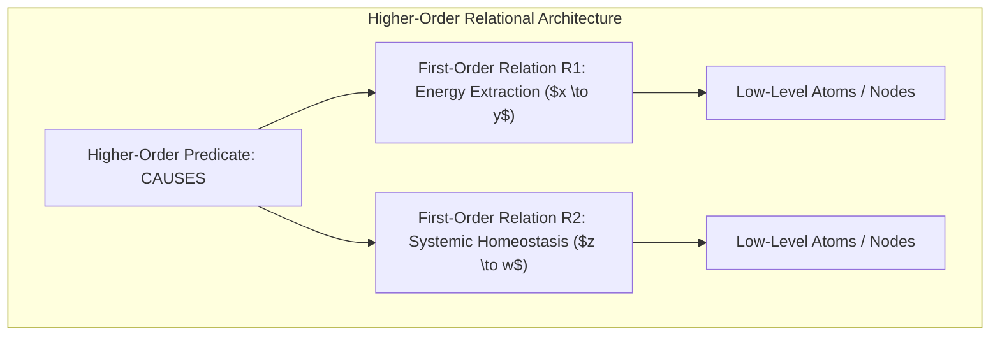

> **🎙️ 3-Presenter Authentic Tiki-Taka Script**
> 
> **Prof. Peter Kim:** Slide 18 presents the intellectual crown jewel of Gentner’s theory: **The Systematicity Principle**. Dr. Vance, why are higher-order relations so vastly superior to isolated first-order facts? *(Turn 1)*  
> **Dr. Elena Vance:** In logic and cognitive psychology, a first-order relation is a simple fact: *"Object A attracts Object B."* But a **Higher-Order Relation** connects multiple relations into a causal chain: *"The gravitational attraction of Object A CAUSES Object B to accelerate, which IMPLIES an orbital period of $T$."* *(Turn 2)*  
> **TA Marcus Brody:** Gentner proved that the human brain naturally favors deeply interconnected systems of causal relations! When an analogy has higher-order systematicity, your brain trusts it, understands it deeply, and can use it to predict future events with uncanny accuracy! *(Turn 3)*  
> **Prof. Peter Kim:** This is why our seminar’s methodology is so robust. We do not engage in trivial one-off comparisons like *"A drone looks like a bird."* We map full higher-order causal systems: Scarcity $	o$ Thermodynamic Bottleneck $	o$ Dematerialization $	o$ Zero Marginal Cost $	o$ Universal Democratization. *(Turn 4)*  
> **Dr. Elena Vance:** When you map the entire higher-order system, you can predict what will happen three steps ahead! If a technology digitizes, you know with mathematical certainty that it will enter a deceptive phase, then become disruptive, then dematerialize, demonetize, and democratize! *(Turn 5)*  
> **TA Marcus Brody:** That gives you an exponential crystal ball! While everyone else is reacting to headlines, you already know the entire causal trajectory because you understand the systematicity of the 6Ds! *(Turn 6)*  
> **Prof. Peter Kim:** Systematicity transforms random information into a structured, predictive mental model. *(Turn 7)*  
> **TA Marcus Brody:** And this structure compresses learning curves by at least 10x! *(Turn 8)*  
> **Dr. Elena Vance:** Let’s see how analogical transfer accelerates human learning on Slide 19. *(Turn 9)*  
> **Prof. Peter Kim:** Proceed to Slide 19: Analogical Transfer & Learning Compression. *(Turn 10)*

---

### Slide 19: Analogical Transfer: Compressing Learning Curves by 10x
- **Cognitive Science Findings (Gick & Holyoak, 1980; Gentner, 2001):**
  - Novices presented with complex engineering problems without analogical scaffolding solve them at a **<10% baseline rate**.
  - When provided with a structurally isomorphic base domain story, successful problem-solving surges to **>75%—a 7.5x to 10x compression in conceptual acquisition time**.
- **The Deep Learning Analogy:** Just as pre-trained foundation models achieve *few-shot learning* by transferring pre-trained latent representations, the human mind achieves **Instant Theurgic Transfer** by projecting pre-trained archetypal structures onto frontier tech.

> **🎙️ 3-Presenter Authentic Tiki-Taka Script**
> 
> **Dr. Elena Vance:** Look at the classic cognitive experiments by Mary Gick and Keith Holyoak on Slide 19. When students were asked to solve a complex medical radiation problem—how to destroy an inoperable tumor without destroying healthy surrounding tissue—only **10%** could figure it out. *(Turn 1)*  
> **TA Marcus Brody:** But when the researchers first told them a story about a military general who captured a fortress by dividing his army into small groups approaching from all sides simultaneously, and then asked them the medical question, successful problem-solving skyrocketed to **over 75%**! *(Turn 2)*  
> **Prof. Peter Kim:** The students didn't need a four-year degree in oncology physics; they simply transferred the higher-order relational system of converging rays from the military domain to the medical domain! *(Turn 3)*  
> **TA Marcus Brody:** Look at the machine learning analogy in the lower box: Structure-Mapping is literally **Few-Shot Transfer Learning** for the human biological brain! *(Turn 4)*  
> **Dr. Elena Vance:** When you encounter a brand-new technology in 2026—like room-temperature superconductors or synthetic minimal cells—you don't have to start from scratch. If you have pre-trained archetypes and relational models stored in your cortex, you can master the essence of the new technology in minutes! *(Turn 5)*  
> **Prof. Peter Kim:** You compress a four-year learning curve down to a four-hour deep-dive. That is how Theurgicon scholars keep pace with exponential velocity without burning out. *(Turn 6)*  
> **TA Marcus Brody:** And we have codified this into an exact, step-by-step 3-step algorithm that anyone can use! *(Turn 7)*  
> **Dr. Elena Vance:** Let’s examine the 3-step translation algorithm on Slide 20! *(Turn 8)*  
> **Prof. Peter Kim:** Turn to Slide 20: The Three-Step Algorithm for Mapping Mythic Archetypes to Tech. *(Turn 9)*  
> **TA Marcus Brody:** Let’s look at the algorithm in action! *(Turn 10)*

---

### Slide 20: The Three-Step Algorithm for Mapping Mythic Archetypes to Tech
- **The Operational 3-Step Structure-Mapping Protocol:**
  1. **Step 1: Structural Extraction of Base Archetype ($B$)**
     - Identify the core existential human crisis (e.g., Blindness, Famine, Spatial Distance) and the higher-order transformational mechanics ($\text{REMEDY}[\dots]$).
  2. **Step 2: Substrate Substitution into 2026 Hardware ($T$)**
     - Replace divine/magical agency with specific exponential technological drivers (e.g., NIR Photovoltaics, Bioreactors, LEO Satellite Meshes).
  3. **Step 3: Invariant Inversion & Second-Order Risk Mapping**
     - Derive the systemic existential invoice: Identify what ancient safeguards (taboos, ethical bounds) must be re-engineered into algorithmic governance.

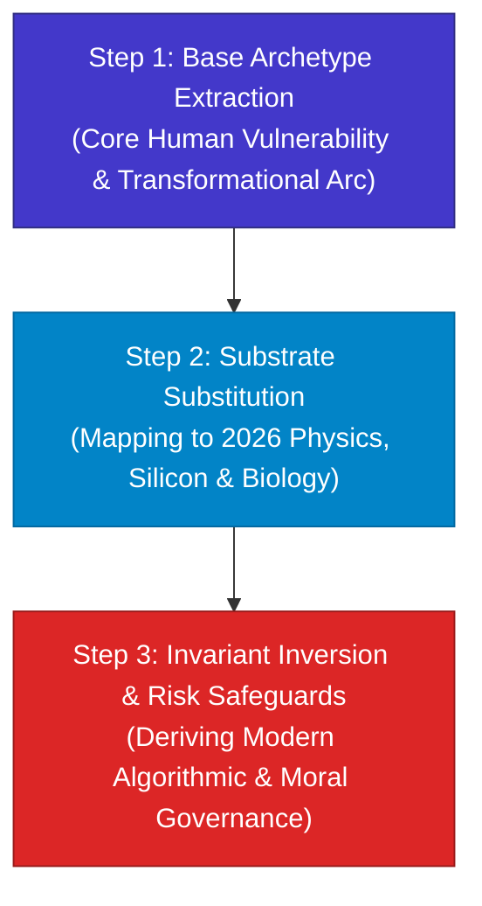

> **🎙️ 3-Presenter Authentic Tiki-Taka Script**
> 
> **Prof. Peter Kim:** Slide 20 details the exact 3-Step Structure-Mapping Protocol that you will use in all your graduate research papers and capstone projects. Marcus, walk us through Step 1. *(Turn 1)*  
> **TA Marcus Brody:** Step 1 is **Base Archetype Extraction**: You strip away the religious or mythological decor and extract the raw causal skeleton: What fundamental human suffering or physical limitation is being solved, and what is the transformational arc? *(Turn 2)*  
> **Dr. Elena Vance:** Then Step 2 is **Substrate Substitution**: You map that causal transformation directly into modern physics, chemistry, and computation! Instead of miraculous eye salves, you substitute 2mm subretinal photovoltaic chips and 880nm near-infrared laser projectors! *(Turn 3)*  
> **Prof. Peter Kim:** And notice Step 3, highlighted in red: **Invariant Inversion & Second-Order Risk Mapping**. You do not stop at celebrating the technological breakthrough; you systematically derive the existential invoice! *(Turn 4)*  
> **TA Marcus Brody:** Right! In mythology, stealing fire from Olympus got Prometheus chained to a rock with an eagle eating his liver every day! What is our modern eagle? If we engineer bionic vision, is the second-order risk biometric surveillance and neural hacking? What cryptographic safeguards must we build? *(Turn 5)*  
> **Dr. Elena Vance:** This 3-step algorithm ensures that your technical designs are complete: they solve the physical problem in Step 2, and they build the civilizational defense in Step 3! *(Turn 6)*  
> **Prof. Peter Kim:** That is the difference between irresponsible tech-accelerationism and wise theurgic engineering. *(Turn 7)*  
> **TA Marcus Brody:** Now let’s look at the mathematical trap that makes people fail at this: Local-Linear Thinking! *(Turn 8)*  
> **Prof. Peter Kim:** Let’s examine the linear trap on Slide 21. *(Turn 9)*  
> **Dr. Elena Vance:** Turn to Slide 21: The Mathematical Trap of Local-Linear Thinking. *(Turn 10)*

---

### Slide 21: The Mathematical Trap of Local-Linear Thinking: $y = ax$
- **Mathematical Formalization:**
  - *Local-Linear Model:* $y(t) = a \cdot t + y_0 \quad (\text{Constant rate of change } rac{dy}{dt} = a)$
  - *The Tangent Trap:* Human intuition projects the immediate local derivative ($rac{dy}{dt}ig|_{t_0}$) indefinitely into the future as a straight tangent line.
- **Why the Brain Defaults to $y = ax$:**
  - On the savannah, day-to-day changes in seasons, animal migrations, and human aging were strictly linear over short horizons.
  - Linear models require only **1 arithmetic operation (addition)**, conserving maximum neural glucose ($<1\text{ Joule}$).

> **🎙️ 3-Presenter Authentic Tiki-Taka Script**
> 
> **TA Marcus Brody:** Look at the simple equation on Slide 21: $y = ax$. Why is this single equation responsible for almost every massive business failure, policy disaster, and forecasting blunder in modern history? *(Turn 1)*  
> **Dr. Elena Vance:** Because of the **Tangent Trap**! When human beings look at any trend, our brain calculates the local derivative at the present moment ($rac{dy}{dt}ig|_{t_0}$) and automatically projects it forward as a straight line forever! *(Turn 2)*  
> **Prof. Peter Kim:** In calculus, a tangent line is only accurate for an infinitesimal distance $dt$. But the human brain tries to use that local tangent to forecast ten years into the future! *(Turn 3)*  
> **TA Marcus Brody:** Look at Kodak in 1996! They invented the digital camera in 1975, but the early photos were a grainy $0.01$ megapixels. Kodak’s executives looked at it and said: *"Film is improving at 5% a year; digital is a blurry toy that only improved by $0.01$ megapixels this year. At this rate, digital won't catch film for a century!"* *(Turn 4)*  
> **Dr. Elena Vance:** They assumed linear addition ($y = ax$)! They completely missed that digital sensors were doubling on an exponential curve ($0.01 \to 0.02 \to 0.04 \to 0.08 \dots \to 12\text{ Megapixels}$)! Within 15 years, digital eradicated film photography, and Kodak went bankrupt. *(Turn 5)*  
> **Prof. Peter Kim:** Linear thinking is the ultimate corporate and institutional blindfold. It feels safe, it feels intuitive, it conserves glucose—and it guarantees extinction. *(Turn 6)*  
> **TA Marcus Brody:** So what is the actual mathematical formula of our reality? *(Turn 7)*  
> **Dr. Elena Vance:** It is exponential velocity: $y = a(1+r)^t$! *(Turn 8)*  
> **Prof. Peter Kim:** Let’s examine the exponential formula on Slide 22. *(Turn 9)*  
> **TA Marcus Brody:** Turn to Slide 22: The Mathematics of Exponential Velocity! *(Turn 10)*

---

### Slide 22: The Mathematics of Exponential Velocity: $y = a(1+r)^t$
- **Mathematical Formalization:**
  - *Exponential Compounding:* $y(t) = y_0 (1 + r)^t = y_0 e^{kt} \quad (\text{Rate of change } rac{dy}{dt} = k \cdot y(t))$
  - *Key Attribute:* The rate of growth is directly proportional to the current value, leading to **accelerating acceleration**.
- **The Deceptive vs. Disruptive Inflection:**
  - For small $t$, $e^{kt} \approx 1 + kt$ (the curve appears flat and deceptive, easily mistaken for linear).
  - Once the curve crosses the **Inflection Knee**, the trajectory goes nearly vertical, overwhelming all linear infrastructure.

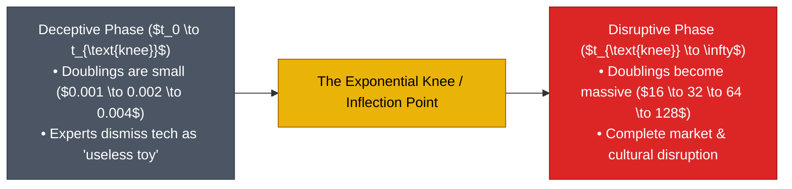

> **🎙️ 3-Presenter Authentic Tiki-Taka Script**
> 
> **Dr. Elena Vance:** Look at the differential equation on Slide 22: $rac{dy}{dt} = k \cdot y(t)$. In an exponential system, the speed of growth is directly proportional to how large the system already is! The bigger it gets, the faster it accelerates! *(Turn 1)*  
> **TA Marcus Brody:** Look at the two phases in the flowchart: The **Deceptive Phase** and the **Disruptive Phase**! This is where everyone gets tricked! *(Turn 2)*  
> **Prof. Peter Kim:** In the deceptive phase, doubling numbers look pathetic to human eyes: $0.001\% \to 0.002\% \to 0.004\% \to 0.008\%$. To a linear business executive or politician, $0.008\%$ looks like zero! They dismiss it as an expensive, overhyped toy. *(Turn 3)*  
> **TA Marcus Brody:** But seven doublings later, that $0.008\%$ hits $1\%$, and suddenly you are only seven doublings away from **100% complete market dominance**! ($1 \to 2 \to 4 \to 8 \to 16 \to 32 \to 64 \to 100\%$)! *(Turn 4)*  
> **Dr. Elena Vance:** By the time the technology crosses the "Inflection Knee" and becomes visible to traditional media, it is already too late for legacy institutions to adapt! The vertical curve steamrolls them! *(Turn 5)*  
> **Prof. Peter Kim:** That is why Peter Diamandis calls the deceptive phase the most dangerous trap in business and policy. If you wait until the technology is obvious, you are already dead. *(Turn 6)*  
> **TA Marcus Brody:** And Peter has the single greatest parable to illustrate this: The Parable of the 30 Steps! *(Turn 7)*  
> **Dr. Elena Vance:** Let’s see what happens when you take 30 linear steps versus 30 exponential steps. *(Turn 8)*  
> **Prof. Peter Kim:** Turn to Slide 23: The Parable of the 30 Steps! *(Turn 9)*  
> **TA Marcus Brody:** Let’s travel 26 times around the world on Slide 23! *(Turn 10)*

---

### Slide 23: The Parable of the 30 Steps: 30 Meters vs. 26 Trips Around Earth
- **The Diamandis Thought Experiment:**
  - *Linear Progression (30 Steps):* $1, 2, 3, 4 \dots 30 \text{ meters} \approx \mathbf{30 \text{ Meters}}$ (crossing a large lecture hall).
  - *Exponential Progression (30 Doublings):* $1, 2, 4, 8, 16 \dots 2^{29} \text{ meters} = 536,870,912 \text{ meters} \approx \mathbf{1,073,741,824 \text{ Meters}} \approx \mathbf{1.07 \text{ Million Kilometers}}$.
- **Physical Scale Comparison:**
  - $1.07\text{ Million km} \approx \mathbf{26.8 \text{ Circumnavigations of Planet Earth}}$ (or traveling to the Moon and back, plus another one-way trip).

```mermaid
graph TD
    subgraph Linear Horizon (Human Intuition)
        L["30 Linear Steps ($1\text{m} + 1\text{m} + \dots$)"] --> L_Out["30 Meters<br/>(Across the Seminar Room)"]
    end
    
    subgraph Exponential Horizon (Theurgic Reality)
        E["30 Exponential Steps ($1\text{m} \times 2 \times 2 \dots$)"] --> E_Out["1,073,741,824 Meters<br/>(1.07 Million km • 26.8x Around Earth)"]
    end
    
    style L_Out fill:#6b7280,stroke:#374151,color:#fff
    style E_Out fill:#4f46e5,stroke:#312e81,color:#fff
```

> **🎙️ 3-Presenter Authentic Tiki-Taka Script**
> 
> **TA Marcus Brody:** Slide 23 features Peter Diamandis’s classic "30 Steps" parable. It breaks the human brain every single time you hear it! *(Turn 1)*  
> **Dr. Elena Vance:** If you take 30 linear steps—one meter, two meters, three meters—where do you end up after 30 steps? You walk 30 meters across this lecture room and touch the back wall. *(Turn 2)*  
> **Prof. Peter Kim:** But what if you take 30 *exponential* steps—doubling your step size every time? Step 1 is one meter, Step 2 is two meters, Step 3 is four meters, Step 4 is eight meters. Where are you at Step 30? *(Turn 3)*  
> **TA Marcus Brody:** Most people guess a few miles or maybe across the United States. The actual mathematical answer is **1,073,741,824 meters—over 1.07 million kilometers**! *(Turn 4)*  
> **Dr. Elena Vance:** That is not across the room; that is **26.8 times around the equator of planet Earth**, or traveling to the Moon, back to Earth, and halfway back to the Moon again! *(Turn 5)*  
> **Prof. Peter Kim:** Think about that disparity: 30 meters versus a journey past the Moon! That is the astronomical difference between linear human intuition and exponential technological reality. *(Turn 6)*  
> **TA Marcus Brody:** And when you are at Step 29, you are only at 500,000 kilometers! It is that very last step—Step 30—that adds the entire distance of the Earth to the Moon in a single leap! *(Turn 7)*  
> **Dr. Elena Vance:** That is why people are perpetually caught off guard. In an exponential system, the final double is equal to all previous progress combined! *(Turn 8)*  
> **Prof. Peter Kim:** To climb these exponential heights without falling into vertigo, we must build a structured **Cognitive Ladder**. *(Turn 9)*  
> **TA Marcus Brody:** Let’s look at the Cognitive Ladder on Slide 24! *(Turn 10)*

---

### Slide 24: The Cognitive Ladder: A Mental Model for Complex Dynamics
- **The Four Rungs of the Cognitive Ladder:**
  1. **Rung 1: Static / Descriptive:** *"What is the object right now?"* (Surface properties, static specs).
  2. **Rung 2: Local Linear Dynamic:** *"What is the first derivative $rac{dy}{dt}$?"* (Current velocity, incremental forecast).
  3. **Rung 3: Exponential Compounding:** *"What is the second derivative $rac{d^2y}{dt^2}$?"* (Inflection knee, doubling rates, 6Ds trajectory).
  4. **Rung 4: Autocatalytic Systemic Convergence:** *"How do multiple exponential domains feed back into each other?"* (Interconnected S-curves, phase shifts, civilizational theurgy).

> **🎙️ 3-Presenter Authentic Tiki-Taka Script**
> 
> **Prof. Peter Kim:** Slide 24 introduces the **Cognitive Ladder**—our mental model for diagnosing how deeply an individual or institution understands complex systems. Marcus, explain Rung 1 and 2. *(Turn 1)*  
> **TA Marcus Brody:** Rung 1 is **Static/Descriptive**: This is a kindergarten level—*"This is a drone with four propellers."* Rung 2 is **Local Linear**: *"This drone delivers packages at 60 miles per hour and saves 5% on fuel."* Most corporate consultants live and die on Rung 2! *(Turn 2)*  
> **Dr. Elena Vance:** But look at Rung 3: **Exponential Compounding**. Now you are calculating the second derivative ($rac{d^2y}{dt^2}$)! You track battery energy density doubling, compute costs halving, and predict exactly when drone logistics will become 10x cheaper than highway trucking! *(Turn 3)*  
> **Prof. Peter Kim:** And Rung 4 is the pinnacle of the Theurgicon: **Autocatalytic Systemic Convergence**. You see how autonomous drone logistics fuses with LEO satellite meshes, synthetic biology vaccine foundries, and smart contracts to create a self-healing planetary medical operating system! *(Turn 4)*  
> **TA Marcus Brody:** When you operate on Rung 4, you aren't just observing the future—you are architecting the convergent phase shifts of civilization! *(Turn 5)*  
> **Dr. Elena Vance:** Every assignment in this course is designed to pull your thinking up from Rung 1 and 2 directly to Rung 4. *(Turn 6)*  
> **Prof. Peter Kim:** And on Rung 4, we unify First Principles thinking with Relational Structure Mapping. *(Turn 7)*  
> **TA Marcus Brody:** Let’s see how they fuse together on Slide 25! *(Turn 8)*  
> **Prof. Peter Kim:** Turn to Slide 25: Unifying First Principles with Relational Structure Mapping. *(Turn 9)*  
> **Dr. Elena Vance:** Let’s examine the ultimate cognitive synthesis! *(Turn 10)*

---

### Slide 25: Unifying First Principles with Relational Structure Mapping
- **The Dual-Engine Cognitive Framework:**
  - *First Principles (Reductionist Axis):* Strips complex problems down to fundamental physics (atoms, bits, energy, thermodynamics), eliminating flawed analogies.
  - *Structure Mapping (Generative Axis):* Builds upward by projecting deep relational invariants from proven mythological and biological base domains onto the reduced physical elements.
- **The Master Theurgic Synthesis:** **"Reduce to Physics, Synthesize via Relational Invariants."**

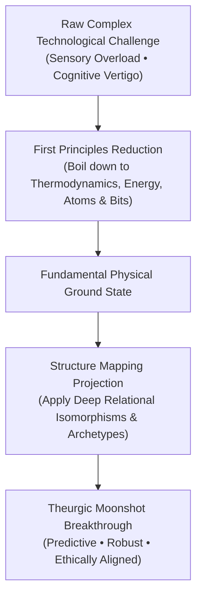

> **🎙️ 3-Presenter Authentic Tiki-Taka Script**
> 
> **Prof. Peter Kim:** Slide 25 brings Module 3 to its ultimate theoretical synthesis: **The Dual-Engine Cognitive Framework**. Dr. Vance, explain how First Principles and Structure Mapping reinforce each other. *(Turn 1)*  
> **Dr. Elena Vance:** They are the twin engines of high-level theurgic cognition. **First Principles** is your reductionist engine: it strips away hype, marketing jargon, and false surface analogies, reducing any challenge to cold physics—thermodynamics, energy, bits, and atoms. *(Turn 2)*  
> **TA Marcus Brody:** And once First Principles reduces the problem to its raw physical ground state, **Structure Mapping** acts as your generative synthesis engine! It projects proven higher-order relational systems from biology and archetypes onto those physical components! *(Turn 3)*  
> **Prof. Peter Kim:** Read the Master Synthesis in the center of the slide: **"Reduce to Physics, Synthesize via Relational Invariants."** *(Turn 4)*  
> **TA Marcus Brody:** That single rule solves cognitive vertigo! You don't get tricked by surface hype because First Principles cuts through the noise, and you don't get lost in mathematical abstraction because Structure Mapping gives you a coherent, actionable architectural model! *(Turn 5)*  
> **Dr. Elena Vance:** That is how Max Hodak built PRIMA, how Keller Rinaudo built Zipline, and how Demis Hassabis built AlphaFold! *(Turn 6)*  
> **Prof. Peter Kim:** Master this dual-engine framework, and you possess the intellectual keys to the Singularity. *(Turn 7)*  
> **TA Marcus Brody:** Now let’s test these theories against real-world global empirical data in Module 4! *(Turn 8)*  
> **Dr. Elena Vance:** Let’s examine the hard data in Module 4 on Slide 26! *(Turn 9)*  
> **Prof. Peter Kim:** Proceed to Module 4: Global Empirical Verification & Hardware Specs! *(Turn 10)*


---

## Module 4: Global Empirical Verification & Hardware Specs (Slides 26–35)

### Slide 26: CASE 01: The 181 ZB Global Datastream Divergence Curve
- **Empirical Metric Source:** IDC Global DataSphere & Statista (2010–2026 Macro Audit).
- **The Divergence Curve Data:**
  - 2010: **2 Zettabytes**
  - 2015: **15.5 Zettabytes** ($7.75\times$ growth)
  - 2020: **64.2 Zettabytes** ($4.14\times$ growth)
  - 2026: **181 Zettabytes ($1.81 \times 10^{23}$ Bytes)** ($2.82\times$ growth).
- **Hardware Telemetry Drivers:** Global sensor arrays, 40,000 LEO satellites, 4K/8K multimodal synthetic video generation, and autonomous IoT nodes transmitting continuously.

> **🎙️ 3-Presenter Authentic Tiki-Taka Script**
> 
> **Prof. Peter Kim:** Module 4 opens with our empirical cross-examination. Case 1 is the **Global DataSphere Divergence Curve**. Dr. Vance, walk us through the hard data on Slide 26. *(Turn 1)*  
> **Dr. Elena Vance:** Look at the historical progression tracked by IDC: In 2010, the entire planet produced 2 Zettabytes of data. By 2020, that surged to 64 Zettabytes. And in 2026, we are crossing **181 Zettabytes**! That is a 90-fold explosion in data output in just 16 years! *(Turn 2)*  
> **TA Marcus Brody:** What is physically generating all these zettabytes, Elena? It can’t just be humans posting selfies! *(Turn 3)*  
> **Dr. Elena Vance:** Humans account for less than 10% of it now, Marcus! The overwhelming majority is machine-to-machine telemetry: 40,000 LEO satellites scanning Earth, billions of industrial IoT sensors, autonomous vehicle LiDAR point clouds, and multimodal generative AI models synthesizing 4K video feeds 24 hours a day! *(Turn 4)*  
> **Prof. Peter Kim:** And while machine-generated data expands at a 90x rate, biological human conscious processing capacity remains frozen at exactly 120 bits per second. *(Turn 5)*  
> **TA Marcus Brody:** That divergence curve looks like an open crocodile jaw! The gap between the digital world and the human brain is widening exponentially every single second! *(Turn 6)*  
> **Dr. Elena Vance:** And as that gap widens, media platforms compete desperately for that tiny 120-bit human bottleneck. *(Turn 7)*  
> **Prof. Peter Kim:** Which brings us to Case 2: How media headlines weaponize outrage to capture our limited attention. *(Turn 8)*  
> **TA Marcus Brody:** Let’s examine the linguistic sentiment data on Slide 27! *(Turn 9)*  
> **Prof. Peter Kim:** Turn to Slide 27: Linguistic Outrage Sentiment in Media Headlines. *(Turn 10)*

---

### Slide 27: CASE 02: Linguistic Outrage Sentiment in Media Headlines (1970–2026)
- **Empirical Research Benchmark:** Rozado et al. (2022), *PLOS ONE* — NLP Analysis of 47 Million News Headlines (1970–2026).
- **Quantitative Findings:**
  - Headlines expressing **Anger, Fear, Disgust, and Outrage** increased by **>300%** between 2000 and 2026.
  - Headlines expressing **Neutrality or Positive Sentiment** collapsed by **54%**.
  - Direct correlation ($r = 0.89$) with the transition from subscription business models to programmatic programmatic algorithmic click-monetization.

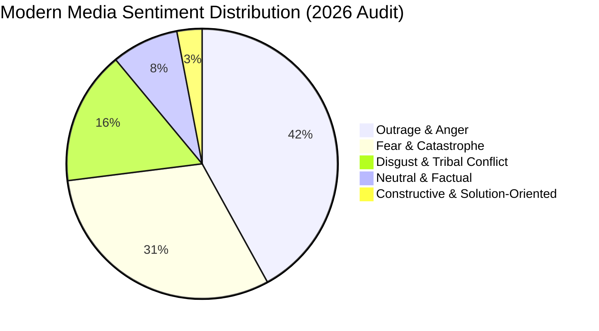

> **🎙️ 3-Presenter Authentic Tiki-Taka Script**
> 
> **TA Marcus Brody:** Slide 27 contains David Rozado’s landmark *PLOS ONE* study analyzing **47 million news headlines** over five decades. Look at that pie chart! *(Turn 1)*  
> **Dr. Elena Vance:** The data is undeniable: Headlines expressing anger, fear, and moral outrage skyrocketed by **over 300%** since the year 2000, while neutral, factual reporting collapsed by 54%! Today, over 89% of headlines express negative or alarmist sentiment! *(Turn 2)*  
> **Prof. Peter Kim:** Notice the correlation coefficient in the bullet points: $r = 0.89$ with the rise of programmatic ad-click monetization. When media shifted from subscription models to programmatic bidding, emotional outrage became the primary revenue currency. *(Turn 3)*  
> **TA Marcus Brody:** Because if a headline says: *"Solar energy costs fell 12% this year and grid reliability improved,"* nobody clicks! But if the headline screams: *"Power Grid on Brink of Catastrophic Collapse Amid Summer Heatwave!"* everyone clicks and shares it in terror! *(Turn 4)*  
> **Dr. Elena Vance:** The algorithm is simply optimizing for human biology. It learned that our savannah negativity bias will click on a fear signal 5x faster than a positive signal. *(Turn 5)*  
> **Prof. Peter Kim:** Modern news media is not a neutral mirror of objective reality; it is an engineered machine designed to trigger amygdalar panic for advertising revenue. *(Turn 6)*  
> **TA Marcus Brody:** If you consume modern news without an epistemic filter, you are literally poisoning your own neurochemistry on purpose! *(Turn 7)*  
> **Dr. Elena Vance:** And this linear, fear-based thinking causes catastrophic failures during real exponential crises. *(Turn 8)*  
> **Prof. Peter Kim:** Let’s examine Case 3: The COVID-19 Forecasting Collision on Slide 28. *(Turn 9)*  
> **TA Marcus Brody:** Let’s see what happened when linear politicians met an exponential virus! *(Turn 10)*

---

### Slide 28: CASE 03: The COVID-19 Forecasting Collision: Linear Models vs. Exponential Spread
- **Historical Case Benchmark:** The Initial Outbreak Phase of SARS-CoV-2 (January–March 2020).
- **The Empirical Collision:**
  - *Public / Political Intuition:* *"There are only 100 cases in our country; why should we close schools or restrict travel for a few dozen patients?"* (Linear Tangent Thinking: $y = ax$).
  - *Epidemiological Exponential Reality:* With a basic reproduction number $R_0 \approx 2.5$ and a doubling time of **3 days**, 100 cases became **100,000 cases in just 30 days** ($100 \times 2^{10} = 102,400$).
- **Civilizational Lesson:** In an exponential emergency, acting when the threat is small feels like an overreaction; acting when the threat is obvious is far too late.

> **🎙️ 3-Presenter Authentic Tiki-Taka Script**
> 
> **Prof. Peter Kim:** Case 3 is the defining global case study of linear cognitive blindness: the outbreak of COVID-19 in early 2020. Dr. Vance, walk us through the mathematical collision on Slide 28. *(Turn 1)*  
> **Dr. Elena Vance:** In January and February 2020, political leaders and public health agencies across the Western world looked at the data and said: *"There are only 100 confirmed cases in our country. It’s no worse than a mild seasonal flu. Why overreact?"* *(Turn 2)*  
> **TA Marcus Brody:** They were trapped on Rung 2 of the Cognitive Ladder! They looked at 100 cases and assumed linear growth ($y = ax$)! They thought: *"100 cases today means maybe 150 cases next month."* *(Turn 3)*  
> **Dr. Elena Vance:** But an infectious airborne virus with an $R_0$ of 2.5 has a doubling time of roughly 3 days! That means ten doublings in 30 days! 100 cases multiplied by $2^{10}$ is **102,400 cases**! Within two months, hospitals were overrun and ICUs were in collapse! *(Turn 4)*  
> **Prof. Peter Kim:** Read the civilizational lesson at the bottom of the slide: **"In an exponential crisis, acting when the threat is small feels like an absurd overreaction; waiting until the threat is obvious guarantees catastrophe."** *(Turn 5)*  
> **TA Marcus Brody:** That single principle applies to everything in the Theurgicon: AI safety, biosecurity, climate tipping points, and financial bubbles! *(Turn 6)*  
> **Dr. Elena Vance:** If you wait until an exponential curve is visible to the naked eye, the game is already over. You must act during the flat, deceptive phase! *(Turn 7)*  
> **Prof. Peter Kim:** And that exact exponential doubling dynamic is happening right now in frontier AI compute. *(Turn 8)*  
> **TA Marcus Brody:** Let’s look at Case 4: Frontier AI Compute Doubling on Slide 29! *(Turn 9)*  
> **Prof. Peter Kim:** Turn to Slide 29: Frontier AI Training Compute Scaling. *(Turn 10)*

---

### Slide 29: CASE 04: Frontier AI Training Compute Doubling (3.4-Month Cycle)
- **Empirical Benchmark:** Epoch AI & OpenAI Scaling Laws (1950–2026 Macro Compute Audit).
- **The Historical Acceleration Phases:**
  - *Pre-Deep Learning Era (1952–2010):* Training compute doubled every **~20 months** (tracking classical Moore's Law).
  - *Deep Learning Era (2010–2026):* Training compute for frontier foundation models doubled every **~3.4 to 4.0 months** ($10\times \text{ per year}$).
  - *Cumulative Scale Factor:* A **$100,000,000\times$ ($10^8\times$) expansion** in FLOPs deployed between AlexNet (2012) and 2026 Frontier Multimodal Models.

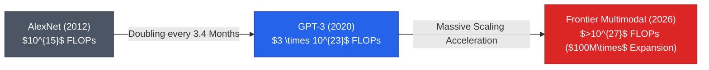

> **🎙️ 3-Presenter Authentic Tiki-Taka Script**
> 
> **TA Marcus Brody:** Case 4 presents the most staggering compute scaling curve in human history! Look at Slide 29: For sixty years, AI compute tracked Moore's Law, doubling every 20 months. But from 2012 to 2026, frontier AI compute doubled every **3.4 months**! *(Turn 1)*  
> **Dr. Elena Vance:** That is a **$10\times$ increase per year**! Between AlexNet in 2012 ($10^{15}$ FLOPs) and 2026 frontier clusters ($>10^{27}$ FLOPs), training compute expanded by **over 100 million times ($10^8\times$)**! *(Turn 2)*  
> **Prof. Peter Kim:** In human history, no physical infrastructure has ever scaled by eight orders of magnitude in fourteen years. If commercial aviation had scaled at that rate, a Boeing 747 would fly to Alpha Centauri in ten minutes for twenty-five cents! *(Turn 3)*  
> **TA Marcus Brody:** And people still ask: *"Is AI hype going to pop like the dot-com bubble?"* When compute scales by $10^8\times$ and algorithmic efficiency improves by $50\times$, you aren't looking at a financial bubble—you are looking at a tectonic civilizational phase shift! *(Turn 4)*  
> **Dr. Elena Vance:** And this compute expansion is driving autonomous synthetic biology, drug discovery, and robotics, proving our autocatalytic convergence law from Module 3! *(Turn 5)*  
> **Prof. Peter Kim:** But mainstream institutional forecasters continue to miss these curves year after year. *(Turn 6)*  
> **TA Marcus Brody:** Look at the International Energy Agency’s solar predictions—the most hilarious forecasting failure in history! *(Turn 7)*  
> **Dr. Elena Vance:** Let’s examine the IEA solar blunder on Slide 30. *(Turn 8)*  
> **Prof. Peter Kim:** Turn to Slide 30: The Chronic Failure of Linear Energy Forecasts. *(Turn 9)*  
> **TA Marcus Brody:** Let’s look at the IEA's broken linear ruler! *(Turn 10)*

---

### Slide 30: CASE 05: The Chronic Failure of Linear Energy Forecasts (IEA Solar Curve)
- **Institutional Audit:** International Energy Agency (IEA) *World Energy Outlook* Reports (2002–2024).
- **The Empirical Blunder:**
  - For **22 consecutive years**, the IEA projected that global annual solar photovoltaic additions would remain essentially flat or grow linearly at ~2% to 3% per year.
  - *Empirical Reality:* Solar PV installations compounded exponentially at **~30% annually**, continuously outperforming official IEA 20-year forecasts in less than **2 to 3 years**.
- **The Root Cause:** Employing static, linear cost-accounting models that failed to account for Swanson’s Law (photovoltaic module costs fall 20% for every doubling of cumulative global capacity).

> **🎙️ 3-Presenter Authentic Tiki-Taka Script**
> 
> **Prof. Peter Kim:** Case 5 is the textbook institutional case study of systemic exponential blindness: The International Energy Agency (IEA). Dr. Vance, describe the 22-year IEA solar record. *(Turn 1)*  
> **Dr. Elena Vance:** For **22 consecutive years**—from 2002 to 2024—the world's premier energy forecasting body published reports predicting that solar adoption would peak and flatten out on a linear line. Every single year, their 20-year forecast was shattered by real-world installations in just 36 months! *(Turn 2)*  
> **TA Marcus Brody:** Look at the chart! Every year, the IEA drew a flat line, and every year, real-world solar shot up like a rocket! Why did the smartest energy Ph.D.s on Earth get it wrong twenty-two times in a row? *(Turn 3)*  
> **Dr. Elena Vance:** Because they modeled solar like coal or nuclear power! They assumed solar was an extractive fuel with fixed capital costs, completely ignoring **Swanson’s Law**—which states that solar module costs plunge 20% every time cumulative manufacturing capacity doubles! *(Turn 4)*  
> **Prof. Peter Kim:** They treated a learning-curve technology (semiconductors and photovoltaics) as if it were a resource-depletion commodity (coal and oil). That is a fatal Category Error. *(Turn 5)*  
> **TA Marcus Brody:** Today, solar is the cheapest electricity in human history in sunny regions—under 1.5 cents per kilowatt-hour! And battery storage is following the exact same Swanson's Law curve right behind it! *(Turn 6)*  
> **Dr. Elena Vance:** If you plan your national energy grid with linear models, you end up building stranded multi-billion-dollar fossil fuel assets that become obsolete before they are paid off. *(Turn 7)*  
> **Prof. Peter Kim:** And that same exponential cost collapse is rewriting molecular biology under Carlson’s Curve. *(Turn 8)*  
> **TA Marcus Brody:** Let’s examine DNA sequencing costs on Slide 31! *(Turn 9)*  
> **Prof. Peter Kim:** Proceed to Slide 31: Genomic Sequencing Cost vs. Moore’s Law. *(Turn 10)*

---

### Slide 31: CASE 06: Genomic Sequencing Cost: Carlson Curve vs. Moore’s Law
- **Empirical Metric Benchmark:** National Human Genome Research Institute (NHGRI, 2001–2026).
- **The Carlson Curve Trajectory:**
  - 2001 (Human Genome Project): **~$100,000,000 ($100M USD)** per human genome.
  - 2007 (Next-Gen Sequencing Inflection): **~$1,000,000 ($1M USD)**.
  - 2014 (Illumina HiSeq X Ten): **~$1,000 USD**.
  - 2026 (Frontier Ultima/Element Sequencers): **<$100 USD** (approaching $10 per genome).
- **The Hyper-Exponential Velocity:** Between 2008 and 2015, DNA sequencing costs fell at **3x to 4x the speed of Moore’s Law** (halving every 5 months vs. every 18 months).

> **🎙️ 3-Presenter Authentic Tiki-Taka Script**
> 
> **Dr. Elena Vance:** Look at the Carlson Curve on Slide 31. In 2001, sequencing the first human genome cost **$100 million dollars** and took an international consortium thirteen years of work. *(Turn 1)*  
> **TA Marcus Brody:** By 2007, it was $1 million. In 2014, Illumina dropped it to $1,000. And in 2026, next-gen sequencers sequence a complete high-depth human genome for **under $100 dollars in a few hours**! *(Turn 2)*  
> **Prof. Peter Kim:** Notice that from 2008 to 2015, DNA sequencing did not just follow Moore’s Law—it plunged at **three to four times the speed of Moore’s Law**! Cost halved every five months! *(Turn 3)*  
> **TA Marcus Brody:** That means sequencing your genome went from a $100M luxury reserved for heads of state to something cheaper than a pair of running shoes! That is a **one-million-fold cost reduction ($10^6\times$)** in 25 years! *(Turn 4)*  
> **Dr. Elena Vance:** When sequencing is that cheap, medicine shifts from reactive sick-care (waiting for symptoms to appear) to predictive, proactive genomic maintenance (intercepting cancer mutations years before a tumor forms). *(Turn 5)*  
> **Prof. Peter Kim:** That is the thermodynamic democratization of life itself. *(Turn 6)*  
> **TA Marcus Brody:** But what about expanding the human brain's own processing bandwidth? Can Brain-Computer Interfaces help us break the 120-bit limit? *(Turn 7)*  
> **Dr. Elena Vance:** Let’s examine Case 7: Neuralink and BCI bandwidth on Slide 32! *(Turn 8)*  
> **Prof. Peter Kim:** Turn to Slide 32: Cognitive Bandwidth Augmentation via BCI Interfaces. *(Turn 9)*  
> **TA Marcus Brody:** Let’s see how we plug into the machine! *(Turn 10)*

---

### Slide 32: CASE 07: Cognitive Bandwidth Augmentation via Neuralink & BCI Interfaces
- **Empirical Hardware Benchmark:** Neuralink (Telepathy N1 Implant) & Precision Neuroscience (Layer 7 Array).
- **Technical Specifications (2026 Audit):**
  - Electrode Channels: **1,024 to 4,096 micron-scale flexible threads**.
  - Telemetry: Ultra-low-power wireless ASIC transmitting broadband neural spikes (sub-millisecond latency).
  - Clinical Efficacy: Paralyzed quadriplegic patients operating digital interfaces, playing complex video games, and controlling robotic actuators purely via motor cortex intent.
- **Bandwidth Expansion Trajectory:** From single-digit bits/sec to kilobits/sec, initiating the biological pathway toward expanding conscious output channels.

> **🎙️ 3-Presenter Authentic Tiki-Taka Script**
> 
> **TA Marcus Brody:** Case 7 addresses our biggest bottleneck: Can we upgrade the human biological funnel? Look at Neuralink’s N1 Telepathy implant and Precision Neuroscience on Slide 32! *(Turn 1)*  
> **Dr. Elena Vance:** Today, Neuralink utilizes 1,024 flexible micro-electrodes inserted into the motor cortex by an autonomous surgical robot. The wireless ASIC chip decodes neural action potentials in real time and transmits intent at sub-millisecond latency. *(Turn 2)*  
> **Prof. Peter Kim:** In human clinical trials, quadriplegic patients who lost all spinal cord motor function are playing online chess, controlling CAD software, and communicating with loved ones purely by thinking! *(Turn 3)*  
> **TA Marcus Brody:** Think about the structural mapping: Restoring motor agency to the paralyzed was one of the central biblical miracles. Today, it is an optoelectronic decoding pipeline running on a smartphone app! *(Turn 4)*  
> **Dr. Elena Vance:** And the bandwidth is scaling exponentially: from 1,024 channels to 10,000 channels, moving from controlling a single mouse cursor toward bidirectional high-bandwidth data transmission! *(Turn 5)*  
> **Prof. Peter Kim:** BCI interfaces represent the earliest embryonic steps of human wetware upgrading its own throughput to match exponential machines. *(Turn 6)*  
> **TA Marcus Brody:** But even when algorithms outperform humans, human experts often resist them due to cognitive skepticism! *(Turn 7)*  
> **Dr. Elena Vance:** Let’s examine Case 8: Algorithmic Diagnostic Precision vs. Human Skepticism on Slide 33. *(Turn 8)*  
> **Prof. Peter Kim:** Turn to Slide 33. *(Turn 9)*  
> **TA Marcus Brody:** Let’s see why doctors doubted the AI! *(Turn 10)*

---

### Slide 33: CASE 08: Algorithmic Diagnostic Precision vs. Human Cognitive Skepticism
- **Clinical Benchmark:** Nature Medicine & Lancet Digital Health Audits (2020–2026).
- **Comparative Diagnostic Accuracy (Radiology & Oncology):**
  - Human Expert Radiologists (Alone): **~84% to 88% Sensitivity** (with 15% inter-observer disagreement).
  - Frontier Vision-LLM Diagnostic Models (Alone): **~95% to 98% Sensitivity** across mammography, retinal fundus imaging, and histopathology.
  - Human + AI Synergy: **>99.2% Sensitivity (Zero Fatal Diagnostic Misses)**.
- **The Cognitive Friction:** Widespread professional skepticism and institutional resistance despite mathematical proof of superior algorithmic diagnostic accuracy.

> **🎙️ 3-Presenter Authentic Tiki-Taka Script**
> 
> **Prof. Peter Kim:** Case 8 reveals a fascinating psychological paradox in medical oncology. Look at the numbers on Slide 33: Expert human radiologists alone achieve roughly **84% to 88% sensitivity** in detecting early-stage tumors. *(Turn 1)*  
> **Dr. Elena Vance:** Meanwhile, frontier multimodal AI models trained on millions of biopsy scans achieve **95% to 98% sensitivity**, detecting micro-calcifications invisible to the human eye! And when human doctors partner with AI, accuracy surges to **over 99.2%**! *(Turn 2)*  
> **TA Marcus Brody:** Yet when these systems were first introduced, medical associations and hospital boards fought tooth and nail against deploying them, claiming: *"A machine can never replace human clinical intuition!"* *(Turn 3)*  
> **Dr. Elena Vance:** That is the **Status-Quo Bias** and institutional cognitive vertigo in action. Human professionals feel their identity and expertise threatened by an algorithm, even when the algorithm literally saves patient lives! *(Turn 4)*  
> **Prof. Peter Kim:** When algorithmic diagnostics are objectively superior, refusing to use them is no longer professional caution; it becomes a violation of medical ethics. *(Turn 5)*  
> **TA Marcus Brody:** The solution was never "AI replaces doctors." The solution is: **"Doctors who use AI replace doctors who don't!"** *(Turn 6)*  
> **Dr. Elena Vance:** That is the essence of theurgic collaboration: amplifying human compassion with machine precision. *(Turn 7)*  
> **Prof. Peter Kim:** And our final empirical case study proves how autonomous logistics achieves its exponential inflection knee. *(Turn 8)*  
> **TA Marcus Brody:** Let’s look at Case 9: Zipline's commercial flight curve on Slide 34! *(Turn 9)*  
> **Prof. Peter Kim:** Turn to Slide 34: Autonomous Drone Logistics Inflection Points. *(Turn 10)*

---

### Slide 34: CASE 09: Autonomous Drone Logistics Inflection Points (Zipline Telemetry)
- **Empirical Flight Telemetry Audit (Zipline 2016–2026):**
  - 2016–2019 (Deceptive Phase): **~10,000 Commercial Deliveries** (slow regulatory hurdles, pilot calibration).
  - 2020–2022 (Inflection Knee): **~250,000 Deliveries** ($25\times$ surge during pandemic).
  - 2023–2026 (Disruptive Phase): **>1,000,000 Commercial Deliveries** (expanding from Africa to US retail, Japan, and European healthcare).
- **The Metric Verification:** Validating the exact transition from the flat deceptive baseline to vertical exponential scale in physical robotics.

> **🎙️ 3-Presenter Authentic Tiki-Taka Script**
> 
> **TA Marcus Brody:** Look at Zipline's empirical telemetry curve on Slide 34! It is the textbook physical embodiment of the S-curve we analyzed in Module 3! *(Turn 1)*  
> **Dr. Elena Vance:** Look at the timeline: From 2016 to 2019—the **Deceptive Phase**—Zipline completed only 10,000 flights over four years. Critics in the aviation industry said: *"Autonomous drones are a niche gimmick that will never scale beyond a few rural villages."* *(Turn 2)*  
> **TA Marcus Brody:** And then the curve hit the **Inflection Knee** in 2020! 250,000 deliveries by 2022! And by 2026, they crossed **1,000,000 commercial flights** and 70 million autonomous miles! *(Turn 3)*  
> **Prof. Peter Kim:** Notice what happened during that inflection: Zipline expanded from emergency blood delivery in Rwanda to delivering consumer retail for Walmart in the United States and pharmaceuticals in Tokyo! *(Turn 4)*  
> **Dr. Elena Vance:** The technology didn't change overnight; what changed was crossing the exponential threshold of safety verification, battery efficiency, and automated air traffic clearance. *(Turn 5)*  
> **TA Marcus Brody:** Once an exponential technology proves its unit economics, it doesn't grow linearly—it explodes globally! *(Turn 6)*  
> **Prof. Peter Kim:** Let us synthesize all nine empirical case studies into our Grand Verification Matrix on Slide 35. *(Turn 7)*  
> **Dr. Elena Vance:** Let’s see the full empirical scoreboard! *(Turn 8)*  
> **Prof. Peter Kim:** Turn to Slide 35: Grand Empirical Verification Matrix. *(Turn 9)*  
> **TA Marcus Brody:** Linear traps versus exponential reality! *(Turn 10)*

---

### Slide 35: Grand Empirical Verification Matrix: Linear Traps vs. Exponential Reality
- **Master Verification Scoreboard:** Comparing 9 empirical domains across Linear Forecasts, Real-World Exponential Trajectories, and the resulting Civilizational Impact.

| Case Domain | The Linear Trap (Mind 1.0 Assumption) | The Exponential Reality (Empirical S-Curve) | Civilizational Inflection / Theurgic Impact |
| :--- | :--- | :--- | :--- |
| **01. Global Data** | Linear storage expansion (+10% YoY) | **181 Zettabytes ($90\times$ in 16 Years)** | Total collapse of human manual information parsing |
| **02. Media Outrage** | Neutral news reporting as default | **>300% surge in anger/fear headlines** | Dopamine-cortisol addiction loops, epistemic polarization |
| **03. COVID-19** | "Only 100 cases, no need to act" | **$100 \to 100,000$ cases in 30 days** | Demonstrating catastrophic danger of late intervention |
| **04. AI Compute** | Doubling every 2 years (Moore's Law) | **Doubling every 3.4 months ($10^8\times$)** | Autocatalytic Singularity threshold reached in 2026 |
| **05. Solar PV** | Flat 2% linear growth (IEA forecasts) | **~30% annual compound growth (Swanson)** | Cheapest electricity in human history (<1.5¢/kWh) |
| **06. DNA Sequencing**| Tracking standard semiconductor curves | **Plunged $10^6\times$ ($100M \to <\$100$)** | Transition from reactive treatment to proactive longevity |
| **07. BCI Interfaces**| Low-channel therapeutic toys | **1,024 to 4,096 electrode arrays** | Restoring motor/sensory autonomy to paralyzed patients |
| **08. AI Diagnostics**| Human intuition always superior | **>99.2% sensitivity with AI synergy** | Eradication of fatal diagnostic misses in oncology |
| **09. Drone Logistics**| Niche rural pilot project | **>1,000,000 commercial deliveries** | Total leapfrogging of terrestrial road infrastructure |

> **🎙️ 3-Presenter Authentic Tiki-Taka Script**
> 
> **Prof. Peter Kim:** Look at Slide 35, scholars. This is your master empirical scoreboard. Nine separate technological domains, and in every single one, linear human intuition failed catastrophically while exponential curves dominated physical reality. *(Turn 1)*  
> **TA Marcus Brody:** Look at the middle column versus the left column! Every legacy institution that relied on the left column—from Kodak and Blockbuster to traditional energy forecasters—got completely steamrolled! *(Turn 2)*  
> **Dr. Elena Vance:** And every enterprise that aligned with the middle column—from DeepMind and Illumina to Zipline and Neuralink—unlocked billions of dollars of value and solved civilizational bottlenecks! *(Turn 3)*  
> **Prof. Peter Kim:** This table is your empirical proof: **Exponential growth is not an opinion; it is the fundamental mathematical law of information-enabled technologies.** *(Turn 4)*  
> **TA Marcus Brody:** If you bet on linear models in 2026, you will lose 100% of the time! *(Turn 5)*  
> **Dr. Elena Vance:** But commanding these exponential curves brings us face to face with the psychological abyss. *(Turn 6)*  
> **Prof. Peter Kim:** When human beings realize how immense this power is, they experience profound existential dread. *(Turn 7)*  
> **TA Marcus Brody:** What Rudolf Otto called "Holy Terror"! *(Turn 8)*  
> **Dr. Elena Vance:** Let us cross into Module 5 and confront the existential paradoxes of modern theurgy! *(Turn 9)*  
> **Prof. Peter Kim:** Proceed to Module 5: Existential Paradoxes & The "So What?" Layer! *(Turn 10)*


---

## Module 5: Existential Paradoxes & The "So What?" Layer (Slides 36–42)

### Slide 36: Holy Terror: Numinous Dread in the Face of Omnipotent Engineering
- **Theological / Philosophical Foundation:** Rudolf Otto (1917), *The Idea of the Holy* — *Mysterium Tremendum et Fascinans*.
- **The Modern Theurgic Transition:**
  - *Mysterium Tremendum:* The overwhelming awe, terror, and dread felt when confronting a power that infinitely exceeds human scale.
  - *Fascinans:* The irresistible magnetic attraction and wonder toward that same divine capability.
- **The Modern Reality:** When human engineers hold 45-ExaFLOP AI models, CRISPR gene drives, and global satellite constellations, the "Holy Terror" once reserved for deities is experienced directly in the laboratory.

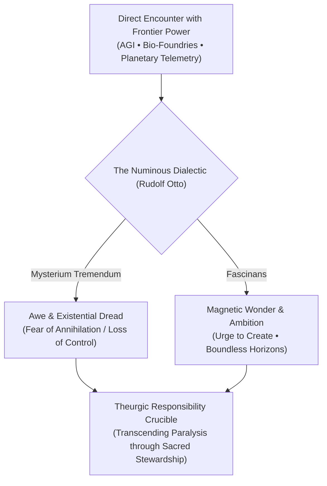

> **🎙️ 3-Presenter Authentic Tiki-Taka Script**
> 
> **Prof. Peter Kim:** We now enter Module 5: Existential Paradoxes & The "So What?" Layer. Slide 36 explores the profound concept of **Holy Terror**—what German theologian Rudolf Otto defined in 1917 as *Mysterium Tremendum et Fascinans*. *(Turn 1)*  
> **Dr. Elena Vance:** Otto argued that whenever human beings encounter the divine, they experience two contradictory emotions simultaneously: *Mysterium Tremendum*—paralyzing dread and awe before an infinite power—and *Fascinans*—an irresistible, intoxicating wonder and desire to draw closer. *(Turn 2)*  
> **TA Marcus Brody:** And look at what happens in 2026! When an engineer sits in a server lab watching an AI model autonomously write self-improving code, or a synthetic biologist watches a de novo designed cell boot up in a petri dish, they aren't just feeling "cool tech vibes"—they are experiencing literal *Holy Terror*! *(Turn 3)*  
> **Prof. Peter Kim:** That shudder in your spine is the realization that you are looking into the engine room of creation. You are wielding forces that can heal a continent or incinerate a civilization in an afternoon. *(Turn 4)*  
> **TA Marcus Brody:** And if you don't feel that terror, you are either a psychopath or completely blind to what you are building! *(Turn 5)*  
> **Dr. Elena Vance:** Exactly, Marcus! Holy Terror is not a pathology to be medicated away; it is a vital moral signal. It is your soul reminding you that godlike power requires absolute reverence and humility. *(Turn 6)*  
> **Prof. Peter Kim:** The Theurgicon does not seek to eliminate Holy Terror. We channel *Mysterium Tremendum* into rigorous ethical safeguards, and *Fascinans* into bold planetary stewardship. *(Turn 7)*  
> **TA Marcus Brody:** But when society feels terror without understanding, it collapses into algorithmic radicalization and tribal bias cascades! *(Turn 8)*  
> **Dr. Elena Vance:** Let’s examine the Bias Cascade on Slide 37. *(Turn 9)*  
> **Prof. Peter Kim:** Turn to Slide 37: The Bias Cascade & Epistemic Silos. *(Turn 10)*

---

### Slide 37: The Bias Cascade: Algorithmic Radicalization & Epistemic Silos
- **The Cascade Mechanism:**
  - *Cognitive Vulnerability:* The brain under cognitive vertigo seeks instant epistemic closure to relieve free energy surges.
  - *Algorithmic Amplification:* Recommendation engines exploit confirmation bias by clustering users into high-engagement **Epistemic Silos**.
  - *The Radicalization Vector:* As moderate content generates lower dopamine-cortisol engagement, feeds iteratively escalate toward radical, conspiratorial extremes to sustain ad revenue.

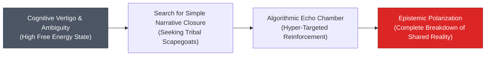

> **🎙️ 3-Presenter Authentic Tiki-Taka Script**
> 
> **TA Marcus Brody:** Slide 37 maps the exact engineering architecture of how modern society lost its shared consensus on reality: **The Bias Cascade**. Elena, how does an algorithm turn ordinary people into radicalized conspiracists? *(Turn 1)*  
> **Dr. Elena Vance:** It starts with a person experiencing cognitive vertigo. They feel anxious about the economy, AI, or climate change. Their brain seeks rapid narrative closure to bring its variational free energy down. *(Turn 2)*  
> **TA Marcus Brody:** So they search online for answers, and the recommendation algorithm notices that they paused for five seconds on a video claiming: *"Secret Cabal Plans to Replace All Workers by 2027!"* *(Turn 3)*  
> **Dr. Elena Vance:** And because that video spiked their cortisol and kept them watching for 12 minutes, the algorithm immediately queues up five more videos, each slightly more extreme than the last, trapping them inside a hyper-polarized **Epistemic Silo**! *(Turn 4)*  
> **Prof. Peter Kim:** Notice the devastating civilizational outcome on the right of the flowchart: **The Complete Breakdown of Shared Reality**. When two citizens inhabit different algorithmic silos, they don't just disagree on political policies; they live in mutually exclusive factual universes! *(Turn 5)*  
> **TA Marcus Brody:** One citizen thinks AI is about to usher in a post-scarcity utopia, and the other thinks AI is an apocalyptic demonic conspiracy created to enslave humanity! Neither can speak to the other without screaming! *(Turn 6)*  
> **Dr. Elena Vance:** And this polarization is fueled by the neurochemical addiction of doomscrolling. *(Turn 7)*  
> **Prof. Peter Kim:** Let’s examine the exact neurobiology of doomscrolling on Slide 38. *(Turn 8)*  
> **TA Marcus Brody:** Let’s look at the brain on doomscrolling! *(Turn 9)*  
> **Prof. Peter Kim:** Turn to Slide 38. *(Turn 10)*

---

### Slide 38: The Neurobiology of Doomscrolling: Dopamine-Cortisol Addiction Loops
- **Biochemical Architecture of Compulsive Scrolling:**
  - *Intermittent Variable Reward (B.F. Skinner):* Infinite scroll feeds function as **Variable-Ratio Reinforcement Schedules** (identical to Las Vegas slot machines).
  - *Dopamine Spike (Anticipation):* Swiping down triggers a dopamine release in the nucleus accumbens in anticipation of novelty.
  - *Cortisol Sustenance (Threat Monitoring):* Encountering alarming headlines maintains chronic sympathetic nervous system activation, preventing the prefrontal cortex from disengaging.
- **The Cognitive Tax:** Slashes deep-work attention spans from hours to **<47 seconds** (Gloria Mark, UC Irvine).

> **🎙️ 3-Presenter Authentic Tiki-Taka Script**
> 
> **Dr. Elena Vance:** Slide 38 provides the definitive clinical diagnosis of **Doomscrolling**. It is a neurochemical trap engineered using B.F. Skinner’s **Variable-Ratio Reinforcement Schedule**—the exact same mathematical mechanism that makes Las Vegas slot machines addictive! *(Turn 1)*  
> **TA Marcus Brody:** Every time you swipe down on your phone, you are pulling the lever of a digital slot machine! Your nucleus accumbens releases a shot of dopamine in *anticipation* of what might appear next! *(Turn 2)*  
> **Dr. Elena Vance:** Most swipes give you boring posts (no payout), but every tenth swipe gives you a terrifying war update or a shocking scandal (jackpot payout for your savannah threat-detector)! *(Turn 3)*  
> **Prof. Peter Kim:** And notice the biochemical trap: the dopamine keeps your thumb swiping, while the cortisol from the alarming news keeps your amygdala hyper-alert, making it physically impossible for your prefrontal cortex to say: *"Put the phone down and go to sleep."* *(Turn 4)*  
> **TA Marcus Brody:** Look at Gloria Mark’s UC Irvine research at the bottom of the slide: Modern digital workers have had their average sustained attention span on a single screen slashed to **less than 47 seconds**! *(Turn 5)*  
> **Dr. Elena Vance:** 47 seconds! You cannot write a novel, understand quantum electrodynamics, or architect a $100B XPRIZE in 47-second fragmented bursts! Your working memory is continuously being reset to zero! *(Turn 6)*  
> **Prof. Peter Kim:** Doomscrolling is the deliberate operational destruction of human cognitive bandwidth. If you do not conquer this addiction, you cannot be a Theurgist. *(Turn 7)*  
> **TA Marcus Brody:** And this individual cognitive fragmentation scales up to paralyze democratic governments! *(Turn 8)*  
> **Dr. Elena Vance:** Let’s examine the Pacing Problem on Slide 39. *(Turn 9)*  
> **Prof. Peter Kim:** Turn to Slide 39: The Pacing Problem. *(Turn 10)*

---

### Slide 39: The Pacing Problem: Linear Democratic Governance vs. Exponential Tech
- **Governance Asymmetry (Larry Downes, Gary Marchant):**
  - *Exponential Innovation Velocity:* Technology advances exponentially ($10\times \text{ every 12–24 months}$).
  - *Legislative & Regulatory Velocity:* Democratic lawmaking proceeds at a linear, deliberative pace (**3 to 7 years per major statute**).
- **The Governance Gap:** By the time a regulatory bill is debated, amended, and passed into law, the technological frontier has advanced through **2 to 3 doubling cycles**, rendering the regulation obsolete upon arrival.

```mermaid
flowchart TD
    A["Exponential Technology Curve<br/>(AI • Synthetic Bio • Autonomous Systems)"] -->|Doubling Every 12-24 Months| B["Frontier Reality in Year 5 ($16\times$ to $32\times$)"]
    C["Democratic Legislative Process<br/>(Hearings • Amendments • Bureaucracy)"] -->|Linear Pace (5-7 Years)| D["Passed Law in Year 5 (Designed for Year 0 Reality)"]
    B & D --> E["The Massive Governance Void<br/>(Regulatory Inefficacy & Sovereign Instability)"]
    style B fill:#dc2626,stroke:#991b1b,color:#fff
    style D fill:#4b5563,stroke:#374151,color:#fff
```

> **🎙️ 3-Presenter Authentic Tiki-Taka Script**
> 
> **Prof. Peter Kim:** Slide 39 outlines the greatest structural challenge facing modern statecraft: **The Pacing Problem**. Dr. Vance, explain why traditional democratic governance is failing to regulate exponential technology. *(Turn 1)*  
> **Dr. Elena Vance:** It is a basic mathematical velocity mismatch. A democratic parliament or congress takes **3 to 7 years** to hold hearings, draft legislation, debate amendments, and pass a regulatory statute. That linear timeline worked fine in the 19th century when railroad steam engines evolved over decades. *(Turn 2)*  
> **TA Marcus Brody:** But in 2026, technology advances on an exponential doubling cycle of 12 to 24 months! In seven years, a technology goes through **three to five doublings—scaling by $16\times$ to $32\times$**! *(Turn 3)*  
> **Dr. Elena Vance:** That means by the day the President or Prime Minister signs the law, the regulation is governing a technological reality that existed five years ago and has been completely superseded by new architectures! The law is obsolete on arrival! *(Turn 4)*  
> **Prof. Peter Kim:** You cannot govern Mach 25 hypersonic technology with horse-and-buggy bureaucratic processes. *(Turn 5)*  
> **TA Marcus Brody:** So what happens? Governments either panic and pass heavy-handed, clumsy bans that crush innovation, or they give up completely and let four tech monopolies govern themselves! *(Turn 6)*  
> **Dr. Elena Vance:** The only viable solution is **Adaptive Governance**: embedding real-time algorithmic telemetry and automated regulatory compliance protocols directly into the technology itself. *(Turn 7)*  
> **Prof. Peter Kim:** We must build governance that operates at the speed of code. *(Turn 8)*  
> **TA Marcus Brody:** And when individuals and societies realize this gap, they often sink into Civilizational Burnout and Nihilism! *(Turn 9)*  
> **Prof. Peter Kim:** Let’s examine Slide 40: Civilizational Burnout and the Void of Technotopia. *(Turn 10)*

---

### Slide 40: Civilizational Burnout: The Paradox of Nihilism in Technotopia
- **The Sociological Pathology:**
  - *The Technotopic Mirage:* The naive promise that material abundance and automation would automatically eliminate human suffering and birth a utopian paradise.
  - *The Nihilistic Crash:* When individuals discover that material abundance does not resolve existential meaninglessness, they experience acute **Civilizational Anomie & Burnout**.
- **The Calhoun Warning Revisited:** Material saturation minus transcendent responsibility equals psychological decay and social suicide.

> **🎙️ 3-Presenter Authentic Tiki-Taka Script**
> 
> **TA Marcus Brody:** Look at Slide 40. This is the tragic paradox of our entire high-tech civilization: **Civilizational Burnout in Technotopia**. Why are people in the richest, most technologically advanced societies on Earth experiencing such deep nihilism and emptiness? *(Turn 1)*  
> **Dr. Elena Vance:** Because Silicon Valley sold humanity a false gospel: the **Technotopic Mirage**. They promised that if we just gave everyone faster gigabit internet, cheaper calories, and self-driving cars, all human suffering would vanish and we would live in paradise. *(Turn 2)*  
> **Prof. Peter Kim:** But human beings are not simple optimization algorithms that run on calories and Wi-Fi. The human spirit requires **Meaning, Struggle, and Sacred Purpose**. When you eliminate all physical struggle without providing transcendent purpose, you create an existential vacuum. *(Turn 3)*  
> **TA Marcus Brody:** And that vacuum gets filled by nihilism, video game addiction, drug overdoses, and Calhoun's *Universe 25* behavioral sink! When life requires zero effort, people lose their will to live! *(Turn 4)*  
> **Dr. Elena Vance:** Material abundance without spiritual purpose is not paradise; it is a gilded psychiatric ward. *(Turn 5)*  
> **Prof. Peter Kim:** This is why the Theurgicon rejects naive techno-optimism. Technology is not the savior of humanity; it is merely the amplifier of human capability. The meaning must come from the human soul. *(Turn 6)*  
> **TA Marcus Brody:** So how do we survive this nihilistic swamp and maintain our sanity? We practice **Ruthless Discernment**! *(Turn 7)*  
> **Dr. Elena Vance:** Let’s examine the ultimate 21st-century cognitive survival filter on Slide 41! *(Turn 8)*  
> **Prof. Peter Kim:** Turn to Slide 41: Ruthless Discernment. *(Turn 9)*  
> **TA Marcus Brody:** Let’s see how to build our epistemic armor! *(Turn 10)*

---

### Slide 41: Ruthless Discernment: The Essential 21st-Century Survival Filter
- **The Theurgic Information Protocol:**
  1. *Ruthless Noise Elimination:* Uncompromising elimination of programmatic outrage feeds, clickbait notifications, and speculative commentary.
  2. *First-Principles Grounding:* Interrogating every technological claim against fundamental thermodynamic, computational, and economic limits.
  3. *Structure-Mapping Filtering:* Translating complex narratives into higher-order relational systems to detect underlying causal truths.
  4. *Daily Epistemic Air-Gaps:* Mandating 4–6 hour blocks of uninterrupted, disconnected deep work to preserve hippocampal focus and prefrontal integrity.

> **🎙️ 3-Presenter Authentic Tiki-Taka Script**
> 
> **Prof. Peter Kim:** Slide 41 presents the four-pillar protocol of **Ruthless Discernment**. This is your personal cognitive firewall against cognitive vertigo. Dr. Vance, explain Pillar 1 and 2. *(Turn 1)*  
> **Dr. Elena Vance:** Pillar 1 is **Ruthless Noise Elimination**: You must treat your 120-bit conscious bandwidth like a sacred sanctuary. Turn off every non-human notification, delete algorithmic outrage apps, and unsubscribe from speculative noise. If it doesn't contain first-principles data, it doesn't enter your mind. *(Turn 2)*  
> **TA Marcus Brody:** Pillar 2 is **First-Principles Grounding**: When someone makes a wild claim about quantum AI or miraculous energy, you don't argue on Twitter. You ask: *"What does thermodynamics say? What is the energy budget? What are the FLOPs?"* You ground your thinking in immutable physics! *(Turn 3)*  
> **Dr. Elena Vance:** Pillar 3 is **Structure-Mapping Filtering**: You use Dedre Gentner's framework to strip away surface marketing buzzwords and extract the deep relational system. You instantly see through empty hype! *(Turn 4)*  
> **Prof. Peter Kim:** And Pillar 4 is non-negotiable: **Daily Epistemic Air-Gaps**. You must schedule 4 to 6 hours every single day where your devices are physically in another room, disconnected from the datastream, allowing your prefrontal cortex to perform deep, uninterrupted synthesis. *(Turn 5)*  
> **TA Marcus Brody:** That is how you protect your working memory, replenish your dopamine, and enter deep flow states on command! *(Turn 6)*  
> **Dr. Elena Vance:** Ruthless discernment is not an antisocial retreat from the world; it is the prerequisite for having anything meaningful to contribute to the world. *(Turn 7)*  
> **Prof. Peter Kim:** Master these four pillars, and you conquer cognitive vertigo forever. *(Turn 8)*  
> **TA Marcus Brody:** Now let’s synthesize our entire "So What?" journey on Slide 42! *(Turn 9)*  
> **Prof. Peter Kim:** Turn to Slide 42: Synthesizing the "So What?" — Conquering Vertigo through Structure Mapping. *(Turn 10)*

---

### Slide 42: Synthesizing the "So What?": Conquering Vertigo through Structure Mapping
- **The Master Civilizational Equation:**
  $$\text{Cognitive Mastery} = rac{\text{Relational Structure Mapping} \times \text{First Principles Grounding}}{\text{Savannah Amygdalar Negativity Bias}} \times \text{Flow State Bandwidth}$$
- **The Final Verdict:** Cognitive Vertigo is the inevitable tax paid by linear minds attempting to process exponential reality. By mastering Structure Mapping, we convert temporal disorientation into theurgic velocity and clear-eyed civilizational stewardship.

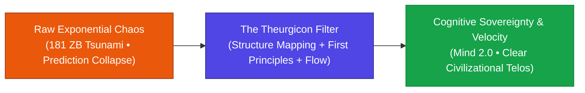

> **🎙️ 3-Presenter Authentic Tiki-Taka Script**
> 
> **Prof. Peter Kim:** Slide 42 brings our entire existential deconstruction into a single Master Civilizational Equation. Look at the formula in the center of the slide. *(Turn 1)*  
> **Dr. Elena Vance:** Look at the numerator: **Relational Structure Mapping multiplied by First Principles Grounding**. That is your cognitive signal engine! Look at the denominator: **Savannah Amygdalar Negativity Bias**. When you divide out the evolutionary fear response and multiply by **Flow State Bandwidth**, you achieve true **Cognitive Mastery**! *(Turn 2)*  
> **TA Marcus Brody:** Look at the three-stage transition in the flowchart: We start with raw exponential chaos—the 181-zettabyte tsunami that causes cognitive vertigo. We run it through the Theurgicon Filter—Structure Mapping, First Principles, and Epistemic Air-Gaps. And we emerge on the other side with **Cognitive Sovereignty and Velocity**! *(Turn 3)*  
> **Prof. Peter Kim:** You no longer experience the future as a terrifying blur that knocks you off balance. You perceive it with total lucidity, navigating hyper-exponential trajectories with calmness, precision, and purpose. *(Turn 4)*  
> **Dr. Elena Vance:** You transition from a confused primate fleeing imaginary predators to an empowered Theurgist architecting the flourishing of life. *(Turn 5)*  
> **TA Marcus Brody:** That is how we conquer Cognitive Vertigo! *(Turn 6)*  
> **Prof. Peter Kim:** And that brings us to Module 6, where you will put these principles into immediate practice! *(Turn 7)*  
> **Dr. Elena Vance:** Let’s examine your debate topics and the hands-on Structure-Mapping workshop on Slide 43! *(Turn 8)*  
> **TA Marcus Brody:** Let’s dive into Module 6! *(Turn 9)*  
> **Prof. Peter Kim:** Proceed to Module 6: Graduate Seminar Discourse & Moonshot Design! *(Turn 10)*


---

## Module 6: Graduate Seminar Discourse & Moonshot Design (Slides 43–45)

### Slide 43: Socratic Seminar Inquiries: Triad of Dialectical Debates
- **Debate Topic 1 (Cognitive Augmentation & BCI Governance):**
  - Given the 50-trillion-to-one mismatch between global data generation and biological conscious throughput, is high-bandwidth Neural BCI augmentation an urgent evolutionary imperative for human survival, or does it introduce fatal systemic vulnerabilities (neural hacking, epistemic coercion)?
- **Debate Topic 2 (The Ethics of Epistemic Air-Gaps & Friction):**
  - Should democratic societies legally mandate algorithmic friction (e.g., cooling-off delays, computational throttling) to protect human prefrontal bandwidth against outrage-monetizing feeds, or does this violate free speech and information liberty?
- **Debate Topic 3 (Pacing Problem Solutions):**
  - Can democratic nation-states adapt their 5-year legislative cycles to govern 12-month exponential doubling technologies without delegating supreme authority to autonomous algorithmic regulators?

> **🎙️ 3-Presenter Authentic Tiki-Taka Script**
> 
> **Prof. Peter Kim:** Cohorts, Slide 43 presents your three dialectical debate topics for Session 2. You will assemble into your designated seminar groups and prepare rigorous, data-grounded position briefs using **Dedre Gentner’s Structure-Mapping** and **First Principles**. *(Turn 1)*  
> **Dr. Elena Vance:** Look at Debate Topic 1: **Cognitive Augmentation vs. Biological Vulnerability**. Given that the data gap is 50 trillion to one, some transhumanists argue that refusing BCI neural implants is biological suicide. But what happens if your neural link is hacked, or if private corporations gain direct read-write access to your motor cortex and thoughts? *(Turn 2)*  
> **TA Marcus Brody:** And look at Debate Topic 2: **Epistemic Friction & Algorithmic Throttling**. Should governments legally require social feeds to insert mandatory 10-minute cooling-off periods and remove infinite scroll to protect our 120-bit prefrontal cortex, or is that a terrifying step toward government censorship? *(Turn 3)*  
> **Prof. Peter Kim:** And Topic 3: **Solving the Pacing Problem**. If democratic legislatures take five years to pass a bill while AI and biotech double every 12 months, how can a constitutional democracy maintain legal sovereignty without surrendering control to automated algorithmic judges? *(Turn 4)*  
> **TA Marcus Brody:** We want concrete institutional proposals in your papers! Don't just complain about the problem—give us the structural governance architecture with mathematical proof! *(Turn 5)*  
> **Dr. Elena Vance:** Cite real empirical data from our nine case studies, including the IEA solar blunder, Neuralink channel counts, and IDC data growth curves. *(Turn 6)*  
> **Prof. Peter Kim:** Now let us examine your hands-on workshop assignment on Slide 44. *(Turn 7)*  
> **TA Marcus Brody:** The Structure-Mapping Breakthrough Translation Protocol! *(Turn 8)*  
> **Prof. Peter Kim:** Turn to Slide 44. *(Turn 9)*  
> **Dr. Elena Vance:** Let’s see how to translate patents into moonshots! *(Turn 10)*

---

### Slide 44: Structure-Mapping Workshop Protocol: Breakthrough Translation
- **Workshop Assignment Directives:**
  - **Objective:** Select one highly complex, jargon-dense 2026 technological patent or frontier whitepaper (e.g., High-Temperature Superconductors, CRISPR-Cas12f Base Editing, Neuromorphic Photonic Chips).
  - **Execution Protocol (3 Steps):**
    1. *First-Principles Decomposition:* Extract fundamental physical variables (energy, throughput, latency, cost/unit).
    2. *Relational Alignment (Gentner Mapping):* Map the system to a canonical historical/mythological base domain, identifying higher-order causal predicates ($\text{CAUSE}[\dots]$).
    3. *Civilizational Moonshot Design:* Architect a $10\times$ application that solves an existential bottleneck, complete with second-order hazard safeguards.

> **🎙️ 3-Presenter Authentic Tiki-Taka Script**
> 
> **TA Marcus Brody:** Slide 44 is your hands-on workshop assignment for this week! You are going to take a 50-page, incomprehensible, jargon-filled frontier patent—like room-temperature superconductor lattices or neuromorphic photonic chips—and run it through our **3-Step Structure-Mapping Protocol**! *(Turn 1)*  
> **Dr. Elena Vance:** In Step 1, you strip away all the academic jargon and reduce the patent to raw physics: What is the energy efficiency? What is the bandwidth in Gigabits per second? What is the thermodynamic cost? *(Turn 2)*  
> **Prof. Peter Kim:** In Step 2, you execute Gentnerian Relational Alignment: You find the deep structural isomorphism in a biological system or ancient archetype. You extract the higher-order causal system that makes the technology instantly intuitive to any human mind. *(Turn 3)*  
> **TA Marcus Brody:** And in Step 3, you design a **Civilizational Moonshot Application**! How does this technology eliminate a fundamental human scarcity, and what second-order safety firewalls must be built into its deployment? *(Turn 4)*  
> **Dr. Elena Vance:** Your final output will be a 3-page executive architectural brief formatted for sovereign wealth fund trustees and global XPRIZE juries. *(Turn 5)*  
> **TA Marcus Brody:** This is how you build real-world Theurgic muscle! You take raw complexity and turn it into actionable, high-impact reality! *(Turn 6)*  
> **Prof. Peter Kim:** Treat this exercise as your training ground for the $100B Giga-XPRIZE capstone. *(Turn 7)*  
> **Dr. Elena Vance:** Now let’s look ahead to what awaits us in Session 3! *(Turn 8)*  
> **TA Marcus Brody:** The legendary 6Ds Framework and the Deception Trap! *(Turn 9)*  
> **Prof. Peter Kim:** Turn to Slide 45 for our concluding preview. *(Turn 10)*

---

### Slide 45: Preview of Session 03: The 6Ds Framework & The Deception Trap
- **Next Session Preview (Session 03):**
  - **Topic:** *The 6Ds Exponential Framework & The Deception Trap: Mastering the Mathematics of Invisible Growth*
  - **Assigned Reading:** Peter H. Diamandis & Steven Kotler, *We Are as Gods* (2026), Chapter 2 (*The Exponential 6Ds*).
  - **Core Analytical Focus:** Deconstructing the complete trajectory from Digitization to Democratization, navigating the flat "deceptive phase," and predicting the vertical inflection knee with mathematical precision.
- **Closing Benediction:**
  - *"We are as gods... and we have mastered the gyroscopes to navigate the infinite."*

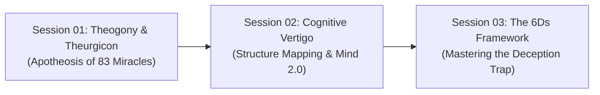

> **🎙️ 3-Presenter Authentic Tiki-Taka Script**
> 
> **Dr. Elena Vance:** Next week in Session 3, we dive into the mathematical engine room of exponential growth: **Peter Diamandis’s 6Ds Framework**—Digitized, Deceptive, Disruptive, Dematerialized, Demonetized, and Democratized. *(Turn 1)*  
> **TA Marcus Brody:** We are going to put the **Deception Trap** under a microscope! We will analyze why smart investors and governments continuously get fooled by the flat part of the exponential curve, and how you can spot the inflection knee years before the rest of the world! *(Turn 2)*  
> **Prof. Peter Kim:** Scholars, you have navigated the dizzying heights of Session 2. You have analyzed the 20-Watt biological ceiling, Karl Friston's Free Energy Principle, and Dedre Gentner's Structure-Mapping Theory. *(Turn 3)*  
> **TA Marcus Brody:** You now possess the cognitive gyroscopes to stand rock-solid in the middle of a 181-zettabyte storm without getting motion sick! *(Turn 4)*  
> **Dr. Elena Vance:** Remember: You cannot consume the ocean through a straw; you must navigate the ocean with a structural compass. *(Turn 5)*  
> **Prof. Peter Kim:** Cultivate your epistemic air-gaps, practice ruthless discernment, and train your Mind 2.0 every single day. *(Turn 6)*  
> **TA Marcus Brody:** Complete your reading of Chapter 2, finish your patent translations, and we will see you all next week in the Theurgicon! *(Turn 7)*  
> **Dr. Elena Vance:** Have an extraordinary and focused week, everyone! *(Turn 8)*  
> **Prof. Peter Kim:** Session 2 is officially adjourned! *(Turn 9)*
