# Session 3: 6D 프레임워크와 기만적 성장의 함정 (The 6Ds & The Deception Trap)
> **Course:** 신이 된 인류: 기하급수 기술과 풍요의 설계도 (*We Are as Gods: A Survival Guide for the Age of Abundance*)  
> **Course Code:** EXPO-701 • Graduate Seminar  
> **Instructors:** Prof. Peter Kim (석좌교수), Dr. Elena Vance (수석연구원), TA Marcus Brody (딥테크조교)  
> **Reading Assignment:** Peter Diamandis & Steven Kotler, *We Are as Gods* (2026), Chapter 2 (*The Return of the Six Ds*)  
> **Total Slides:** 45 Slides (6 Modules: M1~M6) • Authentic 3-Presenter Tiki-Taka Master Edition  

---

## 📌 Table of Contents & Slide Navigation

- [Module 1: 도입 및 어젠다 세팅 (Slides 01~05)](#module-1-도입-및-어젠다-세팅-slides-0105)
  - [Slide 01: 세션 3 개요: 6D 프레임워크와 기하급수적 파괴의 본질](#slide-01-세션-3-개요-6d-프레임워크와-기하급수적-파괴의-본질)
  - [Slide 02: 무어의 법칙을 넘어선 '더 많은 것의 법칙(The Law of More)'](#slide-02-무어의-법칙을-넘어선-더-많은-것의-법칙the-law-of-more)
  - [Slide 03: 정보 기반 기술(Information-Based Technology)로의 대전환](#slide-03-정보-기반-기술information-based-technology로의-대전환)
  - [Slide 04: 금주의 핵심 질문: 왜 기하급수적 파괴는 눈앞에 닥칠 때까지 보이지 않는가?](#slide-04-금주의-핵심-질문-왜-기하급수적-파괴는-눈앞에-닥칠-때까지-보이지-않는가)
  - [Slide 05: 3주차 학습 로드맵: 6D 정밀 분해에서 변곡점 예측까지](#slide-05-3주차-학습-로드맵-6d-정밀-분해에서-변곡점-예측까지)
- [Module 2: 원전 텍스트 정밀 해체 (Slides 06~15)](#module-2-원전-텍스트-정밀-해체-slides-0615)
  - [Slide 06: 『We Are as Gods』 제2장: 6D 프레임워크의 귀환 (The Return of the 6Ds)](#slide-06-we-are-as-gods-제2장-6d-프레임워크의-귀환-the-return-of-the-6ds)
  - [Slide 07: 1단계: 디지털화(Digitization) — 물리적 세계의 0과 1 변환](#slide-07-1단계-디지털화digitization--물리적-세계의-0과-1-변환)
  - [Slide 08: 2단계: 기만적 성장(Deception) — 레이더 아래에서의 조용한 복리 증식](#slide-08-2단계-기만적-성장deception--레이더-아래에서의-조용한-복리-증식)
  - [Slide 09: 3단계: 파괴적 혁신(Disruption) — 기존 시장과 플레이어의 급속 붕괴](#slide-09-3단계-파괴적-혁신disruption--기존-시장과-플레이어의-급속-붕괴)
  - [Slide 10: 4단계: 탈물질화(Dematerialization) — 물리적 하드웨어의 소프트웨어 앱 응축](#slide-10-4단계-탈물질화dematerialization--물리적-하드웨어의-소프트웨어-앱-응축)
  - [Slide 11: 5단계: 탈화폐화(Demonetization) — 한계 비용 제로화와 가격의 소멸](#slide-11-5단계-탈화폐화demonetization--한계-비용-제로화와-가격의-소멸)
  - [Slide 12: 6단계: 민주화(Democratization) — 소수 특권에서 80억 인류의 보편 인프라로](#slide-12-6단계-민주화democratization--소수-특권에서-80억-인류의-보편-인프라로)
  - [Slide 13: 피터 디아만디스의 6D 수직 체인과 생태계 연쇄 반응](#slide-13-피터-디아만디스의-6d-수직-체인과-생태계-연쇄-반응)
  - [Slide 14: 스티븐 코틀러의 인지적 맹점(Blindspot) 경고: 기만 단계의 침묵](#slide-14-스티븐-코틀러의-인지적-맹점blindspot-경고-기만-단계의-침묵)
  - [Slide 15: 6D 단계별 경제학적 지표 및 가치 이동 요약표](#slide-15-6d-단계별-경제학적-지표-및-가치-이동-요약표)
- [Module 3: 기하급수 이론 및 프레임워크 (Slides 16~25)](#module-3-기하급수-이론-및-프레임워크-slides-1625)
  - [Slide 16: 기만적 단계(Deception Phase)의 수학적 메커니즘: $0.001 \rightarrow 0.002 \rightarrow 0.004$의 착시](#slide-16-기만적-단계deception-phase의-수학적-메커니즘-0001-rightarrow-0002-rightarrow-0004의-착시)
  - [Slide 17: 기하급수 곡선과 선형 예측선의 변곡점 교차점 (Inflection Point $T^*$)](#slide-17-기하급수-곡선과-선형-예측선의-변곡점-교차점-inflection-point-t)
  - [Slide 18: 코닥(Kodak)의 비극: 1975년 스티브 사손의 0.01메가픽셀 카메라와 파산의 궤적](#slide-18-코닥kodak의-비극-1975년-스티브-사손의-001메가픽셀-카메라와-파산의-궤적)
  - [Slide 19: 무어의 법칙(Moore's Law) vs 라이트의 법칙(Wright's Law)의 누적 생산 수렴](#slide-19-무어의-법칙moores-law-vs-라이트의-법칙wrights-law의-누적-생산-수렴)
  - [Slide 20: 기술 수렴(Technological Convergence): 단일 6D에서 복합 6D 매트릭스로의 진화](#slide-20-기술-수렴technological-convergence-단일-6d에서-복합-6d-매트릭스로의-진화)
  - [Slide 21: 네트워크 효과(Metcalfe's Law)와 6D의 결합 가속도](#slide-21-네트워크-효과metcalfes-law와-6d의-결합-가속도)
  - [Slide 22: 탈물질화의 물리적 한계 돌파: 비트(Bit)가 아톰(Atom)을 삼키는 원리](#slide-22-탈물질화의-물리적-한계-돌파-비트bit가-아톰atom을-삼키는-원리)
  - [Slide 23: 한계비용 제로 경제학(Zero Marginal Cost Economics, Jeremy Rifkin)](#slide-23-한계비용-제로-경제학zero-marginal-cost-economics-jeremy-rifkin)
  - [Slide 24: 진입 장벽(Barrier to Entry)의 붕괴 공식: $C_{\text{entry}} \rightarrow 0$](#slide-24-진입-장벽barrier-to-entry의-붕괴-공식-c_textentry-rightarrow-0)
  - [Slide 25: 6D 기반 파괴적 기회 탐색 알고리즘 (Disruptive Opportunity Matrix)](#slide-25-6d-기반-파괴적-기회-탐색-알고리즘-disruptive-opportunity-matrix)
- [Module 4: 글로벌 데이터 & 실증 케이스 (Slides 26~35)](#module-4-글로벌-데이터--실증-케이스-slides-2635)
  - [Slide 26: CASE 1: 디지털 사진 산업의 6D 궤적 (Kodak 파산 vs Instagram 10억 달러 인수)](#slide-26-case-1-디지털-사진-산업의-6d-궤적-kodak-파산-vs-instagram-10억-달러-인수)
  - [Slide 27: CASE 2: 스마트폰에 흡수된 1980년대 30개 전자장비의 탈물질화 실증 데이터 ($7.1M $\rightarrow$ $0)](#slide-27-case-2-스마트폰에-흡수된-1980년대-30개-전자장비의-탈물질화-실증-데이터-71m-rightarrow-0)
  - [Slide 28: CASE 3: 게놈 시퀀싱(NGS)의 6D 여정 ($3B $\rightarrow$ $100, 3천만 분의 1 하락)](#slide-28-case-3-게놈-시퀀싱ngs의-6d-여정-3b-rightarrow-100-3천만-분의-1-하락)
  - [Slide 29: CASE 4: 태양광 PV 모듈 가격의 기만 단계 탈출과 99.6% 가격 하락](#slide-29-case-4-태양광-pv-모듈-가격의-기만-단계-탈출과-996-가격-하락)
  - [Slide 30: CASE 5: 리튬이온 배터리 팩 가격 하락 ($1,200/kWh $\rightarrow$ $90/kWh)과 전기차 변곡점](#slide-30-case-5-리튬이온-배터리-팩-가격-하락-1200kwh-rightarrow-90kwh과-전기차-변곡점)
  - [Slide 31: CASE 6: LLM 토큰 생성 비용의 기하급수 하락 추이 (100만 토큰당 $60 $\rightarrow$ $0.1)](#slide-31-case-6-llm-토큰-생성-비용의-기하급수-하락-추이-100만-토큰당-60-rightarrow-01)
  - [Slide 32: CASE 7: 배양육(Cultured Meat)의 6D 변곡점 ($330,000 $\rightarrow$ $10/kg 버거)](#slide-32-case-7-배양육cultured-meat의-6d-변곡점-330000-rightarrow-10kg-버거)
  - [Slide 33: CASE 8: 원격 우주 탐사 및 큐브위성(CubeSat) 발사 비용의 6D 혁명](#slide-33-case-8-원격-우주-탐사-및-큐브위성cubesat-발사-비용의-6d-혁명)
  - [Slide 34: CASE 9: 글로벌 핀테크 및 모바일 머니(M-Pesa 등)의 금융 민주화 지표](#slide-34-case-9-글로벌-핀테크-및-모바일-머니m-pesa-등의-금융-민주화-지표)
  - [Slide 35: 6D 산업별 기만 단계 진입 및 탈출 타임라인 종합 매트릭스](#slide-35-6d-산업별-기만-단계-진입-및-탈출-타임라인-종합-매트릭스)
- [Module 5: 사회적·철학적 역설 (So What?) (Slides 36~42)](#module-5-사회적철학적-역설-so-what-slides-3642)
  - [Slide 36: 기만적 평온함 뒤에 숨은 거버넌스 붕괴: 규제 기관의 인지적 딜레마](#slide-36-기만적-평온함-뒤에-숨은-거버넌스-붕괴-규제-기관의-인지적-딜레마)
  - [Slide 37: 전통 기업의 '혁신가의 딜레마(The Innovator's Dilemma)'와 6D 사망 선고](#slide-37-전통-기업의-혁신가의-딜레마the-innovators-dilemma와-6d-사망-선고)
  - [Slide 38: 탈화폐화의 양날의 검: GDP 착시와 경제 통계의 왜곡](#slide-38-탈화폐화의-양날의-검-gdp-착시와-경제-통계의-왜곡)
  - [Slide 39: 디지털 과점과 새로운 봉건주의(Digital Neo-Feudalism)의 위험](#slide-39-디지털-과점과-새로운-봉건주의digital-neo-feudalism의-위험)
  - [Slide 40: 고용의 탈물질화와 노동 가치설의 종말](#slide-40-고용의-탈물질화와-노동-가치설의-종말)
  - [Slide 41: 기하급수 리더십(Exponential Leadership): 기만 단계를 포착하는 직관 훈련](#slide-41-기하급수-리더십exponential-leadership-기만-단계를-포착하는-직관-훈련)
  - [Slide 42: SO WHAT? 결론: 6D의 파도를 타고 풍요를 설계하라](#slide-42-so-what-결론-6d의-파도를-타고-풍요를-설계하라)
- [Module 6: 세미나 토론 및 과제 안내 (Slides 43~45)](#module-6-세미나-토론-및-과제-안내-slides-4345)
  - [Slide 43: 대학원 세미나 핵심 발제 및 심층 토론 논제 3선](#slide-43-대학원-세미나-핵심-발제-및-심층-토론-논제-3선)
  - [Slide 44: 주차별 실습 과제: 미래 산업 6D 수직 분해 및 변곡점 예측 모델링 워크시트](#slide-44-주차별-실습-과제-미래-산업-6d-수직-분해-및-변곡점-예측-모델링-워크시트)
  - [Slide 45: 4주차 예고: 가치 밀도와 인류를 구원한 사다리 (Value Density & Liberation Ladder) & 종강](#slide-45-4주차-예고-가치-밀도와-인류를-구원한-사다리-value-density--liberation-ladder--종강)

---

## Module 1: 도입 및 어젠다 세팅 (Slides 01~05)

### Slide 01: 세션 3 개요: 6D 프레임워크와 기하급수적 파괴의 본질
- **Session Focus:** 기술이 디지털화되어 세상을 파괴하고 민주화하기까지의 6단계 진화 메커니즘 규명
- **Academic Foundation:** Peter Diamandis & Steven Kotler (2026), Chapter 2
- **Key Concepts:** The 6Ds of Exponentials, Deception Phase, Dematerialization, Demonetization

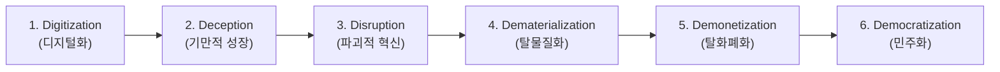

> **🎙️ 3-Presenter Authentic Tiki-Taka Script**
> 
> **Prof. Peter Kim:** 여러분, 3주차 세미나에 오신 것을 환영합니다. 지난주 우리는 뇌의 인지적 현기증을 극복하는 '구조 매핑'을 장착했습니다. 오늘 우리는 피터 디아만디스 사상의 가장 강력한 분석 틀인 **'6D 프레임워크'**를 정밀 해체합니다.  
> **Dr. Elena Vance:** 피터 교수님, 많은 사람들이 6D를 단순히 비즈니스 유행어로 생각하지만, 사실 6D는 '정보기술로 변환된 모든 물질과 에너지가 따르는 열역학적 진화 법칙'입니다. 어떤 기술이든 0과 1의 비트(Bit)로 변환되는 순간, 6D의 사슬에 묶이게 됩니다.  
> **TA Marcus Brody:** 그리고 그 사슬 중에서 가장 위험하고 매혹적인 구간이 바로 2단계인 **'기만적 성장(Deception Phase)'**입니다. 사람들은 0.001이 0.002가 될 때는 비웃다가, 1이 10억이 되는 순간 비명을 지르거든요!  
> **Prof. Peter Kim:** 정확합니다, 마커스. 오늘 우리는 그 침묵의 폭발 구간을 수학적으로, 그리고 산업적으로 낱낱이 파헤칠 것입니다.  

---

### Slide 02: 무어의 법칙을 넘어선 '더 많은 것의 법칙(The Law of More)'
- **Technological Paradigm Shift:** 고든 무어의 반도체 집적도 법칙(18~24개월 주기 2배)의 확장을 넘어선 문명 단위의 가속 법칙
- **The Law of More (Diamandis & Kotler):** 컴퓨팅 파워의 폭발이 AI, 게놈, 에너지, 네트워크, 로보틱스와 결합하여 모든 기술 영역에서 '더 빠르고, 더 저렴하고, 더 많은 것'을 쏟아내는 초융합 현상

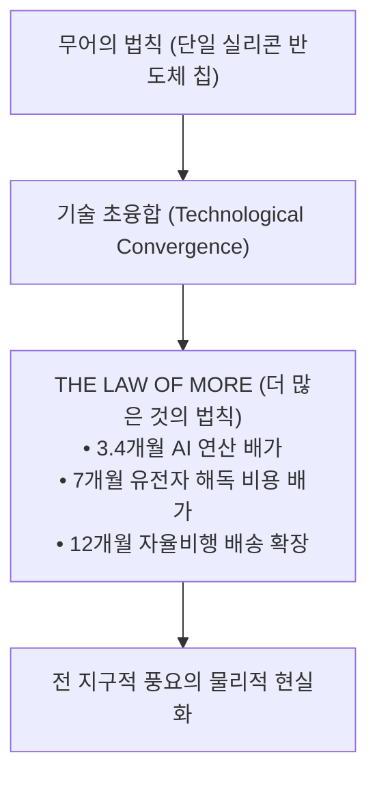

> **🎙️ 3-Presenter Authentic Tiki-Taka Script**
> 
> **Dr. Elena Vance:** 과거 50년간 기술 진보의 심장이 '무어의 법칙'이었다면, 2026년 오늘날의 엔진은 **'더 많은 것의 법칙(The Law of More)'**입니다. 이제는 실리콘 웨이퍼 하나만 빨라지는 게 아니라, AI 알고리즘, 단백질 합성기, 퀀텀 큐비트가 서로를 연료 삼아 가속하고 있습니다.  
> **TA Marcus Brody:** 컴퓨터가 빨라지니까 AI가 똑똑해지고, 똑똑해진 AI가 더 빠른 컴퓨터 칩을 설계하고, 그 칩으로 배터리를 합성하고... 기술들이 서로 손을 잡고 릴레이 스프린트를 하는 형국입니다!  
> **Prof. Peter Kim:** 바로 그 피드백 루프가 6D 프레임워크의 추진력입니다.  

---

### Slide 03: 정보 기반 기술(Information-Based Technology)로의 대전환
- **Fundamental Principle:** 물리적 원자(Atom) 기반 산업이 디지털 비트(Bit) 기반 산업으로 전환되는 순간, 성장의 한계(Marginal Cost)가 소멸
- **Transformation Examples:** 사진(필름 $\rightarrow$ JPEG), 음악(LP/CD $\rightarrow$ MP3/스트리밍), 금융(금괴/지폐 $\rightarrow$ 디지털 원장), 의학(경험적 임상 $\rightarrow$ 유전체 시퀀싱 및 인실리코 신약 설계)

| 산업 영역 | 과거: 원자 기반 (Atom-Based) | 현재: 정보 기반 (Bit-Based) | 6D 전환 결과 |
| :--- | :--- | :--- | :--- |
| **사진/영상** | 화학 은염 필름, 인화지, 암실 | 센서 픽셀, 압축 코덱, 클라우드 | 전 세계 무료 실시간 공유 |
| **생물학/의학** | 시험관 배양, 동물 실험 | DNA 시퀀싱 데이터, AlphaFold | 분자 수준 프로그래밍 |
| **에너지** | 석탄/석유 시추 및 물리적 운송 | 페로브스카이트 태양전지 반도체 | 태양광 광자(Photon)의 전산적 변환 |
| **제조업** | 거대 주물 공장, 금형 제작 | 3D 프린팅 CAD 파일, 디지털 트윈 | 파일 전송 즉시 로컬 제조 |

> **🎙️ 3-Presenter Authentic Tiki-Taka Script**
> 
> **Prof. Peter Kim:** 네그로폰테 교수가 일찍이 말했듯, "원자(Atom)에서 비트(Bit)로의 이행"은 단순한 기술의 교체가 아니라 물질세계의 규칙 자체를 바꾸는 사건입니다.  
> **Dr. Elena Vance:** 원자는 복사할 때마다 물리적 비용과 시간이 들지만, 비트는 복제 한계 비용이 정확히 '0'입니다. 빛의 속도로 전 세계 80억 명에게 배포할 수 있죠.  
> **TA Marcus Brody:** 어떤 산업이든 '정보 기반 기술'의 영역으로 편입되는 순간, 그 산업의 기존 지배자들은 카운트다운에 들어가는 겁니다!  

---

### Slide 04: 금주의 핵심 질문: 왜 기하급수적 파괴는 눈앞에 닥칠 때까지 보이지 않는가?
- **Core Inquiry:** 왜 코닥, 노키아, 블록버스터, 전통 은행, 거대 에너지 기업들은 세계 최고의 천재들을 고용하고도 기하급수 파괴 앞에서 무기력하게 무너졌는가?
- **Cognitive Diagnosis:** 기만적 단계(Deception Phase)에서의 '노이즈(Noise) 착시'와 선형적 회계 시스템의 구조적 맹점

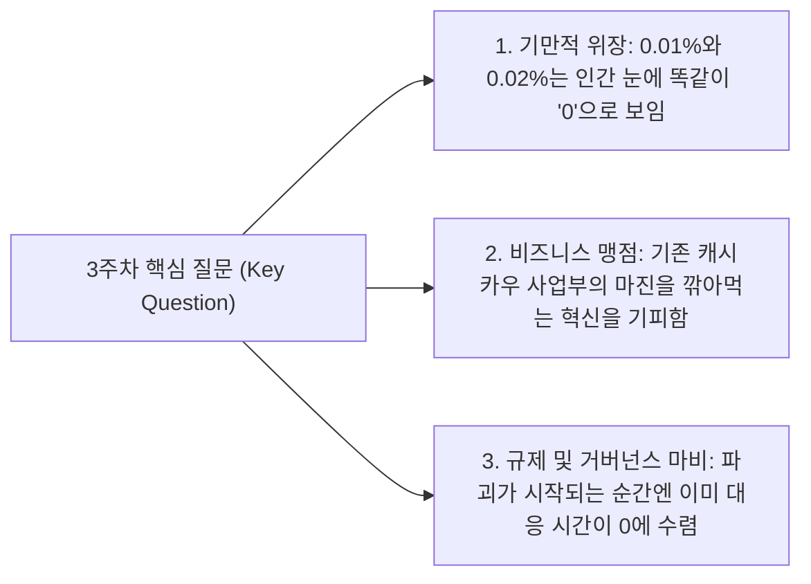

> **🎙️ 3-Presenter Authentic Tiki-Taka Script**
> 
> **Prof. Peter Kim:** 금주의 핵심 질문입니다. 왜 그 똑똑한 글로벌 기업의 CEO들은 파괴의 쓰나미를 보지 못했을까요? 그들이 무능해서였을까요?  
> **TA Marcus Brody:** 아닙니다! 오히려 그들은 기존 비즈니스 회계 기준으로는 '가장 합리적인 결정'을 내렸기 때문입니다. 0.01% 점유율을 가진 기술에 수조 원을 투자하겠다고 하면 어떤 주주총회에서도 쫓겨나니까요!  
> **Dr. Elena Vance:** 기하급수 곡선의 초기 10년은 선형 그래프의 오차 범위(Noise) 속에 완벽하게 숨어 있습니다. 인간의 감각기관으로는 '0'과 구별할 수 없는 이 기만 단계가 바로 파괴의 덫입니다.  

---

### Slide 05: 3주차 학습 로드맵: 6D 정밀 분해에서 변곡점 예측까지
- **Module Architecture:** 6D 프레임워크의 이론적 해체부터 글로벌 실증 데이터, 그리고 실무 기획 모델링까지의 완결된 아키텍처

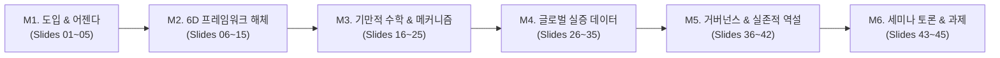

> **🎙️ 3-Presenter Authentic Tiki-Taka Script**
> 
> **Prof. Peter Kim:** 오늘 세미나의 로드맵입니다. M2에서 6D의 각 단계를 철저히 분해하고, M3에서 기만 단계의 수학적 변곡점을 도출합니다.  
> **Dr. Elena Vance:** M4에서는 코닥의 필름부터 100만 토큰당 10센트로 떨어진 LLM 비용 곡선까지 9가지 글로벌 실증 데이터를 비교 검증할 것입니다.  
> **TA Marcus Brody:** 마지막 과제에서는 여러분이 직접 특정 미래 산업의 기만 단계 탈출 시점을 예측하는 워크시트를 작성하게 됩니다. 준비되셨으면 M2로 출발하시죠!  

---

## Module 2: 원전 텍스트 정밀 해체 (Slides 06~15)

### Slide 06: 『We Are as Gods』 제2장: 6D 프레임워크의 귀환 (The Return of the 6Ds)
- **Textual Anchor:** Diamandis & Kotler, *We Are as Gods* (2026), Chapter 2
- **Evolutionary Context:** 2012년 *Abundance*, 2015년 *Bold*에서 태동한 6D 개념이 2026년 AGI 및 양자 시대를 맞아 **'다차원 복합 수렴 매트릭스'**로 재정립
- **Authors' Core Thesis:** 6D는 단순한 기술 예측 도구가 아니라, 자원의 희소성을 해체하고 문명 전체를 풍요로 이끄는 **'해방의 운영체제(Liberation OS)'**이다.

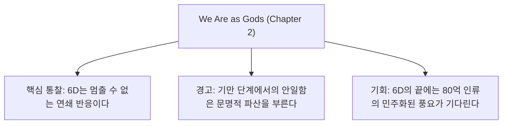

> **🎙️ 3-Presenter Authentic Tiki-Taka Script**
> 
> **Prof. Peter Kim:** 디아만디스와 코틀러는 2장에서 6D를 '문명의 진화 공식'으로 다시 소환합니다. 10년 전에는 6D가 스마트폰과 인터넷 중심이었다면, 2026년 지금은 에너지, 바이오, 우주, 지능 그 자체에 6D가 적용되고 있습니다.  
> **Dr. Elena Vance:** 저자들은 특히 6D의 비가역성(Irreversibility)을 강조합니다. 일단 어떤 도메인이 디지털화되면, 그 이전의 아날로그 상태로 되돌아가는 것은 열역학 제2법칙을 거스르는 것만큼이나 불가능합니다.  
> **TA Marcus Brody:** 이제 6개의 D를 하나씩 해부해 볼까요? 첫 번째 D부터 심상치 않습니다!  

---

### Slide 07: 1단계: 디지털화(Digitization) — 물리적 세계의 0과 1 변환
- **Definition:** 물리적 현상, 아날로그 신호, 생물학적 구조를 컴퓨터가 읽고 처리할 수 있는 이진수(0 and 1) 데이터로 인코딩하는 과정
- **Catalytic Property:** 디지털화되는 순간 물리적 마찰(마모, 운송 비용, 보관 공간)이 증발하고 **무어의 법칙과 연산 스케일링 곡선에 탑승**

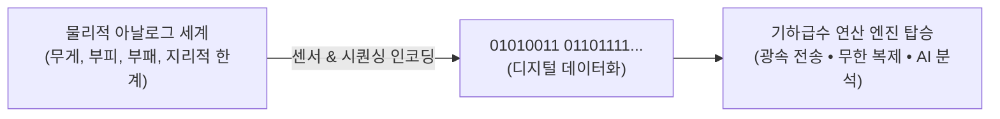

> **🎙️ 3-Presenter Authentic Tiki-Taka Script**
> 
> **Dr. Elena Vance:** 1단계 '디지털화'는 모든 기하급수 혁명의 방아쇠입니다. 사람들은 디지털화를 단순한 전산화로 생각하지만, 본질은 '물리 법칙의 지배를 받던 대상을 정보 이론의 지배를 받는 대상으로 바꾸는 존재론적 변환'입니다.  
> **TA Marcus Brody:** 사람의 피 한 방울을 뽑아서 시험관에 넣고 현미경으로 보던 시절에는 선형적이었지만, 혈액 속 DNA를 염기서열 텍스트 파일로 바꾸는 순간 AI가 1초 만에 분석하는 디지털 데이터가 되는 거잖아요!  
> **Prof. Peter Kim:** 정확합니다. 디지털화는 아톰의 감옥에 갇혀 있던 잠재력을 비트의 무한한 자유로 해방시키는 첫 번째 관문입니다.  

---

### Slide 08: 2단계: 기만적 성장(Deception) — 레이더 아래에서의 조용한 복리 증식
- **Definition:** 디지털화 직후 기하급수적으로 2배씩 성장하지만, 초기 수치가 너무 작아($0.001 \rightarrow 0.002 \rightarrow 0.004$) 겉보기에는 아무런 변화도 없는 것처럼 보이는 착시 구간
- **Psychological Effect:** 대중과 주류 기업들은 "느리고, 품질이 조악하며, 쓸모없는 장난감"으로 치부하며 무시함

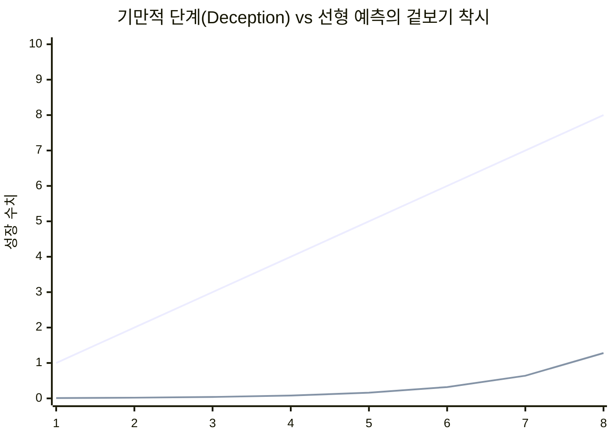

> **🎙️ 3-Presenter Authentic Tiki-Taka Script**
> 
> **TA Marcus Brody:** 여기가 바로 문제의 '기만 단계'입니다! 그래프를 보십시오. 1단계부터 6단계까지 기하급수 곡선은 바닥에 완전히 붙어 기어갑니다. 선형 성장(파란선)이 훨씬 빨라 보이죠.  
> **Dr. Elena Vance:** 이 구간에서 비판자들은 조롱합니다. "인터넷 그거 팩스보다 느린데 왜 쓰냐?", "디지털카메라 화질이 0.01메가픽셀인데 필름을 어떻게 이기냐?"라고요. 하지만 그들은 2배씩 곱해지고 있는 숨은 에너지를 보지 못합니다.  
> **Prof. Peter Kim:** 기만 단계는 폭풍 전야의 고요함입니다. 이 고요함을 평화로 착각하는 자는 파멸합니다.  

---

### Slide 09: 3단계: 파괴적 혁신(Disruption) — 기존 시장과 플레이어의 급속 붕괴
- **Definition:** 기만 단계를 뚫고 나온 기하급수 곡선이 선형 곡선을 교차 추월($T^*$)하며, 기존 제품의 성능과 가성비를 압도적으로 파괴하는 단계
- **Clayton Christensen Alignment:** 단순한 품질 경쟁이 아니라, 새로운 가치 제안과 극단적인 접근성으로 시장의 규칙 자체를 전복

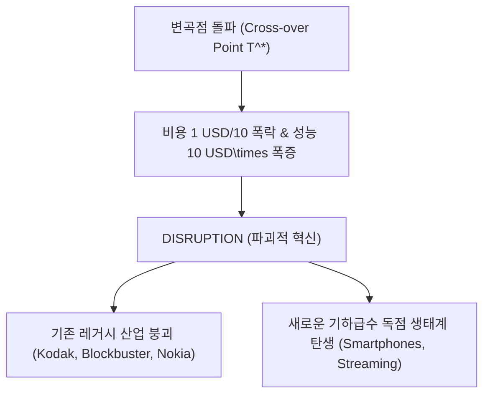

> **🎙️ 3-Presenter Authentic Tiki-Taka Script**
> 
> **Dr. Elena Vance:** 3단계 '파괴'는 점진적으로 오지 않습니다. 문턱값(Threshold)을 넘는 순간 하룻밤 사이에 수직으로 솟구칩니다. 성능은 10배 좋아지는데 가격은 10분의 1로 떨어지니 소비자가 거부할 방법이 없습니다.  
> **Prof. Peter Kim:** 파괴적 혁신은 기존 플레이어들에게 변명할 시간조차 주지 않습니다. 코닥이 파산 신청을 한 바로 그해에, 13명의 직원을 둔 인스타그램이 10억 달러에 팔렸던 역설이 이를 웅변합니다.  
> **TA Marcus Brody:** 쓰나미가 방파제를 넘는 순간에는 이미 도망칠 수 없는 것과 똑같네요!  

---

### Slide 10: 4단계: 탈물질화(Dematerialization) — 물리적 하드웨어의 소프트웨어 앱 응축
- **Definition:** 과거에는 거대한 물리적 장치, 공장, 플라스틱, 금속 박스가 필요했던 기능들이 단 몇 줄의 코드와 무료 소프트웨어 앱(App)으로 증발해버리는 현상
- **The Smartphone Phenomenon:** 카메라, 녹음기, GPS, 백과사전, 나침반, 라디오, 계산기가 스마트폰 화면 속으로 사라짐

```mermaid
flowchart LR
    subgraph HeavyPhysical["1980~1990년대 무거운 물리 장비들"]
        P1["캠코더 (1,000 USD)"]
        P2["GPS 수신기 (500 USD)"]
        P3["브리태니커 백과사전 32권 (1,400 USD)"]
        P4["음악 CD 플레이어 (200 USD)"]
    end
    subgraph Dematerialized["2026 탈물질화의 현실"]
        S1["스마트폰 단 1대 속의 무료 앱 아이콘들<br/>(무게 0g • 물리적 공간 0% • 자원 소비 0)"]
    end
    HeavyPhysical ==>|탈물질화 (Dematerialization)| Dematerialized
```

> **🎙️ 3-Presenter Authentic Tiki-Taka Script**
> 
> **TA Marcus Brody:** 제 방 책장에 꽂혀 있던 사전, 비디오테이프, CD 플레이어가 전부 어디로 갔을까요? 스마트폰 앱 아이콘 속으로 다 빨려 들어가 버렸습니다!  
> **Dr. Elena Vance:** 환경생태학적으로 탈물질화는 놀라운 축복입니다. 수억 톤의 플라스틱, 구리, 실리콘, 종이를 채굴하고 운송할 필요 없이, 순수한 비트의 형태로 서비스를 누리게 되었으니까요.  
> **Prof. Peter Kim:** 물리적 형태가 사라진다는 것은 자원의 절대적 결핍으로부터 인류가 해방되고 있음을 의미합니다.  

---

### Slide 11: 5단계: 탈화폐화(Demonetization) — 한계 비용 제로화와 가격의 소멸
- **Definition:** 기술의 발전으로 제품과 서비스를 생산하고 복제하는 **한계 비용(Marginal Cost)이 $0에 수렴**하여, 기존 시장의 가격표 자체가 사라지는 현상
- **Economic Paradigm:** 통신비(스카이프/카카오톡 무료), 정보 이용료(위키피디아/구글 검색 무료), 사진 인화비(무제한 무료 저장)

| 과거의 유료 서비스 (Monetized) | 2026 탈화폐화된 현실 (Demonetized) | 사라진 비용 규모 |
| :--- | :--- | :--- |
| **국제전화 요금** (분당 수천 원) | Zoom / WhatsApp 음성·화상 통화 | **100% 무료** |
| **백과사전 전집 구매** ($1,400) | Wikipedia / LLM 실시간 질의 | **100% 무료** |
| **필름 구매 및 인화비** (롤당 $15) | 스마트폰 무제한 클라우드 촬영 | **100% 무료** |
| **초급 법률·의료 상담** (시간당 $300) | 전문 AI 에이전트 1차 진단 | **$0.01 미만 수렴** |

> **🎙️ 3-Presenter Authentic Tiki-Taka Script**
> 
> **Dr. Elena Vance:** 5단계 '탈화폐화'는 경제학의 근간을 흔듭니다. 전통 경제학은 "모든 가치 있는 것에는 가격이 붙는다"고 가르쳤지만, 6D의 세계에서는 가장 가치 있는 지식과 통신이 '완전 무료'로 풀립니다.  
> **Prof. Peter Kim:** 탈화폐화는 기업 입장에서는 매출의 증발이지만, 소비자이자 인류 전체의 입장에서는 '구매력의 기하급수적 상승'입니다. 돈을 벌지 않고도 누릴 수 있는 삶의 질이 수직 상승하기 때문입니다.  
> **TA Marcus Brody:** 옛날엔 억만장자만 누리던 전 세계 실시간 통신을 지금은 아프리카 오지의 소년도 공짜로 누리고 있는 게 바로 탈화폐화의 힘이죠!  

---

### Slide 12: 6단계: 민주화(Democratization) — 소수 특권에서 80억 인류의 보편 인프라로
- **Definition:** 탈물질화와 탈화폐화를 거친 기술이 진입 장벽을 완전히 허물며, 지구상 누구나(Anywhere, Anyone) 동등하게 접근 가능한 보편 인프라로 안착하는 최종 단계
- **Global Equalization:** 슈퍼컴퓨터의 연산력, 세계 최고의 대학 강의, 최고 권위의 의료 진단이 스마트폰을 가진 모든 인간에게 평등하게 분배됨

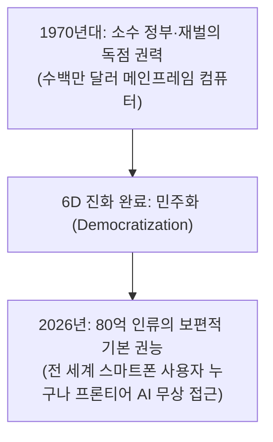

> **🎙️ 3-Presenter Authentic Tiki-Taka Script**
> 
> **Prof. Peter Kim:** 6D의 종착역은 언제나 **'민주화(Democratization)'**입니다. 과거 왕이나 교황, 거대 제국만이 누릴 수 있었던 전지전능한 권능이 80억 인류 개개인의 손바닥 위로 떨어지는 순간입니다.  
> **Dr. Elena Vance:** 케냐의 시골 농부와 미국의 실리콘밸리 억만장자가 똑같은 구글 검색창과 똑같은 챗봇 AI를 사용합니다. 지능의 민주화가 인류 역사상 유례없는 평등을 만들어내고 있습니다.  
> **TA Marcus Brody:** 신화 속 신들의 보물창고가 전 인류에게 개방된 셈이네요!  

---

### Slide 13: 피터 디아만디스의 6D 수직 체인과 생태계 연쇄 반응
- **System Dynamics:** 6D는 독립된 사건이 아니라, 도미노처럼 앞 단계가 뒷단계를 필연적으로 격발하는 인과 체인(Causal Chain)

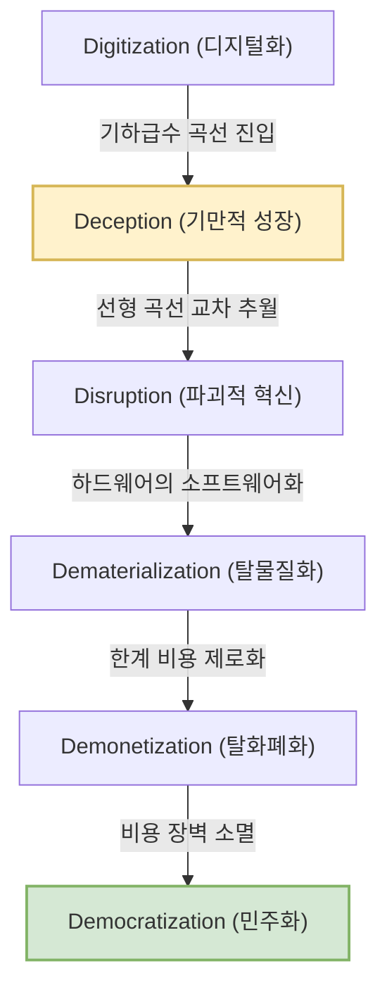

> **🎙️ 3-Presenter Authentic Tiki-Taka Script**
> 
> **Dr. Elena Vance:** 이 인과 다이어그램을 보십시오. 1단계 디지털화가 시작되면 기만 단계를 거쳐 파괴가 일어나고, 탈물질화와 탈화폐화를 통해 필연적으로 민주화에 도달합니다. 중간에 멈출 수 있는 브레이크는 존재하지 않습니다.  
> **Prof. Peter Kim:** 이것이 바로 기하급수 기술이 가진 '구조적 불가피성(Structural Inevitability)'입니다.  

---

### Slide 14: 스티븐 코틀러의 인지적 맹점(Blindspot) 경고: 기만 단계의 침묵
- **Cognitive Neuroscience Warning:** 왜 똑똑한 리더들이 2단계 '기만'에서 매번 걸려 넘어지는가?
- **The Silence of Compounding:** 초기 복리 증식은 절대적인 크기(Absolute Value)가 미미하여 인간 뇌의 주의력 임계값(Attention Threshold)을 자극하지 못함
- **The Fatal Delay:** 위협을 인지했을 때는 이미 3단계 '파괴'가 진행 중이며, 기하급수적 속도로 인해 대응에 필요한 리드 타임(Lead Time)이 전무함

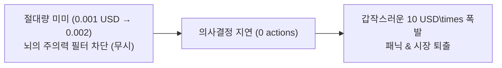

> **🎙️ 3-Presenter Authentic Tiki-Taka Script**
> 
> **TA Marcus Brody:** 체스판에 쌀알을 첫 칸에 1개, 둘째 칸에 2개, 셋째 칸에 4개 놓을 때, 10번째 칸까지 가봤자 쌀 한 줌도 안 되잖아요. 왕이 "겨우 이거 주려고 날 불렀냐?" 하고 방심하는 순간, 64번째 칸에서는 온 나라의 쌀을 다 털어도 모자라게 되는 것과 같습니다.  
> **Dr. Elena Vance:** 코틀러의 경고는 바로 이 침묵의 무서움입니다. 뇌는 '크기'에 반응하도록 진화했지, '기울기의 2차 미분값(가속도)'에는 반응하지 못합니다.  

---

### Slide 15: 6D 단계별 경제학적 지표 및 가치 이동 요약표
- **Comprehensive Master Matrix:** 6D의 각 단계별 핵심 메커니즘, 대표 사례, 경제학적 가치 이동 종합

| 6D 단계 | 핵심 물리/기술적 메커니즘 | 경제학적 현상 | 레거시 산업의 반응 | 소비자 체감 가치 |
| :--- | :--- | :--- | :--- | :--- |
| **1. Digitization** | 물리적 신호의 비트(0,1) 변환 | 데이터화 및 연산 자산화 | "단순한 틈새 장난감" | 실험적 호기심 |
| **2. Deception** | 레이더 이하의 복리 지수 증식 | 겉보기 성장 정체 착시 | "수익성 없는 비즈니스" | 조악한 품질에 실망 |
| **3. Disruption** | 선형 성능 추월 및 비용 급락 | 시장 점유율 급격한 역전 | "불공정 경쟁 / 위기 직면" | 열광적 전환 및 채택 |
| **4. Dematerialization** | 물리 장비의 앱/코드 응축 | 공급망 및 하드웨어 소멸 | "부품 제조사 도미노 파산" | 휴대성 및 공간 극대화 |
| **5. Demonetization** | 복제 한계 비용 $\rightarrow 0$ | 가격표 증발 및 무료화 | "전통 매출 모델 붕괴" | 지출 절약 및 소비 폭증 |
| **6. Democratization** | 글로벌 네트워크를 통한 보편화 | 글로벌 부의 평등한 배포 | "독점적 진입장벽 소멸" | 보편적 기본 권능 획득 |

> **🎙️ 3-Presenter Authentic Tiki-Taka Script**
> 
> **Prof. Peter Kim:** 이 요약표는 향후 여러분이 어떤 신기술 벤처를 분석하든 평생 사용할 수 있는 나침반입니다. 현재 기술이 6D 중 어느 단계에 머물러 있는지를 정확히 진단하는 것이 전략의 시작입니다.  
> **TA Marcus Brody:** 이제 3번째 모듈로 넘어가서 기만 단계의 수학적 공식을 제대로 털어보시죠!  

---

## Module 3: 기하급수 이론 및 프레임워크 (Slides 16~25)

### Slide 16: 기만적 단계(Deception Phase)의 수학적 메커니즘: $0.001 \rightarrow 0.002 \rightarrow 0.004$의 착시
- **Mathematical Form:** $y(t) = y_0 \cdot 2^{t / T_d} \quad (y_0 = 0.001, T_d = \text{Doubling Period})$
- **The Perception Gap:** 인간의 선형적 인지 오차 범위 $\epsilon \approx \pm 0.05$일 때, $y(t) < \epsilon$인 구간 동안의 모든 성장은 **인지적으로 'Zero(0)'로 반올림**됨

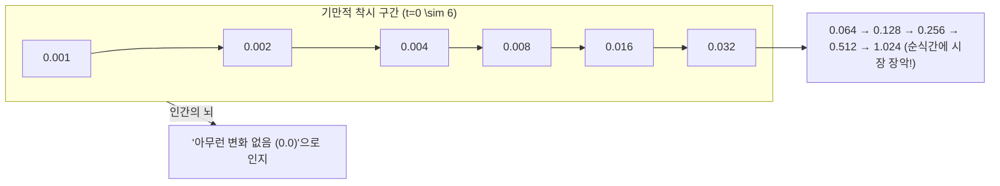

> **🎙️ 3-Presenter Authentic Tiki-Taka Script**
> 
> **Dr. Elena Vance:** 수식을 보십시오. $y_0$가 0.001일 때, 무려 6번의 배가(Doubling)를 거쳐도 수치는 겨우 0.032에 불과합니다. 인간의 눈에는 0.001이나 0.032나 똑같이 '바닥에 붙어있는 0'으로 보입니다.  
> **TA Marcus Brody:** 6번이나 2배로 뛰었는데도 여전히 1에도 못 미치니까, 기존 대기업 임원들은 "6년 동안 연구해서 고작 0.03이냐? 사업 접어라!" 하고 R&D 예산을 깎아버리는 겁니다.  
> **Prof. Peter Kim:** 그리고 바로 그 다음 5번의 턴에서 1을 넘어 32, 64로 폭발하며 그 기업의 숨통을 끊어놓습니다.  

---

### Slide 17: 기하급수 곡선과 선형 예측선의 변곡점 교차점 (Inflection Point $T^*$)
- **Analytical Solution:** 선형 모델 $L(t) = m \cdot t + c$ 와 기하급수 모델 $E(t) = E_0 \cdot 2^{t}$ 의 교차 방정식
- **The Cross-over Condition:** $E_0 \cdot 2^{T^*} = m \cdot T^* + c$
- **Catastrophic Divergence:** 교차점 $T^*$ 직후, 격차 $\Delta(t) = E(t) - L(t)$는 무한대로 발산

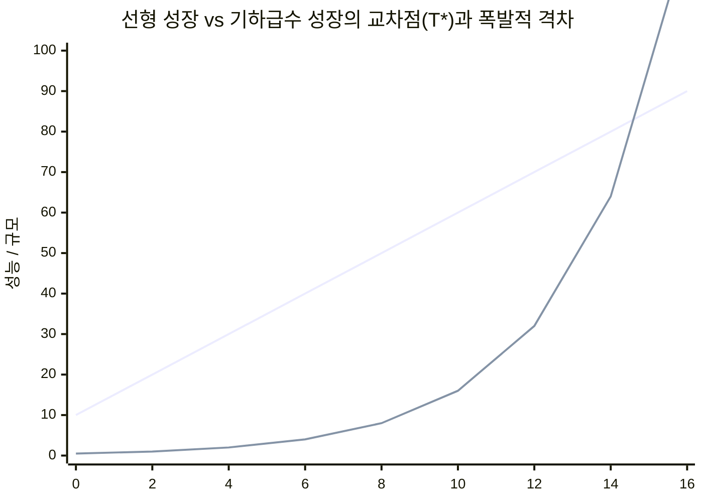

> **🎙️ 3-Presenter Authentic Tiki-Taka Script**
> 
> **Dr. Elena Vance:** $T=10$ 지점을 보십시오. 선형 선과 기하급수 선이 만나는 $T^*$ 지점입니다. 이때까지는 선형 모델이 훨씬 우월해 보였습니다. 하지만 교차점을 지나자마자 기하급수 곡선은 수직 이륙을 시작합니다.  
> **TA Marcus Brody:** $T^*$ 이전에는 기하급수 투자자가 바보처럼 보이지만, $T^*$ 이후에는 선형 투자자가 파산자가 됩니다!  
> **Prof. Peter Kim:** 따라서 전략적 리더의 유일한 임무는 $T^*$가 도래하는 정확한 시점을 계산하고, 기만 구간 동안 흔들리지 않고 자원을 베팅하는 것입니다.  

---

### Slide 18: 코닥(Kodak)의 비극: 1975년 스티브 사손의 0.01메가픽셀 카메라와 파산의 궤적
- **Historical Autopsy:** 1975년 코닥 엔지니어 스티브 사손(Steve Sasson)이 세계 최초 디지털카메라 발명
- **Specifications:** 0.01 Megapixel (10,000 pixels), 흑백, 카세트테이프에 23초 동안 1장 저장, 무게 3.6kg
- **Executive Verdict:** "귀엽네. 하지만 아무한테도 보여주지 마라. 필름 사업 망칠라."
- **Result:** 37년 뒤인 2012년, 코닥은 디지털카메라 파괴를 견디지 못하고 파산 보호(Chapter 11) 신청

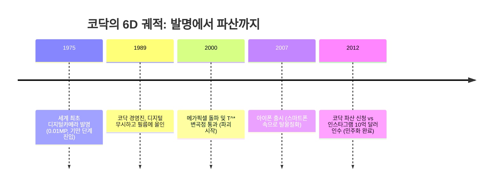

> **🎙️ 3-Presenter Authentic Tiki-Taka Script**
> 
> **Prof. Peter Kim:** 코닥의 비극은 기술이 없어서가 아니었습니다. 그들은 디지털카메라를 '세계 최초로 발명'한 장본인이었습니다!  
> **Dr. Elena Vance:** 사손의 0.01메가픽셀 카메라는 기만 단계의 완벽한 표본이었습니다. 당시 필름 화질은 수천만 픽셀에 달했으니 1만 픽셀짜리 토스터 크기 기계는 장난감으로 보였겠죠.  
> **TA Marcus Brody:** 하지만 2년마다 화질이 2배씩 좋아지는 무어의 법칙을 계산하지 않았던 코닥은, 자신들이 낳은 자식에게 잡아먹히고 만 것입니다.  

---

### Slide 19: 무어의 법칙(Moore's Law) vs 라이트의 법칙(Wright's Law)의 누적 생산 수렴
- **Empirical Laws of Cost Reduction:**
  - **Moore's Law:** 시간에 따른 비용 하락 ($C(t) = C_0 \cdot e^{-kt}$, 시간 중심)
  - **Wright's Law:** 누적 생산량 배가에 따른 비용 하락 ($C(Y) = C_0 \cdot Y^{-w}$, 규모 학습 중심)
- **Convergence:** 6D 프레임워크는 시간(무어)과 누적 생산 경험(라이트)이 결합할 때 기만 단계 탈출 속도가 극대화됨을 입증

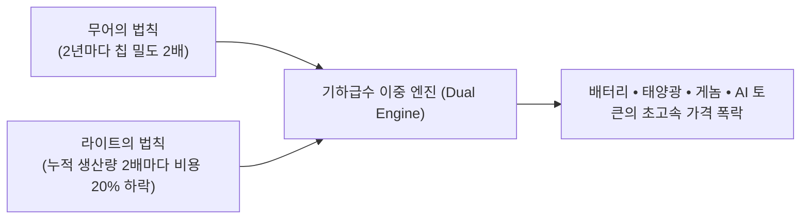

> **🎙️ 3-Presenter Authentic Tiki-Taka Script**
> 
> **Dr. Elena Vance:** MIT의 연구에 따르면 무어의 법칙보다 산업 현장의 누적 생산량을 반영하는 '라이트의 법칙'이 배터리와 태양광의 가격 하락을 훨씬 정확하게 설명합니다.  
> **TA Marcus Brody:** 많이 만들면 만들수록 만드는 법을 더 잘 알게 되고, 그래서 가격이 더 싸지고, 싸지니까 더 많이 팔리고... 이 선순환이 라이트의 법칙이군요!  
> **Prof. Peter Kim:** 6D는 무어의 지능 혁명과 라이트의 제조 학습이 결합한 문명적 터보차저입니다.  

---

### Slide 20: 기술 수렴(Technological Convergence): 단일 6D에서 복합 6D 매트릭스로의 진화
- **Matrix Multiplier:** 과거에는 단일 기술(예: 트랜지스터)의 6D였다면, 오늘날은 **AI + 바이오 + 로보틱스 + 양자 + 에너지의 동시 수렴**
- **Hyper-Acceleration:** 한 기술의 민주화 결과물이 다른 기술의 디지털화 인프라로 즉각 투입됨

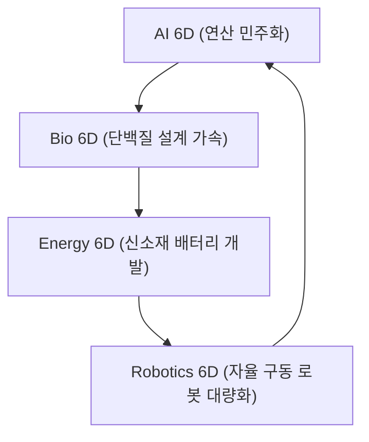

> **🎙️ 3-Presenter Authentic Tiki-Taka Script**
> 
> **Prof. Peter Kim:** 6D가 단일 트랙으로 달릴 때도 파괴적이었는데, 지금은 5개의 6D 트랙이 서로를 끌어당기며 회오리를 치고 있습니다.  
> **Dr. Elena Vance:** AlphaFold가 단백질을 풀고, 그 단백질로 새로운 차세대 배터리 전해질을 만들고, 그 배터리로 휴머노이드 로봇을 구동하는 세상입니다.  
> **TA Marcus Brody:** 단일 기술만 보던 사람들은 이 복합 수렴의 속도에 완전히 넋을 잃게 될 겁니다!  

---

### Slide 21: 네트워크 효과(Metcalfe's Law)와 6D의 결합 가속도
- **Network Valuation:** 멧칼프의 법칙(Metcalfe's Law) — 네트워크의 가치는 사용자 수의 제곱에 비례 ($V \propto N^2$)
- **6D Synergies:** 민주화(Democratization)로 인해 사용자($N$)가 10배 증가하면, 시스템의 총 가치($V$)는 **100배**로 폭증하며 기만 단계를 강제로 종결시킴

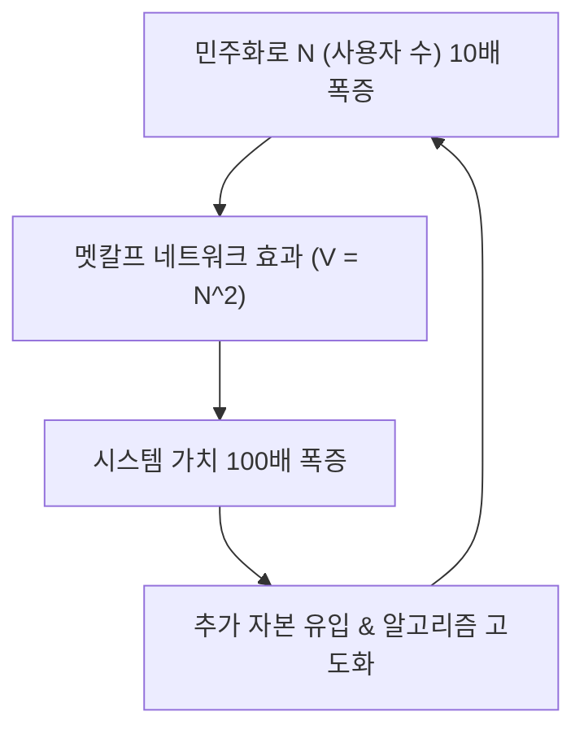

> **🎙️ 3-Presenter Authentic Tiki-Taka Script**
> 
> **TA Marcus Brody:** 스마트폰 사용자가 1억 명일 때와 50억 명일 때의 인터넷 가치는 50배가 아니라 2,500배 차이입니다. 멧칼프의 제곱 법칙 때문이죠!  
> **Dr. Elena Vance:** 민주화가 달성되는 순간 네트워크 효과가 발동하며 기술 생태계는 아무도 무너뜨릴 수 없는 거대한 '자연 독점'이자 공공 인프라로 굳어집니다.  

---

### Slide 22: 탈물질화의 물리적 한계 돌파: 비트(Bit)가 아톰(Atom)을 삼키는 원리
- **Software Eating the Physical World (Marc Andreessen extended):** 물리적 기계 가공(Machining)을 소프트웨어 알고리즘으로 치환
- **Material Dematerialization Metrics:**
  - 1980년대 50kg 상당의 물리 기기 $\rightarrow$ 스마트폰 180g (무게 99.6% 감소)
  - 물리적 제조, 포장, 물류, 창고, 진열 공간의 **원천적 제거**


> **🎙️ 3-Presenter Authentic Tiki-Taka Script**
> 
> **Prof. Peter Kim:** 마크 앤드리슨은 "소프트웨어가 세상을 먹어치우고 있다"고 했습니다. 하지만 6D의 관점에서 보면, "비트가 아톰을 해방시키고 있는 것"입니다.  
> **Dr. Elena Vance:** 물리적인 것을 만들지 않고도 똑같은 기능적 혜택을 누릴 수 있다면, 인류는 지구의 자원을 갉아먹지 않고도 무한한 성장을 지속할 수 있습니다.  

---

### Slide 23: 한계비용 제로 경제학(Zero Marginal Cost Economics, Jeremy Rifkin)
- **Economic Paradigm:** 제레미 리프킨의 *한계비용 제로 사회(The Zero Marginal Cost Society)*
- **Core Formula:** 총비용 $TC(Q) = FC + VC \cdot Q \implies MC = \frac{dTC}{dQ} = VC$
- **6D Reality:** 정보재 및 재생에너지의 가변 비용 $VC \rightarrow 0 \implies \mathbf{MC \approx 0}$
- **Consequence:** 자본주의의 가장 위대한 성공(효율 극대화)이 자본주의 자체의 가격 메커니즘을 탈화폐화(Demonetize)시키는 역설

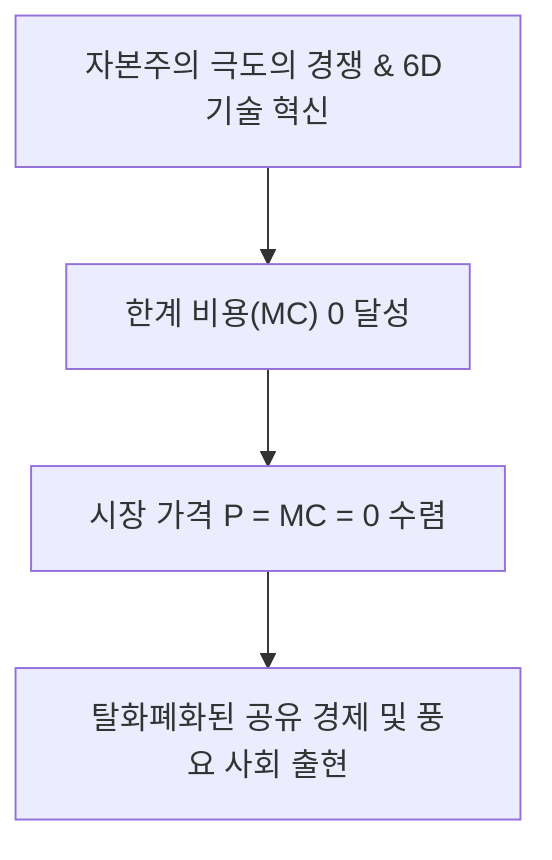

> **🎙️ 3-Presenter Authentic Tiki-Taka Script**
> 
> **Dr. Elena Vance:** 전통 경제학의 완벽한 경쟁 시장에서는 가격 $P$가 한계 비용 $MC$와 일치합니다. 그런데 6D 기술은 한계 비용을 '0'으로 만듭니다. 즉, 시장 가격이 0원이 되어야 시장이 균형을 이룬다는 뜻입니다!  
> **Prof. Peter Kim:** 이것이 바로 자본주의가 스스로를 탈화폐화시키는 놀라운 진화적 역설입니다. 기업은 이윤을 남길 수 없어 당황하지만, 인류는 풍요를 공짜로 상속받습니다.  
> **TA Marcus Brody:** 개발자 입장에선 오픈소스가 세상을 점령하는 메커니즘과 완전히 일치하네요!  

---

### Slide 24: 진입 장벽(Barrier to Entry)의 붕괴 공식: $C_{\text{entry}} \rightarrow 0$
- **Traditional Business Moat:** 공장 설비 투자(Capex), 유통망 확보, 방송국 광고비 등 수억 달러 필요
- **Exponential Democratized Stack:** 
  - 클라우드 컴퓨팅(AWS/GCP), 오픈소스 AI(HuggingFace), 글로벌 유통(Shopify/AppStore), 바이오 파운드리(Ginkgo)
  - 차고 안의 대학생 2명이 $1,000의 자본으로 포춘 500대 기업과 대등한 인프라로 경쟁 가능

$$\lim_{\text{Tech} \to \text{Democratized}} C_{\text{entry}} = 0$$

```mermaid
flowchart TD
    OldBarrier["과거 진입 장벽: 100M USD 공장 + 수천 명 인력"] --> 6DStack["6D 오픈소스 스택 (AWS • LLM • Foundry)"]
    6DStack --> ZeroBarrier["현재 진입 장벽: 노트북 1대 + 클라우드 크레딧 500 USD"]
    ZeroBarrier --> StartupSurge["글로벌 스타트업 문샷 폭발"]
```

> **🎙️ 3-Presenter Authentic Tiki-Taka Script**
> 
> **TA Marcus Brody:** 옛날엔 제약회사를 차리려면 1조 원짜리 임상 랩이 필요했지만, 지금은 노트북으로 단백질 AI 돌리고 합성 파운드리에 주문 넣으면 끝입니다!  
> **Dr. Elena Vance:** 진입 장벽의 붕괴는 혁신의 주체를 거대 관료 조직에서 '열정적인 소수 괴짜들'로 완전히 이동시켰습니다.  
> **Prof. Peter Kim:** XPRIZE가 바로 이 원리로 작동합니다. 1,000억 달러의 관료적 연구비보다, 1,000만 달러의 상금에 자극받은 전 세계 무명 천재들의 연합이 훨씬 빠르고 혁신적인 해답을 찾아냅니다.  

---

### Slide 25: 6D 기반 파괴적 기회 탐색 알고리즘 (Disruptive Opportunity Matrix)
- **Practical Framework:** 벤처 기획 및 문샷 발굴을 위한 4단계 진단 알고리즘

```mermaid
flowchart TD
    S1["STEP 1. 아날로그 병목 탐색: 현재 물리적 원자(Atom)와 인력에 묶여 극도로 비싼 산업 식별"] --> S2["STEP 2. 디지털화 레버리지: 해당 병목을 0과 1의 데이터 및 센서/AI 코드로 변환할 방법 설계"]
    S2 --> S3["STEP 3. 기만 단계 추적: 현재 성능은 조악하지만 2배 증가 곡선(Doubling)을 타기 시작한 초기 기술 발굴"]
    S3 --> S4["STEP 4. 탈화폐화 10 USD\times 모델링: 비용이 1/100로 떨어졌을 때 열릴 80억 명 민주화 시장 선점"]
```

> **🎙️ 3-Presenter Authentic Tiki-Taka Script**
> 
> **Prof. Peter Kim:** 이 4단계 알고리즘이 디아만디스가 싱귤래리티 대학교와 수많은 유니콘 벤처를 육성할 때 사용한 핵심 전략 템플릿입니다.  
> **Dr. Elena Vance:** 교육, 의료, 농업, 에너지... 아직도 아날로그적 비효율에 갇혀 있는 산업을 골라 6D의 렌즈를 들이대는 순간, 수조 달러짜리 기회가 열립니다.  
> **TA Marcus Brody:** 이제 실제 역사에서 6D가 어떻게 세상을 뒤흔들었는지 글로벌 데이터 현장으로 가보시죠!  

---

## Module 4: 글로벌 데이터 & 실증 케이스 (Slides 26~35)

### Slide 26: CASE 1: 디지털 사진 산업의 6D 궤적 (Kodak 파산 vs Instagram 10억 달러 인수)
- **The Ultimate 6D Case:** 코닥의 130년 화학 필름 제국 붕괴 vs 인스타그램의 18개월 만의 신화
- **Quantitative Comparison:**

| 비교 지표 | 이스트만 코닥 (Eastman Kodak, 2012) | 인스타그램 (Instagram, 2012 인수 당시) |
| :--- | :--- | :--- |
| **기업 가치** | **파산 신청 (Chapter 11)** | **$1,000,000,000 ($1B)** |
| **정규직 직원 수** | 145,000명 (전성기) $\rightarrow$ 17,000명 | **단 13명** |
| **핵심 자산** | 화학 공장, 인화지 유통망, 부동산 | 클라우드 코드, AWS 인프라, 모바일 앱 |
| **일일 처리 사진 수** | 수억 장 인화 (유료, 며칠 소요) | 수억 장 업로드 (무료, 0.1초 소요) |

> **🎙️ 3-Presenter Authentic Tiki-Taka Script**
> 
> **Prof. Peter Kim:** 2012년은 문명사적으로 매우 상징적인 해였습니다. 14만 명의 직원을 거느리고 전 세계 사진의 90%를 독점하던 코닥이 파산했고, 직원 13명의 인스타그램이 10억 달러에 페이스북에 인수되었습니다.  
> **Dr. Elena Vance:** 코닥은 '필름이라는 원자(Atom)'를 팔았고, 인스타그램은 '소셜 공유라는 비트(Bit)'를 유통했습니다. 6D를 거부한 제국과 6D를 타고 날아오른 다윗의 결정적 차이입니다.  
> **TA Marcus Brody:** 직원 13명이 14만 명의 거인을 무너뜨린 이 사건이 6D의 파괴력을 가장 잘 보여주는 역사적 증거입니다!  

---

### Slide 27: CASE 2: 스마트폰에 흡수된 1980년대 30개 전자장비의 탈물질화 실증 데이터 ($7.1M $\rightarrow$ $0)
- **Diamandis Calculation (2026 Updated):** 1980년대 후반 개별 구매 시 수백만 달러가 들었던 물리 장비들이 오늘날 $500 스마트폰 속 무료 앱으로 탈물질화
- **Total Value Density:** 약 **$7.1 Million (약 95억 원)** 상당의 하드웨어 기능이 주머니 속으로 응축

```mermaid
pie title 1980년대 개별 하드웨어 가격 비중 (총합 7.1M USD 상당)
    "슈퍼컴퓨터 연산력 (Cray X-MP급)" : 45
    "방송용 캠코더 및 영상 편집기" : 20
    "고정밀 GPS 위성 항법 장치" : 12
    "브리태니커 백과사전 및 음향 스튜디오" : 13
    "기타 통신, 센서, 게임기" : 10
```

> **🎙️ 3-Presenter Authentic Tiki-Taka Script**
> 
> **TA Marcus Brody:** 1980년대에 크레이(Cray) 슈퍼컴퓨터 한 대가 500만 달러였고, 방송용 캠코더가 수만 달러였습니다. 그 모든 장비를 트럭에 싣고 다녀야 했는데, 지금은 스마트폰 하나가 그 트럭 10대보다 훨씬 뛰어난 성능을 무료 앱으로 제공합니다!  
> **Dr. Elena Vance:** 710만 달러의 가치가 0달러로 탈화폐화되고 180그램으로 탈물질화된 것입니다.  
> **Prof. Peter Kim:** 이것이 바로 기술이 인류에게 선사한 거대한 보이지 않는 배당금입니다.  

---

### Slide 28: CASE 3: 게놈 시퀀싱(NGS)의 6D 여정 ($3B $\rightarrow$ $100, 3천만 분의 1 하락)
- **Carlson Curve vs Moore's Law:** 생명공학의 디지털화가 가져온 초-기하급수
- **Data Points:**
  - 2003년 (인간 게놈 프로젝트): **$3,000,000,000 (13년 소요)**
  - 2014년 (Illumina HiSeq X Ten): **$1,000 (하루 소요)**
  - 2026년 (Next-Gen Ultima/Oxford Nanopore): **$100 미만 (1시간 소요)**

```mermaid
xychart-beta
    title "1명 게놈 시퀀싱 비용 하락 궤적 ( Log10 Scale)"
    x-axis [2003, 2007, 2011, 2015, 2019, 2023, 2026]
    y-axis "Cost ( Log Scale)" 1 --> 10
    line [9.47, 7.0, 4.0, 3.0, 2.8, 2.3, 1.8]
```

> **🎙️ 3-Presenter Authentic Tiki-Taka Script**
> 
> **Dr. Elena Vance:** 게놈 해독 비용이 30억 달러에서 100달러로 떨어졌습니다. 3천만 분의 1입니다. 이제 유전자 해독은 부유한 연구소의 전유물이 아니라, 전 세계 동네 보건소에서 감기 검사하듯 받는 민주화된 의료 루틴이 되었습니다.  
> **TA Marcus Brody:** DNA라는 화학 분자가 A, T, G, C라는 디지털 텍스트로 변환되는 순간, 무어의 법칙보다 3배나 빠르게 가격이 폭락한 거죠!  

---

### Slide 29: CASE 4: 태양광 PV 모듈 가격의 기만 단계 탈출과 99.6% 가격 하락
- **Swanson's Law Empirical Validation:** 1976년 와트당 $106 $\rightarrow$ 2026년 와트당 **$0.08** (99.6% 폭락)
- **The Tipping Point:** 기만 단계를 지나자 석탄, 가스, 원자력보다 발전 단가(LCOE)가 저렴해지는 **'그리드 패리티(Grid Parity)'** 전 세계 도달

```mermaid
xychart-beta
    title "태양광 모듈 와트당 가격 하락 (/Watt, 1976~2026)"
    x-axis [1976, 1986, 1996, 2006, 2016, 2026]
    y-axis "가격 (/W)" 0 --> 110
    line [106, 35, 10, 4.5, 0.38, 0.08]
```

> **🎙️ 3-Presenter Authentic Tiki-Taka Script**
> 
> **Prof. Peter Kim:** 1970년대 우주선 인공위성에나 붙이던 와트당 100달러짜리 태양광 패널이 지금은 8센트입니다.  
> **TA Marcus Brody:** 화석연료 업계는 30년 동안 "태양광은 보조금 없으면 망하는 비효율적 에너지"라고 비웃었지만, 기만 단계를 뚫고 나오자 지구상에서 가장 저렴한 에너지가 되었습니다.  
> **Dr. Elena Vance:** 에너지가 탈화폐화되면 해수 담수화, 수직 농업, 탄소 포집 등 인류의 모든 자원 난제가 도미노처럼 해결됩니다.  

---

### Slide 30: CASE 5: 리튬이온 배터리 팩 가격 하락 ($1,200/kWh $\rightarrow$ $90/kWh)과 전기차 변곡점
- **Battery Pack Economics (BloombergNEF / Wright's Law Data):**
  - 2010년: **$1,200 / kWh** (기만 단계)
  - 2020년: **$137 / kWh**
  - 2026년: **$85~90 / kWh** (내연기관 차량 가격 역전 임계점 $100 돌파!)

```mermaid
xychart-beta
    title "리튬이온 배터리 팩 kWh당 가격 추이 (2010~2026)"
    x-axis [2010, 2013, 2016, 2019, 2022, 2024, 2026]
    y-axis "팩 가격 (/kWh)" 0 --> 1300
    line [1200, 680, 295, 156, 138, 105, 88]
```

> **🎙️ 3-Presenter Authentic Tiki-Taka Script**
> 
> **TA Marcus Brody:** 배터리 팩 가격이 100달러 밑으로 떨어지는 순간, 전기차는 보조금 없이도 가솔린차보다 싸집니다. 유지비는 이미 1/5 수준이고요.  
> **Dr. Elena Vance:** 내연기관 자동차 130년 역사가 단 15년 만에 배터리 6D 곡선에 의해 파괴되고 있는 현장입니다.  

---

### Slide 31: CASE 6: LLM 토큰 생성 비용의 기하급수 하락 추이 (100만 토큰당 $60 $\rightarrow$ $0.1)
- **AI Inference Demonetization Metric (2022~2026):**
  - GPT-4 출시 초기 (2023년 3월): 100만 입력 토큰당 **$30.00**, 출력 **$60.00**
  - 2026년 프론티어 경량/오픈소스 모델 (DeepSeek, Llama-3, Gemini Flash): 100만 토큰당 **$0.05 ~ $0.15** (**99.8% 가격 증발!**)

```mermaid
xychart-beta
    title "AI 100만 토큰 추론 비용 하락 추이 (/Million Tokens)"
    x-axis [2023.03, 2023.11, 2024.06, 2025.01, 2026.01]
    y-axis "추론 비용 ()" 0 --> 60
    line [60, 30, 5, 0.5, 0.1]
```

> **🎙️ 3-Presenter Authentic Tiki-Taka Script**
> 
> **Dr. Elena Vance:** 3년 만에 AI 추론 비용이 600분의 1로 떨어졌습니다. 전 세계 모든 소프트웨어와 서비스에 초지능을 무제한으로 덧붙일 수 있는 경제적 토대가 완성된 것입니다.  
> **TA Marcus Brody:** 지능 자체가 공기나 수돗물처럼 탈화폐화되고 있습니다!  
> **Prof. Peter Kim:** 이것이 6주차에서 다룰 '지능 폭발의 경제학'의 전초전입니다.  

---

### Slide 32: CASE 7: 배양육(Cultured Meat)의 6D 변곡점 ($330,000 $\rightarrow$ $10/kg 버거)
- **Cellular Agriculture 6D Curve:**
  - 2013년 마크 포스트 교수(Mark Post)의 세계 최초 배양육 버거: **$330,000 (약 4억 5천만 원)**
  - 2026년 생물반응기(Bioreactor) 스케일업 및 무혈청 배지 혁신: **$10 / kg 이하 도달**

```mermaid
xychart-beta
    title "배양육 패티 1개 생산 단가 하락 곡선 ( Log Scale)"
    x-axis [2013, 2016, 2019, 2022, 2024, 2026]
    y-axis "Cost ( Log Scale)" 0 --> 6
    line [5.52, 4.0, 2.5, 1.8, 1.3, 0.9]
```

> **🎙️ 3-Presenter Authentic Tiki-Taka Script**
> 
> **TA Marcus Brody:** 패티 한 장에 4억 5천만 원 하던 배양육이 지금은 마트에서 소고기보다 싸게 팔릴 준비를 마쳤습니다.  
> **Dr. Elena Vance:** 축산업이 소를 키워 도축하는 '원자 기반'에서 줄기세포를 배양하는 '바이오 정보 기반'으로 전환된 완벽한 6D 사례입니다. 지구 토지의 40%와 온실가스의 18%를 차지하던 축산의 질서가 바뀝니다.  

---

### Slide 33: CASE 8: 원격 우주 탐사 및 큐브위성(CubeSat) 발사 비용의 6D 혁명
- **Space Launch Economics:**
  - NASA 우주왕복선 시대: kg당 **$54,500**
  - SpaceX 팰컨9 재사용: kg당 **$2,600**
  - SpaceX 스타십 완전 재사용 (2026): kg당 **$100 미만 수렴**
- **Democratization of Orbit:** 대학 동아리와 스타트업이 수천만 원으로 궤도에 독자 인공위성을 띄우는 시대 도래

```mermaid
xychart-beta
    title "지구 저궤도(LEO) 1kg 수송 비용 하락 추이 (/kg)"
    x-axis [1981, 1995, 2010, 2018, 2023, 2026]
    y-axis "수송 비용 (/kg)" 0 --> 60000
    line [54500, 26800, 10500, 2600, 1200, 100]
```

> **🎙️ 3-Presenter Authentic Tiki-Taka Script**
> 
> **Prof. Peter Kim:** 우주 발사 비용이 5만 달러에서 100달러로 떨어졌습니다. 우주는 이제 국가 패권의 상징이 아니라 상업적 민주화의 무대입니다.  
> **TA Marcus Brody:** 큐브위성을 쏘아 올려 전 지구를 24시간 실시간 감시하는 스타트업들이 쏟아져 나오는 이유가 여기에 있습니다.  

---

### Slide 34: CASE 9: 글로벌 핀테크 및 모바일 머니(M-Pesa 등)의 금융 민주화 지표
- **Financial Inclusion Metric:** 케냐 M-Pesa 및 인도 UPI(Unified Payments Interface)
- **Dematerialization of Banking:** 은행 지점 건물과 ATM 기기 소멸 $\rightarrow$ 피처폰 SMS 및 QR코드로 10억 금융 소외계층에게 계좌 및 소액 대출 보급

| 국가 및 플랫폼 | 과거 전통 금융 접근율 | 2026 6D 모바일 머니 보급률 | 빈곤 탈출 및 경제 효과 |
| :--- | :--- | :--- | :--- |
| **케냐 (M-Pesa)** | 성인 인구의 27%만 은행 이용 | **성인의 96% 이상 이용** | 여성 가구 빈곤율 22% 영구 감소 |
| **인도 (UPI/Aadhaar)**| 금융 소외 계층 5억 명 | **월 130억 건 무수수료 즉시 결제** | GDP의 50% 상당 디지털화 |

> **🎙️ 3-Presenter Authentic Tiki-Taka Script**
> 
> **Dr. Elena Vance:** 벽돌로 지은 은행 지점과 금고를 지을 돈이 없던 개발도상국들이 모바일 코드로 직행하여 단숨에 금융 선진국이 되었습니다.  
> **TA Marcus Brody:** 금융의 탈물질화와 탈화폐화가 수억 명을 빈곤에서 구출해낸 생생한 데이터입니다!  

---

### Slide 35: 6D 산업별 기만 단계 진입 및 탈출 타임라인 종합 매트릭스
- **Cross-Industry Timeline Synthesis:** 주요 산업들의 6D 단계 현황 진단표

```mermaid
graph TD
    subgraph FullyDemocratized["완전 민주화 완료 (6D 달성)"]
        A1["디지털 사진 • 웹 백과사전 • 음악 스트리밍 • 화상 통신"]
    end
    subgraph InDisruption["파괴 및 탈화폐화 진행 중 (3~5D)"]
        A2["프론티어 AI 추론 • 태양광 & ESS • 전기차 • 게놈 시퀀싱"]
    end
    subgraph InDeception["기만 단계 탈출 직전 (2~3D - 거대한 기회!)"]
        A3["합성 생물학 파운드리 • 배양육 • 양자 컴퓨팅 • BCI 인공장기 • 우주 수송"]
    end
```

> **🎙️ 3-Presenter Authentic Tiki-Taka Script**
> 
> **Prof. Peter Kim:** 이 매트릭스가 오늘 강의의 백미입니다. 이미 민주화가 끝난 1번 영역에서는 거대한 기회가 없습니다. 진정한 $100B 벤처와 XPRIZE의 무대는 지금 기만 단계의 끝자락(2~3D)에서 웅크리고 있는 3번 영역입니다!  
> **TA Marcus Brody:** 양자 컴퓨팅, 배양육, BCI... 여기가 바로 다음 10년을 뒤흔들 화약고입니다!  

---

## Module 5: 사회적·철학적 역설 (So What?) (Slides 36~42)

### Slide 36: 기만적 평온함 뒤에 숨은 거버넌스 붕괴: 규제 기관의 인지적 딜레마
- **Governance Paradox:** 기만 단계에서는 "아직 시장에 영향이 없으니 규제할 필요가 없다"고 방치하다가, 파괴 단계에 들어서면 "변화가 너무 빨라 손을 댈 수 없다"며 공황에 빠짐
- **The Regulatory Vacuum:** 법과 제도가 기하급수 기술의 뒤꽁무니만 쫓는 영구적 규제 공백 상태

```mermaid
flowchart LR
    Decept["기만 단계: '문제없음, 장난감일 뿐' (규제 무관심)"] --> Cross["T^* 변곡점 급속 돌파"]
    Cross --> Panic["파괴 단계: '통제 불능, 사회 혼란' (규제 패닉 & 사후약방문)"]
```

> **🎙️ 3-Presenter Authentic Tiki-Taka Script**
> 
> **Prof. Peter Kim:** 규제 기관의 비극은 언제나 타이밍의 엇박자입니다. 기술이 약할 때는 무시하고, 강해졌을 때는 통제하지 못합니다.  
> **Dr. Elena Vance:** 우버나 에어비앤비, 생성 AI 사태에서 보았듯, 전통 법률 체계는 6D의 속도를 감당할 수 없습니다.  

---

### Slide 37: 전통 기업의 '혁신가의 딜레마(The Innovator's Dilemma)'와 6D 사망 선고
- **Clayton Christensen's Paradox:** 가장 훌륭하고 유능하게 경영되는 기업일수록 6D 파괴에 더 취약함
- **Reason:** 기존 우량 고객들은 기만 단계의 조악한 신기술을 원하지 않으며, 경영진은 마진 80%의 기존 제품을 버리고 마진 0%의 디지털 무료 제품에 투자할 수 없음

```mermaid
flowchart TD
    GoodMgmt["우량 고객의 요구 청취 & 고마진 기존 제품 최적화"] --> Ignore6D["기만 단계의 저마진 조악한 신기술 무시"]
    Ignore6D --> SuddenDeath["신기술의 기하급수 성능 역전 → 기업 파산"]
```

> **🎙️ 3-Presenter Authentic Tiki-Taka Script**
> 
> **TA Marcus Brody:** 하버드 경영대학원에서 가르치는 최고의 경영 원칙을 그대로 따랐는데 회사가 망하는 기막힌 역설입니다!  
> **Prof. Peter Kim:** 선형 경제의 우등생이 기하급수 경제에서는 낙제생이 됩니다.  

---

### Slide 38: 탈화폐화의 양날의 검: GDP 착시와 경제 통계의 왜곡
- **Macroeconomic Paradox:** 기술이 풍요를 창출할수록 전통적인 국내총생산(GDP)은 오히려 **감소하거나 정체**되는 착시
- **Example:** 백과사전 산업($1.4B) $\rightarrow$ 위키피디아($0). 소비자 잉여(Consumer Surplus)는 무한대로 증가했으나 GDP 통계에는 14억 달러의 경제 축소로 기록됨!

```mermaid
flowchart LR
    Abundance["실제 문명의 풍요와 소비자 후생 무한 증가"] --> Divergence{"통계적 괴리 (GDP Paradox)"}
    Divergence --> GDP["전통 GDP 지표: 매출 소멸로 마이너스/정체 기록"]
```

> **🎙️ 3-Presenter Authentic Tiki-Taka Script**
> 
> **Dr. Elena Vance:** 우리가 매일 쓰는 유튜브, 위키피디아, 오픈소스 AI는 전부 무료라서 GDP에 거의 잡히지 않습니다. 세상은 물질적으로 훨씬 부유해졌는데 경제 성장률 지표는 낮게 나오는 이유입니다.  
> **TA Marcus Brody:** 경제학자들이 "저성장 시대"라고 우울해할 때, 인류는 역사상 가장 거대한 '공짜 풍요의 축제'를 즐기고 있는 거군요!  

---

### Slide 39: 디지털 과점과 새로운 봉건주의(Digital Neo-Feudalism)의 위험
- **Dark Side of Democratization:** 인프라의 민주화 이면에 도사린 플랫폼 독점의 집중화
- **The Platform Feudalism:** 80억 인류가 무료로 서비스를 누리는 대가로, 소수의 빅테크 클라우드 영주들에게 자신의 모든 데이터와 인지적 통제권을 헌납하는 위험

```mermaid
flowchart TD
    FreeService["탈화폐화된 무료 서비스 제공 (SaaS, AI)"] --> DataExtraction["사용자의 모든 일상 데이터 및 행동 양식 채굴"]
    DataExtraction --> LockIn["초거대 플랫폼 종속 및 디지털 봉건 영주 탄생"]
```

> **🎙️ 3-Presenter Authentic Tiki-Taka Script**
> 
> **Prof. Peter Kim:** "서비스가 공짜라면, 당신이 바로 상품이다." 6D의 탈화폐화가 남긴 가장 어두운 그림자입니다.  
> **Dr. Elena Vance:** 편리함의 대가로 사생활과 자율성을 넘겨주는 '디지털 농노(Digital Serfs)'로 전락하지 않으려면 탈중앙화된 웹3 및 오픈소스 거버넌스가 필수적입니다.  

---

### Slide 40: 고용의 탈물질화와 노동 가치설의 종말
- **Labor Transformation:** 지식 노동과 육체 노동의 소프트웨어화 $\rightarrow$ 인간의 시간과 노동을 화폐로 교환하던 고용 모델의 한계
- **Post-Labor Economics:** 풍요가 보편화된 사회에서 인간의 존엄성과 기본 소득(UBI / Universal Basic Abundance)의 재정의

```mermaid
flowchart LR
    Demen["지능과 육체 노동의 탈물질화 & 한계비용 제로화"] --> EndLabor["전통적 임금 노동 시장 축소"]
    EndLabor --> UBA["보편적 기본 풍요 (Universal Basic Abundance) 체제로의 문명적 이행"]
```

> **🎙️ 3-Presenter Authentic Tiki-Taka Script**
> 
> **TA Marcus Brody:** 일자리가 사라진다고 공포에 떨 것만이 아니라, 애초에 먹고살기 위해 억지로 해야 했던 '노역'에서 해방되는 과정으로 봐야겠네요!  
> **Prof. Peter Kim:** 노동이 의무가 아닌 선택이 되는 사회, 그것이 6D가 문명에 던지는 궁극의 철학적 숙제입니다.  

---

### Slide 41: 기하급수 리더십(Exponential Leadership): 기만 단계를 포착하는 직관 훈련
- **Leadership Capabilities:** 6D 시대를 지배하는 리더의 3대 핵심 역량
  1. **초기 노이즈 속 신호 포착 (Signal Detection in Noise):** 0.01%의 성장을 비웃지 않고 Doubling 주기를 계산하는 수학적 직관
  2. **자기 파괴의 용기 (Cannibalize Yourself):** 남에게 파괴당하기 전에 자신의 캐시카우를 스스로 탈물질화시키는 대담함
  3. **문샷 사고(Moonshot Thinking):** 10% 개선이 아닌 10배($10\times$) 도약을 목표로 설정하는 스케일 감각

```mermaid
flowchart TD
    L1["1. 지수적 직관: 기만 단계의 배가 주기(Doubling Rate) 추적"] --> L2["2. 자기 파괴: 기존 비즈니스의 선제적 탈물질화"]
    L2 --> L3["3. 10 USD\times 문샷: 한계 비용 제로 인프라를 활용한 전 지구적 스케일 확장"]
```

> **🎙️ 3-Presenter Authentic Tiki-Taka Script**
> 
> **Dr. Elena Vance:** 기하급수 리더는 현재의 재무제표가 아니라 '변화의 2차 미분값'을 봅니다.  
> **TA Marcus Brody:** 넷플릭스가 잘나가던 DVD 우편 대여 사업을 스스로 접고 스트리밍에 올인했던 것처럼, 내 살을 내가 먼저 깎아내는 용기가 필요한 거군요!  

---

### Slide 42: SO WHAT? 결론: 6D의 파도를 타고 풍요를 설계하라
- **Session Synthesis:** 6D 프레임워크는 재앙의 예고장이 아니라 **'풍요의 설계도'**이다.
- **Final Charge:** 기만 단계의 침묵에 속지 말고, 파괴의 파도에 올라타 인류의 난제를 해결하라.

```mermaid
flowchart TD
    A["6D의 통찰: 모든 희소성은 정보화되는 순간 소멸한다"] --> B["기만 단계의 극복: 레이더 아래의 복리를 꿰뚫어 보는 통찰력"]
    B --> C["민주화된 권능: 80억 인류를 위한 100B USD 문샷 설계"]
    C --> D["THEURGICON의 사명: 신의 도구로 풍요의 세상을 건설하라"]
```

> **🎙️ 3-Presenter Authentic Tiki-Taka Script**
> 
> **Prof. Peter Kim:** 결론을 맺겠습니다. 6D 프레임워크는 과거를 설명하는 역사책이 아닙니다. 앞으로 10년간 펼쳐질 인류 최대의 문명 전환을 헤쳐 나갈 항해 지도입니다.  
> **Dr. Elena Vance:** 기만 단계의 어둠 속에서 조용히 자라나는 씨앗을 볼 수 있는 자만이, 내일의 숲을 지배할 것입니다.  
> **TA Marcus Brody:** 파도에 휩쓸려 익사할 것인가, 서핑 보드를 타고 파도를 가를 것인가! 선택은 우리의 마인드셋에 달려 있습니다!  

---

## Module 6: 세미나 토론 및 과제 안내 (Slides 43~45)

### Slide 43: 대학원 세미나 핵심 발제 및 심층 토론 논제 3선
- **Seminar Debate Topics:** 다음 세미나를 위한 조별 심층 토론 논제

```mermaid
flowchart TD
    D1["논제 1: 탈화폐화(Demonetization)로 인해 전통 경제학의 GDP 지표가 풍요를 측정하지 못한다면, 21세기 문명의 진보를 측정할 새로운 '풍요 지표(Abundance Index)'의 제1원리적 구성 요소는 무엇이어야 하는가?"]
    D2["논제 2: 빅테크 클라우드 기업들이 6D 인프라를 독점하여 '디지털 봉건 영주'로 군림하는 것을 막기 위해, 프론티어 AI 모델과 BCI 인프라의 '강제적 오픈소스 민주화' 법제화는 정당한가?"]
    D3["논제 3: 당신이 글로벌 전통 완성차/에너지/제약 대기업의 CEO라면, 주주들의 즉각적인 분기 배당 요구를 방어하면서 현재 2단계(기만적 성장)에 있는 파괴적 신기술에 회사의 사활을 걸기 위한 구체적 거버넌스 전략은 무엇인가?"]
```

> **🎙️ 3-Presenter Authentic Tiki-Taka Script**
> 
> **Prof. Peter Kim:** 이번 주 토론 논제 3선입니다. 특히 1번 논제, 새로운 풍요 지표의 설계는 다음 주 4주차 '가치 밀도' 강의와 직결됩니다.  
> **Dr. Elena Vance:** 각 조는 기존 경제학 서적의 문구를 인용하지 말고, 우리가 오늘 다룬 6D 데이터와 수식을 바탕으로 논리를 전개해야 합니다.  

---

### Slide 44: 주차별 실습 과제: 미래 산업 6D 수직 분해 및 변곡점 예측 모델링 워크시트
- **Assignment Details:** *6D Industry Deconstruction & Inflection Modeling Worksheet (Due: Week 4)*
- **Requirements:**
  1. 현재 아직 아날로그/선형 방식에 머물러 있는 산업 1종 선정 (예: 주택 건설, 치매 치료, 담수화, 폐기물 재활용)
  2. 해당 산업이 6D (디지털화 $\rightarrow$ 민주화)의 6단계를 거치는 구체적 기술 메커니즘 1:1 분해
  3. 기만 단계(Deception Phase) 탈출 및 선형 교차점($T^*$)의 예상 연도와 수학적 근거($y_0, T_d$) 제시

| 워크시트 작성 항목 | 필수 포함 내용 및 정량 지표 |
| :--- | :--- |
| **1. 대상 산업 및 아날로그 한계** | 기존 산업의 연간 비용 규모, 물리적 병목, 한계 비용 분석 |
| **2. 1~3D (Digitization $\rightarrow$ Disruption)** | 비트 변환 방식, 현재 조악한 성능 수치($y_0$), 배가 주기($T_d$) 및 $T^*$ 추정 |
| **3. 4~6D (Dematerialization $\rightarrow$ Democratization)** | 소멸할 하드웨어/비용 요소, 80억 인류 보편화 시 사회적 파급효과 |
| **4. 파괴적 스타트업 문샷 가설** | 해당 6D 변곡점을 선점하여 $10\times$ 혁신을 달성할 비즈니스 아키텍처 |

> **🎙️ 3-Presenter Authentic Tiki-Taka Script**
> 
> **TA Marcus Brody:** 단순히 상상만으로 쓰지 마시고, 슬라이드 26~34에서 보여드린 것처럼 실제 기술 지표와 가격 하락률을 반드시 대입하십시오!  
> **Prof. Peter Kim:** 이 과제 역시 기말 $100B Giga-XPRIZE 제안서의 핵심 실증 챕터가 될 것입니다.  

---

### Slide 45: 4주차 예고: 가치 밀도와 인류를 구원한 사다리 (Value Density & Liberation Ladder) & 종강
- **Next Session Preview:** Session 4 — *Value Density & The Liberation Ladder*
- **Reading Assignment:** *We Are as Gods*, Chapter 2 (*First Principles of Abundance & Liberation Ladder*)
- **Core Teaser:** 스마트폰 180g 속에 응축된 710만 달러의 기적, 그리고 역사상 인류를 해방해온 $49 Quadrillion(4경 9천조 달러)의 가치 사다리를 해부합니다!

```mermaid
flowchart LR
    W3["Week 3: The 6Ds & The Deception Trap<br/>(6D 프레임워크와 기만적 성장의 함정)"] --> W4["Week 4: Value Density & The Liberation Ladder<br/>(가치 밀도와 인류를 구원한 사다리)"]
    W4 --> W5["Week 5: Data-Driven Optimism & Zipline<br/>(데이터 기반 낙관주의와 현실적 기적)"]
```

> **🎙️ 3-Presenter Authentic Tiki-Taka Script**
> 
> **Prof. Peter Kim:** 3주차 세미나를 마칩니다. 다음 주 4주차에는 Phase 1의 마지막 관문으로서, 물질의 크기가 줄어들수록 가치는 폭발하는 **'가치 밀도(Value Density)'**의 물리학과 **'해방의 사다리'**를 탐구합니다.  
> **Dr. Elena Vance:** 메소포타미아의 관개 수로부터 스마트폰까지, 인류가 어떻게 물리적 제약을 깨부수며 4경 9천조 달러의 가치를 창출해왔는지 그 장엄한 역사를 확인하게 될 것입니다.  
> **TA Marcus Brody:** 다음 주에 뵙겠습니다. 6D의 렌즈로 세상을 관찰하는 한 주 되십시오!  
> **Prof. Peter Kim:** 수고 많으셨습니다. Theurgicon 강의실을 나섭니다!  
