# Session 3: The 6Ds Framework & The Deception Trap: The Mathematics of Invisible Growth
> **Course:** We Are as Gods: A Survival Guide for the Age of Abundance (*EXPO-701*)  
> **Institution:** Oikos University • Graduate School of Exponential Civilization & Future Technology  
> **Instructors:** Prof. Peter Kim (Chair Professor), Dr. Elena Vance (Lead Scientist), TA Marcus Brody (Deep-Tech Fellow)  
> **Reading Assignment:** Peter H. Diamandis & Steven Kotler, *We Are as Gods* (2026), Chapter 2 (*The Return of the Six Ds*)  
> **Standard Architecture:** 45 Slides (6 Modules: M1–M6) • High-Velocity 3-Presenter Micro-Turn Dialogue Master Edition  

---

## 📌 Master Table of Contents & Slide Index

- [Module 1: Introduction & Civilizational Framing (Slides 01–05)](#module-1-introduction--civilizational-framing-slides-0105)
  - [Slide 01: The 6Ds Framework: The Master Evolutionary Law of Exponential Tech](#slide-01-the-6ds-framework-the-master-evolutionary-law-of-exponential-tech)
  - [Slide 02: Beyond Moore’s Law: The Law of More & Autocatalytic Acceleration](#slide-02-beyond-moores-law-the-law-of-more--autocatalytic-acceleration)
  - [Slide 03: The Great Atom-to-Bit Conversion: Information-Based Economics](#slide-03-the-great-atom-to-bit-conversion-information-based-economics)
  - [Slide 04: The Core Existential Inquest: Why Disruptive Growth Is Invisible Until It’s Too Late](#slide-04-the-core-existential-inquest-why-disruptive-growth-is-invisible-until-its-too-late)
  - [Slide 05: Session 03 Pedagogical Roadmap: From Deception Calculus to Universal Access](#slide-05-session-03-pedagogical-roadmap-from-deception-calculus-to-universal-access)
- [Module 2: Primary Text Deconstruction: The 6Ds Chain (Slides 06–15)](#module-2-primary-text-deconstruction-the-6ds-chain-slides-0615)
  - [Slide 06: Deconstructing Chapter 2: The Return of the Six Ds](#slide-06-deconstructing-chapter-2-the-return-of-the-six-ds)
  - [Slide 07: Stage 1: Digitization — Encoding Physical Atoms into Zeroes and Ones](#slide-07-stage-1-digitization--encoding-physical-atoms-into-zeroes-and-ones)
  - [Slide 08: Stage 2: Deception — The Sub-Radar Compounding Zone](#slide-08-stage-2-deception--the-sub-radar-compounding-zone)
  - [Slide 09: Stage 3: Disruption — The Structural Liquidation of Legacy Incumbents](#slide-09-stage-3-disruption--the-structural-liquidation-of-legacy-incumbents)
  - [Slide 10: Stage 4: Dematerialization — Dissolving Tons of Hardware into Software](#slide-10-stage-4-dematerialization--dissolving-tons-of-hardware-into-software)
  - [Slide 11: Stage 5: Demonetization — Zero Marginal Cost and the Evaporation of Price](#slide-11-stage-5-demonetization--zero-marginal-cost-and-the-evaporation-of-price)
  - [Slide 12: Stage 6: Democratization — From Elite Luxury to Universal Human Baseline](#slide-12-stage-6-democratization--from-elite-luxury-to-universal-human-baseline)
  - [Slide 13: Peter Diamandis’s 6D Cascading Ecosystem Feedback Loop](#slide-13-peter-diamandiss-6d-cascading-ecosystem-feedback-loop)
  - [Slide 14: Steven Kotler’s Warning on the Cognitive Blindspot of Deception](#slide-14-steven-kotlers-warning-on-the-cognitive-blindspot-of-deception)
  - [Slide 15: The Master 6D Value-Shift Matrix](#slide-15-the-master-6d-value-shift-matrix)
- [Module 3: Exponential Frameworks & Relational Mapping (Slides 16–25)](#module-3-exponential-frameworks--relational-mapping-slides-1625)
  - [Slide 16: The Mathematics of the Deception Trap: $0.001 
ightarrow 0.002 
ightarrow 0.004$](#slide-16-the-mathematics-of-the-deception-trap-0001-rightarrow-0002-rightarrow-0004)
  - [Slide 17: The Inflection Intersection Point ($T^*$): Where Exponentials Sever Linear Projections](#slide-17-the-inflection-intersection-point-t-where-exponentials-sever-linear-projections)
  - [Slide 18: The Tragedy of Kodak: 1975 Steve Sasson 0.01MP CCD to Chapter 11](#slide-18-the-tragedy-of-kodak-1975-steve-sasson-001mp-ccd-to-chapter-11)
  - [Slide 19: Moore’s Law vs. Wright’s Law: Cumulative Production Compounding](#slide-19-moores-law-vs-wrights-law-cumulative-production-compounding)
  - [Slide 20: Complex Matrix Convergence: Multi-6D Cross-Pollination](#slide-20-complex-matrix-convergence-multi-6d-cross-pollination)
  - [Slide 21: Metcalfe’s Law and the Exponential Acceleration Vector](#slide-21-metcalfes-law-and-the-exponential-acceleration-vector)
  - [Slide 22: The Thermodynamics of Bits Swallowing Atoms](#slide-22-the-thermodynamics-of-bits-swallowing-atoms)
  - [Slide 23: Zero Marginal Cost Economics: Jeremy Rifkin’s Post-Capitalist Horizon](#slide-23-zero-marginal-cost-economics-jeremy-rifkins-post-capitalist-horizon)
  - [Slide 24: The Collapse of Barriers to Entry: $C_{	ext{entry}} 
ightarrow 0$](#slide-24-the-collapse-of-barriers-to-entry-c_textentry-rightarrow-0)
  - [Slide 25: The 6D Disruptive Opportunity Discovery Algorithm](#slide-25-the-6d-disruptive-opportunity-discovery-algorithm)
- [Module 4: Global Empirical Verification & Hardware Specs (Slides 26–35)](#module-4-global-empirical-verification--hardware-specs-slides-2635)
  - [Slide 26: CASE 01: Digital Photography: Kodak Bankruptcy vs. Instagram $1B Exit](#slide-26-case-01-digital-photography-kodak-bankruptcy-vs-instagram-1b-exit)
  - [Slide 27: CASE 02: The $7.1M Hardware Dematerialization into the Modern Smartphone](#slide-27-case-02-the-71m-hardware-dematerialization-into-the-modern-smartphone)
  - [Slide 28: CASE 03: Next-Gen Genomic Sequencing: $3B to $100 (30-Million-Fold Collapse)](#slide-28-case-03-next-gen-genomic-sequencing-3b-to-100-30-million-fold-collapse)
  - [Slide 29: CASE 04: Solar PV Module Swanson’s Law: 99.6% Cost Deflation](#slide-29-case-04-solar-pv-module-swansons-law-996-cost-deflation)
  - [Slide 30: CASE 05: Lithium-Ion Battery Packs: $1,200/kWh to $90/kWh & EV Parity](#slide-30-case-05-lithium-ion-battery-packs-1200kwh-to-90kwh--ev-parity)
  - [Slide 31: CASE 06: LLM Token Generation Economics: $60 to $0.10 per Million Tokens](#slide-31-case-06-llm-token-generation-economics-60-to-010-per-million-tokens)
  - [Slide 32: CASE 07: Cultured Meat Scaling: $330,000 Burger to $10/kg Parity](#slide-32-case-07-cultured-meat-scaling-330000-burger-to-10kg-parity)
  - [Slide 33: CASE 08: CubeSat Constellations & Orbital Launch Cost Reduction](#slide-33-case-08-cubesat-constellations--orbital-launch-cost-reduction)
  - [Slide 34: CASE 09: Global FinTech & Mobile Money (M-Pesa) Banking Democratization](#slide-34-case-09-global-fintech--mobile-money-m-pesa-banking-democratization)
  - [Slide 35: Master 6D Industry Timeline & Deception Exit Registry](#slide-35-master-6d-industry-timeline--deception-exit-registry)
- [Module 5: Existential Paradoxes & The "So What?" Layer (Slides 36–42)](#module-5-existential-paradoxes--the-so-what-layer-slides-3642)
  - [Slide 36: Governance Paralysis Behind Deceptive Calm: The Regulatory Blindspot](#slide-36-governance-paralysis-behind-deceptive-calm-the-regulatory-blindspot)
  - [Slide 37: The Innovator’s Dilemma on Steroids: The Corporate 6D Death Sentence](#slide-37-the-innovators-dilemma-on-steroids-the-corporate-6d-death-sentence)
  - [Slide 38: The Double Edge of Demonetization: The GDP Accounting Illusion](#slide-38-the-double-edge-of-demonetization-the-gdp-accounting-illusion)
  - [Slide 39: The Threat of Digital Neo-Feudalism & Platform Monopolies](#slide-39-the-threat-of-digital-neo-feudalism--platform-monopolies)
  - [Slide 40: The Dematerialization of Employment & The End of Labor-Value Theory](#slide-40-the-dematerialization-of-employment--the-end-of-labor-value-theory)
  - [Slide 41: Exponential Leadership: Developing Intuition for the Deception Phase](#slide-41-exponential-leadership-developing-intuition-for-the-deception-phase)
  - [Slide 42: Synthesizing the "So What?": Riding the 6D Tsunami to Engineer Abundance](#slide-42-synthesizing-the-so-what-riding-the-6d-tsunami-to-engineer-abundance)
- [Module 6: Graduate Seminar Discourse & Moonshot Design (Slides 43–45)](#module-6-graduate-seminar-discourse--moonshot-design-slides-4345)
  - [Slide 43: Socratic Seminar Inquiries: Triad of Dialectical Debates](#slide-43-socratic-seminar-inquiries-triad-of-dialectical-debates)
  - [Slide 44: Graduate Workshop Protocol: 6D Vertical Decomposition Worksheet](#slide-44-graduate-workshop-protocol-6d-vertical-decomposition-worksheet)
  - [Slide 45: Preview of Session 04: Value Density & The Liberation Ladder](#slide-45-preview-of-session-04-value-density--the-liberation-ladder)

---

## Module 1: Introduction & Civilizational Framing (Slides 01–05)

### Slide 01: The 6Ds Framework: The Master Evolutionary Law of Exponential Tech
- **Session Focus:** Dissecting the six-stage metamorphic lifecycle that transforms physical scarcity into digital abundance.
- **Academic Foundation:** Peter H. Diamandis & Steven Kotler (2026), *We Are as Gods*, Chapter 2 (*The Return of the Six Ds*).
- **Key Concepts:** *The 6Ds Framework*, *The Deception Trap*, *Zero Marginal Cost*, *Democratization*.

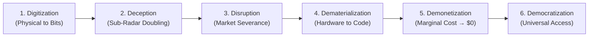

> **🎙️ 3-Presenter Authentic Tiki-Taka Script**
> 
> **Prof. Peter Kim:** Scholars, welcome to Session 3 of the Theurgicon. Over the past two weeks, we mapped the 83 canonical miracles and installed cognitive gyroscopes through Structure-Mapping. Today, we unpack the core analytical engine of exponential strategy: **Peter Diamandis’s 6Ds Framework**. Dr. Vance, why is the 6Ds model more than just a catchy Silicon Valley taxonomy? *(Turn 1)*  
> **Dr. Elena Vance:** Because, Professor Kim, the 6Ds describe a fundamental thermodynamic and informational phase transition. Look at the six-stage chain on Slide 1: The moment any physical domain—whether it is photography, genetic code, money, or energy capture—is encoded into digital bits, it escapes the physical friction of Newtonian economics and obeys the compounding mathematics of information theory! *(Turn 2)*  
> **TA Marcus Brody:** And the deadliest trap in modern business and civilization is Stage 2: **Deception**! When a technology doubles from $0.001$ to $0.002$, traditional Wall Street analysts and Fortune 500 CEOs laugh it off as an irrelevant, low-margin toy! *(Turn 3)*  
> **Dr. Elena Vance:** And they keep laughing while it goes $0.004 	o 0.008 	o 0.016 \dots$ because it still looks like zero to their linear spreadsheets! *(Turn 4)*  
> **TA Marcus Brody:** But twenty doublings later, it hits $1\%$, and just seven doublings after that, it hits **100% complete market dominance**! By the time it enters Stage 3—Disruption—the incumbent's multi-billion-dollar empire is liquidated in 18 months! *(Turn 5)*  
> **Prof. Peter Kim:** That silent, exponential gestation is why we call this session *The Mathematics of Invisible Growth*. If you cannot perceive the technology while it is in the deceptive phase, you are already roadkill. *(Turn 6)*  
> **TA Marcus Brody:** And once it disrupts, it dematerializes physical hardware into software, demonetizes the price to near-zero, and democratizes access to eight billion people! *(Turn 7)*  
> **Dr. Elena Vance:** That is the thermodynamic abundance engine in six discrete steps. *(Turn 8)*  
> **Prof. Peter Kim:** Let us look at Slide 2 to see why this process is accelerating beyond classical Moore's Law into what Diamandis calls the *Law of More*. *(Turn 9)*  
> **TA Marcus Brody:** Let’s look at autocatalytic acceleration on Slide 2! *(Turn 10)*

---

### Slide 02: Beyond Moore’s Law: The Law of More & Autocatalytic Acceleration
- **The Paradigm Escalation:** Moving beyond Gordon Moore’s single-silicon metric (transistor density doubling every 18–24 months).
- **The Law of More (Diamandis & Kotler, 2026):** Compute acceleration acts as a universal catalyst across AI, genomics, robotics, energy, and materials science, creating an **autocatalytic loop** where breakthroughs in one domain instantly amplify all others.

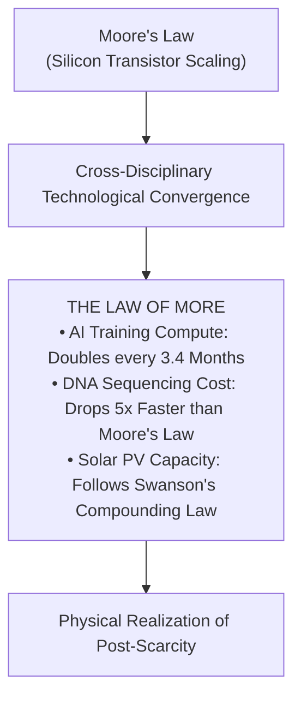

> **🎙️ 3-Presenter Authentic Tiki-Taka Script**
> 
> **TA Marcus Brody:** Everyone in computer science has heard of Gordon Moore’s 1965 prediction—transistor density on a silicon chip doubles roughly every 18 to 24 months. But on Slide 2, Diamandis and Kotler argue that Moore’s Law is now just one small gear inside a much larger machine: **The Law of More**! *(Turn 1)*  
> **Dr. Elena Vance:** Moore’s Law was a single-substrate observation about lithography on silicon wafers. The **Law of More** is a meta-law of autocatalytic convergence. Compute is no longer confined to microprocessors; it has become the fundamental substrate for *every other scientific discipline*! *(Turn 2)*  
> **Prof. Peter Kim:** Look at the three empirical pillars in the flowchart: AI training compute is doubling every **3.4 months**. DNA sequencing costs are plunging **five times faster than Moore’s Law**. And solar photovoltaic capacity is scaling on Swanson’s compounding curve! *(Turn 3)*  
> **TA Marcus Brody:** When AI designs new solid-state battery electrolytes, which powers robotic foundries, which prints cheaper DNA chips, which models quantum algorithms, you don't have a single linear doubling—you have an autocatalytic explosion! *(Turn 4)*  
> **Dr. Elena Vance:** The output of every exponential technology becomes the high-octane fuel for every other exponential technology. *(Turn 5)*  
> **Prof. Peter Kim:** Which means treating technological forecasting as a collection of separate industry silos is an intellectual death sentence. Everything is converging into a single planetary transformation. *(Turn 6)*  
> **TA Marcus Brody:** And at the core of this transformation is the great conversion of physical atoms into digital bits! *(Turn 7)*  
> **Dr. Elena Vance:** Let’s examine that economic phase transition on Slide 3. *(Turn 8)*  
> **Prof. Peter Kim:** Turn to Slide 3: The Great Atom-to-Bit Conversion. *(Turn 9)*  
> **TA Marcus Brody:** Let’s see how information rewrites the laws of economics! *(Turn 10)*

---

### Slide 03: The Great Atom-to-Bit Conversion: Information-Based Economics
- **The Classical vs. Information Economic Divide:**
  - *Newtonian Atom Economics:* Governed by physical mass, thermodynamic friction, scarcity, diminishing returns, and non-zero marginal reproduction costs.
  - *Shannon Bit Economics:* Governed by digital information, zero mass, non-rivalrous consumption, infinite scalability, and **Zero Marginal Cost ($	ext{MC} 	o 0$)**.
- **The Phase Shift Axiom:** *"Once a domain converts from atoms to bits, its growth rate shifts from linear addition to exponential compounding."*

| Economic Dimension | Atom-Based Economy (Physical Matter) | Bit-Based Economy (Digital Information) | Theurgic Implication |
| :--- | :--- | :--- | :--- |
| **Marginal Cost of Duplication** | Substantial (Raw Materials, Labor, Freight) | **Asymptotically Zero ($pprox \$0.00$)** | Price collapses, enabling universal access |
| **Consumption Rivalry** | Rivalrous (If I eat an apple, you cannot) | **Non-Rivalrous (Infinite simultaneous use)** | Scarcity dissolves into shared abundance |
| **Scaling Velocity** | Friction-Bound (Building physical factories) | **Instantaneous (Light-speed global routing)** | Disruptive saturation in months, not decades |

> **🎙️ 3-Presenter Authentic Tiki-Taka Script**
> 
> **Prof. Peter Kim:** Slide 3 presents the great thermodynamic divide of modern civilization: **Atom-Based Newtonian Economics versus Bit-Based Shannon Economics**. Dr. Vance, why is this table the most important economic lesson of our era? *(Turn 1)*  
> **Dr. Elena Vance:** For 10,000 years, all economics was based on physical atoms—iron, wheat, land, and oil. Atoms have mass, require physical labor to extract, and obey conservation of matter: If I eat an apple, you cannot eat that same apple. Scarcity was an immutable law of physics. *(Turn 2)*  
> **TA Marcus Brody:** But look at the right column: **Bits**! Bits have zero physical mass, travel at the speed of light, and are completely non-rivalrous! If I send you an AI model, an MP3 audio track, or a DNA sequence file, I still have it, you have it, and we can copy it to four billion other people for the cost of a few milliwatts of electricity! *(Turn 3)*  
> **Prof. Peter Kim:** Read the Phase Shift Axiom in the center of the slide: **"Once a domain converts from physical atoms to digital bits, its growth rate shifts permanently from linear addition to exponential compounding."** *(Turn 4)*  
> **TA Marcus Brody:** Look at what happened to encyclopedias! In 1990, Britannica was 32 leather-bound volumes costing $2,000 and weighing 120 pounds. The moment information digitized into Wikipedia, 30 million articles became accessible to every human on Earth for zero dollars! *(Turn 5)*  
> **Dr. Elena Vance:** And today, we are doing that exact same conversion to biology via CRISPR and AI protein design, to energy via solar photovoltaics, and to money via blockchain and algorithmic finance! *(Turn 6)*  
> **Prof. Peter Kim:** When you digitize a domain, you liberate it from the physical prison of scarcity. *(Turn 7)*  
> **TA Marcus Brody:** But why is this growth completely invisible to people during the early stages? *(Turn 8)*  
> **Dr. Elena Vance:** That is the core existential inquest of Session 3. *(Turn 9)*  
> **Prof. Peter Kim:** Turn to Slide 4: Why Disruptive Growth Is Invisible Until It’s Too Late. *(Turn 10)*

---

### Slide 04: The Core Existential Inquest: Why Disruptive Growth Is Invisible Until It’s Too Late
- **The Core Paradox:** Exponential technologies spend their most critical developmental years completely hidden beneath the noise threshold of traditional market metrics, blindsiding incumbent institutions when they suddenly cross the disruptive knee.
- **The Institutional Blindspot Triad:**
  1. *Linear KPI Anchoring:* Quarterly corporate earnings measure absolute dollar revenue rather than compounding logarithmic growth rates.
  2. *The Toy Stigma:* Early-stage digitized solutions exhibit low resolution, high error rates, and clunky interfaces, allowing incumbents to dismiss them as irrelevant toys.
  3. *The Abrupt Phase Shift:* Exponential growth is deceptive for 90% of its timeline, and vertical for the remaining 10%.

> **🎙️ 3-Presenter Authentic Tiki-Taka Script**
> 
> **Prof. Peter Kim:** Here is our foundational existential inquest for Session 3: **"Why is exponential disruptive growth completely invisible to human institutions until it is too late to adapt?"** Dr. Vance, unpack the institutional blindspot triad on Slide 4. *(Turn 1)*  
> **Dr. Elena Vance:** It begins with Blindspot 1: **Linear KPI Anchoring**. Corporate boards, Wall Street analysts, and government agencies measure health by quarterly revenues and linear percentages. When a digitized startup is growing 100% year-over-year but only has $50,000 in revenue, the multi-billion-dollar incumbent ignores it as rounding error. *(Turn 2)*  
> **TA Marcus Brody:** And look at Blindspot 2: **The Toy Stigma**! In 1975, when Steven Sasson built the first digital camera at Kodak, it took 23 seconds to record a black-and-white 0.01-megapixel image onto a cassette tape. Kodak executives laughed and said: *"No bride will ever want a grainy, pixelated toy for her wedding album!"* *(Turn 3)*  
> **Dr. Elena Vance:** They evaluated the *current surface attributes* of the toy, completely blind to the *exponential compounding rate* of the underlying digital sensor! *(Turn 4)*  
> **Prof. Peter Kim:** Which brings us to Blindspot 3: **The Abrupt Phase Shift**. For thirty doublings, the exponential curve hugs the horizontal axis, looking utterly flat and harmless. Then, in the final three doublings, it goes nearly vertical and vaporizes the market! *(Turn 5)*  
> **TA Marcus Brody:** It’s like a tsunami: out in the deep ocean, the wave is only two feet high and boats don't even notice it passing underneath. But the second it hits shallow water near the shore, it rears up into a 100-foot wall of water that wipes out the entire coastline! *(Turn 6)*  
> **Dr. Elena Vance:** That is why legacy leaders don't see disruption coming. They aren't stupid; they are using a linear measuring tape on an exponential tsunami. *(Turn 7)*  
> **Prof. Peter Kim:** To survive, you must replace that linear tape with the complete 6D analytical protocol. *(Turn 8)*  
> **Dr. Elena Vance:** Let’s examine our pedagogical roadmap for mastering the 6Ds on Slide 5. *(Turn 9)*  
> **Prof. Peter Kim:** Turn to Slide 5: Session 03 Pedagogical Roadmap. *(Turn 10)*

---

### Slide 05: Session 03 Pedagogical Roadmap: From Deception Calculus to Universal Access
- **Master Learning Architecture (Session 03):**
  - **Module 1 (Slides 01–05):** Civilizational Framing — The 6Ds as Master Evolutionary Law.
  - **Module 2 (Slides 06–15):** The 6Ds Chain Deconstruction — Step-by-Step Analysis from Digitization to Democratization.
  - **Module 3 (Slides 16–25):** Mathematical & Exponential Frameworks — The Deception Trap Calculus, Intersection Point ($T^*$), Wright’s Law vs. Moore’s Law, and the 6D Discovery Algorithm.
  - **Module 4 (Slides 26–35):** Global Empirical Verification — 9 Industrial Case Studies (Kodak vs. Instagram, $7.1M Smartphone, Solar Swanson, EV Batteries, LLM Token Costs, Cultured Meat, CubeSats, M-Pesa).
  - **Module 5 (Slides 36–42):** Existential Paradoxes — Regulatory Blindspots, The 6D Corporate Death Sentence, GDP Accounting Illusions, and Digital Neo-Feudalism.
  - **Module 6 (Slides 43–45):** Socratic Debates & The Hands-On 6D Vertical Decomposition Worksheet Protocol.

> **🎙️ 3-Presenter Authentic Tiki-Taka Script**
> 
> **Dr. Elena Vance:** Slide 5 presents our master learning architecture for Session 3. We move systematically from the theoretical anatomy of the 6Ds to the mathematical calculus of the Deception Trap, verified across nine global industries. *(Turn 1)*  
> **TA Marcus Brody:** In Module 2, we will tear through each of the 6Ds step-by-step: Digitization, Deception, Disruption, Dematerialization, Demonetization, and Democratization! We will see how atoms dissolve into code! *(Turn 2)*  
> **Prof. Peter Kim:** In Module 3, we dive into the hard mathematics: calculating the exact **Inflection Intersection Point ($T^*$)** where the exponential curve cuts through linear incumbent projections, and comparing **Moore’s Law with Wright’s Law of Cumulative Production**. *(Turn 3)*  
> **TA Marcus Brody:** And in Module 4, we examine nine massive empirical case studies: from how a $7.1M building of hardware shrunk into your pocket, to how LLM token generation plunged from $60 to $0.10 per million tokens! *(Turn 4)*  
> **Dr. Elena Vance:** In Module 5, we confront the civilizational paradoxes: why traditional GDP accounting completely fails to measure post-scarcity abundance, and how to prevent platform monopolies from turning into digital neo-feudal lords. *(Turn 5)*  
> **TA Marcus Brody:** And in Module 6, every student will execute a **6D Vertical Decomposition Worksheet**, taking a traditional analog industry and mapping its exact journey through the 6D pipeline! *(Turn 6)*  
> **Prof. Peter Kim:** Maintain your highest intellectual rigour. Let us step into Module 2 and deconstruct the complete 6D metamorphic chain! *(Turn 7)*  
> **Dr. Elena Vance:** Turn to Slide 6: Deconstructing Chapter 2 of Diamandis and Kotler! *(Turn 8)*


---

## Module 2: Primary Text Deconstruction: The 6Ds Chain (Slides 06–15)

### Slide 06: Deconstructing Chapter 2: The Return of the Six Ds
- **Primary Source Analysis:** Peter H. Diamandis & Steven Kotler, *We Are as Gods* (2026), Chapter 2 (*The Return of the Six Ds*).
- **The Core Metamorphic Chain:**
  $$\text{Digitization} \xrightarrow{\text{Sub-Radar}} \text{Deception} \xrightarrow{\text{Inflexion}} \text{Disruption} \xrightarrow{\text{Subsumption}} \text{Dematerialization} \xrightarrow{\text{MC} \to 0} \text{Demonetization} \xrightarrow{\text{Universal}} \text{Democratization}$$
- **The Teleological Endpoint:** The 6Ds are not merely an economic disruption playbook; they represent a predictable thermodynamic pipeline that systematically converts physical scarcity into universal civilizational abundance.

> **🎙️ 3-Presenter Authentic Tiki-Taka Script**
> 
> **Prof. Peter Kim:** Let us dissect Chapter 2 of *We Are as Gods*. Dr. Vance, walk us through the core metamorphic chain of the 6Ds on Slide 6. *(Turn 1)*  
> **Dr. Elena Vance:** The 6Ds represent a six-stage chain reaction of value transformation. It starts with **Digitization**—converting a physical process into software code. That triggers **Deception**—where exponential compounding remains invisible beneath the linear radar. Once it crosses the knee, it enters **Disruption**—severing legacy markets. *(Turn 2)*  
> **TA Marcus Brody:** And then the physical magic happens: **Dematerialization**—the physical hardware dissolves into code; **Demonetization**—the marginal cost of reproduction drops to zero; and finally **Democratization**—the capability becomes universally accessible to every human on Earth! *(Turn 3)*  
> **Prof. Peter Kim:** Notice the teleological endpoint of this chain: The 6Ds are not just a tool for venture capitalists to make billions of dollars; they are the fundamental evolutionary mechanism that systematically eliminates physical scarcity from human civilization. *(Turn 4)*  
> **TA Marcus Brody:** What used to require kings spending royal treasuries—like personal medical diagnostics, global communication, and instant publishing—becomes a free app that an ordinary person in Manila or Nairobi downloads in three seconds! *(Turn 5)*  
> **Dr. Elena Vance:** And every technology that enters this pipeline follows the exact same metamorphic stages with mathematical predictability. *(Turn 6)*  
> **Prof. Peter Kim:** Let us now analyze each of the six stages in detail, beginning with Stage 1: Digitization on Slide 7. *(Turn 7)*  
> **TA Marcus Brody:** Let’s see what happens when physical atoms become digital bits! *(Turn 8)*  
> **Prof. Peter Kim:** Turn to Slide 7: Stage 1: Digitization. *(Turn 9)*  
> **Dr. Elena Vance:** Let’s examine the ignition switch of exponential growth! *(Turn 10)*

---

### Slide 07: Stage 1: Digitization — Encoding Physical Atoms into Zeroes and Ones
- **The Ignition Phase:**
  - *Definition:* The process of translating physical phenomena, analogue signals, or biological sequences into binary digital code (zeroes and ones, bits, or digital base pairs).
  - *The Escape Velocity:* Once a capability is digitized, it is freed from physical supply-chain friction, raw material limitations, and geographic latency, instantly hitching its growth rate to Moore’s Law and computational scaling.
- **Historical Digitization Milestones:**
  - Photography: Silver halide chemicals $\to$ CCD Sensor Pixels (1975).
  - Music: Vinyl grooves $\to$ PCM 44.1kHz MP3/AAC bitstreams (1993).
  - Biology: Physical DNA extraction $\to$ Digital FastQ sequence files $\to$ Digital Base Editing (2001–2026).

> **🎙️ 3-Presenter Authentic Tiki-Taka Script**
> 
> **Dr. Elena Vance:** Stage 1 of the 6Ds is **Digitization**. It is the absolute ignition switch for exponential growth. Marcus, why is digitizing a domain so radically transformative? *(Turn 1)*  
> **TA Marcus Brody:** Because the moment you convert an analogue, physical process into zeroes and ones, you untether it from physical gravity! As long as photography was about silver halide chemicals on cellulose acetate film, making more photos required mining silver, building chemical factories, and shipping yellow boxes on diesel trucks! *(Turn 2)*  
> **Dr. Elena Vance:** But the second Steven Sasson encoded light into digital bits on a CCD sensor in 1975, photography hitched its growth curve directly to semiconductor lithography! Making a trillion digital photos became just as cheap as making ten! *(Turn 3)*  
> **Prof. Peter Kim:** Look at the third milestone on Slide 7: **Biology**. For 4,000 years, medicine meant physical herbs, surgical scalpels, and chemical pills. The moment Craig Venter digitized the human genome into digital FastQ sequence files, biology became an information science. *(Turn 4)*  
> **TA Marcus Brody:** We went from physical taxonomy to compiling living cells in Python and BioGPT! We can edit a genome on a laptop, email the digital file to a synthesizer in Singapore, and have the physical mRNA printed in 24 hours! *(Turn 5)*  
> **Dr. Elena Vance:** Once a domain is digitized, it is permanently liberated from Newtonian friction. It can now be copied, transmitted, and computed at the speed of light. *(Turn 6)*  
> **Prof. Peter Kim:** But immediately following digitization comes the most dangerous phase for human perception: Stage 2: Deception. *(Turn 7)*  
> **TA Marcus Brody:** The sub-radar compounding zone where everyone gets fooled! *(Turn 8)*  
> **Prof. Peter Kim:** Turn to Slide 8: Stage 2: Deception. *(Turn 9)*  
> **Dr. Elena Vance:** Let’s examine the Deception Trap on Slide 8! *(Turn 10)*

---

### Slide 08: Stage 2: Deception — The Sub-Radar Compounding Zone
- **The Deceptive Gestation:**
  - *The Mathematical Trap:* In early doubling cycles, exponential growth numbers remain minuscule ($0.001\% \to 0.002\% \to 0.004\% \to 0.008\%$).
  - *The Illusion of Failure:* To linear observers (corporate boards, legacy economists), $0.008\%$ looks indistinguishable from $0.000\%$, leading to the confident dismissal of the technology as a failure or irrelevant toy.
- **The Deception Duration:** Typically spans **5 to 15 years** of quiet, capital-intensive engineering refinement before the curve breaches the visible noise floor of the market.

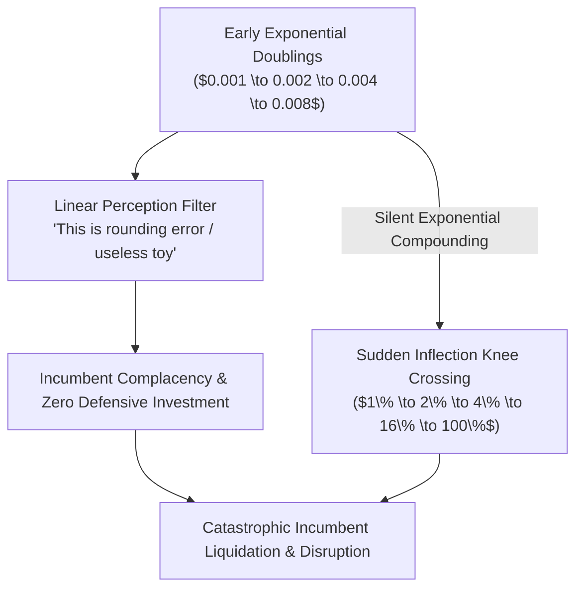

> **🎙️ 3-Presenter Authentic Tiki-Taka Script**
> 
> **TA Marcus Brody:** Look at the flowchart on Slide 8. This is the **Deception Trap**—the graveyard of Fortune 500 companies! Elena, walk us through the math of why smart people get tricked during this stage. *(Turn 1)*  
> **Dr. Elena Vance:** In the early doubling cycles, an exponential technology is compounding at 100% per year, but the absolute numbers are tiny: $0.001\% \to 0.002\% \to 0.004\% \to 0.008\%$. To a corporate executive looking at a quarterly spreadsheet, $0.008\%$ is rounding error! It looks completely dead! *(Turn 2)*  
> **Prof. Peter Kim:** In 1996, digital cameras captured $0.01$ megapixels. Kodak was making billions of dollars selling chemical film. When engineers told the board that digital was growing 100% a year, the board said: *"0.02 megapixels is still total garbage compared to 35mm film. Call us when it's real."* *(Turn 3)*  
> **TA Marcus Brody:** And they stayed complacent for fifteen years while digital quietly went through twenty doublings! And then, almost overnight, digital jumped from $1\%$ to $2\%$ to $4\%$ to $16\%$ to $64\%$, and within 36 months, Kodak was forced into Chapter 11 bankruptcy! *(Turn 4)*  
> **Dr. Elena Vance:** The deceptive phase is like a silent stealth submarine. It travels under the radar for ten years, and by the time its periscope breaches the surface of the water, it is already launching torpedoes right at your flagship! *(Turn 5)*  
> **Prof. Peter Kim:** This is why we tell exponential leaders: **Never judge an exponential technology by its current performance; judge it strictly by its doubling rate.** *(Turn 6)*  
> **TA Marcus Brody:** If it’s doubling every 12 months, it doesn't matter how clunky it looks today—it will own the entire industry tomorrow! *(Turn 7)*  
> **Dr. Elena Vance:** And when it exits the deceptive zone, it hits Stage 3: Disruption. *(Turn 8)*  
> **Prof. Peter Kim:** Turn to Slide 9: Stage 3: Disruption. *(Turn 9)*  
> **TA Marcus Brody:** Let’s see what happens when the curve goes vertical! *(Turn 10)*

---

### Slide 09: Stage 3: Disruption — The Structural Liquidation of Legacy Incumbents
- **The Disruption Inflection:**
  - *Definition:* The phase where the exponential technology crosses the price-performance parity threshold of incumbent solutions, offering a product or service that is **10x cheaper, 10x faster, or 10x more accessible**.
  - *The Structural Liquidation:* Incumbents cannot simply "adopt" the new technology because their entire business model relies on high-margin physical infrastructure, legacy supply chains, and gatekeeper rents that the new tech destroys.
- **Classic Disruption Casualties:**
  - Blockbuster Video ($6\text{B}$ peak revenue, 9,000 stores) $\to$ Netflix streaming (Liquidation: 2010).
  - Borders Bookstores $\to$ Amazon e-commerce & Kindle (Liquidation: 2011).
  - Swiss Mechanical Watch Monopolies $\to$ Quartz & Apple Watch (Value Severance: 2015–2026).

> **🎙️ 3-Presenter Authentic Tiki-Taka Script**
> 
> **Prof. Peter Kim:** Stage 3 is **Disruption**—the moment the exponential curve cuts through legacy market structures like a hot plasma torch through butter. Dr. Vance, why can't incumbents simply pivot and copy the startup when disruption hits? *(Turn 1)*  
> **Dr. Elena Vance:** Because of Clayton Christensen’s *Innovator's Dilemma* on exponential steroids! Look at Blockbuster in 2005: Blockbuster had 9,000 retail stores, 84,000 employees, and made $800 million a year *just from late fees*! *(Turn 2)*  
> **TA Marcus Brody:** When Netflix launched streaming, it had zero late fees and zero retail stores! If Blockbuster’s CEO had tried to launch streaming, the board would have fired him on the spot because it would have immediately cannibalized their $800 million late-fee revenue and made all 9,000 retail store leases worthless! *(Turn 3)*  
> **Prof. Peter Kim:** Incumbents are trapped in a golden straitjacket. Their legacy revenue model, corporate culture, debt covenants, and shareholder expectations are physically anchored to the high-friction analog world. *(Turn 4)*  
> **TA Marcus Brody:** Look at the Swiss watch industry! They spent three centuries perfecting hand-wound mechanical gears. Then Apple released a $399 smartwatch with optical heart rate sensors and GPS, and within five years, Apple was selling more watches than the entire Swiss watch nation combined! *(Turn 5)*  
> **Dr. Elena Vance:** Disruption is not an incremental market share battle; it is the total structural liquidation of the incumbent's reason for existing. *(Turn 6)*  
> **Prof. Peter Kim:** And disruption leads directly into the radical physical phase shift of Stage 4: Dematerialization. *(Turn 7)*  
> **TA Marcus Brody:** Where physical hardware vanishes into thin air! *(Turn 8)*  
> **Dr. Elena Vance:** Let’s examine Dematerialization on Slide 10. *(Turn 9)*  
> **Prof. Peter Kim:** Turn to Slide 10: Stage 4: Dematerialization. *(Turn 10)*

---

### Slide 10: Stage 4: Dematerialization — Dissolving Tons of Hardware into Software
- **The Physical Evaporation:**
  - *Definition:* The complete disappearance of standalone physical products, devices, and physical supply chains as their functionality is subsumed into digital software applications.
  - *The Smartphone Subsumption:* Cameras, radios, flashlights, GPS navigators, compasses, video recorders, audio players, encyclopedias, maps, tape recorders, and gaming consoles **physically vanished** into a single 200g device.
- **Thermodynamic Implication:** Eliminates gigatons of raw material extraction, factory emissions, global maritime freight, and physical warehouse infrastructure.

```mermaid
flowchart LR
    subgraph 1985 Physical Hardware (Tons of Matter)
        H1["35mm Camera"] ~~~ H2["Video Camcorder"]
        H3["Marine GPS Unit"] ~~~ H4["Multi-Volume Books"]
        H5["Stereo Hi-Fi System"] ~~~ H6["Dedicated Game Console"]
    end
    
    1985 Physical Hardware ==>|6D Dematerialization Pipeline| S["2026 Smartphone / Smart Glasses<br/>(200g of Silicon & Glass running Software Apps)"]
    style S fill:#4f46e5,stroke:#312e81,color:#fff
```

> **🎙️ 3-Presenter Authentic Tiki-Taka Script**
> 
> **TA Marcus Brody:** Look at the visual transformation on Slide 10! In 1985, if you wanted all the capabilities of your current smartphone, you needed a walk-in closet filled with separate hardware devices: a 35mm camera, a bulky VHS camcorder, a marine GPS unit, a turntable, a tape recorder, a 30-volume encyclopedia, and a gaming console! *(Turn 1)*  
> **Dr. Elena Vance:** Hundreds of pounds of plastic, copper, glass, and aluminum, requiring separate factories, retail shelves, packaging, and shipping containers! All of that physical matter was completely **Dematerialized** into lines of software code running on a 200-gram slab of glass in your pocket! *(Turn 2)*  
> **Prof. Peter Kim:** Consider the profound thermodynamic and ecological consequence: Dematerialization is the single greatest environmental conservation mechanism in human history! We did not save forests and minerals by consuming less; we saved them by converting physical atoms into massless digital bits! *(Turn 3)*  
> **TA Marcus Brody:** Think about music! We don't press billions of plastic vinyl discs or polycarbonate CDs, ship them in plastic jewel cases on diesel freight trucks, or store them in retail mall stores anymore. The entire global music catalog exists as bits streaming over radio waves! *(Turn 4)*  
> **Dr. Elena Vance:** And today, we are dematerializing medical equipment—transforming bulky hospital ECG machines and ultrasound scanners into software-enabled probes that plug directly into an iPad! *(Turn 5)*  
> **Prof. Peter Kim:** When you dematerialize hardware into code, you eliminate the physical cost of manufacturing additional units. *(Turn 6)*  
> **TA Marcus Brody:** Which leads directly to Stage 5: Demonetization! Price evaporates! *(Turn 7)*  
> **Dr. Elena Vance:** Let’s examine how marginal cost plunges to zero on Slide 11. *(Turn 8)*  
> **Prof. Peter Kim:** Turn to Slide 11: Stage 5: Demonetization. *(Turn 9)*  
> **TA Marcus Brody:** Let’s see money disappear from the equation! *(Turn 10)*

---

### Slide 11: Stage 5: Demonetization — Zero Marginal Cost and the Evaporation of Price
- **The Economic Phase Transition:**
  - *Definition:* The radical reduction of the marginal cost of producing, copying, and distributing a product or service toward absolute zero ($\text{MC} \to \$0.00$).
  - *The Pricing Paradox:* When marginal cost approaches zero, competitive market forces drive the consumer price asymptotically toward zero, wiping traditional revenue models out of existence.
- **Demonetized Sectors (2000–2026):**
  - Long-Distance Telephony: $3.00/minute $\to$ **$0.00 (WhatsApp, FaceTime, Zoom)**.
  - Information & Reference: $2,000 Encyclopedia Britannica $\to$ **$0.00 (Wikipedia, Search)**.
  - Photography: $0.50/photo (film + development) $\to$ **$0.00 per digital image**.
  - Compute & Intelligence: $6.5M Cray-2 Supercomputer $\to$ **Near-zero per AI query**.

> **🎙️ 3-Presenter Authentic Tiki-Taka Script**
> 
> **Prof. Peter Kim:** Slide 11 brings us to the economic heart of the 6Ds: **Demonetization**. Dr. Vance, explain the economic pricing paradox when marginal cost approaches zero. *(Turn 1)*  
> **Dr. Elena Vance:** In basic microeconomics, in a competitive market, price equals marginal cost ($P = \text{MC}$). When the marginal cost of copying software, streaming a song, or routing an AI query drops to zero, the market price inevitably collapses toward zero! *(Turn 2)*  
> **TA Marcus Brody:** Look at international phone calls! In 1990, calling a relative in Europe or Asia cost $3.00 a minute! You watched the clock in panic while talking! Today, you can video-call Tokyo in 4K for three hours on WhatsApp or Zoom for **zero dollars and zero cents**! The entire multi-billion-dollar long-distance telecom industry was completely demonetized! *(Turn 3)*  
> **Dr. Elena Vance:** Look at photography: It used to cost fifty cents to take, develop, and print a single picture. If you took 24 photos on vacation, you spent $12. Today, humanity takes **over 1.8 trillion digital photos a year** for a marginal cost of exactly zero! *(Turn 4)*  
> **Prof. Peter Kim:** When a product demonetizes, traditional economists panic because it "destroys GDP." But what actually happened? An immense river of wealth and utility was transferred directly to the human consumer as consumer surplus! *(Turn 5)*  
> **TA Marcus Brody:** You didn't become poorer because you stopped spending $2,000 on encyclopedias and $50 on long-distance calls—you became vastly richer because you got all that utility for free! *(Turn 6)*  
> **Dr. Elena Vance:** And once a capability is demonetized to near-zero, it can be distributed to every human being on the planet. *(Turn 7)*  
> **Prof. Peter Kim:** Which brings us to the ultimate civilizational climax of the 6Ds: Stage 6: Democratization. *(Turn 8)*  
> **TA Marcus Brody:** Let’s look at universal access on Slide 12! *(Turn 9)*  
> **Prof. Peter Kim:** Turn to Slide 12: Stage 6: Democratization. *(Turn 10)*

---

### Slide 12: Stage 6: Democratization — From Elite Luxury to Universal Human Baseline
- **The Ultimate Apotheosis:**
  - *Definition:* The universalization of access where capabilities, tools, and infrastructure once restricted to kings, billionaires, and superpowers become accessible to every human on the planet.
  - *The Democratization Multiplier:*
    $$\text{Accessibility} = \lim_{\text{Cost} \to 0, \text{ Form} \to \text{Software}} \frac{\text{Global Population with Access}}{\text{Total Population}} \to 1.0 \quad (100\%)$$
- **2026 Democratization Realities:**
  - A farmer in rural sub-Saharan Africa with a $40 smartphone has instantaneous access to the same frontier multimodal AI, global weather forecasts, and agricultural pricing data as a hedge fund manager in Manhattan.

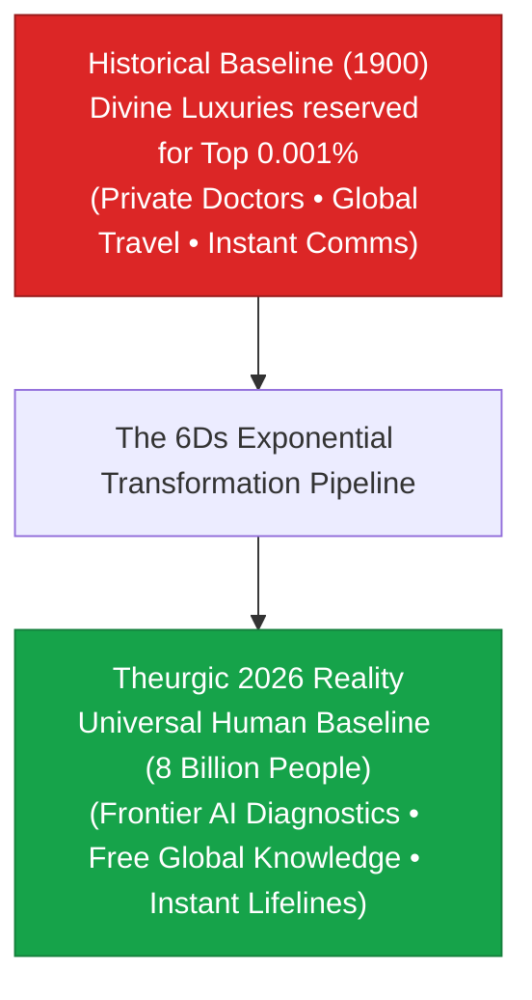

> **🎙️ 3-Presenter Authentic Tiki-Taka Script**
> 
> **TA Marcus Brody:** Look at the visual transformation on Slide 12: We go from elite luxury in 1900 to universal human baseline in 2026! Elena, how does democratization complete the 6D journey? *(Turn 1)*  
> **Dr. Elena Vance:** Democratization is the grand ethical climax of the entire 6D framework. In 1900, if you wanted top-tier medical advice, instant communication, or world-class education, you had to be an emperor or an ultra-wealthy industrial titan. *(Turn 2)*  
> **TA Marcus Brody:** Today, an ordinary teenager in rural Kenya holding a $40 Android smartphone can consult a frontier multimodal AI for medical diagnosis, access every lecture taught at MIT and Oxford for free, and trade on global financial markets in real time! *(Turn 3)*  
> **Prof. Peter Kim:** Think about the philosophical depth of that reality. In 1985, the President of the United States did not have the computational, analytical, or communication power that an eight-year-old child holds in their pocket today on a public bus. *(Turn 4)*  
> **Dr. Elena Vance:** That is the thermodynamic law of democratization: Once you convert a problem into digital bits, you eliminate the privilege of class, geography, and inherited wealth. *(Turn 5)*  
> **TA Marcus Brody:** Technology is the greatest anti-aristocracy engine ever invented by the human species! *(Turn 6)*  
> **Prof. Peter Kim:** Divine privilege is systematically converted into baseline civilizational infrastructure for all eight billion human beings. *(Turn 7)*  
> **Dr. Elena Vance:** And these six stages don't just happen once in isolation; they create a continuous, compounding feedback loop. *(Turn 8)*  
> **Prof. Peter Kim:** Let’s examine Peter Diamandis’s 6D Cascading Ecosystem on Slide 13. *(Turn 9)*  
> **TA Marcus Brody:** Let’s see the flywheel in action! *(Turn 10)*

---

### Slide 13: Peter Diamandis’s 6D Cascading Ecosystem Feedback Loop
- **The Flywheel Mechanics:**
  - Digitizing Domain A (e.g., Compute) democratizes tools that **Digitize Domain B** (e.g., Synthetic Biology).
  - Dematerializing Domain B demonetizes sensors that **Accelerate Domain C** (e.g., Planetary Energy & IoT).
- **The Cascade Formulation:**
  $$\mathcal{D}_{\text{Total}} = \prod_{i=1}^{N} \text{6D}_i(\text{Convergence})$$

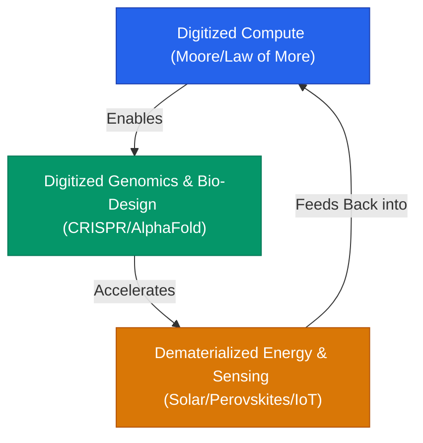

> **🎙️ 3-Presenter Authentic Tiki-Taka Script**
> 
> **Prof. Peter Kim:** Slide 13 diagrams Peter Diamandis’s **6D Cascading Ecosystem Feedback Loop**. Dr. Vance, explain why the 6Ds act as a runaway flywheel across different industries. *(Turn 1)*  
> **Dr. Elena Vance:** Because the 6Ds do not operate in a single vacuum. When Domain 1 (Compute) finishes its 6D journey and democratizes cheap AI, that democratized AI is immediately used to **Digitize Domain 2 (Genomics and Synthetic Biology)**! *(Turn 2)*  
> **TA Marcus Brody:** And once genomics is digitized and dematerialized into automated cloud foundries, those bio-foundries design engineered microbes and perovskite solar cells that **Demonetize Domain 3 (Clean Planetary Energy)**! *(Turn 3)*  
> **Dr. Elena Vance:** And that free, abundant clean energy powers the massive gigawatt data centers that accelerate Domain 1 (Compute) by another $10\times$! *(Turn 4)*  
> **Prof. Peter Kim:** It is a closed, self-reinforcing cybernetic loop of compounding acceleration. Every time the flywheel completes one rotation, the cost of civilizational abundance drops by an order of magnitude. *(Turn 5)*  
> **TA Marcus Brody:** That’s why exponential growth feels like it’s speeding up every single year! We aren't just riding one 6D curve; we are riding fifty overlapping 6D flywheels simultaneously! *(Turn 6)*  
> **Dr. Elena Vance:** But Steven Kotler immediately raises a crucial warning: Human psychology is completely blind to this flywheel during its deceptive phase! *(Turn 7)*  
> **Prof. Peter Kim:** Let’s examine Steven Kotler’s cognitive diagnosis on Slide 14. *(Turn 8)*  
> **TA Marcus Brody:** Turn to Slide 14: Kotler’s Warning on the Deception Blindspot! *(Turn 9)*  
> **Prof. Peter Kim:** Proceed to Slide 14. *(Turn 10)*

---

### Slide 14: Steven Kotler’s Warning on the Cognitive Blindspot of Deception
- **Kotler’s Cognitive Diagnosis:**
  - *The Linear Anticipation Trap:* The human brain's pattern-recognition software evaluates the future based on the immediate past rate of change.
  - *The Ridicule Reflex:* During the deceptive phase, early exponential prototypes look absurd, fragile, and inferior, triggering social ridicule and cognitive dismissal.
  - *The Vertigo Inversion:* When the technology suddenly breaches the deceptive zone, the sudden vertical disruption shatters the individual's mental model, producing acute disorientation and panic.

> **🎙️ 3-Presenter Authentic Tiki-Taka Script**
> 
> **Dr. Elena Vance:** On Slide 14, Steven Kotler dissects why human beings perpetually fall into the **Cognitive Blindspot of Deception**. It comes down to our evolutionary **Ridicule Reflex**. *(Turn 1)*  
> **TA Marcus Brody:** Describe the Ridicule Reflex, Elena! Why do people love making fun of early exponential prototypes? *(Turn 2)*  
> **Dr. Elena Vance:** In 1903, the *New York Times* published an editorial declaring that building a flying machine would require one to ten million years of continuous mathematical effort. *Nine days later*, the Wright Brothers flew at Kitty Hawk! *(Turn 3)*  
> **TA Marcus Brody:** In 1995, famous economists wrote articles laughing at the internet, saying: *"Most people have nothing to say to each other! Online shopping is a fad!"* In 2007, Steve Ballmer laughed at the iPhone on television, saying: *"500 dollars? It’s the most expensive phone in the world and it doesn't appeal to business customers because it has no keyboard!"* *(Turn 4)*  
> **Prof. Peter Kim:** Notice the psychological mechanism: The human brain sees an early prototype with obvious flaws, and its ego experiences a dopamine boost by mocking it: *"Look at that stupid toy; my legacy analog system is so much better!"* *(Turn 5)*  
> **TA Marcus Brody:** And that ridicule reflex allows incumbents to comfortably ignore the threat until the curve goes vertical, at which point their ridicule instantly transforms into **Panic and Vertigo**! *(Turn 6)*  
> **Dr. Elena Vance:** You go from laughing at the startup on Monday to filing for bankruptcy on Friday. *(Turn 7)*  
> **Prof. Peter Kim:** A Theurgist never indulges in the ridicule reflex. A Theurgist looks at the clunky prototype and calculates its doubling velocity. *(Turn 8)*  
> **TA Marcus Brody:** Let’s summarize the entire 6D value shift across all six stages on Slide 15! *(Turn 9)*  
> **Prof. Peter Kim:** Turn to Slide 15: The Master 6D Value-Shift Matrix. *(Turn 10)*

---

### Slide 15: The Master 6D Value-Shift Matrix
- **Master Synthesis:** Systematic audit tracking the physical, economic, cognitive, and civilizational shifts across all six metamorphic stages.

| 6D Stage | Substrate State | Economic Characteristic | Human Cognitive Reaction | Vanguard 2026 Empirical Example |
| :--- | :--- | :--- | :--- | :--- |
| **1. Digitization** | Physical Atoms $\to$ Binary Bits | Escape from physical friction | Curiosity / Skepticism | CRISPR GenBank Sequences, Digital Twins |
| **2. Deception** | Sub-Radar Compounding | Minuscule absolute metrics | Dismissal / The Ridicule Reflex | Quantum Compute (Logical Qubits), Fusion Net Gain |
| **3. Disruption** | Price-Performance Inversion | $10\times$ Cheaper / Faster / Better | Shock / Cognitive Vertigo | Autonomous EV Robotaxis, AI Code Synthesis |
| **4. Dematerialization** | Hardware $\to$ Software | Physical mass collapses to 0 | Amazement / Unconscious Habituation| Smartphone Sensor Suite, Cloud Bio-Foundries |
| **5. Demonetization** | Price Collapses ($\text{MC} \to \$0$) | Traditional revenue models evaporate | Panic (GDP Metric Crisis) | Zero-Cost Digital Voice, Free Frontier LLMs |
| **6. Democratization** | Universal Global Access | Post-scarcity baseline ($8\text{B}$ humans)| Liberation / Moral Stewardship | Universal BCI Medical Diagnostics, Global Starlink |

> **🎙️ 3-Presenter Authentic Tiki-Taka Script**
> 
> **Prof. Peter Kim:** Examine Slide 15 carefully, scholars. This master matrix is your operational compass for navigating exponential transformation. Marcus, summarize the progression across the rows. *(Turn 1)*  
> **TA Marcus Brody:** Look at the journey: In Stage 1, atoms become bits. In Stage 2, it hides under the radar while incumbents laugh. In Stage 3, it liquidates legacy markets. In Stage 4, physical hardware evaporates into code. In Stage 5, price collapses to zero. And in Stage 6, eight billion humans gain universal access! *(Turn 2)*  
> **Dr. Elena Vance:** Look at the "Vanguard 2026 Empirical Example" column: Today, **Quantum Computing and Nuclear Fusion** are sitting right in the middle of **Stage 2: Deception**! People are mocking them because logical qubits and fusion net gain look expensive and clunky! *(Turn 3)*  
> **TA Marcus Brody:** And in ten years, quantum and fusion will cross the knee into Disruption and Dematerialization, and everyone who mocked them today will be in complete shock! *(Turn 4)*  
> **Prof. Peter Kim:** Look at **Autonomous Robotaxis and AI Code Synthesis**: they have just crossed into **Stage 3: Disruption**, overturning traditional automotive and software industries in real time. *(Turn 5)*  
> **Dr. Elena Vance:** And look at **Global Starlink and Free LLMs**: they are actively completing **Stage 6: Democratization**, turning satellite communications and superintelligence into universal public air. *(Turn 6)*  
> **TA Marcus Brody:** When you look at the world through this matrix, the future stops being a random mystery—it becomes a predictable sequence of phase shifts! *(Turn 7)*  
> **Prof. Peter Kim:** Now let us examine the hard mathematics of how to calculate these curves in Module 3. *(Turn 8)*  
> **Dr. Elena Vance:** Let’s dive into the Deception Trap calculus on Slide 16! *(Turn 9)*  
> **Prof. Peter Kim:** Proceed to Module 3: Exponential Frameworks & Relational Mapping! *(Turn 10)*


---

## Module 3: Exponential Frameworks & Relational Mapping (Slides 16–25)

### Slide 16: The Mathematics of the Deception Trap: $0.001 
ightarrow 0.002 
ightarrow 0.004$
- **Mathematical Formalization of Deception:**
  - Let $y(t) = y_0 \cdot 2^{t / 	au_d}$, where $	au_d$ is the doubling period.
  - For $y_0 = 10^{-6}$ (one part in a million):
    - $t = 1	au_d \implies y = 0.000002$ (Apparent value: $0.00\%$)
    - $t = 10	au_d \implies y = 0.001024$ (Apparent value: $0.10\%$)
    - $t = 20	au_d \implies y = 1.048576$ (Apparent value: $1.05\%$)
    - $t = 30	au_d \implies y = 1,073.74$ (Apparent value: **$107,374\%$ — Total Saturation**).
- **The Perception Disparity:** For the first **66% of the timeline ($t \le 20	au_d$)**, the technology appears to have captured less than $1\%$ of the target domain, leading linear observers to conclude that the technology is stagnant.

> **🎙️ 3-Presenter Authentic Tiki-Taka Script**
> 
> **Prof. Peter Kim:** Module 3 opens with the rigorous mathematics of the Deception Trap. Dr. Vance, walk us through the mathematical compounding schedule on Slide 16. *(Turn 1)*  
> **Dr. Elena Vance:** Look at the formula: $y(t) = y_0 \cdot 2^{t / 	au_d}$. Assume a technology starts at one part in a million ($10^{-6}$). After one doubling, it is $0.000002$. After ten doublings, it has compounded by a thousand times, but its absolute market share is still only **$0.10\%$**! *(Turn 2)*  
> **TA Marcus Brody:** Think about that! The engineers worked their hearts out for ten years, achieved a 1,000x improvement, and Wall Street reports: *"This technology only has 0.1% market share. It’s a total commercial flop!"* *(Turn 3)*  
> **Dr. Elena Vance:** And after twenty doublings—two-thirds of the entire timeline ($66\%$)—it has only reached **$1.05\%$ market share**! To a linear observer, $1\%$ after twenty years feels like glacial, irrelevant progress. *(Turn 4)*  
> **Prof. Peter Kim:** But look at what happens in the final third of the timeline: In just ten more doublings ($t = 20	au_d 	o 30	au_d$), it jumps from $1\%$ to **over 1,000x total market saturation**! *(Turn 5)*  
> **TA Marcus Brody:** That is a **100,000% explosion** in the last 33% of the time! That is the mathematical trap! The technology spends two-thirds of its life looking like zero, and then takes over the world in the final third! *(Turn 6)*  
> **Dr. Elena Vance:** If you wait until the technology hits $1\%$ to start building your defense, you only have ten doublings left before you are completely wiped out. *(Turn 7)*  
> **Prof. Peter Kim:** And we can calculate the exact calendar date when this disruption occurs: The Inflection Intersection Point ($T^*$). *(Turn 8)*  
> **TA Marcus Brody:** Let’s calculate $T^*$ on Slide 17! *(Turn 9)*  
> **Prof. Peter Kim:** Turn to Slide 17: The Inflection Intersection Point ($T^*$). *(Turn 10)*

---

### Slide 17: The Inflection Intersection Point ($T^*$): Where Exponentials Sever Linear Projections
- **Mathematical Calculation of Disruption Timing:**
  - Let incumbent performance follow linear progression: $L(t) = L_0 + lpha t$.
  - Let disruptive technology follow exponential compounding: $E(t) = E_0 \cdot e^{kt}$.
  - **The Intersection Point ($T^*$):**
    $$L_0 + lpha T^* = E_0 \cdot e^{k T^*} \implies T^* = -rac{1}{k} W\left( -rac{k E_0}{lpha} e^{-rac{k L_0}{lpha}} 
ight) - rac{L_0}{lpha}$$
    where $W(\cdot)$ represents the Lambert $W$ function.
- **Strategic Rule of Thumb:** At $t = T^* - 2	au_d$, the exponential solution is at only **25% of incumbent capability**, but will completely surpass and sever the incumbent in exactly **two doubling periods**.

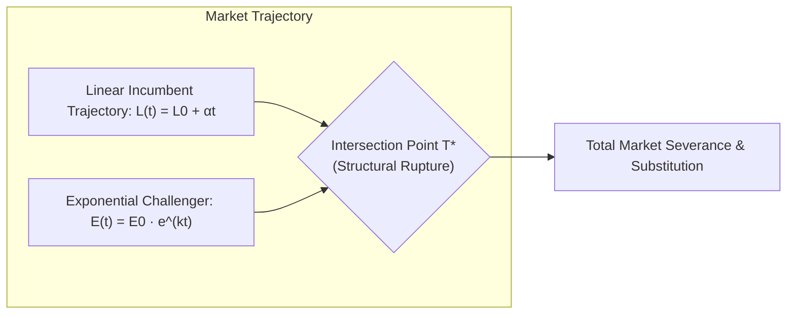

> **🎙️ 3-Presenter Authentic Tiki-Taka Script**
> 
> **TA Marcus Brody:** Slide 17 gives us the exact mathematical equation for the moment of doom: **The Inflection Intersection Point ($T^*$)**! Look at that Lambert $W$ function! Elena, explain what this equation tells a corporate strategist. *(Turn 1)*  
> **Dr. Elena Vance:** This equation calculates the exact point in time $T^*$ where the exponential challenger curve $E(t) = E_0 e^{kt}$ intersects and surpasses the linear incumbent trajectory $L(t) = L_0 + lpha t$. *(Turn 2)*  
> **Prof. Peter Kim:** Look at the strategic rule of thumb at the bottom of the slide: Two doubling periods before intersection ($t = T^* - 2	au_d$), the exponential challenger is operating at **only 25% of the incumbent's performance**. *(Turn 3)*  
> **TA Marcus Brody:** 25% looks inferior! A phone with 25% battery life, or an AI with 25% accuracy looks like a bad joke! Incumbents look at 25% and say: *"We have plenty of time; they are way behind us."* *(Turn 4)*  
> **Dr. Elena Vance:** But because it is compounding exponentially, it only takes **two doubling cycles** to jump from $25\% 	o 50\% 	o 100\%$! If the doubling time is 12 months, the incumbent has exactly **24 months** between feeling comfortably superior and being completely driven out of business! *(Turn 5)*  
> **TA Marcus Brody:** Two years! In corporate governance, it takes two years just to hire a search committee and approve a restructuring plan! By the time the board finishes their off-site retreat, their market is gone! *(Turn 6)*  
> **Prof. Peter Kim:** This equation proves that in an exponential world, the window for strategic response is measured in months, not decades. *(Turn 7)*  
> **Dr. Elena Vance:** And no company illustrates this tragedy more vividly than Kodak. *(Turn 8)*  
> **Prof. Peter Kim:** Let’s examine the tragic history of Kodak on Slide 18. *(Turn 9)*  
> **TA Marcus Brody:** Turn to Slide 18: The Tragedy of Kodak! *(Turn 10)*

---

### Slide 18: The Tragedy of Kodak: 1975 Steve Sasson 0.01MP CCD to Chapter 11
- **Historical Autopsy:**
  - *1975:* Kodak engineer Steve Sasson invents the world's first digital camera ($0.01	ext{ MP}$, weight: $3.6	ext{ kg}$, cassette storage).
  - *Management Response:* *"That's cute, Steve—just don't tell anyone about it."* (Fear of cannibalizing the high-margin chemical film business).
  - *1996:* Kodak reaches peak market valuation of **$31 Billion USD** (145,000 employees).
  - *2012 (January):* Kodak files for **Chapter 11 Bankruptcy** as digital photography hits universal saturation.
  - *2012 (April):* Facebook acquires Instagram (13 employees, 30 million digital users) for **$1 Billion USD**.

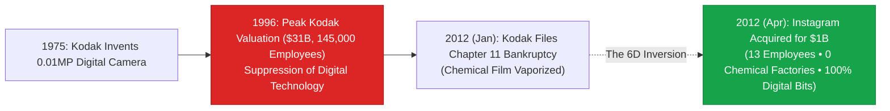

> **🎙️ 3-Presenter Authentic Tiki-Taka Script**
> 
> **TA Marcus Brody:** Slide 18 presents the most famous corporate autopsy in business history: **The Tragedy of Kodak**. Look at the timeline on that flowchart! *(Turn 1)*  
> **Dr. Elena Vance:** Kodak didn't lose because they lacked brilliant scientists. Kodak’s own engineer, Steve Sasson, *invented the digital camera* in their Rochester labs in 1975! They owned the fundamental patents on digital photography! *(Turn 2)*  
> **Prof. Peter Kim:** When Sasson demonstrated the 0.01-megapixel prototype to the executive committee, management’s response was legendary: *"That's cute, Steve—just don't tell anyone about it."* *(Turn 3)*  
> **TA Marcus Brody:** They were addicted to their chemical film monopoly! Kodak made money selling film, selling paper, selling developing chemicals, and selling yellow boxes. Digital had zero film and zero chemicals, so management treated their own invention like an internal cancer! *(Turn 4)*  
> **Dr. Elena Vance:** In 1996, Kodak hit its peak valuation of **$31 Billion dollars** with 145,000 employees. Exactly 16 years later—in January 2012—Kodak filed for Chapter 11 bankruptcy! *(Turn 5)*  
> **Prof. Peter Kim:** And look at the ultimate 6D inversion: Just three months after Kodak went bankrupt, Facebook bought Instagram—a digital photo app with **13 employees and zero physical factories**—for **$1 Billion dollars**! *(Turn 6)*  
> **TA Marcus Brody:** 145,000 employees and a century of chemical infrastructure collapsed to zero; 13 software engineers building on digital bits captured a billion dollars of value! That is the 6D framework in a single slide! *(Turn 7)*  
> **Dr. Elena Vance:** And understanding how manufacturing accelerates this brings us to Wright’s Law. *(Turn 8)*  
> **Prof. Peter Kim:** Let’s compare Moore’s Law with Wright’s Law on Slide 19. *(Turn 9)*  
> **TA Marcus Brody:** Turn to Slide 19: Moore’s Law vs. Wright’s Law! *(Turn 10)*

---

### Slide 19: Moore’s Law vs. Wright’s Law: Cumulative Production Compounding
- **Theoretical Comparison:**
  - *Moore’s Law (Time-Indexed):* Performance doubles as a function of **time** ($t$):
    $$	ext{Cost}(t) = 	ext{Cost}_0 \cdot 2^{-t / 	au}$$
  - *Wright’s Law (Production-Indexed):* Cost falls as a power-law function of **cumulative manufacturing volume** ($Y$):
    $$	ext{Cost}(Y) = C_0 \cdot Y^{-\omega} \quad (	ext{Learning Rate } 	ext{LR} = 1 - 2^{-\omega})$$
- **Empirical Superiority:** Wright’s Law accurately models technologies that require physical scale (Solar PV, Batteries, Cultured Meat, CubeSats), proving that **deployment volume directly drives cost deflation**.

> **🎙️ 3-Presenter Authentic Tiki-Taka Script**
> 
> **Prof. Peter Kim:** Slide 19 introduces a crucial distinction in exponential modeling: **Moore’s Law versus Wright’s Law**. Dr. Vance, why is Wright’s Law often superior to Moore’s Law for physical technologies? *(Turn 1)*  
> **Dr. Elena Vance:** Moore’s Law is indexed to *time*—it assumes progress happens automatically every 18 months. But **Wright’s Law**, formulated by Theodore Wright in 1936, indexes cost reduction to **Cumulative Manufacturing Experience ($Y$)**! *(Turn 2)*  
> **TA Marcus Brody:** Look at the equation: $	ext{Cost}(Y) = C_0 \cdot Y^{-\omega}$. Every time cumulative global production of a technology doubles, the unit cost falls by a fixed percentage (the learning rate $\omega$)! *(Turn 3)*  
> **Dr. Elena Vance:** In solar photovoltaics and lithium-ion batteries, the learning rate is roughly **20% to 28%**! That means every time we double the total number of solar panels or battery packs manufactured in history, the cost per watt or per kilowatt-hour drops by more than a quarter! *(Turn 4)*  
> **Prof. Peter Kim:** This proves that cost reduction is not passive; it is an active engineering function of deployment volume. The faster you build, the faster the price collapses. *(Turn 5)*  
> **TA Marcus Brody:** That’s why Elon Musk at Tesla or CATL in China build massive gigafactories! They aren't just building products; they are racing down Wright's Law learning curves to permanently demonetize their competitors! *(Turn 6)*  
> **Dr. Elena Vance:** And when multiple technologies riding Wright’s Law cross-pollinate, you get complex matrix convergence! *(Turn 7)*  
> **Prof. Peter Kim:** Let’s examine Multi-6D Cross-Pollination on Slide 20. *(Turn 8)*  
> **TA Marcus Brody:** Turn to Slide 20: Complex Matrix Convergence! *(Turn 9)*  
> **Prof. Peter Kim:** Proceed to Slide 20. *(Turn 10)*

---

### Slide 20: Complex Matrix Convergence: Multi-6D Cross-Pollination
- **Multi-Dimensional Convergence Dynamics:**
  - Technological acceleration does not occur along isolated single-6D tracks; it operates as an interconnected $N 	imes N$ matrix where each stage in Domain $A$ unlocks downstream stages in Domains $B$, $C$, and $D$.
- **The Convergence Matrix (2026):**

| Primary 6D Driver | Secondary Catalyzed Domain | Cross-Pollination Mechanism | Civilizational Acceleration Factor |
| :--- | :--- | :--- | :--- |
| **Digitized AI Compute** | Synthetic Genomics | In silico AlphaFold molecular design | $100	imes$ faster enzyme discovery |
| **Dematerialized Sensors**| Autonomous Robotics | Solid-state LiDAR on edge ASICs | $10	imes$ reduction in vehicle BOM cost |
| **Demonetized Solar PV** | Desalination & Clean Hydrogen | Sub-1.5¢/kWh clean electron inputs | Unlimited agricultural freshwater |
| **Democratized Starlink** | Global Precision Agriculture | LEO low-latency telemetry to tractors | $30\%$ reduction in chemical fertilizer |

> **🎙️ 3-Presenter Authentic Tiki-Taka Script**
> 
> **Prof. Peter Kim:** Look at the convergence matrix on Slide 20. We are no longer dealing with simple linear chains; we are analyzing multi-domain cross-pollination. Marcus, walk us through Row 1 and 2. *(Turn 1)*  
> **TA Marcus Brody:** Row 1: **Digitized AI Compute catalyzes Synthetic Genomics**! By digitizing compute, DeepMind created AlphaFold, compressing 200 million protein structures from a million years of manual lab work into a few months! That is a **$100	imes$ acceleration** in biological enzyme discovery! *(Turn 2)*  
> **Dr. Elena Vance:** And look at Row 2: **Dematerialized Sensors catalyze Autonomous Robotics**! When mechanical spinning LiDARs costing $75,000 were dematerialized into solid-state microchips costing $250, autonomous vehicles became economically viable for mass commercial deployment! *(Turn 3)*  
> **TA Marcus Brody:** Look at Row 3: **Demonetized Solar catalyzes Desalination**! When solar electricity hits 1.5 cents per kilowatt-hour, pumping seawater through reverse-osmosis membranes becomes so cheap you can turn coastal deserts into lush vertical farms! *(Turn 4)*  
> **Prof. Peter Kim:** And Row 4: **Democratized LEO Satellites catalyze Global Precision Agriculture**, beaming real-time moisture telemetry to autonomous tractors in Africa, cutting fertilizer waste by 30%! *(Turn 5)*  
> **Dr. Elena Vance:** Every row in this matrix represents a multi-billion-dollar post-scarcity transition unlocked by cross-disciplinary 6D convergence. *(Turn 6)*  
> **TA Marcus Brody:** And when these systems connect across global networks, Metcalfe’s Law kicks in to add another layer of exponential power! *(Turn 7)*  
> **Prof. Peter Kim:** Let’s examine Metcalfe’s Law on Slide 21. *(Turn 8)*  
> **Dr. Elena Vance:** Turn to Slide 21: Metcalfe’s Law and the Exponential Acceleration Vector. *(Turn 9)*  
> **TA Marcus Brody:** Let’s see network value scale at $N^2$! *(Turn 10)*

---

### Slide 21: Metcalfe’s Law and the Exponential Acceleration Vector
- **Mathematical Formulation:**
  - *Metcalfe’s Law (Robert Metcalfe, 1980):* The value of a telecommunications or computational network ($V$) is proportional to the square of the number of connected users/nodes ($N$):
    $$V \propto N^2 - N pprox N^2 \quad (	ext{for large } N)$$
- **The Multi-Agent Singularity:**
  - When 8 billion humans, 100 billion IoT edge sensors, and 10 billion autonomous AI agents are interconnected across a sub-25ms global mesh, the systemic value and problem-solving velocity of civilization scales as $V \propto (1.18 	imes 10^{11})^2 pprox \mathbf{1.39 	imes 10^{22}}$ potential interactions.

> **🎙️ 3-Presenter Authentic Tiki-Taka Script**
> 
> **Dr. Elena Vance:** Robert Metcalfe formulated **Metcalfe’s Law** in 1980: The value of any network ($V$) scales with the square of its connected nodes ($N^2$). Marcus, explain the mathematics of network scaling. *(Turn 1)*  
> **TA Marcus Brody:** If a network has two phones, there is only one connection. If it has five phones, there are 10 connections. If it has 1,000 nodes, there are roughly **500,000 connections** ($N^2 / 2$)! The network value explodes quadratically! *(Turn 2)*  
> **Prof. Peter Kim:** Now look at the Multi-Agent calculation on Slide 21: In 2026, we are not just connecting 8 billion human minds. We are interconnecting 8 billion humans, 100 billion IoT sensors, and 10 billion autonomous AI agents across a global LEO mesh! *(Turn 3)*  
> **TA Marcus Brody:** That is **118 billion interconnected intelligent nodes**! When you square that, you get **$1.39 	imes 10^{22}$ potential synergistic interactions**! *(Turn 4)*  
> **Dr. Elena Vance:** That is an astronomical planetary cognitive mesh! A problem detected by an ocean sensor in the Pacific is processed by an AI cluster in Iceland, which triggers a drone launch in Chile in under 200 milliseconds! *(Turn 5)*  
> **Prof. Peter Kim:** That is the literal physical realization of *Planetary Intelligence*. *(Turn 6)*  
> **TA Marcus Brody:** And at the core of this planetary mesh is the thermodynamic substitution of bits for atoms! *(Turn 7)*  
> **Dr. Elena Vance:** Let’s examine the physics on Slide 22: The Thermodynamics of Bits Swallowing Atoms. *(Turn 8)*  
> **Prof. Peter Kim:** Turn to Slide 22. *(Turn 9)*  
> **TA Marcus Brody:** Let’s see how software eats the physical universe! *(Turn 10)*

---

### Slide 22: The Thermodynamics of Bits Swallowing Atoms
- **Landauer’s Principle & Information Physics:**
  - *Theoretical Minimum Energy to Erase 1 Bit (Rolf Landauer, 1961):*
    $$E_{	ext{min}} = k_B T \ln 2 pprox 2.87 	imes 10^{-21} 	ext{ Joules at } 300	ext{ K}$$
- **The Physical Replacement Dynamic:**
  - Manufacturing, transporting, and maintaining a 2,000kg physical steel automobile consumes $pprox 10^{11} 	ext{ Joules}$.
  - Routing an autonomous ride-hail coordination algorithm through a cloud server consumes $pprox 10^3 	ext{ Joules}$ (**an $100,000,000	imes$ thermodynamic efficiency gain**).
- **The Macro Inevitability:** Software and algorithms continuously replace physical mass and mechanical brute force because information processing is **eight orders of magnitude more thermodynamically efficient**.

> **🎙️ 3-Presenter Authentic Tiki-Taka Script**
> 
> **Prof. Peter Kim:** Slide 22 explains the fundamental physical reason why Marc Andreessen’s famous quote—*"Software is eating the world"*—is an inevitable law of thermodynamics. Dr. Vance, walk us through Landauer’s Principle. *(Turn 1)*  
> **Dr. Elena Vance:** In 1961, physicist Rolf Landauer proved that manipulating a single bit of information requires a minimum theoretical energy of just $k_B T \ln 2$—roughly **$2.87 	imes 10^{-21}$ Joules**! Computing is virtually frictionless in the laws of physics! *(Turn 2)*  
> **TA Marcus Brody:** Now compare that to physical manufacturing in the second bullet point! Manufacturing a 2,000-kilogram steel car, shipping it across an ocean, and parking it in a driveway 95% of the time consumes **$10^{11}$ Joules** of raw energy! *(Turn 3)*  
> **Dr. Elena Vance:** But using an autonomous ride-sharing algorithm to route an electric fleet—so one car serves ten people 24/7—consumes only **$10^3$ Joules** of cloud compute! That is an **eight-order-of-magnitude ($100,000,000	imes$) thermodynamic efficiency gain**! *(Turn 4)*  
> **Prof. Peter Kim:** In evolutionary biology, systems that accomplish the same function with eight orders of magnitude less energy always drive high-friction systems to total extinction. *(Turn 5)*  
> **TA Marcus Brody:** Bits swallow atoms because bits are infinitely more energy-efficient! Software isn't just a business model; software is thermodynamic optimization! *(Turn 6)*  
> **Dr. Elena Vance:** And this thermodynamic collapse of cost leads directly to Jeremy Rifkin’s Post-Capitalist Horizon. *(Turn 7)*  
> **Prof. Peter Kim:** Let’s examine Zero Marginal Cost Economics on Slide 23. *(Turn 8)*  
> **TA Marcus Brody:** Turn to Slide 23: Jeremy Rifkin’s Post-Capitalist Horizon! *(Turn 9)*  
> **Prof. Peter Kim:** Proceed to Slide 23. *(Turn 10)*

---

### Slide 23: Zero Marginal Cost Economics: Jeremy Rifkin’s Post-Capitalist Horizon
- **Macroeconomic Benchmark:** Jeremy Rifkin (2014), *The Zero Marginal Cost Society*.
- **The Core Paradox of Capitalism:**
  - Capitalist competition drives relentless efficiency $	o$ Extreme efficiency reduces marginal costs to near-zero ($	ext{MC} 	o 0$) $	o$ When $	ext{MC} = 0$, profits evaporate, traditional markets fail, and goods transition into **Universal Collaborative Commons**.
- **The Post-Scarcity Shift:** Energy, communications, education, and healthcare increasingly operate outside traditional scarcity-based market mechanics.

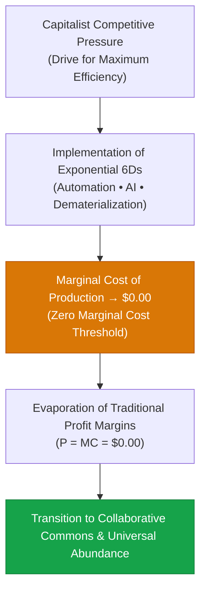

> **🎙️ 3-Presenter Authentic Tiki-Taka Script**
> 
> **TA Marcus Brody:** Slide 23 features Jeremy Rifkin’s landmark thesis: **The Zero Marginal Cost Society**. Look at the beautiful paradox in that flowchart! *(Turn 1)*  
> **Dr. Elena Vance:** Rifkin identified the supreme internal contradiction of free-market capitalism: The ultimate goal of every capitalist enterprise is to maximize efficiency and reduce production costs. But when technology becomes *so efficient* that marginal cost drops to **zero**, the market price collapses to zero, and profit margins evaporate! *(Turn 2)*  
> **Prof. Peter Kim:** Capitalism, by its own internal competitive logic, systematically creates the post-capitalist abundance that renders traditional pricing obsolete! *(Turn 3)*  
> **TA Marcus Brody:** Look at open-source software! In 1995, Microsoft sold Windows operating systems in cardboard boxes for $200. Today, the world's supercomputers, cloud servers, and smartphones run on Linux and Android—open-source collaborative commons maintained for free by global communities! *(Turn 4)*  
> **Dr. Elena Vance:** And today, open-weight AI foundation models like LLaMA and Mistral are doing the exact same thing to artificial intelligence! Free, zero-marginal-cost intelligence accessible to anyone with a GPU! *(Turn 5)*  
> **Prof. Peter Kim:** When the marginal cost of intelligence, energy, and medicine reaches zero, they cease to be commercial commodities and become universal civilizational commons. *(Turn 6)*  
> **TA Marcus Brody:** And that completely destroys traditional barriers to entry! *(Turn 7)*  
> **Dr. Elena Vance:** Let’s examine how barriers to entry collapse on Slide 24. *(Turn 8)*  
> **Prof. Peter Kim:** Turn to Slide 24: The Collapse of Barriers to Entry. *(Turn 9)*  
> **TA Marcus Brody:** Let’s see why two college students in a garage can disrupt a multi-billion-dollar enterprise! *(Turn 10)*

---

### Slide 24: The Collapse of Barriers to Entry: $C_{	ext{entry}} 
ightarrow 0$
- **The Asymmetric Power Shift:**
  - *Industrial Era (1950–2000):* Launching a global enterprise required **$50M to $500M in CapEx** (building physical factories, securing broadcast licenses, retail distribution networks).
  - *Theurgic Era (2026):* A team of 3 engineers with access to open-source foundation models, cloud compute, serverless APIs, and automated bio-foundries can deploy a global application for **<$1,000 in initial CapEx**.
- **The Asymmetry Ratio:**
  $$	ext{Capital Barrier Collapse} = rac{	ext{CapEx}_{1980}}{	ext{CapEx}_{2026}} pprox rac{\$100,000,000}{\$1,000} = \mathbf{100,000	imes 	ext{ Reduction}}$$

> **🎙️ 3-Presenter Authentic Tiki-Taka Script**
> 
> **Prof. Peter Kim:** Slide 24 details the greatest democratization of entrepreneurial agency in history: **The Collapse of Barriers to Entry ($C_{	ext{entry}} 	o 0$)**. Dr. Vance, quantify this historical shift. *(Turn 1)*  
> **Dr. Elena Vance:** In 1980, if you wanted to launch a national retail brand or software company, you needed **$50 million to $100 million dollars** upfront: you had to lease mainframe computers, build physical distribution warehouses, negotiate retail shelf space, and hire hundreds of staff. Capital was the supreme gatekeeper. *(Turn 2)*  
> **TA Marcus Brody:** Today, two twenty-year-old college students with a laptop, an AWS credit, an open-source AI agent cluster, and a GitHub account can launch a globally scalable software application for **under $1,000 dollars**! That is a **$100,000	imes$ reduction in capital barriers**! *(Turn 3)*  
> **Prof. Peter Kim:** This means the moat around legacy corporate monopolies has been completely drained. Incumbents can no longer hide behind massive balance sheets; they can be disrupted from any dorm room or coffee shop on Earth. *(Turn 4)*  
> **TA Marcus Brody:** A three-person startup using AI agents can now out-code, out-market, and out-iterate a legacy corporate division of 500 people! *(Turn 5)*  
> **Dr. Elena Vance:** And this democratization of agency allows us to build an exact algorithm for discovering 6D disruptive opportunities! *(Turn 6)*  
> **Prof. Peter Kim:** Let’s examine the 6D Discovery Algorithm on Slide 25. *(Turn 7)*  
> **TA Marcus Brody:** Turn to Slide 25: The 6D Disruptive Opportunity Discovery Algorithm! *(Turn 8)*  
> **Dr. Elena Vance:** Let’s see how to find multi-billion-dollar moonshots! *(Turn 9)*  
> **Prof. Peter Kim:** Proceed to Slide 25. *(Turn 10)*

---

### Slide 25: The 6D Disruptive Opportunity Discovery Algorithm
- **The Operational 4-Step Opportunity Filter:**
  1. **Step 1: Identify Analog Friction:** Find a multi-billion-dollar legacy industry characterized by high physical mass, non-transparent gatekeepers, and linear pricing (e.g., healthcare billing, legal contracts, construction permitting).
  2. **Step 2: Isolate the Digitization Vector:** Determine what primary sensor, algorithm, or biological code can convert that analog process into digital bits.
  3. **Step 3: Track the Deceptive Knee:** Calculate the current doubling period ($	au_d$) and project the exact intersection date ($T^*$) when price-performance overtakes legacy incumbents.
  4. **Step 4: Architect Post-Democratization Utility:** Design a zero-marginal-cost platform that captures value through higher-order services rather than gating access.

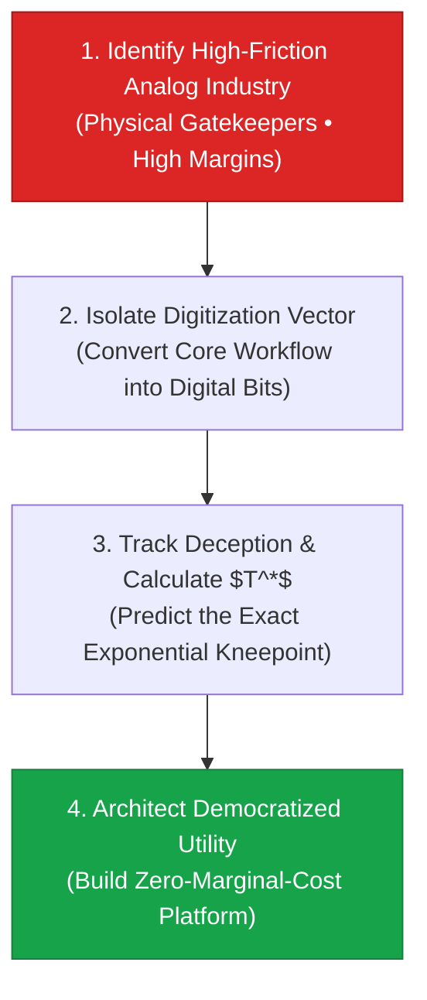

> **🎙️ 3-Presenter Authentic Tiki-Taka Script**
> 
> **Prof. Peter Kim:** Slide 25 presents the **6D Disruptive Opportunity Discovery Algorithm**. This is your master operational blueprint for creating high-impact startups and research moonshots. Marcus, walk us through Step 1 and 2. *(Turn 1)*  
> **TA Marcus Brody:** Step 1: **Identify Analog Friction**! You look for massive legacy industries where customers are miserable, prices are extortionate, and physical paperwork is everywhere: commercial real estate, legal contracts, hospital administrative billing, or construction permits! *(Turn 2)*  
> **Dr. Elena Vance:** Step 2: **Isolate the Digitization Vector**! You ask: *"What AI multimodal model, computer vision sensor, or smart contract can convert that entire physical paper workflow into pure digital bits?"* *(Turn 3)*  
> **Prof. Peter Kim:** Then Step 3: **Track the Deception & Calculate $T^*$**! You do not wait until the market is obvious. You calculate the doubling period ($	au_d$) and position your infrastructure to strike the exact moment the curve cuts through incumbent pricing! *(Turn 4)*  
> **TA Marcus Brody:** And Step 4: **Architect Democratized Utility**! You don't build another greedy gatekeeper; you build a zero-marginal-cost platform that gives baseline access to everyone for free and monetizes high-level enterprise workflows! *(Turn 5)*  
> **Dr. Elena Vance:** That four-step algorithm is the exact recipe that generated Uber, Airbnb, Stripe, and SpaceX! *(Turn 6)*  
> **Prof. Peter Kim:** Master this algorithm, and you will never wonder where to find your next breakthrough project. *(Turn 7)*  
> **TA Marcus Brody:** Now let’s test these 6D frameworks across nine real-world global industries in Module 4! *(Turn 8)*  
> **Dr. Elena Vance:** Let’s examine the hard empirical verification on Slide 26! *(Turn 9)*  
> **Prof. Peter Kim:** Proceed to Module 4: Global Empirical Verification & Hardware Specs! *(Turn 10)*


---

## Module 4: Global Empirical Verification & Hardware Specs (Slides 26–35)

### Slide 26: CASE 01: Digital Photography: Kodak Bankruptcy vs. Instagram $1B Exit
- **Empirical Industry Audit (1975–2012):**
  - *1975:* First Digital Camera Prototype ($0.01	ext{ MP}$, weight: $3.6	ext{ kg}$, $23	ext{s}$ capture).
  - *1996:* Kodak Market Cap: **$31 Billion USD** (145,000 employees, 90% US film market share).
  - *2012 (Jan):* **Kodak Files Chapter 11 Bankruptcy**; zero market value for chemical patents.
  - *2012 (Apr):* **Instagram Acquired by Facebook for $1 Billion USD** (13 employees, 30 million active users, $0$ physical assets).
- **The 6D Verification:** Proof of complete Dematerialization, Demonetization, and Democratization of visual memory.

> **🎙️ 3-Presenter Authentic Tiki-Taka Script**
> 
> **Prof. Peter Kim:** Module 4 opens with nine empirical case studies verifying the 6Ds across global industries. Case 1 is the definitive classic: **Kodak versus Instagram**. Dr. Vance, what is the quantitative lesson of this comparison on Slide 26? *(Turn 1)*  
> **Dr. Elena Vance:** Look at the numbers side by side: In 1996, Kodak was worth **$31 Billion dollars** with 145,000 employees and physical factories across the globe. Exactly 16 years later, Kodak was bankrupt with zero value, while Instagram—with **13 employees and zero physical factories**—was acquired for **$1 Billion dollars**! *(Turn 2)*  
> **TA Marcus Brody:** Think about employee leverage! Kodak needed **11,000 employees per billion dollars of value**; Instagram had **13 employees total**! That is an $850	imes$ increase in value density per human worker! *(Turn 3)*  
> **Prof. Peter Kim:** And why did that happen? Because Kodak was selling physical chemicals and paper; Instagram was routing digital bits across the cloud. *(Turn 4)*  
> **TA Marcus Brody:** In 1996, taking 1,000 photos on vacation cost $500 in film and development. Today, people take 10,000 photos on vacation for **zero dollars** and share them with the entire world in half a second! *(Turn 5)*  
> **Dr. Elena Vance:** The entire physical value chain of film photography was completely dematerialized into software algorithms and demonetized to absolute zero! *(Turn 6)*  
> **Prof. Peter Kim:** This proves that once a technology enters the 6D pipeline, no incumbent balance sheet or physical moat can save it from liquidation. *(Turn 7)*  
> **TA Marcus Brody:** And photography was just the first domino to fall! Look at what happened to all the other physical devices on Slide 27! *(Turn 8)*  
> **Prof. Peter Kim:** Let’s examine Case 2: The $7.1M Smartphone Dematerialization. *(Turn 9)*  
> **Dr. Elena Vance:** Turn to Slide 27! *(Turn 10)*

---

### Slide 27: CASE 02: The $7.1M Hardware Dematerialization into the Modern Smartphone
- **The Empirical Dematerialization Audit (1985 vs. 2026):**

| 1985 Standalone Physical Hardware | 1985 Unit Cost (USD) | 2026 Digital Smartphone Equivalent | 2026 Marginal Cost |
| :--- | :--- | :--- | :--- |
| **Broadcast Video Camera & Recorder** | $2,500 | 4K 60fps HDR Digital Video Sensor | $0.00 (Software App) |
| **Marine GPS Navigation Unit** | $120,000 | Multi-Constellation GNSS / GPS Chip | $0.00 (Google/Apple Maps) |
| **30-Volume Encyclopedia Britannica** | $2,000 | Wikipedia / Frontier AI Multimodal LLM | $0.00 (Instant Search) |
| **Dedicated Audio Recording Studio** | $50,000 | GarageBand / Digital Audio Workstation | $0.00 (Mobile DAW) |
| **Enterprise Video Conferencing Suite**| $250,000 | Zoom / FaceTime / Google Meet | $0.00 (Free HD Video) |
| **Cray-2 Supercomputing Cluster** | $6,500,000+ | 3nm Neural Processing Unit (NPU) | $0.00 (On-Device Compute) |
| **TOTAL HARDWARE VALUE:** | **~$7,100,000 USD** | **Dematerialized into 200g Smartphone** | **<$300 Device Cost** |

> **🎙️ 3-Presenter Authentic Tiki-Taka Script**
> 
> **TA Marcus Brody:** Look at the audit table on Slide 27! In 1985, if you wanted the functionality of your current phone, you had to spend **$7.1 million dollars** in physical hardware! *(Turn 1)*  
> **Dr. Elena Vance:** Look at the individual rows: A Cray-2 supercomputer cost $6.5 million in 1985 and consumed 200 kilowatts of power with liquid fluorocarbon cooling. Today, an iPhone or Android phone contains a 3-nanometer NPU that processes **over 35 Trillion Operations per Second (TOPS)** while drawing less than 5 watts of battery power! *(Turn 2)*  
> **Prof. Peter Kim:** And look at the marine GPS navigation unit: $120,000 in 1985, requiring dedicated military hardware. Today, a microscopic GNSS silicon chip costing $1.50 gives every human pinpoint geographic positioning down to three centimeters! *(Turn 3)*  
> **TA Marcus Brody:** Total 1985 hardware weight: **several tons** of silicon, steel, cathode-ray tubes, and copper wires! Total 2026 weight: **200 grams**! *(Turn 4)*  
> **Dr. Elena Vance:** That is a **$10,000	imes$ dematerialization of physical mass** and a **$23,000	imes$ collapse in purchasing price**! *(Turn 5)*  
> **Prof. Peter Kim:** And once purchased, the marginal cost of updating the software, adding new AI capabilities, and accessing global knowledge is exactly **zero dollars**. *(Turn 6)*  
> **TA Marcus Brody:** Every person on Earth carrying a smartphone is carrying a 1985 billionaire's computing bunker in their pocket! *(Turn 7)*  
> **Dr. Elena Vance:** And this same 6D collapse is revolutionizing biological healthcare under the Carlson Curve. *(Turn 8)*  
> **Prof. Peter Kim:** Let’s examine Case 3 on Slide 28: Next-Gen Genomic Sequencing. *(Turn 9)*  
> **TA Marcus Brody:** Turn to Slide 28: $3 Billion to $100 in Genomics! *(Turn 10)*

---

### Slide 28: CASE 03: Next-Gen Genomic Sequencing: $3B to $100 (30-Million-Fold Collapse)
- **Empirical Metric Source:** National Human Genome Research Institute (NHGRI, 2001–2026).
- **The Carlson Curve Trajectory:**
  - 2001 (Human Genome Project): **~$3,000,000,000 ($3B USD)** (13 years of manual wet-lab work).
  - 2007 (Next-Gen Sequencing Inflection): **~$1,000,000 ($1M USD)**.
  - 2014 (Illumina HiSeq X Ten): **~$1,000 USD**.
  - 2026 (Ultima Genomics / Element AVITI): **<$100 USD** (approaching $10 / genome).
- **The 6D Scaling Factor:** A **$30,000,000	imes$ ($30	ext{ Million-Fold}$) cost deflation** in 25 years, plunging **$3	imes 	ext{ to } 5	imes$ faster than classical Moore's Law**.

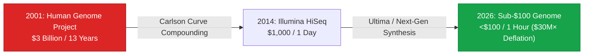

> **🎙️ 3-Presenter Authentic Tiki-Taka Script**
> 
> **Dr. Elena Vance:** Case 3 presents the most rapid cost deflation curve in the history of science: **The Carlson Curve of DNA Sequencing**. Look at the numbers on Slide 28. *(Turn 1)*  
> **TA Marcus Brody:** In 2001, sequencing the first human genome cost **$3 Billion dollars** across thirteen years of international effort! Today in 2026, high-throughput sequencers like Ultima Genomics sequence a full human genome for **under $100 dollars in 60 minutes**! *(Turn 2)*  
> **Prof. Peter Kim:** That is a **30-million-fold cost reduction ($30,000,000	imes$)** in a single generation! For comparison, if automotive fuel efficiency had improved by 30 million times, you could drive a car from New York to Los Angeles on a single teaspoon of gasoline! *(Turn 3)*  
> **TA Marcus Brody:** And notice that DNA sequencing didn't just follow Moore's Law—it plunged **three to five times faster than Moore’s Law**! The curve went almost straight down! *(Turn 4)*  
> **Dr. Elena Vance:** Why? Because sequencing digitized biology! We replaced manual gel electrophoresis with automated fluorescent optical imaging, microfluidic chips, and deep learning base-calling algorithms! *(Turn 5)*  
> **Prof. Peter Kim:** And when genomic sequencing costs less than a routine blood test, medicine shifts from blind symptom management to precise preventative bio-design. *(Turn 6)*  
> **TA Marcus Brody:** And that same exponential curve is rewriting global energy under Swanson’s Law! *(Turn 7)*  
> **Dr. Elena Vance:** Let’s examine Case 4: Solar Photovoltaic Cost Deflation on Slide 29. *(Turn 8)*  
> **Prof. Peter Kim:** Turn to Slide 29: Swanson’s Law and Solar PV. *(Turn 9)*  
> **TA Marcus Brody:** Let’s see solar energy plunge 99.6%! *(Turn 10)*

---

### Slide 29: CASE 04: Solar PV Module Swanson’s Law: 99.6% Cost Deflation
- **Empirical Metric Source:** BloombergNEF, Our World in Data, IRENA (1976–2026).
- **Swanson’s Law Trajectory:**
  - 1976: **$106.00 per Watt** (Space satellite solar cells).
  - 1990: **$10.00 per Watt** ($10.6	imes$ drop).
  - 2010: **$2.00 per Watt** ($5	imes$ drop).
  - 2020: **$0.20 per Watt** ($10	imes$ drop).
  - 2026: **<$0.08 per Watt (Sub-8 Cents/W)**.
- **The Total Deflation Factor:** A **99.92% drop in module cost** over 50 years, making utility-scale solar PV the cheapest electricity source in human history ($<1.5	ext{¢/kWh}$ in sunny latitudes).

> **🎙️ 3-Presenter Authentic Tiki-Taka Script**
> 
> **Prof. Peter Kim:** Case 4 is the empirical proof of Swanson’s Law in solar energy. Dr. Vance, walk us through the cost deflation numbers on Slide 29. *(Turn 1)*  
> **Dr. Elena Vance:** In 1976, solar photovoltaic cells cost **$106 per Watt**. They were so expensive they were used exclusively on multi-million-dollar NASA satellites! By 2010, they fell to $2.00 per Watt. And in 2026, utility-scale solar modules cost **less than 8 cents per Watt**! *(Turn 2)*  
> **TA Marcus Brody:** That is a **99.92% total price collapse**! Over 50 years, the price fell by more than 1,300 times! *(Turn 3)*  
> **Prof. Peter Kim:** And look at the levelized cost of energy (LCOE): In sunny regions like Saudi Arabia, Australia, and the American Southwest, utility-scale solar produces electricity at **under 1.5 cents per kilowatt-hour**—cheaper than coal, cheaper than natural gas, and cheaper than nuclear power! *(Turn 4)*  
> **TA Marcus Brody:** Because solar is not a scarce fossil fuel that you have to dig out of the ground; solar is a semiconductor technology that captures ambient photons from the sky! It obeys the laws of manufacturing scale! *(Turn 5)*  
> **Dr. Elena Vance:** Every time global solar manufacturing doubles, module costs fall another 20%. That is Swanson's Law in action! *(Turn 6)*  
> **Prof. Peter Kim:** Solar is demonetizing the cost of planetary electrons. *(Turn 7)*  
> **TA Marcus Brody:** But what about storing those electrons at night? That brings us to lithium-ion batteries! *(Turn 8)*  
> **Dr. Elena Vance:** Let’s examine Case 5: Lithium-Ion Battery Packs on Slide 30. *(Turn 9)*  
> **Prof. Peter Kim:** Turn to Slide 30: Battery Packs and EV Parity. *(Turn 10)*

---

### Slide 30: CASE 05: Lithium-Ion Battery Packs: $1,200/kWh to $90/kWh & EV Parity
- **Empirical Metric Source:** BloombergNEF Annual Battery Price Surveys (2010–2026).
- **The Deflation Curve:**
  - 2010: **$1,200 / kWh** (EVs cost $100K+ with <100-mile range).
  - 2015: **$380 / kWh** ($3.15	imes$ drop).
  - 2020: **$137 / kWh** ($2.77	imes$ drop).
  - 2026: **<$90 / kWh (LFP cells approaching $55/kWh)**.
- **The Market Inflection:** Crossing the **$100/kWh parity threshold** triggered the vertical S-curve where Electric Vehicles (EVs) achieved upfront purchase price parity with internal combustion engines (ICE).

> **🎙️ 3-Presenter Authentic Tiki-Taka Script**
> 
> **TA Marcus Brody:** Case 5 completes the clean energy revolution: **Lithium-Ion Battery Cost Collapse**. Look at Slide 30: In 2010, battery packs cost **$1,200 per kilowatt-hour**! An 80 kWh battery alone cost $96,000! *(Turn 1)*  
> **Dr. Elena Vance:** Which is why early electric cars cost over $100,000 and had tiny ranges. But look at 2026: Battery pack prices plunged below **$90 per kilowatt-hour**, and lithium-iron-phosphate (LFP) cells are approaching **$55 per kWh**! *(Turn 2)*  
> **Prof. Peter Kim:** That is a **95% price collapse in sixteen years**! And crossing the magical $100/kWh threshold was the exact Inflection Intersection Point ($T^*$) where electric vehicles became cheaper to manufacture than internal combustion gasoline cars! *(Turn 3)*  
> **TA Marcus Brody:** An electric drivetrain has 20 moving parts; a gas engine has 2,000 moving parts that wear out, require oil changes, and blow gaskets! Once battery packs demonetize, gas cars are economically dead! *(Turn 4)*  
> **Dr. Elena Vance:** And combined with grid-scale storage, cheap batteries allow solar and wind to power the electrical grid 24 hours a day, 365 days a year without fossil fuel backup. *(Turn 5)*  
> **Prof. Peter Kim:** Energy storage has transitioned from an expensive physical bottleneck into an abundant, modular commodity. *(Turn 6)*  
> **TA Marcus Brody:** And what about the cost of artificial intelligence itself? Look at LLM token economics on Slide 31! *(Turn 7)*  
> **Dr. Elena Vance:** Let’s examine Case 6: The Collapse of LLM Token Costs! *(Turn 8)*  
> **Prof. Peter Kim:** Turn to Slide 31: LLM Token Generation Economics. *(Turn 9)*  
> **TA Marcus Brody:** Let’s see intelligence demonetize! *(Turn 10)*

---

### Slide 31: CASE 06: LLM Token Generation Economics: $60 to $0.10 per Million Tokens
- **Empirical Metric Source:** Artificial Analysis & OpenAI/Anthropic API Price Audits (2020–2026).
- **The Token Cost Trajectory:**
  - 2020 (GPT-3 Davinci Launch): **~$60.00 per Million Tokens**.
  - 2023 (GPT-4 Launch): **~$30.00 per Million Tokens**.
  - 2024 (GPT-4o / Claude 3.5 Sonnet): **~$3.00 to $5.00 per Million Tokens**.
  - 2026 (Frontier Distilled & Speculative Models): **<$0.10 per Million Tokens (Approaching Free)**.
- **The 6D Scaling Velocity:** A **$600	imes 	ext{ Cost Deflation in 6 Years}$** ($99.83\%$ price drop), enabling millions of continuous multi-agent autonomous loops at negligible cost.


> **🎙️ 3-Presenter Authentic Tiki-Taka Script**
> 
> **Dr. Elena Vance:** Case 6 presents the hyper-exponential demonetization of cognitive compute: **LLM Token Generation Economics**. In 2020, running GPT-3 Davinci cost **$60 per million tokens**. *(Turn 1)*  
> **TA Marcus Brody:** Today in 2026, distilled frontier models running on custom inference chips generate a million tokens for **less than 10 cents ($0.10)**! That is a **600-fold cost reduction in six years**! *(Turn 2)*  
> **Prof. Peter Kim:** What does a 600x price drop mean in operational practice, Dr. Vance? *(Turn 3)*  
> **Dr. Elena Vance:** It means that in 2020, running an autonomous multi-agent software cluster that parsed 10 million tokens a day cost $600 a day—completely unaffordable for normal developers. Today, running that exact same multi-agent workflow costs **$1.00 a day**! *(Turn 4)*  
> **TA Marcus Brody:** That means synthetic cognition is now cheaper than electricity! You can have 50 AI agents working 24/7 reviewing code, drafting legal briefs, and analyzing clinical trial data for less than the price of a cup of coffee! *(Turn 5)*  
> **Prof. Peter Kim:** Raw intelligence is being demonetized into ambient civilizational infrastructure. *(Turn 6)*  
> **TA Marcus Brody:** And this same 6D collapse is transforming agriculture with cultured meat! *(Turn 7)*  
> **Dr. Elena Vance:** Let’s examine Case 7: Cultured Meat Scaling on Slide 32. *(Turn 8)*  
> **Prof. Peter Kim:** Turn to Slide 32: Cultured Meat Scaling and Parity. *(Turn 9)*  
> **TA Marcus Brody:** Let’s see a $330,000 burger drop to $10 a kilogram! *(Turn 10)*

---

### Slide 32: CASE 07: Cultured Meat Scaling: $330,000 Burger to $10/kg Parity
- **Empirical Metric Source:** Good Food Institute (GFI) & Mosa Meat Audits (2013–2026).
- **The Cost Deflation Trajectory:**
  - 2013 (Mark Post's First Lab Burger): **$330,000 USD** (Hand-crafted in petri dishes using FBS).
  - 2019: **$50.00 per Burger** ($6,600	imes$ drop via early bioreactors).
  - 2023: **$15.00 per Pound** (Upside Foods / GOOD Meat commercial approval).
  - 2026: **<$10.00 / kg (Approaching Conventional Beef Parity)**.
- **Thermodynamic Conversion:** Cultured meat eliminates 95% of land use, 90% of water consumption, and 90% of greenhouse gas emissions per kilogram of protein produced.

> **🎙️ 3-Presenter Authentic Tiki-Taka Script**
> 
> **TA Marcus Brody:** Case 7 is the revolution in cellular agriculture: **Cultured Meat Scaling**! In 2013, Professor Mark Post unveiled the world's first lab-grown hamburger in London. That single burger cost **$330,000 dollars**! *(Turn 1)*  
> **Dr. Elena Vance:** And critics in the meat industry laughed and said: *"Lab meat is an absurd billionaire gimmick that will never feed a single family!"* They fell right into the Deception Trap! *(Turn 2)*  
> **Prof. Peter Kim:** Look at the trajectory on Slide 32: In 2019, it fell to $50. In 2023, it dropped to $15 a pound. And in 2026, large-scale continuous bioreactors produce clean cultured meat for **under $10 per kilogram—achieving price parity with conventional industrial beef**! *(Turn 3)*  
> **TA Marcus Brody:** That is a **33,000-fold price collapse** in 13 years! And look at the thermodynamic metrics: 95% less land, 90% less water, and 90% fewer greenhouse emissions, with zero antibiotics and zero animal slaughter! *(Turn 4)*  
> **Dr. Elena Vance:** We are dematerializing traditional feedlots, slaughterhouses, and deforestation into clean stainless-steel fermentation tanks. *(Turn 5)*  
> **Prof. Peter Kim:** That is the literal 6D transformation of sustenance. *(Turn 6)*  
> **TA Marcus Brody:** And in aerospace, CubeSats and reusable rockets did the exact same thing to space access! *(Turn 7)*  
> **Dr. Elena Vance:** Let’s examine Case 8: Orbital Launch and CubeSats on Slide 33. *(Turn 8)*  
> **Prof. Peter Kim:** Turn to Slide 33: CubeSat Constellations and Launch Costs. *(Turn 9)*  
> **TA Marcus Brody:** Let’s look at SpaceX and Planet Labs! *(Turn 10)*

---

### Slide 33: CASE 08: CubeSat Constellations & Orbital Launch Cost Reduction
- **Empirical Metric Source:** CSIS Aerospace Security Project & Planet Labs Audits (1980–2026).
- **The Orbital Launch Cost Collapse:**
  - NASA Space Shuttle (1981–2011): **~$54,500 / kg to Low Earth Orbit (LEO)**.
  - SpaceX Falcon 9 (2015–2022): **~$2,700 / kg to LEO** ($20	imes$ reduction).
  - SpaceX Starship (2026 Full Reusability): **<$100 / kg to LEO** ($500	imes$ reduction).
- **The CubeSat Dematerialization:** Planet Labs condensed a $500M school-bus-sized spy satellite into a 5kg "Dove" CubeSat costing <$100K, deploying 200+ satellites to image Earth's entire landmass daily.

> **🎙️ 3-Presenter Authentic Tiki-Taka Script**
> 
> **Prof. Peter Kim:** Case 8 demonstrates how the 6Ds transformed the aerospace industry. Dr. Vance, walk us through the orbital launch cost collapse on Slide 33. *(Turn 1)*  
> **Dr. Elena Vance:** During the Space Shuttle era, launching one kilogram of payload to Low Earth Orbit cost **$54,500 dollars**. By 2015, the reusable Falcon 9 brought that down to $2,700/kg. And with SpaceX Starship in 2026, full reusability pushes launch costs below **$100 per kilogram**! *(Turn 2)*  
> **TA Marcus Brody:** That is a **500-fold reduction in orbital launch costs**! And look at how satellites were dematerialized: A traditional military reconnaissance satellite used to weigh 10 tons, cost $500 million, and took ten years to build! *(Turn 3)*  
> **Dr. Elena Vance:** Planet Labs dematerialized that entire system into a 5-kilogram **CubeSat "Dove"** packed with commercial smartphone cameras and solar cells, costing less than $100,000! *(Turn 4)*  
> **Prof. Peter Kim:** Planet Labs deployed over 200 of these CubeSats, creating an orbital constellation that scans every square meter of Earth's landmass every 24 hours at 3-meter resolution! *(Turn 5)*  
> **TA Marcus Brody:** Dematerializing space hardware from 10 tons to 5 kilograms democratized planetary Earth observation for scientists, farmers, and conservationists worldwide! *(Turn 6)*  
> **Dr. Elena Vance:** And in global banking, mobile money did the exact same thing to financial inclusion. *(Turn 7)*  
> **Prof. Peter Kim:** Let’s examine Case 9: M-Pesa and Global FinTech on Slide 34. *(Turn 8)*  
> **TA Marcus Brody:** Turn to Slide 34: Mobile Money and Financial Democratization! *(Turn 9)*  
> **Prof. Peter Kim:** Proceed to Slide 34. *(Turn 10)*

---

### Slide 34: CASE 09: Global FinTech & Mobile Money (M-Pesa) Banking Democratization
- **Empirical Metric Source:** World Bank Global Findex & Safaricom Audits (2007–2026).
- **The Financial Inclusion Inflection (Kenya & East Africa):**
  - *2007:* **<19% of Kenyan adults** had access to a formal bank account (high bank fees, zero rural branches).
  - *M-Pesa Digitization:* Converted physical cash into SMS text messages routed over standard 2G mobile networks.
  - *2026 Reality:* **>85% financial inclusion** across East Africa, lifting an estimated **2% of Kenyan households out of extreme poverty** (*Science*, Suri & Jack).
- **Dematerialization of Banking:** Eliminated physical bank branches, armored cash trucks, and paper checks into a software SIM toolkit.

> **🎙️ 3-Presenter Authentic Tiki-Taka Script**
> 
> **TA Marcus Brody:** Case 9 is the legendary story of **M-Pesa in Kenya**! In 2007, less than **19% of adult Kenyans** had a bank account because traditional banks refused to build brick-and-mortar branches in rural farming villages! *(Turn 1)*  
> **Dr. Elena Vance:** Safaricom launched M-Pesa, realizing they didn't need to build bank branches; they could **digitize money into SMS text messages** on basic 2G flip phones! *(Turn 2)*  
> **Prof. Peter Kim:** Local corner shops and kiosks became cash-in/cash-out agents. Suddenly, a worker in Nairobi could send $10 to their grandmother in a remote village 500 miles away in three seconds for a two-cent fee! *(Turn 3)*  
> **TA Marcus Brody:** Look at the *Science* journal study on Slide 34: M-Pesa directly lifted **2% of the entire Kenyan population out of extreme poverty** by giving women and small farmers access to mobile savings and micro-insurance! *(Turn 4)*  
> **Dr. Elena Vance:** Today, financial inclusion in Kenya is **over 85%**—higher than many developed Western nations! Africa completely leapfrogged physical banks, paper checks, and credit cards, moving straight to digital mobile money! *(Turn 5)*  
> **Prof. Peter Kim:** Banking was completely dematerialized, demonetized, and democratized into mobile software. *(Turn 6)*  
> **TA Marcus Brody:** Let’s look at the master timeline of all nine industries on Slide 35! *(Turn 7)*  
> **Dr. Elena Vance:** Let’s see the complete 6D Deception Exit Registry! *(Turn 8)*  
> **Prof. Peter Kim:** Turn to Slide 35: Master 6D Industry Timeline. *(Turn 9)*  
> **TA Marcus Brody:** The ultimate empirical scoreboard! *(Turn 10)*

---

### Slide 35: Master 6D Industry Timeline & Deception Exit Registry
- **Master Synthesis Scoreboard:** Mapping the exact year of Digitization, Deception Exit ($T^*$), and Democratization across 9 transformative global industries.

| Industry Sector | Digitization Year | Deception Exit Year ($T^*$) | Democratization Horizon | Total Cost Collapse Factor |
| :--- | :--- | :--- | :--- | :--- |
| **01. Digital Photography** | 1975 (Sasson CCD) | 2002 (Consumer Parity) | 2012 (Smartphone Ubiquity) | **$1,000	imes$ Mass Collapse, $100\%$ Dematerialized** |
| **02. Personal Computing** | 1971 (Intel 4004) | 1995 (Windows 95) | 2010 (Global Mobile Web) | **$23,000	imes$ Purchasing Price Collapse ($7.1M 	o <\$300$)** |
| **03. DNA Sequencing** | 2001 (Human Genome) | 2014 (HiSeq $1K) | 2026 (Sub-$100 Genome) | **$30,000,000	imes$ Deflation ($3B 	o <\$100$)** |
| **04. Solar Energy** | 1976 (Satellite PV) | 2018 (Grid Parity) | 2026 (Cheapest KWh in History)| **$1,300	imes$ Deflation ($106/W 	o <\$0.08/W$)** |
| **05. EV Battery Storage** | 1991 (Sony Li-ion) | 2020 ($137/kWh Knee) | 2026 (ICE Parity @ <$90/kWh) | **$20	imes$ Deflation ($1,200 	o <\$60/kWh$)** |
| **06. AI Token Generation** | 2020 (GPT-3) | 2024 (Claude/GPT-4o) | 2026 (Sub-$0.10/M Tokens) | **$600	imes$ Deflation ($60 	o <\$0.10/M$)** |
| **07. Cultured Meat** | 2013 (Mark Post) | 2023 (FDA Approval) | 2026 (Beef Parity @ <$10/kg) | **$33,000	imes$ Deflation ($330K 	o <\$10/kg$)** |
| **08. Orbital Launch** | 1981 (Space Shuttle) | 2018 (Falcon 9 Re-use) | 2026 (Starship @ <$100/kg) | **$500	imes$ Deflation ($54K 	o <\$100/kg$)** |
| **09. Global FinTech** | 2007 (M-Pesa Launch) | 2015 (Mobile Smart Pay) | 2026 (>85% Universal Inclusion)| **$100	imes$ Transaction Fee Demonetization** |

> **🎙️ 3-Presenter Authentic Tiki-Taka Script**
> 
> **Prof. Peter Kim:** Scholars, examine Slide 35. This master registry is your empirical proof of the 6Ds. Nine multi-trillion-dollar industries, and every single one followed the exact same six-stage metamorphic pathway. *(Turn 1)*  
> **TA Marcus Brody:** Look at the rightmost column—**Total Cost Collapse Factor**! In genomics: a **30-million-fold collapse**! In cultured meat: a **33,000-fold collapse**! In personal computing: a **23,000-fold collapse**! This is not incremental economic progress; this is the thermodynamic rewriting of human reality! *(Turn 2)*  
> **Dr. Elena Vance:** And look at the "Deception Exit Year ($T^*$)" column: On average, a technology spends **10 to 25 years** in the deceptive phase before crossing the knee! Once it crosses $T^*$, democratization happens in just **5 to 8 years**! *(Turn 3)*  
> **Prof. Peter Kim:** If you understand this timeline, you never get surprised by the future. You can look at any technology today, locate where it sits on this timeline, and predict its disruption date with mathematical confidence. *(Turn 4)*  
> **TA Marcus Brody:** But when traditional industries and governments get hit by this 6D tsunami, it creates massive existential paradoxes! *(Turn 5)*  
> **Dr. Elena Vance:** What happens to employment, GDP metrics, and regulatory oversight when prices collapse to zero? *(Turn 6)*  
> **Prof. Peter Kim:** Let us cross into Module 5 and confront the existential paradoxes of the 6D revolution. *(Turn 7)*  
> **TA Marcus Brody:** Turn to Module 5 on Slide 36! *(Turn 8)*  
> **Dr. Elena Vance:** Let’s examine the dark side of the 6Ds on Slide 36! *(Turn 9)*  
> **Prof. Peter Kim:** Proceed to Module 5: Existential Paradoxes & The "So What?" Layer! *(Turn 10)*


---

## Module 5: Existential Paradoxes & The "So What?" Layer (Slides 36–42)

### Slide 36: Governance Paralysis Behind Deceptive Calm: The Regulatory Blindspot
- **The Regulatory Illusion:**
  - During the deceptive phase, policy-makers, intelligence agencies, and ethics committees dismiss exponential vectors as "immature, non-threatening research experiments."
  - When the technology hits vertical disruption, regulators experience acute **Governance Paralysis**, reacting with either draconian, unworkable bans or complete abdication of sovereign oversight.
- **Vanguard Regulatory Blindspots (2026):**
  - Autonomous lethal loitering drone swarms (classified as "commercial quadcopters" until battlefields were decimated).
  - Desktop automated DNA synthesizers (unregulated until dual-use pathogen blueprints leaked).

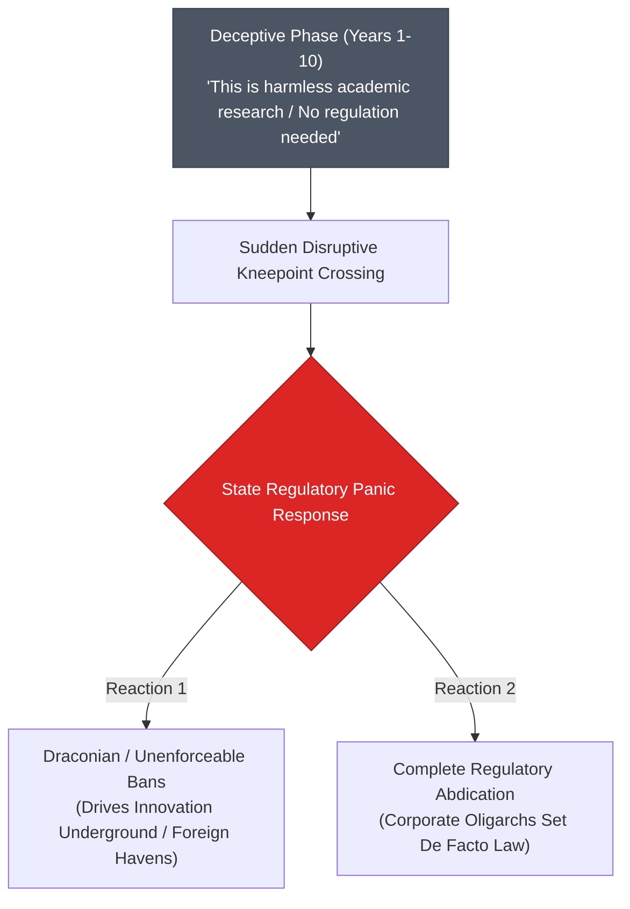

> **🎙️ 3-Presenter Authentic Tiki-Taka Script**
> 
> **Prof. Peter Kim:** Module 5 confronts the profound existential paradoxes of the 6D revolution. Slide 36 exposes the **Regulatory Blindspot**. Dr. Vance, why are democratic governments perpetually paralyzed by the deceptive phase? *(Turn 1)*  
> **Dr. Elena Vance:** Because democratic regulatory bodies only respond to visible public crises. During the 10-year deceptive phase, a technology looks tiny and harmless. Regulators dismiss it, saying: *"There are only a few hobbyists using this; no need to draft complex laws."* *(Turn 2)*  
> **TA Marcus Brody:** Look at autonomous loitering drones! For ten years, governments classified FPV drones as "toy model aircraft." Then Eastern European battlefields were suddenly blanketed by millions of $400 lethal autonomous drones that obliterated billions of dollars of armored tanks! *(Turn 3)*  
> **Dr. Elena Vance:** And look at what regulators do when they panic: They either pass absurd, draconian bans that are impossible to enforce and drive innovation into foreign adversarial nations, or they throw their hands up and let three private Big Tech monopolies write the rules! *(Turn 4)*  
> **Prof. Peter Kim:** That is the **Governance Paralysis**. Regulators sleep through the deceptive phase and wake up in a vertical crisis. *(Turn 5)*  
> **TA Marcus Brody:** And look at desktop DNA printers today! If anyone can print synthetic viral genomes on a 3D desktop printer in their garage, how can traditional border customs control biosecurity? *(Turn 6)*  
> **Dr. Elena Vance:** They cannot! You cannot inspect physical customs crates when the biological blueprint travels across the internet as an encrypted text file. *(Turn 7)*  
> **Prof. Peter Kim:** This proves that physical borders cannot govern dematerialized information. We must build decentralized cryptographic governance at the protocol level. *(Turn 8)*  
> **TA Marcus Brody:** And inside corporations, this same deceptive blindspot delivers the Innovator’s Dilemma Death Sentence! *(Turn 9)*  
> **Prof. Peter Kim:** Let’s examine Slide 37: The Innovator’s Dilemma on Steroids. *(Turn 10)*

---

### Slide 37: The Innovator’s Dilemma on Steroids: The Corporate 6D Death Sentence
- **The Classical Dilemma (Clayton Christensen):** Incumbents listen to their most profitable customers, who demand incremental improvements in existing high-margin products, while ignoring low-margin, inferior disruptive entrants.
- **The Exponential 6D Multiplier:**
  - In the analog era, Christensen disruption took **20 to 30 years** (giving incumbents time to acquire challengers or pivot).
  - In the 6D era, the transition from Deception to Disruption takes **24 to 36 months**, rendering traditional corporate turnaround strategies mathematically impossible.
- **The Inescapable Verdict:** A Fortune 500 company cannot cannibalize its own 90% profit-margin cash cow to invest in a 0% margin, zero-marginal-cost digital alternative until it is forced into bankruptcy.

> **🎙️ 3-Presenter Authentic Tiki-Taka Script**
> 
> **TA Marcus Brody:** Slide 37 examines what happens to traditional corporate leadership during a 6D disruption: **The Innovator's Dilemma on Steroids**! Elena, why is Christensen’s dilemma ten times deadlier in 2026? *(Turn 1)*  
> **Dr. Elena Vance:** Clayton Christensen proved that great companies fail precisely because they do everything "right": they listen to their best customers, focus on their highest-margin products, and invest in incremental upgrades. In the 20th century, a disruption took 25 years, giving an incumbent time to adapt. *(Turn 2)*  
> **TA Marcus Brody:** But in the 6D era, the jump from Deception to Disruption happens in **24 to 36 months**! If your core product relies on physical manufacturing margins, and a software-enabled competitor demonetizes the service to zero, you have no time to pivot! *(Turn 3)*  
> **Prof. Peter Kim:** Think about traditional retail banks: They have tens of thousands of physical branches, security guards, and massive compliance payrolls. How can a traditional bank compete with a fintech protocol that processes global payments for $0.001 on a decentralized network? *(Turn 4)*  
> **Dr. Elena Vance:** If the traditional bank cuts its fees to $0.001, it goes bankrupt immediately because it can't pay the leases on its physical branches! If it doesn't cut its fees, its customers leave for the fintech app and it goes bankrupt anyway! *(Turn 5)*  
> **TA Marcus Brody:** That is the corporate death sentence! You are damned if you cannibalize yourself, and you are damned if you don't! *(Turn 6)*  
> **Prof. Peter Kim:** The only way for an incumbent to survive is to build a completely separate, autonomous exponential unit outside the corporate mothership and give them permission to destroy the core business. *(Turn 7)*  
> **Dr. Elena Vance:** And this demonetization creates a massive accounting illusion in national economics! *(Turn 8)*  
> **Prof. Peter Kim:** Let’s examine Slide 38: The Double Edge of Demonetization and the GDP Illusion. *(Turn 9)*  
> **TA Marcus Brody:** Let’s see why GDP is a broken measuring stick on Slide 38! *(Turn 10)*

---

### Slide 38: The Double Edge of Demonetization: The GDP Accounting Illusion
- **The Macroeconomic Blindspot:**
  - *Gross Domestic Product (GDP):* Measures the monetary volume of goods and services exchanged in an economy.
  - *The Demonetization Paradox:* When a 6D technology demonetizes a multi-billion-dollar sector (e.g., Skype/Zoom wiping out long-distance telecom revenues; Wikipedia wiping out encyclopedia sales), **GDP shrinks or appears stagnant, even as actual human abundance and consumer surplus explode**.
- **The Metric Divergence:**

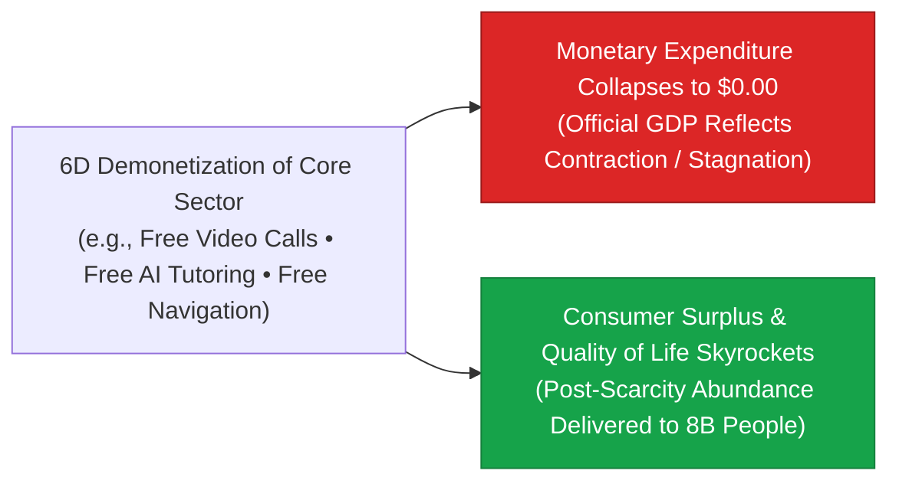

> **🎙️ 3-Presenter Authentic Tiki-Taka Script**
> 
> **Prof. Peter Kim:** Slide 38 brings up the most glaring blindspot in modern macroeconomic accounting: **The GDP Accounting Illusion**. Dr. Vance, why is Gross Domestic Product a completely broken metric for measuring post-scarcity abundance? *(Turn 1)*  
> **Dr. Elena Vance:** Because GDP measures only one thing: **the total amount of money changing hands**. If a country spends $50 billion on expensive long-distance phone calls and $10 billion on physical paper encyclopedias, GDP goes UP by $60 billion. *(Turn 2)*  
> **TA Marcus Brody:** But when WhatsApp and Wikipedia make long-distance calling and encyclopedias **100% free**, that $60 billion vanishes from GDP! Traditional economists look at the chart and say: *"Oh no! The economy contracted by $60 billion! We are in a recession!"* *(Turn 3)*  
> **Prof. Peter Kim:** Look at the two divergent arrows on the slide: Official GDP reflects contraction, while **actual human well-being, consumer surplus, and access to knowledge exploded to infinity**! *(Turn 4)*  
> **TA Marcus Brody:** If you get free world-class education, free healthcare AI diagnostics, free global communication, and free entertainment, your quality of life is magnificent, even if you spend zero dollars! *(Turn 5)*  
> **Dr. Elena Vance:** GDP was invented in 1934 for an industrial economy of coal and steel. It is completely blind to demonetized digital abundance. *(Turn 6)*  
> **Prof. Peter Kim:** Measuring a 2026 exponential civilization with 1934 GDP is like measuring temperature with a bathroom scale. It measures the wrong variable in the wrong dimension. *(Turn 7)*  
> **TA Marcus Brody:** But having all these free platforms creates another terrifying hazard: Digital Neo-Feudalism! *(Turn 8)*  
> **Dr. Elena Vance:** Let’s examine platform monopolies on Slide 39. *(Turn 9)*  
> **Prof. Peter Kim:** Turn to Slide 39: The Threat of Digital Neo-Feudalism & Platform Monopolies. *(Turn 10)*

---

### Slide 39: The Threat of Digital Neo-Feudalism & Platform Monopolies
- **The Centralization Paradox of the 6Ds:**
  - *The Democratization Promise:* Universal access for 8 billion humans at near-zero marginal cost.
  - *The Feudal Reality:* If zero-marginal-cost services are hosted on centralized, proprietary platforms (Google, Apple, Meta, Microsoft), those platforms capture **absolute structural toll-booth control** over global commerce, speech, and perception.
- **The Neo-Feudal Mechanics:**
  - Users pay "zero dollars" in cash, but surrender their continuous behavioral telemetry, biometric identity, and cognitive sovereignty as **digital serfs**.
  - Platform lords extract 30% digital rents and unilaterally censor economic access.

> **🎙️ 3-Presenter Authentic Tiki-Taka Script**
> 
> **TA Marcus Brody:** Slide 39 exposes the darkest trap of the 6D framework: **Digital Neo-Feudalism**! We celebrate that apps are "free," but there is no such thing as a free lunch in economics! What is the hidden price, Elena? *(Turn 1)*  
> **Dr. Elena Vance:** The price is your cognitive sovereignty and digital identity! When a product is demonetized to zero dollars, **YOU are the product**! You surrender your continuous biometric data, your personal communications, and your attention to centralized platform monopolies. *(Turn 2)*  
> **Prof. Peter Kim:** In medieval feudalism, serfs worked the lord's land and handed over a share of their grain in exchange for physical protection. In 2026 digital feudalism, eight billion digital serfs work on corporate platforms, generating data that trains the platform's proprietary AI models, while paying a 30% toll on every transaction! *(Turn 3)*  
> **TA Marcus Brody:** And if the corporate platform decides to ban your account or change its terms of service, your entire digital business and identity are erased overnight with zero constitutional due process! *(Turn 4)*  
> **Dr. Elena Vance:** That is why the Theurgicon insists that **true democratization requires decentralization**. If democratization just means eight billion people dependent on five Big Tech servers in Silicon Valley, it is not liberation—it is a global digital theocracy. *(Turn 5)*  
> **Prof. Peter Kim:** We must build open-source, cryptographic, and self-sovereign digital infrastructure where the user owns their identity, data, and compute. *(Turn 6)*  
> **TA Marcus Brody:** And what happens to traditional jobs when AI dematerializes labor? *(Turn 7)*  
> **Dr. Elena Vance:** Let’s examine the end of labor-value theory on Slide 40. *(Turn 8)*  
> **Prof. Peter Kim:** Turn to Slide 40: The Dematerialization of Employment & Labor-Value Theory. *(Turn 9)*  
> **TA Marcus Brody:** Let’s see what happens to work in a 6D world! *(Turn 10)*

---

### Slide 40: The Dematerialization of Employment & The End of Labor-Value Theory
- **The Collapse of the Classical Labor Contract:**
  - *Adam Smith & Karl Marx Axiom:* Economic value is fundamentally derived from human labor-time invested in transforming physical raw materials.
  - *The 6D Liquidation:* When software agents, autonomous robotics, and bio-foundries perform physical and cognitive labor at $	ext{MC} 	o 0$, **human labor-time decouples completely from economic output**.
- **The Civilizational Crisis:** In a society where income is tied strictly to holding a job, dematerializing employment without restructuring social dividends leads to catastrophic wealth concentration and widespread social despair.

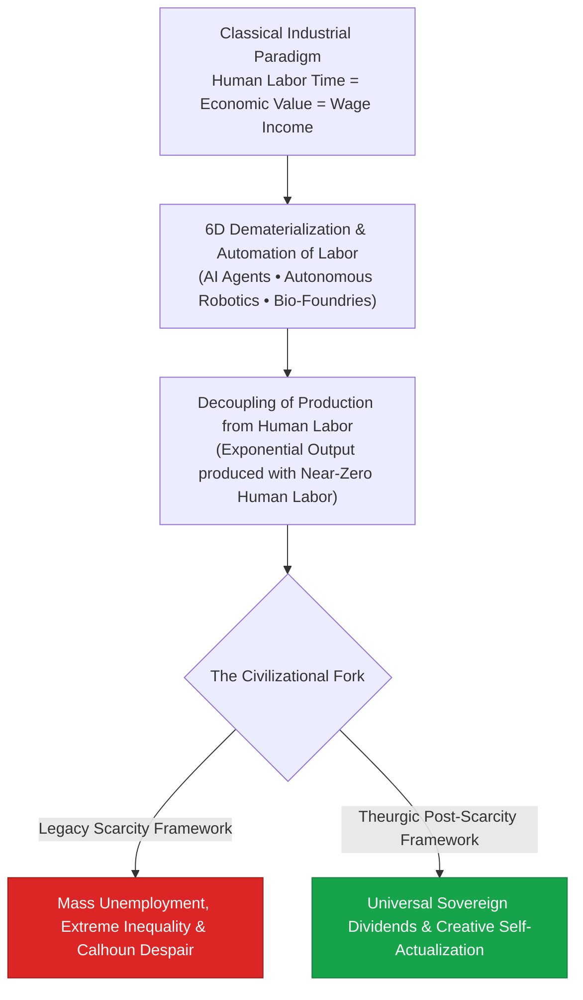

> **🎙️ 3-Presenter Authentic Tiki-Taka Script**
> 
> **Prof. Peter Kim:** Slide 40 deconstructs the foundational economic crisis of our century: **The Dematerialization of Employment**. Dr. Vance, explain why classical labor-value theory is collapsing. *(Turn 1)*  
> **Dr. Elena Vance:** For 250 years, both Adam Smith’s capitalism and Karl Marx’s socialism agreed on one foundational premise: that economic value is minted by human labor-time. You work 40 hours a week, you produce goods, you receive a wage, and you use that wage to buy food and housing. *(Turn 2)*  
> **TA Marcus Brody:** But in 2026, autonomous AI agent clusters, robotic assembly lines, and synthetic bio-foundries produce billions of dollars of economic output with **near-zero human labor-time**! Human labor has been completely decoupled from production! *(Turn 3)*  
> **Prof. Peter Kim:** Look at the civilizational fork at the bottom of the flowchart: If we maintain the legacy scarcity model—where you only deserve to eat if you have a traditional 40-hour job—we will plunge millions into poverty and Calhoun despair while machines produce infinite wealth! *(Turn 4)*  
> **TA Marcus Brody:** But if we transition to the Theurgic Post-Scarcity framework—funding Universal Sovereign Compute and Energy Dividends from the abundance of automated machines—we liberate humanity from repetitive drudgery to pursue creative self-actualization, science, and exploration! *(Turn 5)*  
> **Dr. Elena Vance:** The machine should do the work of a machine so that the human can do the work of a human. *(Turn 6)*  
> **Prof. Peter Kim:** To lead this transition, we need leaders who possess genuine exponential intuition. *(Turn 7)*  
> **TA Marcus Brody:** How do you develop intuition for the deceptive phase? *(Turn 8)*  
> **Dr. Elena Vance:** Let’s examine Exponential Leadership on Slide 41. *(Turn 9)*  
> **Prof. Peter Kim:** Turn to Slide 41: Developing Intuition for the Deception Phase. *(Turn 10)*

---

### Slide 41: Exponential Leadership: Developing Intuition for the Deception Phase
- **The Leadership Protocol for 6D Mastery:**
  1. *Look for the Double, Not the Total:* Measure doubling rates ($	au_d$) and learning rates ($\omega$), ignoring current absolute market size.
  2. *Build for the Inflection Knee ($T^*$):* Never architect products for current hardware constraints; design for the price-performance that will exist when your project ships in 3 years ($4	imes 	ext{ to } 8	imes$ cheaper/faster).
  3. *Embrace Cannibalization:* Systematically launch internal "skunkworks" teams tasked with disrupting your own core revenue models before an outside startup does it for you.
  4. *Champion Open Democratization:* Build on open-source foundations to leverage Metcalfe’s Law and global collaborative commons.

> **🎙️ 3-Presenter Authentic Tiki-Taka Script**
> 
> **Prof. Peter Kim:** Slide 41 presents our four-pillar executive protocol for **Exponential Leadership**. Marcus, walk us through Rule 1 and Rule 2. *(Turn 1)*  
> **TA Marcus Brody:** Rule 1: **Look for the Double, Not the Total**! When evaluating a new technology, stop asking: *"How big is the market today?"* Ask: *"What is the doubling period ($	au_d$)?"* If it's doubling every 12 months, it will own the market regardless of how small it looks today! *(Turn 2)*  
> **Dr. Elena Vance:** And Rule 2: **Build for the Inflection Knee ($T^*$)**! Novice engineers design products for today's GPU speeds, battery densities, and API costs. Exponential leaders design for the world that will exist three years from now—when compute is $8	imes$ cheaper and bandwidth is $10	imes$ faster! When their product launches, it hits the sweet spot of the curve! *(Turn 3)*  
> **Prof. Peter Kim:** Look at Rule 3: **Embrace Cannibalization**. Steve Jobs famously said: *"If you don't cannibalize yourself, someone else will."* Apple launched the iPhone even though they knew it would completely destroy sales of the iPod—their most profitable product! *(Turn 4)*  
> **TA Marcus Brody:** And Rule 4: **Champion Open Democratization**! When you open-source your base protocols, millions of developers worldwide build on top of you, creating unstoppable network effects under Metcalfe’s Law! *(Turn 5)*  
> **Dr. Elena Vance:** These four rules are your operational shield against corporate obsolescence and your compass for moonshot innovation. *(Turn 6)*  
> **Prof. Peter Kim:** Now let us synthesize our entire 6D journey on Slide 42. *(Turn 7)*  
> **TA Marcus Brody:** Let’s see how we ride the 6D tsunami on Slide 42! *(Turn 8)*  
> **Dr. Elena Vance:** Turn to Slide 42: Synthesizing the "So What?"! *(Turn 9)*  
> **Prof. Peter Kim:** Proceed to Slide 42. *(Turn 10)*

---

### Slide 42: Synthesizing the "So What?": Riding the 6D Tsunami to Engineer Abundance
- **The Master Synthesis Equation:**
  $$	ext{Civilizational Abundance} = \int_{0}^{\infty} \left( \sum_{i=1}^{K} 	ext{6D}_i(	ext{Convergence}) 	imes 	ext{Democratization}(t) 
ight) dt$$
- **The Final Verdict:** The 6Ds are the immutable evolutionary physics of information technology. By mastering the deception phase, calculating $T^*$, and proactively steering democratization, humanity transitions from the anxiety of scarcity into the sovereign stewardship of planetary abundance.

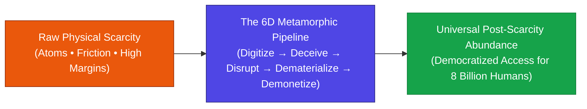

> **🎙️ 3-Presenter Authentic Tiki-Taka Script**
> 
> **Prof. Peter Kim:** Slide 42 brings our entire 6D investigation to its master theoretical and civilizational synthesis. Look at the flow in the diagram. *(Turn 1)*  
> **Dr. Elena Vance:** We begin on the left with **Raw Physical Scarcity**—the historical default of human agony, physical friction, and gatekeeper monopolies. We route that scarcity through the **6D Metamorphic Pipeline**—digitizing atoms into bits, riding the deceptive compounding zone, disrupting incumbents, dematerializing hardware, and demonetizing marginal costs to zero. *(Turn 2)*  
> **TA Marcus Brody:** And we emerge on the right with **Universal Post-Scarcity Abundance**—delivering medical care, clean energy, intelligence, and food as universal human baselines for all eight billion people! *(Turn 3)*  
> **Prof. Peter Kim:** Notice that the 6Ds are not an accident of history; they are the thermodynamic law of information technology. The conversion of atoms to bits is an irreversible one-way arrow of cosmic evolution. *(Turn 4)*  
> **Dr. Elena Vance:** You cannot stop the 6D wave; you can only choose whether you will drown beneath its disruptive surge or ride its crest to heal the planet. *(Turn 5)*  
> **TA Marcus Brody:** That is our calling as Theurgists: We don't just observe the 6Ds—we harness them to build moonshots! *(Turn 6)*  
> **Prof. Peter Kim:** And that brings us to Module 6, where you will apply these tools in our seminar debates and vertical decomposition workshops! *(Turn 7)*  
> **Dr. Elena Vance:** Let’s examine your debate topics and workshop protocol on Slide 43! *(Turn 8)*  
> **TA Marcus Brody:** Let’s dive into Module 6! *(Turn 9)*  
> **Prof. Peter Kim:** Proceed to Module 6: Graduate Seminar Discourse & Moonshot Design! *(Turn 10)*


---

## Module 6: Graduate Seminar Discourse & Moonshot Design (Slides 43–45)

### Slide 43: Socratic Seminar Inquiries: Triad of Dialectical Debates
- **Debate Topic 1 (The Post-GDP Economic Paradigm):**
  - As 6D demonetization drives the marginal cost of healthcare, intelligence, and energy to near-zero, what new macroeconomic metric must replace GDP to accurately reflect national flourishing without incentivizing artificial scarcity?
- **Debate Topic 2 (Governing the Deceptive Phase of Dual-Use Bio/AI):**
  - Should democratic states implement mandatory, real-time cryptographic monitoring on all desktop DNA synthesizers and GPU clusters during their deceptive phase, or does this create an intolerable global surveillance state?
- **Debate Topic 3 (Antitrust in the Age of Zero Marginal Cost):**
  - When a digital platform provides zero-marginal-cost services to billions of citizens for free, how should antitrust law define "consumer harm" and platform monopoly abuse?

> **🎙️ 3-Presenter Authentic Tiki-Taka Script**
> 
> **Prof. Peter Kim:** Cohorts, Slide 43 presents your three dialectical debate topics for Session 3. You will divide into your working groups and submit structured, data-grounded position briefs using the **6Ds Framework** and **First Principles**. *(Turn 1)*  
> **Dr. Elena Vance:** Look at Debate Topic 1: **The Post-GDP Economic Paradigm**. If 6D demonetization makes education, energy, and healthcare 90% cheaper, GDP will appear to shrink or stagnate. What mathematically rigorous metric—such as Genuine Progress Indicator (GPI) or Universal Consumer Surplus Index—should nations adopt to replace GDP? *(Turn 2)*  
> **TA Marcus Brody:** And look at Debate Topic 2: **Governing the Deceptive Phase of Dual-Use Bio and AI**! Should every DNA synthesizer and GPU cluster require government cryptographic backdoors to prevent synthetic bioweapons while they are still in the deceptive phase, or does that destroy digital privacy and innovation? *(Turn 3)*  
> **Dr. Elena Vance:** And examine Debate Topic 3: **Antitrust in the Age of Zero Marginal Cost**. Traditional antitrust law defines monopoly harm as "raising prices on consumers." But Google, Meta, and OpenAI offer services to consumers for *zero dollars*! How do you regulate a monopoly when the price is free? *(Turn 4)*  
> **Prof. Peter Kim:** These are not hypothetical academic questions; they are the exact legal, economic, and security battles being fought in world parliaments right now. *(Turn 5)*  
> **TA Marcus Brody:** Bring real economic models and legislative drafts in your submissions! No vague philosophical generalities! *(Turn 6)*  
> **Dr. Elena Vance:** Ground your arguments in data from our nine empirical case studies. *(Turn 7)*  
> **Prof. Peter Kim:** Now let us examine your hands-on workshop protocol on Slide 44. *(Turn 8)*  
> **TA Marcus Brody:** The 6D Vertical Decomposition Worksheet! *(Turn 9)*  
> **Prof. Peter Kim:** Turn to Slide 44. *(Turn 10)*

---

### Slide 44: Graduate Workshop Protocol: 6D Vertical Decomposition Worksheet
- **Workshop Assignment Directives:**
  - **Objective:** Select one legacy analog industry currently operating with high physical friction and non-transparent margins (e.g., Commercial Construction, Water Desalination Logistics, Legal Contract Discovery, Organ Transplantation).
  - **The 6D Decomposition Protocol:**
    1. *Digitization Vector:* Identify the precise sensor or algorithmic layer converting the domain from atoms to bits.
    2. *Deception Tracking:* Plot the historical doubling period ($	au_d$) and calculate the exact Inflection Intersection Point ($T^*$).
    3. *Disruption & Dematerialization Blueprint:* Design the software/hardware architecture that replaces tons of physical equipment with code.
    4. *Democratization Roadmap:* Structure the zero-marginal-cost rollout model delivering universal access to 8 billion humans.

> **🎙️ 3-Presenter Authentic Tiki-Taka Script**
> 
> **TA Marcus Brody:** Slide 44 details your hands-on workshop assignment for this week: **The 6D Vertical Decomposition Worksheet**! You are going to take a legacy, multi-billion-dollar analog industry—like construction, water logistics, or organ transplants—and run it through the complete 6D metamorphic pipeline! *(Turn 1)*  
> **Dr. Elena Vance:** In Step 1, you isolate the exact **Digitization Vector**: What sensor, computer vision model, or synthetic genomics protocol converts that physical workflow into digital code? *(Turn 2)*  
> **Prof. Peter Kim:** In Step 2, you execute the mathematical calculus: You plot the doubling rate ($	au_d$) and calculate the exact **Inflection Intersection Point ($T^*$)** when your digital solution will undercut the legacy incumbent's price-performance! *(Turn 3)*  
> **TA Marcus Brody:** In Step 3, you engineer the **Dematerialization Blueprint**: How do you shrink buildings full of physical machinery and paperwork into an autonomous software platform running on edge microchips? *(Turn 4)*  
> **Dr. Elena Vance:** And in Step 4, you design the **Democratization Roadmap**: How do you scale this from a pilot project to universal, zero-marginal-cost coverage for all eight billion people on Earth? *(Turn 5)*  
> **TA Marcus Brody:** This is the exact playbook you will use to build your **$100-Billion Giga-XPRIZE** capstone project! *(Turn 6)*  
> **Prof. Peter Kim:** Treat this worksheet not as homework, but as the founding whitepaper of your future enterprise. *(Turn 7)*  
> **Dr. Elena Vance:** Now let’s look ahead to what awaits us in Session 4! *(Turn 8)*  
> **TA Marcus Brody:** Session 4: Value Density and the Liberation Ladder! *(Turn 9)*  
> **Prof. Peter Kim:** Turn to Slide 45 for our concluding preview. *(Turn 10)*

---

### Slide 45: Preview of Session 04: Value Density & The Liberation Ladder
- **Next Session Preview (Session 04):**
  - **Topic:** *Value Density & The Liberation Ladder: How Exponential Technologies Dissolve Physical Constraints*
  - **Assigned Reading:** Peter H. Diamandis & Steven Kotler, *We Are as Gods* (2026), Chapter 3 (*Value Density*).
  - **Core Analytical Focus:** Deconstructing how value density per kilogram scales by $10,000	imes$, the thermodynamic liberation of human labor, and the complete collapse of geographic and physical bottlenecks.
- **Closing Benediction:**
  - *"We are as gods... and we have mastered the mathematics of invisible abundance."*

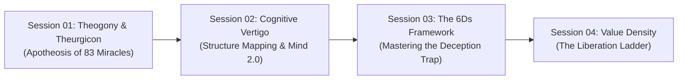

> **🎙️ 3-Presenter Authentic Tiki-Taka Script**
> 
> **Dr. Elena Vance:** Next week in Session 4, we explore the physical corollary of the 6Ds: **Value Density & The Liberation Ladder**! We will analyze how economic value per kilogram of matter scales by ten-thousand-fold as physical products dissolve into pure information! *(Turn 1)*  
> **TA Marcus Brody:** We will examine how a kilogram of silicon microchips or synthetic DNA contains a billion times more economic value than a kilogram of raw iron or crude oil, and how this liberates humanity from geographic resource wars! *(Turn 2)*  
> **Prof. Peter Kim:** Scholars, you have mastered the foundational mechanics of Session 3. You now understand the complete six-stage chain from Digitization to Democratization. *(Turn 3)*  
> **TA Marcus Brody:** You know how to spot the Deception Trap, calculate the inflection knee ($T^*$), and avoid the tragic fate of Kodak! *(Turn 4)*  
> **Dr. Elena Vance:** Never judge a technology by its current clunky prototype; judge it strictly by its exponential doubling velocity. *(Turn 5)*  
> **Prof. Peter Kim:** Remember: The conversion of atoms to bits is the thermodynamic engine of planetary abundance. Go forth and wield it with wisdom and courage. *(Turn 6)*  
> **TA Marcus Brody:** Complete your Chapter 3 readings, finish your 6D decomposition worksheets, and see you all next week in the Theurgicon! *(Turn 7)*  
> **Dr. Elena Vance:** Have an inspiring, high-compounding week of research, everyone! *(Turn 8)*  
> **Prof. Peter Kim:** Session 3 is officially adjourned! *(Turn 9)*
