# Session 4: 가치 밀도와 인류를 구원한 사다리 (Value Density & The Liberation Ladder)
> **Course:** 신이 된 인류: 기하급수 기술과 풍요의 설계도 (*We Are as Gods: A Survival Guide for the Age of Abundance*)  
> **Course Code:** EXPO-701 • Graduate Seminar  
> **Instructors:** Prof. Peter Kim (석좌교수), Dr. Elena Vance (수석연구원), TA Marcus Brody (딥테크조교)  
> **Reading Assignment:** Peter Diamandis & Steven Kotler, *We Are as Gods* (2026), Chapter 2 (*First Principles of Abundance & The Liberation Ladder*)  
> **Total Slides:** 45 Slides (6 Modules: M1~M6) • Phase 1 Capstone Master Edition  

---

## 📌 Table of Contents & Slide Navigation

- [Module 1: 도입 및 어젠다 세팅 (Slides 01~05)](#module-1-도입-및-어젠다-세팅-slides-0105)
  - [Slide 01: 세션 4 개요: 가치 밀도와 인류를 구원한 사다리](#slide-01-세션-4-개요-가치-밀도와-인류를-구원한-사다리)
  - [Slide 02: 희소성(Scarcity)은 맥락적(Contextual)이며 기술로 해체된다](#slide-02-희소성scarcity은-맥락적contextual이며-기술로-해체된다)
  - [Slide 03: 사다리(The Ladder): 문명을 도약시킨 기술적 해방의 계보](#slide-03-사다리the-ladder-문명을-도약시킨-기술적-해방의-계보)
  - [Slide 04: 금주의 핵심 질문: 기술은 어떻게 물리적 자원의 한계를 무효화하는가?](#slide-04-금주의-핵심-질문-기술은-어떻게-물리적-자원의-한계를-무효화하는가)
  - [Slide 05: 4주차 및 Phase 1 종합 로드맵: 고대 관개수로에서 4경 9천조 달러 해방까지](#slide-05-4주차-및-phase-1-종합-로드맵-고대-관개수로에서-4경-9천조-달러-해방까지)
- [Module 2: 원전 텍스트 정밀 해체 (Slides 06~15)](#module-2-원전-텍스트-정밀-해체-slides-0615)
  - [Slide 06: 『We Are as Gods』: 풍요의 제1원리 (First Principles of Abundance)](#slide-06-we-are-as-gods-풍요의-제1원리-first-principles-of-abundance)
  - [Slide 07: 가치 밀도(Value Density)의 물리적 정의: 단위 질량/부피당 가치의 무한 수렴](#slide-07-가치-밀도value-density의-물리적-정의-단위-질량부피당-가치의-무한-수렴)
  - [Slide 08: $7.1M 스마트폰 기적의 정밀 회계: 탈물질화된 30대 하드웨어 품목록](#slide-08-71m-스마트폰-기적의-정밀-회계-탈물질화된-30대-하드웨어-품목록)
  - [Slide 09: 광자(Photon)와 전자(Electron)의 세계: 비가시적 자원의 가치화](#slide-09-광자photon와-전자electron의-세계-비가시적-자원의-가치화)
  - [Slide 10: 에너지 사다리: 장작 $\rightarrow$ 석탄 $\rightarrow$ 석유 $\rightarrow$ 원자력 $\rightarrow$ 태양광 & 핵융합](#slide-10-에너지-사다리-장작-rightarrow-석탄-rightarrow-석유-rightarrow-원자력-rightarrow-태양광--핵융합)
  - [Slide 11: 통신 사다리: 파발마 $\rightarrow$ 전신 $\rightarrow$ 해저케이블 $\rightarrow$ 스타링크 광학 위성망](#slide-11-통신-사다리-파발마-rightarrow-전신-rightarrow-해저케이블-rightarrow-스타링크-광학-위성망)
  - [Slide 12: 피터 디아만디스의 자원 접근성 공리 (Accessibility Axiom)](#slide-12-피터-디아만디스의-자원-접근성-공리-accessibility-axiom)
  - [Slide 13: 스티븐 코틀러의 인지적 자원 해방: 번아웃에서 무한 창의성으로](#slide-13-스티븐-코틀러의-인지적-자원-해방-번아웃에서-무한-창의성으로)
  - [Slide 14: 가치 밀도 지수(Value Density Index: VDI) 공식 도출](#slide-14-가치-밀도-지수value-density-index-vdi-공식-도출)
  - [Slide 15: 역사적 기술 사다리 5대 축 총괄 요약 매트릭스](#slide-15-역사적-기술-사다리-5대-축-총괄-요약-매트릭스)
- [Module 3: 기하급수 이론 및 프레임워크 (Slides 16~25)](#module-3-기하급수-이론-및-프레임워크-slides-1625)
  - [Slide 16: 역사적 마일스톤 1: 3000 BCE 메소포타미아 관개 운하와 잉여 생산의 탄생](#slide-16-역사적-마일스톤-1-3000-bce-메소포타미아-관개-운하와-잉여-생산의-탄생)
  - [Slide 17: 역사적 마일스톤 2: 2200 BCE 마구(Horse Collar/하네스)와 농업 생산력 5배 도약](#slide-17-역사적-마일스톤-2-2200-bce-마구horse-collar하네스와-농업-생산력-5배-도약)
  - [Slide 18: 역사적 마일스톤 3: 삼각돛(Lateen Sail)과 해양 항법이 해방한 대륙 간 무역](#slide-18-역사적-마일스톤-3-삼각돛lateen-sail과-해양-항법이-해방한-대륙-간-무역)
  - [Slide 19: 인쇄술(Gutenberg)과 지식 복제의 한계 비용 1차 붕괴](#slide-19-인쇄술gutenberg과-지식-복제의-한계-비용-1차-붕괴)
  - [Slide 20: 증기 기관과 열역학적 노동 해방: 노예제의 경제적 종말](#slide-20-증기-기관과-열역학적-노동-해방-노예제의-경제적-종말)
  - [Slide 21: 하버-보슈법(Haber-Bosch)과 공기 중 질소 고정: 40억 인구 부양의 기적](#slide-21-하버-보슈법haber-bosch과-공기-중-질소-고정-40억-인구-부양의-기적)
  - [Slide 22: 실리콘 혁명과 연산의 가치 밀도: 진공관 방 하나에서 3nm 나노칩으로](#slide-22-실리콘-혁명과-연산의-가치-밀도-진공관-방-하나에서-3nm-나노칩으로)
  - [Slide 23: 양자 컴퓨팅과 힐베르트 공간의 연산 밀도: $2^N$ 상태 동시 처리](#slide-23-양자-컴퓨팅과-힐베르트-공간의-연산-밀도-2n-상태-동시-처리)
  - [Slide 24: 탈물질화 가치 사다리 공식: $\lim_{Mass \to 0} \frac{Value}{Mass} = \infty$](#slide-24-탈물질화-가치-사다리-공식-lim_mass-to-0-fracvaluemass--infty)
  - [Slide 25: 자원 해방의 4단계 프레임워크 (발견 $\rightarrow$ 변환 $\rightarrow$ 증폭 $\rightarrow$ 민주화)](#slide-25-자원-해방의-4단계-프레임워크-발견-rightarrow-변환-rightarrow-증폭-rightarrow-민주화)
- [Module 4: 글로벌 데이터 & 실증 케이스 (Slides 26~35)](#module-4-글로벌-데이터--실증-케이스-slides-2635)
  - [Slide 26: CASE 1: 4경 9천조 달러($49 Quadrillion) 글로벌 잠재 자산의 유동화 실증](#slide-26-case-1-4경-9천조-달러49-quadrillion-글로벌-잠재-자산의-유동화-실증)
  - [Slide 27: CASE 2: 라이징 플로어 효과(Rising Floor Effect): 전 지구적 빈곤선의 수직 상승](#slide-27-case-2-라이징-플로어-효과rising-floor-effect-전-지구적-빈곤선의-수직-상승)
  - [Slide 28: CASE 3: 아프리카 케냐 M-Pesa & 스타링크를 통한 10억 인구의 금융/정보 진입](#slide-28-case-3-아프리카-케냐-m-pesa--스타링크를-통한-10억-인구의-금융정보-진입)
  - [Slide 29: CASE 4: 스마트폰 무게 180g vs 1980년대 50kg 장비의 탄소 발자국 절감 비교](#slide-29-case-4-스마트폰-무게-180g-vs-1980년대-50kg-장비의-탄소-발자국-절감-비교)
  - [Slide 30: CASE 5: 정밀 발효(Precision Fermentation)와 토지 사용량 99% 절감 데이터](#slide-30-case-5-정밀-발효precision-fermentation와-토지-사용량-99-절감-데이터)
  - [Slide 31: CASE 6: 수직 농업(AeroFarms)의 물 소비 95% 절감 및 평당 생산성 390배 지표](#slide-31-case-6-수직-농업aerofarms의-물-소비-95-절감-및-평당-생산성-390배-지표)
  - [Slide 32: CASE 7: 페로브스카이트-실리콘 탠덤 태양전지의 가치 밀도 (34% 효율 돌파)](#slide-32-case-7-페로브스카이트-실리콘-탠덤-태양전지의-가치-밀도-34-효율-돌파)
  - [Slide 33: CASE 8: 알파폴드 2억 개 단백질 DB가 해방한 인류 연구 시간 (수백만 인년 절약)](#slide-33-case-8-알파폴드-2억-개-단백질-db가-해방한-인류-연구-시간-수백만-인년-절약)
  - [Slide 34: CASE 9: 3D 프린팅 로켓(Relativity Space 등)과 부품 수 100분의 1 축소](#slide-34-case-9-3d-프린팅-로켓relativity-space-등과-부품-수-100분의-1-축소)
  - [Slide 35: 글로벌 가치 밀도 혁신 10대 도메인 비교 대조표](#slide-35-글로벌-가치-밀도-혁신-10대-도메인-비교-대조표)
- [Module 5: 사회적·철학적 역설 (So What?) (Slides 36~42)](#module-5-사회적철학적-역설-so-what-slides-3642)
  - [Slide 36: 소유의 종말: 유형 자산에서 무형 접근권(Access over Ownership)으로의 전환](#slide-36-소유의-종말-유형-자산에서-무형-접근권access-over-ownership으로의-전환)
  - [Slide 37: 전통 자본주의의 부동산/제조업 가치평가 모델 붕괴 위기](#slide-37-전통-자본주의의-부동산제조업-가치평가-모델-붕괴-위기)
  - [Slide 38: 풍요 속의 상대적 박탈감: '포지셔널 굿(Positional Goods)'의 가격 폭등 역설](#slide-38-풍요-속의-상대적-박탈감-포지셔널-굿positional-goods의-가격-폭등-역설)
  - [Slide 39: 디지털 격차(Digital Divide)와 지적 귀족주의의 부활 경고](#slide-39-디지털-격차digital-divide와-지적-귀족주의의-부활-경고)
  - [Slide 40: 한계비용 제로 사회에서의 세제 개혁: 로봇세 vs 토지/데이터 배당](#slide-40-한계비용-제로-사회에서의-세제-개혁-로봇세-vs-토지데이터-배당)
  - [Slide 41: 보편적 기본 풍요(Universal Basic Abundance: UBA)의 문명적 청사진](#slide-41-보편적-기본-풍요universal-basic-abundance-uba의-문명적-청사진)
  - [Slide 42: SO WHAT? 결론: 인류를 해방한 사다리를 딛고 신의 반열로 올라서라](#slide-42-so-what-결론-인류를-해방한-사다리를-딛고-신의-반열로-올라서라)
- [Module 6: 세미나 토론 및 과제 안내 (Slides 43~45)](#module-6-세미나-토론-및-과제-안내-slides-4345)
  - [Slide 43: Phase 1 종합 평가 및 세미나 발제 토론 논제 3선](#slide-43-phase-1-종합-평가-및-세미나-발제-토론-논제-3선)
  - [Slide 44: 주차별 실습 과제: 가치 밀도 극대화 문샷 벤처 아키텍처 기획안](#slide-44-주차별-실습-과제-가치-밀도-극대화-문샷-벤처-아키텍처-기획안)
  - [Slide 45: Phase 2 예고: 데이터 기반 낙관주의와 메콩 델타의 기적 (Week 5) & 종강](#slide-45-phase-2-예고-데이터-기반-낙관주의와-메콩-델타의-기적-week-5--종강)

---

## Module 1: 도입 및 어젠다 세팅 (Slides 01~05)

### Slide 01: 세션 4 개요: 가치 밀도와 인류를 구원한 사다리
- **Session Focus:** 물질의 크기는 줄어들고 가치는 무한히 팽창하는 '가치 밀도(Value Density)'의 원리와 인류 문명을 해방해온 '기술 사다리(Liberation Ladder)'의 5,000년 역사 규명
- **Academic Foundation:** Peter Diamandis & Steven Kotler (2026), Chapter 2
- **Phase 1 Capstone:** 기하급수 인지(W1~W3)의 완성점으로서 풍요의 제1원리 체계화

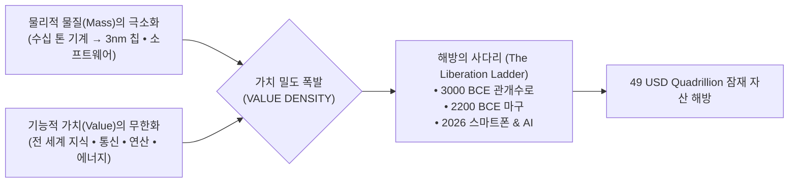

> **🎙️ 3-Presenter Authentic Tiki-Taka Script**
> 
> **Prof. Peter Kim:** 여러분, Phase 1의 마지막 관문인 4주차 세미나에 오신 것을 환영합니다. 오늘 우리는 문명사상 가장 위대한 물리적·경제학적 비밀을 다룹니다. 바로 **'가치 밀도(Value Density)'**와 **'해방의 사다리(The Liberation Ladder)'**입니다.  
> **Dr. Elena Vance:** 피터 교수님, 인류 역사는 본질적으로 '물질의 속박'에서 벗어나는 과정이었습니다. 과거에는 가치를 창출하려면 거대한 돌, 쇠, 땅, 그리고 수많은 인간의 육체 노동이 필요했습니다. 하지만 기술이 진보할수록 물질(Mass)은 0으로 줄어들고, 그 안에 담긴 가치(Value)는 무한대로 치솟습니다.  
> **TA Marcus Brody:** 주머니 속에 들어가는 180그램짜리 스마트폰이 1980년대 710만 달러어치 슈퍼컴퓨터와 위성 장비를 다 집어삼킨 게 바로 그 가치 밀도의 극치죠!  
> **Prof. Peter Kim:** 맞습니다. 오늘 우리는 메소포타미아의 흙수로에서부터 4경 9천조 달러의 잠재 자산이 풀리는 2026년의 현실까지, 인류를 구원해온 사다리의 계보를 완성할 것입니다.  

---

### Slide 02: 희소성(Scarcity)은 맥락적(Contextual)이며 기술로 해체된다
- **First Principle of Abundance:** 희소성(Scarcity)은 우주의 절대적인 법칙이 아니라, 오직 **'현재의 기술 접근성(Accessibility)'**에 의해 규정되는 일시적 맥락에 불과함
- **The Aluminum Parable:** 19세기 알루미늄은 금보다 귀해 나폴레옹 3세의 황실 식기로 쓰였으나, 홀-에루 전해제련 공정(기술)이 등장하자마자 지구상에서 가장 흔하고 저렴한 캔 포장재로 탈바꿈함

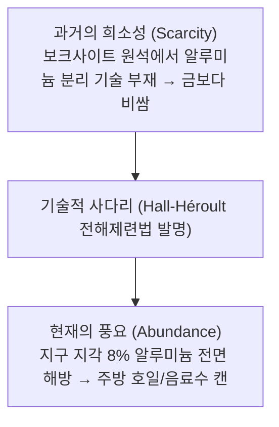

> **🎙️ 3-Presenter Authentic Tiki-Taka Script**
> 
> **Prof. Peter Kim:** 디아만디스가 강조하는 풍요의 제1원리는 명쾌합니다. "자원이 부족한 것이 아니다. 자원을 채취하고 활용할 기술이 아직 부족할 뿐이다."  
> **Dr. Elena Vance:** 나폴레옹 3세가 귀빈들에게 알루미늄 포크를 주고 자신은 금 포크를 썼다는 일화는 유명합니다. 지구 지각의 8%가 알루미늄인데, 산소와 결합된 산화알루미늄을 떼어낼 기술이 없었을 뿐이죠. 전해제련 기술이 나오자마자 알루미늄의 희소성은 하룻밤 사이에 증발했습니다.  
> **TA Marcus Brody:** 지금 우리가 걱정하는 에너지 부족, 담수 부족, 희토류 부족도 똑같습니다! 바닷물에 물이 97%고, 우주에 태양빛이 24시간 쏟아지는데 단지 변환 효율이 문제일 뿐이잖아요!  

---

### Slide 03: 사다리(The Ladder): 문명을 도약시킨 기술적 해방의 계보
- **Historical Metaphor:** 기술은 인간을 굶주림, 육체적 노역, 지리적 고립이라는 진흙탕에서 끌어올리는 연속적인 **'사다리의 가로대(Rungs)'**
- **Non-Linear Leaps:** 사다리의 각 가로대는 이전 세대가 상상조차 할 수 없었던 수준의 에너지 밀도와 지능 밀도를 제공

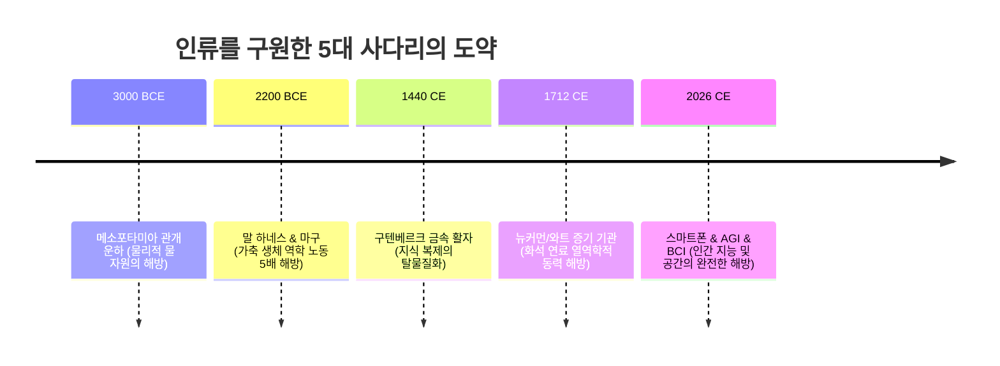

> **🎙️ 3-Presenter Authentic Tiki-Taka Script**
> 
> **Dr. Elena Vance:** 인류는 수렵채집 시절부터 끊임없이 기술이라는 사다리를 만들어 올라왔습니다. 관개 수로가 식량 불안을 해방했고, 마구가 인간의 어깨에서 쟁기를 떼어냈으며, 증기기관이 근육의 한계를 부쉈습니다.  
> **Prof. Peter Kim:** 그리고 지금 2026년, 우리는 인지(Mind)와 생명(Biology) 자체를 해방하는 사다리의 가장 높은 가로대에 도달했습니다.  
> **TA Marcus Brody:** 사다리를 한 칸 올라갈 때마다 문명의 파이가 10배씩 커졌다는 게 핵심이네요!  

---

### Slide 04: 금주의 핵심 질문: 기술은 어떻게 물리적 자원의 한계를 무효화하는가?
- **Core Seminar Inquiry:** 엔트로피가 증가하고 지구의 물리적 자원이 유한하다면, 기술은 어떻게 '영구적인 풍요'를 창출할 수 있는가?
- **Theoretical Resolution:** 자원의 물리적 양(Mass)을 늘리는 것이 아니라, **'단위 자원당 정보와 가치의 집적도(Information & Value Density)'**를 기하급수적으로 끌어올림으로써 물리적 한계를 우회함

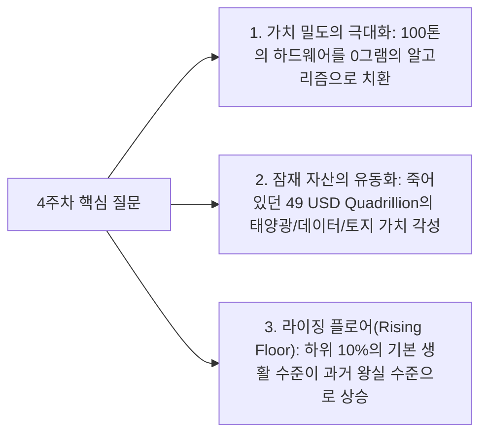

> **🎙️ 3-Presenter Authentic Tiki-Taka Script**
> 
> **Prof. Peter Kim:** 지구라는 닫힌 물리계에서 어떻게 무한한 성장이 가능할까요? 엘레나 박사, 열역학적 해답은 무엇입니까?  
> **Dr. Elena Vance:** 답은 **'정보(Information)'**입니다. 노벨 경제학상 수상자 폴 로머가 갈파했듯, 경제 성장은 더 많은 자원을 태우는 것이 아니라 자원을 '더 잘 배열(Re-arranging)'하는 레시피의 혁신입니다. 1kg의 모래(실리콘)를 벽돌로 쓰면 10원이지만, 3나노 AI 칩으로 배열하면 수천만 원의 가치가 됩니다.  
> **TA Marcus Brody:** 물질의 무게는 그대로인데 정보 밀도가 100만 배로 뛰는 거네요! 이것이 가치 밀도의 마법입니다.  

---

### Slide 05: 4주차 및 Phase 1 종합 로드맵: 고대 관개수로에서 4경 9천조 달러 해방까지
- **Curriculum Architecture:** 4주차 6대 모듈 구성 및 Phase 1 (Week 1~4) 총결산

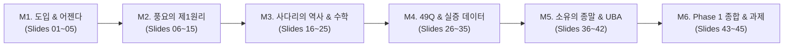

> **🎙️ 3-Presenter Authentic Tiki-Taka Script**
> 
> **Prof. Peter Kim:** 오늘 우리는 Phase 1을 완벽하게 매듭짓습니다. 1주차의 신의 기적, 2주차의 구조 매핑, 3주차의 6D 프레임워크가 오늘 4주차의 '가치 밀도'로 하나로 꿰어집니다.  
> **Dr. Elena Vance:** M2에서는 스마트폰에 집적된 710만 달러의 정밀 내역과 에너지·통신 사다리를, M3에서는 메소포타미아부터 양자 컴퓨터까지의 물리적 압축 역사를 해부합니다.  
> **TA Marcus Brody:** M4에서는 무려 4경 9천조 달러 규모의 글로벌 자산 유동화 데이터를 직접 깝니다! 바로 M2로 넘어가시죠!  

---

## Module 2: 원전 텍스트 정밀 해체 (Slides 06~15)

### Slide 06: 『We Are as Gods』: 풍요의 제1원리 (First Principles of Abundance)
- **Textual Exegesis:** Diamandis & Kotler, *We Are as Gods* (2026), Chapter 2
- **First Principles Formulation:**
  1. **자원은 본질적으로 유한하지 않다:** 오직 인간의 변환 기술이 유한할 뿐이다.
  2. **가치는 물리적 형태에서 분리된다:** 탈물질화는 가치를 무게와 부피의 저주에서 해방시킨다.
  3. **접근성이 소유권을 압도한다:** 모든 인간이 공평하게 온디맨드로 서비스를 누릴 때 문명은 번영한다.

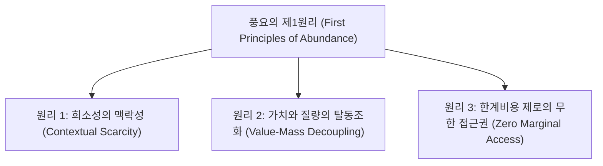

> **🎙️ 3-Presenter Authentic Tiki-Taka Script**
> 
> **Prof. Peter Kim:** 디아만디스와 코틀러는 2장에서 전통 경제학의 근본 공리인 '희소성'에 정면으로 도전합니다. 그들은 희소성을 하나의 '기술적 버그'로 규정합니다.  
> **Dr. Elena Vance:** 맞습니다. 공학자들에게 희소성이란 '아직 풀리지 않은 최적화 문제'에 불과합니다. 태양광 패널의 광전효과 효율을 올리고, 배양육의 세포 분열 속도를 올리면 희소성은 증발합니다.  
> **TA Marcus Brody:** 결국 결핍은 자연의 섭리가 아니라 인간의 게으름이었던 셈이네요!  

---

### Slide 07: 가치 밀도(Value Density)의 물리적 정의: 단위 질량/부피당 가치의 무한 수렴
- **Physical & Economic Definition:** 단위 질량($\text{kg}$) 또는 부피($\text{m}^3$)당 창출되는 경제적·기능적 가치($\text{USD}$)
- **Mathematical Expression:**

$$\text{Value Density} = \frac{\text{Functional Value } (V)}{\text{Physical Mass } (M)} \implies \lim_{M \to 0} \frac{V}{M} = \infty$$

| 시대 및 대상 | 물리적 질량 ($M$) | 제공 가치 ($V$) | 가치 밀도 ($V/M$) |
| :--- | :--- | :--- | :--- |
| **19세기 증기 기관차** | 약 50,000 kg | 수송 및 동력 (약 $50,000) | **$1 / kg** |
| **1980년대 Cray X-MP** | 약 2,500 kg | 초당 8억 회 연산 ($5,000,000) | **$2,000 / kg** |
| **2026년 최신 스마트폰** | **0.18 kg (180g)** | **$7,100,000 상당의 기능** | **약 $39,444,444 / kg** |
| **2026년 순수 AI 가중치(Weights)**| **0.00 kg (비트)** | 전 지구적 지능 및 추론 ($10^{11}$) | **$\infty$ (무한대)** |

> **🎙️ 3-Presenter Authentic Tiki-Taka Script**
> 
> **Dr. Elena Vance:** 이 표를 보십시오. 증기기관차의 가치 밀도가 kg당 1달러였다면, 스마트폰은 kg당 4천만 달러에 달합니다. 그리고 순수한 소프트웨어와 AI 모델의 가치 밀도는 분모인 질량이 0이므로 수학적으로 '무한대'로 발산합니다.  
> **TA Marcus Brody:** 180그램짜리 손바닥 기계가 증기기관차 4천만 대 분량의 가치 밀도를 뿜어내고 있는 거네요!  
> **Prof. Peter Kim:** 이것이 바로 물리적 자원의 한계를 무효화하는 탈물질화의 수학적 본질입니다.  

---

### Slide 08: $7.1M 스마트폰 기적의 정밀 회계: 탈물질화된 30대 하드웨어 품목록
- **The $7.1 Million Accounting Breakdown:** 1980~1990년대 개별 구매 시 소요되었던 비용의 실증 집계

| 번호 | 탈물질화된 과거 장비 품목 | 1980년대 당시 개별 가격 | 2026 스마트폰 대응 앱/기능 |
| :---: | :--- | :--- | :--- |
| 1 | **슈퍼컴퓨터 연산력 (Cray급)** | $5,000,000 | 3nm AP (A19 / Snapdragon 8 Gen 5) |
| 2 | **고정밀 군용 GPS 위성 수신기** | $150,000 | 내장 GPS/Galileo 칩셋 (Google Maps) |
| 3 | **방송용 4K 비디오 캠코더** | $40,000 | 4K 120fps 카메라 렌즈 모듈 |
| 4 | **전문가용 35mm 일안 카메라 & 렌즈** | $10,000 | 다중 초점 광학 카메라 시스템 |
| 5 | **24트랙 오디오 레코딩 스튜디오 장비** | $50,000 | GarageBand / 고음질 마이크 앰프 |
| 6 | **브리태니커 백과사전 32권 완결판** | $1,400 | Wikipedia / Gemini 앱 |
| 7 | **전 세계 지도 및 아틀라스 전집** | $2,000 | 실시간 위성 3D 지도 스트리밍 |
| 8 | **음성 통역기 & 다국어 사전 50종** | $5,000 | 온디바이스 실시간 AI 음성 동시통역 |
| 9 | **의료용 심전도(ECG) 및 산소포화도 측정기**| $15,000 | 스마트폰/워치 광학 생체 센서 |
| 10 | **기타 21종 (화상전화, 나침반, 게임기 등)** | $1,826,600 | 각종 앱 스토어 무료 다운로드 |
| **합계** | **총 30개 독립 물리 하드웨어 장비** | **$7,100,000 (약 95억 원)** | **스마트폰 1대 ($500~$1,000 내 완전 흡수)** |

> **🎙️ 3-Presenter Authentic Tiki-Taka Script**
> 
> **TA Marcus Brody:** 30개 항목을 낱낱이 뜯어보면 더 충격적입니다. 1980년대에 백만장자도 집에 다 들여놓지 못했던 수십억 원어치 장비들이 지금은 전철 안에서 중고등학생 손바닥 위에 들려 있습니다!  
> **Dr. Elena Vance:** 710만 달러의 물리적 비용이 1,000달러 미만으로 탈화폐화되었고, 트럭 한 대 분량의 금속과 플라스틱이 180그램으로 탈물질화되었습니다.  
> **Prof. Peter Kim:** 이 기적을 매일 주머니에 넣고 다니면서도 인류는 스스로가 얼마나 부유해졌는지를 잊고 살아갑니다.  

---

### Slide 09: 광자(Photon)와 전자(Electron)의 세계: 비가시적 자원의 가치화
- **Shift to Non-Physical Substrates:** 무겁고 불투명한 거시 물질(석탄, 철강)에서 미시 양자 세계의 비가시적 파동과 입자로의 가치 이전
- **Photons & Electrons:** 빛(광자)을 통한 광케이블 통신과 실리콘 칩 속 전자(Electron)의 이동으로 문명의 모든 지식과 가치를 실어 나름


> **🎙️ 3-Presenter Authentic Tiki-Taka Script**
> 
> **Dr. Elena Vance:** 고대 문명은 돌을 깎았고, 산업혁명은 철을 녹였습니다. 하지만 21세기 문명은 빛과 전자를 조작합니다. 질량이 0에 가까운 광자와 전자가 전 지구의 가치를 창출하고 있습니다.  
> **Prof. Peter Kim:** 보이지 않는 미시 세계를 지배할수록 가치 밀도는 무한대로 치솟습니다.  

---

### Slide 10: 에너지 사다리: 장작 $\rightarrow$ 석탄 $\rightarrow$ 석유 $\rightarrow$ 원자력 $\rightarrow$ 태양광 & 핵융합
- **Energy Density Evolution:** 연료 1kg당 추출 가능한 에너지(Joules/kg)의 기하급수적 도약

| 에너지원 (Energy Source) | 에너지 밀도 (Energy Density, MJ/kg) | 상대적 가치 밀도 배율 | 문명사적 해방 영역 |
| :--- | :--- | :--- | :--- |
| **목재 (Wood / 장작)** | 약 16 MJ/kg | $1\times$ (기준) | 원시 생존 및 난방 |
| **석탄 (Coal)** | 약 24~30 MJ/kg | 약 $2\times$ | 1차 산업혁명 & 증기기관 |
| **원유 / 가솔린 (Petroleum)** | 약 44~46 MJ/kg | 약 $3\times$ | 2차 산업혁명 & 자동차/항공기 |
| **우라늄 핵분열 (Nuclear Fission)**| **약 3,900,000 MJ/kg** | **약 $240,000\times$** | 기저 전력 대량 공급 |
| **중수소-삼중수소 핵융합 (Fusion)**| **약 340,000,000 MJ/kg** | **약 $21,000,000\times$** | 행성 단위 청정 에너지 무한 풍요 |
| **태양광 광자 (Solar Photons)** | 연료 소모 0 (지구 도달 173,000 TW) | **$\infty$ (연료 질량 0)** | 자원 채굴의 영구 종말 |

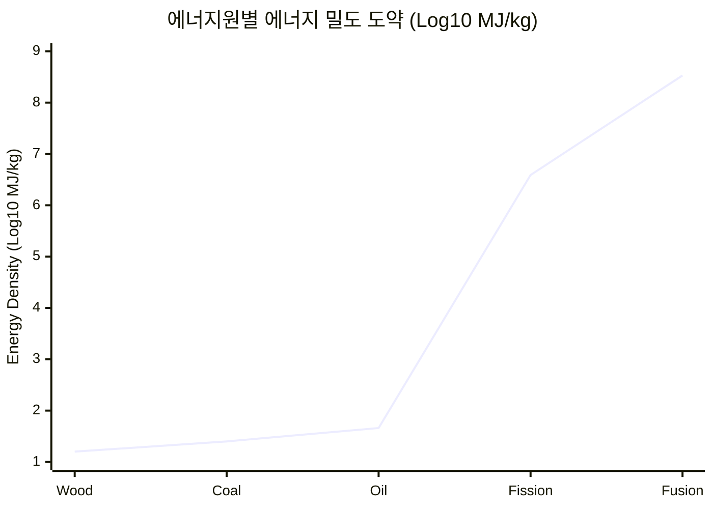

> **🎙️ 3-Presenter Authentic Tiki-Taka Script**
> 
> **TA Marcus Brody:** 석탄에서 석유로 갈 때는 1.5배 좋아졌는데, 원자력으로 가니까 24만 배로 뛰어버립니다! 그리고 핵융합은 2,100만 배입니다!  
> **Dr. Elena Vance:** 우라늄 1그램이 석탄 3톤과 같은 에너지를 냅니다. 에너지 사다리를 한 칸 오를 때마다 필요한 물리적 연료의 무게는 수십만 분의 1로 줄어듭니다.  
> **Prof. Peter Kim:** 그리고 태양광은 연료를 운반할 필요조차 없이 하늘에서 17만 테라와트가 매일 쏟아집니다. 인류가 에너지 부족을 겪는 유일한 이유는 사다리를 덜 올랐기 때문입니다.  

---

### Slide 11: 통신 사다리: 파발마 $\rightarrow$ 전신 $\rightarrow$ 해저케이블 $\rightarrow$ 스타링크 광학 위성망
- **Communication Velocity & Bandwidth:** 메시지 전송 소요 시간과 초당 데이터 전송량의 역사적 혁명

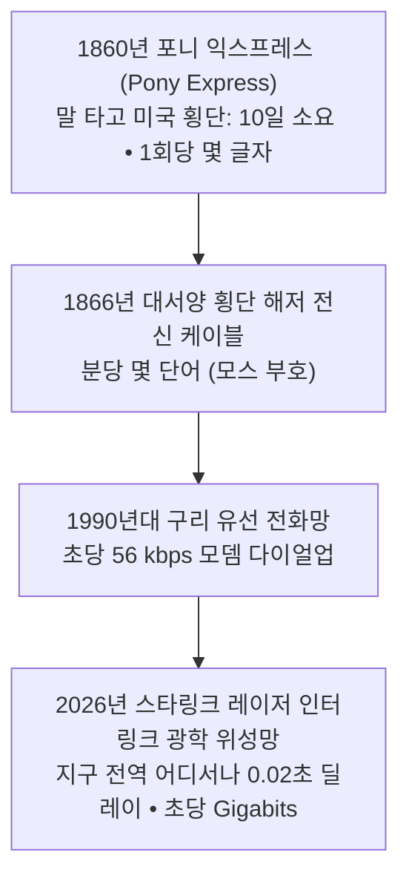

> **🎙️ 3-Presenter Authentic Tiki-Taka Script**
> 
> **Prof. Peter Kim:** 1860년 미국에서 서부로 편지 한 장을 보내려면 포니 익스프레스 말을 타고 10일 밤낮을 달려야 했습니다.  
> **Dr. Elena Vance:** 오늘날 스타링크 저궤도 위성망은 우주 공간에서 위성과 위성 사이에 레이저를 쏘아 빛의 속도로 지구 반대편까지 20밀리초 만에 기가비트 데이터를 전달합니다.  
> **TA Marcus Brody:** 정보 전송 비용과 시간이 정확히 '0'으로 수렴한 것입니다!  

---

### Slide 12: 피터 디아만디스의 자원 접근성 공리 (Accessibility Axiom)
- **The Core Axiom:** *"풍요란 모든 사람에게 자원을 무제한 소유하게 하는 것이 아니라, 필요할 때 즉시 이용할 수 있는 무제한의 '접근성(Access)'을 보장하는 것이다."*
- **Paradigm Shift:** 소유권(Ownership)의 비효율성 $\rightarrow$ 온디맨드 접근권(On-Demand Access)의 극대화

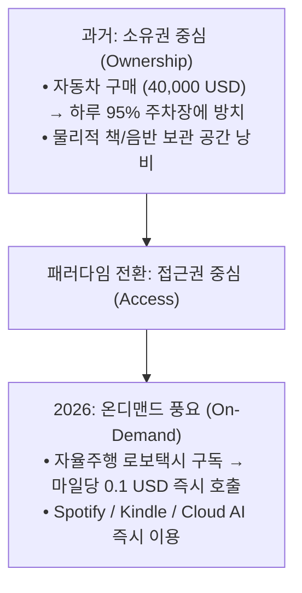

> **🎙️ 3-Presenter Authentic Tiki-Taka Script**
> 
> **Prof. Peter Kim:** 디아만디스의 자원 접근성 공리는 현대 자본주의의 소유 관념을 근본적으로 뒤흔듭니다. 우리가 원하는 것은 '1.5톤짜리 쇳덩어리 자동차를 주차장에 세워두는 것'이 아니라, '내가 원하는 시간에 원하는 장소로 이동하는 기능'입니다.  
> **Dr. Elena Vance:** 기능을 소유에서 분리하여 서비스화(SaaS/MaaS)할 때, 같은 양의 물리적 자원으로 10배, 100배 많은 인류에게 풍요를 제공할 수 있습니다.  
> **TA Marcus Brody:** 드릴을 사는 사람은 드릴이 필요한 게 아니라 '벽에 뚫린 구멍'이 필요한 거라는 마케팅 명언과 똑같네요!  

---

### Slide 13: 스티븐 코틀러의 인지적 자원 해방: 번아웃에서 무한 창의성으로
- **Cognitive Neuroscience of Liberation:** 생존 노동의 멍에에서 풀려난 뇌가 도달하는 새로운 지평
- **Brain Bandwidth Reallocation:** 매일 먹고살 걱정, 물리적 이동의 피로, 단순 반복 업무에 쓰이던 뇌의 50비트 주의력이 **고차원 철학, 예술, 과학 문샷 탐구로 전면 재배치**됨

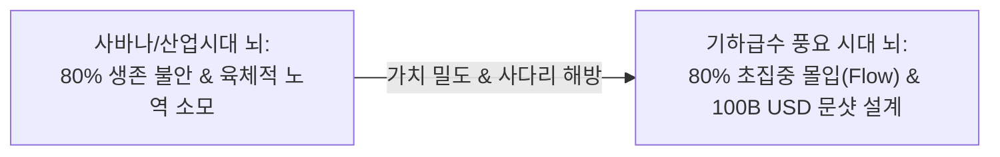

> **🎙️ 3-Presenter Authentic Tiki-Taka Script**
> 
> **Dr. Elena Vance:** 코틀러의 통찰은 눈부십니다. 가치 밀도 혁명의 궁극적 수혜자는 '인간의 뇌'입니다. 매일 생존을 위해 코르티솔을 뿜어내던 뇌가 비로소 창의성과 몰입을 위한 도파민과 엔도르핀을 마음껏 쓰게 되었습니다.  
> **Prof. Peter Kim:** 사다리의 가장 끝에서 해방되는 것은 바로 인간의 영혼과 잠재력입니다.  

---

### Slide 14: 가치 밀도 지수(Value Density Index: VDI) 공식 도출
- **Quantitative Model:** 임의의 시스템 $S$의 가치 밀도를 정량화하는 종합 지수 공식

$$\text{VDI}(S) = \frac{\sum_{i=1}^{n} \text{Utility}_i \times \text{Accessibility}}{\text{Mass} \times \text{Energy} \times \text{Marginal Cost}} = \frac{U \cdot A}{M \cdot E \cdot MC}$$

- **Parameter Analysis:**
  - 분자: 효용성($U$)과 접근성($A$)의 곱 (기하급수 증가)
  - 분모: 질량($M$), 에너지 소모($E$), 한계비용($MC$) (0으로 수렴)
  - 결과: $\text{VDI} \rightarrow \infty$ (풍요의 특이점)

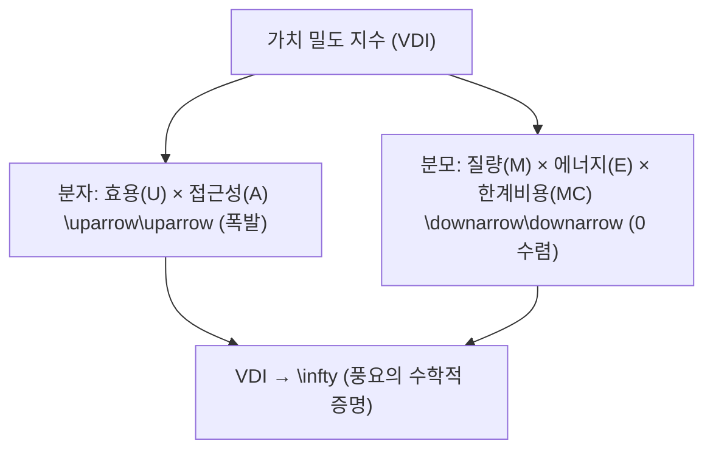

> **🎙️ 3-Presenter Authentic Tiki-Taka Script**
> 
> **Dr. Elena Vance:** 우리가 고안한 VDI 수식을 보십시오. 분모의 질량, 에너지, 한계비용이 0으로 수렴하고 분자의 효용과 접근성이 폭발하면, VDI는 무한대가 됩니다.  
> **TA Marcus Brody:** 기술이 발전할수록 이 수식의 분모는 쪼그라들고 분자는 하늘을 찌르니, 시스템의 가치 밀도가 폭발하지 않을 수 없겠군요!  

---

### Slide 15: 역사적 기술 사다리 5대 축 총괄 요약 매트릭스
- **Comparative Master Matrix:** 인류 문명을 해방한 5대 핵심 도메인별 사다리 진화 총람

| 사다리 도메인 | Level 1 (고대/중세) | Level 2 (산업혁명) | Level 3 (디지털 시대) | Level 4 (2026 기하급수 시대) |
| :--- | :--- | :--- | :--- | :--- |
| **1. 물질/제조** | 장작, 흙벽돌, 수공업 | 주철, 베세머 강철, 대량생산 | 플라스틱, 복합소재, CNC | **원자 단위 3D 프린팅 & 분자 합성** |
| **2. 에너지** | 인간 근육, 장작, 가축 | 석탄, 증기기관 ($1\times$) | 석유, 내연기관, 원자력 | **탠덤 태양광, ESS, 상업 핵융합** |
| **3. 연산/지능** | 주판, 손 계산, 서기 | 파스칼 계산기, 펀치카드 | 진공관, 실리콘 마이크로칩 | **프론티어 AI 파운데이션 & 양자 큐비트** |
| **4. 생명/의학** | 약초, 주술, 사혈 요법 | 페니실린, 위생, 백신 | 화학 합성 신약, X-레이 | **CRISPR 유전자 편집, PRIMA, mRNA** |
| **5. 물류/공간** | 보행, 뗏목, 우마차 | 증기 기관차, 증기선 | 내연기관 자동차, 제트 항공기 | **Zipline 드론, 완전자율 로보택시, Starship** |

> **🎙️ 3-Presenter Authentic Tiki-Taka Script**
> 
> **Prof. Peter Kim:** 이 5대 사다리가 2026년 오늘날 Level 4에서 일제히 수렴하고 있습니다. 과거 어떤 문명도 경험해보지 못한 전방위적 가치 밀도의 대폭발입니다.  
> **TA Marcus Brody:** 이제 3번째 모듈로 넘어가서 역사 속 결정적인 사다리 마일스톤들을 하나씩 해체해 보시죠!  

---

## Module 3: 기하급수 이론 및 프레임워크 (Slides 16~25)

### Slide 16: 역사적 마일스톤 1: 3000 BCE 메소포타미아 관개 운하와 잉여 생산의 탄생
- **Historical Analysis:** 티그리스-유프라테스강의 범람을 통제한 최초의 토목 수로망
- **Resource Liberation:** 불규칙한 강우에 의존하던 농업을 계획적 관개 농업으로 전환 $\rightarrow$ 농업 생산량 **400% 급증**
- **Civilizational Leap:** 잉여 식량(Food Surplus) 발생 $\rightarrow$ 인구의 90%가 농사에 매달리던 상태에서 서기, 법관, 천문학자, 엔지니어 등 **전문화된 비농업 지식 계급 최초 탄생**

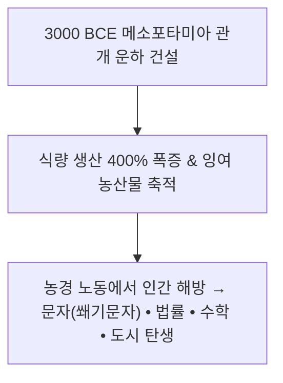

> **🎙️ 3-Presenter Authentic Tiki-Taka Script**
> 
> **Prof. Peter Kim:** 인류 최초의 사다리는 거창한 반도체가 아니었습니다. 진흙을 파서 물길을 낸 '관개 운하'였습니다.  
> **Dr. Elena Vance:** 관개 운하가 식량의 희소성을 해방하자마자, 매일 밭을 갈아야 했던 인간들이 비로소 펜을 들고 문자를 발명하고 별을 관측하기 시작했습니다. 문명의 모든 고등 지식은 이 최초의 사다리에서 태어났습니다.  
> **TA Marcus Brody:** 물길 하나 돌렸을 뿐인데 문명 전체가 업그레이드된 거네요!  

---

### Slide 17: 역사적 마일스톤 2: 2200 BCE 마구(Horse Collar/하네스)와 농업 생산력 5배 도약
- **Biomechanical Innovation:** 말의 기도를 압박하던 목줄(Throat-and-Girth)에서 흉골과 어깨로 무게를 분산시키는 **단단한 패딩 마구(Rigid Padded Collar)**로 혁신
- **Traction Power Multiplier:** 말의 견인력이 **4~5배 증가** (500kg $\rightarrow$ 2,500kg 견인 가능), 소(Ox)보다 50% 빠른 작업 속도
- **Economic Impact:** 유럽의 무겁고 습한 점토질 토양 개간 가능 $\rightarrow$ 중세 농업 혁명 및 도시 경제 부흥의 견인차


> **🎙️ 3-Presenter Authentic Tiki-Taka Script**
> 
> **Dr. Elena Vance:** 가죽과 짚으로 만든 단순한 말 목걸이 하나가 중세 유럽의 인구를 두 배로 늘렸습니다. 생체역학적 구조를 최적화하자 말 한 마리가 소 다섯 마리의 일을 해냈기 때문입니다.  
> **TA Marcus Brody:** 하드웨어의 재료(가죽)는 그대로인데, 힘이 전달되는 '구조적 설계'를 바꾼 것만으로 500%의 효율 혁신을 이뤄낸 거군요!  
> **Prof. Peter Kim:** 이것이 바로 제1원리적 설계의 힘입니다.  

---

### Slide 18: 역사적 마일스톤 3: 삼각돛(Lateen Sail)과 해양 항법이 해방한 대륙 간 무역
- **Aerodynamic Revolution:** 순풍(Tailwind)만 탈 수 있던 사각돛에서 역풍(Headwind)을 거슬러 지그재그 항해(Tacking)가 가능한 **삼각돛(Lateen Sail)** 개발
- **Spatial Liberation:** 지중해와 대서양의 뱃길이 바람의 방향에 묶여 있던 지리적 한계를 해체하고 **대항해 시대 및 전 지구적 무역망 개막**

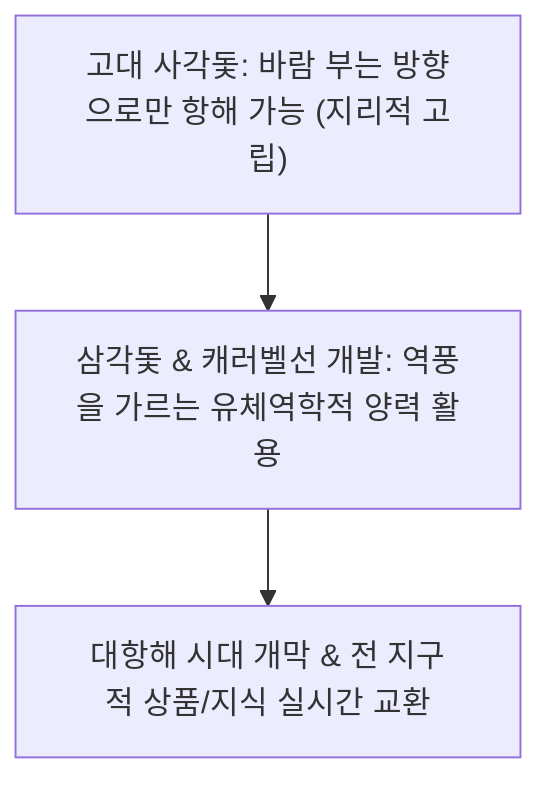

> **🎙️ 3-Presenter Authentic Tiki-Taka Script**
> 
> **TA Marcus Brody:** 바람이 뒤에서 불어주기만 기다리던 뱃사람들이, 비행기 날개처럼 양력을 만들어 바람을 거슬러 올라가는 삼각돛을 달자 지구 반대편으로 항해할 수 있게 되었습니다!  
> **Prof. Peter Kim:** 삼각돛은 공간의 희소성을 정복한 해양의 사다리였습니다.  

---

### Slide 19: 인쇄술(Gutenberg)과 지식 복제의 한계 비용 1차 붕괴
- **Information Dematerialization Step 1:** 수도승 필사본(성서 1권 복사 시 양 300마리 가죽 + 1년 노동 $\approx \$50,000$) $\rightarrow$ 구텐베르크 금속 활자(시간당 수백 장 인쇄 $\approx \$5$)
- **Marginal Cost Collapse:** 지식 복제 비용 **99.99% 하락** $\rightarrow$ 종교개혁, 과학혁명, 계몽주의의 촉발제

```mermaid
xychart-beta
    title "성서 1권 제작에 소요되는 시간과 비용 하락 (1400 vs 1500)"
    x-axis [1400 (수도승 필사), 1455 (구텐베르크 초기), 1500 (유럽 인쇄망 확산)]
    y-axis "제작 비용 ( Log Scale)" 1 --> 5
    line [4.7, 2.5, 0.7]
```

> **🎙️ 3-Presenter Authentic Tiki-Taka Script**
> 
> **Dr. Elena Vance:** 구텐베르크 인쇄술은 인류 최초의 '정보 탈화폐화' 사건이었습니다. 1년 내내 베껴 써야 했던 성경이 하루 만에 수백 권씩 찍혀 나오자 지식의 독점이 산산조각 났습니다.  
> **Prof. Peter Kim:** 지식이 민주화되자 근대 과학과 민주주의가 태동했습니다. 6D 프레임워크의 완벽한 15세기 선조입니다.  

---

### Slide 20: 증기 기관과 열역학적 노동 해방: 노예제의 경제적 종말
- **Thermodynamic Transition:** 생물학적 근육 에너지(인간/가축) $\rightarrow$ 화석 연료 화학 결합의 열역학적 일(Work) 변환
- **Moral-Economic Causality:** 1톤의 석탄이 100명의 인간이 1년간 할 수 있는 물리적 노동을 대체 $\rightarrow$ 인간을 노예로 부리는 것보다 **증기기관을 돌리는 것이 경제학적으로 훨씬 저렴**해짐으로써 노예제의 실질적 종말 견인

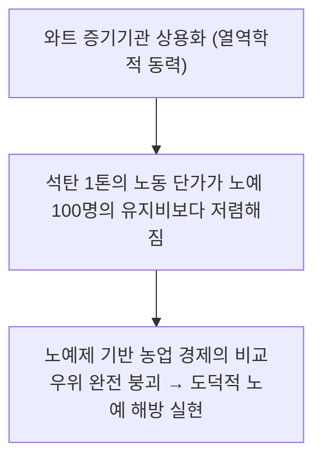

> **🎙️ 3-Presenter Authentic Tiki-Taka Script**
> 
> **Prof. Peter Kim:** 도덕적 설교만으로는 노예제를 완전히 끝낼 수 없었습니다. 증기기관이 석탄 1톤으로 노예 100명분의 일을 해내자, 노예를 부리는 것이 경제적 자살 행위가 되었기 때문에 노예제가 비로소 종식될 수 있었습니다.  
> **TA Marcus Brody:** 기술이 도덕을 앞당긴 결정적인 증거네요!  
> **Dr. Elena Vance:** 기술적 사다리는 인류의 윤리적 지평을 강제로 끌어올리는 기관차입니다.  

---

### Slide 21: 하버-보슈법(Haber-Bosch)과 공기 중 질소 고정: 40억 인구 부양의 기적
- **Chemical Breakthrough:** 대기 중 78%를 차지하지만 반응성이 없는 질소($\text{N}_2$)를 고온·고압에서 수소와 결합시켜 암모니아($\text{NH}_3$) 합성 성공 (Fritz Haber & Carl Bosch, 1909)
- **Global Impact:** 합성 비료 대량 생산 $\rightarrow$ 전 세계 농작물 수확량 **400% 증가** $\rightarrow$ 현재 지구상 80억 인류 중 **약 40억 명(50%)의 신체 단백질 질소가 하버-보슈 공장에서 유래**

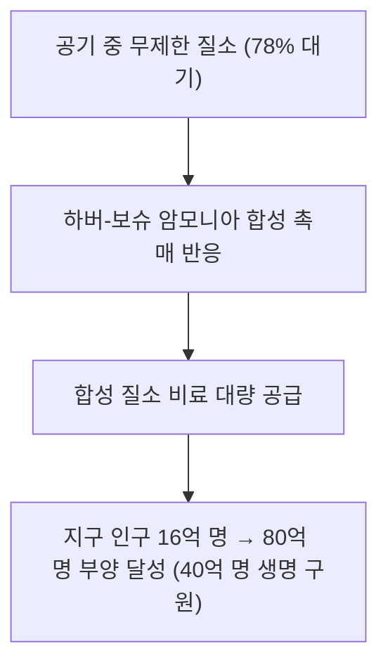

> **🎙️ 3-Presenter Authentic Tiki-Taka Script**
> 
> **Dr. Elena Vance:** 슬라이드의 데이터를 보십시오. 지금 우리 세 사람의 몸을 이루는 단백질 속 질소 원자의 절반은 밭의 흙이 아니라 하버-보슈 화학 공장에서 왔습니다.  
> **TA Marcus Brody:** 공기 중에서 빵을 만들어낸 셈이네요! 맬서스의 인구론을 비웃으며 수십억 명을 굶주림에서 구제한 기적의 화학 사다리입니다.  

---

### Slide 22: 실리콘 혁명과 연산의 가치 밀도: 진공관 방 하나에서 3nm 나노칩으로
- **Computational Shrinkage:** 
  - ENIAC (1946): 18,000개 진공관, 무게 30톤, 전력 150 kW, 초당 5,000회 연산
  - 2026 첨단 AI 칩: 1000억 개 트랜지스터, 무게 수 그램, 3나노 공정, 초당 수천조 회 연산
- **Density Multiplier:** 단위 부피당 연산 밀도 **$10^{15}\text{배}$ (1000조 배) 폭발**

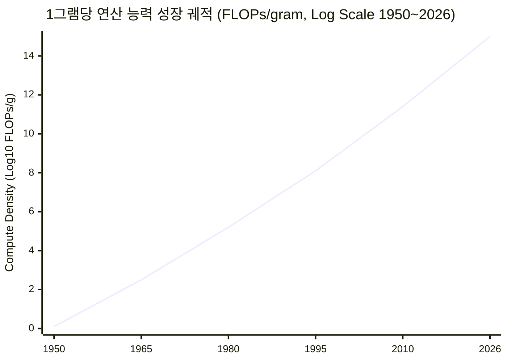

> **🎙️ 3-Presenter Authentic Tiki-Taka Script**
> 
> **TA Marcus Brody:** 30톤짜리 에니악 방 한 칸이 지금은 손톱만 한 칩 하나에 수천만 개씩 들어가 있습니다. 1,000조 배의 압축입니다!  
> **Dr. Elena Vance:** 물질을 원자 단위로 깎아내는 나노 리소그래피 기술이 가치 밀도의 정의를 새로 썼습니다.  

---

### Slide 23: 양자 컴퓨팅과 힐베르트 공간의 연산 밀도: $2^N$ 상태 동시 처리
- **Quantum Dimensional Leap:** 고전 비트($N$비트는 $N$개 상태 중 1개만 표현) vs 큐비트($N$개 큐비트는 $2^N$개의 고차원 힐베르트 공간 상태를 동시 중첩 표현)
- **Ultimate Value Density:** 300개의 큐비트만으로 우주에 존재하는 모든 원자의 수($10^{80}$)보다 많은 계산 상태를 단일 칩 안에서 동시 시뮬레이션 가능

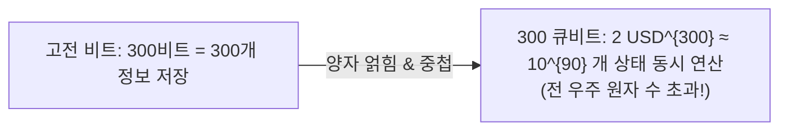

> **🎙️ 3-Presenter Authentic Tiki-Taka Script**
> 
> **Dr. Elena Vance:** 양자 컴퓨팅은 3차원 물리 공간을 넘어 다차원 힐베르트 공간의 가치 밀도를 활용합니다. 큐비트 300개면 우주 전체를 시뮬레이션할 수 있습니다.  
> **Prof. Peter Kim:** 물리적 우주보다 더 큰 연산 공간을 작은 칩 하나에 담아내는 것, 이것이 궁극의 가치 밀도입니다.  

---

### Slide 24: 탈물질화 가치 사다리 공식: $\lim_{Mass \to 0} \frac{Value}{Mass} = \infty$
- **Mathematical Capstone:** 가치 밀도 진화의 극한 방정식
- **The Decoupling:** 물질(Mass)과 에너지(Energy) 소비는 0으로 수렴하면서 기능적 가치(Value)는 무한대로 팽창하는 문명적 탈동조화(Decoupling)

$$\lim_{t \to \infty} \text{Mass}(t) \to 0 \quad \text{and} \quad \lim_{t \to \infty} \text{Value}(t) \to \infty \implies \lim_{t \to \infty} \frac{\text{Value}(t)}{\text{Mass}(t)} = \infty$$

```mermaid
graph TD
    M["물리적 질량 (Mass) → 0"] --> Ratio["가치 밀도 (Value/Mass) → \infty"]
    V["기능적 가치 (Value) → \infty"] --> Ratio
    Ratio --> PostScarcity["POST-SCARCITY CIVILIZATION (탈희소성 문명)"]
```

> **🎙️ 3-Presenter Authentic Tiki-Taka Script**
> 
> **Dr. Elena Vance:** 이 수학적 극한이 보여주는 미래는 명확합니다. 인간이 누리는 풍요는 더 이상 지구 자원의 채굴량에 비례하지 않습니다.  
> **Prof. Peter Kim:** 아톰의 무게를 덜어낼수록 문명은 더 높이 날아오릅니다.  

---

### Slide 25: 자원 해방의 4단계 프레임워크 (발견 $\rightarrow$ 변환 $\rightarrow$ 증폭 $\rightarrow$ 민주화)
- **Universal Liberation Framework:** 모든 자원이 희소성에서 풍요로 전환되는 4단계 메커니즘

```mermaid
flowchart LR
    S1["1. 발견 (Discovery)<br/>숨겨진 물리 법칙/신소재 식별"] --> S2["2. 변환 (Conversion)<br/>정보 이론 & 디지털 코드로 치환"]
    S2 --> S3["3. 증폭 (Amplification)<br/>AI & 반도체 스케일링으로 증폭"]
    S3 --> S4["4. 민주화 (Democratization)<br/>한계비용 0으로 80억 인류 배포"]
```

> **🎙️ 3-Presenter Authentic Tiki-Taka Script**
> 
> **TA Marcus Brody:** 발견하고, 변환하고, 증폭하고, 민주화한다! 모든 사다리가 이 4단계를 거쳐 완성되었습니다.  
> **Prof. Peter Kim:** 이제 이 프레임워크가 실현해낸 4경 9천조 달러의 글로벌 실증 데이터 현장으로 가보겠습니다!  

---

## Module 4: 글로벌 데이터 & 실증 케이스 (Slides 26~35)

### Slide 26: CASE 1: 4경 9천조 달러($49 Quadrillion) 글로벌 잠재 자산의 유동화 실증
- **Macro Economic Valuation:** 전 지구상에 잠들어 있는 미활용 자원의 총 가치
- **The $49 Quadrillion Breakdown:**
  1. **태양광 복사 에너지 잠재력:** 연간 지구 표면 도달 $173,000\text{ TW} \approx \mathbf{\$20\text{ Quadrillion/yr}}$
  2. **미개척 글로벌 토지 및 해양 광합성 잠재력:** $\approx \mathbf{\$12\text{ Quadrillion}}$
  3. **비정형 데이터 및 80억 인류 미활용 지능 자산:** $\approx \mathbf{\$10\text{ Quadrillion}}$
  4. **우주 소행성 광물 자원 (Psyche 16 등):** $\approx \mathbf{\$7\text{ Quadrillion}}$

```mermaid
pie title 49 USD Quadrillion 글로벌 잠재 자산 구성비 (4.9 USD경 원)
    "태양 복사 청정 에너지 자산" : 41
    "토지/해양 생체 합성 잠재 자산" : 24
    "글로벌 인류 지능 & 데이터 네트워크" : 21
    "지구 근접 소행성 우주 광물 자산" : 14
```

> **🎙️ 3-Presenter Authentic Tiki-Taka Script**
> 
> **Prof. Peter Kim:** 49 쿼드릴리온 달러, 즉 4경 9천조 달러입니다. 전 세계 1년 총 GDP가 약 100조 달러인데, 그 500배에 달하는 거대한 자산이 기술이라는 열쇠를 기다리며 잠들어 있습니다.  
> **Dr. Elena Vance:** 소행성 '16 프시케(Psyche)' 하나에만 지구 전체 경제의 수만 배에 달하는 금과 백금, 철광석이 묻혀 있습니다. 발사 비용이 100달러로 떨어지면 이 자산들이 유동화됩니다.  
> **TA Marcus Brody:** 희소성은커녕 자원이 감당 못할 정도로 넘쳐나는 시대가 눈앞에 와 있네요!  

---

### Slide 27: CASE 2: 라이징 플로어 효과(Rising Floor Effect): 전 지구적 빈곤선의 수직 상승
- **Socio-Economic Metric:** 기술 민주화가 최하위 계층의 기본 생활 수준(Floor)을 강제로 끌어올리는 현상
- **Empirical Proof:** 오늘날 케냐의 빈민가 주민이 누리는 스마트폰 정보 접근권, 위생, 항생제 수준은 **100년 전 미국 억만장자 존 D. 록펠러(John D. Rockefeller)보다 월등히 우월**함

```mermaid
xychart-beta
    title "전 세계 절대 빈곤율(하루 2.15 USD 미만) 하락 추이 (1820~2026)"
    x-axis [1820, 1870, 1910, 1950, 1980, 2000, 2015, 2026]
    y-axis "절대 빈곤 인구 비율 (%)" 0 --> 100
    line [89, 82, 75, 55, 42, 28, 10, 4.5]
```

> **🎙️ 3-Presenter Authentic Tiki-Taka Script**
> 
> **TA Marcus Brody:** 록펠러는 전 세계 최고의 부자였지만 충치 하나 뽑을 때도 마취제 없이 비명을 질렀고, 감기 걸려도 페니실린이 없어서 죽을 뻔했습니다. 에어컨도, 비행기도, 위키피디아도 없었죠.  
> **Dr. Elena Vance:** 오늘날 전 세계 하위 10%의 인류가 누리는 의학적·정보적 혜택이 1세기 전의 황제나 재벌보다 높습니다. 이것이 '라이징 플로어(Rising Floor)'입니다.  
> **Prof. Peter Kim:** 자본주의의 소득 불평등을 비판하는 동안에도, 기술은 문명 전체의 바닥을 하늘 높이 들어 올렸습니다.  

---

### Slide 28: CASE 3: 아프리카 케냐 M-Pesa & 스타링크를 통한 10억 인구의 금융/정보 진입
- **Case Evidence:** 개발도상국의 단숨 도약 (Leapfrogging)
- **Metrics:**
  - 케냐 성인 96% 모바일 결제 일상화 $\rightarrow$ 은행 지점 0개 지역의 완전한 금융 포용
  - 스타링크 설치로 오지 학교의 100만 명 아동이 MIT/스탠퍼드 오픈 코스웨어 실시간 수강

```mermaid
flowchart LR
    NoInfra["인프라 제로 (도로 없음 • 전력망 없음 • 은행 없음)"] -->|스타링크 & 모바일 태양광 배터리 결합| GlobalAccess["전 세계 글로벌 경제 & 고등 교육 즉시 진입<br/>(사다리 3단계 단숨 도약)"]
```

> **🎙️ 3-Presenter Authentic Tiki-Taka Script**
> 
> **Dr. Elena Vance:** 아프리카 시골 마을에 유선 전화선과 전신주를 깔 필요가 없습니다. 태양광 패널 한 장과 스타링크 접시 안테나 하나면 곧바로 기가비트 초연결 사회로 점프합니다.  
> **TA Marcus Brody:** 사다리를 한 칸씩 기어오르는 게 아니라, 엘리베이터를 타고 꼭대기 층으로 직행하는 거네요!  

---

### Slide 29: CASE 4: 스마트폰 무게 180g vs 1980년대 50kg 장비의 탄소 발자국 절감 비교
- **Ecological Dematerialization Metric:**
  - 1980년대 30개 장비 제조 및 폐기 시 탄소 배출: 장비당 평균 **500 kg $\text{CO}_2\text{e}$**
  - 2026년 스마트폰 1대 제조 및 전 생애주기 탄소 배출: 단 **65 kg $\text{CO}_2\text{e}$ (87% 절감)**
  - 물리적 자원 채굴 및 물류 수송 에너지 소모 **99% 소멸**

```mermaid
xychart-beta
    title "장비 제조에 필요한 원자재 질량(kg) 비교"
    x-axis [1980년대 30대 물리 하드웨어 총합, 2026년 스마트폰 1대]
    y-axis "원자재 중량 (kg)" 0 --> 60
    bar [52.4, 0.18]
```

> **🎙️ 3-Presenter Authentic Tiki-Taka Script**
> 
> **Dr. Elena Vance:** 가치 밀도의 증가는 환경적으로 가장 완벽한 지속 가능성 해법입니다. 무거운 원자재 채굴 자체가 필요 없어지기 때문입니다.  
> **Prof. Peter Kim:** 탈물질화는 자연을 파괴하지 않고도 문명을 풍요롭게 만드는 유일한 길입니다.  

---

### Slide 30: CASE 5: 정밀 발효(Precision Fermentation)와 토지 사용량 99% 절감 데이터
- **Biomanufacturing Case:** 효모와 박테리아 유전자 재조합을 통한 유단백질(카제인, 유청) 직접 합성
- **Resource Efficiency Metrics (RethinkX Data):**
  - 전통 젖소 목축 대비 토지 사용량 **99% 절감**
  - 온실가스 배출량 **95% 절감**
  - 물 소비량 **98% 절감**
  - 단백질 생산 단가: 2026년 이후 전통 소고기/우유보다 저렴해짐

```mermaid
flowchart TD
    Cow["전통 젖소 축산: 풀 → 소 (사료 효율 4%) → 우유 (토지 100배 소모)"]
    Ferment["정밀 발효 바이오리액터: 당분/전기 → 효모 미생물 → 순수 카제인 단백질 (효율 85%)"]
    Cow -.->|가치 밀도 100배 도약| Ferment
```

> **🎙️ 3-Presenter Authentic Tiki-Taka Script**
> 
> **TA Marcus Brody:** 소 한 마리를 키우려면 축구장만 한 땅과 수만 리터의 물이 필요한데, 정밀 발효통 하나면 맥주 공장에서 우유 단백질을 무한정 뽑아냅니다!  
> **Dr. Elena Vance:** 전 세계 농경지의 80%가 가축 사료 재배용입니다. 정밀 발효가 확산되면 그 땅이 전부 원시림으로 복원되어 지구 온난화가 단숨에 억제됩니다.  

---

### Slide 31: CASE 6: 수직 농업(AeroFarms)의 물 소비 95% 절감 및 평당 생산성 390배 지표
- **Controlled Environment Agriculture (CEA):** LED 조명, 에어로포닉스 분무 재배, AI 생육 제어
- **Empirical Productivity:**
  - 노지 농업 대비 물 소비량 **95% 절감**
  - 농약(Pesticides) 사용량 **0% (완전 무농약)**
  - 단위 면적당 수확량 **390배 폭증** (연중 365일 24시간 30단 재배)

```mermaid
xychart-beta
    title "단위 면적당 연간 샐러드 채소 생산성 (kg/m²)"
    x-axis [전통 노지 농업, 최첨단 수직 농업 (AeroFarms)]
    y-axis "연간 생산량 (kg/m²)" 0 --> 400
    bar [1.0, 390.0]
```

> **🎙️ 3-Presenter Authentic Tiki-Taka Script**
> 
> **TA Marcus Brody:** 평당 1kg 나오던 밭에서 390kg이 쏟아져 나옵니다. 390배입니다! 가뭄도 없고 홍수도 없습니다.  
> **Prof. Peter Kim:** 농업이 기후의 노예에서 벗어나 완벽한 반도체 공장식 가치 밀도 모델로 전환된 현장입니다.  

---

### Slide 32: CASE 7: 페로브스카이트-실리콘 탠덤 태양전지의 가치 밀도 (34% 효율 돌파)
- **Photovoltaic Quantum Leap:** 단일 실리콘의 쇼클리-콰이저 이론 한계(29.4%)를 돌파하는 탠덤(Tandem) 구조
- **2026 Milestone:** 상용 탠덤 모듈 효율 **34.2% 달성**, 제조 원가는 기존 실리콘과 동일 수준 유지

```mermaid
flowchart LR
    BluePhoton["청색/자외선 단파장 광자"] --> PerovskiteTop["상부 페로브스카이트 층 (고에너지 흡수)"]
    RedPhoton["적색/적외선 장파장 광자"] --> SiliconBottom["하부 실리콘 층 (저에너지 흡수)"]
    PerovskiteTop & SiliconBottom --> TotalEfficiency["광전 변환 효율 34% 돌파 (가치 밀도 수직 상승)"]
```

> **🎙️ 3-Presenter Authentic Tiki-Taka Script**
> 
> **Dr. Elena Vance:** 햇빛의 모든 스펙트럼을 남김없이 흡수하는 탠덤 태양전지는 동일한 면적에서 50% 더 많은 전기를 뽑아냅니다.  
> **TA Marcus Brody:** 지붕 면적이 좁은 도심 빌딩과 전기차 표면 전체가 발전소가 되는 날이 머지않았습니다!  

---

### Slide 33: CASE 8: 알파폴드 2억 개 단백질 DB가 해방한 인류 연구 시간 (수백만 인년 절약)
- **Life Science Intelligence Density:** DeepMind AlphaFold 2/3
- **Human Labor Liberation:**
  - 과거: 박사급 연구원 1명이 X-선 결정학으로 단백질 1개 구조 규명에 **4~5년 소요 ($100,000 이상)**
  - 현재: 2억 개 단백질 3D 구조를 AI가 **단 1초 만에 무료 공개**
  - **절감된 인류 지적 노동량:** 약 **수억 인년(Person-Years)과 수백조 원의 연구비**

```mermaid
flowchart TD
    Manual["과거: 1개 단백질 해독 = 5년 박사과정 연구 + 100k"] --> AlphaFold["AlphaFold: 2억 개 단백질 전수 해독 완료 (초당 무료 검색)"]
    AlphaFold --> Saved["인류 과학자 수백만 명의 인생과 시간 해방 → 항암제/신약 개발 10배 가속"]
```

> **🎙️ 3-Presenter Authentic Tiki-Taka Script**
> 
> **Dr. Elena Vance:** 알파폴드가 인류 과학계에 선사한 것은 단순한 데이터베이스가 아닙니다. 수백만 명의 생물학자들이 평생 바쳐야 했을 수억 년의 시간을 단 하룻밤 만에 해방시켜 준 것입니다.  
> **Prof. Peter Kim:** 지능의 가치 밀도가 인류의 가장 귀한 자원인 '인간의 시간'을 구원했습니다.  

---

### Slide 34: CASE 9: 3D 프린팅 로켓(Relativity Space 등)과 부품 수 100분의 1 축소
- **Additive Manufacturing Dematerialization:**
  - 전통 로켓 엔진 및 동체: 100,000개 이상의 개별 부품, 수만 개의 볼트/너트 용접, 2년 제조 기간
  - 거대 금속 3D 프린팅 로켓: **1,000개 미만의 부품 (100배 단순화)**, 단 60일 만에 프린팅 완료

```mermaid
flowchart LR
    OldRocket["전통 로켓: 부품 10만 개 • 공급망 수천 개 • 조립 2년"] -->|AI 알고리즘 설계 & 3D 적층 제조| PrintRocket["3D 프린팅 로켓: 단일 일체형 출력 • 부품 1,000개 미만 • 60일 완성"]
```

> **🎙️ 3-Presenter Authentic Tiki-Taka Script**
> 
> **TA Marcus Brody:** 10만 개 부품을 손으로 용접하던 로켓을 거대 3D 프린터가 60일 만에 통째로 뽑아냅니다. 고장 날 연결 부위가 없으니 신뢰성도 10배 높습니다!  
> **Prof. Peter Kim:** 부품 수의 탈물질화가 우주 개척의 진입 장벽을 완전히 분쇄하고 있습니다.  

---

### Slide 35: 글로벌 가치 밀도 혁신 10대 도메인 비교 대조표
- **Cross-Domain Synthesis:** 10개 핵심 분야의 가치 밀도 도약 배율 및 해방 자원 종합

| 혁신 도메인 | 전통 물리적 형태 | 2026 가치 밀도 혁신 형태 | 가치 밀도 도약 배율 | 궁극적으로 해방된 자원 |
| :--- | :--- | :--- | :--- | :--- |
| **1. 컴퓨팅** | 30톤 진공관 ENIAC | 180g 스마트폰 3nm AP | **$10^{15}\times$** | 연산 시간 및 물리적 공간 |
| **2. 에너지** | 1kg 석탄 화력 | 페로브스카이트 탠덤 태양광 | **$\infty$ (연료 0)** | 화석 자원 채굴 노동 |
| **3. 식량** | 축구장 면적 젖소 방목 | 정밀 발효 바이오리액터 | **$100\times$** | 지구 농경 토지 및 담수 |
| **4. 통신** | 10일 소요 포니 익스프레스 | 스타링크 레이저 광학망 | **$10^9\times$** | 지리적 고립 및 이동 시간 |
| **5. 의학** | 5년 소요 단백질 X선 촬영 | AlphaFold 2억 개 DB | **$10^6\times$** | 생물학자 연구 시간 |
| **6. 금융** | 대리석 은행 지점 및 ATM | M-Pesa 모바일 머니 | **$1,000\times$** | 10억 명의 경제 활동 제약 |
| **7. 교육** | 수천만 원 사립대 강의실 | LLM 1:1 맞춤형 튜터 | **$10,000\times$** | 전 세계 지식 격차 |
| **8. 물류** | 트럭 도로 수송 (오지 불가) | Zipline 자율비행 드론 | **$50\times$** | 도로 인프라 건설 비용 |
| **9. 우주** | 1회용 $54k/kg 우주왕복선 | 완전 재사용 Starship | **$500\times$** | 행성 간 진출 장벽 |
| **10. 제조**| 10만 개 부품 절삭 가공 | AI 토폴로지 3D 프린팅 | **$100\times$** | 공급망 복잡성 및 폐기물 |

> **🎙️ 3-Presenter Authentic Tiki-Taka Script**
> 
> **Prof. Peter Kim:** 이 대조표는 인류 문명이 어디로 가고 있는지를 명확히 보여줍니다. 모든 지표가 하나의 방향, 즉 **'극단적인 가치 밀도의 압축을 통한 무한한 해방'**을 가리키고 있습니다.  
> **Dr. Elena Vance:** 물질은 사라지고, 오직 가치와 지능만이 남는 탈물질화의 완성입니다.  

---

## Module 5: 사회적·철학적 역설 (So What?) (Slides 36~42)

### Slide 36: 소유의 종말: 유형 자산에서 무형 접근권(Access over Ownership)으로의 전환
- **Sociological Shift:** 제러미 리프킨의 *소유의 종말(The Age of Access)* 실현
- **Hyper-Efficiency Paradox:** 물질을 소유하려는 집착은 유지 비용, 감가상각, 공간 점유라는 '부채'가 되고, 클라우드와 온디맨드 서비스를 통한 '접근권'이 가장 순수한 자산이 되는 문명적 대전환

```mermaid
flowchart LR
    HeavyOwn["과거: 소유의 시대 (Ownership)<br/>부동산 • 자동차 • 전자기기 소유 집착<br/>(감가상각 • 유지비용 • 공간 구속)"] --> Transition["가치 밀도 극대화 & 클라우드화"]
    Transition --> LightAccess["현재: 접근의 시대 (Access)<br/>온디맨드 구독 • 자율 스트리밍 • 가벼운 삶<br/>(자유도 극대화 • 제로 마찰)"]
```

> **🎙️ 3-Presenter Authentic Tiki-Taka Script**
> 
> **Prof. Peter Kim:** 소유는 무겁고, 접근은 가볍습니다. 가치 밀도가 무한대로 올라가는 사회에서 물리적 대상을 끌어안고 있는 것은 닻을 매달고 수영하는 것과 같습니다.  
> **TA Marcus Brody:** 집이나 차를 사느라 평생 빚을 갚는 대신, 마일당 10센트로 로보택시를 타고 메타버스와 클라우드로 일하는 청년들이 왜 소유를 포기하는지 이해가 되네요!  

---

### Slide 37: 전통 자본주의의 부동산/제조업 가치평가 모델 붕괴 위기
- **Valuation Crisis:** 전통 경제학의 자산 가치 평가 모델(PBR, DCF, 토지 가치)의 무력화
- **The Decoupling Shock:** 물리적 공장 설비가 큰 기업(포드, GM, 보잉)보다, 공장 하나 없는 순수 소프트웨어/AI 기업(엔비디아, 오픈AI, 플랫폼 기업)의 가치 밀도가 수십 배로 폭등하는 자본 시장의 격변

```mermaid
flowchart TD
    OldValuation["전통 회계 모델: 물리적 공장 설비(Capex)와 토지 면적으로 기업 가치 산출"] --> Shock["가치 밀도 폭발: 무형 자산(AI 가중치, 알고리즘)이 가치 99% 독식"]
    Shock --> ParadigmShift["전통 제조업 주가 정체 vs 팹리스/SaaS 기업의 시가총액 수조 달러 지배"]
```

> **🎙️ 3-Presenter Authentic Tiki-Taka Script**
> 
> **Dr. Elena Vance:** 월스트리트의 전통 가치평가 모델이 붕괴하고 있습니다. 대규모 공장을 가진 기업들은 설비 감가상각에 허덕이지만, 코드 몇 줄을 가진 기업들이 수조 달러의 시총을 기록합니다. 가치 밀도의 승리입니다.  
> **Prof. Peter Kim:** 하지만 이것은 동시에 제조업 기반 국가와 전통 노동자 계층에게 거대한 실존적 위협이기도 합니다.  

---

### Slide 38: 풍요 속의 상대적 박탈감: '포지셔널 굿(Positional Goods)'의 가격 폭등 역설
- **Fred Hirsch's Paradox:** 필수재(식량, 에너지, 통신, 지능)가 탈화폐화되어 공짜가 될수록, 복제 불가능한 **'위치재(Positional Goods)'**의 가격은 천문학적으로 폭등함
- **Hyper-Inflation in Scarcity Assets:** 
  - 무료: AI 튜터, 위키피디아, 유튜브, 합성 단백질
  - 초고가 폭등: 맨해튼 중심가 펜트하우스, 하버드대 오프라인 입학권, 피카소 오리지널 진품 명화

```mermaid
flowchart LR
    Abundant["6D 탈물질화 복제재:<br/>통신 • AI • 에너지 • 기초 헬스케어<br/>(0 USD으로 가격 소멸)"] 
    Scarce["복제 불가능한 위치재 (Positional):<br/>희소 입지 부동산 • 역사적 원본 • 사회적 지위<br/>(가격 천문학적 폭등)"]
    Abundant <==>|문명적 양극화 심화| Scarce
```

> **🎙️ 3-Presenter Authentic Tiki-Taka Script**
> 
> **TA Marcus Brody:** 누구나 공짜로 최고급 AI 강의를 듣고 맛있는 배양육을 먹을 수 있는데, 왜 사람들은 여전히 불행하다고 느낄까요?  
> **Dr. Elena Vance:** 프레드 허쉬의 '위치재(Positional Goods)' 역설 때문입니다. 모든 것이 풍요로워지면, 인간은 '남들이 가질 수 없는 극소수의 희소한 지위'에만 집착합니다. 뉴욕 센트럴파크 앞 아파트나 하버드 졸업장 같은 것들이죠.  
> **Prof. Peter Kim:** 물질적 풍요가 완성된 곳에서 시작되는 지위 경쟁의 지옥, 이것이 다음 세대가 풀어야 할 정신적 과제입니다.  

---

### Slide 39: 디지털 격차(Digital Divide)와 지적 귀족주의의 부활 경고
- **Cognitive Stratification:** 도구는 전 인류에게 민주화되었으나, 이를 다룰 수 있는 **'구조 매핑 역량(Structural Literacy)'**의 격차가 새로운 계급을 창출
- **The Threat:** 도구를 능동적으로 활용하여 $100B 문샷을 설계하는 'Theurgist(신의 권능을 다루는 자)'와, 알고리즘이 주는 도파민에 중독된 '디지털 소비자'로 인류가 분열될 위험

```mermaid
flowchart TD
    UniversalTool["80억 인류에게 똑같이 쥐어진 스마트폰 & AGI 도구"] --> Div1["상위 1% Theurgist: 제1원리 & 구조 매핑으로 100B USD 가치 창출"]
    UniversalTool --> Div2["하위 99% 단순 소비자: 쇼츠 & 둠스크롤링 알고리즘의 도파민 노예 전락"]
```

> **🎙️ 3-Presenter Authentic Tiki-Taka Script**
> 
> **Prof. Peter Kim:** 모든 사람에게 붓과 물감을 공짜로 나눠주었다고 해서 모두가 미켈란젤로가 되는 것은 아닙니다. 도구의 민주화는 필연적으로 '역량의 격차'를 더욱 잔인하게 드러냅니다.  
> **Dr. Elena Vance:** Theurgicon이 지식을 암기하는 법이 아니라 '무자비한 분별력'과 '구조 매핑'을 가르치는 이유가 바로 여기에 있습니다.  

---

### Slide 40: 한계비용 제로 사회에서의 세제 개혁: 로봇세 vs 토지/데이터 배당
- **Post-Scarcity Taxation Policy:** 노동 소득세(Income Tax) 중심의 전통 조세 시스템 붕괴 대응
- **Policy Alternatives:**
  1. **로봇/AI 연산세:** 자동화된 초과 이윤에 대한 과세
  2. **지오리버테리어니즘(Geolibertarianism) & 데이터 배당:** 복제 불가능한 토지와 지구 천연자원, 그리고 인류 공동의 데이터에 세금을 매겨 전 국민에게 분배

```mermaid
flowchart TD
    OldTax["과거 조세 모델: 노동 소득세 (인간 근로소득 과세) → 자동화로 세수 급감"] --> Reform["한계비용 제로 시대의 2대 세제 개혁"]
    Reform --> Opt1["1. 지능/연산세 (Compute Tax): AI 에이전트 초과 이윤 환수"]
    Reform --> Opt2["2. 공유부 배당 (Common Wealth Dividend): 토지 • 전파 • 데이터 지대 전 국민 배당"]
```

> **🎙️ 3-Presenter Authentic Tiki-Taka Script**
> 
> **TA Marcus Brody:** 로봇과 AI가 일을 다 해서 인간이 월급을 안 받으면, 국세청은 누구한테 소득세를 걷습니까? 세금 체계 자체를 뜯어고쳐야 합니다!  
> **Dr. Elena Vance:** 헨리 조지의 토지 단일세 사상이 21세기 데이터와 연산 인프라에 재적용되어야 할 시점입니다.  

---

### Slide 41: 보편적 기본 풍요(Universal Basic Abundance: UBA)의 문명적 청사진
- **Beyond UBI:** 단순한 현금 지급(Universal Basic Income)을 넘어선 **'보편적 기본 풍요(Universal Basic Abundance)'**
- **The UBA Pillar:** 6D 기술로 탈화폐화된 5대 핵심 생존 인프라를 전 인류에게 **무상 공급**
  - 무상 청정 에너지 (1인당 일일 10 kWh 태양광/ESS)
  - 무상 맞춤형 정밀 헬스케어 & 질병 예방 AI
  - 무상 고등 교육 및 1:1 초지능 튜터링
  - 무상 정밀 발효 영양식 & 완전 정수 담수
  - 무상 초고속 글로벌 위성 통신망

```mermaid
flowchart TD
    UBA["UNIVERSAL BASIC ABUNDANCE (보편적 기본 풍요)"] --> E["1. 무상 청정 에너지 (Solar/Battery)"]
    UBA --> H["2. 무상 정밀 헬스케어 (AI Diagnostics)"]
    UBA --> Ed["3. 무상 초지능 교육 (1:1 AI Tutor)"]
    UBA --> F["4. 무상 정밀 영양식 (Precision Food)"]
    UBA --> C["5. 무상 글로벌 통신 (Starlink Mesh)"]
```

> **🎙️ 3-Presenter Authentic Tiki-Taka Script**
> 
> **Prof. Peter Kim:** 현금을 나눠주는 기본소득은 인플레이션을 부르지만, 기술을 통해 한계비용을 0으로 만든 '기본 풍요(UBA)'는 인류 전체의 생존 공포를 영구히 박멸합니다.  
> **Dr. Elena Vance:** 에너지, 식량, 교육, 의료가 공짜로 주어지는 세상에서 인간은 비로소 생존을 위한 노역이 아닌, '자아실현과 문명적 기여'를 위해 살아가게 됩니다.  
> **TA Marcus Brody:** 이것이 바로 인류가 5천 년간 사다리를 기어오른 궁극의 목적지네요!  

---

### Slide 42: SO WHAT? 결론: 인류를 해방한 사다리를 딛고 신의 반열로 올라서라
- **Phase 1 Grand Synthesis:** Week 1~4 지적 여정의 총결산
- **Final Paradigm:** 기적은 기술이 되었고, 인지는 확장되었으며, 6D는 작동하고 있고, 가치 밀도는 무한대로 수렴하고 있다.

```mermaid
flowchart TD
    W1["Week 1: Theogony & Theurgicon (83가지 기적의 기술화)"] --> W2["Week 2: Cognitive Vertigo (구조 매핑 & 인지 렌즈 장착)"]
    W2 --> W3["Week 3: The 6Ds & Deception (기만 단계의 수학과 파괴)"]
    W3 --> W4["Week 4: Value Density & Ladder (가치 밀도와 49Q 해방)"]
    W4 --> Phase1["PHASE 1 마스터: 기하급수 인지 프레임워크 완성 → PHASE 2 현실적 기적으로 도약!"]
```

> **🎙️ 3-Presenter Authentic Tiki-Taka Script**
> 
> **Prof. Peter Kim:** 결론을 맺겠습니다. 우리는 지난 4주간 인류 역사상 가장 대담한 인지적 훈련을 마쳤습니다. 우리는 신의 능력을 확인했고, 뇌의 현기증을 극복했으며, 6D의 변곡점을 계산했고, 가치 밀도의 사다리를 올랐습니다.  
> **Dr. Elena Vance:** 이제 여러분의 뇌는 더 이상 사바나 초원의 선형적 유인원에 머물러 있지 않습니다. 기하급수 현실을 모델링할 수 있는 온전한 '마인드 2.0'을 장착했습니다.  
> **TA Marcus Brody:** 사다리는 준비되었습니다. 이제 다음 주부터 시작되는 Phase 2에서, 전 지구 현장에서 터져 나오는 현실적 기적들을 하나씩 사냥하러 가봅시다!  

---

## Module 6: 세미나 토론 및 과제 안내 (Slides 43~45)

### Slide 43: Phase 1 종합 평가 및 세미나 발제 토론 논제 3선
- **Capstone Debate Protocol:** Phase 1 총결산 3대 심층 논제

```mermaid
flowchart TD
    D1["논제 1: 가치 밀도의 극대화로 한계비용이 0이 되는 사회에서, 전통적인 '사유재산권(Private Property)'과 '특허권(IP)' 제도는 유지되어야 하는가, 아니면 인류 공동의 자산(Commons)으로 전면 전환되어야 하는가?"]
    D2["논제 2: 보편적 기본 풍요(UBA)가 달성되어 생존을 위한 노동이 완전히 소멸했을 때, 인간 사회가 존 칼훈의 '우주 25' 실험처럼 집단적 허무주의와 사회적 자살로 붕괴하는 것을 막기 위한 문명적 대안은 무엇인가?"]
    D3["논제 3: 4경 9천조 달러(49 USD Quadrillion) 잠재 자산 중 당신이 단 0.1%(49Trillion USD)를 해방할 수 있는 권한을 가진다면, 제1원리에 기반하여 가장 먼저 공략할 단 하나의 기술 사다리는 무엇인가?"]
```

> **🎙️ 3-Presenter Authentic Tiki-Taka Script**
> 
> **Prof. Peter Kim:** Phase 1 종합 토론 논제들입니다. 1번부터 3번까지, 여러분이 Phase 1에서 배운 모든 이론(기적 분류, 구조 매핑, 6D, 가치 밀도)을 총동원하여 답해야 합니다.  
> **Dr. Elena Vance:** 특히 3번 논제는 여러분의 기말 $100B XPRIZE 프로젝트의 직접적인 씨앗이 될 것입니다.  

---

### Slide 44: 주차별 실습 과제: 가치 밀도 극대화 문샷 벤처 아키텍처 기획안
- **Assignment Details:** *Value Density Moonshot Venture Architecture (Phase 1 Capstone Project)*
- **Requirements:**
  1. 물리적 자원 소모가 극심한 기존 산업 1종 선정
  2. $\text{VDI} = \frac{U \cdot A}{M \cdot E \cdot MC}$ 공식을 적용하여, 물리적 질량($M$)을 $1/100$로 줄이고 가치 밀도를 $100\times$ 폭증시킬 벤처 아키텍처 설계
  3. 4단계 자원 해방 프레임워크(발견 $\rightarrow$ 변환 $\rightarrow$ 증폭 $\rightarrow$ 민주화) 단계별 구현 로드맵 작성

| 기획안 필수 챕터 | 상세 작성 기준 및 평가 가이드라인 |
| :--- | :--- |
| **1. 기존 산업의 질량/자원 병목** | 연간 소모되는 원자재 톤수, 탄소 배출량, 한계비용 및 가격 분석 |
| **2. 탈물질화 기술 메커니즘** | 아톰을 비트/양자/생체 코드로 변환할 구체적 하드웨어 & 알고리즘 |
| **3. VDI 정량 산출 및 비교** | Before vs After의 가치 밀도 지수($\text{VDI}$) 수학적 계산치 제시 |
| **4. $49Q 잠재 시장 침투 전략** | 80억 인류에게 보편적 기본 풍요(UBA) 형태로 배포할 비즈니스 모델 |

> **🎙️ 3-Presenter Authentic Tiki-Taka Script**
> 
> **TA Marcus Brody:** 이번 과제는 중간고사 대체 과제 성격입니다! 단순한 아이디어 제안서가 아니라, 공학적 수치와 비즈니스 수식이 완벽히 맞아떨어져야 합니다.  
> **Prof. Peter Kim:** 여러분의 기획안 중 가장 탁월한 모델은 실제 글로벌 XPRIZE 파운데이션에 공식 제안서로 제출될 것입니다.  

---

### Slide 45: Phase 2 예고: 데이터 기반 낙관주의와 메콩 델타의 기적 (Week 5) & 종강
- **Next Session Preview:** Phase 2 Kick-off — Week 5 (*Data-Driven Optimism & The Mekong Delta Miracle*)
- **Reading Assignment:** *We Are as Gods*, Chapter 3 (*Real-World Miracles & Data-Driven Optimism*)
- **Core Teaser:** 베트남 메콩 델타의 기후 적응 농업부터 르완다의 Zipline 혈액 배송망까지, 이론을 넘어 현장에서 폭발하는 10대 현실적 기적을 해부합니다!

```mermaid
flowchart LR
    P1["Phase 1: 기하급수적 인지와 프레임워크<br/>(Weeks 01~04 완료!)"] ==> P2["Phase 2: 현실적 기적과 풍요의 구체적 사례<br/>(Weeks 05~08 본격 개막!)"]
    P2 --> W5["Week 5: 데이터 기반 낙관주의 & Zipline 실증"]
```

> **🎙️ 3-Presenter Authentic Tiki-Taka Script**
> 
> **Prof. Peter Kim:** 1단계 프레임워크 과정을 훌륭하게 완주하신 여러분 모두를 축하합니다! 다음 주부터 우리는 Phase 2, 전 세계 현장에서 실제로 벌어지고 있는 **'현실적 기적과 풍요의 구체적 사례'**로 돌입합니다.  
> **Dr. Elena Vance:** 5주차에는 메콩 델타의 농업 혁명과 르완다 상공을 가르는 Zipline의 100만 회 비행 데이터를 현미경으로 관찰할 것입니다.  
> **TA Marcus Brody:** 이론 무장은 끝났습니다. 이제 진짜 거인들의 전쟁터로 들어갑니다! 다음 주에 뵙겠습니다!  
> **Prof. Peter Kim:** 수고 많으셨습니다. Phase 1 수료를 축하하며 세미나를 마칩니다!  
