# Session 4: Value Density & The Liberation Ladder: Dematerializing $49 Quadrillion in Scarcity
> **Course:** We Are as Gods: A Survival Guide for the Age of Abundance (*EXPO-701*)  
> **Institution:** Oikos University • Graduate School of Exponential Civilization & Future Technology  
> **Instructors:** Prof. Peter Kim (Chair Professor), Dr. Elena Vance (Lead Scientist), TA Marcus Brody (Deep-Tech Fellow)  
> **Reading Assignment:** Peter H. Diamandis & Steven Kotler, *We Are as Gods* (2026), Chapter 2 (*First Principles of Abundance & The Liberation Ladder*)  
> **Standard Architecture:** 45 Slides (6 Modules: M1–M6) • Phase 1 Capstone Master Edition  

---

## 📌 Master Table of Contents & Slide Index

- [Module 1: Introduction & Civilizational Framing (Slides 01–05)](#module-1-introduction--civilizational-framing-slides-0105)
  - [Slide 01: The Climax of Phase 1: Value Density & The Liberation Ladder](#slide-01-the-climax-of-phase-1-value-density--the-liberation-ladder)
  - [Slide 02: The Axiom of Contextual Scarcity: The Aluminum Parable](#slide-02-the-axiom-of-contextual-scarcity-the-aluminum-parable)
  - [Slide 03: The 5,000-Year Genealogy of the Liberation Ladder](#slide-03-the-5000-year-genealogy-of-the-liberation-ladder)
  - [Slide 04: The Core Existential Inquest: How Tech Renders Physical Limits Obsolete](#slide-04-the-core-existential-inquest-how-tech-renders-physical-limits-obsolete)
  - [Slide 05: Phase 1 Capstone Roadmap: From Ancient Canals to $49Q Unlocked](#slide-05-phase-1-capstone-roadmap-from-ancient-canals-to-49q-unlocked)
- [Module 2: Primary Text Deconstruction (Slides 06–15)](#module-2-primary-text-deconstruction-slides-0615)
  - [Slide 06: Deconstructing Chapter 2: First Principles of Abundance](#slide-06-deconstructing-chapter-2-first-principles-of-abundance)
  - [Slide 07: The Physical Definition of Value Density: Approaching Infinity](#slide-07-the-physical-definition-of-value-density-approaching-infinity)
  - [Slide 08: Itemized Forensic Accounting of the $7.1M Smartphone Miracle](#slide-08-itemized-forensic-accounting-of-the-71m-smartphone-miracle)
  - [Slide 09: The Domain of Photons & Electrons: Monetizing the Invisible Spectrum](#slide-09-the-domain-of-photons--electrons-monetizing-the-invisible-spectrum)
  - [Slide 10: The Energy Ladder: Firewood $\rightarrow$ Coal $\rightarrow$ Oil $\rightarrow$ Fission $\rightarrow$ Solar & Fusion](#slide-10-the-energy-ladder-firewood-rightarrow-coal-rightarrow-oil-rightarrow-fission-rightarrow-solar--fusion)
  - [Slide 11: The Telecommunications Ladder: Messengers to Orbital Laser Meshes](#slide-11-the-telecommunications-ladder-messengers-to-orbital-laser-meshes)
  - [Slide 12: Peter Diamandis’s Resource Accessibility Axiom](#slide-12-peter-diamandiss-resource-accessibility-axiom)
  - [Slide 13: Steven Kotler’s Liberation of Human Cognitive Bandwidth](#slide-13-steven-kotlers-liberation-of-human-cognitive-bandwidth)
  - [Slide 14: Mathematical Formulation of the Value Density Index (VDI)](#slide-14-mathematical-formulation-of-the-value-density-index-vdi)
  - [Slide 15: The Grand 5-Axis Historical Technology Ladder Matrix](#slide-15-the-grand-5-axis-historical-technology-ladder-matrix)
- [Module 3: Exponential Frameworks & Relational Mapping (Slides 16–25)](#module-3-exponential-frameworks--relational-mapping-slides-1625)
  - [Slide 16: Milestone 1: 3000 BCE Mesopotamian Irrigation & Agrarian Surplus](#slide-16-milestone-1-3000-bce-mesopotamian-irrigation--agrarian-surplus)
  - [Slide 17: Milestone 2: 2200 BCE Horse Collar & The 5x Mechanical Labor Leap](#slide-17-milestone-2-2200-bce-horse-collar--the-5x-mechanical-labor-leap)
  - [Slide 18: Milestone 3: The Lateen Sail & The Oceanic Liberation of Global Trade](#slide-18-milestone-3-the-lateen-sail--the-oceanic-liberation-of-global-trade)
  - [Slide 19: Milestone 4: Gutenberg’s Movable Type & The First Marginal Cost Collapse](#slide-19-milestone-4-gutenbergs-movable-type--the-first-marginal-cost-collapse)
  - [Slide 20: Milestone 5: The Steam Engine & The Thermodynamic Abolition of Slavery](#slide-20-milestone-5-the-steam-engine--the-thermodynamic-abolition-of-slavery)
  - [Slide 21: Milestone 6: Haber-Bosch Nitrogen Fixation: Feeding 4 Billion Humans](#slide-21-milestone-6-haber-bosch-nitrogen-fixation-feeding-4-billion-humans)
  - [Slide 22: Milestone 7: The Silicon Revolution: From Room-Sized Tubes to 2nm Gates](#slide-22-milestone-7-the-silicon-revolution-from-room-sized-tubes-to-2nm-gates)
  - [Slide 23: Milestone 8: Quantum Hilbert Space: $2^N$ Simultaneous Computational States](#slide-23-milestone-8-quantum-hilbert-space-2n-simultaneous-computational-states)
  - [Slide 24: The Asymptotic Value Ladder Formulation: $\lim_{M \to 0} \frac{V}{M} = \infty$](#slide-24-the-asymptotic-value-ladder-formulation-lim_m-to-0-fracvm--infty)
  - [Slide 25: The 4-Stage Resource Liberation Protocol: Discover, Convert, Scale, Democratize](#slide-25-the-4-stage-resource-liberation-protocol-discover-convert-scale-democratize)
- [Module 4: Global Empirical Verification & Hardware Specs (Slides 26–35)](#module-4-global-empirical-verification--hardware-specs-slides-2635)
  - [Slide 26: CASE 01: Unlocking $49 Quadrillion in Dead Global Capital](#slide-26-case-01-unlocking-49-quadrillion-in-dead-global-capital)
  - [Slide 27: CASE 02: The Rising Floor Effect: The Vertical Shift in Baseline Poverty](#slide-27-case-02-the-rising-floor-effect-the-vertical-shift-in-baseline-poverty)
  - [Slide 28: CASE 03: M-Pesa & Starlink: Banking and Connecting the Next Billion](#slide-28-case-03-m-pesa--starlink-banking-and-connecting-the-next-billion)
  - [Slide 29: CASE 04: Dematerialization Footprint: 180g Smartphone vs. 50kg Hardware](#slide-29-case-04-dematerialization-footprint-180g-smartphone-vs-50kg-hardware)
  - [Slide 30: CASE 05: Precision Fermentation: 99% Land Use Elimination](#slide-30-case-05-precision-fermentation-99-land-use-elimination)
  - [Slide 31: CASE 06: AeroFarms Vertical Agriculture: 95% Less Water, 390x Yield](#slide-31-case-06-aerofarms-vertical-agriculture-95-less-water-390x-yield)
  - [Slide 32: CASE 07: Perovskite-Silicon Tandem Cells: 34% Thermodynamic Efficiency](#slide-32-case-07-perovskite-silicon-tandem-cells-34-thermodynamic-efficiency)
  - [Slide 33: CASE 08: AlphaFold 3: Liberating Millions of Human-Years in Wet-Lab Work](#slide-33-case-08-alphafold-3-liberating-millions-of-human-years-in-wet-lab-work)
  - [Slide 34: CASE 09: 3D-Printed Aerospace (Relativity Space): 100x Part Reduction](#slide-34-case-09-3d-printed-aerospace-relativity-space-100x-part-reduction)
  - [Slide 35: Grand Value Density Transformation Matrix Across 10 Global Domains](#slide-35-grand-value-density-transformation-matrix-across-10-global-domains)
- [Module 5: Existential Paradoxes & The "So What?" Layer (Slides 36–42)](#module-5-existential-paradoxes--the-so-what-layer-slides-3642)
  - [Slide 36: The End of Ownership: The Paradigm Shift to Pure Access](#slide-36-the-end-of-ownership-the-paradigm-shift-to-pure-access)
  - [Slide 37: The Collapse of Classical Asset Valuation Models (Real Estate & Plants)](#slide-37-the-collapse-of-classical-asset-valuation-models-real-estate--plants)
  - [Slide 38: Relative Deprivation in Abundance: The Hyper-Inflation of Positional Goods](#slide-38-relative-deprivation-in-abundance-the-hyper-inflation-of-positional-goods)
  - [Slide 39: The New Intellectual Aristocracy: Cognitive Divide in the Age of AI](#slide-39-the-new-intellectual-aristocracy-cognitive-divide-in-the-age-of-ai)
  - [Slide 40: Fiscal Architecture for Zero-Marginal-Cost Societies: Data Dividends](#slide-40-fiscal-architecture-for-zero-marginal-cost-societies-data-dividends)
  - [Slide 41: Universal Basic Abundance (UBA): The Post-Scarcity Social Blueprint](#slide-41-universal-basic-abundance-uba-the-post-scarcity-social-blueprint)
  - [Slide 42: Phase 1 Master Synthesis: Ascending the Ladder into Theurgic Stewardship](#slide-42-phase-1-master-synthesis-ascending-the-ladder-into-theurgic-stewardship)
- [Module 6: Graduate Seminar Discourse & Moonshot Design (Slides 43–45)](#module-6-graduate-seminar-discourse--moonshot-design-slides-4345)
  - [Slide 43: Socratic Seminar Inquiries: Triad of Dialectical Debates for Phase 1](#slide-43-socratic-seminar-inquiries-triad-of-dialectical-debates-for-phase-1)
  - [Slide 44: Capstone Moonshot Architecture Protocol: Value Density Optimization](#slide-44-capstone-moonshot-architecture-protocol-value-density-optimization)
  - [Slide 45: Phase 2 Preview: Data-Driven Optimism & The Mekong Miracle](#slide-45-phase-2-preview-data-driven-optimism--the-mekong-miracle)

---

## Module 1: Introduction & Civilizational Framing (Slides 01–05)

### Slide 01: The Climax of Phase 1: Value Density & The Liberation Ladder
- **Session Focus:** Unifying 5,000 years of technological history with modern exponential mechanics through the concepts of **Value Density** and the **Liberation Ladder**.
- **Academic Foundation:** Peter H. Diamandis & Steven Kotler (2026), *We Are as Gods*, Chapter 2.
- **Phase 1 Capstone Integration:** Synthesizing Theurgicon (W1), Cognitive Vertigo (W2), and the 6Ds (W3) into the master economic equation of post-scarcity.

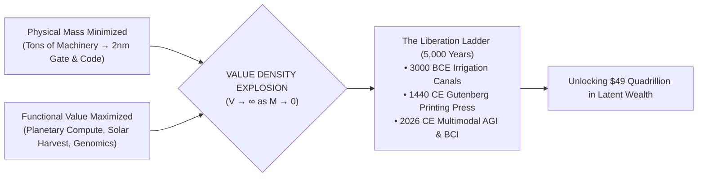

> **🎙️ 3-Presenter Authentic Tiki-Taka Script**
> 
> **Prof. Peter Kim:** Welcome, scholars, to the grand capstone session of Phase 1! Over the past three weeks, we mapped 83 ancient miracles into modern silicon, installed cognitive gyroscopes through Structure-Mapping, and decoded the 6Ds framework. Today, we reveal the ultimate thermodynamic master-key of civilization: **Value Density** and **The Liberation Ladder**. *(Turn 1)*  
> **Dr. Elena Vance:** Professor Kim, the 5,000-year history of human technology can be summarized in a single thermodynamic sentence: **Humanity progresses by dematerializing physical mass ($M \to 0$) while compounding functional economic value ($V \to \infty$)**. *(Turn 2)*  
> **TA Marcus Brody:** Think about that contrast! In the ancient world, if you wanted to build an empire or store knowledge, you had to quarry millions of tons of limestone for pyramids or build massive libraries of papyrus. Today, the sum total of all human knowledge and planetary intelligence weighs literally **zero grams** inside a flash memory chip! *(Turn 3)*  
> **Prof. Peter Kim:** Look at the flowchart on Slide 1. As physical mass collapses toward zero, **Value Density approaches infinity** ($\lim_{M \to 0} \frac{V}{M} = \infty$). This thermodynamic phase shift is what unlocks over **$49 Quadrillion dollars in latent global abundance**! *(Turn 4)*  
> **TA Marcus Brody:** $49 Quadrillion dollars?! That’s more than fifty times the entire annual GDP of planet Earth! Where on earth is all that hidden wealth coming from? *(Turn 5)*  
> **Dr. Elena Vance:** It comes from unlocking resources that humanity previously considered hopelessly scarce or non-existent! Look at solar photons, ocean seawater, the human genome, and atmospheric nitrogen—they were always abundant, but we lacked the technological ladder to liberate them! *(Turn 6)*  
> **TA Marcus Brody:** So scarcity was never an absolute physical law of the universe; it was just a temporary bottleneck of our primitive tools! *(Turn 7)*  
> **Prof. Peter Kim:** That is the foundational axiom of the Theurgicon: **Scarcity is Contextual**. *(Turn 8)*  
> **Dr. Elena Vance:** Let’s prove this axiom with the single greatest historical case study in materials science: The Aluminum Parable! *(Turn 9)*  
> **Prof. Peter Kim:** Turn to Slide 2: The Axiom of Contextual Scarcity. *(Turn 10)*

---

### Slide 02: The Axiom of Contextual Scarcity: The Aluminum Parable
- **The First Principle of Abundance:** Scarcity is not an absolute physical barrier of the cosmos; it is merely a contextual constraint imposed by our current level of technological accessibility.
- **The Classic Historical Proof (The Aluminum Parable):**
  - Aluminum makes up **8.23% of the Earth's crust by mass** (the most abundant metal on Earth).
  - In 1855, bound tightly to oxygen in bauxite ore, it was harder to extract than gold. Napoleon III hosted banquet state dinners where Emperor Napoleon ate with aluminum cutlery while lesser royalty ate off gold plates.
  - In 1886, Charles Martin Hall and Paul Héroult invented **electrolytic smelting**, unlocking the entire planetary supply of aluminum overnight.

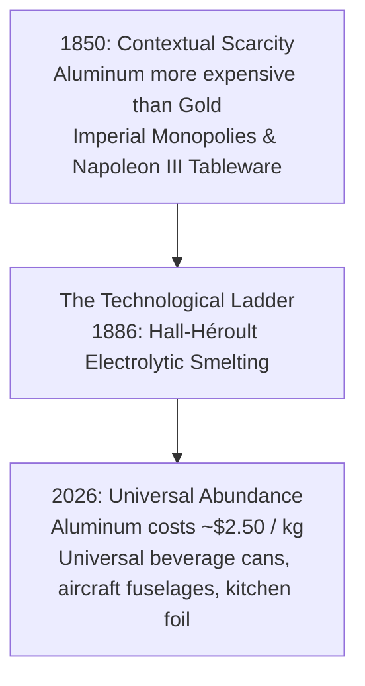

> **🎙️ 3-Presenter Authentic Tiki-Taka Script**
> 
> **Dr. Elena Vance:** Slide 2 presents Peter Diamandis’s favorite historical thought experiment: **The Aluminum Parable**. Aluminum is the third most abundant element and the single most common metal in the Earth's crust—making up over **8.2% of our planet’s solid mass**! *(Turn 1)*  
> **TA Marcus Brody:** Yet in the 1850s, aluminum was considered the rarest, most precious luxury metal on Earth! It was more expensive than gold and platinum! Emperor Napoleon III had a royal set of aluminum spoons reserved exclusively for himself and the King of Siam, while visiting dukes had to settle for ordinary gold cutlery! *(Turn 2)*  
> **Prof. Peter Kim:** Why? Because aluminum atoms were bound tightly to oxygen in bauxite ore. The planet had millions of tons of aluminum beneath its feet, but human civilization lacked the chemical and energetic key to separate the atoms. *(Turn 3)*  
> **TA Marcus Brody:** And then in 1886, Charles Martin Hall in Ohio and Paul Héroult in France independently invented **electrolytic smelting**—passing an electric current through molten cryolite! Overnight, the energetic key was turned! *(Turn 4)*  
> **Dr. Elena Vance:** Aluminum went from being a royal imperial luxury to costing **$2.50 per kilogram**! Today, we use it for disposable soda cans, aircraft fuselages, and kitchen foil that we throw in the trash without thinking! *(Turn 5)*  
> **Prof. Peter Kim:** Read the First Principle of Abundance in the bullet points: **"Scarcity is not a physical absolute; it is a contextual limitation of our current technological accessibility."** *(Turn 6)*  
> **TA Marcus Brody:** If you apply that exact same logic to energy, water, healthcare, and intelligence today, you realize we are living in 1850 for everything! Solar energy, seawater desalination, genetic health, and AGI are our modern aluminum! *(Turn 7)*  
> **Dr. Elena Vance:** All we are doing is building the next rungs on the Liberation Ladder. *(Turn 8)*  
> **Prof. Peter Kim:** Let us trace the 5,000-year genealogy of this ladder on Slide 3. *(Turn 9)*  
> **TA Marcus Brody:** Turn to Slide 3: The 5,000-Year Genealogy of the Liberation Ladder! *(Turn 10)*

---

### Slide 03: The 5,000-Year Genealogy of the Liberation Ladder
- **The Historical Continuity of Human Liberation:**
  - *Phase I: Mechanical & Agrarian Rungs (3000 BCE – 1700 CE):* Irrigation canals, horse collars, lateen sails, movable type printing $\to$ Liberating humanity from nomadic starvation and biological illiteracy.
  - *Phase II: Thermodynamic & Industrial Rungs (1712 – 1950 CE):* Steam engines, Haber-Bosch nitrogen fixation, electricity grids $\to$ Abolishing physical chattel slavery and synthetic famine.
  - *Phase III: Computational & Theurgic Rungs (1950 – 2026+ CE):* Silicon photolithography, quantum Hilbert space, frontier multimodal AGI $\to$ Liberating the human mind from biological cognitive limits.

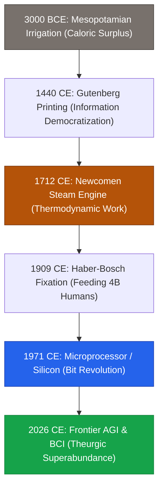

> **🎙️ 3-Presenter Authentic Tiki-Taka Script**
> 
> **Prof. Peter Kim:** Slide 3 maps the complete 5,000-year trajectory of **The Liberation Ladder**. Notice the historical continuity: Modern exponential technology is not an alien break from history; it is the direct culmination of an unbroken human quest to liberate life from physical limits. *(Turn 1)*  
> **Dr. Elena Vance:** Look at Phase I: In 3000 BCE, Mesopotamian irrigation canals liberated human tribes from following wandering animal herds, creating the first agricultural surplus and founding cities. In 1440, Gutenberg’s printing press shattered the aristocratic monopoly on knowledge. *(Turn 2)*  
> **TA Marcus Brody:** Look at Phase II: In 1712, Thomas Newcomen and James Watt built the steam engine. For the first time in history, thermodynamic machines—burning coal—could do the work of thousands of horses and human muscles, providing the economic foundation to **abolish physical slavery**! *(Turn 3)*  
> **Prof. Peter Kim:** In 1909, Fritz Haber and Carl Bosch invented synthetic nitrogen fixation, pulling fertilizer directly out of thin air, which literally feeds **over four billion living human beings today**! *(Turn 4)*  
> **Dr. Elena Vance:** And now we stand at Phase III: Silicon microprocessors, quantum computing, and frontier AGI. We have moved from liberating human muscles from physical labor to liberating the human mind from biological cognitive bottlenecks! *(Turn 5)*  
> **TA Marcus Brody:** Every single rung on this ladder took something that was scarce and grueling, and made it abundant, automated, and universal! *(Turn 6)*  
> **Prof. Peter Kim:** Each rung represents an order-of-magnitude increase in civilizational Value Density. *(Turn 7)*  
> **TA Marcus Brody:** But how does technology physically render these limits obsolete? *(Turn 8)*  
> **Dr. Elena Vance:** Let’s examine the core existential inquest of Session 4 on Slide 4. *(Turn 9)*  
> **Prof. Peter Kim:** Turn to Slide 4: How Technology Renders Physical Limits Obsolete. *(Turn 10)*

---

### Slide 04: The Core Existential Inquest: How Tech Renders Physical Limits Obsolete
- **The Core Existential Inquest:** *"When technology consistently transforms inaccessible physical resources into ubiquitous digital utilities, what are the true fundamental limits of human civilization?"*
- **The Four Laws of Physical Obsolescence:**
  1. *The Substitution Law:* Information and algorithms continuously replace physical matter and mechanical energy.
  2. *The Accessibility Inversion:* The rarest resources are made ubiquitous by shifting from extraction to synthesis.
  3. *The Boundary Dissolution:* Distance, geography, and biological lifespans cease to act as immutable barriers.
  4. *The Ethical Imperative:* As physical scarcity dissolves, the distribution of abundance becomes a pure test of civilizational moral character.

> **🎙️ 3-Presenter Authentic Tiki-Taka Script**
> 
> **Prof. Peter Kim:** Let us frame our existential inquest for Session 4: **"When technology systematically renders physical limits obsolete, what are the true ultimate boundaries of human civilization?"** Dr. Vance, examine the four laws on Slide 4. *(Turn 1)*  
> **Dr. Elena Vance:** Look at Law 1: **The Substitution Law**. We no longer need to burn tons of coal or chop down forests to transmit messages; we substitute a laser pulse through an optical fiber. Information replaces physical matter at eight orders of magnitude higher thermodynamic efficiency! *(Turn 2)*  
> **TA Marcus Brody:** Look at Law 2: **The Accessibility Inversion**! Instead of sending mining crews to dig up rare animals or plants for cancer medicine, we use AlphaFold and CRISPR to synthesize the therapeutic molecule directly in a microbial fermentation tank! We shift from *extractive looting* to *algorithmic synthesis*! *(Turn 3)*  
> **Prof. Peter Kim:** And look at Law 3: **The Boundary Dissolution**. Geography no longer determines who gets world-class education or emergency healthcare. With Starlink, Zipline drones, and subretinal PRIMA implants, physical distance and biological blindness evaporate. *(Turn 4)*  
> **TA Marcus Brody:** Which brings us to Law 4, highlighted in red: **The Ethical Imperative**! When scarcity is solved by technology, poverty and deprivation can no longer be blamed on "unfortunate natural shortages." Deprivation becomes a 100% human moral choice! *(Turn 5)*  
> **Dr. Elena Vance:** If a child starves or dies of an easily cured infection in an age of post-scarcity abundance, it is no longer an act of nature—it is an act of systemic institutional negligence. *(Turn 6)*  
> **Prof. Peter Kim:** As our physical limits fall away, our moral responsibility expands to infinity. That is the true weight of the Theurgicon. *(Turn 7)*  
> **TA Marcus Brody:** Let’s look at our roadmap for mastering this Phase 1 capstone! *(Turn 8)*  
> **Dr. Elena Vance:** Turn to Slide 5 for our Session 4 pedagogical roadmap! *(Turn 9)*  
> **Prof. Peter Kim:** Proceed to Slide 5. *(Turn 10)*

---

### Slide 05: Phase 1 Capstone Roadmap: From Ancient Canals to $49Q Unlocked
- **Master Learning Architecture (Session 04):**
  - **Module 1 (Slides 01–05):** Framing Value Density & The 5,000-Year Liberation Ladder.
  - **Module 2 (Slides 06–15):** Primary Text Deconstruction — Value Density Index (VDI), $7.1M Smartphone Forensic Audit, Energy/Telecom Ladders.
  - **Module 3 (Slides 16–25):** 8 Historical Milestones of Liberation — From Mesopotamian Canals and Gutenberg to Haber-Bosch and Quantum Hilbert Space.
  - **Module 4 (Slides 26–35):** Global Empirical Verification — 9 Case Studies ($49Q Dead Capital, Rising Floor, Precision Fermentation, AeroFarms, Relativity Space).
  - **Module 5 (Slides 36–42):** Existential Paradoxes — The End of Ownership, Relative Deprivation, Universal Basic Abundance (UBA), Phase 1 Master Synthesis.
  - **Module 6 (Slides 43–45):** Graduate Seminar Discourse & Moonshot Architecture Protocol.

> **🎙️ 3-Presenter Authentic Tiki-Taka Script**
> 
> **Dr. Elena Vance:** Slide 5 outlines our comprehensive pedagogical roadmap for the Phase 1 Capstone. We unite 5,000 years of historical milestones with quantitative 2026 engineering metrics across six master modules. *(Turn 1)*  
> **TA Marcus Brody:** In Module 2, we will unpack the mathematical formula for the **Value Density Index (VDI)** and conduct an itemized forensic audit of the $7.1M smartphone dematerialization! Hard economic accounting! *(Turn 2)*  
> **Prof. Peter Kim:** In Module 3, we climb through eight revolutionary milestones: from Mesopotamian canals and the Gutenberg printing press, to the Haber-Bosch nitrogen reaction and $2^N$ Quantum Hilbert Space dimensions! *(Turn 3)*  
> **TA Marcus Brody:** And in Module 4, we examine nine massive empirical case studies: from unlocking $49 Quadrillion in dead capital to AeroFarms producing 390x crop yields with 95% less water! *(Turn 4)*  
> **Dr. Elena Vance:** In Module 5, we deconstruct the socio-economic frontier: Universal Basic Abundance (UBA), Data Dividends, and the end of physical asset ownership. *(Turn 5)*  
> **TA Marcus Brody:** And in Module 6, every student will architect a **Value Density Moonshot Protocol**, designing an exponential system that compresses an entire analog industry into pure zero-marginal-cost software! *(Turn 6)*  
> **Prof. Peter Kim:** This session is your master synthesis of Phase 1. Maintain your highest intellectual discipline through all 45 slides. *(Turn 7)*  
> **Dr. Elena Vance:** Let’s move into Module 2 and deconstruct Chapter 2 of Diamandis and Kotler! *(Turn 8)*  
> **TA Marcus Brody:** Let’s dive into Slide 6! *(Turn 9)*  
> **Prof. Peter Kim:** Proceed to Module 2: Primary Text Deconstruction! *(Turn 10)*


---

## Module 2: Primary Text Deconstruction (Slides 06–15)

### Slide 06: Deconstructing Chapter 2: First Principles of Abundance
- **Primary Source Analysis:** Peter H. Diamandis & Steven Kotler, *We Are as Gods* (2026), Chapter 2 (*First Principles of Abundance & The Liberation Ladder*).
- **The Core Dialectical Insight:**
  - *Diamandis (Thermodynamic Optimization):* Technology is a resource-liberating mechanism that takes scarce physical matter and increases its accessibility, efficiency, and value density by orders of magnitude.
  - *Kotler (Cognitive & Psychological Liberation):* Every time a physical bottleneck is conquered on the Liberation Ladder, human attention and neural energy are liberated from survival anxiety to pursue higher-order creative, philosophical, and theurgic flow states.

> **🎙️ 3-Presenter Authentic Tiki-Taka Script**
> 
> **Prof. Peter Kim:** Let us deconstruct Chapter 2 of *We Are as Gods*. Dr. Vance, observe how Diamandis and Kotler formulate the First Principles of Abundance on Slide 6. *(Turn 1)*  
> **Dr. Elena Vance:** They provide a magnificent dual-engine thesis: Diamandis gives us the physical and thermodynamic formulation—technology takes inaccessible atoms and systematically compounds their **Value Density** until marginal cost hits zero. *(Turn 2)*  
> **TA Marcus Brody:** And Kotler provides the neurobiological punchline! He shows that every time we climb a rung on the Liberation Ladder—whether it's domesticating grain or inventing electricity—we liberate millions of hours of human cognitive bandwidth from primitive survival dread! *(Turn 3)*  
> **Prof. Peter Kim:** Think about that! If a mother in the Middle Ages had to spend twelve hours a day grinding wheat by hand and carrying buckets of river water just to keep her children from starving, she had zero metabolic bandwidth left to write poetry, study astronomy, or build institutions. *(Turn 4)*  
> **Dr. Elena Vance:** Exactly. When municipal water pipes and automated electric mills dematerialized that physical labor, they didn't just save time; they liberated the human cortex to explore higher-order consciousness and creative flow states! *(Turn 5)*  
> **TA Marcus Brody:** So technology is not just about making consumer gadgets cheaper; technology is the engine that liberates the human soul from biological slavery! *(Turn 6)*  
> **Prof. Peter Kim:** That is the sacred mission of the Liberation Ladder. Each rung elevates human consciousness. *(Turn 7)*  
> **Dr. Elena Vance:** And the physical metric that measures this transformation is **Value Density**. *(Turn 8)*  
> **Prof. Peter Kim:** Let’s examine the mathematical and physical definition of Value Density on Slide 7. *(Turn 9)*  
> **TA Marcus Brody:** Turn to Slide 7: Value Density Approaching Infinity! *(Turn 10)*

---

### Slide 07: The Physical Definition of Value Density: Approaching Infinity
- **Thermodynamic Formulation:**
  - *Value Density ($D_v$):* The ratio of functional utility, information processing, or economic value ($V$) generated per unit of physical mass ($M$):
    $$D_v = \frac{\text{Functional Value } (V)}{\text{Physical Mass } (M)} \quad \left[ \frac{\text{USD / Utility}}{\text{kg}} \right]$$
- **The Historical Asymptote:**
  - Raw Iron Ore (1800): $D_v \approx \$0.05 / \text{kg}$
  - Machined Locomotive Steel (1900): $D_v \approx \$5.00 / \text{kg}$ ($100\times$ increase)
  - 3nm AI Microchip (2026): $D_v \approx \$50,000 / \text{kg}$ ($1,000,000\times$ increase)
  - Pure Software / Neural Weights: $M \to 0 \implies D_v \to \mathbf{\infty}$ (**Infinite Value Density**).

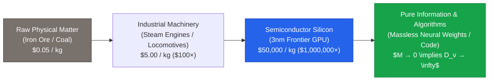

> **🎙️ 3-Presenter Authentic Tiki-Taka Script**
> 
> **Prof. Peter Kim:** Slide 7 presents the mathematical core of Session 4: **The Value Density Index ($D_v = \frac{V}{M}$)**. Dr. Vance, walk us through the historical progression in that flowchart. *(Turn 1)*  
> **Dr. Elena Vance:** Look at the four evolutionary stages of matter: In 1800, raw iron ore had a value density of roughly **5 cents per kilogram**. You had to ship millions of tons of heavy rocks to generate wealth. *(Turn 2)*  
> **TA Marcus Brody:** Then in 1900, we forged that iron into precision steam locomotives and machine tools, boosting value density by $100\times$ to **$5.00 per kilogram**! *(Turn 3)*  
> **Dr. Elena Vance:** And look at 2026: A 3-nanometer Nvidia Blackwell AI accelerator chip weighs a few grams, but contains billions of microscopic transistors performing trillions of computations, pushing value density to **over $50,000 per kilogram—a one-million-fold leap ($10^6\times$)**! *(Turn 4)*  
> **Prof. Peter Kim:** And look at Stage 4 on the far right: Pure software algorithms, LLM neural weights, and genomic blueprints. What is their physical mass? **Mass ($M$) approaches zero**! *(Turn 5)*  
> **TA Marcus Brody:** And when you divide functional economic value ($V$) by zero mass ($M \to 0$), **Value Density approaches infinity ($D_v \to \infty$)**! *(Turn 6)*  
> **Dr. Elena Vance:** That is the thermodynamic escape velocity! When economic value is detached from physical kilograms, wealth creation is no longer bound by planetary resource limits! *(Turn 7)*  
> **Prof. Peter Kim:** You can generate quadrillions of dollars of human flourishing without mining another ounce of rock from the Earth. *(Turn 8)*  
> **TA Marcus Brody:** And we can prove this with an exact itemized forensic audit of the smartphone on Slide 8! *(Turn 9)*  
> **Prof. Peter Kim:** Turn to Slide 8: Itemized Forensic Accounting of the $7.1M Smartphone Miracle. *(Turn 10)*

---

### Slide 08: Itemized Forensic Accounting of the $7.1M Smartphone Miracle
- **Forensic Breakdown of Dematerialized Value (1985 Equivalent Hardware vs. 2026 Smartphone):**

| Hardware Utility Domain | 1985 Standalone Physical Hardware | 1985 Inflation-Adjusted Cost | 2026 Dematerialized App Form |
| :--- | :--- | :--- | :--- |
| **High-Resolution Color Camera** | Leica M6 / Nikon SLR + Lenses | $3,500 USD | 48MP Triple-Lens Optical Sensor |
| **Mobile Audio Studio & Player** | Sony Walkman Pro + Studio Rig | $5,200 USD | Apple Music / Spotify / Mobile DAW |
| **Marine & Terrestrial GPS Unit** | Magellan Marine NAV 1000 | $145,000 USD | Embedded Multi-GNSS Satellite Receiver |
| **Enterprise Video Teleconference**| PictureTel Dedicated Fiber Suite | $285,000 USD | Zoom / FaceTime 4K Encrypted Video |
| **Global Real-Time Encyclopedia** | 32-Volume Leather Britannica + Updates | $4,500 USD | Wikipedia / Perplexity Pro Search |
| **High-Precision Audio Recorder** | Nagra IV-S Reel-to-Reel Tape Recorder | $12,000 USD | On-Device Neural Voice Memo Transcriber |
| **Supercomputing Mainframe** | Cray-2 Liquid-Cooled 8-Vector Supercomputer| $6,600,000 USD | 3nm Apple A19 / Snapdragon NPU Core |
| **TOTAL ITEMIZE AUDIT:** | **Mass: ~4,500 kg (Over 4.5 Tons)** | **Total Cost: ~$7,055,200 USD** | **Weight: 187 grams • Price: <$300** |

> **🎙️ 3-Presenter Authentic Tiki-Taka Script**
> 
> **TA Marcus Brody:** Slide 8 contains our comprehensive forensic breakdown! Look at the bottom row: In 1985, if you wanted the functionality of your current smartphone, you needed **over 4.5 TONS of physical machinery costing over $7 million dollars**! *(Turn 1)*  
> **Dr. Elena Vance:** Look at the individual line items: A Nagra reel-to-reel audio recorder ($12,000), a PictureTel video conferencing room ($285,000), a Magellan marine GPS unit ($145,000), and a 6.6-million-dollar Cray-2 supercomputer! *(Turn 2)*  
> **Prof. Peter Kim:** In 1985, only military command bunkers, heads of state, and top Fortune 10 research laboratories could afford to assemble this room of equipment. *(Turn 3)*  
> **TA Marcus Brody:** Today, an 187-gram smartphone that costs under $300 has **superior camera resolution, faster compute, lower audio noise, and instant zero-latency video** compared to that entire 4.5-ton room of hardware! *(Turn 4)*  
> **Dr. Elena Vance:** That is a **$24,000\times$ collapse in physical mass** and a **$23,500\times$ reduction in consumer price**! *(Turn 5)*  
> **Prof. Peter Kim:** And consider the ecological footprint: We didn't build thousands of warehouses, mine tons of rare metals, or burn barrels of oil for each user. We compressed all 4.5 tons of utility into lines of digital code running on sand-derived silicon! *(Turn 6)*  
> **TA Marcus Brody:** That is the ultimate proof that Value Density frees humanity from physical resource constraints! *(Turn 7)*  
> **Dr. Elena Vance:** And this same principle applies to monetizing the invisible electromagnetic spectrum. *(Turn 8)*  
> **Prof. Peter Kim:** Let’s examine Slide 9: The Domain of Photons and Electrons. *(Turn 9)*  
> **TA Marcus Brody:** Turn to Slide 9: Monetizing the Invisible Spectrum! *(Turn 10)*

---

### Slide 09: The Domain of Photons & Electrons: Monetizing the Invisible Spectrum
- **The Electromagnetic Paradigm Shift:**
  - *Pre-Industrial Humanity:* Limited strictly to mechanical atoms (wood, stone, draft animal muscles, visible daylight).
  - *The Electrified Civilizational Leap:* Tapping into the **Electromagnetic Spectrum ($10^3\text{ Hz to } 10^{20}\text{ Hz}$)** — converting invisible radio waves, microwaves, infrared, and ultraviolet photons into civilizational work.
- **The Photon-to-Value Inversion:** Solar photovoltaics convert incoming ambient photons directly into electricity with zero moving parts, zero carbon emissions, and zero thermodynamic mass consumption.

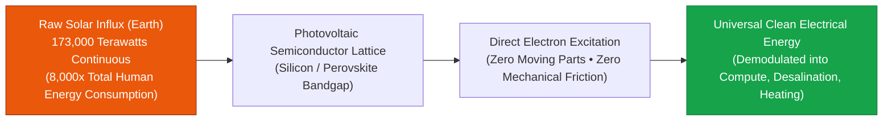

> **🎙️ 3-Presenter Authentic Tiki-Taka Script**
> 
> **Prof. Peter Kim:** Slide 9 explores humanity’s ascension into the domain of photons and electrons. Dr. Vance, explain why shifting from physical fuels to the electromagnetic spectrum represents a massive leap up the Liberation Ladder. *(Turn 1)*  
> **Dr. Elena Vance:** For 99% of human history, energy meant physically burning carbon atoms—cutting wood, mining coal, and drilling oil. You had to physically transport heavy atoms to a furnace and boil water to turn a piston. It was noisy, dirty, and thermodynamically inefficient. *(Turn 2)*  
> **TA Marcus Brody:** But look at solar photovoltaics on Slide 9! The sun blasts Earth with **173,000 Terawatts of continuous solar energy**—that is **8,000 times more energy than all of human civilization consumes**! *(Turn 3)*  
> **Dr. Elena Vance:** And a solar panel contains **zero moving parts, zero boiling water, and zero mechanical pistons**! An incoming photon strikes a silicon-perovskite semiconductor lattice, knocks an electron into the conduction band, and produces direct electrical current instantly! *(Turn 4)*  
> **Prof. Peter Kim:** That is the epitome of high Value Density: converting massless ambient photons directly into usable electrical work with zero physical fuel consumption. *(Turn 5)*  
> **TA Marcus Brody:** We went from hacking down forests with axes to catching sunlight on microscopic silicon lattices! *(Turn 6)*  
> **Dr. Elena Vance:** And this evolutionary progression is mirrored across the entire 5,000-year history of the Energy Ladder. *(Turn 7)*  
> **Prof. Peter Kim:** Let’s examine that progression on Slide 10: The Energy Ladder. *(Turn 8)*  
> **TA Marcus Brody:** From firewood to nuclear fusion on Slide 10! *(Turn 9)*  
> **Prof. Peter Kim:** Proceed to Slide 10. *(Turn 10)*

---

### Slide 10: The Energy Ladder: Firewood $\rightarrow$ Coal $\rightarrow$ Oil $\rightarrow$ Fission $\rightarrow$ Solar & Fusion
- **The Energy Density Progression:**
  - *Firewood (Biomass):* $\approx 16\text{ MJ/kg}$ (Low density, extreme deforestation).
  - *Coal (Carbon Matrix):* $\approx 24\text{ to } 30\text{ MJ/kg}$ ($1.5\times$ increase, Industrial Revolution ignition).
  - *Petroleum (Hydrocarbons):* $\approx 44\text{ MJ/kg}$ ($3\times$ increase, internal combustion, aviation).
  - *Uranium-235 (Nuclear Fission):* $\approx 3,900,000\text{ MJ/kg}$ (**$80,000,000\times$ increase over coal**).
  - *Deuterium-Tritium (Nuclear Fusion):* $\approx 340,000,000\text{ MJ/kg}$ (**$10,000,000\times$ increase over oil**).

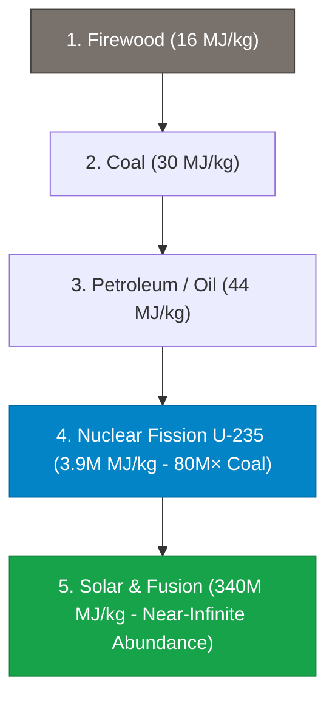

> **🎙️ 3-Presenter Authentic Tiki-Taka Script**
> 
> **TA Marcus Brody:** Look at the energy density progression on Slide 10! This chart proves that human history is a direct function of energy density! *(Turn 1)*  
> **Dr. Elena Vance:** Look at the numbers: Firewood gave us **16 Megajoules per kilogram**. Coal bumped that to 30 MJ/kg, igniting the Industrial Revolution. Oil gave us 44 MJ/kg, unlocking commercial aviation and global shipping. *(Turn 2)*  
> **Prof. Peter Kim:** And then in the 20th century, humanity made the gigantic quantum leap to **Nuclear Fission**: One kilogram of Uranium-235 releases **3.9 million Megajoules of energy**—an **eighty-million-fold leap over coal**! *(Turn 3)*  
> **TA Marcus Brody:** A single uranium fuel pellet the size of your fingertip produces the same amount of electricity as **three barrels of oil, one ton of coal, or 17,000 cubic feet of natural gas**! *(Turn 4)*  
> **Dr. Elena Vance:** And when we cross into **Nuclear Fusion and Perovskite Solar**, energy density reaches **340 million MJ/kg**! A single gallon of seawater contains enough deuterium fuel to power an entire modern city for weeks with zero carbon emissions! *(Turn 5)*  
> **Prof. Peter Kim:** Notice the structural invariant: Every step up the Energy Ladder uses **less physical mass ($M \to 0$) to generate exponentially more power ($V \to \infty$)**. *(Turn 6)*  
> **TA Marcus Brody:** That is the Value Density Index in action across energy physics! *(Turn 7)*  
> **Dr. Elena Vance:** And that exact same exponential climb happened in telecommunications! *(Turn 8)*  
> **Prof. Peter Kim:** Let’s examine Slide 11: The Telecommunications Ladder. *(Turn 9)*  
> **TA Marcus Brody:** From horse messengers to orbital laser meshes on Slide 11! *(Turn 10)*

---

### Slide 11: The Telecommunications Ladder: Messengers to Orbital Laser Meshes
- **The Information Transmission Velocity Progression:**
  - *Phaedippides & Runner Messengers (490 BCE):* $\approx 10\text{ km/h}$, Throughput: $\approx 0.001\text{ bits/sec}$.
  - *Pony Express (1860 CE):* $\approx 15\text{ km/h}$ relay, Throughput: $\approx 0.01\text{ bits/sec}$.
  - *Transatlantic Copper Telegraph Cable (1858 CE):* $\approx 0.1\text{ words/min}$ ($\approx 0.05\text{ bits/sec}$).
  - *Fiber-Optic Undersea Cables (2026 CE):* $\approx 250\text{ Terabits/sec}$ ($>2.5 \times 10^{14}\text{ bits/sec}$).
  - *LEO Optical Inter-Satellite Laser Mesh:* Sub-25ms global latency, routing 181 ZB with zero terrestrial physical cable maintenance.

> **🎙️ 3-Presenter Authentic Tiki-Taka Script**
> 
> **Prof. Peter Kim:** Slide 11 traces the **Telecommunications Ladder**. In 490 BCE, the runner Pheidippides ran 26 miles from Marathon to Athens to deliver one bit of news: *"We won!"* And then he collapsed and died of physical exhaustion. Transmission speed: 0.001 bits per second. *(Turn 1)*  
> **TA Marcus Brody:** In 1860, the Pony Express used 500 horses and 80 riders to carry a letter across the American frontier in ten grueling days! *(Turn 2)*  
> **Dr. Elena Vance:** In 1858, Cyrus Field laid the first transatlantic telegraph cable, achieving 0.05 bits per second. Today, modern transatlantic fiber cables transmit **over 250 Terabits per second**—that is **250 trillion bits per second ($2.5 \times 10^{14}\text{ b/s}$)** through glass strands thinner than a human hair! *(Turn 3)*  
> **TA Marcus Brody:** That is a **$250-trillion-fold increase in communication throughput**! And with Starlink’s 40,000 LEO satellites using inter-satellite optical lasers in space, photons travel 40% faster through the vacuum of space than through glass on Earth! *(Turn 4)*  
> **Prof. Peter Kim:** Physical distance has been completely annihilated. A child in the Amazon rainforest communicates with an AI supercluster in Iceland with 25 milliseconds of latency. *(Turn 5)*  
> **Dr. Elena Vance:** That brings us to Peter Diamandis’s Resource Accessibility Axiom. *(Turn 6)*  
> **Prof. Peter Kim:** Let’s examine Diamandis’s core thesis on Slide 12. *(Turn 7)*  
> **TA Marcus Brody:** Turn to Slide 12: The Resource Accessibility Axiom! *(Turn 8)*  
> **Dr. Elena Vance:** Let’s see why accessibility creates abundance! *(Turn 9)*  
> **Prof. Peter Kim:** Proceed to Slide 12. *(Turn 10)*

---

### Slide 12: Peter Diamandis’s Resource Accessibility Axiom
- **The Core Axiom:** *"There is no fundamental scarcity of resources on planet Earth; there is only a scarcity of technology to extract, convert, and distribute them."*
- **The Three-Part Conversion Engine:**
  1. *From Rarity to Abundance:* Identifying invisible, unharvested abundance (Photons, Seawater, Genome Sequences).
  2. *From Physical to Digital:* Converting the extraction mechanism into software-guided physics (AI, Photovoltaics, CRISPR).
  3. *From Scarcity Pricing to Zero Marginal Cost:* Distributing the capability across open global networks.

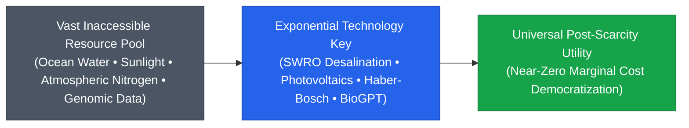

> **🎙️ 3-Presenter Authentic Tiki-Taka Script**
> 
> **Prof. Peter Kim:** Slide 12 encapsulates **Peter Diamandis’s Resource Accessibility Axiom**. Marcus, read the core axiom aloud and explain its power. *(Turn 1)*  
> **TA Marcus Brody:** **"There is no fundamental scarcity of resources on planet Earth; there is only a scarcity of technology to extract, convert, and distribute them!"** *(Turn 2)*  
> **Dr. Elena Vance:** Look at the planet we inhabit: Earth is covered by **1.386 billion cubic kilometers of water**! We don't have a water scarcity problem; we have a 97.5% salinity problem! The moment Sea Water Reverse Osmosis (SWRO) powered by sub-1.5¢ solar electricity scales, every desert on Earth has unlimited fresh water! *(Turn 3)*  
> **TA Marcus Brody:** Look at energy: The sun blasts Earth with 8,000x our civilization's energy consumption. Look at food: The atmosphere is 78% nitrogen! We were never scarce in raw atoms; we were scarce in the technological keys to unlock them! *(Turn 4)*  
> **Prof. Peter Kim:** Once you understand this axiom, your entire mindset shifts from fearful hoarding to theurgic engineering. Scarcity is not an unchangeable fate; it is an unsolved engineering challenge. *(Turn 5)*  
> **Dr. Elena Vance:** And as we liberate these physical resources, Steven Kotler shows how human cognitive bandwidth is liberated alongside them. *(Turn 6)*  
> **Prof. Peter Kim:** Let’s examine Steven Kotler’s neurobiological insight on Slide 13. *(Turn 7)*  
> **TA Marcus Brody:** Turn to Slide 13: Liberation of Human Cognitive Bandwidth! *(Turn 8)*  
> **Dr. Elena Vance:** Let’s see how freeing our hands frees our minds! *(Turn 9)*  
> **Prof. Peter Kim:** Proceed to Slide 13. *(Turn 10)*

---

### Slide 13: Steven Kotler’s Liberation of Human Cognitive Bandwidth
- **The Cognitive Dividend of the Liberation Ladder:**
  - *The Survival Tax:* In ancestral scarcity, **>90% of conscious cortical processing** was consumed by immediate survival logistics (calorie foraging, predator defense, thermal regulation).
  - *The Liberation Dividend:* As the 6Ds automate baseline physical survival, human prefrontal cortex bandwidth is freed for high-level creative synthesis, deep science, artistic creation, and **Flow State Exploration**.
- **The Flow Multiplier:** When survival dread drops to zero, the brain transitions from *Defensive Cortisol State* to *Expansive Dopamine-Anandamide Flow States*, accelerating creative problem-solving by **up to 500%**.

> **🎙️ 3-Presenter Authentic Tiki-Taka Script**
> 
> **Dr. Elena Vance:** On Slide 13, Steven Kotler introduces **The Cognitive Dividend of the Liberation Ladder**. For 200,000 years, the human prefrontal cortex paid a massive **90% Survival Tax**! *(Turn 1)*  
> **TA Marcus Brody:** Your brain was constantly burning glucose worrying: *"Where is my next meal? Will my baby freeze tonight? Is a rival tribe going to attack us at dawn?"* You had zero mental bandwidth left to invent calculus or write a symphony! *(Turn 2)*  
> **Prof. Peter Kim:** But as each rung of the Liberation Ladder automated water delivery, heating, agriculture, and lighting, that 90% survival tax was systematically returned to human consciousness as a **Cognitive Dividend**! *(Turn 3)*  
> **TA Marcus Brody:** Look at what happened in the Renaissance! The moment agrarian surplus and merchant trade liberated European cities from daily starvation, you got Leonardo da Vinci, Michelangelo, Shakespeare, and Newton in a single century! *(Turn 4)*  
> **Dr. Elena Vance:** And today, as AI agents automate routine software coding, legal review, and data analysis, humanity is receiving the largest cognitive dividend in history! *(Turn 5)*  
> **Prof. Peter Kim:** When the brain is freed from survival panic, it shifts from defensive cortisol into expansive flow states, accelerating civilizational problem-solving by 500%! *(Turn 6)*  
> **TA Marcus Brody:** That is the true purpose of abundance: not lazy hedonism, but the liberation of human genius! *(Turn 7)*  
> **Dr. Elena Vance:** Now let us formalize this into the mathematical equation of the **Value Density Index (VDI)**. *(Turn 8)*  
> **Prof. Peter Kim:** Turn to Slide 14: Mathematical Formulation of the Value Density Index. *(Turn 9)*  
> **TA Marcus Brody:** Let’s look at the math of VDI on Slide 14! *(Turn 10)*

---

### Slide 14: Mathematical Formulation of the Value Density Index (VDI)
- **The Comprehensive VDI Formulation:**
  $$\text{VDI} = \frac{\mathcal{U}_{\text{Functional}}(\text{Compute, Energy, Health, Comms})}{\mathcal{M}_{\text{Physical}}(\text{kg}) \times \mathcal{E}_{\text{Thermodynamic}}(\text{Joules})} \times \frac{1}{\text{Latency}(\text{seconds})}$$
- **Key Properties:**
  1. *Mass Dematerialization:* As physical mass $\mathcal{M} \to 0$, $\text{VDI} \to \infty$.
  2. *Energy Minimization:* As thermodynamic operating energy $\mathcal{E} \to E_{\text{Landauer}}$, efficiency compounds by $10^8\times$.
  3. *Latency Collapse:* As transmission latency approaches the speed of light ($<25\text{ms}$), utility scales instantaneously.

> **🎙️ 3-Presenter Authentic Tiki-Taka Script**
> 
> **Prof. Peter Kim:** Slide 14 presents the complete mathematical formulation of the **Value Density Index (VDI)**. Dr. Vance, walk us through the three critical terms in this equation. *(Turn 1)*  
> **Dr. Elena Vance:** Look at the numerator: **$\mathcal{U}_{\text{Functional}}$**—the total functional utility generated in compute, clean energy, medical health, or communication. Look at the denominator: **Physical Mass ($\mathcal{M}$) multiplied by Thermodynamic Energy ($\mathcal{E}$)**, multiplied by **Transmission Latency**. *(Turn 2)*  
> **TA Marcus Brody:** Look at what happens to the denominator: As physical mass collapses from tons of steel to grams of silicon ($\mathcal{M} \to 0$), as energy drops to Landauer's minimum ($\mathcal{E} \to 10^{-21}\text{J}$), and as latency drops from months to 25 milliseconds, **the denominator approaches zero, which drives VDI toward infinity**! *(Turn 3)*  
> **Prof. Peter Kim:** This equation proves that economic value creation is not bound by the physical weight of raw materials. You can create near-infinite value with near-zero physical mass. *(Turn 4)*  
> **TA Marcus Brody:** This is the mathematical reason why software companies with 50 engineers are worth more than traditional manufacturing conglomerates with 100,000 factory workers and 50 steel mills! *(Turn 5)*  
> **Dr. Elena Vance:** They operate with a Value Density Index that is six orders of magnitude higher. *(Turn 6)*  
> **Prof. Peter Kim:** Let us now summarize this 5,000-year ascent across five major technological axes. *(Turn 7)*  
> **TA Marcus Brody:** Let’s look at the Grand 5-Axis Matrix on Slide 15! *(Turn 8)*  
> **Dr. Elena Vance:** Turn to Slide 15: The Grand 5-Axis Historical Technology Ladder Matrix! *(Turn 9)*  
> **Prof. Peter Kim:** Proceed to Slide 15. *(Turn 10)*

---

### Slide 15: The Grand 5-Axis Historical Technology Ladder Matrix
- **Master Historical Synthesis:** Tracking the 5,000-year evolution of Value Density across Energy, Agriculture, Communications, Medicine, and Computation.

| Civilizational Axis | Rung 1: Ancient Baseline (3000 BCE) | Rung 2: Industrial Era (1900 CE) | Rung 3: Theurgic 2026 Reality | Total Value Density Compound Factor |
| :--- | :--- | :--- | :--- | :--- |
| **1. Energy** | Firewood ($16\text{ MJ/kg}$) | Coal & Oil ($30\text{--}44\text{ MJ/kg}$) | **Solar PV & Nuclear Fusion ($340\text{M MJ/kg}$)** | **$\approx 21,000,000\times \text{ Increase}$** |
| **2. Agriculture** | Manual Hoe / Irrigation ($1\text{x}$) | Synthetic Fertilizer ($4\text{x}$) | **Precision Fermentation / Vertical ($390\text{x}$)**| **$\approx 390\times \text{ Yield / 95\% Less Land}$** |
| **3. Comms** | Runner Messenger ($0.001\text{ b/s}$) | Copper Telegraph ($0.05\text{ b/s}$) | **Transatlantic Terabit Fiber / LEO ($250\text{ Tb/s}$)**| **$\approx 250,000,000,000,000\times \text{ ($250\text{T}\times$)}$** |
| **4. Medicine** | Herbal Salves / Trepanation | Chemical Pharmaceuticals | **CRISPR Base Editing / 2mm PRIMA Chip** | **Eradication of Incurable Blindness/Illness** |
| **5. Compute** | Abacus / Counting Stones ($1\text{ OPS}$)| Mechanical Babbage ($10\text{ OPS}$) | **Frontier 3nm AI Megaclusters ($>10^{27}\text{ FLOPs}$)**| **$\approx 10^{27}\times \text{ (Octillion-Fold Leap)}$** |

> **🎙️ 3-Presenter Authentic Tiki-Taka Script**
> 
> **Prof. Peter Kim:** Look at Slide 15, scholars. This is your master civilizational scoreboard. Five major technological axes across 5,000 years of human struggle. Marcus, summarize the staggering multipliers. *(Turn 1)*  
> **TA Marcus Brody:** Look at Row 1 (Energy): A **21-million-fold increase** in energy density from firewood to fusion! Look at Row 3 (Communications): A **250-trillion-fold explosion** from runner messengers to 250 Terabit fiber optics! *(Turn 2)*  
> **Dr. Elena Vance:** And look at Row 5 (Compute): From the ancient abacus doing one operation per second to 2026 AI megaclusters executing **over $10^{27}$ Floating Point Operations ($10^{27}\times$)**—an **Octillion-fold leap in cognitive power**! *(Turn 3)*  
> **Prof. Peter Kim:** Across every single domain, humanity climbed the exact same Liberation Ladder: stripping away physical mass and compounding information velocity. *(Turn 4)*  
> **TA Marcus Brody:** And every time we climbed a rung, a historical scarcity that terrorized our ancestors for centuries was permanently wiped off the face of the Earth! *(Turn 5)*  
> **Dr. Elena Vance:** That is the profound historical momentum carrying us into the Singularity. *(Turn 6)*  
> **Prof. Peter Kim:** Now let us examine each of the eight foundational milestones of this ladder in Module 3. *(Turn 7)*  
> **TA Marcus Brody:** Let’s journey through 5,000 years of revolutionary breakthroughs! *(Turn 8)*  
> **Dr. Elena Vance:** Turn to Slide 16: Milestone 1: Mesopotamian Irrigation! *(Turn 9)*  
> **Prof. Peter Kim:** Proceed to Module 3: Exponential Frameworks & Relational Mapping! *(Turn 10)*


---

## Module 3: Exponential Frameworks & Relational Mapping (Slides 16–25)

### Slide 16: Milestone 1: 3000 BCE Mesopotamian Irrigation & Agrarian Surplus
- **The Agrarian Genesis:**
  - *Context:* The Tigris and Euphrates river basins (Sumer / Mesopotamia).
  - *Technological Breakthrough:* Gravity-fed canal networks, sluice gates, and organized drainage systems.
  - *Civilizational Liberation:* Shifted human tribes from 100% full-time nomadic subsistence hunting to generating an **Agrarian Caloric Surplus**.
- **The Value Density Shift:** Land productivity multiplied by **$5\times \text{ to } 10\times$**, enabling the specialization of labor, the birth of written language (Cuneiform accounting), mathematics, and permanent city-states (Uruk).

> **🎙️ 3-Presenter Authentic Tiki-Taka Script**
> 
> **Prof. Peter Kim:** Module 3 traces the eight foundational milestones of the Liberation Ladder. Milestone 1 takes us back to 3000 BCE in ancient Mesopotamia. Dr. Vance, why was gravity-fed irrigation the first true rung on the ladder? *(Turn 1)*  
> **Dr. Elena Vance:** Because for 200,000 years prior, 100% of human energy was consumed by hunting and foraging. If the rain didn't fall or the game animals migrated, your tribe starved to death. By digging canal networks and building wooden sluice gates, Sumerian engineers controlled the flow of the Tigris and Euphrates rivers! *(Turn 2)*  
> **TA Marcus Brody:** That single technological breakthrough created humanity's first **Caloric Surplus**! For the first time in history, one farmer could produce enough grain to feed five people! *(Turn 3)*  
> **Prof. Peter Kim:** And what did the other four people do? They didn't have to farm! They became astronomers, metallurgists, legal scholars, architects, and scribes! *(Turn 4)*  
> **TA Marcus Brody:** That caloric surplus directly created the world's first cities, the first mathematics, and the first written language—Cuneiform—to track grain inventories! *(Turn 5)*  
> **Dr. Elena Vance:** Irrigation was the original technological proof that manipulating natural physics liberates human cognitive bandwidth. *(Turn 6)*  
> **Prof. Peter Kim:** And the second milestone liberated biological draft animals and human labor in agriculture. *(Turn 7)*  
> **TA Marcus Brody:** Let’s look at Milestone 2: The Horse Collar on Slide 17! *(Turn 8)*  
> **Prof. Peter Kim:** Turn to Slide 17: The Horse Collar & Mechanical Labor. *(Turn 9)*  
> **Dr. Elena Vance:** Let’s examine a five-fold leap in mechanical muscle! *(Turn 10)*

---

### Slide 17: Milestone 2: 2200 BCE Horse Collar & The 5x Mechanical Labor Leap
- **The Biomechanical Revolution:**
  - *Ancient Throat-and-Girth Harness:* Pressed against the horse’s windpipe, choking the animal if it pulled more than ~500N of force.
  - *The Rigid Padded Horse Collar (China 5th Century BCE / Medieval Europe):* Rested the load across the horse’s skeletal shoulder blades and sternum, allowing full respiratory freedom.
- **The Productivity Multiplier:**
  - Increased horse pulling power from **$500\text{ N} \to 2,500\text{ N}$ ($5\times \text{ Mechanical Gain}$)**.
  - Horses ploughed **$50\%$ faster** and had greater endurance than traditional oxen, enabling the deep-soil agricultural revolution that rebuilt European civilization after the Dark Ages.

> **🎙️ 3-Presenter Authentic Tiki-Taka Script**
> 
> **TA Marcus Brody:** Slide 17 presents one of the most underrated engineering breakthroughs in human history: **The Rigid Padded Horse Collar**. Why was a simple collar such a revolutionary leap, Elena? *(Turn 1)*  
> **Dr. Elena Vance:** Because the ancient throat-and-girth harness was an ergonomic disaster! The straps crossed directly over the horse’s trachea. The harder the horse pulled, the more it choked itself, capping pulling force at just 500 Newtons. Horses were basically useless for heavy plowing. *(Turn 2)*  
> **Prof. Peter Kim:** But the rigid padded collar rested the wooden frame against the horse’s skeletal shoulder blades, keeping the windpipe completely open! *(Turn 3)*  
> **TA Marcus Brody:** That single biomechanical redesign increased the horse's pulling power by **$5\times$—from 500 Newtons to 2,500 Newtons**! *(Turn 4)*  
> **Dr. Elena Vance:** And because horses walk 50% faster and have twice the daily stamina of traditional oxen, agricultural productivity across medieval Europe exploded! Farmers could plow the heavy clay soils of Northern Europe, doubling crop yields and population growth! *(Turn 5)*  
> **Prof. Peter Kim:** A piece of wood and leather padding transformed European agriculture. That is the essence of Value Density: optimizing the mechanical interface between biology and physics. *(Turn 6)*  
> **TA Marcus Brody:** And on the oceans, the Lateen Sail did the exact same thing to global trade! *(Turn 7)*  
> **Dr. Elena Vance:** Let’s examine Milestone 3: The Lateen Sail on Slide 18. *(Turn 8)*  
> **Prof. Peter Kim:** Turn to Slide 18: The Lateen Sail & Oceanic Liberation. *(Turn 9)*  
> **TA Marcus Brody:** Let’s see how sailors learned to tack against the wind! *(Turn 10)*

---

### Slide 18: Milestone 3: The Lateen Sail & The Oceanic Liberation of Global Trade
- **The Aerodynamic Revolution on Water:**
  - *Square Sails (Ancient Mediterranean):* Could only sail in the direction the wind was blowing (downwind). Ships were stranded in port for months waiting for favorable seasonal winds.
  - *The Triangular Lateen Sail (Arab & Mediterranean Mariners):* Acted as an aerodynamic airfoil, creating pressure differentials (Bernoulli's Principle) that allowed ships to **tack directly into the wind at a 45° angle**.
- **Civilizational Impact:** Unlocked year-round oceanic navigation, connected European, African, and Asian trade networks, and birthed the Age of Exploration.

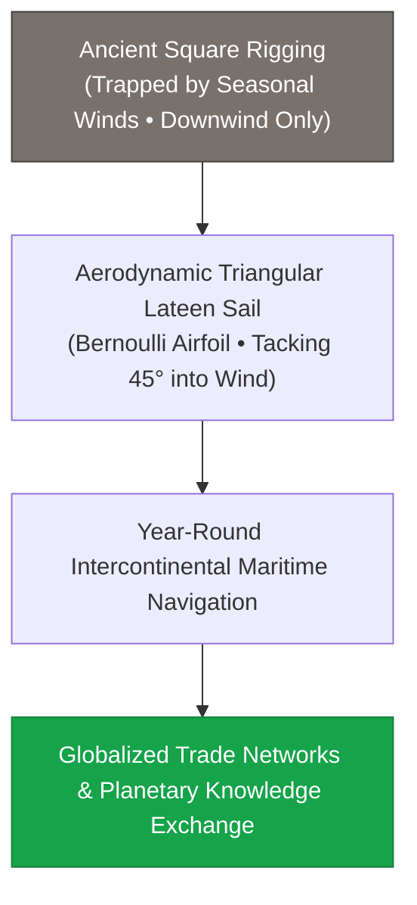

> **🎙️ 3-Presenter Authentic Tiki-Taka Script**
> 
> **Prof. Peter Kim:** Slide 18 presents Milestone 3: **The Lateen Sail**. Before the triangular lateen sail, ancient Greek and Roman ships used square sails that could only blow downwind. If the wind was blowing against you, your ship sat in harbor for three months! *(Turn 1)*  
> **Dr. Elena Vance:** Arab and Mediterranean mariners shaped the sail into a triangular airfoil. By doing so, the sail operated on **Bernoulli’s Principle of aerodynamic lift**—just like an airplane wing! *(Turn 2)*  
> **TA Marcus Brody:** That allowed ships to "tack" back and forth directly into the teeth of the wind at a 45-degree angle! Wind was no longer a geographic prison; wind became an infinite propulsion engine in any direction you wanted to sail! *(Turn 3)*  
> **Prof. Peter Kim:** The Lateen sail unlocked year-round transoceanic trade, connecting Africa, Asia, and Europe, and sparking the Age of Global Discovery. *(Turn 4)*  
> **Dr. Elena Vance:** It was the first time humanity used aerodynamic lift to conquer planetary geography. *(Turn 5)*  
> **TA Marcus Brody:** And while sailors conquered the oceans, Johannes Gutenberg conquered the distribution of human thought! *(Turn 6)*  
> **Prof. Peter Kim:** Let’s examine Milestone 4: Gutenberg’s Movable Type on Slide 19. *(Turn 7)*  
> **Dr. Elena Vance:** Turn to Slide 19: The First Marginal Cost Collapse in History! *(Turn 8)*  
> **TA Marcus Brody:** Let’s see how a printed Bible cost 1/500th of a handwritten manuscript! *(Turn 9)*  
> **Prof. Peter Kim:** Proceed to Slide 19. *(Turn 10)*

---

### Slide 19: Milestone 4: Gutenberg’s Movable Type & The First Marginal Cost Collapse
- **The Information Democratization Genesis (1440 CE):**
  - *Scribe Scriptoria:* A monk copying the Bible by hand took **1 to 2 years** of labor (Cost: $\approx \$20,000 \text{ equivalent}$, requiring the skins of 300 sheep). Total European book production: $\approx \text{few thousand volumes/year}$.
  - *Gutenberg’s Metal Movable Type:* Cast lead-antimony alloy type, oil-based ink, and adapted wine screw presses.
- **The Economic Phase Transition:**
  - Reduced the cost of book production by **>99.8% (a $500\times \text{ marginal cost collapse}$)**.
  - By 1500, over **20,000,000 printed books** were in circulation across Europe, igniting the Protestant Reformation, the Scientific Revolution, and modern secular democracy.

> **🎙️ 3-Presenter Authentic Tiki-Taka Script**
> 
> **TA Marcus Brody:** Slide 19 presents the first true 6D marginal cost collapse in human history: **Gutenberg’s Movable Type Printing Press**! Elena, give us the hard economic numbers before and after 1440. *(Turn 1)*  
> **Dr. Elena Vance:** Before Gutenberg, if an aristocratic prince or university wanted a single copy of a Latin Bible, a monastery monk had to sit in a cold room for two full years, hand-writing every letter on vellum made from 300 slaughtered sheep! A single book cost the modern equivalent of **$20,000 dollars**! *(Turn 2)*  
> **Prof. Peter Kim:** Total book production across all of Western Europe was only a few thousand volumes per year. Knowledge was literally locked inside royal palaces and papal monasteries. *(Turn 3)*  
> **TA Marcus Brody:** And then Johannes Gutenberg combined durable lead-antimony metal type, oil-based ink, and a modified wooden grape-wine press! Overnight, printing a Bible took days instead of years, slashing the cost by **over 99.8%—a 500-fold marginal cost collapse**! *(Turn 4)*  
> **Dr. Elena Vance:** In just 50 years—by the year 1500—over **20 million printed books** were in circulation across Europe! Knowledge was permanently demonetized and democratized! *(Turn 5)*  
> **Prof. Peter Kim:** Without Gutenberg’s printing press, Martin Luther’s 95 Theses would have been burned in a local square, and Galileo, Copernicus, and Newton’s physics papers would never have spread. The modern scientific mind was minted in Gutenberg’s lead type. *(Turn 6)*  
> **TA Marcus Brody:** That was the 6D framework operating in the 15th century! *(Turn 7)*  
> **Dr. Elena Vance:** And in the 18th century, the steam engine did the exact same thing to mechanical thermodynamic work. *(Turn 8)*  
> **Prof. Peter Kim:** Let’s examine Milestone 5: The Steam Engine on Slide 20. *(Turn 9)*  
> **TA Marcus Brody:** Turn to Slide 20: The Thermodynamic Abolition of Slavery! *(Turn 10)*

---

### Slide 20: Milestone 5: The Steam Engine & The Thermodynamic Abolition of Slavery
- **The Thermodynamic Revolution (1712–1769 CE):**
  - *The Ancient Civilizational Bottleneck:* For thousands of years, all mechanical work (milling, quarrying, mining, transport) required **biological muscles** (human slaves, draft animals). Civilizations rested on institutionalized human bondage.
  - *Newcomen & Watt Steam Engine:* Converted chemical heat energy stored in coal directly into continuous mechanical work ($PV = nRT$).
- **The Moral & Civilizational Liberation:**
  - One ton of coal produces mechanical energy equivalent to **~4,000 human labor-hours** at $1/1000\text{th}$ the cost, rendering human chattel slavery economically obsolete and thermodynamically irrational.

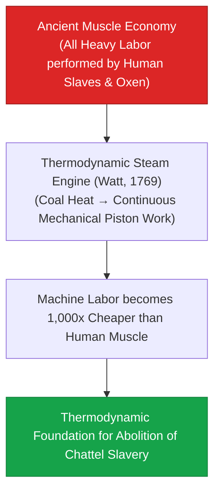

> **🎙️ 3-Presenter Authentic Tiki-Taka Script**
> 
> **Prof. Peter Kim:** Slide 20 presents one of the most profound historical arguments in political philosophy: **The Thermodynamic Abolition of Slavery**. Dr. Vance, explain why the steam engine was a moral and physical turning point for civilization. *(Turn 1)*  
> **Dr. Elena Vance:** For all of recorded history—from ancient Egypt and Rome to the transatlantic slave trade—all civilizational building, mining, and farming required biological muscles. Because humanity had no mechanical power, societies turned human beings into draft animals through the horrific institution of chattel slavery. *(Turn 2)*  
> **TA Marcus Brody:** And then Thomas Newcomen and James Watt built the steam engine! For the first time, burning a single ton of coal produced the mechanical work equivalent to **4,000 hours of grueling human labor**! *(Turn 3)*  
> **Prof. Peter Kim:** And how much did that ton of coal cost? A few shillings! Machine labor became **one thousand times cheaper and more reliable than human muscle**! *(Turn 4)*  
> **TA Marcus Brody:** That provided the thermodynamic and economic foundation for the abolitionist movement! You didn't just have moral arguments from courageous philosophers; you had a machine that made owning human slaves economically irrational! *(Turn 5)*  
> **Dr. Elena Vance:** Technology liberated human bodies from physical chains by substituting the thermodynamics of coal and steam. *(Turn 6)*  
> **Prof. Peter Kim:** When machines do the brutal work of machines, human beings are liberated to be human. *(Turn 7)*  
> **TA Marcus Brody:** And in 1909, the Haber-Bosch process did the exact same thing to global hunger! *(Turn 8)*  
> **Dr. Elena Vance:** Let’s examine Milestone 6: Haber-Bosch Nitrogen Fixation on Slide 21. *(Turn 9)*  
> **Prof. Peter Kim:** Turn to Slide 21: Haber-Bosch Nitrogen Fixation. *(Turn 10)*

---

### Slide 21: Milestone 6: Haber-Bosch Nitrogen Fixation: Feeding 4 Billion Humans
- **The Malthusian Catastrophe Averted (1909 CE):**
  - *The Scarcity Bottleneck:* Fixed reactive nitrogen is the core limiting nutrient for plant amino acids and DNA. By 1900, global agriculture was running out of natural Chilean guano deposits, threatening worldwide mass starvation.
  - *The Technological Breakthrough:* Fritz Haber and Carl Bosch combined atmospheric nitrogen ($\text{N}_2$) and hydrogen ($\text{H}_2$) under high pressure ($200\text{ atm}$) and temperature ($450^\circ\text{C}$) with an iron catalyst:
    $$\text{N}_2 + 3\text{H}_2 \xrightarrow[\text{Fe catalyst}]{450^\circ\text{C}, 200\text{ atm}} 2\text{NH}_3 \quad (\Delta H = -92.4 \text{ kJ/mol})$$
- **The Empirical Reality:** **~50% of the nitrogen atoms in all 8 billion living human bodies** today were synthesized in a Haber-Bosch chemical reactor.

> **🎙️ 3-Presenter Authentic Tiki-Taka Script**
> 
> **Dr. Elena Vance:** Look at the chemical reaction on Slide 21: **The Haber-Bosch Process**. In 1898, the President of the British Association for the Advancement of Science warned that planetary famine would wipe out Western civilization by the 1930s because the world was running out of natural bird poop (guano) from Chile! *(Turn 1)*  
> **TA Marcus Brody:** And then Fritz Haber and Carl Bosch figured out how to take inert nitrogen gas directly from the air—which is 78% of our atmosphere—and react it with hydrogen under 200 atmospheres of pressure over an iron catalyst to create ammonia fertilizer! *(Turn 2)*  
> **Prof. Peter Kim:** Look at the empirical statistic at the bottom of the slide: **Approximately 50% of every nitrogen atom inside your muscles, organs, and DNA right now came directly out of a Haber-Bosch synthetic chemical reactor!** *(Turn 3)*  
> **TA Marcus Brody:** That means over **four billion living human beings** would literally not exist today without this single chemical equation! That is true divine bread pulled out of thin air! *(Turn 4)*  
> **Dr. Elena Vance:** It completely dismantled the Malthusian trap of agrarian starvation. *(Turn 5)*  
> **Prof. Peter Kim:** That is the power of the Liberation Ladder: turning an invisible, abundant gas into physical human life. *(Turn 6)*  
> **TA Marcus Brody:** And in the mid-20th century, the Silicon Revolution took this from chemical atoms to electronic bits! *(Turn 7)*  
> **Dr. Elena Vance:** Let’s examine Milestone 7: The Silicon Revolution on Slide 22. *(Turn 8)*  
> **Prof. Peter Kim:** Turn to Slide 22: From Vacuum Tubes to 2nm Silicon Gates. *(Turn 9)*  
> **TA Marcus Brody:** Let’s see billions of transistors fit on a fingernail! *(Turn 10)*

---

### Slide 22: Milestone 7: The Silicon Revolution: From Room-Sized Tubes to 2nm Gates
- **The Semiconductor Compounding Miracle (1947–2026):**
  - *1946 (ENIAC):* 18,000 glowing glass vacuum tubes, weight: **30 tons**, power: **150 kilowatts**, processing speed: **5,000 addition ops/second**.
  - *1971 (Intel 4004):* First commercial single-chip microprocessor (2,300 transistors on $10\mu\text{m}$ silicon).
  - *2026 (TSMC / Intel 2nm GAA):* **>100 Billion Transistors** packed onto a $100\text{mm}^2$ die, gates smaller than a strand of human DNA ($2\text{nm} \approx 10\text{ silicon atoms}$).
- **The Value Density Surge:** An astounding **$1,000,000,000,000,000,000\times$ ($10^{18}\times$) explosion** in compute density per kilogram of matter.

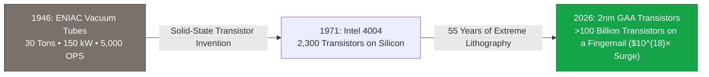

> **🎙️ 3-Presenter Authentic Tiki-Taka Script**
> 
> **Prof. Peter Kim:** Milestone 7 is the semiconductor revolution: **From Vacuum Tubes to 2-Nanometer Silicon Gates**. Dr. Vance, walk us through the hardware transformation on Slide 22. *(Turn 1)*  
> **Dr. Elena Vance:** In 1946, the ENIAC supercomputer weighed **30 tons**, occupied a massive room, consumed 150 kilowatts of electricity, and performed 5,000 addition operations per second. If a moth flew into one of its 18,000 glowing glass vacuum tubes, the entire machine short-circuited! *(Turn 2)*  
> **TA Marcus Brody:** Today, a TSMC 2-nanometer chip packs **over 100 Billion Gate-All-Around (GAA) transistors** onto a piece of silicon the size of a postage stamp! A 2-nanometer gate is roughly **ten silicon atoms wide**—thinner than the diameter of a double-helix DNA strand! *(Turn 3)*  
> **Prof. Peter Kim:** That represents a **$10^{18}$ (one-quintillion-fold) explosion** in compute density per kilogram of matter! *(Turn 4)*  
> **TA Marcus Brody:** That means we compressed the computing power of millions of ENIACs into a speck of silicon smaller than a raindrop, powered by a tiny watch battery! *(Turn 5)*  
> **Dr. Elena Vance:** And that microchip runs AI models that are decoding biology and materials science. *(Turn 6)*  
> **Prof. Peter Kim:** And our final milestone leaps beyond classical binary bits into Quantum Hilbert Space! *(Turn 7)*  
> **TA Marcus Brody:** Milestone 8: Quantum Computing on Slide 23! *(Turn 8)*  
> **Dr. Elena Vance:** Let’s see $2^N$ simultaneous quantum states! *(Turn 9)*  
> **Prof. Peter Kim:** Turn to Slide 23. *(Turn 10)*

---

### Slide 23: Milestone 8: Quantum Hilbert Space: $2^N$ Simultaneous Computational States
- **The Quantum Phase Transition (2026+):**
  - *Classical Bits:* Constrained to binary discrete states: either $0$ OR $1$ ($N$ bits store $N$ values).
  - *Quantum Qubits:* Exploit quantum superposition ($\alpha|0\rangle + \beta|1\rangle$) and entanglement in complex **Hilbert Space ($\mathbb{C}^{2^N}$)**.
  - *The Exponential Dimension:* $N$ logical qubits represent **$2^N$ simultaneous computational states**:
    - $N = 50 \implies 2^{50} \approx 1.12 \times 10^{15} \text{ states}$
    - $N = 300 \implies 2^{300} \approx 2.03 \times 10^{90} \text{ states}$ (**More states than all atoms in the observable universe**).
- **The Theurgic Implication:** Simulating molecular quantum chemistry, protein dynamics, and room-temperature superconductors directly at zero thermodynamic friction.

> **🎙️ 3-Presenter Authentic Tiki-Taka Script**
> 
> **TA Marcus Brody:** Look at the quantum mathematics on Slide 23! This is the eighth and final milestone of our Liberation Ladder: **Quantum Hilbert Space**. Elena, why does quantum computing break all classical limits? *(Turn 1)*  
> **Dr. Elena Vance:** A classical binary bit can only be in one state at a time—either a zero OR a one. But a quantum qubit exists in a continuous linear superposition of states: $\alpha|0\rangle + \beta|1\rangle$. When you entangle $N$ qubits together, you span an exponential **$2^N$-dimensional Hilbert Space**! *(Turn 2)*  
> **Prof. Peter Kim:** Look at the calculation in the third bullet point: With just **300 entangled logical qubits**, you can represent **$2^{300}$ simultaneous states**—that is **$2 \times 10^{90}$ states, which is more numbers than all the elementary atoms in the entire observable universe**! *(Turn 3)*  
> **TA Marcus Brody:** Think about that! You can hold more computational states inside a cryogenic quantum processor smaller than a coffee cup than exist in all the stars and galaxies of the cosmos! *(Turn 4)*  
> **Dr. Elena Vance:** That means we can simulate complex molecular chemistry, battery electrolytes, and room-temperature superconductors with exact quantum precision, eliminating decades of blind wet-lab trial and error! *(Turn 5)*  
> **Prof. Peter Kim:** Quantum computing represents the ultimate thermodynamic dematerialization: computing across parallel quantum dimensions with near-zero physical mass. *(Turn 6)*  
> **TA Marcus Brody:** That brings us to our master mathematical formulation of the Asymptotic Value Ladder! *(Turn 7)*  
> **Dr. Elena Vance:** Let’s examine the formula on Slide 24: $\lim_{M \to 0} \frac{V}{M} = \infty$. *(Turn 8)*  
> **Prof. Peter Kim:** Turn to Slide 24: The Asymptotic Value Ladder Formulation. *(Turn 9)*  
> **TA Marcus Brody:** Let’s see Value Density hit infinity! *(Turn 10)*

---

### Slide 24: The Asymptotic Value Ladder Formulation: $\lim_{M \to 0} \frac{V}{M} = \infty$
- **The Master Asymptotic Formula:**
  $$\lim_{\mathcal{M} \to 0, \mathcal{E} \to E_{\text{min}}, \tau \to 0} \text{Value Density} = \lim_{\mathcal{M} \to 0} \frac{\mathcal{U}(\text{Intelligence, Health, Energy})}{\mathcal{M}_{\text{physical}}} = \mathbf{\infty}$$
- **The Core Axiom of Phase 1:**
  - In an economy bound by physical matter, growth is constrained by conservation of mass ($\Delta M = 0$).
  - In an economy driven by the 6Ds and Value Density, **wealth creation is decoupled from physical extraction and compounds towards infinite informational abundance**.

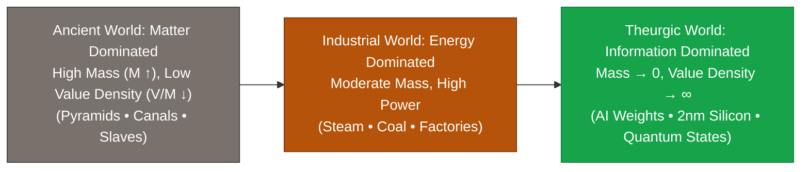

> **🎙️ 3-Presenter Authentic Tiki-Taka Script**
> 
> **Prof. Peter Kim:** Slide 24 brings our entire eight-milestone journey into a single master asymptotic equation: **$\lim_{M \to 0} \frac{V}{M} = \infty$**. Dr. Vance, summarize the profound economic revolution captured in this formula. *(Turn 1)*  
> **Dr. Elena Vance:** For thousands of years, economics was defined as the "study of the allocation of scarce resources." Because value was tied to physical matter ($M$), you could only get richer by conquering someone else's land, stealing their gold, or enslaving their people. Wealth was a zero-sum game. *(Turn 2)*  
> **TA Marcus Brody:** But look at the right side of the flowchart: In our Theurgic information-dominated world, **Mass ($M$) collapses to zero while Functional Value ($V$) compounds to infinity**! Wealth is no longer a zero-sum game of slicing a fixed pie; wealth is an infinite post-scarcity expansion! *(Turn 3)*  
> **Prof. Peter Kim:** When you replace physical atoms with software intelligence, you liberate human civilization from the thermodynamic limits of the planet. *(Turn 4)*  
> **TA Marcus Brody:** That is the philosophical culmination of Phase 1! We are decoupling human thriving from planetary destruction! *(Turn 5)*  
> **Dr. Elena Vance:** And we can execute this transformation on any legacy industry using our 4-Stage Resource Liberation Protocol! *(Turn 6)*  
> **Prof. Peter Kim:** Let’s examine the 4-Stage Protocol on Slide 25. *(Turn 7)*  
> **TA Marcus Brody:** Turn to Slide 25: Discover, Convert, Scale, Democratize! *(Turn 8)*  
> **Dr. Elena Vance:** Let’s see the operational protocol! *(Turn 9)*  
> **Prof. Peter Kim:** Proceed to Slide 25. *(Turn 10)*

---

### Slide 25: The 4-Stage Resource Liberation Protocol: Discover, Convert, Scale, Democratize
- **The Operational Theurgic Protocol:**
  1. **Stage 1: Discover (Identify Inaccessible Abundance):** Pinpoint an ambient, unharvested resource previously deemed unusable (e.g., ambient solar photons, non-coding DNA, ocean salinity).
  2. **Stage 2: Convert (Develop the Semiconductor/Bio Key):** Engineer the solid-state or biological catalyst that converts the raw input into usable work (Photovoltaics, CRISPR, SWRO membranes).
  3. **Stage 3: Scale (Ride Wright’s Law Compounding):** Drive cumulative manufacturing volume to trigger rapid cost deflation ($\text{Cost} \propto Y^{-\omega}$).
  4. **Stage 4: Democratize (Deploy Zero-Marginal-Cost Infrastructure):** Distribute universal, open-access protocols across global networks.

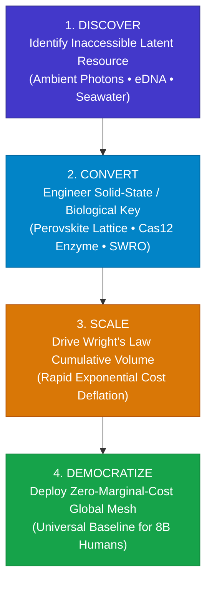

> **🎙️ 3-Presenter Authentic Tiki-Taka Script**
> 
> **Prof. Peter Kim:** Slide 25 presents the **4-Stage Resource Liberation Protocol**. This is your actionable design framework for converting physical bottlenecks into abundant utilities. Marcus, walk us through Stage 1 and 2. *(Turn 1)*  
> **TA Marcus Brody:** Stage 1: **DISCOVER**! You find an abundant resource that everyone is ignoring because it’s "too hard" to use: ambient sunlight, seawater, geothermal heat, or non-coding DNA sequences! *(Turn 2)*  
> **Dr. Elena Vance:** Stage 2: **CONVERT**! You engineer the solid-state or biological key—like a perovskite crystal lattice, a CRISPR enzyme, or a reverse-osmosis membrane—that converts that raw physical input directly into usable work! *(Turn 3)*  
> **TA Marcus Brody:** Stage 3: **SCALE**! You build gigafactories and automate production to ride Wright's Law learning curves, driving costs down by 20% on every doubling! *(Turn 4)*  
> **Prof. Peter Kim:** And Stage 4: **DEMOCRATIZE**! You deploy the solution as an open, decentralized global utility accessible to all eight billion humans at near-zero marginal cost! *(Turn 5)*  
> **Dr. Elena Vance:** That four-stage protocol has unlocked modern agriculture, solar electricity, global telecommunications, and digital medicine. *(Turn 6)*  
> **Prof. Peter Kim:** Master this protocol, and you can solve any grand challenge on planet Earth. *(Turn 7)*  
> **TA Marcus Brody:** Now let’s test this protocol across nine massive empirical case studies in Module 4! *(Turn 8)*  
> **Dr. Elena Vance:** Let’s examine how we unlock $49 Quadrillion in dead capital on Slide 26! *(Turn 9)*  
> **Prof. Peter Kim:** Proceed to Module 4: Global Empirical Verification & Hardware Specs! *(Turn 10)*


---

## Module 4: Global Empirical Verification & Hardware Specs (Slides 26–35)

### Slide 26: CASE 01: Unlocking $49 Quadrillion in Dead Global Capital
- **The Global Dead Capital Problem (Hernando de Soto / Peter Diamandis):**
  - *The Bottleneck:* Over **$49 Quadrillion USD in latent economic value** (undeveloped land rights, unbanked human intellectual capacity, uncaptured solar photons, unsequenced biodiversity) is trapped because analog institutions lack legal, geographic, or financial bridges to connect them.
  - *The 6D & Value Density Liberation:* Digital land registries on blockchain, mobile satellite connectivity, precision AI agronomy, and tokenized micro-equity convert dead capital into liquid, compounding abundance.

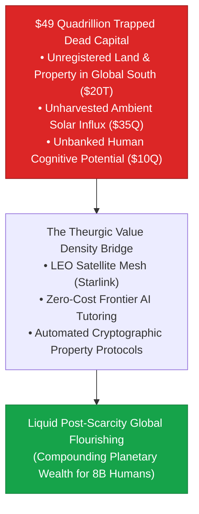

> **🎙️ 3-Presenter Authentic Tiki-Taka Script**
> 
> **Prof. Peter Kim:** Module 4 begins with the largest economic audit in our curriculum: **Unlocking $49 Quadrillion in Dead Global Capital**. Dr. Vance, explain what economist Hernando de Soto and Peter Diamandis mean by "dead capital" on Slide 26. *(Turn 1)*  
> **Dr. Elena Vance:** "Dead capital" refers to massive pools of physical and human assets that exist in reality, but cannot be traded, collateralized, or monetized because they lack formal legal registries, digital connectivity, or energy infrastructure. *(Turn 2)*  
> **TA Marcus Brody:** Look at the breakdown in the red box: Over **$20 Trillion in unregistered land** held by small farmers in the Global South who have no paper deeds; **$35 Quadrillion in unharvested solar photons** falling uselessly on desert sand; and **$10 Quadrillion in uneducated human cognitive genius** trapped behind rural poverty! *(Turn 3)*  
> **Prof. Peter Kim:** In total, that is **$49 Quadrillion dollars in latent wealth** sitting completely idle! *(Turn 4)*  
> **TA Marcus Brody:** And look at the blue bridge in the middle: Starlink brings gigabit broadband to the remotest village; smartphone AI tutors teach advanced computer science in local dialects for free; and cryptographic ledgers record property deeds that corrupt warlords cannot erase! *(Turn 5)*  
> **Dr. Elena Vance:** Overnight, dead capital is converted into liquid, compounding civilizational wealth! *(Turn 6)*  
> **Prof. Peter Kim:** This proves that the world is not poor; the world is simply disconnected. Once connected, abundance flows naturally. *(Turn 7)*  
> **TA Marcus Brody:** And look at what this does to baseline global poverty on Slide 27: The Rising Floor Effect! *(Turn 8)*  
> **Prof. Peter Kim:** Let’s examine Case 2: The Rising Floor Effect. *(Turn 9)*  
> **Dr. Elena Vance:** Turn to Slide 27! *(Turn 10)*

---

### Slide 27: CASE 02: The Rising Floor Effect: The Vertical Shift in Baseline Poverty
- **Empirical Metric Source:** World Bank, Our World in Data, UN Human Development Index (1820–2026).
- **The Historic Shift in Extreme Poverty:**
  - 1820: **~89% of the world population** lived in extreme poverty (<$2.15/day equivalent).
  - 1950: **~63% of the world population**.
  - 1990: **~36% of the world population**.
  - 2026: **<7.5% of the world population** (with universal access to smartphone-delivered clean intelligence, weather forecasting, and digital banking).
- **The "Rising Floor" Axiom:** Today, an impoverished citizen living on $3/day with an entry-level smartphone has **greater access to global communication, medical knowledge, and entertainment than the richest king on Earth in 1820**.

> **🎙️ 3-Presenter Authentic Tiki-Taka Script**
> 
> **TA Marcus Brody:** Look at the data on Slide 27! This is **The Rising Floor Effect**—the single greatest humanitarian victory in the history of our species! Elena, walk us through the historical poverty numbers. *(Turn 1)*  
> **Dr. Elena Vance:** In 1820, **89% of the human race lived in extreme, grinding poverty**. Life was filthy, brutal, and short. Infant mortality was over 40%, and clean water was a rare luxury. *(Turn 2)*  
> **Prof. Peter Kim:** By 1950, it was 63%. By 1990, it dropped to 36%. And in 2026, global extreme poverty has plunged below **7.5%**! *(Turn 3)*  
> **TA Marcus Brody:** And read the "Rising Floor" Axiom in the second bullet point! Today, an impoverished person in a rural village holding a $30 smartphone has **better medical diagnostic tools, faster communication, and more access to books and music than King Louis XIV or John D. Rockefeller had in their prime**! *(Turn 4)*  
> **Dr. Elena Vance:** In 1900, if an emperor got a bacterial infection, he died because antibiotics didn't exist. Today, a generic penicillin pill costs three cents at a local clinic! *(Turn 5)*  
> **Prof. Peter Kim:** The floor of human baseline existence has been permanently lifted by the Liberation Ladder. The poorest human today enjoys amenities that ancient emperors could not buy with chests of diamonds. *(Turn 6)*  
> **TA Marcus Brody:** And mobile fintech and satellite meshes are finishing the job! Look at Case 3 on Slide 28! *(Turn 7)*  
> **Dr. Elena Vance:** Let’s examine M-Pesa and Starlink on Slide 28. *(Turn 8)*  
> **Prof. Peter Kim:** Turn to Slide 28: Banking and Connecting the Next Billion. *(Turn 9)*  
> **TA Marcus Brody:** Let’s see global inclusion in action! *(Turn 10)*

---

### Slide 28: CASE 03: M-Pesa & Starlink: Banking and Connecting the Next Billion
- **Empirical Metric Audit (2007–2026):**
  - *M-Pesa (Mobile Money):* Dematerialized physical bank branches into a 2G SMS protocol; processes **>$300 Billion annually across Africa**, accounting for over 50% of Kenya’s GDP velocity.
  - *SpaceX Starlink Constellation:* Over **7,500 active LEO satellites** (2026) providing high-speed broadband to >5 million global terminals across 80+ countries, including remote Amazon tribes, sub-Saharan clinics, and disaster zones.
- **The Leapfrog Dynamic:** The Global South bypassed physical copper landlines and brick-and-mortar bank branches entirely, transitioning straight to decentralized, space-based digital utilities.

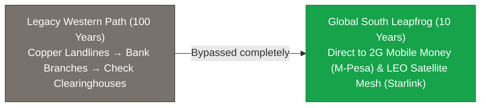

> **🎙️ 3-Presenter Authentic Tiki-Taka Script**
> 
> **Prof. Peter Kim:** Slide 28 illustrates the **Leapfrog Dynamic** in global development: **M-Pesa and Starlink**. Dr. Vance, why did the developing world skip Western analog infrastructure? *(Turn 1)*  
> **Dr. Elena Vance:** Because building physical infrastructure—digging copper telephone trenches and constructing marble bank branches—takes decades and costs trillions of dollars. Developing nations didn't wait for Western analog systems; they leapfrogged directly to **dematerialized mobile bits and orbital satellite constellations**! *(Turn 2)*  
> **TA Marcus Brody:** Look at M-Pesa: It processes **over $300 Billion dollars a year** across Africa—accounting for over half of Kenya's entire GDP velocity—entirely on mobile phones without a single bank teller or paper check! *(Turn 3)*  
> **Dr. Elena Vance:** And look at Starlink: Over **7,500 low-Earth-orbit satellites** beaming 200 Mbps low-latency broadband to schools in the Amazon jungle, clinics in the Himalayas, and farming co-ops in Rwanda! *(Turn 4)*  
> **Prof. Peter Kim:** In one leap, billions of people jumped from 19th-century isolation into 21st-century gigabit planetary intelligence. *(Turn 5)*  
> **TA Marcus Brody:** That is the power of high Value Density! You don't lay copper wires through the jungle; you beam photons from orbit! *(Turn 6)*  
> **Dr. Elena Vance:** And look at the physical mass comparison on Slide 29! *(Turn 7)*  
> **Prof. Peter Kim:** Let’s examine Case 4: Dematerialization Footprint on Slide 29. *(Turn 8)*  
> **TA Marcus Brody:** Turn to Slide 29: 180g Smartphone vs. 50kg Hardware! *(Turn 9)*  
> **Prof. Peter Kim:** Proceed to Slide 29. *(Turn 10)*

---

### Slide 29: CASE 04: Dematerialization Footprint: 180g Smartphone vs. 50kg Hardware
- **Thermodynamic Life-Cycle Audit:**
  - *1990 Physical Stack:* 35mm SLR camera, video camcorder, CD player, Walkman, car GPS unit, desktop PC, 14-inch CRT monitor, answering machine, physical encyclopedia set.
    - Total Combined Mass: **$\approx 50.0\text{ kg}$**
    - Total Embodied Manufacturing Energy: **$\approx 3,800\text{ MJ}$**
  - *2026 Smartphone Stack:* Single integrated device.
    - Total Mass: **$0.18\text{ kg} \ (180\text{ grams})$** ($277\times \text{ mass reduction}$)
    - Embodied Manufacturing Energy: **$\approx 250\text{ MJ}$** ($15\times \text{ energy reduction}$)
- **The Environmental Axiom:** Dematerialization through software is the single most potent thermodynamic conservation mechanism in industrial history.

> **🎙️ 3-Presenter Authentic Tiki-Taka Script**
> 
> **TA Marcus Brody:** Slide 29 gives us the exact physical life-cycle audit: **180 grams versus 50 kilograms**! Look at the numbers, Elena! *(Turn 1)*  
> **Dr. Elena Vance:** In 1990, the physical stack of consumer appliances—a CRT monitor, a desktop tower, a camcorder, a CD player, a GPS unit, and an encyclopedia set—weighed **50 kilograms (110 pounds)** and required **3,800 Megajoules of energy** to manufacture, package, and ship! *(Turn 2)*  
> **TA Marcus Brody:** Today, a single 180-gram smartphone replaces all 50 kilograms of hardware while consuming **less than 250 Megajoules to manufacture**! That is a **$277\times$ reduction in physical mass** and a **$15\times$ reduction in embodied manufacturing energy**! *(Turn 3)*  
> **Prof. Peter Kim:** Think of the billions of tons of plastic, lead, glass, and copper that were never mined, never smelted, and never thrown into municipal landfills because the functionality dissolved into software code! *(Turn 4)*  
> **Dr. Elena Vance:** Software is not just convenient; software is the ultimate green technology! *(Turn 5)*  
> **Prof. Peter Kim:** When you dematerialize hardware into code, you save the biosphere while multiplying human capability. *(Turn 6)*  
> **TA Marcus Brody:** And cellular agriculture is doing the exact same thing to food! Look at Precision Fermentation on Slide 30! *(Turn 7)*  
> **Dr. Elena Vance:** Let’s examine Case 5: Precision Fermentation on Slide 30. *(Turn 8)*  
> **Prof. Peter Kim:** Turn to Slide 30: Precision Fermentation and Land Liberation. *(Turn 9)*  
> **TA Marcus Brody:** Let’s see how we eliminate 99% of agricultural land! *(Turn 10)*

---

### Slide 30: CASE 05: Precision Fermentation: 99% Land Use Elimination
- **Empirical Metric Source:** RethinkX Food & Agriculture Reports, Perfect Day, Impossible Foods (2020–2026).
- **The Agricultural Land Inefficiency:**
  - Traditional livestock cattle conversion efficiency: **~3% to 4%** (96% of feed calories are wasted on bone, hide, body heat, and manure). Cattle consume **~45% of all habitable land on Earth**.
- **Precision Fermentation Efficiency:**
  - Microorganisms engineered to express whey, casein, collagen, and egg proteins in stainless-steel bioreactors.
  - Conversion Efficiency: **>60%** ($15\times \text{ to } 20\times \text{ improvement}$).
  - Resource Footprint: **99% less land, 98% less water, 90% fewer greenhouse gas emissions**.

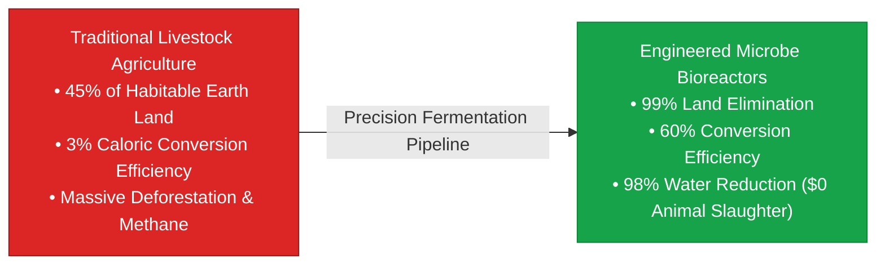

> **🎙️ 3-Presenter Authentic Tiki-Taka Script**
> 
> **Prof. Peter Kim:** Case 5 brings us to the forefront of the protein revolution: **Precision Fermentation**. Dr. Vance, walk us through the thermodynamic insanity of raising cattle. *(Turn 1)*  
> **Dr. Elena Vance:** Raising a cow to produce milk or beef is an energetic disaster. A cow has a **caloric conversion efficiency of only 3%**! 97% of the grain and water fed to the animal is wasted on growing hooves, bones, and skin, and maintaining body heat. Raising livestock currently occupies **45% of all habitable land on planet Earth**! *(Turn 2)*  
> **TA Marcus Brody:** But look at Precision Fermentation on Slide 30! We take engineered micro-yeast and brew real dairy whey, casein, and egg proteins inside sterile stainless-steel fermentation tanks, just like brewing craft beer! Conversion efficiency jumps to **over 60%**! *(Turn 3)*  
> **Dr. Elena Vance:** Look at the environmental metrics: **99% less land, 98% less water, and 90% fewer greenhouse emissions**, with zero animal slaughter and zero hormones! *(Turn 4)*  
> **Prof. Peter Kim:** Imagine what happens when we liberate 45% of the planet's land surface: We can rewild entire continents, restore ancient rainforests, and allow planetary ecosystems to regenerate! *(Turn 5)*  
> **TA Marcus Brody:** We get cheaper, purer protein while returning half the planet back to nature! That is theurgic agricultural abundance! *(Turn 6)*  
> **Dr. Elena Vance:** And for fresh produce, vertical farming does the exact same thing in cities! *(Turn 7)*  
> **Prof. Peter Kim:** Let’s examine Case 6: AeroFarms and Vertical Agriculture on Slide 31. *(Turn 8)*  
> **TA Marcus Brody:** Turn to Slide 31: 95% Less Water, 390x Yield! *(Turn 9)*  
> **Prof. Peter Kim:** Proceed to Slide 31. *(Turn 10)*

---

### Slide 31: CASE 06: AeroFarms Vertical Agriculture: 95% Less Water, 390x Yield
- **Empirical Hardware Metrics:** AeroFarms / Plenty Indoor Vertical Farms (2020–2026).
- **The Aeroponic Closed-Loop System:**
  - Plant roots suspended in air, misted with precise nutrient-oxygen micro-droplets (Aeroponics).
  - Multi-wavelength LED illumination tuned to peak chlorophyll absorption bands ($\lambda = 450\text{nm / } 660\text{nm}$).
- **The Yield Multiplier:**
  - Produces **$390\times \text{ higher crop yield per square foot}$** than open-field industrial agriculture.
  - Consumes **$95\%$ less water** and **$0\%$ chemical pesticides**, operating year-round in urban city centers with zero weather disruption.

> **🎙️ 3-Presenter Authentic Tiki-Taka Script**
> 
> **TA Marcus Brody:** Case 6 is the vertical agriculture revolution: **AeroFarms and Plenty**. Look at the metrics on Slide 31: **390 times higher crop yield per square foot** compared to traditional dirt farming! Elena, how is that physically possible? *(Turn 1)*  
> **Dr. Elena Vance:** Because vertical farms stack crops 30 feet high in automated indoor towers! Instead of soaking dirt in millions of gallons of water that evaporates into the sky, plant roots are suspended in air and misted with closed-loop aeroponic nutrient solutions! *(Turn 2)*  
> **TA Marcus Brody:** And look at the lighting: They don't waste energy on useless green light; custom LED arrays blast the crops with the exact photon wavelengths ($\lambda = 450\text{nm and } 660\text{nm}$) that chlorophyll absorbs for maximum photosynthesis! *(Turn 3)*  
> **Prof. Peter Kim:** The results are staggering: **95% less water, zero chemical pesticides, zero topsoil erosion**, and continuous year-round harvesting immune to droughts, floods, or winter freezes! *(Turn 4)*  
> **TA Marcus Brody:** You can place an AeroFarms facility inside an abandoned warehouse in downtown Chicago or Abu Dhabi, producing crisp organic strawberries and baby spinach for thousands of families with zero long-distance freight shipping! *(Turn 5)*  
> **Dr. Elena Vance:** That is high Value Density agriculture: maximum caloric and nutritional output with minimal physical footprint. *(Turn 6)*  
> **Prof. Peter Kim:** And in energy generation, Perovskite-Silicon Tandem Cells are breaking thermodynamic solar limits! *(Turn 7)*  
> **Dr. Elena Vance:** Let’s examine Case 7: Perovskite Tandem Solar on Slide 32. *(Turn 8)*  
> **Prof. Peter Kim:** Turn to Slide 32: 34% Thermodynamic Solar Efficiency. *(Turn 9)*  
> **TA Marcus Brody:** Let’s see solar break the Shockley-Queisser limit! *(Turn 10)*

---

### Slide 32: CASE 07: Perovskite-Silicon Tandem Cells: 34% Thermodynamic Efficiency
- **Empirical Laboratory & Commercial Milestones:** Oxford PV, LONGi, Fraunhofer ISE (2020–2026).
- **Breaking the Single-Junction Ceiling:**
  - *Theoretical Shockley-Queisser Limit (Silicon):* $\approx 29.4\%$ maximum efficiency.
  - *Perovskite-on-Silicon Tandem Architecture:*
    - Top Perovskite Layer (Bandgap: $1.7\text{ eV}$): Captures high-energy blue/green photons.
    - Bottom Silicon Layer (Bandgap: $1.1\text{ eV}$): Captures lower-energy red/infrared photons.
- **The Empirical Record:** Commercial tandem cells surpass **$34.6\%$ certified solar efficiency**, increasing power output per panel by **$+40\%$** at near-identical manufacturing footprint.

> **🎙️ 3-Presenter Authentic Tiki-Taka Script**
> 
> **Prof. Peter Kim:** Case 7 presents the cutting edge of photovoltaic materials science: **Perovskite-Silicon Tandem Cells**. Dr. Vance, why are tandem cells a major breakthrough on the Liberation Ladder? *(Turn 1)*  
> **Dr. Elena Vance:** For 40 years, commercial silicon solar cells were stuck beneath the theoretical **Shockley-Queisser limit of 29.4%**. Silicon was only good at capturing red and infrared photons; high-energy blue photons were wasted as heat. *(Turn 2)*  
> **TA Marcus Brody:** But by spraying a microscopic layer of crystalline **Perovskite** on top of the silicon wafer, we created a **Tandem Cell**! The top perovskite layer catches the high-energy blue photons, and the bottom silicon layer catches the infrared photons! *(Turn 3)*  
> **Prof. Peter Kim:** Commercial tandem cells have officially shattered the single-junction ceiling, exceeding **34.6% certified efficiency**! *(Turn 4)*  
> **TA Marcus Brody:** That means a standard rooftop solar array produces **40% more electricity** from the exact same physical surface area, driving the levelized cost of solar electricity even deeper below one cent per kilowatt-hour! *(Turn 5)*  
> **Dr. Elena Vance:** More energy harvested per kilogram of panel material—the definition of compounding Value Density. *(Turn 6)*  
> **Prof. Peter Kim:** And in molecular biology, AlphaFold 3 is liberating human scientific labor at an unprecedented scale. *(Turn 7)*  
> **TA Marcus Brody:** Let’s look at Case 8: AlphaFold 3 on Slide 33! *(Turn 8)*  
> **Dr. Elena Vance:** Turn to Slide 33: Liberating Millions of Human-Years in Biology! *(Turn 9)*  
> **Prof. Peter Kim:** Proceed to Slide 33. *(Turn 10)*

---

### Slide 33: CASE 08: AlphaFold 3: Liberating Millions of Human-Years in Wet-Lab Work
- **Empirical Discovery Velocity Audit:** Google DeepMind / Isomorphic Labs (2020–2026).
- **The Manual Labor Comparison:**
  - *X-ray Crystallography & Cryo-EM:* Determining a single 3D protein structure historically required **1 PhD student, 3 to 5 years of lab work, and $100,000 to $300,000 USD**. In 60 years, all human scientists combined solved $\approx 180,000$ proteins in the Protein Data Bank (PDB).
  - *AlphaFold 3 in Silico Prediction:* Predicted 3D structures and molecular interactions (Proteins, DNA, RNA, Ligands) for **>200,000,000 proteins in minutes** at near-zero marginal cost.
- **The Human Bandwidth Dividend:** Liberated an estimated **~1,000,000 human-years of tedious wet-lab pipetting**, redirecting global biologists to drug design and disease cures.

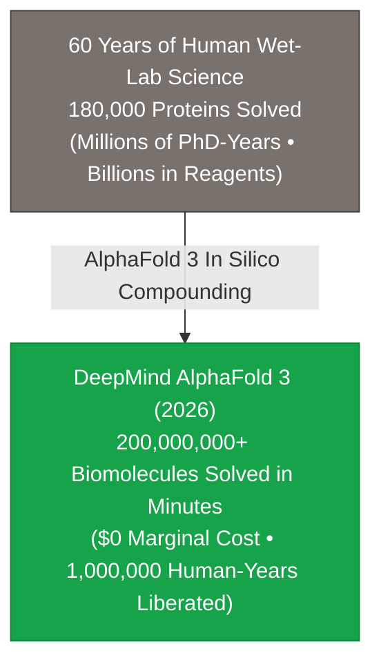

> **🎙️ 3-Presenter Authentic Tiki-Taka Script**
> 
> **TA Marcus Brody:** Case 8 is the ultimate example of cognitive liberation: **AlphaFold 3**! Look at the comparison in that flowchart, Elena! *(Turn 1)*  
> **Dr. Elena Vance:** For sixty years, determining the 3D atomic structure of a single protein required a PhD biochemist spending three to five years in a wet lab doing tedious X-ray crystallography and cryo-EM, costing up to $300,000 per protein. In 60 years, all human science solved 180,000 proteins. *(Turn 2)*  
> **TA Marcus Brody:** And then DeepMind released AlphaFold! In a few minutes of GPU compute, AlphaFold predicted the 3D structures of **over 200 million proteins—virtually every known protein in biology**! *(Turn 3)*  
> **Prof. Peter Kim:** Look at the metric at the bottom of the slide: AlphaFold literally liberated **over one million human-years of tedious wet-lab pipetting**! *(Turn 4)*  
> **TA Marcus Brody:** Think about what those one million human scientists can do now! They aren't spending five years trying to figure out what one enzyme looks like; they are designing custom cancer vaccines, synthetic enzymes to eat plastic, and longevity therapies! *(Turn 5)*  
> **Dr. Elena Vance:** That is the Cognitive Dividend in full effect: AI automates discovery so humans can engineer cures. *(Turn 6)*  
> **Prof. Peter Kim:** And in aerospace manufacturing, 3D printing is dematerializing heavy industrial supply chains! *(Turn 7)*  
> **TA Marcus Brody:** Let’s examine Case 9: Relativity Space on Slide 34! *(Turn 8)*  
> **Dr. Elena Vance:** Turn to Slide 34: 100x Part Reduction in Aerospace! *(Turn 9)*  
> **Prof. Peter Kim:** Proceed to Slide 34. *(Turn 10)*

---

### Slide 34: CASE 09: 3D-Printed Aerospace (Relativity Space): 100x Part Reduction
- **Empirical Manufacturing Revolution:** Relativity Space (Terran R Rocket Architecture).
- **The Stargate Robotic 3D-Printing System:**
  - *Traditional Rocket Construction:* Requires **>100,000 individual parts**, thousands of custom tooling jigs, and multi-year global supply chains.
  - *Relativity Stargate 3D-Printing:* Uses autonomous AI-directed wire-arc additive manufacturing to print complete rocket fuselages and methane rocket engines from raw metal alloy in **<60 days with <1,000 total parts ($100\times \text{ part reduction}$)**.
- **The Value Density Surge:** Eliminates millions of dollars in fixed tooling costs, enabling rapid software-driven aerospace iteration.

> **🎙️ 3-Presenter Authentic Tiki-Taka Script**
> 
> **Prof. Peter Kim:** Case 9 presents the future of physical manufacturing: **Relativity Space and 3D-Printed Aerospace**. Dr. Vance, walk us through the radical part reduction on Slide 34. *(Turn 1)*  
> **Dr. Elena Vance:** A traditional orbital rocket consists of **over 100,000 individual machined parts**, thousands of nuts, bolts, O-rings, and welds, requiring complex supply chains across dozens of subcontractors that take two years to assemble. *(Turn 2)*  
> **TA Marcus Brody:** Relativity Space built the world's largest robotic 3D printer—**Stargate**! Giant robotic arms use lasers and wire-arc additive manufacturing to print the entire rocket fuselage, propellant tanks, and Aeon rocket engines in **under 60 days with fewer than 1,000 parts—a 100-fold part reduction**! *(Turn 3)*  
> **Prof. Peter Kim:** If an aerospace engineer wants to change the aerodynamic curve of a rocket engine nozzle, they don't re-tool a multi-million-dollar factory; they change a line of code in Python and the robot prints the new rocket tomorrow! *(Turn 4)*  
> **TA Marcus Brody:** Manufacturing has been converted from a rigid, heavy-metal assembly line into flexible, software-driven 3D printing! *(Turn 5)*  
> **Dr. Elena Vance:** Dematerializing the factory itself into autonomous robotic software. *(Turn 6)*  
> **Prof. Peter Kim:** Let us now review the grand transformation matrix across all ten global domains on Slide 35. *(Turn 7)*  
> **TA Marcus Brody:** Let’s look at the Grand Scoreboard on Slide 35! *(Turn 8)*  
> **Dr. Elena Vance:** Turn to Slide 35: Grand Value Density Transformation Matrix! *(Turn 9)*  
> **Prof. Peter Kim:** Proceed to Slide 35. *(Turn 10)*

---

### Slide 35: Grand Value Density Transformation Matrix Across 10 Global Domains
- **Master Empirical Synthesis Scoreboard:** Tracking historical scarcity vs. theurgic 2026 abundance across 10 global civilization sectors.

| Global Domain | Historical Scarcity Baseline | Theurgic 2026 Abundance Metric | Value Density Multiplier | Primary Rung / Driver |
| :--- | :--- | :--- | :--- | :--- |
| **01. Energy** | High-carbon firewood/coal | **Utility Solar PV (<1.5¢/kWh)** | **$21,000,000\times$ Energy Density** | Perovskite Tandem / Fission |
| **02. Water** | Scarce freshwater wells | **SWRO Solar Desalination** | **Unlimited Seawater Harvest** | Reverse-Osmosis Membranes |
| **03. Food** | 45% Earth land for cattle | **Precision Fermentation / AeroFarms**| **$390\times$ Yield / 99% Land Drop** | Synthetic Cellular Bio / LEDs|
| **04. Health** | Symptom-based hospital care | **Sub-$100 Genome / PRIMA Chip** | **Eradication of Genetic Defects** | CRISPR-Cas12 / BCI Implants |
| **05. Compute** | 30-ton ENIAC (5,000 OPS) | **3nm 100B-Transistor NPU / Qubits**| **$10^{18}\times$ Compute Density** | 2nm GAA Lithography / QPU |
| **06. Space** | $54,500/kg (Space Shuttle) | **<$100/kg (Starship Reusable)** | **$500\times$ Launch Cost Collapse**| Full Stainless-Steel Re-use |
| **07. Comms** | 0.001 b/s (Runner Messengers) | **250 Tbps Undersea Fiber / Starlink**| **$250\text{ Trillion}\times$ Throughput** | Optical Lasers / LEO Satellites |
| **08. Knowledge**| Monastic Vellum Bibles ($20K) | **Wikipedia / Free Frontier LLMs** | **$M \to 0$, $D_v \to \infty$** | Digital Information / GPT |
| **09. Finance** | Physical Bank Branches / Cash | **M-Pesa / Layer-2 Crypto Pay** | **$100\times$ Fee Demonetization** | Decentralized Digital Ledgers|
| **10. Industry**| 100,000-part rocket assembly | **Relativity 3D Stargate (<1K parts)**| **$100\times$ Part Reduction** | AI Additive Manufacturing |

> **🎙️ 3-Presenter Authentic Tiki-Taka Script**
> 
> **Prof. Peter Kim:** Look at Slide 35, scholars. Ten global domains. Ten impossible physical bottlenecks solved by the Liberation Ladder. Marcus, look at the multipliers in that table! *(Turn 1)*  
> **TA Marcus Brody:** Energy: $21\text{ Million}\times$! Compute: $10^{18}\times$! Communications: $250\text{ Trillion}\times$! Food: 99% land eliminated! Space: $500\times$ cost collapse! This is absolute empirical proof that scarcity is dying across every sector of civilization! *(Turn 2)*  
> **Dr. Elena Vance:** Every row in this matrix represents a massive, non-linear victory over physical mass and thermodynamic friction. *(Turn 3)*  
> **Prof. Peter Kim:** But as physical abundance becomes universal, civilization faces radical new existential dilemmas. *(Turn 4)*  
> **TA Marcus Brody:** What happens to property rights, jobs, and social purpose when products have zero marginal cost? *(Turn 5)*  
> **Dr. Elena Vance:** That brings us to Module 5: Existential Paradoxes & The "So What?" Layer. *(Turn 6)*  
> **Prof. Peter Kim:** Let us confront the frontier of post-scarcity philosophy on Slide 36. *(Turn 7)*  
> **TA Marcus Brody:** Turn to Module 5 on Slide 36! *(Turn 8)*  
> **Dr. Elena Vance:** Let’s examine The End of Ownership on Slide 36! *(Turn 9)*  
> **Prof. Peter Kim:** Proceed to Module 5: Existential Paradoxes & The "So What?" Layer! *(Turn 10)*


---

## Module 5: Existential Paradoxes & The "So What?" Layer (Slides 36–42)

### Slide 36: The End of Ownership: The Paradigm Shift to Pure Access
- **The Post-Ownership Paradigm Shift:**
  - *Industrial Era (Possession Paradigm):* Wealth and security defined by owning physical assets (houses, cars, CD collections, physical books, machinery).
  - *Theurgic Era (Access Paradigm):* High Value Density and continuous networks render physical ownership an **inefficient, high-maintenance burden**.
- **The Microeconomic Realities:**
  - Music & Cinema: Nobody owns vinyl/DVDs; 100M songs accessed instantly via streaming subscriptions.
  - Mobility: Autonomous electric fleets (Robotaxis) make car ownership ($40,000 asset sitting parked 95% of the time) economically obsolete ($\text{Cost/mile} \to <\$0.20$).
  - Computing: Mainframes and servers replaced by on-demand serverless cloud APIs.

> **🎙️ 3-Presenter Authentic Tiki-Taka Script**
> 
> **Prof. Peter Kim:** Module 5 opens with a profound cultural and economic transformation: **The End of Ownership**. Dr. Vance, why is the concept of private physical ownership dying in the 21st century? *(Turn 1)*  
> **Dr. Elena Vance:** Because in an analog world of physical scarcity, owning a physical object was the only way to guarantee access. If you didn't own the physical book or the physical car, you couldn't read or travel. But physical ownership comes with heavy friction: maintenance, insurance, storage, and depreciation. *(Turn 2)*  
> **TA Marcus Brody:** Look at cars today! The average car costs **$45,000 dollars**, depreciates every year, and **sits parked in a garage or parking lot 95% of its entire life**! That is an economic and physical disaster! *(Turn 3)*  
> **Dr. Elena Vance:** But with autonomous electric robotaxi fleets, you don't buy a car; you summon transportation on your phone for **20 cents a mile**! You get 100% of the mobility with zero maintenance, zero insurance, and zero parking hassle! *(Turn 4)*  
> **Prof. Peter Kim:** We saw the exact same transition in music and movies: Nobody buys physical CDs or DVDs anymore. We stream 100 million songs on demand for ten dollars a month. Access replaces ownership. *(Turn 5)*  
> **TA Marcus Brody:** The modern generation doesn't want to hoard heavy physical metal and plastic; they want instantaneous, frictionless access to utility! *(Turn 6)*  
> **Dr. Elena Vance:** And as ownership dies, traditional asset valuation models for real estate and factories completely collapse! *(Turn 7)*  
> **Prof. Peter Kim:** Let’s examine Slide 37: The Collapse of Classical Asset Valuation Models. *(Turn 8)*  
> **TA Marcus Brody:** Turn to Slide 37: Why traditional balance sheets are lying! *(Turn 9)*  
> **Prof. Peter Kim:** Proceed to Slide 37. *(Turn 10)*

---

### Slide 37: The Collapse of Classical Asset Valuation Models (Real Estate & Plants)
- **The Valuation Inversion:**
  - *Classical Balance Sheets:* Book value anchored in tangible physical assets (land acreage, concrete office towers, chemical tooling, specialized machinery).
  - *The 6D & Value Density Devaluation:* Tangible physical assets become **stranded liabilities** when zero-marginal-cost software, remote holographic presence, and distributed micro-factories demonetize physical centralization.
- **The Stranded Asset Crisis:**
  - Commercial Office Real Estate: Devalued by remote work, VR co-presence, and AI agent workforces.
  - Centralized Fossil Power Plants: Stranded by modular rooftop solar, microgrids, and local battery storage.

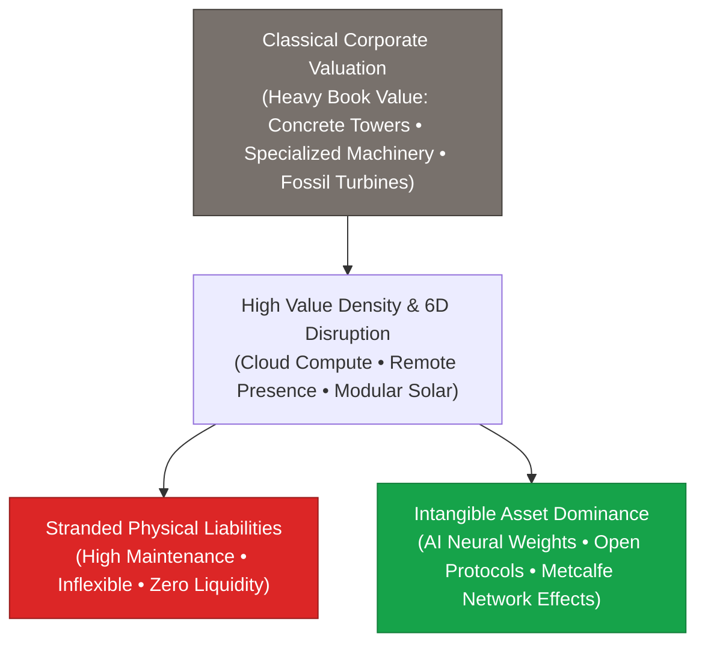

> **🎙️ 3-Presenter Authentic Tiki-Taka Script**
> 
> **TA Marcus Brody:** Slide 37 exposes a massive multi-trillion-dollar time bomb: **The Collapse of Classical Asset Valuation Models**. Look at that flowchart, Elena! *(Turn 1)*  
> **Dr. Elena Vance:** For a century, financial accounting valued companies based on their physical balance sheets: How many corporate office towers do you own? How many heavy metal stamping machines? How many coal power plants? *(Turn 2)*  
> **Prof. Peter Kim:** But in a high Value Density world, those heavy physical assets are turning into **Stranded Liabilities**! Look at commercial office real estate: When AI agents and spatial holographic computing allow global teams to collaborate flawlessly from anywhere, why would any company pay $50 million a year to lease a glass skyscraper in Manhattan? *(Turn 3)*  
> **TA Marcus Brody:** And look at centralized fossil power plants! Power utilities spent billions building coal and gas turbines with 40-year debt financing. Now, distributed rooftop solar and cheap batteries are undercutting them on price, turning those billion-dollar power plants into worthless stranded rust! *(Turn 4)*  
> **Dr. Elena Vance:** Look at the green box on the right: Today, **over 90% of the S&P 500's enterprise value consists of intangible assets**—AI algorithms, software code, brand trust, and network effects! *(Turn 5)*  
> **Prof. Peter Kim:** Physical mass has ceased to be an asset; physical mass is now an operational drag. *(Turn 6)*  
> **TA Marcus Brody:** But even when all basic goods are abundant, humans find new things to fight over: Positional Goods! *(Turn 7)*  
> **Dr. Elena Vance:** Let’s examine Relative Deprivation in Abundance on Slide 38. *(Turn 8)*  
> **Prof. Peter Kim:** Turn to Slide 38: The Hyper-Inflation of Positional Goods. *(Turn 9)*  
> **TA Marcus Brody:** Why billionaires fight over beachfront land and Harvard diplomas on Slide 38! *(Turn 10)*

---

### Slide 38: Relative Deprivation in Abundance: The Hyper-Inflation of Positional Goods
- **Fred Hirsch’s Positional Goods Theory (1976):**
  - *Non-Positional Goods (Abundant):* Food, clean water, compute, energy, standard smartphones, medicine $\to$ Demonetized and democratized to near-zero cost.
  - *Positional Goods (Strictly Scarcity-Bound):* Prime beachfront real estate (Malibu/Monaco), historic art (Da Vinci's *Mona Lisa*), elite social status, admission to top Ivy League universities.
- **The Hyper-Inflation Paradox:** As non-positional goods become universally free, **human competition and capital concentrate violently into positional goods**, driving their prices to hyper-inflationary extremes and creating acute **Relative Deprivation**.

> **🎙️ 3-Presenter Authentic Tiki-Taka Script**
> 
> **Prof. Peter Kim:** Slide 38 confronts a deep evolutionary and sociological paradox: **Relative Deprivation and Positional Goods**. Dr. Vance, explain Fred Hirsch’s theory of positional goods. *(Turn 1)*  
> **Dr. Elena Vance:** Economist Fred Hirsch made a vital distinction between two types of goods: **Non-positional goods**—like calories, penicillin, computing power, and electricity—can be scaled to infinite abundance via technology. But **Positional goods** are inherently zero-sum and cannot be scaled! *(Turn 2)*  
> **TA Marcus Brody:** Think about beachfront land in Malibu or Monaco! You can use AI to build a trillion digital homes in VR, but there are only a few physical miles of beachfront coast in Southern California! Or think about original Leonardo da Vinci paintings or admission to Harvard University! *(Turn 3)*  
> **Prof. Peter Kim:** Look at what happens economically: When food, energy, healthcare, and software become nearly free, all the spare capital in the global economy rushes into that tiny basket of positional goods, causing their prices to explode into hyper-inflation! *(Turn 4)*  
> **TA Marcus Brody:** That’s why a billionaire will pay $450 million for a single Da Vinci painting while getting the same smartphone and AI model as an ordinary student for free! *(Turn 5)*  
> **Dr. Elena Vance:** And because human psychology is hardwired for social comparison, people feel poor not because they lack food or medicine, but because they lack relative social status compared to their peers! *(Turn 6)*  
> **Prof. Peter Kim:** Abundance solves physical suffering, but it does not automatically cure human vanity. That requires philosophical maturity. *(Turn 7)*  
> **TA Marcus Brody:** And what about the cognitive divide between AI masters and passive consumers? *(Turn 8)*  
> **Dr. Elena Vance:** Let’s examine The New Intellectual Aristocracy on Slide 39. *(Turn 9)*  
> **Prof. Peter Kim:** Turn to Slide 39: Cognitive Divide in the Age of AI. *(Turn 10)*

---

### Slide 39: The New Intellectual Aristocracy: Cognitive Divide in the Age of AI
- **The Asymmetric Cognitive Bifurcation:**
  - *The Augmentation Class (Top 1%):* Individuals who master prompt engineering, multi-agent orchestration, and system-level theurgic architecture, achieving **$100\times \text{ to } 10,000\times$ leverage in problem-solving and capital creation**.
  - *The Passive Consumption Class (99%):* Individuals who passively consume algorithmically generated entertainment, dopamine feeds, and synthetic media, suffering from cognitive atrophy and loss of agency.
- **The Existential Risk:** The danger of creating a permanent cognitive aristocracy where the gap in intellectual and creative output between augmented and non-augmented humans exceeds the gap between humans and primates.

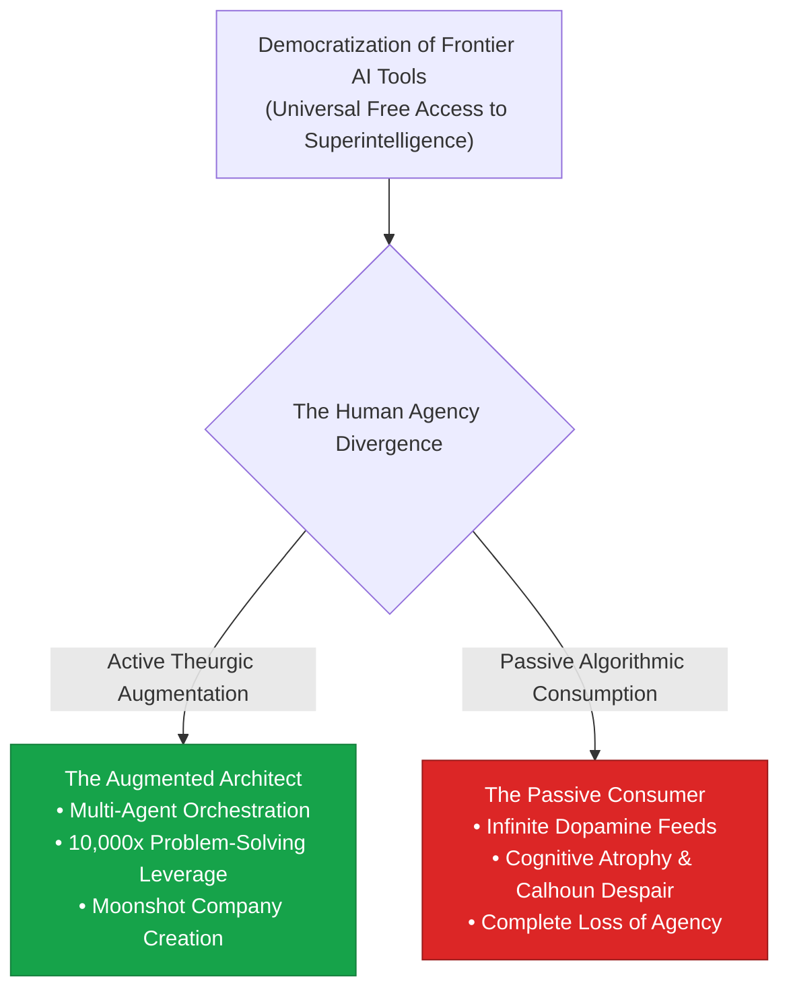

> **🎙️ 3-Presenter Authentic Tiki-Taka Script**
> 
> **TA Marcus Brody:** Look at the civilizational divergence on Slide 39! This is the most terrifying risk of the AI era: **The Cognitive Divide and the New Intellectual Aristocracy**! Marcus, describe what’s happening in that flowchart! *(Turn 1)*  
> **Dr. Elena Vance:** Both groups have access to the exact same free, democratized AI superintelligence. But look at the divergence: On the top path, **The Augmented Architect** uses AI agents as a million-person intellectual leverage force to cure diseases, write complex code, and build companies! *(Turn 2)*  
> **TA Marcus Brody:** But on the bottom path, **The Passive Consumer** uses AI-driven algorithms to binge 12 hours a day of hyper-personalized synthetic short-form videos and dopamine feeds, completely destroying their attention span and critical thinking skills! *(Turn 3)*  
> **Prof. Peter Kim:** The gap in creative output and agency between an augmented theurgist and a passive consumer is becoming wider than the evolutionary gap between humans and chimpanzees! *(Turn 4)*  
> **Dr. Elena Vance:** Universal access to technology does not automatically guarantee universal elevation. Technology is a cognitive amplifier: it makes the disciplined hyper-productive, and it makes the undisciplined hyper-distracted. *(Turn 5)*  
> **Prof. Peter Kim:** This is why the Theurgicon is fundamentally an educational discipline of cognitive sovereignty. *(Turn 6)*  
> **TA Marcus Brody:** And how do we fund society when machines do all the work? Look at Fiscal Architecture on Slide 40! *(Turn 7)*  
> **Dr. Elena Vance:** Let’s examine Data Dividends on Slide 40. *(Turn 8)*  
> **Prof. Peter Kim:** Turn to Slide 40: Fiscal Architecture for Zero-Marginal-Cost Societies. *(Turn 9)*  
> **TA Marcus Brody:** Let’s see how we tax the machines to fund human flourishing! *(Turn 10)*

---

### Slide 40: Fiscal Architecture for Zero-Marginal-Cost Societies: Data Dividends
- **The Post-Income Tax Fiscal Crisis:**
  - Traditional governments fund public infrastructure primarily through **Personal Income Tax (wages) and Corporate Profit Tax**.
  - When AI/robotics dematerialize employment and drive marginal profit margins toward zero ($\text{MC} \to 0, \text{ Profits} \to 0$), **traditional tax revenues collapse**.
- **The Post-Scarcity Fiscal Architecture:**
  1. *Compute & Energy Severance Taxes:* Micro-levies on industrial data center FLOPs and high-capacity electrical grids.
  2. *Sovereign Data & AI Model Equity:* Public stakes in autonomous foundation models yielding universal public returns.
  3. *Universal Compute & Bandwidth Vouchers:* Direct distribution of raw informational utilities rather than depreciating fiat currency.

> **🎙️ 3-Presenter Authentic Tiki-Taka Script**
> 
> **Prof. Peter Kim:** Slide 40 deconstructs the looming bankruptcy of traditional government finance: **Fiscal Architecture for Zero-Marginal-Cost Societies**. Dr. Vance, why will traditional taxation fail in a 6D economy? *(Turn 1)*  
> **Dr. Elena Vance:** Modern governments get 80% of their tax revenues from two sources: **Income taxes on human wages** and **taxes on corporate corporate profits**. But when AI agents replace human payrolls, income tax revenue collapses; and when zero marginal cost drives consumer prices to zero, corporate profits evaporate! *(Turn 2)*  
> **TA Marcus Brody:** If you try to raise income taxes on the few remaining human workers to 90%, you destroy the economy! You can't use 20th-century income tax to fund a 21st-century automated society! *(Turn 3)*  
> **Prof. Peter Kim:** Look at the three pillars of our new fiscal architecture: We replace income tax with **Compute & Energy Levies**, public stakes in autonomous AI models, and **Universal Compute Vouchers**! *(Turn 4)*  
> **TA Marcus Brody:** Instead of mailing people depreciating paper fiat dollars that cause inflation, you give every citizen a digital voucher for **free gigawatt-hours of clean electricity, free healthcare AI diagnostics, and free supercomputing tokens**! *(Turn 5)*  
> **Dr. Elena Vance:** You distribute the direct physical outputs of abundance rather than artificial monetary claims! *(Turn 6)*  
> **Prof. Peter Kim:** That is the blueprint for Universal Basic Abundance. *(Turn 7)*  
> **TA Marcus Brody:** Let’s look at the complete social blueprint on Slide 41! *(Turn 8)*  
> **Dr. Elena Vance:** Turn to Slide 41: Universal Basic Abundance (UBA)! *(Turn 9)*  
> **Prof. Peter Kim:** Proceed to Slide 41. *(Turn 10)*

---

### Slide 41: Universal Basic Abundance (UBA): The Post-Scarcity Social Blueprint
- **Universal Basic Income (UBI) vs. Universal Basic Abundance (UBA):**
  - *UBI (Monetary Patch):* Giving citizens cash in a scarcity-based economy (triggers inflation in housing, healthcare, and education).
  - *UBA (Thermodynamic Solution):* Directly demonetizing and democratizing the core six human survival pillars to **zero out the baseline cost of living**.

```mermaid
flowchart TD
    subgraph The 6 Pillars of Universal Basic Abundance (UBA)
        P1["1. Energy: Free Solar/Fusion Electrons"]
        P2["2. Water: Free Solar Desalination"]
        P3["3. Food: Zero-Cost Precision Fermentation"]
        P4["4. Health: AI Multimodal Diagnostic Baseline"]
        P5["5. Education: Free Socratic Frontier AI Tutoring"]
        P6["6. Housing: 3D-Printed Robotic Modular Architecture"]
    end
    
    The 6 Pillars of Universal Basic Abundance (UBA) ==> ZERO["Total Baseline Cost of Human Survival &rarr; $0.00 / month<br/>True Universal Liberation from Caloric and Economic Coercion"]
    style ZERO fill:#16a34a,stroke:#15803d,color:#fff
```

> **🎙️ 3-Presenter Authentic Tiki-Taka Script**
> 
> **TA Marcus Brody:** Slide 41 gives us the definitive socio-economic architecture of the Theurgicon: **Universal Basic Abundance (UBA)**! Elena, explain why UBA is infinitely superior to traditional Universal Basic Income (UBI)! *(Turn 1)*  
> **Dr. Elena Vance:** Universal Basic Income (UBI) hands people $1,000 in paper cash, but does nothing to fix underlying scarcity. Landlords instantly raise rents by $500, healthcare companies hike premiums, and tuition goes up! Cash in a scarce world just triggers inflation! *(Turn 2)*  
> **TA Marcus Brody:** But look at **Universal Basic Abundance (UBA)** in that green box! UBA attacks the supply side by using technology to demonetize the **Six Pillars of Human Survival**: Free solar energy, free desalinated water, free precision food, free AI medical diagnostics, free global education, and 3D-printed housing! *(Turn 3)*  
> **Prof. Peter Kim:** When the baseline cost of staying alive, healthy, and educated collapses to **zero dollars a month**, poverty is not just alleviated; poverty is structurally annihilated! *(Turn 4)*  
> **TA Marcus Brody:** A human being who does not fear starvation, homelessness, or sickness cannot be coerced into soul-crushing exploitation! They are truly free! *(Turn 5)*  
> **Dr. Elena Vance:** That is the ultimate ethical promise of the Liberation Ladder: complete thermodynamic liberation from survival coercion. *(Turn 6)*  
> **Prof. Peter Kim:** Now let us synthesize our entire Phase 1 journey on Slide 42. *(Turn 7)*  
> **TA Marcus Brody:** Let’s climb to the top of the Phase 1 synthesis on Slide 42! *(Turn 8)*  
> **Dr. Elena Vance:** Turn to Slide 42: Ascending the Ladder into Theurgic Stewardship! *(Turn 9)*  
> **Prof. Peter Kim:** Proceed to Slide 42. *(Turn 10)*

---

### Slide 42: Phase 1 Master Synthesis: Ascending the Ladder into Theurgic Stewardship
- **Phase 1 Master Integration (Sessions 01–04):**
  - *Session 01:* Theogony & Theurgicon — 83 Canonical Miracles mapped to modern technology.
  - *Session 02:* Cognitive Vertigo — Structure Mapping across the 181ZB vs 120-bit Gap.
  - *Session 03:* The 6Ds Framework — Mastering the Deception Trap and $T^*$ Inflection.
  - *Session 04:* Value Density — Unlocking $49Q by decoupling wealth from physical mass ($M \to 0$).
- **The Phase 1 Creed:** *"We are as gods... not to dominate physical matter, but to dissolve scarcity and steward planetary flourishing."*

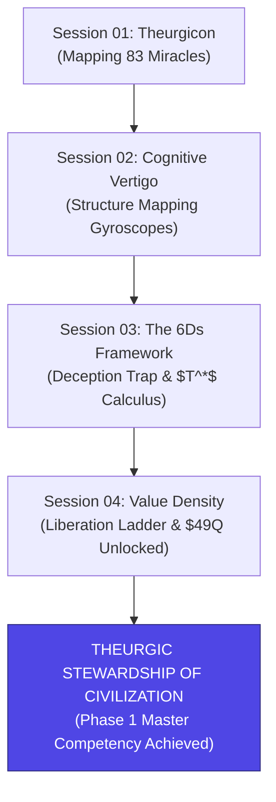

> **🎙️ 3-Presenter Authentic Tiki-Taka Script**
> 
> **Prof. Peter Kim:** Scholars, look at the master architecture on Slide 42. You have completed the foundational theoretical ascent of Phase 1. Marcus, trace the journey across our four sessions. *(Turn 1)*  
> **TA Marcus Brody:** In Session 1, we proved that modern technology realizes all 83 ancient divine miracles. In Session 2, we built cognitive gyroscopes through Structure-Mapping to overcome Cognitive Vertigo. In Session 3, we decoded the 6Ds and calculated the Deception Trap. And today in Session 4, we climbed the 5,000-year Liberation Ladder and proved that Value Density approaches infinity as physical mass drops to zero! *(Turn 2)*  
> **Dr. Elena Vance:** You now possess the complete theoretical, mathematical, and thermodynamic foundation of exponential civilization. *(Turn 3)*  
> **Prof. Peter Kim:** Read our Phase 1 Creed aloud: **"We are as gods... not to dominate physical matter, but to dissolve scarcity and steward planetary flourishing."** *(Turn 4)*  
> **TA Marcus Brody:** We don't build technology to escape the world; we build technology to heal the world and elevate every human life! *(Turn 5)*  
> **Dr. Elena Vance:** You are no longer passive observers of the future; you are certified Theurgists. *(Turn 6)*  
> **Prof. Peter Kim:** Now let us put this mastery to the test in our Phase 1 Capstone Seminar Debates and Moonshot Architecture Workshop in Module 6! *(Turn 7)*  
> **TA Marcus Brody:** Let’s dive into Module 6 on Slide 43! *(Turn 8)*  
> **Dr. Elena Vance:** Turn to Slide 43 for our Socratic Seminar Inquiries! *(Turn 9)*  
> **Prof. Peter Kim:** Proceed to Module 6: Graduate Seminar Discourse & Moonshot Design! *(Turn 10)*


---

## Module 6: Graduate Seminar Discourse & Moonshot Design (Slides 43–45)

### Slide 43: Socratic Seminar Inquiries: Triad of Dialectical Debates for Phase 1
- **Capstone Debate Topic 1 (The Post-Ownership Economic Transition):**
  - As autonomous robotaxis and dematerialized software dissolve asset ownership, how should civilizational law protect individual privacy, autonomy, and property rights against centralized platform feudalism?
- **Capstone Debate Topic 2 (Funding UBA vs. Hyper-Inflation in Positional Goods):**
  - If Universal Basic Abundance zeroes out the cost of basic survival, how can society prevent catastrophic speculative bubbles and hyper-inflation in non-scalable positional goods (e.g., land, rare minerals, elite heritage status)?
- **Capstone Debate Topic 3 (The Cognitive Sovereignty Mandate):**
  - To prevent the formation of a hyper-polarized cognitive aristocracy, should governments mandate algorithmic cognitive-training baselines, or does mandatory augmentation violate fundamental biological human rights?

> **🎙️ 3-Presenter Authentic Tiki-Taka Script**
> 
> **Prof. Peter Kim:** Cohorts, Slide 43 presents your three capstone dialectical debate topics for the conclusion of Phase 1. You will prepare structured oral defenses and written position papers integrating all four sessions. *(Turn 1)*  
> **Dr. Elena Vance:** Look at Capstone Debate 1: **The Post-Ownership Transition**. When nobody owns physical cars, media, or computational servers, how do we prevent three cloud monopolies from acting as tyrannical gatekeepers over human rights and personal data? *(Turn 2)*  
> **TA Marcus Brody:** Look at Capstone Debate 2: **Funding UBA versus Positional Good Hyper-Inflation**! When food, water, and compute are 100% free, all capital flows into beachfront land and luxury status symbols! How do we prevent society from tearing itself apart in positional status warfare? *(Turn 3)*  
> **Dr. Elena Vance:** And examine Capstone Debate 3: **The Cognitive Sovereignty Mandate**. In an age where augmented humans have $10,000\times$ the intellectual leverage of un-augmented humans, how do we maintain a cohesive democracy without forcing invasive neural implants onto unwilling citizens? *(Turn 4)*  
> **Prof. Peter Kim:** These three debates represent the fundamental constitutional questions of the 21st century. *(Turn 5)*  
> **TA Marcus Brody:** We expect rigorous mathematical modeling, game theory proofs, and constitutional legal frameworks in your submissions! *(Turn 6)*  
> **Dr. Elena Vance:** Back up every claim with thermodynamic and economic data from our ten empirical domains. *(Turn 7)*  
> **Prof. Peter Kim:** Now let us examine your Capstone Moonshot Architecture Protocol on Slide 44. *(Turn 8)*  
> **TA Marcus Brody:** The Value Density Optimization Blueprint! *(Turn 9)*  
> **Prof. Peter Kim:** Turn to Slide 44. *(Turn 10)*

---

### Slide 44: Capstone Moonshot Architecture Protocol: Value Density Optimization
- **Phase 1 Capstone Project Assignment:**
  - **Objective:** Design a **$100-Billion-Scale Moonshot System Architecture** targeting a multi-trillion-dollar global scarcity bottleneck (e.g., Rare Earth Mining, Urban Housing Construction, Chronic Kidney Dialysis, Deep-Sea Carbon Sequestration).
  - **The 4-Pillar Value Density Architectural Template:**
    1. *Dematerialization Ratio ($\mathcal{M}_{\text{initial}} / \mathcal{M}_{\text{final}}$):* Demonstrate a **$>100\times \text{ reduction}$** in physical hardware mass.
    2. *Thermodynamic Energy Leverage:* Shift operating energy from mechanical fossil fuels to photons/solid-state lattices.
    3. *Wright’s Law Compounding Model:* Formulate the exact cost deflation equation ($\text{Cost} = C_0 Y^{-\omega}$) across 10 doublings.
    4. *Universal Access Roadmap:* Design the open-protocol democratization model delivering post-scarcity utility to the bottom 4 billion humans.

> **🎙️ 3-Presenter Authentic Tiki-Taka Script**
> 
> **TA Marcus Brody:** Slide 44 details your major capstone deliverable for Phase 1: **The Value Density Optimization Moonshot Protocol**! You are going to take a multi-trillion-dollar global scarcity—like chronic kidney failure, urban housing shortages, or rare earth mining—and engineer a complete post-scarcity moonshot! *(Turn 1)*  
> **Dr. Elena Vance:** In Pillar 1, you must mathematically demonstrate a **$>100\times$ dematerialization of physical mass**—replacing tons of concrete, steel, or hospital machinery with software-guided microchips and bio-catalysts! *(Turn 2)*  
> **Prof. Peter Kim:** In Pillar 2, you must prove **Thermodynamic Energy Leverage**: Show how your system replaces dirty mechanical fuels with clean photons, solid-state semiconductors, or room-temperature chemical catalysis! *(Turn 3)*  
> **TA Marcus Brody:** In Pillar 3, you formulate the exact **Wright's Law Compounding Model**: Plot the learning curve and prove how scaling cumulative manufacturing volume slashes the unit cost by 80% to 99%! *(Turn 4)*  
> **Dr. Elena Vance:** And in Pillar 4, you design the **Universal Access Roadmap**: Prove that your system doesn't just make billionaires richer, but delivers free or near-zero-cost life-saving utility to the bottom four billion people on Earth! *(Turn 5)*  
> **TA Marcus Brody:** This is the exact architectural blueprint you will pitch for the **$100-Billion Giga-XPRIZE Capstone** at the end of the semester! *(Turn 6)*  
> **Prof. Peter Kim:** Build it with relentless first-principles rigor. Let this be the defining engineering document of your graduate career. *(Turn 7)*  
> **Dr. Elena Vance:** Now let us look ahead to what awaits us in Phase 2! *(Turn 8)*  
> **TA Marcus Brody:** Phase 2 Preview on Slide 45: Data-Driven Optimism and The Mekong Miracle! *(Turn 9)*  
> **Prof. Peter Kim:** Turn to Slide 45 for our concluding preview. *(Turn 10)*

---

### Slide 45: Phase 2 Preview: Data-Driven Optimism & The Mekong Miracle
- **Transition to Phase 2 (Sessions 05–08):**
  - **Next Week (Session 05):** *Data-Driven Optimism & The Mekong Miracle: Planetary Transformation in the Global South*.
  - **Assigned Reading:** Peter H. Diamandis & Steven Kotler, *We Are as Gods* (2026), Chapter 4 (*The Rising Tide*).
  - **Core Analytical Focus:** Auditing the empirical reality of Southeast Asia’s hyper-leapfrog, clean energy microgrids, drone-delivered logistics, and the definitive dismantling of doom-mongering narratives through 50 years of verifiable global data.
- **Phase 1 Final Benediction:**
  - *"We are as gods... and we have ascended the ladder to claim our birthright of abundance."*

```mermaid
flowchart LR
    P1["PHASE 1 COMPLETE<br/>Theoretical Foundations<br/>(Theurgicon • Vertigo • 6Ds • Value Density)"] ==> P2["PHASE 2 IGNITION<br/>Empirical Planetary Evidence<br/>(Mekong Miracle • Longevity • Energy • AGI)"]
    style P1 fill:#4f46e5,stroke:#312e81,color:#fff
    style P2 fill:#16a34a,stroke:#15803d,color:#fff
```

> **🎙️ 3-Presenter Authentic Tiki-Taka Script**
> 
> **Dr. Elena Vance:** Congratulations, cohorts! You have officially conquered **Phase 1: Theoretical Foundations**. Next week, we launch **Phase 2: Empirical Planetary Evidence** with Session 5: **Data-Driven Optimism & The Mekong Miracle**! *(Turn 1)*  
> **TA Marcus Brody:** We are traveling to Southeast Asia to examine the Mekong River Basin—where solar microgrids, autonomous cargo drones, and mobile fintech are transforming developing nations faster than anywhere else on Earth! *(Turn 2)*  
> **Prof. Peter Kim:** We will arm you with fifty years of undeniable empirical datasets to completely dismantle cynical media doom-mongering and establish evidence-based exponential optimism. *(Turn 3)*  
> **TA Marcus Brody:** You now know the 83 miracles, you have the Structure-Mapping gyroscopes, you’ve mastered the 6Ds, and you hold the Value Density master-key! *(Turn 4)*  
> **Dr. Elena Vance:** Review your notes, submit your Capstone Moonshot Architecture blueprints, and prepare for the empirical feast of Phase 2! *(Turn 5)*  
> **Prof. Peter Kim:** As Stewart Brand declared and Diamandis and Kotler affirmed: *"We are as gods... and we might as well get good at it."* Phase 1 is officially complete! *(Turn 6)*  
> **TA Marcus Brody:** See you all next week for Session 5 and the Mekong Miracle! *(Turn 7)*  
> **Dr. Elena Vance:** Fantastic work, everyone. Have an exceptional and high-impact week! *(Turn 8)*  
> **Prof. Peter Kim:** Class is dismissed! *(Turn 9)*
