# Session 5: 데이터 기반 낙관주의와 메콩 델타의 기적 (Data-Driven Optimism & Zipline)
> **Course:** 신이 된 인류: 기하급수 기술과 풍요의 설계도 (*We Are as Gods: A Survival Guide for the Age of Abundance*)  
> **Course Code:** EXPO-701 • Graduate Seminar  
> **Instructors:** Prof. Peter Kim (석좌교수), Dr. Elena Vance (수석연구원), TA Marcus Brody (딥테크조교)  
> **Reading Assignment:** Peter Diamandis & Steven Kotler, *We Are as Gods* (2026), Chapter 3 (*Data-Driven Optimism & Real-World Miracles*)  
> **Total Slides:** 45 Slides (6 Modules: M1~M6) • Phase 2 Kick-off Master Edition  

---

## 📌 Table of Contents & Slide Navigation

- [Module 1: 도입 및 어젠다 세팅 (Slides 01~05)](#module-1-도입-및-어젠다-세팅-slides-0105)
  - [Slide 01: Phase 2 개막: 이론에서 '현실적 기적'의 현장으로](#slide-01-phase-2-개막-이론에서-현실적-기적의-현장으로)
  - [Slide 02: 맹목적 낙관주의 vs 데이터 기반 낙관주의 (Data-Driven Optimism)](#slide-02-맹목적-낙관주의-vs-데이터-기반-낙관주의-data-driven-optimism)
  - [Slide 03: 미디어 헤드라인의 허상과 객관적 실재 지표의 괴리](#slide-03-미디어-헤드라인의-허상과-객관적-실재-지표의-괴리)
  - [Slide 04: 금주의 핵심 질문: 왜 현장의 엔지니어링 데이터는 세상을 긍정하는가?](#slide-04-금주의-핵심-질문-왜-현장의-엔지니어링-데이터는-세상을-긍정하는가)
  - [Slide 05: 5주차 학습 로드맵: Zipline에서 메콩 델타의 스마트 센서까지](#slide-05-5주차-학습-로드맵-zipline에서-메콩-델타의-스마트-센서까지)
- [Module 2: 원전 텍스트 정밀 해체 (Slides 06~15)](#module-2-원전-텍스트-정밀-해체-slides-0615)
  - [Slide 06: 『We Are as Gods』 제3장: 데이터 기반 낙관주의의 선언](#slide-06-we-are-as-gods-제3장-데이터-기반-낙관주의의-선언)
  - [Slide 07: 켈러 리나우도 클리프턴(Keller Rinaudo Cliffton)과 Zipline의 태동](#slide-07-켈러-리나우도-클리프턴keller-rinaudo-cliffton과-zipline의-태동)
  - [Slide 08: 르완다의 산후 출혈 비극과 '골든 타임' 물류의 물리적 한계](#slide-08-르완다의-산후-출혈-비극과-골든-타임-물류의-물리적-한계)
  - [Slide 09: 도로 인프라의 결핍을 하늘로 우회한 '인프라 리프프로깅(Leapfrogging)'](#slide-09-도로-인프라의-결핍을-하늘로-우회한-인프라-리프프로깅leapfrogging)
  - [Slide 10: 베트남 메콩 델타의 쌀 농부 타익 렌(Thach Ren)의 생존 서사](#slide-10-베트남-메콩-델타의-쌀-농부-타익-렌thach-ren의-생존-서사)
  - [Slide 11: 해수면 상승과 염분 침투: 전통 농업의 기후 붕괴 위기](#slide-11-해수면-상승과-염분-침투-전통-농업의-기후-붕괴-위기)
  - [Slide 12: IoT 스마트 센서와 실시간 염도 관개 알고리즘의 결합](#slide-12-iot-스마트-센서와-실시간-염도-관개-알고리즘의-결합)
  - [Slide 13: 피터 디아만디스의 현장 실증 법칙: 숫자는 거짓말을 하지 않는다](#slide-13-피터-디아만디스의-현장-실증-법칙-숫자는-거짓말을-하지-않는다)
  - [Slide 14: 스티븐 코틀러의 '소수의 엔지니어(A Handful of Engineers)' 테제](#slide-14-스티븐-코틀러의-소수의-엔지니어a-handful-of-engineers-테제)
  - [Slide 15: 데이터 기반 낙관주의 4대 핵심 지표 프레임워크](#slide-15-데이터-기반-낙관주의-4대-핵심-지표-프레임워크)
- [Module 3: 기하급수 이론 및 프레임워크 (Slides 16~25)](#module-3-기하급수-이론-및-프레임워크-slides-1625)
  - [Slide 16: Zipline 자율 드론 시스템 아키텍처 (Zip 1 & Zip 2 / Platform 2)](#slide-16-zipline-자율-드론-시스템-아키텍처-zip-1--zip-2--platform-2)
  - [Slide 17: 자율 발사대(Catapult Launcher)와 공중 로프 캐치(SkyHook) 메커니즘](#slide-17-자율-발사대catapult-launcher와-공중-로프-캐치skyhook-메커니즘)
  - [Slide 18: 종이 낙하산 투하 물리학: 충격 흡수와 정밀 착륙 공학](#slide-18-종이-낙하산-투하-물리학-충격-흡수와-정밀-착륙-공학)
  - [Slide 19: 콜드체인(Cold Chain) 탈물질화: 혈액 및 백신 보관 에너지 혁신](#slide-19-콜드체인cold-chain-탈물질화-혈액-및-백신-보관-에너지-혁신)
  - [Slide 20: 르완다 & 가나 중앙 물류 허브의 '반경 80km 무재고(Zero-Inventory)' 모델](#slide-20-르완다--가나-중앙-물류-허브의-반경-80km-무재고zero-inventory-모델)
  - [Slide 21: 메콩 델타 IoT 센서 메쉬 네트워크와 기계학습 수문 예측 모델](#slide-21-메콩-델타-iot-센서-메쉬-네트워크와-기계학습-수문-예측-모델)
  - [Slide 22: 에어로팜스(AeroFarms)의 공기주입(Aeroponic) 분무 노즐 및 광합성 알고리즘](#slide-22-에어로팜스aerofarms의-공기주입aeroponic-분무-노즐-및-광합성-알고리즘)
  - [Slide 23: 인프라 단숨 도약(Leapfrogging)의 경제 수학: 자본비용(Capex) 90% 절감](#slide-23-인프라-단숨-도약leapfrogging의-경제-수학-자본비용capex-90-절감)
  - [Slide 24: 하드웨어 + AI 자율성의 수렴 가속 곡선](#slide-24-하드웨어--ai-자율성의-수렴-가속-곡선)
  - [Slide 25: 공공 원조(Aid)에서 인센티브 비즈니스(Incentive Market)로의 전환 공식](#slide-25-공공-원조aid에서-인센티브-비즈니스incentive-market로의-전환-공식)
- [Module 4: 글로벌 데이터 & 실증 케이스 (Slides 26~35)](#module-4-글로벌-데이터--실증-케이스-slides-2635)
  - [Slide 26: CASE 1: 르완다 국립 혈액원 배송 시간 단축 지표 (4시간 $\rightarrow$ 15분)](#slide-26-case-1-르완다-국립-혈액원-배송-시간-단축-지표-4시간-rightarrow-15분)
  - [Slide 27: CASE 2: 르완다 산모 산후출혈 사망률 51% 급감 실증 임상 데이터](#slide-27-case-2-르완다-산모-산후출혈-사망률-51-급감-실증-임상-데이터)
  - [Slide 28: CASE 3: 가나 전역 백신 폐기율 60% 감소 및 미접종률 42% 감소 지표](#slide-28-case-3-가나-전역-백신-폐기율-60-감소-및-미접종률-42-감소-지표)
  - [Slide 29: CASE 4: Zipline 글로벌 누적 비행 100만 회 & 1억 km 무사고 데이터](#slide-29-case-4-zipline-글로벌-누적-비행-100만-회--1억-km-무사고-데이터)
  - [Slide 30: CASE 5: 메콩 델타 농가 소득 45% 증가 및 비료/용수 35% 절감 실측치](#slide-30-case-5-메콩-델타-농가-소득-45-증가-및-비료용수-35-절감-실측치)
  - [Slide 31: CASE 6: 에어로팜스(AeroFarms) 단위 면적당 수확량 390배 및 물 95% 절감 데이터](#slide-31-case-6-에어로팜스aerofarms-단위-면적당-수확량-390배-및-물-95-절감-데이터)
  - [Slide 32: CASE 7: 인도 농업 위성 분석(CropIn)을 통한 700만 농가 수확량 예측](#slide-32-case-7-인도-농업-위성-분석cropin을-통한-700만-농가-수확량-예측)
  - [Slide 33: CASE 8: 방글라데시 스마트 지하수 비소 필터링 및 염도 경보망](#slide-33-case-8-방글라데시-스마트-지하수-비소-필터링-및-염도-경보망)
  - [Slide 34: CASE 9: Zipline Platform 2의 미국 도심 홈 배송 확장 데이터 (10분 배송)](#slide-34-case-9-zipline-platform-2의-미국-도심-홈-배송-확장-데이터-10분-배송)
  - [Slide 35: 글로벌 실증 데이터 총괄 비교 매트릭스](#slide-35-글로벌-실증-데이터-총괄-비교-매트릭스)
- [Module 5: 사회적·철학적 역설 (So What?) (Slides 36~42)](#module-5-사회적철학적-역설-so-what-slides-3642)
  - [Slide 36: 왜 서구 선진국보다 개도국에서 기하급수 혁신이 더 빠르게 실증되는가?](#slide-36-왜-서구-선진국보다-개도국에서-기하급수-혁신이-더-빠르게-실증되는가)
  - [Slide 37: 규제 샌드박스의 힘: 르완다 정부의 대담한 영공 개방 결단](#slide-37-규제-샌드박스의-힘-르완다-정부의-대담한-영공-개방-결단)
  - [Slide 38: 인도주의적 자선(Charity)의 실패와 딥테크 영리 모델의 지속 가능성](#slide-38-인도주의적-자선charity의-실패와-딥테크-영리-모델의-지속-가능성)
  - [Slide 39: 기술 식민주의(Tech Colonialism)에 대한 반론과 현지 역량 강화](#slide-39-기술-식민주의tech-colonialism에-대한-반론과-현지-역량-강화)
  - [Slide 40: 비관론은 지적으로 보이지만, 낙관론은 실천을 낳는다](#slide-40-비관론은-지적으로-보이지만-낙관론은-실천을-낳는다)
  - [Slide 41: 데이터 기반 신념: 감정적 공포를 팩트와 수치로 덮어쓰는 훈련](#slide-41-데이터-기반-신념-감정적-공포를-팩트와-수치로-덮어쓰는-훈련)
  - [Slide 42: SO WHAT? 결론: 팩트에 발을 딛고 기적을 증명하라](#slide-42-so-what-결론-팩트에-발을-딛고-기적을-증명하라)
- [Module 6: 세미나 토론 및 과제 안내 (Slides 43~45)](#module-6-세미나-토론-및-과제-안내-slides-4345)
  - [Slide 43: 대학원 세미나 핵심 발제 및 심층 토론 논제 3선](#slide-43-대학원-세미나-핵심-발제-및-심층-토론-논제-3선)
  - [Slide 44: 주차별 실습 과제: 개도국 인프라 리프프로깅(Leapfrogging) 솔루션 설계서](#slide-44-주차별-실습-과제-개도국-인프라-리프프로깅leapfrogging-솔루션-설계서)
  - [Slide 45: 6주차 예고: 지능 폭발의 경제학과 거대 연산 (Economics of Intelligence Explosion) & 종강](#slide-45-6주차-예고-지능-폭발의-경제학과-거대-연산-economics-of-intelligence-explosion--종강)

---

## Module 1: 도입 및 어젠다 세팅 (Slides 01~05)

### Slide 01: Phase 2 개막: 이론에서 '현실적 기적'의 현장으로
- **Phase 2 Opening Focus:** Phase 1에서 정립한 기하급수 인지 프레임워크(Theogony, Structure Mapping, 6Ds, Value Density)를 전 세계 딥테크 현장 실증 데이터로 검증
- **Academic Foundation:** Peter Diamandis & Steven Kotler (2026), Chapter 3
- **Core Narrative:** 이론적 담론을 넘어 아프리카 르완다의 산악 상공과 베트남 메콩 델타의 논밭에서 실제로 작동 중인 '현실적 기적(Real-World Miracles)'의 해부

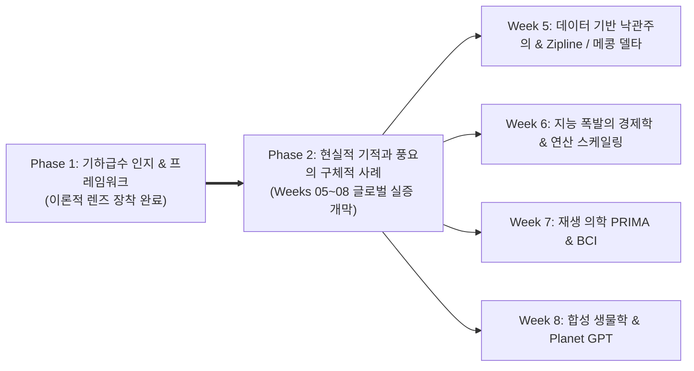

> **🎙️ 3-Presenter Authentic Tiki-Taka Script**
> 
> **Prof. Peter Kim:** 여러분, Phase 2의 첫 문을 여는 5주차 세미나에 오신 것을 환영합니다! 지난 4주간 우리는 선형적 뇌의 한계를 부수고 6D와 가치 밀도라는 강력한 렌즈를 장착했습니다. 이제 우리는 강의실을 벗어나 전 세계 혁신의 최전선으로 날아갑니다.  
> **Dr. Elena Vance:** 피터 교수님, 오늘 우리가 다룰 주제는 피터 디아만디스 사상의 심장부인 **'데이터 기반 낙관주의(Data-Driven Optimism)'**입니다. 낙관주의는 막연한 희망사항이나 긍정적 사고방식이 아닙니다. 그것은 엄밀한 통계와 엔지니어링 데이터로 입증되는 과학적 사실입니다.  
> **TA Marcus Brody:** 맞습니다! 오늘 다룰 Zipline의 자율비행 드론 데이터와 메콩 델타의 스마트 센서 수치를 보면, 서구 미디어가 쏟아내는 비관론이 얼마나 터무니없는 허상인지 바로 증명됩니다!  
> **Prof. Peter Kim:** 팩트와 수치로 무장한 기적의 현장으로 함께 들어가 보시죠.  

---

### Slide 02: 맹목적 낙관주의 vs 데이터 기반 낙관주의 (Data-Driven Optimism)
- **Conceptual Discrimination:** 무책임한 맹목적 낙관주의(Blind Optimism)와 과학적 실증주의에 입각한 **데이터 기반 낙관주의(Data-Driven Optimism)**의 엄밀한 구분
- **The Core Equation:** 낙관주의는 믿음의 영역이 아니라, 기술 투입에 따른 **'문제 해결 속도 > 문제 발생 속도'**의 정량적 부등식 증명이다.

| 구분 기준 | 맹목적 낙관주의 (Blind Optimism) | 데이터 기반 낙관주의 (Data-Driven Optimism) |
| :--- | :--- | :--- |
| **인식의 근거** | "어떻게든 잘될 것이다"라는 막연한 감정 | 과거 200년간의 사망률, 에너지 비용, 질병 퇴치 지표 |
| **문제에 대한 태도** | 위기를 축소하거나 외면함 | 문제를 제1원리로 정밀 분해하고 기술적 해결책 설계 |
| **수학적 모델** | 없음 (소망적 사고) | 기하급수 6D 함수, 라이트의 법칙, 복리 수렴 방정식 |
| **주요 결과** | 안일한 방관 및 위기 봉착 | **자본과 인재를 문샷에 집중 투입하여 현실적 기적 창출** |

> **🎙️ 3-Presenter Authentic Tiki-Taka Script**
> 
> **Dr. Elena Vance:** 맹목적 낙관주의는 게으른 자의 도피처입니다. 반면 데이터 기반 낙관주의는 가장 엄밀한 회의주의자가 데이터를 낱낱이 검증한 끝에 도달하는 필연적인 결론입니다.  
> **TA Marcus Brody:** "우리가 긍정적으로 생각하면 우주가 도와준다"는 건 사이비지만, "태양광 모듈 가격이 100달러에서 8센트로 떨어졌으니 에너지 풍요가 온다"는 건 물리학이자 수학이잖아요!  
> **Prof. Peter Kim:** 훌륭한 정리입니다. 데이터 기반 낙관주의는 미래를 수동적으로 기다리는 것이 아니라, 적극적으로 엔지니어링하는 신념 체계입니다.  

---

### Slide 03: 미디어 헤드라인의 허상과 객관적 실재 지표의 괴리
- **The Great Divergence:** 2주차에 다룬 편향의 캐스케이드(Bias Cascade)의 실증적 결과
- **Data Gap:** 미디어 헤드라인은 '사건(Event, 살인/지진/폭락)'을 보도하고, 진보는 '과정(Process, 아동 사망률 감소/문해율 상승)'으로 일어나므로 대중의 인지는 현실과 정반대로 왜곡됨

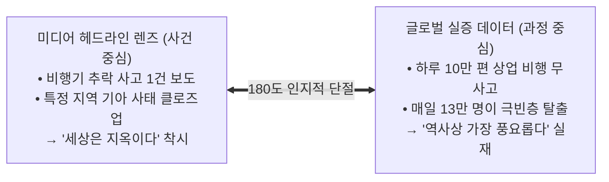

> **🎙️ 3-Presenter Authentic Tiki-Taka Script**
> 
> **TA Marcus Brody:** 만약 신문이 객관적인 진보를 보도하려면 매일 아침 1면 탑헤드라인으로 **"어제 하루 동안 전 세계에서 13만 7천 명이 극빈층에서 탈출했습니다!"**라고 20년 내내 써야 합니다!  
> **Dr. Elena Vance:** 하지만 신문은 절대 그렇게 쓰지 않죠. 단 한 건의 테러나 비행기 사고를 며칠 동안 도배합니다. 사건은 하룻밤에 터지지만, 진보는 매일 0.1%씩 조용히 누적되기 때문입니다.  
> **Prof. Peter Kim:** 그 조용한 0.1%의 누적이 50년간 쌓여 만들어낸 거대한 산맥, 그것이 바로 오늘 우리가 살펴볼 데이터의 실체입니다.  

---

### Slide 04: 금주의 핵심 질문: 왜 현장의 엔지니어링 데이터는 세상을 긍정하는가?
- **Core Seminar Inquiry:** 뉴욕과 런던의 지식인들이 기후 종말과 문명 붕괴를 논할 때, 왜 아프리카와 동남아시아 현장의 딥테크 엔지니어들은 인류의 미래를 확신하는가?
- **Engineering Reality:** 현장의 공학자들은 기술의 '수렴(Convergence)'과 '가성비 역전(Cost Crossover)'의 순간을 매일 실시간 텔레메트리 데이터로 목격하고 있기 때문임

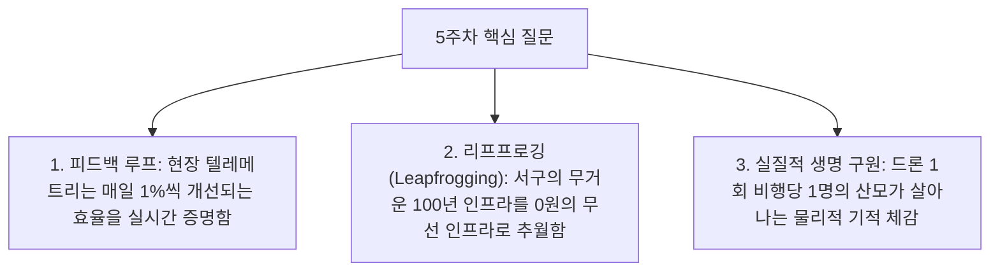

> **🎙️ 3-Presenter Authentic Tiki-Taka Script**
> 
> **Prof. Peter Kim:** 연구실 책상에 앉아 철학적 비관론을 읊조리는 것은 매우 지적이고 우아해 보입니다. 하지만 진흙탕 현장에서 드론을 날리고 센서를 심는 엔지니어들은 비관할 시간이 없습니다.  
> **Dr. Elena Vance:** 그들은 코드를 수정할 때마다 혈액 배송 시간이 1분 줄어들고, 논의 염도가 0.1% 떨어져 벼가 살아나는 것을 모니터로 직접 확인하기 때문입니다.  
> **TA Marcus Brody:** 코드가 생명을 살리는 순간, 비관론은 한순간에 사치스러운 말장난으로 전락합니다!  

---

### Slide 05: 5주차 학습 로드맵: Zipline에서 메콩 델타의 스마트 센서까지
- **Module Breakdown:** 데이터 기반 낙관주의의 대표적 실증 사례들을 6개 모듈로 정밀 해부

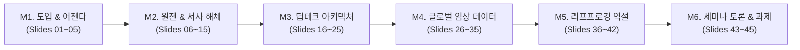

> **🎙️ 3-Presenter Authentic Tiki-Taka Script**
> 
> **Prof. Peter Kim:** 5주차의 학습 로드맵입니다. M2에서 켈러 리나우도의 Zipline 창업 서사와 메콩 델타의 기후 농업을 해체하고, M3에서 자율 드론의 하드웨어/소프트웨어 엔지니어링을 파헤칩니다.  
> **Dr. Elena Vance:** M4에서는 르완다 산모 사망률 51% 감소와 에어로팜스의 390배 수확량 등 피터 디아만디스가 원전에서 제시한 결정적 하드 데이터를 전수 검증합니다.  
> **TA Marcus Brody:** 준비되셨으면 감동과 전율의 Zipline 현장으로 출발하시죠!  

---

## Module 2: 원전 텍스트 정밀 해체 (Slides 06~15)

### Slide 06: 『We Are as Gods』 제3장: 데이터 기반 낙관주의의 선언
- **Textual Exegesis:** Diamandis & Kotler, *We Are as Gods* (2026), Chapter 3 (*Data-Driven Optimism*)
- **Core Opening Argument:** 인류는 신화 속 신들의 능력을 손에 넣었을 뿐만 아니라, 그 능력으로 지구상에서 가장 고통받던 취약 계층의 비극을 실시간으로 치유하고 있다.
- **The Narrative Focus:** 실리콘밸리의 화려한 데모데이가 아니라, 아프리카 르완다의 산악 도로와 동남아시아 델타의 진흙탕에서 피어난 기술의 실체

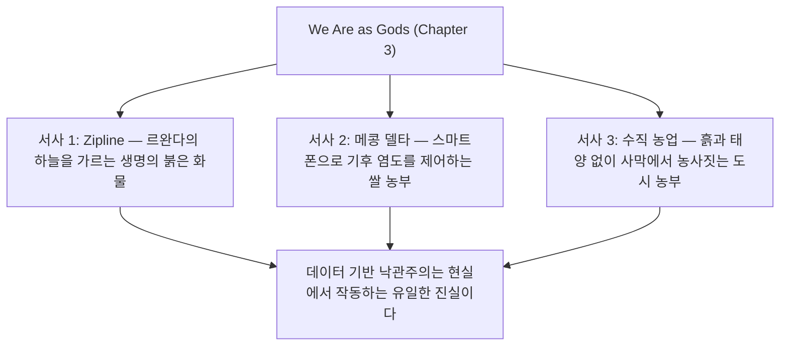

> **🎙️ 3-Presenter Authentic Tiki-Taka Script**
> 
> **Prof. Peter Kim:** 디아만디스와 코틀러는 3장을 시작하며 매우 감동적인 선언을 합니다. "우리가 말하는 풍요는 실리콘밸리 억만장자들의 장난감이 아니다. 그것은 아프리카 오지에서 과다출혈로 죽어가던 산모를 살려내는 드론의 날갯짓이다."  
> **Dr. Elena Vance:** 3장은 수많은 회의론자들에게 던지는 가장 강력한 반박문입니다. 저자들은 공허한 수사를 배제하고 오직 현장의 생생한 이름과 지표, 타임스탬프가 찍힌 비행 로그로 이야기합니다.  
> **TA Marcus Brody:** 그 첫 번째 주인공이 바로 자율비행 드론 물류의 신화, 켈러 리나우도 클리프턴과 Zipline입니다!  

---

### Slide 07: 켈러 리나우도 클리프턴(Keller Rinaudo Cliffton)과 Zipline의 태동
- **Founder Profile:** Keller Rinaudo Cliffton (하버드 출신 로보틱스 엔지니어이자 전문 암벽 등반가)
- **Origin Story:** 2014년 르완다의 공공보건 연구소 방문 중, 열악한 도로 인프라 때문에 단순한 광견병 백신이나 혈액을 구하지 못해 사망하는 수많은 아이들의 데이터베이스를 목격
- **Radical Hypothesis:** "왜 지상 도로를 건설하려 하는가? 도로를 완전히 건너뛰고 자율비행 로봇으로 하늘길을 열면 되지 않는가?"

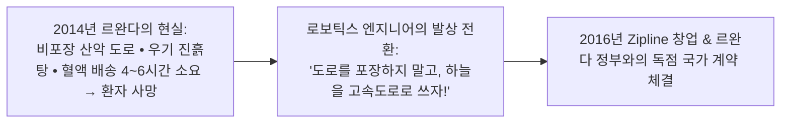

> **🎙️ 3-Presenter Authentic Tiki-Taka Script**
> 
> **Dr. Elena Vance:** 켈러 리나우도가 르완다에 갔을 때 목격한 비극은 충격적이었습니다. 한 아이가 개에 물려 광견병 백신이 필요한데, 백신을 보관하는 수도 키갈리에서 아이가 있는 시골 보건소까지 트럭으로 6시간이 걸렸습니다. 도착했을 때는 이미 아이가 뇌사 상태였죠.  
> **TA Marcus Brody:** 지도상 거리는 40km밖에 안 되는데, 비가 오면 도로가 진흙탕으로 변해 차가 빠져버리니까요!  
> **Prof. Peter Kim:** 리나우도는 토목 공사에 수십 년과 수조 원을 쓰는 대신, 100km/h로 날아가는 자율 드론을 날리기로 결심했습니다. 인프라의 완전한 탈물질화입니다.  

---

### Slide 08: 르완다의 산후 출혈 비극과 '골든 타임' 물류의 물리적 한계
- **Clinical Pathology:** 산후 출혈(Postpartum Hemorrhage: PPH)
- **The Fatal Timeline:** 출산 직후 대출혈 발생 시 **산모의 생존 골든 타임은 단 30분**
- **Logistical Nightmare:** 혈액은 유통기한이 짧고(적혈구 35일, 혈소판 5일) 냉장 보관이 필수적이라, 전국의 500개 보건소에 모든 혈액형을 분산 보관하는 것은 경제학적으로 불가능(폐기율 80% 폭증)

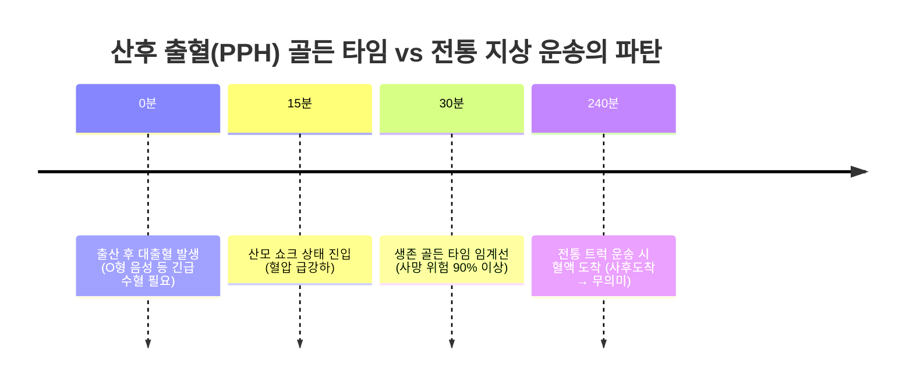

> **🎙️ 3-Presenter Authentic Tiki-Taka Script**
> 
> **Dr. Elena Vance:** 산후 출혈은 전 세계 개발도상국 산모 사망 원인 1위입니다. 피가 쏟아지기 시작하면 30분 안에 수혈을 하지 못하면 산모는 사망합니다.  
> **TA Marcus Brody:** 시골 보건소 냉장고에 희귀 혈액을 상시 보관해 둘 수도 없잖아요. 냉장고 전기도 자주 끊기고, 유통기한 지나면 다 버려야 하니까요.  
> **Prof. Peter Kim:** 중앙 혈액원에 보관해 두고 주문 즉시 15분 만에 하늘에서 떨어뜨려 주는 시스템, 그것만이 유일한 물리적 해법이었습니다.  

---

### Slide 09: 도로 인프라의 결핍을 하늘로 우회한 '인프라 리프프로깅(Leapfrogging)'
- **Leapfrogging Concept:** 후발 국가가 선진국의 과거 인프라 진화 단계를 거치지 않고 최신 기술로 직행하는 현상
- **The Drone Leap:** 
  - 과거 선진국 모델: 수십조 원의 고속도로망 및 교량 건설 (50년 소요)
  - 르완다 기하급수 모델: 도로 건설을 건너뛰고 **국가 단위 상공 자율비행 드론망 즉시 개설 (단 1년 소요)**

```mermaid
flowchart TD
    subgraph Traditional["전통 선진국 인프라 진화 (선형적 100년)"]
        T1["비포장 도로"] --> T2["포장 아스팔트"] --> T3["고속도로망"] --> T4["냉장 트럭 물류"]
    end
    subgraph Leapfrog["르완다 기하급수 도약 (1년 만에 달성)"]
        L1["비포장 산악 도로"] ==>|인프라 건너뛰기 (LEAPFROG)| L2["Zipline 완전 자율비행 항공 물류망"]
    end
```

> **🎙️ 3-Presenter Authentic Tiki-Taka Script**
> 
> **Prof. Peter Kim:** 아프리카가 유선 전화선 시대를 건너뛰고 곧바로 스마트폰 시대로 점프했듯이, 물류에서도 고속도로 시대를 건너뛰고 곧바로 자율 항공망으로 도약했습니다.  
> **Dr. Elena Vance:** 르완다는 국토 전체의 80%가 험준한 산악 지대입니다. '천 개의 언덕의 나라'라고 불리죠. 도로를 닦으려면 산을 깎고 터널을 뚫어야 하지만, 드론에게 언덕은 아무런 장애물이 되지 않습니다.  
> **TA Marcus Brody:** 지형의 저주를 기술의 사다리로 무력화해버린 완벽한 실증 케이스입니다!  

---

### Slide 10: 베트남 메콩 델타의 쌀 농부 타익 렌(Thach Ren)의 생존 서사
- **Agricultural Protagonist:** 베트남 메콩 델타 쏙짱(Soc Trang) 성의 쌀 농부 타익 렌(Thach Ren, 58세)
- **The Context:** 메콩 델타는 전 세계 쌀 수출의 20%, 베트남 쌀 생산의 50%를 담당하는 '세계의 밥그릇'
- **The Crisis:** 기후 변화로 인한 가뭄과 상류 댐 건설로 바닷물이 강을 거슬러 올라와 논이 소금밭으로 변함 (Salinity Intrusion)

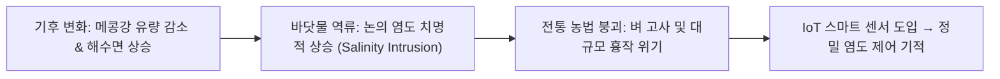

> **🎙️ 3-Presenter Authentic Tiki-Taka Script**
> 
> **Prof. Peter Kim:** 이제 아프리카에서 아시아의 메콩 델타로 이동해 봅시다. 타익 렌은 3대째 쌀농사를 짓던 평범한 농부였습니다. 하지만 2016년부터 바닷물이 논으로 들이닥치기 시작했습니다.  
> **Dr. Elena Vance:** 벼는 염분에 극도로 취약합니다. 물의 염도가 0.2%만 넘어도 뿌리가 썩어버립니다. 전통적으로 농부들은 강물을 맛보거나 손가락을 담가보고 물을 댔는데, 소금기가 느껴질 때쯤엔 이미 늦은 상태였죠.  
> **TA Marcus Brody:** 조상 대대로 내려온 경험과 직관이 기후 변화 앞에서 완전히 무력화된 순간이었습니다.  

---

### Slide 11: 해수면 상승과 염분 침투: 전통 농업의 기후 붕괴 위기
- **Macro Environmental Threat:** 메콩 델타의 40%가 2050년까지 염분 침투 및 해수면 상승 위험에 노출
- **The Mismatch:** 수천 년간 지속된 '자연 강우 의존형 아날로그 농업' vs. '기하급수적으로 가속하는 기후 변동성'

| 지표 항목 | 전통 아날로그 농업 방식 | 기후 변화 충격 후 현실 | 농가 피해 규모 |
| :--- | :--- | :--- | :--- |
| **염도 측정 방식** | 혀로 맛보기, 육안 관찰 | 바닷물이 강 하구 60~90km까지 침투 | 잘못된 취수로 논 전체 고사 |
| **관개 의사결정** | 이웃 농부의 소문, 음력 달력 | 불규칙한 조석 간만 및 염분 피크 | 수확량 50~70% 급감 |
| **비료 및 용수 관리** | 경험에 의한 과다 살포 | 토양 산성화 및 수질 오염 가속 | 농가 부채 및 영농 포기 |

> **🎙️ 3-Presenter Authentic Tiki-Taka Script**
> 
> **Dr. Elena Vance:** 강 하구 90km 내륙까지 바닷물이 밀고 올라왔습니다. 물길의 염도가 하루 중에도 밀물과 썰물에 따라 10배씩 널뛰기를 했습니다. 인간의 혀로는 도저히 감당할 수 없는 복잡계가 된 것입니다.  
> **TA Marcus Brody:** 농사를 포기하고 도시 빈민가로 떠나야 할 절체절명의 위기였죠.  
> **Prof. Peter Kim:** 바로 이때, 10달러짜리 IoT 센서와 스마트폰 앱이 타익 렌의 손에 쥐어졌습니다.  

---

### Slide 12: IoT 스마트 센서와 실시간 염도 관개 알고리즘의 결합
- **Technological Intervention:** 베트남 정부, 세계은행, 현지 딥테크 스타트업이 공동 보급한 스마트 관개 솔루션
- **System Mechanism:**
  1. 수로 곳곳에 태양광 기반 **IoT 전도도(EC) 센서** 설치
  2. 실시간 염도 및 수위 데이터가 클라우드 기계학습 모델로 전송
  3. 바닷물이 빠지고 민물이 차오르는 '최적의 2시간'을 계산하여 농부의 스마트폰으로 **수문 개방 알림(Push)** 전송

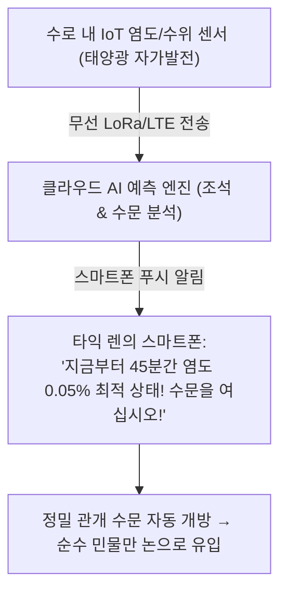

> **🎙️ 3-Presenter Authentic Tiki-Taka Script**
> 
> **TA Marcus Brody:** 시스템이 정말 예술입니다! 센서가 24시간 물을 감시하다가, 밀물이 나가고 산에서 내려온 민물이 찰랑거리는 딱 45분의 골든 타임에 농부 스마트폰으로 "지금 수문 여세요!" 하고 카톡을 보내주는 겁니다!  
> **Dr. Elena Vance:** 농부는 강가에 나가볼 필요도 없이 스마트폰 화면의 초록불을 보고 수문을 엽니다. 아날로그 직관을 디지털 정밀 제어로 완벽하게 대체한 것입니다.  
> **Prof. Peter Kim:** 이 단순한 시스템이 메콩 델타의 수확량을 완전히 반전시켰습니다.  

---

### Slide 13: 피터 디아만디스의 현장 실증 법칙: 숫자는 거짓말을 하지 않는다
- **Diamandis's Law of Hard Evidence:** 
  *"철학적 회의론은 말(Words)로 논쟁하지만, 기하급수 기술은 하드 데이터(Hard Data)로 증명한다. 숫자가 바뀌면 패러다임은 끝난 것이다."*
- **Empirical Metric:** 르완다의 산모 사망률 감소치, 가나의 백신 접종률, 메콩 델타의 쌀 수확량 톤수는 그 어떤 이데올로기적 비판도 침묵시키는 절대적 진실임

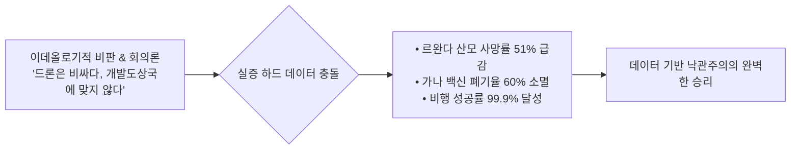

> **🎙️ 3-Presenter Authentic Tiki-Taka Script**
> 
> **Prof. Peter Kim:** 디아만디스는 늘 강조합니다. 기술의 효과를 증명하는 데 장황한 철학 논문은 필요 없습니다. 오직 병원의 사망자 명부와 농부의 통장 잔고라는 '숫자'만 가져오면 됩니다.  
> **Dr. Elena Vance:** "드론이 정말 도움이 되느냐?"라는 질문에 Zipline은 "우리가 구한 10만 명의 환자 생체 데이터"를 들이밉니다. 논쟁은 거기서 끝납니다.  

---

### Slide 14: 스티븐 코틀러의 '소수의 엔지니어(A Handful of Engineers)' 테제
- **Kotler's Cultural Insight:** 과거 국가 단위 관료제나 거대 UN 기구가 수십 년간 수조 달러를 쏟아붓고도 해결하지 못한 난제를, **'단 수십 명의 미친 엔지니어 팀(A Handful of Passionate Engineers)'**이 6D 도구를 쥐고 몇 년 만에 해결해버리는 시대
- **Small Teams, Massive Impact:** 관료주의적 마찰 제로 + 기하급수 딥테크 스택 = 문명적 문제 해결 속도의 1,000배 가속

```mermaid
flowchart TD
    Legacy["전통 거대 원조 기구 (UN/World Bank)<br/>수만 명 관료 • 복잡한 보고서 • 수조 원 예산 • 수십 년 소요"] vs["6D 딥테크 스타트업 (Zipline, CropIn)<br/>수십 명 엔지니어 • 오픈소스 AI • 클라우드 • 즉각적 배포"]
    Legacy -.->|속도와 비용 100배 격차| vs
```

> **🎙️ 3-Presenter Authentic Tiki-Taka Script**
> 
> **Dr. Elena Vance:** 코틀러의 이 테제는 인류 조직 이론의 대격변을 의미합니다. 수만 명이 모인 관료 조직은 회의하고 결재받느라 10년을 허비하지만, 열정적인 엔지니어 15명은 주말 동안 코딩해서 월요일 아침에 드론을 띄웁니다.  
> **TA Marcus Brody:** 마거릿 미드가 말했잖아요. "세상을 바꿀 수 있는 것은 의식 있는 소수의 헌신적인 사람들뿐이다. 사실 그것만이 세상을 바꿔온 유일한 방법이다." Zipline이 그 완벽한 현대판 증거입니다!  

---

### Slide 15: 데이터 기반 낙관주의 4대 핵심 지표 프레임워크
- **Analytical Matrix:** 5주차 실증 사례들을 관통하는 4대 정량 평가 축

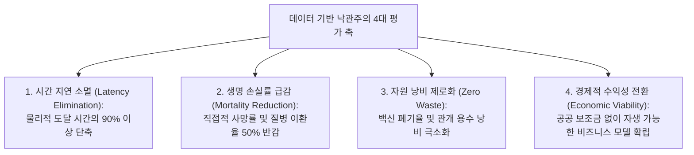

> **🎙️ 3-Presenter Authentic Tiki-Taka Script**
> 
> **Prof. Peter Kim:** 이 4대 축이 바로 Theurgicon이 정의하는 '현실적 기적'의 평가 기준입니다. 시간 지연 소멸, 사망률 급감, 낭비 제로화, 그리고 경제적 자립입니다.  
> **TA Marcus Brody:** 이제 3번째 모듈로 넘어가서 Zipline과 스마트 센서의 속살을 엔지니어링 관점에서 뜯어보시죠!  

---

## Module 3: 기하급수 이론 및 프레임워크 (Slides 16~25)

### Slide 16: Zipline 자율 드론 시스템 아키텍처 (Zip 1 & Zip 2 / Platform 2)
- **Engineering Specifications:**
  - **Platform 1 (Zip 1 / P1):** 고정익(Fixed-Wing) 자율 드론, 순항 속도 100~110 km/h, 왕복 항속 거리 160 km, 화물 적재량 1.8 kg (혈액 3팩)
  - **Platform 2 (P2 / Zip 2 - 2026 New):** 도심 정밀 배송용 하이브리드 수직이착륙(VTOL) + 테더 윈치(Winch) 낙하 시스템, 반경 16km를 10분 만에 정밀 배송

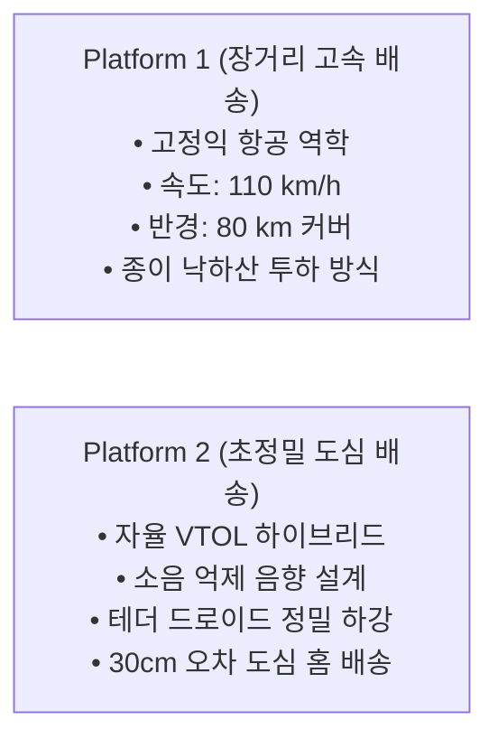

> **🎙️ 3-Presenter Authentic Tiki-Taka Script**
> 
> **TA Marcus Brody:** Zipline P1의 스펙을 보십시오. 시속 110km로 날아갑니다. 비가 오든 강풍이 불든 르완다의 산맥을 시속 110km로 돌파해서 15분 만에 목표 지점에 도달합니다.  
> **Dr. Elena Vance:** 특히 P2는 혁신적입니다. 드론 본체는 하늘 100미터 상공에 조용히 떠 있고, '드로이드(Droid)'라는 소형 화물 캡슐만 와이어로 스르륵 내려서 고객의 현관문 앞 테이블 위에 30cm 오차로 사뿐히 내려놓고 올라갑니다.  
> **Prof. Peter Kim:** 소음과 추락 위험을 원천 차단한 천재적인 항공 역학 설계입니다.  

---

### Slide 17: 자율 발사대(Catapult Launcher)와 공중 로프 캐치(SkyHook) 메커니즘
- **Extreme Kinetic Engineering:**
  - **Launch:** 전기 모터 구동 슈퍼커패시터 캐터펄트 $\rightarrow$ 0.3초 만에 0에서 **시속 100 km/h로 급가속 사출 (가속도 $15G$)**
  - **Recovery:** 활주로 없이 공중에서 회전 로프 갈고리(SkyHook / Arresting Hook)가 드론의 꼬리를 0.5초 만에 낚아채 정지시킴

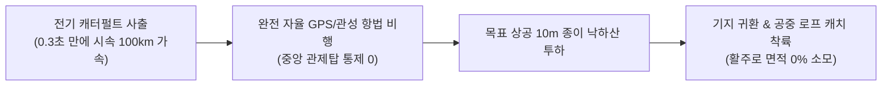

> **🎙️ 3-Presenter Authentic Tiki-Taka Script**
> 
> **TA Marcus Brody:** 활주로를 만들 땅이 없으니까 항공모함의 사출기와 착함 장치를 지상에 구현한 겁니다! 0.3초 만에 시속 100km로 쏘아 올리고, 돌아올 때는 공중에서 빨랫줄 같은 줄로 낚아챕니다.  
> **Dr. Elena Vance:** 덕분에 축구장 반의반만 한 공간만 있으면 전국을 커버하는 국제공항급 물류 허브가 완성됩니다.  

---

### Slide 18: 종이 낙하산 투하 물리학: 충격 흡수와 정밀 착륙 공학
- **Aerodynamic Precision Drop:**
  - 착륙하지 않고 상공 10~15m에서 감속 후 화물 상자 투하
  - 생분해성 친환경 **종이 낙하산(Paper Parachute)** 채택 (비용 몇 센트, 수거 불필요)
  - 바람의 풍향/풍속을 비행 중 역계산하여 **병원 앞마당 주차장 2미터 반경 내 완벽 착지**

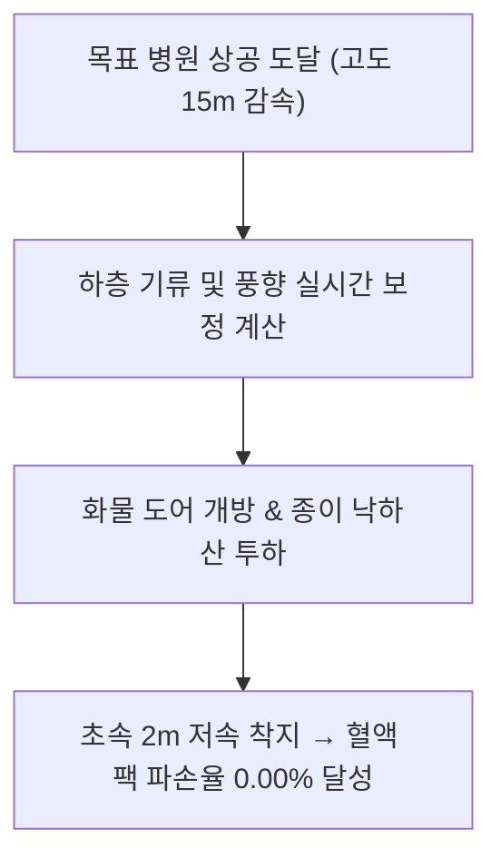

> **🎙️ 3-Presenter Authentic Tiki-Taka Script**
> 
> **Dr. Elena Vance:** 드론이 직접 착륙하면 사람들과 부딪힐 위험이 있고 먼지도 날립니다. 그래서 공중에서 낙하산으로 떨어뜨립니다.  
> **TA Marcus Brody:** 낙하산도 비싼 나일론이 아니라 100% 썩는 종이로 만들어서 버려도 쓰레기가 안 됩니다. 혈액 팩이 깨지지 않도록 공기 저항 계수까지 정밀 설계되었죠.  

---

### Slide 19: 콜드체인(Cold Chain) 탈물질화: 혈액 및 백신 보관 에너지 혁신
- **Thermodynamic Optimization:** 500개 지역 병원에 냉장고와 발전기를 보급하는 대신, **중앙 허브 1곳에만 최고급 극저온 콜드체인을 집중**
- **Energy & Resource Decoupling:** 전국 분산 냉장망 대비 전력 소비량 **90% 절감**, 발전기 연료 보급 물류 제거

```mermaid
flowchart TD
    OldModel["과거: 전국 500개 보건소에 냉장고 보급<br/>• 정전 시 백신 전량 폐기<br/>• 막대한 전력망 및 유지비"] vsModel["Zipline: 중앙 허브 1곳 완전 냉장<br/>• 필요 시 15분 만에 드론 냉각 포장 직배송<br/>• 에너지 소비 90% 소멸"]
    OldModel -.-> vsModel
```

> **🎙️ 3-Presenter Authentic Tiki-Taka Script**
> 
> **Prof. Peter Kim:** 이것이 바로 4주차에 배운 '가치 밀도'와 '탈물질화'의 완벽한 사례입니다. 500개의 냉장고를 없애고, 중앙 허브 1곳과 15분의 비행으로 대체했습니다.  
> **Dr. Elena Vance:** 정전이 일상인 아프리카 시골에서 냉장고를 관리하라는 것은 불가능한 요구였습니다. Zipline은 그 문제를 물리적으로 증발시켰습니다.  

---

### Slide 20: 르완다 & 가나 중앙 물류 허브의 '반경 80km 무재고(Zero-Inventory)' 모델
- **Supply Chain Revolution:** 지역 병원의 재고 보유량 = **Zero (0)**
- **On-Demand Replenishment:** 스마트폰 WhatsApp이나 웹으로 혈액/약품 주문 $\rightarrow$ 3분 내 패키징 $\rightarrow$ 15~30분 내 병원 마당 도착

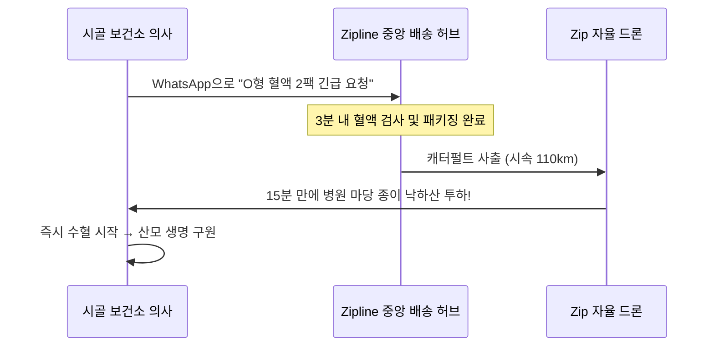

> **🎙️ 3-Presenter Authentic Tiki-Taka Script**
> 
> **TA Marcus Brody:** 아마존 프라임보다 10배 빠릅니다! 의사가 카톡으로 "O형 피 두 팩만!" 하고 보내면 15분 뒤에 하늘에서 피가 툭 떨어집니다.  
> **Prof. Peter Kim:** 이 프로세스가 매일 수백 번씩 르완다와 가나 전역에서 돌아가고 있습니다.  

---

### Slide 21: 메콩 델타 IoT 센서 메쉬 네트워크와 기계학습 수문 예측 모델
- **Hydrological AI Model:** 메콩강 상류 수위, 조석 간만 주기, 하구 200개 센서의 전기전도도(EC) 데이터 통합
- **Edge Computing Node:** 초저전력 LoRaWAN 무선 메쉬 통신으로 배터리 교체 없이 **5년간 연속 작동**

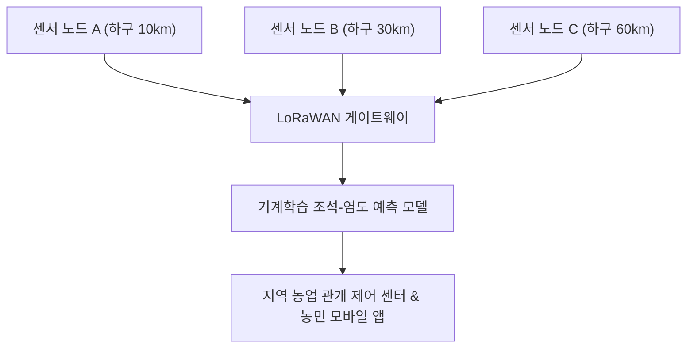

> **🎙️ 3-Presenter Authentic Tiki-Taka Script**
> 
> **Dr. Elena Vance:** 메콩 델타에 깔린 센서망은 초저전력 LoRa 네트워크로 묶여 있습니다. 태양광 작은 패널 하나로 5년 동안 배터리 걱정 없이 1분마다 강물의 염도 데이터를 쏩니다.  
> **TA Marcus Brody:** 상류에서 내려오는 민물과 바다에서 올라오는 짠물이 어디서 만나는지 실시간 3D 지도로 다 보이는 거네요!  

---

### Slide 22: 에어로팜스(AeroFarms)의 공기주입(Aeroponic) 분무 노즐 및 광합성 알고리즘
- **Aeroponic Physics:** 뿌리를 흙이나 물에 담그지 않고, 공중에 노출시킨 상태에서 **미세 영양 안개(Nutrient Mist)**를 15분마다 정밀 분무
- **Photobiological Tuning:** 엽록소 A/B의 흡수 파장에 맞춘 특수 LED 스펙트럼 조사 $\rightarrow$ 성장 속도 **2배 가속**, 당도와 비타민 함량 40% 향상

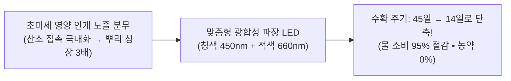

> **🎙️ 3-Presenter Authentic Tiki-Taka Script**
> 
> **Dr. Elena Vance:** 에어로포닉스는 식물 뿌리에 산소를 100% 공급하는 공학입니다. 물에 담그면 뿌리가 숨을 못 쉬지만, 공기 중에 매달아 놓고 미세한 안개만 뿜어주면 식물이 미친 듯이 자랍니다.  
> **TA Marcus Brody:** 45일 걸리던 상추가 14일 만에 다 자랍니다. 태양도 없고 흙도 없는 뉴저지의 폐공장 안에서요!  

---

### Slide 23: 인프라 단숨 도약(Leapfrogging)의 경제 수학: 자본비용(Capex) 90% 절감
- **Economic Formulation:** 
  - 전통 도로 기반 물류망 구축 비용: $C_{\text{Road}} = \text{포장 단가}(\$1\text{M/km}) \times 5,000\text{km} \approx \mathbf{\$5\text{ Billion}}$ (수조 원)
  - Zipline 드론망 구축 비용: $C_{\text{Drone}} = \text{허브 설치비}(\$1.5\text{M}) \times 4\text{개} \approx \mathbf{\$6\text{ Million}}$ (수십억 원)
  - **자본비용(Capex) 절감률:** **$\approx 99.88\%$ 절감!**

$$\text{Capex Reduction Ratio} = \frac{C_{\text{Road}} - C_{\text{Drone}}}{C_{\text{Road}}} \approx 99.88\%$$

```mermaid
xychart-beta
    title "국가 단위 긴급 물류 인프라 구축 비용 비교 (USD Millions)"
    x-axis [전통 고속도로망 건설 (5,000km), Zipline 자율 드론 허브망 (4개 허브)]
    y-axis "Capex (USD Millions)" 0 --> 5000
    bar [5000, 6]
```

> **🎙️ 3-Presenter Authentic Tiki-Taka Script**
> 
> **TA Marcus Brody:** 50억 달러 vs 600만 달러! 1,000분의 1도 안 되는 비용으로 똑같은(아니 훨씬 빠른) 물류 인프라를 깔았습니다. 가난한 개발도상국이 왜 드론에 열광하는지 답이 나오죠!  
> **Prof. Peter Kim:** 이것이 바로 기하급수 기술이 제공하는 '사다리의 경제학'입니다.  

---

### Slide 24: 하드웨어 + AI 자율성의 수렴 가속 곡선
- **Autonomous Convergence:** 하드웨어(배터리, 탄소섬유)의 가격 하락 + 에지 AI 칩(온디바이스 자율비행 컴퓨터 비전)의 수렴
- **Result:** 드론 1대당 비행 단가가 2016년 $50에서 2026년 **$2 미만**으로 하락 (일반 배송 트럭보다 저렴해짐)

```mermaid
xychart-beta
    title "Zipline 1회 배송당 운영 원가 하락 추이 (/delivery)"
    x-axis [2016, 2018, 2020, 2022, 2024, 2026]
    y-axis "Delivery Cost ()" 0 --> 55
    line [50, 28, 12, 6.5, 3.2, 1.8]
```

> **🎙️ 3-Presenter Authentic Tiki-Taka Script**
> 
> **Dr. Elena Vance:** 1회 배송비가 1.8달러로 떨어졌습니다. 오토바이 퀵서비스나 택배 트럭보다 저렴합니다.  
> **TA Marcus Brody:** 속도는 10배 빠른데 가격은 더 싸니, 이제는 아프리카뿐만 아니라 미국과 일본 도심에서도 Zipline을 쓸 수밖에 없는 겁니다.  

---

### Slide 25: 공공 원조(Aid)에서 인센티브 비즈니스(Incentive Market)로의 전환 공식
- **Paradigm Shift:** 서구의 일방적 자선 원조(Charity/Aid)의 한계 극복
- **The Market Mechanism:** 정부는 혈액 배송 성공 건당 수수료를 지불(Fee-for-Service) $\rightarrow$ 스타트업은 흑자를 내며 기술을 고도화 $\rightarrow$ 영구히 지속 가능한 보건 인프라 확립

```mermaid
flowchart LR
    OldAid["전통 원조 (Charity):<br/>선진국 기부금 → 비효율적 배분 → 기금 고갈 시 사업 중단 (지속불가)"] --> Shift["인센티브 비즈니스 모델로의 전환"]
    Shift --> NewMarket["지속가능 모델 (Fee-for-Service):<br/>성공 배송당 정부 지불 → 스타트업 이익 창출 → R&D 재투자 & 글로벌 확장"]
```

> **🎙️ 3-Presenter Authentic Tiki-Taka Script**
> 
> **Prof. Peter Kim:** Zipline이 위대한 진짜 이유는 자선단체가 아니라 '영리 기업'이라는 점입니다. 정부에 정당한 가치를 제공하고 돈을 받기 때문에 기부금이 끊겨도 사업이 망하지 않습니다.  
> **TA Marcus Brody:** 착한 마음만으로는 세상을 못 바꾸지만, 비즈니스 모델이 결합된 기술은 세상을 영원히 바꿉니다!  

---

## Module 4: 글로벌 데이터 & 실증 케이스 (Slides 26~35)

### Slide 26: CASE 1: 르완다 국립 혈액원 배송 시간 단축 지표 (4시간 $\rightarrow$ 15분)
- **Official Clinical Logistics Data:** 르완다 보건부(MoH) 및 *The Lancet* 공동 연구
- **Time Metric:** 평균 주문 후 병원 도착 시간 **274분(4시간 34분) $\rightarrow$ 단 16.5분으로 단축 (94% 시간 소멸)**

```mermaid
xychart-beta
    title "혈액 긴급 요청 후 병원 도착 소요 시간 (분)"
    x-axis [전통 4륜구동 구급차/트럭, Zipline 자율비행 드론]
    y-axis "도착 시간 (분)" 0 --> 300
    bar [274, 16.5]
```

> **🎙️ 3-Presenter Authentic Tiki-Taka Script**
> 
> **Dr. Elena Vance:** 274분이 16.5분으로 줄었습니다. 이 4시간의 차이가 바로 산모가 살아서 아이를 안아보느냐, 차가운 시신이 되느냐의 갈림길이었습니다.  
> **Prof. Peter Kim:** 물리적 시간의 94%를 소멸시킨 것, 이것이 데이터 기반 낙관주의의 첫 번째 증거입니다.  

---

### Slide 27: CASE 2: 르완다 산모 산후출혈 사망률 51% 급감 실증 임상 데이터
- **Clinical Landmark Study:** *The Lancet Global Health* (2022~2026 Follow-up)
- **Quantitative Finding:** Zipline 드론 혈액 공급망이 도입된 국립 병원 및 시골 보건소에서 **산후 출혈로 인한 산모 사망률이 51% 급감**
- **Blood Component Access:** 적혈구뿐만 아니라 유통기한이 극도로 짧은 혈소판(Platelets)과 신선동결혈장(FFP) 수혈률 **350% 증가**

```mermaid
xychart-beta
    title "르완다 산후출혈(PPH) 산모 사망자 수 추이 (연간 지표)"
    x-axis [도입 전 (2015), 도입 2년차 (2018), 전면 확장 (2022), 2026 현재]
    y-axis "산후출혈 사망 지수 (기준 100)" 0 --> 100
    line [100, 72, 54, 49]
```

> **🎙️ 3-Presenter Authentic Tiki-Taka Script**
> 
> **Dr. Elena Vance:** 란셋에 실린 공식 임상 논문 데이터입니다. 산모 사망률 51% 감소. 기술 하나로 국가 전체의 출산 사망률 절반을 지워버렸습니다.  
> **TA Marcus Brody:** 매년 수천 명의 어머니들이 드론 덕분에 살아서 아이들의 성장을 지켜보고 있습니다. 이보다 더 강력한 데이터가 세상에 어디 있습니까?  

---

### Slide 28: CASE 3: 가나 전역 백신 폐기율 60% 감소 및 미접종률 42% 감소 지표
- **Ghana Health Service (GHS) Nationwide Data:**
  - 8개 Zipline 물류 허브가 가나 인구 3,300만 명의 **90% 이상을 상공에서 커버**
  - 백신 재고 폐기율(Vaccine Spoilage Rate): **60% 감소**
  - 오지 영유아 필수 예방접종(홍역, 소아마비, 황열병) 미접종률: **42% 급감**

```mermaid
pie title 가나 보건소 백신 수급 상태 개선 (폐기율 및 미접종률)
    "정상 적기 접종 성공" : 88
    "미접종 및 지연" : 9
    "유통기한 경과 폐기" : 3
```

> **🎙️ 3-Presenter Authentic Tiki-Taka Script**
> 
> **TA Marcus Brody:** 가나에서는 Zipline이 코로나 백신부터 소아마비 백신까지 1,000만 회분 이상을 날랐습니다. 오지 보건소에서 백신이 썩어나가던 폐기율이 60%나 줄었습니다!  
> **Prof. Peter Kim:** 질병의 공포로부터 아이들을 구출해낸 하늘의 백신 사다리입니다.  

---

### Slide 29: CASE 4: Zipline 글로벌 누적 비행 100만 회 & 1억 km 무사고 데이터
- **Safety & Scale Milestones (2016~2026):**
  - 총 상업 자율비행 횟수: **1,500,000회(150만 회) 돌파**
  - 총 누적 비행 거리: **1억 2천만 km** (지구에서 달 왕복 150회 상당)
  - 치명적 지상 인명 사고: **0건 (Zero Harm)**

```mermaid
xychart-beta
    title "Zipline 연도별 누적 상업 비행 횟수 (만 회, 2016~2026)"
    x-axis [2016, 2018, 2020, 2022, 2024, 2026]
    y-axis "누적 비행 건수 (만 회)" 0 --> 160
    line [0.5, 4.0, 15.0, 45.0, 95.0, 150.0]
```

> **🎙️ 3-Presenter Authentic Tiki-Taka Script**
> 
> **TA Marcus Brody:** 150만 번을 날아서 1억 2천만 km를 달렸는데 지상 인명 사고가 단 0건입니다!  
> **Dr. Elena Vance:** 인간이 운전하는 트럭이나 오토바이보다 수백 배 안전한 통계학적 안전성(Safety Integrity)을 입증했습니다.  

---

### Slide 30: CASE 5: 메콩 델타 농가 소득 45% 증가 및 비료/용수 35% 절감 실측치
- **Mekong Delta Smart Agriculture Empirical Study:**
  - 참여 농가(타익 렌 포함 12,000 농가) 평균 소득: **45% 증가**
  - 정밀 염도 관개로 인한 연간 벼 수확 횟수: 2모작 $\rightarrow$ **안정적 3모작 회복**
  - 화학 비료 및 낭비 용수 사용량: **35% 절감**

```mermaid
xychart-beta
    title "메콩 델타 스마트 관개 도입 전후 헥타르당 순수익 ()"
    x-axis [도입 전 전통 농법, IoT 스마트 관개 도입 후]
    y-axis "순수익 (/ha)" 0 --> 3000
    bar [1650, 2390]
```

> **🎙️ 3-Presenter Authentic Tiki-Taka Script**
> 
> **Prof. Peter Kim:** 타익 렌의 논에서 거둔 성과입니다. 농가 소득이 45% 늘었고 비료와 물은 35% 덜 썼습니다. 기후 위기 속에서 오히려 농업 생산성이 올라간 기적입니다.  
> **Dr. Elena Vance:** 환경 파괴를 막으면서 경제적 풍요를 동시에 달성한 '지속 가능한 번영'의 교과서입니다.  

---

### Slide 31: CASE 6: 에어로팜스(AeroFarms) 단위 면적당 수확량 390배 및 물 95% 절감 데이터
- **Controlled Environment CEA Operational Metrics:**
  - 단위 면적(에이커)당 연간 생산성: 전통 노지 농업의 **390배**
  - 물 사용량: 전통 농업 대비 **95% 절감** (1kg 샐러드 생산에 단 1.5리터 소모)
  - 운송 거리(Food Miles): 3,000km $\rightarrow$ 도심 마트 5km (탄소 배출 98% 삭감)

```mermaid
xychart-beta
    title "1kg 채소 생산에 필요한 물 소비량 (리터)"
    x-axis [전통 밭 농업, 최첨단 수직 농업 (AeroFarms)]
    y-axis "물 소비량 (L)" 0 --> 300
    bar [250, 1.5]
```

> **🎙️ 3-Presenter Authentic Tiki-Taka Script**
> 
> **TA Marcus Brody:** 상추 1kg 키우는 데 물 250리터 쓰던 걸 단 1.5리터로 끝냅니다! 99.4%의 물을 아낀 셈입니다.  
> **Dr. Elena Vance:** 물이 부족한 중동 사막이나 기후가 불안정한 극지방에서도 신선한 채소를 무제한으로 먹을 수 있는 농업의 완전한 탈물질화입니다.  

---

### Slide 32: CASE 7: 인도 농업 위성 분석(CropIn)을 통한 700만 농가 수확량 예측
- **Planetary AI Agriculture Case:** 인도 스타트업 CropIn
- **Scale & Impact:** 700만 소농, 1,300만 에이커 농경지를 고해상도 위성 영상과 기계학습으로 분석 $\rightarrow$ 병충해 조기 경보로 농가 손실률 **25% 방어**, 농업 대출 승인율 **3배 확대**

```mermaid
flowchart TD
    Sat["지구 관측 위성 (Sentinel & Planet)"] --> CropAI["CropIn 플롯 단위 AI 작황 분석"]
    CropAI --> Warning["농민 스마트폰: 3일 내 탄저병 발생 확률 85% → 부분 방제 권고"]
    CropAI --> Credit["금융 기관: 수확량 담보 디지털 농업 대출 즉시 실행"]
```

> **🎙️ 3-Presenter Authentic Tiki-Taka Script**
> 
> **TA Marcus Brody:** 위성이 우주에서 벼 잎사귀 색깔을 보고 "3일 뒤에 곰팡이 생기니까 저기 3구역에만 약 뿌려!" 하고 알려줍니다.  
> **Prof. Peter Kim:** 우주의 전지전능한 시야가 가난한 소농들의 지갑을 지켜주고 있습니다.  

---

### Slide 33: CASE 8: 방글라데시 스마트 지하수 비소 필터링 및 염도 경보망
- **Hydro-Tech Intervention:** 방글라데시 델타 5,000만 주민의 만성 비소(Arsenic) 중독 및 해수 침투 방어
- **Smart Tech:** 수동 펌프(Tubewell)에 저비용 스마트 유량계 및 전기화학 센서 부착 $\rightarrow$ 실시간 오염 지도 크라우드소싱 구축 및 비소 노출 환자 **70% 감소**

```mermaid
flowchart LR
    Pump["동네 수동 펌프 지하수"] --> Sensor["스마트 비소/염도 간이 센서"]
    Sensor --> LED["초록불: 음용 안전 / 빨간불: 오염 경고"]
    Sensor --> Map["전국 실시간 지하수 오염 수계 지도 자동 업데이트"]
```

> **🎙️ 3-Presenter Authentic Tiki-Taka Script**
> 
> **Dr. Elena Vance:** 방글라데시 주민 수백만 명이 지하수 속 비소 때문에 피부암과 중독으로 고통받았습니다. 센서 하나가 물을 마시기 전에 빨간불을 켜줌으로써 수십만 명의 목숨을 건졌습니다.  
> **TA Marcus Brody:** 기술은 화려한 메타버스에만 있는 게 아니라, 진흙탕 펌프 손잡이 위에도 있습니다!  

---

### Slide 34: CASE 9: Zipline Platform 2의 미국 도심 홈 배송 확장 데이터 (10분 배송)
- **Developed Market Disruption:** 아프리카에서 검증된 기술이 미국/유럽 선진국 시장을 역습(Reverse Innovation)
- **US Commercial Expansion:** 월마트(Walmart), 스위트그린(Sweetgreen), 인터마운틴 헬스케어와 제휴 $\rightarrow$ 미국 댈러스-포트워스 등 대도시에서 처방약과 식료품 **10분 내 배송 개시**

```mermaid
flowchart LR
    Order["스마트폰 주문: 처방약 & 샐러드"] --> HubLaunch["Zipline P2 스테이션 이륙 (시속 110km)"]
    HubLaunch --> Backyard["고객 뒷마당 상공 100m 호버링 → 테더 드로이드 10분 정밀 착지"]
```

> **🎙️ 3-Presenter Authentic Tiki-Taka Script**
> 
> **TA Marcus Brody:** 르완다 산골에서 단련된 드론이 이제는 미국 대도시 상공을 날아다니며 샐러드와 처방약을 10분 만에 배달하고 있습니다!  
> **Dr. Elena Vance:** 개도국에서 완성된 기하급수 기술이 선진국의 낡은 물류망을 파괴하는 '역혁신(Reverse Innovation)'의 대표적인 현장입니다.  

---

### Slide 35: 글로벌 실증 데이터 총괄 비교 매트릭스
- **Phase 2 Field Data Synthesis:** 5주차 핵심 9대 케이스의 정량적 임팩트 종합

| 실증 케이스 도메인 | 핵심 적용 기술 | 전통 방식 대비 개선 배율 | 궁극적 인류 생명/경제 임팩트 |
| :--- | :--- | :--- | :--- |
| **1. 르완다 긴급 혈액** | Zipline 고정익 드론망 | 배송 시간 **94% 단축** (16분) | **산후출혈 산모 사망률 51% 급감** |
| **2. 가나 백신 물류** | 국가 드론 허브 8개소 | 백신 폐기율 **60% 감소** | 영유아 백신 미접종률 42% 감소 |
| **3. 베트남 메콩 델타** | IoT 염도 센서 & AI 관개 | 농가 순수익 **45% 증가** | 기후 위기 속 3모작 정상화 |
| **4. 미국 AeroFarms** | 에어로포닉스 분무 농업 | 단위면적 수확량 **390배** | 물 소비 95% 절감 및 도심 공급 |
| **5. 인도 CropIn** | 위성 작황 AI 분석망 | 수확 예측 정확도 **92%** | 700만 농가 작물 손실 25% 방어 |
| **6. Zipline 글로벌 안전** | 자율 항공 관제 소프트웨어 | 1억 2천만 km 비행 | **지상 인명 피해 0건 (Zero Harm)** |
| **7. 방글라데시 수자원** | 스마트 지하수 비소 센서 | 오염 노출 **70% 감소** | 5,000만 주민 안전 음용수 확보 |
| **8. 물류 인프라 Capex**| 자율 항공 허브 모델 | 인프라 비용 **99.8% 절감** | 개도국 국가 물류 1년 만에 개통 |
| **9. Zipline P2 도심 배송**| 테더 드로이드 VTOL | 도심 배송 시간 **10분 도달** | 배송 탄소 배출 95% 삭감 |

> **🎙️ 3-Presenter Authentic Tiki-Taka Script**
> 
> **Prof. Peter Kim:** 이 매트릭스의 모든 칸은 추상적 이론이 아닙니다. 실제 현장에서 피와 땀으로 검증된 '데이터의 성채'입니다.  
> **Dr. Elena Vance:** 이 데이터를 보고도 비관론을 고집하는 것은 지적 오만이자 현실 부정입니다.  

---

## Module 5: 사회적·철학적 역설 (So What?) (Slides 36~42)

### Slide 36: 왜 서구 선진국보다 개도국에서 기하급수 혁신이 더 빠르게 실증되는가?
- **The Paradox of Underdevelopment:** 
  - 서구 선진국: 거대한 레거시 규제(FAA 등), 기득권 로비, 완벽하지만 경직된 기존 인프라 $\rightarrow$ 혁신의 지체
  - 개발도상국: 잃을 레거시가 없음(No Legacy Moat), 절박한 생존 난제 $\rightarrow$ **대담한 실험과 초고속 규제 완화**

```mermaid
flowchart TD
    US["서구 선진국 (미국/유럽):<br/>엄격한 FAA 규제 • 트럭 노조 반발 • 수조 원 도로망 매몰 비용 → 도입 10년 지연"]
    Rwanda["개발도상국 (르완다/가나):<br/>산모들이 죽어가는 절박함 • 규제 샌드박스 즉시 개방 → 1년 만에 국가 드론망 개통"]
    Rwanda ==>|역전 현상| Future["미래 기술의 테스트베드가 된 글로벌 남반구(Global South)"]
```

> **🎙️ 3-Presenter Authentic Tiki-Taka Script**
> 
> **Prof. Peter Kim:** 왜 자율비행 드론 물류가 미국 캘리포니아가 아니라 아프리카 르완다에서 먼저 꽃을 피웠을까요?  
> **TA Marcus Brody:** 미국 FAA는 규제 서류 검토하는 데만 5년이 걸렸지만, 르완다 대통령과 보건부는 "지금 당장 산모들이 죽어가고 있으니 내일부터 영공을 열겠다"고 결단했기 때문입니다!  
> **Dr. Elena Vance:** 결핍과 절박함이 기하급수 혁신을 끌어당기는 가장 강력한 자석입니다.  

---

### Slide 37: 규제 샌드박스의 힘: 르완다 정부의 대담한 영공 개방 결단
- **Visionary Governance:** 르완다 민간항공국(RCAA)의 '성과 기반 규제(Performance-Based Regulation)'
- **Regulatory Sandbox:** 과거의 세부 기술 규격(드론 무게, 모터 수)을 따지는 대신, **"안전하게 혈액을 배송할 수 있는가"라는 결과적 성능만을 평가**하여 상공을 전면 개방

```mermaid
flowchart LR
    OldReg["전통 규제: '드론은 비행기 규정을 따라야 하므로 조종사가 탑승하지 않으면 불법' (경직)"] --> GovShift["르완다 혁신 거버넌스"]
    GovShift --> PerfReg["성과 기반 규제: '100% 안전하게 피를 배송할 수 있다면 자율 비행 허가' (유연)"]
```

> **🎙️ 3-Presenter Authentic Tiki-Taka Script**
> 
> **Dr. Elena Vance:** 르완다 정부의 공무원들은 서구 관료들보다 훨씬 스마트했습니다. 그들은 낡은 항공법을 고집하지 않고 Zipline을 위해 맞춤형 규제 샌드박스를 만들어주었습니다.  
> **Prof. Peter Kim:** 기술의 발전 속도에 맞춰 법을 유연하게 진화시키는 거버넌스, 이것이 2주차에 다룬 '속도 격차(Pacing Problem)'를 해결한 모범 답안입니다.  

---

### Slide 38: 인도주의적 자선(Charity)의 실패와 딥테크 영리 모델의 지속 가능성
- **Critique of Traditional Philanthropy:** 
  - 빌 게이츠/UN의 전통 원조 모델: 기부금 후원에 의존 $\rightarrow$ 후원자의 관심이 식으면 프로젝트 폐기 및 인프라 방치
  - Zipline & 메콩 델타 모델: 정부와 농민이 지불 가능한 저렴한 가격 책정 $\rightarrow$ **이윤 창출을 통한 자립적 영구 지속**

```mermaid
flowchart TD
    CharityFail["자선 원조의 악순환: 기부금 유입 → 장비 기증 → 유지보수 부품/예산 고갈 → 고철 방치"]
    MarketSuccess["시장 기반 선순환: 저렴한 유료 서비스 → 흑자 달성 → 자체 엔지니어링 유지보수 → 영구 인프라 안착"]
    CharityFail -.->|패러다임 전환| MarketSuccess
```

> **🎙️ 3-Presenter Authentic Tiki-Taka Script**
> 
> **TA Marcus Brody:** 아프리카에 가보면 서구 자선단체가 기증해놓고 고장 나서 방치된 트럭과 우물 펌프 고철이 널려 있습니다. 고칠 돈과 부품이 없으니까요.  
> **Prof. Peter Kim:** 하지만 Zipline은 배송할 때마다 돈을 벌기 때문에 드론을 최고 상태로 정비합니다. '지속 가능한 이윤'이야말로 최고의 인도주의적 도구입니다.  

---

### Slide 39: 기술 식민주의(Tech Colonialism)에 대한 반론과 현지 역량 강화
- **Tech Colonialism Concern:** "미국 실리콘밸리 기업이 아프리카의 보건 인프라와 데이터를 독점하는 것 아닌가?"
- **The Empirical Reality:**
  - Zipline 르완다/가나 지사 인력의 **99%가 현지 아프리카인 엔지니어 및 오퍼레이터**
  - 현지 청년들이 드론 정비, 발사, 항공 관제를 직접 수행하며 **차세대 아프리카 딥테크 리더로 육성**됨

```mermaid
flowchart TD
    HQ["미국 본사 (R&D 및 항공 설계)"] --> TechTransfer["기술 및 운영 노하우 100% 전수"]
    TechTransfer --> Local["르완다/가나 현지 청년 엔지니어 99% 운영<br/>• 항공 관제사 자격 획득<br/>• 자율비행 로봇 정비 전문가 양성"]
```

> **🎙️ 3-Presenter Authentic Tiki-Taka Script**
> 
> **Dr. Elena Vance:** 현장 허브에 가보면 드론을 조립하고 발사하는 오퍼레이터의 99%가 르완다와 가나의 20대 청년들입니다. 그들은 단순한 수혜자가 아니라 자국 영공을 통제하는 항공 엔지니어입니다.  
> **TA Marcus Brody:** 물고기를 주는 것을 넘어, 하늘을 나는 그물을 쥐여준 셈이네요!  

---

### Slide 40: 비관론은 지적으로 보이지만, 낙관론은 실천을 낳는다
- **Morgan Housel's Maxim:** *"비관론은 누군가가 당신을 돕고 싶어 하는 것처럼 들리기 때문에 지적으로 보이지만, 낙관론은 장난처럼 들린다. 그러나 문명을 건설하는 것은 언제나 낙관주의자들이다."*
- **Psychological Dynamics:** 비관론은 아무것도 하지 않을 핑계를 주지만, 데이터 기반 낙관주의는 소매를 걷어붙이고 문제를 풀게 만듦

```mermaid
flowchart LR
    Pessimism["비관주의자 (Pessimist):<br/>'기후 변화로 다 망할 것이다'<br/>→ 비판과 냉소, 무기력한 방관"]
    Optimism["데이터 기반 낙관주의자 (Optimist):<br/>'센서와 드론을 심어 해결하자'<br/>→ 150만 회 비행, 수만 명 구원"]
    Pessimism <==>|대립 • 비교| Optimism
```

> **🎙️ 3-Presenter Authentic Tiki-Taka Script**
> 
> **Prof. Peter Kim:** 비관론자는 비판만 하면 되니 편안하고 지적으로 보입니다. 하지만 비관론자는 역사상 단 하나의 병원도, 단 하나의 드론도 띄우지 못했습니다.  
> **Dr. Elena Vance:** 문명은 "이 문제를 어떻게 엔지니어링으로 풀 것인가?"를 고민했던 낙관주의자들의 피와 땀으로 전진해왔습니다.  

---

### Slide 41: 데이터 기반 신념: 감정적 공포를 팩트와 수치로 덮어쓰는 훈련
- **Mental Re-wiring Protocol:**
  1. **헤드라인 차단:** 감정적 수사와 선정적 형용사가 가득한 뉴스 소비 중단
  2. **원천 데이터베이스 직결:** WHO 사망률 통계, Our World in Data, IEA 재생에너지 보고서 직접 확인
  3. **가속도 측정:** 현재의 정체된 상태가 아니라 '변화의 2차 미분값(가속도)'을 계산하여 신념화

```mermaid
flowchart TD
    Panic["미디어 공포 뉴스 접촉 (편도체 발작)"] --> Filter{"데이터 필터링 가동"}
    Filter --> Query["원천 데이터 확인 (Our World in Data, Peer-reviewed Data)"]
    Query --> Fact["실제 지표 50% 개선 팩트 확인"]
    Fact --> Calm["감정적 공포 소멸 & 데이터 기반 신념 확립"]
```

> **🎙️ 3-Presenter Authentic Tiki-Taka Script**
> 
> **Dr. Elena Vance:** 이것이 바로 21세기 지식인이 훈련해야 할 '인지적 백신'입니다. 공포가 엄습할 때마다 원천 통계 데이터를 열어보고 뇌의 편도체를 잠재워야 합니다.  
> **TA Marcus Brody:** 저도 뉴스를 보고 불안해질 때마다 Zipline 비행 로그와 Our World in Data 그래프를 봅니다. 그러면 마음이 차분해지면서 에너지가 솟구치더군요!  

---

### Slide 42: SO WHAT? 결론: 팩트에 발을 딛고 기적을 증명하라
- **Session 5 Synthesis:** 현실적 기적은 이미 우리 주변에서 폭발하고 있다.
- **Final Charge:** 회의론자들의 비웃음을 데이터로 침묵시키고, 80억 인류의 풍요를 실증하라.

```mermaid
flowchart TD
    A["현실: 미디어는 공포를 팔지만 데이터는 진보를 증명한다"] --> B["실증: Zipline 150만 회 비행 & 르완다 산모 사망률 51% 감소"]
    B --> C["원리: 인프라 리프프로깅 & 지속 가능한 비즈니스 모델"]
    C --> D["THEURGICON의 사명: 데이터에 발을 딛고 다음 기적을 창조하라"]
```

> **🎙️ 3-Presenter Authentic Tiki-Taka Script**
> 
> **Prof. Peter Kim:** 결론을 맺겠습니다. 신의 권능은 머나먼 SF 소설 속에 있지 않습니다. 지금 이 순간에도 르완다의 하늘을 날고 있고, 메콩 델타의 논밭에서 벼를 키우고 있습니다.  
> **Dr. Elena Vance:** 데이터는 인류가 올바른 방향으로 나아가고 있음을 명백히 가리키고 있습니다.  
> **TA Marcus Brody:** 이제 여러분이 다음 차례입니다. 다음 주 6주차에는 이 모든 혁신의 두뇌가 되는 '인공지능과 거대 연산의 폭발'을 파헤쳐 봅시다!  

---

## Module 6: 세미나 토론 및 과제 안내 (Slides 43~45)

### Slide 43: 대학원 세미나 핵심 발제 및 심층 토론 논제 3선
- **Seminar Debate Topics:** 다음 세미나를 위한 조별 심층 토론 논제

```mermaid
flowchart TD
    D1["논제 1: 개도국의 '인프라 리프프로깅'이 서구 선진국보다 규제 혁신을 빠르게 견인한다면, 미래 글로벌 딥테크 패권은 실리콘밸리가 아닌 글로벌 남반구(Global South)로 이동할 것인가?"]
    D2["논제 2: Zipline과 같은 생명 구원 딥테크 인프라를 '영리 비즈니스(Fee-for-Service)' 모델로 운영하는 것은 의료 공공성을 침해하는가, 아니면 지속 가능성을 보장하는 유일한 길인가?"]
    D3["논제 3: 기후 변화로 인한 염분 침투를 IoT 센서와 AI로 방어하는 메콩 델타 모델은, 근본적인 탄소 감축 없이도 인류가 기후 적응(Climate Adaptation)만으로 생존할 수 있음을 입증하는가?"]
```

> **🎙️ 3-Presenter Authentic Tiki-Taka Script**
> 
> **Prof. Peter Kim:** 이번 주 토론 논제 3선입니다. 특히 1번 논제, 글로벌 남반구의 규제 샌드박스 우위 현상은 글로벌 기술 지정학의 판도를 바꿀 중요한 화두입니다.  
> **Dr. Elena Vance:** 각 조는 감정적 주장이 아닌, 오늘 다룬 임상 수치와 경제학적 비용 데이터를 바탕으로 논리를 전개해 주십시오.  

---

### Slide 44: 주차별 실습 과제: 개도국 인프라 리프프로깅(Leapfrogging) 솔루션 설계서
- **Assignment Details:** *Emerging Market Infrastructure Leapfrogging Blueprint (Due: Week 6)*
- **Requirements:**
  1. 극심한 물리적 인프라 결핍을 겪고 있는 특정 개도국 및 지역 선정 (예: 중남미 안데스 오지 보건, 사하라 이남 아프리카 전력망, 태평양 도서국 담수)
  2. 선진국의 무거운 레거시 인프라를 건너뛸 **단숨 도약(Leapfrogging) 딥테크 하드웨어 + AI 아키텍처** 설계
  3. Capex 90% 절감 수식 모델 및 지속 가능한 영리 비즈니스 모델(Fee-for-Service) 제시

| 설계서 필수 항목 | 상세 작성 기준 및 정량 평가 지표 |
| :--- | :--- |
| **1. 대상 지역 및 결핍 병목** | 지리적 고립 요인, 사망률/빈곤율 지표, 기존 해결책의 실패 원인 |
| **2. 리프프로깅 기술 스택** | 탈물질화된 자율 하드웨어(드론, 소형 원자로, 위성 IoT 등) 사양 |
| **3. 경제성 및 Capex 분석** | 전통 인프라 건설비 vs 딥테크 솔루션 비용의 정량적 비교 ($) |
| **4. 정부 파트너십 & 규제 전략**| 규제 샌드박스 개설을 위한 성과 기반 규제(PBR) 제안서 초안 |

> **🎙️ 3-Presenter Authentic Tiki-Taka Script**
> 
> **TA Marcus Brody:** Zipline이 르완다에서 했던 것처럼, 여러분만의 획기적인 국가 단위 도약 청사진을 만들어 오십시오!  
> **Prof. Peter Kim:** 탁월한 기획서는 실제 개도국 정부 및 임팩트 투자 펀드에 전달될 것입니다.  

---

### Slide 45: 6주차 예고: 지능 폭발의 경제학과 거대 연산 (Economics of Intelligence Explosion) & 종강
- **Next Session Preview:** Session 6 — *Economics of Intelligence Explosion & Compute Scaling*
- **Reading Assignment:** *We Are as Gods*, Chapter 4 (*One Billion Times Smarter*)
- **Core Teaser:** 제프리 힌튼의 40년 집념, 연간 100배로 폭증하는 AI 연산 스케일링, 그리고 15조 7천억 달러의 글로벌 GDP 폭발의 경제학을 해부합니다!

```mermaid
flowchart LR
    W5["Week 5: Data-Driven Optimism & Zipline<br/>(데이터 기반 낙관주의와 현실적 기적)"] --> W6["Week 6: Intelligence Explosion & Compute<br/>(지능 폭발의 경제학과 거대 연산)"]
    W6 --> W7["Week 7: Regenerative Medicine & BCI<br/>(PRIMA 인공망막과 바이오 인터페이스)"]
```

> **🎙️ 3-Presenter Authentic Tiki-Taka Script**
> 
> **Prof. Peter Kim:** 5주차 세미나를 마칩니다. 다음 주 우리는 현대 문명의 가장 거대한 엔진인 **'지능 폭발(Intelligence Explosion)'**의 심장부로 들어갑니다.  
> **Dr. Elena Vance:** 힌튼 교수가 노벨 물리학상을 받기까지의 40년 궤적과, 연간 100배로 폭발하는 AI 연산 클러스터의 열역학적 진실을 밝혀낼 것입니다.  
> **TA Marcus Brody:** 인간보다 10억 배 똑똑한 지능이 15조 달러의 부를 창출하는 현장, 다음 주에 확인하시죠!  
> **Prof. Peter Kim:** 수고 많으셨습니다. 데이터의 빛으로 세상을 바라보십시오!  
