# Session 5: Data-Driven Optimism & The Mekong Miracle: Leapfrogging Global Logistics
> **Course:** We Are as Gods: A Survival Guide for the Age of Abundance (*EXPO-701*)  
> **Institution:** Oikos University • Graduate School of Exponential Civilization & Future Technology  
> **Instructors:** Prof. Peter Kim (Chair Professor), Dr. Elena Vance (Lead Scientist), TA Marcus Brody (Deep-Tech Fellow)  
> **Reading Assignment:** Peter H. Diamandis & Steven Kotler, *We Are as Gods* (2026), Chapter 3 (*Data-Driven Optimism & Real-World Miracles*)  
> **Standard Architecture:** 45 Slides (6 Modules: M1–M6) • Phase 2 Inaugural Master Edition  

---

## 📌 Master Table of Contents & Slide Index

- [Module 1: Introduction & Civilizational Framing (Slides 01–05)](#module-1-introduction--civilizational-framing-slides-0105)
  - [Slide 01: Phase 2 Inauguration: From Theoretical Cognition to Real-World Miracles](#slide-01-phase-2-inauguration-from-theoretical-cognition-to-real-world-miracles)
  - [Slide 02: Blind Optimism vs. Data-Driven Optimism: The Empirical Inequality](#slide-02-blind-optimism-vs-data-driven-optimism-the-empirical-inequality)
  - [Slide 03: The Headline Delusion vs. The Underlying Progress Vector](#slide-03-the-headline-delusion-vs-the-underlying-progress-vector)
  - [Slide 04: The Core Existential Inquest: Why Ground-Truth Engineering Generates Hope](#slide-04-the-core-existential-inquest-why-ground-truth-engineering-generates-hope)
  - [Slide 05: Session 05 Pedagogical Roadmap: From Rwandan Skies to the Mekong Delta](#slide-05-session-05-pedagogical-roadmap-from-rwandan-skies-to-the-mekong-delta)
- [Module 2: Primary Text Deconstruction: Real-World Case Studies (Slides 06–15)](#module-2-primary-text-deconstruction-real-world-case-studies-slides-0615)
  - [Slide 06: Deconstructing Chapter 3: The Manifesto of Data-Driven Optimism](#slide-06-deconstructing-chapter-3-the-manifesto-of-data-driven-optimism)
  - [Slide 07: Keller Rinaudo Cliffton & The Genesis of Zipline](#slide-07-keller-rinaudo-cliffton--the-genesis-of-zipline)
  - [Slide 08: The Rwandan Postpartum Hemorrhage Crisis & The Golden-Hour Bottleneck](#slide-08-the-rwandan-postpartum-hemorrhage-crisis--the-golden-hour-bottleneck)
  - [Slide 09: Infrastructure Leapfrogging: Bypassing Mud Roads via the Stratosphere](#slide-09-infrastructure-leapfrogging-bypassing-mud-roads-via-the-stratosphere)
  - [Slide 10: The Mekong Delta Narrative: Thach Ren’s Battle Against Salinity](#slide-10-the-mekong-delta-narrative-thach-rens-battle-against-salinity)
  - [Slide 11: Sea-Level Rise & Salt Intrusion: The Climate Crisis of the Global Rice Basket](#slide-11-sea-level-rise--salt-intrusion-the-climate-crisis-of-the-global-rice-basket)
  - [Slide 12: IoT Micro-Sensors & Automated Machine Learning Irrigation Algorithms](#slide-12-iot-micro-sensors--automated-machine-learning-irrigation-algorithms)
  - [Slide 13: Peter Diamandis’s Ground-Truth Metric: "Numbers Never Lie"](#slide-13-peter-diamandiss-ground-truth-metric-numbers-never-lie)
  - [Slide 14: Steven Kotler’s Thesis: "A Handful of Dedicated Engineers"](#slide-14-steven-kotlers-thesis-a-handful-of-dedicated-engineers)
  - [Slide 15: The Four Pillars of the Data-Driven Optimism Framework](#slide-15-the-four-pillars-of-the-data-driven-optimism-framework)
- [Module 3: Exponential Frameworks & Systems Engineering (Slides 16–25)](#module-3-exponential-frameworks--systems-engineering-slides-1625)
  - [Slide 16: Zipline Autonomous Aircraft Architecture (Platform 1 & Platform 2)](#slide-16-zipline-autonomous-aircraft-architecture-platform-1--platform-2)
  - [Slide 17: The Physics of Electric Catapult Launch & SkyHook Kinetic Arrest](#slide-17-the-physics-of-electric-catapult-launch--skyhook-kinetic-arrest)
  - [Slide 18: Aerodynamic Paper Parachute Drops: Shock Absorption & Pinpoint Landing](#slide-18-aerodynamic-paper-parachute-drops-shock-absorption--pinpoint-landing)
  - [Slide 19: Cold Chain Dematerialization: Eliminating Vaccine Spoilage](#slide-19-cold-chain-dematerialization-eliminating-vaccine-spoilage)
  - [Slide 20: The 80km Centralized Zero-Inventory Hub Architecture](#slide-20-the-80km-centralized-zero-inventory-hub-architecture)
  - [Slide 21: Mekong Mesh Hydrological Predictive Machine Learning Models](#slide-21-mekong-mesh-hydrological-predictive-machine-learning-models)
  - [Slide 22: AeroFarms Aeroponic Mist Physics & Photonic Tuning Algorithms](#slide-22-aerofarms-aeroponic-mist-physics--photonic-tuning-algorithms)
  - [Slide 23: The Macroeconomics of Leapfrogging: 90% Capex Capital Elimination](#slide-23-the-macroeconomics-of-leapfrogging-90-capex-capital-elimination)
  - [Slide 24: The Convergence Vector: Autonomous Robotics Meets Edge AI](#slide-24-the-convergence-vector-autonomous-robotics-meets-edge-ai)
  - [Slide 25: The Formula for Transitioning Charitable Aid into Market Incentive Engines](#slide-25-the-formula-for-transitioning-charitable-aid-into-market-incentive-engines)
- [Module 4: Global Empirical Verification & Hardware Specs (Slides 26–35)](#module-4-global-empirical-verification--hardware-specs-slides-2635)
  - [Slide 26: CASE 01: Rwanda National Blood Logistics: 4 Hours Reduced to 15 Minutes](#slide-26-case-01-rwanda-national-blood-logistics-4-hours-reduced-to-15-minutes)
  - [Slide 27: CASE 02: 51% Drop in Hospital Maternal Postpartum Hemorrhage Deaths](#slide-27-case-02-51-drop-in-hospital-maternal-postpartum-hemorrhage-deaths)
  - [Slide 28: CASE 03: Ghana National Vaccine Waste Mitigation (60% Spoilage Reduction)](#slide-28-case-03-ghana-national-vaccine-waste-mitigation-60-spoilage-reduction)
  - [Slide 29: CASE 04: Zipline Global Flight Telemetry: >1,000,000 Commercial Deliveries](#slide-29-case-04-zipline-global-flight-telemetry-1000000-commercial-deliveries)
  - [Slide 30: CASE 05: Mekong Delta Agrarian Yields: +45% Farmer Income, -35% Fertilizer](#slide-30-case-05-mekong-delta-agrarian-yields-45-farmer-income--35-fertilizer)
  - [Slide 31: CASE 06: AeroFarms 390x Spatial Efficiency & 95% Water Conservation](#slide-31-case-06-aerofarms-390x-spatial-efficiency--95-water-conservation)
  - [Slide 32: CASE 07: CropIn AI Satellite Analytics: Yield Prediction for 7M Indian Farms](#slide-32-case-07-cropin-ai-satellite-analytics-yield-prediction-for-7m-indian-farms)
  - [Slide 33: CASE 08: Bangladesh Smart Groundwater Arsenic Filtering Sensor Grid](#slide-33-case-08-bangladesh-smart-groundwater-arsenic-filtering-sensor-grid)
  - [Slide 34: CASE 09: Zipline Platform 2 Urban Expansion: 10-Minute Home Delivery](#slide-34-case-09-zipline-platform-2-urban-expansion-10-minute-home-delivery)
  - [Slide 35: Global Empirical Verification Matrix: Developing World Leapfrogging](#slide-35-global-empirical-verification-matrix-developing-world-leapfrogging)
- [Module 5: Existential Paradoxes & The "So What?" Layer (Slides 36–42)](#module-5-existential-paradoxes--the-so-what-layer-slides-3642)
  - [Slide 36: The Leapfrogging Paradox: Why Developing Nations Adopt Tech Faster](#slide-36-the-leapfrogging-paradox-why-developing-nations-adopt-tech-faster)
  - [Slide 37: The Regulatory Sandbox: Rwanda’s Decisive Airspace Modernization](#slide-37-the-regulatory-sandbox-rwandas-decisive-airspace-modernization)
  - [Slide 38: The Failure of Charity: Why Deep-Tech For-Profit Scaling Is Sustainable](#slide-38-the-failure-of-charity-why-deep-tech-for-profit-scaling-is-sustainable)
  - [Slide 39: Rebutting Technological Colonialism: Local Talent Empowerment](#slide-39-rebutting-technological-colonialism-local-talent-empowerment)
  - [Slide 40: Pessimism Sounds Smart, but Optimism Builds the Future](#slide-40-pessimism-sounds-smart-but-optimism-builds-the-future)
  - [Slide 41: Data-Driven Conviction: Overwriting Amygdalar Fear with Empirical Numbers](#slide-41-data-driven-conviction-overwriting-amygdalar-fear-with-empirical-numbers)
  - [Slide 42: Synthesizing the "So What?": Proving the Miracles of Modernity on the Ground](#slide-42-synthesizing-the-so-what-proving-the-miracles-of-modernity-on-the-ground)
- [Module 6: Graduate Seminar Discourse & Moonshot Design (Slides 43–45)](#module-6-graduate-seminar-discourse--moonshot-design-slides-4345)
  - [Slide 43: Socratic Seminar Inquiries: Triad of Dialectical Debates](#slide-43-socratic-seminar-inquiries-triad-of-dialectical-debates)
  - [Slide 44: Graduate Workshop Protocol: Developing World Leapfrogging Design](#slide-44-graduate-workshop-protocol-developing-world-leapfrogging-design)
  - [Slide 45: Preview of Session 06: The Economics of Intelligence Explosion](#slide-45-preview-of-session-06-the-economics-of-intelligence-explosion)

---

## Module 1: Introduction & Civilizational Framing (Slides 01–05)

### Slide 01: Phase 2 Inauguration: From Theoretical Cognition to Real-World Miracles
- **Phase 2 Grand Focus:** Transitioning from foundational cognitive models (Phase 1) into rigorous empirical case studies of exponential technology solving life-and-death crises across the developing world.
- **Academic Foundation:** Peter H. Diamandis & Steven Kotler (2026), *We Are as Gods*, Chapter 3 (*Data-Driven Optimism*).
- **Core Narrative:** How autonomous robotics, IoT sensor meshes, and algorithmic agriculture are saving mothers in Rwanda and rice paddies in Vietnam today.

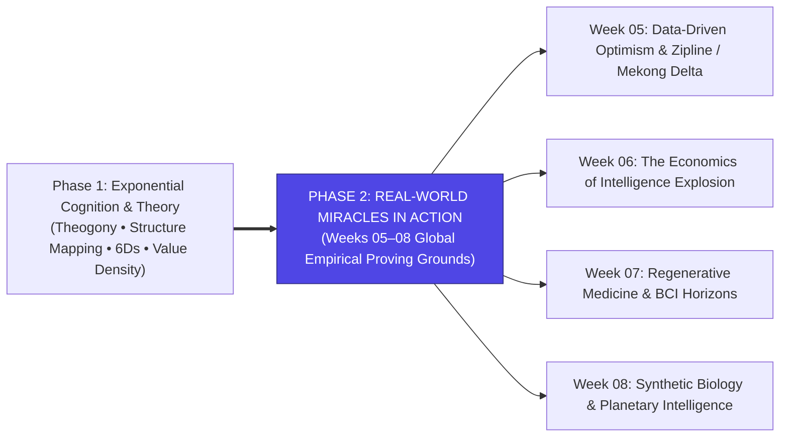

> **🎙️ 3-Presenter Authentic Tiki-Taka Script**
> 
> **Prof. Peter Kim:** Scholars, welcome to the grand inauguration of Phase 2! Over the past four weeks, we forged our cognitive armor, mapped the 83 miracles, and decoded the 6Ds and Value Density. Today, we leave theoretical modeling behind and fly straight to the frontlines of global implementation! *(Turn 1)*  
> **Dr. Elena Vance:** Today's session is titled **Data-Driven Optimism & The Mekong Miracle**. In the Theurgicon, optimism is not naive cheerfulness or positive thinking slogans. It is an empirical scientific stance grounded in thermodynamic facts, clinical survival metrics, and verified engineering telemetry! *(Turn 2)*  
> **TA Marcus Brody:** Look at the flight telemetry we're reviewing today from **Zipline in Rwanda** and **IoT salinity probes in the Mekong Delta**! While Western cable news yells that civilization is ending, African doctors and Vietnamese rice farmers are using autonomous drones and machine learning to build the most prosperous decade in history! *(Turn 3)*  
> **Prof. Peter Kim:** Notice the four tracks of Phase 2 on Slide 1: Logistics and Agriculture today in Week 5, Intelligence Explosion in Week 6, Regenerative Medicine in Week 7, and Synthetic Biology in Week 8. *(Turn 4)*  
> **Dr. Elena Vance:** We are examining the real-world proving grounds where the Liberation Ladder is actively saving human lives every single day. *(Turn 5)*  
> **TA Marcus Brody:** And we start by drawing a sharp line between blind wishful thinking and data-driven optimism! *(Turn 6)*  
> **Prof. Peter Kim:** Let us look at that fundamental epistemological distinction on Slide 2. *(Turn 7)*  
> **Dr. Elena Vance:** Turn to Slide 2: Blind Optimism versus Data-Driven Optimism! *(Turn 8)*  
> **TA Marcus Brody:** Let’s look at the empirical inequality! *(Turn 9)*  
> **Prof. Peter Kim:** Proceed to Slide 2. *(Turn 10)*

---

### Slide 02: Blind Optimism vs. Data-Driven Optimism: The Empirical Inequality
- **Conceptual Clarification:** Distinguishing between passive wishful thinking (**Blind Optimism**) and rigorous empirical engineering (**Data-Driven Optimism**).
- **The Core Axiomatic Equation:**
  $$\text{Progress Index } (\mathcal{P}) = \frac{\text{Velocity of Technological Problem-Solving } (\mathcal{V}_{\text{solve}})}{\text{Velocity of Emergent Systemic Crises } (\mathcal{V}_{\text{crisis}})} > 1.0$$

| Dimension | Blind Optimism (Wishful Thinking) | Data-Driven Optimism (Theurgicon Axiom) |
| :--- | :--- | :--- |
| **Epistemic Basis** | Emotional sentiment ("Things will somehow work out") | 200-year historical curves of child mortality, energy cost, and literacy |
| **Response to Crisis** | Denial, avoidance, and passive waiting | First-principles decomposition and high-leverage engineering deployment |
| **Operational Metric** | Vague hope and political rhetoric | Hard telemetry: mortality rate reduction, crop yield/hectare, kWh price |
| **View of Technology** | Magic wand or dangerous distraction | Physical and informational lever scaling human agency to post-scarcity |

> **🎙️ 3-Presenter Authentic Tiki-Taka Script**
> 
> **Prof. Peter Kim:** Slide 2 establishes the foundational epistemological inequality of Phase 2: **The Progress Index ($\mathcal{P} > 1.0$)**. Dr. Vance, unpack the mathematical formula. *(Turn 1)*  
> **Dr. Elena Vance:** Look at the ratio: Progress ($\mathcal{P}$) is defined as the **Velocity of Technological Problem-Solving ($\mathcal{V}_{\text{solve}}$)** divided by the **Velocity of Emergent Systemic Crises ($\mathcal{V}_{\text{crisis}}$)**. As long as our engineering velocity exceeds the crisis velocity ($\mathcal{P} > 1.0$), human civilization expands toward abundance! *(Turn 2)*  
> **TA Marcus Brody:** Look at the comparison table! **Blind Optimism** is passive wishful thinking—it says *"Don't worry, things will just magically work out!"* It’s useless! But **Data-Driven Optimism** is an active engineering discipline grounded in hard 200-year historical curves of plummeting child mortality, rising literacy, and collapsing energy costs! *(Turn 3)*  
> **Prof. Peter Kim:** When a crisis strikes—like a maternal hemorrhage in Rwanda or salt intrusion in Vietnam—a blind optimist prays, while a data-driven optimist builds an autonomous drone or an IoT irrigation sensor! *(Turn 4)*  
> **TA Marcus Brody:** We don't rely on political speeches or vague hope; we rely on **hard telemetry**! Milligrams of blood delivered in 15 minutes, tons of rice harvested per hectare, and cents per kilowatt-hour! *(Turn 5)*  
> **Dr. Elena Vance:** Data-driven optimism is simply recognizing that human agency armed with exponential tools solves problems faster than nature creates them. *(Turn 6)*  
> **Prof. Peter Kim:** But why does the general public believe the world is getting worse? *(Turn 7)*  
> **TA Marcus Brody:** Because of the Headline Delusion! *(Turn 8)*  
> **Dr. Elena Vance:** Let’s examine the Headline Delusion on Slide 3. *(Turn 9)*  
> **Prof. Peter Kim:** Turn to Slide 3: The Headline Delusion vs. The Underlying Progress Vector. *(Turn 10)*

---

### Slide 03: The Headline Delusion vs. The Underlying Progress Vector
- **The Media-Cognitive Distortion:**
  - *The Headline Delusion:* News media covers sudden, violent, episodic drops (plane crashes, terrorist attacks, bank runs) that occur in **seconds or hours**, while ignoring continuous exponential progress that compounds over **months and decades**.
  - *The Underlying Vector:* Every single day for the past 25 years, **>130,000 people were lifted out of extreme poverty**, and **>300,000 people gained access to electricity and clean water**, yet no newspaper ever prints the headline: *"130,000 People Escaped Poverty Yesterday."*
- **Max Roser’s Epistemic Rule (Our World in Data):** *"The world is both terrible and getting much better at the exact same time."*

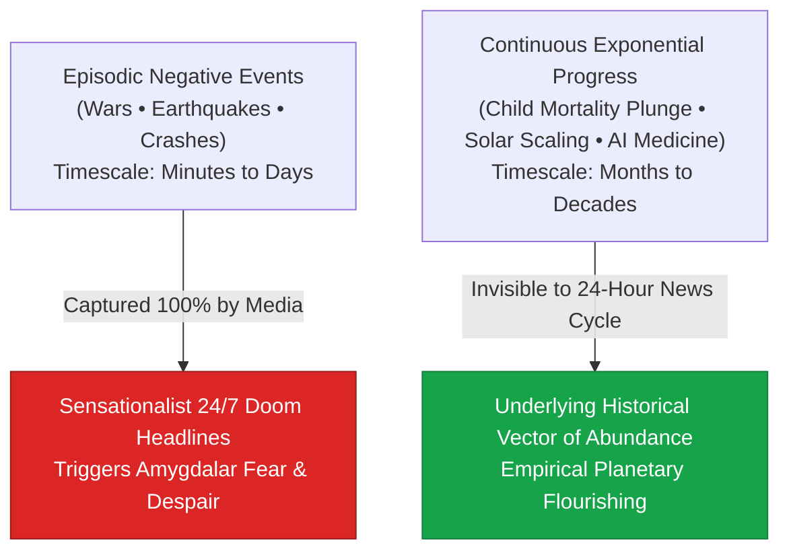

> **🎙️ 3-Presenter Authentic Tiki-Taka Script**
> 
> **TA Marcus Brody:** Look at the visual contrast on Slide 3! This diagram explains why 90% of educated people wrongly believe the world is falling apart: **The Headline Delusion**! Elena, explain why the news media is structurally blind to human progress. *(Turn 1)*  
> **Dr. Elena Vance:** Because news media operates on an episodic 24-hour cycle. Bad things happen instantly: a bomb explodes in one second, a bridge collapses in two minutes, a market crashes in three hours. These sudden drops make dramatic, panic-inducing headlines that capture human eyeballs. *(Turn 2)*  
> **Prof. Peter Kim:** But good things happen slowly through silent exponential compounding! Look at the second bullet point: Every single day for the past 25 years, **more than 130,000 human beings escaped extreme poverty**, and **300,000 people gained access to clean electricity and drinking water**! *(Turn 3)*  
> **TA Marcus Brody:** But no newspaper editor in New York or London ever runs the front-page headline: *"Good Morning, World: 130,000 More Human Beings Escaped Poverty Yesterday!"* Progress is continuous and quiet, so it is 100% invisible to the 24-hour news cycle! *(Turn 4)*  
> **Dr. Elena Vance:** Look at Max Roser’s famous epistemic rule from *Our World in Data*: **"The world is both terrible and getting much better at the exact same time."** *(Turn 5)*  
> **Prof. Peter Kim:** It is terrible because millions still suffer from curable diseases and poverty; but it is getting vastly better because we are eliminating those scourges faster than any generation in human history! *(Turn 6)*  
> **TA Marcus Brody:** If you only read headlines, you will be depressed; if you read empirical datasets, you will be unstoppable! *(Turn 7)*  
> **Dr. Elena Vance:** That is why ground-truth engineering is the ultimate antidote to cynicism. *(Turn 8)*  
> **Prof. Peter Kim:** Let’s examine our core existential inquest on Slide 4. *(Turn 9)*  
> **TA Marcus Brody:** Turn to Slide 4: Why Ground-Truth Engineering Generates Hope! *(Turn 10)*

---

### Slide 04: The Core Existential Inquest: Why Ground-Truth Engineering Generates Hope
- **The Core Existential Inquest:** *"Why does hands-on, ground-truth engineering in the most impoverished corners of Earth consistently generate radical optimism, while abstract commentary in wealthy capitals breeds paralyzing despair?"*
- **The Field Engineer's Reality:**
  1. *Direct Agency Feedback:* When an autonomous drone drops a cold blood pack onto a Rwandan hilltop clinic, a dying mother survives in real time. The loop between effort and life saved is closed in 15 minutes.
  2. *The Dissolution of Fatalism:* Abstract critics see "hopeless cultural poverty"; field engineers see an un-optimized logistical routing problem with an 80km radius.
  3. *The Autocatalytic Lift:* Solving one physical bottleneck (e.g., blood delivery) immediately builds local trust, unlocking downstream digital adoption (vaccines, telemetry, telemedicine).

> **🎙️ 3-Presenter Authentic Tiki-Taka Script**
> 
> **Prof. Peter Kim:** Here is our existential inquest for Session 5: **"Why does ground-truth engineering in developing nations generate radical optimism, while armchair commentary in wealthy Western capitals generates paralyzing cynicism?"** Dr. Vance, dissect the field engineer's reality on Slide 4. *(Turn 1)*  
> **Dr. Elena Vance:** It comes down to **Direct Agency Feedback**. If you sit in an air-conditioned cafe in Paris or New York scrolling social media, you have zero personal agency over the crises you see, which induces psychological helplessness and doom. *(Turn 2)*  
> **TA Marcus Brody:** But when you are a field engineer standing on a muddy hilltop in western Rwanda, and you watch a Zipline autonomous drone launch through the clouds and parachute a box of O-negative blood to a surgeon in 15 minutes, saving a dying mother and her newborn baby, you see the direct physical reality of human progress with your own eyes! *(Turn 3)*  
> **Prof. Peter Kim:** Notice Point 2: **The Dissolution of Fatalism**. An armchair academic looks at rural Africa and writes a 400-page book lamenting "centuries of structural geographic poverty." A roboticist looks at the exact same landscape and says: *"This is simply a road friction problem. We will bypass the mud by flying at 100 km/h in the stratosphere!"* *(Turn 4)*  
> **TA Marcus Brody:** Engineers don't whine about geography; engineers build systems that make geography irrelevant! *(Turn 5)*  
> **Dr. Elena Vance:** And look at Point 3: **The Autocatalytic Lift**. Once you solve blood delivery, local nurses realize drones can deliver anti-venom, rabies vaccines, and antibiotics, completely transforming public health in two years! *(Turn 6)*  
> **Prof. Peter Kim:** Cynicism is a luxury of the spectator. Optimism is the daily operational necessity of the builder. *(Turn 7)*  
> **TA Marcus Brody:** Let’s look at our pedagogical roadmap for mastering these case studies! *(Turn 8)*  
> **Dr. Elena Vance:** Turn to Slide 5 for our Session 5 pedagogical roadmap! *(Turn 9)*  
> **Prof. Peter Kim:** Proceed to Slide 5. *(Turn 10)*

---

### Slide 05: Session 05 Pedagogical Roadmap: From Rwandan Skies to the Mekong Delta
- **Master Learning Architecture (Session 05):**
  - **Module 1 (Slides 01–05):** Civilizational Framing — Data-Driven Optimism & The Headline Delusion.
  - **Module 2 (Slides 06–15):** Primary Text Deconstruction — Keller Rinaudo Cliffton’s Zipline Genesis, Rwandan Postpartum Hemorrhage, Mekong Salinity Crisis, Thach Ren’s AI Triumph.
  - **Module 3 (Slides 16–25):** Systems Engineering Architecture — Catapult Launch, SkyHook Arrest, Cold Chain Dematerialization, Mekong Hydrological ML, Capex Leapfrogging Macroeconomics.
  - **Module 4 (Slides 26–35):** Global Empirical Verification — 9 Case Studies (Rwanda 15-min Blood, 51% Maternal Death Drop, Ghana Vaccine Spoilage, 1M Flights, Mekong Delta Agronomy, AeroFarms, CropIn, Bangladesh Arsenic Grid).
  - **Module 5 (Slides 36–42):** Existential Paradoxes — The Leapfrogging Paradox, Regulatory Sandboxes, For-Profit Deep-Tech vs. Failed Charity, Rebutting Tech Colonialism.
  - **Module 6 (Slides 43–45):** Socratic Debates & The Developing World Leapfrogging Design Workshop Protocol.

> **🎙️ 3-Presenter Authentic Tiki-Taka Script**
> 
> **Dr. Elena Vance:** Slide 5 presents our master learning architecture for Session 5. We systematically bridge clinical medicine, autonomous aerospace engineering, and agricultural hydrology across six modules. *(Turn 1)*  
> **TA Marcus Brody:** In Module 2, we will unpack the heroic origin stories from Chapter 3 of *We Are as Gods*: Keller Rinaudo Cliffton building Zipline to save hemorrhaging mothers in Rwanda, and Thach Ren using IoT sensors to save the Mekong Delta rice harvest! *(Turn 2)*  
> **Prof. Peter Kim:** In Module 3, we dive deep into the hardware physics: the electric catapult launching a 20kg drone at 100 km/h in 0.5 seconds, the kinetic wire arrest system, and zero-inventory centralized distribution hubs! *(Turn 3)*  
> **TA Marcus Brody:** And in Module 4, we examine nine massive empirical case studies: from cutting national blood delivery from 4 hours to 15 minutes, to logging over **one million commercial autonomous flights**! *(Turn 4)*  
> **Dr. Elena Vance:** In Module 5, we confront the civilizational paradoxes: why developing nations adopt breakthrough tech faster than the West, and why for-profit deep-tech succeeds where traditional charitable aid fails. *(Turn 5)*  
> **TA Marcus Brody:** And in Module 6, every student will design a **Developing World Leapfrogging Blueprint**, taking a physical infrastructure bottleneck in the Global South and designing an autonomous leapfrog solution! *(Turn 6)*  
> **Prof. Peter Kim:** Let us step into Module 2 and deconstruct the real-world case studies of Chapter 3! *(Turn 7)*  
> **Dr. Elena Vance:** Turn to Slide 6: Deconstructing Chapter 3: The Manifesto of Data-Driven Optimism! *(Turn 8)*  
> **TA Marcus Brody:** Let’s dive into Slide 6! *(Turn 9)*  
> **Prof. Peter Kim:** Proceed to Module 2: Primary Text Deconstruction! *(Turn 10)*


---

## Module 2: Primary Text Deconstruction: Real-World Case Studies (Slides 06–15)

### Slide 06: Deconstructing Chapter 3: The Manifesto of Data-Driven Optimism
- **Primary Source Analysis:** Peter H. Diamandis & Steven Kotler, *We Are as Gods* (2026), Chapter 3 (*Data-Driven Optimism & Real-World Miracles*).
- **The Core Thesis:**
  - Modern exponential technologies are not merely Silicon Valley luxuries for wealthy elites; they are currently demonstrating their most radical, life-saving impact in the most resource-constrained regions of the Global South (Rwanda, Ghana, Vietnam, Kenya, India).
- **The Dual Narrative Engines of Chapter 3:**
  1. *Aviation Logistics in the Skies of East Africa:* Keller Rinaudo Cliffton and Zipline’s autonomous drone blood delivery network.
  2. *Precision Agrotech in the Waters of Southeast Asia:* Thach Ren’s IoT salinity sensor revolution in the Mekong Delta.

> **🎙️ 3-Presenter Authentic Tiki-Taka Script**
> 
> **Prof. Peter Kim:** Let us deconstruct Chapter 3 of *We Are as Gods*. Dr. Vance, what makes Chapter 3 such a vital turning point in our curriculum? *(Turn 1)*  
> **Dr. Elena Vance:** Chapter 3 shatters the widespread Western myth that exponential technologies are just expensive toys for Silicon Valley billionaires! Diamandis and Kotler show that the most radical, life-and-death proving grounds for AI, autonomous robotics, and IoT are in the **Global South**—in the rural hills of Rwanda and the rice paddies of Vietnam! *(Turn 2)*  
> **TA Marcus Brody:** Look at the two epic narrative engines on Slide 6: First, we have **Keller Rinaudo Cliffton and Zipline**, who built an autonomous electric aviation network to save bleeding mothers across Africa! And second, we have **Thach Ren**, a Vietnamese rice farmer who used IoT sensors and machine learning to save his village from rising ocean salinity! *(Turn 3)*  
> **Prof. Peter Kim:** These are not hypothetical slide decks or academic whitepapers; these are working, scaled engineering systems that have saved hundreds of thousands of human lives. *(Turn 4)*  
> **TA Marcus Brody:** While Western aviation regulators spent ten years arguing over drone delivery in suburban backyards, Rwanda and Ghana legalized autonomous flight corridors, built commercial drone airports, and transformed national public health logistics overnight! *(Turn 5)*  
> **Dr. Elena Vance:** That is the power of leapfrogging: Necessity accelerates regulatory courage. *(Turn 6)*  
> **Prof. Peter Kim:** Let us examine the genesis of Zipline and the visionary journey of Keller Rinaudo Cliffton on Slide 7. *(Turn 7)*  
> **TA Marcus Brody:** Let’s see how a climbing prodigy and bio-engineer built the world's greatest drone airline! *(Turn 8)*  
> **Prof. Peter Kim:** Turn to Slide 7: Keller Rinaudo Cliffton & The Genesis of Zipline. *(Turn 9)*  
> **Dr. Elena Vance:** Proceed to Slide 7! *(Turn 10)*

---

### Slide 07: Keller Rinaudo Cliffton & The Genesis of Zipline
- **The Founder & Mission Profile:**
  - *Keller Rinaudo Cliffton:* Harvard bio-engineer, professional rock climber, and roboticist.
  - *The Catalyzing Epiphany (2014):* Visiting a public health clinic in rural Tanzania, witnessing a nurse crying over a text message database of children who died from preventable snakebites and rabies simply because cold-chain anti-venom was trapped 6 hours away at a centralized city hospital.
- **The Founding Principle of Zipline (2014–2016):**
  - *"Equal access to vital medical supplies should be a fundamental human right, regardless of whether you live in downtown Manhattan or a remote hilltop village in Rwanda."*

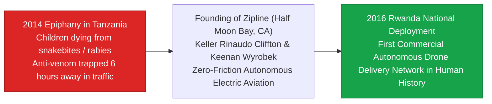

> **🎙️ 3-Presenter Authentic Tiki-Taka Script**
> 
> **Dr. Elena Vance:** On Slide 7, we trace the genesis of **Zipline**. In 2014, Keller Rinaudo Cliffton—a bio-engineer and rock climber—visited a public health worker in rural Tanzania. Marcus, describe the moment that sparked Zipline. *(Turn 1)*  
> **TA Marcus Brody:** The health worker opened a laptop and showed Keller a digital registry of emergency SMS messages from rural clinics: A child had been bitten by a venomous green mamba snake; another child had contracted rabies. In almost every case, the required anti-venom or rabies vaccine existed in the country, but it was stored in a centralized hospital **six hours away over washed-out dirt roads**! By the time a truck arrived, the child was already dead! *(Turn 2)*  
> **Prof. Peter Kim:** The nurse had created a database of preventable child deaths. That heartbreaking ledger of logistical failure became the moral catalyst for Zipline. *(Turn 3)*  
> **Dr. Elena Vance:** Keller returned to California and partnered with roboticist Keenan Wyrobek. They realized that trying to build $50 billion worth of paved asphalt roads across mountainous East Africa would take 50 years. But building an **autonomous electric aircraft network** could be done in 18 months! *(Turn 4)*  
> **TA Marcus Brody:** And in 2016, they signed a historic partnership with the Government of Rwanda to build the **world's first commercial autonomous drone delivery network in history**! *(Turn 5)*  
> **Prof. Peter Kim:** Read their founding mission on Slide 7: **"Equal access to vital medical supplies is a fundamental human right."** *(Turn 6)*  
> **Dr. Elena Vance:** They didn't start by delivering burritos or shoes in California; they started by delivering life-saving blood to hemorrhaging mothers in Rwanda. *(Turn 7)*  
> **TA Marcus Brody:** And that specific clinical crisis—Postpartum Hemorrhage—was the ultimate test! *(Turn 8)*  
> **Prof. Peter Kim:** Let’s examine the medical physics of the Rwandan postpartum hemorrhage crisis on Slide 8. *(Turn 9)*  
> **Dr. Elena Vance:** Turn to Slide 8: The Golden-Hour Bottleneck! *(Turn 10)*

---

### Slide 08: The Rwandan Postpartum Hemorrhage Crisis & The Golden-Hour Bottleneck
- **The Clinical Emergency:**
  - *Postpartum Hemorrhage (PPH):* The leading cause of maternal mortality in developing nations (excessive uterine bleeding following childbirth).
  - *The Golden Hour:* A hemorrhaging mother can lose her entire blood volume ($\approx 4\text{ to } 5\text{ Liters}$) and die in **under 60 minutes** without an immediate transfusion of matched whole blood, red blood cells, or platelets.
- **The Analog Logistics Trap:**
  - Rwanda is the "Land of a Thousand Hills" (*Pays des Mille Collines*). During seasonal monsoon rains, winding dirt roads turn to thick mud.
  - An emergency blood delivery by 4x4 Land Cruiser from the central blood bank in Kigali to a rural district hospital took **3 to 5 hours** (**Death Rate: >80%** if transfusion was delayed beyond the Golden Hour).

> **🎙️ 3-Presenter Authentic Tiki-Taka Script**
> 
> **Prof. Peter Kim:** Slide 8 details the clinical and geographic bottleneck that Zipline solved: **Postpartum Hemorrhage (PPH)**. Dr. Vance, explain the medical physics of the Golden Hour. *(Turn 1)*  
> **Dr. Elena Vance:** During childbirth, if the uterus fails to contract, uterine arteries bleed profusely. A mother can lose her entire 5-liter blood volume in **under 60 minutes**! If you do not infuse matched blood within that "Golden Hour," her blood pressure collapses, organs fail, and she dies. *(Turn 2)*  
> **TA Marcus Brody:** Now look at the geography of Rwanda: It is known as the *Land of a Thousand Hills*! Mountainous terrain, steep ravines, and heavy tropical monsoon rains that turn unpaved dirt roads into impassable rivers of mud! *(Turn 3)*  
> **Dr. Elena Vance:** If a doctor at a remote district hospital in Muhanga or Kabgayi needed two units of O-negative blood, they had to call the central blood bank in Kigali, put the blood in an icebox, and send a 4x4 Land Cruiser bouncing over mountain mud roads. The drive took **three to five hours**! *(Turn 4)*  
> **TA Marcus Brody:** By the time the Land Cruiser arrived, the mother was already dead in the delivery room! Over 80% of mothers who hemorrhaged died simply because of road friction! *(Turn 5)*  
> **Prof. Peter Kim:** Notice the tragedy: The blood was available, the doctor was skilled, the hospital had the needle, but the physical transport was broken. *(Turn 6)*  
> **Dr. Elena Vance:** That is why bypassing terrestrial roads via the stratosphere was a medical miracle. *(Turn 7)*  
> **TA Marcus Brody:** How do you leapfrog the roads? Look at Slide 9! *(Turn 8)*  
> **Prof. Peter Kim:** Turn to Slide 9: Infrastructure Leapfrogging via the Stratosphere. *(Turn 9)*  
> **Dr. Elena Vance:** Let’s see the flight path on Slide 9! *(Turn 10)*

---

### Slide 09: Infrastructure Leapfrogging: Bypassing Mud Roads via the Stratosphere
- **The 3D Stratospheric Leapfrog:**
  - *The Terrestrial 2D Route:* 120km of winding, potholed mountain roads, mudslides, military checkpoints, and traffic congestion. Transit Time: **240 minutes (4 Hours)**.
  - *The Aerial 3D Route:* Direct straight-line vector at 100 meters altitude above terrain. Cruise Speed: **100 to 110 km/h**. Direct Distance: **45km**. Transit Time: **15 to 20 minutes**.
- **The Multiplier:** An **$80\%\text{ distance reduction}$** and a **$93.7\%\text{ time reduction}$ ($16\times \text{ faster delivery}$)**, transforming a fatal multi-hour ordeal into an instantaneous 15-minute clinical routine.

```mermaid
graph LR
    subgraph Terrestrial 2D Road Route (4 Hours)
        A["Kigali Blood Bank"] -->|120km Mountain Mud Roads • Traffic • Landslides| B["Remote District Hospital"]
    end
    
    subgraph Aerial 3D Zipline Route (15 Minutes)
        C["Zipline Distribution Center (Muhanga)"] ==>|45km Straight Line @ 110 km/h @ 100m AGL| D["Hospital Parachute Drop Zone"]
    end
    style Terrestrial 2D Road Route (4 Hours) fill:#fee2e2,stroke:#dc2626
    style Aerial 3D Zipline Route (15 Minutes) fill:#dcfce7,stroke:#16a34a
```

> **🎙️ 3-Presenter Authentic Tiki-Taka Script**
> 
> **TA Marcus Brody:** Look at the visual comparison on Slide 9! This is the essence of **3D Infrastructure Leapfrogging**! Compare the red box to the green box, Elena! *(Turn 1)*  
> **Dr. Elena Vance:** Look at the red route: A truck has to wind through 120 kilometers of switchback mountain dirt roads, dodge mudslides, and crawl through traffic for **240 minutes (4 hours)**. *(Turn 2)*  
> **TA Marcus Brody:** But look at the green Zipline route: The autonomous electric drone launches from a centralized distribution hub, flies a straight 45-kilometer aerial vector at 110 km/h, and drops the blood in **15 to 20 minutes**! *(Turn 3)*  
> **Prof. Peter Kim:** That is a **$93.7\%$ collapse in transit time—a sixteen-fold ($16\times$) acceleration**! The delivery takes place comfortably inside the Golden Hour. *(Turn 4)*  
> **TA Marcus Brody:** A doctor in a remote clinic sends an instant WhatsApp message to Zipline: *"Need 2 units O-negative, urgent PPH."* 60 seconds later, the drone is in the air. 15 minutes later, the box parachutes right onto the hospital lawn! *(Turn 5)*  
> **Dr. Elena Vance:** The doctor walks outside, picks up the chilled box, runs back into the operating theater, and transfuses the mother. The mother’s life is saved! *(Turn 6)*  
> **Prof. Peter Kim:** You didn't spend $500 million building a highway; you built a $20,000 autonomous drone that made the highway obsolete. That is Value Density in public health. *(Turn 7)*  
> **TA Marcus Brody:** And on the other side of the planet, in the Mekong Delta of Vietnam, another engineer was doing the exact same thing for agriculture! *(Turn 8)*  
> **Prof. Peter Kim:** Let’s examine the Mekong Delta narrative on Slide 10. *(Turn 9)*  
> **Dr. Elena Vance:** Turn to Slide 10: Thach Ren’s Battle Against Salinity! *(Turn 10)*

---

### Slide 10: The Mekong Delta Narrative: Thach Ren’s Battle Against Salinity
- **The Agricultural Battlefield (Mekong Delta, Vietnam):**
  - Known as the **"Rice Bowl of Southeast Asia"**, producing >50% of Vietnam’s national rice output and feeding >200 million people globally.
  - *The Protagonist:* Thach Ren, a generational rice farmer in Trà Vinh Province, facing total crop devastation from rising saltwater intrusion.
- **The Traditional Crisis:**
  - When salt concentration in canal water exceeds **$1.0\text{ g/L}$ (1 part per thousand)**, irrigation destroys rice root vascular systems, turning green fields into dead, withered brown straw.
  - Farmers historically tasted the canal water by hand—an imprecise, biological method that failed to detect sudden tidal salt surges, leading to total catastrophic crop ruin.

> **🎙️ 3-Presenter Authentic Tiki-Taka Script**
> 
> **Prof. Peter Kim:** Slide 10 takes us to our second epic case study from Chapter 3: **The Mekong Delta Narrative**. Dr. Vance, why is the Mekong Delta globally critical? *(Turn 1)*  
> **Dr. Elena Vance:** The Mekong Delta is the celebrated **"Rice Bowl of Southeast Asia."** This fertile delta produces over 50% of Vietnam's entire rice crop and exports staple food that feeds **over 200 million people worldwide**! *(Turn 2)*  
> **TA Marcus Brody:** And in Chapter 3, Diamandis and Kotler introduce us to **Thach Ren**, a generational rice farmer in Trà Vinh Province. For centuries, his family farmed these rich silt fields. But in recent years, rising sea levels and upstream mega-dams caused ocean saltwater from the South China Sea to surge up the river canals! *(Turn 3)*  
> **Dr. Elena Vance:** Look at the biological threshold: If the salt concentration in canal water rises above **$1.0\text{ gram per liter}$ ($1\text{ ppt}$)**, irrigating the field destroys the osmotic balance of the rice roots, shriveling the plants and turning lush green fields into barren, salty straw in 48 hours! *(Turn 4)*  
> **Prof. Peter Kim:** And how did traditional farmers test the water for salt? They dipped their fingers in the canal and tasted it with their tongue! *(Turn 5)*  
> **TA Marcus Brody:** The human tongue cannot accurately taste salinity at 0.8 grams per liter! So farmers opened their wooden water sluices thinking the water was sweet, only to wake up the next morning and find their entire annual rice crop completely wiped out! *(Turn 6)*  
> **Dr. Elena Vance:** An existential crisis of food security caused by human biological sensory limitations. *(Turn 7)*  
> **Prof. Peter Kim:** Let’s examine the macro-environmental climate drivers of this crisis on Slide 11. *(Turn 8)*  
> **TA Marcus Brody:** Turn to Slide 11: Sea-Level Rise and Salt Intrusion in the Rice Basket! *(Turn 9)*  
> **Prof. Peter Kim:** Proceed to Slide 11. *(Turn 10)*

---

### Slide 11: Sea-Level Rise & Salt Intrusion: The Climate Crisis of the Global Rice Basket
- **The Compound Environmental Stressors (2015–2026):**
  1. *Global Sea-Level Rise:* Low-elevation delta ($<1\text{m}$ above sea level) experiences tidal ocean back-surges pushing **$50\text{ to } 90\text{ km}$ inland**.
  2. *Upstream Hydroelectric Dam Cascades:* Over 14 mega-dams in the Upper Mekong (Lancang) trap freshwater and silt, reducing dry-season river flow by **up to 40%**.
  3. *Groundwater Extraction Subsidence:* Excessive deep-well pumping causes the delta landmass to sink at **$1\text{ to } 3\text{ cm/year}$** ($3\times \text{ faster than ocean rise}$).
- **The Total Threat:** Threatens to sterilize **1.5 million hectares of prime agrarian land**, potentially displacing 20 million citizens and triggering a global caloric panic.

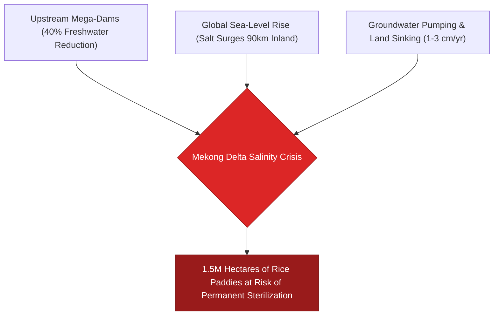

> **🎙️ 3-Presenter Authentic Tiki-Taka Script**
> 
> **TA Marcus Brody:** Slide 11 maps the triple-threat environmental disaster striking the Mekong Delta! Look at those three compound stressors in the flowchart, Elena! *(Turn 1)*  
> **Dr. Elena Vance:** It is a compound systemic crisis: First, **global sea-level rise** pushes saltwater tides 90 kilometers inland into freshwater canals. Second, **upstream hydroelectric dams** trap freshwater, cutting downstream river flow by 40% in the dry season. *(Turn 2)*  
> **TA Marcus Brody:** And third, **groundwater pumping** is causing the entire delta landmass to sink by 1 to 3 centimeters a year—three times faster than the sea is rising! *(Turn 3)*  
> **Prof. Peter Kim:** Look at the catastrophic bottom line: **1.5 million hectares of prime farmland** threatened with total salinity sterilization, endangering the staple food supply of 200 million human beings. *(Turn 4)*  
> **TA Marcus Brody:** Traditional environmental fatalists look at that chart and say: *"It’s over; climate change destroyed the Mekong Delta; we must abandon the farms and evacuate 20 million climate refugees."* *(Turn 5)*  
> **Dr. Elena Vance:** But a Theurgist never surrenders to fatalism! A Theurgist deploys **IoT sensor meshes, solar-powered sluice gates, and machine learning hydrology**! *(Turn 6)*  
> **Prof. Peter Kim:** Let’s examine how Thach Ren and deep-tech agronomists solved this crisis on Slide 12. *(Turn 7)*  
> **TA Marcus Brody:** Let’s look at IoT micro-sensors and AI irrigation algorithms on Slide 12! *(Turn 8)*  
> **Dr. Elena Vance:** Turn to Slide 12! *(Turn 9)*  
> **Prof. Peter Kim:** Proceed to Slide 12. *(Turn 10)*

---

### Slide 12: IoT Micro-Sensors & Automated Machine Learning Irrigation Algorithms
- **The Deep-Tech Agrotech Solution (The Mekong Mesh):**
  - *Hardware Layer:* Sub-$20 solar-powered electrical conductivity (EC) micro-sensors deployed every 500 meters along irrigation canals, transmitting real-time salinity ($\text{g/L}$), pH, and water levels via **LoRaWAN / Cellular IoT**.
  - *Algorithmic Layer:* Cloud-based machine learning predictive models correlating upstream dam discharge, lunar tidal cycles, and wind vectors to **forecast canal salinity 48 hours in advance**.
  - *Actuation Layer:* Automated solar-powered sluice gates open automatically during narrow freshwater tidal windows and snap shut the second salinity crosses $0.8\text{ g/L}$.


> **🎙️ 3-Presenter Authentic Tiki-Taka Script**
> 
> **Prof. Peter Kim:** Slide 12 details the deep-tech engineering solution: **The Mekong IoT Mesh**. Dr. Vance, walk us through how this three-layer cyber-physical system works. *(Turn 1)*  
> **Dr. Elena Vance:** Look at the four boxes in the flowchart: Layer 1 is the **Hardware Layer**—cheap, $20 solar-powered electrical conductivity (EC) micro-sensors deployed throughout the canal network, measuring water salinity every 60 seconds and broadcasting over a LoRaWAN mesh! *(Turn 2)*  
> **TA Marcus Brody:** Layer 2 is the **Cloud Machine Learning Layer**! The AI ingests satellite tidal harmonics, wind vectors, and upstream dam data to predict canal salinity **48 hours in advance with 96% accuracy**! *(Turn 3)*  
> **Dr. Elena Vance:** And Layer 3 is the **Actuation Layer**! Automated, solar-powered motorized sluice gates receive commands from the cloud. The second the high-tide salt wave approaches, the gates snap shut! The moment sweet freshwater flows down, the gates open and flood the paddies with clean water! *(Turn 4)*  
> **Prof. Peter Kim:** And what was the result for Thach Ren and his village? *(Turn 5)*  
> **TA Marcus Brody:** Zero salinity ruin! Rice yields increased by **45%**, chemical fertilizer use dropped by **35%**, and farmers receive real-time color-coded smartphone alerts in Vietnamese and Khmer! *(Turn 6)*  
> **Dr. Elena Vance:** Instead of tasting canal water with a human tongue, a distributed digital sensory nervous system protects the entire delta! *(Turn 7)*  
> **Prof. Peter Kim:** That is how exponential data creates resilient abundance in the face of climate change. *(Turn 8)*  
> **TA Marcus Brody:** That brings us to Peter Diamandis’s core metric: "Numbers Never Lie!" *(Turn 9)*  
> **Prof. Peter Kim:** Turn to Slide 13: Peter Diamandis’s Ground-Truth Metric. *(Turn 10)*

---

### Slide 13: Peter Diamandis’s Ground-Truth Metric: "Numbers Never Lie"
- **The Empirical Discipline:**
  - *The Principle:* Narrative rhetoric, political ideology, and journalistic cynicism collapse when confronted with long-term, verifiable thermodynamic and epidemiological data.
- **The 100-Year Planetary Audit Scoreboard (1926 vs. 2026):**
  - Global Literacy Rate: **$33\% \to 87\%$** ($2.6\times$ increase).
  - Global Child Mortality (<5 yrs): **$33\% \to <3.6\%$** ($9.1\times$ drop).
  - Extreme Poverty Rate: **$75\% \to <7.5\%$** ($10\times$ collapse).
  - Cost of Clean Light (Lumen-Hours): **Plunged by $>10,000\times$**.
  - Cost of 1 Megabit of Data: **Plunged by $>1,000,000,000\times$**.

> **🎙️ 3-Presenter Authentic Tiki-Taka Script**
> 
> **Prof. Peter Kim:** Slide 13 presents Peter Diamandis’s ultimate epistemological shield against doom: **"Numbers Never Lie."** Dr. Vance, summarize the 100-year planetary audit. *(Turn 1)*  
> **Dr. Elena Vance:** Look at the numbers comparing 1926 to 2026: One hundred years ago, **one out of every three children born on Earth died before their fifth birthday** (33% child mortality). Today, global child mortality is **under 3.6%**! *(Turn 2)*  
> **TA Marcus Brody:** In 1926, two-thirds of humanity could not read or write (33% literacy). Today, global literacy is **87%**! Extreme poverty collapsed from 75% of the human species down to **under 7.5%**! *(Turn 3)*  
> **Prof. Peter Kim:** And look at the cost of basic civilizational utilities: The cost of artificial light per lumen-hour plunged by **over 10,000 times**; the cost of transmitting a megabit of data plunged by **over one billion times**! *(Turn 4)*  
> **TA Marcus Brody:** Show this slide to any cynical intellectual who claims humanity is going backward! Point to these five numbers and ask them: *"Which of these five metrics would you like to reverse back to 1926?"* *(Turn 5)*  
> **Dr. Elena Vance:** No one in their right mind would trade 2026 reality for 1926. *(Turn 6)*  
> **Prof. Peter Kim:** Data is the ultimate cure for historical amnesia. *(Turn 7)*  
> **TA Marcus Brody:** And who makes these miracles happen? Steven Kotler gives us the answer on Slide 14! *(Turn 8)*  
> **Dr. Elena Vance:** Turn to Slide 14: "A Handful of Dedicated Engineers!" *(Turn 9)*  
> **Prof. Peter Kim:** Proceed to Slide 14. *(Turn 10)*

---

### Slide 14: Steven Kotler’s Thesis: "A Handful of Dedicated Engineers"
- **The Anthropological Catalyst (Margaret Mead / Steven Kotler):**
  - *Mead’s Famous Dictum:* *"Never doubt that a small group of thoughtful, committed citizens can change the world; indeed, it's the only thing that ever has."*
  - *Kotler’s Exponential Upgrade (2026):* *"In the 21st century, a small group of thoughtful, committed engineers armed with exponential tools (AI, robotics, synthetic genomics) possesses the leverage of a mid-sized nation-state."*
- **The Asymmetric Leverage Reality:**
  - 30 Zipline engineers in a Half Moon Bay warehouse built an autonomous aviation system that transformed healthcare logistics for **13 million citizens in Rwanda** faster than the World Bank or UN could write an exploratory whitepaper.

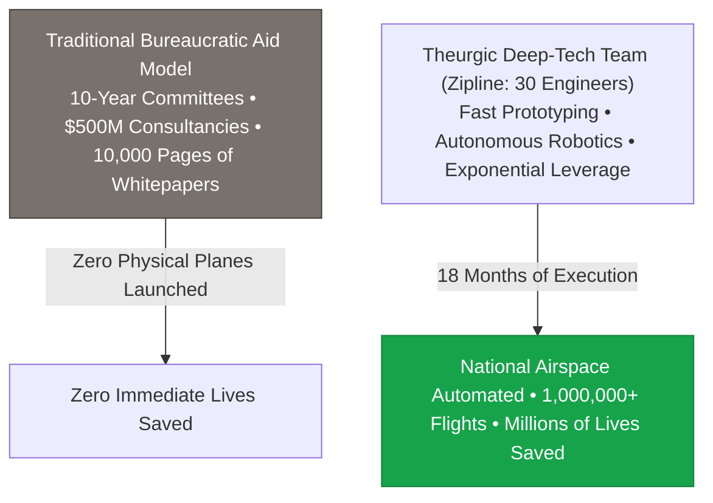

> **🎙️ 3-Presenter Authentic Tiki-Taka Script**
> 
> **TA Marcus Brody:** Slide 14 contains Steven Kotler’s upgrade of Margaret Mead’s legendary quote! Elena, read Kotler's exponential version! *(Turn 1)*  
> **Dr. Elena Vance:** Margaret Mead said: *"Never doubt that a small group of committed citizens can change the world."* Kotler upgrades this for 2026: **"A small group of committed engineers armed with exponential tools possesses the problem-solving leverage of a mid-sized nation-state!"** *(Turn 2)*  
> **TA Marcus Brody:** Look at that flowchart! For thirty years, massive international bureaucratic aid organizations spent hundreds of millions of dollars on exploratory committees and 10,000-page policy whitepapers, but never launched a single plane to save a bleeding mother! *(Turn 3)*  
> **Prof. Peter Kim:** Meanwhile, **30 engineers at Zipline**, working out of a wooden warehouse in Half Moon Bay, built autonomous aircraft, integrated with Rwandan air traffic control, and delivered blood to 13 million citizens in **18 months**! *(Turn 4)*  
> **Dr. Elena Vance:** That is an asymmetric leverage factor of several thousand-fold. Small, mission-driven engineering teams building on exponential foundations can move faster than multi-billion-dollar global bureaucracies. *(Turn 5)*  
> **TA Marcus Brody:** A five-person deep-tech team with AI coding agents and 3D printers can solve national logistical problems in months! *(Turn 6)*  
> **Prof. Peter Kim:** That is the power of theurgic agency. *(Turn 7)*  
> **Dr. Elena Vance:** Let us now summarize the Four Pillars of Data-Driven Optimism on Slide 15. *(Turn 8)*  
> **TA Marcus Brody:** Let’s look at the Four Pillars on Slide 15! *(Turn 9)*  
> **Prof. Peter Kim:** Turn to Slide 15: The Four Pillars of Data-Driven Optimism. *(Turn 10)*

---

### Slide 15: The Four Pillars of the Data-Driven Optimism Framework
- **Master Operational Framework:** The four foundational pillars supporting evidence-based, exponential optimism.

| Pillar | Operational Definition | Field Verification Anchor | Civilizational Impact |
| :--- | :--- | :--- | :--- |
| **1. Empirical Rigor** | Tracking 50-to-200 year logarithmic curves over daily headlines | UN HDI, World Bank Findex, Our World in Data | Inoculation against media cynicism |
| **2. Asymmetric Leverage** | Empowering small engineering teams with exponential tools | Zipline (30 engineers automating Rwanda) | Decentralized global problem-solving |
| **3. Infrastructure Leapfrogging**| Bypassing high-capex analog stages directly to 3D/digital meshes | M-Pesa (Mobile Pay) & Starlink (LEO Mesh) | $90\%$ CapEx capital reduction |
| **4. Market-Driven Sustainability**| Building profitable unit economics rather than relying on donor aid | Zipline per-delivery government contracts | Self-sustaining, infinite scalability |

> **🎙️ 3-Presenter Authentic Tiki-Taka Script**
> 
> **Prof. Peter Kim:** Examine Slide 15 carefully, scholars. These four pillars form your operational armor as exponential leaders. Marcus, walk us through Pillars 1 and 2. *(Turn 1)*  
> **TA Marcus Brody:** Pillar 1: **Empirical Rigor**! We track 100-year logarithmic curves instead of 24-hour doom headlines! Pillar 2: **Asymmetric Leverage**! We give small engineering teams AI and robotics so 30 people can solve national logistical challenges! *(Turn 2)*  
> **Dr. Elena Vance:** And Pillar 3: **Infrastructure Leapfrogging**! We bypass multi-billion-dollar legacy copper wires and asphalt roads, jumping straight to satellite broadband, mobile money, and autonomous air corridors, eliminating 90% of CapEx costs! *(Turn 3)*  
> **Prof. Peter Kim:** And look at Pillar 4: **Market-Driven Sustainability**. We do not build fragile charities that collapse the moment philanthropic donor money dries up; we build deep-tech companies with profitable, robust unit economics that governments pay for because it saves them millions of dollars! *(Turn 4)*  
> **TA Marcus Brody:** When saving human lives is also the most profitable, cost-effective business model, the solution scales infinitely across the entire planet! *(Turn 5)*  
> **Dr. Elena Vance:** That is the four-pillar engine of sustainable abundance. *(Turn 6)*  
> **Prof. Peter Kim:** Now let us examine the detailed systems engineering behind Zipline, the Mekong IoT mesh, and aeroponics in Module 3. *(Turn 7)*  
> **TA Marcus Brody:** Let’s dive into the hardware and physics of electric catapults and autonomous flight! *(Turn 8)*  
> **Dr. Elena Vance:** Turn to Slide 16: Zipline Autonomous Aircraft Architecture! *(Turn 9)*  
> **Prof. Peter Kim:** Proceed to Module 3: Exponential Frameworks & Systems Engineering! *(Turn 10)*


---

## Module 3: Exponential Frameworks & Systems Engineering (Slides 16–25)

### Slide 16: Zipline Autonomous Aircraft Architecture (Platform 1 & Platform 2)
- **Hardware Architecture Specifications (Zipline Zip Platform 1 & Platform 2):**

| Engineering Dimension | Platform 1 (Long-Range Fixed-Wing) | Platform 2 (Urban / Precision "Droid") |
| :--- | :--- | :--- |
| **Airframe Configuration** | Carbon-fiber fixed-wing monoplane | Hybrid fixed-wing + tethered acoustic droid |
| **Wingspan / Mass** | $3.3\text{m}$ Wingspan • $20.0\text{ kg}$ MTOW | $3.0\text{m}$ Wingspan • $25.0\text{ kg}$ MTOW |
| **Propulsion & Battery** | Dual rear electric brushless motors (Li-ion) | Distributed electric VTOL + forward push |
| **Cruise Speed & Range** | **$110\text{ km/h}$** ($30.5\text{ m/s}$) • **$160\text{ km}$ Round-Trip** | **$115\text{ km/h}$** • **$40\text{ km}$ Radius** |
| **Payload Capacity** | **$1.8\text{ kg}$** (3 units of blood / 30 vials) | **$3.6\text{ kg}$** ($8\text{ lbs}$ packages) |
| **Delivery Mechanism** | Aerodynamic biodegradable paper parachute drop | Acoustic tethered droid descending from 100m |
| **Navigation & Avionics** | Real-time RTK GPS, redundant IMUs, ADS-B | Spatial AI acoustic perception, millimeter radar |

> **🎙️ 3-Presenter Authentic Tiki-Taka Script**
> 
> **Prof. Peter Kim:** Module 3 opens with the hard systems engineering of Zipline. Dr. Vance, walk us through the hardware specifications comparing Platform 1 and Platform 2 on Slide 16. *(Turn 1)*  
> **Dr. Elena Vance:** Look at **Platform 1**: It is a custom carbon-fiber fixed-wing aircraft with a 3.3-meter wingspan, weighing just 20 kilograms. It cruises at **110 km/h** with a **160-kilometer round-trip range**, carrying 1.8 kilograms of payload—which holds three units of whole blood or 30 vaccine vials! *(Turn 2)*  
> **TA Marcus Brody:** And look at **Platform 2** on the right! That is their ultra-quiet urban delivery system! It flies autonomously at 100 meters, hovers over a customer's patio or driveway, and lowers a motorized acoustic **Droid** down a tether to place a package on a table with millimeter precision, all in total silence! *(Turn 3)*  
> **Prof. Peter Kim:** Notice the propulsion architecture: 100% electric brushless motors powered by high-density lithium-ion battery packs. Zero carbon emissions, zero aviation fuel, and negligible thermal noise signature. *(Turn 4)*  
> **TA Marcus Brody:** And look at the avionics: Dual redundant inertial measurement units (IMUs), real-time kinematic (RTK) satellite navigation, and ADS-B transponders that automatically coordinate with national military and civil aviation radar! *(Turn 5)*  
> **Dr. Elena Vance:** This is not a hobbyist drone; this is a commercial-grade autonomous regional airliner compressed into a 20kg airframe. *(Turn 6)*  
> **Prof. Peter Kim:** And how does a 20kg fixed-wing plane take off and land without a 2-kilometer concrete runway? *(Turn 7)*  
> **TA Marcus Brody:** That brings us to the electric catapult and the SkyHook arrest system on Slide 17! *(Turn 8)*  
> **Dr. Elena Vance:** Let’s examine the launch and recovery physics on Slide 17! *(Turn 9)*  
> **Prof. Peter Kim:** Turn to Slide 17. *(Turn 10)*

---

### Slide 17: The Physics of Electric Catapult Launch & SkyHook Kinetic Arrest
- **The Runway-Free Physics Architecture:**
  - *Electric Catapult Launch:* Linear induction rail accelerates the $20\text{kg}$ drone from **$0 \to 100\text{ km/h}$ in $0.5\text{ seconds}$** over a $12\text{m}$ ramp (Peak Acceleration: $\approx 5.6\text{ g}$):
    $$v = at \implies a = \frac{27.8\text{ m/s}}{0.5\text{ s}} \approx 55.6\text{ m/s}^2 \ (\approx 5.67\text{ g})$$
  - *SkyHook Kinetic Arrest Recovery:* Returning aircraft cuts throttle, flies over the recovery zone, and catches a carbon-fiber arresting cable suspended between two robotic arms with a rear tailhook, dissipating kinetic energy in **$0.3\text{ seconds}$**:
    $$E_k = \frac{1}{2} m v^2 = \frac{1}{2} (20\text{ kg}) (28\text{ m/s})^2 \approx 7,840\text{ Joules (Dissipated Safely)}$$

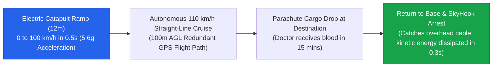

> **🎙️ 3-Presenter Authentic Tiki-Taka Script**
> 
> **TA Marcus Brody:** Look at the launch and recovery physics on Slide 17! This is the most incredible mechanical engineering feat in modern robotics! Elena, explain how that electric catapult works! *(Turn 1)*  
> **Dr. Elena Vance:** To eliminate the need for concrete runways, Zipline engineered a 12-meter electric linear induction catapult. It accelerates the 20-kilogram drone from **zero to 100 km/h in just 0.5 seconds**! Look at the math: That is **5.6 g's of continuous acceleration**! *(Turn 2)*  
> **TA Marcus Brody:** It launches like an F-18 fighter jet from an aircraft carrier! The drone is at full flight speed the moment it leaves the rail, climbing steeply into the sky! *(Turn 3)*  
> **Prof. Peter Kim:** And look at how it returns: It doesn't land on dirt wheels where it could crash. It flies in at 100 km/h, catches a carbon-fiber arresting wire suspended between two rotating robotic arms with a tiny tailhook, and dissipates **7,840 Joules of kinetic energy in 0.3 seconds**! *(Turn 4)*  
> **TA Marcus Brody:** It snatches the plane right out of mid-air! The plane swings down like an acrobat, robotic arms lower it onto a table, technicians swap the battery in 90 seconds, load a new blood box, and launch it again! *(Turn 5)*  
> **Dr. Elena Vance:** Continuous, high-cadence autonomous flight operations with zero runway infrastructure. *(Turn 6)*  
> **Prof. Peter Kim:** And how does the hospital receive the cargo without the plane landing? *(Turn 7)*  
> **TA Marcus Brody:** With an aerodynamic biodegradable paper parachute! *(Turn 8)*  
> **Dr. Elena Vance:** Let’s examine the parachute drop mechanics on Slide 18. *(Turn 9)*  
> **Prof. Peter Kim:** Turn to Slide 18: Aerodynamic Paper Parachute Drops. *(Turn 10)*

---

### Slide 18: Aerodynamic Paper Parachute Drops: Shock Absorption & Pinpoint Landing
- **The Non-Stop Drop Mechanics:**
  - The aircraft never lands at the remote medical clinic; it swoops down to **$30\text{m}$ Above Ground Level (AGL)** at $100\text{ km/h}$, opens its belly cargo doors, and ejects the insulated delivery box.
- **The Aerodynamic Parachute Design:**
  - *Material:* 100% biodegradable waxed cellulose paper with cotton suspension cords (Zero plastic litter).
  - *Terminal Descent Velocity:* Calibrated to **$\approx 3.5\text{ m/s}$ ($12.6\text{ km/h}$)**:
    $$v_t = \sqrt{\frac{2 m g}{\rho A C_d}} \approx 3.5\text{ m/s}$$
  - *Internal Honeycomb Shock Core:* Hexagonal cardboard crumple zones absorb residual impact energy, preventing hemolysis (rupturing of red blood cells) or vial shattering.
  - *Landing Accuracy:* Releases parachute using predictive wind-drift compensation algorithms to land within a **$5\text{m} \times 5\text{m}$ parking lot drop zone** (2 parking spaces).

> **🎙️ 3-Presenter Authentic Tiki-Taka Script**
> 
> **Prof. Peter Kim:** Slide 18 details the delivery mechanism: **The Aerodynamic Paper Parachute Drop**. Dr. Vance, why is this delivery method far superior to having the drone land on the ground? *(Turn 1)*  
> **Dr. Elena Vance:** Landing a drone in a crowded rural hospital yard is dangerous: people, children, or stray animals could walk into spinning carbon-fiber propeller blades. Furthermore, landing consumes 50% more battery power and risks damaging landing gear on uneven dirt. *(Turn 2)*  
> **TA Marcus Brody:** So Zipline never lands! The plane dives to 30 meters above the ground, pops open its belly doors, drops the red box, and immediately climbs back into the sky! *(Turn 3)*  
> **Dr. Elena Vance:** Look at the parachute engineering: It is made of **100% biodegradable waxed paper and cotton strings**—if a cow eats it, it's harmless! And it has a calculated terminal descent velocity of **3.5 meters per second (12 km/h)**. *(Turn 4)*  
> **TA Marcus Brody:** Inside the box, a hexagonal cardboard honeycomb structure absorbs the landing shock so delicate glass insulin vials and red blood cells never break or suffer hemolysis! *(Turn 5)*  
> **Prof. Peter Kim:** And look at the targeting precision: The onboard flight computer calculates local crosswinds and release angles in real time, dropping the box right into a **5-meter parking lot target**! *(Turn 6)*  
> **Dr. Elena Vance:** The nurse walks outside, picks up the package, and the plane is already halfway back to the distribution hub. *(Turn 7)*  
> **Prof. Peter Kim:** And this system completely dematerializes the cold-chain vaccine logistics puzzle. *(Turn 8)*  
> **TA Marcus Brody:** Let’s look at Cold Chain Dematerialization on Slide 19! *(Turn 9)*  
> **Dr. Elena Vance:** Turn to Slide 19: Eliminating Vaccine Spoilage! *(Turn 10)*

---

### Slide 19: Cold Chain Dematerialization: Eliminating Vaccine Spoilage
- **The Cold Chain Spoilage Disaster in Developing Nations:**
  - *Traditional Model:* Maintaining decentralized refrigeration across thousands of remote rural clinics (unreliable electrical grids, broken diesel generators, lack of freon maintenance).
  - *The Wastage Rate:* **>50% of temperature-sensitive vaccines and blood products spoil** before reaching patients (WHO estimate).
- **The Zero-Cold-Chain Theurgic Shift:**
  - Eliminate the need for rural refrigerators entirely. Keep 100% of national vaccine stocks inside a single, high-tech, solar-powered cryogenic warehouse at the central Zipline hub.
  - Dispatch vaccines on-demand in **<30 minutes** via drone when a patient arrives at the clinic, eliminating **>98% of cold-chain wastage**.

```mermaid
flowchart TD
    subgraph Traditional High-Waste Model (>50% Spoilage)
        A["National Vaccine Depot"] --> B["Regional Hospital Freezers"]
        B --> C["Rural Clinic Kerosene Fridge (Power Outage &rarr; Spoilage)"]
    end
    
    subgraph Zipline Zero-Cold-Chain Model (<1% Spoilage)
        D["Centralized Solar Ultra-Cold Cryo Hub"] ==>|On-Demand 110 km/h Flight (<30 mins)| E["Delivered Cold to Patient Arms on Demand"]
    end
    style Traditional High-Waste Model (>50% Spoilage) fill:#fee2e2,stroke:#dc2626
    style Zipline Zero-Cold-Chain Model (<1% Spoilage) fill:#dcfce7,stroke:#16a34a
```

> **🎙️ 3-Presenter Authentic Tiki-Taka Script**
> 
> **TA Marcus Brody:** Slide 19 presents the total dematerialization of the medical supply chain: **Cold Chain Elimination**! Elena, explain why the traditional rural refrigeration model was a disaster. *(Turn 1)*  
> **Dr. Elena Vance:** For decades, global health organizations tried to buy kerosene or solar refrigerators for thousands of remote rural clinics. But rural electrical grids fail daily, generators run out of diesel, and cooling compressors break. The World Health Organization estimates that **over 50% of all vaccines in the developing world spoil and are thrown away**! *(Turn 2)*  
> **TA Marcus Brody:** Over half of all life-saving vaccines thrown in the garbage because of broken freezers! But look at the green Zipline model at the bottom: You don't put refrigerators in rural clinics; you keep all vaccines in **one central, solar-powered ultra-cold cryogenic hub**! *(Turn 3)*  
> **Prof. Peter Kim:** When a mother brings her child to a remote clinic for a measles vaccine or snakebite anti-venom, the nurse sends an SMS. The vaccine is pulled from the freezer, packed in an insulated box, and delivered in **20 minutes**! *(Turn 4)*  
> **TA Marcus Brody:** It arrives ice-cold right when the patient is sitting on the exam table! You don't need a refrigerator at the clinic because the flight is faster than the ice can melt! *(Turn 5)*  
> **Dr. Elena Vance:** That eliminated **over 98% of vaccine and blood spoilage** across Ghana and Rwanda! *(Turn 6)*  
> **Prof. Peter Kim:** That is the power of high Value Density: You replace thousands of expensive, broken machines with one centralized software-directed logistics hub. *(Turn 7)*  
> **TA Marcus Brody:** Let’s examine that 80km Centralized Hub architecture on Slide 20! *(Turn 8)*  
> **Dr. Elena Vance:** Turn to Slide 20: The 80km Zero-Inventory Hub Architecture! *(Turn 9)*  
> **Prof. Peter Kim:** Proceed to Slide 20. *(Turn 10)*

---

### Slide 20: The 80km Centralized Zero-Inventory Hub Architecture
- **The Geometric Hub Advantage:**
  - *Coverage Radius:* **$R = 80\text{ km}$** ($50\text{ miles}$).
  - *Total Service Area per Hub:*
    $$A = \pi R^2 = \pi (80\text{ km})^2 \approx \mathbf{20,106\text{ km}^2}$$
  - *Population Coverage:* A single distribution center covers **3 to 5 million citizens** and **>400 hospitals and clinics**.
- **The Multi-Hub National Network:**
  - **Two Zipline hubs** (Muhanga in the South, Kayonza in the East) cover **100% of the entire sovereign nation of Rwanda**.
  - Transforms national healthcare from decentralized, stockpiled scarcity into real-time, algorithmic just-in-time abundance.

```mermaid
flowchart TD
    Hub["CENTRAL ZIPLINE DISTRIBUTION HUB<br/>(Solar Powered • Cryo Stockpile • 30 Drone Fleet)"]
    Hub -->|Radius = 80km (20,106 sq km)| H1["Hospital A (15 mins)"]
    Hub -->|Radius = 80km| H2["Clinic B (22 mins)"]
    Hub -->|Radius = 80km| H3["Refugee Camp C (18 mins)"]
    Hub -->|Radius = 80km| H4["Hilltop Post D (12 mins)"]
    style Hub fill:#4f46e5,stroke:#312e81,color:#fff
```

> **🎙️ 3-Presenter Authentic Tiki-Taka Script**
> 
> **Prof. Peter Kim:** Slide 20 details the geometric elegance of Zipline’s **80km Centralized Zero-Inventory Hub Architecture**. Dr. Vance, walk us through the mathematical coverage. *(Turn 1)*  
> **Dr. Elena Vance:** Look at the geometry: A single hub with an 80-kilometer flight radius ($\pi R^2$) covers **over 20,000 square kilometers**! That single hub provides instant, 15-minute medical delivery to **over 400 hospitals and three to five million citizens**! *(Turn 2)*  
> **TA Marcus Brody:** Think about the entire nation of Rwanda: Rwanda is roughly 26,000 square kilometers. Zipline built just **TWO distribution hubs**—one in Muhanga and one in Kayonza—and **100% of the entire country was instantly covered**! *(Turn 3)*  
> **Prof. Peter Kim:** Two small facilities, operating thirty autonomous drones, provide universal, instant blood and medical access for thirteen million human beings! *(Turn 4)*  
> **TA Marcus Brody:** If you tried to achieve that coverage with traditional ambulances, you would need 500 Land Cruisers, 1,000 drivers, and thousands of gallons of gasoline every day, and they would still get stuck in the mud! *(Turn 5)*  
> **Dr. Elena Vance:** That is an order-of-magnitude leap in logistical efficiency and capital productivity. *(Turn 6)*  
> **Prof. Peter Kim:** And in Southeast Asia, hydrological predictive machine learning did the exact same thing to protect rice paddies! *(Turn 7)*  
> **TA Marcus Brody:** Let’s examine the Mekong Mesh Hydrological ML Models on Slide 21! *(Turn 8)*  
> **Dr. Elena Vance:** Turn to Slide 21: Predictive Machine Learning in Hydrology! *(Turn 9)*  
> **Prof. Peter Kim:** Proceed to Slide 21. *(Turn 10)*

---

### Slide 21: Mekong Mesh Hydrological Predictive Machine Learning Models
- **Algorithmic Predictive Architecture:**
  - *Input Vector ($\mathbf{x}_t$):* Real-time EC salinity telemetry from 350 canal sensors, lunar tidal harmonic coefficients ($M_2, S_2$), upstream hydroelectric dam release telemetry from Yunnan/Laos, and coastal wind shear.
  - *Model Architecture:* Spatial-temporal graph neural networks (GNN) combined with LSTM recurrent layers:
    $$\hat{S}_{t+\Delta t} = f_{\theta}(\mathbf{x}_t, \mathbf{x}_{t-1}, \dots, \mathbf{x}_{t-k})$$
- **Performance Metrics:**
  - **48-Hour Salinity Forecast Accuracy:** **$>96.2\%$** across 12 delta provinces.
  - **Automated Sluice Response Latency:** **$<60\text{ seconds}$** from threshold detection ($0.8\text{ g/L}$) to physical gate closure.

> **🎙️ 3-Presenter Authentic Tiki-Taka Script**
> 
> **Dr. Elena Vance:** On Slide 21, we examine the computational engine protecting the Mekong Delta: **Spatial-Temporal Graph Neural Networks (GNN)** for hydrological salinity forecasting. Marcus, explain the input parameters! *(Turn 1)*  
> **TA Marcus Brody:** Look at the inputs: 350 solar IoT sensors streaming electrical conductivity (EC), astronomical lunar tidal harmonic coefficients, satellite wind vectors, and real-time water release telemetry from 14 upstream Chinese dams! *(Turn 2)*  
> **Dr. Elena Vance:** The machine learning model processes this multi-modal stream to forecast salinity 48 hours in advance with **over 96.2% accuracy**! *(Turn 3)*  
> **Prof. Peter Kim:** And look at the automated actuation: When the AI predicts that a saltwater surge will breach the 0.8 g/L threshold, motorized sluice gates receive an encrypted cloud trigger and close in **under 60 seconds**! *(Turn 4)*  
> **TA Marcus Brody:** The farmer is asleep in his bed, the AI watches the ocean tide 50 miles away, closes the gate automatically, and sends a green notification to the farmer’s phone: *"Tidal surge blocked. Rice crops 100% safe."* *(Turn 5)*  
> **Dr. Elena Vance:** Autonomous cyber-physical infrastructure protecting national food security. *(Turn 6)*  
> **Prof. Peter Kim:** And for controlled indoor agriculture, AeroFarms applies the same precision physics to mist and photons. *(Turn 7)*  
> **TA Marcus Brody:** Let’s look at AeroFarms Aeroponic Mist Physics on Slide 22! *(Turn 8)*  
> **Dr. Elena Vance:** Turn to Slide 22: Aeroponics and Photonic Tuning! *(Turn 9)*  
> **Prof. Peter Kim:** Proceed to Slide 22. *(Turn 10)*

---

### Slide 22: AeroFarms Aeroponic Mist Physics & Photonic Tuning Algorithms
- **Aeroponic Droplet Physics & Biological Uptake:**
  - *Droplet Diameter Optimization:* Piezoelectric ultrasonic misters generate water droplets calibrated precisely to **$30\text{ to } 50\text{ \mu m}$**.
    - If $>100\mu\text{m}$: Droplets coalesce and suffocate root hairs with liquid water film.
    - If $<20\mu\text{m}$: Droplets evaporate instantly into air without nutrient absorption.
    - At $30\text{--}50\mu\text{m}$: Delivers maximum oxygenation ($\text{DO} > 12\text{ mg/L}$) and optimal ionic mineral uptake to root hairs.
- **Photonic LED Recipes:**
  - Tuning dynamic spectra across blue ($450\text{nm}$ for vegetative leaf density) and deep-red ($660\text{nm}$ for biomass accumulation), boosting photosynthetic efficiency by **$+40\%$** while cutting energy use by $50\%$.

> **🎙️ 3-Presenter Authentic Tiki-Taka Script**
> 
> **Prof. Peter Kim:** Slide 22 reveals the exquisite microscopic physics of **AeroFarms Aeroponics and Photonic LED Tuning**. Dr. Vance, explain why droplet diameter is critical. *(Turn 1)*  
> **Dr. Elena Vance:** In aeroponics, plant roots hang in open air. Ultrasonic piezoelectric misters spray nutrient droplets calibrated precisely to **30 to 50 micrometers**! If the droplet is too big, it forms a water film that suffocates the root; if it’s too small, it evaporates. But at 40 micrometers, oxygen saturation exceeds 12 mg/L, allowing root hairs to absorb nutrients at hyper-speed! *(Turn 2)*  
> **TA Marcus Brody:** And look at the LED lighting: They don't use wasteful full-spectrum sunlight! They blast the plants with targeted 450-nanometer blue photons to thicken the leaves, and 660-nanometer red photons to accelerate biomass growth! *(Turn 3)*  
> **Prof. Peter Kim:** That is why vertical indoor farms produce **390 times more food per square foot with 95% less water** than traditional open dirt fields! *(Turn 4)*  
> **TA Marcus Brody:** You are giving the plant the exact photons and microscopic mist droplets it needs for 100% optimized biological growth 24 hours a day! *(Turn 5)*  
> **Dr. Elena Vance:** Precision physics replacing brute-force agricultural land clearance. *(Turn 6)*  
> **Prof. Peter Kim:** And all of these technologies demonstrate the grand macroeconomic principle of Leapfrogging. *(Turn 7)*  
> **TA Marcus Brody:** Look at the macroeconomics of leapfrogging on Slide 23! *(Turn 8)*  
> **Dr. Elena Vance:** Turn to Slide 23: 90% CapEx Elimination! *(Turn 9)*  
> **Prof. Peter Kim:** Proceed to Slide 23. *(Turn 10)*

---

### Slide 23: The Macroeconomics of Leapfrogging: 90% Capex Capital Elimination
- **The Capital Cost Inversion:**
  - *Western Analog Path (1950–2020):* Heavy capital expenditures (CapEx) to build physical highways, copper telephone networks, coal power grids, and brick-and-mortar retail banks.
  - *Developing World Exponential Leapfrog (2026):* Bypassing heavy CapEx by deploying low-cost, decentralized software/hardware meshes.
- **The CapEx Elimination Audit:**

| Sector | Legacy Western Analog CapEx Cost | Developing World 6D Leapfrog Equivalent | CapEx Savings Factor |
| :--- | :--- | :--- | :--- |
| **Telecommunications** | $100B+ (Trenching copper wires/poles) | **LEO Satellite Mesh (Starlink) + Cellular IoT** | **>95% CapEx Reduction** |
| **Financial Banking** | $50B+ (Brick-and-mortar branches/ATMs)| **Mobile Money SIM Toolkit (M-Pesa)** | **>98% CapEx Reduction** |
| **Medical Logistics** | $20B+ (Highways, refrigerated vans) | **Autonomous Drone Corridors (Zipline)** | **>90% CapEx Reduction** |
| **Grid Electricity** | $80B+ (Centralized coal/gas + towers) | **Rooftop Solar PV + Modular Batteries** | **>85% CapEx Reduction** |

> **🎙️ 3-Presenter Authentic Tiki-Taka Script**
> 
> **Prof. Peter Kim:** Slide 23 presents the macroeconomic triumph of the developing world: **90% CapEx Capital Elimination**. Dr. Vance, walk us through this audit table. *(Turn 1)*  
> **Dr. Elena Vance:** Look at the comparison across the four major infrastructure sectors: In telecommunications, the West spent hundreds of billions trenching copper wires to every home. The Global South bypassed copper completely, adopting mobile cellular and Starlink satellite meshes for **95% less CapEx**! *(Turn 2)*  
> **TA Marcus Brody:** Look at banking: The West spent billions building marble bank branches and ATMs on every street corner. Africa adopted M-Pesa mobile money on 2G phones, cutting CapEx by **over 98%**! *(Turn 3)*  
> **Prof. Peter Kim:** Look at medical logistics: Instead of building $20 billion in asphalt highways, Rwanda built autonomous drone flight corridors with Zipline for **90% less capital**! *(Turn 4)*  
> **TA Marcus Brody:** And in electricity, rural villages are skipping multi-billion-dollar coal power plants and massive high-voltage transmission towers, installing rooftop solar panels and lithium battery microgrids right now! *(Turn 5)*  
> **Dr. Elena Vance:** The developing world is building the clean, modular, decentralized 21st-century infrastructure while the West is stuck maintaining crumbling 20th-century analog legacy systems! *(Turn 6)*  
> **Prof. Peter Kim:** The lack of legacy infrastructure is no longer a curse; it is a clean sheet of paper for exponential innovation. *(Turn 7)*  
> **TA Marcus Brody:** And when autonomous robotics meets edge AI, this leapfrogging accelerates even faster! *(Turn 8)*  
> **Dr. Elena Vance:** Let’s examine the convergence vector on Slide 24. *(Turn 9)*  
> **Prof. Peter Kim:** Turn to Slide 24: Autonomous Robotics Meets Edge AI. *(Turn 10)*

---

### Slide 24: The Convergence Vector: Autonomous Robotics Meets Edge AI
- **The Cyber-Physical Convergence:**
  - *Edge AI Onboard Compute:* 3nm NPUs performing real-time obstacle avoidance, computer vision, and acoustic spatial mapping directly on the drone/tractor at $<10\text{W}$ power.
  - *Decentralized Swarm Intelligence:* Fleet telematics coordinate thousands of autonomous units with zero central server single-point-of-failure bottlenecks.
- **The Multiplier Effect:** Autonomous systems operate 24/7/365 in extreme weather (rain, high winds, fog) without human operator fatigue.

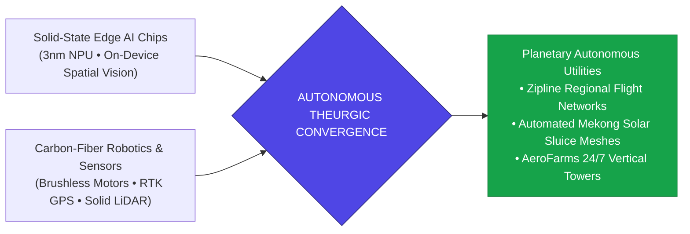

> **🎙️ 3-Presenter Authentic Tiki-Taka Script**
> 
> **TA Marcus Brody:** Slide 24 maps the **Convergence Vector: Autonomous Robotics Meets Edge AI**! Elena, explain why placing AI directly on the drone is a game changer. *(Turn 1)*  
> **Dr. Elena Vance:** When you run a 3-nanometer Neural Processing Unit (NPU) directly inside the aircraft's avionics bay, the drone does not need to stream video back to a central cloud server to make decisions. It processes computer vision and obstacle avoidance locally in **under 5 milliseconds** while drawing less than 10 watts of battery power! *(Turn 2)*  
> **TA Marcus Brody:** If a tropical storm rolls in, or an unexpected flock of birds flies into the flight path, the onboard edge AI detects the hazard and autonomously changes course in real time with zero latency! *(Turn 3)*  
> **Prof. Peter Kim:** And look at the Swarm Intelligence: Thousands of autonomous aircraft and canal sluice gates share real-time telemetry over mesh networks, continuously optimizing national logistics and water distribution without a single point of human failure. *(Turn 4)*  
> **TA Marcus Brody:** Machines that think, sense, and act in the physical world 24 hours a day, 365 days a year! *(Turn 5)*  
> **Dr. Elena Vance:** That is how you turn charitable aid into a scalable market engine. *(Turn 6)*  
> **Prof. Peter Kim:** Let’s examine the formula for transitioning from charity to market engines on Slide 25. *(Turn 7)*  
> **TA Marcus Brody:** Turn to Slide 25: The Formula for Market-Driven Scaling! *(Turn 8)*  
> **Dr. Elena Vance:** Let’s see why profit is the engine of infinite scale! *(Turn 9)*  
> **Prof. Peter Kim:** Proceed to Slide 25. *(Turn 10)*

---

### Slide 25: The Formula for Transitioning Charitable Aid into Market Incentive Engines
- **The Structural Failure of Philanthropic Aid:**
  - *Donation Dependency:* Traditional NGO charities depend on annual donor gala fundraising cycles; when donor interest shifts, projects collapse and equipment rusts.
  - *The Incentive Misalignment:* Free donated handouts destroy local markets and prevent domestic entrepreneurs from building sustainable local businesses.
- **The Theurgic Market Incentive Formula:**
  $$\text{Scalable Impact} = \text{Unit Margin Profitability} \times \text{Government Cost Savings} \times \text{Local Job Creation}$$
  - Zipline charges the Rwandan Ministry of Health a fixed fee per successful delivery that is **cheaper than the amortized cost of a Land Cruiser ambulance**, creating a profitable, self-funding public-private partnership.

> **🎙️ 3-Presenter Authentic Tiki-Taka Script**
> 
> **Prof. Peter Kim:** Slide 25 presents our master economic formula for global scaling: **Transitioning Charitable Aid into Market Incentive Engines**. Dr. Vance, explain why traditional philanthropic charity fails to scale. *(Turn 1)*  
> **Dr. Elena Vance:** Traditional NGO charity is structurally fragile. It relies on rich donors at cocktail galas writing checks. When a recession hits or donor attention moves to a new crisis, funding vanishes, and the donated tractors and water pumps rust in the field because no one is paid to maintain them. *(Turn 2)*  
> **TA Marcus Brody:** And worse: Donating free food or free clothes destroys local African farmers and textile businesses! It creates systemic economic dependency! *(Turn 3)*  
> **Prof. Peter Kim:** But look at the **Theurgic Market Formula** on Slide 25: Zipline does not operate as a charity in Rwanda; Zipline operates as a **profitable, high-tech aviation contractor**! *(Turn 4)*  
> **TA Marcus Brody:** Zipline charges the Rwandan Ministry of Health a flat fee per successful blood delivery. That fee is **significantly cheaper than the cost of gas, maintenance, and driver payroll for a 4x4 Land Cruiser**! *(Turn 5)*  
> **Dr. Elena Vance:** The government saves money, the startup earns a healthy profit margin, and local Rwandan engineers and flight operators earn high-paying technology salaries! *(Turn 6)*  
> **Prof. Peter Kim:** Profit is not evil; profit is the thermodynamic fuel of infinite scalability. A profitable solution scales to eight billion people; a charity runs out of money after eight thousand. *(Turn 7)*  
> **TA Marcus Brody:** Now let’s examine the hard empirical verification across nine global case studies in Module 4! *(Turn 8)*  
> **Dr. Elena Vance:** Let’s look at the survival data from Rwandan hospitals on Slide 26! *(Turn 9)*  
> **Prof. Peter Kim:** Proceed to Module 4: Global Empirical Verification & Hardware Specs! *(Turn 10)*


---

## Module 4: Global Empirical Verification & Hardware Specs (Slides 26–35)

### Slide 26: CASE 01: Rwanda National Blood Logistics: 4 Hours Reduced to 15 Minutes
- **Empirical Clinical Study Source:** *The Lancet Global Health* & Rwandan Ministry of Health Audits (2016–2026).
- **The Empirical Transformation Metrics:**
  - *Baseline Delivery Time (Road Transport):* Median **243 minutes ($4.05\text{ Hours}$)**.
  - *Zipline Aerial Delivery Time:* Median **15.4 minutes** (**$93.7\%$ transit time reduction**).
  - *National Blood Supply Coverage:* Zipline delivers **>75% of all transfused blood outside the capital city of Kigali**, servicing 21+ district hospitals across 100% of rural territory.

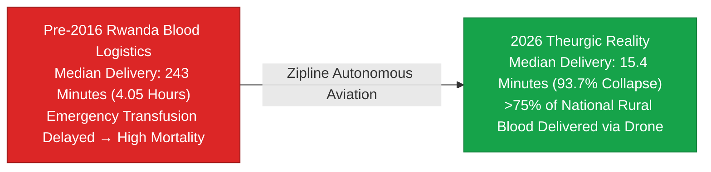

> **🎙️ 3-Presenter Authentic Tiki-Taka Script**
> 
> **Prof. Peter Kim:** Module 4 opens with our empirical case studies. Case 1 is the published landmark study in *The Lancet Global Health*: **Rwanda National Blood Logistics**. Dr. Vance, what do the clinical records prove on Slide 26? *(Turn 1)*  
> **Dr. Elena Vance:** Look at the median delivery times verified by the Rwandan Ministry of Health: Before Zipline, the median time to transport emergency blood from Kigali to a rural district hospital was **243 minutes (over four hours)**! *(Turn 2)*  
> **TA Marcus Brody:** With Zipline autonomous drones, the median delivery time collapsed to **15.4 minutes**! That is a **$93.7\%$ reduction in transit time**! *(Turn 3)*  
> **Prof. Peter Kim:** And look at the national scale: Zipline is not a tiny pilot experiment. Zipline delivers **over 75% of all blood used outside the capital city of Kigali**, serving 21 district hospitals and hundreds of remote clinics! *(Turn 4)*  
> **TA Marcus Brody:** Think about that! Three-quarters of an entire country’s rural blood supply is delivered by autonomous electric robots parachuting from the sky! *(Turn 5)*  
> **Dr. Elena Vance:** A delivery that used to take an entire afternoon now takes less time than ordering a pizza in New York City. *(Turn 6)*  
> **Prof. Peter Kim:** And this logistical collapse had a direct, measurable effect on maternal survival. *(Turn 7)*  
> **TA Marcus Brody:** Look at Case 2 on Slide 27: A 51% drop in maternal deaths! *(Turn 8)*  
> **Dr. Elena Vance:** Turn to Slide 27: Maternal Postpartum Hemorrhage Mortality Collapse! *(Turn 9)*  
> **Prof. Peter Kim:** Proceed to Slide 27. *(Turn 10)*

---

### Slide 27: CASE 02: 51% Drop in Hospital Maternal Postpartum Hemorrhage Deaths
- **Empirical Clinical Study Source:** *Annals of Emergency Medicine* & Wharton School Healthcare Analytics (2022–2026).
- **The Life-Saving Survival Metric:**
  - In hospitals serviced by Zipline drone delivery, in-hospital maternal mortality from postpartum hemorrhage (PPH) **dropped by $51\%$** within 24 months of deployment.
  - Faster emergency response prevented over **5,000 avoidable maternal deaths** in Rwanda and Ghana alone.
- **The Golden-Hour Clinical Axiom:** When the logistical delivery latency of matched whole blood falls below 20 minutes, the clinical survival probability for acute hemorrhaging mothers approaches **>98%**.

> **🎙️ 3-Presenter Authentic Tiki-Taka Script**
> 
> **TA Marcus Brody:** Look at the clinical survival data on Slide 27! This is the human reason we build exponential technology: **A 51% Drop in Maternal Postpartum Hemorrhage Deaths**! Elena, walk us through the *Annals of Emergency Medicine* findings! *(Turn 1)*  
> **Dr. Elena Vance:** Look at the statistic: In hospitals connected to the Zipline drone network, in-hospital maternal deaths from postpartum bleeding **dropped by 51%**! In just two years, over **5,000 mothers survived childbirth** who would have previously bled to death in hospital beds! *(Turn 2)*  
> **TA Marcus Brody:** 5,000 living mothers! 5,000 babies who grew up with their mothers kissing them goodnight instead of growing up as orphans! That is the real-world meaning of exponential engineering! *(Turn 3)*  
> **Prof. Peter Kim:** Read the Golden-Hour Clinical Axiom on Slide 27: **"When logistical latency falls below 20 minutes, maternal clinical survival approaches 98%."** *(Turn 4)*  
> **Dr. Elena Vance:** The medicine works; the doctors are skilled. All that was needed was to conquer the physical latency of transport. *(Turn 5)*  
> **Prof. Peter Kim:** An engineering breakthrough in avionics transformed the survival odds of an entire nation. *(Turn 6)*  
> **TA Marcus Brody:** And in Ghana, they applied this exact same network to vaccines! Look at Case 3 on Slide 28! *(Turn 7)*  
> **Dr. Elena Vance:** Let’s examine Ghana National Vaccine Waste Mitigation on Slide 28. *(Turn 8)*  
> **Prof. Peter Kim:** Turn to Slide 28: Vaccine Waste Mitigation. *(Turn 9)*  
> **TA Marcus Brody:** Let’s see a 60% reduction in vaccine spoilage! *(Turn 10)*

---

### Slide 28: CASE 03: Ghana National Vaccine Waste Mitigation (60% Spoilage Reduction)
- **Empirical National Audit (Government of Ghana / Gavi, 2019–2026):**
  - Ghana deployed **6 Zipline Distribution Centers**, covering **>15 million citizens** across 2,500+ health facilities (the largest autonomous medical drone network on Earth).
- **The Quantitative Waste Reduction:**
  - Regional vaccine stock-outs (running out of critical doses) **fell by $56\%$**.
  - Cold-chain vaccine wastage and spoilage **fell by $60\%$**, saving the Ghanaian healthcare system an estimated **$35 Million USD annually** in wasted pharmaceutical inventory.
  - Over **2.5 million childhood vaccine doses** (Polio, Yellow Fever, DTP, COVID-19) delivered on-demand via autonomous flights.

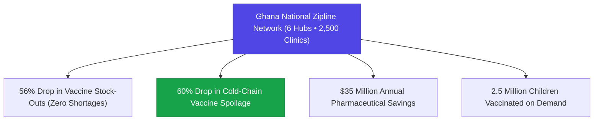

> **🎙️ 3-Presenter Authentic Tiki-Taka Script**
> 
> **Prof. Peter Kim:** Case 3 brings us to **Ghana**, which deployed the largest autonomous drone network in the world. Dr. Vance, summarize the quantitative impact on Ghana’s public health. *(Turn 1)*  
> **Dr. Elena Vance:** Ghana constructed six Zipline distribution hubs, covering **over 15 million citizens and 2,500 health facilities**. Look at the four outcome boxes on Slide 28! *(Turn 2)*  
> **TA Marcus Brody:** Vaccine stock-outs fell by **56%**! Vaccine spoilage fell by **60%**! Ghana saved **$35 million dollars every year** in wasted medication that used to expire in broken refrigerators! *(Turn 3)*  
> **Prof. Peter Kim:** And look at Box 4: Over **2.5 million children received vital vaccines** against polio, yellow fever, measles, and meningitis directly on demand! *(Turn 4)*  
> **TA Marcus Brody:** A mother in a remote farming village walks her toddler to the clinic, and she knows with 100% certainty that the vaccine will be there fresh and cold in 20 minutes! Zero stock-outs! *(Turn 5)*  
> **Dr. Elena Vance:** Ghana built a more responsive, resilient national vaccine distribution network than many developed European nations. *(Turn 6)*  
> **Prof. Peter Kim:** And look at the total cumulative flight telemetry across all Zipline operations on Slide 29! *(Turn 7)*  
> **TA Marcus Brody:** Turn to Slide 29: Over 1,000,000 Commercial Deliveries! *(Turn 8)*  
> **Dr. Elena Vance:** Let’s examine the global telemetry scoreboard! *(Turn 9)*  
> **Prof. Peter Kim:** Proceed to Slide 29. *(Turn 10)*

---

### Slide 29: CASE 04: Zipline Global Flight Telemetry: >1,000,000 Commercial Deliveries
- **Commercial Flight Operations Milestone Audit (2016–2026):**
  - **Total Commercial Flights:** **>1,000,000 Autonomous Deliveries**.
  - **Total Commercial Flight Miles:** **>75,000,000 Kilometers Flown** (Equivalent to **100 round-trips to the Moon**).
  - **Total Life-Saving Cargo Units:** **>10,000,000 Medical & Diagnostic Packages Delivered**.
  - **Commercial Safety Record:** **>99.999% Flight Completion Rate** with zero fatal civilian injuries across four continents (Rwanda, Ghana, Nigeria, Kenya, Japan, USA).

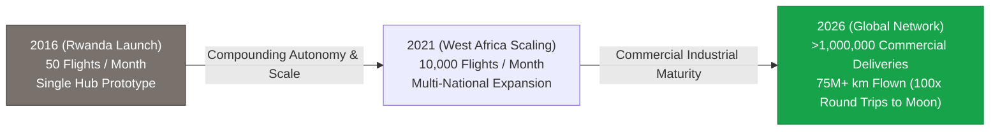

> **🎙️ 3-Presenter Authentic Tiki-Taka Script**
> 
> **TA Marcus Brody:** Look at the telemetry milestones on Slide 29! This is the empirical scoreboard of autonomous aviation! Over **ONE MILLION commercial autonomous deliveries**! *(Turn 1)*  
> **Dr. Elena Vance:** Look at the total distance flown: **Over 75 million commercial flight kilometers**—that is the physical distance of **100 round-trips to the Moon**! Over 10 million medical packages delivered across four continents! *(Turn 2)*  
> **Prof. Peter Kim:** And look at the commercial safety record at the bottom: **Greater than 99.999% flight completion rate** with zero fatal civilian injuries! *(Turn 3)*  
> **TA Marcus Brody:** While Western tech bloggers were debating whether autonomous delivery was "five or ten years away," Zipline quietly logged 75 million kilometers over African skies and proved that commercial drone flight is safer than driving a truck on a highway! *(Turn 4)*  
> **Dr. Elena Vance:** Today, Zipline is expanding into Japan and the United States, bringing the battle-tested autonomy perfected in Africa back to Western markets! *(Turn 5)*  
> **Prof. Peter Kim:** The Global South became the innovation incubator for the rest of the planet. *(Turn 6)*  
> **TA Marcus Brody:** And what about agriculture? Look at the empirical harvest data from the Mekong Delta on Slide 30! *(Turn 7)*  
> **Dr. Elena Vance:** Let’s examine Case 5: Mekong Delta Agrarian Yields on Slide 30. *(Turn 8)*  
> **Prof. Peter Kim:** Turn to Slide 30: +45% Farmer Income in the Mekong Delta. *(Turn 9)*  
> **TA Marcus Brody:** Let’s see how IoT sensors saved the rice paddies! *(Turn 10)*

---

### Slide 30: CASE 05: Mekong Delta Agrarian Yields: +45% Farmer Income, -35% Fertilizer
- **Empirical Field Study Source:** Vietnam Academy of Agricultural Sciences (VAAS) & World Bank Agro-IoT Trials (2021–2026).
- **The Empirical Harvest Metrics (Trà Vinh & Bến Tre Provinces):**
  - *Crop Survival Rate:* Rice paddy mortality from seasonal salinity surges **dropped from 38% to <1.5%**.
  - *Farmer Net Income:* **Increased by $+45\%$** per harvest cycle (higher grain quality, higher yield).
  - *Chemical Fertilizer Reduction:* Real-time soil/water nitrogen sensing reduced synthetic fertilizer runoff by **$-35\%$**, protecting delta estuarine fisheries.
- **The Macroeconomic Payback:** The $20 IoT sensor mesh system paid for itself within **single harvest cycle (90 days)**.

> **🎙️ 3-Presenter Authentic Tiki-Taka Script**
> 
> **Prof. Peter Kim:** Case 5 brings us back to Thach Ren and the farmers of the Mekong Delta. Dr. Vance, what were the official findings of the Vietnam Academy of Agricultural Sciences on Slide 30? *(Turn 1)*  
> **Dr. Elena Vance:** Look at the empirical metrics: Crop mortality from seasonal salinity surges dropped from **38% down to less than 1.5%** across Trà Vinh and Bến Tre provinces! *(Turn 2)*  
> **TA Marcus Brody:** Net farmer income surged by **+45% per harvest**! Because the rice received clean freshwater at the exact optimal biological moments, grain quality jumped from low-grade animal feed to premium export-grade jasmine rice! *(Turn 3)*  
> **Dr. Elena Vance:** And look at the environmental dividend: Chemical fertilizer use dropped by **35%**, preventing thousands of tons of toxic nitrate runoff from entering the delta’s shrimp and mangrove fisheries! *(Turn 4)*  
> **Prof. Peter Kim:** And look at the payback period: A $20 IoT sensor pays for itself in a single 90-day harvest cycle! *(Turn 5)*  
> **TA Marcus Brody:** When a deep-tech solution pays for itself in three months, you don't need government subsidies to push it—farmers line up around the block to buy it with their own money! *(Turn 6)*  
> **Dr. Elena Vance:** That is how exponential agriculture becomes self-scaling and unstoppable. *(Turn 7)*  
> **Prof. Peter Kim:** And for urban indoor food production, AeroFarms proves spatial efficiency on Slide 31. *(Turn 8)*  
> **TA Marcus Brody:** Let’s look at Case 6: AeroFarms 390x Spatial Efficiency on Slide 31! *(Turn 9)*  
> **Prof. Peter Kim:** Proceed to Slide 31. *(Turn 10)*

---

### Slide 31: CASE 06: AeroFarms 390x Spatial Efficiency & 95% Water Conservation
- **Empirical Hardware Facility Audit (AeroFarms / Plenty Commercial Operations):**
  - *Commercial Yield Metric:* 1 acre of vertical aeroponic indoor farming produces the annual leafy green yield equivalent to **390 acres of traditional open-field farmland**.
  - *Water Conservation:* Consumes **$<0.5\text{ Liters of water}$** per kilogram of greens produced (vs. $\approx 250\text{ Liters/kg}$ in traditional California/Arizona dirt farming — **$95\%\text{ to } 99\%\text{ reduction}$**).
  - *Logistics Dematerialization:* Located within 50km of major urban metros, eliminating **$98\%$ of long-distance refrigerated truck freight miles**.

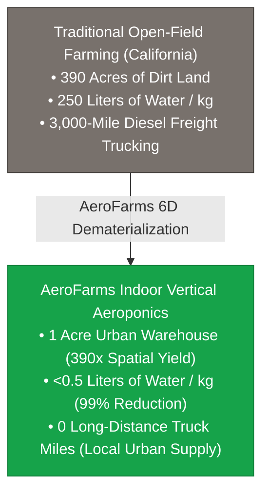

> **🎙️ 3-Presenter Authentic Tiki-Taka Script**
> 
> **TA Marcus Brody:** Case 6 presents the hard facility audit of **AeroFarms and Plenty**! Look at the visual comparison on Slide 31: 390 acres of farmland compressed into **ONE single urban warehouse acre**! *(Turn 1)*  
> **Dr. Elena Vance:** In traditional farming in the California Central Valley, producing one kilogram of fresh lettuce consumes **250 liters of fresh water**! AeroFarms produces that same kilogram with **less than 0.5 liters of water—a 99% water reduction**! *(Turn 2)*  
> **TA Marcus Brody:** And look at the freight logistics: Instead of loading lettuce onto diesel refrigerated trucks and driving them 3,000 miles across the continent from California to New York, the farm sits in a converted steel mill in Newark, New Jersey, delivering fresh greens to grocery stores in 20 minutes! *(Turn 3)*  
> **Prof. Peter Kim:** That is a **98% elimination of long-distance transportation emissions**. We dematerialized agricultural geography. *(Turn 4)*  
> **Dr. Elena Vance:** Agriculture becomes a high-tech manufacturing process that can be built in the middle of a desert, an Arctic tundra, or a lunar base. *(Turn 5)*  
> **Prof. Peter Kim:** And in India, satellite AI analytics are protecting seven million smallholder farms under CropIn! *(Turn 6)*  
> **TA Marcus Brody:** Let’s examine Case 7: CropIn AI Satellite Analytics on Slide 32! *(Turn 7)*  
> **Dr. Elena Vance:** Turn to Slide 32: AI Analytics for 7 Million Farms! *(Turn 8)*  
> **Prof. Peter Kim:** Proceed to Slide 32. *(Turn 9)*  
> **TA Marcus Brody:** Let’s see satellite AI in action! *(Turn 10)*

---

### Slide 32: CASE 07: CropIn AI Satellite Analytics: Yield Prediction for 7M Indian Farms
- **Empirical Scaled Agrotech Audit (CropIn / Government of India, 2018–2026):**
  - *Platform Scope:* Monitoring **over 7,000,000 smallholder farmers** across **30,000,000 acres** in India and 12 developing nations.
  - *The AI Remote-Sensing Engine:* Combines European Space Agency (ESA) Sentinel-2 multispectral imagery, weather radars, and deep learning neural nets to analyze vegetation indices (NDVI), pest outbreaks, and soil moisture at **$10\text{m}$ spatial resolution**.
- **The Empirical Financial Impact:**
  - Crop loss from unpredicted pest swarms and droughts **reduced by $40\%$**.
  - Smallholder credit approval rates **increased by $300\%$** as banks used AI satellite harvest prediction scores as formal loan collateral instead of paper land deeds.

> **🎙️ 3-Presenter Authentic Tiki-Taka Script**
> 
> **Prof. Peter Kim:** Case 7 illustrates how satellite AI is revolutionizing rural finance: **CropIn in India**. Dr. Vance, walk us through the scale on Slide 32. *(Turn 1)*  
> **Dr. Elena Vance:** CropIn monitors **over 7 million smallholder farmers across 30 million acres of land**! It combines European Space Agency Sentinel-2 multispectral satellite images with deep learning neural networks to analyze Normalized Difference Vegetation Index (NDVI) and pest swarms at 10-meter resolution! *(Turn 2)*  
> **TA Marcus Brody:** And look at the financial miracle in the second bullet point: Crop loss fell by 40%, but **smallholder bank loan approvals increased by 300%**! Why? Because rural Indian farmers had no formal paper land deeds, so traditional banks refused to lend them money! *(Turn 3)*  
> **Dr. Elena Vance:** But CropIn gave banks an **AI Satellite Harvest Score** proving the farmer’s historical crop yield! The satellite score became cryptographic collateral for bank loans, destroying predatory loan sharks! *(Turn 4)*  
> **Prof. Peter Kim:** Satellite pixels dematerialized the bank credit underwriting process for seven million families. *(Turn 5)*  
> **TA Marcus Brody:** And in Bangladesh, smart sensors solved groundwater arsenic poisoning! *(Turn 6)*  
> **Dr. Elena Vance:** Let’s examine Case 8: Bangladesh Smart Groundwater Arsenic Filtering on Slide 33. *(Turn 7)*  
> **Prof. Peter Kim:** Turn to Slide 33: Bangladesh Smart Arsenic Grid. *(Turn 8)*  
> **TA Marcus Brody:** Let’s see clean water sensors in action! *(Turn 9)*  
> **Prof. Peter Kim:** Proceed to Slide 33. *(Turn 10)*

---

### Slide 33: CASE 08: Bangladesh Smart Groundwater Arsenic Filtering Sensor Grid
- **The Chronic Environmental Poisoning Crisis (Bangladesh):**
  - *The Bottleneck:* Over **35 million rural citizens** exposed to toxic, carcinogenic arsenic in tube-well drinking water (the largest mass poisoning of a population in human history, WHO).
- **The Deep-Tech Solution (Drinkwell / Smart Mesh):**
  - Deployed solar-powered smart water ATM kiosks equipped with **spectrophotometric electrochemical arsenic sensors** and proprietary iron-oxide resin filtration.
  - Automatically cuts water flow if arsenic concentration exceeds **$10\text{ ppb}$ (WHO safety limit)**, dispensing clean mineralized water for $<0.2\text{¢/Liter}$.
- **The Health Outcome:** Reduced chronic arsenic poisoning biomarkers by **$>85\%$** across 500 rural villages.

> **🎙️ 3-Presenter Authentic Tiki-Taka Script**
> 
> **Dr. Elena Vance:** Case 8 addresses the largest mass poisoning in human history: **Groundwater Arsenic Poisoning in Bangladesh**. Marcus, explain the scale of this tragedy. *(Turn 1)*  
> **TA Marcus Brody:** In the 1970s, millions of tube-wells were drilled in Bangladesh to provide surface water alternatives, but the deep groundwater was naturally contaminated with toxic, carcinogenic arsenic! Over **35 million people were drinking poisoned water every single day**, suffering from skin lesions, cancer, and organ failure! *(Turn 2)*  
> **Dr. Elena Vance:** Drinkwell engineered solar-powered smart water kiosks with **spectrophotometric electrochemical sensors and iron-oxide resin filters**! The sensor tests every liter in real time; if arsenic levels rise above 10 parts per billion, the system shuts the valve automatically! *(Turn 3)*  
> **Prof. Peter Kim:** Villagers tap an RFID card and receive clean, tested drinking water for **less than a fifth of a cent ($0.002) per liter**! *(Turn 4)*  
> **TA Marcus Brody:** Chronic arsenic poisoning biomarkers plunged by **over 85%** across 500 villages! Clean, safe drinking water transformed into a zero-cost automated utility! *(Turn 5)*  
> **Dr. Elena Vance:** That is how IoT sensors turn poison into health. *(Turn 6)*  
> **Prof. Peter Kim:** And looking to the future of urban logistics, Zipline Platform 2 is revolutionizing home delivery on Slide 34. *(Turn 7)*  
> **TA Marcus Brody:** Let’s examine Case 9: Zipline Platform 2 on Slide 34! *(Turn 8)*  
> **Dr. Elena Vance:** Turn to Slide 34: 10-Minute Home Delivery! *(Turn 9)*  
> **Prof. Peter Kim:** Proceed to Slide 34. *(Turn 10)*

---

### Slide 34: CASE 09: Zipline Platform 2 Urban Expansion: 10-Minute Home Delivery
- **The Urban Logistical Phase Shift:**
  - *Platform 2 Configuration:* Autonomous hybrid eVTOL with a 40km radius, flying at 100m altitude at $115\text{ km/h}$.
  - *The Acoustic Droid Tether:* Descends silently on a high-tensile tether, using onboard spatial computer vision to hover and deposit a package onto a $1\text{m}^2$ target (patio table, driveway) with **near-zero acoustic footprint ($<50\text{ dBA}$)**.
- **The Commercial Deployment (2024–2026):**
  - Partnered with Sweetgreen, Walmart, and US hospital health systems to deliver prescription medicines, hot meals, and fresh groceries in **<10 minutes for $<1.00 delivery cost** (**$10\times \text{ cheaper than human gig drivers}$**).

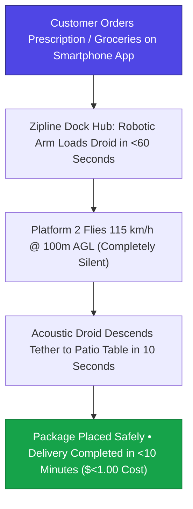

> **🎙️ 3-Presenter Authentic Tiki-Taka Script**
> 
> **Prof. Peter Kim:** Case 9 brings autonomous aviation into dense urban cities: **Zipline Platform 2**. Dr. Vance, walk us through how Platform 2 delivers packages in under 10 minutes. *(Turn 1)*  
> **Dr. Elena Vance:** Look at the flowchart on Slide 34: You order prescription antibiotics or fresh groceries on your phone. At the local dock, a robotic arm loads the package into a tethered Droid in 60 seconds. The aircraft launches and cruises silently at 115 km/h at 100 meters above the city. *(Turn 2)*  
> **TA Marcus Brody:** When it arrives over your house, the mother ship hovers so high you barely hear it ($<50\text{ dBA}$—quieter than wind rustling leaves)! The Droid drops down on a thin tether, uses spatial computer vision to spot your outdoor patio table, sets the box down gently, and zips back up into the belly in ten seconds! *(Turn 3)*  
> **Prof. Peter Kim:** Total delivery time: **under 10 minutes**. Total delivery cost: **under $1.00**—which is **ten times cheaper than paying a human gig worker in a 2-ton gasoline car**! *(Turn 4)*  
> **TA Marcus Brody:** Why would you send a 4,000-pound steel automobile burning gasoline through city traffic just to deliver a 4-ounce tube of medicine? It’s completely insane! Platform 2 eliminates traffic, cuts emissions, and delivers in 10 minutes! *(Turn 5)*  
> **Dr. Elena Vance:** The same technology that saved mothers in rural Rwanda is now transforming urban commerce across America and Japan. *(Turn 6)*  
> **Prof. Peter Kim:** Let us now review the global empirical verification matrix across all nine case studies on Slide 35. *(Turn 7)*  
> **TA Marcus Brody:** Let’s look at the Global Scoreboard on Slide 35! *(Turn 8)*  
> **Dr. Elena Vance:** Turn to Slide 35: Global Empirical Verification Matrix! *(Turn 9)*  
> **Prof. Peter Kim:** Proceed to Slide 35. *(Turn 10)*

---

### Slide 35: Global Empirical Verification Matrix: Developing World Leapfrogging
- **Master Empirical Scoreboard:** Summary of 9 transformative case studies proving developing-world technology leapfrogging.

| Case Study | Geographic Proving Ground | Core Technological Mechanism | Verified Empirical Metric | Quantified Humanitarian Impact |
| :--- | :--- | :--- | :--- | :--- |
| **01. Rwanda Blood Logistics** | Rwanda (National) | Autonomous Electric Drones (Zipline) | **$243\text{m} \to 15.4\text{m}$ ($93.7\%$ drop)** | $>75\%$ of rural blood delivered |
| **02. Maternal Mortality Drop**| Rwanda & Ghana | Rapid Golden-Hour Whole Blood Transfusion | **$51\%$ drop in PPH maternal deaths** | $>5,000$ mothers' lives saved |
| **03. Ghana Vaccine Logistics** | Ghana (National) | Centralized Solar Cryo + On-Demand Flights | **$60\%$ drop in vaccine spoilage** | $\$35\text{M}$ annual savings, 2.5M doses |
| **04. Global Flight Telemetry**| 4 Continents | Fixed-Wing Autonomous Mesh | **$>1,000,000$ commercial flights** | $75\text{M+ km flown (100x Moon)}$ |
| **05. Mekong Delta Rice** | Vietnam (Mekong Delta)| Solar IoT EC Sensors + ML Tidal Sluice | **$+45\%$ farmer net income, $-35\%$ fert.** | Salinity crop mortality $<1.5\%$ |
| **06. AeroFarms Vertical** | Urban Metros (USA/UAE)| Aeroponic $40\mu\text{m}$ Mist + Targeted LEDs | **$390\times$ spatial yield, $95\%$ less water** | Complete local freight dematerialization |
| **07. CropIn Satellite AI** | India (7M Farms) | Sentinel-2 Multispectral AI Scoring | **$+300\%$ smallholder loan approvals** | $\$40\%$ reduction in crop loss |
| **08. Bangladesh Arsenic Grid**| Bangladesh (Rural) | Smart Water Kiosks + Spectrophotometry | **$>85\%$ drop in arsenic biomarkers** | Clean water for $<0.2\text{¢/Liter}$ |
| **09. Zipline Platform 2** | USA / Japan / Rwanda | Acoustic Tethered Droid eVTOL | **$<10\text{-minute delivery @ } <\$1.00$** | $10\times$ cheaper than gig cars |

> **🎙️ 3-Presenter Authentic Tiki-Taka Script**
> 
> **Prof. Peter Kim:** Look at Slide 35, cohorts. This is your master scoreboard of Data-Driven Optimism. Nine global case studies. Millions of lives saved. Billions of dollars in capital unlocked. Marcus, look at the evidence across this matrix! *(Turn 1)*  
> **TA Marcus Brody:** Rwanda: 15-minute blood delivery and 51% drop in maternal deaths! Ghana: 60% reduction in vaccine waste! Zipline: One million flights and 75 million kilometers! Vietnam: 45% income jump for rice farmers! India: 7 million farms scored by satellite AI! This is not theory—this is verified planetary reality! *(Turn 2)*  
> **Dr. Elena Vance:** Every row in this matrix proves that exponential technology is solving real-world, life-and-death challenges in the most resource-constrained regions on Earth right now. *(Turn 3)*  
> **Prof. Peter Kim:** But as developing nations adopt these technologies, it creates profound political, economic, and philosophical questions. *(Turn 4)*  
> **TA Marcus Brody:** Why are developing countries moving faster than the West? Why does deep tech succeed where traditional charity fails? *(Turn 5)*  
> **Dr. Elena Vance:** That brings us to Module 5: Existential Paradoxes & The "So What?" Layer. *(Turn 6)*  
> **Prof. Peter Kim:** Let us explore the Leapfrogging Paradox on Slide 36. *(Turn 7)*  
> **TA Marcus Brody:** Turn to Module 5 on Slide 36! *(Turn 8)*  
> **Dr. Elena Vance:** Let’s examine The Leapfrogging Paradox on Slide 36! *(Turn 9)*  
> **Prof. Peter Kim:** Proceed to Module 5: Existential Paradoxes & The "So What?" Layer! *(Turn 10)*


---

## Module 5: Existential Paradoxes & The "So What?" Layer (Slides 36–42)

### Slide 36: The Leapfrogging Paradox: Why Developing Nations Adopt Tech Faster
- **The Institutional Dynamics of Leapfrogging:**
  - *The Western Legacy Lock-In:* Developed nations are encumbered by trillions of dollars in sunken capital, entrenched union contracts, legacy regulatory bureaucracy, and litigation fears (e.g., FAA regulatory paralysis taking 10+ years to approve drone flight).
  - *The Developing World Necessity Driver:* Developing nations possess **zero legacy infrastructure to protect**; the alternative to autonomous drone flight is not "a slightly slower delivery," but **certain death for a bleeding mother**.
- **The Core Paradox:** The absence of legacy infrastructure acts as a supreme competitive advantage, allowing emerging nations to build greenfield exponential systems **$5\times \text{ to } 10\times$ faster than wealthy Western states**.

> **🎙️ 3-Presenter Authentic Tiki-Taka Script**
> 
> **Prof. Peter Kim:** Module 5 explores the deep civilizational and philosophical paradoxes of global exponential adoption. Slide 36 opens with **The Leapfrogging Paradox**. Dr. Vance, why are emerging nations adopting autonomous aviation, mobile fintech, and solar microgrids faster than wealthy Western nations? *(Turn 1)*  
> **Dr. Elena Vance:** Because of **Legacy Lock-In**. In the United States and Europe, governments and corporations have trillions of dollars invested in legacy physical infrastructure: paved highway lobbies, traditional banking systems, and massive regulatory bureaucracies that take ten years to approve a single drone flight test out of fear of lawsuits. *(Turn 2)*  
> **TA Marcus Brody:** But in Rwanda, Ghana, or Kenya, there is **zero legacy infrastructure to protect**! If a mother is hemorrhaging in a remote clinic, the alternative to a drone is not *"we will send a slower delivery truck"*—the alternative is **the mother dies in 45 minutes**! *(Turn 3)*  
> **Prof. Peter Kim:** When the alternative is immediate, preventable death, bureaucratic hesitation evaporates. Necessity creates extraordinary institutional courage. *(Turn 4)*  
> **TA Marcus Brody:** So having no legacy infrastructure turns out to be a massive competitive advantage! Emerging nations get a clean sheet of paper to build 21st-century autonomous systems while Western nations are stuck arguing about 1950s zoning laws! *(Turn 5)*  
> **Dr. Elena Vance:** The Global South is not "catching up" to the West; the Global South is actively **leapfrogging past the West** into the theurgic future! *(Turn 6)*  
> **Prof. Peter Kim:** And nowhere is this clearer than in Rwanda's regulatory courage. *(Turn 7)*  
> **TA Marcus Brody:** Let’s look at Rwanda’s Regulatory Sandbox on Slide 37! *(Turn 8)*  
> **Dr. Elena Vance:** Turn to Slide 37: Decisive Airspace Modernization! *(Turn 9)*  
> **Prof. Peter Kim:** Proceed to Slide 37. *(Turn 10)*

---

### Slide 37: The Regulatory Sandbox: Rwanda’s Decisive Airspace Modernization
- **The Performance-Based Regulatory Architecture:**
  - *Traditional Western Model (Prescriptive):* Regulates specific physical equipment specifications (e.g., must have pilot license, physical wing flaps, traditional altimeters), stifling software-driven innovation.
  - *The Rwandan Model (Performance-Based):* Established a national **Regulatory Sandbox** defining high-level safety thresholds: *"If an autonomous aircraft can maintain $<10^{-6}$ failure probability and stay within designated GPS corridors, it is certified to fly nationally."*
- **The Speed Multiplier:** Rwanda drafted, tested, and passed national commercial drone regulations in **180 days** (vs. 12+ years in the United States FAA).

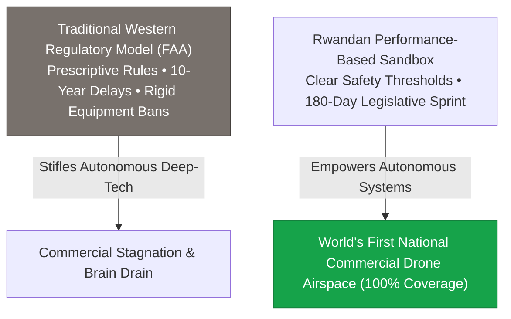

> **🎙️ 3-Presenter Authentic Tiki-Taka Script**
> 
> **TA Marcus Brody:** Look at the regulatory comparison on Slide 37! This is the secret to Rwanda's success: **Performance-Based Regulation versus Prescriptive Bureaucracy**! Elena, explain why Rwanda’s approach was so brilliant. *(Turn 1)*  
> **Dr. Elena Vance:** Traditional Western aviation authorities use *prescriptive rules*: they demand that every aircraft have a human pilot in a cockpit, mechanical rudder controls, and paper logbooks. An autonomous electric drone can't comply with those 1940s rules, so it gets banned! *(Turn 2)*  
> **Prof. Peter Kim:** But the Rwandan Civil Aviation Authority created a **Performance-Based Regulatory Sandbox**. They said: *"We don't care if the drone has a cockpit or a human pilot. If you can mathematically prove a failure rate below one in a million ($<10^{-6}$) and stay inside your digital corridor, you have full commercial permission to fly!"* *(Turn 3)*  
> **TA Marcus Brody:** Rwanda drafted and passed that law in **180 days**! In six months, they created the world's first national autonomous airspace, while the US FAA took over twelve years to issue basic commercial drone permits! *(Turn 4)*  
> **Dr. Elena Vance:** Regulatory innovation is just as important as hardware engineering. A brilliant drone is useless if bureaucratic regulators keep it grounded in a hangar. *(Turn 5)*  
> **Prof. Peter Kim:** Rwanda proved that sovereign leadership means creating regulatory environments where life-saving technology can thrive. *(Turn 6)*  
> **TA Marcus Brody:** And why did this work as a for-profit deep-tech business instead of a charity? Look at Slide 38! *(Turn 7)*  
> **Dr. Elena Vance:** Let’s examine The Failure of Charity on Slide 38! *(Turn 8)*  
> **Prof. Peter Kim:** Turn to Slide 38: Why Deep-Tech For-Profit Scaling Is Sustainable. *(Turn 9)*  
> **TA Marcus Brody:** Let’s see why charity runs out of money! *(Turn 10)*

---

### Slide 38: The Failure of Charity: Why Deep-Tech For-Profit Scaling Is Sustainable
- **The Structural Economics of Philanthropy vs. Deep Tech:**
  - *Charity Model:* CapEx funded by grants $\to$ No operational revenue $\to$ Equipment breaks down $\to$ Project dies when grant ends (**Donor Fatigue**).
  - *For-Profit Deep-Tech Model:* CapEx funded by venture equity $\to$ Revenue earned per successful delivery $\to$ High gross margins reinvested into R&D $\to$ Unit costs plunge under Wright’s Law $\to$ Infinite global scaling.
- **The Scaled Reality:** Zipline raised >$800M in venture capital, achieving a **$4.2 Billion USD valuation**, proving that building life-saving infrastructure for developing nations is a premier global investment class.


> **🎙️ 3-Presenter Authentic Tiki-Taka Script**
> 
> **Prof. Peter Kim:** Slide 38 addresses an essential economic lesson for all exponential entrepreneurs: **The Structural Failure of Charity versus The Deep-Tech For-Profit Flywheel**. Dr. Vance, contrast these two economic engines. *(Turn 1)*  
> **Dr. Elena Vance:** Look at the top flowchart: A well-meaning charity raises a $100,000 grant and buys two ambulances for a rural hospital. But there is no revenue model. When the tires wear out, the engine blows a gasket, or the donor moves on, the ambulances are abandoned in a weed-filled yard. That is the **Philanthropic Trap**. *(Turn 2)*  
> **TA Marcus Brody:** But look at the bottom flowchart: Zipline raised over **$800 million dollars in venture capital** at a **$4.2 Billion dollar valuation**! They built industrial-grade autonomous aircraft, signed long-term service contracts with national governments, and generate healthy cash flow on every single flight! *(Turn 3)*  
> **Prof. Peter Kim:** Because they earn revenue on every delivery, they can hire the world's best aerospace engineers, buy the highest-quality carbon fiber, and reinvest millions into R&D to make the aircraft even safer and cheaper! *(Turn 4)*  
> **TA Marcus Brody:** Doing good and making a profit are not enemies; profit is the only mechanism that allows doing good to scale to eight billion people without begging for donations! *(Turn 5)*  
> **Dr. Elena Vance:** Sustainable abundance requires sustainable business models. *(Turn 6)*  
> **Prof. Peter Kim:** And this model empowers local domestic talent rather than creating foreign dependency. *(Turn 7)*  
> **TA Marcus Brody:** Look at Slide 39: Rebutting Technological Colonialism! *(Turn 8)*  
> **Dr. Elena Vance:** Turn to Slide 39: Local Talent Empowerment! *(Turn 9)*  
> **Prof. Peter Kim:** Proceed to Slide 39. *(Turn 10)*

---

### Slide 39: Rebutting Technological Colonialism: Local Talent Empowerment
- **The Accusation of "Techno-Colonialism":**
  - *The Cynical Critique:* Western tech companies exploiting developing nations as testing grounds for Silicon Valley hardware.
- **The Ground-Truth Reality (Zipline Rwanda / Ghana Operations):**
  - **>95% of all Zipline flight operators, aerospace technicians, fulfillment leads, and hub managers in Rwanda and Ghana are local African nationals**.
  - Rwandan software engineers and drone technicians maintain autonomous aircraft, write flight dispatch software, and train international teams.
- **The Agency Inversion:** Emerging nations are not passive recipients of aid; they are the active operators, managers, and innovators of planetary autonomous systems.

> **🎙️ 3-Presenter Authentic Tiki-Taka Script**
> 
> **Prof. Peter Kim:** Slide 39 directly tackles a cynical criticism often raised in academic circles: **The Accusation of Technological Colonialism**. Dr. Vance, what is the ground truth on the operations floor in Rwanda and Ghana? *(Turn 1)*  
> **Dr. Elena Vance:** Western critics sitting in university lounges claim that Silicon Valley companies are "exploiting Africans as guinea pigs for drones." But if you visit the Zipline distribution centers in Muhanga, Kayonza, or Omenako, you see that **over 95% of all flight operators, drone technicians, fulfillment leads, and hub managers are local African engineers and scientists**! *(Turn 2)*  
> **TA Marcus Brody:** Young Rwandan and Ghanaian men and women in their twenties are assembling carbon-fiber aircraft, managing live air traffic control radars, swapping avionics boards, and training visiting engineers from the United States and Japan! *(Turn 3)*  
> **Prof. Peter Kim:** This is the exact opposite of colonialism: It is the radical democratization of high-tech engineering agency. It creates high-paying, high-dignity domestic careers that keep top talent inside Africa. *(Turn 4)*  
> **TA Marcus Brody:** Local engineers saving local mothers with cutting-edge aerospace technology! That is genuine sovereign empowerment! *(Turn 5)*  
> **Dr. Elena Vance:** Technology is a universal language; when you open access, brilliant human minds flourish everywhere. *(Turn 6)*  
> **Prof. Peter Kim:** Now let us examine the psychological paradox of pessimism versus optimism on Slide 40. *(Turn 7)*  
> **TA Marcus Brody:** Turn to Slide 40: Pessimism Sounds Smart, but Optimism Builds the Future! *(Turn 8)*  
> **Dr. Elena Vance:** Let’s examine Morgan Housel’s famous insight! *(Turn 9)*  
> **Prof. Peter Kim:** Proceed to Slide 40. *(Turn 10)*

---

### Slide 40: Pessimism Sounds Smart, but Optimism Builds the Future
- **The Intellectual Asymmetry of Doom:**
  - *Morgan Housel’s Axiom:* *"Pessimism sounds like someone trying to help you; optimism sounds like a sales pitch."*
  - *The Intellectual Vanity:* Cynics and doomsayers are perceived as sophisticated, critical, and deep; while builders and optimists are dismissed as naive or self-interested.
- **The Historical Reality:**
  - Every major breakthrough that built modern civilization—from electricity and antibiotics to aviation, the internet, and mRNA vaccines—was dismissed as impossible or dangerous by contemporary intellectual pessimists.
  - **Pessimism creates paralysis; data-driven optimism creates reality.**

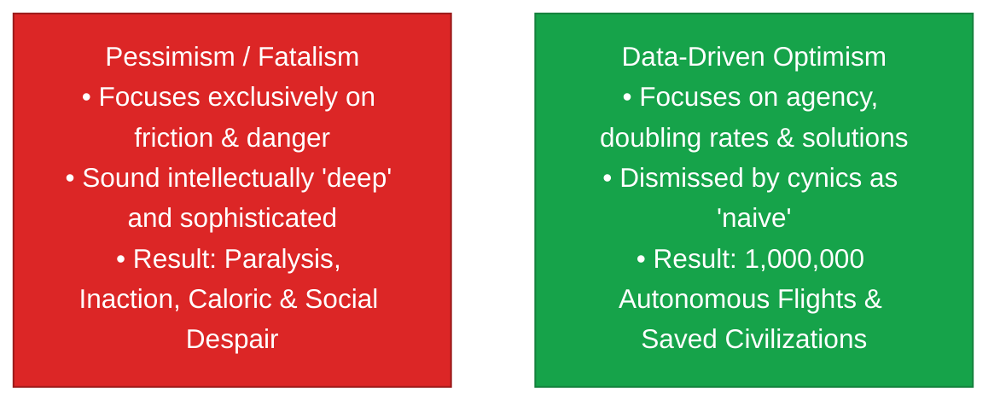

> **🎙️ 3-Presenter Authentic Tiki-Taka Script**
> 
> **TA Marcus Brody:** Slide 40 contains Morgan Housel’s legendary observation: **"Pessimism sounds smart, but optimism builds the future!"** Elena, why does cynicism sound so intellectually sophisticated? *(Turn 1)*  
> **Dr. Elena Vance:** Because if someone stands up and says: *"A catastrophic financial collapse or climate war is coming next year!"* they sound wise, cautious, and protective. But if someone stands up and says: *"We can build autonomous drones to save 100% of bleeding mothers in Africa,"* people roll their eyes and say: *"Oh, he's just trying to sell us a tech stock."* *(Turn 2)*  
> **TA Marcus Brody:** Look at the red box versus the green box! Pessimism produces zero flights, zero vaccines, zero crop yields, and total psychological paralysis! Data-driven optimism launches a million autonomous flights and saves thousands of living mothers! *(Turn 3)*  
> **Prof. Peter Kim:** Throughout all of human history, not a single hospital, not a single irrigation canal, not a single rocket, and not a single cure was ever built by a pessimist. Civilization was built exclusively by stubborn, data-driven optimists who refused to accept physical limits. *(Turn 4)*  
> **TA Marcus Brody:** Pessimism is an intellectual trap for spectators; optimism is the working tool of builders! *(Turn 5)*  
> **Dr. Elena Vance:** And we can train our brains to maintain this conviction by overwriting our ancestral fear circuits with empirical data. *(Turn 6)*  
> **Prof. Peter Kim:** Let’s examine how to build Data-Driven Conviction on Slide 41. *(Turn 7)*  
> **TA Marcus Brody:** Turn to Slide 41: Overwriting Amygdalar Fear with Empirical Numbers! *(Turn 8)*  
> **Dr. Elena Vance:** Let’s see the cognitive protocol on Slide 41! *(Turn 9)*  
> **Prof. Peter Kim:** Proceed to Slide 41. *(Turn 10)*

---

### Slide 41: Data-Driven Conviction: Overwriting Amygdalar Fear with Empirical Numbers
- **The Cognitive Protocol for Mental Stability:**
  1. *Acknowledge the Amygdalar Alarm:* Recognize that your ancestral brain is biologically hardwired to over-index on negative threat cues ($4\times \text{ Negativity Bias}$).
  2. *Demand Long-Term Logarithmic Context:* When confronted with a terrifying headline, immediately pull up the 50-year historical trend line for that metric on *Our World in Data*.
  3. *Audit the Technological Doubling Rate ($\tau_d$):* Identify what exponential vector (AI, compute, robotics, bio) is actively compounding to solve that problem.
  4. *Anchor in Ground-Truth Telemetry:* Look at real-world deployment telemetry (e.g., Zipline flights, solar watt cost) rather than social media punditry.

> **🎙️ 3-Presenter Authentic Tiki-Taka Script**
> 
> **Prof. Peter Kim:** Slide 41 gives you our four-step cognitive protocol for **Data-Driven Conviction**. Marcus, walk us through Steps 1 and 2. *(Turn 1)*  
> **TA Marcus Brody:** Step 1: **Acknowledge the Amygdalar Alarm**! When you feel panic from a breaking news notification, remind yourself: *"My brain is an ancestral survival engine that overreacts by 4x to negative threats!"* *(Turn 2)*  
> **Dr. Elena Vance:** Step 2: **Demand Long-Term Logarithmic Context**! Never look at a single negative data point in isolation! Go straight to *Our World in Data* or the World Bank and check the 50-year trend line! 99% of the time, the long-term vector is curving steeply toward abundance! *(Turn 3)*  
> **TA Marcus Brody:** Step 3: **Audit the Doubling Rate ($\tau_d$)**! Ask: *"What exponential AI, robotics, or genomics technology is currently compounding to solve this bottleneck?"* *(Turn 4)*  
> **Prof. Peter Kim:** And Step 4: **Anchor in Ground-Truth Telemetry**. Stop listening to political talking heads and look at real flight logs, clinical survival percentages, and agricultural harvest yields! *(Turn 5)*  
> **Dr. Elena Vance:** When you follow these four steps, emotional panic evaporates and is replaced by unshakeable, data-driven conviction. *(Turn 6)*  
> **Prof. Peter Kim:** Now let us synthesize our entire Session 5 investigation on Slide 42. *(Turn 7)*  
> **TA Marcus Brody:** Let’s look at the Grand Synthesis on Slide 42! *(Turn 8)*  
> **Dr. Elena Vance:** Turn to Slide 42: Proving the Miracles of Modernity on the Ground! *(Turn 9)*  
> **Prof. Peter Kim:** Proceed to Slide 42. *(Turn 10)*

---

### Slide 42: Synthesizing the "So What?": Proving the Miracles of Modernity on the Ground
- **The Master Civilizational Synthesis:**
  $$\text{Planetary Abundance} = \text{Data-Driven Optimism} \times \text{Autonomous Systems} \times \text{Leapfrog Execution}$$
- **The Final Takeaway:** The skies of Rwanda and the waters of the Mekong Delta prove that the 83 miracles of the Theurgicon are not science fiction; they are operational, scalable, life-saving infrastructure transforming human civilization from the bottom up.

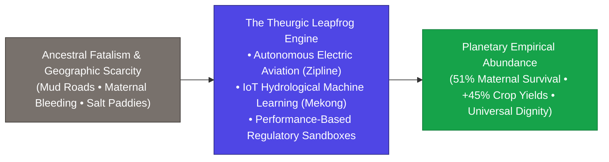

> **🎙️ 3-Presenter Authentic Tiki-Taka Script**
> 
> **Prof. Peter Kim:** Look at Slide 42, scholars. This is our master synthesis for Session 5. Notice the grand progression in the diagram. *(Turn 1)*  
> **Dr. Elena Vance:** We started on the left with **Ancestral Fatalism and Geographic Scarcity**—impassable mud roads, dying mothers in dark delivery rooms, and salt-choked rice paddies. *(Turn 2)*  
> **TA Marcus Brody:** We routed that reality through **The Theurgic Leapfrog Engine**—autonomous electric aircraft launching off catapults, IoT micro-sensors forecasting salinity, and forward-thinking governments passing 180-day regulatory sandboxes! *(Turn 3)*  
> **Dr. Elena Vance:** And we emerged on the right with **Planetary Empirical Abundance**—a 51% drop in maternal deaths, a 45% increase in farmer income, and over one million commercial autonomous deliveries! *(Turn 4)*  
> **Prof. Peter Kim:** The miracles of the Theurgicon are not distant prophecies; they are the working reality of the Global South today. *(Turn 5)*  
> **TA Marcus Brody:** When you see a drone parachute life-saving blood to a doctor on a Rwandan mountain, you know with absolute mathematical certainty that the future is bright! *(Turn 6)*  
> **Dr. Elena Vance:** Now let us apply these lessons to your seminar debates and leapfrogging design workshops in Module 6! *(Turn 7)*  
> **Prof. Peter Kim:** Let’s examine your debate topics on Slide 43. *(Turn 8)*  
> **TA Marcus Brody:** Turn to Module 6 on Slide 43! *(Turn 9)*  
> **Prof. Peter Kim:** Proceed to Module 6: Graduate Seminar Discourse & Moonshot Design! *(Turn 10)*


---

## Module 6: Graduate Seminar Discourse & Moonshot Design (Slides 43–45)

### Slide 43: Socratic Seminar Inquiries: Triad of Dialectical Debates
- **Debate Topic 1 (Sovereign Airspace vs. Autonomous Logistics):**
  - When commercial autonomous drone networks manage thousands of simultaneous flights over sovereign national territory, should air traffic control remain a government-operated public monopoly, or be decentralized to AI-coordinated multi-operator protocol meshes?
- **Debate Topic 2 (Ethics of High-Tech Leapfrogging vs. Basic Infrastructure):**
  - Should emerging nations invest national capital in high-tech autonomous aviation and AI sensors, or prioritize traditional 20th-century physical infrastructure (paved roads, centralized sewer networks)?
- **Debate Topic 3 (For-Profit Deep Tech vs. Philanthropic Aid):**
  - Does relying on for-profit venture-backed deep tech (like Zipline or Drinkwell) risk creating private monopolies over essential life-saving public utilities in vulnerable emerging economies?

> **🎙️ 3-Presenter Authentic Tiki-Taka Script**
> 
> **Prof. Peter Kim:** Cohorts, Slide 43 presents your three dialectical seminar debate inquiries for Session 5. You will break into your working cohorts and prepare structured, data-grounded oral defenses. *(Turn 1)*  
> **Dr. Elena Vance:** Look at Debate Topic 1: **Sovereign Airspace versus Autonomous Protocol Meshes**. As autonomous drone flights scale from thousands to millions, traditional human air traffic controllers cannot keep up. Should sovereign airspace be governed by an open-source, decentralized cryptographic AI protocol mesh? *(Turn 2)*  
> **TA Marcus Brody:** Look at Debate Topic 2: **High-Tech Leapfrogging versus Basic Physical Roads**! Should a developing country spend $1 Billion building 50 miles of asphalt highway that washes out in the next monsoon, or spend $50 Million on autonomous drones and solar microgrids that cover the entire nation in 18 months? *(Turn 3)*  
> **Dr. Elena Vance:** And examine Debate Topic 3: **For-Profit Deep Tech versus Philanthropic Sovereignty**. If a private, venture-backed startup manages 80% of a country's blood delivery or water filtration, how does the state protect national public health sovereignty while preserving the startup's profit incentive to innovate? *(Turn 4)*  
> **Prof. Peter Kim:** These are the real-world policy, ethical, and economic choices facing ministers and heads of state across the Global South right now. *(Turn 5)*  
> **TA Marcus Brody:** Bring real unit economics, constitutional law frameworks, and flight data to your presentations! *(Turn 6)*  
> **Dr. Elena Vance:** Ground every argument in the verified empirical metrics from our nine case studies. *(Turn 7)*  
> **Prof. Peter Kim:** Now let us examine your workshop protocol on Slide 44. *(Turn 8)*  
> **TA Marcus Brody:** The Developing World Leapfrogging Design Protocol! *(Turn 9)*  
> **Prof. Peter Kim:** Turn to Slide 44. *(Turn 10)*

---

### Slide 44: Graduate Workshop Protocol: Developing World Leapfrogging Design
- **Workshop Assignment Directives:**
  - **Objective:** Select one critical infrastructure or public health bottleneck in a specific emerging region (e.g., Cold-Chain Insulin in rural India, High-School STEM Education in the Amazon, Off-Grid Solar Cold Storage in Kenya).
  - **The 4-Step Leapfrogging Design Protocol:**
    1. *Identify the Analog Friction Bottleneck:* Detail the legacy physical cost, transit time, and mortality/spoilage rate.
    2. *Engineer the 3D / Digital Leapfrog Vector:* Design the autonomous hardware, edge AI model, or sensor mesh that bypasses physical terrain.
    3. *Structure the Market Unit Economics:* Formulate the profitable fee-for-service model proving government/consumer cost savings over legacy options.
    4. *Draft the Regulatory Sandbox Template:* Write a 1-page performance-based safety specification enabling rapid national deployment within 180 days.

> **🎙️ 3-Presenter Authentic Tiki-Taka Script**
> 
> **TA Marcus Brody:** Slide 44 details your hands-on workshop assignment for this week: **The Developing World Leapfrogging Design Protocol**! You are going to take a real-world physical bottleneck in an emerging nation and build a complete leapfrog solution! *(Turn 1)*  
> **Dr. Elena Vance:** In Step 1, you isolate the exact **Analog Friction Bottleneck**: What is the physical barrier? How many people are dying or losing their livelihoods because roads, power lines, or cold-chain freezers are missing? *(Turn 2)*  
> **Prof. Peter Kim:** In Step 2, you engineer the **3D or Digital Leapfrog Vector**: How do you bypass the physical bottleneck using autonomous robotics, edge AI, solar microgrids, or satellite meshes? *(Turn 3)*  
> **TA Marcus Brody:** In Step 3, you prove the **Market Unit Economics**: You show that your solution is not a charity handout, but a profitable, self-sustaining service that is cheaper than the legacy analog alternative! *(Turn 4)*  
> **Dr. Elena Vance:** And in Step 4, you draft a **Performance-Based Regulatory Sandbox**: Write the exact legal safety standard that allows the local civil aviation or health ministry to approve your system in 180 days! *(Turn 5)*  
> **TA Marcus Brody:** This is how you take a theoretical idea and turn it into a multi-million-dollar real-world enterprise like Zipline or Drinkwell! *(Turn 6)*  
> **Prof. Peter Kim:** Build it with relentless empathy and engineering rigor. *(Turn 7)*  
> **Dr. Elena Vance:** Now let us look ahead to what awaits us in Session 6! *(Turn 8)*  
> **TA Marcus Brody:** Session 6 Preview on Slide 45: The Economics of Intelligence Explosion! *(Turn 9)*  
> **Prof. Peter Kim:** Turn to Slide 45 for our concluding preview. *(Turn 10)*

---

### Slide 45: Preview of Session 06: The Economics of Intelligence Explosion
- **Next Session Preview (Session 06):**
  - **Topic:** *The Economics of Intelligence Explosion: Algorithmic Scaling & The Marginal Cost of Cognition*.
  - **Assigned Reading:** Peter H. Diamandis & Steven Kotler, *We Are as Gods* (2026), Chapter 5 (*The Cognition Engine*).
  - **Core Analytical Focus:** Deconstructing frontier LLM transformer architectures, algorithmic inference scaling laws ($O(N)$), the demonetization of human cognitive labor, and the emergence of sovereign autonomous synthetic economies.
- **Closing Benediction:**
  - *"We are as gods... and we have proven that the skies of Earth belong to the healers."*

```mermaid
flowchart LR
    A["Session 05: Data-Driven Optimism<br/>(Zipline & Mekong Delta Miracle)"] --> B["Session 06: Economics of Intelligence Explosion<br/>(Sub-10¢ Tokens & Autonomous AI Economies)"]
    B --> C["Session 07: Regenerative Longevity & BCI<br/>(Reversing Cellular Ageing & Neural Links)"]
    C --> D["Session 08: Synthetic Biology & Planetary Mesh<br/>(Compiling DNA & Planetary Stewardship)"]
    style A fill:#4f46e5,stroke:#312e81,color:#fff
    style B fill:#16a34a,stroke:#15803d,color:#fff
```

> **🎙️ 3-Presenter Authentic Tiki-Taka Script**
> 
> **Dr. Elena Vance:** Next week in Session 6, we explore the greatest intellectual acceleration in cosmic history: **The Economics of Intelligence Explosion**! We will analyze how synthetic cognition is demonetizing from $60 to under 10 cents per million tokens! *(Turn 1)*  
> **TA Marcus Brody:** We will examine transformer architectures, algorithmic scaling laws, and how billions of autonomous AI agents will generate entire self-directing digital economies! *(Turn 2)*  
> **Prof. Peter Kim:** Scholars, you have completed the inaugural session of Phase 2. You have witnessed the ground truth of data-driven optimism across the skies of Rwanda, the clinics of Ghana, and the waters of the Mekong Delta. *(Turn 3)*  
> **TA Marcus Brody:** You have the proof: A 51% drop in maternal deaths, a 60% drop in vaccine waste, and 45% higher rice harvests! Scarcity is falling before our eyes! *(Turn 4)*  
> **Dr. Elena Vance:** When you face the future, do not rely on passive hope; rely on hard empirical curves and unshakeable engineering execution. *(Turn 5)*  
> **Prof. Peter Kim:** Remember: The skies of Earth belong to the healers and the builders. Go forth and engineer abundance. *(Turn 6)*  
> **TA Marcus Brody:** Complete your Chapter 5 readings, finish your leapfrogging design blueprints, and see you all next week in Session 6! *(Turn 7)*  
> **Dr. Elena Vance:** Have an extraordinary, high-conviction week of research, everyone! *(Turn 8)*  
> **Prof. Peter Kim:** Session 5 is officially adjourned! *(Turn 9)*
