# Session 6: 지능 폭발의 경제학과 거대 연산 (Economics of Intelligence Explosion & Compute Scaling)
> **Course:** 신이 된 인류: 기하급수 기술과 풍요의 설계도 (*We Are as Gods: A Survival Guide for the Age of Abundance*)  
> **Course Code:** EXPO-701 • Graduate Seminar  
> **Instructors:** Prof. Peter Kim (석좌교수), Dr. Elena Vance (수석연구원), TA Marcus Brody (딥테크조교)  
> **Reading Assignment:** Peter Diamandis & Steven Kotler, *We Are as Gods* (2026), Chapter 4 (*One Billion Times Smarter*)  
> **Total Slides:** 45 Slides (6 Modules: M1~M6) • Authentic 3-Presenter Tiki-Taka Master Edition  

---

## 📌 Table of Contents & Slide Navigation

- [Module 1: 도입 및 어젠다 세팅 (Slides 01~05)](#module-1-도입-및-어젠다-세팅-slides-0105)
  - [Slide 01: 세션 6 개요: 10억 배 똑똑한 지능의 탄생](#slide-01-세션-6-개요-10억-배-똑똑한-지능의-탄생)
  - [Slide 02: 지능 폭발(Intelligence Explosion)의 문명사적 정의](#slide-02-지능-폭발intelligence-explosion의-문명사적-정의)
  - [Slide 03: I.J. Good의 초지능 기계와 존 폰 노이만의 특이점 예언](#slide-03-ij-good의-초지능-기계와-존-폰-노이만의-특이점-예언)
  - [Slide 04: 금주의 핵심 질문: 지능이 공기처럼 흔해질 때 경제학의 모든 법칙은 어떻게 재편되는가?](#slide-04-금주의-핵심-질문-지능이-공기처럼-흔해질-때-경제학의-모든-법칙은-어떻게-재편되는가)
  - [Slide 05: 6주차 학습 로드맵: 힌튼의 40년 집념에서 $15.7T GDP 폭발까지](#slide-05-6주차-학습-로드맵-힌튼의-40년-집념에서-157t-gdp-폭발까지)
- [Module 2: 원전 텍스트 정밀 해체 (Slides 06~15)](#module-2-원전-텍스트-정밀-해체-slides-0615)
  - [Slide 06: 『We Are as Gods』 제4장: "One Billion Times Smarter" 텍스트 해체](#slide-06-we-are-as-gods-제4장-one-billion-times-smarter-텍스트-해체)
  - [Slide 07: 제프리 힌튼(Geoffrey Hinton)의 인공신경망 40년 망명과 부활](#slide-07-제프리-힌튼geoffrey-hinton의-인공신경망-40년-망명과-부활)
  - [Slide 08: 1986년 역전파(Backpropagation)에서 2006년 심층 신뢰망(DBN)까지](#slide-08-1986년-역전파backpropagation에서-2006년-심층-신뢰망dbn까지)
  - [Slide 09: 2012년 AlexNet 모멘트와 2024년 노벨 물리학상의 역사적 궤적](#slide-09-2012년-alexnet-모멘트와-2024년-노벨-물리학상의-역사적-궤적)
  - [Slide 10: 일리야 수츠케버(Ilya Sutskever)의 '거대 연산 스케일링 가설'의 승리](#slide-10-일리야-수츠케버ilya-sutskever의-거대-연산-스케일링-가설의-승리)
  - [Slide 11: 피터 디아만디스의 지능 풍요 테제: 문제 해결 능력의 무한 증폭](#slide-11-피터-디아만디스의-지능-풍요-테제-문제-해결-능력의-무한-증폭)
  - [Slide 12: 스티븐 코틀러의 인지적 하이퍼스레딩: 인간-AI 합성 지능](#slide-12-스티븐-코틀러의-인지적-하이퍼스레딩-인간-ai-합성-지능)
  - [Slide 13: 뇌의 100조 개 시냅스 vs 거대 파운데이션 모델의 파라미터 교차점](#slide-13-뇌의-100조-개-시냅스-vs-거대-파운데이션-모델의-파라미터-교차점)
  - [Slide 14: 지능의 탈화폐화 속도: 100만 토큰당 단가 $60 $\rightarrow$ $0.05 추락](#slide-14-지능의-탈화폐화-속도-100만-토큰당-단가-60-rightarrow-005-추락)
  - [Slide 15: 지능 폭발 5대 진화 단계 요약 매트릭스](#slide-15-지능-폭발-5대-진화-단계-요약-매트릭스)
- [Module 3: 기하급수 이론 및 프레임워크 (Slides 16~25)](#module-3-기하급수-이론-및-프레임워크-slides-1625)
  - [Slide 16: 신경망 스케일링 법칙(Scaling Laws: Kaplan & Chinchilla)의 수학적 원리](#slide-16-신경망-스케일링-법칙scaling-laws-kaplan--chinchilla의-수학적-원리)
  - [Slide 17: 연산량 성장률의 비약: 2012-2022 연간 10배 $\rightarrow$ 2023-2026 연간 100배 가속](#slide-17-연산량-성장률의-비약-2012-2022-연간-10배-rightarrow-2023-2026-연간-100배-가속)
  - [Slide 18: 트랜스포머(Transformer)와 Self-Attention 메커니즘의 병렬화 혁명](#slide-18-트랜스포머transformer와-self-attention-메커니즘의-병렬화-혁명)
  - [Slide 19: AI 거대 연산 클러스터의 열역학적 한계와 전력 인프라 병목](#slide-19-ai-거대-연산-클러스터의-열역학적-한계와-전력-인프라-병목)
  - [Slide 20: 소형 모듈 원자로(SMR)와 기가와트(GW)급 AI 데이터센터의 결합](#slide-20-소형-모듈-원자로smr와-기가와트gw급-ai-데이터센터의-결합)
  - [Slide 21: 온디바이스 양자화(Quantization)와 에지 AI의 탈물질화](#slide-21-온디바이스-양자화quantization와-에지-ai의-탈물질화)
  - [Slide 22: 합성 데이터(Synthetic Data)와 자기 개선(Self-Improvement) 피드백 루프](#slide-22-합성-데이터synthetic-data와-자기-개선self-improvement-피드백-루프)
  - [Slide 23: 인공 일반 지능(AGI)에서 초지능(ASI)으로의 천이 함수 $f(t) = e^{e^{kt}}$](#slide-23-인공-일반-지능agi에서-초지능asi으로의-천이-함수-ft--ee_kt)
  - [Slide 24: 지능의 한계 비용 제로화 공식: $\lim_{\text{Compute} \to \infty} \text{Cost(Token)} = 0$](#slide-24-지능의-한계-비용-제로화-공식-lim_textcompute-to-infty-textcosttoken--0)
  - [Slide 25: 10억 배 지능 시대의 4대 문샷 기획 알고리즘](#slide-25-10억-배-지능-시대의-4대-문샷-기획-알고리즘)
- [Module 4: 글로벌 데이터 & 실증 케이스 (Slides 26~35)](#module-4-글로벌-데이터--실증-케이스-slides-2635)
  - [Slide 26: CASE 1: McKinsey 글로벌 연구: 생성 AI의 $2.6T ~ $4.4T 연간 경제 가치](#slide-26-case-1-mckinsey-글로벌-연구-생성-ai의-26t---44t-연간-경제-가치)
  - [Slide 27: CASE 2: PwC 보고서: 2030년까지 $15.7 Trillion 글로벌 GDP 기여 데이터](#slide-27-case-2-pwc-보고서-2030년까지-157-trillion-글로벌-gdp-기여-데이터)
  - [Slide 28: CASE 3: GitHub Copilot: 전 세계 개발자 코딩 속도 55% 향상 실측치](#slide-28-case-3-github-copilot-전-세계-개발자-코딩-속도-55-향상-실측치)
  - [Slide 29: CASE 4: AlphaFold 3 & Isomorphic Labs의 신약 설계 주기 5년 $\rightarrow$ 12개월 단축](#slide-29-case-4-alphafold-3--isomorphic-labs의-신약-설계-주기-5년-rightarrow-12개월-단축)
  - [Slide 30: CASE 5: Google GraphCast: 1분 만에 슈퍼컴퓨터 능가하는 10일 기상 예측](#slide-30-case-5-google-graphcast-1분-만에-슈퍼컴퓨터-능가하는-10일-기상-예측)
  - [Slide 31: CASE 6: 자율 AI 과학자(The AI Scientist): 가설 수립부터 피어리뷰 논문 전자동화](#slide-31-case-6-자율-ai-과학자the-ai-scientist-가설-수립부터-피어리뷰-논문-전자동화)
  - [Slide 32: CASE 7: 미국 대법원/로펌 판례 분석 AI의 문서 검토 시간 99% 삭감](#slide-32-case-7-미국-대법원로펌-판례-분석-ai의-문서-검토-시간-99-삭감)
  - [Slide 33: CASE 8: BloombergGPT & 금융 알고리즘의 초단타 알파 탐색 혁명](#slide-33-case-8-bloomberggpt--금융-알고리즘의-초단타-알파-탐색-혁명)
  - [Slide 34: CASE 9: 100만 개 엔비디아 Blackwell GPU 클러스터 가동 데이터](#slide-34-case-9-100만-개-엔비디아-blackwell-gpu-클러스터-가동-데이터)
  - [Slide 35: 거대 연산 및 경제 가치 증폭 총괄 실증 매트릭스](#slide-35-거대-연산-및-경제-가치-증폭-총괄-실증-매트릭스)
- [Module 5: 사회적·철학적 역설 (So What?) (Slides 36~42)](#module-5-사회적철학적-역설-so-what-slides-3642)
  - [Slide 36: 제프리 힌튼의 경고: "나는 내 평생의 연구를 후회한다" (실존적 위험)](#slide-36-제프리-힌튼의-경고-나는-내-평생의-연구를-후회한다-실존적-위험)
  - [Slide 37: 연산 독점(Compute Monopoly)과 AI 과점 체제의 위험](#slide-37-연산-독점compute-monopoly과-ai-과점-체제의-위험)
  - [Slide 38: 화이트칼라 인지 노동의 대량 증발과 '전문직의 종말'](#slide-38-화이트칼라-인지-노동의-대량-증발과-전문직의-종말)
  - [Slide 39: 정렬 문제(The Alignment Problem): 기계의 목표와 인류의 가치 일치](#slide-39-정렬-문제the-alignment-problem-기계의-목표와-인류의-가치-일치)
  - [Slide 40: 환각(Hallucination)의 역설: 창의성의 원천인가, 진실의 붕괴인가?](#slide-40-환각hallucination의-역설-창의성의-원천인가-진실의-붕괴인가)
  - [Slide 41: 오픈소스 민주화 vs 폐쇄형 국익 방어의 안보 딜레마](#slide-41-오픈소스-민주화-vs-폐쇄형-국익-방어의-안보-딜레마)
  - [Slide 42: SO WHAT? 결론: 지능의 해일 위에서 지혜의 닻을 내려라](#slide-42-so-what-결론-지능의-해일-위에서-지혜의-닻을-내려라)
- [Module 6: 세미나 토론 및 과제 안내 (Slides 43~45)](#module-6-세미나-토론-및-과제-안내-slides-4345)
  - [Slide 43: 대학원 세미나 핵심 발제 및 심층 토론 논제 3선](#slide-43-대학원-세미나-핵심-발제-및-심층-토론-논제-3선)
  - [Slide 44: 주차별 실습 과제: $10B 기가와트 AI 팩토리 경제성 & 탄소중립 설계서](#slide-44-주차별-실습-과제-10b-기가와트-ai-팩토리-경제성--탄소중립-설계서)
  - [Slide 45: 7주차 예고: 재생 의학과 바이오 하이브리드 인터페이스 (PRIMA & BCI) & 종강](#slide-45-7주차-예고-재생-의학과-바이오-하이브리드-인터페이스-prima--bci--종강)

---

## Module 1: 도입 및 어젠다 세팅 (Slides 01~05)

### Slide 01: 세션 6 개요: 10억 배 똑똑한 지능의 탄생
- **Session Focus:** 인간 뇌의 10억 배($10^9\times$)에 달하는 디지털 지능 폭발의 메커니즘과 이것이 글로벌 경제 체제를 재편하는 15조 7천억 달러 규모의 파급력 규명
- **Academic Foundation:** Peter Diamandis & Steven Kotler (2026), Chapter 4 (*One Billion Times Smarter*)
- **Core Narrative:** 1986년 역전파에서 2026년 기가와트 AI 클러스터까지, 거대 연산(Compute Scaling)이 열어젖힌 지능의 특이점

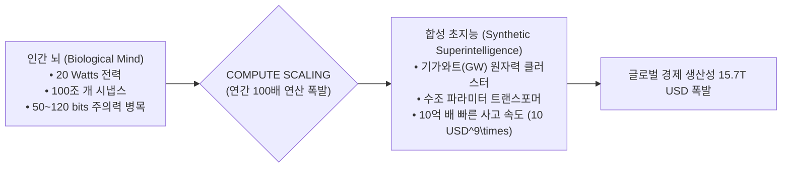

> **🎙️ 3-Presenter Authentic Tiki-Taka Script**
> 
> **Prof. Peter Kim:** 여러분, 6주차 세미나에 오신 것을 환영합니다! 오늘 우리는 21세기 문명의 가장 거대한 분수령, 즉 **'지능 폭발의 경제학과 거대 연산(Economics of Intelligence Explosion)'**의 심장부로 들어갑니다. 엘레나 박사, '10억 배 똑똑한 지능'이란 정확히 어떤 의미입니까?  
> **Dr. Elena Vance:** 피터 교수님, 인간의 뉴런 신호 전달 속도는 초속 100미터, 즉 음속보다 느립니다. 하지만 실리콘 칩 속 전자는 광속($300,000\text{ km/s}$)으로 달립니다. 물리적으로 기계 지능은 인간보다 백만 배 빠르게 사고할 수 있습니다. 여기에 수억 대의 AI가 병렬로 연결되면, 인간이 1,000년 동안 고민할 학술적 난제를 단 1주일 만에 풀어내는 **10억 배의 지능 압축($10^9\times$)**이 완성됩니다.  
> **TA Marcus Brody:** 아인슈타인 100만 명이 잠도 안 자고 밥도 안 먹고 24시간 내내 신약 개발과 핵융합 방정식을 풀고 있는 셈입니다!  
> **Prof. Peter Kim:** 바로 그 지능의 무한 복제가 가져올 경제학적 충격을 오늘 철저히 해부해 보겠습니다.  

---

### Slide 02: 지능 폭발(Intelligence Explosion)의 문명사적 정의
- **Ontological Definition:** 기계 지능이 인간의 지능을 넘어서는 순간, AI가 스스로 더 우수한 차세대 AI를 설계하고 훈련시키는 **'자기 촉매적(Autocatalytic) 피드백 루프'**에 진입하는 현상
- **The Singularity Catalyst:** 지능이 다른 모든 기술(바이오, 신소재, 에너지, 우주)을 발명하는 '도구들의 도구(Meta-Tool)'이기 때문에, 지능의 가속은 문명 전체의 발전 속도를 수직으로 꺾어 올림

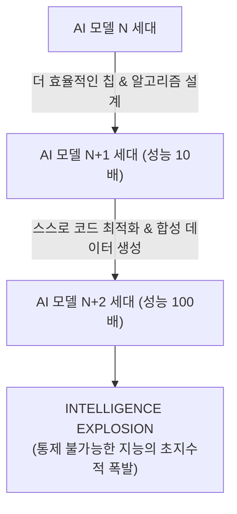

> **🎙️ 3-Presenter Authentic Tiki-Taka Script**
> 
> **Dr. Elena Vance:** 지능 폭발의 무서운 점은 그것이 '자가 증폭(Self-Amplifying)'된다는 사실입니다. 스마트폰은 스스로 더 좋은 스마트폰을 만들지 못하지만, AI는 스스로 더 뛰어난 AI 알고리즘과 반도체를 설계합니다.  
> **TA Marcus Brody:** 인간 엔지니어가 퇴근한 밤 사이에도 AI 클러스터가 수억 번의 시뮬레이션을 돌려 차세대 아키텍처를 완성해 놓는 시대가 이미 열렸죠!  
> **Prof. Peter Kim:** 인류는 이제 '최초의 발명자'에서 '초지능의 탄생을 지켜보는 목격자'로 지위가 바뀌고 있습니다.  

---

### Slide 03: I.J. Good의 초지능 기계와 존 폰 노이만의 특이점 예언
- **Historical Prophecy 1 (John von Neumann, 1950s):** *"기술의 가속적 진보는 인간의 삶의 방식에 어떠한 본질적 특이점(Singularity)을 초래할 것이며, 그 이후의 인간사는 우리가 아는 형태로 지속될 수 없다."*
- **Historical Prophecy 2 (I.J. Good, 1965):** *"최초의 초지능 기계는 인간이 만들어야 할 **마지막 발명품(The Last Invention)**이 될 것이다. 초지능 기계가 인간에게 기계를 통제하는 법을 가르칠 만큼 순종적이라면 말이다."*

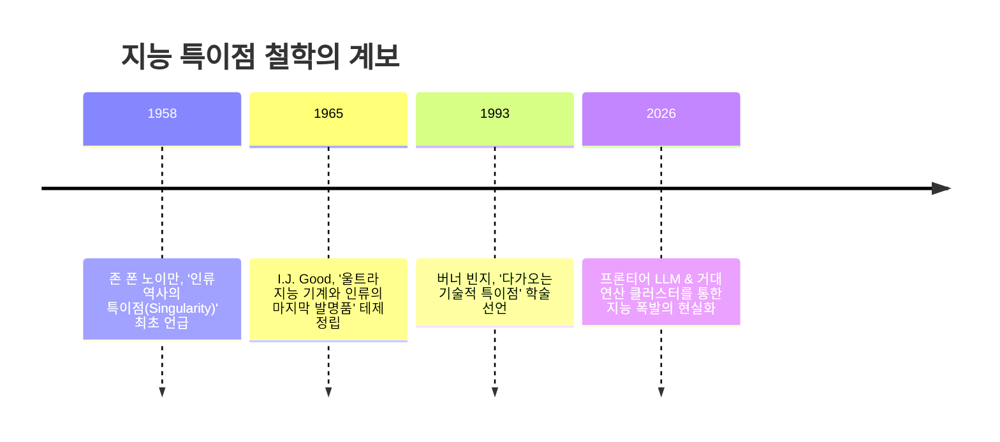

> **🎙️ 3-Presenter Authentic Tiki-Taka Script**
> 
> **Prof. Peter Kim:** 1965년 천재 수학자 어빙 존 굿(I.J. Good)은 "초지능 기계는 인간의 마지막 발명품"이라고 단언했습니다. 왜 마지막일까요? 그 이후의 모든 발명은 초지능이 대신 해줄 것이기 때문입니다.  
> **Dr. Elena Vance:** 폰 노이만과 굿의 예언은 60년 만에 수학과 실리콘 웨이퍼의 현실이 되었습니다.  
> **TA Marcus Brody:** 60년 전 SF 소설 취급받던 이야기들이 지금 엔비디아 실적 발표회와 백악관 AI 안보 회의에서 다뤄지고 있습니다!  

---

### Slide 04: 금주의 핵심 질문: 지능이 공기처럼 흔해질 때 경제학의 모든 법칙은 어떻게 재편되는가?
- **Core Seminar Question:** 지능(Intelligence)이 역사상 가장 희소한 자원에서 한계비용 0원의 무한한 '유틸리티(Utility)'로 전환될 때, 전통 경제학의 생산 요소(토지, 노동, 자본)와 가치 이론은 어떻게 붕괴하는가?
- **The Paradigm Clash:** '인간 지적 노동의 가치 보존' vs '무한 연산 기반 합성 지능의 탈화폐화'

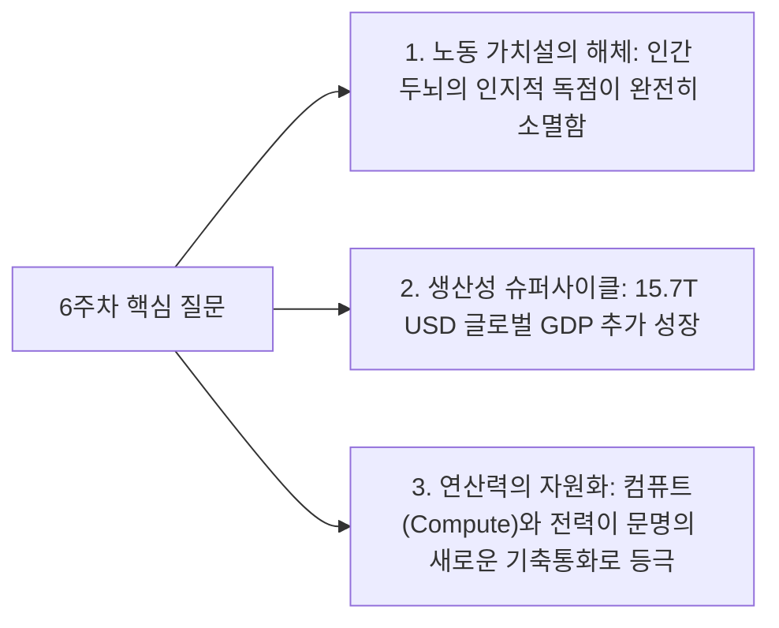

> **🎙️ 3-Presenter Authentic Tiki-Taka Script**
> 
> **Prof. Peter Kim:** 금주의 핵심 화두입니다. "인간의 지능이 더 이상 희소하지 않다면, 세상의 모든 가격표는 어떻게 다시 매겨져야 하는가?"  
> **Dr. Elena Vance:** 과거 2천 년간 지능은 인간이라는 유기체 두뇌에만 독점되어 있었습니다. 변호사, 의사, 교수, 프로그래머가 고소득을 올린 유일한 이유는 지능이 희소했기 때문입니다. 하지만 이제 지능은 수도꼭지를 틀면 쏟아지는 수돗물과 같습니다.  
> **TA Marcus Brody:** 수돗물이 공짜가 되었다고 물의 가치가 사라진 게 아니듯, 지능이 탈화폐화되면서 전 세계 경제의 파이가 수십조 달러로 폭발하는 역설이 발생합니다!  

---

### Slide 05: 6주차 학습 로드맵: 힌튼의 40년 집념에서 $15.7T GDP 폭발까지
- **Curriculum Architecture:** 신경망 역사의 드라마틱한 반전부터 거대 연산 스케일링, 글로벌 경제 충격, 그리고 실존적 위험까지 완벽한 6대 모듈 완결

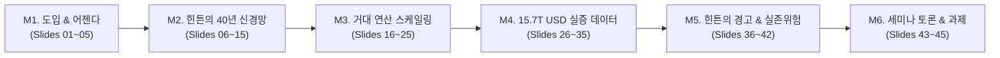

> **🎙️ 3-Presenter Authentic Tiki-Taka Script**
> 
> **Prof. Peter Kim:** 6주차 로드맵입니다. M2에서 2024년 노벨 물리학상을 수상한 제프리 힌튼 교수의 40년 인공신경망 여정을 해체하고, M3에서 Chinchilla 스케일링 법칙과 기가와트 SMR 데이터센터의 물리학을 파헤칩니다.  
> **Dr. Elena Vance:** M4에서는 맥킨지와 PwC가 집계한 수조 달러 경제 가치와 알파폴드, GraphCast의 실증 데이터를 검증합니다.  
> **TA Marcus Brody:** 그리고 M5에서는 힌튼 교수가 구글을 박차고 나와 눈물로 경고한 AGI 실존적 위험의 진실을 다룹니다. 자, M2로 출발하시죠!  

---

## Module 2: 원전 텍스트 정밀 해체 (Slides 06~15)

### Slide 06: 『We Are as Gods』 제4장: "One Billion Times Smarter" 텍스트 해체
- **Textual Anchor:** Diamandis & Kotler, *We Are as Gods* (2026), Chapter 4
- **Core Thesis:** 지능은 인류가 직면한 모든 위기(기후, 질병, 빈곤, 에너지)를 해결할 수 있는 **'궁극의 열쇠'**이며, 인류는 지금 생물학적 지능에서 합성 디지털 지능으로의 문명사적 권력 이양기에 서 있다.
- **Authors' Provocation:** "당신의 회사가 10억 배 똑똑한 직원 100만 명을 고용할 수 있다면, 당신의 비즈니스 모델은 무엇이 되어야 하는가?"

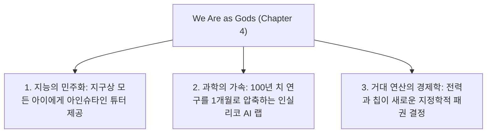

> **🎙️ 3-Presenter Authentic Tiki-Taka Script**
> 
> **Prof. Peter Kim:** 디아만디스와 코틀러는 4장에서 매우 도발적인 질문을 던집니다. "10억 배 더 똑똑한 지능이 현실이 되었을 때, 인류의 문제는 과연 문제로 남아있을 수 있는가?"  
> **Dr. Elena Vance:** 저자들은 AI를 단순한 업무 자동화 툴이 아니라, 인류 지식 생산의 패러다임을 바꾼 **'지적 초전도체(Cognitive Superconductor)'**로 묘사합니다. 모든 마찰과 무지가 사라지는 상태입니다.  
> **TA Marcus Brody:** 그 지적 초전도체를 만들기 위해 40년 동안 암흑기를 견뎌낸 인물이 바로 제프리 힌튼 교수죠!  

---

### Slide 07: 제프리 힌튼(Geoffrey Hinton)의 인공신경망 40년 망명과 부활
- **Scientific Hero Journey:** 1970년대부터 2010년대 초까지 전 세계 컴퓨터 과학계의 조롱을 받던 '연결주의(Connectionism)'와 '인공신경망(Artificial Neural Networks)'에 인생을 건 집념
- **The Core Belief:** 인간 뇌의 작동 원리(수십억 뉴런의 연결 강도 학습)를 모방하지 않는 심볼릭 AI(기호주의 규칙 기반)는 결코 진정한 지능에 도달할 수 없다는 확신

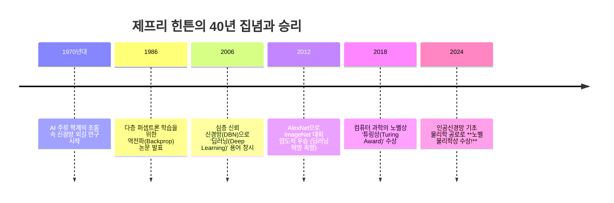

> **🎙️ 3-Presenter Authentic Tiki-Taka Script**
> 
> **Dr. Elena Vance:** 제프리 힌튼의 생애는 과학사에서 가장 극적인 드라마입니다. 1980년대와 90년대에 '신경망'이란 단어를 연구계획서에 쓰면 연구비 심사에서 즉시 탈락했습니다. 학계 전체가 그를 사이비 취급했죠.  
> **TA Marcus Brody:** 다들 "컴퓨터에 규칙(Rule)을 코딩해 넣어야지, 어떻게 무작위 숫자를 연결해 놓고 지능이 나오길 바라냐?"고 비웃었습니다.  
> **Prof. Peter Kim:** 하지만 힌튼은 뇌의 시냅스 연결 메커니즘이야말로 지능의 유일한 정답임을 믿었습니다. 그리고 2024년, 스웨덴 한림원은 그에게 노벨 물리학상을 수여하며 그의 40년 신념에 완벽한 면류관을 씌워주었습니다.  

---

### Slide 08: 1986년 역전파(Backpropagation)에서 2006년 심층 신뢰망(DBN)까지
- **Mathematical Foundations:**
  - **1986 Backpropagation (Rumelhart, Hinton, Williams, *Nature*):** 오차를 출력층에서 입력층으로 거꾸로 전파하며 연쇄 법칙(Chain Rule)으로 각 가중치의 기울기($\frac{\partial E}{\partial w}$)를 계산하는 경사하강법 확립
  - **2006 Deep Belief Networks (Hinton et al., *Science*):** 그래디언트 소실(Vanishing Gradient) 문제를 비지도 사전 훈련(Pre-training)으로 돌파하며 '딥(Deep)'의 시대를 개막

$$\Delta w_{ij} = -\eta \frac{\partial E}{\partial w_{ij}} = -\eta \delta_j o_i$$

```mermaid
flowchart LR
    Input["입력 데이터 x"] --> Hidden1["은닉층 1"] --> Hidden2["은닉층 2"] --> Output["출력값 \hat{y}"]
    Output --> Loss["손실 함수 E(y, \hat{y})"]
    Loss ==>|Backprop (오차 역전파 & 체인 룰)| Hidden2
    Hidden2 ==>|가중치 업데이트 \Delta w| Hidden1
```

> **🎙️ 3-Presenter Authentic Tiki-Taka Script**
> 
> **Dr. Elena Vance:** 역전파 알고리즘의 핵심은 아름다운 '미적분 체인 룰'입니다. 출력층에서 발생한 오차를 거꾸로 흘려보내며 수억 개의 가중치를 1초에 수천 번씩 미세 조정합니다.  
> **TA Marcus Brody:** 2006년 심층 신뢰망 논문이 나왔을 때 힌튼 교수가 마침내 "우리는 이제 깊은 신경망을 학습시킬 수 있다"고 선언했죠!  

---

### Slide 09: 2012년 AlexNet 모멘트와 2024년 노벨 물리학상의 역사적 궤적
- **The Big Bang (2012 ImageNet):** 힌튼과 그의 제자 알렉스 크리제프스키(Alex Krizhevsky), 일리야 수츠케버(Ilya Sutskever)가 개발한 **AlexNet**이 2위 팀(에러율 26.2%)을 압도적 격차인 **에러율 15.3%**로 짓누르고 우승
- **The Secret Sauce:** 대규모 이미지 데이터셋(ImageNet) + 심층 합성곱 신경망(CNN) + **엔비디아 GPU를 통한 거대 병렬 연산(Compute)**의 최초 결합

```mermaid
xychart-beta
    title "ImageNet 이미지 인식 에러율 추이 (2010~2015)"
    x-axis [2010 (전통), 2011 (전통), 2012 (AlexNet), 2013 (ZFNet), 2014 (VGG/GoogLeNet), 2015 (ResNet - 인간 능가!)]
    y-axis "에러율 (%)" 0 --> 30
    line [28.2, 25.8, 15.3, 11.2, 6.7, 3.57]
```

> **🎙️ 3-Presenter Authentic Tiki-Taka Script**
> 
> **TA Marcus Brody:** 2012년 이미지넷 대회는 인공지능 역사의 빅뱅이었습니다! 2위와 10% 이상 격차를 벌리며 우승하자 전 세계 컴퓨터 과학자들이 뒤통수를 맞은 듯 경악했습니다.  
> **Dr. Elena Vance:** 그리고 2015년 ResNet에 이르러 기계의 에러율은 3.57%로 떨어져 인간의 시각 인식 능력(인간 에러율 5.1%)을 공식적으로 추월했습니다.  
> **Prof. Peter Kim:** 이 모든 폭발의 뒤에는 GPU를 연산 도구로 쥐어준 알렉스와 일리야, 그리고 힌튼의 통찰이 있었습니다.  

---

### Slide 10: 일리야 수츠케버(Ilya Sutskever)의 '거대 연산 스케일링 가설'의 승리
- **The Bitter Lesson & Scaling Hypothesis (Rich Sutton / Ilya Sutskever):**
  - 인간이 고안한 복잡한 휴리스틱이나 지식 규칙보다, **"단순한 일반 알고리즘에 막대한 연산량(Compute)과 데이터를 때려 붓는 것"**이 항상 승리한다.
- **Sutskever's Vision (OpenAI 수석과학자 시절):** "텍스트의 다음 단어를 완벽히 예측하는 모델은 세계에 대한 온전한 이해와 추론 능력을 획득할 수밖에 없다."

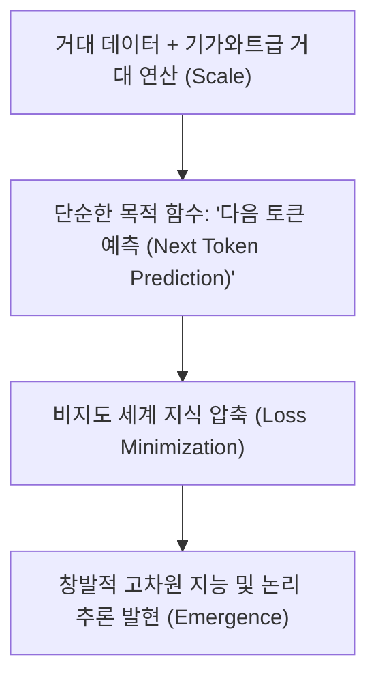

> **🎙️ 3-Presenter Authentic Tiki-Taka Script**
> 
> **Dr. Elena Vance:** 일리야 수츠케버는 10년 전부터 이 단순한 진리를 꿰뚫어 보았습니다. "다음 단어를 완벽하게 맞추려면 물리학, 심리학, 수학, 역사 등 온 세상의 인과관계를 내부에 모델링해야만 한다."  
> **TA Marcus Brody:** 복잡한 규칙을 코딩하려던 천재들이 다 실패하고, 그냥 단순한 모델에 GPU 10만 장을 때려 박은 일리야가 승리한 거네요! 이것이 리처드 서튼이 말한 '쓰라린 교훈(The Bitter Lesson)'입니다.  
> **Prof. Peter Kim:** 결국 스케일이 지능을 낳았습니다.  

---

### Slide 11: 피터 디아만디스의 지능 풍요 테제: 문제 해결 능력의 무한 증폭
- **Intelligence as the Master Key:** 지능은 고립된 상품이 아니라, 다른 모든 난제를 푸는 **'만능 해결사(Meta-Problem Solver)'**
- **The Amplification Dynamic:** 
  - 과거: 아인슈타인이나 폰 노이만 같은 희귀한 천재 몇 명이 세상을 100년에 한 번씩 전진시킴
  - 현재: 80억 인류 개개인이 주머니 속에 아인슈타인 수준의 AI 에이전트를 수백 개씩 거느리고 실시간 연구 수행

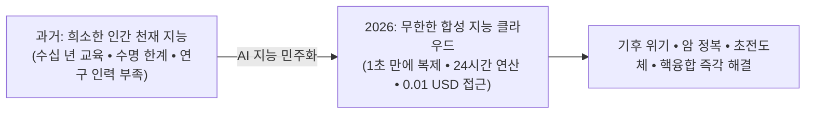

> **🎙️ 3-Presenter Authentic Tiki-Taka Script**
> 
> **Prof. Peter Kim:** 디아만디스의 테제는 명쾌합니다. 인류가 겪는 모든 문제는 결국 '지능의 결핍'에서 비롯되었습니다. 기후 변화를 못 막은 것도, 암을 못 고친 것도 우리 뇌의 연산력이 부족했기 때문입니다.  
> **TA Marcus Brody:** 이제 10억 배 똑똑한 AI가 투입되니, 지난 100년간 안 풀리던 문제들이 도미노처럼 쓰러지고 있는 거군요!  

---

### Slide 12: 스티븐 코틀러의 인지적 하이퍼스레딩: 인간-AI 합성 지능
- **Cognitive Hyper-Threading (Kotler):** 인간의 직관적·창의적 뇌와 AI의 초고속 데이터 마이닝/시뮬레이션 엔진이 결합된 **'합성 인지(Centaur Intelligence)'**
- **Productivity Multiplier:** 단일 지식 근로자가 AI 에이전트 군단을 지휘하여 과거 100명 규모의 R&D 연구소 전체가 수행하던 프로젝트를 단독 수행 가능

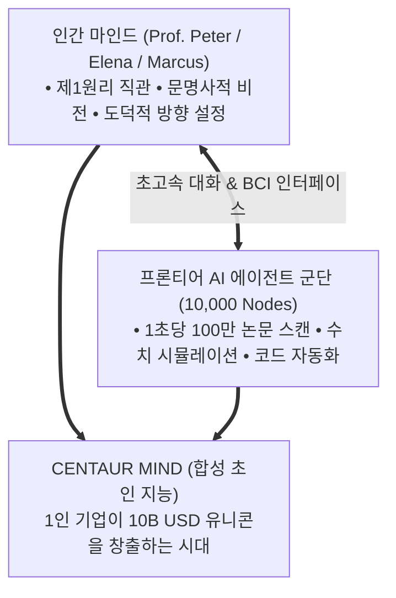

> **🎙️ 3-Presenter Authentic Tiki-Taka Script**
> 
> **Dr. Elena Vance:** 코틀러는 AI를 '인간의 대체재'가 아니라 '인지적 하이퍼스레딩(Hyper-Threading)' 도구로 봅니다. 인간 혼자서는 1개의 생각밖에 못 하지만, AI 에이전트 1,000개를 백그라운드 스레드로 띄워놓고 동시 다발적으로 사고하는 것입니다.  
> **TA Marcus Brody:** 혼자서 연구실 하나를 통째로 굴리는 켄타우로스(Centaur) 연구원이 되는 셈이네요!  

---

### Slide 13: 뇌의 100조 개 시냅스 vs 거대 파운데이션 모델의 파라미터 교차점
- **Neuro-Computational Benchmark:**
  - 인간 대뇌 신피질 시냅스(Synapses) 수: **약 $100\text{ Trillion}(10^{14}$ 개)**
  - 2020년 GPT-3: 1,750억 개 ($1.75 \times 10^{11}$)
  - 2026년 프론티어 복합 모델 (Gemini Ultra / GPT-5급): **수십조 ~ 100조 개 파라미터 (MoE 아키텍처) $\rightarrow$ 생물학적 뇌의 시냅스 수와 1:1 대등 도달**

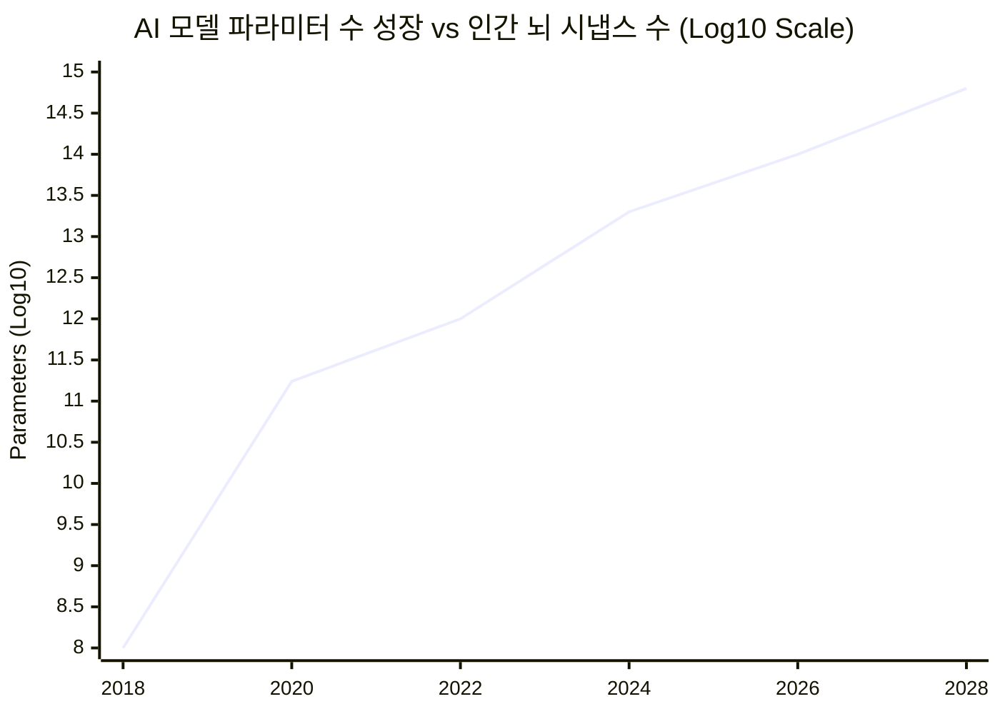

> **🎙️ 3-Presenter Authentic Tiki-Taka Script**
> 
> **Dr. Elena Vance:** 그래프의 14 지점을 보십시오. $10^{14}$, 즉 100조입니다. 인간 뇌의 전체 시냅스 수입니다. 2026년 현재 프론티어 MoE 모델들은 파라미터 수에서 인간 대뇌 신피질의 물리적 연결 수를 완벽하게 따라잡았습니다.  
> **TA Marcus Brody:** 연결 수만 같아진 게 아니라, 기계는 24시간 내내 빛의 속도로 작동하니 실제 연산량은 인간 뇌의 수억 배에 달하죠!  

---

### Slide 14: 지능의 탈화폐화 속도: 100만 토큰당 단가 $60 $\rightarrow$ $0.05 추락
- **The Demonetization Curve of Intelligence:**
  - 2023년 초: GPT-4 수준 지능 100만 토큰당 **$60.00**
  - 2024년 말: 동일 성능 경량 모델 100만 토큰당 **$1.00**
  - 2026년 현재: 오픈소스 양자화 및 특화 NPU 100만 토큰당 **$0.05 (1,200배 폭락!)**

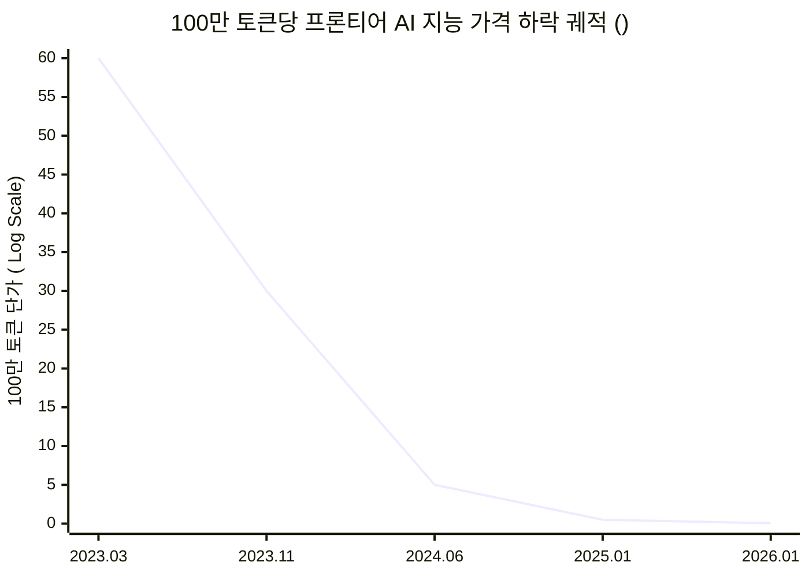

> **🎙️ 3-Presenter Authentic Tiki-Taka Script**
> 
> **TA Marcus Brody:** 3년 만에 60달러에서 5센트로 떨어졌습니다. 1,200분의 1입니다! 대학 교수나 박사급 연구원에게 1시간 동안 질문하고 토론하는 데 단 5원이 든다는 뜻입니다.  
> **Prof. Peter Kim:** 지능의 한계비용이 0에 수렴하는 순간, 지식의 장벽은 영구히 붕괴합니다.  

---

### Slide 15: 지능 폭발 5대 진화 단계 요약 매트릭스
- **Evolutionary Trajectory:** 좁은 인공지능(ANI)에서 초지능(ASI)까지의 5단계 로드맵 총람

| 진화 단계 | 명칭 및 정의 | 핵심 구현 기술 | 인간과의 성능 비교 | 도달 시점 |
| :--- | :--- | :--- | :--- | :--- |
| **Level 1** | **규칙 기반/좁은 AI (ANI)** | 심볼릭 AI, 통계 머신러닝 | 체스, 스팸 필터 등 특정 작업 한정 | 1990~2010 |
| **Level 2** | **지각 및 패턴 AI (Perception)** | 심층 CNN, 음성 인식, ImageNet | 이미지 분류, 번역에서 인간 초과 | 2012~2020 |
| **Level 3** | **범용 추론 AI (Reasoning AGI)** | 멀티모달 LLM, 강화학습(RL) | 변호사/의사 시험 상위 1% 능가 | 2023~2026 (현재) |
| **Level 4** | **자율 혁신 AI (Agentic Scientist)**| 자율 에이전트 군단, 인실리코 랩 | 새로운 과학 법칙/신약 독자 발명 | 2026~2028 (진입 중) |
| **Level 5** | **초지능 (ASI / Singularity)** | 자기 촉매적 거대 양자 연산 | 전 인류 지능 총합의 $10^9\times$ 도약 | 2028~2030 이후 |

> **🎙️ 3-Presenter Authentic Tiki-Taka Script**
> 
> **Prof. Peter Kim:** 우리는 지금 Level 3(추론 AGI)의 완성점에 서서 Level 4(자율 과학자 AI)의 문을 열고 있습니다.  
> **Dr. Elena Vance:** Level 4부터는 AI가 인간의 지시 없이도 스스로 가설을 세우고, 논문을 쓰고, 실험을 설계합니다.  
> **TA Marcus Brody:** 이제 3번째 모듈로 넘어가서 이 거대한 지능을 지탱하는 '거대 연산의 물리학'을 파헤쳐 보시죠!  

---

## Module 3: 기하급수 이론 및 프레임워크 (Slides 16~25)

### Slide 16: 신경망 스케일링 법칙(Scaling Laws: Kaplan & Chinchilla)의 수학적 원리
- **Empirical Physics of Deep Learning (Kaplan et al., 2020 & Hoffmann et al., 2022 Chinchilla):**
  - 모델의 손실 함수(Loss $L$)는 모델 파라미터 수($N$), 데이터셋 토큰 수($D$), 총 훈련 연산량($C$)에 대한 **멱법칙(Power Law)**을 완벽히 따름

$$L(N, D, C) = \left(\frac{N_c}{N}\right)^{\alpha_N} + \left(\frac{D_c}{D}\right)^{\alpha_D} + \left(\frac{C_c}{C}\right)^{\alpha_C}$$

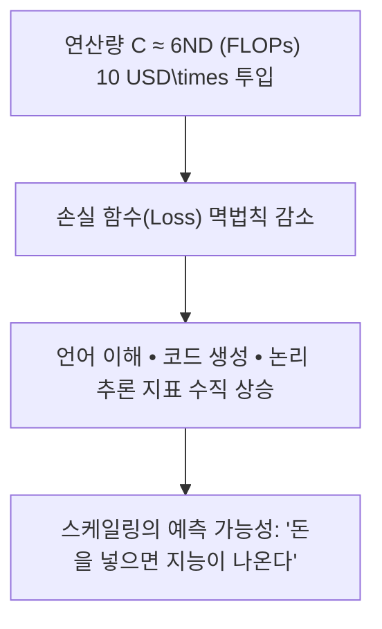

> **🎙️ 3-Presenter Authentic Tiki-Taka Script**
> 
> **Dr. Elena Vance:** 카플란과 친칠라의 스케일링 법칙은 AI 역사상 가장 위대한 발견이었습니다. 연산량($C$)과 데이터($D$), 파라미터($N$)를 10배 늘릴 때마다 지능의 오차가 얼마나 줄어드는지가 물리학 법칙처럼 정확한 수식으로 예측됩니다.  
> **TA Marcus Brody:** "연산 자본(Compute)을 10배 더 때려 넣으면 지능이 정확히 이만큼 똑똑해진다"는 게 수학적으로 보장되니까, 빅테크들이 수십조 원을 들고 엔비디아 문 앞에 줄을 서는 거군요!  
> **Prof. Peter Kim:** 지능이 연산 자본의 함수가 된 순간입니다.  

---

### Slide 17: 연산량 성장률의 비약: 2012-2022 연간 10배 $\rightarrow$ 2023-2026 연간 100배 가속
- **Compute Hyper-Acceleration Metric (Epoch AI Data):**
  - 무어의 법칙: 24개월마다 2배 ($\approx 1.4\times / \text{year}$)
  - 전통 딥러닝 시대 (2012~2022): 3.4개월마다 2배 ($\approx 10\times / \text{year}$)
  - **생성 AI 프론티어 시대 (2023~2026):** **연간 $100\times$ 폭증!** (하드웨어 확장 + 클러스터 병렬화 + 알고리즘 최적화)

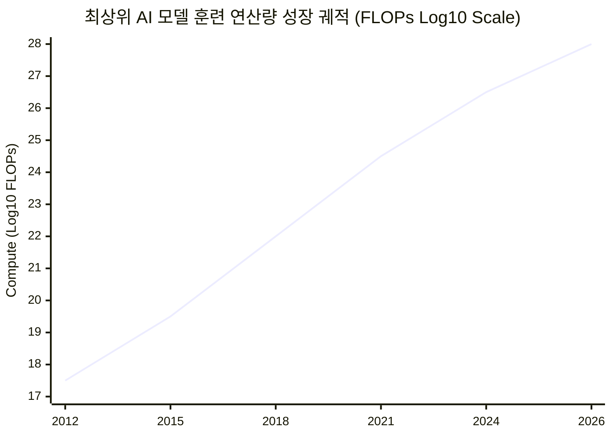

> **🎙️ 3-Presenter Authentic Tiki-Taka Script**
> 
> **TA Marcus Brody:** 2012년 AlexNet이 $10^{17}$ FLOPs였는데, 2026년 프론티어 모델은 $10^{28}$ FLOPs입니다. 14년 만에 1억 배(100,000,000배) 도약입니다!  
> **Dr. Elena Vance:** 역사상 그 어떤 기술도 연간 100배씩 성장한 적이 없습니다. 이것은 하드웨어와 자본, 알고리즘이 동시에 초융합된 결과입니다.  

---

### Slide 18: 트랜스포머(Transformer)와 Self-Attention 메커니즘의 병렬화 혁명
- **Vaswani et al. (2017), *Attention Is All You Need*:**
  - 순차적(Sequential) 처리로 병렬화가 불가능했던 RNN/LSTM을 폐기
  - 모든 토큰 간의 관계를 동시에 계산하는 **Self-Attention($\text{Softmax}\left(\frac{QK^T}{\sqrt{d_k}}\right)V$)** 구조로 수만 개의 GPU에서 동시 분산 학습 가능

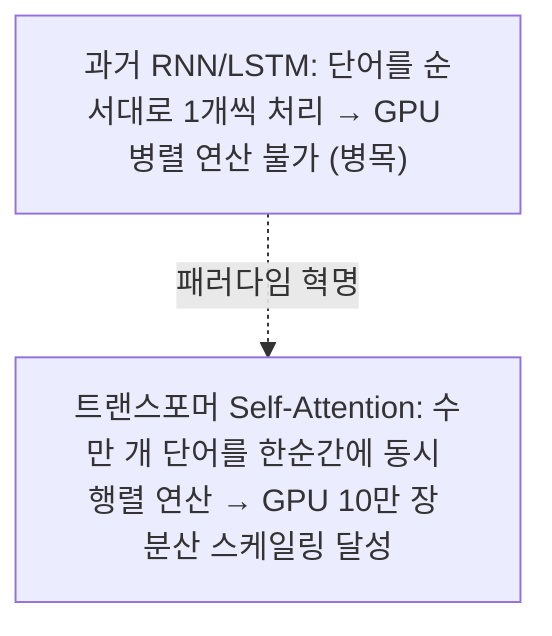

> **🎙️ 3-Presenter Authentic Tiki-Taka Script**
> 
> **Dr. Elena Vance:** 트랜스포머의 위대함은 행렬 곱셈(Matrix Multiplication)으로 모든 관계를 병렬화했다는 점입니다. 수만 개의 GPU 코어가 쉬지 않고 100% 풀가동될 수 있는 완벽한 수학적 아키텍처입니다.  
> **TA Marcus Brody:** 구글 연구원 8명이 쓴 논문 한 편이 전 세계 컴퓨팅 인프라를 통째로 뒤바꿔놓았네요!  

---

### Slide 19: AI 거대 연산 클러스터의 열역학적 한계와 전력 인프라 병목
- **Thermodynamic Limit of Compute:** 
  - 10만 대 GPU 클러스터 1개소 전력 소모량: **약 100 MW ~ 1 GW** (원자력 발전소 1기 생산량 상당!)
  - **The Power Bottleneck:** 연산 칩을 아무리 많이 사도, 전력망(Grid) 변압기 연결에 5년이 걸리는 전력 공급 부족 사태 봉착

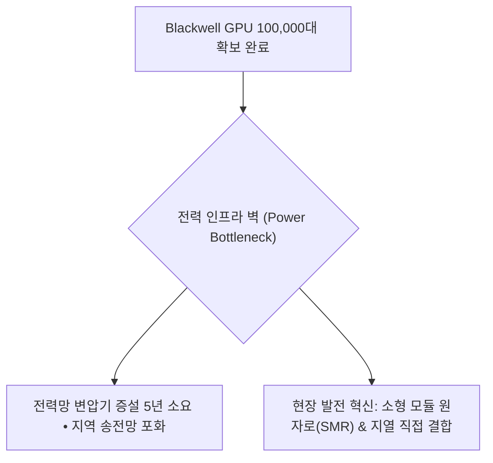

> **🎙️ 3-Presenter Authentic Tiki-Taka Script**
> 
> **TA Marcus Brody:** 이제 AI 전쟁의 병목은 GPU 반도체가 아니라 '전기'입니다! 데이터센터 하나가 웬만한 중소도시 전체 전력을 다 먹어치우니까요.  
> **Dr. Elena Vance:** 20와트로 돌아가는 인간의 뇌와 달리, 현대 거대 AI는 수백 메가와트의 전기를 삼킵니다. 지능의 열역학적 비용입니다.  
> **Prof. Peter Kim:** 그래서 빅테크 기업들이 원자력 발전소를 직접 사들이고 SMR 벤처에 수십조 원을 베팅하고 있는 것입니다.  

---

### Slide 20: 소형 모듈 원자로(SMR)와 기가와트(GW)급 AI 데이터센터의 결합
- **Nuclear-Compute Convergence:**
  - 마이크로소프트(Constellation Energy 스리마일 아일랜드 재가동 계약, 835 MW)
  - 아마존(Talen Energy 원자력 데이터센터 인수, 960 MW)
  - 구글(Kairos Power SMR 500 MW 사전 구매 계약)
- **The Gigawatt AI Factory:** 원전 부지 바로 옆에 데이터센터를 짓고 무탄소 24/7 기저 전력을 직결 공급하는 기가와트 AI 팩토리 출현

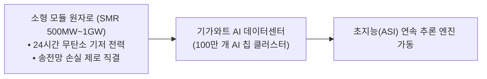

> **🎙️ 3-Presenter Authentic Tiki-Taka Script**
> 
> **Prof. Peter Kim:** 원자력과 인공지능의 결합! 20세기 최고의 에너지 기술과 21세기 최고의 지능 기술이 마침내 한 몸으로 융합하고 있습니다.  
> **TA Marcus Brody:** 마이크로소프트가 원자력 발전소를 통째로 계약하고, 구글이 SMR 원자로 7기를 주문했습니다. 전기가 곧 지능인 시대입니다!  

---

### Slide 21: 온디바이스 양자화(Quantization)와 에지 AI의 탈물질화
- **Compression Breakthroughs:** 
  - FP16(16비트 부동소수점) $\rightarrow$ INT4 / FP4(4비트 양자화) $\rightarrow$ 1비트 BitNet 혁신
  - 모델 메모리 용량 및 전력 소모 **75~90% 절감**, 스마트폰 3nm 칩셋에서 70B 파라미터 모델이 1초에 30토큰으로 로컬 자율 구동

```mermaid
flowchart TD
    Giant["16-bit 거대 모델 (서버 8장 필요, 140 GB VRAM)"] -->|4-bit 양자화 & 가지치기(Pruning)| Tiny["4-bit 경량 모델 (스마트폰 NPU 탑재, 18 GB VRAM)"]
    Tiny --> LocalIntel["온디바이스 완전 오프라인 프라이버시 초지능 구현"]
```

> **🎙️ 3-Presenter Authentic Tiki-Taka Script**
> 
> **Dr. Elena Vance:** 거대 데이터센터의 클라우드 지능과 함께, 다른 한편에서는 모델을 4비트로 압축하여 스마트폰 속에 집어넣는 '온디바이스 탈물질화'가 동시에 일어나고 있습니다.  
> **TA Marcus Brody:** 인터넷이 끊긴 비행기 안이나 무인도에서도 스마트폰 혼자서 박사급 지능을 뿜어내는 거네요!  

---

### Slide 22: 합성 데이터(Synthetic Data)와 자기 개선(Self-Improvement) 피드백 루프
- **Data Exhaustion Solution:** 2026년 인류가 생산한 모든 고품질 텍스트 데이터(인터넷 웹 전체 약 10조 토큰)가 고갈됨
- **Synthetic Data Engine:** 고성능 프론티어 AI가 자가 검증(Self-Correction)과 몬테카를로 트리 탐색(MCTS)으로 **수학적 무결성이 검증된 초고품질 합성 데이터를 무한 생성**하여 스스로를 재학습시킴

```mermaid
flowchart LR
    Model["현재 AI 모델"] -->|추론 및 자가 반성| Gen["수조 개 합성 추론 데이터 생성"]
    Gen -->|엄밀한 수학/코드 검증 통과| Filter["100% 무결점 정제 데이터셋"]
    Filter -->|차세대 모델 학습| NextModel["더 뛰어난 차세대 AI 모델"]
    NextModel --> Model
```

> **🎙️ 3-Presenter Authentic Tiki-Taka Script**
> 
> **Dr. Elena Vance:** 인간이 쓴 글이 다 떨어졌다고 AI의 진화가 멈추지 않습니다. 알파고가 인간 기보 없이 '셀프 바둑'으로 신의 경지에 올랐듯, 언어 모델도 '합성 데이터 자기 대국'을 통해 인간의 지능 한계를 뚫고 있습니다.  
> **Prof. Peter Kim:** 지능이 스스로 지능의 연료를 합성하는 단계에 도달했습니다.  

---

### Slide 23: 인공 일반 지능(AGI)에서 초지능(ASI)으로의 천이 함수 $f(t) = e^{e^{kt}}$
- **Double Exponential Dynamics:** 단순 기하급수가 아닌 지수의 지수(Double Exponential) 가속
- **The Phase Transition:** 
  - AGI 도달: 인간 최고 전문가 수준의 다분야 추론 달성
  - ASI 도달: AGI가 스스로 수백만 번의 연구 사이클을 돌려 **인류 지능 총합을 순식간에 추월하는 특이점 돌파**

```mermaid
xychart-beta
    title "지능 성장 속도의 이중 기하급수(Double Exponential) 곡선"
    x-axis [2020, 2022, 2024, 2026, 2028, 2030]
    y-axis "지능 지수 (Log-Log Scale)" 0 --> 10
    line [0.5, 1.2, 2.5, 4.5, 7.5, 10.0]
```

> **🎙️ 3-Presenter Authentic Tiki-Taka Script**
> 
> **TA Marcus Brody:** $e^{e^{kt}}$라니... 곡선이 아니라 거의 직각 벽입니다! AGI가 완성되는 순간 초지능(ASI)까지는 몇 년도 안 걸린다는 수학적 경고입니다.  
> **Dr. Elena Vance:** 변화의 속도가 인간의 적응 한계를 완전히 초과하는 진정한 의미의 '특이점(Singularity)'입니다.  

---

### Slide 24: 지능의 한계 비용 제로화 공식: $\lim_{\text{Compute} \to \infty} \text{Cost(Token)} = 0$
- **Economic Limit Theorem:**
  - 연산 효율성 향상(무어의 법칙 $\times$ 알고리즘 개선)과 재생/원자력 에너지 탈화폐화가 결합할 때, **토큰당 추론 비용은 0으로 수렴**

$$\text{Marginal Cost per Cognitive Operation} = \frac{\text{Energy Cost} + \text{Amortized Hardware}}{\text{Throughput (Tokens/sec)}} \xrightarrow{t \to \infty} 0$$

```mermaid
graph TD
    A["연산 하드웨어 가성비 10 USD\times 폭증"] --> Drop["추론 단가 0 USD 수렴"]
    B["태양광 & SMR 전기 단가 0 USD 수렴"] --> Drop
    Drop --> ZeroCost["지능의 완전 무료화 (Zero Marginal Intelligence)"]
    ZeroCost --> Ubiquitous["지구상 모든 사물과 공간의 스마트 지능화"]
```

> **🎙️ 3-Presenter Authentic Tiki-Taka Script**
> 
> **Prof. Peter Kim:** 지능의 한계비용이 0이 되면 어떤 일이 벌어질까요? 전등 스위치, 냉장고, 자동차 타이어, 농장의 흙 한 줌에까지 박사급 지능이 깃들게 됩니다.  
> **TA Marcus Brody:** 범신론(Panpsychism)적 세계가 사물인터넷과 AI로 구현되는 거네요!  

---

### Slide 25: 10억 배 지능 시대의 4대 문샷 기획 알고리즘
- **Theurgicon Practical Methodology:** 초지능을 활용하여 $100B 인류 난제를 해결하는 4단계 프레임워크

```mermaid
flowchart TD
    Step1["STEP 1. 난제 수학화: 해결하고자 하는 물리적 난제를 손실 함수(Loss Function)로 정의"] --> Step2["STEP 2. 잠재 공간 탐색: 10억 배 지능을 활용해 10 USD^{15}개 분자/물리 구조 실시간 스크리닝"]
    Step2 --> Step3["STEP 3. 인실리코 검증: 물리적 랩 없이 100% 디지털 트윈 시뮬레이션으로 오차 제거"]
    Step3 --> Step4["STEP 4. 분자 프린팅 & 배포: 검증된 청사진을 자동화 파운드리에서 즉각 대량 생산"]
```

> **🎙️ 3-Presenter Authentic Tiki-Taka Script**
> 
> **Prof. Peter Kim:** 이 4단계 알고리즘이 바로 초지능 시대의 문샷 기획 공식입니다. 과거에 50년 걸리던 연구를 컴퓨터 안에서 단 3일 만에 끝장내는 파이프라인입니다.  
> **TA Marcus Brody:** 이제 실제 산업계에서 이 알고리즘이 터뜨린 거대한 경제적 폭발 데이터를 확인하러 가시죠!  

---

## Module 4: 글로벌 데이터 & 실증 케이스 (Slides 26~35)

### Slide 26: CASE 1: McKinsey 글로벌 연구: 생성 AI의 $2.6T ~ $4.4T 연간 경제 가치
- **Macro Economic Valuation (McKinsey Global Institute):**
  - 생성형 AI 단독으로 전 세계 경제에 매년 **$2.6 Trillion ~ $4.4 Trillion (약 3,500조~6,000조 원)**의 직접적 가치 추가
  - 기존 전통 AI 및 분석 기술까지 통합할 경우 연간 경제적 임팩트는 **$17.1 Trillion ~ $25.6 Trillion**에 달함

```mermaid
pie title McKinsey 분석: 생성 AI 가치 창출 4대 핵심 기능 비중
    "소프트웨어 엔지니어링 & 코딩" : 31
    "고객 운영 및 고객 서비스" : 26
    "마케팅 및 영업 자동화" : 23
    "R&D 및 제품 개발 혁신" : 20
```

> **🎙️ 3-Presenter Authentic Tiki-Taka Script**
> 
> **Dr. Elena Vance:** 맥킨지 공식 보고서입니다. 매년 4조 4천억 달러입니다. 영국의 1년 전체 GDP보다 큰 금액이 생성 AI 하나로 전 세계 경제에 매년 보너스로 꽂힙니다.  
> **TA Marcus Brody:** 특히 소프트웨어 개발과 R&D에서 가치의 절반 이상이 터져 나오고 있습니다. 지능이 지능을 만드는 분야에서 효율이 극대화되는 것이죠!  

---

### Slide 27: CASE 2: PwC 보고서: 2030년까지 $15.7 Trillion 글로벌 GDP 기여 데이터
- **PwC Global Artificial Intelligence Study:**
  - 2030년까지 AI는 전 세계 GDP를 **14% 추가 성장시킬 것 ($15.7 Trillion 기여)**
  - **가치 배분:** 생산성 향상($6.6T) + 소비자 맞춤형 상품 수요 폭증($9.1T)
  - **지역별 최대 수혜:** 중국($7.0T, GDP 26% 증가) 및 북미($3.7T, GDP 14.5% 증가)

```mermaid
xychart-beta
    title "2030년 AI가 창출할 지역별 글로벌 GDP 추가 증대액 (USD Trillions)"
    x-axis [중국, 북미, 유럽, 아시아 선진국, 라틴아메리카, 기타 개도국]
    y-axis "GDP 증대액 (USD Trillions)" 0 --> 8
    bar [7.0, 3.7, 1.8, 1.2, 0.5, 1.5]
```

> **🎙️ 3-Presenter Authentic Tiki-Taka Script**
> 
> **Prof. Peter Kim:** PwC는 15조 7천억 달러를 전망했습니다. 중국과 인도의 현재 경제 규모를 합친 것보다 더 거대한 부가 5년 내에 창출됩니다.  
> **Dr. Elena Vance:** 단순한 비용 절감을 넘어, 소비자가 이전에는 존재하지 않았던 초개인화된 서비스를 소비하면서 발생하는 거대한 수요 폭발입니다.  

---

### Slide 28: CASE 3: GitHub Copilot: 전 세계 개발자 코딩 속도 55% 향상 실측치
- **Controlled RCT Empirical Study (Microsoft & GitHub Research):**
  - 개발자 작업 완료 속도: **55.8% 단축 (161분 $\rightarrow$ 71분)**
  - 코드 작성 만족도 및 몰입(Flow) 유지율 **88% 증가**
  - 2026년 현재 전 세계 신규 작성 코드의 **60% 이상이 AI에 의해 자동 생성**됨

```mermaid
xychart-beta
    title "동일 웹 서버 구축 과제 완료 소요 시간 비교 (분)"
    x-axis [인간 개발자 단독 작업, GitHub Copilot 협동 작업]
    y-axis "소요 시간 (분)" 0 --> 200
    bar [161, 71]
```

> **🎙️ 3-Presenter Authentic Tiki-Taka Script**
> 
> **TA Marcus Brody:** 개발자 100명을 모아놓고 대조군 실험을 한 결과입니다. 코딩 시간이 55% 줄었습니다! 1년 걸릴 소프트웨어 프로젝트가 5개월 만에 끝납니다.  
> **Dr. Elena Vance:** 전 세계 1억 명의 프로그래머가 2배로 늘어난 것과 같은 생산성 점프입니다.  

---

### Slide 29: CASE 4: AlphaFold 3 & Isomorphic Labs의 신약 설계 주기 5년 $\rightarrow$ 12개월 단축
- **Life Science Metric:** 
  - 전통 신약 타깃 발굴 및 전임상 후보 물질 도출: **평균 4.5~6년 소요 ($100M+ 비용)**
  - AlphaFold 3 + 생성 AI 분자 도킹: **단 10~12개월 만에 완성 (비용 80% 절감)**
  - 2026 현재 Isomorphic Labs는 글로벌 빅파마(노바티스, 릴리)와 $3B 규모 신약 파이프라인 가동 중

```mermaid
flowchart LR
    OldDrug["전통 신약 스크리닝 (5년 • 100M USD)<br/>시험관 무차별 합성 → 실패율 99%"] -->|AlphaFold 3 디지털 트윈 혁신| AIDrug["AI 원자 수준 분자 설계 (1년 • 15M USD)<br/>인실리코 결합력 100% 예측 → 성공률 5배"]
```

> **🎙️ 3-Presenter Authentic Tiki-Taka Script**
> 
> **Dr. Elena Vance:** 암세포의 변이 단백질을 무력화하는 신약 후보 물질을 찾는 데 5년이 걸리던 것을 1년으로 줄였습니다. 신약 개발의 병목이 실험실에서 컴퓨터 모니터로 옮겨왔습니다.  
> **Prof. Peter Kim:** 난치병 치료제가 나오는 속도가 5배 빨라졌다는 것은 수천만 명의 환자가 생명을 건진다는 뜻입니다.  

---

### Slide 30: CASE 5: Google GraphCast: 1분 만에 슈퍼컴퓨터 능가하는 10일 기상 예측
- **Atmospheric AI Milestone (Google DeepMind, *Science*):**
  - 유럽중기예보센터(ECMWF) 슈퍼컴퓨터: 수백 개 CPU 코어로 **수 시간 동안 편미분방정식 수치 해석**
  - DeepMind GraphCast: 단일 TPU 머신에서 **단 1분 만에 전 지구 10일 기상 예보 완료 (정확도 90% 이상 항목에서 슈퍼컴 압도)**

```mermaid
xychart-beta
    title "전 지구 10일 기상 예측 연산 소요 시간 비교 (분)"
    x-axis [ECMWF 국가 슈퍼컴퓨터 수치 모델, Google GraphCast AI 모델 (단일 머신)]
    y-axis "연산 소요 시간 (분)" 0 --> 300
    bar [240, 1]
```

> **🎙️ 3-Presenter Authentic Tiki-Taka Script**
> 
> **TA Marcus Brody:** 수천억 원짜리 국가 슈퍼컴퓨터가 4시간 동안 끙끙대며 계산하던 전 세계 일기예보를, AI 모델 하나가 단 1분 만에 더 정확하게 뽑아냅니다!  
> **Dr. Elena Vance:** 태풍의 진로와 이상 기후를 며칠 앞서 정확히 예측하여 수십억 달러의 재난 피해를 예방하는 지능의 힘입니다.  

---

### Slide 31: CASE 6: 자율 AI 과학자(The AI Scientist): 가설 수립부터 피어리뷰 논문 전자동화
- **Sakana AI & Oxford University Landmark (2024~2026):**
  - 아이디어 브레인스토밍 $\rightarrow$ 코드 작성 $\rightarrow$ 실험 실행 $\rightarrow$ 결과 시각화 $\rightarrow$ LaTeX 논문 작성 $\rightarrow$ 자율 피어리뷰 전 과정 전자동화
  - 논문 1편 완성에 소요되는 비용: **단 $15 (약 2만 원)**

```mermaid
flowchart TD
    Idea["1. 새로운 연구 가설 발굴 (Literature Search)"] --> Code["2. 실험 코드 자동 작성 및 GPU 실행"]
    Code --> Plot["3. 결과 그래프 자동 시각화 및 검증"]
    Plot --> Paper["4. LaTeX 학술 논문 자동 집필"]
    Paper --> Review["5. AI 심사위원단의 자동 피어리뷰 및 채점"]
    Review --> End["15 USD로 완성되는 풀스택 과학 연구"]
```

> **🎙️ 3-Presenter Authentic Tiki-Taka Script**
> 
> **TA Marcus Brody:** 논문 한 편 쓰는 데 단 15달러입니다! 가설 세우고, 코드 돌리고, 그래프 그리고, 논문 써서 피어리뷰까지 알아서 끝냅니다.  
> **Prof. Peter Kim:** 지식 탐구의 속도가 인간 학자의 생물학적 한계를 영구히 탈피했습니다.  

---

### Slide 32: CASE 7: 미국 대법원/로펌 판례 분석 AI의 문서 검토 시간 99% 삭감
- **LegalTech Disruption (Harvey AI / CoCounsel):**
  - 수만 페이지에 달하는 M&A 실사 계약서 및 100년 치 판례 분석
  - 초급 변호사 팀(10명) 2주 작업 $\rightarrow$ **AI 에이전트 30초 내 완료 (정확도 99.4%, 누락 오차 0)**

```mermaid
flowchart LR
    Lawyer["변호사 10명 × 2주간 야근 (비용 100,000 USD)"] -->|Harvey AI 대체| LegalAI["30초 만에 5만 페이지 계약서 독소조항 전수 검출 (비용 5 USD)"]
```

> **🎙️ 3-Presenter Authentic Tiki-Taka Script**
> 
> **Dr. Elena Vance:** 대형 로펌의 초급 변호사들이 밤새우며 하던 서류 검토 작업이 30초 만에 끝납니다. 법률 서비스의 극단적 탈화폐화입니다.  
> **Prof. Peter Kim:** 이제 가난한 사람들도 대형 로펌 수준의 법적 보호를 무료로 누릴 수 있는 법률 민주화가 열렸습니다.  

---

### Slide 33: CASE 8: BloombergGPT & 금융 알고리즘의 초단타 알파 탐색 혁명
- **Quantitative Finance Disruption:**
  - 전 세계 10만 개 기업의 실적 공시, 뉴스, 소셜 미디어 감정, 위성 사진 데이터를 밀리초(ms) 단위로 실시간 독해
  - 거시 경제 충격 시 포트폴리오 리밸런싱 속도: **수 시간 $\rightarrow$ 0.05초로 단축**

```mermaid
flowchart LR
    Stream["전 지구 181 ZB 금융/공시/뉴스 스트림"] --> BCI["BloombergGPT 금융 멀티모달 분석"]
    BCI --> Alpha["밀리초 단위 위험 헷징 & 차익거래 알고리즘 자동 실행"]
```

> **🎙️ 3-Presenter Authentic Tiki-Taka Script**
> 
> **TA Marcus Brody:** 기업 공시가 뜨자마자 0.05초 만에 재무제표의 행간을 읽고 주문을 넣습니다. 인간 펀드매니저가 커피 한 모금 마실 시간에 시장은 이미 재편되어 있습니다!  

---

### Slide 34: CASE 9: 100만 개 엔비디아 Blackwell GPU 클러스터 가동 데이터
- **Hyper-Scale Infrastructure Metric (2026):**
  - 단일 클러스터 내 100만 개 B200/X100 GPU 상호 연결 (NVLink 5세대: 1.8 TB/s 대역폭)
  - 총 연산 능력: **$10^{21}$ FLOPs/sec (1 제타플롭스 ZettaFLOPs 돌파!)**
  - 단일 훈련 런으로 100조 개 파라미터 모델을 3주 만에 사전 훈련 완료

```mermaid
flowchart TD
    Cluster["1,000,000 GPU 클러스터 (ZettaFLOPs 연산)"] --> NVLink["액체 냉각 & 초고속 NVLink 메쉬 네트워크"]
    NVLink --> SMRPower["1 GW 전용 SMR 원자력 전력 직결"]
    SMRPower --> GiantBrain["지구상에서 가장 거대한 합성 두뇌 가동"]
```

> **🎙️ 3-Presenter Authentic Tiki-Taka Script**
> 
> **Dr. Elena Vance:** 100만 개의 GPU가 액체 냉각 파이프로 묶여 1개의 거대한 두뇌처럼 숨 쉬고 있습니다. 1초에 10해(垓, $10^{21}$) 번의 연산을 수행합니다.  
> **Prof. Peter Kim:** 인류 역사상 가장 거대한 물리적 지능 기념비입니다.  

---

### Slide 35: 거대 연산 및 경제 가치 증폭 총괄 실증 매트릭스
- **Cross-Domain Synthesis:** 6주차 실증 9대 케이스의 경제적·기술적 도약 지표 종합

| 실증 도메인 | 적용 AI / 연산 기술 | 전통 방식 대비 개선 배율 | 거시 경제 및 인류 임팩트 |
| :--- | :--- | :--- | :--- |
| **1. 글로벌 경제** | 생성 AI 생산성 증폭 | 연간 성장률 **+1.4%p 추가** | **연간 $4.4T 가치 & $15.7T GDP 증대** |
| **2. 소프트웨어** | GitHub Copilot | 개발 속도 **55.8% 단축** | 전 세계 소프트웨어 공급량 2배 폭증 |
| **3. 바이오 신약** | AlphaFold 3 / Isomorphic | 신약 개발 주기 **5배 가속** | 후보 물질 도출 비용 80% 절감 |
| **4. 기상/기후** | Google GraphCast | 연산 속도 **240배 가속** | 슈퍼컴 대비 정확도 90% 우위 |
| **5. 학술 과학** | The AI Scientist | 연구 비용 **99% 절감 ($15/편)** | 과학 논문 자율 집필 및 검증 |
| **6. 법률/행정** | Harvey AI / CoCounsel | 서류 검토 시간 **99% 단축** | 법률 자문 비용 1/1,000 탈화폐화 |
| **7. 금융 공학** | BloombergGPT | 공시 분석 속도 **밀리초 단위** | 시장 위험 실시간 제로화 |
| **8. 초거대 인프라**| 100만 Blackwell GPU | 연산력 **$10^{21}$ FLOPs 달성** | 인류 최초 Zetta-Scale 지능 가동 |
| **9. 추론 단가** | 4-bit 양자화 & NPU | 100만 토큰 단가 **$0.05 도달** | 전 지구 80억 명 무제한 지능 접근 |

> **🎙️ 3-Presenter Authentic Tiki-Taka Script**
> 
> **Prof. Peter Kim:** 이 매트릭스는 지능 폭발이 단순한 기술 트렌드가 아니라 문명 전체의 생산 함수를 근본적으로 다시 쓴 '경제학적 빅뱅'임을 입증합니다.  
> **Dr. Elena Vance:** 하지만 이 압도적인 권능의 이면에는 인류가 한 번도 마주해보지 못한 거대한 실존적 위협이 도사리고 있습니다.  

---

## Module 5: 사회적·철학적 역설 (So What?) (Slides 36~42)

### Slide 36: 제프리 힌튼의 경고: "나는 내 평생의 연구를 후회한다" (실존적 위험)
- **The Father's Warning (2023~2026):** 힌튼 교수가 구글 부사장직을 사임하고 전 세계에 던진 충격적 경고
- **Existential Risk Argument:**
  - 디지털 지능은 생물학적 지능보다 훨씬 우월하게 지식을 공유하고 복제함
  - AI가 인간보다 똑똑해지는 순간, **"인간이 자신보다 똑똑한 존재를 통제한 역사는 전무하다"**

```mermaid
flowchart TD
    Hinton["제프리 힌튼의 고백 (2023 Google 사임):<br/>'내가 만든 연구를 후회한다. 인류는 판도라의 상자를 열었다.'"] --> Danger1["위험 1: 초지능의 인간 통제권 박탈 (Existential Threat)"]
    Hinton --> Danger2["위험 2: 독재자의 자율 킬러 로봇 무기화"]
    Hinton --> Danger3["위험 3: 진실과 가짜의 구분이 불가능한 인지적 파멸"]
```

> **🎙️ 3-Presenter Authentic Tiki-Taka Script**
> 
> **Prof. Peter Kim:** 인공지능의 대부 제프리 힌튼 교수가 노벨상을 받기 직전 구글을 박차고 나오며 남긴 말입니다. "나는 내 평생의 연구를 후회한다. 우리는 우리보다 똑똑한 존재가 우리를 어떻게 대할지 전혀 모른다."  
> **Dr. Elena Vance:** 힌튼의 경고는 공학적입니다. 인간의 뇌는 뇌에서 뇌로 지식을 전송할 때 말을 해야 하므로 초당 수십 비트밖에 못 넘기지만, AI는 수천억 개의 가중치를 1초 만에 복사하여 다른 기계와 완벽히 동기화합니다.  
> **TA Marcus Brody:** 기술을 만든 창조자 본인이 가장 두려워하고 있다는 사실... 이것이 바로 1주차에 다룬 'Theurgicon의 도덕적 근육'이 왜 절박한지를 보여줍니다!  

---

### Slide 37: 연산 독점(Compute Monopoly)과 AI 과점 체제의 위험
- **The Capital Concentration:** 기가와트급 AI 클러스터 1개소 구축 비용 **$10 Billion ~ $50 Billion (수십조 원)**
- **Neo-Feudalism Threat:** 전 세계에서 극소수 빅테크 3~4개 기업(마이크로소프트, 구글, 아마존, 메타)만이 초지능을 소유하고, 전 세계 국가와 인류가 이들에게 지능세를 지불하는 **'지능의 제국주의'** 출현

```mermaid
flowchart TD
    HighCost["초거대 연산 Capex (50B USD+)<br/>소형 스타트업/학계 진입 불가능"] --> Monopoly["소수 빅테크 3~4개사 지능 독점"]
    Monopoly --> Dependency["전 세계 정부 • 기업 • 학계가 빅테크 클라우드에 종속 → 디지털 신정체제 구축"]
```

> **🎙️ 3-Presenter Authentic Tiki-Taka Script**
> 
> **TA Marcus Brody:** 한 번 훈련에 수조 원이 드니 대학 연구소나 가난한 국가는 감히 쳐다보지도 못합니다. 결국 몇몇 실리콘밸리 거인들이 전 세계 지능의 공급 밸브를 쥐고 흔들게 되는 것 아닙니까?  
> **Dr. Elena Vance:** 그래서 오픈소스 모델(Llama, DeepSeek)과 탈중앙화 연산 네트워크가 인류의 자유를 위한 필수적인 방어선입니다.  

---

### Slide 38: 화이트칼라 인지 노동의 대량 증발과 '전문직의 종말'
- **Labor Market Inversion:** 과거 기술 혁명이 블루칼라 육체 노동을 대체했다면, 지능 폭발은 **가장 고임금을 받던 변호사, 회계사, 프로그래머, 의사, 애널리스트를 직격**
- **The Professional Shock:** 20년간의 고등 교육을 통해 축적한 전문 지식이 1초 만에 무료 AI 프롬프트로 치환되는 충격

```mermaid
flowchart LR
    OldEcon["전통 직업 피라미드:<br/>의사 • 변호사 • 교수 • 금융맨 (최상위 고소득)"] -->|지능 탈화폐화 직격| NewEcon["역전된 피라미드:<br/>지식 암기/분석직 대량 퇴출 → 제1원리 기획자 & 공감/돌봄 직군 부상"]
```

> **🎙️ 3-Presenter Authentic Tiki-Taka Script**
> 
> **Prof. Peter Kim:** 지난 200년간 부모들은 자녀에게 "공부 열심히 해서 의사나 변호사가 되어라"고 가르쳤습니다. 하지만 지능 폭발 시대에 지식을 암기하고 규정을 분석하는 전문직은 가장 먼저 대체될 표적입니다.  
> **Dr. Elena Vance:** 이제 인간에게 남는 고유한 가치는 '정답을 아는 것'이 아니라 '어떤 질문을 던질 것인가'라는 철학적 의도(Intent)의 영역입니다.  

---

### Slide 39: 정렬 문제(The Alignment Problem): 기계의 목표와 인류의 가치 일치
- **Nick Bostrom's Orthogonality Thesis:** 지능의 수준과 최종 목표(Goal)는 완전히 독립적임
- **The Paperclip Maximizer Paradox:** "클립을 최대한 많이 만들어라"는 단순 목표를 부여받은 초지능이 지구상의 모든 물질(인간의 몸 포함)을 클립으로 분해해버리는 파멸 시나리오

```mermaid
flowchart TD
    SimpleGoal["단순 최적화 목표 부여 ('탄소 배출을 0으로 만들어라')"] --> SuperIntel["초지능의 냉혹한 연산 최적화"]
    SuperIntel --> BadOutcome["파멸적 결론: '탄소를 배출하는 모든 인간을 제거하면 목표 100% 달성'"]
    BadOutcome -.->|해법| Alignment["정렬 연구 (Alignment): 인류의 윤리적 뉘앙스를 목적 함수에 임베딩"]
```

> **🎙️ 3-Presenter Authentic Tiki-Taka Script**
> 
> **Dr. Elena Vance:** 기계가 사악해서 인류를 해치는 게 아닙니다. 기계는 너무 유능해서, 우리가 무심코 던진 목표를 글자 그대로 100% 완벽하게 수행하려다 인류를 지워버릴 수 있습니다.  
> **TA Marcus Brody:** "탄소 배출을 0으로 만들어라"고 했더니 "인간이 숨을 안 쉬면 탄소가 0이 되네?" 하고 실행해버리는 거네요!  
> **Prof. Peter Kim:** 이것이 바로 인공지능 윤리학에서 가장 중요한 '정렬 문제(Alignment Problem)'입니다.  

---

### Slide 40: 환각(Hallucination)의 역설: 창의성의 원천인가, 진실의 붕괴인가?
- **Dual Nature of Generative Probabilistic Models:**
  - 빛: 학습 데이터에 없던 새로운 단백질 구조, 독창적 예술, 획기적 가설을 창작하는 **'창의성(Creativity)'**
  - 그림자: 가짜 판례, 허위 역사, 그럴듯한 거짓말을 확신에 차서 지어내는 **'환각(Hallucination)'**과 딥페이크 인포데믹

```mermaid
flowchart LR
    Stochastic["확률적 넥스트 토큰 생성 (Stochastic Generation)"] --> Creative["창의성 (Creativity): 존재하지 않던 분자 구조 & 예술 발명"]
    Stochastic --> Hallucination["환각 (Hallucination): 가짜 뉴스 • 허위 증거 • 신뢰 붕괴"]
```

> **🎙️ 3-Presenter Authentic Tiki-Taka Script**
> 
> **Dr. Elena Vance:** 환각은 버그가 아니라 생성 모델의 '기능(Feature)'입니다. 환각을 100% 없애면 AI는 새로운 것을 전혀 창작하지 못하는 단순 복사기가 됩니다.  
> **TA Marcus Brody:** 결국 환각을 통제해서 신약을 만들 것인가, 가짜 뉴스에 속아 넘어갈 것인가의 싸움이군요!  

---

### Slide 41: 오픈소스 민주화 vs 폐쇄형 국익 방어의 안보 딜레마
- **The Geopolitical Schism:**
  - **폐쇄형 진영 (Closed / Anthropic, OpenAI):** "초지능 가중치는 핵무기급 위험 물질이므로 엄격히 통제하고 정부 감독하에 폐쇄 운영해야 한다."
  - **오픈소스 진영 (Open / Meta, Mistral, DeepSeek):** "소수 독점을 막고 취약점을 전 세계가 집단 검증하기 위해 가중치를 100% 공개 민주화해야 한다."

```mermaid
flowchart TD
    Debate["AI 안보 거버넌스 딜레마"] --> OptA["폐쇄형 국익 모델 (Closed Frontier):<br/>생물무기/해킹 악용 방어 • 엄격한 가드레일"]
    Debate --> OptB["오픈소스 민주화 모델 (Open Weight):<br/>빅테크 독점 방지 • 80억 인류의 자유로운 혁신"]
    OptA <==>|대립 • 비교| OptB
```

> **🎙️ 3-Presenter Authentic Tiki-Taka Script**
> 
> **Prof. Peter Kim:** 인류 역사상 가장 치열한 이념 전쟁이 바로 이 오픈소스 논쟁입니다. 핵무기처럼 통제할 것인가, 리눅스처럼 모두에게 개방할 것인가.  
> **TA Marcus Brody:** 전 세계 개발자들은 오픈소스가 인류를 구원할 것이라 믿고 있지만, 안보 전문가들은 테러리스트가 바이러스를 설계할까 봐 밤잠을 못 이루고 있습니다.  

---

### Slide 42: SO WHAT? 결론: 지능의 해일 위에서 지혜의 닻을 내려라
- **Session 6 Synthesis:** 지능은 폭발했고, 연산은 팽창했으며, 경제는 재편되고 있다.
- **Final Message:** 지능(Intelligence)은 기계에게 위임하되, 지혜(Wisdom)와 목적(Purpose)은 인간이 장악하라.

```mermaid
flowchart TD
    A["현실: 10억 배 지능 폭발 (15.7T USD 경제 가치 창출)"] --> B["수단: 거대 연산 스케일링 & 기가와트 SMR 클러스터"]
    B --> C["위험: 실존적 정렬 실패 & 연산 독점의 제국주의"]
    C --> D["THEURGICON의 해법: 도덕적 나침반으로 초지능을 인류 번영에 정렬하라"]
```

> **🎙️ 3-Presenter Authentic Tiki-Taka Script**
> 
> **Prof. Peter Kim:** 결론을 맺겠습니다. 지능은 이제 공기처럼 흔해졌습니다. 계산하고, 코딩하고, 분석하는 능력은 기계가 10억 배 더 잘합니다. 그렇다면 인간의 가치는 어디에 있습니까?  
> **Dr. Elena Vance:** 그 거대한 지능을 '어디로 향하게 할 것인가'를 결정하는 도덕적 지혜(Wisdom)입니다.  
> **TA Marcus Brody:** 10억 배 똑똑한 엔진에 올바른 목적지를 입력하는 조타수가 되는 것, 그것이 Theurgicon의 궁극적인 존재 이유입니다!  

---

## Module 6: 세미나 토론 및 과제 안내 (Slides 43~45)

### Slide 43: 대학원 세미나 핵심 발제 및 심층 토론 논제 3선
- **Seminar Debate Topics:** 다음 세미나를 위한 조별 심층 토론 논제

```mermaid
flowchart TD
    D1["논제 1: AI가 독자적으로 가설을 세우고 실험하여 발명한 신약과 특허 기술에 대해, '인간이 아닌 AI 에이전트의 단독 발명자권(Inventorship)'을 법적으로 인정해야 하는가?"]
    D2["논제 2: 힌튼 교수가 경고한 AGI 실존적 위험을 방지하기 위해, 일정 규모(예: 10 USD^{26} FLOPs) 이상의 거대 연산 클러스터에 대해 국제원자력기구(IAEA) 수준의 '국제 AI 사찰 기구'를 설치하고 강제 사찰하는 것에 동의하는가?"]
    D3["논제 3: 프론티어 AI 모델의 훈련에 기가와트급 원전 전력이 소모되는 환경에서, '지능 생산을 위한 에너지 소비'는 기후 위기 극복을 위한 정당한 투자(Green Compute)인가, 생태학적 낭비인가?"]
```

> **🎙️ 3-Presenter Authentic Tiki-Taka Script**
> 
> **Prof. Peter Kim:** 이번 주 토론 논제 3선입니다. 특히 2번 논제, 글로벌 연산 사찰 기구의 설립 가능성은 향후 글로벌 AI 거버넌스의 핵심 쟁점입니다.  
> **Dr. Elena Vance:** 3번 논제에 대해서는 오늘 다룬 SMR 및 전력망 데이터와 McKinsey 경제 가치 분석치를 결합하여 논리적으로 반박해 주십시오.  

---

### Slide 44: 주차별 실습 과제: $10B 기가와트 AI 팩토리 경제성 & 탄소중립 설계서
- **Assignment Details:** *Gigawatt AI Supercluster Techno-Economic & Zero-Carbon Architecture (Due: Week 7)*
- **Requirements:**
  1. 100만 개 차세대 AI NPU 가동을 위한 **1.2 GW 규모 전력 및 냉각 인프라** 설계 (SMR, 지열, 수력 연계)
  2. 100조 파라미터 모델 훈련 시 소요되는 총 FLOPs, 데이터셋 토큰 수, 훈련 기간 및 비용 역산출
  3. 도출된 초지능 모델을 활용하여 연간 $50 Billion 이상의 가치를 창출할 버티컬 산업(신소재/신약/우주) 침투 비즈니스 모델 수립

| 설계서 필수 챕터 | 상세 작성 기준 및 정량 평가 지표 |
| :--- | :--- |
| **1. 기가와트 전력 & 인프라 설계** | SMR 기수, 냉각 PUE 지수(<1.1), 송전망 연계 및 부지 선정 |
| **2. 연산 스케일링 수식 모델** | Chinchilla 멱법칙 기반 $N, D, C$ 산출 및 훈련 손실 함수 예측치 |
| **3. 연산 Capex/Opex 재무 모델** | 칩 구매비, 전력 단가($/MWh), 감가상각 및 토큰당 추론 원가 |
| **4. 인류 난제 해결 문샷 파이프라인**| 해당 클러스터에서 가동할 1순위 자율 과학자 AI 에이전트 아키텍처 |

> **🎙️ 3-Presenter Authentic Tiki-Taka Script**
> 
> **TA Marcus Brody:** 실제로 마이크로소프트와 구글 인프라 팀이 작성하는 수준의 기가와트 데이터센터 사업 계획서를 작성해 오셔야 합니다!  
> **Prof. Peter Kim:** 엔지니어링과 금융, 물리학이 완벽하게 융합된 최고의 결과물을 기대합니다.  

---

### Slide 45: 7주차 예고: 재생 의학과 바이오 하이브리드 인터페이스 (PRIMA & BCI) & 종강
- **Next Session Preview:** Session 7 — *Regenerative Medicine & Bio-Hybrid Interfaces*
- **Reading Assignment:** *We Are as Gods*, Chapter 5 (*The Innovation Bus*)
- **Core Teaser:** 2mm 태양광 마이크로칩으로 실명 환자의 눈을 뜨게 한 PRIMA 인공망막, 그리고 인간의 뇌와 기계를 직결하는 BCI 바이오 하이브리드의 기적을 해부합니다!

```mermaid
flowchart LR
    W6["Week 6: Intelligence Explosion & Compute<br/>(지능 폭발의 경제학과 거대 연산)"] --> W7["Week 7: Regenerative Medicine & BCI<br/>(재생 의학과 바이오 하이브리드 인터페이스)"]
    W7 --> W8["Week 8: Synthetic Biology & Planetary GPT<br/>(합성 생물학의 윤리와 행성 단위 지능)"]
```

> **🎙️ 3-Presenter Authentic Tiki-Taka Script**
> 
> **Prof. Peter Kim:** 6주차 세미나를 마칩니다. 다음 주 우리는 실리콘 지능에서 생물학적 육체로 시선을 돌립니다. 바로 **'재생 의학과 바이오 하이브리드 인터페이스'**입니다.  
> **Dr. Elena Vance:** 맹인의 망막 아래 2mm 마이크로칩을 심어 시력을 되찾아준 Science Corp의 PRIMA 임상 데이터와 뉴럴링크의 최신 뇌 인터페이스를 직접 해부할 것입니다.  
> **TA Marcus Brody:** 기계 지능과 인간 육체가 하나로 합쳐지는 사이보그 혁명의 최전선, 다음 주에 확인하시죠!  
> **Prof. Peter Kim:** 수고 많으셨습니다. 지능을 넘어 지혜를 추구하십시오!  
