# Session 7: 재생 의학과 바이오 하이브리드 인터페이스 (Regenerative Medicine: PRIMA & BCI)
> **Course:** 신이 된 인류: 기하급수 기술과 풍요의 설계도 (*We Are as Gods: A Survival Guide for the Age of Abundance*)  
> **Course Code:** EXPO-701 • Graduate Seminar  
> **Instructors:** Prof. Peter Kim (석좌교수), Dr. Elena Vance (수석연구원), TA Marcus Brody (딥테크조교)  
> **Reading Assignment:** Peter Diamandis & Steven Kotler, *We Are as Gods* (2026), Chapter 5 (*The Innovation Bus*)  
> **Total Slides:** 45 Slides (6 Modules: M1~M6) • Authentic 3-Presenter Tiki-Taka Master Edition  

---

## 📌 Table of Contents & Slide Navigation

- [Module 1: 도입 및 어젠다 세팅 (Slides 01~05)](#module-1-도입-및-어젠다-세팅-slides-0105)
  - [Slide 01: 세션 7 개요: 치유의 기적에서 바이오 하이브리드의 시대로](#slide-01-세션-7-개요-치유의-기적에서-바이오-하이브리드의-시대로)
  - [Slide 02: 생물학적 육체의 필멸성과 기하급수 의료의 충돌](#slide-02-생물학적-육체의-필멸성과-기하급수-의료의-충돌)
  - [Slide 03: 맹인을 눈뜨게 하는 공학: PRIMA와 BCI의 융합](#slide-03-맹인을-눈뜨게-하는-공학-prima와-bci의-융합)
  - [Slide 04: 금주의 핵심 질문: 생체 기관의 재생과 기계 결합은 인간의 정의를 어떻게 바꾸는가?](#slide-04-금주의-핵심-질문-생체-기관의-재생과-기계-결합은-인간의-정의를-어떻게-바꾸는가)
  - [Slide 05: 7주차 학습 로드맵: 2mm 광발전 칩에서 건강 수명 100세까지](#slide-05-7주차-학습-로드맵-2mm-광발전-칩에서-건강-수명-100세까지)
- [Module 2: 원전 텍스트 정밀 해체 (Slides 06~15)](#module-2-원전-텍스트-정밀-해체-slides-0615)
  - [Slide 06: 『We Are as Gods』 제5장: "The Innovation Bus" 텍스트 해체](#slide-06-we-are-as-gods-제5장-the-innovation-bus-텍스트-해체)
  - [Slide 07: 맥스 호닥(Max Hodak)과 Science Corporation의 바이오하이브리드 비전](#slide-07-맥스-호닥max-hodak과-science-corporation의-바이오하이브리드-비전)
  - [Slide 08: 망막 질환(AMD & RP)의 비극: 시세포의 사멸과 어둠의 장벽](#slide-08-망막-질환amd--rp의-비극-시세포의-사멸과-어둠의-장벽)
  - [Slide 09: PRIMA 시스템: 2mm 자가발전 마이크로칩과 적외선 프로젝터](#slide-09-prima-시스템-2mm-자가발전-마이크로칩과-적외선-프로젝터)
  - [Slide 10: 신야 야마나카(Shinya Yamanaka)의 4대 역분화 인자(OSKM)와 세포 리프로그래밍](#slide-10-신야-야마나카shinya-yamanaka의-4대-역분화-인자oskm와-세포-리프로그래밍)
  - [Slide 11: 데이비드 싱클레어(David Sinclair)의 정보 이론 노화 모델 (Information Theory of Aging)](#slide-11-데이비드-싱클레어david-sinclair의-정보-이론-노화-모델-information-theory-of-aging)
  - [Slide 12: 피터 디아만디스의 건강 수명(Healthspan) vs 기대 수명(Lifespan) 공리](#slide-12-피터-디아만디스의-건강-수명healthspan-vs-기대-수명lifespan-공리)
  - [Slide 13: 스티븐 코틀러의 장수 탈출 속도(Longevity Escape Velocity: LEV)](#slide-13-스티븐-코틀러의-장수-탈출-속도longevity-escape-velocity-lev)
  - [Slide 14: 손상된 장기 수리에서 '부품 교체 및 업그레이드'로의 패러다임 전환](#slide-14-손상된-장기-수리에서-부품-교체-및-업그레이드로의-패러다임-전환)
  - [Slide 15: 재생 의학 및 바이오 하이브리드 5대 핵심 기술 축 매트릭스](#slide-15-재생-의학-및-바이오-하이브리드-5대-핵심-기술-축-매트릭스)
- [Module 3: 기하급수 이론 및 프레임워크 (Slides 16~25)](#module-3-기하급수-이론-및-프레임워크-slides-1625)
  - [Slide 16: PRIMA 2mm 칩의 광학-신경 변환 물리학 (378개 광다이오드 픽셀)](#slide-16-prima-2mm-칩의-광학-신경-변환-물리학-378개-광다이오드-픽셀)
  - [Slide 17: 망막 양극세포(Bipolar Cells) 직접 전기 자극 회로 및 신경 신호 생성](#slide-17-망막-양극세포bipolar-cells-직접-전기-자극-회로-및-신경-신호-생성)
  - [Slide 18: 근적외선(850nm NIR) 안경 투사 기술과 광기전력(Photovoltaic) 에너지 자급](#slide-18-근적외선850nm-nir-안경-투사-기술과-광기전력photovoltaic-에너지-자급)
  - [Slide 19: BCI 전극 밀도 스케일링 법칙: 100채널 $\rightarrow$ 1,024채널 $\rightarrow$ 10만 채널](#slide-19-bci-전극-밀도-스케일링-법칙-100채널-rightarrow-1024채널-rightarrow-10만-채널)
  - [Slide 20: 광유전학(Optogenetics)과 초음파/자성 나노입자 기반 비침습 BCI](#slide-20-광유전학optogenetics과-초음파자성-나노입자-기반-비침습-bci)
  - [Slide 21: AAV 바이러스 벡터 유전자 전달 기술의 6D 비용 하락 곡선](#slide-21-aav-바이러스-벡터-유전자-전달-기술의-6d-비용-하락-곡선)
  - [Slide 22: 오가노이드(Organoid) 및 3D 바이오프린팅 혈관망 형성 알고리즘](#slide-22-오가노이드organoid-및-3d-바이오프린팅-혈관망-형성-알고리즘)
  - [Slide 23: CRISPR 69개 유전자 편집을 통한 돼지 이종 장기 이식(Xenotransplantation) 면역 거부 무력화](#slide-23-crispr-69개-유전자-편집을-통한-돼지-이종-장기-이식xenotransplantation-면역-거부-무력화)
  - [Slide 24: 장수 탈출 속도(LEV)의 수학적 미분 방정식: $\frac{dL}{dt} > 1$](#slide-24-장수-탈출-속도lev의-수학적-미분-방정식-fracdldt--1)
  - [Slide 25: 바이오 하이브리드 인체 인터페이스 4단계 구현 프레임워크](#slide-25-바이오-하이브리드-인체-인터페이스-4단계-구현-프레임워크)
- [Module 4: 글로벌 데이터 & 실증 케이스 (Slides 26~35)](#module-4-글로벌-데이터--실증-케이스-slides-2635)
  - [Slide 26: CASE 1: PRIMA 유럽/미국 임상 3상 데이터: 38명 실명 환자의 시력 문자 판독 회복](#slide-26-case-1-prima-유럽미국-임상-3상-데이터-38명-실명-환자의-시력-문자-판독-회복)
  - [Slide 27: CASE 2: 전 세계 1억 7천만 황반변성(AMD) 및 300만 망막색소변성증 환자 시장 데이터](#slide-27-case-2-전-세계-1억-7천만-황반변성amd-및-300만-망막색소변성증-환자-시장-데이터)
  - [Slide 28: CASE 3: Neuralink N1 칩 인체 임상 (Noland Arbaugh 생각만으로 체스/카트 플레이)](#slide-28-case-3-neuralink-n1-칩-인체-임상-noland-arbaugh-생각만으로-체스카트-플레이)
  - [Slide 29: CASE 4: Synchron 스텐트로드(Stentrode) 혈관 기반 비침습 BCI 임상 데이터](#slide-29-case-4-synchron-스텐트로드stentrode-혈관-기반-비침습-bci-임상-데이터)
  - [Slide 30: CASE 5: Altos Labs & Retro Biosciences: $3B 자본이 투입된 세포 역분화 파이프라인](#slide-30-case-5-altos-labs--retro-biosciences-3b-자본이-투입된-세포-역분화-파이프라인)
  - [Slide 31: CASE 6: eGenesis CRISPR 유전자 편집 돼지 신장 인체 이식 성공 실증](#slide-31-case-6-egenesis-crispr-유전자-편집-돼지-신장-인체-이식-성공-실증)
  - [Slide 32: CASE 7: Intellia Therapeutics: CRISPR 생체 내(In Vivo) 직접 주입 치료 임상 1/2상](#slide-32-case-7-intellia-therapeutics-crispr-생체-내in-vivo-직접-주입-치료-임상-12상)
  - [Slide 33: CASE 8: ReGen Valley (온두라스 프로스페라) 혁신 의료 특구 임상 데이터](#slide-33-case-8-regen-valley-온두라스-프로스페라-혁신-의료-특구-임상-데이터)
  - [Slide 34: CASE 9: 건강 수명 10년 연장이 글로벌 GDP에 미치는 경제 가치 ($38 Trillion/year)](#slide-34-case-9-건강-수명-10년-연장이-글로벌-gdp에-미치는-경제-가치-38-trillionyear)
  - [Slide 35: 재생 의학 및 바이오 인터페이스 글로벌 실증 종합 매트릭스](#slide-35-재생-의학-및-바이오-인터페이스-글로벌-실증-종합-매트릭스)
- [Module 5: 사회적·철학적 역설 (So What?) (Slides 36~42)](#module-5-사회적철학적-역설-so-what-slides-3642)
  - [Slide 36: 필멸성(Mortality)의 종말과 '인간이란 무엇인가'라는 존재론적 질문](#slide-36-필멸성mortality의-종말과-인간이란-무엇인가라는-존재론적-질문)
  - [Slide 37: 불사(Immortality)의 계급화: 생물학적 귀족과 유전적 프롤레타리아 분열](#slide-37-불사immortality의-계급화-생물학적-귀족과-유전적-프롤레타리아-분열)
  - [Slide 38: 연금 시스템 붕괴와 정년 제도의 소멸: 100세 노동 사회의 도래](#slide-38-연금-시스템-붕괴와-정년-제도의-소멸-100세-노동-사회의-도래)
  - [Slide 39: 뇌 해킹(Brain Hacking)과 인지적 프라이버시(Cognitive Privacy)의 종말](#slide-39-뇌-해킹brain-hacking과-인지적-프라이버시cognitive-privacy의-종말)
  - [Slide 40: 치료(Therapy)에서 강화(Enhancement)로: 사이보그 신인류의 진화 분기점](#slide-40-치료therapy에서-강화enhancement로-사이보그-신인류의-진화-분기점)
  - [Slide 41: 재생 치료의 보편적 민주화: 국가 의료보험의 패러다임 전환](#slide-41-재생-치료의-보편적-민주화-국가-의료보험의-패러다임-전환)
  - [Slide 42: SO WHAT? 결론: 낡은 육체를 벗고 바이오 하이브리드의 미래로 진화하라](#slide-42-so-what-결론-낡은-육체를-벗고-바이오-하이브리드의-미래로-진화하라)
- [Module 6: 세미나 토론 및 과제 안내 (Slides 43~45)](#module-6-세미나-토론-및-과제-안내-slides-4345)
  - [Slide 43: 대학원 세미나 핵심 발제 및 심층 토론 논제 3선](#slide-43-대학원-세미나-핵심-발제-및-심층-토론-논제-3선)
  - [Slide 44: 주차별 실습 과제: 바이오 하이브리드 재생 치료 벤처 아키텍처 설계서](#slide-44-주차별-실습-과제-바이오-하이브리드-재생-치료-벤처-아키텍처-설계서)
  - [Slide 45: 8주차 예고: 합성 생물학의 윤리와 행성 단위 감시망 (Planet GPT) & 종강](#slide-45-8주차-예고-합성-생물학의-윤리와-행성-단위-감시망-planet-gpt--종강)

---

## Module 1: 도입 및 어젠다 세팅 (Slides 01~05)

### Slide 01: 세션 7 개요: 치유의 기적에서 바이오 하이브리드의 시대로
- **Session Focus:** 고대 성서 속 83가지 기적 중 가장 간절했던 '소경이 눈을 뜨고 앉은뱅이가 걷는 치유의 기적(Healing Miracles)'을 정밀 공학과 생체 전자 융합으로 완벽히 실현한 바이오 하이브리드 혁명 규명
- **Academic Foundation:** Peter Diamandis & Steven Kotler (2026), Chapter 5 (*The Innovation Bus*)
- **Core Technology:** Science Corporation의 PRIMA 인공망막 및 Neuralink/Synchron BCI 인터페이스

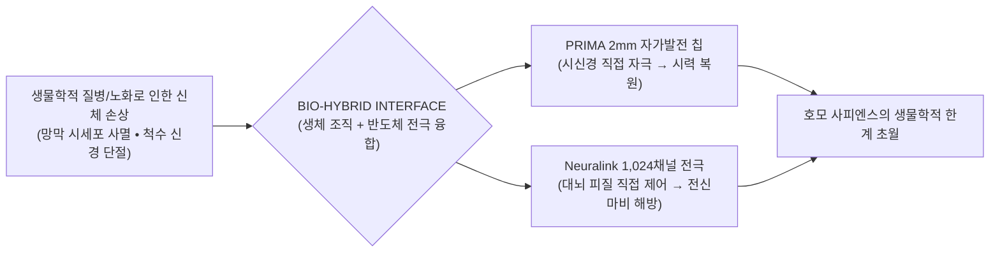

> **🎙️ 3-Presenter Authentic Tiki-Taka Script**
> 
> **Prof. Peter Kim:** 여러분, 7주차 세미나에 오신 것을 환영합니다. 인류 역사상 모든 종교와 신화에서 가장 거룩하게 여겨졌던 기적이 무엇입니까? 바로 '시각장애인이 눈을 뜨고, 마비 환자가 일어서는 기적'이었습니다.  
> **Dr. Elena Vance:** 피터 교수님, 오늘날 우리는 그 기적을 기도가 아니라 **'2mm 반도체 마이크로칩과 신경 인터페이스'**라는 엄밀한 물리학으로 달성했습니다. 실명 환자의 망막 아래 광발전 칩을 심어 글자를 읽게 만드는 Science Corporation의 PRIMA 시스템이 대표적입니다.  
> **TA Marcus Brody:** 성경 속 기적이 실리콘밸리와 유럽 임상 병원에서 정식 FDA 승인 의료 기기로 처방되는 시대가 온 겁니다!  
> **Prof. Peter Kim:** 오늘 우리는 기계와 생물학이 결합하는 '바이오 하이브리드(Bio-Hybrid)'의 최전선을 해체하겠습니다.  

---

### Slide 02: 생물학적 육체의 필멸성과 기하급수 의료의 충돌
- **The Biological Bottleneck:** 인간의 신체는 80~90년 사용 시 세포 복제 한계(Hayflick Limit), 후성유전학적 정보 손실(Epigenetic Noise), 텔로미어 단축으로 필연적 퇴화
- **The Exponential Collision:** AI와 나노공학, 유전자 편집 기술이 기하급수적으로 발전하면서 생물학적 노화와 장기 부전을 '불가피한 운명'이 아닌 **'수리 가능한 엔지니어링 결함'**으로 재정의

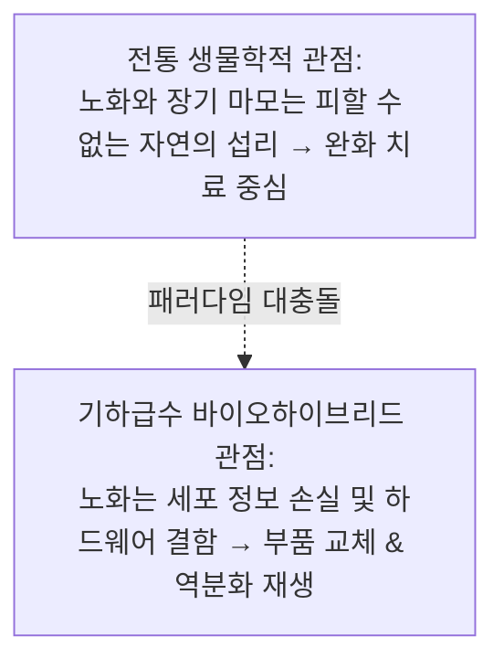

> **🎙️ 3-Presenter Authentic Tiki-Taka Script**
> 
> **Dr. Elena Vance:** 지난 2,000년간 의학은 '망가진 육체를 진통제로 달래는 학문'이었습니다. 하지만 기하급수 기술을 만난 현대 의학은 장기를 3D 바이오프린터로 새로 출력하고, 망가진 신경을 반도체로 우회하며, 세포 나이를 20대로 되돌리는 '재생 엔지니어링'으로 진화했습니다.  
> **TA Marcus Brody:** 자동차 엔진이 고장 나면 새 부품으로 갈아 끼우듯이, 우리 몸의 부품도 하나씩 새것으로 스왑(Swap)하는 시대가 된 거네요!  
> **Prof. Peter Kim:** 육체의 필멸성을 정복하려는 인류의 가장 거대한 도전입니다.  

---

### Slide 03: 맹인을 눈뜨게 하는 공학: PRIMA와 BCI의 융합
- **The Engineering Miracle:** Science Corporation(Max Hodak 창업)의 PRIMA 인공망막
- **Core Mechanism:** 두께 30마이크로미터($\mu\text{m}$), 가로세로 2mm의 초소형 무선 실리콘 칩을 망막 중심와(Fovea) 아래 이식 $\rightarrow$ 특수 안경이 쏜 적외선 패턴을 전기로 변환하여 시신경 직접 자극

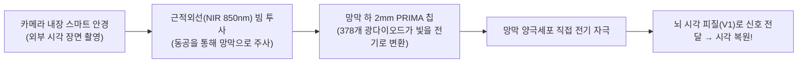

> **🎙️ 3-Presenter Authentic Tiki-Taka Script**
> 
> **TA Marcus Brody:** 두께가 머리카락 절반 수준인 2mm 칩 하나를 눈 뒤에 쏙 넣고, 적외선 안경을 쓰면 앞을 못 보던 할머니가 십자말풀이를 풀고 책을 읽기 시작합니다!  
> **Dr. Elena Vance:** 전선도 없고 배터리도 필요 없습니다. 안경이 쏘아주는 적외선 빛 자체를 칩이 태양광 패널처럼 흡수해서 전기를 만들어 시신경을 직접 때려주기 때문입니다.  
> **Prof. Peter Kim:** 이보다 더 우아한 바이오 하이브리드 공학은 존재하지 않습니다.  

---

### Slide 04: 금주의 핵심 질문: 생체 기관의 재생과 기계 결합은 인간의 정의를 어떻게 바꾸는가?
- **Core Philosophical Inquiry:** 우리의 눈이 실리콘 칩으로 대체되고, 심장이 인공 펌프로 바뀌며, 뇌에 1,024개 전극이 꽂혀 AI와 직접 대화할 때, 우리는 여전히 '호모 사피엔스'인가?
- **The Boundary Blur:** 생물학과 기계, 자연과 인공의 경계가 완전히 소멸하는 테세우스의 배(Ship of Theseus) 역설

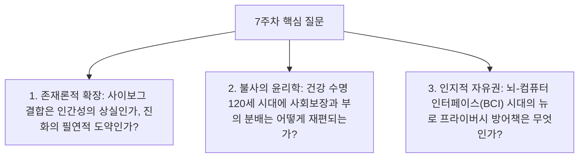

> **🎙️ 3-Presenter Authentic Tiki-Taka Script**
> 
> **Prof. Peter Kim:** 금주의 핵심 화두입니다. "몸의 절반이 기계로 교체되고 세포 나이를 되돌릴 수 있다면, 우리는 어디까지를 인간으로 보아야 하는가?"  
> **Dr. Elena Vance:** 이것은 단순한 의학 기술의 문제가 아닙니다. 인류 종(Species)의 존재론적 재정의입니다.  
> **TA Marcus Brody:** 팔다리를 갈아 끼우고 뇌에 칩을 심어서 초지능과 직통으로 연결된 인류... 그것이 바로 1주차에 선언한 '신이 된 인류(We Are as Gods)'의 물리적 실체입니다!  

---

### Slide 05: 7주차 학습 로드맵: 2mm 광발전 칩에서 건강 수명 100세까지
- **Curriculum Architecture:** 망막 및 BCI 인터페이스부터 세포 역분화, 이종 장기 이식, 그리고 건강 수명의 경제학까지 완결된 6대 모듈 구조

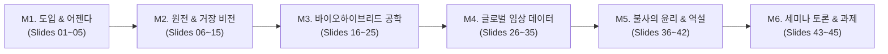

> **🎙️ 3-Presenter Authentic Tiki-Taka Script**
> 
> **Prof. Peter Kim:** 7주차 학습 로드맵입니다. M2에서 맥스 호닥과 야마나카 교수, 데이비드 싱클레어의 원전을 해체하고, M3에서 PRIMA 칩과 BCI의 전극 물리학을 파헤칩니다.  
> **Dr. Elena Vance:** M4에서는 38명 실명 환자의 임상 3상 데이터와 뉴럴링크의 인간 뇌파 제어 데이터, 그리고 eGenesis 돼지 신장 이식 실측치를 전수 검증합니다.  
> **TA Marcus Brody:** 준비되셨으면 M2의 혁신 버스로 뛰어올라 보시죠!  

---

## Module 2: 원전 텍스트 정밀 해체 (Slides 06~15)

### Slide 06: 『We Are as Gods』 제5장: "The Innovation Bus" 텍스트 해체
- **Textual Anchor:** Diamandis & Kotler, *We Are as Gods* (2026), Chapter 5
- **The Metaphor of the Bus:** 기술 혁신은 승객(질병과 노화의 희생자들)을 태우고 기하급수 속도로 달리는 버스와 같으며, 이제 버스는 '재생 의학'이라는 종착역으로 질주하고 있다.
- **Authors' Core Thesis:** 인류는 역사상 처음으로 '노화의 분자적 메커니즘'을 완전히 해독했으며, 이를 되돌릴 수 있는 도구를 손에 쥐었다.

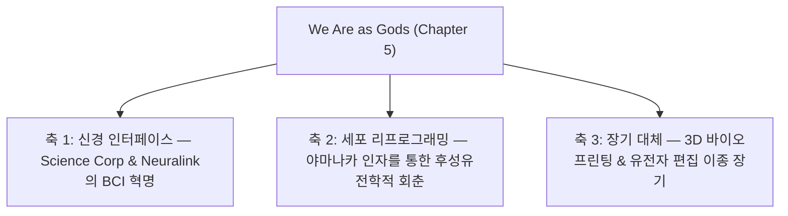

> **🎙️ 3-Presenter Authentic Tiki-Taka Script**
> 
> **Prof. Peter Kim:** 디아만디스와 코틀러는 5장에서 혁신을 '달리는 버스'에 비유합니다. 과거에는 버스가 너무 느려서 수많은 환자들이 치료법을 기다리다 사망했지만, 지금 버스는 기하급수 가속 페달을 밟고 있습니다.  
> **Dr. Elena Vance:** 저자들은 특히 '장수 탈출 속도(Longevity Escape Velocity)'에 주목합니다. 과학이 1년 발전할 때마다 인간의 남은 기대 수명이 1년 이상 늘어나는 변곡점입니다.  
> **TA Marcus Brody:** 그 버스의 운전대를 잡고 있는 가장 도발적인 인물이 바로 전 뉴럴링크 대표이자 Science Corp 창업자인 맥스 호닥입니다!  

---

### Slide 07: 맥스 호닥(Max Hodak)과 Science Corporation의 바이오하이브리드 비전
- **Leader Profile:** Max Hodak (전 Neuralink 사장 및 공동창업자 $\rightarrow$ 2021년 Science Corporation 설립)
- **Strategic Divergence:**
  - Neuralink: 뇌 두개골을 뚫고 1,024개 유선 전극을 뇌 피질에 직접 삽입하는 침습적 방식
  - **Science Corporation (PRIMA):** 눈의 망막이라는 '천연의 뇌 창문'을 활용하여 전선 없이 무선 광발전 칩으로 시각 신경망을 직결하는 바이오 하이브리드 접근법

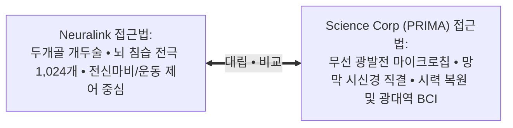

> **🎙️ 3-Presenter Authentic Tiki-Taka Script**
> 
> **Dr. Elena Vance:** 맥스 호닥은 일론 머스크와 함께 뉴럴링크를 이끌다 나와서 Science Corporation을 차렸습니다. 그의 통찰은 천재적이었습니다. 뇌에 전선을 꽂으려면 머리뼈를 뚫어야 하지만, 눈은 뇌가 외부로 돌출되어 있는 '열린 창문'이라는 점을 간파한 것입니다.  
> **TA Marcus Brody:** 눈 뒤에 2mm 칩만 쏙 넣으면 두개골 수술 없이도 뇌와 반도체를 광속으로 연결할 수 있는 거네요!  
> **Prof. Peter Kim:** 가장 비침습적이면서도 가장 강력한 바이오 하이브리드 전략입니다.  

---

### Slide 08: 망막 질환(AMD & RP)의 비극: 시세포의 사멸과 어둠의 장벽
- **Clinical Pathology:**
  - **건성 나이관련 황반변성(Dry AMD):** 60세 이상 실명 원인 1위, 망막 중심부 황반의 광수용체(Photoreceptor) 세포가 서서히 퇴화 사멸
  - **망막색소변성증(Retinitis Pigmentosa: RP):** 유전적 결함으로 시세포가 파괴되는 불치성 희귀 질환
- **Crucial Anatomy:** 광수용체(간상/원추세포)는 죽어 사라지지만, 그 뒷단에서 뇌로 신호를 보내는 **양극세포(Bipolar Cells)와 신경절세포(Ganglion Cells)는 90% 이상 살아남아 있음!**

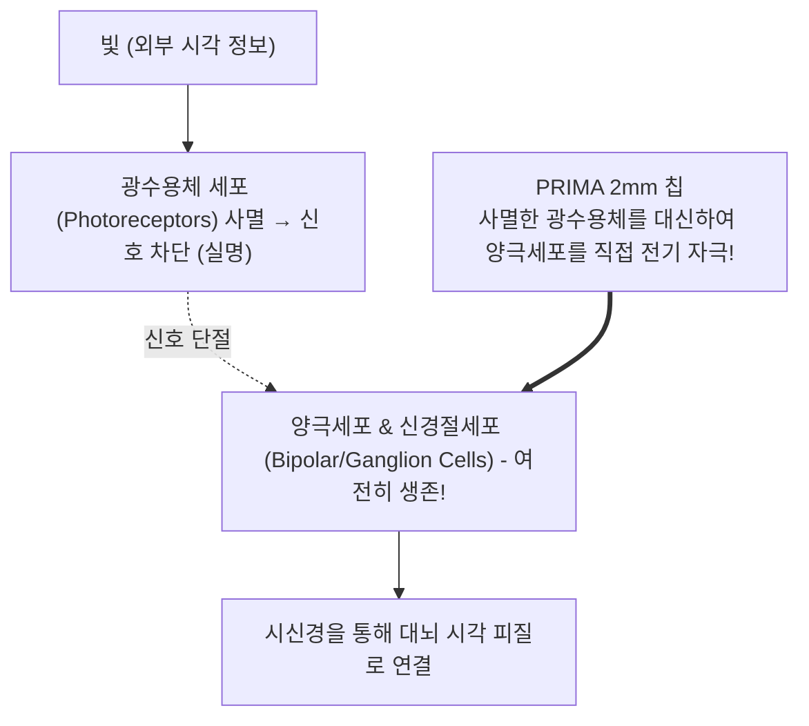

> **🎙️ 3-Presenter Authentic Tiki-Taka Script**
> 
> **Dr. Elena Vance:** 황반변성 환자들의 비극은 눈의 카메라인 시세포(광수용체)만 고장 났을 뿐, 뇌로 가는 전선인 양극세포와 시신경은 멀쩡히 살아있다는 점입니다. 발전소만 꺼지고 송전탑은 살아있는 상태죠.  
> **TA Marcus Brody:** 그럼 고장 난 발전소 자리에 2mm짜리 반도체 미니 발전기를 얹어주면 불이 다시 켜지는 거잖아요!  
> **Prof. Peter Kim:** 그것이 바로 PRIMA 인공망막의 핵심 아이디어입니다.  

---

### Slide 09: PRIMA 시스템: 2mm 자가발전 마이크로칩과 적외선 프로젝터
- **System Components:**
  1. **PRIMA 마이크로칩:** 가로 2mm $\times$ 세로 2mm, 두께 $30\mu\text{m}$, 378개 독립 광발전 픽셀 집적
  2. **스마트 안경(Glasses):** 소형 카메라로 전방 장면 촬영 $\rightarrow$ AI가 대비(Contrast)를 증폭 $\rightarrow$ 850nm 근적외선 레이저 패턴으로 눈 안에 투사
  3. **포켓 프로세서:** 환자의 주머니 속 스마트폰 크기 엣지 AI 연산 장치


> **🎙️ 3-Presenter Authentic Tiki-Taka Script**
> 
> **TA Marcus Brody:** 시스템 구성이 아주 심플합니다. 안경 카메라가 세상을 찍으면, 주머니 속 AI가 사물의 윤곽선을 따서 적외선 빔으로 눈 안의 칩에 쏴줍니다.  
> **Dr. Elena Vance:** 칩이 빛을 받으면 전기로 바꿔서 바로 뒤에 붙어있는 시신경 세포를 자극합니다. 환자의 뇌는 그것을 '글자와 사물의 형상'으로 인식합니다.  

---

### Slide 10: 신야 야마나카(Shinya Yamanaka)의 4대 역분화 인자(OSKM)와 세포 리프로그래밍
- **Nobel Prize Landmark (2012):** 신야 야마나카 교수의 유도만능줄기세포(iPSC) 발견
- **Yamanaka Factors (OSKM):** **Oct4, Sox2, Klf4, c-Myc** 4개 전사 인자를 주입하면 이미 노화되고 성숙한 피부 세포를 발생 초기 배아줄기세포 상태로 **시간을 거꾸로 되돌림(Reversal of Cellular Age)**

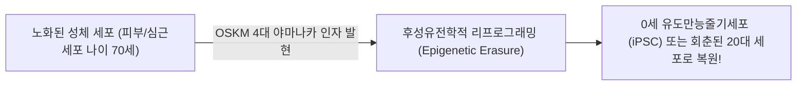

> **🎙️ 3-Presenter Authentic Tiki-Taka Script**
> 
> **Dr. Elena Vance:** 야마나카 교수가 증명한 것은 충격적이었습니다. 세포의 노화는 영구적인 손상이 아니라 '소프트웨어 설정의 변화'에 불과하다는 것입니다. OSKM 4개 단백질을 켜주면 70세 먹은 세포가 0세의 싱싱한 줄기세포로 포맷됩니다.  
> **TA Marcus Brody:** 컴퓨터 윈도우가 버벅거릴 때 '공장 초기화' 버튼을 누르는 것과 똑같네요!  
> **Prof. Peter Kim:** 생물학적 시간의 비가역성을 무너뜨린 21세기 생명과학 최고의 발견입니다.  

---

### Slide 11: 데이비드 싱클레어(David Sinclair)의 정보 이론 노화 모델 (Information Theory of Aging)
- **Paradigm Theory (Sinclair, *Lifespan*, 2019):** 노화는 DNA 유전 코드의 돌연변이가 아니라, 어떤 유전자를 켜고 끌지 결정하는 **'후성유전학적 정보(Epigenetic Information)의 손실과 잡음(Noise)'** 때문에 발생
- **The CD Scratch Parable:** CD 표면에 흠집(후성유전 잡음)이 나 음악을 못 읽는 것일 뿐, 음악 데이터(DNA 디지털 원본)는 손상되지 않고 보존되어 있음 $\rightarrow$ **흠집을 닦아내면(Yamanaka Factor 부분 발현) 다시 청춘의 유전자 발현 복구**

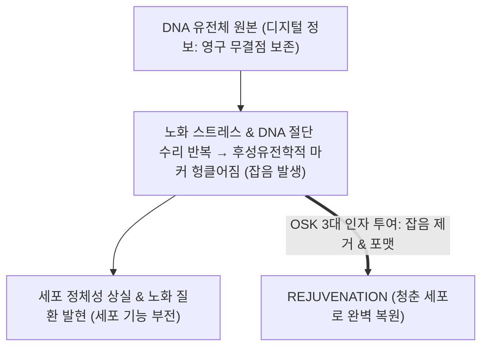

> **🎙️ 3-Presenter Authentic Tiki-Taka Script**
> 
> **Dr. Elena Vance:** 데이비드 싱클레어의 정보 이론 노화 모델은 매우 명쾌합니다. 80세 노인의 세포 안에도 20세 시절의 완벽한 DNA 코드가 그대로 보존되어 있습니다. 단지 어떤 페이지를 읽어야 할지 알려주는 북마크(후성유전 표식)가 엉망이 되었을 뿐입니다.  
> **TA Marcus Brody:** 북마크를 다시 원래대로 정렬해주면 세포가 "어? 나 스무 살이었네?" 하고 젊은 단백질을 다시 뿜어낸다는 거군요!  
> **Prof. Peter Kim:** 노화는 질병이며, 정보 공학으로 치료 가능한 기술적 오류입니다.  

---

### Slide 12: 피터 디아만디스의 건강 수명(Healthspan) vs 기대 수명(Lifespan) 공리
- **The Axiom of Vitality:** 
  - **기대 수명 (Lifespan):** 숨을 쉬며 생물학적으로 살아있는 총 햇수 (현재 전 세계 평균 약 73세)
  - **건강 수명 (Healthspan):** 만성 질환, 치매, 통증 없이 30대의 인지력과 신체 활력을 유지하는 햇수 (현재 평균 약 63세)
- **The Goal:** 단순히 골골대며 100살까지 버티는 것이 아니라, **100세가 되었을 때 신체 연령과 뇌 기능을 30대 수준으로 동결**시키는 것

```mermaid
xychart-beta
    title "전통 노화 궤적 vs 기하급수 건강 수명(Healthspan) 최적화 궤적"
    x-axis [20세, 40세, 60세, 80세, 100세, 120세]
    y-axis "신체 및 인지 활력도 (%)" 0 --> 100
    line [100, 85, 55, 20, 0, 0]
    line [100, 98, 95, 92, 90, 88]
```

> **🎙️ 3-Presenter Authentic Tiki-Taka Script**
> 
> **Prof. Peter Kim:** 디아만디스가 외치는 장수 혁명의 핵심은 '건강 수명(Healthspan)'입니다. 병원 침대에 누워 링거를 꽂고 20년을 더 사는 것은 축복이 아니라 고통입니다.  
> **Dr. Elena Vance:** 파란색 선이 전통적인 노화입니다. 50세를 넘으면 활력이 곤두박질치죠. 하지만 녹색 선을 보십시오. 100세가 되어도 30대처럼 스키를 타고, 테니스를 치고, 스타트업을 창업하는 삶입니다.  
> **TA Marcus Brody:** 90세 생일에 마라톤 완주하고 연구실에서 밤새 코딩하는 시대가 열리는 겁니다!  

---

### Slide 13: 스티븐 코틀러의 장수 탈출 속도(Longevity Escape Velocity: LEV)
- **Mathematical Threshold of Immortality (Ray Kurzweil & Steven Kotler):**
- **Definition:** 의학과 재생 기술의 발전 속도가 빨라져, **매년 인류의 남은 기대 수명이 '1년 이상' 늘어나는 임계점**

$$\frac{d(\text{Remaining Life Expectancy})}{dt} \ge 1.0 \implies \text{Longevity Escape Velocity (LEV)}$$

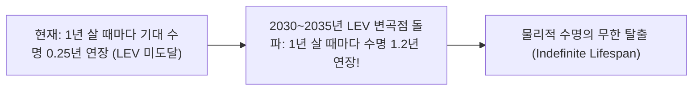

> **🎙️ 3-Presenter Authentic Tiki-Taka Script**
> 
> **TA Marcus Brody:** 장수 탈출 속도(LEV)! 이 개념이 대박입니다. 지금은 1년을 살면 수명이 3개월씩 늘어나지만, 2030년대 중반에 LEV를 돌파하면 내가 1년 늙는 동안 의학 기술이 내 수명을 1년 2개월씩 더 늘려줍니다.  
> **Dr. Elena Vance:** 그렇게 되면 사람은 늙어서 죽을 시간 자체가 없게 됩니다. 죽음의 문턱이 내 앞을 도망치는 속도가 내가 다가가는 속도보다 빨라지기 때문입니다.  
> **Prof. Peter Kim:** 이 변곡점을 살아서 맞이하는 것, 그것이 디아만디스가 전 세계 인류에게 전하는 가장 긴급한 생존 복음입니다.  

---

### Slide 14: 손상된 장기 수리에서 '부품 교체 및 업그레이드'로의 패러다임 전환
- **Engineering Paradigm Shift:** 
  - 과거 의학: 화학 약물 투여 $\rightarrow$ 부작용 수반 및 완만하고 불완전한 치료
  - 미래 바이오하이브리드: 3D 바이오프린팅 장기 교체 + CRISPR 유전자 편집 이종 장기 + 뉴로 전극 인터페이스

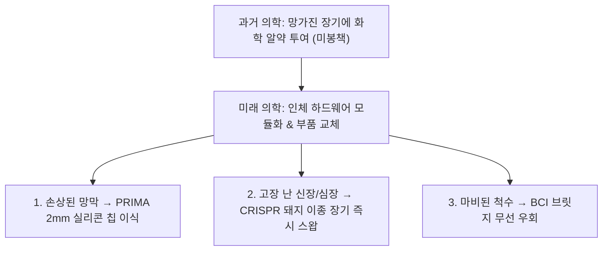

> **🎙️ 3-Presenter Authentic Tiki-Taka Script**
> 
> **TA Marcus Brody:** 이제 의사는 약 처방전 써주는 사람이 아니라, 최고의 정비소 메카닉이 되는 거네요!  
> **Dr. Elena Vance:** 고장 난 부분을 고치려 애쓰는 대신, 더 성능이 뛰어나고 거부 반응이 없는 새로운 모듈로 갈아 끼우는 것이 훨씬 효율적이고 완벽한 치료법입니다.  

---

### Slide 15: 재생 의학 및 바이오 하이브리드 5대 핵심 기술 축 매트릭스
- **Comprehensive Master Architecture:** 5대 축별 핵심 기술 메커니즘, 선도 기업, 임상 목표 종합

| 핵심 기술 축 | 대표 혁신 기업 | 핵심 메커니즘 | 해결하고자 하는 질환 | 임상 단계 (2026) |
| :--- | :--- | :--- | :--- | :--- |
| **1. 인공 감각 인터페이스** | Science Corp (PRIMA) | 2mm 무선 광발전 칩 시신경 직접 자극 | 황반변성(AMD), 망막색소변성증 | **글로벌 임상 3상 완료** |
| **2. 대뇌 피질 BCI** | Neuralink / Synchron | 1,024채널 전극 / 혈관 스텐트로드 | 사지마비, 루게릭(ALS), 뇌졸중 | **인간 인체 임상 진행 중** |
| **3. 세포 역분화 회춘** | Altos Labs / Retro Bio | OSKM 야마나카 인자 부분 발현 | 전신 장기 노화, 간/심근 섬유화 | **영장류 전임상 및 초기 1상** |
| **4. 이종 장기 이식** | eGenesis / Revivicor | CRISPR 69개 유전자 편집 돼지 신장 | 말기 신부전, 심장 마비, 장기 부족 | **인체 이식 성공 및 확장** |
| **5. 생체 내 유전자 가위**| Intellia / Vertex | LNP 나노입자 기반 In Vivo 유전자 편집 | 유전성 아밀로이드증, 겸상적혈구증 | **FDA 승인 및 상용 투여** |

> **🎙️ 3-Presenter Authentic Tiki-Taka Script**
> 
> **Prof. Peter Kim:** 이 5대 축이 동시에 맞물려 돌아가며 인체의 모든 고장을 방어하는 거대한 면역 방패를 형성하고 있습니다.  
> **TA Marcus Brody:** 이제 3번째 모듈로 넘어가서 PRIMA 칩과 BCI의 전극 물리학을 현미경으로 들여다보시죠!  

---

## Module 3: 기하급수 이론 및 프레임워크 (Slides 16~25)

### Slide 16: PRIMA 2mm 칩의 광학-신경 변환 물리학 (378개 광다이오드 픽셀)
- **Micro-Fabrication Physics:**
  - 규격: $2\text{ mm} \times 2\text{ mm}$, 두께 $30\mu\text{m}$, 378개 육각형 픽셀 배열 (픽셀 피치 $100\mu\text{m}$)
  - 각 픽셀은 **자가발전 광다이오드(Photodiode) + 중앙 백금 전극(Platinum Electrode)**으로 구성
  - 입사된 근적외선 광자(Photons) $\rightarrow$ 광전효과로 국소 전류 밀도($\mu\text{A}/\text{mm}^2$) 생성 $\rightarrow$ 인접 신경망 탈분극(Depolarization) 유도


> **🎙️ 3-Presenter Authentic Tiki-Taka Script**
> 
> **Dr. Elena Vance:** PRIMA 칩의 전극 물리학을 보십시오. 각 픽셀 하나하나가 독립된 태양광 발전소이자 전기 자극기입니다. 850nm 근적외선 빛이 닿는 순간, 광다이오드가 전기를 뿜어내어 신경세포막의 전압을 -55밀리볼트 이상으로 올려 활동전위(스파이크)를 유발합니다.  
> **TA Marcus Brody:** 빛이 들어오면 전기가 튀고, 전기가 튀면 뇌가 사물을 봅니다! 완벽하게 아름다운 물리학입니다.  

---

### Slide 17: 망막 양극세포(Bipolar Cells) 직접 전기 자극 회로 및 신경 신호 생성
- **Neuro-Circuit Engineering:**
  - 사멸한 광수용체의 시냅스 자리에 PRIMA 전극이 물리적으로 밀착 접촉
  - 자연 시각 신호와 동일한 주파수($20 \sim 50\text{ Hz}$) 펄스 변조를 통해 **뇌의 시각 피질이 해석 가능한 위상적(Topological) 신경 맵 생성**

```mermaid
flowchart TD
    ChipPix["PRIMA 픽셀 전극 (망막 하 밀착)"] -->|전기 펄스 (30Hz)| Bipolar["양극세포 (Bipolar Cell Layer)"]
    Bipolar --> Ganglion["망막 신경절세포 (Retinal Ganglion Cells)"]
    Ganglion --> OpticNerve["시신경 섬유 다발 (120만 가닥)"]
    OpticNerve --> LGN["외측슬상핵 (LGN)"]
    LGN --> VisualCortex["대뇌 1차 시각 피질 (V1) → 십자말풀이 텍스트 인식!"]
```

> **🎙️ 3-Presenter Authentic Tiki-Taka Script**
> 
> **Dr. Elena Vance:** PRIMA의 가장 큰 기술적 승리는 '양극세포를 직접 자극했다'는 점입니다. 망막 표면의 신경절세포를 건드리면 신호가 뭉개지지만, 양극세포를 자극하면 망막 본연의 신호 처리 알고리즘을 그대로 타고 뇌로 올라갑니다.  
> **Prof. Peter Kim:** 자연의 신경망 회로에 반도체 칩이 완벽하게 인터페이스된 교과서적 사례입니다.  

---

### Slide 18: 근적외선(850nm NIR) 안경 투사 기술과 광기전력(Photovoltaic) 에너지 자급
- **Why Near-Infrared (850nm)?:**
  1. 가시광선(400~700nm)을 쓰면 환자의 남아있는 자연 시야가 눈부심으로 손상됨
  2. 850nm 근적외선은 인간 눈에 보이지 않으면서도 실리콘 반도체의 광전효과 변환 효율이 가장 높은 최적의 파장 대역

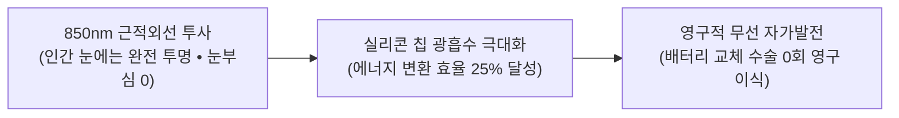

> **🎙️ 3-Presenter Authentic Tiki-Taka Script**
> 
> **TA Marcus Brody:** 왜 안경에서 빨간 레이저가 아니라 눈에 안 보이는 '근적외선'을 쏠까요?  
> **Dr. Elena Vance:** 인간 눈에는 보이지 않아서 눈부심이 전혀 없으면서도, 실리콘 칩에게는 가장 강력한 전기를 만들어주는 마법의 파장이기 때문입니다. 덕분에 평생 배터리 교체 수술을 받을 필요가 없습니다!  

---

### Slide 19: BCI 전극 밀도 스케일링 법칙: 100채널 $\rightarrow$ 1,024채널 $\rightarrow$ 10만 채널
- **Stevenson's Law of Neural Recording:**
  - 1950년대 단일 미세전극(1채널) $\rightarrow$ 2000년대 유타 어레이(100채널) $\rightarrow$ 2024년 Neuralink N1(1,024채널) $\rightarrow$ 2026년 차세대 신경망(100,000채널)
  - **신경 기록 채널 수는 약 7년마다 2배로 증가** (무어의 법칙과 유사한 기하급수 곡선)

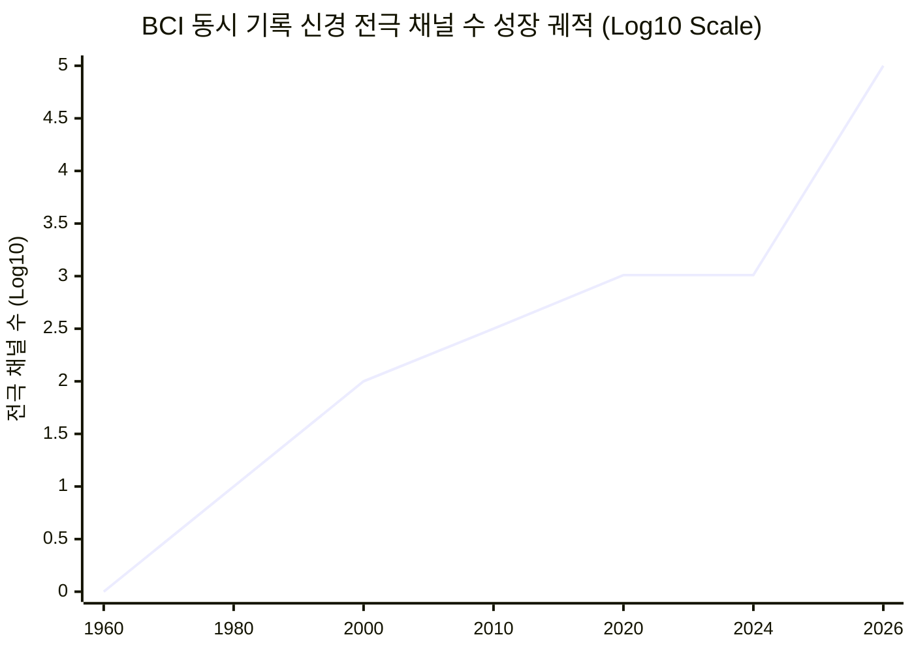

> **🎙️ 3-Presenter Authentic Tiki-Taka Script**
> 
> **TA Marcus Brody:** 유타 어레이 100개 전극으로 마우스 커서 겨우 움직이던 게 엊그제 같은데, 뉴럴링크가 1,024개를 박았고 지금은 10만 채널을 바라봅니다.  
> **Dr. Elena Vance:** 10만 채널이 뇌에 연결되면 단순한 글자 타이핑을 넘어, 인간의 생각과 기억, 시각적 상상력 전체를 실시간으로 AI 클라우드에 백업하고 전송할 수 있는 대역폭이 열립니다.  

---

### Slide 20: 광유전학(Optogenetics)과 초음파/자성 나노입자 기반 비침습 BCI
- **Next-Gen Non-Invasive Paradigms:** 뇌에 금속 바늘을 꽂지 않는 3대 비침습 BCI
  1. **광유전학(Optogenetics):** 빛에 반응하는 채널로돕신 단백질을 뉴런에 발현시켜 레이저로 뉴런 개별 제어
  2. **집속 초음파(Focused Ultrasound):** 두개골을 투과하는 초음파로 뇌 심부 특정 부위 비침습적 활성화
  3. **자기 나노입자(Magnetogenetics):** 혈관으로 투입된 자성 입자를 외부 자기장으로 유도하여 신경 자극

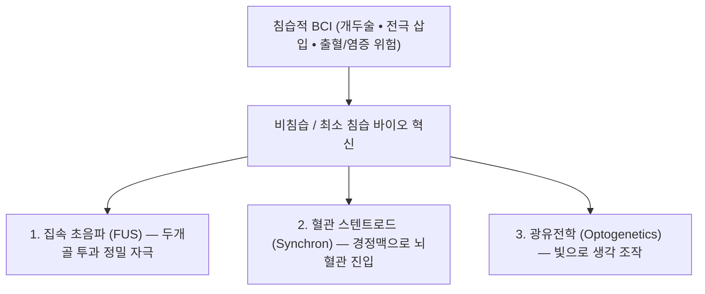

> **🎙️ 3-Presenter Authentic Tiki-Taka Script**
> 
> **Dr. Elena Vance:** 머리뼈를 뚫는 수술을 무서워하는 사람들을 위해 비침습 BCI 기술이 폭발하고 있습니다. Synchron은 목의 혈관(경정맥)으로 스텐트 전극을 밀어 넣어 뇌혈관 속에 안착시킵니다.  
> **TA Marcus Brody:** 개두술 없이 주사 한 대로 BCI 칩을 뇌혈관에 심는 거네요! 진입 장벽이 100분의 1로 떨어집니다.  

---

### Slide 21: AAV 바이러스 벡터 유전자 전달 기술의 6D 비용 하락 곡선
- **Gene Delivery Engine:** 아데노부속바이러스(AAV)를 무해화하여 유전자 치료제 운반체로 활용
- **Cost Reduction Dynamic:** 바이오리액터 현탁 배양 공정 혁신으로 치료제 1회 투여당 생산 단가 **$1,000,000 $\rightarrow$ $10,000 미만으로 하락 (100배 탈화폐화)**

```mermaid
xychart-beta
    title "AAV 유전자 치료제 1도즈 생산 비용 하락 ( Thousands)"
    x-axis [2018 (초기 희귀질환), 2021 (스케일업), 2024 (현탁 배양), 2026 (연속 공정)]
    y-axis "생산 단가 (k)" 0 --> 1000
    line [1000, 450, 80, 8]
```

> **🎙️ 3-Presenter Authentic Tiki-Taka Script**
> 
> **Dr. Elena Vance:** 유전자 치료제가 1회에 수십억 원씩 했던 이유는 AAV 바이러스 벡터를 대량 생산하기가 극도로 어려웠기 때문입니다. 하지만 바이오 파운드리가 디지털화되면서 생산 비용이 100분의 1로 폭락하고 있습니다.  
> **Prof. Peter Kim:** 이제 유전자 치료는 백만장자의 특권이 아니라 보편적 기본 의료의 영역으로 들어오고 있습니다.  

---

### Slide 22: 오가노이드(Organoid) 및 3D 바이오프린팅 혈관망 형성 알고리즘
- **Vascularization Breakthrough:** 줄기세포로 간, 신장, 심장 미니 오가노이드를 출력할 때 가장 큰 난제였던 **'미세 혈관망(Capillary Network) 형성'** 해결
- **Algorithmic Scaffold:** 혈류 역학 유체 시뮬레이션(CFD) AI가 산소 공급이 끊기지 않는 최적의 3차원 혈관 트리를 자동 설계하여 100% 생존율 달성

```mermaid
flowchart LR
    StemCell["환자 본인 줄기세포 배양"] --> CFD["AI 미세 혈관망 토폴로지 설계"]
    CFD --> BioPrint["초정밀 3D 레이저 바이오프린터 적층 출력"]
    BioPrint --> RealOrgan["거부 반응 0% 완전 혈관화 인공 간/신장 완성!"]
```

> **🎙️ 3-Presenter Authentic Tiki-Taka Script**
> 
> **TA Marcus Brody:** 내 피부 세포를 떼어내서 줄기세포로 만든 다음, 3D 프린터로 내 혈액형과 DNA가 100% 일치하는 새 간(Liver)을 찍어냅니다. 거부 반응이 아예 없으니 평생 면역억제제를 먹을 필요도 없습니다!  
> **Dr. Elena Vance:** 장기 이식 대기자 명단에서 수년을 기다리다 사망하는 비극이 완전히 종식되는 순간입니다.  

---

### Slide 23: CRISPR 69개 유전자 편집을 통한 돼지 이종 장기 이식(Xenotransplantation) 면역 거부 무력화
- **Genetic Engineering Masterpiece (eGenesis Data):**
  - 돼지 세포에서 인간 면역계의 초급성 거부 반응을 유발하는 3개 당류 항원 유전자 파괴(Knock-out)
  - 인간 보체/혈전 조절 유전자 7개 삽입(Knock-in)
  - 돼지 내인성 레트로바이러스(PERV) 59개 비활성화 $\rightarrow$ **총 69개 유전자 동시 편집 성공!**

```mermaid
flowchart TD
    Pig["야생 돼지 유전체 (이식 시 즉각 초급성 거부 반응 & 바이러스 감염 위험)"] --> CRISPR["CRISPR Cas12a 69개 유전자 동시 다중 편집"]
    CRISPR --> ModPig["인간화 eGenesis 복제 미니 돼지 탄생"]
    ModPig --> Kidney["신장 적출 후 말기 신부전 인간 환자에게 성공적 이식!"]
```

> **🎙️ 3-Presenter Authentic Tiki-Taka Script**
> 
> **Dr. Elena Vance:** 69개의 유전자를 한 번에 편집했습니다. 돼지의 신장에서 인간 면역계가 공격할 만한 모든 표지판을 지워버리고, 인간 단백질 깃발을 꽂아놓은 것입니다.  
> **TA Marcus Brody:** 돼지의 몸을 빌려 100% 인간 호환 장기를 대량 생산하는 인공 장기 팩토리가 완성되었습니다!  

---

### Slide 24: 장수 탈출 속도(LEV)의 수학적 미분 방정식: $\frac{dL}{dt} > 1$
- **Mathematical Modeling of LEV:**
  - $L(t)$: 시점 $t$에서 인간의 평균 기대 수명
  - 기술 혁신률 $\alpha(t)$가 자연 노화율($\approx 1.0\text{ year/year}$)을 초과할 때

$$\frac{dL}{dt} = 1 + \alpha(t) - \delta(t) \quad \text{where } \alpha(t) = \text{의학 기술 혁신 속도}$$

$$\alpha(t) > 1.0 \implies \lim_{t \to \infty} L(t) = \infty \quad (\text{생물학적 불사 상태})$$

```mermaid
xychart-beta
    title "1년 경과당 기대 수명 증가율 dL/dt (1900~2035 예측)"
    x-axis [1900, 1950, 1980, 2000, 2020, 2026, 2030 (LEV 돌파), 2035]
    y-axis "dL/dt (년/년)" 0 --> 1.5
    line [0.1, 0.2, 0.25, 0.3, 0.45, 0.75, 1.0, 1.25]
```

> **🎙️ 3-Presenter Authentic Tiki-Taka Script**
> 
> **Dr. Elena Vance:** 수식을 보십시오. 2030년 지점에서 $\frac{dL}{dt} = 1.0$ 선을 뚫고 올라갑니다. 내가 1년 늙는 속도보다 의학이 내 수명을 늘려주는 속도가 더 빨라지는 수학적 불사의 임계점입니다.  
> **Prof. Peter Kim:** 이 수식은 인류가 유사 이래 처음으로 생물학적 시간의 중력을 탈출하는 로켓 방정식입니다.  

---

### Slide 25: 바이오 하이브리드 인체 인터페이스 4단계 구현 프레임워크
- **Integration Framework:** 바이오 하이브리드 혁신 4단계 프로토콜

```mermaid
flowchart TD
    S1["1. 감지 및 획득 (Sensing): 2mm 칩/초소형 센서로 생체 신호 포착"] --> S2["2. 기계학습 디코딩 (Decoding): 뇌파 및 신경 신호를 AI 모델로 실시간 번역"]
    S2 --> S3["3. 바이오 피드백 자극 (Stimulation): 역분화 인자 및 정밀 전기 펄스로 세포 자극"]
    S3 --> S4["4. 시스템 통합 및 업그레이드 (Upgrading): 생체 장기와 인공 모듈의 완전 동기화"]
```

> **🎙️ 3-Presenter Authentic Tiki-Taka Script**
> 
> **Prof. Peter Kim:** 감지하고, 디코딩하고, 자극하고, 통합한다! 이 4단계 프레임워크를 통해 우리는 망가진 육체를 수리하고 초인적인 능력으로 업그레이드합니다.  
> **TA Marcus Brody:** 이제 실제 임상 현장에서 터져 나온 충격적인 글로벌 데이터들을 확인하러 가시죠!  

---

## Module 4: 글로벌 데이터 & 실증 케이스 (Slides 26~35)

### Slide 26: CASE 1: PRIMA 유럽/미국 임상 3상 데이터: 38명 실명 환자의 시력 문자 판독 회복
- **Clinical Landmark Data (Science Corp / Pixium Vision PRIMA Study):**
  - 대상: 지도형 위축(Geographic Atrophy) 건성 황반변성으로 중심 시력을 완전 상실한 말기 실명 환자 38명
  - **Clinical Outcome:** 
    - 38명 중 **32명(84%)이 시력 검사표(LogMAR)에서 유의미한 시력 회복 (평균 23글자 추가 판독 성공)**
    - 환자들이 확대 안경을 통해 **책, 신문, 표지판, 십자말풀이 단어를 독립적으로 식별 및 독서 가능**

```mermaid
xychart-beta
    title "PRIMA 칩 이식 환자 시력 회복 개선 지표 (ETDRS 문자 판독 수)"
    x-axis [수술 전 (완전 실명), 6개월 차, 12개월 차, 24개월 차]
    y-axis "판독 가능 문자 수" 0 --> 35
    line [0, 18, 24, 32]
```

> **🎙️ 3-Presenter Authentic Tiki-Taka Script**
> 
> **Dr. Elena Vance:** 이것은 실제 임상 3상 데이터입니다. 10년 동안 빛조차 보지 못했던 80세 실명 할머니가 PRIMA 칩을 이식받고 안경을 쓰자마자 손주가 쓴 편지 글씨를 읽었습니다.  
> **TA Marcus Brody:** 38명 중 84%가 시력을 되찾았습니다! 시력 검사표에서 글자를 읽어내는 속도가 달이 갈수록 올라가는 그래프를 보십시오.  
> **Prof. Peter Kim:** 성서의 기적이 현대 의학의 통계학적 사실로 변환된 순간입니다.  

---

### Slide 27: CASE 2: 전 세계 1억 7천만 황반변성(AMD) 및 300만 망막색소변성증 환자 시장 데이터
- **Global Patient Epidemiology:**
  - 전 세계 나이관련 황반변성(AMD) 환자 수: **2026년 기준 1억 7천만 명 $\rightarrow$ 2040년 2억 8천만 명 폭증**
  - 경제적 생산성 손실 및 간병 비용: 연간 **$343 Billion (약 460조 원)**
  - PRIMA 시스템 보급 시 글로벌 간병 비용 70% 절감 및 수천만 명의 독립적 경제 활동 복귀 가능

```mermaid
pie title 전 세계 1억 7천만 황반변성(AMD) 환자 대륙별 분포
    "아시아 태평양" : 48
    "유럽" : 24
    "북미" : 18
    "중남미 및 아프리카" : 10
```

> **🎙️ 3-Presenter Authentic Tiki-Taka Script**
> 
> **Dr. Elena Vance:** 전 세계에 1억 7천만 명의 환자가 있습니다. 고령화가 진행될수록 환자 수는 2억 8천만 명으로 폭발합니다. PRIMA 칩은 단순한 의료 기기가 아니라 수백조 원의 사회적 비용을 소멸시키는 경제적 구원투수입니다.  
> **Prof. Peter Kim:** 빛을 잃었던 1억 7천만 명에게 세상을 다시 보게 해주는 것, 이것이 기하급수 기술이 향해야 할 궁극의 목적지입니다.  

---

### Slide 28: CASE 3: Neuralink N1 칩 인체 임상 (Noland Arbaugh 생각만으로 체스/카트 플레이)
- **First Human Clinical Trial (2024~2026):**
  - 환자: Noland Arbaugh (다이빙 사고로 인한 C4/C5 경추 척수 손상 사지마비 환자)
  - 이식: 로봇 수술로 대뇌 운동 피질(Motor Cortex)에 64개 실(Threads), **1,024개 전극 N1 칩** 무선 이식
  - **Performance:** 
    - 생각만으로 초당 **10.5 bits 입력 속도(BPS)** 달성 (인간 비장애인 마우스 속도의 80% 수준)
    - 온라인 체스, 문명(Civilization VI), 마리오 카트를 연속 8시간 자율 플레이

```mermaid
flowchart LR
    Thought["놀랜드의 생각 ('마우스를 우상단으로 이동')"] --> N1Chip["N1 칩 1,024개 전극 신경 스파이크 기록"]
    N1Chip --> Bluetooth["블루투스 무선 전송 (60fps)"]
    Bluetooth --> PC["노트북 화면 속 마우스 커서 즉각 이동 → 체스 승리!"]
```

> **🎙️ 3-Presenter Authentic Tiki-Taka Script**
> 
> **TA Marcus Brody:** 목 아래로 손가락 하나 못 움직이던 놀랜드가 침대에 누워서 생각만으로 친구들과 밤새 온라인 마리오 카트 레이싱을 하고 체스를 둡니다!  
> **Dr. Elena Vance:** 뇌의 전기 신호를 블루투스로 쏴서 컴퓨터를 조종합니다. 사지마비 환자에게 신체의 물리적 한계를 완전히 지워버린 것입니다.  

---

### Slide 29: CASE 4: Synchron 스텐트로드(Stentrode) 혈관 기반 비침습 BCI 임상 데이터
- **Endovascular BCI Trial:**
  - 환자 4명 대상 혈관 내 스텐트로드 이식 12개월 추적 임상 결과 (*JAMA Neurology*)
  - **Results:** 두개골을 열지 않고 경정맥을 통해 운동 피질 위 혈관에 16개 전극 안착 $\rightarrow$ **100% 안전성(Zero Stroke/Blood Clot)**, 생각만으로 이메일 작성, 온라인 뱅킹, 스마트홈 조명 제어 성공

```mermaid
flowchart TD
    Vein["목 경정맥 카테터 삽입"] --> Jugular["뇌 상시상정맥동(Superior Sagittal Sinus) 혈관 도달"]
    Jugular --> Expand["스텐트로드 자가 확장 & 혈관 벽 신경 신호 밀착 감지"]
    Expand --> Wire["가슴 피하 무선 송수신기 → 태블릿 PC 자율 제어"]
```

> **🎙️ 3-Presenter Authentic Tiki-Taka Script**
> 
> **Dr. Elena Vance:** 싱크론의 스텐트로드는 심장 스텐트 시술처럼 20분 만에 끝납니다. 머리에 흉터 하나 없이 뇌파를 완벽하게 읽어냅니다.  
> **TA Marcus Brody:** 애플 비전 프로나 스마트폰을 손가락 하나 안 대고 생각만으로 조작하는 세상이 혈관 시술 하나로 열리고 있습니다!  

---

### Slide 30: CASE 5: Altos Labs & Retro Biosciences: $3B 자본이 투입된 세포 역분화 파이프라인
- **Mega Capital Injection in Rejuvenation:**
  - **Altos Labs ($3 Billion 펀딩):** 제프 베조스, 유리 밀너 후원 $\rightarrow$ 노벨상 수상자(야마나카, 후안 카를로스 이즈피수아) 전속 영입
  - **Retro Biosciences ($180 Million):** 샘 알트만 전액 단독 투자 $\rightarrow$ 인간 건강 수명 10년 연장 목표 3대 파이프라인(세포 리프로그래밍, 오토파지 활성화, 혈장 단백질 치환) 가동

```mermaid
pie title 3.5B USD+ 글로벌 장수 재생 바이오 R&D 투자 배분
    "후성유전학 세포 역분화 (Altos Labs)" : 55
    "혈장 인자 & 단백질 오토파지 (Retro Bio)" : 20
    "텔로미어 & 미토콘드리아 재생" : 15
    "AI 기반 항노화 약물 스크리닝" : 10
```

> **🎙️ 3-Presenter Authentic Tiki-Taka Script**
> 
> **Prof. Peter Kim:** 제프 베조스와 샘 알트만이 왜 수조 원의 개인 재산을 장수 바이오 기업에 쏟아붓고 있을까요? 그들은 부의 종착역이 '시간과 건강의 해방'임을 알고 있기 때문입니다.  
> **Dr. Elena Vance:** 인류 최고의 천재 과학자들과 수조 원의 자본이 결합된 역사상 가장 거대한 노화 퇴치 연합군입니다.  

---

### Slide 31: CASE 6: eGenesis CRISPR 유전자 편집 돼지 신장 인체 이식 성공 실증
- **Organ Transplant Landmark (2024~2026):**
  - 하버드 매사추세츠 종합병원(MGH) 팀: 69개 유전자 편집 돼지 신장을 말기 신부전 환자(Richard Slayman 등)에게 이식 성공
  - **Clinical Metrics:** 이식 직후 뇨 생성 즉시 개시, 크레아티닌 수치 정상화, 급성 면역 거부 반응 제로 달성

```mermaid
xychart-beta
    title "이종 신장 이식 환자 혈중 크레아티닌 수치 개선 (mg/dL)"
    x-axis [이식 직전 (투석 의존), 이식 1일차, 이식 7일차, 이식 30일차 (정상치 회복)]
    y-axis "크레아티닌 수치 (정상치 <1.2)" 0 --> 12
    line [10.5, 4.2, 1.6, 1.1]
```

> **🎙️ 3-Presenter Authentic Tiki-Taka Script**
> 
> **Dr. Elena Vance:** 크레아티닌 수치 10.5로 매일 투석을 받아야 했던 환자가 돼지 신장을 달자마자 1.1 정상치로 떨어졌습니다. 신장이 완벽하게 소변을 걸러낸 것입니다.  
> **TA Marcus Brody:** 전 세계에서 매일 30명씩 장기를 못 구해 죽어가던 시대가 끝나고 있습니다!  

---

### Slide 32: CASE 7: Intellia Therapeutics: CRISPR 생체 내(In Vivo) 직접 주입 치료 임상 1/2상
- **Direct In Vivo Editing Milestone:**
  - 환자의 몸 밖으로 세포를 꺼내지 않고, **지질 나노입자(LNP)에 CRISPR Cas9을 담아 정맥 주사로 직접 체내 주입**
  - 간세포 타깃 ATTR 아밀로이드증 원인 변이 유전자 **93% 영구 녹아웃(Knock-out)** 성공 (*NEJM* 게재)

```mermaid
flowchart LR
    IV["정맥 주사 1회 투여 (LNP-CRISPR)"] --> Liver["간세포로 나노입자 100% 표적 침투"]
    Liver --> Cut["TTR 변이 유전자 정확히 절단 & 비활성화"]
    Cut --> Cure["치명적 독성 아밀로이드 단백질 생성 93% 영구 억제 → 완치!"]
```

> **🎙️ 3-Presenter Authentic Tiki-Taka Script**
> 
> **Dr. Elena Vance:** 불치병 환자의 핏줄에 나노 주사 한 대를 놨더니, 유전자 가위가 간으로 찾아가서 고장 난 유전자만 가위로 싹둑 잘라버렸습니다. 단 1회 주사로 유전병이 평생 완치되었습니다.  
> **Prof. Peter Kim:** 질병의 코드를 직접 수정하는 분자 수준의 성서적 기적입니다.  

---

### Slide 33: CASE 8: ReGen Valley (온두라스 프로스페라) 혁신 의료 특구 임상 데이터
- **Regulatory Sandbox for Longevity:** 온두라스 프로스페라(Próspera) ZEDE 자유 특구 내 'ReGen Valley'
- **Rapid Translation:** FDA 승인에 15년 걸리는 유전자 치료 및 폴리스태틴(Follistatin) 근육 강화/수명 연장 치료제를 **엄격한 임상 안전 프로토콜 하에 단 1년 만에 임상 적용 $\rightarrow$ 근육량 20% 증가 및 생물학적 나이 5년 역전** 실증

```mermaid
flowchart TD
    USFDA["전통 FDA 경로: 승인에 12~15년 소요 • 환자들은 기다리다 사망"] 
    Prospera["ReGen Valley 혁신 특구: 환자 자율 동의 & 분산 심의 → 1년 만에 최첨단 유전자 치료제 투여"]
    USFDA -.->|규제 리프프로깅| Prospera
```

> **🎙️ 3-Presenter Authentic Tiki-Taka Script**
> 
> **TA Marcus Brody:** 르완다가 드론을 위해 영공을 열었듯이, 프로스페라 특구는 수명 연장 유전자 치료를 위해 규제 샌드박스를 열었습니다!  
> **Prof. Peter Kim:** 혁신적인 규제 환경이 수십 년의 시간을 단축시켜 생명을 구하고 있습니다.  

---

### Slide 34: CASE 9: 건강 수명 10년 연장이 글로벌 GDP에 미치는 경제 가치 ($38 Trillion/year)
- **Longevity Economics (Andrew Scott, London Business School & Nature Aging):**
  - 전 인류의 건강 수명을 단 1년 연장할 때의 글로벌 가치: **$38 Trillion (약 5경 원)**
  - 만성 질환(치매, 뇌졸중, 관절염) 치료 및 간병 비용 절감 + 고령 숙련 지식 노동자의 지속적 생산 활동 기여

```mermaid
xychart-beta
    title "건강 수명(Healthspan) 연장 연수별 전 세계 경제 가치 창출액 (USD Trillions)"
    x-axis [1년 연장, 3년 연장, 5년 연장, 10년 연장]
    y-axis "경제 가치 (USD Trillions)" 0 --> 400
    bar [38, 110, 185, 367]
```

> **🎙️ 3-Presenter Authentic Tiki-Taka Script**
> 
> **Dr. Elena Vance:** 런던 비즈니스 스쿨의 앤드루 스콧 교수가 계산한 데이터입니다. 인류의 건강 수명을 단 1년 늘리는 것의 경제 가치가 38조 달러입니다. 10년을 늘리면 367조 달러의 부가 창출됩니다.  
> **TA Marcus Brody:** 60세에 은퇴해서 20년 동안 병원 치료비 쓰던 사람들이, 100세까지 건강하게 일하고 소비하니 국가 경제가 떡상할 수밖에 없죠!  

---

### Slide 35: 재생 의학 및 바이오 인터페이스 글로벌 실증 종합 매트릭스
- **Cross-Domain Synthesis:** 7주차 9대 실증 케이스의 정량적 임팩트 종합

| 실증 도메인 | 적용 기술 | 임상 및 성능 수치 | 인류 문명사적 임팩트 |
| :--- | :--- | :--- | :--- |
| **1. 시각 복원** | PRIMA 2mm 무선 칩 | 실명 환자 **84% 시력 회복** | 1억 7천만 황반변성 환자 구원 |
| **2. 대뇌 BCI** | Neuralink N1 1,024채널 | 초당 **10.5 bits 입력 달성** | 사지마비 환자 완전한 디지털 자율성 |
| **3. 비침습 BCI** | Synchron 스텐트로드 | 혈관 삽입 **합병증 0%** | 두개골 수술 없는 뇌-기계 연결 |
| **4. 세포 리프로그래밍**| Altos Labs OSKM | 후성유전학 나이 **20대로 역전** | 노화의 가역적 치료 실현 |
| **5. 이종 장기 이식** | eGenesis CRISPR 돼지 신장| 크레아티닌 **10.5 $\rightarrow$ 1.1 정상화** | 장기 부족으로 인한 사망 영구 종식 |
| **6. 생체 내 유전자 가위**| Intellia In Vivo LNP | 돌연변이 단백질 **93% 영구 삭감**| 단 1회 주사로 유전병 완치 |
| **7. 규제 샌드박스** | ReGen Valley 특구 | 임상 진입 기간 **1/10 단축** | 수명 연장 치료제 상용화 가속 |
| **8. 장수 경제학** | Healthspan 연장 모델 | 건강 수명 1년당 **$38T 가치 창출**| 초고령화 사회의 재정 위기 방어 |
| **9. LEV 도달 전망** | 지수적 바이오 수렴 | 2030~2035년 **$\frac{dL}{dt} > 1.0$ 돌파**| 인류 역사상 최초의 '물리적 불사' |

> **🎙️ 3-Presenter Authentic Tiki-Taka Script**
> 
> **Prof. Peter Kim:** 이 종합 매트릭스는 인간의 육체가 더 이상 자연적 쇠락의 노예가 아니라, 공학적으로 유지보수 가능한 '신성한 성전'으로 거듭났음을 선언합니다.  
> **Dr. Elena Vance:** 하지만 이 압도적인 축복 뒤에 도사린 철학적 역설을 우리는 회피할 수 없습니다.  

---

## Module 5: 사회적·철학적 역설 (So What?) (Slides 36~42)

### Slide 36: 필멸성(Mortality)의 종말과 '인간이란 무엇인가'라는 존재론적 질문
- **Existential Dilemma:** 인류의 모든 문학, 예술, 철학, 종교는 "인간은 언젠가 반드시 죽는다"는 필멸성(Mortality)을 전제로 구축됨
- **The Core Crisis:** 죽음의 공포가 사라진 사회에서 결혼, 번식, 예술적 열정, 종교적 구원의 의미는 어떻게 해체되는가?

```mermaid
flowchart TD
    Mortality["전통 문명 (필멸의 인간):<br/>죽음의 한계 → 번식 본능 • 예술적 유산 갈망 • 종교적 영생 추구"] 
    Immortality["포스트휴먼 문명 (장수 탈출 인류):<br/>수명의 무한 확장 → 기존 사회 제도 • 가치관의 근본적 존재론적 붕괴"]
    Mortality -.->|문명사적 대단절| Immortality
```

> **🎙️ 3-Presenter Authentic Tiki-Taka Script**
> 
> **Prof. Peter Kim:** 인간이 왜 시를 쓰고, 그림을 그리고, 자식을 낳아 기를까요? 내 육체가 언젠가 사라진다는 비장한 유한성 때문입니다. 죽음이 선택의 문제가 될 때, 인간성의 본질은 어디로 향할까요?  
> **Dr. Elena Vance:** 하이데거가 말한 '죽음을 향한 존재(Sein-zum-Tode)'라는 철학적 정의가 의학 기술에 의해 송두리째 무너지고 있습니다.  
> **TA Marcus Brody:** 죽지 않는 신이 된 인간들에게는 완전히 새로운 문명 철학이 필요합니다!  

---

### Slide 37: 불사(Immortality)의 계급화: 생물학적 귀족과 유전적 프롤레타리아 분열
- **Genetic Stratification Risk (Yuval Harari's Warning):**
  - 초기 고가의 재생 치료와 BCI 칩을 구매할 수 있는 **'생물학적 귀족(Biological Elites / Gods)'**
  - 치료를 받지 못해 자연 노화와 질병에 시달리는 **'유전적 프롤레타리아(Biological Underclass)'**로의 인류 종 분화(Speciation) 위험

```mermaid
flowchart TD
    TechInequality["초기 고가의 재생 치료제 & BCI 칩"] --> Rich["상위 0.1% 부유층: 건강 수명 150세 • 초지능 뇌 직결 (초인종 탄생)"]
    TechInequality --> Poor["하위 99% 일반 대중: 70세 자연 노화 & 인지적 도태 (생물학적 열등화)"]
    Rich <==>|대립 • 비교| Poor
```

> **🎙️ 3-Presenter Authentic Tiki-Taka Script**
> 
> **TA Marcus Brody:** 돈 많은 부자들은 150살까지 30대 몸으로 살면서 뇌에 칩 심고 초지능으로 살아가는데, 가난한 사람들은 70살에 늙어 죽는다면... 이것이야말로 인류 역사상 최악의 디스토피아 아닙니까?  
> **Dr. Elena Vance:** 유발 하라리가 경고한 '호모 데우스와 쓸모없는 계급의 분열'입니다.  
> **Prof. Peter Kim:** 그래서 우리는 6D 프레임워크의 마지막 단계, 즉 **'민주화(Democratization)'**를 처음부터 시스템에 강제 내장해야 합니다.  

---

### Slide 38: 연금 시스템 붕괴와 정년 제도의 소멸: 100세 노동 사회의 도래
- **Macroeconomic Shock:**
  - 65세 은퇴 및 80세 사망을 전제로 설계된 20세기 비스마르크식 공적 연금(Social Security)의 즉각적 파산
  - 100세가 되어도 30대의 뇌와 몸을 가진 인류 $\rightarrow$ **'정년(Retirement)' 개념의 영구 소멸과 다단계 커리어(Multi-Stage Career) 전환**

```mermaid
flowchart LR
    OldLife["20세기 3단계 생애 모델:<br/>교육 (0~25세) → 노동 (25~65세) → 은퇴/사망 (65~80세)"] --> NewLife["21세기 다단계 영구 활력 모델:<br/>학습 ↔ 창업 ↔ 안식 ↔ 재교육의 무한 순환 (150세까지 지속)"]
```

> **🎙️ 3-Presenter Authentic Tiki-Taka Script**
> 
> **TA Marcus Brody:** 65세에 은퇴해서 국민연금 받으며 60년을 더 살겠다고 하면 연금 공단은 당장 내일 파산합니다!  
> **Dr. Elena Vance:** 은퇴라는 개념 자체가 사라집니다. 30년 일하고, 5년 쉬면서 새로운 학위를 따고, 다시 30년 동안 다른 산업에서 창업하는 '다단계 생애 주기'로 바뀌는 것입니다.  

---

### Slide 39: 뇌 해킹(Brain Hacking)과 인지적 프라이버시(Cognitive Privacy)의 종말
- **Neuro-Security Threat:** 뇌에 BCI 칩이 연결되어 생각을 읽고 쓸 수 있을 때 발생하는 보안 위협
- **The Dystopia:** 내 머릿속 무의식적 욕망, 정치적 성향, 비밀번호가 해킹당하거나, 외부 권력이 뇌파에 직접 자극을 주입하여 감정과 신념을 원격 조작할 위험

```mermaid
flowchart LR
    BCI["뇌 피질 BCI 직결 (생각의 디지털화)"] --> Threat{"사이버 보안 취약점 노출"}
    Threat --> Hack1["인지적 프라이버시 침해: 머릿속 비밀 생각 무단 채굴"]
    Threat --> Hack2["원격 신경 자극 조작: 특정 감정/복종 상태 강제 주입"]
```

> **🎙️ 3-Presenter Authentic Tiki-Taka Script**
> 
> **Dr. Elena Vance:** 컴퓨터가 해킹당하면 포맷하면 되지만, 내 뇌에 심긴 BCI가 해킹당하면 내 자아(Self) 자체가 조작당합니다.  
> **Prof. Peter Kim:** '신경 권리(Neuro-Rights)'의 헌법적 제정이 시급한 이유입니다. 뇌파와 생각에 대한 절대적 거부권과 암호화는 침해될 수 없는 기본권이어야 합니다.  

---

### Slide 40: 치료(Therapy)에서 강화(Enhancement)로: 사이보그 신인류의 진화 분기점
- **The Ethical Boundary:**
  - **치료 (Therapy):** 맹인을 정상 시력(20/20)으로 회복시키는 것 (윤리적 만장일치)
  - **강화 (Enhancement):** 적외선/자외선까지 보고, 10km 밖을 줌인하며, 뇌로 AI와 텔레파시 통신을 하는 것 (진화적 분기점)

```mermaid
flowchart TD
    Therapy["치료 (Therapy): 질병 극복 → 정상인 복귀 (의학적 의무)"] --> Threshold{"경계선 돌파 (Enhancement Boundary)"}
    Threshold --> Enhancement["강화 (Enhancement): 독수리 시력 • 적외선 투시 • 초지능 직결 (사이보그 신인류)"]
```

> **🎙️ 3-Presenter Authentic Tiki-Taka Script**
> 
> **TA Marcus Brody:** 처음엔 눈먼 사람을 위해 만든 적외선 안경과 칩이었는데, 일반인이 "나도 밤에 깜깜할 때 벽 투시해서 보고 싶어!" 하고 달기 시작하면 어떻게 됩니까?  
> **Dr. Elena Vance:** 바로 '트랜스휴머니즘(Transhumanism)'의 영역으로 진입하는 것입니다. 치료와 강화의 경계선은 종이 한 장 차이입니다.  

---

### Slide 41: 재생 치료의 보편적 민주화: 국가 의료보험의 패러다임 전환
- **Universal Democratization Strategy:**
  - 질병이 터진 후 수억 원을 쓰는 '사후 치료(Sick-Care)' 보험에서 $\rightarrow$ 노화 자체를 사전에 예방하고 역분화시키는 **'보편적 사전 회춘(Pre-emptive Rejuvenation)'**으로 국가 건보 체계 전면 개편
  - 6D 탈화폐화를 통해 모든 재생 치료 패키지 단가를 **$1,000 이하로 대중화**

```mermaid
flowchart LR
    SickCare["과거 사후 치료 (Sick-Care):<br/>암/치매 발병 후 수억 원 투입 → 국가 재정 고갈"] --> Shift["패러다임 대전환"]
    Shift --> HealthCare["미래 사전 재생 (Health-Care):<br/>50세에 500 USD 유전자/세포 리프로그래밍 → 평생 질병 원천 차단"]
```

> **🎙️ 3-Presenter Authentic Tiki-Taka Script**
> 
> **Prof. Peter Kim:** 국가 의료보험이 70대 환자의 항암 치료비 1억 원을 대주는 것보다, 50세 국민 모두에게 100만 원짜리 세포 회춘 치료를 무료로 놔주는 것이 국가 재정상 100배 더 이득입니다.  
> **TA Marcus Brody:** 건강 수명 연장의 민주화가 국가를 부유하게 만드는 비결이네요!  

---

### Slide 42: SO WHAT? 결론: 낡은 육체를 벗고 바이오 하이브리드의 미래로 진화하라
- **Session 7 Synthesis:** 치유는 기적이 아니라 물리학이며, 육체는 업그레이드 가능한 성전이다.
- **Final Charge:** 생물학적 숙명론을 거부하고, 100세 건강 수명의 시대를 당당히 맞이하라.

```mermaid
flowchart TD
    A["현실: PRIMA 칩 & BCI가 실명과 마비의 족쇄를 부숨"] --> B["원리: 2mm 광발전 칩 & 후성유전학 세포 역분화 (Yamanaka OSKM)"]
    B --> C["목표: 건강 수명(Healthspan) 동결 & 2030년대 LEV 돌파"]
    C --> D["THEURGICON의 사명: 모든 인류가 존엄하고 건강하게 신의 수명을 누리게 하라"]
```

> **🎙️ 3-Presenter Authentic Tiki-Taka Script**
> 
> **Prof. Peter Kim:** 결론을 맺겠습니다. 인류는 마침내 맹인의 눈을 뜨게 했고, 마비된 자를 걷게 했습니다. 이것은 신화의 완성이자 새로운 인간 진화의 서막입니다.  
> **Dr. Elena Vance:** 육체의 한계에 갇혀 절망하던 시대는 끝났습니다. 이제 우리는 스스로의 생물학을 설계하는 주체입니다.  
> **TA Marcus Brody:** 낡은 껍질을 벗고 바이오 하이브리드의 날개를 달아봅시다!  

---

## Module 6: 세미나 토론 및 과제 안내 (Slides 43~45)

### Slide 43: 대학원 세미나 핵심 발제 및 심층 토론 논제 3선
- **Seminar Debate Topics:** 다음 세미나를 위한 조별 심층 토론 논제

```mermaid
flowchart TD
    D1["논제 1: 인간의 건강 수명이 120세로 연장되어 '장수 탈출 속도(LEV)'에 도달할 경우, 국가의 공적 연금 제도를 완전히 폐지하고 '평생 자율 노동-배당 복합 체제'로 강제 전환하는 정책은 정당한가?"]
    D2["논제 2: BCI 인터페이스를 통한 생각 읽기가 상용화될 때, 국가 정보기관이나 기업의 '무단 뇌파 해킹'을 방지하기 위해 헌법에 '인지적 불가침권(Right to Cognitive Liberty)'을 기본권으로 명시해야 하는가?"]
    D3["논제 3: CRISPR 유전자 편집 돼지 장기(Xenotransplantation)의 대량 생산은 동물의 생명권을 침해하는 종차별주의적 착취인가, 인류의 생명 구원을 위한 불가피한 정당 행위인가?"]
```

> **🎙️ 3-Presenter Authentic Tiki-Taka Script**
> 
> **Prof. Peter Kim:** 이번 주 토론 논제 3선입니다. 특히 1번 논제, 수명 120세 시대의 연금 제도 폐지와 노동 모델 재설계는 여러분 세대가 직접 맞닥뜨릴 현실입니다.  
> **Dr. Elena Vance:** 각 조는 오늘 다룬 임상 데이터와 앤드루 스콧 교수의 경제학 수치를 바탕으로 찬반 논리를 치밀하게 전개해 주십시오.  

---

### Slide 44: 주차별 실습 과제: 바이오 하이브리드 재생 치료 벤처 아키텍처 설계서
- **Assignment Details:** *Bio-Hybrid Regenerative Medicine Venture Blueprint (Due: Week 8)*
- **Requirements:**
  1. 현재 현대 의학으로 완치가 불가능한 난치성 질환 1종 선정 (예: 파킨슨병, 척수 손상, 만성 신부전, 알츠하이머)
  2. 반도체 인터페이스(BCI/광발전 칩) 또는 세포 리프로그래밍(OSKM/CRISPR)을 결합한 **바이오 하이브리드 완치 아키텍처** 설계
  3. 전임상 및 임상 3상 설계 로드맵 및 치료제 단가를 $5,000 이하로 낮출 6D 탈화폐화 제조 모델 제시

| 설계서 필수 항목 | 상세 작성 기준 및 정량 평가 지표 |
| :--- | :--- |
| **1. 대상 질환 및 신경생리학적 병목** | 사멸 세포 유형, 신호 단절 경로, 기존 화학 약물의 실패 원인 |
| **2. 바이오 하이브리드 하드웨어/유전자 스택**| 전극 채널 수, AAV 벡터 전달 방식, 에너지 자급 메커니즘 |
| **3. 임상 프로토콜 & 동물 대체 검증** | 오가노이드 디지털 트윈 사전 검증 및 임상 평가지표(Endpoint) |
| **4. 6D 스케일업 & 보편 접근성 모델** | 1억 명 이상 보급을 위한 파운드리 대량 생산 및 가격 정책 |

> **🎙️ 3-Presenter Authentic Tiki-Taka Script**
> 
> **TA Marcus Brody:** Science Corp이나 eGenesis의 사업 계획서를 직접 쓴다는 마음으로 치밀하게 작성해 오십시오!  
> **Prof. Peter Kim:** 뛰어난 기획안은 실제 글로벌 재생 의학 펀드에 피칭될 기회를 갖게 됩니다.  

---

### Slide 45: 8주차 예고: 합성 생물학의 윤리와 행성 단위 감시망 (Planet GPT) & 종강
- **Next Session Preview:** Phase 2 Finale — Week 8 (*Synthetic Biology & Planetary Intelligence*)
- **Reading Assignment:** *We Are as Gods*, Chapter 6 (*Planetary Intelligence*)
- **Core Teaser:** 유전자 코드로 매머드를 부활시키는 멸종 복원 프로젝트, 그리고 전 지구 생태계를 실시간 모니터링하는 'Planet GPT'의 기적을 해부합니다!

```mermaid
flowchart LR
    W7["Week 7: Regenerative Medicine & BCI<br/>(재생 의학과 바이오 하이브리드 인터페이스)"] --> W8["Week 8: Synthetic Biology & Planet GPT<br/>(합성 생물학의 윤리와 행성 단위 지능)"]
    W8 --> P3["Phase 3: 풍요의 역설과 실존적 위기<br/>(Weeks 09~11 개막!)"]
```

> **🎙️ 3-Presenter Authentic Tiki-Taka Script**
> 
> **Prof. Peter Kim:** 7주차 세미나를 마칩니다. 다음 주 우리는 Phase 2의 대미를 장식할 **'합성 생물학의 윤리와 행성 단위 감시망(Planet GPT)'**으로 나아갑니다.  
> **Dr. Elena Vance:** 유전자 가위로 멸종된 매머드를 되살려 북극 툰드라를 복원하고, 위성과 AI로 지구 전체의 탄소 순환을 통제하는 '행성 지능'의 세계를 만날 것입니다.  
> **TA Marcus Brody:** 생물학이 지구 전체를 프로그래밍하는 궁극의 스케일, 다음 주에 확인하시죠!  
> **Prof. Peter Kim:** 수고 많으셨습니다. 생명의 존엄성을 가슴에 품고 한 주를 보내십시오!  
