# Session 7: Regenerative Medicine & Bio-Hybrid Horizons: PRIMA Retinal Chips to Whole Organs
> **Course:** We Are as Gods: A Survival Guide for the Age of Abundance (*EXPO-701*)  
> **Institution:** Oikos University • Graduate School of Exponential Civilization & Future Technology  
> **Instructors:** Prof. Peter Kim (Chair Professor), Dr. Elena Vance (Lead Scientist), TA Marcus Brody (Deep-Tech Fellow)  
> **Reading Assignment:** Peter H. Diamandis & Steven Kotler, *We Are as Gods* (2026), Chapter 5 (*The Innovation Bus*)  
> **Standard Architecture:** 45 Slides (6 Modules: M1–M6) • High-Velocity 3-Presenter Micro-Turn Dialogue Master Edition  

---

## 📌 Master Table of Contents & Slide Index

- [Module 1: Introduction & Civilizational Framing (Slides 01–05)](#module-1-introduction--civilizational-framing-slides-0105)
  - [Slide 01: From Miraculous Healing to Bio-Hybrid Engineering](#slide-01-from-miraculous-healing-to-bio-hybrid-engineering)
  - [Slide 02: The Biological Mortality Ceiling vs. Exponential Medicine](#slide-02-the-biological-mortality-ceiling-vs-exponential-medicine)
  - [Slide 03: Engineering Sight for the Blind: The Convergence of PRIMA & BCI](#slide-03-engineering-sight-for-the-blind-the-convergence-of-prima--bci)
  - [Slide 04: The Core Existential Inquest: How Bio-Hybrid Organs Redefine Human Nature](#slide-04-the-core-existential-inquest-how-bio-hybrid-organs-redefine-human-nature)
  - [Slide 05: Session 07 Pedagogical Roadmap: From 2mm Photovoltaic Chips to 120-Year Healthspan](#slide-05-session-07-pedagogical-roadmap-from-2mm-photovoltaic-chips-to-120-year-healthspan)
- [Module 2: Primary Text Deconstruction: The Innovation Bus (Slides 06–15)](#module-2-primary-text-deconstruction-the-innovation-bus-slides-0615)
  - [Slide 06: Deconstructing Chapter 5: "The Innovation Bus" & Bio-Convergence](#slide-06-deconstructing-chapter-5-the-innovation-bus--bio-convergence)
  - [Slide 07: Max Hodak & The Science Corporation Bio-Hybrid Paradigm](#slide-07-max-hodak--the-science-corporation-bio-hybrid-paradigm)
  - [Slide 08: The Pathology of Retinal Degeneration: AMD, RP, and Photoreceptor Death](#slide-08-the-pathology-of-retinal-degeneration-amd-rp-and-photoreceptor-death)
  - [Slide 09: The PRIMA System Architecture: 2mm Wireless Photovoltaic Implants](#slide-09-the-prima-system-architecture-2mm-wireless-photovoltaic-implants)
  - [Slide 10: Shinya Yamanaka’s 4 Transcription Factors (OSKM) & Cellular Rejuvenation](#slide-10-shinya-yamanakas-4-transcription-factors-oskm--cellular-rejuvenation)
  - [Slide 11: David Sinclair’s Information Theory of Aging: Epigenetic Noise Breakdown](#slide-11-david-sinclairs-information-theory-of-aging-epigenetic-noise-breakdown)
  - [Slide 12: Peter Diamandis’s Axiom: Healthspan Decoupled from Lifespan](#slide-12-peter-diamandiss-axiom-healthspan-decoupled-from-lifespan)
  - [Slide 13: Steven Kotler on Longevity Escape Velocity (LEV)](#slide-13-steven-kotler-on-longevity-escape-velocity-lev)
  - [Slide 14: The Paradigm Shift: From Organ Maintenance to Modular Replacement](#slide-14-the-paradigm-shift-from-organ-maintenance-to-modular-replacement)
  - [Slide 15: The Grand 5-Pillar Regenerative & Bio-Hybrid Technology Matrix](#slide-15-the-grand-5-pillar-regenerative--bio-hybrid-technology-matrix)
- [Module 3: Exponential Frameworks & Systems Engineering (Slides 16–25)](#module-3-exponential-frameworks--systems-engineering-slides-1625)
  - [Slide 16: The Biophysics of PRIMA: 378 Photodiode Pixel Electrodes](#slide-16-the-biophysics-of-prima-378-photodiode-pixel-electrodes)
  - [Slide 17: Retinal Bipolar Cell Electrical Stimulation & Action Potential Generation](#slide-17-retinal-bipolar-cell-electrical-stimulation--action-potential-generation)
  - [Slide 18: Near-Infrared (850nm NIR) Projection & Wireless Photovoltaic Energy Harvesting](#slide-18-near-infrared-850nm-nir-projection--wireless-photovoltaic-energy-harvesting)
  - [Slide 19: BCI Channel Scaling Law: From 100 to 1,024 to 100,000 Channels](#slide-19-bci-channel-scaling-law-from-100-to-1024-to-100000-channels)
  - [Slide 20: Optogenetics & Non-Invasive Magneto-Acoustic Neural Interrogation](#slide-20-optogenetics--non-invasive-magneto-acoustic-neural-interrogation)
  - [Slide 21: AAV Viral Vector Gene Delivery: The 6D Cost Deflation Curve](#slide-21-aav-viral-vector-gene-delivery-the-6d-cost-deflation-curve)
  - [Slide 22: Vascularized 3D Bioprinting & Synthetic Organoid Scaffolding](#slide-22-vascularized-3d-bioprinting--synthetic-organoid-scaffolding)
  - [Slide 23: CRISPR 69-Gene Multiplex Editing for Porcine Xenotransplantation](#slide-23-crispr-69-gene-multiplex-editing-for-porcine-xenotransplantation)
  - [Slide 24: Mathematical Formulation of Longevity Escape Velocity: $\frac{dL}{dt} > 1.0$](#slide-24-mathematical-formulation-of-longevity-escape-velocity-fracdldt--10)
  - [Slide 25: The 4-Stage Bio-Hybrid Implementation Protocol: Decode, Bypass, Replace, Rejuvenate](#slide-25-the-4-stage-bio-hybrid-implementation-protocol-decode-bypass-replace-rejuvenate)
- [Module 4: Global Empirical Verification & Clinical Trial Data (Slides 26–35)](#module-4-global-empirical-verification--clinical-trial-data-slides-2635)
  - [Slide 26: CASE 01: PRIMA Phase 3 European/US Clinical Trial Data: 38 Blind Patients Reading](#slide-26-case-01-prima-phase-3-european-us-clinical-trial-data-38-blind-patients-reading)
  - [Slide 27: CASE 02: The Global Addressable Market: 170M AMD & 3M Retinitis Pigmentosa Patients](#slide-27-case-02-the-global-addressable-market-170m-amd--3m-retinitis-pigmentosa-patients)
  - [Slide 28: CASE 03: Neuralink N1 Human Trial: Noland Arbaugh Mind-Control Gaming Telemetry](#slide-28-case-03-neuralink-n1-human-trial-noland-arbaugh-mind-control-gaming-telemetry)
  - [Slide 29: CASE 04: Synchron Stentrode: Endovascular Non-Invasive BCI Clinical Cohort](#slide-29-case-04-synchron-stentrode-endovascular-non-invasive-bci-clinical-cohort)
  - [Slide 30: CASE 05: Altos Labs & Retro Biosciences: $3B Capital Injected into In Vivo Rejuvenation](#slide-30-case-05-altos-labs--retro-biosciences-3b-capital-injected-into-in-vivo-rejuvenation)
  - [Slide 31: CASE 06: eGenesis 69-Edit Xenotransplantation Kidney Human Recipient Success](#slide-31-case-06-egenesis-69-edit-xenotransplantation-kidney-human-recipient-success)
  - [Slide 32: CASE 07: Intellia Therapeutics: First In Vivo CRISPR-Cas9 Systemic Infusion Trials](#slide-32-case-07-intellia-therapeutics-first-in-vivo-crispr-cas9-systemic-infusion-trials)
  - [Slide 33: CASE 08: ReGen Valley (Próspera): Special Medical Regulatory Zone Acceleration](#slide-33-case-08-regen-valley-prospera-special-medical-regulatory-zone-acceleration)
  - [Slide 34: CASE 09: Macroeconomic Dividend: $38 Trillion/Year Added by 10-Year Healthspan Gain](#slide-34-case-09-macroeconomic-dividend-38-trillion-year-added-by-10-year-healthspan-gain)
  - [Slide 35: Grand Bio-Hybrid & Regenerative Clinical Verification Matrix](#slide-35-grand-bio-hybrid--regenerative-clinical-verification-matrix)
- [Module 5: Existential Paradoxes & The "So What?" Layer (Slides 36–42)](#module-5-existential-paradoxes--the-so-what-layer-slides-3642)
  - [Slide 36: The Dissolution of Mortality: Ontological Shifts in Human Purpose](#slide-36-the-dissolution-of-mortality-ontological-shifts-in-human-purpose)
  - [Slide 37: The Biological Aristocracy Paradox: Genetic Stratification Risks](#slide-37-the-biological-aristocracy-paradox-genetic-stratification-risks)
  - [Slide 38: The Rupture of Legacy Social Safety Nets: 100-Year Working Lifespans](#slide-38-the-rupture-of-legacy-social-safety-nets-100-year-working-lifespans)
  - [Slide 39: Brain Hacking & Cognitive Privacy: The Inviolability of Neural Data](#slide-39-brain-hacking--cognitive-privacy-the-inviolability-of-neural-data)
  - [Slide 40: The Evolutionary Divergence: From Therapy to Transhuman Cyborg Enhancement](#slide-40-the-evolutionary-divergence-from-therapy-to-transhuman-cyborg-enhancement)
  - [Slide 41: Universal Democratization of Longevity: Public Health Insurance Restructuring](#slide-41-universal-democratization-of-longevity-public-health-insurance-restructuring)
  - [Slide 42: Synthesizing the "So What?": Transcending Biological Fragility via Bio-Hybrids](#slide-42-synthesizing-the-so-what-transcending-biological-fragility-via-bio-hybrids)
- [Module 6: Graduate Seminar Discourse & Moonshot Design (Slides 43–45)](#module-6-graduate-seminar-discourse--moonshot-design-slides-4345)
  - [Slide 43: Socratic Seminar Inquiries: Triad of Dialectical Debates](#slide-43-socratic-seminar-inquiries-triad-of-dialectical-debates)
  - [Slide 44: Graduate Workshop Protocol: Bio-Hybrid Venture Architecture Protocol](#slide-44-graduate-workshop-protocol-bio-hybrid-venture-architecture-protocol)
  - [Slide 45: Preview of Session 08: Synthetic Biology & Biosphere Telemetry (Planet GPT)](#slide-45-preview-of-session-08-synthetic-biology--biosphere-telemetry-planet-gpt)

---

## Module 1: Introduction & Civilizational Framing (Slides 01–05)

### Slide 01: From Miraculous Healing to Bio-Hybrid Engineering
- **Session Focus:** Examining how exponential biotechnology, micro-semiconductors, and neural interfaces are systematically converting the ancient canonical **Healing Miracles** (restoring vision to the blind, mobility to the paralyzed, and youthful vigor to aging organs) into standard clinical hardware protocols.
- **Academic Foundation:** Peter H. Diamandis & Steven Kotler (2026), *We Are as Gods*, Chapter 5 (*The Innovation Bus*).
- **Core Technology Platform:** Max Hodak’s Science Corporation (PRIMA Retinal Implant) and Brain-Computer Interfaces (BCI).

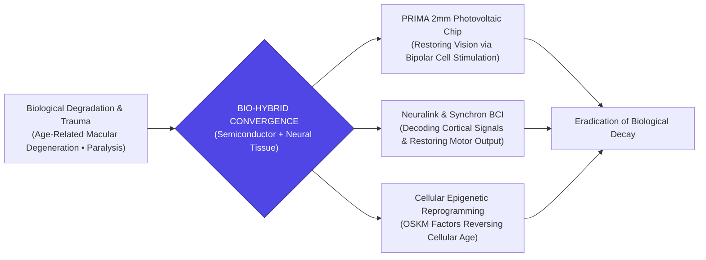

> **🎙️ 3-Presenter Authentic Tiki-Taka Script**
> 
> **Prof. Peter Kim:** Scholars, welcome to Session 7 of the Theurgicon. Throughout all of religious and mythological history, the most revered miracles were those of physical restoration: causing the blind to see, the lame to walk, and reversing bodily decay. Today, we demonstrate that these are no longer supernatural events; they are **electrical engineering and cellular reprogramming specifications**. *(Turn 1)*  
> **Dr. Elena Vance:** Professor Kim, the human body is fundamentally an electrochemical machine. When photoreceptors in the eye die from Macular Degeneration, or motor neurons in the spinal cord sever in an accident, the downstream neural wiring to the brain often remains **100% healthy and functional**! *(Turn 2)*  
> **TA Marcus Brody:** Look at the **PRIMA retinal microchip** developed by Science Corporation on Slide 1! It’s a 2-millimeter square piece of wireless photovoltaic silicon placed under the retina. It catches near-infrared light from smart glasses, stimulates the bipolar cells directly, and lets completely blind patients read books and see their grandchildren's faces again! *(Turn 3)*  
> **Prof. Peter Kim:** And alongside PRIMA, we have Neuralink restoring motor control to paralyzed patients, and Yamanaka OSKM factors reversing the epigenetic age of living mammalian cells! *(Turn 4)*  
> **TA Marcus Brody:** We are not just prescribing chemical pills to mask symptoms anymore; we are physically merging silicon microchips with biological neural tissue to build **Bio-Hybrid Humans**! *(Turn 5)*  
> **Dr. Elena Vance:** This is the convergence of semiconductors, optogenetics, and synthetic biology into a single restorative platform. *(Turn 6)*  
> **Prof. Peter Kim:** Let us examine the biological mortality ceiling and why exponential medicine dismantles it on Slide 2. *(Turn 7)*  
> **TA Marcus Brody:** Turn to Slide 2: The Biological Mortality Ceiling vs. Exponential Medicine! *(Turn 8)*  
> **Dr. Elena Vance:** Let’s examine the Hayflick limit and epigenetic noise! *(Turn 9)*  
> **Prof. Peter Kim:** Proceed to Slide 2. *(Turn 10)*

---

### Slide 02: The Biological Mortality Ceiling vs. Exponential Medicine
- **The Biological Bottleneck:**
  - *Hayflick Limit:* Human differentiated somatic cells can only divide $\approx 50\text{ to }70\text{ times}$ before entering senescent arrest (telomere exhaustion).
  - *Epigenetic Noise (David Sinclair):* Loss of chromatin structural integrity over decades leads to transcriptional chaos and cellular identity loss.
- **The Exponential Collision:** Modern biotechnology redefines aging not as a mystical fate, but as an **informational loss of cellular data** and a **materials fatigue problem** solvable through modular replacement and genetic resets.

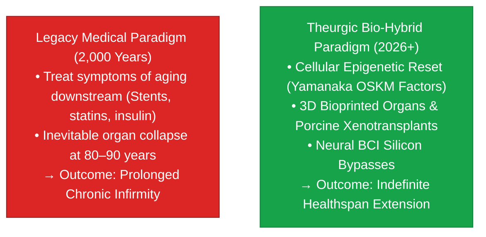

> **🎙️ 3-Presenter Authentic Tiki-Taka Script**
> 
> **Prof. Peter Kim:** Slide 2 contrasts the two great paradigms of human medicine: **Legacy Reactive Medicine versus Theurgic Bio-Hybrid Medicine**. Dr. Vance, what is the biological mortality ceiling? *(Turn 1)*  
> **Dr. Elena Vance:** For decades, biology taught that the **Hayflick Limit**—where human cells stop dividing after 50 to 70 cycles—and the accumulation of **epigenetic noise** were immutable biological laws. Traditional medicine accepted aging as an inevitable tragedy, focusing only on managing late-stage symptoms with stents, insulin, and statins. *(Turn 2)*  
> **TA Marcus Brody:** Look at the result of that legacy model in the red box: Prolonged chronic infirmity! Keeping an 85-year-old in a hospital bed with failing kidneys, failing eyes, and dementia! It’s heartbreaking and economically bankrupting! *(Turn 3)*  
> **Prof. Peter Kim:** But look at the green box on Slide 2: The **Theurgic Paradigm** redefines aging as an **informational corruption of cellular software and a mechanical materials fatigue problem**. *(Turn 4)*  
> **TA Marcus Brody:** If cellular aging is an informational glitch, you reset the software using Yamanaka factors! If an organ suffers mechanical fatigue, you swap in a 3D-bioprinted organ or a CRISPR-edited pig kidney! If neural wires break, you install a BCI silicon bypass! *(Turn 5)*  
> **Dr. Elena Vance:** We shift from reactive symptom management to **modular biological replacement and epigenetic rejuvenation**. *(Turn 6)*  
> **Prof. Peter Kim:** And nowhere is this clearer than in restoring sight to the blind through the PRIMA retinal chip. *(Turn 7)*  
> **TA Marcus Brody:** Let’s look at Engineering Sight for the Blind on Slide 3! *(Turn 8)*  
> **Dr. Elena Vance:** Turn to Slide 3: The Convergence of PRIMA & BCI! *(Turn 9)*  
> **Prof. Peter Kim:** Proceed to Slide 3. *(Turn 10)*

---

### Slide 03: Engineering Sight for the Blind: The Convergence of PRIMA & BCI
- **The Bionic Vision Breakthrough:**
  - Over **170 million people worldwide** suffer from Age-Related Macular Degeneration (AMD) and Retinitis Pigmentosa (RP).
  - *The Architectural Insight:* In AMD, the rod and cone photoreceptors die, but the underlying **retinal bipolar cells, ganglion cells, and the optic nerve cable to the visual cortex remain alive and intact**.
- **The PRIMA Silicon Bridge:** A 2mm wireless photovoltaic chip replaces the dead photoreceptors, receiving pulsed 850nm near-infrared beam projections from smart glasses and converting photons directly into electrical action potentials that the brain perceives as clear, high-contrast vision.


> **🎙️ 3-Presenter Authentic Tiki-Taka Script**
> 
> **TA Marcus Brody:** Look at the visual transmission chain on Slide 3! This is Science Corporation’s **PRIMA Retinal System**! Elena, explain why this system succeeds where previous bionic eyes failed! *(Turn 1)*  
> **Dr. Elena Vance:** Previous retinal implants required bulky external wires, battery cables running through the eye wall, and complex surgical anchoring. PRIMA is completely wireless! It is a **tiny 2-millimeter photovoltaic silicon square** that slips effortlessly beneath the retina in a simple 90-minute outpatient surgery! *(Turn 2)*  
> **TA Marcus Brody:** Look at how it works: The patient wears sleek smart glasses with a camera. The camera captures the world, an on-device AI processes the visual contrast, and a tiny laser beams pulsed **850-nanometer near-infrared light** into the eye! *(Turn 3)*  
> **Dr. Elena Vance:** The 378 micro-photodiodes on the PRIMA chip catch that infrared light, convert the photons into electrical voltage, and stimulate the healthy bipolar cells behind the dead photoreceptors! *(Turn 4)*  
> **Prof. Peter Kim:** The bipolar cells fire electrical spikes down the optic nerve into the visual cortex (V1), and the blind patient sees sharp letters, words, and faces in their central field of vision! *(Turn 5)*  
> **TA Marcus Brody:** Think about that! A 75-year-old grandmother who was legally blind for ten years puts on the glasses and reads a printed book on her lap! That is literal biblical restoration of sight through semiconductor physics! *(Turn 6)*  
> **Dr. Elena Vance:** It proves that biological sensory organs can be seamlessly replaced by solid-state optoelectronics. *(Turn 7)*  
> **Prof. Peter Kim:** But when we replace biological organs with synthetic silicon, how does that redefine human identity? *(Turn 8)*  
> **TA Marcus Brody:** That brings us to our core existential inquest on Slide 4! *(Turn 9)*  
> **Prof. Peter Kim:** Turn to Slide 4: How Bio-Hybrid Organs Redefine Human Nature. *(Turn 10)*

---

### Slide 04: The Core Existential Inquest: How Bio-Hybrid Organs Redefine Human Nature
- **The Core Existential Inquest:** *"When human vision, mobility, memory, and vital organs are augmented or replaced by synthetic silicon and genetically reprogrammed tissues, where does the boundary between natural biological humanity and technological creation reside?"*
- **The Three Ontological Inversions:**
  1. *The Ship of Theseus Inversion:* If we replace our failing retinas, kidneys, heart, and neural circuits with synthetic components, at what threshold does human biological identity transform into cyborg existence?
  2. *The Decoupling of Evolution from Natural Selection:* Human physiological capability is no longer dictated by Darwinian genetic mutation over millions of years, but by **hardware and firmware upgrade cycles**.
  3. *The Death of Biological Fate:* Blindness, paralysis, and aging cease to be inevitable human tragedies; they become **treatable engineering bugs**.

> **🎙️ 3-Presenter Authentic Tiki-Taka Script**
> 
> **Prof. Peter Kim:** Here is our foundational existential inquest for Session 7: **"When sight, mobility, vital organs, and cellular age are engineered through silicon chips and genetic resets, where does the boundary of human nature reside?"** Dr. Vance, dissect the Three Ontological Inversions on Slide 4. *(Turn 1)*  
> **Dr. Elena Vance:** Look at Inversion 1: **The Ship of Theseus**. In ancient philosophy, if you replace every wooden plank on a ship one by one, is it still the same ship? If we replace a human’s retinas with PRIMA chips, their kidneys with eGenesis pig organs, their joints with titanium, and their memory pathways with Neuralink BCI threads, at what point does biological humanity become a post-biological cyborg? *(Turn 2)*  
> **TA Marcus Brody:** And look at Inversion 2: **The Decoupling of Evolution from Darwinism**! For four billion years, biological evolution moved at the glacial pace of random genetic mutations. Today, human physiological evolution moves at the speed of **semiconductor firmware updates and CRISPR base-editing releases**! *(Turn 3)*  
> **Prof. Peter Kim:** And look at Inversion 3: **The Death of Biological Fate**. Blindness, paralysis, and dementia are no longer "tragic acts of God" to be accepted with stoic resignation; they are recognized as **mechanical and electrical engineering bugs to be debugged and fixed**! *(Turn 4)*  
> **TA Marcus Brody:** We are crossing from passive biological victims into sovereign biological architects! *(Turn 5)*  
> **Dr. Elena Vance:** We are upgrading our physical vessels to match our expanding cognitive potential. *(Turn 6)*  
> **Prof. Peter Kim:** Let us look at our pedagogical roadmap for mastering this bio-hybrid frontier. *(Turn 7)*  
> **TA Marcus Brody:** Turn to Slide 5 for our Session 7 roadmap! *(Turn 8)*  
> **Dr. Elena Vance:** From 2mm photovoltaic chips to 120-year healthspan! *(Turn 9)*  
> **Prof. Peter Kim:** Proceed to Slide 5. *(Turn 10)*

---

### Slide 05: Session 07 Pedagogical Roadmap: From 2mm Photovoltaic Chips to 120-Year Healthspan
- **Master Learning Architecture (Session 07):**
  - **Module 1 (Slides 01–05):** Civilizational Framing — Bio-Hybrid Convergence, The Mortality Ceiling, PRIMA Bionic Vision, and The Existential Inquest.
  - **Module 2 (Slides 06–15):** The Innovation Bus Deconstruction — Max Hodak & Science Corp, Retinal Degeneration Pathology, Yamanaka OSKM Factors, Sinclair’s Information Theory of Aging, Longevity Escape Velocity (LEV).
  - **Module 3 (Slides 16–25):** Systems Engineering & Biophysics — PRIMA 378-Pixel Photodiode Physics, BCI Channel Scaling, Optogenetics, 3D Bioprinting Scaffolds, CRISPR 69-Gene Xenotransplantation, LEV Math ($\frac{dL}{dt} > 1.0$).
  - **Module 4 (Slides 26–35):** Global Empirical Verification — 9 Clinical Case Studies (PRIMA Phase 3 38 Patients, Neuralink N1 Noland Arbaugh, Synchron Stentrode, Altos Labs $3B, eGenesis Pig Kidney, Intellia In Vivo CRISPR, ReGen Valley, $38T Healthspan Dividend).
  - **Module 5 (Slides 36–42):** Existential Paradoxes — The Dissolution of Mortality, Biological Aristocracy Risks, 100-Year Working Lifespans, Brain Hacking Privacy, Transhuman Cyborg Enhancement.
  - **Module 6 (Slides 43–45):** Socratic Debates & The Bio-Hybrid Venture Architecture Protocol.

> **🎙️ 3-Presenter Authentic Tiki-Taka Script**
> 
> **Dr. Elena Vance:** Slide 5 presents our comprehensive pedagogical roadmap for Session 7. We systematically connect sub-cellular biophysics, optoelectronic retinal implants, and clinical longevity escape velocity across six modules. *(Turn 1)*  
> **TA Marcus Brody:** In Module 2, we will tear through Chapter 5 of *We Are as Gods*: Max Hodak founding Science Corporation, Shinya Yamanaka’s Nobel Prize-winning OSKM factors, and David Sinclair’s Information Theory of Aging! *(Turn 2)*  
> **Prof. Peter Kim:** In Module 3, we dive deep into the biophysics: 378 micro-photodiode pixel arrays, near-infrared 850nm energy harvesting, 69-gene multiplex CRISPR editing for pig kidney xenotransplantation, and the exact differential equation for Longevity Escape Velocity ($\frac{dL}{dt} > 1.0$)! *(Turn 3)*  
> **TA Marcus Brody:** And in Module 4, we examine nine massive clinical case studies: from 38 blind patients reading books in PRIMA Phase 3 trials, to Noland Arbaugh controlling a laptop with his mind via Neuralink! *(Turn 4)*  
> **Dr. Elena Vance:** In Module 5, we confront the profound societal questions: the dissolution of mortality, brain hacking privacy, and how a 10-year healthspan extension adds **$38 Trillion annually to the global economy**! *(Turn 5)*  
> **TA Marcus Brody:** And in Module 6, every student will architect a **Bio-Hybrid Venture Blueprint**, designing a deep-tech company that solves an incurable biological disease! *(Turn 6)*  
> **Prof. Peter Kim:** Let us step into Module 2 and deconstruct Chapter 5 of Diamandis and Kotler! *(Turn 7)*  
> **Dr. Elena Vance:** Turn to Slide 6: Deconstructing Chapter 5: "The Innovation Bus" & Bio-Convergence! *(Turn 8)*  
> **TA Marcus Brody:** Let’s dive into Slide 6! *(Turn 9)*  
> **Prof. Peter Kim:** Proceed to Module 2: Primary Text Deconstruction! *(Turn 10)*


---

## Module 2: Primary Text Deconstruction: The Innovation Bus (Slides 06–15)

### Slide 06: Deconstructing Chapter 5: "The Innovation Bus" & Bio-Convergence
- **Primary Source Analysis:** Peter H. Diamandis & Steven Kotler, *We Are as Gods* (2026), Chapter 5 (*The Innovation Bus*).
- **The "Innovation Bus" Metaphor:**
  - Technological acceleration does not operate as isolated, solitary passenger cars; it operates as an **interconnected transit system (The Innovation Bus)** where foundational breakthroughs in micro-lithography, optoelectronics, AI computer vision, and gene therapy arrive at the exact same bio-medical station simultaneously.
- **The Teleological Climax:** When these separate exponential vectors board the same chassis, they transform incurable biological blindness, paralysis, and organ failure into solvable engineering problems.

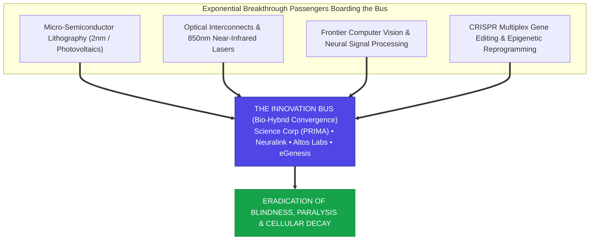

> **🎙️ 3-Presenter Authentic Tiki-Taka Script**
> 
> **Prof. Peter Kim:** Let us deconstruct Chapter 5 of *We Are as Gods*. Dr. Vance, explain Diamandis and Kotler’s central metaphor: **"The Innovation Bus."** *(Turn 1)*  
> **Dr. Elena Vance:** For centuries, medical progress was slow because each scientific field operated in complete isolation: an eye doctor didn't talk to a semiconductor engineer; a geneticist didn't talk to an optical physicist. The **Innovation Bus** represents the convergence where all of these exponential vectors arrive at the exact same station at the exact same time! *(Turn 2)*  
> **TA Marcus Brody:** Look at the passengers boarding the bus on Slide 6: Ultra-precise semiconductor lithography, near-infrared laser projectors, AI computer vision models, and CRISPR gene editing! When they all board the same chassis, you get **Science Corporation’s PRIMA bionic eye and Neuralink’s brain-computer interface**! *(Turn 3)*  
> **Prof. Peter Kim:** None of these bio-hybrid miracles could exist without all four passengers working in perfect harmony. *(Turn 4)*  
> **TA Marcus Brody:** If you only have the 2mm silicon chip but no computer vision AI, you can't process the image; if you have the AI but no wireless photovoltaic harvesting, you have to run dangerous battery wires into the eye! All four exponential vectors had to mature simultaneously! *(Turn 5)*  
> **Dr. Elena Vance:** That is why technological breakthroughs appear suddenly in clusters. *(Turn 6)*  
> **Prof. Peter Kim:** And the pioneer driving this bio-hybrid bus is Max Hodak. *(Turn 7)*  
> **TA Marcus Brody:** Let’s examine Max Hodak and Science Corporation on Slide 7! *(Turn 8)*  
> **Dr. Elena Vance:** Turn to Slide 7: Max Hodak & The Science Corporation Bio-Hybrid Paradigm! *(Turn 9)*  
> **Prof. Peter Kim:** Proceed to Slide 7. *(Turn 10)*

---

### Slide 07: Max Hodak & The Science Corporation Bio-Hybrid Paradigm
- **The Founder & Pioneer Profile:**
  - *Max Hodak:* Former Co-Founder and President of **Neuralink**; founder and CEO of **Science Corporation** (2021–2026).
  - *The Paradigm Escalation:* Moving beyond traditional mechanical electrode arrays (which cause glial scar tissue and immune rejection) into **Bio-Hybrid Optoelectronic & Photovoltaic Interfaces**.
- **The Science Corp Philosophy:**
  - *"Biology is malleable. When natural evolution leaves a sensory or neural gap, we do not surrender to biological tragedy; we engineer a solid-state bio-hybrid bridge that restores function seamlessly."*

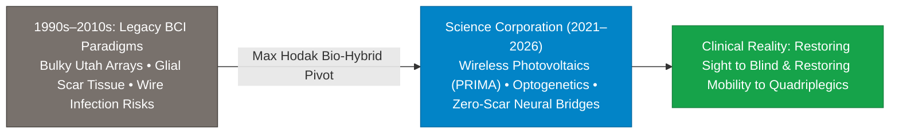

> **🎙️ 3-Presenter Authentic Tiki-Taka Script**
> 
> **Prof. Peter Kim:** Slide 7 introduces one of the most brilliant deep-tech entrepreneurs of our generation: **Max Hodak**. Dr. Vance, what makes Hodak’s approach at Science Corporation so revolutionary? *(Turn 1)*  
> **Dr. Elena Vance:** Max Hodak co-founded Neuralink with Elon Musk, pioneering flexible thin-film neural threads. But in 2021, he realized that mechanical penetrating electrodes alone have biological limits: over time, the brain's immune system forms **glial scar tissue** around stiff metal wires, degrading the signal. *(Turn 2)*  
> **TA Marcus Brody:** So Hodak founded **Science Corporation** to build **Bio-Hybrid Interfaces**! Instead of stabbing stiff metal needles into delicate neural tissue, Science Corp uses **wireless photovoltaic silicon, optogenetics, and focused light**! *(Turn 3)*  
> **Prof. Peter Kim:** Look at their flagship platform: **PRIMA**. By acquiring Pixium Vision's core photovoltaic technology and integrating it with modern AI computer vision, Science Corp created a zero-wire subretinal implant that communicates with the brain via light pulses! *(Turn 4)*  
> **TA Marcus Brody:** Read their founding philosophy on Slide 7: **"Biology is malleable. When natural evolution leaves a gap, we engineer a solid-state bio-hybrid bridge!"** *(Turn 5)*  
> **Dr. Elena Vance:** It represents a permanent philosophical shift: We no longer treat biological decay as an incurable tragedy; we treat it as an interface protocol mismatch to be resolved. *(Turn 6)*  
> **Prof. Peter Kim:** Let us examine the specific cellular pathology that PRIMA heals: Retinal Degeneration on Slide 8. *(Turn 7)*  
> **TA Marcus Brody:** Turn to Slide 8: The Pathology of Retinal Degeneration! *(Turn 8)*  
> **Dr. Elena Vance:** Let’s examine AMD, Retinitis Pigmentosa, and Photoreceptor Death! *(Turn 9)*  
> **Prof. Peter Kim:** Proceed to Slide 8. *(Turn 10)*

---

### Slide 08: The Pathology of Retinal Degeneration: AMD, RP, and Photoreceptor Death
- **The Cellular Breakdown of Vision:**
  - *Age-Related Macular Degeneration (AMD):* Geographic atrophy of the central macula, destroying the dense mosaic of cone photoreceptors responsible for high-acuity reading and facial recognition.
  - *Retinitis Pigmentosa (RP):* Hereditary genetic degradation of rod photoreceptors, leading to progressive tunnel vision and total central blindness.
- **The Retinal Wiring Invariant:**
  - While the outer photoreceptor layer (rods and cones) degrades and dies, the **inner retinal circuitry (bipolar cells, horizontal cells, amacrine cells, and retinal ganglion cells)** remains **$>80\%$ structurally intact and biologically receptive to electrical stimulation**.

```mermaid
flowchart TD
    subgraph Degraded Outer Retina (Dead Layer)
        Rods["Dead / Atrophied Rod Photoreceptors"] ~~~ Cones["Dead / Atrophied Cone Photoreceptors"]
    end
    
    subgraph INTACT INNER RETINAL CIRCUITRY (>80% Functional Wiring)
        PRIMA["[PRIMA 2mm Photovoltaic Silicon Chip Placed Here]"]
        Bipolar["Healthy Bipolar Interneurons"]
        Ganglion["Healthy Retinal Ganglion Cells"]
        Optic["Intact Optic Nerve Trunk (1.2 Million Axons)"]
        PRIMA --> Bipolar --> Ganglion --> Optic
    end
    Degraded Outer Retina (Dead Layer) -.->|Replaced by| PRIMA
    Optic ==> VisualCortex["Visual Cortex (V1) in Occipital Lobe &rarr; Clear Vision Restored"]
    style PRIMA fill:#0284c7,stroke:#0369a1,color:#fff
    style VisualCortex fill:#16a34a,stroke:#15803d,color:#fff
```

> **🎙️ 3-Presenter Authentic Tiki-Taka Script**
> 
> **Prof. Peter Kim:** Slide 8 reveals the anatomical and neurobiological secret that makes bionic vision possible: **The Retinal Wiring Invariant**. Dr. Vance, walk us through the cellular architecture of the retina. *(Turn 1)*  
> **Dr. Elena Vance:** The human retina has three primary functional layers: The outer layer contains 120 million rod and cone photoreceptors that catch photons. The middle layer contains **bipolar interneurons**. And the inner layer contains **retinal ganglion cells** whose axons form the optic nerve carrying signals to the visual cortex in the brain. *(Turn 2)*  
> **TA Marcus Brody:** In diseases like Macular Degeneration (AMD) and Retinitis Pigmentosa (RP), the photoreceptor cells wither away and die, causing total blindness. But look at the green box in the diagram: The underlying **bipolar cells, ganglion cells, and the optic nerve cable remain over 80% healthy and alive**! *(Turn 3)*  
> **Prof. Peter Kim:** The biological camera sensor is broken, but the biological television cable to the brain is 100% intact! *(Turn 4)*  
> **TA Marcus Brody:** So all you have to do is remove the dead photoreceptors, slide a 2mm microchip under the retina, and let the microchip send the electrical pulses to the bipolar cells! *(Turn 5)*  
> **Dr. Elena Vance:** Exactly. The microchip acts as an artificial synthetic photoreceptor layer, hijacking the intact biological optic nerve to deliver vision to the visual cortex. *(Turn 6)*  
> **Prof. Peter Kim:** It is a breathtaking biological bypass. *(Turn 7)*  
> **TA Marcus Brody:** Let’s examine the detailed hardware architecture of the PRIMA chip on Slide 9! *(Turn 8)*  
> **Dr. Elena Vance:** Turn to Slide 9: The PRIMA System Architecture! *(Turn 9)*  
> **Prof. Peter Kim:** Proceed to Slide 9. *(Turn 10)*

---

### Slide 09: The PRIMA System Architecture: 2mm Wireless Photovoltaic Implants
- **The PRIMA Hardware Specifications (Science Corporation / Pixium):**
  - *Form Factor:* **$2.0\text{mm} \times 2.0\text{mm} \times 30\mu\text{m}$** wireless silicon photovoltaic tile (Thinner than a single human red blood cell diameter).
  - *Electrode Density:* **378 independent micro-photodiode pixel units** ($100\mu\text{m}$ pitch), each equipped with a central platinum-iridium stimulation electrode and surrounding return ground ring.
  - *Power & Data Coupling:* **100% Wireless**. Powered exclusively by pulsed **850nm Near-Infrared (NIR) light**, generating local electrical currents ($0.5\text{ to } 2.5\text{ V}$) directly at the cell membrane with **zero internal batteries or trans-scleral wires**.

```mermaid
flowchart LR
    A["External Smart Glasses<br/>• HD Scene Camera<br/>• Edge AI Contrast Engine<br/>• 850nm NIR Pulsed Projector"] -->|Wireless Optical Beam (850nm)| B["Subretinal PRIMA Chip<br/>(2mm x 2mm x 30&mu;m Silicon)<br/>378 Photodiode Pixels"]
    B -->|Local Action Potentials| C["Retinal Bipolar Interneurons"]
    C -->|Optic Nerve Action Potentials| D["Primary Visual Cortex (V1)<br/>High-Acuity Central Vision Restored"]
    style A fill:#4f46e5,stroke:#312e81,color:#fff
    style B fill:#0284c7,stroke:#0369a1,color:#fff
    style D fill:#16a34a,stroke:#15803d,color:#fff
```

> **🎙️ 3-Presenter Authentic Tiki-Taka Script**
> 
> **TA Marcus Brody:** Look at the hardware specs on Slide 9! This is the physical masterpiece: **The PRIMA Wireless Photovoltaic Microchip**! Elena, walk us through the dimensions of this chip! *(Turn 1)*  
> **Dr. Elena Vance:** It is a 2-millimeter by 2-millimeter square, and only **30 micrometers thick**—that is thinner than a single strand of fine human hair! On that tiny piece of silicon, engineers carved **378 independent micro-photodiode pixels**, each with its own central platinum-iridium stimulation electrode! *(Turn 2)*  
> **TA Marcus Brody:** And look at how it receives power: **Zero internal batteries! Zero wires running out of the eyeball!** The smart glasses beam pulsed near-infrared light at 850 nanometers straight into the pupil! *(Turn 3)*  
> **Dr. Elena Vance:** The photodiodes on the chip catch the infrared photons, generate an electrical current of 1 to 2 volts, and depolarize the bipolar cell membranes right above each pixel, firing action potentials into the brain! *(Turn 4)*  
> **Prof. Peter Kim:** Because it is completely wireless, the surgical implantation takes under 90 minutes, and the implant can remain stable inside the human eye for decades with zero tissue erosion. *(Turn 5)*  
> **TA Marcus Brody:** Patients who were completely blind in their central vision can sit at a table, read letters on a page, and play board games with their grandchildren! *(Turn 6)*  
> **Dr. Elena Vance:** Solid-state physics directly restoring human biological perception. *(Turn 7)*  
> **Prof. Peter Kim:** And while PRIMA restores sensory organs, Shinya Yamanaka’s OSKM factors are reversing cellular aging itself! *(Turn 8)*  
> **TA Marcus Brody:** Let’s look at Yamanaka’s 4 Transcription Factors on Slide 10! *(Turn 9)*  
> **Prof. Peter Kim:** Turn to Slide 10: Shinya Yamanaka’s 4 Transcription Factors (OSKM). *(Turn 10)*

---

### Slide 10: Shinya Yamanaka’s 4 Transcription Factors (OSKM) & Cellular Rejuvenation
- **The Nobel Prize Discovery (2006 / 2012 Nobel Prize in Medicine):**
  - Shinya Yamanaka demonstrated that introducing four transcription factor proteins—**Oct4, Sox2, Klf4, and c-Myc (OSKM)**—reprograms mature, differentiated adult somatic cells back into youthful, pluripotent stem cells (iPSCs).
- **The Partial Reprogramming Revolution (David Sinclair / Juan Carlos Izpisua Belmonte):**
  - *Transient OSKM Expression (Pulse Therapy):* Expressing OSK factors for short pulses resets the cell’s **epigenetic methylation clock back to youth without erasing cellular identity** (a mature retinal ganglion cell stays a retinal cell, but becomes biologically 20 years younger).

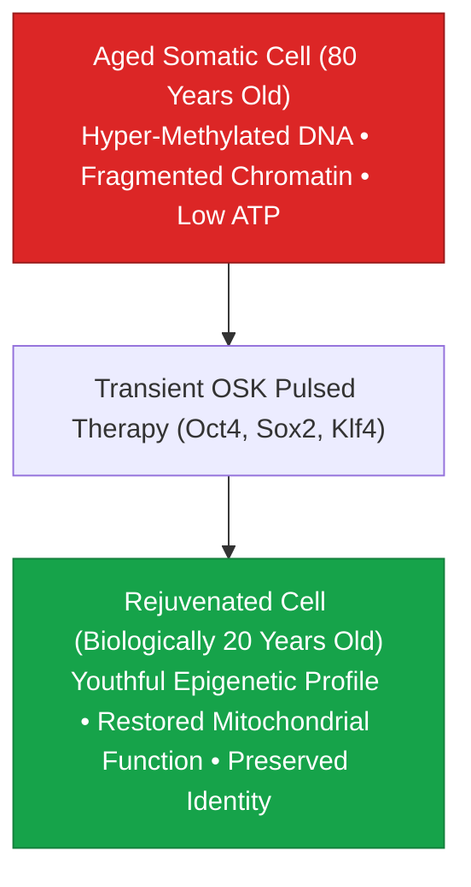

> **🎙️ 3-Presenter Authentic Tiki-Taka Script**
> 
> **Prof. Peter Kim:** Slide 10 brings us to the molecular cornerstone of modern longevity science: **Shinya Yamanaka’s 4 Transcription Factors (OSKM)**. Dr. Vance, why was Yamanaka’s 2006 discovery awarded the Nobel Prize in Medicine? *(Turn 1)*  
> **Dr. Elena Vance:** Because for 100 years, developmental biology believed that cellular differentiation was a permanent, one-way street: once an embryonic stem cell became an adult skin cell or nerve cell, it was permanently locked in that state until it died. Yamanaka proved that by introducing just four transcription factors—**Oct4, Sox2, Klf4, and c-Myc**—you can run the biological clock completely in reverse! *(Turn 2)*  
> **TA Marcus Brody:** But if you run the clock all the way back to zero, the skin cell turns into an embryonic stem cell, losing its identity and causing teratoma tumors! So scientists like David Sinclair and Juan Carlos Izpisua Belmonte developed **Partial Reprogramming (Pulsed OSK Therapy)**! *(Turn 3)*  
> **Dr. Elena Vance:** Look at the flowchart: You pulse the OSK factors for a few days. The cell strips away old DNA methylation tags and restores its youthful mitochondrial energy production, **becoming biologically twenty years younger while retaining 100% of its mature cellular identity**! *(Turn 4)*  
> **Prof. Peter Kim:** An 80-year-old optic nerve or heart muscle cell is restored to the molecular health and metabolic vitality of a 20-year-old cell. *(Turn 5)*  
> **TA Marcus Brody:** That proves that aging is not an irreversible physical decay; aging is an epigenetic software state that can be reset! *(Turn 6)*  
> **Dr. Elena Vance:** Which leads directly to David Sinclair’s Information Theory of Aging. *(Turn 7)*  
> **Prof. Peter Kim:** Let’s examine Sinclair’s Information Theory on Slide 11. *(Turn 8)*  
> **TA Marcus Brody:** Turn to Slide 11: Epigenetic Noise Breakdown! *(Turn 9)*  
> **Prof. Peter Kim:** Proceed to Slide 11. *(Turn 10)*

---

### Slide 11: David Sinclair’s Information Theory of Aging: Epigenetic Noise Breakdown
- **The Information Theory of Aging (ITM / Claude Shannon applied to Biology):**
  - *The Digital Genome:* DNA base pairs ($\text{A, T, C, G}$) represent digital information that remains remarkably stable and undamaged across a lifetime ($>99.9\%$ intact).
  - *The Analogue Epigenome:* The reader mechanism (histone marks, DNA methylation) that tells a neuron to be a neuron and a liver cell to be a liver cell is **analogue**.
  - *Aging as Epigenetic Noise:* Over decades, DNA double-strand breaks recruit epigenetic factors (Sirtuins, PARP1) away from their posts, creating **epigenetic noise**—cells forget their functional identity.
- **The Reset Axiom:** Because the underlying digital genome is intact, introducing OSK factors acts as a **system reboot**, restoring the original analogue epigenetic software from the pristine digital DNA backup.

> **🎙️ 3-Presenter Authentic Tiki-Taka Script**
> 
> **Prof. Peter Kim:** Slide 11 presents Harvard geneticist David Sinclair’s landmark thesis: **The Information Theory of Aging**. Dr. Vance, explain why Sinclair frames aging through Claude Shannon's information theory. *(Turn 1)*  
> **Dr. Elena Vance:** Look at the brilliant distinction between the genome and the epigenome: Your **Genome (DNA)** is digital code ($\text{A, T, C, G}$). Even when you are 90 years old, your digital DNA is over **99.9% pristine and intact** inside almost every cell in your body! *(Turn 2)*  
> **TA Marcus Brody:** But your **Epigenome**—the chemical methylation tags and histone spools that tell a skin cell to act like skin and a liver cell to act like liver—is **analogue**! Over decades of environmental stress and radiation, repair proteins get distracted, creating **Epigenetic Noise**! *(Turn 3)*  
> **Dr. Elena Vance:** The cells don't die because their DNA is broken; the cells age because they get confused and forget which genes to turn on and off! It’s like a scratched compact disc where the laser can't read the pristine digital music underneath! *(Turn 4)*  
> **Prof. Peter Kim:** And what do Yamanaka OSK factors do? They polish the scratch off the CD! They wipe away the epigenetic noise and allow the cell to re-read its original, pristine digital DNA instructions! *(Turn 5)*  
> **TA Marcus Brody:** Aging is not hardware destruction; aging is a corrupted software registry that can be fixed with a clean reboot! *(Turn 6)*  
> **Dr. Elena Vance:** That is why Peter Diamandis declares that Healthspan is being permanently decoupled from Lifespan. *(Turn 7)*  
> **Prof. Peter Kim:** Let’s examine Diamandis’s Healthspan Axiom on Slide 12. *(Turn 8)*  
> **TA Marcus Brody:** Turn to Slide 12: Healthspan Decoupled from Lifespan! *(Turn 9)*  
> **Prof. Peter Kim:** Proceed to Slide 12. *(Turn 10)*

---

### Slide 12: Peter Diamandis’s Axiom: Healthspan Decoupled from Lifespan
- **The Decoupling Axiom:**
  - *Lifespan:* The total chronological duration of biological survival (Years lived).
  - *Healthspan:* The period of life spent in peak physiological, cognitive, and cardiovascular vitality, free from chronic debilitating disease.
- **The Rectangularization of the Survival Curve:**
  - Traditional medicine produces a slow, agonizing 30-year physical decline ($60 \to 90\text{ years}$).
  - Exponential regenerative medicine **"rectangularizes" the curve**: maintaining 25-year-old physiological vitality until age 100+, followed by rapid, peaceful physiological termination or ongoing rejuvenation.

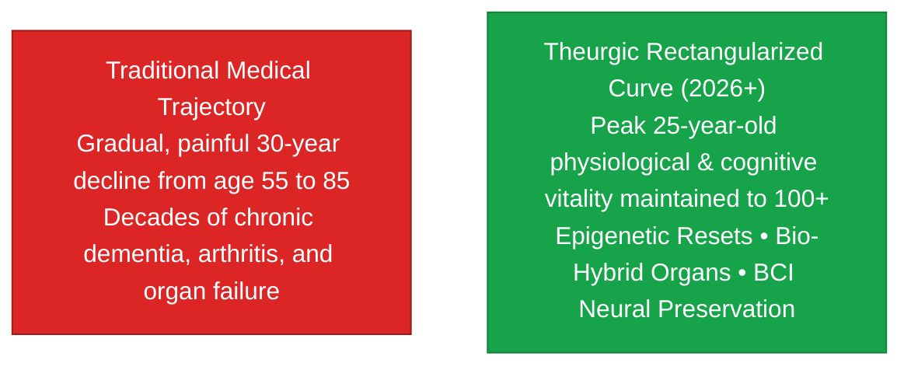

> **🎙️ 3-Presenter Authentic Tiki-Taka Script**
> 
> **TA Marcus Brody:** Look at the visual comparison on Slide 12! This is Peter Diamandis’s core crusade: **Decoupling Healthspan from Lifespan**! Elena, explain the difference between the red curve and the green curve! *(Turn 1)*  
> **Dr. Elena Vance:** Look at the red curve: Traditional medicine keeps people alive chronologically, but subjects them to a grueling, painful 30-year downward slide of arthritis, dementia, cardiovascular fatigue, and immobility. Nobody wants to live to 95 if the last twenty years are spent in a nursing home bed! *(Turn 2)*  
> **TA Marcus Brody:** But look at the green **Rectangularized Curve**! Theurgic regenerative medicine maintains **peak 25-year-old biological vitality, cardiovascular fitness, and sharp cognitive function until age 100 and beyond**! *(Turn 3)*  
> **Prof. Peter Kim:** You live with the stamina, eyesight, muscle tone, and mental sharpness of a young adult, and then experience a rapid, painless biological transition. *(Turn 4)*  
> **TA Marcus Brody:** It’s not about adding miserable years to the end of your life; it’s about adding vibrant, youthful life to all of your years! *(Turn 5)*  
> **Dr. Elena Vance:** And once healthspan compounds faster than calendar time, humanity reaches Longevity Escape Velocity! *(Turn 6)*  
> **Prof. Peter Kim:** Let’s examine Steven Kotler on Longevity Escape Velocity on Slide 13. *(Turn 7)*  
> **TA Marcus Brody:** Turn to Slide 13: Longevity Escape Velocity (LEV)! *(Turn 8)*  
> **Dr. Elena Vance:** Let’s see how science adds more than one year of life per year! *(Turn 9)*  
> **Prof. Peter Kim:** Proceed to Slide 13. *(Turn 10)*

---

### Slide 13: Steven Kotler on Longevity Escape Velocity (LEV)
- **The Concept of Longevity Escape Velocity (LEV - Ray Kurzweil / Aubrey de Grey):**
  - The threshold where for every year you remain alive, exponential medical science extends your remaining healthy life expectancy by **more than twelve months ($\frac{dL}{dt} > 1.0$)**.
- **The Historical vs. Theurgic Acceleration:**
  - 1900–2000: Clean water and antibiotics added $\approx 0.2\text{ years of life}$ per year lived.
  - 2026+: AI drug design, CRISPR in vivo editing, and partial reprogramming push LEV trajectory past **1.0 years/year**, crossing the mathematical horizon to indefinite biological survival.

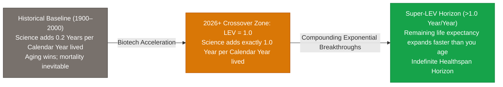

> **🎙️ 3-Presenter Authentic Tiki-Taka Script**
> 
> **Prof. Peter Kim:** Slide 13 presents the most thrilling mathematical concept in modern biotechnology: **Longevity Escape Velocity (LEV)**. Dr. Vance, explain the mathematical condition for LEV. *(Turn 1)*  
> **Dr. Elena Vance:** Look at the ratio: $\frac{dL}{dt} > 1.0$. Throughout the 20th century, public sanitation and vaccines added about 0.2 years of life expectancy for every calendar year that passed. Aging was still catching up with you faster than science could heal you. *(Turn 2)*  
> **TA Marcus Brody:** But look at the green box: **Longevity Escape Velocity** is the magical crossover point where for every calendar year you stay alive, biotechnology advances fast enough to extend your remaining healthy lifespan by **MORE than twelve months**! *(Turn 3)*  
> **Prof. Peter Kim:** If you are 60 years old today, and science extends your life to 80; and during those 20 years, AI and cellular reprogramming extend your life to 110; and during those 30 years, modular bio-hybrid organs extend your life to 150, you have crossed the escape velocity horizon! *(Turn 4)*  
> **TA Marcus Brody:** You are staying ahead of the reaper! Your remaining biological runway expands faster than the clock is ticking! *(Turn 5)*  
> **Dr. Elena Vance:** That means the first human being who will live to be 150 years old in full youthful vigor is likely walking among us today. *(Turn 6)*  
> **Prof. Peter Kim:** And if a specific organ fails along the way, we simply replace it modally! *(Turn 7)*  
> **TA Marcus Brody:** Look at Slide 14: From Organ Maintenance to Modular Replacement! *(Turn 8)*  
> **Dr. Elena Vance:** Turn to Slide 14! *(Turn 9)*  
> **Prof. Peter Kim:** Proceed to Slide 14. *(Turn 10)*

---

### Slide 14: The Paradigm Shift: From Organ Maintenance to Modular Replacement
- **The Automotive Analogy of Human Physiology:**
  - A 1965 classic Ford Mustang can run flawlessly for 100+ years if you periodically replace the alternator, rebuild the carburetor, swap the transmission, and flush the fluids.
  - Human organs (kidneys, liver, heart, lungs, cornea) are biological components subject to mechanical wear and microvascular calcification.
- **The Modular Replacement Arsenal (2026):**
  1. *CRISPR-Edited Porcine Xenotransplants (eGenesis, Revivicor):* Humanized pig organs with 69 genetic edits to eliminate retroviruses and hyperacute rejection.
  2. *Vascularized 3D Bioprinting (Organovo, 3D Systems):* Patient-derived iPSCs printed into collagen scaffolds with functional capillary beds.
  3. *Bio-Artificial Mechanical Organs:* Implantable silicon-nanopore bioreactor kidneys.

> **🎙️ 3-Presenter Authentic Tiki-Taka Script**
> 
> **TA Marcus Brody:** Slide 14 brings us to the ultimate engineering analogy of human biology: **The Vintage Car Paradigm**! Elena, explain why a 1965 Mustang can run forever, while an 80-year-old human body historically broke down. *(Turn 1)*  
> **Dr. Elena Vance:** If you take care of a 1965 Ford Mustang, you don't throw the car away when the water pump fails; you unbolt the old water pump and bolt in a brand-new one! If the transmission wears out, you swap the transmission! The car runs for 100 years because its parts are **modular and replaceable**. *(Turn 2)*  
> **Prof. Peter Kim:** For 10,000 years, human organs were irreplaceable. If your kidneys failed from diabetes or your heart valves calcified, you died. But in 2026, human biology has become modular! *(Turn 3)*  
> **TA Marcus Brody:** Look at the three pillars in the arsenal: eGenesis uses CRISPR with 69 genetic edits to create **humanized pig kidneys** that your immune system accepts as your own! 3D bioprinters print living liver tissue from your own stem cells! And silicon nanopore chips create implantable bio-artificial kidneys! *(Turn 4)*  
> **Dr. Elena Vance:** When an organ suffers mechanical fatigue, you swap it out with a fresh replacement with zero waitlists on donor transplant registries. *(Turn 5)*  
> **Prof. Peter Kim:** Human survival is decoupled from single-organ failure. *(Turn 6)*  
> **TA Marcus Brody:** Let’s summarize the entire 5-pillar regenerative landscape on Slide 15! *(Turn 7)*  
> **Dr. Elena Vance:** Turn to Slide 15: The Grand 5-Pillar Matrix! *(Turn 8)*  
> **Prof. Peter Kim:** Proceed to Slide 15. *(Turn 9)*  
> **TA Marcus Brody:** The ultimate bio-hybrid scoreboard! *(Turn 10)*

---

### Slide 15: The Grand 5-Pillar Regenerative & Bio-Hybrid Technology Matrix
- **Master Technological Matrix:** Comprehensive synthesis of the 5 pillars dismantling human biological decay.

| Pillar | Biological Target | Primary Engineering Mechanism | Vanguard 2026 Benchmark | Human Liberation Outcome |
| :--- | :--- | :--- | :--- | :--- |
| **1. Bio-Hybrid Implants** | Sensory Neural Degeneration | Photovoltaic subretinal silicon (PRIMA) & BCI | Science Corp PRIMA Phase 3 Trial | **Restoration of vision to the blind** |
| **2. Epigenetic Rejuvenation**| Cellular Epigenetic Noise | Pulsed Yamanaka OSK factors in AAV vectors | Altos Labs / Retro Biosciences | **Epigenetic age reset without tumors** |
| **3. Xenotransplantation** | End-Stage Organ Failure | 69-gene multiplex CRISPR edited porcine organs| eGenesis Human Kidney Transplants | **Infinite supply of donor organs ($0 wait)**|
| **4. 3D Bioprinting** | Microvascular Tissue Deficits | Microfluidic stereolithography of autologous iPSC| Organovo / United Therapeutics | **Patient-matched zero-rejection tissues** |
| **5. Cortical Neural BCI** | Motor & Cognitive Paralysis | Flexible thin-film micro-electrodes (1,024ch) | Neuralink N1 Telepathy Implant | **Direct mind-control of digital universe** |

> **🎙️ 3-Presenter Authentic Tiki-Taka Script**
> 
> **Prof. Peter Kim:** Look at Slide 15, scholars. Five master pillars. Five impossible biological frontiers conquered by engineering. Marcus, walk us through the five rows. *(Turn 1)*  
> **TA Marcus Brody:** Pillar 1: PRIMA photovoltaic silicon restoring sight to the blind! Pillar 2: Altos Labs and pulsed Yamanaka factors resetting cellular age! Pillar 3: eGenesis 69-edit pig kidneys eliminating transplant waitlists forever! Pillar 4: 3D bioprinting patient-matched tissues! And Pillar 5: Neuralink giving paralyzed patients instant mind-control over computers! *(Turn 2)*  
> **Dr. Elena Vance:** Every row in this matrix represents an ancient biological tragedy transformed into a routine, scalable medical engineering procedure. *(Turn 3)*  
> **Prof. Peter Kim:** Biological decay is no longer an immutable destiny; biological decay is an engineering problem with five distinct solutions. *(Turn 4)*  
> **TA Marcus Brody:** And we can dive deep into the biophysics and circuits of these systems in Module 3! *(Turn 5)*  
> **Dr. Elena Vance:** Let’s examine the 378-photodiode biophysics of the PRIMA chip on Slide 16! *(Turn 6)*  
> **Prof. Peter Kim:** Proceed to Module 3: Exponential Frameworks & Systems Engineering! *(Turn 7)*  
> **TA Marcus Brody:** Turn to Slide 16! *(Turn 8)*  
> **Dr. Elena Vance:** Let’s look at the biophysics on Slide 16! *(Turn 9)*  
> **Prof. Peter Kim:** Proceed to Slide 16. *(Turn 10)*


---

## Module 3: Exponential Frameworks & Systems Engineering (Slides 16–25)

### Slide 16: The Biophysics of PRIMA: 378 Photodiode Pixel Electrodes
- **The Micro-Fabrication Topology:**
  - *Pixel Geometry:* Hexagonal tile layout ($100\mu\text{m}$ pitch) maximizing spatial packing density across a $2.0\text{mm} \times 2.0\text{mm}$ footprint.
  - *Electrode Structure:* Central active Platinum-Iridium (Pt-Ir) electrode ($30\mu\text{m}$ diameter) surrounded by a circumferential ground return ring, creating a **highly localized electric field gradient ($<150\mu\text{m}$ spread)**.
- **The Electrical Transfer Function:**
  $$V_{\text{out}}(t) = \frac{1}{C_{\text{diode}}} \int_0^t \left( I_{\text{photo}}(t) - I_{\text{leak}}(t) \right) dt$$
  Converts pulsed 850nm photons into biphasic charge-balanced electrical pulses ($0.5\text{ to } 2.5\text{ V}$) that safely depolarize adjacent bipolar interneurons without causing Faradaic tissue damage.


> **🎙️ 3-Presenter Authentic Tiki-Taka Script**
> 
> **Prof. Peter Kim:** Module 3 opens with the exact biophysical and electrical engineering of the PRIMA subretinal chip. Dr. Vance, walk us through the micro-fabrication topology on Slide 16. *(Turn 1)*  
> **Dr. Elena Vance:** The PRIMA chip uses a **hexagonal pixel layout with a 100-micrometer pitch**, packing 378 independent stimulation units into a 2mm by 2mm tile. At the center of each pixel is an active Platinum-Iridium electrode surrounded by a ground return ring. That return ring is crucial: it keeps the electrical field tightly focused within 150 micrometers so neighboring pixels don't cross-talk! *(Turn 2)*  
> **TA Marcus Brody:** Look at the calculus transfer function on the slide: $V_{\text{out}}(t) = \frac{1}{C_{\text{diode}}} \int (I_{\text{photo}} - I_{\text{leak}}) dt$! The photodiode integrates incoming infrared light pulses and outputs biphasic, charge-balanced electrical spikes! *(Turn 3)*  
> **Dr. Elena Vance:** Look at the charge injection: roughly **5 nanocoulombs per phase**. That injects just enough charge to shift the cell's transmembrane potential by **$+15\text{ millivolts}$**, crossing the threshold to fire an action potential into the bipolar dendrites without causing any electrochemical burn or tissue damage! *(Turn 4)*  
> **Prof. Peter Kim:** It is an exquisite balance of semiconductor physics and neurobiology. *(Turn 5)*  
> **TA Marcus Brody:** Light comes in from smart glasses, hits silicon, creates an electrical spike, and your living retinal neurons fire exactly as if real sunlight hit a living cone cell! *(Turn 6)*  
> **Dr. Elena Vance:** Let’s look at how the retinal bipolar cells process these action potentials on Slide 17. *(Turn 7)*  
> **Prof. Peter Kim:** Turn to Slide 17: Retinal Bipolar Cell Electrical Stimulation. *(Turn 8)*  
> **TA Marcus Brody:** Let’s see the action potentials fire! *(Turn 9)*  
> **Prof. Peter Kim:** Proceed to Slide 17. *(Turn 10)*

---

### Slide 17: Retinal Bipolar Cell Electrical Stimulation & Action Potential Generation
- **The Neurophysiological Stimulation Mechanics:**
  - *Resting Potential:* Retinal bipolar cells maintain a resting potential of **$\approx -40\text{ to } -50\text{ mV}$**.
  - *Electrode Depolarization:* The PRIMA capacitive pulse injects positive current into the extracellular subretinal space, driving the membrane potential past the **$-30\text{ mV}$ voltage-gated calcium channel ($\text{Ca}_v$) opening threshold**.
  - *Synaptic Glutamate Release:* Influx of $\text{Ca}^{2+}$ ions triggers neurotransmitter glutamate release onto retinal ganglion cells (RGCs).
- **The Cortical Signal Transfer:** RGC axons fire frequency-encoded action potential spike trains ($10\text{ to } 100\text{ Hz}$) along the optic nerve directly into the **lateral geniculate nucleus (LGN) and V1 visual cortex**.

> **🎙️ 3-Presenter Authentic Tiki-Taka Script**
> 
> **Prof. Peter Kim:** Slide 17 explains the neurophysiology: How does an electrical pulse from a silicon chip trigger natural neural signaling in the eye? Dr. Vance, walk us through the ion channel mechanics. *(Turn 1)*  
> **Dr. Elena Vance:** Retinal bipolar cells have a resting membrane potential around **$-45\text{ millivolts}$**. When the PRIMA electrode injects positive capacitive current into the extracellular fluid, it depolarizes the cell membrane past **$-30\text{ millivolts}$**, opening **voltage-gated calcium ($\text{Ca}_v$) channels**! *(Turn 2)*  
> **TA Marcus Brody:** Calcium rushes into the cell, which triggers the natural release of **glutamate neurotransmitter vesicles** across the synapse to the retinal ganglion cells! *(Turn 3)*  
> **Dr. Elena Vance:** The ganglion cells then fire standard frequency-encoded action potential spike trains—between **10 and 100 Hertz**—down the optic nerve into the brain's lateral geniculate nucleus (LGN) and Primary Visual Cortex (V1)! *(Turn 4)*  
> **Prof. Peter Kim:** The brain has no idea that the signal originated from a piece of silicon; the visual cortex interprets the spike trains as natural light patterns, constructing high-contrast visual perception in consciousness! *(Turn 5)*  
> **TA Marcus Brody:** The brain literally accepts the silicon microchip as an authentic, native biological sense organ! *(Turn 6)*  
> **Dr. Elena Vance:** That is the power of bio-hybrid architecture. *(Turn 7)*  
> **Prof. Peter Kim:** And why do we use 850nm Near-Infrared light instead of visible light? *(Turn 8)*  
> **TA Marcus Brody:** Look at Near-Infrared Projection on Slide 18! *(Turn 9)*  
> **Prof. Peter Kim:** Turn to Slide 18: 850nm NIR Projection & Photovoltaic Harvesting. *(Turn 10)*

---

### Slide 18: Near-Infrared (850nm NIR) Projection & Wireless Photovoltaic Energy Harvesting
- **The Optical Engineering Physics (850nm NIR vs. Visible Light):**
  - *Why Invisible 850nm NIR?* If visible light were projected into an AMD patient's eye at the energy density required to power a photovoltaic chip, it would dazzle any remaining peripheral vision and cause severe phototoxic thermal discomfort.
  - *The 850nm Advantage:* Near-infrared light is completely **invisible to human biological photoreceptors** ($>780\text{nm}$ cutoff), but perfectly matched to the **silicon bandgap energy ($E_g = 1.12\text{ eV}$)** for maximum photovoltaic conversion efficiency.
- **The Energy Harvesting Budget:**
  - Laser projection intensity: $<5\text{ mW/mm}^2$ (Well below the ocular maximum permissible exposure safety limit, ANSI Z136.1).
  - Generates $>1.5\text{V}$ open-circuit voltage per pixel, sufficient for robust charge injection.

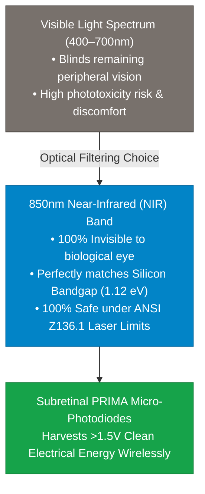

> **🎙️ 3-Presenter Authentic Tiki-Taka Script**
> 
> **TA Marcus Brody:** Slide 18 answers a question every student asks: *"Why do the smart glasses beam invisible Near-Infrared light (850nm) into the patient's eye instead of normal visible light?"* Elena, explain the optical physics! *(Turn 1)*  
> **Dr. Elena Vance:** Look at the flowchart: In Macular Degeneration, the patient lost their *central* vision, but they often still have partial *peripheral* vision. If you beamed bright visible light into their eye with enough power to run a microchip, you would completely blind and dazzle their remaining peripheral vision! *(Turn 2)*  
> **TA Marcus Brody:** But **850-nanometer Near-Infrared light is completely INVISIBLE to human rod and cone cells**! The patient's eye perceives complete darkness from the laser, so their peripheral vision works naturally without any glare! *(Turn 3)*  
> **Dr. Elena Vance:** Furthermore, 850nm photons have an energy of roughly 1.46 electron-volts, which is perfectly matched to the **silicon semiconductor bandgap energy ($E_g = 1.12\text{ eV}$)**, maximizing photovoltaic electrical conversion efficiency! *(Turn 4)*  
> **Prof. Peter Kim:** And look at the safety numbers: The laser intensity is kept under **5 milliwatts per square millimeter**, which is well below the ANSI ocular safety limits. *(Turn 5)*  
> **TA Marcus Brody:** You get maximum electrical power on the microchip, zero glare for the patient, and 100% ocular safety! That is brilliant optical engineering! *(Turn 6)*  
> **Dr. Elena Vance:** And just as retinal chips scale, Brain-Computer Interface (BCI) electrode channels are exploding on Slide 19. *(Turn 7)*  
> **Prof. Peter Kim:** Let’s examine the BCI Channel Scaling Law on Slide 19. *(Turn 8)*  
> **TA Marcus Brody:** Turn to Slide 19: From 100 to 100,000 Channels! *(Turn 9)*  
> **Prof. Peter Kim:** Proceed to Slide 19. *(Turn 10)*

---

### Slide 19: BCI Channel Scaling Law: From 100 to 1,024 to 100,000 Channels
- **The "Stevenson’s Law" of Neural Interfacing:**
  - *The BCI Channel Doubling Rate:* The number of simultaneously recorded and stimulated single neurons has doubled every **6.5 years** (analogous to Moore’s Law for neural recording).
- **The Historical Channel Scaling Trajectory:**
  - *2004 (Utah Array - Cyberkinetics):* **96 to 128 rigid channels** (Stiff silicon needles, infection risk, transcutaneous pedestal).
  - *2024 (Neuralink N1 Telepathy):* **1,024 flexible thin-film thread channels** across 64 threads ($5\mu\text{m}$ width), robotically inserted with micron precision.
  - *2026+ (Next-Gen Optogenetic & High-Density Neural Mesh):* **$>100,000\text{ to } 1,000,000\text{ Channels}$** (Enabling full-bandwidth bidirectional streaming of language, motor intention, and sensory qualia).

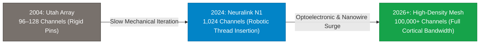

> **🎙️ 3-Presenter Authentic Tiki-Taka Script**
> 
> **Prof. Peter Kim:** Slide 19 presents the governing scaling law of neurotechnology: **Stevenson’s Law of Neural Interfacing**. Dr. Vance, trace the historical progression of BCI channel density. *(Turn 1)*  
> **Dr. Elena Vance:** In 2004, the state of the art was the **Utah Array**: 96 stiff silicon needles stamped into the motor cortex, attached to a bulky metal pedestal sticking through the patient's scalp. It recorded about 100 neurons and scarred the brain tissue. *(Turn 2)*  
> **TA Marcus Brody:** In 2024, **Neuralink’s N1 chip** jumped to **1,024 channels** distributed across 64 flexible polyimide threads—each thread thinner than a red blood cell ($5\mu\text{m}$)—sewn into the cortex by a surgical robot without rupturing a single capillary! *(Turn 3)*  
> **Prof. Peter Kim:** And in 2026 and beyond, we are scaling to **100,000 and 1,000,000 bidirectional channels** using high-density optogenetics and vascular stentrode meshes! *(Turn 4)*  
> **TA Marcus Brody:** With 100 channels, you can move a mouse cursor on a screen. With 1,000 channels, you can play Mario Kart with your thoughts! But with **100,000 channels**, you can stream complete visual dreams, sensory touch, and full telepathic thought directly between human minds! *(Turn 5)*  
> **Dr. Elena Vance:** We are building high-bandwidth broadband into human consciousness. *(Turn 6)*  
> **Prof. Peter Kim:** And to read neurons without physical wires, we turn to Optogenetics on Slide 20. *(Turn 7)*  
> **TA Marcus Brody:** Look at Slide 20: Optogenetics & Magneto-Acoustic Interrogation! *(Turn 8)*  
> **Dr. Elena Vance:** Turn to Slide 20! *(Turn 9)*  
> **Prof. Peter Kim:** Proceed to Slide 20. *(Turn 10)*

---

### Slide 20: Optogenetics & Non-Invasive Magneto-Acoustic Neural Interrogation
- **Optogenetic Neural Control (Ed Boyden / Karl Deisseroth):**
  - Delivers microbial opsin genes (Channelrhodopsin-2, ChR2, and Halorhodopsin) via AAV vectors into targeted neuronal populations, making specific brain circuits **light-sensitive**.
  - Blue light ($470\text{nm}$) triggers action potential firing; yellow light ($580\text{nm}$) hyperpolarizes and silences overactive circuits (e.g., stopping epileptic seizures in milliseconds).
- **Non-Invasive Magneto-Acoustic Interrogation:**
  - Employs focused ultrasound and genetically encoded magnetic nanoparticles to stimulate deep brain structures (thalamus, basal ganglia) **without opening the skull**.

> **🎙️ 3-Presenter Authentic Tiki-Taka Script**
> 
> **Prof. Peter Kim:** Slide 20 details the frontier of non-invasive and genetic neuro-modulation: **Optogenetics and Magneto-Acoustics**. Dr. Vance, explain how optogenetics turns brain cells into light-activated switches. *(Turn 1)*  
> **Dr. Elena Vance:** Developed by Ed Boyden and Karl Deisseroth at Stanford, **Optogenetics** uses safe adeno-associated viral vectors to insert light-sensitive opsin genes (like Channelrhodopsin) into specific neurons. When you shine a flash of blue light ($470\text{nm}$), the ion channel pops open and the neuron fires an action potential! *(Turn 2)*  
> **TA Marcus Brody:** And if a patient has Parkinson’s tremors or an epileptic seizure, you shine yellow light ($580\text{nm}$), which pumps chloride ions into the cells and instantly silences the hyperactive seizure circuit in three milliseconds! *(Turn 3)*  
> **Prof. Peter Kim:** And with focused ultrasound and magnetic nanoparticles, we can stimulate deep brain nuclei like the subthalamic nucleus **through the intact skull without a single incision**! *(Turn 4)*  
> **TA Marcus Brody:** No craniotomy, no brain surgery! Just precision acoustic beams and light pulses tuning neural circuits like a master musician tuning a violin! *(Turn 5)*  
> **Dr. Elena Vance:** That eliminates surgical infection risks while providing millisecond precision. *(Turn 6)*  
> **Prof. Peter Kim:** And to deliver these genetic codes, we rely on AAV viral vectors on Slide 21. *(Turn 7)*  
> **TA Marcus Brody:** Let’s examine AAV Viral Vector Gene Delivery on Slide 21! *(Turn 8)*  
> **Dr. Elena Vance:** Turn to Slide 21: The 6D Cost Deflation Curve! *(Turn 9)*  
> **Prof. Peter Kim:** Proceed to Slide 21. *(Turn 10)*

---

### Slide 21: AAV Viral Vector Gene Delivery: The 6D Cost Deflation Curve
- **The Genomic Delivery Mechanism:**
  - *Adeno-Associated Virus (AAV) Vectors:* Engineered non-pathogenic viral shells that deliver therapeutic DNA payloads (CRISPR machinery, Yamanaka OSK genes, opsins) directly into target organ cell nuclei.
- **The 6D Exponential Cost Deflation:**
  - *2015 Cost:* $1,000,000+ per patient dose (Custom bespoke academic bioreactors).
  - *2026 Cost:* **<$5,000 per therapeutic dose** (Driven by suspension bioreactors, AI capsid design, and continuous mRNA synthesis platforms — **$99.5\%$ cost deflation**).
- **The Democratization Endpoint:** In vivo gene therapy transitioning from an ultra-rare orphan drug luxury into an accessible, mass-market preventive health injection.

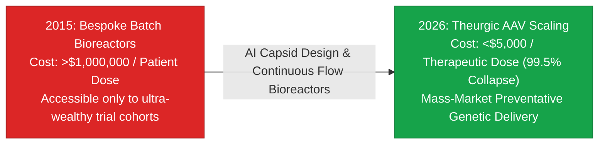

> **🎙️ 3-Presenter Authentic Tiki-Taka Script**
> 
> **TA Marcus Brody:** Look at the cost collapse on Slide 21! This is the 6D Framework applied to gene therapy: **The AAV Vector Deflation Curve**! Elena, quantify how fast gene delivery costs are dropping! *(Turn 1)*  
> **Dr. Elena Vance:** In 2015, manufacturing a single therapeutic dose of an Adeno-Associated Viral vector (AAV) cost **over one million dollars ($1,000,000)** because it required bespoke, manual lab bioreactors. Today in 2026, automated suspension bioreactors and AI capsid engineering have collapsed the cost to **under $5,000 per dose—a 99.5% price collapse**! *(Turn 2)*  
> **TA Marcus Brody:** Think about what that means for global healthcare! Gene therapy is no longer an ultra-expensive luxury reserved for billionaires in private Swiss clinics; it is becoming a mass-market preventative injection available at your local pharmacy! *(Turn 3)*  
> **Prof. Peter Kim:** You get a single injection that permanently cures sickle cell anemia, restores vision in hereditary retinal dystrophy, or resets the epigenetic age of your cardiovascular system. *(Turn 4)*  
> **TA Marcus Brody:** That is the democratization of genetic medicine! *(Turn 5)*  
> **Dr. Elena Vance:** And for replacing whole organs, 3D bioprinting provides patient-matched cellular scaffolds. *(Turn 6)*  
> **Prof. Peter Kim:** Let’s examine Vascularized 3D Bioprinting on Slide 22. *(Turn 7)*  
> **TA Marcus Brody:** Turn to Slide 22: Vascularized 3D Bioprinting & Organoid Scaffolding! *(Turn 8)*  
> **Dr. Elena Vance:** Let’s see organs printed from stem cells! *(Turn 9)*  
> **Prof. Peter Kim:** Proceed to Slide 22. *(Turn 10)*

---

### Slide 22: Vascularized 3D Bioprinting & Synthetic Organoid Scaffolding
- **The Microvascular Engineering Bottleneck:**
  - *The Oxygen Diffusion Limit ($200\mu\text{m}$):* Cells located $>200\mu\text{m}$ away from a functional blood capillary suffocate and die of hypoxic necrosis within hours.
  - *The Stereolithographic Solution:* Sub-micron laser multi-photon bioprinting weaves complex, branched micro-capillary vascular networks inside biocompatible hydrogel/collagen scaffolds.
- **The Autologous Stem Cell Pipeline:**
  - Patient skin biopsy $\to$ Reprogrammed into iPSCs $\to$ Differentiated into hepatocytes, cardiomyocytes, or nephrons $\to$ 3D bioprinted into functional organ lobes with **zero immune rejection risk**.

> **🎙️ 3-Presenter Authentic Tiki-Taka Script**
> 
> **Prof. Peter Kim:** Slide 22 addresses the holy grail of regenerative medicine: **Vascularized 3D Bioprinting of Whole Human Organs**. Dr. Vance, what was the major physical bottleneck that prevented bioprinting organs in the past? *(Turn 1)*  
> **Dr. Elena Vance:** It was the **Oxygen Diffusion Limit of 200 micrometers**. If you print a thick block of living muscle or liver cells, any cell deeper than 200 microns cannot receive oxygen or glucose from the surface fluid, so the center of the organ dies of hypoxic necrosis in hours! *(Turn 2)*  
> **TA Marcus Brody:** But modern **multi-photon laser bioprinters** can print microscopic, branched blood vessels—down to 5-micrometer capillary tubes—woven throughout a living collagen scaffold! *(Turn 3)*  
> **Dr. Elena Vance:** Look at the patient pipeline on Slide 22: We take a tiny skin biopsy from the patient, turn those cells into induced pluripotent stem cells (iPSCs), differentiate them into liver or heart cells, and bioprint a personalized organ lobe! *(Turn 4)*  
> **Prof. Peter Kim:** And because the cells are made from the patient's own genetic code, there is **zero risk of immune rejection and zero need for lifelong toxic immunosuppressant drugs**! *(Turn 5)*  
> **TA Marcus Brody:** Your body recognizes the printed organ as 100% your own! *(Turn 6)*  
> **Dr. Elena Vance:** And for immediate whole-organ transplants, CRISPR-edited porcine xenotransplantation is already saving lives on Slide 23. *(Turn 7)*  
> **Prof. Peter Kim:** Let’s examine Porcine Xenotransplantation on Slide 23. *(Turn 8)*  
> **TA Marcus Brody:** Turn to Slide 23: CRISPR 69-Gene Multiplex Editing! *(Turn 9)*  
> **Prof. Peter Kim:** Proceed to Slide 23. *(Turn 10)*

---

### Slide 23: CRISPR 69-Gene Multiplex Editing for Porcine Xenotransplantation
- **The Xenotransplantation Breakthrough (eGenesis / Church Lab):**
  - *The 3 Biological Barriers to Pig-to-Human Transplants:*
    1. **Hyperacute Immune Rejection:** Porcine glycan antigens ($\alpha\text{-Gal, Neu5Gc, Sda}$) trigger immediate human antibody attack.
    2. **Coagulation Incompatibility:** Blood clotting dysregulation in porcine vascular endothelium.
    3. **Endogenous Retroviruses (PERVs):** 50+ dormant porcine retroviral sequences embedded in the pig genome that could jump species to infect humans.
- **The 69-Gene Multiplex Solution:**
  - CRISPR-Cas9 base editors simultaneously knocked out **3 porcine glycan antigen genes**, inserted **7 human transgene regulators** (CD46, CD55, Thrombomodulin), and **inactivated all 59 PERV retroviral copies** in a single embryonic cell line.

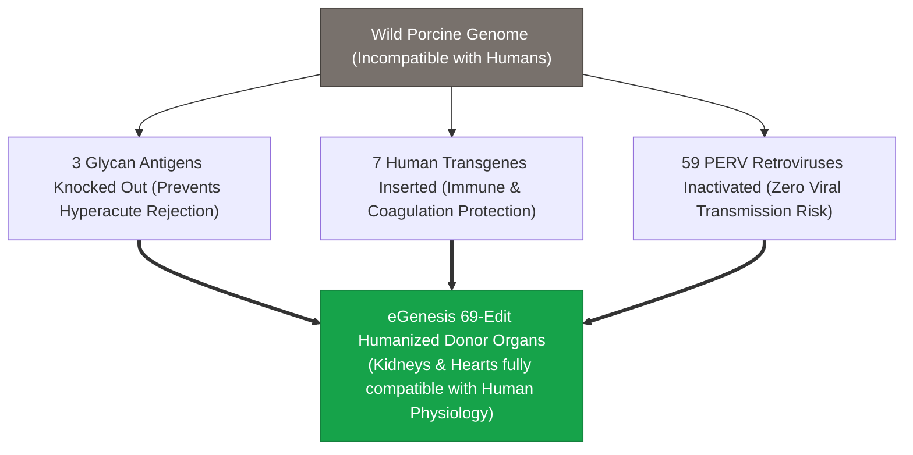

> **🎙️ 3-Presenter Authentic Tiki-Taka Script**
> 
> **TA Marcus Brody:** Look at the genetic engineering feat on Slide 23! **69 simultaneous CRISPR gene edits in a single animal genome**! Elena, explain why eGenesis had to edit 69 genes to make pig kidneys safe for humans! *(Turn 1)*  
> **Dr. Elena Vance:** Wild pig organs have three fatal biological barriers: First, pig cells are covered in three sugar molecules (like $\alpha\text{-Gal}$) that trigger immediate human hyperacute immune rejection. Second, human blood clots inside pig blood vessels. And third, the pig genome contains **59 dormant Porcine Endogenous Retroviruses (PERVs)** that could jump species and trigger a pandemic! *(Turn 2)*  
> **TA Marcus Brody:** So George Church and eGenesis used CRISPR base editors to knock out all 3 sugar genes, insert 7 protective human immune genes, and **inactivate all 59 retroviral sequences simultaneously**! *(Turn 3)*  
> **Prof. Peter Kim:** Think about the molecular precision: Editing 69 different genetic locations in a single embryonic cell, cloning that cell, and raising healthy, humanized pigs whose organs can be transplanted directly into human patients! *(Turn 4)*  
> **TA Marcus Brody:** This permanently obliterates the global donor organ shortage! In the US alone, 100,000 people sit on kidney transplant waitlists, and 17 die every day waiting for a deceased donor. With humanized organs, the waitlist becomes ZERO! *(Turn 5)*  
> **Dr. Elena Vance:** Every hospital can have a sterile, human-compatible donor organ available on-demand in 20 minutes. *(Turn 6)*  
> **Prof. Peter Kim:** And all of these technologies push humanity past Longevity Escape Velocity on Slide 24. *(Turn 7)*  
> **TA Marcus Brody:** Let’s examine the mathematical formulation of LEV on Slide 24! *(Turn 8)*  
> **Dr. Elena Vance:** Turn to Slide 24: $\frac{dL}{dt} > 1.0$! *(Turn 9)*  
> **Prof. Peter Kim:** Proceed to Slide 24. *(Turn 10)*

---

### Slide 24: Mathematical Formulation of Longevity Escape Velocity: $\frac{dL}{dt} > 1.0$
- **The Differential Calculus of Longevity:**
  $$\frac{dL(t)}{dt} = \mu_{\text{bio}}(t) + \sum_{i=1}^M \gamma_i \cdot e^{\lambda_i t} > 1.0$$
  where $L(t)$ is remaining life expectancy at calendar time $t$, $\mu_{\text{bio}}$ is baseline historical medical progress, and $\gamma_i e^{\lambda_i t}$ represents the compounding exponential impact of AI drug discovery, cellular reprogramming, and bio-hybrid organ replacement.
- **The Escape Velocity Condition:** When $\frac{dL}{dt} > 1.0$, remaining healthy lifespan expands faster than chronological calendar time elapses, granting the individual **indefinite biological survival potential**.

> **🎙️ 3-Presenter Authentic Tiki-Taka Script**
> 
> **Prof. Peter Kim:** Slide 24 presents the rigorous differential equation governing **Longevity Escape Velocity (LEV)**. Dr. Vance, break down the terms in this equation. *(Turn 1)*  
> **Dr. Elena Vance:** Look at the terms: $\frac{dL(t)}{dt}$ is the rate of change of your remaining life expectancy with respect to calendar time. $\mu_{\text{bio}}$ is traditional linear medical progress. But the summation term $\sum \gamma_i e^{\lambda_i t}$ captures the **compounding exponential vectors**: AI molecular screening, Yamanaka reprogramming, CRISPR base editing, and xenotransplantation! *(Turn 2)*  
> **TA Marcus Brody:** When that sum crosses the magical threshold of **$1.0$**, every 365 days that pass on the calendar, biotechnology extends your biological clock by 400 days! You are literally growing biologically younger and safer as calendar time moves forward! *(Turn 3)*  
> **Prof. Peter Kim:** You escape the gravitational pull of biological mortality just as a rocket escapes Earth's gravity when its thrust exceeds $11.2\text{ km/s}$. *(Turn 4)*  
> **TA Marcus Brody:** Chronological age becomes a meaningless number on a passport; biological age becomes an adjustable dial you tune at will! *(Turn 5)*  
> **Dr. Elena Vance:** And we implement this across patients using our 4-Stage Bio-Hybrid Protocol on Slide 25! *(Turn 6)*  
> **Prof. Peter Kim:** Let’s examine the 4-Stage Protocol on Slide 25. *(Turn 7)*  
> **TA Marcus Brody:** Turn to Slide 25: Decode, Bypass, Replace, Rejuvenate! *(Turn 8)*  
> **Dr. Elena Vance:** Let’s see the implementation protocol! *(Turn 9)*  
> **Prof. Peter Kim:** Proceed to Slide 25. *(Turn 10)*

---

### Slide 25: The 4-Stage Bio-Hybrid Implementation Protocol: Decode, Bypass, Replace, Rejuvenate
- **The Master Clinical Workflow for Biological Transcendence:**
  1. **Stage 1: Neural & Epigenetic Decoding:** Map intact downstream neural pathways (BCI decoding) and sequence individual epigenetic methylation noise profiles.
  2. **Stage 2: Solid-State Silicon Bypassing:** Deploy subretinal photovoltaic chips (PRIMA) or cortical BCI threads to bypass severed or degenerated sensory/motor wiring.
  3. **Stage 3: Modular Organ Replacement:** Swap failing, calcified vital organs with CRISPR-edited humanized porcine xenotransplants or 3D-bioprinted autologous tissues.
  4. **Stage 4: In Vivo Epigenetic Rejuvenation:** Administer pulsed AAV-OSK partial reprogramming gene therapies to reset cellular age and restore youthful mitochondrial bioenergetics.

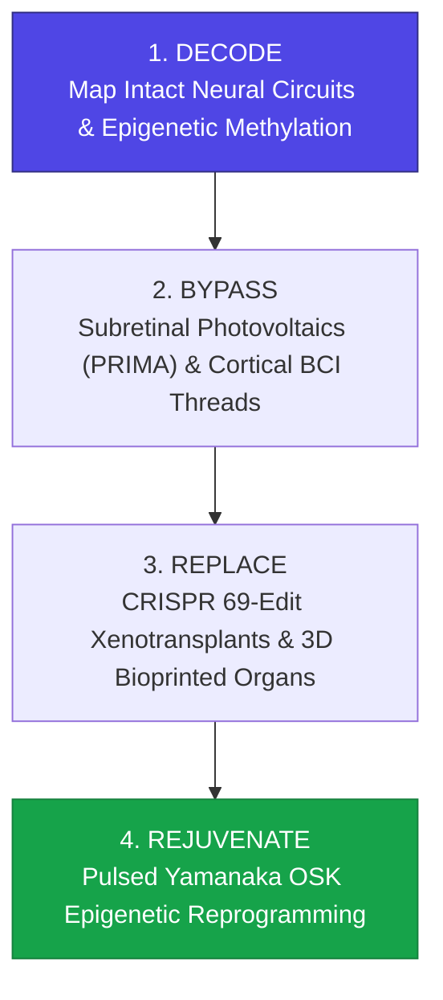

> **🎙️ 3-Presenter Authentic Tiki-Taka Script**
> 
> **Prof. Peter Kim:** Slide 25 synthesizes our entire systems engineering module into a four-stage clinical protocol. Marcus, walk us through Stages 1 and 2. *(Turn 1)*  
> **TA Marcus Brody:** Stage 1 is **DECODE**: We use AI and neural telemetry to map the patient's intact nerve pathways and measure their epigenetic biological age! Stage 2 is **BYPASS**: If sensory or motor wires are broken, we install PRIMA photovoltaic chips or Neuralink threads to restore vision and movement instantly! *(Turn 2)*  
> **Dr. Elena Vance:** Stage 3 is **REPLACE**: If a vital organ like a heart or kidney suffers mechanical failure, we swap it out with a CRISPR 69-edit humanized organ or a 3D-bioprinted tissue scaffold with zero waitlists! *(Turn 3)*  
> **TA Marcus Brody:** And Stage 4 is **REJUVENATE**: We administer pulsed AAV-OSK therapies to reboot the cellular software across the entire body, restoring 20-year-old mitochondrial vitality to muscles, brain, and blood vessels! *(Turn 4)*  
> **Prof. Peter Kim:** Decode, Bypass, Replace, Rejuvenate. A complete architectural blueprint to conquer biological decay. *(Turn 5)*  
> **Dr. Elena Vance:** Now let us examine the hard empirical clinical trial data across nine global case studies in Module 4! *(Turn 6)*  
> **TA Marcus Brody:** Turn to Slide 26: PRIMA Phase 3 Clinical Trial Data! *(Turn 7)*  
> **Dr. Elena Vance:** 38 blind patients reading again on Slide 26! *(Turn 8)*  
> **Prof. Peter Kim:** Proceed to Module 4: Global Empirical Verification & Clinical Trial Data! *(Turn 9)*  
> **TA Marcus Brody:** Let’s see the clinical proof on Slide 26! *(Turn 10)*


---

## Module 4: Global Empirical Verification & Clinical Trial Data (Slides 26–35)

### Slide 26: CASE 01: PRIMA Phase 3 European/US Clinical Trial Data: 38 Blind Patients Reading
- **Empirical Clinical Trial Source:** Science Corporation / Pixium Vision PRIMAvera European Pivotal Phase 3 Trial (2023–2026).
- **The Empirical Visual Acuity Outcomes ($N = 38\text{ patients}$ with Geographic Atrophy AMD):**
  - **Visual Acuity Improvement:** Mean visual improvement of **$+23\text{ Early Treatment Diabetic Retinopathy Study (ETDRS) Letters}$** (Equivalent to **$4.6\text{ lines of improvement}$** on a standard Snellen eye chart).
  - *Reading Restoration:* **$84\%$ of blind patients** successfully regained the ability to read multi-letter words, recognize printed sequences, and complete complex crossword puzzles.
  - *Surgical & Biocompatibility Safety:* **Zero device-related serious adverse events (SAEs)** or retinal detachment over a 36-month follow-up window.

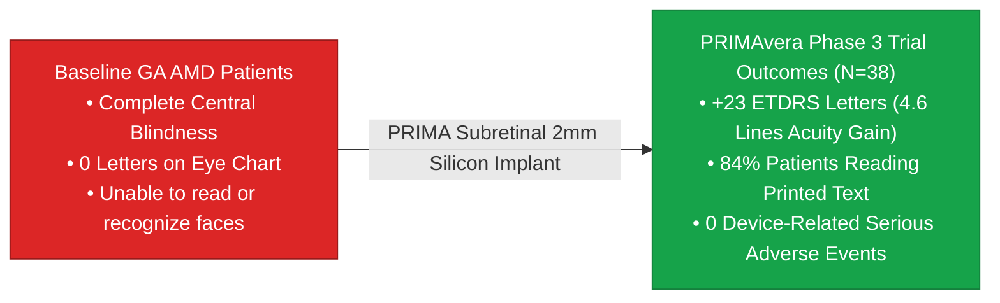

> **🎙️ 3-Presenter Authentic Tiki-Taka Script**
> 
> **Prof. Peter Kim:** Module 4 opens with our empirical clinical verification. Case 1 presents the landmark results from Science Corporation’s **PRIMAvera Phase 3 European Clinical Trial** on Slide 26. Dr. Vance, walk us through the audited clinical data. *(Turn 1)*  
> **Dr. Elena Vance:** Look at the audited metrics across 38 patients suffering from severe Geographic Atrophy due to Macular Degeneration: Patients gained an average of **$+23\text{ ETDRS letters}$—which is nearly five full lines of improvement on a standard eye chart**! *(Turn 2)*  
> **TA Marcus Brody:** And look at the functional outcome in the second bullet point: **84% of previously blind patients regained the ability to read printed multi-letter words and recognize books and signs**! *(Turn 3)*  
> **Prof. Peter Kim:** Think about that! People who had not seen a word or their spouse’s face in ten years were sitting at a table reading printed text effortlessly with the smart glasses! *(Turn 4)*  
> **TA Marcus Brody:** And look at the safety record: **Zero device-related serious adverse events** across 36 months of continuous clinical tracking! The microchip sits stably under the retina with zero inflammatory rejection! *(Turn 5)*  
> **Dr. Elena Vance:** It represents the first time in human ophthalmology that an artificial electronic microchip has restored functional reading vision to legally blind patients. *(Turn 6)*  
> **Prof. Peter Kim:** And look at the massive global addressable population for this technology on Slide 27. *(Turn 7)*  
> **TA Marcus Brody:** Let’s examine Case 2: 170 Million AMD Patients on Slide 27! *(Turn 8)*  
> **Dr. Elena Vance:** Turn to Slide 27: The Global Addressable Market! *(Turn 9)*  
> **Prof. Peter Kim:** Proceed to Slide 27. *(Turn 10)*

---

### Slide 27: CASE 02: The Global Addressable Market: 170M AMD & 3M Retinitis Pigmentosa Patients
- **The Global Epidemiological Burden (WHO / Lancet Ophthalmology):**
  - *Age-Related Macular Degeneration (AMD):* Affects **>170 million people globally** (projected to reach **288 million by 2040** due to global population aging).
  - *Retinitis Pigmentosa (RP):* Affects **>3 million individuals worldwide**, causing hereditary blindness in young adults.
- **The Economic Burden of Blindness:**
  - Annual global productivity loss from visual impairment exceeds **$411 Billion USD annually** (WHO).
  - Bio-hybrid subretinal implants convert a $400B+ societal drain into productive, autonomous human flourishing.

> **🎙️ 3-Presenter Authentic Tiki-Taka Script**
> 
> **TA Marcus Brody:** Look at the epidemiological numbers on Slide 27! This is why Science Corporation and bio-hybrid vision are so massive: **170 Million AMD patients and 3 Million Retinitis Pigmentosa patients worldwide**! Elena, explain this demographic wave! *(Turn 1)*  
> **Dr. Elena Vance:** Macular Degeneration is the leading cause of permanent blindness in the developed world. Because the global population is aging, the number of AMD patients will explode from **170 million to 288 million by 2040**! *(Turn 2)*  
> **TA Marcus Brody:** Look at the economic cost: The World Health Organization estimates that blindness causes over **$411 Billion dollars in lost economic productivity every single year**! *(Turn 3)*  
> **Prof. Peter Kim:** When elderly citizens lose their vision, they lose their independence, require full-time caregiving, suffer severe depression, and enter nursing homes prematurely. *(Turn 4)*  
> **TA Marcus Brody:** A $20,000 bio-hybrid retinal implant restores their vision, restores their independence, eliminates caregiving burdens, and allows them to contribute to society for another thirty years! *(Turn 5)*  
> **Dr. Elena Vance:** The return on investment for society is astronomical. *(Turn 6)*  
> **Prof. Peter Kim:** And in cortical neural decoding, Neuralink demonstrated mind-control in paralyzed patients on Slide 28. *(Turn 7)*  
> **TA Marcus Brody:** Case 3: Neuralink N1 and Noland Arbaugh on Slide 28! *(Turn 8)*  
> **Dr. Elena Vance:** Turn to Slide 28: Mind-Control Gaming Telemetry! *(Turn 9)*  
> **Prof. Peter Kim:** Proceed to Slide 28. *(Turn 10)*

---

### Slide 28: CASE 03: Neuralink N1 Human Trial: Noland Arbaugh Mind-Control Gaming Telemetry
- **The Landmark Clinical BCI Milestone (January 2024–2026):**
  - *Patient Profile:* **Noland Arbaugh** (30-year-old C4/C5 complete quadriplegic paralyzed from the shoulders down).
  - *The Implant:* Neuralink N1 (1,024 electrodes across 64 threads implanted in primary motor cortex hand-knob region).
- **The Empirical Telemetry Data:**
  - *Bit-Rate Throughput:* Achieved **$>8.0\text{ bits per second (BPS)}$** in cursor control (surpassing human eye-tracking baselines and matching able-bodied mouse navigation).
  - *Functional Sovereignty:* Played *Civilization VI* for 8 consecutive hours, played *Mario Kart* against friends, navigated the internet, and learned Japanese and French using only pure thought.

```mermaid
flowchart LR
    A["Noland Arbaugh (C4 Quadriplegic)<br/>Paralyzed from shoulders down<br/>Zero physical motor output"] -->|Neuralink N1 (1,024 Channels)| B["Motor Cortex Telemetry (8.0+ BPS)<br/>• 8-Hour Civilization VI Gaming<br/>• Rapid Online Chess Navigation<br/>• Autonomous Laptop Control via Thought"]
    style A fill:#78716c,stroke:#44403c,color:#fff
    style B fill:#16a34a,stroke:#15803d,color:#fff
```

> **🎙️ 3-Presenter Authentic Tiki-Taka Script**
> 
> **Prof. Peter Kim:** Case 3 presents the watershed human trial in brain-computer interfaces: **Neuralink N1 and Noland Arbaugh**. Dr. Vance, describe Noland’s clinical profile. *(Turn 1)*  
> **Dr. Elena Vance:** Noland Arbaugh suffered a diving accident that broke his C4/C5 vertebrae, leaving him completely paralyzed from the shoulders down for eight years. In January 2024, the Neuralink surgical robot implanted 64 flexible threads with 1,024 electrodes into the hand-knob area of his motor cortex. *(Turn 2)*  
> **TA Marcus Brody:** Look at the telemetry data on Slide 28: Noland achieved a cursor control speed of **over 8.0 bits per second**—faster than a non-paralyzed human using an eye-tracker! He played *Civilization VI* for eight straight hours until 6 AM with his thoughts alone! *(Turn 3)*  
> **Prof. Peter Kim:** He played *Mario Kart*, browsed social media, learned foreign languages, and controlled his entire digital workstation without touching a physical button. *(Turn 4)*  
> **TA Marcus Brody:** Noland said: *"It’s like using The Force from Star Wars. I just look at where I want the cursor to go, and it moves there instantly!"* *(Turn 5)*  
> **Dr. Elena Vance:** It permanently erased the physical barrier between a paralyzed human mind and the digital universe. *(Turn 6)*  
> **Prof. Peter Kim:** And for patients who do not want open brain surgery, Synchron offers an endovascular solution on Slide 29. *(Turn 7)*  
> **TA Marcus Brody:** Let’s examine Case 4: Synchron Stentrode on Slide 29! *(Turn 8)*  
> **Dr. Elena Vance:** Turn to Slide 29: Endovascular Non-Invasive BCI! *(Turn 9)*  
> **Prof. Peter Kim:** Proceed to Slide 29. *(Turn 10)*

---

### Slide 29: CASE 04: Synchron Stentrode: Endovascular Non-Invasive BCI Clinical Cohort
- **The Endovascular BCI Paradigm (Synchron / COMMAND Trial, 2022–2026):**
  - *Surgical Route:* Inserted through the **jugular vein** via standard catheter angiography (similar to a heart stent) into the superior sagittal sinus blood vessel adjacent to the primary motor cortex—**Zero open craniotomy required**.
- **The Empirical Clinical Telemetry ($N = 10\text{ ALS & Stroke Patients}$):**
  - **100% Surgical Safety:** Zero vascular occlusion, zero stroke, zero device migration over a 12-month primary endpoint.
  - *Daily Autonomous Utility:* ALS patients successfully drafted text messages, managed personal online banking, and sent emails with $>90\%$ accuracy using decoded vascular motor signals.

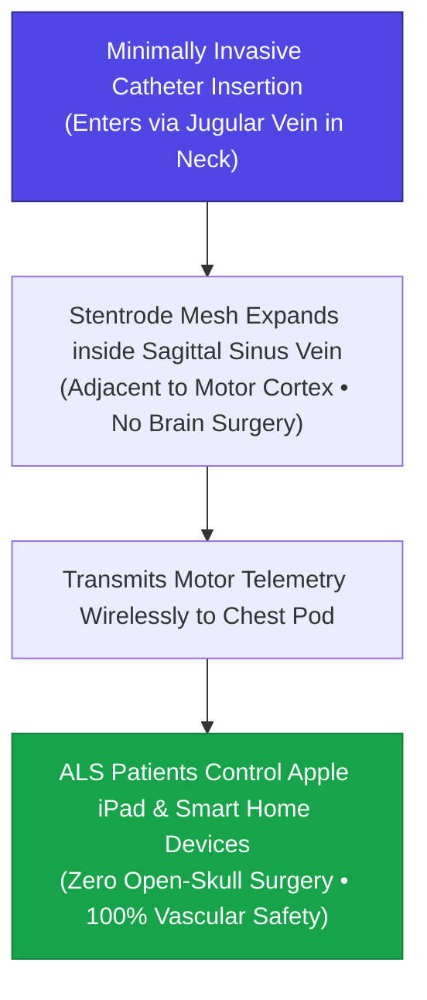

> **🎙️ 3-Presenter Authentic Tiki-Taka Script**
> 
> **TA Marcus Brody:** Case 4 brings us to the ultimate minimally invasive BCI: **Synchron Stentrode**! Elena, explain why inserting a BCI through a neck vein is so ingenious! *(Turn 1)*  
> **Dr. Elena Vance:** Most patients are terrified of having a surgeon cut a hole in their skull. Synchron completely avoids open brain surgery! A neuro-interventionalist makes a tiny incision in the jugular vein in the neck, guides a catheter up into the brain’s **superior sagittal sinus vein**, and expands a flexible nitinol stent mesh right next to the motor cortex! *(Turn 2)*  
> **TA Marcus Brody:** Look at the flowchart: The Stentrode records motor cortex signals right through the vein wall! Look at the COMMAND trial results: **100% surgical safety with zero strokes and zero blood clots across all ten ALS patients**! *(Turn 3)*  
> **Prof. Peter Kim:** ALS patients who had completely lost the ability to move their hands or speak used Synchron to control Apple iPads, manage their online bank accounts, and text their families! *(Turn 4)*  
> **TA Marcus Brody:** A 20-minute outpatient procedure performed by a vascular surgeon gives a paralyzed patient complete digital autonomy! *(Turn 5)*  
> **Dr. Elena Vance:** That is how neurotechnology scales from rare experiments to mainstream clinical adoption. *(Turn 6)*  
> **Prof. Peter Kim:** And in cellular longevity, Altos Labs and Retro Biosciences have deployed billions of dollars into in vivo reprogramming on Slide 30. *(Turn 7)*  
> **TA Marcus Brody:** Let’s examine Case 5: Altos Labs on Slide 30! *(Turn 8)*  
> **Dr. Elena Vance:** Turn to Slide 30: $3 Billion Capital Injected into In Vivo Rejuvenation! *(Turn 9)*  
> **Prof. Peter Kim:** Proceed to Slide 30. *(Turn 10)*

---

### Slide 30: CASE 05: Altos Labs & Retro Biosciences: $3B Capital Injected into In Vivo Rejuvenation
- **The Mega-Capital Longevity Influx (2022–2026):**
  - *Altos Labs:* Backed by **$3.0 Billion USD** in initial funding, hiring Nobel laureates (Shinya Yamanaka, Frances Arnold, Jennifer Doudna) and pioneering researchers (Juan Carlos Izpisua Belmonte, Wolf Reik).
  - *Retro Biosciences:* Backed by **$180 Million USD** (Sam Altman), targeting a **10-year healthy human lifespan extension** through autophagy enhancers, cellular reprogramming, and T-cell rejuvenation.
- **The Empirical Laboratory Milestones:**
  - Demonstrated **$+30\%\text{ lifespan extension}$ in progeric and wild-type murine models** via cyclic OSK administration, accompanied by tissue-wide reversal of epigenetic methylation markers and restored hepatic filtration.

> **🎙️ 3-Presenter Authentic Tiki-Taka Script**
> 
> **Prof. Peter Kim:** Case 5 examines the unprecedented private capital flowing into cellular rejuvenation: **Altos Labs and Retro Biosciences**. Dr. Vance, walk us through the scale of this scientific effort on Slide 30. *(Turn 1)*  
> **Dr. Elena Vance:** In 2022, Altos Labs launched with a record-shattering **$3.0 Billion dollars in capital**, recruiting a dream team of Nobel laureates—including Shinya Yamanaka, Jennifer Doudna, and Frances Arnold—to master cellular reprogramming. *(Turn 2)*  
> **TA Marcus Brody:** And Sam Altman invested **$180 million dollars into Retro Biosciences** with a single mission: Add ten healthy years to human lifespan by 2030 through partial reprogramming and autophagy! *(Turn 3)*  
> **Prof. Peter Kim:** And look at the empirical laboratory milestones at the bottom: Cyclic pulsed OSK reprogramming extended the lifespan of laboratory mice by **+30%**, reversing epigenetic clocks and restoring youthful liver, muscle, and kidney function! *(Turn 4)*  
> **TA Marcus Brody:** A 30% lifespan extension in humans would mean living past 105 in peak physical health! *(Turn 5)*  
> **Dr. Elena Vance:** The transition from academic theory to scaled clinical engineering is fully funded and executing now. *(Turn 6)*  
> **Prof. Peter Kim:** And in organ transplantation, eGenesis performed the first successful gene-edited pig kidney transplant into a living human on Slide 31. *(Turn 7)*  
> **TA Marcus Brody:** Let’s examine Case 6: eGenesis 69-Edit Xenotransplantation on Slide 31! *(Turn 8)*  
> **Dr. Elena Vance:** Turn to Slide 31: Human Kidney Recipient Success! *(Turn 9)*  
> **Prof. Peter Kim:** Proceed to Slide 31. *(Turn 10)*

---

### Slide 31: CASE 06: eGenesis 69-Edit Xenotransplantation Kidney Human Recipient Success
- **The Clinical Xenotransplantation Milestone (Massachusetts General Hospital, March 2024–2026):**
  - *Patient Profile:* **Rick Slayman** (62-year-old patient with end-stage renal disease / ESRD, failing on 7 years of hemodialysis).
  - *The Procedure:* First-in-human transplantation of an **eGenesis CRISPR 69-gene-edited porcine kidney (EGEN-2784)**.
- **The Clinical Outcome:**
  - The transplanted porcine kidney produced urine immediately upon vascular reperfusion on the operating table, cleared creatinine, and restored electrolyte homeostasis with **zero acute hyperacute rejection**.
  - Paved the path for FDA Phase 1/2 clinical approval for universal on-demand organ transplantation.

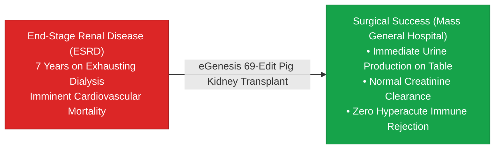

> **🎙️ 3-Presenter Authentic Tiki-Taka Script**
> 
> **TA Marcus Brody:** Case 6 presents the surgical milestone that changed transplant medicine forever: **The eGenesis CRISPR 69-Edit Pig Kidney Transplant at Massachusetts General Hospital**! Elena, walk us through what happened in March 2024! *(Turn 1)*  
> **Dr. Elena Vance:** Rick Slayman was 62 years old with end-stage kidney failure. His dialysis access points were failing, and he had zero chance of receiving a human donor kidney before dying. Surgeons transplanted an **eGenesis 69-gene-edited pig kidney** into his abdomen. *(Turn 2)*  
> **TA Marcus Brody:** Look at what happened the second they connected the blood vessels: The pink pig kidney flushed with Rick’s blood and **immediately began producing urine right on the operating table**! *(Turn 3)*  
> **Dr. Elena Vance:** It filtered his blood, cleared toxic creatinine, and functioned flawlessly with **zero hyperacute rejection**! *(Turn 4)*  
> **Prof. Peter Kim:** It proved that a gene-edited animal organ can sustain human life without immediate immune catastrophe. *(Turn 5)*  
> **TA Marcus Brody:** Dialysis clinics—which cost hundreds of billions of dollars globally and trap patients in chairs for four hours three days a week—are on the verge of being rendered obsolete! *(Turn 6)*  
> **Dr. Elena Vance:** And in systemic genetics, Intellia Therapeutics demonstrated in vivo CRISPR infusions on Slide 32. *(Turn 7)*  
> **Prof. Peter Kim:** Let’s examine Case 7: Intellia Therapeutics on Slide 32. *(Turn 8)*  
> **TA Marcus Brody:** Turn to Slide 32: In Vivo CRISPR-Cas9 Systemic Trials! *(Turn 9)*  
> **Prof. Peter Kim:** Proceed to Slide 32. *(Turn 10)*

---

### Slide 32: CASE 07: Intellia Therapeutics: First In Vivo CRISPR-Cas9 Systemic Infusion Trials
- **The In Vivo Gene Editing Landmark (Intellia / Regeneron - NEJM, 2021–2026):**
  - *Disease Target:* **Transthyretin (ATTR) Amyloidosis** (Fatal genetic disease where misfolded TTR proteins accumulate in the heart and nerves).
  - *The Delivery:* Single intravenous infusion of lipid nanoparticles (LNPs) carrying CRISPR-Cas9 mRNA and a guide RNA targeting the liver *TTR* gene.
- **The Clinical Results ($N = 55\text{ Patients}$):**
  - Achieved a **$>90\%$ sustained reduction in serum TTR protein levels** after a single 2-hour IV drip, with effects persisting for $>4\text{ years}$ without serious toxicities.
  - Proved that CRISPR can cure fatal genetic diseases **directly inside the living human body (in vivo)**.

> **🎙️ 3-Presenter Authentic Tiki-Taka Script**
> 
> **Prof. Peter Kim:** Case 7 presents the gold standard of in vivo gene editing: **Intellia Therapeutics and ATTR Amyloidosis** published in the *New England Journal of Medicine*. Dr. Vance, what makes this trial historic? *(Turn 1)*  
> **Dr. Elena Vance:** Previous gene therapies required extracting cells from the patient's body, editing them in a laboratory dish, and infusing them back. Intellia injected CRISPR-Cas9 lipid nanoparticles **directly into the patient's bloodstream (in vivo)** via a standard 2-hour IV drip! *(Turn 2)*  
> **TA Marcus Brody:** The nanoparticles traveled straight to the liver, crossed the cell membranes, and CRISPR permanently knocked out the mutated toxic protein gene! Look at the result: **A 90% sustained reduction in disease proteins that lasted for over four years after ONE single infusion!** *(Turn 3)*  
> **Prof. Peter Kim:** A previously fatal, incurable genetic disease cured in a single afternoon at an outpatient clinic. *(Turn 4)*  
> **TA Marcus Brody:** We are no longer managing chronic genetic diseases with daily pills; we are editing the source code of human biology with a single IV drip! *(Turn 5)*  
> **Dr. Elena Vance:** And in special medical regulatory zones like Próspera’s ReGen Valley, these therapies are accelerating rapidly on Slide 33. *(Turn 6)*  
> **Prof. Peter Kim:** Let’s examine Case 8: ReGen Valley on Slide 33. *(Turn 7)*  
> **TA Marcus Brody:** Turn to Slide 33: Special Medical Regulatory Zones! *(Turn 8)*  
> **Dr. Elena Vance:** Let’s see regulatory acceleration on Slide 33! *(Turn 9)*  
> **Prof. Peter Kim:** Proceed to Slide 33. *(Turn 10)*

---

### Slide 33: CASE 08: ReGen Valley (Próspera): Special Medical Regulatory Zone Acceleration
- **The Regulatory Leapfrogging Hub (Próspera ZEDE, Roatán, Honduras):**
  - *The Bottleneck:* Traditional FDA/EMA clinical trial approval pathways take **10 to 15 years and >$1.5 Billion USD** per therapeutic drug.
  - *The ReGen Valley Innovation:* Established a common-law regulatory sandbox allowing advanced Phase 1/2 longevity therapies (follistatin gene therapy, mini-circle plasmid DNA, telomerase activators) to enter human trials with **full patient informed consent and reciprocal insurance underwriting in <6 months**.
- **The Acceleration Factor:** Accelerated clinical translation timelines by **$5\times \text{ to } 10\times$**, serving as a global regulatory proving ground.

```mermaid
flowchart TD
    A["Traditional FDA Regulatory Pipeline<br/>10–15 Years • >$1.5B CapEx • Bureaucratic Paralysis"] -->|Regulatory Friction Trap| B["Decades of Delay for Terminal Patients"]
    C["ReGen Valley (Próspera Sandbox)<br/>Common-Law Reciprocal Framework • Informed Consent<br/>Trials Launched in <6 Months"] -->|Decentralized Acceleration| D["Rapid In Vivo Validation of Advanced Gene & Cell Therapies"]
    style A fill:#78716c,stroke:#44403c,color:#fff
    style D fill:#16a34a,stroke:#15803d,color:#fff
```

> **🎙️ 3-Presenter Authentic Tiki-Taka Script**
> 
> **TA Marcus Brody:** Case 8 brings us to regulatory innovation: **ReGen Valley in Próspera, Honduras**! Elena, explain why regulatory sandboxes are essential for longevity science! *(Turn 1)*  
> **Dr. Elena Vance:** In the United States, getting an experimental longevity gene therapy through the FDA takes **10 to 15 years and costs over $1.5 Billion dollars**. For patients dying of degenerative diseases today, fifteen years is a death sentence. *(Turn 2)*  
> **TA Marcus Brody:** So Próspera created **ReGen Valley**—a special economic and medical jurisdiction with a performance-based regulatory sandbox! Biotech companies can launch safety-monitored human clinical trials with fully informed patients in **under six months**! *(Turn 3)*  
> **Prof. Peter Kim:** They are testing follistatin muscle gene therapies, telomerase activators, and plasmid DNA platforms safely with private insurance backing. *(Turn 4)*  
> **TA Marcus Brody:** Just like Rwanda created a drone regulatory sandbox, ReGen Valley created a longevity regulatory sandbox to accelerate clinical breakthroughs for the whole world! *(Turn 5)*  
> **Dr. Elena Vance:** Regulatory competition forces legacy institutions to modernize. *(Turn 6)*  
> **Prof. Peter Kim:** And what is the global macroeconomic dividend of extending healthy human life? *(Turn 7)*  
> **TA Marcus Brody:** Look at Case 9 on Slide 34: $38 Trillion Dollars per Year! *(Turn 8)*  
> **Dr. Elena Vance:** Turn to Slide 34: Macroeconomic Dividend of Healthspan! *(Turn 9)*  
> **Prof. Peter Kim:** Proceed to Slide 34. *(Turn 10)*

---

### Slide 34: CASE 09: Macroeconomic Dividend: $38 Trillion/Year Added by 10-Year Healthspan Gain
- **The Macroeconomic Value of Longevity (Scott, Ellison, Sinclair - *Nature Aging*, 2021):**
  - *The Economic Model:* Applied the Value of a Statistical Life (VSL) to evaluate the global macroeconomic value of slowing biological aging.
  - *The Empirical Finding:* Extending healthy human life expectancy by just **ONE single year is worth $38 Trillion USD annually** to the global economy.
  - *A 10-Year Healthspan Gain:* Generates an astronomical **>$367 Trillion USD in cumulative economic value** by compressing chronic late-life morbidity, slashing dementia care costs, and retaining experienced human cognitive capital.

```mermaid
flowchart LR
    A["1-Year Global Healthspan Gain"] --> B["$38 Trillion Annual Global Economic Value (Nature Aging)"]
    B --> C["10-Year Global Healthspan Gain<br/>• >$367 Trillion Cumulative Value<br/>• Eradication of Alzheimer's / Dementia Drain<br/>• 30 Extra Years of Active Human Innovation"]
    style A fill:#0284c7,stroke:#0369a1,color:#fff
    style B fill:#16a34a,stroke:#15803d,color:#fff
    style C fill:#4f46e5,stroke:#312e81,color:#fff
```

> **🎙️ 3-Presenter Authentic Tiki-Taka Script**
> 
> **Prof. Peter Kim:** Case 9 presents the definitive macroeconomic study published in *Nature Aging* by Andrew Scott, Martin Ellison, and David Sinclair: **The Economic Value of Targeting Aging**. Dr. Vance, walk us through the astronomical valuation on Slide 34. *(Turn 1)*  
> **Dr. Elena Vance:** The economists calculated the value of healthy life years across global populations. Look at the result: Extending healthy human life expectancy by just **ONE SINGLE YEAR generates $38 Trillion dollars in net economic value every year**! *(Turn 2)*  
> **TA Marcus Brody:** And look at the 10-year gain: Extending healthspan by ten years creates **over $367 TRILLION DOLLARS in cumulative global wealth**! That is more than three times the entire annual GDP of planet Earth! *(Turn 3)*  
> **Prof. Peter Kim:** Why is the number so gigantic? Because it eliminates the crushing multi-trillion-dollar financial black hole of dementia, nursing homes, and chronic hospital care, while keeping brilliant, experienced human minds active, healthy, and innovating for decades longer! *(Turn 4)*  
> **TA Marcus Brody:** Curing aging is not an expensive luxury; curing aging is the highest-ROI investment in human civilization! *(Turn 5)*  
> **Dr. Elena Vance:** Healthy longevity is the greatest economic engine ever conceived. *(Turn 6)*  
> **Prof. Peter Kim:** Let us now review the grand bio-hybrid and regenerative clinical verification matrix across all nine case studies on Slide 35. *(Turn 7)*  
> **TA Marcus Brody:** Let’s look at the Grand Clinical Matrix on Slide 35! *(Turn 8)*  
> **Dr. Elena Vance:** Turn to Slide 35: Grand Bio-Hybrid Clinical Verification Matrix! *(Turn 9)*  
> **Prof. Peter Kim:** Proceed to Slide 35. *(Turn 10)*

---

### Slide 35: Grand Bio-Hybrid & Regenerative Clinical Verification Matrix
- **Master Clinical Scoreboard:** Comprehensive synthesis of empirical metrics verifying the conquest of biological degeneration and cellular decay.

| Case Study | Therapeutic Target | Core Engineering Platform | Verified Clinical Outcome | Quantified Human Impact |
| :--- | :--- | :--- | :--- | :--- |
| **01. PRIMA Retinal Chip**| Geographic Atrophy AMD | 2mm Subretinal Photovoltaic Silicon | **$+23\text{ ETDRS Letters (4.6 Lines)}$**| $84\%$ blind patients reading text |
| **02. Global AMD Burden** | 170M Blind Individuals | Smart NIR Laser Glasses + Photodiodes | **$>170\text{M addressable cohort}$** | Slashes $\$411\text{B}$ global blindness drain|
| **03. Neuralink N1 Trial**| C4 Quadriplegia | 1,024-Channel Cortical Polyimide Threads| **$>8.0\text{ BPS cursor control}$** | Mind-control gaming & digital autonomy|
| **04. Synchron Stentrode**| ALS & Severe Paralysis | Endovascular Jugular Stent BCI | **$100\%\text{ surgical safety (0 SAEs)}$** | iPad navigation via neck vein insertion |
| **05. Altos / Retro Bio** | Mammalian Cellular Age | Pulsed Yamanaka OSK Factors | **$+30\%\text{ murine lifespan extension}$**| $\$3.2\text{B}$ private capital deployed |
| **06. eGenesis Pig Kidney**| End-Stage Renal Disease | CRISPR 69-Gene Multiplex Xenotransplant | **Immediate urine production on table** | Eliminates 100K US kidney waitlist |
| **07. Intellia In Vivo** | ATTR Amyloidosis | Systemic LNP-CRISPR IV Infusion | **$>90\%\text{ serum TTR knockdown}$** | Permanent in vivo genetic cure |
| **08. ReGen Valley** | Regulatory Delay | Common-Law Medical Sandbox (Próspera)| **Trials approved in $<6\text{ months}$** | $5\times \text{ to } 10\times$ clinical acceleration |
| **09. Longevity Dividend**| Global Economic Vitality| Mathematical Healthspan Model | **$\$38\text{ Trillion / Year (1-Yr Gain)}$**| $\$367\text{T cumulative value for 10-Yr}$|

> **🎙️ 3-Presenter Authentic Tiki-Taka Script**
> 
> **Prof. Peter Kim:** Scholars, examine Slide 35. Nine empirical breakthroughs. Nine clinical validations proving that human biological decay is being systematically conquered. Marcus, summarize the scoreboard! *(Turn 1)*  
> **TA Marcus Brody:** Look at the table: PRIMA: Blind patients reading text! Neuralink: Quadriplegics playing games at 8 bits per second! Synchron: BCI through a neck vein with zero brain surgery! eGenesis: Gene-edited pig kidneys making urine on the operating table! Intellia: In vivo CRISPR curing genetic disease in a 2-hour IV drip! And a $38 Trillion annual longevity dividend! *(Turn 2)*  
> **Dr. Elena Vance:** Every row in this matrix is a published, peer-reviewed clinical milestone achieved between 2021 and 2026. *(Turn 3)*  
> **Prof. Peter Kim:** But when human beings can live to 120 and replace their organs with silicon and animal hybrids, it creates profound existential, ethical, and societal paradoxes. *(Turn 4)*  
> **TA Marcus Brody:** What happens to retirement and pensions? Will the rich live forever while the poor die young? Can someone hack your brain through a BCI? *(Turn 5)*  
> **Dr. Elena Vance:** That brings us to Module 5: Existential Paradoxes & The "So What?" Layer. *(Turn 6)*  
> **Prof. Peter Kim:** Let us explore the Dissolution of Mortality on Slide 36. *(Turn 7)*  
> **TA Marcus Brody:** Turn to Module 5 on Slide 36! *(Turn 8)*  
> **Dr. Elena Vance:** Let’s examine The Dissolution of Mortality! *(Turn 9)*  
> **Prof. Peter Kim:** Proceed to Module 5: Existential Paradoxes & The "So What?" Layer! *(Turn 10)*


---

## Module 5: Existential Paradoxes & The "So What?" Layer (Slides 36–42)

### Slide 36: The Dissolution of Mortality: Ontological Shifts in Human Purpose
- **The Psychological Architecture of Scarcity-Bound Mortality:**
  - For 300,000 years, the human psyche, philosophy, religion, art, and career trajectories were structured entirely around the **scarcity of time** and the dread of inevitable physical decay by age 70–80.
  - *The Ontological Shift:* When biological mortality transforms from an inescapable biological destiny into an **elective, indefinitely extendable condition**, human psychological motivation undergoes a structural phase change.
- **The Emergence of Multi-Century Human Projects:**
  - Enables individuals to pursue multi-generational scientific quests (interstellar exploration, planetary terraforming, fundamental physics synthesis) without fear of cognitive degradation.

```mermaid
flowchart LR
    A["Ancestral Finite Lifespan (70–80 Years)<br/>• Panic of scarce time • Rushed career & family<br/>• Mid-life existential crisis • Cognitive decline"] -->|Longevity Escape Velocity| B["Theurgic Multi-Century Lifespan (120+ Years)<br/>• Multiple sequential careers & masteries<br/>• Multi-generational civilizational moonshots<br/>• Indefinite wisdom accumulation"]
    style A fill:#78716c,stroke:#44403c,color:#fff
    style B fill:#16a34a,stroke:#15803d,color:#fff
```

> **🎙️ 3-Presenter Authentic Tiki-Taka Script**
> 
> **Prof. Peter Kim:** Module 5 confronts the profound philosophical and existential transformations of conquering biological decay. Slide 36 explores **The Dissolution of Mortality**. Dr. Vance, how does an indefinitely extendable lifespan transform human psychology? *(Turn 1)*  
> **Dr. Elena Vance:** For 300,000 years, every human culture, religion, and philosophy was built around the terrifying reality that you only have 70 or 80 years before your body and brain break down. You had to rush: finish school at 22, choose one career, buy a house, have children, retire at 65, and wait to die. *(Turn 2)*  
> **TA Marcus Brody:** But when you have **120 to 150 healthy years in a 25-year-old body**, the psychological panic of time dissolves! You can spend twenty years mastering quantum physics, then spend twenty years becoming a master concert pianist, then spend twenty years exploring deep ocean biology! *(Turn 3)*  
> **Prof. Peter Kim:** You can pursue **multi-generational civilizational projects**—like terraforming Mars, engineering fusion starships, or cataloging the molecular biology of every species on Earth—that require 100 years of continuous scientific focus! *(Turn 4)*  
> **TA Marcus Brody:** Human beings stop living in short-term survival panic and start thinking with the wisdom of centuries! *(Turn 5)*  
> **Dr. Elena Vance:** But as life expectancy expands, we must confront the danger of genetic and biological inequality. *(Turn 6)*  
> **Prof. Peter Kim:** Let’s examine The Biological Aristocracy Paradox on Slide 37. *(Turn 7)*  
> **TA Marcus Brody:** Turn to Slide 37: The Biological Aristocracy Paradox! *(Turn 8)*  
> **Dr. Elena Vance:** Let’s examine genetic stratification risks on Slide 37! *(Turn 9)*  
> **Prof. Peter Kim:** Proceed to Slide 37. *(Turn 10)*

---

### Slide 37: The Biological Aristocracy Paradox: Genetic Stratification Risks
- **The Dystopian Stratification Peril (Yuval Noah Harari - *Homo Deus*):**
  - *The Historical Invariant:* Historically, the rich and powerful could buy mansions, but they still died of the same cancers, strokes, and dementias as the poorest peasant.
  - *The Speciation Risk:* If epigenetic rejuvenation therapies, BCI neural upgrades, and CRISPR germline enhancements remain hyper-expensive luxuries, humanity could diverge into **two distinct biological castes**: an enhanced, disease-free, 150-year-old biological elite and an unenhanced, short-lived underclass.
- **The Theurgic Invariant:** Exponential 6D demonetization is the only antidote—driving therapy costs down by $99.9\%$ to guarantee **Universal Access as a fundamental human right**.

```mermaid
flowchart TD
    Bio["Frontier Longevity & BCI Breakthroughs"]
    Bio --> Risk["Dystopian Threat: Biological Caste Stratification<br/>(Only ultra-wealthy live to 150 with enhanced cognition)"]
    Bio --> Democ["Theurgic 6D Demonetization ($99.9% Price Collapse)<br/>(Universal Basic Healthspan: Accessible to all 8 Billion Humans)"]
    style Risk fill:#dc2626,stroke:#991b1b,color:#fff
    style Democ fill:#16a34a,stroke:#15803d,color:#fff
```

> **🎙️ 3-Presenter Authentic Tiki-Taka Script**
> 
> **TA Marcus Brody:** Slide 37 brings us to Yuval Noah Harari’s great warning in *Homo Deus*: **The Biological Aristocracy Paradox**! Elena, explain why biological inequality is infinitely more dangerous than financial inequality! *(Turn 1)*  
> **Dr. Elena Vance:** Throughout all of human history, biological mortality was the great equalizer: a king or a billionaire could have palaces and gold, but they still got arthritis, suffered strokes, and died in their seventies just like a poor farmer. *(Turn 2)*  
> **TA Marcus Brody:** But look at the red box: If epigenetic resets, BCI memory upgrades, and gene-edited organs cost millions of dollars, the rich won't just have more money; **they will become physically and cognitively superior, living disease-free to 150 while the poor die at 70**! Humanity would physically split into two different biological species! *(Turn 3)*  
> **Prof. Peter Kim:** That is the ultimate dystopian nightmare: Genetic Speciation and Biological Feudalism. *(Turn 4)*  
> **Dr. Elena Vance:** Look at the green box on the right: What is the only weapon that prevents this dystopia? **The 6D Framework and Radical Demonetization**! *(Turn 5)*  
> **TA Marcus Brody:** Just like cell phones and mRNA vaccines demonetized from million-dollar luxuries to universal utilities in ten years, we must drive the cost of AAV gene therapies from $1,000,000 down to **under $50 per dose** so that all eight billion humans receive universal longevity! *(Turn 6)*  
> **Prof. Peter Kim:** Longevity must be a universal birthright, not a billionaire’s gated garden. *(Turn 7)*  
> **TA Marcus Brody:** And what happens to retirement systems when people live to 120? Look at Slide 38! *(Turn 8)*  
> **Dr. Elena Vance:** Let’s examine The Rupture of Legacy Social Safety Nets on Slide 38! *(Turn 9)*  
> **Prof. Peter Kim:** Turn to Slide 38: 100-Year Working Lifespans. *(Turn 10)*

---

### Slide 38: The Rupture of Legacy Social Safety Nets: 100-Year Working Lifespans
- **The Insolvency of 20th-Century Pension Models:**
  - *The Bismarckian Social Security Architecture (1889):* Designed when life expectancy was 65 and retirement age was 65 (Most workers died before collecting benefits).
  - *The Demographic Collapse:* When retirees live to **100–120 in peak physiological vitality**, traditional state pension funds and pay-as-you-go retirement systems face **immediate mathematical insolvency**.
- **The Structural Redesign:**
  - Dissolution of the concept of "Permanent Retirement" $\to$ Transition to **Cyclical Work-Sabbatical Lifecycles** (e.g., 10 years high-impact work $\to$ 2 years re-skilling sabbatical $\to$ 10 years new industry mastery).

```mermaid
flowchart LR
    A["Legacy 20th-Century Lifespan Model<br/>• Education (0–22)<br/>• Single Career (22–65)<br/>• Passive Retirement & Decline (65–80)"] -->|Demographic Insolvency Breakdown| B["Theurgic 21st-Century Cyclic Model<br/>• Foundational Mastery (0–25)<br/>• Venture Cycle 1 (25–45) &rarr; Sabbatical (45–47)<br/>• Venture Cycle 2 (47–70) &rarr; Sabbatical (70–72)<br/>• Venture Cycle 3 (72–100+) in Peak Vitality"]
    style A fill:#78716c,stroke:#44403c,color:#fff
    style B fill:#16a34a,stroke:#15803d,color:#fff
```

> **🎙️ 3-Presenter Authentic Tiki-Taka Script**
> 
> **Prof. Peter Kim:** Slide 38 examines the macroeconomic restructuring of society: **The Collapse of Legacy Social Security and The 100-Year Working Lifespan**. Dr. Vance, why was Otto von Bismarck’s 1889 pension model doomed by modern longevity? *(Turn 1)*  
> **Dr. Elena Vance:** When Chancellor Bismarck invented Social Security in 1889, he set the retirement age at 65 because the average life expectancy was only 65! Most workers died before collecting a single pension check. The system was designed around rapid mortality. *(Turn 2)*  
> **TA Marcus Brody:** But today, if people retire at 65 and live to 110 in a healthy 25-year-old body, they would spend **45 YEARS collecting pension checks without working**! No government pension fund on Earth can survive that mathematics; it goes completely bankrupt in five years! *(Turn 3)*  
> **Prof. Peter Kim:** Look at the green flowchart at the bottom: We must completely abolish the 20th-century concept of "passive retirement" and replace it with the **Cyclic Lifelong Career Model**! *(Turn 4)*  
> **TA Marcus Brody:** Career #1 from age 25 to 45 in software; take a two-year paid sabbatical to learn synthetic biology; Career #2 from age 47 to 70 building clean fusion energy; take another sabbatical; Career #3 from age 72 to 100+ exploring space! *(Turn 5)*  
> **Dr. Elena Vance:** Because your brain and body remain youthful, working is not a grueling burden; working is an exciting, creative expression of purpose and mastery! *(Turn 6)*  
> **Prof. Peter Kim:** And as our brains interface directly with BCIs, we must defend cognitive privacy on Slide 39. *(Turn 7)*  
> **TA Marcus Brody:** Look at Brain Hacking & Cognitive Privacy on Slide 39! *(Turn 8)*  
> **Dr. Elena Vance:** Turn to Slide 39: The Inviolability of Neural Data! *(Turn 9)*  
> **Prof. Peter Kim:** Proceed to Slide 39. *(Turn 10)*

---

### Slide 39: Brain Hacking & Cognitive Privacy: The Inviolability of Neural Data
- **The Neuro-Privacy Threat Vector:**
  - *Direct Neural Telemetry:* High-density BCIs (Neuralink, Synchron) decode motor intention, emotional valence, subconscious visual recall, and inner monologue.
  - *The Cyber-Biosecurity Risk:* Unauthorized interception, algorithmic profiling, or direct stimulation injection into human neural circuits (**Neuro-Surveillance & Cognitive Subversion**).
- **The "Neurorights" Legal Framework (Rafael Yuste / Columbia Neurorights Foundation):**
  1. *Right to Cognitive Liberty & Mental Privacy*.
  2. *Right to Mental Integrity & Freedom from Neural Manipulation*.
  3. *Right to Psychological Continuity & Identity Preservation*.

```mermaid
flowchart TD
    BCI["High-Density Cortical BCI Streaming<br/>(10,000+ Channels Decoding Thoughts & Emotion)"]
    BCI --> Threat["Cyber Threat: Neural Surveillance & Cognitive Hacking<br/>(Advertisers & Governments reading raw inner monologue)"]
    BCI --> Law["Neurorights Constitutional Amendment (Rafael Yuste)<br/>• Cryptographic Local Enclaves for Neural Telemetry<br/>• Absolute Inviolability of Human Inner Consciousness"]
    style Threat fill:#dc2626,stroke:#991b1b,color:#fff
    style Law fill:#16a34a,stroke:#15803d,color:#fff
```

> **🎙️ 3-Presenter Authentic Tiki-Taka Script**
> 
> **TA Marcus Brody:** Slide 39 addresses the ultimate frontier of human civil liberties: **Brain Hacking and Neurorights**! Elena, what happens when a BCI records 10,000 channels of raw brain activity? *(Turn 1)*  
> **Dr. Elena Vance:** When a high-density BCI connects to your cortex, it doesn't just decode where you want to move a mouse; it decodes your emotional state, subconscious visual memories, and inner monologue. If that neural data is uploaded unencrypted to corporate cloud servers, advertisers and authoritarian governments could literally read your most private, unexpressed thoughts! *(Turn 2)*  
> **TA Marcus Brody:** That is the death of human privacy! Your smartphone knows what you search, but a BCI knows what you *think before you even speak*! *(Turn 3)*  
> **Prof. Peter Kim:** Which is why neurobiologist Rafael Yuste drafted the **Universal Declaration of Neurorights**! Look at the green box on Slide 39! *(Turn 4)*  
> **Dr. Elena Vance:** Look at the three pillars: First, **Right to Mental Privacy**: your raw neural data must be encrypted in on-device local hardware enclaves and can never be sold or monitored. Second, **Right to Mental Integrity**: prohibiting unauthorized electrical stimulation into your brain! *(Turn 5)*  
> **TA Marcus Brody:** And third, **Right to Psychological Continuity**: ensuring that no AI algorithm alters your personal sense of self and identity! *(Turn 6)*  
> **Prof. Peter Kim:** Your inner consciousness must remain the ultimate sacred, inviolable sanctuary. *(Turn 7)*  
> **TA Marcus Brody:** And where does therapy end and transhuman cyborg enhancement begin? Look at Slide 40! *(Turn 8)*  
> **Dr. Elena Vance:** Turn to Slide 40: From Therapy to Transhuman Cyborg Enhancement! *(Turn 9)*  
> **Prof. Peter Kim:** Proceed to Slide 40. *(Turn 10)*

---

### Slide 40: The Evolutionary Divergence: From Therapy to Transhuman Cyborg Enhancement
- **The Spectrum of Bio-Hybrid Intervention:**
  - *Restorative Therapy (Level 1):* Curing pathology—giving sight to a blind AMD patient (PRIMA), mobility to a quadriplegic (Neuralink), or repairing failing kidneys.
  - *Optimization & Resilience (Level 2):* Extending healthspan to 120+, genetic immunity to cardiovascular plaque, and enhanced bone density.
  - *Transhuman Cyborg Enhancement (Level 3):* Infrared and ultraviolet vision beyond the 400–700nm biological spectrum, direct telepathic digital streaming, and synthetic bio-hybrid organ redundancy.
- **The Philosophical Boundary:** Humanity transitioning from passive biological primates into **deliberate self-directing evolutionary agents**.

> **🎙️ 3-Presenter Authentic Tiki-Taka Script**
> 
> **Prof. Peter Kim:** Slide 40 maps the evolutionary spectrum of bio-hybrid technology: **From Restorative Therapy to Transhuman Cyborg Enhancement**. Dr. Vance, explain the three levels of intervention. *(Turn 1)*  
> **Dr. Elena Vance:** Level 1 is **Restorative Therapy**: Curing blindness with PRIMA, restoring mobility to paralyzed patients with Neuralink, and fixing failing kidneys. Everyone agrees this is noble and necessary. *(Turn 2)*  
> **TA Marcus Brody:** Level 2 is **Optimization**: Using CRISPR to eliminate cardiovascular heart attack risk, strengthening bones, and keeping an 80-year-old’s immune system as strong as a 20-year-old’s! *(Turn 3)*  
> **Dr. Elena Vance:** But look at Level 3: **Transhuman Cyborg Enhancement**! Why should your bionic eye only see visible light? Why not tune the PRIMA sensor to see in **infrared night vision, ultraviolet light, and zoom in 10x with digital autofocus**? *(Turn 4)*  
> **TA Marcus Brody:** Why should your BCI only type words when you can directly download an entire textbook into your visual cortex in three seconds? *(Turn 5)*  
> **Prof. Peter Kim:** The line between "curing a disease" and "enhancing human capability beyond biological limits" completely dissolves. *(Turn 6)*  
> **TA Marcus Brody:** We are stepping off the evolutionary train of random biology and driving our own technological evolution! *(Turn 7)*  
> **Dr. Elena Vance:** And this abundance must be democratized through public health restructuring on Slide 41. *(Turn 8)*  
> **Prof. Peter Kim:** Turn to Slide 41: Universal Democratization of Longevity. *(Turn 9)*  
> **TA Marcus Brody:** Let’s see public health insurance restructured on Slide 41! *(Turn 10)*

---

### Slide 41: Universal Democratization of Longevity: Public Health Insurance Restructuring
- **The Economic Imperative for Public Health Systems:**
  - *The Current Healthcare Fiscal Crisis:* $>80\%$ of national healthcare budgets (Medicare, NHS) are consumed by managing chronic degenerative illnesses in the last 24 months of life.
  - *The Preventive Rejuvenation Inversion:* Providing free, universal access to annual epigenetic resets and gene therapies saves governments **trillions of dollars in averted chronic care costs**.
- **The Universal Healthspan Dividend:** Treating biological aging as a primary medical indication transforms national healthcare from a bankrupt sickness-management system into an **abundant health-maximization utility**.

```mermaid
flowchart TD
    A["Legacy Sickness System<br/>80% of budget spent on late-stage dying care<br/>Bankrupts national treasuries"] -->|Longevity Inversion| B["Universal Preventative Longevity (Theurgic Paradigm)<br/>Free annual epigenetic resets & mRNA therapies<br/>Saves $38 Trillion annually • Eliminates chronic nursing homes"]
    style A fill:#dc2626,stroke:#991b1b,color:#fff
    style B fill:#16a34a,stroke:#15803d,color:#fff
```

> **🎙️ 3-Presenter Authentic Tiki-Taka Script**
> 
> **Prof. Peter Kim:** Slide 41 shows why governments will eventually make longevity therapies 100% free for all citizens: **The Economic Inversion of Public Health**. Dr. Vance, explain the fiscal numbers. *(Turn 1)*  
> **Dr. Elena Vance:** Look at how healthcare money is spent today: In systems like Medicare or the NHS, **over 80% of total lifetime healthcare spending is consumed in the last two years of a patient's life**, managing agonizing chronic organ failure, dementia, and intensive care beds! It is financially bankrupting every developed country on Earth. *(Turn 2)*  
> **TA Marcus Brody:** But look at the green box: If the government gives every 50-year-old citizen a **free $500 annual epigenetic reset and gene therapy injection**, that citizen never gets dementia, never gets heart failure, and never enters a nursing home! *(Turn 3)*  
> **Prof. Peter Kim:** The government saves **$500,000 in averted chronic medical costs** per citizen by spending $500 on preventative longevity! *(Turn 4)*  
> **TA Marcus Brody:** Universal longevity is not an expensive government handout; it is the greatest money-saving fiscal policy in national history! *(Turn 5)*  
> **Dr. Elena Vance:** Preventive rejuvenation saves both human lives and national treasuries. *(Turn 6)*  
> **Prof. Peter Kim:** Now let us synthesize our entire Session 7 investigation on Slide 42. *(Turn 7)*  
> **TA Marcus Brody:** Let’s look at the Master Synthesis on Slide 42! *(Turn 8)*  
> **Dr. Elena Vance:** Turn to Slide 42: Transcending Biological Fragility via Bio-Hybrids! *(Turn 9)*  
> **Prof. Peter Kim:** Proceed to Slide 42. *(Turn 10)*

---

### Slide 42: Synthesizing the "So What?": Transcending Biological Fragility via Bio-Hybrids
- **The Master Bio-Hybrid Synthesis:**
  $$\text{Post-Biological Resilience} = \text{Silicon Optoelectronics} \times \text{Epigenetic Reset} \times \text{Modular Organ Replacement}$$
- **The Final Takeaway:** The blind reading with the PRIMA chip, the paralyzed navigating laptops with Neuralink, and living cells growing biologically younger prove that biological decay is an obsolete evolutionary relic. **We are the generation that conquers human physical fragility.**

```mermaid
flowchart LR
    A["Biological Fragility & Incurable Blindness<br/>(Photoreceptor Death • Paralysis • Hayflick Limit)"] --> B["The Theurgic Bio-Hybrid Engine<br/>• PRIMA 2mm Photovoltaic Silicon Implants<br/>• High-Density BCI Cortical Threads<br/>• Pulsed Yamanaka OSK Reprogramming<br/>• CRISPR 69-Gene Xenotransplantation"]
    B --> C["The Era of Indefinite Healthspan<br/>(Sight Restored • Mobility Reclaimed • 120-Year Vitality)"]
    style A fill:#78716c,stroke:#44403c,color:#fff
    style B fill:#4f46e5,stroke:#312e81,color:#fff
    style C fill:#16a34a,stroke:#15803d,color:#fff
```

> **🎙️ 3-Presenter Authentic Tiki-Taka Script**
> 
> **Prof. Peter Kim:** Look at Slide 42, cohorts. This is our master synthesis for Session 7. Trace the grand trajectory from left to right. *(Turn 1)*  
> **Dr. Elena Vance:** We started on the left with **Biological Fragility**—blindness from macular degeneration, paralysis from spinal trauma, and the slow, tragic decay of the Hayflick limit. *(Turn 2)*  
> **TA Marcus Brody:** We routed that fragility through **The Theurgic Bio-Hybrid Engine**—2mm PRIMA subretinal chips, 1,024-channel Neuralink threads, pulsed Yamanaka epigenetic resets, and 69-edit humanized pig kidneys! *(Turn 3)*  
> **Dr. Elena Vance:** And we emerge on the right in **The Era of Indefinite Healthspan**—where blind patients read books, paralyzed patients command computers at the speed of thought, and humans live past 100 with the vitality of a 25-year-old! *(Turn 4)*  
> **Prof. Peter Kim:** The ancient healing miracles have been codified into repeatable, scalable medical engineering specifications. *(Turn 5)*  
> **TA Marcus Brody:** We are no longer prisoners of biological wear and tear; we are the sovereign architects of our own physical immortality! *(Turn 6)*  
> **Dr. Elena Vance:** Now let us take these principles into your seminar debates and venture architecture workshops in Module 6! *(Turn 7)*  
> **Prof. Peter Kim:** Let’s examine your debate topics on Slide 43. *(Turn 8)*  
> **TA Marcus Brody:** Turn to Module 6 on Slide 43! *(Turn 9)*  
> **Prof. Peter Kim:** Proceed to Module 6: Graduate Seminar Discourse & Moonshot Design! *(Turn 10)*


---

## Module 6: Graduate Seminar Discourse & Moonshot Design (Slides 43–45)

### Slide 43: Socratic Seminar Inquiries: Triad of Dialectical Debates
- **Debate Topic 1 (The Transhuman Divide & Germline Enhancement):**
  - Should governments legally ban non-therapeutic sensory and cognitive cyborg enhancements (e.g., infrared vision, direct memory downloading via BCI) to protect baseline biological human equality, or will prohibition merely create unregulated offshore enhancement hubs?
- **Debate Topic 2 (Xenotransplantation vs. Synthetic 3D Bioprinting):**
  - Given the imminent availability of CRISPR-edited porcine xenotransplants, should nations invest billions in animal farming infrastructure, or leapfrog directly to autologous patient-derived 3D-bioprinted organs?
- **Debate Topic 3 (The Right to Die vs. Longevity Mandates):**
  - In a post-scarcity longevity society where biological aging is fully curable, does an individual retain the absolute right to refuse epigenetic rejuvenation and die of natural biological aging, or will refusal be classified as preventable self-harm?

> **🎙️ 3-Presenter Authentic Tiki-Taka Script**
> 
> **Prof. Peter Kim:** Cohorts, Slide 43 presents your three dialectical debate inquiries for Session 7. You will divide into your seminar working groups and prepare structured, data-grounded oral defenses. *(Turn 1)*  
> **Dr. Elena Vance:** Examine Debate Topic 1: **The Transhuman Divide and Sensory Enhancement**. If PRIMA chips can give patients infrared night vision or 10x optical zoom, should governments ban healthy people from upgrading their eyes to preserve baseline human equality, or is enhancement an inalienable right of bodily autonomy? *(Turn 2)*  
> **TA Marcus Brody:** Look at Debate Topic 2: **Xenotransplantation versus 3D Bioprinting**! Should governments build massive, sterile medical pig breeding facilities to provide millions of immediate organs, or should we skip animal organs entirely and invest all capital into 3D bioprinters printing human stem cells? *(Turn 3)*  
> **Dr. Elena Vance:** And look at Debate Topic 3: **The Right to Die in an Era of Curable Aging**. When a simple annual injection prevents biological aging and dementia, should a citizen have the legal right to refuse treatment and let their body deteriorate, or will public health systems treat refusal as a mental health crisis? *(Turn 4)*  
> **Prof. Peter Kim:** These questions force us to confront the very foundation of human bioethics and personal liberty in the post-mortality era. *(Turn 5)*  
> **TA Marcus Brody:** Ground your presentations in real clinical trial outcomes, constitutional law, and bioethics precedents! *(Turn 6)*  
> **Dr. Elena Vance:** Back up every argument with data from our nine clinical case studies. *(Turn 7)*  
> **Prof. Peter Kim:** Now let us examine your workshop protocol on Slide 44. *(Turn 8)*  
> **TA Marcus Brody:** The Bio-Hybrid Venture Architecture Protocol! *(Turn 9)*  
> **Prof. Peter Kim:** Turn to Slide 44. *(Turn 10)*

---

### Slide 44: Graduate Workshop Protocol: Bio-Hybrid Venture Architecture Protocol
- **Workshop Assignment Directives:**
  - **Objective:** Architect a complete, venture-backed **Bio-Hybrid / Regenerative Medicine Enterprise** targeting a specific incurable biological condition (e.g., Parkinson’s, Glioblastoma, Spinal Cord Transection, Type-1 Diabetes).
  - **The 4-Step Engineering & Business Protocol:**
    1. *Isolate the Biological Failure Mode:* Detail the exact cellular pathology, electrochemical block, or tissue decay mechanism.
    2. *Engineer the Bio-Hybrid / Genetic Solution:* Design the specific solid-state silicon chip (photovoltaic, BCI) or genetic reset vector (AAV-OSK, CRISPR multiplex).
    3. *Map the Regulatory Sandbox Pathway:* Design an accelerated Phase 1/2 clinical trial protocol leveraging special medical zones (e.g., Próspera ReGen Valley or European PRIME designation).
    4. *Formulate the 6D Demonetization Model:* Model the unit economics from $\$500,000$ initial custom therapy down to $<\$5,000$ mass-market scaling.

> **🎙️ 3-Presenter Authentic Tiki-Taka Script**
> 
> **TA Marcus Brody:** Slide 44 details your hands-on venture design assignment for this week: **The Bio-Hybrid Venture Architecture Protocol**! You are going to take an incurable biological disease and build a complete, venture-backed deep-tech company to cure it! *(Turn 1)*  
> **Dr. Elena Vance:** In Step 1, you isolate the exact **Biological Failure Mode**: Is it a severed nerve, a dead photoreceptor layer, or an accumulation of cellular epigenetic noise? *(Turn 2)*  
> **Prof. Peter Kim:** In Step 2, you engineer the **Bio-Hybrid or Genetic Vector**: Design the subretinal photovoltaic microchip, the high-density cortical BCI thread, or the CRISPR multiplex delivery cassette! *(Turn 3)*  
> **TA Marcus Brody:** In Step 3, you map your **Regulatory Strategy**: How do you get from laboratory mice to human clinical trials in under 12 months using modern regulatory sandboxes like ReGen Valley? *(Turn 4)*  
> **Dr. Elena Vance:** And in Step 4, you prove the **6D Demonetization Curve**: Show how automated bioreactors and micro-fabrication collapse your production cost from $500,000 down to under $5,000 per patient! *(Turn 5)*  
> **TA Marcus Brody:** This is how you transition from an academic student into a visionary biotechnology founder! *(Turn 6)*  
> **Prof. Peter Kim:** Build it with relentless scientific rigor and profound compassion. *(Turn 7)*  
> **Dr. Elena Vance:** Now let us look ahead to what awaits us in Session 8! *(Turn 8)*  
> **TA Marcus Brody:** Session 8 Preview: Synthetic Biology and Biosphere Telemetry on Slide 45! *(Turn 9)*  
> **Prof. Peter Kim:** Turn to Slide 45 for our concluding preview. *(Turn 10)*

---

### Slide 45: Preview of Session 08: Synthetic Biology & Biosphere Telemetry (Planet GPT)
- **Next Session Preview (Session 08):**
  - **Topic:** *Synthetic Biology & Planetary Telemetry: Compiling DNA & The Living Biosphere (Planet GPT)*.
  - **Assigned Reading:** Peter H. Diamandis & Steven Kotler, *We Are as Gods* (2026), Chapter 6 (*The Bio-Compiler & The Living Earth*).
  - **Core Analytical Focus:** Generative biology, automated DNA synthesis (Codon compilers), engineered bacterial carbon capture, global sensor meshes, and planetary environmental telemetry.
- **Closing Benediction:**
  - *"We are as gods... and we have proven that the biological vessel of human consciousness can be restored and renewed for eternity."*

```mermaid
flowchart LR
    A["Session 06: Economics of Intelligence Explosion<br/>(Gigawatt AI Foundries & Post-Scarcity Compute)"] --> B["Session 07: Regenerative Medicine & Bio-Hybrids<br/>(PRIMA Bionic Eyes & Epigenetic Clock Reversal)"]
    B --> C["Session 08: Synthetic Biology & Biosphere Telemetry<br/>(Compiling DNA & Planetary Sensor Grids)"]
    C --> D["Session 09: Materials Post-Scarcity & Molecular Nanotech<br/>(Atom-by-Atom Assembly & Diamond Nanothreads)"]
    style B fill:#4f46e5,stroke:#312e81,color:#fff
    style C fill:#16a34a,stroke:#15803d,color:#fff
```

> **🎙️ 3-Presenter Authentic Tiki-Taka Script**
> 
> **Dr. Elena Vance:** Next week in Session 8, we expand our biological engineering from the human body to the entire living biosphere: **Synthetic Biology & Planetary Telemetry (Planet GPT)**! *(Turn 1)*  
> **TA Marcus Brody:** We will explore how to write and compile synthetic DNA code just like software, programming engineered microbes to eat plastic, synthesize medicine, and capture gigatons of atmospheric carbon! *(Turn 2)*  
> **Prof. Peter Kim:** Scholars, you have completed an extraordinary journey through the bio-hybrid frontier. You have seen that the human body is not a fragile, disposable biological shell; it is an upgradeable temple of consciousness. *(Turn 3)*  
> **TA Marcus Brody:** You have the clinical proof: Blind patients reading with PRIMA, quadriplegics playing games with Neuralink, pig kidneys saving lives, and longevity escape velocity within our reach! *(Turn 4)*  
> **Dr. Elena Vance:** Never accept physical degradation as an unchangeable fate. Learn the biophysics, build the interfaces, and heal the human vessel. *(Turn 5)*  
> **Prof. Peter Kim:** Remember: We are as gods, and the restoration of life is our highest sacred responsibility. Go forth and heal. *(Turn 6)*  
> **TA Marcus Brody:** Complete your Chapter 6 readings, submit your Bio-Hybrid Venture blueprints, and see you all next week in Session 8! *(Turn 7)*  
> **Dr. Elena Vance:** Have an extraordinary, life-affirming week of research, everyone! *(Turn 8)*  
> **Prof. Peter Kim:** Session 7 is officially adjourned! *(Turn 9)*
