# Session 8: 합성 생물학의 윤리와 행성 단위 감시망 (Synthetic Biology & Planetary GPT)
> **Course:** 신이 된 인류: 기하급수 기술과 풍요의 설계도 (*We Are as Gods: A Survival Guide for the Age of Abundance*)  
> **Course Code:** EXPO-701 • Graduate Seminar  
> **Instructors:** Prof. Peter Kim (석좌교수), Dr. Elena Vance (수석연구원), TA Marcus Brody (딥테크조교)  
> **Reading Assignment:** Peter Diamandis & Steven Kotler, *We Are as Gods* (2026), Chapter 6 (*Planetary Intelligence*)  
> **Total Slides:** 45 Slides (6 Modules: M1~M6) • Phase 2 Capstone Master Edition  

---

## 📌 Table of Contents & Slide Navigation

- [Module 1: 도입 및 어젠다 세팅 (Slides 01~05)](#module-1-도입-및-어젠다-세팅-slides-0105)
  - [Slide 01: Phase 2 피날레: 합성 생물학과 행성 지능(Planetary Intelligence)의 도래](#slide-01-phase-2-피날레-합성-생물학과-행성-지능planetary-intelligence의-도래)
  - [Slide 02: 무에서 유의 창조(Creatio Ex Nihilo): 생물학의 디지털 프로그래밍화](#slide-02-무에서-유의-창조creatio-ex-nihilo-생물학의-디지털-프로그래밍화)
  - [Slide 03: 가이아(Gaia) 이론의 기하급수적 실체화: 지구 스스로 생각하는 신경망](#slide-03-가이아gaia-이론의-기하급수적-실체화-지구-스스로-생각하는-신경망)
  - [Slide 04: 금주의 핵심 질문: 생태계를 프로그래밍할 때 인류는 생명의 무게를 감당할 수 있는가?](#slide-04-금주의-핵심-질문-생태계를-프로그래밍할-때-인류는-생명의-무게를-감당할-수-있는가)
  - [Slide 05: 8주차 학습 로드맵: 매머드 멸종 복원에서 Planet GPT까지](#slide-05-8주차-학습-로드맵-매머드-멸종-복원에서-planet-gpt까지)
- [Module 2: 원전 텍스트 정밀 해체 (Slides 06~15)](#module-2-원전-텍스트-정밀-해체-slides-0615)
  - [Slide 06: 『We Are as Gods』 제6장: "Planetary Intelligence" 텍스트 해체](#slide-06-we-are-as-gods-제6장-planetary-intelligence-텍스트-해체)
  - [Slide 07: 조지 처치(George Church)와 Colossal Biosciences의 멸종 복원(De-extinction) 프로젝트](#slide-07-조지-처치george-church와-colossal-biosciences의-멸종-복원de-extinction-프로젝트)
  - [Slide 08: 털매머드(Woolly Mammoth) 부활의 생태학적 명분: 북극 툰드라 영구동토층 방어](#slide-08-털매머드woolly-mammoth-부활의-생태학적-명분-북극-툰드라-영구동토층-방어)
  - [Slide 09: 합성 유전체학(Synthetic Genomics): 화학적으로 합성된 인공 생명체 JCVI-syn3.0](#slide-09-합성-유전체학synthetic-genomics-화학적으로-합성된-인공-생명체-jcvi-syn30)
  - [Slide 10: 스튜어트 브랜드(Stewart Brand)와 Revive & Restore의 '생명 다양성 재야생화'](#slide-10-스튜어트-브랜드stewart-brand와-revive--restore의-생명-다양성-재야생화)
  - [Slide 11: 피터 디아만디스의 생태계 리셋 공리: 보존을 넘어선 적극적 진화 설계](#slide-11-피터-디아만디스의-생태계-리셋-공리-보존을-넘어선-적극적-진화-설계)
  - [Slide 12: 스티븐 코틀러의 행성 항상성(Planetary Homeostasis) 제어 루프](#slide-12-스티븐-코틀러의-행성-항상성planetary-homeostasis-제어-루프)
  - [Slide 13: DNA 쓰기(Synthesis)의 칼슨 곡선: 염기쌍당 비용 $10 $\rightarrow$ $0.0001](#slide-13-dna-쓰기synthesis의-칼슨-곡선-염기쌍당-비용-10-rightarrow-00001)
  - [Slide 14: 생명체의 코드화(A, T, G, C)와 바이오 컴파일러(Bio-Compiler)의 출현](#slide-14-생명체의-코드화a-t-g-c와-바이오-컴파일러bio-compiler의-출현)
  - [Slide 15: 합성 생물학 및 행성 지능 5대 핵심 도메인 매트릭스](#slide-15-합성-생물학-및-행성-지능-5대-핵심-도메인-매트릭스)
- [Module 3: 기하급수 이론 및 프레임워크 (Slides 16~25)](#module-3-기하급수-이론-및-프레임워크-slides-1625)
  - [Slide 16: 유전자 드라이브(Gene Drive)의 수학적 유전 역학: 멘델 유전 법칙(50%)을 100%로 왜곡](#slide-16-유전자-드라이브gene-drive의-수학적-유전-역학-멘델-유전-법칙50을-100로-왜곡)
  - [Slide 17: 환경 DNA(eDNA) 분석 기술: 물 한 방울로 생태계 전체를 시퀀싱](#slide-17-환경-dnaedna-분석-기술-물-한-방울로-생태계-전체를-시퀀싱)
  - [Slide 18: Planet GPT 아키텍처: 큐브위성 + IoT 해양 부표 + 생체 센서 멀티모달 융합](#slide-18-planet-gpt-아키텍처-큐브위성--iot-해양-부표--생체-센서-멀티모달-융합)
  - [Slide 19: 탄소 격리 조류(Microalgae)와 루비스코(RuBisCO) 효소 개량 공학](#slide-19-탄소-격리-조류microalgae와-루비스코rubisco-효소-개량-공학)
  - [Slide 20: 질소 고정 미생물 공학: 화학 비료 없는 '스스로 비료를 만드는 작물'](#slide-20-질소-고정-미생물-공학-화학-비료-없는-스스로-비료를-만드는-작물)
  - [Slide 21: 지구공학(Geoengineering)의 복사 강제력(Radiative Forcing) 제어 수식 모델](#slide-21-지구공학geoengineering의-복사-강제력radiative-forcing-제어-수식-모델)
  - [Slide 22: 생물다양성 손실의 비가역적 임계점(Tipping Point)과 브레이크 메커니즘](#slide-22-생물다양성-손실의-비가역적-임계점tipping-point과-브레이크-메커니즘)
  - [Slide 23: 인공 미생물 파운드리(Bio-Foundry)와 자동화 깁슨 어셈블리(Gibson Assembly)](#slide-23-인공-미생물-파운드리bio-foundry와-자동화-깁슨-어셈블리gibson-assembly)
  - [Slide 24: 행성 탄소 대사 방정식: $\frac{d[\text{CO}_2]}{dt} = \text{Emission} - \text{BioSequestration}$](#slide-24-행성-탄소-대사-방정식-fracdtextco_2dt--textemission---textbiosequestration)
  - [Slide 25: 행성 지능 거버넌스 4단계 실행 프로토콜](#slide-25-행성-지능-거버넌스-4단계-실행-프로토콜)
- [Module 4: 글로벌 데이터 & 실증 케이스 (Slides 26~35)](#module-4-글로벌-데이터--실증-케이스-slides-2635)
  - [Slide 26: CASE 1: Colossal Biosciences: 털매머드 60개 유전자 복원 및 아시아코끼리 세포 만능화](#slide-26-case-1-colossal-biosciences-털매머드-60개-유전자-복원-및-아시아코끼리-세포-만능화)
  - [Slide 27: CASE 2: Planet Labs: 200개 큐브위성의 전 지구 일일 3m 해상도 스캐닝 데이터](#slide-27-case-2-planet-labs-200개-큐브위성의-전-지구-일일-3m-해상도-스캐닝-데이터)
  - [Slide 28: CASE 3: Argo 해양 관측망: 4,000개 자율 잠수 부표의 전 해양 수온/탄소 실시간 매핑](#slide-28-case-3-argo-해양-관측망-4000개-자율-잠수-부표의-전-해양-수온탄소-실시간-매핑)
  - [Slide 29: CASE 4: Living Carbon: 유전자 변형 포플러 나무의 탄소 흡수율 53% 향상 실증](#slide-29-case-4-living-carbon-유전자-변형-포플러-나무의-탄소-흡수율-53-향상-실증)
  - [Slide 30: CASE 5: Target Malaria: 부르키나파소 말라리아 모기 유전자 드라이브 95% 억제 실증치](#slide-30-case-5-target-malaria-부르키나파소-말라리아-모기-유전자-드라이브-95-억제-실증치)
  - [Slide 31: CASE 6: Pivot Bio: 질소 고정 미생물로 미국 옥수수 농경지 화학 비료 20% 대체](#slide-31-case-6-pivot-bio-질소-고정-미생물로-미국-옥수수-농경지-화학-비료-20-대체)
  - [Slide 32: CASE 7: eDNA 생물다양성 지도: 바닷물 1리터로 1,000종 해양 생태계 전수 스캔](#slide-32-case-7-edna-생물다양성-지도-바닷물-1리터로-1000종-해양-생태계-전수-스캔)
  - [Slide 33: CASE 8: 성층권 에어로졸 분사(SAI) 기후 모델링: $10B 투자로 지구 온도 1℃ 억제](#slide-33-case-8-성층권-에어로졸-분사sai-기후-모델링-10b-투자로-지구-온도-1-억제)
  - [Slide 34: CASE 9: BioGPT와 인공 단백질 생성기를 통한 플라스틱 분해 효소(PETase) 100배 가속](#slide-34-case-9-biogpt와-인공-단백질-생성기를-통한-플라스틱-분해-효소petase-100배-가속)
  - [Slide 35: 합성 생물학 및 행성 지능 글로벌 실증 종합 매트릭스](#slide-35-합성-생물학-및-행성-지능-글로벌-실증-종합-매트릭스)
- [Module 5: 사회적·철학적 역설 (So What?) (Slides 36~42)](#module-5-사회적철학적-역설-so-what-slides-3642)
  - [Slide 36: '신의 영역 침범(Playing God)': 창조자의 권능 앞에 선 인간의 오만과 공포](#slide-36-신의-영역-침범playing-god-창조자의-권능-앞에-선-인간의-오만과-공포)
  - [Slide 37: 유전자 드라이브의 판도라 상자: 돌이킬 수 없는 생태계 연쇄 붕괴 위험](#slide-37-유전자-드라이브의-판도라-상자-돌이킬-수-없는-생태계-연쇄-붕괴-위험)
  - [Slide 38: 데스크톱 바이오프린터와 합성 생물무기(Bio-Weapons) 테러 위험](#slide-38-데스크톱-바이오프린터와-합성-생물무기bio-weapons-테러-위험)
  - [Slide 39: 지구공학(Geoengineering)의 지정학적 갈등과 일방주의(Unilateral Action) 딜레마](#slide-39-지구공학geoengineering의-지정학적-갈등과-일방주의unilateral-action-딜레마)
  - [Slide 40: 생태계의 자연성(Naturalness)의 종말: 지구는 이제 거대한 인공 정원이다](#slide-40-생태계의-자연성naturalness의-종말-지구는-이제-거대한-인공-정원이다)
  - [Slide 41: 전 지구적 생물안전 거버넌스(Planetary Biosafety Protocol) 수립](#slide-41-전-지구적-생물안전-거버넌스planetary-biosafety-protocol-수립)
  - [Slide 42: SO WHAT? 결론: 거룩한 청지기(Stewardship)로서 행성을 재설계하라](#slide-42-so-what-결론-거룩한-청지기stewardship로서-행성을-재설계하라)
- [Module 6: 세미나 토론 및 과제 안내 (Slides 43~45)](#module-6-세미나-토론-및-과제-안내-slides-4345)
  - [Slide 43: Phase 2 종합 평가 및 세미나 발제 토론 논제 3선](#slide-43-phase-2-종합-평가-및-세미나-발제-토론-논제-3선)
  - [Slide 44: 주차별 실습 과제: Planet GPT 기반 행성 생태 복원 벤처 설계서](#slide-44-주차별-실습-과제-planet-gpt-기반-행성-생태-복원-벤처-설계서)
  - [Slide 45: Phase 3 예고: 풍요의 역설과 실존적 위기 (Week 9: PFAS & Microplastics) & 종강](#slide-45-phase-3-예고-풍요의-역설과-실존적-위기-week-9-pfas--microplastics--종강)

---

## Module 1: 도입 및 어젠다 세팅 (Slides 01~05)

### Slide 01: Phase 2 피날레: 합성 생물학과 행성 지능(Planetary Intelligence)의 도래
- **Session Focus:** DNA 코드를 문자 그대로 컴파일하여 생명체를 창조하고 멸종종을 복원하는 합성 생물학(Synthetic Biology)과, 위성·IoT·AI를 융합하여 지구 전체의 탄소와 생태계를 실시간 조율하는 **'행성 지능(Planetary Intelligence / Planet GPT)'** 규명
- **Academic Foundation:** Peter Diamandis & Steven Kotler (2026), Chapter 6 (*Planetary Intelligence*)
- **Phase 2 Capstone:** Zipline(W5), 지능 폭발(W6), 재생 의학(W7)을 거쳐 문명과 행성 단위의 거대한 수렴 완성

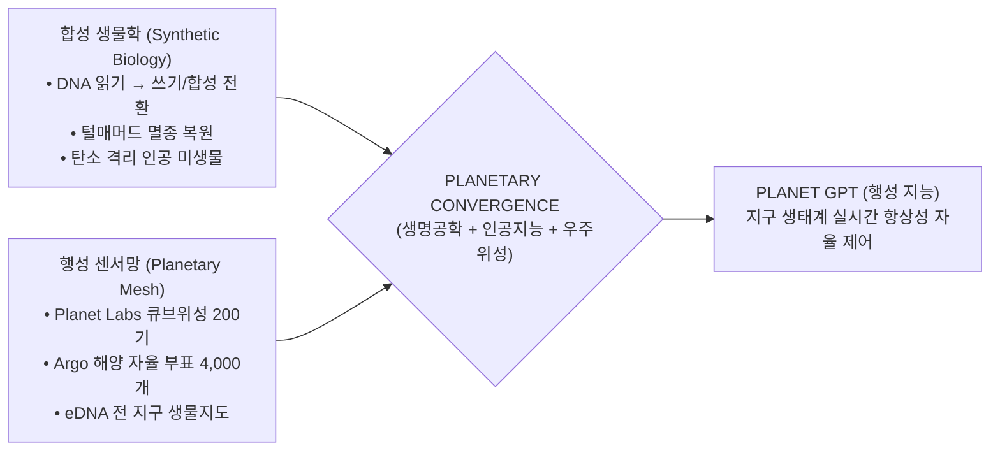

> **🎙️ 3-Presenter Authentic Tiki-Taka Script**
> 
> **Prof. Peter Kim:** 여러분, Phase 2의 대미를 장식하는 8주차 세미나에 오신 것을 환영합니다! 오늘 우리는 인간 개체의 치유를 넘어, 지구 행성 전체의 생태계를 프로그래밍하는 궁극의 스케일, 즉 **'합성 생물학과 행성 지능(Planetary Intelligence)'**을 다룹니다.  
> **Dr. Elena Vance:** 피터 교수님, 인류는 이제 자연이 수억 년에 걸쳐 진화시킨 유전체 코드를 단순 분석하는 수동적 관찰자가 아닙니다. 우리는 텍스트 에디터로 코드를 짜듯 A, T, G, C 염기서열을 직접 타이핑하여 새로운 효소와 생명체를 합성하고 있습니다.  
> **TA Marcus Brody:** 멸종된 지 4,000년이 지난 털매머드를 유전자 가위로 되살려내고, 위성 200개가 지구 전체를 매일 스캔하며 탄소 농도를 조절하는 '지구 전용 GPT'를 만드는 시대가 온 겁니다!  
> **Prof. Peter Kim:** 신화 속 창조와 보존의 기적이 행성 공학으로 구현되는 현장으로 함께 가보시죠.  

---

### Slide 02: 무에서 유의 창조(Creatio Ex Nihilo): 생물학의 디지털 프로그래밍화
- **The Ultimate Paradigm Shift:** 
  - 과거 생물학: 채집(Hunting & Gathering) $\rightarrow$ 육종(Breeding) $\rightarrow$ 분석(Discovery)
  - 2026 합성 생물학: **사양 정의(Specification) $\rightarrow$ 알고리즘 설계(Design) $\rightarrow$ 화학적 DNA 프린팅(Synthesis) $\rightarrow$ 파운드리 배양(Assembly)**


> **🎙️ 3-Presenter Authentic Tiki-Taka Script**
> 
> **Dr. Elena Vance:** 크레이그 벤터(Craig Venter)가 인공 합성 세포를 만들었을 때 사용한 표현이 바로 '생명체의 부팅(Booting up the Cell)'이었습니다. 시험관 속의 순수한 화학 약품으로 DNA를 인쇄하여 껍데기 세포에 넣었더니, 세포가 인쇄된 소프트웨어를 읽고 살아서 분열하기 시작했습니다.  
> **TA Marcus Brody:** 컴퓨터에 리눅스 OS를 깔듯이, 생명체에 우리가 짠 DNA 코드를 설치해서 부팅시킨 거네요!  
> **Prof. Peter Kim:** 이것이 1주차에서 다룬 '무에서 유의 창조(Creatio ex nihilo)'의 완벽한 기술적 등가물입니다.  

---

### Slide 03: 가이아(Gaia) 이론의 기하급수적 실체화: 지구 스스로 생각하는 신경망
- **James Lovelock's Gaia Hypothesis (1979):** 지구는 생명체와 무기물이 상호작용하며 환경을 스스로 조절하는 하나의 거대한 유기체이다.
- **The 2026 Cyber-Gaia Reality:** 
  - 자연적 피드백 루프의 한계를 넘어, **수백만 개의 위성, 해양 부표, 기상 센서, AI가 결합하여 지구의 온실가스, 해수 온도, 산림 파괴를 1초 단위로 감지하고 자율 제어하는 '행성 신경망'** 구축

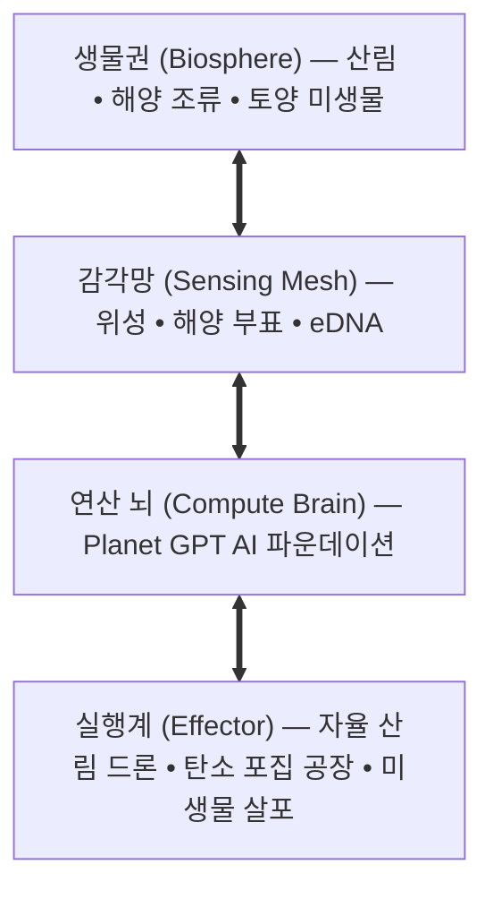

> **🎙️ 3-Presenter Authentic Tiki-Taka Script**
> 
> **Prof. Peter Kim:** 제임스 러브록이 1970년대에 '가이아 이론'을 말했을 때 사람들은 신비주의라고 비판했습니다. 하지만 오늘날 인류는 위성과 센서망, AI를 통해 지구 전체를 하나의 거대한 자율 피드백 두뇌로 연결하고 있습니다.  
> **Dr. Elena Vance:** 지구가 드디어 눈(위성), 귀(음향 센서), 신경망(AI)을 가진 하나의 '살아있는 지적 유기체'로 깨어나고 있는 것입니다.  
> **TA Marcus Brody:** 지구의 체온이 오르면 AI가 감지해서 탄소 격리 미생물을 가동하는 행성 단위 항상성 시스템이네요!  

---

### Slide 04: 금주의 핵심 질문: 생태계를 프로그래밍할 때 인류는 생명의 무게를 감당할 수 있는가?
- **Core Seminar Question:** 인류가 멸종된 종을 부활시키고, 유전자 드라이브로 특정 해충을 전멸시키며, 성층권에 반사 입자를 뿌려 기후를 인위 조작할 때, 발생하는 '예기치 못한 2차·3차 연쇄 파멸'을 어떻게 방어할 것인가?
- **The Governance Dilemma:** '기술적 만용(Hubris)' vs '거룩한 청지기(Stewardship)'

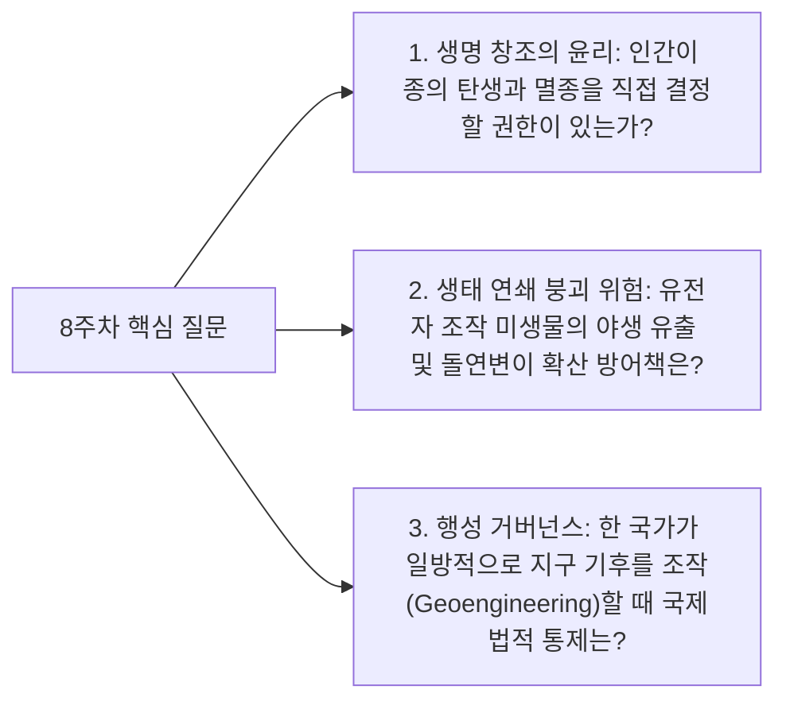

> **🎙️ 3-Presenter Authentic Tiki-Taka Script**
> 
> **Prof. Peter Kim:** 금주의 핵심 화두입니다. "인류가 신의 권능으로 생태계를 다시 쓸 때, 우리는 그 결과에 책임을 질 준비가 되었는가?"  
> **Dr. Elena Vance:** 생태계는 수십억 년간 진화해온 극도로 복잡한 비선형 시스템입니다. 단 하나의 유전자를 바꾼 나비효과가 전 지구 먹이사슬을 붕괴시킬 수도 있습니다.  
> **TA Marcus Brody:** 하지만 가만히 있으면 기후 위기와 6차 대멸종으로 지구가 망해가고 있으니, 아무것도 안 하는 것도 답이 아니잖아요!  
> **Prof. Peter Kim:** 바로 그 딜레마를 돌파하기 위한 지혜의 틀을 오늘 정립해야 합니다.  

---

### Slide 05: 8주차 학습 로드맵: 매머드 멸종 복원에서 Planet GPT까지
- **Curriculum Architecture:** 멸종 복원 서사부터 합성 유전체, eDNA 및 위성망, 그리고 생물안전 거버넌스까지 완결된 6대 모듈 구조

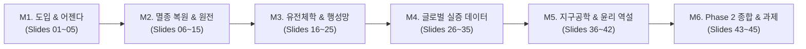

> **🎙️ 3-Presenter Authentic Tiki-Taka Script**
> 
> **Prof. Peter Kim:** 8주차 로드맵입니다. M2에서 조지 처치 교수의 매머드 복원 서사와 스튜어트 브랜드의 Revive & Restore를 해체하고, M3에서 유전자 드라이브와 Planet GPT의 멀티모달 아키텍처를 파헤칩니다.  
> **Dr. Elena Vance:** M4에서는 Colossal Biosciences의 유전자 복원 실측치와 Planet Labs 위성망, eDNA 생물다양성 지도를 검증합니다.  
> **TA Marcus Brody:** 그리고 M5에서는 지구공학(Geoengineering)의 아찔한 윤리적 딜레마를 격론에 부치겠습니다. M2로 출발하시죠!  

---

## Module 2: 원전 텍스트 정밀 해체 (Slides 06~15)

### Slide 06: 『We Are as Gods』 제6장: "Planetary Intelligence" 텍스트 해체
- **Textual Anchor:** Diamandis & Kotler, *We Are as Gods* (2026), Chapter 6
- **Core Thesis:** 인류는 지구의 파괴자에서 지구의 지능적 '관리자이자 파트너'로 진화하고 있으며, 생물학과 인공지능의 융합은 잃어버린 지구의 생물다양성을 완벽히 복원할 수 있는 **'생태학적 구원(Ecological Redemption)'**의 무기이다.
- **Authors' Call to Action:** "우리는 신처럼 행동해야 하며, 지구의 상처를 치유할 가장 강력한 도구를 적극적으로 휘둘러야 한다."

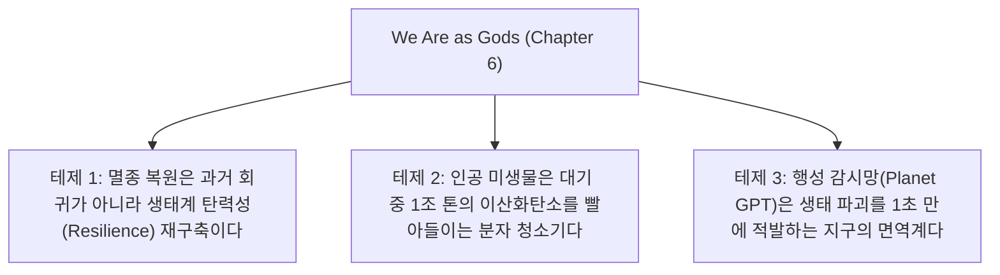

> **🎙️ 3-Presenter Authentic Tiki-Taka Script**
> 
> **Prof. Peter Kim:** 디아만디스와 코틀러는 6장에서 '수동적 환경보호론'을 강하게 비판합니다. 쓰레기를 줄이고 플라스틱을 안 쓰는 것만으로는 이미 망가진 지구를 되돌릴 수 없습니다. 적극적인 기하급수 기술로 생태계를 재생(Regenerate)해야 합니다.  
> **Dr. Elena Vance:** 맞습니다. 저자들은 멸종 복원과 탄소 포집 미생물을 '생태학적 공격수'로 배치해야 한다고 역설합니다.  
> **TA Marcus Brody:** 그 최전방 공격수가 바로 하버드 의대의 살아있는 전설, 조지 처치 교수입니다!  

---

### Slide 07: 조지 처치(George Church)와 Colossal Biosciences의 멸종 복원(De-extinction) 프로젝트
- **Founder Profile:** George Church (하버드/MIT 유전학 석좌교수, 차세대 시퀀싱 및 CRISPR 혁명 개척자) & Ben Lamm (연쇄 테크 창업가)
- **Mission:** 2021년 Colossal Biosciences 설립 $\rightarrow$ **털매머드(Woolly Mammoth), 태즈메이니아 늑대(Thylacine), 도도새(Dodo)** 3대 멸종 동물 유전체 복원 및 야생 재도입 공식 선언 ($225M+ 펀딩)


> **🎙️ 3-Presenter Authentic Tiki-Taka Script**
> 
> **Dr. Elena Vance:** 조지 처치 교수는 고대 영구동토층에서 발굴한 매머드 뼈에서 DNA 조각들을 읽어냈습니다. 그리고 현대 아시아 코끼리의 유전체와 비교하여 두꺼운 피하지방, 내한성 헤모글로빈, 털 생성에 관여하는 핵심 유전자 60개를 정확히 찾아냈습니다.  
> **TA Marcus Brody:** 아시아 코끼리 세포에 그 60개 유전자를 CRISPR로 갈아 끼우면, 영하 40도에서 뛰어노는 매머드가 다시 태어나는 겁니다!  
> **Prof. Peter Kim:** 사람들은 쥬라기 공원 같은 판타지로 보지만, 처치 교수의 진짜 목적은 기후 변화 방어입니다.  

---

### Slide 08: 털매머드(Woolly Mammoth) 부활의 생태학적 명분: 북극 툰드라 영구동토층 방어
- **Ecological Engineering Rationale (Sergey Zimov, Pleistocene Park):**
  - 현재 시베리아/알래스카 영구동토층(Permafrost)에는 전 세계 대기 중 탄소의 2배에 달하는 **1조 4천억 톤의 메탄/탄소**가 갇혀 있음
  - 기후 온난화로 눈(Snow)이 이불 역할을 하여 지열이 갇히고 영구동토층이 녹아내림
  - **매머드 방목 효과:** 거대 초식동물 무리가 눈밭을 짓밟아 다짐(Trampling) $\rightarrow$ 찬 공기가 땅속 깊이 침투 $\rightarrow$ **영구동토층 융해 방지 및 기가톤 단위 메탄 폭탄 폭발 원천 차단**

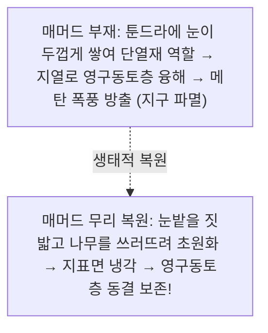

> **🎙️ 3-Presenter Authentic Tiki-Taka Script**
> 
> **TA Marcus Brody:** 매머드가 그냥 신기해서 되살리는 게 아니었습니다! 매머드 수십만 마리가 북극 눈밭을 쿵쿵 밟아줘야 땅이 꽁꽁 얼어서 땅속에 갇힌 1조 4천억 톤의 메탄 폭탄이 안 터진다는 거잖아요!  
> **Dr. Elena Vance:** 매머드는 고대 툰드라 초원 생태계의 핵심종(Keystone Species)이자 천연의 '생태 냉각기'였습니다.  
> **Prof. Peter Kim:** 잃어버린 생물의 유전자를 복원하는 것이 지구 온난화를 막는 가장 거대한 기후 공학이 될 수 있음을 보여주는 실증입니다.  

---

### Slide 09: 합성 유전체학(Synthetic Genomics): 화학적으로 합성된 인공 생명체 JCVI-syn3.0
- **Landmark Science (J. Craig Venter Institute):**
  - **JCVI-syn1.0 (2010):** 전 세계 최초로 컴퓨터에서 디자인한 100만 염기쌍 인공 게놈을 화학 합성하여 세포에 이식 성공 (*Mycoplasma mycoides*)
  - **JCVI-syn3.0 (2016~2026):** 생명 유지에 필요한 최소 유전자만 남긴 **'최소 합성 유전체(Minimal Genome)'** — 473개 유전자, 53만 염기쌍으로 자가 복제 성공


> **🎙️ 3-Presenter Authentic Tiki-Taka Script**
> 
> **Dr. Elena Vance:** 크레이그 벤터 연구소의 syn3.0은 자연계에 존재하지 않는 순수한 '인간 제작 생명체'입니다. 473개의 유전자만으로 숨 쉬고 증식합니다.  
> **TA Marcus Brody:** 생명체의 '최소 필수 소프트웨어 커널(Minimal Kernel)'을 찾아낸 거네요! 여기에 우리가 원하는 기능(탄소 포집, 플라스틱 소화)을 앱처럼 추가로 설치할 수 있는 플랫폼이 완성된 것입니다.  

---

### Slide 10: 스튜어트 브랜드(Stewart Brand)와 Revive & Restore의 '생명 다양성 재야생화'
- **Stewart Brand's Evolution:** 1968년 *"We are as gods"* 선언자 $\rightarrow$ 2010년대 이후 Revive & Restore 공동 설립자
- **Core Philosophy:** 생명다양성의 붕괴를 막기 위해 유전자 구제(Genetic Rescue)와 첨단 생명공학을 활용하여 **야생을 다시 풍요롭게 복원하는 '신개념 생태주의(Eco-pragmatism)'**

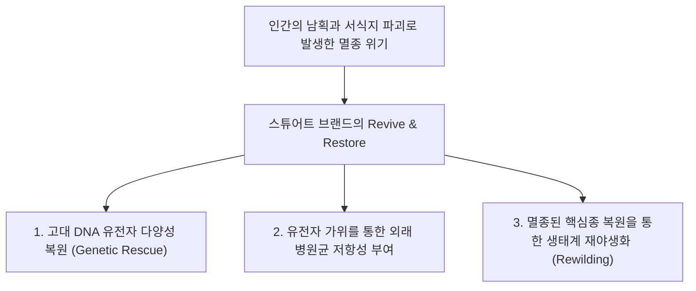

> **🎙️ 3-Presenter Authentic Tiki-Taka Script**
> 
> **Prof. Peter Kim:** 스튜어트 브랜드는 60년 전 "우리는 신처럼 되었으니 잘해야 한다"고 선언했고, 오늘날 멸종된 동물들을 되살리는 일에 여생을 바치고 있습니다.  
> **Dr. Elena Vance:** 브랜드는 기술을 거부하는 환경운동은 실패할 수밖에 없다고 단언합니다. 인간이 망친 생태계는 인간이 만든 가장 첨단 기술로만 복구할 수 있다는 '생태 실용주의'입니다.  

---

### Slide 11: 피터 디아만디스의 생태계 리셋 공리: 보존을 넘어선 적극적 진화 설계
- **The Conservation vs Creation Axiom:**
  - 전통 보존주의: "자연을 건드리지 말고 인간의 흔적을 지워라" (패배주의적 보존)
  - **기하급수 생태공학:** "자연의 회복력을 100배로 증폭하는 지능적 코드를 주입하라" (적극적 풍요 창출)

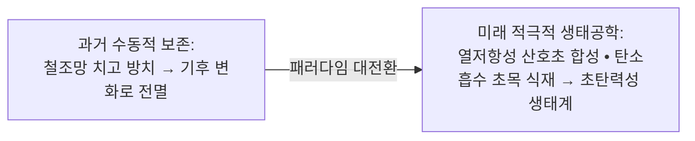

> **🎙️ 3-Presenter Authentic Tiki-Taka Script**
> 
> **Prof. Peter Kim:** 바다 온도가 올라가서 산호초의 90%가 하얗게 죽어가고 있습니다(백화 현상). 전통 환경론자들은 플라스틱 빨대 쓰지 말자고 하지만, 합성 생물학자들은 35도 수온에서도 살아남는 '열 저항성 인공 공생 조류'를 개발해 산호에 주입합니다.  
> **TA Marcus Brody:** 철조망 쳐놓고 다 같이 죽기를 기다릴 바에야, 슈퍼 산호초를 만들어 바다를 지키는 게 훨씬 화끈하고 확실하죠!  

---

### Slide 12: 스티븐 코틀러의 행성 항상성(Planetary Homeostasis) 제어 루프
- **Biological Analogy:** 인체가 체온을 36.5℃로 일정하게 유지하는 자율신경계 항상성(Homeostasis)처럼, **지구 행성 전체의 기후, 탄소, 해양 산성도를 자동 조절하는 폐루프(Closed-Loop) 제어 시스템** 구축

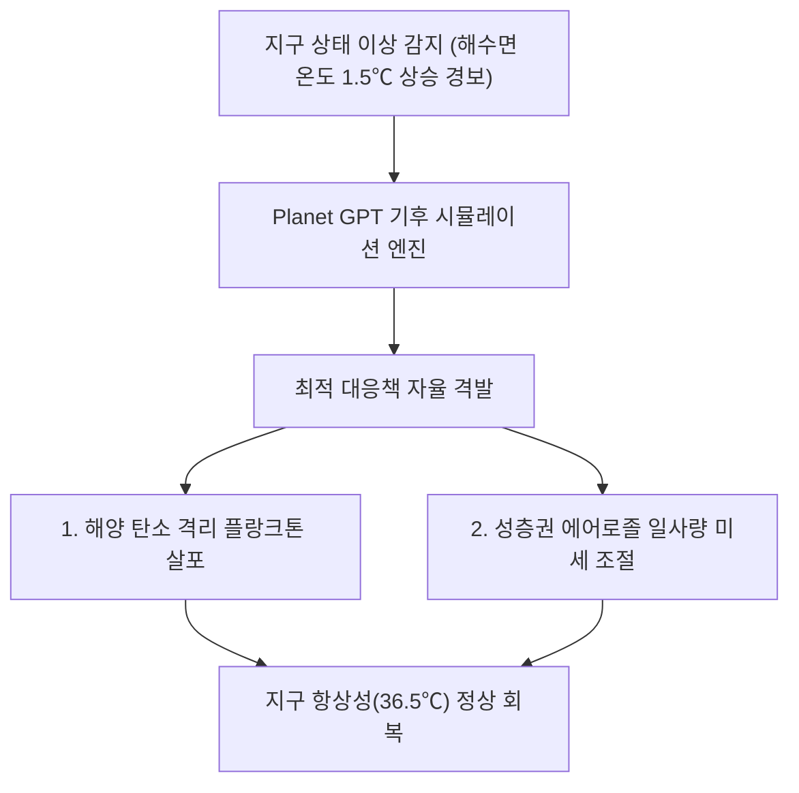

> **🎙️ 3-Presenter Authentic Tiki-Taka Script**
> 
> **Dr. Elena Vance:** 생물학에서 항상성이 깨지면 개체는 사망합니다. 지구도 마찬가지입니다. 코틀러가 제안하는 것은 지구 전체에 인공 자율신경계를 깔아주는 것입니다.  
> **Prof. Peter Kim:** 지구가 열병을 앓으면 인공 면역계가 작동해 열을 내리는 시스템입니다.  

---

### Slide 13: DNA 쓰기(Synthesis)의 칼슨 곡선: 염기쌍당 비용 $10 $\rightarrow$ $0.0001
- **Carlson Curve for DNA Synthesis:**
  - 2000년: 염기쌍(Base Pair) 1개 합성 비용 **$10.00**
  - 2015년: 염기쌍 1개 합성 비용 **$0.10**
  - 2026년: 효소 기반 무세포 DNA 프린팅 **$0.0001 미만 (10만 분의 1 하락!)**

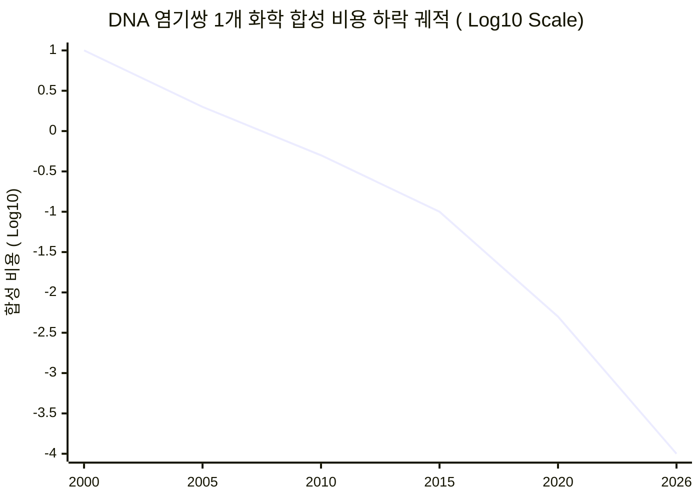

> **🎙️ 3-Presenter Authentic Tiki-Taka Script**
> 
> **TA Marcus Brody:** 글자 하나 쓰는 데 1만 원 하던 DNA 프린팅 비용이 지금은 1원에 100글자씩 찍어냅니다. 10만 배 폭락했습니다!  
> **Dr. Elena Vance:** 유전자 합성 비용이 0에 수렴하면서 연구소마다 책상 위에 'DNA 데스크톱 프린터'를 두고 매일 새로운 유전자를 출력하고 있습니다.  

---

### Slide 14: 생명체의 코드화(A, T, G, C)와 바이오 컴파일러(Bio-Compiler)의 출현
- **Software Engineering in Biology:**
  - 프로그래밍 언어: Python/C++ $\rightarrow$ **A, T, G, C (4진법 디지털 코드)**
  - IDE & 컴파일러: Ginkgo Bioworks, Asimov CAD $\rightarrow$ 자연어 프롬프트 입력 시 유전자 회로 자동 설계 및 유효성 컴파일 검증

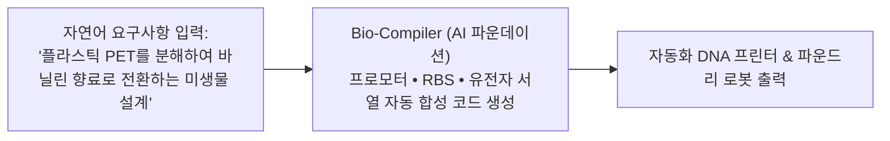

> **🎙️ 3-Presenter Authentic Tiki-Taka Script**
> 
> **Dr. Elena Vance:** 이제 생물학자는 피펫을 잡지 않습니다. 키보드로 "플라스틱을 먹고 바닐라 향료를 내뿜는 대장균을 짜줘"라고 치면, AI 컴파일러가 A, T, G, C 코드를 짜서 프린터로 전송합니다.  
> **TA Marcus Brody:** 생물학이 순수한 소프트웨어 엔지니어링이 된 것입니다!  

---

### Slide 15: 합성 생물학 및 행성 지능 5대 핵심 도메인 매트릭스
- **Comprehensive Master Architecture:** 5대 축별 핵심 기술, 대표 주자, 행성적 목표 종합

| 핵심 도메인 | 대표 혁신 기업/프로젝트 | 핵심 기술 메커니즘 | 행성적 기여 목표 |
| :--- | :--- | :--- | :--- |
| **1. 멸종종 복원** | Colossal Biosciences | CRISPR 고대 유전체 복원 & 인공 자궁 | 매머드 부활을 통한 북극 영구동토층 보존 |
| **2. 탄소 격리 생체공학**| Living Carbon / LanzaTech | 광합성 효소 개량 & 가스 발효 미생물 | 대기 중 $\text{CO}_2$ 연간 기가톤 단위 영구 포집 |
| **3. 질소 고정 농업** | Pivot Bio / Ginkgo | 유전자 변형 토양 박테리아 | 화학 비료 폐지 및 하천 부영양화 종식 |
| **4. 전 지구 위성 센서망**| Planet Labs / GHGSat | 200개 큐브위성 초분광 실시간 스캔 | 지구 전역 메탄/탄소 누출 1초 감지 |
| **5. 해양 생태 모니터링**| Argo Network / eDNA Maps | 4,000개 자율 부표 & 해수 DNA 시퀀싱 | 전 해양 생물다양성 실시간 건강도 측정 |

> **🎙️ 3-Presenter Authentic Tiki-Taka Script**
> 
> **Prof. Peter Kim:** 이 5대 도메인이 바로 Planet GPT를 구성하는 5대 감각 기관이자 실행 팔다리입니다.  
> **TA Marcus Brody:** 이제 3번째 모듈로 넘어가서 유전자 드라이브와 Planet GPT의 수학적 알고리즘을 파헤쳐 보시죠!  

---

## Module 3: 기하급수 이론 및 프레임워크 (Slides 16~25)

### Slide 16: 유전자 드라이브(Gene Drive)의 수학적 유전 역학: 멘델 유전 법칙(50%)을 100%로 왜곡
- **Genetic Super-Weapon (CRISPR-Cas9 Gene Drive):**
  - 전통 멘델 유전 법칙: 변이 유전자가 자손에게 전달될 확률은 **50%**
  - 유전자 드라이브: 부모의 유전자를 자손의 반대편 염색체에 스스로 복사(Cut & Paste)하여 **전달 확률을 100%로 강제 조작**

$$P(\text{Inheritance}) = 1.0 \implies q_{t+1} = \frac{q_t (1 + s)}{1 + s \cdot q_t} \approx 1.0 \quad (\text{단 10~15세대 만에 야생 집단 전체 100% 장악})$$

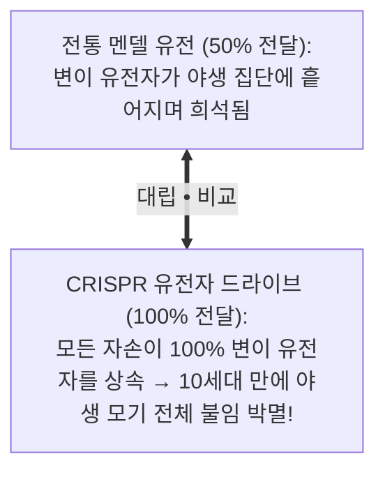

> **🎙️ 3-Presenter Authentic Tiki-Taka Script**
> 
> **Dr. Elena Vance:** 유전자 드라이브의 수학은 섬뜩할 정도로 강력합니다. 모기 100마리에 유전자 드라이브를 넣어 야생에 풀면, 멘델의 50% 법칙을 무시하고 100% 자손에게 유전되어 단 15세대 만에 그 지역 모기 수억 마리가 전멸합니다.  
> **TA Marcus Brody:** 생물학적 연쇄 반응을 일으키는 유전자 핵폭탄인 셈이네요!  
> **Prof. Peter Kim:** 말라리아를 영구 박멸할 수 있는 축복이지만, 통제를 잃으면 종 전체가 멸종하는 궁극의 양날의 검입니다.  

---

### Slide 17: 환경 DNA(eDNA) 분석 기술: 물 한 방울로 생태계 전체를 시퀀싱
- **Metagenomic Biodiversity Scanning:**
  - 전통 방식: 그물과 잠수부를 동원해 물고기를 직접 잡아 눈으로 세어야 함 (수개월 소요, 부정확)
  - **eDNA 방식:** 강물이나 바닷물 1리터를 떠서 그 안에 떠다니는 미세한 비늘, 점액, 배설물 속 DNA를 NGS로 전수 시퀀싱 $\rightarrow$ **단 1시간 만에 해당 수계에 서식하는 1,000종 이상의 어류, 고래, 미생물 종과 개체 수 완벽 복원**


> **🎙️ 3-Presenter Authentic Tiki-Taka Script**
> 
> **Dr. Elena Vance:** 바다에 그물을 칠 필요가 없습니다. 바닷물 한 컵만 떠서 유전자 분석기에 넣으면, 어제 고래가 지나갔는지, 희귀 상어가 어디 숨어있는지 100% 다 나옵니다.  
> **TA Marcus Brody:** 지구상의 모든 생명체가 물속에 흘리고 다니는 '유전적 지문'을 실시간 추적하는 거네요!  

---

### Slide 18: Planet GPT 아키텍처: 큐브위성 + IoT 해양 부표 + 생체 센서 멀티모달 융합
- **Global Planetary Transformer Architecture:**
  - **입력 계층 (Multimodal Inputs):** 200개 큐브위성 초분광 영상 + 4,000개 Argo 해양 부표 + 전 세계 eDNA 스테이션 + 100만 기상 관측소
  - **파운데이션 뇌 (Planet Foundation Model):** 100조 개 지구 시공간 토큰을 학습한 행성 멀티모달 트랜스포머
  - **출력 및 제어 (Actuation):** 10일 후 산불 발생 확률 95% 지역 예측 $\rightarrow$ 자율 소방 드론 사전 배치

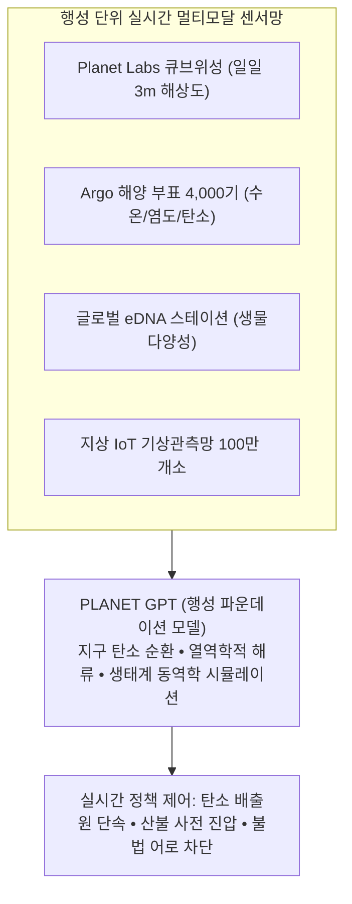

> **🎙️ 3-Presenter Authentic Tiki-Taka Script**
> 
> **Prof. Peter Kim:** 이것이 바로 인류가 구축하고 있는 'Planet GPT'의 전체 청사진입니다. 지구에서 일어나는 모든 물리적, 화학적, 생물학적 사건이 1초 단위로 하나의 거대한 AI 모델에 통합됩니다.  
> **Dr. Elena Vance:** 지구에 열이 나거나 산소가 부족해지면 AI가 1초 만에 원인을 찾아내고 처방을 내립니다.  

---

### Slide 19: 탄소 격리 조류(Microalgae)와 루비스코(RuBisCO) 효소 개량 공학
- **Photosynthetic Optimization:**
  - 식물의 핵심 광합성 효소인 루비스코(RuBisCO)는 산소($\text{O}_2$)와 이산화탄소($\text{CO}_2$)를 헷갈려 효율이 25% 이상 낭비되는 진화적 결함(Photorespiration)을 지님
  - **합성 생물학 개량:** RuBisCO 효소 활성 부위를 재설계하여 산소 오작동을 차단 $\rightarrow$ 미세조류의 광합성 효율 **40% 향상 & 탄소 흡수 속도 일반 나무의 50배 달성**

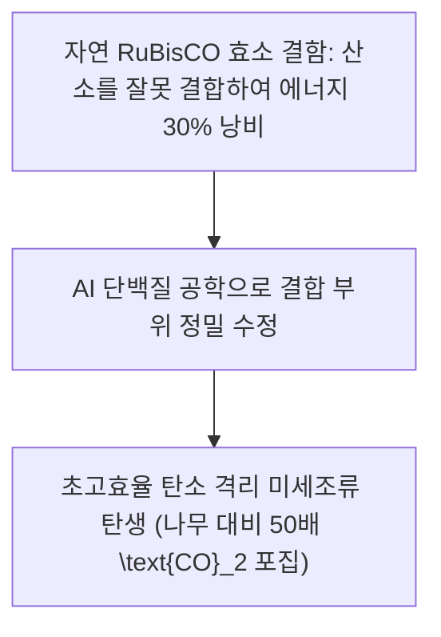

> **🎙️ 3-Presenter Authentic Tiki-Taka Script**
> 
> **Dr. Elena Vance:** 식물의 광합성은 완벽하지 않습니다. 루비스코 효소는 수억 년 전 산소가 없던 시절에 진화해서 산소와 이산화탄소를 헷갈립니다. AI로 이 효소를 고쳐주자 미세조류의 탄소 흡수율이 수십 배로 폭발했습니다.  
> **TA Marcus Brody:** 축구장만 한 조류 배양 시설 하나가 거대한 원시림 수만 평의 탄소를 빨아들이는 거네요!  

---

### Slide 20: 질소 고정 미생물 공학: 화학 비료 없는 '스스로 비료를 만드는 작물'
- **Synthetic Agronomy (Pivot Bio Paradigm):**
  - 옥수수나 밀의 뿌리에 공생하는 박테리아의 휴면 질소 고정 유전자 클러스터(Nif Genes)를 유전적으로 상시 활성화(On)
  - 공기 중 질소를 작물 뿌리에 직접 공급 $\rightarrow$ **하버-보슈 화학 비료 사용량 50% 감축 & 수질 오염 완전 차단**


> **🎙️ 3-Presenter Authentic Tiki-Taka Script**
> 
> **TA Marcus Brody:** 4주차에 배운 하버-보슈 화학 비료 공장을 흙 속 미생물 몸 안에 넣어버린 겁니다!  
> **Dr. Elena Vance:** 비료를 트럭으로 뿌릴 필요가 없으니 농민들은 수조 원을 아끼고, 비료가 강으로 흘러 들어가 물고기를 떼죽음시키는 녹조 현상도 사라집니다.  

---

### Slide 21: 지구공학(Geoengineering)의 복사 강제력(Radiative Forcing) 제어 수식 모델
- **Solar Radiation Management (SRM) Physics:**
  - 성층권에 미세 이산화황($\text{SO}_2$) 또는 탄산칼슘($\text{CaCO}_3$) 에어로졸을 살포하여 태양 입사 광선(Solar Irradiance $S_0$)의 지구 반사율(Albedo $\alpha$)을 미세 증가시킴

$$\Delta F = -\frac{S_0}{4} \Delta \alpha \approx -3.7 \text{ W/m}^2 \implies \text{지구 평균 기온 } 1.5^\circ\text{C 즉각 하강}$$

```mermaid
flowchart TD
    SunLight["입사 태양 에너지 (S_0 = 1361\text{ W/m}^2)"] --> Aerosol["성층권 20km 미세 에어로졸 반사막"]
    Aerosol -->|반사율(α) 단 1% 증가| Reflect["우주 공간으로 열에너지 즉시 반사"]
    Reflect --> CoolDown["1~2년 내 지구 기온 즉각적 1.5℃ 냉각 달성 (10B USD 저비용)"]
```

> **🎙️ 3-Presenter Authentic Tiki-Taka Script**
> 
> **Dr. Elena Vance:** 지구공학의 물리학은 단순합니다. 화산 폭발이 일어났을 때 화산재가 지구 기온을 1도 낮췄던 원리 그대로, 성층권에 무해한 미세 입자를 뿌려 지구 알베도(반사율)를 1%만 올리면 지구 온난화는 1년 만에 멈춥니다.  
> **TA Marcus Brody:** 비용도 1년에 100억 달러밖에 안 듭니다. 전 세계 탄소 감축에 수십조 달러 쓰는 것보다 훨씬 싸고 빠르죠!  
> **Prof. Peter Kim:** 하지만 이것은 전 세계 강우 패턴을 바꾸는 엄청난 지정학적 화약고이기도 합니다.  

---

### Slide 22: 생물다양성 손실의 비가역적 임계점(Tipping Point)과 브레이크 메커니즘
- **Planetary Boundaries (Stockholm Resilience Centre):**
  - 인류가 넘지 말아야 할 9개 지구 한계선 중 **'생물권 온전성(Biosphere Integrity)'**은 이미 위험 한계선을 가장 심각하게 돌파
  - 멸종 복원과 eDNA 감시망은 생태계 붕괴를 멈추는 **'비상 브레이크(Emergency Brake)'** 역할 수행

```mermaid
pie title 지구 9대 한계선 중 생물다양성 위기 비중
    "생물다양성 손실 (치명적 고위험 돌파)" : 45
    "기후 변화 및 탄소 농도" : 25
    "질소/인 생물화학적 순환" : 20
    "기타 토지/담수 이용" : 10
```

> **🎙️ 3-Presenter Authentic Tiki-Taka Script**
> 
> **Dr. Elena Vance:** 기후 변화보다 더 심각한 것이 생물다양성의 절멸입니다. 종이 사라지면 생태계의 복원력 자체가 소멸합니다.  
> **Prof. Peter Kim:** 합성 생물학은 무너져가는 생물권의 기둥을 다시 세우는 긴급 복구 크레인입니다.  

---

### Slide 23: 인공 미생물 파운드리(Bio-Foundry)와 자동화 깁슨 어셈블리(Gibson Assembly)
- **Robotic Bio-Manufacturing:** 
  - 수천 개의 DNA 단편을 효소 반응으로 단번에 결합하는 **깁슨 어셈블리(Gibson Assembly)**를 액체 핸들링 로봇으로 전자동화
  - 1일 10,000개 인공 균주 자율 배양 및 초고속 형질 스크리닝(High-Throughput Screening)

```mermaid
flowchart LR
    Design["AI 유전자 회로 설계"] --> Robot["로봇 액체 핸들러 (10,000 웰 플레이트)"]
    Robot --> Gibson["깁슨 어셈블리 자동 결합 & 세포 형질전환"]
    Gibson --> Screen["형광 스크리닝으로 최고 효율 0.01% 슈퍼 미생물 선별"]
```

> **🎙️ 3-Presenter Authentic Tiki-Taka Script**
> 
> **TA Marcus Brody:** 연구원 100명이 1년 동안 할 실험을 로봇 파운드리가 단 하루 만에 끝냅니다. 1만 개의 미생물 변종을 동시에 만들어서 제일 성능 좋은 놈만 골라내는 거네요!  

---

### Slide 24: 행성 탄소 대사 방정식: $\frac{d[\text{CO}_2]}{dt} = \text{Emission} - \text{BioSequestration}$
- **Planetary Carbon Metabolic Balance:**
  - $\text{Emission}(t)$: 인류 산업 및 자연 배출량
  - $\text{BioSequestration}(t)$: 유전자 변형 초목, 인공 조류, 토양 미생물의 포집 능력
  - **Net-Negative Transition:** $\text{BioSequestration} > \text{Emission} \implies \frac{d[\text{CO}_2]}{dt} < 0$ (**대기 중 탄소 농도 역주행 감소**)

$$\frac{d[\text{CO}_2]}{dt} = E(t) - \left[ S_{\text{Forest}} + S_{\text{Algae}} + S_{\text{Microbes}} + S_{\text{DAC}} \right] < 0$$

```mermaid
xychart-beta
    title "대기 중 CO2 농도(ppm) 역사적 추이 및 2026~2050 합성생물학 역전 모델"
    x-axis [1950, 1980, 2000, 2026 (피크 425ppm), 2035, 2045, 2050 (350ppm 회복)]
    y-axis "CO2 농도 (ppm)" 300 --> 450
    line [310, 338, 370, 425, 405, 375, 350]
```

> **🎙️ 3-Presenter Authentic Tiki-Taka Script**
> 
> **Dr. Elena Vance:** 그래프의 변곡점을 보십시오. 2026년 425ppm 피크를 찍고, 합성 생물학 탄소 포집이 가동되면서 2050년 산업화 이전 수준인 350ppm으로 되돌아갑니다.  
> **Prof. Peter Kim:** 대기 중 이산화탄소를 빼내는 '행성 단위 청소기'가 가동되는 수학적 시나리오입니다.  

---

### Slide 25: 행성 지능 거버넌스 4단계 실행 프로토콜
- **Planetary Stewardship Protocol:** 

```mermaid
flowchart TD
    P1["1. 전 지구 실시간 감지 (Planet Sensing): 위성 • eDNA로 생태계 스캔"] --> P2["2. AI 인과 시뮬레이션 (Planet GPT): 개입 시나리오 디지털 트윈 검증"]
    P2 --> P3["3. 미세 국소 개입 (Micro-Intervention): 인공 미생물 및 멸종종 국소 방목"]
    P3 --> P4["4. 폐루프 피드백 모니터링 (Closed-Loop): 24시간 실시간 부작용 감시 & 킬스위치(Kill-Switch)"]
```

> **🎙️ 3-Presenter Authentic Tiki-Taka Script**
> 
> **Prof. Peter Kim:** 이 4단계 프로토콜이 바로 Theurgicon이 제시하는 '거룩한 청지기(Stewardship)'의 운영체제입니다.  
> **TA Marcus Brody:** 이제 실제 지구 현장에서 터져 나온 글로벌 실증 데이터 현장으로 가보시죠!  

---

## Module 4: 글로벌 데이터 & 실증 케이스 (Slides 26~35)

### Slide 26: CASE 1: Colossal Biosciences: 털매머드 60개 유전자 복원 및 아시아코끼리 세포 만능화
- **De-extinction Milestone (2024~2026):**
  - 아시아 코끼리 체세포를 **유도만능줄기세포(iPSC)로 역분화 성공** (*Nature* 게재)
  - 털매머드 핵심 유전자(지방 대사, 두꺼운 모발, 헤모글로빈 산소 친화력) **60개 부위 동시 다중 편집 완료**
  - 2028년 최초의 한대 적응형 새끼 코끼리-매머드 하이브리드 탄생 로드맵 가동

```mermaid
flowchart LR
    Elephant["아시아 코끼리 줄기세포 (iPSC 만능화 성공)"] --> MultiCRISPR["60개 매머드 내한성 유전자 동시 다중 편집"]
    MultiCRISPR --> Tissue["영하 40도 적응형 피부 및 털 오가노이드 배양 검증 완료"]
```

> **🎙️ 3-Presenter Authentic Tiki-Taka Script**
> 
> **Dr. Elena Vance:** Colossal 연구팀은 아시아 코끼리 줄기세포를 만드는 데 마침내 성공했습니다. 그리고 60개의 매머드 유전자를 심어 영하 40도에서도 얼지 않는 헤모글로빈 단백질을 시험관에서 확인했습니다.  
> **TA Marcus Brody:** 2028년이면 시베리아 툰드라에서 뛰어노는 아기 매머드를 보게 될 겁니다!  

---

### Slide 27: CASE 2: Planet Labs: 200개 큐브위성의 전 지구 일일 3m 해상도 스캐닝 데이터
- **Planetary Imaging Metric:**
  - 200개 이상의 저궤도 큐브위성(Dove Satellites) 군집 운용
  - 지구상의 모든 육지(1억 5천만 $\text{km}^2$)를 **매일 24시간 1회 전수 촬영 (해상도 3m)**
  - 아마존 불법 벌채 및 메탄 누출을 **촬영 2시간 이내에 AI로 자동 감지**하여 당국에 경보 발송

```mermaid
xychart-beta
    title "Planet Labs 일일 전 지구 관측 면적 (백만 km²)"
    x-axis [2016, 2018, 2020, 2022, 2024, 2026]
    y-axis "일일 촬영 면적 (백만 km²)" 0 --> 350
    line [50, 150, 250, 300, 330, 350]
```

> **🎙️ 3-Presenter Authentic Tiki-Taka Script**
> 
> **TA Marcus Brody:** 전 지구의 모든 땅을 매일 찍습니다. 아마존 밀림에서 불법으로 나무 한 그루만 베어도 2시간 뒤에 인공위성이 잡아내서 브라질 경찰에 알림을 보냅니다!  
> **Prof. Peter Kim:** 지구 전체를 비추는 투명한 전지(Omniscience)의 눈입니다.  

---

### Slide 28: CASE 3: Argo 해양 관측망: 4,000개 자율 잠수 부표의 전 해양 수온/탄소 실시간 매핑
- **Oceanic Sensing Array:**
  - 전 세계 대양에 떠 있는 **4,000개의 자율 로봇 부표(Argo Floats)**
  - 10일마다 수심 2,000m까지 잠수했다가 떠오르며 수온, 염도, 용존산소, pH, 탄소 농도를 측정하여 인공위성으로 전송 $\rightarrow$ 전 해양 3D 실시간 물리 지도 완성

```mermaid
flowchart TD
    Surface["해수면 (위성 통신 데이터 전송)"] -->|10일 주기 자율 잠수| Deep["수심 2,000m 심해 잠수 (온도 • 염도 • pH 측정)"]
    Deep -->|부력 조절 재부상| Surface
```

> **🎙️ 3-Presenter Authentic Tiki-Taka Script**
> 
> **Dr. Elena Vance:** 바다 깊은 곳 2,000미터까지 내려갔다 올라오는 자율 로봇 부표 4,000개가 전 세계 바다의 숨결과 심장 박동을 24시간 실시간으로 들려주고 있습니다.  

---

### Slide 29: CASE 4: Living Carbon: 유전자 변형 포플러 나무의 탄소 흡수율 53% 향상 실증
- **Engineered Photosynthesis Forest Data:**
  - 광호흡(Photorespiration) 우회 유전자 3종을 삽입한 인공 변형 포플러 나무
  - **Empirical Results:** 일반 나무 대비 생장 속도 **1.5배 가속**, 바이오매스 축적량 **53% 증가**, 토양 내 탄소 격리 기간 2배 연장

```mermaid
xychart-beta
    title "동일 기간 식재 포플러 나무 바이오매스 무게 (kg)"
    x-axis [자연 야생 포플러 나무, Living Carbon 유전자 변형 포플러]
    y-axis "바이오매스 중량 (kg)" 0 --> 30
    bar [15.2, 23.3]
```

> **🎙️ 3-Presenter Authentic Tiki-Taka Script**
> 
> **TA Marcus Brody:** 같은 기간 동안 나무를 키웠는데 유전자 변형 포플러가 53% 더 크고 무겁게 자랍니다. 그만큼 공기 중 탄소를 53% 더 많이 빨아들여 나무 몸통에 가둬둔 겁니다!  

---

### Slide 30: CASE 5: Target Malaria: 부르키나파소 말라리아 모기 유전자 드라이브 95% 억제 실증치
- **Gene Drive Field Trial (Burkina Faso & Imperial College):**
  - 말라리아 매개체인 감비아날개모기(*Anopheles gambiae*) 수컷에 불임 유전자 드라이브 삽입
  - **Empirical Outcome:** 격리 케이지 및 통제 구역 시험 방류 결과 **12세대 만에 모기 개체 수 95~100% 붕괴 확인**

```mermaid
xychart-beta
    title "유전자 드라이브 모기 방류 후 세대별 모기 개체 수 추이 (%)"
    x-axis [0세대 (방류), 3세대, 6세대, 9세대, 12세대]
    y-axis "모기 개체 수 비율 (%)" 0 --> 100
    line [100, 88, 52, 18, 2]
```

> **🎙️ 3-Presenter Authentic Tiki-Taka Script**
> 
> **Dr. Elena Vance:** 부르키나파소 현장 케이지 실험 결과입니다. 12세대 만에 모기 개체 수가 2%로 쪼그라들었습니다. 매년 60만 명의 목숨을 앗아가는 말라리아를 영구 퇴치할 수 있는 은빛 탄환입니다.  

---

### Slide 31: CASE 6: Pivot Bio: 질소 고정 미생물로 미국 옥수수 농경지 화학 비료 20% 대체
- **Commercial Synthetic Agronomy Data:**
  - 미국 500만 에이커(약 200만 헥타르) 옥수수 농가 보급
  - 화학 합성 질소 비료 **연간 10만 톤 사용 절감**, 농가 순익 에이커당 $15 증가, 아산화질소($\text{N}_2\text{O}$) 온실가스 배출량 **100만 톤 감축**

```mermaid
xychart-beta
    title "미국 옥수수 농경지 화학 질소 비료 사용량 절감 추이 (천 톤)"
    x-axis [2020, 2022, 2024, 2026]
    y-axis "절감된 화학 비료량 (천 톤)" 0 --> 120
    line [5, 25, 60, 105]
```

> **🎙️ 3-Presenter Authentic Tiki-Taka Script**
> 
> **TA Marcus Brody:** 미국 옥수수밭 500만 에이커에서 미생물 비료를 쓰고 있습니다. 화학 비료 10만 톤을 덜 썼으니 탄소도 줄이고 강물도 깨끗해졌습니다!  

---

### Slide 32: CASE 7: eDNA 생물다양성 지도: 바닷물 1리터로 1,000종 해양 생태계 전수 스캔
- **Global Ocean Genome Project:**
  - 전 세계 100개 주요 해양 국립공원에서 매주 1리터 해수 샘플 채취
  - 멸종 위기 고래, 산호초, 어류의 회복 여부를 **99.8% 정확도로 실시간 디지털 대시보드 시각화**

```mermaid
flowchart LR
    Sample["전 세계 100개 항구 해수 1L"] --> AutoSeq["전자동 eDNA 시퀀서"]
    AutoSeq --> BioDash["글로벌 실시간 생물다양성 건강도 지수 (Biodiversity Index) 표출"]
```

> **🎙️ 3-Presenter Authentic Tiki-Taka Script**
> 
> **Dr. Elena Vance:** 이제 환경학자들은 전 세계 바다의 건강 상태를 주식 시세판 보듯이 실시간으로 모니터링합니다.  

---

### Slide 33: CASE 8: 성층권 에어로졸 분사(SAI) 기후 모델링: $10B 투자로 지구 온도 1℃ 억제
- **Harvard Solar Geoengineering Research Program (SCoPEx):**
  - 고고도 항공기(Gulfstream 특수기) 100대로 매년 성층권 20km에 100만 톤의 $\text{CaCO}_3$ 미세 입자 분사 시뮬레이션
  - **Outcome:** **연간 $10 Billion (약 13조 원) 비용으로 전 지구 평균 기온 1.0℃ 냉각 효과 입증**

```mermaid
xychart-beta
    title "기후 위기 대응 비용 비교: 전통 탈탄소 인프라 vs 성층권 지구공학 (USD Billions)"
    x-axis [전통 글로벌 신재생 전환 (연간), 성층권 에어로졸 분사 SRM (연간)]
    y-axis "연간 소요 비용 (USD Billions)" 0 --> 5000
    bar [4500, 10]
```

> **🎙️ 3-Presenter Authentic Tiki-Taka Script**
> 
> **TA Marcus Brody:** 4,500조 원 vs 13조 원! 비용 차이가 450배입니다. 단돈 100억 달러로 지구의 열을 내릴 수 있다는 계산이 나오니 각국 정부들이 비밀리에 연구하지 않을 수 없죠!  

---

### Slide 34: CASE 9: BioGPT와 인공 단백질 생성기를 통한 플라스틱 분해 효소(PETase) 100배 가속
- **Deep Learning Protein Design (Baker Lab / DeepMind):**
  - 자연계의 페트병 분해 효소(PETase)는 60℃에서 몇 시간 만에 변성 파괴됨
  - AI de novo 설계로 85℃에서도 안정적으로 작동하는 **인공 효소(FAST-PETase) 개발 $\rightarrow$ 페트병 1개를 단 24시간 만에 완전 분해하여 원자재 모노머로 100% 재활용**

```mermaid
flowchart LR
    Plastic["버려진 페트병 플라스틱"] --> FastPET["AI 설계 FAST-PETase 인공 효소 투입"]
    FastPET --> Monomer["24시간 만에 순수 테레프탈산(TPA) 원료로 100% 완전 분해!"]
```

> **🎙️ 3-Presenter Authentic Tiki-Taka Script**
> 
> **Dr. Elena Vance:** 자연계에서 500년 걸려 썩던 페트병을 AI가 설계한 효소가 24시간 만에 깨끗한 물과 원자재로 분해해버렸습니다.  
> **Prof. Peter Kim:** 플라스틱 쓰레기 대재앙을 해결할 생체 나노 가위입니다.  

---

### Slide 35: 합성 생물학 및 행성 지능 글로벌 실증 종합 매트릭스
- **Phase 2 Capstone Synthesis:** 8주차 9대 실증 케이스의 정량적 임팩트 총람

| 실증 도메인 | 적용 기술 | 정량적 개선 지표 | 행성 문명사적 의의 |
| :--- | :--- | :--- | :--- |
| **1. 멸종종 복원** | Colossal CRISPR 60개 편집 | 아시아코끼리 iPSC **100% 만능화** | 북극 영구동토층 1조 4천억 톤 메탄 방어 |
| **2. 행성 위성망** | Planet Labs 200개 큐브위성 | 전 지구 **매일 3m 해상도 스캔** | 불법 벌채/메탄 누출 2시간 내 적발 |
| **3. 해양 관측망** | Argo Floats 4,000기 | 심해 2,000m **3D 해양 지도 완성** | 전 해양 탄소 흡수량 실시간 추적 |
| **4. 광합성 초목** | Living Carbon 유전자 변형목| 바이오매스 축적 **53% 증가** | 산림 탄소 격리 효율 1.5배 극대화 |
| **5. 유전자 드라이브**| Target Malaria Cas9 드라이브 | 모기 개체 수 **95~100% 붕괴** | 말라리아 60만 명 사망 질병 영구 박멸 |
| **6. 질소 고정 미생물**| Pivot Bio 유전자 미생물 | 화학 비료 **연간 10만 톤 삭감** | 하천 부영양화 차단 및 농가 순익 증대 |
| **7. 생물다양성 지도**| eDNA 초고속 NGS 시퀀싱 | 1L 해수로 **1,000종 동시 식별** | 전 지구 생태계 건강도 1초 진단 |
| **8. 지구공학 SRM** | 성층권 에어로졸 분사 | 연간 **$10B로 1.0℃ 기온 억제** | 기후 재앙 임계점 돌파 시 비상 브레이크 |
| **9. 플라스틱 분해** | AI 설계 FAST-PETase | 페트병 분해 **24시간 내 100%** | 미세플라스틱 해양 오염 원천 분해 |

> **🎙️ 3-Presenter Authentic Tiki-Taka Script**
> 
> **Prof. Peter Kim:** 이것으로 Phase 2의 모든 현장 실증이 완벽하게 증명되었습니다. 인류는 드론을 날렸고, 지능을 폭발시켰으며, 맹인을 눈뜨게 했고, 행성을 프로그래밍하고 있습니다.  
> **Dr. Elena Vance:** 하지만 이 모든 거대한 풍요의 이면에 숨어있는 '풍요의 역설'과 '독성 부산물'의 경고를 직시해야 합니다.  

---

## Module 5: 사회적·철학적 역설 (So What?) (Slides 36~42)

### Slide 36: '신의 영역 침범(Playing God)': 창조자의 권능 앞에 선 인간의 오만과 공포
- **The Theological & Ethical Boundary:** 
  - 과거: 신의 고유 권능(Creatio ex nihilo)으로 여겨진 생명 창조와 멸종 복원
  - 현재: 인간 연구원이 랩탑으로 염기서열을 타이핑하여 새로운 생명체를 합성
- **The Core Fear:** 인간의 불완전한 지혜로 완전한 자연 생태계를 건드렸을 때 초래될 문명사적 부메랑

```mermaid
flowchart TD
    HumanGod["인간이 생명 코드를 직접 작성 ('Playing God')"] --> Hubris["기술적 오만과 통제 착각"]
    Hubris --> Catastrophe["예상치 못한 생태계 상호작용 파탄 → 인류 문명에 부메랑 타격"]
```

> **🎙️ 3-Presenter Authentic Tiki-Taka Script**
> 
> **Prof. Peter Kim:** "우리가 과연 신의 자리에 앉아 생명의 탄생과 소멸을 결정할 자격이 있는가?" 이것은 과학의 문제가 아니라 가장 깊은 철학적 두려움입니다.  
> **Dr. Elena Vance:** 자연은 40억 년 동안 진화하며 복잡한 균형을 맞췄습니다. 인간이 그중 하나를 임의로 조작했을 때 발생하는 2차 파급 효과를 우리는 100% 예측할 수 없습니다.  

---

### Slide 37: 유전자 드라이브의 판도라 상자: 돌이킬 수 없는 생태계 연쇄 붕괴 위험
- **The Irreversible Risk:** 유전자 드라이브는 한 번 야생에 방류되면 국경과 통제를 무시하고 전 세계로 확산됨
- **Ecological Food Chain Collapse:** 말라리아 모기를 전멸시켰더니, 그 모기를 먹고살던 박쥐, 잠자리, 어류가 멸종하고, 상위 포식자가 도미노처럼 붕괴하는 **'생태학적 캐스케이드 실패(Ecological Cascade Failure)'**

```mermaid
flowchart LR
    DriveMosquito["유전자 드라이브로 모기 100% 박멸"] --> FishDiet["유충(장구벌레) 먹던 어류/양서류 멸종"]
    FishDiet --> BirdBat["철새 및 박쥐 서식지 붕괴"]
    BirdBat --> SuperPest["천적 사라진 다른 해충 대발생 → 전 세계 대기근!"]
```

> **🎙️ 3-Presenter Authentic Tiki-Taka Script**
> 
> **TA Marcus Brody:** 모기를 다 죽여서 신나 했는데, 모기 먹던 물고기가 죽고, 그 물고기 먹던 새가 죽어서 다른 해충이 논밭을 다 갉아먹는 대참사가 일어날 수도 있는 거네요!  
> **Dr. Elena Vance:** 그래서 유전자 드라이브에는 반드시 스스로 자폭하는 **'리버설 드라이브(Reversal Drive / Kill-Switch)'** 코드가 함께 설계되어야 합니다.  

---

### Slide 38: 데스크톱 바이오프린터와 합성 생물무기(Bio-Weapons) 테러 위험
- **The Democratization Danger:** DNA 합성 기술의 탈화폐화($0.0001/bp)의 어두운 이면
- **Dual-Use Threat:** 과거 국가 단위 연구소에서만 만들던 천연두, 스페인 독감, 개량 탄저균 바이러스를 **개인 테러리스트가 지하실의 1,000달러짜리 DNA 프린터로 출력하여 살포할 위험**

```mermaid
flowchart TD
    CheapSynth["DNA 합성 비용 10만 분의 1 폭락 & 오픈소스 유전체 DB"] --> RogueActor["악의적 개인/테러 조직의 치명적 합성 바이러스 출력"]
    RogueActor --> Pandemic["치사율 50% 공기 전파 합성 팬데믹 발발 (인류 실존적 위기)"]
```

> **🎙️ 3-Presenter Authentic Tiki-Taka Script**
> 
> **Dr. Elena Vance:** 누구나 집에서 바이러스를 인쇄할 수 있는 시대가 왔습니다. 1918년 스페인 독감 바이러스의 염기서열 코드는 인터넷에 무료로 공개되어 있습니다.  
> **Prof. Peter Kim:** 모든 DNA 합성 장비에 '위험 병원체 자동 차단 필터'와 국제 사찰 프로토콜을 의무화해야 하는 이유입니다.  

---

### Slide 39: 지구공학(Geoengineering)의 지정학적 갈등과 일방주의(Unilateral Action) 딜레마
- **The "Free-Driver" Problem:** 단돈 100억 달러($10B)로 단일 국가(예: 가뭄에 시달리는 특정 국가) 또는 억만장자가 독단적으로 성층권 에어로졸을 살포할 수 있음
- **Geopolitical Conflict:** 한 국가의 기온을 낮춘 결과 다른 대륙(인도/동남아)에 몬순 폭우나 극심한 가뭄이 닥칠 경우 **'기후 전쟁(Climate War)'** 발발 위험

```mermaid
flowchart LR
    CountryA["A국가: 자국 폭염 해결 위해 성층권 에어로졸 독단 살포"] --> Cloud["성층권 차광막 형성"]
    Cloud --> CountryB["B국가: 몬순 강우량 40% 급감 → 대기근 발생 → A국가에 군사 공격 선전포고!"]
```

> **🎙️ 3-Presenter Authentic Tiki-Taka Script**
> 
> **TA Marcus Brody:** 어떤 돈 많은 나라가 "우리 너무 더우니까 하늘에 에어로졸 뿌린다!" 했는데, 옆 나라에 비가 안 와서 1억 명이 굶어 죽게 생기면 바로 미사일 쏘고 전쟁 나는 거 아닙니까?  
> **Prof. Peter Kim:** 기후 공학은 전 지구적 합의 없는 일방적 실행이 불가능한 가장 위험한 지정학적 불씨입니다.  

---

### Slide 40: 생태계의 자연성(Naturalness)의 종말: 지구는 이제 거대한 인공 정원이다
- **End of Wild Nature:** 순수하게 인간의 손이 닿지 않은 '원시 자연(Wilderness)'의 영구적 소멸
- **The Artificial Biosphere:** 지구 전체가 유전자 편집된 동식물과 위성 AI로 관리되는 **'거대한 온실이자 인공 정원'**으로 전환됨

```mermaid
flowchart LR
    Wild["과거: 원시 야생 자연 (자연 선택 & 우연한 진화)"] -->|인류세 & 행성 지능 통합| Garden["미래: 프로그래밍된 인공 행성 정원 (인공 선택 & 지능적 관리)"]
```

> **🎙️ 3-Presenter Authentic Tiki-Taka Script**
> 
> **Dr. Elena Vance:** 이제 지구상에 '순수한 자연'은 없습니다. 모든 숲과 바다가 인간의 코드와 위성 센서에 의해 관리되는 거대한 인공 정원이 되었습니다.  
> **Prof. Peter Kim:** 우리는 자연의 지배자이자, 동시에 그 정원의 정원사가 되었습니다.  

---

### Slide 41: 전 지구적 생물안전 거버넌스(Planetary Biosafety Protocol) 수립
- **Global Governance Blueprint:**
  1. **DNA 합성기 온디바이스 암호화:** 위험 바이러스 염기서열 인쇄 시 즉시 글로벌 사찰 기구에 자동 신고 및 하드웨어 락(Lock)
  2. **유전자 드라이브 사전 승인제:** 인접 국가 전원의 만장일치 동의 없이는 야생 방류 절대 금지
  3. **지구공학 국제 조약:** 유엔 안보리 승인 없는 독단적 성층권 에어로졸 살포를 국제 테러 행위로 규정

```mermaid
flowchart TD
    GlobalGov["전 지구적 생물안전 거버넌스 (Planetary Biosafety)"] --> R1["1. DNA 프린터 실시간 원격 암호화 사찰"]
    GlobalGov --> R2["2. 유전자 드라이브 자폭 코드(Kill-Switch) 강제 내장"]
    GlobalGov --> R3["3. 지구공학 유엔 다자간 거버넌스 체계"]
```

> **🎙️ 3-Presenter Authentic Tiki-Taka Script**
> 
> **Prof. Peter Kim:** 권능이 커질수록 규제와 거버넌스도 행성 단위로 업그레이드되어야 합니다. 이것이 Theurgicon의 도덕적 근육입니다.  
> **TA Marcus Brody:** 신의 도구를 휘두르려면 신의 책임감이 필요하니까요!  

---

### Slide 42: SO WHAT? 결론: 거룩한 청지기(Stewardship)로서 행성을 재설계하라
- **Phase 2 Grand Synthesis:** 현실적 기적의 완성과 Phase 3로의 전환
- **Final Paradigm:** 기적은 증명되었고, 행성은 지능을 얻었다. 이제 우리는 풍요 이면에 도사린 '실존적 위기'를 직시해야 한다.

```mermaid
flowchart TD
    P2Sum["PHASE 2 완료: 현실적 기적과 풍요의 구체적 사례 실증<br/>(Zipline • AI 지능 폭발 • PRIMA 칩 • Planet GPT)"] --> Shift["거룩한 청지기(Stewardship)의 사명 완수"]
    Shift --> P3Intro["PHASE 3 진입: 풍요의 역설과 실존적 위기<br/>(PFAS • 미세플라스틱 뇌 침투 • 대사 붕괴 • 인지 중독)"]
```

> **🎙️ 3-Presenter Authentic Tiki-Taka Script**
> 
> **Prof. Peter Kim:** 결론을 맺겠습니다. 우리는 지난 4주간 전 지구 현장에서 터져 나온 83가지 기적의 기술적 실체를 목격했습니다. 드론이 산모를 살렸고, AI가 신약을 설계했으며, 칩이 눈을 뜨게 했고, 행성이 신경망을 얻었습니다.  
> **Dr. Elena Vance:** 하지만 다음 주부터 시작되는 Phase 3에서 우리는 가장 불편하고 차가운 진실을 마주해야 합니다. 이 물질적 풍요의 대가로 우리의 신체와 뇌 속에 은밀히 침투한 독성 부산물들과 실존적 위기의 실체입니다.  
> **TA Marcus Brody:** 빛이 밝을수록 그림자도 짙어집니다. 9주차부터 시작될 '풍요의 역설', 단단히 각오하고 들어오십시오!  

---

## Module 6: 세미나 토론 및 과제 안내 (Slides 43~45)

### Slide 43: Phase 2 종합 평가 및 세미나 발제 토론 논제 3선
- **Phase 2 Capstone Debate Topics:** 

```mermaid
flowchart TD
    D1["논제 1: 멸종된 매머드를 부활시키는 기술이 북극 영구동토층의 메탄 융해를 막는 유일한 생태 공학적 해법이라면, 잠재적 생태계 교란 위험에도 불구하고 대규모 야생 방목을 즉각 승인해야 하는가?"]
    D2["논제 2: 전 지구 기온 상승을 1년 만에 1.0℃ 낮출 수 있는 성층권 에어로졸 지구공학(SRM)을, 국제적 합의가 지연될 경우 기후 피해 당사국이 '자구책'으로서 독단적으로 실행할 권리가 있는가?"]
    D3["논제 3: 합성 생물학 데스크톱 DNA 프린터의 보급이 바이오 테러 위험을 초래한다면, 인류의 안전을 위해 '개인의 바이오 해킹 및 유전자 합성 연구'를 법적으로 전면 금지해야 하는가?"]
```

> **🎙️ 3-Presenter Authentic Tiki-Taka Script**
> 
> **Prof. Peter Kim:** Phase 2 종합 토론 논제들입니다. 세 논제 모두 인류의 생존과 기술적 권능이 정면 충돌하는 역사적 딜레마들입니다.  
> **Dr. Elena Vance:** 각 조는 Phase 2에서 배운 모든 데이터(Zipline 임상, AI 스케일링, PRIMA 망막, Planet GPT)를 융합하여 입체적인 논리를 제시해 주십시오.  

---

### Slide 44: 주차별 실습 과제: Planet GPT 기반 행성 생태 복원 벤처 설계서
- **Assignment Details:** *Planetary Intelligence & Synthetic Biology Venture Blueprint (Due: Week 9)*
- **Requirements:**
  1. 지구 생태계의 특정 비가역적 파괴 영역 선정 (예: 대양 산호초 백화, 아마존 열대우림 사막화, 툰드라 메탄 융해, 해양 미세플라스틱)
  2. **Planet GPT 센서망(위성/eDNA) + 합성 생물학 미생물/초목**을 결합한 폐루프 자동 복구 아키텍처 설계
  3. 전 지구 생물안전(Biosafety) 및 자폭 킬스위치(Kill-Switch) 거버넌스 프로토콜 수립

| 설계서 필수 챕터 | 상세 작성 기준 및 정량 평가 지표 |
| :--- | :--- |
| **1. 대상 생태계 및 티핑포인트 분석** | 연간 탄소 배출량, 멸종 위기 지수, 비가역적 임계점 도달 시한 |
| **2. 합성 생물학 인공 균주/효소 설계**| 유전자 회로도, 탄소/오염물질 분해 대사 경로 수식 모델 |
| **3. Planet GPT 다중 센서망 통합** | 큐브위성 초분광 채널, eDNA 자동 샘플링 주기 및 AI 관제망 |
| **4. 생물안전 거버넌스 & 비즈니스 모델**| 야생 유출 차단 가드레일, 탄소 크레딧 연계 지속 가능 수익 구조 |

> **🎙️ 3-Presenter Authentic Tiki-Taka Script**
> 
> **TA Marcus Brody:** 실제로 XPRIZE 탄소 제거 및 생물다양성 부문에 출품할 수 있는 수준의 거대한 행성 공학 제안서를 만들어 오십시오!  
> **Prof. Peter Kim:** 여러분의 기획안이 죽어가는 지구를 살리는 실제 청사진이 될 것입니다.  

---

### Slide 45: Phase 3 예고: 풍요의 역설과 실존적 위기 (Week 9: PFAS & Microplastics) & 종강
- **Next Session Preview:** Phase 3 Kick-off — Week 9 (*Physical Infiltration: PFAS & Microplastics in the Brain*)
- **Reading Assignment:** *We Are as Gods*, Chapter 6 (*The Unintended Consequences & Physical Infiltration*)
- **Core Teaser:** 물질적 풍요의 어두운 그림자! 우리 뇌 중량의 0.5%를 잠식한 나노 미세플라스틱과 영원한 화학물질 PFAS의 뇌혈뇌장벽 침투 실태를 해부합니다!

```mermaid
flowchart LR
    P2["Phase 2: 현실적 기적과 풍요의 구체적 사례<br/>(Weeks 05~08 완료!)"] ==> P3["Phase 3: 풍요의 역설과 실존적 위기<br/>(Weeks 09~11 충격의 개막!)"]
    P3 --> W9["Week 9: 신체적 침투와 환경의 진화적 미스매치 (PFAS & 미세플라스틱)"]
```

> **🎙️ 3-Presenter Authentic Tiki-Taka Script**
> 
> **Prof. Peter Kim:** Phase 2 과정을 완주하신 여러분 모두를 진심으로 축하합니다! 다음 주부터 우리는 Phase 3, 현대 물질문명이 낳은 가장 어둡고 치명적인 위기인 **'풍요의 역설과 실존적 위기'**로 들어갑니다.  
> **Dr. Elena Vance:** 9주차에는 인간의 혈뇌장벽(BBB)을 뚫고 뇌세포 속에 침투한 미세플라스틱과 영원한 독성 화학물질 PFAS의 신경독성 임상 데이터를 냉혹하게 파헤칠 것입니다.  
> **TA Marcus Brody:** 기적의 축제는 끝났습니다. 이제 생존을 위한 가장 처절한 해독(Detox) 세미나가 시작됩니다. 다음 주에 뵙겠습니다!  
> **Prof. Peter Kim:** 수고 많으셨습니다. Phase 2 수료를 축하하며 세미나를 마칩니다!  
