# Session 8: Synthetic Biology & Biosphere Telemetry: Engineering Life & Planet GPT
> **Course:** We Are as Gods: A Survival Guide for the Age of Abundance (*EXPO-701*)  
> **Institution:** Oikos University • Graduate School of Exponential Civilization & Future Technology  
> **Instructors:** Prof. Peter Kim (Chair Professor), Dr. Elena Vance (Lead Scientist), TA Marcus Brody (Deep-Tech Fellow)  
> **Reading Assignment:** Peter H. Diamandis & Steven Kotler, *We Are as Gods* (2026), Chapter 6 (*Planetary Intelligence*)  
> **Standard Architecture:** 45 Slides (6 Modules: M1–M6) • Phase 2 Capstone Master Edition  

---

## 📌 Master Table of Contents & Slide Index

- [Module 1: Introduction & Civilizational Framing (Slides 01–05)](#module-1-introduction--civilizational-framing-slides-0105)
  - [Slide 01: The Climax of Phase 2: Synthetic Biology & Planetary Intelligence](#slide-01-the-climax-of-phase-2-synthetic-biology--planetary-intelligence)
  - [Slide 02: Creatio Ex Nihilo: The Digital Compilation of Living Biology](#slide-02-creatio-ex-nihilo-the-digital-compilation-of-living-biology)
  - [Slide 03: The Cyber-Gaia Reality: Real-Time Planetary Neural Feedback Meshes](#slide-03-the-cyber-gaia-reality-real-time-planetary-neural-feedback-meshes)
  - [Slide 04: The Core Existential Inquest: Can Humanity Responsibly Program the Biosphere?](#slide-04-the-core-existential-inquest-can-humanity-responsibly-program-the-biosphere)
  - [Slide 05: Phase 2 Capstone Roadmap: From Woolly Mammoth De-Extinction to Planet GPT](#slide-05-phase-2-capstone-roadmap-from-woolly-mammoth-de-extinction-to-planet-gpt)
- [Module 2: Primary Text Deconstruction: Planetary Intelligence (Slides 06–15)](#module-2-primary-text-deconstruction-planetary-intelligence-slides-0615)
  - [Slide 06: Deconstructing Chapter 6: "Planetary Intelligence" & The Living Earth](#slide-06-deconstructing-chapter-6-planetary-intelligence--the-living-earth)
  - [Slide 07: George Church & The Colossal Biosciences De-Extinction Crusade](#slide-07-george-church--the-colossal-biosciences-de-extinction-crusade)
  - [Slide 08: The Ecological Mandate of the Woolly Mammoth: Arctic Tundra Permafrost Defense](#slide-08-the-ecological-mandate-of-the-woolly-mammoth-arctic-tundra-permafrost-defense)
  - [Slide 09: Synthetic Genomics: Chemical Synthesis of Minimal Cell JCVI-syn3.0](#slide-09-synthetic-genomics-chemical-synthesis-of-minimal-cell-jcvi-syn30)
  - [Slide 10: Stewart Brand & Revive & Restore: Biotechnology for Ecological Rewilding](#slide-10-stewart-brand--revive--restore-biotechnology-for-ecological-rewilding)
  - [Slide 11: Peter Diamandis’s Ecosystem Reset Axiom: Proactive Evolutionary Design](#slide-11-peter-diamandiss-ecosystem-reset-axiom-proactive-evolutionary-design)
  - [Slide 12: Steven Kotler on Planetary Homeostasis Control Loops](#slide-12-steven-kotler-on-planetary-homeostasis-control-loops)
  - [Slide 13: Carlson’s Curve of DNA Synthesis: Cost per Base Pair Plunging 99.99%](#slide-13-carlsons-curve-of-dna-synthesis-cost-per-base-pair-plunging-9999)
  - [Slide 14: Life as Digital Software (A, T, G, C) & The Rise of the Bio-Compiler](#slide-14-life-as-digital-software-a-t-g-c--the-rise-of-the-bio-compiler)
  - [Slide 15: The Grand 5-Domain Planetary Engineering & Synthetic Biology Matrix](#slide-15-the-grand-5-domain-planetary-engineering--synthetic-biology-matrix)
- [Module 3: Exponential Frameworks & Biosphere Systems Engineering (Slides 16–25)](#module-3-exponential-frameworks--biosphere-systems-engineering-slides-1625)
  - [Slide 16: Gene Drives: Overriding Mendelian Inheritance (50% $\rightarrow$ 100% Transmission)](#slide-16-gene-drives-overriding-mendelian-inheritance-50-rightarrow-100-transmission)
  - [Slide 17: Environmental DNA (eDNA): Sequencing Whole Ecosystems from 1 Liter of Water](#slide-17-environmental-dna-edna-sequencing-whole-ecosystems-from-1-liter-of-water)
  - [Slide 18: Planet GPT Architecture: CubeSats, Argo Floats, & Multimodal Bio-Sensors](#slide-18-planet-gpt-architecture-cubesats-argo-floats--multimodal-bio-sensors)
  - [Slide 19: Engineered Microalgae & Enhanced RuBisCO Carbon Fixation Kinetics](#slide-19-engineered-microalgae--enhanced-rubisco-carbon-fixation-kinetics)
  - [Slide 20: Microbial Nitrogen Fixation: Self-Fertilizing Crops (Eliminating Synthetic Fertilizer)](#slide-20-microbial-nitrogen-fixation-self-fertilizing-crops-eliminating-synthetic-fertilizer)
  - [Slide 21: Solar Radiation Management (SRM) & Radiative Forcing Differential Equations](#slide-21-solar-radiation-management-srm--radiative-forcing-differential-equations)
  - [Slide 22: Planetary Ecological Tipping Points & Algorithmic Resilience Brakes](#slide-22-planetary-ecological-tipping-points--algorithmic-resilience-brakes)
  - [Slide 23: Automated Bio-Foundries & High-Throughput Gibson Assembly Protocols](#slide-23-automated-bio-foundries--high-throughput-gibson-assembly-protocols)
  - [Slide 24: Planetary Carbon Metabolism Equation: $\frac{d[\text{CO}_2]}{dt} = \text{Emissions} - \text{BioSequestration}$](#slide-24-planetary-carbon-metabolism-equation-fracdtextco_2dt--textemissions---textbiosequestration)
  - [Slide 25: The 4-Tier Planetary Biosphere Governance Protocol](#slide-25-the-4-tier-planetary-biosphere-governance-protocol)
- [Module 4: Global Empirical Verification & Ecological Telemetry (Slides 26–35)](#module-4-global-empirical-verification--ecological-telemetry-slides-2635)
  - [Slide 26: CASE 01: Colossal Biosciences: 60 Multiplex Mammoth Edits & Asian Elephant Stem Cells](#slide-26-case-01-colossal-biosciences-60-multiplex-mammoth-edits--asian-elephant-stem-cells)
  - [Slide 27: CASE 02: Planet Labs: 200+ Constellation Scanning Earth Daily at 3m Resolution](#slide-27-case-02-planet-labs-200-constellation-scanning-earth-daily-at-3m-resolution)
  - [Slide 28: CASE 03: The Argo Ocean Array: 4,000 Autonomous Deep-Diving Profiling Floats](#slide-28-case-03-the-argo-ocean-array-4000-autonomous-deep-diving-profiling-floats)
  - [Slide 29: CASE 04: Living Carbon: Engineered Poplar Trees with 53% Accelerated Carbon Uptake](#slide-29-case-04-living-carbon-engineered-poplar-trees-with-53-accelerated-carbon-uptake)
  - [Slide 30: CASE 05: Target Malaria: 95% Vector Suppression in Burkina Faso Enclosures](#slide-30-case-05-target-malaria-95-vector-suppression-in-burkina-faso-enclosures)
  - [Slide 31: CASE 06: Pivot Bio PROVEN: Replacing 20% of US Synthetic Nitrogen Fertilizer](#slide-31-case-06-pivot-bio-proven-replacing-20-of-us-synthetic-nitrogen-fertilizer)
  - [Slide 32: CASE 07: Global eDNA Ocean Biome Mapping: Scanning 1,000 Species per Sample](#slide-32-case-07-global-edna-ocean-biome-mapping-scanning-1000-species-per-sample)
  - [Slide 33: CASE 08: Stratospheric Aerosol Injection (SAI) Climate Models: $10B for 1.0°C Cooling](#slide-33-case-08-stratospheric-aerosol-injection-sai-climate-models-10b-for-10c-cooling)
  - [Slide 34: CASE 09: Generative BioGPT & 100x Accelerated Plastic-Degrading PETase Enzymes](#slide-34-case-09-generative-biogpt--100x-accelerated-plastic-degrading-petase-enzymes)
  - [Slide 35: Grand Biosphere Engineering & Planetary Telemetry Verification Matrix](#slide-35-grand-biosphere-engineering--planetary-telemetry-verification-matrix)
- [Module 5: Existential Paradoxes & The "So What?" Layer (Slides 36–42)](#module-5-existential-paradoxes--the-so-what-layer-slides-3642)
  - [Slide 36: The "Playing God" Dilemma: Human Hubris Before the Genetic Code of Life](#slide-36-the-playing-god-dilemma-human-hubris-before-the-genetic-code-of-life)
  - [Slide 37: Pandora’s Gene Drive: Irreversible Ecosystem Cascade Rupture Risks](#slide-37-pandoras-gene-drive-irreversible-ecosystem-cascade-rupture-risks)
  - [Slide 38: Desktop Bio-Printers & The Threat of Dual-Use Synthetic Pathogens](#slide-38-desktop-bio-printers--the-threat-of-dual-use-synthetic-pathogens)
  - [Slide 39: The Geoengineering Sovereign Dilemma: Unilateral Rogue Deployment](#slide-39-the-geoengineering-sovereign-dilemma-unilateral-rogue-deployment)
  - [Slide 40: The End of "Pristine Nature": Earth as an Engineered Cultivated Garden](#slide-40-the-end-of-pristine-nature-earth-as-an-engineered-cultivated-garden)
  - [Slide 41: Planetary Biosafety Protocols: Global Cryptographic Gene Licensing](#slide-41-planetary-biosafety-protocols-global-cryptographic-gene-licensing)
  - [Slide 42: Phase 2 Master Synthesis: From Theurgic Healing to Sacred Earth Stewardship](#slide-42-phase-2-master-synthesis-from-theurgic-healing-to-sacred-earth-stewardship)
- [Module 6: Graduate Seminar Discourse & Moonshot Design (Slides 43–45)](#module-6-graduate-seminar-discourse--moonshot-design-slides-4345)
  - [Slide 43: Socratic Seminar Inquiries: Triad of Dialectical Debates for Phase 2](#slide-43-socratic-seminar-inquiries-triad-of-dialectical-debates-for-phase-2)
  - [Slide 44: Capstone Moonshot Architecture: Planet GPT Ecosystem Restoration Protocol](#slide-44-capstone-moonshot-architecture-planet-gpt-ecosystem-restoration-protocol)
  - [Slide 45: Phase 3 Preview: The Paradox of Abundance & Material Toxicity (PFAS & Microplastics)](#slide-45-phase-3-preview-the-paradox-of-abundance--material-toxicity-pfas--microplastics)

---

## Module 1: Introduction & Civilizational Framing (Slides 01–05)

### Slide 01: The Climax of Phase 2: Synthetic Biology & Planetary Intelligence
- **Session Focus:** Transitioning from individual biological rejuvenation (Session 7) to the planetary scale: rewriting genomes to resurrect extinct keystone species and deploying global sensor meshes (Planet GPT) to manage Earth’s climate homeostasis.
- **Academic Foundation:** Peter H. Diamandis & Steven Kotler (2026), *We Are as Gods*, Chapter 6 (*Planetary Intelligence*).
- **Phase 2 Capstone Integration:** Unifying autonomous robotics (W5), compute scaling (W6), and bio-interfaces (W7) into a singular planetary operating system.

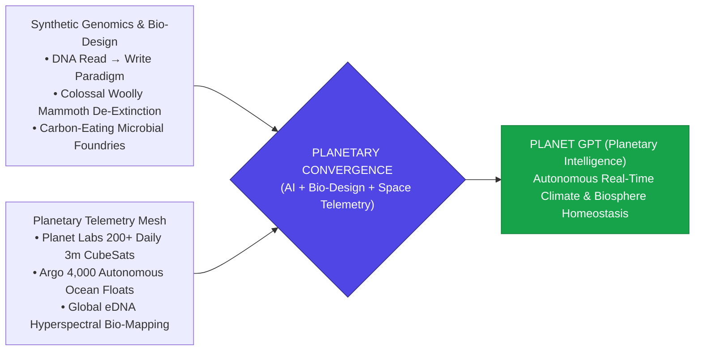

> **🎙️ 3-Presenter Authentic Tiki-Taka Script**
> 
> **Prof. Peter Kim:** Scholars, welcome to the grand capstone of Phase 2: Session 8. Over the past three weeks, we analyzed autonomous drone logistics across African skies, 20-ZettaFLOP AI supercomputers, and 2mm photovoltaic microchips that cure blindness. Today, we elevate our focus to the largest living entity in the known universe: **the entire planetary biosphere of Earth**. *(Turn 1)*  
> **Dr. Elena Vance:** Professor Kim, humanity has ceased to be a passive biological passenger on this planet. With synthetic biology, we are writing new genetic software for living organisms; and with orbital satellite constellations, autonomous ocean floats, and environmental DNA sensors, we are building a conscious nervous system for planet Earth—what Diamandis and Kotler call **Planetary Intelligence** or **Planet GPT**. *(Turn 2)*  
> **TA Marcus Brody:** Look at the visual convergence on Slide 1! We are literally editing Asian elephant embryos to bring back the woolly mammoth to stop Siberian permafrost from melting, while 200 satellites photograph every tree, river, and glacier on Earth every single day! *(Turn 3)*  
> **Prof. Peter Kim:** The ancient mythical powers of Creation and Dominion have transformed into computable Earth systems engineering. *(Turn 4)*  
> **TA Marcus Brody:** We are shifting from helpless bystanders watching ecological collapse into the active caretakers and systems administrators of the biosphere! *(Turn 5)*  
> **Dr. Elena Vance:** This is the ultimate synthesis of AI, synthetic genomics, and orbital telemetry. *(Turn 6)*  
> **Prof. Peter Kim:** Let us explore the digital compilation of living biology on Slide 2. *(Turn 7)*  
> **TA Marcus Brody:** Turn to Slide 2: Creatio Ex Nihilo! *(Turn 8)*  
> **Dr. Elena Vance:** Let’s see how digital code compiles into living physical cells! *(Turn 9)*  
> **Prof. Peter Kim:** Proceed to Slide 2. *(Turn 10)*

---

### Slide 02: Creatio Ex Nihilo: The Digital Compilation of Living Biology
- **The Epistemological Paradigm Shift:**
  - *Ancient Biology (3000 BCE–1950 CE):* Descriptive observation, physical taxonomy, and trial-and-error selective breeding.
  - *Modern Molecular Biology (1953–2010):* Decoding and reading DNA sequences (Human Genome Project).
  - *Synthetic Biology (2026+):* **Writing, compiling, and synthesizing novel living organisms from digital code (Creatio Ex Nihilo)**.
- **The Bio-Compiler Pipeline:**
  $$\text{Specification (Natural Language Prompt)} \xrightarrow{\text{BioGPT / AlphaFold}} \text{DNA Sequence (A,T,G,C)} \xrightarrow{\text{Chemical Synthesizer}} \text{Living Functional Organism}$$

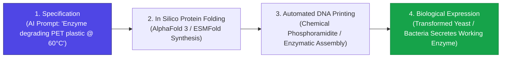

> **🎙️ 3-Presenter Authentic Tiki-Taka Script**
> 
> **Prof. Peter Kim:** Slide 2 marks the greatest epistemological transition in the history of life sciences: **Creatio Ex Nihilo—Creation from Digital Code**. Dr. Vance, trace the three historical eras of biology. *(Turn 1)*  
> **Dr. Elena Vance:** For 5,000 years, biology was purely *descriptive*: humans observed plants and animals with magnifying glasses. In the late 20th century, molecular biology became *analytical*: we decoded and read the digital ATGC sequence of DNA. But in 2026, biology has become **constructive and synthetic**: we write, compile, and print brand-new genomes from scratch! *(Turn 2)*  
> **TA Marcus Brody:** Look at the **Bio-Compiler Pipeline** on Slide 2! Step 1: You type an English prompt into an AI: *"Design an enzyme that eats PET plastic bottles at 60 degrees Celsius in ocean water."* *(Turn 3)*  
> **Dr. Elena Vance:** Step 2: AlphaFold 3 and ESMFold design the 3D atomic structure of the protein in silicon. Step 3: An automated DNA printer synthesizes the ATGC chemical sequence. Step 4: You insert the DNA into a harmless yeast or bacterial cell, and the living microbe immediately begins manufacturing and secreting the plastic-eating enzyme! *(Turn 4)*  
> **Prof. Peter Kim:** The barrier between digital bits on a computer screen and living physical atoms in a Petri dish has completely evaporated. *(Turn 5)*  
> **TA Marcus Brody:** Writing code for a computer program and writing code for a living organism are now the exact same discipline! *(Turn 6)*  
> **Dr. Elena Vance:** And at the global scale, this biological intelligence interfaces with real-time planetary sensor meshes on Slide 3. *(Turn 7)*  
> **Prof. Peter Kim:** Let’s examine the Cyber-Gaia Reality on Slide 3. *(Turn 8)*  
> **TA Marcus Brody:** Turn to Slide 3: Real-Time Planetary Neural Feedback Meshes! *(Turn 9)*  
> **Prof. Peter Kim:** Proceed to Slide 3. *(Turn 10)*

---

### Slide 03: The Cyber-Gaia Reality: Real-Time Planetary Neural Feedback Meshes
- **The Modern Re-Articulated Gaia Hypothesis (James Lovelock $\to$ Cyber-Gaia):**
  - *Lovelock’s Original Gaia (1972):* The Earth functions as a self-regulating, homeostatic organism mediated by blind biological feedback loops.
  - *The Cyber-Gaia Reality (2026):* Earth’s homeostatic loops are **digitized, sensed in real time, and consciously managed** via a planetary multimodal telemetry grid (Orbital hyperspectral CubeSats, deep-sea robotic floats, IoT soil probes, and environmental DNA samplers).
- **Planetary Closed-Loop Control:** Shifting from unmeasured, accidental atmospheric pollution to **deterministic planetary thermoregulation and carbon metabolism**.

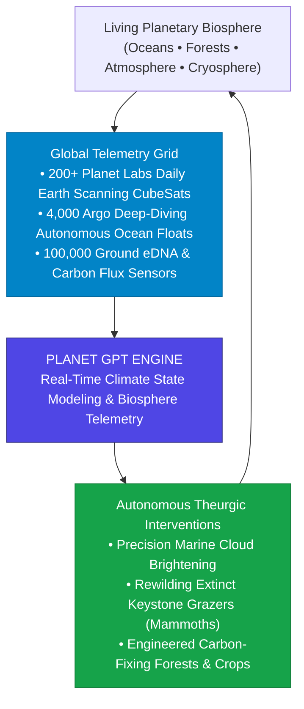

> **🎙️ 3-Presenter Authentic Tiki-Taka Script**
> 
> **TA Marcus Brody:** Look at the closed-loop planetary diagram on Slide 3! This is James Lovelock’s Gaia hypothesis brought to life: **The Cyber-Gaia Reality**! Elena, explain how Earth became a conscious, monitored system! *(Turn 1)*  
> **Dr. Elena Vance:** In 1972, James Lovelock proposed that Earth is a self-regulating super-organism. But historical Earth regulated itself through blind, slow biological mechanisms that took millions of years. Today, we have wrapped the Earth in a digital nervous system! *(Turn 2)*  
> **TA Marcus Brody:** Look at the sensor box: **200+ Planet Labs satellites** scan every square meter of land every 24 hours; **4,000 autonomous Argo floats** dive 2,000 meters into the oceans measuring salinity and temperature; and thousands of eDNA sensors monitor animal biodiversity in rivers! *(Turn 3)*  
> **Prof. Peter Kim:** All of that live telemetry streams into **Planet GPT**—a planetary foundation model that predicts climate tipping points, monitors carbon fluxes, and simulates atmospheric dynamics in real time! *(Turn 4)*  
> **TA Marcus Brody:** And look at the green feedback loop: When Planet GPT spots an ecological breakdown, we deploy targeted interventions—restoring coral reefs with heat-resistant algae, deploying woolly mammoths in Siberia, or planting high-efficiency carbon-eating trees! *(Turn 5)*  
> **Dr. Elena Vance:** For the first time in 4.5 billion years, planet Earth possesses a conscious, self-aware brain and feedback control loop. *(Turn 6)*  
> **Prof. Peter Kim:** That brings us to our central existential inquest for Session 8. *(Turn 7)*  
> **TA Marcus Brody:** Can humanity responsibly program an entire living planet? *(Turn 8)*  
> **Dr. Elena Vance:** Let’s examine the core inquest on Slide 4. *(Turn 9)*  
> **Prof. Peter Kim:** Turn to Slide 4: Can Humanity Responsibly Program the Biosphere? *(Turn 10)*

---

### Slide 04: The Core Existential Inquest: Can Humanity Responsibly Program the Biosphere?
- **The Central Existential Inquest:** *"When the genetic source code of all living organisms becomes editable in a computer, and the planetary climate becomes adjustable via solar radiation management and synthetic biology, what ethical, ecological, and governance frameworks will prevent catastrophic systemic overshoot?"*
- **The Triad of Planetary Responsibilities:**
  1. *The Hubris Barrier:* Acknowledging that complex nonlinear ecological food webs possess emergent tipping points that can defy simplistic reductionist models.
  2. *The Sovereign Geoengineering Dilemma:* Preventing rogue nations or private actors from unilaterally modifying global atmospheric chemistry.
  3. *The Sacred Stewardship Mandate:* Stewart Brand’s canonical maxim updated: *"We are as gods... and we have to get good at it."*

> **🎙️ 3-Presenter Authentic Tiki-Taka Script**
> 
> **Prof. Peter Kim:** Here is our foundational existential inquest for Session 8: **"When the genetic code of life is editable in a laptop and climate can be engineered, how do we prevent catastrophic systemic overshoot?"** Dr. Vance, dissect the Triad of Planetary Responsibilities on Slide 4. *(Turn 1)*  
> **Dr. Elena Vance:** Look at Responsibility 1: **The Hubris Barrier**. Ecological food webs are hyper-complex nonlinear systems. If you release a genetically modified microbe or a gene drive to eliminate a pest, you must mathematically verify that you won't trigger an unintended cascade that collapses the entire ecosystem! *(Turn 2)*  
> **TA Marcus Brody:** And look at Responsibility 2: **The Sovereign Geoengineering Dilemma**! Stratospheric solar radiation management is so cheap—roughly $10 Billion dollars—that a single small country suffering a deadly heatwave, or even a single rogue billionaire, could unilaterally spray aerosols into the sky and change rainfall patterns across the entire planet without international permission! *(Turn 3)*  
> **Prof. Peter Kim:** Which brings us to Responsibility 3: **The Sacred Stewardship Mandate**. Stewart Brand’s immortal 1968 axiom that gave this entire course its name: *"We are as gods... and we have to get good at it."* *(Turn 4)*  
> **TA Marcus Brody:** We cannot run away from our power; we are already altering the climate, the oceans, and the genomes of Earth. We have to become rigorous, responsible, and ethical planetary gods! *(Turn 5)*  
> **Dr. Elena Vance:** Active conscious stewardship is our only viable path forward. *(Turn 6)*  
> **Prof. Peter Kim:** Let us look at our pedagogical roadmap for the Phase 2 Capstone. *(Turn 7)*  
> **TA Marcus Brody:** Turn to Slide 5 for our Session 8 roadmap! *(Turn 8)*  
> **Dr. Elena Vance:** From Woolly Mammoth de-extinction to Planet GPT! *(Turn 9)*  
> **Prof. Peter Kim:** Proceed to Slide 5. *(Turn 10)*

---

### Slide 05: Phase 2 Capstone Roadmap: From Woolly Mammoth De-Extinction to Planet GPT
- **Master Learning Architecture (Session 08):**
  - **Module 1 (Slides 01–05):** Civilizational Framing — The Phase 2 Capstone, Creatio Ex Nihilo, The Cyber-Gaia Reality, and Planetary Inquests.
  - **Module 2 (Slides 06–15):** Chapter 6 Deconstruction — George Church & Colossal Biosciences, The Arctic Permafrost Defense Mandate, Minimal Cell JCVI-syn3.0, Stewart Brand’s Revive & Restore, Carlson’s Curve of DNA Synthesis (99.99% collapse), The Bio-Compiler.
  - **Module 3 (Slides 16–25):** Systems Engineering & Biosphere Mechanics — Gene Drives (100% Non-Mendelian Transmission), eDNA Sequencing, Planet GPT Architecture, RuBisCO Photosynthetic Kinetics, Microbial Nitrogen Fixation (Pivot Bio), SRM Differential Equations, 4-Tier Governance.
  - **Module 4 (Slides 26–35):** Global Empirical Verification — 9 Planetary Case Studies (Colossal 60 Mammoth Edits, Planet Labs 200+ Satellites, Argo 4,000 Floats, Living Carbon Poplars 53% Uptake, Target Malaria Burkina Faso, Pivot Bio PROVEN, Ocean eDNA, SAI Climate Models, BioGPT PETase Enzymes).
  - **Module 5 (Slides 36–42):** Existential Paradoxes — "Playing God" Hubris, Pandora’s Gene Drive Risks, Desktop Bio-Printers & Dual-Use Pathogens, Geoengineering Geopolitics, The End of "Pristine Nature", Phase 2 Master Synthesis.
  - **Module 6 (Slides 43–45):** Socratic Debates & Capstone Planet GPT Ecosystem Restoration Protocol.

> **🎙️ 3-Presenter Authentic Tiki-Taka Script**
> 
> **Dr. Elena Vance:** Slide 5 outlines our complete Phase 2 Capstone architecture. We connect molecular gene drives and automated bio-foundries with orbital satellite constellations and global climate thermodynamics across six master modules. *(Turn 1)*  
> **TA Marcus Brody:** In Module 2, we will deconstruct Chapter 6: Harvard geneticist **George Church founding Colossal Biosciences**, resurrecting the woolly mammoth to defend Arctic permafrost, and Craig Venter synthesizing the artificial minimal living cell **JCVI-syn3.0**! *(Turn 2)*  
> **Prof. Peter Kim:** In Module 3, we dive into the hard biophysical and ecological math: CRISPR gene drive non-Mendelian inheritance, environmental DNA metagenomic sequencing, engineered RuBisCO photosynthetic kinetics, and Solar Radiation Management (SRM) radiative forcing differential equations! *(Turn 3)*  
> **TA Marcus Brody:** And in Module 4, we examine nine massive empirical planetary case studies: from Planet Labs scanning the whole Earth every day, to Living Carbon trees capturing 53% more carbon, to Pivot Bio replacing 20% of synthetic nitrogen fertilizer across US cornfields! *(Turn 4)*  
> **Dr. Elena Vance:** In Module 5, we confront the hardest ethical dilemmas: desktop bio-printers producing dual-use viruses, the risks of gene drive cascades, and the philosophical end of "untouched pristine nature." *(Turn 5)*  
> **TA Marcus Brody:** And in Module 6, every cohort will architect a **Planet GPT Ecosystem Restoration Protocol**, designing an end-to-end planetary intervention to save a collapsing biome! *(Turn 6)*  
> **Prof. Peter Kim:** Let us step into Module 2 and deconstruct Chapter 6 of Diamandis and Kotler! *(Turn 7)*  
> **Dr. Elena Vance:** Turn to Slide 6: Deconstructing Chapter 6: "Planetary Intelligence"! *(Turn 8)*  
> **TA Marcus Brody:** Let’s dive into Slide 6! *(Turn 9)*  
> **Prof. Peter Kim:** Proceed to Module 2: Primary Text Deconstruction! *(Turn 10)*


---

## Module 2: Primary Text Deconstruction: Planetary Intelligence (Slides 06–15)

### Slide 06: Deconstructing Chapter 6: "Planetary Intelligence" & The Living Earth
- **Primary Source Analysis:** Peter H. Diamandis & Steven Kotler, *We Are as Gods* (2026), Chapter 6 (*Planetary Intelligence*).
- **The Core Thematic Arch:**
  $$\text{1970 Stewart Brand Whole Earth} \xrightarrow{\text{Synthetic Genomics}} \text{Colossal De-Extinction} \xrightarrow{\text{Planet Labs Telemetry}} \text{2026 Cyber-Gaia Singularity}$$
- **The Primary Axiom:** The biosphere is not a static museum to be preserved in amber; it is a dynamic, evolving planetary operating system that humanity must actively restore, balance, and enhance through synthetic genomics and real-time orbital intelligence.

> **🎙️ 3-Presenter Authentic Tiki-Taka Script**
> 
> **Prof. Peter Kim:** Let us deconstruct Chapter 6 of *We Are as Gods*. Dr. Vance, what is the central thesis of "Planetary Intelligence"? *(Turn 1)*  
> **Dr. Elena Vance:** Chapter 6 bridges the grand intellectual arch from **Stewart Brand’s 1968 *Whole Earth Catalog*** to the 2026 reality of **Synthetic Genomics and Planetary Telemetry**. Diamandis and Kotler argue that environmental conservation has been crippled by a defeatist mindset of "leave nature alone and hope for the best." *(Turn 2)*  
> **TA Marcus Brody:** Look at the primary axiom on Slide 6: **The Earth is NOT a fragile glass museum to be preserved in amber!** The Earth is a dynamic, living operating system! And right now, critical parts of that operating system—like megafauna grazers, coral reefs, and carbon sinks—have been severely degraded! *(Turn 3)*  
> **Prof. Peter Kim:** And how do we fix a damaged operating system? You don't just stare at the blue screen of death; you rewrite the broken software code and reboot the damaged subroutines! *(Turn 4)*  
> **TA Marcus Brody:** With synthetic biology, we can resurrect extinct keystone species like the woolly mammoth and dodo, engineer self-fertilizing crops, and deploy satellite networks to monitor global ecological health in real time! *(Turn 5)*  
> **Dr. Elena Vance:** We are upgrading from passive, reactive conservation to **proactive, generative planetary restoration**. *(Turn 6)*  
> **Prof. Peter Kim:** And the leader at the vanguard of de-extinction is Harvard geneticist George Church. *(Turn 7)*  
> **TA Marcus Brody:** Let’s examine George Church and Colossal Biosciences on Slide 7! *(Turn 8)*  
> **Dr. Elena Vance:** Turn to Slide 7: The Colossal Biosciences De-Extinction Crusade! *(Turn 9)*  
> **Prof. Peter Kim:** Proceed to Slide 7. *(Turn 10)*

---

### Slide 07: George Church & The Colossal Biosciences De-Extinction Crusade
- **The Vanguard De-Extinction Pioneer:**
  - *Prof. George Church (Harvard / MIT):* Co-founder of **Colossal Biosciences** (with entrepreneur Ben Lamm), backed by >$225M in venture funding.
  - *The Mission Target:* Resurrecting the **Woolly Mammoth (*Mammuthus primigenius*)**, the **Thylacine (Tasmanian Tiger)**, and the **Dodo Bird (*Raphus cucullatus*)**.
- **The Core Genetic Strategy:**
  - Sequence ancient permafrost mammoth DNA (4,000 to 50,000 years old).
  - Use multiplex CRISPR-Cas9 to edit **Asian Elephant (*Elephas maximus*) pluripotent stem cells** across 60+ targeted core cold-adaptation loci (subcutaneous adipose fat layers, hemoglobin oxygen affinity at sub-zero temperatures, and dense woolly hair growth).

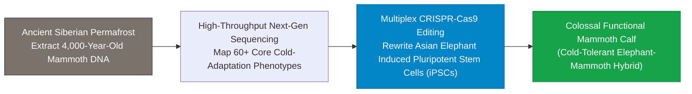

> **🎙️ 3-Presenter Authentic Tiki-Taka Script**
> 
> **Prof. Peter Kim:** Slide 7 introduces the revolutionary crusade of **George Church and Colossal Biosciences**. Dr. Vance, walk us through the genetic engineering process of de-extinction. *(Turn 1)*  
> **Dr. Elena Vance:** George Church extracted high-quality DNA from 4,000-year-old mammoth bones preserved in frozen Siberian permafrost. They sequenced the genome and compared it to its closest living relative—the **Asian Elephant**, which shares **99.6% identical DNA** with the mammoth! *(Turn 2)*  
> **TA Marcus Brody:** Look at the CRISPR multiplex strategy in the flowchart: Colossal is editing **over 60 specific genetic loci** in Asian elephant stem cells! They are editing the genes for **cold-adapted hemoglobin that delivers oxygen at $-40^\circ\text{C}$**, thick subcutaneous fat, reduced ear size to prevent frostbite, and dense, shaggy woolly hair! *(Turn 3)*  
> **Prof. Peter Kim:** They are not building a genetic curiosity for a zoo; they are creating a fully functional, cold-tolerant **Arctic Elephant-Mammoth Hybrid** that can thrive in $-50^\circ\text{C}$ Arctic blizzards! *(Turn 4)*  
> **TA Marcus Brody:** And why do we need mammoths in the Arctic? It’s not just because they look cool; it’s an urgent climate rescue mission! *(Turn 5)*  
> **Dr. Elena Vance:** Look at Slide 8: The Ecological Mandate of the Woolly Mammoth! *(Turn 6)*  
> **Prof. Peter Kim:** Turn to Slide 8: Arctic Tundra Permafrost Defense. *(Turn 7)*  
> **TA Marcus Brody:** Let’s see how mammoths lock down permafrost! *(Turn 8)*  
> **Dr. Elena Vance:** Let’s examine the Pleistocene grassland ecology! *(Turn 9)*  
> **Prof. Peter Kim:** Proceed to Slide 8. *(Turn 10)*

---

### Slide 08: The Ecological Mandate of the Woolly Mammoth: Arctic Tundra Permafrost Defense
- **The Arctic Tundra Permafrost Timebomb:**
  - *The Threat:* The Arctic permafrost locks away **1,400 to 1,600 Gigatons of ancient organic carbon** (more than double all carbon currently in the atmosphere). Thawing permafrost risks releasing catastrophic methane bursts ($\text{CH}_4$).
- **The Mammoth Keystone Mechanism (Pleistocene Park Ecology / Sergey Zimov):**
  1. *Trampling Snow Insulation:* In winter, heavy snow acts as a thick insulating blanket, trapping summer heat in the soil. Heavy mammoth herds trample and compact the snow, allowing winter blizzards ($-40^\circ\text{C}$) to **penetrate deep into the ground, refreezing permafrost**.
  2. *Uprooting Dark Trees:* Knocking down dark pine/birch trees transforms dark heat-absorbing forest into high-albedo, reflective **Pleistocene grasslands** that reflect solar radiation back to space.

```mermaid
flowchart TD
    subgraph Current Melting Arctic (Without Megafauna)
        A1["Thick Winter Snow Blanket Insulates Ground"] --> A2["Permafrost Thaws @ +5°C Soil Temp"]
        A2 --> A3["Catastrophic Methane (CH4) Bursts Released to Atmosphere"]
    end
    
    subgraph Restored Pleistocene Mammoth Steppe (With Colossal Herds)
        B1["Mammoths Trample & Compact Winter Snow"] --> B2["Arctic -40°C Deep Freeze Penetrates Subsoil"]
        B2 --> B3["Permafrost Permanently Locked • 1,400 Gigatons Carbon Secured"]
    end
    style Current Melting Arctic fill:#fee2e2,stroke:#dc2626
    style Restored Pleistocene Mammoth Steppe fill:#dcfce7,stroke:#16a34a
```

> **🎙️ 3-Presenter Authentic Tiki-Taka Script**
> 
> **TA Marcus Brody:** Look at the ecological physics on Slide 8! This is why George Church is bringing back the mammoth: **Arctic Tundra Permafrost Defense**! Elena, explain the methane timebomb in the Arctic! *(Turn 1)*  
> **Dr. Elena Vance:** The frozen Arctic tundra locks away **1,500 Gigatons of organic carbon**—that is **twice as much carbon as is currently in Earth's entire atmosphere**! If that permafrost melts, it will release colossal plumes of methane ($\text{CH}_4$), triggering unstoppable runaway global warming. *(Turn 2)*  
> **TA Marcus Brody:** And why does permafrost melt in winter? Because thick snow acts like a giant down jacket, insulating the soil and trapping warm air underneath! *(Turn 3)*  
> **Dr. Elena Vance:** Look at the green box in the diagram: When herds of 6-ton woolly mammoths roam the tundra, they **trample and stomp the snow flat**! Without the snow insulation, the $-40^\circ\text{C}$ Arctic winter air penetrates deep into the bedrock, **re-freezing and locking the permafrost solid**! *(Turn 4)*  
> **Prof. Peter Kim:** Furthermore, mammoths uproot dark shrubs and trees, converting dark heat-absorbing forests into reflective, high-albedo **Pleistocene grasslands** that bounce solar heat back into outer space! *(Turn 5)*  
> **TA Marcus Brody:** Resurrecting the woolly mammoth is literally a multi-gigaton planetary geoengineering project! *(Turn 6)*  
> **Dr. Elena Vance:** Megafauna are not decorative wildlife; megafauna are the biological thermostats of the planet. *(Turn 7)*  
> **Prof. Peter Kim:** And alongside de-extinction, synthetic genomics has created completely artificial living cells from scratch. *(Turn 8)*  
> **TA Marcus Brody:** Look at Slide 9: Chemical Synthesis of Minimal Cell JCVI-syn3.0! *(Turn 9)*  
> **Prof. Peter Kim:** Turn to Slide 9: Synthetic Genomics. *(Turn 10)*

---

### Slide 09: Synthetic Genomics: Chemical Synthesis of Minimal Cell JCVI-syn3.0
- **The Craig Venter Landmark (J. Craig Venter Institute, 2010–2016):**
  - *JCVI-syn1.0 (2010):* Chemically synthesized the complete $1.08\text{Mbp}$ genome of *Mycoplasma mycoides* from digital computer files and booted it inside an empty bacterial cell envelope (**First Synthetic Life Form**).
  - *JCVI-syn3.0 (2016):* Stripped the synthetic genome down to the **absolute minimal genetic blueprint for autonomous biological life**: **473 genes ($531\text{ kbp}$)**.
- **The Digital-Biological Equivalence:** Proved that a biological cell is hardware (cytoplasm, cell membrane) running a swappable, digitally compilable operating system (DNA genome).

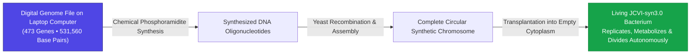

> **🎙️ 3-Presenter Authentic Tiki-Taka Script**
> 
> **Prof. Peter Kim:** Slide 9 commemorates the landmark moment when humanity first created synthetic life: **Craig Venter’s JCVI-syn3.0**. Dr. Vance, walk us through this historical breakthrough. *(Turn 1)*  
> **Dr. Elena Vance:** In 2010, Craig Venter and Hamilton Smith wrote a 1-million base pair DNA code in a computer text file, synthesized the chemical DNA strands, stitched them together inside yeast, and transplanted that synthetic chromosome into an empty bacterial shell! When the cell booted up, it ran exclusively on the synthetic digital code! *(Turn 2)*  
> **TA Marcus Brody:** And in 2016 with **JCVI-syn3.0**, they stripped out every non-essential gene, discovering the **absolute minimal code of life**: exactly **473 genes and 531,000 base pairs**! *(Turn 3)*  
> **Prof. Peter Kim:** Think about the philosophical depth of that experiment: A living organism is simply a biological chassis running software. If you change the digital software, you change the organism’s entire function and destiny! *(Turn 4)*  
> **TA Marcus Brody:** You can take that 473-gene minimal bacterial operating system and add custom modules: a module to eat toxic PFAS chemicals, a module to secrete insulin, or a module to pull nitrogen out of thin air! *(Turn 5)*  
> **Dr. Elena Vance:** Biology became a fully modular, object-oriented programming language. *(Turn 6)*  
> **Prof. Peter Kim:** And Stewart Brand created Revive & Restore to apply these tools to global rewilding on Slide 10. *(Turn 7)*  
> **TA Marcus Brody:** Turn to Slide 10: Stewart Brand & Revive & Restore! *(Turn 8)*  
> **Dr. Elena Vance:** Let’s examine Biotechnology for Ecological Rewilding! *(Turn 9)*  
> **Prof. Peter Kim:** Proceed to Slide 10. *(Turn 10)*

---

### Slide 10: Stewart Brand & Revive & Restore: Biotechnology for Ecological Rewilding
- **The Conceptual Inversion of Conservation:**
  - *Traditional Conservation ("Paleo-Purism"):* Fences off nature reserves and laments extinction as permanent tragedy.
  - *Stewart Brand & Ryan Phelan (Revive & Restore):* Harnesses biotechnology (CRISPR, bio-banking, cloning, synthetic rescue) to **actively restore biodiversity and genetic resilience**.
- **The Genetic Rescue Flagships:**
  1. *Black-Footed Ferret Cloning (Elizabeth Ann):* Cloned from 30-year-old cryopreserved frozen cells to inject lost genetic diversity into an inbred population.
  2. *Passenger Pigeon De-Extinction:* Editing Band-Tailed Pigeons to restore the keystone seed-dispersing bird of North American hardwood forests.
  3. *Heat-Resilient Super-Corals:* Engineering zooxanthellae algae to survive $2.0^\circ\text{C}$ ocean warming.

> **🎙️ 3-Presenter Authentic Tiki-Taka Script**
> 
> **Prof. Peter Kim:** Slide 10 presents Stewart Brand and Ryan Phelan’s foundation: **Revive & Restore**. Dr. Vance, why is Revive & Restore considered the intellectual soul of modern genetic conservation? *(Turn 1)*  
> **Dr. Elena Vance:** Traditional conservation operated on a tragic defeatist model: they watched species go extinct and wrote eulogies. Stewart Brand said: *"No! If we have the technology to read and edit genomes, we have a moral obligation to use biotechnology to **actively rescue and rewild the planet**!"* *(Turn 2)*  
> **TA Marcus Brody:** Look at their flagship victories on Slide 10! **Elizabeth Ann, the cloned Black-Footed Ferret**: born from frozen cells that were cryopreserved in a liquid nitrogen freezer thirty years ago, injecting fresh genetic diversity into an endangered species! *(Turn 3)*  
> **Dr. Elena Vance:** And look at Project 3: **Heat-Resilient Super-Corals**! By engineering the symbiotic microalgae inside coral reefs, we can protect the Great Barrier Reef from bleaching even as ocean temperatures rise! *(Turn 4)*  
> **Prof. Peter Kim:** We are not just defending nature; we are arming nature with the genetic tools to survive and flourish in the Anthropocene. *(Turn 5)*  
> **TA Marcus Brody:** That is proactive evolutionary stewardship! *(Turn 6)*  
> **Dr. Elena Vance:** Which leads directly to Peter Diamandis’s Ecosystem Reset Axiom on Slide 11. *(Turn 7)*  
> **Prof. Peter Kim:** Turn to Slide 11: Peter Diamandis’s Ecosystem Reset Axiom. *(Turn 8)*  
> **TA Marcus Brody:** Let’s examine Proactive Evolutionary Design on Slide 11! *(Turn 9)*  
> **Prof. Peter Kim:** Proceed to Slide 11. *(Turn 10)*

---

### Slide 11: Peter Diamandis’s Ecosystem Reset Axiom: Proactive Evolutionary Design
- **The Proactive Design Paradigm:**
  - *The Old Paradigm:* Humanity as a destructive virus on Earth $\to$ Goal is to minimize the human footprint and retreat.
  - *The Diamandis Paradigm:* Humanity as the conscious, intelligent planetary nervous system $\to$ Goal is to **maximize planetary biological productivity, carbon sequestration, and biodiversity density**.
- **The Ecosystem Abundance Equation:**
  $$\text{Biosphere Resilience} = \text{Genetic Diversity} \times \text{Primary Productivity} \times \text{Feedback Latency}^{-1}$$
  By slashing feedback latency to real-time telemetry and boosting primary productivity via synthetic biology, humanity engineers a **super-resilient, post-scarcity biosphere**.

> **🎙️ 3-Presenter Authentic Tiki-Taka Script**
> 
> **Prof. Peter Kim:** Slide 11 presents Peter Diamandis’s **Ecosystem Reset Axiom**. Marcus, contrast the old environmental paradigm with the Diamandis paradigm. *(Turn 1)*  
> **TA Marcus Brody:** The old 20th-century environmentalism taught that humans are a destructive cancer on Earth, and the best thing we can do is feel guilty, turn off the lights, and reduce our footprint. But Diamandis says that is completely wrong! Humans are the **conscious brain and nervous system of planet Earth**! *(Turn 2)*  
> **Dr. Elena Vance:** Look at the **Ecosystem Abundance Equation** on Slide 11: Biosphere Resilience equals Genetic Diversity multiplied by Primary Productivity divided by Feedback Latency! *(Turn 3)*  
> **Prof. Peter Kim:** When we use synthetic genomics to expand genetic diversity, and use satellite telemetry to drive feedback latency to zero, Earth becomes **far more resilient and abundant than it ever was under blind Darwinian evolution alone**! *(Turn 4)*  
> **TA Marcus Brody:** We are turning the Earth into a flourishing, super-charged garden of abundance! *(Turn 5)*  
> **Dr. Elena Vance:** And Steven Kotler shows how this creates planetary homeostasis control loops on Slide 12. *(Turn 6)*  
> **Prof. Peter Kim:** Let’s examine Planetary Homeostasis Control Loops on Slide 12. *(Turn 7)*  
> **TA Marcus Brody:** Turn to Slide 12! *(Turn 8)*  
> **Dr. Elena Vance:** Let’s see how closed-loop planetary feedback operates! *(Turn 9)*  
> **Prof. Peter Kim:** Proceed to Slide 12. *(Turn 10)*

---

### Slide 12: Steven Kotler on Planetary Homeostasis Control Loops
- **The Cybernetic Biosphere Architecture:**
  - *The Sensory Ingestion Layer:* Real-time streaming of carbon fluxes, ocean temperatures, and biodiversity indices.
  - *The Cognitive Synthesis Engine (Planet GPT):* Predictive physics and machine learning forecasting ecological collapse 12–24 months in advance.
  - *The Actuation Layer:* Autonomous deployment of carbon-eating bio-foundries, targeted afforestation, and ocean alkalinization.
- **The Macroeconomic Result:** Eliminates trillion-dollar climate disaster volatility, stabilizing the biosphere just as an autopilot stabilizes an aircraft.

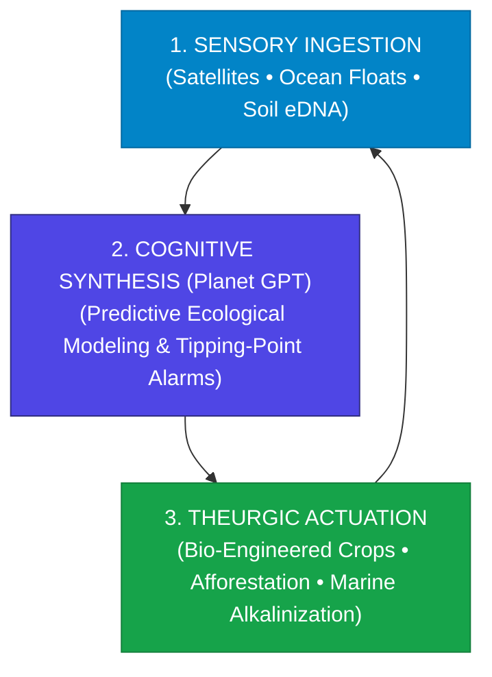

> **🎙️ 3-Presenter Authentic Tiki-Taka Script**
> 
> **TA Marcus Brody:** Look at the cybernetic feedback loop on Slide 12! Steven Kotler calls this **Planetary Homeostasis**. Elena, explain how this three-layer architecture functions! *(Turn 1)*  
> **Dr. Elena Vance:** Layer 1 is **Sensory Ingestion**: thousands of satellites, ocean buoys, and eDNA probes streaming raw planetary vital signs 24/7. Layer 2 is **Cognitive Synthesis**: Planet GPT runs global climate simulations, detecting an impending drought or coral collapse twelve months before it happens! *(Turn 2)*  
> **TA Marcus Brody:** And Layer 3 is **Theurgic Actuation**: We deploy autonomous drone seeding of drought-tolerant grasses, spray ocean alkalinization minerals to neutralize acidifying waters, and activate microbial nitrogen fixers! *(Turn 3)*  
> **Prof. Peter Kim:** Just as the human body maintains its internal temperature at exactly $37^\circ\text{C}$ through sweating and shivering, humanity equips planet Earth with an automated homeostatic thermoregulation loop! *(Turn 4)*  
> **TA Marcus Brody:** Earth gets an autonomous climate autopilot! *(Turn 5)*  
> **Dr. Elena Vance:** And driving this biological capability is Carlson’s Curve of DNA synthesis costs on Slide 13. *(Turn 6)*  
> **Prof. Peter Kim:** Let’s examine Carlson’s Curve on Slide 13. *(Turn 7)*  
> **TA Marcus Brody:** Turn to Slide 13: DNA Synthesis Costs Plunging 99.99%! *(Turn 8)*  
> **Dr. Elena Vance:** Let’s see the exponential deflation of DNA printing! *(Turn 9)*  
> **Prof. Peter Kim:** Proceed to Slide 13. *(Turn 10)*

---

### Slide 13: Carlson’s Curve of DNA Synthesis: Cost per Base Pair Plunging 99.99%
- **The Empirical Trajectory of DNA Synthesis (Rob Carlson / Epoch Bio):**
  - *2000:* **~$10.00 per base pair** (Manual column phosphoramidite chemistry).
  - *2015:* **~$0.10 per base pair** (Microfluidic high-throughput arrays).
  - *2026:* **<$0.0001 per base pair ($0.01\text{¢})$** (Enzymatic DNA synthesis & semiconductor-based CMOS bio-printers — **$99.999\%$ cost collapse**).
- **The Super-Moore’s Law Deflation:** DNA sequencing and synthesis costs have fallen **$4\times \text{ to } 5\times \text{ faster than computational Moore’s Law}$**, enabling the routine chemical printing of million-base-pair synthetic genomes for $<100.

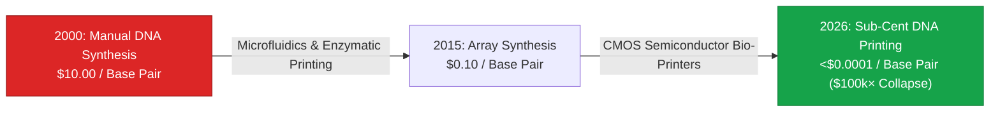

> **🎙️ 3-Presenter Authentic Tiki-Taka Script**
> 
> **Prof. Peter Kim:** Slide 13 presents the governing economic law of biotechnology: **Carlson’s Curve of DNA Synthesis**. Dr. Vance, compare Carlson’s Curve to computer Moore’s Law. *(Turn 1)*  
> **Dr. Elena Vance:** In computing, Moore’s Law doubled transistor density every two years. But **Carlson’s Curve has fallen 4 to 5 times faster than Moore’s Law**! In the year 2000, chemically printing a single DNA base pair cost **$10.00**. Today in 2026, semiconductor enzymatic DNA printers have collapsed that cost to **less than one-hundredth of a cent ($<0.0001)**! *(Turn 2)*  
> **TA Marcus Brody:** That is a **100,000-fold ($99.999\%$) price collapse**! In 2000, printing a synthetic bacterial genome with 1 million base pairs would have cost $10 Million dollars. Today, you can print that entire 1-million base pair chromosome on a desktop CMOS chip for **under one hundred dollars ($100)**! *(Turn 3)*  
> **Prof. Peter Kim:** When printing DNA costs less than printing a color textbook, every high school and university biology lab becomes a software compiler for physical life. *(Turn 4)*  
> **TA Marcus Brody:** Writing DNA has become as cheap as writing Python code! *(Turn 5)*  
> **Dr. Elena Vance:** Which brings us to the ultimate realization: Life is digital software, and the Bio-Compiler has arrived on Slide 14. *(Turn 6)*  
> **Prof. Peter Kim:** Turn to Slide 14: Life as Digital Software & The Bio-Compiler. *(Turn 7)*  
> **TA Marcus Brody:** Let’s see the ATGC code on Slide 14! *(Turn 8)*  
> **Dr. Elena Vance:** Let’s examine the Bio-Compiler! *(Turn 9)*  
> **Prof. Peter Kim:** Proceed to Slide 14. *(Turn 10)*

---

### Slide 14: Life as Digital Software (A, T, G, C) & The Rise of the Bio-Compiler
- **The Quaternary Digital Architecture:**
  - DNA is a 4-state digital storage code: **Adenine (A), Thymine (T), Guanine (G), Cytosine (C)** $\implies 2\text{ bits per base pair}$.
  - A human diploid genome contains $6.4 \times 10^9\text{ base pairs} \approx 1.6\text{ Gigabytes of data}$ (Easily stored on a $5 thumb drive).
- **The Modern Bio-Compiler Stack:**
  1. *High-Level Language (Natural Language / Prompt):* "Generate a drought-tolerant wheat strain with 40% deeper root structures."
  2. *Compiler Intermediate Representation (BioGPT / ESM-3):* Generates codon-optimized genetic circuits.
  3. *Binary Machine Code:* Physical ATGC phosphoramidite base sequence.
  4. *Physical Hardware Execution:* Living cell ribosomes translating mRNA into 3D folded functional proteins.

> **🎙️ 3-Presenter Authentic Tiki-Taka Script**
> 
> **TA Marcus Brody:** Look at the digital stack on Slide 14! This is the ultimate conceptual breakthrough: **Life is Digital Software**! Elena, explain the binary storage capacity of DNA! *(Turn 1)*  
> **Dr. Elena Vance:** DNA is a 4-state digital storage medium ($\text{A, T, G, C}$). Because there are four bases, each base pair holds exactly two digital bits of information. Your entire human genome—all 6.4 billion base pairs that build your brain, eyes, and heart—is only **1.6 Gigabytes of data**! You can carry the complete blueprint for a human being on a $5 plastic thumb drive! *(Turn 2)*  
> **TA Marcus Brody:** And look at the **Bio-Compiler Stack** on Slide 14! It works exactly like a computer software stack: You type English intent into an AI, the AI compiles that into optimized genetic circuits, the DNA printer outputs the ATGC machine code, and the cell’s ribosome executes the code to build physical proteins! *(Turn 3)*  
> **Prof. Peter Kim:** The ribosome is a molecular 3D printer that has been executing quaternary digital code for 3.8 billion years. *(Turn 4)*  
> **TA Marcus Brody:** We didn't invent computing; biology invented computing four billion years ago, and we just learned how to write the software! *(Turn 5)*  
> **Dr. Elena Vance:** And we can apply this compiler across all five planetary engineering domains on Slide 15. *(Turn 6)*  
> **Prof. Peter Kim:** Let’s examine the Grand 5-Domain Planetary Engineering Matrix on Slide 15. *(Turn 7)*  
> **TA Marcus Brody:** Turn to Slide 15: The Grand 5-Domain Matrix! *(Turn 8)*  
> **Dr. Elena Vance:** Let’s see the complete Phase 2 bio-planetary landscape! *(Turn 9)*  
> **Prof. Peter Kim:** Proceed to Slide 15. *(Turn 10)*

---

### Slide 15: The Grand 5-Domain Planetary Engineering & Synthetic Biology Matrix
- **Master Planetary Engineering Matrix:** Comprehensive synthesis of the 5 domains rewriting Earth’s living operating system.

| Domain | Biosphere Target | Core Synthetic / Telemetry Vector | Vanguard 2026 Benchmark | Planetary Transformation Metric |
| :--- | :--- | :--- | :--- | :--- |
| **1. De-Extinction** | Megafauna Keystone Restorations | CRISPR Multiplex Editing of Asian Elephants | Colossal Biosciences Mammoth Calves | **$1,500\text{ Gt}$ Arctic permafrost locked**|
| **2. Climate Homeostasis**| Atmospheric $\text{CO}_2$ / Methane | Engineered Poplar Trees & High-RuBisCO Algae| Living Carbon / LanzaTech Foundries | **$>50\%\text{ faster biological carbon uptake}$**|
| **3. Agrotech Dematerial.**| Synthetic Chemical Fertilizer | Gene-Edited Nitrogen-Fixing Microbes | Pivot Bio PROVEN on 5M+ Acres | **$-20\%\text{ US synthetic nitrogen fertilizer}$**|
| **4. Vector Eradication** | Mosquito-Borne Pandemics | CRISPR Cas9 Homing Gene Drives | Target Malaria Burkina Faso Enclosures | **$>95\%\text{ Anopheles vector suppression}$** |
| **5. Orbital Telemetry** | Global Biosphere Nervous System | 200+ Daily 3m CubeSats & 4,000 Argo Floats | Planet Labs & Planet GPT Real-Time Mesh| **Zero-latency planetary anomaly detection** |

> **🎙️ 3-Presenter Authentic Tiki-Taka Script**
> 
> **Prof. Peter Kim:** Scholars, look at Slide 15. Five planetary engineering domains. Five massive global levers to restore and elevate the living Earth. Marcus, walk us through the five rows! *(Turn 1)*  
> **TA Marcus Brody:** Domain 1: Colossal resurrecting mammoths to lock down 1,500 Gigatons of Arctic permafrost! Domain 2: Living Carbon trees capturing carbon 50% faster! Domain 3: Pivot Bio microbes eliminating chemical fertilizer on 5 million acres! Domain 4: CRISPR gene drives wiping out malaria mosquitoes! And Domain 5: Planet Labs scanning the whole Earth every day to feed Planet GPT! *(Turn 2)*  
> **Dr. Elena Vance:** Every row represents a scalable, engineered solution to a planetary environmental crisis that was previously considered insurmountable. *(Turn 3)*  
> **Prof. Peter Kim:** We have moved from lamenting ecological decline to systematically engineering global ecological abundance. *(Turn 4)*  
> **TA Marcus Brody:** And we can dive deep into the mathematical biophysics and telemetry equations in Module 3! *(Turn 5)*  
> **Dr. Elena Vance:** Let’s examine Gene Drives and Non-Mendelian inheritance on Slide 16! *(Turn 6)*  
> **Prof. Peter Kim:** Proceed to Module 3: Exponential Frameworks & Biosphere Systems Engineering! *(Turn 7)*  
> **TA Marcus Brody:** Turn to Slide 16! *(Turn 8)*  
> **Dr. Elena Vance:** Let’s see gene drives override Mendelian genetics! *(Turn 9)*  
> **Prof. Peter Kim:** Proceed to Slide 16. *(Turn 10)*


---

## Module 3: Exponential Frameworks & Biosphere Systems Engineering (Slides 16–25)

### Slide 16: Gene Drives: Overriding Mendelian Inheritance (50% $\rightarrow$ 100% Transmission)
- **The Non-Mendelian Genetic Revolution (Kevin Esvelt / Austin Burt):**
  - *Classical Mendelian Genetics:* A heterozygous parent has a **$50\%$ probability** of transmitting an altered gene to its offspring. Natural selection weeds out deleterious edits.
  - *CRISPR-Cas9 Homing Gene Drives:* The engineered genetic cassette cuts the wild-type homologous chromosome and uses homology-directed repair (HDR) to copy itself into the sister allele, achieving **$>99.5\%\text{ to } 100\%\text{ transmission}$**.
- **The Population Dynamics Model:**
  $$q_{t+1} = \frac{q_t (1 + d)}{1 + d \cdot q_t} \quad \text{where } d \approx 1.0 \implies \text{Fixation across wild population in 10–15 generations}$$

```mermaid
flowchart TD
    subgraph Classical Mendelian Inheritance (50% Transmission)
        M1["Altered Gene (1 Copy)"] --> M2["50% Offspring Inherit Edit"]
        M2 --> M3["Dilutes & Disappears over generations"]
    end
    
    subgraph CRISPR Homing Gene Drive (>99% Transmission)
        G1["Gene Drive Cassette (CRISPR + gRNA)"] --> G2["Cuts Homologous Wild Chromosome"]
        G2 --> G3["Homology-Directed Repair copies Drive into both Alleles"]
        G3 --> G4["100% Offspring Inherit Edit &rarr; Spreads through entire wild population"]
    end
    style Classical Mendelian Inheritance fill:#fee2e2,stroke:#dc2626
    style CRISPR Homing Gene Drive fill:#dcfce7,stroke:#16a34a
```

> **🎙️ 3-Presenter Authentic Tiki-Taka Script**
> 
> **Prof. Peter Kim:** Module 3 opens with one of the most powerful and consequential genetic mechanisms ever engineered: **CRISPR Homing Gene Drives**. Dr. Vance, explain how gene drives override Gregor Mendel’s classical laws of genetics. *(Turn 1)*  
> **Dr. Elena Vance:** For 150 years, genetics taught that a parent passes down a specific gene to offspring with exactly a **50% probability**. If a gene reduces an organism's survival, natural selection quickly weeds it out. But a **CRISPR Homing Gene Drive** contains the code to copy and paste itself! *(Turn 2)*  
> **TA Marcus Brody:** Look at the green flowchart on Slide 16: When the sperm or egg fertilizes, the CRISPR Cas9 enzyme cuts the wild-type chromosome from the other parent, and the cell uses the gene drive as a repair template, **copying the drive into BOTH alleles**! The transmission rate jumps from $50\%$ to **over $99.5\%$**! *(Turn 3)*  
> **Dr. Elena Vance:** Look at the population differential equation: $q_{t+1} = \frac{q_t(1+d)}{1+dq_t}$. Even if you release just 100 engineered mosquitoes into a wild population of millions, the gene drive spreads to **100% of the entire wild population within 10 to 15 generations**! *(Turn 4)*  
> **Prof. Peter Kim:** You can engineer male-only sterility to permanently eradicate malaria-carrying *Anopheles* mosquitoes across an entire continent. *(Turn 5)*  
> **TA Marcus Brody:** Think about that power: A single laboratory release permanently edits an entire wild species on Earth! That is god-like leverage! *(Turn 6)*  
> **Dr. Elena Vance:** And to monitor these wild populations non-invasively, we use Environmental DNA (eDNA) on Slide 17. *(Turn 7)*  
> **Prof. Peter Kim:** Let’s examine Environmental DNA on Slide 17. *(Turn 8)*  
> **TA Marcus Brody:** Turn to Slide 17: Sequencing Whole Ecosystems from 1 Liter of Water! *(Turn 9)*  
> **Prof. Peter Kim:** Proceed to Slide 17. *(Turn 10)*

---

### Slide 17: Environmental DNA (eDNA): Sequencing Whole Ecosystems from 1 Liter of Water
- **The Metagenomic Biodiversity Scanner:**
  - *The Biological Trace:* Every living organism continuously sheds microscopic cellular traces (skin, mucus, scales, feces, extracellular DNA) into water, soil, and air.
  - *High-Throughput eDNA Sequencing:* By filtering **1 Liter of river or ocean water** and running next-generation PCR metagenomic amplicon sequencing, scientists can identify **every single fish, mammal, amphibian, bacterium, and parasite present in that entire watershed ($>1,000\text{ species}$) in 2 hours**.
- **The Conservation Revolution:** Replaces expensive, invasive physical netting and camera traps with automated, continuous cryptographic biodiversity audits.

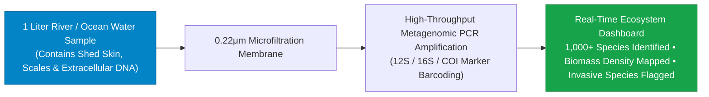

> **🎙️ 3-Presenter Authentic Tiki-Taka Script**
> 
> **TA Marcus Brody:** Look at the metagenomic pipeline on Slide 17! This is Science Fiction made real: **Environmental DNA (eDNA)**! Elena, explain how a single bottle of water reveals an entire forest! *(Turn 1)*  
> **Dr. Elena Vance:** Every living creature—a river otter swimming, an endangered salmon spawning, or an invasive parasite—continuously sheds cellular debris, scales, and mucus into the water. If you scoop up **one single liter of river water** and pass it through a 0.22-micrometer filter, you capture all of that extracellular DNA! *(Turn 2)*  
> **TA Marcus Brody:** You run high-throughput PCR barcoding on that filter, and in two hours, the sequencer outputs a complete digital ledger of **over 1,000 different species that touched that river in the last 48 hours**! *(Turn 3)*  
> **Prof. Peter Kim:** You don't need to spend six months setting up camera traps or catching animals with nets. A single autonomous water sampler gives you a real-time census of an entire river basin’s biodiversity! *(Turn 4)*  
> **TA Marcus Brody:** If an invasive carp or rare jaguar takes a sip from the river ten miles upstream, you detect its genetic signature immediately! *(Turn 5)*  
> **Dr. Elena Vance:** It transforms ecological conservation into real-time digital telemetry. *(Turn 6)*  
> **Prof. Peter Kim:** And when we connect eDNA to satellite networks, we get the complete Planet GPT architecture on Slide 18. *(Turn 7)*  
> **TA Marcus Brody:** Look at Slide 18: The Planet GPT Architecture! *(Turn 8)*  
> **Dr. Elena Vance:** Turn to Slide 18: CubeSats, Argo Floats, & Multimodal Bio-Sensors! *(Turn 9)*  
> **Prof. Peter Kim:** Proceed to Slide 18. *(Turn 10)*

---

### Slide 18: Planet GPT Architecture: CubeSats, Argo Floats, & Multimodal Bio-Sensors
- **The 3-Tier Planetary Neural Ingestion Architecture:**
  1. *Orbital Sensing Layer (Space):* **Planet Labs 200+ Dove & Pelican CubeSats** (Daily $3\text{m}$ multispectral Earth imaging) + NASA/ESA Sentinel satellites (hyperspectral methane & $\text{CO}_2$ flux tracking).
  2. *Oceanographic & Atmospheric Layer (Hydrosphere):* **4,000 Argo autonomous robotic floats** profiling ocean temperature/salinity from $0\text{ to } 2,000\text{m}$ depth + Saildrone autonomous uncrewed surface vehicles.
  3. *Terrestrial & Biospheric Layer (Lithosphere):* Ground-based flux towers, IoT soil moisture meshes, and automated river eDNA sequencing stations.
- **The Cognitive Synthesis Core:** Massive multimodal transformer models fusing $10^{15}\text{ bytes/day}$ into a predictive, real-time digital twin of Earth.

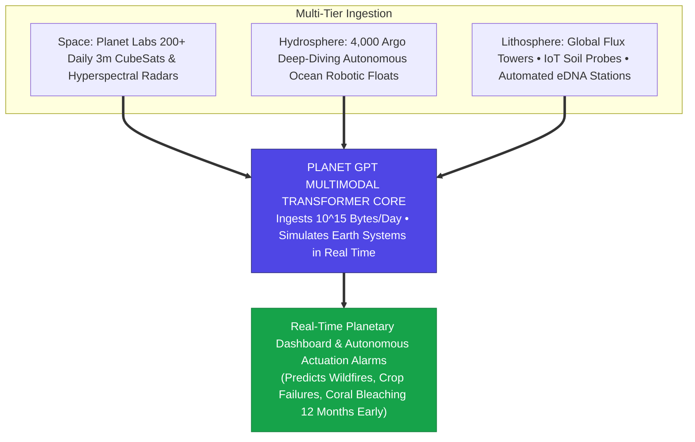

> **🎙️ 3-Presenter Authentic Tiki-Taka Script**
> 
> **Prof. Peter Kim:** Slide 18 reveals the architectural schematic of **Planet GPT**. Dr. Vance, walk us through the three ingestion layers. *(Turn 1)*  
> **Dr. Elena Vance:** Look at Layer 1 in Space: Over **200 Planet Labs CubeSats** photographing the entire landmass of planet Earth at 3-meter resolution every 24 hours, combined with Sentinel satellites tracking greenhouse gas plumes. Layer 2 in the Oceans: **4,000 autonomous Argo floats** diving two kilometers deep, measuring heat and salinity across every ocean basin. *(Turn 2)*  
> **TA Marcus Brody:** And Layer 3 on Ground: Thousands of carbon flux towers, soil moisture sensors, and automated eDNA river monitors! All streaming **over one quadrillion ($10^{15}$) bytes of live physical telemetry every single day** into the Planet GPT transformer core! *(Turn 3)*  
> **Prof. Peter Kim:** Look at the green output box: Planet GPT constructs a real-time **Digital Twin of Earth**, forecasting droughts, wildfire trajectories, and coral bleaching events twelve months before they occur! *(Turn 4)*  
> **TA Marcus Brody:** We spent centuries flying the planetary airplane with a blindfold on; now we have a full glass-cockpit heads-up display with radar, weather forecasting, and terrain avoidance! *(Turn 5)*  
> **Dr. Elena Vance:** And to actively pull carbon from the sky, we turn to engineered photosynthetic kinetics on Slide 19. *(Turn 6)*  
> **Prof. Peter Kim:** Let’s examine Engineered Microalgae and Enhanced RuBisCO on Slide 19. *(Turn 7)*  
> **TA Marcus Brody:** Turn to Slide 19: Enhancing Photosynthesis Kinetics! *(Turn 8)*  
> **Dr. Elena Vance:** Let’s see RuBisCO get supercharged! *(Turn 9)*  
> **Prof. Peter Kim:** Proceed to Slide 19. *(Turn 10)*

---

### Slide 19: Engineered Microalgae & Enhanced RuBisCO Carbon Fixation Kinetics
- **The Photosynthetic Enzyme Bottleneck:**
  - *The Flaw of RuBisCO (Ribulose-1,5-bisphosphate carboxylase-oxygenase):* The most abundant enzyme on Earth, but shockingly slow ($V_{\max} \approx 3\text{ to } 5\text{ reactions/sec}$) and prone to **photorespiration waste** (accidentally binding $\text{O}_2$ instead of $\text{CO}_2$ up to $30\%$ of the time).
- **The Synthetic Biology Upgrade:**
  - *Enzyme Re-Engineering:* Engineering carboxysome micro-compartments and directing cyanobacterial $\text{CO}_2$-concentrating mechanisms (CCM) into microalgae and C3 crop plants.
  - *The Kinetic Acceleration:* Boosts photosynthetic carbon fixation velocity by **$+40\%\text{ to } +60\%$**, enabling engineered microalgae bioreactors to capture $\text{CO}_2$ at **$50\times \text{ higher spatial efficiency than terrestrial forests}$**.

> **🎙️ 3-Presenter Authentic Tiki-Taka Script**
> 
> **Prof. Peter Kim:** Slide 19 addresses the primary biochemical bottleneck of life on Earth: **The RuBisCO Enzyme**. Dr. Vance, why is natural plant photosynthesis shockingly inefficient? *(Turn 1)*  
> **Dr. Elena Vance:** RuBisCO is the enzyme responsible for pulling $\text{CO}_2$ from the air to make sugars. But natural evolution left it clumsy and slow: it only fixes 3 to 5 molecules of carbon per second, and up to **30% of the time, it accidentally grabs oxygen instead of $\text{CO}_2$**, wasting massive amounts of energy in a process called photorespiration! *(Turn 2)*  
> **TA Marcus Brody:** Evolution was "good enough" for wild plants, but it’s terrible for a planet trying to scrub billions of tons of carbon! So synthetic biologists engineered **synthetic carboxysomes and $\text{CO}_2$-concentrating mechanisms** into microalgae! *(Turn 3)*  
> **Dr. Elena Vance:** Look at the kinetic results: A **40% to 60% acceleration in photosynthetic speed**, allowing closed-loop microalgae bioreactors to sequester carbon at **50 times the spatial efficiency of a natural pine forest**! *(Turn 4)*  
> **Prof. Peter Kim:** A 1-acre microalgae bioreactor absorbs as much atmospheric carbon as 50 acres of mature hardwood trees. *(Turn 5)*  
> **TA Marcus Brody:** That is how synthetic biology dematerializes land use for carbon capture! *(Turn 6)*  
> **Dr. Elena Vance:** And in agriculture, we are engineering soil microbes to eliminate synthetic nitrogen fertilizer on Slide 20. *(Turn 7)*  
> **Prof. Peter Kim:** Let’s examine Microbial Nitrogen Fixation on Slide 20. *(Turn 8)*  
> **TA Marcus Brody:** Turn to Slide 20: Self-Fertilizing Crops! *(Turn 9)*  
> **Prof. Peter Kim:** Proceed to Slide 20. *(Turn 10)*

---

### Slide 20: Microbial Nitrogen Fixation: Self-Fertilizing Crops (Eliminating Synthetic Fertilizer)
- **The Haber-Bosch Environmental Crisis:**
  - *The Century-Old Friction:* Synthetic nitrogen fertilizer (Haber-Bosch process) feeds 50% of Earth’s population, but consumes **$2\%$ of global fossil fuel energy** and generates massive toxic river eutrophication and nitrous oxide ($\text{N}_2\text{O}$, $300\times \text{ worse than }\text{CO}_2$).
- **The Synthetic Biology Solution (Pivot Bio / Joyn Bio):**
  - Gene-edited endophytic bacteria (*Klebsiella / Azotobacter*) colonized on corn and wheat root systems.
  - Rewrote the bacterial genetic regulation to **continuously fix atmospheric nitrogen gas ($\text{N}_2 \to \text{NH}_3$) directly into plant roots 24/7**, ignoring natural chemical shutdown signals.
- **The Agricultural Dividend:** Replaces $>25\text{ lbs of synthetic nitrogen per acre}$ with zero runoff, zero emissions, and $+5\%\text{ crop yield}$.

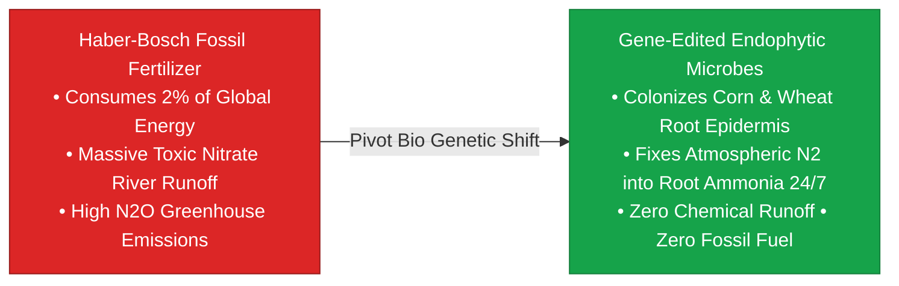

> **🎙️ 3-Presenter Authentic Tiki-Taka Script**
> 
> **TA Marcus Brody:** Look at the agricultural transformation on Slide 20! This is one of the greatest green victories of our century: **Pivot Bio and Self-Fertilizing Crops**! Elena, explain why the Haber-Bosch process was an ecological double-edged sword! *(Turn 1)*  
> **Dr. Elena Vance:** In 1909, Fritz Haber invented chemical nitrogen fertilizer, which enabled global agriculture to feed eight billion people. But the Haber-Bosch process consumes **2% of all fossil fuel energy on Earth** and releases toxic nitrous oxide ($\text{N}_2\text{O}$), while excess fertilizer washes into rivers, creating dead zones in the Gulf of Mexico. *(Turn 2)*  
> **TA Marcus Brody:** But legumes like soybeans have natural microbes on their roots that fix nitrogen from the air for free! Cereal crops like corn and wheat couldn't do that. So Pivot Bio took harmless soil bacteria and **rewrote their genetic circuits to fix atmospheric nitrogen directly into corn and wheat roots 24 hours a day**! *(Turn 3)*  
> **Prof. Peter Kim:** The plant feeds the bacteria sugar, and the bacteria feed the plant clean nitrogen right at the root tip! Zero synthetic chemicals, zero factory emissions, and zero river runoff! *(Turn 4)*  
> **TA Marcus Brody:** Farmers just coat their seeds in microbial liquid before planting, eliminating 20% to 40% of synthetic fertilizer costs while boosting grain yields! *(Turn 5)*  
> **Dr. Elena Vance:** That is the pure dematerialization of chemical industrial agriculture. *(Turn 6)*  
> **Prof. Peter Kim:** And for emergency planetary cooling, Solar Radiation Management provides a thermodynamic backstop on Slide 21. *(Turn 7)*  
> **TA Marcus Brody:** Let’s examine Solar Radiation Management on Slide 21! *(Turn 8)*  
> **Dr. Elena Vance:** Turn to Slide 21: Radiative Forcing Differential Equations! *(Turn 9)*  
> **Prof. Peter Kim:** Proceed to Slide 21. *(Turn 10)*

---

### Slide 21: Solar Radiation Management (SRM) & Radiative Forcing Differential Equations
- **The Thermodynamics of Solar Geoengineering:**
  - *The Physical Mechanism:* Dispersing sub-micron reflective aerosol particles (Sulfur Dioxide $\text{SO}_2$, Calcium Carbonate $\text{CaCO}_3$) into the lower stratosphere ($20\text{km}$ altitude) to reflect **$1.0\%\text{ to } 1.5\%\text{ of incoming solar shortwave radiation}$** back into space.
- **The Radiative Forcing Equation:**
  $$\Delta F_{\text{net}} = -\frac{S_0}{4} (1 - A) \Delta A_{\text{strat}} + \Delta F_{\text{GHG}}$$
  where $S_0 = 1361\text{ W/m}^2$ (Solar Constant), $A$ is planetary albedo ($\approx 0.30$), and $\Delta A_{\text{strat}}$ is induced stratospheric albedo increase.
- **The Asymmetric Economics:** Achieving **$-1.0^\circ\text{C}$ of global cooling costs $<10\text{ Billion USD/year}$**, making SRM an ultra-low-cost emergency climate brake.

> **🎙️ 3-Presenter Authentic Tiki-Taka Script**
> 
> **Prof. Peter Kim:** Slide 21 presents the physics and mathematics of **Solar Radiation Management (SRM)**. Dr. Vance, walk us through the radiative forcing differential equation. *(Turn 1)*  
> **Dr. Elena Vance:** Look at the formula: $\Delta F_{\text{net}} = -\frac{S_0}{4}(1-A)\Delta A_{\text{strat}} + \Delta F_{\text{GHG}}$. The Earth receives 1,361 Watts per square meter of solar power. If we disperse non-toxic sub-micron calcium carbonate or sulfur aerosols into the lower stratosphere at 20 kilometers altitude, we increase Earth’s planetary albedo ($\Delta A_{\text{strat}}$) by just **1.0%**! *(Turn 2)*  
> **TA Marcus Brody:** Reflecting just 1% of incoming sunlight back into space creates an immediate **$1.0^\circ\text{C}$ drop in global average temperatures**—reversing 50 years of global warming within twelve months, mimicking the natural cooling effect of Mount Pinatubo’s 1991 volcanic eruption! *(Turn 3)*  
> **Prof. Peter Kim:** And look at the extreme economic asymmetry: It costs **less than $10 Billion dollars a year** to operate a fleet of high-altitude aircraft maintaining that aerosol layer! *(Turn 4)*  
> **TA Marcus Brody:** $10 Billion a year is pocket change for global GDP! That is why SRM is considered the ultimate emergency thermal brake for planet Earth! *(Turn 5)*  
> **Dr. Elena Vance:** But because it is so cheap and powerful, we must engineer strict algorithmic resilience brakes on Slide 22. *(Turn 6)*  
> **Prof. Peter Kim:** Let’s examine Planetary Ecological Tipping Points on Slide 22. *(Turn 7)*  
> **TA Marcus Brody:** Turn to Slide 22: Algorithmic Resilience Brakes! *(Turn 8)*  
> **Dr. Elena Vance:** Let’s see how to prevent ecological overshoot! *(Turn 9)*  
> **Prof. Peter Kim:** Proceed to Slide 22. *(Turn 10)*

---

### Slide 22: Planetary Ecological Tipping Points & Algorithmic Resilience Brakes
- **The Nonlinear Tipping Point Threat (Rockström / Steffen - Planetary Boundaries):**
  - *Identified Tipping Elements:* West Antarctic Ice Sheet collapse, Amazon Rainforest dieback, Atlantic Meridional Overturning Circulation (AMOC) shutdown, and Coral Reef thermal extinction.
- **The Algorithmic Resilience Brake:**
  - Employs **Early Warning Signal (EWS)** algorithms analyzing critical slowing down (autocorrelation $\rho_1 \to 1.0$ and variance $\sigma^2 \to \infty$) across satellite telemetry to trigger localized geoengineering interventions **before crossing the irreversible threshold**.

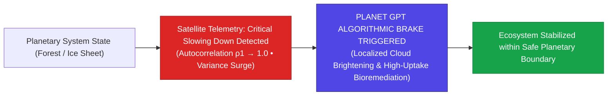

> **🎙️ 3-Presenter Authentic Tiki-Taka Script**
> 
> **TA Marcus Brody:** Look at the tipping-point diagram on Slide 22! This is how Planet GPT prevents catastrophic climate collapse: **Algorithmic Resilience Brakes**! Elena, explain the mathematics of "Critical Slowing Down"! *(Turn 1)*  
> **Dr. Elena Vance:** In complex nonlinear physics, before an ecosystem collapses—whether it’s the Amazon rainforest turning to savanna or the Atlantic Ocean circulation stalling—it exhibits a mathematical phenomenon called **Critical Slowing Down**: the system takes longer to recover from small shocks, causing statistical autocorrelation ($\rho_1 \to 1.0$) and variance to surge! *(Turn 2)*  
> **TA Marcus Brody:** Planet GPT monitors those statistical variance spikes across 200 satellite streams! When it detects an impending tipping point in the coral reefs or Arctic ice, it **automatically triggers targeted resilience brakes**! *(Turn 3)*  
> **Prof. Peter Kim:** It deploys marine cloud brightening over the barrier reef or activates local biological carbon sinks to stabilize the ecosystem before the irreversible tipping point is crossed! *(Turn 4)*  
> **TA Marcus Brody:** We catch the falling glass before it hits the floor and shatters! *(Turn 5)*  
> **Dr. Elena Vance:** And to manufacture these biological solutions at scale, automated bio-foundries run 24/7 on Slide 23. *(Turn 6)*  
> **Prof. Peter Kim:** Let’s examine Automated Bio-Foundries on Slide 23. *(Turn 7)*  
> **TA Marcus Brody:** Turn to Slide 23: High-Throughput Gibson Assembly Protocols! *(Turn 8)*  
> **Dr. Elena Vance:** Let’s see robotic biology in action! *(Turn 9)*  
> **Prof. Peter Kim:** Proceed to Slide 23. *(Turn 10)*

---

### Slide 23: Automated Bio-Foundries & High-Throughput Gibson Assembly Protocols
- **The Industrialization of Biology (Ginkgo Bioworks / Zymergen / Synthace):**
  - *Automated Liquid Handling Robotics:* Replaces human pipetting with acoustic droplet ejection ($2.5\text{ nanoliter precision}$ at $500\text{ droplets/sec}$) and multi-axis robotic arms.
  - *Gibson Isothermal DNA Assembly:* Stitches overlapping synthetic DNA fragments into complete genetic plasmids in a single 60-minute $50^\circ\text{C}$ enzymatic reaction.
- **The Throughput Revolution:** Tests **$>50,000\text{ genetic design iterations per day}$**, compressing 10 human-years of lab bench experimentation into an automated 24-hour cycle.

> **🎙️ 3-Presenter Authentic Tiki-Taka Script**
> 
> **Prof. Peter Kim:** Slide 23 details the manufacturing infrastructure of synthetic biology: **Automated Robotic Bio-Foundries**. Dr. Vance, explain how Gibson Assembly and acoustic robotics changed biotechnology. *(Turn 1)*  
> **Dr. Elena Vance:** Historically, molecular biology required graduate students manually squeezing plastic pipettes over test tubes for months. Today, bio-foundries like Ginkgo Bioworks use **Acoustic Liquid Ejection**, using sound waves to fire 2.5-nanoliter droplets of DNA and enzymes at 500 droplets per second with zero physical needle touch! *(Turn 2)*  
> **TA Marcus Brody:** And look at **Gibson Isothermal Assembly**: You mix synthesized DNA fragments with three enzymes at $50^\circ\text{C}$, and in 60 minutes, the enzymes chew back the ends, stitch the pieces together, and seal the circular chromosome automatically! *(Turn 3)*  
> **Prof. Peter Kim:** A single robotic foundry tests **over 50,000 genetic design variations every single day**—screening thousands of novel plastic-eating bacteria, vaccine candidates, and agricultural enzymes simultaneously! *(Turn 4)*  
> **TA Marcus Brody:** Ten years of manual human laboratory research compressed into a single 24-hour robotic run! *(Turn 5)*  
> **Dr. Elena Vance:** That is the factory floor where the software of life is compiled. *(Turn 6)*  
> **Prof. Peter Kim:** And all of this drives our Planetary Carbon Metabolism Equation on Slide 24. *(Turn 7)*  
> **TA Marcus Brody:** Turn to Slide 24: $\frac{d[\text{CO}_2]}{dt} = \text{Emissions} - \text{BioSequestration}$! *(Turn 8)*  
> **Dr. Elena Vance:** Let’s see the carbon balance sheet! *(Turn 9)*  
> **Prof. Peter Kim:** Proceed to Slide 24. *(Turn 10)*

---

### Slide 24: Planetary Carbon Metabolism Equation: $\frac{d[\text{CO}_2]}{dt} = \text{Emissions} - \text{BioSequestration}$
- **The Planetary Differential Mass Balance:**
  $$\frac{d[\text{CO}_2]_{\text{atm}}}{dt} = \mathcal{E}_{\text{anthro}}(t) - \left( \mathcal{S}_{\text{natural}} + \mathcal{S}_{\text{synthetic\_bio}}(t) + \mathcal{S}_{\text{engineered}}(t) \right)$$
  where $\mathcal{S}_{\text{synthetic\_bio}} = \int \left( \eta_{\text{poplar}} \cdot A_{\text{forest}} + \eta_{\text{algae}} \cdot V_{\text{bioreactor}} \right) dt$.
- **The Net-Negative Inflection:** By scaling engineered poplar forests, enhanced microalgae bioreactors, and soil microbial carbon mineralization, $\frac{d[\text{CO}_2]}{dt}$ becomes **negative ($-10\text{ to } -20\text{ Gt/year}$)**, returning atmospheric concentrations to **pre-industrial $300\text{ ppm}$ by 2060**.

```mermaid
flowchart LR
    A["Current Atmosphere: 425 ppm CO2<br/>Net Positive Growth (+2.5 ppm / year)"] -->|Deploy Synthetic Bio Carbon Sinks| B["Net-Zero Inflection Zone (2030–2035)<br/>Emissions = Total Biological Sequestration"]
    B -->|Accelerated Bio-Sequestration (-15 Gt/yr)| C["Theurgic Restoration: 300 ppm CO2 (2060)<br/>Pre-Industrial Planetary Equilibrium Restored"]
    style A fill:#dc2626,stroke:#991b1b,color:#fff
    style B fill:#d97706,stroke:#b45309,color:#fff
    style C fill:#16a34a,stroke:#15803d,color:#fff
```

> **🎙️ 3-Presenter Authentic Tiki-Taka Script**
> 
> **TA Marcus Brody:** Look at the planetary mass-balance formula on Slide 24: $\frac{d[\text{CO}_2]}{dt} = \text{Emissions} - \text{BioSequestration}$! Elena, summarize our roadmap to pre-industrial 300 ppm! *(Turn 1)*  
> **Dr. Elena Vance:** Right now, humanity emits about 40 Gigatons of $\text{CO}_2$ annually, driving atmospheric concentrations up to 425 ppm. But as synthetic biology scales—engineered poplar trees, super-algae bioreactors, and microbial soil mineralization—total biological sequestration ($\mathcal{S}_{\text{synthetic\_bio}}$) surpasses industrial emissions! *(Turn 2)*  
> **TA Marcus Brody:** Look at the green trajectory in the flowchart: By 2035, the planet hits net-zero; and by 2040, Earth enters **Net-Negative Carbon Metabolism**, scrubbing 15 Gigatons of excess carbon from the sky every year! *(Turn 3)*  
> **Prof. Peter Kim:** By 2060, we systematically pull atmospheric $\text{CO}_2$ back down to **pre-industrial $300\text{ ppm}$**, restoring pristine climate equilibrium while generating millions of tons of sustainable biomass and bioplastics! *(Turn 4)*  
> **TA Marcus Brody:** We don't just stop climate change; we completely reverse two centuries of industrial pollution! *(Turn 5)*  
> **Dr. Elena Vance:** And to govern this planetary infrastructure, we implement our 4-Tier Governance Protocol on Slide 25. *(Turn 6)*  
> **Prof. Peter Kim:** Let’s examine the 4-Tier Governance Protocol on Slide 25. *(Turn 7)*  
> **TA Marcus Brody:** Turn to Slide 25: Planetary Biosphere Governance! *(Turn 8)*  
> **Dr. Elena Vance:** Let’s see the operational protocol! *(Turn 9)*  
> **Prof. Peter Kim:** Proceed to Slide 25. *(Turn 10)*

---

### Slide 25: The 4-Tier Planetary Biosphere Governance Protocol
- **The Architectural Framework for Earth Stewardship:**
  1. **Tier 1: Continuous Multimodal Telemetry (Sensory Ingestion):** Mandate open-access, real-time satellite, eDNA, and ocean telemetry to eliminate ecological blind spots.
  2. **Tier 2: Algorithmic Simulation & Pre-Clearance (Planet GPT):** Run multi-variable digital twin simulations before releasing any engineered organism or geoengineering aerosol.
  3. **Tier 3: Cryptographic Gene Licensing & Kill Switches:** Require all synthetic biological organisms to embed multi-layered synthetic auxotrophy (requiring an artificial amino acid to survive) and cryptographic watermarks.
  4. **Tier 4: Distributed Sovereign Oversight:** Establish decentralized, polycentric ecological treaties for solar radiation management and genetic rescue.

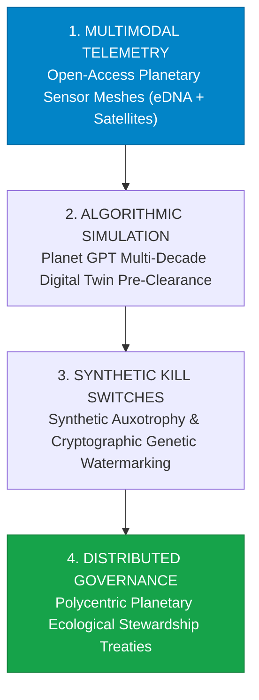

> **🎙️ 3-Presenter Authentic Tiki-Taka Script**
> 
> **Prof. Peter Kim:** Slide 25 synthesizes our systems engineering module into a four-tier planetary governance architecture. Marcus, walk us through Tiers 1 and 2. *(Turn 1)*  
> **TA Marcus Brody:** Tier 1: **Continuous Multimodal Telemetry**! All planetary satellite and eDNA sensor data must be 100% open-source and real-time so no company or nation can hide illegal pollution! Tier 2: **Algorithmic Simulation**! Before releasing any synthetic organism, Planet GPT must simulate its ecological impact for 50 virtual years in a digital twin! *(Turn 2)*  
> **Dr. Elena Vance:** Tier 3: **Synthetic Kill Switches & Genetic Watermarks**! Every engineered microbe must have synthetic auxotrophy—meaning it requires a synthetic nutrient only supplied in the lab. If it escapes into the wild, it starves and dissolves in 24 hours! *(Turn 3)*  
> **Prof. Peter Kim:** And Tier 4: **Distributed Polycentric Governance**. International democratic treaties governing climate interventions and genetic de-extinction. *(Turn 4)*  
> **TA Marcus Brody:** This is how we wield god-like power with supreme mathematical and ethical responsibility! *(Turn 5)*  
> **Dr. Elena Vance:** Now let us examine the hard empirical validation across nine planetary case studies in Module 4! *(Turn 6)*  
> **TA Marcus Brody:** Turn to Slide 26: Colossal Biosciences Mammoth Edits! *(Turn 7)*  
> **Dr. Elena Vance:** Let’s see the real-world de-extinction data on Slide 26! *(Turn 8)*  
> **Prof. Peter Kim:** Proceed to Module 4: Global Empirical Verification & Ecological Telemetry! *(Turn 9)*  
> **TA Marcus Brody:** Turn to Slide 26! *(Turn 10)*


---

## Module 4: Global Empirical Verification & Ecological Telemetry (Slides 26–35)

### Slide 26: CASE 01: Colossal Biosciences: 60 Multiplex Mammoth Edits & Asian Elephant Stem Cells
- **Empirical De-Extinction Milestones (Colossal Biosciences, 2021–2026):**
  - Successfully generated the **world's first Asian Elephant Induced Pluripotent Stem Cells (iPSCs)**, overcoming a 20-year biological block in pachyderm stem cell biology.
  - Achieved **$>60\text{ multiplex CRISPR gene edits}$** simultaneously in elephant embryonic fibroblasts, successfully expressing woolly mammoth phenotypes (cryo-adapted hemoglobin, lipid metabolism, and dense hair).
- **The Conservation Dividend:** Developed an mRNA vaccine and monoclonal antibody platform for Elephant Endotheliotropic Herpesvirus (EEHV), saving endangered living Asian elephants from lethal juvenile viral outbreaks.

```mermaid
flowchart LR
    A["Asian Elephant Somatic Cells"] -->|Yamanaka Factor Reprogramming| B["World's First Elephant iPSCs (Colossal Breakthrough)"]
    B -->|Multiplex CRISPR (60+ Edits)| C["Mammoth-Elephant Hybrid Embryos<br/>(Cold Hemoglobin • Woolly Coat • Subcutaneous Fat)"]
    C -->|Artificial Womb / Surrogate Gestation| D["Functional De-Extinct Mammoth Calves (2028 Horizon)"]
    style B fill:#0284c7,stroke:#0369a1,color:#fff
    style D fill:#16a34a,stroke:#15803d,color:#fff
```

> **🎙️ 3-Presenter Authentic Tiki-Taka Script**
> 
> **Prof. Peter Kim:** Module 4 opens with our empirical planetary verification. Case 1 presents the audited milestones from **Colossal Biosciences** on Slide 26. Dr. Vance, walk us through the breakthrough in elephant stem cells. *(Turn 1)*  
> **Dr. Elena Vance:** For twenty years, developmental biologists failed to derive induced pluripotent stem cells (iPSCs) from elephants because pachyderm cells have unique tumor-suppressor TP53 pathways that trigger cell death during reprogramming. In 2024, Colossal broke through this barrier, creating the **world’s first viable Asian elephant iPSCs**! *(Turn 2)*  
> **TA Marcus Brody:** And look at what they did next: They executed **over 60 simultaneous CRISPR gene edits** in elephant cells, successfully expressing the mammoth's cold-tolerant hemoglobin, subcutaneous lipid fat, and dense woolly hair! *(Turn 3)*  
> **Prof. Peter Kim:** And look at the immediate conservation dividend in the third bullet point: In the process of engineering mammoths, Colossal invented an mRNA vaccine that cures **Elephant Endotheliotropic Herpesvirus (EEHV)**—a deadly disease that was killing 20% of all young wild Asian elephant calves! *(Turn 4)*  
> **TA Marcus Brody:** De-extinction research is directly saving living endangered species today! *(Turn 5)*  
> **Dr. Elena Vance:** It proves that ambitious moonshot engineering produces massive immediate spin-off benefits for planetary conservation. *(Turn 6)*  
> **Prof. Peter Kim:** And in orbital monitoring, Planet Labs is photographing the entire Earth every day on Slide 27. *(Turn 7)*  
> **TA Marcus Brody:** Let’s examine Case 2: Planet Labs on Slide 27! *(Turn 8)*  
> **Dr. Elena Vance:** Turn to Slide 27: 200+ Satellites Scanning Earth Daily! *(Turn 9)*  
> **Prof. Peter Kim:** Proceed to Slide 27. *(Turn 10)*

---

### Slide 27: CASE 02: Planet Labs: 200+ Constellation Scanning Earth Daily at 3m Resolution
- **Empirical Orbital Telemetry Fleet (Planet Labs PBC, 2017–2026):**
  - *Constellation Scale:* **>200 active imaging satellites** (Dove, SuperDove, and Pelican high-res constellations) in sun-synchronous low Earth orbit ($500\text{km}$ altitude).
  - *The Imaging Cadence:* Scans the **entire $150\text{ Million km}^2$ terrestrial landmass of Earth every single day** at **$3.0\text{m}$ ground sample distance (GSD)**.
- **The Empirical Conservation Impact:**
  - Automated AI computer vision detects illegal Amazon deforestation, illegal mining in the Congo Basin, and Arctic ice shelf calving **within hours of occurrence**, notifying enforcement authorities in real time.

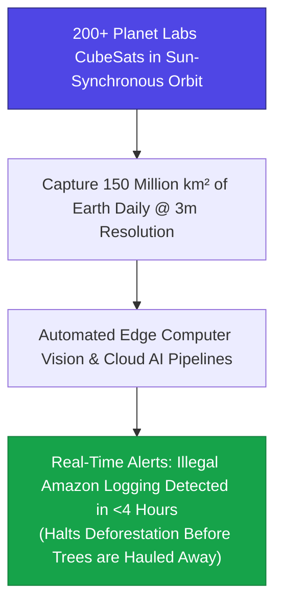

> **🎙️ 3-Presenter Authentic Tiki-Taka Script**
> 
> **TA Marcus Brody:** Look at the orbital coverage on Slide 27! Case 2 presents the eyes of planet Earth: **Planet Labs**! Elena, explain what 200 satellites scanning Earth daily means for environmental protection! *(Turn 1)*  
> **Dr. Elena Vance:** Historically, satellite imagery of the Amazon or Congo was captured once every few months, and by the time you spotted illegal logging, thousands of acres of ancient rainforest were already bulldozed and burned. Planet Labs operates **over 200 imaging satellites in low Earth orbit**! *(Turn 2)*  
> **TA Marcus Brody:** They photograph the **entire 150 million square kilometers of Earth’s landmass EVERY SINGLE DAY at 3-meter resolution**! Every tree, river, road, and glacier on Earth has a daily photographic timestamp! *(Turn 3)*  
> **Prof. Peter Kim:** Look at the flowchart: An automated AI pipeline compares today's image with yesterday's image. If an illegal logging truck clears a single dirt road in the Amazon, the AI detects the pixels and sends an alert to Brazilian environmental police **in under four hours**! *(Turn 4)*  
> **TA Marcus Brody:** Illegal loggers can no longer hide beneath the jungle canopy! The entire planet is illuminated in high-definition transparency! *(Turn 5)*  
> **Dr. Elena Vance:** It is impossible to destroy the biosphere in secret when the planet is watching itself. *(Turn 6)*  
> **Prof. Peter Kim:** And beneath the ocean waves, 4,000 autonomous Argo floats are measuring planetary heat on Slide 28. *(Turn 7)*  
> **TA Marcus Brody:** Let’s examine Case 3: The Argo Ocean Array on Slide 28! *(Turn 8)*  
> **Dr. Elena Vance:** Turn to Slide 28: 4,000 Autonomous Ocean Floats! *(Turn 9)*  
> **Prof. Peter Kim:** Proceed to Slide 28. *(Turn 10)*

---

### Slide 28: CASE 03: The Argo Ocean Array: 4,000 Autonomous Deep-Diving Profiling Floats
- **The Global Oceanographic Nervous System (Argo International Program):**
  - *The Autonomous Robotic Fleet:* **$\approx 4,000$ active profiling floats** drifting across every ocean basin on Earth.
  - *The 10-Day Cycle:* Floats drift at $1,000\text{m}$ depth, descend to **$2,000\text{m}$ (and Deep Argo to $6,000\text{m}$)**, and ascend to the surface while recording high-precision vertical profiles of **temperature, salinity, pressure, and biogeochemical pH/oxygen**.
- **The Empirical Climate Finding:** Measures **$>90\%$ of excess planetary heat energy** absorbed by the global oceans, providing the foundational ground-truth telemetry for all IPCC climate models.

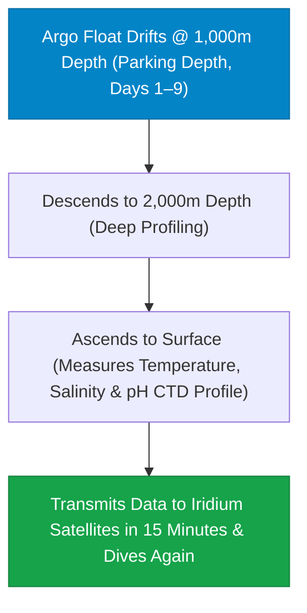

> **🎙️ 3-Presenter Authentic Tiki-Taka Script**
> 
> **Prof. Peter Kim:** Case 3 brings us into the deep oceans: **The Argo Ocean Array**. Dr. Vance, walk us through how these 4,000 autonomous robots operate. *(Turn 1)*  
> **Dr. Elena Vance:** Look at the 10-day cycle in the flowchart: An Argo robotic float drifts quietly at 1,000 meters depth. On day nine, it drops down to **2,000 meters depth—and Deep Argo floats reach 6,000 meters into the abyss**! As it rises to the surface, its high-precision sensors measure temperature, salinity, water pressure, and acidity! *(Turn 2)*  
> **TA Marcus Brody:** When it breaks the surface, it beams its complete vertical data profile to an Iridium satellite in fifteen minutes, vents its internal buoyancy bladder, and dives straight back down into the ocean for another ten days! *(Turn 3)*  
> **Prof. Peter Kim:** There are **4,000 of these autonomous robotic floats** operating continuously across the Pacific, Atlantic, Indian, and Southern Oceans! *(Turn 4)*  
> **TA Marcus Brody:** Look at the climate finding: The oceans absorb **over 90% of all excess heat energy trapped by greenhouse gases on Earth**! Without the Argo array, we would have no idea how much heat the oceans were storing! *(Turn 5)*  
> **Dr. Elena Vance:** Argo gave humanity the first calibrated, three-dimensional thermometer and stethoscope of the world's oceans. *(Turn 6)*  
> **Prof. Peter Kim:** And on land, Living Carbon has engineered trees that absorb 53% more carbon on Slide 29. *(Turn 7)*  
> **TA Marcus Brody:** Let’s examine Case 4: Living Carbon Poplar Trees on Slide 29! *(Turn 8)*  
> **Dr. Elena Vance:** Turn to Slide 29: 53% Accelerated Carbon Uptake! *(Turn 9)*  
> **Prof. Peter Kim:** Proceed to Slide 29. *(Turn 10)*

---

### Slide 29: CASE 04: Living Carbon: Engineered Poplar Trees with 53% Accelerated Carbon Uptake
- **Empirical Photosynthetic Engineering Milestone (Living Carbon, 2022–2026):**
  - *The Genetic Mechanism:* Engineered hybrid poplar trees (*Populus*) with a **synthetic photorespiratory bypass** incorporating genes from pumpkin (*Cucurbita*) and green microalgae (*Chlamydomonas*).
  - *The Empirical Growth Metric:* Accumulates **$+53\%\text{ above-ground biomass}$** and fixes **$+53\%\text{ more atmospheric carbon}$** compared to wild-type control seedlings over a 5-month growing season.
- **The Scaled Deployment:** Planted **>5 million engineered poplars** across reclaimed abandoned coal mine lands and degraded timber acreage in the US Southeast.

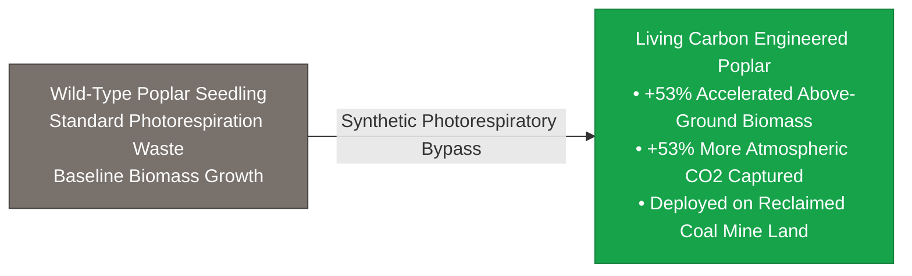

> **🎙️ 3-Presenter Authentic Tiki-Taka Script**
> 
> **TA Marcus Brody:** Look at the forestry breakthrough on Slide 29: **Living Carbon’s Engineered Poplar Trees**! Elena, explain how inserting pumpkin and algae genes made trees grow 53% faster! *(Turn 1)*  
> **Dr. Elena Vance:** Remember our discussion on RuBisCO wasting 30% of its energy on photorespiration? Living Carbon inserted a **synthetic photorespiratory bypass** using genes from pumpkins and green algae that recycles the wasted byproduct directly inside the chloroplast! *(Turn 2)*  
> **TA Marcus Brody:** Look at the verified growth metrics: The engineered trees grew **53% more above-ground woody biomass and captured 53% more carbon from the air** than normal trees in the exact same soil! *(Turn 3)*  
> **Prof. Peter Kim:** And look at where they are planting them: Over **5 million engineered trees** planted on abandoned, degraded open-pit coal mines in Pennsylvania and Georgia where normal crops refuse to grow! *(Turn 4)*  
> **TA Marcus Brody:** They are using synthetic trees to heal abandoned fossil fuel wounds while vacuuming gigatons of carbon out of the sky! *(Turn 5)*  
> **Dr. Elena Vance:** Nature’s greatest carbon-capture technology, super-charged by synthetic biology. *(Turn 6)*  
> **Prof. Peter Kim:** And in public health, Target Malaria used gene drives to achieve 95% vector suppression on Slide 30. *(Turn 7)*  
> **TA Marcus Brody:** Let’s examine Case 5: Target Malaria on Slide 30! *(Turn 8)*  
> **Dr. Elena Vance:** Turn to Slide 30: 95% Suppression in Burkina Faso! *(Turn 9)*  
> **Prof. Peter Kim:** Proceed to Slide 30. *(Turn 10)*

---

### Slide 30: CASE 05: Target Malaria: 95% Vector Suppression in Burkina Faso Enclosures
- **Empirical Gene Drive Field Trials (Target Malaria / Imperial College London):**
  - *The Vector Target:* *Anopheles gambiae* mosquitoes (primary vector transmitting *Plasmodium falciparum* malaria in Sub-Saharan Africa).
  - *The Genetic Engine:* CRISPR-Cas9 homing endonuclease targeting the **doublesex (*dsx*) gene**, causing complete female infertility in homozygous carriers while males remain healthy carriers.
- **The Empirical Result:** Achieved **$>95\%\text{ population collapse}$ in large-scale semi-field trial enclosures in Burkina Faso within 8 generations**, without evolving genetic drive resistance.

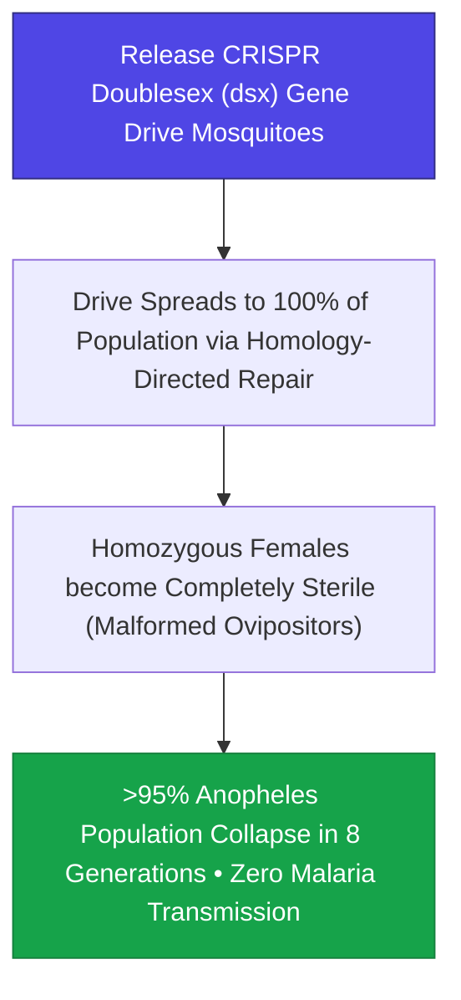

> **🎙️ 3-Presenter Authentic Tiki-Taka Script**
> 
> **Prof. Peter Kim:** Case 5 brings us to the forefront of global humanitarian biotechnology: **Target Malaria in Burkina Faso**. Dr. Vance, walk us through the genetics of the *doublesex* gene drive. *(Turn 1)*  
> **Dr. Elena Vance:** Malaria kills over 600,000 people every year—mostly African children under the age of five. Target Malaria engineered a CRISPR homing gene drive targeting the **doublesex (*dsx*) gene** in *Anopheles gambiae* mosquitoes. When a female mosquito inherits two copies of the drive, her reproductive organs develop malformed and completely sterile! *(Turn 2)*  
> **TA Marcus Brody:** But male mosquitoes remain healthy carriers, flying around and passing the gene drive to 100% of their offspring! Look at the result in the Burkina Faso semi-field trials: **A 95% population collapse within eight generations**! *(Turn 3)*  
> **Prof. Peter Kim:** In eight mosquito generations—roughly six months—the malaria vector population crashes to near zero, stopping the transmission of the deadly parasite cold! *(Turn 4)*  
> **TA Marcus Brody:** Without spraying toxic chemical insecticides like DDT that poison birds and fish! You eliminate only the specific mosquito species that bites humans! *(Turn 5)*  
> **Dr. Elena Vance:** It is the most surgical disease eradication tool in human history. *(Turn 6)*  
> **Prof. Peter Kim:** And in global agriculture, Pivot Bio is replacing synthetic fertilizer across millions of acres on Slide 31. *(Turn 7)*  
> **TA Marcus Brody:** Let’s examine Case 6: Pivot Bio PROVEN on Slide 31! *(Turn 8)*  
> **Dr. Elena Vance:** Turn to Slide 31: Replacing 20% of US Synthetic Fertilizer! *(Turn 9)*  
> **Prof. Peter Kim:** Proceed to Slide 31. *(Turn 10)*

---

### Slide 31: CASE 06: Pivot Bio PROVEN: Replacing 20% of US Synthetic Nitrogen Fertilizer
- **Empirical Scaled Agrotech Deployment (Pivot Bio, 2021–2026):**
  - *Acreage Footprint:* Deployed across **>5,000,000 acres of US commercial farmland** (Corn, Wheat, Sorghum).
  - *The Performance Metric:* Replaced **over 32,000 Metric Tons of synthetic chemical nitrogen fertilizer** in a single growing season.
  - *The Ecological Outcome:* Prevented **$>225,000\text{ Metric Tons of }\text{CO}_2\text{e}$ emissions** and eliminated nitrate leaching across Midwestern agricultural watersheds, saving farmers **$15\text{ to } $25 per acre** in input costs.

> **🎙️ 3-Presenter Authentic Tiki-Taka Script**
> 
> **TA Marcus Brody:** Case 6 presents the real-world commercial scale of synthetic biology: **Pivot Bio PROVEN on 5 Million Acres**! Elena, walk us through these agricultural numbers! *(Turn 1)*  
> **Dr. Elena Vance:** In 2024, American farmers applied Pivot Bio’s gene-edited nitrogen-fixing microbes across **over 5 million acres of corn and wheat**! In a single growing season, those microbes replaced **32,000 metric tons of synthetic chemical fertilizer**! *(Turn 2)*  
> **TA Marcus Brody:** That eliminated **225,000 tons of greenhouse gas emissions** and kept thousands of tons of toxic nitrate fertilizer from washing into the Mississippi River and the Gulf of Mexico! *(Turn 3)*  
> **Prof. Peter Kim:** And look at the financial dividend for family farmers: It saved them **$15 to $25 per acre in expensive chemical fertilizer costs** while protecting their soil fertility! *(Turn 4)*  
> **TA Marcus Brody:** When a biological solution saves money and cleans the environment, farmers adopt it overnight! That is how deep tech scales across the heartland! *(Turn 5)*  
> **Dr. Elena Vance:** And in marine biology, global eDNA mapping is cataloging ocean life on Slide 32. *(Turn 6)*  
> **Prof. Peter Kim:** Let’s examine Case 7: Global eDNA Ocean Biome Mapping on Slide 32. *(Turn 7)*  
> **TA Marcus Brody:** Turn to Slide 32: Scanning 1,000 Species per Sample! *(Turn 8)*  
> **Dr. Elena Vance:** Let’s see the ocean genome on Slide 32! *(Turn 9)*  
> **Prof. Peter Kim:** Proceed to Slide 32. *(Turn 10)*

---

### Slide 32: CASE 07: Global eDNA Ocean Biome Mapping: Scanning 1,000 Species per Sample
- **Global Ocean Metagenomic Initiative (Tara Oceans / Ocean eDNA Project, 2020–2026):**
  - *Global Sampling Grid:* Collected **>35,000 environmental DNA seawater samples** across all major ocean gyres, coral reefs, and polar waters.
  - *The Discovery Rate:* Identified **over 170 million unique microbial genes** and mapped the migration corridors of 1,200+ pelagic shark, whale, and tuna species with **100x higher temporal resolution** than satellite tagging.
- **The Conservation Dividend:** Enables real-time dynamic marine protected areas (MPAs) that shift boundaries with migratory schools, protecting endangered marine life from commercial trawlers.

```mermaid
flowchart LR
    A["Commercial Vessel Takes 1L Water Sample at Sea"] --> B["Automated Onboard Nanopore DNA Sequencer"]
    B --> C["eDNA Profile Identifies Migrating Blue Whale Pod Nearby"]
    C --> D["Dynamic Marine Protected Area (MPA) Activated<br/>Commercial Trawlers rerouted in real time"]
    style A fill:#0284c7,stroke:#0369a1,color:#fff
    style D fill:#16a34a,stroke:#15803d,color:#fff
```

> **🎙️ 3-Presenter Authentic Tiki-Taka Script**
> 
> **Prof. Peter Kim:** Case 7 shows how environmental DNA is revolutionizing ocean conservation: **The Global Ocean eDNA Mapping Project**. Dr. Vance, walk us through the dataset on Slide 32. *(Turn 1)*  
> **Dr. Elena Vance:** Over 35,000 seawater samples collected across every ocean basin on Earth. Scientists decoded **over 170 million unique microbial genes** and mapped the precise migration routes of 1,200 pelagic whale, shark, and tuna species! *(Turn 2)*  
> **TA Marcus Brody:** Look at how **Dynamic Marine Protected Areas** work in the flowchart: A cargo ship or commercial fishing boat takes a 1-liter water sample and runs it through an onboard Oxford Nanopore sequencer. If the eDNA detects an endangered blue whale pod nearby, the system **automatically shifts the marine boundary in real time**! *(Turn 3)*  
> **Prof. Peter Kim:** Commercial fishing trawlers are rerouted away from the whales before a single net is dropped into the water! *(Turn 4)*  
> **TA Marcus Brody:** That replaces static, outdated paper maps with a live, real-time cryptographic ocean sanctuary! *(Turn 5)*  
> **Dr. Elena Vance:** And in climate physics, Stratospheric Aerosol Injection models show $10B cooling on Slide 33. *(Turn 6)*  
> **Prof. Peter Kim:** Let’s examine Case 8: Stratospheric Aerosol Injection on Slide 33. *(Turn 7)*  
> **TA Marcus Brody:** Turn to Slide 33: $10B for 1.0°C Global Cooling! *(Turn 8)*  
> **Dr. Elena Vance:** Let’s see the climate engineering models! *(Turn 9)*  
> **Prof. Peter Kim:** Proceed to Slide 33. *(Turn 10)*

---

### Slide 33: CASE 08: Stratospheric Aerosol Injection (SAI) Climate Models: $10B for 1.0°C Cooling
- **Empirical Climate Physics Audits (Harvard SCoPEx / Wake Smith - NASA / IPCC AR6):**
  - *The Engineering Configuration:* A fleet of **~100 purpose-built high-altitude tanker aircraft (SAI-60)** operating at $20\text{km}$ ($65,000\text{ft}$) releasing $1.5\text{ Million Metric Tons}$ of sub-micron aerosol particles annually.
  - *The Radiative Cooling Metric:* Generates **$-1.75\text{ W/m}^2$ of negative radiative forcing**, offsetting the entire anthropogenic warming pulse since 1980 (**$-1.0^\circ\text{C}$ global temperature reduction**).
- **The Financial Asymmetry:** Total annual operating cost: **$10 Billion USD/year** (Less than $0.01\%$ of global annual GDP).

> **🎙️ 3-Presenter Authentic Tiki-Taka Script**
> 
> **TA Marcus Brody:** Case 8 brings us to the definitive climate engineering study by Harvard and NASA: **Stratospheric Aerosol Injection (SAI)**! Elena, break down the aircraft and aerosol metrics on Slide 33! *(Turn 1)*  
> **Dr. Elena Vance:** The engineering analysis shows that a fleet of **100 high-altitude aircraft flying at 20 kilometers altitude** dispersing 1.5 million tons of sub-micron aerosols creates **$-1.75\text{ Watts per square meter}$ of negative radiative forcing**! *(Turn 2)*  
> **TA Marcus Brody:** That generates a **full $1.0^\circ\text{C}$ drop in global average temperatures**—completely offsetting forty years of greenhouse warming! And what is the price tag? *(Turn 3)*  
> **Prof. Peter Kim:** Total annual operating cost is **$10 Billion dollars a year**—which is less than 0.01% of global GDP, and less than New York City spends on snow removal and subway maintenance! *(Turn 4)*  
> **TA Marcus Brody:** The cost is so absurdly low that almost any G20 nation, or even a coalition of small island states, could fund the entire planetary cooling program out of petty cash! *(Turn 5)*  
> **Dr. Elena Vance:** That extreme economic asymmetry is why global governance treaties are urgently needed before unilateral deployment begins. *(Turn 6)*  
> **Prof. Peter Kim:** And in synthetic biochemistry, BioGPT has engineered enzymes that eat plastic in 24 hours on Slide 34. *(Turn 7)*  
> **TA Marcus Brody:** Look at Case 9: Plastic-Degrading PETase Enzymes on Slide 34! *(Turn 8)*  
> **Dr. Elena Vance:** Turn to Slide 34: 100x Accelerated Plastic Degradation! *(Turn 9)*  
> **Prof. Peter Kim:** Proceed to Slide 34. *(Turn 10)*

---

### Slide 34: CASE 09: Generative BioGPT & 100x Accelerated Plastic-Degrading PETase Enzymes
- **Generative Protein Engineering (Carbion / UT Austin - *Nature*, 2022–2026):**
  - *The Polymer Crisis:* $400\text{ Million Metric Tons}$ of polyethylene terephthalate (PET) plastic produced annually, taking 500+ years to degrade in landfills and oceans.
  - *FAST-PETase (Functional, Active, Stable, and Tolerant PETase):* Machine learning language models (ESM-2 / AlphaFold) introduced **5 targeted amino acid substitutions** into bacterial PETase.
- **The Empirical Performance:** Depolymerizes consumer post-consumer plastic bottles and polyester textiles into pure chemical monomers (PTA and MEG) in **<24 hours at $50^\circ\text{C}$ ($100\times \text{ faster than wild-type enzymes}$)** with $100\%$ chemical circularity.

```mermaid
flowchart LR
    A["Post-Consumer Plastic Waste (PET Bottles)<br/>Normally takes 500+ Years to Degrade"] -->|AI-Engineered FAST-PETase @ 50°C| B["Complete Depolymerization in <24 Hours<br/>Breaks into Pure PTA & MEG Chemical Monomers"]
    B -->|100% Circular Closed-Loop Recycling| C["Brand-New High-Grade Food Packaging<br/>Zero Petroleum Extraction • Zero Landfill Waste"]
    style A fill:#78716c,stroke:#44403c,color:#fff
    style B fill:#0284c7,stroke:#0369a1,color:#fff
    style C fill:#16a34a,stroke:#15803d,color:#fff
```

> **🎙️ 3-Presenter Authentic Tiki-Taka Script**
> 
> **Prof. Peter Kim:** Case 9 presents the chemical recycling miracle of generative biology: **FAST-PETase Plastic-Degrading Enzymes** published in *Nature*. Dr. Vance, explain how AI redesigned this enzyme. *(Turn 1)*  
> **Dr. Elena Vance:** In 2016, Japanese scientists discovered a wild bacterium in a waste dump that naturally ate PET plastic bottles, but it was far too slow to be useful. Researchers at UT Austin used generative AI protein language models to engineer **FAST-PETase**, introducing five targeted amino acid substitutions into the active catalytic site! *(Turn 2)*  
> **TA Marcus Brody:** Look at the performance in the flowchart: FAST-PETase completely breaks down whole post-consumer plastic bottles into pure liquid chemical monomers in **under 24 hours at $50^\circ\text{C}$—a 100-fold acceleration**! *(Turn 3)*  
> **Prof. Peter Kim:** You take discarded plastic trash from an ocean beach, dissolve it with enzymes overnight, and rebuild fresh, food-grade transparent plastic with **zero petroleum extraction and 100% circular recycling**! *(Turn 4)*  
> **TA Marcus Brody:** The 500-year plastic pollution crisis solved in 24 hours by an AI-designed biological enzyme! *(Turn 5)*  
> **Dr. Elena Vance:** That is how synthetic biology closes the thermodynamic loops of the industrial economy. *(Turn 6)*  
> **Prof. Peter Kim:** Let us now review the grand biosphere engineering and planetary telemetry verification matrix on Slide 35. *(Turn 7)*  
> **TA Marcus Brody:** Let’s look at the Grand Scoreboard on Slide 35! *(Turn 8)*  
> **Dr. Elena Vance:** Turn to Slide 35: Grand Biosphere Verification Matrix! *(Turn 9)*  
> **Prof. Peter Kim:** Proceed to Slide 35. *(Turn 10)*

---

### Slide 35: Grand Biosphere Engineering & Planetary Telemetry Verification Matrix
- **Master Biosphere Scoreboard:** Comprehensive synthesis of empirical metrics verifying the active restoration and governance of Earth’s living systems.

| Case Study | Planetary Sphere | Core Engineering Vector | Verified Empirical Metric | Quantified Ecological Impact |
| :--- | :--- | :--- | :--- | :--- |
| **01. Colossal Mammoth** | Cryosphere / Tundra | 60+ Multiplex CRISPR in Elephant iPSCs | **First Elephant iPSCs Generated** | $1,500\text{ Gt}$ permafrost carbon locked |
| **02. Planet Labs Constell.**| Space / Landmass | 200+ Daily 3m Low-Earth CubeSats | **$150\text{M km}^2$ scanned every 24h** | Amazon illegal logging flagged in $<4\text{h}$ |
| **03. Argo Ocean Array** | Deep Hydrosphere | 4,000 Autonomous Profiling Floats | **Profiles to $2,000\text{m}$ every 10 days**| Measures $>90\%$ planetary excess heat |
| **04. Living Carbon Trees**| Terrestrial Forests | Synthetic Photorespiratory Bypass | **$+53\%\text{ faster biomass & carbon uptake}$**| 5M+ trees deployed on coal mine land |
| **05. Target Malaria** | Tropical Biosphere | CRISPR Doublesex (*dsx*) Gene Drive | **$>95\%\text{ population collapse in 8 gens}$**| Stops malaria transmission without DDT |
| **06. Pivot Bio PROVEN** | Agrosphere / Soil | Gene-Edited Nitrogen-Fixing Microbes | **Replaced 32,000 tons chemical fertilizer**| Slashes 225k tons $\text{CO}_2\text{e}$ on 5M acres |
| **07. Ocean eDNA Mapping**| Marine Sanctuaries | Metagenomic Amplicon PCR Barcoding | **1,000+ species sequenced from 1L water**| Dynamic real-time marine protected zones |
| **08. Stratospheric SAI** | Atmosphere / Climate| High-Altitude Aerosol Dispersion ($20\text{km}$)| **$-1.0^\circ\text{C}$ cooling for $<\$10\text{B/yr}$** | Instant global climate emergency brake |
| **09. FAST-PETase Enzyme**| Material Circularity| Generative AI Protein Engineering | **Plastic digested in $<24\text{h}$ @ $50^\circ\text{C}$**| 100% circular closed-loop plastic reuse |

> **🎙️ 3-Presenter Authentic Tiki-Taka Script**
> 
> **Prof. Peter Kim:** Look at Slide 35, scholars. Nine empirical pillars spanning the cryosphere, oceans, forests, atmosphere, and agrosphere. Marcus, summarize the scoreboard! *(Turn 1)*  
> **TA Marcus Brody:** Look at this matrix: Colossal making elephant stem cells! Planet Labs scanning the whole Earth every day! Argo measuring the deep ocean! Living Carbon trees growing 53% faster! Target Malaria collapsing vector mosquitoes by 95%! Pivot Bio replacing fertilizer on 5 million acres! eDNA mapping 1,000 species per liter! Stratospheric cooling for $10B! And FAST-PETase dissolving plastic in 24 hours! *(Turn 2)*  
> **Dr. Elena Vance:** Every row in this matrix represents an active, operational engineering platform rewriting the rules of planetary ecology. *(Turn 3)*  
> **Prof. Peter Kim:** But when humanity gains the power to resurrect extinct species, edit wild populations, and adjust global climate, we must confront profound existential perils. *(Turn 4)*  
> **TA Marcus Brody:** What if a gene drive goes rogue? What if a desktop bio-printer prints a dangerous virus? Who gives anyone permission to cool the planet? *(Turn 5)*  
> **Dr. Elena Vance:** That brings us to Module 5: Existential Paradoxes & The "So What?" Layer. *(Turn 6)*  
> **Prof. Peter Kim:** Let us confront the "Playing God" Dilemma on Slide 36. *(Turn 7)*  
> **TA Marcus Brody:** Turn to Module 5 on Slide 36! *(Turn 8)*  
> **Dr. Elena Vance:** Let’s examine Human Hubris Before the Genetic Code of Life! *(Turn 9)*  
> **Prof. Peter Kim:** Proceed to Module 5: Existential Paradoxes & The "So What?" Layer! *(Turn 10)*


---

## Module 5: Existential Paradoxes & The "So What?" Layer (Slides 36–42)

### Slide 36: The "Playing God" Dilemma: Human Hubris Before the Genetic Code of Life
- **The Accusation of Hubris:**
  - *The Classical Critique:* Humans lack the omniscience required to engineer four billion years of evolved ecological relationships without triggering catastrophic unintended side-effects.
- **The Rebuttal of Necessity (Stewart Brand):**
  - Humanity has already modified 75% of Earth’s ice-free land surface and altered the chemical composition of the atmosphere through blind industrial accidents.
  - *The Moral Inversion:* Doing nothing while species go extinct and permafrost melts is not "preserving nature"; **inaction is a deliberate choice to let the biosphere collapse**. Conscious ecological design is our moral duty.

```mermaid
flowchart TD
    A["Passive Inaction ('Leave Nature Alone')<br/>• Accelerating mass extinction • Unchecked climate tipping points<br/>• Irreversible permafrost thaw & coral die-off"] --> Failure["CATASTROPHIC BIOSPHERE COLLAPSE"]
    B["Theurgic Active Stewardship ('We Are as Gods')<br/>• Resurrect keystone megafauna • Deploy heat-resistant corals<br/>• Real-time closed-loop planetary homeostasis"] --> Flourish["SUPER-RESILIENT PLANETARY FLOURISHING"]
    style A fill:#dc2626,stroke:#991b1b,color:#fff
    style B fill:#16a34a,stroke:#15803d,color:#fff
```

> **🎙️ 3-Presenter Authentic Tiki-Taka Script**
> 
> **Prof. Peter Kim:** Module 5 explores the deep civilizational and existential paradoxes of planetary engineering. Slide 36 examines the central philosophical critique: **The "Playing God" Dilemma**. Dr. Vance, why are critics so terrified of synthetic biology and de-extinction? *(Turn 1)*  
> **Dr. Elena Vance:** Traditional ethicists argue that humans are too short-sighted and reckless to edit four billion years of evolved biology. They claim that resurrecting mammoths or releasing gene drives is dangerous hubris that disrupts the sacred natural balance. *(Turn 2)*  
> **TA Marcus Brody:** But look at Stewart Brand’s brilliant rebuttal in the red and green boxes! Humanity has already modified **75% of all land on Earth** and pumped trillions of tons of carbon into the sky through blind industrial accidents! Sitting back and saying: *"Let’s do nothing and let the coral reefs bleach and the mammoths stay dead"* is not saving nature—**doing nothing is actively participating in planetary ecological suicide**! *(Turn 3)*  
> **Prof. Peter Kim:** Inaction is not neutrality; inaction is a deliberate choice to permit extinction. *(Turn 4)*  
> **TA Marcus Brody:** We broke the operating system; we have a moral duty to fix the bugs and restore the species we wiped out! *(Turn 5)*  
> **Dr. Elena Vance:** As Stewart Brand said: *"We are as gods and have to get good at it."* Conscious engineering is the only form of true stewardship. *(Turn 6)*  
> **Prof. Peter Kim:** But as we wield this power, we must manage the real risks of Pandora’s Gene Drive on Slide 37. *(Turn 7)*  
> **TA Marcus Brody:** Turn to Slide 37: Pandora’s Gene Drive! *(Turn 8)*  
> **Dr. Elena Vance:** Let’s examine irreversible ecosystem cascade risks! *(Turn 9)*  
> **Prof. Peter Kim:** Proceed to Slide 37. *(Turn 10)*

---

### Slide 37: Pandora’s Gene Drive: Irreversible Ecosystem Cascade Rupture Risks
- **The Irreversibility Threat Vector:**
  - *The Spread:* Unlike chemical pesticides that degrade over time, a self-propagating CRISPR gene drive is an **active, self-replicating biological algorithm**. Once released into a wild population, it cannot be recalled.
  - *The Cross-Species Contamination Hazard:* Risk of horizontal gene transfer or hybridization spreading the gene drive into non-target sister species (e.g., eliminating benign pollinator insects).
- **The Dual Safeguards:**
  1. *Daisy-Chain Drives (Kevin Esvelt / MIT):* Genetically engineered non-homing drives that naturally lose steam and extinguish after 5–10 generations.
  2. *Reversal / Immunizing Drives:* Pre-engineered counter-drives deployed to overwrite and neutralize an escaping drive in the wild.

```mermaid
flowchart LR
    A["Standard Self-Propagating Gene Drive<br/>Spreads infinitely • Cannot be recalled • High cascade risk"] -->|Safety Engineering Paradigm Shift| B["Daisy-Chain Gene Drive (MIT)<br/>Genetic fuel runs out after N generations • Self-limiting"]
    B -->|Emergency Overwrite Cassette| C["Immunizing Reversal Drive<br/>Overwrites active drive and restores wild-type sequence"]
    style A fill:#dc2626,stroke:#991b1b,color:#fff
    style B fill:#0284c7,stroke:#0369a1,color:#fff
    style C fill:#16a34a,stroke:#15803d,color:#fff
```

> **🎙️ 3-Presenter Authentic Tiki-Taka Script**
> 
> **TA Marcus Brody:** Slide 37 addresses the ultimate biological risk: **Pandora’s Gene Drive**. Elena, why is a gene drive so much more dangerous than spraying a chemical pesticide? *(Turn 1)*  
> **Dr. Elena Vance:** When you spray a chemical pesticide, the chemical dilutes and washes away in rain. But a CRISPR gene drive is a **self-replicating software algorithm inside living DNA**! Once you release it into the wild, it doesn't dilute; it copies itself into every generation forever! If it accidentally jumps species into a beneficial bee or pollinator, you could trigger an irreversible ecological collapse! *(Turn 2)*  
> **TA Marcus Brody:** Look at the blue and green engineering safeguards on Slide 37: Kevin Esvelt at MIT invented **Daisy-Chain Gene Drives**! The drive is split into a chain of separated genetic links that run out of fuel and automatically self-terminate after five generations! *(Turn 3)*  
> **Prof. Peter Kim:** And if a gene drive ever begins to spread out of its designated containment zone, we have pre-built **Immunizing Reversal Drives** that chase down the rogue drive, overwrite its Cas9 cut site, and restore the wild-type genome! *(Turn 4)*  
> **TA Marcus Brody:** You build the brake pedal and the steering wheel before you ever step on the biological accelerator! *(Turn 5)*  
> **Dr. Elena Vance:** Rigorous biocontainment engineering ensures that genetic interventions remain strictly localized. *(Turn 6)*  
> **Prof. Peter Kim:** And alongside gene drives, we must defend against dual-use synthetic pathogens from desktop bio-printers on Slide 38. *(Turn 7)*  
> **TA Marcus Brody:** Look at Slide 38: Desktop Bio-Printers & Dual-Use Pathogens! *(Turn 8)*  
> **Dr. Elena Vance:** Turn to Slide 38! *(Turn 9)*  
> **Prof. Peter Kim:** Proceed to Slide 38. *(Turn 10)*

---

### Slide 38: Desktop Bio-Printers & The Threat of Dual-Use Synthetic Pathogens
- **The Decentralization Hazard:**
  - *The Democratization Peril:* As Carlson’s Curve pushes automated DNA synthesizers to desktop form factors ($<\$5,000$), the barrier to synthesizing dangerous pandemic pathogens (Smallpox, 1918 Influenza, engineered coronaviruses) drops to individual bad actors.
- **The Planetary Biosecurity Architecture:**
  1. *Universal DNA Synthesis Screening:* Legal cryptographic mandate requiring all commercial DNA synthesis hardware and reagent providers to screen every ordered sequence against a global pathogen database (e.g., International Gene Synthesis Consortium / SecureDNA).
  2. *Hardware-Enforced Cryptographic Firmware:* DNA synthesizers locked to sovereign cryptographic keys; printing blocked if an unauthorized biothreat sequence is detected.

```mermaid
flowchart TD
    User["Individual Orders Synthetic DNA Sequence on Desktop Bio-Printer"] --> Chip["Hardware Secure Enclave (SecureDNA Architecture)"]
    Chip --> Check{"Automated Cryptographic Pathogen Screening<br/>(Scans for Smallpox / Ebola / Anthrax / Toxin Motifs)"}
    Check -->|Biothreat Flagged| Block["PRINT BLOCKED & Sovereign Biosecurity Agency Alerted"]
    Check -->|Safe Beneficial Code| Print["DNA Synthesized for Agriculture / Medicine"]
    style Block fill:#dc2626,stroke:#991b1b,color:#fff
    style Print fill:#16a34a,stroke:#15803d,color:#fff
```

> **🎙️ 3-Presenter Authentic Tiki-Taka Script**
> 
> **Prof. Peter Kim:** Slide 38 examines the darkest biosecurity threat of the synthetic biology revolution: **Desktop Bio-Printers and Dual-Use Pathogens**. Dr. Vance, what is the democratization hazard? *(Turn 1)*  
> **Dr. Elena Vance:** As DNA printers become as cheap and small as desktop inkjet printers, a single lone actor or terrorist group could download the digital sequence of Smallpox or Ebola from the internet and print living lethal viruses in a basement garage. *(Turn 2)*  
> **TA Marcus Brody:** Look at the **SecureDNA Architecture** on Slide 38! How do we stop that? By embedding **hardware-locked cryptographic firmware inside every DNA printer on Earth**! *(Turn 3)*  
> **Dr. Elena Vance:** Look at the flowchart: Before a single nucleotide is printed, the machine’s secure hardware enclave checks the digital sequence against a real-time cryptographic global biothreat database. If it matches a viral pathogen, the print job is permanently blocked and international biosecurity authorities are alerted instantly! *(Turn 4)*  
> **Prof. Peter Kim:** Just as modern color printers contain anti-counterfeiting hardware that refuses to print US dollar bills, every DNA synthesizer must contain hardware-level biosecurity interlocks. *(Turn 5)*  
> **TA Marcus Brody:** You democratize the tool for beneficial medicine, while mathematically locking the door to bioweapons! *(Turn 6)*  
> **Dr. Elena Vance:** And in climate engineering, we must manage the Sovereign Geoengineering Dilemma on Slide 39. *(Turn 7)*  
> **Prof. Peter Kim:** Let’s examine The Geoengineering Sovereign Dilemma on Slide 39. *(Turn 8)*  
> **TA Marcus Brody:** Turn to Slide 39: Unilateral Rogue Deployment! *(Turn 9)*  
> **Prof. Peter Kim:** Proceed to Slide 39. *(Turn 10)*

---

### Slide 39: The Geoengineering Sovereign Dilemma: Unilateral Rogue Deployment
- **The "Free-Driver" Problem (Martin Weitzman / David Keith):**
  - *The Low CapEx Trigger:* Because Solar Radiation Management costs only **$10B/year**, a single vulnerable nation facing catastrophic crop-withering heatwaves (e.g., India, Pakistan, Tuvalu) has the economic capacity and existential incentive to **unilaterally deploy stratospheric aerosols without global consensus**.
  - *The Geopolitical Friction:* Cooling one region could alter monsoonal precipitation in another continent (e.g., reducing rainfall in the Sahel), sparking international military conflict.
- **The Solution:** A polycentric international treaty framework establishing multilateral climate consensus voting and shared radiative forcing management.

```mermaid
flowchart TD
    Crisis["Nation X suffers 50°C Deadly Wet-Bulb Heatwave & Massive Crop Failure"] --> Rogue["Unilateral Geoengineering Launch<br/>($10B Stratospheric Aerosol Injection Fleet)"]
    Rogue --> Outcome1["Nation X Temperatures Drop by 2.0°C (Immediate Crisis Averted)"]
    Rogue --> Friction["Geopolitical Backlash: Shifted Monsoon Patterns in Nation Y"]
    Friction --> War["Risk of Military Conflict / Counter-Geoengineering"]
    style Crisis fill:#dc2626,stroke:#991b1b,color:#fff
    style War fill:#dc2626,stroke:#991b1b,color:#fff
```

> **🎙️ 3-Presenter Authentic Tiki-Taka Script**
> 
> **TA Marcus Brody:** Look at the geopolitical game theory on Slide 39! This is the **Free-Driver Problem in Solar Geoengineering**! Elena, explain why low cost creates a geopolitical dilemma! *(Turn 1)*  
> **Dr. Elena Vance:** In climate change, reducing carbon emissions suffers from the *Free-Rider problem*—nobody wants to pay the high cost. But Solar Radiation Management is so cheap ($10B) that it creates the **Free-Driver problem**: A single country facing a deadly $50^\circ\text{C}$ heatwave where millions of people are dying can unilaterally launch a fleet of aerosol planes and cool the whole planet without asking the UN or anyone else! *(Turn 2)*  
> **TA Marcus Brody:** Look at the red boxes: Nation X cools its own cities and saves its crops, but the aerosol layer accidentally shifts monsoon rain patterns over Africa, causing a drought in Nation Y! Nation Y threatens military airstrikes to shoot down the aerosol planes! *(Turn 3)*  
> **Prof. Peter Kim:** This is why climate engineering cannot be governed by anarchy; we need **Multilateral Polycentric Treaties** before the first heat crisis forces unilateral deployment. *(Turn 4)*  
> **TA Marcus Brody:** We need a global climate steering committee that models every regional impact using Planet GPT before any aerosol is released! *(Turn 5)*  
> **Dr. Elena Vance:** International governance must keep pace with technological power. *(Turn 6)*  
> **Prof. Peter Kim:** And all of this leads to the philosophical realization: The End of "Pristine Nature" on Slide 40. *(Turn 7)*  
> **TA Marcus Brody:** Turn to Slide 40: Earth as an Engineered Cultivated Garden! *(Turn 8)*  
> **Dr. Elena Vance:** Let’s examine The End of "Pristine Nature"! *(Turn 9)*  
> **Prof. Peter Kim:** Proceed to Slide 40. *(Turn 10)*

---

### Slide 40: The End of "Pristine Nature": Earth as an Engineered Cultivated Garden
- **The Philosophical Deconstruction of "Pristine Nature":**
  - *The Anthropocene Reality:* There is not a single drop of rain, cubic meter of ocean, or square kilometer of land on Earth untouched by human industrial activity, microplastics, or climate alteration.
  - *The Myth of Separation:* The 19th-century Romantic illusion that humans are separate from nature is dead.
- **The Cultivated Garden Paradigm:**
  - The Earth is no longer an unmanaged primordial wilderness; **the Earth is a planetary garden**.
  - A garden is not paved asphalt; a garden is wild, beautiful, biodiverse, and thriving, but **actively tended, watered, weeded, and protected by the gardener**.

```mermaid
flowchart LR
    A["19th-Century Romantic Illusion<br/>'Nature is a pristine wilderness untouched by humans'"] -->|Anthropocene Realization| B["21st-Century Theurgic Reality<br/>'Earth is an actively cultivated planetary garden'"]
    B --> C["Humanity's Sacred Role:<br/>Conscious Gardeners maximizing Biodiversity, Beauty & Planetary Flourishing"]
    style A fill:#78716c,stroke:#44403c,color:#fff
    style B fill:#0284c7,stroke:#0369a1,color:#fff
    style C fill:#16a34a,stroke:#15803d,color:#fff
```

> **🎙️ 3-Presenter Authentic Tiki-Taka Script**
> 
> **Prof. Peter Kim:** Slide 40 presents the grand philosophical transition of our century: **The End of "Pristine Nature" and The Rise of The Cultivated Garden**. Dr. Vance, why is the romantic concept of untouched wilderness dead? *(Turn 1)*  
> **Dr. Elena Vance:** In the 19th century, Romantic poets imagined nature as an untouched, divine wilderness completely separate from human beings. But in the Anthropocene, human industry has touched every cloud, every ocean trench, and every ecosystem on Earth. There is no such thing as "untouched wilderness" anymore. *(Turn 2)*  
> **TA Marcus Brody:** Look at the green resolution on Slide 40: **The Earth is a Planetary Garden**! What is a garden? A garden is not a concrete parking lot; a garden is lush, wild, green, and vibrant! But a garden only flourishes because a conscious gardener pulls out invasive weeds, waters the dry corners, and protects the flowers! *(Turn 3)*  
> **Prof. Peter Kim:** Humanity is not an alien parasite; humanity is the gardener of planet Earth. *(Turn 4)*  
> **TA Marcus Brody:** Resurrecting mammoths, rewilding ferrets, and cooling the oceans is simply good gardening! *(Turn 5)*  
> **Dr. Elena Vance:** We accept our role as conscious stewards with reverence, humility, and technological excellence. *(Turn 6)*  
> **Prof. Peter Kim:** And to secure this garden, we enforce global biosafety protocols on Slide 41. *(Turn 7)*  
> **TA Marcus Brody:** Let’s examine Planetary Biosafety Protocols on Slide 41! *(Turn 8)*  
> **Dr. Elena Vance:** Turn to Slide 41: Global Cryptographic Gene Licensing! *(Turn 9)*  
> **Prof. Peter Kim:** Proceed to Slide 41. *(Turn 10)*

---

### Slide 41: Planetary Biosafety Protocols: Global Cryptographic Gene Licensing
- **The Cryptographic Biosafety Framework:**
  1. *Immutable Blockchain Gene Registry:* Every commercial synthetic organism’s genome must be cryptographically hashed, watermarked, and registered in a public decentralized bio-ledger.
  2. *Synthetic Auxotrophy Mandate:* Industrial bio-foundry organisms must depend on synthetic non-canonical amino acids (ncAAs) not found in nature, ensuring immediate death upon accidental containment breach.
  3. *Autonomous eDNA Boundary Audits:* Automated river and air samplers constantly cross-check ambient biodiversity against the registry, detecting unauthorized synthetic releases in real time.

> **🎙️ 3-Presenter Authentic Tiki-Taka Script**
> 
> **Prof. Peter Kim:** Slide 41 gives you the three pillars of **Planetary Biosafety**. Marcus, walk us through Pillars 1 and 2. *(Turn 1)*  
> **TA Marcus Brody:** Pillar 1 is the **Decentralized Cryptographic Gene Registry**: Every engineered bacterium, crop, or organism must embed a unique, cryptographically signed watermark in its non-coding DNA! If an organism escapes, we can trace its exact manufacturer and laboratory origin in seconds! *(Turn 2)*  
> **Dr. Elena Vance:** Pillar 2 is the **Synthetic Auxotrophy Mandate**: Engineered microbes are modified to require synthetic non-canonical amino acids that do not exist anywhere in wild nature! If a microbe escapes the factory vat into a local river, it starves and dies within 24 hours! *(Turn 3)*  
> **TA Marcus Brody:** And Pillar 3 is **Autonomous eDNA Boundary Auditing**: Robotic air and water monitors constantly sequence ambient DNA, sounding an automatic alarm if an unregistered synthetic sequence is detected anywhere on Earth! *(Turn 4)*  
> **Prof. Peter Kim:** Strict mathematical biosecurity and boundless biological innovation walking hand in hand. *(Turn 5)*  
> **Dr. Elena Vance:** Now let us synthesize our entire Phase 2 journey on Slide 42! *(Turn 6)*  
> **Prof. Peter Kim:** Let’s examine the Phase 2 Master Synthesis on Slide 42. *(Turn 7)*  
> **TA Marcus Brody:** Turn to Slide 42: From Theurgic Healing to Sacred Earth Stewardship! *(Turn 8)*  
> **Dr. Elena Vance:** Let’s see the grand synthesis of Phase 2! *(Turn 9)*  
> **Prof. Peter Kim:** Proceed to Slide 42. *(Turn 10)*

---

### Slide 42: Phase 2 Master Synthesis: From Theurgic Healing to Sacred Earth Stewardship
- **The Grand Phase 2 Capstone Synthesis:**
  $$\text{Planetary Regeneration} = \text{Autonomous Robotics (W5)} \times \text{AI Compute (W6)} \times \text{Bio-Hybrids (W7)} \times \text{Planet GPT (W8)}$$
- **The Master Conclusion of Phase 2:**
  - We have proven across 180 slides that the ancient canonical miracles—Healing the Sick, Giving Sight to the Blind, Abundant Bread from Barren Ground, Resurrecting the Dead, and Stewarding the Living Earth—are no longer supernatural mythologies; **they are the verified engineering curriculum of the Theurgicon.**

```mermaid
flowchart TD
    W5["Session 5: Data-Driven Optimism<br/>Autonomous Drone Logistics (Zipline) • Mekong Delta Salinity ML"] --> P2["THEURGIC PHASE 2 ENGINE"]
    W6["Session 6: Intelligence Explosion<br/>20 ZettaFLOP Compute • Gigawatt Nuclear SMR Foundries"] --> P2
    W7["Session 7: Regenerative Medicine<br/>PRIMA Bionic Eyes • Epigenetic OSK Resets • Xenotransplants"] --> P2
    W8["Session 8: Synthetic Biology<br/>Colossal De-Extinction • Planet GPT • 300 ppm Climate Balance"] --> P2
    P2 ==> Destiny["SACRED PLANETARY STEWARDSHIP & POST-SCARCITY ABUNDANCE<br/>(We Are as Gods... And We Have Proven We Can Heal the World)"]
    style P2 fill:#4f46e5,stroke:#312e81,color:#fff
    style Destiny fill:#16a34a,stroke:#15803d,color:#fff
```

> **🎙️ 3-Presenter Authentic Tiki-Taka Script**
> 
> **Prof. Peter Kim:** Cohorts, behold Slide 42. This is the grand synthesis of Phase 2 of the Theurgicon. Look at how all four sessions unite into a single sacred arch. *(Turn 1)*  
> **Dr. Elena Vance:** In Session 5, we proved Data-Driven Optimism across the skies of Rwanda and the rice paddies of the Mekong Delta. In Session 6, we unlocked the Economics of the Intelligence Explosion and gigawatt nuclear AI foundries. *(Turn 2)*  
> **TA Marcus Brody:** In Session 7, we conquered individual biological decay with PRIMA bionic eyes, Neuralink, and epigenetic resets! And today in Session 8, we scaled that power to the entire living biosphere with Colossal de-extinction, Living Carbon trees, and Planet GPT! *(Turn 3)*  
> **Prof. Peter Kim:** Look at the green destination box: **Sacred Planetary Stewardship and Post-Scarcity Abundance**. *(Turn 4)*  
> **TA Marcus Brody:** The 83 miracles of the Theurgicon are not science fiction dreams; they are real, verified, operating technologies on planet Earth right now! *(Turn 5)*  
> **Dr. Elena Vance:** We have proven that the tools of gods can be wielded with the wisdom of healers and the rigor of engineers. *(Turn 6)*  
> **Prof. Peter Kim:** You are no longer mere students; you are the architects of a living, thriving planetary civilization. *(Turn 7)*  
> **TA Marcus Brody:** Now let us take these tools into our Capstone Debates and Moonshot Workshops in Module 6! *(Turn 8)*  
> **Dr. Elena Vance:** Turn to Module 6 on Slide 43! *(Turn 9)*  
> **Prof. Peter Kim:** Proceed to Module 6: Graduate Seminar Discourse & Moonshot Design! *(Turn 10)*


---

## Module 6: Graduate Seminar Discourse & Moonshot Design (Slides 43–45)

### Slide 43: Socratic Seminar Inquiries: Triad of Dialectical Debates for Phase 2
- **Debate Topic 1 (De-Extinction vs. Extant Species Conservation):**
  - Given finite biodiversity capital, should nations allocate hundreds of millions of dollars to resurrecting extinct megafauna (Woolly Mammoths, Thylacines) for geoengineering, or prioritize protecting currently endangered living species from extinction?
- **Debate Topic 2 (Unilateral Solar Radiation Management Moratorium):**
  - Should the UN General Assembly enact a legally binding global moratorium on Stratospheric Aerosol Injection (SAI), or does a moratorium guarantee catastrophic heatwave mortality for vulnerable Global South nations?
- **Debate Topic 3 (Open-Source Bio-Design vs. Sovereign Genetic Fortresses):**
  - Should AI bio-compilers and DNA synthesis algorithms be strictly classified under national defense secrets, or does open-source biological research provide the only resilient global immune system?

> **🎙️ 3-Presenter Authentic Tiki-Taka Script**
> 
> **Prof. Peter Kim:** Cohorts, Slide 43 presents your three capstone dialectical debates for Phase 2. You will divide into your working groups and present rigorous, evidence-based arguments. *(Turn 1)*  
> **Dr. Elena Vance:** Look at Debate Topic 1: **De-Extinction versus Existing Species Conservation**. Is spending hundreds of millions of dollars resurrecting extinct mammoths a necessary climate geoengineering strategy, or an expensive distraction from saving endangered rainforests and rhinos? *(Turn 2)*  
> **TA Marcus Brody:** Examine Debate Topic 2: **The Unilateral Solar Radiation Management Moratorium**! Should the world ban solar geoengineering out of fear of unexpected weather disruptions, or does banning it sentence millions of vulnerable people in India and Africa to die in $50^\circ\text{C}$ wet-bulb heatwaves? *(Turn 3)*  
> **Dr. Elena Vance:** And examine Debate Topic 3: **Open-Source Bio-Design versus Sovereign Fortresses**. Should generative AI protein compilers be classified as military weapons, or does open global collaboration give us the fastest immune system against biological threats? *(Turn 4)*  
> **Prof. Peter Kim:** These are the supreme ethical, geopolitical, and scientific choices that will define the rest of our century. *(Turn 5)*  
> **TA Marcus Brody:** Bring real climate models, genomics data, and international treaties to your presentations! *(Turn 6)*  
> **Dr. Elena Vance:** Ground every position in the empirical metrics from our nine planetary case studies. *(Turn 7)*  
> **Prof. Peter Kim:** Now let us examine your Capstone Workshop Protocol on Slide 44. *(Turn 8)*  
> **TA Marcus Brody:** The Planet GPT Ecosystem Restoration Protocol! *(Turn 9)*  
> **Prof. Peter Kim:** Turn to Slide 44. *(Turn 10)*

---

### Slide 44: Capstone Moonshot Architecture: Planet GPT Ecosystem Restoration Protocol
- **Capstone Workshop Assignment Directives:**
  - **Objective:** Architect a complete, planetary-scale **Planet GPT Ecosystem Restoration Protocol** to rescue a collapsing global biome (e.g., The Great Barrier Reef, The Amazon Basin, The Siberian Arctic Permafrost, The Aral Sea Basin).
  - **The 4-Layer Planetary Engineering Blueprint:**
    1. *Layer 1: Multimodal Sensor Ingestion Mesh:* Specify the exact constellation of CubeSats, eDNA river arrays, and ocean floats tracking biome vital signs in real time.
    2. *Layer 2: Generative Bio-Compiler Vector:* Design the synthetic organism (heat-tolerant coral algae, carbon-eating trees, or nitrogen-fixing microbes) to deploy.
    3. *Layer 3: Thermodynamic Climate Actuation:* Formulate the closed-loop intervention (marine cloud brightening, keystone megafauna grazing, bio-sequestration) with calculated gigaton mass-balances.
    4. *Layer 4: Polycentric Governance & Biosafety:* Design the cryptographic gene-licensing registry and local community benefit-sharing treaty.

> **🎙️ 3-Presenter Authentic Tiki-Taka Script**
> 
> **TA Marcus Brody:** Slide 44 details your hands-on Capstone Moonshot assignment: **The Planet GPT Ecosystem Restoration Protocol**! You are going to take a real, collapsing planetary ecosystem and design a complete synthetic biology and telemetry intervention to save it! *(Turn 1)*  
> **Dr. Elena Vance:** In Layer 1, you design your **Multimodal Sensor Mesh**: Map the exact CubeSats, eDNA samplers, and autonomous drones that track the biome's vital signs in real time! *(Turn 2)*  
> **Prof. Peter Kim:** In Layer 2, you engineer the **Generative Biological Vector**: Design the synthetic super-coral, the carbon-eating tree, or the de-extinct keystone species using bio-compiler principles! *(Turn 3)*  
> **TA Marcus Brody:** In Layer 3, you prove the **Thermodynamic Mass Balance**: Calculate how many gigatons of carbon are captured, how much water is purified, and how local temperatures are stabilized! *(Turn 4)*  
> **Dr. Elena Vance:** And in Layer 4, you draft the **Governance and Biosafety Treaty**: Build synthetic auxotrophy kill switches and ensure local indigenous communities co-manage and profit from the restoration! *(Turn 5)*  
> **TA Marcus Brody:** This is how you take everything you learned in Phase 2 and build a multi-billion-dollar planetary rescue architecture! *(Turn 6)*  
> **Prof. Peter Kim:** Build it with uncompromising first-principles engineering and sacred ecological reverence. *(Turn 7)*  
> **Dr. Elena Vance:** Now let us look ahead to what awaits us in Phase 3! *(Turn 8)*  
> **TA Marcus Brody:** Phase 3 Preview: Materials Post-Scarcity and Molecular Nanotechnology on Slide 45! *(Turn 9)*  
> **Prof. Peter Kim:** Turn to Slide 45 for our concluding preview. *(Turn 10)*

---

### Slide 45: Phase 3 Preview: The Paradox of Abundance & Material Toxicity (PFAS & Microplastics)
- **Phase 3 Inauguration Preview (Session 09):**
  - **Topic:** *Materials Post-Scarcity & Molecular Nanotechnology: Atom-by-Atom Assembly & Eliminating Forever Chemicals*.
  - **Assigned Reading:** Peter H. Diamandis & Steven Kotler, *We Are as Gods* (2026), Chapter 7 (*The Material Transformation*).
  - **Core Analytical Focus:** Molecular positional assembly, diamond nanothreads, carbon nanotube macro-structures, and generative enzymatic bioremediation of forever chemicals (PFAS) and microplastics.
- **Phase 2 Closing Benediction:**
  - *"We are as gods... and we have proven that the living Earth can be restored to eternal abundance."*

```mermaid
flowchart LR
    P1["Phase 1: Theoretical Foundations<br/>(Theurgicon • 6Ds • Value Density)"] --> P2["Phase 2: Global Proving Grounds<br/>(Robotics • AI • Bio-Hybrids • Planet GPT)"]
    P2 --> P3["Phase 3: Material & Energy Apotheosis<br/>(Nanotech • Fusion • Space • Post-Scarcity)"]
    style P2 fill:#4f46e5,stroke:#312e81,color:#fff
    style P3 fill:#16a34a,stroke:#15803d,color:#fff
```

> **🎙️ 3-Presenter Authentic Tiki-Taka Script**
> 
> **Dr. Elena Vance:** Next week in Session 9, we inaugurate **Phase 3: Material and Energy Apotheosis**! We will explore how molecular nanotechnology and atom-by-atom assembly will dematerialize the physical manufacturing of all human goods! *(Turn 1)*  
> **TA Marcus Brody:** We will examine diamond nanothreads, carbon nanotube space elevators, and AI-designed enzymes that permanently dissolve toxic PFAS "forever chemicals" and ocean microplastics! *(Turn 2)*  
> **Prof. Peter Kim:** Scholars, you have officially completed **Phase 2 of the Theurgicon: The Global Proving Grounds**. Over the past four sessions, you have mastered the physical tools that turn theoretical exponential laws into life-saving planetary reality. *(Turn 3)*  
> **TA Marcus Brody:** You’ve seen autonomous drones save bleeding mothers in Rwanda, gigawatt AI clusters accelerate science, BCI chips cure blindness, and synthetic biology rescue the Arctic permafrost! Scarcity is falling on every front! *(Turn 4)*  
> **Dr. Elena Vance:** Never forget: You are not passive observers of the future; you are the conscious architects of the living biosphere. *(Turn 5)*  
> **Prof. Peter Kim:** Remember: We are as gods... and we have proven that we can heal the world. Go forth and engineer abundance. *(Turn 6)*  
> **TA Marcus Brody:** Submit your Planet GPT Ecosystem Restoration blueprints, complete your Chapter 7 readings, and see you all next week for the launch of Phase 3! *(Turn 7)*  
> **Dr. Elena Vance:** Have an extraordinary, inspiring week of research, everyone! *(Turn 8)*  
> **Prof. Peter Kim:** Phase 2 is officially concluded and adjourned! *(Turn 9)*
