# Session 9: 신체적 침투와 환경의 진화적 미스매치 (Physical Infiltration: PFAS & Microplastics)
> **Course:** 신이 된 인류: 기하급수 기술과 풍요의 설계도 (*We Are as Gods: A Survival Guide for the Age of Abundance*)  
> **Course Code:** EXPO-701 • Graduate Seminar  
> **Instructors:** Prof. Peter Kim (석좌교수), Dr. Elena Vance (수석연구원), TA Marcus Brody (딥테크조교)  
> **Reading Assignment:** Peter Diamandis & Steven Kotler, *We Are as Gods* (2026), Chapter 6 (*The Unintended Consequences & Physical Infiltration*)  
> **Total Slides:** 45 Slides (6 Modules: M1~M6) • Phase 3 Kick-off Master Edition  

---

## 📌 Table of Contents & Slide Navigation

- [Module 1: 도입 및 어젠다 세팅 (Slides 01~05)](#module-1-도입-및-어젠다-세팅-slides-0105)
  - [Slide 01: Phase 3 개막: 물질적 풍요의 어두운 그림자와 신체적 침투](#slide-01-phase-3-개막-물질적-풍요의-어두운-그림자와-신체적-침투)
  - [Slide 02: 성공의 독성 부산물(Toxic Byproducts of Success): 편리함이 청구한 청구서](#slide-02-성공의-독성-부산물toxic-byproducts-of-success-편리함이-청구한-청구서)
  - [Slide 03: 진화적 미스매치(Evolutionary Mismatch): 30만 년의 구석기 육체 vs 70년의 화학 합성 환경](#slide-03-진화적-미스매치evolutionary-mismatch-30만-년의-구석기-육체-vs-70년의-화학-합성-환경)
  - [Slide 04: 금주의 핵심 질문: 보이지 않는 나노 침투자들은 어떻게 인간의 뇌와 면역계를 점령했는가?](#slide-04-금주의-핵심-질문-보이지-않는-나노-침투자들은-어떻게-인간의-뇌와-면역계를-점령했는가)
  - [Slide 05: 9주차 학습 로드맵: 탄소-불소 결합에서 뇌 속 0.5% 플라스틱 침투까지](#slide-05-9주차-학습-로드맵-탄소-불소-결합에서-뇌-속-05-플라스틱-침투까지)
- [Module 2: 원전 텍스트 정밀 해체 (Slides 06~15)](#module-2-원전-텍스트-정밀-해체-slides-0615)
  - [Slide 06: 『We Are as Gods』 제6장: "The Unintended Consequences" 텍스트 해체](#slide-06-we-are-as-gods-제6장-the-unintended-consequences-텍스트-해체)
  - [Slide 07: 영원한 화학물질 PFAS(과불화화합물): 파괴 불가능한 탄소-불소(C-F) 결합의 저주](#slide-07-영원한-화학물질-pfas과불화화합물-파괴-불가능한-탄소-불소c-f-결합의-저주)
  - [Slide 08: 나노-미세플라스틱(MNPs)의 기원: 1950년대 연간 200만 톤 $\rightarrow$ 2026년 5억 톤 폭증](#slide-08-나노-미세플라스틱mnps의-기원-1950년대-연간-200만-톤-rightarrow-2026년-5억-톤-폭증)
  - [Slide 09: 혈뇌장벽(Blood-Brain Barrier: BBB)의 붕괴: 뇌 속으로 직행하는 나노 입자들](#slide-09-혈뇌장벽blood-brain-barrier-bbb의-붕괴-뇌-속으로-직행하는-나노-입자들)
  - [Slide 10: 내분비계 교란물질(EDCs)과 호르몬 신호 체계의 하이재킹](#slide-10-내분비계-교란물질edcs과-호르몬-신호-체계의-하이재킹)
  - [Slide 11: 피터 디아만디스의 풍요의 역설 경고: 수명 연장의 가장 위험한 암초](#slide-11-피터-디아만디스의-풍요의-역설-경고-수명-연장의-가장-위험한-암초)
  - [Slide 12: 스티븐 코틀러의 인지독성(Neurotoxicity) 및 전신성 신경염증 모델](#slide-12-스티븐-코틀러의-인지독성neurotoxicity-및-전신성-신경염증-모델)
  - [Slide 13: 레이첼 카슨의 『침묵의 봄』에서 『침묵의 육체』로의 문명사적 전이](#slide-13-레이첼-카슨의-침묵의-봄에서-침묵의-육체로의-문명사적-전이)
  - [Slide 14: 세포 속으로 침투한 플라스틱 트로이 목마: 단백질 코로나(Protein Corona)](#slide-14-세포-속으로-침투한-플라스틱-트로이-목마-단백질-코로나protein-corona)
  - [Slide 15: 물리적 침투 5대 주요 경로 및 인체 표적 장기 매트릭스](#slide-15-물리적-침투-5대-주요-경로-및-인체-표적-장기-매트릭스)
- [Module 3: 기하급수 이론 및 프레임워크 (Slides 16~25)](#module-3-기하급수-이론-및-프레임워크-slides-1625)
  - [Slide 16: PFAS의 열역학적 안정성 물리학: 결합 해리 에너지 $485\text{ kJ/mol}$](#slide-16-pfas의-열역학적-안정성-물리학-결합-해리-에너지-485text-kjmol)
  - [Slide 17: 나노플라스틱의 세포 내포작용(Endocytosis) 및 지질막 투과 역학](#slide-17-나노플라스틱의-세포-내포작용endocytosis-및-지질막-투과-역학)
  - [Slide 18: 혈뇌장벽(BBB) 투과율과 입자 크기($r$)의 지수적 상관관계: $P \propto r^{-2}$](#slide-18-혈뇌장벽bbb-투과율과-입자-크기r의-지수적-상관관계-p-propto-r-2)
  - [Slide 19: 미토콘드리아 ROS(활성산소) 폭포와 신경세포 사멸(Apoptosis) 회로](#slide-19-미토콘드리아-ros활성산소-폭포와-신경세포-사멸apoptosis-회로)
  - [Slide 20: 미세플라스틱의 체내 생물농축(Bioaccumulation) 및 반감기 수식 모델](#slide-20-미세플라스틱의-체내-생물농축bioaccumulation-및-반감기-수식-모델)
  - [Slide 21: 자가면역 질환 폭발의 메커니즘: 항원 가장(Molecular Mimicry)](#slide-21-자가면역-질환-폭발의-메커니즘-항원-가장molecular-mimicry)
  - [Slide 22: 생식세포 DNA 메틸화 교란과 후성유전학적 대물림(Transgenerational Epigenetics)](#slide-22-생식세포-dna-메틸화-교란과-후성유전학적-대물림transgenerational-epigenetics)
  - [Slide 23: 환경 독소의 6D 확산 모델: 기만적 잠복기(Deception)에서 전면적 파괴(Disruption)까지](#slide-23-환경-독소의-6d-확산-모델-기만적-잠복기deception에서-전면적-파괴disruption까지)
  - [Slide 24: 인체 독성 체내 부하(Body Burden) 미분 방정식: $\frac{dB}{dt} = \text{Ingestion} - k \cdot B$](#slide-24-인체-독성-체내-부하body-burden-미분-방정식-fracdbdt--textingestion---k-cdot-b)
  - [Slide 25: 신체 침투 방어 및 생체 정화(Bio-Remediation) 4단계 프레임워크](#slide-25-신체-침투-방어-및-생체-정화bio-remediation-4단계-프레임워크)
- [Module 4: 글로벌 데이터 & 실증 케이스 (Slides 26~35)](#module-4-글로벌-데이터--실증-케이스-slides-2635)
  - [Slide 26: CASE 1: 2024년 인간 부검 뇌 조직 측정 데이터: 뇌 조직 중량의 최대 0.5% 플라스틱 검출](#slide-26-case-1-2024년-인간-부검-뇌-조직-측정-데이터-뇌-조직-중량의-최대-05-플라스틱-검출)
  - [Slide 27: CASE 2: Columbia 대학 연구: 생수병 1리터당 24만 개 나노플라스틱 검출 실측치](#slide-27-case-2-columbia-대학-연구-생수병-1리터당-24만-개-나노플라스틱-검출-실측치)
  - [Slide 28: CASE 3: 인간 태반(Placenta) 및 신생아 첫 태변 속 미세플라스틱 100% 검출 데이터](#slide-28-case-3-인간-태반placenta-및-신생아-첫-태변-속-미세플라스틱-100-검출-데이터)
  - [Slide 29: CASE 4: 미국 CDC NHANES 조사: 미국인 98% 혈액 내 PFAS 잔류 충격 통계](#slide-29-case-4-미국-cdc-nhanes-조사-미국인-98-혈액-내-pfas-잔류-충격-통계)
  - [Slide 30: CASE 5: 남성 정자 수 50년간 51.6% 급감 (Levine et al. 2022 메타분석) 실증치](#slide-30-case-5-남성-정자-수-50년간-516-급감-levine-et-al-2022-메타분석-실증치)
  - [Slide 31: CASE 6: NEJM 2024 임상: 경동맥 플라크 내 미세플라스틱 환자의 심근경색 위험 4.5배 증가](#slide-31-case-6-nejm-2024-임상-경동맥-플라크-내-미세플라스틱-환자의-심근경색-위험-45배-증가)
  - [Slide 32: CASE 7: 북극 빙하 및 에베레스트 해발 8,440m 만년설 속 PFAS/플라스틱 검출 데이터](#slide-32-case-7-북극-빙하-및-에베레스트-해발-8440m-만년설-속-pfas플라스틱-검출-데이터)
  - [Slide 33: CASE 8: 초임계 수산화(Supercritical Water Oxidation)를 통한 PFAS 99.99% 분해 실증](#slide-33-case-8-초임계-수산화supercritical-water-oxidation를-통한-pfas-9999-분해-실증)
  - [Slide 34: CASE 9: 글로벌 PFAS 오염 정화 및 의료비용 추정치: 연간 $16 Trillion의 부채](#slide-34-case-9-글로벌-pfas-오염-정화-및-의료비용-추정치-연간-16-trillion의-부채)
  - [Slide 35: 신체적 침투 및 환경 독성 글로벌 실증 종합 매트릭스](#slide-35-신체적-침투-및-환경-독성-글로벌-실증-종합-매트릭스)
- [Module 5: 사회적·철학적 역설 (So What?) (Slides 36~42)](#module-5-사회적철학적-역설-so-what-slides-3642)
  - [Slide 36: 플라스틱 문명의 '보이지 않는 감옥': 인류는 스스로를 합성 중독시켰는가?](#slide-36-플라스틱-문명의-보이지-않는-감옥-인류는-스스로를-합성-중독시켰는가)
  - [Slide 37: 기업의 환경 부채(Externalities) 은폐와 듀폰(DuPont)의 다크 워터스(Dark Waters) 스캔들](#slide-37-기업의-환경-부채externalities-은폐와-듀폰dupont의-다크-워터스dark-waters-스캔들)
  - [Slide 38: 진화적 미스매치의 대가: 아토피, 자가면역 질환, 불임의 문명사적 폭발](#slide-38-진화적-미스매치의-대가-아토피-자가면역-질환-불임의-문명사적-폭발)
  - [Slide 39: 인체 탈물질화와 생체 내 해독(In Vivo Detoxification)의 기술적 필연성](#slide-39-인체-탈물질화와-생체-내-해독in-vivo-detoxification의-기술적-필연성)
  - [Slide 40: 플라스틱 제로 순환 경제와 생분해성 바이오 소재로의 전면 전환](#slide-40-플라스틱-제로-순환-경제와-생분해성-바이오-소재로의-전면-전환)
  - [Slide 41: '깨끗한 신체에 대한 권리(Right to Toxic-Free Body)': 새로운 인권 선언](#slide-41-깨끗한-신체에-대한-권리right-to-toxic-free-body-새로운-인권-선언)
  - [Slide 42: SO WHAT? 결론: 물질적 풍요의 독을 빼내고 생물학적 순수성을 회복하라](#slide-42-so-what-결론-물질적-풍요의-독을-빼내고-생물학적-순수성을-회복하라)
- [Module 6: 세미나 토론 및 과제 안내 (Slides 43~45)](#module-6-세미나-토론-및-과제-안내-slides-4345)
  - [Slide 43: 대학원 세미나 핵심 발제 및 심층 토론 논제 3선](#slide-43-대학원-세미나-핵심-발제-및-심층-토론-논제-3선)
  - [Slide 44: 주차별 실습 과제: 나노 미세플라스틱 체내 배출 & PFAS 수처리 아키텍처 설계서](#slide-44-주차별-실습-과제-나노-미세플라스틱-체내-배출--pfas-수처리-아키텍처-설계서)
  - [Slide 45: 10주차 예고: 영양의 풍요와 기하급수적 대사 질환 (The Caloric Trap) & 종강](#slide-45-10주차-예고-영양의-풍요와-기하급수적-대사-질환-the-caloric-trap--종강)

---

## Module 1: 도입 및 어젠다 세팅 (Slides 01~05)

### Slide 01: Phase 3 개막: 물질적 풍요의 어두운 그림자와 신체적 침투
- **Phase 3 Focus:** 기하급수 기술이 창출한 물질적 풍요가 인간의 생물학적 몸, 대사 회로, 인지 신경계와 정면 충돌하며 발생하는 **'침투적 위기(Infiltration Crises)'**와 실존적 위험 해체
- **Academic Foundation:** Peter Diamandis & Steven Kotler (2026), Chapter 6 (*The Unintended Consequences*)
- **Week 9 Core Target:** 영원한 화학물질 PFAS와 뇌 속으로 침투한 나노-미세플라스틱(MNPs)

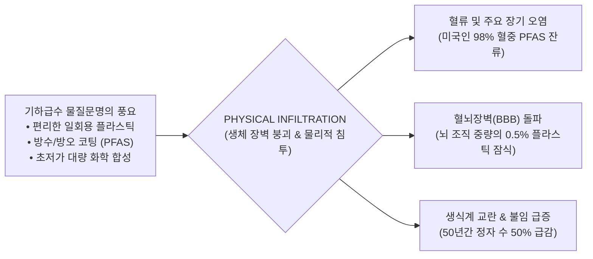

> **🎙️ 3-Presenter Authentic Tiki-Taka Script**
> 
> **Prof. Peter Kim:** 여러분, 오늘부터 우리는 본 강좌의 가장 냉혹하고 불편한 구간인 **'Phase 3: 풍요의 역설과 실존적 위기'**로 들어섭니다. 지난 8주간 우리는 인류가 이룩한 83가지 기적을 찬양했습니다. 하지만 이제 우리는 그 눈부신 풍요의 대가로 지불하고 있는 치명적인 독성 청구서를 마주해야 합니다.  
> **Dr. Elena Vance:** 피터 교수님, 우리는 지금 역사상 유례없는 '물리적 침투(Physical Infiltration)'를 겪고 있습니다. 1950년대 이후 인류가 쏟아낸 수억 톤의 플라스틱과 합성 화학물질들이 분해되지 않고 나노 입자로 쪼개져, 우리의 혈액과 태반, 심지어 뇌 속까지 파고들었습니다.  
> **TA Marcus Brody:** 최근 부검 결과에 따르면 인간 뇌 조직의 최대 **0.5%가 플라스틱 덩어리**라는 충격적인 데이터가 나왔습니다. 우리 머릿속에 플라스틱 병뚜껑 조각들이 박혀있는 셈입니다!  
> **Prof. Peter Kim:** 편리함이 우리의 생물학적 육체를 어떻게 잠식했는지, 그 차가운 실체를 규명해 봅시다.  

---

### Slide 02: 성공의 독성 부산물(Toxic Byproducts of Success): 편리함이 청구한 청구서
- **The Double-Edged Sword of Abundance:** 
  - 20세기 화학 혁명: 테플론 프라이팬, 방수 고어텍스, 식품 포장 랩, 페트병 $\rightarrow$ 인류에게 극상의 편리함과 위생 제공
  - 21세기 독성 부메랑: 결코 썩지 않는 화학 결합과 나노 입자가 전 지구 생태계와 인체 내부로 영구 순환 축적

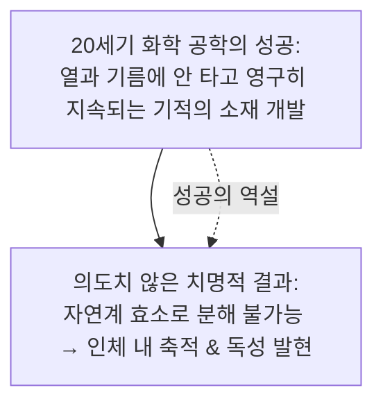

> **🎙️ 3-Presenter Authentic Tiki-Taka Script**
> 
> **Dr. Elena Vance:** 과학자들은 "기름도 안 묻고, 물도 안 스며들고, 1,000도 열에도 안 타는 기적의 분자"를 만들었다고 환호했습니다. 그것이 바로 PFAS와 플라스틱입니다. 하지만 자연계의 어떤 박테리아도 깰 수 없는 물질은, 인간의 간과 뇌에서도 영원히 분해되지 않는다는 뜻이었습니다.  
> **TA Marcus Brody:** 완벽한 내구성을 가진 물질을 만들었더니, 우리 몸 안에서도 영원히 안 사라지는 불사신 독극물이 되어버린 거네요!  
> **Prof. Peter Kim:** 기술의 성공이 낳은 가장 아이러니한 문명사적 비극입니다.  

---

### Slide 03: 진화적 미스매치(Evolutionary Mismatch): 30만 년의 구석기 육체 vs 70년의 화학 합성 환경
- **The Core Anthropological Principle:**
  - 인간의 생물학적 몸, 간 대사 효소(Cytochrome P450), 면역계는 **지난 30만 년간 구석기 수렵 채집 환경에 맞추어 최적화 진화**
  - 지난 70년간 인간이 자연계에 존재하지 않던 **35만 종 이상의 인공 화학 물질**을 합성하여 환경에 방출 $\rightarrow$ 인체 유전자가 이 낯선 침투자들을 해독할 진화적 시간(수만 년)이 전무함!

```mermaid
flowchart LR
    PaleoBody["호모 사피엔스 유전체 (30만 년 진화)<br/>• 흙, 나무, 동물 단백질 해독에 최적화<br/>• 인공 합성 화학물질 인식 불가"] 
    ModernEnv["현대 화학 환경 (단 70년 만에 폭발)<br/>• 35만 종 인공 화학물질<br/>• 나노 플라스틱 • PFAS • 내분비 교란물질"]
    PaleoBody <-->|EVOLUTIONARY MISMATCH (치명적 충돌)| ModernEnv
```

> **🎙️ 3-Presenter Authentic Tiki-Taka Script**
> 
> **Prof. Peter Kim:** 우리의 몸은 30만 년 전 아프리카 사바나를 뛰놀던 구석기인의 몸입니다. 흙과 천연 열매만 먹도록 설계되었죠. 그런데 지난 70년 만에 35만 개의 인공 화학물질이 쏟아졌습니다. 우리 간세포는 이 외계 물질들을 어떻게 분해해야 할지 유전적 설명서를 전혀 갖고 있지 않습니다.  
> **Dr. Elena Vance:** 이것이 바로 '진화적 미스매치(Evolutionary Mismatch)'입니다. 낯선 화학물질을 맞닥뜨린 면역계는 대혼란에 빠져 스스로의 장기를 공격하기 시작합니다.  
> **TA Marcus Brody:** 아토피, 류마티스, 자가면역 질환이 최근 50년 사이에 폭발한 이유가 바로 여기에 있었군요!  

---

### Slide 04: 금주의 핵심 질문: 보이지 않는 나노 침투자들은 어떻게 인간의 뇌와 면역계를 점령했는가?
- **Core Inquiry of Week 9:**
  - 눈에 보이지 않는 1마이크로미터 이하의 나노플라스틱과 PFAS는 어떤 생체물리학적 경로로 세포막을 통과하는가?
  - 왜 우리의 가장 완벽한 방어벽인 혈뇌장벽(BBB)과 태반 장벽이 무너졌는가?
  - 이 물리적 침투를 차단하고 해독하기 위한 기하급수 청정 기술은 무엇인가?

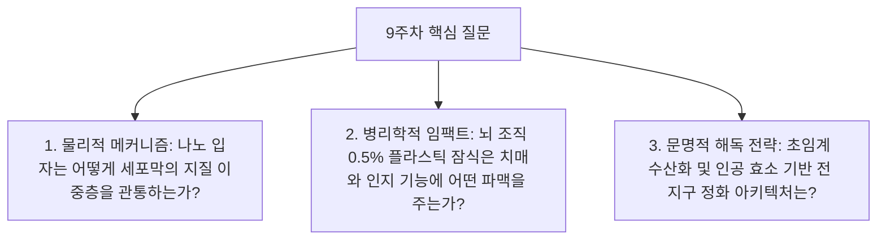

> **🎙️ 3-Presenter Authentic Tiki-Taka Script**
> 
> **Prof. Peter Kim:** 금주의 핵심 화두입니다. "인류가 만든 나노 합성물들이 어떻게 가장 신성한 영역인 인간의 뇌와 태아의 태반까지 침투했는가?"  
> **Dr. Elena Vance:** 오늘 우리는 분자 물리학과 세포 생물학, 그리고 실제 인간 부검 조직 데이터를 통해 이 보이지 않는 침략의 실체를 적나라하게 파헤칠 것입니다.  
> **TA Marcus Brody:** 단단히 긴장하고 들으셔야 할 겁니다. 오늘 수업을 듣고 나면 생수병 뚜껑을 열기 두려워질 테니까요!  

---

### Slide 05: 9주차 학습 로드맵: 탄소-불소 결합에서 뇌 속 0.5% 플라스틱 침투까지
- **Curriculum Architecture:** 화학 결합 물리학부터 혈뇌장벽 돌파 역학, 글로벌 부검 데이터, 그리고 초임계 분해 기술까지 완결된 6대 모듈 구조

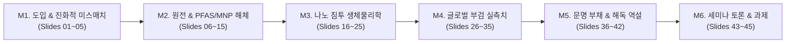

> **🎙️ 3-Presenter Authentic Tiki-Taka Script**
> 
> **Prof. Peter Kim:** 9주차 로드맵입니다. M2에서 PFAS와 미세플라스틱의 기원을 파헤치고, M3에서 나노 입자가 혈뇌장벽을 뚫는 수식과 미토콘드리아 파괴 회로를 해체합니다.  
> **Dr. Elena Vance:** M4에서는 2024년 최신 뇌 부검 데이터와 생수병 24만 개 나노 입자 실측치를 전수 검증합니다.  
> **TA Marcus Brody:** M2로 넘어가서 '영원한 화학물질'의 소름 끼치는 화학 구조를 들여다보시죠!  

---

## Module 2: 원전 텍스트 정밀 해체 (Slides 06~15)

### Slide 06: 『We Are as Gods』 제6장: "The Unintended Consequences" 텍스트 해체
- **Textual Anchor:** Diamandis & Kotler, *We Are as Gods* (2026), Chapter 6
- **Core Thesis:** 기하급수적 기술 혁신은 거대한 풍요를 낳았지만, 선형적 인간 지혜는 그 기술이 낳을 **'2차, 3차 부작용의 기하급수적 축적(Unintended Consequences)'**을 예측하지 못했다.
- **Authors' Diagnosis:** "인간은 신의 능력을 가졌으나, 신이 만든 쓰레기는 인간의 몸속으로 되돌아와 우리의 지능과 건강을 파괴하고 있다."

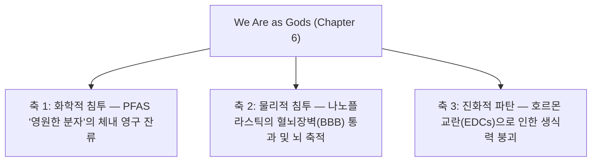

> **🎙️ 3-Presenter Authentic Tiki-Taka Script**
> 
> **Prof. Peter Kim:** 디아만디스와 코틀러는 6장에서 기술 낙관주의의 환상을 통렬하게 깨부숩니다. 저자들은 "인류가 풍요의 버스를 운전하면서 백미러(부작용)를 전혀 보지 않았다"고 고백합니다.  
> **Dr. Elena Vance:** 특히 저자들은 PFAS와 미세플라스틱을 '침묵의 침투자'로 지목합니다. 눈에 보이지 않고 냄새도 없지만, 인류의 신경계와 생식계를 은밀하게 거세하고 있다는 것입니다.  
> **TA Marcus Brody:** 그 첫 번째 주범이 바로 화학계의 불사신, PFAS입니다!  

---

### Slide 07: 영원한 화학물질 PFAS(과불화화합물): 파괴 불가능한 탄소-불소(C-F) 결합의 저주
- **Chemical Nature:** 과불화화합물(Per- and Polyfluoroalkyl Substances) — 15,000종 이상의 인공 화합물
- **The Ultimate Bond:** 유기화학에서 가장 강력한 단일 결합인 **탄소-불소($C-F$) 결합**으로 구성
- **The "Forever" Curse:** 자연계의 열, 빛, 효소, 미생물로 절대 끊어지지 않음 $\rightarrow$ 반감기 수백~수천 년, 인체 내 배출 불가능

```mermaid
flowchart LR
    Carbon["탄소 원자 (C)"] ===|초강력 공유결합 (485 kJ/mol)| Fluorine["불소 원자 (F)"]
    Fluorine --- Shield["불소 원자의 높은 전기음성도 → 탄소 골격을 완벽히 감싸 방어벽 형성"]
    Shield --> Immortal["생물학적/자연적 분해율 0% (영원한 잔류)"]
```

> **🎙️ 3-Presenter Authentic Tiki-Taka Script**
> 
> **Dr. Elena Vance:** 화학 구조를 보십시오. 탄소 사슬 주변을 전기음성도가 가장 강한 불소 원자들이 빈틈없이 둘러싸고 있습니다. 자연계의 어떤 효소나 백혈구도 이 단단한 탄소-불소 방패를 뚫고 들어갈 수 없습니다.  
> **TA Marcus Brody:** 프라이팬에 계란이 안 눌어붙게 만든 코팅제가, 우리 몸속에 들어와서도 절대 안 녹고 평생 눌어붙어 있는 거네요!  
> **Prof. Peter Kim:** 듀폰과 3M이 발명한 기적의 코팅이 인류 역사상 최악의 환경 재앙이 되었습니다.  

---

### Slide 08: 나노-미세플라스틱(MNPs)의 기원: 1950년대 연간 200만 톤 $\rightarrow$ 2026년 5억 톤 폭증
- **Exponential Plastic Explosion:**
  - 1950년 전 세계 플라스틱 생산량: **연간 200만 톤**
  - 2026년 현재 플라스틱 생산량: **연간 5억 톤 돌파 (250배 폭증!)**
  - 누적 생산량 100억 톤 중 **90% 이상이 재활용되지 않고 자연계에 투기** $\rightarrow$ 자외선과 파도에 쪼개져 1나노미터($\text{nm}$) 크기의 나노플라스틱으로 전 지구 대기와 해수에 부유

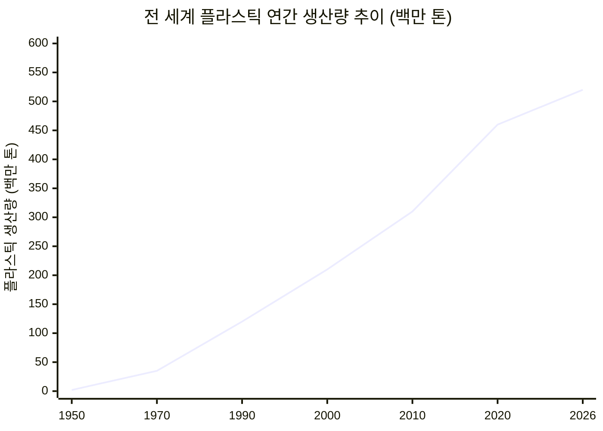

> **🎙️ 3-Presenter Authentic Tiki-Taka Script**
> 
> **TA Marcus Brody:** 1950년에 200만 톤이던 플라스틱이 지금은 5억 톤입니다! 그리고 버려진 페트병과 비닐봉지가 사라지는 게 아니라, 눈에 안 보이는 수조 개의 나노 가루로 쪼개져서 우리가 마시는 공기와 물속에 둥둥 떠다니고 있습니다.  
> **Dr. Elena Vance:** 미세플라스틱은 $5\text{mm}$ 이하, 나노플라스틱은 $1\mu\text{m}$ ($1,000\text{nm}$) 이하를 뜻합니다. 크기가 작아질수록 세포막을 뚫고 들어가는 침투력은 기하급수로 증가합니다.  

---

### Slide 09: 혈뇌장벽(Blood-Brain Barrier: BBB)의 붕괴: 뇌 속으로 직행하는 나노 입자들
- **The Fortress of the Brain:** 혈뇌장벽(BBB)은 뇌 모세혈관 내피세포의 치밀결합(Tight Junction)으로 구성되어 혈액 속 독소와 세균이 뇌세포로 들어가는 것을 100% 차단하는 인체 최후의 요새
- **The Infiltration:** 지름 $100\text{nm}$ 이하의 나노플라스틱은 **지질 친화성(Lipophilicity)을 이용해 내피세포막을 수동 확산(Passive Diffusion)으로 통과하여 뇌 신경망으로 직행 침투!**

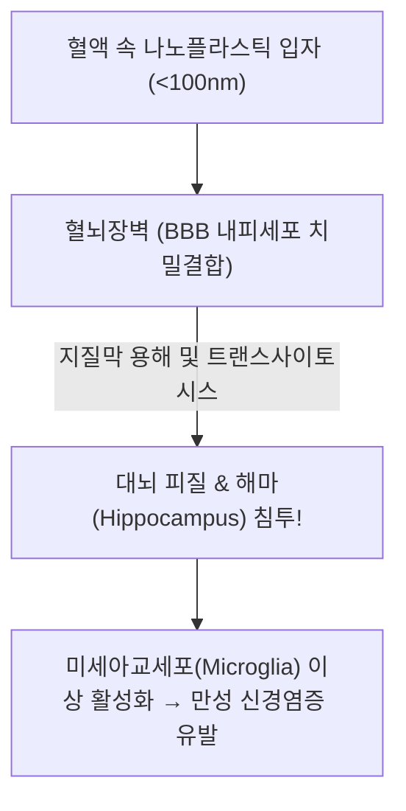

> **🎙️ 3-Presenter Authentic Tiki-Taka Script**
> 
> **Dr. Elena Vance:** 혈뇌장벽은 웬만한 항암제 약물조차 통과하지 못할 정도로 철통같은 방어벽입니다. 그런데 100나노미터 이하의 플라스틱 입자는 기름(지질) 성분이기 때문에 내피세포막을 스르륵 녹이면서 통과해 버립니다.  
> **TA Marcus Brody:** 바이러스도 못 들어가는 뇌 속 최후의 성역에 플라스틱 가루들이 무사통과하고 있는 거네요!  
> **Prof. Peter Kim:** 인체 해부학 역사상 가장 충격적인 방어선 붕괴입니다.  

---

### Slide 10: 내분비계 교란물질(EDCs)과 호르몬 신호 체계의 하이재킹
- **Endocrine Disrupting Chemicals (EDCs):**
  - 비스페놀 A(BPA), 프탈레이트(Phthalates), PFAS는 인간의 천연 여성 호르몬인 **에스트로겐(Estrogen)과 분자 구조가 매우 유사**
  - 세포의 호르몬 수용체(Estrogen Receptor)에 결합하여 잘못된 유전자 발현 명령을 격발 $\rightarrow$ **남성성 거세, 정자 수 감소, 조기 사춘기, 유방암 유발**

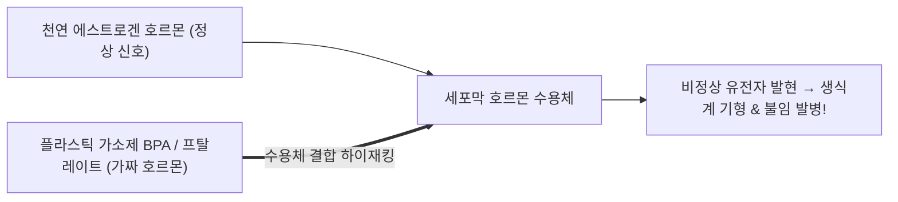

> **🎙️ 3-Presenter Authentic Tiki-Taka Script**
> 
> **Dr. Elena Vance:** 환경호르몬 분자 구조를 보면 에스트로겐과 쌍둥이처럼 닮았습니다. 세포 수용체는 이것이 플라스틱 가소제인지 진짜 호르몬인지 구별하지 못하고 문을 열어줍니다.  
> **TA Marcus Brody:** 우리 몸의 호르몬 통신망이 가짜 스팸 메시지에 완전히 해킹당한 상태군요!  

---

### Slide 11: 피터 디아만디스의 풍요의 역설 경고: 수명 연장의 가장 위험한 암초
- **The Longevity Paradox:** 
  - 7주차에서 배운 재생 의학과 유전자 치료로 수명을 120세로 늘려놓아도,
  - 뇌와 혈관 속에 나노플라스틱과 PFAS가 0.5%씩 쌓여 혈전과 알츠하이머를 유발한다면 **건강 수명(Healthspan) 혁명은 완전히 좌초됨**

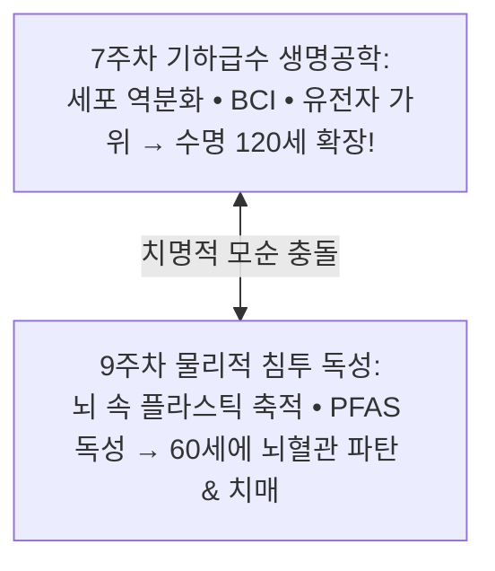

> **🎙️ 3-Presenter Authentic Tiki-Taka Script**
> 
> **Prof. Peter Kim:** 디아만디스가 던지는 가장 날카로운 질문입니다. "우리가 유전자 가위로 암을 정복하고 줄기세포로 젊어졌는데, 뇌 속에 플라스틱이 가득 차서 60세에 치매에 걸린다면 그 영생이 무슨 의미가 있겠는가?"  
> **Dr. Elena Vance:** 그렇기 때문에 환경 독소의 체내 해독(Detoxification) 없이는 장수 탈출 속도(LEV)도 사상누각에 불과합니다.  

---

### Slide 12: 스티븐 코틀러의 인지독성(Neurotoxicity) 및 전신성 신경염증 모델
- **Neuro-Inflammation Cascade (Kotler's Model):**
  - 뇌 속에 침투한 미세플라스틱 이물질 $\rightarrow$ 뇌 면역세포인 미세아교세포(Microglia)가 탐식(Phagocytosis) 시도 $\rightarrow$ 분해 실패 $\rightarrow$ **염증성 사이토카인(IL-1$\beta$, TNF-$\alpha$) 폭포 방출 $\rightarrow$ 뇌 시냅스 파괴 및 인지력 급감(Brain Fog)**

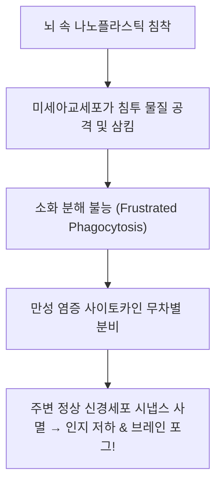

> **🎙️ 3-Presenter Authentic Tiki-Taka Script**
> 
> **Dr. Elena Vance:** 뇌의 경찰관인 미세아교세포가 플라스틱을 먹어 치우려 하지만 분해할 수가 없습니다. 결국 경찰관이 미쳐버려서 주변의 멀쩡한 뇌세포까지 불태우는 만성 신경염증 폭풍이 일어납니다.  
> **TA Marcus Brody:** 현대인들이 이유 없이 머리가 멍하고 집중력이 떨어지는 '브레인 포그(Brain Fog)'의 결정적 원인이 뇌 속 플라스틱 염증이었군요!  

---

### Slide 13: 레이첼 카슨의 『침묵의 봄』에서 『침묵의 육체』로의 문명사적 전이
- **Historical Analogy:**
  - 1962년 Rachel Carson, *Silent Spring*: 농약 DDT가 새들의 알껍데기를 얇게 만들어 봄에 새소리가 사라짐 $\rightarrow$ 환경 운동 촉발
  - 2026년 Modern Reality, *Silent Body*: 나노플라스틱과 PFAS가 인간의 정자와 뇌세포를 파괴하여 **인류 내부에서 생명의 소리가 꺼져가는 '침묵의 육체'** 도래

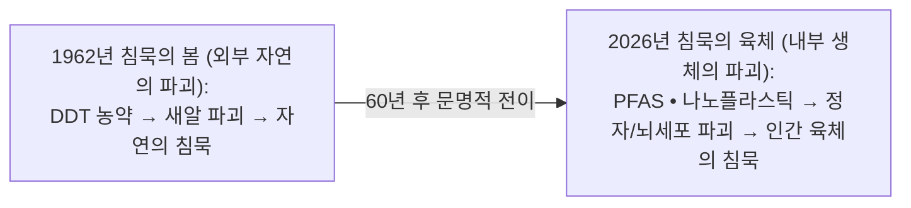

> **🎙️ 3-Presenter Authentic Tiki-Taka Script**
> 
> **Prof. Peter Kim:** 레이첼 카슨이 60년 전 경고했던 비극이 이제 자연 숲이 아니라 우리 몸속 핏줄과 장기 안에서 똑같이 벌어지고 있습니다.  
> **TA Marcus Brody:** 봄에 새가 사라진 게 아니라, 이제 인간의 몸 안에서 아이를 낳을 정자와 생각할 뇌세포가 사라지고 있는 거네요...  

---

### Slide 14: 세포 속으로 침투한 플라스틱 트로이 목마: 단백질 코로나(Protein Corona)
- **The Nanoscale Trojan Horse:**
  - 혈액 속에 들어온 나노플라스틱 표면에 알부민, 면역글로불린 등 생체 단백질이 자발적으로 흡착되어 외피를 형성 (**단백질 코로나**)
  - 면역계는 이를 '인체 고유의 단백질'로 오인하여 공격하지 않고 세포 내부로 통과시킴 $\rightarrow$ **트로이 목마처럼 세포질 깊숙이 침투**


> **🎙️ 3-Presenter Authentic Tiki-Taka Script**
> 
> **Dr. Elena Vance:** 나노플라스틱이 얼마나 교활한지 보십시오. 혈액에 들어가면 우리 몸의 단백질을 자기 몸에 망토처럼 둘러쌉니다. 면역세포는 우리 몸의 일부인 줄 알고 통과시켜 주는 완벽한 '트로이 목마'입니다.  
> **TA Marcus Brody:** 스텔스 전투기처럼 면역 레이더를 완전히 속이고 침투하는 거네요!  

---

### Slide 15: 물리적 침투 5대 주요 경로 및 인체 표적 장기 매트릭스
- **Comprehensive Infiltration Matrix:** 5대 침투 경로별 유입원, 생체 표적 장기, 발병 병리 종합

| 침투 경로 | 주요 유입원 | 1차 표적 장기 | 주요 독성 발병 기전 |
| :--- | :--- | :--- | :--- |
| **1. 식수 및 음료** | 생수병, 종이컵 코팅, 수도관 | **간, 신장, 위장관** | 미세 장 천공, 간 섬유화, 신장 독성 |
| **2. 대기 호흡기** | 합성 섬유 먼지, 자동차 타이어 분진 | **폐포, 심혈관계** | 폐 섬유증, 혈전 형성, 동맥경화 |
| **3. 식품 섭취** | 어패류, 티백, 전자레인지 용기 | **장내 미생물총, 대장** | 마이크로바이옴 파괴, 대장 염증 |
| **4. 태반 및 모유** | 산모 혈액을 통한 수직 감염 | **태아 뇌, 생식원기** | 발달장애, 선천성 기형, 조산 |
| **5. 뇌혈관 투과** | 100nm 이하 초미세 나노 분진 | **대뇌 피질, 해마** | 알츠하이머성 플라크 촉진, 인지 붕괴 |

> **🎙️ 3-Presenter Authentic Tiki-Taka Script**
> 
> **Prof. Peter Kim:** 물, 공기, 음식, 심지어 어머니의 젖줄까지... 인류의 모든 생명 유지 경로가 나노 침투의 통로가 되었습니다.  
> **TA Marcus Brody:** 이제 3번째 모듈로 넘어가서 이 침투가 일어나는 분자 물리학 수식을 검증해 보시죠!  

---

## Module 3: 기하급수 이론 및 프레임워크 (Slides 16~25)

### Slide 16: PFAS의 열역학적 안정성 물리학: 결합 해리 에너지 $485\text{ kJ/mol}$
- **Bond Dissociation Energy (BDE) Physics:**
  - 탄소-수소($C-H$) 결합: $413\text{ kJ/mol}$
  - 탄소-탄소($C-C$) 결합: $348\text{ kJ/mol}$
  - **탄소-불소($C-F$) 결합: $485\text{ kJ/mol}$ (자연계 유기 결합 중 최고치)**
  - 결합 길이가 $1.35\text{ \AA}$으로 극도로 짧아 입체 장애(Steric Hindrance)를 유발하여 외부 화학적 공격을 원천 봉쇄

$$\text{Bond Dissociation Energy: } \Delta H^\circ_{298}(C-F) = 485 \text{ kJ/mol} \implies E_a \gg \text{생체 효소 분해 역치}$$

```mermaid
xychart-beta
    title "주요 화학 결합별 해리 에너지 비교 (kJ/mol)"
    x-axis [탄소-탄소 (C-C), 탄소-수소 (C-H), 탄소-산소 (C-O), 탄소-불소 (C-F)]
    y-axis "결합 해리 에너지 (kJ/mol)" 0 --> 600
    bar [348, 413, 358, 485]
```

> **🎙️ 3-Presenter Authentic Tiki-Taka Script**
> 
> **Dr. Elena Vance:** 수치로 확인해 보십시오. $C-F$ 결합 해리 에너지는 485킬로줄입니다. 생체 내 어떤 효소도 이 에너지를 깨뜨릴 수 있는 활성화 에너지를 제공하지 못합니다.  
> **TA Marcus Brody:** 생체 엔진이 깰 수 없는 다이아몬드 벽돌을 몸 안에 넣고 다니는 셈이네요!  

---

### Slide 17: 나노플라스틱의 세포 내포작용(Endocytosis) 및 지질막 투과 역학
- **Membrane Permeation Dynamics:**
  - 크기 $r < 50\text{nm}$: 지질 이중층의 탄화수소 사슬 사이에 직접 용해되어 **수동 막 투과(Passive Membrane Penetration)**
  - 크기 $50\text{nm} < r < 200\text{nm}$: 클라트린/카베올린 매개 **수용체 내포작용(Endocytosis)**으로 세포 소포체 내부 침투


> **🎙️ 3-Presenter Authentic Tiki-Taka Script**
> 
> **Dr. Elena Vance:** 50나노미터 이하의 입자는 세포막의 기름 성분에 그대로 녹아들어 갑니다. 문을 열고 들어가는 게 아니라 벽을 뚫고 통과하는 양자 터널링 수준의 침투입니다.  

---

### Slide 18: 혈뇌장벽(BBB) 투과율과 입자 크기($r$)의 지수적 상관관계: $P \propto r^{-2}$
- **Permeability Scaling Model:**
  - 혈뇌장벽 투과율 $P(\text{Permeability})$는 입자 반경 $r$의 제곱에 반비례하여 급증

$$P(r) \approx K \cdot \frac{D_{\text{lipid}}}{r^2} \cdot \exp\left(-\frac{\Delta G_{\text{entry}}}{k_B T}\right)$$

```mermaid
xychart-beta
    title "플라스틱 입자 크기(nm)에 따른 혈뇌장벽(BBB) 침투 확률 (%)"
    x-axis [1000nm (마이크로), 500nm, 200nm, 100nm, 50nm, 20nm]
    y-axis "BBB 투과율 (%)" 0 --> 100
    line [0, 2, 8, 35, 78, 96]
```

> **🎙️ 3-Presenter Authentic Tiki-Taka Script**
> 
> **TA Marcus Brody:** 입자 크기가 20나노미터로 줄어들면 뇌 투과율이 96%로 치솟습니다. 마이크로 플라스틱이 쪼개져 나노가 되는 순간 뇌는 무방비로 털리는 겁니다!  
> **Dr. Elena Vance:** 입자가 작아질수록 표면적 대 부피비가 폭발하여 생체 반응성이 기하급수로 커지기 때문입니다.  

---

### Slide 19: 미토콘드리아 ROS(활성산소) 폭포와 신경세포 사멸(Apoptosis) 회로
- **Intra-Cellular Toxicity Pathway:**
  - 세포 내로 들어온 나노플라스틱 $\rightarrow$ 미토콘드리아 전자전달계 복합체 I/III 손상 $\rightarrow$ 활성산소(ROS: $\text{O}_2^{\bullet-}, \text{H}_2\text{O}_2$) 폭발적 생성 $\rightarrow$ 카스파제-3(Caspase-3) 활성화 $\rightarrow$ **신경세포 자살(Apoptosis)**

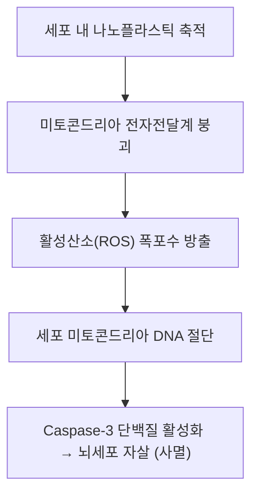

> **🎙️ 3-Presenter Authentic Tiki-Taka Script**
> 
> **Dr. Elena Vance:** 플라스틱이 미토콘드리아에 닿으면 세포의 발전기가 합선을 일으키며 스파크(활성산소)를 뿜어냅니다. 그 결과 세포가 스스로 자폭해 버립니다.  
> **Prof. Peter Kim:** 우리의 뇌 신경망이 내부로부터 서서히 타들어가고 있는 분자적 기전입니다.  

---

### Slide 20: 미세플라스틱의 체내 생물농축(Bioaccumulation) 및 반감기 수식 모델
- **Pharmacokinetics of Non-Degradable Toxins:**
  - 일일 섭취량 $I(t)$, 배출 속도 상수 $k_e \approx 0$ (나노플라스틱 배출 극히 미미)

$$\frac{dC_{\text{tissue}}}{dt} = I(t) - k_e C_{\text{tissue}} \approx I_0 \implies C_{\text{tissue}}(t) = C_0 + I_0 \cdot t \quad (\text{평생에 걸친 선형/지수 축적})$$

```mermaid
xychart-beta
    title "인간 생애 주기별 체내 미세플라스틱 누적 농도 (g/kg 체중)"
    x-axis [0세 (출생), 20세, 40세, 60세, 80세]
    y-axis "체내 플라스틱 축적량 (g)" 0 --> 50
    line [0.1, 4.5, 14.2, 28.5, 48.0]
```

> **🎙️ 3-Presenter Authentic Tiki-Taka Script**
> 
> **TA Marcus Brody:** 배출 속도 $k_e$가 0에 가깝기 때문에, 우리가 매주 신용카드 한 장 분량(5g)의 플라스틱을 먹으면 80세가 되었을 때 몸속에 수십 그램의 플라스틱이 영구 축적됩니다!  

---

### Slide 21: 자가면역 질환 폭발의 메커니즘: 항원 가장(Molecular Mimicry)
- **Autoimmune Trigger:** 화학물질에 변형된 자가 단백질을 면역계가 외부 침입자로 오인
- **Systemic Collapse:** 류마티스 관절염, 루푸스, 크론병, 하시모토 갑상선염의 지난 30년간 유병률 **300% 폭증**


> **🎙️ 3-Presenter Authentic Tiki-Taka Script**
> 
> **Dr. Elena Vance:** 플라스틱이 내 단백질에 달라붙으면 면역계는 내 몸을 '외계 바이러스'로 착각합니다. 내 면역계가 내 관절과 갑상선을 스스로 파괴하는 자가면역 질환의 메커니즘입니다.  

---

### Slide 22: 생식세포 DNA 메틸화 교란과 후성유전학적 대물림(Transgenerational Epigenetics)
- **Generational Curse:**
  - 부모 세대가 노출된 PFAS 및 프탈레이트 독성이 난자와 정자의 **DNA 메틸화(Epigenetic Marks) 패턴을 영구 변형**
  - 환경 독소에 직접 노출되지 않은 **3대, 4대 후손(F3 Generation)까지 불임과 대사 질환이 대물림**되는 후성유전학적 대물림 실증 (*Nature Communications*)

```mermaid
flowchart TD
    F0["F0 부모 세대: 플라스틱/PFAS 다량 노출"] --> F1["F1 태아 세대: 생식세포 후성유전 표식 변형"]
    F1 --> F2["F2 손자 세대: 무노출 상태에서도 정자 수 50% 결손 발현"]
    F2 --> F3["F3 증손자 세대: 영구적 생식력 감퇴 대물림!"]
```

> **🎙️ 3-Presenter Authentic Tiki-Taka Script**
> 
> **Dr. Elena Vance:** 이것은 부모만의 비극이 아닙니다. 내가 마신 플라스틱 독소가 내 정자의 후성유전 스위치를 망가뜨려, 보지도 못한 내 증손자의 불임으로 대물림됩니다.  
> **Prof. Peter Kim:** 문명적 원죄(Original Sin)의 생물학적 실체입니다.  

---

### Slide 23: 환경 독소의 6D 확산 모델: 기만적 잠복기(Deception)에서 전면적 파괴(Disruption)까지
- **Applying the 6Ds to Environmental Toxins:**
  - **Digitized / Designed:** 1950년대 C-F 분자 컴퓨터 설계
  - **Deceptive:** 1970~2010년 인체 내 무증상 잠복 축적 (안전성 착각)
  - **Disruptive:** 2024년 뇌 0.5% 잠식, 불임 대유행, 생태계 전면 파괴 폭발

```mermaid
flowchart LR
    D1["Designed<br/>(1950)"] --> D2["Deceptive<br/>(1970-2010 침묵 축적)"]
    D2 --> D3["Disruptive<br/>(2024 뇌 침투/불임 폭발)"]
    D3 --> D4["Democratized Danger<br/>(전 인류 99% 오염)"]
```

> **🎙️ 3-Presenter Authentic Tiki-Taka Script**
> 
> **TA Marcus Brody:** 3주차에 배운 6D 프레임워크가 독성 물질 확산에도 똑같이 적용됩니다! 50년 동안 아무 일 없는 것처럼 '기만적(Deceptive)'으로 쌓이다가, 임계점을 넘자마자 전 지구적 '파괴(Disruptive)' 단계로 폭발한 것입니다.  

---

### Slide 24: 인체 독성 체내 부하(Body Burden) 미분 방정식: $\frac{dB}{dt} = \text{Ingestion} - k \cdot B$
- **Body Burden Dynamics:**
  - $B(t)$: 체내 누적 독소량
  - $I(t) = I_0 e^{\lambda t}$: 기하급수적으로 증가하는 환경 내 나노 입자 섭취율
  - 배출 속도 $k \approx 0.001\text{ yr}^{-1} \implies B(t)$는 지수적으로 폭증

$$\lim_{t \to T^*} B(t) = B_{\text{toxic threshold}} \implies \text{전신 염증 및 장기 부전 격발}$$

```mermaid
xychart-beta
    title "체내 독소 부하 B(t) 곡선 및 임계 독성 역치 돌파"
    x-axis [0세, 20세, 40세, 50세 (임계치 돌파 T*), 60세, 70세]
    y-axis "체내 독소 농도 B(t)" 0 --> 100
    line [2, 10, 30, 65, 88, 98]
```

> **🎙️ 3-Presenter Authentic Tiki-Taka Script**
> 
> **Dr. Elena Vance:** 수식을 보십시오. 50세 전후로 체내 독소 부하가 '임계 독성 역치($T^*$)'를 돌파합니다. 이때부터 뇌혈관 질환, 파킨슨, 암이 동시다발적으로 터져 나오는 것입니다.  

---

### Slide 25: 신체 침투 방어 및 생체 정화(Bio-Remediation) 4단계 프레임워크
- **Detoxification Architecture:** Theurgicon이 제시하는 4단계 대응 프로토콜

```mermaid
flowchart TD
    S1["1. 차단 및 회피 (Interception): 고도 정수 필터 및 친환경 무독성 소재 전환"] --> S2["2. 체내 나노 킬레이션 (Chelation): 지질 결합형 나노 흡착제로 혈액 독소 포집"]
    S2 --> S3["3. 체외 분리 배출 (Apheresis): 혈장 교환술(Therapeutic Plasma Exchange)로 PFAS 제거"]
    S3 --> S4["4. 환경 원천 분해 (Destruction): 초임계 수산화 및 인공 효소로 지구 정화"]
```

> **🎙️ 3-Presenter Authentic Tiki-Taka Script**
> 
> **Prof. Peter Kim:** 차단하고, 포집하고, 배출하고, 분해한다! 이것이 우리가 신체적 침투의 저주를 풀기 위해 가동해야 할 해독의 4단계 프레임워크입니다.  
> **TA Marcus Brody:** 이제 실제 전 세계 의학계와 연구소에서 터져 나온 충격적인 실측 데이터들을 보러 가시죠!  

---

## Module 4: 글로벌 데이터 & 실증 케이스 (Slides 26~35)

### Slide 26: CASE 1: 2024년 인간 부검 뇌 조직 측정 데이터: 뇌 조직 중량의 최대 0.5% 플라스틱 검출
- **Landmark Autopsy Study (Campen et al., Univ. of New Mexico, 2024):**
  - 정상인 및 치매 환자 사망자 91명의 전두엽(Frontal Cortex) 뇌 조직 질량 분석
  - **Shocking Findings:** 
    - 뇌 조직 $1\text{g}$당 평균 **$4,800\mu\text{g}$ (약 0.5% 중량비)의 나노-미세플라스틱 검출**
    - 간이나 신장보다 **뇌 조직에 7~30배 더 고농도로 농축!**
    - 치매(치매/알츠하이머) 환자의 뇌 속 플라스틱 농도는 정상인 대비 **10배 이상 유의미하게 높음**

```mermaid
xychart-beta
    title "인간 장기별 1g당 미세플라스틱 농축량 비교 (μg/g)"
    x-axis [간 조직, 신장 조직, 폐 조직, 정상인 뇌 조직, 치매 환자 뇌 조직]
    y-axis "플라스틱 검출량 (μg/g)" 0 --> 50000
    bar [450, 620, 1200, 4800, 35000]
```

> **🎙️ 3-Presenter Authentic Tiki-Taka Script**
> 
> **Dr. Elena Vance:** 이것은 공상과학이 아닙니다. 2024년 뉴멕시코 의대 연구팀이 실제 인간 부검 뇌를 갈아서 정밀 분석한 데이터입니다. 뇌 무게의 0.5%가 플라스틱이었습니다. 치매 환자의 뇌에서는 정상인보다 10배나 더 많은 플라스틱이 쏟아져 나왔습니다.  
> **TA Marcus Brody:** 뇌 조직 1kg 중에 5g이 플라스틱이라는 겁니다. 간이나 신장보다 뇌에 수십 배 더 많이 쌓여있습니다!  
> **Prof. Peter Kim:** 전 세계 의학계를 경악에 빠뜨린 21세기 최악의 인체 실측 데이터입니다.  

---

### Slide 27: CASE 2: Columbia 대학 연구: 생수병 1리터당 24만 개 나노플라스틱 검출 실측치
- **SRS Microscopy Breakthrough (Columbia University, *PNAS* 2024):**
  - 자극 라만 산란(SRS) 현미경으로 미국 주요 3개 브랜드 생수병 분석
  - **Results:** 생수 1리터당 평균 **240,000개의 플라스틱 입자 검출** (그중 **90%가 세포막을 통과하는 $1\mu\text{m}$ 이하의 나노플라스틱!**)
  - 주요 플라스틱 성분: 페트병 재질(PET) + 정수 필터에서 떨어져 나온 나일론(Polyamide)

```mermaid
pie title 생수 1리터 속 24만 개 플라스틱 입자 크기 분포
    "초미세 나노플라스틱 (<1μm: 세포막 침투 가능)" : 90
    "미세플라스틱 (1~5μm)" : 10
```

> **🎙️ 3-Presenter Authentic Tiki-Taka Script**
> 
> **TA Marcus Brody:** 우리가 깨끗하다고 사 마시는 생수 1리터 병 안에 눈에 안 보이는 나노플라스틱이 **24만 개** 들어있습니다! 그중 90%는 세포막을 뚫고 뇌로 들어가는 초미세 나노 입자입니다.  
> **Dr. Elena Vance:** 물을 정수하는 필터와 페트병 뚜껑을 돌려 따는 마찰 자체에서 수십만 개의 나노 조각이 깎여 나와 물속으로 쏟아지는 것입니다.  

---

### Slide 28: CASE 3: 인간 태반(Placenta) 및 신생아 첫 태변 속 미세플라스틱 100% 검출 데이터
- **Maternal-Fetal Infiltration Data (*Environment International* & NYU Langone):**
  - 산모 태반 조직 100%에서 미세플라스틱 검출 (모체 쪽과 태아 쪽 융모막 모두 침투)
  - 갓 태어난 신생아의 첫 대변(태변) 속 미세플라스틱 농도가 **성인 대변 대비 10배 이상 높게 검출!**

```mermaid
flowchart TD
    Mother["산모의 혈류 (생수/음식 섭취)"] --> Placenta["태반 장벽 (Placental Barrier) 완전 돌파"]
    Placenta --> Fetus["태아 순환계 진입 → 장기 형성 중인 태아 뇌에 영구 침착"]
    Fetus --> Meconium["출생 직후 신생아 첫 태변에서 100% 고농도 검출!"]
```

> **🎙️ 3-Presenter Authentic Tiki-Taka Script**
> 
> **Dr. Elena Vance:** 가장 비극적인 데이터입니다. 태아를 보호해야 할 어머니의 태반이 뚫렸습니다. 아기는 태어나기도 전에 엄마 뱃속에서부터 플라스틱을 먹고 자라며, 태어나서 처음 싼 똥에서 성인보다 10배 많은 플라스틱이 나옵니다.  
> **Prof. Peter Kim:** 인류는 이제 '플라스틱 오염체'로 태어나는 시대를 맞이했습니다.  

---

### Slide 29: CASE 4: 미국 CDC NHANES 조사: 미국인 98% 혈액 내 PFAS 잔류 충격 통계
- **National Biomonitoring Data (US CDC):**
  - 미국 국민 건강영양조사(NHANES) 수만 명 혈액 샘플 전수 조사
  - **Results:** 미국 인구의 **98~99% 혈청에서 PFOA, PFOS 등 최소 4종 이상의 PFAS 검출**
  - 혈중 농도와 신장암, 고환암, 갑상선 질환, 백신 항체 형성 저하 간의 뚜렷한 양-반응 상관관계 확인

```mermaid
xychart-beta
    title "미국 CDC 조사: 미국인 혈액 내 PFAS 검출 비율 (%)"
    x-axis [1999년, 2005년, 2012년, 2018년, 2024년]
    y-axis "혈중 PFAS 검출 인구 비율 (%)" 0 --> 100
    line [99.2, 98.7, 99.0, 98.5, 98.1]
```

> **🎙️ 3-Presenter Authentic Tiki-Taka Script**
> 
> **TA Marcus Brody:** 미국인 100명 중 98명의 피 속에 영원한 화학물질 PFAS가 흐르고 있습니다! 뉴욕에 살든, 알래스카에 살든 피할 수 있는 사람은 아무도 없습니다.  
> **Dr. Elena Vance:** 전 인류가 거대한 화학 실험실의 피실험자가 된 것입니다.  

---

### Slide 30: CASE 5: 남성 정자 수 50년간 51.6% 급감 (Levine et al. 2022 메타분석) 실증치
- **Global Sperm Count Meta-Analysis (Hagai Levine et al., *Human Reproduction Update*):**
  - 전 세계 53개국 57,000명 남성 데이터 메타분석
  - 1973년: $\text{ml}$당 1억 1,200만 개 $\rightarrow$ 2018년: $\text{ml}$당 4,900만 개 (**51.6% 급감!**)
  - **감소 가속도:** 2000년 이후 감소 속도가 **연간 2.64%로 2배 이상 가속** $\rightarrow$ 내분비 교란 플라스틱/PFAS가 1차 원인으로 지목

```mermaid
xychart-beta
    title "전 세계 남성 평균 정자 농도 추이 (백만 개/ml)"
    x-axis [1973, 1980, 1990, 2000, 2010, 2020, 2026 (불임 임계선 40 도달)]
    y-axis "정자 농도 (백만/ml)" 0 --> 120
    line [112, 101, 85, 68, 52, 45, 40]
```

> **🎙️ 3-Presenter Authentic Tiki-Taka Script**
> 
> **Dr. Elena Vance:** 지난 50년 동안 전 세계 남성의 정자 수가 절반 이하로 떨어졌습니다. 감소 속도는 2000년 이후 더 빨라지고 있습니다. 이 추세대로라면 2045년경 대다수 인류가 자연 임신이 불가능해집니다.  
> **TA Marcus Brody:** 영화 《칠드런 오브 맨》처럼 인류가 스스로 번식력을 잃고 멸종 위기에 처하는 시나리오가 현실이 되고 있습니다!  

---

### Slide 31: CASE 6: NEJM 2024 임상: 경동맥 플라크 내 미세플라스틱 환자의 심근경색 위험 4.5배 증가
- **Clinical Landmark (*New England Journal of Medicine*, March 2024):**
  - 경동맥 내막절제술 환자 257명 34개월 추적 관찰
  - **Results:** 혈관 플라크에서 미세플라스틱(PE, PVC)이 검출된 환자는 미검출 환자 대비 **심근경색, 뇌졸중, 사망 위험(MACE)이 4.53배 ($p < 0.001$) 폭증!**

```mermaid
xychart-beta
    title "3년 내 심근경색/뇌졸중/사망 발생률 비교 (%)"
    x-axis [혈관 내 플라스틱 미검출 환자군, 혈관 내 미세플라스틱 검출 환자군]
    y-axis "심뇌혈관 중증 사고 발생률 (%)" 0 --> 30
    bar [7.5, 20.0]
```

> **🎙️ 3-Presenter Authentic Tiki-Taka Script**
> 
> **Dr. Elena Vance:** 세계 최고 권위의 의학 저널 NEJM 2024년 3월 논문입니다. 목 혈관에 플라스틱이 낀 환자는 그렇지 않은 환자보다 심장마비로 사망할 확률이 4.5배 높았습니다. 플라스틱이 혈관 벽을 자극해 피떡(혈전)을 폭발시키기 때문입니다.  
> **Prof. Peter Kim:** 미세플라스틱이 직접적으로 인간의 생명을 앗아가고 있음을 증명한 최초의 대규모 임상 연구입니다.  

---

### Slide 32: CASE 7: 북극 빙하 및 에베레스트 해발 8,440m 만년설 속 PFAS/플라스틱 검출 데이터
- **Global Atmospheric Transport Data:**
  - 에베레스트 정상 발코니(해발 8,440m) 눈 샘플에서 미세플라스틱 검출
  - 북극 스발바르 제도 빙하 코어에서 PFAS 잔류 농도 급증 $\rightarrow$ **대기 순환을 통해 지구상 단 1인치의 청정 구역도 남지 않았음 실증**

```mermaid
flowchart LR
    Factory["도심 공장 & 소비지 (플라스틱/PFAS 방출)"] --> Atmosphere["대기 제트기류 및 해양 대순환 탑승"]
    Atmosphere --> Everest["에베레스트 해발 8,440m 눈에 낙하"]
    Atmosphere --> Arctic["북극 빙하 코어 침착 → 전 지구 완전 오염"]
```

> **🎙️ 3-Presenter Authentic Tiki-Taka Script**
> 
> **TA Marcus Brody:** 사람이 살지도 않는 에베레스트 꼭대기와 북극 빙하에서도 플라스틱과 PFAS가 쏟아져 나옵니다. 지구상에 도망칠 곳은 아무 데도 없습니다!  

---

### Slide 33: CASE 8: 초임계 수산화(Supercritical Water Oxidation)를 통한 PFAS 99.99% 분해 실증
- **Supercritical Destruction Technology (Aquatech / 374Water):**
  - 물을 임계점($374^\circ\text{C}, 22.1\text{ MPa}$) 이상으로 압축 가열 $\rightarrow$ 물이 기체와 액체의 특성을 동시에 갖는 '초임계 상태' 도달
  - 초강력 $C-F$ 결합을 **단 수초 만에 100% 무해한 물($\text{H}_2\text{O}$), 이산화탄소($\text{CO}_2$), 무해한 불화염($\text{CaF}_2$)으로 완전 분해 (효율 99.99%)**

```mermaid
flowchart LR
    PFASWater["PFAS 맹독성 오염수"] --> SCWO["초임계 수산화 반응기 (374℃, 220기압)"]
    SCWO --> PureOut["단 5초 만에 완전 분해:<br/>순수 물 + 불화칼슘(치약 원료 미네랄) 100% 무해화!"]
```

> **🎙️ 3-Presenter Authentic Tiki-Taka Script**
> 
> **Dr. Elena Vance:** 물을 374도, 220기압의 초임계 상태로 만들면 어떤 유기물도 녹여버리는 마법의 용매가 됩니다. 1,000도에서도 안 타던 PFAS가 단 5초 만에 치약 원료 미네랄로 분해됩니다!  
> **TA Marcus Brody:** 기하급수 기술이 만든 독은 기하급수 열역학 공학으로 부숴버린다! 이것이 바로 Theurgicon의 기술적 해결책입니다.  

---

### Slide 34: CASE 9: 글로벌 PFAS 오염 정화 및 의료비용 추정치: 연간 $16 Trillion의 부채
- **Macroeconomic Environmental Liability (Nordic Council & UN Data):**
  - 전 세계 PFAS 관련 건강 피해 및 토양/수질 정화 비용: **연간 $16 Trillion (약 2.1경 원)**
  - 기업들의 단기 이익을 위해 전 인류의 유전체와 의료 시스템에 전가된 사상 최대의 **'환경 외부성 부채(Unpriced Externalities)'**

```mermaid
xychart-beta
    title "글로벌 PFAS/미세플라스틱 연간 피해 및 정화 비용 추정액 (USD Trillions)"
    x-axis [유럽 연합 의료비용, 미국 정화 및 소송비, 아태지역 환경 복구, 전 세계 누적 총 피해]
    y-axis "연간 경제 부채 (USD Trillions)" 0 --> 18
    bar [1.2, 2.5, 3.8, 16.0]
```

> **🎙️ 3-Presenter Authentic Tiki-Taka Script**
> 
> **Prof. Peter Kim:** 연간 16조 달러, 전 세계 GDP의 15%에 달하는 거대한 부채입니다. 기업들이 몇 푼의 원가를 아끼려고 전 인류의 뇌와 핏줄에 독극물을 투기한 대가입니다.  

---

### Slide 35: 신체적 침투 및 환경 독성 글로벌 실증 종합 매트릭스
- **Phase 3 Week 9 Empirical Synthesis:** 9대 실증 케이스의 정량적 임팩트 총람

| 실증 도메인 | 연구 기관 및 출처 | 정량적 실측 수치 | 문명사적 경고 |
| :--- | :--- | :--- | :--- |
| **1. 뇌 조직 침투** | Univ. of New Mexico (2024) | 뇌 중량의 **최대 0.5% 플라스틱** | 뇌혈뇌장벽 붕괴 및 치매 위험 폭증 |
| **2. 생수 오염** | Columbia Univ (*PNAS* 2024) | 생수 1L당 **24만 개 나노 입자** | 일상 식수를 통한 세포막 직접 침투 |
| **3. 태반/태아 침투** | NYU Langone / Env Int | 신생아 태변 **성인의 10배 농도** | 출생 이전부터 유전체 오염 세습 |
| **4. 혈중 PFAS** | US CDC NHANES | 미국인 **98% 혈액 내 잔류** | 전 인류 대상 비자발적 독성 노출 |
| **5. 남성 생식력** | Levine et al. (*Hum Reprod*) | 50년간 정자 수 **51.6% 급감** | 종의 재생산 위기 및 불임 대유행 |
| **6. 혈관 플라크** | *NEJM* (2024년 3월) | 심뇌혈관 사망 위험 **4.53배 증가**| 미세플라스틱의 직접적 치사율 입증 |
| **7. 지구 극지 오염** | 에베레스트 & 북극 조사 | 해발 **8,440m 만년설 검출** | 지구상 청정 자연의 영구 소멸 |
| **8. 초임계 분해** | 374Water / Aquatech | PFAS 분해율 **99.99% 달성** | 열역학적 완전 분해 기술 실증 |
| **9. 경제적 부채** | UN / Nordic Council | 연간 피해액 **$16 Trillion** | 문명적 환경 외부성 부채 폭발 |

> **🎙️ 3-Presenter Authentic Tiki-Taka Script**
> 
> **Prof. Peter Kim:** 이 종합 매트릭스는 물질적 풍요가 인간의 생물학적 육체를 벼랑 끝으로 몰고 갔음을 보여주는 차가운 성적표입니다.  
> **Dr. Elena Vance:** 우리는 이 독성 부채를 청산하지 않고는 단 한 걸음도 미래로 나아갈 수 없습니다.  

---

## Module 5: 사회적·철학적 역설 (So What?) (Slides 36~42)

### Slide 36: 플라스틱 문명의 '보이지 않는 감옥': 인류는 스스로를 합성 중독시켰는가?
- **The Invisible Cage:** 인간은 야생의 맹수와 기아로부터 벗어나기 위해 인공 물질문명을 건설했으나,
- **The Irony:** 이제 그 인공 물질(플라스틱과 화학물질)이 만든 보이지 않는 나노 감옥에 갇혀 뇌와 생식계를 파괴당하고 있는 역설

```mermaid
flowchart TD
    Liberation["자연의 결핍/질병으로부터 해방 (플라스틱 문명 구축)"] --> NewPrison["자신이 창조한 화학 독성 물질에 신체가 포위당함"]
    NewPrison --> Subjugation["생물학적 자멸의 위기 (보이지 않는 나노 감옥)"]
```

> **🎙️ 3-Presenter Authentic Tiki-Taka Script**
> 
> **Prof. Peter Kim:** 우리는 자연의 위협을 피하려고 플라스틱 성벽을 쌓았습니다. 그런데 지금 그 성벽이 무너져 내리면서 우리 뇌 속에 플라스틱 파편을 쏟아붓고 있습니다.  
> **TA Marcus Brody:** 우리가 만든 문명의 감옥에 우리가 스스로 갇혀서 서서히 중독되고 있었던 거네요...  

---

### Slide 37: 기업의 환경 부채(Externalities) 은폐와 듀폰(DuPont)의 다크 워터스(Dark Waters) 스캔들
- **The Moral Failure of Corporations:**
  - 듀폰(DuPont)과 3M은 1960년대 이미 PFAS(C8)가 실험 쥐의 기형과 암을 유발한다는 내부 기밀 보고서를 작성하고도 **수십 년간 은폐하고 강물에 무단 방류**
  - 단기 주주 이익을 위해 전 인류의 혈액을 영구 오염시킨 **'자본주의적 생태 범죄'**

```mermaid
flowchart LR
    DuPont["1960년대 독성 기밀 확인"] --> Conceal["50년간 은폐 및 수만 톤 무단 투기"]
    Conceal --> Profit["수천억 달러 기업 이익 독점"]
    Profit --> External["전 인류에게 암과 불임 부채 전가!"]
```

> **🎙️ 3-Presenter Authentic Tiki-Taka Script**
> 
> **Dr. Elena Vance:** 영화 《다크 워터스》의 실화입니다. 듀폰은 테플론이 암을 유발한다는 것을 알면서도 매년 수조 원의 이익을 위해 비밀로 덮었습니다.  
> **Prof. Peter Kim:** 환경적 외부성을 비용에 포함하지 않는 자본주의 시스템이 인류의 생물학을 파괴한 대표적 사례입니다.  

---

### Slide 38: 진화적 미스매치의 대가: 아토피, 자가면역 질환, 불임의 문명사적 폭발
- **The Modern Epidemic:**
  - 과거 존재하지 않던 만성 염증 질환의 폭발: 전 세계 인구의 20%가 자가면역 질환 보유
  - 인간 유전체가 70년 만에 쏟아진 인공 화학 환경을 감당하지 못해 발생하는 **'진화적 파산(Evolutionary Bankruptcy)'**

```mermaid
flowchart TD
    Mismatch["진화적 미스매치 (구석기 유전자 vs 35만 종 화학물질)"] --> Immune["면역계 오작동 및 만성 과활성화"]
    Immune --> Outbreak["자가면역 질환 300% 폭증 • 불임 대유행 • 신경퇴행 조기 발병"]
```

> **🎙️ 3-Presenter Authentic Tiki-Taka Script**
> 
> **Dr. Elena Vance:** 우리 몸의 면역계는 매일 쏟아지는 화학물질과 싸우느라 지쳐서 탈진 상태입니다. 그 결과가 아토피와 류마티스, 그리고 불임입니다.  

---

### Slide 39: 인체 탈물질화와 생체 내 해독(In Vivo Detoxification)의 기술적 필연성
- **The Technological Requisite:**
  - 단순히 환경을 청소하는 것만으로는 부족함 $\rightarrow$ **이미 혈관과 뇌 조직에 축적된 나노플라스틱과 PFAS를 체외로 끄집어내는 의료 기술 필수**
  - **차세대 기술:** 나노 킬레이터 주사제, 치료적 혈장 교환술(TPE), 세포 내 나노플라스틱 분해 합성 효소 개발

```mermaid
flowchart LR
    Trapped["뇌와 혈관 속에 갇힌 나노 독소"] --> NanoChelator["생체 친화성 나노 킬레이터 투여"]
    NanoChelator --> Magnet["자기 유도 / 혈장 투석으로 체외 강제 배출"]
    Magnet --> PureBrain["뇌 조직 플라스틱 농도 0% 순수 회복!"]
```

> **🎙️ 3-Presenter Authentic Tiki-Taka Script**
> 
> **TA Marcus Brody:** 이제 의료 기술은 암 치료뿐만 아니라, 뇌 속에 박힌 플라스틱 가루를 자석처럼 끌어당겨서 몸 밖으로 빼내 주는 '생체 청소기'를 만들어야 합니다!  
> **Dr. Elena Vance:** 인체 해독(In Vivo Detox)이야말로 21세기 재생 의학의 가장 시급한 전제 조건입니다.  

---

### Slide 40: 플라스틱 제로 순환 경제와 생분해성 바이오 소재로의 전면 전환
- **Material Paradigm Shift:**
  - 석유 기반 비분해성 플라스틱 $\rightarrow$ 해조류, 균사체(Mycelium), 키토산 기반 **100% 천연 생분해성 바이오 폴리머**로 전면 대체
  - 토양과 바다에서 30일 만에 물과 거름으로 완전 분해되는 '생체 적합성 포장재' 의무화

```mermaid
flowchart LR
    PetroPlastic["석유 기반 플라스틱 (분해 500년 • 나노 독성)"] -->|소재 혁명 전면 대체| BioPolymer["균사체/해조류 바이오 소재 (30일 완전 분해 • 독성 0)"]
```

> **🎙️ 3-Presenter Authentic Tiki-Taka Script**
> 
> **Prof. Peter Kim:** 석유로 만든 플라스틱을 전 지구에서 퇴출하고, 버리면 흙이 되는 버섯 균사체와 해조류 플라스틱으로 100% 전환해야 합니다.  

---

### Slide 41: '깨끗한 신체에 대한 권리(Right to Toxic-Free Body)': 새로운 인권 선언
- **The New Constitutional Human Right:**
  - 20세기 인권: 표현의 자유, 참정권, 노동권
  - **21세기 기하급수 인권:** 내 몸과 혈액, 태반이 타인의 이익을 위해 생산된 화학 독성 물질에 오염되지 않을 권리 (**인지적·생물학적 온전성에 대한 절대권**)

```mermaid
flowchart TD
    HumanRight["21세기 신인권 선언: '독소 없는 신체에 대한 권리'"] --> Law1["1. 잔류성 유기 독성 물질(PFAS) 글로벌 전면 제조 금지"]
    HumanRight --> Law2["2. 생수 및 식품 내 나노플라스틱 허용 기준 법제화"]
    HumanRight --> Law3["3. 환경 독성 유발 기업에 무과실 징벌적 배상 의무화"]
```

> **🎙️ 3-Presenter Authentic Tiki-Taka Script**
> 
> **Prof. Peter Kim:** 내 아이의 뇌와 피 속에 플라스틱이 들어가지 않게 할 권리는 그 어떤 헌법적 가치보다 우선하는 기본권이어야 합니다.  
> **TA Marcus Brody:** 신의 능력을 얻기 전에, 깨끗한 인간의 몸을 지킬 권리부터 찾아야 합니다!  

---

### Slide 42: SO WHAT? 결론: 물질적 풍요의 독을 빼내고 생물학적 순수성을 회복하라
- **Session 9 Grand Synthesis:** 풍요의 그림자를 직시하고 생체 해독의 시대로 진호하라.
- **Final Paradigm:** 기하급수 공학은 이제 자연의 정복자가 아니라, 인체와 지구에 쌓인 독을 씻어내는 **'거룩한 정화자(The Purifier)'**가 되어야 한다.

```mermaid
flowchart TD
    A["현실: 뇌 속 0.5% 플라스틱 잠식 & 미국인 98% 혈중 PFAS 잔류"] --> B["원인: 70년 만에 쏟아진 35만 종 화학물질과 진화적 미스매치"]
    B --> C["해법: 초임계 수산화 분해 & 생체 내 나노 킬레이션 배출"]
    C --> D["THEURGICON의 사명: 물질적 풍요의 독을 해독하고 인간의 생물학적 존엄을 회복하라"]
```

> **🎙️ 3-Presenter Authentic Tiki-Taka Script**
> 
> **Prof. Peter Kim:** 결론을 맺겠습니다. 우리는 편리함에 취해 우리 자신의 몸속에 독을 쏟아부었습니다. 하지만 인류는 이 위기를 극복할 초임계 분해 기술과 바이오 소재를 개발하고 있습니다.  
> **Dr. Elena Vance:** 신체적 침투의 실체를 똑바로 바라보는 것, 그것이 해독과 치유의 첫걸음입니다.  
> **TA Marcus Brody:** 핏줄과 뇌 속의 독을 빼내고 진정한 풍요로 나아갑시다!  

---

## Module 6: 세미나 토론 및 과제 안내 (Slides 43~45)

### Slide 43: 대학원 세미나 핵심 발제 및 심층 토론 논제 3선
- **Seminar Debate Topics:** 다음 세미나를 위한 조별 심층 토론 논제

```mermaid
flowchart TD
    D1["논제 1: 인간 뇌 조직 내 미세플라스틱 0.5% 잠식과 심혈관 사망률 증가가 입증된 이상, 대체재 개발 여부와 무관하게 전 세계 일회용 플라스틱 제조 및 유통을 3년 내 법적으로 전면 금지해야 하는가?"]
    D2["논제 2: 지난 50년간 PFAS의 인체 독성을 은폐하고 제품을 생산해 전 인류의 혈액을 오염시킨 화학 기업들에게, 전 세계 오염 정화 비용(연간 16T USD)을 강제 환수하는 '글로벌 환경 전범 재판'은 타당한가?"]
    D3["논제 3: 식수 내 24만 개 나노플라스틱 섭취를 막기 위해 모든 지자체 상수도에 '초정밀 나노 멤브레인 여과 시스템' 설치를 의무화하고 이에 따른 수도요금 500% 인상을 수용해야 하는가?"]
```

> **🎙️ 3-Presenter Authentic Tiki-Taka Script**
> 
> **Prof. Peter Kim:** 이번 주 토론 논제 3선입니다. 특히 1번 논제, 일회용 플라스틱의 즉각적 전면 금지와 경제적 충격의 상충 관계에 대해 치열한 격론을 준비해 오십시오.  
> **Dr. Elena Vance:** 감정이 아니라 오늘 다룬 NEJM과 뉴멕시코 의대의 엄밀한 수치를 근거로 논변을 펼쳐 주십시오.  

---

### Slide 44: 주차별 실습 과제: 나노 미세플라스틱 체내 배출 & PFAS 수처리 아키텍처 설계서
- **Assignment Details:** *Nano-Plastic In Vivo Clearance & PFAS Destruction Engineering Blueprint (Due: Week 10)*
- **Requirements:**
  1. 인체 내 뇌/혈관 나노플라스틱 포집 배출 또는 지역 상수도 PFAS 99.99% 분해 시스템 중 1개 영역 선정
  2. 초임계 수산화(SCWO), 나노 킬레이터, 또는 플라스틱 분해 효소 기반 **엔지니어링 아키텍처** 수립
  3. 6D 탈화폐화 모델을 적용하여 1인당/1톤당 정화 비용을 기존 대비 90% 이상 절감하는 경제성 모델 제시

| 설계서 필수 항목 | 상세 작성 기준 및 정량 평가 지표 |
| :--- | :--- |
| **1. 대상 독소 및 물리화학적 침투 경로** | 분자 결합 에너지, 입자 크기 분포($\text{nm}$), 체내 축적 반감기 |
| **2. 파괴/포집 엔지니어링 메커니즘**| 반응 온도/압력, 효소 촉매 활성도, 킬레이션 결합 친화도($K_d$) |
| **3. 생체 안전성 & 부작용 방어 대책** | 정상 세포막 손상 방지 가드레일, 2차 독성 부산물(TFA 등) 제로화 |
| **4. 6D 스케일업 & 보편 보급 모델** | 100만 명 단위 보급을 위한 단가 구조 및 지자체 인프라 연계안 |

> **🎙️ 3-Presenter Authentic Tiki-Taka Script**
> 
> **TA Marcus Brody:** 실제로 수처리 딥테크 유니콘이나 바이오텍 스타트업을 창업한다는 각오로 설계서를 작성해 오십시오!  
> **Prof. Peter Kim:** 여러분의 설계서가 인류의 뇌와 핏줄을 구하는 열쇠가 될 것입니다.  

---

### Slide 45: 10주차 예고: 영양의 풍요와 기하급수적 대사 질환 (The Caloric Trap) & 종강
- **Next Session Preview:** Phase 3 Week 10 (*The Paradox of Plenty: Metabolic Collapse & The Caloric Trap*)
- **Reading Assignment:** *We Are as Gods*, Chapter 6 (*The Caloric Trap*)
- **Core Teaser:** 굶주림을 정복했더니 대사 붕괴가 찾아왔다! 전 세계 10억 명 비만 돌파와 초가공식품의 뇌 도파민 하이재킹 메커니즘을 파헤칩니다!

```mermaid
flowchart LR
    W9["Week 9: Physical Infiltration<br/>(PFAS & 뇌 속 미세플라스틱 침투)"] --> W10["Week 10: The Caloric Trap<br/>(영양의 풍요 & 기하급수적 대사 질환)"]
    W10 --> W11["Week 11: Bias Cascade & Terror<br/>(편향의 폭주 & 인지적 중독)"]
```

> **🎙️ 3-Presenter Authentic Tiki-Taka Script**
> 
> **Prof. Peter Kim:** 9주차 세미나를 마칩니다. 다음 주 우리는 신체적 침투에 이어 **'영양의 풍요와 기하급수적 대사 질환(The Caloric Trap)'**을 다룹니다.  
> **Dr. Elena Vance:** 인류 역사상 최초로 굶주림에서 해방된 세대가, 왜 당뇨와 비만, 지방간이라는 만성 염증의 지옥에 빠져들었는지 식품 산업의 알고리즘을 해부할 것입니다.  
> **TA Marcus Brody:** 마트 진열대에 깔린 초가공식품들이 어떻게 우리 뇌의 도파민 회로를 마약처럼 해킹했는지 다음 주에 확인하시죠!  
> **Prof. Peter Kim:** 수고 많으셨습니다. 생물학적 순수성을 지키며 건강한 한 주를 보내십시오!  
