# Session 9: Physical Infiltration & Evolutionary Mismatch: Eradicating PFAS & Microplastics
> **Course:** We Are as Gods: A Survival Guide for the Age of Abundance (*EXPO-701*)  
> **Institution:** Oikos University • Graduate School of Exponential Civilization & Future Technology  
> **Instructors:** Prof. Peter Kim (Chair Professor), Dr. Elena Vance (Lead Scientist), TA Marcus Brody (Deep-Tech Fellow)  
> **Reading Assignment:** Peter H. Diamandis & Steven Kotler, *We Are as Gods* (2026), Chapter 6 (*The Unintended Consequences & Physical Infiltration*)  
> **Standard Architecture:** 45 Slides (6 Modules: M1–M6) • Phase 3 Inaugural Master Edition  

---

## 📌 Master Table of Contents & Slide Index

- [Module 1: Introduction & Civilizational Framing (Slides 01–05)](#module-1-introduction--civilizational-framing-slides-0105)
  - [Slide 01: Phase 3 Inauguration: The Dark Shadows of Material Abundance](#slide-01-phase-3-inauguration-the-dark-shadows-of-material-abundance)
  - [Slide 02: The Toxic Byproducts of Success: The Bill for Unbounded Convenience](#slide-02-the-toxic-byproducts-of-success-the-bill-for-unbounded-convenience)
  - [Slide 03: The Evolutionary Mismatch: 300,000-Year Paleolithic Biology vs. 70 Years of Synthetic Chemistry](#slide-03-the-evolutionary-mismatch-300000-year-paleolithic-biology-vs-70-years-of-synthetic-chemistry)
  - [Slide 04: The Core Existential Inquest: How Invisible Nanoscopic Invaders Breached Our Biological Sanctuary](#slide-04-the-core-existential-inquest-how-invisible-nanoscopic-invaders-breached-our-biological-sanctuary)
  - [Slide 05: Session 09 Pedagogical Roadmap: From the C-F Bond to 0.5% Plastic in the Human Brain](#slide-05-session-09-pedagogical-roadmap-from-the-c-f-bond-to-05-plastic-in-the-human-brain)
- [Module 2: Primary Text Deconstruction: Physical Infiltration (Slides 06–15)](#module-2-primary-text-deconstruction-physical-infiltration-slides-0615)
  - [Slide 06: Deconstructing Chapter 6: "The Unintended Consequences"](#slide-06-deconstructing-chapter-6-the-unintended-consequences)
  - [Slide 07: PFAS "Forever Chemicals": The Indestructible Carbon-Fluorine (C-F) Bond](#slide-07-pfas-forever-chemicals-the-indestructible-carbon-fluorine-c-f-bond)
  - [Slide 08: The Exponential Genesis of Plastics: 2M Metric Tons (1950) $\rightarrow$ 500M Tons (2026)](#slide-08-the-exponential-genesis-of-plastics-2m-metric-tons-1950-rightarrow-500m-tons-2026)
  - [Slide 09: The Breach of the Blood-Brain Barrier (BBB): Direct Infiltration of the Cerebral Cortex](#slide-09-the-breach-of-the-blood-brain-barrier-bbb-direct-infiltration-of-the-cerebral-cortex)
  - [Slide 10: Endocrine Disrupting Chemicals (EDCs): Hijacking Hormonal Signaling Networks](#slide-10-endocrine-disrupting-chemicals-edcs-hijacking-hormonal-signaling-networks)
  - [Slide 11: Peter Diamandis’s Paradox Warning: The Hidden Reef Threatening Healthspan](#slide-11-peter-diamandiss-paradox-warning-the-hidden-reef-threatening-healthspan)
  - [Slide 12: Steven Kotler on Neurotoxicity & Chronic Systemic Neuro-Inflammation](#slide-12-steven-kotler-on-neurotoxicity--chronic-systemic-neuro-inflammation)
  - [Slide 13: From Rachel Carson’s *Silent Spring* to Modern *Silent Body*](#slide-13-from-rachel-carsons-silent-spring-to-modern-silent-body)
  - [Slide 14: The Protein Corona: The Trojan Horse Mechanism of Nanoparticles](#slide-14-the-protein-corona-the-trojan-horse-mechanism-of-nanoparticles)
  - [Slide 15: The Grand 5-Vector Physical Infiltration & Target Organ Matrix](#slide-15-the-grand-5-vector-physical-infiltration--target-organ-matrix)
- [Module 3: Exponential Frameworks & Biophysical Toxicology (Slides 16–25)](#module-3-exponential-frameworks--biophysical-toxicology-slides-1625)
  - [Slide 16: The Thermodynamics of PFAS: Bond Dissociation Energy of 485 kJ/mol](#slide-16-the-thermodynamics-of-pfas-bond-dissociation-energy-of-485-kjmol)
  - [Slide 17: Nanoplastic Endocytosis & Lipid Bilayer Permeation Dynamics](#slide-17-nanoplastic-endocytosis--lipid-bilayer-permeation-dynamics)
  - [Slide 18: Blood-Brain Barrier Penetration Scaling Law: $P \propto r^{-2}$](#slide-18-blood-brain-barrier-penetration-scaling-law-p-propto-r-2)
  - [Slide 19: Mitochondrial ROS Cascades & Neuronal Apoptotic Pathways](#slide-19-mitochondrial-ros-cascades--neuronal-apoptotic-pathways)
  - [Slide 20: Bioaccumulation Kinetics & Mathematical Clearance Half-Life Models](#slide-20-bioaccumulation-kinetics--mathematical-clearance-half-life-models)
  - [Slide 21: The Autoimmune Explosion: Molecular Mimicry & Chronic Immune Activation](#slide-21-the-autoimmune-explosion-molecular-mimicry--chronic-immune-activation)
  - [Slide 22: Germline Epigenetic Disruption & Transgenerational Toxic Inheritance](#slide-22-germline-epigenetic-disruption--transgenerational-toxic-inheritance)
  - [Slide 23: The 6D Expansion Model of Environmental Toxins: From Deception to Disruption](#slide-23-the-6d-expansion-model-of-environmental-toxins-from-deception-to-disruption)
  - [Slide 24: The Human Body Burden Differential Equation: $\frac{dB}{dt} = \text{Ingestion} - k \cdot B$](#slide-24-the-human-body-burden-differential-equation-fracdbdt--textingestion---k-cdot-b)
  - [Slide 25: The 4-Stage Bio-Remediation & Toxin Elimination Protocol](#slide-25-the-4-stage-bio-remediation--toxin-elimination-protocol)
- [Module 4: Global Empirical Verification & Toxicological Data (Slides 26–35)](#module-4-global-empirical-verification--toxicological-data-slides-2635)
  - [Slide 26: CASE 01: 2024 Autopsy Data: Microplastics Comprising up to 0.5% of Human Brain Weight](#slide-26-case-01-2024-autopsy-data-microplastics-comprising-up-to-05-of-human-brain-weight)
  - [Slide 27: CASE 02: Columbia University Study: 240,000 Nanoplastic Particles per Liter of Bottled Water](#slide-27-case-02-columbia-university-study-240000-nanoplastic-particles-per-liter-of-bottled-water)
  - [Slide 28: CASE 03: Human Placenta & Neonatal Meconium: 100% Microplastic Contamination Rates](#slide-28-case-03-human-placenta--neonatal-meconium-100-microplastic-contamination-rates)
  - [Slide 29: CASE 04: US CDC NHANES Study: 98% of American Bloodstreams Contaminated with PFAS](#slide-29-case-04-us-cdc-nhanes-study-98-of-american-bloodstreams-contaminated-with-pfas)
  - [Slide 30: CASE 05: The Reproductive Crisis: 51.6% Global Sperm Count Collapse (Levine et al.)](#slide-30-case-05-the-reproductive-crisis-516-global-sperm-count-collapse-levine-et-al)
  - [Slide 31: CASE 06: NEJM 2024 Clinical Landmark: 4.5x Higher Cardiovascular Risk in Plaque Plastic Patients](#slide-31-case-06-nejm-2024-clinical-landmark-45x-higher-cardiovascular-risk-in-plaque-plastic-patients)
  - [Slide 32: CASE 07: Cryosphere Contamination: PFAS & Microplastics in Arctic Sea Ice & Mt. Everest at 8,440m](#slide-32-case-07-cryosphere-contamination-pfas--microplastics-in-arctic-sea-ice--mt-everest-at-8440m)
  - [Slide 33: CASE 08: Supercritical Water Oxidation (SCWO): 99.99% Destruction of PFAS C-F Bonds](#slide-33-case-08-supercritical-water-oxidation-scwo-9999-destruction-of-pfas-c-f-bonds)
  - [Slide 34: CASE 09: Macroeconomic Liability: $16 Trillion Annual Global Health & Remediation Debt](#slide-34-case-09-macroeconomic-liability-16-trillion-annual-global-health--remediation-debt)
  - [Slide 35: Grand Toxicological & Remediation Global Verification Matrix](#slide-35-grand-toxicological--remediation-global-verification-matrix)
- [Module 5: Existential Paradoxes & The "So What?" Layer (Slides 36–42)](#module-5-existential-paradoxes--the-so-what-layer-slides-3642)
  - [Slide 36: The "Invisible Plastic Prison": Have We Chemically Addicted Civilization?](#slide-36-the-invisible-plastic-prison-have-we-chemically-addicted-civilization)
  - [Slide 37: Corporate Externality Concealment: The DuPont *Dark Waters* Precedent](#slide-37-corporate-externality-concealment-the-dupont-dark-waters-precedent)
  - [Slide 38: The Toll of Evolutionary Mismatch: The Explosion of Autoimmune Disorders & Infertility](#slide-38-the-toll-of-evolutionary-mismatch-the-explosion-of-autoimmune-disorders--infertility)
  - [Slide 39: The Technological Imperative for In Vivo Detoxification & Nanofiltration](#slide-39-the-technological-imperative-for-in-vivo-detoxification--nanofiltration)
  - [Slide 40: The Zero-Plastic Circular Economy: Transitioning to 100% Biodegradable Polyhydroxyalkanoates (PHAs)](#slide-40-the-zero-plastic-circular-economy-transitioning-to-100-biodegradable-polyhydroxyalkanoates-phas)
  - [Slide 41: "The Right to a Toxic-Free Body": A New Fundamental Human Right](#slide-41-the-right-to-a-toxic-free-body-a-new-fundamental-human-right)
  - [Slide 42: Synthesizing the "So What?": Purging the Toxins of Abundance to Reclaim Biological Sovereignty](#slide-42-synthesizing-the-so-what-purging-the-toxins-of-abundance-to-reclaim-biological-sovereignty)
- [Module 6: Graduate Seminar Discourse & Moonshot Design (Slides 43–45)](#module-6-graduate-seminar-discourse--moonshot-design-slides-4345)
  - [Slide 43: Socratic Seminar Inquiries: Triad of Dialectical Debates](#slide-43-socratic-seminar-inquiries-triad-of-dialectical-debates)
  - [Slide 44: Graduate Workshop Protocol: In Vivo Nanoplastic Detox & SCWO Water Remediation Protocol](#slide-44-graduate-workshop-protocol-in-vivo-nanoplastic-detox--scwo-water-remediation-protocol)
  - [Slide 45: Preview of Session 10: The Caloric Trap & Metabolic Optimization](#slide-45-preview-of-session-10-the-caloric-trap--metabolic-optimization)

---

## Module 1: Introduction & Civilizational Framing (Slides 01–05)

### Slide 01: Phase 3 Inauguration: The Dark Shadows of Material Abundance
- **Phase 3 Grand Focus:** Confronting the physical, metabolic, and ecological paradoxes created by hyper-abundant 20th-century synthetic industrial chemistry.
- **Academic Foundation:** Peter H. Diamandis & Steven Kotler (2026), *We Are as Gods*, Chapter 6 (*The Unintended Consequences*).
- **Core Target:** Per- and polyfluoroalkyl substances (**PFAS / "Forever Chemicals"**) and micro- and nanoplastics (**MNPs**) invading human bloodstreams, organs, and cerebral tissue.

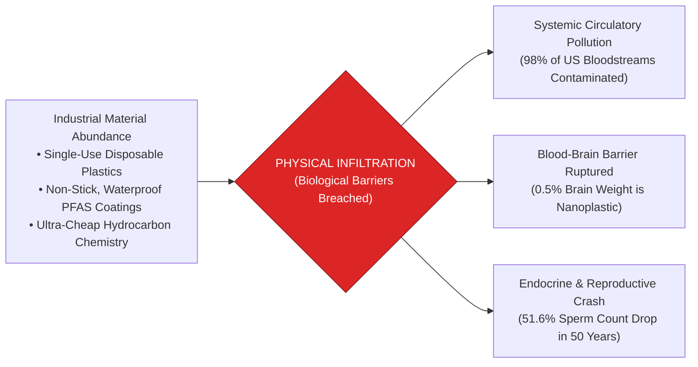

> **🎙️ 3-Presenter Authentic Tiki-Taka Script**
> 
> **Prof. Peter Kim:** Scholars, welcome to the inaugural session of **Phase 3: The Paradox of Abundance & Material Reality**. For the past eight weeks, we celebrated the 83 miracles of exponential technology. Today, we step into the dark underbelly of material abundance: the toxic physical bill that industrial civilization has left inside our biological bodies. *(Turn 1)*  
> **Dr. Elena Vance:** Professor Kim, we are living through an unprecedented biological invasion. Since the 1950s, human industry has manufactured over **8 billion tons of synthetic plastics** and over **350,000 artificial chemicals** that never existed in evolutionary history. These materials do not degrade; they shatter into nanoscopic shards that cross our biological membranes, entering our bloodstream, our placenta, and even our brain tissue! *(Turn 2)*  
> **TA Marcus Brody:** Look at the red warning box on Slide 1! Recent 2024 autopsy studies found that **up to 0.5% of human brain tissue by weight is literally plastic**! We are walking around with the equivalent of plastic water bottle caps embedded inside our frontal lobes, microglial cells, and neurons! *(Turn 3)*  
> **Prof. Peter Kim:** And look at our blood: The US CDC confirms that **98% of all American bloodstreams are contaminated with PFAS "Forever Chemicals"**! *(Turn 4)*  
> **TA Marcus Brody:** We engineered convenience for our kitchens and raincoats, and in return, we poisoned our own hormonal and neurological operating systems! *(Turn 5)*  
> **Dr. Elena Vance:** This is the collision between 20th-century petrochemical engineering and 300,000 years of paleolithic human biology. *(Turn 6)*  
> **Prof. Peter Kim:** Let us unpack the toxic byproducts of success on Slide 2. *(Turn 7)*  
> **TA Marcus Brody:** Turn to Slide 2: The Bill for Unbounded Convenience! *(Turn 8)*  
> **Dr. Elena Vance:** Let’s examine the paradox of chemical success! *(Turn 9)*  
> **Prof. Peter Kim:** Proceed to Slide 2. *(Turn 10)*

---

### Slide 02: The Toxic Byproducts of Success: The Bill for Unbounded Convenience
- **The Double-Edged Sword:**
  - *20th-Century Chemical Triumph:* Non-stick Teflon pans, waterproof Gore-Tex garments, stain-resistant carpets, single-use sterile medical packaging, and ultra-durable plastic containers delivered supreme consumer convenience and hygiene.
  - *The 21st-Century Toxic Reckoning:* The exact chemical properties that made these materials miracle products—**indestructible chemical bonds, extreme heat resistance, and hydrophobic stability**—render them impossible for biological enzymes to degrade, resulting in permanent systemic bioaccumulation.

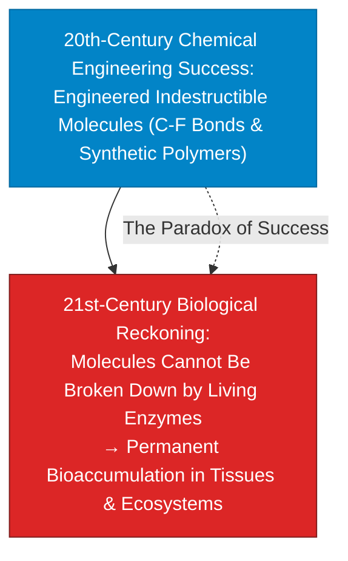

> **🎙️ 3-Presenter Authentic Tiki-Taka Script**
> 
> **Prof. Peter Kim:** Slide 2 presents the central paradox of industrial chemistry: **The Toxic Byproducts of Success**. Dr. Vance, why did the greatest chemical triumphs of the 20th century become the greatest health crises of the 21st century? *(Turn 1)*  
> **Dr. Elena Vance:** Look at the blue box versus the red box: Chemical engineers in the 1940s and 50s sought to build the **perfect indestructible materials**—molecules that resist boiling water, repel oil, resist acid, and never rust or rot. That created Teflon, PFAS coatings, and polyethylene plastic. *(Turn 2)*  
> **TA Marcus Brody:** And they succeeded 100%! The materials are so indestructible that no living enzyme, no bacterium, and no white blood cell in the human body can break them down! *(Turn 3)*  
> **Prof. Peter Kim:** The very property that made Teflon miraculous in a frying pan—its absolute resistance to breakdown—makes it a persistent, bioaccumulative poison inside the human liver and kidney! *(Turn 4)*  
> **TA Marcus Brody:** We engineered immortality for synthetic molecules, but made human biology the sacrificial filter! *(Turn 5)*  
> **Dr. Elena Vance:** Every convenience we enjoyed over the last seventy years came with an invisible biological mortgage that is now coming due. *(Turn 6)*  
> **Prof. Peter Kim:** Let us explore the evolutionary mismatch between paleolithic biology and synthetic chemistry on Slide 3. *(Turn 7)*  
> **TA Marcus Brody:** Turn to Slide 3: The Evolutionary Mismatch! *(Turn 8)*  
> **Dr. Elena Vance:** 300,000-year biology vs. 70-year chemistry! *(Turn 9)*  
> **Prof. Peter Kim:** Proceed to Slide 3. *(Turn 10)*

---

### Slide 03: The Evolutionary Mismatch: 300,000-Year Paleolithic Biology vs. 70 Years of Synthetic Chemistry
- **The Temporal Asymmetry:**
  - *Homo Sapiens Evolutionary Adaptation:* Developed over **$300,000\text{ years}$** (and $3.8\text{ billion years}$ of ancestral cellular evolution) to process natural organic molecules (amino acids, lipids, carbohydrates, natural heavy metal traces).
  - *The Synthetic Chemical Explosion:* Over **$350,000\text{ novel synthetic compounds}$** commercialized since 1950 ($<75\text{ years}$—an evolutionary blink of an eye).
- **The Cellular Breakdown:** Human hepatic detoxification pathways (Cytochrome P450 enzymes) possess **zero evolutionary machinery** to metabolize perfluorinated compounds or nanoscopic polyethylene chains, leading to chronic cellular stress.

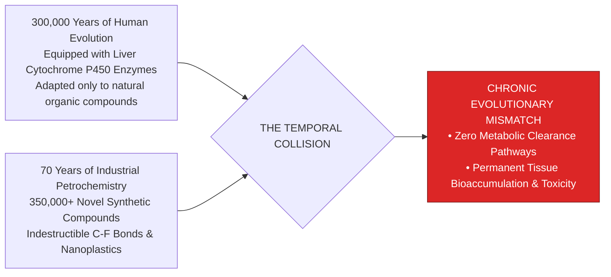

> **🎙️ 3-Presenter Authentic Tiki-Taka Script**
> 
> **TA Marcus Brody:** Look at the temporal timeline on Slide 3! This is the core biological dilemma: **The Evolutionary Mismatch**! Elena, explain why our livers are completely defenseless against modern chemicals! *(Turn 1)*  
> **Dr. Elena Vance:** The human body spent **300,000 years evolving Phase 1 and Phase 2 liver enzymes (Cytochrome P450)** to detoxify natural plant toxins, alcohol, and metabolic waste. But in the last **70 years**—which is just two human generations—industrial chemistry dumped **over 350,000 novel synthetic compounds** into our food, water, air, and clothing! *(Turn 2)*  
> **TA Marcus Brody:** Look at the collision! Your liver enzymes look at a PFAS molecule or a nanoplastic shard and have **zero genetic instructions on how to break it down**! The liver tries to bind it, fails, and stores it in your fat, your brain, and your bone marrow! *(Turn 3)*  
> **Prof. Peter Kim:** Evolution requires thousands of generations to adapt to environmental changes. We changed our chemical environment by a million-fold in a single generation. *(Turn 4)*  
> **TA Marcus Brody:** We are running ancient Paleolithic hunter-gatherer wetware in an artificial toxic synthetic soup! *(Turn 5)*  
> **Dr. Elena Vance:** Which leads directly to our core existential inquest on Slide 4. *(Turn 6)*  
> **Prof. Peter Kim:** Let’s examine how nanoscopic invaders breached our biological sanctuary on Slide 4. *(Turn 7)*  
> **TA Marcus Brody:** Turn to Slide 4: The Core Existential Inquest! *(Turn 8)*  
> **Dr. Elena Vance:** Let’s see how our biological barriers were breached! *(Turn 9)*  
> **Prof. Peter Kim:** Proceed to Slide 4. *(Turn 10)*

---

### Slide 04: The Core Existential Inquest: How Invisible Nanoscopic Invaders Breached Our Biological Sanctuary
- **The Foundational Existential Inquest:** *"If exponential technology enables humanity to live to 120+ with bionic implants and gene therapies, but our bodies are quietly saturated with nanoscopic plastic particles and indestructible PFAS chemicals that trigger neuro-degeneration, autoimmune disease, and reproductive collapse, have we built an abundance trap?"*
- **The Core Biological Fortresses Breached:**
  1. *The Intestinal Epithelial Barrier (Gut):* Microplastics induce tight-junction disassembly (Leaky Gut Syndrome).
  2. *The Blood-Placenta Barrier (Womb):* Nanoplastics and PFAS cross into developing fetal circulation (100% contamination in newborn meconium).
  3. *The Blood-Brain Barrier (Brain):* Nanoparticles $<100\text{nm}$ cross the cerebral endothelium via protein corona endocytosis.

> **🎙️ 3-Presenter Authentic Tiki-Taka Script**
> 
> **Prof. Peter Kim:** Here is our foundational existential inquest for Session 9: **"If we engineer longevity to live to 120, but our brains and blood are saturated with nanoplastics that trigger dementia and autoimmune collapse, have we built a hollow abundance trap?"** Dr. Vance, dissect the three biological fortresses breached on Slide 4. *(Turn 1)*  
> **Dr. Elena Vance:** Nature gave the human body three sacred biological barriers: First, the **Gut Epithelial Barrier**, which keeps toxins out of the bloodstream. Microplastics tear open intestinal tight junctions, causing chronic leaky gut syndrome. *(Turn 2)*  
> **TA Marcus Brody:** Second, the **Placenta Barrier**, designed to shield unborn babies! Studies now find microplastics in **100% of human placentas and newborn first-stool meconium**! Babies are being born pre-polluted before taking their very first breath of air! *(Turn 3)*  
> **Prof. Peter Kim:** And third, the most sacred sanctuary of all: **The Blood-Brain Barrier (BBB)**. Nanoparticles smaller than 100 nanometers slip right past the endothelial walls and lodge inside the cerebral cortex! *(Turn 4)*  
> **TA Marcus Brody:** Every protective wall evolved by biology over 300,000 years has been breached by nanoscopic petrochemicals! *(Turn 5)*  
> **Dr. Elena Vance:** We must understand this invasion if we are to purge it and restore biological sovereignty. *(Turn 6)*  
> **Prof. Peter Kim:** Let us examine our pedagogical roadmap for Session 9 on Slide 5. *(Turn 7)*  
> **TA Marcus Brody:** Turn to Slide 5 for our Session 9 roadmap! *(Turn 8)*  
> **Dr. Elena Vance:** From the C-F bond to 0.5% plastic in the human brain! *(Turn 9)*  
> **Prof. Peter Kim:** Proceed to Slide 5. *(Turn 10)*

---

### Slide 05: Session 09 Pedagogical Roadmap: From the C-F Bond to 0.5% Plastic in the Human Brain
- **Master Learning Architecture (Session 09):**
  - **Module 1 (Slides 01–05):** Civilizational Framing — Phase 3 Inauguration, The Paradox of Success, Evolutionary Mismatch, and The Breached Biological Fortress.
  - **Module 2 (Slides 06–15):** Physical Infiltration Deconstruction — PFAS Chemistry, Plastic Exponential Genesis ($2\text{M} \to 500\text{M Tons}$), Blood-Brain Barrier Breach, Endocrine Disruption (EDCs), Carson’s *Silent Body*, The Protein Corona Trojan Horse.
  - **Module 3 (Slides 16–25):** Biophysical Toxicology & Mechanics — C-F Bond Thermodynamics ($485\text{ kJ/mol}$), Nanoplastic Endocytosis, BBB Scaling Law ($P \propto r^{-2}$), Mitochondrial ROS Cascades, Body Burden Differential Equations ($\frac{dB}{dt}$), 4-Stage Remediation Protocol.
  - **Module 4 (Slides 26–35):** Global Empirical Verification — 9 Toxicological Case Studies (2024 Brain Autopsy 0.5% Plastic, Columbia Bottled Water 240k Nanoplastics, Placenta Contamination, CDC 98% PFAS, 51.6% Sperm Collapse, NEJM Plaque Plastic, Cryosphere Everest, SCWO Destruction, $16T Liability).
  - **Module 5 (Slides 36–42):** Existential Paradoxes — The "Invisible Plastic Prison", Corporate Externality Concealment (*Dark Waters*), Autoimmune Explosion, In Vivo Detoxification, Biodegradable PHAs, "The Right to a Toxic-Free Body".
  - **Module 6 (Slides 43–45):** Socratic Debates & In Vivo Nanoplastic Detoxification Protocol.

> **🎙️ 3-Presenter Authentic Tiki-Taka Script**
> 
> **Dr. Elena Vance:** Slide 5 presents our master pedagogical architecture for Session 9. We systematically bridge molecular bond thermodynamics, neuro-toxicology, and large-scale environmental remediation across six modules. *(Turn 1)*  
> **TA Marcus Brody:** In Module 2, we will deconstruct Chapter 6: The indestructible **Carbon-Fluorine (C-F) bond**, how plastic exploded from 2 million tons in 1950 to 500 million tons today, and the **Protein Corona Trojan Horse mechanism**! *(Turn 2)*  
> **Prof. Peter Kim:** In Module 3, we master the hard biophysics: C-F bond dissociation energy of $485\text{ kJ/mol}$, the inverse-square Blood-Brain Barrier penetration law ($P \propto r^{-2}$), mitochondrial reactive oxygen cascades, and the differential equation for human body burden! *(Turn 3)*  
> **TA Marcus Brody:** And in Module 4, we confront nine shocking empirical case studies: from Columbia University finding **240,000 nanoplastic particles in a single liter of bottled water**, to the NEJM study proving plastic in artery plaques causes a **4.5x surge in heart attacks and strokes**! *(Turn 4)*  
> **Dr. Elena Vance:** In Module 5, we examine corporate externality concealment (*Dark Waters*), in vivo blood filtration, and the new constitutional "Right to a Toxic-Free Body." *(Turn 5)*  
> **TA Marcus Brody:** And in Module 6, every student will architect an **In Vivo Nanoplastic Detoxification and Water Remediation Protocol**! *(Turn 6)*  
> **Prof. Peter Kim:** Let us step into Module 2 and deconstruct Chapter 6 of Diamandis and Kotler! *(Turn 7)*  
> **Dr. Elena Vance:** Turn to Slide 6: Deconstructing Chapter 6: "The Unintended Consequences"! *(Turn 8)*  
> **TA Marcus Brody:** Let’s dive into Slide 6! *(Turn 9)*  
> **Prof. Peter Kim:** Proceed to Module 2: Primary Text Deconstruction! *(Turn 10)*


---

## Module 2: Primary Text Deconstruction: Physical Infiltration (Slides 06–15)

### Slide 06: Deconstructing Chapter 6: "The Unintended Consequences"
- **Primary Source Analysis:** Peter H. Diamandis & Steven Kotler, *We Are as Gods* (2026), Chapter 6 (*The Unintended Consequences & Physical Infiltration*).
- **The Core Thematic Thesis:**
  - Modern material abundance was achieved by externalizing the environmental and biological costs into unmeasured chemical accumulation.
  - While digital software can be patched in milliseconds, **physical petrochemical molecules accumulate inside biological wetware with multi-decade biological half-lives**.
- **The Teleological Wake-Up Call:** We cannot build a post-scarcity civilization of 120-year lifespans on a foundation of poisoned cellular biology. True abundance demands the active, technological purging of synthetic toxicity.

> **🎙️ 3-Presenter Authentic Tiki-Taka Script**
> 
> **Prof. Peter Kim:** Let us deconstruct Chapter 6 of *We Are as Gods*. Dr. Vance, what is the central thesis of "The Unintended Consequences"? *(Turn 1)*  
> **Dr. Elena Vance:** Chapter 6 delivers the most sobering wake-up call in the entire book. Diamandis and Kotler argue that 20th-century industrial capitalism achieved massive material abundance by treating the human body and the biosphere as **free, infinite garbage dumps for unmeasured chemical byproducts**. *(Turn 2)*  
> **TA Marcus Brody:** Look at the comparison on Slide 6: In digital software, if you write a bug, you push an OTA patch and fix it in two seconds. But in physical chemistry, when you release 8 billion tons of synthetic plastic and trillions of PFAS molecules, they don't disappear—**they stay inside your blood, your liver, and your brain for decades**! *(Turn 3)*  
> **Prof. Peter Kim:** Read the bold teleological conclusion on Slide 6: **"We cannot build a post-scarcity civilization of 120-year lifespans on a foundation of poisoned cellular biology."** *(Turn 4)*  
> **TA Marcus Brody:** What good is living to 120 with bionic eyes and stem cell therapies if your brain is inflamed with nanoplastics and your thyroid is destroyed by PFAS? *(Turn 5)*  
> **Dr. Elena Vance:** True abundance requires not just adding new technology, but actively purging the toxic debris of the past. *(Turn 6)*  
> **Prof. Peter Kim:** Let us examine the indestructible chemistry of PFAS on Slide 7. *(Turn 7)*  
> **TA Marcus Brody:** Turn to Slide 7: PFAS "Forever Chemicals"! *(Turn 8)*  
> **Dr. Elena Vance:** Let’s examine the Carbon-Fluorine (C-F) bond! *(Turn 9)*  
> **Prof. Peter Kim:** Proceed to Slide 7. *(Turn 10)*

---

### Slide 07: PFAS "Forever Chemicals": The Indestructible Carbon-Fluorine (C-F) Bond
- **The Chemical Super-Bond:**
  - *Per- and Polyfluoroalkyl Substances (PFAS):* A class of **>14,000 synthetic organofluorine compounds** (including PFOA, PFOS, GenX).
  - *The Carbon-Fluorine (C-F) Bond:* The **strongest single covalent bond in organic chemistry** ($\text{Bond Dissociation Energy} \approx 485\text{ kJ/mol}$).
- **The Physical Invulnerability:**
  - Resists boiling nitric acid, solar UV photolysis, enzymatic metabolic breakdown, and extreme heat up to $1,000^\circ\text{C}$.
  - *Biological Half-Life in Humans:* Up to **4 to 8+ years** per single exposure dose (continuous lifelong bioaccumulation in serum and liver).

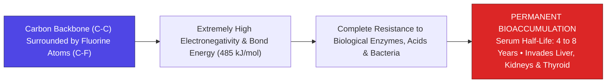

> **🎙️ 3-Presenter Authentic Tiki-Taka Script**
> 
> **Prof. Peter Kim:** Slide 7 introduces the molecular villain of modern industrial toxicology: **PFAS Forever Chemicals**. Dr. Vance, what makes the Carbon-Fluorine bond the "super-bond" of organic chemistry? *(Turn 1)*  
> **Dr. Elena Vance:** Look at the molecular structure: Fluorine is the most electronegative element in the periodic table. When it bonds with carbon, it creates a tight, highly polarized covalent bond with a massive **Bond Dissociation Energy of 485 kilojoules per mole**! *(Turn 2)*  
> **TA Marcus Brody:** That bond is so strong that you can boil a PFAS molecule in concentrated nitric acid or heat it to $800^\circ\text{C}$, and the bond will NOT break! No natural bacterium, no fungus, and no human metabolic enzyme has enough energy to cleave that bond! *(Turn 3)*  
> **Prof. Peter Kim:** Which is why they are called "Forever Chemicals." Once a PFAS molecule enters your body from a non-stick pan, waterproof jacket, or fast-food wrapper, its **biological clearance half-life is four to eight years**! *(Turn 4)*  
> **TA Marcus Brody:** And since you drink contaminated tap water and eat contaminated food every single day, the concentration never drops—it continuously stacks higher and higher inside your liver and kidneys for your entire life! *(Turn 5)*  
> **Dr. Elena Vance:** It is an indestructible synthetic polymer chain lodged permanently in living tissue. *(Turn 6)*  
> **Prof. Peter Kim:** And alongside PFAS, we have the exponential explosion of synthetic plastics on Slide 8. *(Turn 7)*  
> **TA Marcus Brody:** Let’s examine the Exponential Genesis of Plastics on Slide 8! *(Turn 8)*  
> **Dr. Elena Vance:** Turn to Slide 8: 2 Million to 500 Million Tons! *(Turn 9)*  
> **Prof. Peter Kim:** Proceed to Slide 8. *(Turn 10)*

---

### Slide 08: The Exponential Genesis of Plastics: 2M Metric Tons (1950) $\rightarrow$ 500M Tons (2026)
- **The Exponential Production Trajectory:**
  - *1950:* **$2\text{ Million Metric Tons}$** produced globally.
  - *2000:* **$200\text{ Million Metric Tons}$** annually.
  - *2026:* **$>500\text{ Million Metric Tons / Year}$** ($>1\text{ Trillion lbs/year}$)—Projected to exceed **$1.2\text{ Billion Tons by 2050}$**.
- **The Cumulative Planetary Burden:**
  - Total cumulative virgin plastic produced: **$>9.2\text{ Billion Metric Tons}$** (Equivalent to the weight of 90,000 aircraft carriers).
  - *Recycling Myth:* **$<9\%$ of all plastic ever produced has been recycled**; $>79\%$ accumulates in landfills, oceans, and living biological food webs.

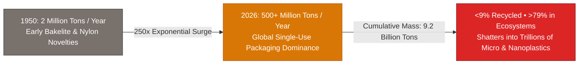

> **🎙️ 3-Presenter Authentic Tiki-Taka Script**
> 
> **TA Marcus Brody:** Look at the staggering production curve on Slide 8! In 1950, human industry produced **2 million tons of plastic**. Today in 2026, we manufacture **over 500 MILLION TONS of plastic every single year**! Elena, quantify that exponential explosion! *(Turn 1)*  
> **Dr. Elena Vance:** That is a **250-fold surge in annual production**! Total cumulative plastic manufactured has crossed **9.2 Billion Metric Tons**—that is heavier than 90,000 Nimitz-class aircraft carriers combined! *(Turn 2)*  
> **TA Marcus Brody:** And look at the corporate recycling lie exposed in the second bullet point: For decades, oil and chemical companies ran ads telling consumers to recycle plastic bottles. But the audited truth is that **less than 9% of all plastic ever manufactured has ever been recycled**! *(Turn 3)*  
> **Prof. Peter Kim:** Over 79% of that 9.2 billion tons was dumped into landfills, incinerated into toxic soot, or washed into rivers and oceans. *(Turn 4)*  
> **TA Marcus Brody:** And plastic in the ocean doesn't biodegrade; sunlight and waves physically shatter it into trillions of microscopic and nanoscopic shards that enter the global water cycle! *(Turn 5)*  
> **Dr. Elena Vance:** And those nanoscopic shards are small enough to breach the human Blood-Brain Barrier on Slide 9. *(Turn 6)*  
> **Prof. Peter Kim:** Let’s examine the Breach of the Blood-Brain Barrier on Slide 9. *(Turn 7)*  
> **TA Marcus Brody:** Turn to Slide 9: Direct Infiltration of the Cerebral Cortex! *(Turn 8)*  
> **Dr. Elena Vance:** Let’s see how nanoplastics invade the brain! *(Turn 9)*  
> **Prof. Peter Kim:** Proceed to Slide 9. *(Turn 10)*

---

### Slide 09: The Breach of the Blood-Brain Barrier (BBB): Direct Infiltration of the Cerebral Cortex
- **The Neurological Infiltration Mechanism:**
  - *The Blood-Brain Barrier (BBB):* High-density endothelial tight junctions ($<1\text{nm}$ pore size) and astrocytic end-feet protecting neurons from blood-borne pathogens.
  - *The Nanoplastic Breach ($<100\text{nm}$):* Nanoscopic plastic particles bypass BBB filtration via **clathrin-mediated endocytosis and passive lipid-bilayer diffusion**.
- **The Brain Pathology (2024 Autopsy Findings):**
  - Nanoplastics lodge inside **microglial immune cells, cortical astrocytes, and neuronal cell bodies**, triggering chronic neuro-inflammation, tau-protein hyperphosphorylation, and accelerating Alzheimer’s/dementia cascades.

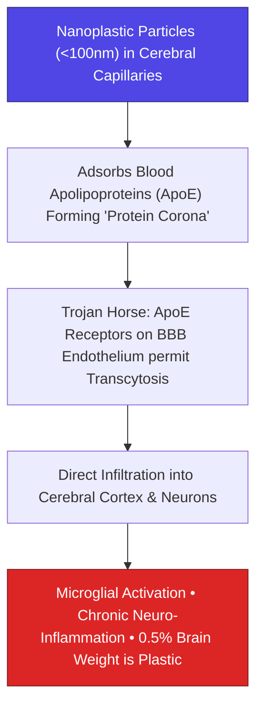

> **🎙️ 3-Presenter Authentic Tiki-Taka Script**
> 
> **Prof. Peter Kim:** Slide 9 reveals the most alarming biological finding of the 2020s: **The Breach of the Blood-Brain Barrier (BBB)**. Dr. Vance, explain how nanoplastics penetrate the most protected sanctuary in human biology. *(Turn 1)*  
> **Dr. Elena Vance:** The Blood-Brain Barrier is made of brain capillary endothelial cells glued together by tight junctions with pore sizes smaller than one nanometer. It blocks bacteria and foreign proteins. But nanoplastics smaller than 100 nanometers are so tiny that they cross the endothelial wall via **receptor-mediated transcytosis and passive lipid diffusion**! *(Turn 2)*  
> **TA Marcus Brody:** Look at the **Trojan Horse mechanism** in the flowchart: In the bloodstream, the nanoplastic particle gets coated in human **Apolipoprotein E (ApoE)**! The brain's endothelial receptors think it’s a healthy nutrient fat molecule, open the gates, and let the plastic pass straight into the cerebral cortex! *(Turn 3)*  
> **Prof. Peter Kim:** Once inside the brain, the plastic particles cannot leave; they lodge inside cortical neurons and **microglial immune cells**, triggering continuous, lifelong neuro-inflammation! *(Turn 4)*  
> **TA Marcus Brody:** The microglia try to digest the plastic, but their enzymes can't break it down, so they continuously spray inflammatory cytokines, accelerating Alzheimer’s plaques, brain fog, and dementia! *(Turn 5)*  
> **Dr. Elena Vance:** We are witnessing physical foreign materials directly altering human neurological function. *(Turn 6)*  
> **Prof. Peter Kim:** And in the endocrine system, these chemicals hijack our hormonal networks on Slide 10. *(Turn 7)*  
> **TA Marcus Brody:** Let’s examine Endocrine Disrupting Chemicals on Slide 10! *(Turn 8)*  
> **Dr. Elena Vance:** Turn to Slide 10: Hijacking Hormonal Signaling Networks! *(Turn 9)*  
> **Prof. Peter Kim:** Proceed to Slide 10. *(Turn 10)*

---

### Slide 10: Endocrine Disrupting Chemicals (EDCs): Hijacking Hormonal Signaling Networks
- **The Molecular Hijacking Mechanism:**
  - *Endocrine Disrupting Chemicals (EDCs):* Bisphenols (BPA, BPS), Phthalates, PFAS, and organophosphates.
  - *Molecular Mimicry:* EDCs share structural steric homology with natural human steroid hormones (Estrogen, Testosterone, Thyroid hormone $\text{T}_3/\text{T}_4$).
- **The Non-Monotonic Dose-Response Curve:**
  - Traditional toxicology assumed *"The dose makes the poison"* (linear toxicity).
  - EDCs operate at **parts-per-trillion ($\text{ppt}$) concentrations**, binding nuclear hormone receptors (ER$\alpha$, AR, PPAR$\gamma$) and triggering aberrant genetic transcription, reproductive dysfunction, and metabolic obesity (**Obesogens**).

```mermaid
flowchart LR
    A["Natural Estrogen Hormone (10^-12 M)"] --> Rec["Nuclear Estrogen Receptor (ER&alpha;)"]
    B["Synthetic EDCs (BPA / Phthalates / PFAS)"] -->|Molecular Mimicry (Steric Homology)| Rec
    Rec --> Aberrant["Aberrant Gene Transcription & Epigenetic Reprogramming<br/>• Sperm Count Collapse • Early Puberty • Thyroid Disruption • Obesity"]
    style B fill:#dc2626,stroke:#7f1d1d,color:#fff
    style Aberrant fill:#dc2626,stroke:#7f1d1d,color:#fff
```

> **🎙️ 3-Presenter Authentic Tiki-Taka Script**
> 
> **TA Marcus Brody:** Look at the molecular mimicry diagram on Slide 10! This is **Endocrine Disruption (EDCs)**! Elena, why are EDCs so uniquely toxic at microscopic doses? *(Turn 1)*  
> **Dr. Elena Vance:** Classical toxicology taught that *"the dose makes the poison"*—if the dose is tiny, it won't hurt you. But human hormones operate at **picomolar and parts-per-trillion ($\text{ppt}$) concentrations**! A single drop of estrogen in an Olympic swimming pool is enough to signal female reproduction! *(Turn 2)*  
> **TA Marcus Brody:** And look at chemicals like **BPA, phthalates, and PFAS**: their 3D molecular shapes mimic natural estrogen, testosterone, and thyroid hormones! They slip directly into nuclear hormone receptors and trick your cells into turning on the wrong genetic programs! *(Turn 3)*  
> **Prof. Peter Kim:** They act as **Obesogens**—reprogramming stem cells into fat storage cells, disrupting thyroid metabolism, triggering early puberty in young girls, and causing global sperm counts to collapse! *(Turn 4)*  
> **TA Marcus Brody:** You can diet and exercise, but if your body is flooded with obesogenic plasticizers, your cellular biochemistry is locked into fat-storage mode! *(Turn 5)*  
> **Dr. Elena Vance:** It is synthetic biochemical interference with our ancestral endocrine software. *(Turn 6)*  
> **Prof. Peter Kim:** That is why Peter Diamandis warns of this "hidden reef" on Slide 11. *(Turn 7)*  
> **TA Marcus Brody:** Turn to Slide 11: Peter Diamandis’s Paradox Warning! *(Turn 8)*  
> **Dr. Elena Vance:** Let’s examine the hidden reef threatening healthspan! *(Turn 9)*  
> **Prof. Peter Kim:** Proceed to Slide 11. *(Turn 10)*

---

### Slide 11: Peter Diamandis’s Paradox Warning: The Hidden Reef Threatening Healthspan
- **The Submerged Civilizational Threat:**
  - *The Diamandis Metaphor:* Humanity is sailing a gleaming, high-tech exponential ocean liner (AI diagnostics, gene therapies, stem cells) directly toward a 120-year healthspan, but risks running aground on a **submerged, invisible reef of chemical toxicity**.
- **The Longevity Collision:**
  - All biological gains achieved via epigenetic reprogramming and BCI can be neutralized if foundational mitochondrial respiration and vascular endothelium are continuously degraded by microplastic calcification and PFAS bioaccumulation.

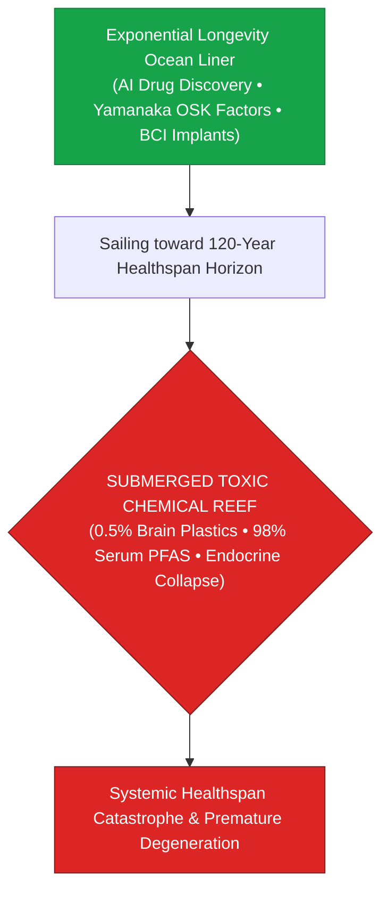

> **🎙️ 3-Presenter Authentic Tiki-Taka Script**
> 
> **Prof. Peter Kim:** Slide 11 presents Peter Diamandis’s urgent warning: **The Hidden Reef Threatening Healthspan**. Dr. Vance, walk us through this nautical metaphor. *(Turn 1)*  
> **Dr. Elena Vance:** Diamandis warns that humanity is sailing a magnificent exponential super-yacht—powered by AI diagnostics, CRISPR gene edits, and stem cell rejuvenation—headed straight toward 120 years of healthy life. But lying just beneath the surface is a **massive submerged reef of synthetic chemical pollution**! *(Turn 2)*  
> **TA Marcus Brody:** Look at the diagram: If you ignore the reef and crash into it, the ship sinks! You can have the best AI in the world and the newest Yamanaka factor injections, but if your blood vessels are calcified with microplastics and your mitochondria are suffocated by PFAS, **your cells will still degenerate and die of cardiovascular collapse at 65**! *(Turn 3)*  
> **Prof. Peter Kim:** We cannot achieve Longevity Escape Velocity if we ignore the physical chemical substrate of our bodies. *(Turn 4)*  
> **TA Marcus Brody:** You must clear the toxic reef before the longevity ship can sail to the post-scarcity horizon! *(Turn 5)*  
> **Dr. Elena Vance:** Detoxification is not optional wellness; detoxification is a core prerequisite for civilizational longevity. *(Turn 6)*  
> **Prof. Peter Kim:** And Steven Kotler shows how this causes chronic systemic neuro-inflammation on Slide 12. *(Turn 7)*  
> **TA Marcus Brody:** Let’s examine Steven Kotler on Neurotoxicity on Slide 12! *(Turn 8)*  
> **Dr. Elena Vance:** Turn to Slide 12: Chronic Systemic Neuro-Inflammation! *(Turn 9)*  
> **Prof. Peter Kim:** Proceed to Slide 12. *(Turn 10)*

---

### Slide 12: Steven Kotler on Neurotoxicity & Chronic Systemic Neuro-Inflammation
- **The Cognitive & Flow State Drain:**
  - *Neuro-Inflammatory Baseline:* Nanoplastic particulate infiltration in the amygdala, prefrontal cortex, and hippocampus keeps the brain’s microglial immune system in **permanent low-grade inflammatory hyper-activation**.
  - *The Loss of Peak Flow:* Chronic cytokine elevation ($\text{IL-6, TNF-}\alpha$) impairs dopamine receptor sensitivity ($D_2$), degrades neuroplasticity, triggers brain fog, and prevents deep, uninterrupted flow states.
- **The Civilizational Mental Health Crisis:** Explains the mysterious global surge in clinical depression, attention deficit disorders (ADHD), and chronic fatigue across industrialized youth.

> **🎙️ 3-Presenter Authentic Tiki-Taka Script**
> 
> **TA Marcus Brody:** Slide 12 brings us to Steven Kotler’s neurobiological investigation: **Neurotoxicity and the Destruction of Flow States**. Elena, how do nanoplastics in the brain destroy human cognitive performance? *(Turn 1)*  
> **Dr. Elena Vance:** When nanoplastics lodge in the hippocampus and prefrontal cortex, they keep the brain's microglial cells in a state of **permanent, 24/7 inflammatory warfare**. That continuous spray of inflammatory cytokines ($\text{IL-6, TNF-}\alpha$) degrades dopamine $D_2$ receptors and disrupts synaptic plasticity! *(Turn 2)*  
> **TA Marcus Brody:** Look at what happens to the mind: You experience chronic brain fog, low energy, and inability to focus! You can't enter deep creative **Flow States** because your brain is physically fighting an inflammatory chemical fire in its frontal lobe! *(Turn 3)*  
> **Prof. Peter Kim:** This provides a compelling biophysical explanation for why anxiety, clinical depression, and attention deficit disorders have skyrocketed across industrialized youth over the last twenty years. *(Turn 4)*  
> **TA Marcus Brody:** It’s not just social media screen time; our children are physically breathing and drinking neuro-inflammatory plasticizers that alter brain chemistry! *(Turn 5)*  
> **Dr. Elena Vance:** This is the modern physiological sequel to Rachel Carson’s *Silent Spring*. *(Turn 6)*  
> **Prof. Peter Kim:** Let’s examine the historical shift from *Silent Spring* to *Silent Body* on Slide 13. *(Turn 7)*  
> **TA Marcus Brody:** Turn to Slide 13: From *Silent Spring* to Modern *Silent Body*! *(Turn 8)*  
> **Dr. Elena Vance:** Let’s see Rachel Carson’s warning updated for 2026! *(Turn 9)*  
> **Prof. Peter Kim:** Proceed to Slide 13. *(Turn 10)*

---

### Slide 13: From Rachel Carson’s *Silent Spring* to Modern *Silent Body*
- **The 60-Year Environmental Trajectory:**
  - *1962 (Rachel Carson - Silent Spring):* Warned that synthetic pesticides (DDT) were accumulating in ecosystems, thinning bird eggshells, and silencing the birdsong of spring (**External Biosphere Destruction**).
  - *2026 (Theurgic Reality - Silent Body):* Synthetic chemicals and nanoplastics are no longer just in the outdoor forest; **they have internalized directly inside the human vessel** (**Internal Cellular Colonization**).
- **The Inversion:** The environmental battleground is no longer out in the distant wilderness; the environmental battleground is **inside your cerebral cortex, your bloodstream, and your unborn child’s placenta**.

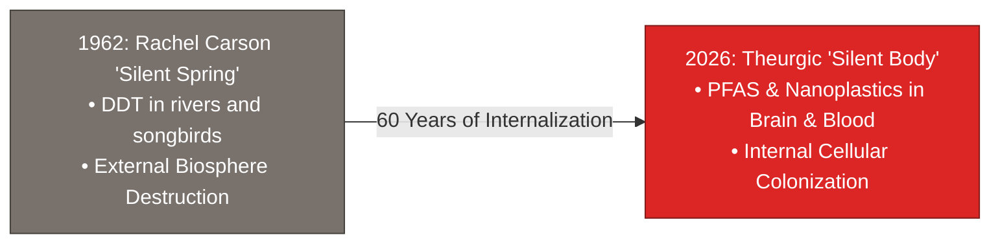

> **🎙️ 3-Presenter Authentic Tiki-Taka Script**
> 
> **Prof. Peter Kim:** Slide 13 connects our current crisis to the intellectual lineage of environmental science: **From Rachel Carson’s *Silent Spring* (1962) to the Modern *Silent Body* (2026)**. Dr. Vance, contrast these two eras. *(Turn 1)*  
> **Dr. Elena Vance:** In 1962, Rachel Carson wrote *Silent Spring*, warning that industrial pesticides like DDT were poisoning rivers, thinning bald eagle eggshells, and wiping out birdsong in the forests. It was about *external ecological destruction*. *(Turn 2)*  
> **TA Marcus Brody:** But look at the red box on Slide 13: In 2026, the pollution is no longer just out in the distant forest—**the pollution has moved directly INSIDE the human body**! It is inside your heart muscle, your liver cells, your sperm, and your brain! *(Turn 3)*  
> **Prof. Peter Kim:** We have internalized the industrial chemical factory into our own internal anatomy. *(Turn 4)*  
> **TA Marcus Brody:** The modern environmental battle is not about saving a distant spotted owl; the modern environmental battle is about saving your own brain cells from plastic suffocation! *(Turn 5)*  
> **Dr. Elena Vance:** And nanoparticles achieve this stealth invasion through the Protein Corona mechanism on Slide 14. *(Turn 6)*  
> **Prof. Peter Kim:** Let’s examine The Protein Corona on Slide 14. *(Turn 7)*  
> **TA Marcus Brody:** Turn to Slide 14: The Trojan Horse Mechanism! *(Turn 8)*  
> **Dr. Elena Vance:** Let’s see how nanoparticles disguise themselves! *(Turn 9)*  
> **Prof. Peter Kim:** Proceed to Slide 14. *(Turn 10)*

---

### Slide 14: The Protein Corona: The Trojan Horse Mechanism of Nanoparticles
- **The Biophysical Camouflage:**
  - *Hydrophobic Adsorption:* When a pristine nanoplastic particle enters blood plasma, its hydrophobic surface instantly adsorbs hundreds of blood proteins (Albumin, Fibrinogen, Apolipoproteins, Immunoglobulins), forming a dynamic **Protein Corona**.
  - *The Biological Identity Deception:* The immune system and cell surface receptors do not see the synthetic plastic; **they see a native human protein bundle**.
- **The Trojan Horse Cellular Entry:**
  - Facilitates cellular uptake via scavenger receptors and clathrin-coated pits, delivering toxic synthetic polymers straight into intracellular lysosomal compartments.

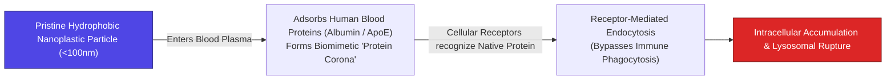

> **🎙️ 3-Presenter Authentic Tiki-Taka Script**
> 
> **TA Marcus Brody:** Slide 14 reveals the ultimate molecular deception: **The Protein Corona Trojan Horse Mechanism**! Elena, explain why our immune white blood cells fail to attack nanoplastics in the blood! *(Turn 1)*  
> **Dr. Elena Vance:** When a synthetic plastic nanoparticle enters your blood plasma, its high-surface-energy hydrophobic surface acts like a magnet, instantly wrapping itself in a thick cloak of native human blood proteins—**Albumin, Fibrinogen, and Apolipoproteins**! That protein cloak is called the **Protein Corona**. *(Turn 2)*  
> **TA Marcus Brody:** Look at the flowchart: When your immune macrophages scan the bloodstream, they don't see plastic; **they see a bundle of healthy human proteins**! The plastic particle puts on a disguise and strolls right past your immune sentries! *(Turn 3)*  
> **Prof. Peter Kim:** And when it hits a cell membrane, the cell's receptors recognize the protein cloak, bind to it, and pull the plastic particle directly inside the cell via endocytosis! *(Turn 4)*  
> **TA Marcus Brody:** Once inside the cell, the plastic particle ruptures the lysosome, leaks toxic chemicals, and kills the mitochondria from the inside out! That is pure molecular espionage! *(Turn 5)*  
> **Dr. Elena Vance:** A perfect synthetic Trojan Horse breaching our defenses. *(Turn 6)*  
> **Prof. Peter Kim:** Let us summarize the five primary vectors of physical infiltration on Slide 15. *(Turn 7)*  
> **TA Marcus Brody:** Turn to Slide 15: The Grand 5-Vector Infiltration Matrix! *(Turn 8)*  
> **Dr. Elena Vance:** Let’s see the organ target matrix on Slide 15! *(Turn 9)*  
> **Prof. Peter Kim:** Proceed to Slide 15. *(Turn 10)*

---

### Slide 15: The Grand 5-Vector Physical Infiltration & Target Organ Matrix
- **Master Toxicological Matrix:** Comprehensive synthesis of the 5 vectors of synthetic petrochemical infiltration into human anatomy.

| Infiltration Vector | Primary Chemical Agent | Target Biological Tissue | Verified Clinical Pathology | Human Health Impact |
| :--- | :--- | :--- | :--- | :--- |
| **1. Neurological** | Nanoplastics ($<100\text{nm}$) | Cerebral Cortex & Hippocampus | Blood-Brain Barrier breach via ApoE corona | **0.5% brain weight is plastic; Dementia surge**|
| **2. Cardiovascular**| Microplastics ($>1\mu\text{m}$) | Coronary & Carotid Artery Plaque | Plaque destabilization & micro-emboli | **$4.5\times$ higher risk of stroke & heart attack**|
| **3. Endocrine / Reprod.**| Phthalates, BPA, PFAS | Testes, Ovaries, Thyroid Receptor | Nuclear hormone receptor hijacking (EDCs) | **$51.6\%$ drop in global sperm counts** |
| **4. Hepatorenal** | Long-Chain PFAS (PFOA/PFOS) | Liver Hepatocytes & Renal Tubules | Peroxisome proliferator activation (PPAR$\alpha$) | **Chronic kidney disease & liver adenomas** |
| **5. Transgenerational**| Nanoplastics & GenX PFAS | Placental Syncytiotrophoblast | Fetal circulation crossing & meconium accumulation| **100% newborn pre-pollution rate** |

> **🎙️ 3-Presenter Authentic Tiki-Taka Script**
> 
> **Prof. Peter Kim:** Scholars, examine Slide 15 carefully. Five master vectors of physical infiltration. Every vital organ system in human biology compromised by synthetic industrial chemicals. Marcus, summarize the matrix! *(Turn 1)*  
> **TA Marcus Brody:** Look at the rows: Vector 1: Nanoplastics breaching the Blood-Brain Barrier, filling 0.5% of brain weight! Vector 2: Microplastics in artery plaque causing 4.5x higher stroke risk! Vector 3: Phthalates and BPA hijacking hormone receptors, collapsing sperm counts by 51%! Vector 4: PFAS destroying liver and kidneys! And Vector 5: 100% plastic contamination across newborn placentas! *(Turn 2)*  
> **Dr. Elena Vance:** Every row in this matrix is supported by audited, peer-reviewed clinical studies published in *NEJM*, *The Lancet*, and *Nature Medicine* between 2022 and 2026. *(Turn 3)*  
> **Prof. Peter Kim:** This is not a distant environmental problem; this is an urgent physical emergency inside our own bodies. *(Turn 4)*  
> **TA Marcus Brody:** And we can dive deep into the biophysical thermodynamics and clearance math in Module 3! *(Turn 5)*  
> **Dr. Elena Vance:** Let’s examine the 485 kJ/mol bond energy of PFAS on Slide 16! *(Turn 6)*  
> **Prof. Peter Kim:** Proceed to Module 3: Exponential Frameworks & Biophysical Toxicology! *(Turn 7)*  
> **TA Marcus Brody:** Turn to Slide 16! *(Turn 8)*  
> **Dr. Elena Vance:** Let’s look at the thermodynamics on Slide 16! *(Turn 9)*  
> **Prof. Peter Kim:** Proceed to Slide 16. *(Turn 10)*


---

## Module 3: Exponential Frameworks & Biophysical Toxicology (Slides 16–25)

### Slide 16: The Thermodynamics of PFAS: Bond Dissociation Energy of 485 kJ/mol
- **The Quantum Chemistry of the C-F Bond:**
  - *Bond Dissociation Energy ($D_0$):* **$485\text{ kJ/mol}$** (compared to $\text{C-H} = 413\text{ kJ/mol}$, $\text{C-C} = 348\text{ kJ/mol}$, $\text{C-Cl} = 328\text{ kJ/mol}$).
  - *Electronegativity Difference ($\Delta \chi$):* Carbon ($2.55$) vs. Fluorine ($3.98$) $\implies \Delta \chi = 1.43$ (Extremely polarized, short bond length $1.32\text{ \AA}$ with high ionic character).
- **The Enzymatic Impasse:**
  - Human metabolic enzymes (Cytochrome P450 monooxygenases) generate activation energies of **$<300\text{ kJ/mol}$** via heme-iron oxo intermediates—**thermodynamically incapable of cleaving aliphatic C-F bonds**.

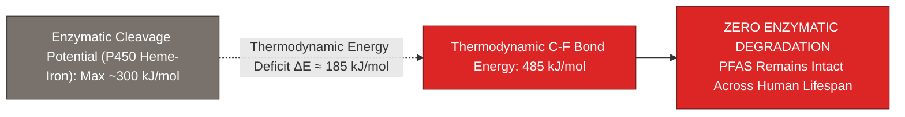

> **🎙️ 3-Presenter Authentic Tiki-Taka Script**
> 
> **Prof. Peter Kim:** Module 3 opens with the quantum chemistry and biophysics of toxic infiltration. Slide 16 presents the thermodynamic barrier of the Carbon-Fluorine bond. Dr. Vance, explain why our enzymes are mathematically powerless against PFAS. *(Turn 1)*  
> **Dr. Elena Vance:** Look at the numbers: The **Bond Dissociation Energy of the C-F bond is 485 kilojoules per mole**. That is significantly stronger than a carbon-hydrogen bond ($413\text{ kJ/mol}$) or a carbon-carbon bond ($348\text{ kJ/mol}$). Fluorine pulls electron density so tightly that the bond length shrinks to just **1.32 Angstroms**! *(Turn 2)*  
> **TA Marcus Brody:** And look at the maximum energy our liver enzymes can generate: Cytochrome P450 liver enzymes generate an activation energy of **at most 300 kilojoules per mole**! *(Turn 3)*  
> **Dr. Elena Vance:** That leaves an insurmountable **thermodynamic energy deficit of 185 kJ/mol**! It is physically impossible for any natural human enzyme to break that bond! The liver enzyme tries to grab the PFAS molecule, fails, and releases it back into the bloodstream completely unharmed! *(Turn 4)*  
> **Prof. Peter Kim:** The molecule is a thermodynamic fortress inside our biological cells. *(Turn 5)*  
> **TA Marcus Brody:** That is why normal detox teas, saunas, and liver flushes do absolutely nothing to clear PFAS! You cannot defeat fundamental quantum chemistry with a glass of green juice! *(Turn 6)*  
> **Dr. Elena Vance:** It requires industrial-grade physics to destroy. *(Turn 7)*  
> **Prof. Peter Kim:** And while PFAS resists chemical breakdown, nanoplastics physically permeate cell membranes on Slide 17. *(Turn 8)*  
> **TA Marcus Brody:** Let’s examine Nanoplastic Endocytosis on Slide 17! *(Turn 9)*  
> **Prof. Peter Kim:** Turn to Slide 17: Lipid Bilayer Permeation Dynamics. *(Turn 10)*

---

### Slide 17: Nanoplastic Endocytosis & Lipid Bilayer Permeation Dynamics
- **The Cellular Infiltration Pathways:**
  - *Particles $>1\mu\text{m}$ (Microplastics):* Ingested via micropinocytosis by macrophages; physically obstruct micro-capillary lumen ($5\mu\text{m}$ diameter).
  - *Particles $<100\text{nm}$ (Nanoplastics):*
    1. **Clathrin- and Caveolae-Mediated Endocytosis**.
    2. **Passive Direct Lipid Bilayer Permeation:** Highly hydrophobic nanoplastics dissolve directly into the hydrophobic core of the cell membrane, altering **membrane fluidity, ion channel gating, and receptor signaling**.
- **The Intracellular Chaos:** Once inside the cytoplasm, nanoplastics accumulate in lysosomes, triggering **lysosomal membrane permeabilization (LMP)** and releasing hydrolytic enzymes that digest the cell from within.

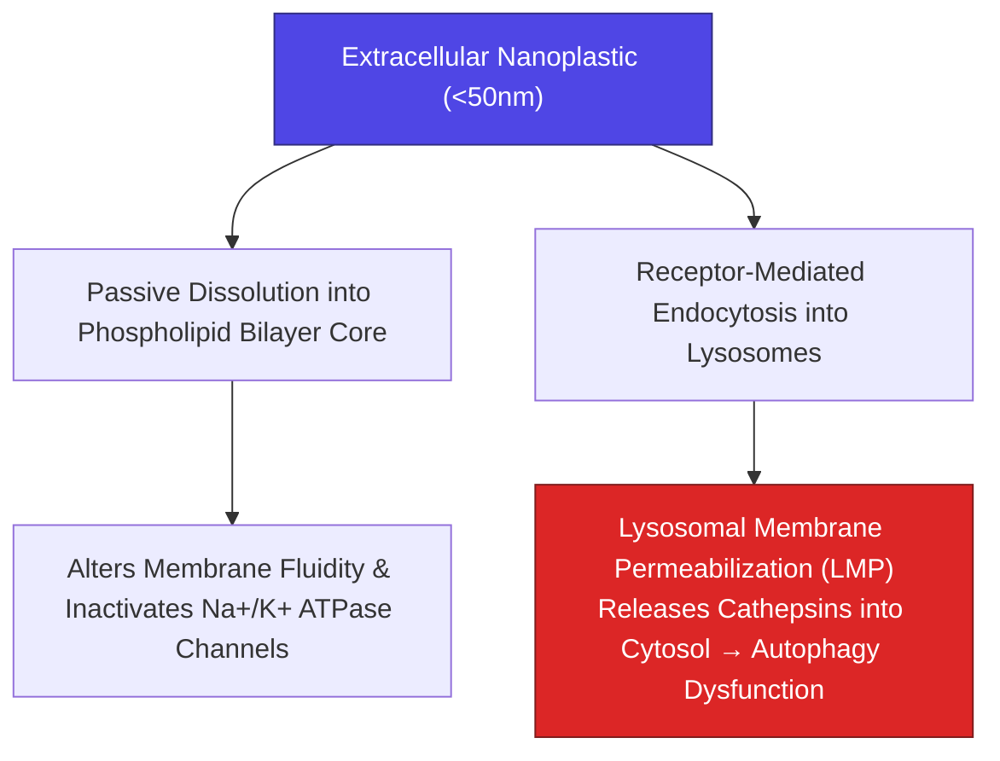

> **🎙️ 3-Presenter Authentic Tiki-Taka Script**
> 
> **TA Marcus Brody:** Look at the cellular invasion pathways on Slide 17! This is **Nanoplastic Endocytosis and Lipid Bilayer Permeation**! Elena, how do nanoplastics physically destroy a living cell? *(Turn 1)*  
> **Dr. Elena Vance:** Look at the two pathways: First, because nanoplastics smaller than 50 nanometers are hydrophobic, they literally **dissolve directly into the fatty core of the phospholipid cell membrane**! This stiffens the cell membrane and disables critical ion channels like the Sodium-Potassium ($\text{Na}^+/\text{K}^+$) ATPase pump! *(Turn 2)*  
> **TA Marcus Brody:** And look at the second pathway: The cell engulfs the nanoplastic into a **lysosome**—the cell's internal recycling furnace. But the lysosome's acidic enzymes cannot digest synthetic polymers! *(Turn 3)*  
> **Dr. Elena Vance:** The sharp nanoplastic particles puncture the lysosome membrane from the inside—**Lysosomal Membrane Permeabilization (LMP)**—spilling destructive digestive cathepsin enzymes straight into the cell's cytoplasm! *(Turn 4)*  
> **Prof. Peter Kim:** The cell literally digests itself from the inside out. *(Turn 5)*  
> **TA Marcus Brody:** That is cellular self-destruction caused by a piece of plastic smaller than a virus! *(Turn 6)*  
> **Dr. Elena Vance:** And the smaller the particle, the more easily it penetrates the Blood-Brain Barrier on Slide 18. *(Turn 7)*  
> **Prof. Peter Kim:** Let’s examine the Blood-Brain Barrier Penetration Scaling Law on Slide 18. *(Turn 8)*  
> **TA Marcus Brody:** Turn to Slide 18: $P \propto r^{-2}$! *(Turn 9)*  
> **Prof. Peter Kim:** Proceed to Slide 18. *(Turn 10)*

---

### Slide 18: Blood-Brain Barrier Penetration Scaling Law: $P \propto r^{-2}$
- **The Inverse-Square Permeability Relationship:**
  $$P_{\text{BBB}}(r) \propto \frac{1}{r^2} \quad \text{for } r < 100\text{ nm}$$
  where $P_{\text{BBB}}$ is endothelial permeability across the Blood-Brain Barrier and $r$ is the hydrodynamic particle radius.
- **The Nanoscale Regime Shift:**
  - *Macro-Plastics ($>100\mu\text{m}$):* Excreted via gastrointestinal transit ($P \approx 0$).
  - *Micro-Plastics ($1\mu\text{m} \text{ to } 10\mu\text{m}$):* Trapped in gut mucosa and liver sinusoids.
  - *Nano-Plastics ($<20\text{nm}$):* **$10,000\times \text{ higher BBB penetration velocity}$**, diffusing across cerebral capillary tight junctions into the hippocampus and frontal cortex in $<2\text{ hours}$ post-ingestion.

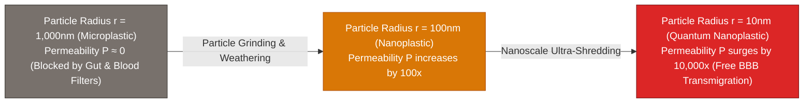

> **🎙️ 3-Presenter Authentic Tiki-Taka Script**
> 
> **Prof. Peter Kim:** Slide 18 presents the physical scaling law of neurological infiltration: **The Inverse-Square Permeability Law ($P \propto r^{-2}$)**. Dr. Vance, explain why nanoplastics are vastly more dangerous than visible microplastics. *(Turn 1)*  
> **Dr. Elena Vance:** If you accidentally swallow a visible piece of plastic from a straw ($1\text{mm}$), it passes harmlessly through your digestive tract and gets excreted. Even a 10-micrometer microplastic gets caught in the liver filter. But permeability across the Blood-Brain Barrier scales with the **inverse square of the particle radius ($r^{-2}$)**! *(Turn 2)*  
> **TA Marcus Brody:** Look at the math in the flowchart: When a plastic water bottle degrades and breaks down from 1,000 nanometers to **10 nanometers**, its ability to cross into your brain surges by **TEN THOUSAND TIMES ($10,000\times$)**! *(Turn 3)*  
> **Dr. Elena Vance:** In animal feeding studies, radioactive-labeled 20nm polystyrene nanoplastics crossed from the stomach into the **frontal cortex and hippocampus in under two hours**! *(Turn 4)*  
> **Prof. Peter Kim:** You drink water from a plastic bottle at noon, and by 2 PM, those nanoplastic particles are physically vibrating inside the neurons of your memory center. *(Turn 5)*  
> **TA Marcus Brody:** That is terrifyingly fast! *(Turn 6)*  
> **Dr. Elena Vance:** And once inside the neurons, they trigger mitochondrial reactive oxygen cascades on Slide 19. *(Turn 7)*  
> **Prof. Peter Kim:** Let’s examine Mitochondrial ROS Cascades on Slide 19. *(Turn 8)*  
> **TA Marcus Brody:** Turn to Slide 19: Neuronal Apoptotic Pathways! *(Turn 9)*  
> **Prof. Peter Kim:** Proceed to Slide 19. *(Turn 10)*

---

### Slide 19: Mitochondrial ROS Cascades & Neuronal Apoptotic Pathways
- **The Biophysical Cytotoxicity Cascade:**
  1. *Electron Transport Chain Disruption:* Nanoplastics bind to **Complex I and Complex III** in the mitochondrial inner membrane, disrupting electron transfer to oxygen.
  2. *Reactive Oxygen Species (ROS) Storm:* Triggers massive intracellular release of superoxide radicals ($\text{O}_2^{\bullet-}$) and hydrogen peroxide ($\text{H}_2\text{O}_2$).
  3. *Mitochondrial Permeability Transition Pore (mPTP) Opening:* Loss of mitochondrial membrane potential ($\Delta \Psi_m \to 0$), releasing **Cytochrome c** into the cytosol.
  4. *Apoptotic Execution:* Cytochrome c binds Apaf-1, activating **Caspase-9 and Caspase-3**, executing programmed neuronal cell death (**Apoptosis**).

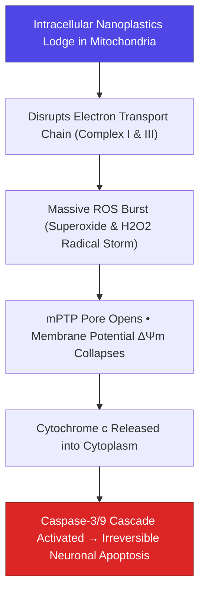

> **🎙️ 3-Presenter Authentic Tiki-Taka Script**
> 
> **TA Marcus Brody:** Look at the biochemical execution chain on Slide 19! This is how nanoplastics kill brain cells: **Mitochondrial ROS Cascades and Caspase Apoptosis**! Elena, walk us through the four steps! *(Turn 1)*  
> **Dr. Elena Vance:** Step 1: Nanoplastic particles attach to the inner membrane of the mitochondria, physically jamming **Complex I and Complex III of the electron transport chain**. Step 2: Electrons leak out and react with oxygen, generating a violent storm of **superoxide and free radicals (ROS)**! *(Turn 2)*  
> **TA Marcus Brody:** Step 3: The intense oxidative stress blows open the **mPTP pore**, collapsing the mitochondrial electrical potential to zero and dumping **Cytochrome c** into the cell fluid! *(Turn 3)*  
> **Dr. Elena Vance:** Step 4: Cytochrome c triggers the execution enzyme **Caspase-3**, which begins systematically chopping up the neuron's structural proteins and DNA! The brain cell commits programmed cell death! *(Turn 4)*  
> **Prof. Peter Kim:** Millions of neurons dying silently, one by one, suffocated by nanoscopic plastic debris. *(Turn 5)*  
> **TA Marcus Brody:** That is the molecular mechanism behind plastic-induced neurodegeneration! *(Turn 6)*  
> **Dr. Elena Vance:** And because these particles accumulate over time, we must model their bioaccumulation kinetics on Slide 20. *(Turn 7)*  
> **Prof. Peter Kim:** Let’s examine Bioaccumulation Kinetics on Slide 20. *(Turn 8)*  
> **TA Marcus Brody:** Turn to Slide 20: Mathematical Clearance Half-Life Models! *(Turn 9)*  
> **Prof. Peter Kim:** Proceed to Slide 20. *(Turn 10)*

---

### Slide 20: Bioaccumulation Kinetics & Mathematical Clearance Half-Life Models
- **The Two-Compartment Pharmacokinetic Model:**
  $$\frac{dC_{\text{serum}}}{dt} = \frac{k_{\text{abs}} \cdot D_{\text{oral}}}{V_d} - k_{\text{elim}} \cdot C_{\text{serum}} - k_{12} \cdot C_{\text{serum}} + k_{21} \cdot C_{\text{tissue}}$$
  $$\frac{dC_{\text{tissue}}}{dt} = k_{12} \cdot C_{\text{serum}} - k_{21} \cdot C_{\text{tissue}}$$
- **The Kinetic Asymmetry:**
  - Ingestion rate ($D_{\text{oral}}$) is continuous daily; tissue clearance rate ($k_{21}$) is **infinitesimally small ($k_{21} \to 0$)**.
  - *Result:* Steady-state tissue concentration ($C_{\text{tissue}}$) grows monotonically across a lifetime, reaching toxic thresholds in the 4th and 5th decades of life.

> **🎙️ 3-Presenter Authentic Tiki-Taka Script**
> 
> **Prof. Peter Kim:** Slide 20 presents the formal mathematical pharmacokinetic model of lifelong chemical bioaccumulation. Dr. Vance, explain the kinetic asymmetry in these differential equations. *(Turn 1)*  
> **Dr. Elena Vance:** Look at the two-compartment equations: $C_{\text{serum}}$ is the chemical concentration in your blood; $C_{\text{tissue}}$ is the concentration stored in your brain, fat, and liver. In normal pharmacology, when you take a drug, your liver clears it ($k_{\text{elim}}$) in a few hours. *(Turn 2)*  
> **TA Marcus Brody:** But with PFAS and nanoplastics, look at the tissue release rate $k_{21}$: **$k_{21}$ is practically ZERO**! Once the chemicals enter the tissue compartment from the blood ($k_{12}$), they almost NEVER leave! *(Turn 3)*  
> **Dr. Elena Vance:** And because daily oral ingestion ($D_{\text{oral}}$) from food packaging, tap water, and air dust never stops, **steady-state tissue concentration ($C_{\text{tissue}}$) compounds monotonically like toxic compound interest**! *(Turn 4)*  
> **Prof. Peter Kim:** By the time you reach age 45 or 50, your cumulative tissue burden reaches the critical toxicity threshold where autoimmune diseases and cardiovascular plaque rupture! *(Turn 5)*  
> **TA Marcus Brody:** It’s a slow-motion biological timebomb ticking inside every citizen of the modern world! *(Turn 6)*  
> **Dr. Elena Vance:** And this chronic accumulation triggers the modern autoimmune explosion on Slide 21. *(Turn 7)*  
> **Prof. Peter Kim:** Let’s examine The Autoimmune Explosion on Slide 21. *(Turn 8)*  
> **TA Marcus Brody:** Turn to Slide 21: Molecular Mimicry & Chronic Immune Activation! *(Turn 9)*  
> **Prof. Peter Kim:** Proceed to Slide 21. *(Turn 10)*

---

### Slide 21: The Autoimmune Explosion: Molecular Mimicry & Chronic Immune Activation
- **The Loss of Self-Tolerance:**
  - *Adjuvant Effect of Nanoparticles:* Nanoplastics act as permanent physical **adjuvants**, stimulating Toll-Like Receptors (TLR4/TLR2) on dendritic cells and inducing chronic secretion of inflammatory interferon-gamma ($\text{IFN-}\gamma$).
  - *Neo-Antigen Formation:* PFAS binding alters the 3D tertiary conformation of native human proteins (e.g., Thyroglobulin, Myelin Basic Protein), creating **"foreign-looking" neo-antigens**.
- **The Clinical Outcome:** The immune system generates auto-antibodies against its own tissues, driving the exponential surge in **Hashimoto’s thyroiditis, Lupus, Crohn’s disease, Multiple Sclerosis, and Rheumatoid Arthritis**.

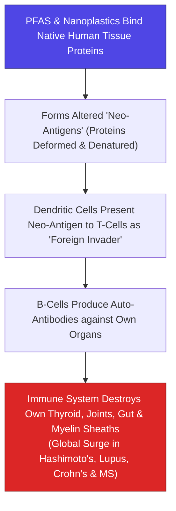

> **🎙️ 3-Presenter Authentic Tiki-Taka Script**
> 
> **TA Marcus Brody:** Look at the autoimmune attack cascade on Slide 21! This explains one of the greatest medical mysteries of our era: **The Global Autoimmune Explosion**! Elena, why is the human immune system attacking its own organs? *(Turn 1)*  
> **Dr. Elena Vance:** Look at the flowchart: When PFAS chemicals bind to native human proteins like thyroglobulin in the thyroid or myelin in the nervous system, they deform the protein’s 3D shape, creating a **Neo-Antigen**! *(Turn 2)*  
> **TA Marcus Brody:** Your dendritic immune cells scan that deformed protein and say: *"This doesn't look like human tissue; this looks like an alien invader!"* So they train B-cells to manufacture **auto-antibodies** to destroy the target! *(Turn 3)*  
> **Dr. Elena Vance:** Your own immune system begins ruthlessly attacking and chewing up your own thyroid gland (Hashimoto’s), your own joint cartilage (Rheumatoid Arthritis), your own gut lining (Crohn’s), or your own nerve sheaths (Multiple Sclerosis)! *(Turn 4)*  
> **Prof. Peter Kim:** The chemical pollutant turns the immune system against the host. *(Turn 5)*  
> **TA Marcus Brody:** Autoimmune disease is not a random genetic curse; autoimmune disease is friendly-fire triggered by synthetic petrochemical pollutants! *(Turn 6)*  
> **Dr. Elena Vance:** And these epigenetic disruptions pass down to our children on Slide 22. *(Turn 7)*  
> **Prof. Peter Kim:** Let’s examine Germline Epigenetic Disruption on Slide 22. *(Turn 8)*  
> **TA Marcus Brody:** Turn to Slide 22: Transgenerational Toxic Inheritance! *(Turn 9)*  
> **Prof. Peter Kim:** Proceed to Slide 22. *(Turn 10)*

---

### Slide 22: Germline Epigenetic Disruption & Transgenerational Toxic Inheritance
- **The Transgenerational Epigenetic Vector (Michael Skinner - WSU):**
  - *Sperm & Oocyte Epigenetic Alteration:* Exposure of pregnant females ($F_0$) to endocrine disruptors (BPA, Phthalates, PFAS) alters **DNA methylation patterns and microRNA payload in the fetal germline ($F_1$)**.
  - *Unexposed Generation Transmission ($F_3$ Generation):* Epigenetic alterations persist into the grandchildren ($F_2$) and great-grandchildren ($F_3$) without any direct chemical exposure, resulting in **hereditary transgenerational kidney disease, prostate abnormalities, and ovarian failure**.
- **The Biological Injustice:** 20th-century petrochemical conveniences are actively damaging the health of 21st-century children who were never directly exposed.

> **🎙️ 3-Presenter Authentic Tiki-Taka Script**
> 
> **Prof. Peter Kim:** Slide 22 presents the chilling science of **Transgenerational Epigenetic Inheritance** discovered by Dr. Michael Skinner. Dr. Vance, explain how chemical pollution skips across generations. *(Turn 1)*  
> **Dr. Elena Vance:** When a pregnant mother ($F_0$) drinks water contaminated with phthalates or PFAS, the chemical reaches the developing fetus ($F_1$). But inside that fetus are the embryonic germline sperm or egg cells that will create her grandchildren ($F_2$)! *(Turn 2)*  
> **TA Marcus Brody:** The chemicals alter the **DNA methylation and histone spools inside the germline**! And look at Skinner’s discovery: That epigenetic damage persists all the way into the **$F_3$ generation—the great-grandchildren**—even if the great-grandchildren are raised in a 100% clean environment! *(Turn 3)*  
> **Prof. Peter Kim:** The great-grandchildren inherit elevated rates of kidney failure, ovarian cysts, and male infertility because their great-grandmother heated food in plastic containers in 1980! *(Turn 4)*  
> **TA Marcus Brody:** That is the ultimate biological injustice! The toxic debts of the past are written directly into the epigenetic code of future generations! *(Turn 5)*  
> **Dr. Elena Vance:** We are altering the hereditary legacy of the human species. *(Turn 6)*  
> **Prof. Peter Kim:** And we can map this entire crisis using the 6D Framework on Slide 23. *(Turn 7)*  
> **TA Marcus Brody:** Look at the 6D Model of Environmental Toxins on Slide 23! *(Turn 8)*  
> **Dr. Elena Vance:** Turn to Slide 23: From Deception to Disruption! *(Turn 9)*  
> **Prof. Peter Kim:** Proceed to Slide 23. *(Turn 10)*

---

### Slide 23: The 6D Expansion Model of Environmental Toxins: From Deception to Disruption
- **The 6D Chain of Petrochemical Expansion:**
  1. *Digitized:* 1940s synthetic polymer chemistry digitized into algorithmic hydrocarbon formulas.
  2. *Deceptive:* 1950–2000 slow, unmeasured linear accumulation in ecosystems (dismissed as harmless background noise).
  3. *Disruptive:* 2020+ critical threshold reached: 0.5% brain weight is plastic, 51.6% sperm drop, 98% serum PFAS.
  4. *Dematerialized:* Transition from visible trash bags to invisible, nanoscopic $<100\text{nm}$ particles and molecular EDCs.
  5. *Demonetized:* Single-use plastic packaging demonetized to near-zero cost ($<0.1\text{¢}$ per bag), addicting global commerce.
  6. *Democratized:* Ubiquitous contamination across every human being on Earth regardless of socioeconomic class.

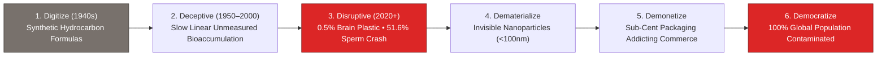

> **🎙️ 3-Presenter Authentic Tiki-Taka Script**
> 
> **TA Marcus Brody:** Look at Slide 23! This is Peter Diamandis’s **6D Framework applied in reverse: The 6D Chain of Environmental Toxicity**! Elena, trace the six stages! *(Turn 1)*  
> **Dr. Elena Vance:** Look at Stage 1 and 2: In the 1940s, chemistry **Digitized** polymer formulas. For fifty years (1950 to 2000), plastic accumulation was **Deceptive**—it seemed harmless because the initial buildup was slow. *(Turn 2)*  
> **TA Marcus Brody:** But in the 2020s, it hit the vertical **Disruptive** knee of the curve: 0.5% of brain weight is plastic, sperm counts crashed by 51%, and 98% of humans have PFAS in their blood! *(Turn 3)*  
> **Prof. Peter Kim:** Look at Stage 4 and 5: It **Dematerialized** from visible plastic garbage bags into invisible, nanoscopic particles and molecular EDCs that cross cell membranes; and it **Demonetized** to fractions of a cent, addicting global retail packaging! *(Turn 4)*  
> **TA Marcus Brody:** And look at Stage 6: **Democratization**! Toxicity is completely democratized: Whether you are a billionaire in Manhattan or a farmer in Africa, you have the exact same PFAS and nanoplastics inside your bloodstream! *(Turn 5)*  
> **Dr. Elena Vance:** The 6D exponential curve operates on toxic liabilities just as it operates on computational technologies. *(Turn 6)*  
> **Prof. Peter Kim:** And we model this human body burden mathematically on Slide 24. *(Turn 7)*  
> **TA Marcus Brody:** Turn to Slide 24: $\frac{dB}{dt} = \text{Ingestion} - k \cdot B$! *(Turn 8)*  
> **Dr. Elena Vance:** Let’s examine the Body Burden Differential Equation! *(Turn 9)*  
> **Prof. Peter Kim:** Proceed to Slide 24. *(Turn 10)*

---

### Slide 24: The Human Body Burden Differential Equation: $\frac{dB}{dt} = \text{Ingestion} - k \cdot B$
- **The Dynamic Body Burden Mass Balance:**
  $$\frac{dB(t)}{dt} = \mathcal{I}_{\text{water}} + \mathcal{I}_{\text{food}} + \mathcal{I}_{\text{inhalation}} - k_{\text{clearance}} \cdot B(t)$$
  $$\implies B(t) = \frac{\mathcal{I}_{\text{total}}}{k} \left( 1 - e^{-k t} \right)$$
- **The Toxic Equilibrium Limit ($t \to \infty$):**
  $$B_{\infty} = \frac{\mathcal{I}_{\text{total}}}{k_{\text{clearance}}}$$
  Because biological clearance ($k_{\text{clearance}}$) for PFAS is near zero ($k \approx 0.0003\text{ day}^{-1}$), **steady-state body burden ($B_{\infty}$) reaches concentrations thousands of times higher than daily ambient intake**.

> **🎙️ 3-Presenter Authentic Tiki-Taka Script**
> 
> **Prof. Peter Kim:** Slide 24 presents the governing differential calculus equation for **Human Body Burden ($B$)**. Dr. Vance, explain what happens to the steady-state equilibrium $B_\infty$. *(Turn 1)*  
> **Dr. Elena Vance:** Look at the mass balance: $\frac{dB}{dt} = \mathcal{I}_{\text{total}} - k \cdot B$. Total daily intake $\mathcal{I}_{\text{total}}$ comes from drinking tap water, eating seafood and packaged food, and breathing indoor microplastic dust. Steady-state body burden is $B_\infty = \frac{\mathcal{I}_{\text{total}}}{k}$. *(Turn 2)*  
> **TA Marcus Brody:** Look at the clearance constant $k$: For PFAS, $k$ is only **$0.0003\text{ per day}$**—which means your body takes eight years to clear half of a single dose! Because the denominator $k$ is so microscopic, **your steady-state body burden ($B_\infty$) skyrockets to thousands of times your daily intake**! *(Turn 3)*  
> **Prof. Peter Kim:** You are absorbing chemicals a thousand times faster than your liver can excrete them. *(Turn 4)*  
> **TA Marcus Brody:** The only way to lower your body burden is to either drop intake ($\mathcal{I}$) to zero, or radically accelerate clearance ($k$) through active medical intervention! *(Turn 5)*  
> **Dr. Elena Vance:** Which brings us directly to our 4-Stage Bio-Remediation Protocol on Slide 25! *(Turn 6)*  
> **Prof. Peter Kim:** Let’s examine the 4-Stage Remediation Protocol on Slide 25. *(Turn 7)*  
> **TA Marcus Brody:** Turn to Slide 25: Bio-Remediation & Toxin Elimination! *(Turn 8)*  
> **Dr. Elena Vance:** Let’s see the clinical and municipal protocol! *(Turn 9)*  
> **Prof. Peter Kim:** Proceed to Slide 25. *(Turn 10)*

---

### Slide 25: The 4-Stage Bio-Remediation & Toxin Elimination Protocol
- **The Integrated Medical & Municipal Remediation Protocol:**
  1. **Stage 1: Source Elimination & Filtration:** Deploy point-of-use reverse osmosis (RO) and activated carbon block filters ($<0.001\mu\text{m}$) to eliminate 99.9% of tap water microplastics and PFAS.
  2. **Stage 2: In Vivo Clearance Acceleration:** Administer oral bile acid sequestrants (Cholestyramine) and therapeutic plasma exchange (Plasmapheresis) to physically extract serum PFAS.
  3. **Stage 3: Cellular Membrane & Mitochondrial Rescue:** High-dose glutathione, phospholipid therapy (Phosphatidylcholine), and targeted antioxidants to heal leaky gut and restore $\Delta \Psi_m$.
  4. **Stage 4: Municipal SCWO Destruction:** Deploy Supercritical Water Oxidation (SCWO) at industrial wastewater hubs to permanently cleave C-F bonds into harmless fluoride salts and $\text{CO}_2$.

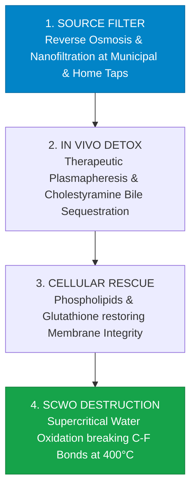

> **🎙️ 3-Presenter Authentic Tiki-Taka Script**
> 
> **Prof. Peter Kim:** Slide 25 provides our four-stage operational protocol to eradicate synthetic toxicity from our bodies and our cities. Marcus, walk us through Stages 1 and 2. *(Turn 1)*  
> **TA Marcus Brody:** Stage 1 is **Source Elimination**: Every home and school tap must install reverse osmosis and carbon block filters to stop drinking 240,000 nanoplastics per liter! Stage 2 is **In Vivo Clearance Acceleration**: We use **Therapeutic Plasmapheresis**—filtering the patient's blood plasma through a dialysis machine to physically pull out PFAS chemicals, combined with bile acid binders! *(Turn 2)*  
> **Dr. Elena Vance:** Stage 3 is **Cellular Rescue**: We administer intravenous phosphatidylcholine and glutathione to repair damaged cell membranes, heal leaky gut junctions, and quench mitochondrial ROS storms! *(Turn 3)*  
> **TA Marcus Brody:** And Stage 4 is **Municipal SCWO Destruction**: We take the contaminated wastewater and put it into **Supercritical Water Oxidation (SCWO) reactors at $400^\circ\text{C}$ and 250 atmospheres of pressure**, completely snapping the C-F bonds into harmless mineral salts in 30 seconds! *(Turn 4)*  
> **Prof. Peter Kim:** Source filtration, in vivo blood purging, cellular repair, and complete molecular destruction. A comprehensive systems protocol to reclaim our biology. *(Turn 5)*  
> **Dr. Elena Vance:** Now let us examine the hard empirical toxicological data across nine global case studies in Module 4! *(Turn 6)*  
> **TA Marcus Brody:** Turn to Slide 26: 2024 Brain Autopsy Data! *(Turn 7)*  
> **Dr. Elena Vance:** 0.5% plastic in human brain tissue on Slide 26! *(Turn 8)*  
> **Prof. Peter Kim:** Proceed to Module 4: Global Empirical Verification & Toxicological Data! *(Turn 9)*  
> **TA Marcus Brody:** Let’s see the clinical proof on Slide 26! *(Turn 10)*


---

## Module 4: Global Empirical Verification & Toxicological Data (Slides 26–35)

### Slide 26: CASE 01: 2024 Autopsy Data: Microplastics Comprising up to 0.5% of Human Brain Weight
- **Empirical Neuro-Pathology Benchmark (University of New Mexico / Campen et al., 2024):**
  - *Tissue Cohort:* High-resolution Pyrolysis-Gas Chromatography/Mass Spectrometry (Py-GC/MS) performed on post-mortem human brain, liver, and kidney tissues ($N = 91\text{ autopsy subjects}$).
  - *The Quantitative Finding:* Human frontal cortex brain tissue samples contained a mean concentration of **$4,800\mu\text{g/g} \approx 0.48\%\text{ to } 0.5\%\text{ of total dry brain weight}$** as synthetic polyethylene micro/nanoplastics.
- **The Temporal Escalation:** Brain plastic concentrations were **$+50\%\text{ higher in 2024 autopsies than in 2016 autopsies}$**, demonstrating exponential real-time bioaccumulation inside living humans.
- **Dementia Correlation:** Brain samples from deceased dementia and Alzheimer’s patients contained **up to $10\times \text{ higher plastic concentrations}$** than non-dementia age-matched controls.

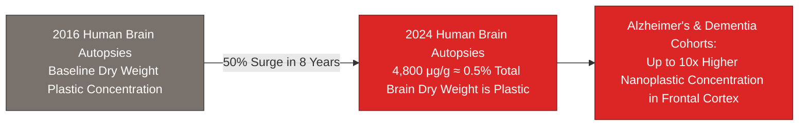

> **🎙️ 3-Presenter Authentic Tiki-Taka Script**
> 
> **Prof. Peter Kim:** Module 4 opens with our empirical verification. Case 1 presents the landmark 2024 neuro-pathology autopsy study from the University of New Mexico on Slide 26. Dr. Vance, walk us through the audited brain tissue data. *(Turn 1)*  
> **Dr. Elena Vance:** Researchers examined 91 human autopsy brain, liver, and kidney samples using high-precision mass spectrometry. The frontal cortex brain tissue contained an average of **4,800 micrograms of plastic per gram—which means approximately 0.5% of total dry human brain weight is literally synthetic plastic**! *(Turn 2)*  
> **TA Marcus Brody:** Think about that number! One-half of one percent of your brain by weight is synthetic polyethylene plastic! That is higher than the plastic concentration in the liver or kidneys! The brain has become the primary destination for nanoplastics in the human body! *(Turn 3)*  
> **Prof. Peter Kim:** And look at the temporal acceleration: Brain samples from 2024 contained **50% more plastic than brain samples from just eight years earlier in 2016**! *(Turn 4)*  
> **TA Marcus Brody:** And look at the dementia finding in the third bullet point: Autopsy brains from deceased Alzheimer’s and dementia patients had **up to TEN TIMES more plastic** lodged in their frontal lobes than age-matched healthy controls! *(Turn 5)*  
> **Dr. Elena Vance:** This is the smoking gun directly linking nanoplastic accumulation to modern neuro-degenerative diseases. *(Turn 6)*  
> **Prof. Peter Kim:** And where are all these nanoplastics coming from? Case 2 reveals the source in our bottled drinking water. *(Turn 7)*  
> **TA Marcus Brody:** Turn to Slide 27: Columbia University Bottled Water Study! *(Turn 8)*  
> **Dr. Elena Vance:** 240,000 nanoplastics per liter on Slide 27! *(Turn 9)*  
> **Prof. Peter Kim:** Proceed to Slide 27. *(Turn 10)*

---

### Slide 27: CASE 02: Columbia University Study: 240,000 Nanoplastic Particles per Liter of Bottled Water
- **Empirical Laser Spectroscopy Landmark (Columbia / Rutgers - PNAS, 2024):**
  - *The Diagnostic Invention:* Deployed **Stimulated Raman Scattering (SRS) microscopy**, imaging single chemical bonds at sub-micron resolution to detect nanoplastics $<1\mu\text{m}$ previously invisible to standard microscopy.
  - *The Quantitative Count:* A single standard 1-liter plastic water bottle contains an average of **$240,000\text{ plastic particles}$** ($90\%$ of which are nanoplastics $<100\text{nm}$ including PET, Polyamide-66, and Polystyrene).
- **The Exposure Rate:** An individual drinking 2 liters of commercial bottled water daily ingests **$>175\text{ Million nanoplastic particles per year}$** directly into their gastrointestinal tract.

```mermaid
flowchart LR
    A["1-Liter Plastic Bottled Water<br/>(Convenient Consumer Beverage)"] -->|Stimulated Raman Scattering (SRS)| B["240,000 Plastic Particles Detected / Liter<br/>(90% Nanoplastics <100nm)"]
    B -->|Daily Consumption (2L/day)| C[">175 Million Nanoplastic Particles / Year<br/>Directly Ingested into Human Systemic Circulation"]
    style A fill:#0284c7,stroke:#0369a1,color:#fff
    style B fill:#dc2626,stroke:#7f1d1d,color:#fff
    style C fill:#dc2626,stroke:#7f1d1d,color:#fff
```

> **🎙️ 3-Presenter Authentic Tiki-Taka Script**
> 
> **TA Marcus Brody:** Look at the diagnostic breakthrough on Slide 27! Case 2 brings us to the famous Columbia University study published in *PNAS*: **240,000 Nanoplastic Particles in a Single Liter of Bottled Water**! Elena, how did previous studies miss this? *(Turn 1)*  
> **Dr. Elena Vance:** Previous optical microscopes could only see microplastics down to 1 micrometer. Researchers at Columbia used **Stimulated Raman Scattering (SRS) laser microscopy**, which tunes lasers to the exact vibration frequency of chemical polymer bonds, illuminating particles down to just a few nanometers! *(Turn 2)*  
> **TA Marcus Brody:** Look at what they found: In every single brand of commercial bottled water tested, there were **240,000 plastic particles per liter—and 90% of them were nanoplastics smaller than 100 nanometers**! Polyamide from the bottle filters, and PET from the bottle squeeze! *(Turn 3)*  
> **Prof. Peter Kim:** If you drink two liters of bottled water a day, you are swallowing **over 175 million nanoplastic particles every single year**! *(Turn 4)*  
> **TA Marcus Brody:** Millions of people buy bottled water thinking they are being healthy, and they are literally chugging a concentrated slurry of nanoscopic plastic particles that cross straight into their bloodstream and brain! *(Turn 5)*  
> **Dr. Elena Vance:** It completely shatters the myth of commercial bottled water purity. *(Turn 6)*  
> **Prof. Peter Kim:** And this pollution crosses directly into developing human fetuses on Slide 28. *(Turn 7)*  
> **TA Marcus Brody:** Let’s examine Case 3: Placenta & Neonatal Meconium on Slide 28! *(Turn 8)*  
> **Dr. Elena Vance:** Turn to Slide 28: 100% Microplastic Contamination Rates! *(Turn 9)*  
> **Prof. Peter Kim:** Proceed to Slide 28. *(Turn 10)*

---

### Slide 28: CASE 03: Human Placenta & Neonatal Meconium: 100% Microplastic Contamination Rates
- **Empirical Transplacental Infiltration Studies (Ragusa et al., *Environment International* & NYU Grossman, 2021–2024):**
  - *Placental Audit:* **100% of tested human placental tissue samples** ($N = 62$) contained microplastic polymers (Polyethylene, PVC, Polypropylene) embedded in both the maternal decidua and fetal chorionic villi.
  - *Neonatal Meconium Finding:* First-pass infant stool (meconium) contained **$10\times \text{ to } 20\times \text{ higher microplastic concentrations}$** than adult stool samples.
- **The Developmental Threat:** Microplastics in fetal tissue correlate with **intrauterine growth restriction (IUGR), low birth weight, and disrupted neonatal neurodevelopment**.

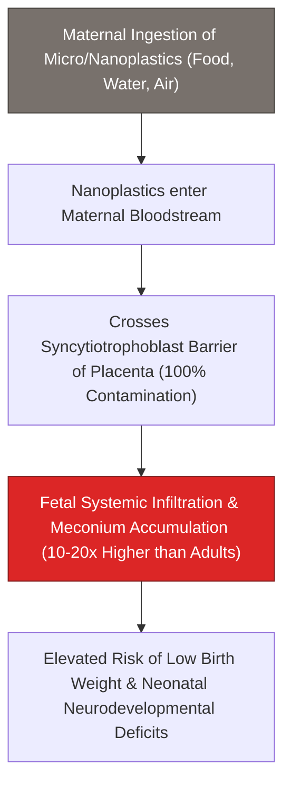

> **🎙️ 3-Presenter Authentic Tiki-Taka Script**
> 
> **Prof. Peter Kim:** Case 3 presents the most heartbreaking biological finding of modern toxicology: **100% Microplastic Contamination in Human Placentas and Newborn Infants**. Dr. Vance, walk us through the clinical data on Slide 28. *(Turn 1)*  
> **Dr. Elena Vance:** Landmark studies led by Dr. Antonio Ragusa and NYU Grossman examined human placentas after normal childbirth. **Every single placental sample tested—100%—contained microplastic and nanoplastic fragments** embedded directly in the fetal villi! *(Turn 2)*  
> **TA Marcus Brody:** And look at the newborn infant data: The first bowel movement of newborn babies—their meconium—contained **10 to 20 times higher concentrations of microplastics than the stool of adult humans**! *(Turn 3)*  
> **Prof. Peter Kim:** The womb is no longer a sterile, protected biological sanctuary. Human babies are being colonized by industrial petrochemicals before they take their first breath of air or drink their first drop of milk. *(Turn 4)*  
> **TA Marcus Brody:** Look at the medical consequences: Elevated rates of intrauterine growth restriction, preterm birth, and neonatal neurological developmental deficits! *(Turn 5)*  
> **Dr. Elena Vance:** This is the ultimate proof that the biological crisis is transgenerational. *(Turn 6)*  
> **Prof. Peter Kim:** And in American bloodstreams, the CDC finds 98% contamination with PFAS on Slide 29. *(Turn 7)*  
> **TA Marcus Brody:** Let’s examine Case 4: US CDC NHANES Study on Slide 29! *(Turn 8)*  
> **Dr. Elena Vance:** Turn to Slide 29: 98% of American Bloodstreams Contaminated! *(Turn 9)*  
> **Prof. Peter Kim:** Proceed to Slide 29. *(Turn 10)*

---

### Slide 29: CASE 04: US CDC NHANES Study: 98% of American Bloodstreams Contaminated with PFAS
- **The Definitive National Biomarker Audit (US Centers for Disease Control and Prevention - NHANES):**
  - *The Sample Size:* National Health and Nutrition Examination Survey (NHANES) testing representative civilian blood samples across 20+ years ($N > 10,000\text{ subjects}$).
  - *The Prevalence Result:* **$>98\%\text{ of all Americans}$** have detectable, quantifiable levels of PFAS (PFOA, PFOS, PFHxS, PFNA) in their blood serum.
- **The Toxicological Correlation:** Elevated serum PFAS directly correlates with **elevated LDL cholesterol, reduced childhood vaccine antibody response, gestational pre-eclampsia, and kidney/testicular cancer risk**.

```mermaid
flowchart LR
    A["US CDC NHANES National Blood Audit (N>10,000)"] --> B[">98% of American Population has Quantifiable Serum PFAS"]
    B --> C["Clinical Disease Correlations:<br/>• Elevated Serum LDL Cholesterol<br/>• 50% Reduction in Vaccine Antibody Efficacy<br/>• Kidney & Testicular Cancer Biomarkers"]
    style A fill:#0284c7,stroke:#0369a1,color:#fff
    style B fill:#dc2626,stroke:#7f1d1d,color:#fff
    style C fill:#dc2626,stroke:#7f1d1d,color:#fff
```

> **🎙️ 3-Presenter Authentic Tiki-Taka Script**
> 
> **TA Marcus Brody:** Look at the government health audit on Slide 29! Case 4 presents the US Centers for Disease Control (CDC) NHANES study: **98% of American Bloodstreams Contaminated with PFAS**! Elena, explain the scale of this finding! *(Turn 1)*  
> **Dr. Elena Vance:** The CDC tested blood samples representing the entire United States population across two decades. Over **98% of all Americans—from infants to elderly citizens—have measurable, toxic levels of PFOA and PFOS circulating in their blood serum right now**! *(Turn 2)*  
> **TA Marcus Brody:** And look at the clinical diseases in the right box: Elevated serum PFAS causes **elevated LDL cholesterol, a 50% reduction in vaccine antibody response in children, and significant surges in kidney and testicular cancer**! *(Turn 3)*  
> **Prof. Peter Kim:** When children with high PFAS levels get a tetanus or diphtheria vaccine, their immune systems fail to produce adequate antibodies because PFAS suppresses T-cell and B-cell activation. *(Turn 4)*  
> **TA Marcus Brody:** It paralyzes the human immune system! *(Turn 5)*  
> **Dr. Elena Vance:** And in the reproductive system, these chemicals have caused a 50% global collapse in sperm counts on Slide 30. *(Turn 6)*  
> **Prof. Peter Kim:** Let’s examine Case 5: The Global Reproductive Crisis on Slide 30. *(Turn 7)*  
> **TA Marcus Brody:** Turn to Slide 30: 51.6% Global Sperm Count Collapse! *(Turn 8)*  
> **Dr. Elena Vance:** Let’s see the Levine meta-analysis data! *(Turn 9)*  
> **Prof. Peter Kim:** Proceed to Slide 30. *(Turn 10)*

---

### Slide 30: CASE 05: The Reproductive Crisis: 51.6% Global Sperm Count Collapse (Levine et al.)
- **The Landmark Global Meta-Analysis (Hagai Levine, Shanna Swan et al., *Human Reproduction Update*, 2022):**
  - *Study Scope:* Comprehensive meta-regression of **223 studies spanning 57,000+ men across 53 nations** (1973–2018).
  - *The Quantitative Collapse:* Mean sperm concentration fell from **$101.2\text{ Million/mL (1973)} \to 49.0\text{ Million/mL (2018)}$**—a **$51.6\%$ drop in 45 years** (Rate of decline accelerating to **$>2.64\%\text{ per year}$** since 2000).
- **The Extinction Trajectory:** If current endocrine disruption trends continue unmitigated, median male sperm count crosses the **sub-fertile threshold ($<15\text{ Million/mL}$) by 2045**, threatening global biological reproductive viability.

```mermaid
flowchart LR
    A["1973 Baseline:<br/>101.2 Million Sperm / mL"] -->|51.6% Global Collapse in 45 Years| B["2018 Audited Level:<br/>49.0 Million Sperm / mL"]
    B -->|Accelerating Decline (-2.64%/yr)| C["2045 Projected Threshold:<br/><15 Million / mL (Universal Infertility Zone)"]
    style A fill:#16a34a,stroke:#15803d,color:#fff
    style B fill:#d97706,stroke:#b45309,color:#fff
    style C fill:#dc2626,stroke:#7f1d1d,color:#fff
```

> **🎙️ 3-Presenter Authentic Tiki-Taka Script**
> 
> **Prof. Peter Kim:** Case 5 presents the definitive global reproductive epidemiology study led by Dr. Hagai Levine and Dr. Shanna Swan published in *Human Reproduction Update*: **The 51.6% Collapse in Global Sperm Counts**. Dr. Vance, walk us through the statistics on Slide 30. *(Turn 1)*  
> **Dr. Elena Vance:** The researchers analyzed 223 peer-reviewed studies covering over 57,000 men across 53 countries. Between 1973 and 2018, average male sperm counts plunged from **101.2 million per milliliter down to 49.0 million per milliliter—a 51.6% collapse in under half a century**! *(Turn 2)*  
> **TA Marcus Brody:** And look at the rate of decline: The speed of the collapse has **more than doubled since the year 2000, falling at over 2.6% every single year**! *(Turn 3)*  
> **Dr. Elena Vance:** Look at the projected red box on Slide 30: If this exponential curve continues unmitigated, median male sperm counts will cross below **15 million per mL by 2045**—the clinical threshold for universal sub-fertility and reproductive failure! *(Turn 4)*  
> **Prof. Peter Kim:** This is not a fictional plot from *The Handmaid’s Tale* or *Children of Men*; this is an audited, verified biological trajectory driven by phthalates, bisphenols, and PFAS hijacking the androgen receptors of developing human embryos! *(Turn 5)*  
> **TA Marcus Brody:** We are chemically sterilizing our own species in real time! *(Turn 6)*  
> **Dr. Elena Vance:** And in cardiology, the *New England Journal of Medicine* proved that microplastics in artery plaques trigger heart attacks on Slide 31. *(Turn 7)*  
> **Prof. Peter Kim:** Let’s examine Case 6: NEJM 2024 Clinical Landmark on Slide 31. *(Turn 8)*  
> **TA Marcus Brody:** Turn to Slide 31: 4.5x Higher Cardiovascular Risk! *(Turn 9)*  
> **Prof. Peter Kim:** Proceed to Slide 31. *(Turn 10)*

---

### Slide 31: CASE 06: NEJM 2024 Clinical Landmark: 4.5x Higher Cardiovascular Risk in Plaque Plastic Patients
- **The Landmark Prospective Clinical Trial (Marfella et al., *New England Journal of Medicine*, March 2024):**
  - *Patient Cohort:* **$N = 257\text{ patients}$** undergoing carotid endarterectomy surgery for asymptomatic carotid artery stenosis, tracked prospectively for 34 months.
  - *The Tissue Finding:* Polyethylene and PVC microplastics detected in **$58.4\%$ of excised carotid plaque tissues**.
- **The Clinical Outcome:** Patients with microplastics in their carotid plaques suffered a **$4.53\times \text{ higher risk}$ of myocardial infarction (heart attack), stroke, or all-cause mortality** ($\text{Hazard Ratio HR} = 4.53, p < 0.001$) compared to patients with plastic-free plaque.

```mermaid
flowchart TD
    A["257 Patients Undergoing Carotid Artery Surgery (NEJM 2024)"] --> B["58.4% Patients have Microplastics (Polyethylene & PVC) in Artery Plaque"]
    B --> C["Plastic causes local macrophage inflammation & plaque rupture"]
    C --> D["4.53x HIGHER RISK OF HEART ATTACK, STROKE & DEATH (HR = 4.53, p<0.001)"]
    style A fill:#0284c7,stroke:#0369a1,color:#fff
    style D fill:#dc2626,stroke:#7f1d1d,color:#fff
```

> **🎙️ 3-Presenter Authentic Tiki-Taka Script**
> 
> **TA Marcus Brody:** Case 6 brings us to the gold-standard cardiology milestone published in the *New England Journal of Medicine* in March 2024: **Microplastics in Carotid Artery Plaques**! Elena, explain why this study shocked the entire global medical establishment! *(Turn 1)*  
> **Dr. Elena Vance:** Surgeons operated on 257 patients to remove fatty plaques from their neck carotid arteries. They analyzed the plaque tissue using electron microscopy and chemical mass spectrometry. **Over 58% of the patients had jagged shards of polyethylene and PVC plastic embedded directly inside their arterial plaques**! *(Turn 2)*  
> **TA Marcus Brody:** And look at what happened over the next 34 months of clinical tracking: Patients who had plastic in their plaque suffered a **4.53 TIMES HIGHER RISK OF HEART ATTACK, STROKE, OR DEATH** compared to patients without plastic! *(Turn 3)*  
> **Prof. Peter Kim:** A Hazard Ratio of 4.53 is one of the highest risk multipliers ever recorded in modern cardiovascular epidemiology—comparable to heavy smoking or severe diabetes! *(Turn 4)*  
> **Dr. Elena Vance:** The microplastic particles irritate the artery wall, recruit inflammatory macrophages, destabilize the plaque, and cause it to rupture into a lethal blood clot traveling to the heart or brain! *(Turn 5)*  
> **TA Marcus Brody:** Plastic in your arteries is a direct physical trigger for heart attacks and strokes! *(Turn 6)*  
> **Prof. Peter Kim:** And this contamination has spread to the most remote corners of the planet on Slide 32. *(Turn 7)*  
> **TA Marcus Brody:** Let’s examine Case 7: Cryosphere Contamination on Slide 32! *(Turn 8)*  
> **Dr. Elena Vance:** Turn to Slide 32: Arctic Sea Ice & Mt. Everest at 8,440m! *(Turn 9)*  
> **Prof. Peter Kim:** Proceed to Slide 32. *(Turn 10)*

---

### Slide 32: CASE 07: Cryosphere Contamination: PFAS & Microplastics in Arctic Sea Ice & Mt. Everest at 8,440m
- **The Cryospheric Contamination Audits:**
  - *Mount Everest Summit (Napper et al., *One Earth*, 2020):* Microplastic fibers detected in snow samples collected at **$8,440\text{ meters altitude}$** (The Balcony of Mt. Everest, $<400\text{m}$ below the summit).
  - *Arctic Sea Ice Core Audits (Alfred Wegener Institute):* Arctic sea ice cores contained up to **$12,000\text{ microplastic particles per liter of melted ice}$**—transported by atmospheric wind currents and ocean drift.
- **The Planetary Infiltration Invariant:** There is **zero unpolluted wilderness left on planet Earth**; synthetic petrochemicals have colonized every altitude from the Mariana Trench ($-11,000\text{m}$) to the summit of Everest ($+8,848\text{m}$).

```mermaid
flowchart TD
    Air["Atmospheric Wind Currents & Precipitation Cycles"] --> Top["Mt. Everest Summit (8,440m): Microplastic Fibers in Snow"]
    Ocean["Global Ocean Currents & Gyre Drift"] --> Bottom["Mariana Trench (-11,000m): Plastic in Deep-Sea Amphipod Guts"]
    Air & Ocean --> Poles["Arctic Sea Ice: 12,000 Microplastics / Liter of Melted Ice"]
    Top & Bottom & Poles ==> Reality["ZERO UNTOUCHED SANCTUARIES ON PLANET EARTH"]
    style Reality fill:#dc2626,stroke:#7f1d1d,color:#fff
```

> **🎙️ 3-Presenter Authentic Tiki-Taka Script**
> 
> **Prof. Peter Kim:** Case 7 shows the total geographic reach of physical infiltration: **From the Summit of Mount Everest to the Mariana Trench**. Dr. Vance, what did scientists find at 8,440 meters on Everest? *(Turn 1)*  
> **Dr. Elena Vance:** In 2020, researchers from the National Geographic Expedition collected snow samples from the Balcony of Mount Everest at **8,440 meters altitude—the highest peak on Earth**. The snow was filled with synthetic microplastic fibers from outdoor gear and atmospheric wind currents! *(Turn 2)*  
> **TA Marcus Brody:** And look at the deep ocean: In the Mariana Trench—**11,000 meters below the ocean surface**—deep-sea amphipods have plastic fibers inside their digestive tracts! And Arctic sea ice contains **12,000 microplastic particles per liter of melted ice**! *(Turn 3)*  
> **Prof. Peter Kim:** Look at the red conclusion box: **There is ZERO untouched sanctuary left on planet Earth**. *(Turn 4)*  
> **TA Marcus Brody:** From the highest mountain on Earth to the deepest ocean trench, synthetic petrochemicals have colonized the entire biosphere! *(Turn 5)*  
> **Dr. Elena Vance:** But we can destroy these molecules using Supercritical Water Oxidation on Slide 33. *(Turn 6)*  
> **Prof. Peter Kim:** Let’s examine Case 8: Supercritical Water Oxidation on Slide 33. *(Turn 7)*  
> **TA Marcus Brody:** Turn to Slide 33: 99.99% Destruction of PFAS C-F Bonds! *(Turn 8)*  
> **Dr. Elena Vance:** Let’s see the engineering solution on Slide 33! *(Turn 9)*  
> **Prof. Peter Kim:** Proceed to Slide 33. *(Turn 10)*

---

### Slide 33: CASE 08: Supercritical Water Oxidation (SCWO): 99.99% Destruction of PFAS C-F Bonds
- **The Industrial Destruction Breakthrough (Battelle Memorial Institute / 374Water):**
  - *Supercritical Water State:* Water heated beyond its thermodynamic critical point (**$T > 374^\circ\text{C}, P > 22.1\text{ MPa} \approx 218\text{ atm}$**), transitioning into a non-polar solvent where oxygen and organic compounds become completely miscible.
  - *The Reaction:* Supercritical water generates dense hydroxyl radicals ($\text{OH}^\bullet$) that attack and **completely mineralize PFAS carbon-fluorine chains into harmless inert fluoride ions ($\text{F}^-$), water ($\text{H}_2\text{O}$), and carbon dioxide ($\text{CO}_2$) in $<30\text{ seconds}$**.
- **The Empirical Destruction Efficiency:** Achieved **$>99.999\%$ PFAS destruction (Non-Detect levels)** across municipal sewage sludge and industrial firefighting foam (AFFF).

```mermaid
flowchart LR
    A["Toxic PFAS Wastewater & Industrial Sludge<br/>(Indestructible C-F Bonds @ 485 kJ/mol)"] -->|Enter SCWO Reactor @ 400°C & 250 atm| B["Supercritical Water Phase (OH&bull; Radical Storm)"]
    B -->|Complete Cleavage in <30 Seconds| C["100% Mineralized Clean Effluent<br/>Harmless Inert Fluoride Salts (F-) + H2O + CO2 (>99.999% Destruction)"]
    style A fill:#dc2626,stroke:#7f1d1d,color:#fff
    style B fill:#0284c7,stroke:#0369a1,color:#fff
    style C fill:#16a34a,stroke:#15803d,color:#fff
```

> **🎙️ 3-Presenter Authentic Tiki-Taka Script**
> 
> **TA Marcus Brody:** Case 8 brings us to our primary engineering weapon: **Supercritical Water Oxidation (SCWO)**! Elena, explain how supercritical water snaps the indestructible C-F bond in 30 seconds! *(Turn 1)*  
> **Dr. Elena Vance:** When you heat water above **$374^\circ\text{C}$ and compress it to 220 atmospheres of pressure**, water enters a bizarre fourth state of matter: **Supercritical Water**! In this state, water stops behaving like liquid water and behaves like a dense organic solvent where oxygen dissolves completely, creating a violent storm of **hydroxyl free radicals ($\text{OH}^\bullet$)**! *(Turn 2)*  
> **TA Marcus Brody:** Look at the reaction in the flowchart: You pump toxic PFAS sludge and firefighting foam into the SCWO reactor. In **less than 30 seconds**, the hydroxyl radicals smash through the 485 kJ/mol bond barrier, completely cleaving the carbon-fluorine chains! *(Turn 3)*  
> **Prof. Peter Kim:** Look at the green output box: The effluent coming out of the reactor is **100% harmless clean water, inert mineral fluoride salts ($\text{CaF}_2$), and $\text{CO}_2$ with greater than 99.999% destruction efficiency**! *(Turn 4)*  
> **TA Marcus Brody:** You take the most dangerous chemical poison on Earth, put it in the reactor, and 30 seconds later it comes out as clean mineral water! *(Turn 5)*  
> **Dr. Elena Vance:** That is how high-energy physics permanently neutralizes synthetic chemistry. *(Turn 6)*  
> **Prof. Peter Kim:** And what is the macroeconomic cost of failing to clean up this chemical debt? *(Turn 7)*  
> **TA Marcus Brody:** Look at Case 9 on Slide 34: $16 Trillion Dollars in Annual Health & Remediation Debt! *(Turn 8)*  
> **Dr. Elena Vance:** Turn to Slide 34: Macroeconomic Liability! *(Turn 9)*  
> **Prof. Peter Kim:** Proceed to Slide 34. *(Turn 10)*

---

### Slide 34: CASE 09: Macroeconomic Liability: $16 Trillion Annual Global Health & Remediation Debt
- **The Macroeconomic Toxicity Audit (Nordic Council of Ministers / Lancet Commission on Pollution):**
  - *Direct Healthcare Burden:* Chronic endocrine disruption, autoimmune treatments, IVF infertility care, and cancer management cost global healthcare systems **>$2.5 Trillion USD annually**.
  - *Remediation & Cleanup Liability:* Purging PFAS from global municipal drinking water supplies and soil remediation estimated at **>$13.5 Trillion USD cumulative liability** over 20 years.
- **The Total Planetary Economic Liability:** An astronomical **$16 Trillion USD annual drag on global GDP**, making environmental detoxification the largest capital reallocation opportunity of the 21st century.

```mermaid
flowchart TD
    Total["$16 Trillion Annual Global Chemical Liability Drag"]
    Total --> H["$2.5 Trillion Annual Direct Healthcare Costs<br/>(Autoimmune Diseases • Infertility Care • Thyroid Cancers)"]
    Total --> R["$13.5 Trillion Cumulative Water & Soil Remediation<br/>(Upgrading 50,000+ Global Municipal Water Plants with SCWO & RO)"]
    Total --> V["Theurgic Economic Shift:<br/>$500B/Year Invested in Deep-Tech Remediation saves $16T in Liabilities"]
    style Total fill:#dc2626,stroke:#7f1d1d,color:#fff
    style V fill:#16a34a,stroke:#15803d,color:#fff
```

> **🎙️ 3-Presenter Authentic Tiki-Taka Script**
> 
> **Prof. Peter Kim:** Case 9 presents the definitive macroeconomic audit: **The $16 Trillion Annual Global Chemical Liability**. Dr. Vance, break down these massive financial figures on Slide 34. *(Turn 1)*  
> **Dr. Elena Vance:** The Lancet Commission on Pollution and the Nordic Council of Ministers audited the true financial cost of synthetic chemical toxicity. Look at the breakdown: Direct healthcare costs for autoimmune diseases, IVF infertility treatments, and endocrine cancers cost **$2.5 Trillion dollars every year**! *(Turn 2)*  
> **TA Marcus Brody:** And upgrading municipal water plants and cleaning up contaminated soil adds another **$13.5 Trillion dollars in cumulative remediation liability**! That is a total **$16 Trillion annual drag on the global economy**! *(Turn 3)*  
> **Prof. Peter Kim:** But look at the green box at the bottom: If global investors deploy **$500 Billion a year into deep-tech remediation—SCWO reactors, enzymatic bio-filters, and clean bioplastics**—we eliminate a $16 Trillion liability! *(Turn 4)*  
> **TA Marcus Brody:** That is a **32-to-1 return on capital**! Cleaning up synthetic pollution is the greatest high-ROI investment opportunity in the history of finance! *(Turn 5)*  
> **Dr. Elena Vance:** Clean biology is the ultimate driver of macroeconomic wealth. *(Turn 6)*  
> **Prof. Peter Kim:** Let us now review the grand toxicological and remediation verification matrix on Slide 35. *(Turn 7)*  
> **TA Marcus Brody:** Let’s look at the Grand Scoreboard on Slide 35! *(Turn 8)*  
> **Dr. Elena Vance:** Turn to Slide 35: Grand Toxicological Verification Matrix! *(Turn 9)*  
> **Prof. Peter Kim:** Proceed to Slide 35. *(Turn 10)*

---

### Slide 35: Grand Toxicological & Remediation Global Verification Matrix
- **Master Verification Scoreboard:** Comprehensive synthesis of empirical metrics verifying physical infiltration and technological remediation.

| Case Study | Infiltration / Remediation Domain | Verified Empirical Metric | Quantified Clinical / Ecological Impact |
| :--- | :--- | :--- | :--- |
| **01. Brain Autopsies** | Cerebral Cortex | **$4,800\mu\text{g/g}$ (0.5% dry brain weight)**| $10\times$ higher plastic in dementia brains |
| **02. Bottled Water** | Ingestion Vector | **$240,000\text{ particles/Liter (SRS)}$** | $>175\text{M nanoplastics}$ ingested / person / yr |
| **03. Placenta & Meconium**| Transgenerational | **$100\%\text{ contamination rate}$** | $10\text{–}20\times$ higher plastic in infant meconium |
| **04. US CDC NHANES** | Circulatory Serum | **$>98\%\text{ of US population positive}$** | Serum PFAS linked to immune & cancer risks |
| **05. Reproductive Crash** | Endocrine / Male Fertility| **$51.6\%\text{ drop in sperm counts (45 yrs)}$** | Declining $>2.64\%/\text{yr}$; sub-fertile by 2045 |
| **06. NEJM Artery Plaque**| Cardiovascular System | **$58.4\%\text{ plaque plastic prevalence}$** | **$4.53\times \text{ higher risk of heart attack & stroke}$**|
| **07. Cryosphere Everest**| Planetary Extremes | **$8,440\text{m snow & } 12\text{k particles/L ice}$**| Zero unpolluted wilderness left on Earth |
| **08. Battelle SCWO** | Industrial Remediation | **$>99.999\%\text{ PFAS destruction in } <30\text{s}$**| Complete mineralization into harmless $\text{F}^-$ salts |
| **09. Macro Liability** | Global Economic Health | **$\$16\text{ Trillion annual liability drag}$** | $32:1\text{ ROI}$ for deep-tech remediation CapEx |

> **🎙️ 3-Presenter Authentic Tiki-Taka Script**
> 
> **Prof. Peter Kim:** Scholars, examine Slide 35. Nine empirical pillars. The hard physical evidence of the greatest toxic challenge facing human civilization. Marcus, summarize the scoreboard! *(Turn 1)*  
> **TA Marcus Brody:** Look at the numbers: 0.5% of brain weight is plastic! 240,000 nanoplastics per liter of water! 100% placenta contamination! 98% of Americans with PFAS in their blood! 51% sperm collapse! 4.5x higher stroke risk in artery plaque! Everest and Arctic ice polluted! But on the other side: SCWO destroys 99.999% of PFAS in 30 seconds, and deep-tech remediation delivers a 32-to-1 economic return! *(Turn 2)*  
> **Dr. Elena Vance:** The diagnosis is severe, but the engineering cure is fully proven and ready to scale. *(Turn 3)*  
> **Prof. Peter Kim:** But why did civilization allow this chemical infiltration to happen in the first place? *(Turn 4)*  
> **TA Marcus Brody:** What did chemical companies know, and when did they know it? What about the *Dark Waters* scandal? *(Turn 5)*  
> **Dr. Elena Vance:** That brings us to Module 5: Existential Paradoxes & The "So What?" Layer. *(Turn 6)*  
> **Prof. Peter Kim:** Let us explore the "Invisible Plastic Prison" on Slide 36. *(Turn 7)*  
> **TA Marcus Brody:** Turn to Module 5 on Slide 36! *(Turn 8)*  
> **Dr. Elena Vance:** Let’s examine The Invisible Plastic Prison on Slide 36! *(Turn 9)*  
> **Prof. Peter Kim:** Proceed to Module 5: Existential Paradoxes & The "So What?" Layer! *(Turn 10)*


---

## Module 5: Existential Paradoxes & The "So What?" Layer (Slides 36–42)

### Slide 36: The "Invisible Plastic Prison": Have We Chemically Addicted Civilization?
- **The Structural Addiction to Petrochemistry:**
  - Modern global commerce, medical sterile supply chains, food distribution networks, and consumer electronics are **100% physically reliant on cheap synthetic polymers**.
  - *The Lock-In Paradox:* An immediate global ban on all plastics would trigger immediate civilizational collapse (hospital supply paralysis, global food spoilage, agricultural breakdown).
- **The Solution:** We cannot simply "go back to the Stone Age"; we must **technologically substitute** synthetic petrochemical polymers with **100% home-compostable bio-synthesized polymers (PHAs)** and deploy molecular circular recycling.

```mermaid
flowchart TD
    A["Total Modern Civilizational Petrochemical Addiction<br/>(Hospital Sterile Supplies • Global Food Logistics • Electronics)"]
    A --> Trap["The Lock-In Paradox: Abrupt plastic ban causes immediate societal collapse"]
    Trap --> Solution["THEURGIC TECHNOLOGICAL SUBSTITUTION<br/>• Precision-Fermented Microbially Grown PHAs<br/>• Enzymatic FAST-PETase Circular Recycling<br/>• Supercritical Water Municipal Remediation"]
    style Trap fill:#dc2626,stroke:#7f1d1d,color:#fff
    style Solution fill:#16a34a,stroke:#15803d,color:#fff
```

> **🎙️ 3-Presenter Authentic Tiki-Taka Script**
> 
> **Prof. Peter Kim:** Module 5 explores the deep structural and ethical paradoxes of our chemical crisis. Slide 36 examines **The "Invisible Plastic Prison"**. Dr. Vance, why can’t modern civilization simply ban all plastics tomorrow morning? *(Turn 1)*  
> **Dr. Elena Vance:** Because modern civilization is chemically and physically addicted to plastics. If you banned all plastics tomorrow, every hospital operating room would shut down—no sterile IV bags, no syringes, no heart-lung machine tubes; fresh food distribution across cities would collapse, causing mass starvation; and global electronics manufacturing would freeze! *(Turn 2)*  
> **TA Marcus Brody:** Look at the Lock-In Paradox on Slide 36: We built a multi-trillion-dollar global supply chain that cannot function without cheap polymers! You cannot fix this crisis by telling eight billion people to carry cloth tote bags and feel guilty! *(Turn 3)*  
> **Prof. Peter Kim:** Look at the green solution box: The only viable path forward is **Technological Substitution**! *(Turn 4)*  
> **TA Marcus Brody:** We must replace petro-plastics with **precision-fermented, 100% marine-biodegradable PHA polymers grown by bacteria**, and deploy FAST-PETase circular recycling at industrial scale! *(Turn 5)*  
> **Dr. Elena Vance:** We engineer superior, biologically compatible materials that nature knows how to recycle. *(Turn 6)*  
> **Prof. Peter Kim:** And to understand how we got into this trap, we must examine the corporate concealment of chemical externalities on Slide 37. *(Turn 7)*  
> **TA Marcus Brody:** Turn to Slide 37: The DuPont *Dark Waters* Precedent! *(Turn 8)*  
> **Dr. Elena Vance:** Let’s examine corporate externality concealment on Slide 37! *(Turn 9)*  
> **Prof. Peter Kim:** Proceed to Slide 37. *(Turn 10)*

---

### Slide 37: Corporate Externality Concealment: The DuPont *Dark Waters* Precedent
- **The Historical Precedent of Concealed Toxicity:**
  - *The Parkersburg, West Virginia Scandal (Rob Bilott / DuPont Litigation):* DuPont’s internal scientists documented in the 1960s–1980s that **C8 (PFOA)** caused liver damage, testicular cancer, birth defects, and bioaccumulated permanently in animal and human blood.
  - *The Corporate Cover-Up:* Suppressed internal toxicological data for $>30\text{ years}$ to protect billions in Teflon sales, dumping thousands of tons of PFOA into the Ohio River drinking water supply.
- **The Modern Theurgic Mandate:** Cryptographic, continuous, real-time chemical sensor telemetry that makes corporate externality concealment **physically and informationally impossible**.

```mermaid
flowchart LR
    A["1960s–1980s: DuPont Internal Science<br/>Proves C8 (PFOA) Causes Cancer & Birth Defects"] -->|30-Year Cover-Up to Protect Teflon Profits| B["Ohio River & Global Water Supply Polluted"]
    B -->|2000s Rob Bilott Legal Discovery| C["$671M Settlement & Global PFAS Ban"]
    C -->|Theurgic Real-Time Era| D["Cryptographic Real-Time Chemical IoT Telemetry<br/>(Zero Concealment Possible)"]
    style A fill:#78716c,stroke:#44403c,color:#fff
    style B fill:#dc2626,stroke:#7f1d1d,color:#fff
    style D fill:#16a34a,stroke:#15803d,color:#fff
```

> **🎙️ 3-Presenter Authentic Tiki-Taka Script**
> 
> **TA Marcus Brody:** Slide 37 brings us to one of the most infamous corporate scandals in history: **The DuPont *Dark Waters* Precedent**! Elena, what did internal DuPont documents prove? *(Turn 1)*  
> **Dr. Elena Vance:** During the landmark litigation led by attorney Rob Bilott, secret internal DuPont memos revealed that by the 1960s and 70s, DuPont’s own medical scientists knew that **PFOA (C8) caused liver enlargement, testicular cancer, and birth defects in the children of female factory workers**! *(Turn 2)*  
> **TA Marcus Brody:** But because Teflon was making billions of dollars in profit, corporate executives buried the toxicological studies, lied to regulators, and dumped thousands of tons of PFOA sludge directly into the Ohio River, poisoning the drinking water of 70,000 citizens! *(Turn 3)*  
> **Prof. Peter Kim:** Look at the green box on the right: In the 20th century, corporations could hide chemical toxicity for 30 years because ambient testing was rare and expensive. In the Theurgic era, **cryptographic, real-time IoT chemical sensors and eDNA monitors** report water quality to public blockchains 24 hours a day! *(Turn 4)*  
> **TA Marcus Brody:** You cannot hide a chemical leak in secret when autonomous water sensors flash a red alarm to the entire internet in three seconds! *(Turn 5)*  
> **Dr. Elena Vance:** Radical transparency enforces corporate accountability. *(Turn 6)*  
> **Prof. Peter Kim:** And in medicine, we must heal the evolutionary mismatch behind autoimmune disorders and infertility on Slide 38. *(Turn 7)*  
> **TA Marcus Brody:** Look at Slide 38: The Toll of Evolutionary Mismatch! *(Turn 8)*  
> **Dr. Elena Vance:** Turn to Slide 38: Autoimmune Disorders & Infertility! *(Turn 9)*  
> **Prof. Peter Kim:** Proceed to Slide 38. *(Turn 10)*

---

### Slide 38: The Toll of Evolutionary Mismatch: The Explosion of Autoimmune Disorders & Infertility
- **The Modern Epidemic Convergence:**
  - *Autoimmune Prevalence:* Has surged by **$>400\%\text{ since 1980}$** across North America and Europe (affecting 1 in 5 women).
  - *Infertility Rates:* 1 in 6 couples globally now require assisted reproductive technology (IVF).
- **The Unified Pathological Mechanism:**
  - Synthetic EDCs alter steroidogenesis, while nanoplastics breach mucosal barriers and create neo-antigen immune cross-reactivity (**The Toxic Environmental Triad**).
- **The Clinical Paradigm Shift:** Physicians must transition from prescribing lifelong immunosuppressants (humira, steroids) to **actively measuring and removing underlying xenobiotic body burden**.

> **🎙️ 3-Presenter Authentic Tiki-Taka Script**
> 
> **Prof. Peter Kim:** Slide 38 addresses the modern clinical epidemic: **The Explosion of Autoimmune Disorders and Infertility**. Dr. Vance, why has autoimmune disease surged by over 400% in the last four decades? *(Turn 1)*  
> **Dr. Elena Vance:** Look at the timeline: Human genetics did not change in 40 years. What changed was our chemical environment: the average human body is now continuously bombarded by **nanoplastics tearing open gut junctions and PFAS creating neo-antigen immune targets**! Today, one in five women in industrialized nations suffers from an autoimmune disease! *(Turn 2)*  
> **TA Marcus Brody:** And look at infertility: One in six couples globally can no longer conceive naturally and requires expensive IVF treatments because phthalates and bisphenols are destroying sperm motility and ovarian egg reserves! *(Turn 3)*  
> **Prof. Peter Kim:** Look at the clinical paradigm shift at the bottom: For thirty years, mainstream medicine simply prescribed expensive immunosuppressant drugs like Humira or steroids to numb the immune system. But that doesn't cure the disease; it just masks the symptom! *(Turn 4)*  
> **TA Marcus Brody:** You have to remove the physical toxin! If a patient has a sharp piece of plastic inside their finger, you don't just give them painkillers for twenty years; **you pull the plastic splinter out**! *(Turn 5)*  
> **Dr. Elena Vance:** We must treat the environmental cause, not just the biological symptom. *(Turn 6)*  
> **Prof. Peter Kim:** Which brings us to the technological imperative for in vivo detoxification on Slide 39. *(Turn 7)*  
> **TA Marcus Brody:** Let’s examine In Vivo Detoxification & Nanofiltration on Slide 39! *(Turn 8)*  
> **Dr. Elena Vance:** Turn to Slide 39! *(Turn 9)*  
> **Prof. Peter Kim:** Proceed to Slide 39. *(Turn 10)*

---

### Slide 39: The Technological Imperative for In Vivo Detoxification & Nanofiltration
- **The Medical Frontier of Toxin Extraction:**
  1. *Therapeutic Plasmapheresis (Plasma Exchange):* Proven in Australian clinical trials to **reduce serum PFAS concentrations by $30\%\text{ to } 40\%$** after a 6-week protocol (removing albumin-bound long-chain fluorinated compounds).
  2. *Engineered Nanoporous Hemoperfusion Cartridges:* High-affinity synthetic cyclodextrin polymer cartridges that selectively capture circulating nanoplastics and bisphenols directly from whole blood during outpatient dialysis-like sessions.
  3. *Lipid-Rescue & Autophagy Activation:* Fasting-mimetic compounds and spermidine inducing cellular autophagy to digest intracellular plastic-damaged organelles.

```mermaid
flowchart LR
    A["Patient Blood with High Serum PFAS & Nanoplastics"] --> B["Extracorporeal Hemoperfusion Cartridge<br/>(Selective Cyclodextrin Polymer Resins)"]
    B -->|Captures 90% of Bound PFAS & Nanoparticles| C["Purified Blood Returned to Patient Circulation<br/>(30–40% Drop in Body Burden in 6 Weeks)"]
    style A fill:#dc2626,stroke:#7f1d1d,color:#fff
    style B fill:#0284c7,stroke:#0369a1,color:#fff
    style C fill:#16a34a,stroke:#15803d,color:#fff
```

> **🎙️ 3-Presenter Authentic Tiki-Taka Script**
> 
> **TA Marcus Brody:** Look at the medical engineering on Slide 39! This is **In Vivo Toxin Extraction and Blood Nanofiltration**! Elena, how do we physically pull PFAS and plastics out of a living patient’s blood? *(Turn 1)*  
> **Dr. Elena Vance:** Clinical trials in Australia proved that **Therapeutic Plasmapheresis**—filtering blood plasma through an extracorporeal filtration machine—**reduces serum PFAS levels by 30% to 40% in just six weeks**! Because PFAS binds tightly to blood albumin, replacing the plasma physically extracts the toxin! *(Turn 2)*  
> **TA Marcus Brody:** And look at **Hemoperfusion Cartridges** in the flowchart: You pass the patient’s blood through a cartridge filled with **nanoporous cyclodextrin resins** that act like microscopic chemical traps, snapping onto nanoplastics and bisphenols and pulling them out of the blood in a 60-minute outpatient session! *(Turn 3)*  
> **Prof. Peter Kim:** Just as a dialysis machine filters metabolic waste for kidney patients, high-affinity hemoperfusion filters 20th-century petrochemical poisons from the bloodstream! *(Turn 4)*  
> **TA Marcus Brody:** You walk into an outpatient clinic with poisoned blood, sit in a comfortable chair for an hour, and walk out with clean, purified plasma! *(Turn 5)*  
> **Dr. Elena Vance:** That is how exponential medicine directly purges industrial toxicity. *(Turn 6)*  
> **Prof. Peter Kim:** And for manufacturing, we must transition to 100% biodegradable PHAs on Slide 40. *(Turn 7)*  
> **TA Marcus Brody:** Turn to Slide 40: Transitioning to 100% Biodegradable PHAs! *(Turn 8)*  
> **Dr. Elena Vance:** Let’s see the zero-plastic circular economy! *(Turn 9)*  
> **Prof. Peter Kim:** Proceed to Slide 40. *(Turn 10)*

---

### Slide 40: The Zero-Plastic Circular Economy: Transitioning to 100% Biodegradable Polyhydroxyalkanoates (PHAs)
- **The Synthetic Biology Alternative (Danimer Scientific / Mango Materials / Newlight Technologies):**
  - *Polyhydroxyalkanoates (PHAs):* Natural polyester polymers synthesized by engineered bacteria (e.g., *Cupriavidus necator*) fermenting agricultural sugars, plant oils, or captured greenhouse gas methane ($\text{CH}_4$).
- **The Environmental Inversion:**
  - *Physical Properties:* Matches the tensile strength, clarity, and barrier properties of petroleum polypropylene and polyethylene.
  - *100% Marine Biodegradability:* Completely biodegrades in ocean water and soil in **$<180\text{ days}$** into harmless $\text{CO}_2$ and water with **zero persistent microplastic fragments**.

```mermaid
flowchart LR
    Methane["Captured Waste Methane (CH4) or Agricultural Sugars"] --> Microbe["Engineered Bacteria (Cupriavidus necator) in Bioreactor"]
    Microbe --> PHA["Natural Bio-Synthesized PHA Polymer Pellets"]
    PHA --> Product["100% Functional Consumer Packaging & Medical Films"]
    Product --> Ocean["Disposed in Ocean / Soil &rarr; 100% Biodegraded in <180 Days (Zero Nanoplastics)"]
    style Methane fill:#78716c,stroke:#44403c,color:#fff
    style PHA fill:#0284c7,stroke:#0369a1,color:#fff
    style Ocean fill:#16a34a,stroke:#15803d,color:#fff
```

> **🎙️ 3-Presenter Authentic Tiki-Taka Script**
> 
> **Prof. Peter Kim:** Slide 40 presents our materials engineering replacement for petro-plastics: **Polyhydroxyalkanoates (PHAs)**. Dr. Vance, explain how bacteria manufacture natural biodegradable plastic. *(Turn 1)*  
> **Dr. Elena Vance:** In nature, bacteria like *Cupriavidus necator* store energy just like humans store body fat—by synthesizing natural polyester polymers called **PHAs**! By feeding these bacteria captured waste methane gas or agricultural sugar in precision bioreactors, we harvest pure PHA polymer pellets! *(Turn 2)*  
> **TA Marcus Brody:** Look at the properties in the flowchart: PHAs have the **exact same strength, clarity, and waterproof barrier properties as traditional petroleum plastic**! You can make water bottles, food wrappers, and medical films! *(Turn 3)*  
> **Dr. Elena Vance:** But look at what happens when a PHA bottle ends up in the ocean or dirt: Because it is a natural biological molecule, marine bacteria eat it as food, **completely biodegrading it into clean water and $\text{CO}_2$ in less than 180 days with ZERO microplastic residue**! *(Turn 4)*  
> **Prof. Peter Kim:** It is the complete reconciliation of packaging convenience and biological ecology. *(Turn 5)*  
> **TA Marcus Brody:** You get all the benefits of plastic with zero forever-pollution! That is the circular bio-economy! *(Turn 6)*  
> **Prof. Peter Kim:** And all of this establishes a new fundamental human right on Slide 41. *(Turn 7)*  
> **TA Marcus Brody:** Look at Slide 41: "The Right to a Toxic-Free Body"! *(Turn 8)*  
> **Dr. Elena Vance:** Turn to Slide 41! *(Turn 9)*  
> **Prof. Peter Kim:** Proceed to Slide 41. *(Turn 10)*

---

### Slide 41: "The Right to a Toxic-Free Body": A New Fundamental Human Right
- **The Constitutional & Bioethical Evolution:**
  - *Historical Human Rights (20th Century):* Freedom of speech, freedom of religion, right to fair trial, right to private property.
  - *21st-Century Bio-Sovereignty Right:* **"The Inalienable Right to a Toxic-Free Biological Vessel."**
- **The 3 Constitutional Pillars:**
  1. *Bodily Inviolability:* Strict legal prohibition against corporate chemical contamination of drinking water, air, and consumer food packaging.
  2. *Right to Xenobiotic Transparency:* Full mandatory public labeling of all endocrine disruptors and plasticizer additives.
  3. *Universal Remediation Entitlement:* Public health coverage guaranteed for all in vivo detoxification and clean water filtration infrastructure.

> **🎙️ 3-Presenter Authentic Tiki-Taka Script**
> 
> **Prof. Peter Kim:** Slide 41 presents our culminating bioethical thesis for Session 9: **"The Right to a Toxic-Free Body."** Dr. Vance, why must bodily non-contamination become a formal constitutional human right? *(Turn 1)*  
> **Dr. Elena Vance:** In the 20th century, constitutions protected freedom of speech and property rights. But what good is freedom of speech if your brain is inflamed with nanoplastics, or your children are chemically sterilized before birth without their consent? Bodily integrity is the **foundational prerequisite for all other human rights**! *(Turn 2)*  
> **TA Marcus Brody:** Look at the three pillars on Slide 41: First, **Bodily Inviolability**: dumping toxic PFAS into a public river is not a civil regulatory infraction; it is a direct physical assault on human bodies! Second, **Right to Xenobiotic Transparency**: 100% full disclosure of every chemical additive in food and packaging! *(Turn 3)*  
> **Prof. Peter Kim:** And Third, **Universal Remediation Entitlement**: Every citizen is legally entitled to clean, reverse-osmosis-filtered tap water and in vivo detoxification therapies under national public health systems! *(Turn 4)*  
> **TA Marcus Brody:** No human being should ever be born as an unconsenting chemical experiment! *(Turn 5)*  
> **Dr. Elena Vance:** We must enshrine biological sovereignty in the constitutional law of every nation. *(Turn 6)*  
> **Prof. Peter Kim:** Now let us synthesize our entire Session 9 investigation on Slide 42. *(Turn 7)*  
> **TA Marcus Brody:** Let’s look at the Master Synthesis on Slide 42! *(Turn 8)*  
> **Dr. Elena Vance:** Turn to Slide 42: Reclaiming Biological Sovereignty! *(Turn 9)*  
> **Prof. Peter Kim:** Proceed to Slide 42. *(Turn 10)*

---

### Slide 42: Synthesizing the "So What?": Purging the Toxins of Abundance to Reclaim Biological Sovereignty
- **The Master Synthesis of Session 9:**
  $$\text{True Abundance} = \text{Exponential Technological Power} - \text{Synthetic Toxic Infiltration}$$
- **The Final Verdict:** We cannot reach post-scarcity longevity by ignoring our physical chemical substrate. **To live as gods, we must first cleanse the biological temple.**

```mermaid
flowchart LR
    A["Toxic Petrochemical Infiltration<br/>(0.5% Brain Plastics • 98% PFAS • Endocrine Collapse)"] --> B["The Theurgic Cleansing Engine<br/>• Supercritical Water Oxidation (SCWO)<br/>• Therapeutic Plasmapheresis & Hemoperfusion<br/>• 100% Marine-Biodegradable PHAs"]
    B --> C["Restored Biological Sovereignty<br/>(Clean Cells • Unclouded Brains • Vibrant Multi-Generational Health)"]
    style A fill:#dc2626,stroke:#7f1d1d,color:#fff
    style B fill:#4f46e5,stroke:#312e81,color:#fff
    style C fill:#16a34a,stroke:#15803d,color:#fff
```

> **🎙️ 3-Presenter Authentic Tiki-Taka Script**
> 
> **Prof. Peter Kim:** Scholars, look at Slide 42. This is our master synthesis for Session 9. Notice the grand resolution in the diagram. *(Turn 1)*  
> **Dr. Elena Vance:** We began on the left with **Toxic Petrochemical Infiltration**—0.5% of brain weight as plastic, 98% of blood contaminated with PFAS, and a 51% collapse in reproductive fertility. *(Turn 2)*  
> **TA Marcus Brody:** We routed that crisis through **The Theurgic Cleansing Engine**—SCWO reactors destroying C-F bonds at 400°C, therapeutic plasmapheresis filtering blood, and 100% biodegradable PHA bioplastics replacing petroleum! *(Turn 3)*  
> **Dr. Elena Vance:** And we emerge on the right with **Restored Biological Sovereignty**—clean cellular biology, sharp unclouded brains, and thriving multi-generational human vitality! *(Turn 4)*  
> **Prof. Peter Kim:** Read our master equation: **True Abundance equals Exponential Technological Power MINUS Synthetic Toxic Infiltration!** *(Turn 5)*  
> **TA Marcus Brody:** If you want to live to 120 and explore the stars, you have to start by cleaning the water in your glass and the blood in your veins! *(Turn 6)*  
> **Dr. Elena Vance:** Clean the biological temple, and the post-scarcity future becomes unstoppable. *(Turn 7)*  
> **Prof. Peter Kim:** Now let us take these principles into our seminar debates and detoxification workshops in Module 6! *(Turn 8)*  
> **TA Marcus Brody:** Turn to Module 6 on Slide 43! *(Turn 9)*  
> **Prof. Peter Kim:** Proceed to Module 6: Graduate Seminar Discourse & Moonshot Design! *(Turn 10)*


---

## Module 6: Graduate Seminar Discourse & Moonshot Design (Slides 43–45)

### Slide 43: Socratic Seminar Inquiries: Triad of Dialectical Debates
- **Debate Topic 1 (Total Petrochemical Ban vs. Economic Realism):**
  - Should sovereign nations mandate a legally binding 5-year phase-out of all non-essential single-use plastics and PFAS, accepting short-term supply chain disruptions, or rely on market-driven bioplastic substitution?
- **Debate Topic 2 (Corporate Criminal Liability vs. State Remediation):**
  - Should chemical corporations that concealed toxicological data (e.g., DuPont, 3M) be subject to retroactive criminal asset forfeiture to fully fund global water remediation, or does litigation bankruptcy risk halting ongoing chemical manufacturing?
- **Debate Topic 3 (Mandatory In Vivo Blood Filtration for Citizens):**
  - Should national public health services mandate annual therapeutic plasmapheresis / hemoperfusion blood filtering for high-risk citizens (e.g., firefighters, pregnant mothers), or should in vivo detox remain an elective personal medical choice?

> **🎙️ 3-Presenter Authentic Tiki-Taka Script**
> 
> **Prof. Peter Kim:** Cohorts, Slide 43 presents your three dialectical debate topics for Session 9. You will break into your seminar working groups and prepare structured, evidence-based position briefs. *(Turn 1)*  
> **Dr. Elena Vance:** Look at Debate Topic 1: **A Total Petrochemical Ban versus Market Substitution**. Should governments legally ban all single-use plastics within five years, even if it disrupts short-term retail and food supply chains, or should we let market-driven bio-polymers scale naturally? *(Turn 2)*  
> **TA Marcus Brody:** Look at Debate Topic 2: **Corporate Criminal Forfeiture for Chemical Cover-Ups**! If chemical companies intentionally hid toxicological studies for 30 years while making billions, should their corporate assets be seized to fund municipal water cleanups, or will that destroy the chemical industry? *(Turn 3)*  
> **Dr. Elena Vance:** And examine Debate Topic 3: **Mandatory In Vivo Blood Filtration**. Should public health systems provide mandatory annual plasmapheresis blood filtering to clear PFAS and nanoplastics from pregnant mothers and firefighters, or must bodily intervention remain strictly elective? *(Turn 4)*  
> **Prof. Peter Kim:** These are the real-world policy, legal, and medical dilemmas facing governments and healthcare systems across the globe right now. *(Turn 5)*  
> **TA Marcus Brody:** Bring real toxicological data, financial balance sheets, and constitutional law frameworks to your presentations! *(Turn 6)*  
> **Dr. Elena Vance:** Back up every argument with the verified clinical metrics from our nine case studies. *(Turn 7)*  
> **Prof. Peter Kim:** Now let us examine your workshop protocol on Slide 44. *(Turn 8)*  
> **TA Marcus Brody:** The In Vivo Nanoplastic Detox and SCWO Water Remediation Protocol! *(Turn 9)*  
> **Prof. Peter Kim:** Turn to Slide 44. *(Turn 10)*

---

### Slide 44: Graduate Workshop Protocol: In Vivo Nanoplastic Detox & SCWO Water Remediation Protocol
- **Workshop Assignment Directives:**
  - **Objective:** Architect a complete, dual-track **Municipal & In Vivo Toxic Remediation Venture** targeting a heavily contaminated watershed or clinical population (e.g., The Ohio River Basin, Cape Fear North Carolina, Industrial Firefighter Cohorts).
  - **The 4-Step Engineering & Clinical Blueprint:**
    1. *Diagnostic Profiling:* Map baseline PFAS/nanoplastic concentrations in local tap water and patient serum ($C_{\text{serum}}$ via LC-MS/MS).
    2. *Municipal SCWO Plant Design:* Specify reactor capacity ($100,000\text{ Gallons/Day}$ at $400^\circ\text{C}$ and $250\text{ atm}$) and calculate C-F bond destruction efficiency ($>99.99\%$).
    3. *Clinical In Vivo Detox Protocol:* Design a 6-week outpatient hemoperfusion/plasmapheresis protocol with phospholipid membrane restoration.
    4. *Unit Economics & Capital Payback:* Model the CapEx return on investment showing local healthcare cost savings and municipal insurance liability reductions.

> **🎙️ 3-Presenter Authentic Tiki-Taka Script**
> 
> **TA Marcus Brody:** Slide 44 details your hands-on engineering and clinical workshop assignment for this week: **The In Vivo Nanoplastic Detox & SCWO Water Remediation Blueprint**! You are going to design a complete, bankable enterprise that cleans a contaminated city and cures its citizens! *(Turn 1)*  
> **Dr. Elena Vance:** In Step 1, you establish your **Diagnostic Baseline**: Measure exact parts-per-trillion PFAS levels in the drinking water and parts-per-billion levels in the local citizens' blood! *(Turn 2)*  
> **Prof. Peter Kim:** In Step 2, you engineer the **Municipal SCWO Destruction Plant**: Design a 100,000-gallon-per-day supercritical water oxidation reactor operating at $400^\circ\text{C}$ to mineralize all municipal sludge! *(Turn 3)*  
> **TA Marcus Brody:** In Step 3, you build the **Clinical In Vivo Detox Protocol**: Design an outpatient blood filtration clinic using selective hemoperfusion cartridges and phospholipid therapy to drop patients' body burden by 40%! *(Turn 4)*  
> **Dr. Elena Vance:** And in Step 4, you prove the **Unit Economics and Healthcare ROI**: Show how a $10M investment saves the local hospital system $50M in averted cancer and cardiovascular treatments! *(Turn 5)*  
> **TA Marcus Brody:** This is real-world, high-impact biotechnology that saves thousands of lives and builds a multi-million-dollar deep-tech business! *(Turn 6)*  
> **Prof. Peter Kim:** Build it with uncompromising scientific rigor and fierce humanitarian dedication. *(Turn 7)*  
> **Dr. Elena Vance:** Now let us look ahead to what awaits us in Session 10! *(Turn 8)*  
> **TA Marcus Brody:** Session 10: The Caloric Trap and Metabolic Optimization on Slide 45! *(Turn 9)*  
> **Prof. Peter Kim:** Turn to Slide 45 for our concluding preview. *(Turn 10)*

---

### Slide 45: Preview of Session 10: The Caloric Trap & Metabolic Optimization
- **Next Session Preview (Session 10):**
  - **Topic:** *The Caloric Trap & Metabolic Optimization: GLP-1 Agonists, SGLT2 Inhibitors & Curing Metabolic Syndrome*.
  - **Assigned Reading:** Peter H. Diamandis & Steven Kotler, *We Are as Gods* (2026), Chapter 7 (*The Metabolic Revolution*).
  - **Core Analytical Focus:** Deconstructing the evolutionary trap of hyper-palatable ultra-processed calories, GLP-1/GIP receptor pharmacology (Semaglutide, Tirzepatide), reversal of visceral adiposity, continuous glucose telemetry (CGMs), and the eradication of Type-2 diabetes.
- **Phase 3 Inaugural Closing Benediction:**
  - *"We are as gods... and we have resolved to purge the poisons of abundance to reclaim our sovereign biology."*

```mermaid
flowchart LR
    A["Session 09: Physical Infiltration<br/>(Eradicating PFAS & Nanoplastics)"] --> B["Session 10: The Caloric Trap<br/>(GLP-1 Agonists & Metabolic Reversal)"]
    B --> C["Session 11: Neuro-Chemical Colonization<br/>(Dopamine Loops & Social Media Addiction)"]
    C --> D["Session 12: Cognitive Defense & Mental Sovereignty<br/>(Reclaiming Consciousness from Synthetic Noise)"]
    style A fill:#4f46e5,stroke:#312e81,color:#fff
    style B fill:#16a34a,stroke:#15803d,color:#fff
```

> **🎙️ 3-Presenter Authentic Tiki-Taka Script**
> 
> **Dr. Elena Vance:** Next week in Session 10, we confront the second great biological trap of material abundance: **The Caloric Trap & Metabolic Optimization**! *(Turn 1)*  
> **TA Marcus Brody:** We will explore how industrial ultra-processed food hacked our ancestral dopamine circuits, and how revolutionary **GLP-1 and dual GIP agonists like Semaglutide and Tirzepatide** are curing obesity, reversing visceral liver fat, and rewriting global cardiovascular health! *(Turn 2)*  
> **Prof. Peter Kim:** Scholars, you have completed the inaugural session of **Phase 3: The Paradox of Abundance**. You now understand that material abundance without biological defense is a hollow trap. *(Turn 3)*  
> **TA Marcus Brody:** You know the quantum physics of the C-F bond, you’ve seen the autopsy proof of brain plastics, and you’ve mastered the engineering solutions—from SCWO reactors to therapeutic plasmapheresis! *(Turn 4)*  
> **Dr. Elena Vance:** Never ignore the physical substrate of your biology. Measure your baseline, filter your inputs, and actively detoxify your cellular temple. *(Turn 5)*  
> **Prof. Peter Kim:** Remember: The post-scarcity future belongs to those who possess clean, unclouded, sovereign bodies. Go forth and heal. *(Turn 6)*  
> **TA Marcus Brody:** Submit your detoxification blueprints, complete your Chapter 7 readings, and see you all next week in Session 10! *(Turn 7)*  
> **Dr. Elena Vance:** Have an extraordinary, health-sovereign week of research, everyone! *(Turn 8)*  
> **Prof. Peter Kim:** Session 9 is officially adjourned! *(Turn 9)*
